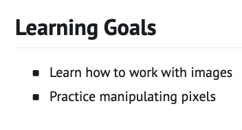
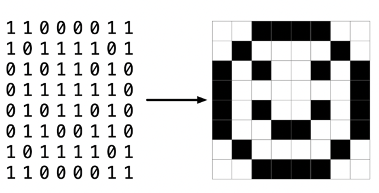
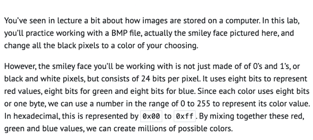
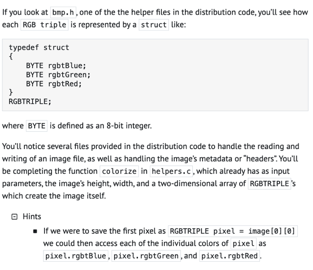
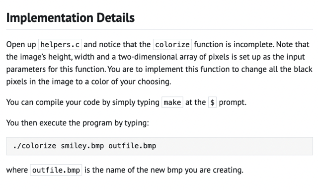
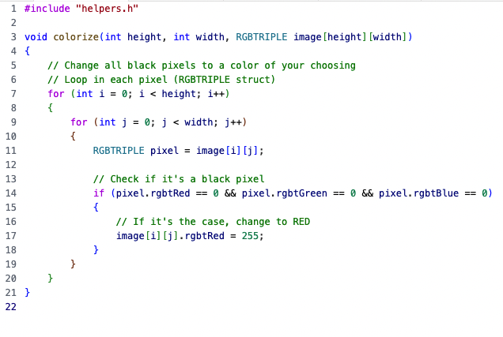
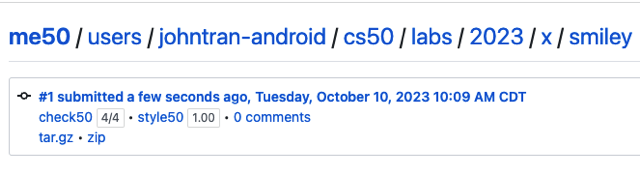
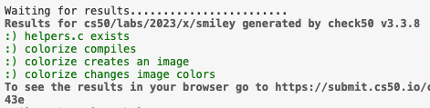
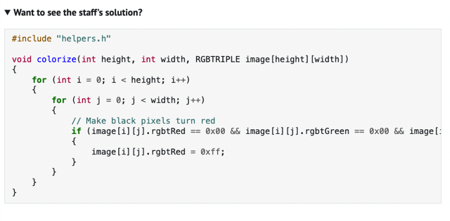

# Lab 1 Smiley

📊 **Progress:** `5` Notes | `10` Screenshots

---

<kbd></kbd>

 

<kbd></kbd>

 

<kbd></kbd>

> [!NOTE]
> Đại khái là trong picture, mỗi pixel "có" 3 bytes:
> 1 bytes cho value của Red, 1 bytes cho value 
> của Green, 1 bytes cho value của Blue.
>
> Với 1 bytes, thì như ta đã biết nó có thể thể hiện
> từ 0 (00000000 hay 0x00 trong `base-16)` tới 
> 255 (11111111 hay 0xff)
>
> Và như vậy combo mấy màu này có thể cover mọi
> màu

 

<kbd></kbd>

> [!NOTE]
> Đại khái là trong lib bmp.h có define một struct: 
> typedef struct {
> ...3 variable thuộc "loại" BYTE `=` `8-bit` integer.
> } RGBTRIPLE
>
> Ở đây nhớ lại int trong C được "cho" 4 bytes tức là
> 32 bits. Còn BYTE là integer `8-bit.` Thì mình hiểu 
> nôm na là int cần để chứa số nguyên, nên cần 32 bit
> (mà còn không đủ, khi muốn thể hiện số lớn hơn 2 tỷ
> phải cần đến long `=` 8 bytes `=` 64 bits)
>
> Còn BYTE có thể chỉ cần 8 bit để thể hiện một dải giá
> trị có max chỉ 255 là đủ.
>
> `====`
>
> Rồi một số điều mới biết đó là image nó có metadata
> hay còn gọi là headers. 
>
> Và với một pixel thuộc "loại" RGBTRIPLE ở trên thì
> có thể access các colors của nó (các variable của nó
> thuộc loại BYTE như mới nói) bằng .rgbtBlue, rgbtRed,
> .rgbtGreen. Cái này thì ko có gì khó hiểu, struct `-` nó chưa phải
> object nhưng cũng gần gần với object

 

<kbd></kbd>

> [!NOTE]
> Đại khái là mình sẽ "làm" function **colorize()** này.
> Để làm sao có thể nhận một 2D array các giá trị pixel của
> Image và chuyển đổi các màu đen thành màu mong muốn
>
> Ở dưới chỉ cách compile và chạy thử function, nó sẽ 
> nhận file image gốc cần chỉnh sửa smiley.bmp và xuất ra
> image (outfile.bmp)

 

## Thought Question

> [!NOTE]
> Thought Question
>
> How do you think you \**represent a black pixel\**
> when using a\**24-bit color BMP file\**?
>
> Is this the same or different when mixing paints
> to repesent various colors?

> [!NOTE]
> 1. A: Hình như là chuỗi số 0 hết tức là 
>
> 00000000 (Red), 00000000 (Green) 00000000 (Blue)
>
> Hay 0x00 Red, 0x00 Green, 0x00 Blue 
>
> Hay #000000
>
> Hay nói cách khác cả ba BYTE var rgbtRed, Green, Blue 
> của RGBTRIPLE đều `=` 0
>
> 2. A: Chưa hiểu câu hỏi.

 

<kbd></kbd>

> [!NOTE]
> Loop trong các pixel là các RGBTRIPLE struct
>
> Check có phải nó là black pixel không: nếu cả 3 variable: 
> `rgbtRed/Green/Blue` (loại BYTE là `8-bit` integer) đều bằng 
> 0 thì nó là Black
>
> Thì khi đó assign lại cái màu khác (bằng cách đổi giá trị 
> khác (từ `0-255))`

 

<kbd></kbd>

<kbd></kbd>

<kbd></kbd>

 

<kbd></kbd>

 

