# Lab 2: Volume

📊 **Progress:** `9` Notes | `16` Screenshots

---

<kbd>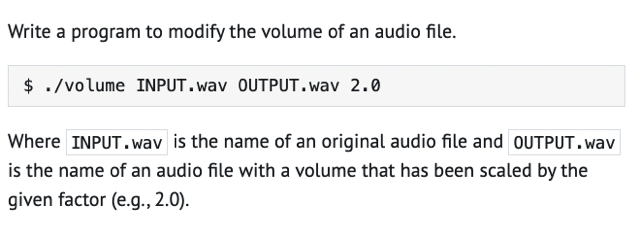</kbd>

> [!NOTE]
> Đổi volume của audio file

 

<kbd>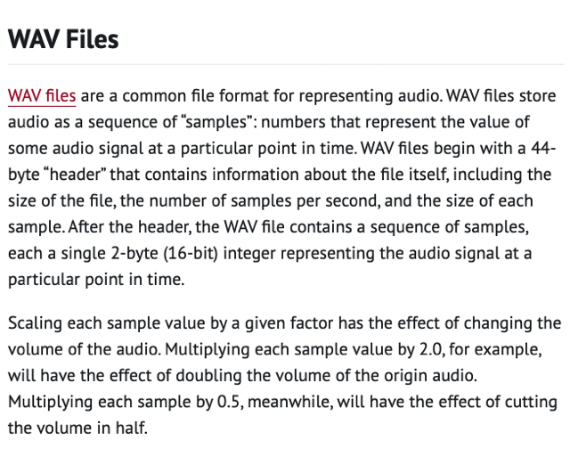</kbd>

 

<kbd>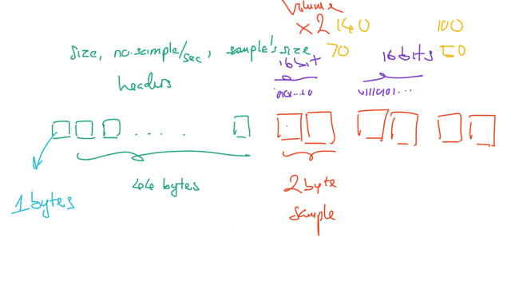</kbd>

 

<kbd>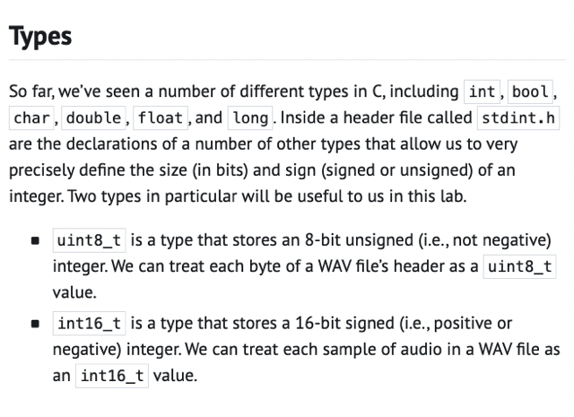</kbd>

> [!NOTE]
> Đại khái là cái thư viện stdint.h nó có declare sẵn một
> số loại (type) ví dụ như uint8_t, và int16_t.
>
> Unsigned (có chữ u phía trước như uint8_t) có nghĩa là
> nó dành hết 8 bits để chứa value. Và như vậy chỉ thể hiện
> số dương thôi. Do đó max của nó là 8 số 1: 11111111 = 255
>
> Nhưng Signed, ví dụ int8_t thì nó phải dành 1 bit đầu cho 
> "dấu (sign)" với 0 là số dương, 1 là âm. Thành ra chỉ còn 7 bit
> cho giá trị. Nên số dương lớn nhất chỉ còn + 127, và số âm 
> nhỏ nhất là -128.
>
> Tại sao: 
>
> Max: 0 (sign = số dương) còn lại 7 bit cho 7 số 1 hết thì ta có:
> 1*2^6 + 1*2^5 + 1*2^4 + 1*2^3 + 1*2^2 + 1*2^1 + 1*2^0
> = 64 + 32 + 16 + 8 + 4 + 2 + 1 = 127
> Min: 1 (sign = số âm) còn lại 7 bit cũng số 1 hết thì 
> 1 000000 sẽ là -1
> 1 000001 sẽ là -2
> ...
> 1 1111111 sẽ là -128
>
> ====
>
> Do đó với định nghĩa của WAV file trong đó 44 byte đầu tiên
> dành cho header thì ta có thể cho rằng nó chỉ số dương nên
> Ta có thể **"TREAT CÁC BYTE ĐÓ NHƯ uint8_t value"**Còn chuỗi samples mỗi sample là 2 bytes mang gía trị
> của âm thanh thì ta sẽ **TREAT CÁC BỘ 2 BYTES NÀY
> NHƯ int16_t value**

 

<kbd>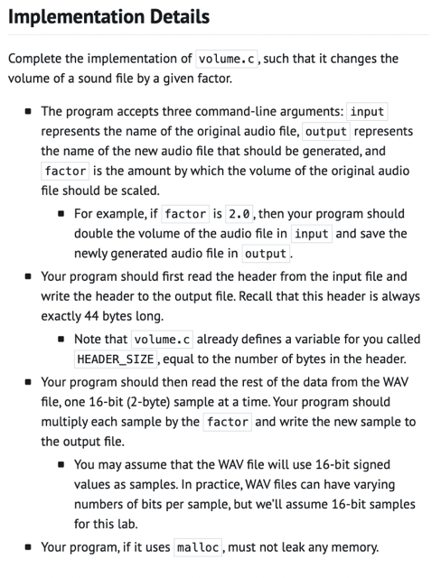</kbd>

> [!NOTE]
> Đại khái là function sẽ nhận 3 argument (nếu check
> phải check argc _argument count = 4) vì như đã biết
> cái tên function là 1 argument rồi
>
> Thì ta sẽ mở file gốc ra, mở file đích ra.
>
> Loop trong đó, hay đọc các byte trong đó
>
> Nôm na là 44 byte đầu tiên là header thì giữ nguyên
> chỉ ghi (write) y xỳ vào file đích
>
> Còn các 16 bits sample tiếp theo, thì nhân giá trị với
> Factor trước khi ghi vào file đích.
>
> Nôm na là vậy

 

<kbd>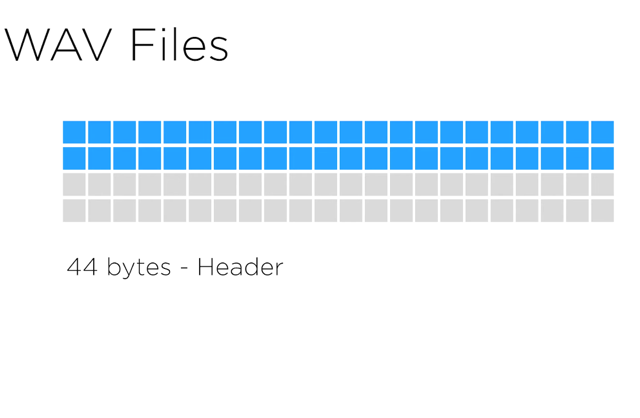</kbd>

 

<kbd>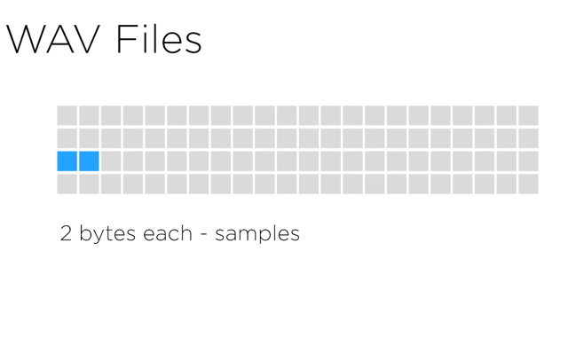</kbd>

 

<kbd>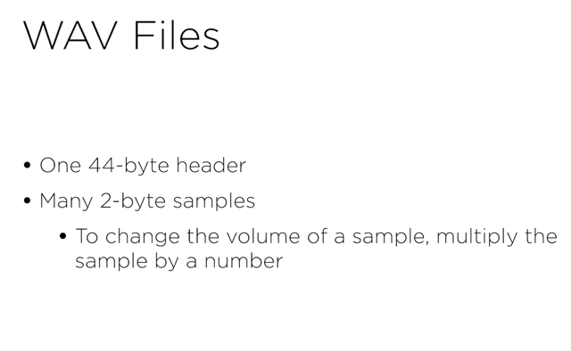</kbd>

> [!NOTE]
> các 2-bytes samples đơn giản chỉ là một con số,
> ví lí do gì đó mà sample được cho 2 bytes = 16 bits để thể hiện 
> giá trị. Có nghĩa là max của nó là 2^17 - 1 = 131071
> (Ở đây cứ nhớ vầy: ví dụ 8 bit thì max là 2^7+2^6.. 2^0 thì chính
> là bằng 2^8-1= 256-1 = 255. Nên tương tự nếu có 16 bit thì mã
> sẽ là 2^17-1 = 131071)
>
> Và việc nhân con số này lên sẽ tạo hiệu quả là  làm nhân (scale) 
> volume lên (cái này cứ biết vậy thôi)

 

<kbd>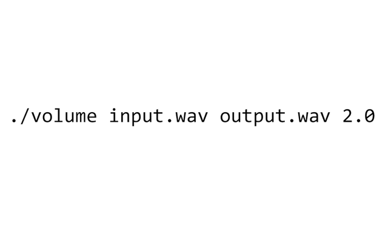</kbd>

> [!NOTE]
> Function sẽ nhận 3
> command-line argument

 

<kbd>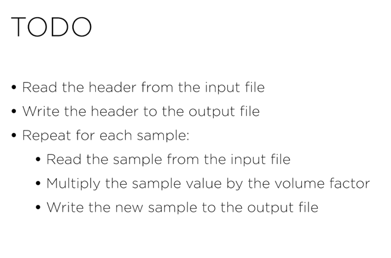</kbd>

 

<kbd>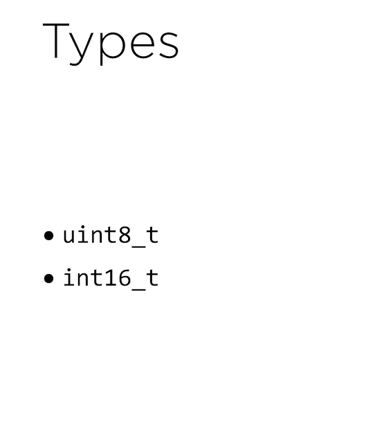</kbd>

 

<kbd>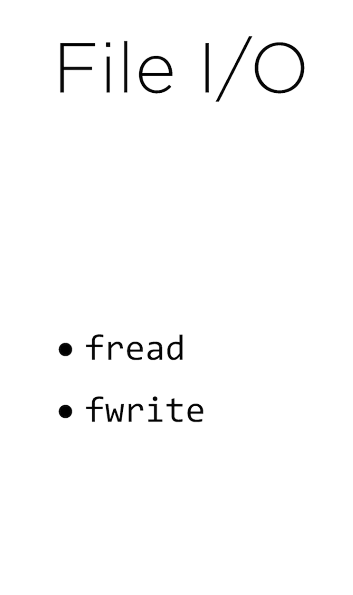</kbd>

> [!NOTE]
> Đọc doc

 

<kbd>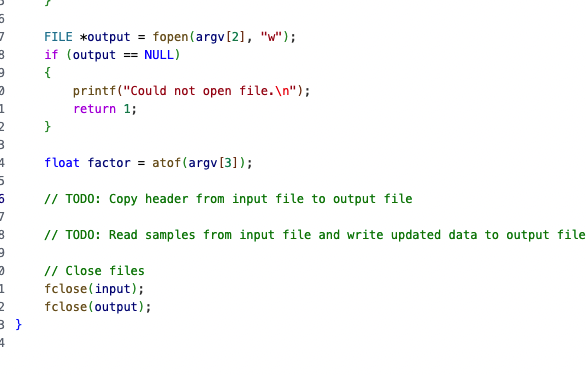</kbd>

> [!NOTE]
> Ổng nói khi copy header thì vì đã biết luôn có 44
> bytes của header nên chỉ việc read từ file gốc 44
> bytes đầu và write vào file đích thôi
>
> Còn đọc sample và nhân với factor rồi ghi vào
> file đích thì cần loop cho đến khi hết

 

<kbd>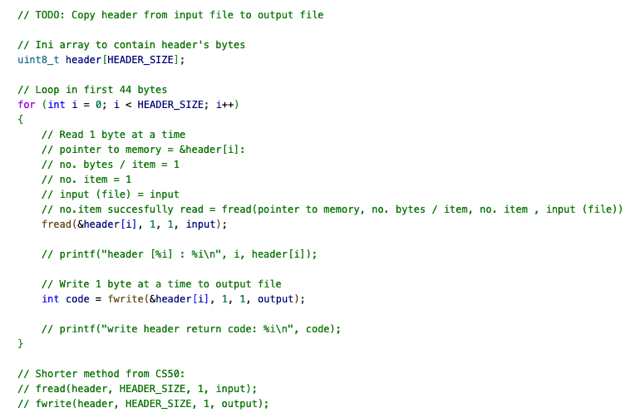</kbd>

> [!NOTE]
> Còn lại thì tự làm hết với các chú ý rút ra như sau:
>
> 1. Để hiểu function fread, nhận argument đầu tiên là một **pointer**:
>
> Ví dụ trong doc của họ:
>
> char c;  -> Tạo một vùng memory 1 byte cho c.
>
> fread(**&c**...) hoặc tạo**int *p = &c**; fread(**p**,....) cũng sẽ đúng -> Read file và **load thông
> tin vào vùng memory có ADDRESS là &c (hay p)**
>
> Tương tự như vậy: **uint8_t header[44];** -> **Tạo vùng memory rộng 44 bytes** cho
> header
>
> for loop..: fread(&header[i], 1, 1, input):  -> Có nghĩa là **read file và load data vào
> vùng memory mà  ADDRESS là &header[i]**====
>
> 2. Cũng có thể làm gọn, không cần phải "đọc 1 byte rồi bỏ vào array rồi ghi vào
> file output 1byte". Vì fread cho phép **đọc nhiều byte**, quy định bởi arg size (thứ 2) 
>
> Nên làm theo solution của họ thì như sau:
>
> fread(**header**, **HEADER_SIZE**, 1, input); 
>
> fwrite(**header**, **HEADER_SIZE**, 1, output);
>
> Thì cơ bản là bảo máy tính **đọc và load data 44 byte** vào **vùng memory tại
> header** và sau đó là **ghi vào output data** tại vùng memory của header.
>
> Chú ý là **header ở đây thì không cần dùng &header**.
>
> Có thể lí giải là vì **bản thân header là array thì** **nó cũng là pointer** (tới các
> int16_t) rồi.
>
> Cũng như trong bài giảng có chỗ khi dùng s - string thì không cần & vì **bản thân
> nó là pointer rồi**

 

<kbd>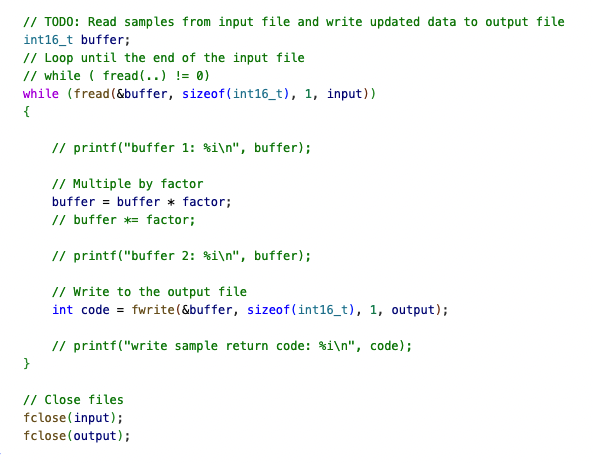</kbd>

> [!NOTE]
> Sai một chỗ khiến code work đúng khi factor 2.0,
> 3.0 nhưng không khi factor 0.5: Đó là nhầm lẫn
> **int16_t** thì lại ghi là **uint16_t**. Phải search google
> mới phát hiện.

 

<kbd>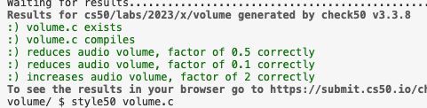</kbd>

 

