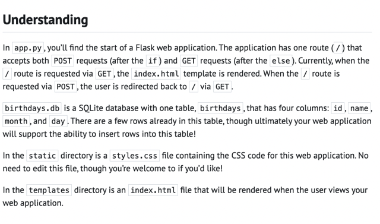
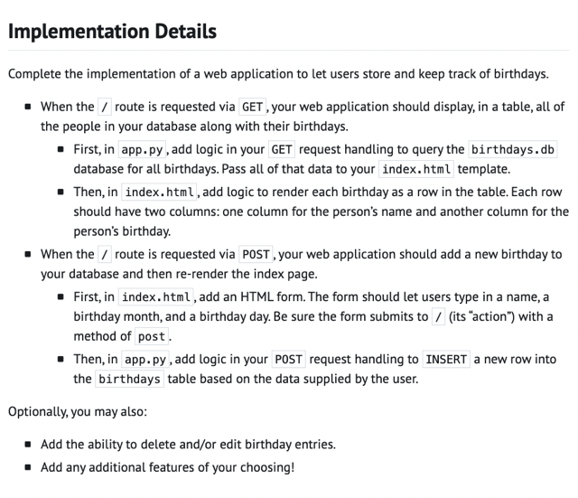
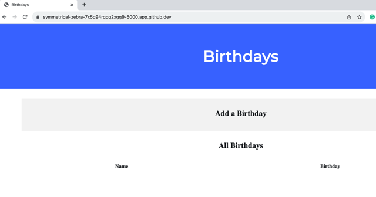
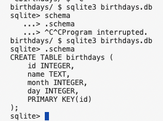
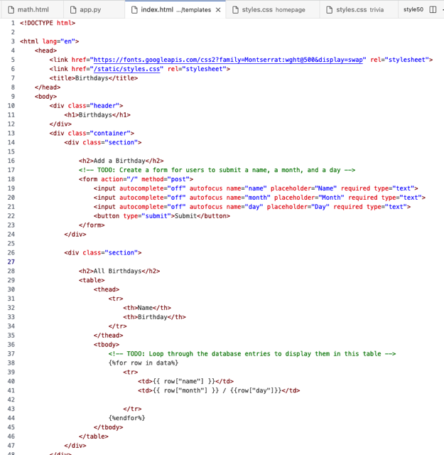
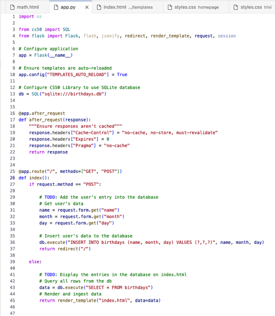

# Lab: Birthdays

📊 **Progress:** `3` Notes | `6` Screenshots

---

<kbd></kbd>

 

<kbd></kbd>

 

<kbd></kbd>

> [!NOTE]
> Đầu tiên chạy **flask run** để start runing server
> và open cái url default "url nó `generate/"` xem
> thử cái page nó như thế nào

 

<kbd></kbd>

> [!NOTE]
> Đầu tiên là gọi (command liên command)
> **sqlite3 birthdays.db**
>
> và **.schema** để xem thử cái db này nó có các
> column ra sao

 

<kbd></kbd>

 

<kbd></kbd>

> [!NOTE]
> QUAY LẠI SAU THÊM
> TÍNH NĂNG `DELETE/EDIT`
> VÀO

 

