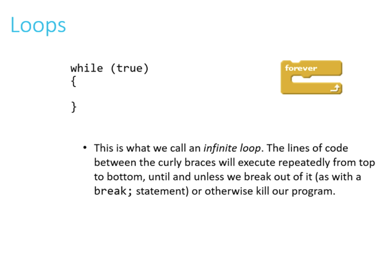
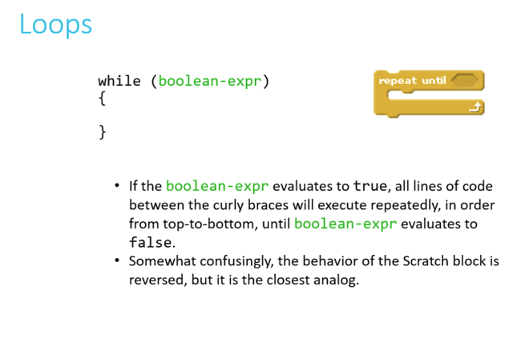
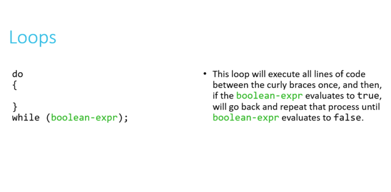
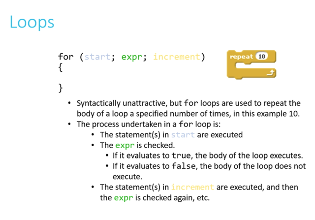
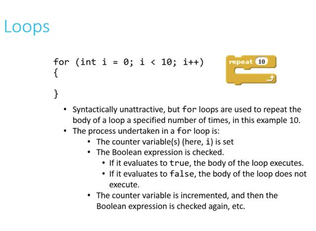
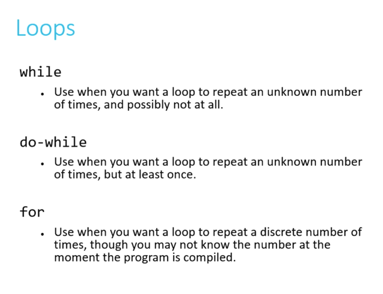

# Loops

📊 **Progress:** `4` Notes | `7` Screenshots

---

<kbd></kbd>

> [!NOTE]
> Forever loop

 

<kbd></kbd>

 

<kbd></kbd>

> [!NOTE]
> Do while make sure code
> chạy ít nhất 1 lần

 

<kbd></kbd>

<kbd></kbd>

<kbd></kbd>

> [!NOTE]
> Cơ bản không có gì

 

<kbd></kbd>

> [!NOTE]
> dùng while khi muốn repeat 1 số lần chưa biết,
> thậm chí vô hạn. Do while tương tự nhưng ít
> nhất run 1 lần. Còn for loop thì khi có 1 số nhất
> định lần muốn run

 

