# Main Lecture

📊 **Progress:** `136` Notes | `208` Screenshots

---

<kbd></kbd>

> [!NOTE]
> Đại khái tuần trước ta đã dùng **http-server** này, được
> **cài sẵn trong cs50** cho phép **serve cái webpage**
> của mình. Thì đại khái là nó chỉ là một trong các
> tools như vậy

 

<kbd>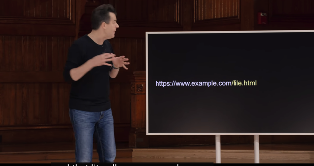</kbd>

<kbd></kbd>

<kbd></kbd>

> [!NOTE]
> Ta cũng nhớ `.../` là **original
> address**, và có thể có **path**

 

<kbd></kbd>

> [!NOTE]
> ở đây ta sẽ gọi chung là "**route"** `-`
> common terminology

 

<kbd></kbd>

 

<kbd></kbd>

> [!NOTE]
> Nhắc lại chút về nội dung của cái phong bì mà Phyllis
> gửi cho Brian. Nó sẽ có cái **host**, kiểu như **địa chỉ**, và
> Cái query **search?q=cats** ổng nói **cần phải có một
> cái giúp parse nó ra**

 

<kbd></kbd>

 

<kbd></kbd>

> [!NOTE]
> **Flask** là framework cho phép ta kiểu như
> **kết dính các ngôn ngữ khác như html, css,
> sql, js lại**

 

<kbd></kbd>

> [!NOTE]
> **Jinja** không phải là programming language mà
> là c**ollection các syntax.**
>
> Và ổng **cũng phổ biến** khi một**framework này
> lại `mượn/dùng` một language khác** kiểu như
> để khỏi phải reinvent the wheel

 

<kbd>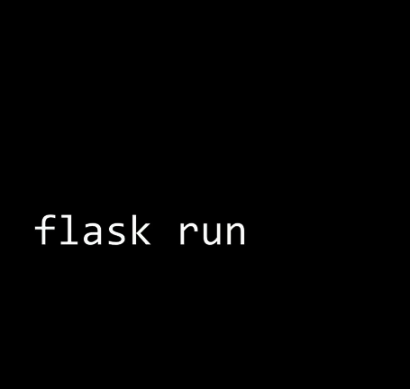</kbd>

> [!NOTE]
> **Bootstrap** là lib **giúp làm
> webpage nhanh hơn dễ hơn**
> thì **flask** sẽ giúp trong việc tạo
> **web server**

 

<kbd></kbd>

> [!NOTE]
> Và để build một cái google.com với
> flask thì đây là convention, ta cần
> **app.py** và **templates**

 

<kbd>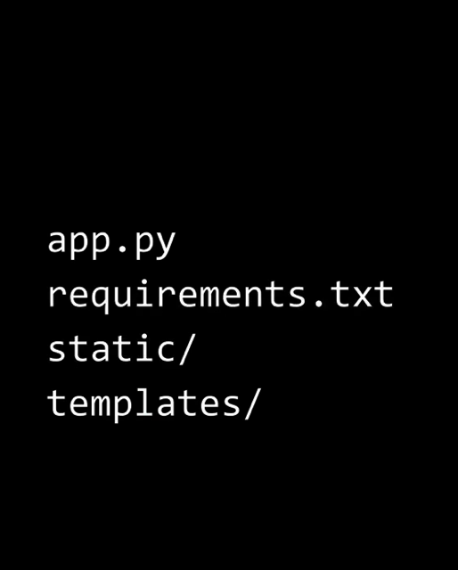</kbd>

> [!NOTE]
> Ngoài ra còn có **requirements.txt** là nơi **chứa
> các lib** mà có thể ta cần.
>
> và **static/** là nơi **chứa các static file** như image,
> css, js

 

<kbd></kbd>

> [!NOTE]
> Đại khái ổng nói đây, đoạn code này là cách để ta 
> **implement và serve một web application** sao cho**khi 
> có ai đó truy cập** sẽ in ra chữ hello world
>
> Nhìn qua có thể thấy bắt đầu với việc**import Flask,**
> **render_template**
>
> Xong để mấy dòng sau sẽ giải thích sau nhưng có cái
> quen quen đó là **index.html**

 

<kbd>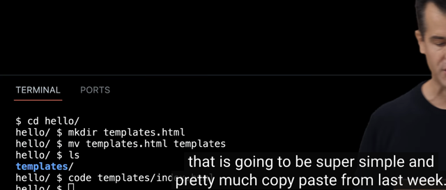</kbd>

 

<kbd>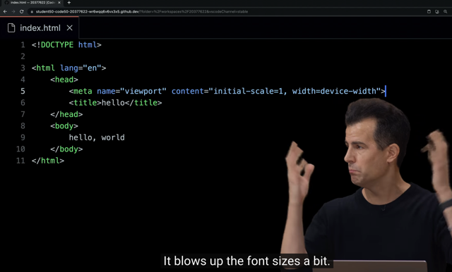</kbd>

> [!NOTE]
> Xong ổng tạo file simple này, chỉ có chữ **hello, world**.
>
> Và để  nó có thể **view tốt trên mobile** ta thêm dòng code **magical:
>
> <meta `name="viewport"` content `=` `"initial_scale=1,` width=device-width">**

 

<kbd>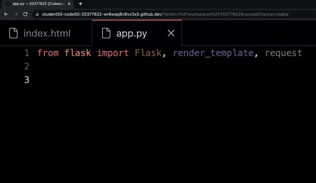</kbd>

> [!NOTE]
> Xong ổng tạo file **app.py** (như convention nói hồi nãy).
>
> Và đầu tiên, **import Flask, `render_template,` request**
> từ flask. Thì ổng nói cái này do tui đọc trong doc, nên
> biết và làm theo vậy, đây là 3 cái building block giúp
> ta làm

 

<kbd></kbd>

> [!NOTE]
> Đại khái ổng hỏi là có ai nhớ tại sao lại để **__name__**như vầy không (tương tự ở đâu đó đã học)?
>
> D: Thì đại khái là đây là cách để cho máy tính nó biết ta
> muốn "**biến cái file này thành Flask application**" chứ không
> phải gọi nó. Chưa hiểu lắm

 

<kbd>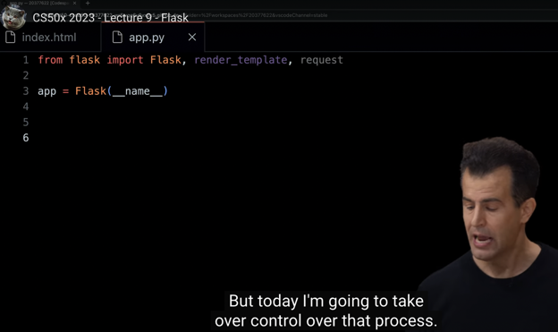</kbd>

> [!NOTE]
> Thì đại khái tiếp theo là ở đây, "tôi sẽ là người **chịu trách
> nhiệm cho việc serve cái file nào** khi được request.
>
> Mà tuần trước với **http-server**, nó "làm giùm mình"
>
> Còn bây giờ nôm na là ta sẽ **viết function**, **handle việc serve `/` trả
> kết quả** khi được request (từ web browser). Hay chính là
> viết API

 

<kbd>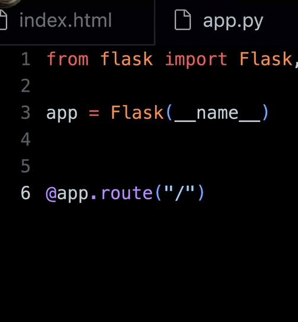</kbd>

> [!NOTE]
> **@app.route()** ổng nói là gọi là Python **decorator**
>
> Và **@app.route("/")** sẽ thể hiện là đây là đoạn
> code mà ta muốn nó**execute khi nhận
> request là slash ".../"** `=` khi user visit **default page**của website

 

<kbd>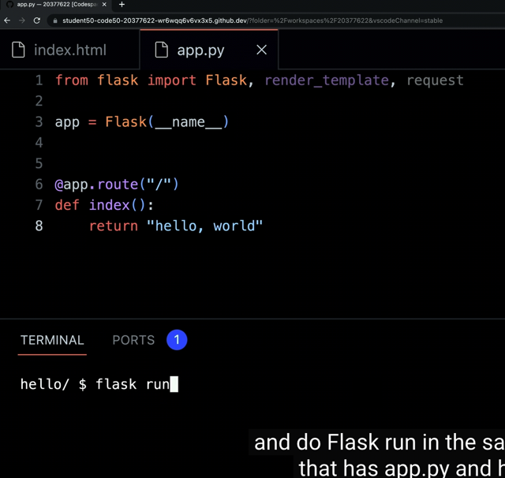</kbd>

> [!NOTE]
> Và ta return "hello, world"
>
> Gọi flask run để start server

 

<kbd>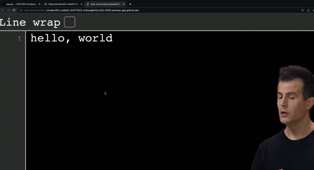</kbd>

<kbd></kbd>

<kbd>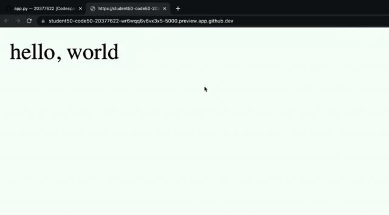</kbd>

> [!NOTE]
> thì kết quả (khi mở link bằng web browser) ta cũng thấy dòng 
> chữ hello, world nhưng inspect thì thấy nó chỉ là dòng text `-` 
> Chính là kết quả trả về của function index()

 

<kbd>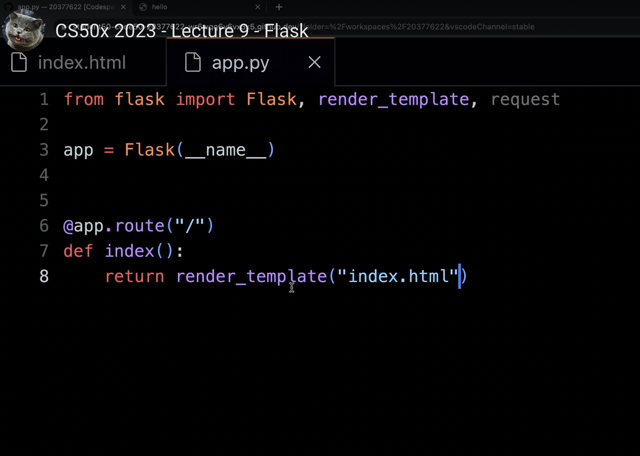</kbd>

> [!NOTE]
> Và khi ta muốn nó **serve/trả về cái file `/` page index.html** thì ta
> có thể làm vầy: **render_template("index.html")**

 

<kbd>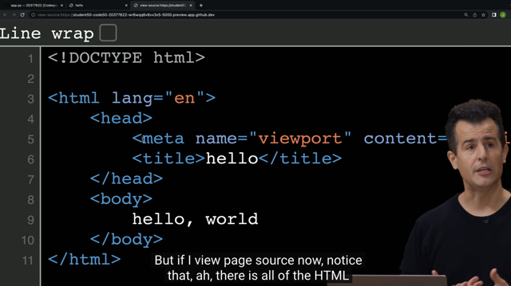</kbd>

> [!NOTE]
> Và kết quả cũng chỉ là dòng chỉ **hello, world** nhưng
> inspect sẽ thấy nó (response) là cái **html code** ở trong
> **index.html chứ không phải text khơi khơi**

 

<kbd>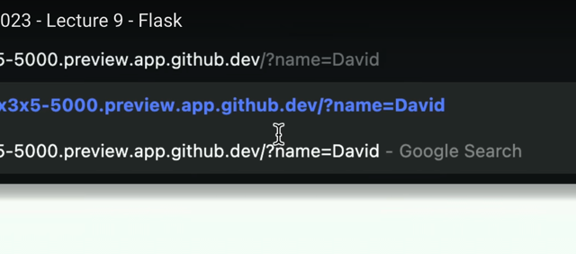</kbd>

> [!NOTE]
> Kế tới ổng muốn làm cái mà tuần trước với
> **http-servers không thể giúp** được đó là làm sao
> để user khi visit url **.../?name=David** thì nó serve
> **"Hello, David"**

 

<kbd>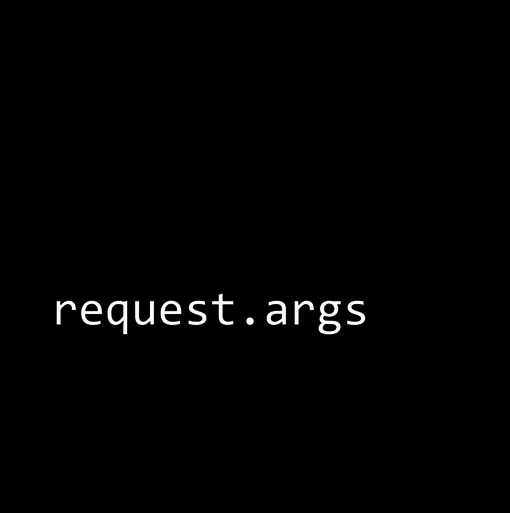</kbd>

> [!NOTE]
> Thì muốn vậy phải dùng cái **request**: cụ thể là
> **request.args** sẽ mang **argument** gửi lên với
> request

 

<kbd></kbd>

> [!NOTE]
> Thì dùng như vầy, ổng **check xem 'name' có trong** 
> **request.args** không có thì lấy ra (**request.args['name']**)
> không thì cho name `=` 'world'
>
> Thì question là dựa vào đây thử đoán cái request.args
> có data type là cái gì?
>
> A: **dictionary**D: Correct

 

<kbd>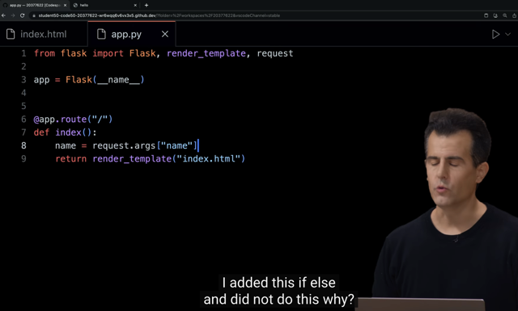</kbd>

> [!NOTE]
> Xong ổng nói chuyện gì sẽ xảy ra khi tui cứ **blindly** 
> **lấy cái value của key name** ?
>
> A: **Nếu dictionary không có key name**, thì nó sẽ bị **lỗi
> không tìm thấy key
>
> D: Correct**

 

<kbd>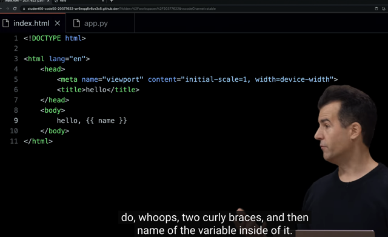</kbd>

> [!NOTE]
> Thì có vài điều ở đây:
>
> Ta muốn nó **place holder cho một cái name value**
> được đưa vào (để có thể hiện hello, David.)
>
> Thì đây chính là **convention của flask** (mà thật ra
> chính cái này**{{..}}** là Jinja, như đã nói, không phải
> programming language mà là **syntax**)
>
> Thì cái này tương đương **%s** trong C, **f"{}"** trong
> Python, **?** Trong SQL....

 

<kbd>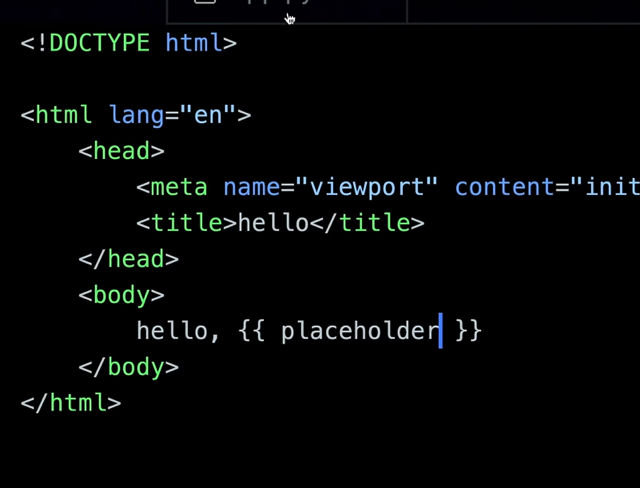</kbd>

<kbd></kbd>

<kbd>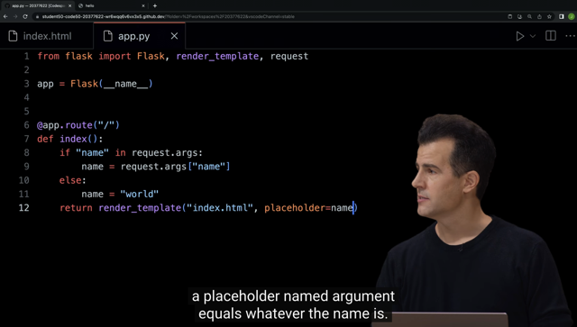</kbd>

> [!NOTE]
> thì, **render_template** sẽ nhận sau cái **arg đầu
> tiên**là cái **file** thì những arg cái sau là các**argument
> value cho các place holder**
>
> Trong file ta để {{**placeholder**}} thì gọi ở đây sẽ gọi 
> `render_file("index.html",` **placeholder** `=` name)

 

<kbd>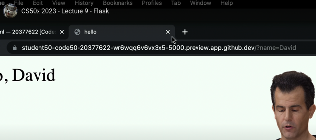</kbd>

> [!NOTE]
> Kết quả là ta đã có thể show Hello David
> khi user access `".../?name=David"`

 

<kbd>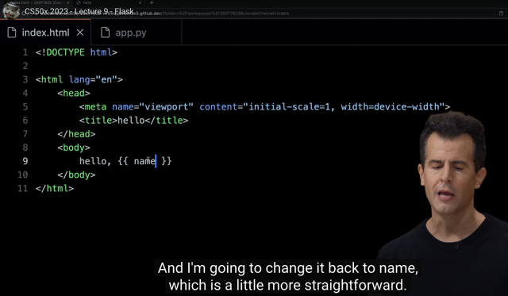</kbd>

<kbd></kbd>

<kbd>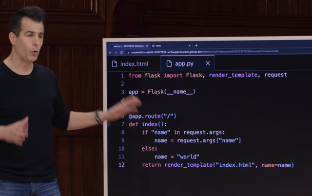</kbd>

> [!NOTE]
> Xong ổng nói để **place_holder** không ổn vì **không thể hiện
> được ý nghĩa**, và sẽ **có thể có nhiều place holder khác**,
> nên ổng đổi về lại **name**, và ta sẽ phải chấp nhận dù nhìn
> **có vẻ hơi stupid** trong code **name=name**. Nhưng đó là
> the norm, là **thông thường người ta cũng làm vậy**

 

<kbd>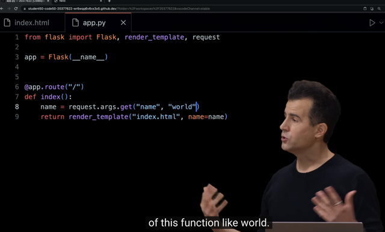</kbd>

> [!NOTE]
> Kế đến thay vì**access dictionary theo lối thông thường []**,
> thì python có support **get(key, default value)**. Trong đó
> nếu không define default value thì khi không có key nó sẽ
> trả về **'None'**
>
> Ta có thể override cái default value là "world" này do đó không 
> cần phải check if else nữa

 

<kbd>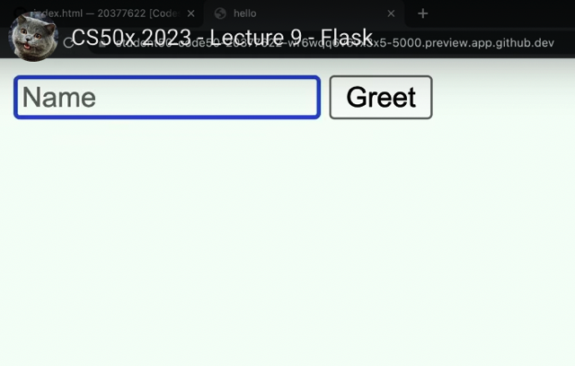</kbd>

<kbd></kbd>

<kbd>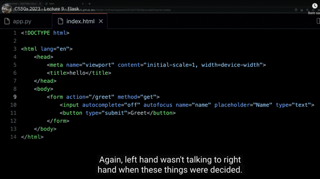</kbd>

> [!NOTE]
> Kế tiếp ổng đổi thành thế này, tạo cái **form** với các
> attribute như bữa trước đã biết qua như **autocomplete**,
> **autofocus** **placeholder**
>
> Sau đó ổng nói tui sẽ **vừa làm front end vừa làm back
> end**, với cái này: **action="greet"** **method="get"**.
>
> Ý là đoạn code này sẽ **handle hành động sau khi user
> submit button Greet**. Đó là nó sẽ **truy cập url ".../greet"**với****method**GET**và**với submit nó sẽ gắn `?name="giá` trị enter vào form"**

 

<kbd>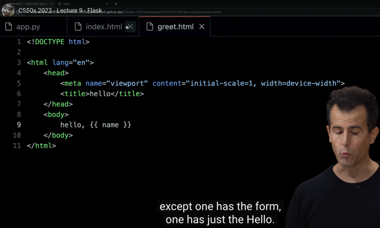</kbd>

> [!NOTE]
> Tiếp, ổng tạo html file thứ hai **greet.html**

 

<kbd>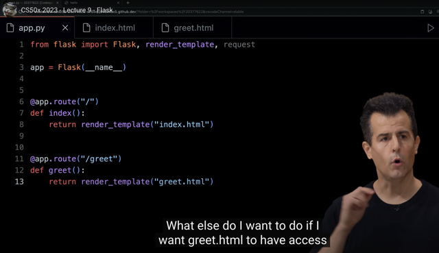</kbd>

> [!NOTE]
> Và tạo function **@app.route("/greet")** như vầy. Nhưng
> question là nếu tôi muốn nó hiện thị "hello, David" thì phải
> sửa ntn?
>
> A: `@app.route("/greet")`
>         name `=` request.args.get("name", "world")
>         return `render_template("greet.html",` `name=name)`
>
> D: Correct!

 

<kbd>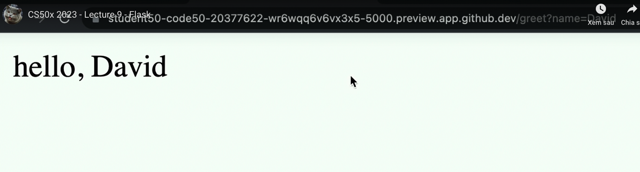</kbd>

<kbd></kbd>

<kbd>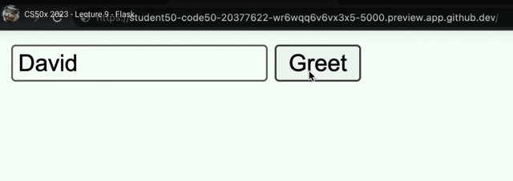</kbd>

> [!NOTE]
> Kết quả là khi click button Greet, url đổi từ `.../`
> thành **.../greet?name=David** và với `../greet,` server
> sẽ serve file **greet.html,**nhét name vào place holder

 

<kbd></kbd>

> [!NOTE]
> Xong ổng hỏi là tới đây có thể có ai đó nghĩ rằng đây
> không phải good design, tại sao?
>
> A: Vì chỉ có **1 cái đơn giản mà phải tốn 2 file html**
>
> D: Correct. Đại khái là vì **hai cái file chỉ khác  nhau chỗ cái
> body.**
>
> Gỉai pháp là **Layout**

 

<kbd>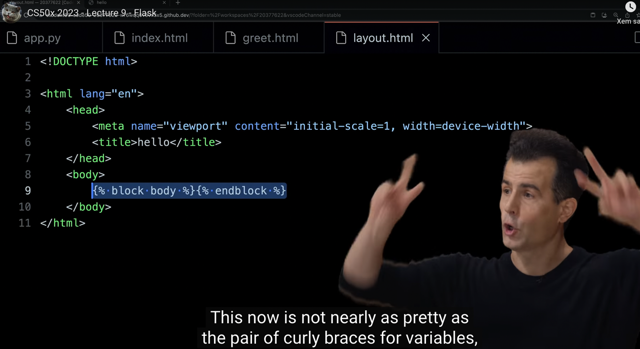</kbd>

> [!NOTE]
> ổng mới tạo file **layout.html** như vầy, trong body 
> Dùng một syntax của **jinja**: ****
> Thì đại khái nó **cũng là một placeholder**

 

<kbd>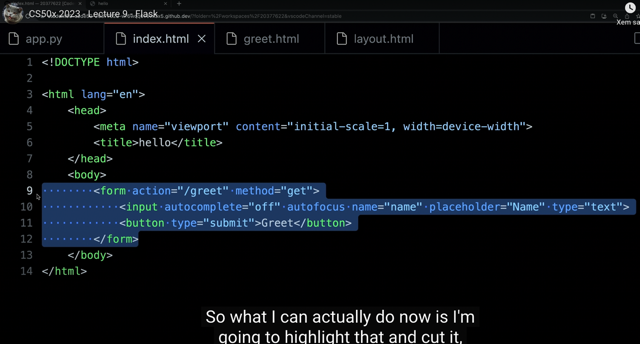</kbd>

<kbd></kbd>

<kbd>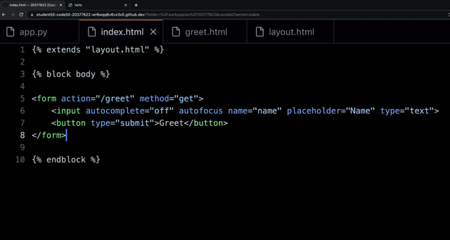</kbd>

> [!NOTE]
> Rồi qua file index.html sửa lại thành vầy, bỏ hết chỉ giữ cái 
> form
>
> Thì cái dòng đầu tiên  đại khái 
> sẽ bảo máy tính là, hãy**lấy cái file layout.html** và **có nhiêu 
> trong đó thì show ra**, có điều, trong cái block tên là body của 
> nó (layout.html) thì show cái nội dung dưới đây".
>
> và nội dung sẽ nằm ở trong hai cái 
> và 

 

<kbd>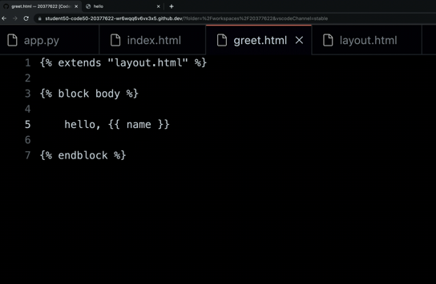</kbd>

<kbd></kbd>

<kbd>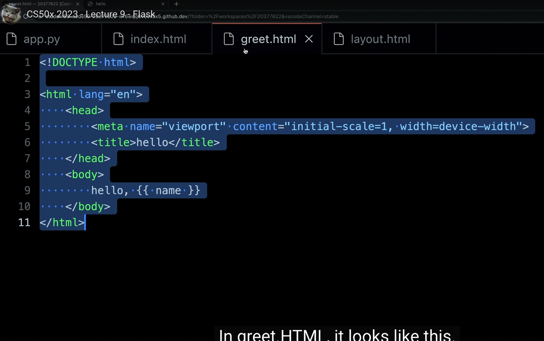</kbd>

> [!NOTE]
> Tương tự như vậy đối với file **greet.html**
>
> Chú ý rằng, trong **app.py** vẫn là **serve hai file**,
> **index.html** và **greet.html**, chẳng qua, nội dung
> hai file thay vì bị duplicate nhiều chỗ giống nhau
> như header,...thì giờ sẽ được khắc phục bằng
> việc **cùng lấy phần đầu và đít từ file layout.html**

 

<kbd>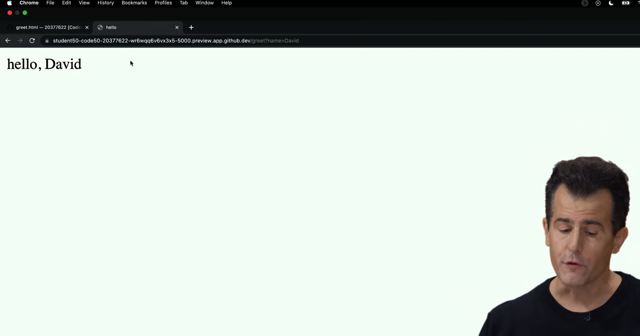</kbd>

> [!NOTE]
> Kết quả run lại thì vẫn không đổi, nhưng code thì tốt hơn

 

<kbd>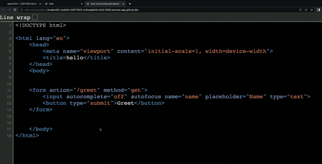</kbd>

> [!NOTE]
> và khi ta inspect sẽ thấy, nội dung ở **phần đầu sẽ lấy từ
> layout.html**, và nó (máy tính) **gắn cái body chứa cái  form
> define trong index.html vào**.
>
> Và vì nó nhét vào nên indentation không đẹp lắm nhưng
> ổng nói indentation (trong html) là để cho human xem chứ
> máy nó  không care

 

<kbd>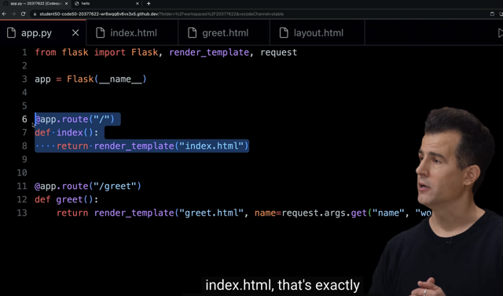</kbd>

<kbd></kbd>

<kbd>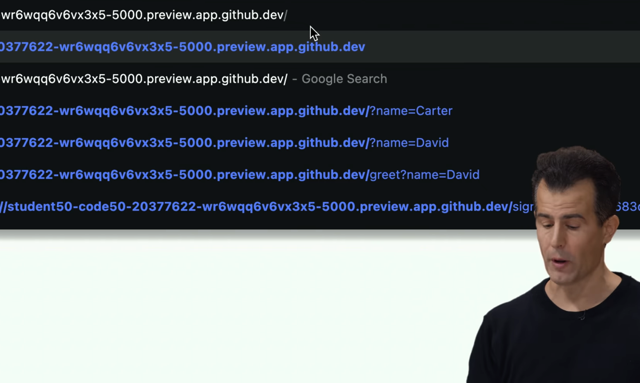</kbd>

> [!NOTE]
> Trả lời câu hỏi là l**àm sao biết chắc user visit họ sẽ tới cái 
> form trước** (index.html) 
>
> D: Thì đó là vì ta define `@app.route("/")` 
> `->` `"..(hostname).../"` là default

 

<kbd>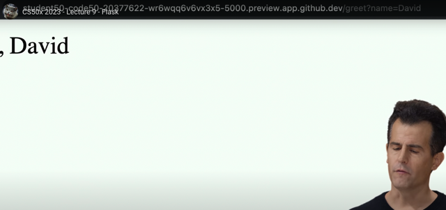</kbd>

> [!NOTE]
> Q: Tại sao đây là bad design. Khi tui gõ tên tui
> vào và nó hiện lên url như vầy
>
> A: Vấn đề security, khi nó hiện thông tin cá nhân
> trên url. Thằng nào đó ngồi gần có thể nhìn lén
> và biết name, password của mình

 

<kbd>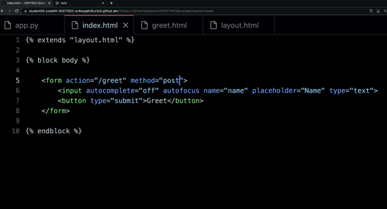</kbd>

> [!NOTE]
> Có cách giải quyết đơn giản là **thay "get" bằng "post"**

 

<kbd>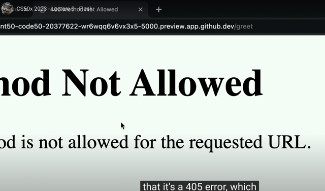</kbd>

> [!NOTE]
> Nhưng submit tên vào nó ra lỗi này 405 error

 

<kbd>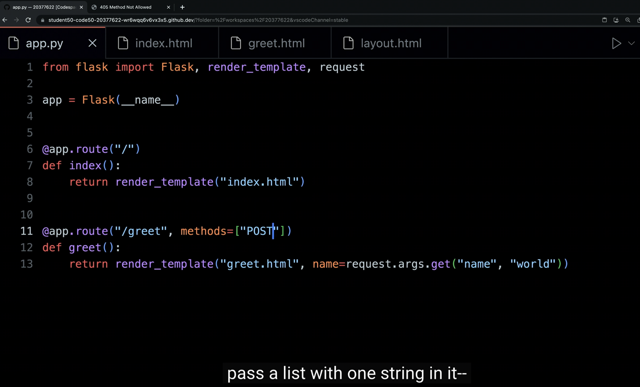</kbd>

> [!NOTE]
> Ta cần **sửa lại app.py**, với việc thêm arg **methods**, mà 
> vốn dĩ **default** **khi không khai báo gì thêm sẽ là GET**,
> ta sẽ **define methods `=` ["POST"]**
>
> Thì ổng nói đại khái là máy tính sẽ vẫn đọc thông tin
> đại khái trong envelope **nhưng đưa nó vào `header/` 
> nôm na là che giấu nó**
>
> Chỗ này David quên sửa lại (lúc sau mới sửa) là với POST
> phải dùng **request.form.get("name", "world")**chứ không
> phải**request.arg.get("name", "world")**

 

<kbd>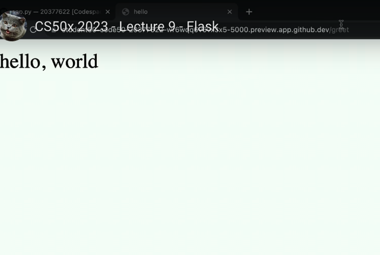</kbd>

<kbd></kbd>

<kbd>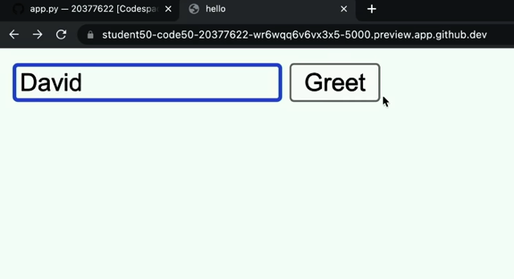</kbd>

> [!NOTE]
> Kết quả là, nó sẽ **vẫn show hello David** nhưng**không
> show tên David trên url**

> [!NOTE]
> (Thật ra là cái bug (Không show David) mà ổng cũng không
> để ý, sửa lại dùng request.form thay vì request.arg thì sẽ
> được)

 

<kbd>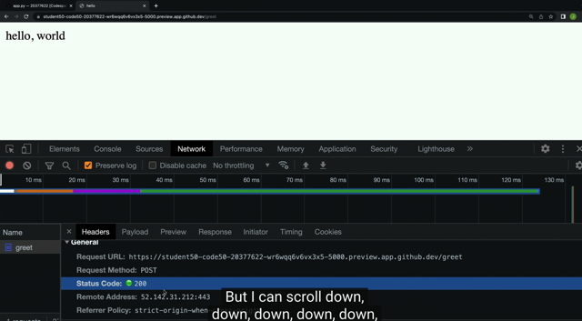</kbd>

<kbd></kbd>

<kbd></kbd>

> [!NOTE]
> Đại khái ổng cho xem lại cái **payload** của
> **Inspection** khi click Submit **để thấy cái tên David
> được gửi lên.**
> Và nói là bạn**có toàn quyền access tới các thông
> tin mà browser gửi tới cho bạn.**

 

<kbd></kbd>

 

<kbd>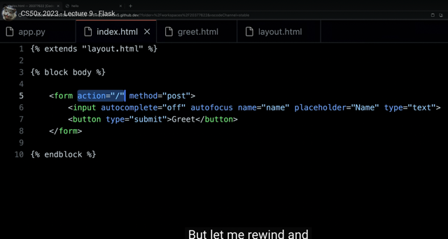</kbd>

<kbd></kbd>

<kbd>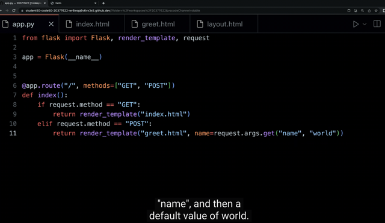</kbd>

> [!NOTE]
> Kế tiếp ổng nói ở đây thật ra tui **không cần tới 2 route  khác
> nhau**.
>
> Mà **chỉ cần dùng cái default path "/"** và **check  cái method
> để nếu là GET** `=` là method default thì tui **serve nó cái
> index.html.**
>
> Còn **nếu nó là POST** (khi submit cái form, có method là
> POST) thì nó s**erve cái greet.html**

 

<kbd>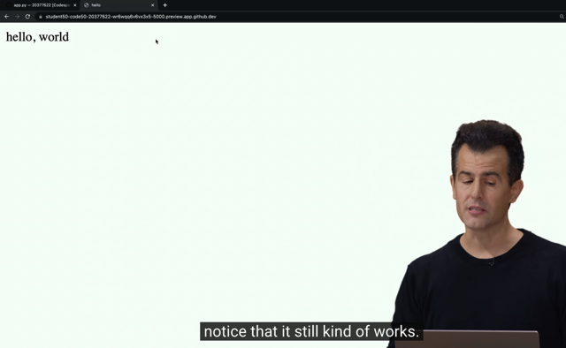</kbd>

<kbd></kbd>

<kbd>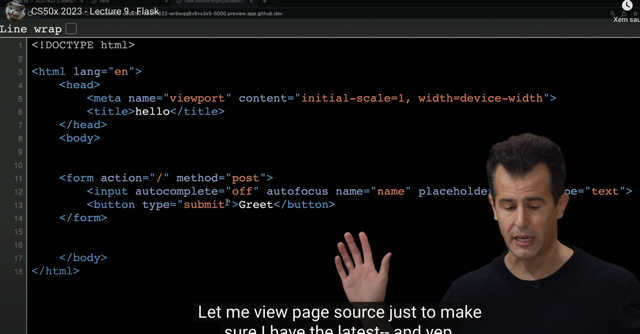</kbd>

> [!NOTE]
> Kết quả nó vẫn như vậy và **chỉ cần 1 route**

> [!NOTE]
> (Thật ra là cái bug, đáng lẽ phải hello David mà ổng
> cũng không để ý, sửa lại dùng **request.form** thay vì
> **request.arg** thì sẽ được)

 

<kbd>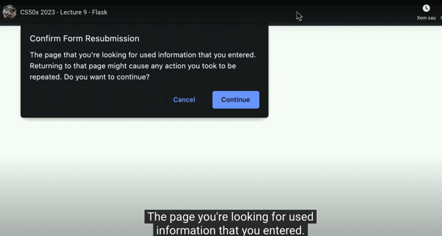</kbd>

> [!NOTE]
> Khi reload, nó sẽ hỏi confirm. Thì cái này chỉ là **browser
> nó careful** giống như khi ta add item vào giỏ hàng trên
> tiki và reload thì nó cũng sẽ confirm.
>
> Thì có thể **click vào url và nhấn enter** (thay vì bấm nút
> reload)

 

<kbd>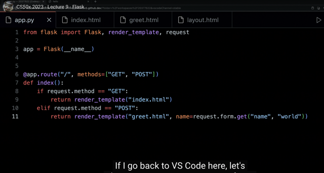</kbd>

<kbd></kbd>

<kbd></kbd>

> [!NOTE]
> Xong để sửa cái bug là submit với David mà nó vẫn hiện
> hello world, thì mới nói qua là **với POST**, thì cái argument (ở
> đây là name enter vào) phải lấy từ **request.form** thay vì
> **request.arg `-` vốn chỉ dùng cho GET**

 

<kbd></kbd>

> [!NOTE]
> Tới đây ổng nói về cái web hồi xưa ổng làm,
> cho phép **user register sport**gì đó. Giờ ta
> thử sẽ làm lại

 

<kbd>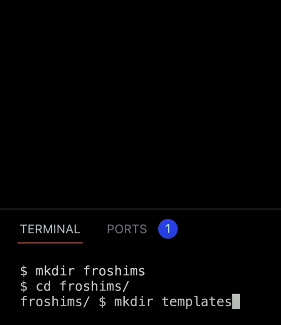</kbd>

 

<kbd>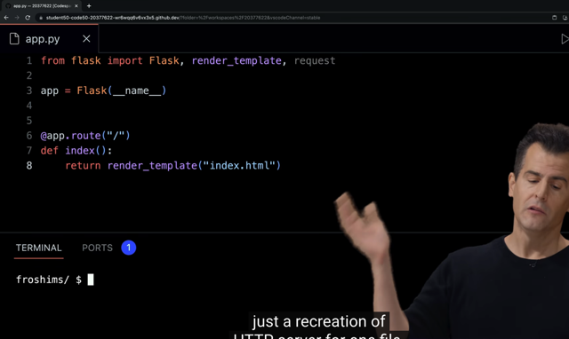</kbd>

> [!NOTE]
> Đầu tiên ổng code cái**app.py để serve html file**

 

<kbd>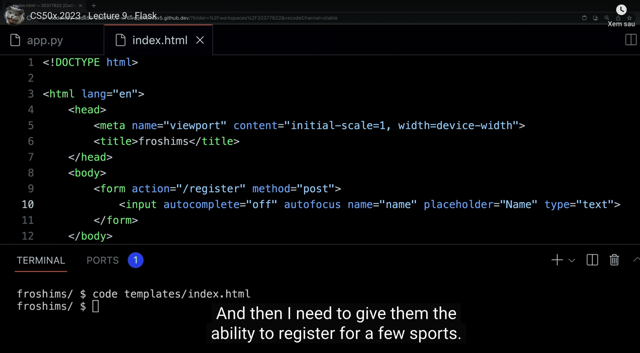</kbd>

> [!NOTE]
> File index thì có cái **form** như hay làm thôi  với các
> **argument**, **action="/register"** phương thức **post**.
>
> Như đã biết có nghĩa là khi **submit** nó sẽ gọi **url: .../register**, 
> với method **POST, và gửi thông tin name lên.**Chú ý là ở đây mình để **name `=` "password"** thì trong 
> kia sẽ lấy ra: **request.form.get("password", "default value")**

 

<kbd>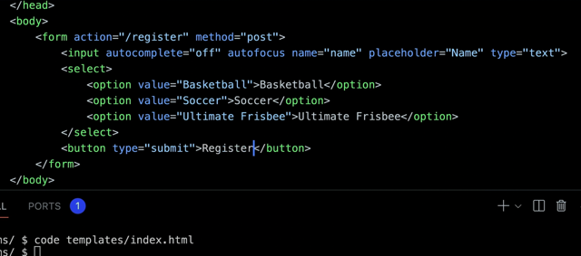</kbd>

> [!NOTE]
> Ở dưới ổng làm cái "Selection" để chọn
> với **<select> tag** và **<option>** như này

 

<kbd>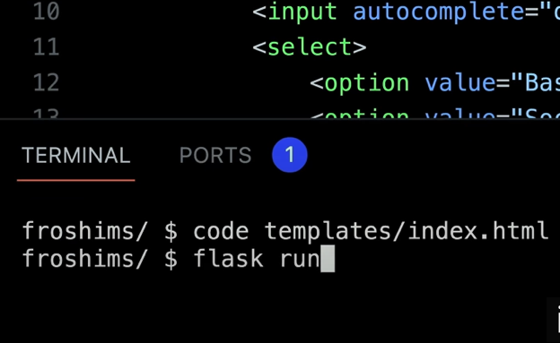</kbd>

> [!NOTE]
> Chạy **flask run** để start server

 

<kbd>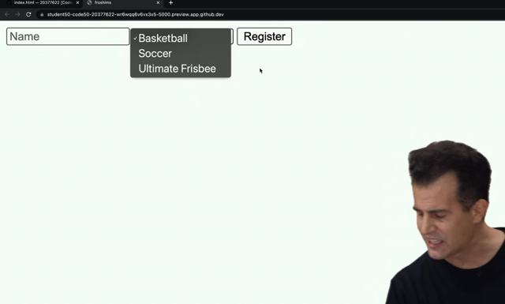</kbd>

> [!NOTE]
> Thì nó ra vầy, cũng ok, nhưng ổng nói để tui cải tiến chút xíu
> để cho nó đừng có chọn basketball sẵn như vậy

 

<kbd>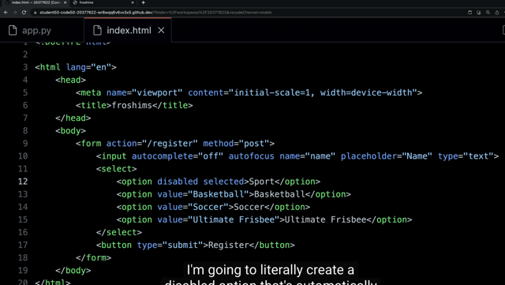</kbd>

> [!NOTE]
> Bằng cách là ổng **thêm một option tên** là**Sport** để dạng
> **disabled**, và **chọn sẵn (selected)**

 

<kbd>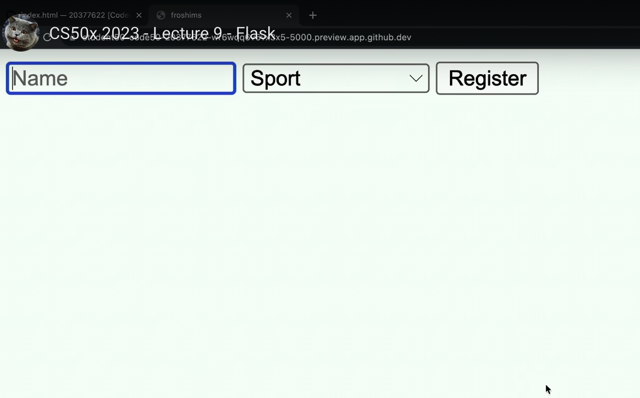</kbd>

<kbd></kbd>

<kbd>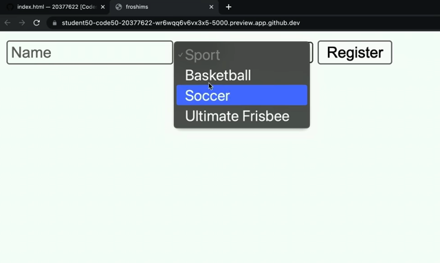</kbd>

> [!NOTE]
> Thì nhìn nó better, kiểu như Sport giống như cái title vậy

 

<kbd>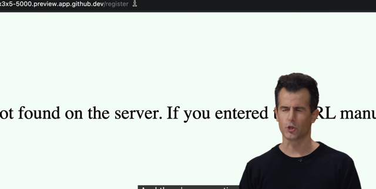</kbd>

> [!NOTE]
> Nhưng khi ổng bấm Soccer và submit thì nó ra lỗi
> 404 not found, và thấy url là **.../register.**
> D: Tại sao?
>
> A: Vì**app.py chưa define function cho "../register"**
> D: Correct

 

<kbd>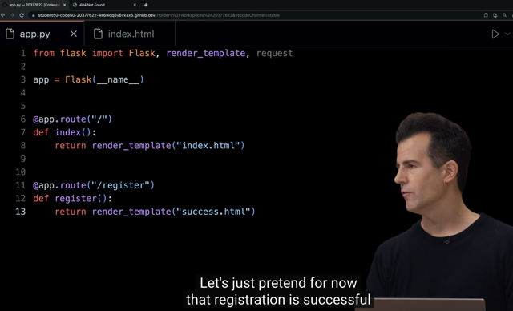</kbd>

> [!NOTE]
> Xong ổng vào app.py thêm cái **@app.route("/register")**Trong đó **render_template("success.html")**

 

<kbd>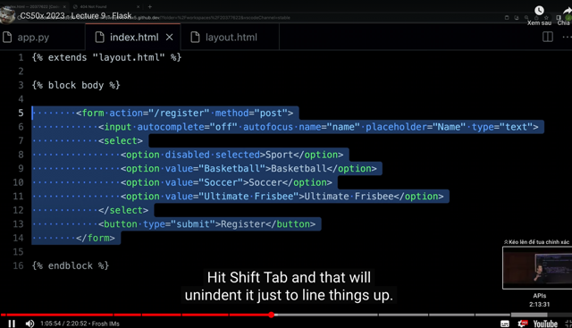</kbd>

<kbd></kbd>

<kbd>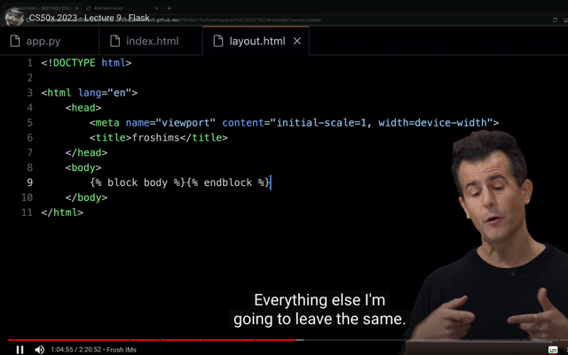</kbd>

> [!NOTE]
> Xong như đã biết, ổng tạo **layout.html** để **"nhúng" nhiều
> content khác nhau vào** tùy từng page để không phải copy
> paste nhiều đoạn code giống nhau. Từ đó **index.html và
> success.html chỉ cần extend từ layout.html**

 

<kbd>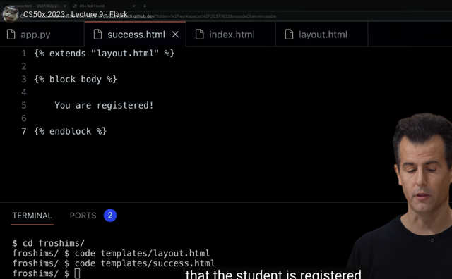</kbd>

> [!NOTE]
> Và làm file **success.html** extend từ **layout.html**,
> tạm thời chỉ say 1 câu như này

 

<kbd>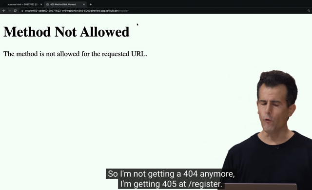</kbd>

> [!NOTE]
> Xong ổng chọn soccer, và submit nó vẫn error, không phải
> 404 not found nữa mà là **405 not allowed**
>
> D: Why?
>
> D: là vì **chưa define method POST cho @app.route("
> /register")** nên nó chỉ đang mặc định với **GET**, mà**submit form
> dùng POST nên nó không cho phép**

 

<kbd>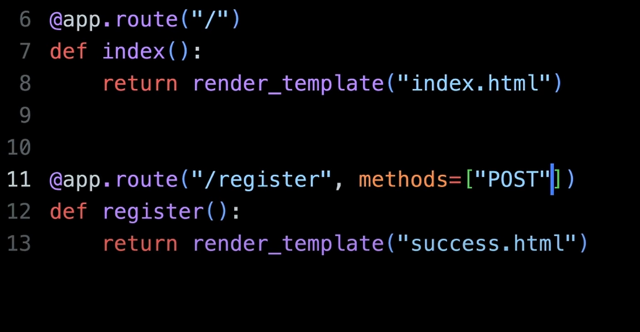</kbd>

> [!NOTE]
> Phải declare **methods=["POST"]** cho route `/register`

 

<kbd>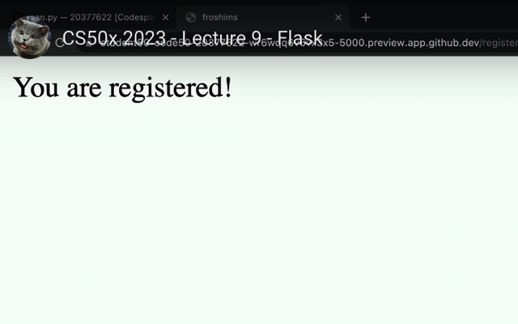</kbd>

<kbd></kbd>

<kbd>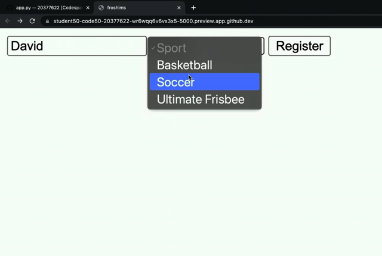</kbd>

> [!NOTE]
> Và kết quả là giờ
> nó đã work

 

<kbd>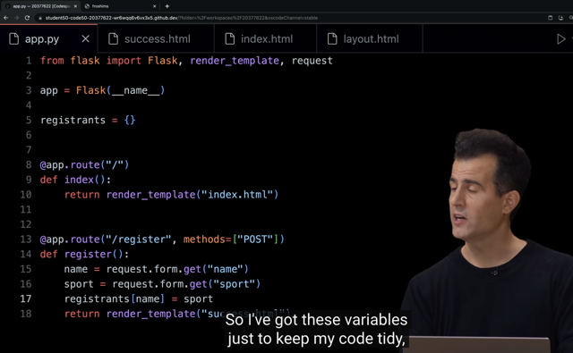</kbd>

> [!NOTE]
> Xong, để thử **thật sự save registered data**,  thì ổng**tạo một cái dictionary registrants như vầy**.
>
> Và khi user  submit với route `.../register,` **lấy name và
> sport  từ request.form và bỏ vào dictionary:**

 

<kbd>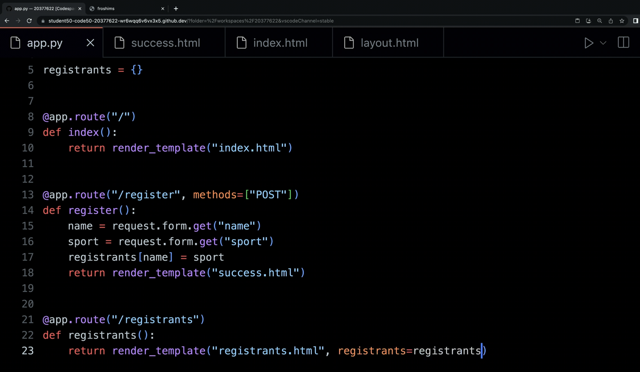</kbd>

> [!NOTE]
> Tạo thêm một cái route:**/registrants**, response về cái 
> **registrants.html**với **registrants** data. Và again, dù 
> nhìn có vẻ stupid (**registrants=registrants**) nhưng đó
> là bình thường

 

<kbd>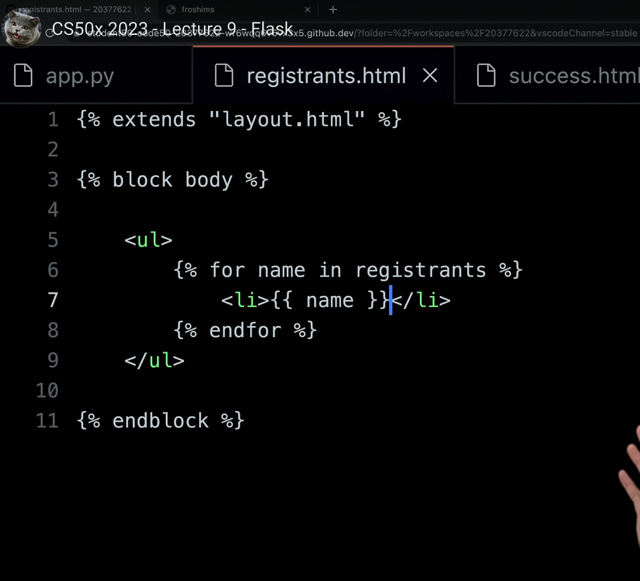</kbd>

> [!NOTE]
> Xong đại khái là tạo cái file **registrants. html** extends từ
> layout.html
>
> Và syntax như vầy: Dùng **unordered** list và với **jinja**
> syntax, nó chính là **run một for loop Python trong các
> value của registrants**, và tạo các <li> tag có value

 

<kbd>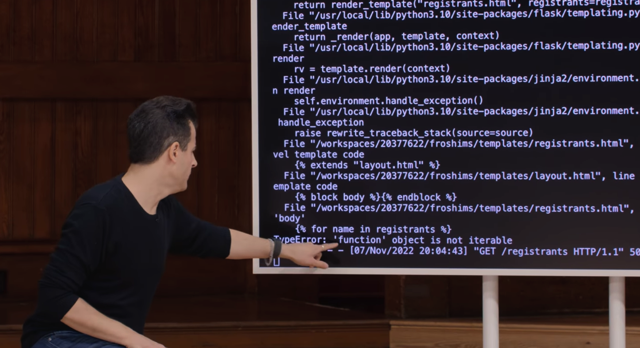</kbd>

> [!NOTE]
> Nhưng chạy thử thì nó bị lỗi thì ổng nói ta có thể xem lại
> cái log để track vấn đề

 

<kbd>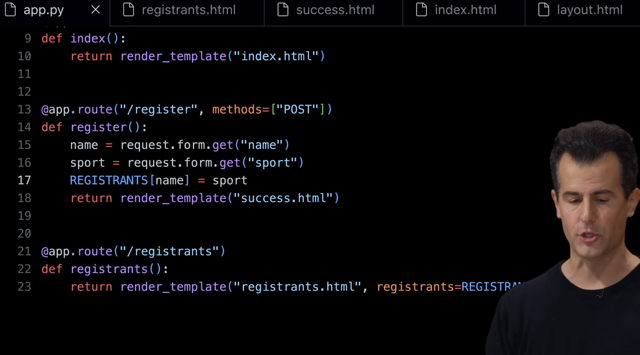</kbd>

> [!NOTE]
> Thì vấn đề là ta đặt dictionary variable **registrants**
> trùng tên với function **registrants**()
>
> Giải pháp là **đổi lại dùng REGISTRANTS** cho
> dictionary

 

<kbd>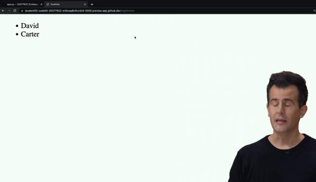</kbd>

> [!NOTE]
> Và khi submit để registered hai cái tên, và manually access vào ..
> `/registrants` Ta thấy nó đã show hai cái tên trong dictionary

 

<kbd>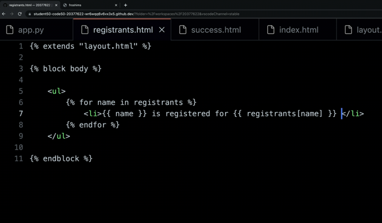</kbd>

> [!NOTE]
> Thử show thêm value với các
> name đó để ra sport

 

<kbd>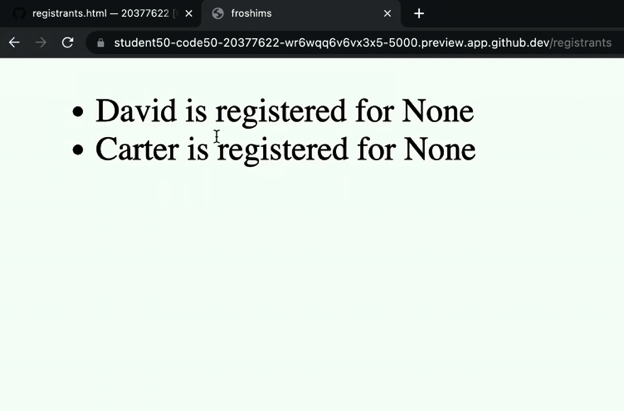</kbd>

 

<kbd>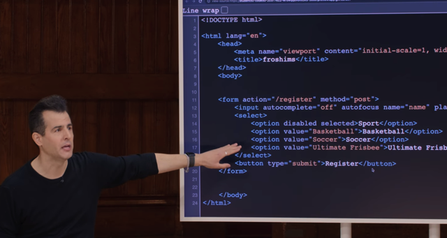</kbd>

> [!NOTE]
> D: Thiếu cái gì? mà nó lại không show ra tên sport
>
> A: Thì **khi submit Register** thì nó**chỉ post cái name lên**, còn
> **chưa thấy chỗ nào gửi sport lên**
>
> D: Correct

 

<kbd>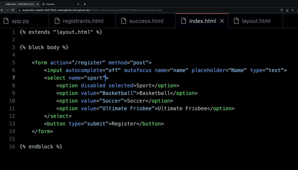</kbd>

> [!NOTE]
> Phải thêm **name="sport"** cho <select> tag
>
> thì khi submit nó sẽ gửi 2 argument là name và sport
> lên

 

<kbd>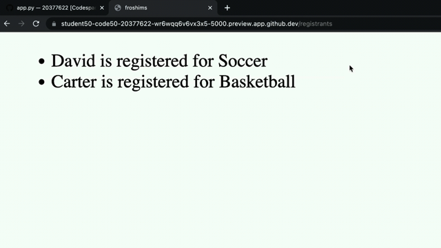</kbd>

> [!NOTE]
> Và nó đã work!

 

<kbd>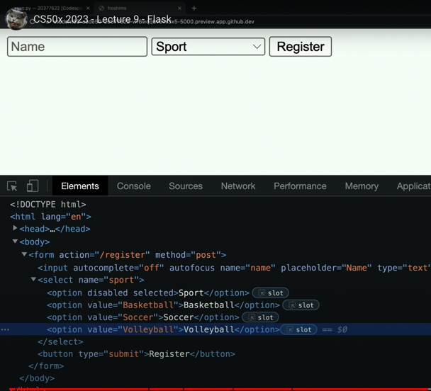</kbd>

> [!NOTE]
> Đại khái là giả sử **có kẻ muốn phá phách** muốn
> submit một cái sport không có trong líst ví dụ
> **volleyball**. Thì họ có thể **inspect, vào và change
> value của trong đó**. Và **submit**, thì **nó hoàn toàn có
> thể submit volleyball**

 

<kbd>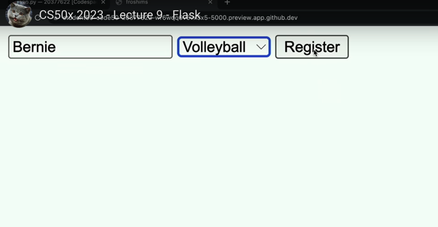</kbd>

<kbd></kbd>

<kbd>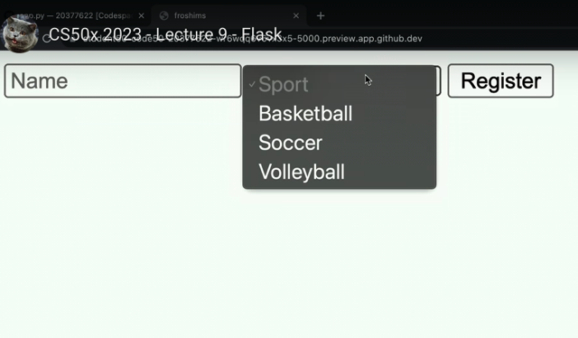</kbd>

 

<kbd></kbd>

> [!NOTE]
> Và đây là cái nguy hiểm, vì giả sử ta làm một cái
> shopping web page và **user có thể change cái giá
> và submit**. Thì ta **phải có cơ chế check xem đó có
> phải là valid submit** không

 

<kbd>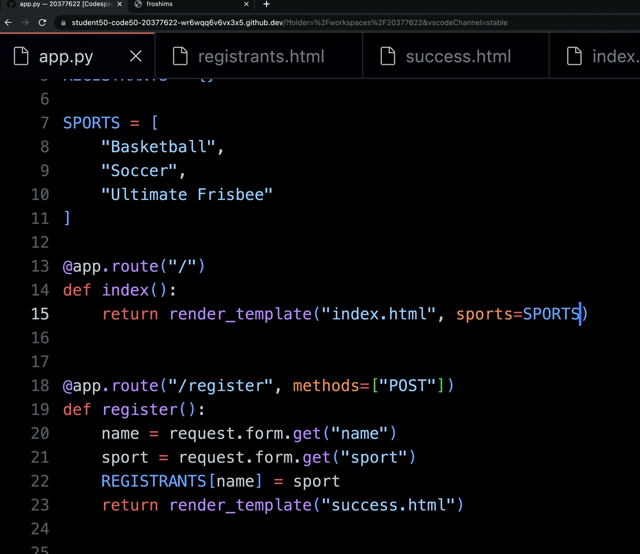</kbd>

> [!NOTE]
> Để sửa vấn đề này, ổng **define các valid
> sport**và**truyền nó vào index.html**

 

<kbd>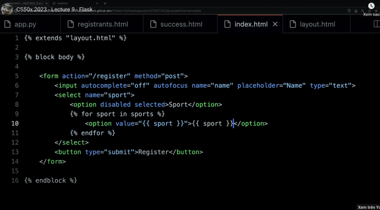</kbd>

> [!NOTE]
> Sửa lại index.html, **không hardcode các
> option** nữa mà**lấy từ value trong sports đưa vào nhờ
> jinja syntax** như hồi nãy
>
> 
>    ...
> 

 

<kbd>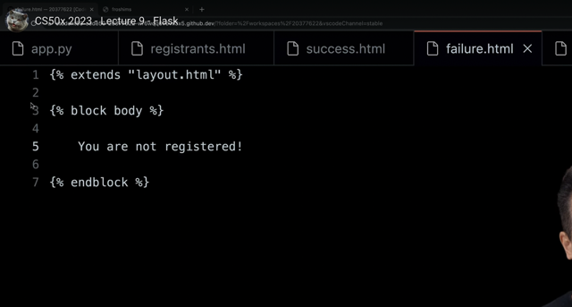</kbd>

<kbd></kbd>

<kbd>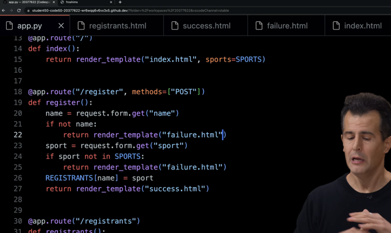</kbd>

> [!NOTE]
> Và **thêm checking việc name không trống** và
> **sport có trong SPORTS** thì **mới return
> success**

 

<kbd>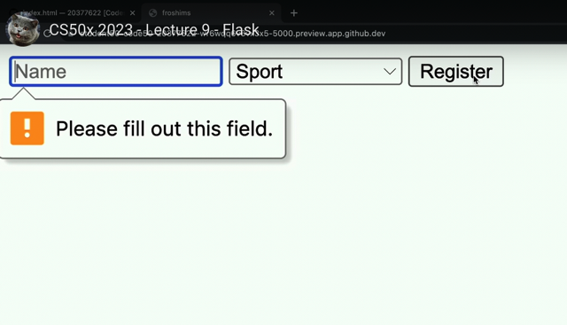</kbd>

<kbd></kbd>

<kbd>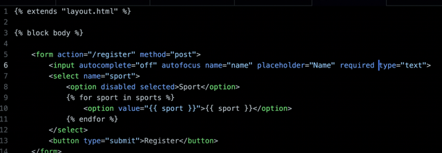</kbd>

> [!NOTE]
> Nói thêm về một**attribute required vào input**.
> Thì đại khái là **khi user không nhập tên thì browser sẽ báo**

 

<kbd>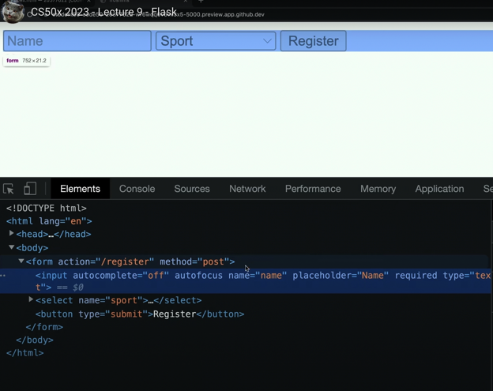</kbd>

> [!NOTE]
> Tuy nhiên ổng nói **người ta vẫn có thể inspect vào cái
> http**, **xóa đi cái required attribute** đi và**vẫn sẽ submit
> được**, nhưng nếu ta **có cơ chế để ngăn chặn** thì nó sẽ
> vẫn không qua được cái check của ta.

 

<kbd></kbd>

> [!NOTE]
> Do đó ta **phải có server's side
> validation**

 

<kbd></kbd>

> [!NOTE]
> Đại khái có người hỏi là **liệu người ta có thể access
> file app.py được không**
>
> D: Trên **lý thuyết là không**, tuy nhiên khi code ta
> **sẽ tránh để username, password trong code** mà để
> trong **variable**,**save vào trong memory** để tránh
> trường hợp nào đó người ta vào code được

 

<kbd></kbd>

> [!NOTE]
> Tại sao**save data vào global variable lại không
> phải là ý hay?**
>
> A: Vì đơn giản là**khi tắt chương trình thì nó sẽ mất**D: Correct

 

<kbd></kbd>

> [!NOTE]
> D: Correct. Do đó ta **phải save data**, có thể vào **csv file** như 
> bữa trước, nhưng giờ ta đã có một công cụ mạnh hơn là **SQL**
>
> Ổng mới **mở cái file** (cũng vậy chỉ là **add thêm import SQL 
> từ cs50.**
>
> Dòng **db `=` SQL("sqlite:///froshims.db")**: kiểu như
> ổng **đã tạo file db này rồi**, giờ sẽ dùng nó, như đã biết tuần 
> trước

 

<kbd>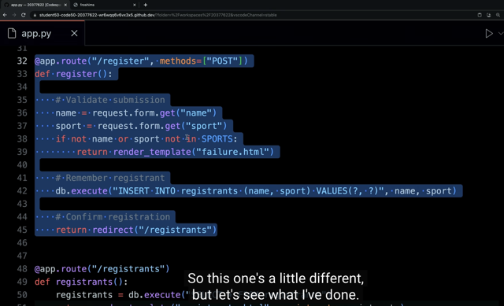</kbd>

> [!NOTE]
> Còn ở dưới cái api register:
>
> Sau khi validate entered info. 
>
> dòng **db.execute("INSERT INTO registrants (name, sport) VALUE(?,?)", name, sport)**
> Chính là để **gọi SQL function từ python**, **insert hai value name và sport vào hai
> column**. Chú ý là dùng **? (Place holder)** thay vì concatenate để tránh tình trạng
> bị hack như bữa trước có nói
>
> Cuối cùng cái dòng **redirect("/registrants")** chính là **redirect đến cái url `/registrants` 
> để xem saved data**

 

<kbd>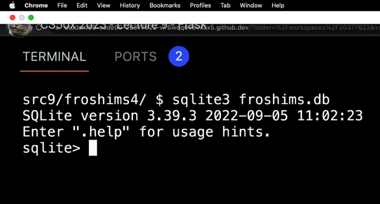</kbd>

<kbd>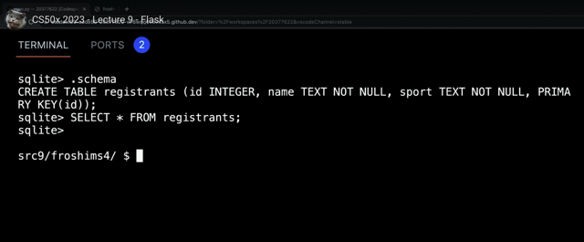</kbd>

<kbd></kbd>

<kbd></kbd>

<kbd>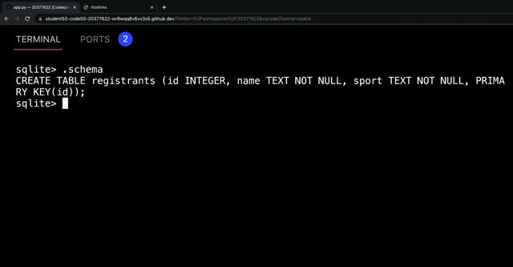</kbd>

> [!NOTE]
> Đại khái là **check thử (dùng .schema như đã biết) cái db
> này**, **có 3 column id, name, sport**. hiện giờ chưa có gì

 

<kbd>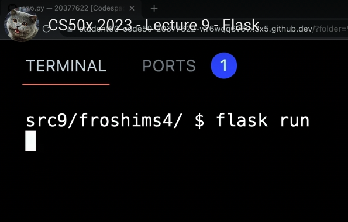</kbd>

<kbd></kbd>

<kbd></kbd>

> [!NOTE]
> Xong ổng run **flask run** để chạy cái server. Và với phiên bản
> **froshims4** thì có cải tiến chút là **thay vì dùng menu thì dùng 
> radio button.**

 

<kbd>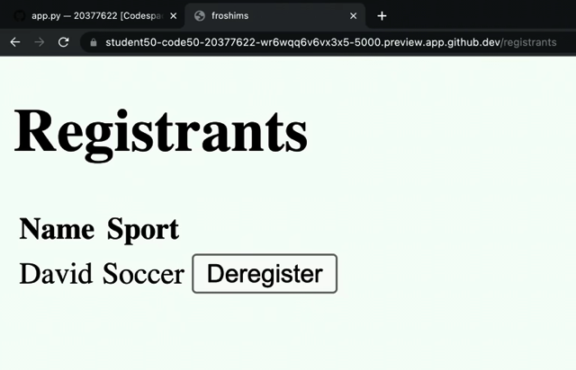</kbd>

> [!NOTE]
> Nhập tên và bấm **submit** thì nó show như thế này:
>
> Đó là nó đã ở url: **.../registrants** và đã show thông tin
> David, Soccer

 

<kbd>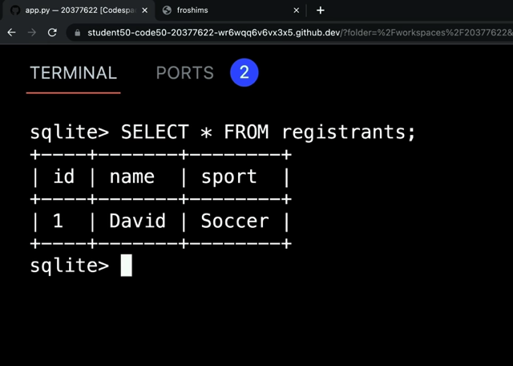</kbd>

> [!NOTE]
> Và **check thử trong db thì thấy nó đã có**, có nghĩa
> là có **tắt server mở lại thì vẫn còn data**

 

<kbd>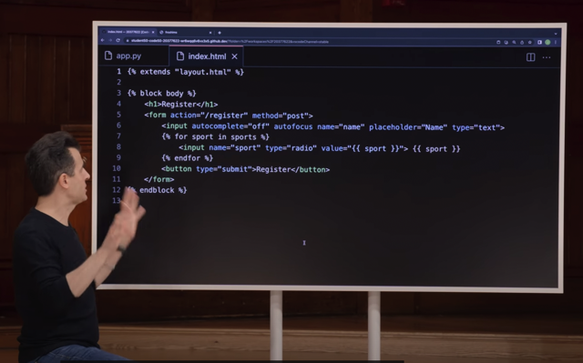</kbd>

> [!NOTE]
> Xong ổng show cái code của **index.html** bây giờ  (với
> radio button thay cho selected menu)
>
> Thì cũng tương tự không có gì, khi dùng **jinja** để chạy
> cái **python code loop trong các sports** để **add các
> input có type là "radio" để nó dạng radio button**
>
> **Nói thêm name="sport"** thì ổng nói để khi **chọn cái
> này thì nó unselect cái kia.**

 

<kbd>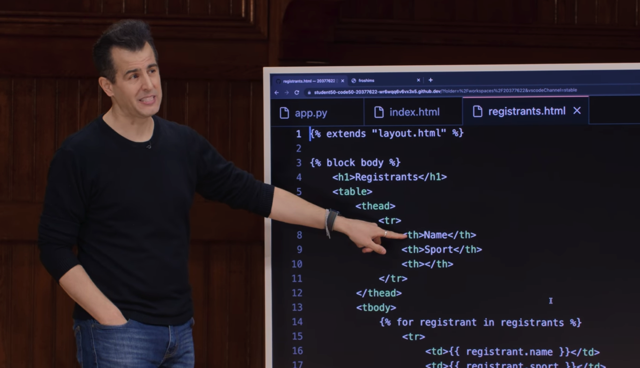</kbd>

> [!NOTE]
> Xong ổng show code của **registrants.html**
> Có **table** **tag**, cột **Name**, **Sport**, và **một cột
> để trống** **để cho cái button Deregister**

 

<kbd></kbd>

<kbd></kbd>

<kbd>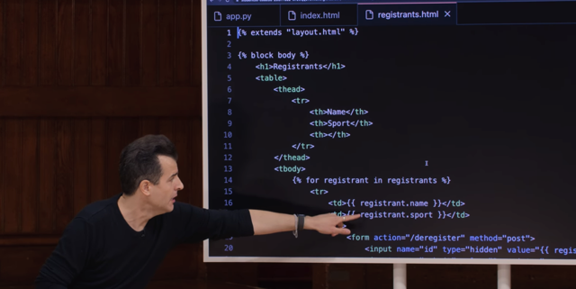</kbd>

> [!NOTE]
> Trong body cũng là **jinja task** loop trong **registrants** 
> (được truyền vào) và **tạo 3 cái <td> tag**

 

<kbd>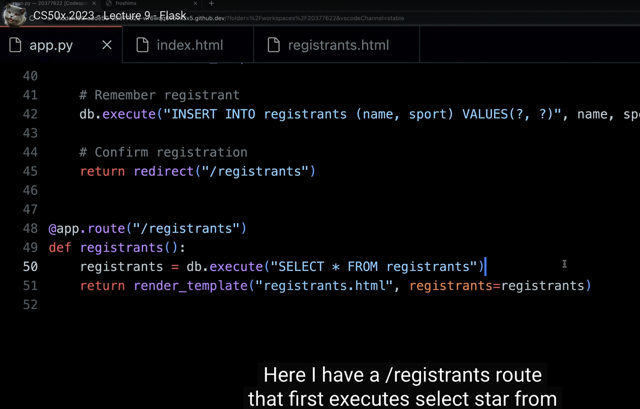</kbd>

> [!NOTE]
> Coi cái route `"/registrants"` thì thấy ổng lấy registrants bằng
> cách gọi lệnh **sql: db.execute("SELECT * FROM registrants")**
> và **truyền vào registrants.html**

 

<kbd>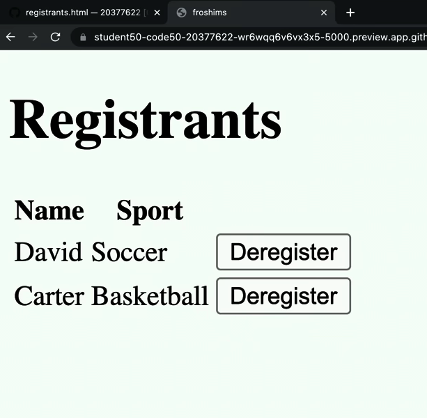</kbd>

 

<kbd>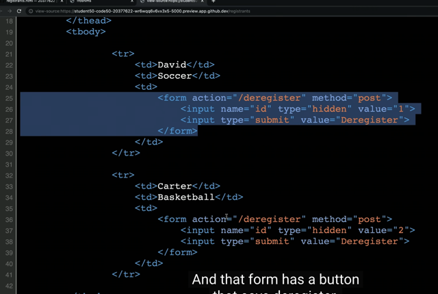</kbd>

> [!NOTE]
> Xong để xem cái **Deregister** làm gì, ổng cho ta **coi cái
> Inspect code trước**, (tí mới nói cách làm), đó là nó có 
> cái dạng là cái **form**, với input với **name="id"**, value, 
> **type `=` "hidden"** `->` nó sẽ hidden, không show ra, vậy
> thôi.
>
> Và khi submit, nó sẽ POST cái id có value như vậy lên 
> **url: ..../deregister**

 

<kbd>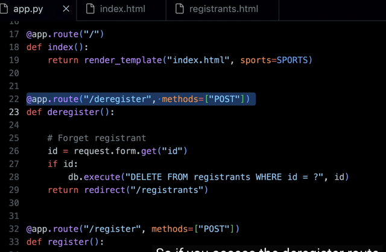</kbd>

> [!NOTE]
> Xem cái app.py, của r**oute "/deregister"** cho thấy nó 
> nhận phương thức **POST**, 
>
> và với **id** (lấy từ**request.form.get("id")**)
>
> nó **check id**có khác trống không, trước khi **gọi lệnh sql
> để delete row nào có id bằng như vậy.**
>
> Và cuối cùng là **redirect tới .../registrants**

 

<kbd></kbd>

> [!NOTE]
> Xong ổng hỏi **có gì không an toàn ở đây?**
>
> Đại khái là**họ có thể inspect, và change value
> của hidden input và xóa data**

 

<kbd></kbd>

> [!NOTE]
> Xong ổng nói **cần phải có tính năng log in** để **chỉ cho
> phép một số action** dành cho người**đã log in ví dụ như "
> delete"**
>
> Thì nói sơ qua về **cookies**, là cách mà khi ta**log in vào
> google**, web browser sẽ dùng cookie kiểu như khi vào rạp
> chiếu phim, sau khi bảo vệ **đã check id `card/` Check vé
> vào cửa** họ sẽ **đóng một con dấu** để khi **ta ra rồi vào
> lại vào chỉ cần chìa con dấu ra thay vì phải check id card
> lại**

 

<kbd>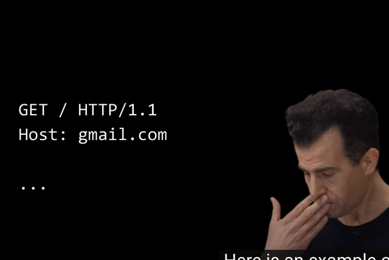</kbd>

 

<kbd></kbd>

> [!NOTE]
> Lấy ví dụ gmail, thì **khi ta đã log in thành công**, nó sẽ trả
> về **200 OK**, nhưng bên cạnh đó sẽ còn có cái **header**
> tên là **set-cookie**, với **key `-` value là session=value**.
>
> Thì đại khái đây **chính là tương đương việc bảo vệ đóng
> dấu cho ta**

 

<kbd></kbd>

> [!NOTE]
> Và khi máy tính, hay ta "vào lại" thì ta **gửi cho server cái
> envelope như này** trong đó **có chứa cookie: session=value.**
> **Gmail nó sẽ  dựa vào đó mà "cho ta vào"**, cũng như **phân
> biệt ta là ai** mà show gmail cho đúng. Nôm na là vậy

 

<kbd></kbd>

> [!NOTE]
> Ổng mở một version khác (cái project nãy giờ đang làm
> nhưng ổng làm trước nhiều version) thì version này bắt
> đầu có session
>
> Thì ổng nói **Flask nó sẽ handle mọi thứ**: **set cookie**,
> **check cookie**. Và nó có cái **session**: kiểu như cái
> **dictionary**, trong đó khi ta **set `key-value` vào trong đó** thì
> **nó vẫn còn y nguyên miễn là cùng một user.**
>
> Và **Flash nó sẽ đảm bảo là khi David visit website**, thì nó
> sẽ **dùng cái session của David**. Còn khi **Carter visit website
> thì nó sẽ là cái session của Carter.**

 

<kbd></kbd>

> [!NOTE]
> Đoạn code này đại khái là
> các để **initialize session**

 

<kbd>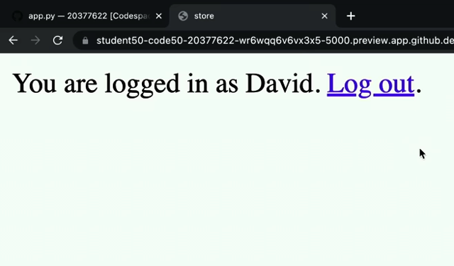</kbd>

 

<kbd>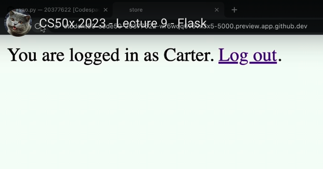</kbd>

<kbd></kbd>

<kbd>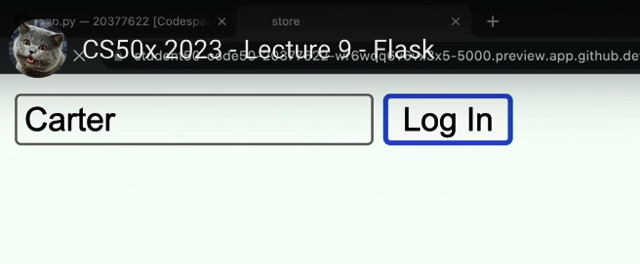</kbd>

> [!NOTE]
> Đại khái là **tính năng log `in/log` out
> dù không có password**

 

<kbd>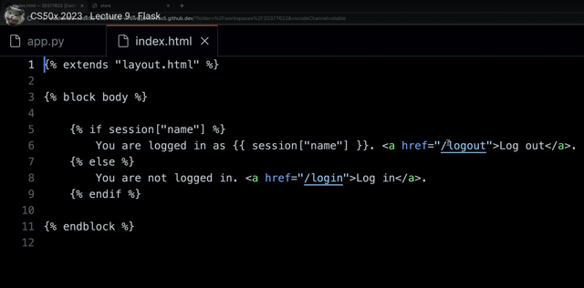</kbd>

<kbd></kbd>

<kbd>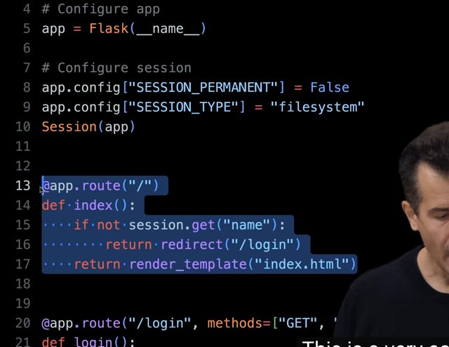</kbd>

> [!NOTE]
> Xem**route `("/")` index** nó làm gì: Nó sẽ **check trong
> session có cái key nào là "name"** hay không,
>
> Nếu **không có thì redirect về /login,** **có thì cho vào
> index.html.**

> [!NOTE]
> Xem html của **index.html**. Thì cơ bản chỉ là**jinja syntax
> chạy python code** trong đó **check session["name"]** có
> value hay không.
>
> Nếu **có thì show là đã log in** với **tên**, và có **button logout** `-`
> chỉ là cái <a> tag  với link.

 

<kbd>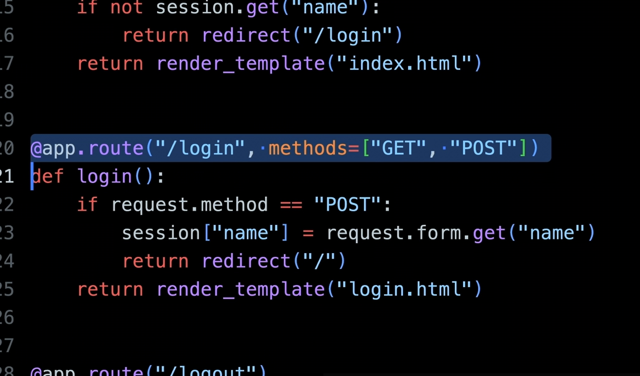</kbd>

<kbd></kbd>

<kbd>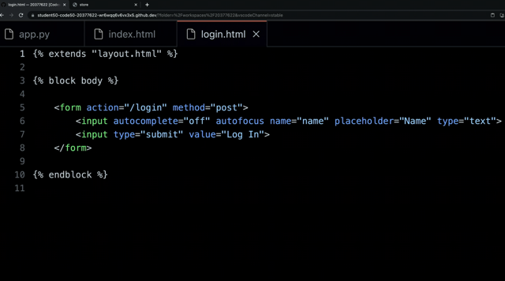</kbd>

> [!NOTE]
> Xem html của **login** chỉ là cái **form**, khi **submit thì nó POST
> cái name lên.**
>
> Và trong route "**/login**", nó**lấy cái tên từ trong request pos**t
> lên, **bỏ vào session với key là name**

 

<kbd>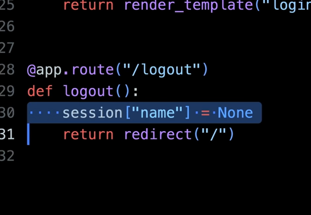</kbd>

> [!NOTE]
> Còn **/logout** thì **xóa cái value của key name đi.**
> Thì ta hiểu là **khi David visit cái url đó**, **Flask sẽ trả về cho 
> máy tính của ổng một cái cookie có tên của David**.
>
> Khi **Carter visit cái url đó**,**Flask sẽ trả về cho máy tính của
> của ổng một cái cookie có tên Carter.**

 

<kbd></kbd>

> [!NOTE]
> Xong ổng mở cái file

 

<kbd></kbd>

> [!NOTE]
> Thì khi inspect nó ta thấy nó có các **h2 tag**,
> form có action **POST** tới user "**/cart**". 
>
> input tag **hidden** có **name="id"** **value `=` 1,2,3...**tức khi submit, nó sẽ **POST** lên với **id** có **value `=` 1,2,3**
>
> Thì ổng nói trong trường hợp này thì**không sợ hack**,
> vì t**ệ nhất là nó inspect vào và sửa lại cái id của book** thôi
> và dẫn đến là nó add những cuốn sách khác vào thôi
> nên không có gì phải sợ cả

 

<kbd>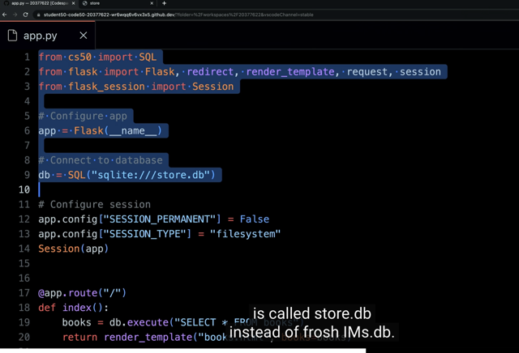</kbd>

> [!NOTE]
> XOng ổng mở app.py ra. Thì khúc đầu cơ bản là không có gì
> mới với các lib SQL từ **cs50, Flask, redirect, `render_template,` 
> request,  session.**
>
> có db mở từ **store.db**
>
> và **3 dòng 12,13,14 là initialize cái session**

 

<kbd>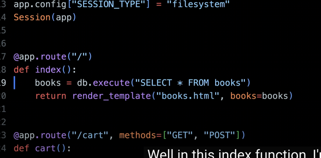</kbd>

> [!NOTE]
> Với default path `"/"` show các cuốn sách thì đơn giản là
> **Query từ SQL**, rồi **truyền vào books.html**

 

<kbd>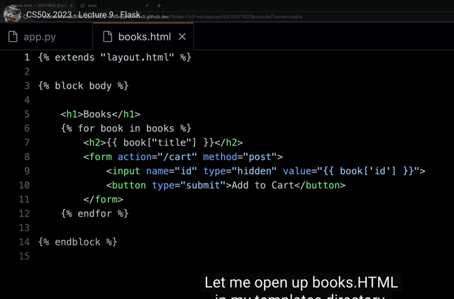</kbd>

> [!NOTE]
> Rồi, xem qua **index.html**, ta thấy cũng không có gì, nó extend 
> từ layout.html cho gọn.
>
> Rồi nó dùng **jaja syntax** để run Python code, **loop trong
> các books được truyền vào** để add các**h2 `+` form**
>
> Trong **form** tag có **hidden tag input**, **name="id"**, và **value
> lấy từ book['id']**
>
> Và submit thì nó**POST cái id value là lấy từ book[id] lên, 
> route "/cart"**

 

<kbd>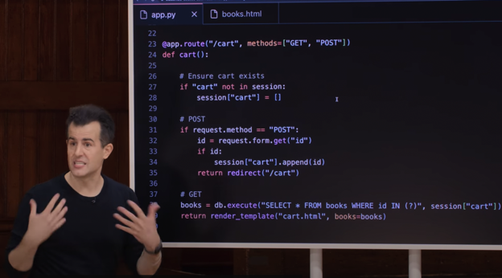</kbd>

> [!NOTE]
> Rồi qua xem cái **route "/cart"**
>
> nó accept cả hai method **GET và POST**.
>
> Thì đầu tiên nó **check trong session có (cái key) "cart"**
> **hay chưa** nếu chưa thì**tạo một cái mang value là empty list**
>
> Xong nếu là **POST**, nó **lấy id truyền lên** (từ request.form.get("id"))
> và **check nếu id not empty thì nó bỏ vào cái cart list** trong session
> **session["cart"].append(id)**
>
> Và **return và redirect tới /cart,** (cái việc redirect tới cart này nó sẽ
> "dùng" default value là GET)
>
> Và ở dưới chính là **handle khi GET**, nó thực hiện SQL query
> **db.query(SELECT * FROM books WHERE id IN (?)", session["cart"])**
> nhớ lại (?) chính là SQL placeholder, nó sẽ **truyền các id trong list
> session["cart"]**vào và từ đó **kết quả của sql query return là list
> các books có id như vậy.**
>
> Cuối cùng nó **render_template** và**truyền books vào và cart.html**

 

<kbd>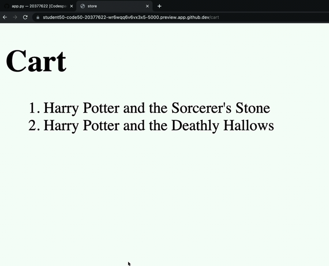</kbd>

> [!NOTE]
> Và ổng làm thử, add hai cuốn sách vào cart.
>
> Và khi reload thì nó luôn có hai cuốn này.
>
> Ổng nói như hồi nãy đã nói đó là khi tui (David) visit
> page thì  Flask sẽ đảm bảo session của tui có hai cuốn
> sách này, và khi carter visit thì session của Carter sẽ có
> các cuốn của Carter

 

<kbd></kbd>

> [!NOTE]
> Đại khái là mỗi người sẽ (được đóng dấu) trả cho một cookies 
> khác nhau, nên **không thể có session giống nhau được**
> Và mỗi khi server **trả cookies về hoặc browser chìa cookies
> ra**(như hành chìa cái tay đã đóng dấu ra cho ông bảo vệ)
> thì nó **đều được encrypted**

 

<kbd></kbd>

> [!NOTE]
> Q: khi nào bao lâu thì **session expired?**
>
> D: Do **configured**. Với bank web server thì có thể sẽ cho expire
> ngay khi bạn close the tab
>
> Nhưng với email có thể cả tháng

 

<kbd></kbd>

> [!NOTE]
> Và nên dùng inconito mode là
> để khi close là nó clear mọi
> cookies giùm mình

 

<kbd></kbd>

> [!NOTE]
> Cuối cùng sẽ nói qua API, thì ổng nói về cơ bản
> tất cả những lệnh ta gọi để tương tác với C,
> SQL web server đều là API

 

<kbd>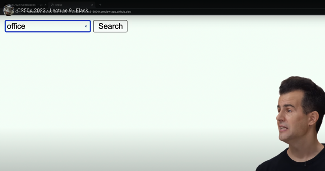</kbd>

 

<kbd>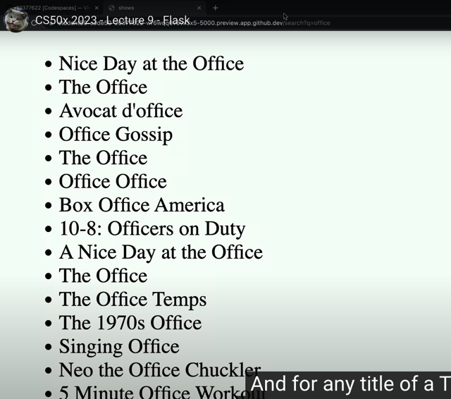</kbd>

<kbd></kbd>

<kbd></kbd>

> [!NOTE]
> Xong ổng làm thử cái example này, gõ office, bấm
> search nó cho ra kết quả list các bộ film này.
>
> Url: `.../search?q=office`

 

<kbd>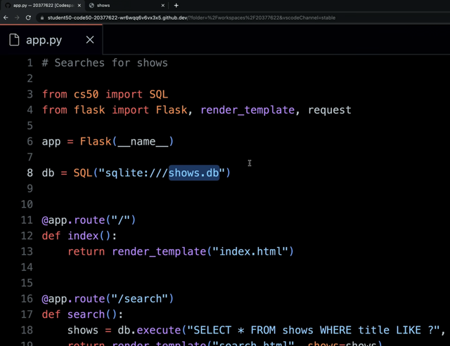</kbd>

 

<kbd>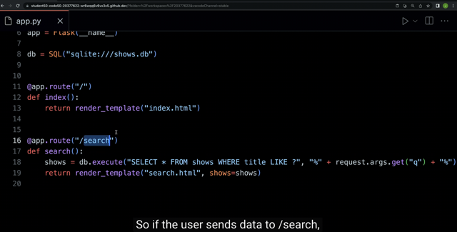</kbd>

> [!NOTE]
> Xem qua route `"/search"` thì cơ bản là gọi sql query:
>
> ("SELECT * FROM shows WHERE title LIKE ?", "%" request.args.get("q") `+` "%")
>
> nhớ lại SQL thì SELECT * FROM shows WHERE title LIKE %abc% tức là tìm hết
> các row (và lấy hết các cột) từ table shows sao cho title chứa "abc" trong đó.
>
> Và **render_template search.html** và **truyền shows vào**

 

<kbd>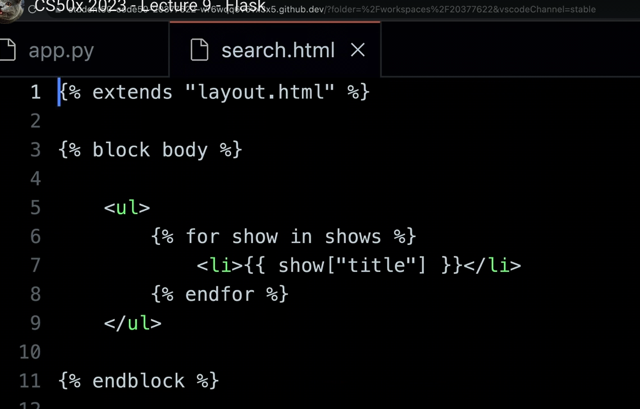</kbd>

> [!NOTE]
> Và cái search.html cũng đơn giản: extend từ layout.html,
> Dùng jinja để chạy Python loop, loop trong shows (được
> truyền vào) và tạo các <li> tag với text là **show["title"]**.

 

<kbd>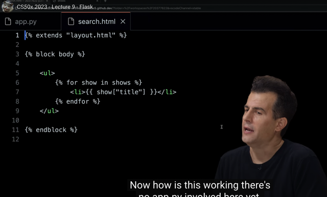</kbd>

> [!NOTE]
> Thì ổng nói chưa có API gì ở đây hết, chỉ là basic
> HTTP, submit the form và **đến another route** và**xem
> kết quả**. Ta sẽ xem một ví dụ khác

 

<kbd></kbd>

> [!NOTE]
> Thì với ví dụ này ta không thấy button submit nữa.
> Thì cơ bản ổng nói ta**dùng AJAX** nôm na là dùng
> **javascript** để **listen event**, và khi **user gõ thì nó thực
> hiện hành động query** và trả về kết quả

 

<kbd></kbd>

 

<kbd>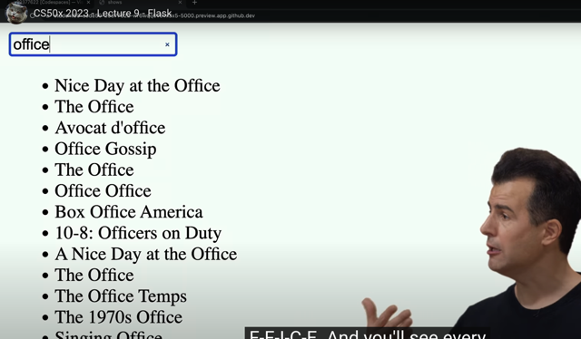</kbd>

<kbd></kbd>

<kbd>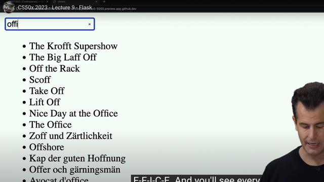</kbd>

> [!NOTE]
> thì khi ổng gõ là nó search và hiện kết quả. Ta sẽ
> xem ổng làm như thế nào

 

<kbd>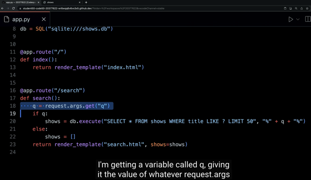</kbd>

> [!NOTE]
> Xem cái route**/search** thì thấy nó cơ bản vẫn như hồi nãy, đó
> là nếu **q `=` request.args.get("q")** có value thì gọi **sql query** như
> này tìm các rows có title như vậy, và lần này **giới hạn 50 cái**
> thôi
>
> Còn không thì không show gì với việc cho shows `=` empty list
>
> Vẫn **render_template** và**truyền shows vào**

 

<kbd></kbd>

<kbd></kbd>

<kbd></kbd>

> [!NOTE]
> Xem thử cái **search.html** thì thấy lần này nó **không extend layout.**
> html nữa. Thì cơ bản ổng nói là để **giới thiệu khái niệm API**, đó là ví
> dụ khi gọi api ..**./search?q="Office"**nó sẽ không trả cho bạn html mà
> **chỉ là data thôi và bạn sẽ tự display**

 

<kbd>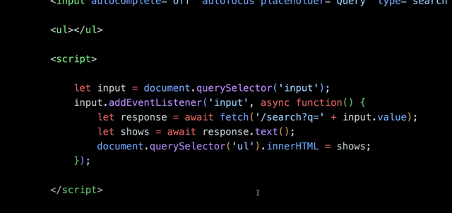</kbd>

 

<kbd>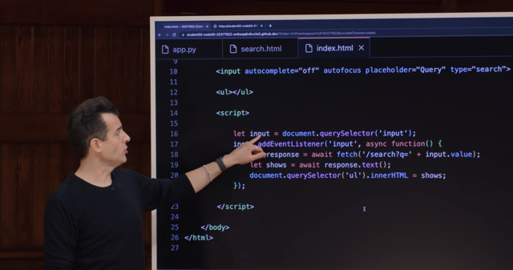</kbd>

> [!NOTE]
> Giải thích cái javascript: 
>
> Đầu tiên là lấy cái **<input>:**
> let input `=` **document.querySelector('input')**;
>
> Sau đó **add event listener** cho nó với event '**input**'
> và khi **event xảy ra thì gọi function async (tức là chạy background)**
> Trong đó: 
>
> Thực hiện việc**await fetch `('/search?q='` `+` input.value)**: fetch (gọi và lấy
> data từ url **/search** với **q `=` input.value**, 
> như hồi nãy đã biết nó **trả về các bộ phim** (có title chứa q's value) mỗi 
> cái một **<li> tag.**
>
> **Await** ý là **chờ cho khi nó trả về** thì **mới lấy ra (response.text()**) và 
> S**et nó vào innerHTML của 'ul'**

 

<kbd></kbd>

> [!NOTE]
> Qua index.html thì thấy nó có cái **<input> tag** thì biết
> rồi, **nhưng dưới là cái <ul> để trống** để khi **search
> nó nhét cái kết quả vào đó**

 

<kbd>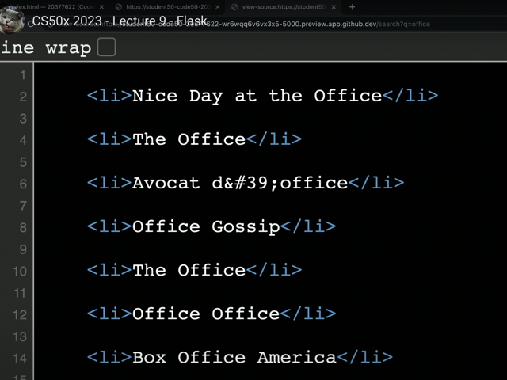</kbd>

> [!NOTE]
> Thì ổng nói cái API ..**/search?q=**.. nó **trả về list các <li> tag** như
> này thì **không phải lúc nào tui cũng cần html** do đó **đặt ra vấn đề
> là làm sao đó để nó trả về 1 dạng chung chung**

 

<kbd></kbd>

> [!NOTE]
> Thì đó chính là JSON

 

<kbd>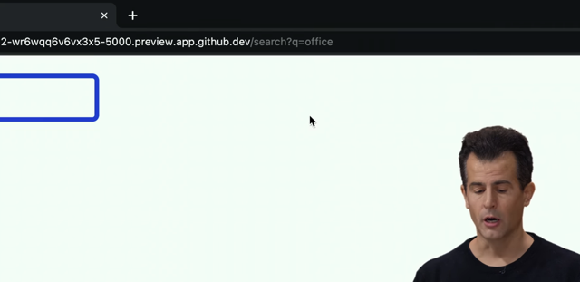</kbd>

> [!NOTE]
> Xong ổng mở cái version cuối
> cùng của cái web app này

 

<kbd></kbd>

> [!NOTE]
> Thì nó có dạng là **1 list** (vì start và end với **square bracket []**)
> các **dictionary {}**

 

<kbd>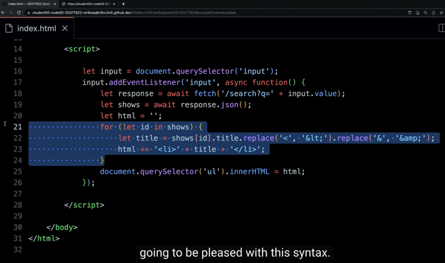</kbd>

 

<kbd>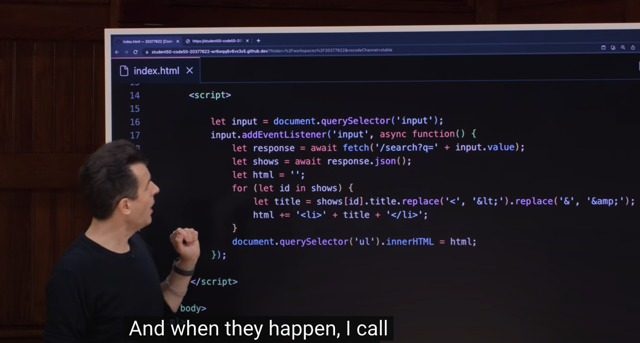</kbd>

> [!NOTE]
> thì trong cái script thì **chỉ khác ở chỗ** cái data trả về sẽ
> được **biến thành json()** thay vì**text()**:
>
> let show `=` await **response.json**() thay vì **response.text**()
>
> và với json data đó. 
>
> Ổng loop trong đó (như đã nói nó là list các dictionary)
> nên hiểu rằng id trong for (let id in shows) thì id chỉ như
> index 0, 1, 2...
>
> Với mỗi id, mới **lấy cái dictionary ra**, **show[id]** và**access
> key "title" của nó.**
>
> Có thêm hai dòng replace...cơ bản là để .**..replace mấy
> cái kí tự có thể khiến html bị lỗi** (cái này bên SM series làm quài)
>
> Cuối cùng là **nhét nó vào giữa hai <li> `</li>` tag** và**concat với html.**
>
> Kết qua là **set cái html vào innerHTML của <ul>**

 

<kbd></kbd>

> [!NOTE]
> Và ổng nói tới đây ta đã được trang bị đủ đồ
> chơi để build một cái full web application rồi

 

