# Problem Set

📊 **Progress:** `13` Notes | `64` Screenshots

---

<kbd>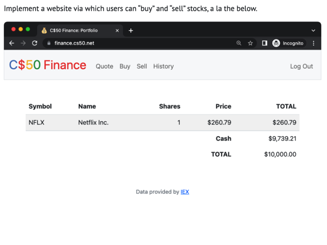</kbd>

 

<kbd>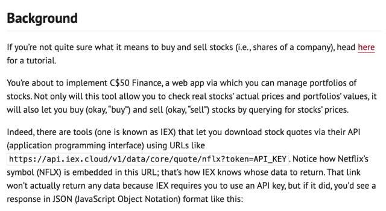</kbd>

 

<kbd>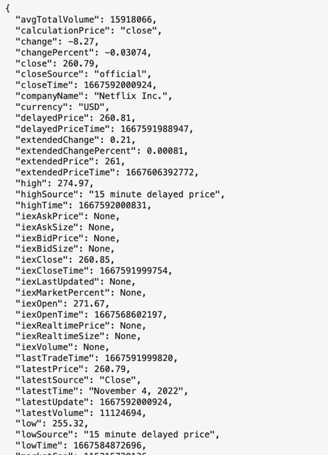</kbd>

 

<kbd>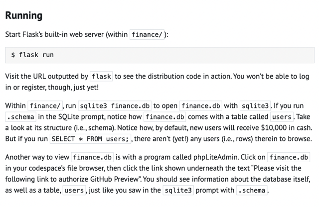</kbd>

 

<kbd>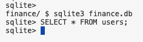</kbd>

<kbd></kbd>

<kbd>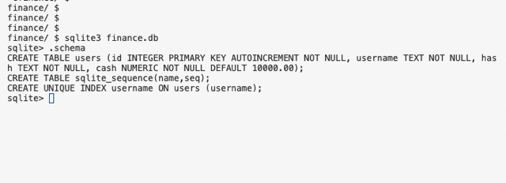</kbd>

> [!NOTE]
> Table **user** có 4 cột: id, username, hash,
> cash. Chưa có row nào cả

 

<kbd>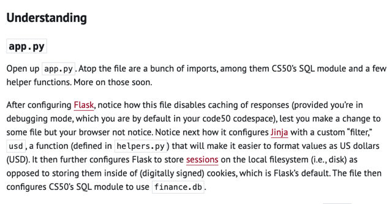</kbd>

<kbd></kbd>

<kbd>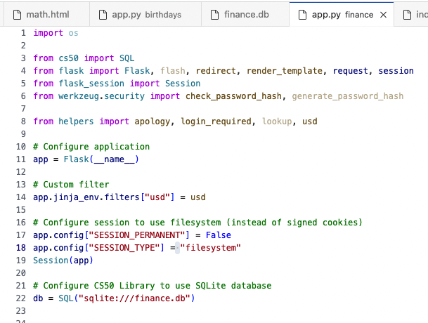</kbd>

> [!NOTE]
> Đại khái là khúc đầu file **app.py**có những cái sau đây:
>
> Import các thứ, trong đó có CS50's **SQL**.
>
> rồi **Flask, redirect, render_templat, request, session** từ **flask** đã biết
>
> rồi **Session** từ **flask_session**
>
> Sau đó là configure Flask : **app = Flask(__name__)**
> Họ nói là ở đây**disable cái caching của response**, có thể là dòng này: 
> **app.config["SESSION_PERMANENT"] = False**, nôm na hiểu là để
> khi ta thay đổi gì đó mà browser không notice. Tạm hiểu vậy.
>
> Kế đến là **configure Jinja với function filters** để giúp **format value as US 
> dollars dễ hơn**.
>
> Rồi tiếp nó **configure Flask để store sessions trên local filesystem**
> **thay vì cookies** (vốn là default).
>
> Cuối cùng là nó **configure SQL module dùng finance.db**

 

<kbd>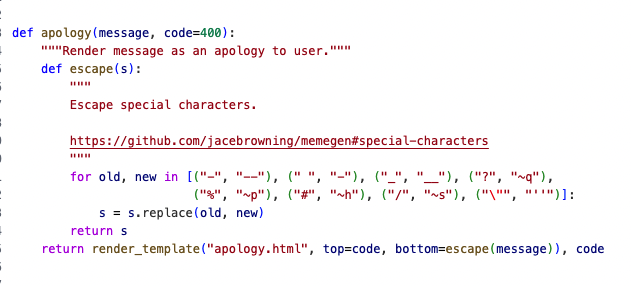</kbd>

<kbd>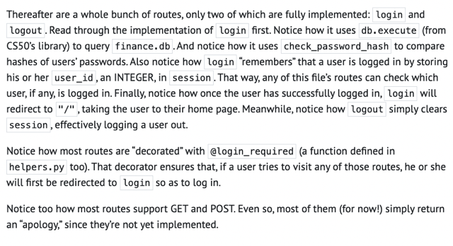</kbd>

<kbd></kbd>

<kbd></kbd>

<kbd>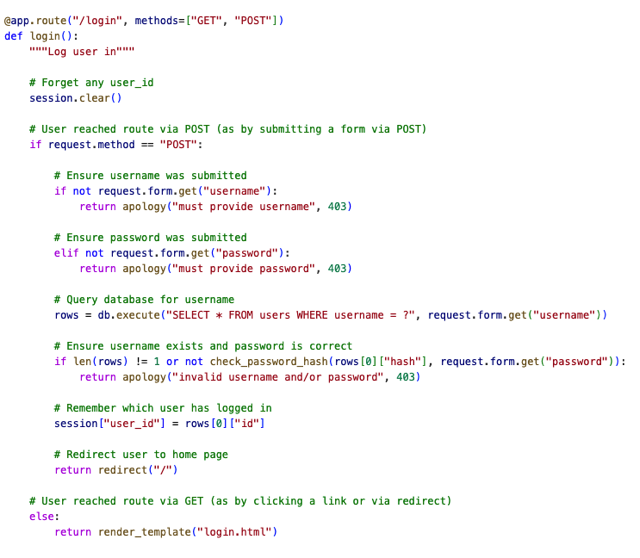</kbd>

> [!NOTE]
> Function route "/login" này làm gì?
>
> Đầu tiên nó **clear session**. Như ta biết session là cookies là một cái dictionary.
>
> Nếu là POST, nó sẽ **xem request có gửi lên username** và **password** không
> (vì là POST nên check trong **request.form** thay vì request.get 
> dành cho GET). 
>
> Nếu **có thì đi tiếp không thì gọi function apology()** - Xem trong helper thì nó 
> cơ bản là **render_template** cái html file **apology.html** truyền vào message.
>
> Sau đó nó **gọi sql query** để **lấy mọi row** mà có **username** **bằng username
> gửi lên.**
>
> Rồi **check tiếp xem có row nào không** và nếu có ít nhất một row thì lấy ra
> (row[0]). Rồi **lấy giá trị của cột hash** cùng với **password gửi lên** bỏ vào
> function **check_password_hash**() là function kiểu như **dịch password sang
> hash number** và **so sánh với nhau.**
>
> Nếu ok tức là có một user trở lên và password giống thì đi tiếp, tới đây nó sẽ
> Thực hiện việc**đóng dấu = set key "user_id" bằng id của user vào session.**
>
> Và **redirect tới default route "../"**

 

<kbd>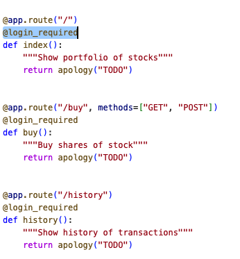</kbd>

<kbd></kbd>

<kbd>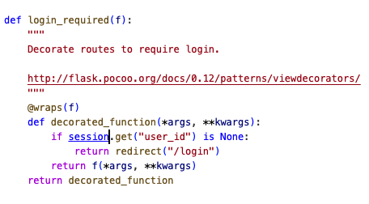</kbd>

> [!NOTE]
> Đại khái là khi user visit các url khác (các route khác) thì
> cái **decorator @login_required** của các "route
> function" đó sẽ gọi function login_required() này. Trong
> đó, nó sẽ check xem user login hay chưa biểu hiện là
> trong session có key " user_id" hay không, vốn được set
> khi user login thành công. Việc này cũng y như hình
> tượng khi ta vào bảo tàng, ông bảo vệ soát vé xong thì
> ổng đóng dấu vào tay ta, hoặc đeo một cái vòng vào tay
> ta thể hiện ta đã có vé rồi. Thì giả sử có đi ra mua nước
> và vào lại thì thay vì phải chìa cái vé ra lại thì ổng chỉ cần
> thấy cái dấu đóng là ổng cho vô. Thì hành động set "
> user_id" vào session chính là hành động đóng dấu đó.
> Và việc check "user_id" ở đây chính là việc xem user có
> đóng dấu hay chưa.

 

<kbd>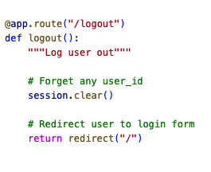</kbd>

> [!NOTE]
> Logout đơn giản là**clear session** đi, từ đó khi**user có
> quay lại, thì không còn con dấu trên tay nữa** (**không
> còn key user-id trong session nữa**)  thì **phải chìa vé ra
> lại.**
>
> Tới đây nhắc lại là ổng nói **Session của Flask sẽ đảm
> bảo là khi user log in thành công**, **nó sẽ đóng dấu,** và
> tương đương **trả về cookie của user's browser có cái
> user-id,** để **khi user quay lại = web browser gửi cookie
> lên thì nó sẽ có cái user-id trong session**

 

<kbd></kbd>

<kbd></kbd>

<kbd>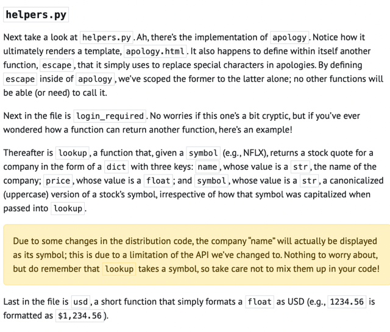</kbd>

> [!NOTE]
> Đại khái là trong function **apology có define và dùng
> một function escape.** Đơn giản là để mình nó xài thôi.
> Vụ này trong java không có.
>
> Kế tới function login_required mới giải thích rồi, ở đây
> họ nói thêm đây chính là một **minh họa cho việc function
> lại return một function** trong python (nó define và return 
> function **decorated_function** ()

 

<kbd>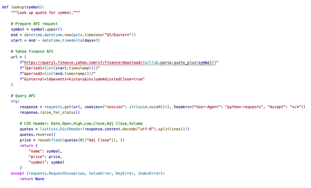</kbd>

> [!NOTE]
> Nói về function loop up, đại khái là nó giúp **gọi API của 
> Yahoo Finance** **gửi lên mã stock để lấy về thông tin** tên
> công ty, giá và kí hiệu. Họ cũng không nói kĩ hơn
>
> Nhưng ta thấy nó start với việc **chuẩn bị url với các argument**
> có thể là theo Yahoo API 's definition.
>
> Sau đó nó **request.get() để gọi api** với **url, cookies, headers,**
>
> Khi **nhận kết quả thì nó parse (decode) từ response content
> ra, để lấy ra price**. Rồi cuối cùng **tạo một cái dict có 3 key** là
> **name, price, symbol trả về**

 

<kbd>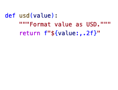</kbd>

> [!NOTE]
> Cái helper's function cuối cùng là usd() chỉ đơn giản
> là format cái value thành dạng float có 2 số thập
> phân, chia 3 số bởi dấu phẩy và có kí hiệu $ ở đầu
>
> Ví dụ 1234.56 thì nó thành $1,234.56

 

<kbd>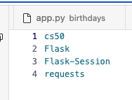</kbd>

<kbd></kbd>

<kbd>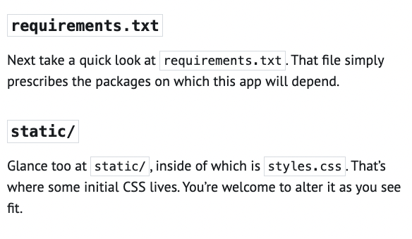</kbd>

> [!NOTE]
> requirement.txt đơn giản là define các package (lib) thôi.
> Trong MLOps Spec có cái lab dùng docker deploy
> model  Trong dockerfile có cái command dựa vào File
> requirement này để install các package vào docker
> image
>
> Còn static đơn giản là chứa các static file như css,
> image...

 

<kbd>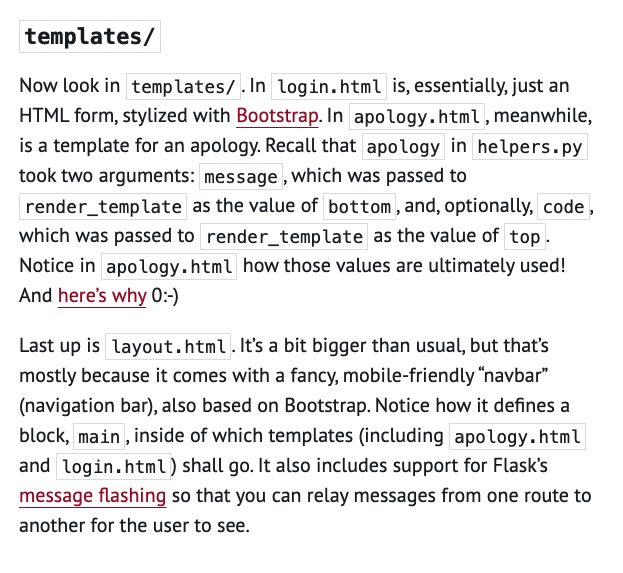</kbd>

 

<kbd>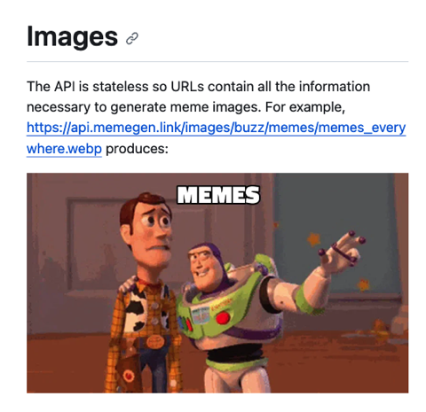</kbd>

<kbd></kbd>

<kbd>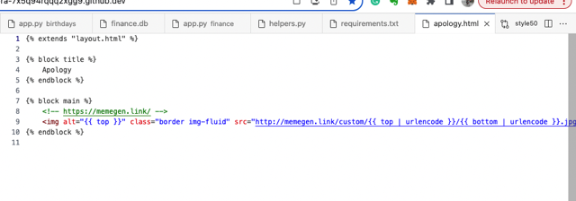</kbd>

> [!NOTE]
> Đại khái cái apology.html sẽ extend từ layout.html (chứa các
> phần html chung chung) và trong cái main block thì đại khái
> là nó dùng img tag để show một cái hình, cái hình này "lấy
> từ" một cái service kiểu như cho phép tạo cái meme image
> với nội dung mà ta gửi lên. Trong trường hợp này là lấy nội
> dung truyền vào từ render_template.

 

<kbd>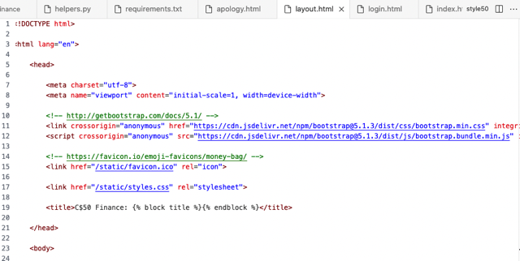</kbd>

> [!NOTE]
> Xem qua cái layout.html.
> Khúc đầu là bootstrap

 

<kbd>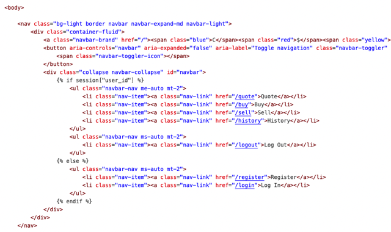</kbd>

> [!NOTE]
> Cái body, khúc này là define cho cái NavBar
> mobile-friendly. Define như này là do Bootstrap nó
> chỉ vậy

 

<kbd>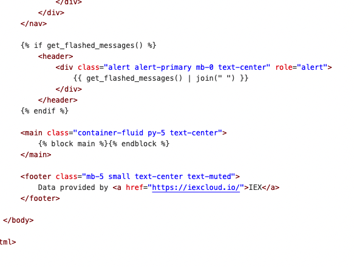</kbd>

> [!NOTE]
> Cuối cùng là main block sẽ chứa cái nội dung của
> những thằng apology.html, login. html khi extend từ
> layout.html
>
> Còn cái vụ Flask's message flashing là sao chưa hiểu
> để quay lại sau

 

<kbd>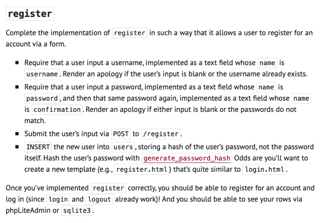</kbd>

 

<kbd>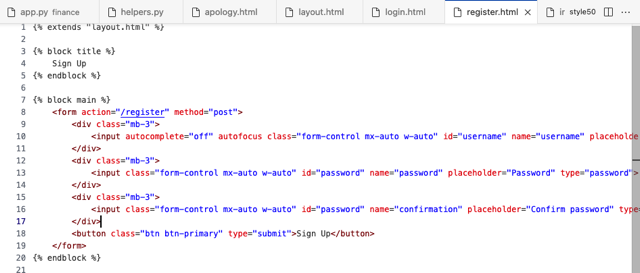</kbd>

<kbd>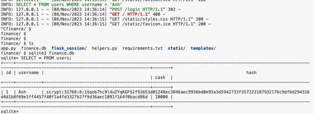</kbd>

<kbd></kbd>

<kbd></kbd>

<kbd>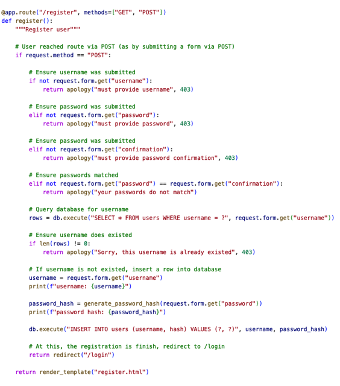</kbd>

 

<kbd>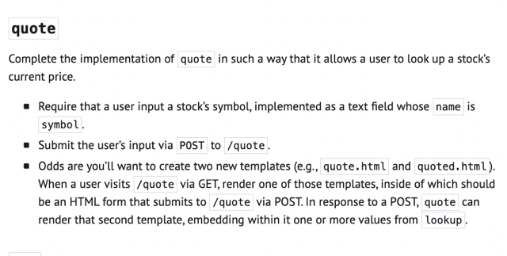</kbd>

 

<kbd>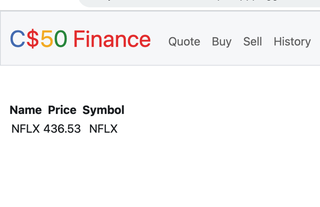</kbd>

<kbd>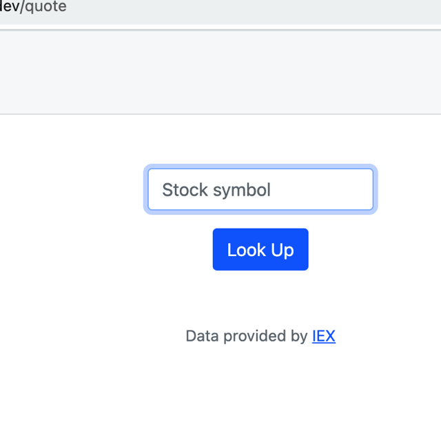</kbd>

<kbd></kbd>

<kbd></kbd>

<kbd>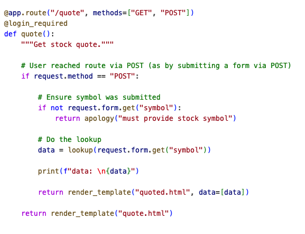</kbd>

 

<kbd>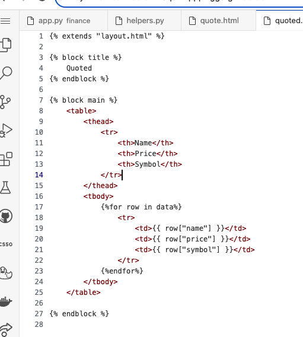</kbd>

<kbd></kbd>

<kbd>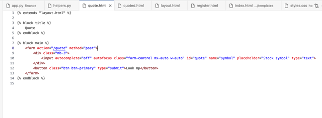</kbd>

 

<kbd>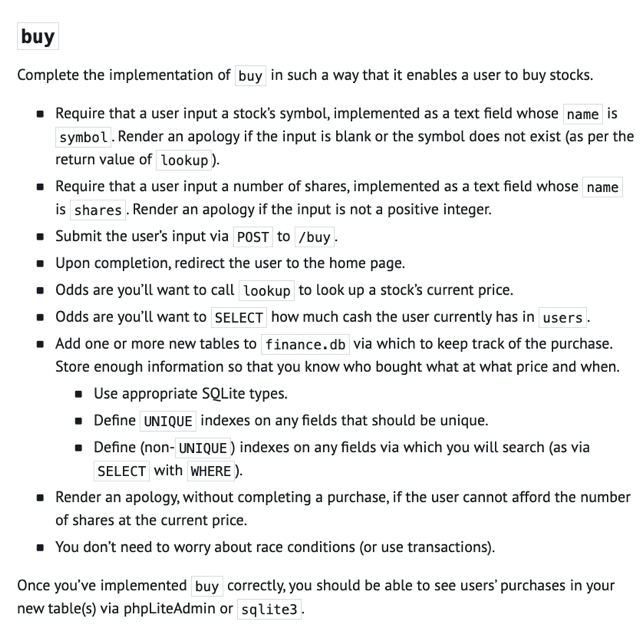</kbd>

 

<kbd>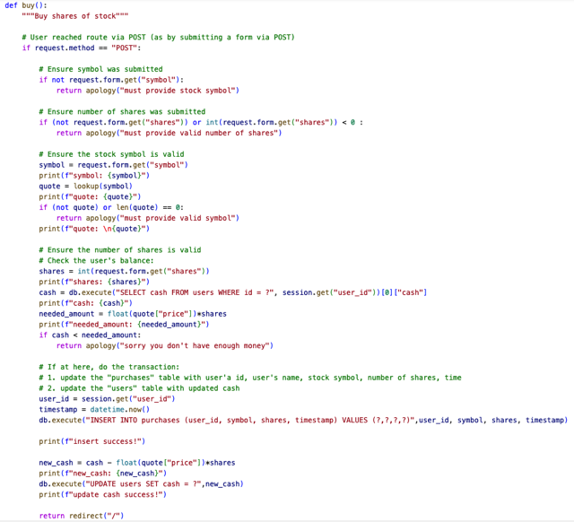</kbd>

<kbd></kbd>

<kbd>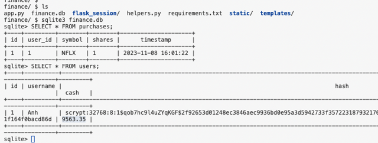</kbd>

 

<kbd>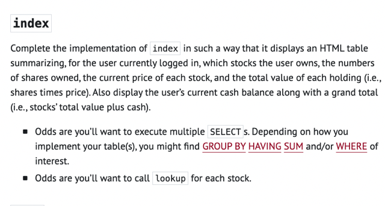</kbd>

 

<kbd>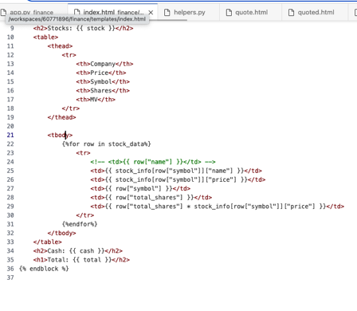</kbd>

<kbd>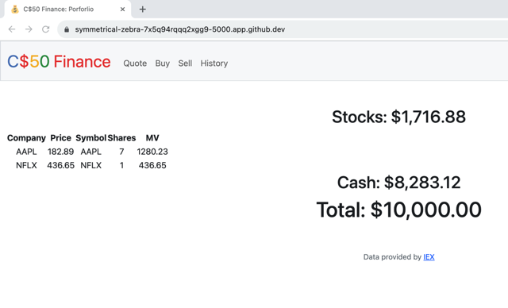</kbd>

<kbd></kbd>

<kbd></kbd>

<kbd>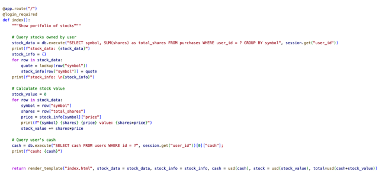</kbd>

 

<kbd>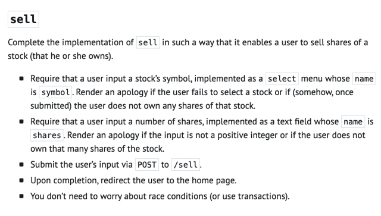</kbd>

 

<kbd>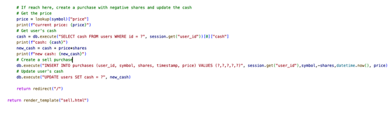</kbd>

<kbd></kbd>

<kbd>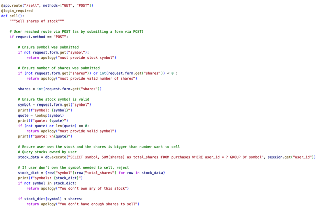</kbd>

 

<kbd>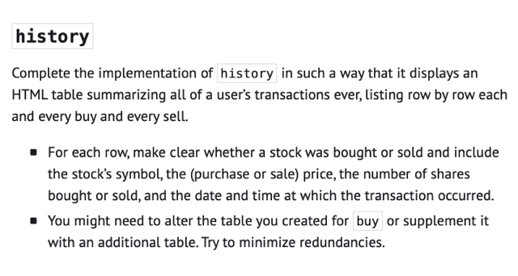</kbd>

 

