# Problem Set: Speller

📊 **Progress:** `3` Notes | `43` Screenshots

---

Quay lại Note & Giải thích

## Load

 

<kbd>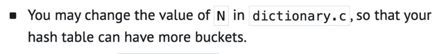</kbd>

<kbd></kbd>

<kbd>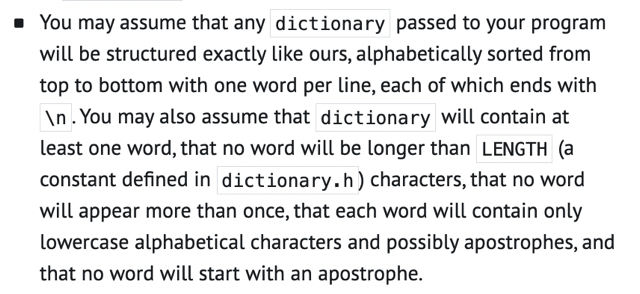</kbd>

 

### Walkthrough

 

  
  
<kbd>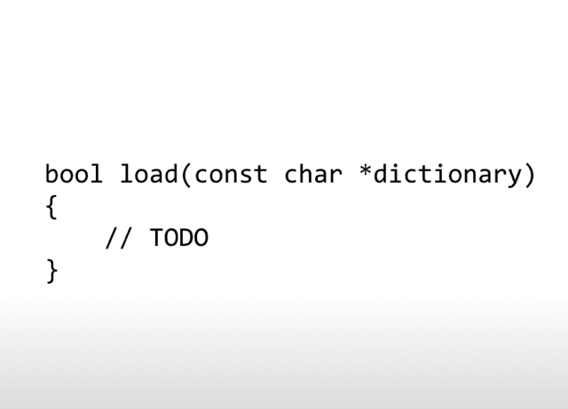</kbd>

   

  
  
<kbd>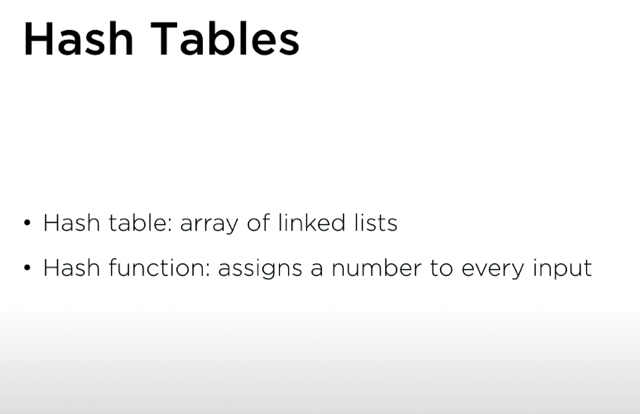</kbd>

   

  
  
<kbd>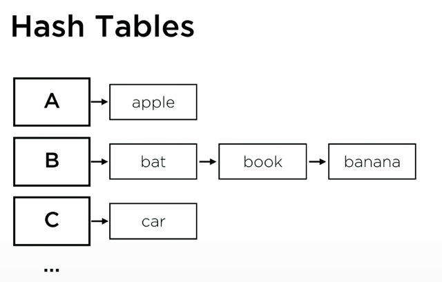</kbd>

  
<kbd></kbd>

  
<kbd>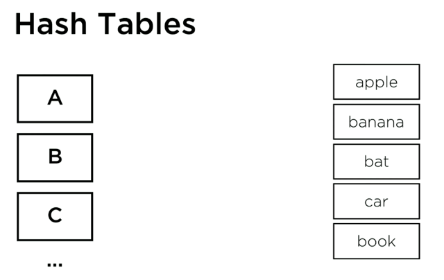</kbd>

   

  
  
<kbd>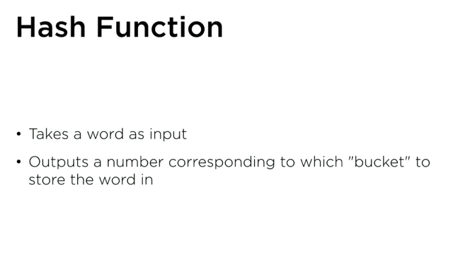</kbd>

   

  
  
<kbd>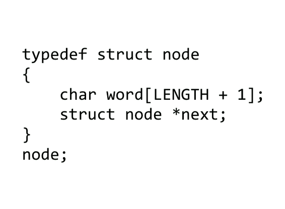</kbd>

  
<kbd></kbd>

  
<kbd>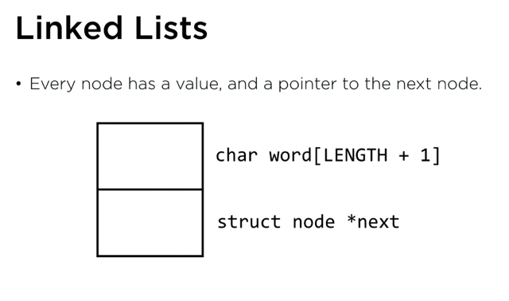</kbd>

   

  
  
<kbd>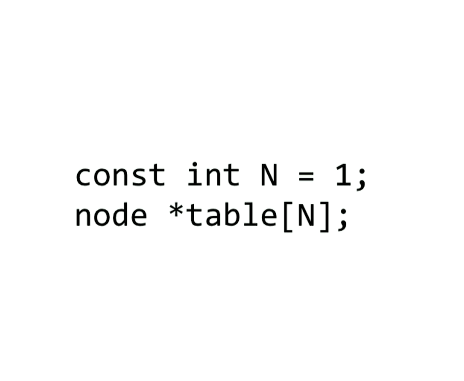</kbd>

   

  
  
<kbd>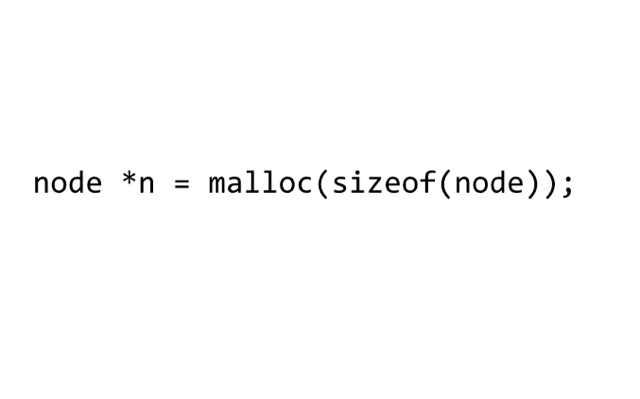</kbd>

   

  
  
<kbd>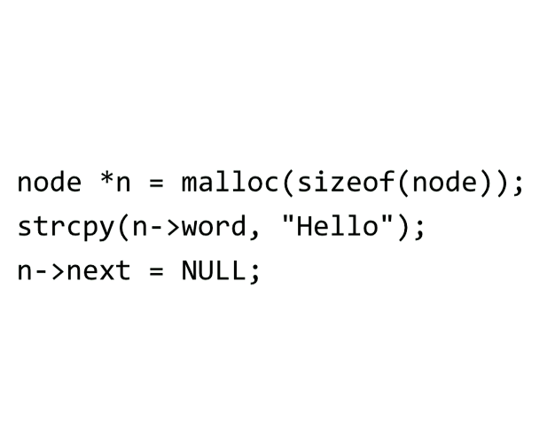</kbd>

> [!NOTE]
> Có thể tự set word vào cũng được
> nhưng dùng strcpy sẽ tiện hơn

   

  
  
<kbd>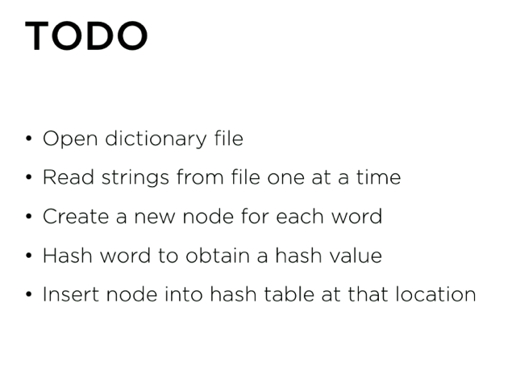</kbd>

   

  
  
<kbd>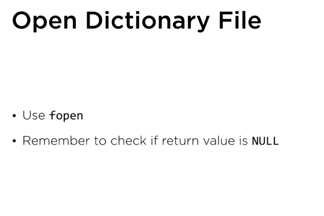</kbd>

   

  
  
<kbd>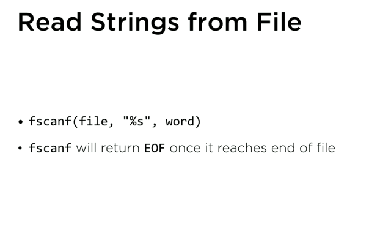</kbd>

> [!NOTE]
> cái word là char array mà mình muốn nó load
> vào.
>
> Thì ở đây dựa trên việc ta đã biết từ dài nhất
> trong các dictionary là bao nhiêu thì có thể tạo
> sẵn char array[]
>
> char *word[LENGTH];
> while (fscanf(file, "%s", word) != EOF)
> {
> }

   

  
  
<kbd>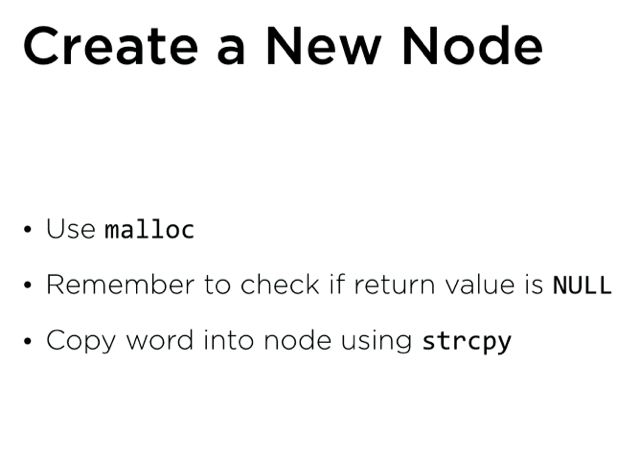</kbd>

   

  
  
<kbd>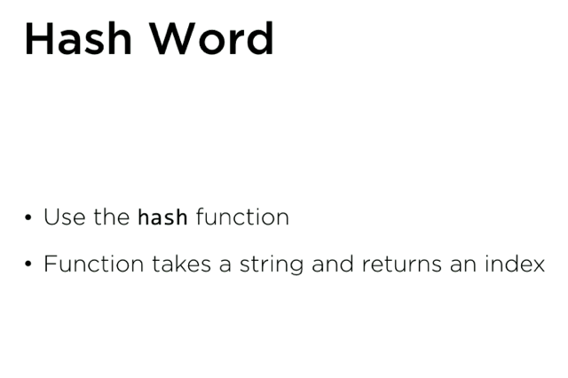</kbd>

   

  
  
<kbd>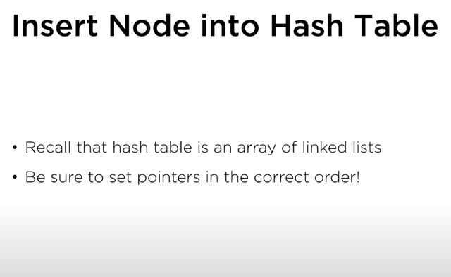</kbd>

   

  
  
<kbd>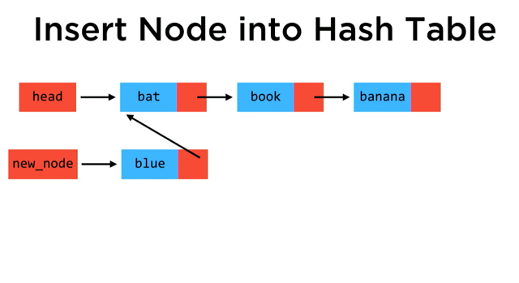</kbd>

  
<kbd>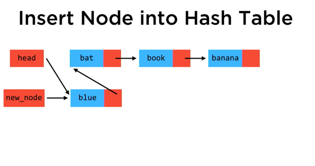</kbd>

  
<kbd></kbd>

  
<kbd></kbd>

  
<kbd>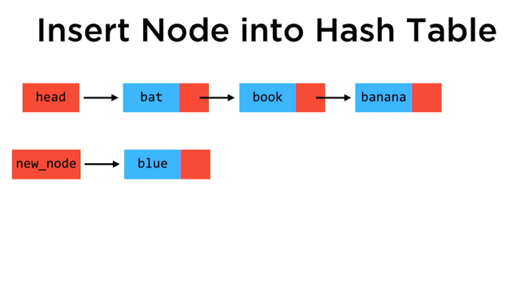</kbd>

   

## Hash

 

<kbd>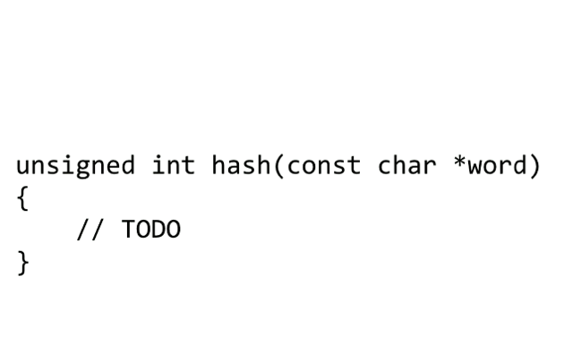</kbd>

 

<kbd>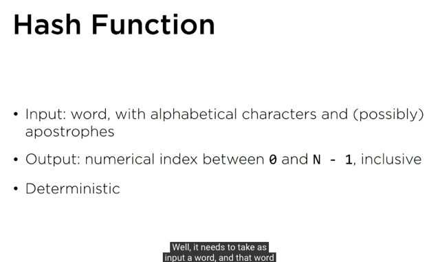</kbd>

 

<kbd>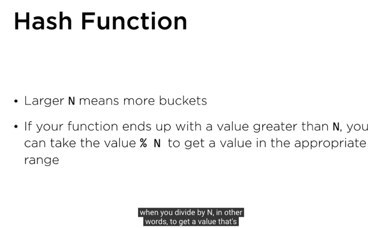</kbd>

 

## Size

 

## Check

 

<kbd>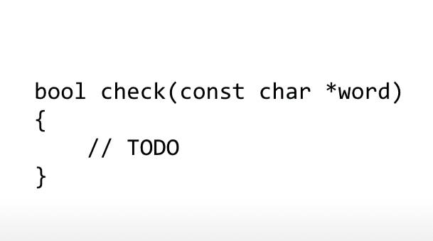</kbd>

 

<kbd>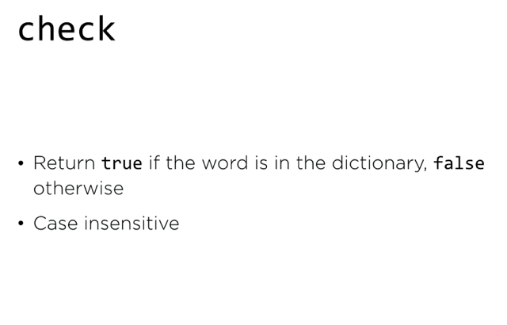</kbd>

 

<kbd>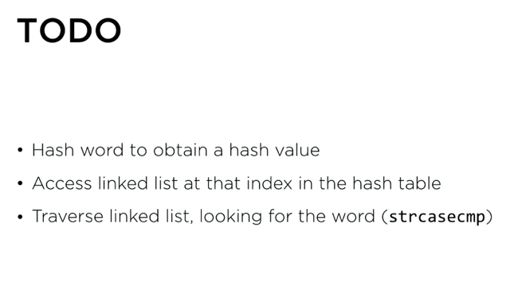</kbd>

 

<kbd>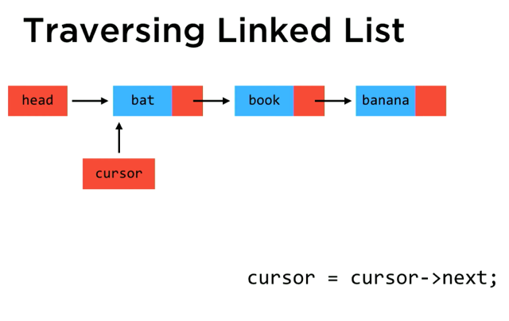</kbd>

 

<kbd>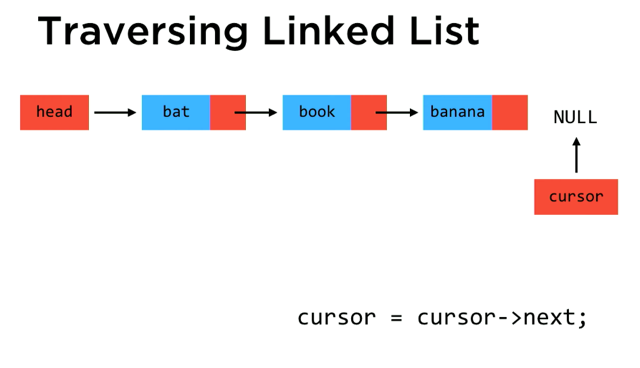</kbd>

 

<kbd>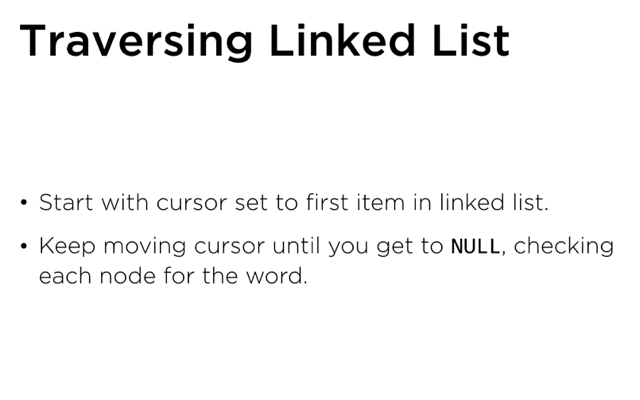</kbd>

 

## Free

 

<kbd>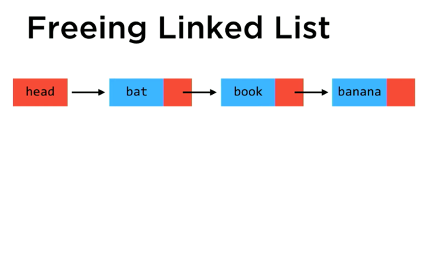</kbd>

 

<kbd>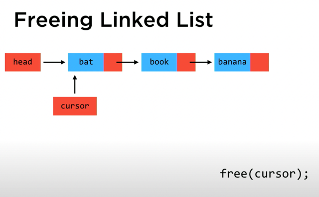</kbd>

 

<kbd>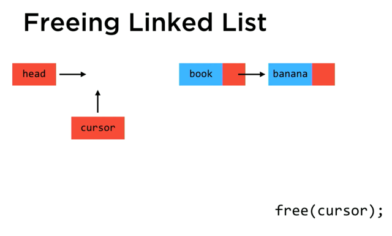</kbd>

 

<kbd>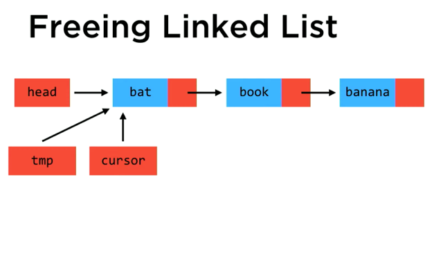</kbd>

 

<kbd>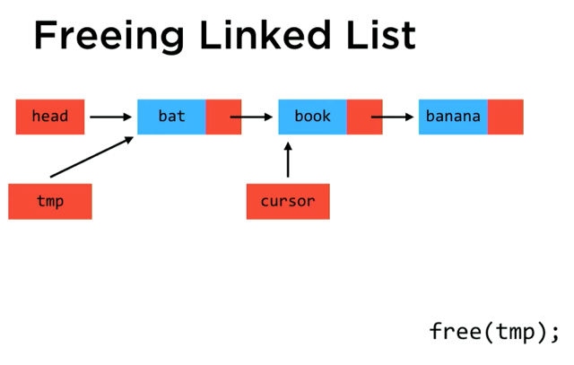</kbd>

 

<kbd>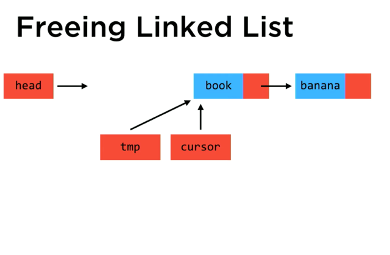</kbd>

 

<kbd>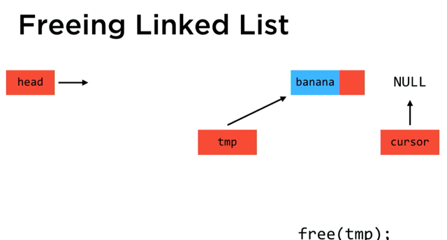</kbd>

 

<kbd>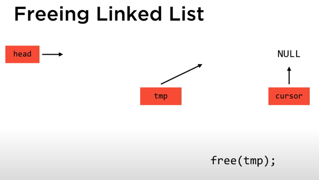</kbd>

 

