# Ps 1 Movies

📊 **Progress:** `12` Notes | `14` Screenshots

---

<kbd>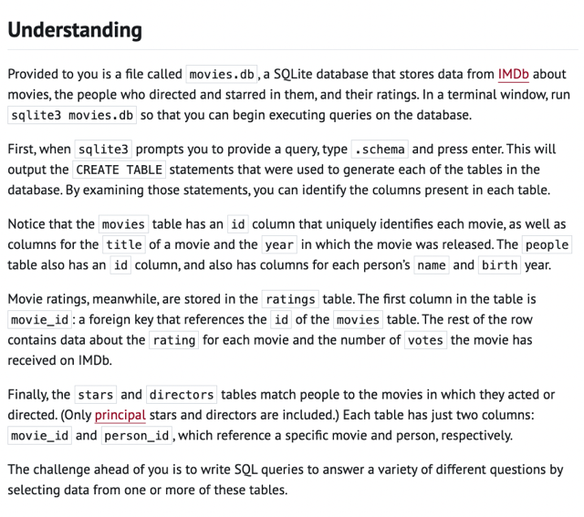</kbd>

> [!NOTE]
> Đại khái là ta sẽ gọi lệnh sql để lấy thông tin trả
> lời câu hỏi. Trong db này có 4 table

 

<kbd>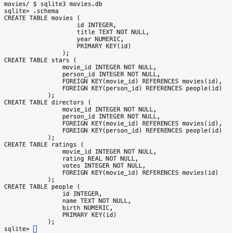</kbd>

 

<kbd>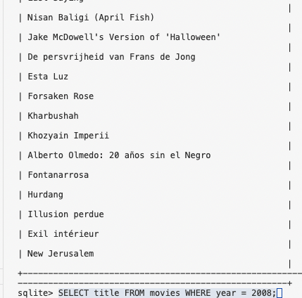</kbd>

> [!NOTE]
> Title các film release năm 2008

 

<kbd>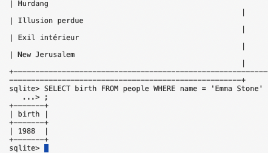</kbd>

> [!NOTE]
> Năm sinh con nhỏ
> Emma Stone

 

<kbd>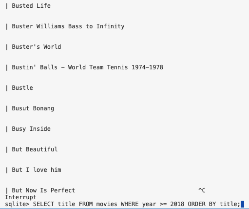</kbd>

> [!NOTE]
> tên movie có year `>=`
> 2018 sort bởi tên

 

<kbd>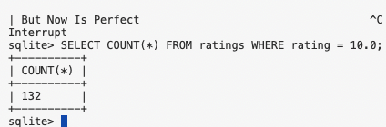</kbd>

> [!NOTE]
> Đếm số film có
> rating `=` 10

 

<kbd>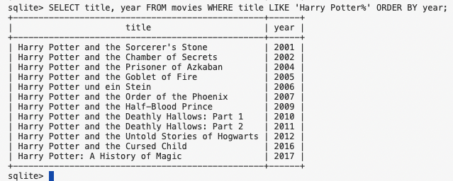</kbd>

> [!NOTE]
> list tên `+` năm phát hành các phim Harry Potter
> (là phim có title start with "Harry Potter") sort theo year

 

<kbd>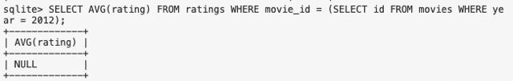</kbd>

> [!NOTE]
> Tính average rating của các film
> phát hành năm 2012

 

<kbd>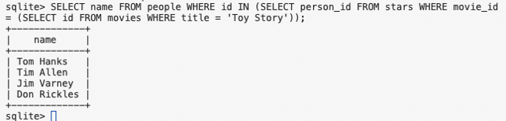</kbd>

> [!NOTE]
> List tên diễn viên trong
> phim Toy Story

 

<kbd>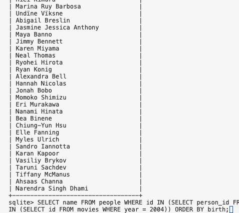</kbd>

> [!NOTE]
> list tên những diễn viên tham gia phim phát
> hành 2004, sort bởi năm sinh

 

<kbd>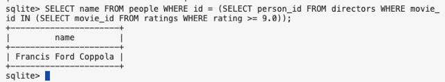</kbd>

 

<kbd>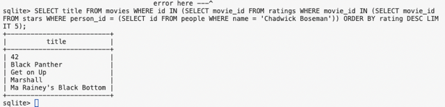</kbd>

> [!NOTE]
> list 5 phim rate cao nhất
> của cha này đóng

 

<kbd>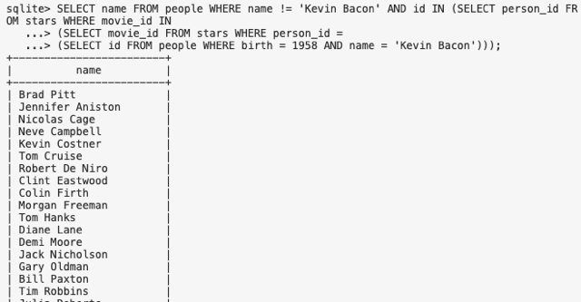</kbd>

> [!NOTE]
> 13 tên các người đóng chung với Kevin không tính ổng
>
> SELECT name FROM people WHERE name `!=` 'Kevin Bacon' AND id
> IN (SELECT `person_id` FROM stars WHERE `movie_id` IN (SELECT
> `movie_id` FROM stars WHERE `person_id` `=` (SELECT id FROM people
> WHERE birth `=` 1958 AND name `=` 'Kevin Bacon')));

 

<kbd>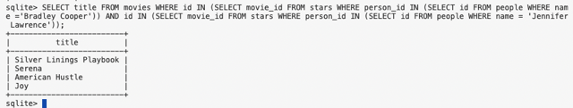</kbd>

> [!NOTE]
> 12 Các phim mà hai người này đóng chung
>
> SELECT title FROM movies WHERE id IN (SELECT `movie_id` FROM
> stars WHERE `person_id` IN (SELECT id FROM people WHERE name `='`
> Bradley Cooper')) AND id IN (SELECT `movie_id` FROM stars WHERE
> `person_id` IN (SELECT id FROM people WHERE name `=` 'Jennifer
> Lawrence'));

 

