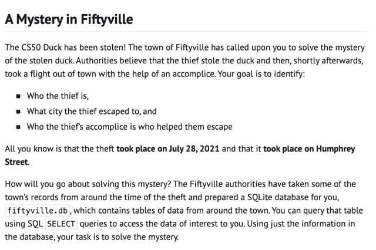
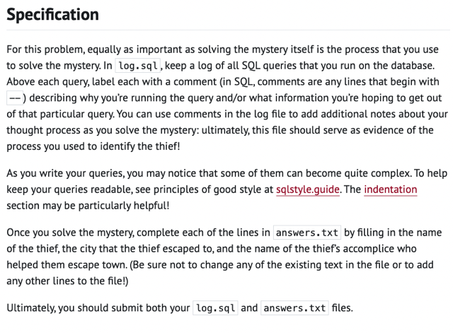
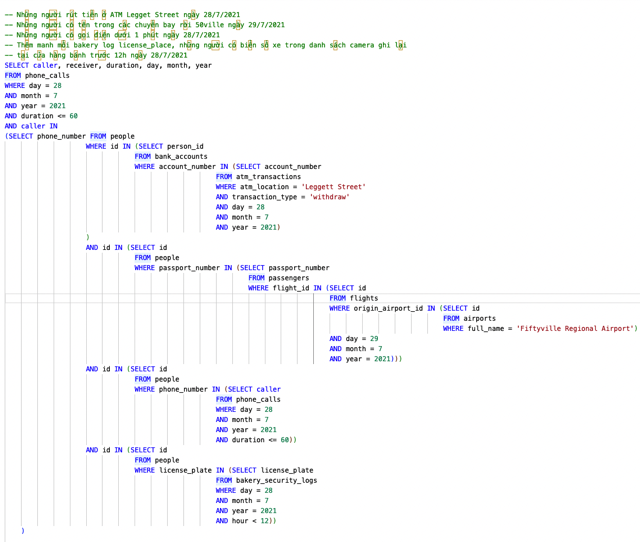
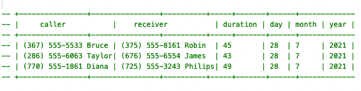
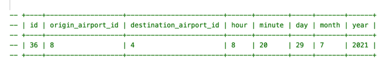

# Ps 2 50ville

📊 **Progress:** `7` Notes | `8` Screenshots

---
<a id="node-1408"></a>

<p align="center"><kbd></kbd></p>

> [!NOTE]
> Nói chung là tìm ăn
> trộm dựa vào db

<br>

<a id="node-1409"></a>

<p align="center"><kbd></kbd></p>

<br>


<a id="node-1410"></a>
## CREATE TABLE `\\*crime_scene_reports\\*` (

> [!NOTE]
> CREATE TABLE \**crime_scene_reports\** (
>     id INTEGER,
>     year INTEGER,
>     month INTEGER,
>     day INTEGER,
>     street TEXT,
>     description TEXT,
>     PRIMARY KEY(id)
> );
> CREATE TABLE \**interviews\** (
>     id INTEGER,
>     name TEXT,
>     year INTEGER,
>     month INTEGER,
>     day INTEGER,
>     transcript TEXT,
>     PRIMARY KEY(id)
> );
> CREATE TABLE \**atm_transactions\** (
>     id INTEGER,
>     `account_number` INTEGER,
>     year INTEGER,
>     month INTEGER,
>     day INTEGER,
>     `atm_location` TEXT,
>     `transaction_type` TEXT,
>     amount INTEGER,
>     PRIMARY KEY(id)
> );
> CREATE TABLE \**bank_accounts\** (
>     `account_number` INTEGER,
>     `person_id` INTEGER,
>     `creation_year` INTEGER,
>     FOREIGN `KEY(person_id)` REFERENCES people(id)
> );
> CREATE TABLE \**airports\** (
>     id INTEGER,
>     abbreviation TEXT,
>     `full_name` TEXT,
>     city TEXT,
>     PRIMARY KEY(id)
> );
>

<br>


<a id="node-1411"></a>
### CREATE TABLE \\*flights\\* (

> [!NOTE]
> CREATE TABLE \**flights\** (
>     id INTEGER,
>     `origin_airport_id` INTEGER,
>     `destination_airport_id` INTEGER,
>     year INTEGER,
>     month INTEGER,
>     day INTEGER,
>     hour INTEGER,
>     minute INTEGER,
>     PRIMARY KEY(id),
>     FOREIGN `KEY(origin_airport_id)` REFERENCES airports(id),
>     FOREIGN `KEY(destination_airport_id)` REFERENCES airports(id)
> );
> CREATE TABLE \**passengers\** (
>     `flight_id` INTEGER,
>     `passport_number` INTEGER,
>     seat TEXT,
>     FOREIGN `KEY(flight_id)` REFERENCES flights(id)
> );
> CREATE TABLE \**phone_calls\** (
>     id INTEGER,
>     caller TEXT,
>     receiver TEXT,
>     year INTEGER,
>     month INTEGER,
>     day INTEGER,
>     duration INTEGER,
>     PRIMARY KEY(id)
> );
> CREATE TABLE \**people\** (
>     id INTEGER,
>     name TEXT,
>     `phone_number` TEXT,
>     `passport_number` INTEGER,
>     `license_plate` TEXT,
>     PRIMARY KEY(id)
> );
> CREATE TABLE \**bakery_security_logs\** (
>     id INTEGER,
>     year INTEGER,
>     month INTEGER,
>     day INTEGER,
>     hour INTEGER,
>     minute INTEGER,
>     activity TEXT,
>     `license_plate` TEXT,
>     PRIMARY KEY(id)
> );

<br>

  <a id="node-1412"></a>
  <p align="center"><kbd></kbd></p>
  <br>

  <a id="node-1413"></a>
  <p align="center"><kbd></kbd></p>
  <br>

<a id="node-1414"></a>
- `--` Tìm hồ sơ vụ án có liên quan đến ‘duck’ SELECT description FROM `crime_scene_reports` WHERE description LIKE '%duck%'; SELECT description FROM `crime_scene_reports` WHERE street `=` 'Humphrey Street' AND day `=` 28 AND month `=` 7 AND year `=` 2021; `->` `--` Theft of the CS50 duck took place at 10:15am at the Humphrey Street bakery.  `--` Interviews were conducted today with three witnesses who were present at the time – each of their interview transcripts mentions the bakery. |  `--` Xem thử có activity liên quan đến tiệm bánh này không SELECT * FROM `bakery_security_logs` WHERE activity LIKE '%Humphrey%';  `--` Xem thử activity có gì SELECT DISTINCT(activity)  FROM `bakery_security_logs;`  `--` Xem thử các transcript của interview có nhắc đến bakery  SELECT transcript FROM interviews WHERE transcript LIKE '%bakery%';  `->` `--` Sometime within \\*ten minutes of the theft\\*, I saw the thief get into a car in the\\* bakery parking lot\\* and drive away.  `--` If you have \\*security footage\\* from the bakery parking lot, you might want to \\*look for cars that left the parking lot in that time frame\\*.                                                          |  `--` I don't know the thief's name, but it was someone I recognized. Earlier this morning, before I arrived at Emma's bakery,  `--` I was walking by the\\* ATM on Leggett Street\\* and saw the \\*thief there withdrawing some money\\*.                                                                                                 |  `--` As the thief was leaving the bakery, they called someone who \\*talked to them for less than a minute\\*. In the call,  `--` I heard the thief say that they were planning to take the \\*earliest\\* \\*flight out of Fiftyville tomorrow. \\* `--` The thief then asked the person on the other end of the phone to\\* purchase the flight ticket. \\*  `--` I saw Richard take a bite out of his pastry at the bakery before his pastry was stolen from him.
  > [!NOTE]
  > Dựa vào vài thông tin ban đầu, tìm hồ
  > sơ lời khai của 3 nhân chứng

  <br>

    <a id="node-1415"></a>
    <p align="center"><kbd></kbd></p>
    > [!NOTE]
    > Tìm danh sách những người thỏa mãn 4 điều kiện này
    >
    > ```text
    > -- Những người rút tiền ở ATM Legget Street ngày 28/7/2021
    > ```
    >
    > `--` Những người có tên trong các chuyến bay rời 50ville ngày 
    > `29/7/2021`
    >
    > ```text
    > -- Những người có gọi điện dưới 1 phút ngày 28/7/2021
    > ```
    >
    > `--` Thêm manh mối bakery log `license_place,` những người có 
    > biển số xe trong danh sách camera ghi lại
    >
    > ```text
    > -- tại cửa hàng bánh trước 12h ngày 28/7/2021
    > ```
    >
    > Và xem họ gọi cho ai

    <br>

    <a id="node-1416"></a>
    <p align="center"><kbd></kbd></p>
    > [!NOTE]
    > Thu hẹp lại mấy khứa này.
    > Thử submit cặp Bruce `-` Robbin (search thì thấy khứa Bruce
    > đi New York) thì thấy đúng

    <br>

  <a id="node-1417"></a>
  - SELECT id, `origin_airport_id,` `destination_airport_id,` hour, minute, day, month, year  FROM flights  WHERE id IN  (SELECT `flight_id` FROM passengers WHERE day `=` 29 AND month `=` 7 AND year `=` 2021 AND `origin_airport_id` `=` 8 AND `passport_number` IN  (SELECT `passport_number` FROM people WHERE id IN  (SELECT id FROM people                      WHERE id IN (SELECT `person_id`                                  FROM `bank_accounts`                                  WHERE `account_number` IN (SELECT `account_number`                                                      FROM `atm_transactions`                                                      WHERE `atm_location` `=` 'Leggett Street'                                                      AND `transaction_type` `=` 'withdraw'                                                      AND day `=` 28                                                      AND month `=` 7                                                      AND year `=` 2021)                     )                     AND id IN (SELECT id                                  FROM people                                  WHERE `passport_number` IN (SELECT `passport_number`                                                              FROM passengers                                                              WHERE `flight_id` IN (SELECT id                                                                                  FROM flights                                                                                  WHERE `origin_airport_id` IN (SELECT id                                                                                                              FROM airports                                                                                                              WHERE `full_name` `=` 'Fiftyville Regional Airport')                                                                                 AND day `=` 29                                                                                  AND month `=` 7                                                                                  AND year `=` 2021)))                     AND id IN (SELECT id                                  FROM people                                  WHERE `phone_number` IN (SELECT caller                                                      FROM `phone_calls`                                                      WHERE day `=` 28                                                     AND month `=` 7                                                     AND year `=` 2021                                                     AND duration `<=` 60))                     AND id IN (SELECT id                                  FROM people                                  WHERE `license_plate` IN (SELECT `license_plate`                                                      FROM `bakery_security_logs`                                                      WHERE day `=` 28                                                      AND month `=` 7                                                      AND year `=` 2021                                                      AND hour < 11))     ))) ORDER BY hour LIMIT 1;
    > [!NOTE]
    > Dựa thêm manh mối là họ sẽ dự
    > định bay chuyến sớm nhất thì ta
    > sẽ lấy chuyến sớm

    <br>

      <a id="node-1418"></a>
      <p align="center"><kbd></kbd></p>
      > [!NOTE]
      > Ra kết quả là chuyến này, trong 3 khứa
      > trên khứa nào đi chuyến này (flight id `=` 36)

      <br>

    <a id="node-1419"></a>
    - SELECT name FROM people WHERE `passport_numer` IN (SELECT `passport_number` FROM p                   error here `---^` sqlite> SELECT name FROM people WHERE `passport_number` IN (SELECT `passport_number` FROM passengers WHERE `flight_id` `=` 36);
      <br>

        <a id="node-1420"></a>
        <p align="center"><kbd></kbd></p>
        > [!NOTE]
        > Cả Bruce và Taylor đều
        > bay chuyến này

        <br>

