# Ps : Recover

📊 **Progress:** `23` Notes | `34` Screenshots

---

<kbd>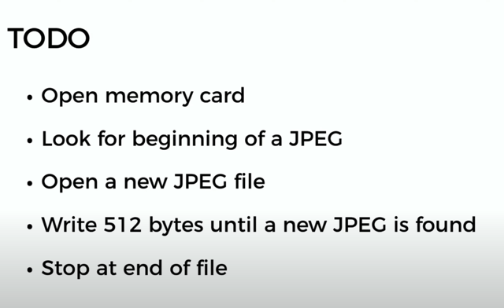</kbd>

 

<kbd>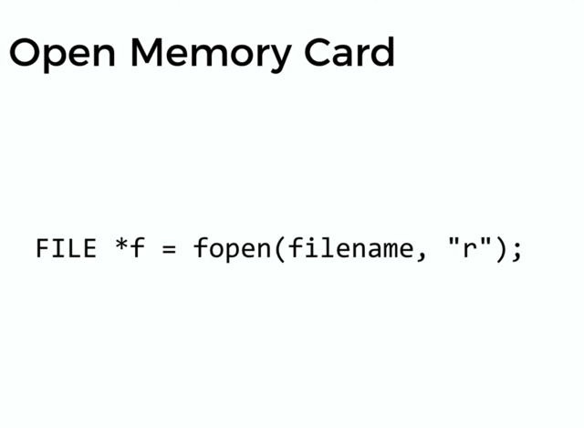</kbd>

> [!NOTE]
> "r" = read mode

 

<kbd>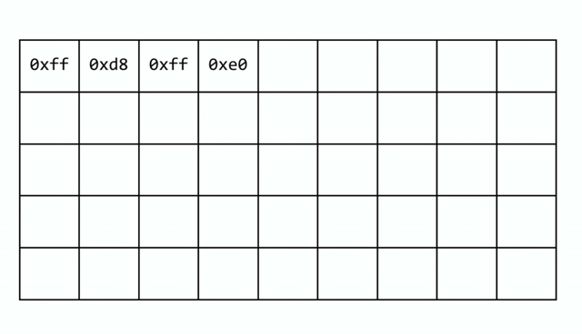</kbd>

 

<kbd>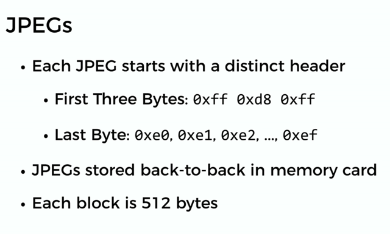</kbd>

 

<kbd>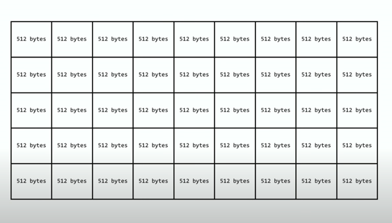</kbd>

> [!NOTE]
> Ta sẽ **đọc file theo từng chunk 512 bytes** và check
> pattern bằng cách **check 4 bytes đầu tiên**
>
> Khi check thấy trong một cục đó có pattern của  một jpeg
> file (bằng cách check 4 byte đầu tiên)
>
> Tại sao chỉ **check 4 byte đầu tiên**: Là bởi ổng nói nó - là
> cái cơ chế FAT của máy ảnh
>  - sẽ ghi data theo kiểu giả sử l**ưu hết 1 image rồi mà
> vẫn dư** thì nó**vẫn qua chunk 512 bytes tiếp theo** để
> ghi image mới. Và phần dư của cái chunk gọi là **slack space**

 

## Fortunately, digital cameras tend to store photographs contiguously on

> [!NOTE]
> Fortunately, digital cameras tend to store photographs contiguously on
> memory cards, whereby each photo is stored immediately after the previously
> taken photo. Accordingly, the start of a JPEG usually demarks the end of
> another.
>
> \**However\**, digital cameras often initialize cards with a FAT file system
> whose\**“block size” is 512 bytes (B)\**. The implication is that these cameras
> only write to those cards in units of 512 B. A photo that’s 1 MB (i.e., 1,048,576
> B) thus takes up 1048576 ÷ 512 = 2048 “blocks” on a memory card. But so
> does a photo that’s, say, one byte smaller (i.e., 1,048,575 B)! The \**wasted
> space\** on disk is called “\**slack space\**.” Forensic investigators often look at
> slack space for remnants of suspicious data.
>
> The implication of all these details is that you, the investigator, can probably
> write a program that \**iterates over a copy of my memory card\**, \**looking for
> JPEGs’ signatures\**.
>
> Each time you \**find a signature\**, you can \**open a new file\** \**for writing\**
> and start \**filling that file with bytes from my memory card\**, closing that file
> only\**once you encounter another signature\**.
>
> Moreover, \**rather than\** read my memory card’s \**bytes one at a time\**, you can
> \**read 512 of them at a time\** into a buffer for efficiency’s sake. Thanks to FAT,
> you can trust that JPEGs’ signatures will be “block-aligned.” That is, you need
> \**only look for those signatures in a block’s first four bytes.\**

 

### Realize, of course, that JPEGs can span contiguous blocks.

> [!NOTE]
> Realize, of course, that JPEGs can span contiguous blocks.
> Otherwise, no JPEG could be larger than 512 B. But the \**last byte of
> a JPEG might not fall at the very end of a block. \**
>
> Recall the possibility of\**slack space\**. But not to worry. Because this
> memory card was \**brand-new \**when I started snapping photos, odds
> are it’d been\**“zeroed” \**(i.e., filled with 0s) by the manufacturer, in
> which case any slack space will be filled with 0s. It’s okay if those
> trailing 0s end up in the JPEGs you recover; they should still be
> viewable.

> [!NOTE]
> Đại khái là ổng nói**một cái jpeg sẽ trải qua nhiều  block (512
> bytes)**. Và cái **byte cuối cùng của jpeg khả năng cao là không
> nằm ngay chóc cái byte  cuối cùng của block** (cái này thì dễ
> hiểu rồi)
>
> Và cũng như đã nói ở đoạn trước đó là phần dư (Chưa hết 1
> block mà đã hết jpeg) gọi là slack-space.
>
> Thì ổng nói là vì cái thẻ mới nên khả năng cao là chưa xài,
> nên cái phần dư đó chỉ có số 0, tức là còn mới tinh, chưa
> từng chứa dữ liệu gì.
>
> Như đã học, ổng nói vậy vì nếu mà cái thẻ xài rồi, khả năng
> khi ghi đến giả sử byte thứ 400 trong block thì kết thúc  data
> của jpec thì 112 cái byte còn lại có thể cũng có GARBAGE là
> data của chương trình nào đó lưu vào nhưng chưa xoá.
>
> Thì từ đây có thể cho ta cái hiểu rằng, cứ ghi hết data của mỗi
> block vào file dù cho block cuối data jpec của jpeg kết thúc trước
> byte cuối. Vì phần data trong slack sapce không ảnh hưởng gì

 

- Now, I only have \\*one memory card\\*, but there are a lot of you! And so I’ve gone ahead and created a “forensic image” of the card, \\*storing its contents, byte after byte\\*, in a file called card. raw.   So that you don’t waste time \\*iterating over millions of 0s\\* unnecessarily, I’ve only imaged the \\*first few megabytes\\* of the memory card. But you should ultimately find that the image contains 50 JPEGs.
  
<kbd>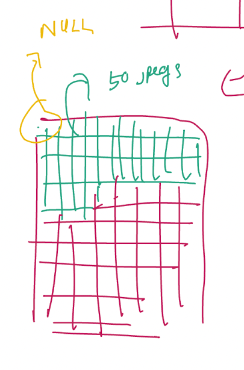</kbd>

  
<kbd></kbd>

> [!NOTE]
> Cuối cùng đại ý là ổng đảm bảo cái các jpegs chỉ nằm ở những
> megabytes đầu tiên của memory thôi chứ không phải nằm ở đâu
> đó xa xôi tuốt luốt để mà phải iterate cả triệu con số 0 (tức là các
> byte trống không có data) 
>
> Và dù vậy vẫn có 50 cái hình

   

    
    
<kbd>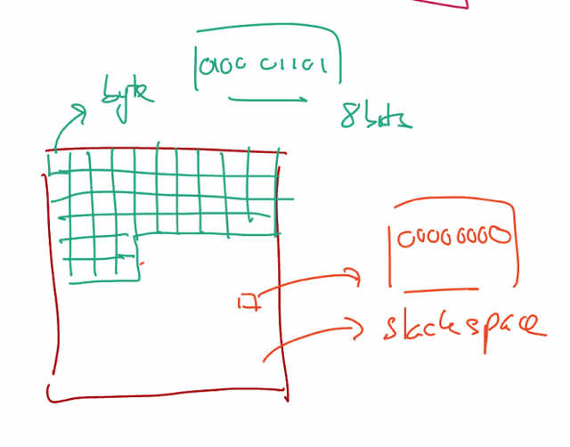</kbd>

    
<kbd></kbd>

    
<kbd>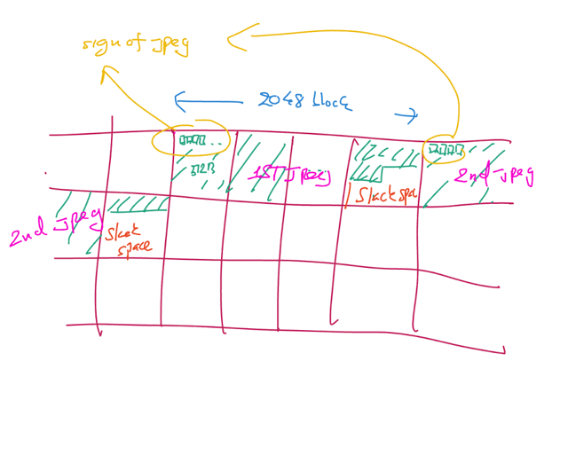</kbd>

     

    
    
<kbd>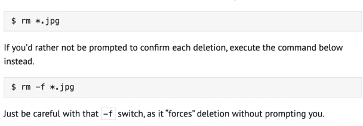</kbd>

    
<kbd></kbd>

    
<kbd>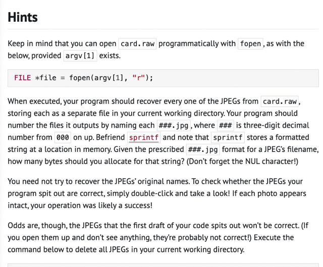</kbd>

> [!NOTE]
> "002.jpg" = 7 char -> Cần 8 bytes
>
> Đại khái là cách để open card.raw để bắt đầu đọc data.
>
> Dùng sprintf để "đặt tên" có nói rõ ở sau.Và không cần
> recover tên gốc của image mà chỉ cần đặt tên theo số 
> thứ tự là được
>
> Để check thử cái file mình recover có đúng không thì 
> chỉ việc bấm mở ra để xem, nếu là cái hình thì đúng
>
> Ở dưới là cách xoá file

     

    
    
<kbd>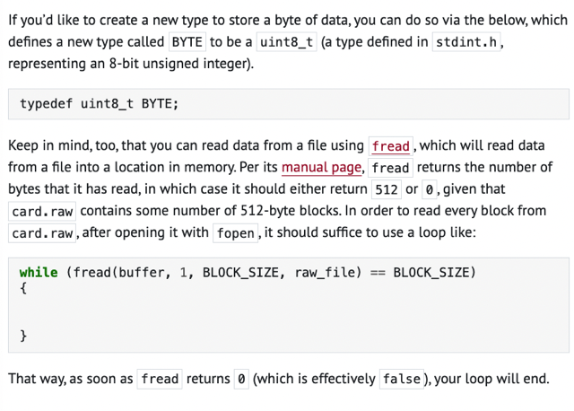</kbd>

> [!NOTE]
> Ở đây họ có hint cho việc tạo một new type dạng uint8_t
> chưa hiểu để làm gì.
>
> https://man.cs50.io/3/fread
> Còn việc đọc file bằng fread có hướng dẫn ở sau, đại khái
> Buffer sẽ là cái pointer, ta sẽ đọc từng element , mỗi element
> có BLOCK_SIZE = 512 bytes, raw file là cái file sau khi dùng
> fopen để mở file.
>
> Thì như họ cũng có nói (ở sau) cách để detect xem việc đọc
> và ghi file có thể kết thúc hay chưa. Thì ở đây chính là như vậy:
> Ta sẽ while cho đến khi nào lệnh fread trả về không bằng 512 bytes 
> nữa thì dừng (mà ở đây ổng nói thêm là nó sẽ trả về 0) bởi file
> raw được tạo Theo kiểu có đúng some numebr of 512 bytes block.

     

    
    
<kbd>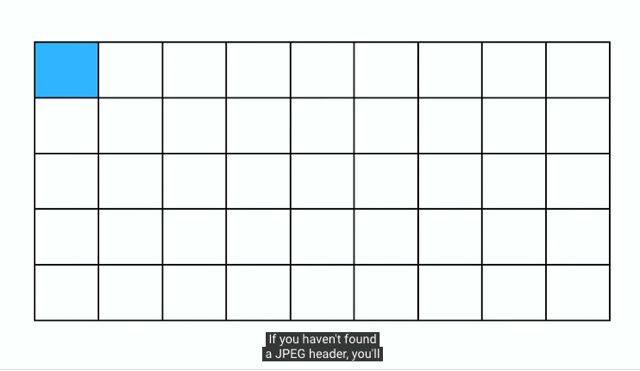</kbd>

> [!NOTE]
> Ta sẽ lần lượt đọc từng chuck 512 bytes và detect
> xem 4 bytes đầu có  pattern của một jpeg ko

     

    
    
<kbd>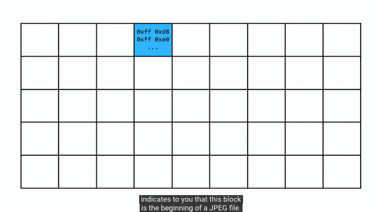</kbd>

> [!NOTE]
> Và khi xác định là có, thì:
>
> Nếu chưa thì tạo file và bắt đầu ghi
> data từ file này vào file đó
>
> Nếu đang ghi thì kết thúc tạo file mới và bắt đầu ghi

     

    
    
<kbd>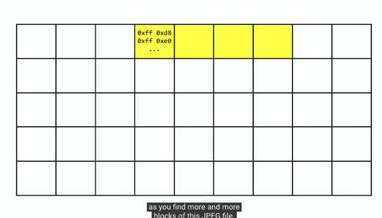</kbd>

     

    
    
<kbd>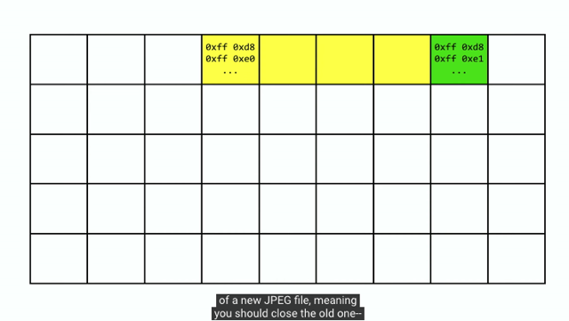</kbd>

> [!NOTE]
> Đây là khi đang ghi thì phát hiện pattern ->
> Đóng file đang ghi và ghi file mới

     

    
    
<kbd>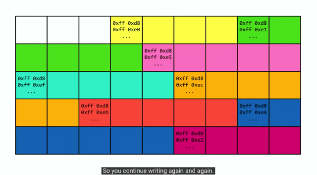</kbd>

     

    
    
<kbd>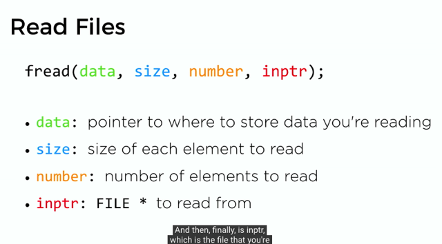</kbd>

> [!NOTE]
> Size: **số bytes của mỗi element** mà mình đang cố gắng
> đọc từ file
>
> number: Số element mà mình muốn đọc cùng lúc  (all at
> once) Cái này nhiều khả năng là 1 thôi.
>
> và inptr: FILE mà mình sẽ đọc data từ đó
>
> Và có**chú ý là ta sẽ cần đọc file** từ memory card theo các
> **chunk 512 bytes** thì có nghĩa là như vậy ta sẽ **set size =
> 512 (mỗi element là 512 bytes)**

     

    
    
<kbd>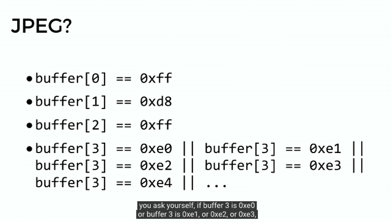</kbd>

> [!NOTE]
> Đại khái là mình sẽ đọc data thành từng **chunk 512 bytes.**
> Vì ta kiểu như làm sao có một cái array để chứa 512 bytes đó
>
> Thì từ đó mới check thử xem có phải là JPEG ko bằng cách
> check **4 byte đầu tiên**. (Với mỗi byte, kiểu như tính ra xem
> base-16 value của nó là bao nhiêu)
>
> Và so với quy luật
>
> ====
>
> 0xff = 255 Vậy cái byte thứ nhất phải là có chuỗi binary là 
> 11111111 hay tính ra phải là 255
>
> Nhớ lại 1 byte = 8 bit. Thì câu hỏi là đọc giá trị của 1 byte như
> thế nào? 
>
> A: Có thể là từ address tới 1 byte ví dụ p. Ta sẽ **int n = *p;** 
> để đi tới đó, và xem value của nó. thì check giá trị của nó 
> xem có bằng 255 không

     

    
    
<kbd>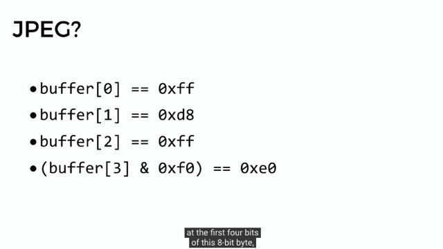</kbd>

> [!NOTE]
> Thì đại khái là đối với cái byte thứ 4, thay vì so 16 lần
> với 16 cái pattern thì dùng cách **bit-wise arithmetic** như
> thế này. Nôm na là nó "**cắt đi bớt và so phần đầu thôi"**"Just look at the first four bits of this 8-bits, và set 4 bits 
> còn lại thành 0" (ví dụ 1234 5678 thì ) thành 1234 0000.
>
> Để rồi chỉ cần so kết qủa sau khi cắt với 0xe0. Phần này
> hiểu ý chính là vậy
>
> 0xe0 = e*16 + 0 = 14*16 + 0 = 224
> 0xe1 = e*16 + 1 = 14*16 + 1 = 225
> ....
> 0xef = e*16 + f = 14*16 + 15 = 239
>
> 0xe0 = 224: **1110** 0000 = 2^7 + 2^6 + 2^5 + ...0
> 0xe1 = 225: **1110** 0001 = 2^7 + 2^6 + 2^5 + ...2^0
> 0xe2 = 226: **1110** 0010 = 2^7 + 2^6 + 2^5 + ...2^1
> ..
> 0xef = 239:  **1110** 1111 = 2^7 + 2^6 + 2^5 + ...0

     

    
    
<kbd>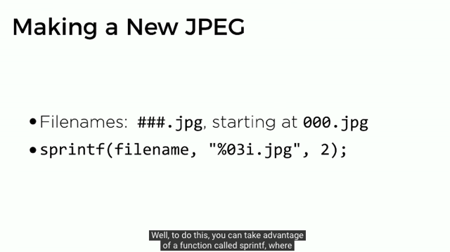</kbd>

> [!NOTE]
> Khi đã "tìm thấy một pattern cho thấy đó là
> jpeg thì ta sẽ **tạo một file mới** và **write data vào**
>
> Và **cần đặt tên file** để biết ta **đang ghi file jpeg thứ mấy**
> thì có thể dùng function **sprintf** là in vào một string
>
> Như này có nghĩa là in vào var string filename, một 
> content có dạng 3 digit.jpg (quy định bởi %03i), và số
> là giá trị digit -> filename sẽ là **002.jpg**

     

    
    
<kbd>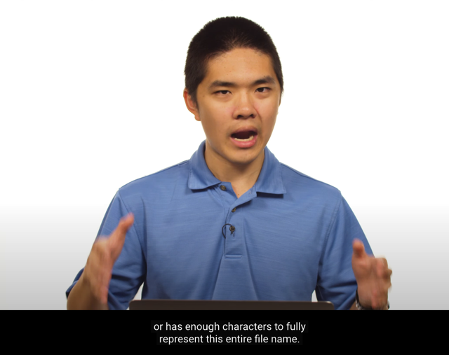</kbd>

> [!NOTE]
> Phải make sure có **đủ memory = có đủ character**
> để fully **represent this entire file name**

     

    
    
<kbd>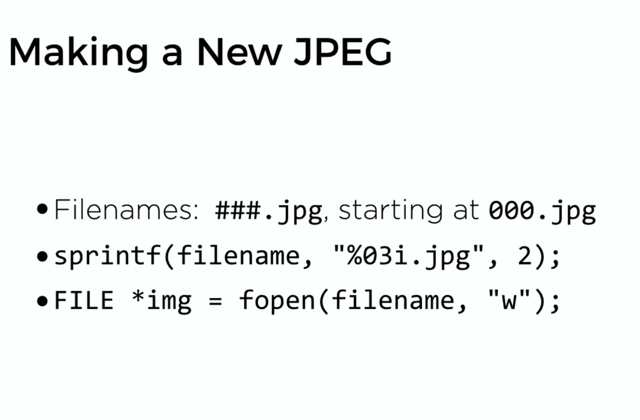</kbd>

> [!NOTE]
> Khi đó ta sẽ dùng FILE *img. = fopen(filename, "w") để
> mở file có tên filename mới đặt, ở mode "write" ("w")
> để có thể bắt đầu "write" file

     

    
    
<kbd>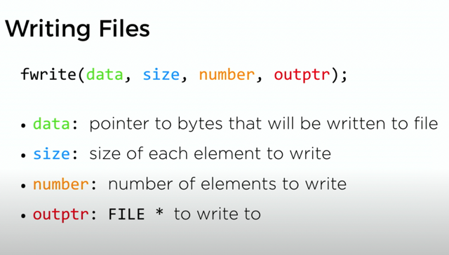</kbd>

> [!NOTE]
> Để ghi data vào file:
>
> data: pointer to bytes (hay address của cái bytes) mà ta
> muốn ghi vào file
>
> size: Là số bytes trong mỗi element mà mình muốn write to
> the file, để coi lại element là gì
>
> number: Số element that you're going to write to the file
>
> outptr: FILE mà mình muốn ghi vào, chính là cái file mới mở
> ra ở trước.

     

    
    
<kbd></kbd>

> [!NOTE]
> Và ta sẽ cứ tiếp tục detect và ghi file JPEG cho
> đến khi detect end of the file (file gốc trong bộ nhớ)

     

    
    
<kbd>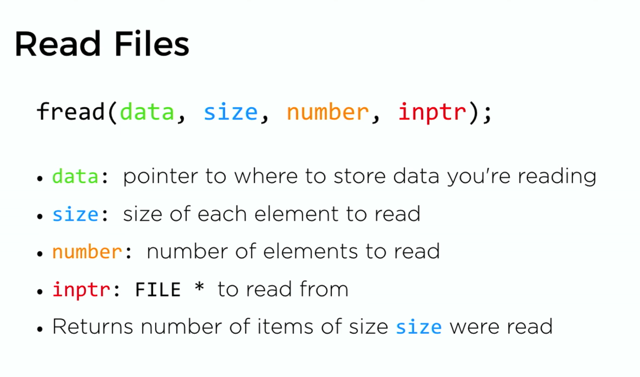</kbd>

> [!NOTE]
> Ví dụ tôi muốn đọc 255 elements = 255 bytes (À element là
> bytes) thì ý ổng nói là máy tính nó sẽ trả về từng cục 255
> bytes. Thì khi đến sắp hết file thì nó không còn trả đủ 255
> bytes nữa thì đó chính là dấu hiệu hết file
>
> Có thể chưa rõ chỗ này cụ thể là gì nhưng đại khái là  vậy
> để **check khi nào thì kết thúc**

     

    
    
<kbd>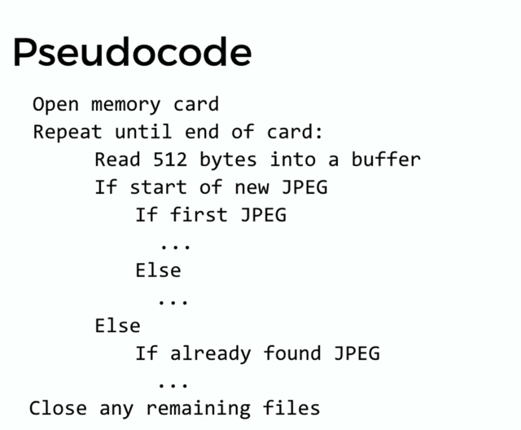</kbd>

     

    
    
<kbd>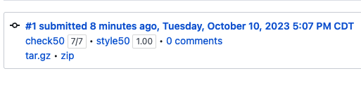</kbd>

     

    
    
<kbd>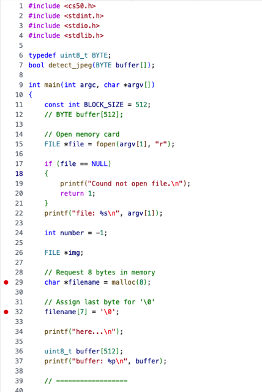</kbd>

> [!NOTE]
> QUay lại thử lại với BYTE buffer[512]

> [!NOTE]
> uint8_t buffer[512]: Tạo array chứa 512 uint8_t. 
>
> Thì khi gọi lệnh này máy tính sẽ tìm 512 byte (uint8_t là 8 bit
> chứa số dương) và return về buffer cái address của cái byte
> đầu tiên
>
> Khi gọi fread(buffer, 1, 512, file), máy tính sẽ đọc file, theo từng
> bộ 512 element mỗi element là 1 byte. Và load vào memory 
> có address là buffer từ byte đầu đến byte 512 chuẩn bị sẵn

     

    
    
<kbd>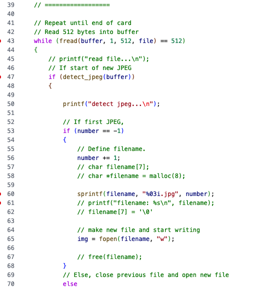</kbd>

> [!NOTE]
> read từng cụm 512 bộ (element) mỗi bộ 1
> bytes để bỏ vào buffer là array chứa 512
> uint8_t
>
> Nó hơi khác với vụ đọc 1 bộ (element), có
> 44 bytes ở bài toán volume.

     

    
    
<kbd>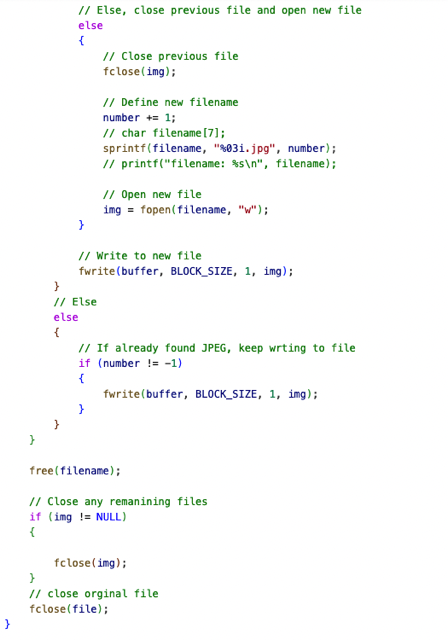</kbd>

> [!NOTE]
> Xong hết nhớ đóng cả file
> input (file) và img
>
> Gọi malloc thì phải free cái filename

     

    
    
<kbd>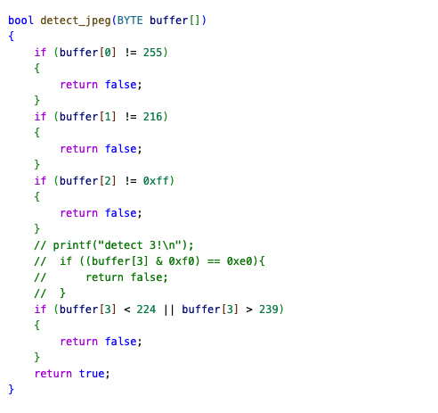</kbd>

> [!NOTE]
> Quay lại làm cái vụ trim sau. Tạm thời
> có thể check byte[3] kiểu này

     

