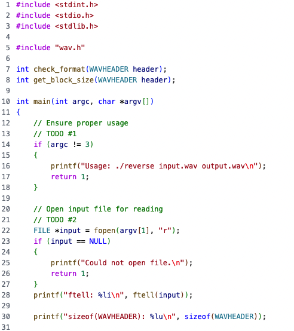
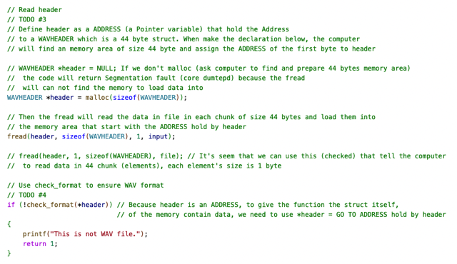
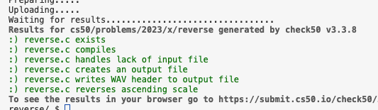
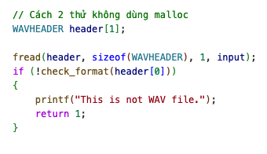
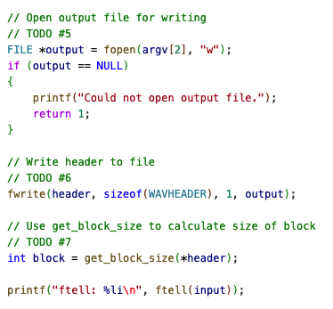
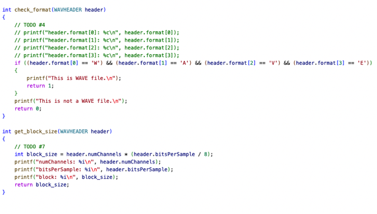
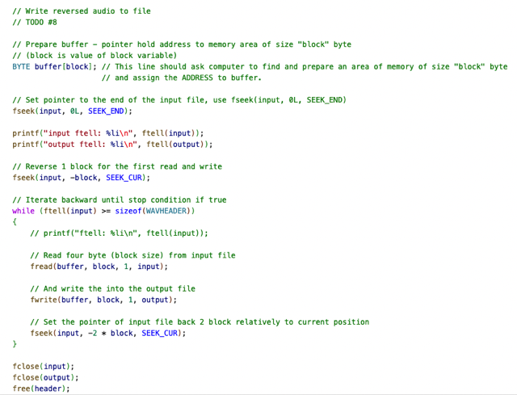

# Ps: Reverse

📊 **Progress:** `3` Notes | `8` Screenshots

---

<kbd></kbd>

 

<kbd></kbd>

> [!NOTE]
> Yeah, header nếu chỉ define là WAVHEADER header
>
> Thì máy tính cơ bản chỉ là tạo 1 **pointer** (8 bytes)
> cho header nhưng chưa có vùng memory nào để
> chứa 44 bytes của WAVHEADER cả.
>
> Phải malloc(44)
>
> Và khi gọi check_format phải *header vì để pass vào
> VALUE / là vùng 44 bytes chứa thông tin header, 
> bằng cách ĐI VÀO ADDRESS mà header đang giữ
> chứ bản thân header chỉ là một pointer variable được 
> cho 8 byte để mang giá trị của cái ADDRESS thôi

 

<kbd></kbd>

<kbd></kbd>

<kbd></kbd>

> [!NOTE]
> Đã check cách 2, vẫn đúng:
>
> Nếu mình define kiểu header là array như  này: 
>
> WAVHEADER header[1]
>
> Thì ngay lập tức máy tính sẽ tạo vùng 44 byte (vì WAVHEADER 
> struct cần size 44 byte) và assign **ADDRESS** của byte đầu cho 
> header, khi đó khỏi cần malloc. 
>
> Khi đó pass vào check_format sẽ đơn giản là header[0]
> vì header[0] đã **CHỈ TỚI** giá trị của vùng memory 44 byte
> chứa WAVHEADER

 

<kbd></kbd>

 

<kbd></kbd>

 

<kbd></kbd>

> [!NOTE]
> BYTE buffer[block] -> máy tính tạo vùng memory 4 (block)
> bytes  và assign address byte đầu cho buffer.
>
> fread(buffer,...) sẽ load data vào vùng 4 byte này với address
> của byte đầu là chứa trong buffer bởi. Nhắc lại không thừa
> buffer sẽ là pointer var được cho 8 bytes bộ nhớ.
>
> ====
>
> Việc fread(buffer, 1, block, ..) hay fread(buffer, block, 1...) cũng
> như nhau.
>
> ====
>
> Chỉ chú ý 1 chỗ là khi chuyển pointer về cuối file input thì
> phải lùi về 1 block cho lần read & write đầu tiên.
>
> ====
>
> Còn các function fseek cũng dễ hiểu, chỉ là giúp move pointer
> của file tới vị trí nào đó đọc doc là hiểu
>
> ftell thì giúp tell cái vị trí pointer hiện tại. 
>
> Thì ban đầu nó = 0, tức con trỏ ở byte thứ 0 (byte đầu tiên)
> mỗi khi lệnh fread( ..,size in bytes of element, no.element,...)
> thì pointer nó move đi (size of element* no.element), ví dụ
> từ 0, fread(..,1,4,..) thì nó nghĩa là nó read 4 byte, vậy sau
> khi read, pointer sẽ ở byte thứ 0 + 4 = 5

 

