# Short

📊 **Progress:** `40` Notes | `57` Screenshots

---

## Data Type

 

<kbd></kbd>

> [!NOTE]
> Đại khái ổng nói là như đã biết các ngôn ngữ ngày nay như
> Python sẽ tự biết data type của variable nhưng C hay Java thì
> cần phải define
>
> Thì với int - integer. Được represent bằng 4 bytes = 4*8 bits = 32 bit
>
> ====
>
> Integer Range -2^31 -> 2^31-1 là sao?
>
> **3 bits**: 111 = 2**2 + 2**1 + 2**0 = 4 + 2 + 1 = 7 = 8 - 1 = **2**3-1**
> **4 bits**: 1111 =2**3 + 2**2 + 2**1 + 2**0 = 8 + 4 + 2 + 1 = 15 = 16 - 1 = **2**4 - 1
> n bits**: .....**2^n - 1**
>
> Với 32 bits, **trừ 1 bit dành cho 'dấu' (dương hay âm)** thì ta **còn 31 bits**. 
>
> Thì số dương lớn nhất có thể được represent là **2**31 - 1: đó là khi bit đầu
> bằng 0 (thể hiện số dương), 31 bits tiếp theo là 1 hết.
>
> Ở giữa, khi 31 bit đều là 0 thì tất nhiên là 0**Số âm đầu tiên = -1 khi **bit đầu là 1, 31 bit tiếp theo là 0. 
>
> Do đó khi cả 31 bits tiếp theo ta thể hiện được tới số lớn nhất là 2^31 - 1.
> có nghĩa là với 31 bits đó nhỏ nhất là 0 và lớn là 2^31-1. Nhưng thay vì bắt
> đầu bởi -1 thì nay bắt đầu bởi -2 nên số lớn nhất là -2^31**

 

<kbd></kbd>

<kbd></kbd>

<kbd></kbd>

 

<kbd></kbd>

> [!NOTE]
> Cái dạng **unsigned int** này nó sẽ cho phép **represent integer** ở
> **range lớn hơn bằng cách hi sinh phần negative bằng cách xài luôn cái
> bit dành cho dấu**  cộng hay trừ (tức là khi cần integer lớn hơn 2 tỉ và biết
> rằng không mang giá trị âm thì có thể dùng cái này.
>
> Và vì không support số âm nữa, nên không cần dành 1 bit cho  dấu (sign)
> nữa, nên dùng cả 32 bits cho giá trị. Thì như mới nói với 32 bits số lớn
> nhất thể hiện được sẽ là **2^32 - 1  (với 32 bits đều = 1)**

 

<kbd></kbd>

> [!NOTE]
> **char data type** dùng để store một **character**. Chiếm **1 byte = 8 bits.**
>
> Với **8 bits** thì và có support số âm thì dùng 1 bit cho sign, còn lại 7 bits. Tương tự ở
> slide trước, số dương lớn nhất là 2^7-1 = 128-1 = 127 số âm nhỏ nhất là -127-1 =
> -128
>
> Và mỗi kí tự sẽ represent bằng một số theo ASCII

 

<kbd></kbd>

> [!NOTE]
> float dùng**32 bits** để represent **real number**.  Như đã nói bên **LLM**, nó
> tổ chức theo kiểu **1 bit đầu dành cho sign**,  **8 bits tiếp dành cho exponent**,
> **23 bits tiếp theo dành cho fraction.**Và vì bị giới hạn bởi chỉ có 32 bits, trong khi phần fraction - thập phân là chuỗi
> vô hạn nên float bị vấn đề **precision - tức là không thể nào represent chính xác
> tuyệt đối.**

 

<kbd></kbd>

 

<kbd></kbd>

> [!NOTE]
> Double cho phép represent real number với 64 bits từ đó
> tăng phần thập phân giúp chính xác hơn

 

<kbd></kbd>

> [!NOTE]
> Void không hẳn là datatype, nó chỉ đơn giản là báo hiệu
> function không return cái gì hoặc không nhận argument (ví dụ
> main (void)

 

<kbd></kbd>

 

<kbd></kbd>

 

<kbd></kbd>

> [!NOTE]
> Những tuần sau sẽ có structs dùng typedefs để define (gần
> gần nhưng chưa phải là class trong OOP)

 

<kbd></kbd>

> [!NOTE]
> Cách define,
> tương tự java

 

<kbd></kbd>

 

## Operators

 

## Linux Command Line

 

<kbd>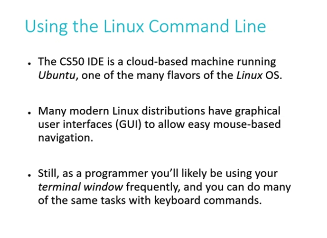</kbd>

 

<kbd>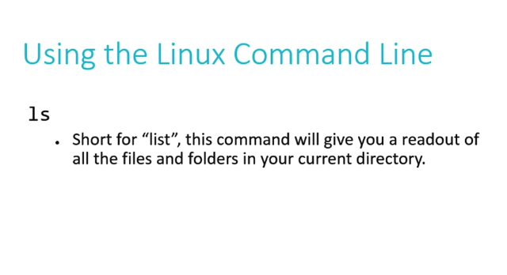</kbd>

> [!NOTE]
> ls: list current folder's items

 

<kbd>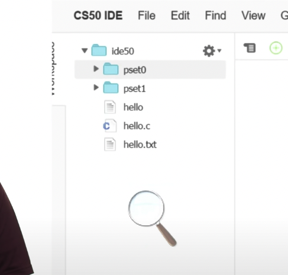</kbd>

 

<kbd>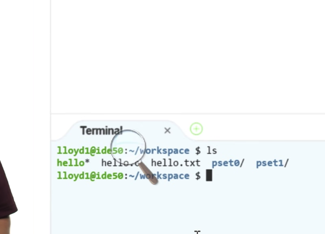</kbd>

> [!NOTE]
> Như đã nói, file màu xanh là
> machine code  = excutable file

 

<kbd>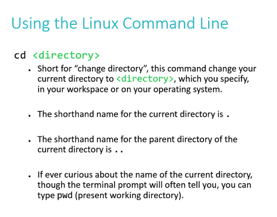</kbd>

> [!NOTE]
> cd: Change directory. 
> . là current directory
> .. là parent directory

 

<kbd>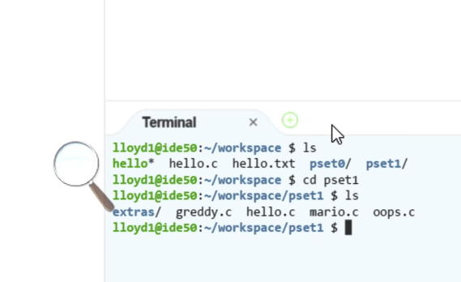</kbd>

 

<kbd>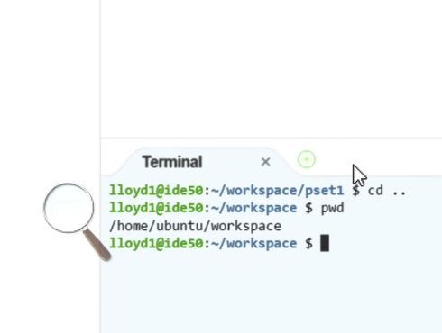</kbd>

> [!NOTE]
> **cd .. :**để change directory về parent's directory
>
> **pwd = print working directory** để in ra directory path hiện tại

 

<kbd>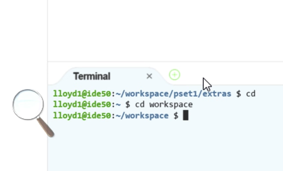</kbd>

> [!NOTE]
> muốn chuyển về ~/ luôn: cd (và nothing else)

 

<kbd>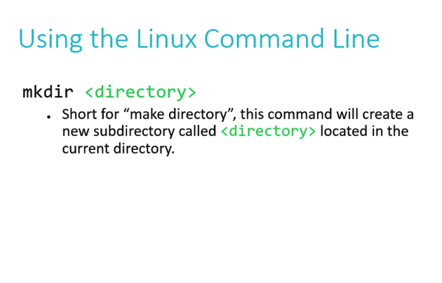</kbd>

 

<kbd>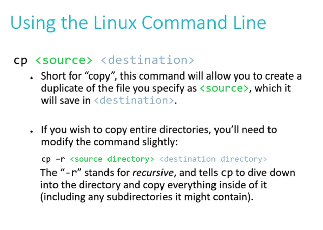</kbd>

 

<kbd>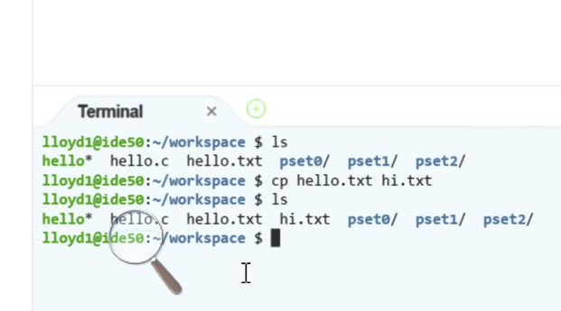</kbd>

> [!NOTE]
> ví dụ copy file **hello.txt**, paste
> với tên khác là **hi.txt**

 

<kbd>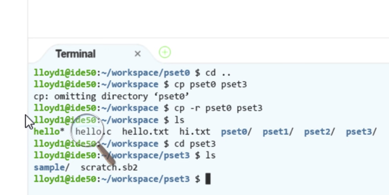</kbd>

> [!NOTE]
> Trường hợp muốn copy một directory (ví dụ pset0 và
> paste với tên mới là pset3) thì nếu chỉ (đang ở
> workspace và gọi **cp pset0 pset3**) thì ổng nói Linux nó
> sẽ không hiểu mình muốn làm gì với nó.
>
> Nên phải **cp -r pset0 pset3** : Ý là bảo nó copy mọi thứ trong 
> Directory pset0 (-r có nghĩa là recursively vào trong mọi folder
> của pset0 và copy mọi thứ)

 

<kbd>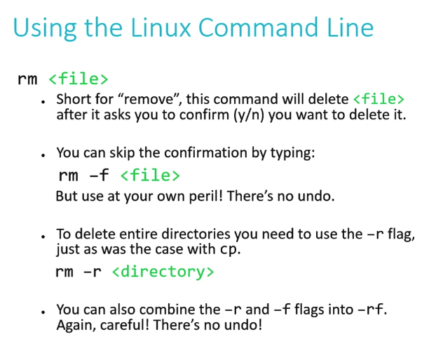</kbd>

> [!NOTE]
> rm giúp remove or
> delete file/folder.

 

<kbd>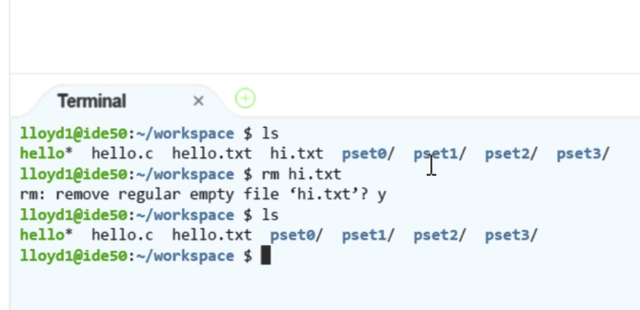</kbd>

> [!NOTE]
> rm bình thường thì nó còn
> hỏi lại có chắc không

 

<kbd>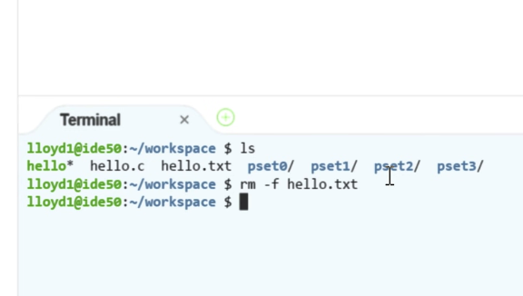</kbd>

> [!NOTE]
> **rm -f file name**
> sẽ delete ngay lập tức và
> không có cách nào undo

 

<kbd>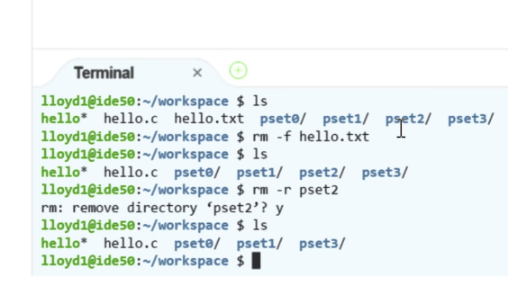</kbd>

> [!NOTE]
> **rm -r** folder_name
>
> (again, -r có nghĩa là recursively
> - delete toàn bộ thư mục)

 

<kbd>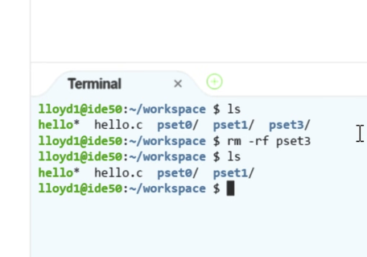</kbd>

> [!NOTE]
> và kết hợp**rm -rf**folder_name: Không có hỏi để
> confirm, nên ổng nói phải cực kì chắc chắn mới
> làm cái này, vì delete toàn bộ thư mục kiểu này là
> không có cách nào lấy lại

 

<kbd>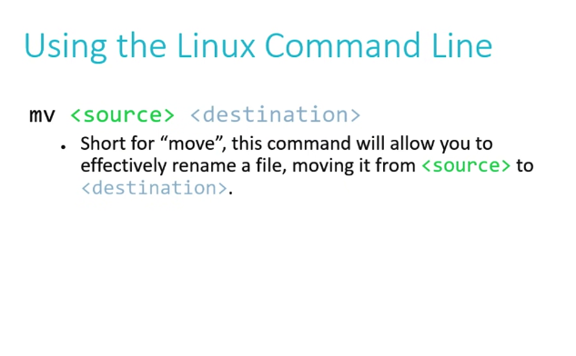</kbd>

> [!NOTE]
> mv: move file/
> **change name**

 

<kbd>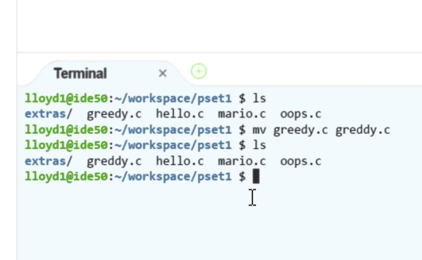</kbd>

 

<kbd>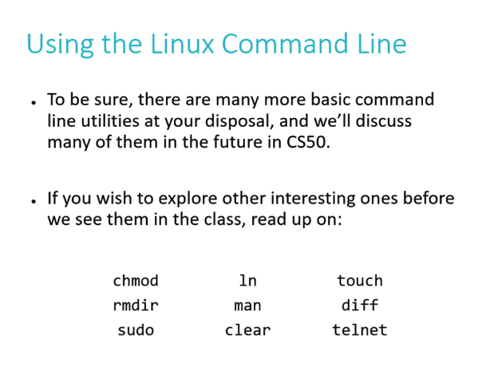</kbd>

> [!NOTE]
> một số command line khác.

 

## Magic Number

 

<kbd>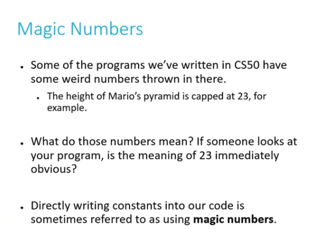</kbd>

> [!NOTE]
> Đại khái là có đôi khi ta cần sử dụng một hardcode
> value như chiều cao của kim tự tháp Mario gì đó,
> hoặc số lá của bộ bài. Thì thay vì để khơi khơi thì ý
> nói là **nên define dạng constant để dễ hiểu hơn cho
> người khác khi đọc code.**

 

<kbd>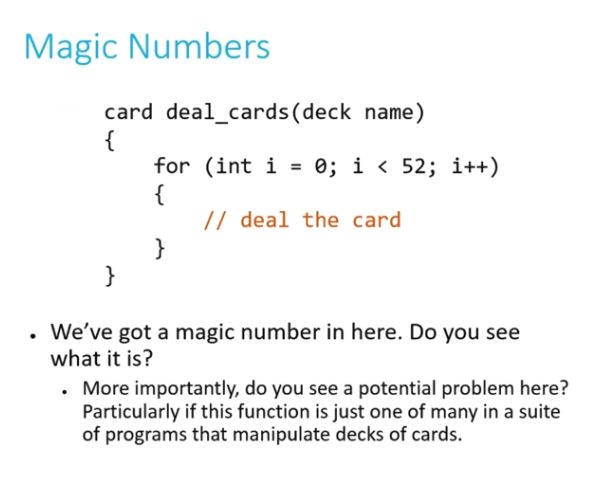</kbd>

 

<kbd>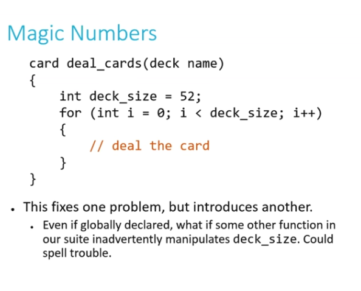</kbd>

> [!NOTE]
> Có thể như vầy, define local variable, hoặc thậm
> chí là global variable thì vẫn tiềm ẩn rủi ro là ai đó
> sẽ update và thay đổi value

 

<kbd>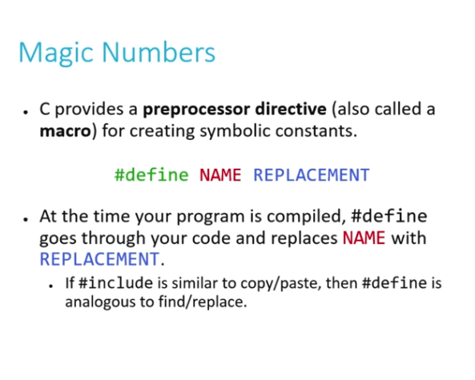</kbd>

> [!NOTE]
> Do đó trong C nó có vụ này #define gọi là pound
> define... kiểu như khi compile code, máy tính nó
> sẽ tìm và thay thế chỗ nào có NAME và replace
> với REPLACEMENT

 

<kbd>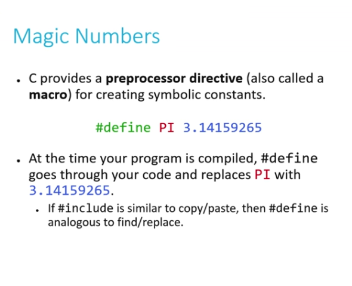</kbd>

> [!NOTE]
> bằng cách đó, chỗ nào cần dùng value vủa Pi = 3.
> 14.. thì ta chỉ cần dùng PI. Cái này cũng hơi giống
> như final variable của Java vậy

 

<kbd>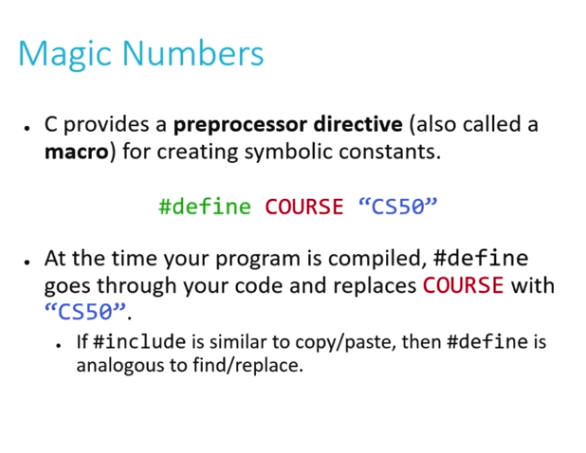</kbd>

> [!NOTE]
> Và có thể define cho mọi datatype. Và theo
> convention thì dùng viết hoa

 

<kbd>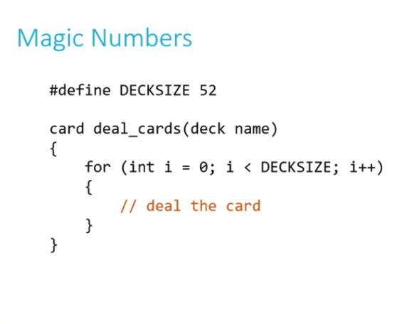</kbd>

> [!NOTE]
> Với cách này, không sợ bị thay đổi giá trị của deck
> size. Ngoài ra một benefit nữa là giả sử deal với bộ
> bài có 32 lá như ở German thì chỉ cần đổi
> DECKSIZE=32.

 

## Arithmetic

> [!NOTE]
> ARITHMETIC
> OPERATORS

 

<kbd>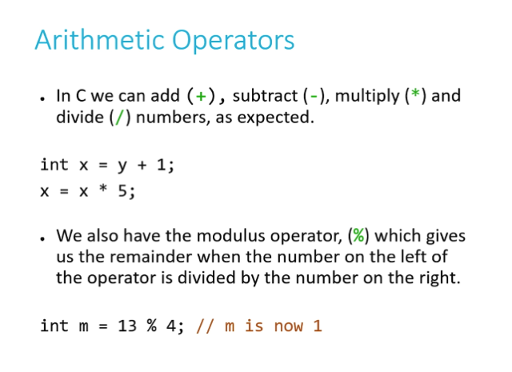</kbd>

> [!NOTE]
> Ổng nói cái **modulus operator = chia lấy phần dư**này sẽ tỏ ra hữu ích trong CS50.
>
> Ví dụ khi **lấy random number rất lớn và % cho 20**,
> thì ta sẽ **được số random từ 1-20 gì đó sẽ hữu ích
> khi cần**

 

<kbd>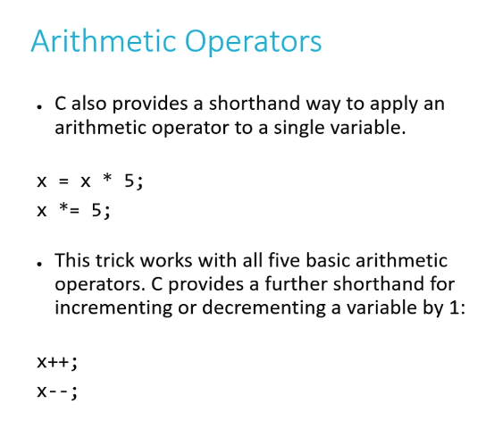</kbd>

> [!NOTE]
> x = x*5 có thể viết gọn là**x *= 5**
>
> x = x + 1;
> x += 1
> x++ 
> Ba cái trên y nhau

 

<kbd>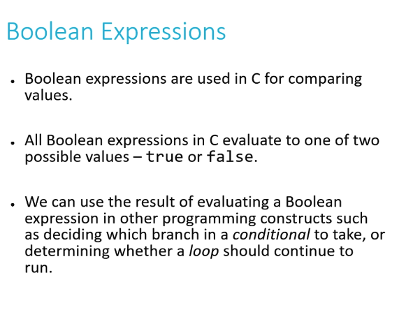</kbd>

 

<kbd>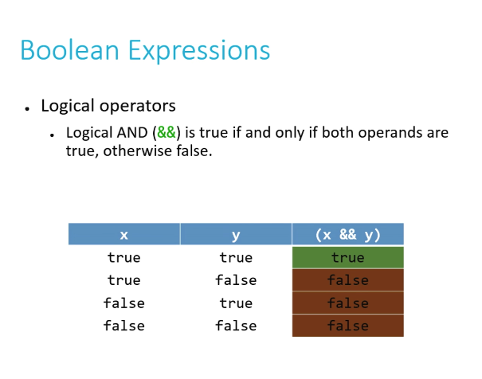</kbd>

> [!NOTE]
> "and" operator in C: &&

 

<kbd>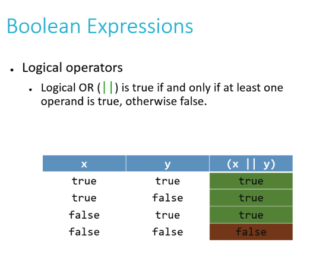</kbd>

> [!NOTE]
> "or" operator in C: ||

 

<kbd>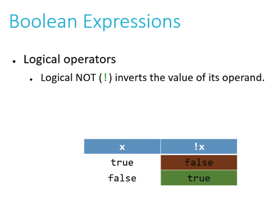</kbd>

> [!NOTE]
> Này giống java

 

<kbd>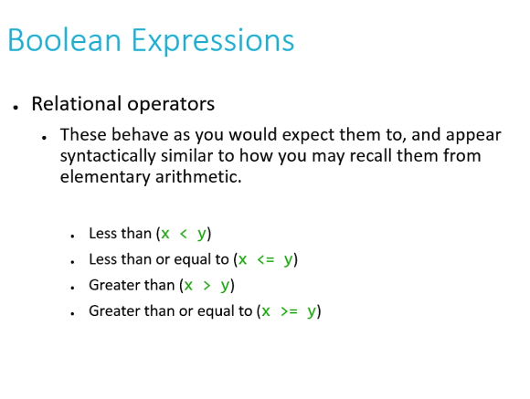</kbd>

> [!NOTE]
> Cơ bản không có gì

 

<kbd>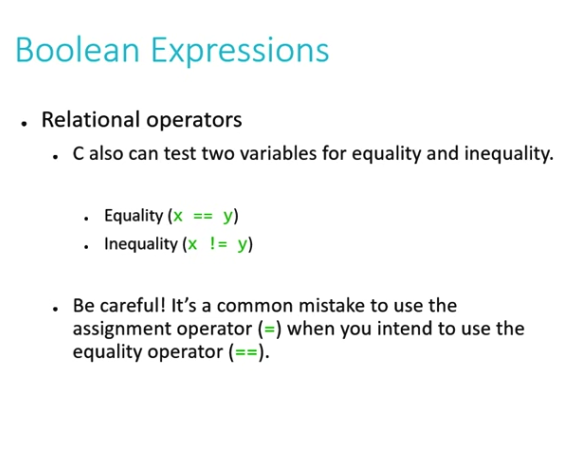</kbd>

> [!NOTE]
> Cơ bản không có gì

 

## Loops

 

<kbd></kbd>

> [!NOTE]
> Forever loop

 

<kbd></kbd>

 

<kbd></kbd>

> [!NOTE]
> Do while make sure code
> chạy ít nhất 1 lần

 

<kbd></kbd>

<kbd></kbd>

<kbd></kbd>

> [!NOTE]
> Cơ bản không có gì

 

<kbd></kbd>

> [!NOTE]
> dùng while khi muốn repeat 1 số lần chưa biết,
> thậm chí vô hạn. Do while tương tự nhưng ít
> nhất run 1 lần. Còn for loop thì khi có 1 số nhất
> định lần muốn run

 

## Conditional

> [!NOTE]
> CONDITIONAL
> STATEMENTS

> [!NOTE]
> QUAY LẠI LÀM SAU

 

