# Week 1: C

📊 **Progress:** `107` Notes | `157` Screenshots

---

<kbd>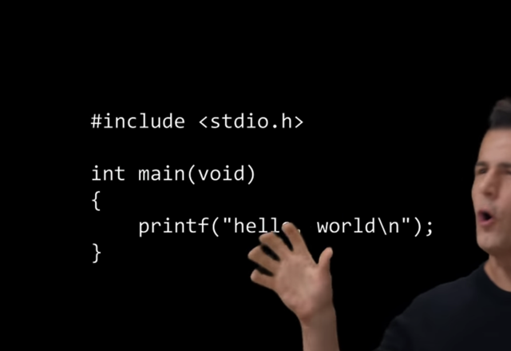</kbd>

 

<kbd></kbd>

> [!NOTE]
> Máy tính nó ko hiểu Scratch, C,
> ....nó chỉ hiểu Binary

 

<kbd>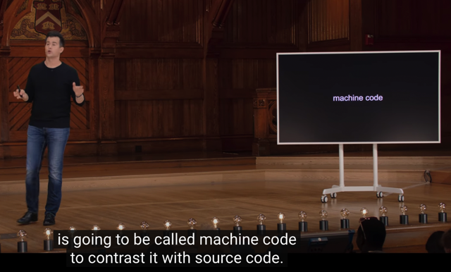</kbd>

 

<kbd>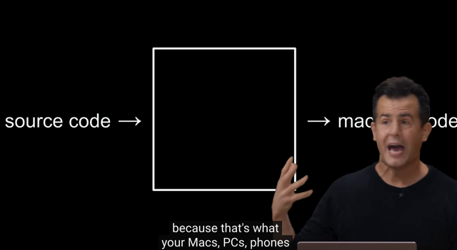</kbd>

 

<kbd>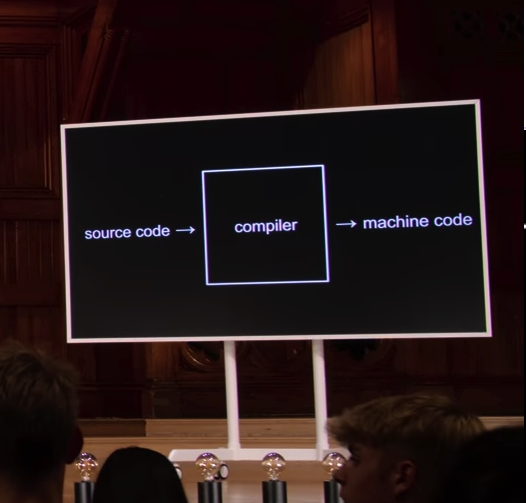</kbd>

> [!NOTE]
> Từ source code, compiler sẽ chuyển nó
> thành machine code (binary)

 

<kbd></kbd>

 

<kbd>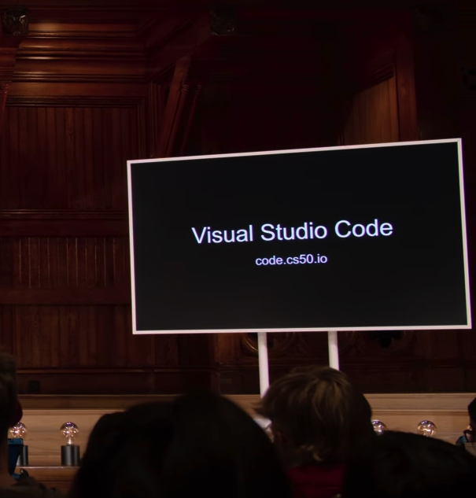</kbd>

 

<kbd>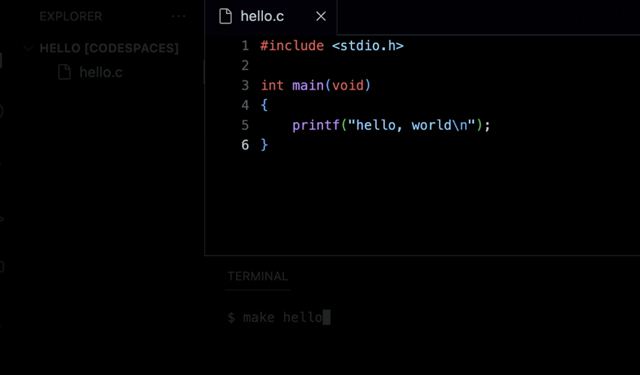</kbd>

 

<kbd>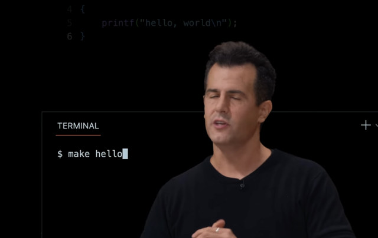</kbd>

> [!NOTE]
> Dùng terminal CLI thật ra là
> nhanh hơn dùng GUI

 

<kbd>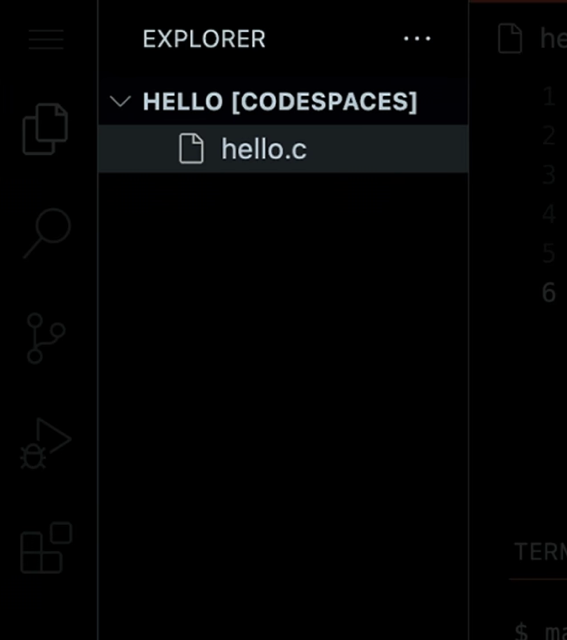</kbd>

 

<kbd>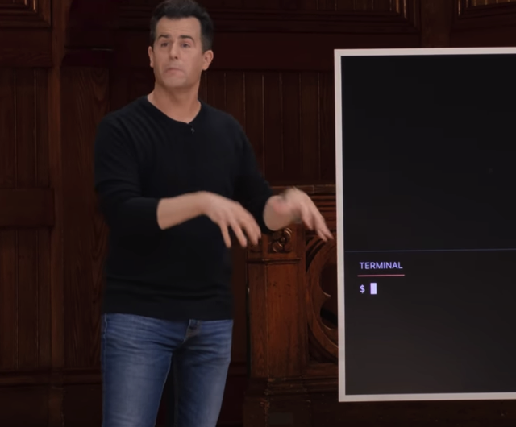</kbd>

> [!NOTE]
> Dollar sign: Place to
> start writing code

 

<kbd>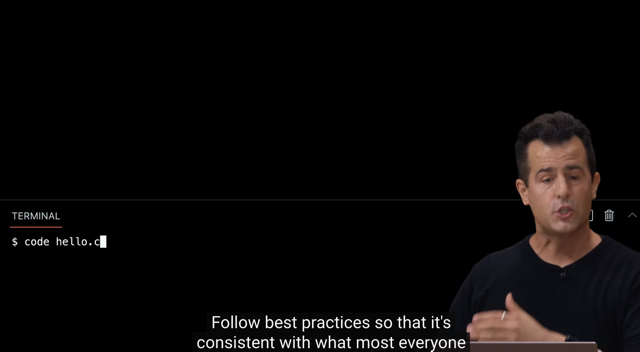</kbd>

 

<kbd>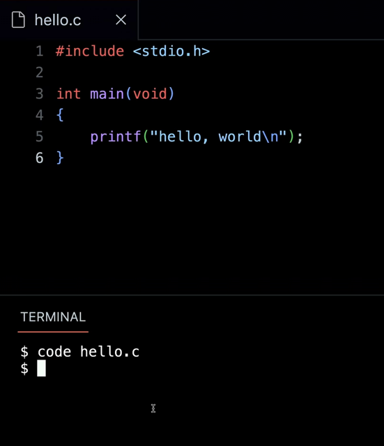</kbd>

 

<kbd>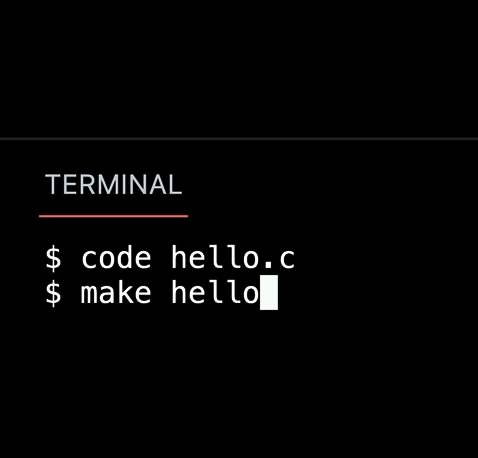</kbd>

 

<kbd>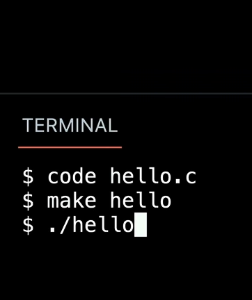</kbd>

 

<kbd>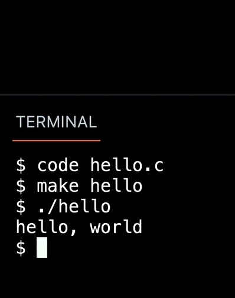</kbd>

> [!NOTE]
> **code hello.c** là để kêu nó tạo một file
> hello.c (tương đương New -> File -> hello.c)
>
> Còn **make hello** là để compile (chuyển
> human code thành machine code - binary)

 

<kbd>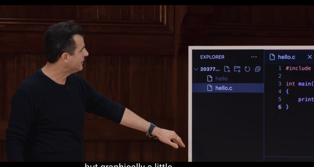</kbd>

 

<kbd>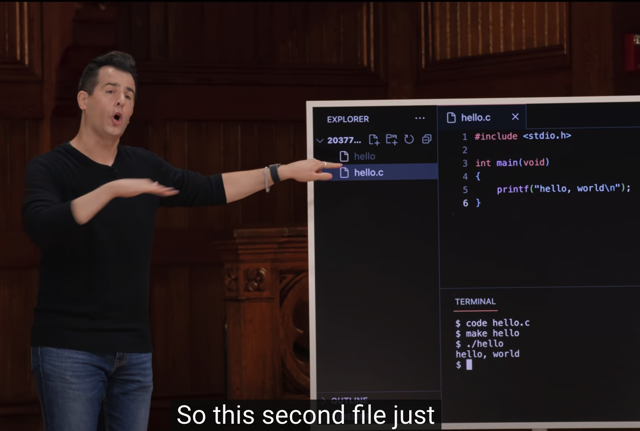</kbd>

> [!NOTE]
> Tại sao có 2 file hello. Thì ổng nói 1 cái hello.c là cái ổng tạo
> ra, human readable code có chứa đoạn code. Còn một cái
> được tạo ra khi gọi lệnh **code hello.c**, **make hello** thì
> máy tính sẽ kiểu như chuyển **từ human readable code
> (source code)** sang **machine code - chỉ có 0 và 1**

 

<kbd>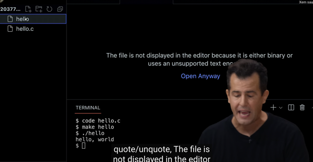</kbd>

> [!NOTE]
> Nếu click vào thì nó IDE sẽ báo là ko display được bởi 1 là nó
> thuộc binary, 2 là thuộc loại nào đó k0 được support

 

<kbd>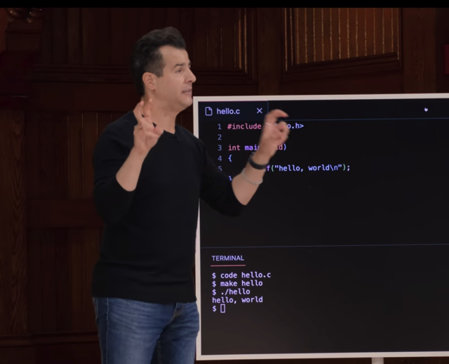</kbd>

> [!NOTE]
> "**Syntax highlighting"**: Kiểu như IDE (ví dụ VS Code) **tô
> màu khác nhau cho**các function, loop, conditional
>
> Và ta **có thể change color nếu muốn**bằng cách  change
> **config của IDE**

 

<kbd>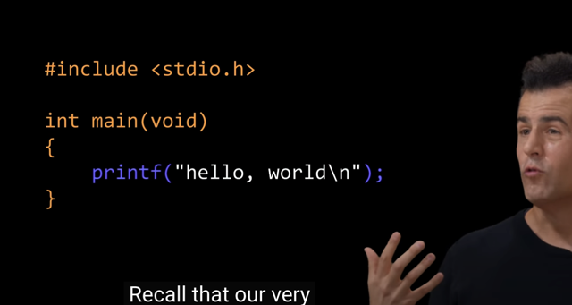</kbd>

 

<kbd>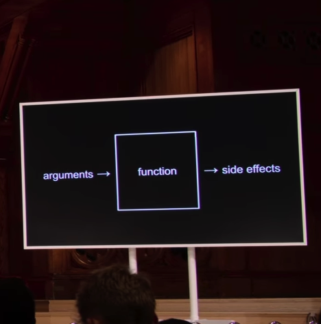</kbd>

> [!NOTE]
> Ý nhắc đến**side effect** là khi function không
> return value gì, mà chỉ thực hiện một side
> effect ví dụ như in ra messsage

 

<kbd>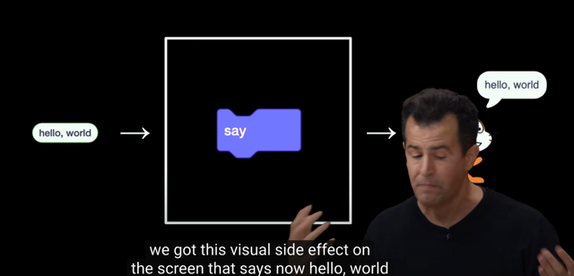</kbd>

 

<kbd>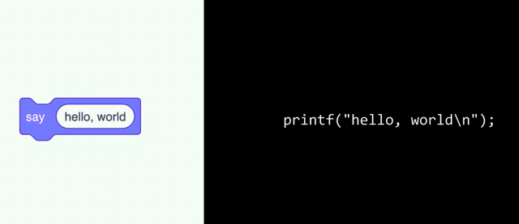</kbd>

 

<kbd>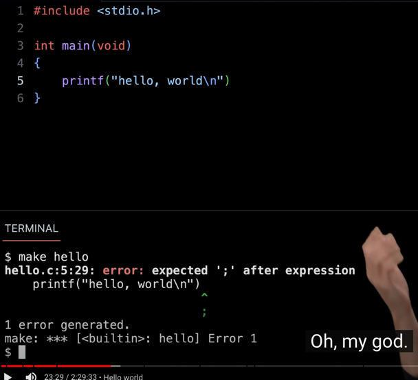</kbd>

> [!NOTE]
> Ổng thử quên không bỏ  ";"
>
> Gọi make hello nó báo lỗi

 

<kbd>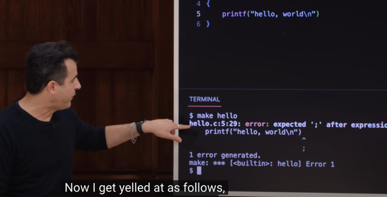</kbd>

> [!NOTE]
> Nó báo lỗi xảy ra ở Line 5, char 29 (tính từ đầu), thiếu dấu ";"

 

<kbd>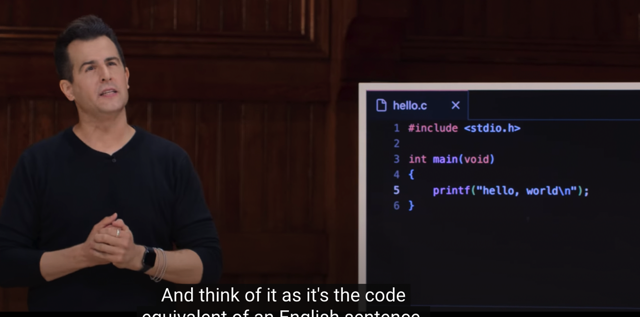</kbd>

> [!NOTE]
> Q: **Có cần phải luôn có ';'**sau mỗi line không.
>
> A: Cái này sẽ biết khi thực hành. 
> **Không, basically, cần sau mỗi "Statement".** 
>
> Cơ bản **';' giống như dấu chấm hết câu** trong tiếng Anh vậy

 

<kbd>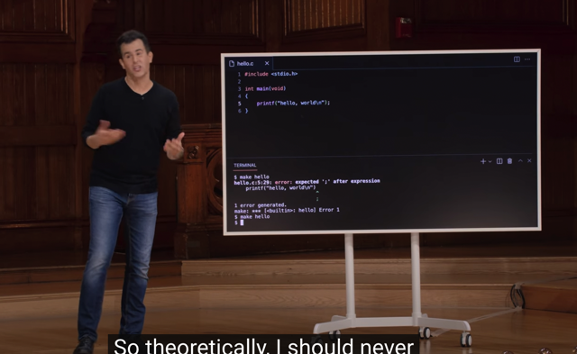</kbd>

> [!NOTE]
> Ban đầu cần **code hello.c để tạo file hello.c**
>
> những lần sau chỉ **make hello** để compile thôi

> [!NOTE]
> **Control L** để
> clean mọi thứ

 

<kbd>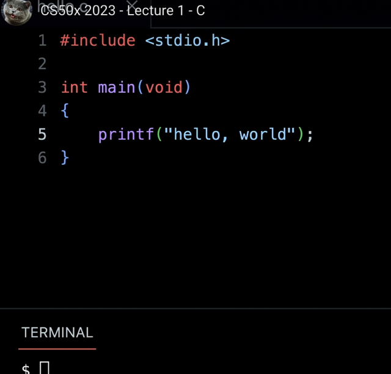</kbd>

> [!NOTE]
> Xong ổng hỏi giờ **bỏ "\ " đi**, compile lại sẽ ntn
>
> -> Chả sao cả, nó chỉ không xuống dòng thôi

 

<kbd>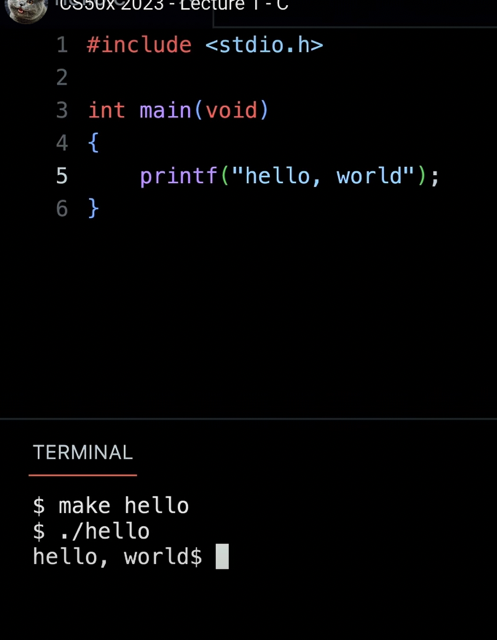</kbd>

> [!NOTE]
> Nó sẽ như này, cái '$' nó sẽ in ngay sau chữ "hello, world"
>
> Và tuy rằng mình vẫn tiếp tục type lệnh mới được nhưng nó
> **không đẹp mắt cho lắm**, mà thông thường người ta sau khi kết
> thúc gì đó sẽ cho xuống dòng để sẵn sàng cho lệnh mới

 

<kbd>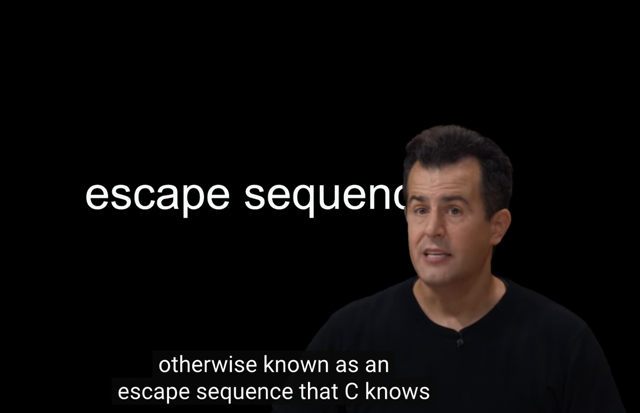</kbd>

> [!NOTE]
> Và "\\n" gọi là **"escape sequence"** - Xuống dòng, **tạo dòng mới**

 

<kbd>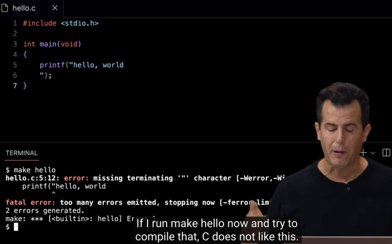</kbd>

 

<kbd>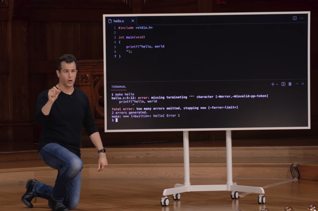</kbd>

> [!NOTE]
> Làm vậy không được

 

<kbd>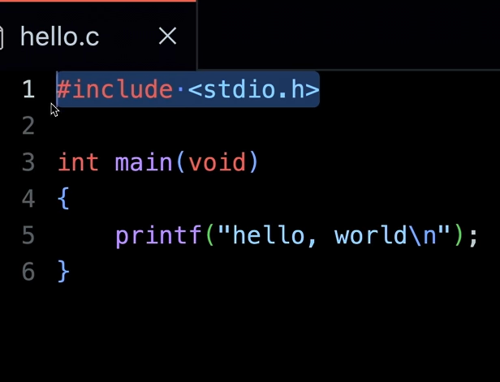</kbd>

> [!NOTE]
> Tiếp ổng nói **main()** giống như hành động **click
> Green Flag** để **bắt đầu chạy chương trình**. Nhưng
> sẽ nói sau.
>
> Còn giờ tập trung vào cái dòng **#include .<stdio.h>**mà ổng nói là viết tắt của **standard io** chứ không
> phải **studio. Cái dòng này có tác dụng gì?**

 

<kbd>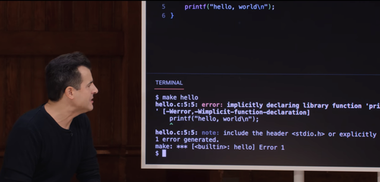</kbd>

> [!NOTE]
> Thử bỏ dòng đó đi thì nó báo lỗi như này:
> **Không có function printf**

 

<kbd></kbd>

> [!NOTE]
> Câu hỏi: Dựa vào error, thì dòng code đó có tác dụng gì:
>
> -> Để**import function printf()** dùng để thực hiện lệnh **printf**
> mà đoạn code trong main yêu cầu

 

<kbd>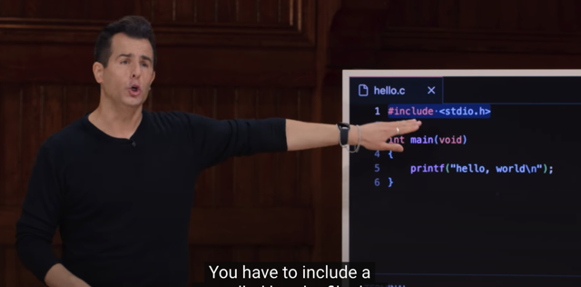</kbd>

> [!NOTE]
> Chính xác là vậy,**function printf() không tự nhiên
> mà có**, ta phải**import nó từ library stdio.h này**
>
> Mà ổng gọi là **"header file"**

 

<kbd>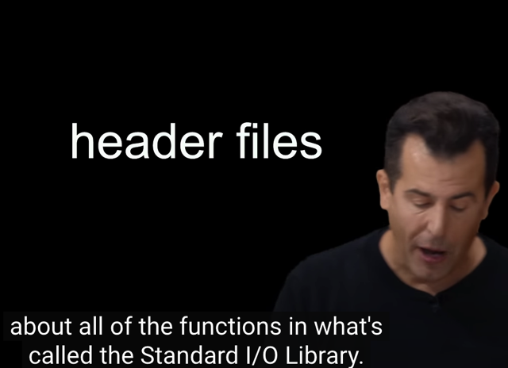</kbd>

> [!NOTE]
> Và nó chứa các function
> thuộc **Standard IO** library

 

<kbd>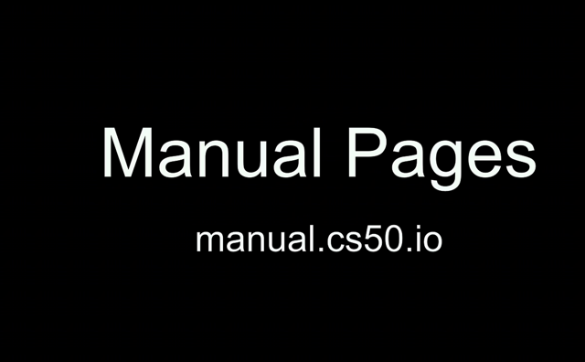</kbd>

> [!NOTE]
> Kế ổng nói bạn có thể thắc mắc **sao mình biết có các
> function nào trong header files / library** thì câu trả lời là
> **documentation**Rồi ổng nói **manual.cs50.io** là  p**hiên bản đơn giản
> hơn của C documentation** do **CS50** tạo ra vì cái
> documnent gốc của C có **vẻ hơi khó đọc với người ít
> kinh nghiệm**

 

<kbd>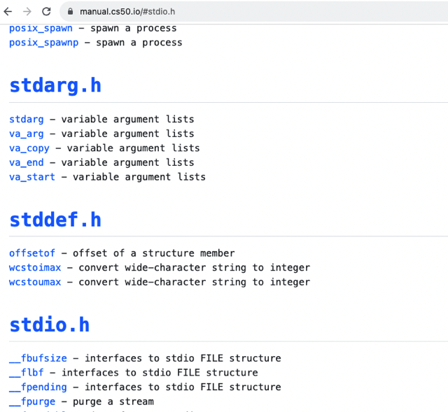</kbd>

<kbd></kbd>

<kbd>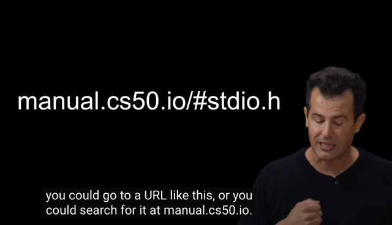</kbd>

 

<kbd>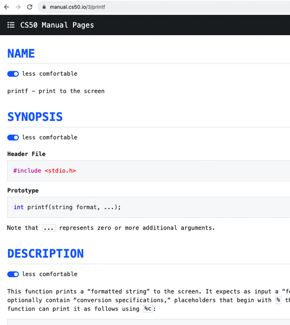</kbd>

<kbd></kbd>

<kbd>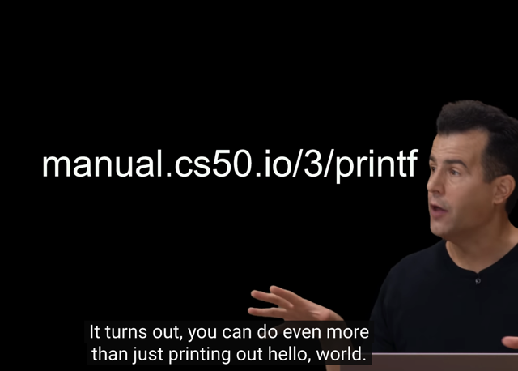</kbd>

 

<kbd>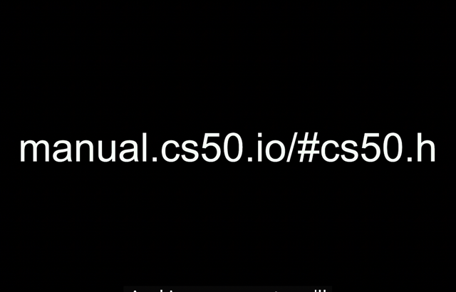</kbd>

<kbd></kbd>

<kbd>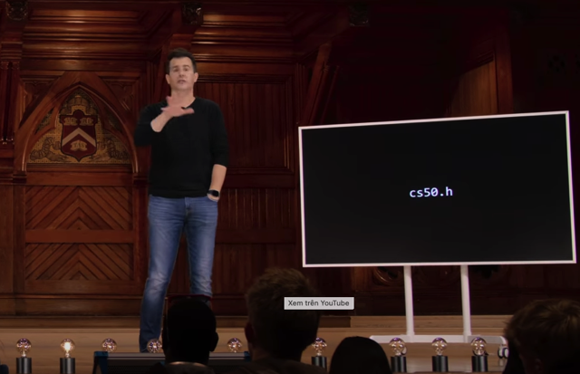</kbd>

 

<kbd>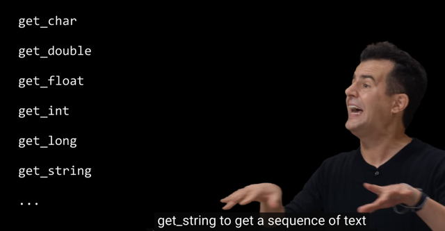</kbd>

> [!NOTE]
> Thì ý ổng nói là cái lib **cs50.h** prepare một số function
> giúp lấy input từ user tương ứng với mỗi data type

 

<kbd>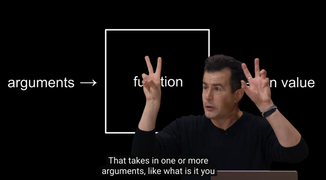</kbd>

 

<kbd>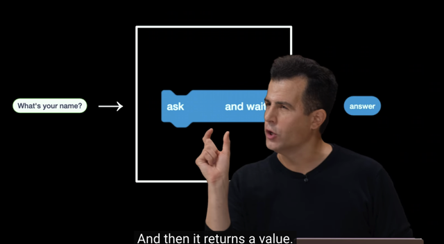</kbd>

> [!NOTE]
> Đang nói về việc làm sao làm lại được cái vụ "hỏi tên
> và dùng nó để Hello, David" như trong bài scratch

 

<kbd>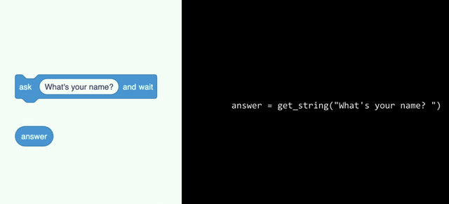</kbd>

> [!NOTE]
> Thì dùng function **get_string**() của**cs50.h** lib, để hỏi
> và chờ câu trả lời sau đó **assign** nó vào
> **answer** variable

 

<kbd>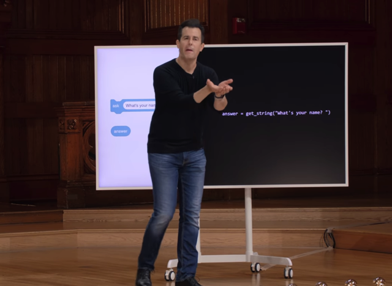</kbd>

 

<kbd>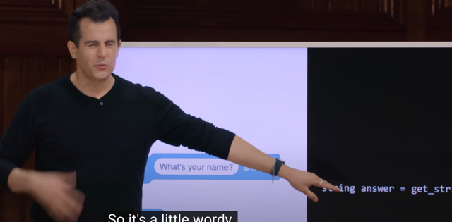</kbd>

> [!NOTE]
> Kế ổng nói, C có thêm một cái vụ là phải cho nó biết
> mình đang **expect loại gì cho answer -> string**

 

<kbd>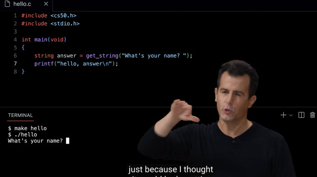</kbd>

> [!NOTE]
> Cập nhật lại code, với việc**import thêm cs50.h** để xài các
> function **get_string**
>
> Nó sẽ hỏi "What's your name" với khoảng trống và dấu nháy
> đợi câu trả lời

 

<kbd>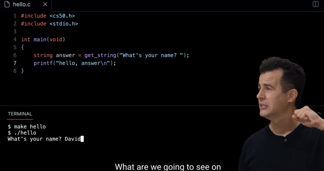</kbd>

> [!NOTE]
> Tới đây ổng hỏi kết quả sẽ là gì:
>
> -> Theo kinh nghiệm 5 năm của mình thì nó sẽ ra là 
> "Hello, answer". Vì ổng **đang không dùng value của
> answer** mà là đang**in cái dòng "Hello, answer"** ra

 

<kbd>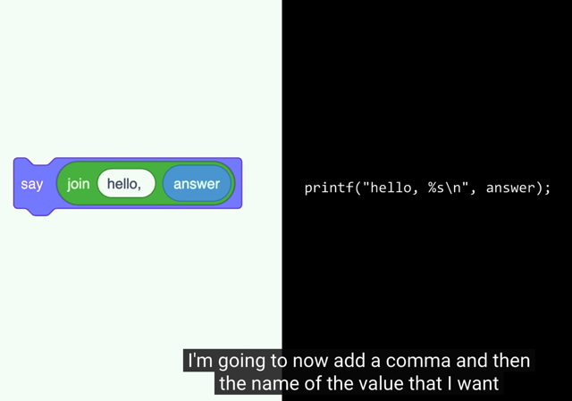</kbd>

> [!NOTE]
> %**s** là 'giữ chỗ' - placeholder cho một **s**tring.

 

<kbd>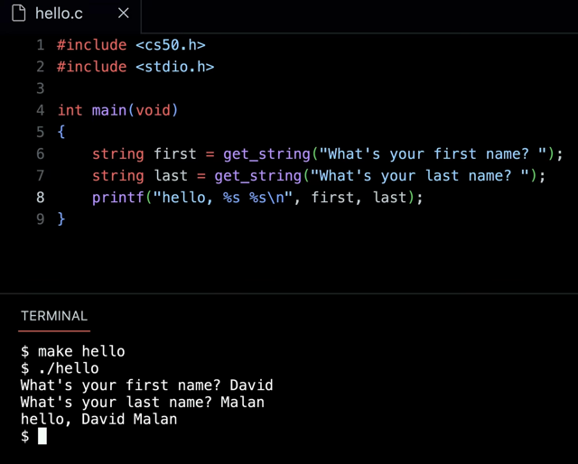</kbd>

> [!NOTE]
> Một ví dụ dùng hai cái **%s**

 

<kbd>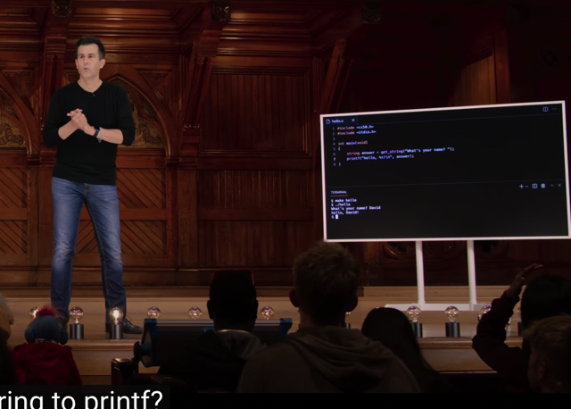</kbd>

> [!NOTE]
> Ổng hỏi liệu có vấn đề tiềm ẩn gì với cách dùng %s để
> làm place holder như này không?
>
> -> Có, **sẽ ra sao nếu trong câu print ra có kí tự "%s"**
> thì nó sẽ lỗi

 

<kbd>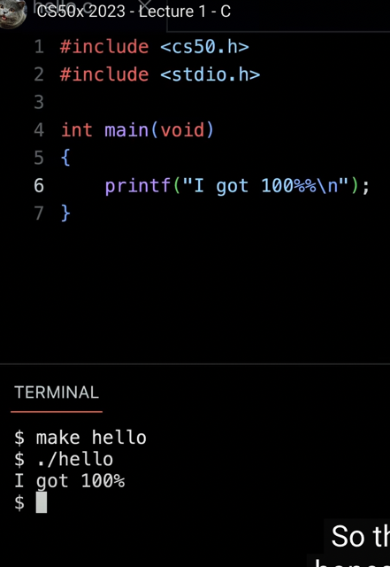</kbd>

> [!NOTE]
> Đúng vậy, muốn in "%" thì phải dùng **"%%"**
> và đây là những thứ sẽ gặp, khi đó có thể
> search google

 

<kbd>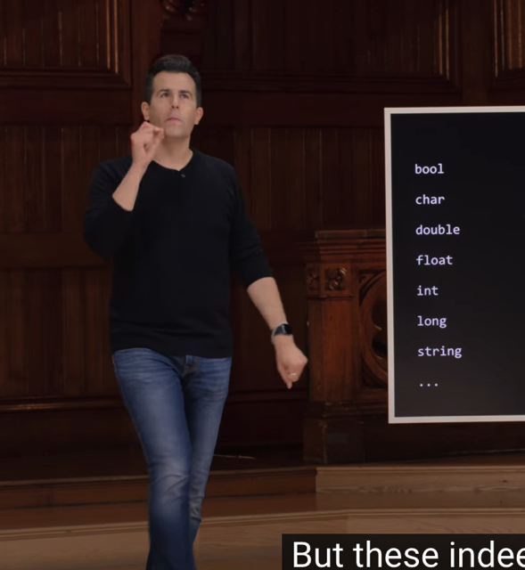</kbd>

> [!NOTE]
> Các type của C

 

<kbd>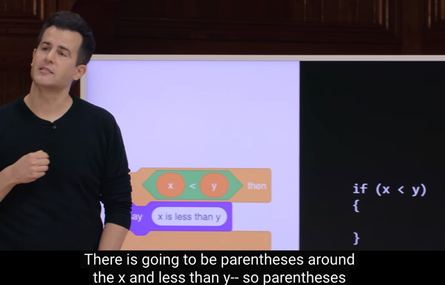</kbd>

> [!NOTE]
> Ổng nói có convention là **if
> -> khoảng trống -> ()**

 

<kbd>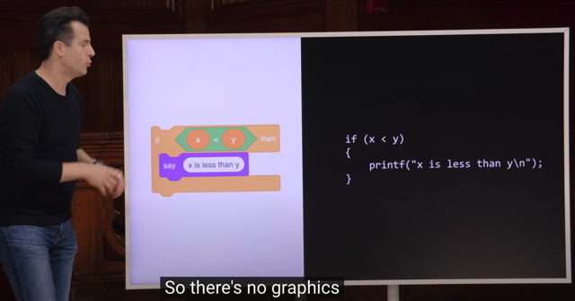</kbd>

> [!NOTE]
> Xong ổng nói dù rằng nếu **chỉ có 1 line** thì có thể viết
> if (x < y) printf(...) nhưng **nên luôn có {}**

 

<kbd>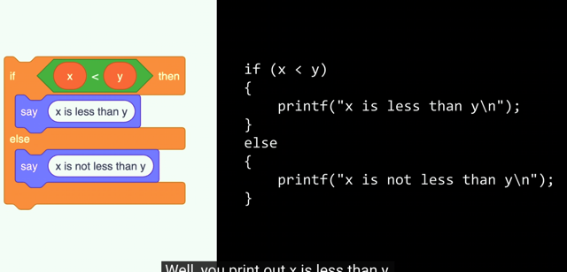</kbd>

 

<kbd>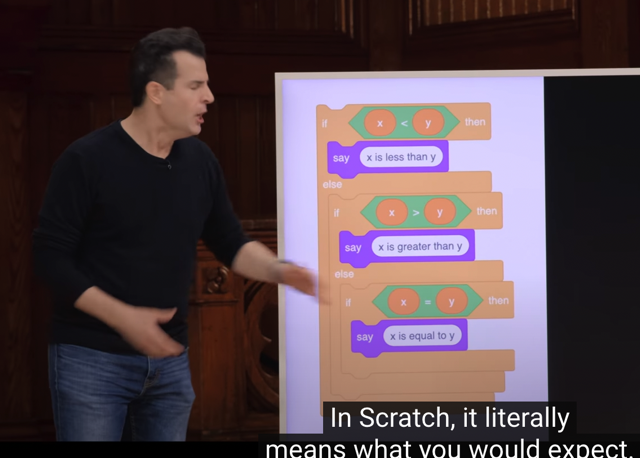</kbd>

> [!NOTE]
> Xong ổng nói trong Scratch **'=' mean 'equal'** còn C thì nó
> mean '**assign**'. Do đó **phải có cách khác để thể hiện equal
> trong C**

 

<kbd>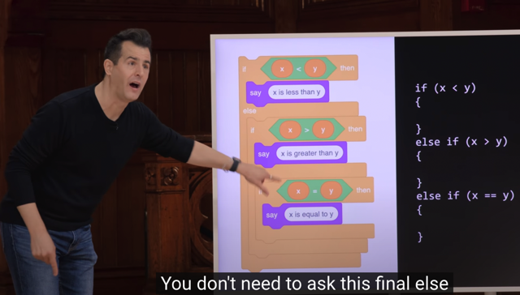</kbd>

> [!NOTE]
> Đến đây ổng nói đoạn code bên Scratch trong C sẽ như
> thế này. Tuy nhiên có vẻ có vấn đề gì đó?
>
> -> Không nhất thiết phải có **if (x = y), chỉ cần else là đủ**

 

<kbd>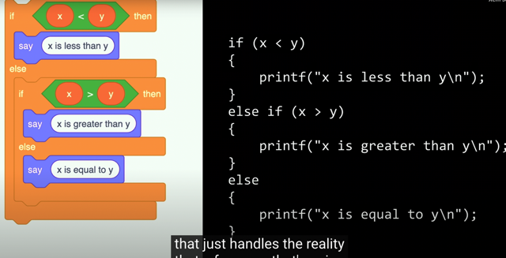</kbd>

 

<kbd>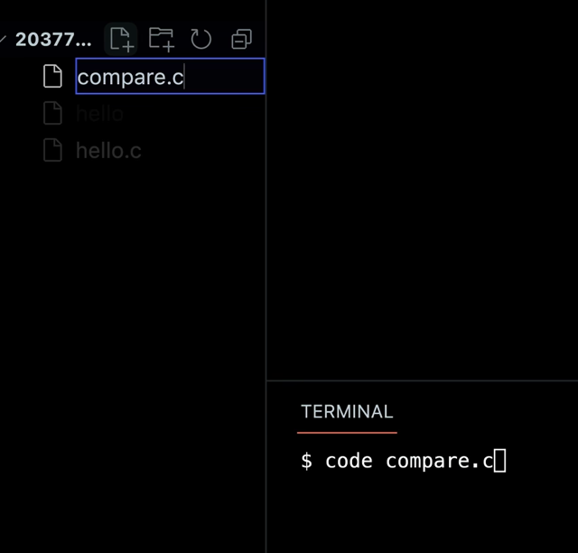</kbd>

<kbd></kbd>

<kbd>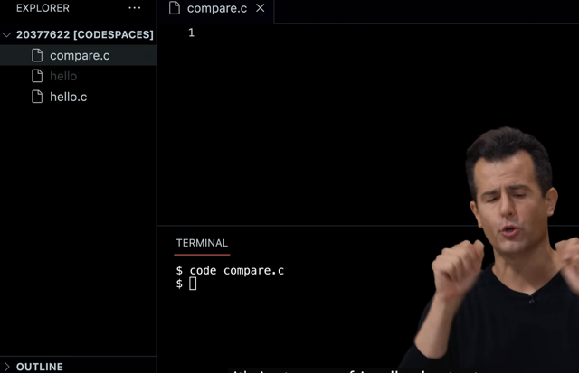</kbd>

> [!NOTE]
> Đến đây đại khái có thể**dùng Terminal gọi lệnh code compare.c** để
> tạo file mới, hoặc cũng **có thể dùng GUI để tạo.**
>
> Và khi đã tạo rồi, (và lỡ đóng tab của file đó ) mà gõ **code compare.c
> trong terminal thì  nó sẽ open file ra**

 

<kbd>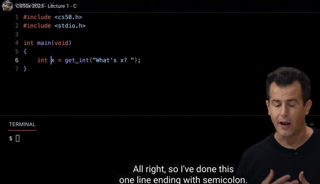</kbd>

> [!NOTE]
> Ổng nói lại về cái vụ **ngày nay với các ngôn
> ngữ như Python**, ta **không cần phải khai type
> của variable như Java và C**

 

<kbd>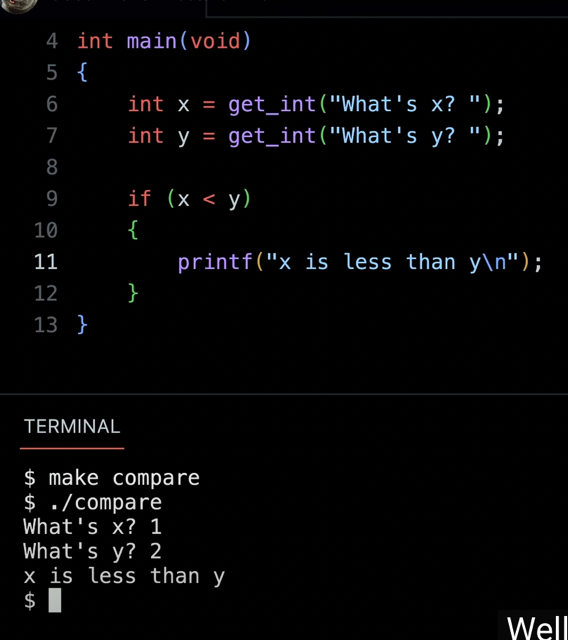</kbd>

> [!NOTE]
> **make compare** để **compile**
>
> Rời**./compare** để gọi function

 

<kbd>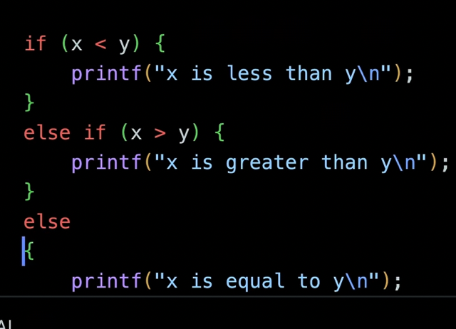</kbd>

> [!NOTE]
> Có người hỏi là **có bắt buộc phải {} ở dòng riêng hay
> không?**
>
> -> David: **Đối với CS50 thì khuyên khích như vậy còn thực
> tế tuỳ công ty**

 

<kbd>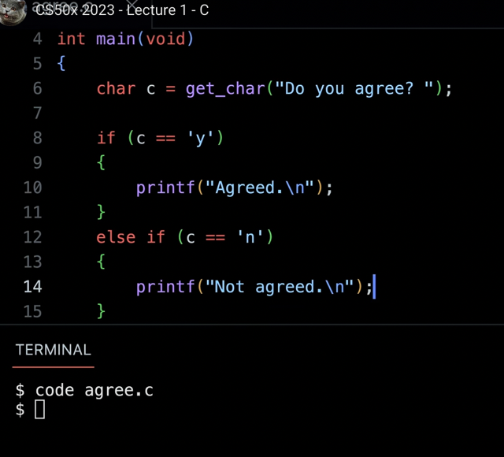</kbd>

> [!NOTE]
> Có gì sai không?
>
> -> Theo kinh nghiệm là không, trừ việc dùng == để so
> sánh c là char với string 'y' / 'n' có thể không đúng

 

<kbd>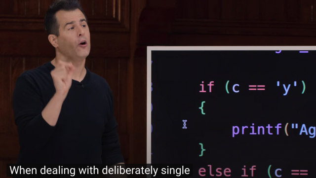</kbd>

> [!NOTE]
> Hoá ra không phải, mà ý ổng muốn nói là **phải dùng** 'y' -
> **single quote cho character** và ''Agree!'' - **double quote
> cho text**

 

<kbd>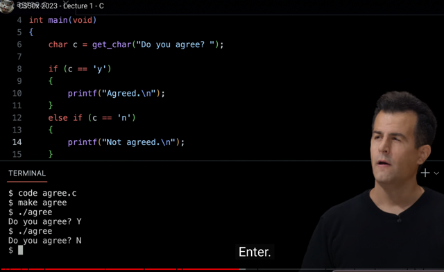</kbd>

> [!NOTE]
> Xong, làm thử thấy nó không printf ra gì hết. Why?
>
> -> Nhìn có thể thấy ổng gõ **Capitalized 'Y', 'N'**nên nó
> **fail khi compare với 'y' và 'n'**

 

<kbd>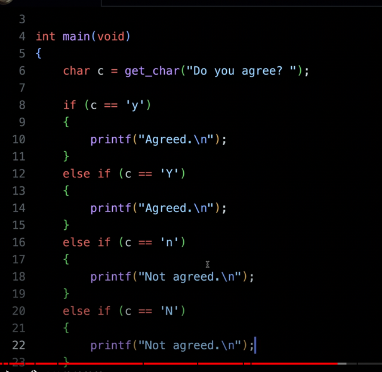</kbd>

> [!NOTE]
> Xong ổng **sửa thành như vầy để nó "nhận" cả viết
> thường hay hoa**. Question: Tại sao viết vậy lại **không
> ổn?**
> -> Trong Java mình sẽ dùng**.equalIgnoreCase()**
>
> còn ở đây thì**nên dùng | (or) trong conditional chứ
> đừng tách ra kiểu này**

 

<kbd>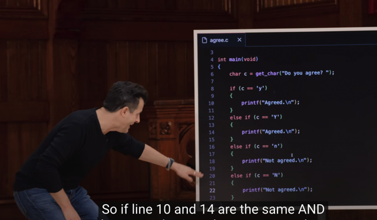</kbd>

> [!NOTE]
> Yeah, đúng vậy, vấn đề làm kiểu này **sẽ có nhiều
> phần bị trùng lặp** (ví dụ printf("Agree.\\n"))

 

<kbd>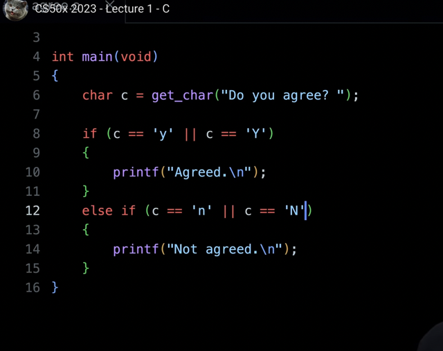</kbd>

> [!NOTE]
> Trong C dùng **||** cho **or**
> (Trong python ta biết dùng or và and)

> [!NOTE]
> Q: **Có cách nào khác để làm vụ so sánh mà không cần
> quan tâm viết hoa viết thường không.**
>
> A: Tuần sau sẽ học

 

<kbd>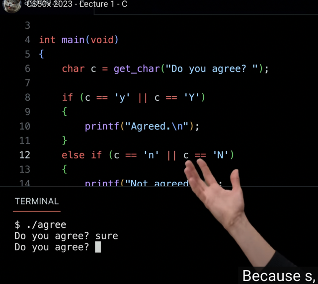</kbd>

> [!NOTE]
> Q: **Sẽ như thế nào nếu người ta gõ số vào**
> A: Good question. Đây kì thực là **một cái mà lib cs50.h đã
> handle**, đó là nếu user enter ví dụ một string - "sure" Thay
> vì là một char, thì nó sẽ **reject câu trả lời** và **hỏi lại**

 

<kbd>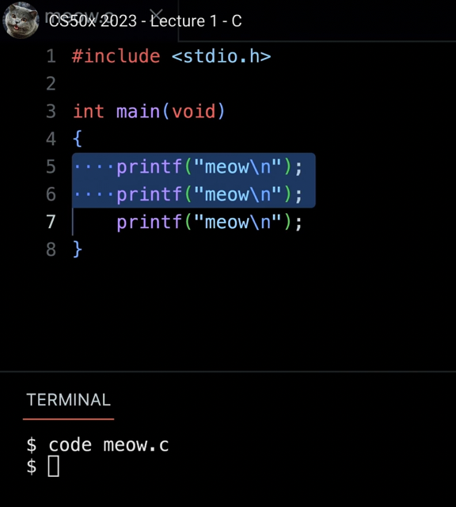</kbd>

> [!NOTE]
> Tiếp ổng tạo file meow.c, chắc chuẩn bị nói về loop đây.
>
> Nhưng trước hết ổng nói khi **highlight ta thấy có 4 dấu .. ..**
>
> Chính là **Visual Code giúp** ta biết có **4 indent lines** phía trước

 

<kbd>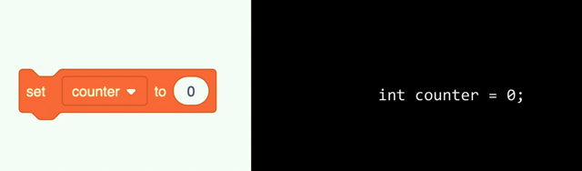</kbd>

> [!NOTE]
> Nhưng trước tiên phải giới thiệu **variables** đã
>
> Và tương tự, phải có **type** khi declare

 

<kbd>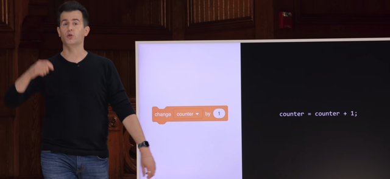</kbd>

> [!NOTE]
> Nhưng khi update thì không cần

 

<kbd>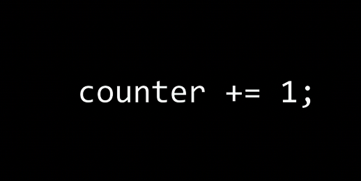</kbd>

> [!NOTE]
> "**Syntactic sugar**"

 

<kbd>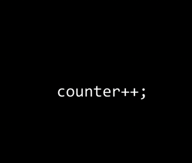</kbd>

 

<kbd>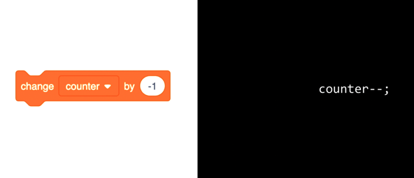</kbd>

 

<kbd>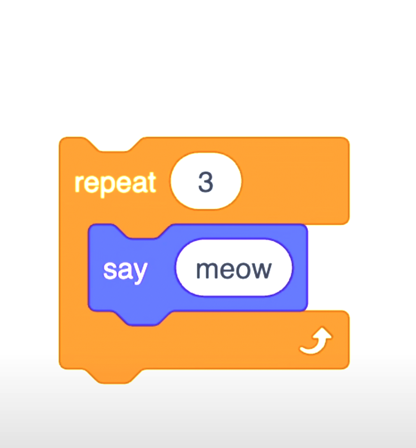</kbd>

 

<kbd>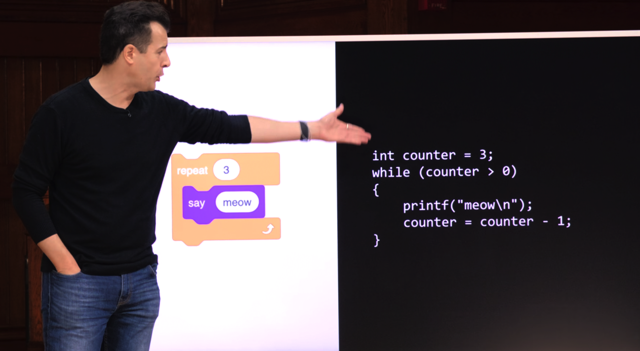</kbd>

 

<kbd>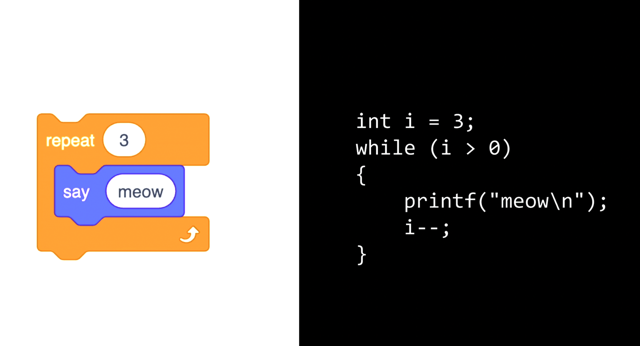</kbd>

 

<kbd>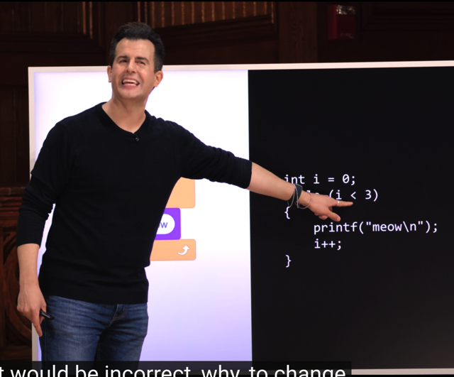</kbd>

> [!NOTE]
> Đoạn này ổng giải thích là **có thể làm nhiều kiểu như
> cho bằng 3 đếm ngược về 0**,
>
> hoặc cho b**ằng 0, cộng lên dần thành 3.**

 

<kbd>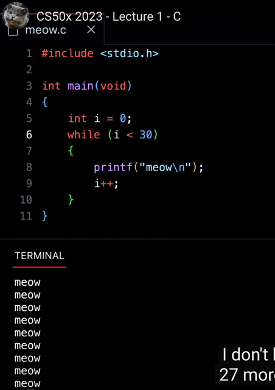</kbd>

> [!NOTE]
> Với cách dùng **loop**, **code đã được
> design tốt hơn** khi muốn tăng số lần
> meow chỉ cần tăng số 3-> 30

 

<kbd>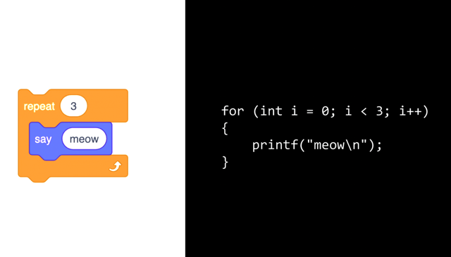</kbd>

> [!NOTE]
> Một kiểu loop khác,**y hệt Java**

 

<kbd></kbd>

> [!NOTE]
> Nói qua **forever loop**, với một số ví dụ như forever loop
> **check xem có collision giữa sprite và object khác không**,
> hoặc chờ **user input text** cũng là dạng forever loop

 

<kbd>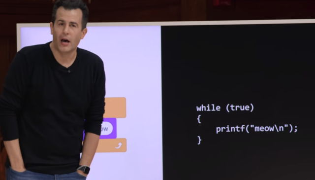</kbd>

> [!NOTE]
> **Forever loop** trong **C** đây

 

<kbd>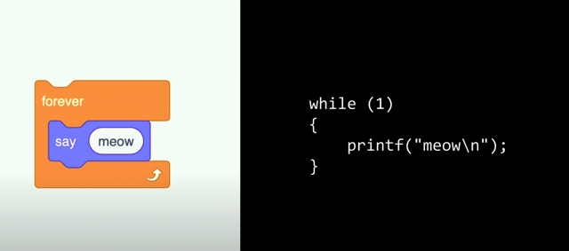</kbd>

> [!NOTE]
> Đây white(1) cũng có ý nghĩa y chang, cũng **same effect**

 

<kbd>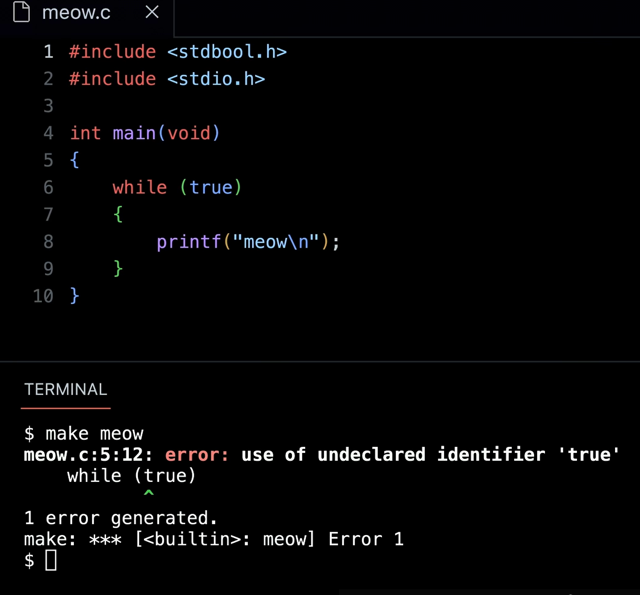</kbd>

> [!NOTE]
> Tuy nhiên muốn xài vậy thì
> phải include **<stdbool.h>**

 

<kbd>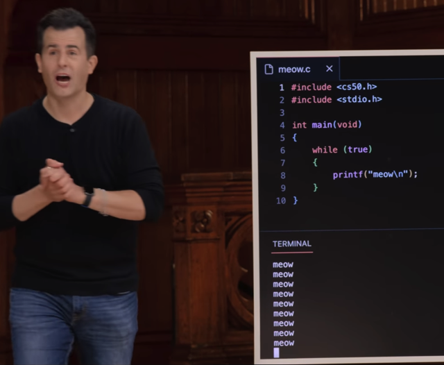</kbd>

> [!NOTE]
> và **cs50 cũng có nên chỉ cần include cs50 thôi.**
> Compile lại và chạy thì nó**forever meow như này**

 

<kbd>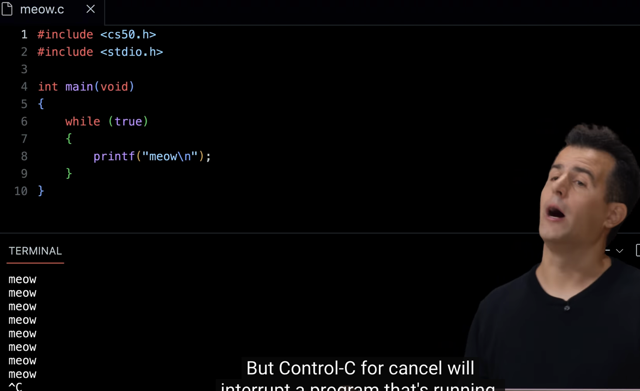</kbd>

> [!NOTE]
> **Control C** sẽ cancel cái này

 

<kbd>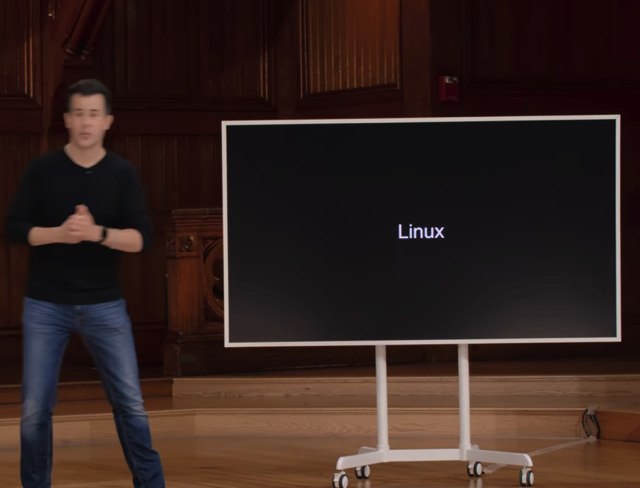</kbd>

> [!NOTE]
> Tiếp ổng nói về hệ điều hành **Linux** rất thông dụng. Cũng như
> các hệ điều hành nổi tiếng khác như window, macOS.. **nhưng
> nó có cả GUI
>
> Nhưng nó nổi tiếng nhất ở việc cung cấp command line
> enviroment**

 

<kbd></kbd>

> [!NOTE]
> **CLI = Command Line Interface** vs với
> GUI Graphical User Interface

 

<kbd>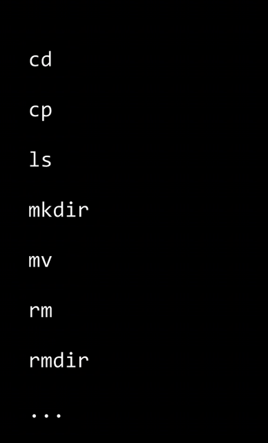</kbd>

> [!NOTE]
> một số command thông dụng

 

<kbd>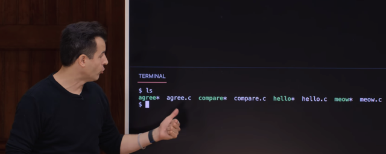</kbd>

> [!NOTE]
> ls: sẽ **list các file trong current folder** ra mà ổng
> nói thực tế l**à folder ở trên cloud server?**
>
> Và cái **file màu xanh là g**ì? ->**Machine code**

 

<kbd>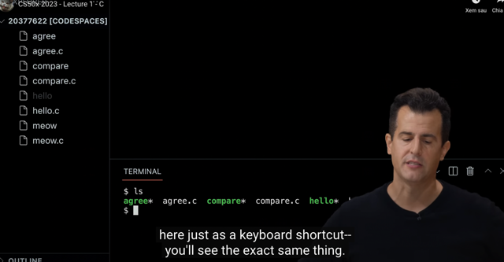</kbd>

> [!NOTE]
> Bấm **Command B** nó sẽ show ra các
> file, nhưng mà là thực hiện bằng GUI

 

<kbd></kbd>

 

<kbd>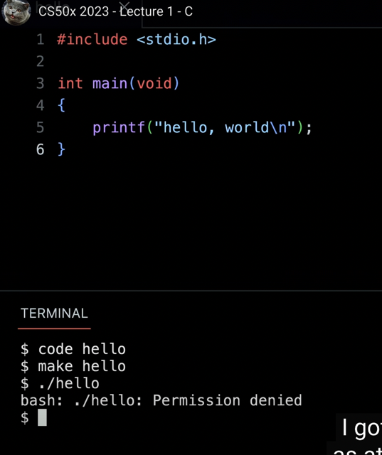</kbd>

> [!NOTE]
> Rồi ổng thử làm lại như vầy, **code hello,
> make hello rồi gọi thì bị lỗi vầy**

 

<kbd>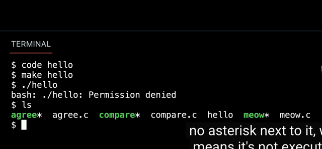</kbd>

> [!NOTE]
> **ls** ra xem thì **thấy hello thiếu .c** tức
> là **đặt tên file thiếu đuôi c**

 

<kbd>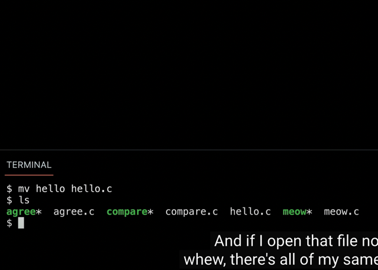</kbd>

> [!NOTE]
> Dùng lệnh **mv hello hello.c**
> giúp**đổi tên file** hay **move folder**

 

<kbd>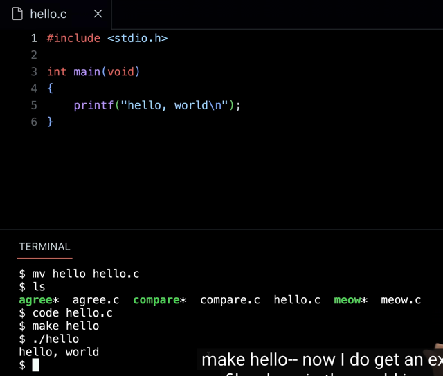</kbd>

 

<kbd>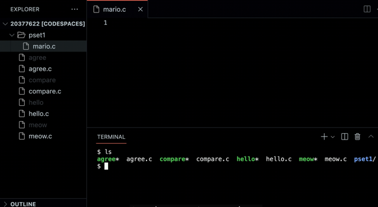</kbd>

 

<kbd>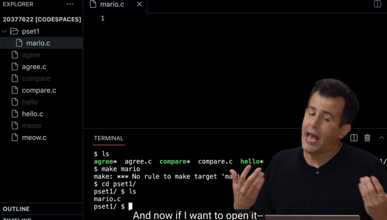</kbd>

 

<kbd>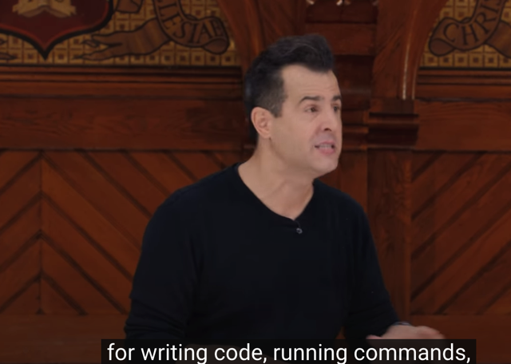</kbd>

> [!NOTE]
> Ổng nói **dần dà command line sẽ rất mạnh
> và nhanh hơn dùng GUI nhiều**

 

<kbd>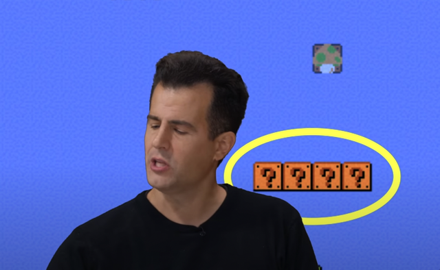</kbd>

> [!NOTE]
> Đại khái là ổng **muốn in ra 4 dấu hỏi.**

 

<kbd>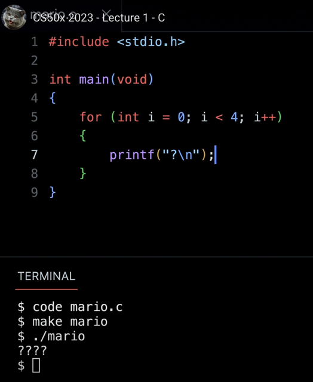</kbd>

> [!NOTE]
> Thì ổng dùng for loop như vầy nhưng..
>
> Q: Làm vậy có gì không ổn?
> A: Nó sẽ **in 4 dấu hỏi theo chiều dọc**

 

<kbd>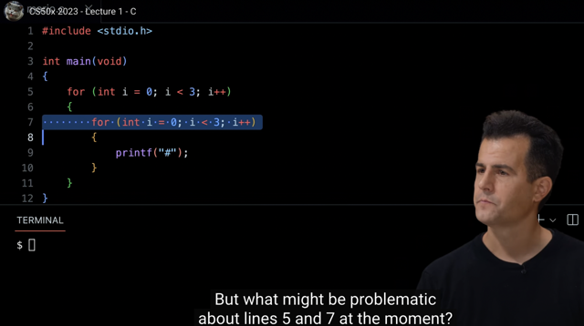</kbd>

> [!NOTE]
> Giờ ổng **muốn in ra block 3x3 (#)**
>
> Q: Có vấn đề gì không?
>
> A: **Có vẻ không được, ông phải chọn local var khác, j
> chẳng hạn**

 

<kbd>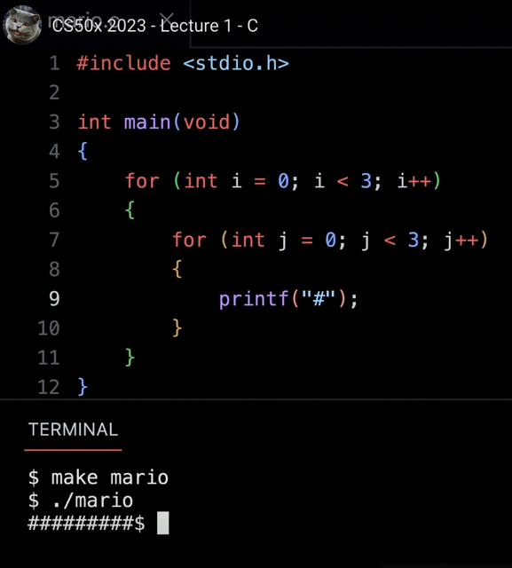</kbd>

> [!NOTE]
> A: Không ổn, ông làm vậy là nó **chỉ in ra 1 dòng**,
> ông phải **print "\ " ở ngoài cái loop thứ 2 (trong
> cái loop thứ 1)**

 

<kbd>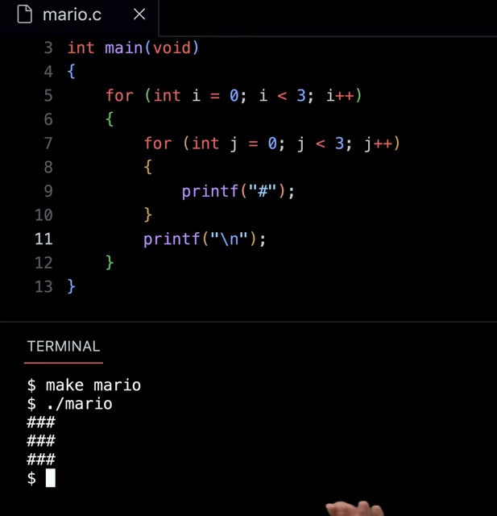</kbd>

> [!NOTE]
> Correct!

 

<kbd>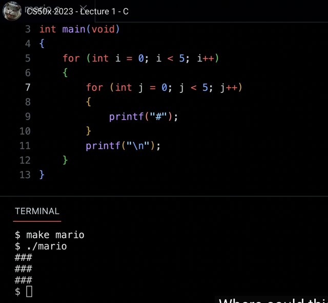</kbd>

> [!NOTE]
> Q: Giờ nếu muốn in 5x5, 6x6...tại sao đây không phải
> là best design?
>
> A: Phải dùng **variable define số vòng lặp cho cả 2
> loop**, có thể t**ách thành function với argument cho giá
> trị này**

 

<kbd>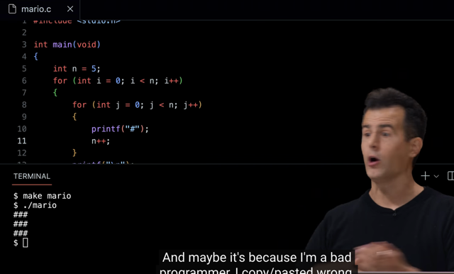</kbd>

> [!NOTE]
> Ok, làm vậy là đúng. Tuy nhiên **ổng nói có thể vô
> tình thay đổi giá trị của n**

 

<kbd>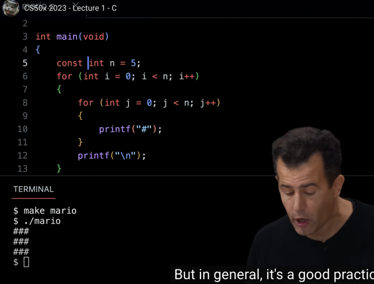</kbd>

> [!NOTE]
> Do đó ổng dùng **const** để make n fit
> (như Java dùng **final variable**)

 

<kbd>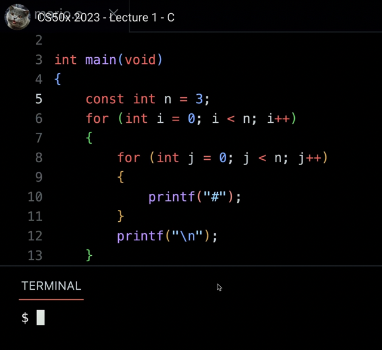</kbd>

<kbd></kbd>

<kbd>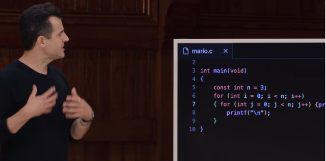</kbd>

> [!NOTE]
> Tiếp đại khái ổng nói dù code correct nhưng **style
> (indent - lùi dòng vào hợp lí) cũng quan trọng**

 

<kbd>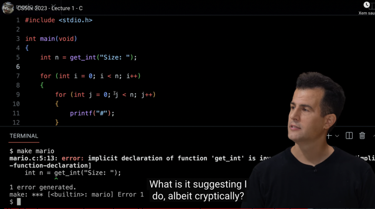</kbd>

> [!NOTE]
> Kế tới ổng tính cho user **enter số number of block**
>
> Q: What's wrong? 
>
> A: Ông **chưa include <cs50.h>** nên nó báo ko
> có function **get_int**()

 

<kbd>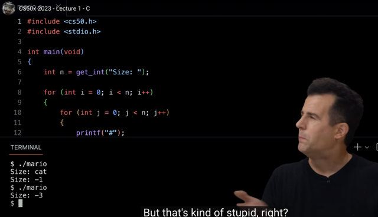</kbd>

> [!NOTE]
> Ok, work. Nhưng ổng nói dù là **get_int** có cơ chế prevent khi
> user enter text, ...nó sẽ **ko làm gì và chỉ hỏi lại**.
>
> Nhưng nó **không làm gì (và done)** khi user nhập **số âm**, ..
>
> Có vẻ**hơi stupid**

 

<kbd>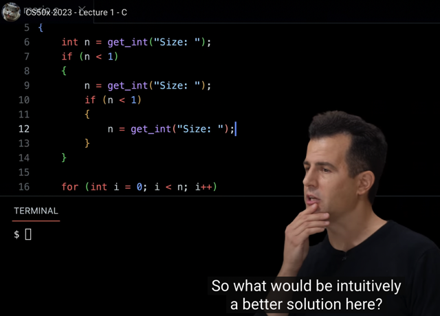</kbd>

> [!NOTE]
> Để fix issue này **không thể nào cứ check n < 1** thì lại **hỏi Size**
> như này.
>
> Q: Solution là gì ? (Để nếu user enter < 1 thì vẫn tiếp tục đợi
> con số khác thay vì done và không làm gì)
>
> A: T**ách thành một function và gọi function đó lại nếu n < 1.**
> Hoặc cứ gọi function main() được không?
>
> Một thằng khác: **Dùng loop**, có thể là **while n < 1: {n = get_int()...}**

 

<kbd>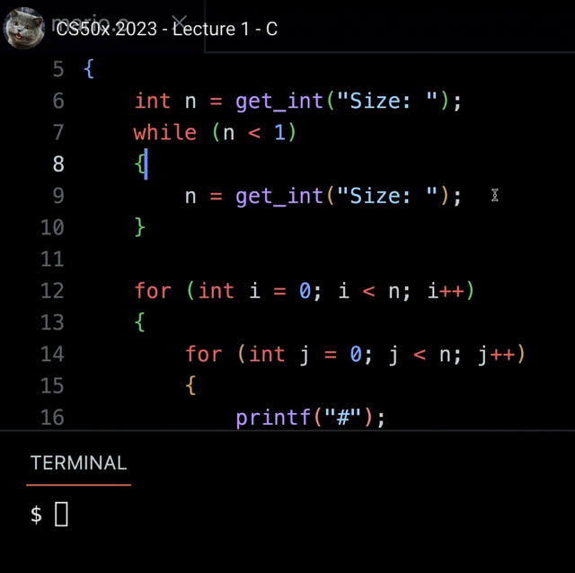</kbd>

> [!NOTE]
> Yeah ổng nói cách này cũng có thể được.
>
> Tuy nhiên vẫn còn chỗ duplicate ở **get_int** phải gọi 2 lần.
> Và giả sử đổi text thì phải đổi 2 chỗ

 

<kbd>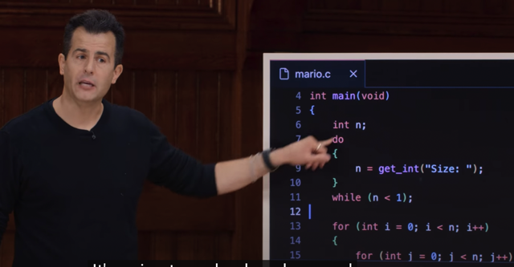</kbd>

> [!NOTE]
> Một cách hay hơn là dùng 
> **do 
> {
> ...n = get_int()..
> } 
> while (n < 1);**Nó sẽ **bắt đầu bằng gọi lệnh trong do{}** =yêu cầu user nhập n,
> Sau đó nó **check term trong while**, nếu thoả**nó sẽ quay lại 
> gọi lệnh trong do{..}**

 

<kbd>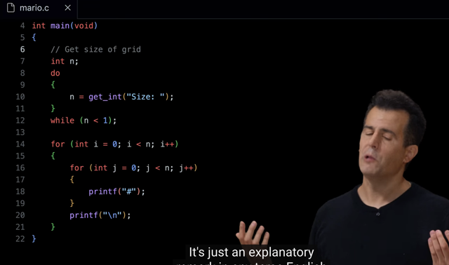</kbd>

> [!NOTE]
> Nói về comment

 

<kbd>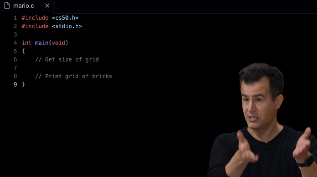</kbd>

> [!NOTE]
> Đại khái là comment có thể coi như
> **pseudocode describe high abstract**

 

<kbd>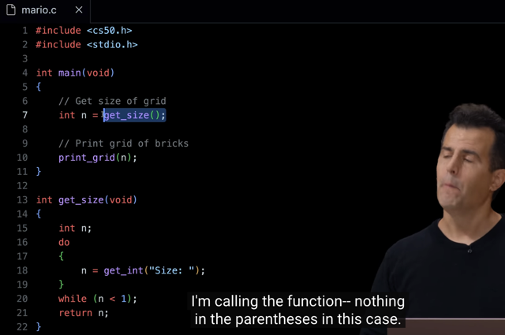</kbd>

> [!NOTE]
> Define function để**lấy n input từ user.**

 

<kbd>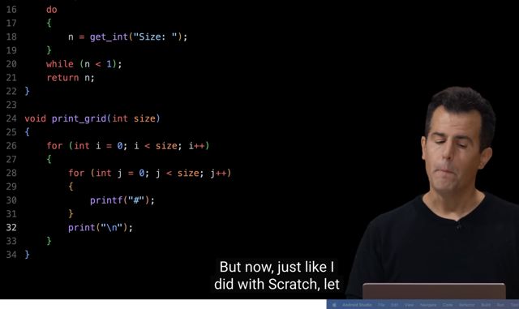</kbd>

 

<kbd>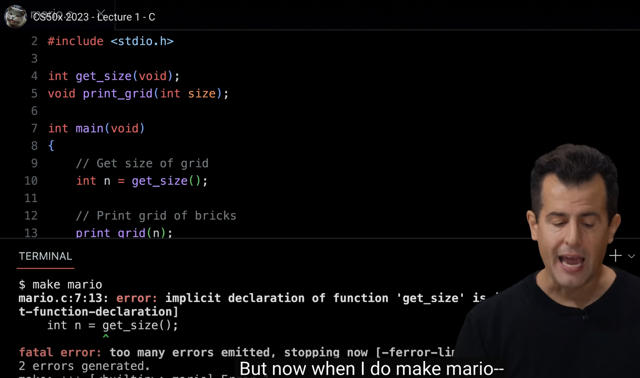</kbd>

> [!NOTE]
> Cái C này có cái mắc cười là**nếu define function ở dưới main**
> thì khi **chạy đoạn code trong main nó coi các custom define
> function chưa tồn tại** nên báo lỗi.
>
> Ta có thể để lên trên như làm vậy xấu.
>
> Thì nó có một cách đó là làm kiểu này, **phía trên main(), define
> int get_size(voide);**..kiểu như **cho C nó biết là có tồn tại function
> define ở dưới.**

 

<kbd>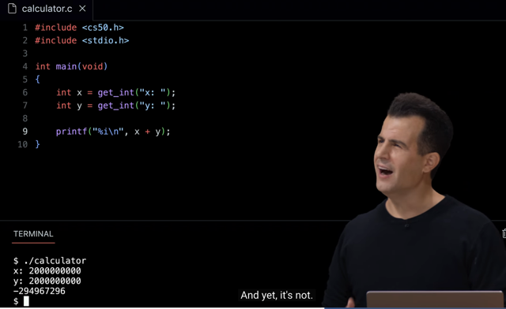</kbd>

> [!NOTE]
> Đại khái là ổng làm một cái calculator như vầy, rồi nhập
> **2,2**thì kết quả ra 4. OK. Nhưng làm tiếp với**2 tỉ và 2 tỉ thì
> nó ra -294...**

 

<kbd>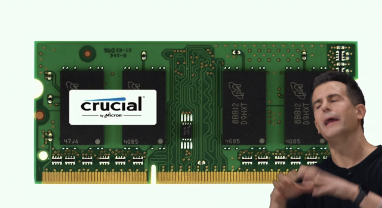</kbd>

> [!NOTE]
> Xong ổng giải thích bên trong máy tính có **RAM
> Random Access Memory và nó có giới hạn**

 

<kbd>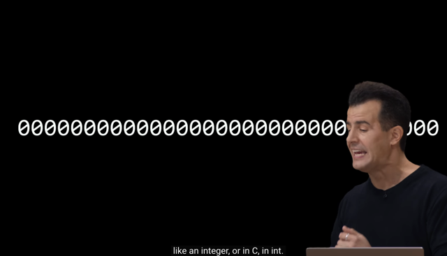</kbd>

> [!NOTE]
> Số nhỏ nhất có thể represent là
> 0 - Với**integer 32 bit đều số 0**

 

<kbd>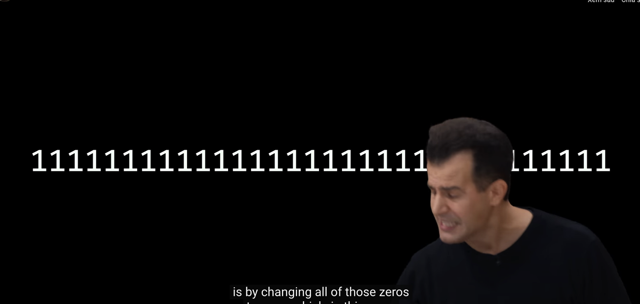</kbd>

<kbd></kbd>

<kbd>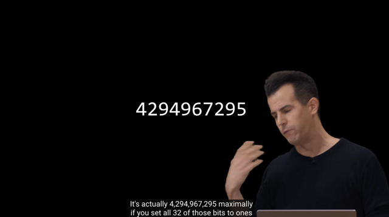</kbd>

> [!NOTE]
> Và số int lớn nhất có thể represent với**32 bit** đều
> = 1 là số **4294967295 = 2^31 + 2^30 + ...2^2 + 2^1 + 2^0**

 

<kbd></kbd>

> [!NOTE]
> Tuy nhiên phải **care cho số âm** nữa nên thật
> ra **int var lớn nhất chỉ là 2 tỉ mấy**

 

<kbd>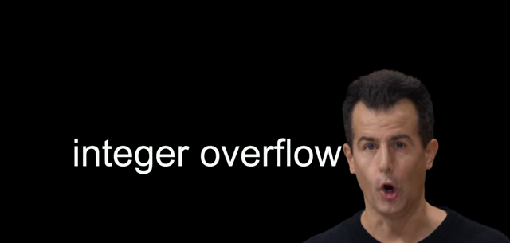</kbd>

> [!NOTE]
> Do đó cái hiện tượng ta mới
> gặp là **integer overflow**

 

<kbd>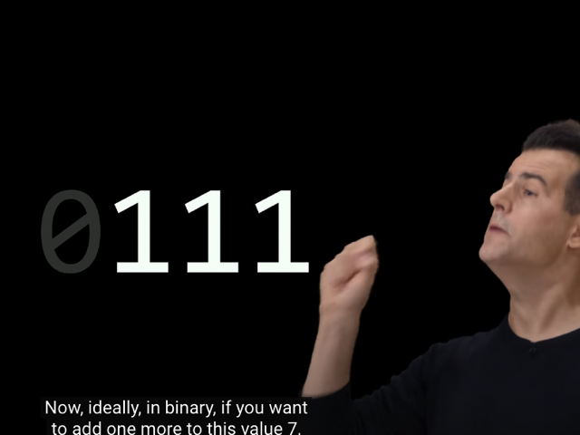</kbd>

> [!NOTE]
> Ổng lấy ví dụ g**iả sử ta chỉ có 3 bit để represent
> number**, thì với **3 bit** như đã biết số lớn nhất có
> thể represent là **7 = 111 = 2^2 + 2^1 + 2^0 = 4 + 2 + 1 = 2^3-1**

 

<kbd>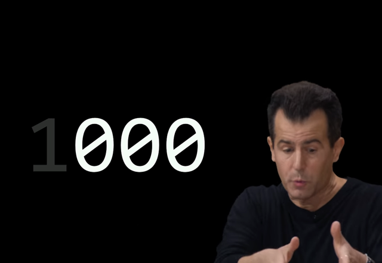</kbd>

> [!NOTE]
> Thì để represent 8 = 1000 thì **vì không có bit thứ 4,
> nên kết quả nó sẽ trở thành \/1\/000 với \/1**\/nằm ở bit
> thứ 4 không tồn tại**= 000 = 0**
>
> Đây chính là hiện tượng ta gặp khi nhân int 2 tỷ với int 2
> tỷ.

 

<kbd>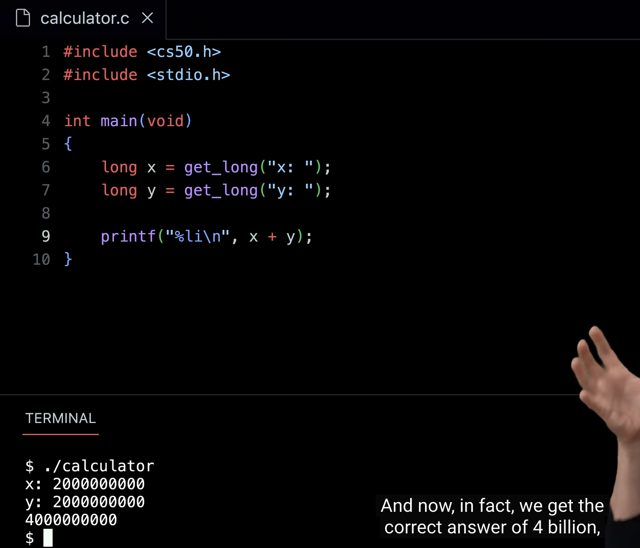</kbd>

> [!NOTE]
> giải pháp là dùng **long**, nó cũng represent **số
> nguyên** nhưng thay vì chỉ có 32 bit thì nó có**64 bit**để
> represent

 

<kbd>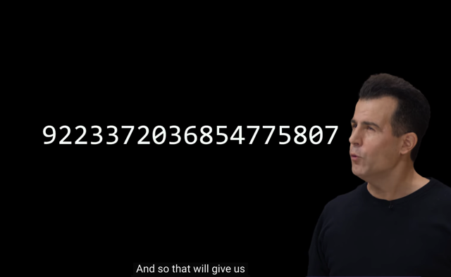</kbd>

> [!NOTE]
> Và với **64 bit** thì số lớn nhất nó có
> thể represent là số này:

 

<kbd></kbd>

> [!NOTE]
> Nói qua vấn để truncation

 

<kbd>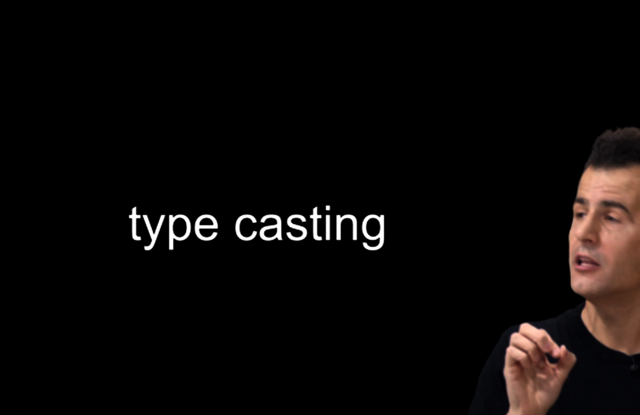</kbd>

 

<kbd>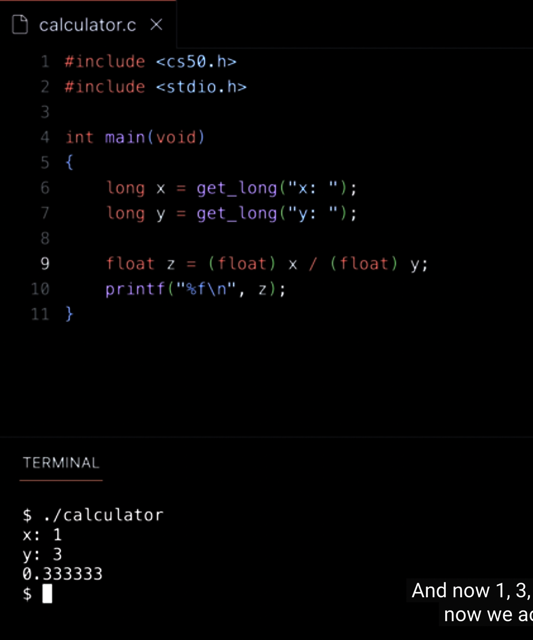</kbd>

> [!NOTE]
> Vấn đề là khi ổng **dùng phép chia** thì nó sẽ dùng
> **long** (là số nguyên), n**ên kết quả nó làm tròn**.
>
> Để có số thập phân phải**type cast** cho nó thành
> dạng số **thập phân float**
>
> Trong đây ổng dùng **%f** để show số **float**, giống
> như **string** thì **%s**, int thì %i, **long** thì **%l**

 

<kbd>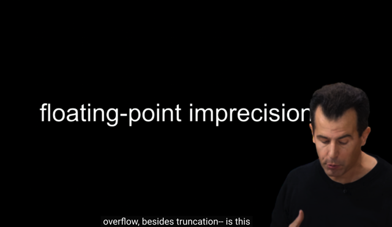</kbd>

 

<kbd>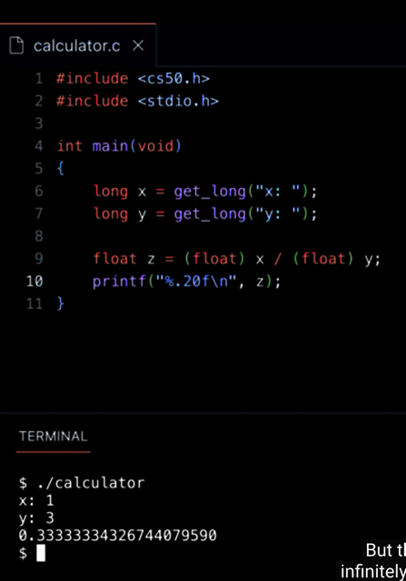</kbd>

> [!NOTE]
> Nói qua vấn đề**floating point imprecision** - vì
> máy tính chỉ có memory giới hạn nên với số thập
> phân vô hạn như thế này nó chỉ có thể đưa ra
> cái gần đúng nhất trong giới hạn bộ nhớ của nó -
> trường hợp này là **float** chỉ có **32 bit để represent
> số float**

 

<kbd>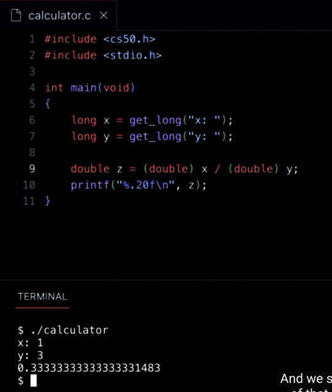</kbd>

> [!NOTE]
> Với việc dùng **double** - như tên gọi nó cho **64 bits** (thay
> vì **32 bits của float**). Cho biết ta **có double số bit** để thể
> hiện, kết quả là nó cho kết quả **chính xác hơn với nhiều số 0
> hơn**.
>
> Tuy nhiên như đã thấy nó sẽ **không thể tuyệt đối**vì double
> cũng chỉ có **64 bit**

 

## Tiếp ổng nói khi qua Python thì nó

> [!NOTE]
> Tiếp ổng nói khi qua Python thì nó
> kiểu như tự động cho ta thêm bit khi
> cần.

 

<kbd></kbd>

> [!NOTE]
> Tiếp ổng nói về một hiện tượng tương tự đã xảy
> ra là sự cố I2K khi các máy tính chỉ dùng 2 số để
> ghi nhận năm, thì khi chuyển từ 1999-> 2000 thì
> nó thành 99->00

 

<kbd></kbd>

<kbd></kbd>

<kbd>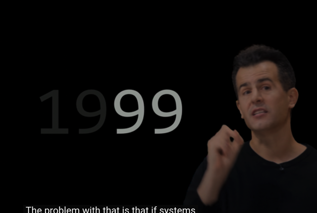</kbd>

 

<kbd></kbd>

<kbd></kbd>

<kbd></kbd>

> [!NOTE]
> Một sự kiện tương tự sẽ xảy ra vào 2038. Đó là hệ thống
> đếm thời gian từ mốc 1970 sẽ đạt full bit của 32 bit, và dẫn
> tới sau đó sẽ quay về mốc 1901

 

