# Week 2 Array

📊 **Progress:** `101` Notes | `181` Screenshots

---

<kbd></kbd>

 

<kbd>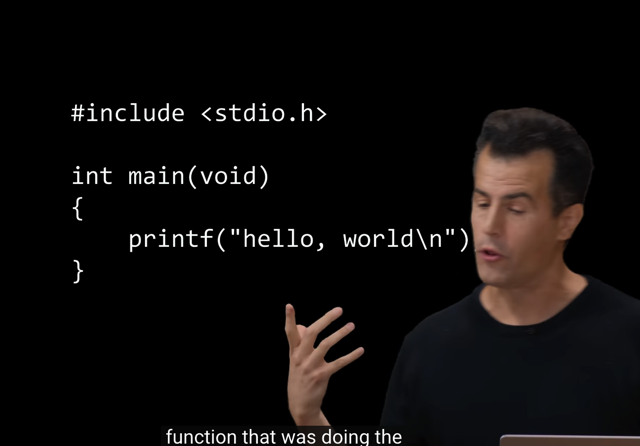</kbd>

 

<kbd>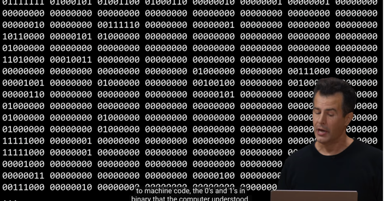</kbd>

> [!NOTE]
> Nhắc lại việc **compiler** sẽ **compile** = **chuyển
> source code thành machine code.**

 

<kbd>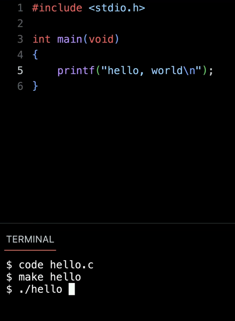</kbd>

 

<kbd>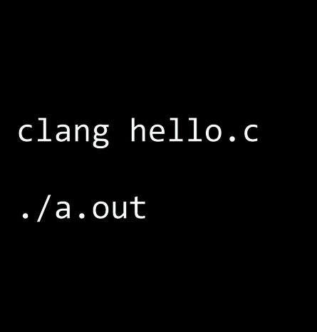</kbd>

> [!NOTE]
> Đại khái là cái compiler thật sự là **clang** - chỉ là tên
> của company. Bên cạnh đó có nhiều compiler khác, ví
> dụ **GCC**Và ổng tự compile thay vì gọi **make hello.c** thì gọi
> c**lang hello.c**
>
> Kết quả nó cho ra cái file tên là **a.out**
>
> Gọi **./a.out**thì nó cũng**run và in ra hello, world!**Nhưng có điều file tên a.out không thuận tiện lắm
> Khi nó chẳng nói lên nhiệm vụ của mình. Nên
> ổng nói có thể **rm a.out hello để đổi tên nhưng làm vậy
> mất công quá**

 

<kbd>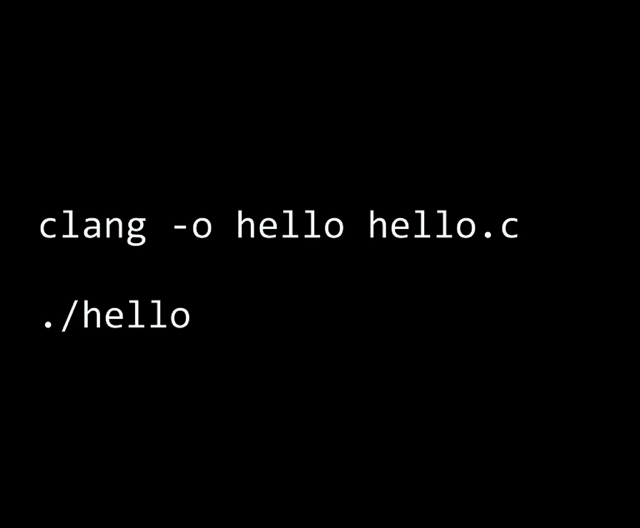</kbd>

> [!NOTE]
> Nói về cái gọi là **command line argument  cho phép thay đổi
> behaviour của command line** - kiểu như thay đổi default
> setting vậy
>
> Thì với cách này, có thể compile (manually dùng Clang, và chỉ
> định tên của file output, argument  **-o** có lẽ là để chỉ **output**.

 

<kbd>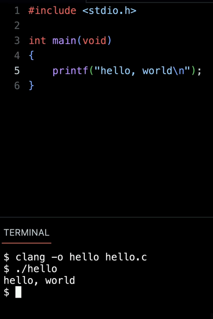</kbd>

> [!NOTE]
> Quả thật nó giúp compile ra file
> hello y như **make hello.c**

 

<kbd>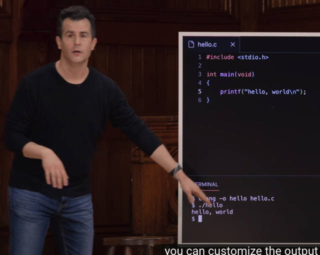</kbd>

> [!NOTE]
> Q. a.out là gì 
>
> D: Cơ bản nó là**historical name** cho
> **assembly output, ko quan trọng**

 

<kbd></kbd>

> [!NOTE]
> Q: -o là gì 
>
> D: là output, **chỉ định output file sẽ có tên là gì**
>
> thì ổng nói cái này là những thứ bạn phải **tự search trên mạng, đọc
> manual document..**

 

<kbd>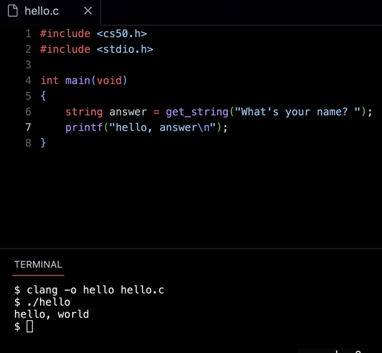</kbd>

> [!NOTE]
> Sai chỗ nào (review thôi):
>
> A: phải dùng **format code** printf("hello **%s**\\n", answer);

 

<kbd>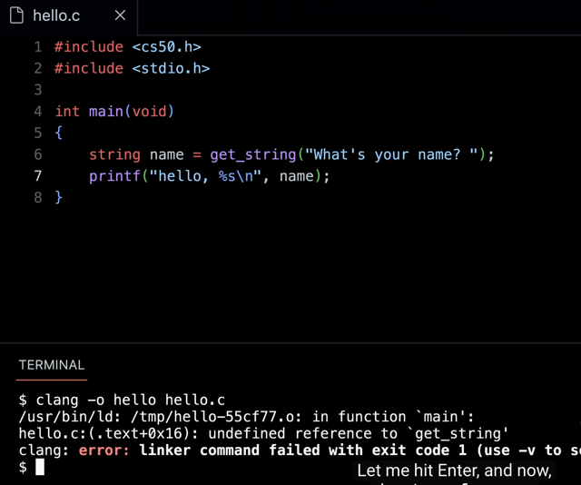</kbd>

 

<kbd>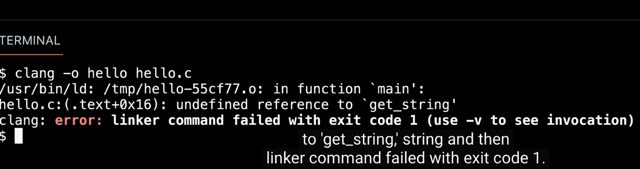</kbd>

 

<kbd>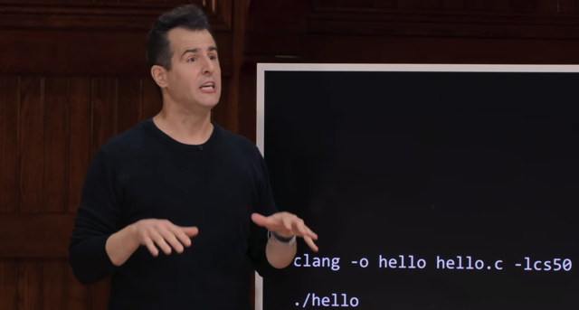</kbd>

> [!NOTE]
> Ở đây ổng giải thích là **dù với dùng include <cs50.h>**, thì nó vẫn **không đủ
> thông tin để Clang** đi**tìm trên hard drive** of the computer  **những chữ số
> 0,1 (ý là binary code) mà thực sự implement get_string() function**
>
> Và dòng include <cs50.h> này thật sự là **hint** nói với Clang rằng **ở đâu đó
> trên máy tính có function get_string()** này nhưng mày thật sự **phải dùng
> những 0, 1 machine code mà CS50 đã viết  trước đó và bake chúng trong
> your program để thật sự có thể dùng get_string function**Và ổng gọi lại lần này thêm "**-l**cs50" và ổng nói chữ l có nghĩa là **link
> mang ý nghĩa là những 0 and 1 viết bởi cs50 sẽ thật sự được link vào trong
> code**

 

<kbd></kbd>

> [!NOTE]
> Và không riêng gì CS50, những **lib** nào mà bạn dùng mà
> **không có đi kèm với language** trong thì đều phải dùng**-l
> như vậy**

 

<kbd>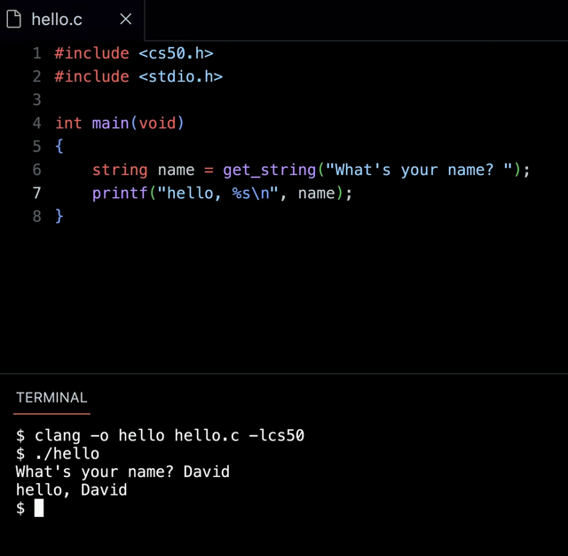</kbd>

> [!NOTE]
> Với sự thay đổi đó
> thì nó đã work

 

<kbd>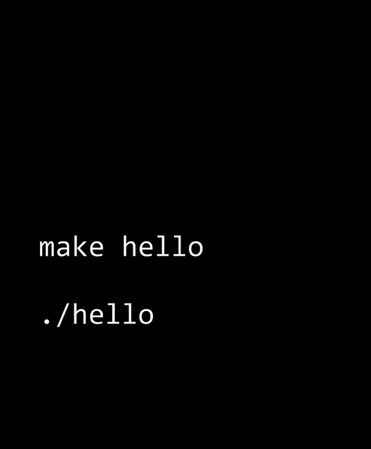</kbd>

<kbd></kbd>

<kbd></kbd>

> [!NOTE]
> Ổng nói là làm vậy để hiểu rằng **make giống như
> automatically mọi thứ giùm - không cần phải lo các
> command line argument
>
> Và sau này** nếu có lỗi gì thì nhiều khi không phải do make
> mà do **Clang implementation ở bên dưới** giống như ví dụ
> ở trên.

> [!NOTE]
> Q: Benefit of using Clang manually?
>
> D: Not really. Chỉ là **cho chút cảm giác control** nếu bạn
> có thể **nhớ được các argument**
>
> ===
>
> Q: Tại sao phải explain **-lcs50** mà không **-lstdio**?
>
> D: Vì **cs50** **không đi kèm với language**, còn **standard io** thì **có**
>
> ===

 

<kbd>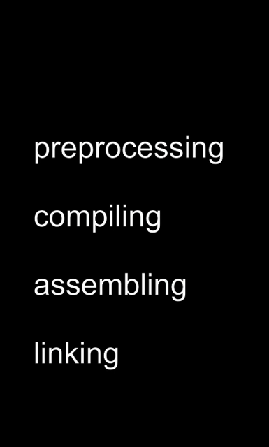</kbd>

> [!NOTE]
> Đại khái là nói compiling chứ
> **thật ra có 4 động tác**

 

<kbd>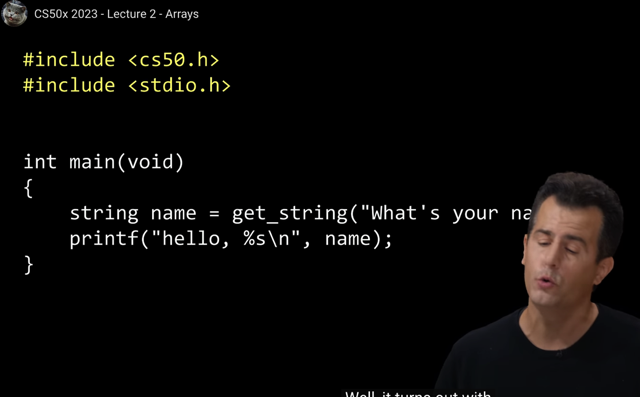</kbd>

> [!NOTE]
> Đầu tiên là **preprocessing**. Ổng nói **bất cứ cái nào có dấu #
> (hashmask) thì đều phải được làm trước = preprocessed  =
> analyzed initially trước tiên**
>
> Tiếp đại khái là ta có thể thắc mắc **những file cs50.h hay stdio.h
> này ở đâu vì ta không thấy khi ls hay dùng GUI?**

 

<kbd>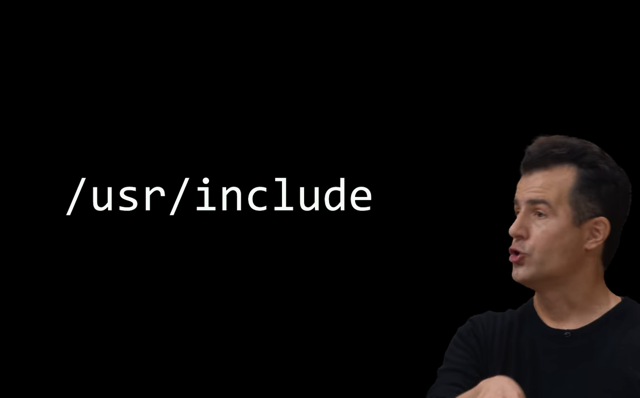</kbd>

> [!NOTE]
> Thì thật sự ở nơi mà chứa cái code space này ví dụ trên
> cloud hay trên máy tính thì nó có cái **folder /usr/include
>
> Và nếu mình gõ ls /usr/include ta sẽ thấy các file trong đó**

 

<kbd>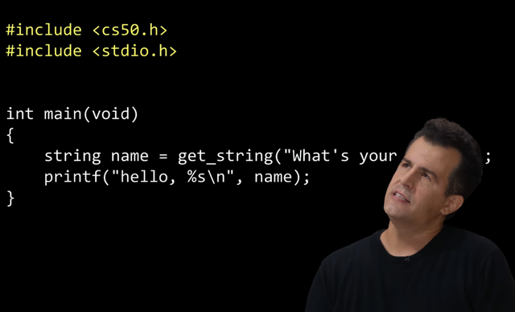</kbd>

> [!NOTE]
> Đại khái ổng nói **#include** .. này giống kiểu như một **place
> holder** cho **global find and replace**. Khi clang đọc file, và
> gặp #...nó sẽ **đi vào cái file cs50** và **lấy ra các code để
> sẵn sàng sử dụng**

 

<kbd>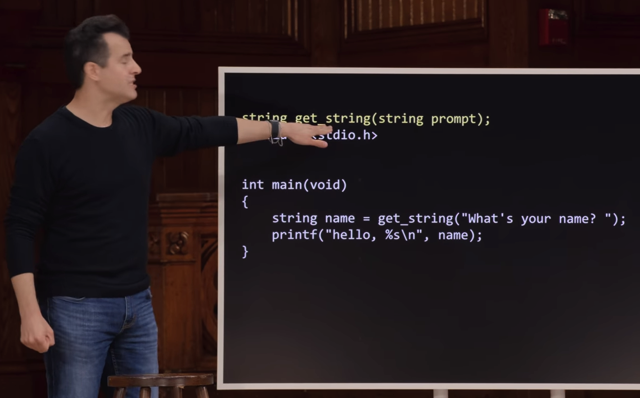</kbd>

> [!NOTE]
> Thì đại khái là ổng nói có thể hiểu việc include giống
> như việc **function declaration để clang nó biết là có function
> đó giống như khi ta define 1 function, thì phải declare ở trên 
> main() như tuần trước đã gặp**

 

<kbd>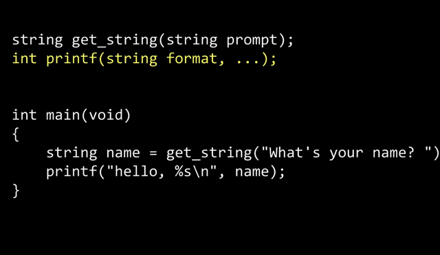</kbd>

> [!NOTE]
> Tương tự, với **include <stdio.h>**, là **declaration**
> cho function **printf**
>
> **Ba dấu chấm** mang ý nghĩa là function này có thể
> **có nhiều argument**

> [!NOTE]
> Q: Khi include vậy nó i**nclude chỉ function được
> dùng hay mọi thứ**
>
> D: **Mọi thứ**

 

<kbd>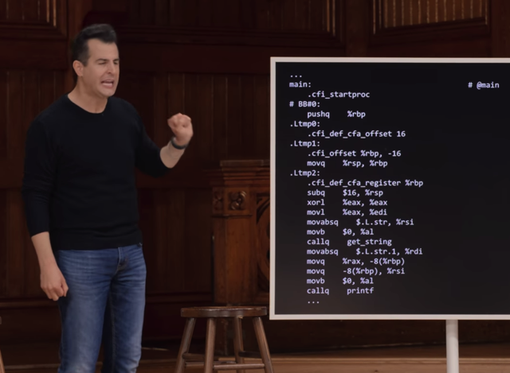</kbd>

 

<kbd>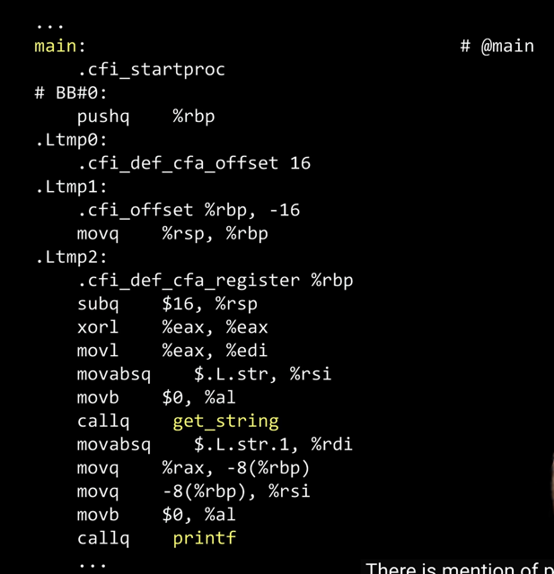</kbd>

> [!NOTE]
> Thì đại khái là khi nó compile thì nó thành ra như thế này, là
> ngôn ngữ **Assembly** d**ù không user friendly lắm nhưng nó
> thật sự efficient**Trong đây ta có thể thấy dấu vết xuất hiện của**get_string,
> printf**

 

<kbd>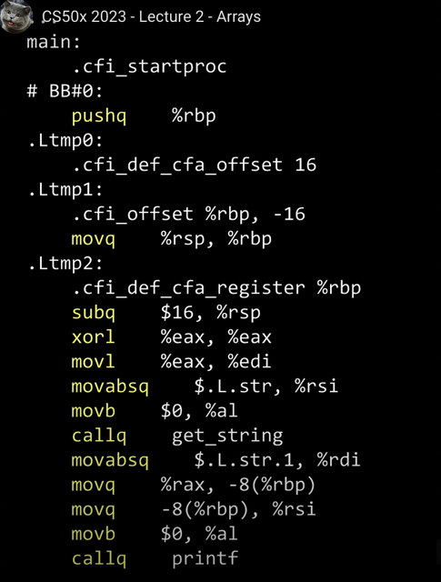</kbd>

> [!NOTE]
> nhìn sơ sẽ thấy nó có các arimethic
> operation như**push, move, call**, ....

 

<kbd>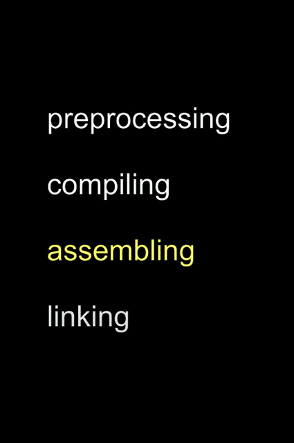</kbd>

> [!NOTE]
> Nhưng nó **vẫn chưa phải là machine
> code**. Thì bước **assembling** mới
> thật sự**tạo machine code**

 

<kbd>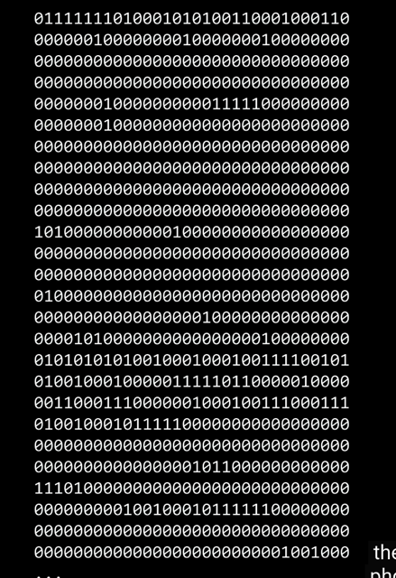</kbd>

 

<kbd>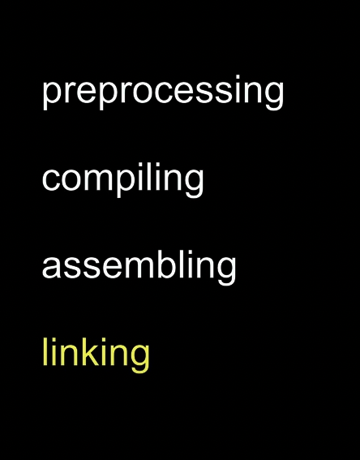</kbd>

 

<kbd>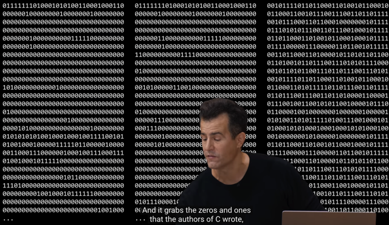</kbd>

<kbd></kbd>

<kbd>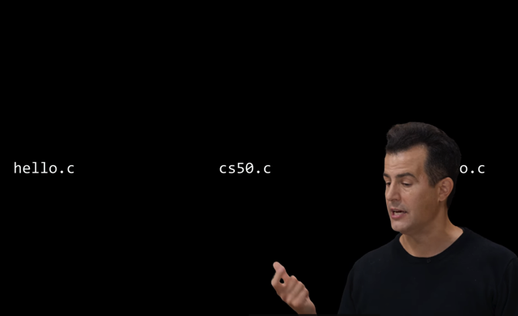</kbd>

> [!NOTE]
> Đại khái là bước **linking** này sẽ**link mọi machine
> code của 3 file này với nhau thành 1**
>
> Nên gọi là c**ompile chứ thực tế có tới 4 bước trong đó**

 

<kbd></kbd>

> [!NOTE]
> Q: mấy cái file "0 và 1" này nằm ở đâu?
>
> D: Good question: Ví dụ khi dùng **VS Code Online thì
> somewhere trên server** có một **folder assign riêng cho bạn**
> chứa tất cả các file này
>
> Giống như **DropBox, Google Drive**
>
> ====
>
> Q: Có thể**thay vì include** thì **copy code trong đó bỏ vào đây
> không.**
> D: **Theo lý thuyết là được.** Thực tế phải care thứ tự abc các 
> kiểu nữa nhưng lý thuyết là được.

 

<kbd></kbd>

> [!NOTE]
> Do đó ổng nói dòng include kiểu như**hint cho Slang biết
> các function sẽ như thế nào**. Còn thực tế **code nằm trong
> file cs50.c**

 

<kbd></kbd>

> [!NOTE]
> Q: Linking có happen khi compile code ko?
>
> D: **Yes**. nôm na là **compiling** sẽ **chuyển source code
> thành  Assembly code**, là language**gần gũi với server,
> window**...hơn.
>
> Sau đó**assembling sẽ chuyển assembly code thành
> machine code (binary)**
>
> Và l**inking sẽ link các binary code của các file lại.**
>
> Ổng nói thời xưa người ta **chỉ code bằng machine code** rất
> khó. Sau đó là **assembly code**, không dễ hiểu như bây giờ
> nhưng **bớt khó**, rồi **C khiến việc code gần giống tiếng
> Anh** và ngày càng **các ngôn ngữ mới build trên tầng ngôn
> ngữ cũ ví dụ Python** nằm trên C sẽ **khiến bớt khó hơn
> nữa**

 

<kbd></kbd>

> [!NOTE]
> Đại khái ổng nói là **dù trên lý thuyết** có thể **decompile**
> **machine code ra lại source code**. Nhưng thật ra nôm na
> là **nếu có thể mở cái iphone ra và xem xét, hiểu hết
> bên trong và làm lại** thì thật ra **sẽ dễ hơn để invent cái mới.**
>
> Có những cái gây khó ví dụ như**loop tuy có vài loại
> nhưng khi  compile nó chỉ y nhau**. Rồi **variable với tên
> này tên kia nhưng compile  xong thì nó không care**

 

<kbd>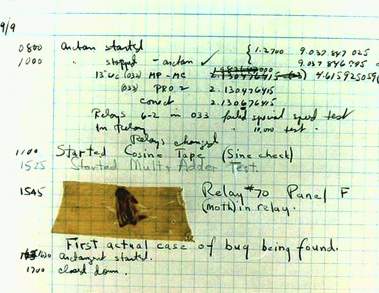</kbd>

 

<kbd></kbd>

> [!NOTE]
> Đang nói về bug, nguồn gốc**cái tên là từ con bọ thật.**
> Nhưng ngoài **syntax bug** như thiếu dấu **;**
> còn có **logical bug** như ở đây yêu cầu in 3 blocks
> thì nó in 4 blocks

 

<kbd>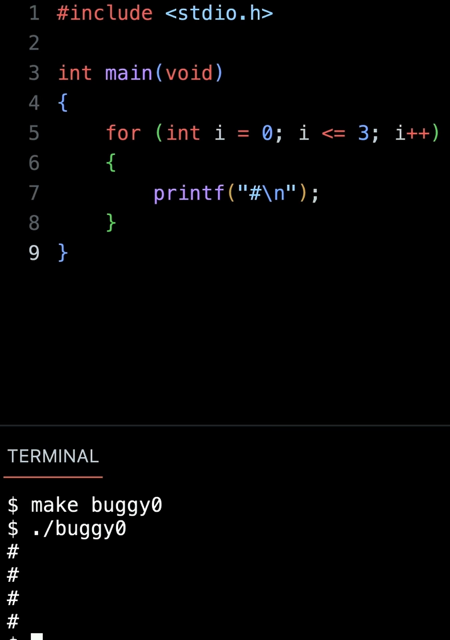</kbd>

 

<kbd>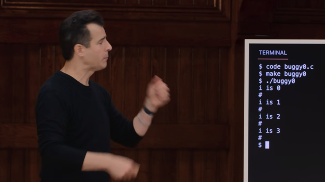</kbd>

> [!NOTE]
> Đại khái là **printf là cái debugging tool** đầu tiên mà ta có.
> Dùng nó để **in ra các variable value** từ đó giúp ta**diagnose
> vấn đề**
> Ví dụ như trường hợp này **nhờ printf ra value của i ta có thể
> nhận thấy đang dư một vòng lặp**. Phải sửa lại <= 3 -> < 3

 

<kbd>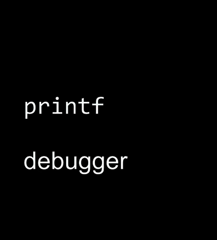</kbd>

 

<kbd>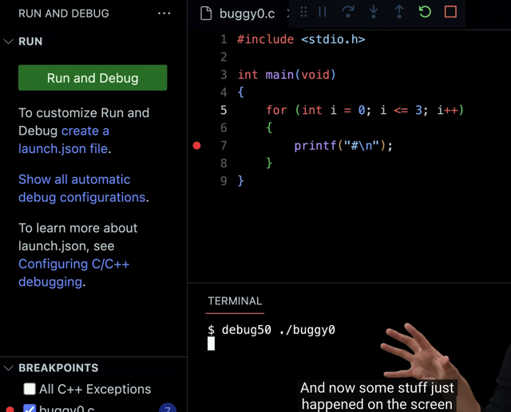</kbd>

> [!NOTE]
> Công cụ thứ 2 chính là **debugger** mà các
> IDE như VS Code support. Cũng như **Android Studio**.
> Nó giúp**xem các variable** khi **chương trình đang chạy**
> bằng cách **dừng lại tại các breakpoint mà ta muốn**

 

<kbd>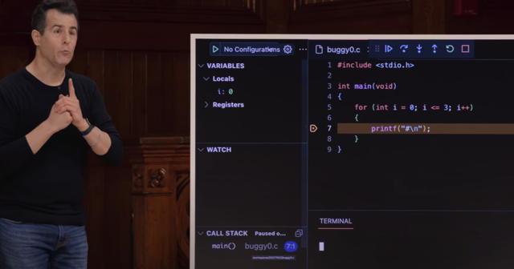</kbd>

 

<kbd>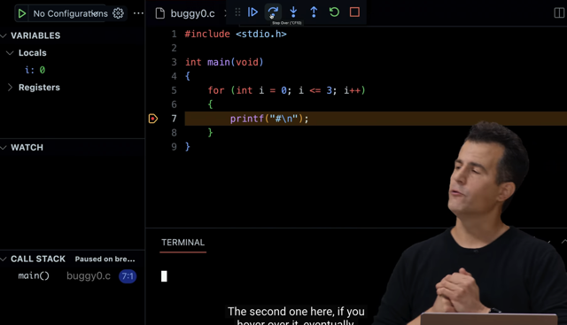</kbd>

> [!NOTE]
> **Step over**là**bỏ qua**,  nó sẽ k**hông phân tích implementation
> của printf**, còn **nếu dùng nút kế tiếp thì nó sẽ step in**, **đi vào
> phân tích printf**
>
> Phân tích ở đây hiểu nôm na là chạy vào bên trong để xem
> và nó sẽ **dừng ở những dòng có tính toán**

 

<kbd>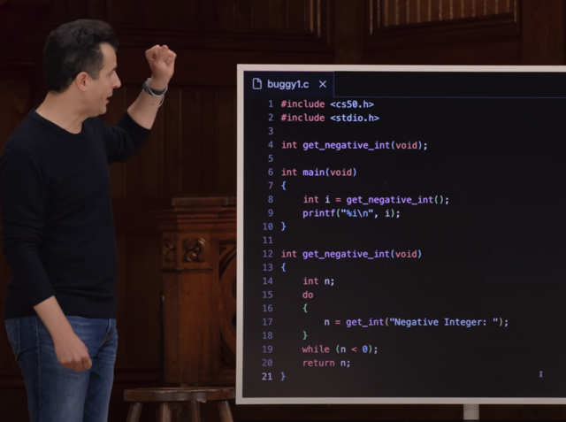</kbd>

 

<kbd>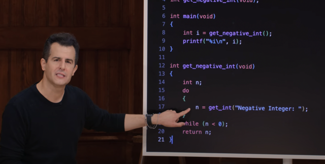</kbd>

> [!NOTE]
> D: Tại sao phải declare **var n** tại đây
>
> A: Vì để **variable n có thể được return**, nếu để trong do {...}
> thì nó thành local var, không thể access ở ngoài
>
> D: Đúng **scope** của variable là **trong cặp dấu {}**

 

<kbd>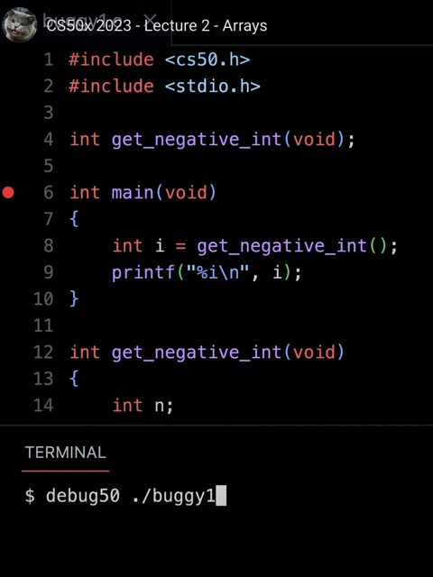</kbd>

 

<kbd>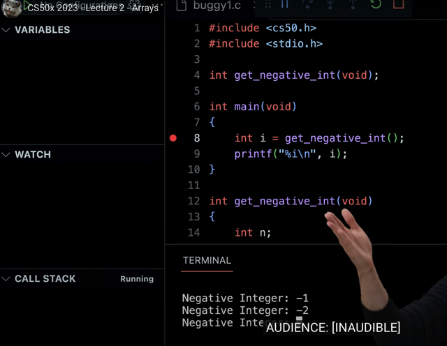</kbd>

> [!NOTE]
> D: Tại sao gõ -1, -2 nó không chạy (ý là debug)
>
> A: Vì nó c**hưa ra khỏi do {} while (n < 0) trong
> function get_negative_int() được**. Nên nó **chưa xong
> function đó**

 

<kbd>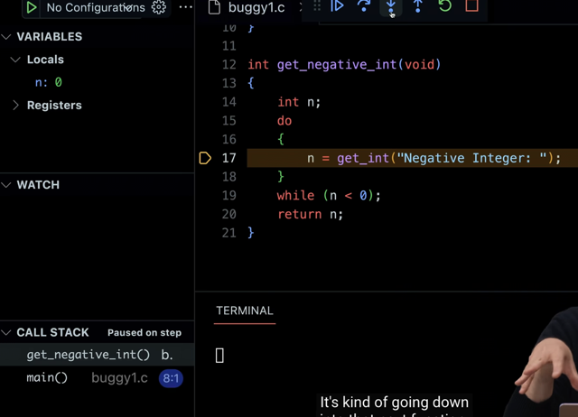</kbd>

> [!NOTE]
> Thay vì**step over**, ổng dùng **step in** để nó chạy vào
> function **get_negative_int**()
>
> Và ổng nói **nó không dừng ở line 13,14,15,16 vì không
> có gì quan trọng ở đó.**
> Tới đây ổng hỏi **tại sao không nên click step in ở line này**?
>
> A: Vì nó sẽ chạy vào **get_int**() là function của CS50 và **mình
> assume nó correct**
>
> D: Correct

 

<kbd>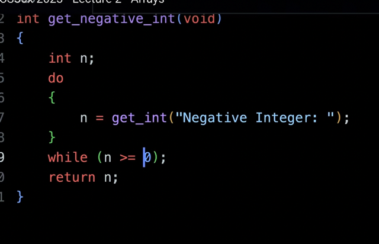</kbd>

> [!NOTE]
> Với việc debug giúp ta hiểu là
> đang làm sai về logic

 

<kbd>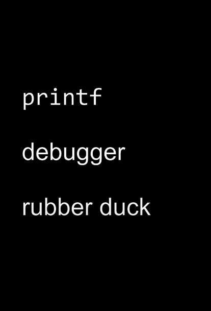</kbd>

 

<kbd></kbd>

> [!NOTE]
> Đại khái tool thứ 3 là nói chuyện. Khi gặp stuck, **đừng
> chỉ chăm chăm nhìn vào màn hình**. Hãy **nói ra** dù
> chỉ là với con vịt cao su **mô tả logic của mình đang
> làm** thì **rất có thể nó sẽ giúp ta nhìn ra vấn đề sai ở
> đâu**

 

<kbd></kbd>

<kbd></kbd>

<kbd></kbd>

<kbd></kbd>

<kbd></kbd>

 

<kbd>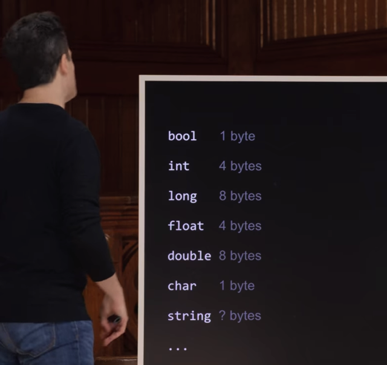</kbd>

> [!NOTE]
> Ổng lướt sơ lại các data type và memory của
> chúng.
>
> Trong đó chỉ có string là không biết, vì nó tuỳ

 

<kbd>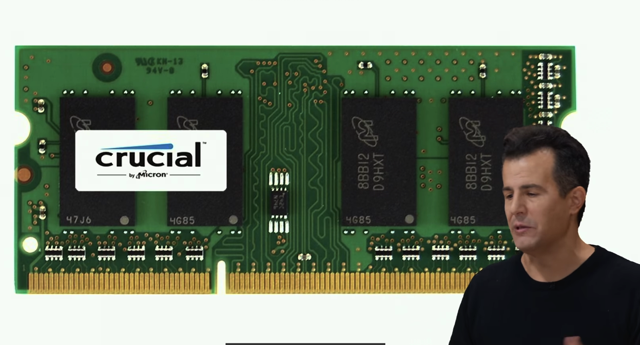</kbd>

 

<kbd>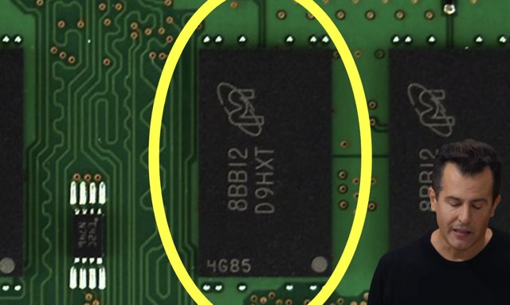</kbd>

> [!NOTE]
> Đây là memory

 

<kbd>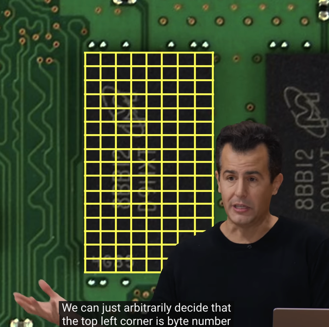</kbd>

> [!NOTE]
> Thì ổng nói đại khái ta có thể hình dung là nếu nó có
> finite storage thì có thể coi như một table các khoảng
> trống available để chứa thông tin.

 

<kbd>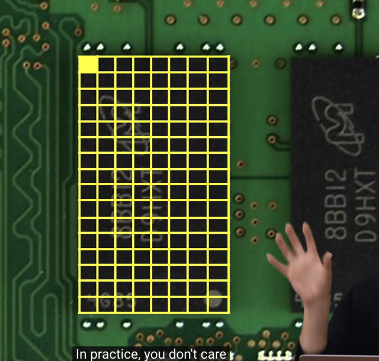</kbd>

> [!NOTE]
> Đại khái là một char, với 1 byte nó nằm đây

 

<kbd>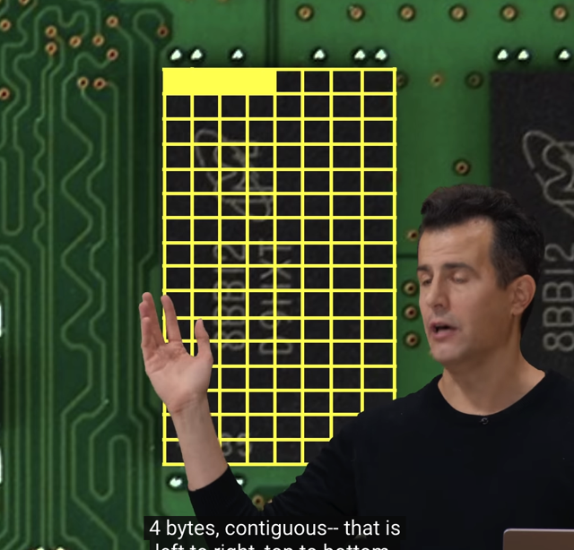</kbd>

> [!NOTE]
> 1 int, với 4 bytes nó nằm đây

 

<kbd>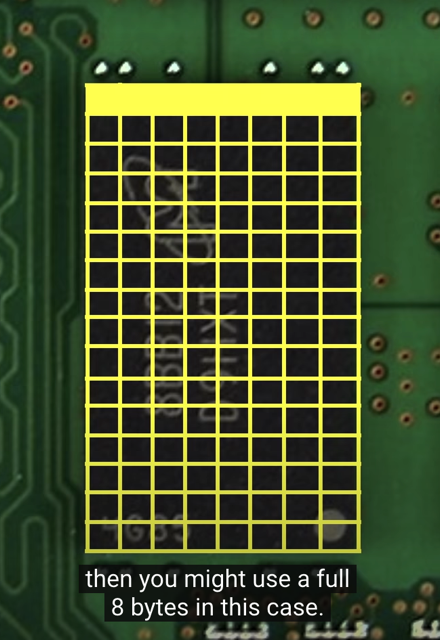</kbd>

> [!NOTE]
> nếu là một long 8 bytes

 

<kbd>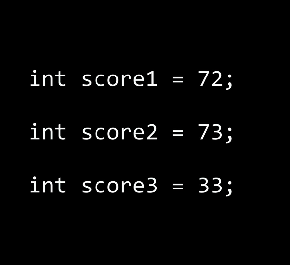</kbd>

 

<kbd>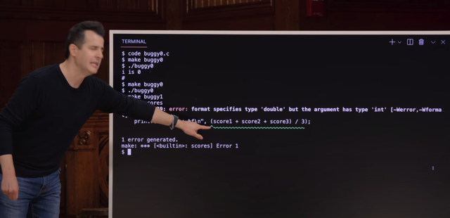</kbd>

> [!NOTE]
> Ổng viết cái code này tính average, ban đầu print ra được
> 59 khi để %i
>
> Sau đó ổng muốn check xem có phải là nó tròn 59 hay
> không, nên ổng đổi dùng %f. Compile nó báo lỗi. Vì các
> số đang tính đều là int, mà đòi print với %f nên nó lỗi.

 

<kbd>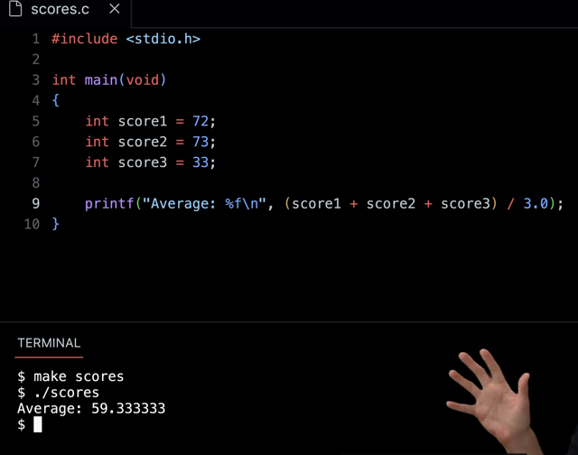</kbd>

> [!NOTE]
> Thì cách giải quyết đó là **thay vì chia 3 thì chia 3.0** = đại
> khái  là **khiến phép chia trở thành chia cho một float thì kết
> quả nó sẽ là float**. Compile máy tính nó không complain
> nữa.
>
> Kết quả cho thấy là 59.3333

 

<kbd>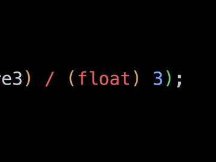</kbd>

> [!NOTE]
> Một cách khác là dùng **type casting**để bảo máy tính treat số 3 như một
> float.
>
> Thì kết quả cũng ra tương tự,

 

<kbd>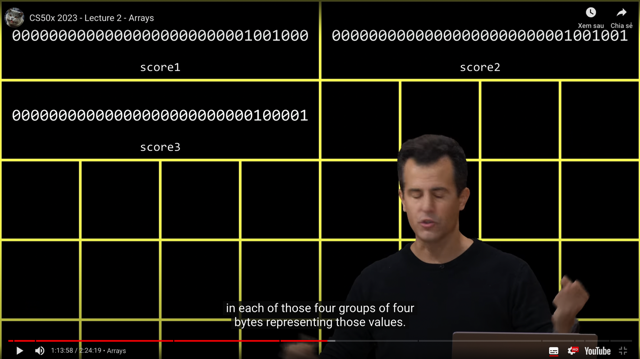</kbd>

<kbd></kbd>

<kbd>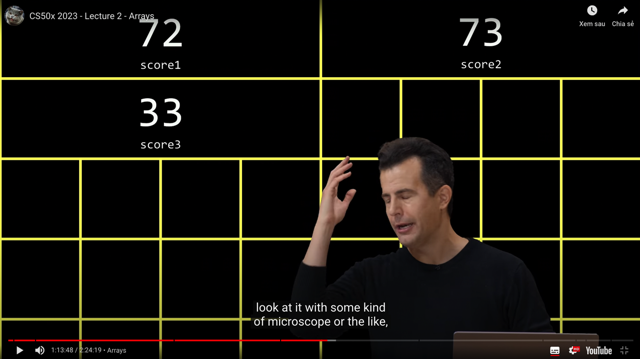</kbd>

> [!NOTE]
> Đại khái là nôm na thể hiện các variable trên memory grid, 
> Tuy thực tế nó không nằm như vậy nhưng để cho đơn giản
> cứ tạm hiểu như vậy. 
>
> Thì thực tế ở dưới nó là binary value nhưng cứ tạm bỏ qua
> để hiểu là mỗi integer var score1, score2, score3 chiếm
> 4 bytes

 

<kbd></kbd>

> [!NOTE]
> Thì đại khái ổng hỏi, dù không phải là học CS, thì đây có
> phải là best design không, dùng 3 variable để chứa 3 value
> của scores.
>
> A: (thử trả lời) Không, nên dùng **MỘT** **list** để chứa. Thay vì **3
> Variable riêng biệt
>
> D: Correct! Vì giả sử có 5 10 test scores thì lại phải add
> thêm các variable để chứa những scores đó**

 

<kbd>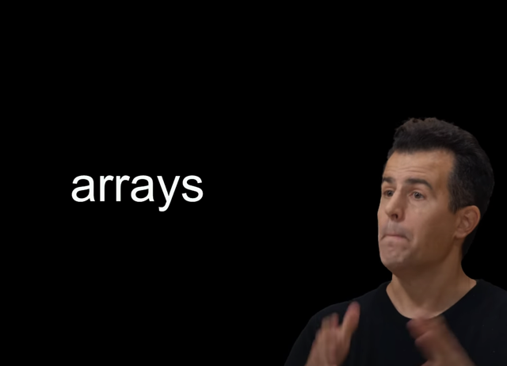</kbd>

 

<kbd></kbd>

> [!NOTE]
> Hãy cho tôi một variable tên là scores, dạng **array**
> có **size = 3** mà mỗi vị trí là **int**. 
>
> Tương đương, hãy cho tôi **12 (=3*4 bytes) bytes**

 

<kbd></kbd>

> [!NOTE]
> Và đây là cách assign value (scores)
> vào arrays. Start index với 0

 

<kbd>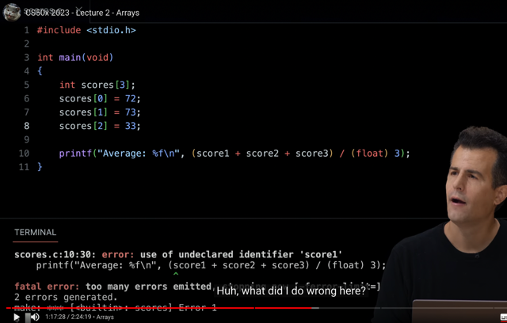</kbd>

> [!NOTE]
> Rồi ổng sửa code lại như vầy. Error.
>
> D: Why?
>
> A: Ông bỏ các var score1, score 2 ..đi rồi còn đâu

 

<kbd>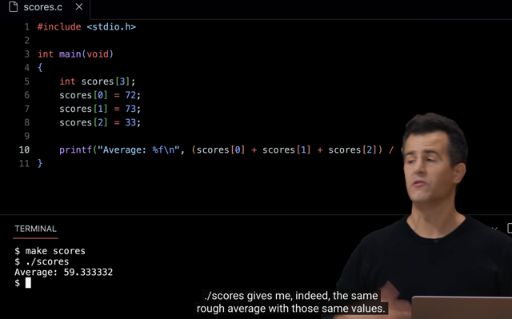</kbd>

> [!NOTE]
> Ok, work!

 

<kbd>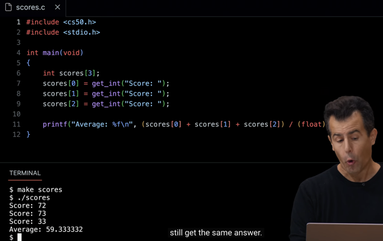</kbd>

> [!NOTE]
> Làm cho hữu ích hơn với **entered score value**
>
> Nhưng question: Làm vậy có well design ko?
>
> A: Không, vì sẽ không được nào **nếu muốn nhiều score hơn**.
> Phải có cách nào dùng entered value cho size của scores

 

<kbd>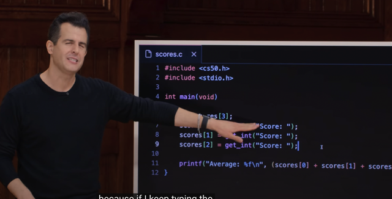</kbd>

> [!NOTE]
> 1 người trả lời **nên dùng loop vì có 3
> chỗ gọi get_int giống nhau**

 

<kbd>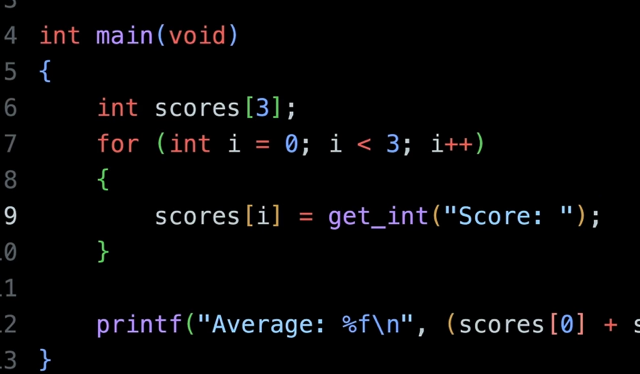</kbd>

> [!NOTE]
> Correct!

 

<kbd>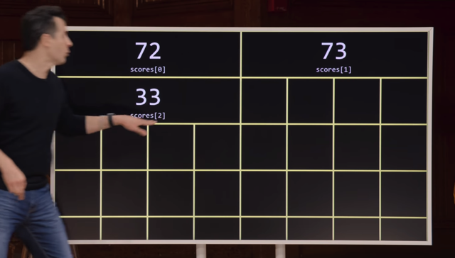</kbd>

> [!NOTE]
> ý ổng nói là ở trong memory**thay vì có 3 chỗ assign cho 3
> variable** đơn lẻ thì giờ vẫn cùng một không gian nhưng mà là
> của **1 variable**
>
> Và có thể access tới các item của nó bằng [i]
>
> The memory is **contiguous**: Contiguous =**tiếp giáp**. Ý là nó
> **không thể nằm random ở đâu đó mà vì là array  nên sẽ quy
> định các pack nằm gần nhau**, **pack to pack to pack**

 

<kbd>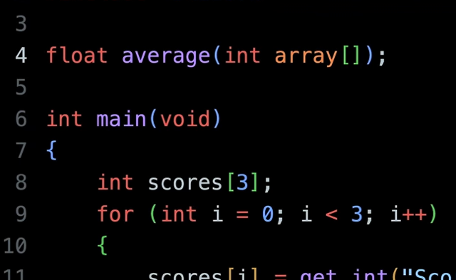</kbd>

<kbd></kbd>

<kbd>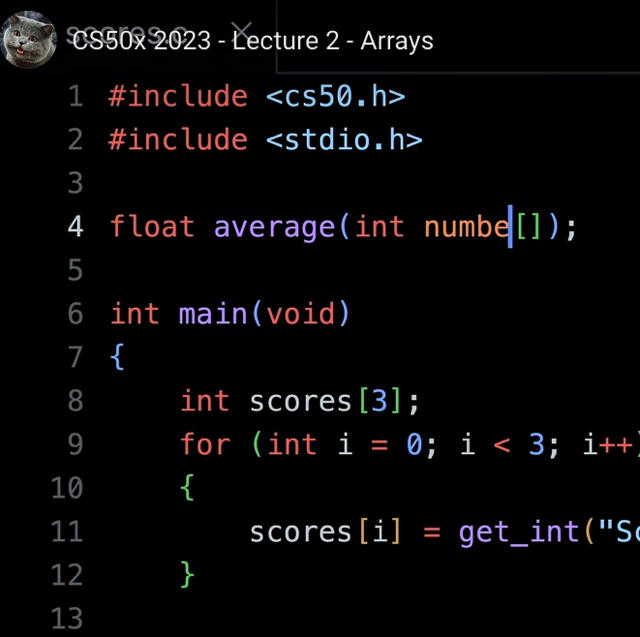</kbd>

> [!NOTE]
> Ổng **define một function giúp tính average nhận argument là
> array.**
>
> Cái này **hơi khác với Java: average(int[] array)** Còn ở **C lại là
> (int array[]), và array chỉ là tên của argment, có thể là number[], n[]
> .**..

 

<kbd>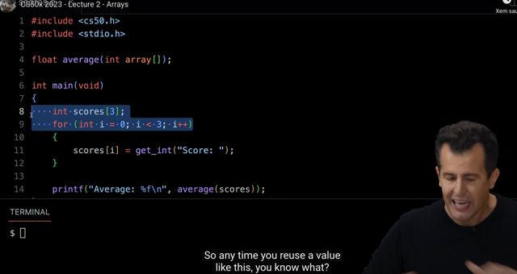</kbd>

> [!NOTE]
> Nói về **magic number** mà đã học trong short video tuần
> trước. Đại khái là khi ta **HARD CODE một value nào đó**.
> Ổng nói tuy rằng nếu muốn đổi size của array lên 4 thì
> cũng không mệt gì lắm khi đổi hai chỗ nhưng vấn đề là
> khi người khác dùng lại code và họ không biết là phải
> đổi ở những chỗ nào thì rất nguy hiểm.

 

<kbd>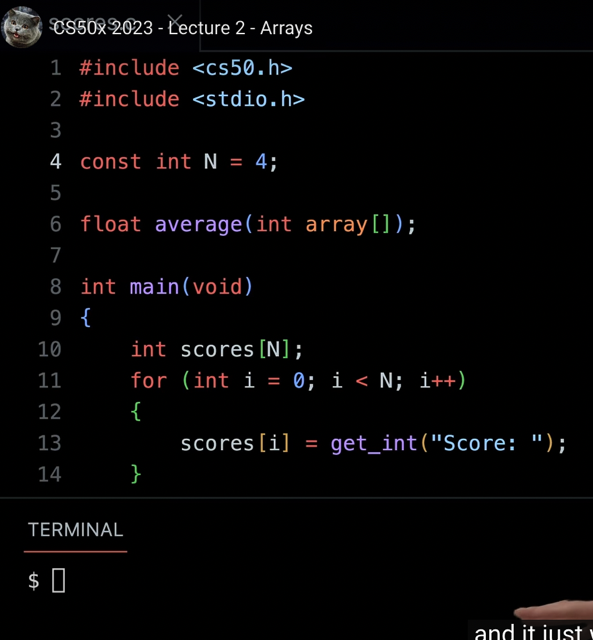</kbd>

> [!NOTE]
> Dùng N **constant** để thay
> cho magic number

 

<kbd>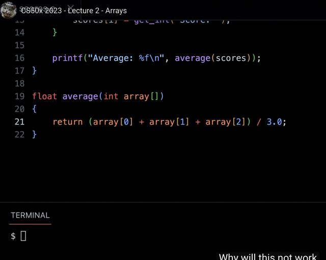</kbd>

> [!NOTE]
> D: Nhưng ở đây sẽ không work, sai chỗ nào?
>
> A: Vì hard code kiểu này, lỡ may N define ở trên (size
> array) nhỏ hơn 3 thì nó sẽ bị lỗi ở trong average() này
> khi access array[2]
>
> D: Yes, và giả sử N bằng 5 thì average chỉ đang tính
> với 3 cái đầu tiên của array thôi
>
> ====
>
> D: Vậy phải làm sao?
>
> A: **Dùng loop**, trong length hay size của array. Để**cộng
> dồn** các value và cuối cùng chia cho size

 

<kbd>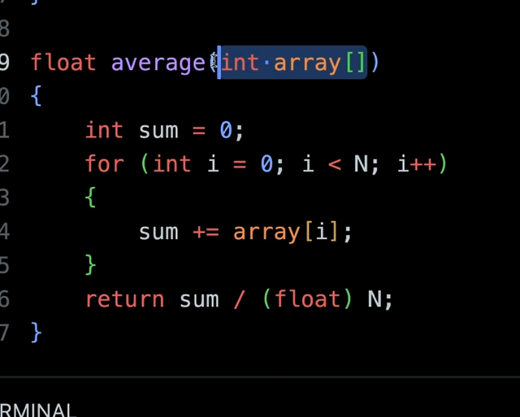</kbd>

 

<kbd>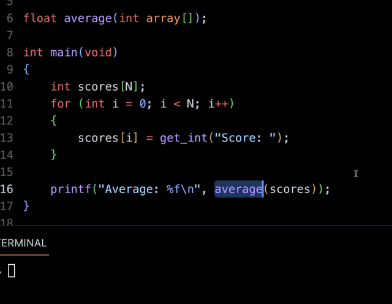</kbd>

> [!NOTE]
> Q: Sao phải include float average(int array[])
>
> D: (Thằng này không học bài nè) vì như tuần trước đã nói
> **C nó đọc từ trên xuống và cần phải declare như vậy cho nó
> biết có tồn tại function average()**

 

<kbd>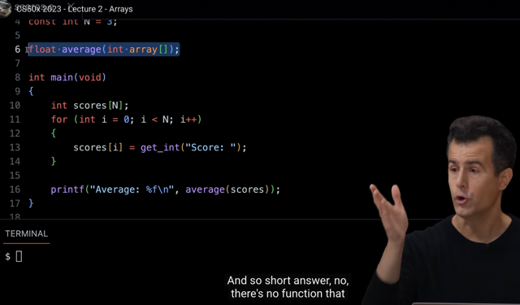</kbd>

> [!NOTE]
> Q: Có cách nào để biết size của array không?
>
> D:**Trong C thì không**, trong java, python có thể hỏi size của 
> array, còn C thì phải tự nhớ
>
> Q: Có thể có cách nào viết function để tính size của array không
>
> D: Không nốt, nếu nó là một generic array **chỉ như int không
> thể biết số item trong array được**. Điều này hơi thất vọng, nhưng
> đó là lý do tại sao các higher language như Java, Python có 
> Feature này

 

<kbd>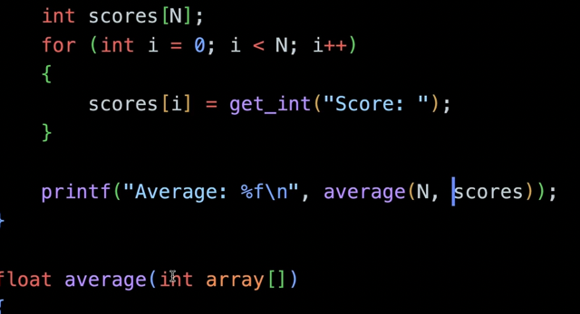</kbd>

<kbd></kbd>

<kbd>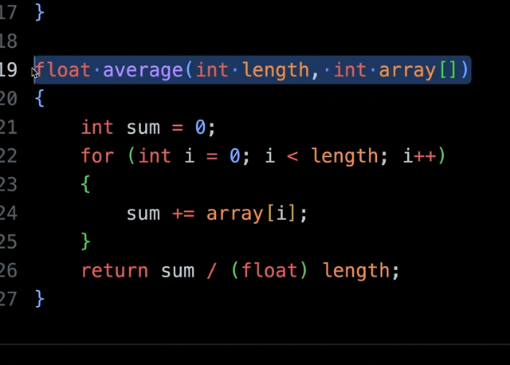</kbd>

> [!NOTE]
> Ổng nói tuy define N như vậy là ok, tuy nhiên **để best design**
> thì ổng không muốn vậy mà **tạo thêm một argument (length)
> của average để yêu cầu truyền array size vào**. Thì**thay vì
> dùng N ở trong function average thì dùng (length)**

 

<kbd>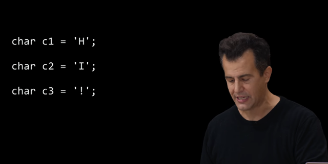</kbd>

 

<kbd>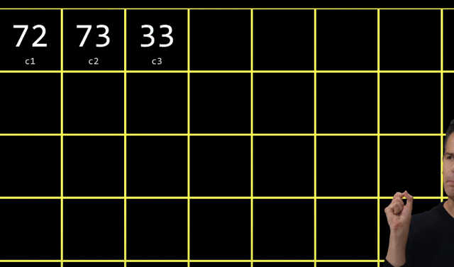</kbd>

<kbd>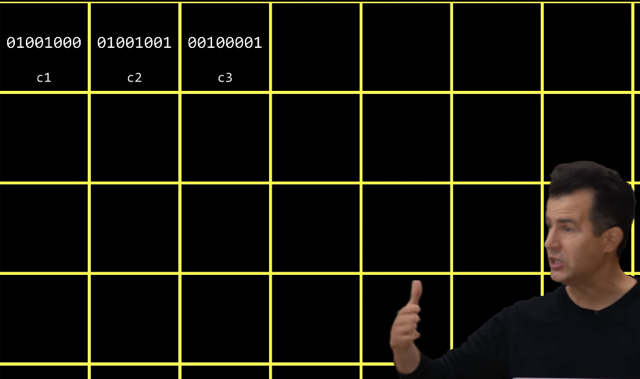</kbd>

<kbd>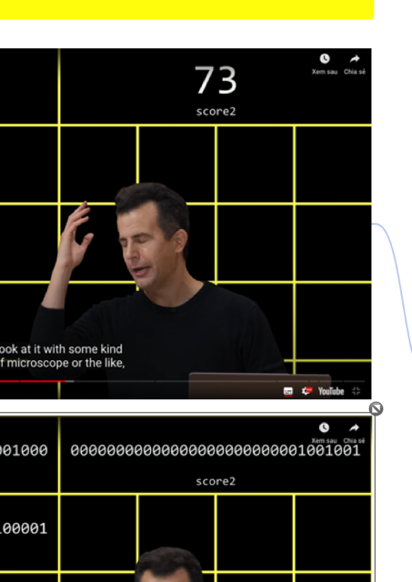</kbd>

<kbd></kbd>

<kbd></kbd>

<kbd></kbd>

<kbd>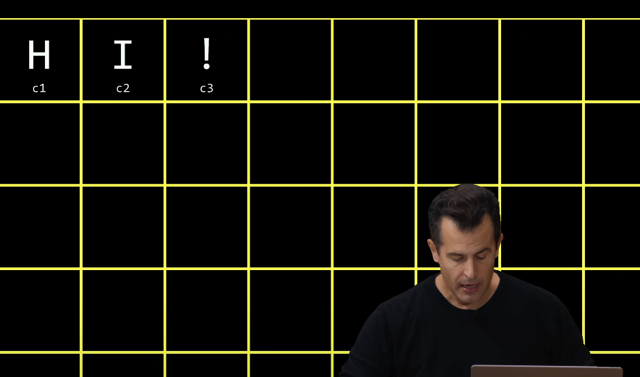</kbd>

> [!NOTE]
> Mỗi **char** chiếm **1 byte = 8 bits** bộ nhớ. Nhớ lại, dựa
> theo quy ước **ASCII** map **một số với một char**, nên
> **thật sự nó cũng binary code** của nó (8bit) cũng chỉ là
> thể hiện một **con số.**
>
> Ví dụ bên dưới (machine code) của H là dãy **8 bits sao
> cho tính ra bằng 73**
>
> 2**7 + 2**6 + 2**5 + 2**4 + 2**3 + 2**2 + 2**1 + 2**0
>
>  128     64       32       16       8          4         2       1
>
>   0         1         0        0         1          0        0       1
>
> => 73 = **01001001** in machine code
>
> *Đừng lầm lẫn khi hồi nãy một int variable được assign
> cho giá trị 73 lại chiếm 4 bytes. **Đơn giản là int được cho
> 4 bytes** = 32 bits. Có nghĩa là **variable mang giá trị 73 đó 
> sẽ có dạng như sau:** 
>
> 00000000 00000000 00000000 **01001001**

 

<kbd>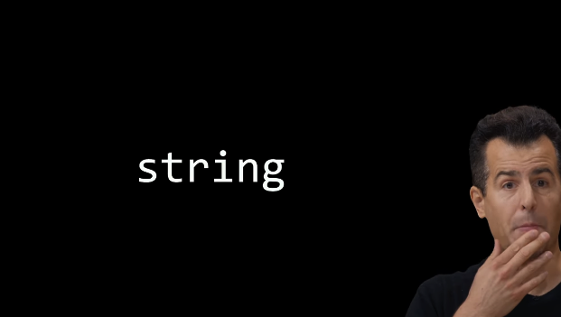</kbd>

 

<kbd>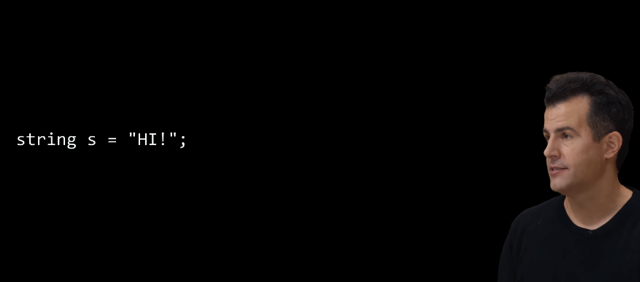</kbd>

 

<kbd>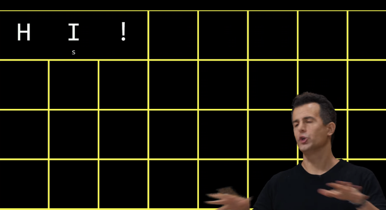</kbd>

> [!NOTE]
> String này có 3 char chiếm 3 bytes

 

<kbd></kbd>

> [!NOTE]
> D: Under hood string nó là cái gì?
>
> Someone: **Array of character**

 

<kbd>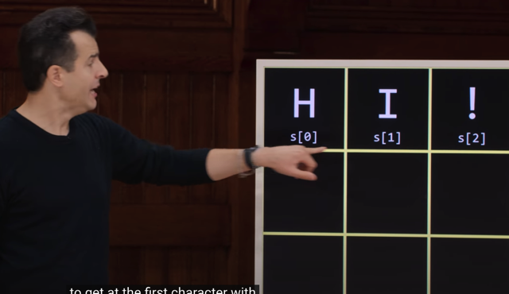</kbd>

> [!NOTE]
> String là một array các characters như đã biết mỗi char
> chiếm 1 bytes = 8 bits

 

<kbd>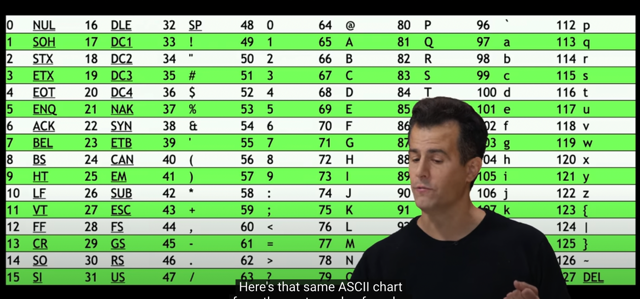</kbd>

<kbd></kbd>

<kbd>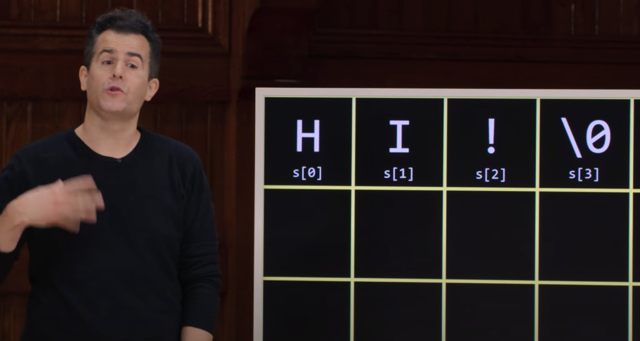</kbd>

> [!NOTE]
> Tuy nhiên nó **tự thêm một byte** mang giá trị = 0 (0000000) ở
> cuối để **phân biệt khi nào end một string** (ý là trên
> memory các byte của các string cứ nằm kế tiếp nhau thì
> phải có  cái này để phân biệt nó ra
>
> Nên H i ! chiếm 3 bytes, tự thêm 1 bytes là 4.
>
> D a v i d chiếm 5 bytes tự thêm 1 bytes là 6
>
> Kí hiệu **\\0 để phân biệt nó với character '0' số 0**. Như ta biết 
> trong ASCII, các CHỮ SỐ cũng được map với một số nào đó.
> Cụ thể CHỮ SỐ **0, map với 48**. Có nghĩa là **nếu chuỗi 4 bytes
> có giá trị: 72 73 33 48 thì nó sẽ là "H i ! 0"**

 

<kbd>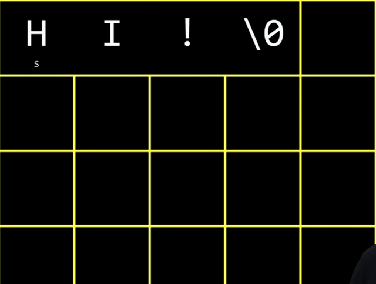</kbd>

<kbd></kbd>

<kbd></kbd>

<kbd></kbd>

<kbd>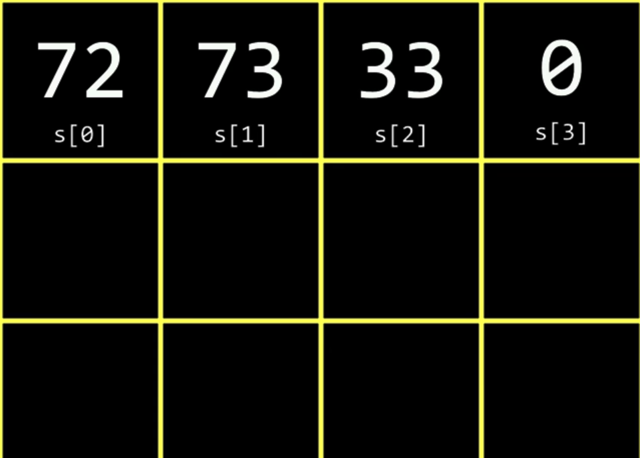</kbd>

> [!NOTE]
> **"\\0"** gắn với ASCII = **0**= **00000000**
> có tên riêng là kí tự NUL
>
> **"0"** (chữ số 0, trong ASCII gắn với **48**= **00110000**
>
> 00110000 = 0 + 0 + 32 + 16 + 0 + 0 + 0 + 0

 

<kbd>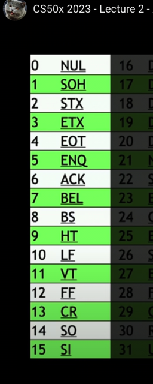</kbd>

 

<kbd>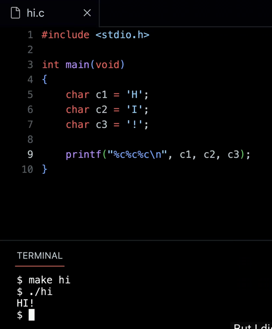</kbd>

> [!NOTE]
> Xong ổng thử in char như vầy.
> **%c** là format cho char

 

<kbd>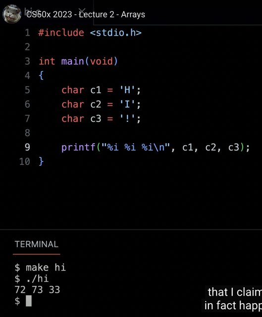</kbd>

> [!NOTE]
> Nhưng ổng nói cũng có thể để
> **%i**, nó sẽ cho ra **số**, **key** mapping
> của char theo **ASCII**

 

<kbd>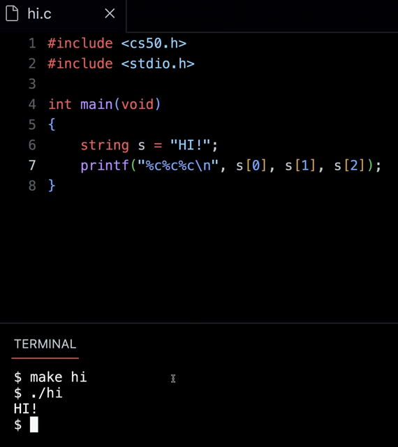</kbd>

> [!NOTE]
> Kế tiếp ổng quay lại define string s = "Hi!" và làm như vầy
> để in các char ra.
>
> Nhận xét một điều khá hay ho là trong C (mà trong Java
> ko có)  đó là **vì bản chất string là một array chứa các char**,
> nên **chỉ cần dùng s[i] là lấy char ra.**

 

<kbd>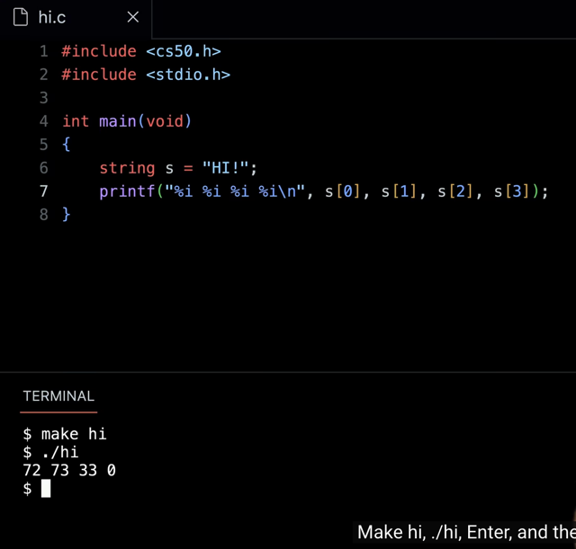</kbd>

> [!NOTE]
> Và để minh hoạ cho việc string = array các char nhưng tự
> động thêm vào '\\0' ở cuối
>
> Ổng in với %i và với cả **s[3]** (dù string s chỉ có 3 kí tự H, I, !)
>
> Kết quả đúng là char cuối có **ASCII key = 0 gắn với NUL char**

 

<kbd>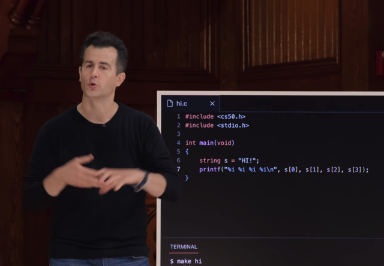</kbd>

> [!NOTE]
> Q: tại sao khi define string s dù là array
> lại ko có square bracket []
>
> D: Vì string **bản thân nó là array**, nên nó **tự động 
> tạo array ở dưới**, không cần declare như int[]

 

<kbd>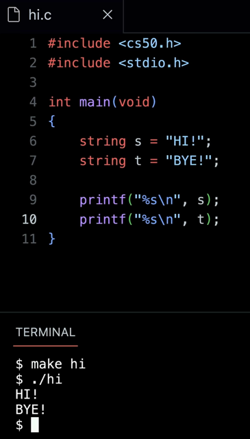</kbd>

<kbd></kbd>

<kbd>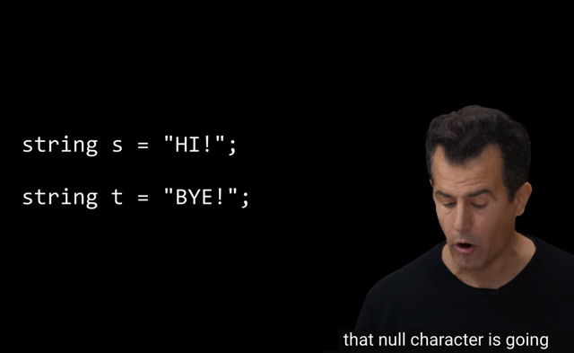</kbd>

 

<kbd></kbd>

 

<kbd>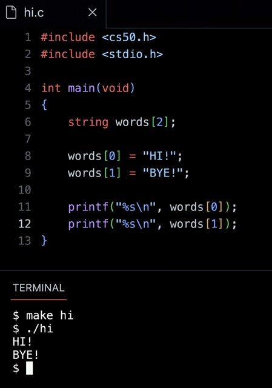</kbd>

> [!NOTE]
> Tạo array of string, (với string là array of
> char), thì đây như là **array of array**

 

<kbd>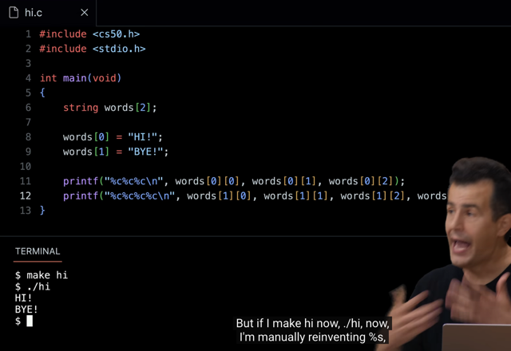</kbd>

> [!NOTE]
> Và để**access char đầu tiên** trong **string
> đầu tiên** trong array:**words[0][0]**
>
> Và in ra với **%c** như hồi nãy

 

<kbd>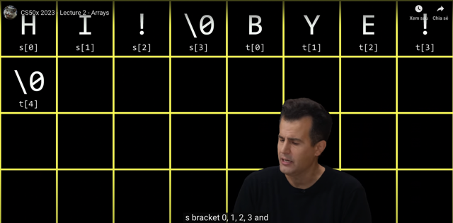</kbd>

 

<kbd>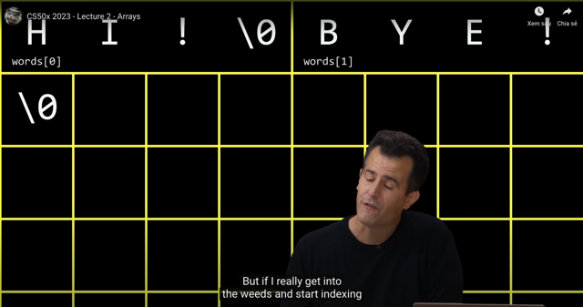</kbd>

<kbd></kbd>

<kbd>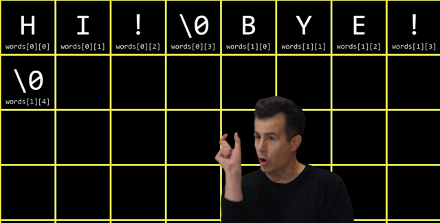</kbd>

> [!NOTE]
> Trong memory nó sẽ như thế này: 
>
> **string array** chứa **2 string** 
>
> mỗi **string là một array** chứa **4 và 5 char,** mỗi char chiếm **1 byte**

 

<kbd>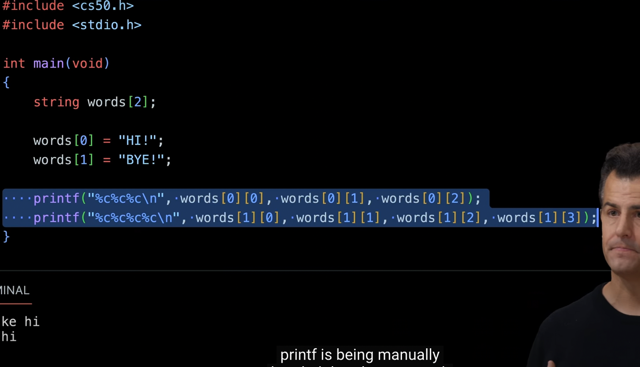</kbd>

> [!NOTE]
> Q: **new line character** có tốn space ko. 
>
> D: Có, nhưng nó ko thuộc string, nên printf take care

 

<kbd>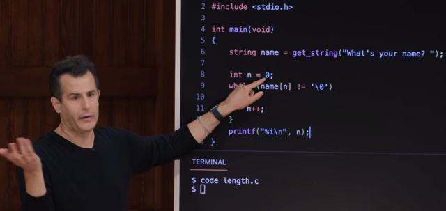</kbd>

> [!NOTE]
> Đại khái là ổng dùng cách này **while loop**, trong các
> **char của string để check khi nào gặp '\\0'** để **từ đó
> đếm được số char của string.**
>
> Và ổng nói**tuy array không thể đếm length** nhưng vì
> **string là một array đặc biệt** khi có char **'\\0'** nên **có thể dùng
> để đếm length of string**

 

<kbd>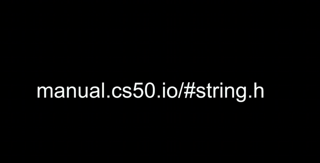</kbd>

<kbd></kbd>

<kbd>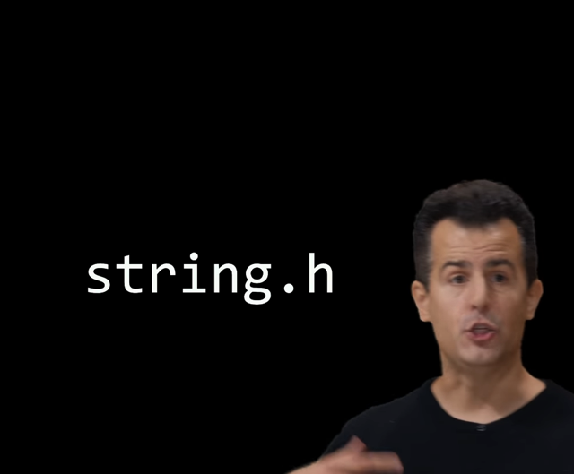</kbd>

> [!NOTE]
> Đại khái ổng nói có nhiều người đã
> giải quyết vấn đề này. Nên có một
> **thư viện hỗ trợ string**

 

<kbd>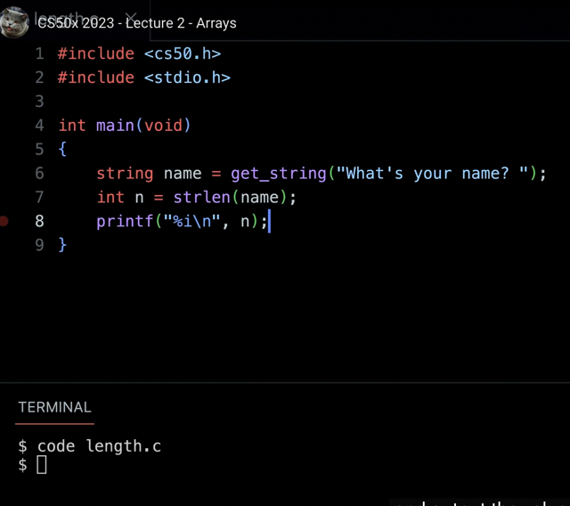</kbd>

> [!NOTE]
> D: Chưa được chỗ nào?
>
> A: Phải include <**string.h>** thì mới có **strlen()**

 

<kbd>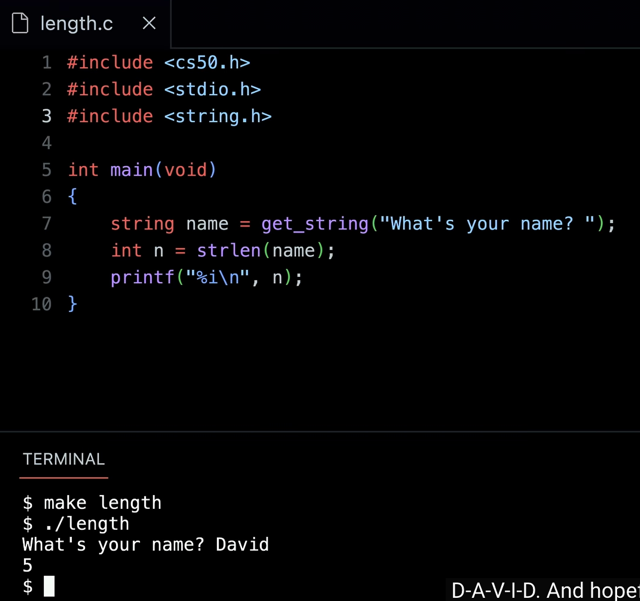</kbd>

 

<kbd>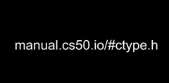</kbd>

<kbd></kbd>

<kbd></kbd>

> [!NOTE]
> Tương tự có thư
> viện hỗ trợ char

 

<kbd>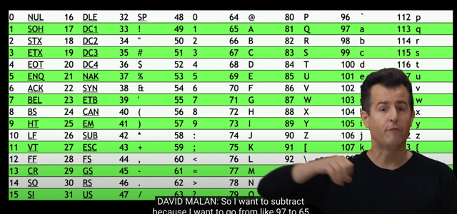</kbd>

<kbd></kbd>

<kbd>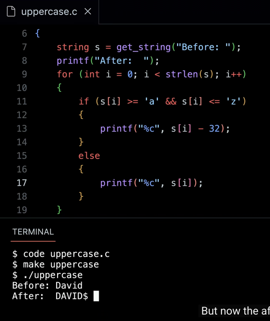</kbd>

> [!NOTE]
> Khá hay ho
>
> loop trong các char của string
>
> và dùng**s[i] >= 'a' && s[i] <= 'z'** để check nó phải **lowercase ko**.
>
> Có nghĩa là vì **s[i] là char,** mà thực tế nó **cũng chỉ là một số** (từ
> giá trị của 8 bit theo binary tính ra giá trị theo hệ số 10 decimal
> nên char **có thể so sánh bằng <, =, >**
>
> Và vì nếu >= 'a' và <= 'z' thì đương nhiên nó là 1 trong các 
> 'a', 'b',....'z' đồng nghĩa nó là lowercase chả.
>
> Thứ hai, dựa vào bản ASCII,**key value của kí tự viết hoa luôn
> cách key value của kí tự viết thường 32 số** ví dụ **'a' = 97, 'A' = 65**
> **'b' = 98, 'B' = 66.**..
>
> Nên bằng việc **in ra s[i] - 32**, nó sẽ in ra **kí tự HOA của kí tự s[i]**
>
> Và ổng nói trong **Microsoft Word**,..thì t**hật ra bên dưới khi dùng lệnh 
> lowercase thì nó cũng làm vậy**

 

<kbd>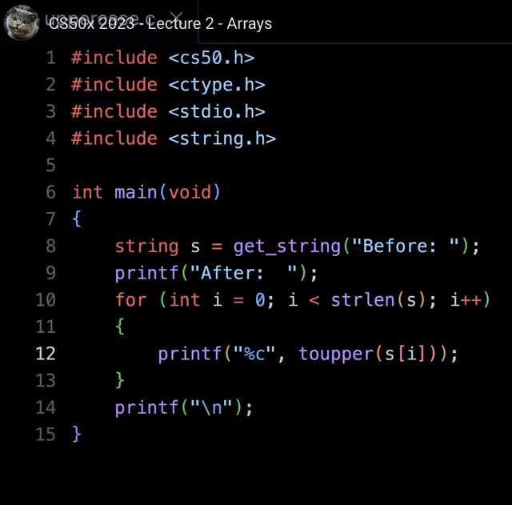</kbd>

<kbd></kbd>

<kbd>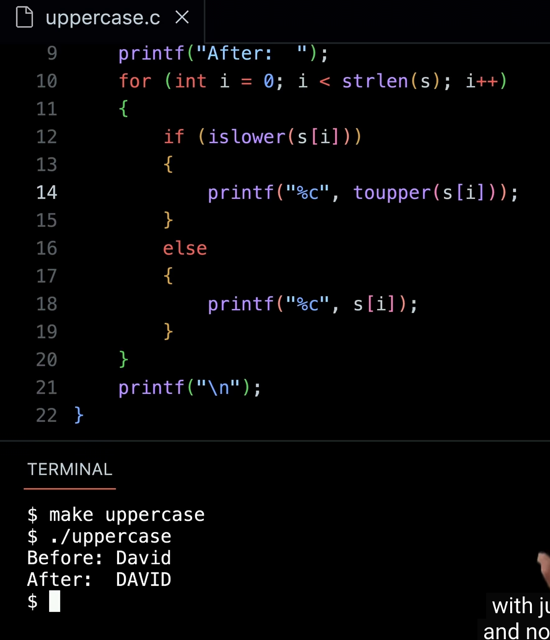</kbd>

> [!NOTE]
> Ổng nói **<ctype.h>** người ta đã **hỗ trợ các function
> làm những việc này (liên quan đến char)**
>
> Nên chỉ cần dùng **islower**() để **check lowercase**
> và **toupper**() để nó **chuyển thành upper case** (bên
> dưới vẫn chính là do the math - 32) như đã làm

> [!NOTE]
> Và hoá ra **toupper**() nó sẽ **ignore nếu
> char đã ở uppercase nên không cần
> phải check chi nữa**

> [!NOTE]
> D: Tại sao gọi **strlen**() như thế này ko ổn (well design)
>
> A: Vì **mỗi lần loop, khi nó check i**, thì nó lại gọi **strlen**()
> sẽ **tốt hơn nếu tính strlen() trước**
> D: Correct!

 

<kbd>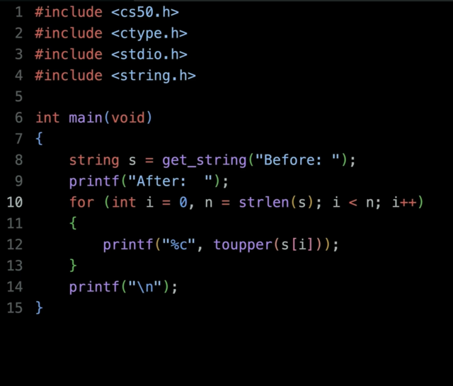</kbd>

> [!NOTE]
> Chính xác, và có thể làm kiểu này (chưa thấy trong java)
>
> for (int i = 0, **n = strlen(s)**; i < **n**; i++){
> }

 

<kbd></kbd>

> [!NOTE]
> Đại khái là ổng nói như **function argument** là **những gì
> bỏ vào function**.
>
> Thì **command line argument** là những**tất cả những gì
> sau dấu $** như **make**, code, hay **-o.**...

 

<kbd>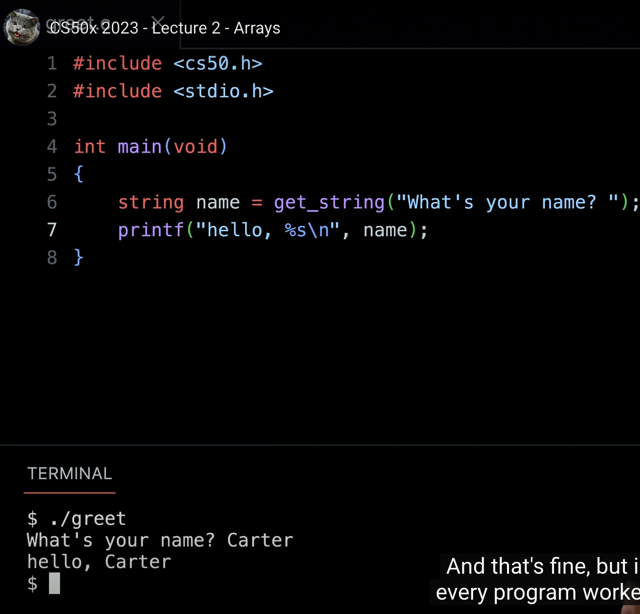</kbd>

> [!NOTE]
> Đại khái là ổng nói theo cách thông thường **cứ phải
> run program**, **wait** for the name,**enter the name**, hit
> enter...
>
> hoặc **tưởng tượng khi các function khác cũng vậy** như
> gõ make, enter, rồi gõ tên file, enter
>
> hoặc khi chẳng directory phải gõ cd, enter, rồi gõ tên 
> folder, enter,... 
>
> nói chung là nếu mọi thứ đều như vậy thì**sẽ rất chậm**

 

<kbd>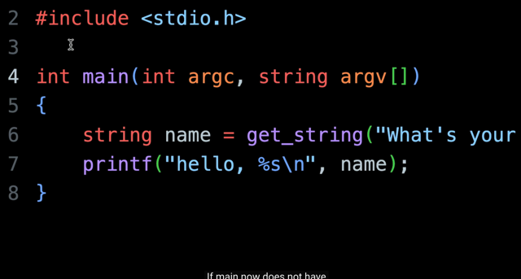</kbd>

> [!NOTE]
> nên giờ ổng đổi như vầy, cho main (void) thay bằng
> main(i**nt argc, string argv[])**
>
> Có nghĩa là giờ **main sẽ có argument.**
> **argv[]** dễ đoán là viết tắt của **argument value**sẽ là **array string
> đưa vào** sau $
>
> còn **argc** là argument count dùng để**đếm số argument value
> trong array.**
> Tương tự như ở trên đã biết trong C,**trừ string** là một array 
> of char đặc biệt **có thể có cách đếm số item trong array dựa
> vào '\\0'**, còn lại th**ì không có cách nào đếm số item trong array
> như int[].**.nên phải**tự track số lượng**

 

<kbd>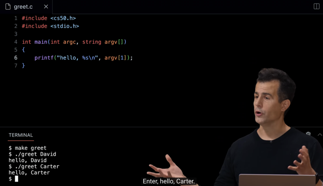</kbd>

> [!NOTE]
> với thay đổi này, chỉ cần gọi **./greet David** là
> nó **nhận David vào argument argv[]** và lấy ra
> bởi **argv[1]**

 

<kbd>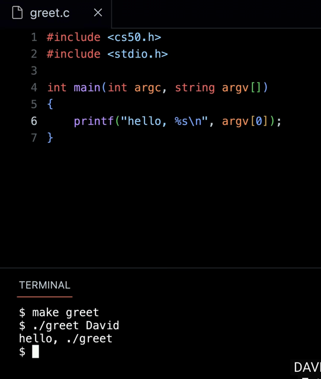</kbd>

> [!NOTE]
> Yeah, **argv[0] là "./greet"** là cái **string đầu tiên sau dấu $**

 

<kbd>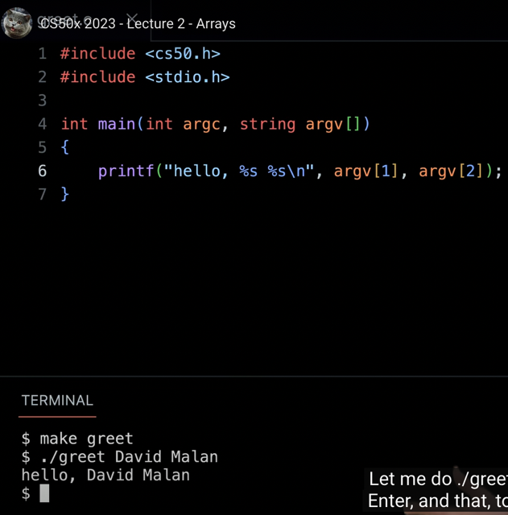</kbd>

> [!NOTE]
> Và có thể dùng thêm các
> **argv[1] argv[2].....**.

 

<kbd>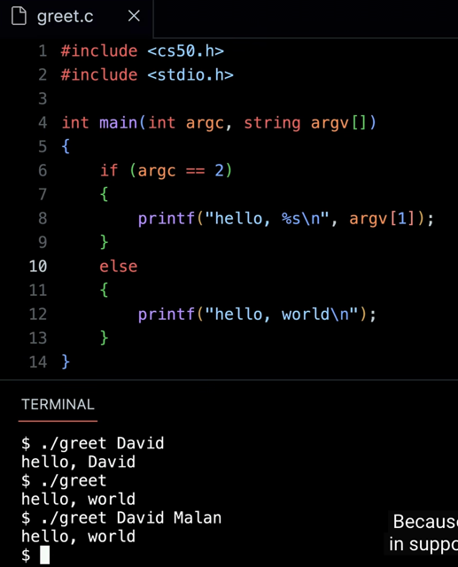</kbd>

 

<kbd>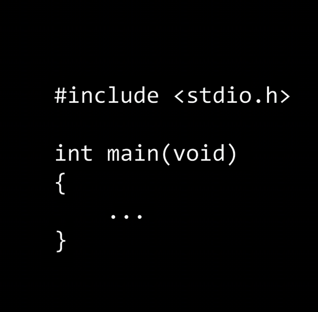</kbd>

<kbd></kbd>

<kbd>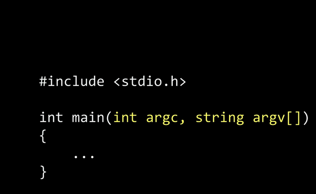</kbd>

 

<kbd>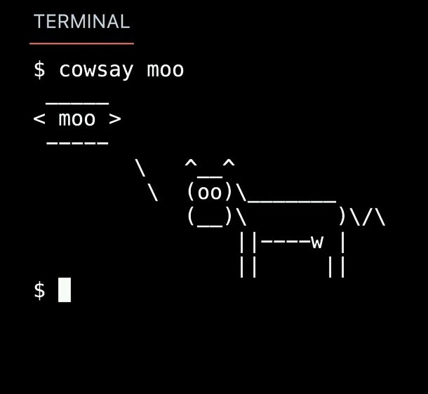</kbd>

 

<kbd>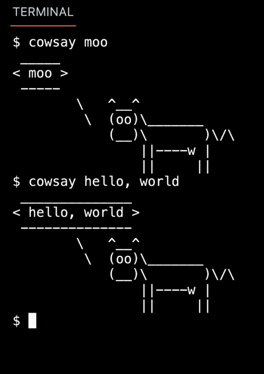</kbd>

 

<kbd>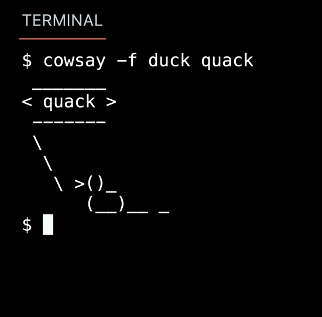</kbd>

 

<kbd>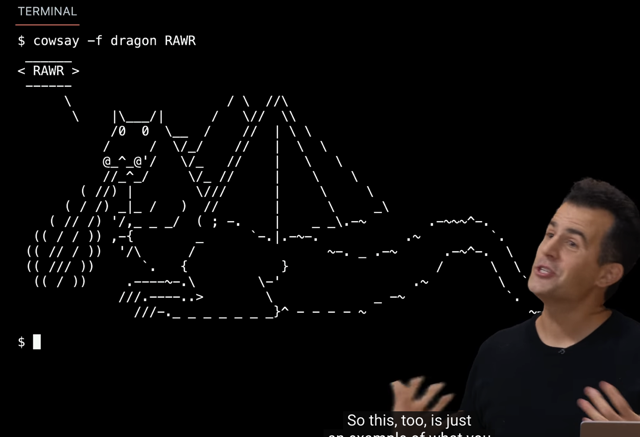</kbd>

> [!NOTE]
> Nói chung là một chương trình
> lâu đời tích hợp sẵn để **play với
> command line cho vui**

 

<kbd></kbd>

 

<kbd></kbd>

<kbd></kbd>

<kbd></kbd>

> [!NOTE]
> Cơ bản là**return number của function
> cho biết thông tin của error**

 

<kbd>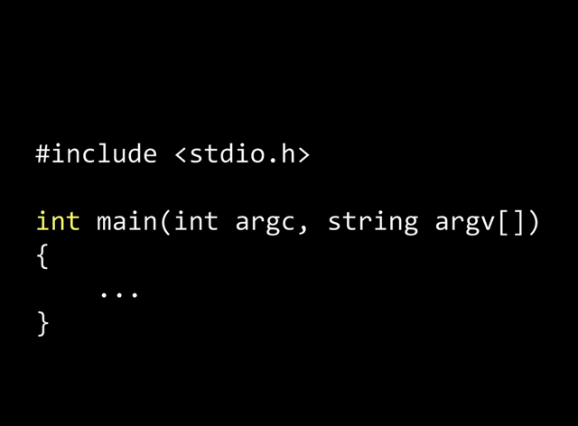</kbd>

> [!NOTE]
> **int** của **main()** là cách C design có
> nghĩa là main hidden behind**luôn
> return một int. Default là 0**

 

<kbd></kbd>

> [!NOTE]
> Dùng **echo $?** để xem return
> number của function vừa gọi

 

<kbd>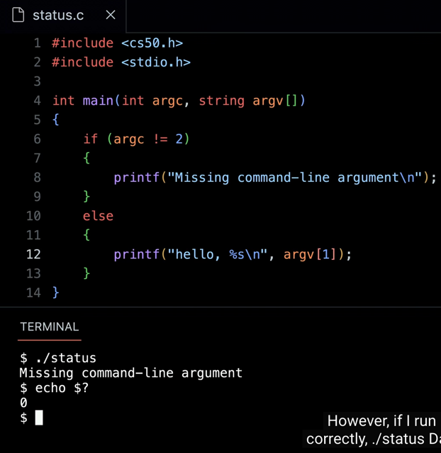</kbd>

 

<kbd>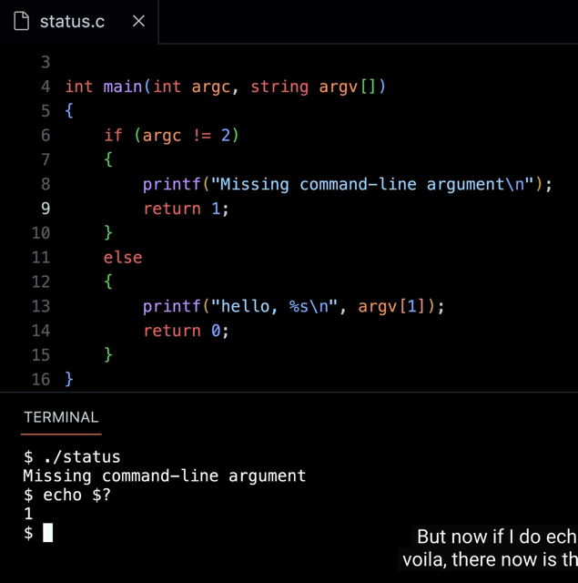</kbd>

> [!NOTE]
> Đại khái là mục đích (của cái return int) là để **khi cần ta có
> thể return con số để cho biết program có work đúng hay
> không**
>
> Như ở đây, nếu không làm gì thì lúc nào  nó cũng return 0,
> dùng **echo $? để xem**

 

<kbd></kbd>

 

<kbd></kbd>

> [!NOTE]
> Nói qua mã hoá (encryption)
> và giải mã (decryption)

 

<kbd>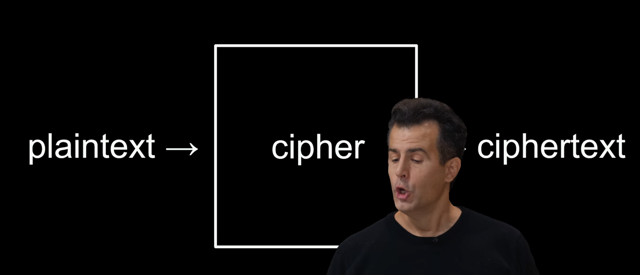</kbd>

> [!NOTE]
> Mã hoá, **cipher** chỉ là fancy name của **algorithm**
> giúp **mã hoá** **plaintext** thành **ciphertext** (kiểu
> nhữ thông tin được mã hoá)

 

<kbd>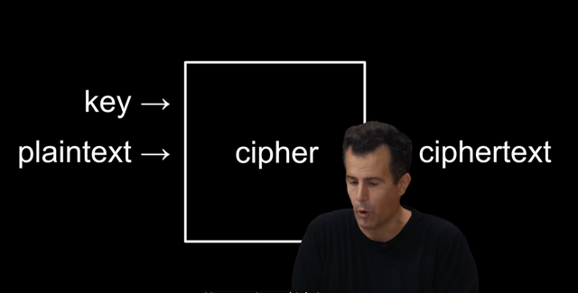</kbd>

 

<kbd></kbd>

> [!NOTE]
> Đại khái là **để mã hoá** hay**giải mã** cần biết
> **algorithm gì**, và**key gì** ví dụ dùng Ceasar (hoán
> đổi vị trí, A -> B, B -> C...là Ceasar với key = 1
> - tức hoán đổi 1 vị trí)

 

<kbd></kbd>

 

<kbd></kbd>

<kbd>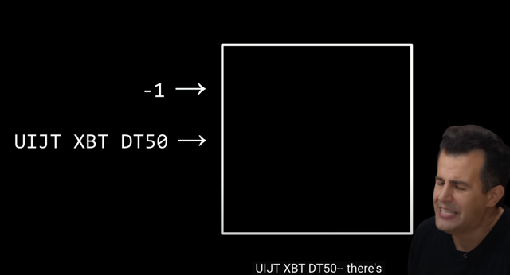</kbd>

<kbd></kbd>

<kbd></kbd>

<kbd>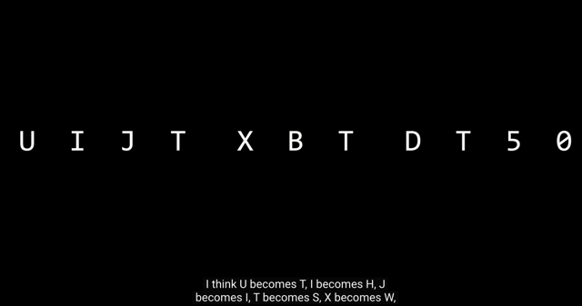</kbd>

> [!NOTE]
> Và để giải mã ta sẽ làm ngược
> lại U lùi lại 1 thành T (TU), I -> H
> ...:THIS IS CS50

 

