# Week 2 Array (short)

📊 **Progress:** `4` Notes | `16` Screenshots

---

<kbd>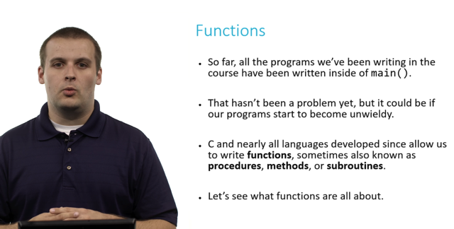</kbd>

> [!NOTE]
> Đại khái là phải chia ra chứ không thể dồn
> cả đống code vào main() được. Có nhiều
> tên nhưng cơ bản là một

 

<kbd>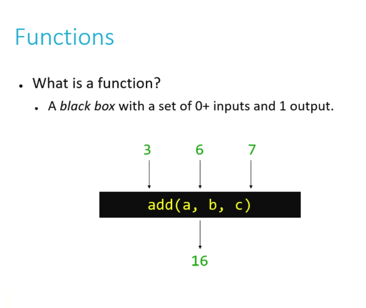</kbd>

<kbd>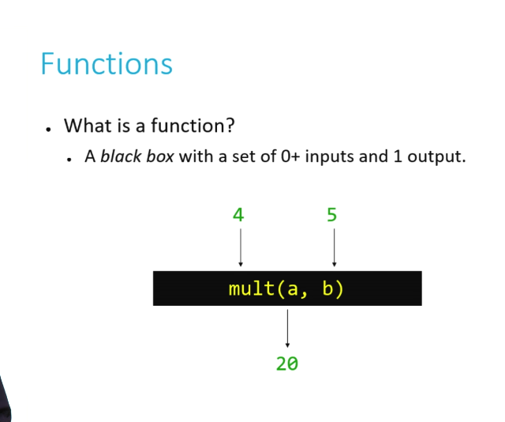</kbd>

<kbd></kbd>

<kbd></kbd>

<kbd>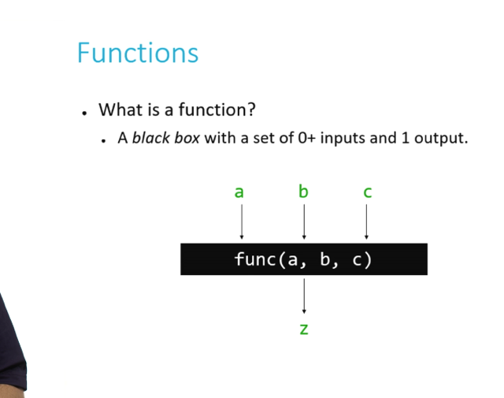</kbd>

 

<kbd>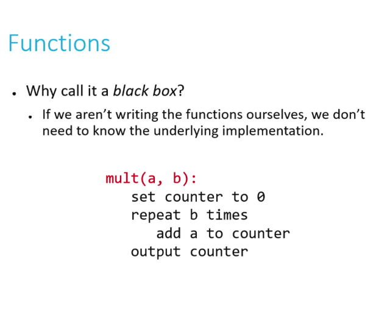</kbd>

 

<kbd>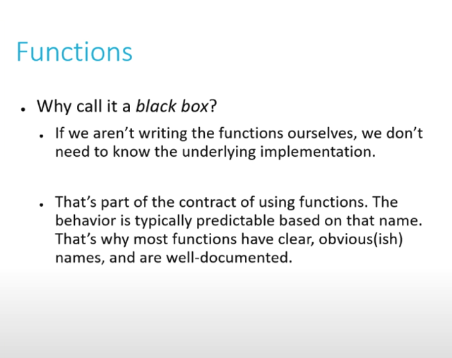</kbd>

> [!NOTE]
> Function chỉ là một blackbox take 1 hay nhiều input và
> return một output
>
> Đại khái function mà người khác viết thì đôi khi mình
> không cần phải biết chi tiết nó làm gì trong đó. Chỉ cần
> dựa vào tên function và document ví dụ printf là đủ để sử
> dụng

 

<kbd>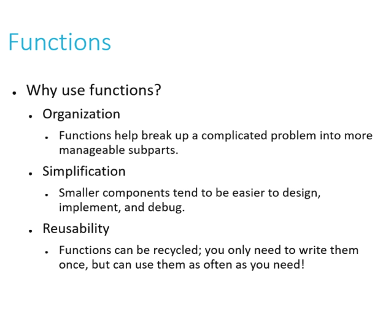</kbd>

> [!NOTE]
> Giúp tổ chức code tốt hơn. Viết từng tính năng theo
> từng function sẽ khiến cuộc đời đẹp hơn. Và tận
> dụng sự reusability của function

 

<kbd>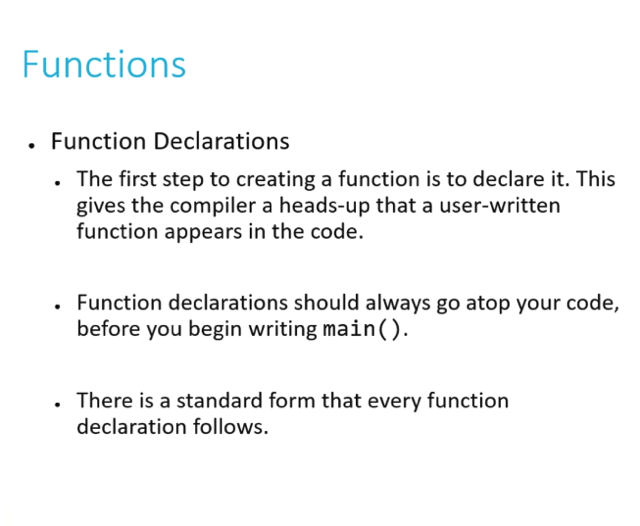</kbd>

 

<kbd>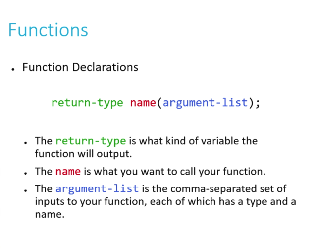</kbd>

 

<kbd>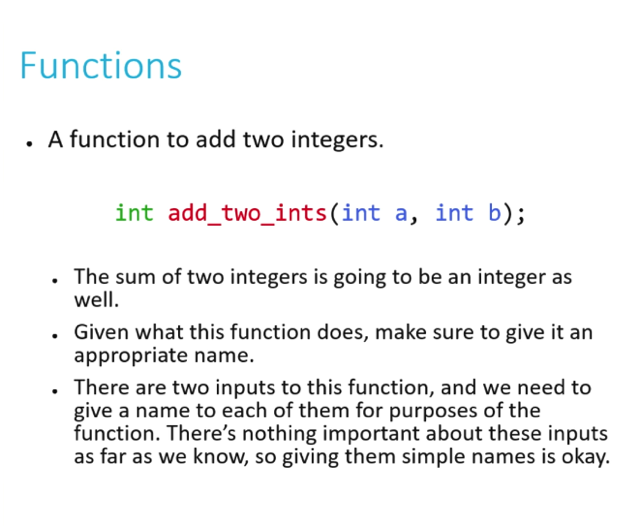</kbd>

 

<kbd>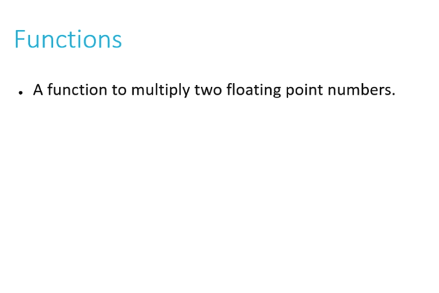</kbd>

> [!NOTE]
> float multiply_floats(float a, float b)
> {
>     return a*b
> }

 

<kbd>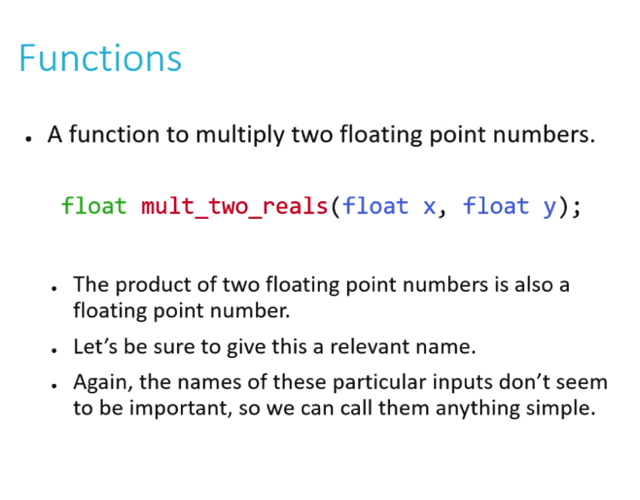</kbd>

 

<kbd>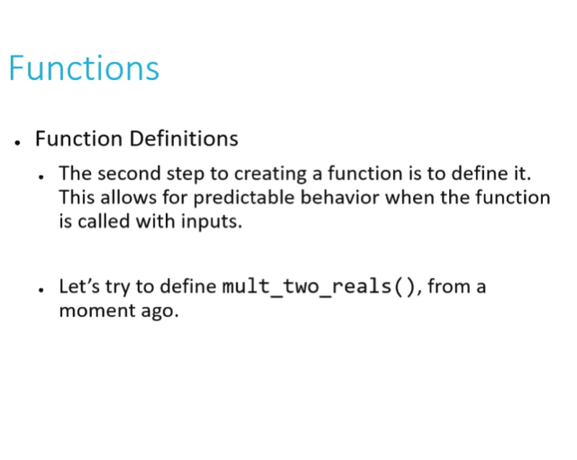</kbd>

 

<kbd>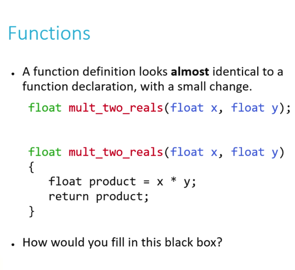</kbd>

 

