# Week 3 Algorithm

📊 **Progress:** `82` Notes | `143` Screenshots

---

<kbd>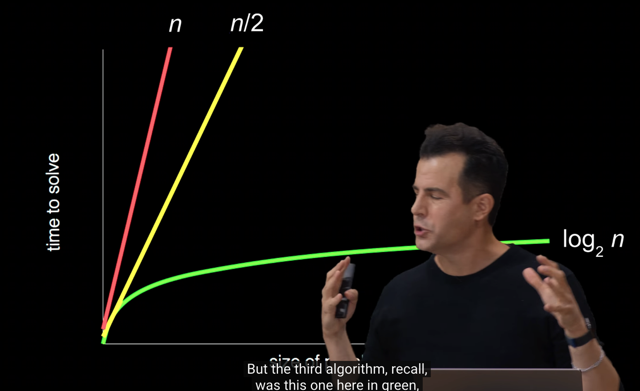</kbd>

> [!NOTE]
> Ổng nhắc lại cái vụ tìm tên trong phone book bữa trước. Với
> việc tìm từng trang thì số lần phải lật trang là n, cách 2 trang
> thì n/2 (nhưng có thể sai và **cũng vẫn là thời gian tăng
> tuyến tính với n.**
>
> Còn cách **xé đô**i (ví dụ tên chữ A, lật cuốn sách ở giữa,
> thấy tên nó phải thuộc phần nào, xé đôi bỏ phần kia đi rồi lại
> tiếp tục vậy thì chỉ tốn l**og 2 n**. Nếu **double phone book
> lên thì chỉ tốn thêm 1 lần xé đôi**

 

<kbd>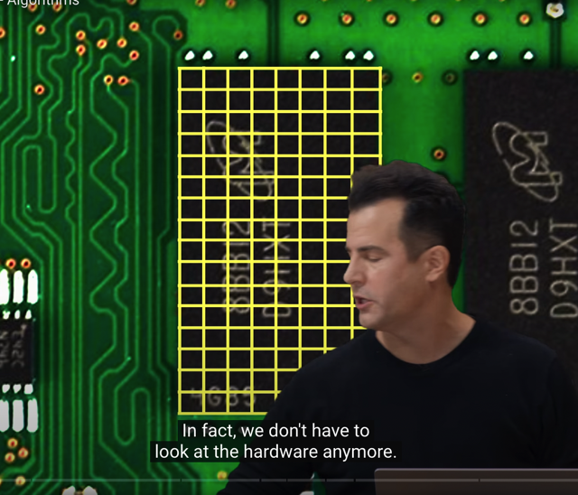</kbd>

 

<kbd>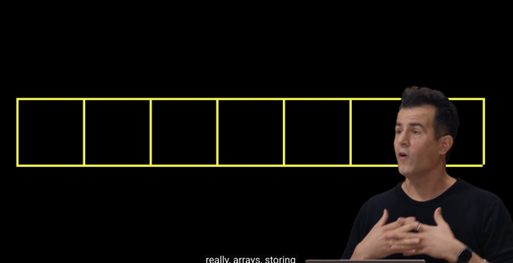</kbd>

> [!NOTE]
> Đại khái là đây là RAM, mỗi ô là 1 byte như đã viết

 

<kbd>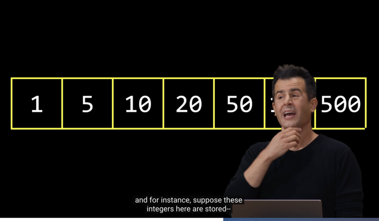</kbd>

> [!NOTE]
> Và nó chứa các data với các dạng int, double, string,
> char...
>
> Ví dụ có array int như này thì ổng nói đại khái là máy
> tính nó không biết số nào nằm đâu

 

<kbd>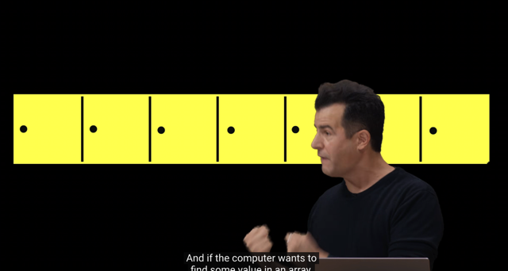</kbd>

 

<kbd>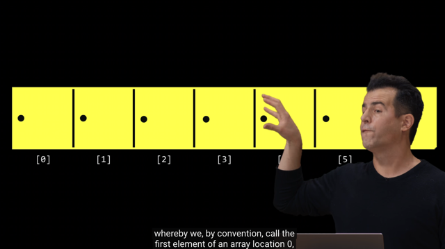</kbd>

> [!NOTE]
> Mọi bytes như những
> closed box với index

 

<kbd>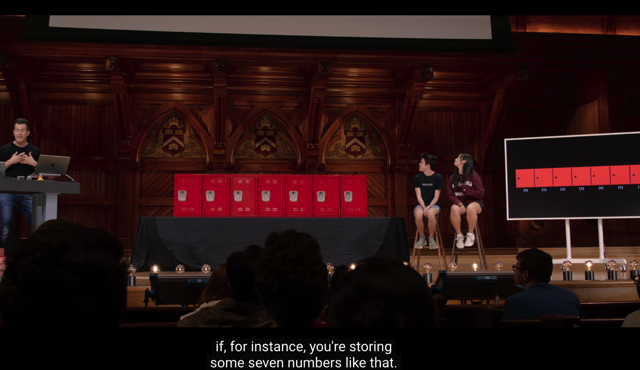</kbd>

 

<kbd>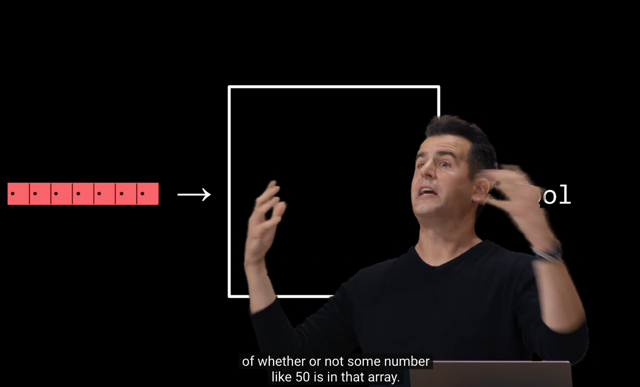</kbd>

> [!NOTE]
> Đại khái là ta sẽ học cách **search**, như một algorithm
> nào đó**take input là 1 array**, và**output 1 bool value**
> cho biết **có số 50 ở trong đó ko**

 

<kbd>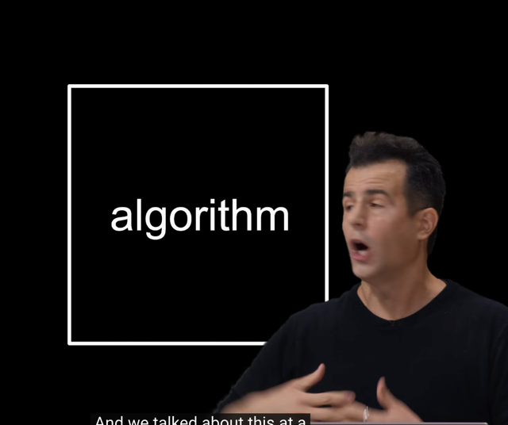</kbd>

 

<kbd>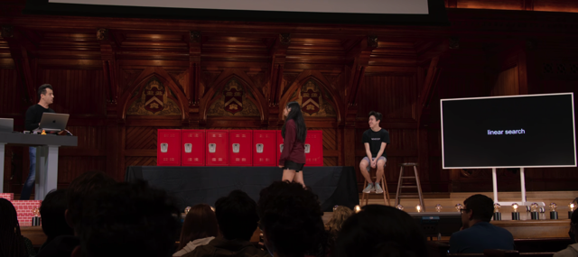</kbd>

> [!NOTE]
> Đầu tiên là thử cái game tìm tờ
> 50$ trong 1 box nào đó.

 

<kbd>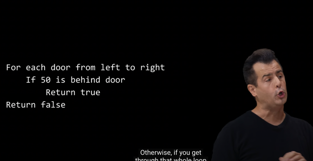</kbd>

> [!NOTE]
> Thì với **Linear Search** pseudo code như sau.
> **Cứ đi tìm từng cái thôi**

 

<kbd>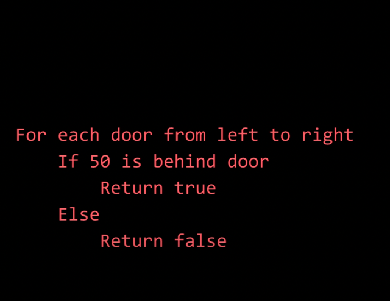</kbd>

> [!NOTE]
> D: Xong ổng hỏi nếu sửa lại code như vầy thì, 
> sai chỗ nào?
>
> A: Làm vậy khi nó **không tìm thấy tờ 50$ ở ô thứ nhất**là nó **stop loop và return False ngay**

 

<kbd>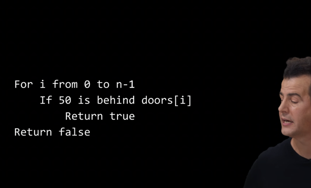</kbd>

> [!NOTE]
> Đại khái là thay vì**pseudo code hoàn toàn bằng
> English** (ý nói **ngôn ngữ con người**) thì nó có thể
> **cho nó giống với C (hay coding language) hơn xíu**

 

<kbd>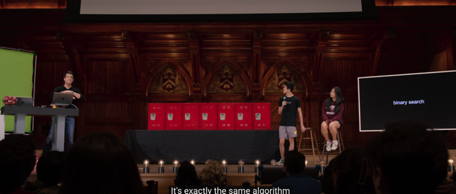</kbd>

> [!NOTE]
> Bây giờ **nếu có ai đó đã sort các tờ đô la trong
> các box** theo thứ tự từ nhỏ tới lớn, thì ta có
> thể làm với **binary search**

 

<kbd>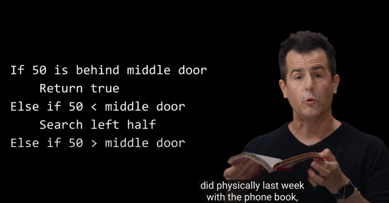</kbd>

> [!NOTE]
> Với cách này có thể bắt đầu bằng cách**mở ô giữa** (hoặc
> gần giữa nếu là số ô chẵn).
>
> Nếu **đúng thì return True**. Nếu **không đúng thì xem nó
> nhỏ hay lớn so với tờ trong ô đó** để suy ra phải **tìm tiếp ở
> các ô bên trái hay phải** và tiếp tục cách làm này trên dãy ít
> ô hơn bên trái hay bên phải này.
>
> Thì ổng hỏi với cách làm này thì có thể có khả năng gì xảy
> ra?
>
> -> Đó là có thể đến một lúc nào đó **ví dụ search dãy có 2 ô**,
> và **chọn 1 ô bên trái thấy nó vẫn lớn hơn 50$** -> **phải tiếp
> tục tương tự tìm  tiếp những ô bên trái nó**. Nhưng đã không
> còn ô nào nữa. Nên lúc này sẽ phải return false để stop

 

<kbd>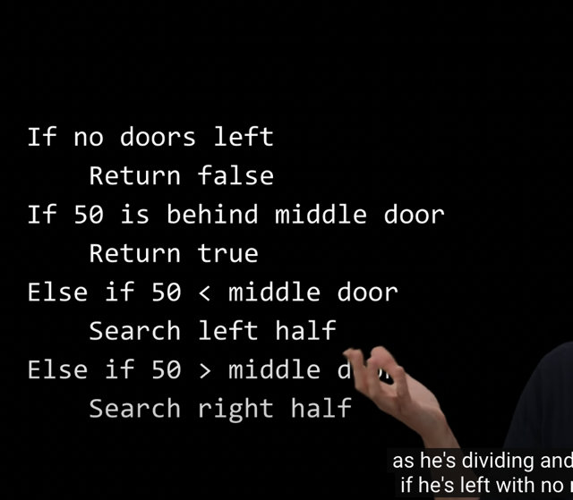</kbd>

> [!NOTE]
> Do đó phải sửa lại pseudocode **thêm vào
> case không còn ô nào để tìm**

 

<kbd></kbd>

 

<kbd>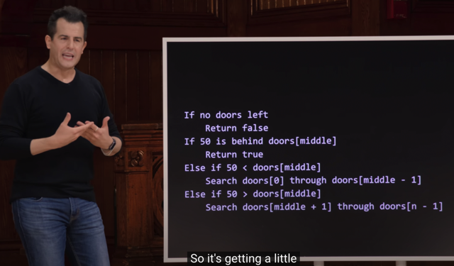</kbd>

> [!NOTE]
> Ổng giải thích lại quá trình với pseudo code:
>
> bắt đầu với **n là số ô**, thì anh này bằng cách nào đó
> tính toán trong đầu ra **vị trí ô ở giữa** (**có thể làm tròn**
> gì đó..) để được middle
>
> Các bước tiếp theo cũng dễ hiểu là nếu ô giữa mang giá
> trị cần tìm thì stop, return true ngay.
>
> Nếu không thì so sánh nếu nó mang số lớn hơn cần tìm
> thì tìm tiếp ở nữa bên trái.
>
> Nếu nó nhỏ hơn số cần tìm thì tìm tiếp ở nửa bên phải
>
> tiếp tục cho đến khi không còn ô nào để tìm thì return (base case)

 

<kbd></kbd>

> [!NOTE]
> Ổng nói **nếu list nhỏ thì linear search cũng không
> sao** nhưng nếu **list lớn hơn** hoặc để thông minh hơn
> thì có thể dùng **binary search.**
> D: Nhưng để làm được binary search phải cần **điều kiện** gì?
>
> A: Cái **list phải được sort**
>
> D: Yes, ta sẽ **phải tính lại việc sort tốn kém thêm bao nhiêu
> bước tính toán**

 

<kbd></kbd>

 

<kbd>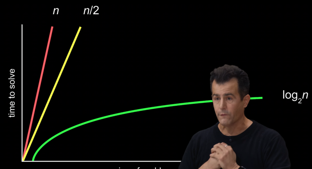</kbd>

> [!NOTE]
> Quay lại biểu đồ này, một cái formally nói về hiệu qủa của
> algorithm là "**Running time**". Như **số lần phải lật
> trang** trong **linear search**, **số lần phải xé đôi** trong
> **binary search**
>
> Ổng có nhắc tới một khái niệm mới học trong Algorithm
> Spec là "**Worst case**" ví dụ như cái tên cần tìm là Z
> đứng cuối cuốn phone book gì đó thì số hành động (lật
> trang trong linear search) phải lật là n

 

<kbd>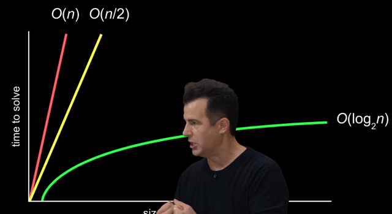</kbd>

> [!NOTE]
> Giới thiệu khái niệm **Big O notation**. Đại khái là ta sẽ
> **không care chi tiết** - kiểu như hơn thua so đo quá chi
> tiết trong việc tính toán running time của algorithm
> mà chỉ focus vào performance nói chung, nôm na là 
> kiểu như **tập trung và chiến lược chứ không so đó tiểu tiết**

 

<kbd>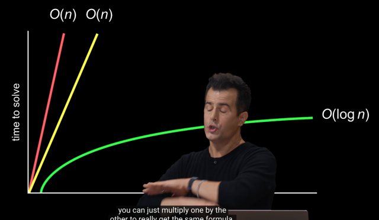</kbd>

> [!NOTE]
> Với nguyên tắc đó thì **n hay n/2 cũng như nhau**. Và
> **log base 2 hay log base e hay bao nhiêu cũng như
> nhau.**
>
> Nôm na ví dụ như **số n lên tới rất lớn** thì cái việc có
> **chia 2, hay chia 3 cũng không tạo ra khác biệt ở
> cấp chiến lược.**

 

<kbd>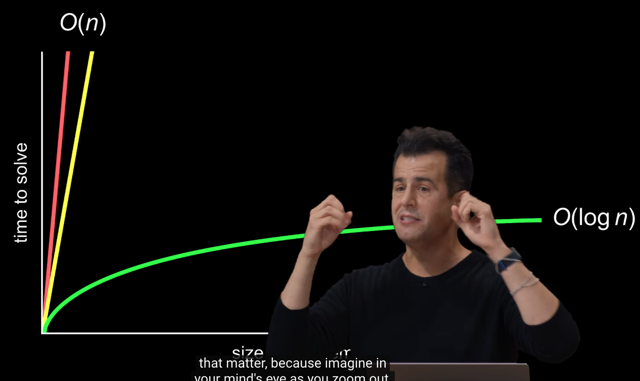</kbd>

> [!NOTE]
> Và **ở cấp độ n rất lớn đó**, **chỉ có chiến lược tạo ra khác
> biệt**, thể hiện trong hình các đồ thị khi zoom out thì chỉ
> có khác biệt giữa O(logn) và O(n) chứ các O(n) hay
> O(n/2) không khác biệt mấy

 

<kbd>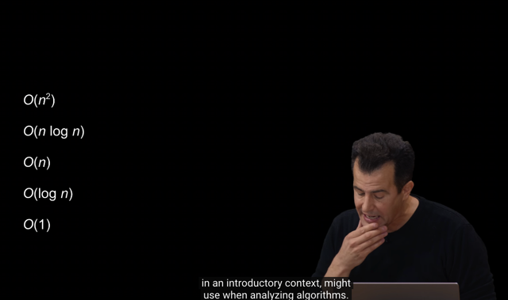</kbd>

 

<kbd>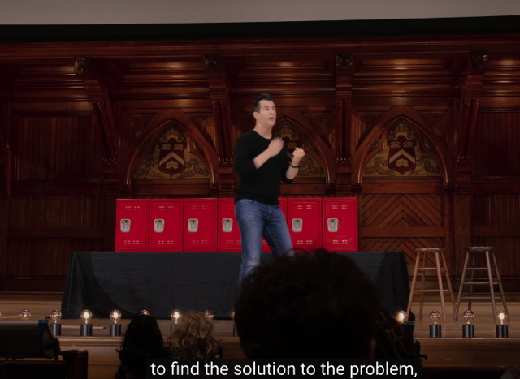</kbd>

> [!NOTE]
> D: **Linear Search** là O gì?
>
> A: **O(n)**
>
> D: Correct, tuy là mỗi lần nhỏ Stephani làm với một ô nó phải mở ô, lấy
> tờ trong ô đó ra, đọc số, so sánh .. nên **có thể nói là O(3n) hay O(4n)**
> nhưng **ta theo nguyên tắc bỏ qua tiểu tiết sẽ chỉ coi nó là O(n)**
>
> D: Còn cái**Binary Search?**
>
> A: **O(log n)** Chính xác là **log base 2 n**.
>
> Vì với **một số n thì cần chia hai x lần để được 1** (đại khái chiến lược
> của binary search là vậy, **chia hai array (và so sánh với cái ô ở giữa)**
> và chia hai array ..cho đến khi không còn chia hai được nữa (khi array
> chỉ còn 1 ô và return) thì **x chính là log base 2 của n.**Ví dụ trong 8 ô mang giá trị : 1-5$ 2-10$ 3-20$ 4-50$ 5-100$ 6-200$ 7-500$ 8-1000$, cần tìm số 200$:
> Mở ô giữa cho làm tròn là ô 5, thấy số 100$ nhỏ hơn số 200$ cần tìm, nên tìm tiếp ở dãy bên phải [6 7 8]
> Mở ô giữa của dãy bên phải là ô 7 thấy 500$ lớn hơn 200$ nên tìm tiếp bên trái [6]
> Mở ô giữa của dãy [6] tất nhiên là ô 6, thấy! 
>
> Vậy in worst case thì với 8 ô cần 3 lần chia và so sánh. Thì 3 chính là log 2 (8)

 

<kbd>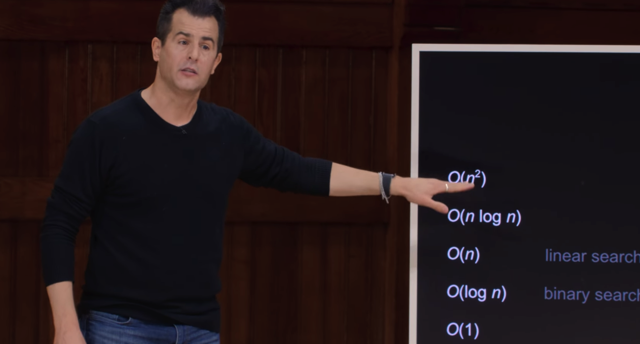</kbd>

> [!NOTE]
> Và những cái này kiểu như tạo thành **Upper Bound** -
> trong trường hợp tệ nhất thì số bước cần thực hiện cũng
> không vượt quá các con số này

 

<kbd>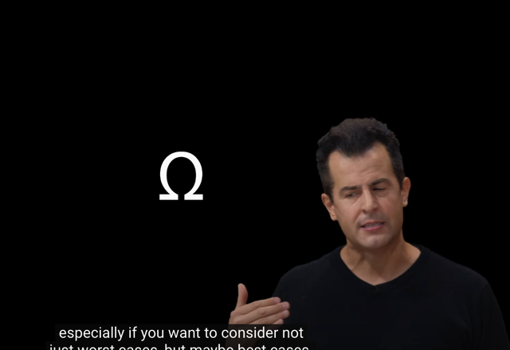</kbd>

 

<kbd>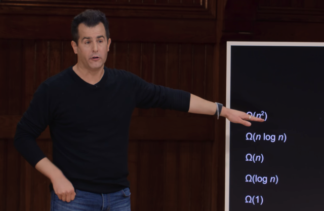</kbd>

> [!NOTE]
> Thì có khái niệm Upper Bound thì có **Lower Bound** nữa,
> kí hiệu bằng **Omega**. Là **số bước tính toán tối thiểu có
> thể giúp tìm được**

 

<kbd></kbd>

> [!NOTE]
> D: Thì trong **Linear Search**, lower bound là bao nhiêu?
>
> A: **Omega (1)** - khi nhỏ đó **hên** mở ra ô đầu tiên của
> array có ngay tờ 50$
>
> D: Correct! Trong binary Search?
>
> Cũng**Omega(1)** khi tờ **50$ nằm ngay ô ở giữa**D: Correct!

 

<kbd>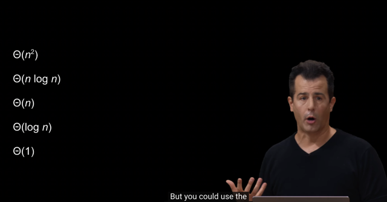</kbd>

> [!NOTE]
> **Theta** là notation khi **Upper Bound bằng Lower Bound**
>
> Ví dụ một **algorithm lần lượt đếm số người trong hội
> trường**. Thì đ**ể đếm hết n người thì ít nhất hay nhiều
> nhất cũng phải đếm n lần**

 

<kbd>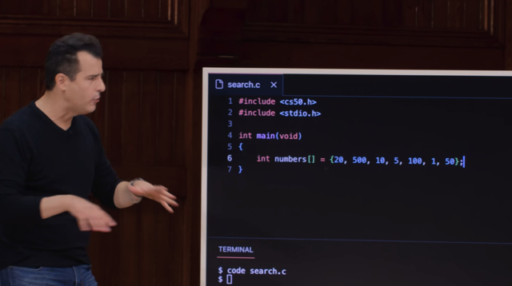</kbd>

> [!NOTE]
> Một kiểu define mới đó là tạo
> array of int chứa các số này

 

<kbd>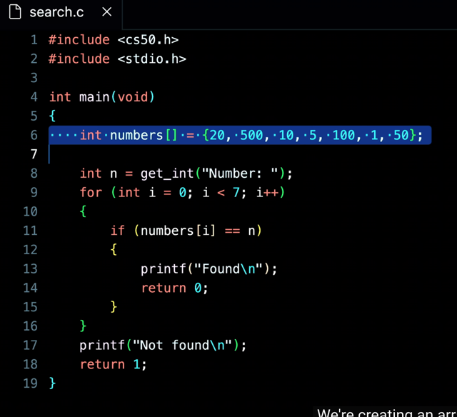</kbd>

> [!NOTE]
> Làm thử cái Linear
> Search hồi nãy

 

<kbd>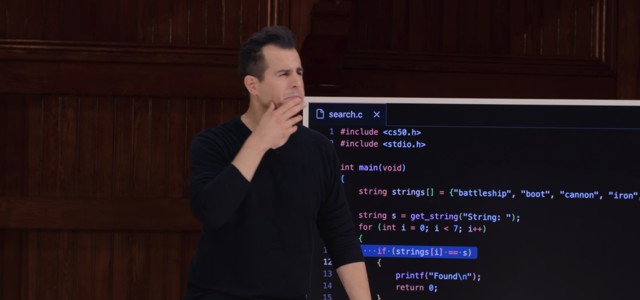</kbd>

> [!NOTE]
> Xong ổng **thay bằng string array**và **ask user for a
> string muốn tìm** và sửa lại như vầy. Thì ổng nói cái So
> sánh string kiểu "==" này không work và tuần sau sẽ học
> nhưng cơ bản là vì string là gì?
>
> A: **Array of char**

 

<kbd>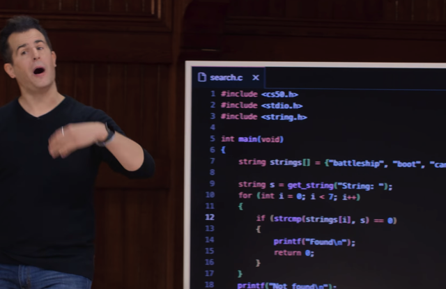</kbd>

> [!NOTE]
> Thì ổng nói dùng **muốn compare string trong C** thì không
> dùng **== được**
>
> Mà quay lại có**<string.h>** trong đó có **strcmp**() giúp,
> trong đó nó sẽ **so sánh các char của hai string  ở các vị trí
> tương ứn**g với nhau. Return **1, 0, hay -1** tuỳ vào việc hai
> char tương ứng đứng trước, sau, hay bằng nhau trong
> alphabet
>
> **0 là bằng nhau**

 

<kbd>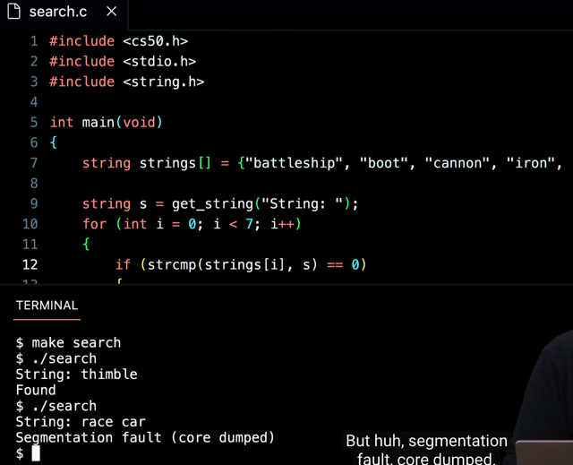</kbd>

> [!NOTE]
> Xong thử chạy, thì với "thimble**"** nó Found, nhưng với
> race car - 1 cái không có trong list thì nó ra message:
> **Segmentation fault (core dumped)**

 

<kbd>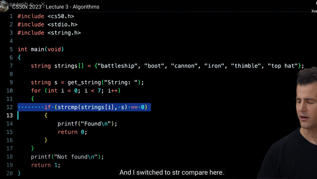</kbd>

> [!NOTE]
> Lý do lỗi này là **vì strings array chỉ có 6 items**, nên **index cao
> nhất của nó chỉ có 5**. Nhưng **loop nó loop tới 6**, nên đây
> tương đương lỗi "**Out of boundary**".. trong java
>
> **Hồi nãy không bị** là do **nó tìm thấy thimble** và**return trước**
> khi nó tới i = 6
>
> Sửa lại cho nó tới i < 6 thôi là hết lỗi

 

<kbd>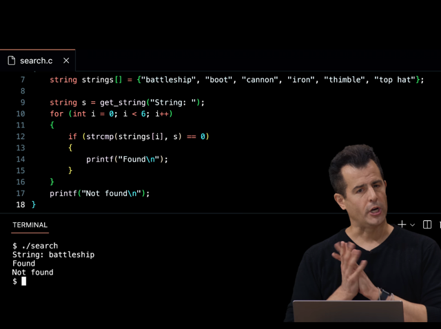</kbd>

> [!NOTE]
> Có người hỏi là **cơ bản code vẫn chạy khi không cần return**vậy **return làm gì?**
> D: Ổng bỏ đi return đúng là nó vẫn chạy nhưng nó Found rồi
> lại Not Found. Why?
>
> A: Vì **nhờ có return mà khi tìm được rồi**, **nó exit function**
> nên nó không print dòng cuối nốt found ra

 

<kbd>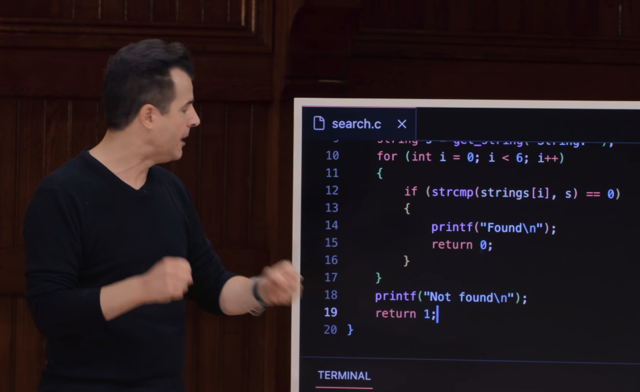</kbd>

> [!NOTE]
> Và return sẽ là cách để **signify rằng à
> function work as expect** (**return** **0**) hay
> **not as expect (return 1)**

 

<kbd>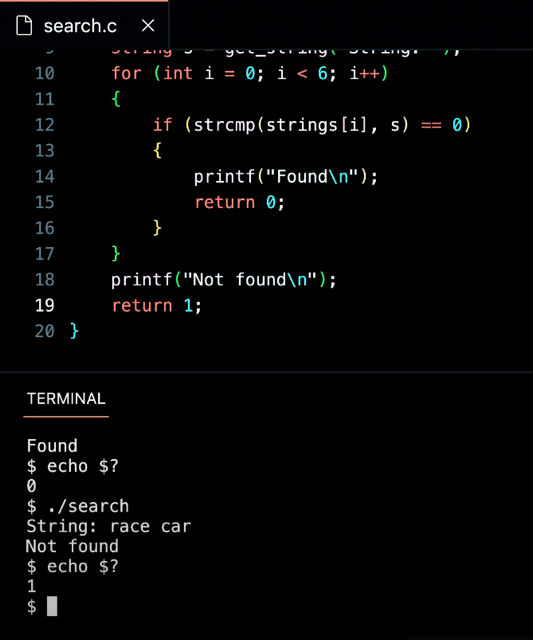</kbd>

> [!NOTE]
> Như tuần trước có nói có thể xem bằng **echo $?
> và quan trọng là trong tương lai có khi cần
> automatically check / test code thì exit code như
> này rất hữu ích**

 

<kbd>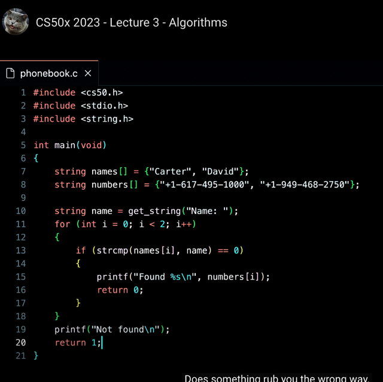</kbd>

<kbd></kbd>

<kbd>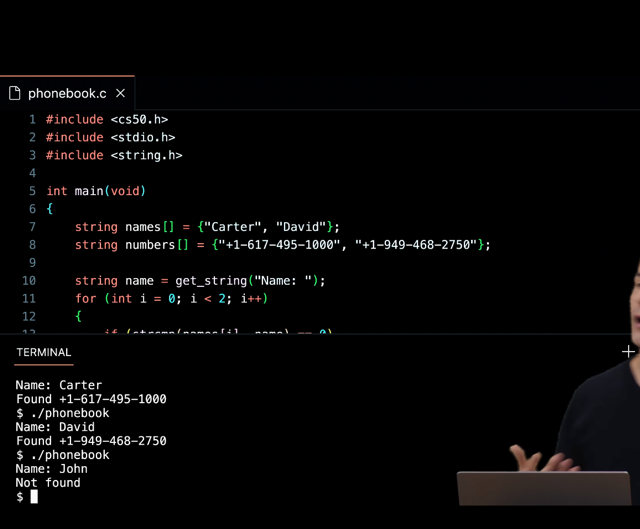</kbd>

> [!NOTE]
> Ổng làm cái code nhập tên vào và nó search khi match
> name thì nó trả ra số phone. Có vẻ work khá ok nhưng
>
> Question: Có gì sai sai hay không ổn?
>
> A: Thứ nhất là đang dùng**linear search**, không hiệu quả
> khi số data lớn. Thứ hai là giả sử người ta nhập 'carter'
> thay vì 'Carter' nó cũng ko tìm ra.
>
> B: **Hard code số 2** không ổn
>
> C: Lỡ ta **thêm vào một name** mà **quên thêm số phone** 
> thì sẽ sai 
>
> Correct!

 

<kbd>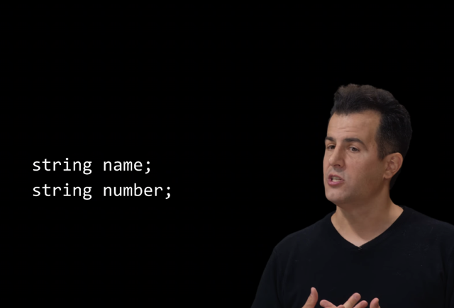</kbd>

<kbd></kbd>

<kbd>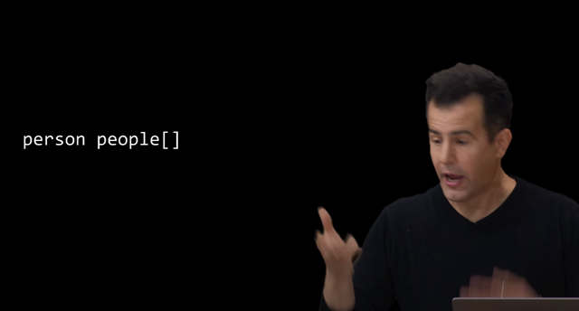</kbd>

> [!NOTE]
> Do đó ổng nói sẽ tốt hơn nếu ta **connect những data liên
> quan với nhau lại** như **1 person** sẽ có name và số phone.
> Từ đó dẫn dắt tới việc define **Model**

 

<kbd>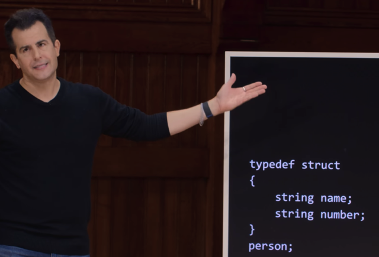</kbd>

> [!NOTE]
> Đây là cách **define một class** trong C
> **typedef** (type definition) **struct** (structure),
> {variable} name của class

 

<kbd>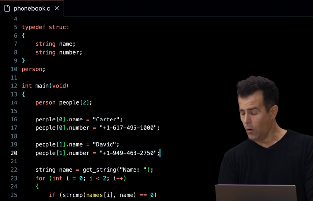</kbd>

> [!NOTE]
> Ổng **define person struct** như vầy, và **tạo array chứa 2 person.**
> Cách thức assign value cho person variable thì biết rồi

 

<kbd>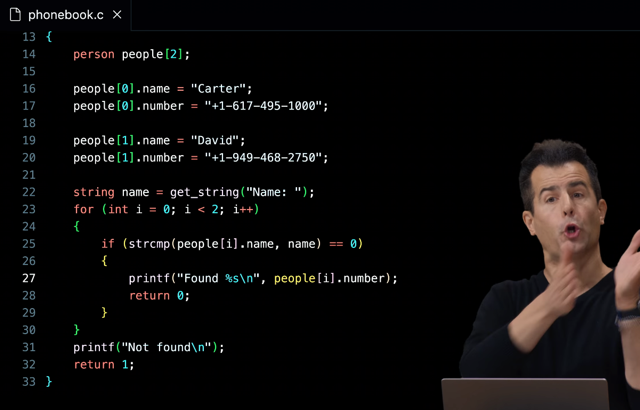</kbd>

 

<kbd>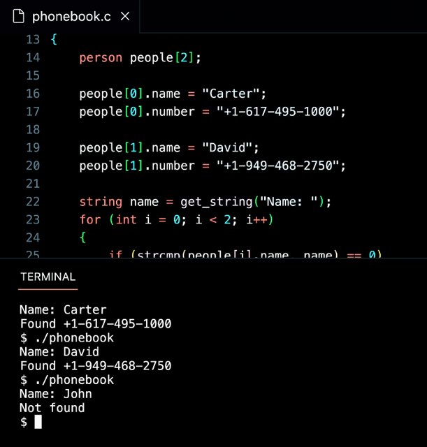</kbd>

 

<kbd>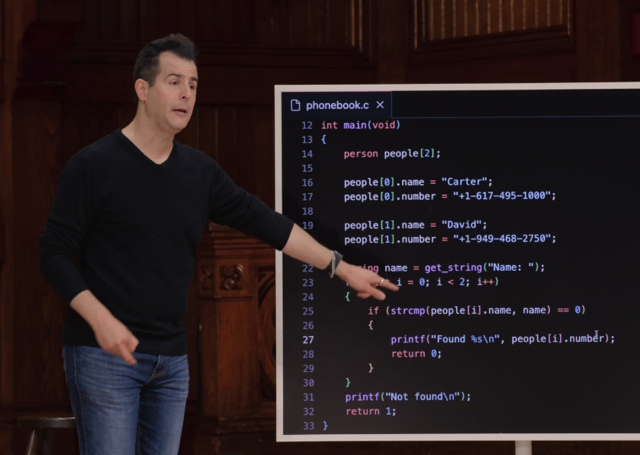</kbd>

> [!NOTE]
> Đại khái là với cách tạo object như vậy ta sẽ**kiến trúc tốt hơn** là
> 1 array cho name, 1 array cho phone, ....
>
> Và khi cần thêm 1 loại thông tin gì đó thì  chỉ cũng dễ dàng add
> thêm variable cho person
>
> Và ổng nói **chưa phải là Object Oriented Programming, C chưa
> phải là như vậy**

 

<kbd>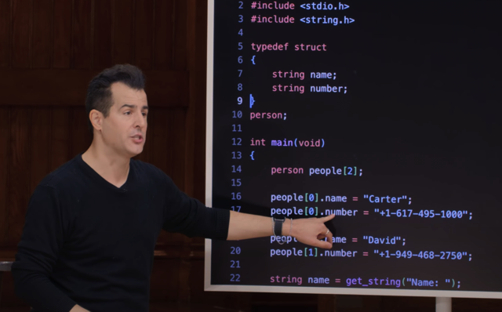</kbd>

> [!NOTE]
> Ý nghĩa là: Open the door (memory) and **go inside
> và check or set the name or the number of
> that person**

> [!NOTE]
> Q: Có thể nào **set default value**cho các
> variable của person không
>
> D: **Không. C thì không**, các higher level language
> như Java, Python thì có.
> **Q: Tại sao như vầy là**bad design?
>
> D: Vì**thực tế khi ta load database** (people, phone)
> từ một file database như csv ta sẽ**dùng vài dòng
> code và load toàn bộ vào array** chứ không code 
> trực tiếp như thế này

 

<kbd>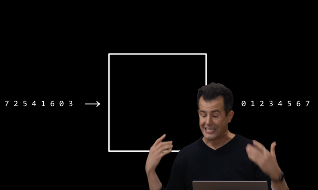</kbd>

 

<kbd></kbd>

<kbd></kbd>

<kbd></kbd>

<kbd></kbd>

<kbd></kbd>

> [!NOTE]
> **Selection Sort**: Rất đơn giản, cho l**oop đến khi sort xong.**
> Pseudo code phiên bản con người:
> David s**ẽ đi từ đầu đến cuối**, và **update vào bộ nhớ ông nào
> là nhỏ nhất**. 
> Khi hoàn thành, ổng sẽ **swap ông nhỏ nhất với ông đứng đầu**
> Tiếp tục David sẽ **đi từ ông thứ 2 đến cuối,** cố gắng **nhớ ông nhỏ 
> nhất**Khi hoàn thành,**swap ông nhỏ nhất với ông thứ 2**
> ..
> Tiếp tục vậy c**ho đến khi chỉ còn một ông nên không loop nữa, 
> kết thúc**

 

<kbd>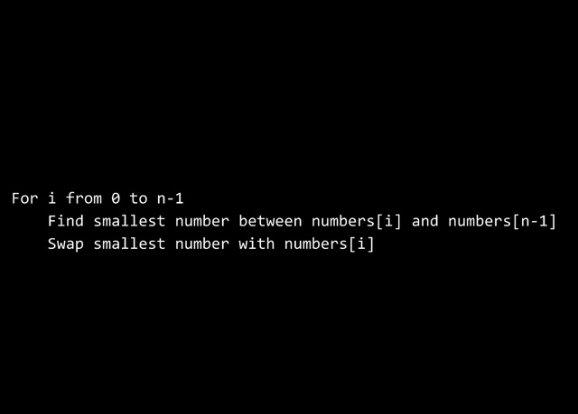</kbd>

> [!NOTE]
> Pseudo code cho Selection Sort

 

<kbd></kbd>

> [!NOTE]
> Burble sort:
>
> David sẽ đi từ **từng cặp**, và**swap nếu hai thằng không theo
> thứ tự.**
>
> Thì**khi hoàn thành lần loop thứ nhất** thì **ông số 7 (lớn nhất)
> đã về đúng vị trí cuối.**
> và **làm tương tự thì khi kết thúc lần thứ 2** thì**ông số 6 đã
> đứng đúng vị trí thứ 6**

 

<kbd></kbd>

> [!NOTE]
> D: Làm sao máy tính biết mọi chuyện đã xong?
>
> A: Khi **không còn ai để swap**, hoặc nếu mỗi lần loop  ta chỉ
> đi đến vị trí lùi lại 1 ô thì khi đó sẽ đến lúc không cần loop
> nữa
>
> D: Correct, khi loop qua hết (vẫn full list) mà ko thấy cần
> swap ai nữa thì dừng

 

<kbd></kbd>

> [!NOTE]
> D: Thử đoán xem cái nào tốt hơn?
>
> A: Cả hai đều giảm 1 vấn đề sau mỗi lần loop, Nhưng
> với **Bubble rõ ràng là nó phải swap rất nhiều lần  trong
> 1 lần đi**. Còn Selection Sort thì nó nhớ thằng nhỏ nhất
> và **chỉ dùng một lần swap nó lên đầu**. Đây là điểm
> cộng cho Selection Sort
>
> Thứ hai là **quãng đường David phải đi trong Selection
> sort ngắn dần**, còn với Burble sort thì không. Điều này
> có vẻ là Ưu điểm nhưng phải xem liệu Burble sort có
> giảm số lần đi hay không, nếu cùng số lần phải đi thì
> việc đi ngắn hơn là ưu điểm của Selection Sort.

 

<kbd>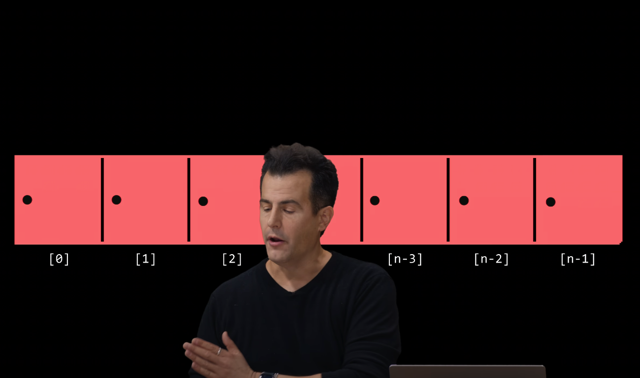</kbd>

 

<kbd></kbd>

> [!NOTE]
> Để so sánh hai cách ta có thể đếm, xem bao nhiêu lần
> mình phải thực hiện việc so sánh hai số, swap ....
>
> Generalize array có n số.
>
> D: Để **tìm cái số nhỏ nhất ở lần đi đầu tiên** trong
> Selection sort mình cần bao nhiêu step?
>
> A: **Nhiều nhất là n step** vì**worst case là số nhỏ nhất đó
> nó  đứng ở cuối**. Mỗi step sẽ là so sánh số trong ô với số
> nhỏ nhất đang nhớ trong đầu
>
> D: Correct, chính xác hơn là**n-1 step** vì thằng đầu tiên hỏi
> so. Và cũng không cần phải worse case vì để tìm thằng
> nhỏ nhất ta buộc phải loop hết

 

<kbd></kbd>

> [!NOTE]
> D: TÌm số nhỏ thứ 2 thì sao?
>
> A: n-2 step

 

<kbd>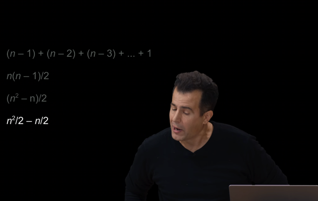</kbd>

> [!NOTE]
> Từ đó để thực hiện**Selection sort** ta
> sẽ cần **n**2/2 - n/2 bước**

 

<kbd>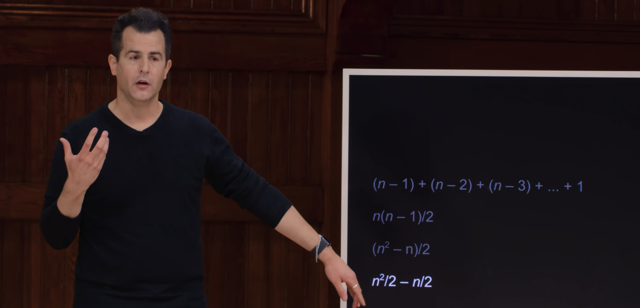</kbd>

> [!NOTE]
> Và thể theo **quy ước không chi li tính toán** mới nói ở
> trên thì  D: Ta coi nó là bao nhiêu?
>
> A: **n^2**

 

<kbd>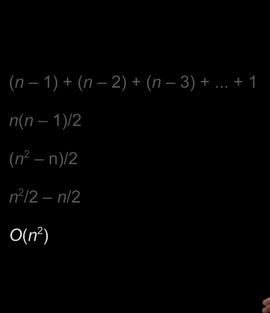</kbd>

> [!NOTE]
> Correct: **O(n**2)**

 

<kbd>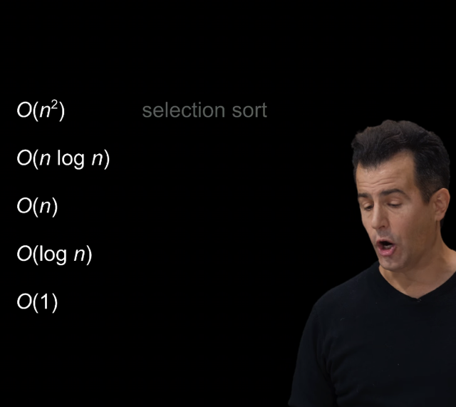</kbd>

 

<kbd></kbd>

> [!NOTE]
> D: Vậy **lower bound** là bao nhiêu, ví dụ 1 best
> case khi list đã được sort sẵn?
>
> A: **Vẫn là O(n^2)**. Vì ta vẫn phải đi y như vậy  chỉ
> là không phải thực hiện việc swap thôi.
>
> D: **Correct**! Vì Selection sort không có cơ chế nào
> để quick check rằng list đã được sort

 

<kbd>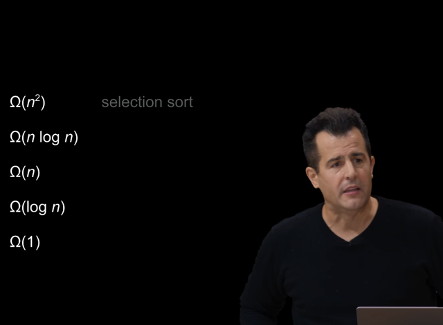</kbd>

> [!NOTE]
> Do đó Selection sort vẫn là **Big Omega (n^2)**
>
> Nhận xét. Đây sẽ là sự lãng phí rất lớn

 

<kbd>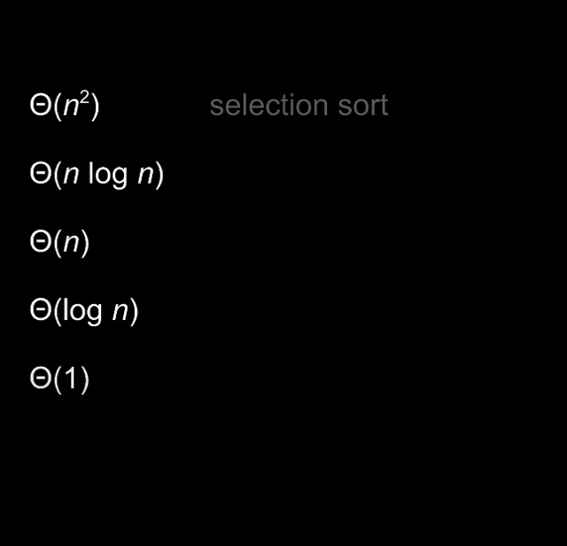</kbd>

> [!NOTE]
> Do đó cũng là **Big Theta n^2** (Upper
> Bound = Lower Bound = n^2)

 

<kbd>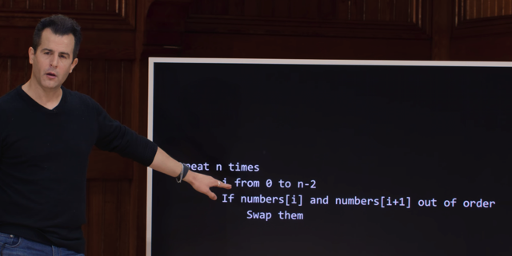</kbd>

> [!NOTE]
> D: Tại sao phải i từ **0 : n-2** mà ko phải n-1
>
> A: Vì **để lấy từng cặp i và i+1** thì khi i = n-2 thì mới còn ông i+1 =
> n-1 để so sánh.
>
> D: Correct.
>
> Và **chỉ cần làm n times** (không cần check xem có swap hay
> không  để stop như hồi nãy nói) là vì với giả định là**mỗi lần đi
> ổng sẽ đẩy ông to nhất về cuối hay sắp đúng vị trí cho 1 số, thì
> với n số ổng sẽ đủ để xắp sếp đúng vị trí của n số**

 

<kbd></kbd>

> [!NOTE]
> Yes, techniquely thì **chỉ cần n-1 lần**, vì khi đã xếp đúng
> cho n-1 ông thì ông còn lại đương nhiên đúng

 

<kbd>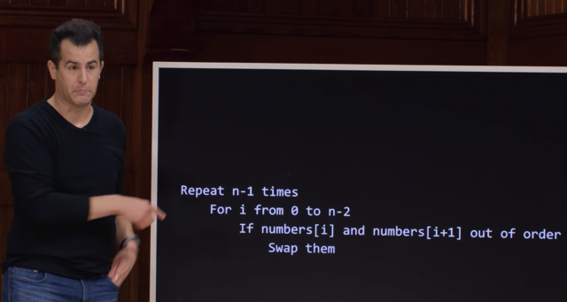</kbd>

> [!NOTE]
> Loop từ 0-1 là 2 vòng, loop từ
> 0-> n-2 là **n-1 vòng.**

 

<kbd>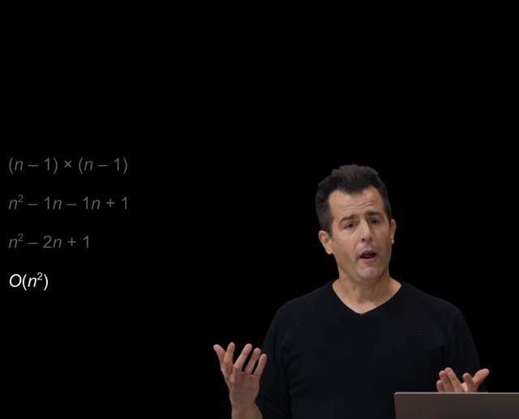</kbd>

> [!NOTE]
> Vậy Bubble sort cần **n-1*****n-1**
>
> Asymtoniclly (Khi n lớn) ta cũng coi nó là **O*(n^2)**

 

<kbd>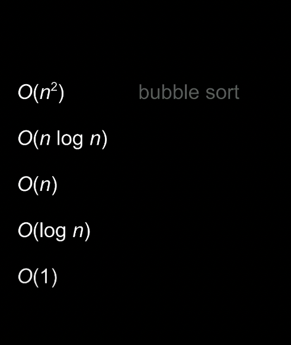</kbd>

> [!NOTE]
> D: **Lower bound?**
>
> A: 1. Vì nếu ta check việc swap có xảy ra hay không, và trong
> trường hợp tốt nhất khi list đã sort thì sau khi loop lần đầu tiên
> ta thấy is_swap = false, có thể kết luận list đã sort, và kết thúc
>
> D: Đúng mà sai. Đúng là ta có thể check việc có swap hay không
> để kết thúc.
>
> Sai là vẫn phải đi 1 lần, và trong 1 lần đó **vẫn là so sánh n-1 lần**
>
> Nên **Big OMEGA (n)** (n-1 coi như n)

 

<kbd>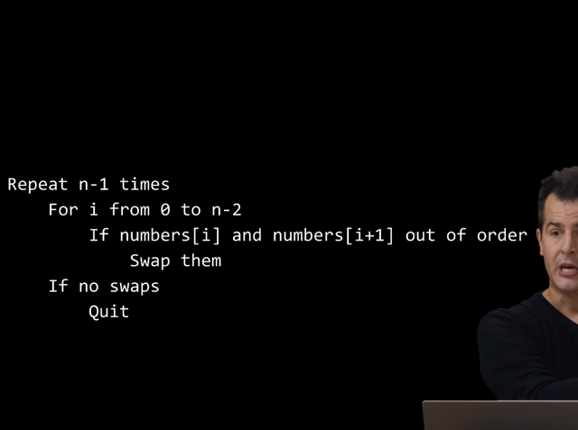</kbd>

 

<kbd>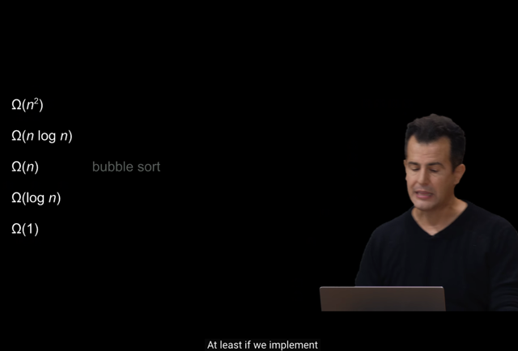</kbd>

 

<kbd>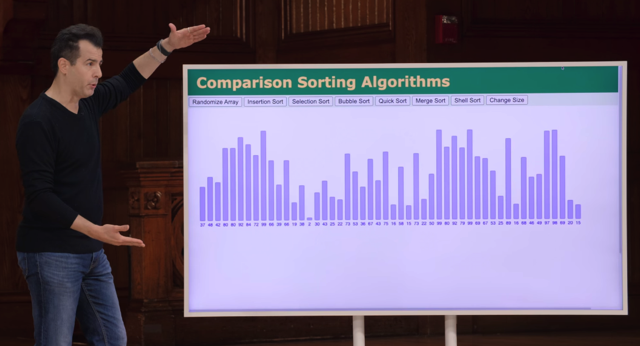</kbd>

 

<kbd>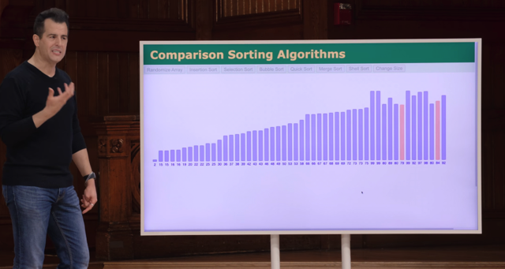</kbd>

> [!NOTE]
> Kế ổng dùng 1 cái tool để visualize quá trình sort bởi các
> algorithm khác nhau
>
> Qua đó có thể cảm nhận được có những sự stupid,  lãng phí
> (looping) của các algorithm này

 

<kbd>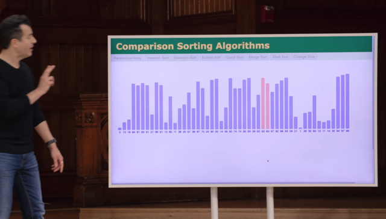</kbd>

 

<kbd></kbd>

> [!NOTE]
> Khi function gọi chính nó
> thì ta có **recursion**

 

<kbd>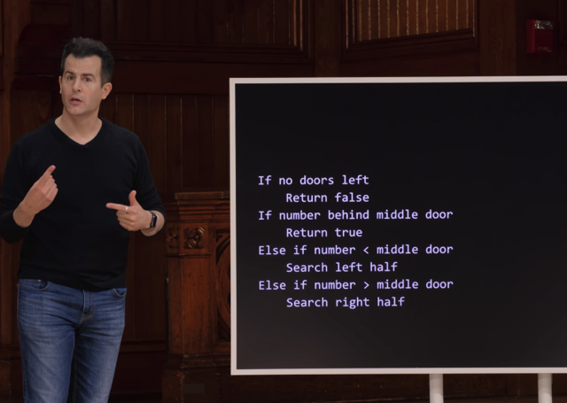</kbd>

> [!NOTE]
> Thì ổng nói cái pseudo code cho cái task tìm tở 50$ ở
> trên chính là Recursive khi nó có khúc**search left haft
> và right haft = gọi chính nó**
>
> Từ đây có lo ngại sẽ có vấn đề khi  function gọi chính nó
> nhiều lần.
>
> D: Tại sao không cần lo việc này?
>
> A: Vì **nó có dòng nếu ko còn doors nào nữa thì stop 
> (return false)**

 

<kbd>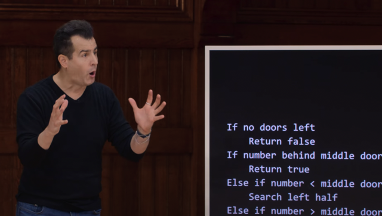</kbd>

> [!NOTE]
> Correct, và quan trọng hơn nữa là **mỗi lần recursive
> thì nó gọi trên một smaller smaller problem**
>
> Thì **đến lúc nào đó sẽ dừng**

 

<kbd>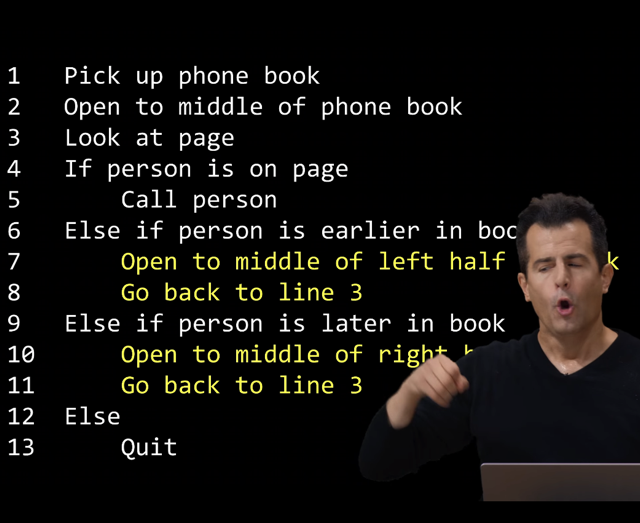</kbd>

> [!NOTE]
> Quay lại ví dụ search name trong phone book ta cũng
> có thể thay **Hành động mở trang giữa của phần bên
> trái và làm lại từ dòng 3** Thành **Search phần bên
> trái.**
>
> Ý là **thể hiện cách làm theo kiểu recursive** vì thật ra nó
> cũng là như nhau

 

<kbd>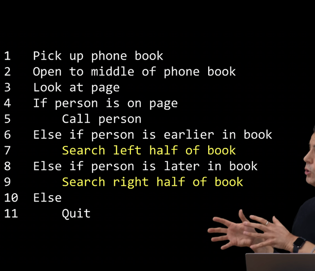</kbd>

 

<kbd>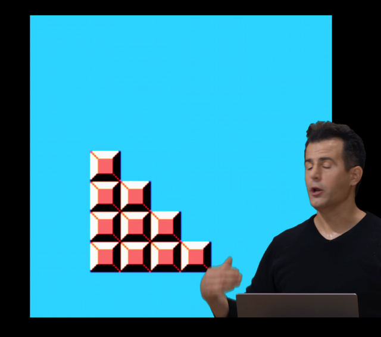</kbd>

> [!NOTE]
> Thì đại khái là ngay cả việc xây cái kim tự tháp này 
> Cũng có thể thể hiện dạng recursive.
>
> Type 4 pyramid = base 4 block + type 3 pyramid
> Type 3 pyramid = base 3 block + type 2 pyramid
> Type 2 pyramid = base 2 block + type 1 pyramid
> Type 1 pyramid = base 1 block

 

<kbd>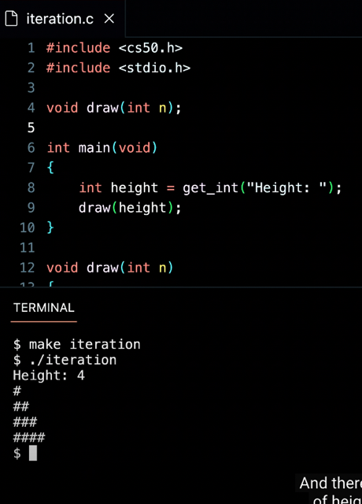</kbd>

<kbd></kbd>

<kbd>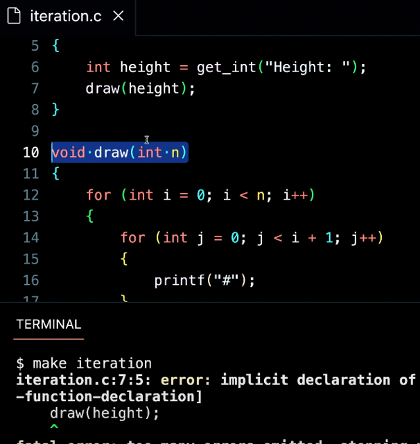</kbd>

> [!NOTE]
> Đại khái ổng v**iết đoạn code để in kim tự tháp**
> theo cách thông thường như tuần trước

 

<kbd>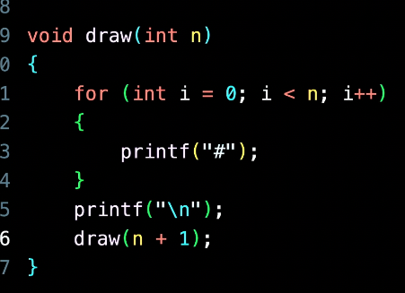</kbd>

<kbd></kbd>

<kbd>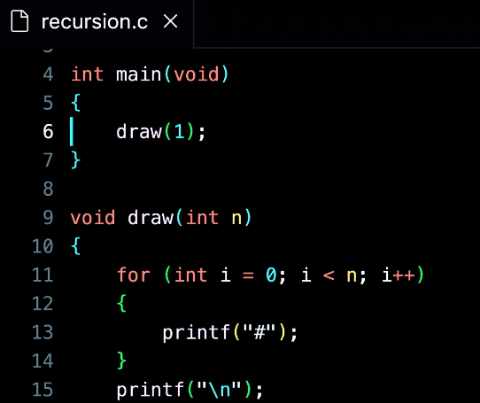</kbd>

> [!NOTE]
> Xong ổng viết theo kiểu này, trong function
> **draw(n)**nó**tự động gọi draw(n+1)**

 

<kbd>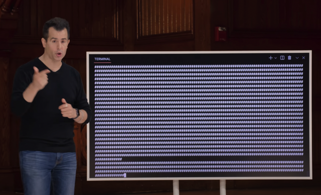</kbd>

> [!NOTE]
> Kết quả là sau khi **draw(1)**, trong function đó sau khi thực
> hiện xong nó tự động gọi **draw(2)....**
>
> Kết qủa ta có kim tự tháp với 1 block ở hàng 1, 2 block hàng 2
> ....
>
> Ổng nói cái này để minh hoạ thôi vì thực ra ổng**override
> cái gì đó của Clang giúp compile được** chứ Clang nó có
> cơ chế prevent cái này để tránh tràn bộ nhớ.

 

<kbd>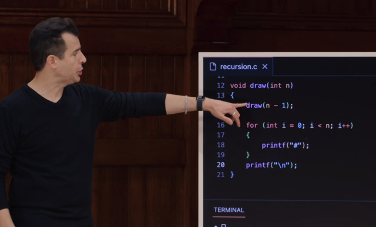</kbd>

> [!NOTE]
> Xong ổng sửa lại kiểu này. Vì **kim tự tháp 4 tầng** cơ bản là
> một cái **kim tự tháp 3 tầng** + **1 dòng 4 block**.
>
> Nên trong function ổng sẽ cho nó **vẽ n-1 pyramid trước**,
> và assume nó sẽ work as expected
>
> Sau đó ổng **vẽ dòng n block.**

 

<kbd>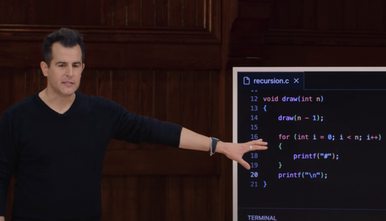</kbd>

> [!NOTE]
> D: Có gì không ổn?
>
> A: Đó là **khi n = 1 nó sẽ gọi function để vẽ kim tự tháp 0,
> và in 1 block.
>
> và tiếp tục gọi draw -1 , -2 ....**

 

<kbd>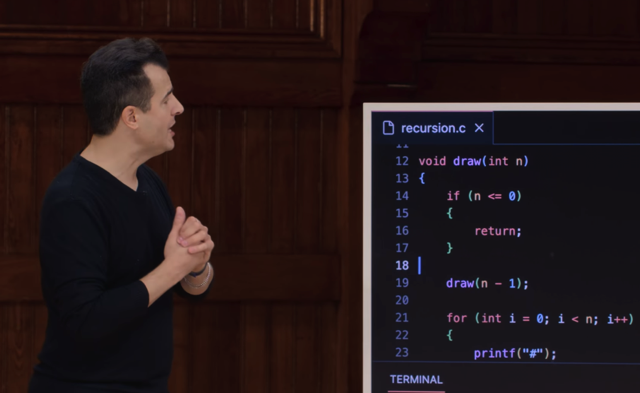</kbd>

 

<kbd>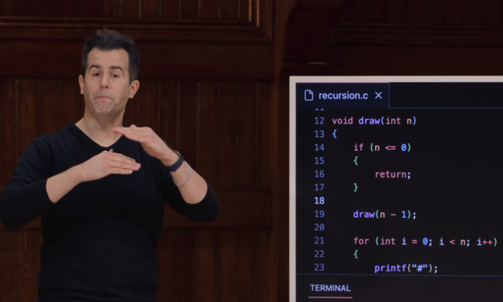</kbd>

> [!NOTE]
> Từ đó, ổng**define BASE CASE**là khi **n <= 0 thì return.**
> Câu chuyện sẽ là như thế này, bắt đầu gọi draw(4) để in type 4 pyramid:
>
> draw (4): n = 4 > 0 nên nó gọi draw(3), dòng dưới (tạm gọi là base 4) 
> vẫn chưa chạy
>
> draw(3): n = 3 > 0 nên nó gọi draw(2), dòng base 3 vẫn chưa chạy
>
> draw(2): n = 2 > 0 nên nó gọi draw(1), dòng base 2 vẫn chưa chạy
>
> draw(1): n = 1 > 0 nên nó gọi draw(0), dòng base 1 vẫn chưa chạy
>
> draw(0): n = 0, thoả điều kiện, nó return. 
>
> Chạy dòng base 1, in 1 block. Kết thúc draw(1)
>
> Chạy dòng base 2, in 2 block, Kết thúc draw(2)
>
> Chạy dòng base 3, in 3 block, kết thúc draw(3)
>
> Chạy dòng base 4, in 4 block, kết thúc draw(4) -> Kết thúc function.

 

<kbd>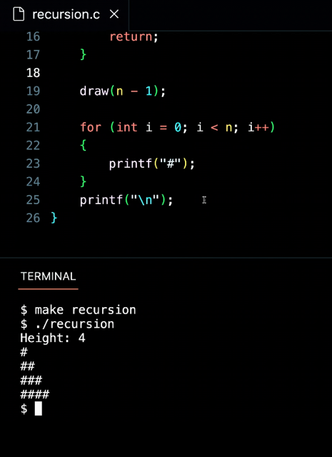</kbd>

 

<kbd></kbd>

> [!NOTE]
> Q: Có thể dùng recursive với void function không -
> function ko có argument?
>
> D: Không

 

<kbd></kbd>

 

<kbd>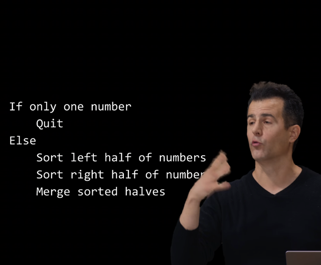</kbd>

> [!NOTE]
> Nói qua cái Merge Sort mới
> học bên Algorithm Spec,

 

<kbd>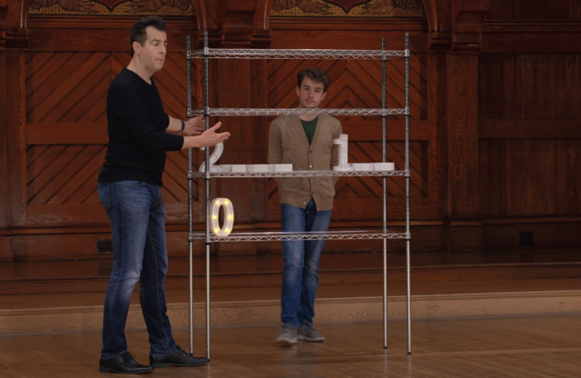</kbd>

<kbd>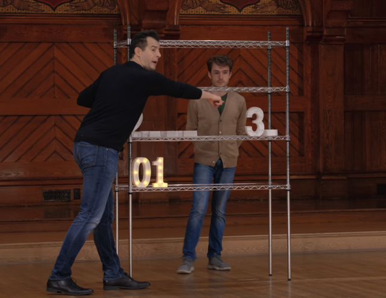</kbd>

<kbd></kbd>

<kbd></kbd>

<kbd></kbd>

 

<kbd>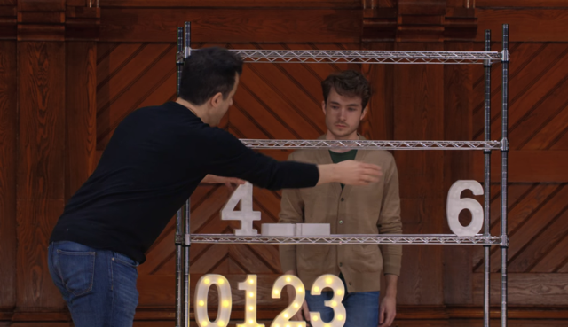</kbd>

<kbd>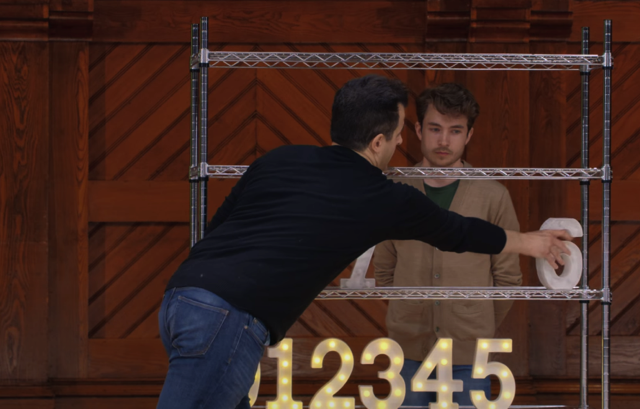</kbd>

<kbd></kbd>

<kbd></kbd>

<kbd>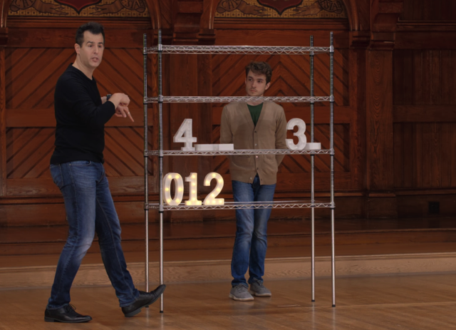</kbd>

 

<kbd></kbd>

> [!NOTE]
> Có thể hiểu đại khái như sau:
>
> Pseudo code con người của quá trình merge như sau:
>
> Start với số đầu tiên của 2 array. 2 và 0
>
> So sánh thấy 0 nhỏ hơn, lấy 0 ra bỏ vào kết quả.
>
> Dựng thằng tiếp theo của array #2 lên là số 1.
>
> So sánh 2 và 1 thấy 1 nhỏ, lấy nó ra bỏ vào kết quả.
>
>  Dựng thằng tiếp theo của array #2 lên, là số 3
>
> So sánh 2 và 3 thấy 2 nhỏ, lấy nó ra bỏ vào kết quả
>
> (Đến giờ vì mới lấy 2 là của array #1 ra, nên ta dựng
> thằng tiếp theo của array 1 lên, là số 4)
>
> So 4 với 3 thấy 3 nhỏ, lấy nó ra bỏ vào kết quả
>
> Dựng thằng tiếp theo của array #2 ra
>
> Tiếp tục như vậy.
>
> *Thì ổng nói các bạn **thấy tay của tôi luôn chỉ về tương lai,
> không có bước quay lại nào cả.**

 

<kbd>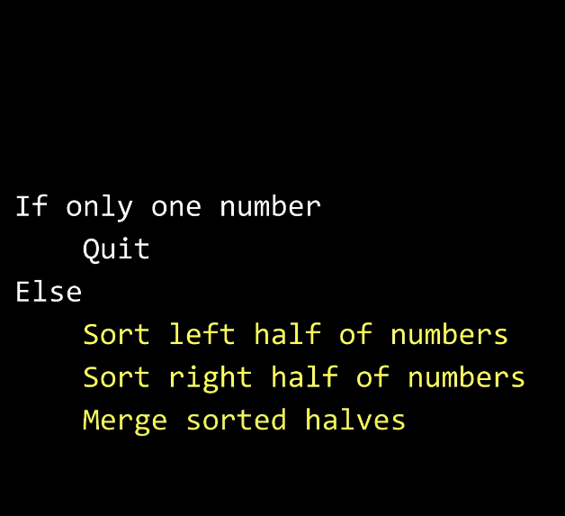</kbd>

 

<kbd>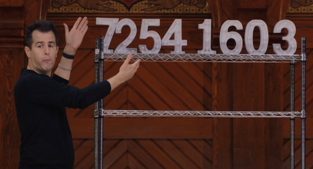</kbd>

> [!NOTE]
> D: làm sao để sort 1st left?
>
> A: Thì gọi chính function đó, và nó theo pseudo code sẽ 
>
> Sort 1st left của 7254 = 72 (1)
> Sort 2nd left của 7254 = 54 (2)
> Merge (3)
>
> Sort 72: (1)
> Sort 1st left của 72 = 7: Done (1a)
> Sort 2nd left của 72 = 2: Done (1b)
> Merge -> 27 (1c)
>
> Sort 54: (2)
> Sort 1st left của 54 = 5 -> 5 Done (2a)
> Sort 2nd left của 54 = 4 -> 4 Done (2b)
> Merge -> 45 (2c)
>
> Merge (3)
> -> 2457

 

<kbd>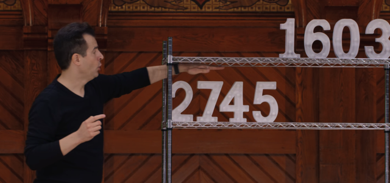</kbd>

<kbd>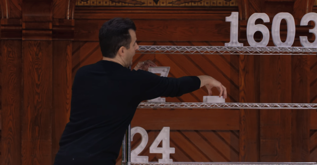</kbd>

<kbd>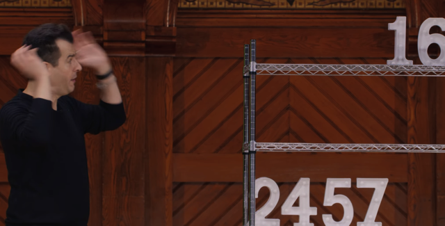</kbd>

<kbd>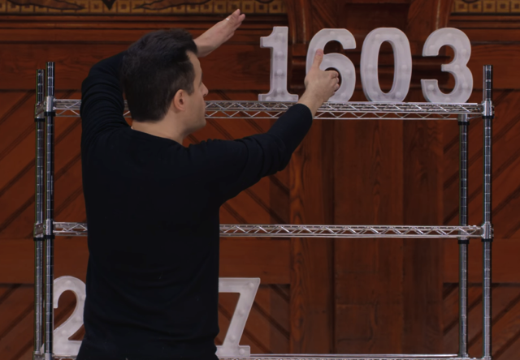</kbd>

<kbd></kbd>

<kbd></kbd>

<kbd></kbd>

<kbd></kbd>

<kbd>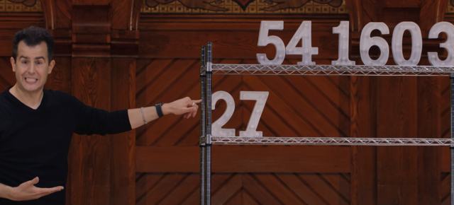</kbd>

> [!NOTE]
> Tương tự

 

<kbd>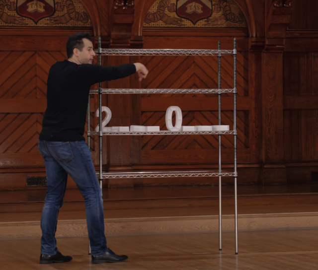</kbd>

> [!NOTE]
> Bước merge cuối

 

<kbd>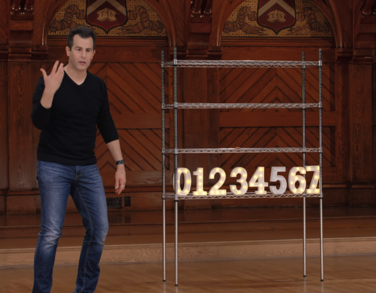</kbd>

 

<kbd>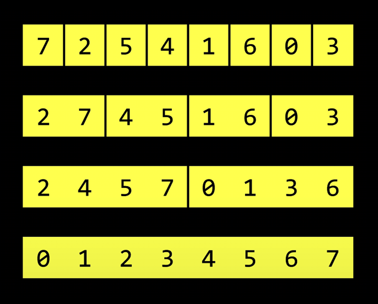</kbd>

 

<kbd>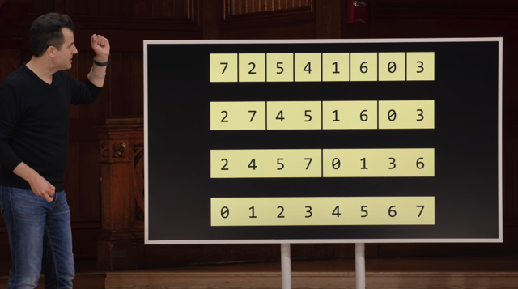</kbd>

> [!NOTE]
> D: Phải divide một nửa bao nhiêu lần?
>
> A: 3 từ 8 -> 4 -> 2 -> 1
>
> D: Correct! 
> Từ 8 để được 1 cần 3 lần chia 2 
> Thì ngược lại từ 1 cần nhân 2 3 lần để được 8
> 1x2 = 2
> 2x2 = 3
> 4x2 = 8
> Thì 3 chính là**log 2 (8)**= log 2 (2^3)
> Và khái quát hoá, **từ dãy n số**để được 1 thì **cần log 2 (n)**lần chia
>
> Và theo nguyên tắc bỏ qua tiểu tiết đó là ko care base 2 hay 3 
> hay 10 hay e. Thì nó sẽ là **log(n) phép tính**

 

<kbd>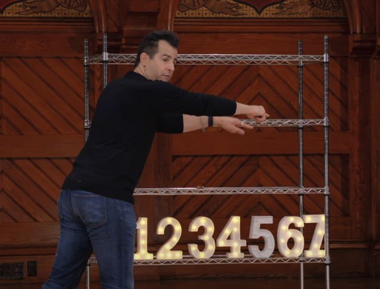</kbd>

> [!NOTE]
> Như hồi nãy có nói mỗi lần ổng merge, ổng chỉ
> đụng mỗi con số 1 lần duy nhất chứ không hề có
> chuyện loop đi loop lại nhiều lần
>
> Và mỗi một "tầng" khi merge ổng chỉ "đụng" / thao
> tác mỗi số 1 lần
>
> Cho nên **mỗi 1 "tầng" (trong 3 tầng*) ổng chỉ thực hiện n
> động tác.**
>
> tầng 1 merge các cặp (1 số,1 số) 
>
> tầng 2 merge các cặp (2 số, 2 số)
>
> tầng 3 merge cặp (4 số, 4 số)

 

<kbd>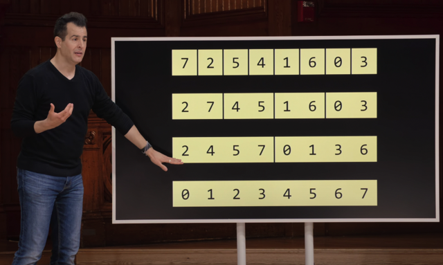</kbd>

> [!NOTE]
> Vậy với log(n) lần chia để được **log(n) tầng**, mỗi tầng thao
> tác n lần nên tổng cộng cần **n*log(n) -> O(nlog(n))**

 

<kbd>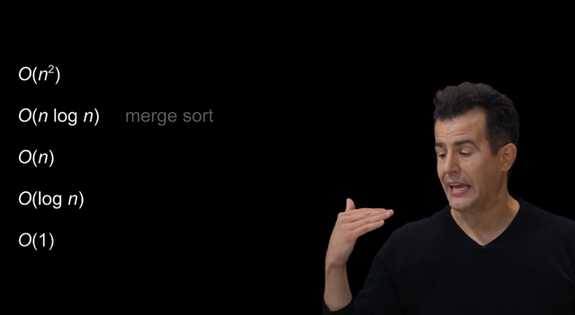</kbd>

 

<kbd>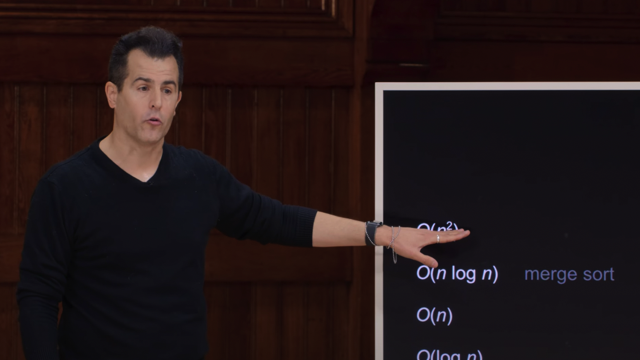</kbd>

> [!NOTE]
> Đại khái là cái Merge Sort có O(nlogn) tuy nhanh hơn Selection
> Sort và Bubble Sort (đều O(n^2)) nhưng chậm hơn Linear Search
> = O(n)
>
> Do đó khi **tính cả việc Sort  sau đó mới Binary Search**(như đã
> học, **Binary Search sẽ nhanh hơn Linear Search nếu sort sẵn**)
> thì chưa chắc Binary Search sẽ ưu thế hơn.
>
> Tuy nhiên n**ếu sort 1 lần**, và **xài mãi mãi**, thì nó cách chắc chắn
> sẽ ưu thế hơn (giống như nôm na là**Google giúp sort thông tin
> 1 lần sẵn, và từ đó hàng triệu người được hưởng lợi**)

 

<kbd>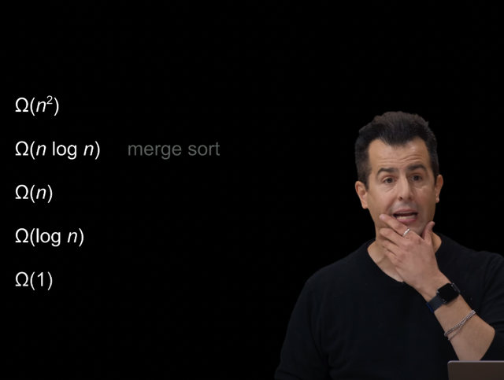</kbd>

> [!NOTE]
> Và merge sort cũng có
> lower bound là nlogn

 

<kbd>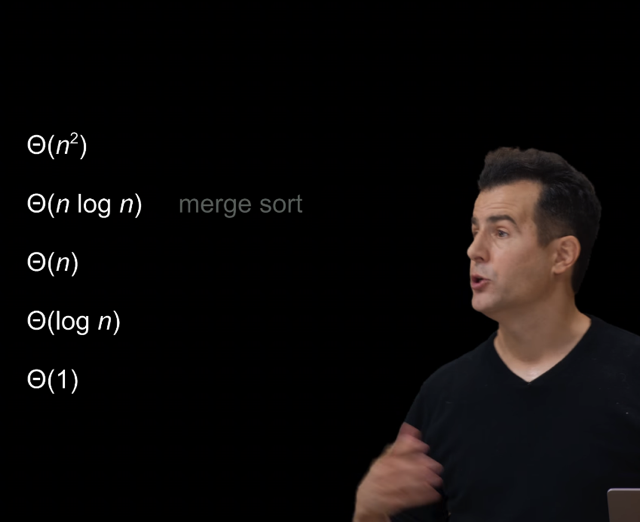</kbd>

 

<kbd></kbd>

 

<kbd>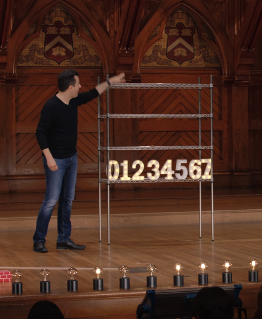</kbd>

> [!NOTE]
> Đại khái là ngoài cân nhắc thời gian của một
> algorithm thì  còn phải cân nhắc **Space**. Nữa.
> Nôm na là để thực hiện hết các bước của Merge
> Sort hồi nãy thì ổng cần có những cái khoảng
> không gian để thực hiện

 

<kbd>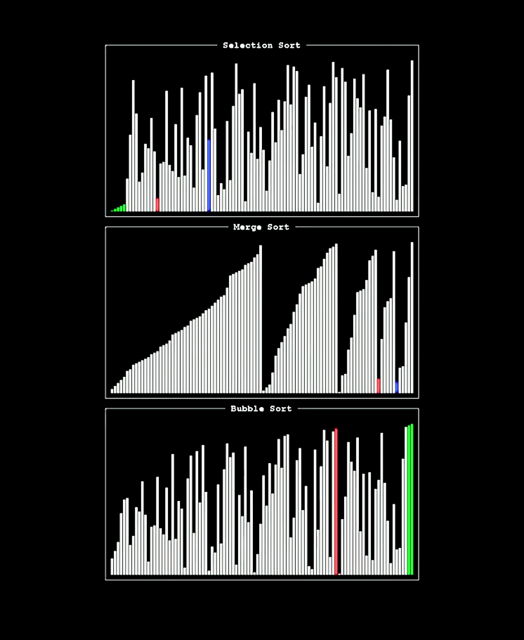</kbd>

 

<kbd>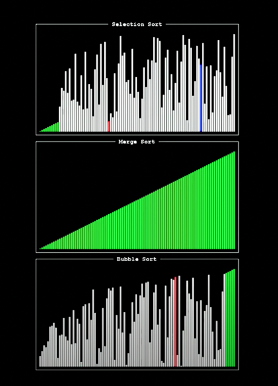</kbd>

 

<kbd>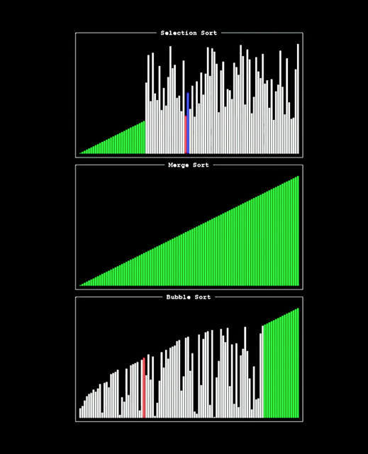</kbd>

> [!NOTE]
> Nhìn trực quan có thể thấy Merge
> Sort vượt trội như thế nào

 

<kbd>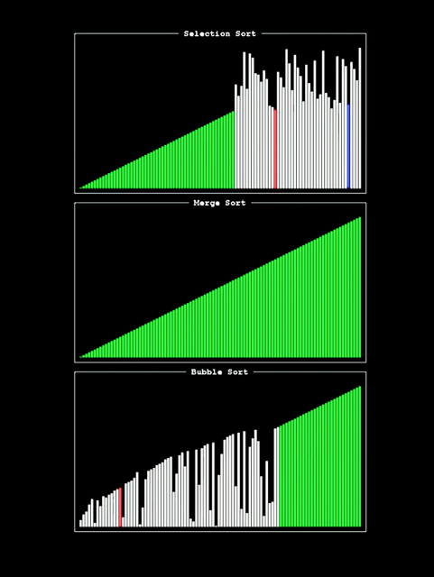</kbd>

 

<kbd>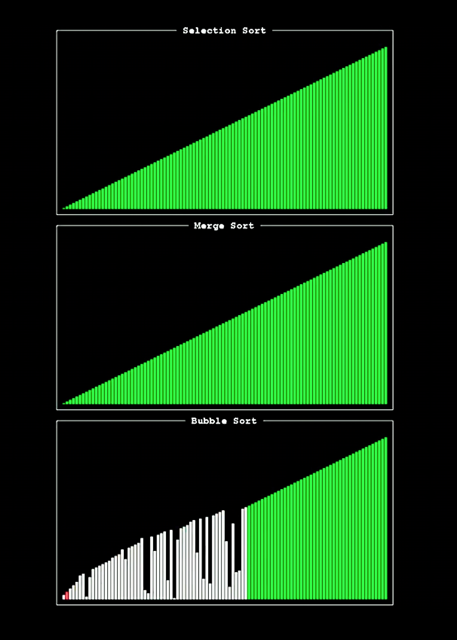</kbd>

 

<kbd>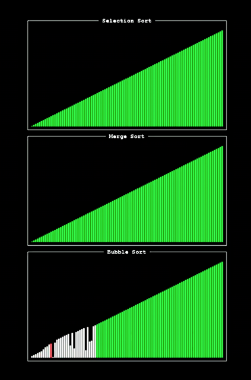</kbd>

 

