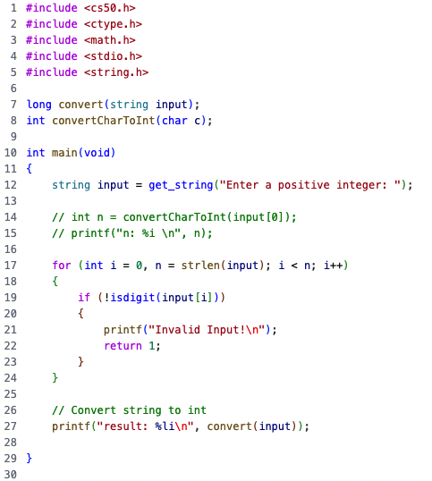
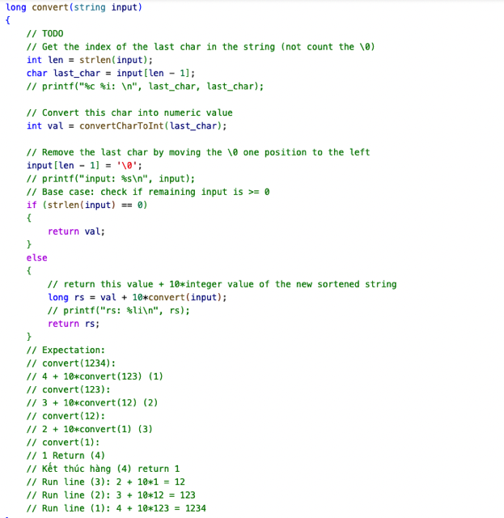
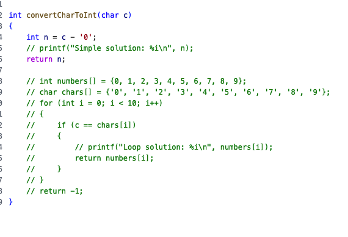
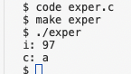
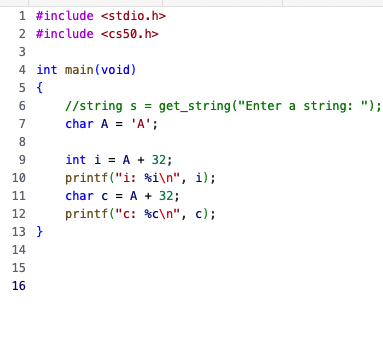
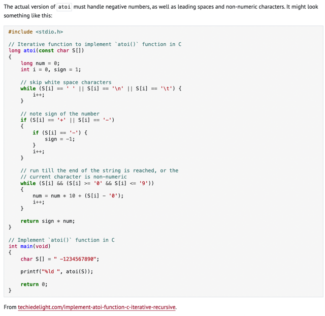
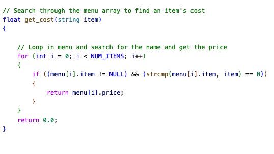

# Week 3 Algorithm

📊 **Progress:** `7` Notes | `9` Screenshots

---

## Atoi: Convert String To Int

 

<kbd></kbd>

 

<kbd></kbd>

> [!NOTE]
> Practice về Recursion. Đọc phần Expectation ở dưới cũng dễ hiểu cách làm.
>
> Chỉ có một chú ý nữa đó là khi ta nhập 112233445566 thì  kết quả nó ra sai.
> Thì ban đầu do nguyên nhân mình dùng int để chứa kết quả.
>
> Mà int 4 bytes = 32 bits chỉ có tối đa là 2^31 + 2^30 +....= 4294.. (4 tỷ mấy)
> Nhưng 1 bit đầu để số âm, dương nên còn 31 bit nên max của một int là 2,147,
> 483,647 (2 tỷ mấy)
>
> Do đó với input là 112233445566 thì nó vượt quá khả năng thể hiện của int
>
> Đổi lại dùng long với 8 bytes = 64 bit thì vấn đề được giải quyết

 

<kbd></kbd>

> [!NOTE]
> Đáng chú ý: convert từ char '0', '1'...'9'
> sang int:
>
> Nhớ lại:
> Trong ASCII, '0' nó map với key là 48, '1' - 49..
> Và char nó là 1 byte = 8 bit.
>
> Nhớ lại bữa trước cái vụ chuyển 'A' - 65 về 'a' - 97 đơn giản
> là lấy 'A' + 32. thì phép cộng này nó sẽ tạo char mới = 65 + 32 = 97
> và nó chính là 'a'
>
> Thì hoá ra: 
> khi **lấy 'A' - 64** và **gán vào int** thì **ta sẽ có integer = 97**
> Còn **nếu gán vào char** thì ta có**char với key 97 là 'a'**Do đó với c là '0', '1',... lấy trừ đi '0' thì cũng sẽ chính là trừ đi 48 và 
> gán vào một int (hoặc coi nó như một int) thì 
>
> Ta sẽ có '0' (48) - '0' (48) = 0 (int)
> '1' (49) - '0' (48) = 1 (int)

 

<kbd></kbd>

<kbd></kbd>

<kbd></kbd>

 

<kbd></kbd>

> [!NOTE]
> Ở version này nó không dùng recursion, 
> Và code cũng không khó hiểu:
>
> Đại khái là loop qua các char, nếu nó là các white-space char
> thì bỏ qua, nếu nó có dạng dấu trừ hay cộng thì lưu lại vào sign
> bằng 1 hay -1 để tí nhân.
>
> Còn lại nếu là number digit thì lấy ra chuyển thành int bằng cách
> trừ đi '0' như đã giải thích ở trên, rồi cộng dồn vào phần trước
> (nhân 10 lên)
>
> ví dụ '-1234' thì nó loop trong các char c
> c = '-' -> sign = -1
> c = ' ' bỏ qua
> c = 1: num = 1
> c = 2: num = num*10 + 2 = 12
> c = 3: num = num*10 + 3 = 123
> c = 4: num = num*10 + 4 = 1234
> Return sign*num = -1234

 

## Averate

> [!NOTE]
> AVERATE
> TEMPERATURE

> [!NOTE]
> Quay lại Note & Giải thích

 

## Max

> [!NOTE]
> LÀM SAU

 

## Snackbar

 

<kbd></kbd>

> [!NOTE]
> Trong C check NULL. Array khi ini
> với size mà chưa assign value thì
> value của nó là NULL

 

## Lab

 

<kbd></kbd>

> [!NOTE]
> Thành nhanh nhất ở sorted list chính là Bubble vì nó có BIG
> OMEGA (n) nhỏ nhất so với BIG OMEGA(n**2) của
> Selection Sort, và nlogn của Merge Sort
>
> Thằng nhanh nhất ở random list chính là Merge Sort vì nó 
> có BIG O(nlogn) là nhỏ nhất so với BIG O(n**2) của hai thằng kia
>
> Thằng chậm nhất ở cả ba loại list là Selection Sort

 

