# Week 4 - Memory

📊 **Progress:** `129` Notes | `189` Screenshots

---

<kbd></kbd>

 

<kbd></kbd>

> [!NOTE]
> Image khi zoom in zoom in .... thì được cấu
> thành bởi các pixel như ta đã biết image là
> tensor dài x rộng x 3 channel (RGB)

 

<kbd>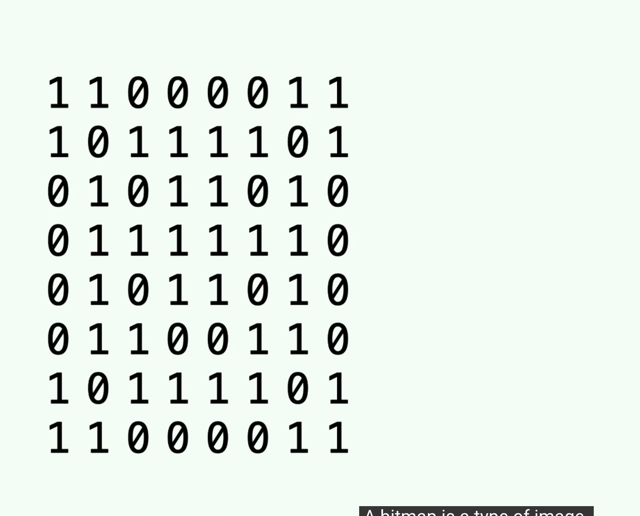</kbd>

> [!NOTE]
> Bitmap: a map of bit
>
> D: Nếu 1 là black, 0 là white thì cái này là hình gì?
>
> A: Mặt cười :)

 

<kbd>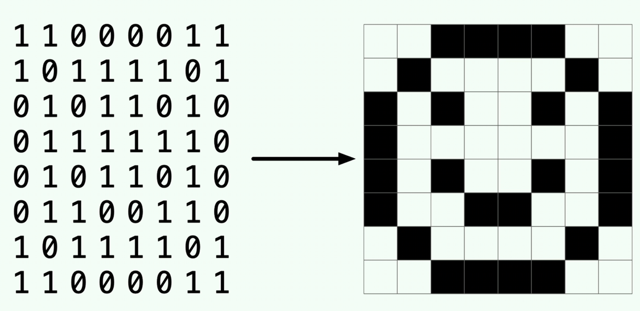</kbd>

 

<kbd></kbd>

 

<kbd>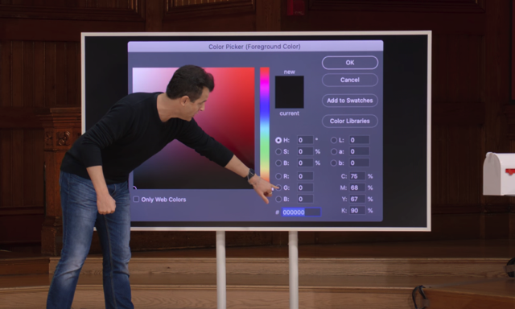</kbd>

 

<kbd>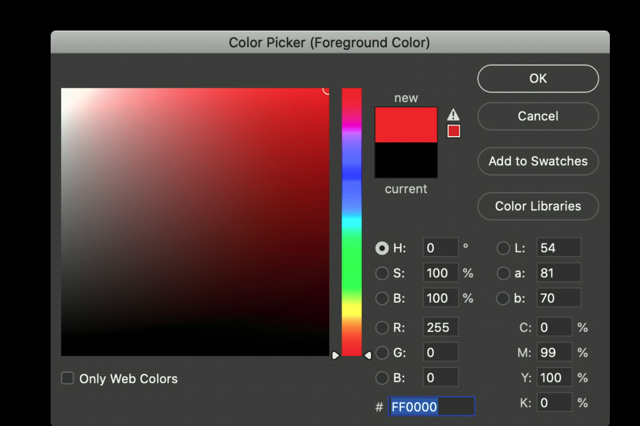</kbd>

 

<kbd></kbd>

> [!NOTE]
> Ổng chưa nói gì nhiều chỉ là nói sơ qua việc các trình như
> PTS có cái color picker này, và điều chỉnh Red Blue Green
> mỗi cái từ 0- 255 để thay đổi màu. Nếu mà là 0-0-0 hết thì
> là màu trắng, red 255 blue 0 green 0 thì là màu red. Thì có
> vẻ nó có quy luật của cái color code mà mình xài quài
> #ff0000

 

<kbd>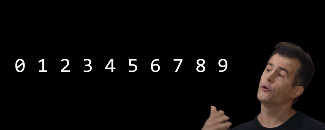</kbd>

<kbd></kbd>

<kbd></kbd>

 

<kbd>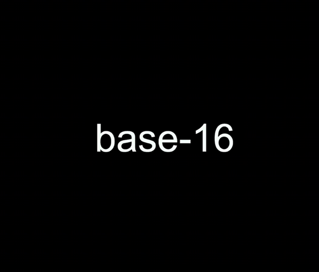</kbd>

<kbd></kbd>

<kbd>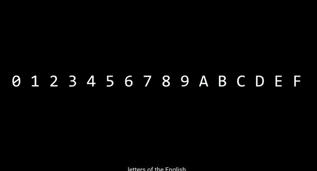</kbd>

> [!NOTE]
> Đại khái là ta sẽ xài 1 hệ khác
> không phải binary base - 2 (1,0), decimal base - 10 (1,2..9)
>
> mà là hexadecimal - base- 16. Và dùng **0 1 2..9 A B C D E F**

 

<kbd>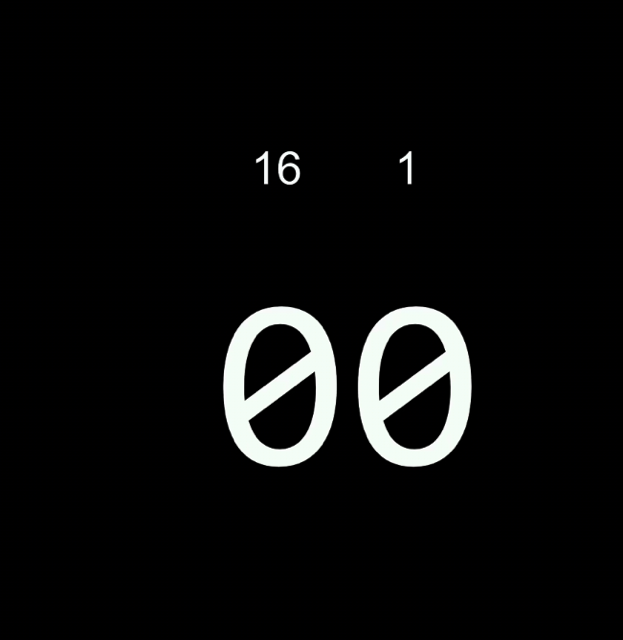</kbd>

<kbd></kbd>

<kbd>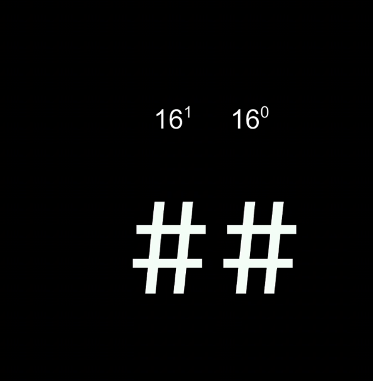</kbd>

> [!NOTE]
> Thì tương tự các thể hiện
> các con số trong hệ
>
> Với base 2:
>
>  0 = 00000000 = ...............0*2^1 + 0*2^0
>  1 = 00000001 = ...............0*2^1 + 1*2^0
>  2 = 00000010 = ...............1*2^1 + 0*2^0 
>  3 = 00000011 = ...............1*2^1 + 1*2^0
>  4 = 00000100 = ..................1*2^2 + 0*2^1 + 0*2^0
> **15**= 0000**1111** = .................1*2^3 + 1*2^2 + 1*2^1 + 1*2^0
> **255** = **11111111** = 1*2^7 + 1*2^6 + 1*2^5 + 1*2^4 + 1*2^3 + 1*2^2 + 1*2^1 + 1*2^0 
> = 128 + 64 + 32 + 16 + 8 + 4 + 2 + 1 = 255
>
> Với base 10:
>
>    0 = 00000000 = ..........................0*10^1 + 0*10^0
>    1 = 00000001 =...........................0*10^1 + 1*10^0
>    2 = 00000002 =...........................0*10^1 + 2*10^0
>    3 = 00000003 =...........................0*10^1 + 3*10^0
> ...
>    9 = 00000001 =............................0*10^1 + 9*10^0
>   10=00000010 =.............................1*10^1 + 0*10^0
>   11=00000011 =.............................1*10^1 + 1*10^0
>   12=00000012 =.............................1*10^1 + 2*10^0
>   19=00000019 =.............................1*10^1 + 9*10^0
>   20=00000020 =.............................2*10^1 + 0*10^0
>   99=00000099 =.............................9*10^1 + 9*10^0
> 100=000000100 =............1*10^2 + 0*10^1 + 0*10^0
>
> Với base 16: xài hết các chữ số 0-9,mượn A, B, C, D, E, F thay cho 10,11,12,13,14,15 
>
> 0 = ................0 = .........................................................0*16^1 + 0*16^0
> 1 = ................1 = .........................................................0*16^1 + 1*16^0
> ...
> 9 = ................9 = .........................................................0*16^1 + 9*16^0
> 10 = ..............A = .........................................................0*16^1 + 10*16^0 (hay A*16^0 cũng được A = 10)
> **15** = ..............**F** = .........................................................0*16^1 + 15*16^0 (hay F*16^0 cũng được F = 15)
> 16 = ............10 = .........................................................1*16^1 + 0*16^0
> 17 = ............11 = .........................................................1*16^1 + 1*16^0
> 18 = ............12 = .........................................................1*16^1 + 2*16^0
> ...
> 25 = ............19 = .........................................................1*16^1 + 9*16^0
> 26 = ............1A = .........................................................1*16^1 + 10*16^0 (hay A*16^0 cũng được A = 10)
> 27 = ............1B = .........................................................1*16^1 + 11*16^0 (hay B*16^0 cũng được B = 11)
> 28 = ............1C = .........................................................1*16^1 + 12*16^0 (hay C*16^0 cũng được C = 12)
> 29 = ............1D = .........................................................1*16^1 + 13*16^0 (hay D*16^0 cũng được D = 13)
> 30 = ............1E = .........................................................1*16^1 + 14*16^0 (hay E*16^0 cũng được E = 14)
> 31 = ............1F = .........................................................1*16^1 + 15*16^0 (hay F*16^0 cũng được F = 15)
> 32 = ............20 = .........................................................2*16^1 + 00*16^0
> 33 = ............21 = .........................................................2*16^1 + 01*16^0
> 41 = ............29 = .........................................................2*16^1 + 09*16^0
> 42 = ............2A = .........................................................2*16^1 + 10*16^0 (hay A*16^0 cũng được A = 10)
> 43 = ............2B = .........................................................2*16^1 + 11*16^0 (hay B*16^0 cũng được B = 11)
> 44 = ............2C = .........................................................2*16^1 + 12*16^0 (hay C*16^0 cũng được C = 12)
> 45 = ............2D = .........................................................2*16^1 + 13*16^0 (hay D*16^0 cũng được D = 13)
> 46 = ............2E = .........................................................2*16^1 + 14*16^0 (hay E*16^0 cũng được E = 14)
> 47 = ............2F = .........................................................2*16^1 + 15*16^0 (hay F*16^0 cũng được F = 15)
> 48 = ............30 = .........................................................3*16^1 + 00*16^0
> ..
> **255** = ............**FF** = .........................................................15*16^1 + 15*16^0
>
> Thì ra ff thì ff là 255, nên mã ffffff có nghĩa là red = 255, green = 255, blue = 255

 

<kbd>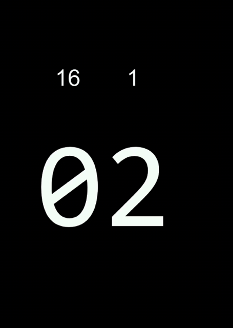</kbd>

> [!NOTE]
> 0*16^1 + 2*16^0 = 2

 

<kbd>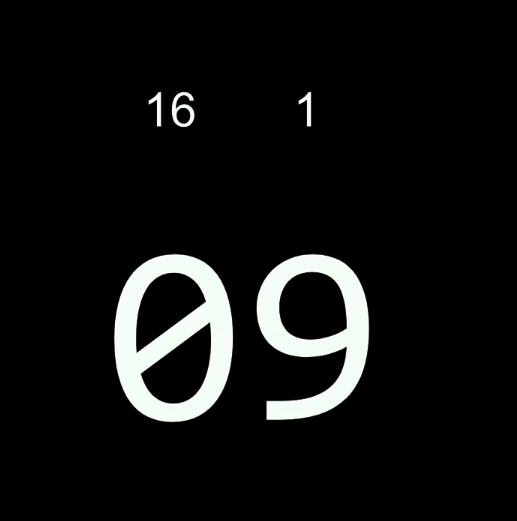</kbd>

> [!NOTE]
> 0*16^1 + 9*16^0 = 9

 

<kbd>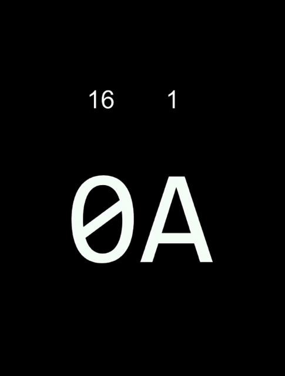</kbd>

> [!NOTE]
> 0*16^1 + A*16^0 = A = 10

 

<kbd>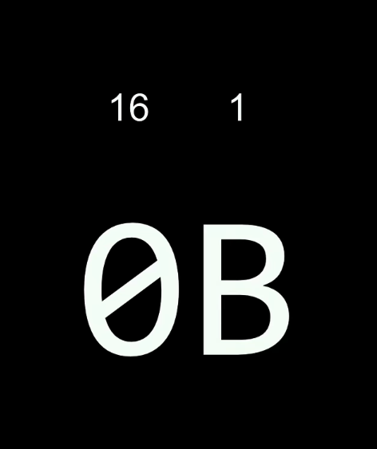</kbd>

> [!NOTE]
> 0*16^1 + B*16^0 = 11

 

<kbd>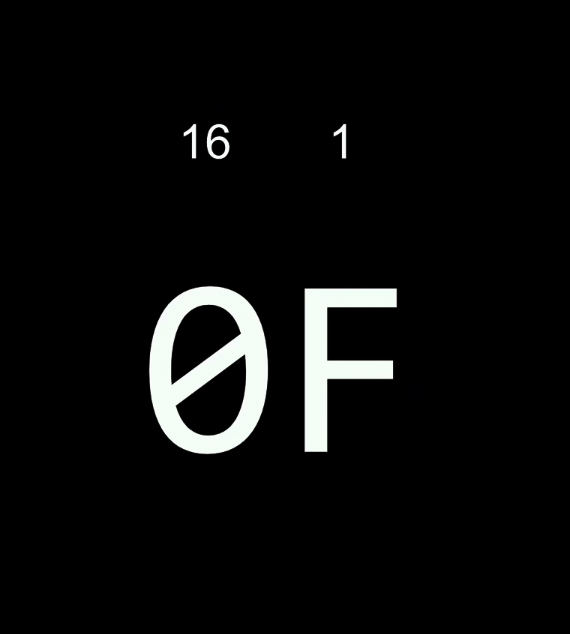</kbd>

> [!NOTE]
> 15

 

<kbd></kbd>

> [!NOTE]
> D: Vậy 16 là sao? A: 10

 

<kbd>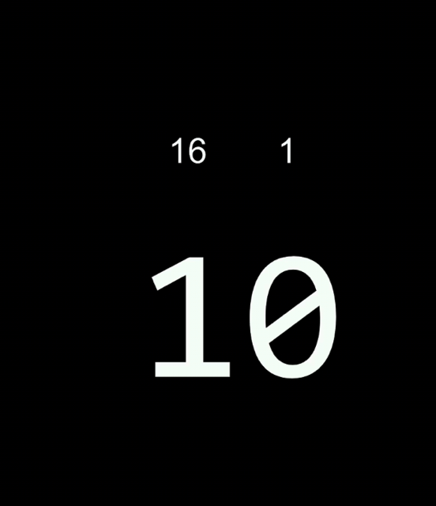</kbd>

> [!NOTE]
> Correct! Đừng đọc "ten",
> mà đọc "one zero"

 

<kbd>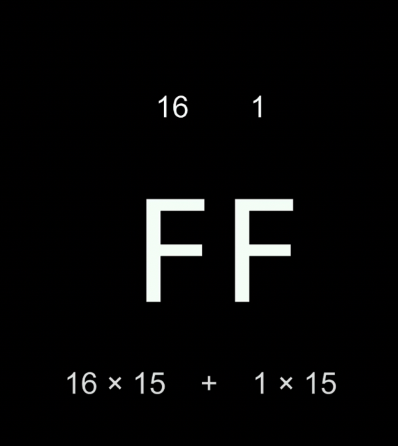</kbd>

<kbd></kbd>

<kbd>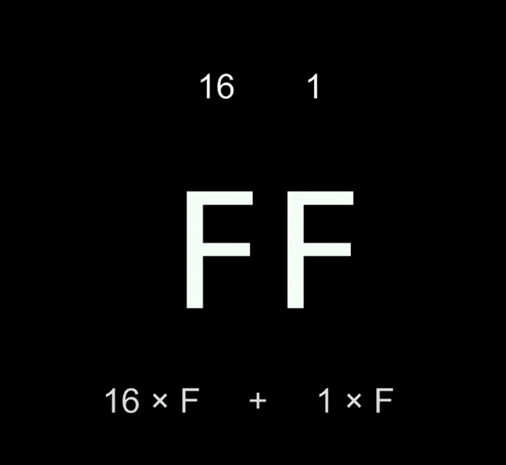</kbd>

> [!NOTE]
> FF = F*16^1 + F*16^0 = 15*16 + 15 =  255

 

<kbd></kbd>

> [!NOTE]
> Vậy t**ại sao lại dùng hexadecinmal**, phải làm phức tạp như 
> vậy?
>
> D: trước tiên ổng hỏi: 
> Để represent 15 trong binary cần bao nhiêu bit?
>
> A: 15 = 1*2^3 + 1*2^2 + 1*2^1 + 1*2^0 = 8 + 4 + 2 + 1 = 1111
> -> **cần 4 bit**

 

<kbd>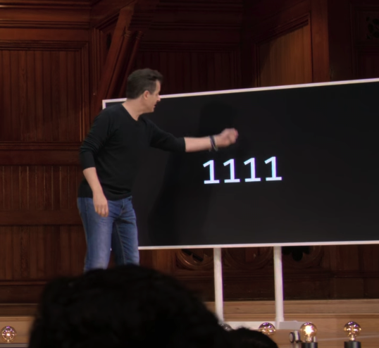</kbd>

> [!NOTE]
> D: Correct, và hexadecimal là cách để thể hiện gọn hơn 
> binary
>
> Thay vì thể hiện **15** = **1111** với binary thì 
> sẽ là **F** với base-16
>
> Thay vì thể hiện **255** = **11111111** với binary thì 
> sẽ là **FF** với base-16

 

<kbd>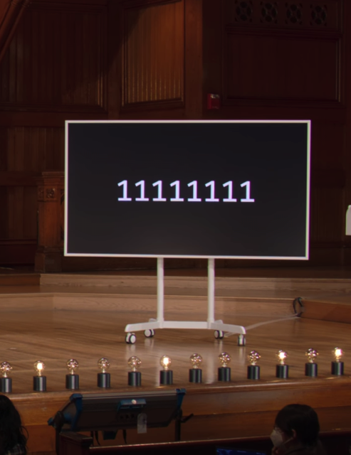</kbd>

> [!NOTE]
> 255 trong base-2

 

<kbd></kbd>

> [!NOTE]
> 255 trong base-16

 

<kbd></kbd>

> [!NOTE]
> Q: Vậy ở bên dưới **F là 4 bits** phải ko?
>
> D: Đúng, nó chỉ là cách để human đọc cho gọn thôi, nó vẫn
> tương đương **1111 = 4 bits**.
>
> Nên cứ **mỗi kí tự (số) của hexadecimal** là máy tính phải **chuẩn
> bị 4 bit.**
>
> **2 kí tự trong hexadecimal** phải chuẩn bị **8 bits** (để nếu nó là
> max = FF thì tương đương 11111111)

 

<kbd></kbd>

 

<kbd>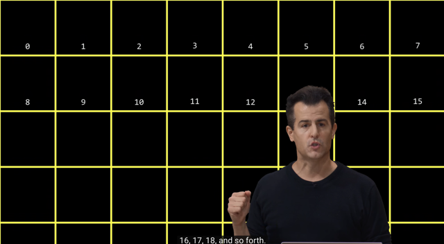</kbd>

> [!NOTE]
> Đại khái tuần trước đã nói, mỗi ô này tượng trưng 1 byte = 8
> bit trong memory, và ta có thể **đánh số nó byte 0, byte 1...
> byte 1 triệu (như gigabyte) gọi nôm na là ADDRESS**

 

<kbd>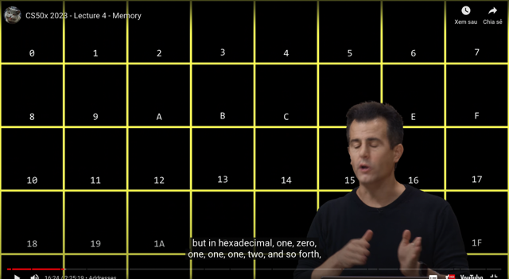</kbd>

> [!NOTE]
> Và người ta cũng dùng
> **base-16** để đánh **index**

 

<kbd>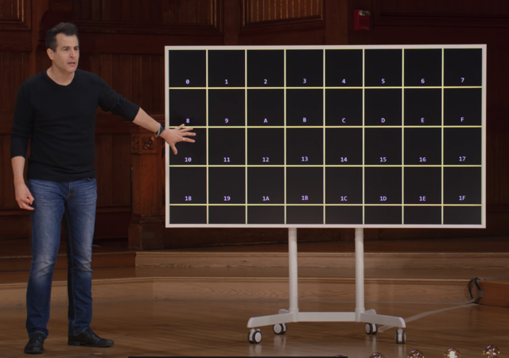</kbd>

> [!NOTE]
> D: Có ai thấy có vấn đề gì nếu ta dùng
> base-16 để đánh số thứ tự như này
>
> -> Đó là **dễ bị lầm lẫn**, 10 thực ra là 16....

 

<kbd>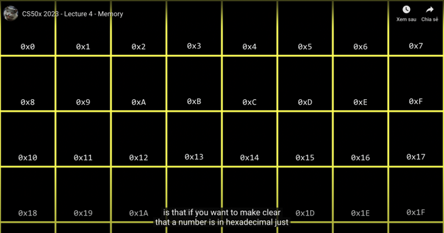</kbd>

> [!NOTE]
> Nên đại khái là người ta convention là khi thể hiện ở base-16
> thì người ta ghi theo kiểu này prefix mọi digit với **0x**...
>
> Từ đó thì thấy **0x10** sẽ ko bị lầm lẫn là 10, mà sẽ hiểu đó
> cái byte kế tiếp của byte thứ **0xF** = 15, chính là 16 trong
> base-16

 

<kbd>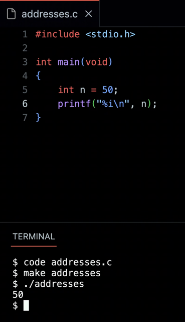</kbd>

> [!NOTE]
> một đoạn code đơn giản in giá
> trị của int variable n

 

<kbd>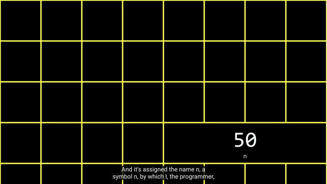</kbd>

> [!NOTE]
> Thì đại khái là **dù ta không care** máy tính nó **"bỏ" con số
> này ở đâu trong memory**
>
> nhưng ta cứ thử  hình dung rằng **đâu đó trong memory có 4 ô
> (bytes)** được gán cho variable n này và 4 byte đó có **chuỗi
> binary mang giá trị 50**
>
> D: **Tại sao lại 4 ô?**
>
> A: Vì **int** sẽ được **assign 4 bytes**, long 8 bytes

 

<kbd>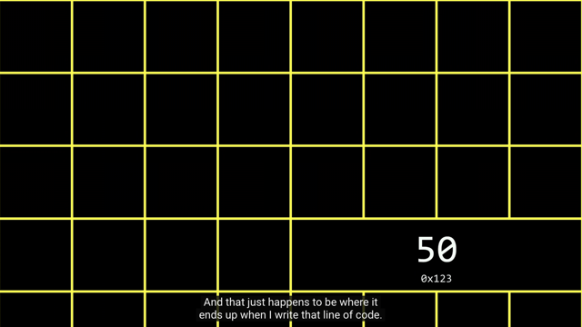</kbd>

> [!NOTE]
> Xong ổng nói ví dụ rằng nó nằm ở **address** (byte index này) 
> trong memory: **0x123**
>
> Thử translate sang hexadecimal là số bao nhiêu:
>
> 123 = **1***16^2 + **2**^16^1 + **3***16^0 = 256 + 32 + 3 =**291
>
> Hay nói cách khác nó nằm ở byte thứ 291 trong memory**

 

<kbd></kbd>

> [!NOTE]
> **& (ampersand)** sẽ trả về cho ta**address của cái variable** 
> đó trong memory.
>
> Ví dụ **0x123**
>
> Còn ***** thì đại khái là **go-there, đi vào đó, đi tới address đó**
>
> Minh hoạ sẽ hiểu

 

<kbd>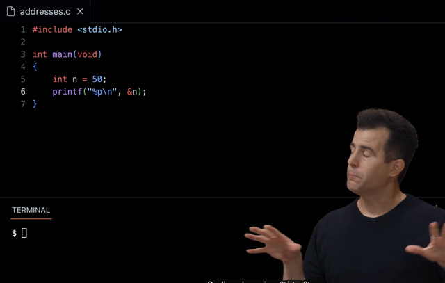</kbd>

> [!NOTE]
> Ổng sẽ dùng print với **%p**, **&n** là như đã nói, & sẽ
> **lấy address của variable n** trong memory. Và vì nó là
> **address**, một loại datatype khác nên có **format code
> cho nó là %p,**
>
> giống như %i cho int, %s cho string

 

<kbd>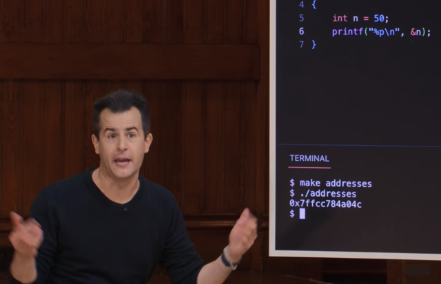</kbd>

> [!NOTE]
> **0x7ffcc784...4c** chính là **address thật của variable n**,
> vì máy tính ngày nay có **memory lớn** nên con số " địa
> chỉ" này là con số rất lớn

 

<kbd></kbd>

> [!NOTE]
> Xong đến cái **pointers**. Chính là cái khiến C khó. Đại khái
> là nó sẽ **cho phép ta "động chạm" với memory -
> hardware của máy tính.**
> Đây là những **lớp gần gần với ở dưới** - low level
> language như **Assembly**
>
> Và từ đó có những **powerful ability** nhưng cũng đi kèm
> theo là **responsibility** vì sẽ dễ **break the program** nếu làm
> sai

 

<kbd></kbd>

> [!NOTE]
> **Pointers** có thể hiểu là **address của some
> variable in memory**

 

<kbd>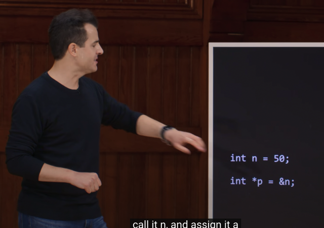</kbd>

> [!NOTE]
> p là **pointer**, là **address**của variable n in memory.
>
> **int** ***p** ý nói **p không phải int variable** mà là **address của 
> một int variable**trong memory.
>
> Và đương nhiên **address cũng là một con số nào đó,**ví dụ như 0#123 = 291

 

<kbd>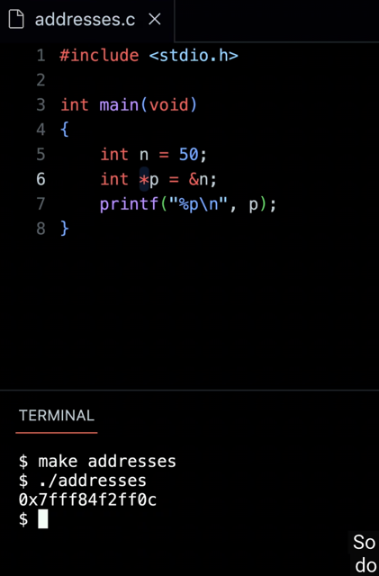</kbd>

> [!NOTE]
> Nên ổng sửa lại kiểu này
>
> Declare**p là variable** nhưng mà là **chứa address** (thể hiện cho 
> máy tính biết bằng ***p**)
>
> (khai báo **int *p;** là máy tính nó biết p là  variable chứa address 
> của một int variable rồi, nhưng chưa có gía trị.
>
> Khi assign **int *p = &n** thì máy tính nó biết: "**à, p chứa address
> của variable n"**Và vẫn dùng format **%p** để in **pointer**

 

<kbd></kbd>

> [!NOTE]
> Q: Có phải **mỗi lần run chương trình này là nó sẽ dùng 
> address memory** khác  ko (ý nói là 1 address khác)
>
> D: Shortly **yes**.

 

<kbd>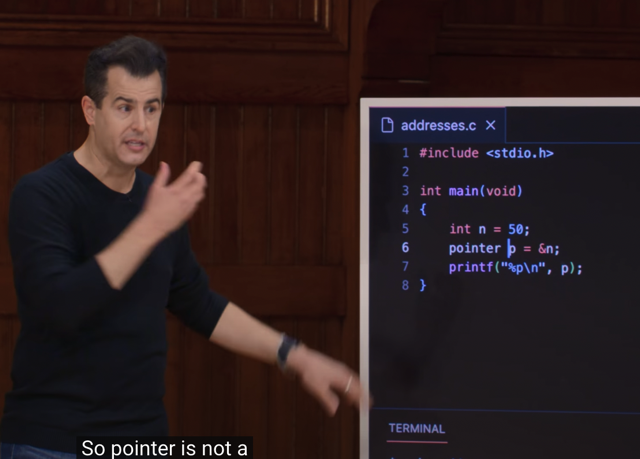</kbd>

> [!NOTE]
> Đại khái là đáng lý **hồi xưa khi tạo ra C** người ta nên
> **dùng một type ví dụ như pointer** để **chỉ variable chứa address**
>
> Nhưng**int *p** thật ra **chính là ý nghĩa này**, declare **p** là một
> **variable** và value của nó là **address đến một int variable (n)**Tóm lại:**int *p = &n**: Declare**a variable thuộc loại pointer** = chuyên **chứa
> address trong memory** của một int variable.
>
> Và khi **print("%p", p)** thì (p không có * gì), thì chỉ đơn giản là in
> value của nó ra (và vì value của nó là pointer, là address nên
> có format riêng:**%p**

 

<kbd>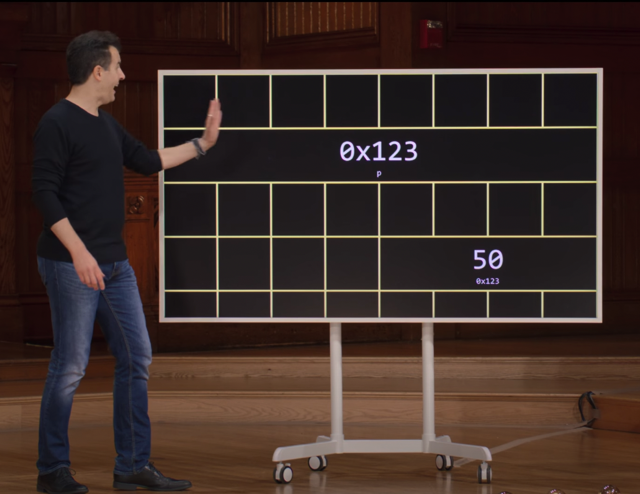</kbd>

> [!NOTE]
> n là một variable loại **int** được cho 4 bytes (đang mang
> giá trị 50)
>
> thì p là một variable dạng **address**, được assign **8
> bytes**, mang giá trị là address của n **cũng là một
> number**, thể hiện cái byte thứ bao nhiêu trong bộ nhớ
> của n
>
> Ví dụ ở đây nó 8 bytes này mang giá trị  **0x123**=
> 1*16^2 + 2*16^1 + 3*16^0 = **291**
>
> **1 0010 0011** (**1*****2^8** + 0*2^7 + **1*2^5** ...+
> **1*****2^1** + 1***2^0**)  = 256 + 32 + 2 + 1 =291
>
> (và tất nhiên như đã nói base-16 chỉ để human gọn hơn
> chứ bên trong memory nó vẫn là binary)

 

<kbd>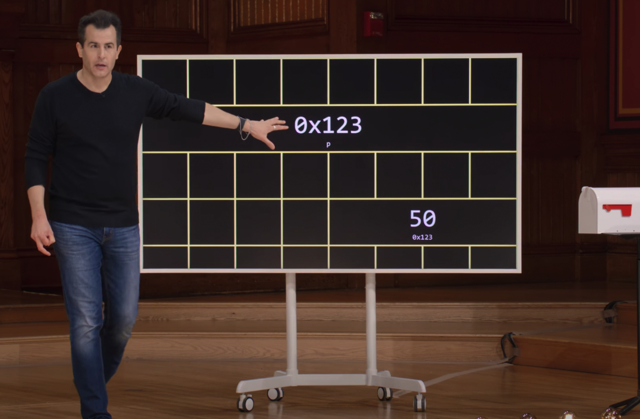</kbd>

> [!NOTE]
> D: 8 ô là sao?
>
> A: Thì có nghĩa là máy tính nó cho (một var) loại address **8 bytes**
>
> D: Correct

 

<kbd>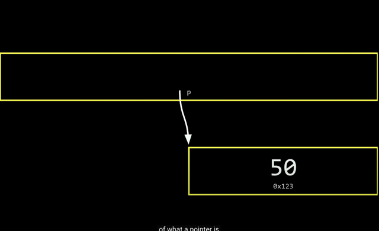</kbd>

<kbd></kbd>

<kbd>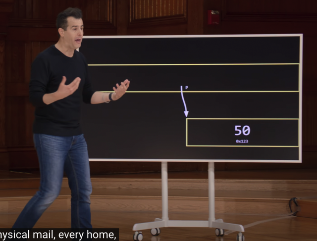</kbd>

> [!NOTE]
> Và thật ra **chẳng ai quan tâm giá trị của p là gì**, vì ngày
> nay nó thế này, ngày mai có thể nó thế khác, do đó
> người ta chỉ quan tâm à, **với p, thì nó mang address
> của n**. Thể hiện là **pointer**

 

<kbd></kbd>

> [!NOTE]
> D: Nếu tôi **mở mail box P** thì cái gì trong đó?
>
> A: giá trị của p sẽ là **address của n trong memory = 0x123**

 

<kbd>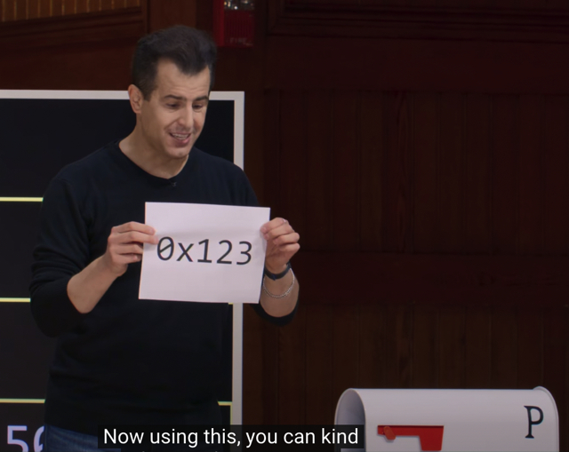</kbd>

> [!NOTE]
> Correct!

 

<kbd>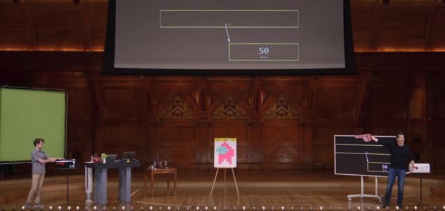</kbd>

> [!NOTE]
> Và giá trị của p là address của n nên sẽ **giúp kiểu như
> nếu ta mò mẫm trong memory**, thì sẽ giúp **tìm được
> phần memory gắn với n nằm ở đâu**

 

<kbd>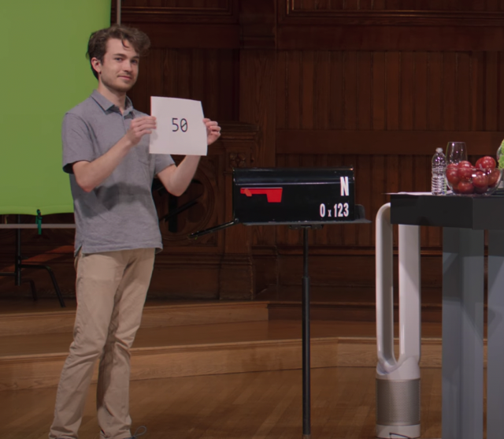</kbd>

> [!NOTE]
> Từ đó tìm được valua của n là chuỗi binary 4 byte có trị giá 50

 

<kbd>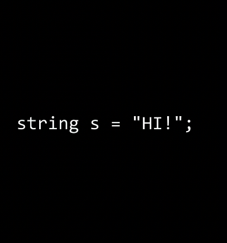</kbd>

<kbd></kbd>

<kbd></kbd>

> [!NOTE]
> Nhắc lại khi ta define một **string** (bản thân là một **array các
> char**, mỗi char được một byte) thì máy tính nó tự **add 1
> byte** ở cuối cho **'\\0'**
> Nên nếu **define string s = "a" sẽ là 2 bytes (a, \\0)**, khác với define
> một char 'a' chỉ có 1 byte
>
> Và cái string này nằm ở đâu đó trong memory ta không care

 

<kbd>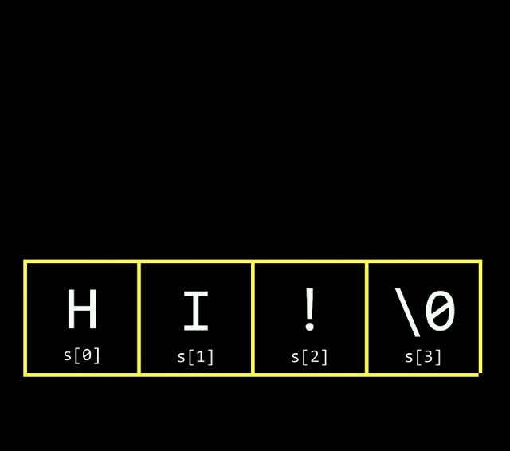</kbd>

 

<kbd>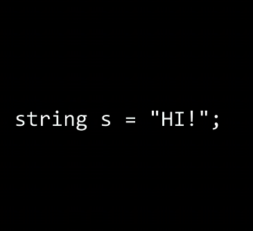</kbd>

 

<kbd>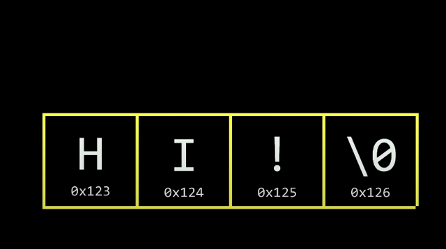</kbd>

> [!NOTE]
> Mỗi **char** sẽ có **một address trong memory**, thì sẽ
> có **một variable loại pointer** mang giá trị là cái
> **address của char đầu tiên ('H')**

 

<kbd>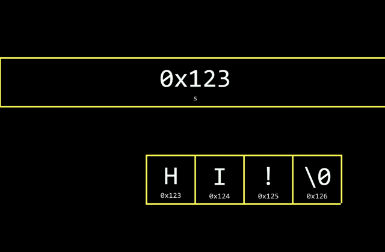</kbd>

> [!NOTE]
> Thì cái pointer đó chính là **s**
>
> Vậy thật ra **string** là một **pointer**, mang **address** của **char
> đầu tiên** trong chuỗi các char
>
> Vậy khi **khởi tạo một string ví dụ "hi!"**, thì máy tính nó
> **assign 4 byte cho mỗi char** và **1 byte extra cho \\0**
> Và assign thêm **8 byte nữa để cho s** là một **pointer var** 
> mang **address của 'h'**

 

<kbd>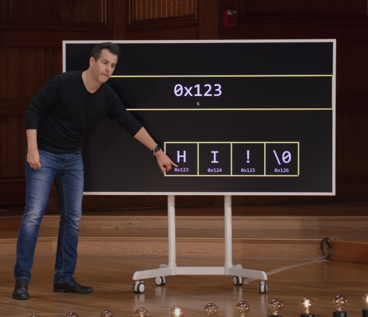</kbd>

 

<kbd>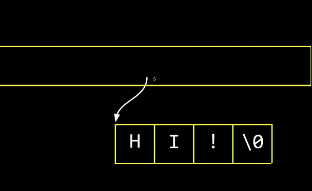</kbd>

 

<kbd>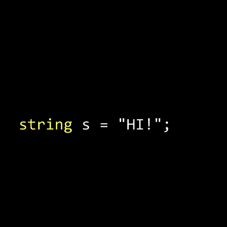</kbd>

> [!NOTE]
> D: Đoán thử **string** là **synonym** của cái gì?
>
> A: "**Pointer**" hả
>
> D: Correct, thật ra là một lời nói dối bấy lâu nay, **không
> có cái gì gọi là ''string'' trong C** cả mà nó thật ra là
> **pointer chỉ đến char đầu tiên trong array các char**

 

<kbd>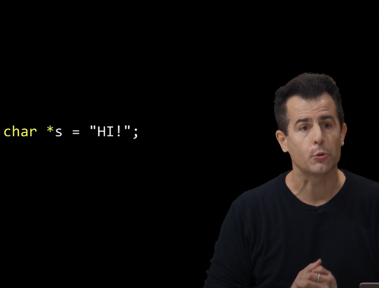</kbd>

> [!NOTE]
> Bản chất nó chính là một **pointer**, một var mang giá trị là **address**
> **của char đầu tiên**
>
> int n = 50;
>
> Có nghĩa là**cho 4 bytes dành cho n**, mang giá trị là 50. 
> Trong memory nó là **chuỗi 32 số 1, số 0 sao đó mà tính ra bằng 50**
>
> **int *p = &n;**
>
> có nghĩa là **cho 8 bytes** dành cho p, để **chứa address của cái int
> variable n**, cũng là một con số ví dụ 291 (mà ở base-16 là 0x123), 
> thì 8 bytes = 64 bits này là**chuỗi số 0, 1 sao đó tính ra 291
>
> char *s = "hi!"**
>
> cho 3 + 1 = 4 bytes cho 4 char h, i, !, \\0 và sau đó **cho 8 bytes dành 
> cho s, để chứa address của cái char 'h'**

 

<kbd>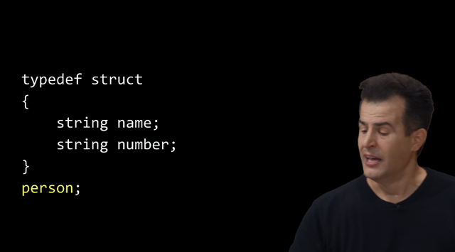</kbd>

> [!NOTE]
> Đại khái là với syntax như này, ta
> **define** một **struct** tên là **person**

 

<kbd>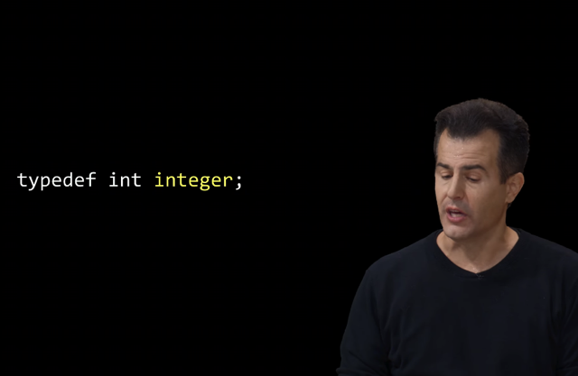</kbd>

> [!NOTE]
> Thì đại khái ổng nói là tương tự ta có thể
> **define** một là **int** tên là **integer**

 

<kbd>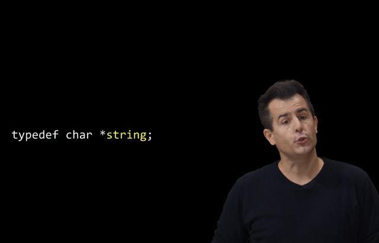</kbd>

> [!NOTE]
> Và **define** một **char address** tên là **string**Do đó string chỉ giống như một cái tên để đặt cho
> một**address của char**
>
> Thì ổng nói là họ không nói cho mình biết rằng
> thật ra trong **<cs50.h>** người ta đã define một cái
> như vậy cho nên ta mới có thể dùng string s = "Hi!";

 

<kbd></kbd>

> [!NOTE]
> Q: Còn các lib liên quan đến string thì sao.
>
> D: Bên trong nó **chỉ có char * (address của char)**, nói chung C 
> (under the hood không có keyword nào là string mà chỉ là char *)

 

<kbd>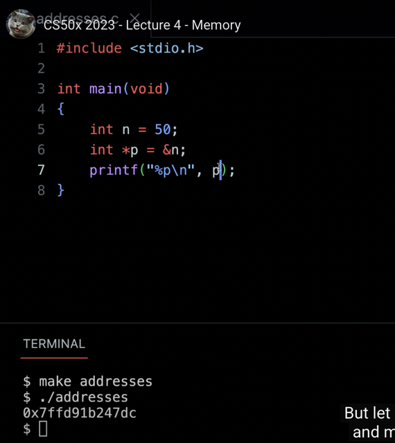</kbd>

> [!NOTE]
> Ổng quay lại ví dụ với int, như hồi nãy đã hiểu khi
> define ***p = &n** thì có nghĩa là bảo máy tính: 
>
> **Cho tao 8 bytes** để ta **dành cho p** là một **variable 
> chứa address của int variable n**.
>
> Và in ra giá trị của **p** (là address) với format **%p**, thì
> nó chính là con số này **0x7ff....dc** (tương tự như khi ta
> ví dụ 0x123, nhưng thực tế máy tính nó lưu ở address này,
> nếu có thể dịch ra thì đó là **byte thứ tỉ tỉ tỉ** trong memory)

 

<kbd>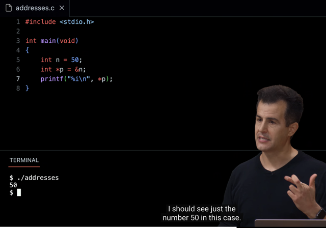</kbd>

 

<kbd>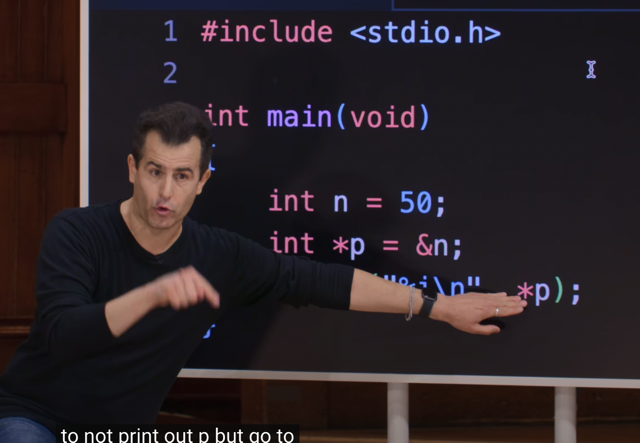</kbd>

> [!NOTE]
> Xong ổng nói nếu ta in ra với **%i**, và ***p** thì ý nghĩa sẽ là:
> **ĐI VÀO / ĐI ĐẾN CÁI ADDRESS MÀ P ĐANG GIỮ XEM
> NÓ LÀ GÌ**
>
> Thì đương nhiên nó chính là **n**, ra gía trị **50**, và
> *p là n, là int nên dùng **format %i** khi in

 

<kbd>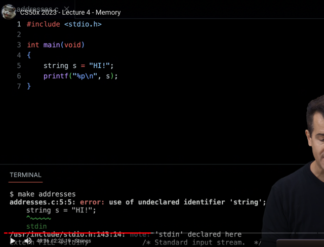</kbd>

> [!NOTE]
> Để minh họa, **bỏ quên việc include cs50.h** đi thì khi
> ta define **string s ="Hi!"** nó báo **lỗi**.
>
> Vì như đã nói, C nó **không có cái keyword nào là string cả**

 

<kbd></kbd>

> [!NOTE]
> D: Bây giờ thay vì include cs50 vào lại để fix thì có thể làm sao?
>
> A: Declare **char s* = "Hi!"**. Máy nó sẽ hiểu là dành **8 byte trong
> memory để chứa address của char 'H'** trong array char 'Hi!'
>
> Đầy đủ hơn như nãy đã nói là máy tính nó **tạo 4 byte để chứa 
> 4 char 'h', 'I', '!', '\\0'** trước. Sau đó nó mới**tạo 8 byte để chứa 
> address của 'h'**

 

<kbd>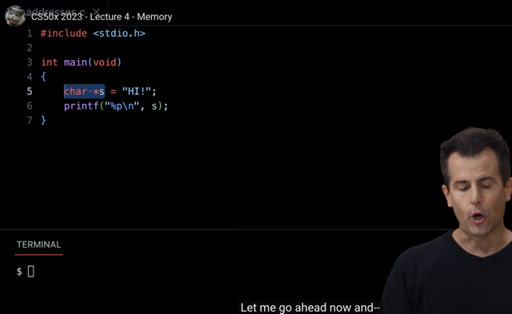</kbd>

> [!NOTE]
> Correct, và có thể **char* s** cũng đúng mà **char * s** cũng đúng
> Nhưng theo convention thì người ta để **char *s**

 

<kbd>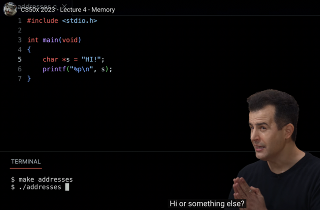</kbd>

> [!NOTE]
> D: In như này nó sẽ ra ntn?
>
> A: Nó ra một dãy số bas16 như 0x.... thể hiện **address của 'H'**

 

<kbd>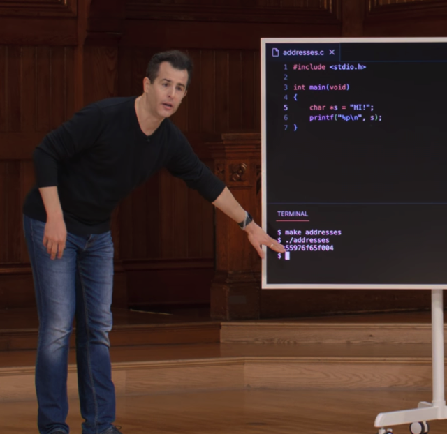</kbd>

> [!NOTE]
> D: Correct!.
>
> D: Why?
>
> A: Vì ta đang in với **%p**, và **s là cơ bản là một pointer** (một var chuyên 
> chứa address) nên in nó ra ta sẽ có "con số" là address của 'H' trong 
> memory.
>
> Dự đoán thêm là nếu in với **(%c, *s) thì nó sẽ ra 'H'**, vì khi đó ta bảo 
> máy tính **ĐI VÀO address chứa bởi s** và in ra thì đó **chính là 'H'**

 

<kbd>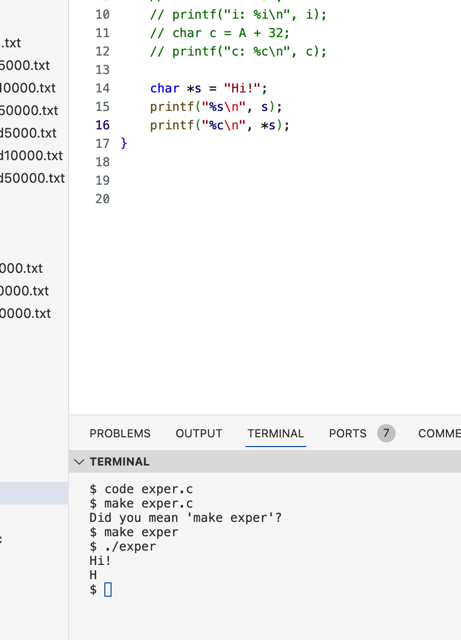</kbd>

> [!NOTE]
> Chính xác!

 

<kbd>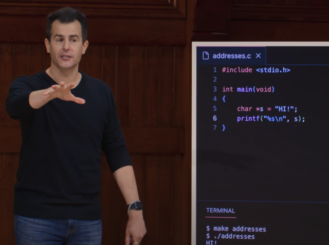</kbd>

> [!NOTE]
> Thì đại khái là khi ta chuyển thành printf("**%s**", **s**) thì kiểu
> như nó sẽ hiểu là ta muốn treats như sau: **Đi vào address
> mà s đang giữ, lần lượt in ra các char cho đến khi nào gặp
> \\0**
>
> Do đó kết quả sẽ là **HI!**

 

<kbd>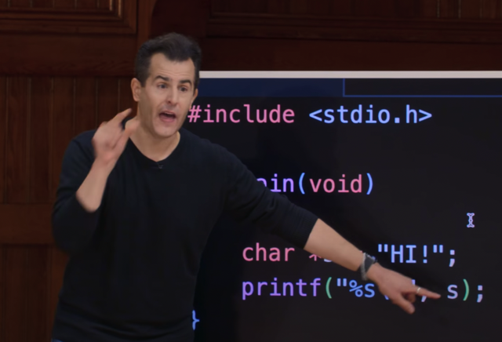</kbd>

> [!NOTE]
> Q: Sao khi print ko có *s:
>
> D: Như mới nói, function printf kiểu nó nó được code để khi gặp
> **(%s, s)** nó sẽ hiểu rằng **cần phải đi vào address mà s mang**,
> sẽ **dẫn đến một vùng trong memory chứa char ('H')**. thì sau đó
> printf sẽ l**ần lượt in các char tiếp theo** (nó được thiết kế như
> vậy) **cho đến khi gặp '0\\' thì dừng.**
>
> Cho nên nếu ta in với (**%c, *s)** thì nó sẽ **chỉ in char 'H' ra thôi**

 

<kbd>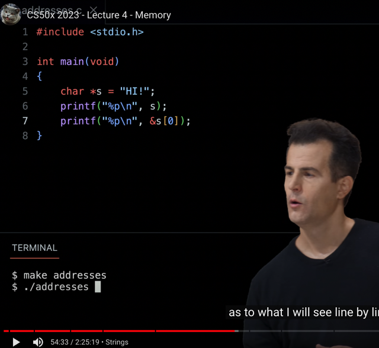</kbd>

> [!NOTE]
> D: Nó sẽ ra gì?
>
> A: 
>
> 1/%p, s là in ra **address của 'H'**
>
> 2/Với **&s[0]** và in với %p thì nó sẽ là **address của character
> đầu tiên chính là 'H'**

 

<kbd>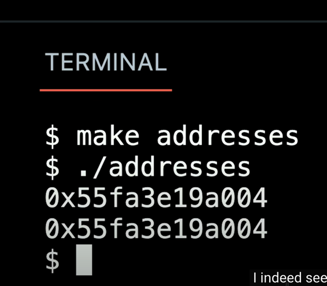</kbd>

> [!NOTE]
> Chính xác.
>
> Cái đầu tiên như đã biết s là address của 'H' nên in ra với %p 
> là được address của 'H'.
>
> Còn cái thứ 2, vì**s nó vẫn được coi là array của char**, (dù bản
> chất nó là như address nhưng như ban đầu ta được học thì **C vẫn
> treat nó như array of char**, nên **s[0] sẽ là lấy char đầu tiên của 
> array**
>
> Sau đó dùng **ampersand &** thì lại mang ý nghĩa là**"lấy address của 
> char** đó. Thành ra **hai dòng đều in ra address của 'H'**

 

<kbd>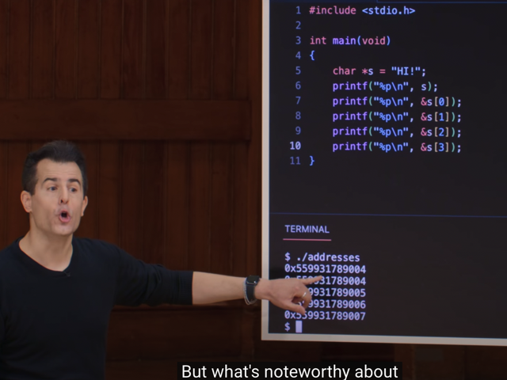</kbd>

> [!NOTE]
> Và khi in như vầy thì có thể thấy các **address value nó kế tiếp nhau**
> confirm lại rằng khi define một string, bên trong máy tính nó sẽ
> **define các byte kế tiếp nhau**, **mỗi byte (8 bit)** mang **chuỗi số 01 sao
> cho tính ra số** mà**tra vào ascii** sẽ**tương ứng với char** theo quy ước.
>
> Và sau đó nó **cho một byte extra** mang (chuỗi **00000000**) thể hiện **'\\0'**
>
> Và cuối cùng nó **chuẩn bị 8 byte dành cho s**, **mang chuỗi 01** sao cho
> gía trị chính là **address của 'H'.**

 

<kbd>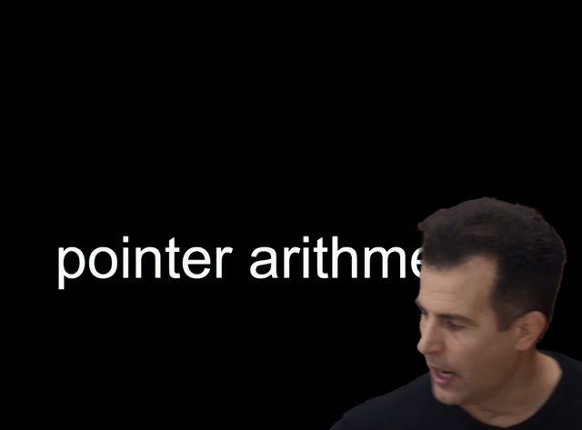</kbd>

 

<kbd>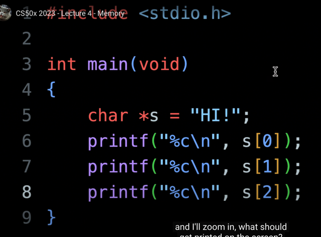</kbd>

> [!NOTE]
> D: In cái này ra cái gì?
>
> A: H -> I -> !

 

<kbd>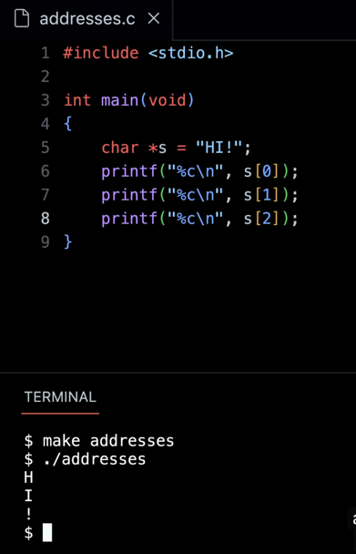</kbd>

 

<kbd>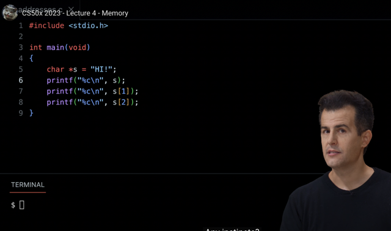</kbd>

> [!NOTE]
> D: Nếu in **%c, s** thì ra cái gì?
>
> A: Không được, vì **s là pointer**, một là in với **%p**, hoặc **%s**
> hoặc là in với **%c** thì phải là ***s** (**đi vào** **address** chứa trong s)

 

<kbd>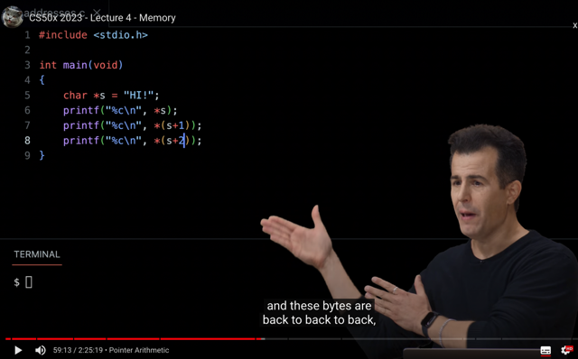</kbd>

> [!NOTE]
> Chính xác, phải in %c, *s và nó sẽ "đi vào / đi tới address 
> chứa trong s (là 'H')
>
> Và muốn**đi tới char tiếp theo**, chính là ***(s+1), *(s+2)**

 

<kbd>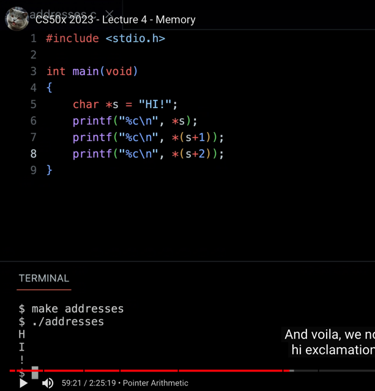</kbd>

 

<kbd>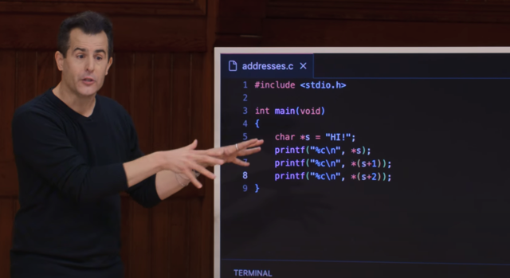</kbd>

> [!NOTE]
> Và đại khái là kiểu access tới char trong string bình
> thường kiểu như **s[0], s[1]..** là **convenient**, human friendly
> syntax chứ bên trong nó chính là cái này

 

<kbd>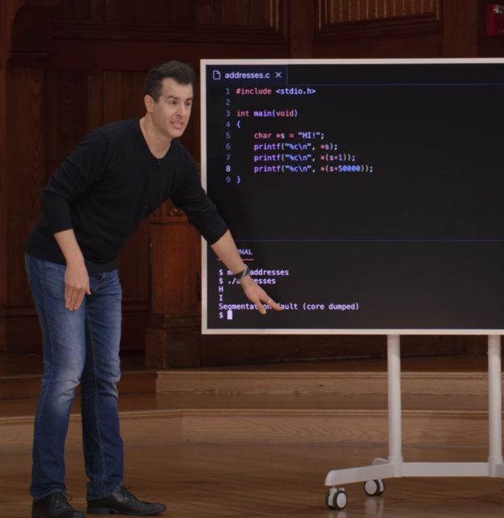</kbd>

> [!NOTE]
> D: Và nếu bạn vọc vạch, đi đến, **đụng tới phần memory
> segment ở xa mà không được assign cho bạn** thì nó sẽ báo
> lỗi
>
> Và đây chính là cách các hacker vọc vạch, chạm tới, đi tới
> các vùng trên memory và ăn cắp password của bạn

 

<kbd>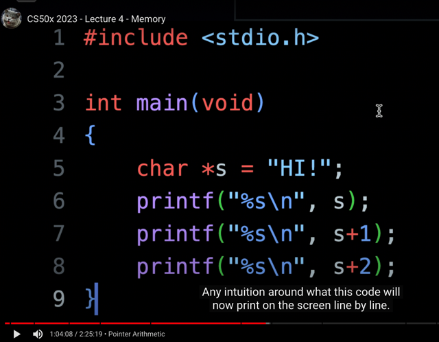</kbd>

> [!NOTE]
> D: Giờ in kiểu này, nó ra gì, đoán thử xem?
>
> A: Như nãy nói thực hiện lệnh printf với %s, s với s như đã nói,
> nó là một address tới char đầu tiên.
>
> Thì lệnh print được thiết kế sẽ **ĐI ĐẾN address "lưu bởi
> s"** và **in ra char đó (là 'H')** sau đó **tiếp tục**, nó **in các char kế tiếp
> cho đến khi gặp '\\0'**
>
> Vậy với cái cái kiểu s+1 cho phép đi đến pointer của char tiếp
> theo, ta sẽ đoán rằng nó sẽ tương tự như vậy, nó sẽ **in từ char
> thứ 2 là 'I' đến khi gặp '0'.**
>
> Vậy nó sẽ in ra như sau:
>
> HI! 
> I! 
> !

 

<kbd>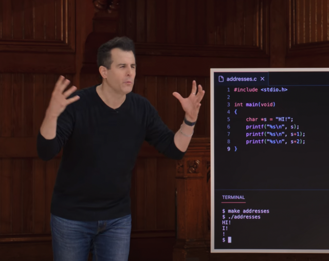</kbd>

> [!NOTE]
> Correct!
>
> **s+1** cho máy tính biết là **đi đến cái byte kế tiếp**
> (Mỗi char 1 byte nhớ khong)

 

<kbd></kbd>

> [!NOTE]
> D: Tuần trước ta đã biết cách dùng function để compare 2
> string
>
> A: strcmp()
>
> D: Vậy giờ đã hiểu tại sao không thể dùng == để compare
> string chứ?
>
> A: Bởi vì **s chỉ là pointer,** và mỗi pointer**chứa address của
> char đầu tiên**. Nên **dù hai string y hệt nhau** thì**address của
> kí tự đầu tiên của chúng cũng khác nhau**.
>
> D: Correct!

 

<kbd>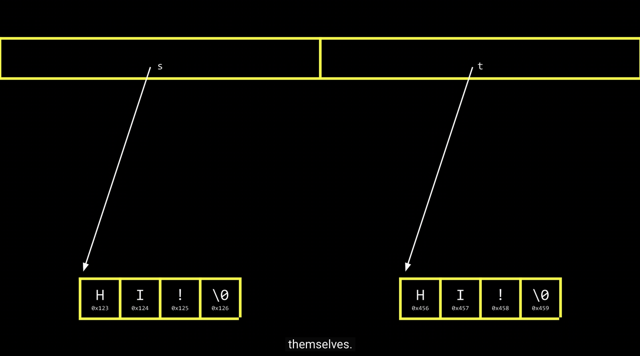</kbd>

<kbd></kbd>

<kbd>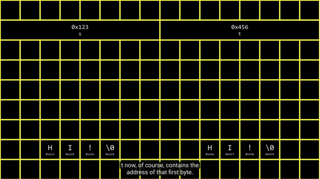</kbd>

 

<kbd>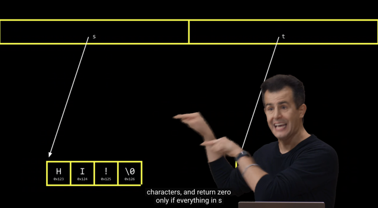</kbd>

> [!NOTE]
> Còn function **strcmp**() nó sẽ ĐI VÀO, ĐI TỚI cái hai cái
> address lưu giữ bởi s, t. Rồi từ đó so sánh char by char ...
> cho đến khi gặp \\0. Nếu mọi char đều giống nhau thì return
> 0 -> hai string bằng nhau

 

<kbd></kbd>

> [!NOTE]
> Còn những var type khác?
>
> D: Chỉ có **string được đối xử đặc biệt** : Là pointer
> thôi, còn mấy cái khác đều là number

 

<kbd>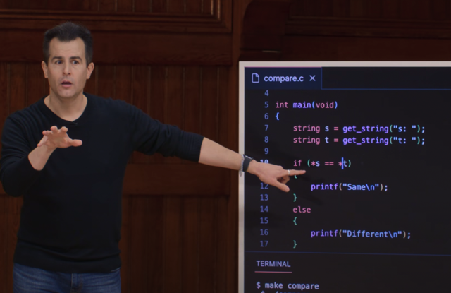</kbd>

> [!NOTE]
> D: Nếu như thế này thì sao?
>
> A: Vì *s có nghĩa là ĐI TỚI address "save bởi s" nó sẽ là char 'H'. 
> Nên so sánh kiểu này chính là so **hai char đầu tiên của s và t.**
> Tương đương **s[0] == t[0]**

 

<kbd>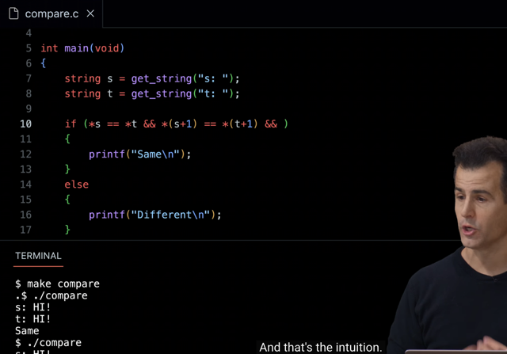</kbd>

> [!NOTE]
> Và ta có thể làm như thế này *s == *t &&
> *(s+1) == *(t+1)...để so sánh các char thứ
> nhất, thứ hai... với nhau.
>
> Và đó là lí do strcmp() tồn tại. nó làm cái việc này
> giúp mình.
>
> Ôn lại luôn đó là trong s sẽ "lưu" address của 
> char đầu tiên 'H', thì s+1 sẽ chỉ cái byte kế tiếp, và 
> vì khi define một string là một array các char thì máy
> tính sẽ sẽ assign các byte kế tiếp nhau cho các char
> và kết thúc cho thêm 1 byte cho '\0'.
>
> Nên s+1 sẽ là address của char thứ 2 trong string = 'i'

 

<kbd>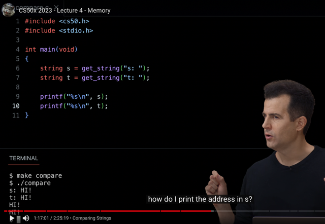</kbd>

> [!NOTE]
> D: How I can print the address IN s?
>
> A: **%p**, **s**: nó sẽ in ra cái address mà chứa trong s, 
> là cái address của char 'H'
>
> D: Correct!

 

<kbd>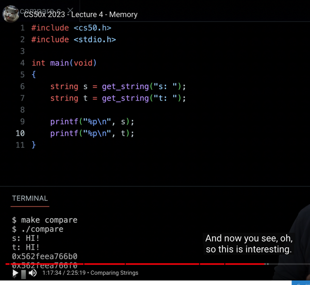</kbd>

 

<kbd>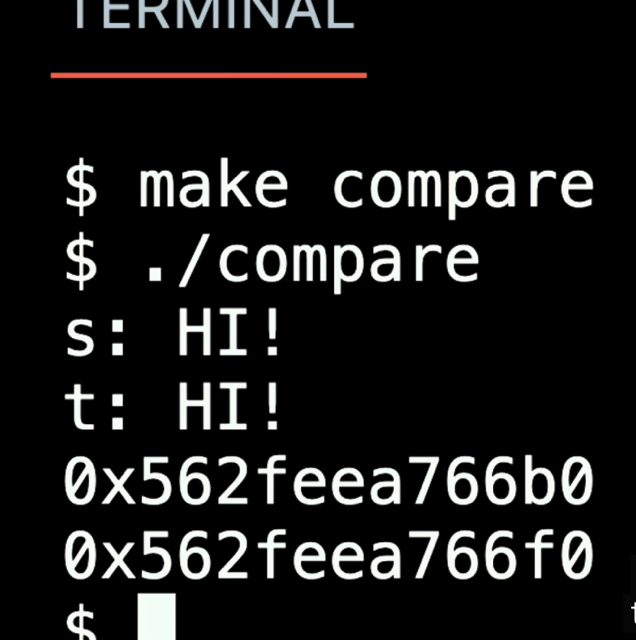</kbd>

> [!NOTE]
> Từ đó minh chứng cho thấy **tuy hai string có content
> như nhau** nhưng **mỗi thằng nằm một nơi trong memory**,
> **address** của thằng H trong hai string **khác nhau** ...b0,
> ....f0

 

<kbd>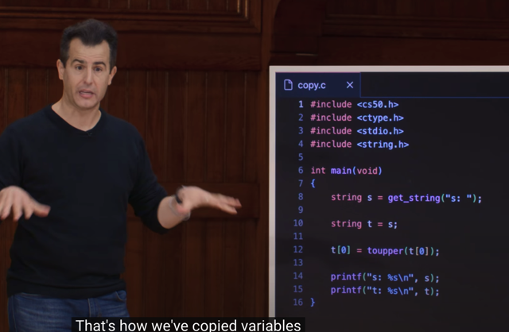</kbd>

> [!NOTE]
> Xong ổng nói qua cái code để copy string như này.
>
> D: t[0] = toupper(t[0]) là làm gì?
>
> A: Cái này dùng function toupper của ctype.h, nó sẽ gíup convert
> thành Uppercase char.
>
> Như vậy nó sẽ uppercase char đầu tiên của string lên
>
> Giải thích thử. Việc user enter một string ví dụ "hi!" sẽ  khiến máy
> tính assign 4 bytes cho 3 char và 1 extra char '\\0' đồng thời 8 byte
> cho s chứa address của 'h' (ví dụ 0x123)
>
> String t = s; máy tính sẽ assign 8 bytes nữa cho t chứa address
> của 'h' (là 0x123)
>
> t[0] = toupper(t[0]), "bên trong" nó sẽ đi đến char đầu tiên là 'h' và
> thực hiện chuyển chuỗi binary trong đó thành một chuỗi khác có
> giá trị trong ascii tương ứng với kí tự viết hoa H
>
> Dự đoán nó sẽ in ra: cả hai đều là**Hi! vì thực chất tuy là copy
> nhưng t chỉ đang trỏ tới cùng một nội dung với s**

 

<kbd>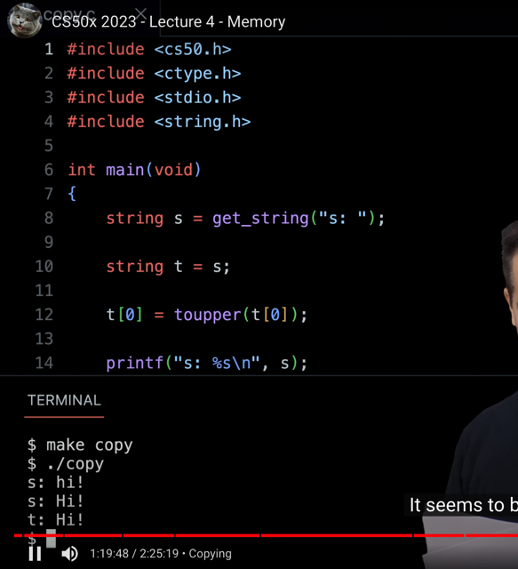</kbd>

> [!NOTE]
> D: 100% Correct! Bạn chỉ đang copy address.
> Muốn copy string, bạn phải đi vào từng char
> copy nội dung của nó và tạo một array các char
> khác

 

<kbd>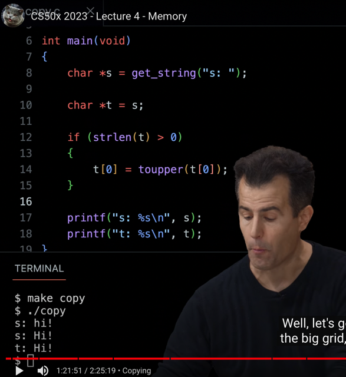</kbd>

> [!NOTE]
> Tới đây ổng nói chỗ này có cái không ổn khi ta đang
> **assume t có ít nhất một character** trong khi **nếu user chỉ
> enter khi được hỏi** enter string thì sẽ error ta **nên check
> kiểu này**

 

<kbd>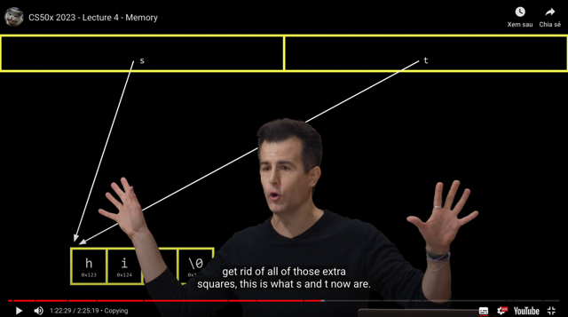</kbd>

<kbd></kbd>

<kbd>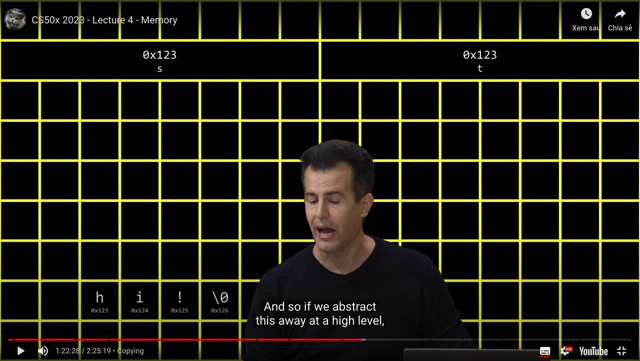</kbd>

 

<kbd>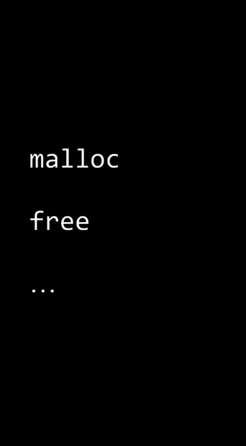</kbd>

> [!NOTE]
> **Malloc** = **Memory allocation**: Nó cho phép ta **request máy tính
> một số lượng bộ nhớ nào đó** 100 byte, 1GB...máy tính nó sẽ
> **tìm chỗ trống** và **trả cho ta address của cái byte đầu tiên**. 
>
> Và không như string khi máy tính tự cho thêm 1 byte chứa \\0 ở
> cuối để mà từ đó biết được điểm kết thúc thì cái này ta **phải tự 
> nhớ rằng mình đã request bao nhiêu bytes bộ nhớ.**
>
> **free** ngược lại với cái đó: gọi free với address là ta bảo máy tính 
> rằng ta đã làm xong rồi, trả lại cho mày, mày có thể xoá đi

 

<kbd></kbd>

> [!NOTE]
> Và đó cũng là những gì xảy ra khi máy tính bị treo, bị đứng.
> Đó là một program của ta liên tục malloc thêm memory mà
> không free nó bớt khiến máy tính bị out of memory

 

<kbd>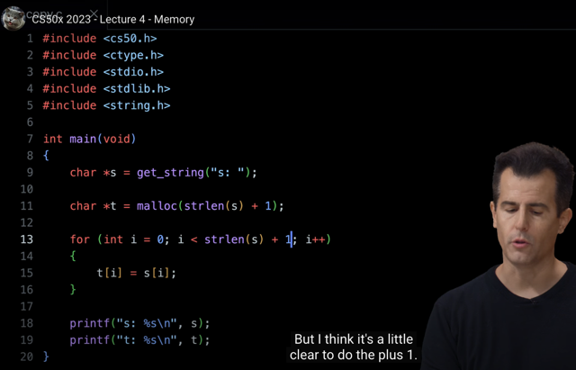</kbd>

> [!NOTE]
> Xong ổng làm thế này:
>
> tuỳ vào độ dài của s, ví dụ là 'hi!', strlen(s) = 3 (Chú ý, tuy trong memory nó
> có 4 byte, nhưng util function strlen() sẽ chỉ trả ta phần "content" -> = 3
>
> Khi đó, ta sẽ yêu cầu máy tính **chuẩn bị cho 4 byte:** **malloc(strlen(s) + 1)** để
> sau đó
>
> và **char *t = malloc(strlen(s) + 1)** sẽ hiểu là **chuẩn bị 4 byte** **trống**.
>
> Sau**chuẩn bị 8 byte cho t** sẽ là/**chứa address của cái char đầu tiên**, 
>
> Và như đã nói ở trước s**tring t vẫn được treat là char array** và do đó cho phép 
> dùng t[0], t[1] ,...sẽ có nghĩa là **đi đến vị trí char thứ 0, thứ 1...**
> Loop trong 0,1,2,**3 (i < strlen(s) + 1)**và**gán t[i] = s[i]**D: Tại sao lại loop trong i < strlen(s) + 1
>
> A: Vì ta sẽ cho từng byte trống (mới request) bằng từng byte của s s[0] = 'h',
> s[1] = 'i', s[2] = '!', s[3] = '\\0'

 

<kbd>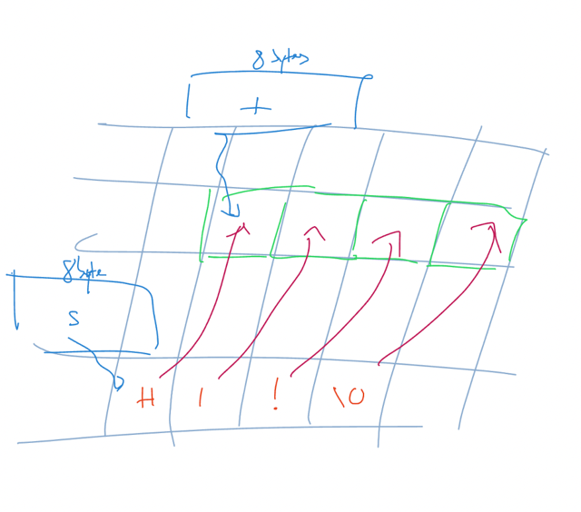</kbd>

 

<kbd>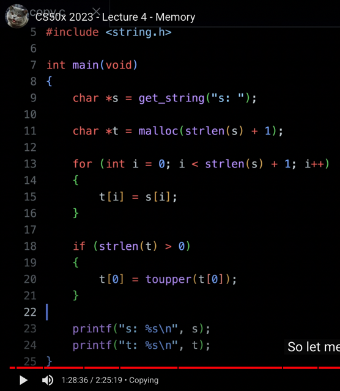</kbd>

 

<kbd>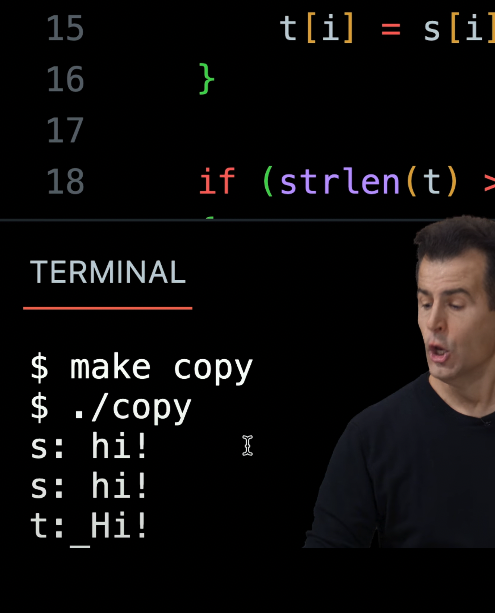</kbd>

> [!NOTE]
> Với những thay đổi đó,
> lệnh copy đã work!

 

<kbd>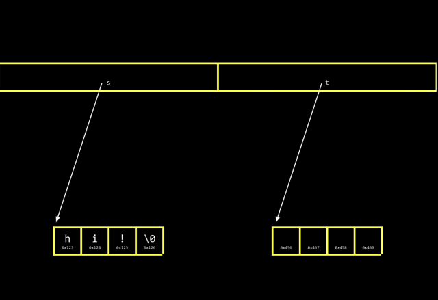</kbd>

<kbd>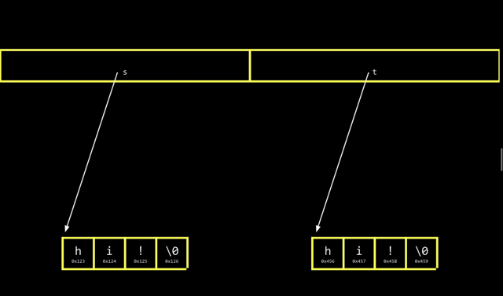</kbd>

<kbd></kbd>

<kbd></kbd>

<kbd>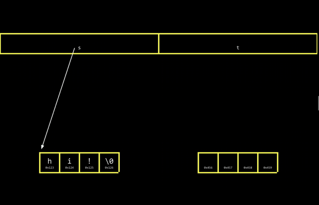</kbd>

 

<kbd></kbd>

> [!NOTE]
> Q: Nếu mà ta **không copy '\\0' thì sao**.
>
> D: Khi đó khi printf(t), như đã biết hàm printf sẽ **đi vào/ tới
> address của char 'h'** save trong t, in ra và **cứ thế in các
> char tiếp theo**, ..
>
> ...đến byte sau '!' như ta đã nói là không copy '\\0', nên lúc này 
> nó vẫn là empty byte thì nó sẽ in ra **con số nào đó đang ở
> trong đó**.
>
> Cứ thế cứ thể **cho đến khi nó gặp một \\0 char  đâu đó thì nó 
> mới stop**

 

<kbd>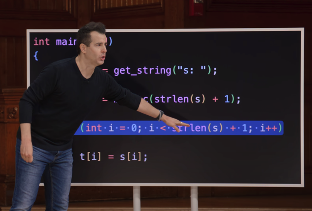</kbd>

> [!NOTE]
> D: Tại sao **call function** trong for loop như này là ko ổn? 
>
> A: Vì i < strlen(s) mỗi lần loop nó sẽ gọi **strlen(s)** - mà vốn bên 
> trong nó sẽ là một function loop trong các char của để đếm số 
> char. 
>
> Nên tính strlen(s) trước:
>
> for int i = 0,**int n = strlen(s) + 1**; i < n; i++{....}

 

<kbd>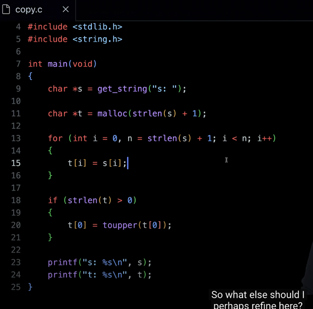</kbd>

> [!NOTE]
> Correct! Từ đó đã tự làm xong function copy string

 

<kbd>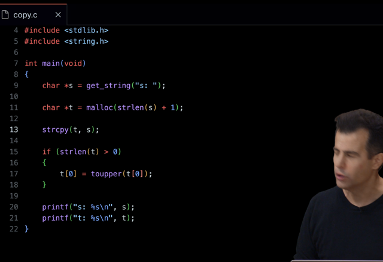</kbd>

> [!NOTE]
> Nhưng mà string.h nó có function
> **strcpy**() làm giúp việc này

 

<kbd>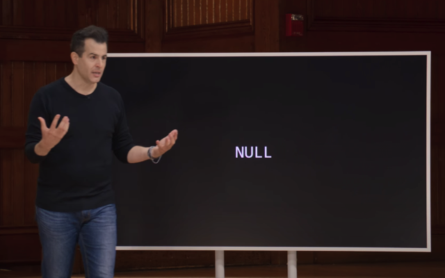</kbd>

> [!NOTE]
> NUL là một **char** '\\0' - như đã biết char được cho 1 byte,
> nên cơ bản đây chính là 1 byte mang giá trị 00000000
>
> Còn NULL là một **address**, và address có **giá trị là 0**, 
> giống như là cái byte đầu tiên, nằm trên cùng bên trái của
> memory và sẽ **không bao giờ được xài tới by convention**

 

<kbd>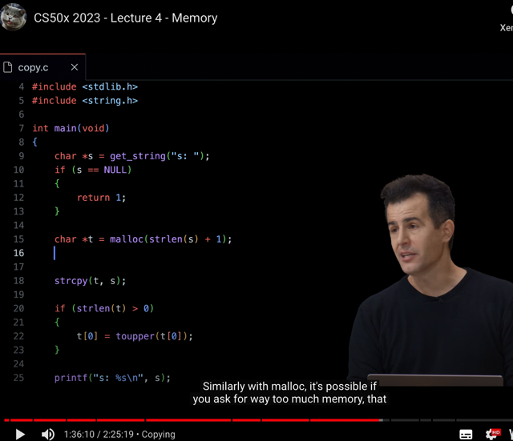</kbd>

> [!NOTE]
> Và khi ví dụ ta nhập một đoạn **text dài thiệt dài**...và
> máy tính nó **không thể kiếm chỗ để chứa được**, thì
> nó sẽ trả về cho ta NULL
>
> Do đó **sẽ an toàn hơn khi check s == NULL** trước
> nếu nó xảy ra, **exit function với exit code = 1** báo hiệu
> có error

 

<kbd>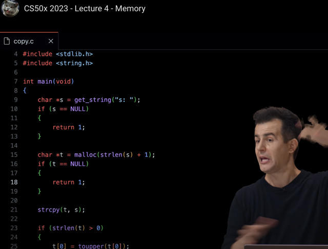</kbd>

 

<kbd>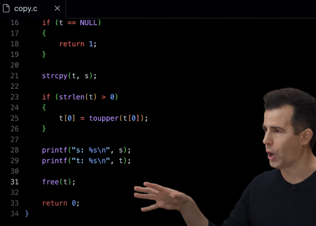</kbd>

> [!NOTE]
> Đại khái là khi nào ta gọi **malloc**() thì ta **phải gọi free**()
> như một good habit. (Cho dù khi kết thúc function,
> máy tính cũng sẽ free memory)
>
> Q: Free nó làm gì?
>
> D: Nó sẽ biết ta ko cần dùng đoạn memory đó nữa để
> khi có  chương trình khác request nó sẽ trả ra
>
> Và khi qua Python, nó sẽ automatically làm những việc
> này cho ta

 

<kbd>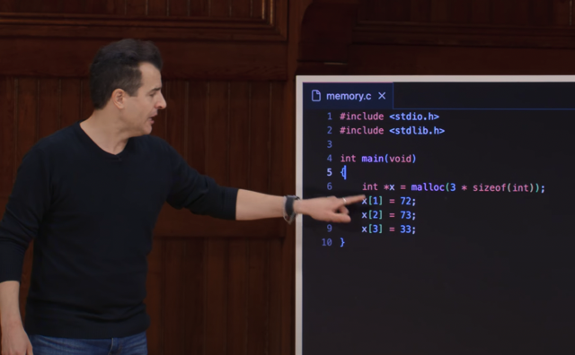</kbd>

> [!NOTE]
> Bình thường khi cần máy tính cho **array 3 int** thì làm vầy: int x[3]
>
> Còn ở đây, **malloc (3*sizeof(int))** là ra lệnh cho máy tính **chuẩn
> bị một dải bộ nhớ dài 3 x 4 bytes** (1 int được 4 bytes) = 12 bytes.
>
> Máy tính sẽ **tìm chỗ nào còn trống** và **trả về cho mình cái 
> address của cái byte đầu tiên** và lưu trong x là một var dạng 
> address (được chuẩn bị cho 8 bytes)

 

<kbd></kbd>

> [!NOTE]
> D: Có chỗ nào sai ko?
>
> A: Index từ 0 chứ, vậy phải là x[0], x[1], x[2] chứ
>
> D: Correct! Còn nữa ko (week 4 specific) ?
>
> A: Thiếu free
>
> D: Correct!

 

<kbd></kbd>

> [!NOTE]
> Đại khái là với những bug như mới kể program vẫn
> compile ok, cho thấy compile được không có nghĩa
> là không có những latent bug
>
> Thì **valgrind** là tool giúp ta detect những bug liên
> quan đến memory

 

<kbd>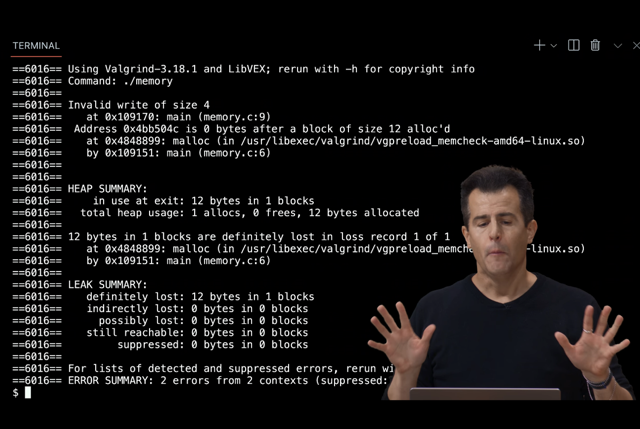</kbd>

> [!NOTE]
> D: invalid write of size 4 là sao, có thể bug ở đâu?
>
> A: Có thể là do ta chỉ yêu cầu memory cho 3 int
> Trong khi lại assign x[3] là ở vị trí thứ 4.

 

<kbd>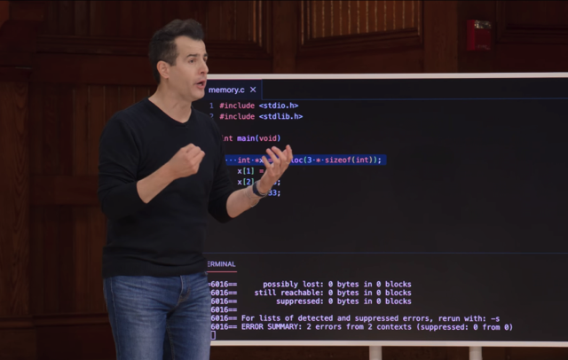</kbd>

> [!NOTE]
> Correct!

 

<kbd>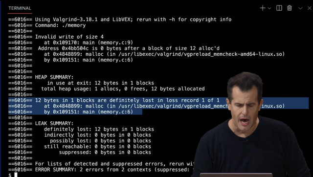</kbd>

> [!NOTE]
> Cái vấn đề thứ hai mà nó report là liên quan đến memory
> "loss". Thì có thể dễ hiểu là do ta kh**ông gọi free()**

 

<kbd>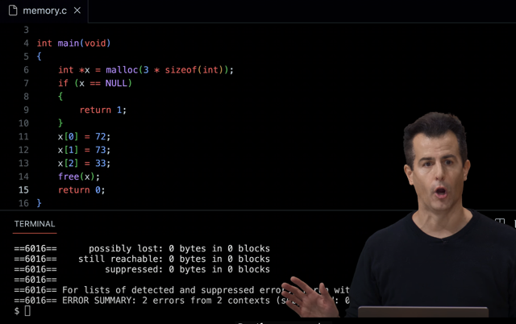</kbd>

> [!NOTE]
> Sửa lại, index cho đúng, và thêm **free**(x)
> Và tốt hơn nữa là **check x == NULL** thì return
> như đã biết vì **nếu máy tính nó không tìm ra được
> memory còn trống thì nó sẽ trả về cho x = NULL** là 
> address đầu tiên (=0) trong bộ nhớ

 

<kbd>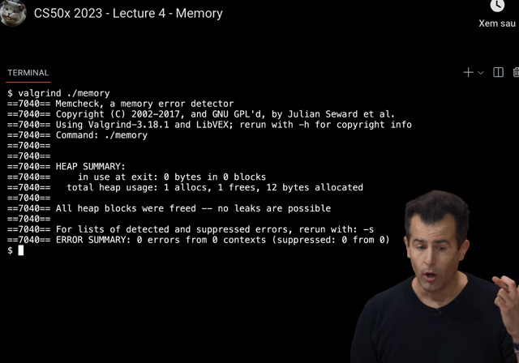</kbd>

> [!NOTE]
> Và run lại thì **valgrind** không
> còn report error nào nữa
>
> ..**no error detector...**
>
> ..**All heap blocks were freed...**

 

<kbd>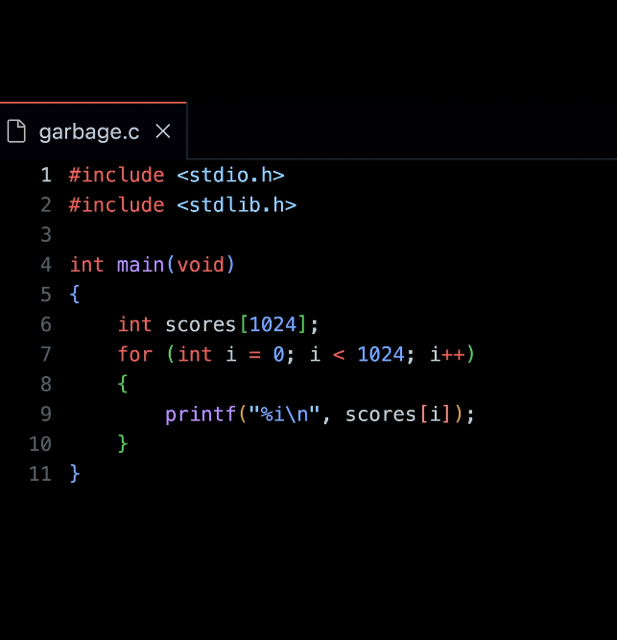</kbd>

> [!NOTE]
> Xong đến chương trình này

 

<kbd>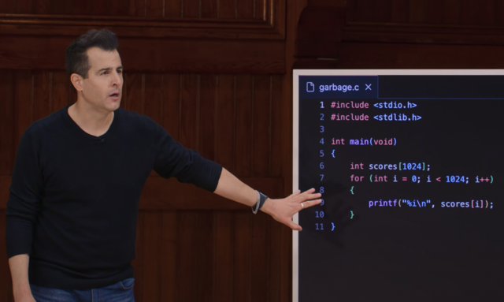</kbd>

> [!NOTE]
> D: Bug ở đâu?
>
> A: Khai báo int **scores[1024]** là máy tính nó đã chuẩn bị
> bộ nhớ **1024 x 4bytes** cho scores
>
> Nhưng c**hưa assign value gì cả** mà đã lấy ra trong printf
>
> Và **cũng chưa check là scores có NULL không.**
>
> D: Correct. Nếu ta ko assign value, có thể nó **chứa garbage**
> từ những chương trình khác trước đó.

 

<kbd>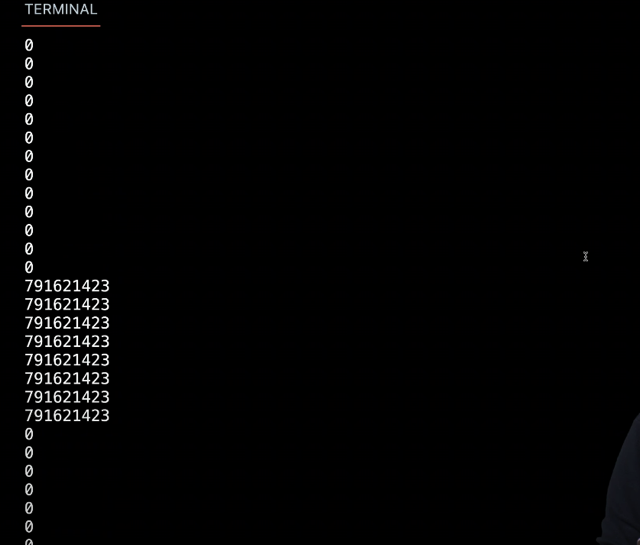</kbd>

<kbd></kbd>

<kbd>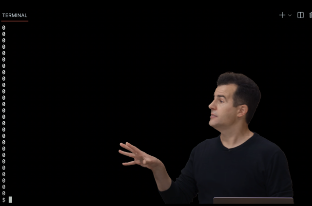</kbd>

> [!NOTE]
> Garbage đây

 

<kbd></kbd>

> [!NOTE]
> Do đó phải initialze value

 

<kbd>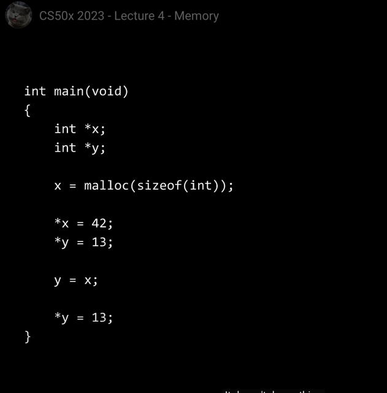</kbd>

 

<kbd>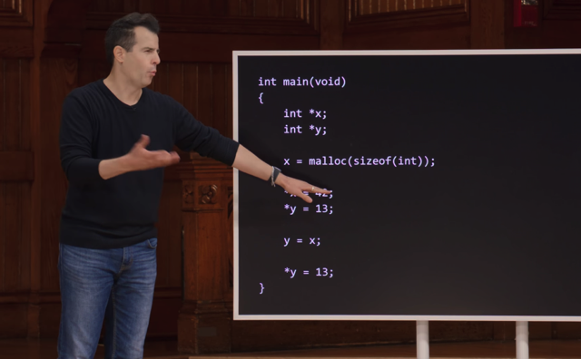</kbd>

> [!NOTE]
> D: Có vấn đề gì?
>
> A: Chưa có memory cho y.
>
> Nè he: hai dòng đầu là declare cho máy tính biết x, y là
> var sẽ chứa address tới int. Nó sẽ cho hai chỗ trong memory
> 8 byte để chuẩn bị chứa address
>
> x = malloc(sizeof(int)) sẽ lệnh cho máy tính tìm một chỗ
> trong bộ nhớ có size của 1 int = 4 bytes và assign address
> đó cho x.
>
> *x = 42 -> máy tính sẽ gán chuỗi binary có trị giá 42 vào 4 byte
> tại address lưu bởi x.
>
> *y = 13 -> Máy tính sẽ đi đến phần memory save bởi y và gán 
> chuỗi binary có giá trị 13. Nhưng CHƯA CÓ ADDRESS ĐÓ
>
> -> Correct. Tại y sẽ là GARBAGE, một value nào đó

 

<kbd>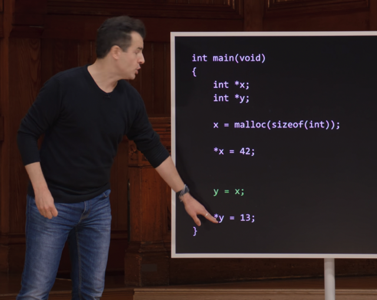</kbd>

> [!NOTE]
> Sửa lại vầy thì ok, y = x đã ra lệnh cho máy tính assign cái
> address mà x đang giữ cho y.
>
> *y = 42 ra lệnh cho máy tính đi tới address của y đang giữ
> để đổi thành chuỗi binary có trị giá 42

 

<kbd></kbd>

<kbd></kbd>

<kbd></kbd>

> [!NOTE]
> D: Swap water of two glass

 

<kbd>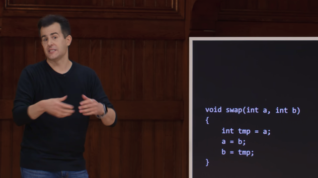</kbd>

 

<kbd>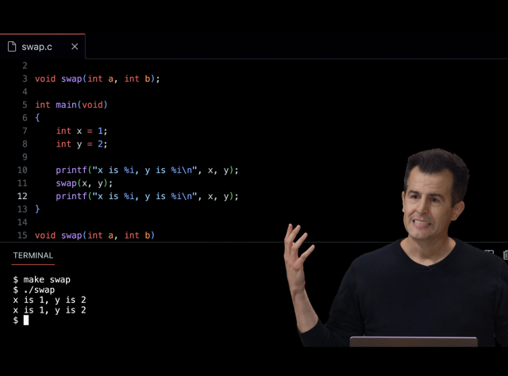</kbd>

> [!NOTE]
> D: Tại sao nó không như expected?
>
> A: Vì khi đưa vào function swap, nó đã
> copy ra thành hai int mới trong a, b
> Có nghĩa là nó tạo hai vùng mới trong memory,
> cho a và b, có chuỗi binary mang trị giá của x, và y 
> Và việc swap, chỉ diễn ra giữa a, b. 
> Còn x, y không bị thay đổi.

 

<kbd>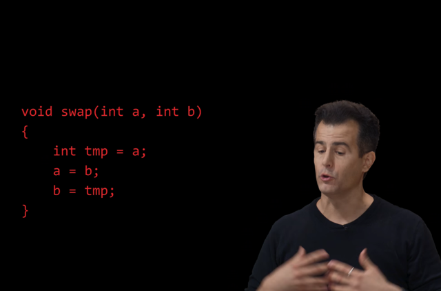</kbd>

> [!NOTE]
> Đúng vậy, khi nó gọi function, nó pass value vào.
> Có nghĩa là trong function, nó sẽ tạo variable khác

 

<kbd>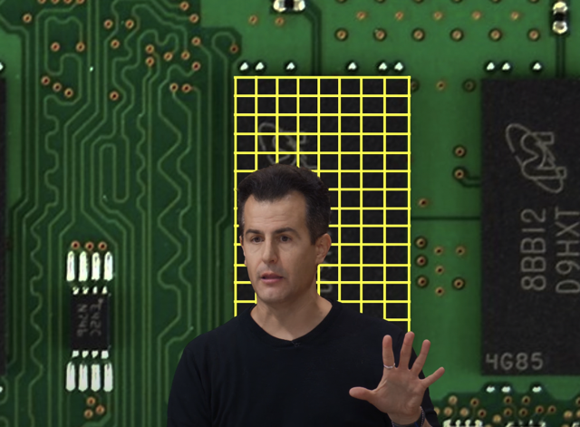</kbd>

<kbd></kbd>

<kbd>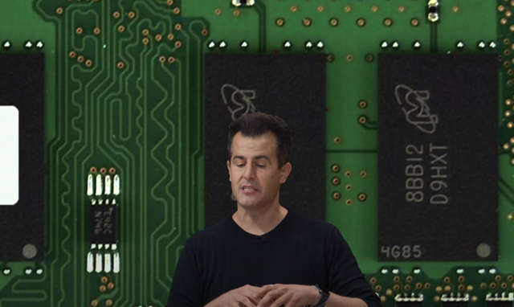</kbd>

 

<kbd>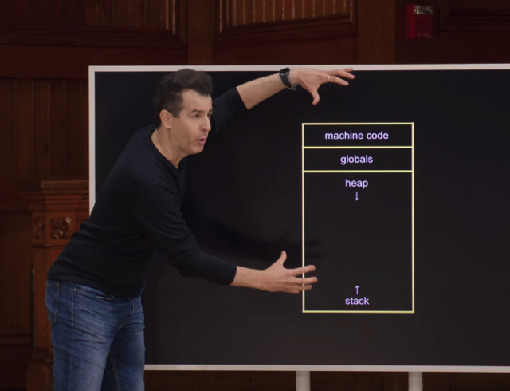</kbd>

> [!NOTE]
> **Machine code,** và **globals** là vùng memory
> dành cho machine code, và globales 
>
> **heap** khi máy tính cần lấy memory
>
> **stack** vùng memory dành cho function.
>
> Thì khi stack lấy quá nhiều memory để nó đụng với 
> heap, hoặc ngược lại thì gây ra lỗi tràn bộ nhớ.
>
> Đó là lí do ta **phải check NULL khi gọi malloc()....**

 

<kbd></kbd>

<kbd></kbd>

<kbd>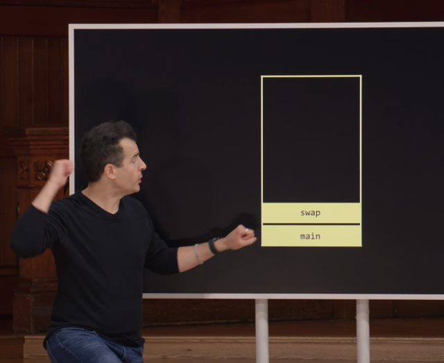</kbd>

> [!NOTE]
> Đại khái là khi main gọi swap, vùng bộ nhớ
> dành cho swap sẽ được allocate

> [!NOTE]
> Như khi function swap đã hoàn thành,
> nó sẽ được free bởi máy tính.
>
> Nhưng như ta biết, bên các byte đó vẫn có GARBAGE

 

<kbd>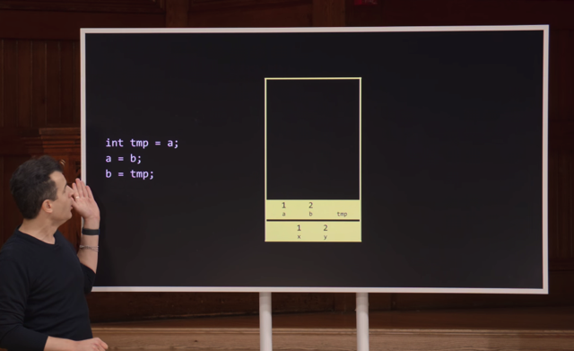</kbd>

> [!NOTE]
> Như đã nói, gọi swap(x, y), máy tính nó chỉ
> đưa VALUE vào function swap. Có nghĩa là 
> nó sẽ tạo hai var mới a, b với value bằng với
> x, y.
>
> Có nghĩa là sẽ **có hai vùng memory 4 byte dành cho a, b** 
> c**hứa chuỗi binary mang trị giá bằng 1 (của x) và 2 (của y).**
>
> Và v**iệc swap trong đó chỉ swap giá trị của a, và b**

 

<kbd>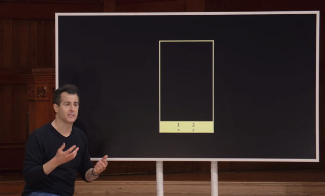</kbd>

> [!NOTE]
> Còn giá trị của x, y
> không thay đổi

 

<kbd>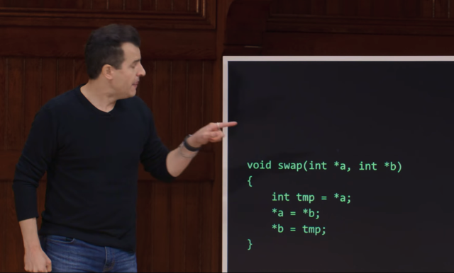</kbd>

> [!NOTE]
> Nhưng sửa lại vầy CHO SWAP() TAKE ARGUMENT LÀ ADDRESS. Giải thích:
>
> Đại khái là nếu chỉ là**swap(x, y)**. Thì nó sẽ đưa vào **VALUE =**
> con số 1, 2 (là **trị giá của x, y**) và tạo ra hai var mới a, b mang trị giá này.
>
> Còn **swap(*x, *y)** là **ADDRESS** của hai vùng memory (mỗi vùng là 4 bytes,
> mang chuỗi binary có trị giá 1, 2) của x, y sẽ được  đưa vào lệnh swap.
>
> Hay nói cách khác **swap (int a, int b)** sẽ ra lệnh cho máy tính **copy giá trị từ
> hai variable** **đưa vào** và **tạo các local var** để rồi **thực hiện trên đó.**
>
> Còn **swap (int *a, int *b)** sẽ cho function nhận ADDRESS và khi gọi swap(x,
> y) nó sẽ ra lệnh cho máy tính **khi nhận variable đưa vào** (là loại ADDRESS)
> thì **ĐI TỚI ĐÓ, ĐI TỚI vùng memory mang gía trị đó** để thực hiện các thao
> tác trên đó.
>
> Khiến lúc bấy giờ, a có vai trò CHÍNH LÀ x, b CHÍNH LÀ y, Và việc swap chính
> là swap giữa x và y.

 

<kbd>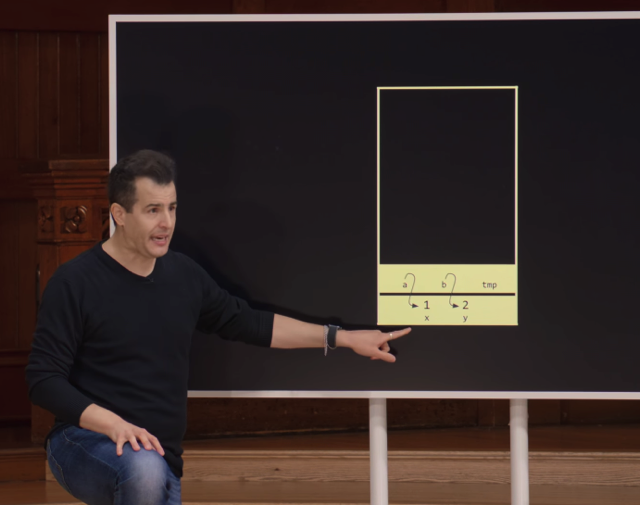</kbd>

 

<kbd>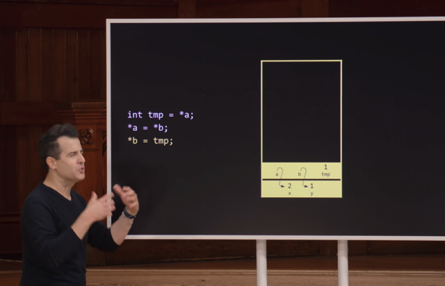</kbd>

 

<kbd>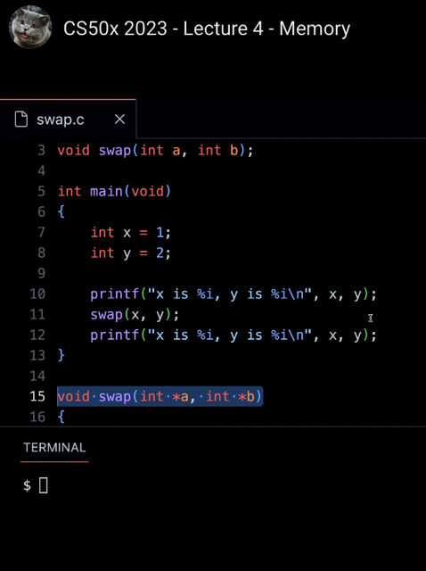</kbd>

> [!NOTE]
> D: Sửa vậy rời nhưng ta sẽ cần sửa thêm gì nữa?
>
> A: Thì với swap bây giờ nhận argument là **address** 
> nên phải **swap(&x, &y)
>
> D: Correct!**

 

<kbd>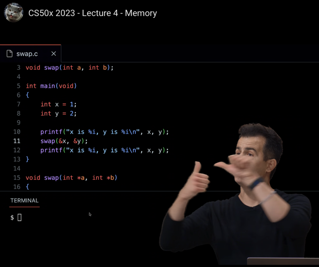</kbd>

 

<kbd>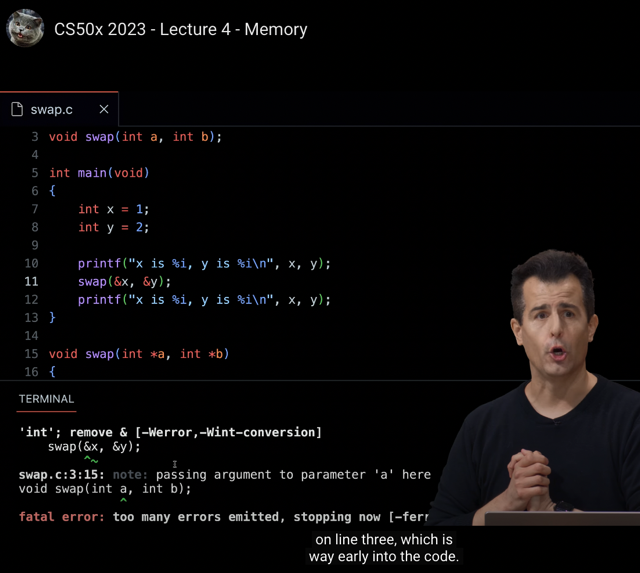</kbd>

> [!NOTE]
> D: Oop! Còn 1 chỗ sai?
>
> A: Phải sửa trên chỗ **declare function** nữa void swap(int *a, int* b);

 

<kbd>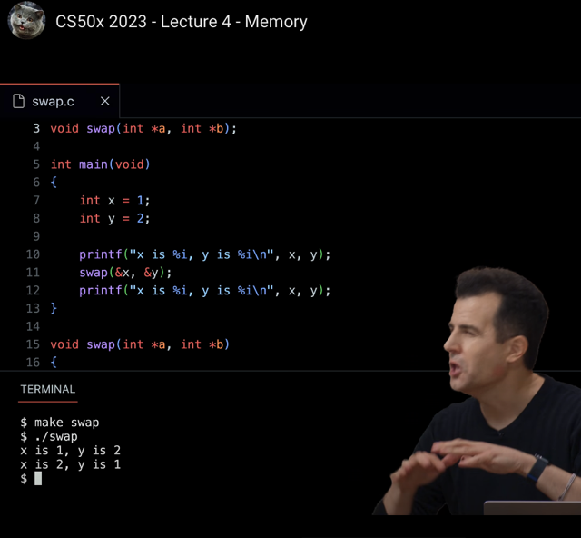</kbd>

> [!NOTE]
> Correct!

 

<kbd></kbd>

> [!NOTE]
> Quay lại hai cái vụ khi heap quá đụng đến
> stack và stack quá đụng đến heap thì gọi là
> heap overflow và Stack Overflow

 

<kbd></kbd>

> [!NOTE]
> Gọi chung là
> buffer. overflow

 

<kbd>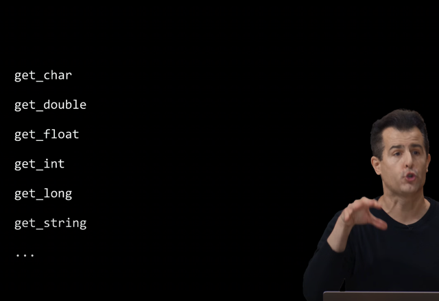</kbd>

 

<kbd>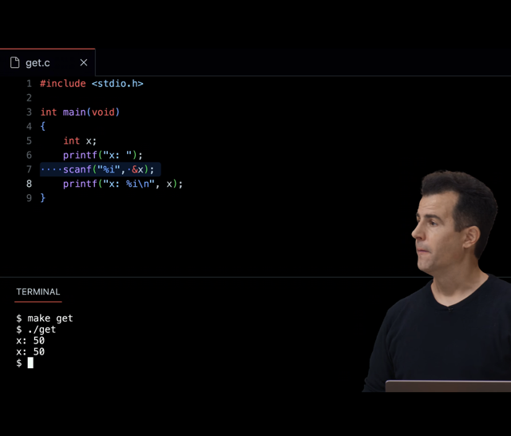</kbd>

> [!NOTE]
> Đại khái là ổng đang cho thấy function get_int() của cs50.h
> nó làm gì.
>
> Nó dùng một function mới gọi là **scanf**()
>
> **scanf**(**"%i", &x**); là built-in function kiểu như là nó sẽ check 
> scan - tìm - dò **tìm keyboard value**, tức là nó **theo dõi xem
> user enter cái gì**, đặc biệt là nó **cần một integer** (quy định
> bởi argument "%i")
>
> Sau đó **&x** cho nó biết khi scan được integer value user nhập
> vào rồi thì LƯU NÓ Ở ĐÂU -> ở trong **address của var x**Do đó khi print x, ta có giá trị int vừa nhập**====
>
> Ở đây ôn lại chỗ này:**Chuyện gì xảy ra khi khai báo var : int x = 1;
> Máy tính sẽ chuẩn bị một chỗ 4 bytes trong memory, 
> với một address nào đó trong memory. 4 bytes đó sẽ có chuỗi
> binary trị giá = 1. (nói luôn sẽ là 000....001)
>
> Và khi cần xem cái address đó, ta sẽ dùng &x. Và nếu mình
> Define **int *p =  &x**, thì  có nghĩa là mình **define một pointer**
> var p (chuyên chứa address), **mang trong mình address của x**

 

<kbd>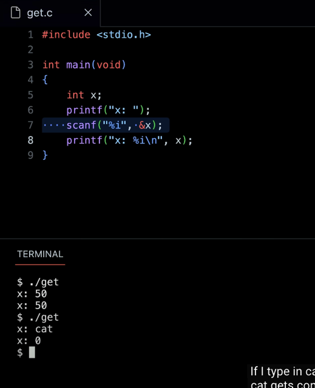</kbd>

> [!NOTE]
> Và vì scanf("%I",..) nên nó chỉ tìm int, nên nhập
> "cat" nó sẽ reject, và nó convert thành 0. 
>
> Và trong get_int() của cs50.h sẽ handle việc sẽ reprompt lại

 

<kbd>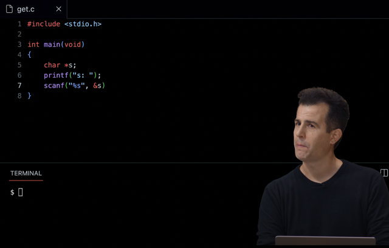</kbd>

> [!NOTE]
> Q: vì sao tôi ko cần **&** ở đây?
>
> A: vì **char *s** đã define **s là address/pointer** rồi
> Hay nói cách khác, **string bản chất đã là pointer 
> rồi.**

 

<kbd>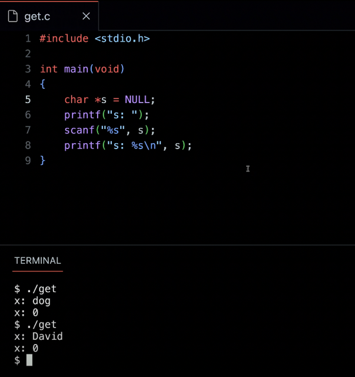</kbd>

> [!NOTE]
> D: Logic sai sai ở đâu?
>
> A: Cùng phân tích xem. Đầu tiên là ini s với NULL,
> Ok, coi như bảo máy tính cho 8 byte dành cho address 
> var s cho nó giá trị NULL = 0
>
> Sau đó scanf(%s, s) lệnh cho máy tính tìm /chờ nhận
> string và gán address vào s.
>
> Chỗ này có vấn đề.
>
> 1. Người ta nhập 1 chuỗi ví dụ "hi!", thì liệu rằng scanf 
> có save char đầu tiên vào s không?
>
> Còn lại thì cũng ko sai vì ngay cả khi ko có \0 thì printf
> vẫn có thể cứ đi vào address (giữ bởi s) để tới char đầu tiên
> Sau đó tiếp tục tiếp tục cho đến khi vô tình gặp một \0 ở đâu 
> đó thì nó stop.

 

<kbd>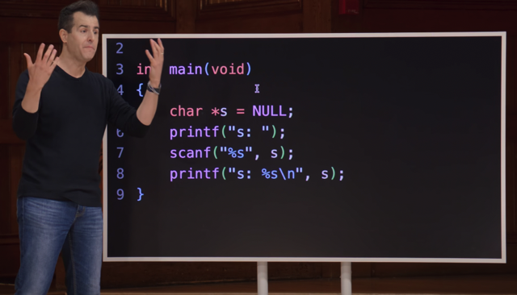</kbd>

> [!NOTE]
> Vấn đề là ta **không hề bảo máy tính chuẩn bị cho ta 
> bao nhiêu byte bộ nhớ.**
>
> Do đó cho dù scanf muốn save vào s address của 
> char đầu tiên, thì những char tiếp theo cũng không 
> có chỗ để save.
>
> Do đó câu chuyện là: 
>
> char *s -> máy tính chuẩn bị 8 bytes cho s để save address
> char *s = NULL, gán address của s bằng 0
> scanf(%s, s) -> user type in "hi!", **máy tính nó không có chỗ nào
> để lưu / chứa 3 char 'h', 'i', '!' cả**. Nên nó **không thể có address
> của 'h' mà save vào s được.**
>
> Nên s vẫn chỉ có address là NULL, in ra là 0

 

<kbd>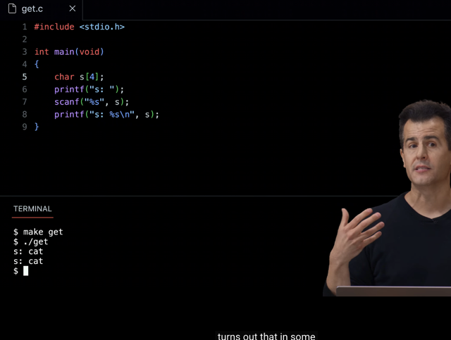</kbd>

> [!NOTE]
> Ở đây: **char s[4]** như **bình thường thôi** = yêu cầu máy
> tính **chuẩn bị sẵn 4 byte** để**chứa 4 char** và **scanf**() sẽ lần
> lượt **"bỏ" các char user nhập vào  vào 4 byte đó**.
>
> Nhưng nếu gõ David David ...vẫn ok là tại đang may mắn khi
> sau **4 bytes được cho ban đầu vẫn là phần memory có
> thể dùng hoặc vẫn trong giới hạn**

 

<kbd>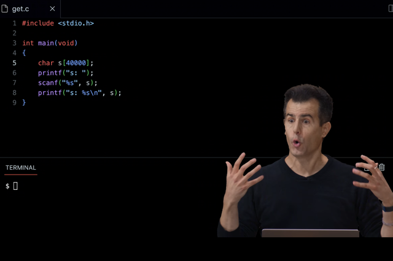</kbd>

> [!NOTE]
> Thì ổng nói là trong function cs50.h **get_string**() người ta
> đại khái là sẽ l**iên tục dùng malloc để yêu cầu thêm 1 byte
> khi user gõ text**

 

<kbd>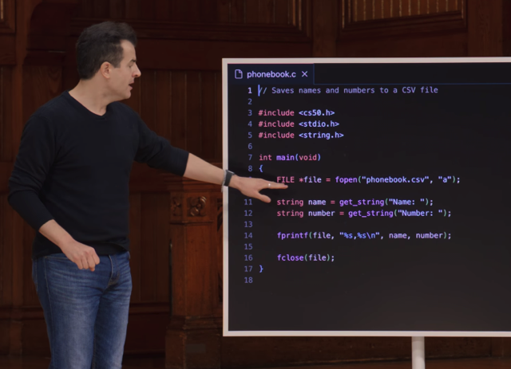</kbd>

> [!NOTE]
> Giới thiệu về hai function mới giúp **mở** và**save data**vào **file** và đóng lại
>
> **FILE *file** = **fopen**("phonebook.csv", "a") giúp mở
> file, ***file** thể hiện**file là pointer**, chứa **address tới 
> FILE.**
>
> **fprintf**(file, ...) sẽ **save value vào file**
> **fclose**(file) **đóng file lại**

 

<kbd>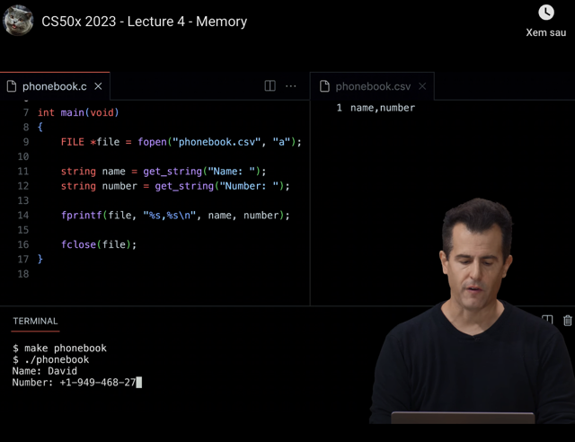</kbd>

 

<kbd>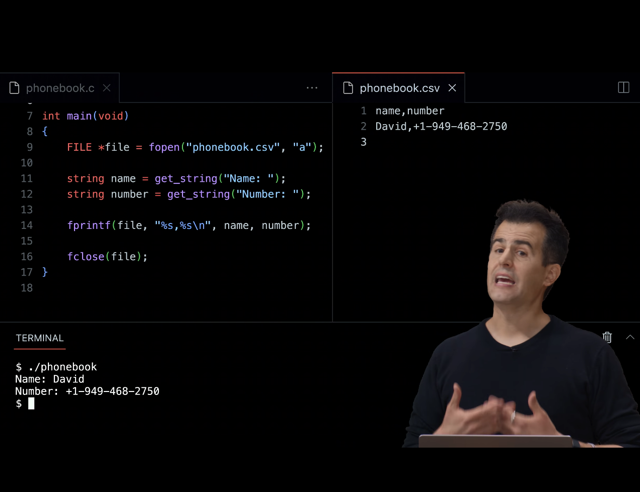</kbd>

 

<kbd></kbd>

> [!NOTE]
> Mở ra lại code phonebook.csv cho
> thấy file thật sự đã save info

 

<kbd></kbd>

 

<kbd></kbd>

 

<kbd></kbd>

> [!NOTE]
> Ổng nói đại khái là trong PS tới ta sẽ viết code
> manipulate với image như này

 

