# Week 4 - Memory (short)

📊 **Progress:** `22` Notes | `44` Screenshots

---

## Call Stack

 

<kbd>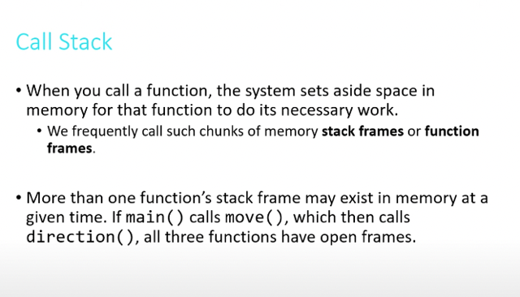</kbd>

> [!NOTE]
> Đại khái là khi một function được gọi, máy tính nó sẽ
> set một vùng memory dành cho function đó. Được gọi
> là **stack frame hay function frame**
>
> Và khi nhiều function được gọi (cái này gọi cái kia) thì
> mỗi function đều có stack frame.

 

<kbd>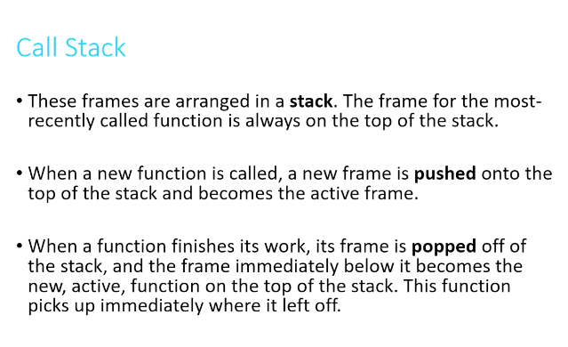</kbd>

> [!NOTE]
> Và các frame này được xếp trong một stack. Cái frame
> nào được gọi mới nhất thì nằm trên cùng.
>
> Một khi có function khác được gọi thì nó được push lên
> top.
>
> Và một khi nó hoàn tất, nó sẽ popped off, đẩy thằng nằm
> dưới lên

 

<kbd>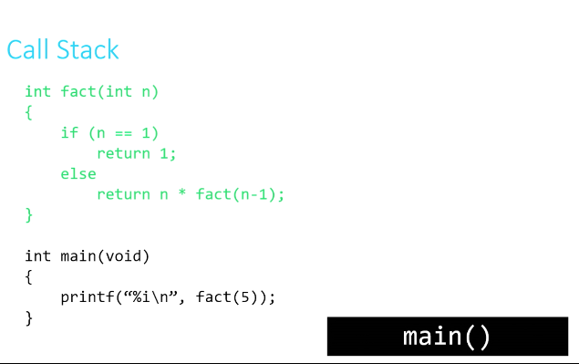</kbd>

 

<kbd>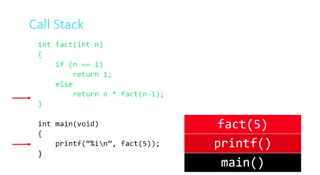</kbd>

 

<kbd>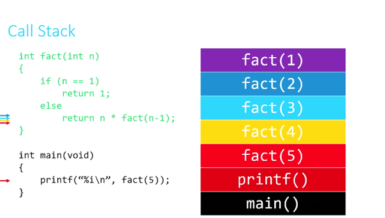</kbd>

> [!NOTE]
> Thì đại khái là minh hoạ một function tính factorization (giai thừa) là
> dạng recursive function.
>
> Main gọi printf, main pause, printf lên top
>
> Prinf gọi fact(5), printf pause, fact(5) lên top
>
> fact(5) gọi nhánh else, gọi fact(4). fact(5) pause fact(4) lên top
>
> fact(4) check ifelse -> else, gọi fact(3), fact(4) pause, fact(3) lên top
>
> ...
>
> fact(2) check, gọi fact(1), fact(2) pause, fact(1) lên top
>
> fact(1) chạy và return 1, finished, pop off, fact(2) lên top
>
> fact(2) chạy return 1*2, finished, pop off, fact(3) lên top
>
> ....

 

<kbd>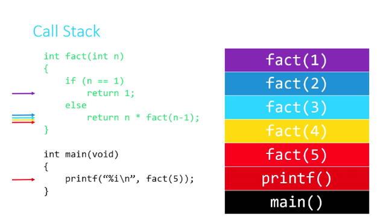</kbd>

 

<kbd>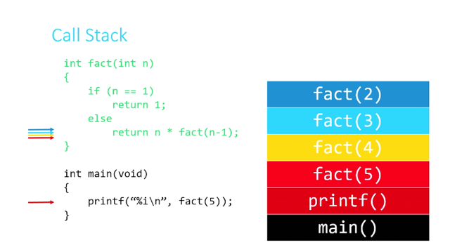</kbd>

 

<kbd>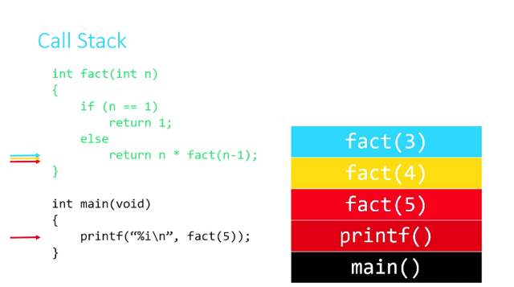</kbd>

 

<kbd>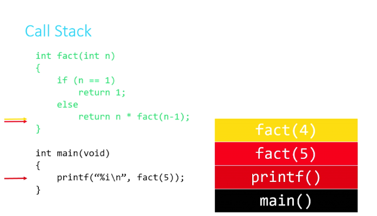</kbd>

 

<kbd>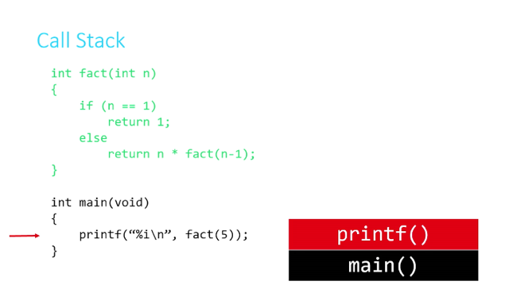</kbd>

 

<kbd>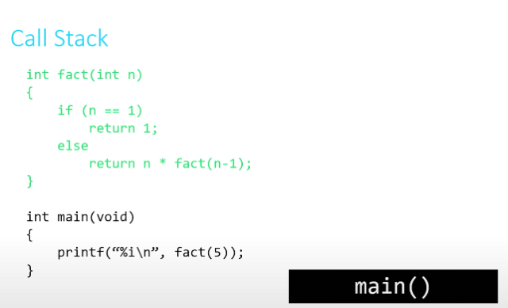</kbd>

 

### Pointer

 

<kbd>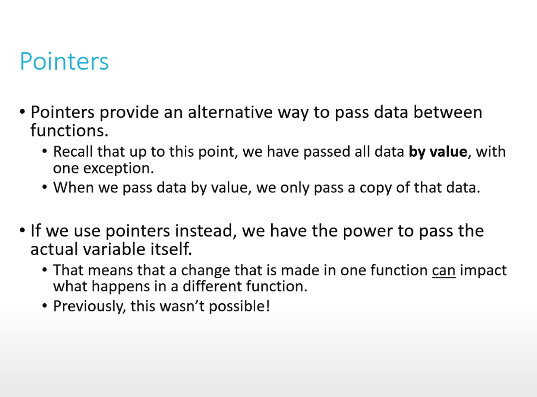</kbd>

> [!NOTE]
> Đại khái nói tuy nó**hơi rắc rối** nhưng pointer cho ta
> **sức mạnh để làm nhiều cái mà bình thường không
> có**. Ví dụ như trong bài giảng của David về việc**làm function swap hai biến x, y.**
>
> Nếu chỉ như cách thông thường - nơi mà khi pass  var
> vào function là **pass copy value của nó**, thì sẽ không
> làm được cái này.
>
> Nhưng với việc pass vào pointer, thì sẽ cho phép làm
> Được.

 

<kbd>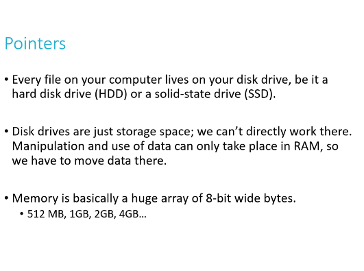</kbd>

> [!NOTE]
> Nói lại chút về memory, trong cs50 là nhắc đến RAM.
> không phải hard disk. Vì ta **không thể manipulate 
> hard disk**, mà muốn**làm gì thì phải load data vào 
> RAM.**
>
> Như đã biết RAM = Random Access Memory
>
> Memory là một chuỗi huge các byte = 8 bits

 

<kbd>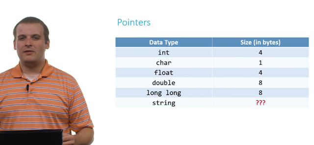</kbd>

 

<kbd>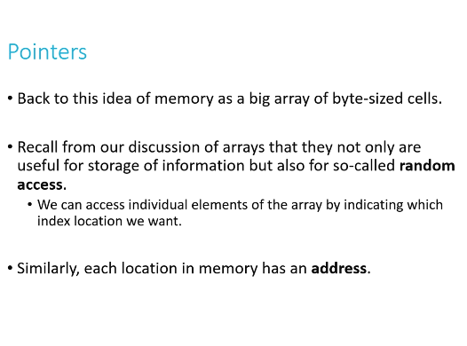</kbd>

> [!NOTE]
> Ở đây hiểu thêm tại sao nó gọi là RAM
> đó là **Random Access** ý là ta có thể**access
> tới ngẫu nhiên mọi vị trí**được chứ**không phải 
> bắt buộc phải đi từ đầu.**
> Và memory giống như một**huge array các cell
> là các byte**. và mỗi byte đó có **address**, giống
> như item trong array có index.

 

<kbd>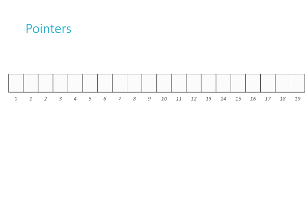</kbd>

 

<kbd>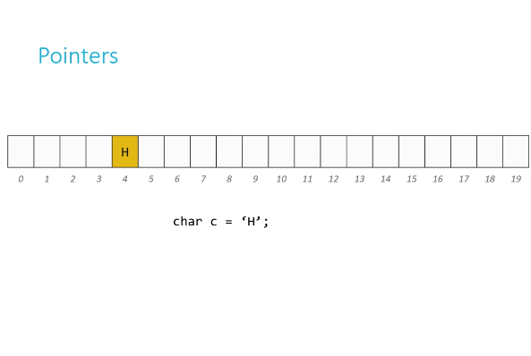</kbd>

> [!NOTE]
> Khi gọi char c = 'H', máy tính sẽ cho 1 byte để chứa giá trị 
> chuỗi binary khi tính ra base-10 tương ứng với key của 
> H trong ascii

 

<kbd>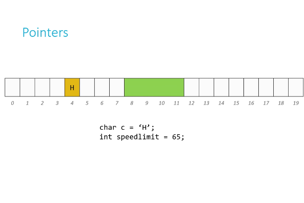</kbd>

> [!NOTE]
> Tương tự khi gọi int speed = 65 thì máy tính nó tìm 4 bytes 
> trống để cho speed và gán chuỗi binary sao cho tính ra 
> base-10 là 65

 

<kbd>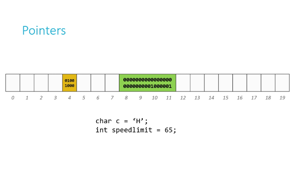</kbd>

 

<kbd>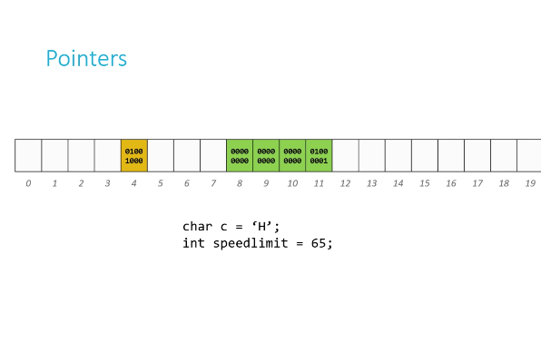</kbd>

> [!NOTE]
> Ở đây ổng nói có cái gì đó liên quan
> đến việc chuỗi 4 bytes sẽ có dạng như
> này chứ không phải kia

 

<kbd>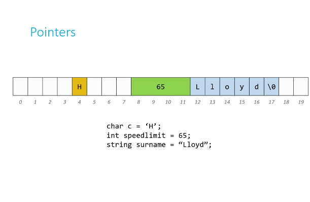</kbd>

> [!NOTE]
> Còn string, thì mỗi char 1 byte, và như đã biết máy tính 
> nó tự cho 1 byte nữa mang giá trị \0, thật ra là 00000000

 

<kbd>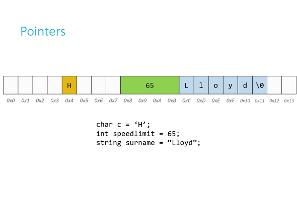</kbd>

> [!NOTE]
> Và address memory "cell" (byte)
> thường được dùng base-16

 

<kbd></kbd>

> [!NOTE]
> Pointer chỉ đơn
> giản là address

 

<kbd>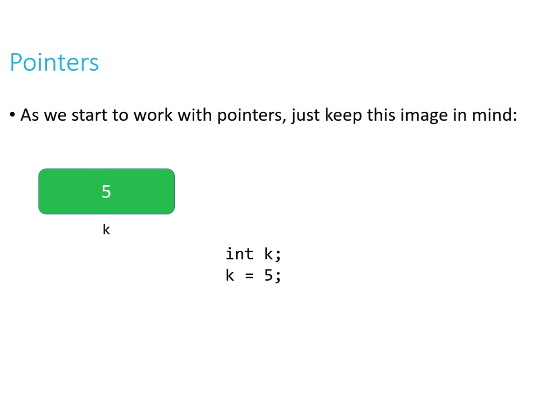</kbd>

 

<kbd>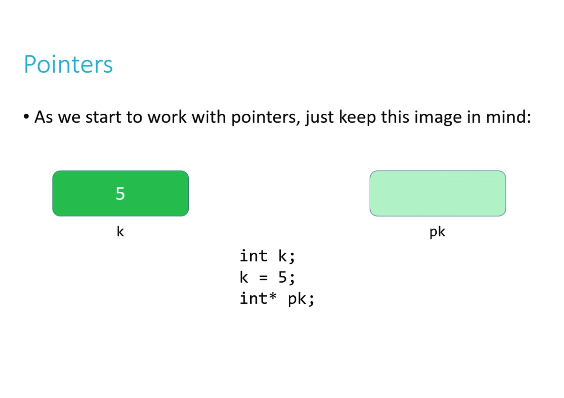</kbd>

 

<kbd>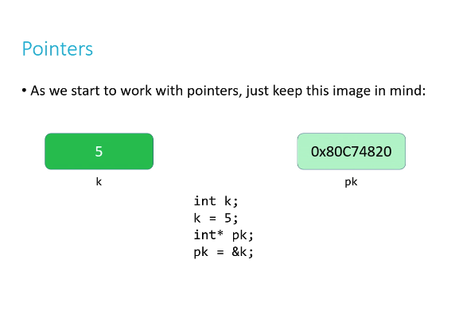</kbd>

> [!NOTE]
> Ngắn gọn là khi define int k, máy tính set một vùng 4 
> bytes trong area dành cho k. Thì ổng nói cái này giống
> như lấy cái hộp có size = 4 byte, có label k, có thể dùng 
> để chứa int
>
> Khi cho k = 5. Thì đồng nghĩa lấy chuỗi binary có giá trị
> bằng 5 (khi quy ra base-10) bỏ vào hộp.
>
> Và khi nói đến k, chính là nói đến giá trị trong hộp.
>
> ====
>
> Nhưng int* pk, máy tính sẽ set ra 8 bytes trong memory
> để dành cho pk, để có thể chứa một cái address của một 
> int. Hay nói cách khác, tạo một cái hộp chỉ chuyên dùng
> để đựng ADDRESS
>
> Và vì address có thể lớn nên phải cho loại hộp này có kích
> thước lớn hơn. 
>
> Và khi pk = &k thì tức là bỏ vào cái hộp p này một cái chuỗi
> binary mà khi tính ra base-16 thì là address của k trong memory.
> Và khi nói về p, là nói về ADDRESS của k. Và nhờ p, ta có thể 
> tìm thấy k trong memory

 

<kbd>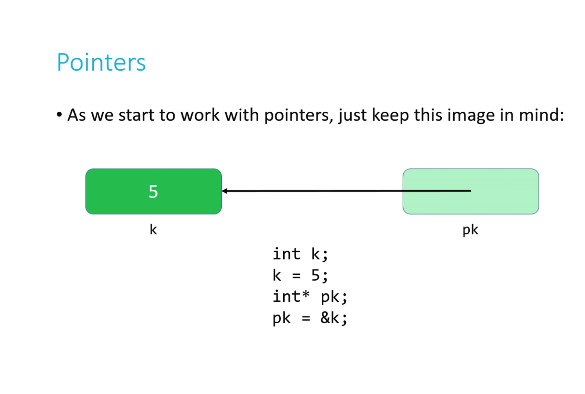</kbd>

 

<kbd>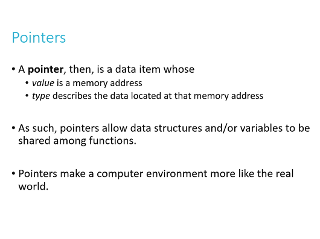</kbd>

> [!NOTE]
> Đại khái là pointer và loại data mà value của nó là
> address của một cell nào đó trong memory chứa
> gía trị của một variable nào đó
>
> Và loại của variable đó chính là loại của pointer.
> Pointer chứa address dẫn tới một int (4 byte) thì 
> nó là loại int pointer...
>
> ====
>
> Xong ổng nói pointer giúp replicate ngoài đời thật
> ví dụ như ổng có cái notebook, và mình là một cái
> function giúp check và fix error notebook. Thì nếu
> không có pointer, thì nó sẽ như này: Ổng đưa mình
> cuốn sổ, mình đem photocopy thành 1 cuốn khác.
> Rồi mới sửa error trong đó, cuốn gốc vẫn không đổi
> và trả ra cuốn sửa là cuốn copy. Thế là ổng phải ngồi 
> ghi lại nhưng chỗ được sửa vào cuốn gốc.
>
> Nếu là pointer, thì mình chỉ việc nhận cuốn sổ của ổng
> rồi chỉnh sửa trong đó xong trả lại ổng là xong.

 

<kbd>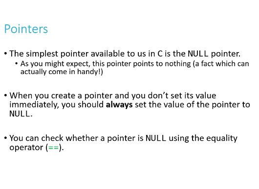</kbd>

 

<kbd>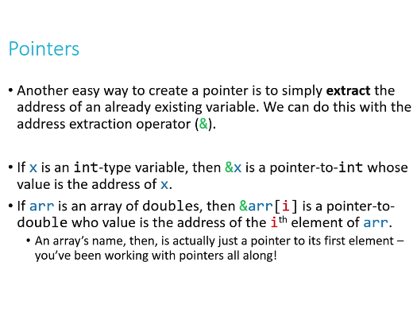</kbd>

> [!NOTE]
> &x: Address của x var

 

<kbd></kbd>

> [!NOTE]
> Chỗ này hay đây dù biết rồi nhưng đáng nhắc lại đó là **array** 
> ví dụ int numbers[3] -> numbers là array of integer thì thật ra
> **number** chính là **pointer mang giá trị là address tới cái int đầu
> tiên trong array.**Do đó, giả sử viết function setInt() nhận int và ví dụ x2 giá trị
> thì khi gọi nó với một int variable thì giá trị của variable đưa vào
> function không bị thay đổi vì như đã biết, nó chỉ đưa copy của var's
> variable vào.
>
> Còn gỉa sử viết function setArray() nhận array và ví dụ x2 giá trị
> thì bởi**vì bản thân array đưa vào là pointer**, nên t**hực sự array 
> ở bên ngoài sẽ bị thay đổi bởi vì function đã theo ADDRESS
> của pointer đó mà thay đổi gía trị của var chứ không phải 
> chỉ là bản copy của nó**
> Cái này trong Java không có, nhưng C thì nó như vậy

 

<kbd>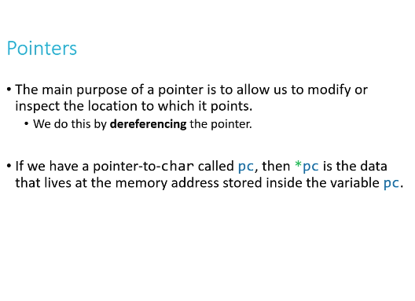</kbd>

 

<kbd>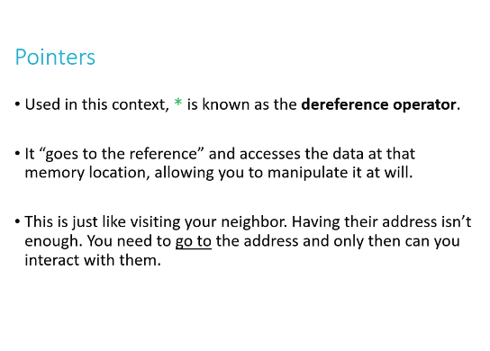</kbd>

> [!NOTE]
> int *p là define một var thuộc loại pointer, chứa address tới 1 int
>
> Thì khi đó nói đến **p** là nói đến pointer, có giá trị là 1 cái ADDRESS
>
> Và muốn nói đến cái giá trị TẠI cái ADDRESS đó thì dùng ***p**Nên print p (tất nhiên với format dành cho pointer là %p) sẽ cho ra
> ADRESS dạng base-16
>
> Còn print *p thì vì là int pointer, nên nó sẽ  cần dùng %i, nó sẽ ĐI TỚI
> ADDRESS đó, nơi đó là 4 bytes chứa gía trị integer

 

<kbd>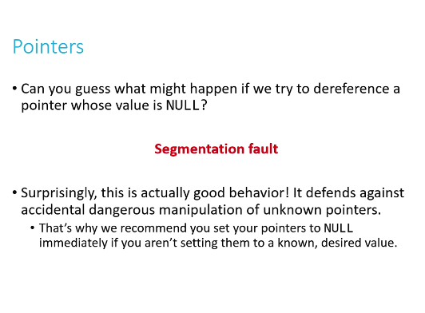</kbd>

> [!NOTE]
> Đại khái là việc define một pointer và nếu
> chưa dùng tới thì set = NULL là good habit

 

<kbd>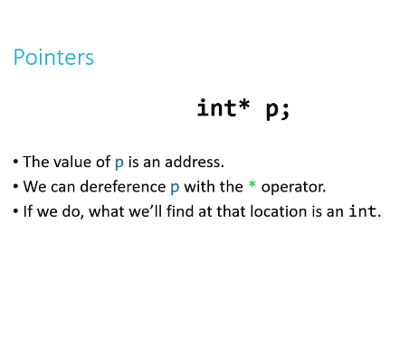</kbd>

 

<kbd>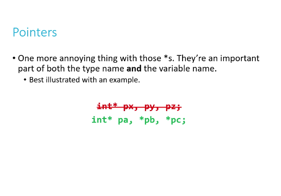</kbd>

> [!NOTE]
> Ở đây ổng nói có một cái flaw khi đặt syntax cho pointer
> khiến nó rắc rối
>
> Như nãy cũng thấy rồi, int *p là khai báo một cái pointer
> mang giá trị là ADDRESS tới một int
>
> Rồi khi cần ĐI TỚI VÀ LẤY GIÁ TRỊ ở address đó thì dùng 
> *p.
>
> -> Nhiêu đó là thấy flaw rồi, dùng cùng 1 syntax để 2 việc khác
> nhau, declare pointer, và ĐI TỚI ADDRESS 
>
> Thì đây thêm một cái flaw nữa, đó là muốn define 3 cái pointer
> thì phải int *pa, *pb, *pc.
>
> Nên ổng nói có thấy rắc rối cũng đừng có buồn vì ai cũng vậy

 

<kbd>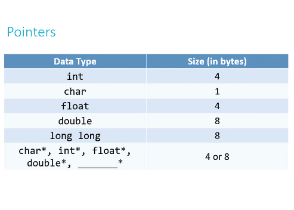</kbd>

<kbd></kbd>

<kbd>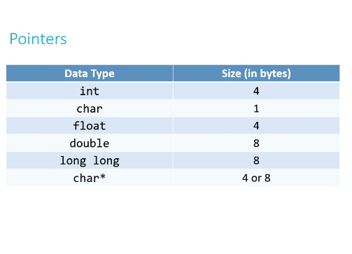</kbd>

> [!NOTE]
> Và trong lecture David nói pointer var được 8
> bytes thật ra đó là trong 32bit system
>
> Còn trong 16 bít system thì chỉ được 4 byte
> thôi

 

<kbd>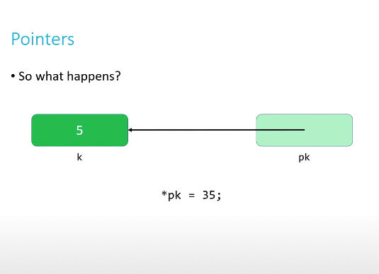</kbd>

> [!NOTE]
> A: Đi vào address hold bởi pk
> (sẽ được k) và sét value = 35,
> vậy k sẽ thành 35

 

<kbd>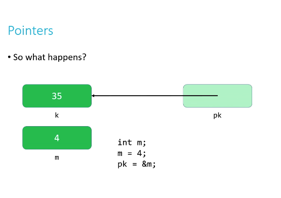</kbd>

> [!NOTE]
> A: pk là pointer, chuyên chứa address của int,
> vậy pk = &m tức là lấy ADDRESS của m gán
> cho pk
>
> pk sẽ có giá trị mới thay vì address của k,  thì
> nó mang address của m

 

<kbd>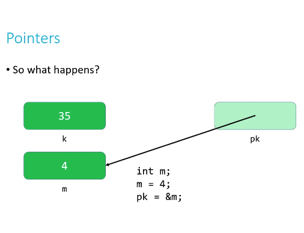</kbd>

 

#### ...

 

<kbd>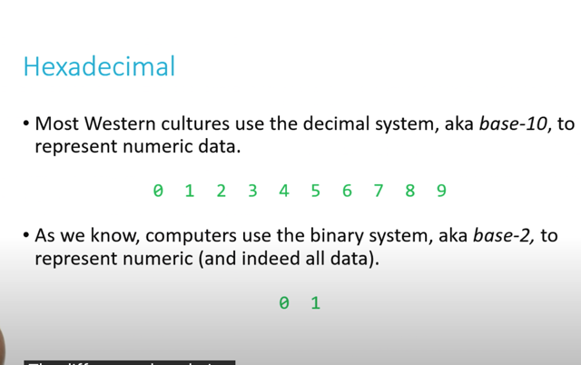</kbd>

 

<kbd>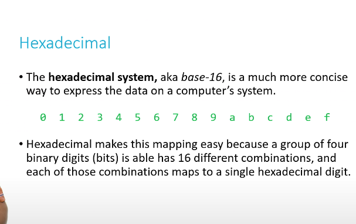</kbd>

 

