# Week 5 - Data Structure

📊 **Progress:** `124` Notes | `171` Screenshots

---

<kbd></kbd>

> [!NOTE]
> Đại khái là khi chuyển sang các ngôn ngữ cao hơn như
> Python, sẽ không còn **memory allocation, pointer**... bởi vì
> có **ai đó làm giúp rồi** nhưng việc **hiểu ở bên dưới như
> thế nào rất hữu ích**

 

<kbd></kbd>

> [!NOTE]
> Với **pointer**, ta sẽ có thể
> **structure our data in memory**

 

<kbd></kbd>

> [!NOTE]
> khái niệm **abstract data
> types**, đầu tiên là **queue**

 

<kbd></kbd>

> [!NOTE]
> Nói lướt về queque và khái niệm sẽ học **First In
> First Out**, ông nào **vào line trước** thì ông đó được
> check in (**ra khỏi line trước**)

 

<kbd></kbd>

> [!NOTE]
> **enqueue**: **thêm một ông vào line** (chờ check in trong
> sân bay)
>
> **dequeue**: khi ông đứng đầu line được **ra khỏi line** để
> vào check in

 

<kbd></kbd>

> [!NOTE]
> **Stack** thì như chồng đĩa, cái nào ở **bỏ vào trên cùng**
> thì sẽ được **lấy ra đầu tiên**. Thì cái này nó lại theo
> nguyên tác **LIFO - Last In First Out**

 

<kbd></kbd>

 

<kbd></kbd>

> [!NOTE]
> **Gmail** chính là 1 **stack**

 

<kbd></kbd>

> [!NOTE]
> D: Để quần áo đồ đạc thành **stack** (chồng) như này thì
> có nhược điểm gì?
>
> A: Khi **muốn lấy cái ở dưới**, như cái màu xanh hay đỏ
> thì ta **phải lấy mấy  cái ở trên ra trước**

 

<kbd></kbd>

> [!NOTE]
> **push**: **bỏ cái mới vào** stack - để nó trở thành **nằm 
> trên cùng**
>
> **pop**: **lấy cái trên cùng ra**

 

<kbd></kbd>

> [!NOTE]
> Kế tới ổng nói giả sử ta có cái **data struct** tên là **stack** này,
> với **person là một struct khác** define ở tuần trước, và **people**
> là **array các person**
>
> D: Tại sao **đã có CAPACITY** thể hiện số lượng person rồi
> mà tôi còn **phải có int size**?
>
> A: Vì trong **C array không có cách tự biết số lượng item**,
> trừ một cái array đặc biết là string = array of char trong đó
> nhờ máy tính tự thêm một byte cho **'\\0'** vào cuối nên nó dùng
> cái đó để biết khi nào kết thúc (và từ đó đếm được số char
> trong array)
>
> D: Correct, có điều nói thêm **CAPACITY là số lượng item
> có thể có** trong stack, còn **số lượng thực tế** thì như mới nói
> đó là phải dùng **size** để track

 

<kbd>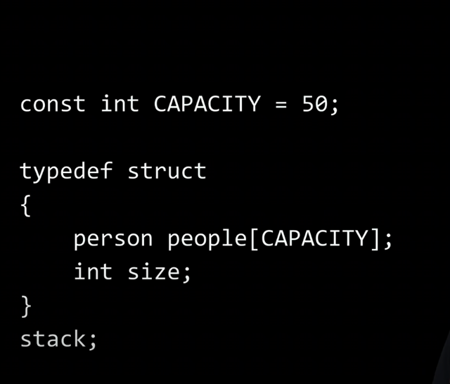</kbd>

 

<kbd></kbd>

> [!NOTE]
> D: **Downsize** của việc implementing **stack** dùng array là gì?
>
> A: Đó là ta có pointer tới mọi cái trong stack nếu biết size,
> ví dụ nếu size = 3, thì lấy 
>
> cái 0 = ***(person)** = person[0]
> cái 1 = ***(person + 1)** = person[1]
> cái 2 = ***(person + 2)** = person[2]

 

<kbd></kbd>

> [!NOTE]
> Vấn đề là define kiểu này nó **FINITE** = cố định sẵn, khi ta
> **define size nó = 50**
>
> Đúng là ta **có thể có dung lượng lớn hơn** bằng cách cho
> 500, 5000...Nhưng **vì sao làm thế thì không ổn?**
>
> A: Vì như vậy **gây lãng phí memory** vì một khi đã define
> person people[5000] thì **máy tính nó đã chuẩn bị một vùng
> memory cho 5000 person rồi**. Và nếu không dùng tới 5000
> thì sẽ gây lãng phí.
>
> Nhưng nếu dùng tới 5000 thì lại gặp vấn đề ở trên.
>
> Phải có cách nào đó **dùng tới đâu thì request thêm memory
> tới đó.**

 

<kbd></kbd>

> [!NOTE]
> Jack để đồ theo stack nên nó cứ mặc 1 bộ hoài,
> mặc xong đem giặt lại bỏ lên trên lúc lấy ra lại lấy
> đúng bộ đó

 

<kbd></kbd>

> [!NOTE]
> Lou khuyên Jack để đồ theo queue, giặt xong bỏ
> vào đầu hàng đợi, lấy ra thì lấy ở cuối hàng. Như
> vậy luôn thay đổi mỗi ngày

 

<kbd></kbd>

> [!NOTE]
> **Array** như nhớ lại nó chỉ là **dãy các element
> được store trong memory pack to pack to pack**(kế tiếp nhau)

 

<kbd>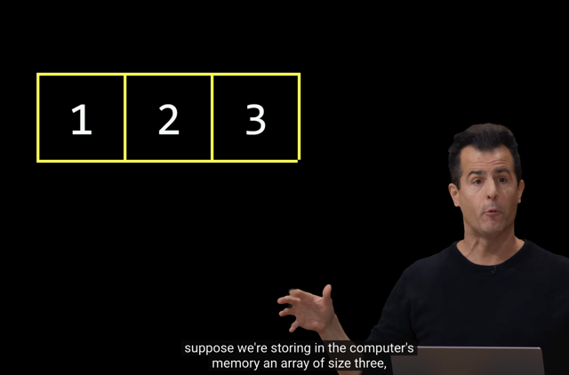</kbd>

 

<kbd>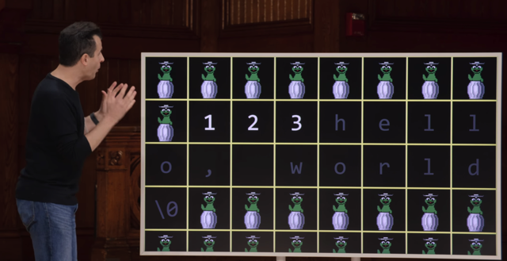</kbd>

> [!NOTE]
> Đại khái là trong memory có các **garbage value**. Ngặt
> nỗi ổng cần **muốn có thêm số  4**, mà **sau số 3
> thì đã được xài**

 

<kbd>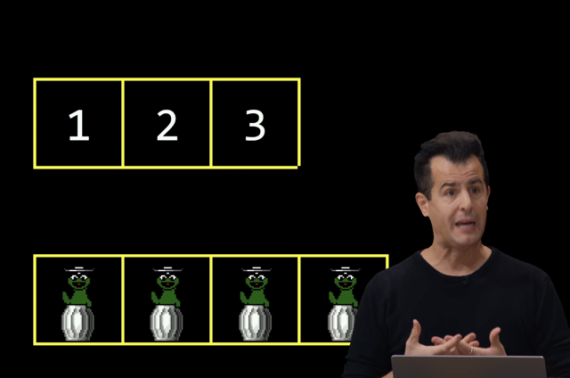</kbd>

 

<kbd>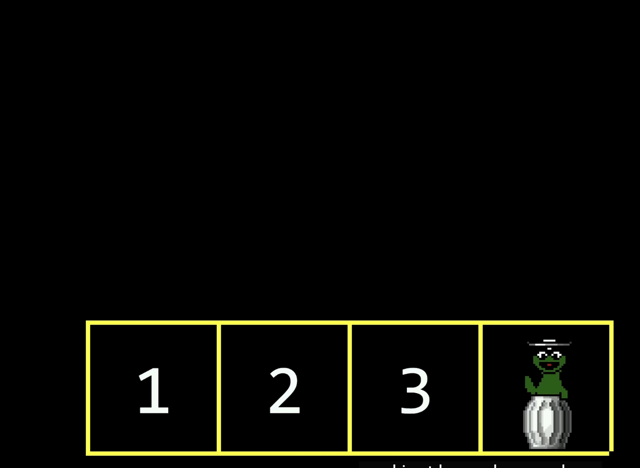</kbd>

> [!NOTE]
> Đại khái là giờ ổng muốn có thêm số 4 trong array. Thì có  thể **giả
> sử kiếm được một vùng 4 byte** đang chứa **garbage** như thế
> này, để rồi ổng**sẽ copy 1,2,3 vào đó**, nhờ đó có thể **write/set
> số 4 vào ô cuối**.
>
> (Cách này có thể hình dung là **dùng malloc** để máy tính nó **tìm
> vùng bộ nhớ có size cần thiết = 4 byte** mà còn **available** và
> **trả address (byte đầu tiên) về cho mình**. Và rồi mình copy value
> qua)
>
> D: Cách làm này **có gì k ổn?**
>
> A: Có nhiều cái không ổn, như l**ỡ cần thêm 1 byte nữa** cho số 5 thì
> phải kiếm vùng khác (chứa 5 garbage) để **lại copy qua.**

 

<kbd></kbd>

> [!NOTE]
> Correct, và nó **bad design** khi tôi sẽ cứ **phải
> copy again again again** **từ vùng này sang vùng
> khác**

 

<kbd></kbd>

 

<kbd>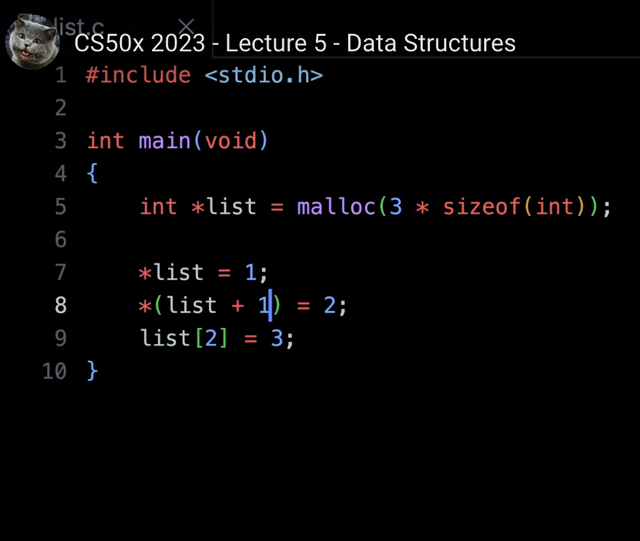</kbd>

<kbd></kbd>

<kbd>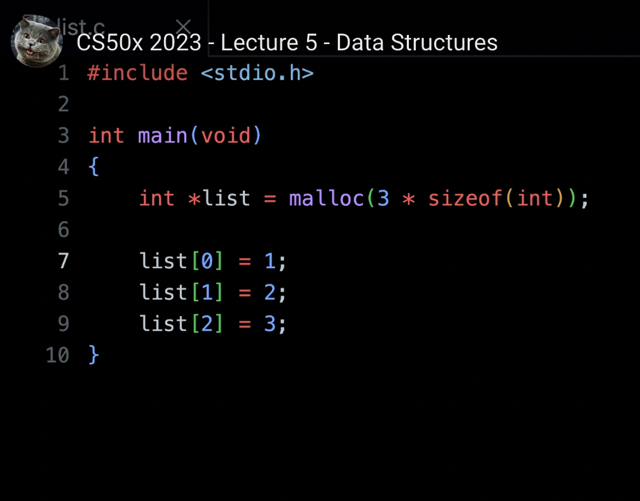</kbd>

> [!NOTE]
> **int *list = malloc(3*sizeof(int))**: máy tính nó sẽ**tìm một dải memory dải 3x(4 bytes) = 12 bytes** 
> và **trả ADDRESS của byte đầu tiên** cho list (và thực chất là **tạo vùng 8 bytes** để set **giá trị là chuỗi
> binary** mà khi dịch ra **base-16 thì nó là address của byte đầu tiên**)
>
> Và việc để **list là int pointer** cho biết **khi tìm đến vùng memory  bằng gía trị của address hold by 
> list** thì ta sẽ **tìm được int (4 byte)**
>
> Và không cần bối rối khi thấy **list chỉ là pointer** mà sao có cái kiểu **square bracket list[0], list[1]**...
> Đó là vì cái**syntax [] chỉ là cách thể hiện human user-friendly** của việc :
>
> TỪ ADDRESS ĐÓ, ĐI **TỚI CÁC ADDRESS KẾ TIẾP**
>
> **list[0]** cũng chính là ***list**: ĐI **TỚI ADDRESS hold bởi list**
> **list[1]** cũng chính là ***(list+1)**: ĐI **TỚI ADDRESS hold bởi list** và đi **thêm 1x(đoạn 4 byte)**
> **list[2]**cũng chính là ***(list+2)**: ĐI **TỚI ADDRESS hold bởi list** và đi **thêm 2x(đoạn 4 byte)**
>
> vì **int *list** có nghĩa là **list là int pointer**, nên máy tính sẽ hiểu **đi đến address đó** thì 
> sẽ gặp **int**, và việc **đi đến các address kế tiếp** sẽ đi theo **bước 4 byte là sizeof(int)**
>
> Tương tự như khi define string s hay **char *s = "abcd"**
>
> thì cơ bản s như đã biết chỉ là **pointer chứa address của cái char đầu tiên** là 'a'
> và **s[0]** tương đương với ***s**: ĐI **TỚI ADDRESS hold bởi s** (sẽ gặp 'a')
> và **s[1]**tương đương với ***(s+1)**: ĐI **TỚI ADDRESS hold bởi s** và **đi thêm 1**x**(đoạn 1 byte)** (sẽ gặp 'b')
> và **s[2]** tương đương với ***(s+2)**: ĐI **TỚI ADDRESS hold bởi s** và **đi thêm 2**x**(đoạn 1 byte)** (sẽ gặp 'c')
>
> vì c**har *s** có nghĩa là **s là char pointer**, nên máy tính sẽ hiểu **đi đến address đó** thì 
> sẽ **gặp char**, và việc **đi đến các address kế tiếp** sẽ đi **theo bước 1 byte là sizeof(char)**
>
> =====
>
> Thành ra bất cứ cái nào là pointer, ta đều có thể dùng p[0], p[1]....để thể hiện rằng
>
> **TỪ ADDRESS ĐÓ, ĐI TỚI CÁC ADDRESS KẾ TIẾP**

 

<kbd>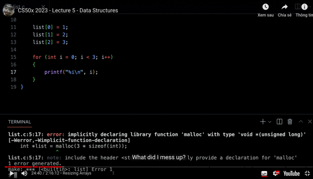</kbd>

> [!NOTE]
> D: Sao error?
>
> A: Vì thiếu **#include <stdlib.h>**

 

<kbd>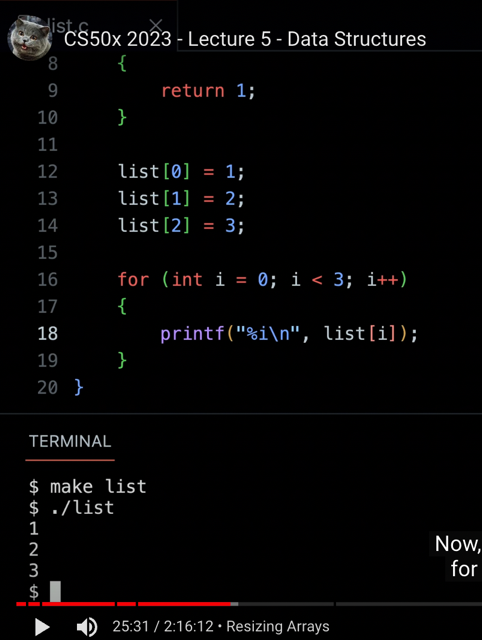</kbd>

 

<kbd>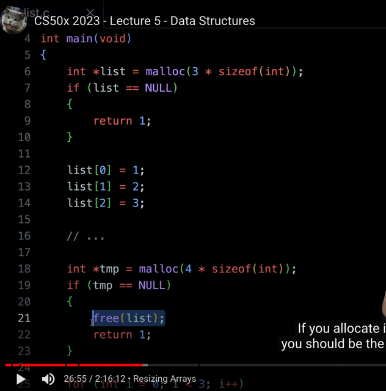</kbd>

> [!NOTE]
> Xong giả sử sau một chương trình dài  ổng **cần 1 int
> nữa trong array**.
>
> Thế là ổng mới **malloc(4*sizeof(int))** và nếu không
> được (máy tính không tìm thấy vùng 4*4 byte = 16 bytes
> còn trống  thì nó sẽ **return NULL** - là **address 0** như
> đã biết.) thì khi đó exit.
>
> Thì **trước khi exit** phải **free(list)** vì đã **malloc với
> list ở trên**

 

<kbd>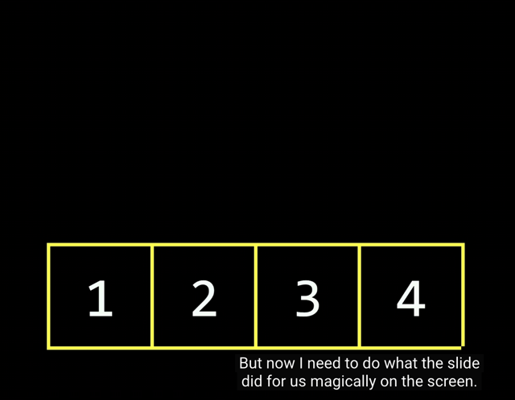</kbd>

<kbd></kbd>

<kbd>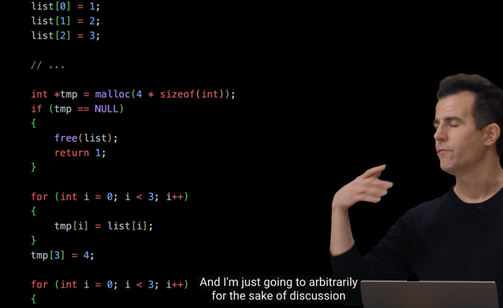</kbd>

> [!NOTE]
> Xong, nếu **thành công**, máy tính **tìm được 16 bytes**
> thì nó **trả về address byte đầu tiên cho tmp**
>
> Thế là ta có thể dùng cách thứ như mới nói, **ĐI ĐẾN
> ADDRESS** của **tmp** VÀ **CÁC ADDRESS TIẾP THEO** để
> dùng value của list set value vào tmp
>
> và set value vào cái (4 byte) cuối bằng 4 tmp[3] = 4

 

<kbd></kbd>

> [!NOTE]
> và **temp[3] = 4**: Đi **đến address của vùng memory 4 byte
> cuối**
>
> (thật ra **vẫn còn có thể đi tiếp** chứ **không đúng lắm khi nói
> "cuối"**, "cuối" ở đây là nói về việc ta malloc 4x4 bytes thì đây
> là vùng 4 bytes cuối)
>
> Chứ thật ra ta **vẫn có thể temp[4], temp[5]**.... Nhưng lúc đó
> là nó **bắt đầu đi ra khỏi vùng memory mà máy nó cho ta rồi**,
> thì những **vùng đó có thể trống** (chứa bởi garbage, **cũng
> có thể chứa các value khác** mà nếu ta dùng có thể g**ây như
> hỏng các chương trình khác**)
>
> ====
>
> Và cuối cùng là **free(list)** sẽ **giải phóng vùng 12 byte** mà **list đang
> giữ address**, giá trị address của list sẽ trở thành **invalid**
>
> Sau đó **list = tmp**: máy tính sẽ **lấy address hold bởi temp** - là 
> address của (byte đầu tiên) của vùng 16 byte - set vào list (nên 
> nhớ cả list, và tmp là pointer, nó có 8 bytes hoặc 4 bytes để chứa 
> giá trị address)
>
> Kết quả là lúc này **list chứa address tới vùng 16 bytes mới**
>
> nên **list[3] sẽ bằng 4**

 

<kbd>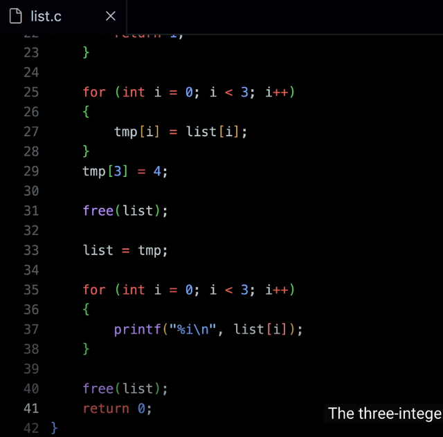</kbd>

> [!NOTE]
> Có người hỏi **có phải là tmp và list cùng trỏ tới một vùng
> memory giống nhau** không?
>
> D: **Đúng vậy**, nhưng **không phải vấn đề lớn**.
>
> Nói thêm **nếu không dùng temp**, mà ở trên ta lại **list  =
> malloc(4*sizeof(int))** thì nó sẽ gây **memory leak** khi
> **vùng 12 bytes trước mất dấu** (dù vẫn còn data, vì chưa
> được giải phóng), không còn biết address  của nó ở đâu nữa.
>
> Và nói thêm cuối cùng ta cũng sẽ free(list) giúp**giải phóng
> vùng memory 16 bytes mới** (mà cả tmp và list cùng trỏ vào)
>
> Nhìn code tuy rằng nó**vi phạm nguyên tắc không được free
> hai lần** nhưng đó là **vì ở mỗi lần free thì list đang được trỏ tới
> mỗi vùng memory khác nhau.**

 

<kbd>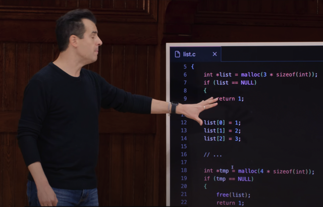</kbd>

> [!NOTE]
> Q: **Khi nào thì malloc return NULL** cho tmp
>
> D: Khi máy tính **hết bộ nhớ out of memory**, khi đó
> nó sẽ return NULL

 

<kbd>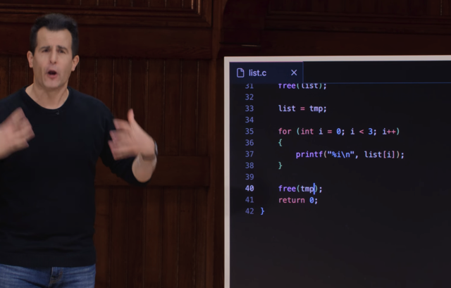</kbd>

> [!NOTE]
> Q: Ở đây mà **free(tmp)** thì **cũng được phải ko**?
>
> D: **Correct**, vì temp và list **đều chứa address của vùng
> 16 bytes này**, nên free cái nào cũng  sẽ có hiệu ứng là
> **giải phóng memory vùng đó**
>
> Nhớ là nó sẽ **giải phóng memory vùng đó**, chứ  **không
> phải chỉ là delete address value** chứa trong tmp hay list

 

<kbd>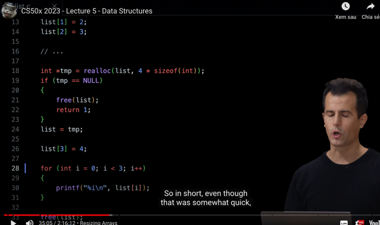</kbd>

> [!NOTE]
> **realloc(list, 4 * sizeof(int))**: Giới thiệu function
> **realloc** = **re-allocate** sẽ giúp **làm cái việc copy ở
> trên**, nó sẽ **tìm vùng không gian 16 bytes** và nếu có
> sẽ **tự động copy value của list qua** và tất nhiên cũng
> **trả về address của byte đầu tiên** của vùng đó
>
> Thì ổng nói dù rằng cũng **chẳng more efficient** vì cái
> cách này **vẫn là manually request** nó tìm vùng bộ nhớ
> khác  và **copy mọi thứ qua** nhưng **ít nhất không cần
> phải tự copy** nên an toàn hơn (ít bug hơn)

 

<kbd>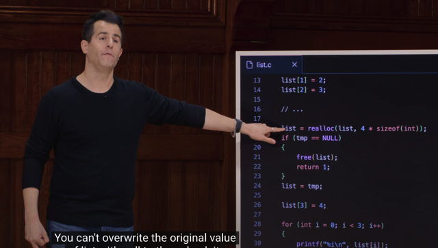</kbd>

> [!NOTE]
> Q: Sao vẫn cần phải có **tmp**?
>
> D: Good question. Đúng là **nếu mọi chuyện êm đẹp**, tôi chỉ cần làm
> vầy:
>
> **list = realloc(list, 4 * sizeof(int))**: Nó sẽ **tìm vùng 16 byte**, **copy từ
> data từ vùng 12 bytes address đang giữ bởi list sang** và **reassign
> address vùng mới này cho list**.
>
> Nhưng**nếu nó không tìm được thì sao**, nó sẽ **trả về NULL**, lúc này
> cái **address của vùng 12 bytes sẽ bị mất** (khác với việc được free
> nhé) vì **list bây giờ giữ  address = 0 (NULL)**. Gây ra hiện tượng
> **memory leak**, và sẽ không có cách nào tìm lại vùng 12 bytes kia.
>
> Do đó sẽ **an toàn hơn khi dùng temp và check chắc chắn**

 

<kbd></kbd>

> [!NOTE]
> Q: **realloc** sẽ tự **free vùng memory 12 bytes giùm** ta đúng
> không?
>
> D: **Correct**, do đó khi realloc thành công và **trả về address
> vùng 16 bit mới** (với data đã copy) cho temp thì thật ra
> **vùng 12 byte cũ đã được giải phóng**
>
> Ta chỉ việc cho**list = tmp** để list bây giờ trỏ về vùng mới
>
> ===
>
> Và ổng nói realloc **còn thông minh hơn** một chút khi giả sử
> mình **cần 16 bytes** nhưng ở phía sau cái vùng 12 bytes cũ
> **vẫn có 4 bytes trống** (chứa garbage chứ không phải value
> của var nào đó đang xài) thì nó **sẽ trả về address của
> chính vùng 12 bytes đó** (Đúng hơn thì address của cái byte
> đầu tiên) nhưng lúc này ta có thể **an tâm xài cái vùng 4
> byte thêm này**

 

<kbd></kbd>

> [!NOTE]
> Đại khái với các **công cụ mạnh mẽ malloc và realloc**, và
> **free**, ta có thể tạo các **data structure** như **queue**,
> **stack** mà có thể **dynamically resize**.
>
> Ví dụ **khi cần thêm memory, ta có thể realloc**... **chứ không
> cần phải pre-define một kích thước có sẵn** nữa

 

<kbd>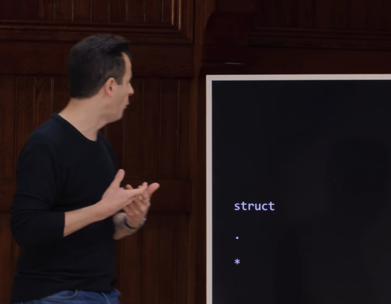</kbd>

> [!NOTE]
> Nhắc lại ba syntax: 
>
> **struct**, 
>
> dot "**.**" để **đi vào variable của
> struct** (như person**.name**, person**.age** vậy) và 
>
> ***** **để đi vào vùng memory từ address** hold bởi pointer

 

<kbd></kbd>

> [!NOTE]
> Đại khái là khi nào cần dùng **"."** và **"*"** cùng lúc ví
> dụ
>
> (*p).name : Đại khái giả sử có p là **person-pointer**
> và **person struct**có **variable name**
>
> Thì việc **đi vào address hold bởi p** để tới person đó, 
> sau đó lấy value
>
> Chính là lúc xài cả hai "." và "*"
>
> (*p).name =  p **-> name**

 

<kbd></kbd>

 

<kbd></kbd>

<kbd></kbd>

<kbd></kbd>

> [!NOTE]
> **Linked list**là một **powerful data structure** mà ta
> hưởng lợi rất nhiều từ nó.
>
> Ổng chưa nói gì nhiều nhưng đại khái là nó cho phép
> ta **connect the dot** lại, hình dung là **cho phép 4 nằm
> riêng ở đâu đó mà vẫn giữa được thứ tự 1,2,3,4** mà
> k**hông cần phải move 1,2,3 qua đó** như nãy giờ ta
> làm với malloc và realloc

 

<kbd>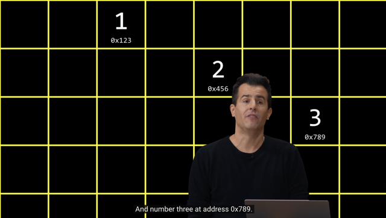</kbd>

> [!NOTE]
> D: Giả sử tôi có **3 byte** chứa 3 số **1, 2, 3** như này 
> (1 byte vẫn có thể để số ví dụ như integer 8 bits uint8_t
> bữa trước dùng để thể hiện pixel value 0-255)
>
> D: **Tại sao nó không phải là array?**
>
> A: Vì các address của**chúng không nằm kế tiếp nhau
> (Contiguous)**

 

<kbd></kbd>

> [!NOTE]
> Thì ổng nói là **nếu bằng các nào đó** ta có thể **string
> them together** (nối lại) để làm sao **từ 1 tôi có thể đi tới
> 2**, **từ 2 tới 3** thì ta sẽ **có được một list thôi** mà
> **chẳng cần chúng phải nằm contiguous** (liền kề nhau)
> thực tế trên memory

 

<kbd>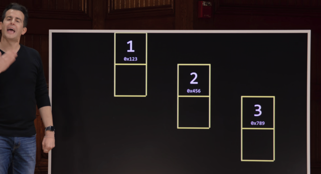</kbd>

> [!NOTE]
> Đại khái ổng nói là để làm được việc này, thì tôi sẽ t**heo
> quy luật** thôi **muốn có thêm thông tin** để sao đó **link các ô
> này lại** thì cần p**hải dùng thêm một ít memory.**

 

<kbd></kbd>

> [!NOTE]
> D: Trong ô này nên **chứa cái gì** để link 1,2,3 lại với nhau?
>
> A: **Address của ô 2.**
>
> D: Chính xác

 

<kbd>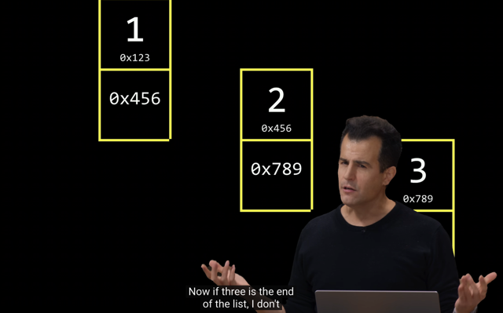</kbd>

> [!NOTE]
> Như vậy là với mỗi (byte) của các số (ví dụ uint8_t) này,
> ta gắn với **nó một (8 byte) pointer**, mang **address
> của cái int kế tiếp**

 

<kbd></kbd>

> [!NOTE]
> D: Tại ô **3 vị trí cuối**, thì cái ô đi kèm này nên để gì?
>
> A: **NULL**

 

<kbd>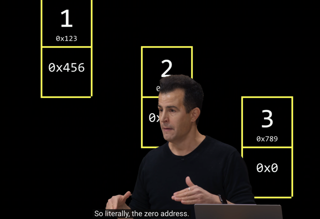</kbd>

> [!NOTE]
> Correct, **NULL** hay cũng chính là **byte 0x0** -**byte đầu
> tiên trong memory**, được **đặc dụng như một signal**, chứ
> **không dược dùng để chứa value**.

 

<kbd></kbd>

> [!NOTE]
> Và cuối cùng **chỉ "xin" thêm một (8 byte) pointer** nữa
> **chứa address của cái integer đầu tiên** là hoàn thành

 

<kbd>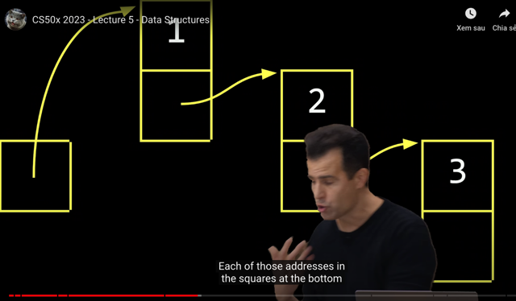</kbd>

 

<kbd></kbd>

<kbd></kbd>

<kbd>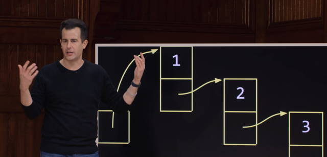</kbd>

> [!NOTE]
> Là ta đã có một **linked-list**, các int (chính xác hơn đang
> vẽ 1 ô 1 byte như này thì nên hiểu là uint8_t) **không cần
> nằm contiguously** trên memory nhưng **vẫn có thể tạo
> thành một list**

 

<kbd></kbd>

> [!NOTE]
> Có người hỏi rằng trong "**traditional array**" thì **có phải có một
> pointer riêng biệt chứa address** của c**ái item đầu tiên** hay
> không
>
> D: **Không**, trừ khi mình **assign nó với một cái pointer var** ví
> dụ **int *list hay char *s** thì list và s là pointer var sẽ chiếm 8
> bytes và mang value là address của cái int hay char đầu tiên.
>
> Nhưng **bản chất cái name array chỉ là một label**, **cho một dải
> các byte trên memory** **không có một cái pointer nào** "luôn đi
> kèm nó"
>
> HIểu nôm na là vậy

 

<kbd>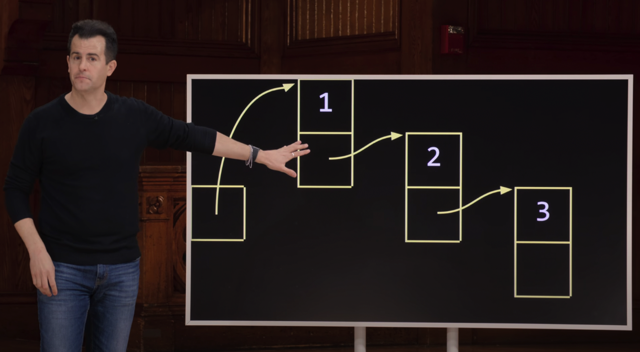</kbd>

> [!NOTE]
> Rồi có thằng hỏi 3 có thể nối với 2 (backward) lại được
> không
>
> D: Ko, trừ khi dùng**2-ways (double linked list)** hoặc 3
> có thể nối với 1 Những cái này **doable** nhưng **chỉ tổ
> làm phức tạp thêm** nên cơ bản chỉ **như này là có
> Linked List rồi**

 

<kbd>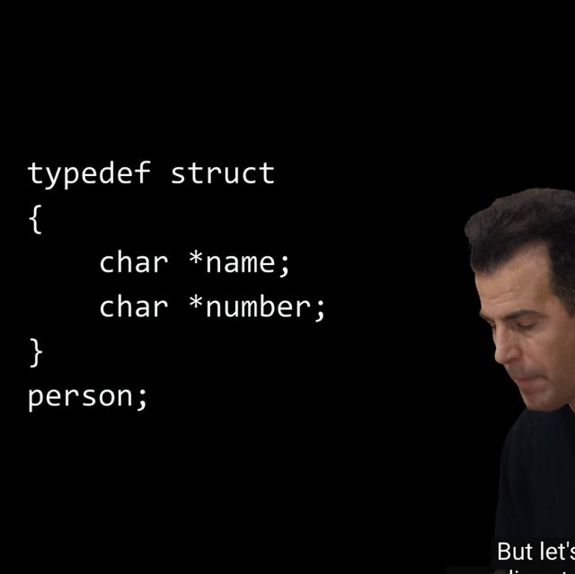</kbd>

<kbd></kbd>

<kbd>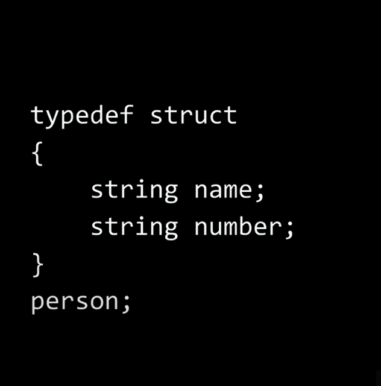</kbd>

 

<kbd>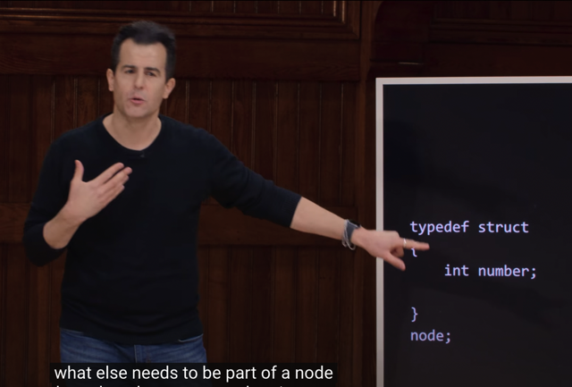</kbd>

> [!NOTE]
> Ok, bắt đầu**implement nó trong C**, tương tự như **struct**
> represent một **person** bữa trước, giờ ta define **struct**
> represent một "**node**"
>
> D: **Cần thêm cái gì để represent một NODE** ta vừa vẽ ở
> trên (ý là cụm 2 cục 1 cục chứa số int 1 cục chứa address
> tới số tiếp theo)
>
> A:**int pointer**

 

<kbd>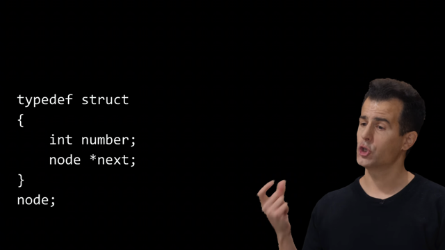</kbd>

> [!NOTE]
> Đúng hơn là **"node pointer"**, là một var thuộc loại **pointer**,
> chứa **address của một node khác**

 

<kbd></kbd>

> [!NOTE]
> Đại khái khúc này **có chút vướng mắc** khi ta
> **define node** mà **trong đó lại có var loại node**

 

<kbd>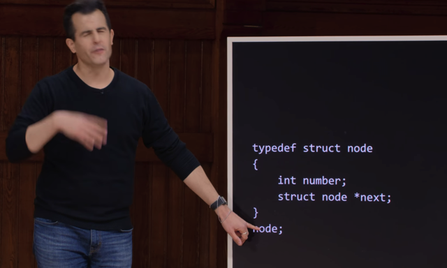</kbd>

> [!NOTE]
> Thì ta phải **define hơi ruờm
> rà chút xíu** như này mới được

 

<kbd></kbd>

> [!NOTE]
> D: Với cái này ta đã giải quyết được vấn đề gì?
> **Upsize** của nó là gì?
>
> D: **Ta không cần phải có các contiguous chunk** trong
> memory để **chứa một list nữa**.
>
> Và**khi cần extend thêm** số 4 chẳng hạn ta**chỉ cần từ
> số 3, trỏ tới address của 1 node** nữa và k**hông phải
> copy vòng vòng nữa**

 

<kbd>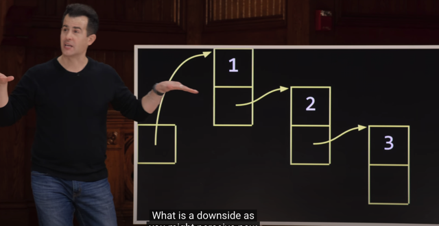</kbd>

> [!NOTE]
> D: Ok correct, vậy **downsize** là gì
>
> S: **Phải dùng nhiều memory hơn.** D: Correct! Quả thật
> **mỗi int cần có 4 byte (hay như ở đây xài  uint8_t tốn có 1
> byte)**, bây giờ **phải có thêm 8 byte cho pointer** cho mỗi
> cái nữa.
>
> Nên nó thật ra là tốn thêm **gấp 8+1 = 9 lần memory**Thì ổng nói đây là cái **quy luật trade off**, **được cái này
> phải hi sinh cái kia**

 

<kbd>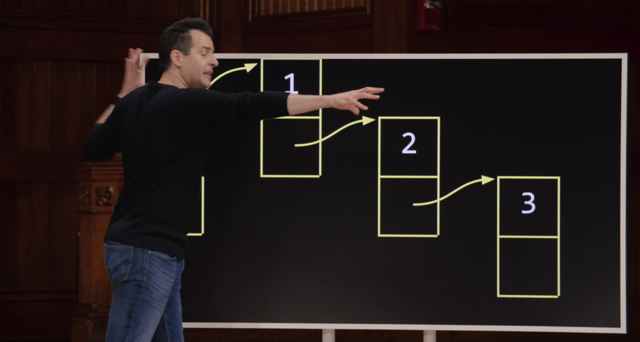</kbd>

> [!NOTE]
> D: Còn **downsize gì khác?**
>
> A: Đó là rõ ràng **muốn lấy value của thằng thứ 3**, 
> **phải đi từ thằng thứ 2** (vì nó mới có address của thằng thứ 3)
> và tiếp tục **muốn lấy value của thằng 2** thì p**hải đi từ thằng 1**
>
> D: **Correct**, ta **không còn square bracket indexing được nữa**
> và tệ hơn nữa đó là ta sẽ hy sinh một algorithm?
>
> A: **Không lấy thằng ở giữa được nữa**, thì không **Binary Search**
> được nữa
>
> D: Correct! Và ta sẽ tìm cách giải quyết nó sau break time

 

<kbd>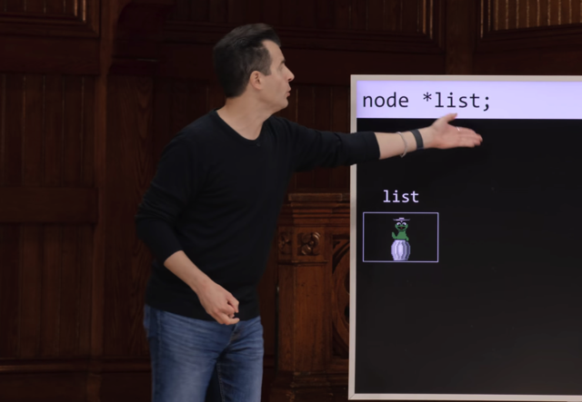</kbd>

> [!NOTE]
> Đại khái là ổng giải thích visually những gì xảy ra trong
> memory
>
> **node *list**; máy tính sẽ **tạo một vùng 8 bytes cho list** - là
> một var loại **pointer-tới-node.**
>
> Và vì **chưa set address** là gì cả nên nó là **garbage value**
> nào đó (set bởi một chương trình nào đó trước đây) có
> sẵn trong 8 byte này

 

<kbd>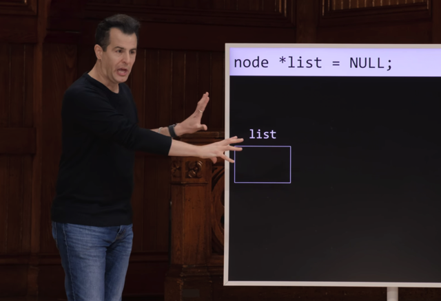</kbd>

> [!NOTE]
> Khi define **node *list = NULL**; tức là bảo **máy tính chuẩn bị
> 8 bytes cho một node-pointer** nhưng đồng thời **set address
> value là 0x0**

 

<kbd>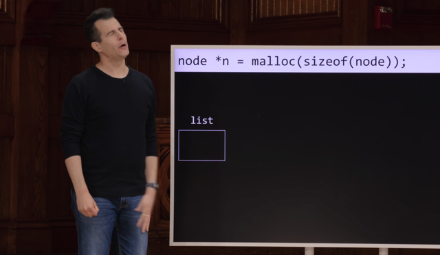</kbd>

 

<kbd>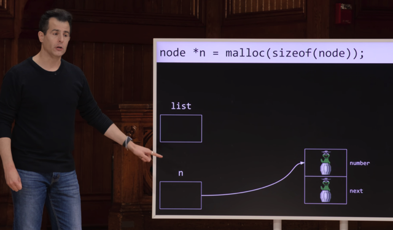</kbd>

> [!NOTE]
> Rồi tới dòng này **node *n = malloc(sizeof(node))** ra lệnh 
> cho máy tính 
>
> 1. Tính **toán ra một node thì cần bao nhiêu byte** 
>
> 2. **Kiếm một vùng memory available có kích thước**
> **bằng số byte trên**
> 3. **Dành 8 bytes** để dành cho **node-pointer n** chứa **address
> của một node**, và đồng thời **gán luôn address của cái vùng
> memory ở trên vào**

 

<kbd>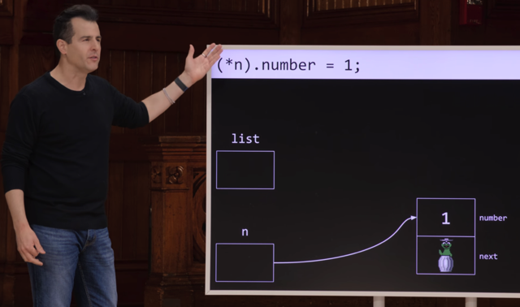</kbd>

<kbd></kbd>

<kbd>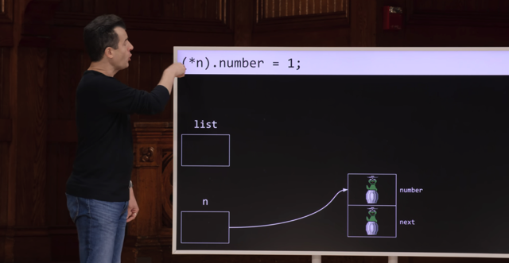</kbd>

> [!NOTE]
> Thì tại đây node đã được máy tính **đã tìm một vùng memory**
> nhưng vùng đó **chỉ đang chứa garbage**
>
> **(*n).number = 1**; tức là ra lệnh cho máy tính **ĐI TỚI ADDRESS 
> hold bởi n** (đi tới vùng memory có address giữ bởi n). 
>
> Tại đó ta sẽ tìm thấy một struct, có hai variable là **number** và **next**.
> Chính xác hơn là tại đó ta sẽ có hai phân vùng, một cho number
> và một cho next
>
> Thì **tiếp cận variable number**, và **gán value cho nó bằng 1**.
> Tiếp cận phân vùng dành cho number, set value (chuỗi binary)
> có gía trị = 1 vào
>
> Cái này tương đương **n -> number = 1;**

 

<kbd>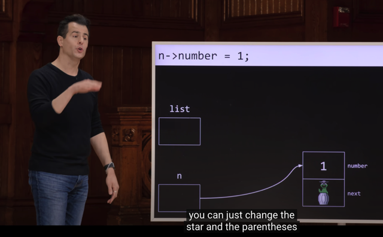</kbd>

> [!NOTE]
> Thì đại khái là hành động đi vào address chứa bởi
> pointer n và tiếp tục access variable number có thể
> viết gọn như này **n-> number**

 

<kbd>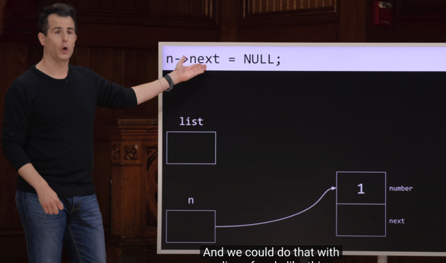</kbd>

<kbd></kbd>

<kbd>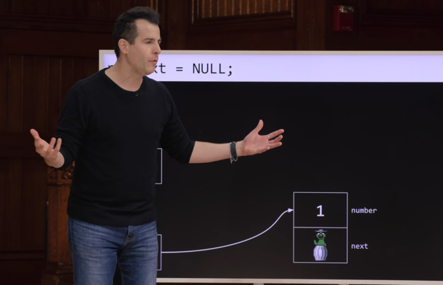</kbd>

> [!NOTE]
> Một việc quan trọng phải làm đó là **"clear" the garbage
> value đang nằm trong next** - là một node-pointer
> như đã biết (define struct ở trên)
>
> **Phòng khi ta quên thì nó sẽ bị sai**. Nên phải **sét cho nó
> bằng NULL luôn**
>
> Again có thể dùng **(*n).next = NULL** hay **n -> next = NUL**L
> đều được

 

<kbd>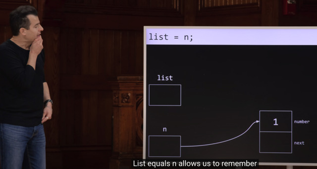</kbd>

> [!NOTE]
> **list = n**: máy tính sẽ **lấy cái address hold bởi
> n**,**set cho cái list** - cũng là b tạo hồi nãy

 

<kbd></kbd>

> [!NOTE]
> Lúc này list (node-pointer) đã point tới node thứ
> nhất rồi (list đã mang giá trị là address của
> node 1 trên memory rồi)

 

<kbd></kbd>

> [!NOTE]
> Và tôi **cũng không care cái temp node-pointer**
> variable n hồi nãy. Nhưng**cơ bản bây giờ tôi
> đã có linked-list**

 

<kbd>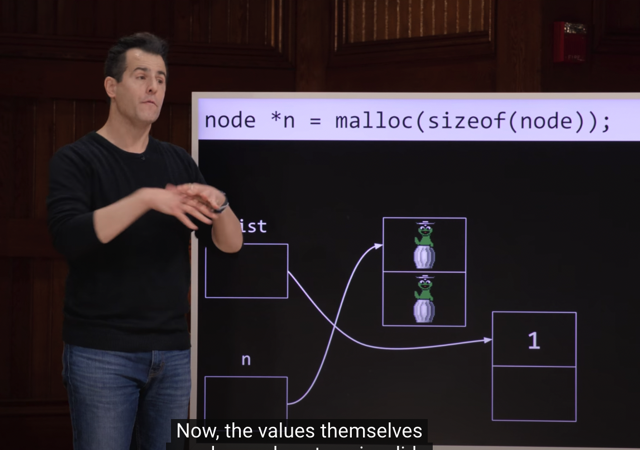</kbd>

> [!NOTE]
> node *n = malloc(sizeof(node));
>
> **node *n** sẽ yêu cầu máy tính **kíếm giùm 8
> byte để dành cho node-pointer n**
>
> Rồi **malloc(sizeof(node))** sẽ kêu máy tính**kiếm giùm
> một vùng memory có size = node's size nữa**
>
> Và cuối**cùng là lấy cái address của byte đầu tiên 
> của vùng memory đó** **set cho node-pointer n**
> Again, cái vùng memory kia vẫn chỉ đang chứa garbage

 

<kbd>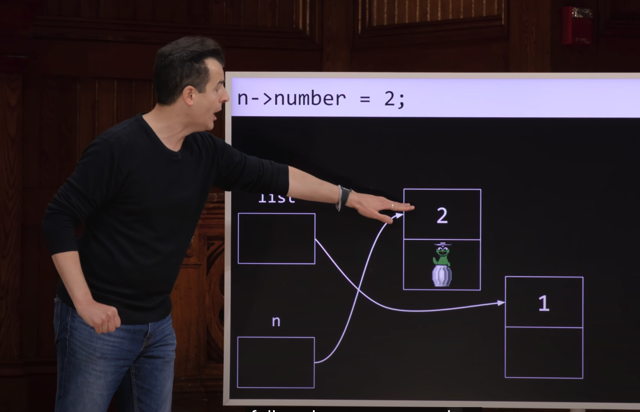</kbd>

> [!NOTE]
> Tiếp,**n -> number = 2** (tương đương**(*n).number
> = 2**) sẽ bảo máy tính **đi theo address hold bởi n** để
> tìm thấy một vùng memory được quy hoạch cho một node
> và **set sub-area memory ứng với variable number value = 2**

 

<kbd>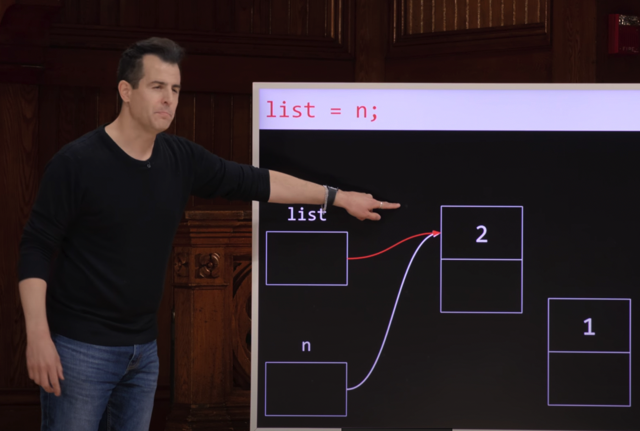</kbd>

> [!NOTE]
> D: Giờ nếu cho **list = n** thì có gì sai?
>
> A: Khi đó **list** (một node-pointer) **đang giữ address tới cái 
> vùng memory của cái node thứ 1** sẽ**chuyển sang giữ
> address tới vùng memory chứa cái node thứ 2**. 
>
> Dẫn đến**address cái node thứ 1 bị mất** -> **Memory leak**

 

<kbd>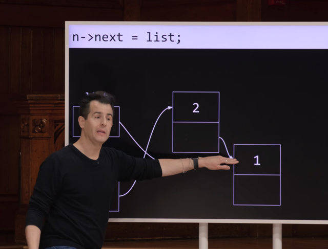</kbd>

<kbd></kbd>

<kbd>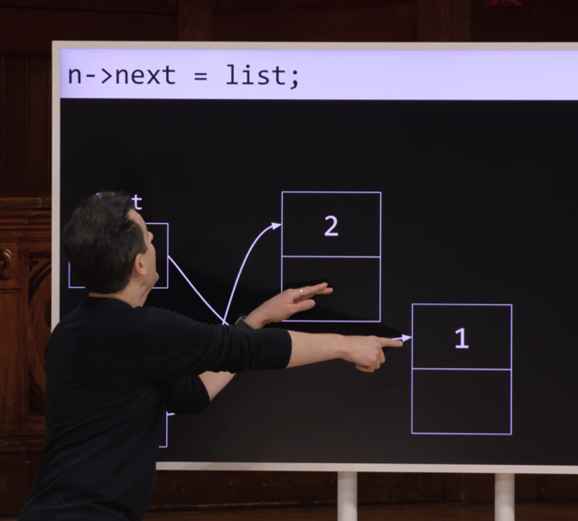</kbd>

> [!NOTE]
> Ổng nói bây giờ giả sử tôi vẫn ok với cái list có item 2-1
>
> thì tôi làm vầy: **n -> next = list** điều này sẽ yêu cầu máy
> tính
>
> 1.**Đi theo address hold bởi n** để **tới cái (vùng memory
> của ) node thứ 2**  (cái mà đang có number = 2), tại đó nó
> là một struct thì **tiếp cận next** là sub-area memory 8 byte
> dành để chứa một address
>
> Và **set giá trị address cho nó bằng cái address value
> đang giữ bởi list (và chính là address của node 1)**
>
> Kết quả là **cả list và "node 2".next đều chứa address
> của cái "node 1"**

 

<kbd>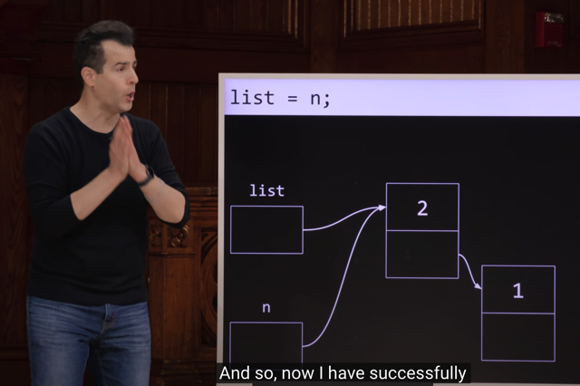</kbd>

> [!NOTE]
> Tới lúc này set **list = n;**
> Thì lúc này set value mới cho list bằng address
> đang giữ bởi n (chính là **address của cái "node 2"**)

 

<kbd>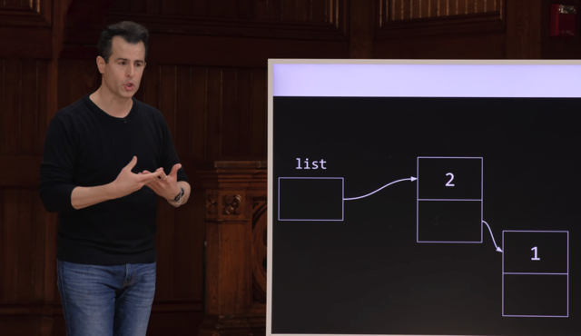</kbd>

> [!NOTE]
> Tới đây, **dù cái order đang ngược nhưng
> cơ bản là tôi đã có một linked líst
>
> List -> node 2 -> node 1**

 

<kbd>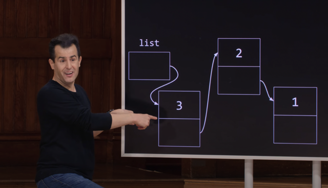</kbd>

> [!NOTE]
> Đại khái là **cái đây chính là concept của stack**, khi **một số mới
> được add vào sẽ "nằm ở trên"**
>
> Và giả sử tôi**muốn insert thêm số 4**, thì chỉ cần làm 2 bước:
>
> 1.**tạo "node 4"** và**point nó tới "node 3"**, và
>
> 2.**chuyển list cho nó point tới "node 4"** là xong
>
> Và dù có chưa giải quyết được vấn đề thứ tự nhưng cơ bản 
> khá ok ròi

 

<kbd>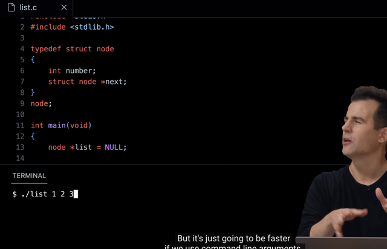</kbd>

> [!NOTE]
> Sắp tới ổng **muốn làm một function có thể command line**
> **argument** như**list 1 2 3**là nó có thể  **tạo một linked list**

 

<kbd>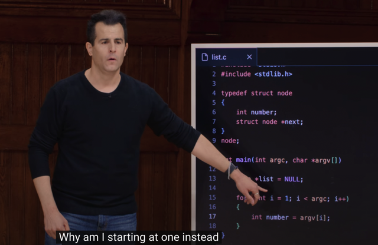</kbd>

> [!NOTE]
> D: Tại sao start with 1?
>
> A: Vì cái (command line) **argument** **đầu tiên** là cái **tên
> function** = list
>
> D: Correct. Tiếp theo cái này sẽ không work vì **argv[i]** là char
> vậy để **convert từ char sang int** thì dùng function gì nhớ không?
>
> A: **atoi() A-TO-I**
>
> D: Correct!

 

<kbd>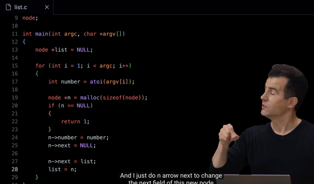</kbd>

> [!NOTE]
> Giải thích tóm lược:
>
> i = 1:
>
> line 19: tạo node-pointer n chứa address tới node area
> (đang có garbage value)
> line 24, 25: đi theo address bởi n, tới node area set value
> của int var **number** = i = 1 và set node-pointer var **next** = **NULL**
> line 27: đi theo address bởi n, ...set node-pointer var **next** = **address
> đang hold bởi list**, lúc này cũng là **NULL**
> line 28: cho **list** mang address mới là address đang giữ bởi n, chính
> là **address tới node 1** (vùng memory của node 1)
>
> i = 2:
> line 19, 24,25: tương tự, tạo node-pointer n chứa address tới một
> node area mới (node 2), đi theo address đó set giá trị 2 cho number,
> NULL cho next.
> line 27: set address của node 2's **next** bằng address của list đang giữ
> chính là address của vùng memory **node 1**.
> line 28: cho **list** address mới là address là address đang giữ bởi n, 
> chính là address với**node 2** 
>
> i = 3:
> line 19, 24,25: tương tự, tạo node-pointer n chứa address tới một
> node area mới (node 3), đi theo address đó set giá trị 3 cho number,
> NULL cho next.
> line 27: set address của node 3's **next** bằng address của list đang giữ
> chính là address của vùng memory **node 2**.
> line 28: cho **list** address mới là address là address đang giữ bởi n, 
> chính là address với **node 3** 
>
> Kết thúc hiện trạng:
>
> list -> node 3 (list giữa address của node 3)
> node 3's next -> node 2 (node 3.next giữ address của node 2)
> node 2's next -> node 1 (node 2.next giữ address của node 1)
> node 1's next -> NULL
>
> =====
>
> Tóm lược: Tạo node mới thì **point nó tới node đầu** (set = address hold bởi list)
> và cho **list point tới node mới đó.**

 

<kbd>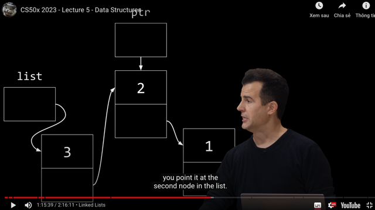</kbd>

<kbd></kbd>

<kbd>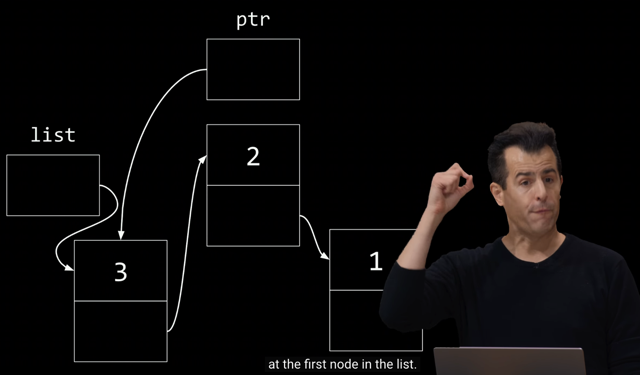</kbd>

> [!NOTE]
> Tới đây đại khái là ổng**muốn tạo một ptr**
> để **lần theo linked lis**t mà **in node's number**

 

<kbd>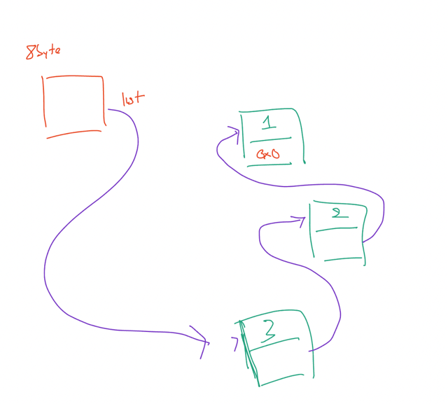</kbd>

<kbd></kbd>

<kbd>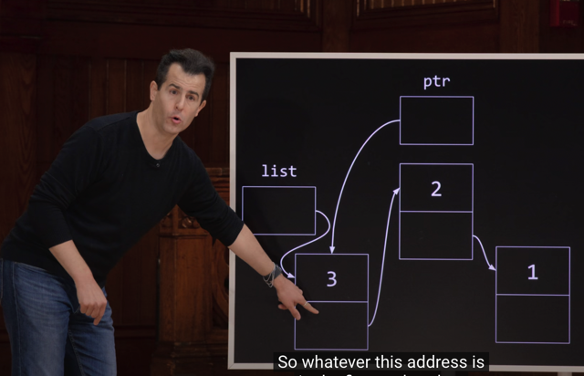</kbd>

> [!NOTE]
> Đoán thử: 
>
> node ***ptr = list;**
> while (ptr != NULL)
> {
> print(%i, **ptr -> number** / hay **(*ptr).number** cũng được)
> ptr = **ptr -> next** hay (*ptr).next cũng được.
> }
>
> Ý nghĩa là, **ban đầu cho ptr trỏ tới list** chính là tới **node đầu tiên** 
> (hiện giờ là node 3)
>
> Sau đó check **điều kiện address hold bởi ptr còn khác NULL** 
> thì tiếp tục
>
> Đi vào address hold bởi ptr (và tìm được node) và access int var **number** 
> và **in ra**
>
> Đi vào address hold bởi ptr (và tìm được struct) và access node-pointer 
> var **next.** Lấy address của nó **set lại cho ptr**
> Kết quả là lúc này **ptr sẽ trỏ tới / chứa address của node tiếp theo node 2**.
>
> Và ở cuối cùng, khi nó thực hiện ở node 1 thì lúc này cái **next của node 1
> chứa value = NULL thì nó dừng**

 

<kbd>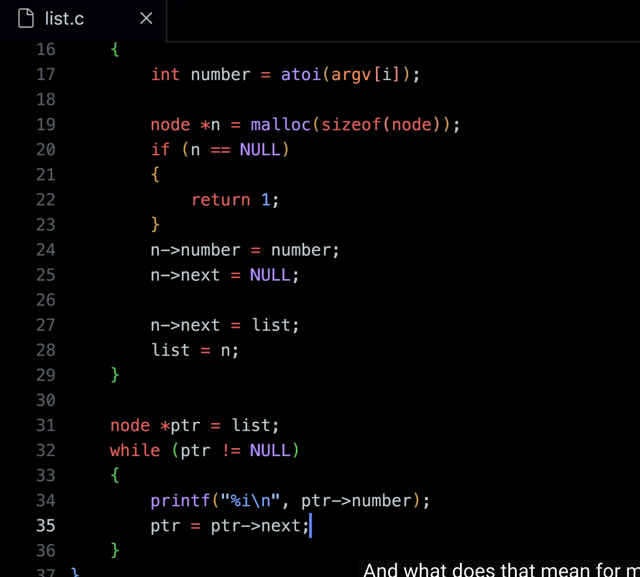</kbd>

> [!NOTE]
> D: Correct!

 

<kbd>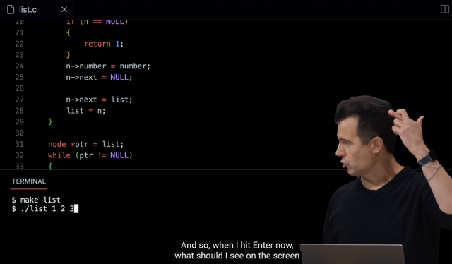</kbd>

> [!NOTE]
> D: Nó sẽ ra gì? 
>
> A: 
>
> 3 
> 2 
> 1

 

<kbd>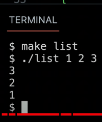</kbd>

 

<kbd>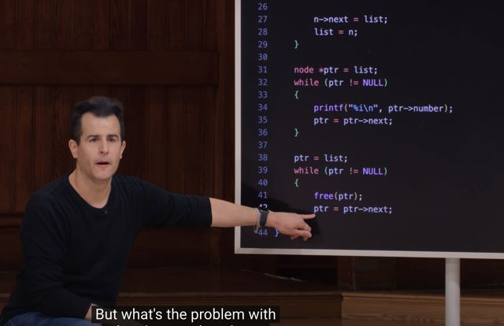</kbd>

 

<kbd>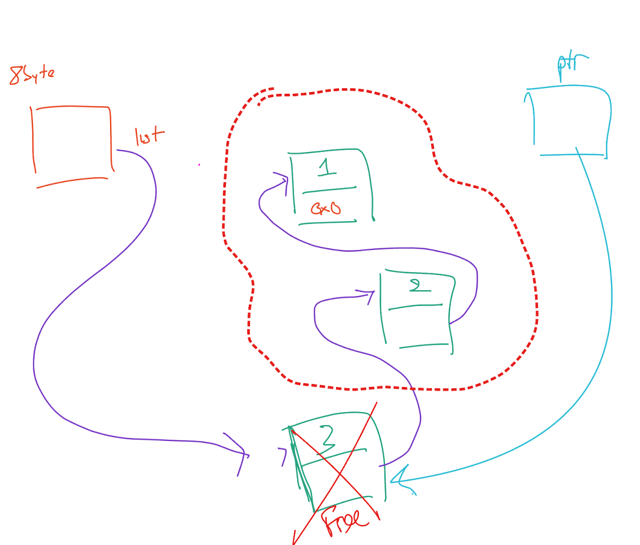</kbd>

> [!NOTE]
> D: Giờ muốn muốn **free data** thì tôi định t**rỏ từng node** và **free từng node** 
> thì làm vậy có gì sai?
>
> A: Đó là với việc **ptr = list** tức là **quay lại point tới node 3**
>
> thì khi **free(ptr)**thì nó sẽ **giải phóng cái (vùng memory) của node 3**.
>
> từ đó **mất luôn address tới node 2, từ đó tới node 1**.
>
> -> **Memory leak.**
>
> ====
>
> Đề xuất: Ổng **phải giữ address tới node 2** **trước khi free node 3**,
> rồi **giữ address tới node 1** **trước khi free node 2**. ví dụ:
>
> while (X) // một điều kiện nào đó để stop
> {
> // Cho list giữ address node 2 bằng cách đi vào node 3 (list cũng đang
> // giữ address node 3) và lấy value của node 3.next gán lại cho list.
> list = list -> next (tương đương list = (*list).next)
>
> // Giải phóng node 3
> free(ptr)
>
> // Cho ptr trở point tới node 2
> ptr = list;
> }
>
> Như vậy ở node 1. list sẽ giữa address NULL, nên ptr cũng vậy,
> nên điều kiện break X la ptr != NULL

 

<kbd></kbd>

> [!NOTE]
> D: Correct, nhưng thiếu một ý là**khi đã free(ptr)** thì **ptr sẽ
> INVALID**, và **ko còn được động tới nó nưã** trừ khi
> assign nó lại cho vùng khác
>
> Nên sửa lại như này, **nhìn sơ thì cũng giống cái mình
> đề xuất thôi** chẳng qua là**thay vì dùng chính cái list** thì
> ổng **dùng  một cái temporary node-pointer giữ cái
> address của node 2 trước khi giải phóng node 3**
> (free(ptr)) sau đó gán lại cho ptr address của node 2.

 

<kbd>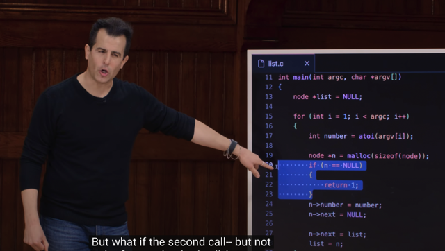</kbd>

> [!NOTE]
> Đại khái chỗ này cần phải thêm một chút đó là **sẽ có
> memory leak nếu malloc fail ở một step i nào đó**,  và khiến
> function return trong khi chưa free các node trước đó.
>
> Nên **phải làm một cái function garbage collector nhận một
> list và free nó ở đây** nhưng cơ bản là hiểu cách làm rồi

 

<kbd>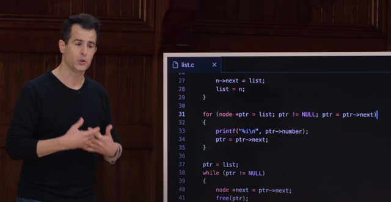</kbd>

> [!NOTE]
> Ổng nói thêm là có thể thích thì làm
> **for loop kiểu này cũng được**
>
> **for (node *p = list; ptr != NULL; ptr = ptr -> next)**

 

<kbd></kbd>

> [!NOTE]
> D: Thử nghĩ **search một linked list** thì cần **O** gì?
>
> A: **Phải đi từng node**, **n node thì cần n bước**  (mỗi
> node làm bao nhiêu phép tính thì theo nguyên tắc bỏ
> qua tiểu tiết) thì cũng coi  như cần n step -> **O(n)**
>
> D: Correct. **Insertion** thì sao?
>
> A: **O(1) vì cơ bản mỗi lần insert chỉ cần làm 1 hay vài động 
> tác** (set pointer blah blah) vài coi như chỉ cần 1 step
>
> D: Correct

 

<kbd></kbd>

> [!NOTE]
> Giờ giả sử như **append** (thay vì prepend, cách làm
> cũng vậy thôi, chỉ khác chút xíu) thì search cần running time
> bao nhiêu? 
>
> A: Vẫn là phải đi từng node -> **O(n)**
>
> D: Correct. **Insertion** thì sao
>
> A: **O(n)**, vì để insert vào đuôi ví dụ đang là list->1->2->3
> Mà muốn insert 4 vào thì phải đi qua hết để tới node cuối

 

<kbd>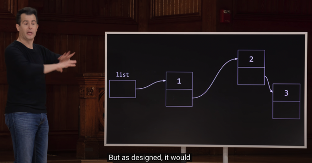</kbd>

> [!NOTE]
> D: Correct, tuy nhiên **để prepend nhanh hơn với chỉ 1
> bước giống như append** ở trường hợp trước là ta hoàn
> toàn có thể **giữ một pointer tới cái cuối cùng** mỗi khi ta
> insert để khi cần dùng nó để insert

 

<kbd>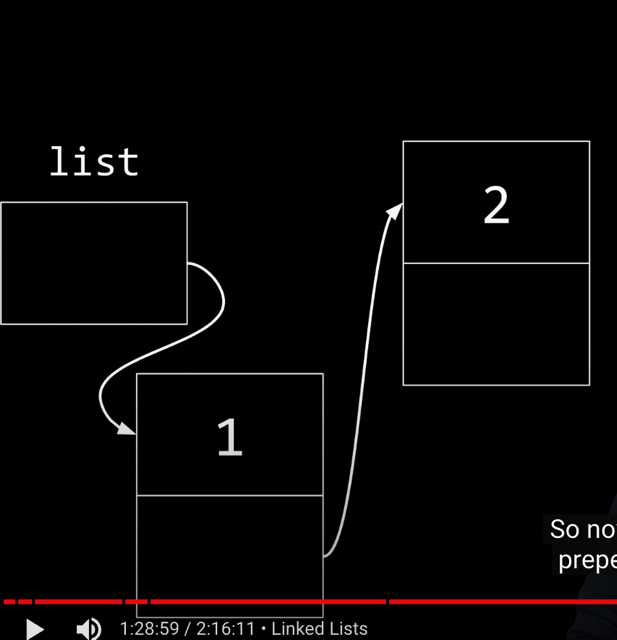</kbd>

<kbd>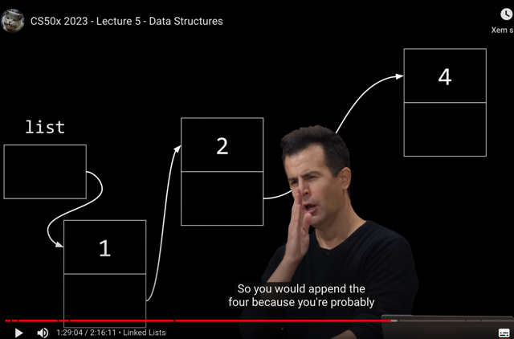</kbd>

<kbd></kbd>

<kbd></kbd>

<kbd>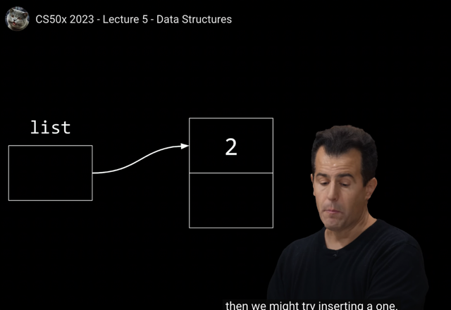</kbd>

> [!NOTE]
> Rồi nãy giờ insert prepending hay appending thì chính là ta **không
> care order**.
>
> Bây giờ đại khái là giả sử mình**insert vào nhưng giữ order** (tức là
> value từ nhỏ tới lớn). Ví dụ **bắt đầu có 2, Insert 1 vào thì prepend
> nhưng insert 4 thì append**. Thì ổng nói vẫn xoay sở làm được.
>
> Câu hỏi là **Big O gì nếu muốn maintain sorted order** (insert 1 node
> vào mà vẫn đảm bảo sorted order thì cần bao nhiêu running step ?
>
> A: Mỗi lần insert vào, theo n**guyên tắc trường hợp xấu nhất** thì ta cũng 
> phải **iterate trong mọi node** thì mới biết insert vào đâu ->**O(n)**
> D: **Correct!**

 

<kbd></kbd>

> [!NOTE]
> Đại khái ổng nói với l**inked list ta khắc phục vấn đề của
> array đó là cần dải memory liên tục**, Nhưng bị **mất khả
> năng lấy ra một cái ở giữa bất kì** do đó không thể thực
> hiện **binary search**
> Thì đại khái có thể khắc phục bằng cách dùng 2D: Tree

 

<kbd></kbd>

> [!NOTE]
> Cụ thể là Binary Search Tree

 

<kbd>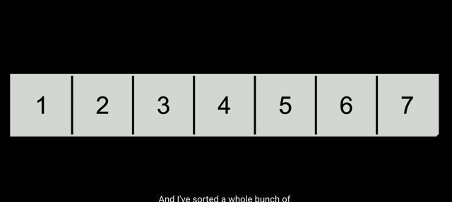</kbd>

 

<kbd></kbd>

> [!NOTE]
> Đại khái là với array như này ta biết là ta **có thể dùng binary
> search để search nhanh hơn.**
>
> D: Feature gì**linked list** có mà **array không có?**
>
> A: Đó là **pointer**, mỗi node trong linked list có pointer đến
> node tiếp theo.
>
> D: **Đúng**, và điều đó cho nó một khả năng đó là **có thể insert
> vào đầu hoặc vào cuối rất linh hoạt** mà không phải copy đi
> đâu cả.

 

<kbd>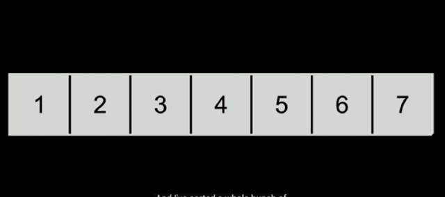</kbd>

<kbd></kbd>

<kbd>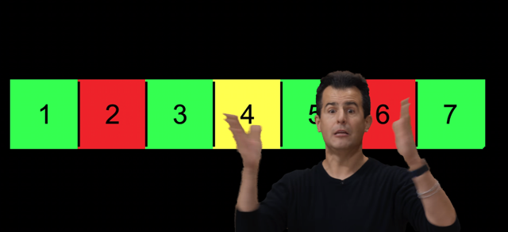</kbd>

> [!NOTE]
> Thì đại khái là giả sử ổng làm **binary search**, bắt đầu bằng
> **pick ô giữa để chia làm 2 phần**), rối**tiếp tục pick ô giữa 
> của mỗi phần để chia làm 2 phần tiếp**.
>
> Thì ổng nói **có vẻ như có một cái pattern gì đó**. Nên thử **đẩy
> ô vàng lên, đẩy các ô xanh xuống**

 

<kbd>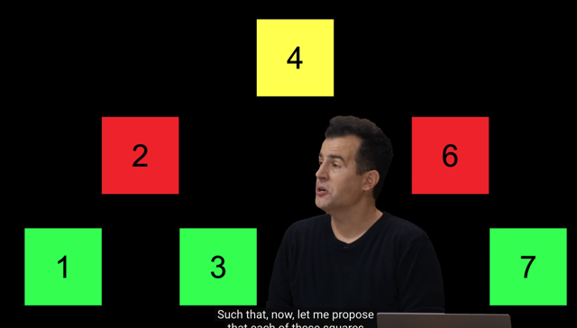</kbd>

> [!NOTE]
> Thì nó ra cái này.

 

<kbd></kbd>

> [!NOTE]
> Câu hỏi là thử nghĩ xem **làm sao có thể giữ các ô
> này connect nhau conceptually?**
>
> A: **Cho các ô link nhau (point tới nhau)**

 

<kbd>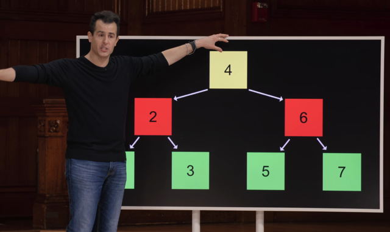</kbd>

> [!NOTE]
> Và đại khái là với kiểu này ta có thể lại làm Binary Search
> **ví dụ tìm số 5**, ta cũng sẽ **bắt đầu với một  ROOF
> NODE**. Rồi **so sánh vói 4** để biết nó**thuộc NHÁNH
> nào** (thay vì "phần" nào như trước)
>
> Từ đó ta **biết phải search nhánh bên phải.**
>
> Tiếp tục, như vậy.
>
> Và **nó mang Binary Search trở về**. Dù **vẫn giữ tính
> dynamic**, khi muốn insert một node, ta có thể dễ dàng add
> nó vào tree

 

<kbd>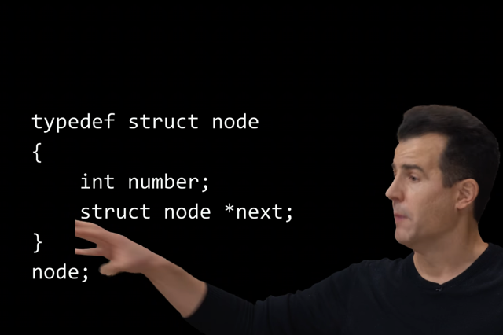</kbd>

 

<kbd>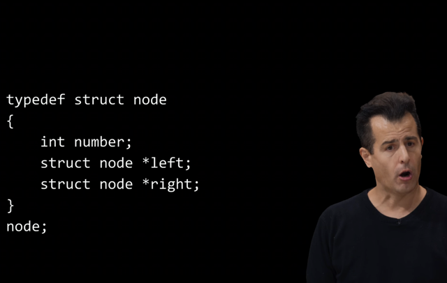</kbd>

> [!NOTE]
> Với ý tưởng đó ta sẽ **sửa lại cái struct node** để thay vì
> chỉ có **node-pointer next** thì giờ có **hai node-pointer** là
> **node *left** và **node *right**

 

<kbd>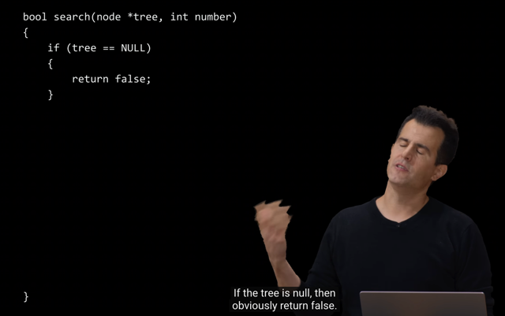</kbd>

> [!NOTE]
> Làm thử trước coi sao.
>
> bool **search**(node *tree, int number){
>
> **// Base case:**
> if(tree = NULL)
> {
> return false;
> }
>
> // Check value of the node is bigger than number, 
> // then go to left node
> if (**(tree -> number) > number)** //hay **(*tree).number** > number
> {
> **search(tree -> left, number)** // hay search**((*tree).left** , number)
> }
> // else go to right node
> else if (**(tree -> number) < number**)
> {
> **search(tree -> right, number)** // hay search(**(*tree).right**, number)
> }
> // else return true **(Found value!)**
> else
> {
> **return true;**
> }

 

<kbd>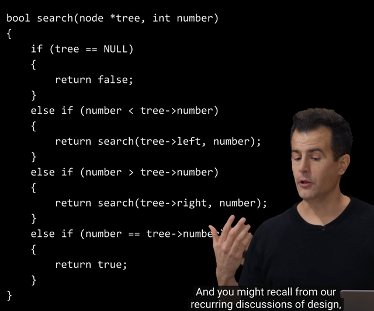</kbd>

> [!NOTE]
> Correct!!!

 

<kbd>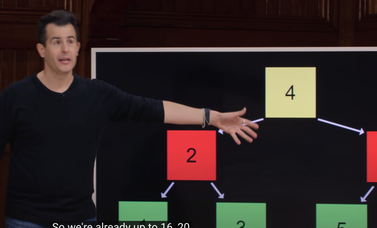</kbd>

> [!NOTE]
> Downside đó là nó sẽ**tốn nhiều memory hơn** khi node bây giờ
> có cả **left và right pointer.**
>
> Tuy nhiên **nếu memory không phải là vấn đề** thì cái này giải
> thích **tại sao nhiều người vẫn dùng  C** vì nó mang lại **sự
> control lớn hơn** so với các ngôn ngữ sau này như Python khi
> ta phải tuân theo, xài  cái mà người ta làm sẵn

 

<kbd></kbd>

> [!NOTE]
> Và nhắc thêm rằng **binary search tree là tree mà
> maintain yêu cầu là node ở nhánh trái nhỏ hơn, và
> node nhánh phải lớn hơn** từ đó mới binary search được

 

<kbd>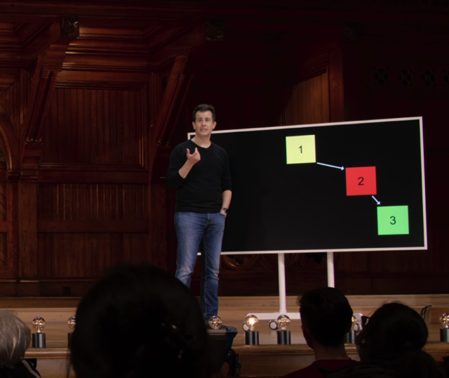</kbd>

> [!NOTE]
> Đại khái là **giả sử cái node đầu tiên là là cái nhỏ nhất đi**. thì
> nó sẽ thành như vầy (tức là không phải cái kiểu cân bằng 2
> nhánh)
>
> D: Nó sẽ trông giống cái gì?
>
> A: Giống **1D linked list**

 

<kbd></kbd>

> [!NOTE]
> D: Correct! Và dù là ta có thể t**hêm vài dòng code** để kiểu
> như **"chuyển lại"** cho cái số 2, số 3..nằm ở giữa nhưng ý
> ổng  muốn cho thấy rằng **không phải cứ binary search tree
> thì the height (ý nói số lần phải gọi search) sẽ là log 2 of n 
> mà nó có thể là n**Ví dụ nếu cái tree bắt đầu từ 4 thì nó thành balance tree
> và khi gọi recursion chỉ cần 3 lần là tới base case 
>
> Nhưng nếu bắt đầu từ 1 thì nó trở lại là linked list và sẽ vẫn
> phải gọi recursion 8 lần mới tới base case.

 

<kbd></kbd>

> [!NOTE]
> Và nếu ta có**Balanced Binary Search** tree thì ta sẽ
> có **O(log n)** 
>
> Nhưng **nếu không balanced thì nó sẽ
> vẫn là O(n)**

 

<kbd></kbd>

> [!NOTE]
> **O() nào là lý tưởng nhất?** ví dụ khi **searching**
>
> A: **O(1) 1 phát ra ngay**

 

<kbd></kbd>

> [!NOTE]
> Từ đó giới thiệu
> qua dictionary

 

<kbd>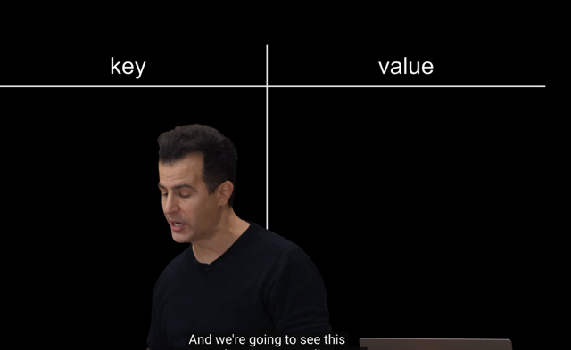</kbd>

<kbd></kbd>

<kbd></kbd>

 

<kbd>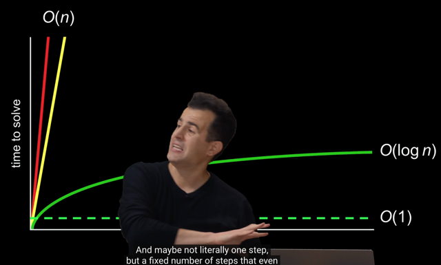</kbd>

> [!NOTE]
> Đại khái ổng nhắc lại the **Holly Grail đó là O(1)** **tìm ra ngay
> trong 10-20 một fixed number of running time** mà **không phụ
> thuộc vào number of problem n**

 

<kbd></kbd>

 

<kbd></kbd>

> [!NOTE]
> Đại khái là, với một bộ bài tây,**làm sao để sort nó bởi
> number và bởi suit** (chất, cơ rô chuồn bích)
>
> Thì ổng nói có thể một cách khôn ngoan là**xếp mỗi chất
> vào một bộ như này trước**
>
> Q: Làm vậy có tác dụng gì?
>
> A: Thì để khi **giả dụ như bắt đầu sort, ta chỉ việc đi
> từng bucket lấy con nhỏ nhất ra**.  Ví dụ bắt đầu với Át,
> thì đi mỗi bucket lấy Át bích, Át chuồn,  Át rô, Át cơ,
>
> D: **Yes, và cơ bản là chia vấn để nhỏ ra**

 

<kbd></kbd>

 

<kbd></kbd>

> [!NOTE]
> Hash table, đại khái là bắt đầu với một array các node
> để có thể bắt đầu quá trình search bằng cách
>  instantly access tới một node nào đó

 

<kbd></kbd>

> [!NOTE]
> Sau đó là các node sẽ linked list các node chứa tên
> có cùng chữ cái đầu

 

<kbd></kbd>

> [!NOTE]
> D với kiểu này, khi cần tìm tên **Vernon** tôi sẽ **đi một phát
> vào V bucket**, khi cần tìm Hermione, tôi **chỉ cần đi
> vào H bucket**
>
> D: Nhưng thử đoán vấn đề gì phát sinh?
>
> A: Là có ai đó chỉ chơi với người tên H, nên search 1 cái
> tên cũng không lợi gì mấy khi khi vào bucket H vẫn phải 
> Iterate trong list rất dài cái tên H trong đó

 

<kbd>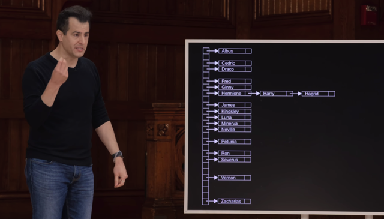</kbd>

> [!NOTE]
> Đại khái là với **hash table cho ta gần nhất với O(1).**
> Dù cho **có nhiều cái tên đến đâu** thì ta cũng **chỉ cần 
> tìm ở cái bucket tương ứng.**
>
> Nó **nhanh hơn linked list** vì**không phải loop trong toàn
> bộ name.**
>
> Nó **nhanh hơn array**, vì **không phải thực hiện binary 
> search.**
>
> Và t**rong phần lớn trường hợp**, ta sẽ tìm được cái tên
> trong**constant amount of time.**Mặc dù đôi khi **giả sử
> bạn chỉ toàn chơi với người tên H** thì cái **bucket H sẽ
> rất dài**. Do đó cũng là **kiểu tuỳ vào dataset**. Tuy nhiên đây
> vẫn là cái **gần nhất với constant time O(1)**

 

<kbd></kbd>

> [!NOTE]
> D: Làm sao để g**iảm probability of collision cho the H**? Ý
> ổng là làm sao **khắc phục cái vụ toàn là chữ H** này nằm
> chung 1 chỗ như này
>
> A: Có thể b**ucket thêm bằng chữ tiếp theo**. Để rồi ông
> Harry thì tìm bucket HA ông Hermione thì tìm ở bucket
> HE
>
> D: **Correct**! Bucket thay vì A,B,C thì có thể là **AA, AB, AC,.
> .BA, BB, ...**

 

<kbd></kbd>

 

<kbd></kbd>

> [!NOTE]
> Thậm chí là**3 chữ** thì như vậy ta **giảm đi
> đáng kể khả năng collision này**

 

<kbd></kbd>

> [!NOTE]
> D: Downside của việc này?
>
> A: Đó là **sẽ có nhiều bucket không có cái tên nào**  ví dụ
> ZZZ, AAA, VVV,....
>
> D: Correct! Và nó **cũng rất tốn memory** khi sẽ có tới
> 26x26x26 bucket

 

<kbd>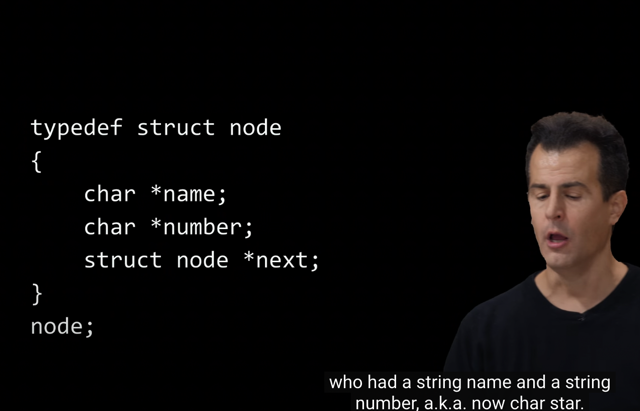</kbd>

 

<kbd>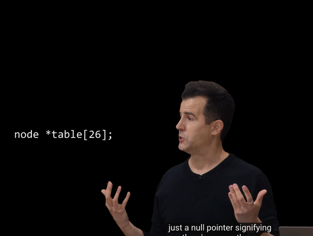</kbd>

> [!NOTE]
> Và đại khái là **hash table** cơ bản chỉ là một**array 
> fixed value các node.**
> Và**từ các node** đó có pointer tới các node khác trong 
> bucket.
>
> Và ví dụ một **bucket nào đó không có cái tên nào**, thì
> **pointer đơn giản là = NULL**

 

<kbd></kbd>

> [!NOTE]
> Và **hash function** cơ bản chỉ là **nhận cái tên**, và
> **trả ra bucket id** (b) của nó

 

<kbd></kbd>

> [!NOTE]
> Có người hỏi là liệu **có thể shrink**, ý là **delete các bucket
> mà không có item** nào để **khắc phục vấn đề tốn quá
> nhiều memor**y và sparse hay không
>
> D: Bạn **hoàn toàn có thể làm** nhưng sẽ **hi sinh đi một cái**
> đó là **index**, ví dụ **bucket chứa cái tên có chữ A vẫn ở index 0**, 
> nhưng những cái sau đó như B, C, D vì đã xoá những bucket
> ở giữa giữa như BB, nên **sẽ không còn ở index ban đầu nữa**.
>
> Từ đó ta sẽ **mất đi khả năng kiểu như là, nhận 1 cái tên**, **tính
> (bằng hash table) ra cái bucket id**, và **ngay lập tức JUMP tới cái
> bucket đó**. Mà đây là một **ưu điểm quan trọng** của hash table
> giúp đưa nó gần với O(1)
>
> ===
>
> Suy nghĩ thêm: Thật ra nếu xoá bớt những bucket trống giúp giảm
> đáng kể space bị lãng phí. Thì với vấn đề phone book này, 
> việc iterate trong vài trăm node để tìm ra bucket (thay vì instantly
> Jump tới bucket bằng id) thì cũng không mất quá nhiề thời gian. 
>
> Nhưng nếu là vấn đề khác, thì phải cân nhắc lại,

 

<kbd></kbd>

> [!NOTE]
> Đại khái là in **worse case** khi như trường hợp
> extreme hòi nãy **tất cả cái tên đều nằm chung 1
> bucket** thì ta v**ẫn phải iterate trong n cái tên - O(n)**

 

<kbd>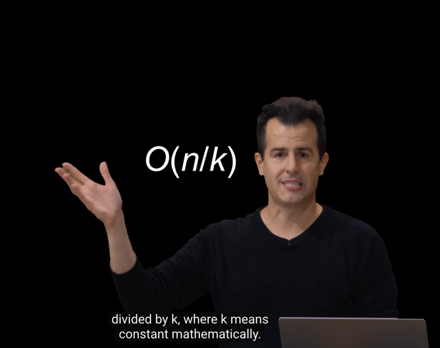</kbd>

> [!NOTE]
> Tuy nhiên **nếu design một cái hash table thông minh hơn**(kiểu như giảm khả năng 1 bucket nào đó có rất nhiều cái
> tên còn những cái khác lại chẳng có cái nào) thì ta **có
> thể giảm xuống còn O(n/k)**
>
> Và tuy rằng về **cơ bản nó vẫn là O(n)** nhưng **ngoài đời
> thực nó vẫn giúp nhanh hơn rất nhiều**
>
> Và việc **design một hash table đó chính là nhiệm vụ của
> hash function**

 

<kbd>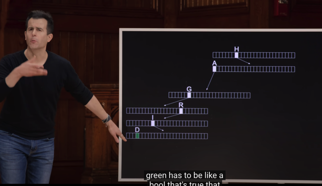</kbd>

> [!NOTE]
> Tries

 

<kbd>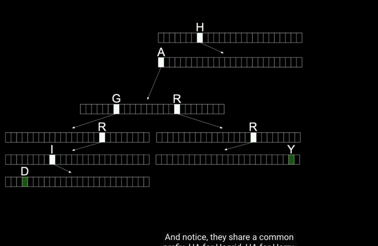</kbd>

> [!NOTE]
> Đại khái là nó bắt đầu,**node có array node-pointer size 26**.
>
> Các node-pointer nếu có value sẽ dẫn đến một **node** khác,
> không thì NULL.
>
> Quá trình insert như sau: HARRY.
>
> Tạo **node 1** gắn vào **node 0's node-pointer array [7]** 
> (tương ứng với chữ H)
>
> Tạo **node 2** gắn vào **node 1's node-pointer array [0]**
> (tương ứng chữ A)
>
> Tạo node 3 gắn vào node 2's node -pointer array [20]
> (tương ứng chữ R)
>
> ...tiếp tục như vậy
>
> Tạo node 5 gắn vào node 4's node -pointer array [20]
> (tương ứng chữ R). Tại đây ổng nói sẽ có kiểu như một cái
> bool status để indicate là kết thúc tên.
>
> Nôm na là (các node) đã đủ hình thành cái tên HARRY, 
> nên tại đây ta **sét value của node's number cho số phone của
> ông Harry**

 

<kbd>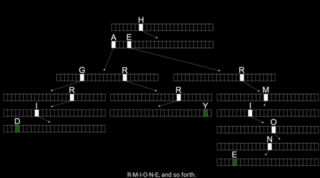</kbd>

> [!NOTE]
> Quá trình **search** như sau: **HARRY**.
>
> Từ top **node 0**, tìm đến **vị trí node-pointer array[7] 
> (Vị trí tương ứng với chữ H)**. Theo **address đó 
> đi đến node 1.**
>
> Trong node 1,**tìm đến vị trí node-pointer array[0]
> (Vị trí tương ứng với chữ A)**. Theo **address đó đi
> đến node 2**
> Tiếp tục như vậy khi đến node 5.
>
> Khúc này chưa hiểu lắm nhưng có thể là**tại node 
> 5, number của nó chính là số phone của HARRY**

 

<kbd>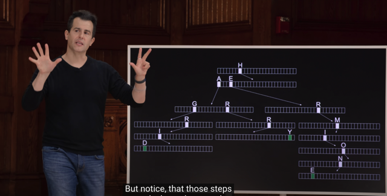</kbd>

> [!NOTE]
> Đại khái là nó sẽ **chỉ tốn số step để tìm bằng "số char
> trong tên"**
>
> Và đại khái là **cứ giả sử cái tên dài nhất trên thế giới có
> 50 char** thì ta có thể **tuyên bố là cái này chỉ tốn nhiều
> nhất 50 bước**. Và do đó nó **sẽ thật sự là O(1)**

 

<kbd>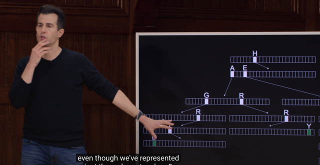</kbd>

> [!NOTE]
> D: Tại sao không dùng cái này cho mọi thứ?
>
> D: Vì nó tốn h**uge memory, huge sparse**

 

<kbd></kbd>

> [!NOTE]
> Đại khái ổng nói về cái **luật là trade-off giữa time và
> space**. Muốn **giảm time thì phải tốn space** và muốn
> **giảm space thì tốn time**
>
> Và bạn là người **phải decide cái nào quan trọng trong
> trường hợp cụ thể**

 

<kbd>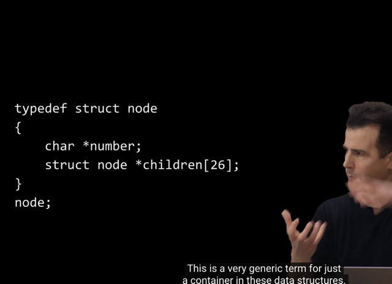</kbd>

> [!NOTE]
> **number** là**char pointer là hợp lý** chứ**không thể lưu số
> phone bằng int được**, vì số phone nó có thể có dạng **(+01)
> - 001 ...**
>
> **string** cũng được nhưng **cơ bản nó cũng là char pointer thôi**
>
> Và **node này cũng không cần save name** vì **bản thân quá 
> trình di chuyển từ node này qua node khác** từ các address
> trong node-pointer array (như ở đây là children) là**có thể
> construct cái tên rồi**

 

<kbd></kbd>

> [!NOTE]
> Đại khái là như một cách làm chung đó là nó sẽ bắt đầu
> với một **top node**
>
> Q: **Sao không để là node* tries[26]** (ý là **array 26 cái
> node-pointer sẵn luôn**)
>
> D: Để **trong trường hợp không có data nào**, thì **cái trie
> (là một node-pointer) chỉ đơn giản là point tới NULL**
> (address = NULL) thay vì 26 cái node trống sẽ wasteful

 

<kbd>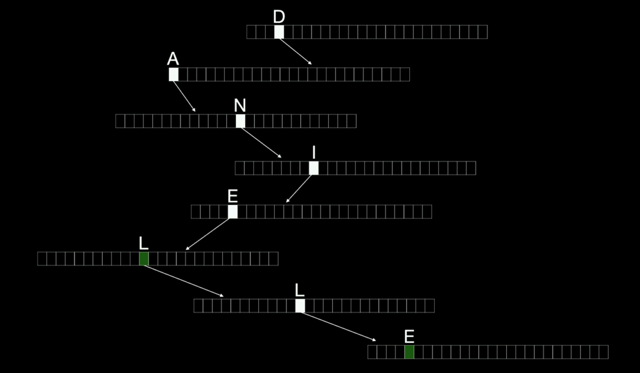</kbd>

> [!NOTE]
> D: có problem gì?
>
> A: Theo các pointer thì ta sẽ có
>
> DANIEL
>
> DANIELLE

 

<kbd></kbd>

> [!NOTE]
> Không có problem gì cả
>
> Đại khái là confirm lại là dù có bao nhiêu cái tên trong
> data thì việc search **tốn số bước bằng chiều dài cái tên
> thôi**

 

<kbd></kbd>

> [!NOTE]
> D: Cái này chính là gì?
>
> A: Để coi, để bắt đầu (ví dỵ search 1 cuốn sách) ta sẽ 
> **start với chữ cái tương ứng để tìm bucket**
> Sau đó là **iterate qua từng cái trong bucket**
>
> Nên đây chính là **hash-table**

 

