# Week 6: Python

📊 **Progress:** `77` Notes | `114` Screenshots

---

<kbd></kbd>

> [!NOTE]
> Không chỉ là học Python mà còn là cách
> để tự học một language mới sau này

 

<kbd>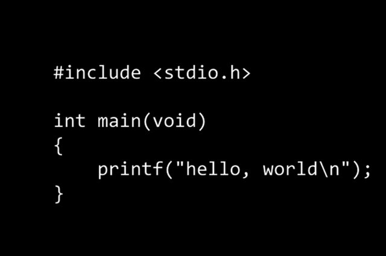</kbd>

<kbd></kbd>

<kbd></kbd>

 

<kbd>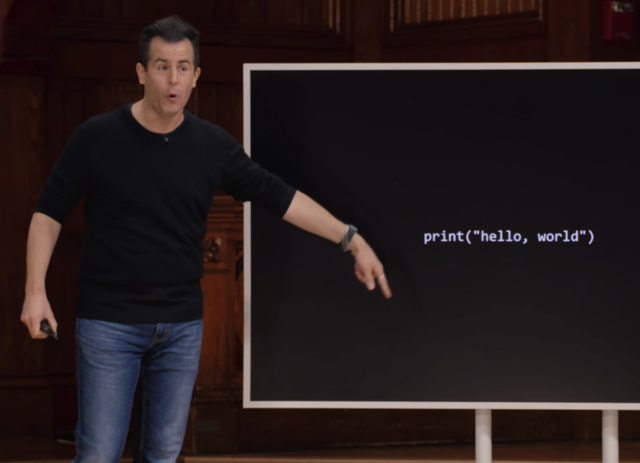</kbd>

 

<kbd>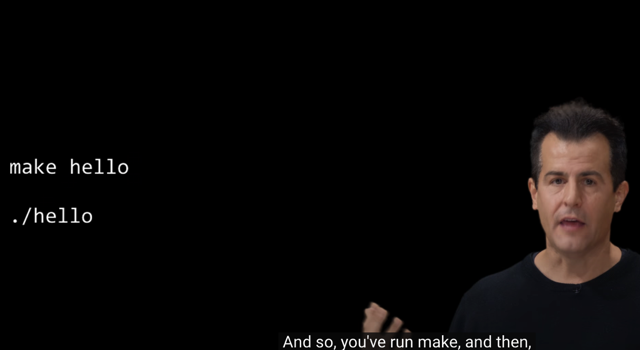</kbd>

<kbd></kbd>

<kbd>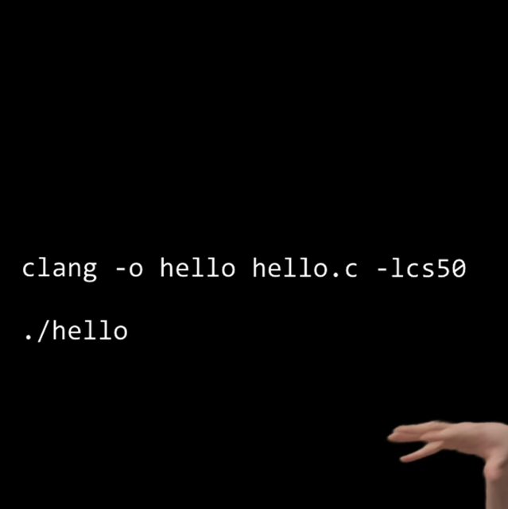</kbd>

 

<kbd></kbd>

 

<kbd>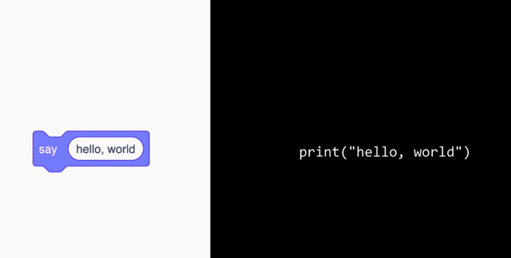</kbd>

> [!NOTE]
> D: What's gone?
>
> A: Không cần ";" và "\n"

 

<kbd>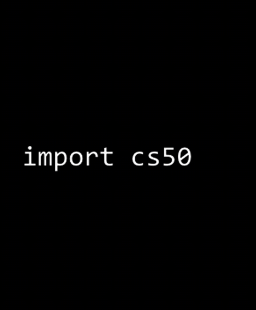</kbd>

 

<kbd>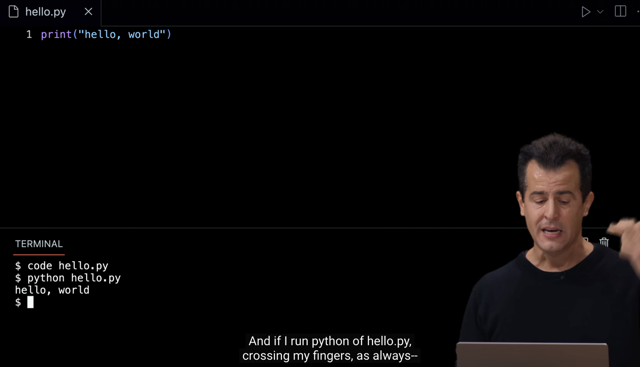</kbd>

> [!NOTE]
> **Không cần main()**, hay define một function
> nào. Chỉ **code khơi khơi là nó work**. Wow

 

<kbd>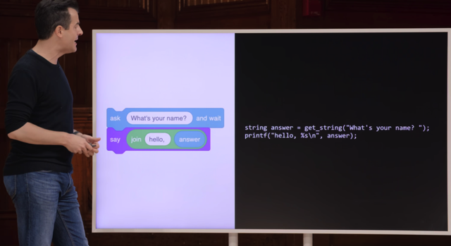</kbd>

 

<kbd>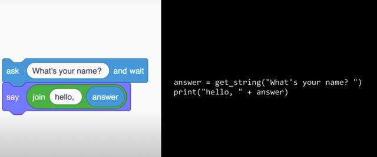</kbd>

> [!NOTE]
> D: What's gone?
>
> A: Không cần define data type (**string** answer)
>
> Cũng không cần **format code** printf %s, answer nữa
>
> Và có thể **dùng dấu cộng để concatenate**
> (Cái này thì từ java đã có)
>
> Và không cần **semicolon ;**

 

<kbd>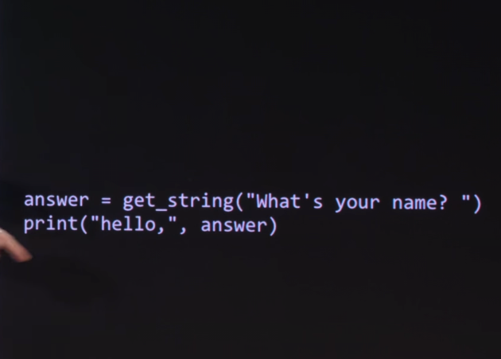</kbd>

<kbd></kbd>

<kbd>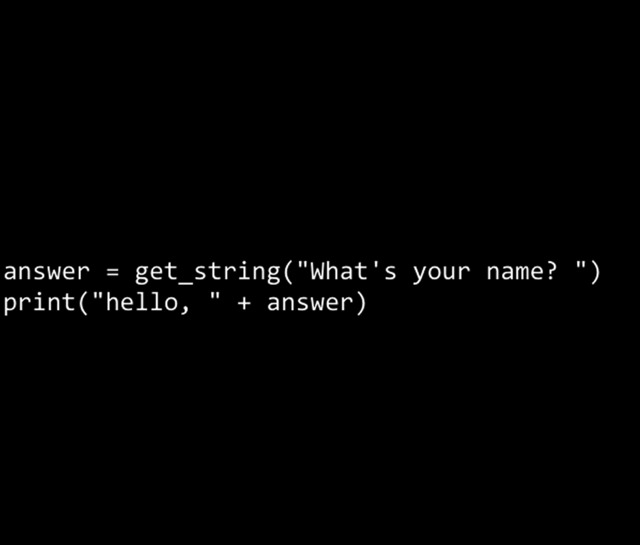</kbd>

 

<kbd>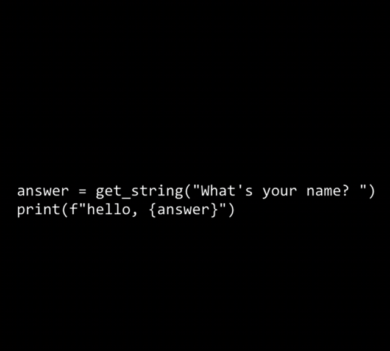</kbd>

> [!NOTE]
> Người bạn quen thuộc **print(f"{....}")**

 

<kbd>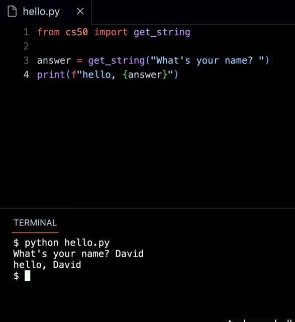</kbd>

 

<kbd>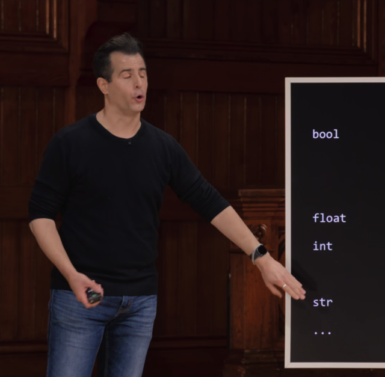</kbd>

> [!NOTE]
> **Không còn long** (8 bit cho số nguyên) hay **double** (8 bit
> cho số thập phân) vì Python **đã cho int và float nhiều bit
> hơn**

 

<kbd>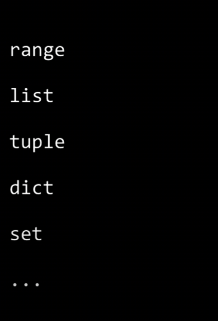</kbd>

> [!NOTE]
> Ngoài ra có còn có các cái loại data type
> mới

 

<kbd>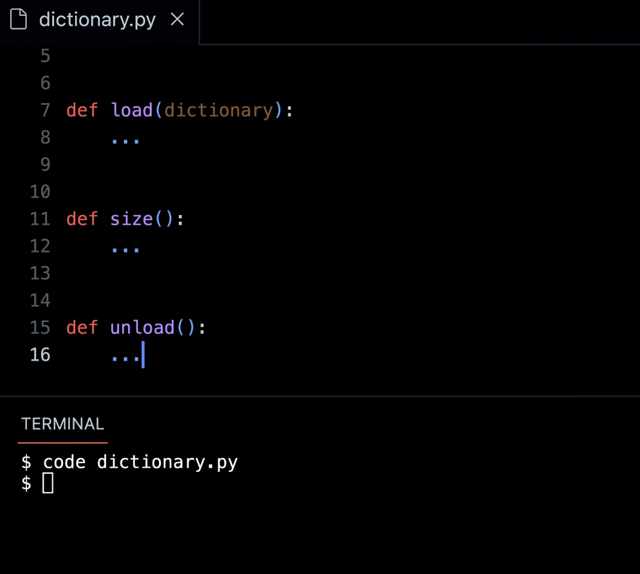</kbd>

> [!NOTE]
> Đại khái là tuần này ta sẽ làm lại
> PS5 nhưng với Python

 

<kbd>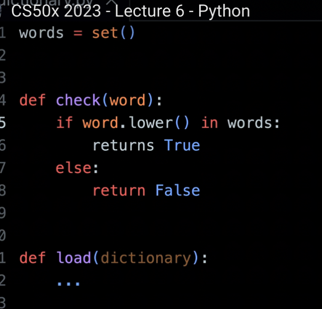</kbd>

> [!NOTE]
> Đại khái là trong Python syntax nó dễ hiểu và support nhiều
> cái giúp làm rất gọn
>
> Ví dụ như ở đây chỉ còn if **word in words**: ...là đã **check
> được trong words set có chứ từ word** hay không,**chẳng
> cần phải loop** trong set để check.
>
> Cái này trong **java** cũng có nhưng syntax là if 
> **words.contain(word)**Thứ hai đó là (kể từ java đã có) là **built-in function** giúp khi
> muốn lowercase thì lowercase() (Java) hoặc **lower**() trong
> Python

 

<kbd>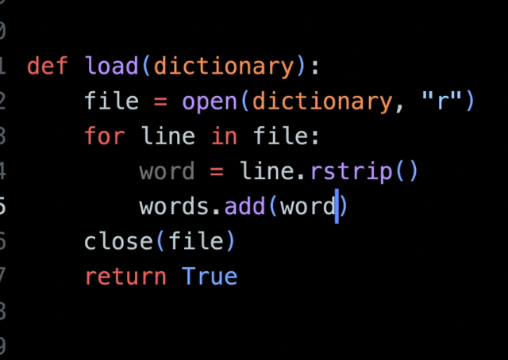</kbd>

> [!NOTE]
> Rồi đến function load() nhận tên của một dictionary file
> cũng trở nên rất gọn trong Python.
>
> **file = open(dictionary, "r")** giúp giống như **fopen** trong C
> giúp mở file.
>
> **for line in file:** ...Chính là syntax rất gọn để **lấy data từng
> dòng của file** (ta đã biết qua PS5, dictionary file là**file text
> có mỗi từ là một dòng**)
>
> kế tiếp để**bỏ đi cái ''\ "** của mỗi dòng, dùng **line.rstrip()**Và add từ vào words set sau đó **close**(file) như **fclose** của C

 

<kbd>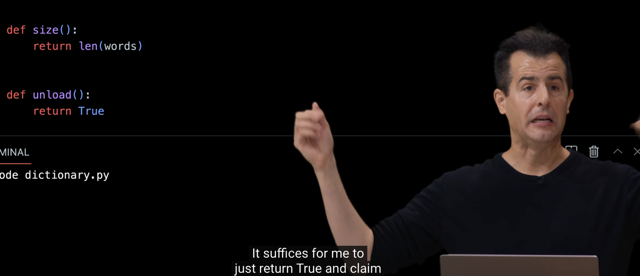</kbd>

> [!NOTE]
> Còn với **size**() trong PS5 ta **có thể phải iterate qua
> các node**,  để đếm lại các node. (mình thì dùng variable
> để đếm mỗi khi add node vào **hash-table trong function
> load())**
>
> Nhưng ở Python, chỉ việc dùng **len**(). Cái này trong
> java đã có, tức là c**ó thể check size, length của một list**

 

<kbd>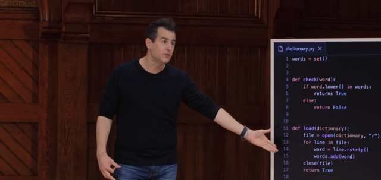</kbd>

> [!NOTE]
> Đại khái words = **set()** chính là **hash table**.
>
> Và cơ bản là **high level language** nó giúp chúng
> ta tập trung vào việc build các feature hơn

 

<kbd>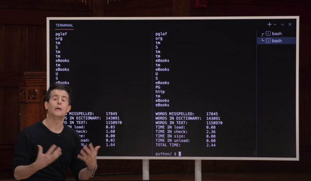</kbd>

> [!NOTE]
> Xong ổng chạy hai file speller check một cái viết bằng C
> một cái bằng Python
>
> Kết quả cho **thấy C nhanh hơn Python**
>
> D: Tại sao lại như vậy?
>
> A: Vì Python nó p**hải xử lý qua thêm 1 tầng nữa để giúp 
> mang lại những ưu điểm human readability**

 

<kbd></kbd>

 

<kbd>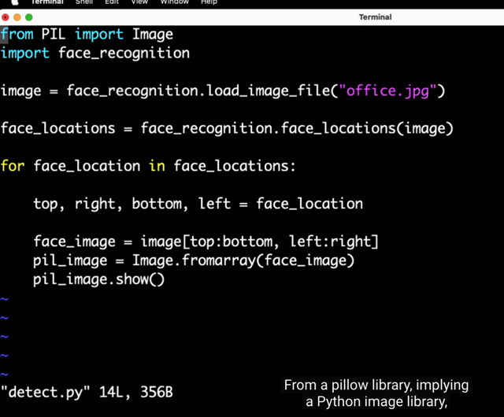</kbd>

 

<kbd></kbd>

> [!NOTE]
> Đại khái là để cho vui ổng cho xem thử là trong python
> ta thậm chí có thể import**cả một thư viện**
> **face_recognition**
>
> Load image từ tên image. Sau đó dùng function
> **face_locations** để**localize faces** có trong image.
>
> Loop trong kết quả và print ra file image (xuất ra file
> image)

 

<kbd></kbd>

 

<kbd>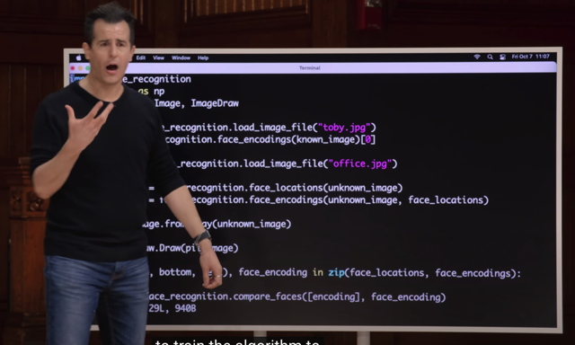</kbd>

> [!NOTE]
> Tiếp ổng làm thử thêm một step là
> recognize face của một người nào đó

 

<kbd></kbd>

 

<kbd></kbd>

> [!NOTE]
> D: Làm thế nào mà máy tính nó recognize ông Toby?
>
> A: Đó là bằng cách phát triển một model dùng **Deep Learning**
> và dataset các **face image** để train một model học được khả
> năng **predict rằng liệu hai image đưa vào có phải là cùng một
> người hay không**. Dựa vào việc thiết kế training data là các
> **triplet** - các bộ 3 face image trong đó có hai image của cùng
> một người và một image của người khác. Model sẽ có kiến
> trúc **Siamese network**, optimization function là **Triplet loss**. Đó
> là bài toán **face recognition**
>
> Còn bài toán face detection thì dễ hơn, cũng sử dụng deep
> learning vào bài toán **object localization.**
>
> Còn một cách nôm na hơn, đó là model sẽ học **cách detect từ 
> low đến high level feature** (thông qua các layer trong deep
> convolution neural network) từ đó nhận diện được các pattern
> trong image

 

<kbd>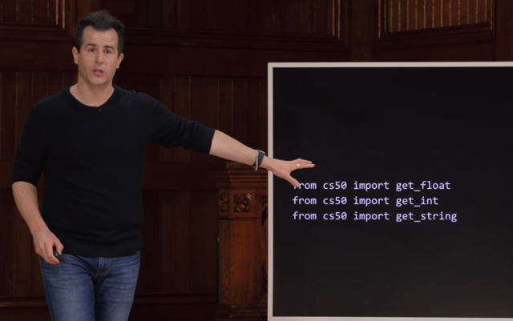</kbd>

<kbd></kbd>

<kbd>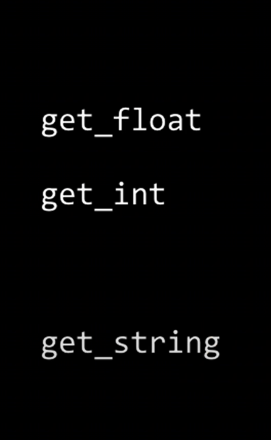</kbd>

> [!NOTE]
> Đại khái là những
> function trong **cs50**

 

<kbd>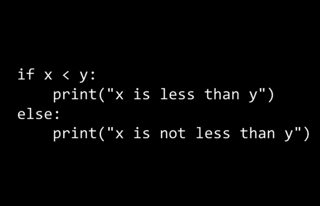</kbd>

<kbd>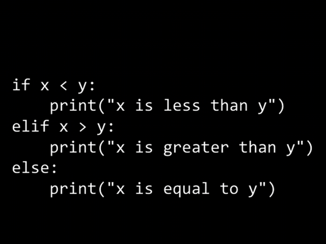</kbd>

<kbd></kbd>

<kbd></kbd>

<kbd>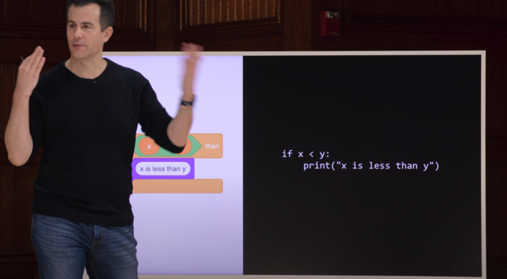</kbd>

> [!NOTE]
> D: What's changed?
>
> A: Không cần phải có**(), và {}**
>
> D: Yeah, và trong Python nó **yêu cầu nghiêm ngặt hơn về 
> indentation**

 

<kbd>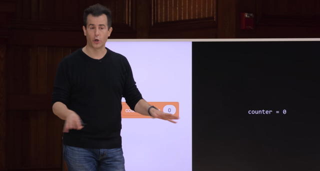</kbd>

> [!NOTE]
> **Variable**, không cần phải
> **declare data type**, tự nó biết

 

<kbd>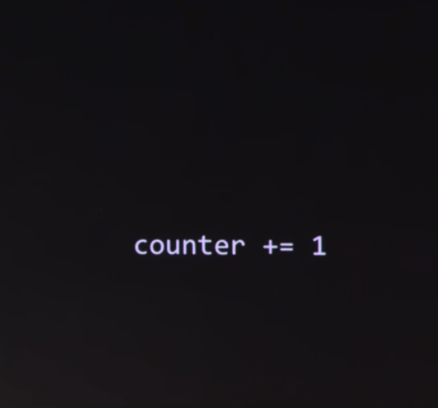</kbd>

> [!NOTE]
> Nhưng không còn
> **counter ++** được nữa

 

<kbd>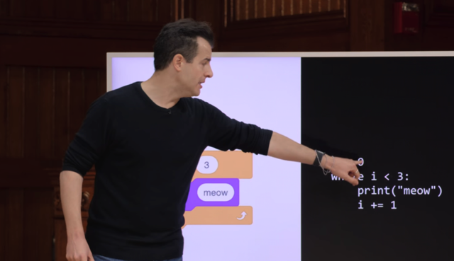</kbd>

<kbd></kbd>

<kbd>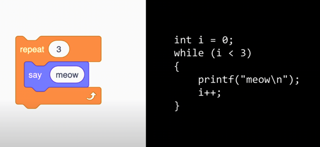</kbd>

 

<kbd>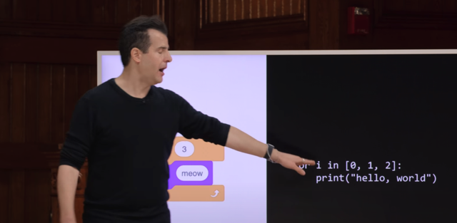</kbd>

<kbd></kbd>

<kbd>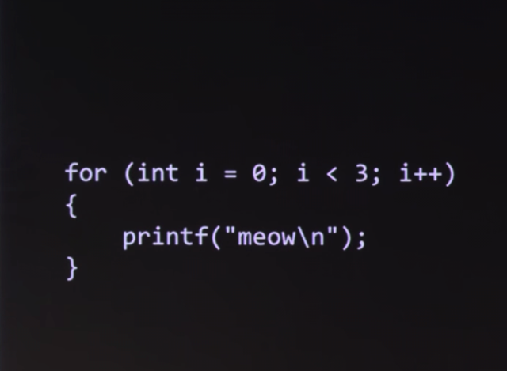</kbd>

> [!NOTE]
> Với **for loop** tương đương cái kiểu này thì trong
> Python nó vầy, có thể **chỉ cần define một list một
> cách nhanh chóng dùng []**
>
> D: Có gì bad design
>
> A: Ở đây là specifically define. 1, 2, 3 . Phải dùng
> **range (0, 4)**

 

<kbd>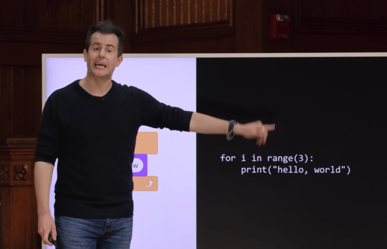</kbd>

> [!NOTE]
> Correct! và ổng nói Python làm việc này một cách **hiệu quả
> hơn nhiều về mặt memory**. Ví dụ **range**(1000.000) thì cơ bản
> là nó chỉ **hold 1 variable trong memory và tăng dần value lên
> one at a time** thôi **chứ không phải là nó chuẩn bị 1 list / array
> có 1000.000 số**

 

<kbd>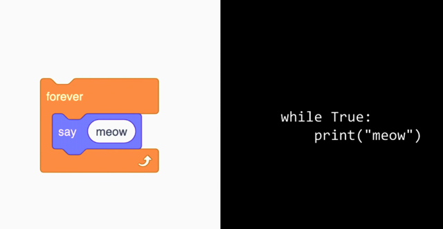</kbd>

> [!NOTE]
> **Forever for-loop**
>
> Nhớ lại trong C:
>
> **while (true)
> {
> ..
> }**
>
> Ở Python thì True, viết hoa đầu
> không cần {}

 

<kbd>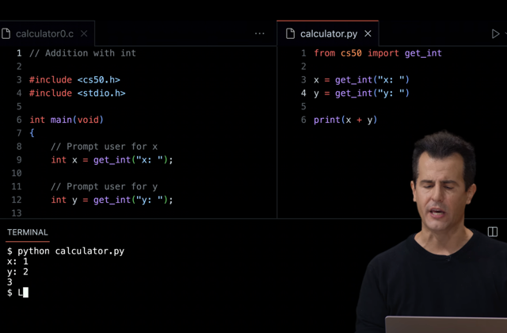</kbd>

> [!NOTE]
> Xong ổng thử làm lại cái **calculator.c** tuần 2 bằng Python
>
> D: Có gì missing ở đây?
>
> A: **stdio**
>
> D: Thật ra là **main function**, is gone!
>
> Và đúng vậy, **bất cứ thứ gì trong file Python** và indented
> well thì nó sẽ run

 

<kbd>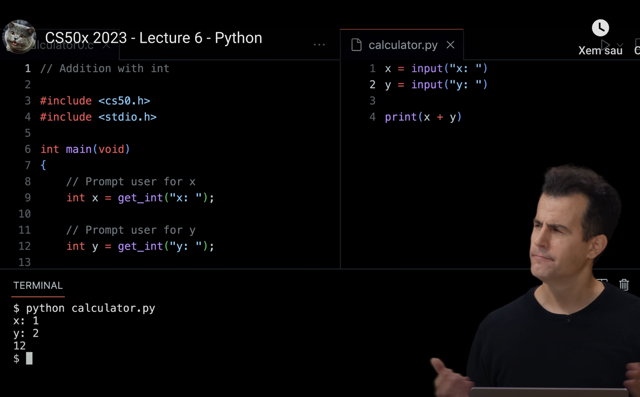</kbd>

> [!NOTE]
> Xong ổng bỏ cs50 đi, dùng real-life python
> function **input()** để take user's input
>
> D: Tại sao nó lại ra vầy?
>
> A: Vì nó **đang hiểu input là string**, và do đó + sẽ là
> **concatenate** "1" + "2" = "12"

 

<kbd>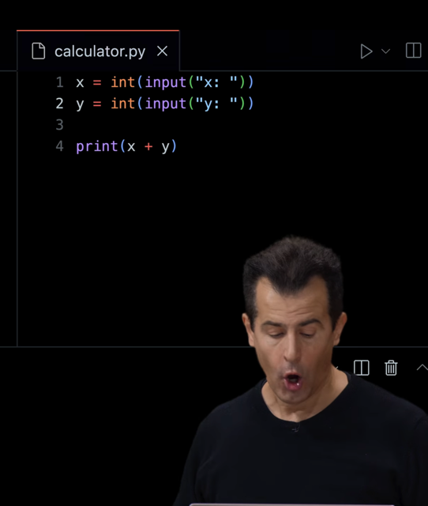</kbd>

> [!NOTE]
> Giải pháp là vầy. Kiểu như tạo int object cái này
> trong java là có**primitive integer** và **Integer
> object**thì cái này trong java tương tự new Int("3")

 

<kbd>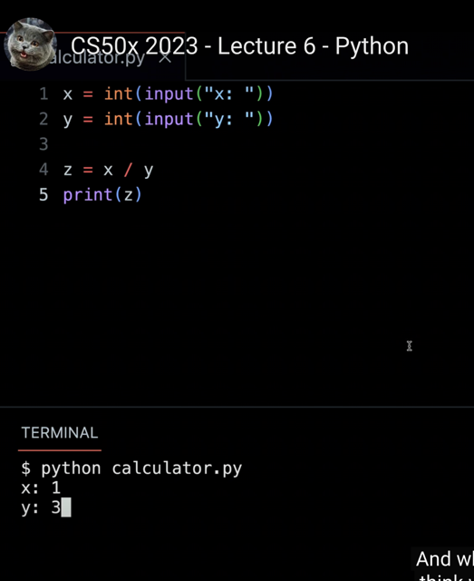</kbd>

> [!NOTE]
> D: Theo bạn sẽ có vấn đề gì, hay ở C thì cái này
> sẽ có issue gì?
>
> A: Trong c **chia int cho int** sẽ **tự động làm tròn
> thành ra z** cũng là **int** nên nó sẽ ra 0
>
> Còn ở đây, đoán rằng Python thông minh hơn sẽ
> Int ra float

 

<kbd>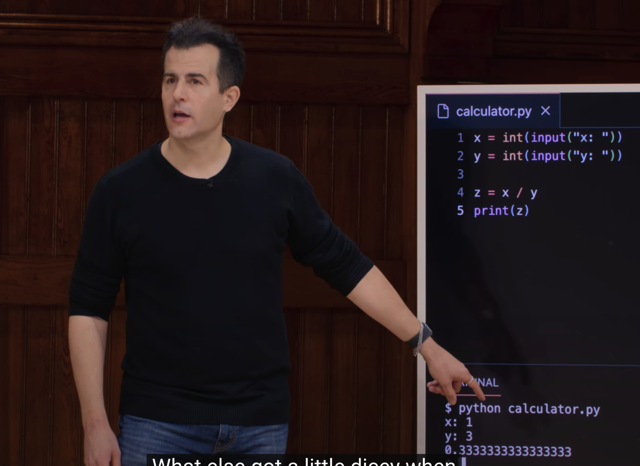</kbd>

> [!NOTE]
> D: Correct, nó sẽ ra vầy, nhưng vẫn còn vấn đề
> gì nữa
>
> A: Đó là vấn đề **precision**. Vì số **1/3 là vô tỉ**, nên
> sẽ **không thể thể hiện tuyệt đối chính xác nó
> dù có là bao nhiêu byte** đi nữa. Do đó, n**gay cả Python
> cũng sẽ không thể giải quyết được**

 

<kbd>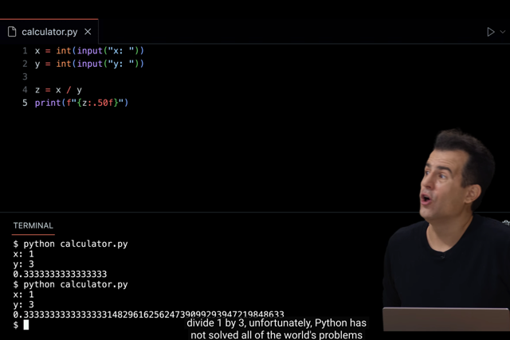</kbd>

> [!NOTE]
> D: Correct. đó là vấn đề **floating point imprecision**Có thể yêu cầu **in 50 con số sau decimal point** bằng
> cách **printf(f"{z:.50f}")**; sẽ thấy vấn đề này.

 

<kbd>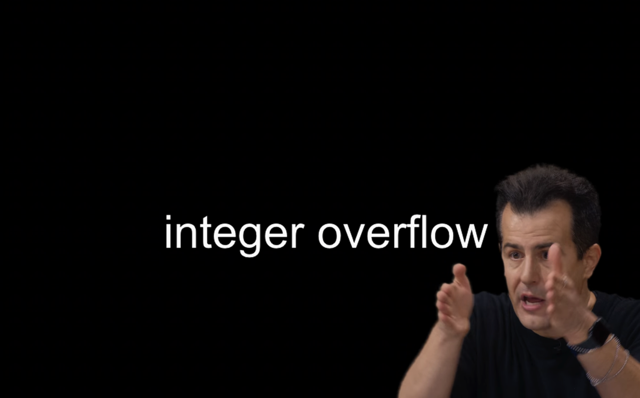</kbd>

> [!NOTE]
> Tuy nhiên vấn đề tương tự **integer overflow** trong đó ví
> dụ như trong C, vì int chỉ được cho**31 bit**s (4 bytes) nên
> khi value quá 2 tỉ mấy (có tính âm dương) thì nó sẽ
> overflow, vượt quá khả năng thể hiện của 31 bit.
>
> Nhưng trong python, **khi cần thể hiện số lớn hơn,** Python
> sẽ **tự cho thêm bit**. Mà below the hood có thể hiểu là nó
> sẽ**tự kiếm và copy value sang vùng khác có nhiều byte
> hơn** từ đó có thể**assign nhiều bit hơn cho nó**

 

<kbd>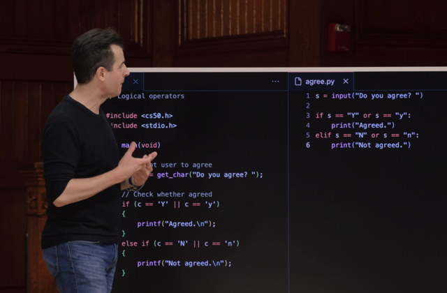</kbd>

> [!NOTE]
> Trong Python **không còn char** nữa, chỉ có **str**
> (string).
>
> Và dùng **single quote** hay **double quote đều được**
> Và **|| thay bằng or, && thay bằng and**

 

<kbd>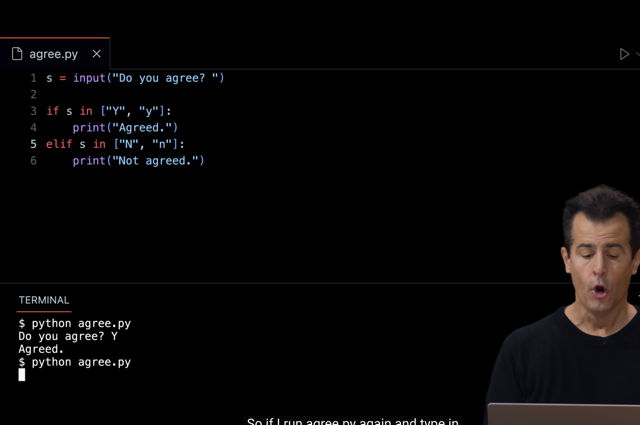</kbd>

> [!NOTE]
> Và nhờ sự cải tiến của Python, mà ta có thể thay bằng
> cái này **if s in ['Y', 'y']**, rất gọn, dễ hiểu:**nếu s có trong
> list có hai chữ này**

 

<kbd>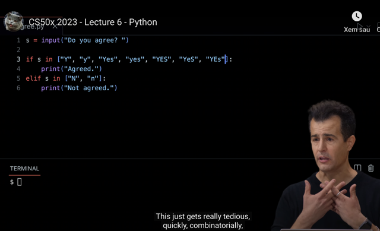</kbd>

> [!NOTE]
> Và ta có thể mở rộng hơn thêm các trường hợp
> khác mà user có thể type vào.
>
> D: Nhưng thay vì phải define **Yes, YEs, yeS**...thì có thể 
> dùng cách nào để gọn hơn?
>
> A: **so sánh ignore case**: if **s.lower() in ['yes', 'y']**D :Correct, và ổng nói qua Object Orient Programming
> trong đó **không phải chỉ như struct của C** **chỉ mang variable** 
> đối với**class nó có thể có các function**. Và string, hay int, hay
> float không chỉ là primitive data-type nơi mà chỉ có value, 
> bây giờ nó **có các built-in function.**

 

<kbd>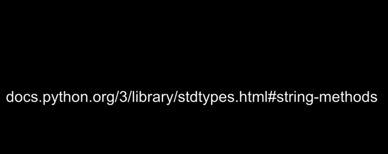</kbd>

 

<kbd>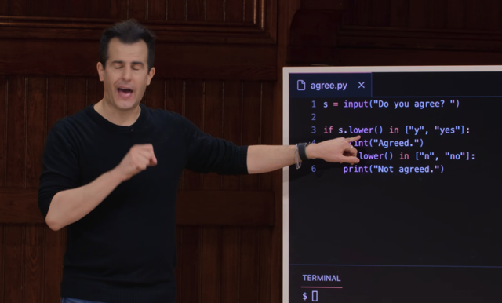</kbd>

> [!NOTE]
> D: Có thể improve thêm chút không?
>
> A: s = input("Do you agree?").**lower()**

 

<kbd></kbd>

> [!NOTE]
> Chỗ này hay đây:
>
> Trong java hay python nó sẽ có tính chất **immutable**
> tức là **"không thay đổi được"**
>
> Nôm na là **s.lower() sẽ tạo ra một bản copy của s và
> lowercase nó**. Nhưng **s không thay đổi**. Chỉ khi **assign s
> = s.lower()** thì máy tính nó mới**thay giá trị của s**. Và nó
> sẽ t**ự động free vùng memory chứa giá trị của s "cũ"**

 

<kbd>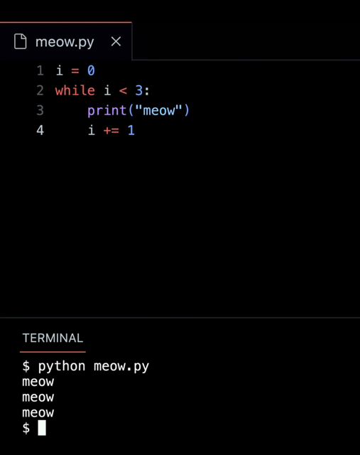</kbd>

 

<kbd>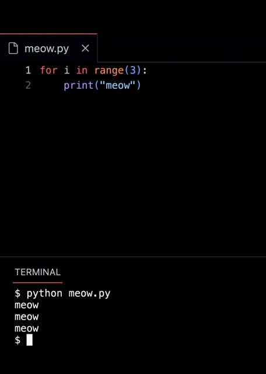</kbd>

 

<kbd>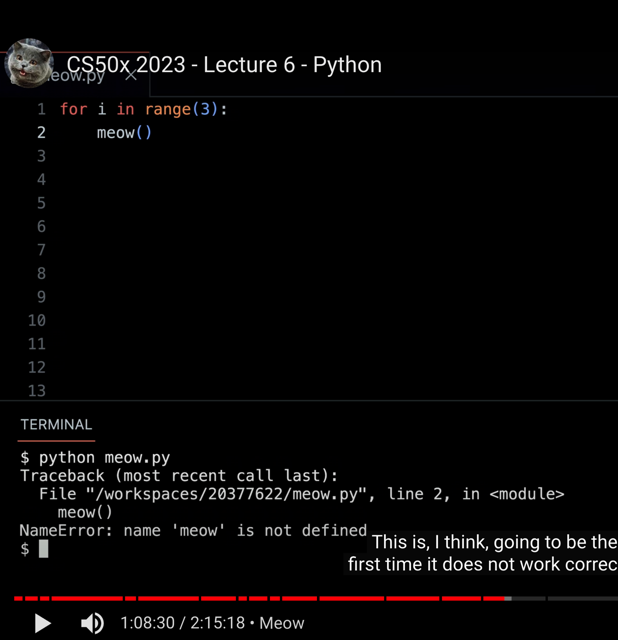</kbd>

> [!NOTE]
> Xong ổng mới define 1 function meow() (để ở dưới á)
>
> def **meow**():
>     print("**meow**")

 

<kbd>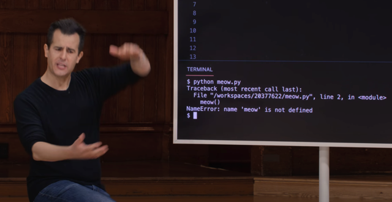</kbd>

> [!NOTE]
> D: Và run thì nó error này. Tại sao **meow**() is not defined ?
>
> S: Có thể vì**function meow() được define ở dưới**

 

<kbd>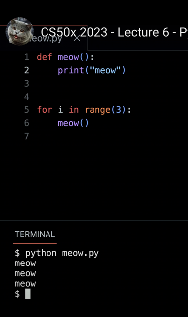</kbd>

> [!NOTE]
> Correct, đưa nó lên
> trên nó work.

 

<kbd>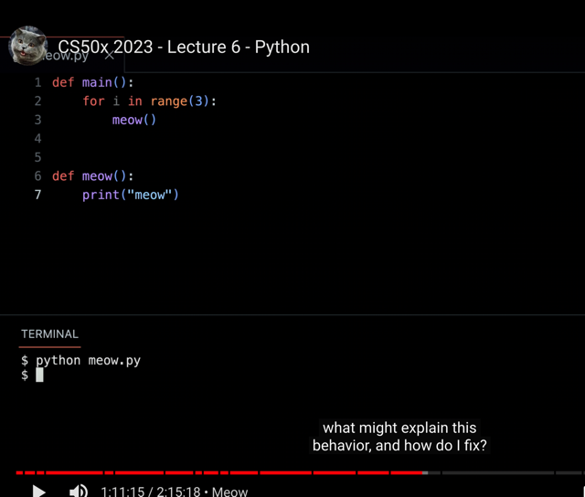</kbd>

> [!NOTE]
> Tới đây ổng nói đại khái là **by convention**, người ta
> define một cái **main function** (không phải bắt buộc như
> trong C, mà chỉ là by convention)
>
> Và ổng cũng khẳng định (claim) rằng**không cần phải 
> có prototype.**
> D. Nhưng sao nó không work?
>
> A: **Thiếu 1 cái trigger**(start button). Phải gọi **main**()
> Đoán rằng nếu để (code) ở ngoài thì nó sẽ tự gọi, 
> Nhưng bây giờ chỉ có function, thì phải gọi function

 

<kbd>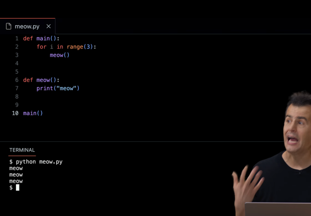</kbd>

> [!NOTE]
> Correct! Và p**hải gọi ở dưới cùn**g. Cái này giúp ta hiểu
> như trong Jupiter notebook hay Google Colab. Đó là
> phải define function ở trên thì ở dưới mới xài được.
>
> Nó khác như code trong Android studio, để function 
> ở đâu cũng được.

 

<kbd>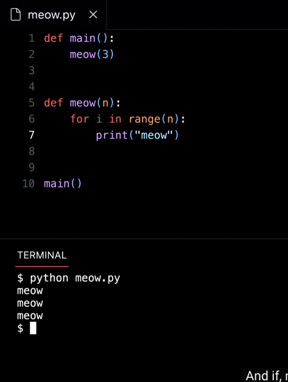</kbd>

> [!NOTE]
> Và **function argument**cũng**không
> phải define datatype** gì hết.

 

<kbd>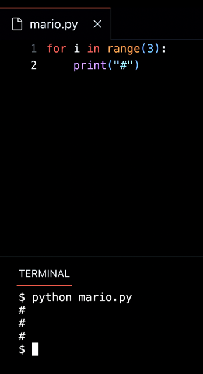</kbd>

> [!NOTE]
> Làm lại cái vụ **in 1 column 3 block của
> Week 1** Như đã nói Python sẽ**tự động
> xuống dòng giùm**, không phải \\n như
> trong C

 

<kbd>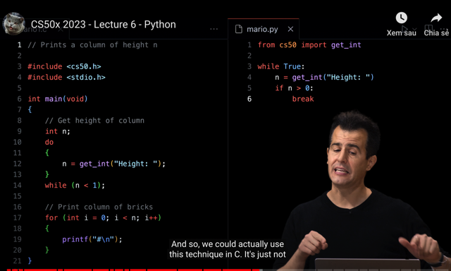</kbd>

> [!NOTE]
> Xong mới làm cái vụ in số block tuỳ theo số user nhập. Thì
> khi làm bằng C có cái vụ **forever loop để tiếp tục hỏi user cho
> đến khi user enter số dương** (hay một valid value theo yêu
> cầu nào đó)
>
> Thì cách làm (for ever loop) trong Python mà ổng nói là
> convention đó là **while True** và **dùng break để exit loop** khi
> đạt điều kiện

 

<kbd>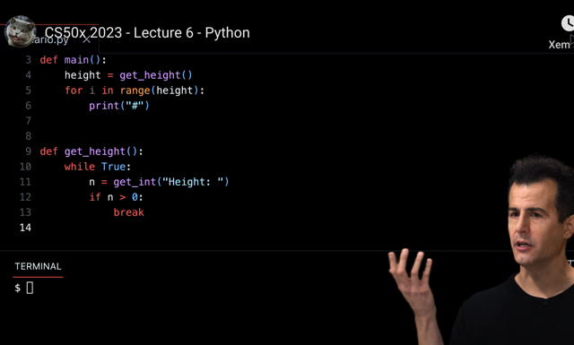</kbd>

> [!NOTE]
> D: Tại dòng 14 này tôi nên làm gì logically?
>
> A: return n, nhưng n lại define trong loop nên không được,
> vậy ông phải assign 1 cái var ở ngoài loop

 

<kbd>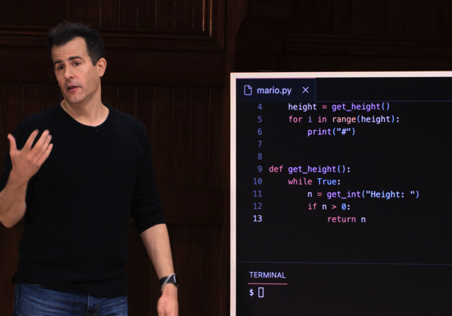</kbd>

<kbd></kbd>

<kbd>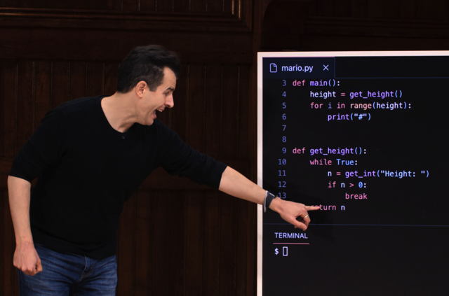</kbd>

> [!NOTE]
> D: Correct. Nhưng cái hay ho là **dù n không nằm trong
> scope của while loop**, Python **vẫn cho nó tồn tại ngay cả
> sau while loop.**
>
> Và có thể đơn giản là **return ngay khi có giá trị valid.**

 

<kbd>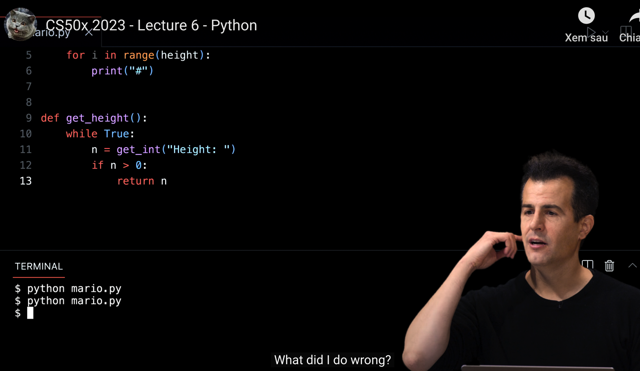</kbd>

> [!NOTE]
> Giờ ổng cho nó chạy thử.nhưng không được.
>
> D: Sai chỗ nào
>
> A: Phải gọi main()

 

<kbd>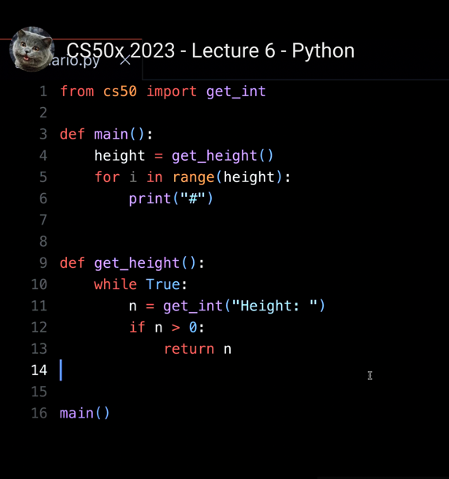</kbd>

> [!NOTE]
> Correct!

 

<kbd>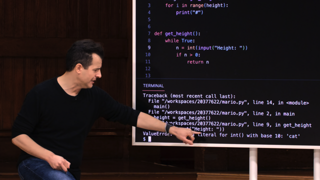</kbd>

> [!NOTE]
> Đại khái là nếu không dùng cs50 get_int mà dùng
> **int(input(...))  thì nếu nó nhập text thì sẽ bị error**

 

<kbd>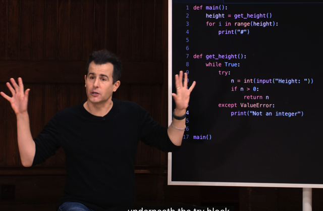</kbd>

> [!NOTE]
> Và giới thiệu một cách mà C không có
> (nhưng Java đã có): **try except**

 

<kbd>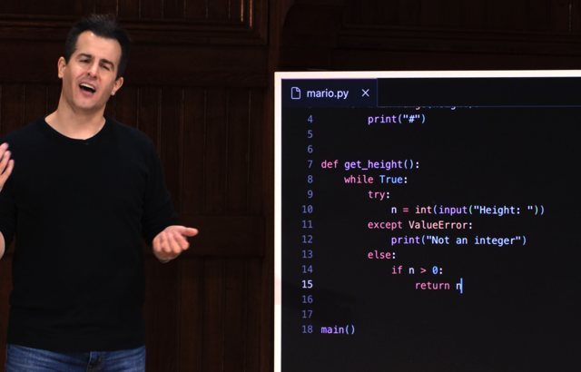</kbd>

 

<kbd>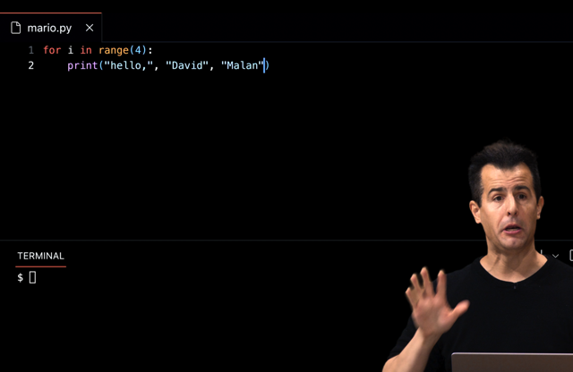</kbd>

> [!NOTE]
> Có thể có nhiều
> argument cho print

 

<kbd>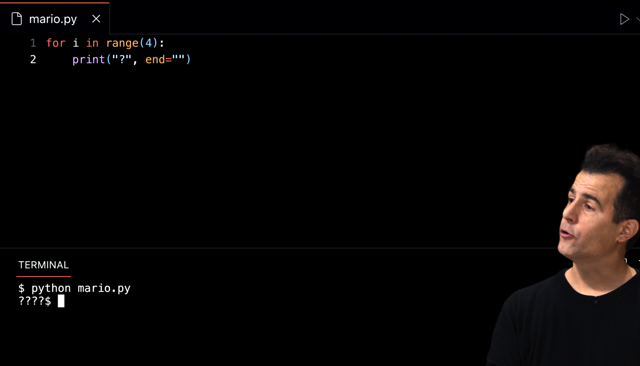</kbd>

> [!NOTE]
> Giờ nếu muốn in 4 ???? theo hàng thì sao. giới thiệu
> khái niệm**named argument** (function argument được
> đặt tên).
>
> Và bằng cách **set argument end** cho print ta có thể
> **override it's behavior thay cho \ **

 

<kbd>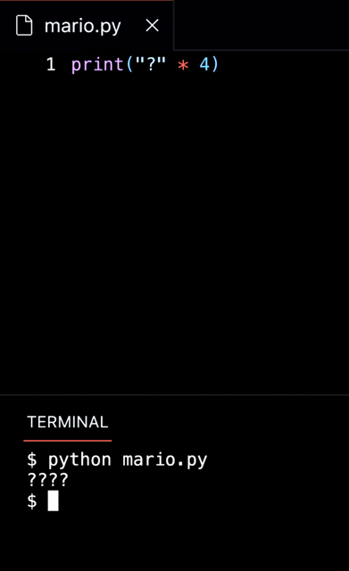</kbd>

> [!NOTE]
> Và cái này là cái mình hay thấy trong ML's course
> đây. Ví dụ muốn tạo **vector có 10 số 0 thì chỉ cần
> [0]*10**-> t**ạo 10 cái list có 1 số 0 và concatenate lại**

 

<kbd></kbd>

> [!NOTE]
> Ổng nói Python sẽ **không có malloc, không có free**, vậy
> thử đoán nó cũng ko có cái gì?
>
> A: **pointer**?
>
> D: correct, mọi thứ sẽ được làm giùm bạn automatically

 

<kbd>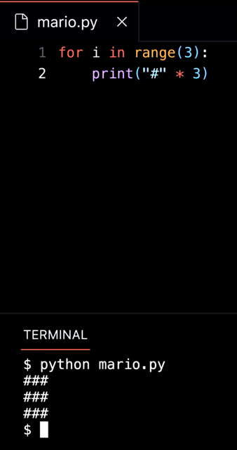</kbd>

 

<kbd>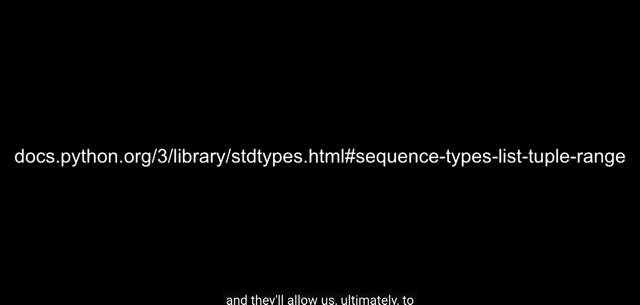</kbd>

> [!NOTE]
> Nói qua ưu điểm quan trọng của
> Python đó là work với list

 

<kbd>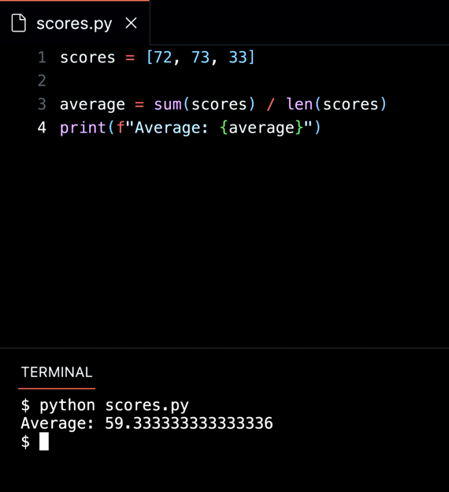</kbd>

> [!NOTE]
> Python có sẵn các **built in function sum, len
> giúp tính sum và length of a list**. Rất tiện lợi

 

<kbd>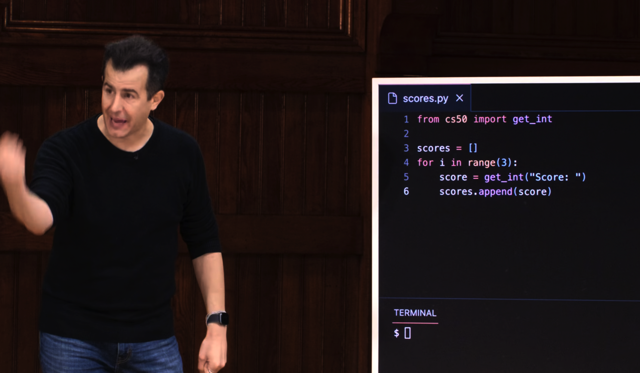</kbd>

> [!NOTE]
> Và list có built in function **append** để add
> item vào

 

<kbd>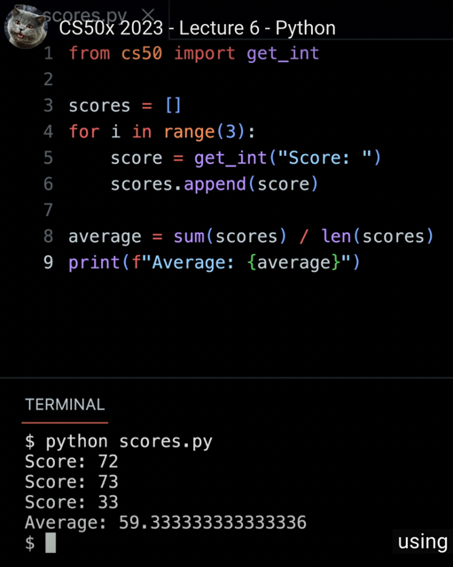</kbd>

 

<kbd>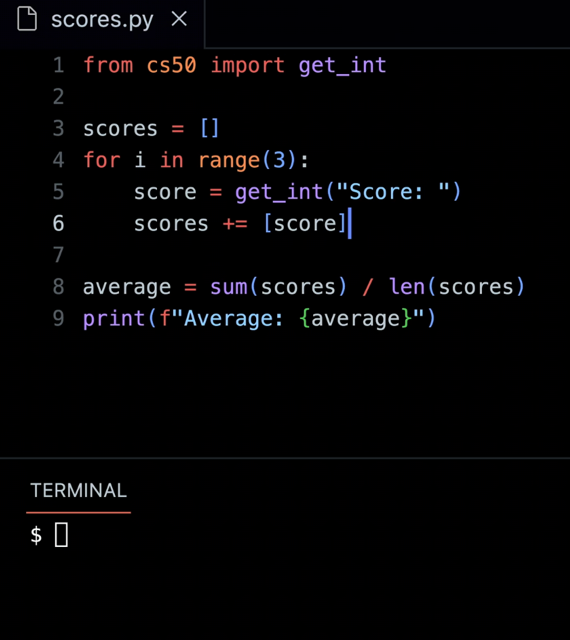</kbd>

> [!NOTE]
> Hoặc không dùng append thì có thể dùng kiểu
> này: **scores += [score]**: **tạo list có 1 item là score**
> và **concatenate 2 list lại**

 

<kbd>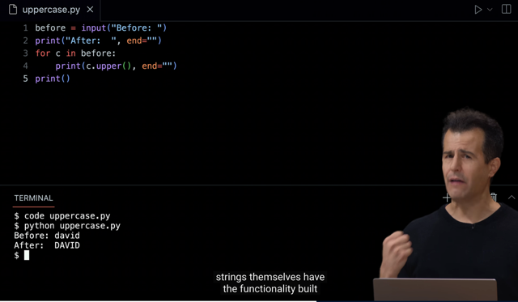</kbd>

> [!NOTE]
> ví dụ cho xem việc loop trong các character
> của một string dễ như thế nào: **for c in a_string:**

 

<kbd>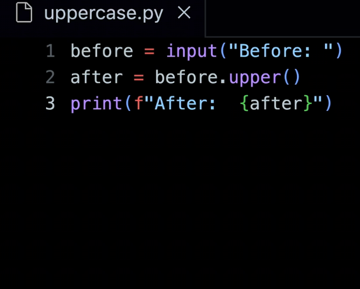</kbd>

> [!NOTE]
> Nhưng không cần phải uppercase từng
> chả chi cho mệt. Như Java, chỉ cần gọi
> built-in function **.upper()**

 

<kbd>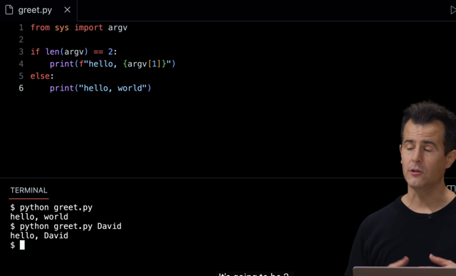</kbd>

> [!NOTE]
> Với Python, để sử dụng command line argument thì chỉ cần
> **import** **argv** của **sys lib**
>
> Và argument là những gì sau python
>
> Nên nếu chỉ gọi **python greet.py** thì có 1 argument value
> là tên program. (Tương tự, như C gọi  **/.great)**

 

<kbd>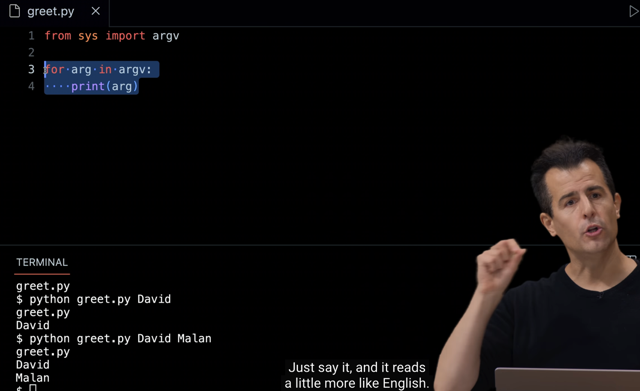</kbd>

> [!NOTE]
> Và **muốn loop trong các argument values**, như một 
> **mô tuýp chung** của Python đó là muốn loop trong cái
> gì, chỉ cần: **for** **in cái-cần-loop:**
>
> for arv **in argv:**

 

<kbd>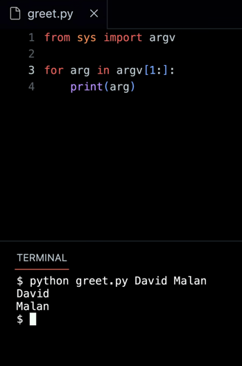</kbd>

> [!NOTE]
> Giới thiệu một cái đó là **slicing list.**argv[1:] từ cái thứ 2 (index = 1) tới hết
> argv[1:5] từ cái thứ 1 tới cái thứ 5
>
> Cái này thì gặp quài bên ML's course****nhất mà một ví dụ như khi split dataset ra thành
> training / validation set.
>
> training = data[:90000]
> test = data[90000:]

 

<kbd>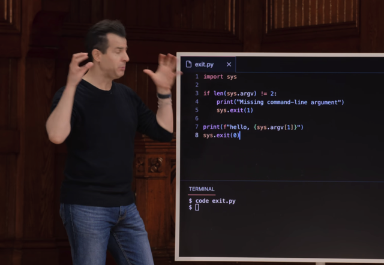</kbd>

> [!NOTE]
> Qua minh hoạ exit code trong Python. Ở đây là
> import toàn bộ sys lib,  nên sẽ dùng là **sys.argv
> (**thay vì **from sys import argv**thì chỉ cần gọi
> argv)
>
> Và gọi **sys.exit(exit code)**exit code như C thôi

 

<kbd>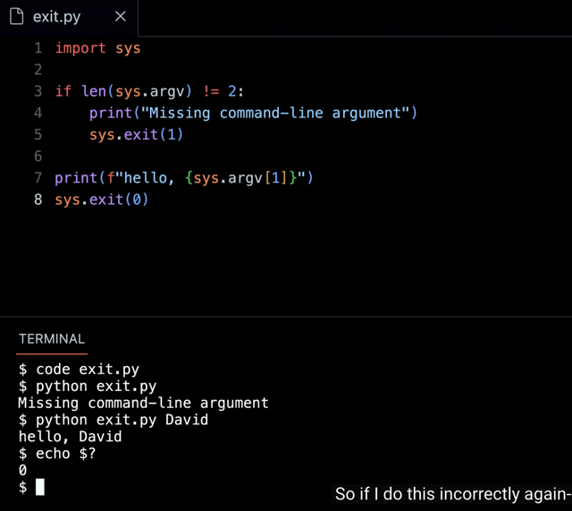</kbd>

> [!NOTE]
> Và gọi **echo $?**cũng sẽ in ra exit
> code

 

<kbd>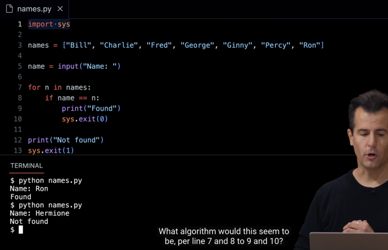</kbd>

> [!NOTE]
> Ta có thể làm search kiểu này, rất dễ hiểu**, loop trong
> list các tên** và **so sánh nếu thấy giống thì return.**
>
> D. Cái này là algorithm gì?
>
> A: **Linear search**

 

<kbd>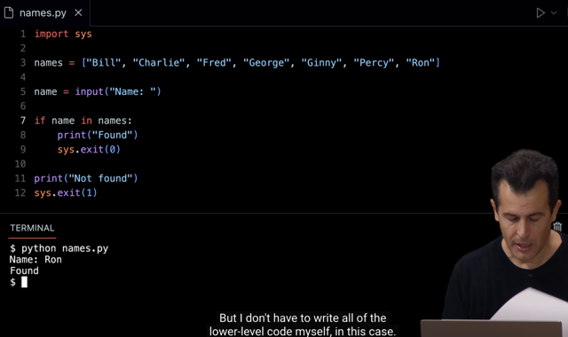</kbd>

> [!NOTE]
> Nhưng không phải mất công vậy, với
> Python như nãy có nói chỉ cần **if name in
> names là xong**

> [!NOTE]
> dict() cũng chính là {}
> list() cũng chính là []

 

<kbd>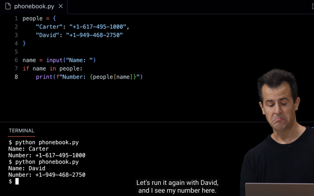</kbd>

> [!NOTE]
> Cho thấy sự tiện lợi của python dictionary
>
> Define dễ dàng {key1 : value1, key2 : value }
>
> Check (hay search) dễ dàng:**if name in people:**
>
> Lấy ra value dễ dàng: **people[name]**
>
> Và trong ML dict thường xuyên được sử dụng, ví dụ
> vocab dict **map giữa từ và index** hoặc ngược lại
> dùng trong training language model

 

<kbd></kbd>

> [!NOTE]
> Đại khái là có người hỏi là bên dưới, Python nó search
> như thế nào.
>
> D: Thì cơ bản đây chính là cái bạn làm trong PS week
> 5. Và đại khái là với Python, có những người thông
> minh hơn bạn**đã tìm cách giải quyết vấn đề này để sao
> cho runinng time gần với constant time nhất O(1)**

 

<kbd>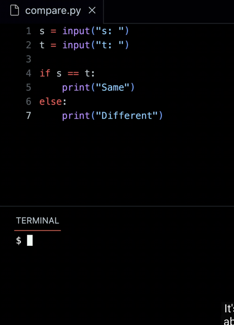</kbd>

> [!NOTE]
> **So sánh 2 string** trong Python rất dễ
> dàng với **==** cái mà C không cho

 

<kbd></kbd>

> [!NOTE]
> D: Tại sao so sánh string trong C ví dụ s == t không work dù
> hai string đều y nhau
>
> A: Bởi vì trong C, string là var thuộc loại **pointer mang giá trị
> là address của char đầu tiên trong array of char.**
>
> Nên**so sánh hai string** dù là **y hệt** thì **vẫn là hai address khác
> nhau trong memory**.
>
> Và các function so sánh string ở các higher level như Java,
> Python đều là đi đến address và so giá trị trong đó

 

<kbd>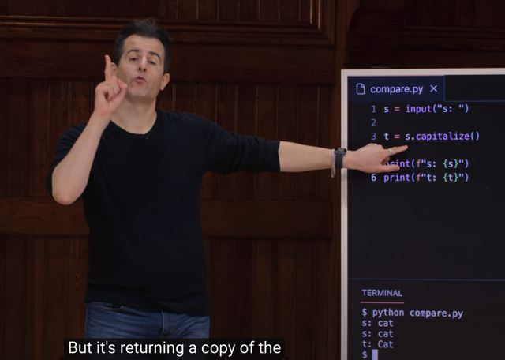</kbd>

> [!NOTE]
> Nhắc lại cái vụ tính chất **immutable**.
>
> và **s.capitalize()** chỉ **copy và capitalize**,
> nên s không thay đổi.

 

<kbd>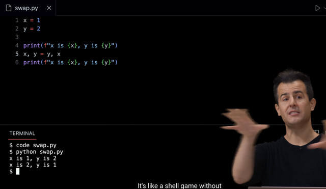</kbd>

> [!NOTE]
> Đại khái là muốn**swap hai variable** trong
> python rất đơn giản: **x, y = y, x**

 

<kbd>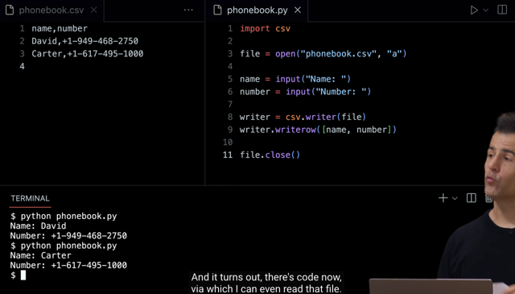</kbd>

> [!NOTE]
> Minh hoạ đoạn code làm việc với file **csv**
> **Comma Separated Value**. Mở file ở moded**'a' =
> append**. Tức là cho**edit file nhưng chỉ append
> thôi**.
>
> gọi function **csv.writer** để tạo **writer** và  gọi
> **writerow()** để ghi thêm một row.

 

<kbd>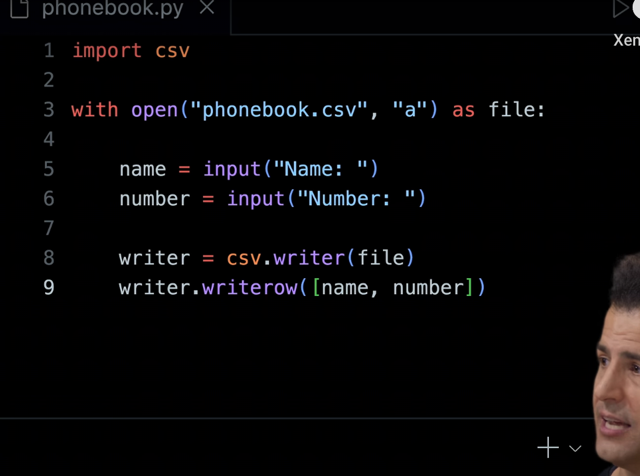</kbd>

> [!NOTE]
> Nhưng cách này người ta hay làm hơn và ta cũng
> hay gặp ở ML's course.
>
> **with open('file name', 'a') as file:**
> Nó sẽ**handle vụ close file cho mình luôn** để đề phòng
> quên

 

<kbd>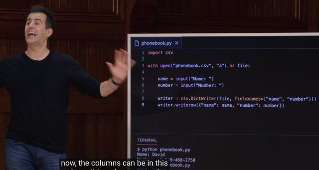</kbd>

> [!NOTE]
> Đại khái là thay vì dùng **csv.writer**có thể dẫn đến 
> kiểu như **ghi lộn cột**. Thì dùng**DictWriter**và write
> với named argument như này thì sẽ tốt hơn

 

<kbd>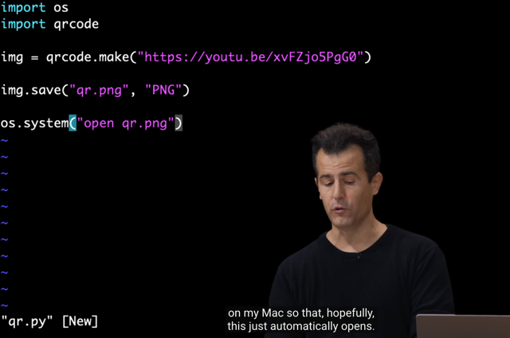</kbd>

 

<kbd></kbd>

> [!NOTE]
> Xong ổng demo vài lib dùng
> Python bằng máy của ổng
>
> Cái này giúp tạo một qrcode từ link

 

