# Week 7: Sql

📊 **Progress:** `129` Notes | `160` Screenshots

---

<kbd></kbd>

> [!NOTE]
> Đại khái là SQL là một language mới, làm được ít
> hơn so với C hay Python nhưng nó làm rất tốt cái
> việc của nó là work với data

 

<kbd></kbd>

 

<kbd>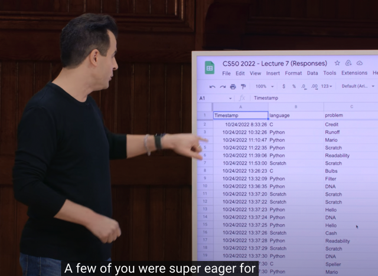</kbd>

> [!NOTE]
> Đại khái là giả sử ta có dataset này (thống kê ghi nhận các
> problem set ưa thích nhất) thì nếu có thể tự mình
> manipulate và thấy các pattern của data (thay vì chỉ dùng
> các tool do Excel hay Google Spreadsheet làm ra)

 

<kbd>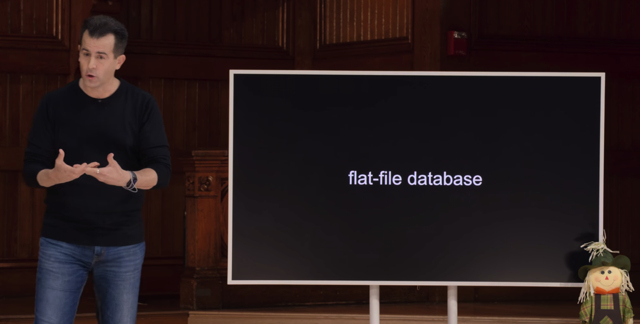</kbd>

> [!NOTE]
> Đại khái là ổng đang dẫn dắt vào nhu cầu phải có SQL.
> Vì với C hay Python, việc làm việc với data không dễ
> dàng

 

<kbd>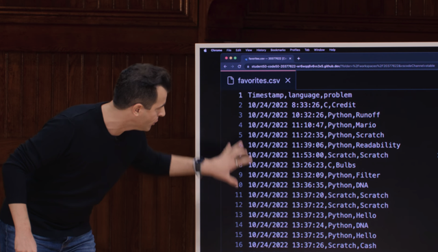</kbd>

> [!NOTE]
> File csv có 3 cột Timestamp,
> language, problem

 

<kbd></kbd>

 

<kbd></kbd>

> [!NOTE]
> mở file và dùng csv.read(file) để
> đọc, reader sẽ là iterable

 

<kbd></kbd>

> [!NOTE]
> D: Thay vì nó trả cho tôi nguyên một line / string dài
> của một row thì nó trả cho tôi cái gì, dựa vào cái
> syntax ở đây?
>
> A:**List các content** tương ứng của mỗi cột
>
> D: Correct! Vậy cái này sẽ in ra gì?
>
> A: Cột thứ 2 (vì index = 1) **Language**

 

<kbd>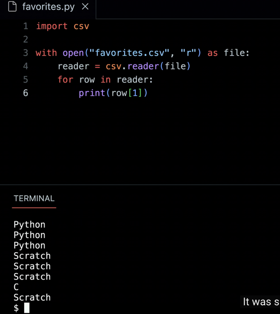</kbd>

> [!NOTE]
> D: Correct!

 

<kbd>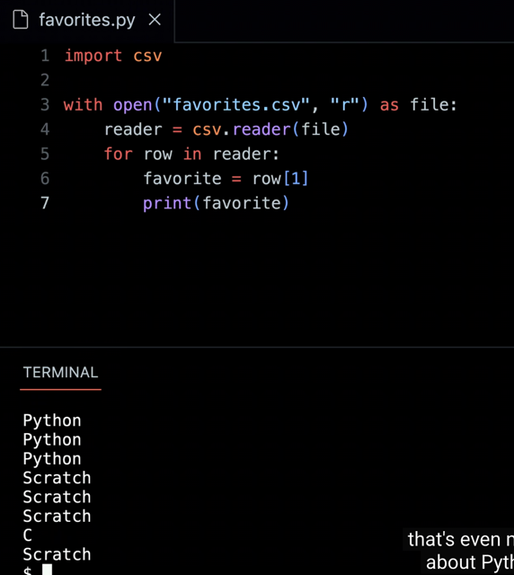</kbd>

> [!NOTE]
> Xong ổng define một variable
> "favorite" cho row[1]

 

<kbd>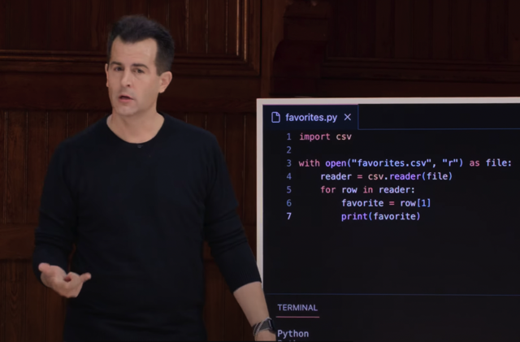</kbd>

> [!NOTE]
> D: Tại sao define row[1] như này lại là bad design
>
> A: Vì ta không biết có bao nhiêu column, việc lấy  như vậy có
> thể dẫn đến error
>
> D: Đại khái là làm vậy ta phải nhớ row 1 là cái gì và **giả sử có
> người move cái cột đi** (cái này trong  excel có thể) thì cột có
> index = 1 này không còn là 'language' nữa.

 

<kbd></kbd>

> [!NOTE]
> D: Tại sao lại có chữ **language** ở đây?
>
> A: Vì nó là tên cái **cột**
>
> D: Correct -> header

 

<kbd>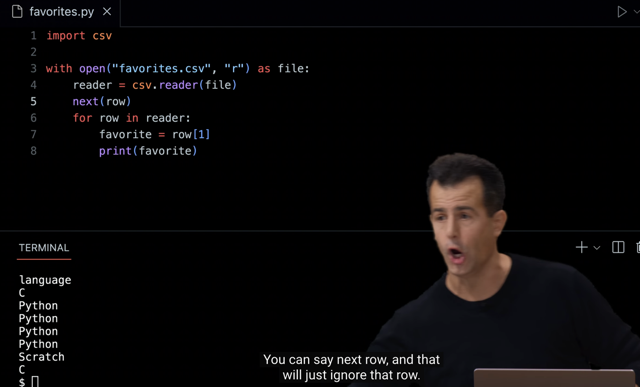</kbd>

> [!NOTE]
> Xong ổng nói nếu không thích cái
> header ta có thể **next(row)** để **skip**

 

<kbd>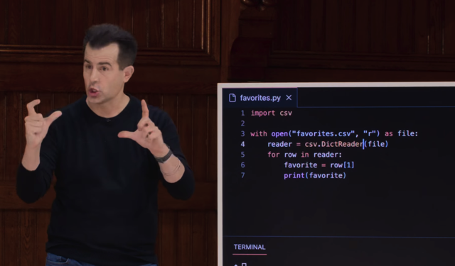</kbd>

> [!NOTE]
> Đại khái giờ ta dùng **csv.DictReader** thay vì reader thì
> như cái tên suggest nó sẽ**trả ra mỗi row là dạng
> dictionary**
>
> Dạng list (ở trước):
>
> row[0] = item 1 là time-stamp value,  row[1] = item 2 là
> language, row[2] = item 3 là problem
>
> Dạng dictionary:  **row['Timestamp']** = time-stamp value
> **row['language'] = language value**

 

<kbd>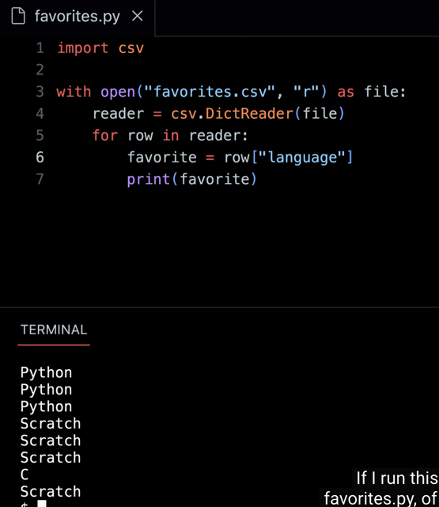</kbd>

> [!NOTE]
> Và với kiểu này, ta **không "bị dính" cái header**
> title 'language' trong đó mà **không cần skip(row)**
> Và cho dù có**"move column around"**, thì cũng
> **không ảnh hưởng gì** cả vì row["language"]
> luôn cho ra cột language
>
> không phải như khi dùng csv.reader cho row là
> list thì **row[1] chưa chắc luôn là cột language**

 

<kbd>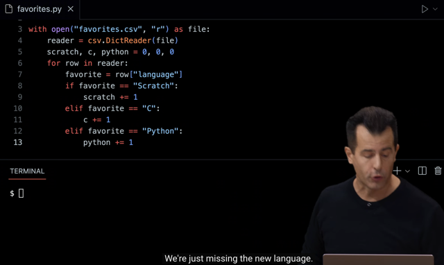</kbd>

> [!NOTE]
> Đại khái là ta sẽ đếm xem thử trong cột **language**
> sẽ **có mỗi loại bao nhiêu (người chọn)**

 

<kbd>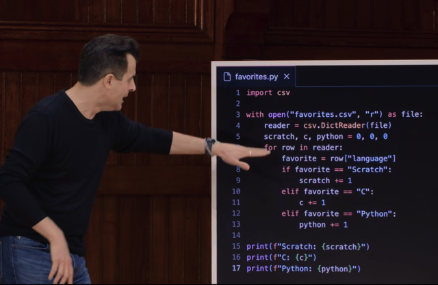</kbd>

> [!NOTE]
> Trong Python cho phép **initialize**
> kiểu này **a, b, c = 0, 0, 0**

 

<kbd>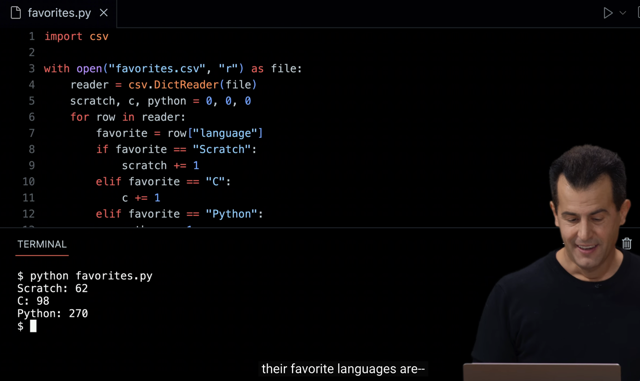</kbd>

 

<kbd>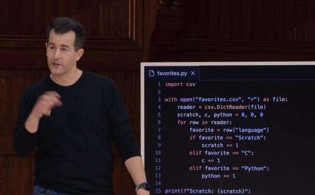</kbd>

> [!NOTE]
> D: Có gì không ổn?
>
> A: Việc **gọi cụ thể tên language** như vậy không ổn, ta có thể
> **không cần care trong đó có gì**. Bằng cách dùng một **set** để
> **lọc ra trong cột có các kết quả gì**. Sau đó dùng nó để đếm.
> Hoặc có thể dùng dictionary
> Ví dụ:
>
> favorite  = **{}**
> for row in reader:
> // **Check xem trong dictionary có key là value của row['language']
> hay chưa** (ta không cần biết là cái gì). Nếu **có thì ++ (count up)**
> nếu **chưa thì add vào**
>
> Khi check có thể là favorite.keys() hay sao đó
> nhưng đại khái là check xem có trong các keys chưa
>
> if **row['language'] in favorite**: //Correct!
>   **favorite[row['language']] += 1**//Correct!
> else:
>   **favorite[row['language']]  = 1**  //Correct!

 

<kbd>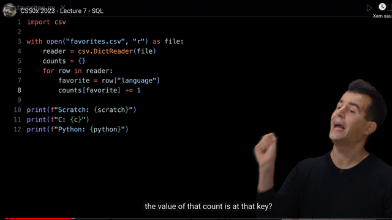</kbd>

> [!NOTE]
> Chính xác, nhưng làm từ từ, đầu tiên ổng làm y
> như mình, **tạo** **counts là một dict**
>
> Và ổng hỏi làm vậy thì có gì không ổn?
>
> A: Phải check xem trong dictionary có key mang 
> giá trị là language value của cái row đó hay chưa.
> Nếu có mới ++ được, không thì phải set vào = 1

 

<kbd>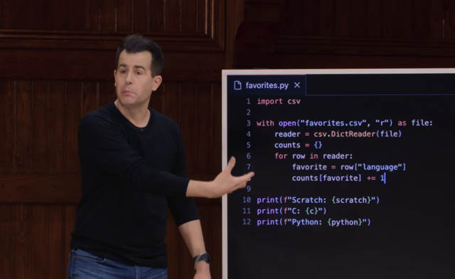</kbd>

> [!NOTE]
> Có con nhỏ hỏi liệu Python nó **có automatically
> tạo 1 cái key** hay không?
>
> **Không,** nó sẽ báo error

 

<kbd>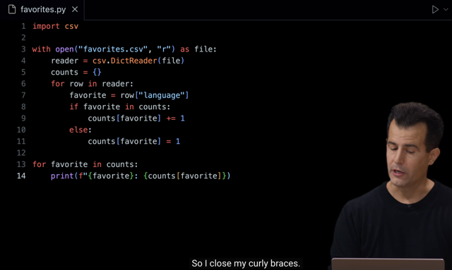</kbd>

> [!NOTE]
> Y chang luôn

 

<kbd>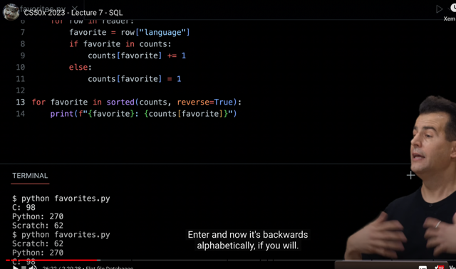</kbd>

> [!NOTE]
> Có người hỏi làm sao để **in theo thứ tự** - D: Ta có thể **sorted
> cái dict counts** và lệnh **sorted** khi đọc trong doc sẽ thấy nó có
> các argument, ví dụ ở đây để **reverse = True** thì nó sẽ sort
> reverse (alphabetically)

 

<kbd>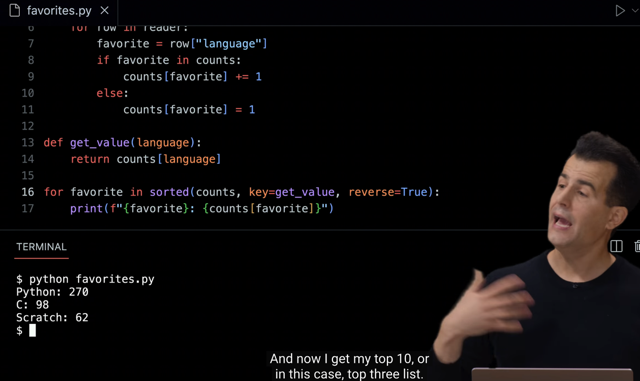</kbd>

> [!NOTE]
> Rồi, đại khái có thể define thêm key = một function
> **get_value** như này, để rồi nó sẽ **sort dictionary**
> theo **giá trị tương ứng của cái key trong dict**
>
> Python có value cao nhất -> C > Scratch

 

<kbd>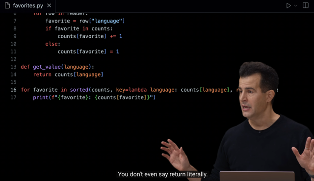</kbd>

> [!NOTE]
> Thì ta có thể **không cần define một function cụ thể** khi chỉ
> dùng có một lần trong đây, thay vào đó có thể dùng **lambda
> function**, (**anonymous function**) như vầy 
>
> key = **lambda language: counts[language]**

 

<kbd>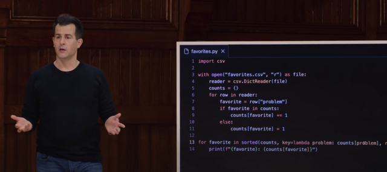</kbd>

> [!NOTE]
> D: Giờ tui đổi từ '**language**' sang '**problem'** chỗ này thì bây
> giờ các program làm gì?
>
> A: Nó sẽ**đếm các loại problem set** mà được nhắc đến
> trong column 'problem'

 

<kbd>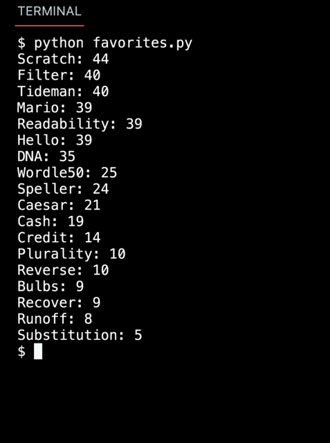</kbd>

> [!NOTE]
> Correct! Và sort theo số lượng "vote"

 

<kbd>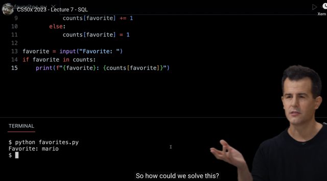</kbd>

> [!NOTE]
> Đại khái là làm thêm chút nữa, cho user
> **nhập loại problem set** họ thích, để**in ra số
> vote** cho problem set đó.
>
> Kết quả nhập Mario -> 39
>
> Xong có người hỏi nếu mà nhập **mario** thì sao 
>
> D: Thì nó không ra, như có thể thấy vì column's
> vì trong cột problem không có 'mario', nên trong dict
> ở đọan trên không có key 'mario'. Nhưng ta có thể giải
> quyết bằng cách nào?
>
> A: Thì check thêm lowercase:
>
> If favorite.lower() in counts:
>   print(....counts[favorite.lower()]
>
> D: Ok, có thể

 

<kbd></kbd>

> [!NOTE]
> Relational database

 

<kbd></kbd>

 

<kbd></kbd>

> [!NOTE]
> Về cơ bản chỉ có 4 loại hành động CRUD : 
>
> **C**reate data (**CREATE**, **INSERT**), 
>
> **R**eading data (**SELECT**), 
>
> **U**pdate data (**UPDATE**), 
>
> **D**elete data (**DELETE**, **DROP**)

 

<kbd>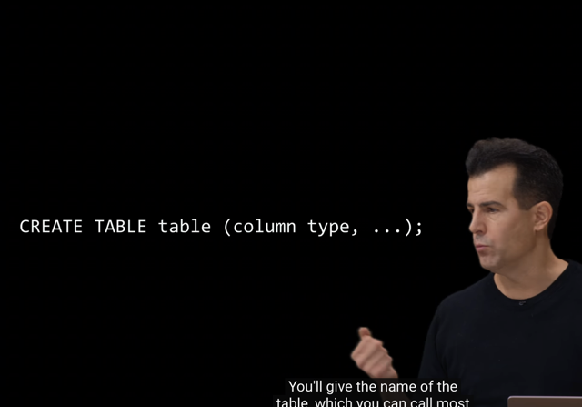</kbd>

> [!NOTE]
> Hành động này tương tự như khi mở Google
> Spreadsheet lên, đặt tên file (save as), và gõ title của 3
> column **Timestamp, language, problem**

 

<kbd>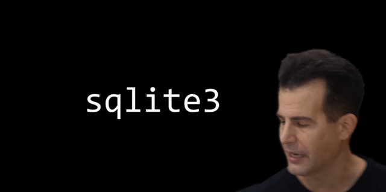</kbd>

 

<kbd>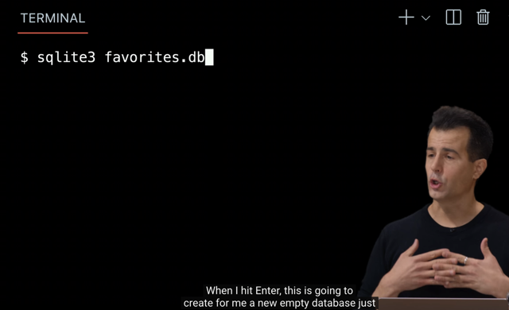</kbd>

> [!NOTE]
> Dòng code này sẽ đại khái là**tạo một
> empty database tên là favorites.db**

 

<kbd></kbd>

> [!NOTE]
> Và đại khái là sau đó nó sẽ trở thành **terminal sqlite** thay
> vì**$** có nghĩa là ta **đang làm việc với database này**
>
> Và **tí nữa ta sẽ dùng python để tương tác với database**
> giống như swift, kotlin, ....trong đời thực cũng có thể
> tương tác với database

 

<kbd>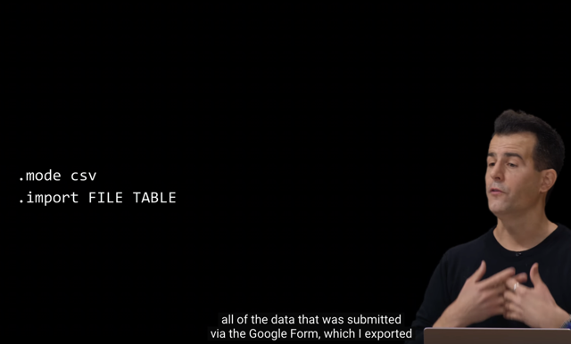</kbd>

> [!NOTE]
> Đại khái hai câu lệnh này sẽ là:
>
> **Để chế độ (mode) csv**
>
> Và **import csv file** vào thành database

 

<kbd>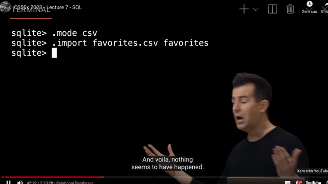</kbd>

> [!NOTE]
> **.import favorites.csv favorites** 
>
> Ra lệnh cho máy tính **import file csv favorite**
> vào t**hành database có tên favorites**.
>
> Và dù **kết quả không có gì** nhưng như thông lệ,
> **không có gì có nghĩa là tốt**

 

<kbd>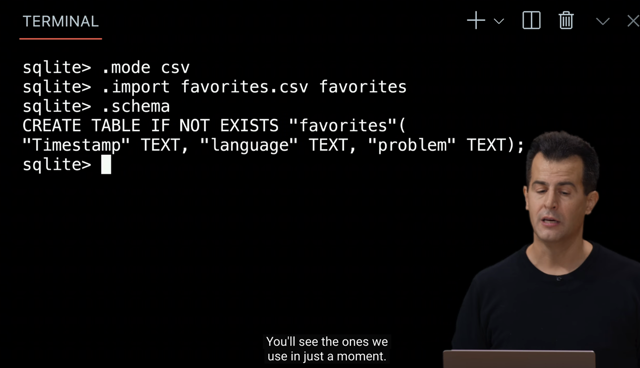</kbd>

> [!NOTE]
> Ổng nói thêm **command** **có dấu chấm** kiểu này là sqlite,
> **không thật sự là sql**
>
> Rồi đại khái **.schema** là giúp cho thấy làm cái gì thì ở đây
> có nghĩa là lệnh import ..ở trên  đã **gọi lệnh sql 
>
> CREATE TABLE IF NOT EXISTS "favorites" 
> ("Timestamp" TEXT, "language" TEXT, "problem" TEXT);**- tạo một table có tên là "favorites" trong đó có  "Timestamp"
> thuộc loại TEXT, "language" thuộc loại TEXT,  "problem" TEXT

 

<kbd>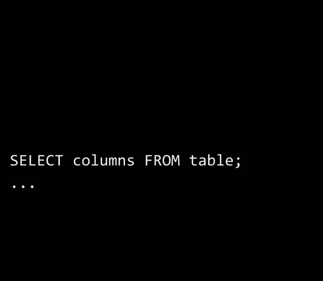</kbd>

 

<kbd></kbd>

> [!NOTE]
> Chữ viết hoa **SELECT** là sql keyword thì dù bạn không cần
> phải viết hoa nhưng **khuyên nên viết** để **phân biệt với cái
> không phải sql keyword**như tên **columns, table...**
>
> Thì đại khái câu lệnh này sẽ**select data từ một hoặc nhiều
> column từ table có tên chỉ định**

 

<kbd>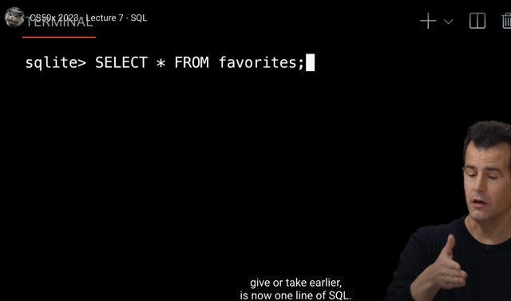</kbd>

> [!NOTE]
> Ổng nói tôi **muốn chọn cả 3 cột:**
>
> **SELECT** **Timestamp, problem, favorite** **FROM favorites**;
>
> Nhưng để chọn hết thì có thể dùng
>
> **SELECT * FROM favorites;**
>
> Thì nó sẽ kiểu như **chọn tất cả các row thuộc 3 column
> và in ra**

 

<kbd>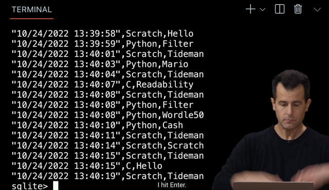</kbd>

 

<kbd>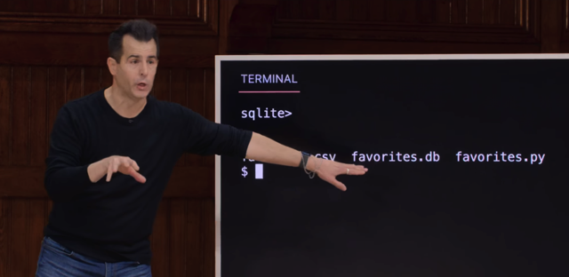</kbd>

> [!NOTE]
> Và ls thì sẽ thấy trong directory có
> thêm một file là**favorites.db**

 

<kbd>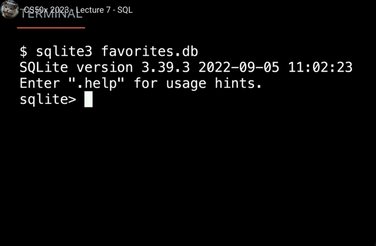</kbd>

> [!NOTE]
> gọi lại **sqlite3 favorite.db thì**nó sẽ kiểu như là
> **quay lại làm việc với database favorites.db**

 

<kbd>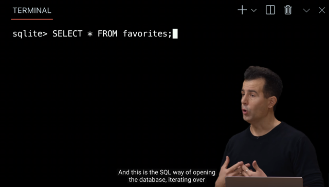</kbd>

> [!NOTE]
> Gọi lại function SELECT mọi column

 

<kbd>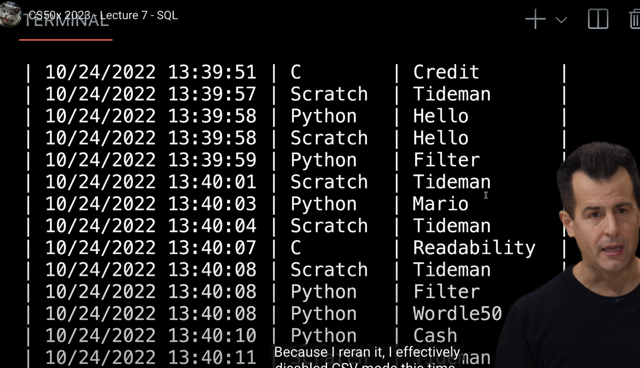</kbd>

> [!NOTE]
> Thì đại khái là ta vẫn thấy lại data như hồi nãy,
> nhưng đẹp hơn vì**không còn mode csv nữa**

> [!NOTE]
> Control L: Clean all things

 

<kbd>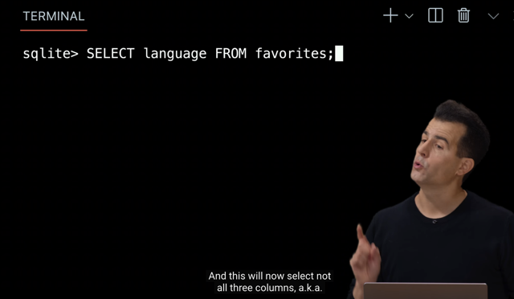</kbd>

> [!NOTE]
> Ok giờ nếu muốn **select một cột
> language** thôi thì làm như này

 

<kbd>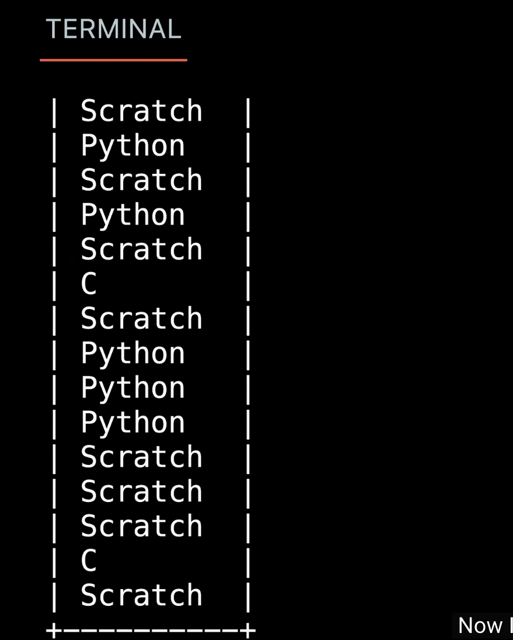</kbd>

 

<kbd></kbd>

> [!NOTE]
> Và đây là các **function** của sql,
> AVG - tính trung bình
> COUNT - đếm row
> DISTINCT - đếm số value không trùng 
> LOWER
> MAX - chắc là lấy max value
> MIN - lấy min value
> UPPER ...

 

<kbd>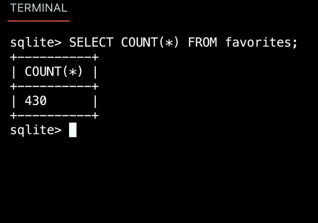</kbd>

> [!NOTE]
> SELECT COUNT(*) FROM favorites; 
>
> Đại khái là đếm tất cả các row của database
>
> -> Có 430 rows

 

<kbd>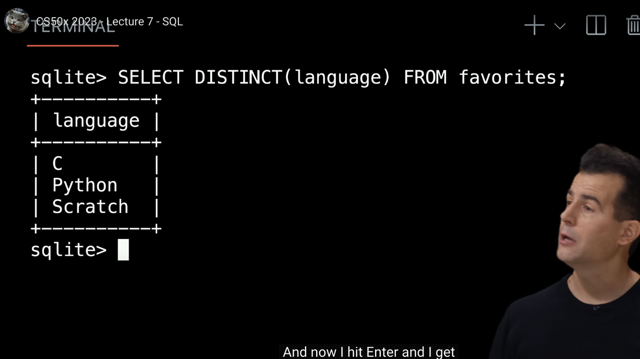</kbd>

> [!NOTE]
> Gọi lệnh này **SELECT DISTINCT(language) FROM favorites;**
> Đại khái là nó sẽ chỉ **lấy ra các loại khác nhau** trong column 
> language (nôm na là trong cột language có các lọai gì)

 

<kbd>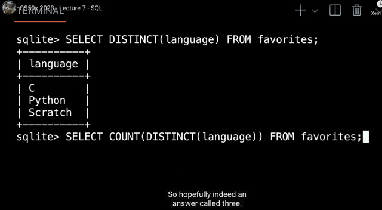</kbd>

> [!NOTE]
> Giờ nếu **SELECT COUNT(DISTINCT(language))
> FROM favorites;**
>
> D: Thì nó ra gì?
>
> A: Lấy ra các loại khác nhau của cột language và đến số
> row: **3**

 

<kbd>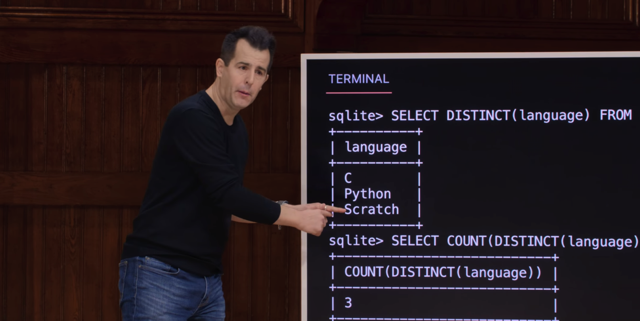</kbd>

> [!NOTE]
> Ổng nói đại khái là sql nó**trả về cho ta một subset**
> of your data (smaller table of data)
>
> Và kết quả này **không được save vào đâu cả**

 

<kbd>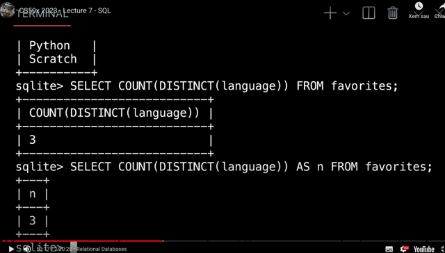</kbd>

> [!NOTE]
> Và thay vì để cái cột có tên **COUNT(DISTINCT(language))**thì có thể dùng **AS n** (có nghĩa là **aliase as**) để **thay cái tên
> đó bằng tên ngắn hơn "n"** (Aliase: Bí danh)

 

<kbd></kbd>

> [!NOTE]
> Q: Distinct?
>
> D: Chỉ đơn giản khi bạn distinct là 1 list thì cũng như bỏ vào
> set vậy, **chỉ giữ những các khác nhau**, **remove hết các duplicate**
> [1,2,3,1,3,4] => [1,2,3,4]

 

<kbd>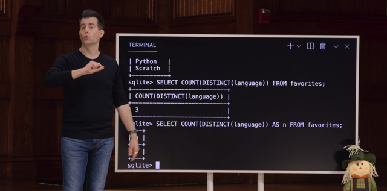</kbd>

> [!NOTE]
> **n** kiểu như một**nick name** và đại khái là có
> thể dùng lại được

 

<kbd></kbd>

> [!NOTE]
> Một số keyword khác

 

<kbd>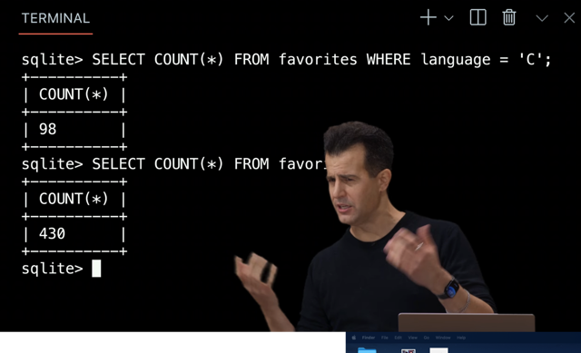</kbd>

> [!NOTE]
> SELECT COUNT(*) FROM favorites
> **WHERE language = 'C';**
>
> Trả về sub-table có 1 column là COUNT(*)
> có value là **đếm số row mà có language = C**
>
> Và nếu không có WHERE language = 'C';
>
> trả về sub-table có 1 column là COUNT(*)
> có value là đếm số row nói chung

 

<kbd>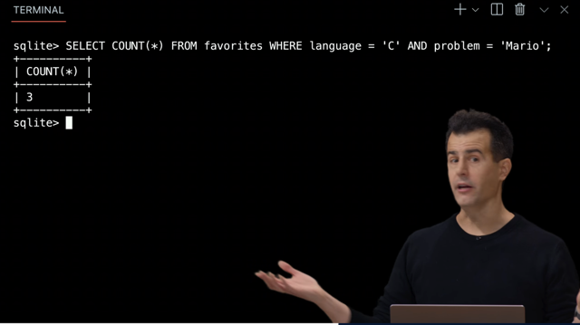</kbd>

> [!NOTE]
> SELECT COUNT (*) FROM
> favorites WHERE language = 'C' AND problem = 'Mario';
>
> -> **Đếm số row mà language = 'C' và problem = 'Mario'**
> và trả về sub-table có 1 column là COUNT(*)

 

<kbd>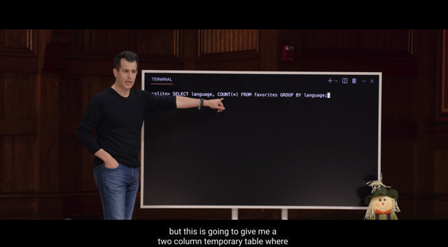</kbd>

> [!NOTE]
> **SELECT language, COUNT(*) FROM favorites GROUP 
> BY language;**
>
> Tạo sub table có 2 cột: language và COUNT(*) tức là 
> "lấy các giá trị trong language", và "đếm xem mỗi loại 
> có mấy cái" 
>
> và sau đó là **gom lại theo language**. Có nghĩa là**chỉ 
> show ra mỗi loại (language) có mấy cái.**

 

<kbd>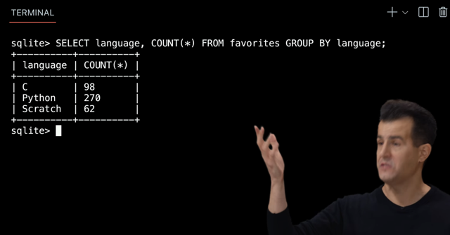</kbd>

 

<kbd>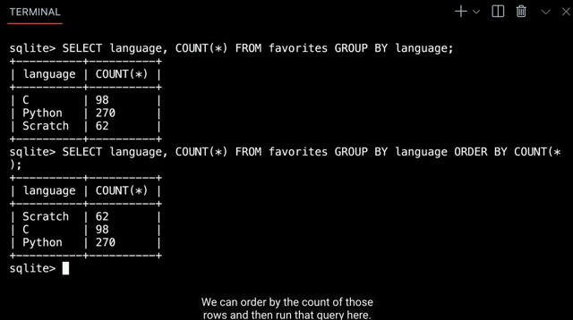</kbd>

> [!NOTE]
> Và nếu thêm **ORDER BY COUNT(*)** thì nó sẽ
> sort theo gía trị của**"số lượng" mỗi language**

 

<kbd>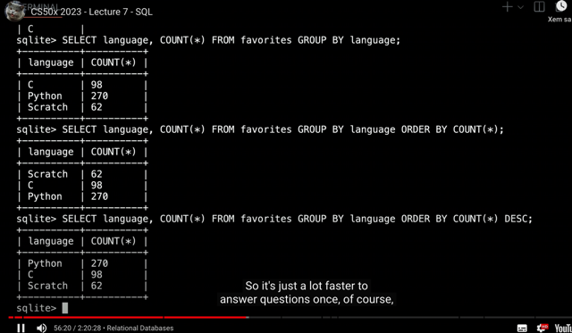</kbd>

> [!NOTE]
> Và nếu muốn từ **lớn đến
> nhỏ** thì thêm **DESC**

 

<kbd>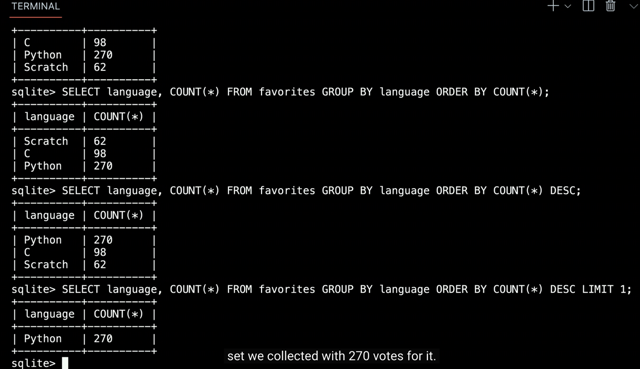</kbd>

> [!NOTE]
> Và nếu chỉ muốn thằng
> lớn nhất, thì**DESC LIMIT 1**

 

<kbd>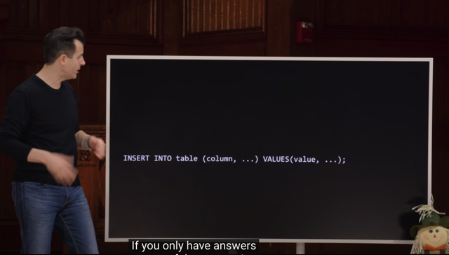</kbd>

> [!NOTE]
> Giờ đến **INSERT vào table**

 

<kbd>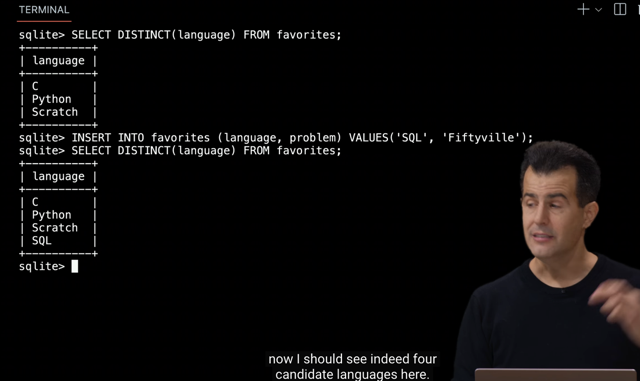</kbd>

> [!NOTE]
> Ví dụ
>
> INSERT INTO favorites (language, problem) 
> VALUES('SQL', 'Fiftyville');
>
> -> Insert thêm 1 row, cột **language** thì là **'SQL'**, cột 
> **problem** thì là **'Fiftyville'**

 

<kbd>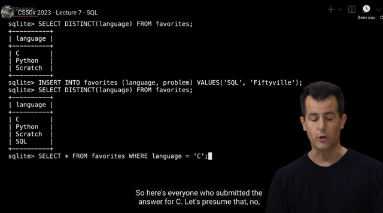</kbd>

> [!NOTE]
> Rồi tiếp muốn **xem tất cả các row** (và mọi cột)
> nhưng **language = 'C'**:
>
> SELECT * FROM favorites WHERE language = 'C';

 

<kbd>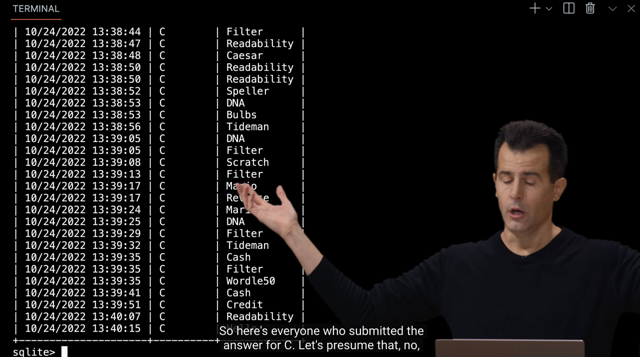</kbd>

 

<kbd>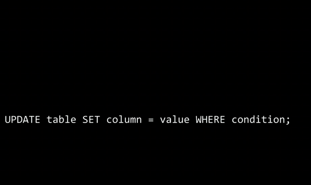</kbd>

> [!NOTE]
> Qua update data

 

<kbd>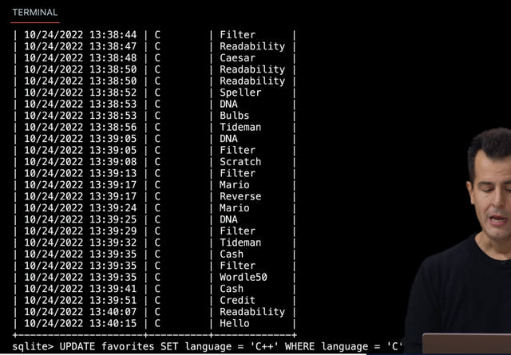</kbd>

> [!NOTE]
> UPDATE favorites SET language = 'C++' WHERE language = 'C';
>
> -> Update data, set giá trị của cột language của mọi hàng nào
> mà đang là C thành C++;

 

<kbd></kbd>

> [!NOTE]
> Xong giờ ổng muốn đổi lại, nhưng hỏi là nếu mà gọi
>
> UPDATE favorites SET language = 'C' 
>
> Thì sẽ làm sao?
>
> A: Thì mọi hàng trong cột language sẽ đều thành C hết

 

<kbd>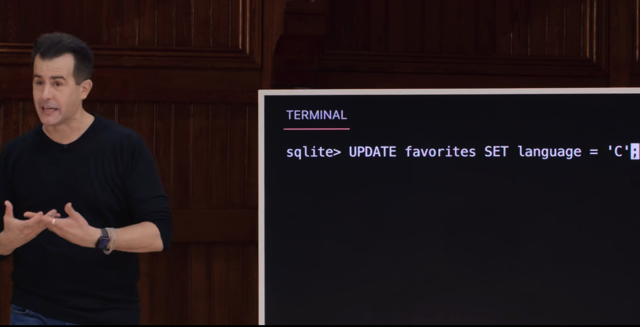</kbd>

> [!NOTE]
> Correct, do đó rất dễ gây tai họa. Cho nên phải**đảm bảo luôn
> backup data** và ít nhất cũng **luôn chắc chắn check kĩ** trước
> khi nhấn enter

 

<kbd>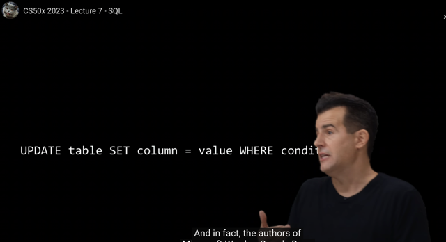</kbd>

> [!NOTE]
> Q: Có phải cái này là find và replace không?
>
> D: Correct

 

<kbd>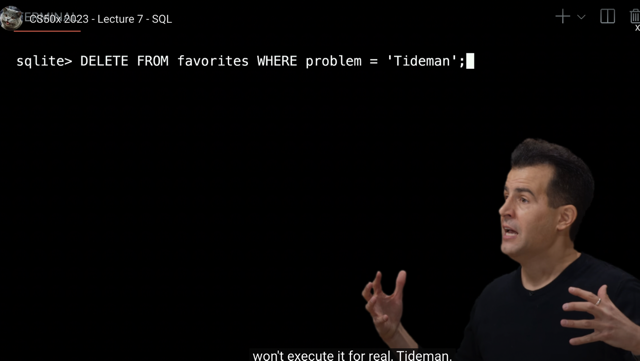</kbd>

> [!NOTE]
> DELETE FROM favorites WHERE problem = 'Tideman';
>
> -> Delete mọi row mà giá trị của cột 'problem' = 'Tideman'

 

<kbd></kbd>

> [!NOTE]
> D: Cái này thì sẽ ntn 
>
> A: Delete hết table

 

<kbd></kbd>

> [!NOTE]
> Nói về bộ database tên là **IMBb
> movies review**. Tí nữa ta sẽ làm việc
> với bộ data này

 

<kbd>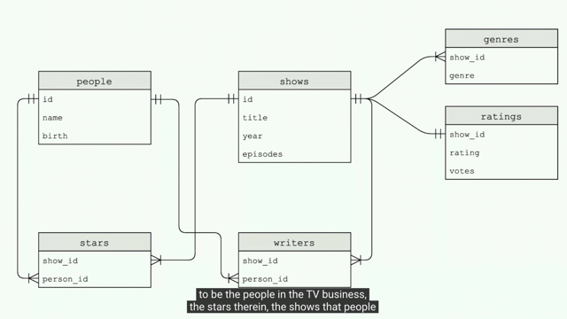</kbd>

> [!NOTE]
> Cụ thể là nó có
> tới 6 bộ data

 

<kbd>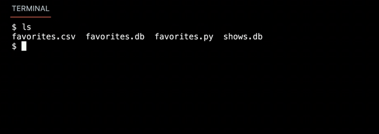</kbd>

> [!NOTE]
> Đại khái là trong giờ nghỉ ổng đã download một file
> tên là **show.db** chuẩn bị trước rồi

 

<kbd>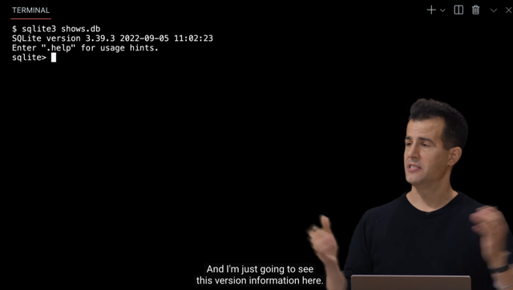</kbd>

> [!NOTE]
> **sqlite3 show.db** để bắt đầu làm việc với
> database này

 

<kbd>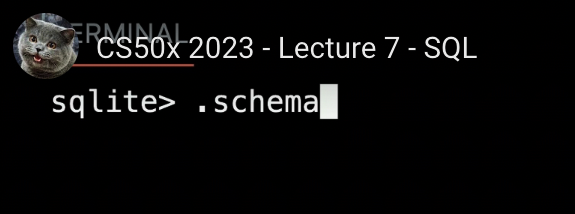</kbd>

> [!NOTE]
> Gọi **.schema** hồi nãy đã nói để **xem
> thông tin về database này**

 

<kbd>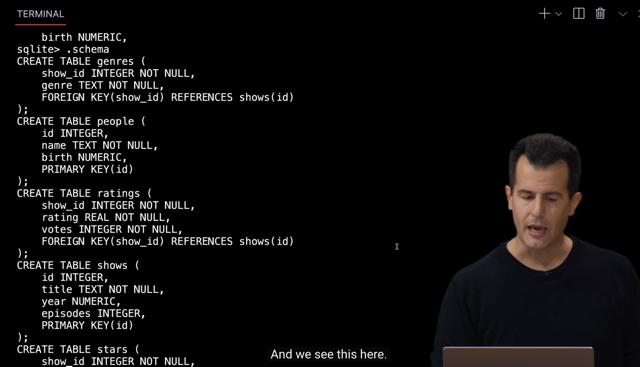</kbd>

 

<kbd></kbd>

 

<kbd>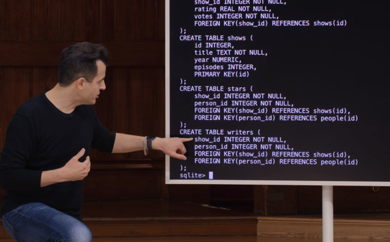</kbd>

 

<kbd>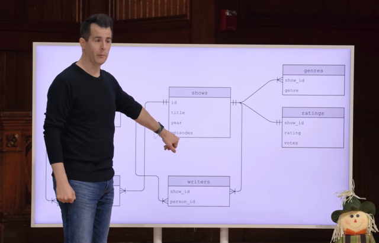</kbd>

> [!NOTE]
> Đại khái là ổng nói về các database này liên hệ / link tới nhau.
> Ví dụ như **shows - genres**, khi muốn biết cái show với id nọ có
> genres là gì (comedy, hay drama) thì chỉ cần**look up với id
> trong genres table.**
>
> D: Tại sao khổ vậy, sao không thêm một cột genres ngay trong
> table show?
>
> -> Đại khái là nếu làm vậy, sẽ khó (dù có thể) đó là**cho một show
> có nhiều genres**. Còn với một table genres riêng biệt thì có thể
> cùng **1 show id có thể có 3 row với 3 giá trị genres.**

 

<kbd>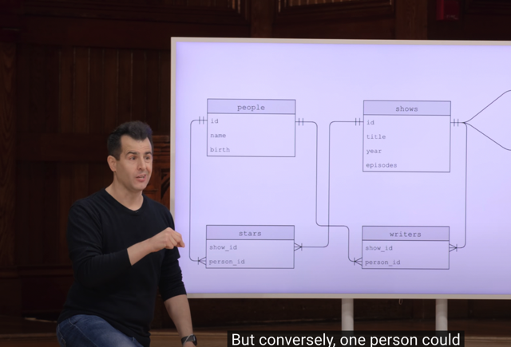</kbd>

> [!NOTE]
> Tương tự, với people và stars, ta có
> thể có quan hệ **1 - nhiều**: **1 người
> tham gia nhiều show** và **1 show có nhiều
> người.**
>
> Ví dụ
>
> ...
> show #2 - person #5
> ...
> show #44 - person #5
> show #44 - person #16

 

<kbd></kbd>

> [!NOTE]
> Đại khái là trong **SQLite** (phiên bản nhẹ hơn của sql
> mà ta hay thấy dùng trên mobile ..) có các **datatype**
> chính như
>
> **BLOB** - Binary Large Object,
>
> **INTEGER** - Integer biết rồi
>
> **NUMBER** - Ổng nói ví dụ như date-time
>
> **REAL** - Như float
>
> **TEXT** - String

 

<kbd></kbd>

> [!NOTE]
> Còn hai cái key **NOT NULL** và **UNIQUE** đại khái là
> để **constraint** rằng**data không được NULL** và phải 
> **không được trùng lặp.**
>
> Ví dụ như hồi nãy ổng insert **SLQ và 'fiftyville'** thì 
> không có **Time-stamp**, thì **nếu như có NOT NULL**
> config của cột time-stamp thì **sqlite nó sẽ complain**
>
> Nói chung là **có nhiều constraint khác nữa**

 

<kbd></kbd>

> [!NOTE]
> Nói về **PRIMARY KEY** ví dụ như trong table shows này,
> PRIMARY KEY (id) có nghĩa là, cũng t**ương tự như keyword
> constraint UNIQUE**, thì cái này table nó sẽ **treat cột id một
> cách đặc biệt hơn**, dùng nó làm**unique identifier**.
>
> Ngoài ra xem qua ta thấy các datatype như id là INTEGER,
> Title là TEXT NOT NULL, text và không được null, nên như
> đã nói nếu insert mà không có title thì sql sẽ complain.
> Rồi year là NUMERIC, episode là INTEGER

 

<kbd></kbd>

> [!NOTE]
> Tương tự, ở table people này ta cũng thấy,
> PRIMARY KEY (id) - cột id được treat specially
> dùng làm Unique Identifier

 

<kbd>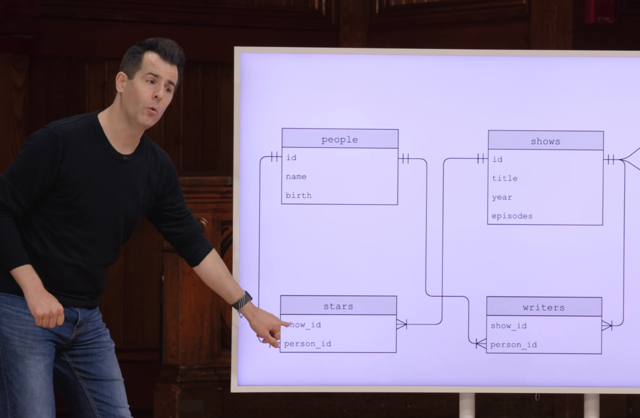</kbd>

<kbd></kbd>

<kbd>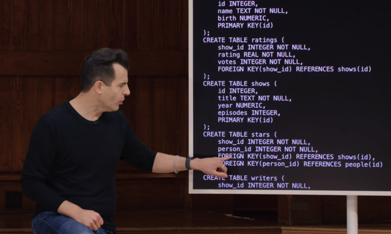</kbd>

> [!NOTE]
> Còn keyword**FOREIGN KEY(show_id) REFERENCES**
> **shows(id)** ý là **cột show_id chính là cột id của table 'shows'**
> và**FOREIGN KEY (person_id) REFERENCES people(id)**
> ý là **cột person_id chính là cột id của table people**
>
> Và cái này mô tả trong chart là mũi tên

 

<kbd>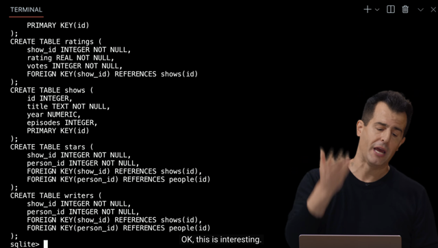</kbd>

> [!NOTE]
> Sqlite .schema

 

<kbd>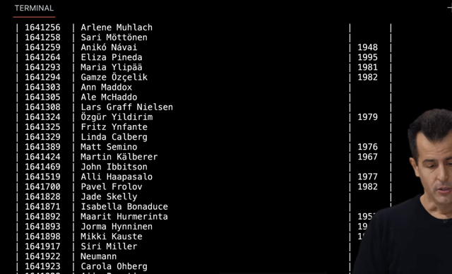</kbd>

<kbd></kbd>

<kbd>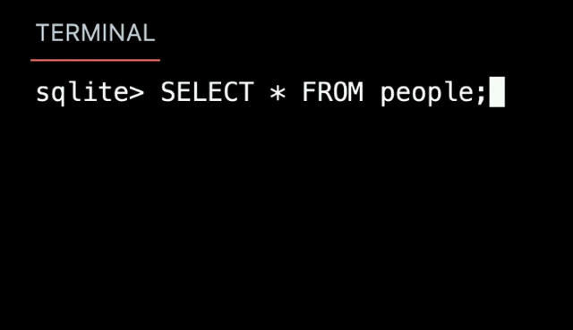</kbd>

> [!NOTE]
> **SELECT * FROM people;** -> Chọn, tạo
> subtable **mọi hàng mọi cột** từ**table people**

 

<kbd></kbd>

> [!NOTE]
> **SELECT * FROM people LIMIT 10;**
> -> **Tạo subtable mọi cột** từ **people**
> nhưng**limit 10 row**

 

<kbd>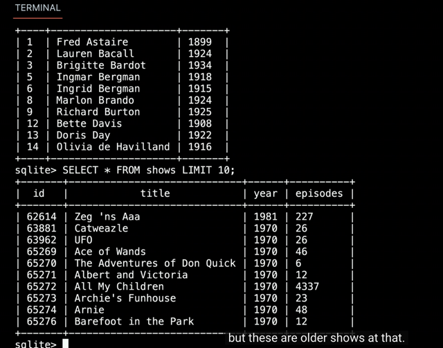</kbd>

 

<kbd>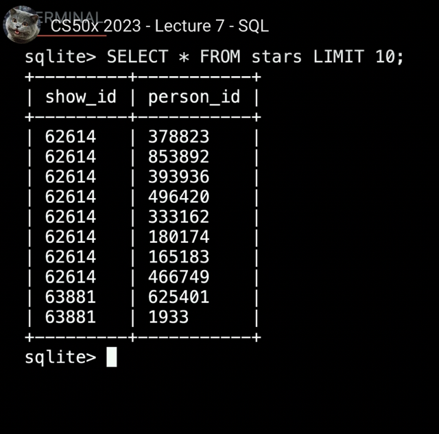</kbd>

> [!NOTE]
> Rồi xem qua **stars** table thì ta thấy **show_id** và **person_id**
> như nãy nói, nó là **FOREIGN KEY**, map **id** của **table shows**
> và **id** của **table people**
>
> Để ý thấy với kiểu này**1 show có thể có nhiều người tham gia**
> (như nói về việc tại sao phải chia ra nhiều table như hồi nãy)
> bằng cách như thấy ở đâu **show id 62614 có nhiều hàng với các
> Person id khác nhau.**
>
> Và ngược lại, nó cũng cho phép 1 người tham gia nhiều show
> Khi ví dụ ông 378823 có thể xuất hiện ở row khác với show id khác

 

<kbd>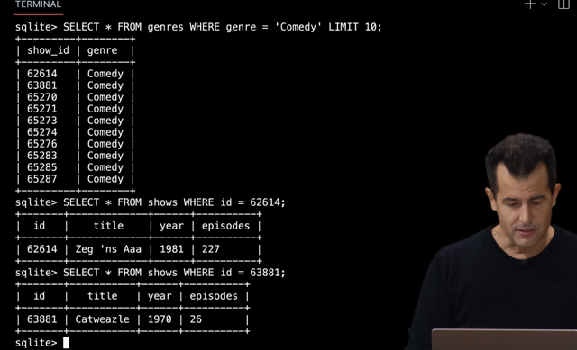</kbd>

> [!NOTE]
> SELECT * FROM genres WHERE genre = 'Comedy'
> LIMIT 10;
>
> -> Tạo subtable mọi cột, từ table genres, chỉ lấy row
> nào mà cột genre = 'Comedy' giới hạn 10 cái
>
> SLECT * FROM genres WHERE id = 62614;
>
> -> Tạo subtable mọi cột, từ table genres, chỉ lấy cái 
> row mà cột id = '62614'

 

<kbd>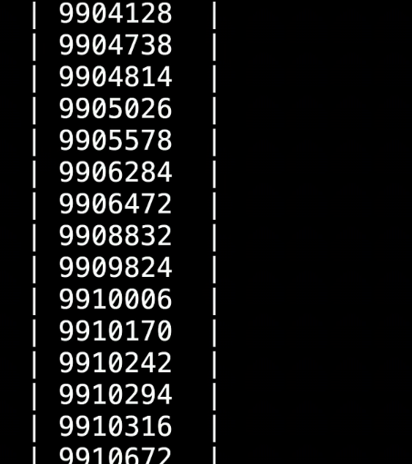</kbd>

<kbd></kbd>

<kbd>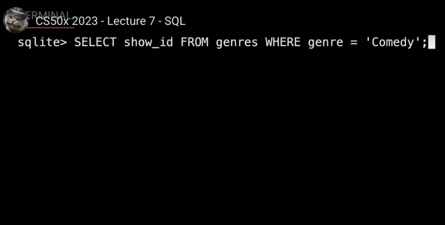</kbd>

> [!NOTE]
> SELECT show_id FROM genres WHERE genre = 'Comedy';
>
> -> Tạo subtable với 1 cột là show_id từ table genres và chỉ 
> chọn row nào mà genre = 'Comedy' thôi.

 

<kbd>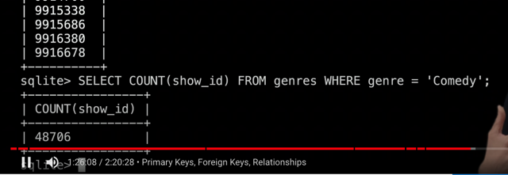</kbd>

> [!NOTE]
> SELECT COUNT(show_id) FROM genres WHERE genre = 'Comedy';
>
> Tạo subtable 1 cột là COUNT(show_id), mà các row = 'Comedy'
> -> đếm các row có genre = 'Comedy'

 

<kbd>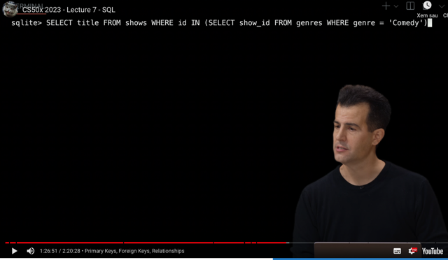</kbd>

> [!NOTE]
> SELECT show_id FROM genres
> WHERE genre = 'Comedy' 
>
> -> tạo / chọn subtable 1 cột show_id từ table genres
> nơi mà genre = 'Comedy'.
>
> (Lựa ra các id của các show thuộc loại hài kịch)
>
> Sau đó SELECT title FROM shows WHERE id IN (..)
>
> -> Chọn / tạo subtable 1 cột title từ table shows sao
> cho các row có cột id có giá trị chứa trong table ở trên
>
> (Lựa ra các tên của các show thuộc loại hài kịch)

 

<kbd>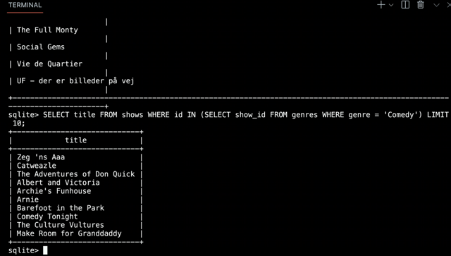</kbd>

 

<kbd>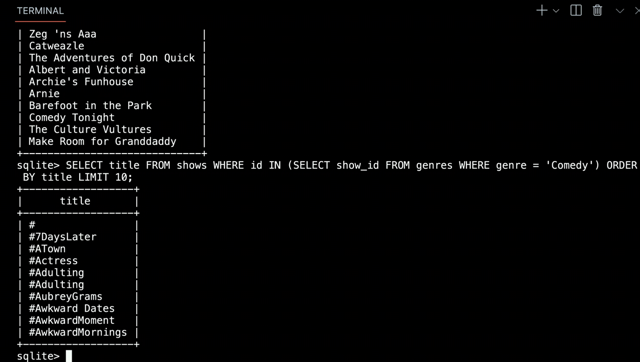</kbd>

> [!NOTE]
> rồi thêm ORDER BY title LIMIT 10;
> để sort theo alphabetical

 

<kbd>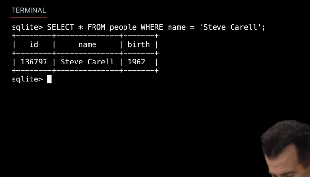</kbd>

> [!NOTE]
> Rồi bây giờ thử tìm các show mà Steve Carell
> có tham gia
>
> Đầu tiên là xem thử trong table people 
>
> SELECT * FROM people WHERE name = 'Steve Carell';
>
> Tạo subtable từ table people mà row có cột name là Steve
> Carell

 

<kbd>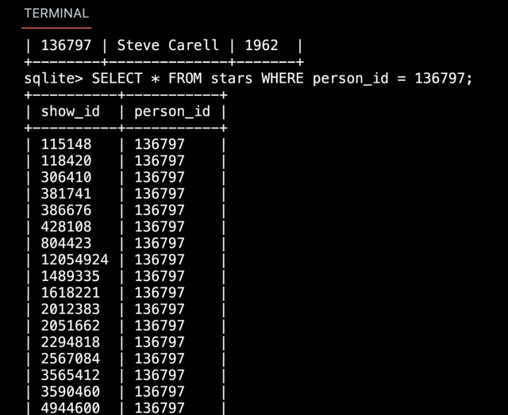</kbd>

> [!NOTE]
> Rồi với id của ổng là 136797, tìm trong table stars:
>
> SELECT * FROM stars WHERE person_id = 136797;
>
> Tạo subtable từ stars, lấy mọi cột sao cho person_id bằng
> như vậy
>
> Ta có các show_id mà ông này có tham gia

 

<kbd>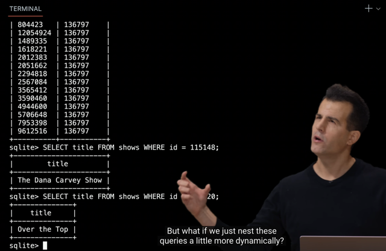</kbd>

> [!NOTE]
> Xong từ các show_id ta có thể SELECT title FROM shows
> WHERE id = show id;
>
> để tạo subtable từ shows lấy cột title sao cho id bằng show id
> để ra được title của show đó

 

<kbd>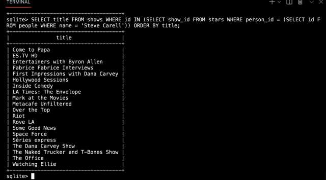</kbd>

> [!NOTE]
> SELECT title FROM shows WHERE id IN 
> (SELECT show_id FROM stars WHERE person_id = 
> (SELECT id FROM people WHERE name = 'Steve Carell'))
> ORDER BY title;
>
> Ý nghĩa nôm na:
>
> 1/ Tìm trong table people để cho cột id của row có name là
> Steve Carell
>
> 2/ Với giá trị id đó, tìm trong table stars những show_id mà
> tương ứng có person_id là id trên.
>
> 3. Với những show ids đó, tìm trong table shows những title
> mà id tương ứng.
>
> Sort theo alphabetically

 

<kbd></kbd>

> [!NOTE]
> Xong ổng nói qua JOINT là một trong
> những công cụ mạnh nhất của sql
>
> Đầu tiên là tạo hai table với:
>
> SELECT * FROM shows LIMIT 10;
> -> chọn 10 rows của table shows.
> SELECT * FROM genres LIMIT 10;
> -> chọn 10 rows của table genres
>
> Thì đại khái là hai table shows và genres
> đều có PRIMARY ID là show ids, nên kết quả
> đều giống nhau ở cột show_id
>
> bây giờ làm sao JOINT hay cái lại

 

<kbd>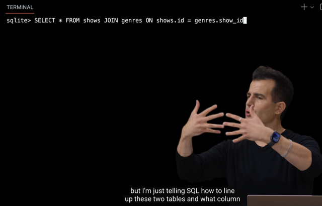</kbd>

> [!NOTE]
> SELECT * FROM shows JOIN genres ON shows.id =
> genres.show_id;
>
> Chọn / tạo subtable với mọi cột, từ hai table shows và
> genres sao cho value của cột id trong table show bằng
> show_id trong table genres.

 

<kbd>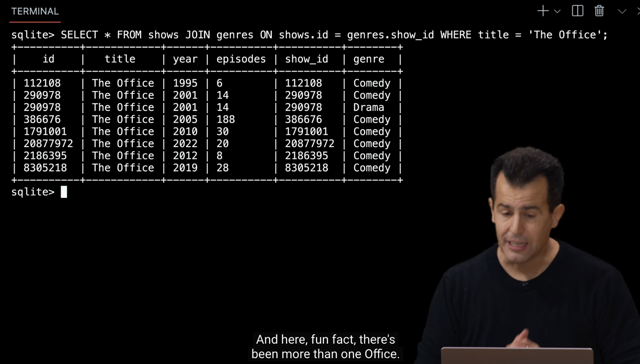</kbd>

> [!NOTE]
> Thêm WHERE title = 'The office' để joint hai table và chỉ
> show những row mà title là 'The office' thôi
>
> Cho thấy sau khi join ta có hai cột chứa show id là id của 
> table show và show_id của table genres

 

<kbd>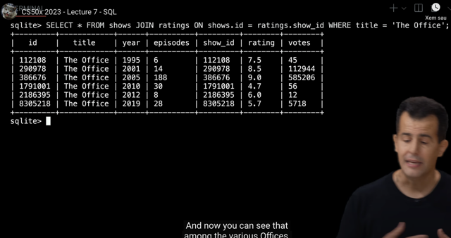</kbd>

> [!NOTE]
> SELECT * FROM shows JOIN ratings ON shows.id =
> ratings.show_id WHERE title = 'The Office';
>
> Tạo subtable bằng cách join shows và ratings lại nơi nào
> id của shows bằng với show_id của ratings và chỉ lấy row
> nào mà title = The Office thôi

 

<kbd>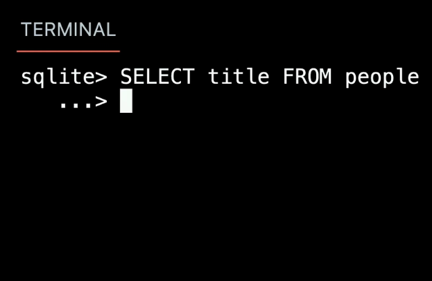</kbd>

> [!NOTE]
> ...> có ghĩa là continue

 

<kbd>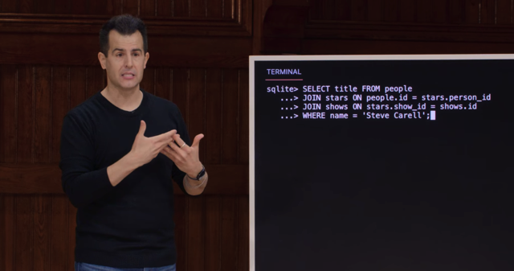</kbd>

> [!NOTE]
> SELECT title FROM people 
> JOIN stars ON people.id = stars.person_id
> JOIN shows ON stars.show_id = shows.id
> WHERE name = 'Steve Carell';
>
> Nó sẽ cho kết quả y như :
> SELECT title FROM shows WHERE id IN
> (SELECT show_id FROM stars WHERE person_id =
> (SELECT id FROM people WHERE name = 'Steve Carell'))

 

<kbd>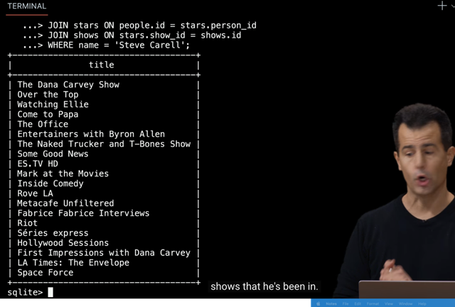</kbd>

 

<kbd>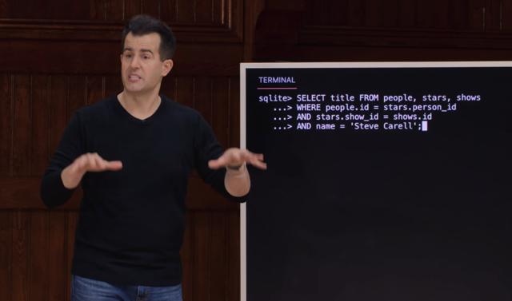</kbd>

 

<kbd>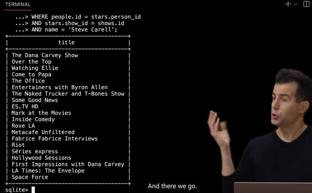</kbd>

> [!NOTE]
> Và có thể viết kiểu khác đối với JOIN
>
> SELECT title FROM people, stars, shows
> WHERE people.id = stars.person_id
> AND stars.show_id = shows.id
> AND name = 'Steve Carell';

 

<kbd>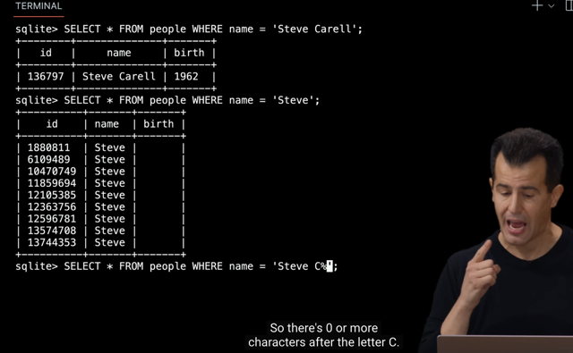</kbd>

 

<kbd>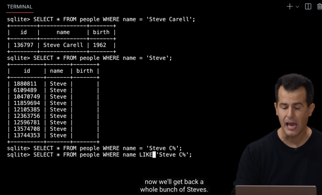</kbd>

> [!NOTE]
> Đại khái là nói thêm một feature khá hữu ích nữa của sql
> là nôm na là mình cần tìm tên Steve Carel nhưng không 
> nhớ chính xác là Carell hay Carrel...
>
> Thì SELECT * FROM people WHERE name LIKE 'Steve C%'
>
> Có nghĩa là tìm các row trong people sao cho name nó **giống
> như Steve C.....**

 

<kbd>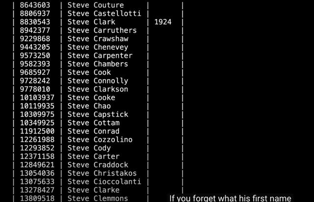</kbd>

 

<kbd></kbd>

> [!NOTE]
> Đại khái là **indexes** có thể giúp tăng tốc
> quá trình (làm việc với database hơn)

 

<kbd>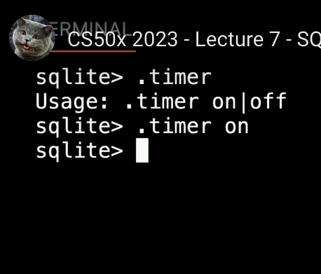</kbd>

> [!NOTE]
> Gọi cái này để bật chế độ timer
> để kiểu như ổng muốn show xem
> 1 lệnh mất bao lâu

 

<kbd>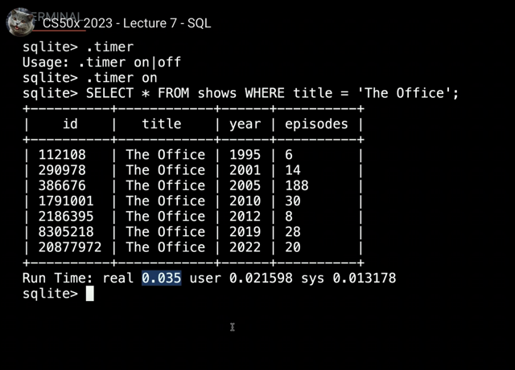</kbd>

> [!NOTE]
> Ok gọi lệnh SELECT * FROM shows WHER title = 'The Office';
>
> Cho thấy nó chỉ tốn 0.035 giạy

 

<kbd></kbd>

> [!NOTE]
> Đại khái là bằng cách tạo Index,
> việc search sẽ nhanh hơn

 

<kbd>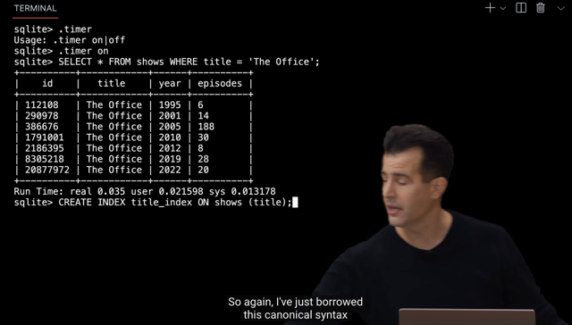</kbd>

> [!NOTE]
> CREATE INDEX title_index ON shows (title);
>
> -> Nôm na là tạo index cho cột title trong table show

 

<kbd></kbd>

> [!NOTE]
> Cách làm của nó là nó sẽ tạo ra cái này
> B-trees. B không phải là Binary

 

<kbd></kbd>

> [!NOTE]
> D: Cái này có vẻ giống Binary Tree
> Nhưng bạn có biết tại sao cái này ko phải là Binary Tree?
>
> A: Vì binary tree thì chỉ chia 2 nhánh/ lần

 

<kbd>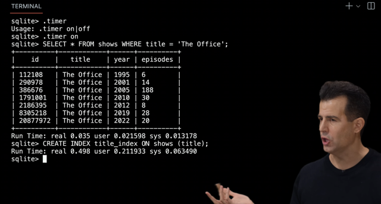</kbd>

> [!NOTE]
> Xong hit enter nó mất nữa giây để tạo index
> nhưng ổng nói nó chỉ tốn lần thôi. Vì từ đây về
> sau nhờ cái này look up data sẽ nhanh hơn

 

<kbd>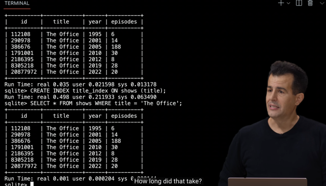</kbd>

> [!NOTE]
> Rồi, giờ gọi lệnh SELECT * FROM show WHERE
> title = 'The Office'; lại, thì chỉ mất 0.001 giây so
> với 0.0035
>
> Thì đại khái là cái này cho ta một công cụ để search
> nhanh hơn, hiệu qủa hơn những cái mà ta cần search

 

<kbd></kbd>

> [!NOTE]
> D: Nhưng tại sao ta sẽ không muốn index mọi
> column, mọi table để search cho nhanh?
>
> A: Tốn kém resource nào đó. Vì nguyên tắc chung
> là không có gì miễn phí, để search nhanh thì 
> sẽ phải đánh đổi bằng cái gì đó như memory chẳng
> hạn.

 

<kbd></kbd>

> [!NOTE]
> Correct, cái này phải nằm ở đâu đó phải ko,
> nên ta sẽ tốn memory / space

 

<kbd>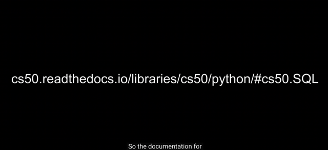</kbd>

<kbd></kbd>

<kbd></kbd>

> [!NOTE]
> Ok, giờ qua làm việc với sql nhưng bằng Python
>
> Thì trong khóa học bạn có thể dùng cs50's SQL dù
> rằng ở ngoài đời có thể dùng các lib khác

 

<kbd>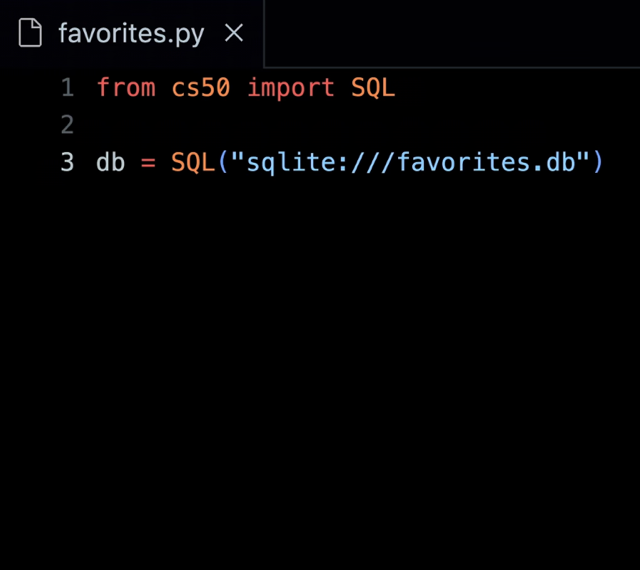</kbd>

> [!NOTE]
> db = SQL("sqlite:///favorites. db") có nghĩa là: **tạo sql
> database từ file datavase favorites.db** là file database chứa
> voting các language và problem set được ưa thích
>
> Và đại khái đây exactly là convention tiêu chuẩn để tạo db như
> mọi thư viện khác thôi vì cs50'SQL cũng làm theo các chuẩn
> thông thường

 

<kbd>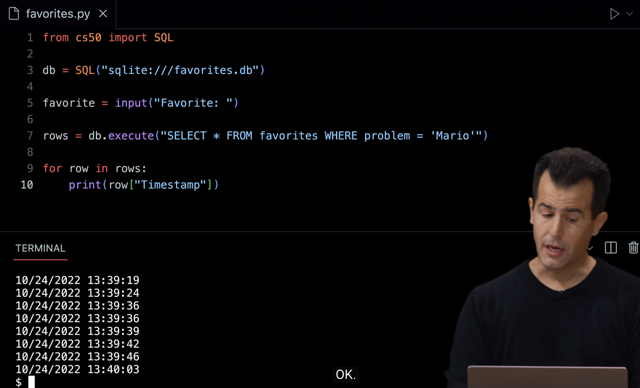</kbd>

> [!NOTE]
> Thì để gọi lệnh SQL đơn giản là **tạo string chứa
> câu lệnh** và **gọi nó bằng db.execute()**
> Ta muốn**lấy ra mọi rows** (chứa mọi cột) từ database**show có 
> problem = 'Mario'**
>
> Kết quả nó sẽ **trả ra các rows** mà **problem là Mario**,**mỗi row
> là dictionary key = column name - value**
>
> Sau đó ổng **loop trong các row và lấy Timestamp ra.**

 

<kbd>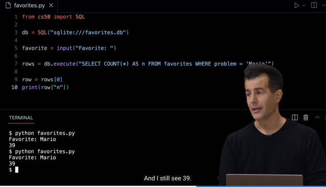</kbd>

> [!NOTE]
> Tương tự, SELECT COUNT(*)
> AS n FROM favorite WHERE
> problem = 'Mario'; 
>
> Tạo subtable chỉ **1 cột đặt nick name (alias)
> là n**, mang giá trị là **đếm** **số lượng các row**
> với**các row chọn sao cho problem = 'Mario'**
>
> Kết quả trả ra rows với row là dict với key là n
> value là tổng số các row mà problem = 'Mario'
> Đương nhiên nó chỉ có 1 entry, nên lấy ra (rows[0])
> và cũng là dictionary với key là n

 

<kbd>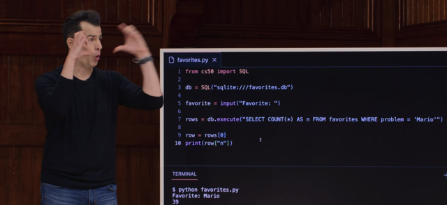</kbd>

> [!NOTE]
> **Rows** là **list các dictionary**, trong đó **key là tên cột** mà
> **SELECT** chọn, (nếu *** thì chọn hết**)

 

<kbd></kbd>

> [!NOTE]
> Thì câu lệnh trên nếu gọi
> bằng sqlite> thì nó ra vầy

 

<kbd>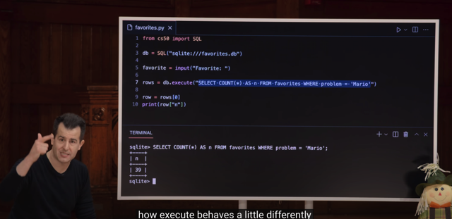</kbd>

> [!NOTE]
> Cái dưới là tôi làm việc với favorites.db**trực tiếp bằng câu
> lệnh sql**, còn ở trên là **thông qua Python library cs50**

 

<kbd>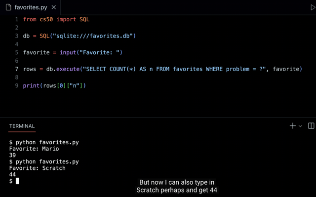</kbd>

> [!NOTE]
> Và để n**hét user's input** vào câu lệnh sql
> thì ta sẽ **dùng place holder ?**

 

<kbd></kbd>

 

<kbd></kbd>

 

<kbd></kbd>

> [!NOTE]
> Đại khái là ổng nói một tình huống có thể xảy ra trong
> thực tế khi Instagram**dùng câu lệnh này để update số
> like của một post**. Và nhiều người **bấm link cùng lúc có
> thể khiến data bị loss**. Nó gọi là **hiện tượng race condition.**

 

<kbd></kbd>

> [!NOTE]
> Ổng nói về một ví von tương tự là tủ lạnh của phòng trọ.
> 1 ông về thấy trống nên đi mua sữa. Ông thứ 2 về vẫn
> thấy trống nên đi mua sữa tiếp (mà không biết ông kia
> đang đi mua) kết quả là hai ông vác hai bình sữa về thì
> lại không có chỗ để
>
> Thì tương tự như trong đoạn code update số like của
> post câu lệnh đầu chạy xong thì ông thứ nhất giả sử
> đang chuẩn bị update từ 100 like thành 101 like. Thì ông
> thứ 2 chạy lệnh và cũng lấy ra 100 like và chuẩn bị
> update thành 101. Nên kết quả là **2 ông like nhưng chỉ
> có 1 like được ghi nhận**

 

<kbd></kbd>

> [!NOTE]
> Thì giải pháp đối với bài toán tủ lạnh là ông thứ nhất
> đi mua sữa thì dán cái giấy là "tao đang đi mua sữa
> rồi nhé" thì ông thứ hai có thể không đi mua sữa nữa
> mà đi mua mì gói
>
> Hoặc là khi ông thứ 1 đi mua sữa thì ổng **khóa cái tủ lạnh
> lại luôn**

 

<kbd>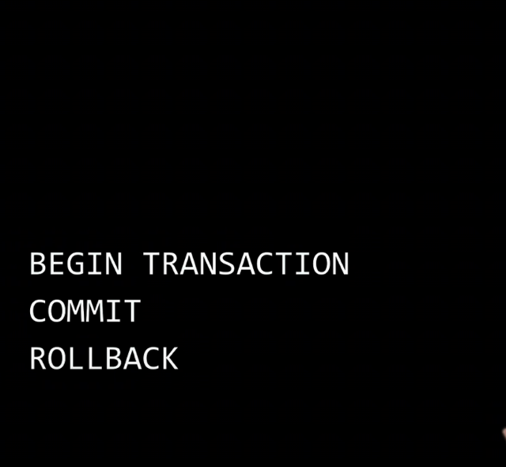</kbd>

 

<kbd>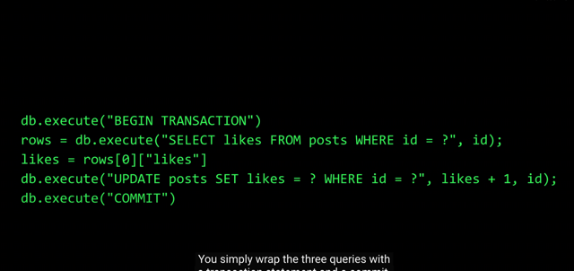</kbd>

> [!NOTE]
> Thì giải pháp đó chính là **TRANSACTION**. Nó **đảm
> bảo, 3 dòng code này được thực hiện 1 lần**
>
> Chứ **không phải cái kiểu người này đang gọi dòng 1
> thì người kia cũng gọi dòng 1**

 

<kbd>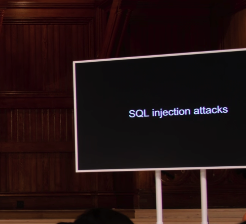</kbd>

> [!NOTE]
> Nói về SQL
> injection attacks

 

<kbd></kbd>

> [!NOTE]
> Đại khái trong sql **'--** có nghĩa là**ignore mọi thứ phía sau**
>
> Nên hacker nó có thể dùng kiểu này để hack vào website Nếu ta dùng
> cách gọi lệnh sql bằng  f"SELECT ...WHERE username = {user_name}
> AND password = {password}" như sau

 

<kbd>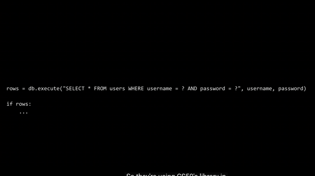</kbd>

> [!NOTE]
> Gọi như này thì an toàn

 

<kbd>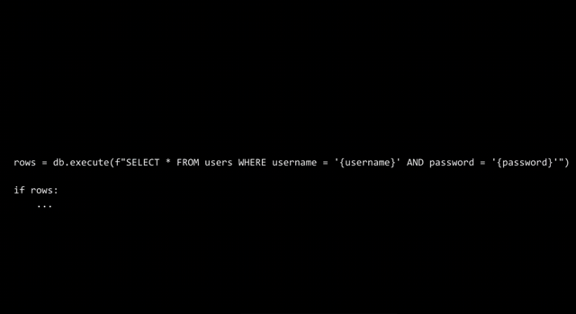</kbd>

> [!NOTE]
> Nhưng nếu gọi
> sql như này

 

<kbd>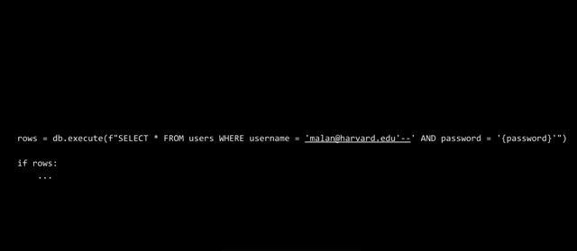</kbd>

> [!NOTE]
> Thì khi hacker dùng **malan@harvard.edu'--**
> thì câu lệnh trong sql trở thành ignore mọi thứ phía sau '-- 
> có nghĩa là nó sẽ**không check password nữa**

 

<kbd>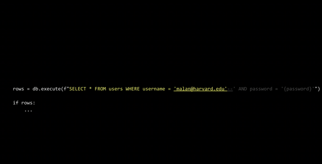</kbd>

> [!NOTE]
> Và nó sẽ trả ra thông tin hay nói cách khác nó cho log in mà
> không cần password
>
> Ổng cũng nói thêm đây chính là cách mà **adversarial attack**,
> bắt đầu là nó **gõ bậy bạ các kí tự "nguy hiểm"** và**xem thử có
> break cái gì không**, và tuy có thể không vào được nhưng
> nếu có gì đó xảy ra thì hacker có thể **đoán được các điểm
> yếu** mà **tiếp tục thử các phương pháp tấn công khác**

 

<kbd>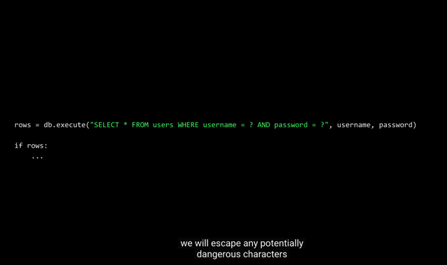</kbd>

> [!NOTE]
> Nên làm vầy an toàn hơn

 

<kbd></kbd>

 

<kbd></kbd>

 

