# Week 7: Sql

📊 **Progress:** `28` Notes | `33` Screenshots

---

## Lab

 

<kbd>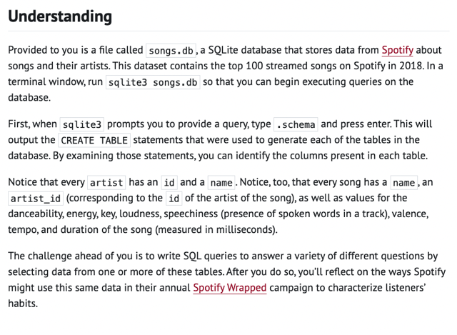</kbd>

> [!NOTE]
> Đại khái là ta sẽ gọi lệnh sql để lấy thông tin trả
> lời câu hỏi. Trong db này có 2 table song và
> artist.

 

<kbd>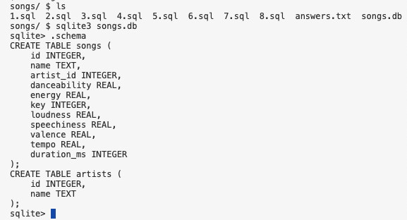</kbd>

 

<kbd>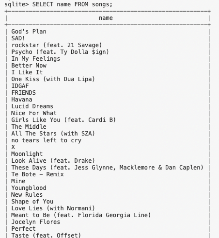</kbd>

> [!NOTE]
> 1.sql sql query để lấy hết name của các songs:
>
> SELECT name FROM songs;

 

<kbd>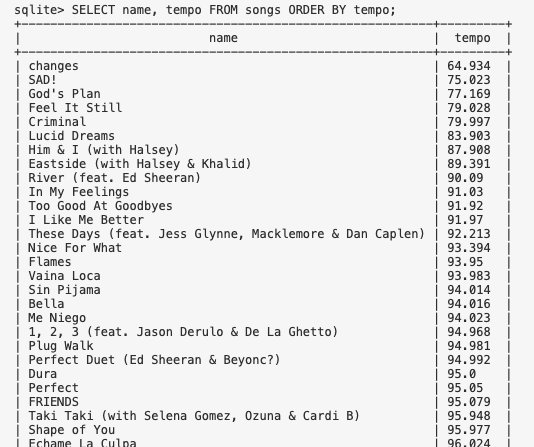</kbd>

 

<kbd>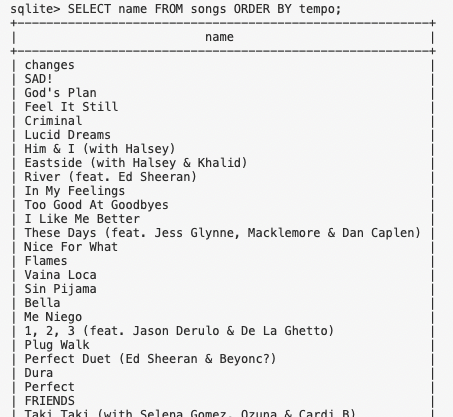</kbd>

> [!NOTE]
> 2.sql list name của songs sort by temp từ nhỏ đến lớn
>
> SELECT name FROM songs
> ORDER BY tempo;

 

<kbd>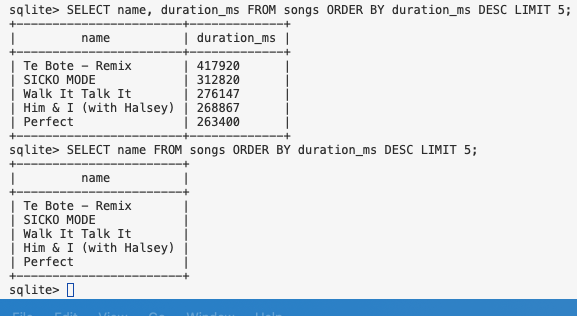</kbd>

> [!NOTE]
> 3.sql list name của songs sort by duration từ lớn đến
> nhỏ lấy 5 cái
>
> SELECT name FROM songs ORDER BY duration_ms
> DESC LIMIT 5;

 

<kbd>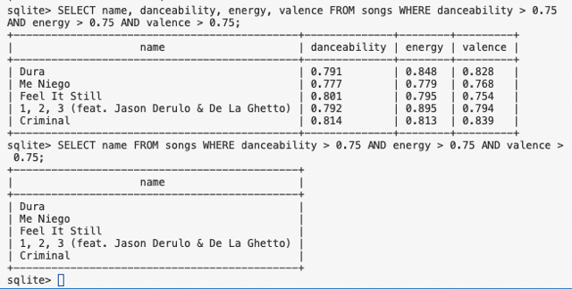</kbd>

> [!NOTE]
> 4.sql list name của songs mà các danceability, valence, energy
> lớn hơn 0.75
>
> SELECT name FROM songs WHERE danceability > 0.75 
> AND energy > 0.75 AND valence > 0.75;

 

<kbd>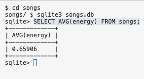</kbd>

> [!NOTE]
> 5.sql tính average energy của các songs
>
> SELECT AVG(energy) FROM songs;

 

<kbd>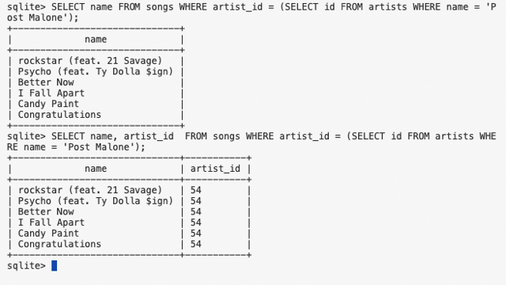</kbd>

> [!NOTE]
> 6.select cái name bài hát của ông Post Malone
>
> SELECT name FROM songs WHERE artist_id =
> (SELECT id FROM artists WHERE name = 'P ost
> Malone');

 

<kbd>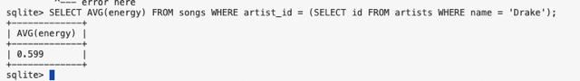</kbd>

> [!NOTE]
> Tính average energy
> các song bởi Drake

 

<kbd>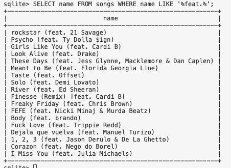</kbd>

> [!NOTE]
> In tên songs có chứa '
> feat.' trong name

 

## Ps 1 Movies

 

<kbd></kbd>

> [!NOTE]
> Đại khái là ta sẽ gọi lệnh sql để lấy thông tin trả
> lời câu hỏi. Trong db này có 4 table

 

<kbd></kbd>

 

<kbd></kbd>

> [!NOTE]
> Title các film release năm 2008

 

<kbd></kbd>

> [!NOTE]
> Năm sinh con nhỏ
> Emma Stone

 

<kbd></kbd>

> [!NOTE]
> tên movie có year >=
> 2018 sort bởi tên

 

<kbd></kbd>

> [!NOTE]
> Đếm số film có
> rating = 10

 

<kbd></kbd>

> [!NOTE]
> list tên + năm phát hành các phim Harry Potter
> (là phim có title start with "Harry Potter") sort theo year

 

<kbd></kbd>

> [!NOTE]
> Tính average rating của các film
> phát hành năm 2012

 

<kbd></kbd>

> [!NOTE]
> List tên diễn viên trong
> phim Toy Story

 

<kbd></kbd>

> [!NOTE]
> list tên những diễn viên tham gia phim phát
> hành 2004, sort bởi năm sinh

 

<kbd></kbd>

 

<kbd></kbd>

> [!NOTE]
> list 5 phim rate cao nhất
> của cha này đóng

 

<kbd></kbd>

> [!NOTE]
> 13 tên các người đóng chung với Kevin không tính ổng
>
> SELECT name FROM people WHERE name != 'Kevin Bacon' AND id
> IN (SELECT person_id FROM stars WHERE movie_id IN (SELECT
> movie_id FROM stars WHERE person_id = (SELECT id FROM people
> WHERE birth = 1958 AND name = 'Kevin Bacon')));

 

<kbd></kbd>

> [!NOTE]
> 12 Các phim mà hai người này đóng chung
>
> SELECT title FROM movies WHERE id IN (SELECT movie_id FROM
> stars WHERE person_id IN (SELECT id FROM people WHERE name ='
> Bradley Cooper')) AND id IN (SELECT movie_id FROM stars WHERE
> person_id IN (SELECT id FROM people WHERE name = 'Jennifer
> Lawrence'));

 

## Ps 2 50ville

 

<kbd></kbd>

> [!NOTE]
> Nói chung là tìm ăn
> trộm dựa vào db

 

<kbd></kbd>

 

### CREATE TABLE **crime_scene_reports** (

> [!NOTE]
> CREATE TABLE **crime_scene_reports** (
>     id INTEGER,
>     year INTEGER,
>     month INTEGER,
>     day INTEGER,
>     street TEXT,
>     description TEXT,
>     PRIMARY KEY(id)
> );
> CREATE TABLE **interviews** (
>     id INTEGER,
>     name TEXT,
>     year INTEGER,
>     month INTEGER,
>     day INTEGER,
>     transcript TEXT,
>     PRIMARY KEY(id)
> );
> CREATE TABLE **atm_transactions** (
>     id INTEGER,
>     account_number INTEGER,
>     year INTEGER,
>     month INTEGER,
>     day INTEGER,
>     atm_location TEXT,
>     transaction_type TEXT,
>     amount INTEGER,
>     PRIMARY KEY(id)
> );
> CREATE TABLE **bank_accounts** (
>     account_number INTEGER,
>     person_id INTEGER,
>     creation_year INTEGER,
>     FOREIGN KEY(person_id) REFERENCES people(id)
> );
> CREATE TABLE **airports** (
>     id INTEGER,
>     abbreviation TEXT,
>     full_name TEXT,
>     city TEXT,
>     PRIMARY KEY(id)
> );
>

 

#### CREATE TABLE **flights** (     id INTEGER,     origin_airport_id INTEGER,     destination_airport_id INTEGER,     year INTEGER,     month INTEGER,     day INTEGER,     hour INTEGER,     minute INTEGER,     PRIMARY KEY(id),     FOREIGN KEY(origin_airport_id) REFERENCES airports(id),     FOREIGN KEY(destination_airport_id) REFERENCES airports(id) ); CREATE TABLE **passengers** (     flight_id INTEGER,     passport_number INTEGER,     seat TEXT,     FOREIGN KEY(flight_id) REFERENCES flights(id) ); CREATE TABLE **phone_calls** (     id INTEGER,     caller TEXT,     receiver TEXT,     year INTEGER,     month INTEGER,     day INTEGER,     duration INTEGER,     PRIMARY KEY(id) ); CREATE TABLE **people** (     id INTEGER,     name TEXT,     phone_number TEXT,     passport_number INTEGER,     license_plate TEXT,     PRIMARY KEY(id) ); CREATE TABLE **bakery_security_logs** (     id INTEGER,     year INTEGER,     month INTEGER,     day INTEGER,     hour INTEGER,     minute INTEGER,     activity TEXT,     license_plate TEXT,     PRIMARY KEY(id) );

 

<kbd></kbd>

 

<kbd></kbd>

 

#### -- Tìm hồ sơ vụ án có liên quan đến ‘duck’ SELECT description FROM crime_scene_reports WHERE description LIKE '%duck%'; SELECT description FROM crime_scene_reports WHERE street = 'Humphrey Street' AND day = 28 AND month = 7 AND year = 2021; -> -- Theft of the CS50 duck took place at 10:15am at the Humphrey Street bakery.  -- Interviews were conducted today with three witnesses who were present at the time – each of their interview transcripts mentions the bakery. |  -- Xem thử có activity liên quan đến tiệm bánh này không SELECT * FROM bakery_security_logs WHERE activity LIKE '%Humphrey%';  -- Xem thử activity có gì SELECT DISTINCT(activity)  FROM bakery_security_logs;  -- Xem thử các transcript của interview có nhắc đến bakery  SELECT transcript FROM interviews WHERE transcript LIKE '%bakery%';  -> -- Sometime within **ten minutes of the theft**, I saw the thief get into a car in the**bakery parking lot** and drive away.  -- If you have **security footage** from the bakery parking lot, you might want to **look for cars that left the parking lot in that time frame**.                                                          |  -- I don't know the thief's name, but it was someone I recognized. Earlier this morning, before I arrived at Emma's bakery,  -- I was walking by the**ATM on Leggett Street** and saw the **thief there withdrawing some money**.                                                                                                 |  -- As the thief was leaving the bakery, they called someone who **talked to them for less than a minute**. In the call,  -- I heard the thief say that they were planning to take the **earliest** **flight out of Fiftyville tomorrow.** -- The thief then asked the person on the other end of the phone to**purchase the flight ticket.**  -- I saw Richard take a bite out of his pastry at the bakery before his pastry was stolen from him.

> [!NOTE]
> Dựa vào vài thông tin ban đầu, tìm hồ
> sơ lời khai của 3 nhân chứng

 

<kbd></kbd>

> [!NOTE]
> Tìm danh sách những người thỏa mãn 4 điều kiện này
>
> -- Những người rút tiền ở ATM Legget Street ngày 28/7/2021
>
> -- Những người có tên trong các chuyến bay rời 50ville ngày 
> 29/7/2021
>
> -- Những người có gọi điện dưới 1 phút ngày 28/7/2021 
>
> -- Thêm manh mối bakery log license_place, những người có 
> biển số xe trong danh sách camera ghi lại
>
> -- tại cửa hàng bánh trước 12h ngày 28/7/2021
>
> Và xem họ gọi cho ai

 

<kbd></kbd>

> [!NOTE]
> Thu hẹp lại mấy khứa này.
> Thử submit cặp Bruce - Robbin (search thì thấy khứa Bruce
> đi New York) thì thấy đúng

 

#### SELECT id, origin_airport_id, destination_airport_id, hour, minute, day, month, year  FROM flights  WHERE id IN  (SELECT flight_id FROM passengers WHERE day = 29 AND month = 7 AND year = 2021 AND origin_airport_id = 8 AND passport_number IN  (SELECT passport_number FROM people WHERE id IN  (SELECT id FROM people                      WHERE id IN (SELECT person_id                                  FROM bank_accounts                                  WHERE account_number IN (SELECT account_number                                                      FROM atm_transactions                                                      WHERE atm_location = 'Leggett Street'                                                      AND transaction_type = 'withdraw'                                                      AND day = 28                                                      AND month = 7                                                      AND year = 2021)                     )                     AND id IN (SELECT id                                  FROM people                                  WHERE passport_number IN (SELECT passport_number                                                              FROM passengers                                                              WHERE flight_id IN (SELECT id                                                                                  FROM flights                                                                                  WHERE origin_airport_id IN (SELECT id                                                                                                              FROM airports                                                                                                              WHERE full_name = 'Fiftyville Regional Airport')                                                                                 AND day = 29                                                                                  AND month = 7                                                                                  AND year = 2021)))                     AND id IN (SELECT id                                  FROM people                                  WHERE phone_number IN (SELECT caller                                                      FROM phone_calls                                                      WHERE day = 28                                                     AND month = 7                                                     AND year = 2021                                                     AND duration <= 60))                     AND id IN (SELECT id                                  FROM people                                  WHERE license_plate IN (SELECT license_plate                                                      FROM bakery_security_logs                                                      WHERE day = 28                                                      AND month = 7                                                      AND year = 2021                                                      AND hour < 11))     ))) ORDER BY hour LIMIT 1;

> [!NOTE]
> Dựa thêm manh mối là họ sẽ dự
> định bay chuyến sớm nhất thì ta
> sẽ lấy chuyến sớm

 

<kbd></kbd>

> [!NOTE]
> Ra kết quả là chuyến này, trong 3 khứa
> trên khứa nào đi chuyến này (flight id = 36)

 

#### SELECT name FROM people WHERE passport_numer IN (SELECT passport_number FROM p                   error here ---^ sqlite> SELECT name FROM people WHERE passport_number IN (SELECT passport_number FROM passengers WHERE flight_id = 36);

 

<kbd></kbd>

> [!NOTE]
> Cả Bruce và Taylor đều
> bay chuyến này

 

