# Week 8: Html Css Js

📊 **Progress:** `116` Notes | `199` Screenshots

---

<kbd></kbd>

> [!NOTE]
> Mở đầu bằng 1 trò chơi để diễn tả khái niệm router =
> bộ định tuyến Hiểu nôm na là cái tool giúp xác định
> hướng đi, tuyến đường của 1 thông tin từ A (Phyllis)
> đến B (Brian)

 

<kbd>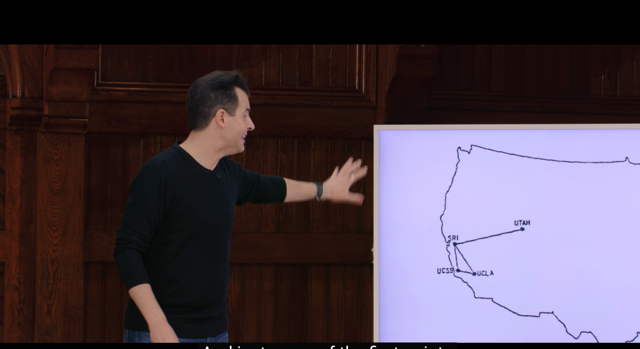</kbd>

 

<kbd></kbd>

 

<kbd></kbd>

 

<kbd></kbd>

> [!NOTE]
> IP **Internet Protocol** đại khái là một **quy tắc giao tiếp giữa
> máy tính với nhau**. Giống như việc bắt tay là quy tắc
> giao tiếp giữa người và người vậy.

 

<kbd></kbd>

> [!NOTE]
> Thì đại khái địa chỉ của một
> máy tính là 4 con số

 

<kbd>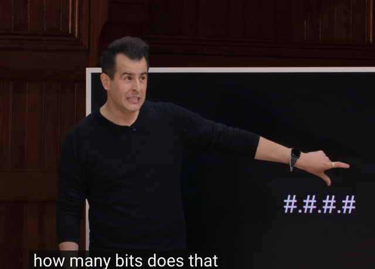</kbd>

> [!NOTE]
> Mỗi số mang giá trị từ 0-255 vậy thì mỗi số dùng mấy bit?
>
> A: 8 
>
> D: Correct IP address cơ bản là 32 bit
>
> D vậy có bao nhiêu computer address với 32 bit?
>
> A: Tương tự như int (unsign) 4 byte = 32 bit, range của nó
> là **4 tỉ mấy.**

 

<kbd></kbd>

> [!NOTE]
> Thì với version 6, người ta cho **128 bit** để cho phép nhiều
> IP address hơn

 

<kbd></kbd>

> [!NOTE]
> Giả sử Julia ở address 5.6.7.8 muốn gửi
> envelope này đén Brian ở address 1.2.3.4

 

<kbd></kbd>

> [!NOTE]
> **TCP Transmission Control Protocol** có mục đích
> thứ nhất là **phân biệt các loại service khác nhau**
> (email hay video...)

 

<kbd></kbd>

> [!NOTE]
> 80 là HTTP, 443 là HTTPS (S
> stand for secured/encrypted/safety)

 

<kbd></kbd>

> [!NOTE]
> Đại khái là giả sử Brian có webpage và Phyllis cần request
> home page thì bên cạnh **IP address của Brian 1.2.3.4**, sẽ có
> thêm **443** (dùng HTTPS - Secured)
>
> Ngoài ra máy tính của Phylis **luôn generate thêm Port number
> là IP của Phyllis** để Brian có thể **liên lạc ngược lại**

 

<kbd></kbd>

> [!NOTE]
> Xong ổng nói giả sử Phyllis muốn **upload
> cái hình con mèo lên webpage**
>
> Thì **xé nhỏ nó ra làm 4,** rồi bỏ phần 1 vào
> envelope. Ghi thêm 1/4

 

<kbd></kbd>

> [!NOTE]
> Kế ổng nói giả sử vì**lí do gì đó cái 2/4 (envelop chứa cái
> phần số 2 của ảnh mèo) bị lạc** thì Khi máy tính của Brian
> nhận envelop có 1/4, 3/4, 4/4 thì sao?
>
> A: Nó sẽ r**equest phần 2/4**
>
> D: Correct. Và khi Brian **đã nhận đủ 4 phần thì nó báo lại là
> Ok, đủ rồi**

 

<kbd></kbd>

> [!NOTE]
> Đại khái là sẽ **rất khó nhớ (cho con người) khi phải
> nhớ ip address**. **Không phù hợp cho marketing** một
> webpage....
>
> Do đó **DNS** = **Domain Name System** để map /**convert
> IP address sang human friendly string** như harvard.
> edu hay **google.com** và ngược lại

 

<kbd>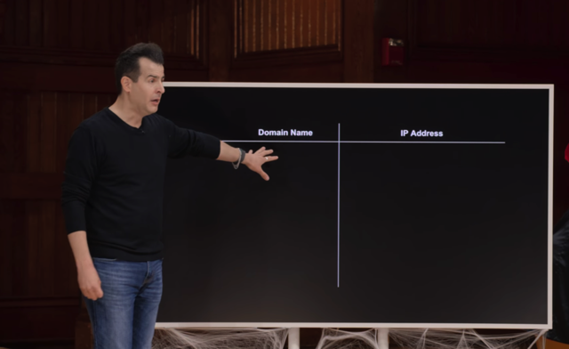</kbd>

> [!NOTE]
> Và cơ bản nó là một table, một **hash table, hoặc
> sql, linked-list**... map giữa **Domain name và IP
> address**

 

<kbd>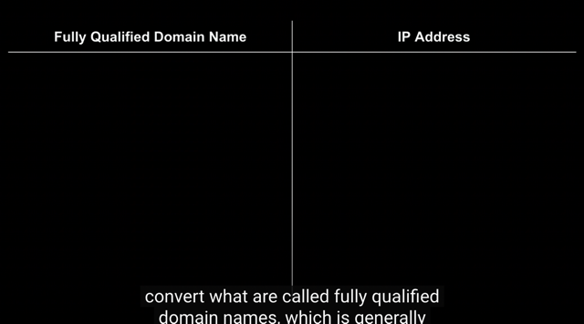</kbd>

> [!NOTE]
> Và không phải chỉ là google. com mà
> thật ra là đầy đủ **www.google.com**

 

<kbd>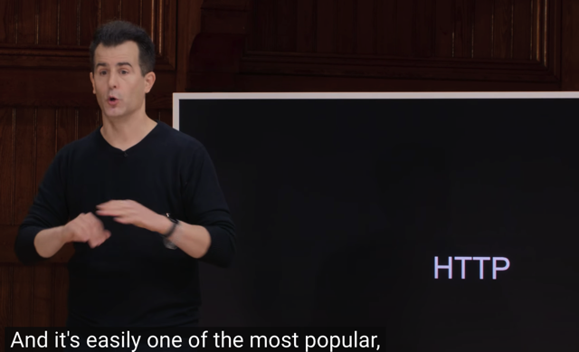</kbd>

> [!NOTE]
> **HTTP** = Hypertext Transfer Protocol
>
> Đại khái **TCP/IP stuff, DNS stuff là tầng dưới, nền tảng**, là
> **hệ thống đường ống giúp truyền dữ liệu**
>
> Thì **HTTP là tầng trên, tầng software application level**
> giúp **build ứng dụng dựa trên các pipeline system đó**

 

<kbd>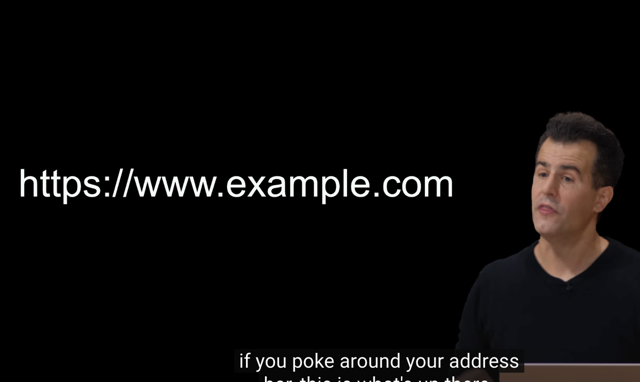</kbd>

> [!NOTE]
> Đại khái là ngày nay **tuy ít thấy hết toàn bộ url**nhưng **nó vẫn ở đó vì lí do UX thôi**, ví dụ google.
> com thật ra đầy đủ là **https://www.google.com**
>
> Thì đại khái khi ta **ghi example.com thì thật ra nó
> là  example.com/** với **slash '/' là default, là orginal
> url**

 

<kbd>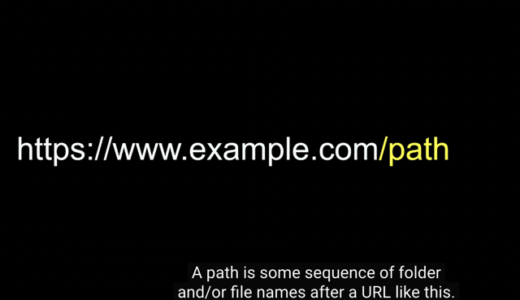</kbd>

> [!NOTE]
> Bên cạnh đó nó
> có thể có path

 

<kbd>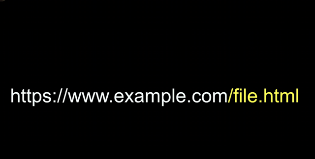</kbd>

 

<kbd>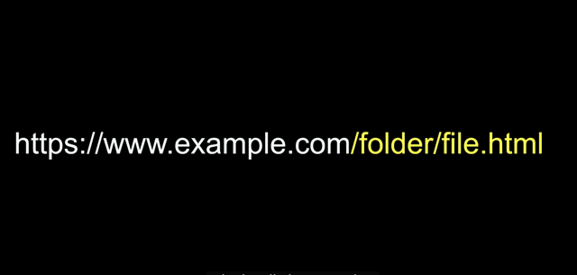</kbd>

 

<kbd>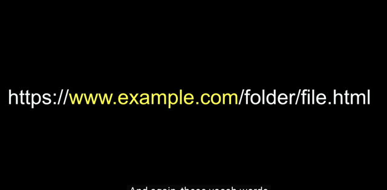</kbd>

 

<kbd>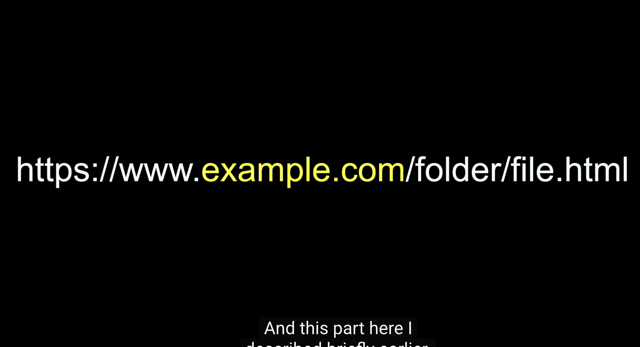</kbd>

> [!NOTE]
> Example.com gọi là
> **domain name**

 

<kbd></kbd>

> [!NOTE]
> **.com** là **Top Level Domain** : TLD
> Và ngày nay thì **.com không nhất thiết phải là business**, 
> **.net không nhất thiết phải là network**, ngoại trừ một số
> như **.gov, .edu thì còn tương đối strictly regulated** thôi

 

<kbd>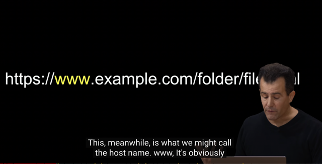</kbd>

> [!NOTE]
> Host name www cơ bản **chỉ là convention.**

 

<kbd>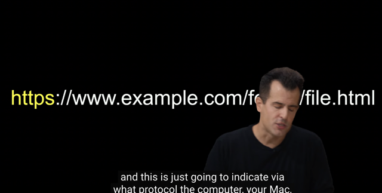</kbd>

> [!NOTE]
> cuối cùng **http/https là protocol**. Có những cái
> khác nữa những chỉ focus hai cái này

 

<kbd></kbd>

> [!NOTE]
> Q: **Local host** là gì
>
> D: Đại khái là **convention của human cho IP address** để
> **luôn chỉ máy tính của chính mình: 127.0.0.1**
>
> Có vai trò **hữu ích khi development** trên máy tính của mình

 

<kbd></kbd>

> [!NOTE]
> Đại khái là trong cái envelope mà Phyllis gửi Brian cơ bản
> là có 1 trong 2 keyword này. **GET và POST**. Nôm na GET
> là get data. POST là post data

 

<kbd></kbd>

> [!NOTE]
> Đại khái là giả dụ Phyllis "request" thay vì Brian'
> s webpage mà là example.com thì her message
> sẽ có dạng dạng như này:
>
> **GET / HTTP/1.1
> Host: www.example.com**
>
> 1.1 là version

 

<kbd></kbd>

> [!NOTE]
> Đại khái là incognito sẽ hữu ích vì nó giống như
> cho một**fresh start**, không có các remnant các
> website mình đã visit

 

<kbd>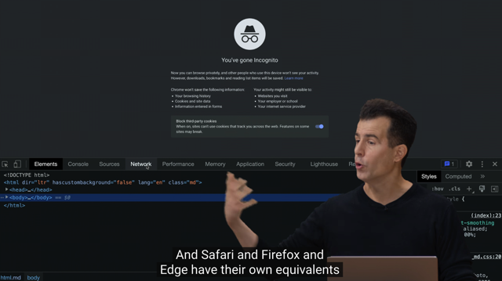</kbd>

 

<kbd>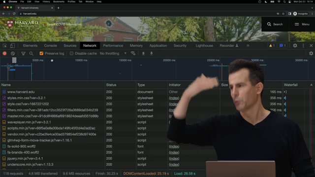</kbd>

 

<kbd></kbd>

<kbd></kbd>

<kbd>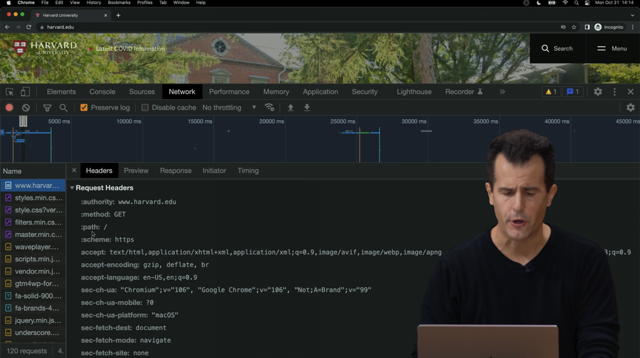</kbd>

> [!NOTE]
> Đại khái là ổng thử dùng tính năng **inspector** của web
> browser để cho ta thấy **các thông tin trong request
> header.**
> Với method **GET**,
>
> với domain name **www.harvard.edu**
>
> với path là origin | default **/**,
>
> với scheme hay protocol như mới  biết - **https**

 

<kbd></kbd>

> [!NOTE]
> Và cái response sẽ có dạng như này
>
> Với 1.1 như hồi nãy, là version
>
> 200 là **response code** = OK
>
> Loại trả về là **text/html**có nghĩa là nó**trả về một webpage**

 

<kbd>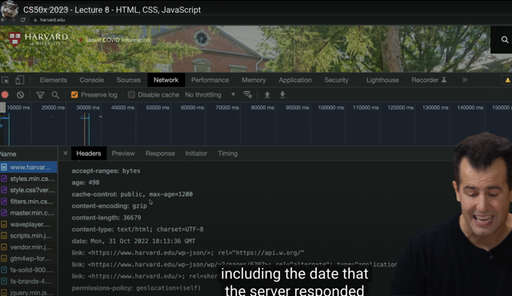</kbd>

> [!NOTE]
> Ngoài ra nó **còn trả về
> cả đống detail**

 

<kbd>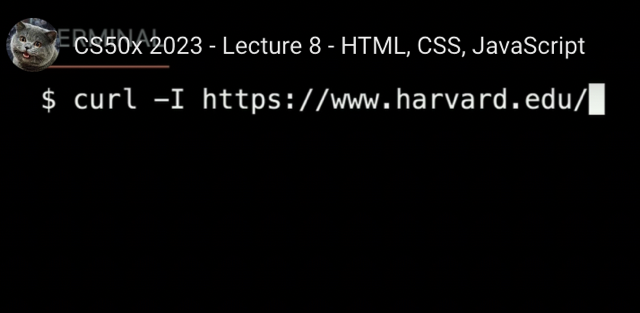</kbd>

> [!NOTE]
> **curl** = connect url: Đại khái là công cụ **cho phép giả bộ là
> web browser**

 

<kbd>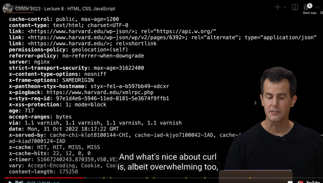</kbd>

 

<kbd>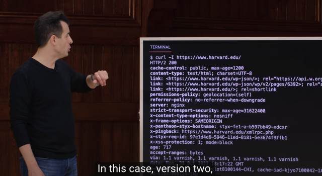</kbd>

> [!NOTE]
> Đây là toàn bộ thông tin nó trả về.
>
> Ta có thể thấy **HTTT/2 (version 2)**
>
> **200** response code = OK
>
> rồi có c**ontent_type text/html charset UTF-8**
>
> (nhớ lại**UTF-8 cũng tương tự như ASCII**, ý là **bộ tiêu
> chuẩn nào thôi)**

 

<kbd></kbd>

> [!NOTE]
> giờ thử **http (ko s)**

 

<kbd></kbd>

> [!NOTE]
> Đại khái là nó trả về **301** = **Moved Permanently** ý
> là Harvard **đã chuyển về đây https://...**(https chứ không
> phải http)
>
> Và với các Chrome hay Firefox **người ta lập trình sẵn
>  là khi gặp response 301 nó sẽ tự động chuyển tới 
> https://www.harvard.edu/**

 

<kbd>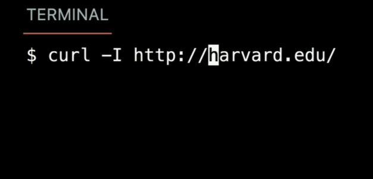</kbd>

 

<kbd></kbd>

> [!NOTE]
> Tương tự khi request url này.
>
> Đây là lí do tại sao khi mình **gõ google.com** trong 
> web browser thì nó**tự động vào www.google.com**

 

<kbd>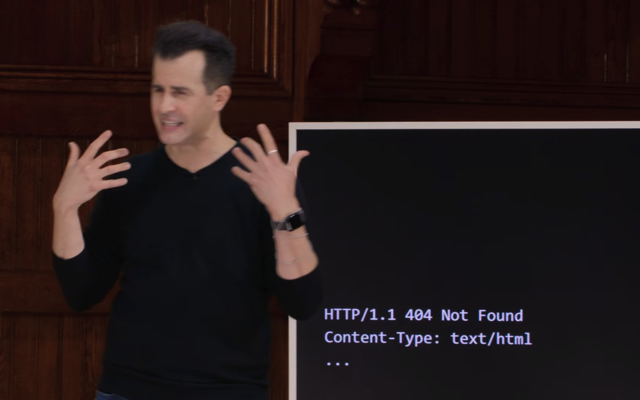</kbd>

> [!NOTE]
> 404 Not Found

 

<kbd></kbd>

> [!NOTE]
> Một số response code khác:
> **500** tương tự như **Segmentation Fault**của C, là **lỗi của developer**

 

<kbd></kbd>

> [!NOTE]
> Đại khái là nói về cái này
> **search?q=cat....**
>
> Ý là khi ta **search google bằng google form** thì thật ra
> **chính là request url như vầy**

 

<kbd>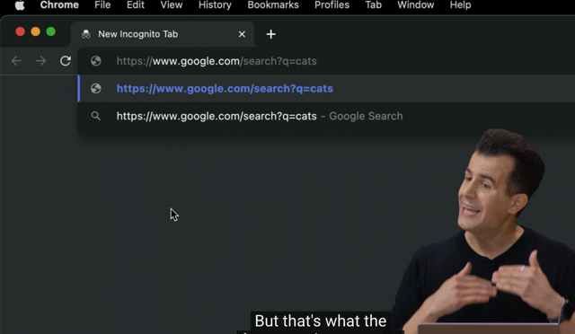</kbd>

 

<kbd>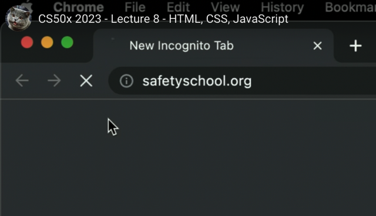</kbd>

 

<kbd>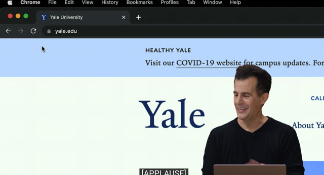</kbd>

> [!NOTE]
> Xong ổng nói có cái joke gì đó ở đây khi
> ta **dùng url safetyschool.org** thì nó
> chuyển tới**Yale webpage**

 

<kbd></kbd>

 

<kbd>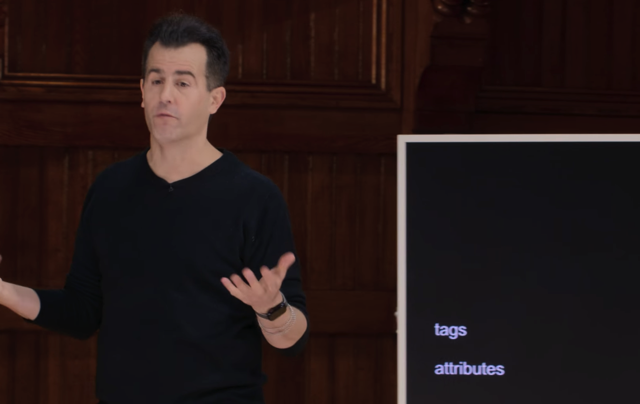</kbd>

 

<kbd>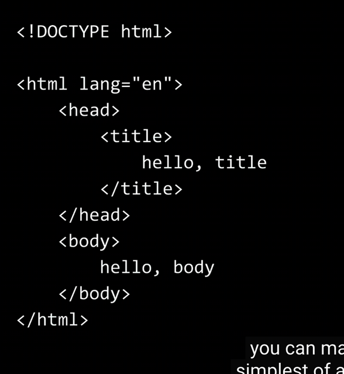</kbd>

 

<kbd></kbd>

 

<kbd>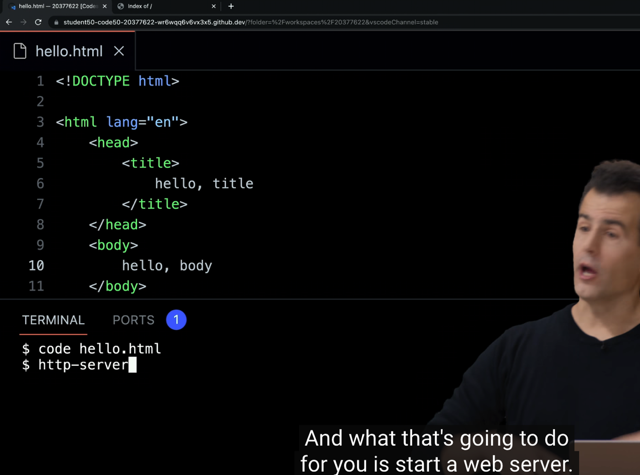</kbd>

> [!NOTE]
> Đại khái là cần phải có cái **web server** để **serve** (cung cấp) 
> cái này (html file này) cho người ta khi cần (**request**) có 
> thể xem nó.
>
> Và ổng nói **với server ta hay liên tưởng tới các hệ thống 
> máy server** nhưng thật ra nó **chính là cái program để
> serve request bằng cách trả về response chấm hết.**
>
> Và cs50 nó có sẵn cái lệnh **http-server** này để tạo một 
> cái web server.

 

<kbd>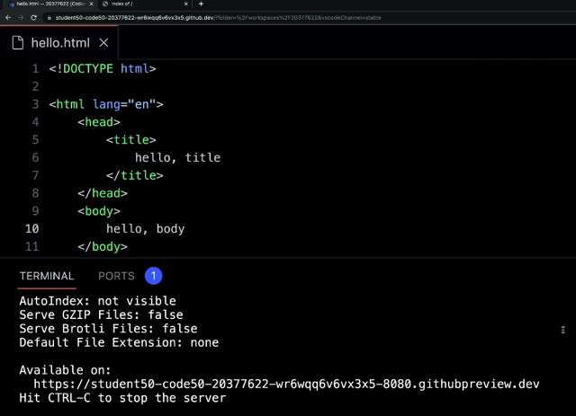</kbd>

> [!NOTE]
> Thì ổng nói là nó sẽ **tạo ra một cái url**. (Mỗi người khi làm
> thử sẽ cho url khác nhau)
>
> Nhưng đại khái là nó sẽ**cho phép bạn có thể access  cái
> file hello.html này thông qua web browser**
>
> Và nếu **làm thêm một số điều chỉnh có thể khiến nó visible
> với thế giới.**
>
> Nhưng khi mà ta**log out, hay shutdown máy tính** thì
> website sẽ **go down.**

 

<kbd></kbd>

> [!NOTE]
> Xong ổng **open cái url
> trên trên web browser**

 

<kbd>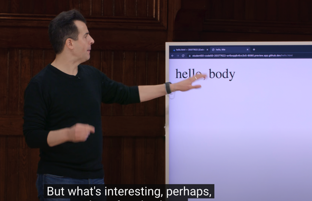</kbd>

> [!NOTE]
> Mở cái link mở ra cái
> page hello.html ra

 

<kbd>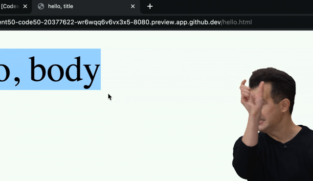</kbd>

> [!NOTE]
> Thì đại khái là **nó trỏ tới cái file
> hello.html**

 

<kbd>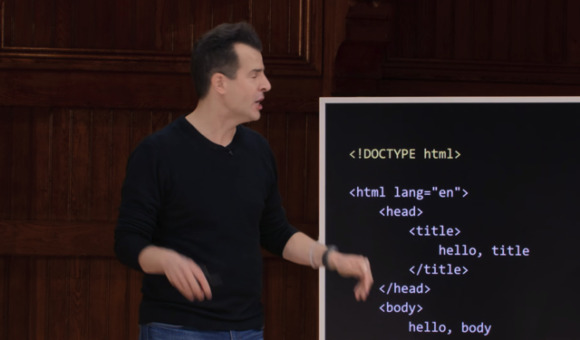</kbd>

> [!NOTE]
> Trên cùng là **<!DOCTYPE html>** đại khái là **declare bạn
> đang dùng latest version của HTML**

 

<kbd>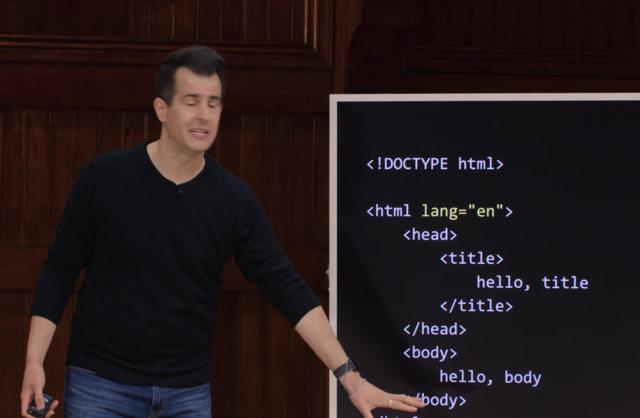</kbd>

> [!NOTE]
> **<html> <head>** ... và **</html> </head>** gọi là **start
> và end tag** **lang='en'**giống như **attribute** để
> modify behavior, ở đây đại khái là c**ho web browser,
> search engine biết ở trong đây  sẽ là English**

 

<kbd>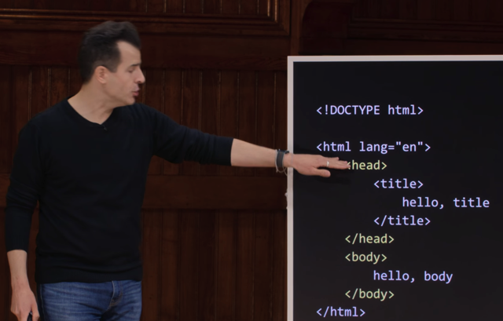</kbd>

> [!NOTE]
> Đại khái là quan hệ giữa **html** tag - **head**
> tag - **title** tag giống như **ông nội - cha - cháu**

 

<kbd>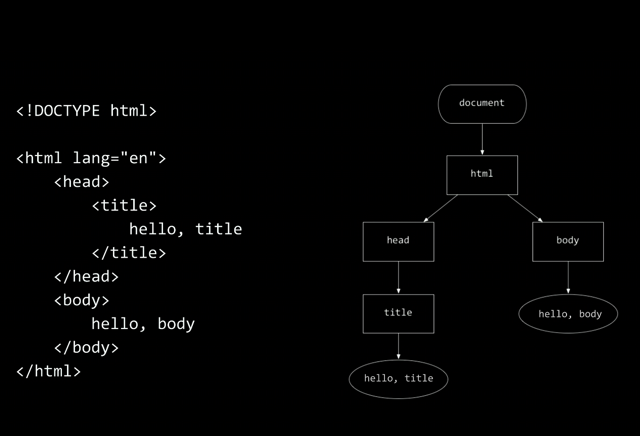</kbd>

 

<kbd>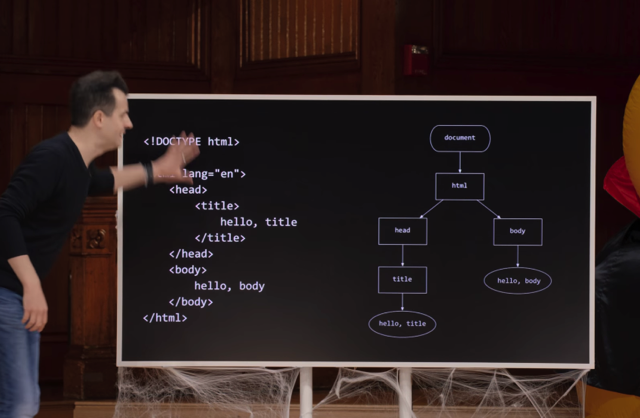</kbd>

> [!NOTE]
> Đại khái là ta viế**t html code như vầy**, nhưng trong 
> máy tính nó sẽ tạo cái tree như vầy gọi là **DOM**
>
> Và khi tí nữa ta sẽ dùng**java script để move, add 
> các nhánh này dynamically**
> Cũng như**Gmail khi ta có một email mới nó không
> cần phải reload mà nó chỉ cần add thêm 1 node**

 

<kbd>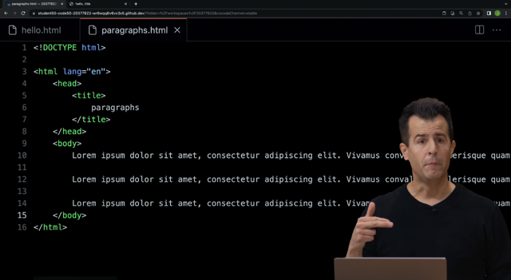</kbd>

> [!NOTE]
> Xong ổng tạo mới một file khác. Và nói là **thật ra indentation
> không quan trọng trong html.**
>
> Việc indentation **chỉ có tác dụng giúp human dễ nhìn
> và tránh sai sót thôi**

 

<kbd>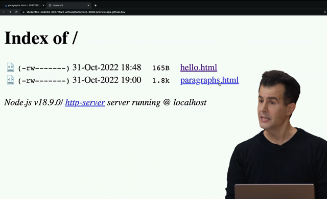</kbd>

> [!NOTE]
> Và với đó,**index page** **có thêm 1 url
> paragraphs.html mới tạo**

 

<kbd></kbd>

> [!NOTE]
> Nhưng click vào có vẻ**mọi thứ đều lộn xộn** chứ không
> phải là có 3 đoạn như expect. Why?
>
> A: **Vì 3 đoạn đều nằm trong <body>** và  **dù có chia khoảng
> cách nhưng như nãy nói nó không care vấn đề
> indentation.**
> Nên **phải bỏ mỗi đoạn vào 1 children tag thì nó mới
> separate ra được**D: Correct

 

<kbd>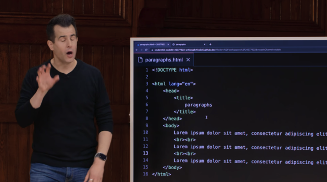</kbd>

> [!NOTE]
> Xong ổng dùng ** ** này để làm cái việc xuống dòng
> **(line break)**và nói thêm là **cái này không cần close tag**,
> nó chỉ đứng mình ên

 

<kbd>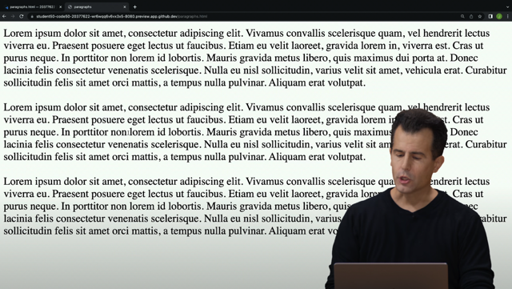</kbd>

> [!NOTE]
> Nhìn đã ok hơn

 

<kbd>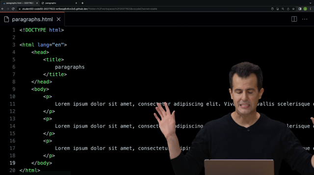</kbd>

> [!NOTE]
> Tuy nhiên dùng **
 tag** - paragraph tag cho mỗi
> paragraph nó thuận tự nhiên hơn vì p được design
> cho mục đích đó

 

<kbd></kbd>

> [!NOTE]
> Thì đại khái là nó **vẫn có hiệu quả như vậy** nhưng
> **semantically better**
>
> Và có những các tag khác, tự tìm hiểu

 

<kbd>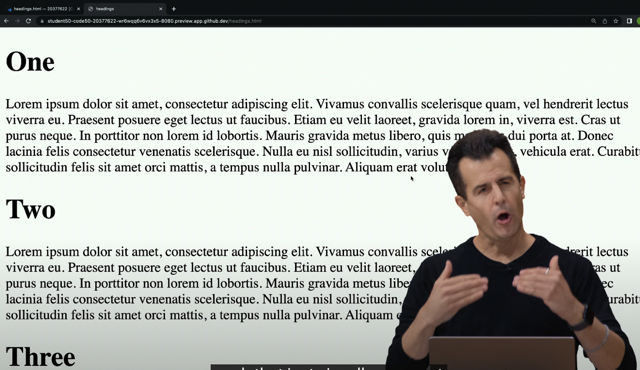</kbd>

<kbd></kbd>

<kbd>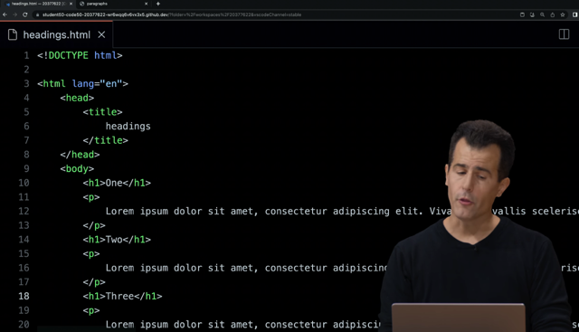</kbd>

> [!NOTE]
> Ví dụ h1, h2...h6 giúp tạo các heading - tiêu đề

 

<kbd>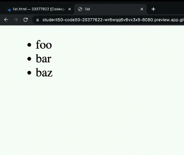</kbd>

<kbd></kbd>

<kbd>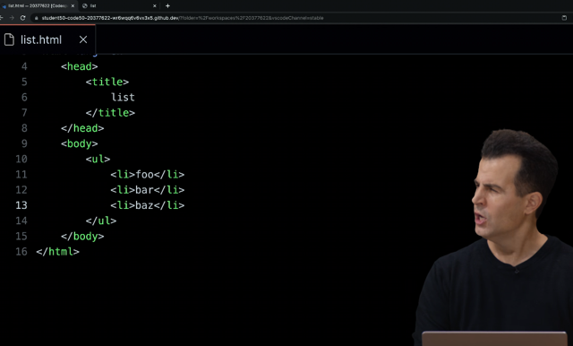</kbd>

> [!NOTE]
> **Muốn dạng list** thì dùng **<ul>**
> (**unordered list**) hoặc **<ol>** (ordered list) và **<li>** (list)

 

<kbd>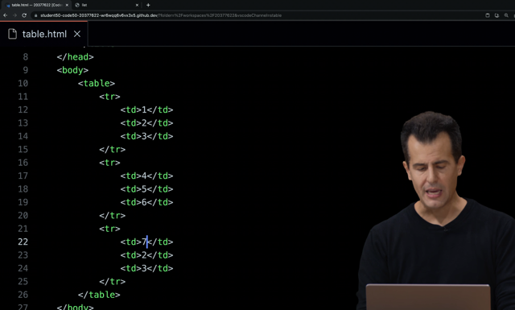</kbd>

> [!NOTE]
> Hoặc có thể dùng tag <table>

 

<kbd>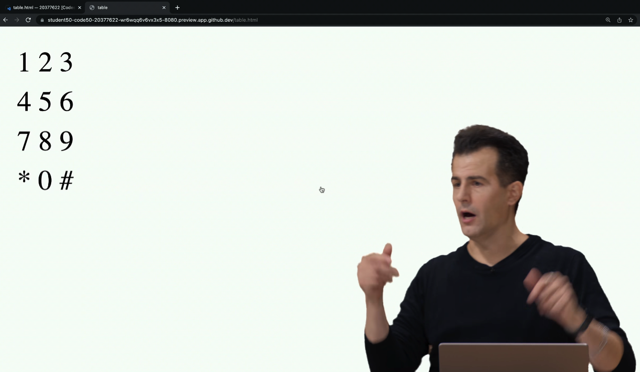</kbd>

 

<kbd>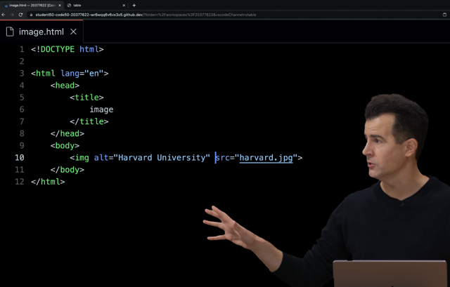</kbd>

> [!NOTE]
> Đến**** ổng nói**có thể để alt** để **có thêm thông tin
> cho Google bot khi quét cái hình**nó biết nó là thông tin gì
> dù rằng ngay nay AI đã có thể giúp việc này rất tốt

 

<kbd>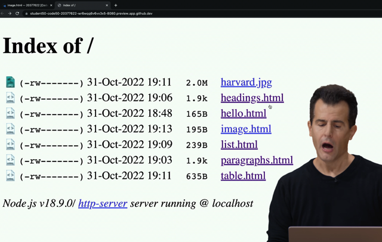</kbd>

 

<kbd>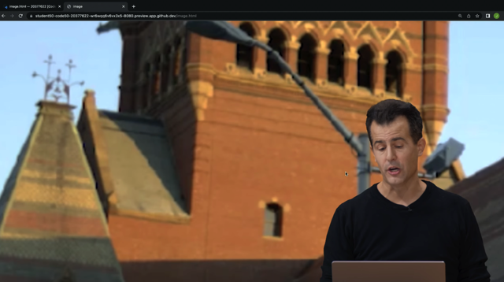</kbd>

 

<kbd>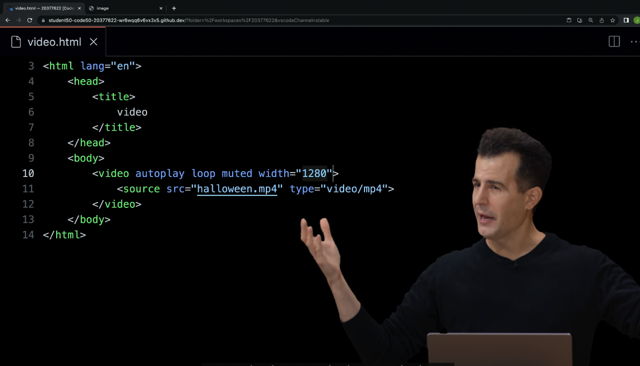</kbd>

> [!NOTE]
> Rồi giới thiệu qua **video tag.**
>
> vài **attribute**, **có cái cần value có cái không**,

 

<kbd>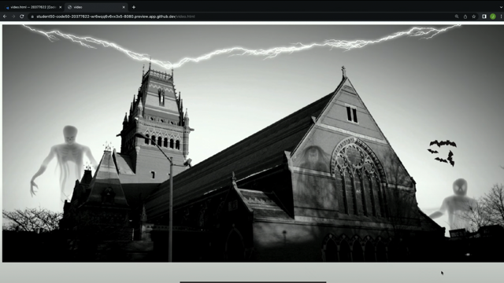</kbd>

 

<kbd>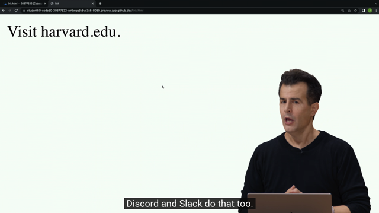</kbd>

 

<kbd>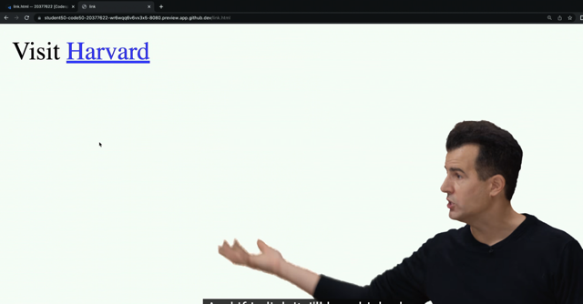</kbd>

<kbd></kbd>

<kbd>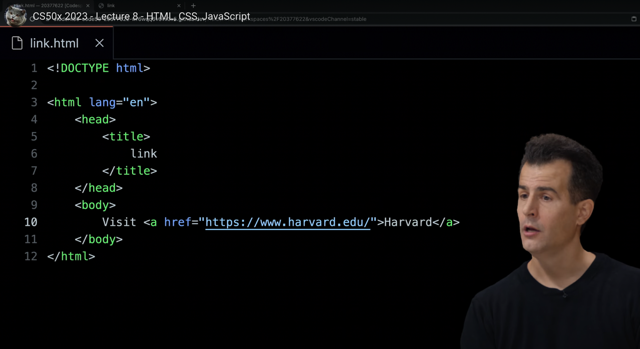</kbd>

> [!NOTE]
> Đại khái nói qua **link tag, giúp link các page với nhau**

 

<kbd>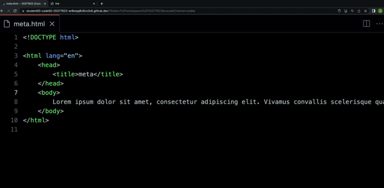</kbd>

 

<kbd>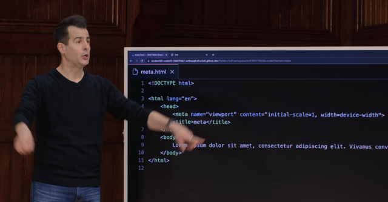</kbd>

> [!NOTE]
> Nói về **meta tag**, giúp **view
> page better trên mobile**

 

<kbd>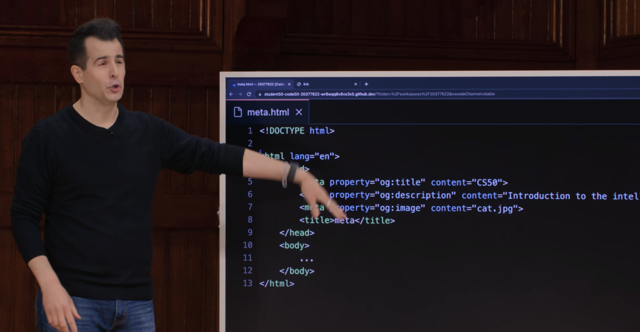</kbd>

> [!NOTE]
> Nói thêm về vài cái **meta open graph tag** để
> **define thêm thông tin cho browser** biết bạn **muốn 
> nó show default title, description...**

 

<kbd>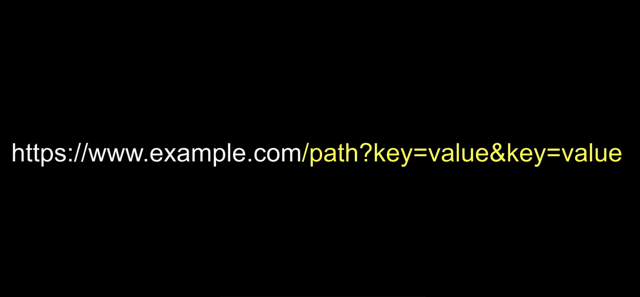</kbd>

<kbd></kbd>

<kbd>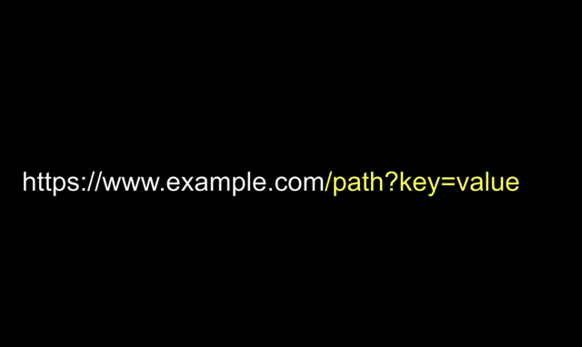</kbd>

 

<kbd>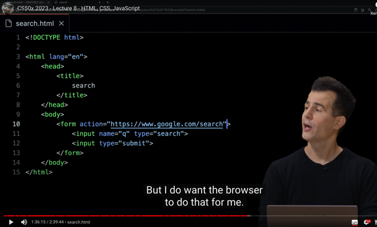</kbd>

> [!NOTE]
> Dùng **form**,**input** tag
> để **tạo cái form**

 

<kbd>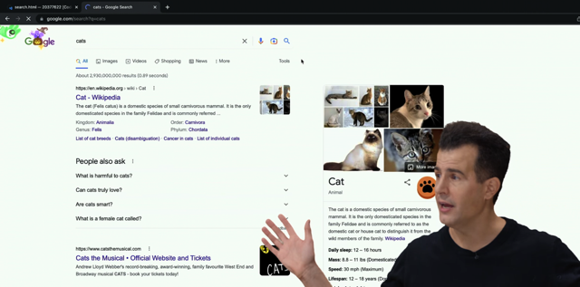</kbd>

<kbd></kbd>

<kbd>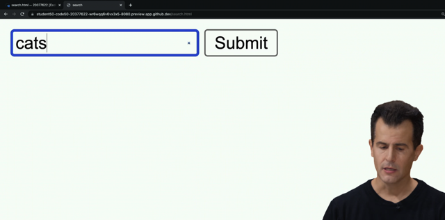</kbd>

 

<kbd>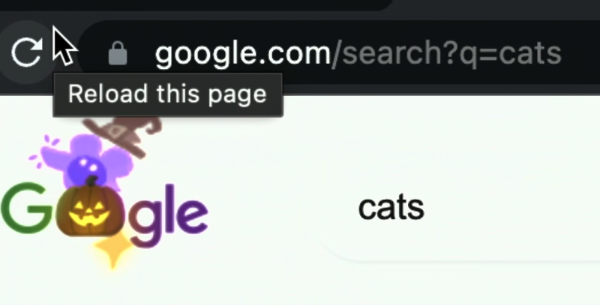</kbd>

> [!NOTE]
> Đại khái **đây là cách mà form nó hoạt động**, nó sẽ**tự động thêm ?** và**sau đó là key value pair vào url**

 

<kbd>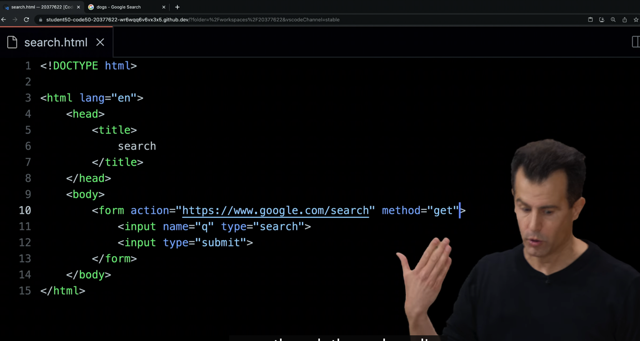</kbd>

 

<kbd>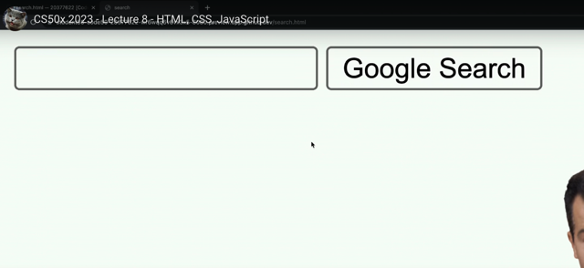</kbd>

<kbd></kbd>

<kbd>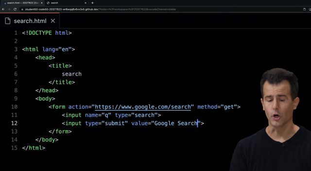</kbd>

> [!NOTE]
> Tiếp, nếu thích thì có thể đổi **Submit** thành **Google Search**
> Và **method="get"** dù **ở đây không cần vì default là get
> rồi**

 

<kbd>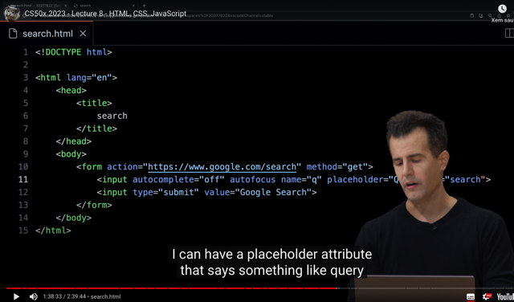</kbd>

<kbd></kbd>

<kbd>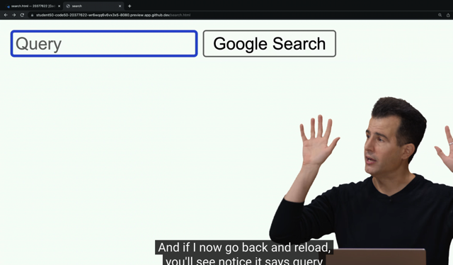</kbd>

> [!NOTE]
> Và có thể **thêm các attribute** như **autocomplete** **= "
> off"** để nó  **không autocomplete**
>
> **autofocus** (cái này là no key-value attribute) để nó**tự focus**
> vào form
>
> và **placeholder** =**"Query"** để nó **show cái place holde**r text

 

<kbd></kbd>

> [!NOTE]
> Đại khái ổng nói **cơ bản HTML là vậy**, **có thể có thêm
> các tag khác, các attribute khác**, nhưng cơ bản là vậy,
> **có thể từ từ tìm hiểu thêm các loại tag đó**

 

<kbd>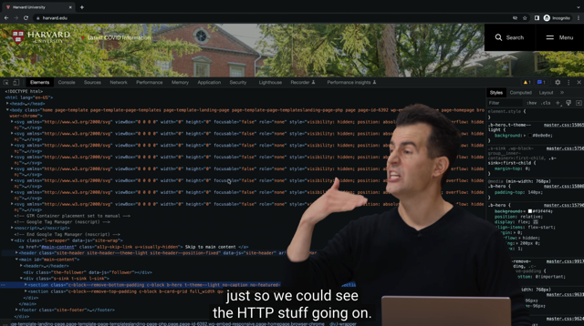</kbd>

> [!NOTE]
> Đại khái với công cụ inspector hồi này có thể xem
> html của webpage

 

<kbd>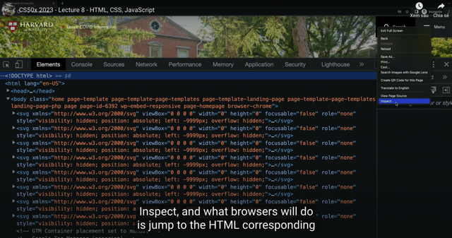</kbd>

> [!NOTE]
> Hoặc **một phần nào
> đó của webpage**

 

<kbd>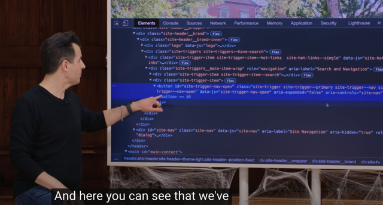</kbd>

> [!NOTE]
> Đại khái ví dụ ở đây có
> **button's id**

 

<kbd>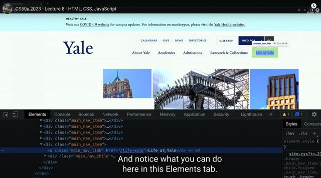</kbd>

 

<kbd>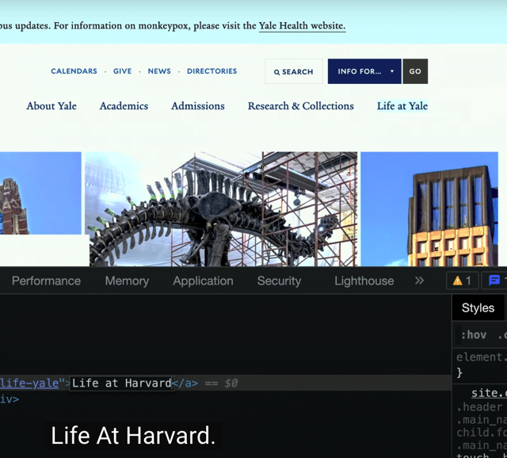</kbd>

> [!NOTE]
> Xong **ổng vô trang web của Yale** và **đổi cái text.**
>
> D: Có phải tôi đã thật sự **hack được web site** của Yale
> không?
>
> A: Không, **chỉ là đổi cái html mà ông nhận được sau khi
> request từ Yale's server thôi**.
>
> D: Correct

 

<kbd></kbd>

> [!NOTE]
> Qua **CSS** Cascading Style Sheet, là **markup
> language** giúp làm các **aesthetic** = **font, size,
> color.. ..**

 

<kbd></kbd>

> [!NOTE]
> Nói sơ về **một số properties**của **CSS**

 

<kbd>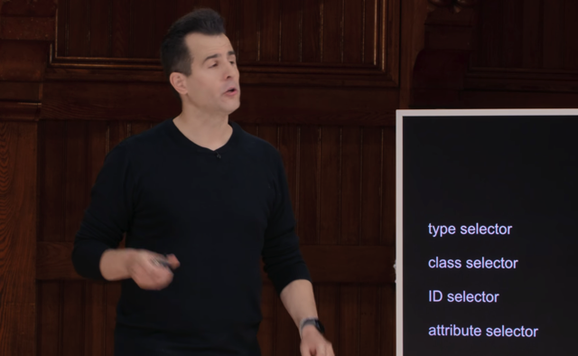</kbd>

 

<kbd>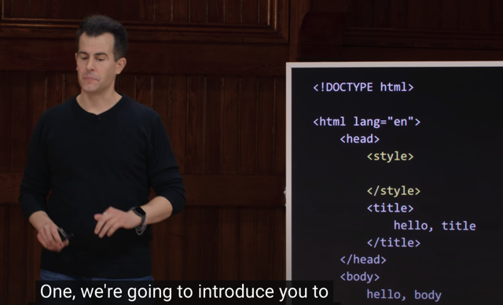</kbd>

> [!NOTE]
> Và một **số tag mới** trong html
> dùng để **define style**

 

<kbd>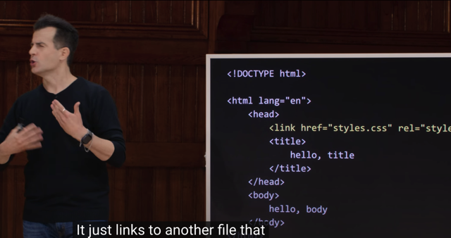</kbd>

> [!NOTE]
> Nói chung là mới nói lướt chưa có gì cụ thể, ví dụ ở đây
> ổng nói có thể link tới file css để riêng để tách riêng phần
> content html và style

 

<kbd>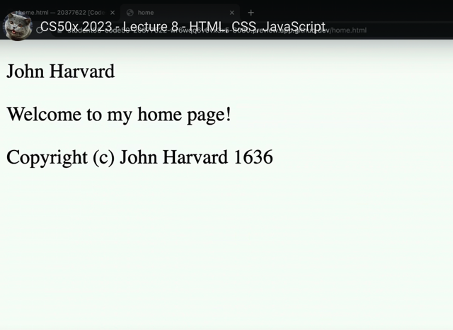</kbd>

<kbd></kbd>

<kbd>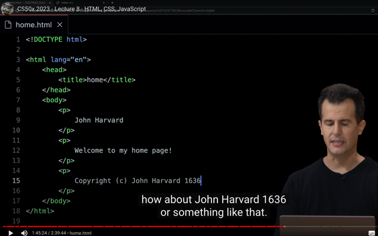</kbd>

> [!NOTE]
> Ok, start lại với simple
> html page như này

 

<kbd>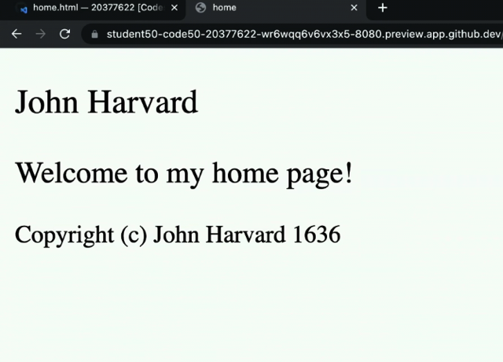</kbd>

<kbd></kbd>

<kbd>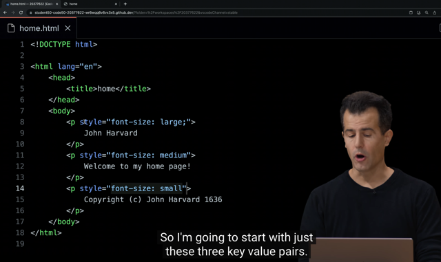</kbd>

> [!NOTE]
> Tiếp để**bắt đầu "styling"** cho nó. Ổng bắt đầu với kiểu này
> -**không phải là style tag** mà là kiểu như **inline attribute**
> **style = font-size: large/medium.**.
>
> Kết quả cho thấy đã có thể thay đổi kích thước chữ
>
> Ổng nói để biết có **các key-value như thế nào** thì search
> thêm trên mạng, reading book

 

<kbd>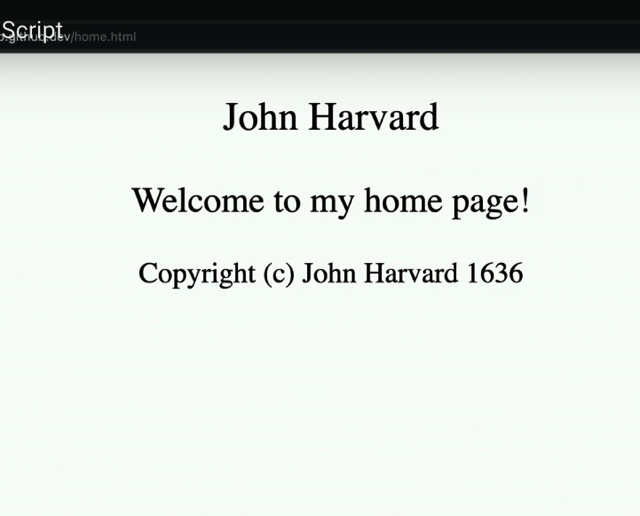</kbd>

<kbd></kbd>

<kbd>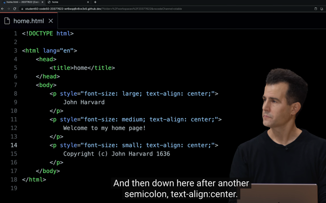</kbd>

> [!NOTE]
> Define thêm style
> attribute**text-align: center**để **centers text**

 

<kbd>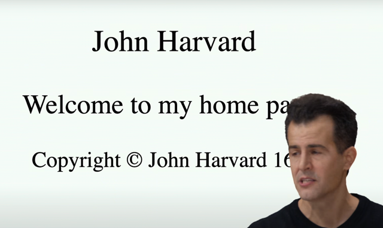</kbd>

<kbd></kbd>

<kbd>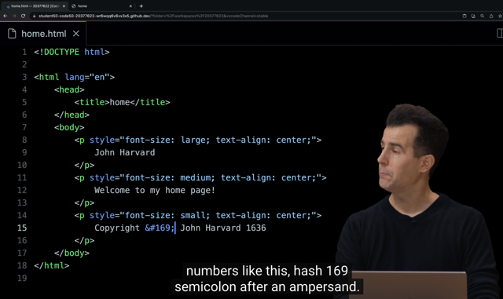</kbd>

> [!NOTE]
> Tiếp, để làm cái **kí hiệu copy right** đúng hơn thì dùng cái
> này **&#169;** - và ổng nói **mấy cái này có thể tra trên mạng
> để biết, không có gì to tát**
>
> D: Dù bạn chưa bao giờ biết CSS, HTML thì **tại sao cái
> này bad design.**
>
> A: Vì **design style kiểu này khá manual**, khi phải **define
> style cho từng p**

 

<kbd>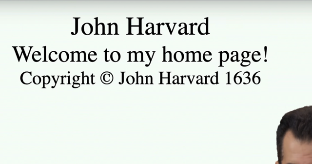</kbd>

<kbd></kbd>

<kbd>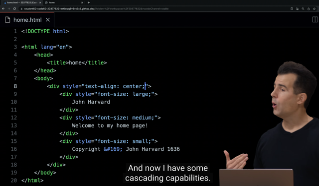</kbd>

> [!NOTE]
> **Correct**. Do đó ta có thể làm vầ, giới thiệu thêm
> **div tag - division**, bỏ **text-align attribute ở parent
> div** và **những cái div con sẽ tự động được thừa
> hưởng**
>
> Kết quả **tuy mất đi cái space ở giữ**a (có thể fix dễ dàng
> sau) nhưng ta **vẫn có cái vụ text centered mà không
> cần define cho mỗi cái paragraph**

 

<kbd>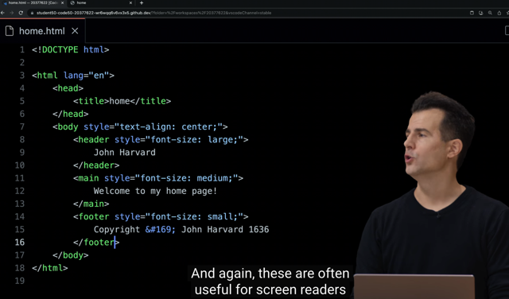</kbd>

> [!NOTE]
> Đại khái là **trend mới nhất ngày nay** thay vì dùng
> **division**  tag - div. Thì người ta dùng **"more semantic"** - ý là có ý  nghĩa hơn, đó là **dùng header** (không
> phải heading), **main** và **footer**.
>
> Có những**lợi điểm như giúp cho search engine** như
> Google dễ dàng **biết được à, đó là header, main nơi ta
> có thể focus vào tìm kiếm.**

 

<kbd>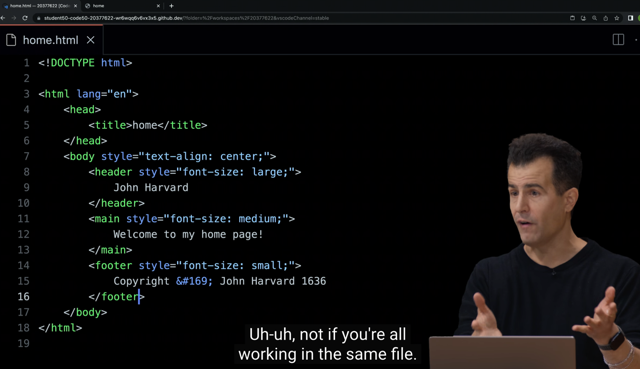</kbd>

> [!NOTE]
> Xong ổng nói làm vầy **vẫn có một problem** đó là giả sử
> **muốn  đổi style, thì phải sửa chung cho file này** (có cả
> content) **sẽ tốt hơn nếu có thể tách bạch phần content và
> phần style ra**

 

<kbd>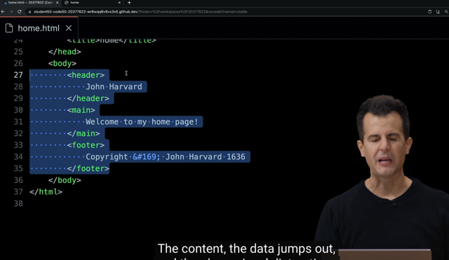</kbd>

<kbd></kbd>

<kbd></kbd>

<kbd></kbd>

<kbd>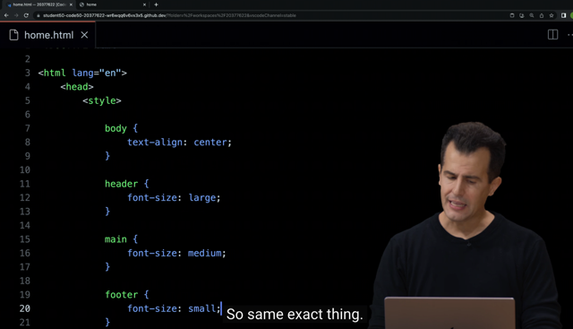</kbd>

> [!NOTE]
> Do đó có thể làm thế này: **define style tag ở trên
> cùng**.
>
> Các k**ey-value attribute vẫn the same** nhưng **chỉ có
> cái là define ở đây**, và **cái nào dành cho phần nào thì
> define như vầy**.
>
> Kết quả y chang **nhưng content clear hơn**, không
> phải **chung đụng giữa content và style**

 

<kbd>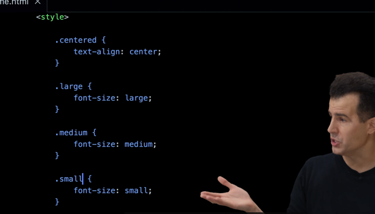</kbd>

> [!NOTE]
> Xong thay vì vậy, ổng nói có thể**define với kiểu này .
> centered, .large... nó gọi là class** - chỉ là collection of
> **key-value pair** và ta **tự đặt tên** để tiện sử dụng

 

<kbd>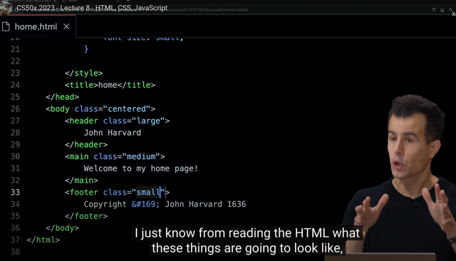</kbd>

> [!NOTE]
> Thì với cái này đại khái là ta lại **lùi lại một chút khi lại add 
> chung với content một code** dành cho **style** tuy nhiên **nó
> giúp ra rõ ràng hơn kiểm soát tốt hơn**

 

<kbd>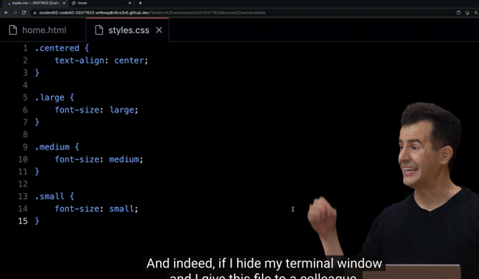</kbd>

<kbd></kbd>

<kbd>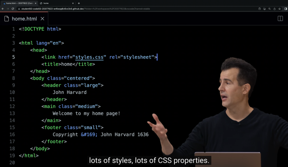</kbd>

> [!NOTE]
> Làm thêm một cái nữa đó là **tách bạch hai file css và 
> html** bằng cách dùng **link tag**: 
>
> **<link href="styles.css" red = "stylesheet">**

 

<kbd>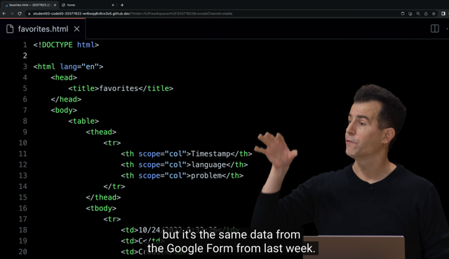</kbd>

> [!NOTE]
> Thì đại khái là ta sẽ qua **framework** (đoán đoán là ta sẽ
> xài  những cái framework **có sẵn để build web page nhanh
> hơn**)
>
> Thì ổng nói **ổng đã chuẩn bị cái này,** trong đó c**ó mấy
> cái tag như head**, **tr**, **th**....thì ổng nói là **không có gì
> ghê gớm chẳng qua lúc đọc documentation** tui thấy **xài
> mấy cái này thì đẹp hơn  thì xài thôi**

 

<kbd>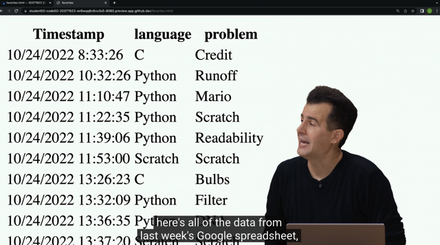</kbd>

> [!NOTE]
> Thì đại khái nó là cái **csv thống kê favorite language**,
> **problem set bữa trước**. Nhưng**ổng đã chuyển thành dạng
> html thôi không có gì**

 

<kbd></kbd>

> [!NOTE]
> Thì giờ ổng muốn làm cho nó đẹp hơn, nhưng đại khái
> là **liệu có cách nào không phải tự code hết các css**, mà
> **dùng lại những cái design đẹp của những người khác
> làm sẵn không**. Đó chính là **framework**

 

<kbd>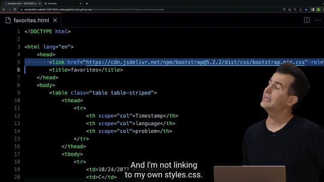</kbd>

> [!NOTE]
> Thì ổng nói tui chỉ **cần add thêm cái link như
> vầy**. Dùng một cái lib gọi là **bootstrap**

 

<kbd></kbd>

> [!NOTE]
> Thì đại khái nó là một cái **popular library** **free**, có
> nhiều **css file, có thể dùng free**
>
> Và để dùng nó tui **chỉ đơn giản là đọc documentation**
> và **add cái link như thế này vào**

 

<kbd>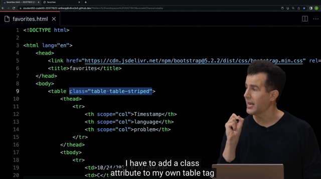</kbd>

> [!NOTE]
> Và cũng theo document của **bootstrap** nó nói tui phải **add
> thêm cái class gọi là table**, và dùng attribute **table striped 
> để nó có cái màu xám** giữa các cột và hàng.
>
> Chỉ vậy thôi

 

<kbd>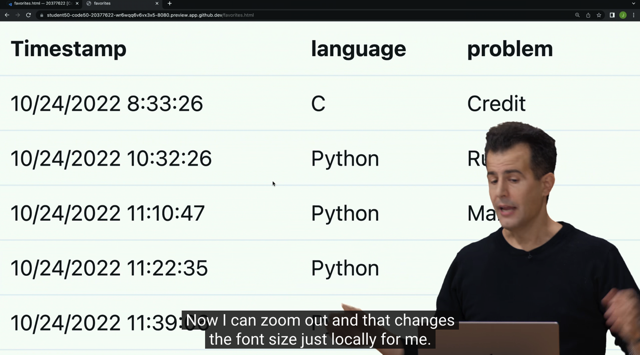</kbd>

> [!NOTE]
> Và chỉ nhiêu đó đã **khiến nó
> đẹp hơn đáng kể rồi**

 

<kbd></kbd>

 

<kbd></kbd>

> [!NOTE]
> Nói**lướt nhanh về một syntax của javascript**
> không khó nên khỏi note

 

<kbd>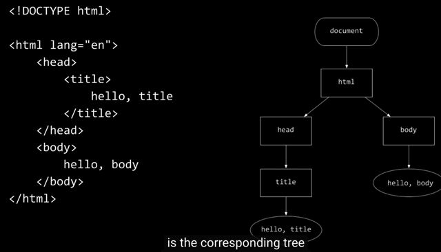</kbd>

> [!NOTE]
> Thì đại khái javascript sẽ **cho phép ta manipulate cái
> DOM này**. Từ đó cho phép **không cần phải mỗi lần mỗi
> reload page**

 

<kbd></kbd>

> [!NOTE]
> Đại khái là js sẽ **chạy trên client size web**
> **browser** chứ **không phải server**

 

<kbd>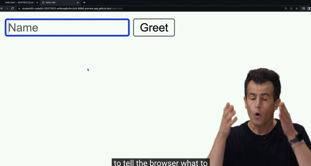</kbd>

<kbd></kbd>

<kbd>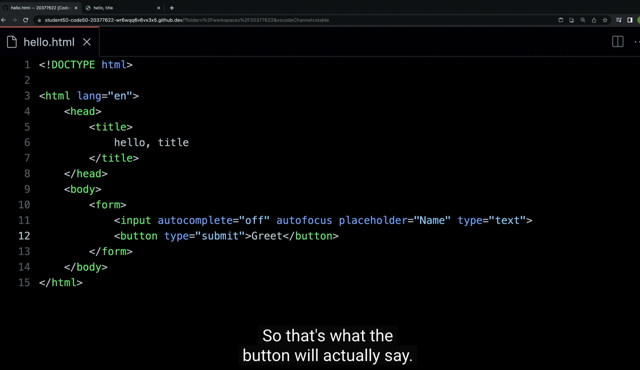</kbd>

> [!NOTE]
> Xong, quay lại cái page này, thử làm cái gọi là thay
> vì Hello! thì **enter tên vào và Hello David!**
>
> Thì hiện tại khi **click button chưa có gì xảy ra** vì **chưa
> implement cái gì**

 

<kbd>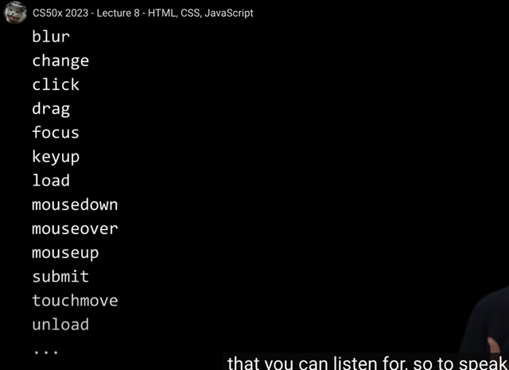</kbd>

> [!NOTE]
> Thì đây, các **event** trong javascript

 

<kbd>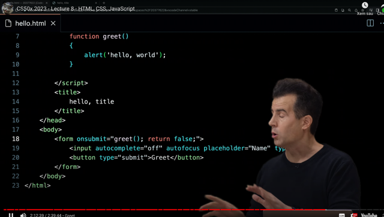</kbd>

<kbd></kbd>

<kbd>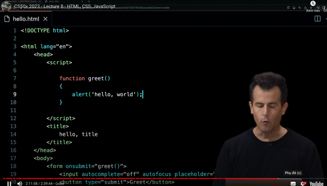</kbd>

> [!NOTE]
> Thế là ta có thể dùng **onsubmit** = greet() như vầy,
> define function **greet**() bằng cách**define trong tag
> script**.
>
> Ta sẽ cho nó show một cái **alert** say hello world **dù là
> không đẹp mắt lắm nhưng tạm thời vậy**

> [!NOTE]
> Đồng thời, ta cũng sẽ làm vầy, **return false**, để nó không
> thật sự submit mà như hồi nãy ta biết là nó sẽ **gắn cái
> query của form vào url và gọi url lại.**
>
> Thì ổng nói cái này đơn giản là **tui đọc trong doc thấy
> vậy**

 

<kbd>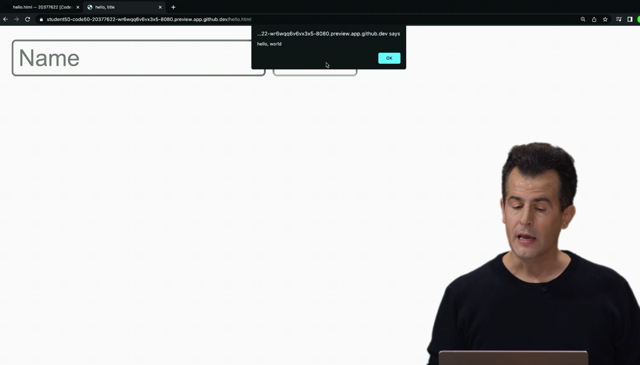</kbd>

> [!NOTE]
> Load lại, **click submit
> nó show alert dialog**

 

<kbd>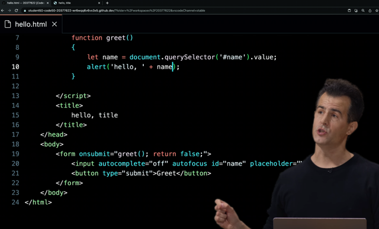</kbd>

> [!NOTE]
> Để **lấy value user enter vào form**, đầu tiên ta **gán id cho input**,
> (cái này thì giống java rồi) là**id = "name"**
>
> Và "lấy nó" bằng cách: **document.querySelector(' #name').value**
>
> Và **concatenate nó với hello.**

 

<kbd>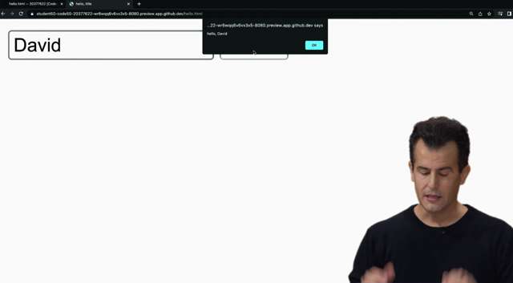</kbd>

 

<kbd>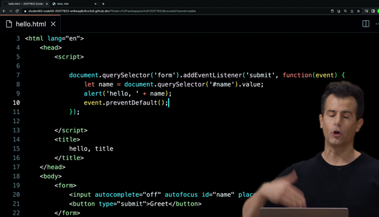</kbd>

> [!NOTE]
> Tiếp theo đại khái là **sẽ tốt hơn nếu có thể tách js** ra khỏi
> **content**, giống như **ta làm với css vậy.**
>
> Nên có thể làm vầy, ở đây giống java, đó là **ta có thể gọi /
> lấy cái form và addEventListener cho nó**.
>
> Trong đó define tên function không có on, ví dụ **onsubmit**
> thì ở đây là **submit**, và có thể dùng **anonymous / lambda
> function** nhận có argument là một event (**cái kiểu nó vậy**)
>
> Còn lại thì như trên chỉ có thêm là gọi **event.preventDefault() 
> có tác dụng chỉ giống như cái vụ return false ở cách làm 
> hồi nãy**

 

<kbd>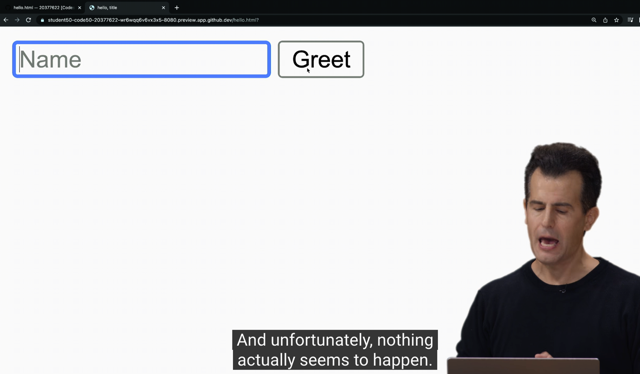</kbd>

> [!NOTE]
> Xong nhưng khi làm
> thử thì nó ko work

 

<kbd>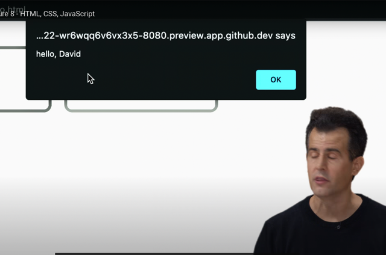</kbd>

<kbd></kbd>

<kbd>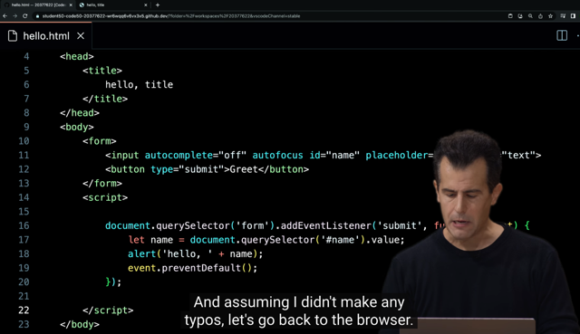</kbd>

> [!NOTE]
> Thì ổng nói vấn đề là giống như ta **từng gặp trong C,** đó
> là**tại  thời điểm nó gọi document.query...
> addEventListener...** thì c**ái form chưa tồn tại.**
>
> Nên **move cái script tag xuống dưới thì nó work**

 

<kbd>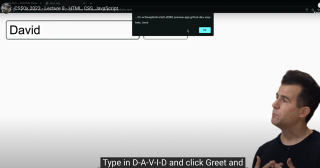</kbd>

<kbd></kbd>

<kbd>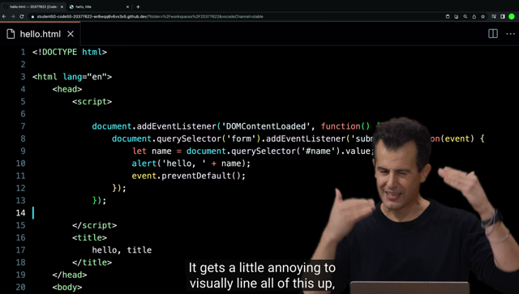</kbd>

> [!NOTE]
> Thì giải pháp hay hơn đó là**bỏ nó vào một cái event 
> listener là DOMContentLoaded.**
> Với cách này thì **đoạn code add event listener cho form
> chỉ được chạy sau khi DOM content đã loaded xong**

 

<kbd>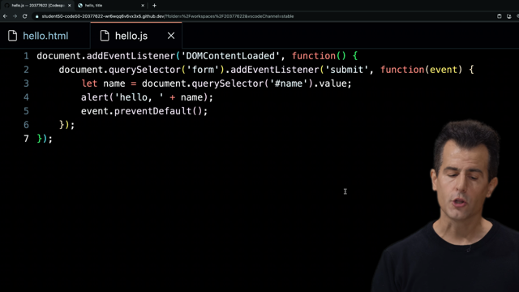</kbd>

<kbd></kbd>

<kbd>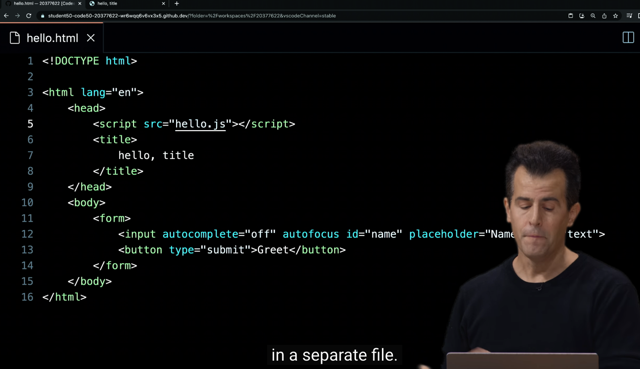</kbd>

> [!NOTE]
> Tiếp làm động tác**tương tự với css đó là
> ta tách nó ra thành file riêng**

 

<kbd>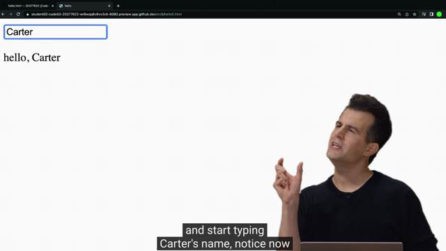</kbd>

> [!NOTE]
> Xong ổng nói có thể cho nó vui hơn, bằng làm như cái
> này (ổng mở 1 file làm sẵn rồi) trong đó khi **gõ dòng
> chữ ở dưới tự động update không cần button submit gì
> cả**
>
> Thì cái này đại khái là **có liên quan đến finger up/down
> event**

 

<kbd>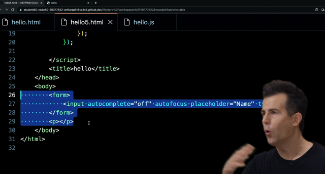</kbd>

<kbd></kbd>

<kbd>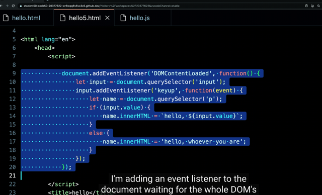</kbd>

> [!NOTE]
> Cũng dễ hiểu, vài ghi chú thôi
>
> **if (input.value)**: **check trong đó có text hay chưa giống
> như check null vậy**
>
> Có cái **syntax để show string hơi weird trong js** là **thay 
> vì dùng 'a' hay "a"  thì  nó dùng back stick là cái này `a`**
> (dưới nút escape)
>
> Và dùng **${....}** để **infer value giống như f"{...}" trong 
> python**

 

<kbd>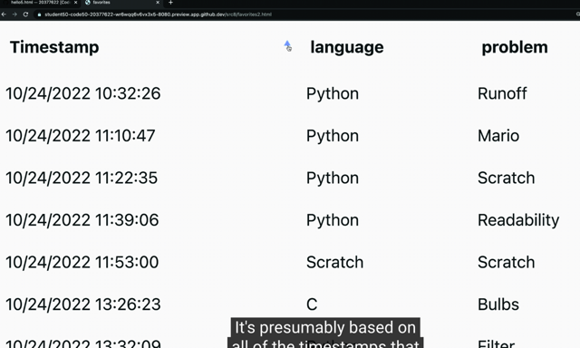</kbd>

> [!NOTE]
> Tiếp đại khái là ta có thể dùng
> javascript để làm cái này: **sort**

 

<kbd>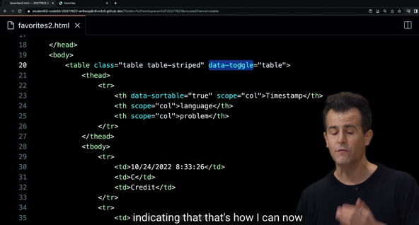</kbd>

<kbd></kbd>

<kbd>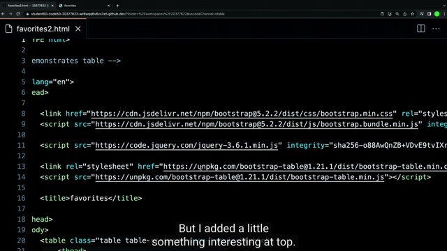</kbd>

> [!NOTE]
> Thì đại khái cũng như **nhờ bootstrap** **làm đẹp thêm cho 
> webpage** thì ở đây cũng có thể **nhờ nó làm cái này**.
>
> Ổng nói tui đọc **documentation** và**copy paste** những cái
> link này 
>
> Rồi thêm cái **syntax** thế là xong

 

<kbd>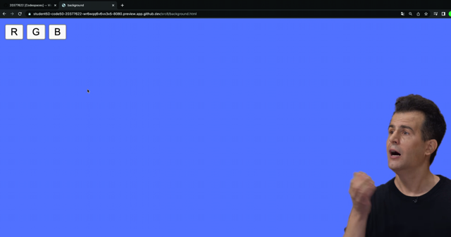</kbd>

> [!NOTE]
> Rồi ổng nói qua cái ví dụ khác là bấm
> để **change background color**

 

<kbd>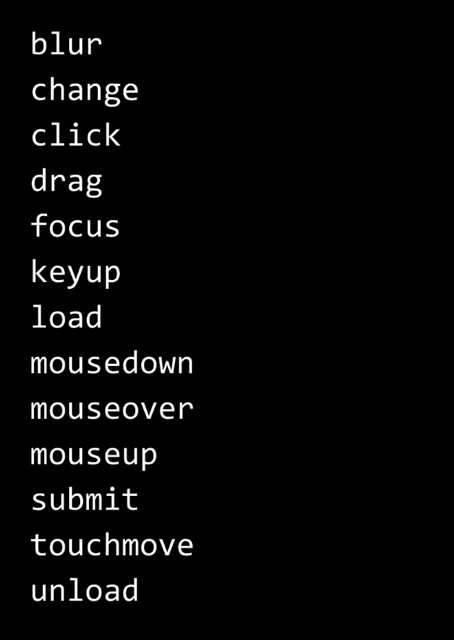</kbd>

 

<kbd>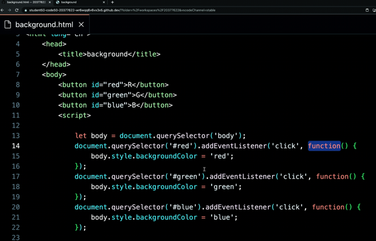</kbd>

<kbd></kbd>

<kbd>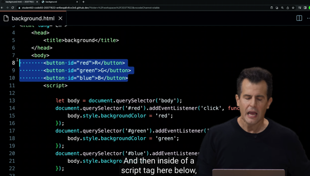</kbd>

> [!NOTE]
> Cũng đơn giản. Chỉ là **add event listener** và **set value
> cho**
>
> **body.style.backgroundColor** thôi.
>
> Và trong **css, red, là ...'red'**. That's it

 

<kbd>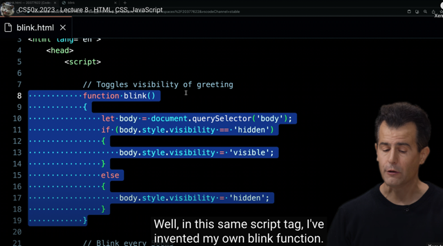</kbd>

<kbd></kbd>

<kbd>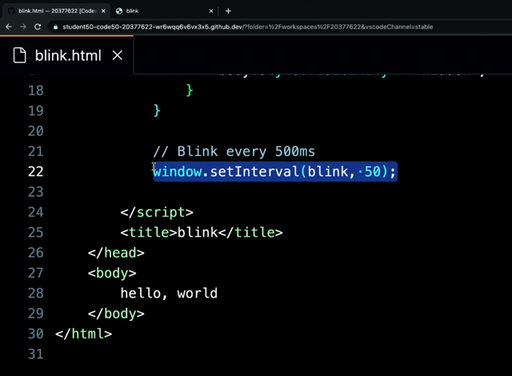</kbd>

> [!NOTE]
> Tiếp ổng show một ví dụ khác trong đó chữ**hello, world** cứ 
> nhấp nháy (**blink**)
>
> Thì đại khái là dùng cái này: **window.setInterval(blink, 50)**
> có nghĩa là nó cứ **50 millisecond** thì gọi function này một lần
>
> Ổng nói thêm là không để **blink**() mà chỉ là blink

> [!NOTE]
> Function **blink** cũng đơn giản, chỉ là **toggle**
> state visibility thôi

 

<kbd>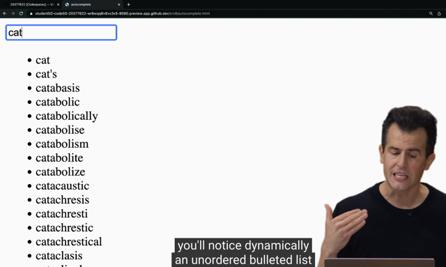</kbd>

> [!NOTE]
> Xong **ổng show hàng cái** này, cơ bản là dùng **key-up
> event** và **search trong dictionary** như đã làm trong
> **PS5 thôi**

 

<kbd>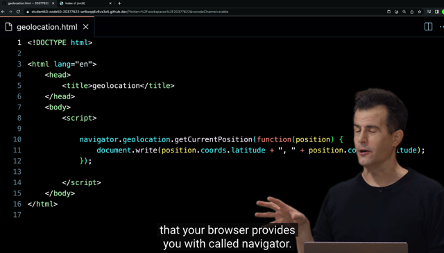</kbd>

> [!NOTE]
> **Final example** đại khái là (với đoạn code này) khi nào 
> **web browser biết được location của user** thì nó sẽ **gọi 
> function này**
>
> Và ở đây **chỉ đơn giản là write nó ra** (kiểu như **in ra**)
> bằng **function document.write()**

 

<kbd>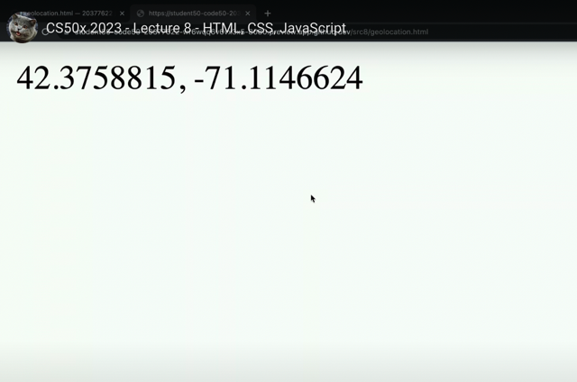</kbd>

<kbd></kbd>

<kbd>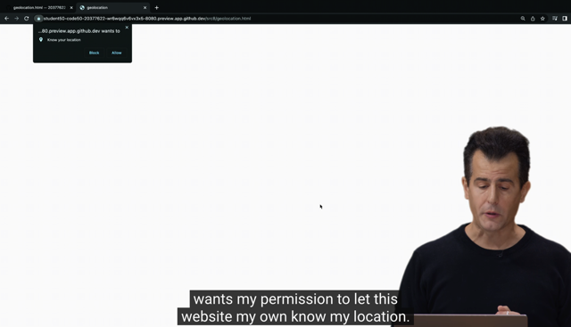</kbd>

 

<kbd>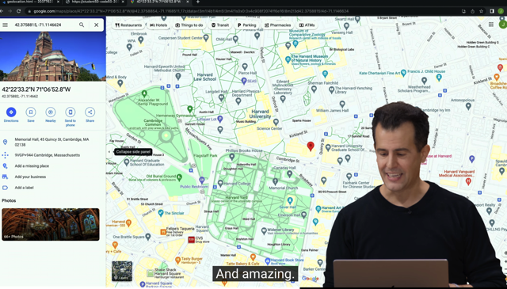</kbd>

 

