# A0-ee364a (18 Lectures)

📊 **Progress:** `852` Notes | `1316` Screenshots | `35` AI Reviews

---

<a id="node-9kjso2o"></a>
## Lec 2

<br>

<p align="center"><kbd></kbd></p>

> [!NOTE]
> Đại khái là 3 tuần đầu này chỉ toàn toán với toán thôi. Hiểu được sơ sơ là ok rồi. Qua các tuần sau với các ứng dụng ta sẽ hiểu rõ hơn.

<br>

<p align="center"><kbd>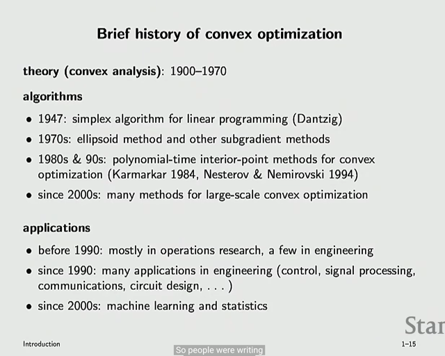</kbd></p>

> [!NOTE]
> Đại khái là nói sơ về lịch sử của môn này

<br>

<p align="center"><kbd>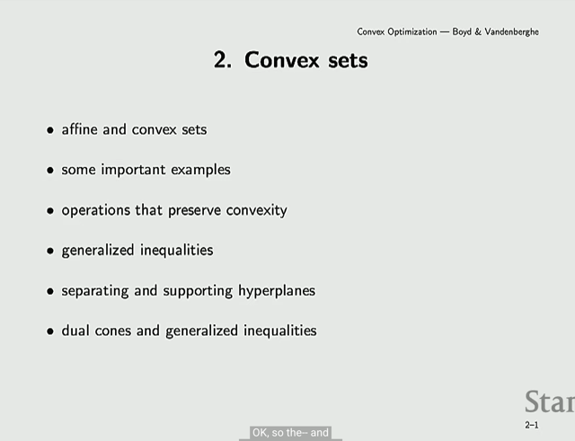</kbd></p>

> [!NOTE]
> Đại khái là đây không phải là lớp toán, mà là ứng dụng toán để giải quyết một vấn đề.
>
> Do đó, gs nói ta cần học được một skill là nhận ra được khi nào
> vấn đề đang đối mặt thuộc một CONVEX SETS, và tuần sau thì ta
> sẽ nói về CONVEX FUNCTION
>
> CHAPTER 2 - CONVEX SET

<br>

<p align="center"><kbd>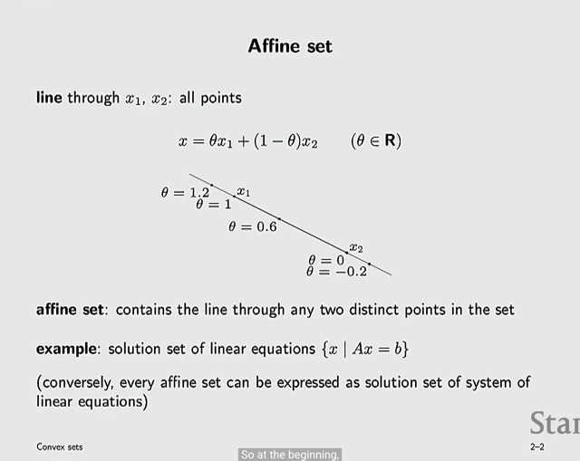</kbd></p>

> [!NOTE]
> Đầu tiên, ta sẽ nói về việc ta có hai vector x1, x2. Và ta sẽ thực hiện một **linear combination** của chúng với coefficients có tính chất đặc biệt là **tổng bằng 1**: 
>
> x `=` `θx1` + (1 - `θ)x2`
>
> Và với các `θ` khác nhau ta có một đường thẳng đi qua x1, x2. Gs cho rằng đây có thể gọi là parameterized by `θ,` khi với các `θ` khác nhau ta có các điểm khác nhau trên đường thẳng.
>
> Thế thì ta đã biết **LINEAR COMBINATION**, nhưng khi các coefficients có tổng bằng 1 thì ta gọi nó là **AFFINE COMBINATION**.
>
> Ta biết với x1, x2 là hai vector khác nhau thì mọi linear combination của x1, x2 sẽ là một **2D subspace span bởi x1, x2**.
>
> Khi các coeffs có **thêm ràng buộc có tổng bằng 1** để thành **affine combination** thì tập hợp mọi affine combination trở thành **chỉ là đường thẳng đi qua hai điểm**.
>
> Với linear combination ta có khái niệm SUBSPACE, là set thỏa tính chất nếu x1, x2 thuộc subspace thì mọi linear combination của chúng cũng thuộc subspace
>
> Thì ở đây ta có AFFINE SET là set chứa mọi đường thẳng đi qua hai điểm bất kì trong set (hai khái quát hơn là mọi affine combination của mọi điểm bất kì trong set)
>
> Gs cho một ví dụ về affine set là tập hợp các solution của Ax `=` b mà gs đề nghị ta có thể check lại xem có phải là** giả sử x1, x2 là solution thì với `θ` bất kì thì `θx1` + (1- `θ)x2` có phải là solution** không:
>
> Thử check: 
>
> `A[θx1+(1-θ)x2]` 
>
> `=` `Aθx1` + `A(1-θ)x2` 
>
> ```text
> = Aθx1 + Ax2 - Aθx2 =
> ```
>
> ```text
> θAx1 + Ax2 - θAx2 = θb + b - θb = b.
> ```
>
> (Do x1, x2 đều là solution nên Ax1 `=` Ax2 `=` b)
>
> Vậy đúng là **với `θ` bất kì thì x `=` `θx1` + (1 - `θ)x2` cũng thuộc solution set của Ax `=` b**, do đó solution set này là một AFFINE SET
>
> AFFINE SET

<br>

<p align="center"><kbd>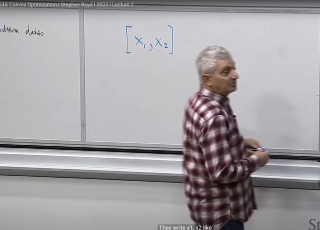</kbd></p>

> [!NOTE]
> Tiếp, gs cho biết nếu thêm ràng buộc **θ có giá trị từ 0 đến 1** thì khi đó các điểm x `=` `θx1` + `(1-θ)x2` sẽ tạo thành một **LINE SEGMENT** giữa x1, x2 (tạm hiểu là đoạn thẳng nối x1, x2)
>
> Và gs cho biết ta sẽ thấy người ta kí hiệu như vầy **[x1, x2]** 
>
> (chưa hiểu là tại sao phải nói cái này, vì ta đã luôn học kí hiệu [a,b] là tập hợp các điểm trên đoạn thẳng a b rồi.
>
> Gs cho biết, nó gọi là **CONVEX COMBINATION**, nhưng người ta còn gọi nó với cái tên **MIXTURE** 
>
> ```text
> (hiểu nôm na là, trộn lẫn giữa x1, x2 ví dụ θ = 0.25 thì x = θx1+(1-θ)x2 sẽ mang ý nghĩa là trộn lẫn 25% của x1 và 75% của x2)
> ```
>
> Thật ra CONVEX COMBINATION là khi AFFINE COMBINATION (nơi mà coefficients của LINEAR COMBINATION có tính chất có TỔNG BẰNG 1) có thêm tính chất các coefficients **KHÔNG ÂM**
>
> (mà khi ta có hai coefficients có tổng bằng 1, thì việc chúng không âm đồng nghĩa mỗi thằng phải đều có giá trị từ 0 đến 1)
>
> Nên tóm lại, bắt đầu với linear combination, nếu tổng coeffs bằng 1 ta có affine combination, nếu các coeff đều không âm (đồng
> nghĩa các coeffs đều có giá trị từ 0 đến 1) thì ta có convex
> combination hay mixture

> [!TIP]
> **🤖 AI Feedback** — ✅ Score: **95/100**
>
> Bạn đã nắm vững định nghĩa và mối quan hệ giữa các loại tổ hợp (linear, affine, convex) một cách xuất sắc. Giải thích về ràng buộc hệ số và ý nghĩa của 'mixture' rất rõ ràng và sâu sắc, thể hiện sự am hiểu sâu rộng về khái niệm. Hãy suy nghĩ thêm về tầm quan trọng của việc nhấn mạnh ký hiệu [x1, x2] trong bối cảnh không gian vector để làm rõ sự khác biệt và tránh nhầm lẫn với tập hợp số thực.

<br>

<p align="center"><kbd>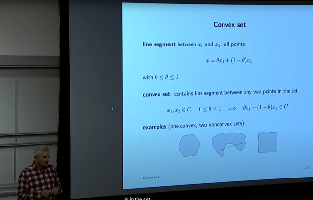</kbd></p>

> [!NOTE]
> Từ đó ta có **định nghĩa về CONVEX SET**: 
>
> Đại khái là convex set là tập mà thỏa tính chất sau **nếu hai điểm nằm trong set thì mọi điểm trên line segment (tức là convex combination hay mixture của chúng) đều thuộc set.**
>
> Thể hiện theo toán học là: Nếu x1, x2 thuộc C thì với mọi `θ` có giá trị từ 0 đến 1 thì:
>
> x `=` `θx1` + `(1-θ)x2` sẽ đều thuộc C
>
> CONVEX SET

> [!TIP]
> **🤖 AI Feedback** — ✅ Score: **95/100**
>
> Ghi chú này trình bày định nghĩa tập lồi một cách chính xác và đầy đủ, từ giải thích trực quan đến công thức toán học. Việc bổ sung thuật ngữ "convex combination hay mixture" thể hiện sự hiểu biết sâu sắc về khái niệm.

<br>

<p align="center"><kbd>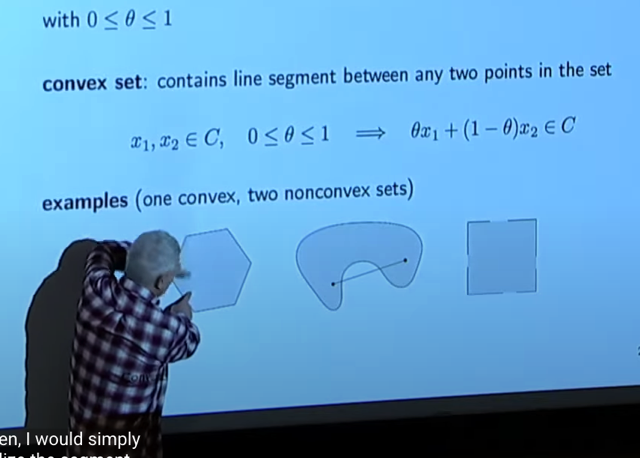</kbd></p>

<p align="center"><kbd>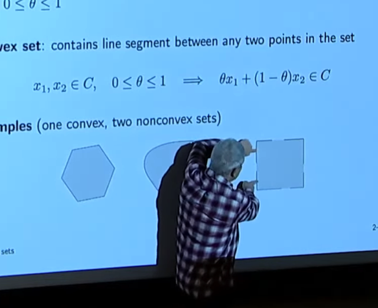</kbd></p>

> [!NOTE]
> Và ta có vài ví dụ, lục giác này là một CONVEX SET, vì lấy** hai điểm bất kì trong đó, thì mọi điểm trên đoạn thẳng nối hai điểm sẽ đều nằm trong lục giác** này.
>
> Nhưng hai hình bên thì không, hình chính giữa rõ ràng với hai điểm này thì không phải mọi điểm trên mixture của nó cũng đều thuộc hình đó.
>
> Với hình vuông thì vì boundary của nó ko closed, nên ví dụ lấy hai điểm trên cạnh thì có những điểm mixture của nó ko thuộc set

<br>

<p align="center"><kbd>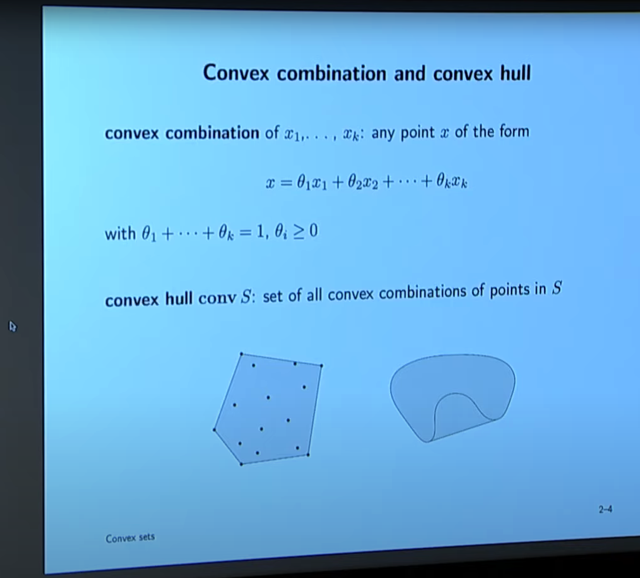</kbd></p>

> [!NOTE]
> Thế thì, khái quát với nhiều vector hơn: x1, x2...xk thì 
>
> ```text
> x = θ1x1 + θ2x2 + ...θkxk
> ```
> Tức linear combination với các `θi` đều có **TỔNG BẰNG 1 và KHÔNG ÂM** thì ta có **CONVEX COMBINATION** hay **MIXTURE** CỦA x1, x2...xk
>
> Và gs cho biết, người ta có thể gọi nó bằng **WEIGHTED SUM**, mà ta có thể nhận ra đây nếu là trong xác suất, nó CHÍNH LÀ **EXPECTATION**
>
> Nhớ lại expectation đã học trong Stat110: Expected value của random variable X, EX là **weighted sum của mọi possible values của X**, **weight chính là xác xuất nó mang giá trị đó**, với X là discrete r.v có các possible value x1,...xn ta sẽ có công thức:
>
> ```text
> EX = Σ_i=1:n x_i × P(X = x_i)
> ```
>
> Còn nếu là continous r.v thì EX `=` `∫-inf:inf` xf(x)dx

> [!TIP]
> **🤖 AI Feedback** — ⚠️ Score: **70/100**
>
> Nội dung ghi chú về tổ hợp lồi và mối liên hệ với kỳ vọng thể hiện sự hiểu biết sâu sắc và khả năng mở rộng kiến thức tốt. Tuy nhiên, bài ghi chú đã bỏ sót hoàn toàn định nghĩa về 'bao lồi' (convex hull), một khái niệm trọng tâm được đề cập rõ ràng trên slide. Đây là một thiếu sót nghiêm trọng cần được khắc phục.

<br>

<p align="center"><kbd>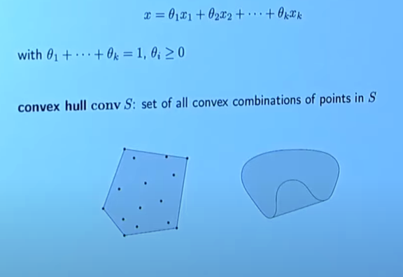</kbd></p>

<p align="center"><kbd></kbd></p>

> [!NOTE]
> Và **CONVEX HULL** được định nghĩa **là một set **CHỨA MỌI CONVEX COMBINATION của các điểm trong S**
>
> Ngẫm một chút sẽ có thể hiểu mọi điểm trong ngũ giác này đều là một convex combination của một bộ các điểm màu đen nào đó.
>
> Và với một điểm, ví dụ màu xanh, nó có thể là convex combination của nhiều bộ vector khác nhau với `θ` khác nhau.
>
> Ví dụ nó có thể là convex combination của x1, x2, x3. Nhưng cũng có thể là của x4, x5 x6 
>
> Thậm chí là một combination của mọi vector x với một coeffcients set nào đó

> [!TIP]
> **🤖 AI Feedback** — ⚠️ Score: **78/100**
>
> Bạn đã nắm vững định nghĩa của convex hull và thể hiện sự hiểu biết sâu sắc về các tổ hợp lồi, đặc biệt là việc một điểm có thể được biểu diễn bằng nhiều cách khác nhau. Tuy nhiên, hình đa giác bạn mô tả là "ngũ giác" thực chất là một "lục giác". Ngoài ra, cách diễn đạt cho định nghĩa và câu cuối cùng có thể trau chuốt hơn để đạt được sự chính xác tuyệt đối trong thuật ngữ toán học.

<br>

<p align="center"><kbd></kbd></p>

<p align="center"><kbd></kbd></p>

> [!NOTE]
> Còn cái hình này, thì như nãy đã nói, nó không phải là convex set vì tồn tại hai điểm mà line segment `/` mixture của nó không nằm trong set.
>
> Tuy nhiên, nếu ta mở rộng nó, để nó bao gồm mọi line segment của hai điểm bất kì trong set, thì nó sẽ thành cái hình dưới, và đó theo định nghĩa sẽ là một CONVEX HULL
>
> Và ta sẽ hiểu **CONVEX HULL LÀ MỘT CONVEX SET,** và nó **LÀ CÁI CONVEX SET NHỎ NHẤT CHỨA CÁI SET ĐÓ**.
>
> CONVEX HULL

> [!TIP]
> **🤖 AI Feedback** — ✅ Score: **90/100**
>
> Phân tích của bạn về convex set và convex hull là rất chính xác và sâu sắc, đặc biệt là định nghĩa về convex hull là 'convex set nhỏ nhất chứa cái set đó'. Cần lưu ý sử dụng ngôn ngữ học thuật chặt chẽ hơn trong các bài viết, chẳng hạn như tránh dùng từ 'mixture' thay cho 'line segment' để tăng tính chuyên nghiệp.

<br>

<p align="center"><kbd>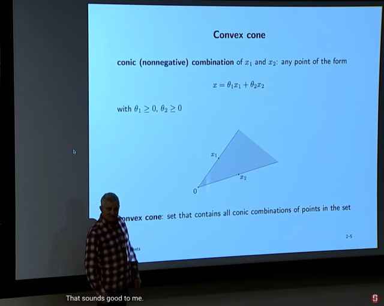</kbd></p>

> [!NOTE]
> Ta qua tiếp khái niệm **CONVEX CONE**: 
>
> Được định nghĩa là, giả sử có hai vector x1, x2 thì xét với mọi `θ1,` `θ2` KHÔNG ÂM, tạo nên linear combination của x1, x2: `θ1x1` + `θ2x2` sẽ tạo ra **CONVEX CONE của x1, x2.**
>
> ```text
> {y = θ1x1 + θ2x2, ∀θ1, θ2 ≥ 0}
> ```
>
> ```text
> Nói rõ hơn chút: Với một bộ cụ thể θ1, θ2 không âm, thì θ1x1 + θ2x2 gọi là conic combination. Thì tập hợp chứa mọi conic combination như vậy sẽ tạo thành convex cone của x1, x2.
> ```
>
> Lưu ý là **vector 0 CÓ nằm trong convex cone**, vì theo định nghĩa **chỉ yêu cầu các `θ` không âm**, nên khi cả hai đều bằng 0 thì vẫn ok, và do đó CONVEX CONE CÓ CHỨA ZERO
>
> Còn **CONVEX SET** của x1, x2 thì các **coefficient phải CÓ TỔNG BẰNG 1.** 
>
> Sẽ tạo một đoạn thẳng nối x1, x2 có thể không chứa 0 nếu như x1, x2 độc lập tuyến tính (vì khi đó không thể linearly combine x1, x2 thành 0 với một bộ hệ số khác 0 được). Nhưng nếu x1, x2 phụ thuộc tuyến tính thì convex set của x1, x2 vẫn chứa 0 vì vẫn tồn tại `αx1` + (1 - `α)x2` `=` 0.
>
> Còn tại sao **CONVEX CONE lại không cần coefficients có tổng bằng 1** đơn giản là vì định nghĩa nó vậy
>
> CONVEX CONE

> [!TIP]
> **🤖 AI Feedback** — ✅ Score: **95/100**
>
> Bạn đã nắm vững khái niệm Convex Cone một cách rất chính xác và sâu sắc, thể hiện qua việc đưa ra các so sánh và giải thích chi tiết.

<br>

<p align="center"><kbd>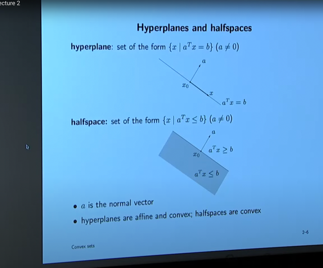</kbd></p>

> [!NOTE]
> Tiếp theo ta có khái niệm **HYPER-PLANE**
>
> Định nghĩa của nó là tập hợp các điểm x thỏa **aTx `=` b** tức là x là solution của single non-zero linear equation aTx `=` b.

<br>

<p align="center"><kbd>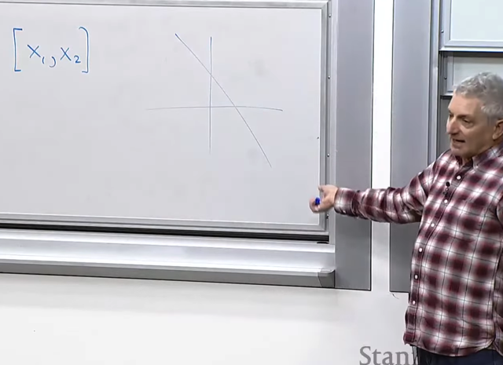</kbd></p>

> [!NOTE]
> Trong 2D space thì nó sẽ có dạng là một đường thẳng như vầy.

<br>

<p align="center"><kbd>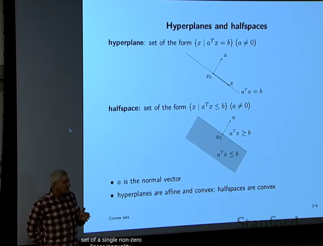</kbd></p>

> [!NOTE]
> Và ta có khái niệm HALF-SPACES: set các vector x thõa aTx ≤ b
>
> Chính là solution của một non-zero linear inequality (bất phương trình tuyến tính)
>
> Và đại khái là ta cũng biết, phương trình aTx `=` b sẽ chia mặt phẳng ra làm hai phần: Phía trên là nơi aTx > b và phía dưới là aTx < b
>
> Thì HALF-SPACES có thể coi là nửa mặt phẳng phía dưới, cộng với bản thân đường thẳng.
>
> Gs cho biết vector a, trong giải tích ta đã học gọi là NORMAL VECTOR thì ở đây ta gọi nó là OUTER NORMAL (normal nghĩa là vuông góc với hyperplane, và outer ý là nó hướng ra ngoài half-space)
>
> Thế thì đây là những loại convex set: hyperplanes là affine, và half-space là convex set

<br>

<p align="center"><kbd>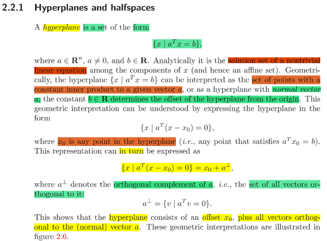</kbd></p>

<p align="center"><kbd>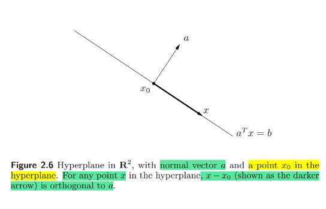</kbd></p>

<p align="center"><kbd>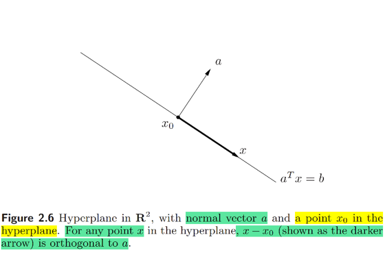</kbd></p>

> [!NOTE]
> Định nghĩa về Hyperplane thật ra không đơn giản chút nào.
>
> Nó là một set (tập) có dạng **{x | aTx `=` b}** với a là R^n vector khác 0 và b là scalar
>
> x thỏa aTx `=` b có thể **hiểu theo cách thứ nhất**: vector x, sao cho** các component của nó thỏa hệ phương trình a1x1 + a2x2 + `..=` b.** Nên {x: aTx `=` b} có thể hiểu là **tập các solution của phương trình này.**
>
> Và dễ thấy ta có thể hiểu nó theo cách thứ hai là **tập các vector x sao cho dot product với a đều bằng b**
>
> Ngoài ra một cách hiểu quan trọng nữa của hyperplane: Cho rằng **x0 là một điểm thuộc tập này: Ta sẽ có aTx0 `=` b**
>
> Từ đó với mọi x thuộc {x | aTx `=` b} thì ta có: aTx `=` b. 
>
> ⇔ aTx `=` aTx0 
>
> ⇔ aT(x-x0) `=` 0
>
> Như vậy set **{x | aTx `=` b} `=` {x: aT(x-x0) `=` 0}** giúp ta có **cách hiểu thứ 3** về hyperplane {x | aTx `=` b} đó là:
>
> Tập **mọi điểm x sao cho (x - x0) vuông góc với vector a**:
>
> Và do đó có thể thể hiện theo {x | x - x0 `=` a⊥} `=` {x: x `=` x0 + a⊥}
>
> Với a⊥ là vector orthogonal complement, tức tập mọi vector vuông góc với a.
>
> Như vậy: theo cách hiểu này ta thấy như sau:
>
> Có thể xem aT là một 1-row matrix A (matrix chỉ có một hàng) là **rank 1 matrix**. Với **1 cột pivot và n - 1 cột tự do **
>
> Do đó, hệ aTx `=` b, hay Ax `=` b sẽ **có vô số nghiệm có dạng xc + xnull** với: 
>
> **xc ở đây chính là x0** - một non-zero vector thỏa Ax `=` b (vì **aTx0 `=` Ax0 `=` b**), và 
>
> **xnull là vector trong nullspace của A**
>
> Mà ta cũng đã biết Rank-Nullity theorem nói rằng **nullspace và rowspace orthogonal complement** nhau. Do đó, **mọi vector trong nullspace của A đều vuông góc với row của A, chính là vuông góc với a** 
>
> ⇨ `x_null` `=` a⊥ 
>
> Nhờ vậy mà ta hiểu rằng hyperplane x: aTx `=` b chính là **tập hợp mọi kết hợp giữa x0 và các nullspace vector của A (A là rank 1 matrix aT)**.
>
> (Chú ý không phải là nói hyperplane là nullspace của A, vì điều này chỉ đúng khi x0 cũng thuộc nullspace, tức Ax0 `=` 0 với x0 khác 0 tức là chỉ đúng khi b `=` 0. 
>
> Nên nếu ta có hyperplane {x| aTx `=` 0}, thì đây là hyperplane mà bản chất chính là nullspace của A `=` aT}

> [!TIP]
> **🤖 AI Feedback** — ✅ Score: **95/100**
>
> Bài làm xuất sắc, thể hiện sự hiểu biết sâu sắc và khả năng tích hợp nhuần nhuyễn các khái niệm đại số tuyến tính vào định nghĩa hyperplane. Độ sâu phân tích vượt trội so với tài liệu cung cấp, tuy nhiên cần lưu ý cách sử dụng ký hiệu tập hợp `{x | x - x0 = a⊥}` có thể diễn đạt chính xác hơn.

<br>

<p align="center"><kbd>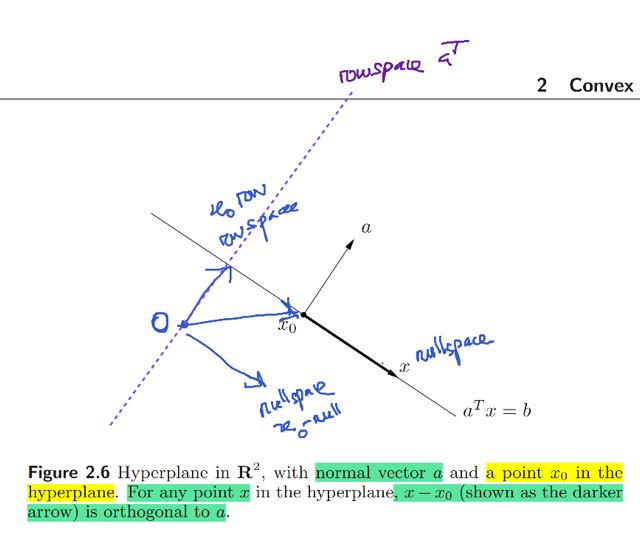</kbd></p>

> [!NOTE]
> ```text
> Có thể thấy x0 là combine của một nullspace vector và một rowspace (của A = aT) vector. Còn x - x0 chắc chắn là nullspace vector (vì aT(x - x0) = aTx - aTx0 = b - b = 0
> ```
>
> Rồi hãy nhìn x0: Nó thỏa aTx `=` b: aTx0 `=` b, nếu ta tách nó thành một nullspace vector x0_null và một rowspace vector x0_row ta có: 
>
> aT(x0_null + x0_row) `=` b ⇔ aTx0_null + aTx0_row `=` b
>
> ⇔ 0 + aTx0_row `=` b 
>
> Mà x0_row dĩ nhiên nằm trong rowspace ⇨ là linear combination của a: x0_row `=` `αa`
>
> ```text
> ⇨ aT αa = b ⇔ α = b / aTa ⇨ x0_row = (b/aTa)a
> ```
>
> ```text
> ||x0_row||^2 = x0_rowTx0_row = [(b/aTa)a]T[(b/aTa)a]
> ```
>
> ```text
> = (b/aTa)aT(b/aTa)a = [b^2/(aTa)^2] (aTa) = b^2/aTa
> ```
>
> Mà norm của x0_row có thể thấy chính là khoảng cách từ gốc 0 đến hyperplane {x: aTx `=` b} ⇨ `b^2/aTa` chính là khoảng cách này.
>
> `====`
>
> Có thể lập luận theo cách khác: Chiếu x0 lên rowspace, tức (vector a):
>
> Hình chiếu của x0 lên span{a}: `αa`
>
> Phần dư x0 - `αa` sẽ vuông góc với a, nên ta có `aT(x0-aα)` `=` 0
>
> ```text
> aT(x0-aα) = 0 ⇔ aTx0 = aTa α ⇨ α = aTx0 / aTa = b / aTa
> ```
>
> ```text
> ⇨ ||aα||^2 = || α^2 aTa = [b^2 / (aTa)^2] aTa = b^2 / aTa
> ```
>
> Vậy có thể thấy khi normalize vector normal thì |b| chính là khoảng cách từ gốc đến hyperplane x: aTx `=` b
>
> Hay nói cách khác nếu aTa `=` 1 thì b là khoảng cách từ gốc đến hyperplane.
>
> Trong sách này ta đã biết bài toán distance từ gốc tọa độ đến hyperplane chính là một bài toán optimization như sau:
>
> d(0, H) `=` minimize x ∈ H {||x||} với H `=` {x | aTx `=` b}
>
> Nghĩa là, tìm điểm trên hyperplane H sao cho norm của nó nhỏ nhất, thì cái norm nhỏ nhất đó chính là định nghĩa của distance giữa gốc 0 và hyperplane H
>
> Thử giải bài này theo calculus:
>
> Bài toán equivalent với minimize x ∈ H {xTx} subject to aTx `=` b
>
> ```text
> L = xTx + α(aTx - b) = xTx + αaTx - αb
> ```
>
> ```text
> ∇L = (x+dx)T(x+dx) + αaT(x+dx) - αb - xTx - αaTx + αb
> ```
>
> ```text
> = xTx+dxTx + xTdx+dxTdx + αaTx + αaTdx - xTx - αaTx
> ```
>
> ```text
> = 2xTdx + αaTdx = (2xT + αaT)dx
> ```
>
> ⇨ ∇L `=` 2x + `αa` 
>
> Optimality condition ∇L `=` 2x + `αa` `=` 0 
>
> ```text
> ⇔ x = - αa / 2 (tức solution là x* = - αa / 2)
> ```
>
> ```text
> Dùng aTx = b, thay x = - αa / 2 vào ta có:
> ```
>
> aTx `=` b 
>
> ⇔ aT(- `αa` `/` 2) `=` b
>
> ⇔ `α` aTa `=` -2b 
>
> ⇔ `α` `=` -2b `/` aTa
>
> ```text
> Thay α vào x* = -αa / 2 = -α a/2
> ```
>
> ```text
> x* = -(-2b / aTa) a/2 = (b/aTa)a
> ```
>
> ```text
> Và f(x*), tức x*Tx* sẽ là = [(b/aTa)a]T[(b/aTa)a] = (b/aTa)^2 aTa
> ```
>
> `=` b^2 `/` aTa
>
> ```text
> ⇨ Như vậy khi x* x* = -αa / 2 thì f(x*) = x*Tx* nhỏ nhất, = b^2 / aTa.
> ```
>
> Và đây, như đã nói, là bài toán tìm distance giữa gốc tọa độ với hyperplane
>
> Kết qủa này confirm ý trên

> [!TIP]
> **🤖 AI Feedback** — ✅ Score: **98/100**
>
> Phân tích của bạn rất sâu sắc và chính xác, giải thích rõ ràng mối quan hệ giữa không gian null, không gian dòng và siêu phẳng. Bạn cũng đã xuất sắc chứng minh công thức khoảng cách từ gốc tọa độ đến siêu phẳng bằng cả phương pháp hình học và tối ưu hóa.

<br>

<p align="center"><kbd>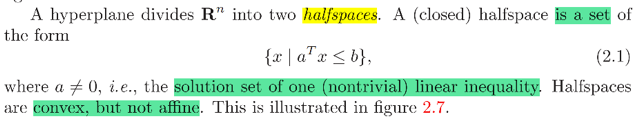</kbd></p>

<p align="center"><kbd>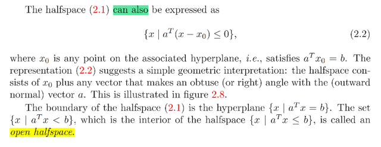</kbd></p>

<p align="center"><kbd>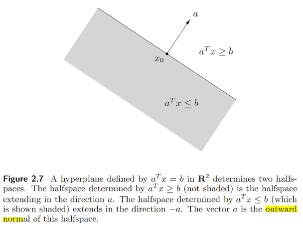</kbd></p>

<p align="center"><kbd>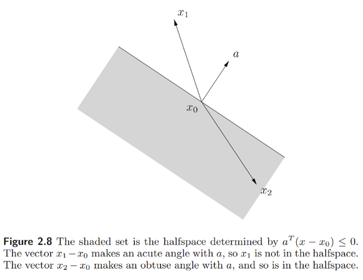</kbd></p>

> [!NOTE]
> Half space thì là set có dạng **{x | aTx ≤ b}**
>
> Cách thể hiện này cho thấy **góc nhìn thứ nhất** nó là **solution set của bất phương trình aTx ≤ b**
>
> Ngoài ra, với **x0 thuộc hyperplane {x: aTx `=` b}** ta có **aTx0 `=` b**
>
> ⇨ aTx ≤ b ⇔ aTx ≤ aTx0 ⇔ **aT(x-x0) ≤ 0**
>
> Từ đó {x | aTx ≤ b} có thể thể hiện bởi **{x | aT(x - x0) ≤ 0}**
>
> Cách thể hiện này mang đến **một góc nhìn thứ hai** về half-space:
>
> ```text
> Va biết uTv = ||u||||v|| cos θ(u,v) nên uTv ≤ 0 ⇔ cos θ ≤ 0 và điều này tương đương θ là góc tù (obstute / ngược với acute góc nhọn)
> ```
>
> Vậy {x | aT(x - x0) ≤ 0} mang ý nghĩa là: 
>
> **Tập những điểm x sao cho vector x - x0 hợp với a một góc tù**.
>
> Mà như vậy thì có nghĩa là **khi vẽ halfspace là phần màu xám thì vector a sẽ HƯỚNG
> RA khỏi đó**. 
>
> Nên nhớ vector x - x0 sẽ có chiều đi từ x0 đến x. Nên hình ảnh sẽ là** từ x0 đi đến mọi điểm trong halfspace sẽ đều là đi theo hướng hợp với a góc tù**
>
> Vài câu hỏi:
>
> Tại sao hyperplane {x: aTx `=` b} lại chia không gian thành hai halfspace mà một bên là {x: aTx < b} và một bên là {x: aTx > b}
>
> Đầu tiên, **tại sao {x: aTx `=` b} lại là một hyperplane**, (ví dụ trong 2D space aTx `=` b lại là đường thẳng?): 
>
> Đó là vì aTx `=` b ⇔ a1x1 + a2x2 `=` b, và cái này **thể hiện một quan hệ tuyến tính giữa x1 và x2**. (Kiểu như ta có hàm tuyến tính x1 theo x2 và ngược lại: x1 `=` `-(a2/a1)x2` + b và x2 `=` `-(a1/a2)x1` + b, từ đó sẽ vẽ nên đường thẳng)
>
> Nói cách khác, **aTx `=` b, là một ràng buộc constraint**, mà **phản ánh quan hệ tuyến tính của các biến**. 
>
> Hoặc thể hiện theo cách khác: **{x: aT(x-x0) `=` 0}** cho thấy ý nghĩa của hyperplane là **tập các điểm mà vector x - x0 luôn vuông góc với a**. 
>
> Vậy rõ ràng điều này thể hiện rằng các vector này sẽ tạo nên đường thẳng, vuông góc với a thì cũng là cho thấy chúng phải là đường thẳng vì không thể có đường cong mà mọi vector x - x0 đều vuông góc với a được.
>
> Thế thì xét mọi điểm x ở một bên (xám), thì khi di chuyển trên hyperplane góc giữa x - x0 và a luôn là 90 độ, thì khi x ở bên xám, x - x0 sẽ hợp với a góc tù, nên cos `θ(a,` x - x0) sẽ âm
>
> Do đó (x-x0)Ta `=` ||x - x0||||a|| cos `θ` sẽ ≤ 0. Điều này tương đương:
>
> (x-x0)Ta ⇔ aTx ≤ x0Ta ⇔ aTx ≤  b
>
> Điều này cho thấy mọi điểm ở bên xám đều thỏa aTx ≤ b nên ta có thể định nghĩa nó là {x: aTx ≤ b}
>
> Ngược lại, mọi điểm ở một bên còn lại, sẽ đều tạo x - x0 hợp với a góc nhọn. Do đó cos `θ(a,` x - x0) luôn > 0
>
> ⇨ ||a||||x - x0|| cos `θ` > 0 (vì hai thừa số kia không âm)
>
> Do đó ta có mọi điểm bên còn lại này đều thỏa aT(x - x0) > 0 
>
> ⇔ aTx ≥ aTx0
>
> ⇔ aTx ≥ b. 
>
> Do đó ta có thể định nghĩa halfplane còn lại là {x: aTx > b}

> [!TIP]
> **🤖 AI Feedback** — ⚠️ Score: **85/100**
>
> Bài phân tích thể hiện sự hiểu biết rất sâu sắc về khái niệm halfspace, từ định nghĩa đại số đến diễn giải hình học qua góc giữa các vector. Các bước suy luận logic, chặt chẽ, và việc tự đặt câu hỏi để đào sâu kiến thức là điểm cộng lớn. Tuy nhiên, cần lưu ý một số điểm để đạt được độ chính xác tuyệt đối: có lỗi chính tả nhỏ ('obstute'), đôi khi dùng 'halfplane' thay vì 'halfspace'. Quan trọng hơn, cần phân biệt rõ ràng giữa halfspace mở ({x: aTx > b}) và halfspace đóng ({x: aTx >= b}) khi tham chiếu đến các hình vẽ và định nghĩa trong văn bản gốc. Hình 2.7 cho thấy hai halfspace đóng là {x: aTx <= b} và {x: aTx >= b}. Việc kết luận bên còn lại là {x: aTx > b} chưa hoàn toàn khớp với cách phân chia hai halfspace đóng được thể hiện.

<br>

<p align="center"><kbd>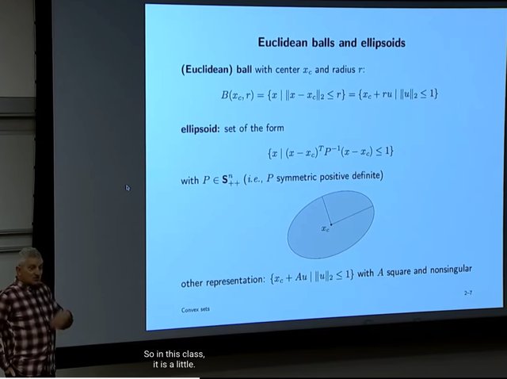</kbd></p>

> [!NOTE]
> Tiếp theo là khái niệm **EUCLIDEAN BALLS**, được định nghĩa là **tập hợp các vector x sao cho L2 distance của nó tới `x_c` (center) nhỏ hơn hoặc bằng r**. Với r là radius.
>
> Kí hiệu của Balls là: B(xc, r) `=` {x | ||x - `x_c||` ≤ r}
>
> Tiếp theo là **EUCLIDEAN ELLIPSOIDS**. 
>
> Được định nghĩa là **tập hợp các vector x sao cho (x - `x_c)T` Pinv (x - `x_c)` ≤ 1**
>
> Gs nói ta có thể nhận ra (x - `x_c)T` Pinv (x - `x_c)` gọi là **quadratic form** 
>
> Có thể hiểu điều này, giống như trong 1806 ta có xTAx, và nếu ta có A là symmetric positive definite, thì xTAx sẽ luôn dương với mọi x khác 0, và chỉ bằng 0 khi x `=` 0.
>
> Gs nói thêm: P thuộc S^n ++ chính là nói P là POSITIVE DEFINITE  matrix. 
>
> (S^n là kí hiệu thể hiện symmetric matrix [n,n]) và ++ là thể hiện positive definite. (nếu chỉ có 1 dấu cộng) thì sẽ là positive semi-definite)
>
> Ngoài ra ta có thể thấy nếu P là I, thì định nghĩa này sẽ trở thành {x | ||x - xc|| ≤ r} và ellipsoids trở thành balls
>
> Ở lần review thứ 3 này có thể ghi thêm vài ý sau: Tại sao {x: (x - `x_c)T` Pinv (x - `x_c)}` ≤ 1} lại là ellipsoids:
>
> ```text
> Đặt y = x - x_c, thì đây chỉ là hành động dời trục tọa độ tịnh tiến về x_c. Có nghĩa là x, x_c là tọa độ của điểm M,N ban đầu thì y = x - x_c sẽ là tọa độ của nó trong hệ trục mới mà tâm đặt tại N = x_c.
> ```
>
> Pinv y chính là gì? Nhớ lại trong MIT806 đã học về change of basis matrix: Để chuyển tọa độ đang từ basis v's sang basis w's ta sẽ dùng matrix WinvV. Nói rõ hơn, hay ôn lại tí xíu: Nguyên tắc xây dựng matrix A đại diện cho linear transformation T(v) đó là: Chuẩn bị hai bộ basis của input và output space: v's và w's. Biến đổi (apply T lên) các basis v's. Và thể hiện kết quả theo output basis w's, thì hệ số của chúng sẽ là cột của A. Ví dụ T(v1) `=` a11 w1 + a12 w2 + ..., T(v2) `=` a21 w1 + a22 w2 + ...
>
> Thế thì xét Identity transformation: T(v) `=` v, có nghĩa là ko làm gì hết, chỉ đổi basis thôi.
> ```text
> Thì ta sẽ có T(v1) = v1 = a11 w1 + a12 w2 + ..., T(v2) = v2 = a21 w1 + a22 w2 + ....
> ```
> Đặt v1, v2 .. thành các cột của V, w1, w2 ..thành các cột của W thì cái trên chính là:
>
> V's collumn 1 `=` W [A's column 1]
>
> V's collumn 2 `=` W [A's column 2]
>
> ...
>
> ⇨ V `=` W A ⇔ A `=` Winv V
>
> Rồi, quay lại đây: y `=` x - `x_c` đang trong basis e's (standard basis) nên V chính là I, thì Pinv y chính là Pinv I y sẽ chuyển tọa độ sang basis p's (tức là các cột của P)
>
> Và do đó tập hợp các điểm y sao cho yT Pinv y ≤ 1: {y: yT Pinv y ≤ 1} thật ra chỉ là cái Ball bán kính 1 trong basis p's.
>
> Nhưng ta có thể nói thêm: Vì P là ma trận đối xứng, nên có thể phân tách nó thành: Q Λ QT
>
> ⇨ Pinv `=` (Q Λ QT)inv `=` Q Λinv QT (không khó hiểu, vì Qinv `=` QT)
>
> Với Q là orthogonal matrix các eigenvectors của P, Λ là diagonal matrix các eigenvalues của P, và Λinv là diagonal matrix các eigenvalue của Pinv, cũng là bằng nghịch đảo eigenvalue λ của P: `1/λ`
>
> ⇨ {y: yT Pinv y ≤ 1} `=` {y: yTQΛinvQTy ≤ 1}
>
> Phân tích cái này: QTy chính là Qinv y (QT `=` Qinv): Tương tự như trên, đậy chính là chuyển tọa độ từ basis e's sang eigenbasis của P (các cột của Q). Và hành động này chính là xoay hệ trục để cho nó trùng với các trục vuông góc `q_i.`
>
> Sau đó, ΛinvQTy sẽ chỉ là `{1/λ_1` × (QTy)_1, `1/λ_2` × (QTy)_2, `...1/λ_n` × (QTy)_n}, tức là nhân (stretch) các tọa độ của QTy bởi các factor là trị riêng tương ứng.
>
> Và cuối cùng Q(ΛQTy) chỉ đơn giản là chuyển các tọa độ về lại basis e's. Để rồi hành động
> này là xoay hệ trục về lại như cũ.
>
> Thế thì: nếu gọi u là QTy, thì {y: yTQTΛQy ≤ 1} chính là {u: uTΛu ≤ 1} 
>
> `=` {u: u1^2 `/` λ1 + u2^2 `/` λ2 + ... ≤ 1} 
>
> Còn nhớ phương trình ellipse: `x^2/a^2` + `y^2/b^2` `=` 1)
>
> Nên cái này giúp ta hiểu {u: u1^2 `/` λ1 + u2^2 `/` λ2 + ... ≤ 1} chính là dạng của ellipsoid:
>
> Trong 2D thì nó chính là cái hình elipse mà trục của nó thẳng trục với eigenvector cuả P 
>
> ```text
> Và một điểm cũng quan trọng: Với hình ellipse x^2/a^2 + y^2/b^2 = 1 thì a mà càng lớn thì cái hình ellipse sẽ càng bị kéo dài ở cái phương x. Và nói chung là tỉ lệ a/b càng lớn thì cái hình elipse nó sẽ càng bị bẹp.
> ```
>
> Điều này cũng đúng khi khái quát lên.
>
> Từ đó ta mới hiểu một điều: tỉ lệ giữa λmax(P) và λmin(P) càng lớn thì cái hình ellipse càng dẹt. Và tỉ lệ này thì chính là condition number κ(P).
>
> `====`
>
> Ôn 1806 chút xíu
>
> Ta có thể dùng diagonalization để liên hệ việc một symmetric positive definite matrix có quadratic form có tính chất như trên với tính chất khác là **positive definite matrix sẽ có mọi eigenvalue đều dương **như sau:
>
> ```text
> xTAx = xT(QΛQT)x = xTQΛQTx = yTΛy = Σ λi*yi^2 với yi là các components của y = QTx. Và λi là các eigenvalues của A.
> ```
>
> Thế thì, vì với positive definite matrix A, mọi eigenvalues của nó đều dương.
>
> Đương nhiên ta thấy kết quả trên (quadratic form xTAx) luôn dương
>
> Và chỉ bằng 0 khi y `=` Qx `=` 0. Thế mà, Q là orthogonal matrix đương nhiên là full-rank, nên nullspace của nó chỉ có 0. Vậy Qx chỉ bằng 0 khi x `=` 0.
>
> Ở chiều ngược lại, nếu quadratic form luôn dương với x khác 0, ta suy ra mọi eigenvalues đều dương:
>
> ```text
> xTAx > 0 với mọi x khác 0. Thì điều này dĩ nhiên cũng đúng với mọi eigenvector q_i của A: ta có q_i T A q_i > 0 với mọi eigenvector q_i
> ```
>
> ```text
> ⇔ q_i λ_i q_i > 0 ⇔ λ_i q_i T q_i = λ_i ||q_i|| > 0 ⇨ λ_i > 0 với mọi λ_i
> ```
>
> Hoàn toàn tương tự, nếu quadratic form có thể bằng 0 với x khác 0, nó sẽ tương ứng với việc eigenvalue có thể bằng 0. Khi đó ta có positive semi definite

> [!TIP]
> **🤖 AI Feedback** — ⚠️ Score: **88/100**
>
> Bài phân tích thể hiện sự hiểu biết sâu sắc và khả năng kết nối xuất sắc với các khái niệm đại số tuyến tính như dạng toàn phương, giá trị riêng, vector riêng và số điều kiện, giải thích rõ ràng bản chất của ellipsoid. Tuy nhiên, bài viết chưa đề cập đến các biểu diễn thay thế của hình cầu (`{xc + ru | ||u||_2 <= 1}`) và hình elip (`{xc + Au | ||u||_2 <= 1}`) được trình bày rõ ràng trên slide.

> [!IMPORTANT]
> **🎤 Review Session 1** — Score: **25/100**
>
> Sinh viên đã nhầm lẫn nghiêm trọng giữa "Euclidean balls" và "Euclidean ellipsoids", thậm chí còn tự tạo ra một thuật ngữ không tồn tại ("quả banh Elip"). Mặc dù có thể nhớ được một phần định nghĩa của quả cầu, nhưng sinh viên đã hoàn toàn bỏ sót hoặc không hiểu khái niệm chính về hình elipxoit.

<br>

<p align="center"><kbd></kbd></p>

> [!NOTE]
> Q: Tại **sao không dùng P mà dùng Pinv** (trong định nghĩa của ellipsoid)
>
> Gs cho rằng là bởi **dùng cái nào cũng được**, vì với **symmetric positive definite matrix thì inverse của nó cũng là symmetric positive definite matrix** 
>
> Và chỉ là đôi khi người ta **thấy tiện hơn khi dùng Pinv.**
>
> Suy nghĩ chút xíu: Ta có thể hiểu **tại sao nếu P positive definite** (nhắc lại gs Strang đã nói positive definite thì đương nhiên hiểu là symmetric) thì Pinv cũng vậy.
>
> Là vì, ta biết, nếu A invertible thì nếu λ là eigenvalue của A, thì `1/λ` sẽ là eigenvalue của Ainv với cùng một eigenvector. Chứng minh nhanh:
>
> λ là eigenvector của A, nên Ax `=` λx. Vì A invertible, nên nhân hai vế cho Ainv: 
>
> ```text
> AinvAx = Ainvλx  <=> x = Ainvλx <=> Ainvx = x/λ => chứng minh xong.
> ```
>
> Vậy nếu A positive definite thì mọi eigenvalue λ đều dương, nên `1/λ` cũng đều dương `=>` Ainv cũng là positive definite.

> [!TIP]
> **🤖 AI Feedback** — ✅ Score: **95/100**
>
> Lý luận toán học rất chính xác và chứng minh về việc ma trận đối xứng xác định dương có ma trận nghịch đảo cũng xác định dương là rõ ràng và đúng đắn. Bài ghi thể hiện sự nắm vững các tính chất cơ bản liên quan đến tối ưu lồi.

<br>

<p align="center"><kbd>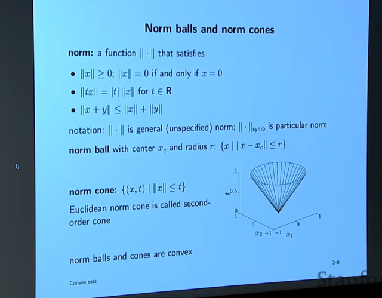</kbd></p>

> [!NOTE]
> Tiếp theo ta sẽ gặp lại khái niệm norm. Gs cho biết đại khái là** norm là định nghĩa của bất cứ function nào thỏa mãn các tính chất** như 
>
> 1) Luôn dương với x khác 0, chỉ bằng 0 khi x `=` 0
>
> 2) ||tx|| `=` |t|*||x|| t ∈ R
>
> 3) ||x + y|| `<=` ||x|| + ||y|| (triangular inequality)

<br>

<p align="center"><kbd>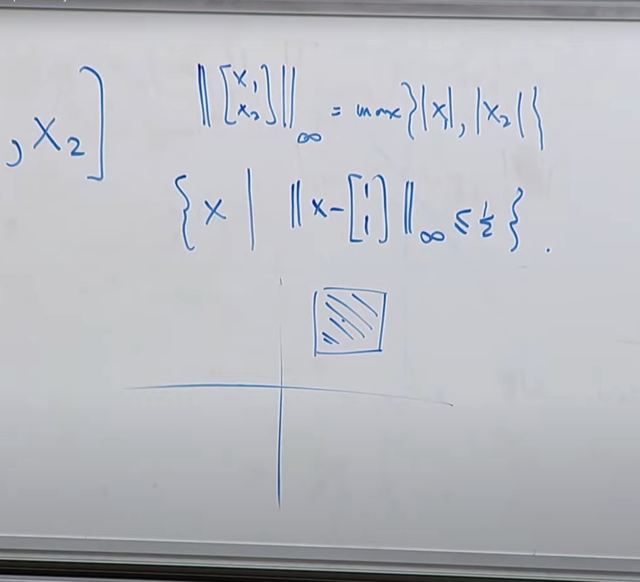</kbd></p>

> [!NOTE]
> Gs nói thêm, với L-infinity norm
>
> Giống như L2 norm thì kí hiệu là ||x||2 
>
> Thì kí hiệu ||x||inf, được định nghĩa là** giá trị lớn nhất trong các trị tuyệt đối của x's component.**
>
> ||[x1, x2]||inf `=` max {|x1|, |x2|}
>
> Khi đó ta thấy {x | ||x-(1,1)||inf ≤ `1/2}` thì đó được gọi là
>
> **L-INFINITY NORM BALL**
>
> Và ý nghĩa là **tập mọi vector x sao cho khoảng cách của nó đến tâm (1,1) theo phương x hay y đều không vượt quá 1/2**
>
> Ngẫm một chút ta sẽ thấy hình ảnh của nó chính là hình vuông kích
> thước 1x1 tại tâm là (1,1) này

<br>

<p align="center"><kbd></kbd></p>

> [!NOTE]
> Tiếp, đại khái gs nói là n**hiều lúc ta nói về R^2, nhưng thực ra ta thêm một chiều nữa để thành R3.**
>
> Ví dụ như khi ta nói về function f(x, y) thì để vẽ graph của hàm f ta sẽ
> vẽ nó trong R3, để một điểm sẽ có tọa độ là [x, y, f(x, y)]

<br>

<p align="center"><kbd>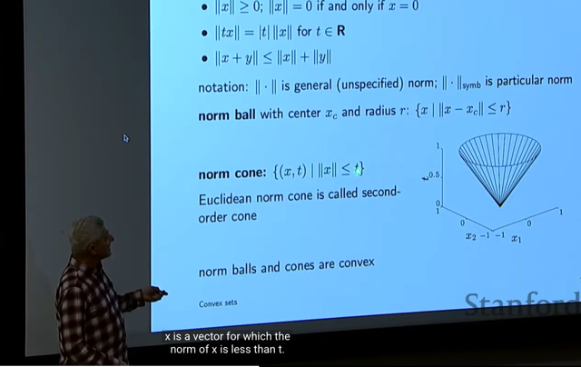</kbd></p>

> [!NOTE]
> Ta có khái niệm **NORM CONE** `/` **LORENTZIAN CONE **
>
> Tại sao cái hình cái nón ngược này lại là đồ thị của {(x, t) | ||x|| ≤ t} 
>
> Để ý ta có plane x1,x2 và trục đứng t.
>
> Thế thì khi t nhỏ ví dụ `=` 1 định nghĩa {(x,t) | ||x|| ≤ t} sẽ có ý nghĩa tập hợp các điểm (vector) x sao cho:
>
> ||x|| ≤ 1 ⇔ sqrt(x1^2 + x2^2) ≤ 1 ⇔ x1^2 + x2^2 ≤ 1
>
> Thế thì tập hợp này là thành một dĩa tròn bán kính 1, đương nhiên nếu thể hiện thêm sự thật rằng những điểm này có t `=` 1 nữa, thì ta sẽ có một **cái dĩa bán kính 1 tại độ cao t trong hệ trục x1,x2,t.**
>
> Thế thì **khi t lên cao thì dĩa tròn sqrt(x1^2 +x2^2) ≤ t sẽ mở rộng** và khi t nhỏ lại thì dĩa tròn cũng nhỏ lại. Từ đó ta hiểu rằng tập hợp {(x,t) | ||x|| ≤ t} với mọi t sẽ tạo ra một cái dạng hình nón như vậy.
>
> Gs cho biết, nó cũng có tên gọi là SECOND-ORDER CONE hay
> LORENTZIAN CONE

<br>

<p align="center"><kbd>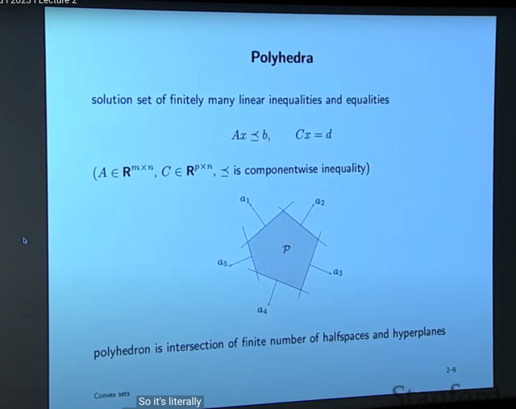</kbd></p>

> [!NOTE]
> Tiếp, ta qua một loại convex set nữa gọi là **POLYHEDRA**. Đại khái là thể hiện bằng **Ax ⪯ b** có nghĩa là, **các component của vector Ax sẽ đều nhỏ hơn hoặc bằng component tương ứng của vector b**
>
> Ax ⪯ b: Đọc là "**Ax is less or equal to b ELEMENT-WISE**"
>
> Thế thì, ta biết **Ax `=` b là system of linear equations**, thì Ax ⪯ b chính là thể hiện **system of linear inequalities.** 
>
> Về mặt hình học, mỗi bất phương trình, ví dụ a1Tx ≤ b1 (a1 là row 1 của A, b1 là component 1 của b) thì ta biết **a1 sẽ là normal vector của line a1Tx `=` b1**, và **a1Tx ≤ b1 sẽ biểu diễn phần nửa mặt phẳng (half-plane) ở bên dưới** (ngược lại hướng với vector a1). Tương tự như vậy với a2Tx ≤ b2,..
>
> Để rồi **Ax ⪯ b sẽ thể hiện phần intersection giữa tất cả các half-plane này**. Và nó tạo ra POLYHEDRA
>
> POLYHEDRA

<br>

<p align="center"><kbd>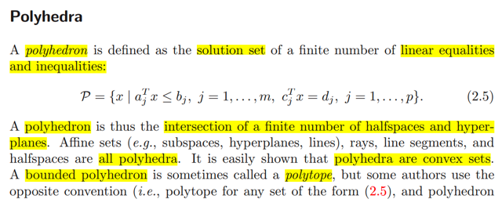</kbd></p>

> [!NOTE]
> Đọc sách về POLYHEDRA, theo định nghĩa là:
>
> ```text
> P = {x | ajTx ≤ bj, j = 1,2....m, cjTx = dj, j = 1,...p}
> ```
>
> Dễ thấy theo đó thì Polyhedra là **tập hợp nghiệm của hệ hữu hạn các bất phương trình và phương trình tuyến tính**.
>
> Mà như đã biết (tập nghiệm của) phương trình tuyến tính thì thể hiện theo hình học tạo nên hyperplanes còn của bất phương trình tuyến tính thì tạo nên các haft-space.
>
> Do đó **polyhedra theo hình học là phần giao (intersection) của các haft-space và hyperplane**
>
> Ở đây có nói một ý đáng suy nghĩ là **AFFINE SET ĐỀU LÀ POLYHEDRA**. Thử giải thích tại sao (→ quay lại sau)
>
> Và nó **cũng là convex set** (cũng thử lập luận xem tại sao sau)
>
> Cuối cùng, **POLYTOPE** là từ người ta dùng để chỉ **BOUNDED POLYHEDRA**
>
> Thử giải thích tại sao (quay lại sau):

<br>

<p align="center"><kbd>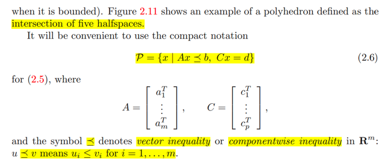</kbd></p>

<p align="center"><kbd>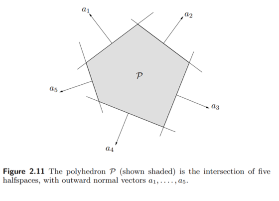</kbd></p>

> [!NOTE]
> Một ví dụ, có nhắc đến kí hiệu vector inequality (⪯, ≽)

<br>

<p align="center"><kbd>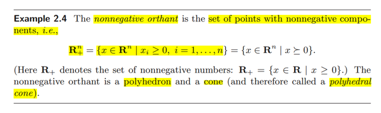</kbd></p>

> [!NOTE]
> Một ví dụ cho kí hiệu ≽ đó là, 
>
> {x ∈ R^n | xi ≥ 0 với `i=1,2....n}` 
>
> `=` {x ∈ R^n | x ≽ 0} 
>
> Tức là tập mọi vector mà mọi component đều không âm thì gọi là **NON-NEGATIVE ORTHANT**

<br>

<p align="center"><kbd>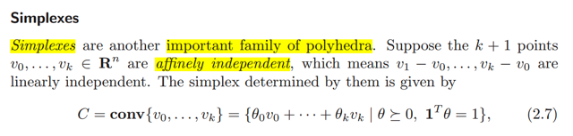</kbd></p>

<p align="center"><kbd>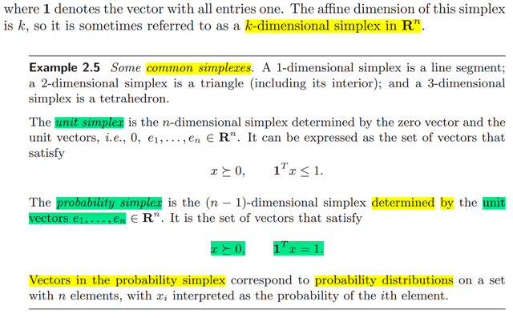</kbd></p>

> [!NOTE]
> Đây là cái trong bài gs ko nói. **SIMPLEXES** là một loại Polyhedra quan trọng.
>
> Định nghĩa hơi rắc rối, nhưng đại khái là ta có **k+1 vector v0, v1... vk**mà trong đó 
>
> **(v1 - v0), (v2 - v0)...(vk - v0) là linear independent**. 
>
> Và cái này gọi là **v0, v1, ...vk AFFINE INDEPENDENT.**
>
> Thì từ đám này ta có một SIMPLEXES: Chính là là **convex hull của tụi nó.**
>
> Mà convex hull thì đã biết theo định nghĩa là **tập mọi convex combination của chúng**. 
> (convex combination là khi các hệ số có **tổng bằng 1 và hệ số không âm**)
>
> `====`
>
> Thế thì **hai loại Simplexes phổ biến**: **UNIT SIMPLEX và PROBABILITY SIMPLEX**.
>
> Xét cái này trước: 
>
> PROBABILITY SIMPLEX sách nói rằng **đó là khi các vector v1, v2...vn là các unit vector e1, e2..en**. 
>
> Thế thì, **từ định nghĩa của simplexes `=` convex hull của e1, e2,...en**. Như vậy, các **vector trong simplexes này sẽ là các convex combination của e1, e2, ...en**
>
> ```text
> Xét một cái như vậy x = Σ θi ei (phải tự hiểu ei là vector θi là scalar nhé)
> ```
>
> Thì có thể chứng minh 1Tx `=` 1 không?
>
> ```text
> 1Tx = 1T(Σ θi ei) = 1T(Σ θi ei) = Σ (1Tθiei) = Σ θi(1Tei)
> ```
>
> Mà 1Tei `=` 1 do ei là unit vector có một chỗ bằng 1 , còn lại bằng 0.
>
> ```text
> => 1Tx = Σ θi
> ```
>
> `=` 1 (do `θ1,` `θ2` ... là hệ số của convex combination)
>
> Còn x ≽ 0 thì dễ thấy rồi.
>
> vậy nên ta có với **Probability Simplex thì 1Tx `=` 1 và x ≽ 0**

> [!TIP]
> **🤖 AI Feedback** — ❌ Score: **65/100**
>
> Bạn đã nắm vững các khái niệm cơ bản về simplex và chứng minh tốt các tính chất của probability simplex. Tuy nhiên, bạn đã bỏ sót hoàn toàn simplex đơn vị và thiếu thông tin quan trọng về số chiều của probability simplex, điều này làm giảm đáng kể độ chính xác và đầy đủ của phân tích.

<br>

<p align="center"><kbd>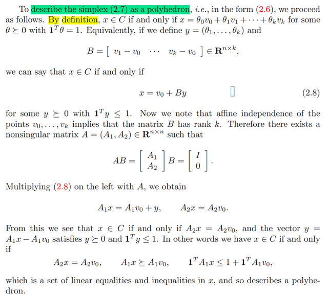</kbd></p>

> [!NOTE]
> Rồi cái này là giải thích **tại sao định nghĩa của SIMPLEX lại thật ra chính là POLYHEDRON**
>
> Tại sao nói x ∈ C ⇔ x `=` v0 + By
>
> By `=` `(v1-v0)θ1` + `...(vk-v0)θk` 
>
> ```text
> = v1θ1 + ...+ vkθk - v0θ1 ... - v0θk
> ```
>
> ```text
> = v1θ1 + ...+ vkθk - v0(θ1 ... + θk)
> ```
>
> `=` `v1θ1` + ...+ `vkθk` - v0*1
>
> `=` `v1θ1` + ...+ `vkθk` - v0
>
> ```text
> => v0 + By = v1θ1 + ...+ vkθk = Σi viθi = x
> ```
>
> Tiếp vì v0, v1, ...vk AFFINE independent mà định nghĩa là (vi - v0) i `=` 1,2..k là LINEAR independent. Vậy các cột của B linear independent 
>
> `=>` B FULL COLUMN RANK với rank `=` k
>
> Rồi, người ta nói vì B có rank k nên tồn tại A `=` [A1, A2]T sao cho AB `=` [I, 0]T là sao (hay vì sao)
>
> Đầu tiên AB `=` C thì row i'th của C là linear combination của rows của B với coefficient sets là row i'th của A, nếu gọi aiT là row thứ i'th của A thì aiTB `=` ciT
>
> Hoặc BTai `=` ci
>
> Thế thì B full column rank, tức các columns của nó independent, nhưng các row của nó thì không, chứng tỏ tồn tại coefficients khiến combines rows của B thành 0. Và đó là những nonzero vector của left nullspace của B: N(BT)
>
> Nên từ đây có thể hiểu A2 chính là matrix mà các rows là left-nullspace vector  của B.
>
> Còn A1? Vì A1B `=` I, nên A1 chính là left inverse (tồn tại khi B full column rank) của B.
>
> Và từ đây cũng cho biết A2 sẽ có số hàng là dimension của left nullspace N(BT)  cũng đúng bằng số dependent row của B `=` n - k. `=>` A2 có shape (n-k, n)
>
> Còn A1 có shape (k,n).
>
> Rồi x ∈ C `<=>` x `=` v0 + By 
>
> `<=>` Ax `=` A(v0 + By) | nhân hai vế cho A
>
> `<=>` A1x `=` A1v0 + A1By và A2x `=` A2v0 + A2By
>
> `<=>` A1x `=` A1v0 + y và A2x `=` A2v0 (1)
>
> Dùng các điều kiện ban đầu là y ≽ 0 và 1Ty `<=` 1 ta có
>
> (1) `<=>` A1x ≽ A1v0 và 1T(A1x - A1v0) `<=` 1

<br>

<p align="center"><kbd>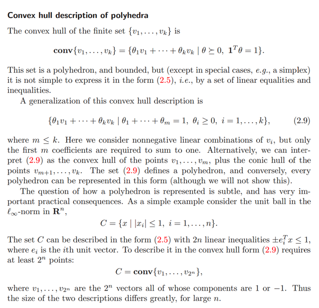</kbd></p>

<br>

<p align="center"><kbd>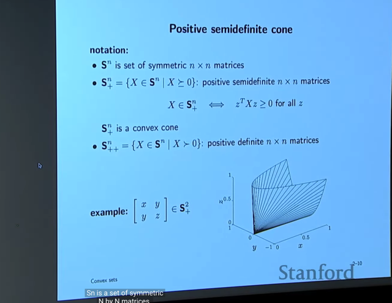</kbd></p>

> [!NOTE]
> Tiếp theo là POSITIVE SEMIDEFINITE CONE (PSD CONE) Ta gặp lại kí hiệu về  set các positive semi definite S^n + `=` X thuộc S^n (tập hợp các symmetric matrix) | X ≽ 0
>
> Với matrix thì không đọc larger or equal element wise mà đọc X ≽ 0 là: 
>
> "X is greater or equal to zero IN LOEWNER ORDER"
>
> Gs nói rằng với vector ⪯, hay ≽ 0 mang ý nghĩa là component-wise in-equal nhưng với matrix, thì nó mang ý nghĩa là positive `/` negative semi definite.
>
> Và như đã biết ở 1806, với symmetric positive semi-definite thì quadratic form zTXz `>=` 0 với mọi z. (có thể bằng 0 khi z khác 0, matrix có eigenvalues không âm)
>
> Còn nếu có thêm dấu cộng S^n ++ thì ta có matrix positive definite.
>
> Gs cũng nói một điều ta đã biết từ 1806, ví dụ matrix [x y; y z], để nó trở thành positive semi definite, thì x, z phải dương và det phải dương. (ở đây nhắc lại lời gs Strang một chút, thật ra không cần z phải dương, vì x dương và det `=`  xz - y^2  dương đã imply z phải dương rồi)
>
>
>
> Nói chung là mình có thể nói thêm về cái chuyện là tại sao một cái ma trận mà xác định dương thì cái đường chéo nó phải không âm. Nó là điều kiện cần, chưa đủ nhưng mà nó là điều kiện cần. Bởi vì nếu mà là ma trận xác định dương thì cái dạng toàn phương của nó phải luôn dương với vector khác không. Do đó chỉ cần sử dụng cái vector chuẩn tức là vector vector cơ sở chuẩn thì mình sẽ thấy ngay á là nếu mà sử dụng vector cơ sở chuẩn thì cái dạng toàn phương của một cái ma trận nó sẽ ra cái phần tử trên đường chéo, dẫn đến là mình sẽ có cái điều kiện cần đó là những cái phần tử trên đường chéo của một cái ma trận phải dương.

> [!TIP]
> **🤖 AI Feedback** — ✅ Score: **97/100**
>
> Ghi chú thể hiện sự hiểu biết sâu sắc về khái niệm hình nón bán xác định dương, từ định nghĩa ký hiệu đến giải thích ý nghĩa của thứ tự Loewner và điều kiện cho ma trận 2x2. Mặc dù có một chút lẫn lộn ban đầu giữa điều kiện cho ma trận bán xác định dương và xác định dương trong ví dụ 2x2, phần tự hiệu chỉnh đã làm rõ vấn đề một cách xuất sắc.

<br>

<p align="center"><kbd>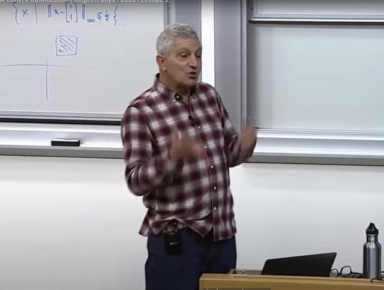</kbd></p>

> [!NOTE]
> Gs nói về calculus, đại khái ông nói là về cơ bản, trong calculus ta sẽ  học vài chục cái derivative của các basic function (như sin(x), cos(x), log(x)....) và áp dụng các rule như product rule, chain-rule, quotient-rule để từ đó có thể tính đạo hàm (take derivative) của mọi thứ

<br>

<p align="center"><kbd>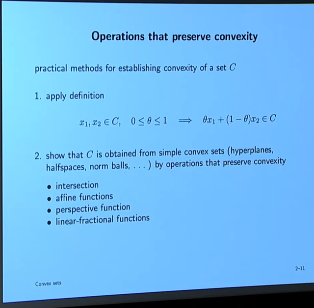</kbd></p>

> [!NOTE]
> Thế thì, đại khái là để trả lời câu hỏi **set C có convex hay không**.
>
> Theo gs đương nhiên có khi ta sẽ cần **dùng định nghĩa convexity**. 
>
> Đó là lấy x1, x2 thuộc C: Và một `θ` có giá trị từ 0 đến 1. Ta **cần lập luận để cho thấy `θx1` + `(1-θ)x2` (gọi là mixture hay convex combination của x1, x2) cũng thuộc C**.
>
> Tuy nhiên gs cho rằng **nên để cách tiếp cận này cuối cùng**.
>
> Mà các thông thường hơn đó là, ta sẽ **lấy set C, và represent nó dưới dạng một bunch các operation của các convex set mà ta đã biết như half-space, polyhedra....và các operation này có đặc tính là giữ nguyên tính convexity**

> [!TIP]
> **🤖 AI Feedback** — ❌ Score: **65/100**
>
> Bài làm đã nắm được hai phương pháp chính để xác định tính lồi của một tập hợp. Tuy nhiên, việc khẳng định phương pháp định nghĩa nên được để cuối cùng và phương pháp thứ hai thông thường hơn là không chính xác và không được hỗ trợ bởi nội dung slide.

<br>

<p align="center"><kbd>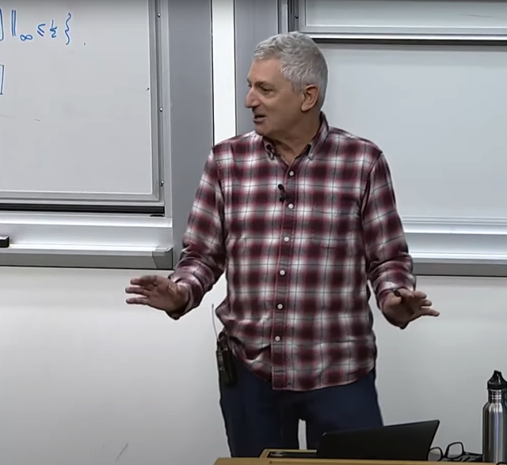</kbd></p>

> [!NOTE]
> Đại khái là gs nói về một phương pháp (để check tính convexity trong thực tế) kiểu như là ta viết một đoạn code để **generate hai điểm bất kì trong set C. Sau đó chọn một random `θ` từ 0 đến 1 để tính mixture của chúng. Và kiểm tra xem nó có còn trong set C hay không**.
>
> Ta sẽ chạy đoạn code và bỏ đi ăn trưa, đến khi quay lại nhìn vào kết quả thì chỉ cần tồn tại một violation (mixture ở bên ngoài C) thì lập tức ta có thể kết luận nó không convex.
>
> Tuy nhiên nếu không có violation thì dĩ nhiên là dù có chạy bao nhiêu lần cũng không đủ để kết luận là có convex. Đại khái là vậy

<br>

<p align="center"><kbd></kbd></p>

<br>

<p align="center"><kbd>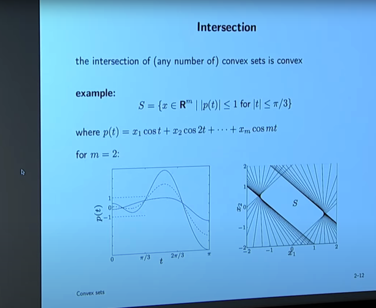</kbd></p>

> [!NOTE]
> Tiếp theo ta sẽ nói về **INTERSECTION**, ý là intersection của các convex set cũng là convex.
>
> ```text
> Ví dụ trong hình là thế này, S = {x ∈ R^m : |p(t)| <= 1 for |t| <= π/3}  trong đó p(t) = x1cos(t) + x2cos(2t) + ....xmcos(mt)
> ```
>
> Hiểu đại khái là, đây là **tập hợp (set) các vector x thuộc R^m sao cho khi tạo ra các function cụ thể p(t) thì chúng có đặc điểm là trong đoạn t ∈ `[-π/3,` `π/3]` thì |p(t)| luôn nhỏ hơn 1.**
>
> Lấy ví dụ với m `=` 2, tức x ∈ R^2, để rồi các function p(t) sẽ có dạng:
>
> p(t) `=` x1cos(t) + x2cos(2t) thì trong hình là hai function (ứng với hai vector x) thỏa điều kiện - có thể thấy giá trị của function khi t từ 0 đến `π/3` đều nằm trong [-1,1].
>
> Vậy thì, gs nói rằng, nếu phải chứng minh set trên là một convex set bằng định nghĩa, ta cũng có thể làm. Bằng cách lấy hai vector x, mỗi cái sẽ ứng với một function trong hình (thỏa các tính chất như trên). Nhiệm vụ của ta là lập luận để cho thấy rằng khi tính ra mixture của x1, x2, với `θ` ∈ [0,1] thì vector x mixture này, sẽ tạo một function cũng có đặc điểm thỏa điều kiện đồng nghĩa x cũng thuộc set C.
>
> Thế thì ta cũng không khó để lập luận, gỉai sử x1 `=` [x11, x12] tạo function p1(t) `=` x11cos(t) + x12cos(2t) và
>
>  x2 `=` [x21, x22] tạo function p2(t) `=` x21cos(t) + x22cos(2t)
>
> ```text
> Thì mixture của x1, x2 x = θx1 + (1-θ)x2 = [θx11+(1-θ)x21, θx12 + (1-θ)x21] sẽ tạo function p(t) =  [θx11+(1-θ)x21]cos(t) + [θx12 + (1-θ)x21]cos(2t)
> ```
>
> Thế thì triển khai ra ta sẽ có 
>
> ```text
> p(t) = θx11cos(t) + θx12cos(2t) + (1-θ)x21cos(t) + (1-θ)x22cos(2t)
> ```
>
> `=` `θp1(t)` + `(1-θ)p2(t)`
>
> ```text
> p1(t) <= 1 <=> θp1(t) <= θ;  p2(t) <= 1 => (1-θ)p2(t) <= (1-θ)
> ```
>
> ```text
> Từ đó suy ra θp1(t) + (1-θ)p2(t) <= θ + (1 - θ) = 1
> ```
>
> Tương tự ta cũng có thể chứng minh `θp1(t)` + `(1-θ)p2(t)` `>=` -1
>
> Từ đó kết luận x cũng thuộc set S `=>` S convex****

<br>

<p align="center"><kbd>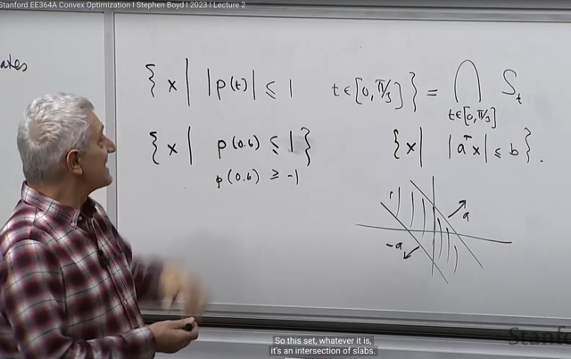</kbd></p>

> [!NOTE]
> Đại khái là ta có thể có cách lập luận khác, theo cách thứ hai, đó là **tìm cách represent S dưới dạng các operation của các convex set** mà ta đã biết.
>
> Đầu tiên ta cần hiểu  {x | |p(t)| ≤ 1} là cái gì. Và để dễ hơn, ta sẽ chọn một giá trị cụ thể của t `=` 0.6 (nằm trong [0, `π/3])`
>
> Thế thì, với x là vector (x1, x2) thì
>
> |p(0.6)| `<=` 1 
>
> ⇔ cos(0.6)x1 + cos(1.2)x2 `<=` 1 (Đây là một half-space)
>
> và
>
> cos(0.6)x1 + cos(1.2)x2 `>=` -1 (cũng là một half-space nữa)
>
> Vậy thì cùng nhau {x | |p(0.6)| ≤ 1} thì chúng chính là define tập hợp điểm (vector x)** thuộc intersection của hai half-space** 
>
> mà hai cái line này song song, nên vùng intersection tạo thành một SLAB (tạm dịch là miếng `/` phiến gỗ)
>
> Thế thì, với t là 0.6 thì x | |p(0.6)| `<=` 1 là một Slab, thì với mọi t từ [0, `π/3]` ta sẽ có INTERSECTION CŨA VÔ SỐ SLAB (INDEFINITELY)
>
> Cho nên gs kí hiệu nó là INTERSECTION t ∈ [0, `π/3]` St với St là một Slab ứng với một giá trị t cụ thể
>
> Như vậy, tới đây, ta đã **THỂ HIỆN S BAN ĐẦU DƯỚI DẠNG OPERATION (CỤ THỂ Ở ĐÂY LÀ INTERSECTION) CỦA CÁC SLAB**, MÀ TA BIẾT **MỖI SLAB LÀ INTERSECTION CỦA CÁC
> HAFT-SPACE - LÀ CONVEX SET)**
>
> Do đó có thể kết luận S là convex set

<br>

<p align="center"><kbd>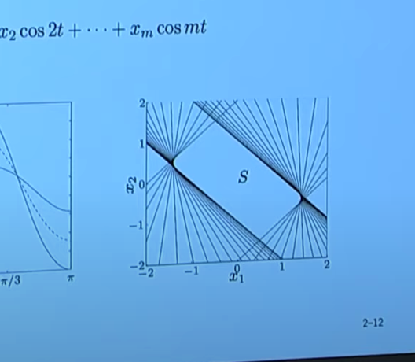</kbd></p>

> [!NOTE]
> Và hình ảnh này chính là intersection của vô số slab St vừa nói

<br>

<p align="center"><kbd>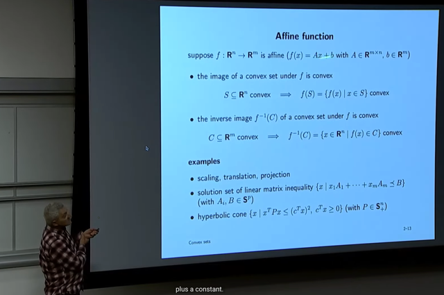</kbd></p>

> [!NOTE]
> Tiếp ta qua một operation nữa mà có tính chất preserve tính convex:
> AFFINE FUNCTION.
>
> Theo định nghĩa Affine function là function Rn -> Rm f(x) `=` Ax + b
> A ∈ R^mxn và b ∈ R^m.
>
> Đầu tiên theo gs và ta cũng có thể hiểu điều này, rằng, trong neural
> network, người ta gọi Wx + b là linear layer, linear function.
> Nhưng mình phải hiểu, nó không phải là linear function, mà nó là
> affine  function.
>
> Trong 1806 ta cũng đã học Ax + b không phải là linear
> transformation vì T(u+v) không bằng T(u) + T(v) (A(u+v)+b không
> bằng (Au + b) + (Av + b) `=` A(u+v) + 2b)
>
> Tuy nhiên, cũng nhiều lần được nghe từ Andrew Ng, hay gs Yan ,
> Maning, và ở đây gs cũng nói ta phải hiểu Ax + b không phải là linear
> function mà là affine function.
>
> Thế thì, affine function có tính chất, nếu S là một convex set, thì
> f(S) (tập hợp các vector có được khi apply function f lên mọi điểm
> của set S: f(x) | x ∈ S cũng sẽ convex.
>
> `===`
>
> Bên cạnh đó, ta sẽ biết thêm về cái gọi là INVERSE IMAGE kí
> hiệu là `f_inv(C)` `=` x ∈ R^n | f(x) ∈ C với ý nghĩa là, tập hợp
> các vector x mà khi được map bởi function f nó thành một vector
> trong C thì tập hợp đó gọi là `f_inv(C)`
>
> Thế thì ta cũng sẽ có tính chất:
>
> Nếu C là convex set, thì `f_inv(C)` cũng là convex set
>
> AFFINE FUNCTION

<br>

<p align="center"><kbd>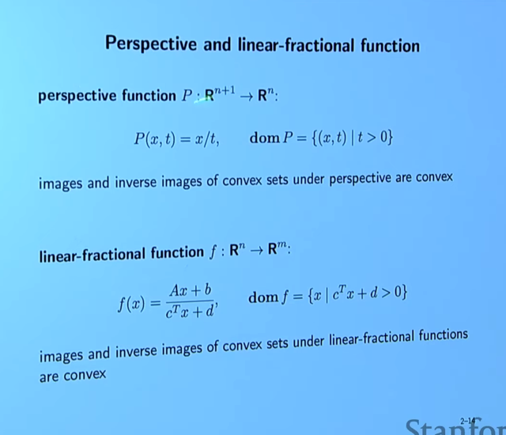</kbd></p>

> [!NOTE]
> Một operation lạ mà ta sẽ được biết là PERSPECTIVE
> function. Đại khái là nó sẽ nhận input một R^(n+1) vector (x,
> t), trong đó ta hiểu x là Rn vector, và t là number.
>
> Thế thì nó sẽ lấy n component đầu tiên chia cho component cuối
> để trả ra vector `x/t` có n component
>
> Và images và inverse images của một convex set sẽ được
> giữ nguyên tính convexity khi apply perspective function.
>
> `====`
>
> Sau đó là LINEAR-FRACTIONAL function, được định nghĩa là
> function f(x) `=` (Ax + b) `/` cTx + d,  tức là một affine function
> chia cho một (cũng là) affine function nhưng c chỉ là
> vector, thay vì A là matrix.
>
> Sau đó gs nói một chút đại khái là về việc linear-fractional function
> xuất hiện ở nhiều nơi, như xác suất và vision
>
> PERSPECTIVE VÀ LINEAR-FRACTIONAL

<br>

<p align="center"><kbd>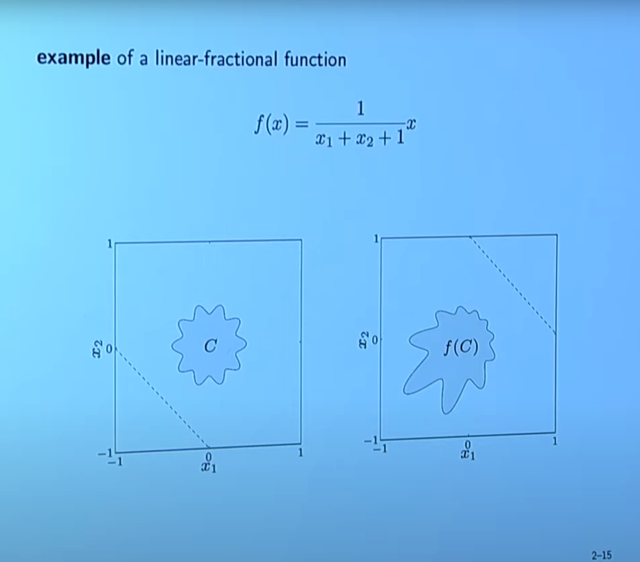</kbd></p>

> [!NOTE]
> Một ví dụ về linear-fractional function: f(x) `=` `[1/(x1+x2+1)]` * x
>
> Về cơ bản là ta scale x với scalar phụ thuộc bởi x1, x2.
>
> Hình ảnh bên trái là convex set C. Bên phải là set C được
> apply linear-fractional function f(x)
>
> Có thể thấy khi x1, x2 nhỏ thì scalar (fraction) lớn, khi x bị scale
> lớn ra (nôm na là vậy)
>
> Thì gs nói cách để hình dung hay nhất là tương tương ta có convex
> set C nằm trên mặt đất và ta nhìn nó bằng một cái drone bay ở
> trên. Thì khi drone ở gần đầu này hơn thì hình ảnh mà ta thấy 
> sẽ lớn hơn

<br>

<p align="center"><kbd></kbd></p>

> [!NOTE]
> Và gs nói ta tuy rằng có thể ko tin function này preserve
> convexity nhưng qua các bài sau ta sẽ thấy rất nhiều ví dụ (áp
> dụng cái này)

<br>

                                                                                <a id="node-00kiata"></a>
                                                                                - **generalized inequalities**
<p align="center"><kbd>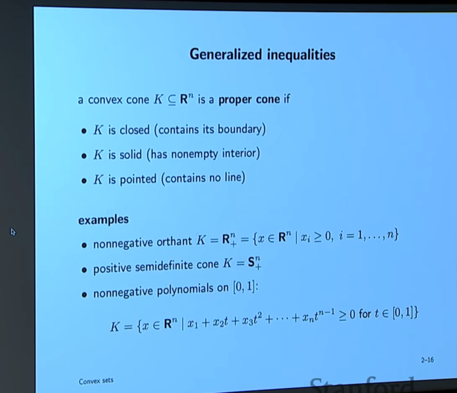</kbd></p>

> [!NOTE]
> Tiếp theo là **generalized inequalities **
>
> Nhưng trước tiên cần định nghĩa của **PROPER CONE**
>
> Hiểu đại khái là nếu một **convex cone K** có các tính chất như:
>
> - **CLOSED** (có nghĩa là nó **chứa boundary của nó**) 
>
> - **SOLID** (có non-empty interior, tạm hiểu là **tồn tại những điểm mà
> có thể vẽ một ball có bán kính dương nhỏ bất kì nằm trong set**) 
>
> - **POINTED** (**không chứa đường thẳng**, tạm biết vậy)
>
> Một ví dụ là **non-negative orthant K `=` R^n + `=` x ∈ R| xi `>=` 0** - hiểu là phần không gian R^n mà mọi component của vector đều
> không âm
>
> Hoặc K `=` S^n + (là tập mọi symmetric positive semi definite như
> đã biết ở các slide trước
>
> PROPER CONE

<br>

<p align="center"><kbd>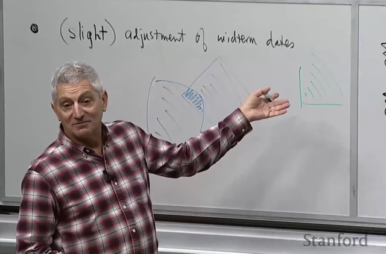</kbd></p>

> [!NOTE]
> non-negative orthant thì trong 2D chính là một **quadrant** - góc phần tư mà tọa độ đều không âm  này.

<br>

<p align="center"><kbd>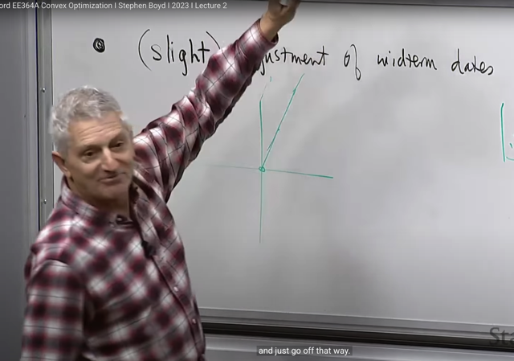</kbd></p>

<p align="center"><kbd>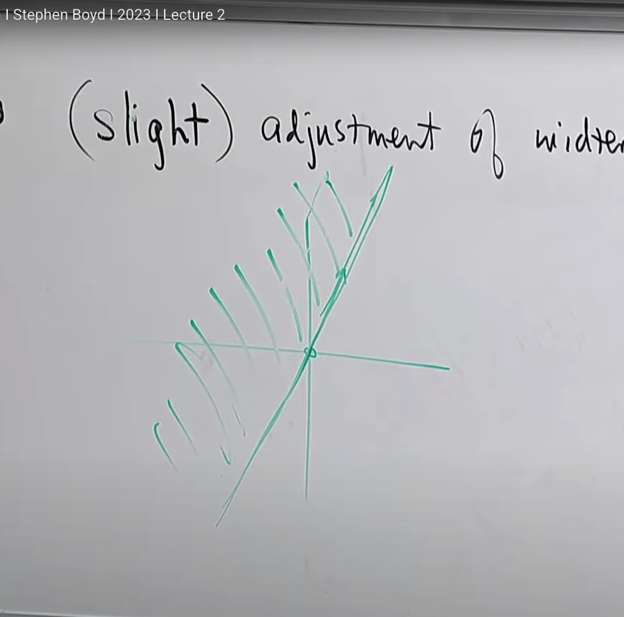</kbd></p>

> [!NOTE]
> Gs nói một số case không thỏa điều kiện nhân tiện đây, là** một ray (tia, hồi xưa học về khái niệm tia rồi) gs nói nó cũng chính là một cone.**
>
> Nhưng nó không phải là proper cone vì nó violate yêu cầu là solid,  dễ thấy ko thể có một điểm nào trên ray mà vẽ được cái ball có bán kính dương nhỏ bất kì vẫn nằm trong ray.
>
> Cũng như half-plane cũng không thỏa điều kiện vì nó chứa được ít nhất một line.

<br>

<p align="center"><kbd></kbd></p>

> [!NOTE]
> Còn cái này thì là proper cone: Solid, Pointy và Closed

<br>

<p align="center"><kbd>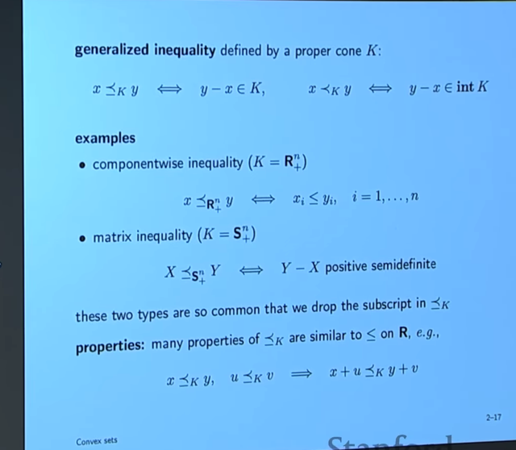</kbd></p>

> [!NOTE]
> Đại khái là, từ khái niệm proper cone K ta mới có định nghĩa của **GENERALIZED INEQUALITY**
>
> x ⪯K y (đọc là **x less than y with respect to cone K**) có nghĩa là:  
>
> **y - x thuộc cone K**
>
> Ví dụ:
>
> x ⪯R^n+ y thì có nghĩa là **y - x ∈ R^n+, đồng nghĩa mọi components đều không âm, và như vậy x ⪯R^n+ y sẽ có nghĩa là component của x nhỏ hơn component của y element-wise.**
>
> Và với matrix thì X ⪯S^n+ Y thì có nghĩa là **Y - X là matrix positive semi-definite**
>
> Theo thảo luận với GPT thì nó nói x ⪯ y đã có nghĩa là x less than y element-wise rồi, điều này có nghĩa là khi nói **x ⪯ y thì thật ra đang chính là nói x ⪯ y with respect to R^n+**
>
> (Những cái này, nếu có chưa hiểu để làm gì, thì như gs đã nói, chúng sẽ được rõ ràng hơn khi qua tuần 4 trở đi)
>
> Gs ko nói nhưng trao đổi với GPT ta cũng dễ hiểu: Nếu **x ≺ y thì y - x không chỉ nằm trong K mà còn nằm trong interior của K, kí hiệu int K** (mà cái này theo định nghĩa là nếu **có thể vẽ một quả banh bán kính nhỏ bất kì quanh nó mà quả banh vẫn nằm trong K**, hoặc hiểu nôm na là y - x không được nằm trên boundary của K) thì khi đó gọi là x strictly less than y with respect to K
>
> GENERALIZED INEQUALITY:  **x ⪯K y: x nhỏ hơn hoặc bằng y theo cone K**
>
> x ⪯R^n+ y: x nhỏ hơn hoặc bằng y theo R^n+ đồng nghĩa y - x ∈ R^n+ `<=>` x `<=` y element-wise
>
> Và khi nói x ⪯ y thì cũng ngầm hiểu nó là x ⪯ y wrt R^n +

<br>

<p align="center"><kbd>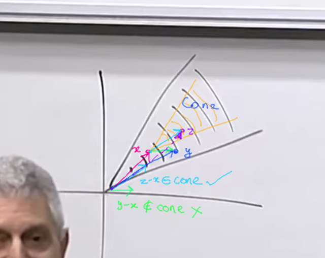</kbd></p>

> [!NOTE]
> Và hình ảnh của x ⪯K y là vầy, đó là nó phải thỏa hai điều kiện:
>
> **y - x phải ∈ K**. Nên ví dụ ta có vector x là điểm màu hồng.
>
> Thì không phải cứ thỏa (1) là đủ, vì ví dụ vector y (màu xanh), lớn hơn x component-wise, hay, mọi tọa độ của nó đều `>=` tọa độ tương ứng của x.
>
> Tuy nhiên, **y-x, là vector xanh lá, không nằm trong cone K. Do đó y không thỏa x ⪯K y**
>
> Còn **z, thì cũng lớn hơn x component-wise**, và **đồng thời z-x (vector tím) vẫn trong cone** K, do đó ta có x ⪯K z

<br>

<p align="center"><kbd>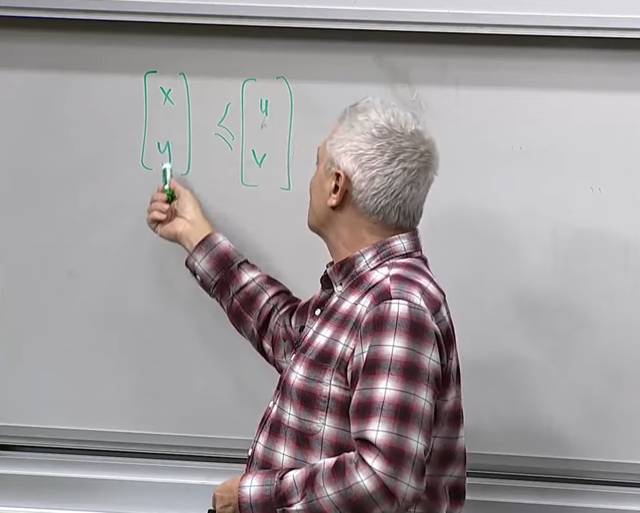</kbd></p>

> [!NOTE]
> Sau đó gs nói một chút về linear ordering. Hiểu đại khái là linear ordering có nghĩa là ví dụ như trong R, a chỉ lớn hơn b hoặc bé hơn b hoặc bằng b.
>
> Nhưng với vector thì không có tính chất đó (x có thể bé hơn u, nhưng y lớn hơn v)
>
> LINEAR ORDERING

<br>

<p align="center"><kbd>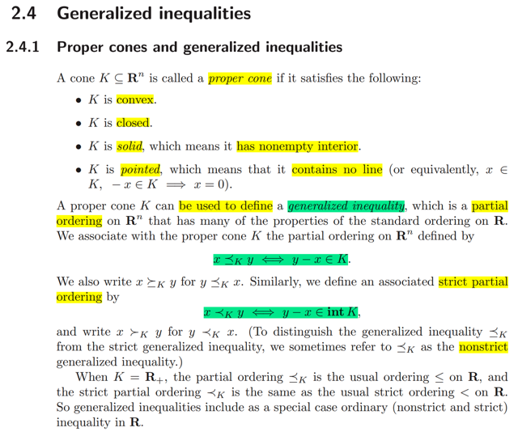</kbd></p>

> [!NOTE]
> Trong bài giảng đã nói đủ hết rồi. Chỉ thêm một ý nhỏ là **khi K trở thành R+** (tức trục số thực không âm) thì **phép so sánh thứ tự kiểu này (gọi là PARTIAL ORDERING), trở thành phép so thứ tự thông thường (USUAL ORDERING)**
>
> **x ⪯ R+ y cũng giống như x ≤ y**
>
> 2.4 GENERALIZED INEQUALITIES
>
> 2.4.1 PROPER CONES & GENERALIZED 
> INEQUALITIES

<br>

<p align="center"><kbd>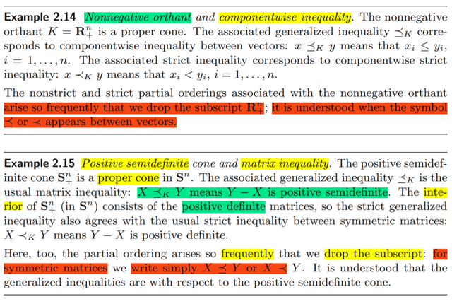</kbd></p>

> [!NOTE]
> Đây, nếu đọc sách chỗ này thì đã khỏi phải hỏi GPT: Đó là ở đây cho biết **KHI K `=` R^(n+), thì partial ordering sẽ mang ý nghĩa là COMPONENT-WISE INEQUALITY. **
>
> Tức là khi đó **x ⪯ R^(n+) y, theo định nghĩa sẽ là y - x ∈ R^(n+), ⇨ mọi component của (y - x) đều ≥ 0 ⇨ yi ≥ xi với mọi i**
>
> Và gs cũng cho biết **VÌ CÁI NÀY XUẤT HIỆN NHIỀU NÊN NGƯỜI TA BỎ R^(n+) luôn, ĐỂ KHI THẤY ⪯, HAY ≺, THÌ TỰ HIỂU LÀ K `=` R^(n+)**
>
> Cái này cũng giống như với l2 norm: Khi thấy ||u|| tự hiểu là L2 norm
>
> `====`
>
> Tương tự, khi K `=` cone S^(n+), thì partial ordering **X ⪯ S^(n+) Y sẽ có nghĩa là Y - X ∈ S^(n+), tức là Y - X là POSITIVE SEMI-DEFINITE.**
>
> Và nếu là **strictly inequality X ≺ S^(n+) Y thì theo định nghĩa, Y - X ∈ interior
> của S^(n+),** 
>
> Và ta được học thêm rằng **interior của S^n+ chứa các POSITIVE DEFINITE matrix**. 
>
> Do đó **X ≺ S^(n+) Y ⇨ Y - X là PSD matrix**.
>
> Thế thì ta hay thấy kí hiệu nói matrix A positive semi definite là A ≽ 0, và A positive definite là A ≻ 0. Thì từ đây ta hiểu nó chính là bởi vì như đã nói, ** cái này cũng xuất hiện nhiều nên người ta tự hiểu khi ghi X ≽ Y thì nó chính là X ≽ S^(n+) Y**.
>
> Nên A ≽ 0 thì THỰC CHẤT LÀ A ≽S^n+ 0, và theo định nghĩa, nó tương
> đương A - 0 ∈ S^n+ `=>` A ∈ S^n+ `=>` A là positive semi definite.

<br>

<p align="center"><kbd>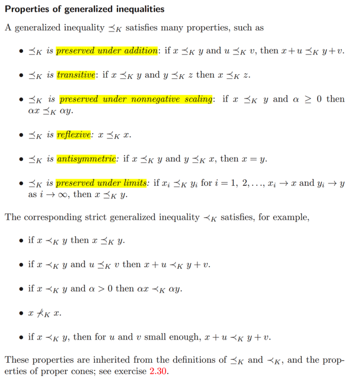</kbd></p>

> [!NOTE]
> Một số tính chất của generalized inequalities mà trong bài giảng không nói tới

<br>

<p align="center"><kbd>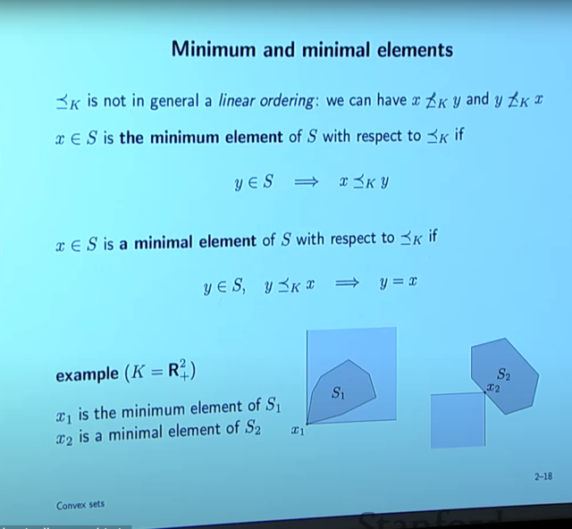</kbd></p>

> [!NOTE]
> Từ đó ta có khái niệm **MINIMUM** và **MINIMAL**
>
> MINIMUM có tính chất mạnh hơn: Khi nói **x là minimum của set S thì có nghĩa là mọi point s của S đều "tốt hơn" (≽K) x**
>
> Ví dụ x1 là minimum của S1, và trong ví dụ này K là R^(2+), như đã nói, có thể bỏ kí hiệu R^(2+):  x ⪯ y, và nó sẽ đồng nghĩa x ⪯ y component-wise),
>
> Thì hình ảnh này thể hiện rõ, x1 là vector có cả hoành độ và tung độ nhỏ nhất, nói cách khác, mọi vector trong S1 có hoành độ và tung độ đều lớn hơn x1: y ∈ S ⇨ x1 ⪯ y
>
> Còn MINIMAL thì yếu hơn, khi nói rằng: **nếu y ⪯K x thì y `=` x**, 
>
> hay hiểu nôm na, là **chỉ có một mình nó là nhỏ hơn hoặc bằng nó thôi**.
>
> Thế thì với định nghĩa này, xem thử x2, hoặc bất kì điểm nào trên cạnh chéo đang chứa x2 ta sẽ thấy **mọi điểm nào trong S2 mà có tung độ và hoành độ nhỏ hơn hoặc bằng x2 thì chỉ có thể là x2**.
>
> Nhưng **ko có nghĩa là x2 nhỏ hơn hết thảy** vì vẫn có những điẻm khác nhỏ hơn x2 về tung độ hoặc hoành độ. 
>
> Điều này cũng có nghĩa trong **hình 2 sẽ không có minimum, vì không có điểm nào mà nhỏ hơn hết thảy về cả hoành và tung độ.**
>
> **Nhưng có nhiều minimal** (như đã nói, là các điểm trên cạnh màu đỏ) vì
> nếu vẽ cái hình vuông thể hiện những điểm mà nhỏ hơn hoặc bằng cả
> tung độ lẫn hoành độ với nó thì chỉ có thể intersect với S2 tại chính điểm
> đó. Nói cách khác, không tồn tại điểm nào trong S2 mà nhỏ hơn cả hoành
> độ và tung độ ngoại trừ chính nó.
>
> MINIMUM VÀ MINIMAL

<br>

<p align="center"><kbd>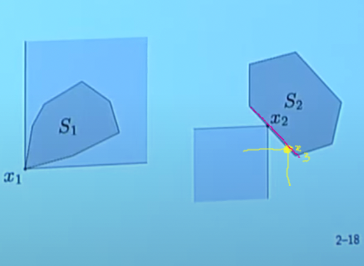</kbd></p>

> [!NOTE]
> cái này đại khái là mọi điểm ở trên cái cạnh màu hồng nó đều là Minimal mà ý nghĩa của Minimal thì biết rồi là cái điểm duy nhất ở trong cái tập mà "nhỏ hơn nó" ( ≤K) hơn nó chỉ là chính nó

<br>

<p align="center"><kbd>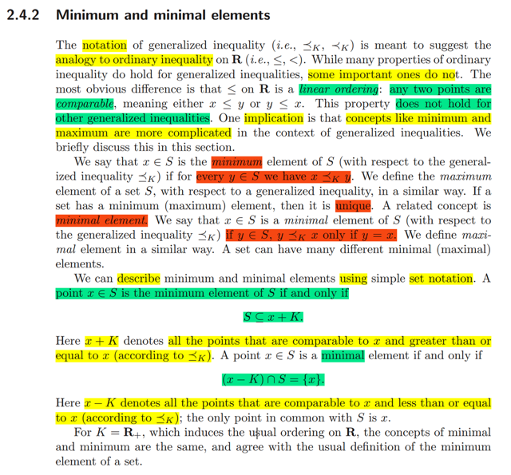</kbd></p>

> [!NOTE]
> Nói chung thì trong bài gs đã nói rồi, phần note của slide bài giảng cũng đã nắm bắt ý chính.
>
> Chỉ có cái trong sách nhấn mạnh rằng, GENERALIZED INEQUALITY dù **giữ phần lớn các tính chất của USUAL INEQUALITY, nhưng vẫn có vài thay đổi** mà trong đó là LINEAR ORDERING, nôm na là **không còn việc mọi vector đều có thể so sánh với nhau nữa**, mà có thể x vừa không ⪯K y và vừa không ≽K y.
>
> Điều này dẫn đến xuất hiện hai khái niệm **MINIMUM** VÀ **MINIMAL**.
>
> **Minimum** thì như đã hiểu, là khi **nó "thua mọi cái khác" trong S**.
>
> Thể hiện bằng toán học, nếu x là minimum của S thì: y ∈ S ⇨ y ≽K x
>
> Nhưng trong sách cho ta biết **thêm cách thể hiện dùng SET notation**:
>
> (nếu x là minimum của S): **S ⊆ (x + K)** 
>
> Với **(x + K) là set chứa mọi point better or equal x wrt K**. 
>
> Vậy thì mình hiểu khi **S ⊆ x + K** tức là **mọi điểm y trong S đều sẽ better or equal x**: y ∈ S ⇨ y ≽K x
>
> Còn Minimal, cách thể hiện toán học là:
>
> y ∈ S, y ≽K x ⇨ y `=` x
>
> Thì có thể thể hiện theo SET notation:
>
> **(x - K) ∩ S `=` x**
>
> x - K là điểm mà thua hoặc bằng x, để rồi cái này mang ý nghĩa chính là "**điểm trong S mà better or equal to s (wrt cone K) thì chỉ là chính nó**"

<br>

<p align="center"><kbd>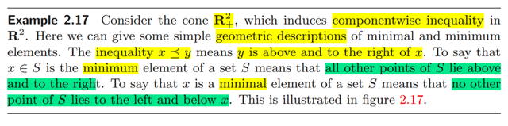</kbd></p>

<p align="center"><kbd>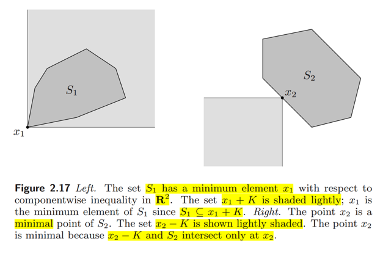</kbd></p>

> [!NOTE]
> Khi K `=` R^(n+) như đã biết  x ⪯R^(n+) y có thể ghi là x ⪯ y sẽ mang ý nghĩa  là x ≤ y component-wise. Và về mặt hình học, giả sử lấy R^(2+) thì sẽ là x nằm dưới và bên trái y.
>
> Nên trong hình này **x1 là MINIMUM của S1 vì MỌI ĐIỂM TRONG S ĐỀU NẦM TRÊN VÀ BÊN PHẢI x1.** S1 ⊆ x1 + (R^2+)
>
> Trong hình có thể thấy S1 nằm trong hình vuông màu xám (x1 + R^(2+))
>
> Và **x2 là MINIMAL của S2 vì KHÔNG CÓ ĐIỂM NÀO KHÁC TRONG S NGOÀI x2 NẰM DƯỚI VÀ BÊN TRÁI x2**: x2 - R^(2+) ∩ S2 `=` x2
>
> Trong hình thấy hình vuông màu xám (x2 - R^2+) chỉ giao với S2 tại môt điểm duy nhất là x2

<br>

<p align="center"><kbd>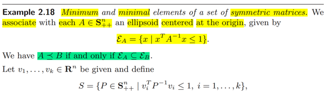</kbd></p>

<p align="center"><kbd>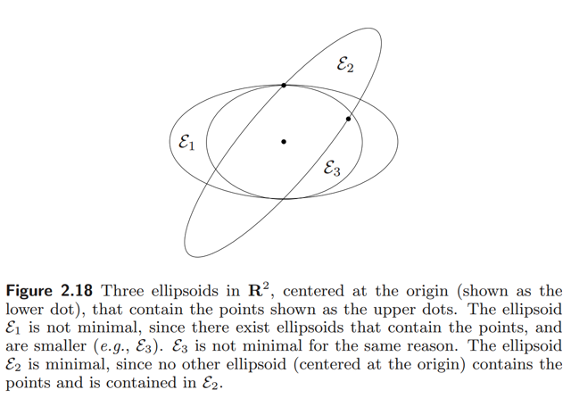</kbd></p>

<p align="center"><kbd>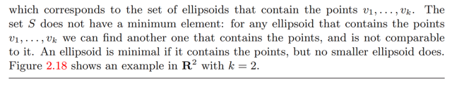</kbd></p>

> [!NOTE]
> SÁCH (XEM SAU)

<br>


<a id="node-2zytx67"></a>
## Lec 3

<br>

<p align="center"><kbd>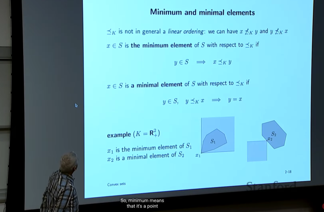</kbd></p>

> [!NOTE]
> Đại khái là, bài trước ta dừng lại ở đây, khi ta biết về các khái niệm như LINEAR ORDERING. 
>
> Đúng hơn là gs nói rằng, khác với phép so sánh trong R, vốn có tính chất LINEAR ORDERING hoặc còn gọi là **TOTAL ORDERING**, có nghĩa là chỉ có thể có x ≥ y hoặc x
> ≤ y.
>
> Nhưng với vector, tức phép so sánh ⪯K thì nó không có tính chất này
>
> Rồi, ta cũng đã biết các khái niệm **minimum** và **minimal** đối với** (with respect to) proper cone K**. Trong đó, nói **x minimum của S with respect to K có nghĩa là, với mọi y thuộc S thì x ⪯K y **
>
> Và ví dụ là **x1 là minimum của S1 with respect to cone K** với K trong trường hợp này là một **orthant R^(2+)** (góc phần tư trong 2D space ứng với mọi vector có tọa độ không âm). Thì ở đây, **mọi vector trong S1 đều có tung độ ≥ tung độ của x1, và hoành độ ≥
> hoành độ x1**
>
> Còn minimal, có định nghĩa yếu hơn, khi cho rằng, nếu trong S,** điểm duy nhất mà ⪯K nó chỉ là chính nó**, hay nói cách khác, **chỉ có nó mới nhỏ hơn hoặc bằng nó (dĩ nhiên element-wise) thì khi đó nó là minimal.**
>
> Trong hình bên phải, như đã nhận định ở bài trước, **mọi điểm trên cạnh đang chứa x2 đều là minimal**, vì mọi điểm ⪯ x (tạo ra tập hợp thể hiện bởi hình vuông) thì tập này chỉ giao với S2 tại đúng 1 điểm chính là S2, nên xét trong S2, chỉ có đúng một điểm thỏa tính chất ⪯K x2, và điểm đó chính là x2. Vậy x2 là minimal

<br>

<p align="center"><kbd>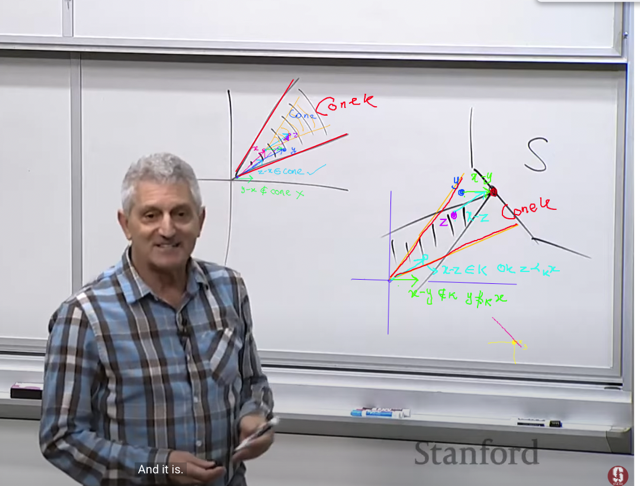</kbd></p>

> [!NOTE]
> Có câu hỏi, và gs nói, đại khái là nếu cone K thay vì R^(2+), tức thay vì góc tư không âm, mà bây giờ là cái này (thể hiện bởi vùng  vùng giữa hai đường màu đỏ.
>
> Khi đó, gs vẽ cái vùng y ⪯K x như vầy (giống như đối xứng lại cái  vùng màu đỏ). Thật ra ko khó hiểu, **quả thật đó chính là vùng chứa các vector ⪯ x with respect to K**.
>
> Ví dụ lấy y (màu blue), tuy nó cũng ⪯ x, nhưng x - y (xanh lá) có thể  thấy không thuộc cone K). Ngược lại z, nằm trong vùng gs vẽ thì cũng có ⪯ x, và x-z (vector xanh cyan) vẫn thuộc cone K.
>
> Nên quả thật vùng mà gs vẽ mới chính là tập các vector y thỏa y ⪯K x
>
> `====`
>
> Quay lại vấn đề, thì có thể thấy những điểm trên 3 cạnh này của S, cũng là minimal with respect to cone K vì rõ ràng những điểm trên S mà thuộc cái vùng y⪯K x thì chỉ có mình nó

<br>

<p align="center"><kbd>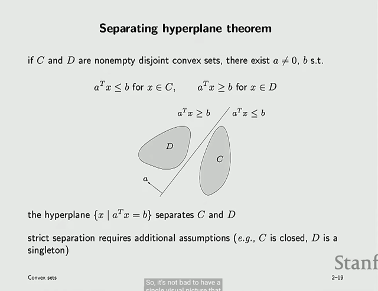</kbd></p>

> [!NOTE]
> Tiếp theo là một theorem, gọi là **SEPARATING HYPERPLANE THEOREM**:
>
> Nói rằng, nếu C, D là các **non-empty disjoint convex sets**, thì sẽ **TỒN TẠI a, b sao cho aTx `=` b (là một line trong R^2, hoặc một plane trong R^3, hoặc hyperplane trong R^n) CHIA TÁCH C, và D**
>
> Trong machine learning, gs nói ta có thể đã nghe nói về cụm từ **linearly separable**.
>
> Về mặt toán học, điều này có nghĩa là **với mọi x ∈ C thì aTx ≤ b và với mọi x ∈ D thì aTx ≥ b** (aTx - b ≥ 0)
>
> Ngoài ra gs cho viết còn vài variant (biến thể) ví dụ như khi với một số additional assumptions thì ta sẽ có **STRICT SEPARABLE**
>
> SEPARATING HYPERPLANE THEOREM

<br>

  <a id="node-8xqj33s"></a>
  - **Supporting Hyper-plane**
<p align="center"><kbd>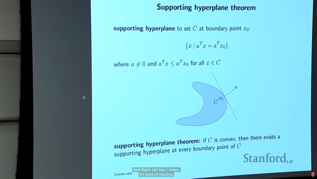</kbd></p>

> [!NOTE]
> Khái niệm **SUPPORTING HYPER-PLANE**:
>
> Đại khái là theo định nghĩa, cho set C (không cần là convex set) thì **supporting hyperplane của set C tại một điểm ở biên (boundary) x0 của nó sẽ là tập hợp các điểm x sao cho aTx `=` aTx0**
>
> Có nghĩa là {x | aTx `=` aTx0} define kiểu như một phương trình đường thẳng đi qua x0.
>
> Nhưng quan trọng hơn, là **VỚI MỌI x ∈ C THÌ aTx ≤ aTx0**, đây là điều kiện thể hiện support hyperplane sẽ là một hyperplane đi qua x0 nằm trên boundary và nó **KHIẾN MỌI ĐIỂM TRONG C ĐỀU NẰM MỘT BÊN** (haft plane `/` half space)
>
> Kể từ đó, theorem này nói rằng, **nếu MỌI BOUNDARY POINT ĐỀU TỒN TẠI một support hyperplane thì set C là convex set**
>
> (đây là mũi tên 2 chiều, điều kiện cần và đủ)
>
> Dễ thấy ví dụ như hình này, thì những điểm trên mặt trong của lữỡi liềm sẽ không thể có supporting hyperplane, nên đây không phải là convex set
>
> SUPPORTING HYPERPLANE THEOREM

<br>

<p align="center"><kbd></kbd></p>

> [!NOTE]
> Gs nói thêm rằng tại các điểm gọi là **KINK**, **các góc mà tại đó có sự thay đổi đột ngột độ dốc thì có nhiều hơn một support hyperplane**
>
> Trong 2D thì kiểu như tại đây có nhiều hơn một tiếp tuyến

<br>

      <a id="node-lz56qs3"></a>
      - **2.5.1 Separating Hyperplane Theorem**
<p align="center"><kbd>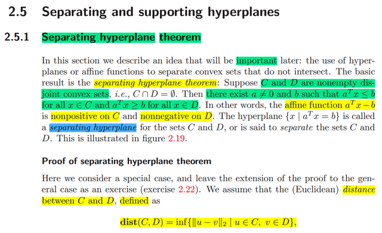</kbd></p>

<p align="center"><kbd>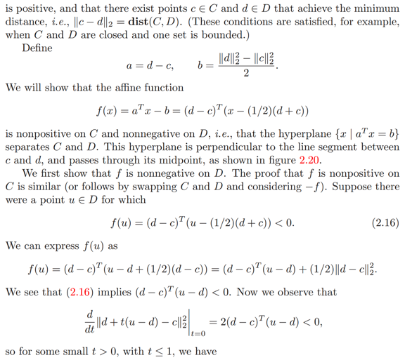</kbd></p>

<p align="center"><kbd>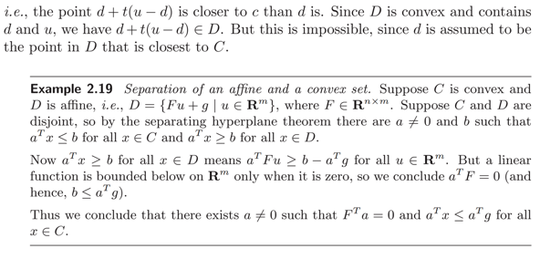</kbd></p>

<p align="center"><kbd>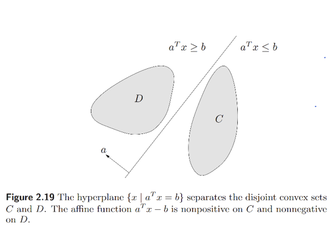</kbd></p>

> [!NOTE]
> CHAPTER 2.5 SEPARATING  & SUPPORTING HYPERPLANES
>
> 2.5.1 SEPARATING HYPERPLANE THEOREM
>
> Đây là một theorem quan trọng Separating Hyperplane theorem: Nói rằng **nếu hai convex set C và D disjoint** nhau thì chắc chắn **tồn tại một hyperplane {x: aTx `=` b} sao cho với mọi điểm trong C thì nó luôn nằm dưới hyperplane: ∀x ∈ C: aTx ≤ b** và với **mọi điểm trong D thì nó luôn nằm trên hyperplane: ∀ x ∈ D: aTx ≥ b.**
>
> Và cái hyperplane đó gọi là **SEPARATING HYPERPLANE**
>
> Nói về cái này: Ta đã biết **hyperplane {x: aTx `=` b} sẽ chia không gian thành hai halfspace {x: aTx ≤ b} và {x: aTx > b}**
>
> Do đó, DĨ NHIÊN nếu hai set C, D nằm ở hai halfspace đó thì mọi điểm trong C sẽ đều thỏa aTx ≤ b và mọi điểm trong D đều thỏa  aTx ≥ b, đơn giản vì C, và D là tập con của hai halfspace này
>
> Vấn đề là ta **cần chứng minh khi C, D disjoint thì TỒN TẠI HYPERPLANE như vậy**
>
> Đại khái cái proof là vầy: Đầu tiên **dựa trên điều ta có là C, và D là hai set disjoint**. 
>
> Khi đó, nếu ta **định nghĩa khoảng cách giữa hai set là khoảng cách giữa hai điểm thỏa bài toán tối ưu sau:**
>
> minimize c ∈ C, d ∈ D {||c - d||}. 
>
> Thì với việc C, và D disjoint cũng như là thỏa một vài điều kiện nữa thì ta sẽ **có thể chắc chắn là có tồn tại nghiệm của bài toán trên**, hay, **có thể tìm được hai điểm c, d sao cho khoảng cách của nó là khoảng cách ngắn nhất giữa hai điểm ở hai set** (và theo định nghĩa thì nó **cũng là khoảng cách giữa hai set**, cũng là khoảng cách giữa c tới D cũng như giữa d tới C.
>
> Có nghĩa là, **d khi đó là cái điểm ở trong D mà GẦN NHẤT VỚI C**, cũng như **c là điểm trong C và GẦN NHẤT VỚI D**
>
> Thế thì, ta mới **chứng minh bằng phản chứng** rằng, khi đó **cái hyperplane sau đây sẽ là separating hyperplane**: x: aTx `=` b với a `=` d - c và b `=` (||d||^2 - `||c||^2)/2`
>
> Và theo định nghĩa separating hyperplane thì điều đó có nghĩa là** mọi điểm u trong D thì f(u) `=` aTu - b đều không âm**, và **mọi điểm v trong C thì f(v) đều không dương**.
>
> Ta sẽ chứng minh bẳng phản chứng: Giả sử có u khiến f(u) âm, ta sẽ chứng minh là điều này vô lý.
>
> Đầu tiên đơn giản hóa hàm f(z) `=` aTz - b một chút:
>
> Với a `=` d - c và b `=` (||d||^2 - `||c||^2)/2`
>
> Thì  f(z) `=` aTz - b `=` (d-c)Tz - 0.5(||d||^2 - ||c||^2) 
>
> `=` (d-c)Tz - 0.5(d-c)T(d+c)
>
> ```text
> (Vì (d-c)T(d+c) = (dT-cT)(d+c) = dTd-cTd+dTc-cTc = dTd - cTc = ||d||^2 - ||c||^2)
> ```
>
> ∴ `=` (d-c)T[z - 0.5(d+c)]
>
> Gỉa sử có u khiến f(u) âm, tức aTu - b < 0 ⇔ (d-c)T(u - 0.5(d+c)) < 0 
>
> Thể hiện f(u) khác một chút:
>
> `=` (d-c)T(u - 0.5(d+c)) `=` (d-c)T(u - 0.5d - 0.5c) 
>
> `=` (d-c)T(u - 0.5d - 0.5d + 0.5d - 0.5c)
>
> `=` (d-c)T(u - d + 0.5(d - c)) 
>
> `=` (d - c)T(u - d) + (d - c)T0.5(d - c))
>
> `=` (d-c)T(u - d) + 0.5||d - c||^2
>
> Như vậy với giả định là f(u) < 0 ta ⇔ (d-c)T(u - d) + 0.5||d - c||^2 < 0 
>
> ⇔ (d-c)T(u - d) < -0.5||d - c||^2  
>
> Mà ||d - c||^2 ≥ 0 ⇨ -0.5||d - c||^2 ≤ 0
>
> ⇨ (d-c)T(u - d) < 0
>
> Mà **cái này chính là `(1/2)` `d/dt` ||d + t(u - d) - c||^2**
>
> (không khó để thấy ||d + t(u - d) - c||^2 `=` [d + t(u - d) - c]T[d + t(u - d) - c]
>
> `=` [dT + t(u - d)T - cT][d + t(u - d) - c]
>
> `=` [dTd + t(u - d)Td - cTd + dTt(u - d) + t(u - d)Tt(u - d) - cTt(u - d) - dTc - t(u - d)Tc + cTc]
>
> `=` [dTd + t(u - d)Td - cTd + dTt(u - d) + t(u - d)Tt(u - d) - cTt(u - d) - dTc - t(u - d)Tc + cTc]
>
> ....
>
> triển khai ra và lấy đạo hàm theo t sẽ là 2(d - c)T(u - d))
>
> Vậy **điều này có nghĩa là hàm này đang giảm tại t**
>
> Mà xét d + t(u - d) giống như xét một đường đi `/` quỹ đạo từ d đến u parameterized bởi t, để t `=` 0 thì ta ở tại d, tăng dần t từ 0 đến 1 thì ta đi từ d tới u vậy.
>
> Và mấu chốt là: 
>
> 1) u là điểm ở trong D theo giả định. 
>
> Và hàm f(t) ở trên `=` ||d + t(u - d) - c||^2 chính là thể hiện **khoảng cách của một điểm trên quỹ đạo (đi từ d đến c) đến c**: Tại t `=` 0. điểm đứng ở d, khoảng cách đến c là ||d - c||,
> tại t `=` 1, ta đứng ở u, khoảng cách đến c là ||u - c|| 
>
> thì ta lại có `d/dt` `f(t)|t=0` `=` là số âm, hiểu một cách đại khái thì điều chứng tỏ hàm đang giảm, có nghĩa là khi đi từ d đến u thì khoảng cách từ điểm đó đến c ngày càng nhỏ lại. Điều này chứng tỏ 
>
> Vậy suy ra **SO VỚI d THÌ u GẦN VỚI C HƠN. MÀ ĐIỀU NÀY MÂU THUẪN VỚI ĐIỀU KIỆN BAN ĐẦU LÀ d LÀ ĐIỂM GẦN NHẤT VỚI c MÀ**.
>
> TỚI ĐÂY TA ĐÃ CHỨNG MINH XONG rằng mọi điểm u trên D KHÔNG THỂ NÀO CÓ f(u) < 0 đươc. 
>
> Chứng minh tương tự với vế kia C
>
> VÍ DỤ QUAY LẠI SAU
>
> **Tại sao vector a sẽ hướng ra ngoài halfspace** {x: aTx ≤ aTx0} ?
>
> Vì như đã biết, hyperpane {x: aTx `=` b} có thể được thể hiện theo cách khác với x0 ∈ hyperlane: {x: aT(x - x0) `=` 0} 
>
> Để rồi  ta hiểu nó là **tập hợp các điểm sao cho vector x - x0 luôn vuông góc với a**, cũng là hợp với a góc 90 độ.
>
> Thế thì, khi đó nó sẽ **chia mặt phẳng làm hai nửa (halfspace)**. 
>
> Mà **một bên sẽ có tính chất là những điểm x trong đó sẽ luôn tạo vecotr x - x0 hợp với a góc tù** 
>
> Và **những điểm bên kia thì luôn tạo với a góc nhọn**
>
> Xét những điểm bên này c**húng sẽ luôn thỏa: {x: cos `θ(a,` x-x0) < 0}**
>
> Mà cos `θ(a,` x-x0) < 0 ⇨ ||a||||x - x0|| cos `θ` < 0 
>
> ⇔ aT(x - x0) < 0
>
> ⇔ aTx < aTx0 
>
> ⇔ aTx < b
>
> Vậy nên tất cả những điểm bên halfplane đó chính là tập:
>
> {x: aTx < b} và với tập này vector a sẽ hướng ra ngoài vì đây là tập các điểm x khiến x - x0 hợp với a góc tù.

> [!TIP]
> **🤖 AI Feedback** — ✅ Score: **90/100**
>
> Bài phân tích rất chi tiết và thể hiện sự hiểu biết sâu sắc về Định lý siêu phẳng phân tách và chứng minh của nó. Các bước suy luận và phép biến đổi đại số đều chính xác và rõ ràng. Một điểm nhỏ có thể cải thiện là mô tả phương pháp chứng minh tổng thể, vì chỉ một phần của chứng minh được thực hiện bằng phản chứng, chứ không phải toàn bộ.

<br>

        <a id="node-cz2ecoq"></a>
        - **Strict separation**
<p align="center"><kbd>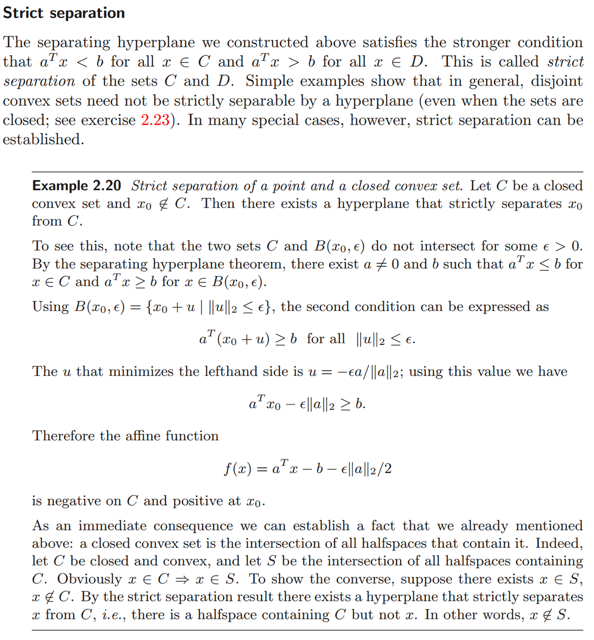</kbd></p>

> [!NOTE]
> Đại ý là tác giả nói rằng cái separating hyperplane mà ta xây dựng ở phần trước (với cái hình mà hai set C, D tách nhau hoàn toàn) nó thỏa tính chất "strong separation" khi với mọi x ∈ C thì aTx < b và với mọi x ∈ D thì aTx > b.
>
> Nhưng thực ra trong các trường hợp tổng quát thì việc C, D disjoint không nhất thiết phải có strict separation - tức là được phân tách một cách nghiêm ngặt bởi một hyperplane.
>
> Nhưng một số ca đặc biệt thì ta vẫn có strict separation, lấy ví dụ 2.20: Đại khái là cho một tập C là tập đóng (closed - tức là nó sẽ có bao gồm boundary) và là convex set. Và một điểm x0 nằm ∉ C. Khi đó tồn tại một hyperplane mà strictly separate x0 và C và ta sẽ chỉ ra nó là cái gì sau đây:
>
> ```text
> Lập luận như sau: Vì x0 ∉ C nên tồn tại một "quả banh Euclide" B(x0, ε) (mà định nghĩa của nó là tập {x = x0 + r với ||r||2 ≤ ε}) sao cho với một ε nào đó B(x0, ε) không giao với C. Một cách hình tượng thì hình dung với 1 chấm nhỏ nằm ngoài tập C thì ta nhất định có thể vẽ một vòng tròn bán kính dương rất nhỏ để tạo thành một hình tròn không giao với C
> ```
>
> Thế thì, câu chuyện bấy giờ là ta có hai set: C và B(x0, `ε)` đều là convex set và chúng disjoint. Thì khi đó, ta có thể dùng Separating Hyperplane Theorem để nói rằng, tồn tại một hyperplane aTx `=` b sao cho nó separate (không cần stritcly) hai set này. Cụ thể là aTx ≤ b ∀ x ∈ C và aTx ≥ b ∀ x ∈ B(x0, `ε)`
>
> Rồi, bây giờ xét aTx ≥ b ∀ x ∈ B(x0, `ε)` (Nhớ rằng ta đang đi tìm cái hyperplane phân tách nghiêm ngặt x0 với C nhé)
>
> Với x ∈ B(x0, `ε),` tức {x0 + u (hay r) sao cho ||u||_2 ≤ `ε}`
>
> thì dĩ nhiên ta có thể thể hiện x bởi: x `=` x0 + u với ||u||_2 ≤ `ε`
>
> ⇨ aTx ≥ b ∀ B(x0, `ε)` 
>
> ⇔ aT(x0 + u) ≥ b với ||u||2 ≤ `ε`
>
> ⇔ aTx0 + aTu ≥ b với ||u||2 ≤ `ε`
>
> Xét vế trái, có hạng tử aTu `=` ||a|| ||u|| cos(a, u)
>
> mà vế trái ≥ b với mọi u có ||u|| ≤ `ε` thì gía trị nhỏ nhất của nó cũng ≥ b
>
> Vế trái đạt min khi aTu đạt min
>
> Và minimize aTu với constraint ||u|| ≤ `ε`
>
> aTu  `=` ||a|| . ||u|| . cos(a, u) ≥ ||a|| . ||u|| . (-1) (do cosine luôn ≥ -1)
>
> Và vì ||u|| ≤ `ε` ⇨ -||u|| ≥ `-ε`
>
> ⇨ ||a|| . ||u|| . (-1) `=` ||a|| . (-||u||) ≥ ||a|| `(-ε)`
>
> ```text
> Vậy min_u aTu constraint ||u|| ≤ eps chính là -ε ||a||, xảy ra khi u = -aε/||a|| (tức ngược hướng với a và có norm = ε)
> ```
>
> Vậy là ta có: aT x0 - `ε` ||a|| - b ≥ 0 (1)
>
> Vậy tới đây ta có:
>
> Xét f(x) `=` aTx - b - `ε||a||/2`
>
> Với x0 thì f(x0) `=` aT x0 - b - `ε||a||/2`  
>
> Sử dụng điều ta đã có ở (1) thì ta có aTx0 - `ε` ||a|| - b ≥ 0
>
> ```text
> ⇔ aTx0 - ε||a||/2 - ε||a||/2 - b ≥ 0
> ```
>
> ```text
> ⇔ aTx0 - b - ε||a||/2 - ε||a||/2 ≥ 0
> ```
>
> ⇔ f(x0) - `ε||a||/2` ≥ 0
>
> ⇔ f(x0) ≥ `ε||a||/2`
>
> Và tới đây vế phải, với `ε` > 0 và norm a thì dương vì a khác 0, do đó, suy ra f(x0) dương.
>
> ```text
> Với x ∈ C thì f(x) = aTx - b - ε ||a||/2 < 0 do ta đã có aTx ≤ b ∀ x ∈ C rồi, nên trừ thêm ε ||a||/2 là một số dương thì nhất định phải âm.
> ```
>
> Vậy f(x) chính là hyperplane phân tách nghiêm ngặt giữa x0 và C mà ta đang tìm.

> [!TIP]
> **🤖 AI Feedback** — ✅ Score: **95/100**
>
> Học sinh đã trình bày một bản phân tích rất chi tiết và chính xác về ví dụ tách biệt nghiêm ngặt, thể hiện sự hiểu biết sâu sắc vượt xa việc chỉ tái hiện lại tài liệu gốc.

<br>

          <a id="node-e3el1yd"></a>
          - **Converse separating hyperplane theorem**
<p align="center"><kbd>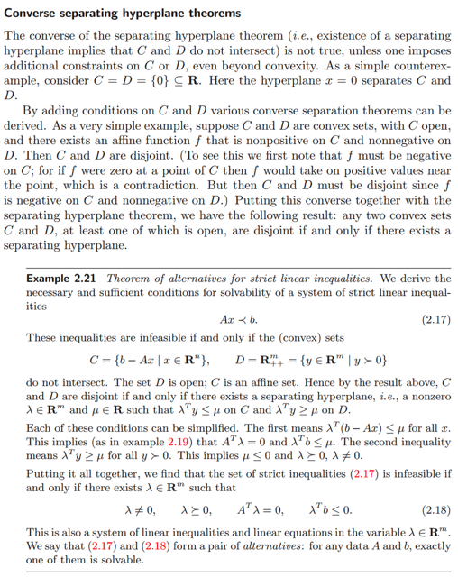</kbd></p>

> [!NOTE]
> Converse separating hy
> SÁCH (XEM SAU)

<br>

            <a id="node-s6mkyjq"></a>
            - **2.5.2 Supporting hyperplane theorem**
<p align="center"><kbd>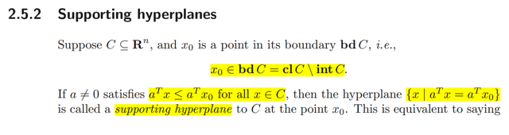</kbd></p>

<p align="center"><kbd>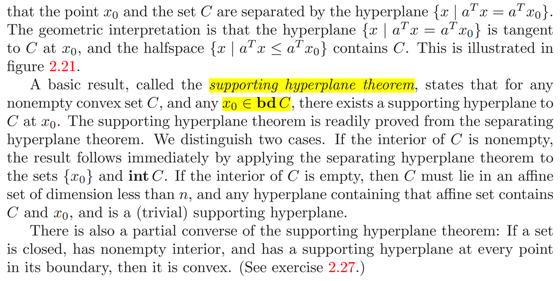</kbd></p>

<p align="center"><kbd>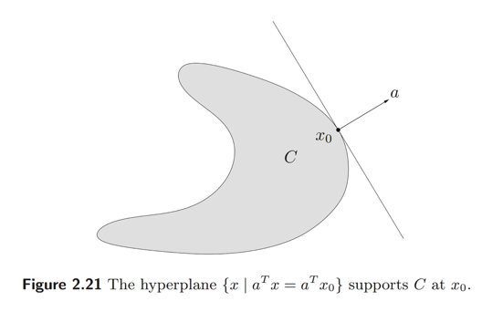</kbd></p>

> [!NOTE]
> Đại ý giới thiệu về khái niệm Supporting hyperplane: Được định nghĩa là với set C là tập con của R^n, và x0 là điểm nằm trên biên(boundary) của nó. Thì với a khác 0 sao cho aTx ≤ aTx0 với mọi x ∈ C thì {x: aTx `=` aTx0} được gọi là supporting hyperplane của C tại x0.
>
> Và về mặt hình học, ta có thể hiểu hyperplane này tiếp xúc với C tại x0 và phân không gian thành hai halfspace, và C nằm trong một halfspace.
>
> Dựa trên đó ta có một theorem: Supporting hyperplane theorem nói rằng: Nếu C là tập lồi và x0 nằm trên biên của nó thì chắc chắn luôn tồn tại một supporting hyperplane của C tại x0.
>
> Để chứng minh tác giả chia làm hai case:
>
> 1)  Xét C có interior không rỗng. Mà theo định nghĩa của iterior ta còn nhớ, đó là tập những điểm x mà có thể vẽ `/` dựng một ball sao cho nó nằm lọt trong C (nôm na là vậy), còn về toán học đại khái là B(x, r) không giao với boundary với một r dương nào đó.
>
> Vậy thì nếu interior không rỗng, ta có thể xét tập int C và một tập chỉ chứa x0. Vì theo định nghĩa của interior như vừa nói thì dĩ nhiên {x0} và int C phải disjoint. Và nhờ đó ta có thể dùng Separating Theorem (nhớ lại, theorem này nói nếu ta có hai convex set disjoint thì nhất định tồn tại một hyperplane separate chúng: aTx ≤ b ∀ x ∈ int C và aTx ≥ b ∀ x ∈ {x0})
>
> Vậy đến đây ta có aTx ≤ b ∀ x ∈ int C và aTx0 ≥ b
>
> Mà x0 là điểm nằm trên boundary. Nên phải tồn tại một chuỗi các điểm trong int C di chuyển dần về x0 (vì không thể nào có một hố sâu rỗng nào ngăn cách giữa biên và interior được). Với các điểm xk đó, vì nằm trong int C nên aTxk ≤ b, lấy lim xk → x0 ta cũng sẽ có lim xk → x0 aTxk `=` aTx0 ≤ b. Vậy ta có aTx0 ≤ b. Kết hợp với ý trên aTx0 ≥ b ta có aTx0 `=` b
>
> Vậy thì đến đây aTx `=` b (hoặc aT(x-x0) `=` 0) là hyperplane đi qua x0 và có aTx ≤ b với mọi x ∈ int C.
>
> Suy ra nó cũng đúng với mọi x ∈ C. Vậy nó chính là support hyperplane của C tại x0.
>
> 2) Xét trường hợp C có interior rỗng. Thì điều này có nghĩa là giống như quả banh trong không gian 3D bị dẹp lép như con tép, để mọi điểm của quả banh đều là boudary. Như vậy nó phải nằm trong một 2D subspace, tức một mặt phẳng. Và cái mặt phẳng này chứa C, dĩ nhiên chứa cả x0. Thì đây là một cái hyperplane đi qua x0 nên nó dạng aTx `=` aTx0. Và mọi x ∈ C cũng thỏa aTx `=` aTx0. Thì cái này cũng chính là aTx ≤ aTx0. Do đó đây cũng chính là support hyperplane của C tại x0.
>
> Vậy ta đã chứng minh xong.

> [!TIP]
> **🤖 AI Feedback** — ⚠️ Score: **75/100**
>
> Bài phân tích có nỗ lực đáng kể trong việc diễn giải và chứng minh, nhưng còn thiếu sót về độ chính xác và tính chặt chẽ toán học. Đặc biệt, định nghĩa về interior còn chưa chính xác và cần bổ sung điều kiện "nonempty" cho tập C trong định lý.

<br>

              <a id="node-atutugj"></a>
              - **`V_perp`**
<p align="center"><kbd>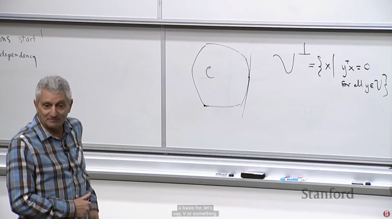</kbd></p>

> [!NOTE]
> Trước tiên gs remind một kiến thức linear algebra, kí hiệu chữ V với kí hiệu vuông góc đọc là "**V_perp**" (perpendicular), thì V là notation của **vector space**, và kí hiệu trên đầu chính là **orthogonal complement**
>
> Nên define {x | yTx `=` 0} với mọi y thuộc V chính là định nghĩa của ORTHOGONAL COMPLEMENT V, tức là **tập hợp mọi vector vuông  góc với V** (vuông góc với mọi y thuộc V, chính là vuông góc với V)
>
> Ví dụ điển hình là **nullspace** của matrix A N(A) và **rowspace**
> của A C(AT) là hai orthogonal complement subspace.

<br>

                <a id="node-ladwkad"></a>
                - **Định nghĩa dual cones**
<p align="center"><kbd>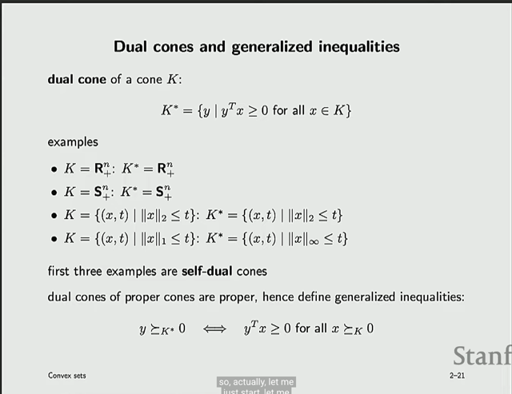</kbd></p>

> [!NOTE]
> Từ đó gs, nói khái niệm **dual cones** cũng giống vậy, nhưng khác là trong trạng thái inequality:
>
> `K_perp` `=` {y: yTx `=` 0} với mọi x ∈ K (dấu bằng)
>
> Thì **dual cone của K**:
>
> K* `=` {y | yTx ≥ 0} for all x ∈ K (dấu ≥)
>
> Dual cones của cone K là tập (set) **các điểm (vector) mà khi dot product với mọi vector của cone K đều ra không âm**

<br>

                  <a id="node-8kze22n"></a>
                  - **dual cones & generalized  inequalities**
<p align="center"><kbd>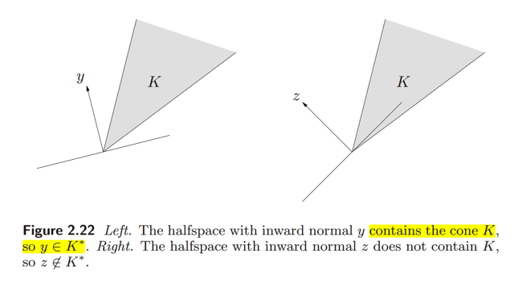</kbd></p>

<p align="center"><kbd>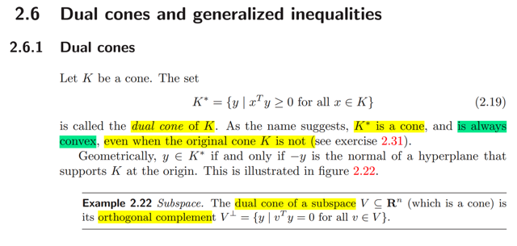</kbd></p>

> [!NOTE]
> Trong sách nói thêm, **dù k không convex thì k* luôn convex**
>
> Và về mặt hình học, **y thuộc K* khi (-y) là normal vector của  support hyperplane của K tại gốc O.**
>
> Là sao, đại khái là khi tại O, ta vẽ một hyperplane quy định bởi normal vector y. Thì cái phần haft-plane mà chứa "tia y" gọi là halfplane mà y là inward normal vector, nếu nó chứa cone K thì khi đó y sẽ thuộc dual cone K*. Vì khi cái halfplane chứa tia y mà chứa cone K, thì mọi vector trong cone K đều hợp với y một góc ≤ 90 độ. Do đó với mọi x trong K, yTx đều ≥ 0.
>
> Ngược lại như hình bên phải, half-plane chứa tia z không chứa cone K, nên có những vector nằm "bên kia", nó sẽ hợp với y góc > 90 dẫn đến dot product với y < 0
>
> Nói một cách dễ hiểu hơn: Ta vẽ một đường thẳng đi qua gốc O chia mặt phẳng làm hai halfspace, và cone K nằm một bên. Ta sẽ vẽ tiếp cái vector y vuông góc với đường thẳng tại O và chỉa về cùng bên với cone K. Thì đó chính là một vector y mà khi dot product với mọi vector trong cone K đều ra dương, dễ thấy là vì nó hợp với các vector trong cone K một góc nhọn. Thì dĩ nhiên -y sẽ hướng về bên kia, thì theo định nghĩa của support hyperplane: thì cái đường thẳng đó chính là support hyperplane của cone K với normal vector là -y (vì normal vector của support hyperplane luôn hướng ra ngoài)

> [!TIP]
> **🤖 AI Feedback** — ⚠️ Score: **85/100**
>
> Bài làm thể hiện sự hiểu biết sâu sắc và khả năng diễn giải rõ ràng các khái niệm về nón đối ngẫu và diễn giải hình học của nó, đặc biệt là mối liên hệ với nửa không gian và siêu phẳng hỗ trợ. Tuy nhiên, có một lỗi nhỏ về ký hiệu khi bạn dùng 'y' thay vì 'z' trong đoạn mô tả hình bên phải. Dù chỉ là lỗi đánh máy, nó vẫn làm giảm tính chính xác tuyệt đối.

<br>

                    <a id="node-gmjsjya"></a>
                    - **SELF-DUAL cone**
<p align="center"><kbd>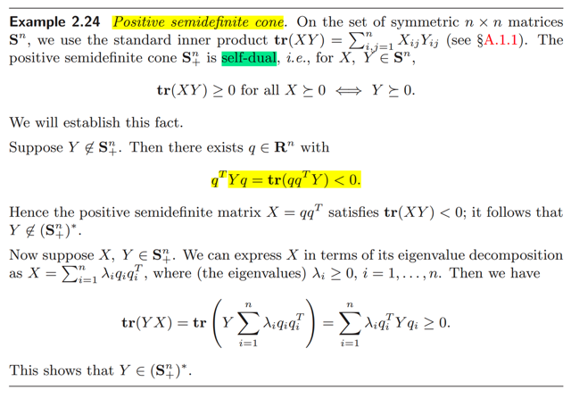</kbd></p>

> [!NOTE]
> Đại khái là cho biết K là **positive semidefinite cone** là một **self-dual cone**: 
>
> Tập những **matrix mà inner product với mọi matrix trong K** thì cũng chính là những psd matrix (K)
>
> Ôn lại chút, theo định nghĩa, inner product của matrix X, và Y ∑i,j XijYij và cái này cũng chính là  tr(XY) Và trace A `=` tổng các entries trên đường chéo của A.
>
> Để chứng minh, hay làm rõ điều này mình sẽ chứng minh với X là psd matrix bất kì, tức X ∈ S^n+ thì nếu như Y là matrix sao cho YX ≥ 0 (điều này, theo định nghĩa dual cone, cho thấy Y ∈ dual cone của S^n+) thì Y cũng sẽ là psd matrix. Khi đó giúp kết luận S^n+ là self dual cone.
>
> Theo định nghĩa vừa nhắc lại ở trên của inner product Y.X cũng là X.Y `=` tr(XY) `=` tr(YX)
>
> Ta sẽ chứng minh bằng phản chứng: Giả sử có Y khiến XY ≥ 0 với mọi X ∈ S^n+ nhưng Y không phải psd matrix, tức ∉ S^n+ thì sẽ dẫn đến điều vô lý.
>
> Rồi, giả sử Y không psd, điều này đồng nghĩa tồn tại q sao cho quadratic form qTYq < 0 (vì nếu Y psd thì quadratic form phải không âm)
>
> qTYq < 0, mà vế trái là scalar. Nên cũng bằng trace của nó: với scalar a thì a `=` tr(a)
>
> ∴ ⇔ tr(qTYq) < 0
>
> ⇔ tr(qqTY) < 0 (dùng tính chất tr(AB) `=` tr(BA))
>
> ⇔ [qqT] . Y < 0 
>
> tức là ta đã có matrix rank 1 U `=` qqT inner product với Y ra âm. Mà đang giả thiết Y có inner product với mọi X ∈ S^n+ ra kết quả không âm cơ mà, trong khi đó U chính là thuộc S^n+. Vậy đây là điều vô lý. Chứng minh xong.
>
> Đây là cách chứng minh phản chứng, nhanh hơn trong sách.
>
> Còn trong sách ổng chứng mình hai ý: Nếu Y không psd thì Y nhất định không thuộc dual cone của S^n+. Và sau đó chứng minh psd thì Y sẽ thuộc dual cone của S^n+:
>
> Chứng minh ý đầu: Giả sử Y không psd, lập luận như trên ta thấy tồn tại U `=` qqT khiến UY < 0. Điều này giúp kết luận Y không thuộc dual cone của S^n+ vì không thỏa định nghĩa.
>
> Còn ý sau: Giả sử Y psd, xét XY ta phải chứng minh với mọi X thì X.Y ≥ 0.
>
> YX `=` tr(YX) 
>
> Nhờ 1806 mình đã biết với symmetrix matrix.  luôn tồn tại đủ số lượng eigenvector độc lập, nên có thể phân tách thành dạng Q Λ QT với Q là matrix các orthogonal eigenvectors và Λ là diagonal matrix các trị riêng. ⇨ X `=` Q Λ QT. 
>
> Và cái này có thể thể hiện bởi [q1,..qn]diag(λ1,..λn)Q (
>
> `=` [λ1q1,..λnqn]QT
>
> Tới đây dùng góc nhìn thứ 4 khi nhân hai matrix đã được học trong MIT1806: AB `=` tổng các rank 1 matrix: [cột i của A] outer product [hàng i của B]
>
> ∴ `=` λ1q1q1T + ..λnqnqnT `=` `ΣλiqiqiT`
>
> Vậy quay lại đây ta có:
>
> `=` tr(Y `Σi` λiqiqiT) 
>
> `=` `tr(Σi` λiYqiqiT) 
>
> `=` `Σi` tr(λiYqiqiT)  (trace chỉ là tổng các entries đường chéo nên tr(A + B) `=` tr(A) + tr(B))
>
> ```text
> = Σi λi tr(YqiqiT) (tr(αA) = αtr(A))
> ```
>
>  `=` `Σi` λi tr(qiTYqi) (tr(AB) `=` tr(BA))
>
>  `=` `Σi` λi (qiTYqi) (vì qiTYqi là scalar, tr(scalar) `=` scalar)
>
> Và tới đây xét cái tổng này, mỗi hạng tử là tích của λi là trị riêng của X, với X pdf thì λi không âm.
> Còn qiTYqi là quadratic form của Y, với Y psd thì cái này cũng không âm nốt.
>
> Vậy có thể kết luận tổng này không âm ⇨ chứng minh xong Y ∈ dual cone của S^n+

> [!TIP]
> **🤖 AI Feedback** — ✅ Score: **95/100**
>
> Bài làm xuất sắc, thể hiện sự hiểu biết sâu sắc về khái niệm nón tự đối ngẫu và các chứng minh liên quan. Cách trình bày mạch lạc, có giải thích rõ ràng các bước và liên hệ kiến thức nền tảng là rất đáng khen ngợi. Có một vài lỗi nhỏ về ký hiệu (ví dụ: "YX ">= 0" thay vì "tr(YX) ">= 0") và lỗi đánh máy ("X pdf" thay vì "X psd") cần chú ý để đạt độ chính xác tuyệt đối.

<br>

                      <a id="node-igtjjtt"></a>
                      - **Dual of a norm cone (QUAY LẠI SAU)**
<p align="center"><kbd>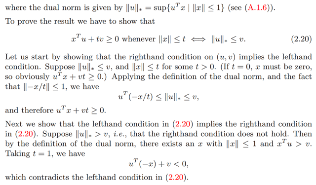</kbd></p>

<p align="center"><kbd>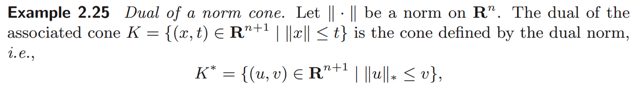</kbd></p>

> [!NOTE]
> SÁCH (XEM SAU)

<br>

                        <a id="node-rvszk5q"></a>
                        - **Vài tính chất của DUAL CONE (QUAY LẠI SAU)**
<p align="center"><kbd>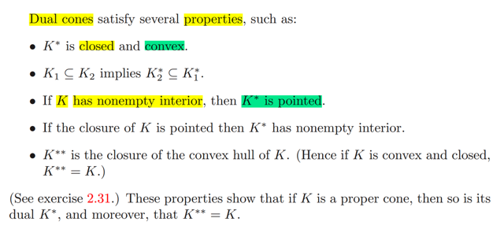</kbd></p>

> [!NOTE]
> vài tính chất của dual cone (quay lại sau)

<br>

                          <a id="node-g79q1m2"></a>
                          - **Dual cone của {0} là R^2 và ngược lại**
<p align="center"><kbd>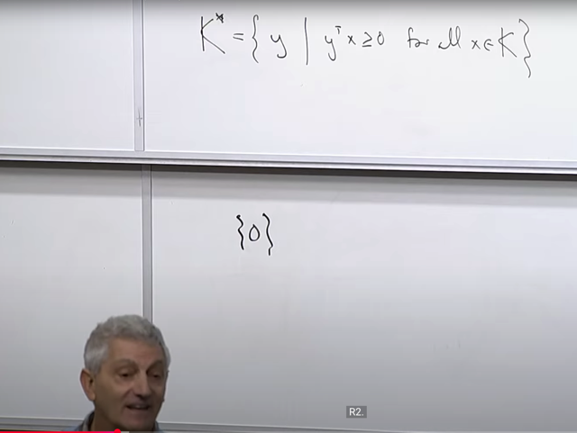</kbd></p>

> [!NOTE]
> Ông hỏi, cho một cone: {0} đây là stupid cone nhưng hoàn toàn valid cone. Câu hỏi là dual cone của nó là gì:
>
> Thử trả lời:
>
> Chiếu theo định nghĩa, dual cone (của cone K) sẽ là** tập hợp các vector y sao cho yTx ≥ 0 với mọi x trong cone**. 
>
> Vậy trong cone này có mỗi vector zero, vậy mọi vector mà dot product với zero vector ra giá trị không âm, thì dễ thấy **vector nào mà chẳng dot product với 0 ra ko âm** vì vector nào dot product với zero cũng ra zero. **Do đó dual cone của 0 chứa mọi vector**
>
> Vậy **dual cone của 0 chính là toàn bộ R^2** (gs đang nói trong R2)
>
> {0} là một cone, và dual cone của nó {0}* là R^2: {0}* `=` R^2
>
> **Ngược lại R^2 cũng là một cone, và dual cone của nó là {0}**:
>
> R^2* `=` {0}

> [!TIP]
> **🤖 AI Feedback** — ✅ Score: **95/100**
>
> Phân tích chính xác và lập luận rõ ràng. Việc suy luận dual cone của {0} và {0} của R^2 cho thấy sự hiểu biết sâu sắc về định nghĩa và tính chất của cone đối ngẫu.

<br>

                            <a id="node-18pnjxn"></a>
                            - **0* `=` R^2**
<p align="center"><kbd>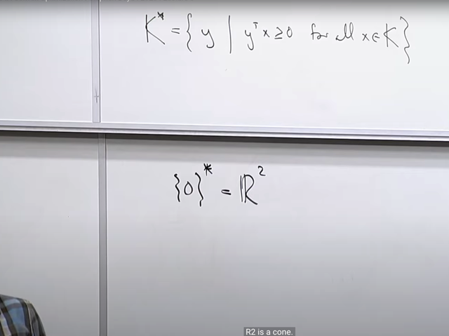</kbd></p>

> [!NOTE]
> Correct, và ta sẽ kí hiệu là 0* `=` R^2, và nó (R^2) cũng là một cone
>
> (nhớ lại định nghĩa cone là set C mà nếu x thuộc set C thì `αx` với mọi `α` ≥ 0) cũng thuộc set C

<br>

                              <a id="node-0eqzi2b"></a>
                              - **cone càng nhỏ thì dual cone càng lớn.**
<p align="center"><kbd>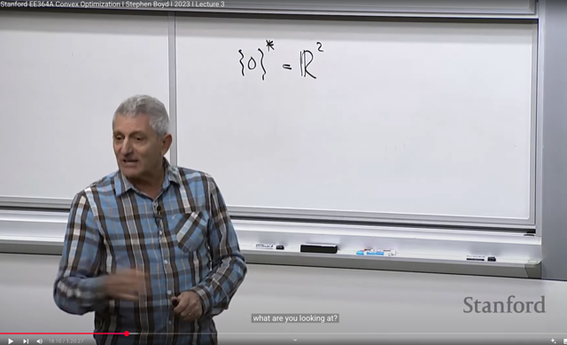</kbd></p>

> [!NOTE]
> Và từ đây ta quan sát thấy một quy luật đó là:
>
> **cone càng nhỏ thì dual cone càng lớn.**
>
> Ở đây 0 là cái cone nhỏ nhất có thể, thì dual cone của nó là toàn bộ R^2
>
> Và, ta liên hệ nó khái niệm **conjugate**.
>
> Và **Conjugate** có một tính chất là **khi ta làm 2 lần thì nó quay về vị trí cũ**. 
>
> Giống như **conjugate của conjugate của complex number là chính nó**. Hay với vector space:** orthogonal complement của orthogonal complement của vector space là chính nó**
>
> Khái niệm conjugate của complex number ta đã học ở 1806: đơn giản là một complex với phần ảo đổi dấu.
>
> Hay C(AT)_perp chính là N(A), và N(A)_perp cũng là [C(AT)_perp]_perp chính là C(AT)
>
> Và dễ thấy ở đây cũng vậy, dual cone của R^2 theo định nghĩa là tập hợp mọi vector mà dot product với mọi vector trong R^2 ra giá trị không âm, thì rõ ràng chỉ có zero mới vậy, nên 0 chính là dual cone của R^2
>
> Gs gọi là the **conjugate của dual của dual là chính nó**

<br>

                                <a id="node-2p4er41"></a>
                                - **một tia (ray) và nó là một cone**
<p align="center"><kbd>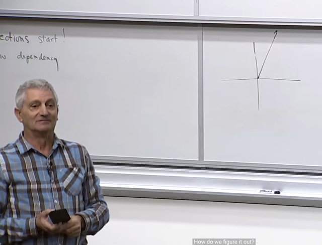</kbd></p>

<p align="center"><kbd>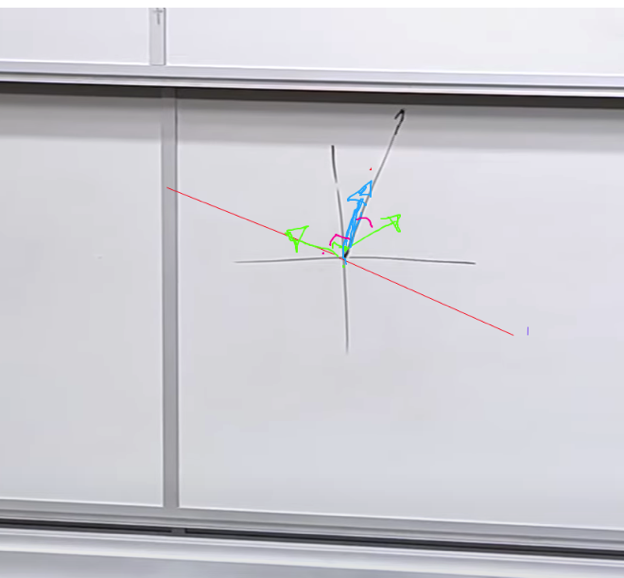</kbd></p>

> [!NOTE]
> Gs lấy ví dụ khác, như ta từng gặp, đây là **một tia (ray) và nó là một cone**. 
>
> **Dual cone của nó là gì?**
>
> Thử trả lời, **theo định nghĩa, dual cone của cái này là tập hợp các vector có dot product với mọi vector trên cone này đều không âm.**
>
> Thế thì ray là tập hợp mọi scaled của một vector với scale factor không âm (vì nếu âm thì nó đã không còn là tia, nó sẽ đi qua cả phía bên kia theo hướng ngược lại)
>
> Nên mình đoán dual cone của cái tia này, là một half-plane: **Vẽ đường thẳng vuông góc với tia, thì dual cone của tia này là half-plane chứa tia**. Vì trong đó, mọi vector khi dot product với mọi vector trong tia sẽ đều dương (hoặc bằng 0 khi vector vuông góc với tia)
>
> Lí do là vì dot product aTb `=` `||a||||b||cos(θ(a,b)),` nên nếu các vector trong half-plane như vừa nói thì góc `θ` giữa nó với vector trong tia sẽ nhỏ hơn 90 độ ⇨ cosine không âm.
>
> Dual Cone của Ray (tia) là Half-plane chứa tia

> [!TIP]
> **🤖 AI Feedback** — ⚠️ Score: **70/100**
>
> Phần định nghĩa nón đối ngẫu và lý giải bằng tích vô hướng là chính xác. Tuy nhiên, mô tả hình học "half-plane chứa tia" chưa hoàn toàn đúng, vì tia gốc thường nằm trên biên của nón đối ngẫu chứ không phải được chứa trong lòng nó.

<br>

<p align="center"><kbd>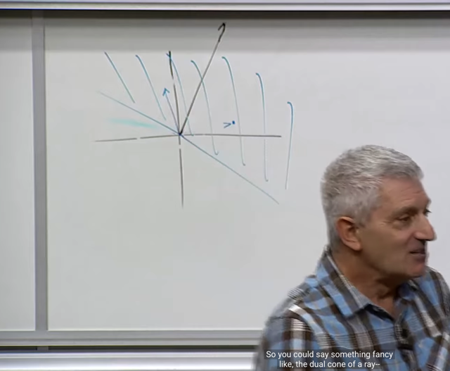</kbd></p>

> [!NOTE]
> Đúng vậy.

<br>

<p align="center"><kbd>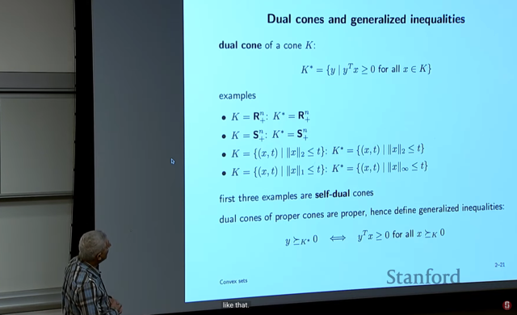</kbd></p>

> [!NOTE]
> Và quay lại đây ta có một ví dụ nữa là dual cone của non-negative orthant R^n +

<br>

                                      <a id="node-hx1aqvz"></a>
                                      - **R^n+ là self-dual cone**
<p align="center"><kbd>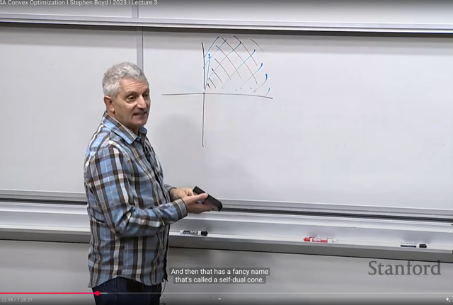</kbd></p>

> [!NOTE]
> Như đã biết R^n + , ví dụ trong R^2, thì R^2 + là góc phần tư không âm
>
> Thế thì để trả lời câu hỏi dual cone của nó là gì, ta chỉ việc thử vẽ vài vector và hỏi liệu nó có dot product với mọi vector trong góc phần tư này để ra không âm không.
>
> Từ đó có thể thấy chỉ có vector trong góc phần tư này, mới luôn tạo một góc nhỏ hơn hoặc bằng 90 độ với mọi vector trong góc phần tư không âm này.
>
> Thành ra với cái cone này R^n + , thì dual cone LÀ CHÍNH NÓ.
>
> Và do đó nó được gọi là self-dual cone
>
> dual cone của non-negative orthant r^n+ là chính nó
>
> nên **r^n+ là self-dual cone**

> [!TIP]
> **🤖 AI Feedback** — ✅ Score: **92/100**
>
> Bài làm rất chính xác và giải thích rõ ràng khái niệm self-dual cone cho trường hợp R^n+. Cách lập luận cho thấy sự hiểu biết sâu sắc về điều kiện dual cone.

<br>

                                        <a id="node-kwlpia6"></a>
                                        - **Dual generalized inequalities**
<p align="center"><kbd>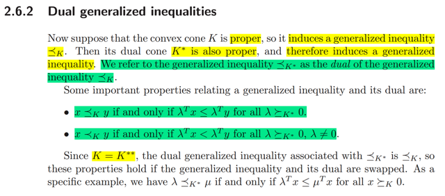</kbd></p>

> [!NOTE]
> Phần này có thể gs có nói trong bài mà ko theo kịp hay không để ý
>
> Đó là giả sử ta có **K là proper cone**, khi đó như đã biết, nó sẽ tạo ra phép **generalized inequality wrt K (⪯K)**
>
> Thế thì bây giờ ta biết: 
>
> **nếu K là proper cone thì dual cone của nó K* cũng là proper cone**. 
>
> Và do đó **cũng sẽ tạo ra generalized inequalities wrt K* (⪯K*)**
>
> Thế thì từ đó cái **generalized inequality ⪯K và ⪯K* LÀ DUAL CỦA NHAU.**
>
> Và từ đó có vài tính chất quan trọng: 
>
> x ⪯K y ⇔ λTx ≤ λTy với mọi λ ≽K* 0 
>
> tức là, nếu x ⪯K y thì λTx ≤ λTy với mọi λ thuộc dual cone K*.
>
> Và như trong bài gs đã nói, giống như complement của complement ra chính nó. Thì K** `=` K, nên như đã nói ở trên dual của ⪯K* cũng là ⪯K

<br>

                                          <a id="node-lis1ta7"></a>
                                          - **Theorem of alternatives for linear strict generalized inequalities**
<p align="center"><kbd>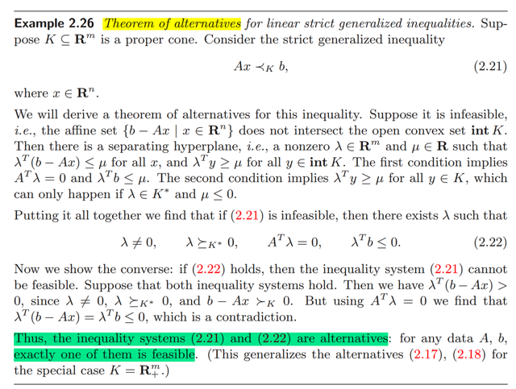</kbd></p>

> [!NOTE]
> Đã đọc qua, dù chưa hiểu ý nghĩa của cái này để làm gì nhưng có thể ghi chú vài điểm có thể gây khó hiểu trong đây:
>
> Hiểu đại khái thì đây là nói về "**định lí về tính thay thế**" của **inequality Ax ≺K b** 
>
> (tạm hiểu rằng, theorem of alternative nó sẽ nói rằng **cái này feasible thì cái kia infeasible và ngược lại**, chứ **không thể có vụ cả hai cùng feasible `/` infeasible**. 
>
> Vậy thì cụ thể cái này ta sẽ tìm ra cái hệ mà khi Ax ≺K b infeasible thì nó sẽ feasible và ngược lại.
>
> Rồi đầu tiên ta **giả sử Ax ≺K b infeasible**. 
>
> Infeasible thì có nghĩa là **không tồn tại x nào thỏa cái này** hết. 
>
> Mà cái inequality Ax ≺K b, theo định nghĩa của generalized inequality wrt K thì nó có nghĩa là b - Ax ∈ K.  (Chính xác hơn, vì đây là strict inequality ≺ nên phải là "b - Ax ∈ interior của cone K (int K)")
>
> Vậy khi ta giả sử hệ này không có nghiệm thì tức là không tồn tại x nào khiến b - Ax ∈ int K
>
> ⇔ với mọi x, thì b - Ax nằm ngoài int K 
>
> ⇔ affine set {b - Ax với x ∈ R^n} ∩ int K `=` ∅
>
> Và theo theorem of separating hyper-plane, thì sẽ tồn tại một hyperplane λTx `=` `μ` sao cho mọi điểm trong affine set {b - Ax | x ∈ R^n} sẽ nằm một bên, và mọi điểm trong cone K nằm bên kia:
>
> λTx ≤ `μ` với mọi x ∈ {b - Ax | x ∈ R^n}, và λTy ≥ `μ` với mọi y ∈ int K.
>
> ⇔ λT(b - Ax) ≤ `μ` với mọi  x ∈ R^n, và λTy ≥ `μ` với mọi y ∈ int K.
>
> Thế thì họ nói cái đầu tiên cho thấy ATλ `=` 0 và λTb ≤ `μ` là sao?
>
> Đó là vì λT(b - Ax) ≤ `μ` với mọi x ∈ R^n 
>
> ⇔ **λTb - λTAx ≤ `μ` ∀ x ∈ R^n**
>
> Mà vế trái là một affine function của x, nên **giống như đường thẳng px + q, mà muốn ≤ `α` với mọi x thì điều này chỉ xảy ra khi p `=` 0 và q ≤ α**. 
>
> **Đó là lí do mà ta có λTA `=` ATλ `=` 0, và λTb phải ≤ μ**
>
> Còn cái thứ hai, họ nói sẽ imply λ ∈ K* và `μ` ≤ 0 vì sao?
>
> Xét λTy ≥ `μ` với mọi y ∈ int K, ta nhớ định nghĩa của dual cone của K:
>
> Tập mọi λ sao cho λTy ≥ 0 với mọi y ∈ K. Thì theo gs nói, dựa vào đây, thì việc λTy ≥ `μ` với mọi y ∈ int K chỉ xảy ra khi λ ∈ K* và `μ` ≥ 0 (có vẻ hơi khiên cưỡng nhưng thôi đành nghe vậy)
>
> Rồi kết hợp lại ta sẽ có λTA `=` 0, λTb ≤ `μ,` λ ∈ K* và `μ` ≥ 0
>
> Kết hợp , λTb ≤ `μ` và  `μ` ≥ 0 thì ta có λTb ≤ 0
>
> `====`
>
> Sau đó gs **chứng minh ngược lại rằng nếu hệ sau feasible thì hệ đầu infeasible**
>
> Đơn giản thôi: 
>
> Cách chứng minh là giả sửa cả hai hệ đều feasible, tức là tồn tại x thỏa hệ 2.21 và λ thoả 2.22
>
> Rồi, tồn tại x thoả 2.21 tức là Ax ≺K b, mà cái này như định nghĩa của generalized inequality ta biết nó có nghĩa là b - Ax ∈ K. Tiếp tục ta có λ thoả 2.22 thì trong đó có λ ≽K* 0, điều này đồng nghĩa λ ∈ K*. Thế thì K* là dual cone của K, theo định nghĩa, nó là mà "ai" thuộc nó thì sẽ đều dot product với vector bất kì thuộc K (trong đó có b - Ax) cho ra dương. Vậy ta có thể kết luận λT(b - Ax) > 0.
>
> Tiếp, λT(b - Ax) > 0 ⇔ λTb - λTAx > 0
>
> ⇔ λTb > λTAx
>
> Mà trong 2.22 có ATλ `=` 0
>
> nên λTb > λTAx ⇔ λTb > 0 Và cái này thì mâu thuẫn với ý thứ 4 của 2.22
>
> Vậy ta đã chứng minh xong hai hệ 2.21 và 2.22 không thể cùng feasible. Nói cách khác, 2.21 có nghiệm thì 2.22 vô nghiệm và ngược lại.

> [!TIP]
> **🤖 AI Feedback** — ⚠️ Score: **70/100**
>
> Bạn đã thể hiện sự hiểu biết sâu sắc về cấu trúc chứng minh và cung cấp giải thích chi tiết cho các bước, đặc biệt là việc suy ra ATλ = 0, điều này rất đáng khen ngợi. Tuy nhiên, có một lỗi nghiêm trọng trong việc xác định dấu của μ (μ ≤ 0 thay vì μ ≥ 0) khi áp dụng định lý siêu phẳng phân tách, và bạn cũng cần phân biệt rõ ràng hơn giữa K và int K trong định nghĩa bất đẳng thức.

<br>

                                            <a id="node-oopxdje"></a>
                                            - **Minimum & minimal elements via dual inequalities**
<p align="center"><kbd>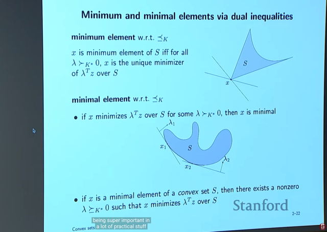</kbd></p>

> [!NOTE]
> Ta hiểu phát biểu về **MINIMUM w.r.t K** như sau:
>
> Hiểu ví dụ trước: Giả sử ta có **cone K là non-negative orthant R^2+**, như đã biết, đây là cái cone có tính chất **self-dual cone**, tức là **dual cone của nó cũng là nó luôn K `=` K***
>
> Thế thì, kí hiệu x ≻K* y có nghĩa là **x - y phải nằm trong interior của K***.
>
> Vậy với K là R^2+, thì chọn λ sao cho λ ≻K* 0 có nghĩa λ - 0 `=` λ phải thuộc int K* (với K là R^2+ thì int K* `=` int K (self-dual) `=` int R^2+ Vậy tức là cần vector λ có component dương)
>
> Thì nếu như ta thấy, 
>
> 1) Việc **tìm các điểm z trong S sao cho minimize λTz** - linear combination các coordinate của z với coefficients là component của λ thì ta luôn tìm ra cùng một điểm x. Và.. 
>
> 2) **Nếu với mọi λ đều như vậy thì x chính là minimum element w.r.t K của S**
>
> Từ đó ta hiểu định nghĩa này theo cách khái quát: đó là nếu và chỉ nếu như:
>
> i) Chọn vector λ ≻K* 0 (λ - 0, tức là λ nằm trong interior của K*)
>
> ii) Tìm hết trong S các vector z, để sao cho minimize λTz thì ta được x.
>
> iii) Mà λ nào ta làm vậy cũng ra x, nói cách khác, x là unique solution. Khi đó x chính là minimum element của S w.r.t K
>
> Định nghĩa ngắn gọn nhất có thể: Thỏa cái này thì x gọi là minimum wrt cone K của S nè:
>
> **Với mọi λ ≻K* 0 (cũng là λ ∈ int(K*)), x `=` unique solution của bài toán `minimize_x` ∈ S {λTz}**

> [!TIP]
> **🤖 AI Feedback** — ✅ Score: **92/100**
>
> Bài phân tích định nghĩa về 'minimum element w.r.t K' rất sâu sắc và chính xác, đặc biệt trong việc giải thích điều kiện 'for all' và 'unique minimizer'. Việc sử dụng ví dụ cụ thể với R^2+ giúp minh họa rõ ràng các khái niệm phức tạp. Một điểm nhỏ cần lưu ý là trong phần định nghĩa ngắn gọn cuối cùng, ký hiệu 'minimize_x ∈ S {λTz}' nên được viết là 'minimize_{z ∈ S} {λTz}' để thể hiện rõ hơn biến số đang được tối ưu.

<br>

                                              <a id="node-pvu6m8o"></a>
                                              - **Một student hỏi**
<p align="center"><kbd>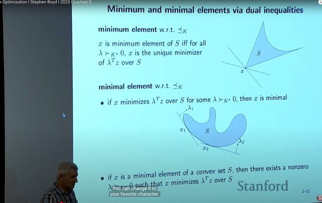</kbd></p>

> [!NOTE]
> Một student hỏi câu mà ta cũng thắc mắc là z là gì. 
>
> Gs: z là dummy variable, là cái thứ mà ví dụ khi ta gọi hàm f(z) `=` z^2 thì thật ra ta không care z, mà ta care f. Nên có thể nói f(u) `=` u^2 cũng được

<br>

                                                <a id="node-sniocip"></a>
                                                - **Chứng minh:  x là minimum của S wrt K ⇔ λTx unique minimize λTz với mọi λ thuộc int K***
<p align="center"><kbd>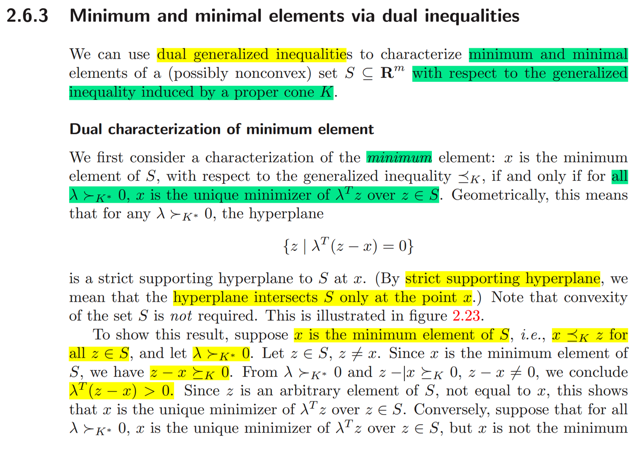</kbd></p>

<p align="center"><kbd>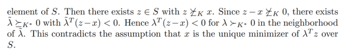</kbd></p>

> [!NOTE]
> Đọc sách ta có thể hiểu thêm phần Chứng minh: 
>
> **x là minimum của S wrt K ⇔ λTx unique minimize λTz với mọi λ thuộc int K***
>
> Chứng minh đại khái là vầy: 
>
> Chiều đi, hay điều kiện cần: Nếu x là minimum của S wrt K ⇨ λTx unique minimize λTz với mọi λ thuộc int K*
>
> Ta có x là minimum của S wrt K nên theo định nghĩa của minimum wrt K: 
>
> x ⪯K z với mọi z ∈ S, z ≠ x  
>
> ⇔ 0 ⪯K z - x ∀ z ∈ S, z ≠ x
>
> ⇔ z - x ∈ K `\` {0} ∀ z ∈ S, z ≠ x
>
> (vì xét z khác x nên **z - x ≠ 0, nên z - x ∈ K `\` {0}**)
>
> Theo **định nghĩa của dual cone**: K* `=` {λ: λTz ≥ 0 ∀ z ∈ K} 
>
> và nếu chỉ xét int K*, thì `=` {λ: λTz > 0 ∀ z ∈ K} 
>
> Do đó:
>
> λT(z - x) > 0 ∀ z - x ∈ K `\` {0} ∀ λ ∈ int K*
>
> Vậy đến đây ta có λTz > λTx với mọi z ∈ S, z ≠ x
>
> ⇨ **x là unique minimizer của λTz, ∀ λ ∈ int K**
>
> `====`
>
> Ở chiều ngược lại, tức điều kiện đủ: 
>
> Giả sử ta có ∀ λ ∈ int K* (tức λ ≻K* 0), x unique minimizer của λTz over z ∈ S. Ta sẽ chứng minh x là minimum của của S wrt K. 
>
> Dùng phương pháp phản chứng, giả sử  ∀ λ ∈ int K* (tức λ ≻K* 0), x unique minimizer của λTz over z ∈ S **nhưng x không phải minimum**
>
> Thế thì nếu x không phải minimum thì có nghĩa là tồn tại z ∈ S sao cho z ⋡K x. 
>
> Mà z ⋡K x ⇔ z - x ∉ K. 
>
> Quay lại định nghĩa của dual cone đã nói ở trên, **nếu z - x thuộc K thì nhất định λT(z - x) ≥ 0 với mọi λ thuộc K***, vậy mà nay z - x không thuộc K suy ra: 
>
> tồn tại λ_tilde ∈ K* khiến λ_tildeT(y - x) < 0. 
>
> Và vì hàm **f(λ) `=` λT(z - x) liên tục** nên tồn tại một khoảng lân cận quanh λ_tilde sao cho các λ trong vùng đó đều có λT(y - x) < 0. Mà điều này có nghĩa là, **ngay cả khi λ_tilde nằm ở biên của K*, thì sẽ vẫn chắc chắn là tồn tại điểm lân cận của nó sẽ nằm trong interior int K* thỏa điều trên.**
>
> Do đó cho phép ta kết luận **tồn tại λ ∈ int K* khiến: λTz < λTx**
>
> Và cái này **mâu thuẫn với giả định ban đầu là λTx là unique minimizer của λTz với mọi λ ∈ int K*.**
>
> Do đó ta kết luận, khi λTx minimize λTz với mọi λ thuộc int K* thì x là  minimum của S wrt K

> [!TIP]
> **🤖 AI Feedback** — ⚠️ Score: **85/100**
>
> Bài làm cho thấy sự hiểu biết sâu sắc và khả năng giải thích rõ ràng các khái niệm phức tạp, đặc biệt là phần chứng minh chiều ngược lại đã được diễn giải tốt hơn so với văn bản gốc. Tuy nhiên, định nghĩa về 'int K*' còn chưa hoàn toàn chính xác và có một lỗi chính tả nhỏ trong phần chứng minh nghịch đảo.

<br>

                                                  <a id="node-m24dw9f"></a>
                                                  - **minimal w.r.t cone k**
<p align="center"><kbd>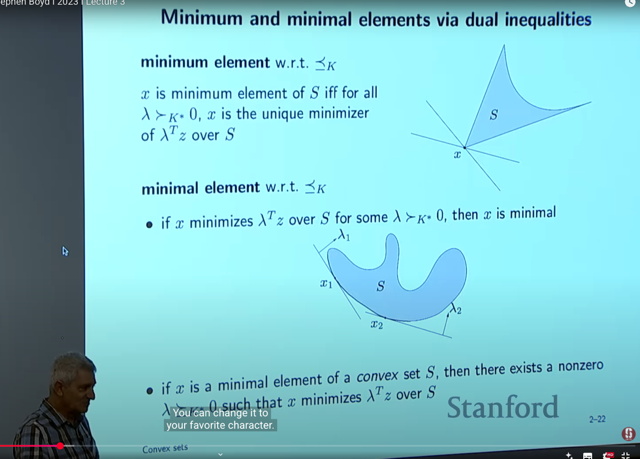</kbd></p>

> [!NOTE]
> Tiếp theo là **minimal w.r.t cone k** 
>
> đại khái nói rằng nếu ta chọn λ như trên (λ ≻K* 0) và minimize f_λ(z) `=` λTz, thì ta sẽ có **minimal element của S with respect to K**
>
> Gs nhắc lại, nếu không hiểu thì những bài sau khi ta áp dụng nó  vào các bài toán cụ thể thì ta sẽ hiểu thôi

<br>

                                                    <a id="node-f5go1ga"></a>
                                                    - **Dual characterization of minimal elements**
<p align="center"><kbd>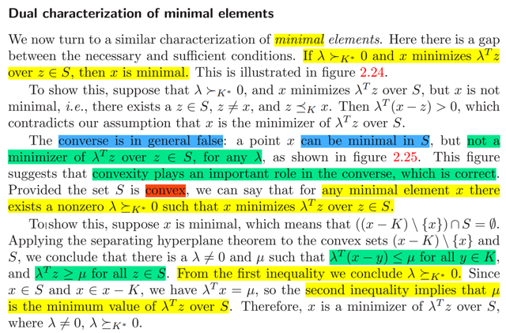</kbd></p>

> [!NOTE]
> Tiếp theo là liên quan đến **minimal**. 
>
> Như vừa rồi là **minimum**, ôn lại định nghĩa nếu x là **minimum của S wrt K **thì **x ⪯K y với mọi y ∈ S**. 
>
> Còn nếu x là **minimal của S wrt K** thì **x là điểm duy nhất trong S mà ⪯K x**: 
>
> y ⪯K x thì ⇨ y `=` x.
>
> Vậy thì theorem này như trong bài giảng đã nói: 
>
> **∀ λ ∈ int K* (λ ≻K* 0) và λTx là minimizer của λTz over all z ∈ S ⇨ x sẽ là minimal of S wrt K.**
>
> (Chiều ngược lại chỉ đúng nếu S convex và λ ∈ K* (chứ không phải int K*):
>
> **Nếu S convex, x là minimal of S wrt K ⇨ ∃ λ ∈ K*: x là minimizer của λTz over all z ∈ S)**
>
> `====`
>
> Ta có thể chứng minh như sau:
>
> Giả sử **với  λ ∈ int K*, x là minimizer của λTz over all z ∈ S** mà **x lại không phải minimal**:
>
> Theo định nghĩa, **nếu x không phải minimal, thì ∃ z ∈ S, z ≠ x mà x ≽K z** 
>
> ⇔ x - z ∈ K, z ≠ x
>
> ⇔ x - z ∈ K, x - z ≠ 0
>
> ⇔ x - z ∈ K `\` {0}
>
> Nhắc lại **định nghĩa của dual cone K*: {λ: λTu ≥ 0 ∀ u ∈ K} và int K* `=` {λ: λTu > 0 ∀ u ∈ K}**
>
> Vậy ở đây ta có x - z ∈ K `\` {0} ⇨ λT(x - z) > 0 với mọi λ ∈ int K*
>
> ⇔ λTx > λTz với mọi λ ∈ int K* 
>
> ⇨ Vậy x không phải là minimizer của λTz over mọi z ∈ S, mâu thuẫn giả thiết (x là minimizer)
>
> Chứng minh xong chiều đi: **λTx là minimizer của λTz over all z ∈ x thì x là minimal**
>
> `====`
>
> Tiếp theo ở chiều ngược lại thì nói chung là không đúng: 
>
> Nếu **x là minimal của S thì chưa chắc tồn tại λ ∈ K* sao cho λTx minimize λTz over all z ∈ S** 
>
> Và cái này thể hiện bởi hình ảnh kế tiếp.
>
> Thế thì từ hình ảnh đó đại khái ta có thể hình dung rằng, **nếu s là convex set, thì ta sẽ có chiều ngược lại: khi x là minimal của s thì tồn tại λ ∈ K* (K*, chứ phải int K*) khiến λTx minimize của λTz over S**  
>
> Tiếp ta có thể chứng minh cái này:
>
> Đại khái là **giả sử S là convex set và x là minimal**. 
>
> Ta còn nhớ theo **định nghĩa của minimal, nó sẽ là điểm duy nhất trong S mà "dở" hơn nó**, thể hiện bởi toán học là: 
>
> y ⪯K x ⇨ y `=` x. 
>
> Nhưng còn một cách thể hiện toán học dùng Set notation: (x - K) ∩ S `=` {x}
>
>  ⇔ {(x - K) `\` {x}} ∩ S `=` ∅. 
>
> Vế trái, có nghĩa là là set (x - K) bỏ đi x. Thế thì vì {(x - K) `\` {x}} ∩ S `=` ∅ nên theo **separating hyperplane theorem**, sẽ **tồn tại một hyperplane chia space làm hai mà mỗi set trên nằm một bên**. 
>
> Nói theo toán học sẽ là **tồn tại λ và `μ` (với λ đóng vai normal vector của hyperplane) sao cho** :
>
> (a) **λTz ≤ `μ` với mọi z ∈ {(x - K) `\` {x}}** 
>
> (b) **λTy ≥ `μ` với mọi y ∈ S**
>
> Xét λTz ≤ `μ` với mọi z ∈ {(x - K) `\` {x}}: 
>
> Đầu tiên cần hiểu z ∈ {(x - K) `\` {x}} có nghĩa là:
>
> z ∈ (x - K) và z ≠ x. Và tập (x - K) là viết tắt của tập {z: z `=` x - k | k ∈ K}
>
> Nên λTz ≤ `μ` với mọi z ∈  {(x - K) `\` {x}} 
>
> ⇔ λTz ≤ `μ` với mọi z ∈ {z: z `=` x - k | k ∈ K, z ≠ x}
>
> ⇔ λTz ≤ `μ` với mọi z ∈ {z: z `=` x - k | k ∈ K, x - z ≠ 0}
>
> ⇔ λT(x - k) ≤ `μ` với mọi k ∈ K, k ≠ 0. 
>
> Và cái này tương đương λTx - `μ` ≤ λTk với mọi k ∈ K (1)
>
> Xét siêu phẳng λTx - `μ.` 
>
> Ta có (x - K) ∩ S `=` {x}: Thế thì vì x vừa nằm trong (x - K) vừa nằm trong S, và bỏ x để (x - K) `\` {x} ∩ S `=` ∅ để rồi có hyperplane giữa (x - K) `\` {x} và S nên đương nhiên x **chính là nằm trên hyperplane này**. Do đó λTx `=` `μ`
>
> Vậy với λTx `=` `μ` thì (1) trở thành λTk ≥ 0 với mọi k ∈ K ⇨ λ ∈ K* (λ ≽K* 0) (theo định nghĩa dual cone K*)
>
> Còn xét ý (b) λTy ≥ `μ` với mọi y ∈ S, thì vì `μ` `=` λTx nên nó thành **λTy ≥ λTx với mọi y ∈ S**, ⇨ **x là minimizer của λTy over y ∈ set S.**
>
> Tới đây kết hợp hai ý ta sẽ có:
>
> (Đã chứng minh rằng) tồn tại λ ∈ K* và λ ≠ 0 sao cho x minimize λTy ∀ y ∈ S
>
> ⇨ đã chứng minh xong: khi x là minimal của S thì tồn tại λ ≽K* 0 khiến x là minimizer của λTy over y ∈ set S.

> [!TIP]
> **🤖 AI Feedback** — ❌ Score: **55/100**
>
> Bài phân tích đã bám sát cấu trúc chứng minh từ tài liệu gốc. Tuy nhiên, có những thiếu sót nghiêm trọng trong định nghĩa phần tử "minimal" và "không minimal", thể hiện sự thiếu chính xác về mặt toán học. Ngoài ra, các chứng minh còn bỏ qua điều kiện quan trọng rằng vector λ phải khác 0.

<br>

                                                      <a id="node-ldfrv5k"></a>
                                                      - **Figure 2.25**
<p align="center"><kbd>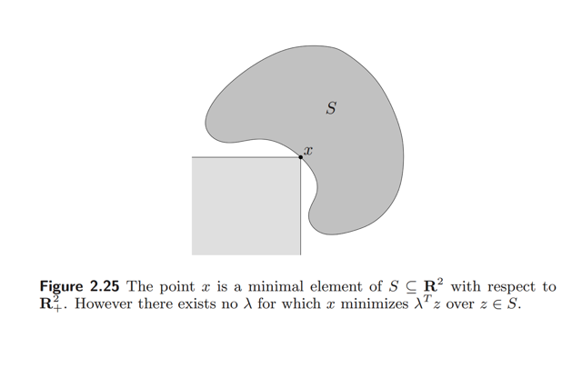</kbd></p>

> [!NOTE]
> HInh này cho thấy **x là minimal của S, nhưng không tồn tại λ khiến λTx minimize λTz over S, nếu S là convex set thì sẽ có**.
>
> Ta hiểu rằng nếu có thì ta sẽ có λTx ≤ λTz ⇔ λ(x - z) ≤ 0 và nó sẽ làm nên một  support hyperplane của S. Nhưng trong hình có thể thấy không thể có tiếp tuyến với S tại x

<br>

                                                        <a id="node-n1pz4dm"></a>
                                                        - **Chiều ngược chỉ đúng với lambda thuộc K*, không phải int K***
<p align="center"><kbd>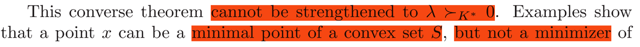</kbd></p>

<p align="center"><kbd>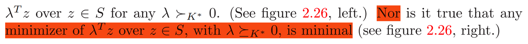</kbd></p>

<p align="center"><kbd>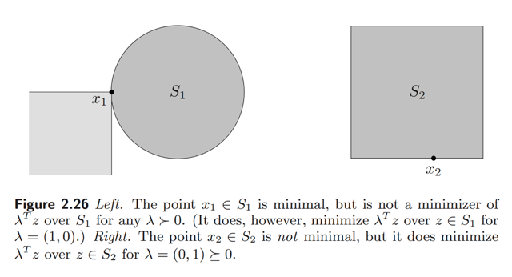</kbd></p>

> [!NOTE]
> Hai dòng này cũng rất đáng chú ý. Đại khái nói là cái theorem ở chiều ngược lại vừa rồi: nếu S convex, thì khi **x là minimal thì tồn tại λ ∈ K* (λ ⪰K* 0) sao cho x là minimizer của λTy over y ∈ S**)
>
> Thì đại khái là nói cái này **KHÔNG ĐÚNG NẾU SỬA LẠI LÀ λ ≻K* 0 (λ ∈ int K*)**
>
> Hình ảnh minh họa cho cái này là ta set K là R^n+, ta nhớ lúc này K* cũng là K là R^n+ luôn, và ≽R^n+ thì có thể chỉ ghi là ⪰ thôi, và x ≽ 0 tức là component của x đều không âm, x ≻ 0 thì tức là component cuả x đều dương)
>
> Vậy hình trái có thể thấy x1 là minimal của S, bởi nó thỏa (x1 - K) ∩ S `=` x1
>
> nhưng người ta nói nó không phải là minimizer của λTz over S với bất kì λ ≻ 0 nào. Tức là nếu dùng lambda ≽ 0 thì có, nhưng strictly ≻ thì không có.
>
> Bởi vậy mới nói cái **converse theorem này không đúng nếu dùng dấu strict inequality ≻K*.**
>
> Một cái nữa, đó là cái theorem chiều xuôi nhớ đọc kĩ, nó nói là nếu với  λ ≻K* 0 mà x minimize  λTz over z ∈ S thì x là minimal. Thì sẽ **không đúng nếu thay bằng** λ ≽K* 0.
>
> Minh họa bởi hình phải, khi x2 là minimizer của λTz over z thuộc S với λ `=` (0,1) (λ `=` (0,1) ≽K* 0 nhưng không ≻K* 0). thì lúc này x2 không phải là minimal (mọi điểm trong cạnh dưới, ở bên trái x2 đều nhỏ hơn nó, hay (x2 - K) ∩ S `=` nhiều điểm chứ không chỉ mỗi x2
>
> Tóm lại (khi là convex) ở chiều xuôi thì phải là dấu ≻K* mới đúng. Còn ở chiều ngược thì phải là dấu ≽K* mới đúng:
>
> Nếu ∃ λ ∈ int K*: x minimizer của λTz over z ∈ S ⇨ x là minimal of S
>
> Nếu S convex, và x là minimal of S ⇨ ∃ λ ∈ K*

> [!TIP]
> **🤖 AI Feedback** — ✅ Score: **95/100**
>
> Bài phân tích rất chính xác và chi tiết, thể hiện sự hiểu biết sâu sắc về các điều kiện của các định lý liên quan đến điểm tối thiểu và tối thiểu hóa hàm tuyến tính. Minh họa bằng hình ảnh được giải thích rõ ràng và mạch lạc. Tuy nhiên, trong phần tóm tắt cuối cùng về định lý đảo, cần làm rõ hơn rằng sự tồn tại của λ ∈ K* đi kèm với việc x là điểm tối thiểu hóa hàm λTz trên S.

<br>

                                                          <a id="node-b5pbu2a"></a>
                                                          - **Minimum and minimal elements via dual inequalities**
<p align="center"><kbd>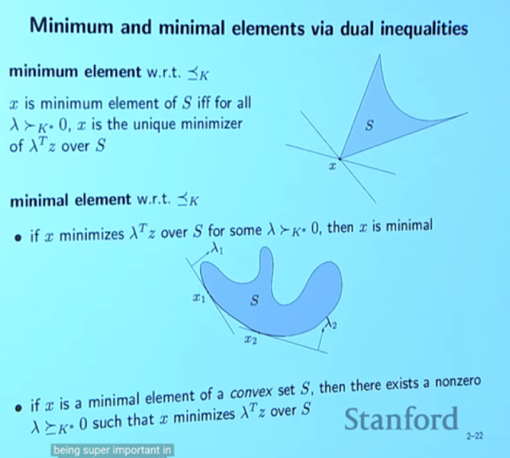</kbd></p>

> [!NOTE]
> Ví dụ K là R^2+ khi đó λ ≻K* 0 ⇔ λ ∈ int K* thì như đã nói λ chính là vector có component đều dương (λ1 > 0, λ2 > 0)
>
> Thế thì z là vector `/` điểm trong S, ví dụ như có component là (z1, z2) thì λTz chính là λ1z1 + λ2z2. Và giá trị của dot product này sẽ khác nhau với các z khác nhau. Và **với mỗi λ thì các λTz `=` c với c thay đổi sẽ tạo ra vô sô đường thẳng song song nhau và có normal vector là λ**.
>
> Vì vậy việc tìm ra z khiến minimize λTz sẽ giống như ta lấy cây thước, đặt nó theo hướng vuông góc với λ và di chuyển song song cây thước cho đến khi c `=` λTz nhỏ nhất.
>
> ```text
> Nôm na là vầy: Thử nghĩ ta thay đổi z để c nhỏ nhất là sao: λ1z1 + λ2z2 = c. Cho z1 = 0 ⇨ z2 = c/λ1. Nên c điểm trên trục tung mà đường thằng λ1z1 + λ2z2 = c giao với trục tung. Nên việc trượt các đường thẳng này cho c nhỏ nhất chính là ta trượt các đường thẳng này sao cho nó vẫn dính với tập S nhưng hạ thấp (c) nhất có thể.
> ```
>
> Và điểm đó chính là **minimal**. Như vậy dễ thấy với λ khác nhau ta có các minimal khác nhau. Chú ý rằng, đây là ta đang phát biểu theo chiều thuận: Nếu x minimize λTz over S với λ là vector nào đó nằm trong **int K** (K ở đây nhắc lại đang là R^2+ ⇨ int K là R^2++) thì x là một minimal của S wrt K. Nhấn mạnh chỗ **λ ∈ int K**, nên nếu lấy λ `=` (0, `α)` (dựng đứng, vuông góc với trục ngang) thì khi minimize xong ta chưa chắc là đã có minimal (hình vẽ minh họa, điểm màu xanh, là kết quả minimization, nó không phải minimal, vì dọc theo cái đoạn đi ngang của đường màu đỏ có vô số điểm tốt hơn nó, ví dụ như điểm màu cam)
>
> Ôn lại luôn ở chiều ngược lại, thì ta cần S convex và chỉ đúng với λ ∈ K* (không phải int K*): Nếu S convex, x là minimal của S wrt cone 
>
> Và nếu với mọi λ ∈ int K* khi làm vậy đều ra **cùng một điểm** như hình trên thì đó là **minimum** wrt cone K

> [!TIP]
> **🤖 AI Feedback** — ✅ Score: **95/100**
>
> Bài phân tích rất sâu sắc và chính xác, thể hiện sự nắm vững các khái niệm về phần tử tối thiểu và tối đại thông qua các bất đẳng thức đối ngẫu. Đặc biệt, việc minh họa sự khác biệt khi vector λ nằm trong phần trong của nón đối ngẫu (int K*) hay trên biên của nó bằng ví dụ λ = (0, α) và hình vẽ là cực kỳ xuất sắc, cho thấy sự hiểu biết thấu đáo về mặt hình học và lý thuyết. Chỉ một lưu ý nhỏ về cách diễn đạt 'cùng một điểm' khi đề cập đến phần tử tối thiểu (minimum element), cần thêm cụm từ 'duy nhất' (unique) để đảm bảo độ chính xác tuyệt đối theo định nghĩa của slide.

<br>

                                                            <a id="node-1hk1d0h"></a>
                                                            - **nói sơ về ứng dụng**
<p align="center"><kbd>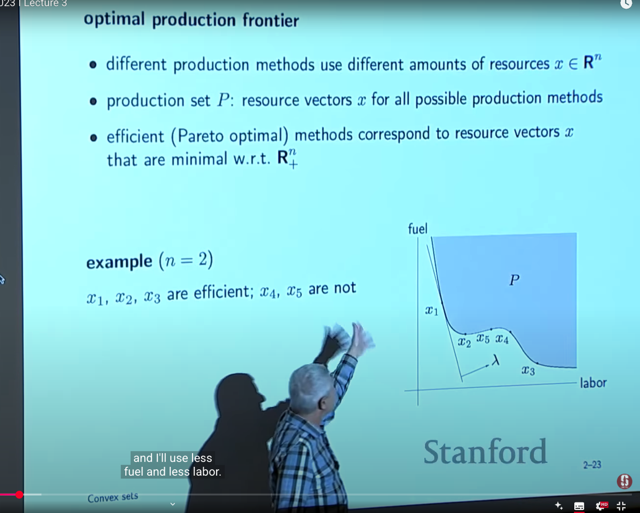</kbd></p>

> [!NOTE]
> đại khái là (cái này gs chỉ nói sơ, vì ta sẽ còn quay lại nói kĩ hơn nhiều ở các bài sau) minh họa cho minimal. Đúng hơn là ta sẽ lờ mờ thấy các ứng dụng của nó.
>
> Trên hình, tạm hiểu là mỗi vector x trong set P (gọi là production set) sẽ ứng với một cách thức sản xuất mà tọa độ của nó sẽ là mức tiêu thụ nhiên liệu (fuel) và số lao động cần thiết (labor)
>
> Thế thì đương nhiên, ta muốn tối ưu sự hiệu quả của sản xuất bằng cách giảm thiểu fuel và labor nhất có thể. Thế thì chính là việc ta phải minimize tọa độ của x
>
> Vậy soi chiếu theo định nghĩa minimal element wrt K, thì giả sử ta chọn λ là vector màu xanh, thì khi ta minimize λTz ta sẽ tìm được x1 là một minimal, là điểm mà đầu bài giảng ta đã học, theo định nghĩa của minimal, đó là cái điểm mà khi xét tập các điểm không thắng nó (⪯) trong S thì chỉ có thể là chính nó (y ∈ S: y ⪯K* x ⇨ y `=` x)

<br>

                                                              <a id="node-wbb22qu"></a>
                                                              - **nếu x không phải là minimal, thì sẽ không thể có vector λ ∈ int K* nào khiến minimize λTz over S ra x được hết**
<p align="center"><kbd>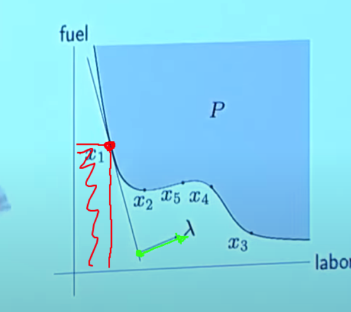</kbd></p>

<p align="center"><kbd>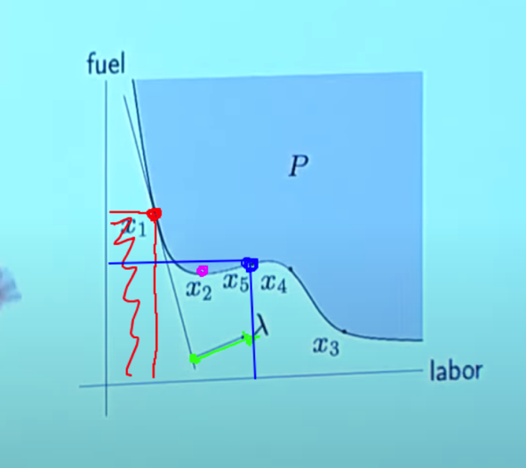</kbd></p>

> [!NOTE]
> Đây, x1, là điểm mà ta có thể tìm thấy λ ∈ int K* mà x1 sẽ giúp minimize λTz, x1 chính là một minimal. Vì như định nghĩa minimal, tập những điểm "không thắng" with respec to K (ở đây là non-negative orthant R^2 +) tạo thành hình màu đỏ, và nó chỉ intersect với P tại chính x1. (x1 - K) ∩ S `=` x1) Do đó x1 là minimal.
>
> Thì ý chính muốn nói, **nếu x không phải là minimal, thì sẽ không thể có vector λ ∈ int K* nào khiến minimize λTz over S ra x hết**. Ví dụ x5, không phải minimal (điều này dễ thấy bởi tập những điểm không thắng x5 wrt K (là hình trong phạm vi hai đường màu xanh dương ở hình bên) Có thể thấy nó intersect với P tại nhiều điểm chứ ko chỉ tại x5. Nên x5 ko phải minimal.
>
> Và chiếu theo định nghĩa ở đây, thì ta sẽ ko thể tìm ra λ nào mà minimize λTz để ra x5 cả.

> [!TIP]
> **🤖 AI Feedback** — ⚠️ Score: **88/100**
>
> Bài làm thể hiện sự hiểu biết sâu sắc về điểm tối thiểu (minimal element) trong tối ưu hóa vector và mối liên hệ với việc tối thiểu hóa hàm tuyến tính bằng cách sử dụng vector trong phần trong của nón đối ngẫu. Các lập luận về x1 là điểm tối thiểu và x5 không phải là điểm tối thiểu, cùng với việc áp dụng định lý scalarization tương ứng, đều chính xác và có chiều sâu. Tuy nhiên, mô tả hình ảnh 'hình màu đỏ' cho x1 có thể được diễn giải chính xác hơn để tránh gây nhầm lẫn với định nghĩa toán học của (x - K).

<br>

                                                                <a id="node-2vl48wq"></a>
                                                                - **Pareto optimal production frontier**
<p align="center"><kbd>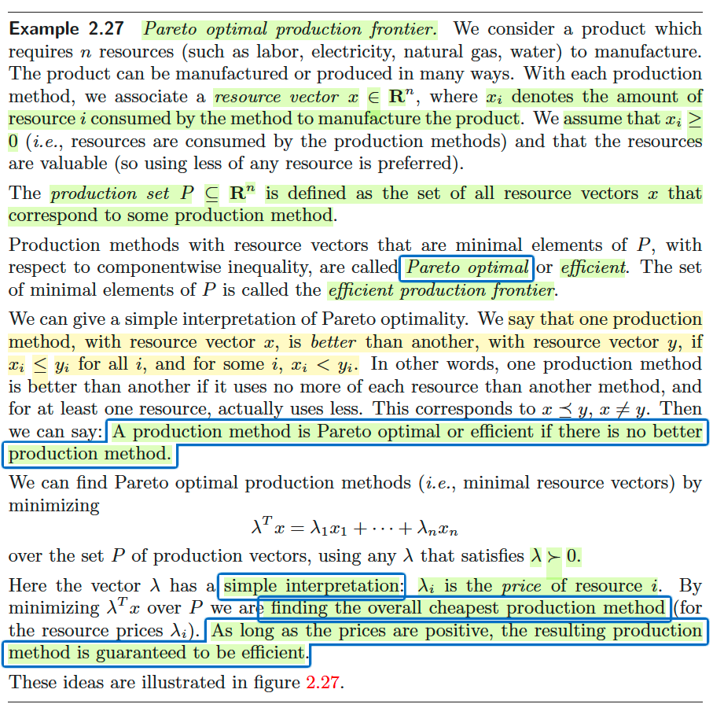</kbd></p>

<p align="center"><kbd>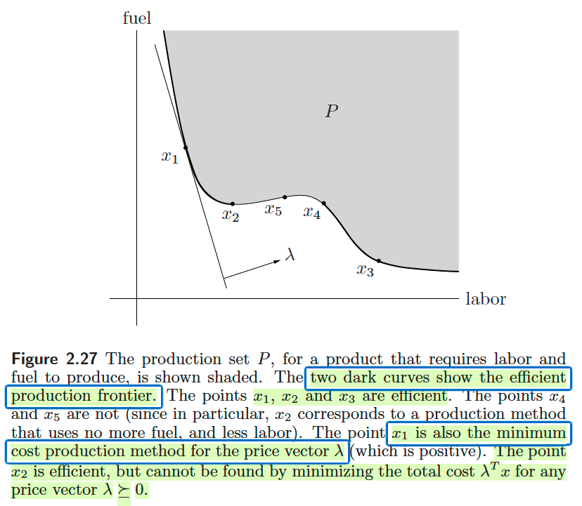</kbd></p>

> [!NOTE]
> Đây là đoạn trong sách nói về cái phần ứng dụng mà bài giảng thầy nói đến.
>
> Nói chung là có thể hiểu đại khái là vầy: Giả sử ta muốn làm ra một sản phẩm, ví dụ như làm bánh đi. Thì làm bánh cần đường và bột. Thế thì, đại ý là ta có thể có một tập P, là tập các giá trị x `=` [đường, bột] giúp làm ra cái bánh đạt tiêu chuẩn nào đó.
>
> Vậy nếu ta có x, và z là hai công thức. Thì z ⪰ x (⪰K, K `=` R^2+) trong bối cảnh này sẽ có nghĩa là cách công thức làm ra bánh của z cần nhiều bột và đường hơn của x tại ít nhất một loại nguyên liệu nào đó. Để rồi, nếu x `=` [10 đường, 5 bột] là minimal, thì có nghĩa là **xét trong số mọi công thức z ∈ P, thì cái mà cần ít hơn hoặc bằng 10 đường, và ít hơn hoặc bằng 5 bột chỉ có mỗi mình x**
>
> Có nghĩa là mấy cái z khác, **có thể xài ít đường hơn (ví dụ 8 đường) nhưng lại xài nhiều bột hơn là 5**, hoặc không thì **xài ít bột hơn ví dụ 4, nhưng lại xài nhiều đường hơn là 10** chứ **không có thằng nào xài ví dụ 9 đường và 4 bột cả**. Vậy thì, x, là minimal của P wrt K, và ở đây nó có tên gọi là là **Pareto optimal** vì không có cái nào trong P tốt hơn nó hẳn cả (ví dụ xài ít hơn nó ít nhất ở một loại nguyên liệu còn mấy cái khác thì ít nhất cũng bằng chứ không hơn)
>
> Vậy thì gọi λ `=` (λ1, λ2) là giá nguyên liệu đường và bột. Dĩ nhiên λTx chính là giá thành cần chi để làm ra 1 cái bánh. 
>
> Vậy thì, giả sử giá nguyên liệu là không âm (giả sử hợp lý thôi) ⇨ λ ∈ K (K `=` R^2 ++)
>
> Vậy thì khi đó, nếu mà ta chọn một vector giá (λ) ∈ và int K, và minimize over P f(z) `=` λTz, thì như đã biết, ta sẽ có một minimal (ví dụ x1). Thì hình ảnh chính là, với giá nguyên liệu λ đó, thì x 1 chính là "công thức" để làm ra cái bánh đạt chuẩn có giá thành nhỏ nhất có thể.
>
> Để rồi interpretation của việc x1 ⪯K z ∀ z ∈ P mang ý nghĩa là: cách sản xuất x1 (công thức x1) dùng 5 bột và 10 đường thì trong toàn P không có cái nào mà dùng ít hơn đường hơn và ít bột hơn cả. 
>
> Chú ý, không phải x1 ⪯ z với mọi z, mà chỉ là, x1 xài 5 bột 10 đường thì chả có thằng nào xài 5 bột 9 đường hoặc 4 bột 10 đường cả.
>
> Trong bài toán này không có cái nào ⪯ z ∀ z ∈ P, tức là không có minimum.
>
> Nhưng cũng chú ý là x1 không phải là Pareto optimal duy nhất, x2, x3 cũng là Pareto optimal. Và cái tập các minimal của P gọi là efficient prod

> [!TIP]
> **🤖 AI Feedback** — ⚠️ Score: **88/100**
>
> Bài phân tích rất chi tiết và cho thấy sự hiểu biết sâu sắc về Pareto optimality. Tuy nhiên, việc nhầm lẫn ký hiệu R^2++ với "không âm" và phát biểu x1 ⪯K z ∀ z ∈ P ban đầu là thiếu chính xác, dù bạn đã tự sửa chữa sau đó. Cần cẩn trọng hơn trong các định nghĩa.

<br>

                                                                  <a id="node-zktzuo5"></a>
                                                                  - **Convex function**
<p align="center"><kbd>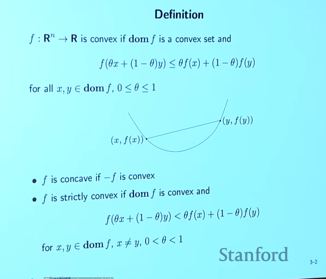</kbd></p>

> [!NOTE]
> Phần tiếp theo ta sẽ qua **convex function**. Được định nghĩa là function mà **DOM (tức domain) của nó là một convex set** đồng thời nó thỏa tính chất:
>
> ```text
> f(θx + (1-θ)y) ≤ θf(x) + (1-θ)f(y),  0 ≤ θ ≤ 1
> ```
>
> Ở khía cạnh hình học thì điều này có nghĩa là **dây cung (chores) giữa hai điểm trên function graph luôn NẰM TRÊN trên đồ thị hàm f**.
>
> Gs nói thêm ta cũng có thể hiểu nó theo kiểu: **NON-NEGATIVE CURVATURE**, mà điều này thì như ta biết có nghĩa là đạo hàm cấp 2 của f ko âm
>
> Thêm nữa nếu **- f convex thì f gọi là concave**, ta cũng đã gặp khái niệm này ở MIT18.01 
>
> ```text
> Ta cũng có thể thấy vế bên trái là f apply lên = mixture (của x, y), tức θx + (1-θ)y và vế phải là mixture của f(x), f(y) tức θf(x) + (1-θ)f(y)
> ```
>
> Nên từ đó ta có thể nhìn nhận f convex nếu **f của mixture luôn nhỏ hơn hoặc bằng mixture of f**.
>
> Và cuối cùng là nếu dấu bằng không xảy ra thì ta có STRICTLY CONVEX
>
> CONVEX FUNCTION

<br>

                                                                    <a id="node-6z5knxc"></a>
                                                                    - **ax+b **vừa convex, vừa concave****
<p align="center"><kbd>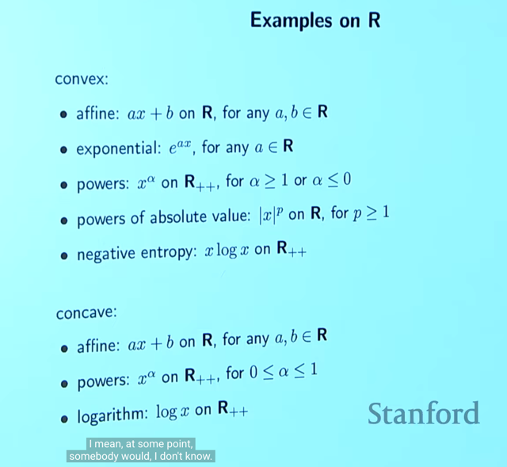</kbd></p>

<p align="center"><kbd>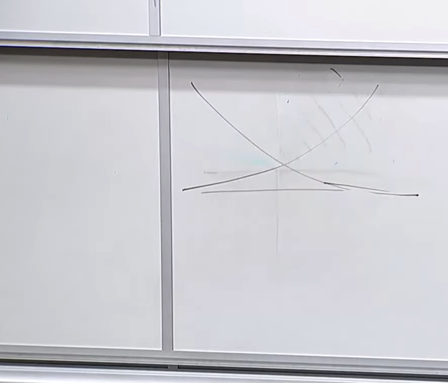</kbd></p>

> [!NOTE]
> Một số ví dụ về convex function. Gs cho rằng ta có thể chỉ cần vẽ nó ra (trong đầu) là có thể thấy đây là những function có tính non-negative curvature
>
> Đáng chú ý, **affine ax+b cũng là convex function**, vì **R tập số thực**, là domain của affine function là **convex set** và **hàm ax+b cũng thỏa tính chất "f của mixture" ≤ "mixture of f"**
>
> Cụ thể thì dây cung nối hai điểm bằng đúng đồ thị hàm f giữa hai điểm, nên nó **thỏa điều kiện là dây cung KHÔNG NẰM DƯỚI đồ thị**
>
> Mà đặc biệt, **nó CŨNG LÀ CONCAVE luôn** vì -ax-b tức -f là convex (**đơn giản là vì nó cũng là affine function**)
>
> Vậy ax+b **vừa convex, vừa concave**
>
> AFFINE FUNCTION f(x) `=` ax + b VỪA
> CONVEX VỪA CONCAVE

<br>

                                                                      <a id="node-6v2mr9o"></a>
                                                                      - **3.1 - Basis examples & properties**
<p align="center"><kbd>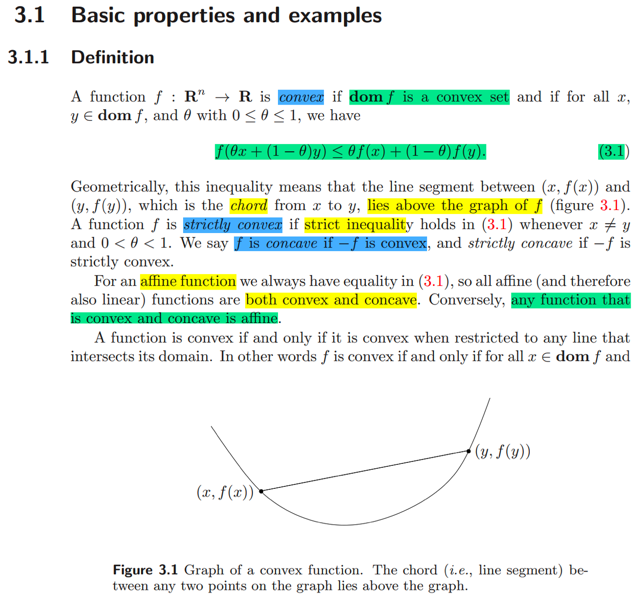</kbd></p>

<p align="center"><kbd>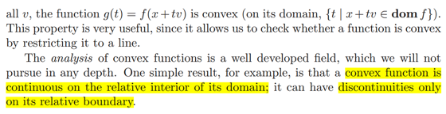</kbd></p>

> [!NOTE]
> CHAPTER 3 CONVEX FUNCTION
>
> 3.1 - basis examples & properties

<br>

                                                                        <a id="node-yjq42ou"></a>
                                                                        - **Một số ví dụ convex function**
<p align="center"><kbd>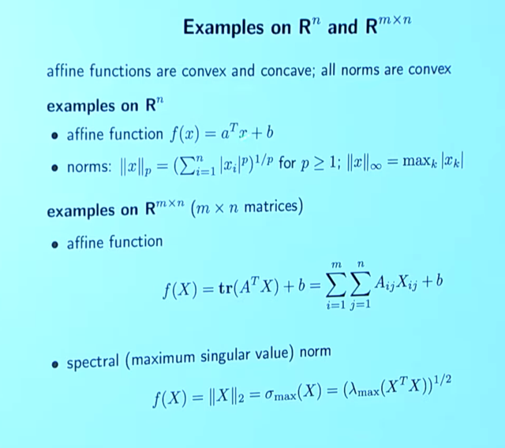</kbd></p>

> [!NOTE]
> Đây, gs confirm nhận định vừa rồi: Affine function vừa là convex vừa là concave (mà ông cho rằng cũng dễ hiểu bởi convex là non-negative curvature, và concave là non-positive curvature thì affine function có curvature `=` 0, nó nằm ở giữa hai case, nên thỏa cả hai)
>
> Bên cạnh đó **norm ||x||p** với định nghĩa là `[Σ` |xi|^p `]^1/p` với p ≥ 0
>
> và ||x||inf `=` max k |xk|. Đây c**ũng là convex function.**
>
> Bên cạnh đó, ta cũng có các function take input là matrix, ví dụ **như function tính det, tính trace.**
>
> Thế thì affine function đối với matrix sẽ có công thức là:
>
> ```text
> f(X) = tr(ATX) + b = Σi Σj AijXij + b cũng là affine function, và cũng convex
> ```

<br>

                                                                          <a id="node-ngphid2"></a>
                                                                          - **Gs phân tích giúp ta hiểu function f(X) `=` tr(ATX) + b.**
<p align="center"><kbd>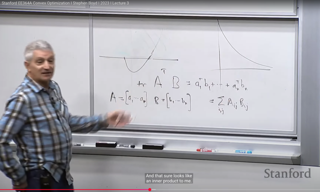</kbd></p>

> [!NOTE]
> Gs phân tích giúp ta hiểu function f(X) `=` tr(ATX) + b.
>
> trace, từ 1806 ta đã biết **trace là tổng các diagonal entries**.
>
> Thế thì xét matrix A có các columns A1,A2,...An và B có các columns B1, B2....Bm
>
> Thì ATB, dễ thấy các entries trên đường chéo sẽ là dot product của một hàng của AT (chính là một cột của A) với cột tương ứng (cùng vị trí)  của B
>
> ```text
> nên tr(ATB) = A1TB1 + A2TB2 + ...AnTBn = Σi AiTBi và dot product của Ai và Bi đương nhiên là Σi Aij*Bij từ đó ta có tr(ATB) = Σi Σj
> ```
> Aij*Bij

<br>

                                                                            <a id="node-o4u0e78"></a>
                                                                            - **flatten matrix A, B thành hai vector rồi dot product**
<p align="center"><kbd>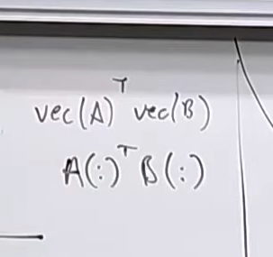</kbd></p>

> [!NOTE]
> và ta cũng có thể sẽ thấy người ta ghi như vầy.
>
> Tức là flatten matrix A, B thành hai
> vector rồi dot product

<br>

                                                                              <a id="node-e60ex8d"></a>
                                                                              - **spectral norm (maximum singular value), cũng là convex function**
<p align="center"><kbd>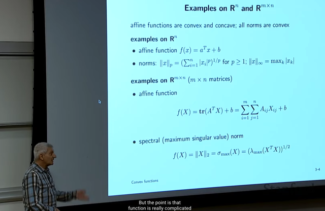</kbd></p>

> [!NOTE]
> Rồi, một cái nữa là spectral norm (maximum singular value).
>
> ```text
> được định nghĩa là f(X) = ||X||2 = σmax(X) = [λmax(XTX)]^1/2
> ```
>
> Từ 1806 giúp ta hiểu cái này, ôn lại một tí về SVD (singular value decomposition) matrix A. Nói một cách ngắn gọn, ta **muốn tìm hai bộ orthonormal basis của rowspace C(AT) vi và column-space C(A) ui**, để rồi **Avi `=` σiui** với i `=` 1,2...r (r `=` rank A), hay AVr
> `=` `UrΣ`
>
> Từ đó **A có thể tách thành tổng của r matrix rank-1**: 
>
> ```text
> A = ΣUVrT = Σi σiuiviT
> ```
>
> Thể hiện dưới dạng matrix: **AVr `=` UrΣ**, với Vr là matrix các row-space basis vi và Ur là matrix các column-space basis ui. `Σ` là matrix các stretching factor (singular values).
>
> ```text
> Nếu thêm vào Vr các nullspace basis để thành V là orthogonal matrix chứa các basis của R^n và thêm vào Ur các left-nullspace basis để thành U là orthogonal matrix chứa basis của R^m thì ta có FULL SVD: AV = UΣ và vì V invertible ta có: A = UΣVT (V là orthogonal matrix nên
> ```
> Vinv `=` VT)
>
> U gọi là left-singular matrix of A, V là right singular matrix of A, và `Σ` là matrix of singular values.
>
> Thế thì, ta biết U, V sẽ tồn tại, vì matrix A hạng r, dim C(A) và C(AT) đều bằng r, và một vector trong row-space sẽ được map 1:1 với một vector trong columns-pace.
>
> Vấn đề là ta cần tìm hai bộ orthogonal basis của C(AT) và C(A) sao cho thỏa AVr `=` `UrΣ.`
>
> Và ta sẽ nhờ ATA và AAT, là hai symmetric, positive semi-definite matrix để tìm U và V.
>
> ```text
> Xét ATA = (UΣVT)T(UΣVT) = VΣUTUΣVT = VΣΣTVT = VΣ^2VT.
> ```
>
> Thế thì, `Σ` là diagonal matrix, phép phân tách này cho thấy đây chính là** eigendecomposition của ATA**, hay nói cách khác, V chính là matrix các
> eigenvectors của ATA và `Σ` chính là matrix các eigenvalues của ATA.
>
> Như vậy left singular vectors của A chính là eigenvectors của ATA, và
> singular values của A chính là √ của eigenvalues của ATA.
>
> Tương tự thì right singular vectors của A chính là eigenvectors của AAT, và
> singular values của A chính là sqrt của eigenvalues của ATA
>
> Quay lại đây, thì đây là lí do mà hàm f(X) - spectral norm, hay maximum
> singular value, cái tên đã cho thấy, nó sẽ lấy ra singular value lớn nhất
> của X `(σmax(X))` và nó làm việc này bằng cách lấy eigenvalue lớn nhất
> của XTX (λmax(XTX) và lấy sqrt

<br>

                                                                                <a id="node-rvy9gyz"></a>
                                                                                - **spectral norm và Frobenius norm**
<p align="center"><kbd>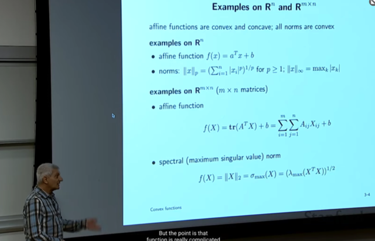</kbd></p>

> [!NOTE]
> Còn một điểm kiến thức Linear Algebra đáng chú ý nữa đó là ||X||2 tức spectral norm của matrix X được định nghĩa là singular value lớn nhất của X và cũng là √eigenvalue lớn nhất của ATA.
>
> Chú ý nó khác với Frobenius norm như đã biết, được tính bằng cách lấy tổng bình phương từng component của X và sau đó lấy sqrt, `√(Σij` Xij^2) và cái này cũng có thể thể hiện bằng √Tr(XTX) và cũng bằng √Tr(XXT)

<br>

                                                                                  <a id="node-y6yousq"></a>
                                                                                  - **Restrict of a convex function to a line**
<p align="center"><kbd>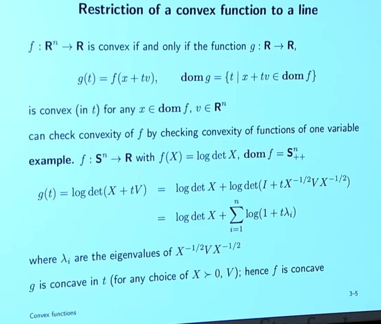</kbd></p>

> [!NOTE]
> Tiếp theo đại khái là giả sử ta có function **f là scalar function đa biến (n biến)** nhận vào vector Rn thì **một cách để ta check xem nó có convex hay không** đó là **dựa vào một function g khác**, là function đơn biến, được định nghĩa là **g(t) `=` f(x+tv)** với x ∈ domain của f và v là
> vector Rn. 
>
> Đại khái, **function f sẽ convex khi và chỉ khi g convex**
>
> Và **vì g là function đơn biến nên ta có thể plot nó ra**, và dùng kết quả để kiểm tra tính convex của f
>
> Và cái này gọi là **restrict of a convex function to a line**
>
> `====`
>
> Gs lấy ví dụ f(X) là function **take input là một symmetric matrix S^n và tính ra scalar number: log det của X**. 
>
> Domain của f là các symmetric positive definite matrix S^n ++ vì log(u) chỉ xác định khi u dương, tức là log(det(X)) thì det(X) phải dương và đồng nghĩa X phải positive definite
>
> Thế thì ta **có thể check convexity của f bằng cách check function g(t) `=` log det (X + tV)**. V là symmetric, S^n nhưng không nhất thiết S^n++
>
> Cách làm đại khái là:
>
> X + tV `=` X^1 + t.V 
>
> ```text
> = X^(1/2)X^(1/2) + t.X^(1/2).X^(-1/2)V
> ```
>
> ```text
> = X^(1/2)[X^(1/2) + t.X^(-1/2)V]   |  đặt X^(1/2) làm thừa số chung bên trái
> ```
>
> ```text
> = X^(1/2) . [I + t.X^(-1/2).V.X^(-1/2)] . X^(1/2) |  đặt X^(1/2) làm thừa số chung bên phải
> ```
>
> Và dùng tính chất của det: detAB `=` detAdetB
>
> ```text
> ⇨ det(X+tV) = det X^(1/2) . det [I + tX^(-1/2)VX^(-1/2)] . det X^(1/2)
> ```
>
> ```text
> = det X^(1/2) det X^(1/2) . det [I + tX^(-1/2)VX^(-1/2)]
> ```
>
> ```text
> = det [X^(1/2)X^(1/2)] . det [I + tX^(-1/2)VX^(-1/2)]
> ```
>
> `=` det X det [I + `tX^(-1/2)VX^(-1/2)]`
>
> Rồi, đặt A `=` `X^(-1/2).V.X^(-1/2)` có các eigenvalues λ1, λ2..
>
> Ta lập luận như sau: nếu λ là eigenvalue của A, ứng với eigenvector x thì Ax `=` λx. Nhân hai vế cho t và cộng hai vế cho x:
>
> Ax `=` λx ⇔ tAx `=` tλx 
>
> ⇔ x + tAx `=` tλx + x
>
> ⇔ Ix + tAx `=` (tλ+1)x 
>
> ⇔ (I + tA)x `=` (1 + tλ)x
>
> ⇨ eigenvalues của I + tA sẽ là 1+ tλi, i `=` 1,2...
>
> Và det A `=` tích các eigenvalue, nên det (I + tA) `=` ∏i (1+tλi)
>
> Từ đó log [det X det (I + tA)] `=` log det X + log det (I + tA)
>
> `=` log det X + log ∏i (1+tλi) `=` log det X + `Σi` log (1+tλi)
>
> `====`
>
> Và đại khái là gs cho biết **log(1+tλi) `i=1,2..` là các convex function**, nên cơ bản là ta có** tổng các convex function nên cũng là convex**
>
> (log det X thì cũng là convex)

<br>

                                                                                    <a id="node-43upj7q"></a>
                                                                                    - **extended-value extension của f kí hiệu là `f_tilde`**
<p align="center"><kbd>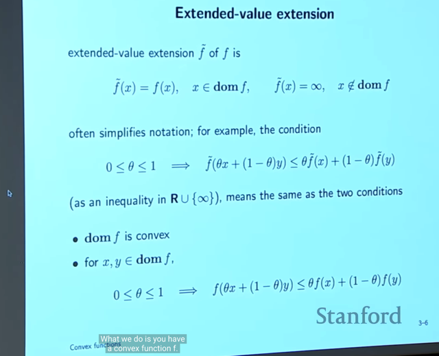</kbd></p>

> [!NOTE]
> Đầu tiên gs nói đại khái là giả sử ta có function f. Nếu ta gọi nó (evaluate nó) tại một điểm nằm trong domain của nó, thì ta sẽ có một giá trị. Nhưng nếu gọi nó **tại một điểm nằm ngoài domain
> của nó, thì thường (trên máy tính) sẽ trả về cho ta OOD** (out of domain) value (hay NAN not a number,...)
>
> Thế thì đại khái **extended-value extension của f kí hiệu là `f_tilde` ** là một function đơn giản là nếu **x thuộc domain của f thì `f_tilde(x)` `=` f(x), ngược lại nếu x không thuộc domain của f thì `f_tilde(x)` `=` inf**
>
> Khúc dưới gs ko giải thích nên chưa hiểu lắm. Có thể quay lại sau
>
> EXTENDED-VALUE EXTENSION

<br>

<p align="center"><kbd>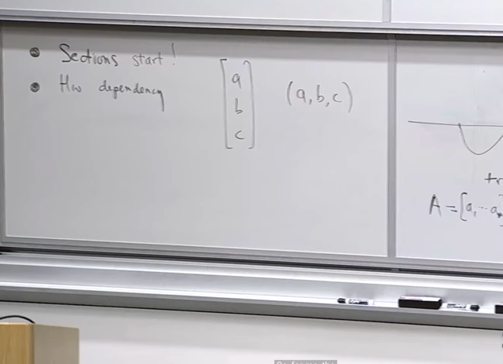</kbd></p>

> [!NOTE]
> Đại khái gs cho rằng ta có thể viết vector theo cột như này hoặc (a, b, c)

<br>

                                                                                        <a id="node-l3oqmgj"></a>
                                                                                        - **First-order condition**
<p align="center"><kbd>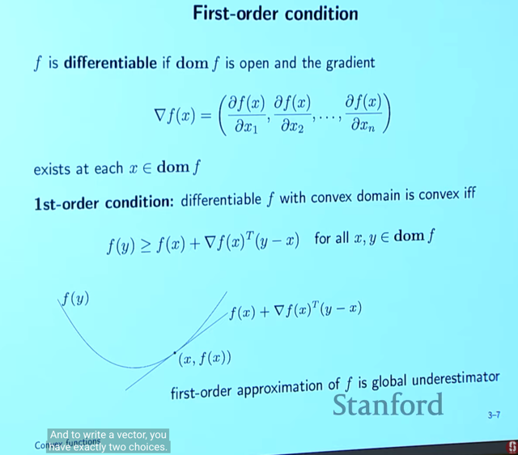</kbd></p>

> [!NOTE]
> Ta sẽ qua nội dung gọi là **first-order condition**. 
>
> Nói là nếu f khả vi (differentiable) nếu domain của f mở và tồn tại gradient vector tại mỗi điểm
> thuộc domain.
>
> **Gradient vector ∇f** thì ta đã được học từ MIT 18.02, là vector chứa các partial derivative. (Có student hỏi và ông xác nhận nó là **column vector**. Ko nên confused, trong MIT 18s096, các thầy vẫn nói **gradient vector là columns vector như thông thường, nhưng derivative vector thì là row vector**, tức là transpose của gradient vector. Qua 18s096 xem lại)
>
> Thế thì dựa vào calculus, gs cho rằng dễ thấy đây chính là first order approximation (hay linear approximation): 
>
> Dù chưa chính thức được học về Taylor expansion nhưng đã từng thấy gs 1802 nói.
>
> Ta có thể xuất phát từ **total differentiation**:
>
> df `=` `f_x1` dx1 + `f_x2` dx2, f là function f(x1,x2)
>
> Khi thay dx1, dx2 bởi `Δx1,` `Δx2,` phương trình trên trở thành linear approximation, cũng là kết quả của first order Taylor expansion
>
> ```text
> Δf ≈ f_x Δx1 + f_x2 Δx2
> ```
>
> ⇔ f(y1,y2) - f(x1,x2) ≈ `f_x(y1-x1)` + `f_y(y2-x2)`
>
> ⇔ f(y) - f(x) ≈ ∇fT(y-x)
>
> ⇔ f(y) ≈ f(x) + ∇fT(y-x)
>
> Và thật ra dấu bằng sẽ xảy ra nếu ta có thêm các higher-order term
>
> f(y) `=` f(x) + ∇fT(y-x) + o(n^2)
>
> Thế thì, first-order condition nói rằng: 
>
> f(x) convex thì ⇔ f(y) ≥ f(x) + ∇fT(y-x)
>
> **với convex function thì fisrt order approximation sẽ chính là global under estimator **
>
> Đại khái là calculus cho phép ta nói rằng nếu y đủ gần x thì hàm f có thể được approximate bởi linear function Nhưng ý chính là, calculus chỉ cho phép nói như vậy.
>
> Còn với convex function, thì ta được phép nói rằng hàm f sẽ ko thể ở dưới linear function đó, đồng nghĩa nó cũng là một global under-estimator của function.
>
> `=====`
>
> Ở lần review này, mình có thể nói thêm vài ý, liên hệ tính chất Hessian xác định bán dương với First order condition:
>
> Đầu tiên là nhờ Numerical Optimization, mình nay đã biết Taylor theorem:
>
> Ở case 1 biến, idea là khi đi từ a đến b thì ta có: f(b) `=` f(a) + f'(a)(b - a) + `(1/2)` f''(c)(c)^2 với c ở đâu đó giữa a, b.
>
> Mở rộng quả case đa biến:
>
> ```text
> f(x + d) = f(x) + ∇f(x)Td + (1/2)dT ∇^2f(x + αd) d for some α in [0,1]
> ```
>
> Thế thì, nếu hàm liên tục, thì xét trong phạm vi đủ gần thì Hessian tại x + `αd` sẽ xấp xỉ Hessian tại x: ∇^2f(x + `αd)` ≈ ∇^2f(x). Từ đó ta sẽ có second order approximation
>
> f(x + d) ≈ f(x) + ∇f(x)Td + `(1/2)dT` ∇^2f(x) d
>
> Đó là second order approx. còn quay lại công thức của Taylor theorem, ta sẽ nói thế này: Với hàm convex, Hessian luôn xác định bán dương ⇨ `(1/2)dT` ∇^2f(x + `αd)` d ≥ 0
>
> ⇨ f(x + d) - f(x) - ∇f(x)Td ≥ 0
>
> ⇔f(x + d) ≥ f(x) + ∇f(x)Td
>
> Đây không phải là chứng minh, chỉ là cách để dễ nhớ, liên hệ tính chất Hessian xác định bán dương với First order condition thôi, còn chứng minh thì phải như sách, xuất phát từ định nghĩa (p

> [!TIP]
> **🤖 AI Feedback** — ⚠️ Score: **83/100**
>
> Bài phân tích thể hiện độ sâu sắc vượt trội, đặc biệt là phần chứng minh điều kiện bậc nhất cho hàm lồi thông qua khai triển Taylor đa biến và tính chất của Hessian. Tuy nhiên, định nghĩa về vector gradient ∇f(x) trong bài viết của bạn là vector cột lại mâu thuẫn trực tiếp với cách nó được biểu diễn rõ ràng là vector hàng trong hình ảnh đã cung cấp. Đây là một điểm không chính xác đáng kể so với tài liệu gốc.

<br>

                                                                                          <a id="node-76ff13h"></a>
                                                                                          - **(Sách) First order condition**
<p align="center"><kbd>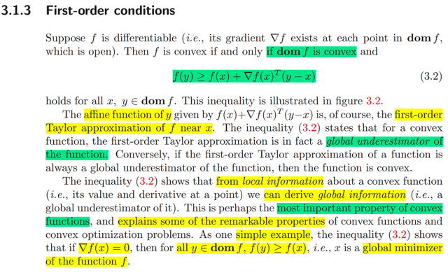</kbd></p>

<p align="center"><kbd>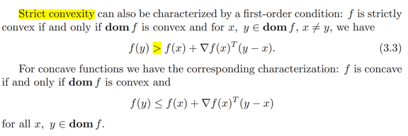</kbd></p>

> [!NOTE]
> Ý chính là, với hàm f(x) thì linear approximation (hay first-order Taylor approximation của f gần x) như đã biết đó là:
>
> f(y) ≈ f(x) + ∇f(x)T(y - x)
>
> Thì theorem này nói rằng hàm f(x) là convex khi và chỉ khi f(y) ≥ f(x) + ∇f(x)T(y - x) với mọi y ∈ dom f.
>
> Với Strictly Convex thì ta có dấu >

<br>

                                                                                            <a id="node-debfrog"></a>
                                                                                            - **Chứng minh first order condition**
<p align="center"><kbd>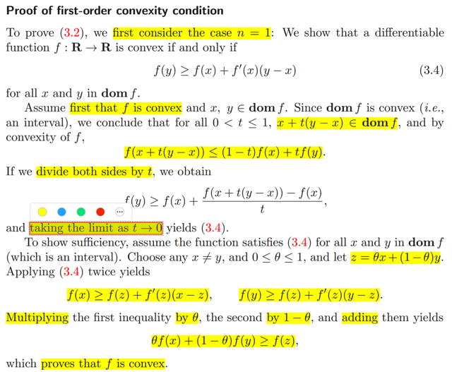</kbd></p>

> [!NOTE]
> Rồi, đầu tiên ta sẽ **chứng minh cái này ở case khi n `=` 1**. 
>
> Khi đó dĩ nhiên gradient ∇f(x) sẽ thay bằng **1st derivative f'(x)**.
>
> Ta sẽ chứng minh: **f convex ⇨ f(y) ≥ f(x) + f'(x)(y-x) (x, y ∈ dom f)**
>
> Khi f convex, **theo định nghĩa, dom f là convex set** ⇨ **x, y ∈ dom f thì mixture của nó** (hay line segment) `θx` + (1 - `θ)y` với 0 ≤ `θ` ≤ 1 **cũng thuộc dom f**. Hay ty + (1-t)x với t ∈ [0, 1] cũng vậy.  
>
> ty + (1-t)x `=` ty + x - tx `=` x + ty - tx `=` x + t(y - x)
>
> Vậy **x + t(y - x) ∈ dom f**.
>
> Và vì f convex, nên cũng theo định nghĩa, khi x, y ∈ dom f thì **"f của mixture ≤ mixture of f"**
>
> **f(θx + (1 - `θ)y)` ≤ `θf(x)` + (1 - θ)f(y)**
>
> áp dụng cho ty + (1-t)x:
>
> f(ty + (1-t)x) ≤ tf(y) + (1-t)f(x)
>
> Khai triển ty + (1-t)x `=` x + t(y - x)
>
> ⇔ f(x + t(y - x)) ≤ tf(y) + (1-t)f(x)   
>
> Chia hai vế cho t:
>
> f(x + t(y - x)) `/` t ≤ f(y) + (1-t)f(x) `/` t
>
> ⇔ f(x + t(y - x)) `/` t ≤ f(y) + f(x) `/` t - tf(x) `/` t
>
> ⇔ f(x + t(y - x)) `/` t ≤ f(y) + f(x) `/` t - f(x) 
>
> ⇔ [f(x + t(y - x)) - f(x)] `/` t ≤ f(y) - f(x) 
>
> ⇔ f(x) + [f(x + t(y - x)) - f(x)] `/` t ≤ f(y)  
>
> ⇔ f(y) ≥ f(x) + [f(x + t(y - x)) - f(x)] `/` t
>
> **lấy limit hai vế** khi t → 0 ta có:
>
> f(y) ≥ f(x) + lim t → 0 [f(x + t(y - x)) - f(x)] `/` t
>
> Thế thì ta đã biết định nghĩa của derivative: 
>
> ```text
> f'(x) = lim ε → 0 [f(x + ε) - f(x)] / ε
> ```
>
> ```text
> Vậy giờ xét lim ε → 0 [f(x + ε*v) - f(x)] / ε thì bằng cách đặt h = εv
> ```
>
> ⇨ `ε` `=` h `/` v.
>
> ```text
> ⇨  lim ε → 0 [f(x + ε*v) - f(x)] / ε
> ```
>
> `=` lim h → 0 [f(x + h) - f(x)] `/` `(h/v)`
>
> `=` lim h → 0 v*[f(x + h) - f(x)] `/` h
>
> `=` v * [ lim h → 0 [f(x + h) - f(x)] `/` h]
>
> `=` v * f'(x)
>
> Vậy ở đây **lim t → 0 [f(x + t(y - x)) - f(x)] `/` t chính là f'(x)(y - x)**
>
> Vậy ta có **f(y) ≥ f(x) + f'(x)(y - x) và từ đây giúp chứng minh xong điều kiện cần:**
>
> Nếu f convex thì ta có first condition: f(y) ≥ f(x) + f'(x)(y - x)
>
> Còn **điều kiện đủ** như sau:
>
> **Giả sử ta có hàm f có f(y) ≥ f(x) + f'(x)(y - x)** với x, y ∈ dom f ta cần **chứng minh nó convex**.
>
> Mà như đã biết để chứng minh convex thì ta **phải chứng minh f của mixture ≤ mixture của f**. 
>
> Tức là nếu x, y ∈ dom f và `θ` ∈ [0, 1] thì:
>
> ```text
> f[θx + (1 - θ)y] ≤ θf(x) + (1 - θ)f(y)
> ```
>
> Thế thì, ta đang assume x, y ∈ dom f. Xét z là mixture của nó:
>
> z `=` `θx` + (1 - `θ)y.` Áp dụng first condition nói rằng miễn u, v ∈ dom f thì f(u) ≥ f(v) + f'(v)(u - v),
> nên:
>
> **f(y) ≥ f(z) + f'(z)(y - z)** (a)
>
> **f(x) ≥ f(z) + f'(z)(x - z)** (b)
>
> **Nhân (a) cho `θ` ∈ [0, 1]** ko đổi chiều bdt:
>
> f(y) ≥ f(z) + f'(z)(y - z) ⇔ `θf(y)` ≥ `θ[f(z)` + f'(z)(y - z)]
>
> ```text
> ⇔ θf(y) ≥ θf(z) + θf'(z)y - θf'(z)z
> ```
>
> **Nhân (b) cho (1 - θ)**:
>
> f(x) ≥ f(z) + f'(z)(x - z)
>
> ⇔ (1 - `θ)f(x)` ≥ (1 - `θ)[f(z)` + f'(z)(x - z)]
>
> ⇔ (1 - `θ)f(x)` ≥ (1 - `θ)[f(z)` + f'(z)x - f'(z)z]
>
> ```text
> ⇔ (1 - θ)f(x) ≥ f(z) + f'(z)x - f'(z)z - θf(z) - θf'(z)x + θf'(z)z
> ```
>
> **Cộng vế theo vế** ta có:
>
> ```text
> θf(y) + 1 - θ)f(x) ≥ θf(z) + θf'(z)y - θf'(z)z + f(z) + f'(z)x - f'(z)z - θf(z) - θf'(z)x + θf'(z)z
> ```
>
> ```text
> ⇔ θf(y) + 1 - θ)f(x) ≥ θf'(z)y + f(z) + f'(z)x - f'(z)z - θf'(z)x
> ```
>
> ```text
> ⇔ θf(y) + 1 - θ)f(x) ≥ f'(z)[θy + x - z - θx] + f(z)
> ```
>
> ```text
> ⇔ θf(y) + 1 - θ)f(x) ≥ f'(z)[θy + x(1 - θ) - z] + f(z)
> ```
>
> ⇔ `θf(y)` + 1 - `θ)f(x)` ≥ f'(z)[z - z] + f(z)
>
> ⇔ `θf(y)` + 1 - `θ)f(x)` ≥ 0 + f(z)
>
> ⇔ **θf(y) + 1 - `θ)f(x)` ≥ `f(θy` + x(1 - θ))**
>
> Từ đây suy ra f là convex

<br>

                                                                                              <a id="node-gklbcmo"></a>
                                                                                              - **Chứng minh first order condition R^n → R case**
<p align="center"><kbd>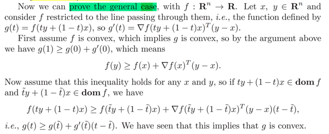</kbd></p>

> [!NOTE]
> rồi, để **chứng minh cho general case R^n → R function**. Ta dùng kết quả khi đã chứng minh cho R -> R case
>
> Giả sử có f convex. Thì theo một cái đã học, gọi là **restrict to line** 
>
> Nôm na là **khi R^n → R f(x) convex thì R → R g(t) `=` f(x + vt) với v ∈ R^n cũng sẽ là convex**.
>
> Nên ở đây **f(x) convex nên khi đặt hàm g(t) `=` f(ty + (1-t)x) thì nó cũng convex**.
>
> Và vì vậy ta áp dụng kết qủa chứng minh theorem này ở R → R case:
>
> g(u) ≥ g(v) + g'(v)(u - v)
>
> áp dụng g(u) ≥ g(v) + g'(v)(u - v) cho u `=` 1, v `=` 0:
>
> g(1) ≥ g(0) + g'(0) (1)
>
> Tính g': g(t) `=` f(ty + (1-t)x) `=` f(u) | u(t) `=` ty + (1-t)x
>
> Áp dụng chain rule:
>
> ```text
> g'(t) = d/dt g(t) = df/du . du/dt = ∇f(u)T(y - x) = ∇f(ty + (1-t)x)T(y - x)
> ```
>
> Vậy (1) trở thành: f(1y + (1-1)x) ≥ f(0y + (1-0)x) + ∇f(0y + (1-0)x)T(y - x)
>
> ⇔ f(y) ≥ f(x) + ∇f(x)T(y - x) Đây là chứng minh xong điều kiện cần.
>
> Chứng minh chiều ngược (điều kiện đủ):
>
> Giả sử hàm f có tính chất f(y) ≥ f(x) + ∇f(x)T(y - x) với mọi x, y ∈ dom f.
>
> Thì bằng cách áp dụng cái này cho 2 điểm cũng thuộc dom f mà mỗi cái là một mixture của x, y với tỉ lệ khác nhau:
>
> a `=` ty + (1 - t)x và b `=` t'y + (1 - t')z
>
> Ta có f(a) ≥ f(b) + ∇f(b)T(a - b)
>
> ⇔ f(ty + (1 - t)x) ≥ f(t'y + (1 - t')z) + ∇f(t'y + (1 - t')z)T(ty + (1 - t)x - (t'y + (1 - t')z))
>
> Thì đại khái là **đây chính là g(t) ≥ g(t') + g'(t')(t - t')**
>
> Và ở R → R case ta **đã chứng minh điều này dẫn đến kết luận g là convex function**.
>
> Mà **g convex ⇨ f convex.** Chứng minh xong chiều ngược

<br>

                                                                                                <a id="node-zmb0etz"></a>
                                                                                                - **Second order conditions**
<p align="center"><kbd>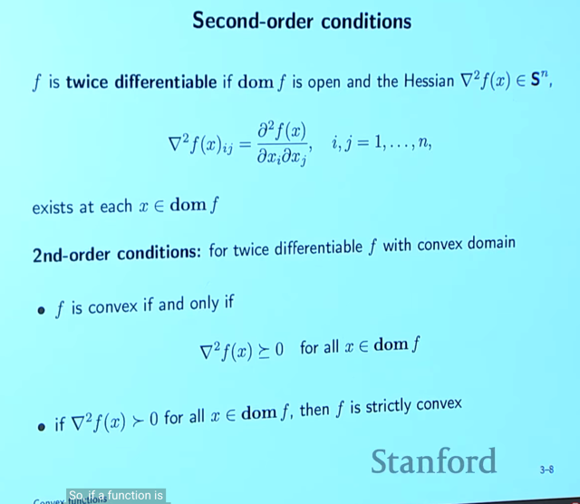</kbd></p>

> [!NOTE]
> Tiếp theo là ông nói về **second order conditions**
>
> Đại ý là đầu tiên nếu hàm **f khả vi hai lần (twice differentiable)**, nếu **domain của f is open** và **tồn tại Hessian matrix ∇^2f(x) ∈ S^n** (tức là matrix Hessian là matrix đối xứng mang giá trị thực) **tại mọi điểm trong domain của f**.
>
> Thế thì từ đó nếu function f thỏa điều kiện twice differentiable và Hessian matrix tại mọi điểm trong domain của f đều là **positive semi definite** matrix ∇^f(x) ≽ 0 thì khi đó hàm f **convex**
>
> Còn nếu là **positive definite** ∇^f(x) ≻ 0 thì ta có f **strictly convex**
>
> Gs nói thêm rằng, điều này dễ hiểu, vì **Hessian matrix sẽ mang thông tin của curvature**.
>
> `====`
>
> Liên hệ một chút, ở MIT 18.02 ta đã học về **second derivative test**, để check xem critical point là minimum hay maximum hay saddle point.
>
> Xét **f(x, y) `=` ax^2 + bxy + cy^2**. Dễ thấy nó có **critical point là `(x0=0,` y0=0)** (giải hệ hai phương trình first order neccesary condition: ∇f(x) `=` 0 ⇔ `∂f/∂x` `=` 0 và `∂f/∂y` `=` 0)
>
> Tiếp, ta sẽ **completing the square**:
>
> `f=` a[x^2 + `b/a` xy + `c/a` y^2]
>
> ```text
> = a[x^2 + 2x(b/2a)y + (by/2a)^2 - (by/2a)^2 + (c/a)y^2]
> ```
>
> ```text
> = a[x^2 + 2x(b/2a)y + (by/2a)^2] + a[-(by/2a)^2 + (c/a)y^2]
> ```
>
> ```text
> = a(x+by/2a)^2 + a[-b^2y^2/4a^2 + (c/a)y^2]
> ```
>
> ```text
> = a(x+by/2a)^2 + a[-b^2/4a^2 + (c/a)]y^2
> ```
>
> ```text
> = a(x+by/2a)^2 + a[-b^2/4a^2 + 4ac/4a^2]y^2
> ```
>
> `=` `a(x+by/2a)^2` + a[(-b^2 + `4ac)/4a^2]y^2`
>
> `=` `a(x+by/2a)^2` + a[(-b^2 + `4ac)/4a^2]y^2`
>
> ```text
> = 4a^2/4a(x+by/2a)^2 + [(-b^2 + 4ac)/4a]y^2
> ```
>
> `=` `(1/4a)` `[4a^2(x+by/2a)^2` + (-b^2 + 4ac)y^2]
>
> `=` `(1/4a)` `[4a^2(x+by/2a)^2` + (4ac-b^2)y^2]
>
> ```text
> Xét H matrix [∂^2f/∂x^2 ∂^2f/∂x∂y; ∂^2f/∂y∂x ∂^2f/∂y^2]
> ```
>
> ```text
> ∂^2f/∂x^2 = 2a;  ∂^2f/∂x∂y = b;  ∂^2f/∂y∂x = b;  ∂^2f/∂y^2 = 2c
> ```
>
> `=` [2a b; b 2c]
>
> det H `=` 2a2c - b^2 `=` 4ac - b^2.
>
> Case I) 4ac - b^2 > 0, tức **det H > 0**
>
> Ia) **Nếu a > 0**
>
> Và dựa vào kết quả completing the square, lúc này term 2 (4ac-b^2)y^2 ≥ 0 (chỉ `=` 0 khi y `=` 0). Và cả **function thì cũng luôn ≥ 0, chỉ bằng 0 tại critical point**.
>
> Kết luận: **local min tại critical point**.
>
> Lúc này matrix H thỏa điều kiện của một **positive definite** vì các leading
> principal đều dương (det của các sub-matrix)
>
> Ib) Nếu a < 0 
>
> Completing the square, ta vẫn có tổng hai square, nhưng a âm nên f luôn < 0 khi x, y
> khác critical point
>
> Kết luận: **local max** tại critical point
>
> Matrix H là một **negative definite** vì leading principal bậc lẻ âm, bậc chẵn dương.
>
> Case II) 4ac - b^2 < 0
>
> Completing the square cho thấy ta có **hiệu hai square**, nên f có thể âm, có thể dương cho nên critical point là **saddle point**.
>
> Với det < 0, H là **indefinite** matrix
>
> Case III) 4ac - b^2 `=` 0
>
> Completing the square cho thấy w trở thành `(1/4a)` `[4a^2(x+by/2a)^2].` Đây là case **degenerate critical point, khi ta có vô số critical point. và sẽ đều là min nếu a dương và max nếu a âm.**
>
> **second order conditions**: Đại khái là nếu tồn tại Hessian của function tại mọi điểm và Hessian là **positive semi definite thì function là  convex** (hoặc strictly convex nếu là Positive Definite)

<br>

                                                                                                  <a id="node-e2ck5yr"></a>
                                                                                                  - **Vài ví dụ minh họa second order condition**
<p align="center"><kbd>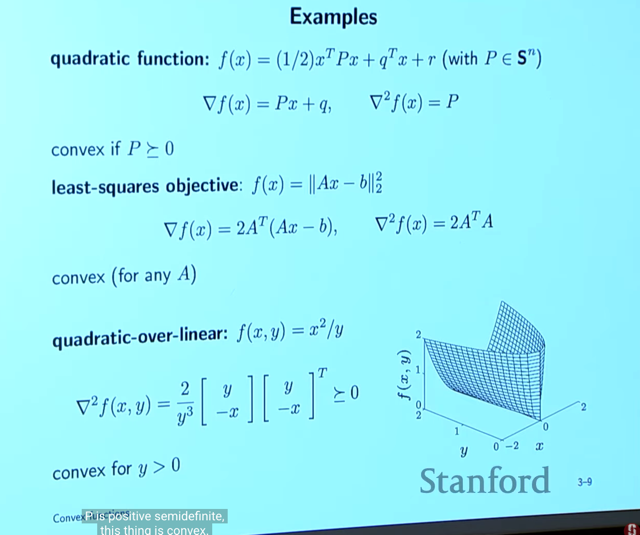</kbd></p>

> [!NOTE]
> Một số ví dụ, đầu tiên là** quadratic function f(x) `=` `(1/2)xTPx` + qTx + r** với P là symmetric matrix (∈ S^n)
>
> Thế thì, xTPx, như đã biết, gọi là **quadratic form,** thì khi cộng thêm với  qTx + r ta có quadratic function. Mà gs cho rằng nó **tương ứng với px^2 + qx + r trong 1D** vậy
>
> Ta có **gradient ∇f(x) `=` Px + q** và **Hessian ∇^2f(x) là P**
>
> (Thử dùng MIT 18.s096 để chứng minh lại: df `=` f(x+dx) - f(x) 
>
> `=` `(1/2)(x+dx)TP(x+dx)` + qT(x+dx) + r - `(1/2)xTPx` - qTx - r
>
> `=` `(1/2)(dxT` + xT)P(x + dx) + qTx + qTdx - `(1/2)xTPx` - qTx
>
> `=` `(1/2)(dxTP` + xTP)(x + dx) + qTdx - `(1/2)xTPx` 
>
> `=` `(1/2)(dxTPx` + dxTPdx + xTPx + xTPdx) + qTdx - `(1/2)xTPx` 
>
> bỏ higher order term dxTPdx
>
> `=` `(1/2)(dxTPx` + dxTPdx + xTPx + xTPdx) + qTdx - `(1/2)xTPx`  
>
> `=` `(1/2)(2dxTPx` + xTPx ) + qTdx - `(1/2)xTPx` 
>
> `=` dxTPx + `(1/2)xTPx` + qTdx - `(1/2)xTPx` 
>
> `=` dxTPx + qTdx `=` xTPdx + qTdx `=` (xTP + qT)dx
>
> `=(PTx` + q)Tdx
>
> Vậy df `=` (xTP + qT)dx nên derivative là row vector (PTx + q)T và gradient vector ∇f `=` PTx + q
>
> Còn Hessian thì dễ rồi, df' `=` P(x+dx) + q - Px - q `=` Px + Pdx + q - Px - q
>
> Derive Hessian theo MIT 18.s096: **Cách làm Bilinear form**
>
> Ta sẽ bắt đầu với d(f'(x)[dx]) cũng là d(∇fTdx):
>
> d'(∇fTdx) `=` d'((PTx + q)Tdx) `=` (PT(x+dx') + q)Tdx - (PTx + q)Tdx
>
> `=` (PTx + PTdx' + q)Tdx - (PTx + q)Tdx
>
> `=` (PTx)Tdx + (PTdx')Tdx + qTdx - (PTx)Tdx - qTdx
>
> `=` (PTdx')Tdx 
>
> `=` **dx'TPdx**. Đây chính là **bilinear form act on dx' dx**
>
> **Do đó f''(x)[dx, dx'] `=` dx'TPdx nên P chính là Hessian matrix **
>
> Nhưng cũng có thể làm theo cách khác, chứng minh P là Jacobian của ∇f:
>
> d(∇f(x)) `=` ∇f(x+dx) - ∇f(x) `=` PT(x+dx) + q - PTx - q `=` PTx + PTdx + q - PTx - q
>
> `=` PTdx 
>
> Và nếu coi ∇f là vector -> vector function thì d(∇f) `=` (∇f)'(x)[dx] là linear operator act on dx. Để map giữa vector dx thành vector d(∇f) thì  linear operator này chỉ có thể là một matrix J nhân dx, đó là Jacobian matrix do đó Jacobian của ∇f chính là PT.
>
> Và vì f'(x) `=` (∇f)T, nên Jacobian của f'(x), cũng là Hessian của f(x) chính là P
>
> Như vậy có thể nhận xét quadratic function có **constant curvature**
>
> Thế thì quay lại đây, khi P ≽ 0 (đây là kí hiệu của **positive semi definite**) thì quadratic function f là convex

<br>

                                                                                                    <a id="node-je5frcl"></a>
                                                                                                    - **Một ví dụ nữa là least-squares objective: f(x) `=` ||Ax-b||^2**
<p align="center"><kbd>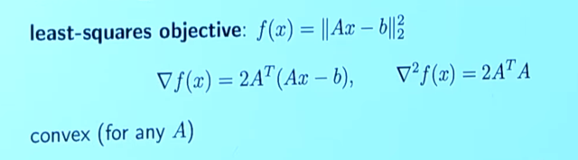</kbd></p>

> [!NOTE]
> Một ví dụ nữa là least-squares objective: f(x) `=` ||Ax-b||^2
>
> Là cái ta đã gặp ở mit 1806, rất quen thuộc, gọi là least-squares objective là bởi đây là
> function mà ta muốn minimize trong **bài toán least-square**
>
> **Lý luận lại bài toán least square**, đó là khi ta **muốn giải một hệ phương trình tuyến tính thể hiện bởi dạng ma trận Ax `=` b**. Trong đó, ta** có nhiều phương trình hơn biến**, thể hiện qua việc **matrix A có nhiều hàng hơn cột**: A shape [m,n], m >> n.
>
> Thế thì, vấn đề m > n khiến **b, là Rm vector có thể không nằm trong column space của A** (có dim `=` r ≤ n). Dẫn đến **có thể không tồn tại linear combination giữa các cột của A để tạo ra b**, đồng nghĩa **hệ phương trình không có nghiệm.**
>
> Cách tiếp cận least-square đó là, ta sẽ **tìm linear combination của các cột của A sao cho tối thiểu hóa sai khác giữa nó với b**. Gọi Ax `=` p, thì nói cách khác, ta **muốn tìm x sao cho minimize ||b-p|| `=` minimize ||Ax-b||**
>
> Thế thì ||Ax-b||, là **l2 norm của Ax-b**, sẽ bằng f `=` √(Ax-b)T(Ax-b)
>
> Vì hàm g(u) `=` u^2 đồng biến với u ≥ 0 nên ta có thể thay objective function bằng square norm:  
>
> f `=` (Ax-b)T(Ax-b)
>
> **Dựa trên kiến thức calculus**, ta sẽ **dựa vào first order neccesary condition để tìm critical point** dựa vào việc tìm x là solution của partial derivative của f `=` 0, tức ∇f (vector các partial derivatives) `=` 0
>
> Tìm ∇f: Theo cách làm của MIT 18.s096, ta tìm df `=` f(x+dx) - f(x) (*)
>
> `=` [A(x+dx)-b]T[A(x+dx)-b] - (Ax-b)T(Ax-b) `=` (Ax+Adx-b)T(Ax+Adx-b) - [(Ax)T-bT](Ax-b)
>
> `=` [(Ax)T+(Adx)T-bT](Ax+Adx-b) - (xTAT-bT)(Ax-b)
>
> `=` (xTAT+dxTAT-bT)(Ax+Adx-b) - (xTATAx-bTAx-xTATb+bTb)
>
> `=` xTATAx + dxTATAx - bTAx + xTATAdx + dxTATAdx - bTAdx - xTATb - dxTATb + bTb - xTATAx + bTAx + xTATb - bTb
>
> `=` dxTATAx + xTATAdx - bTAdx  - dxTATb
>
> Xét bTAdx shape [1,m][m,n][n,1] `=` [1,1] ⇨ scalar nên bTAdx `=` (bTAdx)T `=` dxTATb
>
> Tương tự xTATAdx cũng là scalar dễ thấy, nên tiếp tục trên
>
> `=` 2xTATAdx - 2bTAdx `=` 2(xTATA-bTA)dx
>
> Vậy **df `=` 2(xTATA-bTA)dx** 
>
> ⇨ gradient vector ∇f `=` [2(xTATA-bTA)]T
>
> `=` 2[(xTATA)T-(bTA)T] 
>
> `=` 2(ATAx-ATb) 
>
> `=` **2AT(Ax-b)**
>
> Tiếp, tìm Hessian ∇^2f(x), ta sẽ tìm df' `=` f'(x+dx) - f'(x)
>
> `=` 2AT(Ax + Adx - b) -2AT(Ax-b) `=` 2ATAdx
>
> ⇨ ∇^2f(x) `=` [2ATA]T `=` **2ATA**
>
> Tìm Hessian theo MIT 18s096:
>
> *Cách tiếp cận Bilinear form:
>
> d'(f'(x)[dx]) 
>
> (chú ý d' là ta bắt chước cách kí hiệu của gs Steve trong MIT 18s096, ý là d'f `=` f(x+dx') - f(x), nhằm phân biệt nó với dx, vậy thôi.
>
> `=` d'(2(xTATA-bTA)dx) 
>
> `=` 2((x+dx')TATA-bTA)dx - 2(xTATA-bTA)dx
>
> `=` 2(xTATA + dx'TATA - bTA)dx - 2(xTATA - bTA)dx
>
> `=` 2xTATAdx + 2dx'TATAdx - 2bTAdx - 2xTATAdx + 2bTAdx
>
> `=` 2dx'TATAdx `=` Đây là **bilinear form act on dx', dx** ⇨ **f''(x)[dx, dx'] `=` dx'T(2ATA)dx**
>
> ⇨ Hessian chính là 2ATA
>
> *Cách tiếp cận **tìm Jacobian của gradient:**
>
> d(∇f) `=` d(2AT(Ax-b)) `=` 2AT(A(x+dx)-b) - 2AT(Ax-b)
>
> `=` 2AT(Ax+Adx-b) - 2AT(Ax-b) `=` 2ATAx + 2ATAdx - 2ATb - 2ATAx + 2ATb
>
> `=` 2ATAdx
>
> ```text
> ⇨ Jacobian của ∇f = 2ATA => Jacobian của f'(x) (f'(x) = (∇f)T) = (2ATA)T = 2ATA
> ```
>
> ⇨ Hessian của f `=` 2ATA
>
> Tiếp theo ta quay lại (*), để lập luận tiếp rằng ta cần tìm critical point:
>
> ∇f `=` 0 ⇔ 2AT(Ax-b) `=` 0 ⇔ 2ATAx - 2ATb `=` 0
>
> ⇔ **ATAx `=` ATb** 
>
> Đây chính là **normal equation**
>
>  ⇔ x `=` (ATA)inv ATb → critical point
>
> ⇨ Và với việc Hessian ∇^2f(x) là 2ATA là một symmetric **positive semi-definite** matrix 
>
> (chứng minh nhanh **xét quadratic form** xTATAx `=` (Ax)T(Ax) `=` ||Ax||^2 thế thì, xTATAx ≥ 0 với mọi x)
>
> Từ đó có thể kết luận **critical point là Minimum của f** nói cách khác nó là điểm minimize least square objective function
>
> `====`
>
> Nói thêm, 2AT(Ax-b) `=` 0 ⇔ AT(Ax-b) `=` 0 cho thấy Ax-b chính là vector trong nullspace của A, C(A). Như vậy Ax chính là projection của b lên C(A).
>
>
> Quay lại nội dung bài giảng, thì ý chính là nói ** least square function luôn convex vì Hessian ATA là Positive Semi Definite**

<br>

                                                                                                      <a id="node-ccud2ut"></a>
                                                                                                      - **Một ví dụ nữa là quadratic - over - linear f(x,y) `=` `x^2/y`**
<p align="center"><kbd>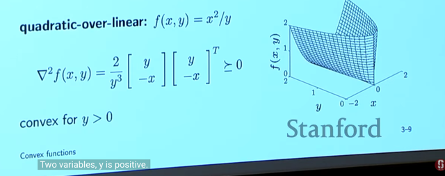</kbd></p>

> [!NOTE]
> Một ví dụ nữa là **quadratic - over - linear f(x,y) `=` x^2 `/` y**
>
> gs cho thấy khi tính Hessian matrix ∇^2f(x) thì nó như vầy (ông thể hiện dưới **dạng rank 1 matrix và ông nói vì H rank 1 nên tại mọi điểm chỉ có 1 hướng là có curvature** - chưa hiểu lắm chỗ này
>
> Đại khái là gs cho rằng ta có thể thấy: **nếu giữ y fixed, thì f convex vì ta có dạng scalar × x^2**. Còn **giữ x fixed, thì f cũng convex vì hàm `1/y` convex**
>
> Và ông gọi nó là **jointly convex**. Nhưng gs chú ý là: 
>
> Nếu **function jointly convex thì nó convex ở từng variable, nhưng ngược
> lại thì không đúng.**

<br>

                                                                                                        <a id="node-eot6wop"></a>
                                                                                                        - **ví dụ này, f `=` xy**
<p align="center"><kbd>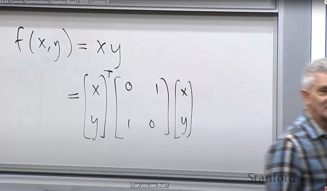</kbd></p>

> [!NOTE]
> Ông lấy ví dụ này, f `=` xy, hoàn toàn có thể thể hiện để thấy nó là một quadratic function `=` `(1/2)[x` y][0 1; 1 0][x y]T
>
> Nếu **giữ x fixed, thì f là linear theo y, như đã biết, nó convex (vừa convex vừa concave)**.
>
> Tương tự **nếu giữ y fixed, f cũng convex**
>
> Vậy **f `=` xy có convex không**?, và cụ thể là vì đây là quadratic function thì câu hỏi là **Hessian matrix [0 1; 1 0] có phải là positive semi-definite không?**
>
> Thử trả lời: Không, vì đây là **permutation matrix**, có det `=` -1 Vậy det Hessian < 0 ⇨ Hessian là **indefinite** matrix
>
> Nói thêm, 1806 ta đã học các phép thử để có positive (semi) definite:
>
> Thì dựa vào **det `=` -1 ⇨ có eigenvalue < 0 ⇨ ngay lập tức kết luận không phải positive semi definite.**
>
> Hoặc nội cái det < 0 à đã đủ kết luận rồi.
>
> Tóm lại đây là ví dụ cho thấy function **convex theo từng biến** (giữ y fixed, thì f(x,y) là hàm theo x, và nó convex, ngược lại giữ x fixed thì hàm thành hàm theo y, cũng convex) **nhưng không 
> jointly convex**

<br>

                                                                                                          <a id="node-zdlnun6"></a>
                                                                                                          - **Tiếp theo là log-sum-exp và geometric mean cũng có Hessian ≽ 0**
<p align="center"><kbd>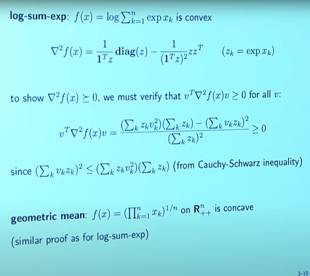</kbd></p>

> [!NOTE]
> Tiếp theo là **log-sum-exp và geometric mean cũng có Hessian ≽ 0**
>
> (từ giờ positive semi definite viết kí hiệu là ≽ 0)
>
> Có lẽ quay lại sau để triển khai thử các công thức chỗ này.
>
> f `=` log `Σk` exp(xk) `=` log 1Texp(x)
>
> Thử tìm gradient ∇f:
>
> Ta cần df `=` (...)dx
>
> Đặt **u `=` 1Texp(x)** ⇨ f(u) `=` log u, ⇨ `df/du` `=` `1/u` ⇨ df `=` `u/du`
>
> df(u) `=` f(u+du) - f(u) 
>
> df(u) `=` log (u+du) - log(u)
>
> *Tính du theo dx:
>
> du `=` u(x+dx)-u(x)
>
> `=` 1Texp(x+dx) - 1Texp(x)
>
> `=` 1T(e^x ⊙ e^dx) - 1Te^x
>
> `=` (e^x)Te^dx - 1Te^x (1)
>
> Tới đây điểm quan trọng là: e^dx ≈ 1 + dx
>
> Áp dụng Taylor expansion: tại x0 `=` 0
>
> f(x) `=` f(x0) + f^(1)(x0)(x-x0) + `(1/2)f^(2)(x0)(x-x0)^2` + `(1/3!)f^(3)(x-x0)^3` + ...
>
> Với f(x) `=` e^x, ta có:
>
> ```text
> e^x = e^0 + [e^(x)|x=x0]x + (1/2) [e^(x)|x=x0]x^2 + (1/3!) [e^(x)|x=x0]x^3 + ...
> ```
>
> ⇔ e^x `=` 1 + (e^0)x + `(e^0)x^2/2` + `(e^0)x^3/3!` + ...
>
> ⇔ e^x `=` 1 + x + `x^2/2` + `x^3/3!` + ...
>
> ⇨ e^dx `=` 1 + dx + `(dx)^2/2` + `(dx)^3/3!` + ...
>
> Và ta có thể **bỏ higher order term của dx** ⇨ **e^dx `=` 1 + dx**
>
> Vậy quay lại đây (1) 
>
> ≈ (e^x)T(1+dx) - 1Te^x
>
> `=` (eT^x)T1 + (e^x)Tdx - 1Te^x
>
> `=` (e^x)Tdx
>
> ⇨ df `=` (e^x)Tdx `/` 1Te^x
>
> ⇨ **∇f `=` (e^x) `/` 1Te^x và đây chính là softmax(x)**
>
> Derive ∇^2f:
>
> Ta sẽ tìm derivative của ∇f `=` (e^x) `/` 1Te^x
>
> Gọi p `=` (e^x) `/` 1Te^x, 
>
> `====`
>
> Đặt z `=` e^x ⇨ p(z) `=` z `/` 1Tz
>
> dz `=` de^x `=` e^(x+dx) - e^x 
>
> `=` e^x ⊙ e^dx - e^x ≈ e^x ⊙ (1+dx) - e^x
>
> `=` e^x + e^x ⊙ dx - e^x 
>
> `=` e^x ⊙ dx `=` diag(e^x) dx `=` diag(z)dx
>
> Vậy dz `=` diag(e^x)dx 
>
> ⇨ dzi `=` e^xi dxi
>
> `====`
>
> Đặt u(z) `=` 1Tz. 
>
> Tính sẵn du `=` 1T(z+dz) - 1Tz 
>
> `=` 1Tz + 1Tdz - 1Tz 
>
> `=` 1Tdz
>
> ⇨ du `=` 1Tdz `=` 1T [diag(z)dx] hay 1T(z⊙dx) `=` zTdx (ngẫm sẽ thấy)
>
> `===`
>
> p `=` `z/u` 
>
> ```text
> pi = zi/u = zi(x)/u(z)
> ```
>
> dpi `=` `∂pi/∂zi` dzi + `∂pi/∂u` du (total differential)
>
> ```text
> dpi = dzi/u + zi (-1/u^2) du = (dzi u - zi du) / u^2
> ```
>
> `=` (zi e^xi u - zi zTdx ) `/` u^2
>
> `=` zi (e^xi u - zTdx ) `/` u^2
>
> `=` `(zi/u)` (e^xi u - zTdx ) `/` u
>
> `=` pi (dxi u `/` u - zTdx `/` u) 
>
> `=` pi (dxi - zTdx `/` u) 
>
> `=` pi [dxi - `(z/u)Tdx]`
>
> `=` pi [dxi - (p)Tdx]
>
> `=>` dpi `=` pi dxi -pi pTdx
>
> (dp1 `=` p1(dx1 - pTdx) `=` p1dx1 - p1pTdx
>
> dp2 `=` p2(dx2 - pTdx) `=` p2dx2 - p2pTdx)
>
> dp `=` p ⊙ dx + ppTdx `=` diag(p)dx - ppTdx `=` (diag(p) - ppT)dx
>
> Vậy ∇^2f `=` (diag(p) - ppT) 
>
> ```text
> nếu thay lại p = z/u với z = e^x, u = 1Tz
> ```
>
> ```text
> = diag(z/u) - (z/u)(z/u)T = diag(z) / u - zzT / u^2
> ```
>
> `=` **(1/1Tz) diag(z) - `1/(1Tz)^2` zzT**
>
> Phần tiếp theo là chứng minh ∇^f `=` `(1/1Tz)` diag(z) - `1/(1Tz)^2` zzT ≽ 0 LÀM SAU
>
> VÍ DỤ KHÁC LOG SUM EXP & GEOMETRIC MEAN LÀ CÁC CONVEX
> DO THỎA SECOND ORDER CONDITION (CÓ HESSIAN PSD)

<br>

                                                                                                            <a id="node-rvur4mp"></a>
                                                                                                            - **sub-level set**
<p align="center"><kbd>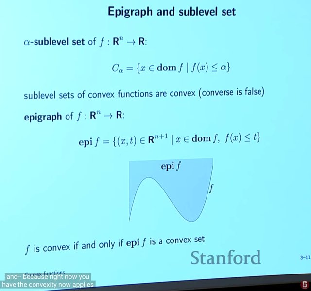</kbd></p>

> [!NOTE]
> Tiếp theo ta sẽ biết concept **sub-level set**, được định nghĩa là
>
> `Cα` là **tập hợp các điểm x thuộc domain f sao cho f(x) ≤ α** thì khi đó **Cα gọi là `α-sublevel` set of f**
>
> Và **nếu function convex thì sublevel set là convex set**
>
> Thế thì khái niệm tiếp theo là **epigraph**, gs nói ta đã biết **khi có function trong n-D (n biến) thì để vẽ graph của nó ta cần n+1 D** 
>
> Ví dụ như hình vẽ là **function 1 biến f(x) `=` sin(x) chẳng hạn. Thì graph của f sẽ vẽ trong 2D**, (bởi phải có thêm một axis để thể hiện value f(x)). Thì **epigraph là tập mọi mọi điểm ở bên trên graph f**
>
> epi f `=` {(x,t) ∈ R^n+1 | x ∈ dom f, f(x) ≤ t}
>
> Vậy thì ở đây cái chính muốn nói: 
>
> **f(x) convex function ⇔ epi-graph của nó là convex set**
>
> Do đó đây là nơi có **connection giữa convex function và convex set**
>
> **Sublevel set: Nếu f convex thì sub-level set của nó là convex set**
>
> **epi-graph: nếu f convex thì sub-level str là convex set**

<br>

                                                                                                              <a id="node-wpa4n3z"></a>
                                                                                                              - **Jensen's inequality f(E[z]) ≤ E[f(z)]**
<p align="center"><kbd>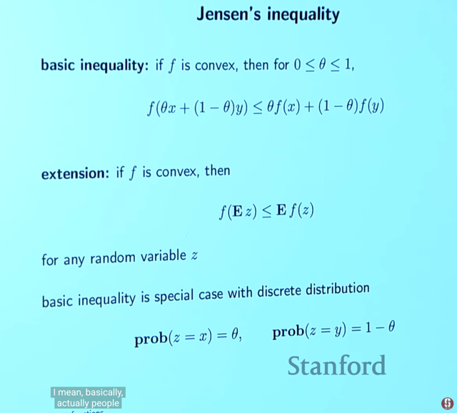</kbd></p>

> [!NOTE]
> Ta sẽ gặp lại một cái mà cs231n đã từng gặp: **Jensen's inequality**
>
> Gs nói nó đơn giản nói rằng **nếu f là convex function** thì: 
>
> **f của mixture ≤ mixture các f** (đây thực ra là định nghĩa của hàm convex đã biết)
>
> ```text
> f(θx + (1-θ)y) ≤ θf(x) + (1-θ)f(y)
> ```
>
> Như đã biết nếu 0 ≤ `θ` ≤ 1 thì `θx` + `(1-θ)y` gọi là l**ine segment hay mixture `/` convex combination** của x, y
>
> Và **dạng mở rộng** của nó là: 
>
> **Nếu f convex thì f(E[z]) ≤ E[f(z)]** (z là random variable, ở đây ghi chữ thường đáng lí phải ghi chữ hoa Z như các lớp xác suất: f(E[Z]) ≤ E[f(Z)])
>
> Để rồi có thể thấy basis inequality `f(θx` + `(1-θ)y)` ≤ `θf(x)` + `(1-θ)f(y)` **chỉ là đang áp dụng công thức tổng quát cho z là một discrete r.v có 2 possible values là x, và y, với pmf `P(z=x)` `=` `θ` và `P(z=y)` `=` (1-θ)**
>
> Khi đó từ stat110 đã đã biết E[Z] là **weighted sum các possible values của z với weight là probability (pmf/pdf)**
>
> ```text
> Ez = Σ possible values z_i của z z_i*P(z = z_i)
> ```
>
> ```text
> = xP(z=x) + yP(z=y) = xθ + y(1-θ)
> ```
>
> Còn E[f(z)] thì áp dụng **LOTUS** cho ta:
>
> ```text
> Ef(z) = Σ possible values z_i của z f(z_i)P(z = z_i) = f(x)θ + f(y)(1-θ)
> ```

<br>

                                                                                                                <a id="node-npuizyq"></a>
                                                                                                                - **operation (on functions) preserve convexity**
<p align="center"><kbd>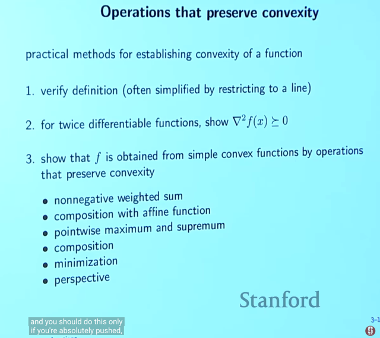</kbd></p>

> [!NOTE]
> Đại khái là lướt lại các **phương pháp để chứng minh tính convexity**.
>
> Đầu tiên là** dựa vào định nghĩa** đó là ta cần chứng minh nếu x,y thuộc domain của f, và chọn `θ` bất kì trong [0,1] thì f của mixture của x, y luôn bé  hơn hoặc bằng mixture của f(x), f(y). Tuy nhiên như đã nói **chỉ nên dùng khi ko còn cách nào khác**
>
> Cách thứ hai là **nếu function có đạo hàm cấp hai** (ở mọi điểm trong domain), tức "twice differentiable functions" thì ta có thể **xem Hessian của nó có ≽ 0** không 
>
> Ông cũng nói **phần lớn trường hợp ta cũng sẽ ko làm cách này trừ khi Hessian matrix đơn giản**.
>
> Và cách ta sẽ làm phần lớn trường hợp đó là chứng minh f là **kết qủa của các convex operation lên các simple convex function**
>
> giống như cách mà ta tính đạo hàm của các hàm phức tạp bằng các rule và đạo hàm các hàm cơ bản vậy

<br>

                                                                                                                  <a id="node-w2c1cn9"></a>
                                                                                                                  - **Các operation giữ nguyên tính convexity**
<p align="center"><kbd>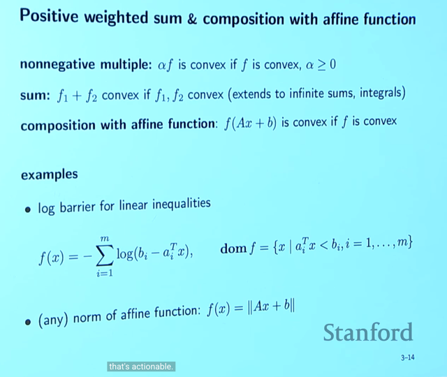</kbd></p>

> [!NOTE]
> Gs lướt qua vài ví dụ, đầu tiên trong **các operation giữ nguyên tính convexity**, thì ta có :
>
> i) **nhân với số không âm**, 
>
> ii) `Σ:` **tổng các convex là convex function**
>
> iii) và f(Ax+b) gọi là **composition with a affine function**: nếu **f(Ax+b) convex thì f convex.**
>
> Thì từ đó ta áp dụng để **xét tính convexity của function phức tạp này** gọi là **log barrier**: 
>
> **f(x) `=` - `Σ` log(bi - aiTx)** có domain là x | aiTx < b
>
> Thì đại khái ta sẽ phân tích như sau:
>
> **bi - aiTx là affine function**, như đã biết, nó sẽ convex và cũng concave
>
> **log là concave** ⇨ **concave của affine sẽ concave**
>
> `=>` **Σ của concave là concave**
>
> Cuối cùng **nhân số âm với concave là thành convex**. Vậy đây là convex function

<br>


<a id="node-rxx2w6l"></a>
## Lec 1

<br>

<p align="center"><kbd></kbd></p>

> [!NOTE]
> đầu tiên ta sẽ nói về việc

<br>

<p align="center"><kbd>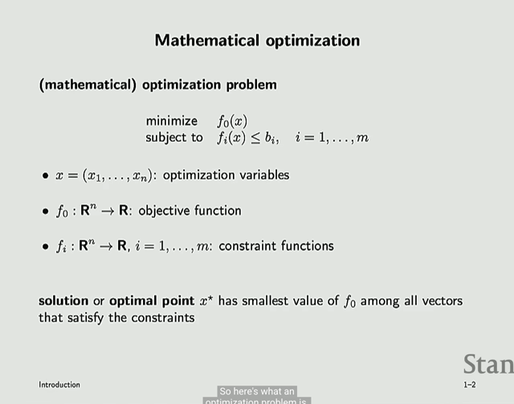</kbd></p>

> [!NOTE]
> Đầu tiên, bài này gs chỉ lướt qua sơ những thứ sẽ học trong class này
>
> Đầu tiên là về mathematical optimization.
>
> Đại khái là, vấn đề đặt ra là ta có một **objective function f0** map R^n input và output scalar R. 
>
> Đây là cái mà ta muốn minimize.
>
> Và nhiều **constrain function f_i** cũng là R^n -> R functions. Và ta muốn minimize f0 với các constrains: `f_i(x)` `<=` `b_i` với mọi i.
>
> Bài toán đặt ra là ta muốn tìm giá trị của x (gọi là optimization variables)  sao cho f0(x*) có giá trị nhỏ nhất và thỏa các constrains `f_i(x*)` `<=` `b_i`
>
> Gs cho biết có **nhiều biến thể (variant)** và ta sẽ nói rõ sau

> [!TIP]
> **🤖 AI Feedback** — ⚠️ Score: **75/100**
>
> Phần tóm tắt của sinh viên khá chính xác về các khái niệm cơ bản của bài toán tối ưu toán học. Tuy nhiên, còn thiếu sót về mặt hình thức và độ chính xác trong việc phân biệt các ký hiệu.

<br>

<p align="center"><kbd>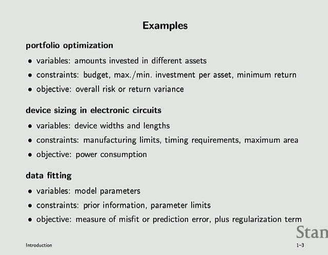</kbd></p>

> [!NOTE]
> Gs nói qua một số ví dụ mà optimization sẽ hữu ích. Ví dụ như tối ưu hóa danh mục đầu tư, trong đó variables sẽ là số lượng tiền được đầu tư vào các kênh đầu tư khác nhau. 
>
> Objective là giảm thiểu rủi ro hay biến động tổng thể. Và constraints là budget,
> minimum return ....
>
> Hay việc design kích thước của các electronic circuits. Variables sẽ là kích thước của device. Objective là giảm thiểu mức tiêu thụ năng lượng. Với constraints là không gian tối đa cho phép chẳng hạn.
>
> Và ví dụ mà mình quan tâm nhất đương nhiên là trong lĩnh vực học máy. Trong đó variables chính là **model parameters **mà ta cần train (thật ra chính là thực hiện bài toán optimization). 
>
> Objective là giảm **loss function** (mức sai sót của model) với constrains
> là **prior information** mà gs nhắc tới ví dụ như ta cần đảm bảo covariance matrix giữ tính chất là một symmetric semi-definite matrix chẳng hạn.
>
> Nói chung ta sẽ đi qua rất nhiều ví dụ ở các lĩnh vực khác nhau.
>
> Mà trong phần đầu gs đã nói lớp này áp dụng cho rất nhiều lĩnh vực

<br>

<p align="center"><kbd>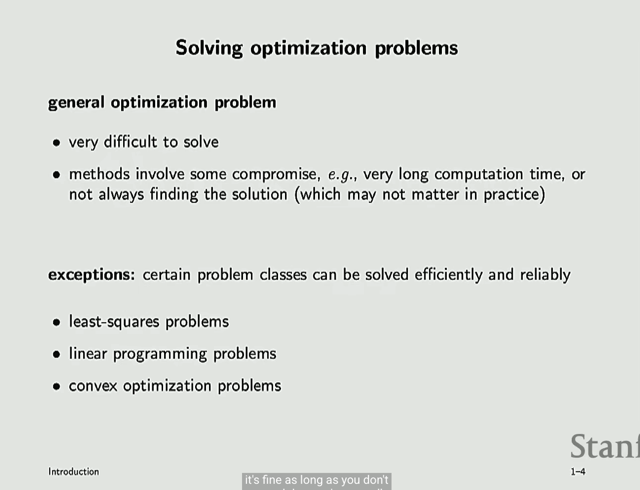</kbd></p>

> [!NOTE]
> Tiếp theo đại khái gs nói là khi học lớp này xong ta có thể giật mình nhận ra nơi đâu cũng là bài toán tối ưu.
>
> Thế thì, vấn đề là, **phần lớn các optimization problem nói chung là rất khó thậm chí không thể giải quyết triệt để**. Và các phương pháp tiếp cận thường sẽ bao gồm một số thỏa hiệp nào đó (compromise)
>
> Tuy nhiên gs cho rằng, đôi khi người ta không cần tìm giải pháp tuyệt đối. 
>
> Đại ý gs là, ví dụ như trong machine learning,** objective function thường là sự thay thế (surrogate) cho mong muốn nào đó của con người** (ví dụ dự đoán chính xác để kiếm tìền
> được thay bằng giảm thiểu prediction error, loss). 
>
> Và nói chung là, **có thể ta không cần solution tuyệt đối tốt** (global minima) mà chỉ
> cần tương đối tốt (local minima) là được.
>
> Tuy vậy, có những ngoại lệ, là những bài toán optimization có thể gỉai được hoàn toàn (TRACTABLE).
>
> Ví dụ least-square problems, linear programming và convex optimization problems

<br>

<p align="center"><kbd>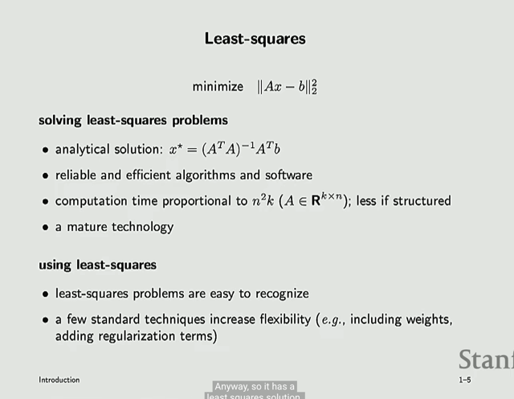</kbd></p>

> [!NOTE]
> Gs nói sơ về **least square** (thật ra gs không nói gì về bài toán này mà chỉ nói sơ về lịch sử của nó, việc giải nó rất nhanh và đáng tin cậy)
>
> Còn bài toán này, mình đã học trong 1806, có thể review một chút:
>
> Đại khái bối cảnh là ta **cần giải một hệ phương trình tuyến tính** (system of linear equations) thể hiện bởi Ax `=` b. 
>
> Có điều, vấn đề là có thể **ta có nhiều equations hơn số variables**, khiến cho bài toán
> vô nghiệm. Theo góc nhìn của đại số tuyến tính, matrix A là matrix cao ốm, có nhiều hàng hơn số cột. Cho rằng matrix A là matrix [m,n] và có n cột độc lập, thì các **cột của nó chỉ span được một n-dimension subspace của R^m**. 
>
> Do đó v**ector b thuộc R^m có thể nằm ngoài C(A)** khiến không tồn tại phép kết hợp tuyến tính nào giữa các cột của A cho ra b, nên không tồn tại nghiệm của `Ax=b.`
>
> Giải pháp là least-square, **tìm solution tốt nhất** có thể: bằng cách tìm xhat là solution của A xhat `=` **p với p là projection của b lên C(A)**, xhat sẽ là solution mà error nhỏ nhất. Từ đó ta có công thức least square solution như sau:
>
> Project b lên C(A), được p, tức p ∈ C(A): nên tồn tại linear combination của các cột của A tạo ra p: p `=` A `x_hat,` phần dư (residual) của b sau khi project lên C(A), tức e, sẽ vuông góc với C(A), đồng nghĩa nó sẽ thuộc complement của C(A), tức left-nullspace của A, N(AT).
>
> Nói cách khác nó sẽ là solution của ta có (AT)e `=` 0:
>
> Từ đó ta có AT(b-Ax^) `=` 0 ⇔ ATb `=` ATAx^ (normal equation) 
>
> ⇔ x^ `=` (ATA)inv ATb
>
> Đây chính là least square solution, và nó giúp minimize error là sai
> khác giữa b và p tức minimize residual e `=` Ax - b

<br>

<p align="center"><kbd>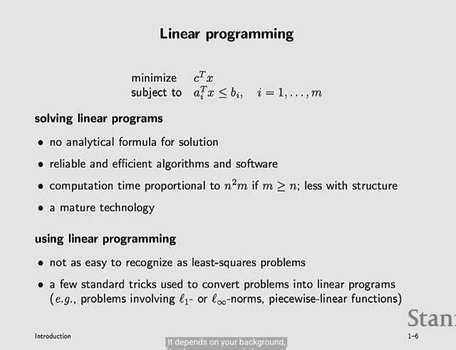</kbd></p>

<br>

<p align="center"><kbd>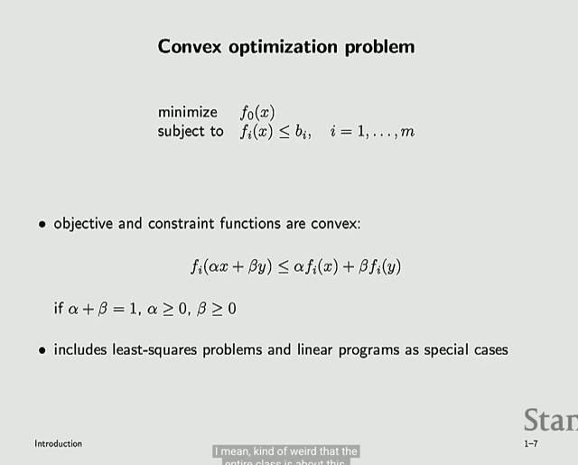</kbd></p>

> [!NOTE]
> Và exception thứ 3 chính là cái ta sẽ học trong lớp
> này - Convex optimization problem

<br>

<p align="center"><kbd>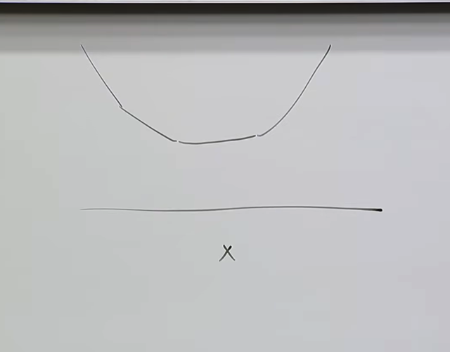</kbd></p>

> [!NOTE]
> đại khái là ta sẽ deal với các function có đường cong không có
> curvatuve âm (gọi là concave up)

<br>

<p align="center"><kbd>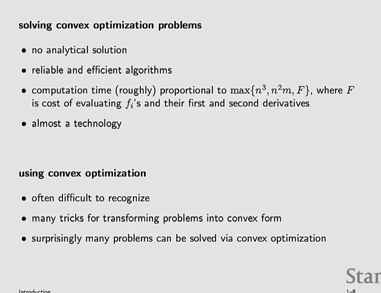</kbd></p>

<br>

<p align="center"><kbd>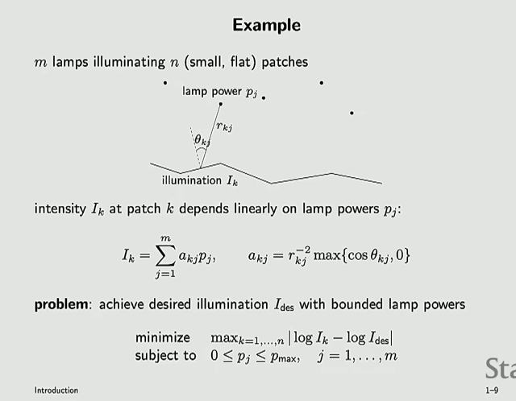</kbd></p>

<br>


<a id="node-5fcjpvt"></a>
## Lec 4

<br>


<a id="node-29pr2x1"></a>
### Tiếp nối bài trước ta đã nói về cách để chứng minh tính convexity

<p align="center"><kbd>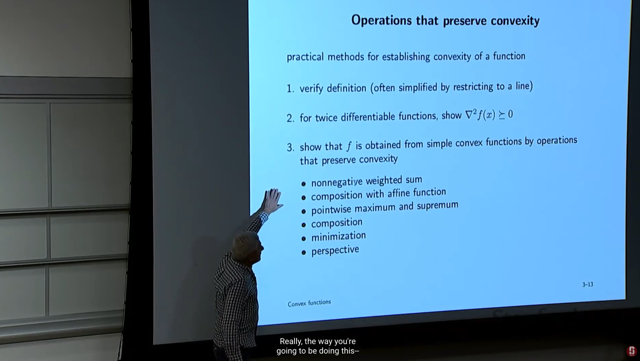</kbd></p>

> [!NOTE]
> Đại khái là tiếp nối bài trước ta đã nói về cách để chứng minh tính convexity trong đó **most of the time ta sẽ tìm cách cho thấy một function là kết quả của việc áp dụng các operation có tính chất bảo toàn tính convexity lên các convex function cơ bản**
>
> Điều này giống như trong calculus ta tìm đạo hàm bằng cách dùng các rule và đạo hàm của các hàm cơ bản vậy
>
> Thì một số operations có tính chất preserve convexity như:
>
> + nonnegative weighted sum
>
> + composition with affine function
>
> + point-wise maximum & supremum
>
> + composition
>
> + minimization
>
> + perspective
>
> `====`
>
> Ở lần review này mình chợt nhận ra dù Lagragian function có thể không convex nhưng dual function g(λ, ν) `=` inf x L(x, λ, ν) thì là convex v

<br>


<a id="node-9gifnzj"></a>
#### Bbữa trước ta đã đi qua những operations đầu tiên

<p align="center"><kbd>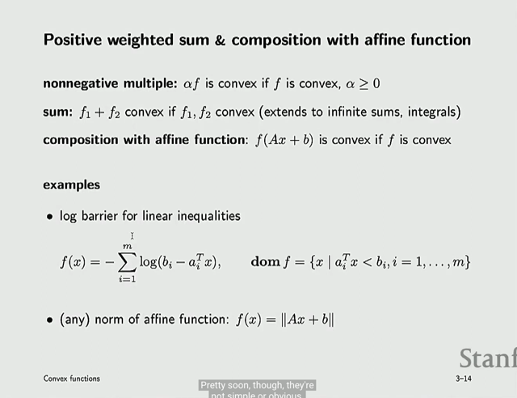</kbd></p>

> [!NOTE]
> Thế thì bữa trước ta đã đi qua những operations đầu tiên:
>
> - **non-negative multiply**: nhân với non-negative, sẽ giữ nguyên convexity: gs cho rằng điều này **dễ thấy** vì việc **nhân số không âm sẽ chỉ tăng thêm hoặc giảm bớt curvature, chứ không khiến đổi dấu**, nên dĩ nhiên nó sẽ** giữ nguyên tính convex**
>
> - **sum**: Tổng các convex function cũng là convex function
>
> - COMPOSITION WITH AFFINE: f(Ax+b), tức là **apply convex function f vào affine function** Ax+b **cũng tạo ra convex function**.
>
> Một vài ví dụ xài 3 loại operations trên (để giúp phân tích convexity) đó là **log barrier**, thì cơ bản là ta tổng các composition with affine function:
>
> f(x) `=` - `Σi` log (bi - aiTx) : Đầu tiên, log là concave function, nên - log là convex function.
>
> nên - log (bi - aiTx) là composition with affine: cũng là convex
>
> và f là tổng của các - log (bi - aiTx), nên cũng convex
>
> Ví dụ khác là norm của affine f(x) `=` ||Ax+b||: **norm là convex function**, nên **||Ax+b|| thực ra là apply norm function vào affine** nên thuộc vào mục **composition with affine**: nên cũng là convex

<br>

<a id="node-fb7qpyg"></a>
- **Một dạng operation nữa có tính preserve convexity:  point-wise maximum**
<p align="center"><kbd>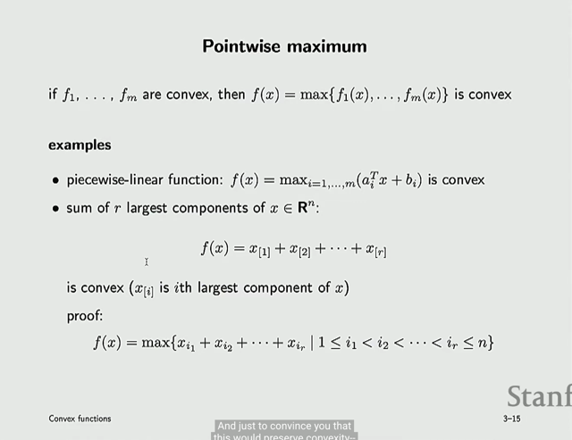</kbd></p>

> [!NOTE]
> Gs nói qua một dạng operation nữa có tính preserve convexity:
>
> point-wise maximum: 
>
> nếu ta có các **function f1, f2...fm convex. **
>
> thì **f(x) `=` max (f1(x), f2(x) ...fm(x)) cũng convex**
>
> ví dụ:
>
> - **piecewise-linear function**: f(x) `=` max `i=1,2...m` (aiTx + bi) là point-wise maximum function của các affine function aiTx+bi (dĩ nhiên affine function như đã biết là vừa convex vừa concave) nên cũng convex
>
> - **sum của r component lớn nhất của x**: f(x) `=` x[1] + x[2] + ...x[r]
>
> (x[i] là component lớn thứ i của vector x)
>
> thế thì f(x) cũng convex. và điều này có được là bởi ta có thể cho thấy `/` hiểu f(x) thực ra chính là point-wise maximum của nhiều function, mà mỗi function sẽ tính tổng của r component bất kì trong x, và gs nói chúng là các linear (cũng như affine, sẽ là convex function)
>
> f(x) `=` max `x_i1` + `x_i2` + `..x_ir` | 1 ≤ i1 < i2 < ..ir **<=** n
>
> Và có (n choose r) function như vậy (chọn set có r component
> trong n component thì có (n choose r) set)
>
> (gs cho biết, ví dụ này ta có thể không thấy rõ lắm)
>
> OPERATION PRESERVE CONVEXITY:
>
> POINT-WISE MAXIMUM

<br>

  <a id="node-yb3ic4e"></a>
  - **gs vẽ minh họa nếu ta có hai function f1, f2 như vầy, thì point-wise maximum function**
<p align="center"><kbd>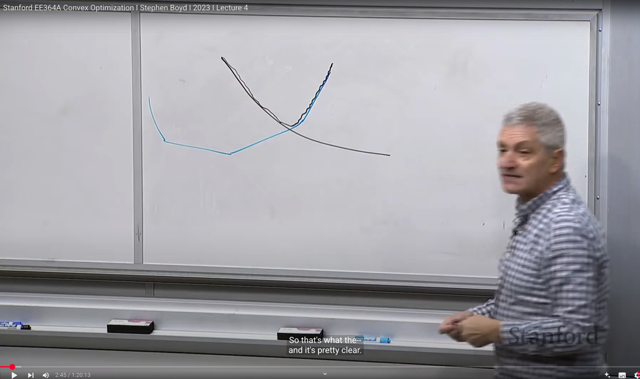</kbd></p>

> [!NOTE]
> gs vẽ minh họa nếu ta có hai function f1, f2 như vầy, thì point-wise maximum function của chúng sẽ là đường này

<br>

    <a id="node-bv9vimh"></a>
    - **sum of 5.6 largest entries**
<p align="center"><kbd>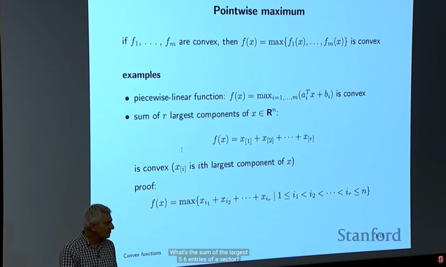</kbd></p>

> [!NOTE]
> gs nói thêm, ta có thể có function **sum of 5.6 largest entries nữa**: Và nó có nghĩa là, ta lấy **sum của 5 cái lớn nhất, và 0. 6*component lớn thứ 6**
> Và có thể thấy nó là function **khá kì cục, nhưng theo ý trên nó là convex function**

<br>

<p align="center"><kbd>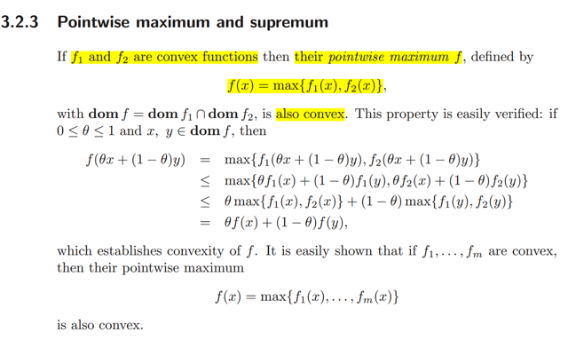</kbd></p>

> [!NOTE]
> Trong sách có nói thêm phần chứng minh cho theorem này, cũng đơn giản, chỉ làm theo cách chứng minh tiêu chuẩn cho convex function đó là chứng minh nó thỏa:
>
> f(mixture of x,y) ≤ mixture of f(x), f(y)
>
> Chứng minh pointwise maximum là convex

<br>

        <a id="node-zfstwcg"></a>
        - **Hai ví dụ nữa, quay lại sau**
<p align="center"><kbd>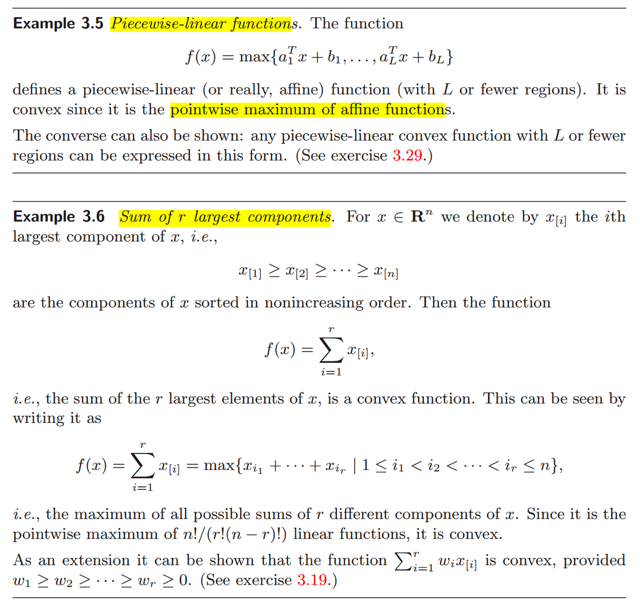</kbd></p>

> [!NOTE]
> Hai ví dụ nữa, quay lại sau

<br>

          <a id="node-4xr0k7s"></a>
          - **point-wise supremum**
<p align="center"><kbd>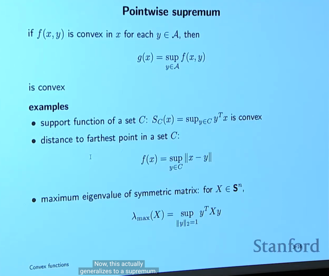</kbd></p>

> [!NOTE]
> Tiếp theo ta biết đến **point-wise supremum.**
>
> Khái niệm **supremum**, gs cho biết nếu chưa biết thì nó **đơn giản chỉ là maximum của vô số cái**. (gs nói ta **cứ thay sup bởi max cũng được**, hiểu đai khái là **khi có hũu hạn cái thì gọi là maximum còn khi có vô số cái thì gọi là supremum**)
>
> gs nói thêm f(x,y) dưới đây thì **x ở đây là vector, nhưng y có thể là bất cứ thứ gì**, như graph, path...để rồi ta có thể hiểu nó như **một family các function theo x parameterized bởi y.**
>
> Vậy thì theorem này nói rằng:
>
> nếu **f(x, y) convex theo x với mỗi y thuộc A** (không cần phải là convex set)  thì nếu ta lấy g(x):
>
> **g(x) `=` sup y ∈ A f(x,y)**
>
> mang ý nghĩa là trong mọi f(x, y) với y ∈ A, lấy cái max.
>
> Thì **g(x) là convex function.**
>
> A là một set nào đó
>
> Ví dụ **support function của set C**: Sc(x) `=` sup y ∈ C {yTx} là convex function
>
> Cái này tạm hiểu là, giả sử có set C, thì với mọi y trong C, lấy cái y khiến yTx lớn nhất thì cái y đó gọi là y*, sẽ tạo nên Sc(x) `=` y*Tx, và nó gọi là support function của C. Và theorem trên nói rằng Sc(x) là convex (again, gs đã nói y có thể là bất cứ thứ gì, ở trường hợp này có thể nó là vector)
>
> OPERATION PRESERVE CONVEXITY:
>
> POINT-WISE SUPREMUM.
>
> VÍ DỤ: SUPPORT FUNCTION CỦA SET C

<br>

            <a id="node-93dza2e"></a>
            - **mở rộng ra với **pointwise supremum****
<p align="center"><kbd>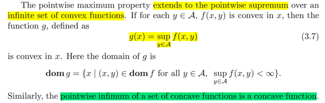</kbd></p>

> [!NOTE]
> mở rộng ra với **pointwise supremum**
>
> Đáng chú ý ở đây nói thêm là **tương tự, khi infimum của set các concave function thì ta có concave function**

<br>

              <a id="node-bkvyfor"></a>
              - **ví dụ: distance to the farthest point in c**
<p align="center"><kbd>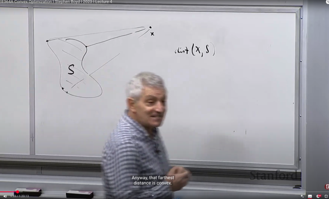</kbd></p>

> [!NOTE]
> Ví dụ nữa là **distance to the farthest point in set C**:
>
> f(x) `=` sup y∈C ||x-y||: dịch ra là, trong mọi y thuộc set C (ko nhất thiết set C convex). Lấy y sao cho L2 distance của nó tới x lớn nhất (đây chính là ý nghĩa của sup) thì đó là f(x) return
>
> Thế thì function f(x) là cái mechnishm như vậy, thì nó là convex function
>
> trên bảng là gs vẽ minh họa về distance function thông thường (là distance nhỏ nhất của một điểm trong set C tới x) và distance to the farthest point function
>
> POINT-WISE SUPREMUM.
>
> ví dụ: distance to the farthest point in c

<br>

                <a id="node-9a8slzt"></a>
                - **Một ví dụ nữa là function "tính ra" cái lớn nhất trong các eigenvalues của symmetric matrix X**
<p align="center"><kbd></kbd></p>

> [!NOTE]
> Một ví dụ nữa là function **"tính ra" cái lớn nhất trong các eigenvalues của symmetric matrix X** (∈ S^n)
>
> Gs nói đại khái là như đã biết **để tìm eigenvalues, ta sẽ phải giải characteristic equation det (A-λI) `=` 0**. Với S^n matrix thì cơ bản đây là phương trình bậc n. Và ta sẽ **không có công thức để tìm nghiệm khi n `=` 4,5**
>
> **Nói chung ý nói function này λ_max (X) là function rất phức tạp**.
>
> Tại sao gs lại ghi là **λ_max(X) `=` sup `||y||=1` {yTXy}** ?
>
> Thì bởi ý nghĩa của nó là trong các unit vector y (thể hiện bởi `||y||=1),`  thì ta sẽ tính yTXy và lấy cái lớn nhất. 
>
> Thế thì ta hiểu như vầy để thấy tại sao nó chính là function lấy ra eigenvalue lớn nhất:
>
> Bởi **X là symmetric matrix S^n, nên X luôn có thể đủ số vector riêng độc lập, luôn có thể phân rã eigendecomposition** (1806 ta đã học rằng symmetric matrix luôn có đủ n independent eigenvector và đặc biệt hơn nữa là chúng orthogonal)
>
> Do đó **X `=` SΛSinv**, và vì tính chất **orthogonal eigenvectors** nói trên nên S là orthogonal matrix. **Sinv `=` ST**, hay ta dùng Q để kí hiệu orthogonal matrix, để từ đó ta có diagonalization của symmetric matrix là
>
> **X `=` QΛQT**
>
> Thế thì từ đó yTXy `=` yTQΛQTy. Thế thì, đặt u `=` QTy, ta có function uTΛu `=` λ1u1^2+ λ2u2^2 + ...λnun^2 (u1, u2...un là các component của u)
>
> Mà ta có thể chứng minh λ_min ≤ `Σ` λi ui^2 ≤ λ_max như sau:
>
> λi ≤ λ_max 
>
> ⇨ λi ui^2 ≤ λ_max ui^2 với mọi i
>
> ⇨ `Σ` λi ui^2 ≤ `Σ` λ_max ui^2, 
>
> Tương tự, `Σ` λ_min ui^2 ≤ `Σ` λi ui^2
>
> ⇨ `Σ` λ_min ui^2 ≤ `Σ` λi ui^2 ≤ `Σ` λ_max ui^2
>
> ⇔ λ_min `Σ` ui^2 ≤ `Σ` λi ui^2 ≤ λ_max `Σ` ui^2
>
> ⇔ λ_min ||u||^2 ≤ `Σ` λi ui^2 ≤ λ_max ||u||^2
>
> ⇔ λ_min ≤ `Σ` λi ui^2 ≤ λ_max
>
> ```text
> (do ||u||^2 = uTu = (QTy)T(QTy) = yTQQTy =yTy = 1)
> ```
>
> Vậy yTXy ≤ λ_max
>
> và nó bằng λ_max khi: y là eigenvector ứng với λ_max: Xy `=` λ_max y
>
> Xy `=` λ_max y ⇔ Xy `=` y λ_max ⇔ yTXy `=` yTy λ_max
>
> ⇔ yTXy `=` λ_max
>
> Do đó, sup `||y||=1` yTXy với ý nghĩa là tìm y sao cho yTXy max , và trả ra
> yTXy với cái y đó, thì chính là trả ra cho ta eigenvalue max
>
> POINT-WISE SUPREMUM.
>
> VÍ DỤ: FUNCTION TÌM RA EIGENVALUES LỚN NHẤT CỦA S^n 
> MATRIX X: λ_max(X) `=` sup ||y|| `=` 1 {yTXy}

<br>

                  <a id="node-abm04lj"></a>
                  - **gs lưu ý ta cần nhận ra, yTXy thật ra là **linear function theo x****
<p align="center"><kbd>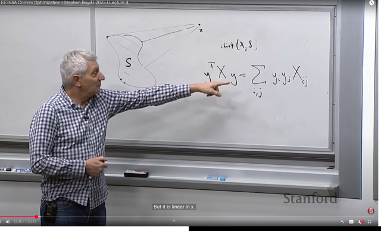</kbd></p>

> [!NOTE]
> Một điểm gs lưu ý ta cần nhận ra, yTXy thật ra là **linear function theo x**
>
> Do đó **nó convex theo x với mọi giá trị của y**
>
> Và trong bối cảnh point-wise supremum, thì hòan toàn thỏa yêu cầu f là convex IN X

<br>

                    <a id="node-bua1m63"></a>
                    - **một điểm kiến thức quan trọng:  composition with scalar function**
<p align="center"><kbd>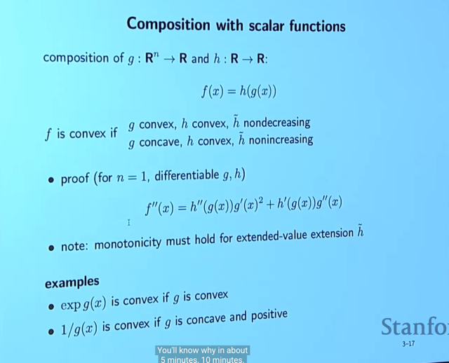</kbd></p>

> [!NOTE]
> Tiếp theo là một điểm kiến thức quan trọng:
>
> **composition with scalar function**
>
> Đại khái là ta sẽ có cái rule như sau: Cho hàm g: Rn -> R và hàm f: R -> R
>
> Thế thì, f `=` h(g(x)) sẽ convex nếu:
>
> 1) **g convex, h convex và h increasing (h~ non-decreasing, gs cho rằng có thể hiểu đại khái là h increasing)**
>
> 2) **g concave, h convex và h decreasing (h~ non-increasing)
> **
> Ví dụ exp g(x) nếu g convex, thì vì exp() là convex và là hàm tăng, nên exp g(x) convex
>
> Còn `1/g(x)` thì vì `1/x` convex nhưng nó giảm, nên `1/g(x)` convex
>
> Thế thì gs nói thêm cái rule này ta đã gặp một case của nó khi g là affine, khi đó nếu f convex thì f(affine) convex
>
> Và ông cho rằng cái này, ta cơ bản là quan tâm dấu của các derivative bậc 0,1,2. Và khi ta xét dấu của f''(x) thì nó sẽ cho thấy cái rule ở trên
>
> ```text
> f(x) = h(g(x)) => f'(x) = d/dx f = d/dx h(g(x)) = d/dg h(g) . d/dx g(x) (chain rule)
> ```
>
> ```text
> f''(x) = d/dx [d/dg h(g) . d/dx g(x)]
> ```
>
> ```text
> = d/dx [d/dg h(g)] d/dx g(x) + d/dg h(g) . d/dx [d/dx g(x)]   | product rule
> ```
>
> `=` `d/dx` [h'(g)]  g'(x) + h'(g) `d/dx` [g'(x)]
>
> `=` `d/dg` [h'(g)] `d/dx` [g(x)] g'(x) + h'(g) g''(x) | 
>
> ```text
> (chain rule: d/dx [h'(g) = d/dg [h'(g)] d/dx [g(x)])
> ```
>
> `=` h''(g) g'(x)] g'(x) + h'(g) g''(x)
>
> f''(x) `=` h''(g) [g'(x)]^2 + h'(g) g''(x)
>
> Thì khi đó ta sẽ thấy cái rule này nó đúng:
>
> ví dụ g convex, h convex, h increasing
>
> thì g convex ⇨ g'' > 0, 
>
> h convex ⇨ h'' > 0, 
>
> h increasing ⇨ h' > 0,
>
> từ đó ta sẽ thấy f''(x) là tổng của hai cái tích, mỗi tích là tích của hai
> cái không âm ⇨ ko âm, mà đạo hàm cấp 2 không âm tức curvature
> không âm ⇨ convex
>
> OPERATION PRESERVE CONVEXITY:
>
> COMPOSITION WITH SCALAR FUNCTION

<br>

                      <a id="node-l56fppw"></a>
                      - **vector composition**
<p align="center"><kbd>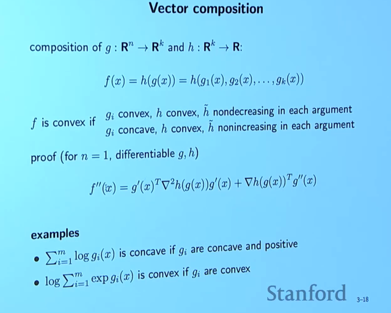</kbd></p>

> [!NOTE]
> Tiếp theo là **vector composition**: 
>
> Đại khái là cho Rn -> Rk function g: take input là Rn vector x,  g(x) sẽ là Rk vector: 
>
> g(x) `=` [g1(x), g2(x)....gk(x)]
>
> và Rk -> R function h: Take input là Rk vector: g(x) output là scalar:
>
> h(g(x)) `=` h([g1(x), g2(x), ...gk(x)])
>
> Thì rule sẽ là:
>
> nếu gi(x) convex, h convex và h~ non-decreasing in each argument
>
> (ý này có nghĩa là, khi tăng gi thì h(g1,g2..gi,..gk) không giảm)
>
> thì khi đó f sẽ convex
>
> Hoặc 
>
> nếu gi(x) concave, h convex và h~ non-increasing in each argument
>
> (ý này có nghĩa là, khi tăng gi thì h không tăng)
>
> thì f sẽ convex
>
> OPERATION PRESERVE CONVEXITY:
>
> VECTOR COMPOSITION

<br>

                        <a id="node-zx9srif"></a>
                        - **Gs lấy một ví dụ**
<p align="center"><kbd>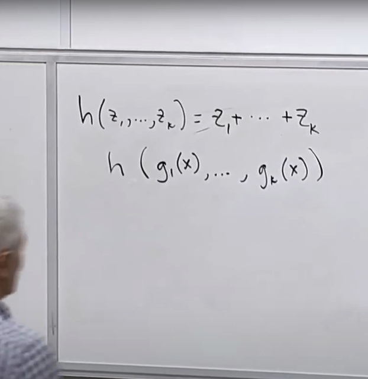</kbd></p>

> [!NOTE]
> Gs lấy một ví dụ tuy hiển nhiên nhưng hoàn valid để minh họa rule này.  đó là h là function h(z1, z2, ....) `=` z1 + z2 + .. + zk
>
> Ở đây g(.) là identity function: x `=` [z1, z2..., zk]
>
> g(x) `=` g([z1, z2..., zk]) `=` [z1, z2..., zk]
>
> Tức là g1(x) `=` z1, g2(x) `=` z2 ,...
>
> h(g(x)) `=` h([g1(x), g2(x), ...]) 
>
> `=` h([z1, z2..., zk]) `=` z1 + z2 + ...zk
>
> Thế thì g1(x) `=` z1, g2(x) `=` z2... là các convex `/` cũng là concave
> function (vì nó là affine)
>
> mà `Σ` của các convex hiển nhiên là convex
>
> nhưng chiếu theo rule vector composition ta sẽ thấy:
>
> h không giảm khi tăng zi, và zi convex, nên h convex

<br>

                          <a id="node-nw9ef12"></a>
                          - **Tương tự max cũng vậy, h `=` max (z1, z2...)**
<p align="center"><kbd>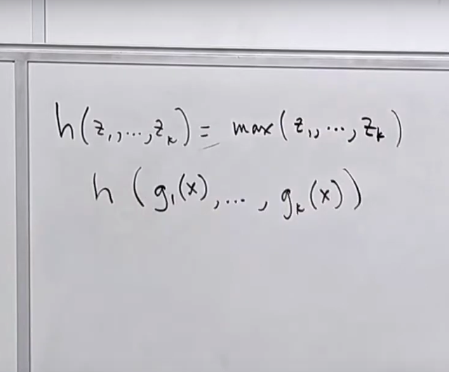</kbd></p>

> [!NOTE]
> Tương tự max cũng vậy, h `=` max (z1, z2...) cũng có tính chất **non-decreasing in each argument **- ý là khi **tăng zi thì tuy không phải lúc nào h cũng tăng (trừ khi giá trị zi lúc đó là max trong đám) nhưng chắc chắn nó không giảm**
>
> Và zi như đã nói là convex do đó h sẽ convex

<br>

                            <a id="node-2kpv2mn"></a>
                            - **Ví dụ khác là log `Σi` exp gi(x)**
<p align="center"><kbd>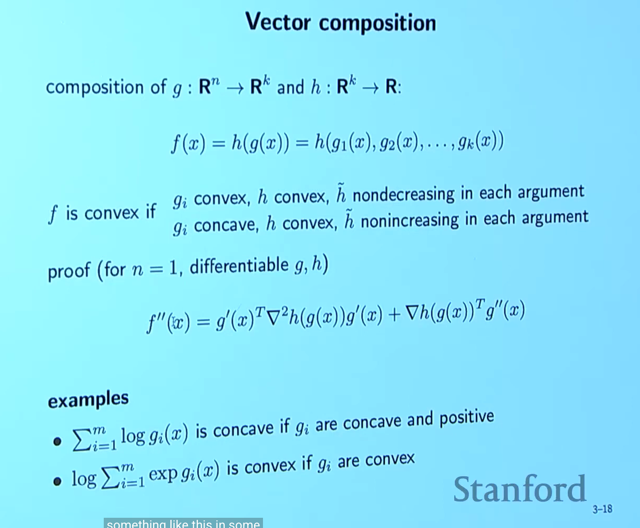</kbd></p>

> [!NOTE]
> Ví dụ khác là log `Σi` exp gi(x) - đây chính là loss function trong machine learning.
>
> Nó **convex nếu gi convex**, vì:
>
> f `=` h(k1(x), ...km(x))
>
> với h là **log sum exp là convex function** (search log sum exp là thấy)
>
> và **increasing in all argument: gi tăng thì log `Σ` exp gi không giảm**

<br>

                              <a id="node-0uoul1f"></a>
                              - **các function kì quặc như này, ta không thể `/` không muốn dùng định nghĩa**
<p align="center"><kbd>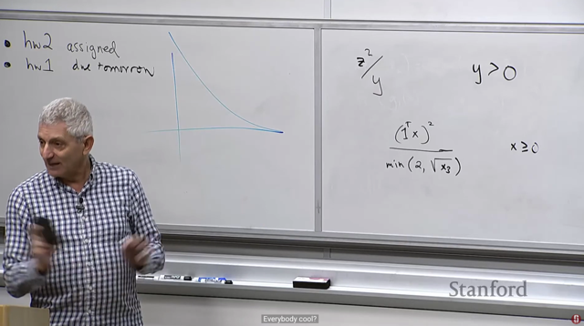</kbd></p>

> [!NOTE]
> vài phút sau đó chưa thật sự hiểu lắm, nhưng đại khái là gs cho một số ví dụ để nói rằng với **các function kì quặc như này, ta không thể `/` không muốn dùng định nghĩa, hoặc
> dựa trên Hessian matrix ≻ 0 để nói nó convex hay không mà ta chỉ có thể dùng các rule **như này

<br>

                                <a id="node-znif4tu"></a>
                                - **Partial minimization**
<p align="center"><kbd>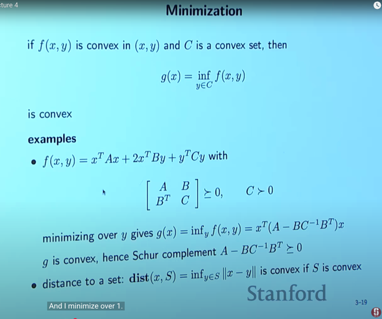</kbd></p>

> [!NOTE]
> tiếp theo, đại khái là nếu f(x,y) **jointly convex**. 
>
> Và C là **convex set**.
>
> Khi đó nếu ta có **g(x) bằng cách minimize over y f(x,y)** (tức là tìm y ∈ C để f(x, y) nhỏ nhất), thì với y* đó, ta có g(x) `=` f(x, y*)
>
> g(x) `=` inf y∈C {f(x, y)}
>
> **thì g(x) cũng là convex function**
>
> Người ta gọi nó là **partial minimization**
>
> Ổng cũng nói đây là **nguyên lý của Dynamic Programming**
>
> f(x,y) `=` xTAx + 2xTBy + yTCy
>
> Để tìm y khiến f(x,y) nhỏ nhất: Ta thử dùng calculus: 
>
> Bằng cách solve `∂f/∂y` `=` 0 
>
> df `=` f(x, y+dy) - f(x, y)
>
> `=` xTAx + 2xTB(y+dy) + (y+dy)TC(y+dy) - xTAx - 2xTBy - yTCy
>
> `=` xTAx + 2xTBy + 2xTBdy + (y+dy)TC(y+dy) - xTAx - 2xTBy - yTCy
>
> `=` 2xTBdy + (y+dy)TC(y+dy) - yTCy
>
> `=` 2xTBdy + (yT+dyT)C(y+dy) - yTCy
>
> `=` 2xTBdy + (yTC+dyTC)(y+dy) - yTCy
>
> `=` 2xTBdy + yTCy + dyTCy + yTCdy + dyTCdy - yTCy
>
> `=` 2xTBdy + 2yTCdy `=` 2(xTB + yTC)dy
>
> ⇨ `df_y` `=` 2(xTB + yTC)dy 
>
> ⇨ `∂f/∂y` `=` 2(xTB + yTC)T `=` 2(BTx + CTy)
>
> ```text
> Vậy ∂f/∂y = 0 ⇔ 2(BTx+CTy) = 0 ⇔ BTx + CTy = 0 ⇔ CTy = -BTx
> ```
>
> ⇔ y `=` (CT)inv(-BTx) `=` Cinv(-BTx)   | vì C symmetric ⇨ CT `=` C
>
> Xét `d(∂f/∂y)` `=` 2(BTx+CT(y+dy)) - 2(BTx+CTy)
>
> `=` 2BTx + 2CTy + 2CTdy - 2BTx - 2CTy 
>
> `=` 2CTdy  
>
> ⇨ ∂^2f `/` ∂y^2 `=` 2CT 
>
> mà C là positive definite matrix nên CT cũng xác định dương 
>
> ⇨ **critical point là minimum giúp kết luận function đạt min theo y khi y `=` Cinv(-BTx)**
>
> Gọi D là Cinv cho gọn y* `=` -DBTx
>
> Lắp vào ta có f(x,y*) `=` xTAx + 2xTB(-DBTx) + (-DBTx)TC(-DBTx)
>
> `=` xTAx - 2xTBDBTx + (-DBTx)TC(-DBTx)
>
> `=` xTAx - 2xTBDBTx - (BTx)TDTC(-DBTx)
>
> `=` xTAx - 2xTBDBTx + (BTx)TDTCDBTx
>
> `=` xTAx - 2xTBDBTx + (xTBTT)DTCDBTx
>
> `=` xTAx - 2xTBDBTx + xTBDTCDBTx
>
> `=` xTAx - 2xTBDBTx + xTBDTBTx
>
> `=` xTAx - 2xTBDBTx + xTBDBTx  | DT `=` D do C symmetric ⇨ Cinv sym
>
> `=` xTAx - xTBDBTx 
>
> `=` xTAx - xTBCinvBTx
>
> `=` xT(Ax - BCinvBTx) 
>
> f(x,y*) `=` xT(A - BCinvBT)x 
>
> Thế thì theo lí thuyết nói rằng hàm f(x,y*) này, chính là f(x,y*) `=` g(x) `=` inf y ∈ C f(x,y) sẽ là convex
>
> Thế thì.. tới đây ta có hàm theo x và cái này có dạng **quadratic** 
>
> và như đã nói lí thuyết nói rằng hàm này convex, xem thử đúng không
>
> Thế thì vì nó convex nên **D `=` A - BCinvBT là positive semi definite**, đơn giản là vì với xTDx thì D chính là Hessian, theo lí thuyết bữa trước (cụ thể là **second order condition**) thì nếu function f tồn tại Hessian và Hessian là Positive Semi Definite thì f sẽ convex.
>
> Chứng minh Hessian chính là matrix D. 
>
> **Tìm Hessian theo MIT 18s096**:
>
> +Xây dựng **Bilinear form**: 
>
> Tìm first derivative: df `=` f(x+dx) - f(x) `=` (x+dx)TD(x+dx) - xTDx 
>
> `=` (xTD+dxTD)(x+dx) - xTDx `=` (xTDx + dxTDx + xTDdx + dxTDdx) - xTDx 
>
> `=` dxTDx + xTDdx
>
> `=` (dxTDx)T + xTDx   | và vì **dxTDx là scalar nên có thể transpose nó tùy ý**
>
> `=` xTDTdx + xTDdx 
>
> `=` **xT(DT + D)dx**
>
> Vì D symmetric (D `=` [A B; BT C] ⇨ D `=` DT ⇨ xTDdx `=` (xTDdx)T
>
> .. `=` **2xTDdx** 
>
> ```text
> ⇨ ∇f = (2xTD)T = 2DTx, f' = 2xTD (= (∇f)T)
> ```
>
> d'(f'(x)[dx]) `=` d'(2xTDdx) `=` 2(x+dx')TDdx - 2xTDdx
>
> `=` 2xTDdx + 2dx'TDdx - 2xTDdx `=` 2dx'TDdx
>
> `=` f''(x)[dx', dx] `=` dx'T(2D)dx ⇨ Hessian chính là 2D
>
> +Làm cách khác: Xây dựng Jacobian của f'(x):
>
> ```text
> d(∇f) = d(2DTx) = 2DT(x+dx) - 2DTx = 2DTdx = J dx
> ```
>
> `=>` Jacobian J của ∇f `=` 2DT ⇨ Jacobian của f'(x), cũng là Hessian của f(x) `=` 2D
>
> Tóm lại, lí thuyết nói rằng hàm f(x,y*) `=` g(x) `=` xTDx phải convex từ đó ta suy ra D ≽ 0
>
> OPERATION PRESERVE CONVEXITY:
>
> PARTIAL MINIMIZATION

> [!TIP]
> **🤖 AI Feedback** — ✅ Score: **92/100**
>
> Bài làm cho thấy sự hiểu biết sâu sắc về khái niệm tối ưu hóa một phần và bảo toàn tính lồi, với các chứng minh chi tiết và chính xác. Cần chú ý hơn đến các lỗi dấu nhỏ trong quá trình tính toán.

<br>

                                  <a id="node-y2s0tnu"></a>
                                  - **Nói thêm về jointly convex là điều kiện rất mạnh, không phải chỉ là convex theo mỗi biến**
<p align="center"><kbd></kbd></p>

> [!NOTE]
> Nói về vụ jointly convex: gs lấy ví dụ xy (cái này gs đã nói ở bài trước rồi)
>
> Với **mỗi y (fixed) thì f `=` xy là linear function, nên convex.**
>
> Ngược lại **với mỗi x fixed, thì f `=` xy theo y cũng convex**.
>
> Nhưng cùng nhau, **f `=` xy lại không convex **
>
> Nên ý nói **jointly convex là điều kiện rất mạnh**, không phải chỉ là convex theo mỗi biến
>
> hình dung một function mà ta đi theo 1 trục x hoặc y thì đều cong lên (convex theo từng biến, positive curvature) nhưng đi theo hướng kết hợp hai trục ví dụ 45 độ thì nó lại curve down). Đó là hình ảnh của function ko jointly convex

<br>

                                    <a id="node-uhf6j1y"></a>
                                    - **Tiếp tục ví dụ function f(x, y) `=` xTAx + 2xTBy + yTCy**
<p align="center"><kbd>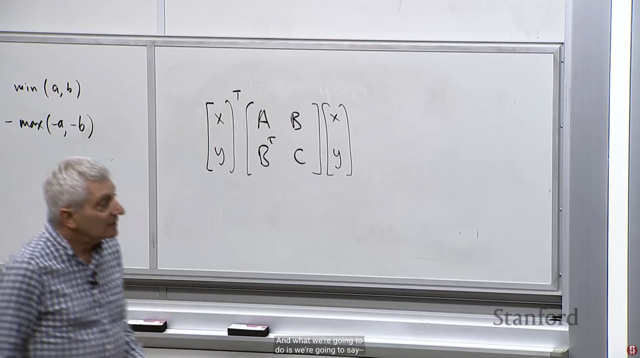</kbd></p>

<p align="center"><kbd>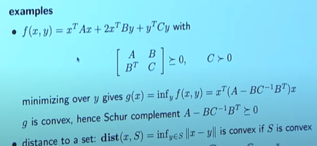</kbd></p>

> [!NOTE]
> Ví dụ, function f(x, y) `=` xTAx + 2xTBy + yTCy cơ bản là quadratic function [x y]T [A B; BT C][x y]
>
> Với matrix ABBTC này **positive semi-definite** thì f jointly convex (cái này đơn giản là vì **nó là Hessian của quadratic function f**)
>
> Và để minimizing over y, thì ta sẽ dùng first order neccesary condition: partial derivative `∂/∂y` f(x,y) `=` 0, giải ra y. Và như đã làm trong note trước, ta cũng thấy đạo hàm cấp 2 của f đối với y, tức Hessian matrix chính là C, và với việc nó xác định dương 
>
>  và thế vào f để có function g(x) `=` inf y f(x,y) `=` xT(A-BCinvBT)x
>
> (Cái này thì mình vừa mới làm rồi đó)
>
> Và theo theorem này nó nói g(x) sẽ convex, mà g(x) có
> dạng quadratic form điều này cho thấy (A-BCinvBT) là một
> positive semi definite (again, vì A-BCinvBT cũng là Hessian
> của g(x))
>
> Và matrix này gọi là SCHUR COMPLEMENT

> [!TIP]
> **🤖 AI Feedback** — ⚠️ Score: **75/100**
>
> Bài làm thể hiện sự hiểu biết sâu sắc về các khái niệm liên quan đến hàm lồi và Schur Complement, các bước giải thích đều đi đúng hướng và có nền tảng vững chắc. Tuy nhiên, việc đặt tên ma trận khối là 'ABBTC' là không chính xác và thiếu chuyên nghiệp. Cần chú ý hơn đến tính chính xác trong ký hiệu và sử dụng ngôn ngữ học thuật hơn để bài viết đạt được sự chặt chẽ cần thiết.

<br>

                                      <a id="node-0k9q20y"></a>
                                      - **Perspective**
<p align="center"><kbd>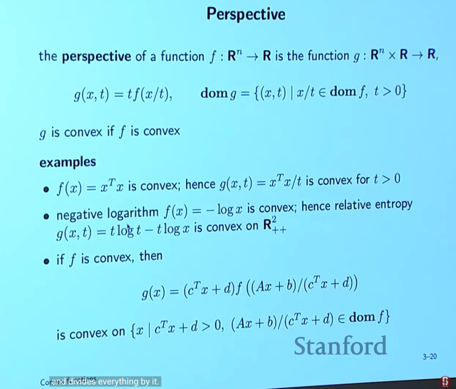</kbd></p>

> [!NOTE]
> Đại khái là ta sẽ biết một cái nữa trong chuỗi **những cái khô khan mà chưa biết học để làm cái con vẹo gì**: **perspective**.
>
> (Trong bài 2,3 **các operation preserve convexity cũng có perspective**, nhưng ta hiểu là **các operation này giữ nguyên tính convexity của set, tức convex set** → **thông qua các operation này tạo ra set cũng convex **còn ở đây là **các operation giữ tính convexity của function**)
>
> Đại khái nếu có function f Rn → R convex thì g(x,t) `=` t `f(x/t)` gọi là **perspective**, và g(x,t) convex. Biết vậy thôi.
>
> Ví dụ f(x) `=` xTx là function R^n -> R, nó dĩ nhiên là tổng bình phương các x's components. Và đương nhiên convex, vì nhìn nó ở dạng quadratic function xT I x, thì Hessian là I là ma trận xác định dương
>
> Thì theo theorem này nói rằng g(x,t) `=` `tf(x/t)` ở đây là `xTx/t,` cũng sẽ convex luôn.
>
> Một số ví dụ khác để xem sau

<br>

                                        <a id="node-kr3qn6k"></a>
                                        - **conjugate function**
<p align="center"><kbd>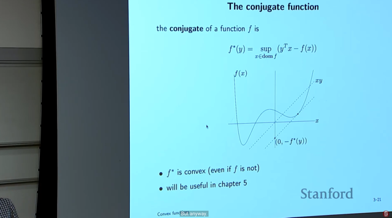</kbd></p>

> [!NOTE]
> Tiếp theo là thêm cái nữa ko biết để làm gì nhưng khầy nói cứ chờ mấy bài sau sẽ thấy nó có ích.
>
> Định nghĩa của **conjugate function f** là function:
>
> f*(y) `=` sup x ∈ dom f (yTx - f(x))
>
> ý nghĩa là tìm trong mọi x trong domain của f (f ko cần convex), ta sẽ **maximize yTx - f(x)**
>
> (ý nghĩa của sup - supremum cũng tương đương maximize như đã biết)
>
> thì **với một x cụ thể nào đó thì dễ thấy yTx - f(x) là một affine function của y**.
>
> Nên cái f*(y) này - tìm trong mọi x cái nào khiến xTy - f(x) lớn nhất, cơ bản chính là **maximize trong vô số các affine function (dĩ nhiên là các affine function thì  convex) thì theo link theorem trước (point-wise supremum), nó sẽ là convex**, dù cho function f ko convex

<br>

                                          <a id="node-rvrve1i"></a>
                                          - **Trong sách bổ sung thêm về domain của f*(y).**
<p align="center"><kbd>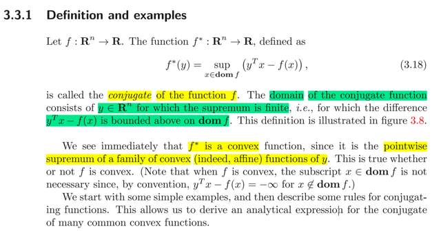</kbd></p>

> [!NOTE]
> Trong sách bổ sung thêm về domain của f*(y).
>
> Đại khái là vì theo định nghĩa f*(y) `=` inf x ∈ dom f {yTx - f(x)} nên **f*(y) xác định khi và chỉ khi inf x ∈ dom f  {yTx - f(x)} xác định**
>
> Mà như vậy đồng nghĩa sup x ∈ dom f {yTx - f(x)} **có giá trị khác +infinity**
>
> Vậy **domain của f*(y) là set {y ∈ R^n sao cho inf x ∈ dom f  {yTx - f(x)} ≠ ∞}**
>
> Nói cách khác y phải làm sao để **yTx - f(x) BỊ CHẶN TRÊN (BOUNDED ABOVE)**

<br>

                                            <a id="node-scy97zh"></a>
                                            - **Thêm vài ví dụ minh họa cho cái vụ conjugate function của f(x) `=` log(x) và f(x) `=` `(1/2)xTQx`**
<p align="center"><kbd>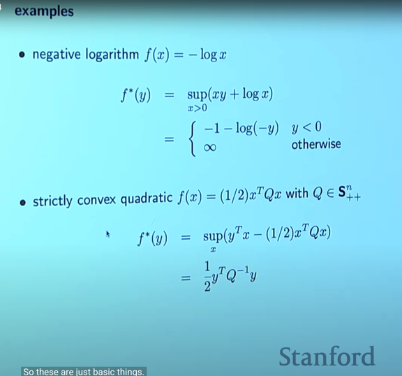</kbd></p>

> [!NOTE]
> Thêm vài ví dụ minh họa cho cái vụ conjugate function f(x) `=` log(x) và f(x) `=` `(1/2)xTQx`
>
> f(x,y) `=` xy + log(x)
>
> `∂f/∂x` `=` y + `1/x`
>
> ```text
> ∂f/∂x = 0 ⇔ y + 1/x = 0 ⇔ x = -1/y
> ```
>
> *Dùng phương pháp **check các boundary và limit **
>
> domain của f: x ≥ 0 (tức x từ 0 đến infinity, do hàm log(x) chỉ xác định khi x > 0)
>
> lim x→0+ f(x) `=` 0 + log(0) `=` -infinity
>
> lim x→inf f(x):
>
> khi x→inf, xy → inf hoặc -inf tùy theo dấu của y
>
> Vậy chưa thể kết luận critical point là maximum vì khi x → inf chưa chắc f → -inf
>
> *Tính đạo hàm cấp hai:
>
> `∂^2f/∂x` `=` `-1/x^2` < 0 ⇨ **negative curvature**
>
> Đúng phải là: **nếu có critical point nằm trong domain của f thì nó sẽ là maximum**.
>
> Như vậy, cả hai bước check boundary và  đạo hàm cấp hai đều cho thấy rằng:
>
> ```text
> Nếu y < 0, thì khi đó việc check boundary cho thấy khi x → infinity thì f → -infinity, do đó kết luận critical point x = -1/y chính là maximum Và điều này cũng là kết qủa mang lại khi check đạo hàm cấp 2: khi y < 0 thì x= -1/y > 0 ⇨ -1/y nằm trong domain (domain: x > 0) do đó đạo hàm cấp hai nói rằng nó chính là maximum.
> ```
>
> Còn nếu y > 0, thì việc check boundary cho thấy khi x → infinity thì  f -> +infinity, nên maximum `=` +inf 
>
> Xét critical point lúc này ta thấy x `=` `-1/y` < 0: Ko nằm trong domain của f do đó không thể là maximum hay minimum gì cả.
>
> ```text
> Như vậy f*(y) = (-1/y)y + log(-1/y) = -1+log(-y^-1) = -1-log(-y) khi y<0
> ```
>
> và `=` +inf khi y>0
>
> Đây chính là kết quả trong slide
>
> Nhưng ý chính là theo lí thuyết thì nhất định f*(y) là convex function 
>
> Và từ việc ta thấy kết quả f*(y) `=` -1 - log(-y) thì cũng xác nhận nó convex vì **log là concave, - log là convex, -y là affine, nên -log(-y) thuộc trường hợp convex function f apply lên affine f(Ax+b) nên cũng là convex**
>
> `====`
>
> Xét f(x) `=` `(1/2)xTQx,` với **Q là positive definite **matrix S^n++, hay Q ≻ 0
>
> Thì **thử xem maximum yTx - f(x) over x là gì và nó có phải là convex function** theo lí thuyết nói ở đây không
>
> yTx - `(1/2)xTQx`
>
> Again, cũng dùng calculus thôi, **tìm critical point**:
>
> df `=` f(x+dx,y)-f(x,y) `=` yT(x+dx) - 0.5(x+dx)TQ(x+dx) - yTx + 0.5xTQx
>
> `=` yTx + yTdx - 0.5(xT+dxT)Q(x+dx) - yTx + 0.5xTQx
>
> `=` yTx + yTdx - 0.5(xTQ+dxTQ)(x+dx) - yTx + 0.5xTQx
>
> `=` yTx + yTdx - 0.5(xTQx+dxTQx+xTQdx+dxTQdx) - yTx + 0.5xTQx
>
> `=` yTdx - 0.5(xTQx+dxTQx+xTQdx+dxTQdx) + 0.5xTQx
>
> `=` yTdx - 0.5(xTQx+2xTQdx) + 0.5xTQx
>
> `=` yTdx - 0.5xTQx - xTQdx + 0.5xTQx
>
> `=` yTdx - xTQdx `=` (yT - xTQ)dx `=` (y - QTx)Tdx
>
> ∇_x f `=` (yT-xTQ)T `=` y-QTx
>
> ```text
> ∇_x f = 0 ⇔ y-QTx = 0 ⇔ y = QTx ⇔ y = Qx
> ```
>
> ⇔ x `=` Qinv y `=` QTy
>
> Hessian: df' `=` y - QTx - QTdx - y + QTx `=` - QTdx 
>
> ⇨ H `=` -Q
>
> Tìm Hessian theo cách tìm bilinear form của MIT 18s096:
>
> d'(f'(x)[dx]) `=` d'((y - QTx)Tdx) `=` (y - QTx - QTdx')Tdx - (y - QTx)Tdx
>
> `=` yTdx - (QTx)Tdx - (QTdx')Tdx - yTdx + (QTx)Tdx
>
> `=` - (QTdx')Tdx 
>
> **= dx'T(-Q)dx**  Đây chính là bilinear form act on [dx', dx], f''(x)[dx', dx]
>
> ⇨ Hessian `=` -Q
>
> Và vì **Q positive definite nên H negative definite** ⇨ **nếu critical point nằm trong domain thì nó là maximum.**
>
> **Dĩ nhiên x `=` QTy nằm trong domain** vì yTx - `(1/2)xTQx` **xác định với mọi x** nên **kết luận x `=` QTy là maximum** 
>
> Và maximum value là yTx* -0.5x*TQx* 
>
> `=` yT(Qinvy) - 0.5(Qinvy)TQQinvy 
>
> `=` yTQinvy - 0.5yTQinvTy
>
> `=` yTQinvy - 0.5yTQinvy  | QinvT `=` Qinv vì Qinv cũng đối xứng
>
> `=` 0.5yTQinvy
>
> Again, **cái chính cũng là theo lí thuyết thì f*(y), là maximum over y của yTx - f(x), nên cũng là convex**, 
>
> và ta xác nhận điều này vì **f*(y) là quadratic với Hessian Qinv 
> và vì Q là positive definite nên Qinv cũng là ≻ 0** ⇨ convex theo second order condition

<br>

                                              <a id="node-hhpcqzh"></a>
                                              - **Một số ví dụ khác về conjugate function**
<p align="center"><kbd>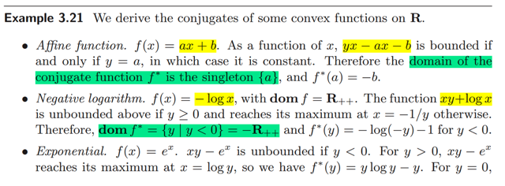</kbd></p>

<p align="center"><kbd>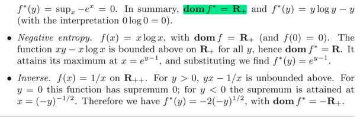</kbd></p>

> [!NOTE]
> Một số ví dụ khác về conjugate function (xem sau)
>
> ```text
> Cũng không khó lắm: Ôn lại tí về domain của f*(y). Vì định nghĩa, f*(y) = sup_x {yTx - f(x)}, nên để f*(y) xác định (giá trị khác +/- ∞) thì dĩ nhiên sup_x {yTx + f(x)} phải xác định, tức là kết quả khác +/- ∞. Từ đó tập xác định (domain) của f*(y) là: {y: sup_x {yTx + f(x) ≠ +/- ∞}
> ```
>
> ```text
> 1) Affine function f(x) = ax + b, thì hàm liên hợp là f*(y) = sup x {yx - ax - b}. Vậy thì với y fixed thì đây là hàm tuyến tính theo x, và để nó bị chặn trên (không vọt lên vô cùng) thì chỉ có thể là y bằng sao đó để yx + ax = 0, ⇔ y = a.
> ```
>
> ⇨ **f*(y) `=` -b, và dom của nó là singleton: {a}**
>
> 2) f(x) `=` -log(x). ⇨ f*(y) `=` sup x {yx - log(x)}. Thế thì: Domain của log(x) là x ≥ 0. 
>
> nếu y ≥ 0: thì khi x → inf thì cả xy + log(x) → inf. Hàm không bị chặn trên. Vi phạm
>
> ```text
> nếu y < 0, tính d/dx [yx + log(x)], = y + 1/x. Cho nó bằng 0 cho thấy x = -1/y sẽ là điểm mà đạo hàm theo x của [yx + log(x)] = 0. Thế thì, check hàm [yx + log(x)] tại x = -1/y thấy nó bằng: [y(-1/y) + log(-1/y)] = -1 + log(1 ) - log(-y) = -1 - log(-y). Và với y < 0 thì kết quả này xác định.
> ```
>
> Điều này có nghĩa là, với y < 0 thì hàm [yx + log(x)] sẽ có một điểm critical point tại x `=` `-1/y` và tại đó giá trị của hàm là xác định. 
>
> ```text
> Xét đạo hàm cấp 2: d/dx [y + 1/x] = 0 + -1/x^2 = -1/x^2, sẽ < 0 ⇨ x = -1/y là local maximum, và vì cũng chỉ có một critical point nên đây cũng là maximum duy nhất (vì không thể có việc đi xuống rồi đi lên lần nữa) ⇨ hàm bị chặn trên, không vọt lên ∞.
> ```
>
> Vậy **domain f*(y) `=` (-inf, 0) và f*(y) `=` -1 - log(-y)**
>
> 3) Exponential: f(x) `=` e^x: 
>
> f*(y) `=` sup x ∈ dom f: {yx - e^x}
>
> Xét hàm g(x) `=` yx - e^x, `d/dx` g(x) `=` y - e^x
>
> `d/dx` g(x) `=` 0 ⇔ y `=` e^x
>
> Nếu y < 0 ⇨ y `=` e^x vô nghiệm, tức là hàm g không có critical point, và điều này đã đủ kết luận hàm sẽ vọt lên vô cùng. Tuy vậy ta có thể check thêm:
>
> lim x → +inf yx - e^x `=` +inf ⇨ unbounded above.
>
> Nếu y ≥ 0 thì y `=` e^x có nghiệm x `=` log y, tại đó hàm đạt giá trị ylog(y) - e^log(y) `=` ylog(y) - y là giá trị hữu hạn. 
>
> Xét đạo hàm cấp 2: `d^2/dx^2` `=` - e^x < 0. Vậy g(x) đạt maximum tại x* `=` log(y), nên nó bị chặn trên, không thể vọt lên vô cùng lớn.
>
> Vậy **dom f*(y) là {y: y ≥ 0} `=` R+ và f*(y) `=` ylog(y) - y**
>
> ---
>
> Tiếp theo là **negative entropy f(x) `=` xlog(x)**
>
> (Ta sẽ học kĩ hơn về Entropy trong cuốn Information Theory của MacKay)
>
> Thế thì tương tự, định nghĩa của conjugate function của f(x):
>
> f*(y) `=` sup x ∈ dom f(x) {yTx - f(x)}, ở đây f(x) là R function, tức R → R nên:
>
> f*(y) `=` sup x ∈ dom f(x) {yx - xlog(x)} `=` sup x ∈ R+ {yx - xlog(x)}
>
> Thế thì xét function g(x,y) `=` yx - xlog(x), hoặc nếu xét một fixed value của y thì có thể coi function như g(x) `=` yx - xlog(x).
>
> ```text
> Ta sẽ tìm critical point: d/dx g(x) = y - (log(x) + x/x) = y - log(x) - 1
> ```
>
> `d/dx` g(x) `=` 0 ⇔ y - log(x) - 1 `=` 0 
>
> ⇔ log(x) `=` y - 1 
>
> ⇔ x `=` e^(y-1)
>
> Giá trị g(x) tại critical point là:
>
> g(e^(y-1)) `=` y*e^(y-1) - e^(y-1)*log[e^(y-1)]
>
> `=` y*e^(y-1) - e^(y-1)*(y-1) 
>
> `=` [y - (y - 1)] * e^(y-1) 
>
> `=` e^(y-1) 
>
> Xét limit của function tại boundary: 
>
> ```text
> lim x→0+ g(x) = lim x→0+ (yx - xlog(x)) = 0 - 0 = 0 (chú ý: lim x→0+ xlog(x) = 0 theo L'Hopital)
> ```
>
> lim x→inf g(x) `=` lim x→inf x(y - log(x)) `=` inf * (-inf) `=` -inf
>
> Vậy hàm số **đạt maximum tại critical point x `=` e^(y-1)** với giá trị cũng bằng e^(y-1).
>
> Vậy kết luận:
>
> **f*(y) `=` e^(y-1)**
>
> Và vì hàm số yx - xlog(x) luôn bounded above với mọi giá trị của y, nên:
>
> **dom f*(y) `=` {y: f*(y) < +infinity} `=` R**
>
> ---
>
> Xét tiếp f(x) `=` `1/x` với x ∈ R++, tức x > 0.
>
> Theo định nghĩa, f*(y) `=` sup x ∈ dom f(x) {yx - f(x)} 
>
> `=` sup x ∈ R++ (yx - `1/x)`
>
> Xét hàm g(x) `=` yx - `1/x` (với một giá trị cố định của y)
>
> ```text
> d/dx g(x) = y - (- 1/x^2) = y + 1/x^2
> ```
>
> Critical point:
>
> ```text
> d/dx g(x) = 0 <=> y + 1/x^2 = 0
> ```
>
> `<=>` y `=` `-1/x^2` 
>
> `<=>` x^2 `=` `-1/y` 
>
> ```text
> <=> x = +/- √(-1/y)
> ```

> [!TIP]
> **🤖 AI Feedback** — ⚠️ Score: **72/100**
>
> Bài làm cho thấy sự hiểu biết vững chắc về định nghĩa hàm liên hợp và phương pháp tính toán. Tuy nhiên, còn một số lỗi nhỏ về dấu, miền xác định của hàm gốc, và phân tích giới hạn chưa chính xác, cùng với một phần giải bài tập chưa hoàn thiện.

<br>

                                                <a id="node-azpy68m"></a>
                                                - **Strictly convex quadratic function**
<p align="center"><kbd>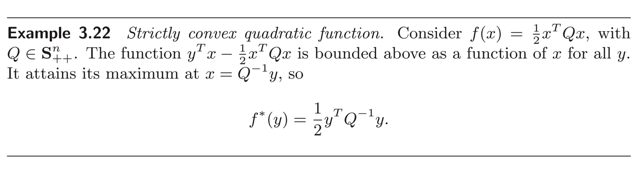</kbd></p>

> [!NOTE]
> Thử xem ví dụ này **strictly convex quadratic function** tại sao conjigate của nó là lại ra vậy:
>
> f(x) `=` `(1/2)xTQx` với Q positive definite S^n++ (hay Q ≻ 0). Thế thì theo định nghĩa conjugate function của f(x): 
>
> f*(y) `=` sup x ∈ dom f (yTx - f(x))
>
> Thì f*(y) `=` sup x ∈ dom f (yTx - `(1/2)xTQx`
>
> Tìm critical point của g(x) `=` yTx - `(1/2)xTQx:`
>
> ```text
> dg = g(x+dx) - g(x) = yT(x+dx) - (1/2)(x+dx)TQ(x+dx) - yTx + (1/2)xTQx
> ```
>
> `=` yTx + yTdx - `(1/2)(xTQ+dxTQ)(x+dx)` - yTx + `(1/2)xTQx`
>
> `=` yTx + yTdx - `(1/2)(xTQx` + dxTQx + xTQdx + dxTQdx) - yTx + `(1/2)xTQx`
>
> ```text
> = yTx + yTdx - (1/2)xTQx - (1/2)dxTQx - (1/2)xTQdx - (1/2)dxTQdx - yTx + (1/2)xTQx
> ```
>
> `=` yTdx - xTQdx  `=` (yT - xTQ)dx `=` (y - QTx)Tdx
>
> ⇨ ∇g(x) `=` y - QTx
>
> ∇g(x) `=` 0 ⇔ y - QTx `=` 0 ⇔ QTx `=` y 
>
> ⇔ Qx `=` y (do Q Symmetric Positive Definite, nên Q `=` QT)
>
> ⇔ x `=` Qinv y
>
> Tính Hessian: theo MIT 18s096, Dùng cách tiếp cận Jacobian của gradient:
>
> ```text
> d(∇g) = d(y - QTx) =  y - QT(x + dx) -  y - QTx = -QTdx = J dx
> ```
>
> `=>` Jacobian của ∇g `=` -QT, `=>` Jacobian của g'(x), cũng là Hessian của g(x) 
>
> `=` (-QT)T `=` -Q
>
> `=>` Hessian `=` -Q
>
> và vì Q ≻ 0 (positive definite) nên -Q ≺ 0 (NEGATIVE DEFINITE)
>
> Vậy hàm g(x) concave, và **x `=` Qinvy là maximum**.
>
> Vậy f*(y) `=`  sup x ∈ dom f yTx - f(x) 
>
> `=` yTQinvy - `(1/2)(Qinvy)TQQinvy` 
>
> `=` yTQinvy - `(1/2)yTQinvQQinvy` 
>
> `=` yTQinvy - `(1/2)yTQinvy` 
>
> **= `(1/2)yT` Qinv y**

<br>

                                                  <a id="node-0o3x4ax"></a>
                                                  - **Conjugate của log-det function: f(X) `=` log det (Xinv)**
<p align="center"><kbd>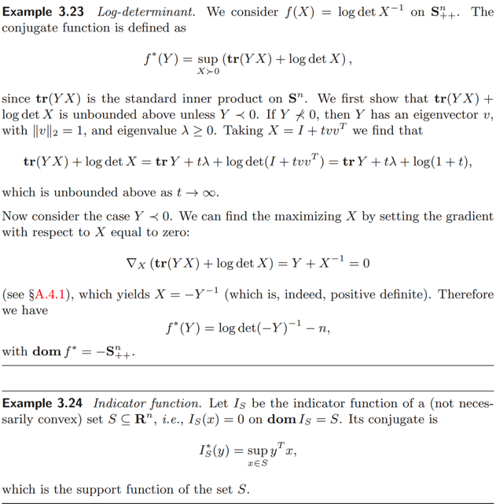</kbd></p>

> [!NOTE]
> Qua ví dụ này: Conjugate của log-det function: f(X) `=` log det (Xinv)

<br>

<p align="center"><kbd>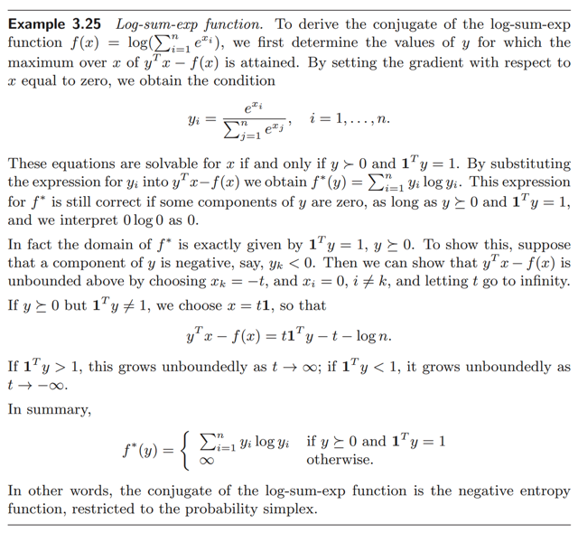</kbd></p>

> [!NOTE]
> Thử tìm conjugate function của log-sum-exp function f(x) `=` `log(Σ` e^xi)
>
> Theo định nghĩa conjugate of f(x): f*(y) `=` sup x ∈ dom f yTx - f(x)
>
> `=` sup x ∈ dom f yTx - `log(Σ` e^xi)
>
> Xét với một giá trị cố định của y, ta xét function g(x) `=` yTx - `log(Σ` e^xi)
>
> (Đặt tên g vậy thôi chứ nó không liên quan gì đến dual function)
>
> và vectorize nó:
>
> g(x) `=` yTx - log(1Te^x)
>
> Để tìm maximum, ta sẽ dùng calculus, tìm gradient của g(x):
>
> g(x) `=` yTx - log(1Te^x)
>
> `===`
>
> Trước tiên tìm derivative của f(x) `=` log `Σ` e^x trước:
>
> Đặt u(x) `=` `Σ` e^x, f(u) `=` log(u)
>
> ```text
> df = f(u+du) - f(u) = log(u+du) - log(u) ~= log(u) +du/u - log(u) = du/u
> ```
>
> ```text
> du = u(x+dx) - u(x) = Σ e^(x+dx) - Σ e^x = Σ e^xi e^dxi - Σ e^xi
> ```
>
> `=` `Σ` e^xi (e^dxi - 1) `=` (e^x)T(e^dx - 1)
>
> Dùng linear approx của e^x: e^dx `~=` 1 + dx
>
> `=` (e^x)T(1 + dx - 1) `=` (e^x)Tdx
>
> Vậy du `=` (e^x)Tdx
>
> ```text
> => df = du/u = (e^x)Tdx / Σe^x = Σ e^xi dxi / Σ e^xi = (e^x)Tdx / 1Te^x
> ```
>
> ```text
> => ∇f = [(e^x)T]T / 1Te^x = e^x / 1Te^x
> ```
>
> `====`
>
> Vậy quay lại đây ta đã có d(log(1Te^x)) `=` (e^x)Tdx `/` 1Te^x
>
> d(yTx) `=` yT(x+dx) - yTx `=` yTdx
>
> ```text
> => dg(x) = d(yTx - log(Σi e^xi)) = d(yTx) - d(log Σi e^xi)
> ```
>
> `=` d(yTx) - d(log(1Te^x))
>
> `=` yTdx - (e^x)Tdx `/` 1Te^x 
>
> `=` (yT - (e^x)T `/` 1Te^x)dx
>
> ```text
> => ∇g = (yT - (e^x)T / 1Te^x)T = y - e^x / 1Te^x
> ```
>
> ```text
> Cho ∇g = 0 <=> y - e^x / 1Te^x = 0
> ```
>
> `<=>` y - e^x `/` 1Te^x `=` 0 
>
> `<=>` y `=` e^x `/` 1Te^x 
>
> ```text
> <=> yi = e^xi / Σj e^xj với i = 1, 2, ...n (như trong sách) (1)
> ```
>
> Và cũng hiểu khi gs nói trong sách rằng để có nghiệm x thì yi phải
> ```text
> dương (vì e^xi dương) và Σ yi phải bằng 1 <=> yT1 = 1 (2), vì Σ e^xi / Σ e^xj = 1
> ```
>
> yi `=` e^xi `/` `Σj` e^xj
>
> `<=>` yi `Σj` e^xj `=` e^xi 
>
> lấy log hai vế:
>
> ```text
> <=> xi = log (yi Σj e^xj) = log (yi 1Te^x)
> ```
>
> `<=>` xi `=` log yi + log(1Te^x)
>
> `=>` x `=` log y + log (1Te^x)
>
> Thế x vào g(x) `=` yTx - log(1Te^x)
>
> `=` yT[log y + log (1Te^x)] - log(1Te^x)
>
> Để ý: y, log(y) là vector, log(1Te^x) là scalar, nên để phân phối yT vô
> ta phải biến nó thành vector
>
> `=` yT[log(y) + log(1Te^x).1] - log(1Te^x)
>
> `=` yTlog(y) + yT(log(1Te^x).1) - log(1Te^x)
>
> `=` yTlog(y) + log(1Te^x) yT1 - log(1Te^x)   
>
> vì log(1Te^x) là scalar nên đưa nó ra trước: `uTαv` `=` `α` uTv (với v là vector 1, u là y)
>
> ```text
> = yTlog(y) + log(1Te^x) 1 - log(1Te^x)   |  do Σ yi = 1 nói ở trên (2) <=> yT1 = 1
> ```
>
> `=` yTlog(y) `=` `Σ` yi log(yi) như trong sách
>
> Khúc cuối gs nói về domain của f*(y). 
>
> Ôn lại chút, theo định nghĩa domain của conjugate function f*(y) là
> tập các y sao cho f*(y) khác +infinity và điều này đồng nghĩa là 
> yTx - f(x) phải bị chặn trên (bounded above)
>
> Hiểu nôm na là vì theo định nghĩa f*(y) `=` sup x ∈ dom f yTx - f(x)
> nên nếu yTx - f(x) không bị chặn trên (unbounded above) thì 
> có thể tìm x khiến yTx - f(x) lớn đến vô cùng.
>
> Thế thì ở bài toán này như đã thấy khi giải ra critical point bằng
> cách cho gradient (đối với x) của yTx - f(x) `=` 0, thì ta có:
>
> yi `=` e^xi `/` `Σj` e^xj, và điều này dẫn đến để tồn tại critical point x
> tức hệ phương trình này có thể giải được, thì yi phải dương, và
> `Σ` yi `=` 1. Nói theo vector từ y ≻ 0 và 1Ty `=` 1. Khi đó sẽ tồn tại 
> critical point x*, và đó cũng là maximum của yTx - f(x) (vì hàm này
> có Hessian negative definite, ta sẽ chứng minh sau)
>
> Vậy domain của f*(y) là y ≻ 0, và 1Ty `=` 1
>
> và f*(y) `=` yTlog(y) nếu y thuộc dom f*(y) và + infinity nếu ngược
> lại.
>
> `====`
>
> Tại sao biết critical point là maximum: 
>
> Cách 1: Dùng kiến thức trong class này nói rằng yTx - f(x) là affine + concave
> (vì f(x) là log `Σ` exp là convex nên - log sum exp là concave) sẽ là concave
> function
>
> Cách 2: Bằng cách dùng second derivative test, chứng mình Hessian của
> nó ⪯ 0
>
> g `=` yTx - f(x) `=` yTx - log `Σi` e^xi
>
> Ta đã có dg `=` (yT - (e^x)T `/` 1Te^x)dx `=` g'(x)[dx]
>
> Theo GPT , đặt u(x) `=` (e^x)Tdx, v(x) `=` 1Te^x
>
> ```text
> => dg = (yT - (e^x)T / 1Te^x)dx = yTx - (e^x)Tdx / 1Te^x
> ```
>
> `<=>` dg `=` yTdx - u(x) `/` v(x)
>
> cũng là g'(x)[dx] `=` yTdx - u(x) `/` v(x)
>
> Tìm Hessian theo MIT 18s096 đã học:
>
> d'(g'(x)[dx]) `=` yTdx - u(x+dx') `/` v(x+dx') - [yTdx - u(x) `/` v(x)]
>
> ```text
> = - [ u(x+dx') / v(x+dx') - u(x) / v(x) ] cái này chính là - d'(u(x)/v(x))
> ```
>
> Dùng công thức `d(u/v)` `=` (duv - udv) `/` v^2
>
> ```text
> => d'(u(x)/v(x)) = [d'u(x) v(x) - u(x)d'v(x)] / v(x)^2
> ```
>
> .. `=` - [d'u(x) v(x) - u(x)d'v(x)] `/` v(x)^2
>
> Giờ ta sẽ tính từng cái:
>
> *d'u(x) `=` u(x+dx') - u(x) `=` (e^(x+dx'))Tdx - (e^x)Tdx
>
> `=` `Σi` e^xi e^dx'i dxi - (e^x)Tdx
>
> `=` `Σi` e^xi (1 + dx'i) dxi - (e^x)Tdx
>
> `=` `Σi` (e^xi + e^xi dx'i) dxi - (e^x)Tdx
>
> `=` `Σi` (e^xi dxi + e^xi dx'i dxi) - (e^x)Tdx
>
> `=` `Σi` (e^xi dxi) + `Σi` (e^xi dx'i dxi) - (e^x)Tdx
>
> `=` (e^x)Tdx + d'xT diag(e^x) dx - (e^x)Tdx
>
> `=` d'xT diag(e^x) dx
>
> *d'v(x) `=` v(x+dx) - v(x)
>
> `=` 1Te^(x+dx') - 1Te^x
>
> ```text
> = 1T(e^x e^dx') - 1Te^x = Σi e^xi e^d'xi - Σ e^xi
> ```
>
> ```text
> = Σi e^xi e^d'xi - e^xi = Σi e^xi (e^d'xi - 1)
> ```
>
> ```text
> = Σi e^xi (1 + d'xi - 1) = Σi e^xi d'xi = e^xTd'x
> ```
>
> Thế vô hết: d'(g'(x)[dx]) 
>
> `=` - [d'u(x) v(x) - u(x)d'v(x)] `/` v(x)^2
>
> `=` - [(d'xT diag(e^x) dx) (1Te^x) - ((e^x)Tdx) (e^xTd'x)] `/` (1Te^x)^2
>
> `=` - [(d'xT diag(e^x) dx) (1Te^x)] `/` (1Te^x)^2 - ((e^x)Tdx) (e^xTd'x)] `/` (1Te^x)^2
>
> Đặt s `=` e^x `/` 1Te^x (softmax function)
>
> Xét - [(d'xT diag(e^x) dx) (1Te^x)] `/` (1Te^x)^2
>
> ```text
> = - [(d'xT diag(e^x) dx) ] / (1Te^x) = - [(d'xT diag(e^x / (1Te^x)) dx)]
> ```
>
> `=` - d'xT diag(s) dx
>
> Xét - ((e^x)Tdx) (e^xTd'x)] `/` (1Te^x)^2
>
> `=` - [(e^x)Tdx) `/` (1Te^x)] [(e^xTd'x) `/` (1Te^x)]
>
> `=` - [(e^x `/` 1Te^x)Tdx) ] [(e^x `/` 1Te^x)Td'x]
>
> `=` - (sTdx) (sTd'x) `=` - d'xTs sTdx `=` - d'xT ssT dx
>
> Vậy kết quả là d'(g'(x)[dx]) `=` - d'xT diag(s) dx - d'xT ssT dx
>
> `=` - d'xT [ diag(s) - ssT ] dx, đây chính là g''(x)[dx', dx]
>
> Vậy Hessian `=` [ diag(s) - ssT ]
>
> Việc còn lại là chứng minh Hessian Negative Definite: (làm sau)

<br>

<p align="center"><kbd>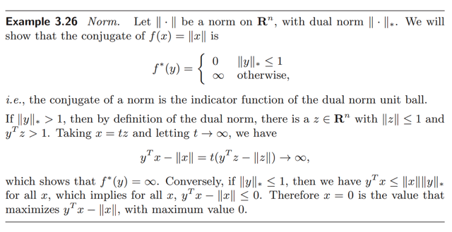</kbd></p>

> [!NOTE]
> f(x) `=` ||x||
>
> `=>` f*(y) `=` sup x yTx - ||x||
>
> Theo định nghĩa dual norm ||v||*: 
>
> ||v||*, tức l2 norm dual norm of v: ||v||* `=` sup `||u||<=1` uTv
>
> Nếu ||y||* > 1,
>
> `<=>` sup `||z||<=1` yTz > 1  |   Do định nghĩa của dual norm
>
> `<=>` Tồn tại z với ||z|| `<=` 1 sao cho yTz > 1
>
> Lấy x `=` tz: 
>
> `=>` yTx - ||x|| `=` yT(tz) - ||tz|| `=` t(yTz - ||z||)
>
> Và vì ||z|| `<=` 1 và yTz > 1 `=>` yTz > ||z|| `<=>` yTz - ||z|| > 0
>
> Và cho t chạy đến +infinity thì ta có:
>
> Khi t -> infinity thì t(yTz - ||z||) -> +infinity
>
> Do đó khi ||y||* > 1 thì f*(y) `=` sup x yTx - ||x|| `=` +infinity
>
> `====`
>
> Nếu ||y||* `<=` 1 
>
> ```text
> <=> sup ||z||<=1 yTz <= 1   |   Do ||y||* = sup ||z||<=1 yTz
> ```
>
> Mà cái này có nghĩa là yTz `<=` 1 với mọi z có ||z|| `<=` 1
>
> ```text
> Hoặc yT(x/||x||) <= 1 với mọi x (vì x/||x|| là vector có norm <= 1,
> ```
> chính xác là `=` 1)
>
> `<=>` yTx `<=` ||x|| 
>
> `<=>` yTx - ||x|| `<=` 0 
>
> `=>` sup x yTx - ||x|| `=` 0, xảy ra khi x `=` 0
>
> Vậy tóm lại:
>
> sup x yTx - ||x|| `=` :
>
> a) 0 khi ||y||* `<=` 1
>
> b) +infinity khi ||y||* > 1
>
> OPERATION PRESERVE CONVEXITY:
>
> CONJUGATE FUNCTION
>
> EX: Conjugate function của norm ||x||

<br>

<p align="center"><kbd>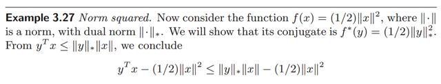</kbd></p>

<p align="center"><kbd>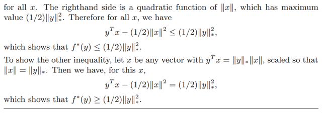</kbd></p>

> [!NOTE]
> f(x) `=` `(1/2)||x||^2,` conjugate theo định nghĩa f(y) `=` sup x  yTx - f(x) 
>
> `=` sup x yTx - `(1/2)||x||^2`
>
> Ôn lại khái niệm dual norm: ||v||* `=` sup ||u|| `<=` 1 uTv
>
> Do định nghĩa nên ||v||* luôn `>=` uTv với mọi u có ||u|| `<=` 1
> điều này tương đương ||v||* `>=` `uTv/||u||` với mọi u, vì `u/||u||` đóng
> vai vector có norm `<=` 1.
>
> ```text
> Do đó ta có ||y||* >= yTx/||x|| với mọi x => yTx <= (||y||*)||x||
> ```
>
> Trừ hai vế cho `(1/2)||x||^2` ta có:
>
> yTx - `(1/2)||x||^2` `<=` (||y||*)||x|| - `(1/2)||x||^2`
>
> Vế phải là quadratic function của ||x||, sách nói nó có maximum
> là `(1/2)||y||*^2.` Là sao?
>
> ```text
> Đơn giản là xét hàm f(x) = ax - 1/2x^2, f'(x) = a - x => critical point
> ```
> x `=` a, và nó là maximum vì hàm số bậc 2 này f''(x) `=` -1 < 0 nên 
> ```text
> concave down. maximum value = aa - 1/2aa = 1/2a^2. Nên áp dụng
> ```
> cái này thì maximum của vế phải chính là `(1/2)(||y||*)^2`
>
> Vậy yTx - `(1/2)||x||^2` `<=` `(1/2)(||y||*)^2` 
>
> ```text
> => sup x yTx - (1/2)||x||^2 <= (1/2)(||y||*)^2
> ```
>
> `<=>` f*(y) `<=` `(1/2)(||y||*)^2` 
>
> `====`
>
> Khúc dưới chưa hiểu lắm, quay lại sau, nhưng đại khái là họ
> chứng minh f*(y) `>=` `(1/2)(||y||*)^2` 
>
> ```text
> Từ đó suy ra conjugate f(x) = (1/2)||x||^2 là f*(y) = (1/2)(||y||*)^2
> ```

<br>

<p align="center"><kbd>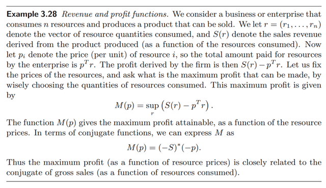</kbd></p>

> [!NOTE]
> SÁCH (XEM SAU)

<br>

<p align="center"><kbd>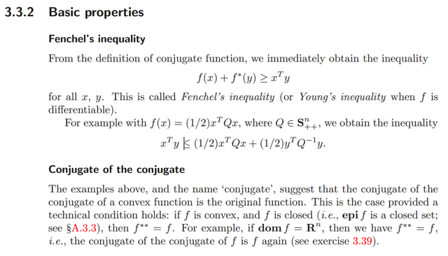</kbd></p>

<br>

<p align="center"><kbd>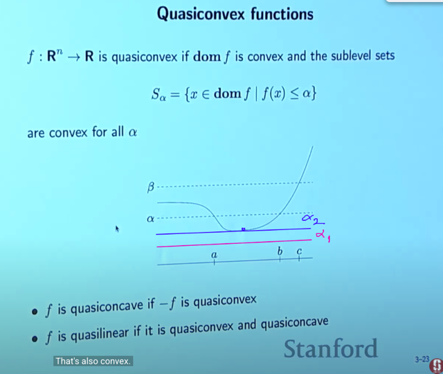</kbd></p>

> [!NOTE]
> tiếp theo cái QUASICONVEX function có thể hiểu vầy:
>
> ```text
> Đầu tiên hiểu Sublevel set Sα = x ∈ dom f | f(x) <= α  là gì:
> ```
> Nó là set, là tập hợp các x, sao cho f(x) nhỏ hơn mức nào đó
> `(α).`
>
> Nên `Sα` là là tập các x sao cho f(x) `<=` `α.`
>
> `Sβ` thì là tập các x sao cho f(x) `<=` `β.`
>
> Nói chung sub-level set là tập các x sao cho thỏa  mãn f(x) nhỏ hơn
> mức nào đó.
>
> Vậy nếu lấy `Sα1` của hàm f có đồ thị như trong slide:
>
> Theo định nghĩa là tập các x sao cho f(x) < `α1,` mà rõ ràng hàm f
> luôn > `α1` với mọi x, nên chả có ma x nào khi thỏa f(x) < `α1` hết.
> Nên `Sα1` `=` rỗng. Và tập rỗng là convex set (cái này theo quy ước)
>
> ```text
> Xét Sα2, thì có một điểm, vì chỉ có tại x = x0, thì f(x) <= α2 thôi.
> ```
> Tập có 1 điểm, gọi là singleton, cũng là convex set 
>
> Nhắc lại chút, định nghĩa của convex set là set thỏa điều kiện là nó chứa
> mọi convex combination của mọi điểm bất kì trong set. Nên tập rỗng,
> và singleton đều thỏa điều kiện này, với tập rỗng thì vì nó chả chứa gì
> nên nó theo ý nghĩa nào đó nó cũng chứa mọi convex combination của
> các phần tử của nó (vốn dĩ ko có cái nào).
>
> Đến `Sα.` Thì ta có một ĐOẠN (INTERVAL) chứa nhiều x thỏa f(x) `<=` `α`
> (Đoạn `/` line segment thì dễ thấy thỏa điều kiện của convex set)
>
> Đến `Sβ` thì lúc này ta có một KHOẢNG TỪ (-inf đến c), là thỏa f(x) `<=` `β`
> gs gọi đó là HAFT-INFINITE INTERVAL (cũng là convex set)
>
> Ý chính là tập rỗng, singleton, interval, haft-infinite interval đều là 
> convex set nên hàm f này sẽ là quasi-convex
>
> Thế thì khi hiểu vậy rồi, thì ta thấy, vì t mọi sub-level set ĐỀU LÀ
> CONVEX SET, thì khi đó hàm f gọi là QUASI-CONVEX
>
> Cái này có tên gọi là là Uni Modal gì đó
>
> nếu MỌI SUB-LEVEL SET ĐỀU LÀ CONVEX SET, thì khi đó
> hàm f gọi là QUASI-CONVEX
>
> CHAPTER 3.3 - QUASI-CONVEX
> FUNCTION

<br>

<p align="center"><kbd>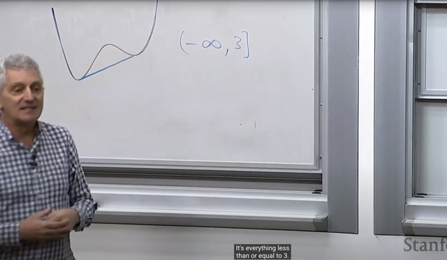</kbd></p>

> [!NOTE]
> đây là một ví dụ của
> HAFT-INFINITE INTERVAL

<br>

<p align="center"><kbd>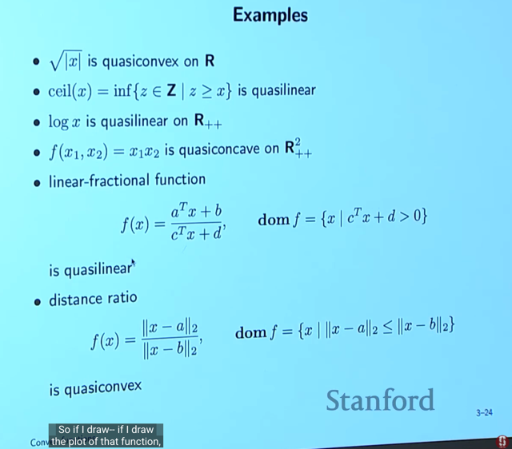</kbd></p>

> [!NOTE]
> một số ví dụ nhưng gs không nói
> qua hết, chỉ nói về các integer
> value convex function.

<br>

<p align="center"><kbd>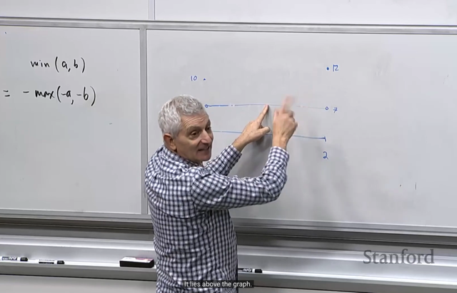</kbd></p>

> [!NOTE]
> Đây là một cái như vậy. Nó có giá trị `=` 7 khi x trong khoảng (-2,2) và
> ```text
> = 10 khi x = -2 và = 12 khi x = 2.
> ```
>
> Nó convex vì theo cách lập luận dây cung nối hai điểm đều luôn 
> không nằm dưới đồ thị hàm f

<br>

<p align="center"><kbd>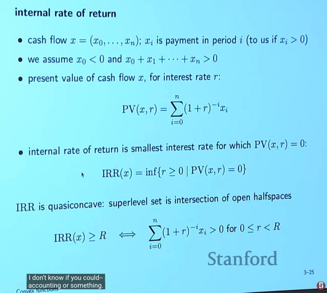</kbd></p>

> [!NOTE]
> gs nói về ví dụ này ko
> hiểu. Quay lại sau

<br>

<p align="center"><kbd>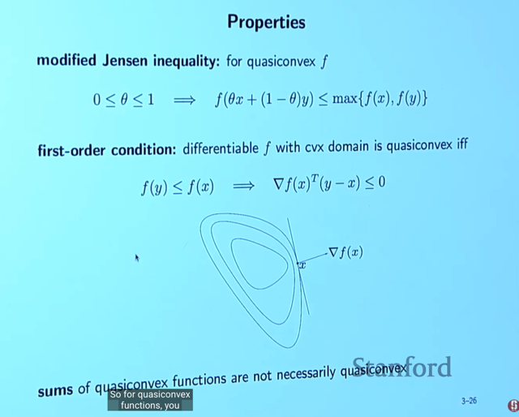</kbd></p>

> [!NOTE]
> đại khái là, với Quasi-convex thì Jensen inequality THAY ĐỔI:
>
> f của mixture `<=` mixture của f:
>
> ```text
> f(θx + (1-θ)y) <= θf(x) + (1-θ)f(y)
> ```
>
> Trở thành
>
> `f(θx` + `(1-θ)y)` `<=` max  f(x), f(y) 
>
> NGOÀI RA CÒN NHỮNG THAY ĐỔI KHÁC ĐỐI VỚI FIRST-ORDER
> CONDITION

<br>

<p align="center"><kbd>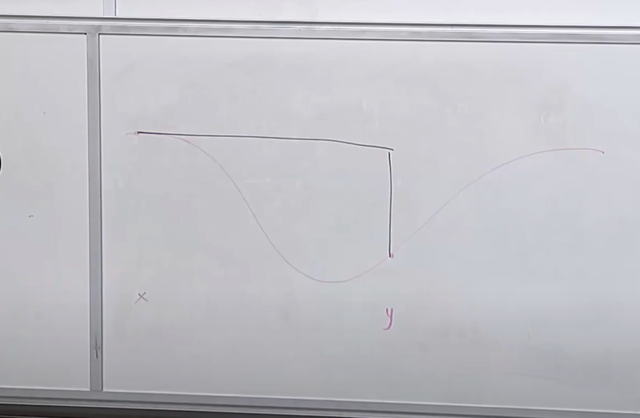</kbd></p>

> [!NOTE]
> hình ảnh của nó. Với convex ta biết Jensen's inequality thể hiện bởi
> việc nối hai điểm trên đồ thị ta sẽ có dây cung luôn nằm trên 
> hoặc trùng với đồ thị.
>
> Nhưng với quasi-convex, như ở đây nó không có tính chất này.
> (thử nối hai điểm thì ta sẽ thấy nó cắt đồ thị)
>
> Nhưng ta sẽ có đồ thị f sẽ luôn nằm dưới mức cao nhất trong f(x) và f(y)

<br>


<a id="node-5z3h0gp"></a>
## Lec 5

<br>

<p align="center"><kbd></kbd></p>

> [!NOTE]
> Tuần này ta có thể install Python để bắt đầu code.
> Nhớ làm homework

<br>

<p align="center"><kbd>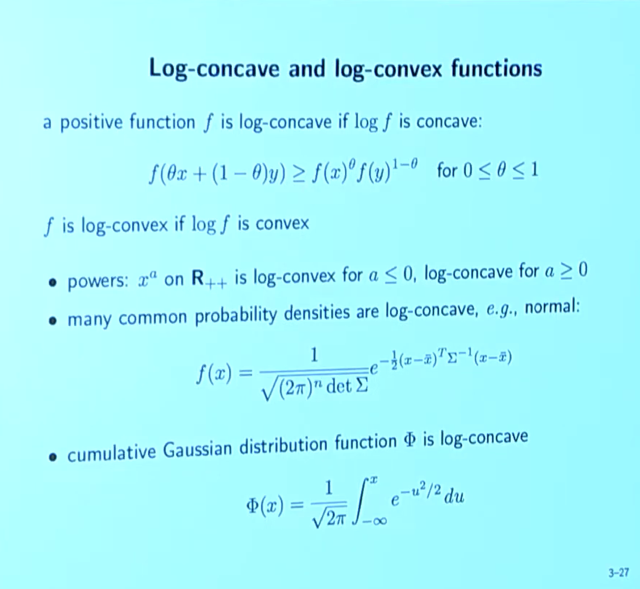</kbd></p>

> [!NOTE]
> đại khái là nói về log concave function gs cho rằng cái này nó
> xuất hiện rất nhiều, nhiều hơn hẳn so với loc convex.
>
> Về định nghĩa thì một function f gọi là log concave nếu log f là
> concave function:
>
> f(mixture của x, y) `>=` `f(x)^θ` `f(y)^(1-θ)` 
>
> `(f(x)^θ` `f(y)^(1-θ)` gọi là weighted arithmetic mean
>
> (ta đã biết mixture hay convex combination hay line segment, của
> x, y là khi `θx` + `(1-θ)y` với `θ` nằm trong khoảng [0,1])
>
> Nếu `θ` `=` `1/2` thì nó gọi là geometric mean
>
> Một ví dụ là pdf của multi-variate Normal. 
>
> ```text
> f(x) = [1/√(2π)^n det Σ] e^(-1/2)(x-x_bar)T Σinv (x-x_bar)
> ```
>
> Chưa hiểu lắm, nhưng gs nói ta có thể check bằng cách lấy log 
> của nó và xem kết quả là convex (thì f sẽ là log convex) hay concave
> (thì f sẽ là log concave)
>
> ```text
> Lấy log f ta sẽ có log [1/√(2π)^n det Σ] e^(-1/2)(x-x_bar)T Σinv (x-x_bar)
> ```
>
> ```text
> log [1/√(2π)^n det Σ] e^(-1/2)(x-x_bar)T Σinv (x-x_bar):
> ```
>
> Đưa constant ra ngoài.
>
> ```text
> log [1/√(2π)^n det Σ] + log e^(-1/2)(x-x_bar)T Σinv (x-x_bar)  | log uv = log u + log v
> ```
>
> ```text
> log [1/√(2π)^n det Σ] - [(1/2)(x-x_bar)T Σinv (x-x_bar)]     |  log e^a = a
> ```
>
> ```text
> Ta có function (1/2)(x-x_bar)T Σinv (x-x_bar) là quadratic form.
> ```
>
> Và Hessian matrix sẽ dễ chứng minh chính là `Σinv` và nó là matrix diagonal
> có các entries là `1/σ^2` với `σ^2` là variance của các random variables nên sẽ 
> không âm `=>` mọi eigenvalues đều không âm
>
> Do đó, đây là positive semidefinite matrix. Và từ đó function là convex.
>
> Có thể hiểu `Σ` là covariance matrix, là diagonal matrix: `diag([σ1^2,` `...σn^2])`
> ```text
> Để rồi từ đó Σinv đương nhiên sẽ là diag([1/σ1^2, ..., 1/σn^2]). Đơn giản
> ```
> ```text
> là bởi diag([σ1^2, ...σn^2]) diag([1/σ1^2, ..., 1/σn^2]) = I
> ```
>
> `=>` với dấu âm thì nó sẽ là concave.
>
> Vậy f là log concave
>
> CHAPTER 3.4 - LOG CONCAVE &
> LOG CONVEX
>
> LOG CONCAVE & LOG CONVEX

<br>

<p align="center"><kbd></kbd></p>

> [!NOTE]
> một cái nữa mà gs cho rằng trong homwork. đó là
> cdf của Gaussian, cũng là log concave.
>
> Và có quy tắc chung là cdf của các density function
> có tính log concave cũng là log concave

<br>

<p align="center"><kbd>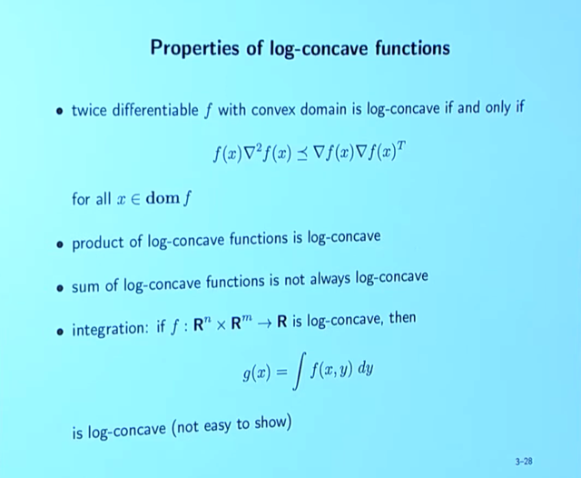</kbd></p>

> [!NOTE]
> Một số tính chất của log-concave function.
>
> Gs chỉ nói sơ. Đầu tiên là nếu ta có function khả vi hai lần (twice
> differentiable) với convex domain. Thì nó sẽ log-concave khi và
> chỉ khi f(x) ∇^2f(x) ⪯ ∇f ∇fT
>
> Gs đề nghị ta để ý vế phải là outer product của gradient vector. Và
> không khó để thấy nhờ đã học 1806, nó là rank 1 matrix. Để rồi ông
> nói có một sự thật rằng nếu một matrix ⪯ rank 1 matrix thì nó sẽ
> không thể có rank quá 1 và đồng nghĩa không thể có quá 1
> positive eigenvalue
>
> Hai tính chất sau là:
>
> Tích của hai log-concave function cũng sẽ là log concave
>
> Tổng của hai log-concave function thì chưa chắc là log concave
>
> Integration: Nếu có function log concave, ví dụ như function hai biến x,
> y Thì bằng cách integration over mọi giá trị của một biến (giống như khi
> ta tính marginal pdf của x từ joint pdf f(x,y) bằng cách integrating mọi
> possible value của x `∫-inf:inf` f(x,y)dx thì ta sẽ cũng có log concave
> function
>
> PROPERTIES OF LOG-CONCAVE FUNCTIONS

<br>

<p align="center"><kbd>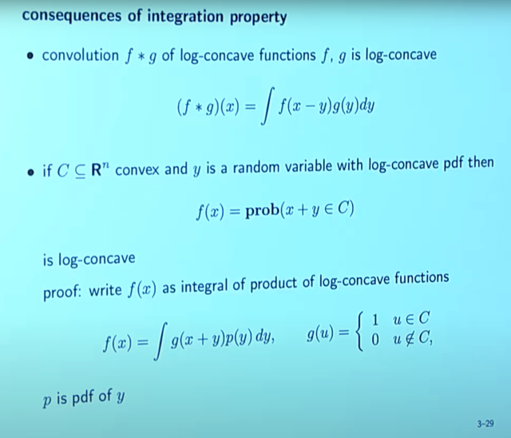</kbd></p>

> [!NOTE]
> Một hệ quả của tính chất vừa rồi, là nếu ta có hai rv có pdf có tính
> log concave. Thì tổng của chúng, sẽ là rv có pdf cũng log concave.
>
> Hệ quả nữa đó là nếu ta có set C convex set và y là random variable
> với log-concave pdf. Thì khi đó f(x) `=` P(x+y ∈ C) sẽ là một log concave
> function theo x
>
> Biết sơ vậy thôi

<br>

<p align="center"><kbd>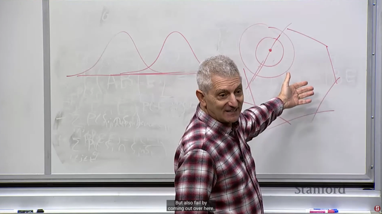</kbd></p>

<p align="center"><kbd>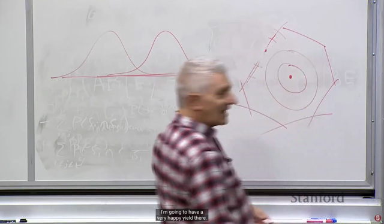</kbd></p>

> [!NOTE]
> Ta sẽ gặp là và hiểu về Yield function
> sau, Khúc này chưa hiểu lắm

<br>

<p align="center"><kbd>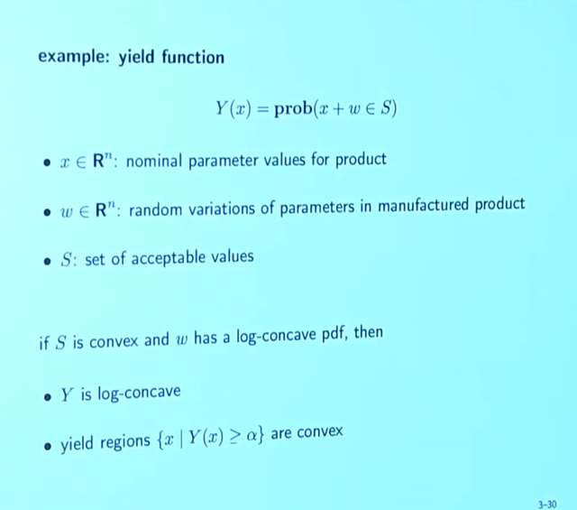</kbd></p>

<br>

<p align="center"><kbd>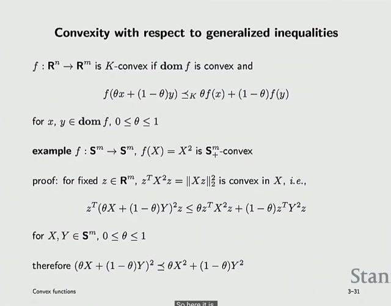</kbd></p>

> [!NOTE]
> Qua nội dung này "Convexity with respect to generalized
> inequalities"
>
> Nó nói rằng, ta có vector function f R^n -> R^m
>
> Và có một cái giống như Jensen's inequality nhưng chỉ khác là
> hai vế là vector.
>
> ```text
> f(θx+(1-θ)y) ⪯K θf(x) + (1-θ)f(y)
> ```
>
> Để rồi dấu "bé hơn hoặc bằng" ở đây sẽ là ⪯K có ý nghĩa đã biết
> đó là nếu x ⪯K y thì y - x phải thuộc cone K.
>
> FUNCTION f GỌI LÀ K-CONVEX NẾU DOMAIN CỦA NÓ CONVEX
> ```text
> VÀ NÓ THỎA f(θx+(1-θ)y) ⪯K θf(x) + (1-θ)f(y)
> ```
>
> Ví dụ cho hàm f Sm->Sm tức là hàm f take input là symmetric
> matrix mxm và output symmetric matrix mxm
>
> Cụ thể f(X) `=` X^2. Thì ta sẽ nói f là hàm "S^m+ convex" 
>
> Chưa hiểu phần chứng minh lắm, quay lại sau
>
> CHAPTER 3.4 - CONVEXITY WRT
> GENERALIZED INEQUALITIES

<br>

<p align="center"><kbd></kbd></p>

> [!NOTE]
> gs nói tới đây là ta đã đi qua những kiến thức toán khô khan
> nhưng cần thiết để bắt đầu thấy ứng dụng của nó, đề nghị đọc
> Chapter 1,2,3
>
> Và ông cho rằng, convex problem là bài toán có thể giải được
> (tractable)

<br>

<p align="center"><kbd>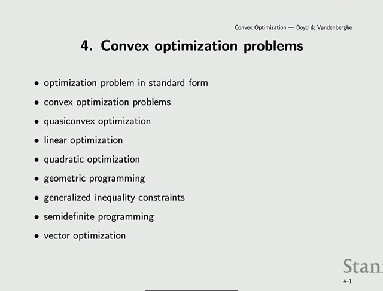</kbd></p>

> [!NOTE]
> Tiếp theo ta sẽ luớt qua nói sâu hơn về CONVEX
> OPTIMIZATION PROBLEM
>
> CHAPTER 4 - CONVEX
> OPTIMIZATION PROBLEM
>
> 4.1 OPTIMIZATION PROBLEM

<br>

<p align="center"><kbd>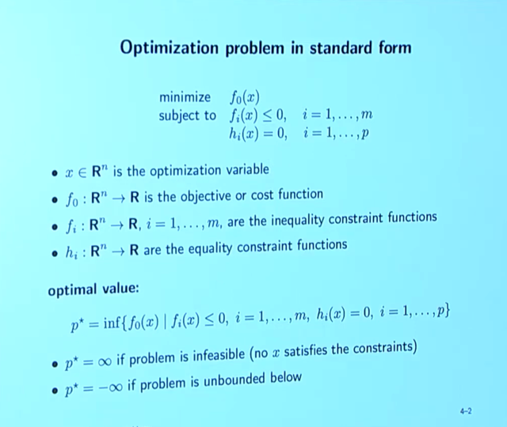</kbd></p>

> [!NOTE]
> Đầu tiên ông nói vè bài toán tối ưu ở dạng tiêu chuẩn (standard form)
> thì ông lưu ý ta rằng min và minimize là hai thứ khác nhau.
>
> Thế thì bài toán là ta muốn minimize f0(x) gọi là objective function
> nhưng với constrains có thể là equalities hoặc inequalities (nôm na là
> muốn minimize objective nhưng ràng buộc bởi (list) các đẳng thức
> hi(x) `=` 0 hoặc list các bất đẳng thức fi(x) ≤ 0 hoặc cả hai
>
> ? inequalities có thể bao gồm `>=` ko? Gs: Yes.
>
> `====`
>
> Và OPTIMAL VALUE, được định nghĩa chính là GIÁ TRỊ NHỎ NHẤT
> (kí hiệu inf `=` infimum, gs cho rằng cứ hiểu là minimum) của objective
> function f0(x) sao cho x VẪN THỎA CÁC EQUALITIES hi(x)
> `=` 0 VÀ CÁC INEQUALITIES fi(x) `<=` 0
>
> ```text
> p* = inf f0(x) | fi(x) <= 0, i=1,2..m; hi(x) = 0, i=1,2...p = f0(x*)
> ```
>
> Gs lưu ý thêm đây là p_"star", kí hiệu cho optimal. Còn "asterrisk" 
> thì kí hiệu dành cho "conjugate" (đọc thì khác thôi chứ cũng chung
> là một kí hiệu)
>
>
> Và nếu TỒN TẠI X KHIẾN THỎA CÁC CONSTRAINTS, thì TA
> GỌI VẤN ĐỀ LÀ FEASIBLE.
>
> Còn nếu không, tức là không có x nào khiến thỏa các
> constrains thì ta gọi vấn đề là INFEASIBLE
>
> Và THEO ĐỊNH NGHĨA p* sẽ `=` infinity tức là theo định nghĩa,
> thì minimum của một empty set là infinity
>
> Và case còn lại là "UNBOUNDED BELOW" : hiểu nôm na là tồn
> tại x khiến thỏa các constrained nhưng muốn f0(x) nhỏ cỡ nào
> cũng được không có giới hạn. Hay có thể thỏa các constrains
> nhưng không thể tìm được f0(x) nhỏ nhất
>
> OPTIMIZATION IN
> STANDARD FORM

<br>

<p align="center"><kbd>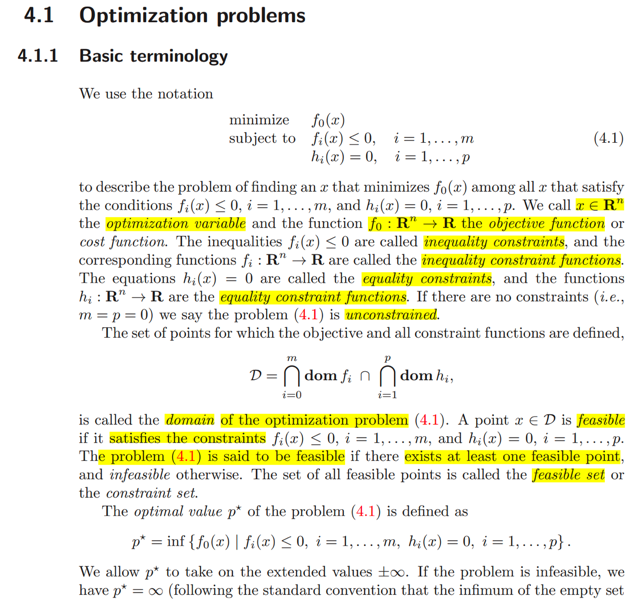</kbd></p>

<p align="center"><kbd>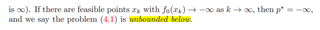</kbd></p>

> [!NOTE]
> Trong sách chỉ nói thêm về DOMAIN CỦA PROBLEM D, được
> định nghĩa là intersection của domain của các objective &
> constraint functions. Và dĩ nhiên trước khi x là optimal thì (tức
> khiến f0(x) nhỏ nhất) thì nó phải feasible (thỏa constraint) và
> trước khi thỏa constraint thì nó phải thuộc domain của problem
> nữa. Và cái này trong bài gs gọi là một dạng IMPLICIT 
> CONSTRAINT, ràng buộc ẩn, đối nghịch với explicit constraint
> (fi(x) `<=` 0, hi(x) `=` 0)
>
> Có một điểm đáng để ý nữa. Có hai cách nói tuy gần nhau nhưng
> hơi khác về optimal point:
>
> Mình hay nói rằng OPTIMAL của problem là x thỏa
> constraint và mà minimize f0(x).
>
> Thì có thể nói theo cách khác, là theo OPTIMAL VALUE p*
> bằng cách nói định nghĩa của p* trước: p* là giá trị nhỏ nhất của
> f0(x) với mọi x thuộc feasible set. Và từ đó optimal point x* là tập
> những điểm trong feasible set khiến f0(x) có giá trị optimal value
> p*
>
> Thật ra cách định nghĩa sau tốt hơn, giúp dễ thấy rằng optimal
> point có thể có nhiều, làm thành nên một set là OPTIMAL SET.
> Bên cạnh đó, việc định nghiã như thế này còn giúp nói về trường
> hợp mà tuy ta có optimal value p* nhưng lại KHÔNG CÓ
> OPTIMAL POINT
>
> 4.1 OPTIMIZATION PROBLEMS
>
> 4.1.1 BASIS TERMINOLOGY

<br>

<p align="center"><kbd>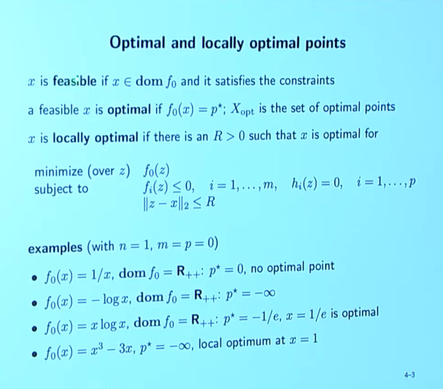</kbd></p>

> [!NOTE]
> Ta qua thêm vài định nghĩa: x gọi là feasible nếu nó nằm
> trong domain của f0 (có nghĩa là có xác định f0(x)) và đồng thời
> như vừa nói, đó là nó thỏa các constrains
>
> Thế thì khi có x feasible, thì CÁI NÀO KHIẾN f0(x) MANG OPTIMAL
> VALUE p* THÌ ĐÓ LÀ OPTIMAL POINT
>
> Và Xopt là SET CÁC OPTIMAL POINTS (có thể có nhiều optimal
> points)
>
> Còn LOCAL OPTIMAL thì đại khái là nếu tồn tại một khoảng R nào đó
> mà khi tìm trong đó (thể hiện bởi constraint ||z-x|| `<=` R) thì ta được f0(x)
> nhỏ nhất và x vẫn thỏa các constraint thì x là local optimal
>
> OPTIMAL POINTS &
> LOCALLY OPTIMAL POINTS

<br>

<p align="center"><kbd>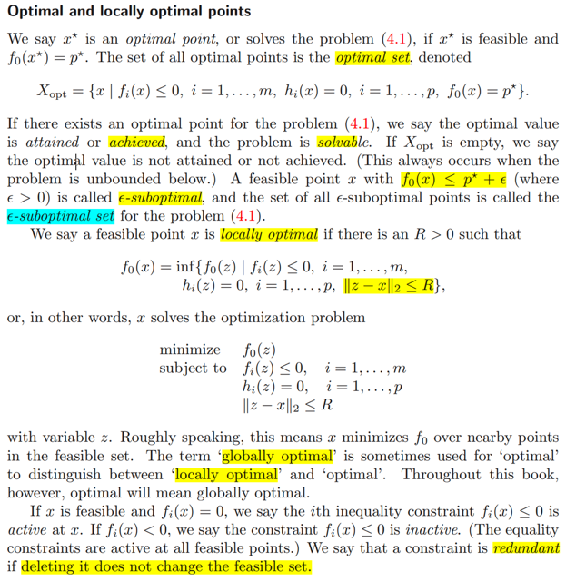</kbd></p>

> [!NOTE]
> Trong nói thêm về khả năng OPTIMAL SET RỖNG: Tức là TUY
> TA CÓ OPTIMAL VALUE p*, nhưng KHÔNG CÓ x NÀO GIÚP
> f0(x) ĐẠT GÍA TRỊ NÀY. Khi đó problem gọi là UNATTAINABLE
> & UNSOLVABLE 
>
> Sau đó đề cập đến khái niệm `ε-suboptimal,` hiểu nôm na nếu x* là
> `ε-suboptimal` thì f0(x) chỉ các p* một khoảng nhỏ từ `ε` trở xuống:
> Mà dĩ nhiên là p* là nhỏ hơn f0(x*) nên điều này tương đương
> ```text
> f0(x*) - p* <= ε hay f0(x*) <= p* + ε
> ```
>
> Và mọi x thỏa như vậy tạo nên `ε-suboptimal` set
>
> `====`
>
> Qua khái niệm LOCAL OPTIMAL thì trong bài đã nói rồi
>
> Ngoài ra còn vài khái niệm như ACTIVE `/` INACTIVE và REDUNDANT
> CONSTRAINT, cũng ko có gì khó

<br>

<p align="center"><kbd>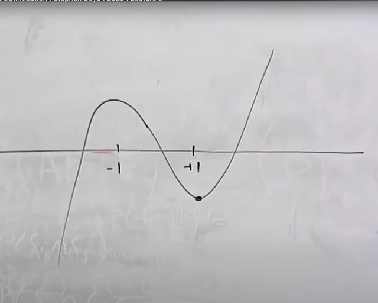</kbd></p>

> [!NOTE]
> hàm f0(x) `=` x^3 - 3x. sẽ có p* `=` -infi vì ko có constrain nào thì 
> x càng nhỏ thì f0(x) càng nhỏ, nên bài toán này thuộc diện UNBOUNDED
> BELOW, không có optimal point
>
> Nhưng nếu quy định trong đoạn -1,1 thôi thì khi đó local optimal
> là +1 vì trong đoạn này tại đó thì f0(x) nhỏ nhất.
>
> Một số ví dụ khác:
>
> f0(x) `=` `1/x` thì vì hàm số này sẽ giảm dần về 0, tiệm cận 0 khi x->inf
> nên ko có x nào khiến f0(x) nhỏ nhất cả. Nên `p*=0` tức optimal
> value `=` 0 nhưng KHÔNG CÓ OPTIMAL POINT, cái này trong sách
> gọi là "unattainable"

<br>

<p align="center"><kbd>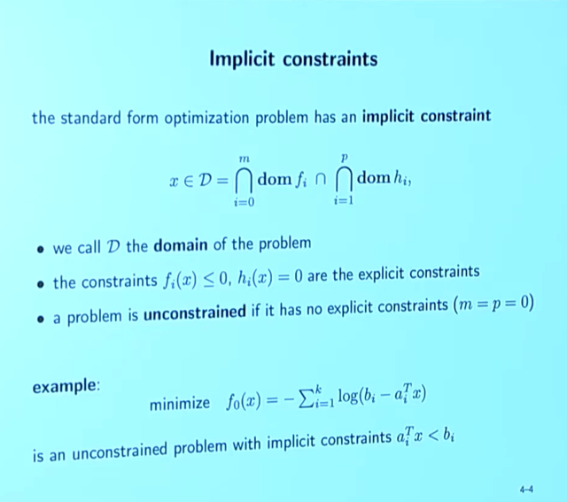</kbd></p>

> [!NOTE]
> nói về constrains, Đại khái là những cái constraint `hi(x)=0,` `fi(x)<=0`
> kiểu như là những constrain rõ ràng, thấy rõ. Nhưng ngoài ra,
> ngầm ẩn (implicit) trong đó còn một loại constrain khác.
>
> Đó là X PHẢI NẰM TRONG DOMAIN CỦA fi, hi
>
>  Cái này ko có gì khó hiểu, bởi lẽ nếu x ko nằm trong miền xác định
> của các constraint function thì thậm chí nó còn tệ hơn là không thỏa
> các constrain đó nữa.
>
> Do đó implicit constraint là x phải nằm trong phần giao của các
> domain của hi,fi. Và đây gọi là DOMAIN của PROBLEM.
>
> Nó giống như khi ta ghi f(x) `=` `1/x` thì ngay lập tức phải ngầm quy
> định rằng x phải khác 0 vẫy
>
> Nói ngắn gọn, là trước khi muốn check xem x có thỏa các constraint
> hi,fi hay không thì đầu tiên NÓ PHẢI KHIẾN CHECK ĐƯỢC CÁI ĐÃ
>
> Và khi KHÔNG CÓ EXPLICIT CONSTRAIN (chỉ optimize objective
> function) thì ta gọi là UNCONSTRAINED problem.
>
> Ví dụ ở dưới là một unconstrained problem nhưng dễ hiểu là vì ta có
> hàm log, mà với hàm log thì miền xác định là x phải dương nên ta có
> implicit constraints là aiTx < b
>
> IMPLICIT CONSTRAINT

<br>

<p align="center"><kbd>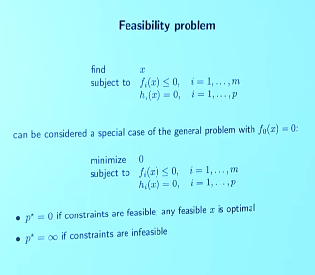</kbd></p>

> [!NOTE]
> Ta biết qua FEASIBILITY PROBLEM. Đại khái là "ta chả cần
> minimize objective f0(x)" gì hết, MIỄN LÀ CÓ X FEASIBLE -
> tức là thỏa các constraint là đủ, thì x nào cũng được.
>
> Để rồi ta có thể coi nó là một trường hợp đặc biệt của bài toán tiêu
> chuân đó là coi như cũng có objective, nhưng có cho vui thôi:
>
> f0(x) `=` 0.
>
> Cũng đồng nghĩa là ko cần minimize f0 gì hết, miễn là tìm được
> x thỏa các constrain là đủ.
>
> Và khi đó nếu có x thỏa constrain, thì ta cho nó là optimal luôn
> với optimal value `=` 0.
>
> Còn nếu ko có x thỏa constraint thì optimal value là infinity
> như thông thường
>
> FEASIBILITY PROBLEM

<br>

<p align="center"><kbd>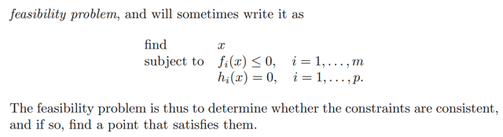</kbd></p>

<p align="center"><kbd>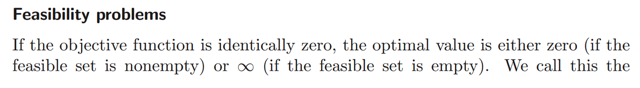</kbd></p>

> [!NOTE]
> Cái này đơn giản trong bài nói đủ hết rồi. Chỉ muốn nhắc lại một ý là
> ta có một quy ước rằng khi minimize một tập rỗng thì kết quả là
> infinity.  Tức inf x rỗng `=` +infinity.
>
> Do đó, bài toán feasible problem, nếu không có điểm nào feasible
> thì optimal value là +infinity (còn nếu có thì nó bằng 0 vì ta đặt
> objective function cho vui là f0(x) `=` 0)

<br>

<p align="center"><kbd>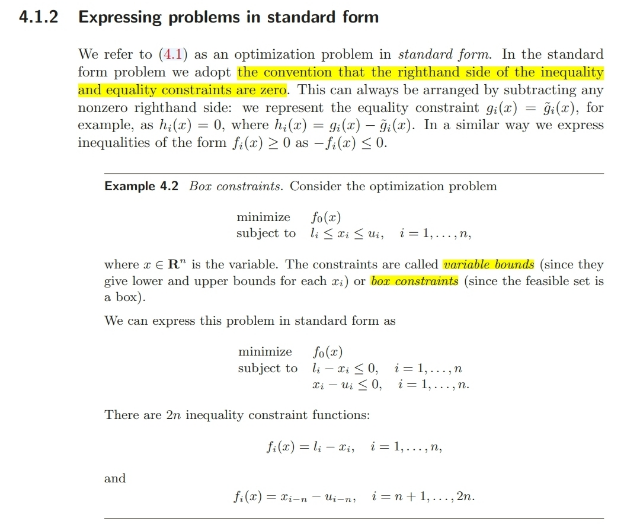</kbd></p>

> [!NOTE]
> Rồi, sau đây là một loại các vấn đề mà trong bài giảng gs không
> nói tới.
>
> Đầu tiên là việc ta có thể CHUYỂN `/` THỂ HIỆN MỘT BÀI TOÁN
> VỀ DẠNG CHUẨN (STANDARD FORM) của bài toán tối ưu.
>
> Thế thì đầu tiên, có một QUY ƯỚC rằng, khi thể hiện
> constraint thì ta sẽ thể hiện theo dạng:
>
> fi(x) `<=` 0 và hi(x) `=` 0
>
> Ví dụ như gặp bài toán mà constraint là li `<=` xi `<=` ui thì ta sẽ đưa
> nó về dạng chuẩn với hai inequality constraint:
>
> li - xi `<=` 0 và xi - ui `<=` 0
>
> 4.1 OPTIMIZATION PROBLEMS
>
> 4.1.2 EXPRESSNG PROBLEMS IN STANDARD 
> FORM

<br>

<p align="center"><kbd>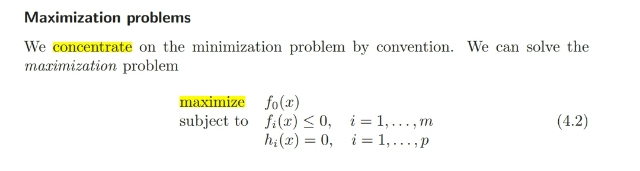</kbd></p>

<p align="center"><kbd>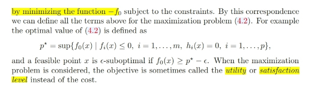</kbd></p>

> [!NOTE]
> Và ta cũng gặp rất nhiều bài toán tối ưu đặt ra ở dạng maximize
> thay vì minimize. Thì ta cũng đưa nó về dạng chuẩn là maximize
> f0(x) sẽ tương đương minimize - f0(x)
>
> Và trong bài toán maximize thì objective gọi là UTILITY

<br>

<p align="center"><kbd>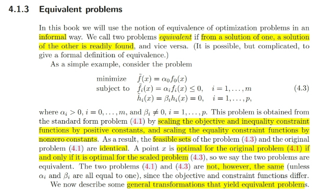</kbd></p>

> [!NOTE]
> 4.1 OPTIMIZATION PROBLEMS
>
> 4.1.3 EQUIVALENT PROBLEMS
>
> Một điểm kiến thức quan trọng mà gs lướt qua, là
> EQUIVALENT PROBLEM (vấn đề tương đương)
>
> Đại khái là sẽ rất phổ biến xảy ra việc ta khi đối diện một bài toán
> tối ưu, ta thiết lập một bài toán khác tương đương. Mà việc giải
> bài toán kia cũng giúp tìm ra optimal của bài toán này.
>
> Đó cũng là định nghĩa của equivalent: Hai problem gọi là
> equivalent khi tìm ra solution (tức optimal của cái này) giúp tìm
> ra ngay optimal  của cái kia
>
> Lấy ví dụ đơn giản là bài toán mà objective và constraint của bài
> toán gốc đều được scale bởi scalar dương.
>
> ```text
> Objective f~0(x) = α0 f0(x), f~i(x) = αi fi(x), h~i(x) = βi hi(x)
> ```
>
> thì rõ ràng dễ thấy là nếu ta tìm được x* của bài toán sau, thì nó
> cũng là cái thỏa constraint của bài toán gốc, và cũng là cái khiến
> minimize f0(x). Nên nó cũng là optimal của bài toán gốc.
>
> Do đó hai problem là equivalent.

<br>

<p align="center"><kbd>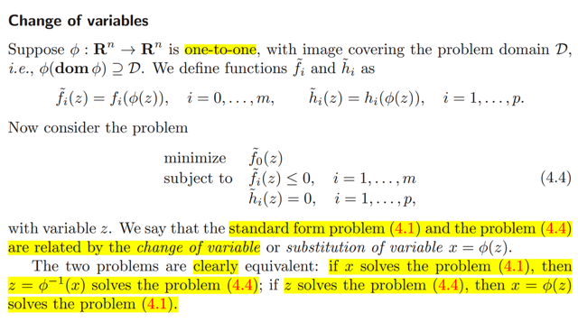</kbd></p>

> [!NOTE]
> Dạng thứ nhất
> là ĐỔI BIẾN.

<br>

<p align="center"><kbd>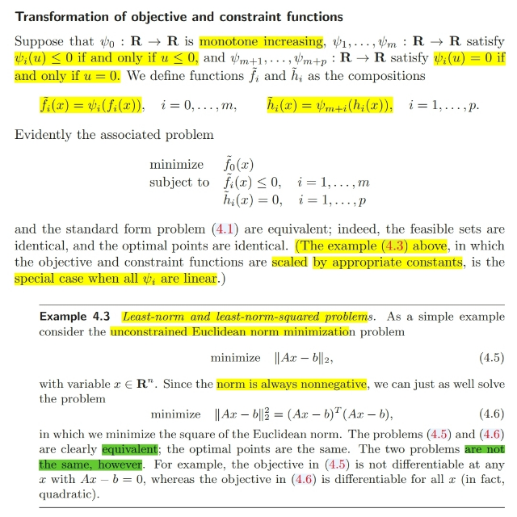</kbd></p>

> [!NOTE]
> Rồi, thế thì dạng thứ hai mà ta tạo ra equivalent problem đại khái
> là ta apply hàm đơn điệu tăng vào các objective và các  hàm
> inequality constraints, và equality constraint cũng được apply các
> function sao cho nếu x feasible trong bài toán gốc thì nó cũng
> feasible trong bài toán equivalent và ngược lại.
>
> Và cái ví dụ trước, chính là một dạng của cái này khi ta appy hàm
> tuyến tính (nhân scalar hệ số dương ) vào objective và constraint
> function.
>
> Một ví dụ khác là bài toán gốc có objective là norm (nên không
> âm) và bài toán tương đương có objective là bình phương của
> norm (tức apply hàm square f(u) `=` u^2, với u không âm thì f là
> monotonic increasing).
>
> Thì đây là ví dụ rất hay gặp, khi ta giải bài toán sau với objective
> ||Ax - b||^2 sẽ dễ hơn và solution của nó cũng là solution của bài
> toán gốc với objective ||Ax - b||
>
> `====`
>
> Gs cũng lưu ý: Hai bài toán là EQUIVALENT, nhưng KHÔNG
> THE SAME

<br>

<p align="center"><kbd>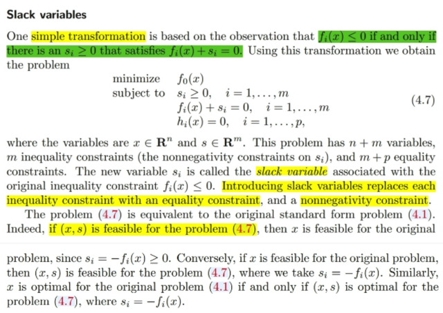</kbd></p>

> [!NOTE]
> Một dạng thứ bai giúp tạo ra equivalent problem là dựa trên cái này:
>
> ```text
> a <= 0 thì <=> 0 - a >= 0, nếu đặt b = 0 - a, thì ta sẽ có b >= 0 và a +
> ```
> b `=` 0
>
> Do đó constraint fi(x) `<=` 0 sẽ tương đương fi(x) + si `=` 0 và si
> `>=` 0
>
> Và cái hay của cách làm này đó là nó giúp ta chuyển constraint dạng
> chuẩn fi(x) `<=` 0 THÀNH MỘT EQUALITY CONSTRAINT fi(x) + si `=`
> 0 và MỘT CONSTRAINT CÓ DẠNG `">=":` si `>=` 0   Nói chung là
> nhiều trường hợp cái này sẽ rất hữu ích.
>
> Và có thể thấy cách làm này làm phát sinh VARIABLE  MỚI LÀ si,
> được gọi là SLACK VARIABLE

<br>

<p align="center"><kbd>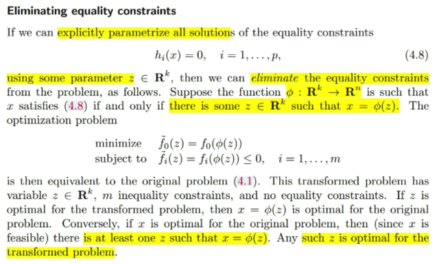</kbd></p>

> [!NOTE]
> Dạng thứ ba giúp tạo ra equivalent problem là khi xét các inequality
> constraint của bài toán gốc (ý là standard form): hi(x) `=` 0 i `=` 1,...p
>
> Thì ta có thể dùng cách thứ 3, nếu như có thể solve x explicitly:
>
> hi(x) `=` 0 `<=>` x `=` Φ(z)
>
> Khi đó, thế x vào objective và inequality constraint ta sẽ chuyển
> bài toán gốc thành bài toán tương đương trong đó không còn
> inequality constraint nữa:
>
> minimize f~0(z) `=` f0(Φ(z)) constraint f~i(z) `=` fi(Φ(z)) `<=` 0
>
> Thế thì khi giải ra z* là optimal của bài toán sau, thì Φ(z*) chính là
> optimal của bài toán gốc.

<br>

<p align="center"><kbd>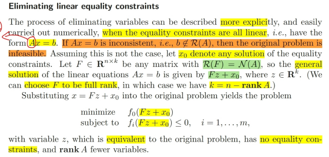</kbd></p>

> [!NOTE]
> Đại khái là cái này nói cụ thể hơn cách tiếp cận vừa rồi khi equality
> constraint hi(x) `=` 0 có dạng tuyến tính. Tức là các phương trình  hi(x)
> `=` 0 là tuyến tính thì với mọi i nó tạo thành hệ phương trình tuyến
> tính, và có thể được thể hiện bởi Ax `=` b (aiTx `=` bi tương đương hi(x)
> `=` 0)
>
> Khi đó nếu mà problem feasible (tức là tồn tại feasible point) thì đồng
> nghĩa Ax `=` b có nghiệm, và nghiệm này như đã học trong MIT 18.06
> là `x_complete` (hay x), là kết hợp của `x_particular(` hay x0) và `x_null.`
> Để rồi nếu nullspace của A khác 0 thì ta có vô số nghiệm còn
> ngược lại thì hệ có nghiệm duy nhất.
>
> Và x `=` x0 + `x_null` chính là x0 + Fz với F là matrix có các cột là basis
> của nullspace của A: R(F) hay C(F) `=` N(A), thì Fz dĩ nhiên là `x_null:`
> linear combination của nullspace basis).
>
> Khi đó ta sẽ bỏ đi p equality constraint hi(x) `=` 0 với equivalent problem:
>
> minimize f~0(z) `=` f0(x0 + Fz) với constraint f~i(z) `=` fi(x0 + Fz) `<=` 0
>
> Gs nói equivalent problem cũng giảm đi số variable `=` rank A. Là sao?
>
> Đó là vì, với A là matrix [m, n] thì x là R^n vector, tức là ta có n
> optimization variables.
>
> Nhưng equivalent problem, thì xét vector z, có bao nhiêu
> component?
>
> Câu trả lời là số component của z chính là số cột của F, tức số basis
> vector của C(F) cũng là N(A), hay nói cách khác chính là dim N(A).
>
> Mà dim N(A) thì bằng gì, chính bằng n - dim C(AT) (column space và
> rowspace orthogonal complement) và n `=` rank (A)
>
> Vậy số component của z sẽ ít hơn số component của z một số lượng
> là rank(A)
>
> Trong sách có nói đến vụ ta chọn F full rank, tức là full column rank,
> và cái này đồng nghĩa dùng các basis của C(A) là cột của F (ko dư
> cột nào)

<br>

<p align="center"><kbd>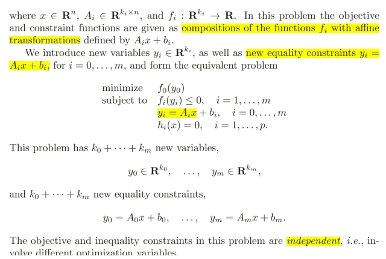</kbd></p>

<p align="center"><kbd>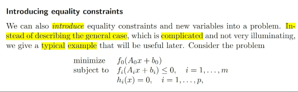</kbd></p>

> [!NOTE]
> Một dạng nữa (thứ 4) đối ngược lại với bỏ bớt equality constraint là
> tạo thêm equality constraint.
>
> Đại khái gs nói cái này nói chung chung thì khó và ko ích lợi nên
> ta nói dạng cụ thể mà sẽ hay gặp. 
>
> Rất dễ hiểu là khi ta có objective của bài toán gốc có dạng:
>
> f0(A0x + b0) `=` 0 và inequality constraint al2 fi(Aix + bi) `<=` 0
>
> Khi đó đặt y0 `=` A0x + b0, yi `=` Aix + bi i `=` 1,2...
>
> thì ta sẽ có equivalent problem: minimize f0(y0) constraint fi(yi) `<=` 0
> và có thể các constraint y0 `=` A0x + b0, yi `=` Aix + bi
>
> Dễ thấy objective là f0(y0) chỉ liên quan đến variable y0 còn 
> các inequality constraint fi(yi) `<=` 0 chỉ liên quan đến yi. Thành ra 
> gọi là objective và inequality constraint INDEPENDENT

<br>

<p align="center"><kbd>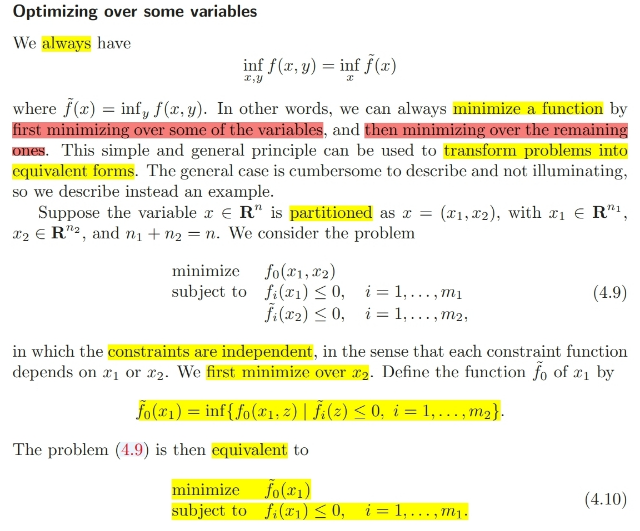</kbd></p>

> [!NOTE]
> Rồi, dạng tiếp theo mà ta có thể xây dựng equivalent problem là ta
> dựa vào một (có thể gọi là) định lý:
>
> Nôm na là giả sử ta có hàm hai biến f(x, y) thì việc minimize hàm f
> over x, y sẽ có thể làm bằng cách lần lượt minimize over x,  rồi sau đó
> minimize over y.
>
> inf x,y f(x,y) `=` inf x {inf y f(x,y)} `=` inf x{f'(x)}
>
> Và tính chất này giúp ta có cách xây dựng equivalent mà nói chung
> chung thì khó, nên gs lấy dạng cụ thể là hàm f(x) với x là R^n  Thì ở
> đây x có thể tách thành (x1, x2) với x1 ∈ R^n1, x2 ∈ R^n2 với n1 + n2
> `=` n.
>
> Và bài toán gốc là minimize f0(x1, x2) với constraint của x1: fi(x1) `<=` 0
> và constraint của x2: fi(x2) `<=` 0
>
> Khi đó, đầu tiên ta minimize over x2 trước:
>
> f~0(x1) `=` inf z {f0(x1, z) với z feasible (z thỏa các constraint liên quan
> đến x2)}
>
> thì bài toán gốc sẽ equivalent với bài toán sau:
>
> minimize f~0(x1) constraint fi(x1) `<=` 0 (tức là các constraint liên quan
> đến x1)

<br>

<p align="center"><kbd>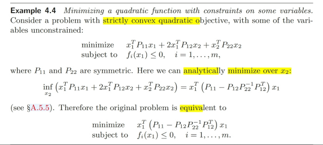</kbd></p>

> [!NOTE]
> Một ví dụ của cái này, hàm theo biến x1, x2. 
>
> thì ta minimize over x2 trước để có f~0(x1) thì bài toán gốc sẽ
> equivalent với minimize f~0(x1) với constraint của x1
>
> Hàm f0 là quadratic nên minimize over x2 ta chỉ việc tìm gradient
> wrt x2, và giải tìm critical point

<br>

<p align="center"><kbd>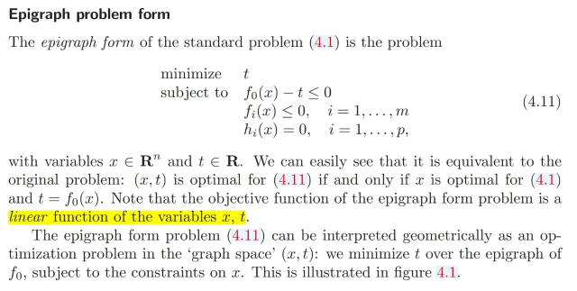</kbd></p>

> [!NOTE]
> QUAY LẠI SAU

<br>

<p align="center"><kbd>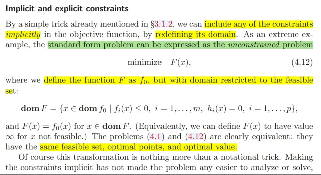</kbd></p>

<p align="center"><kbd>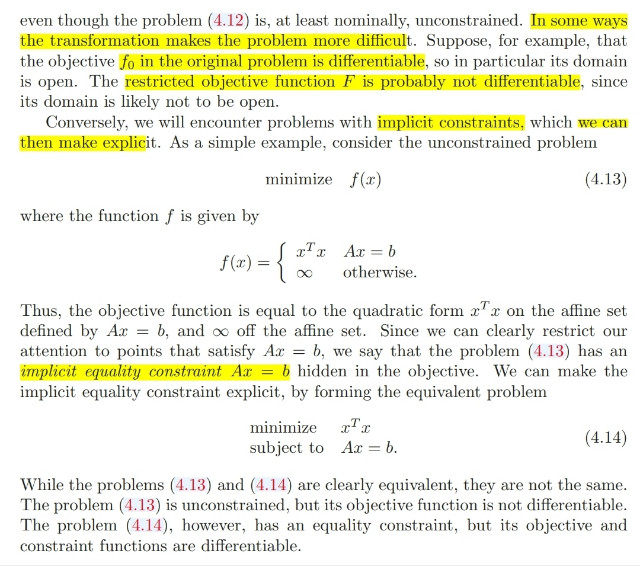</kbd></p>

> [!NOTE]
> Một loại nữa, cũng rất hay dùng, và cũng không có gì khó hiểu.
>
> Xét bài toán standard optimization với các constraint fi(x) `<=` 0
> và hi(x) `=` 0. Thì như đã hiểu, để x là optimal thì đầu tiên nó
> phải feasible và trước đó nữa thì nó phải ∈ domain của problem
> D. Trong đó yêu cầu tiên quyết là phải thuộc domain của D chính
> là một dạng implicit constraint còn các constraint kia là explicit.
>
> Vậy thì rất dễ hiểu là bây giờ ta QUY ĐỊNH LẠI DOMAIN CỦA 
> PROBLEM D PHẢI BAO GỒM FEASIBLE SET, thì khi đó ta có 
> thể bỏ các explicit constraint fi(x) `<=` 0, hi(x) `<=` 0.
>
> Và ta làm vậy bằng cách đơn giản là thay f0(x) bằng F(x) sao cho
> nếu x feasible thì F(x) `=` f0(x) còn ngược lại x infeasible thì F(x) `=` 
> + infinity.
>
> Để rồi ta cũng có kết quả equivalent rằng khi ko có feasible x nào
> thì việc minimize objective là hàm có giá trị `=` +infinity thì cũng
> y như minimize bài toán gốc với feasible set rỗng. (kết quả đều
> là optimal value `=` infinity)
>
> `====`
>
> Và ngược lại, thì ta cũng có thể biến implicit constraint trở thành
> explicit. Ví dụ như minimize f0(x) với f(x) `=` xTx khi Ax `=` b, và `=` inf
> khi otherwise. Dĩ nhiên ở đây để f xác định thì x phải thỏa Ax `=` b
> nói cách khác domain của f0 (trong tường hợp này ko có constraint
> function, nên cũng là domain của problem) là solution set của Ax `=` b
>
> Nên như đã nói, có thể coi Ax `=` b là implicit constraint.
>
> Vậy ta có thể đưa nó thành explicit constraint và có bài toán eqiovalent:
>
> minimize xTx constraint Ax `=` b. Ko có gì khó hiểu

<br>

<p align="center"><kbd>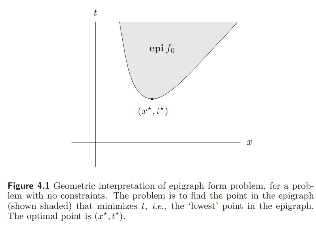</kbd></p>

<br>

<p align="center"><kbd>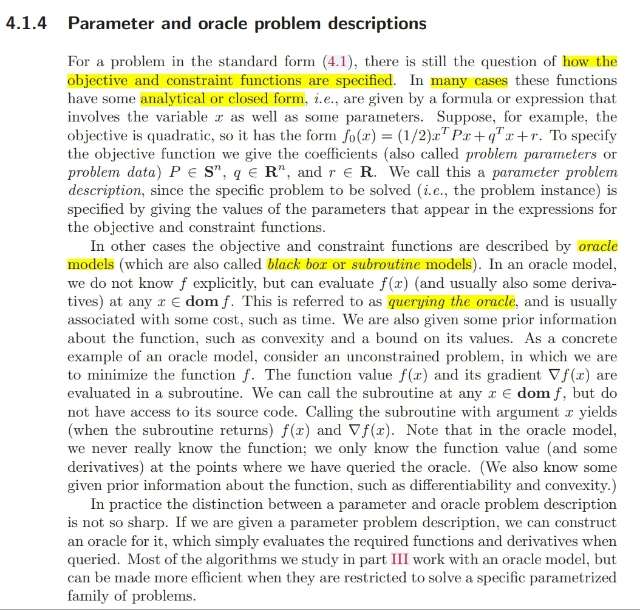</kbd></p>

> [!NOTE]
> 4.1 OPTIMIZATION PROBLEMS
>
> 4.1.4 PARAMETERS & ORACLE PROBLEM DIS
>
> QUAY LẠI SAU

<br>

<p align="center"><kbd>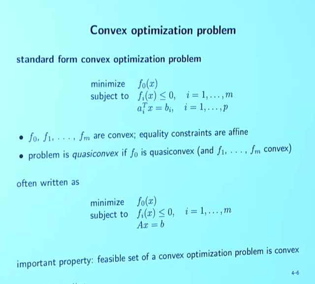</kbd></p>

> [!NOTE]
> Tiếp, ta sẽ chuyển từ bài toán STANDARD OPTIMIZATION
> sang CONVEX OPTIMIZATION
>
> Đơn giản là, nó chỉ là bài toán standard optimization có thêm
> điều kiện là các hàm objective và inequality constraints đều là
> CONVEX function, và các equalities đều là AFFINE function
>
> Và với việc các equalities constraint là các affine, tức là linear
> equation (mà trong standard optimization problem, thì nó ko nhất
> thiết phải là bậc 1) thì ta có thể thể hiện list các linear constraints
> này ở dạng matrix Ax `=` b

<br>

<p align="center"><kbd>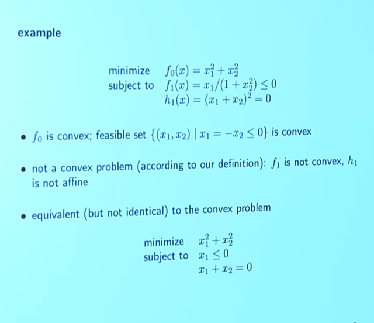</kbd></p>

> [!NOTE]
> Đại khái là trong ví dụ này ta có một "not a convex problem"
>
> Vì f1 không convex. h1 cũng không phải affine.
>
> Tuy nhiên nó tương đương (equivalent) với một problem bên dưới.
> Nói tương đương có nghĩa là nếu solve được cái này thì solve
> được cái trên.
>
> Nhưng điểm đáng chú ý, cái bên dưới thì lại là convex optimization
> problem

<br>

<p align="center"><kbd>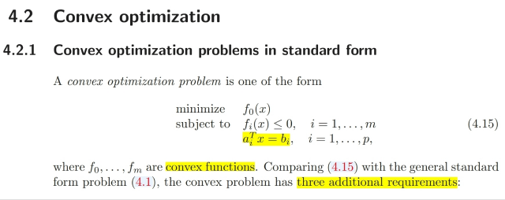</kbd></p>

<p align="center"><kbd>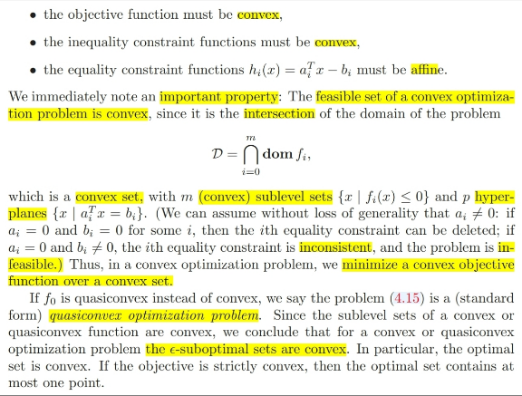</kbd></p>

> [!NOTE]
> 4.2 CONVEX OPTIMIZATION PROBLEMS
>
> 4.2.1 CONVEX OPTIMIZATION IN STANDARD
> FORM
>
> Trong sách bổ sung nhiều ý quan trọng mà gs ko nói trong bài
> hoặc có nói mà mình ko hiểu `/` để ý.
>
> Đầu tiên định nghĩa thì dễ rồi, optimization sẽ là convex
> optimization problem nếu objective và inequality constraint là
> convex và equality constraint là affine.
>
> Thế thì như ta đã biết địh nghĩa một convex function là gồm hai ý:
> 1) domain của nó là convex set và 2) nó thỏa tính chất nôm na là
> f của mixture `<=` mixture của f.
>
> Vậy nay các domain của f0 và inequality constraint trở thành
> convex set. Do đó DOMAIN CỦA PROBLEM (vốn là intersection
> của domain các function) cũng sẽ là CONVEX SET.
>
> Rồi FEASIBLE SET, là tập những điểm trong domain và thỏa
> constraint
>
> Thế thì thỏa equality constraint hi(x) `=` 0 (mà nay là các linear
> function aiTx `=` bi) thì đây là intersection của các HYPERPLANE.
>
> Thỏa inequality constraint fi(x) `<=` 0 với fi(x) convex thì set các
> điểm thỏa fi(x) `<=` 0 chính là một SUB-LEVEL SET, mà với hàm f
> convex trong các phần trước ta đã học là sub-level set của nó
> CŨNG LÀ CONVEX SET.
>
> Vậy tóm lại, FEASIBLE SET LÀ INTERSECTION CỦA CONVEX
> SET (DOMAIN), HYPERPLANES VÀ CONVEX SUB-LEVEL SET
> `=>` FEASIBLE SET CŨNG LÀ CONVEX SET
>
> Thành ra bài toán convex optimization có bản chất là minimize
> objective over CONVEX SET

<br>

<p align="center"><kbd>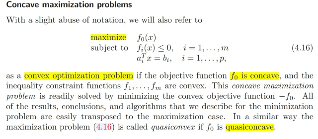</kbd></p>

> [!NOTE]
> Rất đơn giản, nếu ta có hàm f0(x) concave thì -f0(x) là convex
> Nên khi bài toán maximize f0(x) mà f0(x) concave thì nó tương
> đương minimize -f0(x) là convex.
>
> Nên bài toán MAXIMIZE HÀM CONCAVE OBJECTIVE CŨNG LÀ
> BÀI TOÁN CONVEX  OPTIMIZATION
>
> (nhưng inequality constraint vẫn phải convex và equality vẫn phải
> affine)

<br>

<p align="center"><kbd>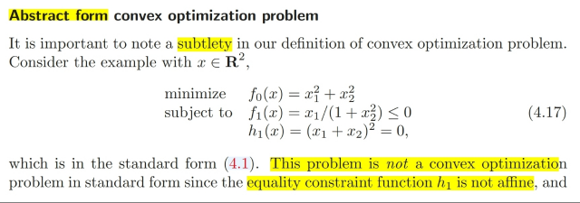</kbd></p>

<p align="center"><kbd>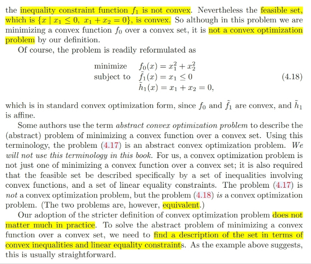</kbd></p>

> [!NOTE]
> Rồi đại khái là người ta cho ví dụ này trong đó tuy equality không
> affine nên theo định nghĩa đây không phải là convex optimization
> problem.
>
> Nhưng feasible set của nó và objective của nó cũng là convex set
> `/` function.
>
> Thành ra có người gọi nó là bài toán ABSTRACT CONVEX
> OPTIMIZATION PROBLEM

<br>

<p align="center"><kbd>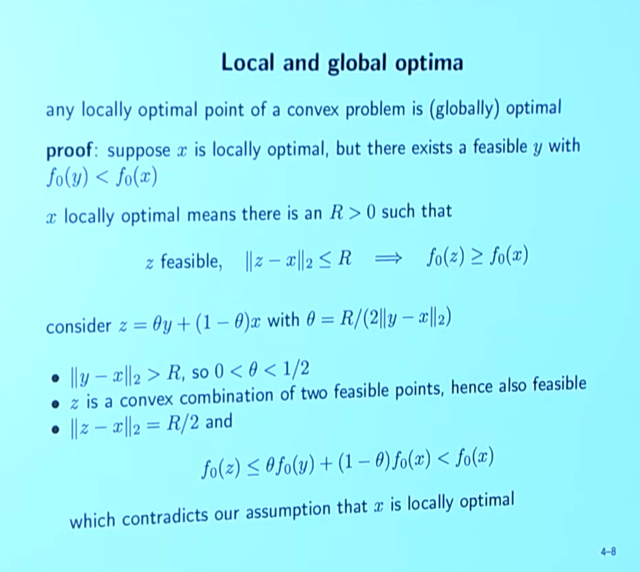</kbd></p>

> [!NOTE]
> gs nói qua một cái tuy nghe có vẻ đơn giản nhưng thực sự rất
> mạnh:
>
> Đó là ĐỐI VỚI CONVEX PROBLEM THÌ BẤT KÌ LOCALLY
> OPTIMAL POINT CŨNG CHÍNH LÀ GLOBAL OPTIMAL

<br>

<p align="center"><kbd></kbd></p>

> [!NOTE]
> Để chứng minh gs cho local optimal `x_loc` và giả sử ta có global
> optimal x~ với f0(x~) < `f0(x_loc).` Ta sẽ chứng minh với convex
> problem thì điều này ko thể xảy ra mà xloc phải chính là x~
>
> Đầu tiên gs hỏi những điểm trên line segment có feasible không, nếu
> như xloc và x~ đã feasible rồi (thỏa các constraints)
>
> Thử lập luận:
>
> Những điểm trên line segment này đều sẽ feasible (tức thỏa
> constraints) vì ta đang nói về convex optimization, thì trong đó, các
> equalities là các affine, các inequalities là các convex function.
>
> ```text
> Mà x_loc và x~ đều thỏa các constraint, tức fi(x_loc) = 0 và fi(x~) = 0
> ```
> thì xét mixture của chúng,
>
> `f(θx_loc` + `(1-θ)x~)` 
>
> ```text
> Với f là affine thì cái này sẽ là = θf(x_loc) + (1-θ)f(x~) | đây là tính chất
> ```
> hay điều kiện của affine function (với convex function thì điều kiện trở 
> ```text
> thành f(θx_loc + (1-θ)x~) <= θf(x_loc) + (1-θ)f(x~) chính là Jensen's
> ```
> inequality
>
> ```text
> Vậy tiếp tục ở đây ta có f(θx_loc + (1-θ)x~) = θ*0 + (1-θ)*0 = 0
> ```
>
> Vậy mixture của chúng thỏa các equalities constraints.
>
> Còn với các inequalities constrain:
>
> `hi(θx_loc` + `(1-θ)x~)` theo Jensen's inequality:
>
> ```text
> hi(θx_loc + (1-θ)x~) <= θhi(x_loc) + (1-θ)hi(x~)
> ```
>
> ```text
> Với x_loc, x~ đã thỏa các constraints hi(x_loc) <= 0, hi(x~)<=0 thì có
> ```
> ```text
> thể suy ra θhi(x_loc) + (1-θ)hi(x~) cũng <= 0 từ đó suy ra
> ```
>
> ```text
> hi(θx_loc + (1-θ)x~) <= 0 => mixture của x_loc và x~ cũng thỏa các
> ```
> inequalities constraint

<br>

<p align="center"><kbd></kbd></p>

> [!NOTE]
> gs nói, đại khái ko phải là proof nhưng hình ảnh này sẽ giúp ta dễ
> hiểu. Đó là, khi ta đi từ `x_loc` đến x~, thì hàm objective function sẽ đi
> từ `f0(x_loc)` đến f0(x~)
>
> Thì rất dễ thấy ngay lập tức nó khiến mâu thuẫn xảy ra. đó là, vì đang
> cho rằng f0(x~) < `f0(x_loc),` mà function f0 theo định nghĩa của bài
> toán convex optimization thì nó phải là convex function, do đó nó có
> non-negative curvature.
>
> Điều này khiến để đi từ `f0(x_loc)` đến f0(x~) nó BẮT BUỘC PHẢI ĐI
> XUỐNG chứ không thể đi lên, vì khi đi cong lên rồi mới xuống lại thì
> nó sẽ có curvature âm
>
> Và đây là điều tạo ra mâu thuẫn: `x_loc` là local optimal. Mà theo định
> nghĩa local optimal thì tại những điểm rất gần `x_loc` thì `f(x_loc` + `ε)`
> phải > `f(x_loc)` nên đại khái là "khi đi ra khỏi `x_loc` thì nó phải đi lên
> chứ ko thể có vụ đi xuống được
>
> Đây có thể coi là phản chứng hình học

<br>

<p align="center"><kbd>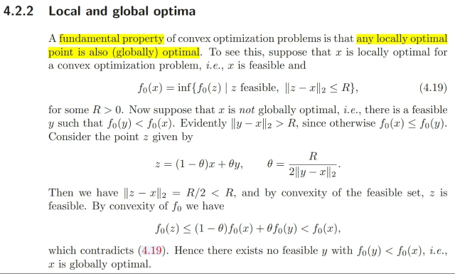</kbd></p>

> [!NOTE]
> Trong sách đưa ra chứng minh chuẩn hơn cho tính chất trong
> convex problem thì local optimal và global optimal là một.
>
> Nhưng chứng minh theo gs dễ hiểu dễ nhớ hơn
>
> 4.2 CONVEX OPTIMIZATION PROBLEMS
>
> 4.2.2 LOCAL & GLOBAL OPTIMA

<br>

<p align="center"><kbd>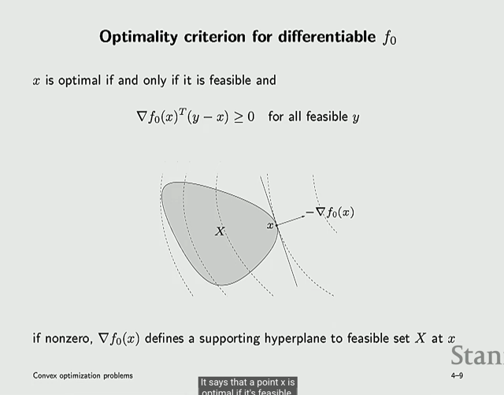</kbd></p>

<p align="center"><kbd>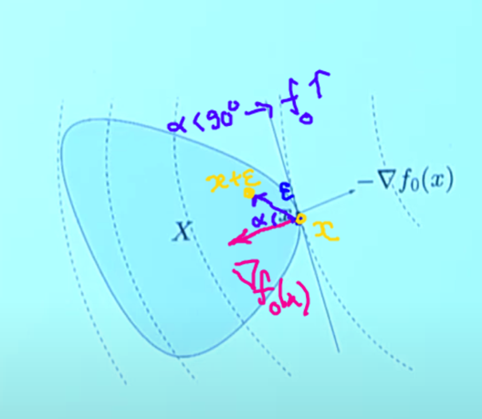</kbd></p>

> [!NOTE]
> ở đây nói đến tiêu chí CẦN VÀ ĐỦ để x là optimal của một objective
> function f0 khả vi (differentiable):
>
> Như đã biết, nó sẽ phải thỏa các constraints cái đã, gọi X là feasible
> set thì x PHẢI THUỘC FEASIBLE SET.
>
> Thế rồi, điều kiện tiếp theo là nó phải khiến f0(x) MANG GIÁ TRỊ
> OPTIMAL VALUE p* tức là minimize f0 trong các x thuộc X.
>
> Vậy thì, trong hình các đường chấm chấm chính là các LEVEL CURVE,
> từ 18.02 ta biết khi di chuyển trên các level curve thì giá trị hàm f0 sẽ
> không đổi. Và từ đó cũng dễ dàng chứng minh gradient vector ∇f sẽ
> vuông góc với level curve:
>
> Giả sử ta di chuyển một đoạn nhỏ theo level curve từ x đến `x+ε` (dĩ
> nhiên x, và x + `ε,` trong hình này coi như trong R2, thì là các 2D vector).
> Thì theo dùng linear approximation:
>
> ```text
> trong phạm vi ε rất nhỏ ta có: f(x+ε) ~= f(x) + ∇fTε. Và như đã nói, vì ta
> ```
> đang di chuyển trên level curve, nên f không đổi. Từ đó
>
> ```text
> f(x+ε) - f(x) = 0. Vậy f(x+ε) ~= f(x) + ∇fTε ~ = f(x+ε) - f(x) ~= ∇fTε
> ```
>
> `<=>` `∇fTε` `~=` 0
>
> Điều này suy ra gradient vector vuông góc với `ε.` Mà `ε` với độ lớn vô
> cùng nhỏ thì nó sẽ parallel với tiếp tuyến của level curve tại x, do đó
> gradient vector tại x, vuông góc với tiếp tuyến của level curve tại x và
> cũng là vuông góc với level curve.
>
> Và có thể mở rộng ra, để nói rằng với bất kì level curve đi qua x nào lập
> luận trên cũng đúng. Từ đó giúp kết luận gradient vector vuông góc
> với level surface
>
> Quay lại đây, có thể hiểu rằng nếu x thuộc feasible set X và gradient
> vector tại x ∇f TẠO NÊN MỘT SUPPORT HYPERPLANE - the định
> nghĩa sẽ là hyperplane, hay ở đây là đường thẳng mà MỌI ĐIỂM
> TRONG FEASIBLE SET X ĐỀU NẰM MỘT BÊN CỦA HYPERPLANE,
> ∇f(y-x) `>=` 0, thì khi đó x  chính là OPTIMAL  Tại sao, thử lập luận xem
> ?
>
> RẤT ĐƠN GIẢN, vì BỞI ĐỊNH NGHĨA CỦA SUPPORTING
> HYPERPLANE Thì ngoài x ra thì mọi điểm trong set C sẽ đều nằm một
> bên của hyperplane Ở đây, điều này có nghĩa là mọi điểm trong feasible
> set X đều nằm một bên của đường thẳng tạo bởi normal vector là -
> gradient ∇f0(x) này.
>
> Thế thì cũng theo định nghĩa, di chuyển trong feature set từ x theo
> bất kì hướng nào cũng sẽ đều là đi theo hướng khiến tăng f0 bởi
> các vector đó đều hợp với gradient vector một góc nhỏ hơn 90 độ.
>
> Muốn giảm f0, ta phải "bước sang" bên đây của haft-plane. Có nghĩa là
> phải đi theo hướng hợp với gradient một góc > 90 độ. Tuy nhiên như đã
> nói, không có điểm nào trong feasible set X bên đó cả. Do đó x là điểm có
> f0 nhỏ nhất.
>
> Và có thể lập luận thêm để chứng minh rằng khi đi trong feasible set X
> theo ví dụ như vector màu tím.Ta có `f(x+ε)` `~=` f(x) + `∇fTε.` Thế mà vì như
> đã nói ta di chuyển trong haft-plane có chứa feasible set X, thì dĩ nhiên
> các vector này đều hợp với ∇f0(x) một góc < 90 độ. Và dẫn tới `∇fTε` sẽ
> ```text
> mang giá trị dương, vì ∇fTε = ||∇f||*||ε||*cos α(∇f, ε) với góc < 90 độ thì cos
> ```
> ```text
> > 0 => ∇fTε > 0 => f(x + ε) > f(x) vậy là đi theo hướng nào từ x trong
> ```
> feasible set đều làm tăng f(x)
>
> OPTIMALITY CRITERION

<br>

<p align="center"><kbd>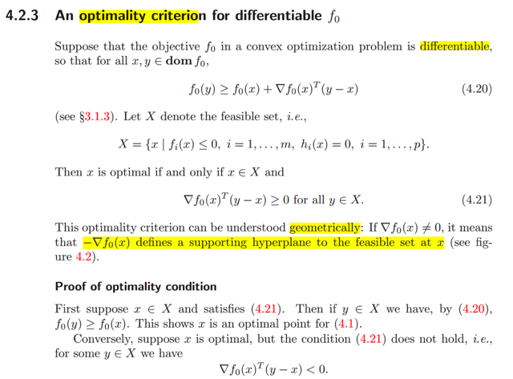</kbd></p>

<p align="center"><kbd>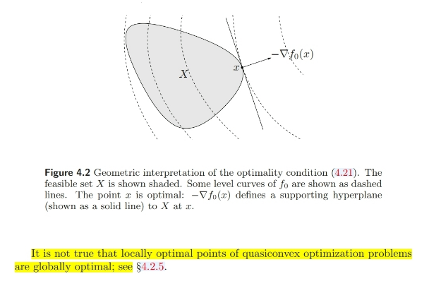</kbd></p>

> [!NOTE]
> 4.2 CONVEX OPTIMIZATION PROBLEMS
>
> 4.2.3 AN OPTIMALITY CRITERION FOR 
> DIFFERENTIABLE f0

<br>

<p align="center"><kbd>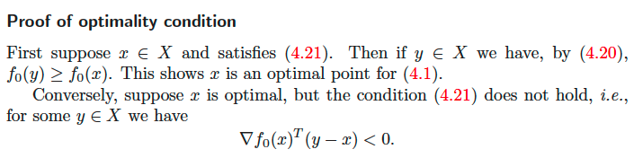</kbd></p>

<p align="center"><kbd>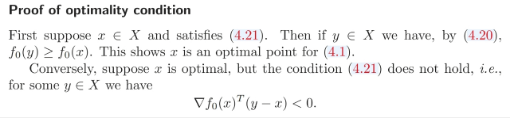</kbd></p>

> [!NOTE]
> Chứng minh OPTIMALITY CONDITION.
>
> Chứng minh nếu x thỏa ∇f0(x)T(y-x) `>=` 0 với mọi y ∈ X thì x là optimal:
>
> Đầu tiên ta sẽ cần dùng đến một theorem quan trọng của convex function:
> gọi là FIRST CONDITION: Trong đó nói rằng:
>
> f(x) convex `<=>` với mọi x, y ∈ dom f : f(y) `>=` f(x) + ∇f(x)T(y - x)
>
> Vậy thì ở đây, ta có f0 là convex, nên f0(y) `>=` f0(x) + ∇f0(x)T(y - x) (1)
>
> Mà đang chứng minh chiều đi, ta có ∇f0(x)T(y - x) `>=` 0 với mọi y ∈ X:
> nên (1) `=>` f0(y) `>=` f0(x) với mọi y ∈ X. `=>` x là optimal
>
> `====`
>
> Chứng minh nếu x là optimal thì ∇f0(x)T(y-x) `>=` 0 với mọi y ∈ X
>
> Để chứng minh chiều ngược, ta chỉ cần giả sử x là optimal mà tồn tại y ∈ X
> sao cho ∇f0(x)T(y-x) < 0.
>
> Thế thì đơn giản là: áp dụng linear approx.:
>
> f0(y) `~=` f0(x) + ∇f0(x)T(y-x)  ta sẽ có ngay f0(y) < f0(x)
>
> Cái này nôm na là, nếu tại tồn tại y khiến ∇f0(x)T(y-x) âm thì chỉ cần đi
> về phía đó từ x, thì hàm f sẽ còn giảm thêm nữa.
>
>  dẫn đến kết luận x không phải optimal

<br>

<p align="center"><kbd>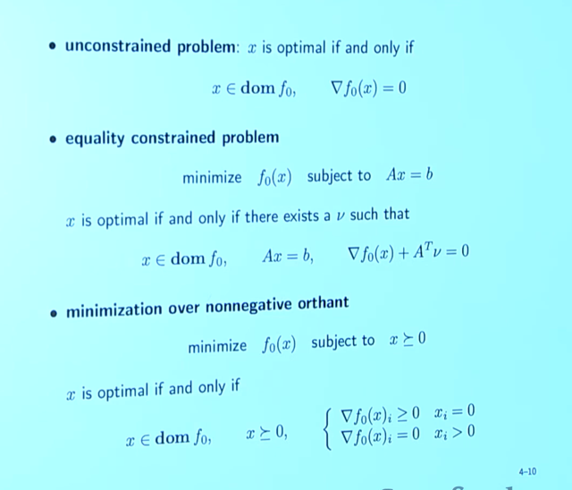</kbd></p>

<p align="center"><kbd></kbd></p>

> [!NOTE]
> Nếu là unconstraint. thì gs cho rằng cái tiêu chuẩn trên sẽ trở `thành/`
> đồng nghĩa với việc gradient vector vanish.
>
> Có nghĩa là, với unconstraint convex optimization problem. Việc tìm
> optimal chỉ đơn giản là tìm solution của ∇f0(x) `=` 0 
>
> Lí do là vì, nếu không có (explicit) constraint, tức feasible set X mở
> rộng ra toàn bộ R2. 
>
> Thì điểm OPTIMAL PHẢI LÀ NƠI CÓ GRADIENT `=` 0 VÌ NẾU KHÔNG
> TA CÓ THỂ TIẾP TỤC ĐI THEO HƯỚNG CỦA - GRADIENT ĐỂ
> TIẾP TỤC GIẢM f0
>
> Hay nói như gs, giả sử tại optimal mà gradient khác 0, gọi là a đi thì
> vẫn có thể tìm ra điểm y khiến không thỏa criterion ∇f0(x)T(y-x) `>=` 0
>
> (đơn giản chỉ việc tìm y sao cho aT(y-x) < 0)
>
> Và với việc ta đang trong bài toán convex, thì đó sẽ chính là global
> optimal, nơi gradient vanish, tức gradient `=` 0
>
> Gs nói thêm, như calculus đã biết, ví dụ như mình học 1802 đi, thì
> gradient `=` 0 chỉ giúp giải ra critical point, hay gs gọi là stationary point
> vốn dĩ nó có thể là minima, maxima hoặc saddle point. Còn với convex
> thì đây chắc chắn là global minimum
>
> `====`
>
> OPTIMALITY CRITERION ĐỐI VỚI
> UNCONSTRAINED PROBLEM

<br>

<p align="center"><kbd>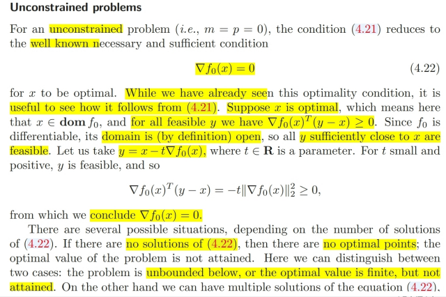</kbd></p>

<p align="center"><kbd>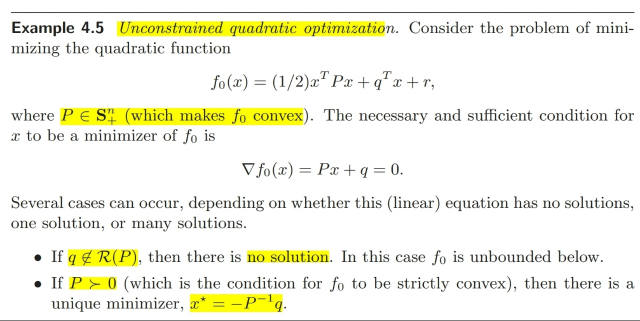</kbd></p>

<p align="center"><kbd>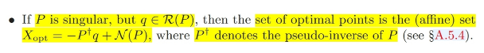</kbd></p>

> [!NOTE]
> Trong sách đưa ra chứng minh cho nhận định khi bài toán convex
> optimization không có constraint thì optimal đơn giản là giải nghiệm
> của ∇f0(x) `=` 0. (chưa xem kĩ lắm)
>
> Thì ý chính là, lúc này ta quan tâm phương trình ∇f0(x) `=` 0 có
> nghiệm hay không. Nếu vô nghiệm thì tức là optimization problem
> không có optimal. Và việc này có thể đến từ việc problem có
> optimal value p* nhưng không có x nào khiến f0(x) `=` p*.
>
> Đây chính là case UNACHIEVALBE
>
> Trường hợp còn lại là không có optimal value luôn, tức là hàm f0(x)
> muốn nhỏ nhiêu thì nhỏ `=` UNBOUND BELOW
>
> Nhưng cũng có thể giải ra nhiều nghiệm, khi đó ta có một set các
> optimal.
>
> `====`
>
> Ví dụ ở dưới với f0 là quadratic function thì ∇f là Px + q (cái này giờ
> quá dễ để derive rồi).
>
> Vậy thì ∇f(x) `=` 0 `<=>` Px `=` -q. Và đây là hệ phuong trình tuyến tính.
> Nhờ 1806 đã quá hiểu, nó sẽ vô nghiệm khi q (cũng là -q) nằm
> ngoài columns space của P C(P) hay R(P).
>
> Ngược lại thì hệ có nghiệm, khi đó nếu nullspace chỉ có zero vector,
> thì hệ có nghiệm duy nhất là `x_particular.` Thì ở đây P là S^n+, tức
> positive semi definite  symmetric matrix. Nên khi nullspace chỉ có
> zero thì cũng chính là P full rank, và positive definite (≻0). Khi đó P
> invertible và từ đó `x_particular` `=` Pinv(-q).
>
> Còn nếu nullspace có nonzero vector thì nghiệm sẽ là `x_particular`
> + `x_null`
>
> Lúc này dĩ nhiên là P không còn nonsingular nữa. Nhưng ta vẫn có
> thể nhờ pseudo inverse P^+ để có `x_particular:`
>
> Do đó solution (cũng là optimal) có công thức là (P^+)(-q) + N(P) là vậy

<br>

<p align="center"><kbd>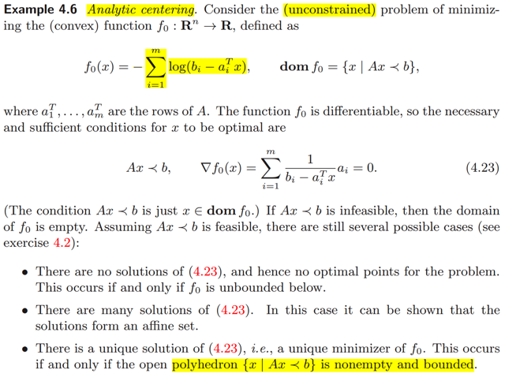</kbd></p>

> [!NOTE]
> một vài điểm đáng chú ý, vì đây là bài toán unconstrained nên optimality 
> condition trở thành ∇f0(x) `=` 0.
>
> Hàm f0(x) `=` - `Σi` log(bi - aiTx). Tính ∇f0(x):
>
> Viết lại f0(x) `=` - 1Tlog(b - Ax) 
>
> Đặt u(x) `=` b - Ax `=>` f0(u) `=` - 1Tlog(u)
>
> df0(u) `=` f0(u + du) - f0(u) `=` -1Tlog(u + du) + 1Tlog(u)
>
> `=` - `Σi` log(ui + dui) + `Σi` log(ui) (1)
>
> Xét f(x) `=` log(x). Với x `~=` x0: linear approx. cho ta biết:
>
> f(x) `~=` f(x0) + f'(x0)(x - x0) 
>
> tức là log(x) `~=` log(x0) + `(1/x0)(x` - x0)
>
> ```text
> Hoặc với δx ~= 0 thì f(x + δx) ~= f(x) + f'(x) δx
> ```
>
> ```text
> <=> log(x + δx) ~= log(x) + (1/x) δx
> ```
>
> `=>` log(ui + dui) `~=` log(ui) + `dui/ui`
>
> ```text
> => (1) = - Σi [log(ui) + dui/ui] + Σi log(ui)
> ```
>
> ```text
> = Σi [- log(ui) - dui/ui + log(ui)] = - Σi dui/ui = -1T(du/u)
> ```
>
> Xét du: u(x) `=` b - Ax `=>` du(x) `=` u(x + dx) - u(x)
>
> ```text
> = b - Ax - Adx - b + Ax = - Adx => du(x)_i = - aiTdx
> ```
>
> ```text
> => - Σi dui/ui = - Σi (- aiTdx) / (bi - aiTx) = Σi aiTdx / (bi - aiTx)
> ```
>
> `=` `Σi` [1 `/` (bi - aiTx)]  aiTdx
>
> Thế thì theo mit 18s096, khi ta đã có df `=` linear operator act on dx (f'(x)[dx])
> thì linear operator đó chính là derivative. Ở đây kết quả ra df `=` vector
> ```text
> dot product với dx => gradient chính là ∇f = Σi [1 / (bi - aiTx)] ai
> ```
>
> (đây quả thật là vector, dù có dấu `Σ,` vì ai là row vector, hàng thứ i của
> A, chia cho (bi - aiTx) là một scalar, vẫn ra một vector. Và `Σ` các vector
> lại vẫn là một vector. Nên gradient vector là vector mà phần tử thứ
> ith là tổng phần tử thứ i của các hàng của A sau khi scale với scalar
> tương ứng
>
> Vậy optimality condition là `Σi` [1 `/` (bi - aiTx)] ai `=` 0
>
> và dĩ nhiên x phải thuộc domain của f0, và f0 là tổng các log (bi - aiTx)
> nên tập xác định của hàm log(u) là u phải không âm `=>` bi - aiTx `>=` 0
> `<=>` Ax - b ⪯ 0
>
> Thế thì việc có optimal hay không sẽ tùy vào việc ∇f0(x) `=` 0 có nghiệm
> thỏa Ax - b ⪯ 0 hay không.

<br>

<p align="center"><kbd>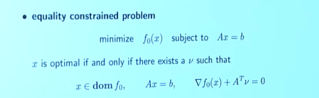</kbd></p>

> [!NOTE]
> Một cái nữa đó là minimize f0(x) subject to Ax `=` b, cái này gs nói ta
> sẽ quay lại nói về nó sau. Nhưng đây là cái 1802 đã học: Lagrange
> multiplier.

<br>

<p align="center"><kbd>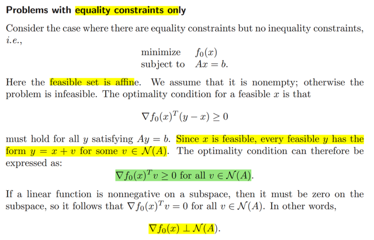</kbd></p>

<p align="center"><kbd>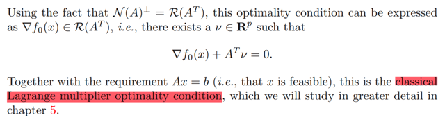</kbd></p>

> [!NOTE]
> Đây là một case quan trọng. Khi chỉ equality constraint là affine 
> Ax `=` b
>
> Dĩ nhiên feasible set là affine set. Thế thì optimality condition như 
> đã biết sẽ là:
>
> ∇f0(x)T(y - x) `>=` 0 với mọi y ∈ feasible set, tức là ở đây y phải là
> solution của Ax `=` b.
>
> Thế thì dĩ nhiên nếu Ax `=` b vô nghiệm (khi b không thuộc C(A) thì
> feasible set rỗng, bài toán thành infeasible problem)
>
> Vậy thì vì y phải là solution của Ax `=` b, nên nó phải có dạng là
> ```text
> x_particular + x_null, với x_particular trong row-space, và x_null
> ```
> là nonzero vector của nulls-pace. Nên nếu gọi x là (particular) 
> solution thì y `=` x + v với v ∈ N(A)
>
> Khi đó điều kiện ∇f0(x)T(y - x) `>=` 0 với mọi y feasible 
>
> Vậy thì với x, y thuộc feasible set thì x, y đều có dạng là `x_particular`
> + nullspace vector ⇨ y - x nhất định là nullspace vector v
>
> Sẽ tương đương: 
>
> ∇f0(x)Tv `>=` 0 với mọi v ∈ N(A)
>
> Rồi, xét ∇f0(x)Tv, nó là linear function của v, trong sách lập luận
> rằng, với v thuộc subspace (nulls-pace) thì cái này nó sẽ chỉ ko
> âm nếu nó bằng 0. Có thể hiểu ý này giống như xét f(x) `=` ax thì 
> để ax `>=` 0 với mọi x thì chỉ xảy ra khi ax `=` 0 với mọi x.
>
> (Cái ý này tạm thời vẫn hiểu nhưng có thể suy nghĩ và bàn
> thêm)
>
> Vậy điều kiện trở thành ∇f0(x)Tv `=` 0 với mọi v ∈ N(A)
>
> Và đây chính là thể hiện ∇f0(x) vuông góc với nullspace, đương
> nhiên dẫn tới nó nằm trong rowspace C(AT)
>
> Và điều kiện optimality condition trở thành:
>
> "∇f0(x) nằm trong rowspace C(AT)"
>
> Tới đây ta lập luận như sau:
>
> Nếu u ∈ C(AT) thì -u cũng belong C(AT) thì khi đó u và -u sẽ đều
> có thể thể hiện bởi linear combination của các A's row (chưa
> chắc A full row rank nhưng nhận định này đúng kể cả các row của
> A dependent vì trong đó nhất định có một basis)
>
> Và do đó ta có thể thể hiện -u `=` ATv
>
> Vậy -∇f0(x) `=` ATv từ đó ta có ∇f0(x) + ATv `=` 0
>
> Vậy optimality condition cuối cùng trở thành ∇f0(x) + ATv `=` 0
> đây chính là LAGRANGE MULTIPLIER NỔI TIẾNG TRONG
> CALCULUS

<br>

<p align="center"><kbd>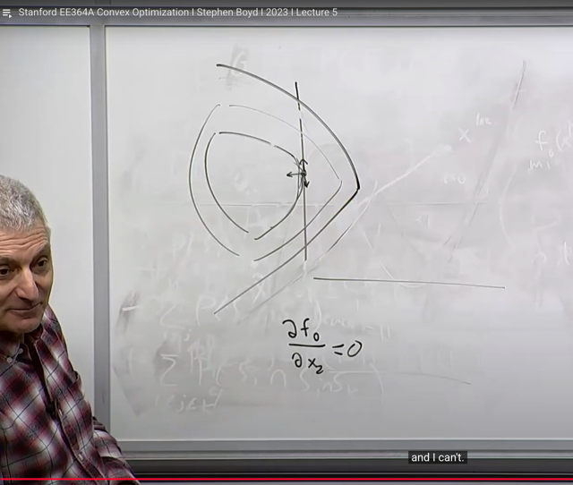</kbd></p>

> [!NOTE]
> một điểm nữa là minimization over non-negative orthant:
>
> minimize f0(x) subject to x ≽ 0.
>
> Gs chi nói sơ, ta sẽ tìm hiểu sâu sau vài bài nữa

<br>

<p align="center"><kbd>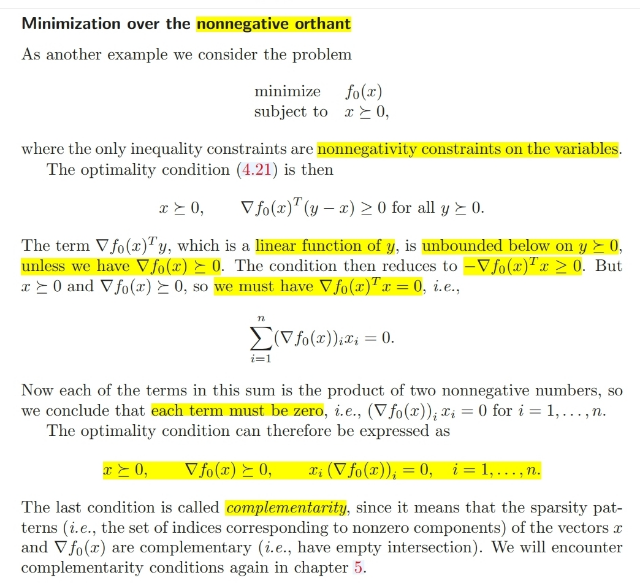</kbd></p>

> [!NOTE]
> qua ví dụ này, khi constraint là x ≽ 0, (sau này sẽ học đây chính là
> x ≽K 0 với K `=` R^n+ non-negative orthant), và nó có nghĩa là mọi
> component của x đều ko âm.
>
> Thế thì để giải bài toán này minimize f0(x) subject to x ≽ 0, dùng
> optimal condition ta sẽ có nếu x là optimal thì x phải thỏa:
>
> ∇f0(x)T(y-x) `>=` 0 với mọi y ∈ feasible set X, tức với mọi y ≽ 0. Và
> dĩ nhiên là x phải feasible x ≽ 0.
>
> Thế thì ∇f0(x)T(y-x) `>=` 0 `<=>` ∇f0(x)Ty - ∇f0(x)Tx `>=` 0
>
> ```text
> Thế thì xét ∇f0(x)Ty, = Σ ∇f0(x)_i * y_i , và y ≽ 0 nên y_i >= 0
> ```
> Vậy thì nói cái này `Σ` ∇f0(x)_i * `y_i` unbound below trừ khi ∇f0(x) `>=` 0
>  là vì nếu chỉ cần một phần tử của ∇f0(x) âm (ví dụ ∇f0(x)_j , thì cái tích 
> ∇f0(x)_j `y_j` sẽ âm và khi `y_j` càng lớn thì càng nhỏ (âm) dẫn đến chỉ
> cần chọn y với `y_j` ngày càng lớn thì ∇f0(x)Ty có thể nhỏ đến -infinity.
>
> Do đó nếu muốn ∇f0(x)Ty - ∇f0(x)Tx `>=` 0 thì đầu tiên ∇f0(x)Ty phải 
> unbounded below đã, nếu không ∇f0(x)Ty - ∇f0(x)Tx cũng sẽ unbound
> below. Do đó ta phải có ∇f0(x) ≽ 0 (1)
>
> Rồi,∇f0(x)Ty - ∇f0(x)Tx `>=` 0 `<=>` ∇f0(x)Ty `>=` ∇f0(x)Tx  (2)
>
> mà ∇f0(x) ≽ 0, y ≽ 0 nên ∇f0(x)Ty `>=` 0 (scalar).
>
> Do đó (2) `<=>` ∇f0(x)Tx `<=` 0 hay - ∇f0(x)Tx `>=` 0 (3)
>
> Rồi vậy là ta có các điều kiện:
>
> x ≽ 0, ∇f0(x) ≽ 0 thì ∇f0(x)Tx `<=` 0 chỉ có thể `<=>` ∇f0(x)Tx `=` 0
>
> Và từ đó ta có kết quả là `Σ` ∇f0(x)_i * `x_i` `=` 0
>
> và again, vì x ≽ 0, ∇f0(x) ≽ 0 nên xi `>=` 0, ∇f0(x)_i `>=` 0 
>
> Vậy điều kiện lại trở thành ∇f0(x)_i * `x_i` `=` 0 với mọi i
>
> VÀ CÁI NÀY GỌI LÀ COMPLEMENTARY (tạm dịch là "bù trừ cho
> nhau") lí do đơn giản là, vì ∇f0(x)_i không âm, `x_i` cũng không âm
> nên để hai thằng nhân nhau bằng không thì ít nhất một thằng
> bằng 0. Kết quả là vector ∇f0(x) và vector x sẽ có cái kiểu là thằng
> này bằng 0 thì thằng kia khác 0 hoặc cả hai đều bằng 0

<br>

<p align="center"><kbd>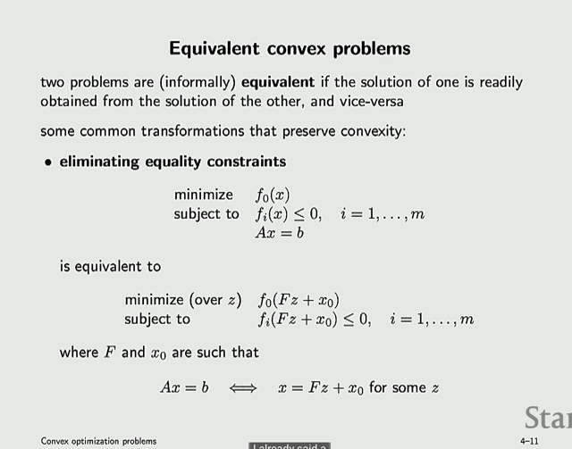</kbd></p>

> [!NOTE]
> Đại khái là gs nói thêm về equivalent convex problem mà đã nhắc
> đến hồi nãy. Ý tưởng là giả sử ta có convex optimization problem
> này trong đó như đã nói equalities sẽ là các affine function và có
> thể thể hiện chúng bởi Ax `=` b
>
> Thế thì ý chính ở đây là có thể chuyển nó thành bài toán tương
> đương trong đó ta bỏ đi cái equalities. Bằng cách thay x `=` Fz
> + x0
>
> Với F và x0 được tạo ra sao cho Ax `=` b `<=>` x `=` Fz + x0
>
> Cái này đơn giản là vầy: Bài toán gốc, equalities constraint của nó
> về cơ bản mang ý nghĩa là "x phải là solution của Ax `=` b"
>
> Thế thì ta biết Ax `=` b có thể có vô số nghiệm với dạng tổng quát
> là `x_particular` + `x_null:` trong đó ở đây gs ghi x0 và Fz
> chính là cái này x0 là `x_particular:` Ax0 `=` b. Còn `x_null,` hay Fz
> là nullspace vector của A: F là matrix các columns là nullspace
> basis nên Fz là một linear combination của nullspace basis `=` một
> nullspace vector
>
> ```text
> để rồi AFz = 0 Dẫn tới A(Fz+x0) = AFz + Ax0 = 0 + b = b tức Fz+x0
> ```
> là solution của `Ax=b`
>
> Để rồi việc solve bài toán tương đương trong đó ta minimize
> over z f0(Fz+x0) với inequalities fi(Fz+x0) `<=` 0 thực chất vẫn là
> đang tìm trong số solution của của `Ax=b` xem cái nào thỏa
> inequalities constraint và  minimize f0
>
> EQUIVALENT CONVEX PROBLEM

<br>

<p align="center"><kbd>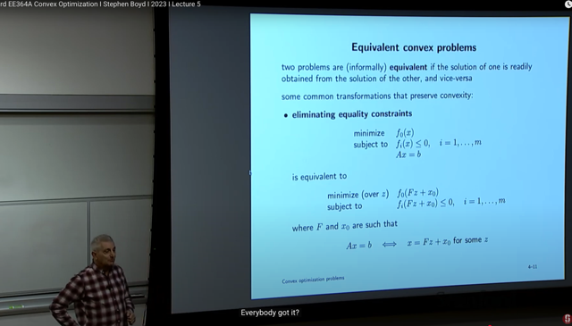</kbd></p>

> [!NOTE]
> Bởi lẽ nếu có solution `Ax=b` thì x0 `(x_particular)` là unique.
>
> Nên có tìm là tìm `x_null` (ý là thay đổi để thỏa các inequalities
> constrains và minimize f0)
>
> Gs nói thêm nếu b không nằm trong range của A (chính là C(A))
> thì sao thì khi đó như đã biết, sẽ ko tồn tại `x_particular,` hay x0.
> Khi đó chỉ việc return kết quả là: ko có feasible set.
>
> Một điểm nữa đó là sở dĩ bài toán convex tương đương là
> bởi f0(Fz + x0) chính là convex function bởi f0 convex, và
> đây là case "convex function precompose with an affine
> function" (cho nên nó cũng convex)

<br>

<p align="center"><kbd>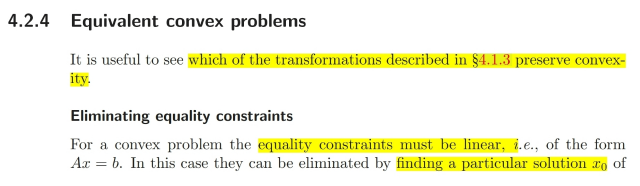</kbd></p>

<p align="center"><kbd>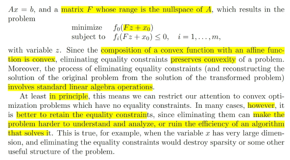</kbd></p>

> [!NOTE]
> Cái này trong bài đã nói rất rõ rồi. Nói chung là vì đối với bài toán
> convex optimization problem thì equality constraint là affine Ax `=` b
> cho nên ta có thể dùng phương pháp tạo equivalent problem
> theo cách tiếp cận là thay x `=` x0 + Fz vào f0(x), fi(x) < 0
>
> 4.2 CONVEX OPTIMIZATION PROBLEMS
>
> 4.2.4 EQUIVALENT CONVEX PROBLEMS

<br>

<p align="center"><kbd>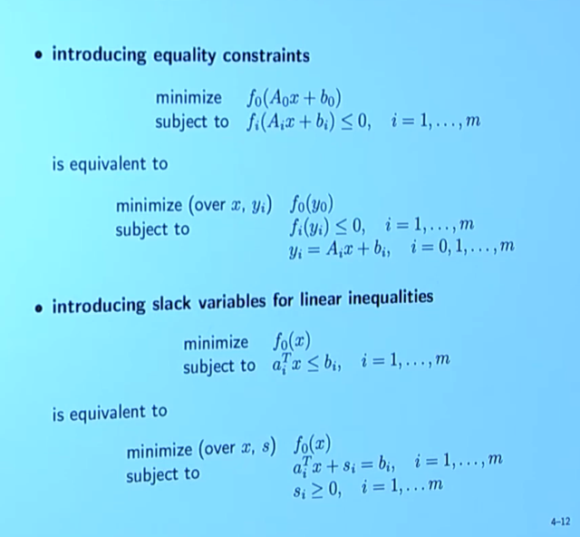</kbd></p>

> [!NOTE]
> ngược lại với loại bỏ các equalities constraint là ta sẽ thêm vào
> chuyển thành bài toán tương đương nhưng thêm vào equalities
> constraints. Cái này nghe khá silly như gs cho biết vài bữa ta
> sẽ thấy nó rất hữu ích
>
> Cái dưới ko hiểu lắm nhưng dù sao đây là biết sơ, vài bữa ta sẽ
> đi sâu

<br>

<p align="center"><kbd>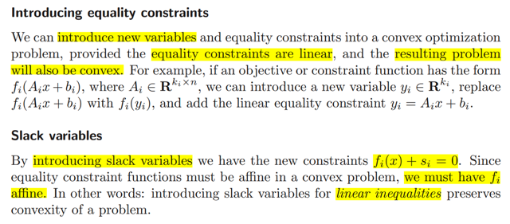</kbd></p>

> [!NOTE]
> Những cách thức khác thì trong phần nói về equivalent problem thì
> đã biết rồi. Có nghĩa là những cách thức này áp dụng cho các bài
> toán cả convex hoặc không convex.
>
> Chỉ có điều yêu cầu là nếu dùng cách introduce thêm equality
> constraint thì để vẫn là convex problem thì equality constraint function
> phải là affine.

<br>

<p align="center"><kbd>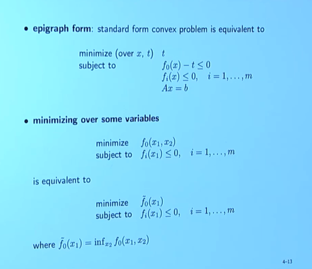</kbd></p>

> [!NOTE]
> cái epigraph form chưa hiểu lắm, nhưng quay lại sau.
>
> Còn cái ở dưới đại khái là nếu ta có thể minimize f0(x1,x2) over x2 
> trước để có f~0(x1). Đây là giá trị của f0(x1,x2) nhỏ nhất khi ta tìm kiếm
> các x2.
>
> Khi đó việc giải bài toán là tìm x1 để f~0(x1) nhỏ nhất sẽ cũng là giải
> bài toán ban đầu (tìm x1, x2 khiến minimize f0(x1,x2))
>
> Gs nói đây là nguyên lý của dynamic programming

<br>

<p align="center"><kbd>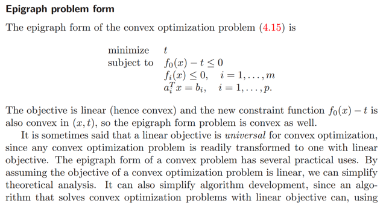</kbd></p>

<p align="center"><kbd>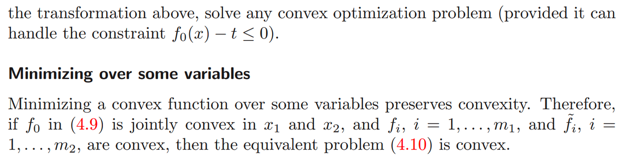</kbd></p>

> [!NOTE]
> QUAY LẠI SAU

<br>

<p align="center"><kbd>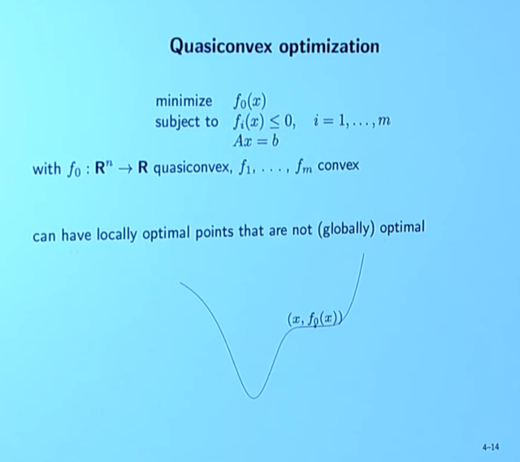</kbd></p>

> [!NOTE]
> gs nói sơ về bài toán Quasiconvex optimization. Trong đó ta có
> f0(x) (objective function) chỉ quasi-convex chứ không convex. Và
> ta có thể có locally optimal points chứ không phải global
> optimal.
>
> (nhớ lại rằng, với convex optimization, nói rằng local optimal cũng
> sẽ là global optimal, nhưng với quasi-convex optimization problem
> thì không)

<br>

<p align="center"><kbd>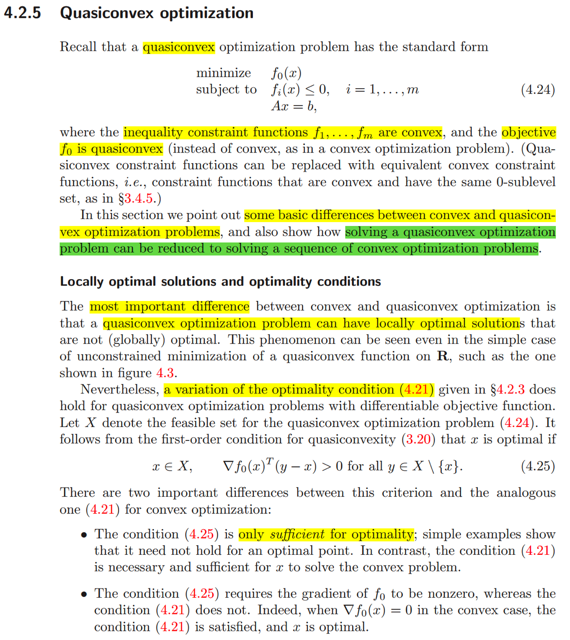</kbd></p>

> [!NOTE]
> QUAY LẠI SAU
>
> 4.2 CONVEX OPTIMIZATION PROBLEMS
>
> 4.2.5 QUASICONVEX OPTIMIZATION

<br>

<p align="center"><kbd>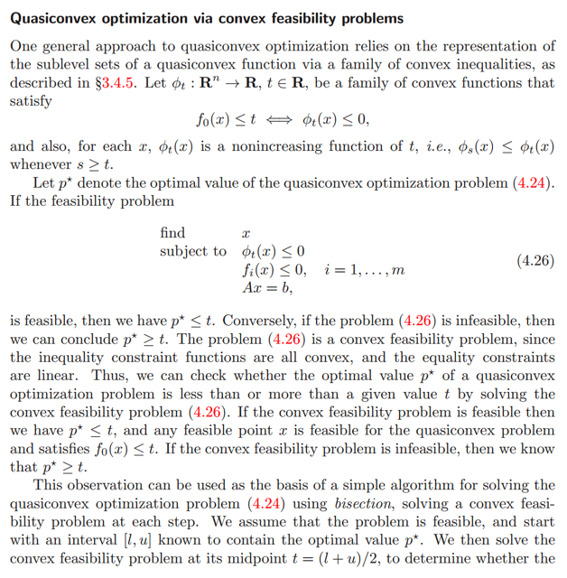</kbd></p>

<p align="center"><kbd>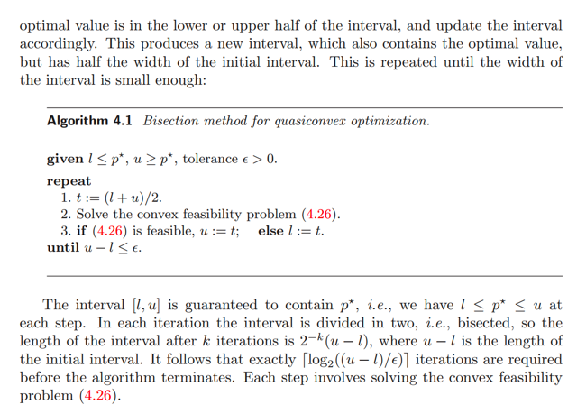</kbd></p>

> [!NOTE]
> QUAY LẠI SAU

<br>

<p align="center"><kbd>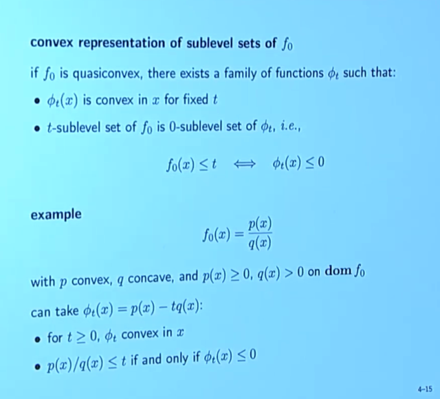</kbd></p>

> [!NOTE]
> mấy phút cuối gs nói sơ về việc ta có thể giải bài
> toán này. CHưa hiểu lắm

<br>

<p align="center"><kbd>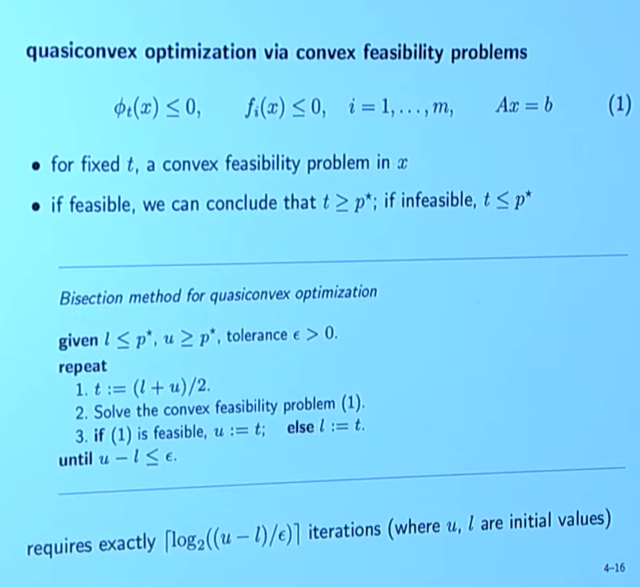</kbd></p>

<br>


<a id="node-m3h6rqn"></a>
## Lec 6

<br>

<p align="center"><kbd>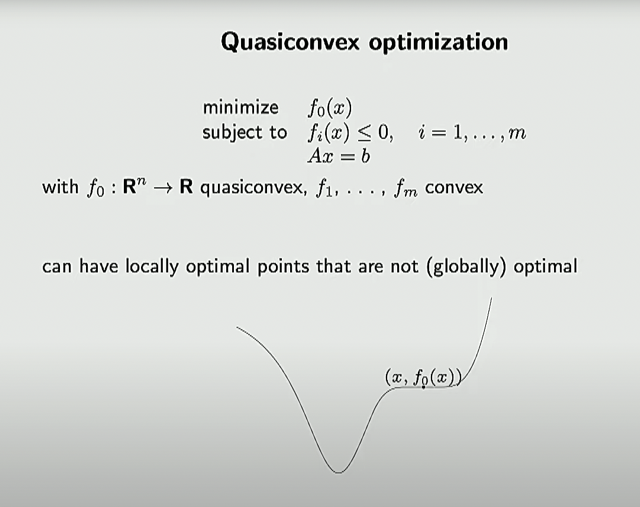</kbd></p>

> [!NOTE]
> Tiếp tục với bài trước về quasi-convex optimization. Đầu tiên ta
> nhớ lại định nghĩa của quasi-convex function đó là: Nó có
> domain là convex set và mọi sub-level set đều cũng là convex
> set.
>
> Sub-level set là một set, các x mà trong đó mọi giá trị f(x) đều nhỏ
> hơn một số nào đó.
>
> Ví dụ `Sα` là mọi giá trị x trong domain (miền xác định của f) sao cho
> f(x) đều nhỏ hơn `α.`
>
> Vậy thì nếu mọi `Sα` đều là convex set thì ta sẽ có quasi-convex 
> function.
>
> Thế thì như đã biết, gs nhắc lại, với convex set thì ta không có local
> optimal, mà chỉ có global optimal. Nhưng với quasi-convex thì ta có
> thể có local optimal

<br>

<p align="center"><kbd>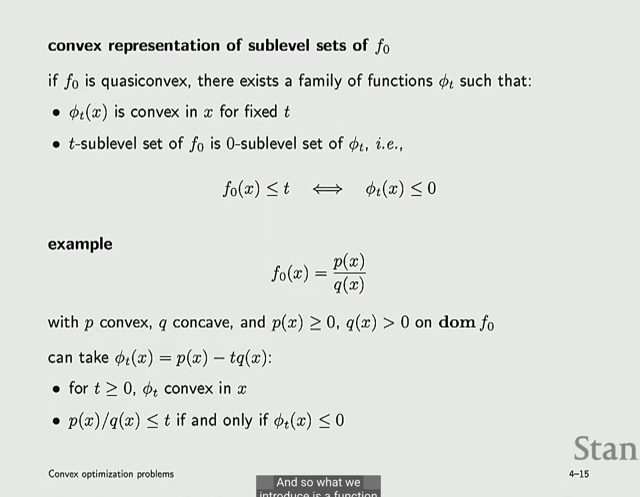</kbd></p>

> [!NOTE]
> Đại khái là cách giải bài toán này, nói một cách khái quát đó là
> ta (hãy tin rằng) luôn có cách nào đó để ta định nghĩa ra, đặt ra
> một functon Φt(x) nào đó sao cho nó convex in x, đồng thời có sự
> tương ứng giữa sub-level set của Φt(x) và f0(x):
>
> Đó là f0(x) `<=` t `<=>` Φt(x) `<=` 0 có nghĩa là t-sublevel set của f0 chính
> là 0-sublevel set của Φt
>
> Để hiểu rõ hơn, ta lấy ví dụ function f0(x) `=` p(x) `/` q(x), 
>
> trong đó với p convex, q concave và p(x) không âm, q(x) dương thì 
> f0(x) là quasi convex function.
>
> Thế thì, nếu ta define Φt(x) `=` p(x) - tq(x) thì khi đó Φt(x) với `t>=0`  thì
> nó sẽ là convex function. (cái này dễ hiểu vì ta có tổng hai convex
> function p(x) và -tq(x))
>
> Và p(x) - tq(x) `<=` 0 sẽ tương đương `p(x)/q(x)` `<=` t nên 0-sublevel set
> của Φt(x) sẽ chính là t-sublevel set của f0(x)

<br>

<p align="center"><kbd>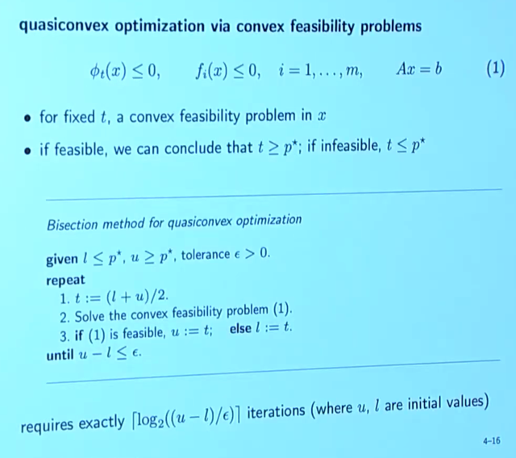</kbd></p>

> [!NOTE]
> Đại khái là `p(x)/q(x)` `<=` t tương đương p(x) - tq(x) `<=` 0 hay
> Φt(x) `<=` 0
>
> Nên với một giá trị t nào đó, nếu tồn tại x khiến nó feasible
> (thỏa các  constraint fi(x) `<=` 0), và thỏa luôn Φt(x) `<=` 0 thì lúc
> này sẽ dĩ nhiên  đồng nghĩa là nó sẽ thỏa `p(x)/q(x)` `<=` t
>
> Mà như vậy từ việc p* `=` min x ∈ X f0(x) `=` `p(x)/q(x)` thì ta cũng có
> thể  kết luận p* `<=` t  
>
> Ngược lại, nếu với t đó, không tồn tại x nào feasible và
> thỏa  Φt(x) `<=` 0 thì điều này có nghĩa là:
>
> mọi feasible x đều khiến Φt(x) > 0:
>
> Φt(x) > 0 với mọi x ∈ X
>
> `<=>` `p(x)/q(x)` > t với mọi x ∈ X
>
> `=>` p* > t
>
> Và từ đó ta sẽ tăng t lên. Hoặc giảm t xuống. Và ta lặp đi lặp
> lại việc này cho đến khi thu hẹp dần khoảng mà ta biết sẽ chứa
> p*. Đây gọi là chiến lược bisection
>
> BISECTION METHOD FOR SOLVING
> QUASI-CONVEX OPTIMIZATION

<br>

<p align="center"><kbd>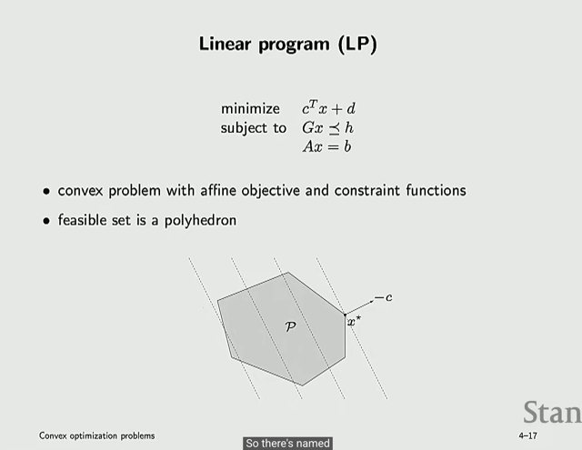</kbd></p>

> [!NOTE]
> Đại khái là giáo sư nói rằng ta nên biết về bài toán LINEAR
> PROGRAM (LP).
>
> Trong đó ta muốn minimize objective function là một affine
> function cTx + d với constraints Gx ⪯ h và Ax `=` b.
>
> Ax `=` b thì là system các linear equation thì biết rồi.
>
> Còn Gx ⪯ h là system các linear inequalities. Mà
> solution set của nó tạo thành cái POLYHEDRON như hình.
>
> (mỗi một bất phương trình sẽ tạo nên một haft-plane, thành ra
> intersection của chúng sẽ tạo một polyhedron). Và dĩ nhiên dễ hiểu
> đây chính là FEASIBLE SET X
>
> Thành ra bài toán là tìm x nằm trong đó để minimize objective.
>
> Thì vì objective ở bài toán này là affine, nên level curve của nó sẽ là
> các đường thẳng: cTx+d `=` constant `<=>` cTx + d - constant `=` 0
>
> Và vector c chính là normal vector của các linear level curve này,
> mà ko có gì lạ c cũng chính là gradient vector ∇f0:
>
> Chứng minh nhanh:
>
> ```text
> df = f(x+dx) - f(x) = cT(x+dx) + d - cTx + d = cTx + cTdx - cTx = cTdx
> ```
> `=>` gradient ∇f `=` (cT)T `=` c.
>
> Thành ra việc tìm x* sẽ là nhích dần nhích dần qua các level curve
> song song này theo hướng - c để đến khi mọi điểm trong feasible
> set X đều nằm một bên.
>
> BÀI TOÁN LINEAR PROGRAM

<br>

<p align="center"><kbd>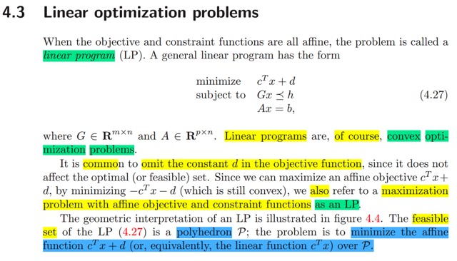</kbd></p>

<p align="center"><kbd>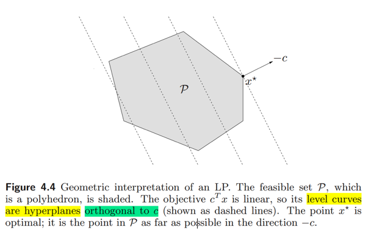</kbd></p>

<p align="center"><kbd>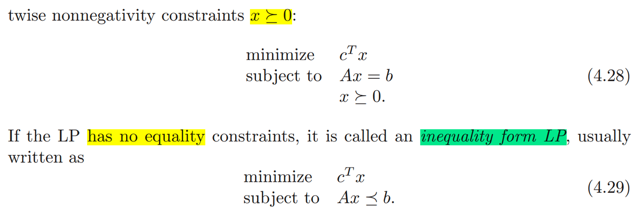</kbd></p>

<p align="center"><kbd>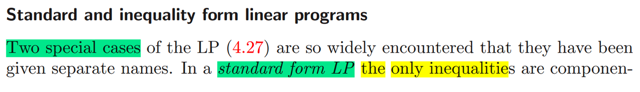</kbd></p>

> [!NOTE]
> Trong note trước đã nói đủ hết rồi
>
> Chỉ nói thêm một ý là nếu là bài toán maximize -cTx - d với affine
> constraint function thì nó cũng là LP vì maximize -cTx - d thì cũng là
> minimize cTx + d
>
> Thế thì một vài suy nghĩ (đã thảo luận với GPT):
>
> Sách nói feasible set là Polyhedron thì mình nên hiểu nó là intersection
> của Polyhedron (tạo bởi các linear inequality constraint Gx ⪯ h) và các
> Hyper-plane (tạo bởi các equality constraint Ax `=` b) Nhưng intersection
> của Polyhedron và hyper-planes cũng là Poly-hedron thôi.
>
> Một cái nữa, trong hình minh họa polyhedron là một hình khép kín (nói
> chính hơn là BỊ CHẶN, chứ theo định nghĩa CLOSED, thì miễn là có
> chứa boundary thì nó là CLOSE). Nhưng không phải lúc nào cũng vậy,
> nếu như ví dụ chỉ có một linear inequality constraint gx `<=` h thì
> Polyhedron nó là một Haft-space (Haft-space cũng là Polyhedron) khi
> đó nó không khép kín.
>
> Và optimal cũng có thể không phải là 1 điểm như trong hình. Mà ví dụ
> như khi feasible set là haft-space như trên vừa nói, thì có thể các level
> set của f0 có thể di chuyển song song theo hướng - c mãi mãi mà không 
> bao giờ trở thành support hyperplane của feasible set, tức là không có 
> optimal value, và đây là case f0 unbound below.
>
> HOặc là cũng có thể có trường hợp mà kết qủa optimization trở thành
> kiểu như support hyperplane của P trùng với một cạnh của P, khi đó
> mọi điểm trên cạnh đó đều là optimal, lúc này ta có một set nhiều
> optimal points
>
> 4.3 LINEAR OPTIMIZATION
>
> Ngoài ra còn một ý nữa là có hai dạng đặc biệt của bài toán LP:
> Gọi là STANDARD FORM LP khi INEQUALITIES CONSTRAINT
> CHỈ CÓ DẠNG COMPONENT-WISE như x ≽ 0 
>
> Và INEQUALITY LP khi bài toán chỉ có inequality constraint mà
> KHÔNG CÓ INEQUALITIES CONSTRAINT

<br>

<p align="center"><kbd>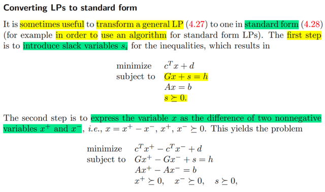</kbd></p>

<p align="center"><kbd>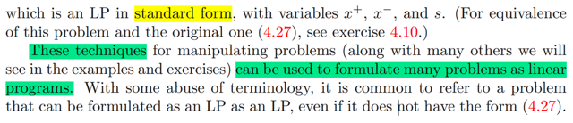</kbd></p>

> [!NOTE]
> Đại ý là đôi khi vì lí do nào đó mà sẽ có ích khi ta chuyển một bài
> toán LP dạng khái quát THÀNH DẠNG STANDARD FORM.
>
> Như đã biết bài toán LP khái quát là minimize cTx + d constraint  Gx
> ⪯ h và Ax `=` b. Để có dạng Standard form LP thì các equality
> constraints phải có dạng component-wise u ≽ 0 với u là optimization
> variables.
>
> Do đó ta cần chuyển Gx ⪯ h thành dạng này. Cách làm là ta đầu tiên
> ta dùng một cách tiếp cận để tạo equivalent problem đã học: Slack
> variable trong đó nó giúp eliminate inequality constraint fi(x) `<=` 0
> bằng cách thay bằng một equality constraint: fi(x) + si `=` 0 và tạo
> thêm non-negative constraint si `>=` 0
>
> Thì ở đây Gx ⪯ h `<=>` Gx - h ⪯ 0 sẽ thay bằng Gx - h + s `=` 0 và s ≽ 0.
>
> Thế thì có thể thắc mắc là tại sao không dừng ở đây mà còn phải
> làm  thêm bứơc sau là tách x thành x+ - x- để rồi có thêm x+ ≽ 0 và
> x- ≽ 0 Thì Chat GPT nói rằng bài toán ở bước 1 đã là Standard LP
>
> Nhưng bước sau là cái mà học hay làm

<br>

<p align="center"><kbd>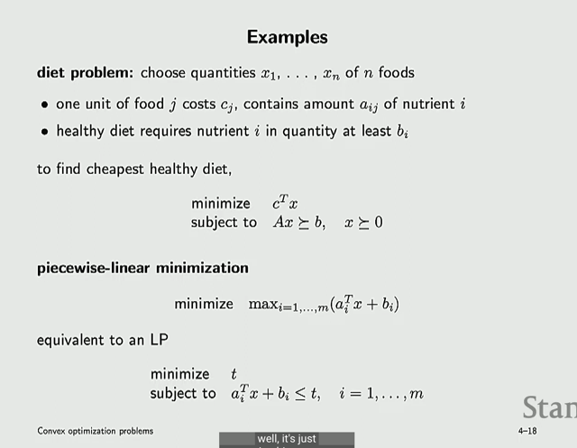</kbd></p>

> [!NOTE]
> Một ví dụ của bài toán này, đó là ta sẽ tối ưu cTx mang ý nghĩa kiểu
> như chi phí của bữa ăn cho lính mà vẫn đảm bảo constraints là
> hàm lượng dinh dưỡng đạt mức nào đó.

<br>

<p align="center"><kbd>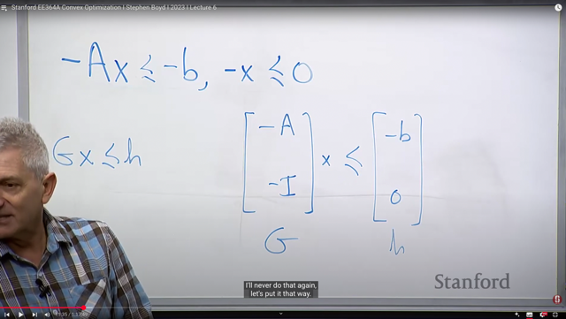</kbd></p>

> [!NOTE]
> đại khái bài toán vừa rồi thật ra ta thấy Ax `>=` b, x `>=` 0
>
> Nhưng ta chỉ cần chuyển đổi chút xíu để trở thành bài toán Linear
> Program:
>
> ```text
> Từ Ax >= b, x >= 0 <=> -Ax <= -b, -x <= 0
> ```
>
> Từ đó chỉ việc gán G `=` [-A, I] và h `=` [-b 0]
>
> [-A, I] là stack `/` gắn matrix -A với matrix I, và stack vector -b với 0
> (thêm một phần tử 0 nữa vào vector b)
>
> Ý nói, chỉ chuyển đổi tí xíu là ta đưa về lại bài toán linear program

<br>

<p align="center"><kbd>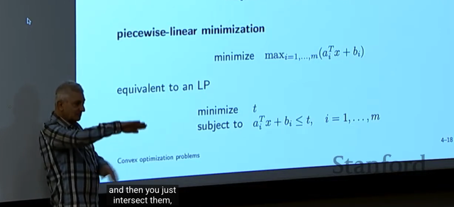</kbd></p>

> [!NOTE]
> Một ví dụ nữa. Chưa hiểu
> lắm. Quay lại sau

<br>

<p align="center"><kbd>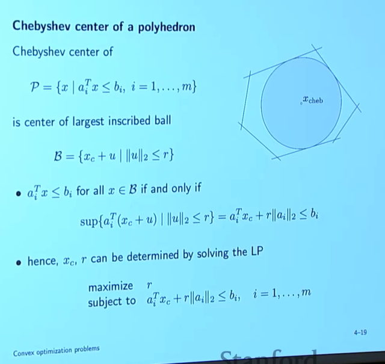</kbd></p>

> [!NOTE]
> Đầu tiên hiểu sup  aiT(xc+u) | `||u||<=r`  là ý nghĩa gì?
>
> supaiT(xc+u) | `||u||<=r` là trong các vector u có `||u||<=r` thì cái nào
> khiến aiT(xc + u) lớn nhất. Vậy cái này giống như ta hỏi: Đang đứng ở
> xc. Đi hướng nào và với độ lớn không quá r thì tối đa cái này:
> aiT(xc+u)
>
> Hay trong các vector x thuộc ball B(xc, r) thì vector nào khiến u `=` x - xc
> khiến aiT(xc + u) nhỏ nhất.
>
> Thế thì vì a1T(xc + u) `=` a1Txc + a1Tu. Thì trong đây a1Txc fixed rồi.
> vấn đề là tìm u là các vector miễn sao có norm `<=` r, sao cho maximize
> a1Tu thôi. Mà a1 thì dĩ nhiên là vector cố định, có hướng cố định. Nên
> để a1Tu max thì u chính là vector sao cho nó trùng hướng với vector
> ```text
> a1 (Bởi lẽ a1Tu = ||a1||*||u||*cos(α(a1,u)). Và nó sẽ max khi cos α = 1)
> ```
>
> Và đồng thời cho u dài tối đa `=` r luôn (vì yêu cầu là ||u|| `<=` r mà)
>
> Để rồi ta có sup  aiT(xc+u) | `||u||<=r`  `=` sup  aiTxc+aiTu) | `||u||<=r`  
>
> `=` a1Txc + r*||a1|| 
>
> (khi chọn u trùng hướng a1 và dài r thì aiTu `=` ||ai||||u||cos(0) `=` ||ai||*r*1 
> `=` ||ai||*r)
>
> Và bằng cách khống chế a1Txc + r||a1|| `<=` b1 thì r sẽ sao đó khiến
> mọi điểm trong ball đều nằm một bên của đường thẳng này.
>
> Và khi làm việc này với mọi i. Thì ta sẽ có ball có bán kính lớn nhất
> nhưng vẫn nằm trong poly-hedron
>
> ...Chưa xong quay lại sau
>
> CHEBYSHEV CENTER OF A POLYHEDRON

<br>

<p align="center"><kbd>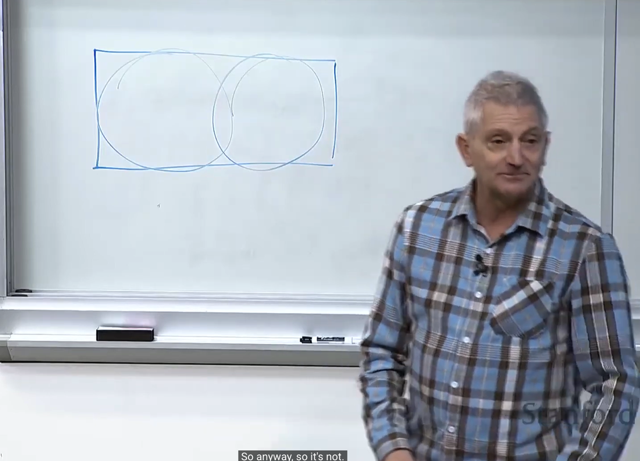</kbd></p>

> [!NOTE]
> và nó ko unique

<br>

<p align="center"><kbd>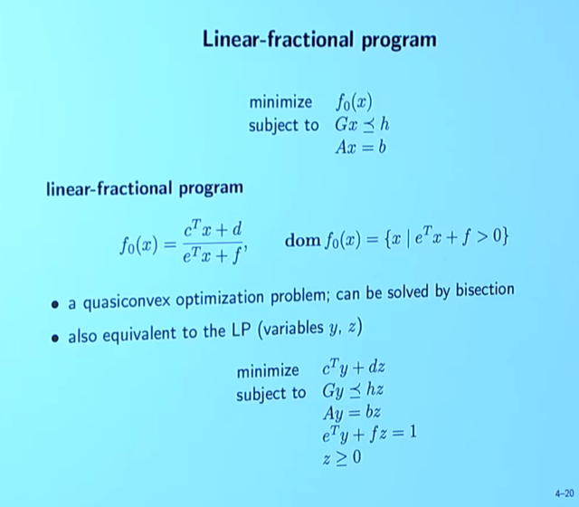</kbd></p>

> [!NOTE]
> Cái gs nói rất sơ sơ. Chưa hiểu. Chỉ biết ông nói bài toán
> này không dễ. Mà cần transform.
>
> LINEAR-FRACTIONAL PROGRAM

<br>

<p align="center"><kbd>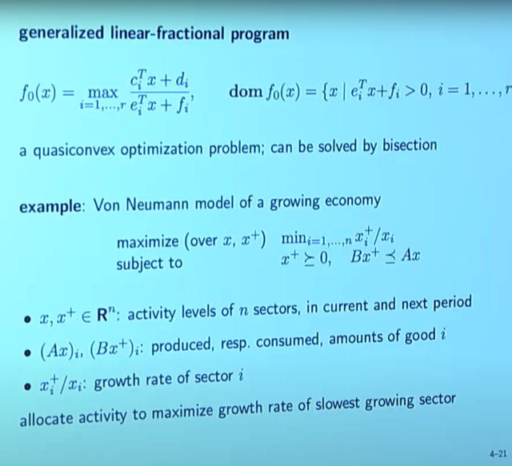</kbd></p>

> [!NOTE]
> Bài toán này cũng chưa
> hiểu lắm. Quay lại sau.
>
> GENERALIZED LINEAR-FRACTIONAL PROGRAM

<br>

<p align="center"><kbd>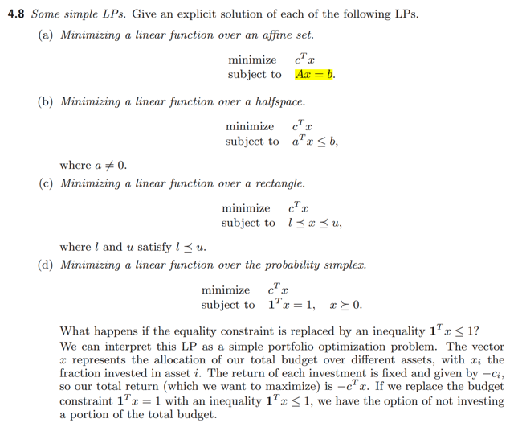</kbd></p>

> [!NOTE]
> Thử làm câu a:
>
> minimize cTx subject to Ax `=` b.
>
> `<=>` minimize over z cT(x0 + Fz) 
>
> x0 `=` (A^+)b
>
> Xét f(z) `=` cT(x0 + Fz) `=` cTx0 + cTFz
>
> Khi cTF `=` 0 thì f(z) ko phụ thuộc z `=>` inf z {cTx0 + cTFz} `=` cTx0
>
> `=>` p* `=` cTx0
>
> Còn khi cTF khác 0, hàm f(z)  unbound below `=>` Không có optimal
>
> `====`
>
> Câu d:
>
> minimize cTx subject to 1Tx `=` 1, x ≽ 0: 
>
> Đại khái là, feasible set {x: 1Tx `=` 1, x ≽ 0} chính là Probability
> Simplex, cũng là một Polyhedron được tạo bởi các đỉnh là các
> unit vector {e1, e2, ...en} (Cái này đơn giản là bởi định nghĩa
> của Probability Simplexes)
>
> Và đại khái là khi làm cái việc minimize f0(x) over x trong polyhedron
> P thì giá trị nhỏ nhất sẽ đạt tại đỉnh của Polyhedron `/` Simplexes.
> Và các đỉnh (tức các điểm là đỉnh của Probability Simplexes) đơn 
> giản là các unit vector ej
>
> Vậy nên việc đầu tiên đơn giản là xem f0(ej) nào là nhỏ nhất, đó
> chính là p*. và ej đó chính là x*
>
> f0(ej) `=` cTej mà cái này chính là cj
>
> cTej `=` `Σ` ci `ej_i` mà với unit vector ej thì các component đều bằng 0
> ngoại trừ component j. 
>
> Vậy xem j nào f0(ej) nhỏ nhất chính là xem j nào mà cj nhỏ nhất,
> tức là component nào nhỏ nhất của vector c.

<br>

<p align="center"><kbd>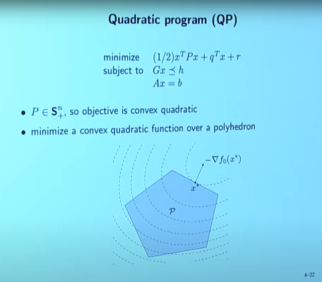</kbd></p>

> [!NOTE]
> Tiếp theo là bài toán rất nổi tiếng gọi là Quadratic program.
>
> Trong đó objective function là một quadratic function: 
>
> `(1/2)xTPx` + qTx + r
>
> và constraints là các linear inequalities `/` equalities thể hiện bởi Gx ⪯ h 
> và Ax `=` b.
>
> P ∈ S^n+, tức là một positive semi-definite matrix, do đó objective là 
> convex function
>
> (bài trước ta đã học SECOND ORDER CONDITION, có thể xác định 
> function convex hay không dựa vào Hessian có phải là positive semi 
> definite không,  ở đây P chính là Hessian:
>
> Thử tính: df `=` f(x+dx)-f(x) 
>
> `=` `(1/2)(x+dx)TP(x+dx)` + qT(x+dx) + r  - `[(1/2)xTPx` + qTx + r]
>
> `=` `(1/2)(xT+dxT)P(x+dx)` + qT(x+dx) + r  - `[(1/2)xTPx` + qTx + r]
>
> `=` `(1/2)(xTP+dxTP)(x+dx)` + qTx+qTdx + r  - `(1/2)xTPx` - qTx - r
>
> `=` `(1/2)(xTPx+dxTPx+xTPdx+dxTPdx)` + qTx+qTdx + r  - `(1/2)xTPx` - qTx - r
>
> `=` xTPdx +qTdx  `=` (xTP+qT)dx
>
> `=>` ∇f `=` (xTP+qT)T `=` PTx+q
>
> *Hessian (theo cách làm Bilinear form)
>
> d(f'(x)[dx]) `=` d((xTP+qT)dx) `=` ((x+dx')TP+qT)dx - (xTP+qT)dx
>
> `=` xTPdx + dx'TPdx + qTdx - xTPdx - qTdx
>
> ```text
> = dx'TPdx = f''(x)[dx' dx] => Hessian = P
> ```
>
> Thế thì feasible set cũng là convex set, là một Polyhedron
> (giống như trong bài toán Linear Program).
>
> Nên chỉ khác bài toán linear program ở chỗ ở đây level set (của
> objective function) là các ellipsoid, khác với các hyper-plane đối với
> linear program nơi objective là affine function.
>
> Và quá trình optimizing về cơ bản là ta sẽ tìm ra cái điểm trong feasible
> set P sao cho nó tiếp xúc với level set thấp nhất.
>
> Tại sao điểm x* trong hình là optimal point. Vì nó nằm tại điểm tiếp xúc
> giữa level set và cạnh của P. Mọi điểm trong P đều nằm một bên của
> level set này. Khi di chuyển trên level set f0 sẽ ko đổi, nên di chuyển về
> mọi hướng trong P từ x* sẽ đều là tạo nên một góc nhỏ hơn 90 độ với
> gradient vector ∇f0(x0), khiến f0 tăng lên.
>
> Gs cho biết thêm QP là bài toán rất phổ biến. Ông nói hầu như mọi quỹ
> đầu tư Hedge-fund đều giải những bài toán QP (tối ưu danh mục đầu
> tư). Thậm chí việc tên lửa Falcon đáp xuống của SpaceX gần đây cũng
> ứng dụng rất nhiều bài toán QP
>
> QUADRATIC PROGRAM
>
> 4.4 QUADRATIC OPTIMIZATION

<br>

<p align="center"><kbd>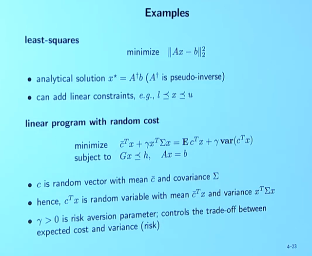</kbd></p>

> [!NOTE]
> Một số ví dụ của bài toán này là bài toán kinh điển LEAST-SQUARE và
> LINEAR PROGRAM WITH RANDOM COST
>
> Nói chung gs cũng chỉ đang lướt qua các dạng vấn đề của convex
> optimization nên ta sẽ quay lại nói rất kĩ về các bài toán này sau.
>
> Ở đây chỉ có thể hiểu sơ. Với bài toán least square, gs ko nói nhiều
> nhưng từ 1806 mình đã biết, objective là minimize distant (^2, của L2
> norm) của Ax và b. Mà analytical solution là A^+b với A^+ là pseudo
> inverse của A.
>
> Là thế nào?
>
> Sẵn ôn lại luôn: Thật ra bài toán đặt ra là ta muốn giải một hệ các linear
> equation, thể hiện bởi Ax `=` b. Tuy nhiên, vấn đề là có những trường hợp
> khác nhau do A.
>
> Nếu A mà invertible, ta có thể tính Ainv và giải ra x ngay bằng x `=` Ainv.b
>
> ```text
> Hoặc phân tách A thành LU và giải LUx=b <=> Ux = Linv.b <=> x =
> ```
> UinvLinv.b
>
> Tuy nhiên nếu A không invertible, không full-rank. Mà case đầu tiên là A là
> ma trận cao ốm và cho rằng A full-column rank, tức các cột độc lập. Thế
> thì vì b và các columns của A là vector thuộc R^m, và m > `r=n,` nên dim
> C(A) < m, nên C(A) chỉ là một subspace của R^m, từ đó có thể tồn tại b
> thuộc R^m nhưng nằm ngoài C(A). Lúc này không tồn tại linear
> combination các A's columns để ra b, nói cách khác, `Ax=b` vô nghiệm.
>
> Thế thì khi đó ta có thể tìm best solution, Ax^ sao cho different với b là tối
> thiểu, đó chính là lúc ta đặt ra bài toán optimization với objective function
> là L2 distance giữa Ax và b: ||Ax-b||^2.
>
> Việc giải bài toán này có thể dựa vào lập luận hình học rằng: À, nếu Ax^
> gần nhất (có khoảng cách nhỏ nhất) với b, mà Ax^ là vector trong C(A),
> vậy, thì điều này đồng nghĩa Ax^ là hình chiếu (projection) của b lên C(A),
> để rồi ta sẽ phân tách b thành hai vector vuông góc, một nằm trên C(A),
> một vuông góc với C(A): b `=` Ax^ + e. Và e, gọi là phần dư sau khi chiếu b
> lên C(A): e `=` b-Ax^. e sẽ vuông góc với C(A) và có thể nhận rằng vì ta biết
> có một subspace cũng vuông góc với C(A): Left null space N(AT), cho nên
> e chính là nằm trong N(AT). Nhưng dù sao, từ việc e vuông góc với C(A)
> nên ta có điều kiện: ATe `=` 0 (mà việc e nằm trong N(AT) cũng cho biết
> điều này, bởi ta biết N(AT) là tập hợp các solution của ATy `=` 0)
>
> ```text
> Thế thì từ ATe = 0 <=> AT(b-Ax^) = 0 <=> ATb = ATAx^
> ```
>
> Đây chính là Normal equation.
>
> Cái giải thứ hai là theo Calculus: Bằng cách tìm critical point của f(x) `=`
> ||Ax-b||^2  `=` (Ax-b)T(Ax-b) ta cũng sẽ cho ATAx `=` ATb
>
> Từ đây x^ `=` (ATA)invATb. Đây chính là least square solution.
>
> Và Ax^ `=` A(ATA)invATb chính là hình chiếu của b lên C(A) và 
> P `=` A(ATA)_invAT chính là Projection matrix onto C(A)
>
> Theo calculus ta sẽ còn cần phải xét check second derivative test để cho
> thấy critical point là minimum. Thì không khó để thấy Hessian là ATA, và
> nó là một positive semi definite (chứng minh nhanh xTATAx `=` (Ax)T(Ax)
> `=` ||Ax||^2 sẽ dĩ nhiên không âm với mọi x).
>
> Còn ở class này EE364A thì function có Hessian positive semi definite nên
> nó là convex function thành ra critical point chắc chắn là minimum
>
> Thế thì tới đây có thể nhận ra rằng, ATAinv tồn tại là bởi ta đang xét trường hợp A full
> column rank, khi đó các cột của nó độc lập nên cách duy nhất để kết hợp tuyến tính
> chúng ra 0 là bằng một bộ hệ số bằng 0. Điều này cũng chính là nói nullspace của A
> chỉ có zero vector: N(A) `=` 0. Mà điều này giúp liên quan gì đến ATA: Là bởi nếu xét
> ATAx `=` 0, thì về về cơ bản là ta muốn tìm x sao cho Ax nằm trong nullspace của AT,
> cũng là left nullspace của A, để mà AT(Ax) `=` 0.
>
> Thế thì hãy nghĩ về nullspace của AT, là left-nullspace của A, theo định lý Rank-Nullity,
> ta biết nó sẽ orthogonal complement với column-space C(A) và với việc dim C(A) < m
> thì có thể khẳng định dim N(AT) > 0, và bằng m - n (n `=` rank r).
>
> Tuy nhiên khi xét Ax, dĩ nhiên nó luôn luôn là vector trong columnspace C(A), nên để
> Ax nằm trong left nullspace N(AT) thì chỉ có Ax `=` 0 (columnspace và leftnullspace 
> orthogonal complement và có chung vector zero). Thành ra, x trong nullspace của ATA
> cũng chính là x khiến Ax `=` 0. Từ đó giúp ta thấy ATA có cùng nullspace với A.
> Để rồi nếu nullspace của A chỉ có 0 thì ATA cũng vậy, khi đó ATA sẽ full-rank
> Và do đó ATA tồn tại.
>
> Quay lại đây thì projection matrix P `=` (ATA)invAT cũng chính là LEFT-INVERSE của A
>
> `====`
>
> Tuy nhiên, nếu A là matrix cao ốm nhưng không column rank thì sao? Khi đó nullspace
> của A không chỉ có trivial solution, mà còn có non-zero vector. Nó sẽ khiến Ax bằng 0,
> và `ATAx=0,` đồng nghĩa nó cũng là non-vector trong nullspace của ATA, nên ATA
> non-invertible. Và không tồn tại left-inverse matrix A, hay projection matrix P.  
>
> Và điều này cũng xảy ra nếu A là matrix mập lùn, nhiều cột hơn hàng, thì chắc chắn
> các cột không độc lập. Từ đó ATA cũng không full-rank. 
>
> Thế thì xét ATAx `=` ATb trong cả hai trường hợp đều gọi là bài toán least-square với
> dependent columns: Các columns của A đều dependent.
>
> Thế thì, vì ATA singular, nên N(ATA) khác 0: Tồn tại `x_null` khác 0. Bên cạnh đó, ATb
> nằm trong rowspace của A mà C(ATA) cũng chính là rowspace của A: 
>  thành ra ATb luôn nằm trong C(ATA) `=>` ATAx `=` ATb luôn có nghiệm `x_particular.`
>
> Từ đó `ATAx=ATb` có vô số nghiệm. 
>
> Lúc này là lúc vai trò của PSEUDO-INVERSE A^+ xuất hiện giúp giải tìm least-square
> solution.
>
> A^+ có công thức là `VΣ+(UT)` với U, V là left-singular và right-singular matrix của A A^+ có
> đặc địểm là, nó sẽ map column-space vector về lại row-space và left-nullspace về 0.
> matrix `Σ+` là diagonal matrix có các đường chéo là `1/σi` là nghịch đảo của các singular
> value của
>
> Đương nhiên U, V, `Σ` liên quan đến Singular Value Decomposition matrix A: A `=` U `Σ` VT
> mà về bản chất là ta tìm ra hai orthogonal basis của rowspace (bỏ vào làm columns
> của Vr) và của column space (bỏ vào làm Ur) để rồi Avi `=` `uiσi.` Điều này khả thi với mọi
> ma trận vì ta biết rowspace và columnspace của mọi matrix đều mapping 1-1 với nhau.
> ```text
> Để rồi ta sẽ có AVr = UrΣ, và vì Vr là matrix có các cột orthogonal, nên VrVrT = I_r =>
> ```
> ```text
> AVr=UrΣ <=> A = UrΣ(VrT)
> ```
>
> Do đó nếu ta có một bộ orthogonal basis của rowspace, v1,2...vr thì qua A chúng sẽ
> cũng được map với một bộ orthogonal basis của column-space u1, u2...ur. Mà điều
> ```text
> này thì  có thể tìm được V thông qua thực tế rằng: ATA = (UrΣVrT)T(UrΣVrT) =
> ```
> ```text
> VrΣUrTUrΣVrT = Vr(Σ^2)(VrT) => Và đây chính là Eigen-decomposition của ATA, cho
> ```
> thấy Vr, right-singular của A, tức orthogonal basis của rowspace, chính là eigenvector
> của ATA, và singular values của A chính là eigenvalue không âm của ATA. Từ đó bằng
> cách tìm eigenvector và eigenvalues của ATA ta sẽ tìm được Vr, `Σ` từ đó có được Ur và
> nó cũng sẽ là là orthogonal basis của C(A)
>
> ```text
> (uiTuj = (Avi)T(Avj) = viTATAvi = viTλivi = λi(viTvi) = 0, λi là eigenvalues của ATA)
> ```
>
> Và ta sẽ chứng minh pseudo-solution `x^+=` A^+b sẽ là nghiệm có chiều
> dài nhỏ nhất.
>
> ```text
> ATAx = ATA(A^+b) = ATA[VΣ+(UT)]b) = VΣ^2(VT)V(Σ+)UTb =
> ```
> ```text
> VΣ^2(Σ+)UTb = VΣUTb
> ```
>
> ```text
> = [UΣ(VT)]Tb = ATb => A^+b là solution của ATAx=ATb
> ```
>
> Chứng minh nó có length nhỏ nhất:
>
> Vậy tại sao trong trường hợp A cao ốm lùn, để `Ax=y` có thể vô nghiệm 
> thì x `=` (A^+)y lại là solution khiến ||Ax-y|| nhỏ nhất:
>
> Xét ||Ax-y|| `=` `||UΣVTx-y||` 
>
> ```text
> Đặt x = Vz <=> VTx = z, và đặt y' = UTy <=> Uy' = y
> ```
>
> ```text
> ||UΣVTx-y|| = ||UΣz - Uy'|| = ||U(Σz-y')||
> ```
>
> và vì U là orthogonal matrix nên không thay đổi norm:
>
> `||U(Σz-y')||` `=` `||Σz-y'||` 
>
> Xét bình phương của `||Σz-y'||:` `||Σz-y'||^2`
>
> ```text
> = (Σz-y')T(Σz-y') = Σi=1,2...m (σizi - y'i)^2
> ```
>
> ```text
> = Σi=1,2...r (σizi - y'i)^2 + Σi=r+1,..m (0*zi - y'i)^2
> ```
>
> ```text
> = Σi=1,2...r (σizi - y'i)^2 + Σi=r+1,..m (y'i)^2
> ```
>
> phần thứ 2 chỉ dính đến y' `=` UTy, là constant.
>
> nên để tối ưu ta chỉ quan tâm phần thứ 1: 
>
> `Σi=1,2...r` `(σizi` - y'i)^2
>
> đây là tổng của r term không âm, nên nó chỉ nhỏ nhất `(=0)` khi
> `σizi` - y'i với mọi i
>
> ```text
> => zi = y'i/σi
> ```
>
> ```text
> Vậy z* (z tối ưu) = [y'1/σ1, ...y'r/σr, 0,..0]T
> ```
>
> Và z* chính là `(Σ+)y'` với `Σ+` là diagonal matrix mxm với r diagonal
> ```text
> entries đầu tiên là 1/σ1, 1/σ2...1/σr.
> ```
>
> ```text
> =>x* (x tối ưu) = Vz* = V(Σ+)y' = V(Σ+)UTy
> ```
>
> Và đây chính là (A^+)y.
>
> Chứng minh xong
>
> Những ví dụ về least square gs nói ta sẽ tìm hiểu kĩ sau.
>
> ví dụ về linear program with random cost cũng ko hiểu lắm.
>
> Trong slide nói c là random vector, ok mình hiểu nó là vector các
> random variables c `=` (C1, C2...Cn) và `c_bar` là mean. Tức là 
> `c_bar` `=` E(c) và nó là vector [E(C1), E(C2)....E(Cn)]
>
> Và covariance matrix `Σ.`
>
> Thì thì họ nói cTx là random variable với mean `c_barTx` và variance
> `xTΣx.` Là sao nhỉ:
>
> cTx là scalar, và nó là function của các random variables Ci:
>
> `Σi` xiCi. Mà Stat110 đã cho mình biết function của random variables
> cũng là random variables. Nên cTx là r.v đúng rồi. Thử tính mean cTx
> mà mean ở đây là expected value:
>
> E(cTx):
>
> E(cTx) `=` E(x1C1 + x2C2 + ...+ xnCn) 
>
> `=` E(x1C1) + E(x2C2) + ...+ E(xnCn)    | linearity
>
> `=` x1EC1 + ..xnECn    |  linearity vì x1, x2 là các constant. 
>
> Và đã nói `c_bar` là vector [E(C1), E(C2)....E(Cn)]
>
> ```text
> = x1c_bar_1 + ...xnc_bar_n = c_barTx
> ```
>
> Vậy E(cTx) `=` `c_barTx` tức mean của cTx là `c_barTx`
>
> `====`
>
> Var(cTx) `=` E[(cTx - EcTx)^2] `=` E[(cTx - `c_barTx)^2]`
>
> ```text
> Xét cTx - c_barTx = (cT - c_barT)x = (c - c_bar)Tx
> ```
>
> ```text
> [(c - c_bar)Tx]^2 = (c - c_bar)Tx(c - c_bar)Tx
> ```
>
> mà (c - `c_bar)Tx` là scalar nên transpose nó tùy ý:
>
> `=` [(c - `c_bar)Tx]T(c` - `c_bar)Tx`
>
> `=` xT(c - `c_bar)(c` - `c_bar)Tx` 
>
> ```text
> Vậy ta có E[(cTx - c_barTx)^2] = E[xT(c - c_bar)(c - c_bar)Tx]
> ```
>
> `=` xTE[(c - `c_bar)(c` - `c_bar)T]x`  | Linearity
>
> ```text
> Rồi E[(c - c_bar)(c - c_bar)T] => Covariance matrix Σ
> ```
> (kiến thức mới tạm biết vậy)
>
> Do đó kết qủa là `=` `xTΣx`
>
> Nhắc lại hầu như gs chỉ lướt sơ qua mấy cái này

<br>

<p align="center"><kbd>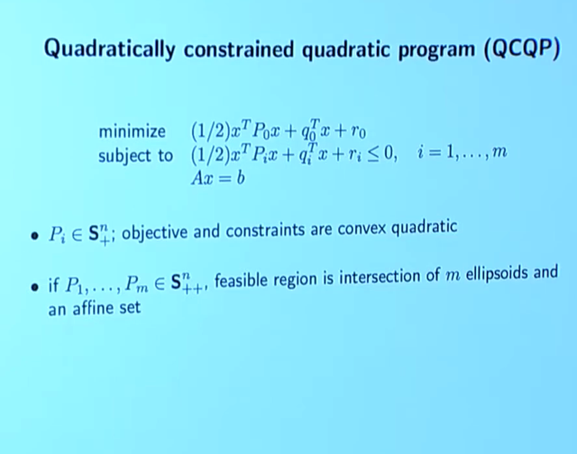</kbd></p>

> [!NOTE]
> Cái này ông cũng lướt qua luôn. Chả nói gì. Chỉ nói là "bạn
> có thể nghe người ta nói về cái này"
>
> QUADRATICALLY CONSTRAINED
> QUADRATIC PROGRAM

<br>

<p align="center"><kbd>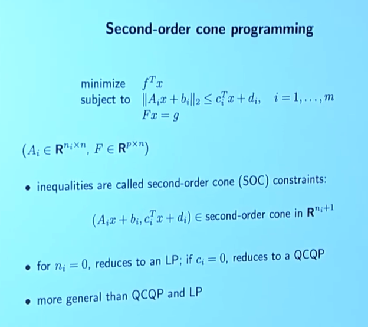</kbd></p>

> [!NOTE]
> qua cái này, đầu tiên gs lưu ý cái này không phải SQUARE của L2
> norm, ý nói vì nhiều lí do (để có analytical solution, để
> differentiable, ...nhưng thường chỉ vì yếu tố lịch sử) mà thường
> thường khi gặp l2  norm, ta thường bình phương nó lên,  ....nhưng
> ở đây không phải  squared norm.
>
> Tiếp, nếu Ai, bi `=` 0 thì vé trái bằng 0, và bài toán này thành ra lại
> bài toán linear program LP. Nên có thể coi cái này khái quát
> hơn của LP
>
> Gs cho biết Second order cone có nghĩa là: norm của u < v, v là
> scalar, u là vector
>
> Ông nói thêm vài cái ko hiểu lắm, nhưng nhấn mạnh là bài toán
> này rất phổ biến mà phần lớn các bài toán đều sẽ reduced về là
> thuộc cái này
>
> Và thêm nữa, bài toán này giống như là low-level language. đại khái
> là rất nhiều bài toán thực chất là bài toán này
>
> SECOND ORDER CONE PROGRAMMING

<br>

<p align="center"><kbd>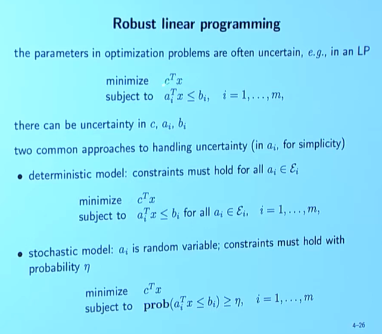</kbd></p>

> [!NOTE]
> đầu tiên ông nói về việc ta hiểu uncertainty inequalities là sao. ví
> dụ aiTx < bi mà ai bi đều là ko chắc chắn?
>
> gs ví dụ trong bài toán mà ta muốn tối ưu giá tiền thực phẩm với
> constraint là hàm lượng dinh dưỡng đạt mức tối thiểu nào đó. Thì ở
> đây hàm lượng dinh dưỡng trong thành phần cũng random, tùy
> theo từng đợt hàng. Thay vì cố định. HIểu đại khái là vậy
>
> Và ta cố gắng làm là tối ưu ngay cả trong điều kiện mà không chắc
> chắn như vậy. Đó gọi là Robust Linear Programming
>
> một ý cuối về stochastic model: đại ý là giống như trong Statistical
> inference class mình đang học về confidence interval, thì đại khái là
> cũng gặp cái vụ kiểu như muốn xác suất của cái gì đó lớn hơn  eta,
> bằng 0,95, 0.99
>
> ROBUST LINEAR PROGRAMMING

<br>

<p align="center"><kbd>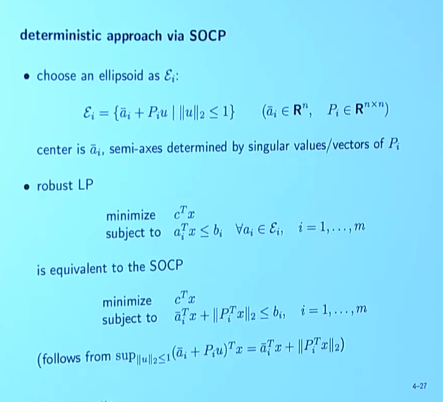</kbd></p>

> [!NOTE]
> một ví dụ của thể của deterministic approach via SOCP:
>
> đầu tiên chọn một ellipsoid: `a_bar_i` + Piu | u unit đây chỉ là mô tả cái
> ellipsoid: với `a_bar_i` là tâm, và nó cộng với vector unit được transform
> bởi matrix P. (Đây là cách define ellipsoid trong sách có nói)
>
> Nói chung đây là define một cái ellipsoid trong đó trục dài
> trục ngắn ra sao thực ra define bởi P
>
> thế thì bài toán robust LP trong đó như đã nói inequalities constraint
> cũng có yếu tố uncertainty. `aiTx<=bi`
>
> Thế thì với ellipsoid  đại khái là constraint này nó equivalent constrain
> `a_bar_iTx` + ||PiTx|| `<=` bi
>
> hiểu đại khái, có thể ko chính xác nhưng mình đoán có thể là vầy:
>
> cái elipsoid nó quy định các vector ai, để rồi aiTx `<=` bi sẽ trở thành
> tương đương với việc tìm ai sao cho maximize aiTx, và cho cái max đó
> cũng `<=` bi (vì cái lớn nhất mà bé hơn bi thì mọi cái sẽ bé hơn bi)
>
> Thành ra kiểu như ta mới xét cái ai khiến max aiTx, mà ai thì define bởi
> elipsoid, với cái tâm + Piu, nên maximize aiTx chính là maximize (tâm +
> Pi u)Tx, với ràng buộc là u là unit vector. Và việc tìm u để maximize cái
> này (tâm + Pi u)Tx, cũng là maximize PiuTx vì (tâm + Pi u)Tx `=` tâmTx +
> PiuTx mà tâmTx cố định (tâm là `a_bar_i,` ghi tâm cho nhanh)
>
> Cuối cùng tìm u để maximize PiuTx thì dễ thấy nó chính là u sao cho
> Piu (u transform bởi P) ra thành vector trùng hướng với x, thì khi đó dot
> product sẽ lớn nhất (vì việc tìm u chỉ là tìm hướng, chứ ||u|| `=` 1) Nên
> với u đó thì maximize ||PiuTx|| sẽ là ||PiTx||
>
> Rồi sau đó gs nói đại khái là cái PiTx sẽ giống như margin gì đó giúp
> cover cho yếu tố uncertainty của bài toán này.
>
> Còn lại thì khi nào đi sâu sẽ hiểu thêm

<br>

<p align="center"><kbd>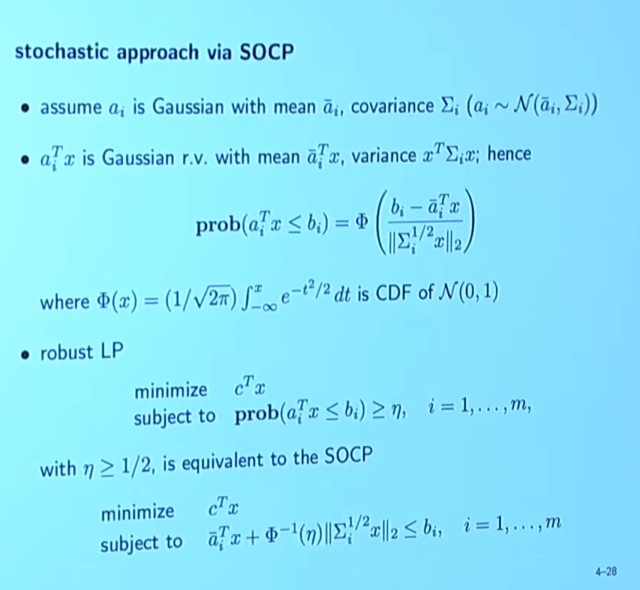</kbd></p>

> [!NOTE]
> rồi cái này gs nói cũng ko khó hiểu, ai là Gaussian (vector of 
> random variables) với mean `a_bar_i,` covariance `Σi`
>
> Thì aiTx cũng là một Gaussian (random variable) với 
> mean và variance là `a_bar_iTx` và `xTΣx` thì nãy ta có chứng minh rồi.
>
> Thế thì xác suất ở đây P(aiTx `<=` bi) với aiTx là rv, thì về cơ bản
> mình biết P(aiTx `<=` bi) là CDF của aiTx evaluate tại bi, tức `F_aiTx(bi)`
>
> (kí hiệu `F_aiTx` là CDF function của random variable aiTx)
>
> ```text
> Mà với X~N(μ, σ) thì Y=(X-μ)/σ gọi là standardization thì Y~N(0,1)
> ```
> ```text
> và thế thì X<bi <=> X-μ<bi-μ <=> (X-μ)/σ <= (bi-μ)/σ
> ```
>
> ```text
> Nên P(X<bi) = P[(X-μ)/σ <= (bi-μ)/σ]
> ```
>
> ```text
> = P(Y <= (bi-μ)/σ)
> ```
>
> Với `μ` ở đây chính là `a_bar_iTx,` và `σ` là standard deviation, 
>
> Xét variance `σ^2` `=` `xTΣx` 
>
> ```text
> = xT(Σ^1/2)T(Σ^1/2)x
> ```
>
> ```text
> = [Σ^1/2)x]T[Σ^1/2)x] = ||Σ^1/2)x||^2
> ```
>
> ```text
> => σ = √σ^2 = ||Σ^1/2)x||
> ```
>
> ```text
> Vậy P(X<=bi) = P[Y <= (bi-a_bar_iTx)/||Σ^1/2)x||]
> ```
>
> Và với N(0,1) thì người ta kí hiệu riêng CDF của nó là Φ
>
> Từ đó ta hiểu trong slide:
>
> ```text
> P(aiTx<=bi) = Φ[(bi-a_bar_iTx)/||Σ^1/2)x||]
> ```
>
> `====`
>
> Xong, đại khái là ta sẽ muốn cái xác suất này `>=` eta, và vì Φ là
> hàm monotonic, nên nó tương đương "cái term bi-...) `>=` Φ_inv(eta)
> và đại khái là ta sẽ có bài toán SOCP

<br>

<p align="center"><kbd>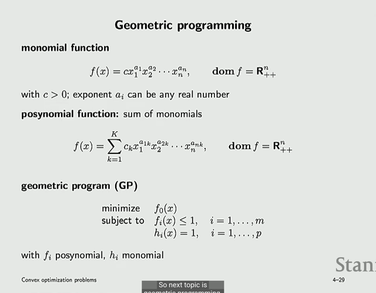</kbd></p>

> [!NOTE]
> đầu tiên đây đại khái là một bài toán có từ những năm 40. Nó
> ko convex nhưng ta sẽ transformation một chút để biến
> nó thành bài toán convex (equivalent)
>
> 4.5 GEOMETRIC OPTIMIZATION

<br>

<p align="center"><kbd>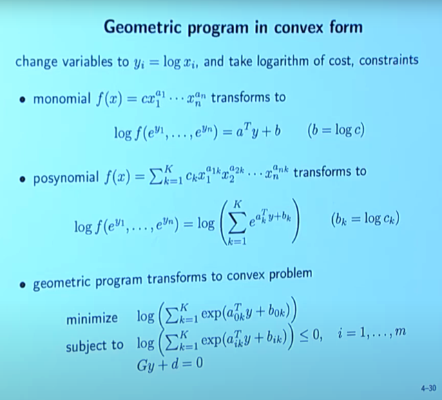</kbd></p>

> [!NOTE]
> và bằng cách dùng log, bài toán tương đương có các objective
> function và constraint function trở thành log `Σ` exp của affine. Là
> convex

<br>

<p align="center"><kbd>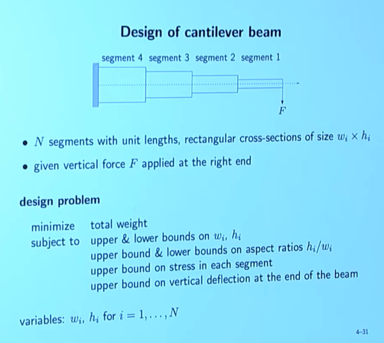</kbd></p>

> [!NOTE]
> môt ví dụ là vấn đề
> thiét kế cái dầm này

<br>

<p align="center"><kbd>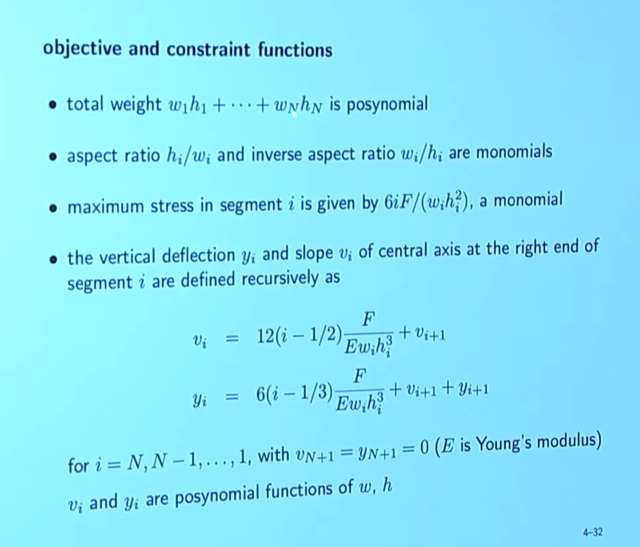</kbd></p>

<br>

<p align="center"><kbd>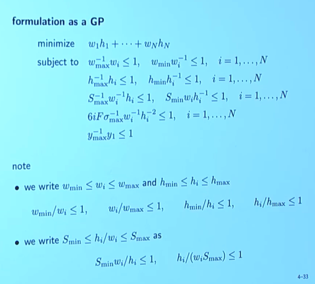</kbd></p>

> [!NOTE]
> đại khái là gs nói ko cần
> xem và hiểu cái này

<br>

<p align="center"><kbd>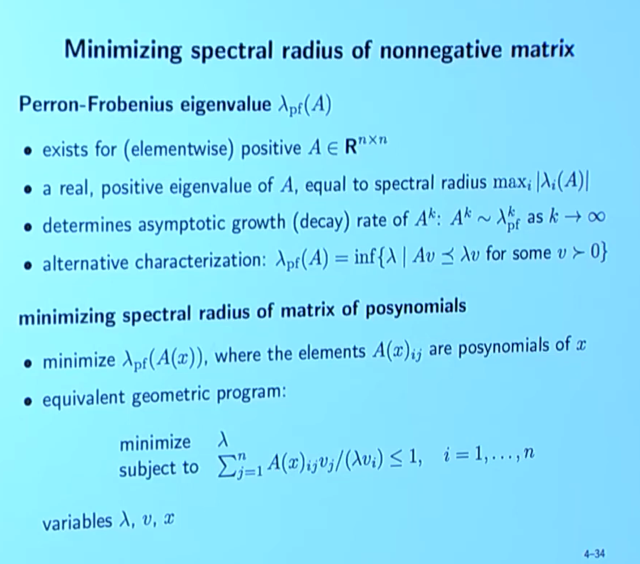</kbd></p>

> [!NOTE]
> Gs skip cái này để dành thời gian nói về một cái quan trọng hơn.
>
> Nhưng ông cho biết Geometric program là một trong những cái
> thuộc dạng non-convex problem nhưng có thể transform về
> convex problem để có thể solved được

<br>

<p align="center"><kbd>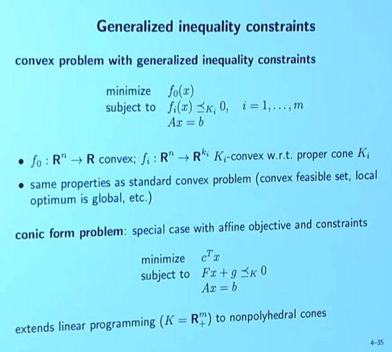</kbd></p>

> [!NOTE]
> Ta qua cái gọi là bài toán khái quát (generalized) của
> inequality constraints.
>
> Đại khái là nãy giờ với inequality constraints thì chúng là với
> scalar (fi(x) < 0), còn nay là với vector (fi(x) ⪯Ki 0, nhớ lại
> kí hiệu này có nghĩa là nếu y ≽K x,  thì y - x ∈ cone K)
>
> Vẫn có những tính chất là f0(x) convex, fi(x) Ki-convex w.r.t proper 
> cone Ki (khái niệm convex w.r.t cone K đã học trong phần Convexity
> w.r.t cone K)
>
> Và một bài toán tiêu biểu của cái này là CONIC FORM
> PROBLEM.
>
> Để rồi nếu K là non-negative orthant thì bài toán này trở về lại
> LP (linear program)
>
> 4.6 GENERALIZED INEQUALITY
> CONSTRAINTS
>
> GENERALIZED INEQUALITY
> CONSTRAINTS

<br>

<p align="center"><kbd>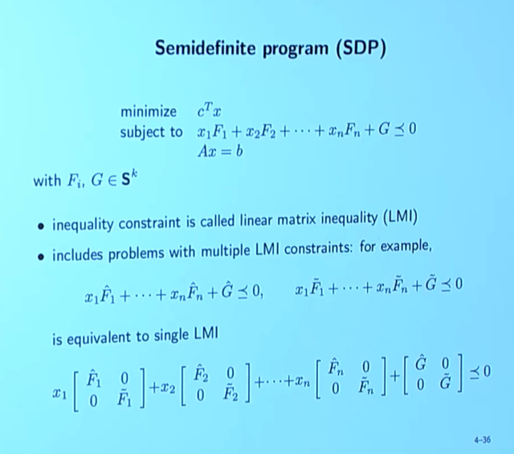</kbd></p>

> [!NOTE]
> trong cái Semidefinite programe, này gs nói cái subject
> x1F1+x2F2...+G ⪯ 0 đại khái là nói rằng (cái đó là linear
> combination của các matrix F) matrix bên trái phải là negative
> semi definite.
>
> Nói chung là gs lướt qua rất sơ sơ
>
> SEMI-DEFINITE PROGRAM (SDP)

<br>

<p align="center"><kbd>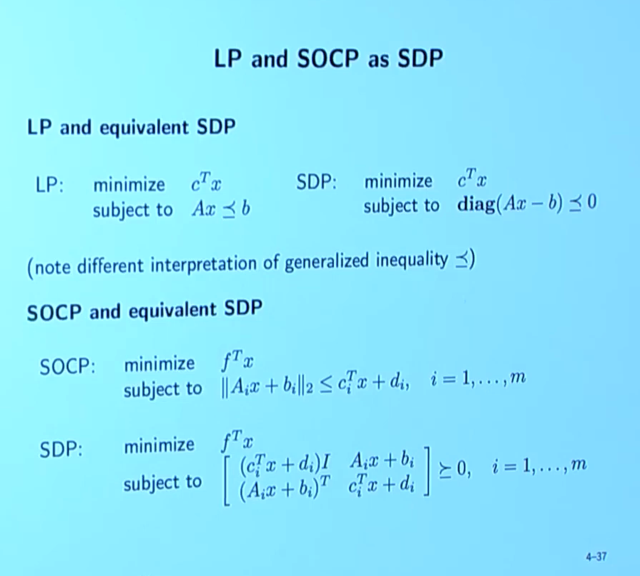</kbd></p>

> [!NOTE]
> Quay lại sau

<br>

<p align="center"><kbd>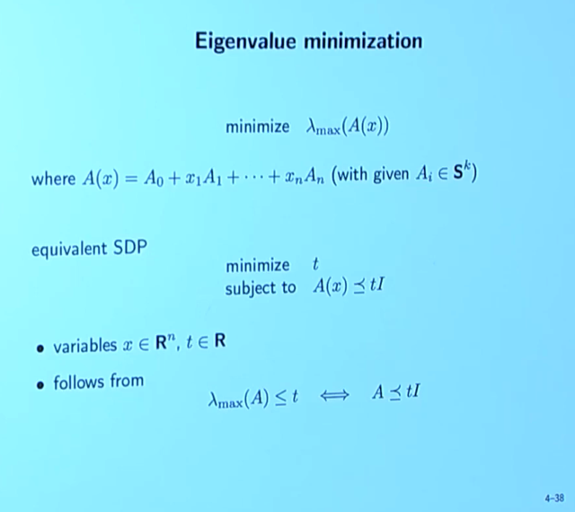</kbd></p>

> [!NOTE]
> Một ví dụ là ta có matrix A(x) là affine function của các symmetric
> matrix Ai. Và ta muốn tìm x để minimize eigenvalues của A(x)
>
> Thì bài toán này nó equivalent với SDP: là minimize t với constraint
> A(x) ⪯ tI
>
> Xuất phát từ việc λ_max(A) ⪯ t `<=>` A ⪯ tI 
>
> `<=>` tl-A ≽ 0
>
> tI-A ≽ 0 `=>` (tI-A) is positive semi-definite `=>` mọi eigenvalues của
> (tI - A) đều `>=` 0
>
> Ix `=` x `<=>` tIx `=` tx (1)
>
> Ax `=` λx `<=>` -Ax `=` -λx (2)
>
> ```text
> (1) (2) => tIx - Ax = tx - λx <=> (tI - A)x = (t - λ)x
> ```
>
> `=>` eigenvalue của (tI - A) `=` t - λ
>
> `=>` eigenvalue(tI - A) `=` t - eigenvalue(A)
>
> Thành ra nếu eigenvalue(A) `<=` t `<=>` eigenvalue(A) - t `<=` 0
>
> `<=>` t - eigenvalue(A) `>=` 0
>
> `<=>` eigenvalue(tI - A) `>=` 0
>
> `<=>` tI - A là POSITIVE SEMI DEFINITE
>
> EIGENVALUE MINIMIZATION

<br>

<p align="center"><kbd>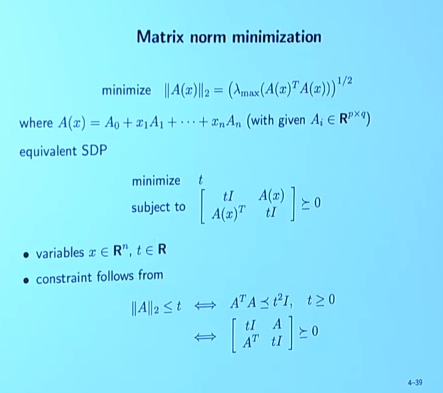</kbd></p>

> [!NOTE]
> Tương tự bài toán minimize matrix norm cũng vậy.
>
> có cái ta có thể hiểu là matrix norm cụ thể đây là SPECTRAL NORM (đã
> xem trong Kevin Murphy) được định nghĩa là cái singular value lớn nhất.
> mà singular value của A ta nhớ nó chính là căn bậc hai của  eigenvalue của
> ATA thành ra công thức của matrix norm ||A||2 `=` `[λmax(ATA)]^1/2`
>
> Thì đại khái là bài toán này nó có thể tương đương bài toán SDP thành ra
> có thể giải được
>
> Còn muốn hiểu nguồn cơn của nó thì y như vậv thôi:
>
> ```text
> ||A|| <= t <=> σ_max(A) <= t <=> (λ_max(ATA)^1/2 <= t
> ```
>
> λ_max(ATA) `<=` t^2
>
> `<=>` eigenvalue(ATA) `<=` t^2
>
> `<=>` 0 `<=` t^2 - eigenvalue(ATA)
>
> `<=>` eigenvalue(t^2*I - ATA) `>=` 0
>
> `<=>`  t^2*I - ATA ≽ 0
>
> và điều này có nghĩa là matrix vế trái là một positive semi definite
>
> EIGENVALUE MINIMIZATION

<br>


<a id="node-fjxuagi"></a>
## Lec 7

<br>

<p align="center"><kbd>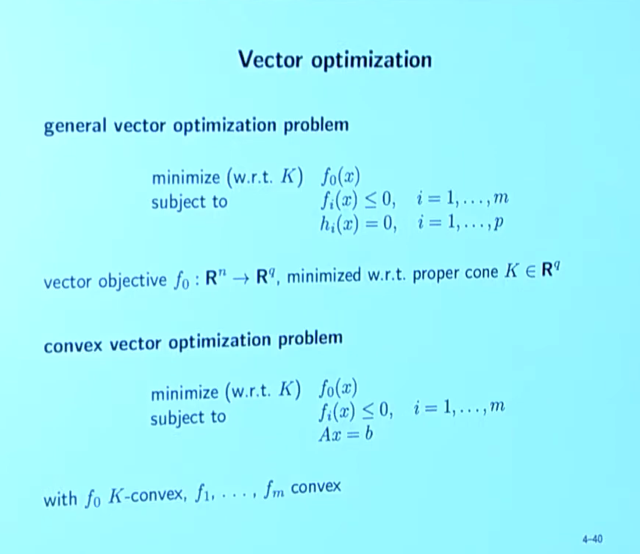</kbd></p>

> [!NOTE]
> Bài này ta sẽ nói về VECTOR OPTIMIZATION
>
> Đầu tiên gs nhắc lại về semantic của optimization problem (tại
> hiểu là ý nghĩa, hay tiêu chí) đó là ta có các constraints, thì ta
> phải thỏa mọi constraints (feasible problem), nếu không thỏa, 
> khỏi nói chuyện tiếp (infeasible problem).
>
> Nếu thỏa thì ta có những điểm gọi là feasible set. Thì trong đó cái
> nào khiến objective nhỏ nhất thì đó là optimal (tất nhiên phải có
> thêm vụ có thể đạt được optimal value hay không nữa vì có khi có
> optimal value nhưng unattainable)
>
> Thế thì qua vector optimization: OBJECTIVE FUNCTION f0(x)
> KHÔNG CÒN CHỈ LÀ SCALAR FUNCTION MÀ NÓ LÀ VECTOR.
>
> Để rồi việc minimize f0 w.r.t proper cone K cần phải hiểu chính
> xác
>
> 4.7 VECTOR OPTIMIZATION

<br>

<p align="center"><kbd>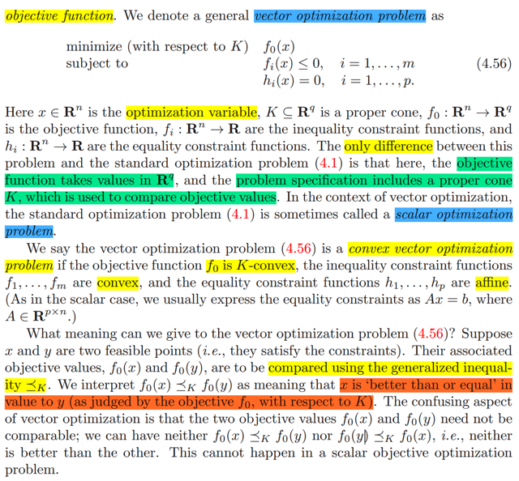</kbd></p>

<p align="center"><kbd>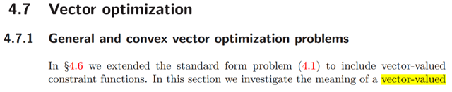</kbd></p>

> [!NOTE]
> trong sách nói rõ hơn một chút, đó là ở phần này, ta mở rộng qua bài
> toán mà  CẢ OBJECTIVE FUNCTION CŨNG LÀ VECTOR function.
>
> Thế thì, lúc này, giả sử có hai điểm trong feasible set x, y. Thì f0(x) và
> f0(y) sẽ phải so sánh với nhau DỰA TRÊN MỘT CONE K. Mà định
> nghĩa u ⪯ K v đọc là v better or equal to u wrt cone K đó là v - u
> ∈ cone K.
>
> Để rồi khi 
>
> a) f0 K-CONVEX (định nghĩa là domain của f0 convex và
> ```text
> f0(θx + (1-θ)y) <= θf0(x) + (1-θ)f0(y)),
> ```
>
> b) fi(x), tức các equality constraint (và có thể cũng là các vector 
> function luôn) CONVEX 
>
> c) hi(x) là các AFFINE.
>
> Thì khi đó ta có CONVEX VECTOR OPTIMIZATION PROBLEM
>
> 4.7 VECTOR OPTIMIZATION
>
> 4.7.1 GENERAL & CONVEX VECTOR 
> OPTIMIZATION  PROBLEMS

<br>

<p align="center"><kbd>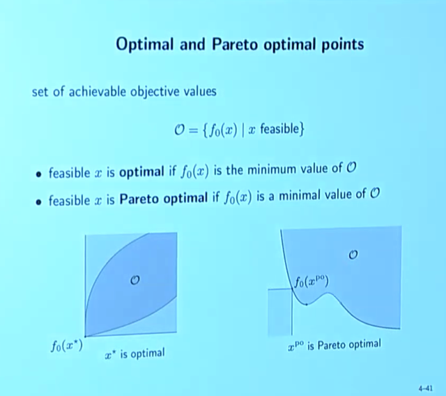</kbd></p>

> [!NOTE]
> Từ đó ta sẽ cần hiểu khái niệm **OPTIMAL** và **PARETO OPTIMAL**
>
> Đầu tiên gs nói ta hãy xét TẬP CÁC GIÁ TRỊ f0(x) VỚI x ∈ FEASIBLE SET X:
>
> O `=` {f(x) | x ∈ X}
>
> Thì **nếu f0 là scalar, thì O đơn giản là một interval (một khoảng `/` đoạn) trên trục R**. Và việc **lấy optimal value chỉ việc lấy điểm đầu hay cuối của nó thôi**.
>
> Còn bây giờ, **với việc f0(x) là vector thì O sẽ hơi lạ**.
>
> Đầu tiên, giả sử ta có O như trong hình trái, gs nói đại khái ta nên hiểu tình huống này **f0(x) càng xuống dưới, và càng qua trái thì càng tốt**. 
>
> **Ví dụ như, f0 là vector 2D, ta muốn hai component của nó càng nhỏ càng tốt.**
>
> Thế thì với O như vầy, dễ thấy điểm **x* chính là optimal vì nó là điểm thuộc feasible set - khiến f0 nằm trong O nhỏ hơn component-wise với mọi f0(x) khác trong O**. 
>
> Hay nói cách khác **f0(x*) là MINIMUM của O nên x* là OPTIMAL**.
>
> Nhớ lại định nghĩa MINIMUM, x là minimum của set S wrt K thì với mọi y thuộc S, x ⪯K y
>
> OPTIMAL & PARETO OPTIMAL

<br>

<p align="center"><kbd>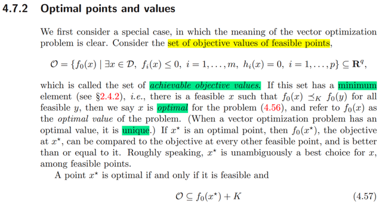</kbd></p>

<p align="center"><kbd>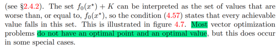</kbd></p>

> [!NOTE]
> Cũng như vừa nói, định nghĩa của OPTIMAL points, đó là đầu
> tiên ta sẽ định nghĩa ra set mọi value của f0(x) với x FEASIBLE.
>
> O `=` f0(x) | x ∈ D, fi(x) `<=` 0, hi(x) `=` 0
>
> Và tập này có tên là ACHIEVABLE OBJECTIVE VALUES
>
> Thế thì, nếu như tập này tồn tại MINIMUM, theo định nghĩa
> bữa trước, nếu ta có set S thì với mọi vector y trong S, x ⪯K y thì
> khi đó x là minimum, vậy ở đây khi f0(x*) ⪯ f0(x) với mọi x x thuộc
> feasible set (đồng nghĩa với mọi f0(x) thuộc set O ở trên) thì khi
> đó f0(x*) là MINIMUM của set O, và x* là OPTIMAL
>
> Một điểm nữa đó là, strong phần nói về định nghĩa của minimum
> và minimal. Thì có phần thể hiện bằng set notation. Đó là nếu x
> là minimum của S wrt cone K thì: S ⊆ (x + K). Mang ý nghĩa, mọi 
> điểm y trong S đều nằm trong tập "tốt hơn" x (y ∈ S `=>` y ≽K x). Còn
> nếu x là minimal của S wrt cone K: (x - K) ∩ S `=` x mang ý nghĩa 
> "những điểm trong S mà tốt hơn x thì chỉ có thể là x
>
> Thì ở đây, f0(x) là minimum của O: O ⊆ (f0(x) + K).
>
> Gs cũng nói phần lớn các bài toán sẽ KHÔNG CÓ OPTIMAL
>
> 4.7 VECTOR OPTIMIZATION
>
> 4.7.2 OPTIMAL POINTS & VALUES

<br>

<p align="center"><kbd>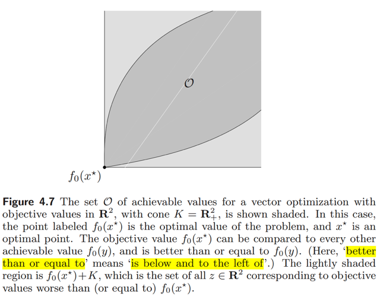</kbd></p>

> [!NOTE]
> HÌnh ảnh của định nghĩa về minimum theo set notation: 
>
> O ⊆ (f0(x*) + K) 
>
> Chú ý là nếu theo định nghĩa  thì f0(x*) + K là tập những điểm f0 
> better f0(x*) và better ở đây tức là f0 ≽K f0(x*).
>
> Nhưng dĩ nhiên trong bối cảnh là bài toán tối ưu thì f0 là tệ hơn

<br>

<p align="center"><kbd>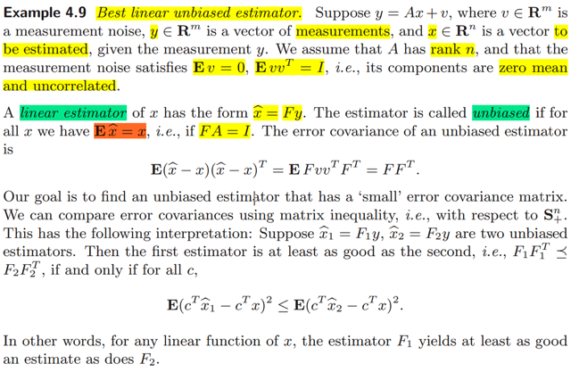</kbd></p>

<p align="center"><kbd>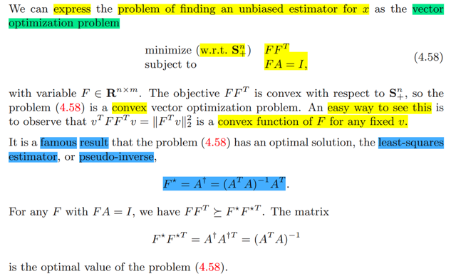</kbd></p>

> [!NOTE]
> Đại khái là ta có: y `=` Ax + v thể hiện một quan hệ giữa x và y, trong đó
> v là measurement noise có tính chất zero mean và uncorrelated thể
> hiện bởi E(v) `=` 0 và E(vvT) `=` I. 
>
> y là measurement, dữ liệu quan sát được. Còn x là variables, được map 
> với y thông qua linear function Ax + v. A là rank n matrix Và ta muốn estimate x.
>
> Thế thì ta sẽ có một linear estimator cho x: x^ `=` Fy.
>
> Thì như đã biết khái niệm UNBIASED ESTIMATOR từ Stat111: Đó là
> khi nó phải thỏa mãn nếu x^ là unbiased estimator của x E(x^) `=` x. 
>
> Và điều này sẽ xãy ra khi FA `=` I. Dễ thấy tại sao:
>
> ```text
> Ex^ = x <=> E(Fy) = x  (x^ = Fy)
> ```
>
> `<=>` FEy `=` x | linearity
>
> Nói rõ hơn vìsao EFy `=` F(Ey):
>
> Fy cơ bản là `Σ` F(i)yi với F(i) là columns của F còn yi là component thứ 
> i của y
>
> ```text
> nên EFy = E(Σ F(i)yi) = Σ EF(i)yi | linearity
> ```
>
> `=` `Σ` F(i) Eyi | linearity `=` F(Ey)
>
> `<=>` FE(Ax + v) `=` x 
>
> `<=>` F(EAx + Ev) `=` x 
>
> `<=>` FEAx `=` x 
>
> ```text
> Nếu FEA = I <=> FA = I thì FEAx = x, nên nếu FA = I thì x^ = Fy là
> ```
> unbiased estimator
>
> Tiếp người ta cho biết ERROR COVARIANCE của unbiased estimator trên
> sẽ là: E[(x^-x)(x^-x)T (công thức này đã từng nói trong một số ví dụ
> trước, mình chưa chính thức được học từ Stat111 nhưng rồi sẽ thôi)
>
> `=` FFT.
>
> Tại sao:
>
> E[(x^-x)(x^-x)T] `=` E[(Fy-x)(Fy-x)T] `=` E[[F(Ax + v) - x][F(Ax + v) - x]T]
>
> `=` E[(FAx + Fv - x)(FAx + Fv - x)T]
>
> `=` E[(Ix + Fv - x)(Ix + Fv - x)T]
>
> ```text
> = E[(Fv)(Fv)T] = E(FvvTFT) = FE(vvTFT) = FE(vvT)FT = FFT
> ```
>
> Thế thì, mục đích chính của ta sẽ là tìm UNBIASED estimator x^ `=` Fy
> sao cho ERROR COVARIANCE NHỎ NHẤT. Tức là tì F, sao cho FFT
> nhỏ nhất, dĩ nhiên để thỏa mãn Fy là unbiased estimator thì FA phải `=` I
>
> Chưa hiểu cái dòng E(cTx^1 - ....)
>
> Thành ra có thể chuyển bài toán này, thành bài toán tối ưu:
>
> minimize FFT với constraint FA `=` I và dĩ nhiên phải định nghĩa ra cone
> K (để có thể so sánh hai vector `/` matrix, ở đây là matrix. Thì cone K ở
> đây là S^n+: Tập các symmetric positive semi definite matrix)
>
> Và kết qủa nổi tiếng của bài toán này chính là pseudo-inverse A^+: 
>
> F* `=` A^+.
>
> (đây chỉ là ví dụ của vector optimization, còn giải bài toán này tại sao
> lại ra vậy thì ở đây ko nói)

<br>

<p align="center"><kbd>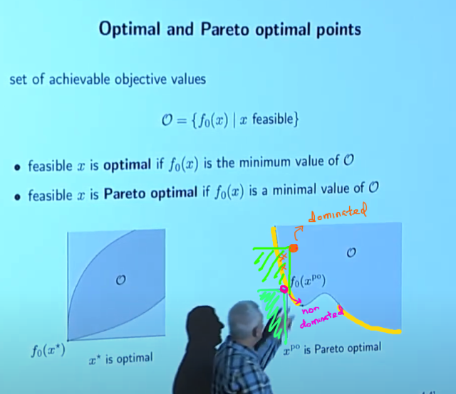</kbd></p>

> [!NOTE]
> Thế còn PARETO OPTIMAL. Đại khái là nó sẽ gắn với MINIMAL.
>
> Nhớ lại khái niệm MINIMAL, x là minimal của S wrt K nếu khi tìm
> mọi vector trong S mà better x wrt K (tức là tìm y ≽ x mà y - x ∈
> K) thì chỉ có mình x là thỏa: Nếu y ∈ S: y ⪯K x `=>` y `=` x
>
> Hay nói cách khác, nếu xét tập CÁC ĐIỂM "TỐT HƠN x wrt K thì tập này
> CHỈ GIAO VỚI S TẠI MỖI MỘT MÌNH x. Khi đó x là MINIMAL, không
> phải MINIMUM, vì minimum thì nó phải ⪯K mọi y trong S. Thể hiện theo
> set notation: (x - K) ∩ S `=` x
>
> Thế thì, trong hình phải là ví dụ K là R^2+, non-negative orthant
> như đã biết, tức góc tư không âm, đồng nghĩa nói x ⪯R^2+ y tức
> là y-x phải thuộc R^2+, và cái này có nghĩa là x nằm ở vùng sao cho
> bên trái và bên dưới của tức tung độ và hoành độ đều ko lớn hơn y.
>
> Vậy có thể hiểu mọi điểm f0(x) trên đường biên màu vàng sẽ
> đều có đặc điểm là tập hợp các điểm "tốt hơn nó" giao với O chỉ là
> chính nó. Do đó chúng đều là minimal của O và do đó x sẽ là các
> PARETO OPTIMAL.
>
> Nó có cái tên NON-DOMINATED để đối lại với DOMINATED point. ví dụ
> như điểm màu cam, rõ ràng tập "tốt hơn nó" giao với O ở nhiều điểm
> khác, nên "có nhiều cái tốt hơn nó"

<br>

<p align="center"><kbd>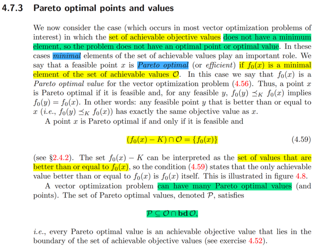</kbd></p>

<p align="center"><kbd>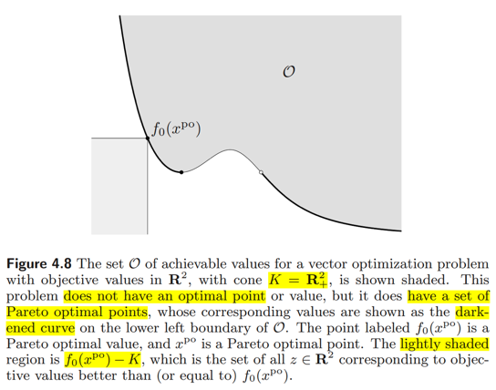</kbd></p>

> [!NOTE]
> như đã nói trong note của slide bài giảng.
>
> Chỉ có nói thêm cái ý về định nghĩa của Pareto optimal thể hiên
> tóán học của cái ý: x là minimal của set S khi những cái trong S tốt
> hơn hoặc bằng x chỉ có mình nó. Hay, xét tập những cái tốt hơn
> hoặc bằng x, thì tập này chỉ giao với S tại một mình x.
>
> Thì khi áp dụng vào đây:
>
> [f0(x) - K] ∩ O `=` f0(x), thì f0(x) - K là thể hiện set những cái tốt
> hơn hoặc bằng x (tốt hơn ở đây phải hiểu là có f0 ⪯K f0(x*) .
>
> Nếu xét K `=` R^n+ thì set f0(x) - K là cái hình chữ nhật màu xám.
> Để rồi ta thấy nó chỉ giao với O tại x.
>
> Cũng như trong bài học về minimal, minimum ta cũng đã biết
> thông thường thì khó có minimum, nhưng có nhiều minimal.  Thì ở
> đây cũng vậy, sẽ khó có optimal (ứng với f0(x*) là minimum của
> O), nhưng có thể có nhiều Pareto optimal (ứng với f0(x*) là
> minimal của O)
>
> 4.7 VECTOR OPTIMIZATION
>
> 4.7.3 PARETO OPTIMAL POINTS & VALUES

<br>

<p align="center"><kbd>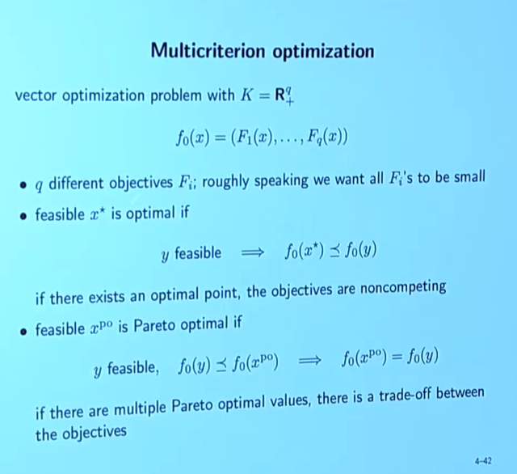</kbd></p>

> [!NOTE]
> thế thì từ đó ta đã có định nghĩa, hay hiểu ý nghĩa của objective với
> vector thì ta có cái gọi là MULTI-CRITERION OPTIMIZATION (tạm
> gọi là có nhiều tiêu chí, nhiều mục tiêu)
>
> Thì f0 là vector nhiều objective f0(x) `=` (F1(x), F2(x)...Fq(x)), nói
> nôm na  là ta muốn mọi Fi(x) đều nhỏ
>
> Thế thì đại khái gs nói rằng nếu mà ta CÓ THỂ TÌM THẤY
> OPTIMAL
>
> là cái gì thì đã biết đó là f0(x*) ⪯ f0(y) với mọi y thuộc feasible
> set
>
> THÌ ĐÂY LÀ TRƯỜNG HỢP MÀ CÁC OBJECTIVE Fi KHÔNG
> COMPETE NHAU:
>
> Ý là, ta có tình huống quá tốt, khi ta có thể tìm được điểm khiến
> minimize mọi Fi. Mà không phải đánh đổi (trade-off). Và tính
> huống này rất hiếm. Bởi lẽ thường ta phải trade off giữa cái này cái
> kia, nôm na là, thường thì các  objective compete, mâu thuẫn nhau,
> đối đầu nhau, để rồi muốn giảm cái này thì phải tăng cái kia: ví dụ
> muốn giảm mức tiêu hao nhiên liệu thì phải tăng mức tiền (xài nguyên
> liệu nhẹ hơn ví dụ vậy)
>
> Điều này lấy ví dụ như một design xe hơi với 12 tiêu chí thì ta có
> một design mà tốt hơn mọi design khác ở mọi tiêu chí.
>
> `====`
>
> Còn KHI KHÔNG THỂ CÓ OPTIMAL, nhưng CÓ NHIỀU PARETO
> OPTIMAL  THÌ TỨC LÀ CÓ NHIỀU OBJECTIVES MÂU THUẪN
> NHAU
>
> Và tụi nó sẽ là "ko bị dominated" `/` "không bị embarrassed" vì không có
> cái nào mà "hơn hoặc bằng" nó ở mọi tiêu chí.
>
> MULTI-CRITERION OPTIMIZATION

<br>

<p align="center"><kbd>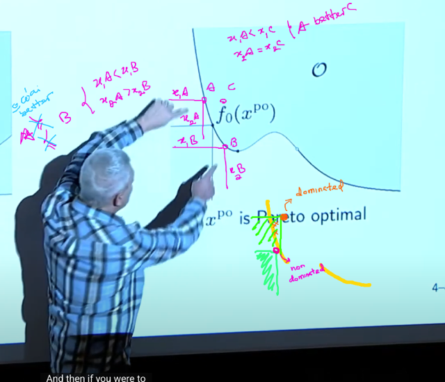</kbd></p>

> [!NOTE]
> ví dụ như ở đây điểm pareto optimal A có x1 nhỏ hơn nhưng
> pareto optimal Bi có x2 nhỏ hơn. thành ra 
>
> KHÔNG THỂ NÓI A TỐT HƠN B HAY B TỐT HƠN A
>
> Thành ra cái đám trên biên này ko có cái nào better cái nào (bởi
> better là phải nhỏ hơn cả ở hai tiêu chí x1, x2

<br>

<p align="center"><kbd>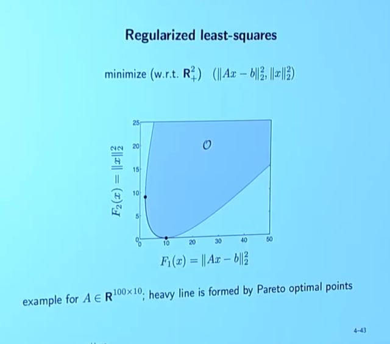</kbd></p>

> [!NOTE]
> môt ví dụ mà ta quan tâm trong machine learning `/` statistic
> (again, mấy cái này sẽ còn gặp lại) là REGULARIZED
> LEAST-SQUARES
>
> Objective như đã biết là ta muốn minimize loss function,
> ||Ax-b||^2 và muốn minimize ||x|| tức f0(x) `=` [F1(x), F2(x)]
> với F1 là ||Ax-b||^2 và F2 là ||x||^2.
>
> để rồi giả sử ta có O như thế này, thì vấn đề chỉ còn là TA SẼ
> CHỈ  QUAN TÂM CÁC PARETO OPTIMAL (VÌ KHÔNG CÓ
> OPTIMAL) nơi mà ko có cái nào tôt hơn cái nào, cái khiến
> giảm fitting error ||Ax-b|| thì sẽ đánh  đổi bởi tăng ||x|| (tăng nguy
> cơ overfit) và ngược lại giảm ||x|| (giảm nguy cơ overfit thì lại tăng
> ||Ax-b|| - tăng nguy cơ underfit)
>
> Mình nhận ra trade off này chính là Bias-Variance trade off nổi tiếng.
> khi muốn giảm fitting error thì ta sẽ phải hi sinh variance, tức là gặp
> nguy cơ overfit. Ngược lại muốn giảm overfit bằng cách khống chế
> ||x|| thì phải hi sinh fitting errror
>
> VÍ DỤ: REGULARIZED
> LEAST-SQUARE

<br>

<p align="center"><kbd>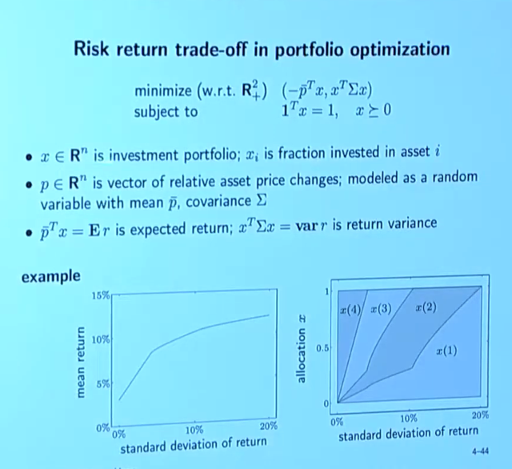</kbd></p>

> [!NOTE]
> x là vector tỉ lệ phân bổ tài sản, ví dụ 0.2 vào cổ phiếu X, 0.5 vào
> trái phiếu Y, 0.3 vào vàng. Nên ta hiểu `Σxi` `=` 1, thể hiện bởi 1Tx `=`
> 1 (1: [1, 1, 1]) và các components của x ko âm: x ≽ 0
>
> Thế thì p là vector thể hiện mức thay đổi của giá trị của các
> loại tài sản, ví dụ [0.01, -0,02, 0.03] ý và giá cổ tăng 1%, giá trái
> phiếu giảm 2%. khi đó r `=` pTx sẽ cho ta biết mức lỗ lãi của
> portfolio, tức là return.
>
> Thế thì E(r) `=` E(pTx) không khó để thấy, dựa trên linearity nó sẽ là
> E(p)Tx `=` `p_barTx` :
>
> E(pTx) `=` E(p1x1 + p2x2 ..) `=` E(p1x1) + E(p2x2) + `...=` x1Ep1 +
> x2Ep2 +...
>
> ```text
> = x1*p_bar_1 + x2*p_bar_2 + ... = p_barTx
> ```
>
> `=>` Tóm lại ta hiểu `p_barTx` là E(r), objective là `-p_barTx` tức là ta
> muốn tăng expected return 
>
> Var(pTx) `=` E[(pTx - E(pTx))^2] `=` E[(pTx - `p_barTx)^2]`
>
> `=` E[(pTx - `p_barTx)(pTx` - `p_barTx)]`
>
> ```text
> Do (pTx - p_barTx)^2 = (pTx - p_barTx)(pTx - p_barTx)
> ```
>
> ```text
> = E[(pT - p_barT)x(pT - p_barT)x]   | (pTx - p_barTx) = (pT -
> ```
> `p_barT)x`
>
> ```text
> = E[xT(p - p_bar)(pT - p_barT)x]    | (pT - p_barT)x = (p - p_bar)Tx
> ```
>
> và cũng bằng xT(p - `p_bar)`
>
> `=` E[xT(p - `p_bar)(p` - `p_bar)Tx]`
>
> `=` xTE[(p - `p_bar)(p` - `p_bar)T]x`  | linearity
>
> (E[xTa] `=` xT(Ea) | cái này chỉ là linearity chứng minh giống như
> triển khai trên
>
> E[xTAx] `=` xTE(Ax) (dựa vào cái trên, Ax đóng vai a)
>
> `=` xTE(A)x | cũng dựa vào cái trên E(Ax) `=` E(A)x )
>
> E[(p - `p_bar)(p` - `p_bar)T]` theo định nghĩa chính là `Σ`
>
> `=` `xTΣx`
>
> Tóm lại, ta hiểu `xTΣx` là variance của r, Var(r), và objective muốn
> giảm cái này là dễ hiểu: muốn giảm mức biến động của return
>
> Thế thì objective là minimize `-p_barTx,` và `xTΣx,` một cái là
> affine, cái kia là quadratic nên đều là convex.
>
> VÍ DỤ CỦA REGULARIZED LEAST-SQUARE: RISK
> RETURN TRADE OFF IN PORTFOLIO OPTIMIZATION

<br>

<p align="center"><kbd>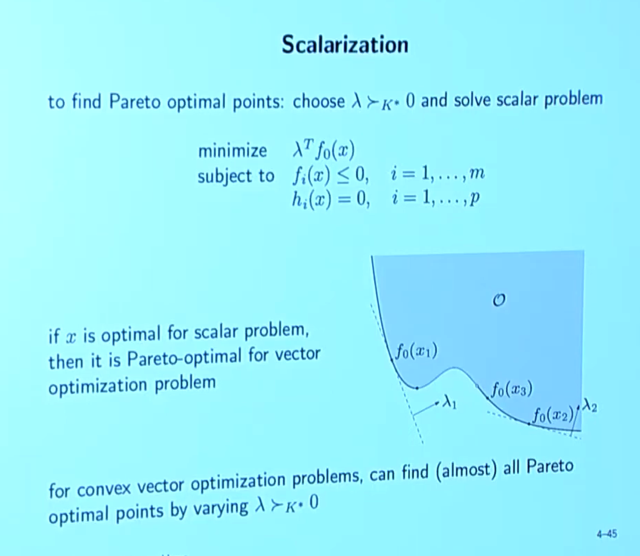</kbd></p>

> [!NOTE]
> Đại khái là để TÌM PARETO OPTIMAL, ta sẽ dùng cách sau, gọi là 
> SCALARIZATION.
>
> Review lại bữa trước kiến thức về DUAL CONE: Ta chọn
> (vector) λ trong dual cone của K (chính xác hơn là trong
> interior của K*, kí hiệu là λ ≻K* 0), 
>
> Và minimize λTz over z với z trong S, thì ta sẽ tìm được minimal 
> point (trong bối cảnh S là O, thì ta có Pareto optimal)
>
> Rồi gs nói nếu ta có λ positive thuộc dual cone (λ ≻K* 0), và f0 là
> K-convex function.
>
> (Nhắc lại, K-convex tức là domain convex và thỏa
>
> ```text
> f(θx + (1-θ)y) ⪯K θf(x) + (1-θ)f(y), thì λTf0(x),
> ```
>
> Nói chung gs cũng chỉ lướt qua, ta sẽ còn gặp lại. Nhưng đại ý là
> Scalarization, là cách tiêu chuẩn để tìm ra Pareto optimal: khi di
> chuyển các line (define bởi normal vector vector λ) thì ta sẽ tìm
> được tiếp tuyến vói O tại x1 và x1 là optimal, khi đó nó sẽ là
> Pareto-optimal của bài toán vector optimization
>
> SCALARIZATION

<br>

<p align="center"><kbd>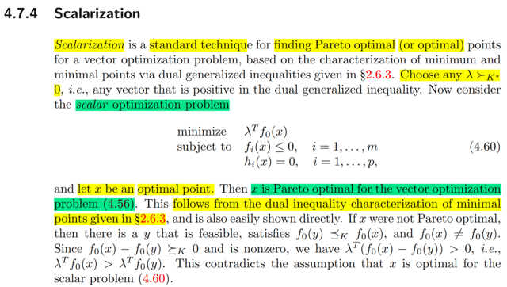</kbd></p>

> [!NOTE]
> Đại khái là phần này dựa vào một định lí mà ta đã học trong phần
> minimum `/` minimal. Đó là nếu ta chọn λ sao cho λ ≻K* 0 (mà theo
> định nghĩa, nó là λ ∈ interior của K*), rồi sau đó ta minimize λTz
> over z ∈ S, để được λTx thì x chính là minimal của S. (Ngược lại
> thì chưa chắc, tức là, nếu ta có x là minimal của S thì chưa chắc
> tồn tại λ ≻K* 0 khiến x là minimizer của λTz over z ∈ S, TRỪ KHI
> S LÀ CONVEX SET) Ta đã chứng minh cái này trong phần trước
> rồi (xem lại link)
>
> Thế thì từ đó, nó sinh ra việc ta có thể giải bài toán gốc minimize
> f0(x) với constraint fi(x) `<=` 0, hi(x) `=` 0 mà cụ thể là tìm Pareto
> optimal (chứ không phải tìm optimal). Bằng cách giải một bài toán
> equivalent:
>
> Chọn λ sao cho λ ≻K* 0 và minimize λTf0(x) với constraint fi(x) `<=`
> 0 và hi(x) `=` 0. Theo theorem trên nhất định ta sẽ tìm ra f0(x*) là
> minimum của O (tập Attainable Objective Value: {f0(x) | fi(x) `<=` 0,
> hi(x) `=` 0} thì x chính là Pareto Optimal của bài toán gốc (minimize
> f0(x))
>
> Người ta có đưa ra lập luận kiểu như chứng minh lại cái này
> (giống như chứng minh theorem này trong phần trước): Đó là giả
> sử ta có x* là minimizer của λTf0(x) của bài toán này mà nó lại
> không phải là Pareto optimal của bài toán gốc:
>
> Thì khi đó, vì nó không phải là Pareto optimal của bài toán gốc,
> nên tồn tại y ∈ feasible set sao cho f0(y) ⪯K f0(x*).
>
> Cái này `<=>` f0(y) - f0(x*) ⪯K 0 `=>` f0(x*) - f0(y) ≽K 0  `=>` f0(x*) -
> f(y)  ∈ cone K
>
> Mà nếu vậy thì, với λ ≻K* 0 thì λT[f0(x*) - f0(y)]  `>=` 0 (vì đây là
> định nghĩa của dual cone K*, là tập mà mọi vector λ trong nó đều
> sẽ có dot product không âm với mọi vector trong cone K)
>
> Vậy λTf0(x*) `>=` λTf(y) và như vậy x* không phải là minimizer của
> λTf0(x) mâu thuẫn với giả thiết đặt ra.
>
> Vậy, nếu x là minimizer (tức optimal) của bài toán equivalent -
> Scarlarization thì x sẽ là Pareto optimal của bài toán gốc
>
> 4.7 VECTOR OPTIMIZATION
>
> 4.7.4 SCALARIZATION

<br>

<p align="center"><kbd>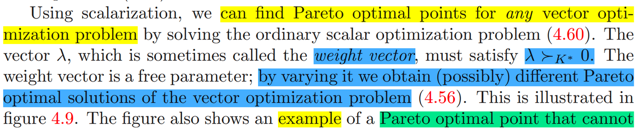</kbd></p>

<p align="center"><kbd>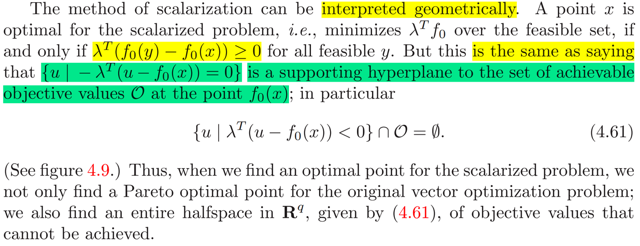</kbd></p>

<p align="center"><kbd>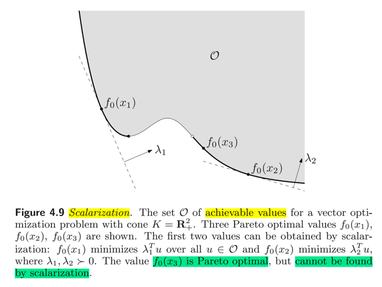</kbd></p>

> [!NOTE]
> Đại khái nói là dùng cách làm Scalarization, ta có thể tìm ra Pareto
> optimal của bất kì bài toán vector optimization nào. Và dễ thấy với
> mỗi lựa chọn của λ (phải thỏa λ ≻K* 0) thì ta sẽ tìm ra một Pareto
> optimal khác nhau.
>
> Tuy nhiên không phải là mọi Pareto optimal đều có thể tìm được
> bằng cách này, mà trong hình minh họa, x3 là một cái như vậy.
> Scalarization không thể tìm thấy x3, dù nó là một Pareto optimal.
>
> Cái này ta có thể hiểu vì liên hệ với bài bữa trước, mà lúc nãy cũng
> đã nhắc lại, đó là: Nếu x là minimizer của λTz over S wrt K với λ ≽K* 0
> thì suy ra x là MINIMAL của S. Nhưng ngược lại thì chưa chắc.
>
> Chỉ khi S convex, thì ta mới có chiều ngược lại (theo link tới bài trước
> mà ta đã chứng minh cái này)
>
> Ý cuối đại khái là giải thích về mặt hình học của phương pháp này.
> Dù chưa hiểu lắm nhưng có thể hiểu đại khái là làm vậy ta sẽ tìm
> ra support hyperplane của set O

<br>

<p align="center"><kbd>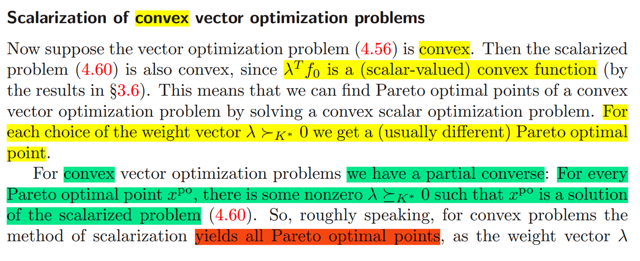</kbd></p>

<p align="center"><kbd>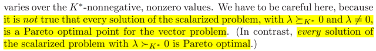</kbd></p>

> [!NOTE]
> Đại khái là nếu bài toán gốc là convex, thì bài toán scalarization cũng
> convex và thỏa mãn yếu tố là O trở thành convex set. Mà như đã
> vừa nói lại, rằng lúc này, bất cứ x là minimal nào thì cũng tồn tại λ
> ≽K* 0 khiến x là minimizer của λTf0(x) over f0(x) ∈ O.
>
> Tuy nhiên ta nhớ trong chương 2 cũng đã nói về một vấn đề, đó là,
> với convex case (và cả non-convex case) thì ở chiều xuôi phải là
> dấu  ≻K* (strictly better) còn ở chiều ngược lại thì phải là dấu ≽K*.
>
> Có nghĩa là, như đã biết cả convex hay không convex thì ta đều có
> chiều xuôi, rằng: Khi x là minimizer của λTz over z ∈ S với λ ≻K* 0 thì
> x là minimal của S. Thì phải chú ý λ phải ≻K* 0, tức λ ∈ interior của
> K*, mà trong trường hợp ta lấy `K=R^n+,` thì K* cũng là R^n+ (R^n+
> self dual) thì λ ∈ int R^n+ đồng nghĩa component của λ ĐỀU
> DƯƠNG CHỨ KHÔNG CHỈ KHÔNG ÂM.
>
> Còn ở chiều ngược lại (chỉ xảy ra khi convex case): Nếu x là
> minimal, thì tồn tại λ ≽K* 0 khiến x là minimizer của λTz  over z ∈ S.
> Thì nếu K `=` R^n+ thì λ CÓ THỂ CÓ COMPONENT KHÔNG.
>
> Do đó mới nói, nếu ta đi theo chiều xuôi, mà dùng dấu ≽K* thì chưa
> chắc ta tìm được Pareto optimal.

<br>

<p align="center"><kbd>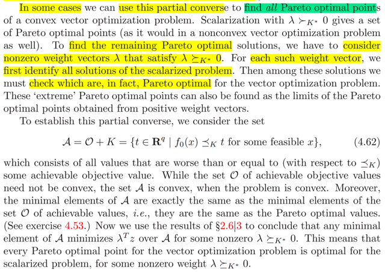</kbd></p>

> [!NOTE]
> Phần trên đại ý là, vì scalarization với λ ≻K* 0 dù chắc tìm ra Pareto 
> optimal nhưng ko đảm bảo tìm ra hết mọi cái. Còn nếu làm với λ ≽K* 0
> thì có thể sẽ giúp tìm ra những cái mà λ ≻ 0 không tìm ra, nhưng lại
> cũng có thể tìm ra những điẻm ko phải Pareto optimal.
>
> Vậy phương án thành ra sẽ là cứ dùng λ ≽K* 0, để tìm ra hết các 
> candidate, sau đó check lại xem cái nào là Pareto optimal.
>
> Còn đoạn cuối đại khái là lập luận để chứng minh khi S là convex
> thì ta có thể chắc chắn nếu có Pareto optimal x* thì sẽ có λ ≽K* 0 
> khiến f0(x*) đó là minimizer của λTf0(z)

<br>

<p align="center"><kbd>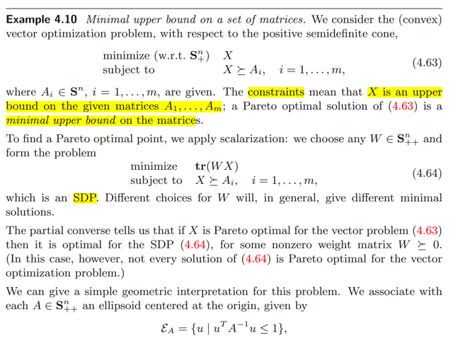</kbd></p>

<p align="center"><kbd>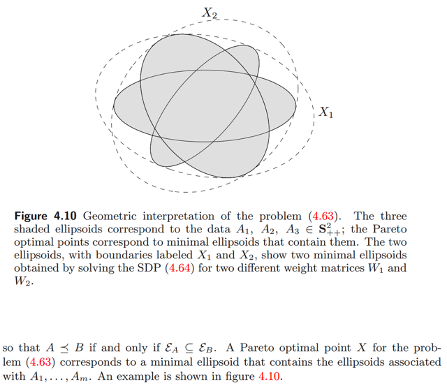</kbd></p>

> [!NOTE]
> một ví dụ, ta đối mặt bài toán vector optimization - như đã biết đó là
> khi objective function, là vector `/` matrix function. Trong trường hợp
> này, nó là matrix X. Và constraint là X ≽ Ai, mang ý nghĩa là X là
> chặn trên của Ai, và việc đặt ra bài toán này, là ta muốn tìm ra
> chặn trên tốt nhất, đồng nghĩa là tìm cách giảm thiểu chặn trên này
> xuống.
>
> Thế thì, ta sẽ áp dụng phương pháp scalarization, chọn λ ∈ int K*,
> rồi minimize λTf0(x) over archivable set O `=` {f0(x) | fi(x) `<=` 0; hi(x) `=` 0}
> thì khi ta tìm ra minimum của bài toán này sẽ là Pareto optimal của 
> bài toán gốc (minimize f0(x) with constraint). Thì ở đây, là matrix, và
> cone K là S^n+, thì đây là self-dual cone, nên K* cũng là S^n+.
>
> Để rồi ta sẽ chọn W ∈ int S^n+ chính là S^n++, tức W là positive
> definite matrix.
>
> Và objective của equivalent (scalarization) problem là tr(WX)
>
> Và lúc này ta trở về bài toán SDP.
>
> Khúc sau có nói về ý nghĩa hình học của bài toán này. Quay lại sau

<br>

<p align="center"><kbd>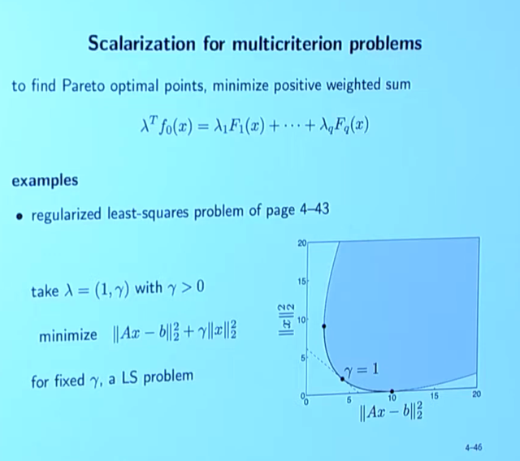</kbd></p>

> [!NOTE]
> một ví dụ là áp dụng nó vào bài toán multi-criterion (là bài
> toán mà objective f0(x) là vector các [F1(x),...Fq(x))]
>
> Để rồi ta sẽ "chuyển thành scalar" bằng cách chọn vector λ
> để và λTf0(x) sẽ CHO TA MỘT NUMBER (SCALARIZATION).
>
> Khi đó minimize con số này sẽ giúp ta tìm ra Pareto optimal
>
> Áp dụng vào ví dụ cụ thể của multi-criterion là là bài toán least
> square nơi mà F1(x), (gs nói có người gọi là first objective) là
> ||Ax-b||^2 và F2(x) là ||x||^2. ta sẽ chọn λ là <1, `α>` để rồi ta có
> scalar objective F1*1 `+F2*α`
>
> Again ta sẽ đi sâu vào sau.

<br>

<p align="center"><kbd>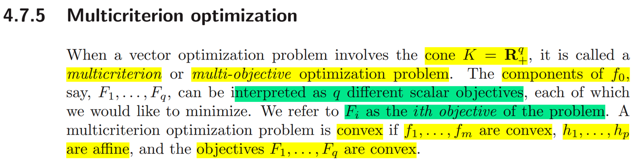</kbd></p>

> [!NOTE]
> Không có gì ghê gớm, nãy giờ ta đang trong phần nói về bài toán
> VECTOR OPTIMIZATION, khi objective function là `vector/matrix,` 
> mà vốn dĩ sự thay đổi này (từ scalar f0 đến vector, matrix f0) khiến
> cho việc so sánh (ordering) chuyển từ usual ordering thành partial
> ordering (gọi là generalized inequality).
>
> Thế thì bây giờ, nếu như f0 là vector R^p+, thì người ta gọi riêng
> nó là bài toán MULTI-CRITERION (mang ý nghĩa là thu hẹp lại,
> vì vector optimization là nói chung, khi f0 có thể là vector bất kì,
> hoặc matrix, thì nay chỉ là vector có component không âm thôi)
>
> Và sở dĩ có tên vậy là bởi nó khớp với bài toán mà giống như ta 
> muốn minimize nhiều tiêu chí, mỗi tiêu chí đều không âm, và chúng
> tạo thành vector f0(x) `=` [F1(x), ...Fp(x)]
>
> Dĩ nhiên là vì đây cũng là vector optimization nên những cái nãy h
> nói vẫn áp dụng,
>
> Và dễ hiểu khi f0 convex, xảy ra khi Fi(x) đều convex, các ineuality
> constraint fi(x) convex, và hi(x) affine thì ta sẽ có bài toán convex
> multicriterion
>
> 4.7 VECTOR OPTIMIZATION
>
> 4.7.5 MULTI-CRITERION OPTIMIZATION

<br>

<p align="center"><kbd>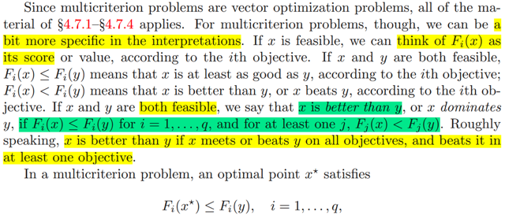</kbd></p>

<p align="center"><kbd>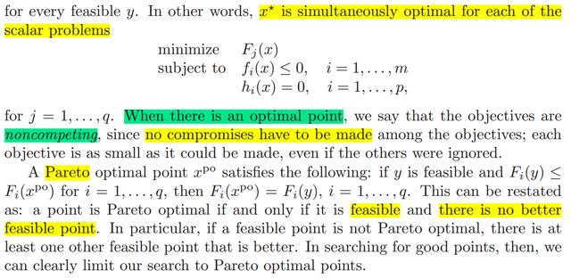</kbd></p>

> [!NOTE]
> Đại khái là, không có gì mới hết, chẳng qua chỉ là trong bối cảnh của
> bài  toán multi-criterion, thì ta có thể interpret một cách cụ thể hơn.
>
> Đó là, kiểu như nếu trong bài toán này ta tìm thấy OPTIMAL thì theo
> định nghĩa ta đã biết, nếu x* là optimal, tức f0(x*) là MINIMUM của O
> (set mọi attainable objective value f0(x) | x ∈ dom D, fi(x) `<=` 0, hi(x) `=`
> 0)) và theo định nghĩa, fo(x*) ⪯K f0(x) với mọi f0(x) ∈ O,
>
> Và K trong bài toán này là R^p+, nên f0(x*) ⪯K f0(x) có thể viết là f0(x*)
> ⪯ f0(x) `<=>` component của f0(x*) `<=` component tương ứng của f0(x).
>
> Với f0(x) `=` [F1(x), F2(x), ....Fp(x)]
>
> ```text
> <=> F1(x*) <= F1(x), F2(x*) <= F2(x), ...Fp(x*) <= Fp(x) với mọi p
> ```
>
> Và phải hiểu rằng, ít nhất có một cái trong đây là dấu < (chứ nếu không
> thì thành ra f0(x) `=` f0(x).
>
> Và "diễn dịch" cái này có nghĩa là, "có ít nhất một tiêu chí j'th nào đó (j'
> th objective) của x* là tốt hơn y với mọi x thuộc feasible set" Fj(x*) <
> Fj(x)
>
> `====`
>
> Thế thì khi tồn tại OPTIMAL, thì có nghĩa là ta có bài toán multicriterion
> mà trong đó các objective KHÔNG CẠNH TRANH NHAU, để rồi mọi
> tiêu chí đều có thể giảm mà không phải hi sinh cái khác.
>
> Ngược lại, nếu các objective CẠNH TRANH NHAU, thì không thể có
> OPTIMAL, vì khi đó kiểu như x1 tốt hơn x2 ở tiêu chí này thì lại kém
> (chứ không bằng) ở tiêu chí khác.

<br>

<p align="center"><kbd>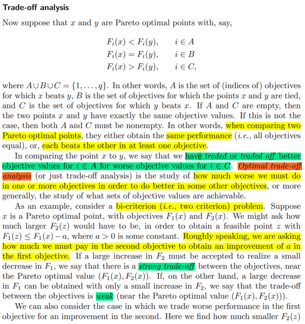</kbd></p>

<p align="center"><kbd>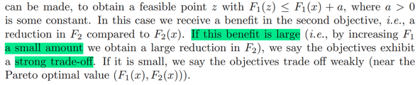</kbd></p>

> [!NOTE]
> Đại khái là có hai Pareto optimal x, y thì trừ trường hợp chúng
> bằng nhau (tức là Fi(x) `=` Fi(y) với mọi i). Còn lại thì hai thằng
> không cái nào chịu thua cái nào, với ý nghĩa là, trong hai vector
> f0(x) và f0(y) thì f0(x) sẽ có ít nhất một cái lớn hơn f0(y) và f0(y)
> cũng có ít nhất một cái lớn hơn f0(x)
>
> Tại sao lại như vậy. Đó là bởi vì, cả hai thằng đều là Pareto
> optimal. Nên f0(x) và f0(y) đều là MINIMAL của set O. Mà  theo
> định nghĩa minimal thì, khi f0(x) là minimal của O thì có nghĩa  là
> trong set O, không có thằng nào là nhỏ hơn (⪯K) nó cả.
>
> Thể hiện bởi hình học:
>
> (f0(x) - K) ∩ O `=` {f0(x)}
>
> và với việc đang xét K `=` R^2+ hình ảnh là không có điểm nào
> trong O mà nằm bên trái, và ở dưới f0(x) hết. Do đó f0(y) không
> "ở bên trái & ở bên dưới" f0(x). Và ngược lại f0(x) cũng không "
> ở bên trái & ở bên dưới f0(x)". Tức là hai vector f0(x), f0(y)
> không có chuyện mọi component của vector này đều `>=`
> component của vector kia. Mà thằng này lớn hơn ở F1(x) thì
> thằng kia lớn hơn ở F2(x)
>
> `====`
>
> Sau đó nói về khái niệm OPTIMAL TRADE-OFF ANALYSIS
>
> Thì đại khái là, giả sử xét bài toán bi-criterion (chỉ có F1(x) và F2(x))
> thì STRONG TRADE-OFF là khi để giảm F2 một khoảng a nào 
> đó thì ta phải hi sinh - tăng F1 một khoảnh bự.
>
> Còn ngược lại để giảm F2 một khoảng cũng là a, nhưng chỉ cần tăng
> nhẹ F1 thì gọi là WEAK TRADE-OFF
>
> Cũng có thể giải thích theo kiểu khác, STRONG TRADE OFF là khi
> tăng F1 một khoảng nhỏ mà khiến F2 giảm một khoảng bự. Và 
> WEAK là khi tăng F1 khoảng bụ mà F2 giảm cũng ko bao nhiêu

<br>

<p align="center"><kbd>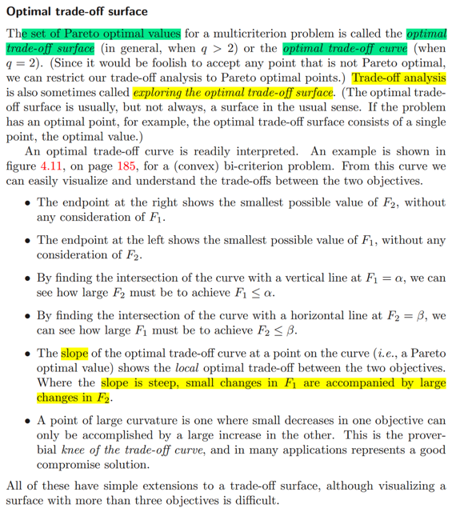</kbd></p>

<p align="center"><kbd>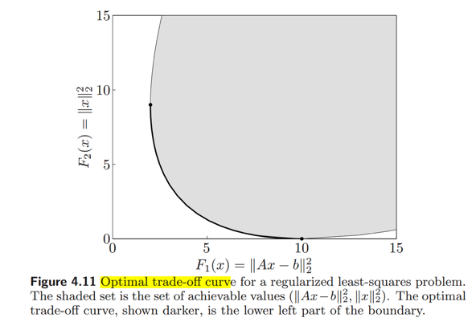</kbd></p>

> [!NOTE]
> Tập các Pareto optimal value được gọi là OPTIMAL
> TRADE-OFF SURFACE (HAY CURVE)
>
> Và bằng cách phân tích cái curve này ta có thể hiểu về trade-off
> của các objective.
>
> Ví dụ như trong cái hình dưới, là Optimal Trade-off curve của
> regularized least-square problem.
>
> Thì tập các Pareto optimal làm thành đoạn cong màu đen
>
> Điểm đầu bên trái là điểm có F2 lớn nhất, và điểm đầu bên phải 
> là điểm có F1 lớn nhất.
>
> thế thì bằng cách xem đoạn này giao với một đường thẳng
> đứng tại F1 `=` a chẳng hạn, thì độ cao của giao điểm (tức giá
> trị F2) sẽ cho ta biết muốn F1 nhỏ hơn a thì F2 phải lớn hơn
> mức đó.
>
> Ngược lại, bằng cách xem đoạn cong này giao với một đường
> ngang tại F2 `=` b chằng hạn, thì gía trị F1 của giao điểm sẽ cho
> ta biết muốn F2 nhỏ hơn b thì F1 phải lớn hơn bao nhiêu.
>
> Rồi, xét một điểm bất kì trong đoạn, thì nếu độ dốc của nó rất 
> lớn thì chứng tỏ phải chỉ tăng F1 chút xíu thì đã giảm F2 rất
> nhiều

<br>

<p align="center"><kbd>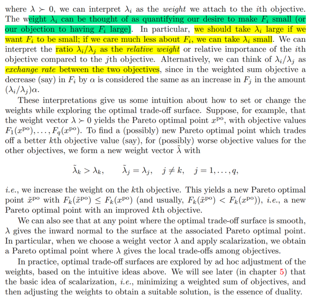</kbd></p>

<p align="center"><kbd>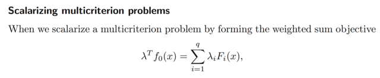</kbd></p>

> [!NOTE]
> đại khái là khi ta scalarizing (nhân f0(x) `=` <F1(x), F2(x)> với
> vector λ `=` <λ1, λ2> dĩ nhiên ta có thể thấy nó là weighted sum
> các Fi(x) với weight là λi.
>
> Thế thì ở đây nói khi ta muốn ưu tiên giảm F1, thì ta có thể cho
> λ1 lớn (lớn hơn tương đối so với λ2).
>
> Nhìn vào hình bên sẽ dễ hiểu.
>
> `====`
>
> Và từ đó đại khái là giả sử đang có Pareto optimal `x_po1` với
> λ(1), và ta muốn tìm Pareto optimal `x_po2` có Fi(x) nhỏ hơn. Thì
> ta có thể tạo λ(2) có λ(2)i lớn hơn λ(1)i còn các λj khác thì giữ
> nguyên. Kết quả sẽ cho ra Pareto optimal có Fi(x) nhỏ hơn, đánh
> đổi là các Fj(x) khác thì tăng lên
>
> `====`
>
> Khúc cuối nói rằng ta sẽ thấy việc chọn λ (cũng là điều chỉnh các
> weight) để có solution thích hợp thật ra chính là bài toán Dual
> problem.

<br>

<p align="center"><kbd>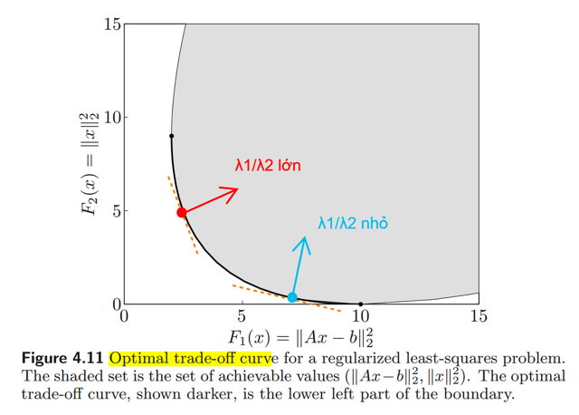</kbd></p>

<p align="center"><kbd>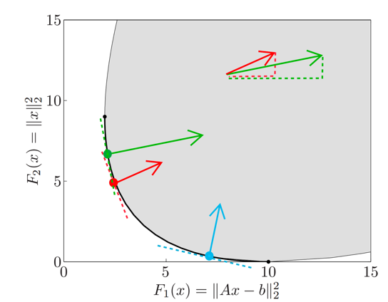</kbd></p>

> [!NOTE]
> có thể thấy khi chọn λ với λ1 lớn hơn nhiều so với λ2 (tức
> `λ1/λ2` lớn), cũng là λ1 weight gắn với F1 lớn, weight λ2 gắn
> với F2 nhỏ. Thì kết quả có thể thấy ra Pareto optimal màu
> đỏ có F1 nhỏ, và F2 lớn
>
> Ngược lại, khi chọn λ với λ2 (weight gắn với F2) lớn, và λ1
> (weight gắn với F1) nhỏ thì Pareto optimal có F2 nhỏ, F1
> lớn
>
> Hình ảnh này minh họa cho việc, khi ta đang có Pareto optimal,
> màu đỏ, ứng với vector λ màu đỏ. Và ta muốn giảm F1, hi sinh
> F2,  thì ta có thể tạo λ mới bằng cách tăng λ1, giữ nguyên λ2.
> Để có vector λ xanh lục.
>
> Có thể thấy khi làm vậy (tăng λ1, giữ nguyên λ2) ta đã tăng
> relative weight `λ1/λ2.` Kết quả là Pareto optimal mới (xanh lục)
> có F1 nhỏ hơn và đánh đổi (trade off) là F2 lớn hơn

<br>

<p align="center"><kbd>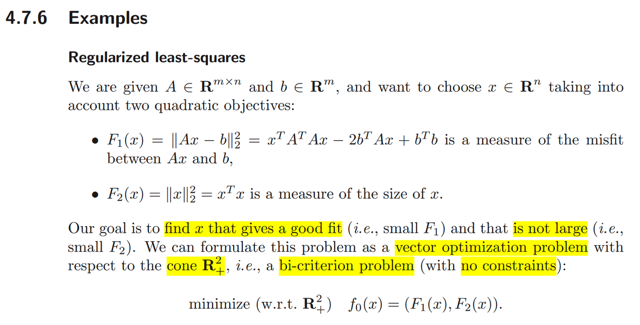</kbd></p>

<p align="center"><kbd>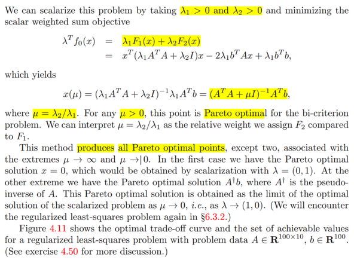</kbd></p>

> [!NOTE]
> 4.7 VECTOR OPTIMIZATION
>
> 4.7.5 EXAMPLE
>
> Rồi, xét một ví dụ của bài toán multi-criterion này:
>
> minimize F1(x) `=` ||Ax - b||^2 và F2(x) `=` ||x||^2] (||.|| là l2 norm)
>
> (không có constraint)
>
> Thế thì ta có thể đưa bài toán về dạng vector optimization:
>
> minimize f0(x) `=` [F1(x), F2(x)] wrt cone K `=` R^2+
>
> Và ta sẽ scalarize bài toán bằng cách chọn vector λ ∈ int R^2+ tức λ ≻ 0,
> hay λ1 > 0 và λ2 > 0. Và xây dựng bài toán scalarization:
>
> minimize λTf0(x) `=` λ1F1(X) + λ2F2(x). Và optimal của bài toán này  sẽ
> chính là Pareto optimal của bài toán gốc.
>
> (nếu quên nhắc lại, trong bài về Minimum, Minimal ta đã học, nếu chọn λ
> ≻K* 0 thì khi minimize λTz over z ∈ S, được x thì x là minimal của S. Và
> áp dụng cái này trong bài toán vector optimization, ta có nếu ta  chọn λ
> ≻K* 0, và minimize λTf0(x) over set O `=` f0(x) | x ∈ feasible set X thì khi ta
> có x là minimum của bài toán scalarization này thì x cũng chính là Pareto
> optimal của bài toán vector optimization)
>
> Thế thì xét f(x) `=` λTf0(x)) `=` λ1||Ax - b||^2 + λ2||x||^2 
>
> `=` λ1(Ax - b)T(Ax - b) + λ2xTx 
>
> `=` (λ1xTAT - λ1bT)(Ax - b) + λ2xTx 
>
> `=` λ1xTATAx - λ1bTAx - λ1xTATb + λ1bTb + λ2xTx 
>
> `=` λ1xTATAx - 2λ1bTAx + λ2xTx + λ1bTb 
>
> `=` λ1xTATAx + λ2xTx - 2λ1bTAx + λ1bTb 
>
> `=` xT(λ1ATA + λ2)x - 2λ1bTAx + λ1bTb 
>
> Giải bài toán này, ta sẽ dùng calculus: Xét g(x) `=` xTQx + pTx + v 
>
> ∇g: dg `=` f(x+dx) - f(x) `=` (x+dx)TQ(x+dx) + pT(x+dx) + v - xTQx - pTx - v
>
> `=` (xTQ+dxTQ)(x+dx) + pTdx - xTQx
>
> `=` xTQx+dxTQx+xTQdx+dxTQdx + pTdx - xTQx
>
> ```text
> = 2xTQdx + pdx = (2QTx + p)Tdx => ∇g = 2QTx + p
> ```
>
> Vậy ∇f `=` 2(λ1ATA + λ2)Tx - 2λ1bTA  
>
> ∇f `=` 0 `<=>`  2(λ1ATA + λ2)Tx - 2λ1bTA  `=` 0
>
> `<=>` 2(λ1ATA + λ2)Tx `=` 2λ1bTA
>
> `<=>` x `=` (λ1ATA + λ2)invλ1bTA
>
> Chỗ này khi λ1, λ2 đều dương thì λ1ATA + λ2 invertible, vì:
>
> ```text
> (ATA ≽ 0 <=> λ1ATA ≽ 0 <=> λ1ATA + λ2 ≻= λ2 ≻ 0 => λ1 ATA + λ2 invertible,
> ```
> có thể chứng minh theo kiểu khác )     
>
> `<=>` x `=` (λ1ATA + λ2I)invλ1ATb
>
> `<=>` x `=` [λ1(ATA + `(λ2/λ1)I)]invλ1ATb`
>
> Đặt `μ` `=` λ2 `/` λ1:
>
> x `=` [λ1(ATA + `μI)]invλ1ATb`  
>
> ```text
> = (1/λ1)(ATA + μI)invλ1ATb  |   (Aα)inv = 1/α Ainv
> ```
>
> `=` (ATA + `μI)invATb`   | đây là kết quả trong sách
>
> Thế thì dĩ nhiên x là minimum của bài toán này (vì f là quadratic function,
> nên convex, hoặc thích thì xét Hessian của nó chính là ATA, và đây
> là positive semi definite matrix)
>
> Và miễn là `μ` dương - ứng với λ1, λ2 đều > 0 (λ ≻ ) thì x sẽ là minimum 
> của bài toán này và đồng thời sẽ là Pareto optimal của bài toán gốc

<br>

<p align="center"><kbd>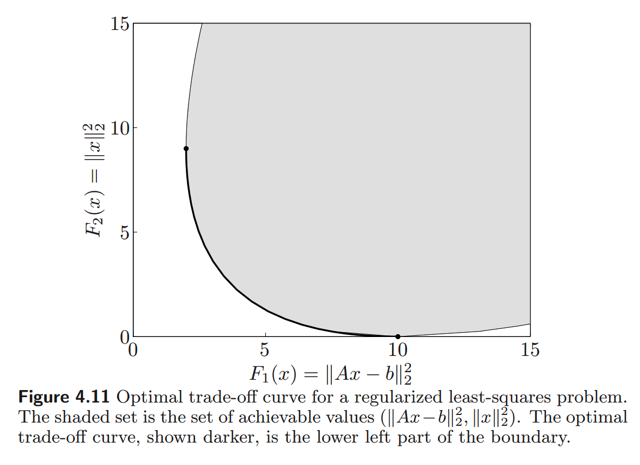</kbd></p>

> [!NOTE]
> SÁCH (XEM SAU)

<br>

<p align="center"><kbd></kbd></p>

> [!NOTE]
> Ta qua phần DUALITY.
>
> CHAPTER 5 - DUALITY
>
> 5.1 THE LAGRANGE DUAL FUNCTION

<br>

<p align="center"><kbd>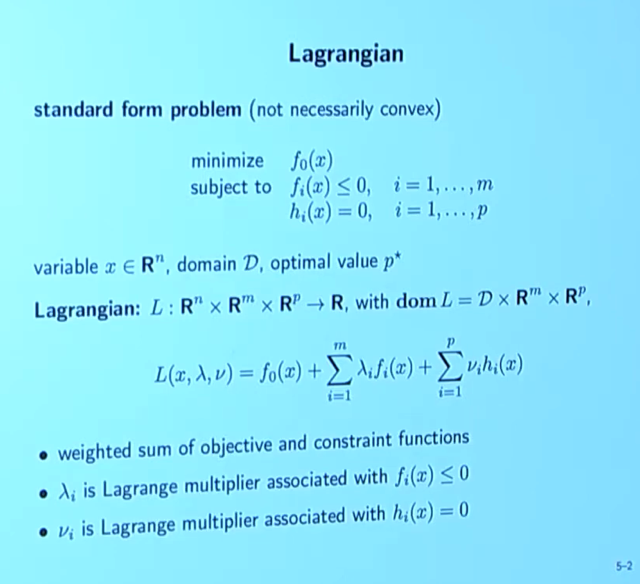</kbd></p>

> [!NOTE]
> Đầu tiên là LAGRANGIAN, một cái mà trong machine learning gặp
> nhiều. Đầu tiên, ta thấy Lagrangian là một function được xây dựng
> bằng cách cộng 
>
> OBJECTIVE f0(x), LINEAR COMBINATION CỦA CÁC
> EQUALITY CONSTRAINTS và LINEAR COMBINATION CÁC
> INEQUALITY CONSTRAINTS
>
> L(x, λ, v) `=` f0(x) + `Σ` λi fi(x) + `Σ` vihi(x) 
>
> Xong, gs đại khái là nếu ta violate cái constraint ví dụ fi(x)<0 thì λi
> dương sẽ là cái giá mà ta phải trả.
>
> Hiểu ý này là vầy, constraint là fi(x) phải âm. Vậy thì khi fi(x) dương là
> ta đang vi phạm constraint. Thì ta sẽ bị phạt, bị add một chi phí tăng
> thêm là λi*fi(x)
>
> LAGRANGIAN

<br>

<p align="center"><kbd>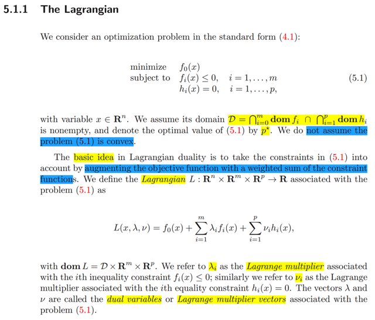</kbd></p>

> [!NOTE]
> Trong sách bổ sung một số ý sau:
>
> 1) Cần nhấn mạnh bài toán optimization gốc minimize f0(x)
> với các equality `/` inequality constraints KHÔNG CẦN PHẢI LÀ
> CONVEX PROBLEM.
>
> 2) Domain của Lagrangian function là intersection của objective
> function f0(x) và các constraint function fi(x) và hi(x)
>
> 3) Một số thuật ngữ:
>
> + λi, vi chính là LAGRANGE MULTIPLIER, là cái mà ta đã nghe trong
> MIT 18.02, quả thật trong 1802 ta đã học về việc dùng Langrange 
> multipler để giải bài toán tìm cực tiểu của hàm số f với ràng buộc g.
>
> + Vector λ, v gọi là DUAL VARIABLES (có thể hiểu vì nó là biến của
> hàm Dual function g(λ, v))
>
> 5.1 LAGRANGE DUAL FUNCTION
>
> 5.1.1 THE LAGRANGE DUAL FUNCTION

<br>

<p align="center"><kbd>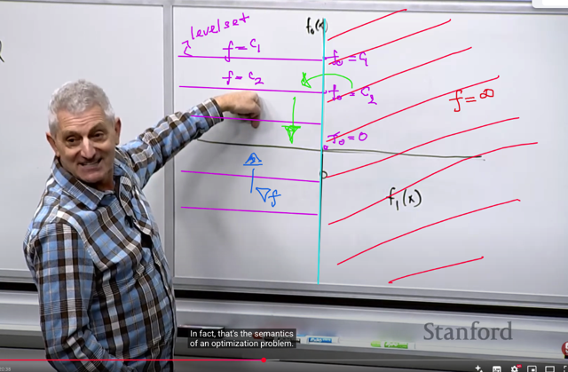</kbd></p>

> [!NOTE]
> đại khái là, một trục thể hiện (giá trị) f1(x) là inequality constraint
> function (f1(x)<0) và cái kia là f0(x) (objective).
>
> Gs nói nếu ta có một vector x, mà tính ra f1(x) nằm ở phần bên phải
> (tức là ứng với f1(x) > 0, thì đó là điều unacceptable, vì nó vi phạm
> constraint:  f1(x) < 0
>
> Ok có thể hiểu cái này, bởi constraint nói rằng là f1(x) phải âm. Và
> trong bài toán optimization thì ta cần phải thỏa constraints, để có feasible
> set sau đó mới chọn cái trong đó có giá trị objective f0(x) nhỏ nhất
>
> Và cũng hiểu luôn khi gs nói nếu ta ở bên trái, tức là khi đã thỏa
> constraint f1(x) < 0 thì khi đó ta muốn đi xuống càng thấp càng tốt,
> để minimize objective function f0(x)
>
> Chú ý rằng ta hiểu hình ảnh này là đang vẽ hàm f `=` f0 + `I(f1(x)<=0)`
> nhưng đáng lí phải vẽ trong 3D. Ở đây ta tưởng tượng một chiếc máy
> bay, mà hình chiếu của nó, tọa độ của nó thể hiện trên 2D coordinates và
> độ cao của nó là giá trị f. Thì khi nó ở phần bên phải, chỗ gạch gạch đó,
> thì độ cao của nó là vô cùng lớn. Khi nó bay vượt qua đường màu xanh,
> thì lập tức nó hạ độ cao xuống, có giá trị được tính bởi f0. Do đó nếu nó
> đi song song vói trục f1 (các đường màu tím) thì độ cao của nó giữ
> nguyên. Nếu nó đi (ở phần bên trái, theo hướng vuông góc với f1, và đi
> theo chiều mũi tên xanh lá -  đây chính ngược với gradient) thì nó sẽ
> giảm dần độ cao.

<br>

<p align="center"><kbd>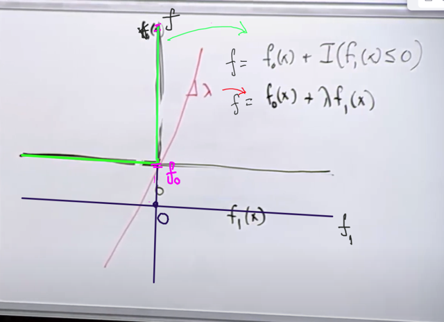</kbd></p>

> [!NOTE]
> Thế thì: Qua đây
>
> ta sẽ hiểu rằng, mình ko thể hiện trục f0 nữa. Thay vào đó là
> trục f, để hình ảnh bây giờ là quan hệ của f và f1 với f0 cố định
> (ứng với việc sau ta đi trên đường level set màu tím bên hình trước)
>
> Để rồi khi ta ở bầu trời bên phải (ứng với f1 > 0) thì độ cao (giá trị
> f) là vô cùng lớn. Khi bay qua mốc `f1=0,` qua vùng bên trái, thì
> độ cao hạ xuống bằng với f0 và ta giữ độ cao này
>
> Với I(f1(x) `<=` 0): bằng 0 nếu f1(x) âm (thỏa constraint) và bằng
> infinity nếu f1(x) > 0
>
> Và đồ thị của hàm số này là đường màu xanh lá này.
>
> Xong ông mới quay lại Lagrangian, L `=` f0(x) + λf1(x) thì ông
> nói nó sẽ thể hiện bởi đường màu đỏ, độ dốc chính là λ.
>
> Và ý nghĩa sẽ là, đường màu đỏ là APPROXIMATION cho
> đường màu xanh lá.

<br>

<p align="center"><kbd>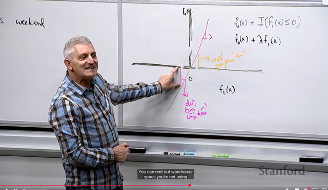</kbd></p>

> [!NOTE]
> Và rồi dĩ nhiên ta sẽ thấy mắc cười là rõ ràng đường màu đỏ khó
> mà approximate tốt cho đường màu xanh lá.
>
> Vì ý nghĩa của đường màu xanh lá, vốn là thể hiện bản chất của bài
> toán đó là: Nếu f1(x) âm, ta sẽ không phải trả giá gì, nhưng nếu
> f1(x) dương, tức violate constraint thì ta sẽ phải trả cái giá infinity,
> đồng nghĩa điều này unacceptable.
>
> Trong khi đó, với đường màu đỏ nó mang ý nghĩa khác. Giả sử bài
> toán là tối ưu cách sử dụng không gian của kho chứa hàng đi. Thì,
> khi ở bên phần f1(x) dương, thì λ1f1(x0) là cái giá phải trả mà khi
> f1(x) nhỏ thì cái giá phải trả không lớn (khác với việc f1(x) dương
> với đường màu đen thì dù nhỏ cũng là có cái gía infinity)
>
> Ngược lại, với f1(x) âm thì ta có phần dôi dư, giống như ta có thể
> xài không hết nhà kho và cho thuê lại lấy tiền vậy, điều này ko xảy
> ra ở đường màu xanh lá
>
> Ý NGHĨA MANG TÍNH APPROXIMATION CỦA
> LAGRANGIAN

<br>

<p align="center"><kbd>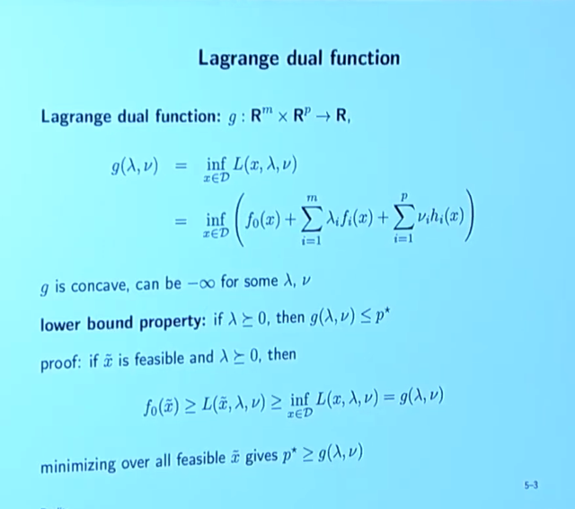</kbd></p>

> [!NOTE]
> Thế thì ta học qua LAGRANGE DUAL FUNCTION g(λ, v) là
> function của các Lagrange multipliers λi, vi (gọi là các
> Lagrange variables)
>
> Và nó là kết quả khi ta MINIMIZE LAGRANGIAN FUNCTION
> L(x, λ, v) tức là, ta sẽ tìm x* sao cho Lagrangian function nhỏ
> nhất, khi đó cái L(x*, λ, v) sẽ là g(λ, v)
>
> g(λ, v) `=` inf x ∈ D L(x, λ, v)
>
> Một điểm đáng lưu ý: g(λ, v) là CONCAVE function ngay cả khi
> vấn đề ban đầu không phải convex. Lí do là với mỗi giá trị cụ
> thể của x, thì f0(x) + `Σ` λifi(x) + `Σ` vihi(x) là AFFINE function
> của λi và vi.
>
> Và việc ta làm là tìm minimum (infimum) của các affine
> function thì sẽ được concave function. Đây là điểm đã học (theo
> link): nếu f(x,y) convex, C convex thì g(y) `=` inf x ∈ C f(x,y) sẽ cũng
> là convex. MÌnh đoán nếu f concave thì g cũng concave.
>
> Quan sát thứ hai là LOWER BOUND PROPERTY: đó là nếu λ ≽ 0
> thì: 
>
> g(λ, v) `<=` p* 
>
> Và nó TẠO NÊN CẬN DƯỚI CỦA (LOWER BOUND) CỦA OPTIMAL
> VALUE P*
>
>  (dĩ nhiên λ là vector các λi: coefficients gắn với inequalities constraints 
> function fi(x))
>
> Tại sao? Là bởi hãy xét cái Lagrangian trước, nó là tổng của objective
> function f0(x) và linear combination của fi(x) và gi(x).
>
> Để rồi, giả sử xét một FEASIBLE POINT x~, thì vì nó feasible nên nó thỏa
> constraints, nên: 
>
> `Σvihi(x~)` `=` 0 (do hi(x~) `=` 0) 
>
> và `Σλifi(x~)` `<=` 0 (do λi KHÔNG ÂM và fi(x) < 0)
>
> Vậy VỚI MỌI FEASIBLE POINT x~: 
>
> f0(x~) + `Σλifi(x~)` + `Σ` vihi(x~) `<=` f0(x~) 
>
> tức là: 
>
> L(x~, λ, v) `<=` f0(x~) 
>
> Mà g(λ, v) `=` inf L(x~, λ, v) `=>` g(λ, v) `<=` L(x~, λ, v) với mọi x~
>
> Như vậy: g(λ, v) `<=` L(x~, λ, v) `<=` f0(x~) 
>
> `=>` g(λ, v) `<=` f0(x~) với mọi x~
>
> và vì x* là một trong các feasible point x~ nên từ đây suy ra
>
> Do đó g(λ, v) `<=` f0(x*) 
>
> `<=>` g(λ, v) `<=` p* 
>
> ĐÂY LÀ LOWER BOUND PROPERTY, CÒN GỌI LÀ WEAK DUALITY
>
> (WEAK DUALITY LÀ d* `<=` p*, d* `=` sup (λ, v) ∈ dom g g(λ, v))
>
> LAGRANGE DUAL FUNCTION
>
> LOWER BOUND PROPERTY: g(λ,v) `<=` p*

<br>

<p align="center"><kbd>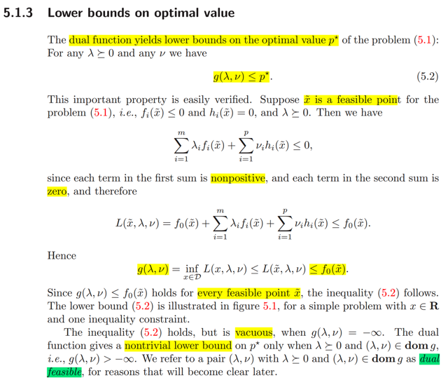</kbd></p>

> [!NOTE]
> Phần nói về LOWER BOUNDS PROPERTY trong sách, không có gì
> khác, chỉ bổ sung thêm rằng:
>
> Đại khái là nếu mà dual function g(λ, v) mà bằng -infinity (ta nhớ điều 
> này xảy ra khi Lagrangian L(x, λ, v) UNBOUNDED BELOW. Thì dễ
> hiểu rằng lúc này TÍNH CHẤT NÀY VÔ DỤNG (VACUOUS) bởi lẽ
> CHẢ ÍCH GÌ KHI NÓI p* LUÔN ≥ -infinity.
>
> Thành ra chỉ khi nào g(λ, v) > -infinity thì kiểu như ta mới có một ích
> lợi của tính chất này.
>
> Do đó, λ, v mà khiến g(λ, v) > -infinity thì nó gọi là DUAL FEASIBLE
>
> Và cái này giải thích sâu hơn vì sao λ phải thỏa λ ≽ 0, cũng như 
> λ, ν ∈ dom g được gọi là dual feasible 
>
> (vì khi λ, v không ∈ dom g thì dĩ nhiên g(λ, v) `=` -infinity (hàm số 
> không xác định thì cũng như là nói hàm số `=` -infinity)
>
> Nói thêm chút về λ: Đại khái là khi xây dựng Lagrangian, thì nếu λi mà
> âm, thì khi minimize x Lagrangian có term λi fi(x) sẽ khiến x có thể
> vi phạm constraint bằng cách cho fi(x) lớn lên và lớn hơn 0 mà vẫn giúp 
> giảm L do λi fi(x) vẫn giảm nhờ λi âm. Do đó λi ≥ 0 là yêu cầu đầu tiên
> với λ và đây là một trong hai điều kiện để gọi là dual feasible (đơn giản là
> định nghĩa là vậy)
>
> Và điều kiện thứ hai bên cạnh λ ≥ 0 đó là g(λ, v) > -infinity
>
> 5.1 LAGRANGE DUAL FUNCTION
>
> 5.1.3 LOWER BOUNDS ON OPTIMAL VALUE

<br>

<p align="center"><kbd>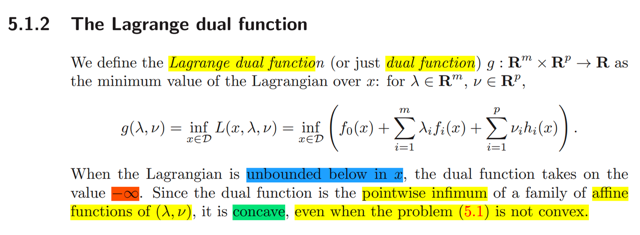</kbd></p>

> [!NOTE]
> Trong sách cho ta biết thêm:
>
> 1) Có thể gọi là LAGRANGE DUAL FUNCTION hoặc DUAL
> FUNCTION
>
> 2) Nếu Lagrangian mà UNBOUNDED BELOW, tức là muốn
> nó nhỏ bao nhiêu cũng được (khi minimized over x) thì hàm Dual
> g(λ,v) MANG GIÁ TRỊ -INFINITY
>
> 3) Khẳng định một điểm quan trọng: g(λ, v) CONCAVE vì nó
> là POINT-WISE INFIMUM CỦA CÁC AFFINE: 
>
> Bởi với mỗi giá trị x thì  `Σ` λi fi(x) + `Σ` vi hi(x) + f0(x) là affine
> function của λi và vi, nên point-wise infimum của các affine là
> concave (point-wise supremum của các affine là convex)
>
> 5.1 LAGRANGE DUAL FUNCTION
>
> 5.1.2 THE LAGRANGE DUAL FUNCTION

<br>

<p align="center"><kbd>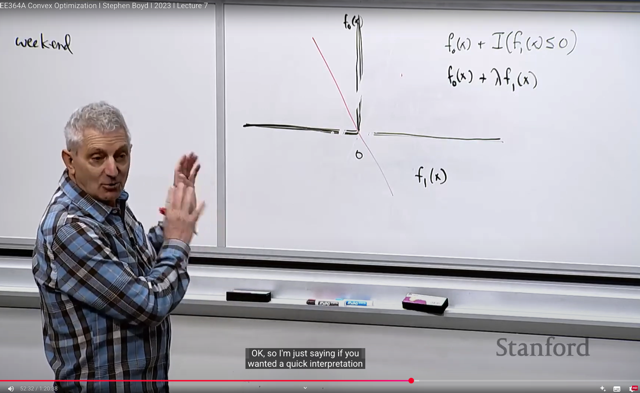</kbd></p>

> [!NOTE]
> gs dùng ví dụ này để lí giải tại sao λ phải dương. Vì nếu nó âm,
> đường màu đỏ với độ dốc âm sẽ như vầy. Hoàn toàn ridiculous khi
> nó nói rằng khi ta violate constraint thì lại được "thưởng" (giá trị
> dương của f1(x) nhân với λ âm ra âm, để rồi f1(x) càng dương càng
> tốt (vì ta đang minimize f0(x) + λf1(x))
>
> TẠI SAO λ PHẢI DƯƠNG

<br>

<p align="center"><kbd>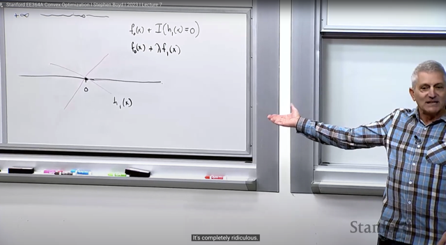</kbd></p>

> [!NOTE]
> Với equalities constraints thì cũng tương tự: Hình ảnh là ta có
> `I(h1(x)=0)`  bằng 0 khi h1(x) bằng 0 và infinity khi h1(x) khác 0.
>
> Hình ảnh sẽ giống như khi h1(x) đi -inf đến inf thì ta có hàm I đi ở
> trên cao (mức infinity) và khi h1(x) đi qua 0 thì nó nhảy xuống
> bằng 0 sau đó vọt lên lại
>
> Và ta sẽ cũng approximate cái đường trên cao này bằng một hàm
> tuyến tính nào đó.
>
> Ý chính gs muốn nói là ý nghĩa của cái Lagrangian là như vậy và nó
> khiến ta có thể thấy shock vì rõ ràng viẹc approx. như vậy rất không
> ổn

<br>

<p align="center"><kbd>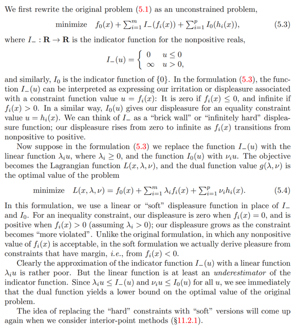</kbd></p>

<p align="center"><kbd>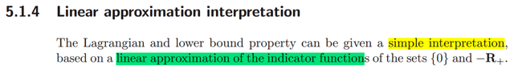</kbd></p>

> [!NOTE]
> SÁCH (XEM SAU)
>
> 5.1 LAGRANGE DUAL FUNCTION
>
> 5.1.4 LINEAR APPROXIMATION
> INTERPRETATION

<br>

<p align="center"><kbd>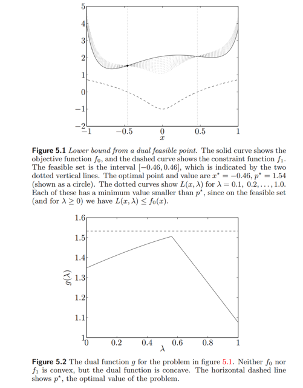</kbd></p>

> [!NOTE]
> SÁCH (XEM SAU)

<br>

<p align="center"><kbd>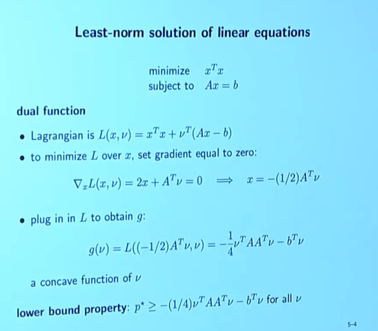</kbd></p>

> [!NOTE]
> Ta xét qua ví dụ này, minimize xTx với equality constraint
> `Ax=b`
>
> Thế thì đây là least-norm solution của linear equation system 
> (Giải `Ax=b` trong điều kiện b CÓ thuộc C(A) và có non-zero
> nullspace vector và normal equation ATAx `=` ATb có ATA không full
> rank vì các cột của A không độc lập để rồi ATAx `=` ATb có vô số
> nghiệm, và ta muốn tìm nghiệm có norm nhỏ nhất.  Có thể hiểu
> là ở đây ta dùng Lagrangian Dual function để cho  ra lower bound
> của optimal. Dù mình biết việc giải least-norm solution có thể dùng
> pseudo-inverse A^+.
>
> Ko khó hiểu mấy, ta set up Lagrangian f0(x) + vThi(x) (ko có
> inequality constraints) `=` xTx + vT(Ax - b) (equality `Ax=b` sẽ thể hiện
> thành h(x) `=` 0 `=>` h(x) `=` Ax - b)
>
> Sau đó ta tìm Dual function g(v) `=` inf x ∈ D L(x, v). Mà cái này thì ta
> đơn giản là dùng calculus, tìm gradient theo x của L, set nó bằng 0,
> giải ra x (khỏi xét second derivative, vì đây là bài toán convex, các
> function đều convex thành ra critical point cũng là minimum - Đây
> là điều mà FIRST ORDER CONDITION cho phép)
>
> Thế x* vào L(x, v) ta có g(v) `=` L(x*, v)
>
> Từ đó ta có p* `>=` g(v)
>
> Chỗ này ghi chú chút xíu một điểm mà mà mình mới hiểu ra:
>
> Bài toán LEAST-NORM SOLUTION OF `Ax=b:` Nói ngắn gọn, đây là khi ta có cái gọi là
> under-deterministic system: `Ax=b` CÓ `x_particular` và CŨNG CÓ non-zero trong nullspace.
>
> Nên hệ CÓ VÔ SỐ NGHIỆM  ở dạng x `=` `x_particular` + `c*x_null` (c là constant tùy ý).
>
> Và ta muốn tìm x có norm nhỏ nhất. Thì NÓ CHÍNH LÀ `x_particular.`
>
> Vì sao: vì `x_null` trong nullspace, sẽ vuông góc với `x_particular` do nullspace và rowspace
> orthogonal complement, và `x_particular` dĩ nhiên là nằm trong rowspace vì thông qua A, nó được map với
> b khác 0 nằm trong column space.
>
> Vậy `x_particular` vuông góc với `x_null,` và `x_complete` chính là cạnh huyền của tam giác
> vuông.
>
> ```text
> Để rồi norm x bằng √(||x_null||^2  + ||x_particular||^2) luôn >= ||x_particular|| và khi c = 0, thì
> ```
> ||x|| có giá trị nhỏ nhất `=` `||x_particular||`
>
> Nhưng tìm `x_particular` thì 1806 ta biết là mình có thể Gaussian elimination để xác định pivot
> column và free column, từ đó gán 0 vào các free variable back-substitute để giải ra pivot variable để
> có `x_particular.`
>
> Nhưng pseudo-inverse A^+ cũng có thể giúp. Bởi ta biết nó là matrix giúp map ngược vector trong
> R^m về lại R^n, trong đó nullspace vector `x_null` sẽ được map về 0 và map column space vector về
> row space.
>
> Do đó đối diện với b, là vector trong column space, (A^+)b sẽ cho ra lại vector trong
> row-space: `x_particular`
>
> ```text
> A^+ = V Σ+ UT => (A^+)b = V Σ+ U+ b
> ```
>
> ```text
> b = Ax_particular => A^+ b = A^+ Ax_particular = V Σ+ UT A x_particular
> ```
>
> ```text
> = V Σ+ UT U Σ (VT) x_particular  | A = U Σ (VT) SVD of A
> ```
>
> ```text
> = V Σ+ Σ VT x_particular | UT U = I, do U là matrix có các orthonormal columns - basis của A's columns
> ```
> space
>
> ```text
> = V VT x_particular  | (Σ+)Σ = I, do Σ+ là diagonal matrix với đường chéo là 1/σi,
> ```
>
> `σi` là các singular value khác 0 của A.
>
> `=` `x_particular`  | do VVT `=` I, do V là matrix các orthonormal columns - các basis của A's rowspace
>
> Vậy A^+b `=` `x_particular`
>
> `=====`
>
> Thế thì khi AAT INVERTIBLE (khi A FUL ROW RANK)  thì A^+ chính là RIGHT INVERSE:
>
> A^+ `=` AT(AAT)inv và khi đó right inverse dùng để giải least norm solution
>
> A[AT(AAT)invb] `=` AAT(AAT)invb `=` b do (AAT)(AAT)inv `=` I
>
> `=>` AT(AAT)invb là solution
>
> Mà AT(AAT)invb là vector trong column space của AT, cũng là rowspace của A, nên nó chính là
> `x_particular` - solution với norm nhỏ nhất theo lập luận trên.
>
> Chứng minh khi A full row rank thì A^+ chính là Right Inverse dùng SVD ta xem thử:
>
> A `=` U `Σ` VT  | SVD của A
>
> `=>` AT `=` V `ΣT` UT  | transpose hai vế
>
> ```text
> => AAT = U Σ VT V ΣT UT
> ```
>
> `=` U `ΣΣT` UT | vì VTV `=` I do V là matrix có các orthonorma columns là basis của A's rowspace
>
> và đây, U `ΣΣT` UT chính là eigen-decomposition của AAT với orthogonal eigenvectors matrix U
> và eigenvalue matrix `ΣΣT` (eigenvalue ko âm của A là bình phương singular value của A)
>
> Từ đó suy ra `(ΣΣT)_inv` là eigenvalue của (AAT)_inv
>
> (vì nếu λ là eigenvalue của A thì `1/λ` là eigenvalue của Ainv: chứng minh nhanh Ax `=` λx `<=>` AinvAx
> ```text
> = Ainvλx  <=> x/λ = Ainvx => 1/λ là eigenvalue của Ainv).
> ```
>
> Và cũng ta cũng vừa chứng minh AAT và (AAT)inv có chung eigenvectors:
>
> Vậy diagonalization của (AAT)inv: (AAT)inv `=` `U(ΣΣT)invUT`
>
> ```text
> Vậy AT(AAT)inv = [ V ΣT UT ] [ U(ΣΣT)invUT ]   | AT = V ΣT UT, (AAT)inv = U(ΣΣT)invUT
> ```
>
> ```text
> = V ΣT (ΣΣT)invUT   | UTU = I, đã nói ở trên
> ```
>
> `=` V `ΣT` `(ΣΣT)inv` UT
>
> ```text
> Và ΣT (ΣΣT)inv chính là Σ+ nên V ΣT (ΣΣT)inv UT chính là V Σ+ UT chính là A^+
> ```
>
> ÁP DỤNG LAGRANGIAN DUAL FUNCTION 
>
> TÌM LOWER BOUND CỦA
>
>  LEAST-NORM SOLUTION FOR LINEAR EQUATIONS
>
> Sẵn nói luôn Bài toán LEAST-SQUARE khi A có DEPENDENT COLUMNS: Nói ngắn
> gọn `Ax=b` khi C(A) không span R^m, để b không thuộc C(A). Không thể tìm `x_particular`
> được. Lúc này ta tìm x khiến minimize ||Ax-b||. Dẫn đến Normal equation: ATAx `=` ATb. Nếu
> ATA nonsingular, thì x `=` (ATA)invATb, `=` LEFT-INVERSE matrix nhân b, và nó cũng là
> Projection onto C(A) matrix.
>
> Nhắc lại một điểm quan trọng. Nếu ATA invertible (khi A full-column rank) thì A^+ chính là
> LEFT-INVERSE (và cũng có thể chứng minh tương tự ở trên ta chứng minh khi AAT
> invertible thì A^+ chính là right inverse
>
> Nhưng nếu ATA singular, khi A không full column rank (dependent columns) thì ATAx `=` ATb
> có vô số nghiệm: Có `x_particular,` vì ATb ∈ rowspace của A, và nó rowspace của A cũng
> chính là column space của ATA. có `x_null,` vì ATA singular nên dim nullspace khác
> 0. Và ta sẽ muốn tìm solution có norm nhỏ nhất.
>
> Again, solution có norm nhỏ nhất đó cũng chính là `x_particular` của ATAx `=` ATb (chứng minh
> cũng như trên, nullspace của ATA cũng orthogonal với rowspace của ATA, và `x_particular` thì
> nằm trong đó)
>
> ```text
> Thế thì x_particular của ATAx = ATb: ATAx_particular = ATb là least-square solution của
> ```
> `Ax=b` có norm nhỏ nhất.
>
> Và ta cũng lại dùng pseudo-inverse để tìm `x_particular:`
>
> x `=` (A^+)b. Vì sao nó chính là `x_particular:` Ta chứng minh nó là least square solution bằng
> cách chứng minh nó thỏa normal equation: ATAx `=` ATb
>
> ```text
> ATA(A^+)b = AT (U Σ VT) (V Σ+ UT) b = AT U Σ Σ+ UT b = AT U UT b = ATb
> ```
>
> Vậy (A^+)b là least square solution.
>
> Tiếp theo ta chứng minh nó chính là `x_particular` bằng cách chỉ ra nó nằm trong row space
> của ATA: (A^+)b `=` V `Σ+` UT b thì chắc chắn nó là linear combination của các rowspace basis
> `v_i` (các column của V).
>
> Mà một khi nó nằm trong rowspace thì nó chính là `x_particular.` Vì `x_complete` như đã nói là
> `x_particular` + `x_null`

<br>

<p align="center"><kbd></kbd></p>

> [!NOTE]
> Thế thì quay lại đây, dù là có analytic solution (dùng A^+) thì ta cứ xét
> nó như bài toán optimization xem sao. Thế thì Lagrangian là như vầy,
> objective là là quadratic function, nên convex. Còn equality
> constraint là affine, cũng là convex. Nên L là convex function
>
> Và ta sẽ minimize nó over x để có DUAL function g(ν) (ở đây không có
> inequalities constraint nên không có λ)
>
> Và ta làm việc này bằng cách tìm critical points với quadratic function
> thì nó cũng là minimum. Và như đã biết từ 1802, để tìm critical point ta
> set partial derivative (đối với x) tức gradient ∇xL(x, ν) `=` 0
>
> Thử tìm ∇_xL theo MIT18s096: dL `=` L(x+dx, ν) - L(x, ν)
>
> `=` (x+dx)T(x+dx) + vT(Ax+Adx-b) - xTx - vT(Ax-b)
>
> `=` (xT+dxT)(x+dx) + vTAx + vTAdx - vTb - xTx - vTAx + vTb
>
> `=` xTx + xTdx + dxTx + dxTdx + vTAx + vTAdx - vTb - xTx - vTAx + vTb
>
> `=` xTdx + dxTx + vTAdx `=` 2xTdx + vTAdx `=` (2xT + vTA)dx
>
> `=>` ∇xf `=` (2xT + vTA)T `=` 2x + ATv
>
> Cho nó bằng 0 giải ra x: 2x + ATv `=` 0 `<=>` 2x `=` -ATv
>
> `<=>` x `=` `-(1/2)ATv`
>
> Sau đó với x này, ta có dual function: g `=` `L(-(1/2)ATv,` v) thế vô ta
> sẽ có:
>
> ```text
> g = [-(1/2)ATv]T[-(1/2)ATv] + vT(A[-(1/2)ATv] - b)
> ```
>
> ```text
> = (1/4)vTAATv - (1/2)vTAATv - vTb = (-1/4)vTAATv - bTv
> ```
>
> Và đây là concave function vì ta có quadratic form vTAATv với
> AAT là positive semi definite nên convex (SECOND ORDER
> CONDITION: Hessian là PSD thì function convex) nên nhân số
> âm, thành concave. Cái -bTv thì là affine, cũng concave (và
> convex)
>
> Để rồi với giá trị nào đó của ν thì ta cũng có một lower bound của
> optimal (của function ban đầu)

<br>

<p align="center"><kbd>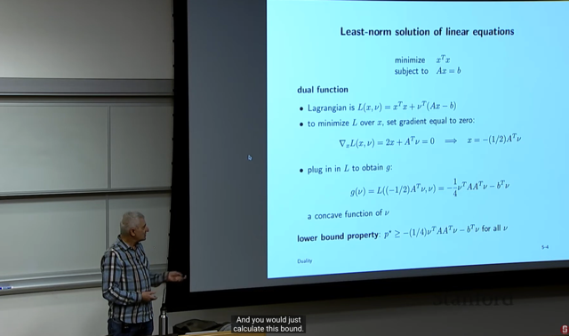</kbd></p>

> [!NOTE]
> và đại khái ví dụ như chọn ν `=` 0 ta có thể có quyền nói
> optimal p* sẽ phải `>=` 0 và gs cho rằng có rất nhiều
> ứng dụng từ cái này

<br>

<p align="center"><kbd>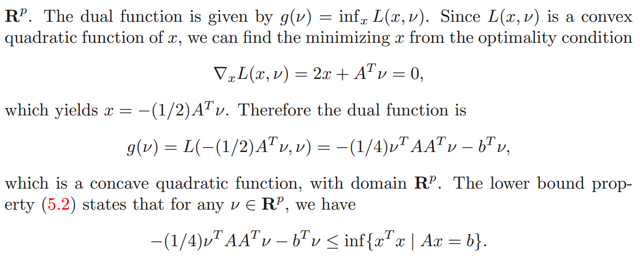</kbd></p>

<p align="center"><kbd>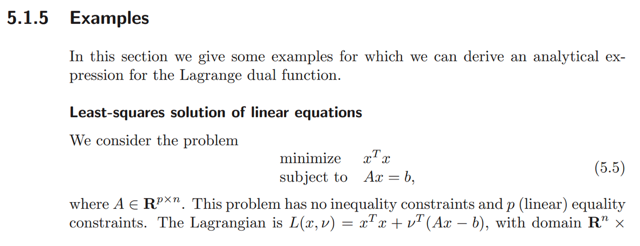</kbd></p>

> [!NOTE]
> SÁCH (XEM SAU)
>
> 5.1 LAGRANGE DUAL FUNCTION
>
> 5.1.5 EXAMPLES

<br>

<p align="center"><kbd>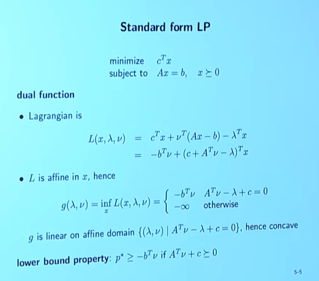</kbd></p>

> [!NOTE]
> Ta qua Standard form LP (ý là dùng Lagrangian để áp dụng
> vào LP)
>
> Như đã biết objective của LP là minimize cTx, và equality
> constraint là Ax `=` b còn inequality constraint sẽ là Cx ≽ d
>
> Còn ở standard form thì inequality constraint là x ≽ 0 (cái
> inequality constraint thì ta  sẽ đổi lại là -x ⪯ 0)
>
> Thế thì Lagrangian là L `=` cTx + vT(Ax-b) + λT(-x) `=` cTx +
> vT(Ax-b) - λTx
>
> `=` cTx + vTAx - vTb - λTx `=` (cT + cTA - λT)x - vTb
>
> `=` (c + ATv - λ)Tx - vTb `=` (ATv - λ + c)Tx - bTv
>
> Và ta sẽ minimize over x cái này để có dual function g(λ, v)
>
> g(λ, v) `=` inf x cTx + vT(Ax-b) - λTx
>
> Thế thì với affine function ví dụ pTx + q thì khi minimize nó, phần
> lớn trường hợp ta sẽ có -infinity (cái này dễ thấy). Nhưng trừ khi p
> `=` 0 thì minimize nó ra chính là q.
>
> Do đó g(λ, v) `=` `inf_x` L(x, λ, v) sẽ bằng -infinity khi ATv - λ + c
> khác 0 hoặc bằng -bTv khi ATv - λ + c `=` 0
>
> Và khi đó ta sẽ có lower bound -bTv `<=` p* nếu ATv + c ≽ 0
>
> STANDARD FORM LP: DÙNG LAGRANGIAN  GIẢI BÀI
> TOÁN LP Ở DẠNG CHUẨN

<br>

<p align="center"><kbd>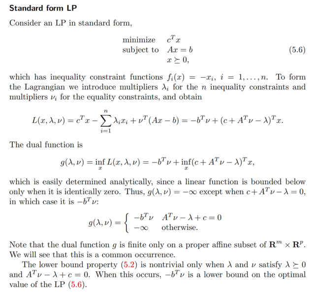</kbd></p>

> [!NOTE]
> SÁCH (XEM SAU)

<br>

<p align="center"><kbd>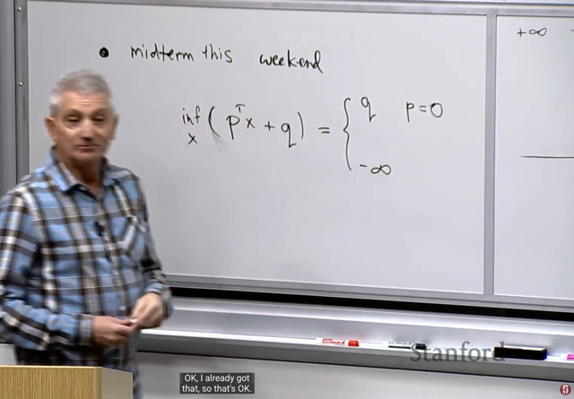</kbd></p>

<br>

<p align="center"><kbd>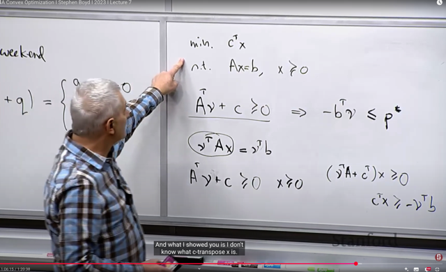</kbd></p>

> [!NOTE]
> Và đại khái là gs cho biết cái này xuất phát từ (như một cách để
> giải thích tại sao Lagrangian Dual cho ra kết quả như vậy)
>
> Ta có ATv + c ≽ 0, và đồng thời ta có x ≽ 0 nên dot product của hai
> vector này cũng sẽ `>=` 0: 
>
> (ATv + c)Tx `>=` 0 
>
> `<=>` vTAx + cTx `>=` 0
>
> Thay vTAx `=` vTb (do Ax `=` b) ta có: 
>
> vTb + cTx `>=` 0 
>
> `<=>` cTx `>=` -vTb (cũng là -bTv)
>
> Vậy cTx `>=` -bTv do đó optimal value của nó tức p* `>=` -bTv
>
> Thành ra ta ko biết cTx là gì nhưng ta biết nó `>=` -bTv

<br>

<p align="center"><kbd>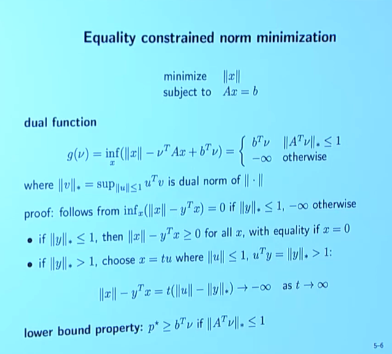</kbd></p>

> [!NOTE]
> Tiếp theo ta qua bài toán Equality constrained norm minization:
>
> Objective: minimize ||x|| subject to Ax `=` b.
>
> Cái này trông khá giống least norm solution của Ax `=` b, cũng là minimize ||x|| subject to Ax `=` b
> (cái kia là minimize xTx, chính là ||x||^2)
>
> Thì Lagrangian là ||x|| + νT(b-Ax) `=` ||x|| - vTAx + vTb  (Ta có thể define Lagrangian là ||x|| +
> vT(Ax - b) cũng được, vì với equality constraint Ax `=` b thì Ax - b `=` 0 hoặc b - Ax `=` 0 đều như nhau)
>
> Thế thì, như đã biết, ta sẽ minimize over x đối với Lagrangian function để có Dual function: 
>
> g(ν) `=` inf x ||x|| - νTAx + bTν
>
> `=` - sup x  - ||x|| + νTAx - bTν 
>
> `=` - sup x  νTAx - ||x||  + bTν
>
> `=` - sup x  (ATv)Tx - ||x||  + bTν
>
> Theo định nghĩa của conjugate function: 
>
> f*(y) `=` sup x  yTx - ||x||  
>
> nên sup x  (ATv)Tx - ||x||  chính là  f*(ATv)
>
> Và trong bài CONJUGATE FUNCTION (theo link), ta có conjugate của norm ||x|| là:
>
> f*(y) `=` sup x yTx - ||x|| sẽ bằng
>
> a) 0 khi ||y||* `<=` 1 
>
> b) +infinity khi ||y||* > 1
>
> -------
>
> Chứng minh nhanh lại cho nhớ:
>
> ```text
> + Nếu ||y||* > 1 <=> sup z: ||z|| <= 1 (yTz) > 1 <=> Tồn tại z có norm <= 1 mà yTz > 1
> ```
>
> Và điều này đồng nghĩa yTz > ||z|| `<=>` yTz - ||z|| > 0
>
> ```text
> Đặt x = tz => yTx - ||x|| = yTtz - ||tz|| = t(yTz - ||z||) và vì (yTz - ||z||) > 0 nên khi t -> infinity thì
> ```
> yTx - ||x|| -> infinity `=>` sup x yTx - ||x|| `=` +infinity
>
> ```text
> + Nếu ||y||* <= 1 <=> sup z: ||z|| <= 1 (yTz) <= 1 <=> yTz <= 1 với mọi z có ||z|| <= 1.
> ```
>
> ```text
> Do đó yTx/||x|| <= 1 với mọi x vì (x/||x|| có norm <= 1). Và như vậy yTx - ||x|| <= 0 với mọi x
> ```
>
> `=>` sup x yTx - ||x|| `=` 0
>
> Ôn lại khái niệm gọi là DUAL NORM of l2 norm
>
> Ví dụ ||v||*, tức l2 norm dual norm of v: ||v||* `=` sup `||u||<=1` uTv
>
> Mang ý nghĩa là tìm trong các vector u có length `<=` 1 cái nào u* khiến uTv lớn nhất và
> tính u*Tv của cái đó (để có ||v||*)
>
> ---------
>
>
> Vậy quay lại đây, ta sẽ có f*(ATv) `=` sup x  (ATv)Tx - ||x||  sẽ bằng:
>
> a) 0 khi ||ATv||* `<=` 1
>
> b) +infinity khi ||ATv||* > 1
>
> Như vậy: 
>
> g(v) `=` - sup x  (ATv)Tx - ||x||  + bTν 
>
> `=` - f*(ATv) + bTv sẽ mang giá trị:
>
> a) - 0 + bTv `=` bTv khi ||ATv||* `<=` 1 
>
> b) - infinity + bTv `=` - infinity khi ||ATv||* > 1
>
> Như vậy thì p* > g(v) có lower bound là bTv khi ||ATv||* `<=` 1
>
> ÁP DỤNG LAGRANGIAN DUAL FUNCTION 
>
> TÌM LOWER BOUND CỦA 
>
> EQUALITY CONSTRAINED NORM MINIMIZATION

<br>

<p align="center"><kbd>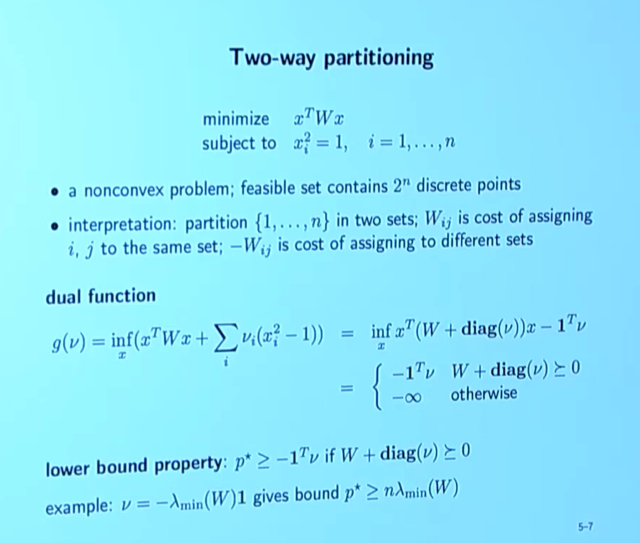</kbd></p>

> [!NOTE]
> Bài toán này objective là xTWx, equality constraints là xi^2 `=` 1,
> `i=1,2,3...` (tức bình phương component bằng 1) với W ∈ S^n (
> trong slide không nói nhưng trong sách có nói)
>
> Ổng nói đại khái là ta có n objects, và ta muốn chia nó thành 2
> phần việc chia sẽ được thực hiện bằng cách đánh dấu như
> sau: ta có vector x có n phần tử, để rồi ví dụ x1 `=` 1 sẽ thể hiện
> object 1 nằm trong group1 và x2 `=` -1 sẽ thể hiện object 2 nằm
> trong group 2, cứ thế.
>
> Tức là phần tử của vector x chỉ có hai giá trị 1 hoặc -1, thể hiện
> object tương ứng thuộc group nào
>
> ÁP DỤNG LAGRANGIAN DUAL FUNCTION 
>
> TÌM LOWER BOUND CỦA TWO WAY PARTITIONING

<br>

<p align="center"><kbd>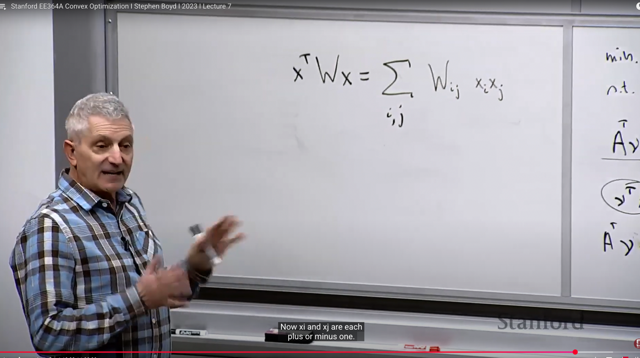</kbd></p>

> [!NOTE]
> Thử giải thích cái xTWx này:
>
> Wx ra một cột (vector cột), nên xT(Wx) là (1 hàng) x (1 cột)
> dĩ nhiên kết  quả là dot product của chúng `Σi` `x_i` * (Wx)_i
>
> Ta xem thử `Wx_i` là cái gì?
>
> Thế thì như đã biết, Wx là linear combination của các cột của W
> với hệ số là các component của x. Nhưng ở đây ta sẽ nhìn theo
> góc độ khác về Wx: matrix x matrix, tức coi x như matrix có 1
> cột.
>
> Thì Wx cũng sẽ là matrix có hàng thứ i là kết quả của việc
> linear combination các "hàng" của x với hệ số là hàng thứ i của
> W. Dĩ nhiên các hàng của x chỉ có 1 component, nhưng nó vẫn là
> các hàng. Và có thể thấy khi combine các hàng của (matrix) x, cũng
> chính là các component của vector x với  các hệ số là hàng thứ i
> của W, thì đó chính là dot product của vector x với hàng thứ i của
> ```text
> W: Wx_i = Σ Wi:j x_j
> ```
>
> ```text
> Vậy x_i * (Wx)_i = x_i * (Σj Wi:j x_j)
> ```
>
> Và do đó xTWx `=` `Σi` `x_i` (Wx)_i 
>
> ```text
> = Σi x_i Σj Wi:j x_j
> ```
>
> ```text
> = Σi Σj x_i Wi:j x_j
> ```
>
> và với `x_i` Wi:j `x_j` thì ta có thể xắp xếp tùy ý vị trí các scalar (cả 3
> đều là scalar) cũng như gộp lại `Σi` `Σj` thành `Σi,j`
>
> ```text
> xTWx = Σi,j Wi:j x_i x_j
> ```

<br>

<p align="center"><kbd>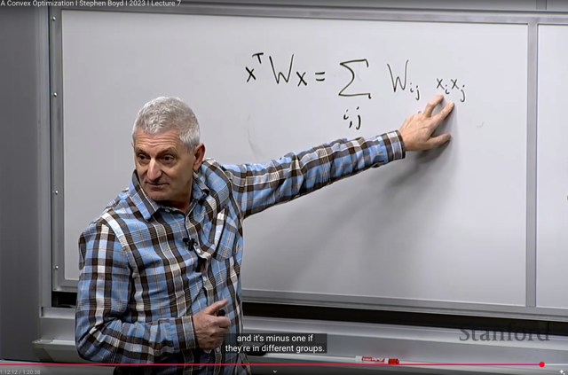</kbd></p>

> [!NOTE]
> Thế thì như vừa nói xi mang giá trị 1 nếu object i trong group 1 và
> mang giá trị -1 nếu object i nằm trong group 2. Do đó: xi*xj sẽ bằng
> 1 nếu xi, xj bằng nhau và thể hiện object i và object j ở chung một
> group. Ngược lại xi*xj `=` -1 sẽ thể hiện object i và object j khác group
>
> Và như vậy ta sẽ + Wij nếu object i và object j ở chung group và - Wij 
> nếu ngược lại.
>
> Do đó đây giống như ta assign Wij là COST khi object i, j ở chung 
> group, để rồi ví dụ như ta có bài toán chia 1 đám người vào 2 group
> thì nếu Wij dương sẽ thể hiện là ông i và ông j không ưa nhau, dẫn
> đến nếu hai ông mà chung group thì sẽ làm tăng COST (+ Wij)
>
> Ngược lại nếu Wij < 0 thể hiện việc cho ông i, ông j ở chung là tốt
> (- Wij, giảm tổng cost)

<br>

<p align="center"><kbd>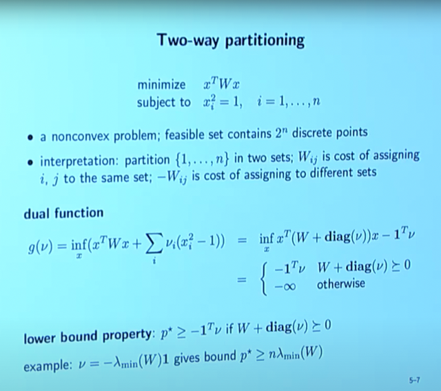</kbd></p>

<p align="center"><kbd></kbd></p>

> [!NOTE]
> CHỨNG MINH p* CÓ LOWER BOUND LÀ n λ_min(W)
>
> Thế thì như đã biết Lagrangian L sẽ là tổng của objective function 
> f0(x) `=` xTWx và linear combination của các constraint: 
>
> `Σ` νi fi(x) `=` `Σ` vi(xi^2 - 1)
>
> Để rồi ta sẽ minimize over x để có dual function g(ν):
>
> g(ν) `=` inf x (xTWx + `Σi` vi(xi^2-1))
>
> Thử làm xem tại sao nó ra như trong slide:
>
> ```text
> xTWx + Σ vi(xi^2-1) = xTWx + Σ vi*xi^2 - Σ vi
> ```
>
> `=` xTWx + vT(x^2) - 1Tv
>
> Tới đây `Σ` vi*xi^2 triển khai như sau:
>
> ```text
> Σ vi*xi^2 = Σ xi*vi*xi = Σ xi*(vi*xi) = xT(v⊙x) = xT[diag(v)x] = xTdiag(v)x
> ```
>
> GPT: diag(v) nếu pass vector v vào thì ta có diagonal matrix đường
> chéo v ngược lại pass diagonal matrix vào thì ta có vector v.
>
> Và với diagonal matrix `diag(σ)` thì: 
>
> ```text
> diag(σ)v = diag([σ1, σ2...])v = Σi σivi = σTv
> ```
>
> `=>` g(v) `=` inf x (xTWx + xTdiag(v)x - 1Tv)
>
> `=` inf x [xT(W + diag(v))x - 1Tv] 
>
> `=` inf x [xT(W + diag(v))x] - 1Tv |  bỏ -1Tv ra ngoài dấu infimum vì nó
> ko dính tới x.
>
> Và khi minimize cái này: xT(W + diag(v))x, thì đây rõ ràng là quadratic
> form. Với f(x) `=` xTAx thì df `=` (x+dx)TA(x+dx) - xTAx 
>
> `=` (xT+dxT)A(x+dx) - xTAx `=` (xTA+dxTA)(x+dx) - xTAx
>
> `=` xTAx+xTAdx+dxTAx+dxTAdx-xTAx `=` xTAdx+dxTAx `=` 2xTAdx
>
> `=>` ∇f `=` (2xTA)T `=` 2ATx
>
> ```text
> cho ∇f = 0 ta có 2ATx = 0 <=> x = 0, và nếu A positive semi definite
> ```
> thì x `=` 0 sẽ là minimum, cũng như f(0) là minimum value.
>
> Vậy nên nếu W + diag(v) là positive semi definite (kí hiệu W + diag(v) ≽ 0
>  thì: 
>
> inf x xT(W+diag(v))x `=` 0 (vì x `=` 0) 
>
> và do đó: inf x xT(W+diag(v))x - 1Tv SẼ BẰNG -1Tv
>
> Ngược lại nếu W + diag(v) không positive semi definite thì hàm số
> ko có minimum (tại critical point là saddle point) và nó sẽ có giá trị từ -inf
> đến inf khiến inf x [xT(W + diag(v))x] -1Tv SẼ BẰNG -INFINITY `=` VÔ DỤNG
>
> Rồi, vừa nói nếu W + diag(v) ≽ 0 thì: 
>
> inf x xT(W+diag(v))x - 1Tv `=` -1Tv 
>
> Và vì p* `>=` g(v), nên cũng đồng nghĩa là cũng chắc chắn p* `>=` -1Tv với mọi v
>
> Thế thì ta xét v `=` -λ_min(W)*1 thì sao nhỉ:
>
> -λmin(W)1 là tính λmin của W và nhân vector 1 `(=[1,1,...1]` thành vector 
> chứa mọi component là λmin của W.
>
> Ta biết nếu λ là eigenvalue của W ứng với eigenvector x thì:
>
> Wx `=` λx
>
> W + diag(v) `=` W + diag(-λmin(W)1)
>
> Thử tính: (W + diag(-λmin(W)1)x với x là eigenvector của W
>
> Ta có:
>
> [W + diag(-λmin(W)1)]x 
>
> `=` Wx + diag(-λmin(W)1)x
>
> `=` λx + diag(-λmin(W)1)x  | Wx `=` λx và nhớ lúc này diag(-λmin(W)1) đang là diagonal matrix
>
> `=` λx + (-λmin(W)1) ⊙ x  | diag(u)v `=` u⊙v
>
> `=` λx + -λmin(W) (1 ⊙ x)
>
> `=` λx + -λmin(W)x
>
> `=` [λ - λmin(W)]x
>
> Vậy [W + diag(-λmin(W)1)]x `=` [λ - λmin(W)]x
>
> Kết quả này cho thấy matrix W + diag(-λmin(W)1) CŨNG CÓ EIGENVECTOR
> x nhưng eigenvalue tương ứng là λ - λmin(W)
>
> Thế thì vì λ là eigenvalue của W, nên λ `>=` λmin(W)
>
> `<=>` λ - λmin(W) `>=` 0, 
>
> Việc λ - λmin(W) `>=` 0 với λ là eigenvalue bất kì của W, mang ý nghĩa rằng: 
>
> matrix W CÓ THỂ KHÔNG POSITIVE SEMI DEFINITE, với EIGENVALUE CÓ THỂ ÂM 
> nhưng W + diag(-λmin(W)1) THÌ CÓ EIGEN VALUE LUÔN KHÔNG ÂM, 
>
> NÊN [W + diag(-λmin(W)1)] SẼ LÀ POSITIVE SEMI DEFINITE.
>
> Khi đó, theo chứng minh vừa rồi, nói rằng nếu W + diag(v) positive semi definite
> thì p* `>=` -1Tv, 
>
> Vậy thì ta đã vừa chứng minh với v `=` -λmin(W)1 thì ta thỏa điều kiện: W + diag(v) sẽ ≽ 0, 
> từ đó giúp kết luận: 
>
> với v `=` -λmin(W)1, p* `>=` -1Tv 
>
> `<=>` p* `>=` -1T(-λmin(W)1)
>
> `<=>` p* `>=` 1T(λmin(W)1) 
>
> `<=>` p* `>=` `Σi` 1 * λmin(W) 
>
> `<=>` p* `>=` n λmin(W)
>
> VÀ ĐÂY CŨNG LÀ KẾT QUẢ MÀ TA CÓ TRONG BÀI TOÁN GỌI LÀ SPECTRAL
> PARTITIONING MÀ GS NÓI KẾ TIẾP

<br>

<p align="center"><kbd>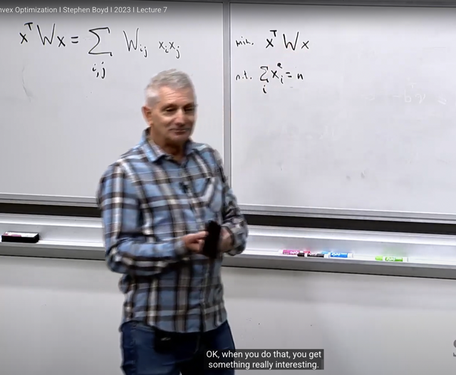</kbd></p>

> [!NOTE]
> gs nói về cái gọi là SPECTRAL PARTITIONING:
>
> đại khái là minimize xTWx, nhưng (khúc này tạm hiểu) là ta thay
> ```text
> constraint bằng Σ xi^2 = n, bởi vì nếu constraint cũ là xi^2 = 1 (xi = 1
> ```
> hoặc -1) thì có thể suy ra (kiểu như để có constraint "mới" là tổng
> `xi^2=n,` dĩ nhiên  không suy ngược lại được)
>
> gs hỏi: minimize xTWx constraint `Σi` xi^2 `=` n
>
> thì constraint này chính là ||x||^2 `=` n
>
> xTWx `=` xTSΛSinvx | diagonalization matrix W
>
> GỈA SỬ W SYMMETRIC, W `=` QΛQT 
>
> xTWx `=` xTQΛQTx 
>
> `=` xTQ [diag(Λ) ⊙ (QTx)] 
>
> `=` `Σi` [(QTx)_i] * λ_i * [(QTx)_i]
>
> `=` `Σi` [(QTx)_i]^2 λ_i
>
> Vậy xTWx `=` `Σi` [(QTx)_i]^2 λ_i
>
> Và cái này: 
>
> ```text
> Σi [(QTx)_i]^2 λ_min <= Σi [(QTx)_i]^2 λ_i   |   λ_min <= λ_i với mọi i
> ```
>
> ```text
> <=> λ_min * [Σi [(QTx)_i]^2] <= Σi [(QTx)_i]^2 λ_i
> ```
>
> `<=>` λ_min ||QTx||^2 `<=` `Σi` [(QTx)_i]^2 λ_i
>
> `<=>` λ_min ||x||^2 `<=` `Σi` [(QTx)_i]^2 λ_i   
>
> (Orthonormal matrix Q không thay đổi norm: ||QTx||^2 `=` (QTx)T(QTx)
> `=` xTQQTx `=` xTx `=` ||x||^2)
>
> ```text
> <=> λ_min * n <= Σi [(QTx)_i]^2 λ_i    |  Dùng constraints ||x||^2 = n
> ```
>
> Vậy minimize xTWx subject to `Σi` xi^2 `=` n sẽ bằng λ_min*n
>
> Và nó xảy ra khi x là eigenvector tương ứng λ_min của W: khi đó
> xTWx `=` xT λ_min x `=` λ_min * xTx
>
> `=` λ_min * ||x||^2 `=` λ_min * n
>
> `=>` p* `=` λ_min * n
>
> Có thể thấy chỉ dùng eigenvalue decomposition cũng giúp giải
> ra lower bound của p*, và vì đại khái là bài toán Two-way partitioning
> có constraint xi^2 `=` 1 cũng imply constraint của bài toán này `Σ` xi^2 `=` n
> nên kiểu như ta cũng suy ra p* của bài toán two-way partitioning
> cũng là λ_min * n. Đây là kết qủa mà ta có được nhờ Lagrangian Dualk
>
> KHÔNG CẦN DÙNG LAGRANGIAN DUAL FUNCTION MÀ CHỈ DÙNG
> KIẾN THỨC EIGENVALUE DECOMPOSITION
>
> TA TÌM LOWER BOUND CỦA BÀI TOÁN SPECTRAL PARTITIONING
> EQUIVALENT VỚI BÀI TOÁN TWO-WAY PARTITIONING

<br>

<p align="center"><kbd>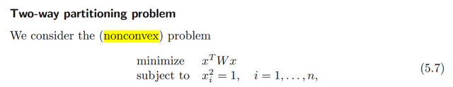</kbd></p>

<p align="center"><kbd>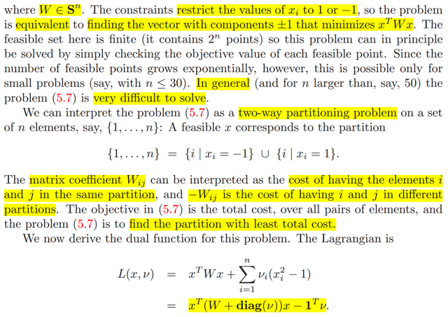</kbd></p>

<p align="center"><kbd>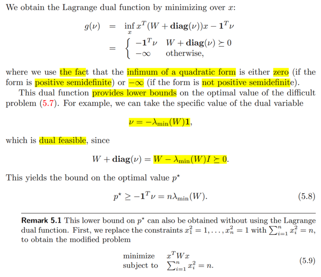</kbd></p>

<p align="center"><kbd>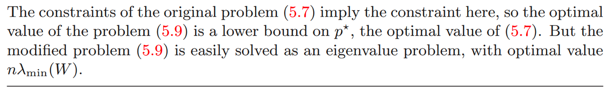</kbd></p>

> [!NOTE]
> Trong sách ko bổ sung gì so với bài giảng, trừ việc nó giúp mình hiểu
> bài toán TWO-WAY PARTITIONING problem là vấn đề NON-CONVEX vì W
> CHỈ SYMMETRIC, CHƯA CHẮC PSD. Và Lagrangian Dual function có thể
> GIÚP TÌM LOWER BOUND CỦA OPTIMAL VALUE p*
>
> Sau đó, đại khái là ta cũng có thể DÙNG MỘT BÀI TOÁN EQUIVALENT
> chính là Spectral Partitioning mà trong đó ta thay constraint từ xi^2 `=` 1 thành
> `Σ` xi^2 `=` n. Và bài toán này thì có thể tìm lower bound của p* KHÔNG CẦN
> DÙNG LAGRANGIAN DUAL mà CHỈ DÙNG EIGENVALUE DECOMPOSITION
>
> Và vì equivalent nên lower bound của p* cũng giống nhau

<br>

<p align="center"><kbd>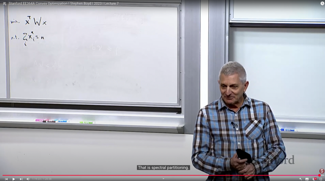</kbd></p>

> [!NOTE]
> Thế rồi đại khái gs nó để quay lại constraint gốc thì ta sẽ: làm tròn, và
> lấy sign. Hiểu đại khái là từ constraint `Σ` xi^2 `=` n ko thể suy ngược lại
> xi `=` `+/-1` nhưng bằng cách round off và lấy sign thì ta có thể.
>
> (hiểu đại khái vậy, chứ chưa hiểu rõ lắm)
>
> Và ông nói bài toán Spectral Partitioning này rất useful

<br>

<p align="center"><kbd>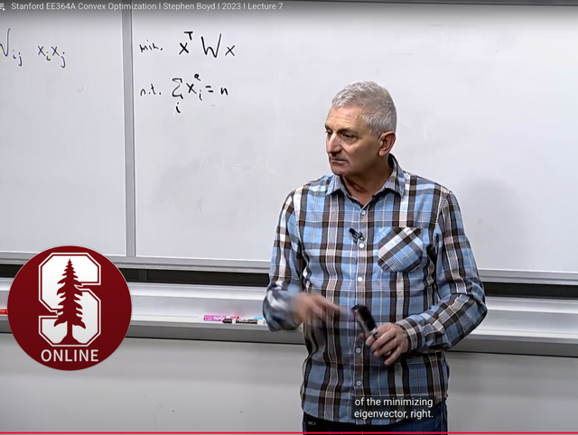</kbd></p>

> [!NOTE]
> ?: W có phải symmetric không và có phải PSD ko?
>
> Gs: Phải symmetric nhưng ko cần PSD.
>
> Mình nghĩ: vì với symmetric thì luôn diagonalizable (18.06: symmetric
> luôn có đủ n eigenvector độc lập và chúng vuông góc `/` hoặc có thể
> chọn được bộ vuông góc), nên xTWx `=` xTQΛQx và ta đã chứng minh
> nó đạt min khi x là eigenvector nhỏ nhất

<br>


<a id="node-0pl5mgb"></a>
## Lec 9b

<br>

<p align="center"><kbd>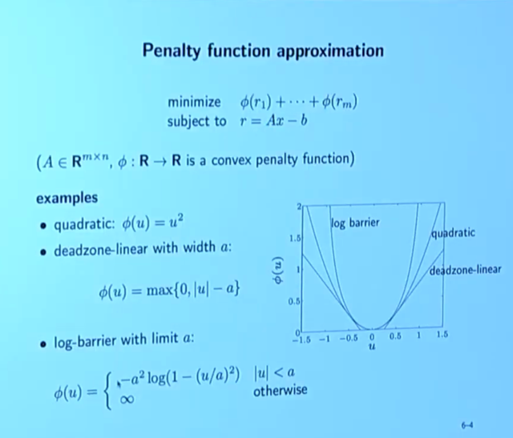</kbd></p>

> [!NOTE]
> tiếp theo là một cái rất useful:
>
> Ta biết thêm khái niệm SEPARABLE function: là khi function
> là tổng của  việc APPLY FUNCTION fi LÊN CÁC COMPONENT
> CỦA VECTOR r
>
> Đại khái là khi φ(u) `=` u^2 thì có thể thấy ta có bài toán least
> square (vì khi đó objective là minimize `Σ` ri^2 với r `=` Ax - b.
>
> Rồi khi φ là các function khác thì ta có các bài toán khác (đại
> khái vậy)
>
> Thế thì gs cho rằng ta có thể hiểu φ là function đo mức độ "khó
> chịu" của ta khi đối mặt với một residual (như error).
>
> Ví dụ như khi φ(u) bằng max 0, |u| - a thì có nghĩa là nếu u có trị
> tuyệt đối nhỏ hơn a thì ta ko care (bằng cách cho rằng độ khó chịu
> với residual như vậy là 0) nhưng khi u lớn hơn thì "độ khó chịu" sẽ
> tăng tuyến tính theo u

<br>

<p align="center"><kbd>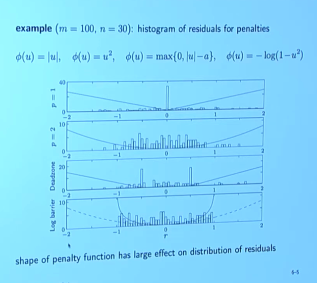</kbd></p>

> [!NOTE]
> đại khái cái này giống như là ta có 100 rows, 30 columns, giống như ta
> fit dataset có 100 samples và 30 features. thì u là errors (residuals) và
> φ(u) là penalty function (giống như loss function), HÌnh ảnh sẽ là cho ta
> thấy các hệ quả khác nhau khi ta dùng các penalty function khác nhau.
>
> Đầu tiên là nói về φ(u) `=` u^2. Ta quan sát có rất nhiều cột ở trong
> khoảng -1 tới 1. Điều này có nghĩa là, có nhiều "sai sót" với độ lớn nằm
> trong khoảng này được tồn tại. Giải thích cho hiện tượng này là vì, khi u
> có |u| `<=` 1 thì bình phương nó lên nó sẽ ra số còn nhỏ hơn nữa. Do đó,
> với u trong khoảng này thì đại khái là penalty nhỏ. Do đó optimizer kiểu
> như cho phép các sai sót  ở mức độ này tồn tại.
>
> Như khi residual lớn hơn 1, thì khi u tăng thì φ(u) tăng theo bậc hai, tức
> là tăng nhanh, nên điều này khiến ngày càng ít residual mang giá trị lớn
> còn  tồn tại. Nên ta thấy ra khỏi mốc 1.5 là không còn "cột" nào trong
> histogram thứ 2.
>
> Ta có thể xem cái case log barrier: Nó sẽ giống với u^2 ở khúc gần 0
> nhưng khi "ra xa" hơn chút, cỡ từ khi |u| > 0.4 thì log barrier tăng rất
> nhanh đến vô cùng. Do đó không có residual nào còn tồn tại ở ngoài
> khoảng [-1,1]
>
> Nói qua cái Deadzone, như đã biết, ý nghĩa của penalty này kiểu
> như là nếu u nằm trong -a đến a thì ok, penalty `=` 0, còn khi u nằm
> ngoài thì penalty tăng tuyến tính.
>
> Gs giải thích tại sao lại có hai cây cột ở đầu nơi mà penalty bắt đầu
> tăng: Đơn giản là kiểu như: ta nên hiểu optimizer sẽ tìm cách giảm
> penalty (giống như giảm loss function) thế thì với các residual tại
> đầu mút này, thì vì penalty vẫn bằng 0 nên không có lợi ích gì để
> mà optimizer tìm các giảm chúng
>
> Còn cái |u|. thì có cái cột cao ở giữa, là vì hàm này nó penalize
> tuyến tính theo u, nên chỉ khi u `~=` 0 thì penalty mới `~=` 0 (và để
> cho survive) nên có thể thấy optimizer sẽ ép cả các residual nằm
> trong khoảng -1,1 chứ không dễ dãi với đám này như hàm u^2 và
> log barrier, nên số residual trong khoảng -1, đến 1 ít hơn nhiều so
> với u^2 (các cột của histogram thấp hơn).
>
> Nhưng nó chỉ penalize residual tuyến tính nên vẫn tồn tại các residual
> lớn ở ~2, trái với u^2 không cho phép cái nào có giá trị lớn cả

<br>

<p align="center"><kbd></kbd></p>

> [!NOTE]
> gs nói thêm về |u| và u^2: Đó là "mức độ quan tâm" của u^2 sẽ nhỏ
> dần:
>
> cụ thể là, độ giảm penalty của `r1=9` và `r2=8` sẽ lớn hơn nhiều so với độ
> giảm penalty từ `r1=2` và `r2=1` (81-64 > 4-1) HIểu nôm na là optimizer
> sẽ quan tâm nhiều hơn tới việc giảm từ 9 xuống 8 hơn là giảm từ 2
> xuống 1
>
> Trong khi đó với |u|, độ giảm penalty trong hai case là như nhau. Mang
> ý nghĩa giống như optimizer sẽ tiếp tục quan tâm giảm penalty cho đến
> khi về 0 thì thôi với động lực giữ nguyên chứ không giảm dần như
> thằng u^2. Thằng u^2 thì kiểu như chỉ "hăng" `/` care nhiều khi u lớn mà
> thôi còn khi u nhỏ rồi thì nó vẫn care nhưng dễ dãi bớt `/` bớt hăng.
>
> Dẫn tới gs nói một ý liên quan đến machine learning là khi dùng |u| thì
> kết quả sẽ có nhiều zero (giống như ta đã biết với l1 regularizer
> optimizer sẽ tiếp tục ép các parameters về 0) còn u^2 thì chỉ ép về rất
> nhỏ chứ không về 0

<br>

<p align="center"><kbd>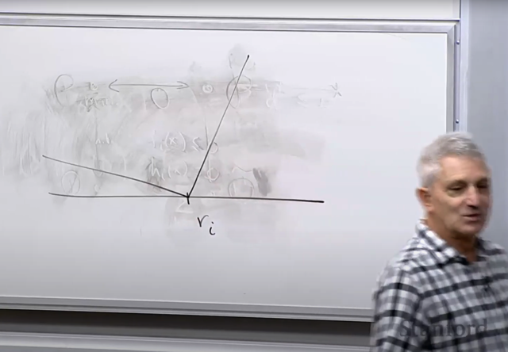</kbd></p>

> [!NOTE]
> gs đặt câu hỏi là nếu ta có penalty function như thế này, thì
> nghĩa là gì?
>
> Thử trả lời: nó sẽ có hệ quả là muốn residual `=` ri, nhưng
> encourage residual nhỏ hơn ri hơn là lớn hơn ri.
>
> Một student: bias đối với underestimating (ý là thiên vị case mà
> ta  dùng giá trị nhỏ hơn ri)
>
> gs: correct

<br>

<p align="center"><kbd>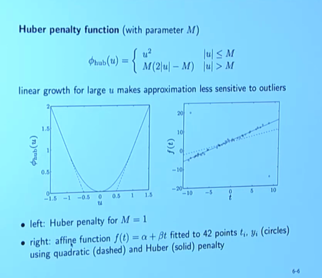</kbd></p>

> [!NOTE]
> Một cái quan trọng mà gs cho rằng ai cũng nên biết đó là Huber
> penalty function. Đại khái nó là u^2 khi |u| < M và khi ngược lại |u| >
> M thì penalty tăng tuyến tính thay vì quadratic.
>
> Gs cho rằng ý nghĩa của nó đối với bài toán regression là, ta sẽ giống
> như dùng squared error nhưng nếu error lớn thì ta bớt nghiêm trọng
> hơn. Điều này giúp approximation bớt nhạy cảm với outlier. Và cái
> này chính là cái gọi là Robust Estimator
>
> Hình ảnh của nó là vầy, có thể thấy phần khi u < -M và u > M là tuyến
> tính.
>
> Hình ảnh bên phải là bài toán regression fit 42 data points. Khi dùng
> quadratic (mean squared error loss) thì đường fitted line là đường
> chấm chấm. Nó rõ ràng bị kém là do ảnh hưởng của hai outliner.
>
> Nhưng với huber loss thì ta có fitted line tốt hơn nhiều.
>
> Vài bữa quay lại bàn về chỗ này khi ôn và học tiếp Stat110
>
> Gs nói thêm khi fitting data thì thường sẽ tốt hơn nếu dùng Huber
> thay vì least square
>
> Gs cũng dùng hình ảnh trong cơ học kiểu như khi ta kéo giãn lò xo thì
> lực kéo cũng tăng theo quaratic lúc đầu nhưng khi quá một giới hạn
> nào đó thì lực kéo chỉ tăng tuyến tính

<br>

<p align="center"><kbd>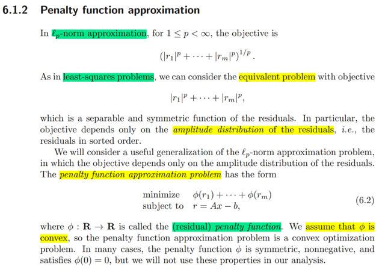</kbd></p>

> [!NOTE]
> Đại khái là, trong bài toán NORM-APPROXIMATION thì objective
> function là `(Σi` `|ri|^p)^1/p.`
>
> Và LEAST-SQUARE là equivalent problem là khi objective thay 
> bằng `Σi` |ri|^p
>
> Thế thì khái quát từ bài toán least-square này mà trong đó thực
> chất objective là `Σi` Φ(ri) với Φ(ri) `=` |ri|^2 với ri `=` Ax - b
>
> Thì khi objective là `Σi` Φ(ri) với ri `=` Ax - b, ta có bài toán PENALTY 
> FUNCTION APPROXIMATION.
>
> Trong đó hàm Φ gọi là RESIDUAL, function. Gỉa định đây là CONVEX
> function, thì ta sẽ có CONVEX OPTIMIZATION PROBLEM (vì khi
> đó objective là sum của các convex `=` convex, còn constraint là
> affine
>
> 6.1 NORM APPROXIMATION
>
> 6.1.2 PENALTY FUNCTION APPROXIMATION

<br>

<p align="center"><kbd>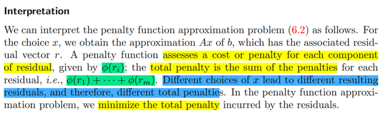</kbd></p>

> [!NOTE]
> Ta có thể diễn giải ý nghĩa của PENALTY FUNCTION là vầy: Với x, ta
> có Ax là approximation của b (ví dụ như prediction của target b từ
> data và parameter Ax). Thì sai khác giữa Ax và b là error `/` residual r
>
> Thế thì penalty function Φ(r) `=` [Φ(r1), Φ(r2), ...Φ(rm)] thì Φ(i) sẽ
> mang ý nghĩa là định ra một chi phí (cost) `/` "cái giá phải trả" `/` 
> hình phạt, mức phạt cho residual component thứ i'th
>
> Để rồi objective `=` `Σ` Φ(ri) mang ý nghĩa là tổng penalty
>
> Thế thì khi khái quát như vậy, thì mỗi một function cụ thể của Φ sẽ 
> dẫn đến kết quả khác nhau khi giải bài toán tối ưu trong đó ta tìm
> cách minimize penalty

<br>

<p align="center"><kbd>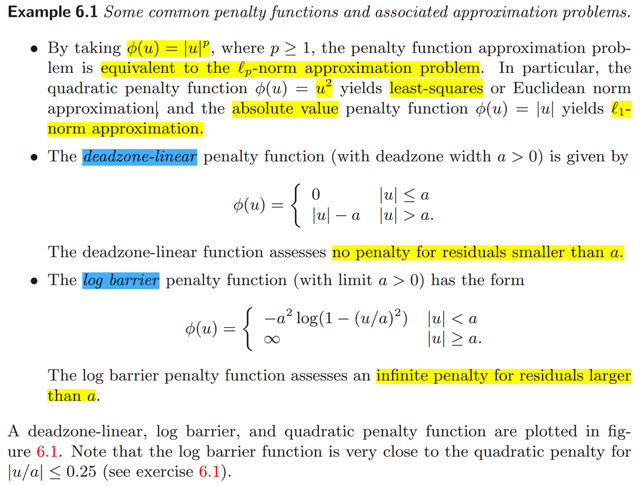</kbd></p>

> [!NOTE]
> Như đã nói, các khi Φ(r) `=` (|r|)^p, thì ta quay lại `/` có lại bài toán 
> norm approximation: minimize `(Σ|ri|^p)^1/p.` 
>
> Ví dụ p `=` 2, `(Σ` `ri^2)^1/2` tức L2 square norm.

<br>

<p align="center"><kbd>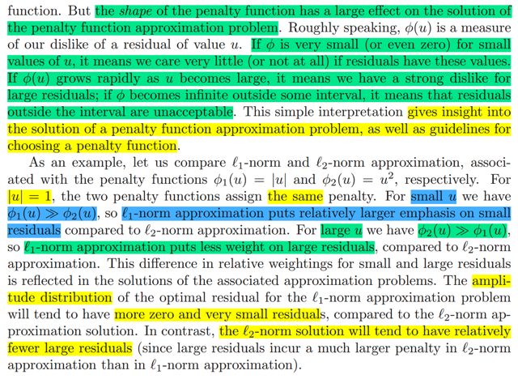</kbd></p>

<p align="center"><kbd>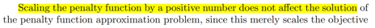</kbd></p>

> [!NOTE]
> Này nói rồi, đại ý là các penalty function khác nhau thì hành vi của
> chúng đối với mức độ lớn nhỏ của residual sẽ khác nhau.
>
> Ví dụ như nếu với r nhỏ mà Φ(r) nhỏ, thì tức là nó không khó chịu lắm
> với error nhỏ. Nhưng khi r tăng mà Φ(r) tăng rất nhanh thì chứng tỏ nó
> rất không thích error lớn. Và khi Φ(r) trở thành +infinity thì mang ý
> nghĩa là "không thể chấp nhận được"
>
> Rồi lấy ví dụ so sánh giữa khi Φ là L1, với L2. Thì khi u nhỏ, ví dụ nhỏ
> hơn 1, thì |u| >> u^2, ví dụ 0,1 > 0.01, cho thấy L1 norm "khó chịu với
> error nhỏ hơn" là L2 norm.
>
> Nhưng khi u lớn, thì |u| << u^2, ví dụ 1000 << 1000000, cho thấy L2
> norm khó chịu với error lớn hơn so với L1.
>
> Thành ra khi ta dùng hai function này, mỗi cái sẽ cho ra một kết quả
> (sau khi chạy bài toán tối ưu) khác nhau. Trong đó, với L1 norm thì sẽ
> có hầu hết residual là 0 hoặc rất nhỏ, vì L1 như đã nói, rất khó  chịu với
> residual nhỏ so với L2, đồng nghĩa là kết quả của L2 norm sẽ có thể
> tồn tại nhiều residual nhỏ (vì với L2, penalty trên residual nhỏ là không
> đáng kể, nên kiểu như dù vẫn còn residual dương nhỏ, nhưng coi như
> đã đạt optimal)
>
> Ngược lại, khi với L2 norm, ta sẽ không thấy tồn tại residual lớn so với
> L1, vì L2 norm penalty phạt rất nặng, cost rất cao đối với large residual.

<br>

<p align="center"><kbd>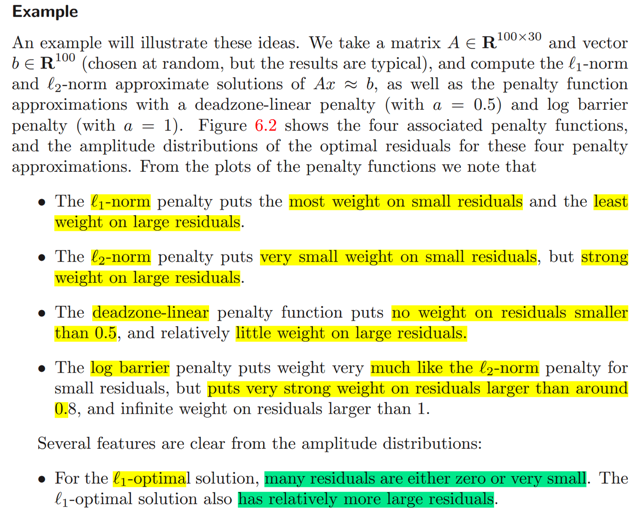</kbd></p>

<p align="center"><kbd>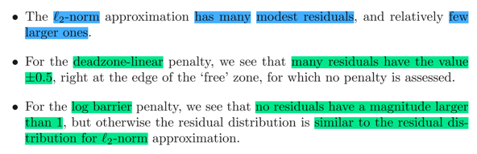</kbd></p>

<p align="center"><kbd>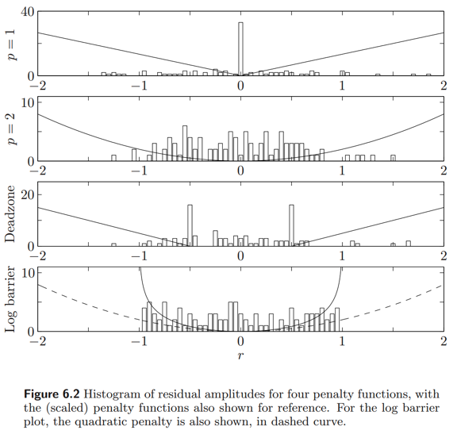</kbd></p>

<br>

<p align="center"><kbd>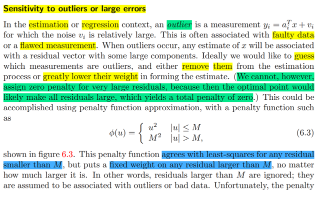</kbd></p>

<p align="center"><kbd>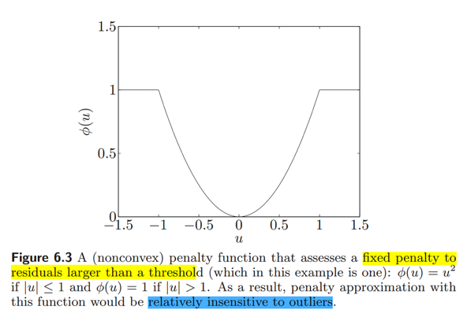</kbd></p>

> [!NOTE]
> đại khái là nói về OUTLIER, kiểu như khi dữ liệu bị đo sai, khiến
> residual nó lớn khác thường.
>
> Thì đại ý nói là, lí tưởng thì ta sẽ đoán xem cái nào là outlier
> để bỏ nó ra khỏi dữ liệu, hoặc gán weight cho nó rất nhỏ.
>
> (Ở đây có nói, ta chỉ gán weight rất nhỏ thôi, chứ nếu mà gán
> bằng 0 luôn thì optimizer sẽ làm sao cho mọi residual đều lớn
> để rồi chúng đều được gán weight `=` 0 khiến penalty `=` 0)
>
> Nhưng khó mà biết cái nào là outliner, nên một cách là dùng
> PENALTY FUNCTION NÀO CÓ TÍCH CHẤT ÍT NHẠY CẢM
> VỚI OUTLIER. 
>
> Một ví dụ là function mà nếu error nhỏ hơn mức M nào đó thì
> cho nó giống L2, còn quá mức đó thì cho Φ(u) `=` fixed value nào đó
>
> Làm vậy tuy cũng giúp ích nhưng nhược điểm là penalty function 
> này KHÔNG CONVEX
>
> Nhìn cái hình là thấy không convex rồi, nhớ lại định nghĩa convex
> là f(mixture) phải `<=` mixture of f. Biểu hiện hình ảnh đoạn nối
> hai điểm trên đồ thị (dây cung) phải luôn nằm trên đồ thị

<br>

<p align="center"><kbd>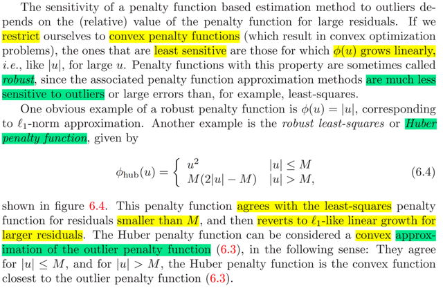</kbd></p>

> [!NOTE]
> Rồi thì đại khái là nếu ta yêu cầu phải có tính convex thì những cái
> mà có tính tuyến tính thì sẽ less sensitive với 
> outlier Do đó ví dụ như L1 norm, hoặc Huber penalty
>
> Công thức thì nó như vậy, cơ bản là giống L2 khi u nhỏ hơn mức nào
> đó và gần như tuyến tính khi u lớn hơn.
>
> Thì đại khái là cái này có thể coi như PHIÊN BẢN XẤP XỈ CỦA CÁI
> HỒI NÃY, có điều nó CONVEX
>
> Và gs cho biết thêm, Với bài toán regression dùng L1 norm thì 
> nó có tên là ROBUST REGRESSION bắt nguồn từ việc L1 norm 
> penalty là cái (tuy không phải the best, nhưng nằm trong số) những
> cái less sensitive với outlier tốt nhất

<br>

<p align="center"><kbd>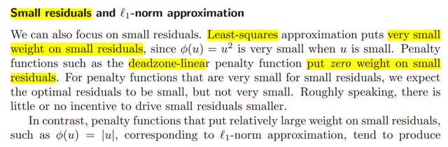</kbd></p>

<p align="center"><kbd>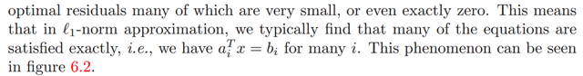</kbd></p>

<p align="center"><kbd>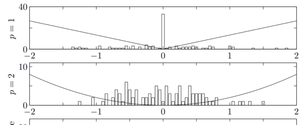</kbd></p>

> [!NOTE]
> Đại khái là với residual nhỏ. Thì khi penalty mà đối với chúng
> nhỏ, thì như đã nói hồi nãy, kiểu như không có động lực nào
> để qúa trình optimization thu nhỏ hơn nữa những residual nhỏ
> này. Kết quả là ví dụ như dùng L2 penalty, kết quả của quá trình
> optimization là tồn tại nhiều residual nhỏ (nhìn hình, ở dưới, trong 
> khoảng -1 đến 1 có nhiều cột thể hiện có nhiều residual mang giá
> trị trong khoảng này)
>
> Còn với L1 norm, là cái mà vẫn tạo penalty ko nhỏ đối với residual
> nhỏ, thì kết quả của quá trình tối ưu ép cho các residual rất nhỏ
> hoặc bằng 0 luôn. Nên ta thấy trong hình, ở trên, có lúp xúp các
> cột rất thấp quanh mốc 0 (là những residual mang giá trị rất nhỏ)
> và một cột rất cao ở 0 - tức là phần lớn các residual sau khi optimize
> (trong sách gọi là ở optimal) sẽ đều thành 0
>
> Hiểu cái này thì ta liên hệ với L1 norm `/` L2 norm regularization.
> L1 norm sẽ ép các parameter của model nhỏ thành 0 - khiến nó
> giống như feature selection `=` những feature ít ảnh hưởng sẽ bị
> set weight thành 0
>
> L2 norm thì chỉ ép chúng nhỏ lại, nhưng không thành 0.

<br>

<p align="center"><kbd>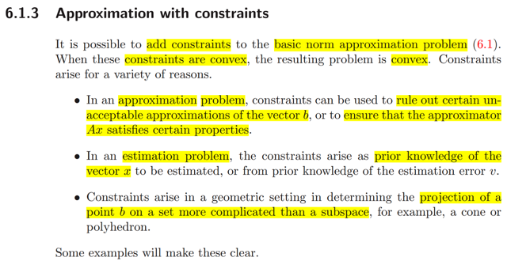</kbd></p>

> [!NOTE]
> Đại khái là bài toán Approximation ||Ax-b|| có thể có
> constraint (Nãy h là ko có constraint, chỉ có objective) Để rồi
> khi constraint function là convex thì ta có convex problem.
>
> Nói chung có nhiều lí do mà có thể ta có constraint. Xét ví dụ
> sẽ rõ
>
> 6.1 NORM APPROXIMATION
>
> 6.1.3 APPROXIMATION WITH CONSTRANTS

<br>

<p align="center"><kbd>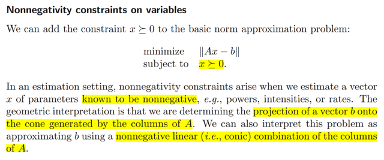</kbd></p>

<p align="center"><kbd>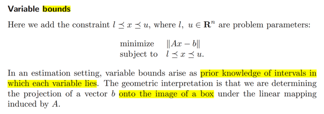</kbd></p>

<p align="center"><kbd>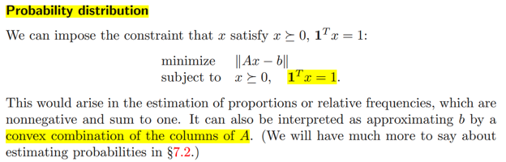</kbd></p>

> [!NOTE]
> Ví dụ như vầy, minimize ||Ax - b|| với x ≽ 0. Thì lí do của cái
> constraint này là có thể đôi khi trong bài toán thực tế ta biết
> x's component phải ko âm.
>
> Trong context hình học thì constraint này có nghĩa là ta project
> b lên một cone tạo bởi các cột của C(A). Hiểu nôm na là, thay vì
> project lên C(A) là một subspace, thì nay ta chỉ project nó lên
> một phần `/` một góc của subspace đó thôi (chính là một cone, 
> ví dụ nói R2 là một subspace thì R^2+ là một cone).
>
> Hoặc nếu nhìn bài toán như việc tìm x là coefficient tạo linear 
> combination các cột của A cho ra b thì với constraint thì nó trở
> thành tìm CONIC COMBINATION các cột của A (Conic combination
> là khi các hệ số không âm)
>
> `====`
>
> Hoặc ví dụ như constraint là l ⪯ x ⪯ u. Nói chung là có thể vì 
> có prior knowledge nào đó mà ta biết x phải bị giới hạn trong 
> khoảng này.
>
> `====`
>
> Hoặc là khi ta đang làm việc với x là probability distribution thì 
> ```text
> dĩ nhiên phải có constraint xT1 = 1 (Σ x P(X=x) = 1
> ```

<br>

<p align="center"><kbd>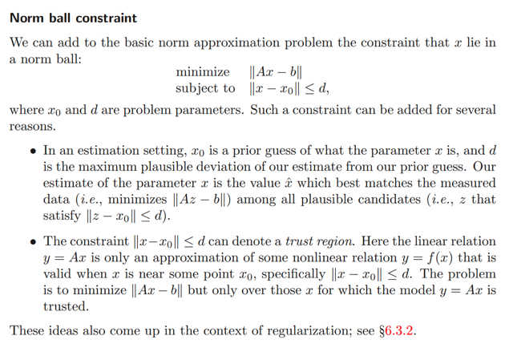</kbd></p>

<br>

<p align="center"><kbd>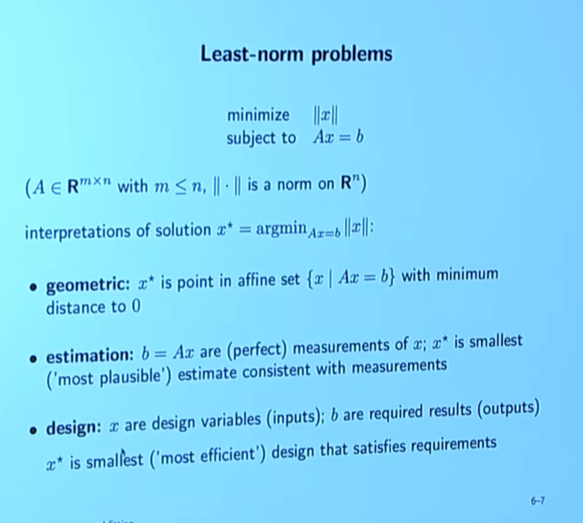</kbd></p>

> [!NOTE]
> Bài toán tiếp theo là Least-norm problem:
>
> minimize ||x|| subject to Ax `=` b với A là matrix (m, n) với m `<=`
> n. Và  ||.|| là norm (có thể là l1, l2...norm)
>
> Thế thì, review lại một chút: Nếu hệ phương trình `Ax=b` có nhiều
> phương trình hơn số biến, tức matrix A mập lùn thì `Ax=b` khi b
> ∈ C(A) thì khi đó nó sẽ có vô số nghiệm với công thức tổng
> quát là:
>
> ```text
> x_complete = x_particular + α*x_null  khi đó ta sẽ có bài toán tìm
> ```
> solution có norm nhỏ nhất. và least norm solution x* `=` argmin `Ax=b`
> ||x|| sẽ có ý nghĩa hình học là điểm trong affine set x: `Ax=b` sao
> cho có khoảng cách nhỏ nhất tới 0
>
> hai ý nghĩa estimation và design thì chưa hiểu lắm

<br>

<p align="center"><kbd>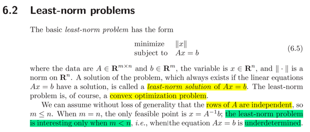</kbd></p>

<p align="center"><kbd>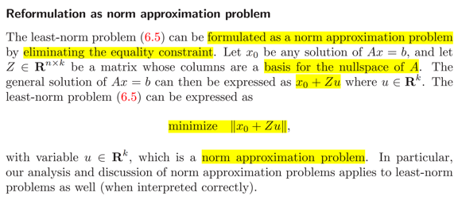</kbd></p>

> [!NOTE]
> Ta sẽ qua ứng dụng thứ hai, đó là LEAST-NORM PROBLEM.
> Trong đó ta sẽ minimize ||x|| subject to Ax `=` b.
>
> Thế thì cái này ta đã nói nhiều lần, nói lại lần nữa cũng không thừa.
> Xét constraint Ax `=` b, nó là hệ phương trình tuyến tính aiTx `=` bi Nó
> có thể vô nghiệm, unique hoạc vô số nghiệm.
>
> Và trong trường hợp vô nghiệm thì dĩ nhiên bài toán trở thành
> INFEASIBLE. Nếu nó có nghiệm duy nhất thì nó chính là optimal
> luôn. Do đó dĩ nhiên bài toán này chỉ thú vị khi hệ có vô số nghiệm
> và ta muốn minimize ||x||, tức tìm nghiệm có norm nhỏ nhất.
>
> Như đã biết từ MIT 18.06, nghiệm của Ax `=` b có dạng `x_particular`
> ```text
> + x_null, tức trong đó x_particular là x thỏa Ax = b, x_null là nghiệm
> ```
> của Ax `=` 0.
>
> Vậy thì, như đã biết `x_particular` nằm trong rowspace, được map
> với b nằm trong columns space thông qua A. còn `x_null` dĩ nhiên
> nằm trong nullspace. Do rowspace và nullspace orthogonal
> complement nên `x_null` vuông góc với `x_particular.` Và do đó x `=`
> ```text
> x_null + x_particular sẽ nhỏ nhất khi x_null = 0.
> ```
>
> Thế thì cũng vì vậy mà ta có thể thể hiện x `=` x0 + Zu, trong đó x0 là
> một prticular solution của Ax `=` b. Zu với Z là matrix có các cột là
> nullspace basis thì Zu là nullspace vector `(x_null)`
>
> 6.2 LEAST-NORM PROBLEMS

<br>

<p align="center"><kbd>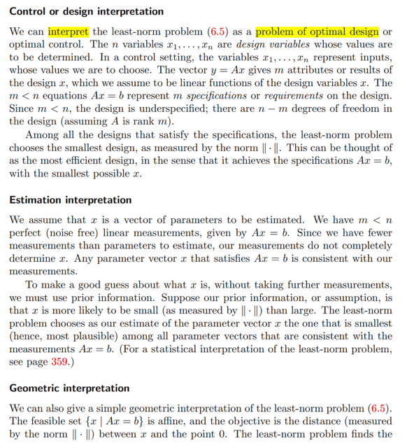</kbd></p>

<p align="center"><kbd>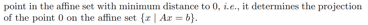</kbd></p>

<br>

<p align="center"><kbd>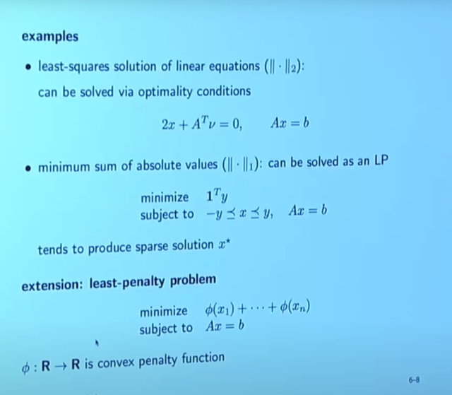</kbd></p>

> [!NOTE]
> một số ví dụ về least-norm problems: gồm có least-squares
> solution của linear equations:

<br>

<p align="center"><kbd>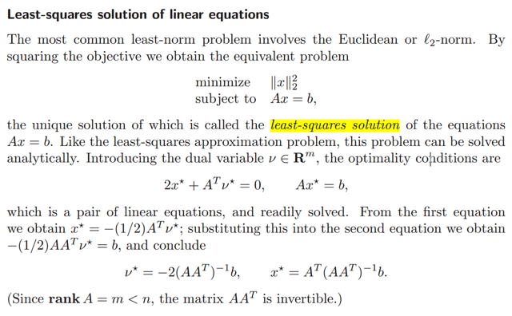</kbd></p>

> [!NOTE]
> Thực tế rất phổ biến khi ta bình phương norm lên để chuyển về equivalent
> problem: minimize ||x||^2 subject to Ax `=` b.
>
> Thế thì khi đó, optimal sẽ được gọi là least-square solution của Ax `=` b.
>
> Thử giải thích tại sao lại có cái optimal condition như vậy:
>
> g(λ, v) `=` inf x L(x, λ, v) `<=` L(x, λ, v)   | định nghĩa của infimum. 
>
> nên g(λ*, v*) `=` inf x L(x, λ*, v*) `=` inf x f0(x) + λ*Tf(x)  + v*Th(x)..
>
> .. `<=` L(x*, λ*, v*) `=` f0(x*) + λ*Tf(x*)  + v*Th(x*)
>
> (cái dấu `<=` này là do x* cũng thuộc feasible set, nên L(x*, λ*, v*) phải `>=`
> inf x L(x, λ*, v*)
>
> `..<=` f0(x*) 
>
> (Dấu `<=` này là vì x* là optimal thì nó trước hết phải feasible: λifi(x*) `<=` 0, 
> và vihi(x*) `=` 0)
>
> ```text
> Vậy ta có quan hệ d*= g(λ*,v*) = inf x f0(x) + λ*Tf(x)  + v*Th(x) <= f0(x*) = p*
> ```
>
> Khi ta có Strong Duality thì các dấu bằng sẽ xảy ra:
>
> ```text
> d*= g(λ*,v*) = inf x f0(x) + λ*Tf(x)  + v*Th(x) = f0(x*) = p*
> ```
>
> Và cho thấy f0(x*) chính là `=` inf x f0(x) + λ*Tf(x)  + v*Th(x), tức x* là minimizer
> của L(x, λ*, v*)
>
> Từ đó dẫn đến KKT condition thứ 4: ∇f(x, λ*, v*) `=` 0
>
> Thế thì trong bài toán này, với square norm (objective) là convex function,
> các inequality constraint là affine thì ta nhớ slater condition chỉ trở về là
> bài toán có feasible hay không. Nếu feasible, thì ta sẽ có Strong Duality.
>
> Lagrangian: L `=` ||x||^2 + vT(Ax - b) `=` xTx + vTAx - vTb
>
> g(v) `=` inf x xTx + vTAx - vTb
>
> Gradient ∇xL: dL `=` (x+dx)T(x+dx) + vTA(x+dx) - vTb - xTx - vTAx + vTb
>
> `=` dxTx + xTdx + vTAdx `=` vTAdx + 2xTdx `=` (ATv + 2x)Tdx
>
> `=>` ∇x L(x, v*) `=`  ATv* + 2x*
>
> Gradient của L tại optimal bằng 0:
>
> ∇xL(x*, v) `=` 0  `<=>` ATv* + 2x* `=` 0 
>
> KKT Condition đối với bài toán này (không có inequality constraint) sẽ
> chỉ gồm điểm thứ 4: ∇xL(x*, v) `=` 0
>
> Vậy cùng với Ax* `=` b ta sẽ giải ra v* , x*

<br>

<p align="center"><kbd>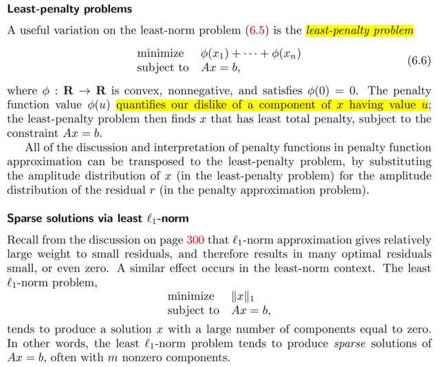</kbd></p>

<p align="center"><kbd>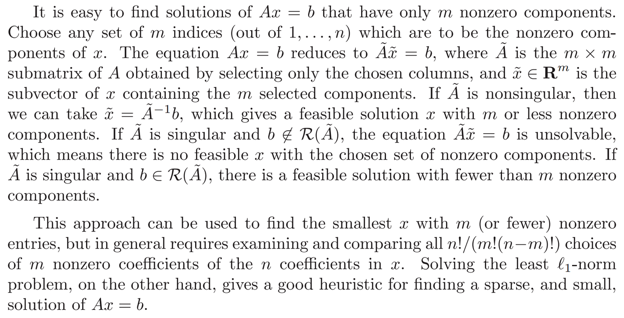</kbd></p>

> [!NOTE]
> SÁCH (XEM SAU)

<br>

<p align="center"><kbd>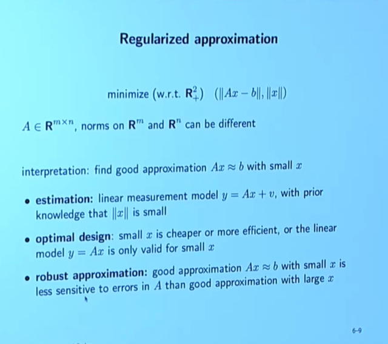</kbd></p>

<br>

<p align="center"><kbd>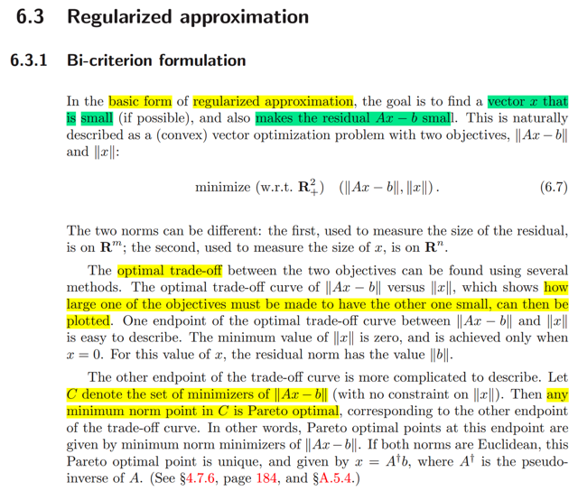</kbd></p>

> [!NOTE]
> Nói qua bài toán gọi là REGULARIZED APPROXIMATION, trong
> đó ta muốn minimize ||Ax - b|| và  đồng thời minimize ||x||.
>
> Thì cách tiếp cận đầu tiên là coi nó như bài toán VECTOR
> OPTIMIZATION (là bài toàn mà objective là vector: f0(x) `=` [F1(x), .
> ..Fn(x)]) f0(x) `=` [F1(x), F2(x)] với F1(x) `=` ||Ax - b||, F2(x) `=` ||x||.
>
> Để rồi như đã biết ở chapter 4. Cách tiếp cận phổ biến khi gặp bài
> toán vector optimization đó là ta sẽ SCALARIZATION,  chuyển
> thành bài toán có objective f0(x) `=` `Σi` λiFi(x).
>
> Và bằng cách minimize f0(x) (dĩ nhiên vẫn trong set O `={f0(x),` x ∈
> feasible set, tức x phải thỏa các constraint nếu có, nhưng ở đây
> thì không có constraint} ta sẽ có OPTIMAL của bài toán này chính
> là PARETO OPTIMAL của bài toán vector optimization
>
> Thế thì, đại khái là họ nói ta có thể vẽ ra đường cong OPTIMAL
> TRADE-OFF CURVE (đã thấy ở chapter 4) từ đó có thể phân tích.
>
> Đoạn dưới chưa hiểu lắm

<br>

<p align="center"><kbd>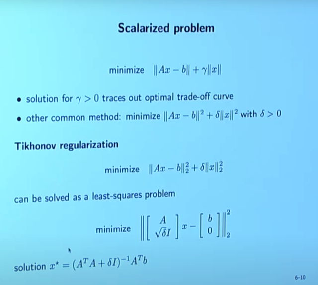</kbd></p>

<br>

<p align="center"><kbd>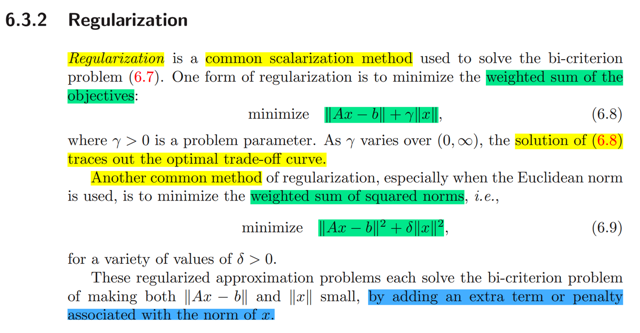</kbd></p>

> [!NOTE]
> Đại khái có thể hiểu là, đối diện với bài toán REGULARIZED
> APPROXIMATION": minimize hai objective ||Ax - b||, và ||x||.
>
> Thì một cách là thiết lập vector [F1(x), F2(x)] với F1(x) `=` ||Ax - b||
> F2(x) `=` ||x||. Và CHUYỂN THÀNH BÀI TOÁN VECTOR
> OPTIMIZATION (minimize objective function f0(x) là một vector)
>
> Mà để giải, phương pháp thông thường cũng là scalarization: lại
> chuyển thành bài toán khác với objective là `Σ` λi Fi(x) và optimal
> của bài toán này là Pareto optimal của bài toán vector
> optimization.
>
> Còn ở đây, một cách khác, đó là ta chuyển thành bài toán mà
> objective là ||Ax - b|| + `α||x||,` cũng là scalar. Rồi minimize nó. Thì
> cũng dễ thấy cái này thật ra cũng tương tự như giải bài toán
> vector optimization với λ `=` (1, `α)` vậy mà ta nhớ trong cách tiếp
> cận vector optimization, thì bằng cách chọn λ1, λ2 khác nhau (
> chính xác hơn là khác tương đối so với nhau, thông qua thay đổi
> tỉ lệ `λ1/λ2)` thì ta sẽ cơ bản là ưu tiên F1, hay F2, thì ở đây cũng
> vậy khi thay đổi `α` thì ta thực chất đang thay đổi tỉ lệ relative 
> weight của mỗi objective  
>
> `====`
>
> Một cách khác là cũng vậy, mà bình phương lên: ||Ax - b||^2 +
> `β||x||^2`
>
> Và những kiểu này gọi là add extra term vào objective (trong bối
> cảnh machine learning ta thấy nhiều, add regularizer vào loss
> term)

<br>

<p align="center"><kbd>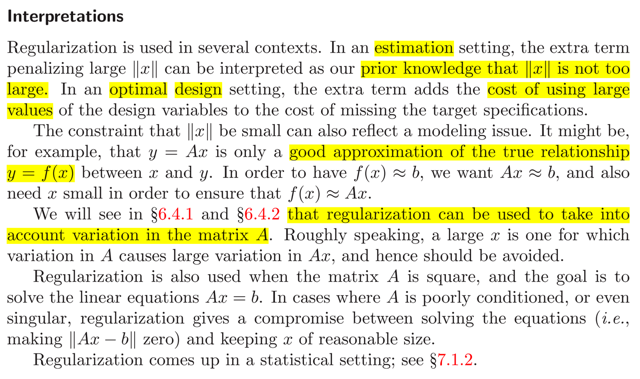</kbd></p>

> [!NOTE]
> Đại khái là một interpretation cho cái vụ `/` bài toán REGULARIZATION.
>
> Một trong số đó mà ta đã biết trong machine learning đó là ta muốn
> giảm loss (main loss) là sai khác giữa prediction của model với target
> value nhưng cũng muốn giá trị của parameter không trở nên lớn nhằm
> giúp tránh overfit.
>
> Ở đây gs nói trong bối cảnh ESTIMATION, thì giữ không có ||x|| lớn 
> để phản ảnh một prior knowledge của ta là x không lớn.
>
> Một lí do nữa mà gs có nói trong bài đó là, vì ta chưa biết A, A có
> thể variate, thì bằng cách muốn `/` giữ cho x nhỏ, ta sẽ giảm mức biến
> động của Ax
>
> Ngoài ra còn nhiều cách giải thích khác cho những bài toán khác

<br>

<p align="center"><kbd>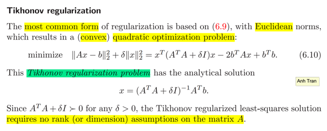</kbd></p>

> [!NOTE]
> Đại khái là như hồi nãy nói, một cách tiếp cận bài toán
> regularized approximation là giải nó như vector
> optimization.
>
> Cách khác là scalarizing bằng cách add hai cái lại, ||Ax - b|| +
> `α||x||.`
>
> Thì một cách phổ biến khác là cũng vậy nhưng bình phương:
>
> ||Ax - b||^2 + `β` ||x||^2
>
> Cách này khiến objective trở thành QUADRATIC function (và
> do đó là bài toán convex). Thì cái này có tên riêng thì cái này có
> tên riêng là TIKHONOV REGULARIZATION PROBLEM
>
> Việc tìm ra x `=` (ATA + `δI)inv` ATb thì không khó gì, chỉ cần tìm
> gradient ∇f, và giải ∇f `=` 0, thì nó chính là optimal (đây là quadratic
> function, nên  critical point cũng là minimum)
>
> Và sở dĩ (ATA + `δI)` invertible là vì ATA luôn ≽ 0 (positive
> semi definite, cái này đã biết từ MIT 18.06: check quadratic form
> của nó xATAx `=` ||Ax|| `>=` 0 `=>` ATA positive semi definite) nên với
> `δ` > 0, thì ATA + `δI` sẽ trở thành ≻ 0 (positive definite) Vì sao:
>
> Gọi λ là eigenvalue của ATA với eigenvector x: ATAx `=` λx
>
> ```text
> <=> ATAx + δIx = λx + δIx <=> (ATA + δI)x = (λ + δ)x
> ```
>
> Điều này cho thấy x cũng là eigenvector của (ATA + `δI)` nhưng
> eigenvalue tương ứng là λ + `δ.`
>
> Thế thì với ATA, là positive sem definite matrix, λ có thể `=` 0
> (không âm) nhưng vì `δ` > 0 nên λ + `δ` chắc chắn > 0. Vậy có thể
> kết luận mọi eigenvalues của (ATA + `δI)` đều dương nên nó là 
> positive definite. Và cũng vì vậy mà det (ATA + `δI)` > 0 `=>` invertible
>
> Do đó miễn là `δ` > 0 thì luôn có analytic solution x `=` (ATA + `δI)inv` ATb
> mà ko cần giải định gì về rank của A (ý là nếu mà `δ` ko dương, ví dụ 
> `δ` `=` 0 đi, khi đó để ATA invertible thì A phải full column rank)

<br>

<p align="center"><kbd>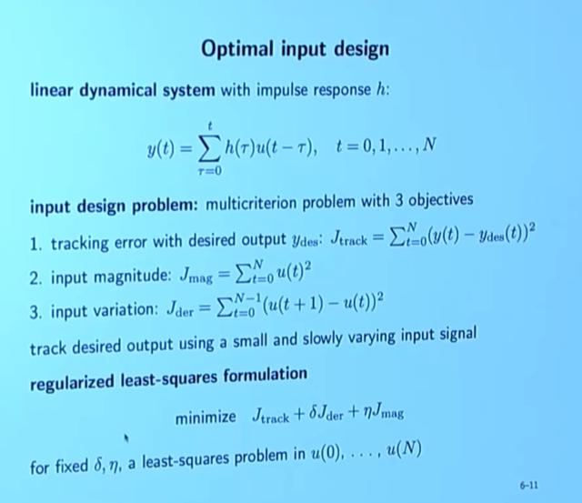</kbd></p>

<br>

<p align="center"><kbd>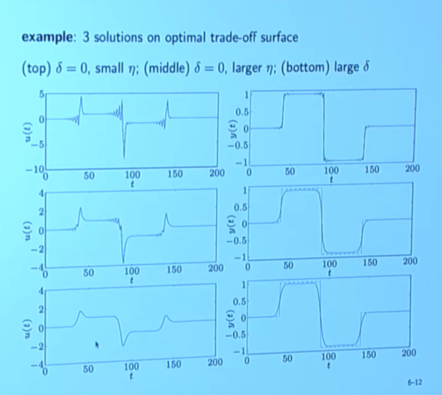</kbd></p>

<br>

<p align="center"><kbd>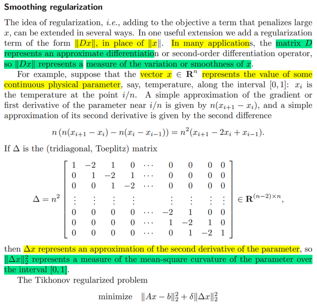</kbd></p>

<p align="center"><kbd>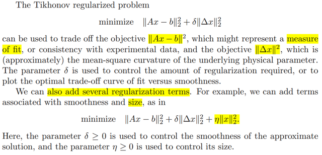</kbd></p>

> [!NOTE]
> Đại khái là có thể mở rộng regularization thay vì ||x|| thì dùng ||Dx||.
>
> Chưa hiểu rõ lắm nhưng đại khái trong nhiều bài toán, ta có thể dùng
> matrix D là matrix biểu thị approximate differentiation. Từ đó ||Dx|| thể
> hiện mức biến động của x, hoặc độ mượt.
>
> Ví dụ như một bài toán mà x là giá trị của một đại lượng liên tục.
> Và `Δ` gọi là Toeplizt matrix, đại diện cho ươc lượng của đạo hàm cấp
> 2 của parameters. Khi đó `||Δx||^2` đại diện cho chỉ số trung bình bình
> phương của độ cong (curvature)
>
> Khi đó ý nghĩa của bài toán minimize ||Ax - b||^2 + `δ||Δx||` sẽ là làm sao
> fit nhất (Ax -  b) nhưng phải smooth
>
> Sơ sơ vậy thôi

<br>

<p align="center"><kbd>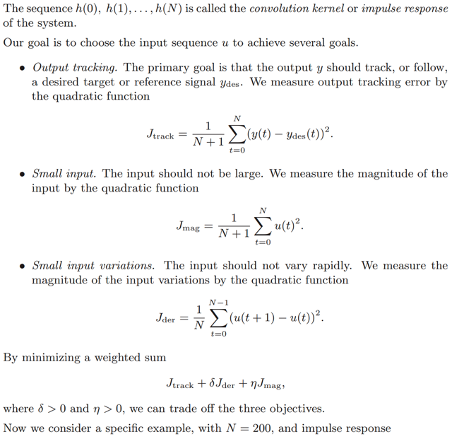</kbd></p>

<p align="center"><kbd>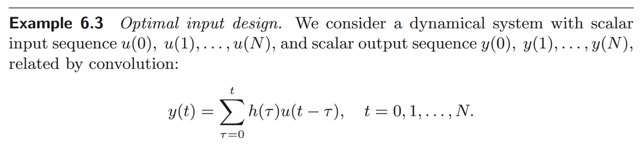</kbd></p>

<p align="center"><kbd>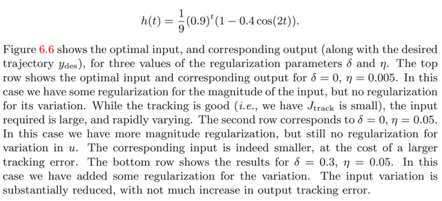</kbd></p>

> [!NOTE]
> đây là ví dụ nói về cái này
>
> Với các hệ số khác nhau ta ra các kêt quả khác nhau

<br>

<p align="center"><kbd>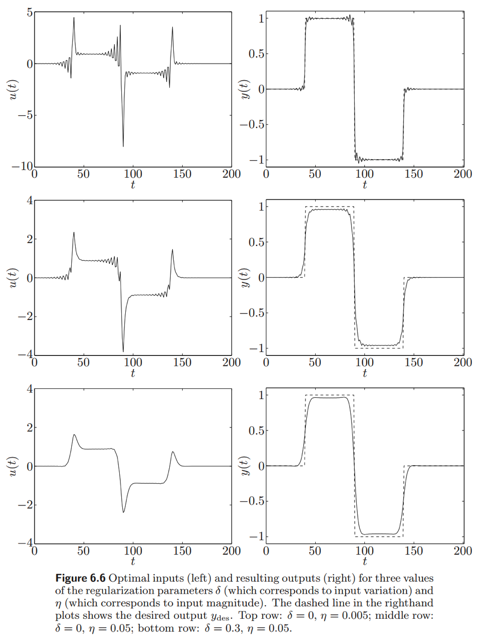</kbd></p>

<br>

<p align="center"><kbd>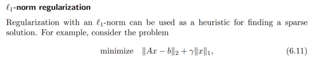</kbd></p>

<p align="center"><kbd>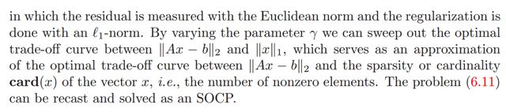</kbd></p>

<p align="center"><kbd>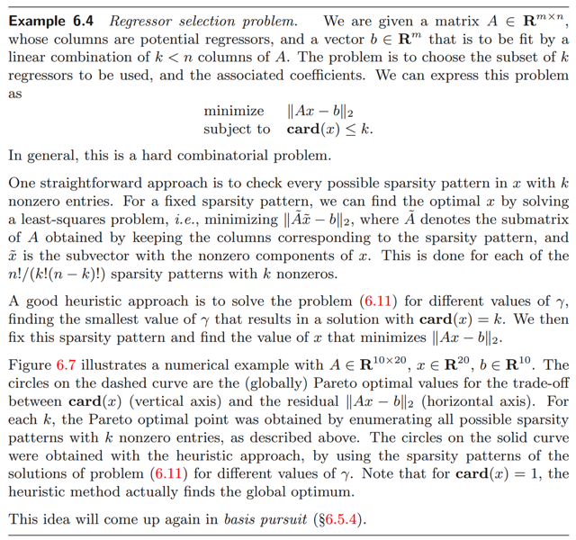</kbd></p>

> [!NOTE]
> Đại khái là, mục tiêu là tìm x, để giảm ||Ax - b|| nhưng MUỐN X
> SPARES `=` THƯA tức có nhiều component `=` 0.
>
> thì bằng cách dùng l2 norm ở main primary objective, và l1 norm ở
> secondary objective ta sẽ trade off giữa ||Ax - b|| và sparsity.
>
> Một ví dụ đại khái là bài toán Regressor - theo định nghĩa là ta muốn
> tìm x để linear combine các columns của A để cho ra  b `=>` objective
> ||Ax - b|| (l2 norm). Nhưng constraint là card(x) `<=` k (card là
> cardinality. là function tính số non-zero component của x) Nên ý nghĩa
> của bài toán này là muốn tìm (hệ số của) linear combination  các cột
> của A (gọi là các regressor) để cho ra b. Nhưng (với constraint card(x)
> `<=` k) sao cho chỉ lấy k cột thôi (vì thỏa card(x) `<=` k tức vector x chỉ có
> `<=` k non-zero components, dẫn đến khi nhân Ax nó sẽ chỉ "lấy" k cột
> trong n cột của A thôi)
>
> ....Còn nữa quay lại sau

<br>


<a id="node-6jrn3s0"></a>
## Chap 9.5

<br>

<p align="center"><kbd>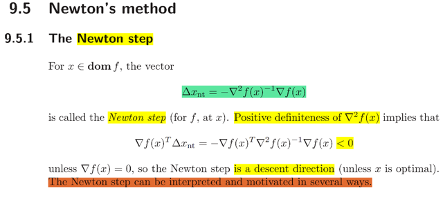</kbd></p>

> [!NOTE]
> Rồi, đầu tiên là định nghĩa Newton's step: `Δx_nt` (kí hiệu "nt" `=` "newton")  sẽ là:
> - ∇^2f(x)_inv ∇f(x)
>
> Thì mới nói nhờ tính chất positive definite của Hessian ∇^2f(x) mà ta sẽ có
> `∇f(x)TΔx_nt` `=` - ∇f(x)T∇^2f(x)_inv ∇f(x) < 0. Là sao?
>
> Đó là vì khi Hessian ∇^2f(x) ≻ 0 thì mọi eigenvalues của nó cũng dương,
> nên ∇^2f(x)_inv với eigenvalues bằng nghịch đảo của eigenvalues của
> Hessian cũng sẽ dương nên nó cũng positive definite. Mà với positive
> definite matrix, quadratic form: uTPu sẽ luôn dương hoặc bằng 0 khi u bằng 0,
> nên -uTPu sẽ luôn âm với u khác 0.
>
> Thành ra mới nói quadratic form - ∇f(x)T∇^2f(x)_inv ∇f(x) luôn âm khi trừ khi
> ∇f(x) `=` 0, mà ∇f(x) `=` 0 thì là optimal đó.
>
> Tóm lại cho thấy Newton step `Δx_nt` LÀ MỘT DESCENT DIRECTION, ý  là
> nó chỉ về hướng giúp giảm function.
>
> VÀ MỘT DÒNG TA NÊN ĐỂ Ý ĐÓ LÀ CÓ NHIỀU CÁCH HIỂU `/`
> INTERPRETATION VỀ NEWTON STEP
>
> 9. UNCONSTRAINED PROBLEM
>
> 9.5 NEWTONS'S METHOD

<br>

<p align="center"><kbd>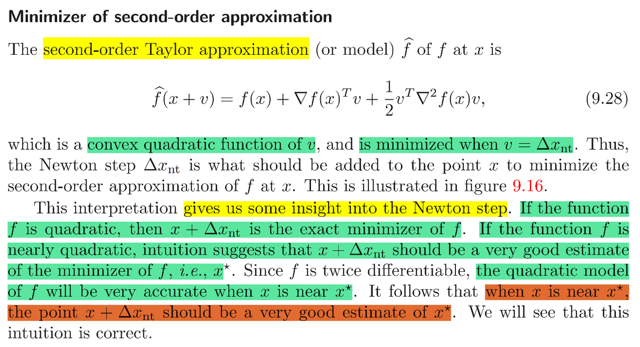</kbd></p>

> [!NOTE]
> đại khái ngắn gọn là vầy:
>
> Khi ta second order Taylor expansion của f(x) ta sẽ có:
>
> (đi ra khỏi x khoảng nhỏ v, giống như hay dùng `δx` vậy):
>
> f(x + v) ≈ f(x) + ∇f(x)Tv + `1/2` vT∇^2f(x)v
>
> Thế thì vế phải, là một quadratic function theo v:
>
> g(v) `=` f(x) + ∇f(x)T(v - x) + 0.5(v - x)T∇^2f(x)(v - x)
>
> Xét function quadratic này g(x) `=` r + 0.5xTPx + qTx
>
> dg `=` r + 0.5(x + dx)TP(x + dx)+ qT(x + dx) - (r + 0.5xTPx + qTx)
>
> `=` r + 0.5xTPx + 0.5dxTPx + 0.5xTPdx + 0.5dxTPdx + qTx + qTdx
>
> -r - 0.5xTPx - qTx
>
> `=` xTPdx + qTdx
>
> `=` (PTx + q)Tdx
>
> ∇g `=` PTx + q `=` 0 ⇔ x `=` -PTinvq
>
> Vậy áp dụng vào g(v)
>
> g(x + v) `=` f(x) + ∇f(x)Tv + 0.5vT∇^2f(x)v
>
> v giúp minimize g là: v `=` -PTinvq `=` -∇^2f(x)inv∇f(x)
>
> Và đó chính là công thức của Newton's step:
>
> `Δnt` `=` -∇^2f(x)inv∇f(x)
>
> Thành ra ta có nhận định rằng: Newton's step LÀ KHI TA COI `/`
> ƯỚC LƯỢNG HÀM f(x) LÀ MỘT HÀM BẬC 2, ĐỂ RỒI VỚI HÀM
> BÂC 2 THÌ TA CÓ THỂ GIẢI RA OPTIMAL CỦA NÓ BẰNG CÔNG
> THỨC (MÀ HÀM KHÁC THÌ CHƯA CHẮC) THÌ NEWTON STEP
> CHÍNH LÀ CÁI KHIẾN x + `Δx_nt` CHO RA OPTIMAL CỦA HÀM BẬC
> HAI NÀY
>
> Do đó nếu function f chính xác là một quadratic function, thì dĩ
> nhiên từ x, newton step sẽ giúp cho  ra ngay optimal: f(x + `Δx_nt)`
> `=` f(x)*
>
> Còn nếu f không chính xác  nhưng rất gần giống quadratic
> function thì x + `Δx_nt` cũng giúp tìm ra điểm rất gần optimal.
>
> Và đây là lí do mà khi càng gần x*, newton step càng giúp đi đến x*
> nhanh vì càng gần x* thì hàm f càng có thể được xấp xỉ tốt bởi
> quadratic function điều này là vì xấp xỉ bậc 2 của f nói rằng khi x gần
> x* thì f(x) ≈ f(x*) + ∇f(x*)T(x - x*) + `(1/2)(x` - x*)T ∇^2f(x*)(x - x*), tức
> là trong phạm vi càn gần x* thì sự xấp xỉ bậc hai này sẽ càng đúng
>
> CÁCH HIỂU ĐẦU TIÊN VỀ NEWTON STEP: ĐÓ LÀ TẠI ĐIỂM
> ĐANG ĐÚNG COI HÀM f NHƯ HÀM BẬC HAI, TỪ ĐÓ TÌM RA
> HƯỚNG ĐI
> + BƯỚC ĐI ĐỂ ĐẾN MINIMUM CỦA HÀM BẬC HAI NÀY THÌ ĐÓ
> CHÍNH LÀ NEWTON STEP

<br>

<p align="center"><kbd>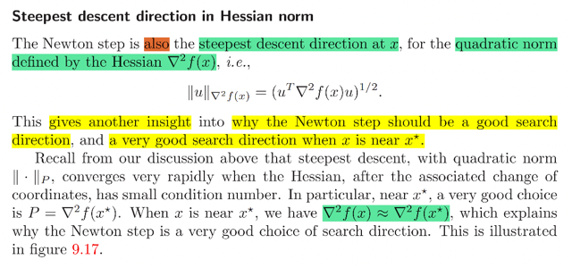</kbd></p>

<p align="center"><kbd>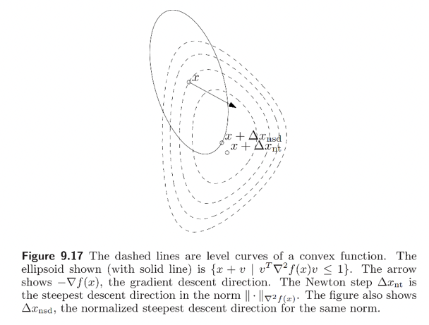</kbd></p>

> [!NOTE]
> đại khái là họ nói rằng, nếu mà ta "làm" theo phương pháp steepest
> descent với quadratic norm define bởi P là Hessian matrix ∇^2f(x).
>
> Thì khi đó `Δx_sd` theo bài trước ta đã biết sẽ là:
>
> ```text
> Δx_sd = - Pinv ∇f(x). Với P = ∇^2f(x) ⇨ Pinv = ∇^2f(x)inv
> ```
>
> ```text
> ⇨ Δx_sd = - ∇^2f(x)inv ∇f(x) và nó chính là Newton's step Δx_nt
> ```
>
> Thành ra giúp ta hiểu vì sao Newton step cũng tốt (bởi bản chất
> nó cũng là steepest descent direction)
>
> Rồi, đại khái là ta đã nói nhiều lần rằng, khi dùng steepest descent
> với quadratic norm define bởi matrix P thì thực chất nó tương
> đương với việc ta đổi hệ trục bởi P: Đặt x~ `=` `P^1/2` x. Khi đó trong
> hệ trục  mới ta làm theo Gradient descent. Và bởi vì Gradient
> descent sẽ nhanh khi condition number của problem (tức của
> sublevel set) nhỏ nên cơ bản là dẫn đến nhận định rằng nếu P
> khiến việc biến đổi coordinate tạo ra problem có condition number
> nhỏ thì nó sẽ là cái khiến steepest descent nhanh.
>
> Và trong phần trước (theo link) ta cũng đã có nói rằng, nếu mà ta
> chọn P là H^, là approximated của Hessian tại optimal x*. Thì khi
> đó, sau khi biến đổi bởi H^, Hessian tại x* sẽ chính là ra Identity
> matrix, thể hiện rằng sau biến đổi, sublevel set có dạng của hình
> tròn, và có condition number rất nhỏ ≈ 1 (well condition) và do đó
> giúp converge rất nhanh.
>
> Vậy thì, ở đây, khi ta chọn P là Hessian ∇^2f(x) thì chính là khớp
> với điều ở trên. Là bởi vì, khi x gần x*, thì Hessian ∇^2f(x) trở nên
> gần với Hessian của optimal. Nên theo như trên nói thì sau khi biến
> đổi coordinate bởi P `=` ∇^2f(x) thì sublevel set trong vùng gần x* sẽ
> có condition number nhỏ -> converge nhanh

<br>

<p align="center"><kbd>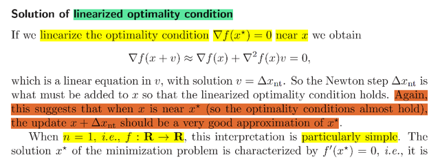</kbd></p>

<p align="center"><kbd>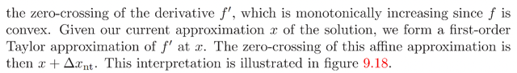</kbd></p>

<p align="center"><kbd>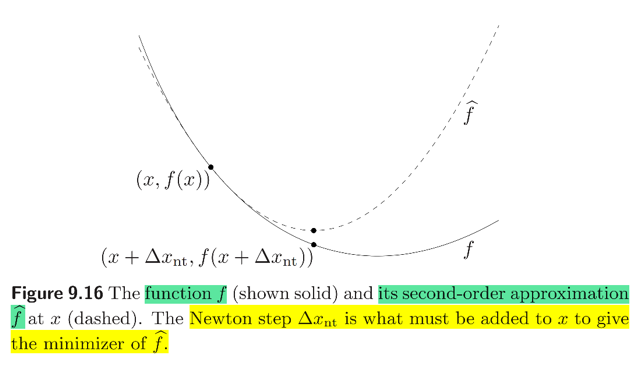</kbd></p>

<p align="center"><kbd>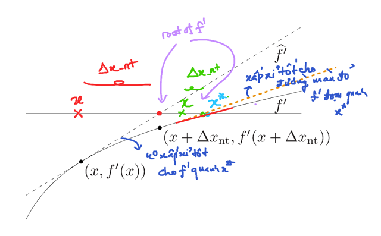</kbd></p>

> [!NOTE]
> đại khái là, ta biết cái vụ optimality condition, nó là nhận định rằng
> gradient tại optimal sẽ vanish ∇f(x*) `=` 0. Và từ đó giúp ta giải ra tìm
> optimal.
>
> Thế thì, bản chất việc giải ∇f(x) `=` 0 là việc tìm giao điểm của một hàm số
> định nghĩa bởi g(x) `=` ∇f(x) với trục x (y `=` 0). Và, dĩ nhiên hàm số g(x)
> này có thể là hàm phi tuyến.
>
> Thế thì để giải tìm solution của g(x) `=` 0. Trong 18.01 ta đã học về
> Newton's method: Bắt đầu bởi một initial guess: x0, Ta mới xây dựng
> tangent line của hàm g tại x0: Dùng linear approximation tại x0: g(x - x0)
> `=` g(x0) + g'(x0)(x - x0) và vế phải chính là phương trình của tangent line
> tại x0: h(x) `=` g(x0) + g'(x0)(x - x0)
>
> Từ đó ta mới giải h(x) `=` 0 để ra "next guess" x1 và nó sẽ gần với true
> solution x* của g(x) `=` 0 hơn initial guess x0. Tiếp tục lặp lại ta sẽ có x2,
> x3....dần dần converge về x*
>
> Thế thì: h(x) `=` 0 ⇔ g(x0) + g'(x0)(x - x0) `=` 0
>
> ⇔  g(x0) + g'(x0)x - g'(x0)x0 `=` 0
>
> ⇔  g'(x0)x `=` g'(x0)x0 - g(x0)
>
> Thay g(x) `=` ∇f(x) ta có:
>
> ∇^2f(x) x `=` ∇^2f(x)x0 - ∇f(x0)
>
> ⇔ x `=` ∇^2f(x)inv [∇^2f(x)x0 - ∇f(x0)]
>
> ⇔ x `=` x0 - ∇^2f(x)inv ∇f(x0) Và đó là x1
>
> Thế thì ta thấy rằng x1 - x0 `=`  - ∇^2f(x)inv ∇f(x0)
>
> VÀ ĐÓ CHÍNH LÀ CÔNG THỨC CỦA NEWTON STEP.
>
> Như vậy đại khái là muốn nói ràng, công thức của Newton step không
> phải có gì xa lạ, mà nó chính là áp dụng kiến thức đã học là NEWTON
> METHOD trong việc giải OPTIMALITY CONDITION ∇f(x) `=` 0
>
> Và nhờ đó giúp ta hiểu tại sao khi x gần x* thì newton step giúp  x +
> `Δx_nt` rất gần với x*: Bởi lẽ trong newton method các x1, x2... sẽ ngày
> càng converge về x*. Nên nếu nó đã càng gần thì việc update sẽ càng
> đưa nó tới gần hơn nữa.
>
> MÀ BẢN CHẤT LÍ DO CỦA HIỆN TƯỢNG NÀY LÀ VÌ: 
>
> KHI CÀNG GẦN X*, THÌ CÁI HÀM TUYẾN TÍNH DÙNG ĐỂ XẤP XỈ HÀM 
> ∇f (gọi là ∇f^) SẼ NGÀY CÀNG XẤP XỈ TỐT CHO HÀM ∇f  TRONG VÙNG 
> Ở GẦN x*, dẫn tới là nghiệm của ∇f^(x) `=` 0 sẽ ngày càng xấp xỉ tốt cho 
> nghiệm của ∇f(x) `=` 0.
>
> Mà vì sao lại như vậy, là bởi ta biết linear approx:
>
> f(x) `=` f(x0) + ∇f(x0)T(x-x0) CHỈ ĐÚNG KHI x ≈ x0, do nên mình đang
> muốn tìm nghiệm của f(x) `=` 0, tức là xem f(x) cắt trục x tại điểm x* là gì
> nào, thì dĩ nhiên là chỉ khi x0 gần x* thì việc thay vì giải f(x) `=` 0 ta gỉai
> f(x0) + ∇f(x0)T(x-x0) `=` 0 mới giúp tìm ra x* được
>
> Trong hình dưới chính là apply Newton method trong việc giải optimality
> condition: f'(x) `=` 0 (với hàm đơn biến thì ∇f(x) thay bằng f'(x))
>
> Thì bước 1 như nói trên là tìm tangent tại initial guess: f'^ chính là cái
> này (và như trên đã hiểu rồi, nó dĩ nhiên là linear approximation  của f').
> Rồi bước 2 là tìm giao điểm của nó với trục x. Để có next guess Thì
> khoảng cách giữa x0 và x1 chính là newton step
>
> NÓI CHUNG TÓM LẠI LÀ, GIỐNG NHƯ PHẦN NÀY GIẢI THÍCH CÔNG
> THỨC CỦA NEWTON STEP LÀ TỪ ĐÂU RA, VÌ MỞ ĐẦU TA CHỈ BIẾT
> KHƠI KHƠI CÔNG THỨC NÓ VẬY. THÌ NAY TA BIẾT NÓ CHÍNH LÀ
> TỪ VIỆC DÙNG NEWTON METHOD ĐỂ GIẢI EQUATION ∇F(X) `=` 0
> CỦA OPTIMALITY CONDITION
>
> Ta muốn tìm f'(x*) `=` 0, tức là giải nghiệm của optimality condition
>
> Vậy thì nếu dùng linear approx của f'(x) tại x0:
>
> f'(x) ≈ f'(x0) + f''(x0)(x - x0).
>
> Và đặt vế phải là hàm f'^(x), khi đó vì sự xấp xỉ trên chỉ đúng khi x0 ≈ x
> nên nếu ta dùng hàm f'^(x) với x0 là điểm gần với x* thì khi đó hàm f'
> (x0) + f''(x0)(x - x0) có thể xấp xỉ tốt cho f'(x) nên nghiệm của f'(x0) + f''
> (x0)(x - x0) `=` 0 sẽ có thể xấp xỉ tốt cho nghiệm của f'(x) `=` 0
>
> Nói cách khác f'(x0) + f''(x0)(x - x0) `=` 0 ⇔ f'(x0) + f''(x0)x - f''(x0)x0 `=` 0
>
> ⇔ x `=` [ f''(x0)x0 - f'(x0) ] `/` f''(x0) sẽ ≈ x*  Điều này minh họa bởi x0
> xanh lá, khi đó nghiệm (root) của f'^ `=` 0 nó là điểm xanh lá tròn rất gần
> với x* vì hàm f'^ khi đó xấp xỉ tốt cho hàm f' quanh x*
>
> Ngược lại, nếu x0 ở xa x*, thì solution của f'(x0) + f''(x0)(x - x0) `=` 0 sẽ
> không approx tốt cho f'(x) `=` 0, bởi lẽ hàm f'^(x) không thể approx tốt cho
> f'(x) quanh x* (đoạn màu đỏ)
>
> Dẫn đến trong hình, root của f^(x) `=` 0 khi f^ là approx của f tại x đỏ,  là
> điểm tròn đỏ còn rất xa x* trong khi đó như đã nói, điểm tròn  xanh là
> root của f^(x) `=` 0 khi f^ là approx của f tại x xanh lá thì gần y như x*
>
> CÁCH HIỂU THỨ HAI VỀ NEWTON STEP: ĐÓ LÀ VIỆC TA TUYẾN
> TÍNH HÓA HÀM GRADIENT CỦA FUNCTION GỐC (TỨC LÀ COI
> GRADIENT CỦA HÀM GỐC LÀ HÀM BẬC 1, MÀ CÁI NÀY CŨNG
> CHÍNH LÀ COI HÀM GỐC NHƯ HÀM BẬC 2) ĐỂ TỪ ĐÓ THAY VÌ
> GIẢI OPTIMALITY CONDITION LÀ PHƯƠNG TRÌNH BẬC CAO THÌ
> NAY TA GIẢI MỘT OPTIMALITY CONDITION XẤP XỈ, LÀ MỘT
> PHƯƠNG TRÌNH BẬC 1
>
> TRONG 18.01 ĐÃ HỌC VỀ NEWTON METHOD DÙNG ĐỂ GIẢI
> NGHIỆM CỦA MỘT PHƯƠNG TRÌNH PHI TUYẾN BẰNG CÁCH
> LẶP ĐI LẶP LẠI VIỆC XÂY DỰNG TIẾP TUYẾN CỦA TẠI MỘT ĐIỂM
> ĐANG XET RỒI TÌM GIAO ĐIỂM CỦA TIẾP TUYẾN  CỦA NÓ VỚI
> TRUC HOÀNH (CHÍNH LÀ TÌM ROOT CỦA NÓ) VÀ GÁN ĐIỂM
> ĐANG XÉT CHO ĐIỂM ĐÓ, THÌ DẦN DẦN CÁC ĐIỂM SẼ
> CONVERGE VỀ TRUE SOLUTION
>
> THÌ CHÍNH LÀ CÁI NÀY, CÁI ĐANG NÓI Ở ĐÂY - TUYẾN TÍNH HÓA
> GRADIENT

<br>

<p align="center"><kbd>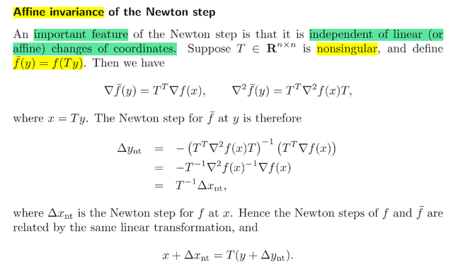</kbd></p>

> [!NOTE]
> Đại khái là ta đang có hàm f(x) với newton step `Δx_nt`
>
> Ta mới đặt x `=` Ty, để rồi ta có function f^(y) `=` f(Ty)
>
> thì thử tìm newton step `Δy_nt.`
>
> Theo công thức, nó bằng -∇^2f^(y)inv ∇f^(y)
>
> Xét gradient ∇f^(y):
>
> ```text
> x = Ty ⇨ dx = T(y + dy) - Ty = Tdy ⇨ d/dx x(y) = T
> ```
>
> Cần tính `d/dy` f^(y).
>
> ```text
> = d/dy f^(y) = d/dy f(Ty) = d/dy f(x(y)) = d/dx f(x) . d/dy x(y)
> ```
>
> `=` ∇f(x) . T 
>
> Với việc f^(y) là vector -> scalar function nên Df^(y) `=` row vector
>
> ```text
> ⇨ d/dy f^(y) = (∇f(x)T)T  ⇨ ∇f^(y) = (T)T ∇f(x) = (T)T ∇f(g(y))
> ```
>
> ⇨ ∇f^(y) `=`  TT∇f(x) (TT ý là T tranposed) (đây là kết quả trong sách)
>
> Xét Hessian ∇^2_y f^(y):
>
> ```text
> ∇^2 f^(y) = d/dy ∇f^(y) = d/dy TT∇f(x)
> ```
>
> ```text
> = TT d/dy ∇f(x) = TT d/dx ∇f(x) . d/dy x(y)
> ```
>
> `=` TT ∇^2f(x) T
>
> Như vậy: `Δy_nt` `=` -∇^2f^(y)inv ∇f^(y) 
>
> `=` - [TT ∇^2f(x) T]inv TT∇f(x)
>
> Dùng (AB)inv `=` BinvAinv
>
> `=` - Tinv [TT ∇^2f(x)]inv  TT ∇f(x)
>
> `=` - Tinv ∇^2f(x)invTTinv TT ∇f(x)
>
> `=` - Tinv ∇^2f(x)inv ∇f(x)
>
> `=` Tinv `Δx_nt`
>
> ```text
> Vậy Δy_nt = Tinv Δx_nt ⇔ Δx_nt = T Δy_nt
> ```
>
> ```text
> Có nghĩa là, với x = Ty ta có Δx_nt = T Δy_nt
> ```
>
> ```text
> ⇔ x + Δx_nt = T(y + Δy_nt)
> ```
>
> Điều này cho thấy Newton step độc lập bởi phép biến đổi
> hệ trục

<br>

<p align="center"><kbd>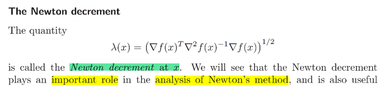</kbd></p>

<p align="center"><kbd>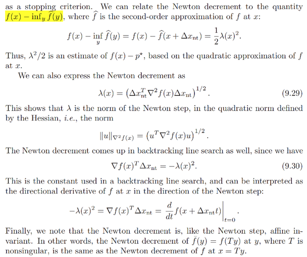</kbd></p>

> [!NOTE]
> tiếp theo nói về khái niệm Newton decrement, tính bằng công thức 
>
> λ(x) `=` [∇f(x)T∇^2f(x)inv `∇f(x)]^1/2,` gọi là Newton decrement tại x.
>
> Thì ta có thể có một số cách hiểu về cái này, đầu tiên là nếu ta xét f(x) - inf y
> f^(y) với f^(y) là second-order approximation của f tại x:
>
> f^(y) `=` f(x) + ∇f(x)T(y - x) + 0.5(y - x)T∇^2f(x)(y - x)
>
> Thì dĩ nhiên f^ là quadratic function theo y, và y `=` x + `Δx_nt` là optimal
>
> ```text
> f*^(y) = f^(y*) = f^(x + Δx_nt) = f^(x - ∇^2f(x)inv∇f(x))
> ```
>
> `=` f(x) + ∇f(x)T(x - ∇^2f(x)inv∇f(x) - x)
>
> + 0.5(x - ∇^2f(x)inv ∇f(x) - x)T ∇^2f(x) (x - ∇^2f(x)inv ∇f(x) - x)
>
> `=` f(x) - ∇f(x)T∇^2f(x)inv ∇f(x) + 0.5 [- ∇^2f(x)inv ∇f(x)]T ∇^2f(x) [- ∇^2f(x)inv] ∇f(x)
>
> `=` f(x) - ∇f(x)T∇^2f(x)inv ∇f(x) + 0.5 ∇f(x)T ∇^2f(x)invT ∇^2f(x) ∇^2f(x)inv ∇f(x)
>
> `=` f(x) - ∇f(x)T∇^2f(x)inv ∇f(x) + 0.5 ∇f(x)T ∇^2f(x)inv ∇f(x)
>
> `=` f(x) - 0.5 ∇f(x)T∇^2f(x)inv ∇f(x) 
>
> ```text
> tức f(x) - inf y f^(y) = f(x) - f*^(y) =  f(x) - f(x + Δx_nt)
> ```
>
> `=` f(x) - [f(x) - 0.5 ∇f(x)T∇^2f(x)inv ∇f(x)]
>
> `=` `1/2` ∇f(x)T∇^2f(x)inv ∇f(x)
>
> Thì với λ(x) `=` [∇f(x)T∇^2f(x)inv `∇f(x)]^1/2`
>
> Thì kết quả trên tức f(x) - inf y f^(y) chính là `1/2` λ(x)^2. Với f(x) - inf y f^(y)
> mang ý nghĩa là "nếu coi `/` xấp xỉ f(x) là một quadratic function, thì từ x, "đi
> xuống" nhiều nhất là bao nhiêu". Nên `1/2` λ(x)^2 là function cho ta giá trị này 
>
> `====`
>
> ```text
> λ(x) = [∇f(x)T∇^2f(x)inv ∇f(x)]^1/2, ta có thể thể hiện nó theo Newton's step Δx_nt:
> ```
>
> ```text
> Từ Δx_nt = -∇^2f(x)inv∇f(x) ⇨ ∇^2f(x) Δx_nt = - ∇f(x), thay vào:
> ```
>
> ```text
> λ(x) = [-[∇^2f(x) Δx_nt]T∇^2f(x)inv [-∇^2f(x) Δx_nt]]^1/2
> ```
>
> ```text
> = [(Δx_nt)T ∇^2f(x)T ∇^2f(x)inv ∇^2f(x) Δx_nt ]^1/2
> ```
>
> ```text
> = [(Δx_nt)T ∇^2f(x) ∇^2f(x)inv ∇^2f(x) Δx_nt ]^1/2
> ```
>
> ```text
> = [(Δx_nt)T ∇^2f(x) Δx_nt ]^1/2
> ```
>
> `====`
>
> Tiếp, λ(x) `=` [∇f(x)T∇^2f(x)inv `∇f(x)]^1/2` thì chiếu theo định nghĩa của quadratic
> norm ||u||P `=` `(uTPu)^1/2` thì λ(x) CHÍNH LÀ quadratic norm của ∇f(x) với P `=`
> ∇^2f(x):
>
> λ(x) `=` ||∇f(x)||_∇^2f(x)
>
> `====`  
>
> Rồi, một cách hiểu khác nữa của Newton decrement là liên hệ với backtracking 
> line search.
>
> Nhớ lại trong backtracking line search, ta bắt đầu với step size t `=` 1 và giảm
> dần t bởi factor `β` cho đến khi exit condition thỏa:
>
> f(x + t `Δx)` ≤ f(x) + t `α` `∇f(x)TΔx`
>
> ```text
> Vậy thì với Δx = Δx_nt = -∇^2f(x)inv ∇f(x) thì
> ```
>
> `∇f(x)TΔx_nt` `=` -∇f(x)T ∇^2f(x)inv ∇f(x)
>
> và cái này chính là -λ(x)^2.
>
> Và `∇f(x)TΔx_nt` dĩ nhiên như đã biết có ý nghĩa `/` có thể coi là DIRECTIONAL
> DERIVATIVE của f theo hướng `Δx_nt` (1802 đã học, directional derivative của
> f(x) theo hướng vector u là ∇f(x)Tu)
>
> Vậy nên -λ(x)^2 chính là directional derivative của f theo hướng của `Δx_nt`
>
> Ý cuói cùng là liên quan đến khái niệm affine invariance, quay lại sau

<br>

<p align="center"><kbd>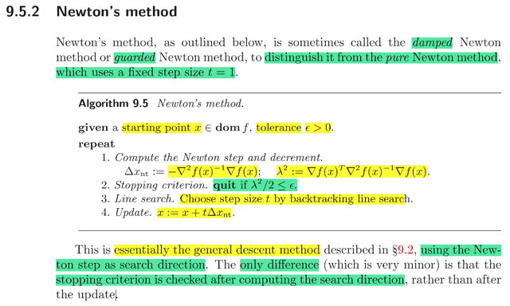</kbd></p>

> [!NOTE]
> Nói về thuật toán của Newton's method, nói chung cơ bản vẫn là
> thuật toán descent method đã học: 1) xác định descent direction `Δx`
> 2) xác định step: t, gọi là line search (tìm độ lớn bước đi theo
> ```text
> hướng descent direction Δx) 3) update x := x + t Δx_nt
> ```
>
> ```text
> Chỉ là: Δx dùng Newton's step: Δx_nt = -∇^2f(x)inv ∇f(x)
> ```
>
> và dĩ nhiên ta cũng sẽ check stopping condition. Mấy phương pháp
> trước như backtracking line search thì ta check sau khi update. 
>
> Còn ở đây ta check trước khi update, với condition là:
>
> `λ(x)^2/2` ≤ `ε.` eps gọi là TOLERANCE
>
> ý nghĩa của stopping condition ta sẽ nói sau

<br>

<p align="center"><kbd>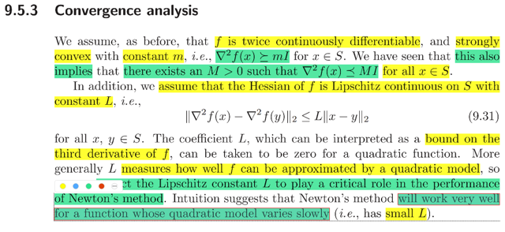</kbd></p>

> [!NOTE]
> đại khái là, trước khi phân tích sự hội tụ của phương pháp Newton's ta cũng
> có một số assumption, cụ thể là f khả vi hai lần (twice differentiable) tức tồn
> tại Hessian tại mọi điểm trong domain. Cũng như là function f  có tính
> Strongly convex (nhắc lại cho nhớ, strongly convex mạnh strictly convex:
> một cách ngắn gọn, strictly convex là curvature dương nhưng có thể tiệm
> cận 0 (≈ 0)
>
> Còn strongly convex là limit nhỏ nhất cũng bằng một một giá trị
> dương nào đó. Thể hiện của strictly convex là ∇^2f(x) ≻ 0, còn của strongly
> convex là tồn tại m > 0 sao cho ∇^2f(x) ≽ m*I.
>
> Ngoài ra, ta cũng đã biết, dựa vào một assumption khác đó là sub-level
> set S bị chặn, mà hình ảnh đại khái là khi x ra khỏi x* thì f(x) TĂNG LÊN
> NHANH HƠN ÍT NHẤT VỚI TỐC ĐỘ CỦA QUADRATIC , dẫn đến
> sub-level set KHÔNG THỂ MỞ RỘNG RA VÔ CÙNG mà phải bị chặn
> trong một phạm vi nào đó (gọi là COMPACT, bị chặn và đóng).
>
> Từ đó, ta mới có một upper bound cho maximum eigenvalue của
> Hessian đó là xét trong S (nhắc lại S là sub-level set x: f(x) ≤ f(x0)),
> vì S bị chặn nên Hessian eigenvalues của ∇^f(x) cũng sẽ bị chặn bởi giá
> trị M nào đó: ∇^2f(x) ⪯ M*I
>
> `====`
>
> Thế thì mình được giới thiệu một khái niệm mà ta sẽ gặp nhiều trong những
> phần sau (cả trong các sách về deep learning, machine learning) đó là
> LIPCHITZ CONTINUOUS on S, thể hiện bởi
>
> ||∇^2f(x) - ∇^2f(y)||2 ≤ L||x - y||2  Fới ý nghĩa là, (vế trái) "khác biệt `/` sự
> thay đổi" của "độ cong" curvature sẽ không thể quá nhanh `/` quá đột
> ngột mà nó phải bị chặn, bị giới hạn bởi một mức độ nào đó tỉ lệ với
> theo sự thay đổi của x theo một factor L hữu hạn. Nôm na là, khi di
> chuyển từ x -> y thì curvature không thể thay đổi quá lớn, mà phải
> thay đổi từ từ
>
> Thế thì nếu xét hàm quadratic, vốn dĩ ta biết nó sẽ có constant Hessian
> (curvature mọi nơi đều bằng nhau) thì ∇^2f(x) - ∇^2f(y) `=` 0. Nên mới nói
> Lipschitz condition constant L `=` 0 khi f là quadratic.
>
> Và khi sự thay đổi curvature (khi di chuyển từ điểm này sang điểm kia)
> mà càng nhỏ, thì tức là function sẽ càng gần với constant curvature,
> tức là càng gần với quadratic function. Nên mới nói constant L này sẽ
> measure MỨC ĐỘ GIỐNG VỚI QUADRATIC FUNCTION của function:
> càng nhỏ thì càng gần.
>
> Và hồi nãy ta đã học rằng Newton's method hoạt động tốt nhất khi
> function là quadratic, hoặc rất gần quadratic. Do đó, có thể nhận định
> Lipschitz constant L này chính là cái sẽ ảnh hưởng đến hiệu qỉa của
> Newton's method

<br>

<p align="center"><kbd>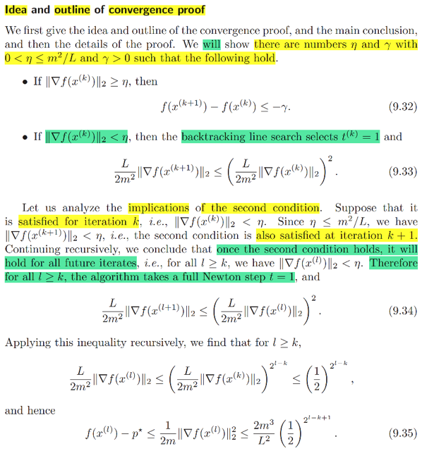</kbd></p>

<p align="center"><kbd>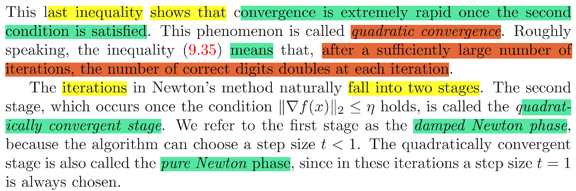</kbd></p>

> [!NOTE]
> Đại khái là sau này họ sẽ chứng minh, nhưng bây giờ ta chấp nhận sự thật sau, đó là tồn tại con số
> η và `γ`  sao cho thỏa hai điều kiện này:
>
> 1) Nếu gradient còn lớn hơn mức (η) nào đó thì hàm f sẽ giảm một mức độ lớn hơn `γ:`
>
> ```text
> ∇f(xk) ≥ η thì f(x_k) - f(x_k+1) ≥ γ ⇔ f(x_k+1) - f(x_k) ≤ -γ.
> ```
>
> 2) Nếu gradient đã nhỏ (||∇f(xk)|| < η) đồng nghĩa x đã gần x* thì kiểu như với backtracking  line
> ```text
> search thì với initial t = 1 thì nó đã thỏa exit  condition f(x + t Δx_nt) < f(x) + t α ∇f(x)TΔx_nt rồi. Và ta
> ```
> có:
>
> ```text
> L/2m^2||∇f(x_k+1)|| ≤ [L/2m^2||∇f(x_k)||]^2
> ```
>
> Thế thì ta phân tích condition (2) trước để thấy rằng giả sử gradient bắt đầu nhỏ hơn η tại iteration
> k: `||∇f(x_k)||` < η
>
> Thì vì 0 < η ≤ `m^2/L` nên ta cũng sẽ cho thấy `||∇f(x_k+1)||` < η:
>
> (*) Chứng minh giả sử gradient bắt đầu nhỏ hơn η tại iteration k: `||∇f(x_k)||` < η và ta có 
>
> ```text
> L/2m^2||∇f(x_k+1)|| ≤ [L/2m^2||∇f(x_k)||]^2
> ```
>
> thì gradient sau đó cũng  vậy `||∇f(x_k+1)||` < η:
>
> Chứng minh như sau:
>
> ```text
> Bắt đầu từ: L/2m^2||∇f(x_k+1)|| ≤ [L/2m^2||∇f(x_k)||]^2
> ```
>
> ```text
> ⇔ L/2m^2 ||∇f(x_k+1)|| ≤ [L/2m^2 ||∇f(x_k)||]^2 ≤ [L/2m^2 η]^2  (do |∇f(x_k)|| ≤ η)
> ```
>
> ⇔ `L/2m^2||∇f(x_k+1)||` ≤ `(L/2m^2)^2` η^2
>
> ```text
> ⇔ L/2m^2||∇f(x_k+1)|| ≤ (L/2m^2)^2 η η ≤ (L/2m^2)^2 η m^2/L (do η ≤ m^2/L)
> ```
>
> ⇔ `L/2m^2||∇f(x_k+1)||` ≤ `(L/2m^2)` η
>
> ⇔ `||∇f(x_k+1)||` ≤ η CHỨNG MINH XONG
>
> Và đại khái là điều này có nghĩa là một khi tại iteration k gradient đã nhỏ hơn η thì NHỮNG
> ITERATION SAU ĐÓ SẼ ĐỀU NHỎ HƠN < η: `||∇f(x_k+1)||` < η
>
> Và như vậy KỂ TỪ ĐÓ về sau thuật toán sẽ LUÔN CHỌN t `=` 1 cũng như ta luôn có cái condition 2:
> ```text
> Với l ≥ k, L/2m^2||∇f(x_l)|| ≤ [L/2m^2||∇f(x_k)||]^2
> ```
>
> Chỗ này phải chú ý một chỗ đã hiểu sai về exit condition của backtracking line search. Nó chỉ là exit
> condition của việc chọn t, có nghĩa là ban đầu của MỖI ITERATION, TA ĐỀU CHO t `=` 1, NHƯNG
> RỒI TA CHECK EXIT CONDITION để xem nếu thỏa, thì ta DÙNG t `=` 1 ĐỂ UPDATE x `=` x + `tΔx`
> trong bươc 3. Còn không thỏa thì ta SCALE XUỐNG t `=` t `β,` VÀ CHECK LẠI, CŨNG NHƯ LÀM LẠI
> CHO ĐẾN KHI THỎA, khi đó ta dùng t đó để update x `=` x + t `Δx.` Và ở iteration sau vẫn start với t `=`
> 1. CÓ NGHĨA LÀ, EXIT CONDITION ĐÓ LÀ CỦA VIỆC BACKTRACKING LINE SEARCH ở mọi
> iteration. NÓ KHÔNG PHẢI LÀ STOPPING CONDITION CỦA CẢ ALGORITHM (vốn dĩ sẽ thường
> dùng là điều kiện nào đó của  gradient)
>
> Như vậy sẽ hiểu sai nếu hiểu rằng tại iteration 1: Nếu thỏa exit condition thì thì dùng t1 `=` 1 và
> update xong thì dừng luôn. Còn nếu không thỏa thì scale t xuống và update  x `=` x + t `Δx.` Hiểu như
> vậy thì đang cho rằng với exit condition là stopping condition. Và sẽ thấy khó hiểu khi đọc tới việc
> t(k) `=` 1.
>
> Còn hiểu đúng như đoạn trên thì dĩ nhiên hoàn toàn hiểu rằng nói t(k) `=` 1 khi ∇f(x) đã nhỏ hơn η
> nào đó và kể từ đó về sau các t(k+1) đều bằng 1
>
> Và ý nghĩa của nó là: Khi gradient tại iteration k đã nhỏ hơn η, thì có nghĩa là tại đó (x) NÓ ĐÃ GẦN
> VỚI X* RỒI, dẫn tới ta có thể dùng một kiến thức đã biết đó là: KHI x gần x* thì ĐẠI KHÁI LÀ CÓ
> THỂ XẤP XỈ `/` COI OPTIMIZATION LANDSCAPE BẰNG MỘT QUADRATIC FUNCTION (thể hiện
> bởi HESSIAN CỦA SUB-LEVEL SET SẼ GẦN VỚI ELLIPSOID) (hình dung một hàm có landscape
> có thể không quadratic nhưng nếu chỉ xét phạm vi rất gần cái đáy của nó thì độ cong của nó trong
> đó sẽ giống như parabol)
>
> Và KHI ĐÓ, dĩ nhiên như ta nói ở trên, khi hàm số gần với quadratic thì Newton step sẽ rất hiệu
> quả, giúp update ngay ra x optimal
>
> VÀ ĐÓ CŨNG CHÍNH LÀ KẾT QUẢ NÀY: Khi ta apply cái này lặp đi lặp lại
>
> ```text
> L/2m^2||∇f(x_l)|| ≤ [L/2m^2||∇f(x_k)||]^2 với l > k
> ```
>
> Thì ta sẽ có: (ý là áp dụng với k+1 và k, rồi k+2 và k+1
>
> ```text
> L/2m^2||∇f(x_k+1)|| ≤ [L/2m^2||∇f(x_k)||]^2:
> ```
>
> ```text
> L/2m^2||∇f(x_k+2)|| ≤ [L/2m^2||∇f(x_k+1)||]^2 ≤ L/2m^2*[L/2m^2||∇f(x_k)||]^2
> ```
>
> `=` `(L/2m^2)^2*` `||∇f(x_k)||^2`
>
> ```text
> ⇨ (L/2m^2) ||∇f(x_l)|| ≤ (L/2m^2)^2 * ||∇f(x_k)||^2 (9.33)
> ```
>
> ...tiếp tục vậy
>
> ```text
> L/2m^2||∇f(x_k+2)|| ≤ [(L/2m^2) * ||∇f(x_k)||]^[2^(l-k)]
> ```
>
> Và dùng `||∇f(x_k)||^2` < η < `m^2/L` ta có:
>
> ```text
> L/2m^2||∇f(x_k+2)|| ≤ (L/2m^2 * m^2/L)^[2^(l-k)]
> ```
>
> ⇔ `L/2m^2||∇f(x_k+2)||` ≤ `(1/2)^[2^(l-k)]`    
>
> ⇔ `||∇f(x_k+2)||` ≤ `(1/2)^[2^(l-k)]` 2m^2 `/` L
>
> Và dùng một cái đã biết bữa trước f(x(l)) - p* ≤ `1/2m` ||∇f(x(l))||^2 
>
> ```text
> ⇨ f(x(l)) - p* ≤ 1/2m ||∇f(x(l))||^2 ≤ 1/2m (1/2)^[2^(l-k)] 2m^2 / L^2
> ```
>
> ⇔ f(x(l)) - p* ≤ `1/2m` `(1/2)^[2^(l-k)]^2` 4m^4 `/` L^2
>
> ⇔ f(x(l)) - p* ≤ `2m^3/L^2` `(1/2)^[2^(l-k)]^2`
>
> ```text
> ⇔ f(x(l)) - p* ≤ 2m^3/L^2 (1/2)^[2^(l-k+1)]     |    0.5^[2^(l-k)] ^2 = 0.5^[2^(l-k)*2]  = 0.5^[2^(l-k+1)]
> ```
>
> Và KẾT QUẢ NÀY CHÍNH LÀ NÓI VỀ Ý TRÊN, ĐÓ LÀ TỪ ITERATION K TRỞ ĐI, VIỆC UPDATE
> VỚI NEWTON STEP, SẼ GỌI LÀ FULL NEWTON STEP, BỞI CÓ `Δx_nt` BAO NHIÊU, THÌ XÀI BẤY
> ```text
> NHIÊU (VÌ t = 1 ⇨ t * Δx_nt = Δx_nt) SẼ KHIẾN SỰ CHÍNH XÁC NGÀY CÀNG LỚN THEO CẤP
> ```
> SỐ LŨY THỪA RẤT NHANH. Hình dung thế này tại k (khi gradient đã < eta) và ta có condition 2
> ở trên, thì: 
>
> x(k) ĐÃ GẦN x*, KHIẾN SUB-LEVEL SET x: f(x) < x(k) ĐÃ GẦN (CÓ THỂ XẤP XỈ TỐT BỞI) ELLIPSE
> `/` ELLIPSOID, hay OPTIMIZATION LANDSCAPE ĐÃ GẦN QUADRATIC FUNCTION ⇨ NEWTON 
> METHOD PHÁT HUY TÁC DỤNG RẤT TỐT, giúp khi x(k+1) `=` x(k) + `Δx_nt` THÌ LẠI CÀNG ĐƯA x VỀ
> GẦN x* hơn nữa. Và khi đó, MỌI ĐIỀU Ở TRÊN (SUBLEVEL SET,...) CÀNG TỐT HƠN NỮA KHIẾN
> NEWTON METHOD CÀNG HIỂU QỦA GẤP BỘI.
>
> Do đó error SẼ GIẢM VÔ CÙNG NHANH. VÀ GIAI ĐOẠN NÀY GỌI LÀ QUADRATIC CONVERGENCE
>
> `====`
>
> Như vậy hoàn toàn hiểu được rằng, khi mà ||∇f(x)|| còn lớn hơn η, thì backtracking line search có thể
> chọn step t nhỏ hơn 1. Còn khi nó đã nhỏ hơn η, thì t luôn bằng 1 (và ta có cái gọi là full Newton's step
> như nói ở trên). 
>
> Như vậy QUÁ TRÌNH SẼ CHIA LÀM 2 GIAI ĐOẠN:
>
> 1) KHI GRADIENT CÒN LỚN: t có thể được chọn < 1. Đây gọi là DAMPED NEWTON PHASE
>
> 2) KHI GRADIENT NHỎ HƠN eta: backtracking line search luôn thỏa với t `=` 1, và như đã nói, ở trên
> sự HỘI TỤ SẼ DIỄN RA RẤT RẤT NHANH. ĐÂY LÀ PURE NEWTON PHASE (vì sự update dùng full
> newton step

<br>

<p align="center"><kbd>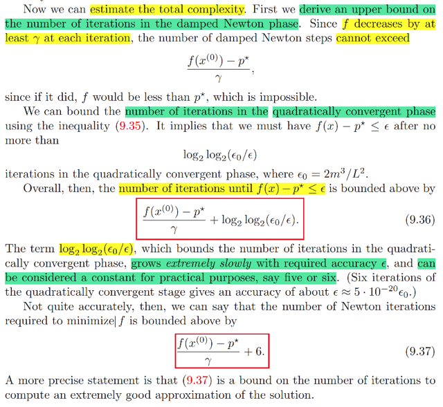</kbd></p>

> [!NOTE]
> rồi, ta sẽ sang việc ước lượng mức độ complexity (tức là số iteration
> cần thiết để converge về điểm `ε-sub` optimal x*.
>
> Đầu tiên nói về số iteration ở phase 1 - damped Newton: Là thế này
> ta dựa vào cái condition 1 nói rằng khi gradient còn lớn (||∇f(x)|| > η)
> thì "độ sụt của f" ở mỗi iteration ít nhất là bằng gamma:
>
> f(x(k+1)) - f(x(k)) ≤ - `γ` ⇔ f(x(k)) - f(x(k+1)) ≥ `γ.` Do đó hiểu thế này:
>
> Gọi k là số iteration để từ f(0) trở thành f(k) `=` p*. Như vậy là từ f(k)
> đến p* có k iteration, mà mỗi iteration giảm nhiều ít nhất là `γ.`
>
> Nên số iteration nhiều nhất là chỉ cần [f(x(0)) - p*] `/` `γ`
>
> `====`
>
> CÒN LẠI QUAY LẠI SAU.

<br>

<p align="center"><kbd>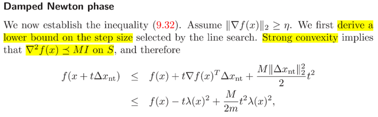</kbd></p>

<p align="center"><kbd>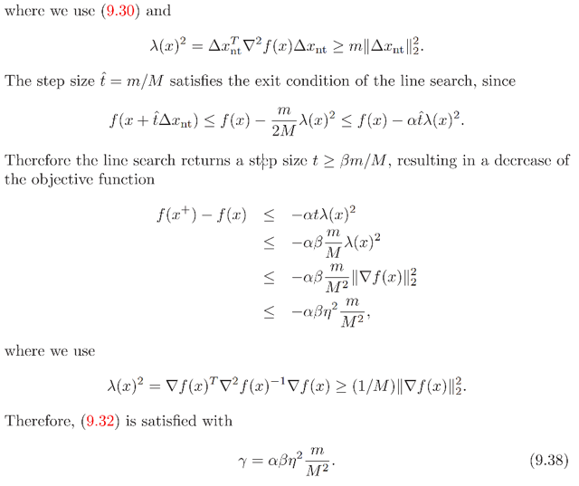</kbd></p>

> [!NOTE]
> Chứng minh condition 1: Khi ∇f(x) > η thì f(x(k+1)) - f(x(k)) ≤ `γ` `(γ` ý là  một con số nào đó)
>
> Đầu tiên, như đã biết strong convexity cho ta: ∇^2f(x) ⪯ MI on S.
>
> ```text
> f(x + t Δx_nt) ≈ f(x) + ∇f(x)T(tΔx_nt) + 1/2 (tΔx_nt)T∇^2f(x)(t Δx_nt)
> ```
>
> ```text
> Vế trái f(x) + ∇f(x)T(tΔx_nt) + 1/2 t^2 (Δx_nt)T∇^2f(x)(Δx_nt)
> ```
>
> ```text
> ≤ f(x) + ∇f(x)T(tΔx_nt) + 1/2 t^2 (Δx_nt)TMI(Δx_nt)
> ```
>
> (dùng inequality ∇^2f(x) ⪯ MI)
>
> ```text
> = f(x) + ∇f(x)T(tΔx_nt) + M/2 t^2 (Δx_nt)T(Δx_nt)
> ```
>
> ```text
> = f(x) + t∇f(x)T(Δx_nt) + M/2 t^2 ||Δx_nt||^2
> ```
>
> Dùng kết quả `∇f(x)T(Δx_nt)` `=` -λ(x)^2
>
> ```text
> ..= f(x) + t(-λ(x)^2) + M/2 t^2 ||Δx_nt||^2  |
> ```
>
> Dùng tiếp: ∇^2f(x) ≽ mI ⇨ ∇f(x)T∇^2f(x)inv ∇f(x) ≥ ∇f(x)T ∇^2f(x)inv ∇f(x)
>
> ```text
> và λ(x) thể hiện theo Δx_nt λ(x) = [(Δx_nt)T ∇^2f(x) Δx_nt ]^1/2
> ```
>
> ```text
> Ta có: λ(x)^2 = (Δx_nt)T ∇^2f(x) Δx_nt  và vì ∇^2f(x) ≽ mI nên
> ```
>
> ```text
> λ(x)^2 ≥ (Δx_nt)T mI Δx_nt = m (Δx_nt)TΔx_nt = m ||Δx_nt||^2
> ```
>
> ```text
> Vậy f(x) + t(-λ(x)^2) + M/2 t^2 ||Δx_nt||^2 ≤ f(x) + t(-λ(x)^2) + M/2 t^2 (1/m) λ(x)^2
> ```
>
> ```text
> ⇔ f(x + t Δx_nt) ≤ f(x) + t(-λ(x)^2) + M/2 t^2 (1/m) λ(x)^2
> ```
>
> ⇔ f(x + t `Δx_nt)` ≤ f(x) - t λ(x)^2 + `M/2m` t^2 λ(x)^2
>
> Đây là kết quả đóng khung trong sách
>
> Rồi,  t^ `=` `m/M` thỏa mãn exit condition của backtracking line search, vì sao:
>
> Như đã biết, exit condition của backtracking line search là:
>
> f(x + t `Δx)` < f(x) + t `α` `∇f(x)TΔx`
>
> Vậy thì với t `=` `m/M,` áp dụng inequality ở trên:
>
> ```text
> f(x + t Δx_nt) ≤ f(x) - m/M λ(x)^2 + M/2m (m/M)^2 λ(x)^2
> ```
>
> ```text
> ⇔ f(x + t Δx_nt) ≤ f(x) - m/M λ(x)^2 + m/2M λ(x)^2
> ```
>
> ⇔ f(x + t `Δx_nt)` ≤ f(x) - `m/2M` λ(x)^2
>
> ```text
> và vế phải = f(x) - m/2M (-∇f(x)TΔx_nt) = f(x) + m/2M (∇f(x)TΔx_nt)  = f(x) + 1/2 t
> ```
> ```text
> (∇f(x)TΔx_nt) ≤  f(x) + α t (∇f(x)TΔx_nt)  | vì α > 1/2
> ```
>
> ```text
> Vậy f(x + t Δx_nt) ≤ f(x) + α t (∇f(x)TΔx_nt) và đây chính là exit condition
> ```
>
> `====` 
>
> Thế thì như đã biết, với backtracking line search, thì đại khái khi chưa thỏa exit
> ```text
> condition, thì nó sẽ tiếp tục scale t xuống từ initial value = 1. bởi factor β:  t := t β cho đến
> ```
> khi thỏa, mà hình dung tại `m/M` đã thỏa, để rồi tại đó chắc chắn nó phải dừng tìm kiếm. Nên
> suy ra nếu có thoát (trả ra t) thì t ít nhất là phải bằng `m/M` chứ không thể nhỏ hơn `m/M` được
> (vì khi giảm dần từ 1 thì đến trước khi nó nhỏ hơn  thì nó phải bằng `m/M` cái đã, mà khi
> bằng thì đã thỏa và exit rồi). Vậy t ≥ `m/M`
>
> Và do đó cũng ≥ `β` `m/M` vì `β` ≤ 1
>
> Vậy t ≥ `βm/M`
>
> Từ đó bước giảm của f sẽ:
>
> ```text
> f(x + t Δx_nt) ≤ f(x) + α t (∇f(x)TΔx_nt)
> ```
>
> ```text
> ⇔ f(x + t Δx_nt) - f(x) ≤ α t (∇f(x)TΔx_nt)
> ```
>
> ```text
> ⇔ f(x + t Δx_nt) - f(x) ≤ - α t λ(x) ≤ - α βm/M λ(x)^2
> ```
>
> ```text
> ⇔ f(x + t Δx_nt) - f(x) ≤ - α βm/M λ(x)^2
> ```
>
> Dùng cái này:
>
> ∇^2f(x) ⪯ MI : mọi eigenvalues λ_i của ∇^2f(x) ≤ M:
>
> ```text
> λ_i ≤ M ⇨ 1/M ≤ 1/λ_i ⇨ mọi eigenvalues của ∇^2f(x)_inv (=1/ λ_i) sẽ ≥ 1/M
> ```
>
> ⇨ ∇^2f(x)_inv ≽ `(1/M)*I`
>
> ⇔ -∇^2f(x)_inv ⪯ `-(1/M)*I`
>
> ⇨ -λ(x)^2 `=` -∇f(x)T∇^2f(x)inv ∇f(x) ≤ -∇f(x)T `(1/M)*I` ∇f(x)
>
> ⇔ -λ(x)^2 `=` `1/M` ∇f(x)T ∇f(x) ≤ `-1/M` ||∇f(x)||^2
>
> ⇔ -λ(x)^2 ≤ `-1/M` ||∇f(x)||^2
>
> ```text
> ⇨ - α βm/M λ(x)^2 ≤ - α βm/M 1/M ||∇f(x)||^2
> ```
>
> ```text
> ... ⇔ f(x + t Δx_nt) - f(x) ≤ - α βm/M^2 ||∇f(x)||^2
> ```
>
> ||∇f(x)|| ≥ η ⇨ - ||∇f(x)||^2 ≤  - η^2 
>
> ```text
> ⇨ - α βm/M^2 ||∇f(x)||^2 ≤ - α βm/M^2 η^2
> ```
>
> Tóm lại là ta đã chứng minh xong rằng khi ||∇f(x)|| ≥ η thì tồn tại `γ` sao cho f(x+) - f(x) ≤ - `γ`
> ```text
> và ở trên γ chính là  α βm/M^2 η^2
> ```

<br>

<p align="center"><kbd>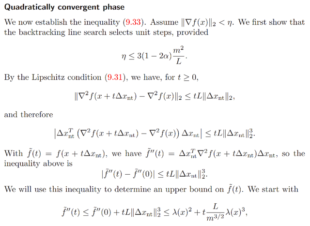</kbd></p>

<p align="center"><kbd>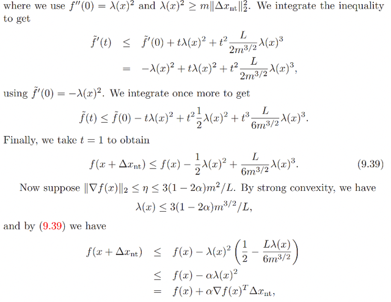</kbd></p>

<p align="center"><kbd>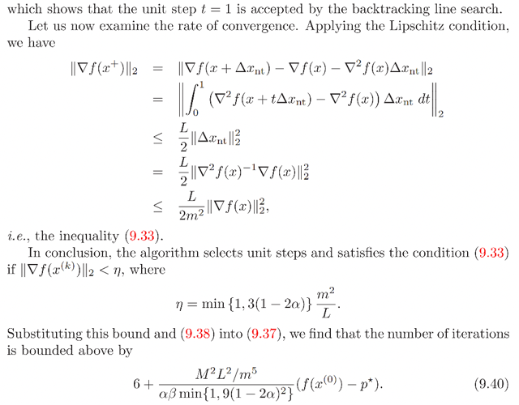</kbd></p>

> [!NOTE]
> CHỨNG MINH CONDITION 2, KHI GRADIENT ∇f(x) > η
>
> QUAY LẠI SAU

<br>

<p align="center"><kbd>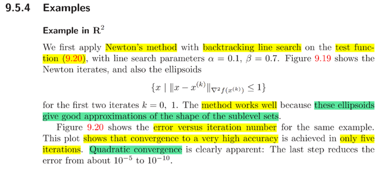</kbd></p>

> [!NOTE]
> Một ví dụ, đại khái trong những phần trước ta đã nói rằng,  khi mà
> hàm f gần với `/` xấp xỉ tốt với hàm quadratic thì Newton's method sẽ
> hiệu quả.
>
> Vậy thì điều này có nghĩa là sao:
>
> Second order Taylor approx.:
>
> f(x) ≈ f(x0) + ∇f(x)T(x-x0) + `1/2(x-x0)T` ∇^2f(x0) (x-x0)
>
> vế trái chính là quadratic function 
>
> g(x) `=` `1/2(x-x0)TP(x-x0)` + qT(x-x0) + r
>
> Thì nhận định ở trên có nghĩa là sub-level set {x: f(x) ≤ `α}` nó gần với `/`
> ```text
> giống với {x: g(x) ≤ α} = {x: 1/2(x-x0)TP(x-x0) + qT(x-x0) + r ≤ α}
> ```
>
> Và đây là phương trình của một ellipsoid.
>
> ý chính là cho thấy trong ví dụ này,
>
> ellipsoid {x: (x - x(k))T ∇^2f(x(k)) (x - x(k)) ≤ 1 } 
>
> cũng chính là {x: ||x - x(k)||_∇^2f(x(k)) ≤ 1} là cái hình ellipse tâm
> các điểm x(0), x(1)
>
> có thể gần gần với sub-level set của original function. Và ngày càng 
> gần hơn khi x gần với x* hơn (minh họa là ellipse màu xanh lá, gần
> với hình chấm chấm màu tím (sub-level set)
>
> Do đó, trong case này, Newton's method hiệu quả. Và hình 9.20 cho
> thấy chỉ sau vài iteration error đã giảm rất mạnh, vài trong iteration 4,
> 5 cho thấy giai đoạn QUADRATIC CONVERGENCE khi error giảm
> từ 10^-5 ⇨ 10^-10 chính là giảm theo bậc 2 mà ta đã phân tích ở
> trên

<br>

<p align="center"><kbd>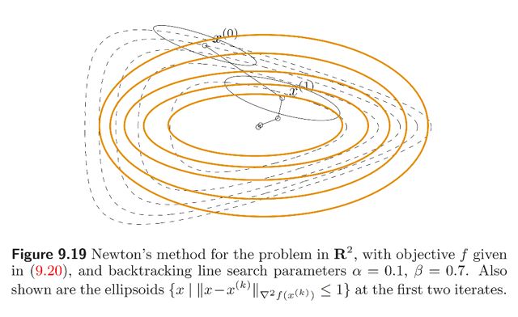</kbd></p>

<p align="center"><kbd>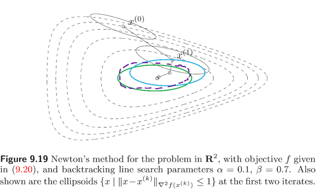</kbd></p>

> [!NOTE]
> đại khái là mấy ellipse màu cam là {x: f(x*) + ∇f(x)T(x-x*) + `1/2(x-x*)T`
> ∇^2f(x*) (x-x*) ≤ `α` }
>
> là khi ta xấp xỉ hàm f bới g(x) là quadratic function g(x) `=` f(x0) +
> ∇f(x)T(x-x0) + `1/2(x-x0)T` ∇^2f(x0) (x-x0)
>
> Thì nếu mà có thể xấp xỉ tốt, thì mấy đuồng màu cam sẽ không qúa
> khác các đường chấm chấm
>
> Khi đó mấy ellipse cục bộ {x: (x-x(k)∇^2f(x(k))(x-x(k)) ≤ 1} sẽ ngày
> càng giống `/` gần với các đường chấm chấm cũng như ellipse màu
> cam  khi x gần x*. Và do đó Newton's step ngày càng hiệu quả để ở
> những iteration sau xuất hiện trạng thái quadratic convergence

<br>

<p align="center"><kbd>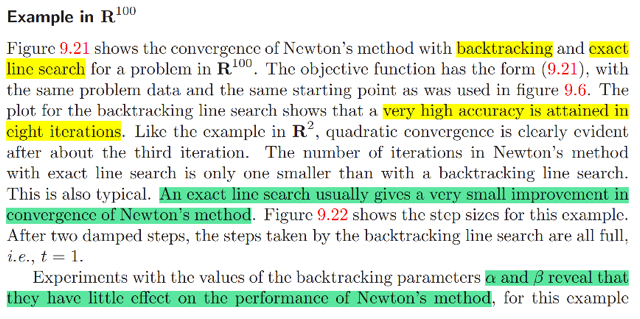</kbd></p>

<p align="center"><kbd>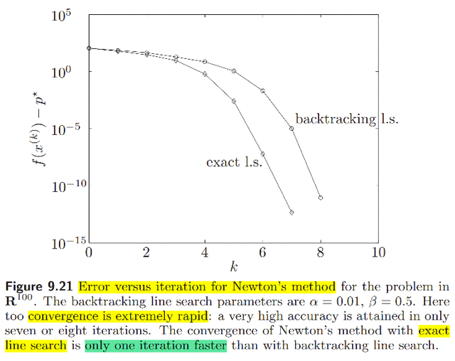</kbd></p>

<p align="center"><kbd>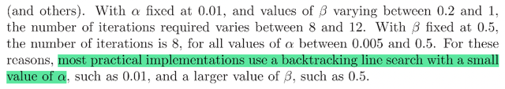</kbd></p>

> [!NOTE]
> ví dụ này cho thấy exact line search chỉ nhanh hơn backtracking
> một chút.
>
> cả hai đều nhanh chóng bước vào giai đoạn quadratic convergence
>
> Cũng cho thấy trong backtracking thì `α` `β` ảnh hưởng không nhiều
> đối với Newton's method

<br>

<p align="center"><kbd>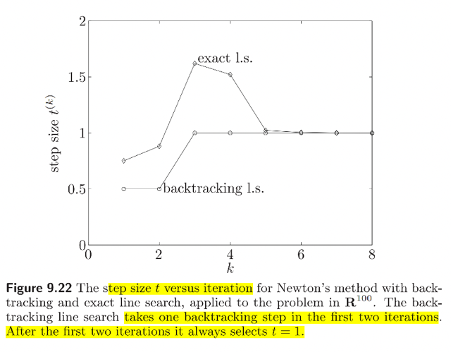</kbd></p>

> [!NOTE]
> Cho thấy hai iteration đầu thì backtracking còn
> thực hiện bước "backtrack" tức gỉam t để có t < 1
> nhưng sau đó, là nó dùng full newton step

<br>

<p align="center"><kbd>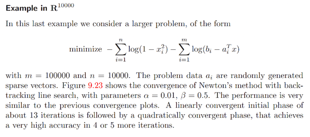</kbd></p>

<p align="center"><kbd>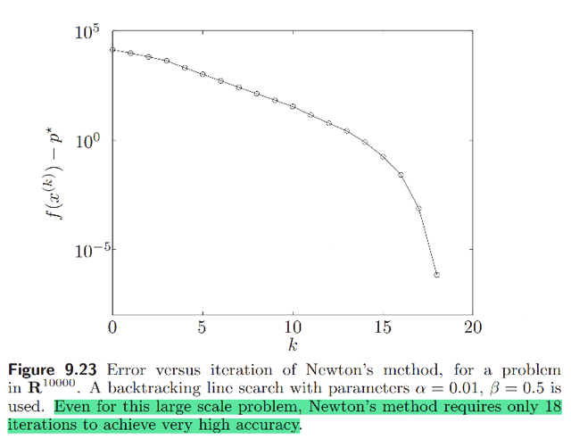</kbd></p>

<br>

<p align="center"><kbd>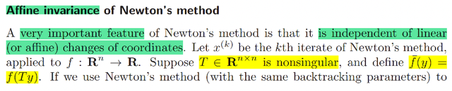</kbd></p>

<p align="center"><kbd>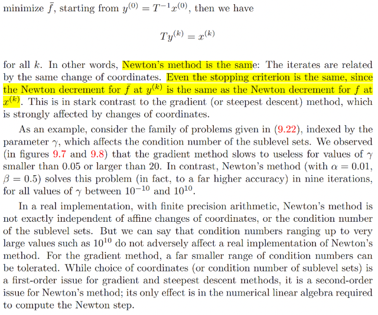</kbd></p>

> [!NOTE]
> đại ý là khác với gradient descent method nơi mà nó bị phụ thuộc vào
> hệ trục (cũng chính là ko ảnh hưởng bởi condition number của sub
> level set ), để rồi khi qua phép biến đổi coordinates, nếu condition
> number của problem trở nên tốt (nhỏ) thì gradient descent sẽ hoạt
> động tốt  và ngược lại.
>
> Còn với Newton's method thì nó không bị ảnh hưởng gì.
>
> Người ta nói về một ví dụ trước khi ta thử một ví dụ trong đó
> condition của problem phụ thuộc vào `γ` để rồi thấy rằng khi `γ` quá nhỏ
> hay quá lớn thì gradient descent bị rất chậm. Trong khi đó, với
> Newton method thì nó đều converge nhanh trong 9 iteration cả.
>
> Cuối cùng đại ý là trong thực tế thì thật ra cũng không hẳn là Newton
> method không bị ảnh hưởng bởi phép đổi trục (cũng chính là ko ảnh
> hưởng bởi condition number của sub level set ) nhưng đại khái là nó
> sẽ có một khoảng rộng hơn nhiều của condition number mà trong đó
> nó ko bị ảnh hưởng. Ngược lại với gradient descent thì chỉ có thể
> ko bị ảnh hưởng nếu condition number thay đổi trong khoảng hẹp thôi
>
> Thành ra, với gradient descent chính thì việc đổi hệ trục để cải thiện
> condition number là việc sống còn. Còn với newton method thì không,
> mà chỉ ảnh hưởng đến việc tính toán Newton's step mà thôi

<br>

<p align="center"><kbd>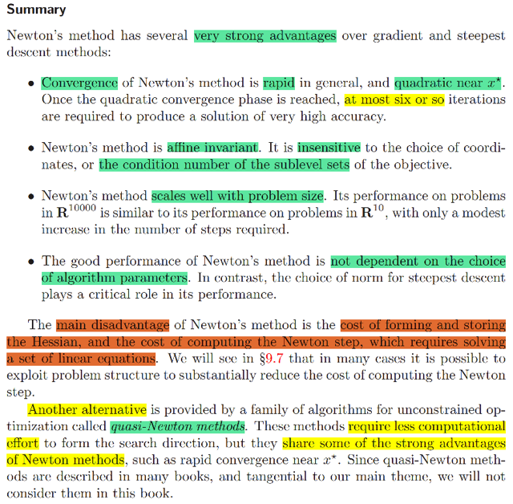</kbd></p>

> [!NOTE]
> tóm lại Newton's method có nhiều ưu điểm như converge nhanh cho
> cả low hay high dimension. Không phụ thuộc vào coordinate (cũng là
> condition number của sub level set).
>
> Nhưng nhược điểm chính của nó chính là cần nhiều tính toán ra
> Hessian (newton step `Δx_nt` `=` - ∇^2f(x)inv ∇f(x))
>
> Có những cách để khắc phục, trong đó có một phương pháp gọi là
> quasi-Newton giúp giảm số tính toán

<br>

<p align="center"><kbd>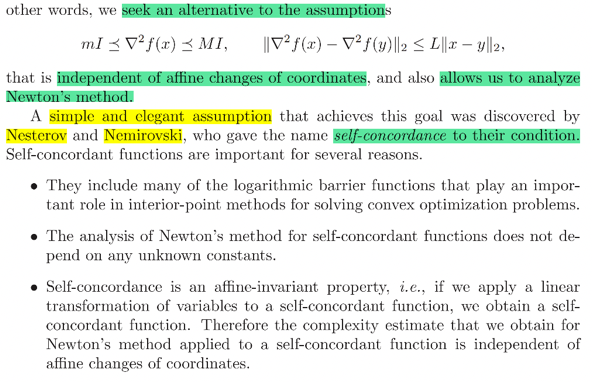</kbd></p>

<p align="center"><kbd>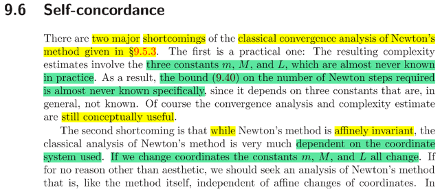</kbd></p>

> [!NOTE]
> Đại khái là trong phần convergence analysis của Newton method
> có hai thiếu xót quan trọng.
>
> 1) là khi ta tính `/` triển khai để có giới hạn trên của số iteration
> cần thiết thì nó phụ thuộc vào các hằng số như m, M, L mà thực
> ra ta không biết giá trị của chúng.
>
> 2) và dù newton's method ko bị ảnh hưởng bởi coordinate hay
> condition number sub-level set nhưng m, M thì có bị.
>
> Do đó đại khái là ta muốn tìm một cách để khiến việc phân tích
> convergence của pp Newton cũng sẽ ko bị phụ thuộc vào
> coordinate
>
> Và hai nhà toán học đã tìm ra một điều kiện gọi là
> SELF-CONCORDANT sẽ giúp cho ta đạt được mục tiêu này
>
> 9. UNCONSTRAINED PROBLEM
>
> 9.6 SELF-CONCORDANCE

<br>

<p align="center"><kbd>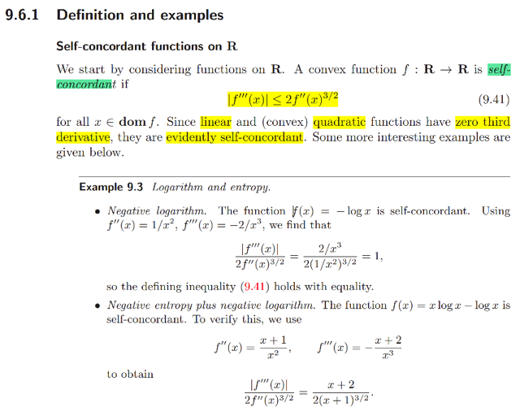</kbd></p>

<p align="center"><kbd>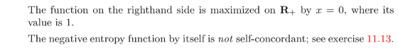</kbd></p>

> [!NOTE]
> Định nghĩa của tính chất self-concordant: là function có (trị tuyệt đối)
> của đạo hàm bậc 3 nhỏ hơn hoặc bằng 2 lần đạo hàm bậc 2 mũ `3/2`
>
> Thì hàm tuyến tính và bậc 2 có đạo hàm bậc 3 `=` 0 nên nó tự
> nhiên thỏa `/` có tính self-concordance
>
> Hai ví dụ cho thấy f(x) `=` -log x thỏa điều kiện nên là self-concordance
> còn f(x) `=` xlogx - logx thì không

<br>

<p align="center"><kbd>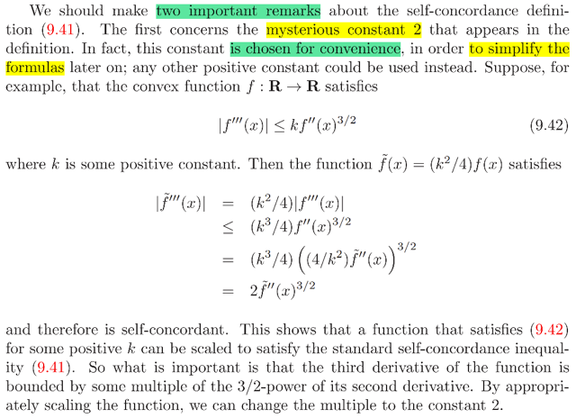</kbd></p>

> [!NOTE]
> đại khái là số 2 trong "công thức" thật ra là chỉ chọn cho dễ (giúp 
> đơn giản hóa) thôi. Chứ thật ra miễn là f(x) thỏa |f'''(x)| ≤ `kf''(x)^3/2`
> thì đều self-concordance. Tức là yêu cầu chỉ là giá trị của đạo hàm
> cấp 3 bị chặn trên bởi lũy thừa `3/2` của đạo hàm cấp 2, nhân với số
> dương nào đó.

<br>

<p align="center"><kbd>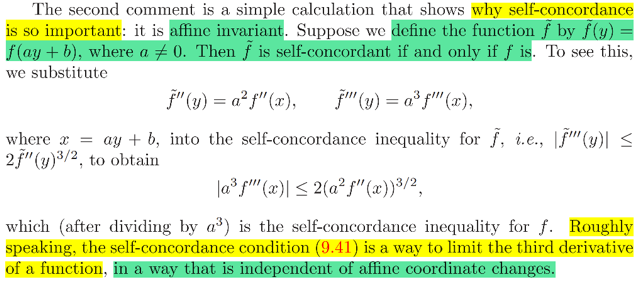</kbd></p>

> [!NOTE]
> Điểm chú ý thứ hai quan trọng, đó là tính self-concordance có
> tính affine invariant.
>
> Tức là nếu f self-concordance thì f~(ay + b) `=` f(x) x `=` ay + b, 
>  cũng vậy.
>
> Chứng minh: Vì f~ self-concordance nên f~ thỏa điều kiện:
>
> |f~'''(y)| ≤ `2[f~''(y)^3/2]`
>
> Thế thì f~(y) `=` f(ay + b) ⇨ `d/dy` f~(y) 
>
> `=` `d/d(ay` +b) f(ay + b) . `d/dy` (ay + b)
>
> `=` `df(x)/dx` . `d/dy` (ay + b) 
>
> ```text
> = f'(x) a = a f'(x) ⇨ f~'(y) = a f'(x) = a f'(ay + b)
> ```
>
> ```text
> d/dy f~'(y) = d/dy [a f'(x)] = a d/dy f'(ay + b)
> ```
>
> `=` a `d/d(ay` + b) f'(ay + b) . `d/dy` (ay + b)
>
> `=` a `d/dx` f'(x) . a `=` a^2 f''(x)
>
> ⇨ f~''(y) `=` a^2 f''(x) 
>
> `d/dy` f~''(y) `=` `d/dy` a^2 f''(ay + b) 
>
> `=` a^2 `d/d(ay` + b) f''(ay + b) . `d/dy` (ay + b)
>
> `=` a^2 `d/dx` f''(x) a
>
> `=` a^3 f'''(x)
>
> ⇨ f~'''(y) `=` a^3 f'''(x)
>
> Vậy ta có |f~'''(y)| ≤ `2[f~''(y)^3/2]`
>
> ⇔ |a^3 f'''(x)| ≤ 2[a^2 `f''(x)]^3/2`
>
> ⇔ |a^3 f'''(x)| ≤ 2 a^3 `[f''(x)]^3/2`
>
> ⇔ |f'''(x)| ≤ 2 `[f''(x)]^3/2` ⇨ f(x) cũng self concordance

<br>

<p align="center"><kbd>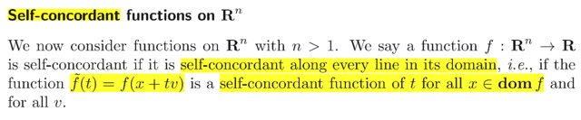</kbd></p>

<br>

<p align="center"><kbd>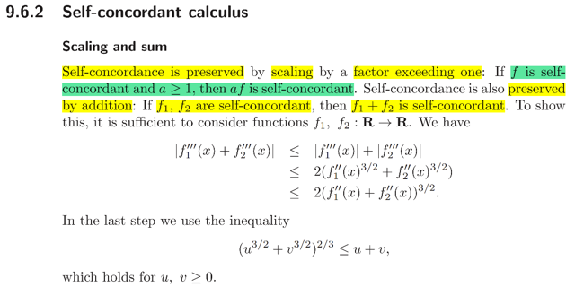</kbd></p>

> [!NOTE]
> đại khái là, khi scale một self-concordance function với factor > 1
> hoặc cộng hai concordance function, thì kết quả vẫn là
> self-concordance function

<br>

<p align="center"><kbd>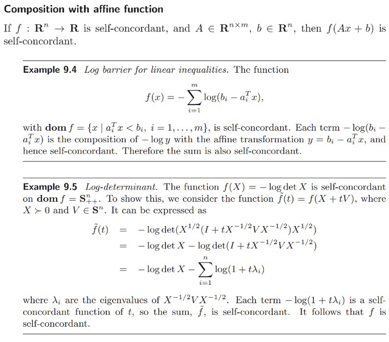</kbd></p>

<p align="center"><kbd>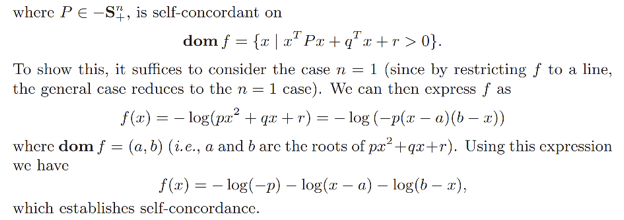</kbd></p>

<p align="center"><kbd></kbd></p>

> [!NOTE]
> Rồi nếu Rn -> R function f là self-concordance thì f(Ax + b) cũng vậy
>
> Vài ví dụ:
>
> 1) f(x) `=` - `Σ` log(bi - aiTx). Thì - log(y) là self-concordance, nên combine
> với affine -log(bi - aiTx) cũng vậy, và sum các self-concordance
> function  cũng self-concordance
>
> ...

<br>

<p align="center"><kbd>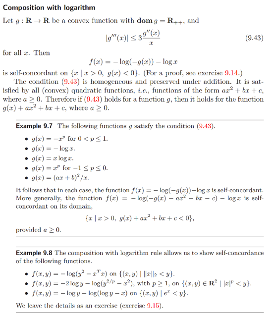</kbd></p>

> [!NOTE]
> QUAY LẠI SAU

<br>

<p align="center"><kbd>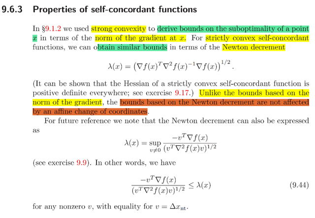</kbd></p>

<p align="center"><kbd>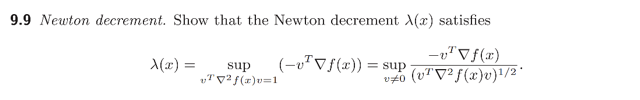</kbd></p>

> [!NOTE]
> đại khái là, trong phần 9.1.2 ta đã dùng tính chất strong convexity để suy ra giới hạn trên
> và dưới của sub-optimality (f(x) - p*) theo norm của gradient tại x: ||∇f(x)||. (cũng ko khó
> hiểu, theo link xem lại)
>
> Thế thì ở đây nói rằng nếu như ta có strictly convex self-concordance function thì ta cũng
> có thể chứng minh được những giới hạn tương  tự nhưng thể hiện theo Newton
> decrement.
>
> Và cái chính là, nếu kết qủa như cách làm trước sẽ bị phụ thuộc affine change of
> coordinate thì cách làm sau thì không.
>
> Thế thì để thuận tiện ta thể hiện Newton decrement ở dạng:
>
> λ(x) `=` sup v ≠ 0 - vT∇f(x) `/` `[vT∇^2f(x)v]^1/2`
>
> Là sao:
>
> Ôn lại về Newton decrement λ, một trong các cách hiểu về  nó là liên hệ nó với độ giảm của 
> ```text
> hàm f khi thực hiện bước Newton: f(x) - f(x + Δx_nt), và cái này = 1/2 λ^2 (theo định nghĩa
> ```
> của Newton decrement là vậy)
>
> Và Newton's step `Δx_nt` là gì? Ý tưởng là, tại điểm đang đứng, tạm gọi x0 (hoặc xk) ta sẽ
> thay hàm f bằng xấp xỉ bậc hai của nó:
>
> Xấp xỉ bậc hai của hàm f(x) tại x0:
>
> ```text
> f(x0 + δx) ≈ f(x0) + ∇f(x0)Tδx + (1/2) δxT ∇^2f(x0) δx
> ```
>
> ```text
> Ta sẽ dùng function f^(δx) = f(x0) + ∇f(x0)Tδx + (1/2) δxT ∇^2f(x0) δx, là quadratic function,
> ```
> và giải bài toán tìm `δx` sao cho minimize `f^(δx)` (trong bối cảnh đây là trong chương 9, bài
> toán đang giải là unconstraint, nên bài toán này cũng chỉ là bài toán unconstrained
> quadratic optimization.
>
> ```text
> Và vì f^ có dạng quadratic: 1/2 δxT P δx + qTδx + r nên dễ dàng tìm ra minimum của nó
> ```
> theo optimality condition:
>
> ```text
> ∇f^ = 0 ⇔ P δx + q = 0 ⇔ x = -Pinvq
> ```
>
> `=` - ∇^2f(x0)inv ∇f(x0). Đây chính là công thức Newton step tại x0.
>
> Nên công thức Newton step tại x sẽ là `Δx_nt` `=` - ∇^2f(x)inv ∇f(x)
>
> Thế thì độ giảm Newton's decrement cũng có thể được tính bởi
>
> ```text
> 1/2λ^2 = f^(0) - f^(Δx_nt)
> ```
>
> f^(0) `=` f(x0) là vị trí ban đầu khi chưa bước theo Newton step
>
> `f^(Δx_nt)` là vị trí sau khi bước,
>
> ```text
> = f(x0) + ∇f(x0)TΔx_nt + (1/2) (Δx_nt)T ∇^2f(x0) Δx_nt
> ```
>
> ```text
> ⇨ λ = - ∇f(x0)TΔx_nt - (1/2) (Δx_nt)T ∇^2f(x0) Δx_nt
> ```
>
> `=` - ∇f(x0)T[-∇^2f(x0)inv ∇f(x0)] - `(1/2)` (-∇^2f(x0)inv ∇f(x0))T ∇^2f(x0) [- ∇^2f(x0)inv ∇f(x0)]
>
> `=` ∇f(x0)T ∇^2f(x0)inv ∇f(x0) - `(1/2)` [∇^2f(x0)inv ∇f(x0)]T ∇^2f(x0) [ ∇^2f(x0)inv ∇f(x0)]
>
> `=` ∇f(x0)T ∇^2f(x0)inv ∇f(x0) - `(1/2)` [∇f(x0)]T ∇^2f(x0)inv ∇^2f(x0) [ ∇^2f(x0)inv ∇f(x0)]
>
> `=` ∇f(x0)T ∇^2f(x0)inv ∇f(x0) - `(1/2)` [∇f(x0)]T [ ∇^2f(x0)inv ∇f(x0)]
>
> `=` ∇f(x0)T ∇^2f(x0)inv ∇f(x0) - `(1/2)` [∇f(x0)]T ∇^2f(x0)inv ∇f(x0)
>
> `=` `(1/2)` ∇f(x0)T ∇^2f(x0)inv ∇f(x0)
>
> ```text
> Vậy cái này = 1/2 λ^2 ⇨ 1/2 λ^2 = ∇f(x0)T ∇^2f(x0)inv ∇f(x0)
> ```
>
> ⇔ λ `=` [∇f(x0)T ∇^2f(x0)inv `∇f(x0)]^1/2` Đây là công thức của Newton decrement
>
> Thế thì ta sẽ chứng minh tại sao nó cũng là sup v ≠ 0 - vT∇f(x) `/` `[vT∇^2f(x)v]^1/2:`
>
> λ(x) `=` [∇f(x0)T ∇^2f(x0)inv `∇f(x0)]^1/2`
>
> Chứng minh λ(x) cũng `=` sup v ≠ 0 -vT∇f(x) `/` `[vT∇^2f(x)v]^1/2`
>
> Đặt H `=` ∇^2f(x), g `=` ∇f(x)
>
> Vế phải `=` sup v ≠ 0 - vTg `/` `(vTHv)^1/2`
>
> ```text
> Đặt w = (H^1/2)Tv ⇨ v = (H^1/2)Tinvw
> ```
>
> ```text
> a) vTHv = vTH^1/2 H^1/2v = (H^1/2Tv)T (H^1/2)Tv = wTw = ||w||^2
> ```
>
> ```text
> ⇨ (vTHv)^1/2 = (||w||^2)^1/2 = ||w||
> ```
>
> ```text
> b) -vTg = - [(H^1/2)Tinvw]Tg = - wT(H^1/2)invg
> ```
>
> ⇨ bài toán sup v ≠ 0 - vT∇f(x) `/` `[vT∇^2f(x)v]^1/2` 
>
> trở thành:
>
> sup w ≠ 0 - `wT(H^1/2)invg` `/` ||w||
>
> `=` sup ||w|| `=` 1 - `w(H^1/2)invg`
>
> ```text
> = sup θ, ||w|| = 1 - ||w||.||(H^1/2)invg||.cos θ
> ```
>
> Θ là góc giữa `H^1/2)invg` và w
>
> `=` `-1.||(H^1/2)invg||.` (-1)
>
> `=` `||(H^1/2)invg||`
>
> ```text
> = [(H^1/2)invg]T[(H^1/2)invg]^1/2
> ```
>
> ```text
> = gT[(H^1/2)inv][(H^1/2)invg]^1/2
> ```
>
> `=` `(gTHinvg)^1/2`
>
> Thay g, H vào:
>
> `=` [∇f(x)T ∇^2f(x)_inv `∇f(x)]^1/2` Chứng minh xong
>
> và optimal là w* có norm `=` 1 và có hướng là `-H^1/2invg`
>
> Hay nói cách khác w* 
>
> ```text
> v = (H^1/2)Tinvw = v = (H^1/2)Tinv -H^1/2invg
> ```
>
> ```text
> = -Hinvg = -∇^2f(x)inv ∇f(x) chính là Δx_nt
> ```
>
> `====`
>
> Như vậy λ(x) `=` sup v ≠ 0 -vT∇f(x) `/` `[vT∇^2f(x)v]^1/2`
>
> thì dĩ nhiên λ(x) ≥ - vT∇f(x) `/` `[vT∇^2f(x)v]^1/2` ∀ v khác 0 và trong đó
> cũng đúng với v `=` `Δx_nt`

<br>

<p align="center"><kbd>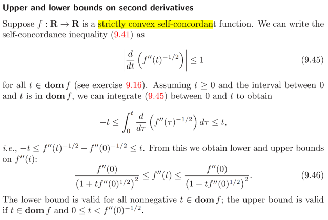</kbd></p>

> [!NOTE]
> Rồi đại khái là họ nói ta có thể thể hiện cái bất đẳng thức vốn dùng
> để thể hiện tính chất self-concordant: |f'''(x)| ≤ `(1/2)` `f''(x)^3/2`
>
> Bởi một inequality tương đương: `|d/dt(f''(t)^-1/2)|` ≤ 1
>
> Cái này chứng minh (ở note kế bên)
>
> Thế thì từ đó họ mới nói rằng khi ta tích phân từ 0 đến t của 
> `d/dt` `f''(t)^-1/2` thì kết quả sẽ nằm trong [-t, t] Là sao?
>
> MIT 18.01 đã học FTC 1: rằng nếu ta có f(x) `=` F'(x) thì `∫a:b` f(t)dt
> sẽ bằng F(b) - F(a)
>
> Do đó ở đây, ta có `d/dt` `f''(t)^-1/2,` có thể đặt là hàm g(t) thì áp dụng
> FTC1 ở trên ta có:
>
> ```text
> ∫a:b g(t) = f''(b)^-1/2 - f''(a)^-1/2.
> ```
>
> ```text
> Với a = 0, b = t thì ∫0:t g(t) = f''(t)^-1/2 - f''(0)^-1/2
> ```
>
> ```text
> Thế thì |d/dt(f''(t)^-1/2)| ≤ 1 ⇔ -1 ≤ d/dt(f''(t)^-1/2) ≤ 1
> ```
>
> Tích phân hai vế trên 0:t
>
> ```text
> ∫0:t (-1)dt ≤ ∫0:t d/dt(f''(t)^-1/2) dt ≤ ∫0:t 1.dt
> ```
>
> ⇔ -t|0:t ≤ `f''(t)^-1/2` - `f''(0)^-1/2` ≤ t|0:t
>
> ⇔ -t ≤ `f''(t)^-1/2` - `f''(0)^-1/2` ≤ t
>
> Từ đó ta có giới hạn trên và dưới của f''(t):
>
> -t ≤ `f''(t)^-1/2` - `f''(0)^-1/2` ≤ t
>
> ⇔ `f''(0)^-1/2` - t ≤ `f''(t)^-1/2` ≤ `f''(0)^-1/2` + t
>
> Đặt a `=` `f''(0)^1/2`
>
> ta có :
>
> ```text
> f''(0)^-1/2 - t ≤ f''(t)^-1/2 ⇔ 1/f''(0)^1/2 - t ≤ 1/ f''(t)^1/2
> ```
>
> ```text
> ⇔ 1/a - t ≤ 1/ f''(t)^1/2 ⇔ (1 - ta)/a ≤ 1/ f''(t)^1/2
> ```
>
> ⇔ `a/(1` - ta) ≥ `f''(t)^1/2` 
>
> ⇔ `(a/(1` - ta))^2 ≥ f''(t) 
>
> ⇔ `(f''(0)^1/2/(1` - `tf''(0)^1/2))^2` ≥ f''(t) 
>
> ⇔ f''(0) `/` (1 - `tf''(0)^1/2)^2` ≥ f''(t)
>
> Tương tự: Ta sẽ có:
>
> ```text
> f''(0) / (1 + tf''(0)^1/2)^2 ≤ f''(t) ≤ f''(0) / (1 - tf''(0)^1/2)^2 (đây là 9.46)
> ```
>
> `====`
>
> Tóm lại ý chính cần hiểu chỗ này là NẾU NHƯ FUNCTION LÀ 
> CONCORDANT FUNCTION, thì từ tính chất |f'''(t)| ≤ k `f''(T)^3/2` 
> ta có thể CHO THẤY MỘT GIỚI HẠN TRÊN VÀ DƯỚI CỦA ĐẠO 
> HÀM CẤP 2 f''(t)
>
> cái bất đẳng thức vốn dùng để thể hiện tính chất self-concordant: |f''
> '(x)| ≤ `(1/2)` `f''(x)^3/2`
>
> Bởi một inequality tương đương: `|d/dt(f''(t)^-1/2)|` ≤ 1
>
> Cái này chứng minh sau
>
> Đặt h(t) `=` `f''(t)^-1/2`
>
> ```text
> h'(t) = d/dt h(t) = d/dt f''(t)^-1/2 = [ d/d(f''(t)) f''(t)^-1/2 ] . d/dt f''(t)
> ```
>
> `=` `(-1/2)` `[f''(t)]^-3/2` . f'''(t)
>
> ```text
> ⇨ |h'(t)| = |(-1/2) [f''(t)]^-3/2 . f'''(t)| = (1/2) |f'''(t)| / |[f''(t)]^3/2|
> ```
>
> Từ đó |h'(t)| ≤ 1 ⇔ `(1/2)` |f'''(t)| `/` `|[f''(t)]^3/2|` ≤ 1
>
> ⇔ |f'''(t)| ≤ 2 `|[f''(t)]^3/2|`
>
> ⇔ -2 `[f''(t)]^3/2` ≤ |f'''(t)| ≤ 2 `[f''(t)]^3/2`
>
> Và như vậy, ta đã có "third derivative của function bị chặn bởi một
> multiple của second derivative mũ `3/2,` và theo đó, ta có thể scale
> function f bởi số k dương nào đó f~(x) `=` k f(x) để nó ra dạng tiêu
> chuẩn: |f~'''(x)| ≤ 2 `f~''(x)^3/2`  của self-condordant condition

<br>

<p align="center"><kbd>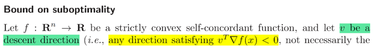</kbd></p>

<p align="center"><kbd>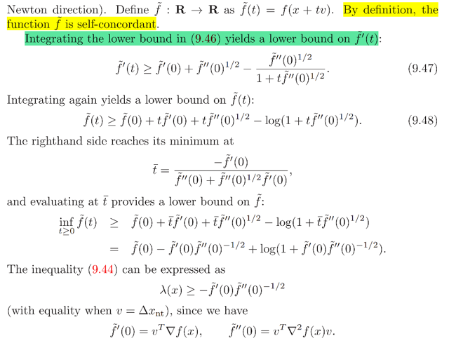</kbd></p>

<p align="center"><kbd>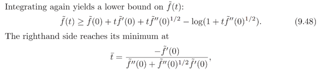</kbd></p>

<p align="center"><kbd>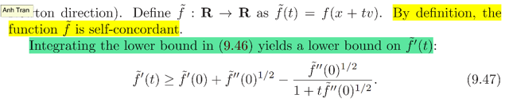</kbd></p>

<p align="center"><kbd>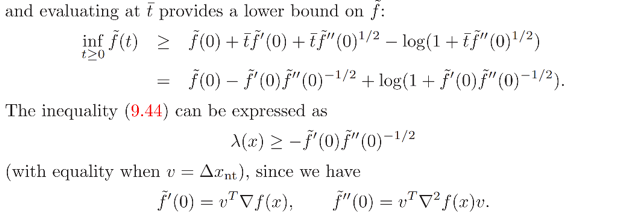</kbd></p>

> [!NOTE]
> Đại khái là Đặt f~(t) `=` f(x + tv) áp dụng kết qủa 9.46:
>
> ```text
> f''(0) / (1 + tf''(0)^1/2)^2 ≤ f''(t) ≤ f''(0) / (1 - tf''(0)^1/2)^2
> ```
>
> Ta sẽ có:
>
> ```text
> f~''(0) / (1 + tf~''(0)^1/2)^2 ≤ f~''(t) ≤ f~''(0) / (1 - tf~''(0)^1/2)^2
> ```
>
> Integrate cái lower-bound của f~''(t) này:
>
>  f~''(t) ≥ f~''(0) `/` (1 + `tf~''(0)^1/2)^2`
>
> ```text
> ⇨ ∫0:t f~''(z) dz  ≥ ∫0:t f~''(0) / (1 + zf~''(0)^1/2)^2 dz
> ```
>
> ⇔ f~'(z)|0:t ≥ ...
>
> ⇔ f~'(t) - f~'(0) ≥ ...
>
> Vế phải: `∫0:t` f~''(0) `/` (1 + `zf~''(0)^1/2)^2` dz
>
> Đặt a `=` `f~''(0)^1/2`
>
> `∫0:t` a^2 `/` (1 + za)^2 dz
>
> a^2 `∫0:t` 1 `/` (1 + za)^2 dz
>
> ```text
> Đặt u = 1 + za ⇨ du = adz ⇨ dz = du/a
> ```
>
> z ∈ [0, t] ⇨ u ∈ [1: 1+ta]
>
> ```text
> a^2 ∫1:(1+ta) 1/u^2 du/a = a ∫1:(1+ta) 1/u^2 du
> ```
>
> ```text
> = a (-1/u) |1:(1+ta) = - a [1/(1+ta) -1/1] = -a [1-(1+ta)] / (1+ta)
> ```
>
> ```text
> = -a (-ta) / (1+ta) = ta^2/(1+ta)
> ```
>
> ```text
> = (ta^2+a-a)/(1+ta) = [a(ta +1)-a]/(1+ta)
> ```
>
> `=` a(ta `+1)/(1+ta)` `-a/(1+ta)` 
>
> `=` a - `a/(1+ta)` 
>
> Thay a `=` `f~''(0)^1/2`
>
> ```text
> Vậy f~'(t) - f~'(0) ≥ a - a/(1+ta) = f~''(0)^1/2 - f~''(0)^1/2/(1+tf~''(0)^1/2)
> ```
>
> ```text
> f~'(t) - f~'(0) ≥ f~''(0)^1/2 - f~''(0)^1/2/(1+tf~''(0)^1/2)
> ```
>
> ```text
> ⇔ f~'(t) ≥ f~'(0) + f~''(0)^1/2 - f~''(0)^1/2/[1+tf~''(0)^1/2] Đây là 9.47
> ```
>
> Xong, tích phân từ 0 đến t lần nữa:
>
> ```text
> ⇔ f~'(t) ≥ f~'(0) + f~''(0)^1/2 - f~''(0)^1/2/[1+tf~''(0)^1/2] (9.47)
> ```
>
> ```text
> ⇔ ∫0:t f~'(z)dz ≥ ∫0:z f~'(0) + f~''(0)^1/2 - f~''(0)^1/2/[1+zf~''(0)^1/2] dz
> ```
>
> ```text
> ⇔ f~(z)|0:t ≥ ∫0:z f~'(0) + f~''(0)^1/2 - f~''(0)^1/2/[1+zf''(0)^1/2] dz
> ```
>
> Xét vế trái: f~(z)|0:t `=` f(t) - f(0)
>
> ```text
> Xét vế phải ∫0:t f~'(0) + f~''(0)^1/2 - f~''(0)^1/2/[1+zf~''(0)^1/2] dz:
> ```
>
> Đặt a `=` `f~''(0)^1/2,` b `=` f~'(0)
>
> `∫0:t` [b + a - `a/(1+az)]` dz `=` (b+a)t |0:t - log(1 + az) |0:t
>
> (b+a)z là antiderivative của b+a: `d/dz` (b+a)z `=` b+a
>
> ```text
> log(1+az) là anti derivative của a/(1+az): d/dz log(1+az) = 1/(1+az) . a
> ```
>
> ```text
> = (b + a)t - log(1 + at) = tf~'(0) + tf~''(0)^1/2 - log(1 + tf~''(0)^1/2)
> ```
>
> Ta có: f~(t) - f~(0) ≥ tf~'(0) + `tf~''(0)^1/2` - log(1 + `tf~''(0)^1/2)`
>
> ⇔ f~(t) ≥ f~(0) + tf~'(0) + `tf~''(0)^1/2` - log(1 + `tf~''(0)^1/2)` đây là (9.48)
>
> `====`
>
> Tiếp họ nói vế phải đạt minimum tại t^ `=` -f~'(0) `/` [f~''(0) + `f~''(0)^1/2` f~'(0)]
> ```text
> là sao: Là vì bên phải, nếu đặt c1 = f~(0), c2 = f~'(0), c3 = f~''(0)^1/2, ta
> ```
> có g(t) `=` c1 + tc2 + tc3 - log(1 + tc3). 
>
> Đây là convex function: vì nó là tổng của affine (là convex) và -log(affine) là 
> -concave `=` convex. Nên tìm minimum của nó bằng optimality condition ∇g `=` 0:
>
> Đặt u `=` 1 + tc3 ⇨ du `=` c3 dt
>
> dg `=` g(t+dt) - g(t) `=` c1 + (t+dt)(c2 + c3) - log(u+du) - c1 - tc2 - tc3 + log(u) 
>
> `=` dt(c2 + c3) - [log(u + du) - log(u)]
>
> `=` dt(c2 + c3) - log[(u + `du)/u]`
>
> ```text
> = dt(c2 + c3) - log(1 + du/u) = dt(c2 + c3) - du/u
> ```
>
> ```text
> = dt(c2 + c3) - c3dt/(1+tc3) = [c2 + c3 - c3/(1 + tc3)]dt
> ```
>
> ⇨ g' `=` c2 + c3 - `c3/(1` + tc3)
>
> Tính bằng cách khác:
>
> ```text
> dg/dt = d/dt (c1 + tc2 + tc3 - log(1 + tc3)) = c2 + c3 - d/dt log(1 + tc3)
> ```
>
> ```text
> = c2 + c3 - d/d(1 + tc3) log(1 + tc3) . d/dt (1 + tc3) = c2 + c3 - [1/(1 + tc3)] c3
> ```
>
> `=` c2 + c3 - `c3/(1` + tc3)  
>
> ```text
> ⇨ g' = 0 ⇔ c2 + c3 - c3/(1 + tc3) = 0 ⇔ c2 + c3 = c3/(1 + tc3)
> ```
>
> ```text
> ⇔ (1 + tc3)  = c3/(c2 + c3) ⇔ tc3 = c3/(c2 + c3) - 1 = c3 - c2 - c3 / (c2 + c3)
> ```
> `=` - `c2/(c2` + c3)
>
> ⇔ t `=` `-c2/[c3(c2` + c3)]
>
> ```text
> c1 = f~(0), c2 = f~'(0), c3 = f~''(0)^1/2
> ```
>
> ```text
> t = -f~'(0)/[f~''(0)^1/2(f~'(0) +f~''(0)^1/2)]
> ```
>
> ```text
> ⇔ t = -f~'(0) / [f~''(0)^1/2 ( f~'(0) + f~''(0)^1/2 )]
> ```
>
> ```text
> ⇔ t = -f~'(0) / [f~''(0)^1/2 f~'(0) + f~''(0)^1/2f~''(0)^1/2 ]
> ```
>
> ⇔ t `=` -f~'(0) `/` `[f~''(0)^1/2` f~'(0) + f~''(0) ]
>
> ⇔ t `=` -f~'(0) `/` [f~''(0) + `f~''(0)^1/2` f~'(0) ] Đây là t^bar trong sách
>
> Và dĩ nhiên vì f~(t) sẽ đạt min tại t^ (t bar) nên inf t ≥ 0 f~(t) cũng ≥ f~(t^)
>
> t^ `=` -f~'(0) `/` [f~''(0) + `f~''(0)^1/2` f~'(0) ] Đây là t^bar trong sách
>
> f~(t) ≥ f~(0) + tf~'(0) + `tf~''(0)^1/2` - log(1 + `tf~''(0)^1/2)` đây là (9.48)
>
> ⇨ inf t ≥ 0 f~(t) ≥ f~(0) + t^f~'(0) + `t^f~''(0)^1/2` - log(1 + `t^f~''(0)^1/2)`
>
> Thế t^ vô thu gọn (cái này hơi rắc rối nhưng chỉ là toán đại số) lại vế phải là:
>
> int t ≥ 0 f~(t) ≥ f~(0) - `f~'(0)f~''(0)^-1/2` + log[1 + `f~'(0)f~''(0)^-1/2]`
>
> `===`
>
> Rồi, với việc ta đã đặt f~(t) `=` f(x + tv)
>
> ⇨ `df~(t)/dt` `=` `d/dt` f(x + tv)
>
> `=` `d/d(x` + tv) f(x + tv) . `d/dt` (x + tv)
>
> `=` `df(u)/du` . `d/dt` (x + tv)
>
> `=` ∇f(u) T v `=` ∇f(x + tv)Tv 
>
> *vì u là vector f(u) là vector - scalar function nên `df/du` là gradient ∇f. Dẫn đến
> dấu product của `df/du` và v (cũng là vector) phải là dot product để cho ra df
> là scalar.
>
> ⇨ f~'(t) `=` ∇f(x + tv)Tv ⇨ vT∇f(x) `=` f~'(0) 
>
> `df~'(t)/dt` `=` `d/dt` [∇f(x + tv)Tv]
>
> `=` `[d/dt` ∇f(x + tv)]Tv
>
> `=` `[d/d(x` + tv) ∇f(x + tv) . `d/dt` (x + tv)]Tv
>
> `=` [∇^2f(x + tv)Tv]Tv `=` vT∇^2f(x + tv)Tv
>
> ⇨ f~''(t) `=`  vT∇^2f(x + tv)Tv ⇨ vT∇^2f(x)Tv `=` f~''(0)
>
> Ta có: 9.44 rằng λ(x) ≥ -vT∇f(x) `/` [vT `∇^2f(x)v]^1/2` sẽ 
>
> ⇔ λ(x) ≥ -f~'(0) `/` `f~''(0)^1/2` 
>
> ⇔ λ(x) ≥  -f~'(0) `f~''(0)^-1/2`
>
> Và nói dấu bằng xảy ra khi v `=` newton step `Δx_nt` là sao?
>
> Là vì trong phần trước mình đã chứng minh λ(x) cũng `=` sup v ≠ 0 -vT∇f(x) `/` `[vT∇^2f(x)v]^1/2`
>
> ```text
> Nên di nhiên λ(x) luôn ≥ -vT∇f(x) / [vT∇^2f(x)v]^1/2 = -f~'(0) f~''(0)^-1/2
> ```
>
> ```text
> Và khi giải bài toám maximize v -vT∇f(x) / [vT∇^2f(x)v]^1/2 thì v* = Δx_nt
> ```
>
> Ý TƯỞNG CHÍNH là: Từ cái giới hạn dưới (và trên) của đạo hàm
> cấp hai f''(t) MÀ TA CÓ ĐƯỢC NHỜ TÍNH SELF-CONCORDANT
> thì ta sẽ dưa vào đó để chứng minh, TÌM ĐƯỢC GIỚI HÀN CỦA 
> sup-optimality f(x) - p*, để cho thấy nó sẽ luôn ≤ λ(x).
>
> Để rồi TỪ ĐÓ TA CÓ THỂ DÙNG λ(x) ĐÓNG VAI TRÒ STOPPING
> CONDITION, ví dụ như ta muốn f(x) - p* ≤ `ε` thì ta sẽ dừng khi λ(x) ≤ `ε`

<br>

<p align="center"><kbd>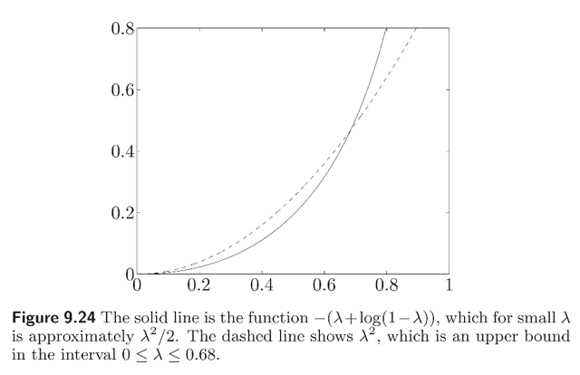</kbd></p>

<p align="center"><kbd>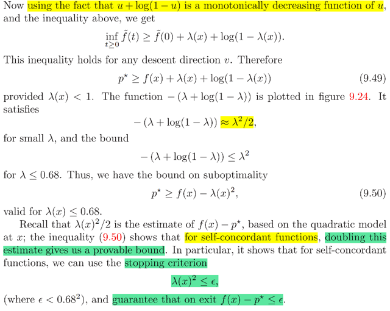</kbd></p>

> [!NOTE]
> Tiếp, dụng sự thật rằng f(u) `=` u + log(1 - u) là hàm đơn điệu giảm đối với u
>
> nên nếu u1 ≥ u2 thì f(u1) ≤ f(u2)
>
> Áp dụng u1 `=` λ(x), u2 `=` `-f~'(0)f~''(o)^-1/2`
>
> Thì ta có: f(λ(x)) ≤ `f(-f~'(0)f~''(o)^-1/2)`
>
> ⇔ λ(x) + log[1 - λ(x)] ≤ `-f~'(0)f~''(o)^-1/2` + log1 `-[-f~'(0)f~''(o)^-1/2]`
>
> ⇔ λ(x) + log[1 - λ(x)] ≤ `-f~'(0)f~''(o)^-1/2` + log1 + `f~'(0)f~''(o)^-1/2`
>
> ⇔ f~(0) + λ(x) + log[1 - λ(x)] ≤ f~(0) - `f~'(0)f~''(o)^-1/2` + log1 + `f~'(0)f~''(o)^-1/2`
>
> Và vế phải thì đang ≤ inf t≥0 f~(t) nên ta có
>
> inf t≥0 f~(t) ≥ f~(0) + λ(x) + log[1 - λ(x)]
>
> Và vì f~(t) `=` f(x + tv) nên ta có:
>
> inf t≥0 f~(x + tv) ≥ f~(0) + λ(x) + log[1 - λ(x)]
>
> Và cái này đương nhiên đúng với mọi v, đơn giản vì nó chả nói gì đến v, nên nó phải
> đúng với mọi v Và v như nói ban đầu là ANY DESCENT DIRECTION, tức là miễn là
> hướng khiến giảm giá trị f, cộng với t là ≥ 0 do đó inf t≥0 f(x+tv) sẽ mang ý nghĩa là "
> (giá trị f tại) mọi điểm có thể đến được khi xuất phát từ f theo hướng descent). Và dĩ
> nhiên trong đó sẽ có CHỨA OPTIMAL p*
>
> Vậy p* ≥ f~(0) + λ(x) + log[1 - λ(x)]
>
> Rồi thế thì họ mới xét hàm k(λ) `=` -[λ + log(1 - λ)]
>
> thì đại khái là đồ thị 9.24 cho thấy khi λ nhỏ thì nó xấp xỉ hàm `λ^2/2.` Và đặc điểm thứ
> hai là khi λ ≤ 0.68 thì nó luôn nằm dưới đồ thị hàm λ^2. Do đó ta có thể dùng đặc
> điểm này để nói rằng:
>
> khi λ(x) ≤ 0.68 thì -[λ(x) + log[1 - λ(x)] ≤ λ(x)^2
>
> ⇔ λ(x) + log(1 - λ(x) ≥ -λ(x)^2
>
> ⇨ f~(0) + λ(x) + log[1 - λ(x) ≥  f~(0) - λ(x)^2
>
> ⇨ p* ≥  f~(0) - λ(x)^2
>
> ⇔ p* `>=`  f(x) - λ(x)^2 | f~(0) `=` f(x + 0v) `=` f(x)
>
> ⇔ Và đây là lower bound của sub-optimality khi λ(x) ≤ 0.68
>
> (f(x) - p* ≤ λ(x)^2)
>
> Và do đó nếu như với self-concordant function (để ta có kết quả trên) thì ta có thể
> dùng điều kiện λ(x)^2 ≤ `ε` để dừng thuật toán, vì khi đó ta đã có f(x) - p* ≤ `ε`

<br>

<p align="center"><kbd>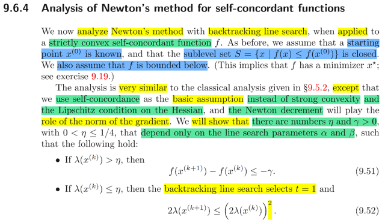</kbd></p>

<p align="center"><kbd>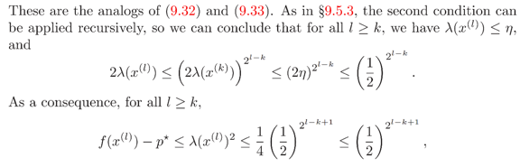</kbd></p>

<p align="center"><kbd>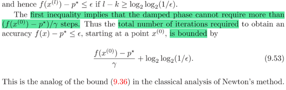</kbd></p>

> [!NOTE]
> 9. UNCONSTRAINED PROBLEM
>
> 9.6 SELF CONCORDANCE
>
> 9.6.4
>
> Đại khái là ta sẽ làm lại cái phần convergence analysis nhưng
> là đối với concordant function, để rồi ta cũng sẽ chứng minh rằng
> việc giải bài toán dùng Newton's method cũng sẽ đưa đến hai 
> giai đoạn
>
> Đây là nói trước những những kết quả ta sẽ chứng minh, và 
> nó tuong đương với những phân tích của phần trước

<br>

<p align="center"><kbd>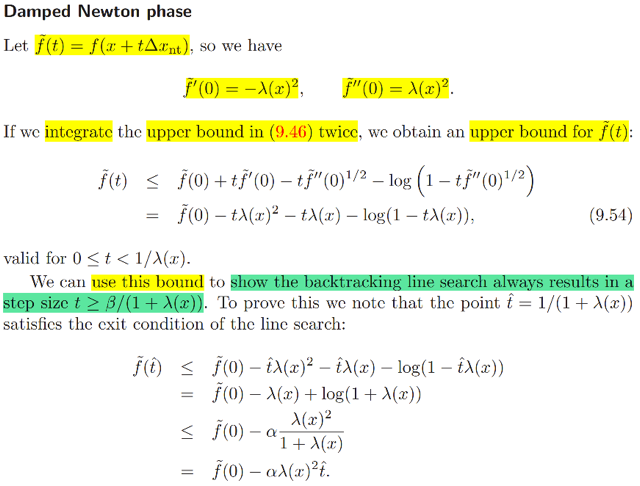</kbd></p>

<p align="center"><kbd>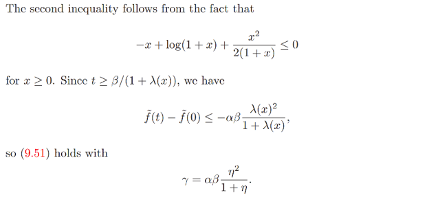</kbd></p>

> [!NOTE]
> Đầu tiên đặt f~(t) `=` f(x + t `Δx_nt)`
>
> ```text
> f~'(t) = d/dt f(x + t Δx_nt) = d/d(x + t Δx_nt) f(x + t Δx_nt) . d/dt (x + t Δx_nt)
> ```
>
> ```text
> = ∇f(x + t Δx_nt)T Δx_nt
> ```
>
> ```text
> ⇨ f~'(0) = ∇f(x)TΔx_nt = ∇f(x)TΔx_nt
> ```
>
> Với `Δx_nt` `=` -∇^2f(x)inv ∇f(x) thì 
>
> `∇f(x)TΔx_nt` `=` -∇f(x)T ∇^2f(x)inv ∇f(x)
>
> và cái này chính là -λ(x)^2. ⇨ f~'(0) `=` -λ(x)^2
>
> ```text
> f~''(t) = d/dt f~'(t) = d/dt ∇f(x + t Δx_nt)TΔx_nt
> ```
>
> ```text
> = [d/d(x + t Δx_nt) ∇f(x + t Δx_nt) . d/dt (x + t Δx_nt) ]TΔx_nt
> ```
>
> ```text
> = [∇^2f(x + t Δx_nt) . Δx_nt]TΔx_nt
> ```
>
> ```text
> = Δx_ntT[∇^2f(x + t Δx_nt)]TΔx_nt
> ```
>
> ```text
> f~''(0) = Δx_ntT[∇^2f(x)]TΔx_nt = (∇^2f(x)inv ∇f(x))T[∇^2f(x)]T(∇^2f(x)inv ∇f(x))
> ```
>
> `=` ∇f(x)∇^2f(x)invT [∇^2f(x)]T∇^2f(x)inv ∇f(x)
>
> `=` ∇f(x)∇^2f(x)inv ∇f(x) chính là λ(x)^2
>
> ⇨ f~''(0) `=` λ(x)^2
>
> `====`
>
> Từ 9.46:
>
> ```text
> f''(0) / (1 + tf''(0)^1/2)^2 ≤ f''(t) ≤ f''(0) / (1 - tf''(0)^1/2)^2 (đây là 9.46)
> ```
>
> Ta sẽ tích phân từ 0 : t cái upper bound:
>
> QUAY LẠI LÀM SAU (TƯƠNG TỰ NHƯ KHI TA LÀM RA CÁI 9.48)
>
> f~(t) ≤ f~(0) + tf~'(0) - `tf~''(0)^1/2` - log[1 - `tf~''(0)^1/2]`
>
> `=` f~(0) - t λ(x)^2 - t λ(x) - log[1 - t λ(x)]
>
> Và kết quả đáng chú ý đầu tiên là ta sẽ chứng minh rằng với cái này thì
> backtracking line search luôn chọn step size t ≥ `β/[1+λ(x)]`
>
> Để chứng minh ta sẽ để ý rằng t^ `=` `1/[1` + λ(x)] thỏa exit condition của
> line search. Là sao?
>
> Exit condition của backtracking line search: 
>
> Nói bằng lời là vị trí sau khi step f(x + t `Δx)` đã nhỏ hơn vị trí dự đoán bởi
> linear interpolation với độ dốc điều chỉnh: f(x) + `αt∇f(x)T` `Δx:`
>
> f(x + t `Δx)` < f(x) + `αt∇f(x)T` `Δx` . Nếu chưa thỏa thì ta sẽ scale down t bởi factor
> `β:` t `=` `βt` và check lại cho đến khi thỏa. 
>
> Thế thì đại khái là họ đã chứng minh với t^ `=` `1/[1` + λ(x)] thì:
>
> f~(t^) ≤ f~(0) - `α` λ(x)^2 t (1)
>
> Ở trên đã biết -λ(x)^2 `=` -∇f(x)∇^2f(x)inv ∇f(x) `=` ∇f(x)[-∇^2f(x)inv ∇f(x)] 
>
> ```text
> = ∇f(x)Δx_nt nên (1) ⇔ f~(t^) ≤ f~(0) + α ∇f(x)Δx_nt t . Và đây chính là exit
> ```
> condition.
>
> Và như vậy với t `=` `1/[1+λ(x)]` thì nó đã thỏa exit condition nên dĩ nhiên t không
> thể bé hơn mức này, 
>
> và vì vậy càng không thể bé hơn `β/[1+λ(x)]` (vì bản chất của backtracking line 
> search là scalar t xuống cho đến khi nó thỏa exit condition thì dừng và dùng t đó) 
>
> Do đó có thể kết luận t luôn ≥ `β/[1+λ(x)].`
>
> Và từ đó dẫn tới với t^ `=` `1/[1` + λ(x)] thì f~(t^) - f~(0) ≤ - `α` λ(x)^2 t^
>
> ```text
> ⇔ f~(t^) - f~(0) ≤ - γ đây là 9.51 với γ = α λ(x)^2 t^
> ```
>
> Để hiểu cái ý khi họ nói ta sẽ chứng minh rằng tồn tại η để khi λ(x) ≥ η
> thì ta có 9.51 và khi λ < η  thì ta có 9.52  này 
>
> ta tóm tắt lại quá trình chứng minh như sau:
>
> Đầu tiên dựa vào cái giới hạn trên và dười của đạo hàm cấp hai
> f''(t) mà ta có được từ tính chất của hàm self-concordant.
>
> (Để rồi phần trước, nhờ dùng cái chặn dưới, ta tìm ra, chứng minh
> được f(x) - p* ≤ λ(x))
>
> Thì nay dùng cái chặn trên ta chứng minh được rằng tại t luôn ≥ 
> `β` `/` (1 + λ(x)), là vì ta đã chứng minh tại t (vốn ban đầu mỗi vòng
> backtracking line search đều bằng 1, sau đó được scale xuống 
> dần bởi factor `β)` thì khi đạt t^ `=` `1/[1` + λ(x)], thì nó đã thỏa exit
> condition của thuật toán line search. Và từ đó dẫn tới kết quả là
>
> f~(t) - f~(0) ≤ `-α` `β` λ(x)^2 `/` [1 + λ(x)]
>
> ```text
> ⇔ f(x + tΔx_nt) - f(x) ≤ -α β λ(x)^2 / [1 + λ(x)]
> ```
>
> Cũng chính là chứng minh 
>
> ```text
> f(x(k+1)) - f(x(k)) ≤ γ = -α β λ(x)^2 / [1 + λ(x)].
> ```
>
> ⇔ `α` `β` λ(x)^2 `/` [1 + λ(x)] ≤ f(x(k)) - f(x(k+1))
>
> Ý NGHĨA CỦA NÓ LÀ: ALL THE TIME, TA LUÔN CÓ THỂ CHẮC CHẮN
> RẰNG MỨC GIẢM CỦA f SAU MỖI ITERATION LUÔN ÍT NHẤT LÀ BẰNG
> ```text
> γ = α β λ(x)^2.
> ```
>
> Vậy thì ý nói là, nhờ vào tính self concordant mà ta LUÔN CÓ CÁI NÀY (9.51)
>
> VÀ NẾU MÀ  λ(x) mà nhỏ hơn η nào đó nữa thì ta còn CÓ MỘT CÁI CÒN
> MẠNH HƠN đó là 9.52: λ(x(k+1)) ≤ (2 λx(k))^2.
>
> Có nghĩa là, kể cả khi λ(x(k)) > η hay ≤ η thì vẫn có f(x(k+1)) - f(x(k)) ≤ η
> nhưng nếu nó ≤ η ta sẽ có cái khác là 9.52.
>
> Và cái η để từ đó ta có thêm cái 9.52 là (1 - `2α)/4`

<br>

<p align="center"><kbd>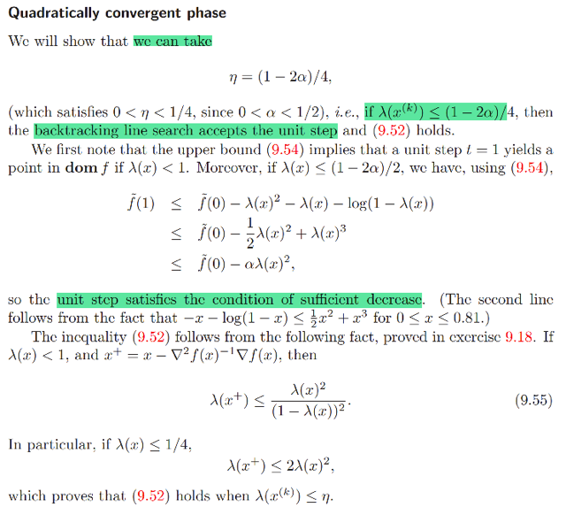</kbd></p>

> [!NOTE]
> Nói chung là chứng minh nếu λ(x) ≤ η thì λ(x+) ≤ 2 λ(x)^2
>
> Đại khái là vầy, trong đây họ muốn chứng minh là nếu mà λ(x(k)) đạt mức nhỏ
> ```text
> hơn η = (1-2α)/4 thì khi đó backtracking line search sẽ thỏa với t = 1, tức là,
> ```
> ngay tại khi bắt đầu backtracking line search (cho t `=` 1, và scale dần xuống bởi
> factor `β)` thì exit condition đã thỏa rồi. Ta biết exit condition là f(x + t `Δx)` ≤ f(x) +
> ```text
> αt ∇f(x)TΔx với Δx là Newton step Δx_nt = -∇^2f(x)inv ∇f(x) thì exit condition trở
> ```
> thành
>
> f(x + t `Δx_nt)` ≤ f(x) + `α` t ∇f(x)T ∇^2f(x)inv ∇f(x)
>
> ```text
> ⇔ f(x + t Δx_nt) ≤ f(x) - α t λ(x)^2 ⇔ f~(t) ≤ f~(0) - tαλ(x)^2
> ```
>
> Do đó chứng minh với t `=` 1 đã thỏa tức là chứng minh f~(1) ≤ f~(0) - `αλ(x)^2`
>
> Thì chứng minh dễ thôi:
>
> Từ kết quả ta đã có 9.54:
>
> f~(t) ≤ f~(0) - t λ(x)^2 - t λ(x) - log[1 - t λ(x)]
>
> Dùng thêm the fact -x - log(1 - x) ≤ `1/2` x^2 + x^3 nếu 0 ≤ x ≤ 0.81 (CÁI NÀY 
> KHÔNG BIẾT Ở ĐÂU RA, CHỨNG MINH SAU)
>
> vế trái ≤ f~(0) - `1/2` λ(x)^2 + λ(x)^3 
>
> ```text
> Dùng tiếp λ(x) ≤ (1-2α)/4 ta có: vế trái = f~(1) ≤ f~(0) - α λ(x)^2
> ```
>
> Đó là chứng minh xong. Và như vậy khi λ(x) ≤ η có giá trị trên thì thuật toán 
> luôn TAKE FULL STEP, TỨC LÀ `ΔX_NT` BẰNG NHIÊU LÀ LẤY BẤY NHIÊU
>
> Đây là giai đoạn gọi là Pure Newton phase (khác với Damped Newton phase
>
> `====`
>
> Và tới đây ta mới dụng thêm cái fact nữa có thể CHỨNG MINH SAU
>
> Nếu λ(x) < 1 và x+ `=` x - ∇^2f(x)inv ∇f(x) thì λ(x+) ≤ λ(x)^2 `/` [1 - λ(x)]^2
>
> Và cụ thể hơn nếu λ(x) ≤ `1/4` thì 
>
> λ(x+) ≤ λ(x)^2 `/` [1 - λ(x)]^2 ≤ λ(x+) ≤ λ(x)^2 `/` [1 - `1/4]^2` 
>
> ```text
> = λ(x)^2 / (3/4)^2 = (4^2/3^2) λ(x)^2 = 16/9 λ(x)^2 ≤ 16/8 λ(x)^2 = 2 λ(x)^2
> ```
>
> λ(x+) ≤ 2 λ(x)^2
>
> Từ đó đã chứng minh xong 9.52

<br>

<p align="center"><kbd>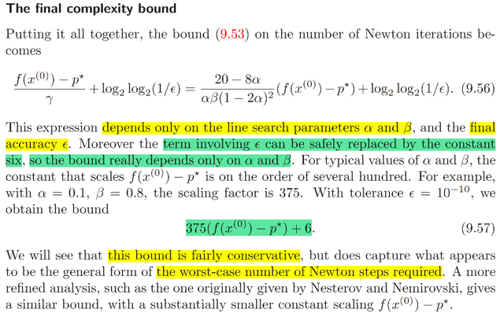</kbd></p>

> [!NOTE]
> Nói chung là kết hợp các kết qủa lại thì ta có thể suy ra kết quả 9.53 (là
> giới hạn ta đã chứng minh rằng số iterations cần thiết để đạt accuracy
> ```text
> f(x) - p* ≤ ε sẽ không quá [f(x0) - p*]/γ + log_2 [log_2(1/ ε)]
> ```
>
> Thì cái thay `γ` vô ý chính nói rằng cái này sẽ chỉ phụ thuộc `α` và `β`

<br>

<p align="center"><kbd>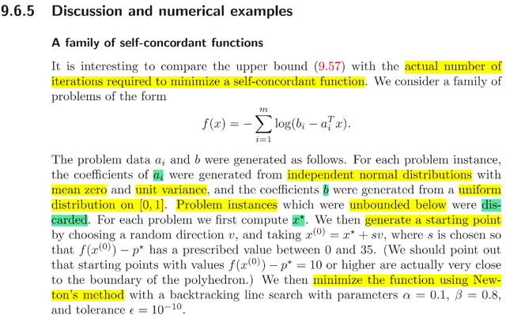</kbd></p>

> [!NOTE]
> Không có gì khó hiểu. Đại khái là người ta làm thí nghiệm.
>
> Xét một họ các problem f(x) `=` - `Σi=1:m` log(bi - aiTx)
>
> với ai được sampling từ N(0,1) và bi sampling từ Unif(0,1)
>
> Có nghĩa là ta sẽ tạo ra rất nhiều bộ giá trị của a, b, tương 
> ứng là nhiều function f(x). 
>
> Sau đó, họ mới bỏ đi các f(x) mà bị unbound below, vì đây là
> những cái mà khi ta giải bài toán optimization minimize f(x) thì
> sẽ không thể ra nghiệm
>
> Những cái còn lại, họ sẽ tính x* cho mỗi cái. Rồi từ đó chọn một
> điểm starting point bằng cách từ x* di chuyển theo  hướng bất kì 
> sao cho đừng xa quá (giới hạn f(x*) - f(x0) trong khoảng nào đó 
> thôi) (vì xa quá, ta sẽ ra khỏi phạm vi domain của f
>
> Nên nhớ domain của f là bi - aiTx > 0 và đây sẽ là intersection của
> các half-plane, tạo nên một Polyhedron, và việc giải bài toán sẽ là
> tìm trong polyhedron này điểm nào minimize f. Và cũng có thể hiểu
> nếu cho x(0) `=` x* + sv mà f(x0) - f(x*) lớn qúa thì ta có thể ra khỏi
> Polyhedron.
>
> Rồi, cuối cùng với mỗi bài toán, ta giải nó bằng Newton's method 
> ```text
> với backtracking line search với α = .1, β = .8 và ε = 10e-10
> ```

<br>

<p align="center"><kbd>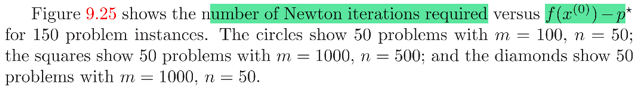</kbd></p>

<p align="center"><kbd>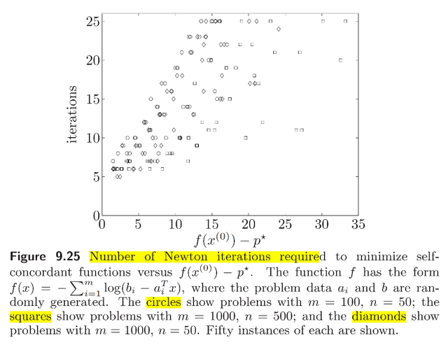</kbd></p>

<p align="center"><kbd>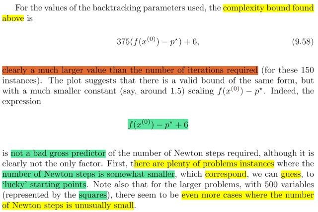</kbd></p>

<p align="center"><kbd>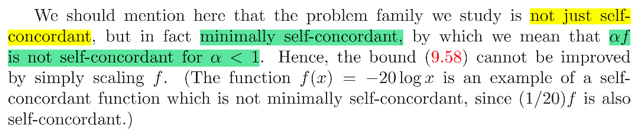</kbd></p>

> [!NOTE]
> Rồi, đại khái là người ta tạo ra các problem instance như đã mô ta,
> nhưng với 3 độ lớn khác nhau.
>
> Và vẽ đồ thị giữa "số Newton iteration cần thiết (để đạt f(x) - p* ≤ `ε)` với
> khoảng cách của x(0) cách p*
>
> Nhận xét đầu tiên rằng, so với cái giới hạn về lí thuyết mà ta đã có của
> số iteration cần thiết, theo công thức 375(f(x0 - p*) + 6 thì có thể thấy
> số iteration cần thiết thực tế nhỏ hơn nhiều cái bound lí thuyết này. Để
> rồi thay vì công thức đó, ta có thể dùng f(x0) - p* + 6 là cũng không
> phải là tệ.
>
> Rồi, quan sát khác đó là có nhiều case mà số iteration cần thiết rất nhỏ
> ví dụ như xét trong cùng một loại độ lớn (tròn, hay vuông) và cùng một
> mức giữa f(x0) - p*. Thì có những cái có số iteration nhỏ (nằm ở dưới
> thấp) hơn những cái khác. Đây có thể là ứng với những lucky starting
> point -  ý là những starting point tốt khiến quá trình apply nEwton
> method thuận lợi. Và khi độ lớn problem lớn thì càng có nhiều lucky
> start
>
> Khúc cuối chưa hiểu lắm

<br>

<p align="center"><kbd>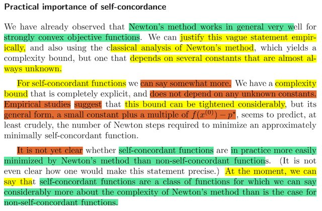</kbd></p>

> [!NOTE]
> rồi, đại khái là, phần đầu mình đã quan sát rằng Newton method sẽ
> nói chung là tốt đối với function có tính strongly convex.
>
> Và ta cũng đã trải qua bước analysis để cho thấy complexity bound
> (giới hạn của số iteration cần thiết) dù rằng trong phương pháp  đó ta
> thấy nó phụ thuộc vài hằng số mà hầu như ta không biết.
>
> Còn với self-concordant function, thì ít nhất ta có kết quả phân tích
> của complexity bound không phụ thuộc những hằng số không biết
> đó.
>
> Bên cạnh đó như ví dụ vùa rồi, đóng vai empirical studies đề nghị
> rằng ta có thể bóp cái upper bound của (số iteration required) lại nhỏ
> hơn, ví dụ như chỉ dùng một constant nhỏ nhân với f(x0) - p* là được.
>
> Tuy vậy trong thực tế cũng chưa rõ rằng liệu self-concordant function
> có dễ minimize với Newton's method hơn là non-self concordant
> function hay không
>
> Tất cả những gì ta có thể nói đó là với self concordant function thì 
> ta có thể nói nhiều hơn về complexity của Newton's method hơn là
> non-self-concordant

<br>

<p align="center"><kbd>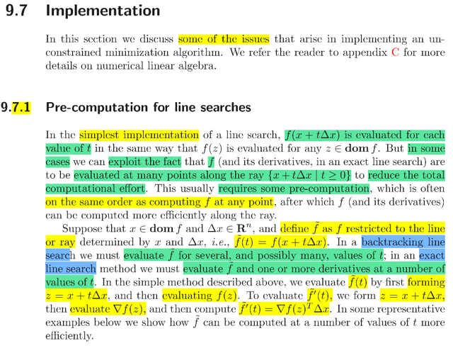</kbd></p>

> [!NOTE]
> Nói chung là phần này ta sẽ bàn về việc trong thực tế ta sẽ có
> những  chiến thuật gì để tối thiểu chi phí tính toán trong việc giải
> bài toán tối ưu dùng Newton's method
>
> Đại khái là ta đã biết thuật toán Newton's method thì đại để là có
> những bước tính toán chính như: Tính newton step `Δx_nt.` Sau đó
> trong line search, nếu như với backtracking thì ta sẽ tính f(x + t
> `Δx_nt)` với nhiều t khác nhau để check xem khi nào thì thỏa exit
> condition.
>
> Còn với exact line search thì ta giải bài toán tối ưu khác nên ta sẽ
> cần tính cả ∇f(x + t `Δx_nt)`
>
> Thế thì thay vì làm một cách đơn giản là với mỗi t ta tính z `=` x + t
> `Δx` rồi tính f(z)... thì ta có thể có những cách thức giúp giảm só chi
> phí tính toán

<br>

<p align="center"><kbd>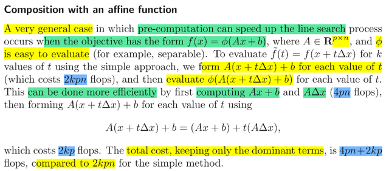</kbd></p>

> [!NOTE]
> Một case đầu tiên mà ta có thể có các "tiết kiệm" là khi function có
> dạng f(x) `=` Φ(Ax + b) với A ∈ R^(p,n) và Φ là hàm dễ tính.
>
> Thế thì nếu làm theo cách đơn giản, thì việc tính f~(t) `=` f(x + t `Δx)`
> với k values khác nhau của t sẽ tốn 2kpn flops.
>
> Vì sao? Với mỗi k, đầu tiên tính x + t `Δx` bao gồm t `Δx` là nhân scalar
> với vector R^n ⇨ tốn n flops. x + t `Δx` là cộng hai R^n vector elementwise
> ⇨ tốn n flops, tổng cộng là 2n flops. Bỏ vào f(x) `=` Φ(Ax + b)
>
> Ax + b: Ax là nhân matrix [p,n] với vector Rn: thử lập luận lại số flops:
> Đơn giản nhất là "nhìn theo góc nhìn component i của vector Ax, `Ax_i`
> sẽ là dot product của hàng i của A và vector x, tốn n flops cho nhân hai
> scalar, và n-1 flops cho phép cộng scalar ⇨ (2n-1) flops. Và với p hàng
> thì tổng cộng là p(2n-1) flops. 
>
> Sau đó là cộng b, tốn p flops cho phép cộng scalar 
>
> ⇨ p(2n-1) + p `=` p(2n-1)+1) `=` 2pn coi như pn
>
> Cuối cùng bỏ vào Φ thì vì Φ rất dễ nên bỏ qua.
>
> Vậy mỗi t tốn pn ⇨ có k giá trị của t thì tốn kpn flops
>
> `====`
>
> Thay vào đó, thay vì tính x + t `Δx,` rồi tính A(x + t `Δx)` + b thì ta tính 
> (Ax + b) + `t(AΔx)` với các t khác nhau, có nghĩa là chỉ tính Ax + b, và `AΔx`
> một lần ròi dùng nó với các t khác nhau. thì tốn:
>
> A `Δx:` là nhân matrix [p,n] với Rn vector ⇨ tốn p(2n-1) như trên coi như 
> 2pn flops 
>
> t(A `Δx):` Nhân scalar với Rp vector: tốn p flops, với k giá trị t khác nhau
> tốn tổng cộng là kp flops
>
> (Ax + b): tốn 2pn flops như trên.
>
> t(A `Δx)` + (Ax + b) là cộng hai R^p vector tốn p flops cho mỗi t, có k t
> tốn kp flops
>
> Vậy tổng cộng là 2pn + 2pn + kp + kp `=` 4pn + 2kp
>
> Và cái này nhỏ hơn kpn

<br>

<p align="center"><kbd>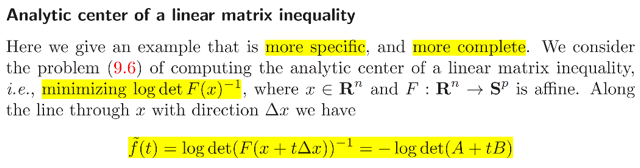</kbd></p>

<p align="center"><kbd>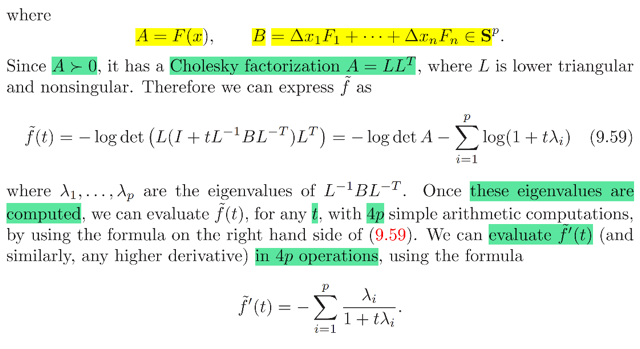</kbd></p>

> [!NOTE]
> Vì dài quá nên chỉ note Vài điểm giúp làm rõ:
>
> *) Vì sao f~(t) `=` log det F(x + t `Δx)_inv` `=` -log det (A + tB)
>
> ```text
> det Finv = 1/det F ⇨ log det Finv = log(1/detF) = log(1) - log(detF)
> ```
>
> `=` 0 - log(detF) `=` -log(detF)
>
> ⇨ log det F(x + t `Δx)` `=` - log det(F(x) + `F(tΔx)`
>
> `====`
>
> Ở đây F R^n -> S^p is affine là thứ mà mình phải biết thêm: 
>
> Đại khái là nó có nghĩa là F(x) `=` F0 + F1x1 + ...Fnxn
>
> ```text
> Nên F(x + tΔx) = F0 + Σi=1:n Fi (x + t Δx)i
> ```
>
> ```text
> = F0 + Σi Fixi + Σi Fi t Δxi
> ```
>
> ```text
> = A + tB | Đặt A = F0 + Σi Fixi, đây chính là F(x), B =  t Σi Fi t Δxi
> ```
>
> `===`
>
> Tiếp vì A ≻ 0 nên nó có thể có Cholesky factorization: A `=` L(LT)
>
> ⇨ A + tB `=` L(LT) + tB `=` L(LT) + LLinv tB (Linv)T LT
>
> `=` L [I + Linv t B (Linv)T] LT
>
> ⇨ -log det(A + tB) `=` - log det L [I + Linv t B (Linv)T] LT
>
> `=` - log  det(L) . det[I + Linv t B (Linv)T] . det(LT)   | Dùng det(AB) `=` det(A)det(B)
>
> `=` - log det(L) - log det[I + Linv t B (Linv)T] - log det(LT) | Dùng log(AB) `=` log(A) + log(B)
>
> `=` - log det(L) - log det(LT) - log det[I + Linv t B (Linv)T]
>
> `=` - [log det(L) + log det(LT)] - log det[I + Linv t B (Linv)T]
>
> `=` - log det[L(LT)] - log det[I + Linv t B (Linv)T]
>
> `=` - log det(A) - log det[I + Linv t B (Linv)T]
>
> `=` - log det(A) - log Π λ(I + Linv t B (Linv)T)i | det A `=` Πi λ(A)_i
>
> `=` - log det(A) - log Πi [1 + λ(Linv t B (Linv)T)i]  | λ(I + A)_i `=` 1 + λ(A)_i
>
> `=` - log det(A) - `Σi` log [1 + λ(Linv t B (Linv)T)i]
>
> `=` - log det(A) - `Σi` log [1 + tλi]  với λi là eigenvalues của Linv B (Linv)T
>
> Đây là 9.59
>
> `====`
>
> Tiếp họ nói ta có thể tìm các λi. Thì sau đó với mọi t ta sẽ tính f~(t) tốn 4p. Là sao?
>
> Có thể ta bỏ qua - log det A (đã có rồi chẳng hạn). Còn - `Σi=1:p` log (1 + t λi) chính
> là tốn p - 1 (cho p - 1 phép cộng) + 3p (cho việc tính p log (1 + t λi) flops ≈ 4p
>
> `====`
>
> ```text
> Sau đó là tính f~'(t) = -Σi=1:p λi / (1 + t λi) và tốn 4p Là sao?
> ```
>
> ```text
> f~(t) = - log det A - Σ  log (1 + t λi) ⇨ d/dt f~(t) = d/dt [- log det A - Σ  log (1 + t λi)]
> ```
>
> ```text
> = d/dt [-Σ  log (1 + t λi)] = -Σ d/dt [log (1 + t λi)]
> ```
>
> ```text
> = -Σ  d/d(1 + t λi) [log (1 + t λi)] . d/dt (1 + t λi)
> ```
>
> ```text
> = -Σ  1/(1 + t λi) . λi  = - Σi=1:p λi/(1 + t λi)
> ```
>
> Và cái này tốn p [phép `λi/(1` + t λi), tốn 3 flops mỗi cái] + (p-1) flops cho phép cộng
>
> ⇨ 3p + p - 1≈ 4p flops

<br>

<p align="center"><kbd>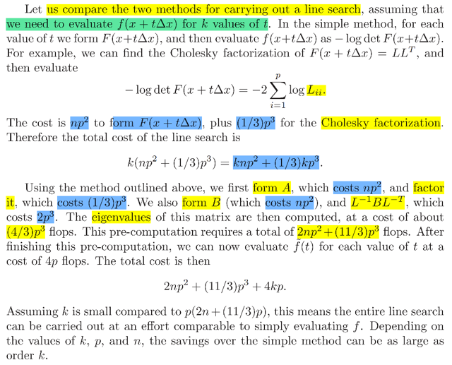</kbd></p>

> [!NOTE]
> Sau đó là so sánh cost của việc evaluate f(x + t `Δx)` với k giá trị khác
> nhau của t
>
> Nếu làm theo cách naive, thì
>
> 1) đầu tiên ta sẽ form F(x + t `Δx)` tốn np^2:
>
> x + t `Δx:` t `Δx` tốn n flops, + x tốn thêm n flops là 2n flops. Gọi là z đi, bỏ
> vào F(z) `=` F0 + `Σi=1:n` zi Fi
>
> ziFi là scalar * matrix pxp tốn p^2 flops, `Σi=1:n` ziFi tốn (n-1) phép cộng
> matrix, mỗi cái tốn p^2 flops ⇨ n-1 cái tốn (n-1)p^2. + F0 tốn thêm p^2
> flops nữa. TỔng cộng p^2 + (n-1)p^2 + p^2 `=` p^2(1+n-1+1) `=` (n+1)p^2
> `=` np^2 + p^2 coi như np^2.
>
> 2) Cholesky factorization matrix F(z) `=` L(LT) cái này trong phần
> Appendix nói rằng với matrix nxn nó tốn `(1/3)n^3` nên ở đây ta có
> `(1/3)p^3`
>
> ```text
> 3) Tính - log det F(x + t Δx) = -2 Σi=1:p log Lii
> ```
>
> Sau khi factor F `=` L(LT) ⇨ - log det F `=` - log det L(LT)
>
> `=` - log [ det L det LT]  | det AB `=` det A det B
>
> `=` - log [ (Πi Lii) (Πi Lii)] | L is triangular matrix, eigenvalues nằm trên
>
> ```text
> = - log (Πi Lii^2) = = - Σi log Lii^2 = - Σi 2 log Lii = - 2 Σi log Lii
> ```
>
> Và cái này tốn p flops cho log Lii, p - 1 flops cho p - 1 phép cộng
> là ~ 2p flops
>
> Tóm lại là tốn np^2 + `(1/3)p^3` (2p nhỏ nên bỏ qua)
>
> `====`
>
> Còn tính theo cách tính F `=` A + tB thì sao:
>
> ```text
> 1) Form A = F(x), tốn np^2 y như step 1 của pp trên, vì F(x) = F0 + Σi=1:n xi Fi
> ```
>
> ```text
> 2) Form B = Σi=1:n Δxi Fi, mỗi cái Δxi Fi tốn p^2 flops, có n cái tốn np^2. Cộng
> ```
> lại hết tốn n-1 phép cộng, mỗi phép cộng tốn p^2 flops, là hết (n-1)p^2. Tổng
> cộng np^2 + (n-1)p^2 `=` np^2 + np^2 - p^2 coi như 2np^2 hoặc coi như np^2
> cũng được
>
> 3) Form LinvB(Linv)T tốn 2p^3: là sao?
>
> QUAY LẠI SAU, CÒN TIẾP
>
> NHƯNG NÓI CHUNG LÀ CÁCH NÀY SẼ TỐN ÍT HƠN CÁCH NAIVE

<br>

<p align="center"><kbd>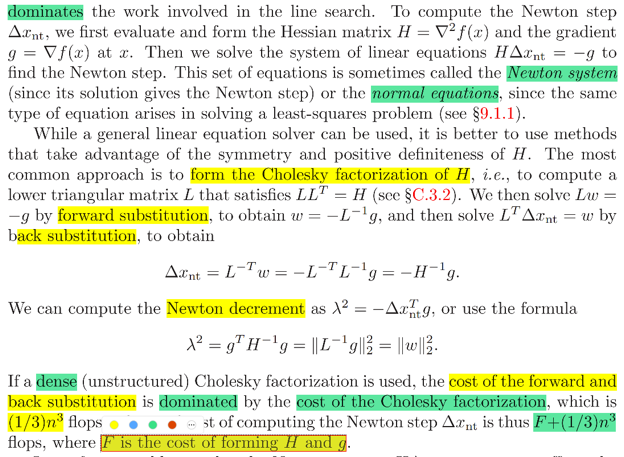</kbd></p>

<p align="center"><kbd>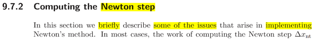</kbd></p>

<p align="center"><kbd>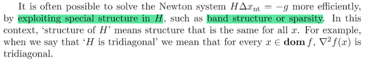</kbd></p>

> [!NOTE]
> Phần này đại khái là nói về chi phí tính Newton step.
>
> ```text
> Ta biết công thức của nó là Δx_nt = -∇^2f(x)inv∇f(x) = -Hinv g
> ```
>
> (H `=` ∇^2f(x), g `=` ∇f(x))
>
> ```text
> Vậy thì để tìm Δx_nt, chính là ta giải hệ HΔx_nt = -g, hệ này được
> ```
> gọi là Newton system hoặc normal equation.
>
> Giải H `Δx_nt` `=` -g có thể dùng các cách làm tổng quát ví dụ như
> Gaussian elimination. Ta có thể tận dụng cấu trúc đặc  biệt của H:
> symmetric positive definite để factor H `=` L(LT)
>
> Bước này sẽ tốn `(1/3n^3)`
>
> ```text
> Từ đó giải H Δx_nt = - g ⇔ L (LT) Δx_nt = -g
> ```
>
> ⇔ Giải L y `=` -g trước: đây là forward substitution theo EE364A còn
> nhớ cái này tốn n^2 (1 + 3 + 5 + ...2n-1 `=` `2n(n-1)/2` ≈ n^2) 
>
> Sau đó giải LT `Δx_nt` `=` y, đây là back substitution tốn n^2
>
> Hai cái bước `forward/back` substitution không đáng kể so với `1/3` n^3
> nên về cơ bản chi phí sẽ chỉ là factoring cost `1/3` n^3 cộng với cost
> của việc forming H và g
>
> Nếu có thể tận dụng khai thác cấu trúc đặc biệt khác của H như
> sparsity hay banded thì có thể còn giảm cost hơn nữa

<br>

<p align="center"><kbd>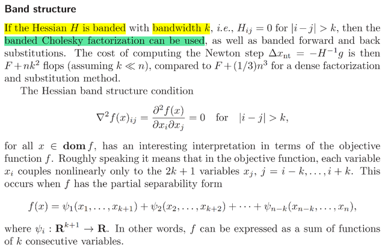</kbd></p>

<p align="center"><kbd>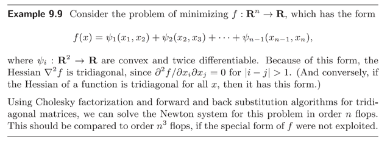</kbd></p>

> [!NOTE]
> đại khái là khi H có dạng banded với bandwidth k thì thay vì dùng 
> Cholesky factorization ta có thể dùng banded Cholesky factorization
> chỉ tốn nk^2 thay vì `n^3/3` (k nhỏ hơn n nhiều)
>
> Và đại ý là H sẽ có dạng này khi objective có dạng tổng của
> các hàm số mà mỗi hàm số chỉ là hàm của không phải tất cả các 
> biến xj mà chỉ là hàm của một bộ các biến xj liền kề nhau thôi (đại 
> khái là vậy)

<br>

<p align="center"><kbd>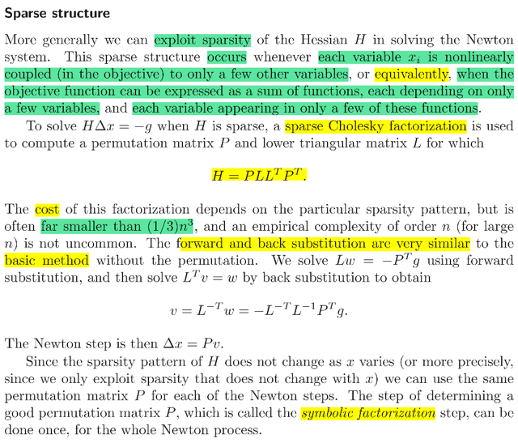</kbd></p>

> [!NOTE]
> Tương tự, nếu H sparse (xuất phát từ objective function có dạng là
> tổng của nhiều function mà mỗi cái chỉ là hàm của vài biến, và mỗi
> biến chỉ xuất hiện trong một vài function, để rồi tạo ra hệ quả là mỗi
> biến chỉ quan hệ Φ tuyến với một vài biến khác)
>
> Khi đó dùng sparse Cholesky factorization chỉ tốn ít hơn nhiều so `1/3`
> n^3.
>
> Khúc cuối đại ý là nói về việc ta còn nhớ rằng P là permutation matrix,
> cơ bản là ta có thể chọn để sao cho có lợi giúp L trở nên sparse hơn
> ⇨ giảm cost
>
> (theo link để xem appendix)
>
> Thế thì vì P (tốt nhất) như thế nào thì chỉ phụ thuộc vào bản thân H,
> mà H không đổi. Nên ta có thể tính P trước và dùng nhiều lần Đại
> khái là vậy

<br>

<p align="center"><kbd>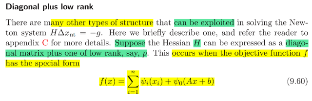</kbd></p>

<p align="center"><kbd>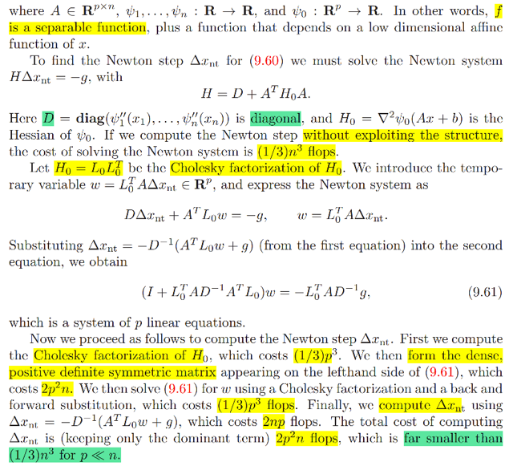</kbd></p>

> [!NOTE]
> QUAY LẠI SAU

<br>


<a id="node-gcx7gza"></a>
## Lec 8 B

<br>

<p align="center"><kbd>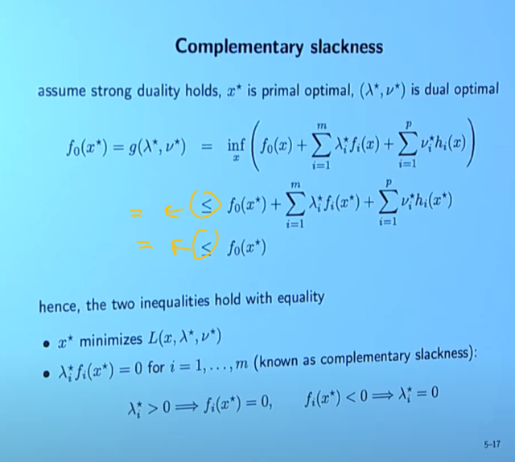</kbd></p>

> [!NOTE]
> COMPLEMENTARY SLACKNESS
>
> Nói qua tính chất Complementary Slackness:
>
> Đại khái là vầy, cái này thật ra rất đơn giản:
>
> Theo định nghĩa g(λ, v) `=` inf x f0(x) + `Σ` λifi(x) + `Σ` vihi(x)
>
> nên đương nhiên g(λ*, v*) `=` inf x f0(x) + `Σ` λ*ifi(x) + `Σ` v*ihi(x)
>
> Mà vế trái sẽ `<=` f0(x) + `Σ` λ*ifi(x) + `Σ` v*ihi(x), điều này là đương nhiên vì
> vế trái nó là "infimum".
>
> nên: 
>
> g(λ*, v*) `=` inf x f0(x) + `Σ` λ*ifi(x) + `Σ` v*ihi(x)
>
>               `<=`  f0(x) + `Σ` λ*ifi(x) + `Σ` v*ihi(x)  | tức L(x, λ*, v*)
>
> và vì ta có điều này với mọi x, do đó nó cũng đúng với x*:
>
> g(λ*, v*) ≤ f0(x*) + `Σ` λ*ifi(x*) + `Σ` v*ihi(x*) | cái này chính là L(x*, λ*, v*) 
>
> Vậy:
>
> g(λ*, v*) `=`  inf x f0(x) + `Σ` λ*ifi(x) + `Σ` v*ihi(x)
>
>               ≤  f0(x*) + `Σ` λ*ifi(x*) + `Σ` v*ihi(x*)   | tức L(x*, λ*, v*) (***)
>
> Đây là cái dấu ≤ thứ nhất trong slide.
>
> `====`
>
> Thế thì tuy nhiên ta cũng có một "bất đẳng thức" như sau:
>
> Bắt đầu từ lập luận là, với x*, là  optimal, thì dĩ nhiên trước hết nó phải feasible. 
> Nên nó thỏa các constraint: fi(x*) ≤ 0, và hi(x*) `=` 0 Do đó `Σ` λ*i fi(x*) < 0 (vì λ*i 
> là dual optimal nên dĩ nhiên nó phải dual feasible: ≥ 0) và `Σ` v*i hi(x*) `=` 0 (lí do
> tương tự)
>
> Vậy  f0(x*) + `Σ` λi fi(x*) + `Σ` v*i hi(x*) ≤ f0(x*)
>
> Vậy nối vào tiếp (***) ta có:
>
> g(λ*, v*) `=` inf x f0(x) + `Σ` λ*ifi(x) + `Σ` v*ihi(x)
>
>                           `<=`  f0(x*) + `Σ` λ*ifi(x*) + `Σ` v*ihi(x*)   | tức L(x*, λ*, v*) (***)
>
>                           `<=` f0(x*)
>
> Vậy là với chuỗi các dấu `<=` này, ta thấy rằng, g(λ*,v*) vốn dĩ phải `<=` f0(x*)
>
> Thế thì ta đã nói, nếu Strong Duality thỏa mãn, tức là ta sẽ có p* `=` d* gọi là 
> primal optimal `=` dual optimal. Dĩ nhiên p* `=` f0(x*).
>
> Và d* `=` g(λ*, v*)
>
> Nên cũng là ta có f0(x*) `=` g(λ*, v*).
>
> Vậy một mặt là ta có:
>
> g(λ*,v*) ≤ f0(x*) + `Σ` λ*ifi(x*) + `Σ` v*ihi(x*) ≤ f0(x*), 
>
> một mặt ta có nếu strong duality thỏa khiến g(λ*, v*) `=` f0(x*) thì ta hai hệ quả:
>
> ```text
> 1) Vì g(λ*, v*) = inf x L(x, λ*, v*) = f0(x) + Σ λ*ifi(x) + Σ v*ihi(x)
> ```
>
> mà dấu ≤ thứ nhất cho ta g(λ*, v*) `=` f0(x*) + `Σ` λ*ifi(x*) + `Σ` v*ihi(x*), cái này lại chính
> là L(x*, λ*, v*)
>
> Vậy L(x*, λ*, v*) `=` inf x L(x, λ*, v*) ⇨ x* là minimizer của L(x, λ*, v*) 
>
> Từ đây sẽ cho ta điều kiện thứ 4 của KKT conditions:
>
> vì x* là minimizer của L(x, λ*, v*) nên tại x*, gradient vanishing:
>
> `D_x` L(x*, λ*, v*) `=` 0
>
> ```text
> D_x L(x*, λ*, v*) = D_x [f0(x*) + Σ λ*ifi(x*) + Σ v*ihi(x*)
> ```
>
> ```text
> = D_x [f0(x*)] + D_x [Σ λ*ifi(x*)] + D_x [Σ v*ihi(x*)]
> ```
>
> ```text
> = ∇f0(x*) + Σ D_x [λ*ifi(x*)] + Σ  D_x [v*ihi(x*)]  | f0(x) là vector - scalar nên derivative là
> ```
> gradient ∇f0
>
> ```text
> = ∇f0(x*) + Σ λ*i D_x [fi(x*)] + Σ v*i D_x [hi(x*)] | đưa scalar ra ngoài
> ```
>
> `=` ∇f0(x*) + `Σ` λ*i ∇fi(x*) + `Σ` v*i ∇hi(x*) | fi, hi cũng là vecror scalar function nên ta cũng
>  có gradient
>
> Vậy ta có: ∇f0(x*) + `Σ` λ*i ∇fi(x*) + `Σ` v*i ∇hi(x*) `=` 0
>
> 2) `Σ` λ*ifi(x*) + `Σ` v*ihi(x*) `=` 0
>
> mà vốn dĩ hi(x*) đã bằng 0 rồi. Vậy `Σ` λ*i fi(x*) `=` 0. Đây là complementary slackness
>
> CHAPTER 5 - DUALITY
>
> 5.5 OPTIMALITY CONDITION

<br>

<p align="center"><kbd>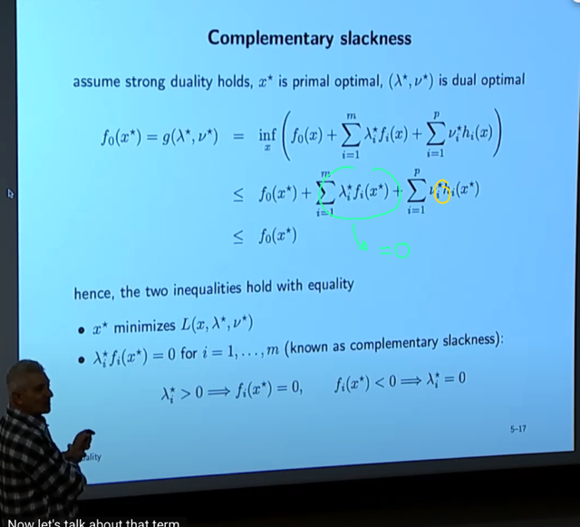</kbd></p>

> [!NOTE]
> Vậy `Σ` λi fi(x) `=` 0
>
> Mà λi* fi(x*) là `<=` 0, do λi* > 0, và fi(x*) `<=` 0.
>
> Nên `Σ` λi* fi(x*) `=` 0 
>
> `<=>` λ*i fi(x*) `=` 0 với mọi i
>
> Và đó gọi là COMPLEMENTARY SLACKNESS
>
> Và điều này sẽ có hệ quả là vì fi(x) `<=` 0 và λi `>=` 0 nên
>
> NẾU λ*i > 0 THÌ fi(x*) `=` 0 VÀ NGƯỢC LẠI NẾU fi(x*) < 0 THÌ MỌI λi 
> PHẢI `=` 0
>
> Gs nói thêm khi fi(x) `=` 0 ta gọi constraint là TIGHT
>
> Nếu fi(x) < 0 ta gọi nó là constraint is SLACK
>
> Nói cách khác khi constraint is SLACK thì chắc chắn λi, tức là
> các Lagrange multipliers phải bằng 0
>
> Ngược lại, khi λi dương thì constraint is TIGHT

<br>

<p align="center"><kbd>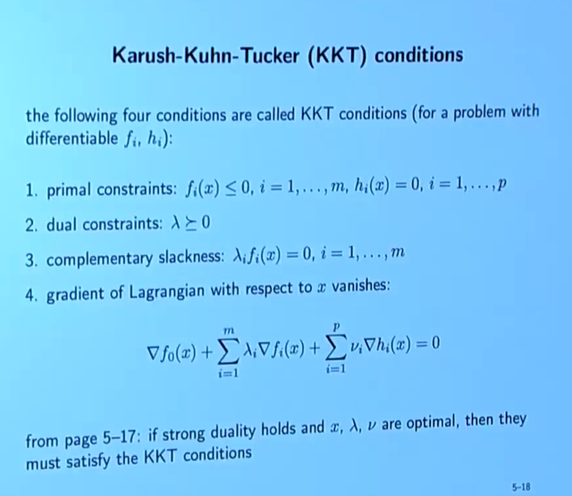</kbd></p>

> [!NOTE]
> Ở đây là nói về cái gọi là các điều kiện KKT.
>
> 1) Primal Constraint: dĩ nhiên là feasibility: Phải thỏa các
> constraint.
>
> 2) Dual Constraint: λ ≽ 0, như đã biết, nó đồng nghĩa với λ
> ≽R^n+ 0 và có nghĩa là component λi đều `>=` 0.
>
> Vì sao λ ko âm, là vì ta đã bàn về cái này rồi, λ mang ý nghĩa là
> khi ta violate inequality constraint, tức fi(x) > 0 thì ta sẽ bị tăng
> cost (cost sẽ là λifi(x). Do đó λi phải ko âm. Từ đó bài toán
> optimization khi minimize Lagrangian sẽ cố giảm cost bằng cách ko
> cho violate constraint
>
> 3) Complementary Slackness: Đó là, λ như condition 2 nói rằng
> nó phải ko âm. Thì nếu nó dương, thì fi(x) phải bằng 0 (đây
> chính là Complementary Slackness vừa rồi . Đây chính là ý nghĩa
> của condition thứ 3 khi nói λ*ifi(x*) `=` 0
>
> 4) Gradient của Lagrangian function L(x*, λ*, v*) bằng 0 (vanish)
>
> Cái này chính là xuất phát từ việc: x* là minimizer của L(x, λ*, v*)
> ⇨ `D_x` L(x*, λ*, v*) `=` 0
>
> Và gs cho biết nếu ta có bài toán CẢ CONVEX LẪN KHÔNG
> CONVEX và nếu ta có STRONG DUALITY, và x*, λ*, ν* là
> các optimal. Thì 4 KKT conditions sẽ phải thỏa.
>
> Và  nếu x, λ, v thỏa KKT conditions thì nó gọi là KKT POINT

<br>

<p align="center"><kbd></kbd></p>

> [!NOTE]
> Gs nói thêm, nếu trong bài toàn non-convex, khi giải gradient `=`
> 0. Thì đó có thể là optimal hoặc không. Người ta gọi là
> Stationary point
>
> Còn NẾU LÀ CONVEX PROBLEM, việc THỎA KKT
> CONDITIONS ĐỒNG NGHĨA LÀ OPTIMAL

<br>

<p align="center"><kbd>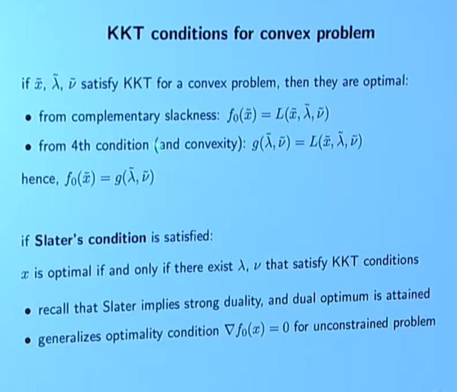</kbd></p>

> [!NOTE]
> Như vừa nói, nếu là convex problem thì khi x~, λ~, ν~
>
> (kí hiệu tilde ý là x, λ, v đều feasible: x (primal) feasible và λ,
> v cũng dual feasible)
>
> x~, λ~, ν~ THỎA KKT CONDITION THÌ CHÚNG LÀ OPTIMAL: 
> x~ LÀ PRIMAL OPTIMAL, (λ~, ν~) LÀ DUAL OPTIMAL
>
> Khi đó, từ điều kiện complement slackness ta sẽ có: 
>
> f0(x~) `=` L(x~, λ~, ν~). Tại sao?
>
> Vì thỏa KKT conditions, thì condition #1 là nó phải feasible. Tức là ta
> ```text
> có hi(x~) = 0 => Σ v~ihi(x~) = 0
> ```
>
> Rồi, vì thỏa condition #3 - complement slackness nghĩa là `Σ` λifi(x~) `=` 0
>
> ```text
> Vậy f0(x~) = f0(x~) + 0 + 0 = f0(x~) + Σ λ~ifi(x~) + Σ v~ihi(x~)
> ```
>
> Thì đây chính là L(x~, λ~, ν~)
>
> `====`
>
> Thế thì đang xét convex problem nên Lagrangian CŨNG CONVEX (gs
> nói cái này rất dễ thấy, f0 convex, fi convex, λi dương, nên λifi vẫn
> convex, nên `Σ` λifi convex. Còn `Σ` vihi là các affine, cũng convex luôn.)
>
> Thế thì condition #4 nói rằng:
>
> gradient theo x ∇_x L(x~, λ~, ν~) `=` 0, tức đạo hàm theo x của L
> (với λ `=` λ~, v `=` v~, coi như chỉ là hàm theo x) bằng 0.
>
> Và vì L convex nên x~ chính là tức là minimum point, mà tại đó L(x,
> λ~, ν~) đạt giá trị nhỏ nhất:
>
> L(x~, λ~, ν~) `=` inf x L(x, λ~, ν~).
>
> Mà g(λ~, ν~) theo định nghĩa là inf x L(x, λ~, ν~)
>
> Vậy ta có thể kết luận L(x~, λ~, ν~) `=` g(λ~, ν~)
>
> `====`  
>
> Và do đó f0(x~) `=` L(x~, λ~, ν~) `=` g(λ~, ν~)
>
> Phần về Slater's gs ko nói

<br>

<p align="center"><kbd></kbd></p>

> [!NOTE]
> Tới đây gs nói một điều mà Yoshua Bengio đã nói, KKT chính là
> khái quát hoá những cái ta đã học trong Calculus về Langrange
> multipliers

<br>

<p align="center"><kbd>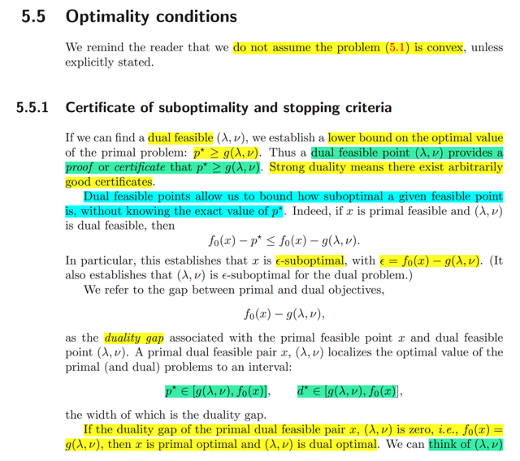</kbd></p>

<p align="center"><kbd>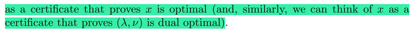</kbd></p>

> [!NOTE]
> CERTIFICATE OF SUB-OPTIMALITY
> & STOPPING CRITERIA
>
> Đại khái là, họ nói rằng, NẾU TA CÓ THỂ TÌM THẤY MỘT (λ, v) 
> DUAL FEASIBLE (nhớ lại, dual feasible là khi g(λ, v) > -infinity)
> THÌ KHI ĐÓ NHỜ QUAN HỆ p* `>=` g(λ, v), TA CÓ MỘT GIỚI HẠN
> DƯỚI (LOWER BOUND) CỦA PRIMAL PROBLEM p*
>
> Và điều này có nghĩa là việc chứng minh sự tồn tại `/` tìm được 
> dual feasible λ, v cho ta MỘT GIẤY CHỨNG NHẬN `/` BẰNG CHỨNG
> rằng CÓ MỘT LOWER BOUND CỦA p*
>
> Thế thì, một điểm quan trọng nữa là: DUAL FEASIBLE points CHO
> PHÉP TA ĐÁNH GIÁ ĐƯỢC MỘT FEASIBLE POINT x CÒN CÁCH
> OPTIMAL p* BAO XA, DÙ KHÔNG BIẾT p*
>
> Cụ thể là vầy: ta biết p* `>=` g(λ, v). Nên nếu ta có một feasible point
> x, với giá trị f0(x) thì ta có: f0(x) - p* `<=` f0(x) - g(λ, v)
>
> Mà như vậy có nghĩa là, KHOẢNG CÁCH CỦA f0(x) ĐẾN OPTIMAL
> p* NHIỀU NHẤT LÀ BẰNG f0(x) - g(λ, v)
>
> Và theo định nghĩa của `ε-SUBOPTIMAL:` LÀ TẬP (SET) CÁC ĐIỂM
> MÀ GIÁ TRỊ f0 CHỈ LỚN HƠN GIÁ TRỊ OPIMAL MỘT KHOẢNG `ε` 
> TRỞ XUỐNG
>
> ```text
> ε-suboptimal = {x: f0(x)  <= p* + ε}
> ```
>
> Thì theo đó, ta có thể kết luận x THUỘC `ε-SUBOPTIMAL` SET 
> VỚI `ε` `=` f0(x) - g(λ, v)
>
> Và f0(x) - g(λ, v) được gọi là DUALITY GAP
>
> `====`
>
> Một điểm nữa, một (PRIMAL) FEASIBLE POINT x, và DUAL FEASIBLE
> POINT (λ, v) sẽ ĐẶT RA MỘT KHOẢNG MÀ TA BIẾT SẼ CHƯA p*, d*:
>
> p*, d* ∈ [g(λ, v), f0(x)]
>
> Dễ thấy khi ta có STRONG DUALITY thì ta có p* `=` d* và đoạn này chập
> lại làm 1 (1 điểm)
>
> Ý cuối chưa hiểu lắm
>
> 5.5 OPTIMALITY CONDITIONS
>
> 5.5.1 CERTIFICATE OF SUBOBTIMALITY 
> & STOPPING CRITERIA

<br>

<p align="center"><kbd>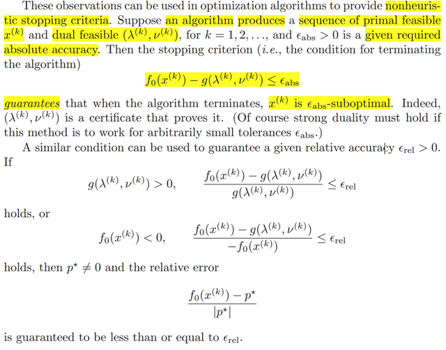</kbd></p>

> [!NOTE]
> Tại sao:
>
> Theo định nghĩa, nếu x^(k) ∈ `ε-suboptimal` thì có nghĩa là f0(x^(k)) `<=` p* + `ε`
>
> mà ta có f0(x^(k)) - g(λ^(k), v^(k)) `<=` `ε`
>
> `<=>` f0(x^(k)) `<=` g(λ^(k), v^(k)) + `ε` 
>
> Mà ta đã có g(λ, v) `<=` p* nên g(λ^(k), v^(k)) `<=` p*
>
> ```text
> Vây f0(x^(k)) <= g(λ^(k), v^(k)) + ε  <= p* + ε
> ```
>
> `=>`  x^(k) ∈ `ε-suboptimal`
>
> Lập luận ở trên kiểu như giúp ta có một tiêu chuẩn để dừng "chương trình"
> kiểu như nếu ta có thuật toán giúp lần lượt "tính ra" các primal feasible x^(k)
> và dual feasible λ^(k), v^(k) thì nếu ta MUỐN CHƯƠNG TRÌNH DỪNG
> KHI TÌM ĐƯỢC MỘT FEASIBLE x THỎA MÃN LÀ f0(x) RẤT GẦN OPTIMAL
> (CHỈ CÁCH OPTIMAL MỘT KHOẢNG NHIỀU NHẤT LÀ `ε_abs` (ý là một
> giá trị tuyệt đối) thì tiêu chí f0(x^(k)) - g(λ^(k), v^(k)) `<=` `ε` có thể giúp ta đạt
> được điều này
>
> Còn ở dưới thì thay vì có `ε` mang tính tuyệt đối thì ta có thể áp dụng `ε` mang 
> tính tương đối. Đọc phần này sau

<br>

<p align="center"><kbd>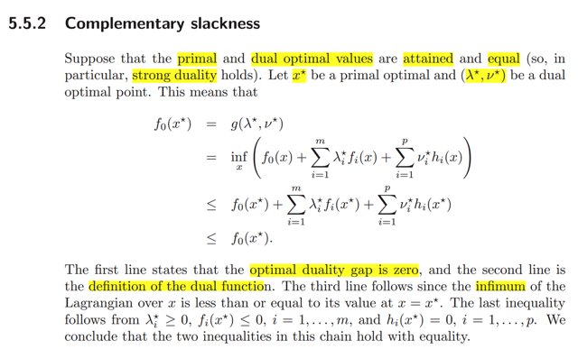</kbd></p>

> [!NOTE]
> phần này trong sách cơ ko có gì khác bản mình
> đã hiểu rồi
>
> 5.5 OPTIMALITY CONDITIONS
>
> 5.5.2 COMPLEMETARY SLACNESS

<br>

<p align="center"><kbd>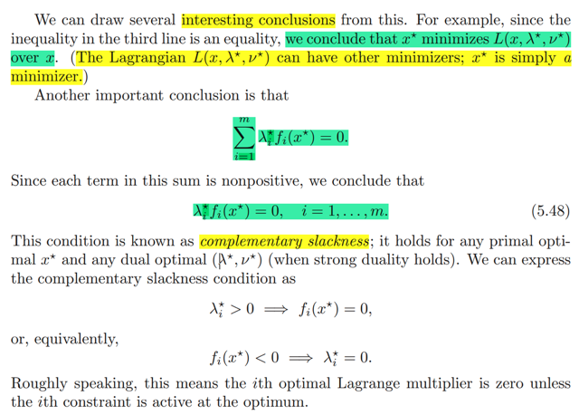</kbd></p>

> [!NOTE]
> Và kết quả này dẫn đến tính chất COMPLEMENTARY
> SLACKNESS mà ta đã hiểu trong bài.
>
> Chỉ có một ý nữa mà sách bổ sung so với bài giảng, đó là còn
> một kết  luận nữa đó:
>
> vì g(λ*, v*) `=`  inf x f0(x) + `Σ` λ*ifi(x) + `Σ` v*ihi(x) (đây là định nghĩa
> của dual function)
>
> và strong duality cho ta f0(x*) `=` g(λ*, v*) nên
>
> f0(x*) `=` inf x f0(x) + `Σ` λ*ifi(x) + `Σ` v*ihi(x)
>
> Giúp kết luận x* là điểm minimize L(x, λ*, v*) vốn là cái mà ta ko
> có nếu strong duality ko hold

<br>

<p align="center"><kbd>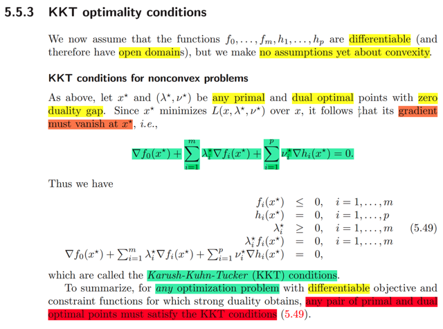</kbd></p>

> [!NOTE]
> Định nghĩa về KKT OPTIMALITY CONDITIONS, ko có gì thêm
> đã hiểu rồi. Chỉ nhấn mạnh rằng nếu primal problem KHÔNG 
> CONVEX thì: 
>
> NẾU x*, λ*, v* LÀ PRIMAL OPTIMAL và DUAL OPTIMAL VÀ
> ZERO DUALITY GAP THÌ CHÚNG PHẢI THỎA KKT CONDITION.
>
> Chú ý, trong bài toán primal non-convex thì việc thỏa KKT
> condition chưa chắc dẫn đến chúng là primal optimal `/` dual
> optimal.
>
> Lập luận như sau: Giả sử bài toán primal problem non-convex.
>
> Thì nếu a) x* là primal optimal, và b) λ*, v* là dual optimal và 
> c) duality gap `=` 0, ta sẽ có: 
>
> 1) x* primal optimal `=>` x* feasible: hi(x*) `=` 0, fi(x*) `<=` 0 với mọi i
>
> 2) λ* là dual optimal nên λ* thỏa dual constraint: λ* ≽ 0, hay λ*i `>=` 0
> với mọi i
>
> 3) Ta lặp lại luận luận sau để thấy x*, λ*, v* sẽ phải thỏa complementary
> slackness:
>
> Theo định nghĩa g(λ, v) `=` inf x L(x, λ, v) `=>` g(λ*, v*) `=` inf x L(x, λ*, v*)
>
> inf L(x, λ*, v*) `<=` L(x, λ*, v*) với mọi x, trong đó có x*
>
> `=>` inf x L(x, λ*, v*) `<=` L(x*, λ*, v*)
>
> Từ đó:
>
> ```text
> g(λ*, v*) = inf x L(x, λ*, v*) <= L(x*, λ*, v*) = f0(x*) + Σ λ*ifi(x*) + Σ v*ihi(x*)
> ```
>
> ```text
> Tiếp, f0(x*) + Σ λ*ifi(x*) + Σ v*ihi(x*) <= f0(x*) vì λ*ifi(x*) < 0 còn v*ihi(x*) = 0
> ```
> (lí do là x* là optimal thì trước hết nó feasible `=>` thỏa các constraint)
>
> Vậy ta có quan hệ sau: 
>
> ```text
> g(λ*, v*) = inf x L(x, λ*, v*) <= L(x*, λ*, v*) = f0(x*) + Σ λ*ifi(x*) + Σ v*ihi(x*) <= f0(x*)
> ```
>
> Và từ quan hệ này, xét sự điều kiện ban đầu cho rằng duality gap `=` 0 tức:
>
> d* `=` g(λ*, v*) `=` p* `=` f0(x*) thì điều này ĐỒNG NGHĨA LÀ DẤU BẰNG Ở ĐÂY
> PHẢI XẢY RA:
>
> f0(x*) + `Σ` λ*ifi(x*) + `Σ` v*ihi(x*) `<=` f0(x*)
>
> và vì v*ihi(x*) `=` 0 rồi, nên dẫn đến 3) λ*ihi(x*) `=` 0 với mọi i (COMPLEMENTARY 
> SLACKNESS)
>
> Cuối cùng, đó là, với việc d* `=` p* cũng ĐỒNG NGHĨA LÀ DẤU BẰNG Ở ĐÂY 
> (VÀ NHỮNG CHỖ KHÁC) CŨNG XẢY RA:
>
> inf x L(x, λ*, v*) `<=` L(x*, λ*, v*) 
>
> Và như đã nói về cái này ở note trước (hai hệ quả của ..) thì điều này có nghĩa
> là x* LÀ ĐIỂM MINIZE L(x, λ*, v*)
>
> Mà như vậy thì GRADIENT CỦA LAGRANGIAN L(x, λ*, v*) tại x* PHẢI BẰNG 0
> VÌ NẾU KHÔNG TA CÓ THỂ TIẾP TỤC ĐI THEO HƯỚNG - GRADIENT ĐỂ
> GIẢM L THÊM NỮA.
>
> Vậy ta có `/` thỏa điều kiện 4): ∇x L(x, λ*, v*) | `x=x*` `=` 0
>
> Vậy ta đã lập luận để thấy nếu x* là primal optimal, λ*, v* là dual optimal
> và duality gap `=` 0 thì x*, λ*, v* sẽ THỎA 4 ĐIỀU KIỆN TRÊN, CHÍNH LÀ KKT
> CONDITIONS
>
> 5.5 OPTIMALITY CONDITIONS
>
> 5.5.3 KKT CONDITIONS

<br>

<p align="center"><kbd>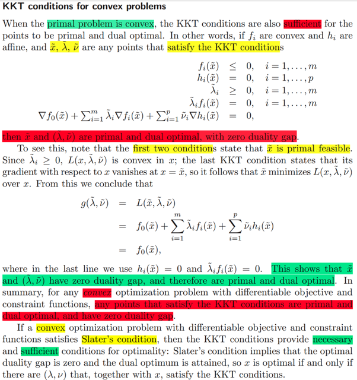</kbd></p>

> [!NOTE]
> Đại khái là, như vừa rồi, ta đã chứng minh rằng nếu mà ta có bài toán primal
> problem NON-CONVEX với x* là primal optimal, và λ*, v* là dual optimal và zero
> duality gap thì chúng sẽ thỏa KKT conditions.
>
> Thế thì, vì việc chứng minh đó không care primal là convex hay không nên dĩ
> nhiên với convex problem thì ta cũng có như vậy.
>
> Tuy nhiên, ở đây với CONVEX problem ta có thể chứng minh chiều ngược lại:
> Nếu primal feasible x~ và dual feasible λ~, v~ thỏa KKT conditions thì
> CHÚNG SẼ LÀ PRIMAL OPTIMAL VÀ DUAL OPTIMAL VỚI DUALITY GAP
> `=` 0
>
> Chứng minh như sau:
>
> Dựa trên việc chúng đã thỏa các KKT conditions tức là ta có:
>
> 1) x~ thỏa primal feasible: fi(x~) `<=` 0, hi(x~) `=` 0
>
> 2) λ~ thỏa dual constraint: λ~ ≽ 0
>
> 3) thỏa complementary slackness: `Σ` λ~i fi(x~) `=` 0 với mọi i
>
> 4) ∇x L(x, λ~, v~) | `x=x~` `=` 0
>
> Thế thì ta cần chứng minh x~ chính là x*, g(λ~, v~) `=` g(λ*, v*) và g(λ~, v~) `=`
> f0(x~)
>
> Đầu tiên, dựa vào việc đây là CONVEX PROBLEM, tức là f0, f1, ...fm convex
> hi là affine. Do đó L CŨNG CONVEX. Mà với convex function, thì CRITICAL
> POINT CHÍNH LÀ MINIMUM.
>
> Do đó điều 4 cho ta kết luận x~ chính là minimum của L(x, λ~, v~):
>
> L(x~, λ~, v~) `=` inf x L(x, λ~, v~)
>
> Thế thì theo định nghĩa g(λ, v) `=` inf L(x, λ, v) nên g(λ~, v~) `=` inf x L(x, λ~, v~)
>
> Vậy kết hợp với điều trên, ta có g(λ~, v~) `=` L(x~, λ~, v~)
>
> ```text
> cũng là: g(λ~, v~) = L(x~, λ~, v~) = f0(x~) + Σ λ~ifi(x~) + Σ v~ihi(x~)
> ```
>
> Thế thì: Dùng tiếp điều kiện 1): hi(x~) `=` 0, và 4) `Σ` λ~ihi(x~) `=` 0 ta suy ra:
>
> ```text
> g(λ~, v~) = L(x~, λ~, v~) = f0(x~) + Σ λ~ifi(x~) + Σ v~ihi(x~) = f0(x~)
> ```
>
> Vậy ta có được kết luận g(λ~, v~) `=` f0(x~)
>
> Theo sách nói điều này CHỨNG TỎ HẾT NHỮNG ĐIỀU CẦN CHỨNG
> MINH:
>
> λ~, v~ CHÍNH LÀ DUAL OPTIMAL 
>
> x~ CHÍNH LÀ PRIMAL OPTIMAL
>
> và DĨ NHIÊN LÀ DUALITY GAP `=` 0.
>
> Vì sao nhỉ?
>
> Đó là vì ta luôn có quan hệ sau:
>
> ```text
> g(λ, v) <= g(λ*, v*) <= f0(x*) <= f(x~), hay g(λ, v) <= d* <= p* <= f0(x) chính
> ```
> là cái mà gs nói rằng λ, v cho ta một INTERVAL của p*, d* (xem link xanh):
>
> d*, p* ∈ [g(λ, v), f0(x)]
>
> Do đó khi ta có g(λ~, v~) `=` f0(x~) thì điều này CHỈ XẢY RA KHI g(λ~, v~)
> chính là 1) g(λ*, v*), 2) f0(x~) chính là f0(x*) và 3) Ta có Strong duality xảy ra.

<br>

<p align="center"><kbd>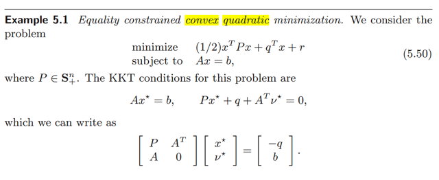</kbd></p>

<p align="center"><kbd>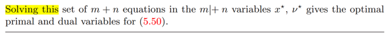</kbd></p>

> [!NOTE]
> một ví dụ là bài toán convex optimization trong đó objective là quadratic
> (dĩ nhiên là convex function) function với equality affine constraint Ax `=` b
>
> Thì như vừa nói, với convex problem thì nếu thỏa KKT thì ta sẽ có ngay
> optimal. Do đó ta thiết lập KKT condition để giải ra x và v (không có λ)
>
> Thì trong KKT conditions, điều kiện 1) primal feasible đơn giản là phải
> thỏa constraint: Ax* `=` b.
>
> Không có inequality constraint nên không cần λ* ≽ 0, cũng như không có
> complementary slackness
>
> Vậy chỉ còn điều kiện 4) ∇x L(x, v*) `=` 0
>
> ```text
> L(x, v) = f0(x) + Σvi hi(x) = f0(x) + vTh(x) = (1/2)xTPx + qTx + r + vT(Ax-b)
> ```
>
> Tính ∇x L: Nhờ mit 18s096 làm rất dễ dàng:
>
> dL `=` L(x+dx,v) - L(x,v)
>
> `=` `(1/2)(x` + dx)TP(x + dx) + qT(x + dx) + r + vT[A(x + dx) - b] - `(1/2)xTPx` - qTx - r -
> vT(Ax - b)
>
> `=` `(1/2)(xTPx` + dxTPx + xTPdx + dxTPdx) + qTx + qTdx + r + vTAx + vTAdx - vTb -
> `(1/2)xTPx` - qTx - r - vTAx + vTb
>
> ```text
> = (1/2)xTPx + (1/2)dxTPx + (1/2)xTPdx + (1/2)dxTPdx + qTx + qTdx + r +
> ```
> vTAx + vTAdx - vTb -  `(1/2)xTPx` - qTx - r - vTAx + vTb
>
> `=` xTPdx + qTdx  + vTAdx `=` (xTP + qT + vTA)dx `=` (PTx + q + ATv)Tdx
>
> `=>` ∇x L `=` PTx + q + ATv
>
> ```text
> ∇x L(x, v*) |x=x* = 0 <=> PTx* + q + ATv* = 0
> ```
>
> Vậy ta cần giải: 
>
> Ax* `=` b và PTx* + q + ATv `=` 0

<br>

<p align="center"><kbd>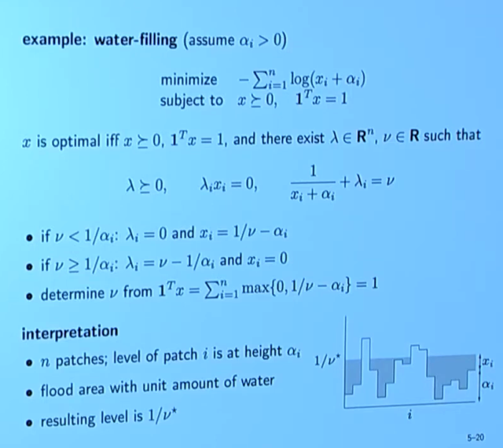</kbd></p>

> [!NOTE]
> Một ví dụ thuộc lĩnh vực lý thuyết thông tin. Đại khái là ta có convex problem. 
> Áp dụng KKT ta sẽ nói rằng x là optimal nếu và chỉ nếu thỏa  KKT conditions:
>
> Condition 1: x* Drimal feasible: Đồng nghĩa x* ≽ 0 và 1Tx `=` 1. 
>
> Condition 2: Dual constraint λ ≽ 0.
>
> Condition 3: Complementary Slackness: λ*ix*i `=` 0
>
> Condition 4: Gradient wrt x của Lagrangian L(x, λ*, v*) tại x* `=` 0:
>
> Lagrangian: 
>
> ```text
> L(x, λ, ν) = - Σ log(xi+αi) + Σ λi(-xi) + ν (1Tx-1)
> ```
>
> Chỗ này chú ý, equalities constraint x ≽ 0, thì ta có n constraints: x1 `>=` 0, 
> x2 `>=` 0,....xn `>=` 0. Nên mỗi cái gắn với một λ: λ1, λ2...
>
> Còn 1Tx `=` 0 thì thật ra chỉ có 1 equality constraint: -> chỉ có 1 ν
>
> ```text
> L(x, λ, v) = - Σ log(xi+αi) + Σ λi(-xi) + ν (Σxi-1)
> ```
>
> ```text
> ∇_x L_i = ∂/∂xi L = ∂/∂xi [- log(xi+αi) + λi(-xi) + ν(xi-1)]
> ```
>
> ```text
> = ∂/∂xi [- log(xi+αi)] + ∂/∂xi[λi(-xi)] + ∂/∂xi[ν(xi-1)]
> ```
>
> `=` `-1/(xi+αi)` - λi + v
>
> ```text
> ∇_x L_i = 0 <=> - 1/(xi+αi) - λi + v = 0
> ```
>
> ```text
> <=>  1/(xi+αi) + λi = vi
> ```
>
> Ở trên là mình tính `∂L/∂xi,` thử tính theo lối holistically như  MIT18s096 xem:
>
> ```text
> L = - 1Tlog(x+α) + λT(-x) + v(1Tx-1) = - 1Tlog(x+α) - λTx + v(1Tx-1)
> ```
>
> dL `=` L(x+dx) - L(x)
>
> `=` - `1Tlog(x+dx+α)` - λT(x+dx) + v(1Tx+1Tdx-1) - [- `1Tlog(x+α)` - λTx + v(1Tx-1)]
>
> `=` - `1Tlog(x+dx+α)` - λT(x+dx) + v(1Tx+1Tdx-1) + `1Tlog(x+α)` + λTx - v(1Tx-1)
>
> `=` - `1Tlog(x+dx+α)` - λTx - λTdx + v(1Tx) + v(1Tdx) - v + `1Tlog(x+α)` + λTx - v(1Tx) + v
>
> `=` - `1Tlog(x+dx+α)` + `1Tlog(x+α)` - λTdx + v(1Tdx) 
>
> `=` - `1T[log(x+dx+α)` - `log(x+α)]` - λTdx + v(1Tdx) 
>
> ```text
> = -1Tlog[(x+dx+α)/(x+α)] - λTdx + v(1Tdx)
> ```
>
> `=` `-1Tlog[1+dx/(x+α)]` - λTdx + v(1Tdx) (1)
>
> Tới đây dùng linear approximation của hàm log: Với `x~=` x0
>
> log(x) `~=` log(x0) + log'(x0)(x-x0) `=` log(x0) + `(1/x0)(x-x0)`
>
> ```text
> Từ đó với x~=1: log(x) ~= log(1) + (1/1)(x-1) = x-1
> ```
>
> ```text
> áp dụng vào bài toán trên 1 + dx/(x+α) ~= 1 => log[1+dx/(x+α)] ~= 1+dx/(x+α) - 1
> ```
>
> ```text
> <=> log[1+dx/(x+α)] ~= dx/(x+α)
> ```
>
> Vậy (1) `=` `-1T[dx/(x+α)` ] - λTdx + v(1Tdx)
>
> ```text
> = [-λT + v(1T) - 1T/(x+α)]dx = [-λ + v(1) - 1/(x+α)]Tdx  | cho đến đây v vẫn là scalar
> ```
>
> ```text
> => ∇_x L(x, λ, v) = -λ + v - 1/(x+α)  | có thể coi v như scalar hoặc vector component
> ```
> giống nhau `=` v
>
> `=>` Điều 4 của KKT: ∇_x L(x, λ*, v*) `|x=x*` `=` 0
>
> `<=>` -λ* + v* - `1/(x*+α)`
>
> ```text
> <=>  -λ*i + v* - 1/(x*+αi) = 0
> ```
>
> ```text
> <=> λ*i + 1/(x+αi) = v*
> ```
>
> Còn những ý ở dưới thì vài bữa nghiên cứu sau

<br>

<p align="center"><kbd>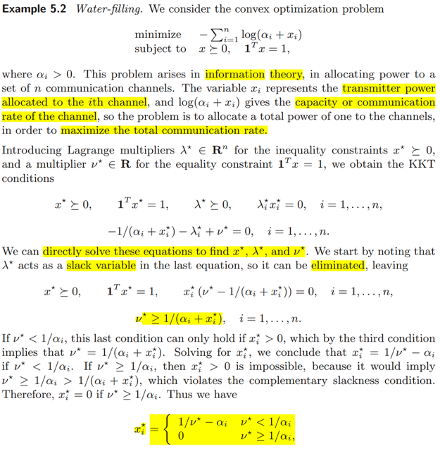</kbd></p>

<p align="center"><kbd>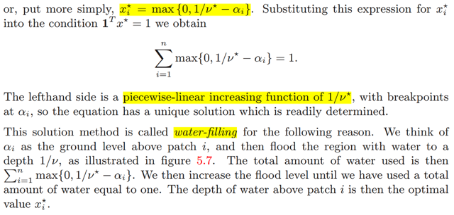</kbd></p>

> [!NOTE]
> Từ note trước ta đã tự derive lại condition 4) gradient L wrt x `=` 0.
> thì phần trong sách giúp hiểu rõ hơn về việc giải các KKT conditions
> (để ra optimal x*)
>
> Nói chung là cũng ko có gì khó hiểu. Chỉ có đáng chú ý một bước
> gọi là eliminate slack variable, đại khái là vầy:
>
> ```text
> Ta có (điểm 4 của KKT): λ*i + 1/(x+αi) = v* <=> -1/(x+αi) - λ*i + v* = 0
> ```
>
> ```text
> mà cái này <=> -1/(x+αi) + v* = λ*i
> ```
>
> ```text
> Kết hợp với λ*i >= 0 => -1/(x+αi) + v* >= 0
> ```
>
> ```text
> <=> v* >= 1/(αi + x*)
> ```
>
> Và gỉai ra ta có solution như vậy
>
> (Quay lại sau)

<br>

<p align="center"><kbd>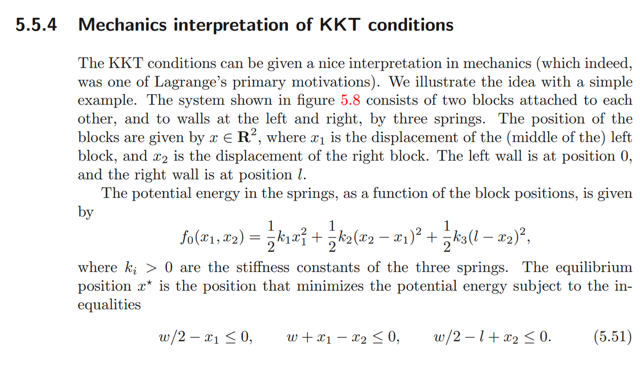</kbd></p>

> [!NOTE]
> SÁCH (XEM SAU)
>
> 5.5 OPTIMALITY CONDITIONS
>
> 5.5.4 MECHANICS INTERPRETATION OF
> KKT CONDITIONS

<br>

<p align="center"><kbd>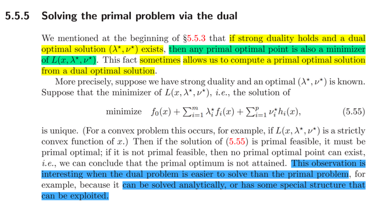</kbd></p>

> [!NOTE]
> 5.5 OPTIMALITY CONDITIONS
>
> 5.5.5 SOLVING THE PRIMAL PROBLEM VIA
> THE DUAL
>
> Đại khái là ở đây ta nhắc lại một nhận định rằng khi ta có STRONG
> DUALITY, và ta cũng đã có DUAL OPTIMAL  λ*, v*. Thì BẤT KÌ PRIMAL
> OPTIMAL NÀO CŨNG LÀ MINIMIZER CỦA L(x, λ*, v*)
>
> Tại sao như vậy: Lập luận là vầy:
>
> g(λ, v) `=` inf x L(x, λ, v)   |  định nghĩa của dual function
>
> `=>` g(λ*, v*) `=` inf x L(x, λ*, v*)   | vẫn là định nghĩa của dual function, chỉ
> là evaluate tại λ* và v*
>
> g(λ*, v*) `=` inf x L(x, λ*, v*) ≤ L(x*, λ*, v*)   |  vì nó là ý nghĩa của infimum
>
> thì nó phải nhỏ nhất trong các L(x, λ*, v*) với x ∈ dom và dĩ nhiên trong 
> đó có L(x*, λ*, v*)
>
> Thay công thức L(x*, λ*, v*) vào:
>
> g(λ*, v*) `=` inf x  f0(x) + `Σ` λ*ifi(x) + `Σ` v*ihi(x) 
>
> ≤ f0(x*) + `Σ` λ*ifi(x*) + `Σ` v*ihi(x*)
>
> ≤ f0(x*)
>
> Vì f0(x*) + `Σ` λ*ifi(x) + `Σ` v*ihi(x) ≤ f0(x*) do:
>
> λ*i ≥ 0 vì nó là dual optimal nên phải thỏa "dual constraint" λ ≽ 0 (cũng
> đồng nghĩa λ*i ≥ 0)
>
> fi(x*) < 0 và hi(x*) `=` 0 vì x* là primal optimal nên phải "primal feasible" 
> (fi(x) ≤ 0, hi(x) `=` 0)
>
> Rồi từ việc nói ta có STRONG DUALITY, tức là: 
>
> p* `=` d* ⇔ f0(x*) `=` g(λ*, v*)
>
> Vậy điều này xảy ra khi các dấu ≤  đều là dấu bằng:
>
> Trong đó dấu bằng đầu tiên:
>
> ```text
> inf x  f0(x) + Σ λ*ifi(x) + Σ v*ihi(x)  = f0(x*) + Σ λ*ifi(x*) + Σ v*ihi(x*)
> ```
>
> Chính là L(x*, λ*, v*) `=` inf x L(x, λ*, v*)
>
> Và ý nghĩa của nó chính là: "primal optimal x* chính là minimizer  của
> L(x, λ*, v*)"
>
> Thành ra dựa vào điều này, nếu ta có strong duality, và có λ*, v* rồi.
>
> Thì việc tìm x* có thể được thực hiện bằng cách thay vì giải bài toán
> gốc (minimize f0(x) subject to constraint)  có thể được thay thế bằng
> bằng toán:
>
> minimize Lagrangian L(x, λ*, v*)
>
> Và nếu bài toán này có nghiệm feasible thì nó chính là x* còn
> không thì ta nói PRIMAL OPTIMAL KHÔNG TỒN TẠI
>
> VÀ MỘT SỐ TRƯỜNG HỢP THÌ VIỆC GIẢI BÀI TOÁN SAU DỄ HƠN
> BÀI TOÁN GỐC

<br>

<p align="center"><kbd>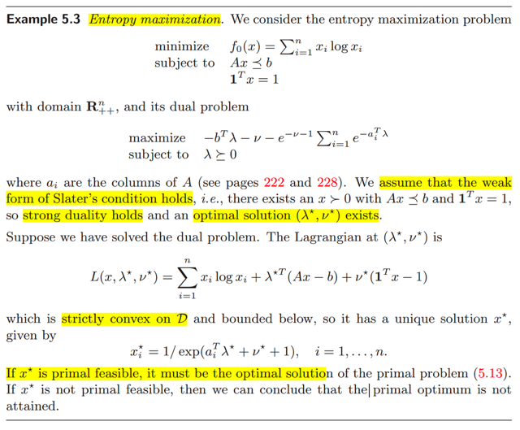</kbd></p>

> [!NOTE]
> Đại khái là áp dụng điều này vào ví dụ này - bài toán Entropy
> maximization (mà trong bài trước (theo link) mình đã triển khai để thấy
> dual function g(λ, v) `=` - v - λTb - e^(-v-1) `Σ` e^(- aiTλ)
>
> Nên theo như kiến thức ở đây, người ta nói nếu giả dụ mình đã có dual
> optimal λ*, v*, bằng cách giải dual problem: maximize g(λ, v) subject to
> dual constraint: λ ≽ 0.
>
> Thì khi đó, ta giả sử ta chắc chắn có STRONG DUALITY:
>
> Chỗ này ta sẽ liên hệ kiến thức đã học ở phần trước, đó là khi một
> primal problem là CONVEX problem mà lại thỏa SLATER'S
> CONDITION thì ta có thể chắc chắn STRONG DUALITY xảy ra.
>
> Còn Slater's condition nôm na là với các inequality constraints ví dụ
> fi(x) `<=` 0 thì điều kiện đó là tồn tại những điểm STRICTLY
> FEASIBLE: những điểm mà fi(x) < 0
>
> Nhưng bên cạnh đó, nếu như các inequality constraints là affine function,
> thì khi đó Slater's condition trở thành WEAK SLATER'S CONDITION  
> (đại khái là những inequality constraints nào mà là có dạng tuyến tính
> aiTx `<=` bi thì khỏi cần có tồn tại strictly feasible, mà feasible là đủ rồi)
>
> Thành ra với bài toán này khi INEQUALITY CONSTRAINT ĐỀU
> LINEAR để thể hiện thành Ax ⪯ b thì điều kiện Slater trở thành
> chỉ còn là điều kiện TỒN TẠI FEASIBLE POINTS `/` hay nói cách khác
> chỉ yêu cầu BÀI TOÁN FEASIBLE là đủ. Vậy dĩ nhiên x feasible có
> nghĩa là x phải thuộc domain của f0 (đây gọi là implicit constraint) mà f0
> có log(x) nên domain là x phải DƯƠNG x ≻ 0. Đồng thời feasible
> thì nó phải thỏa Ax ⪯ b và 1Tx `=` 1
>
> Thế thì giả sử bài toán feasible. Thì theo kiến thức ở đây, ta chỉ việc giải
> bài toán minimize L(x, λ*, v*) và nếu bài toán này có feasible point, thì  nó
> chính là PRIMAL OPTIMAL x*.  Ngược lại, thì PRIMAL OPTIMAL
> NOT ATTAINED
>
> Để giải bài toán này thì ta cũng làm như thông thường, tìm critical point
> của L(x, λ*, v*) (chỉ là function theo x). Liên hệ bài trước khi mình tự
> derive hàm g(λ, v) thì có hai cách: 1 là dùng hệ quả của conjugate
> function và 2) là dùng calculus. Thì trong cách 2 ta đã cho ra critical point
> là:
>
> x `=` e^(- ATλ - v - 1)
>
> `=` e^[-(ATλ + v + 1)]
>
> `=` 1 `/` e^(ATλ + v + 1)
>
> Và trong note trước ta cũng tìm Hessian để thấy nó `=` `diag([1/x1,` `1/x2...]`
> với  x ≻ 0 thì Hessian POSITIVE DEFINITE, do đó L(x, λ*, v*)
> STRICTLY CONVEX  `=>` CRITICAL POINT LÀ UNIQUE MINIMUM
>
> x* `=` 1 `/` e^(ATλ + v + 1)
>
> Áp dụng kết quả đó ở đây thì ta có x* `=` 1 `/` e^ (ATλ* + v* + 1)
>
> `=>` x*i `=` 1 `/` e^(aiTλ* + v* + 1) 
>
> Và như đã nói, ta sẽ CHECK XEM x* có PRIMAL FEASIBLE KHÔNG. 
> NẾU CÓ THÌ NÓ CHÍNH LÀ PRIMAL OPTIMAL.

<br>

<p align="center"><kbd>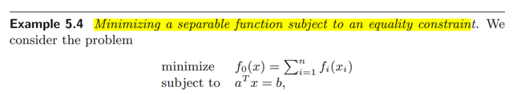</kbd></p>

<p align="center"><kbd>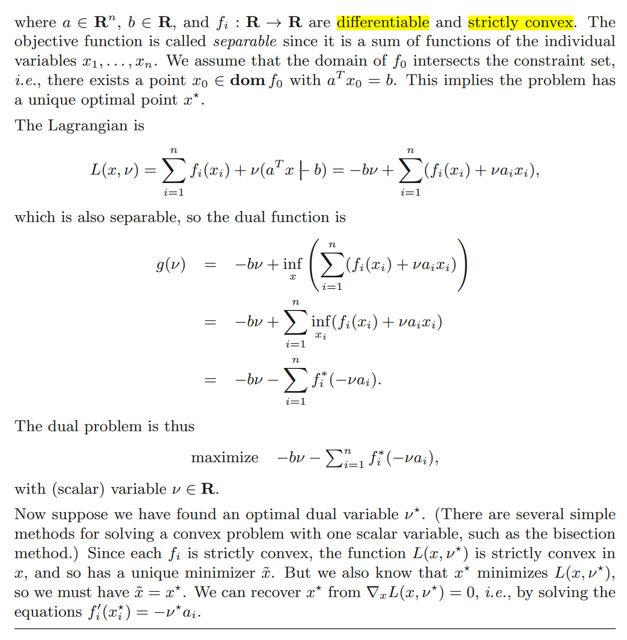</kbd></p>

> [!NOTE]
> Qua ví dụ này, objective (primal objective) là f0(x) có dạng SUM CỦA
> CÁC FUNCTION ĐƠN BIẾN KHÁC NHAU: `Σi` fi(xi) do đó nó gọi là
> SEPARABLE FUNCTION. Constraint là aTx `=` b. Với nói thêm fi đều
> differentiable và STRICTLY CONVEX.
>
> Thế thì họ assume là trong problem domain (như đã biết PROBLEM
> DOMAIN là INTERSECTION của objective function domain và
> các constraint function domain) tồn tại point thỏa aTx `=` b, thì ta sẽ
> có thể kết luận là TỒN TẠI UNIQUE OPTIMAL POINT x*
>
> Tại sao lại vậy? Đó đơn giản là vì objective function STRICTLY
> CONVEX, và gs đã nói ở đâu đó, nếu có tính chất này thì khi optimal
> tồn tại thì nó là unique.
>
> Thử build Lagrangian: 
>
> ```text
> L = f0(x) + Σ vi hi(x) = Σ fi(xi) + v(aTx - b) = Σ fi(xi) + vaTx - vb
> ```
>
> ```text
> = Σ fi(xi) + v Σaixi - vb = Σ fi(xi) + Σvaixi - vb
> ```
>
> `=` `Σ(fi(xi)` + vaixi) - vb
>
> ```text
> => g(v) = inf x L(x, v) = inf x Σ(fi(xi) + vaixi) - vb
> ```
>
> `=` `Σ` inf x [fi(xi) + vaixi] - vb
>
> `=` `Σ` - sup x [-fi(xi) - vaixi] - vb
>
> `=` `Σ` - sup x [- vaixi - fi(xi)] - vb
>
> Và ta nhớ conjugate function của f(x) có định nghĩa là:
>
> f*(y) `=` sup x [yTx - f(x)]
>
> `=>` sup x [ (-vai)xi - fi(xi) ] chính là fi*(-vai)
>
> Vậy:
>
> ```text
> g(v) = [Σ - fi*(-vai) ] - vb = -vb - Σ fi*(-vai)
> ```
>
> Và đại khái là họ nói nếu ta bằng cách nào đó đã tìm được dual 
> optimal v* thì vì strong duality hold (primal problem convex và ko
> có inequality constraint và bài toán feasible) nên ta có thể tìm x*
> bằng cách minimize L(x, v*)

<br>

<p align="center"><kbd>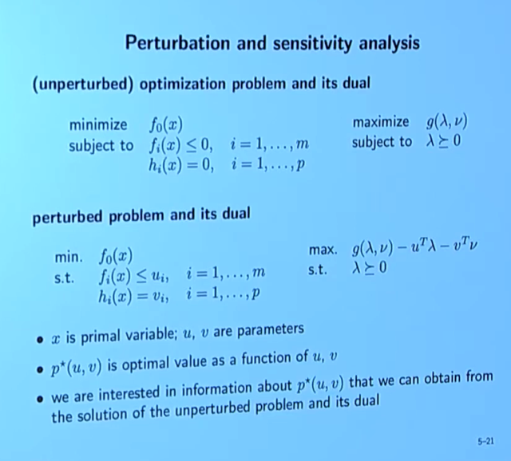</kbd></p>

> [!NOTE]
> Gs nói qua bài toán rất hữu dụng trong thực tế. Gọi là Perturbed
> problem. Đại khái là bài toán optimization bình thường, có thể gọi
> là unperturbed thì ta có objective function f0(x). Cũng như constraint
> fi(x) `<=` 0, hi(x) `=` 0 như đã biết. Để rồi ta sẽ xây dựng Lagrangian 
> sau đó minimize over x để có Dual function g(λ,ν) giúp ta có lower
> bound của p*, và cuối cùng ta giải bài toán Dual problem bằng cách
>  maximize g(λ,v) subject to λ ≽ 0 để có best lower bound d*.
>
> Thế thì perturbed problem đại khái là ta có thể NỚI LỎNG hoặc THẮT
> CHẶT constraint bằng cách thay fi(x) `<=` 0 bằng fi(x) `<=` ui. Để khi ui
> dương, dễ hiểu là ta đang mở rộng feasible set, giúp nới lỏng hơn
> constraint. Còn khi ui âm, ta làm cho ràng buộc khó khăn hơn. Và
> từ đó chính là thắt chặt hơn ràng buộc.
>
> Thế thì trong perturbed problem, thì Lagrangian
>
> L(x, λ, v) `=` f0(x) + `Σ` λi [fi(x)-ui] + `Σ` vi [hi(x)-wi]   
>
> (Trong slide là hi(x) `=` vi, nhưng mình dùng wi cho khỏi nhầm với "nu"
> nên equality constraint bây giờ là là hi(x) - wi `=` 0)
>
> ⇨ Dual function của perturbed problem (ta kí hiệu là `g_u,v(λ,` ν)
> để phân biệt với dual function của problem gốc g(λ, v) 
>
> `g_u,v(λ,` ν) `=` inf x L(x, λ, v) 
>
> `=` inf x  f0(x) + `Σ` λi [fi(x) - ui] + `Σ` νi [hi(x) - wi]
>
> ```text
> = inf x  f0(x) + Σ λi fi(x) - Σ λi ui + Σ vi hi(x) - Σ viwi
> ```
>
> ```text
> = inf x  f0(x) + Σ λi fi(x) + Σ vi hi(x) - Σ λiui - Σ viwi
> ```
>
> ```text
> = inf x  f0(x) + Σ λi fi(x) + Σ vi hi(x)  - Σ λiui - Σ viwi
> ```
>
> (λiui, viwi ko depend on x đưa ra ngoài infimum)
>
> `=` g(λ, ν) - `Σ` λiui - `Σ` viwi
>
> `=` g(λ, ν) - λTu - vTw
>
> Vậy dual function của perturb problem là: 
>
> `g_u,v(λ,` ν) `=`  g(λ, ν) - λTu - vTw
>
> Và khi ta maximize cái này ta sẽ có dual optimal của perturbed problem
>
> d* `=` sup g(λ, ν) - λTu - vTw
>
> CHAPTER 5 - DUALITY
>
> 5.6 PERTURBATION & SENSITIVITY
> ANALYSIS

<br>

<p align="center"><kbd>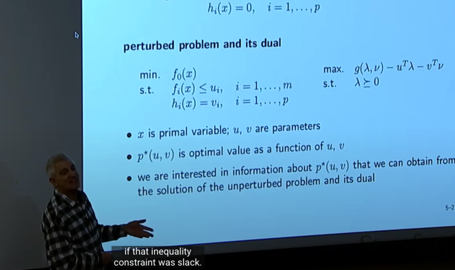</kbd></p>

> [!NOTE]
> Gs hỏi nếu ui dương, thì optimal value sẽ thay đổi ra sao so với
> optimal value ban đầu:
>
> Câu trả lời là nó có thể nhỏ hơn (hoặc giữ nguyên).
>
> Hiểu nôm na tại sao nó có thể NHỎ HƠN (tức là tìm được optimal
> value tốt hơn), là vì khi ta nới lỏng constraint bằng cách thay fi(x)
> `<=` 0 bởi fi(x) `<=` ui với ui dương (again, ta hiểu rằng khi làm vậy x
> có thể feasible trong phạm vi lớn hơn)
>
> Vì x: fi(x) `<=` ui `<=>` fi(x) ∈ (-inf, ui) thì RỘNG HƠN x: fi(x) `<=` 0
> `<=>` fi(x) ∈ (-inf, 0)  vì với ui dương thì khoảng (-inf, ui) RỘNG
> HƠN (-inf, 0)
>
> Nhưng nếu nó giữ nguyên, thì gs nói rằng điều đó có nghĩa là
> ràng buộc của ta đang slack, kiểu như bị chùng sẵn rồi (giống như
> ta có ràng buộc bởi sợi dây, nhưng optimal value chưa "xài hết"
> khoảng ràng buộc cho phép thành ra ràng buộc còn dư, bị chùng,
> dẫn đến khi ta nới lỏng ràng buộc thì mọi chuyện vẫn vậy, dây càng
> thêm chùng.
>
> Ngược lại, nếu ràng buộc đang căng (tight), thì nới lỏng ràng
> buộc, optimal value sẽ xa hơn (tức giảm hơn), tốt hơn ban đầu

<br>

<p align="center"><kbd></kbd></p>

> [!NOTE]
> Giống như ta đang giải bài toán cầm tiền đi ăn cơm sao cho no.
> Thì nếu như ta chỉ có 10k trong khi cần 50 k mới đủ no.  Thì ăn
> hết 10k vẫn thấy chưa no. Nhưng đó là hết khả năng rồi, hết tiền
> rồi. Đây minh họa cho việc ta đạt optimal trong trạng thái
> constraint đang căng (tight)
>
> Để rồi khi nới lỏng constraint thành 20k. Ta vẫn ăn được nữa,
> thêm 10k cơm nữa. Để rồi optimal better so với 10k. Nhưng
> vẫn chưa no, nhưg ko làm gì được, vì hết tiền. Constraint vẫn
> căng.
>
> Nới thêm nữa thành 100k. Thì mình ăn tới 50k cơm là no. KO ăn
> thêm được nữa. Lúc bấy giờ ta đạt optimal trong trạng thái slack
> - chùng của constraint (vì còn tiền, chẳng qua lại đạt giới hạn của
> cái bụng ăn ko nổi nữa)
>
> Khi đó nếu có tăng lên 200k, thì mọi chuyện ko đổi. Vì cũng
> chỉ cần 50k là no  Ngược lại khi ta thắt chặt. Thì cũng có hai
> khả năng. Nếu constraint đang slack, như từ 100k còn 75k thì
> ta vẫn vô tư (ý là optimal value không đổi) vì vốn dĩ vẫn chỉ cần
> 50k để ăn no. Nhưng nếu constraint đang tight, ví dụ như thắt
> chặt từ 50k còn 40k. Thì optimal sẽ phải rút lại, vì giờ ta chỉ ăn
> có 5k thôi.
>
> Và nếu thắt chặt hơn nữa thì gs cho rằng nó sẽ trở thành
> unfeasible với hình ảnh là ví dụ như từ 5k xuống còn 2k thì ko còn
> feasible nữa vì ko đủ để mua cái gì ăn cả

<br>

<p align="center"><kbd>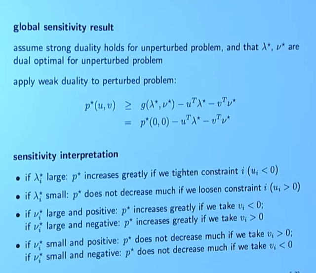</kbd></p>

> [!NOTE]
> Thế thì, giả sử ta đang có trạng thái Strong Duality thỏa và λ*, ν* 
> là dual optimal của bài toán gốc (unperturbed problem).
>
> Ở đây người ta kí hiệu p*(0, 0) ý là primal optimal value của bài 
> toán unperturbed (u `=` 0, w `=` 0). 
>
> Thế thì ta biết weak duality nói rằng p* ≥ d*. 
>
> Còn strong Duality thì ta có d* `=` p*.
>
> Tức là, khi ta giải bài toán dual problem: maximize g(λ, ν) over 
> λ, v với constraint λ ≽ 0 thì ta có d*: d* `=` sup λ, ν g(λ, ν)
>
> và vì ở đây nói bài toán gốc (unperturbed) có strong duality nên ta có: 
>
> d*(0,0) g(λ*, v*) `=` p*(0,0)  | λ* và v* là dual optimal của unperturbed problem
>
> `===`
>
> Còn với pertubed problem thì chưa chắc có strong duality, nhưng luôn có
> weak duality:
>
> p*(u, v) ≥ d*(u, v) (1)
>
> Hồi nãy ta đã có dual function của perturb problem là  g(λ, ν) - λTu - vTw
>
> nên d*(u, v) `=` sup λ, ν g(λ, ν) - λTu - vTw
>
> `=` g(λ*, ν*) - λ*Tu - v*Tw (chú ý ko bằng cái này đâu nhé)
>
>
> ⇨ d*(u, v) ≥ g(λ, ν) - λTu - vTw   | theo định nghĩa của supplemum
>
> Và vì cái này áp dụng với mọi λ, v nên cũng áp dụng với
> λ*, v* là dual optimal của unperturbed problem
>
> ⇨ d*(u, v) ≥ g(λ*, ν*) - λ*Tu - v*Tw (2)
>
> (1) (2) ⇨ p*(u, v) ≥ g(λ*, ν*) - λ*Tu - v*Tw
>
> Thay d*(0,0) `=` g(λ*, ν*) `=` p*(0,0) ỡ trên vào:
>
> ⇨ d*(u, v) ≥ g(λ*, ν*) - λ*Tu - v*Tw
>
> ⇔ p*(u, v) ≥ p*(0, 0) - λ*Tu - v*Tw
>
> Thế thì dễ thấy g(λ*, ν*) chính là dual optimal value của bài toán 
> unperturbed problem: tức là d*(0,0): d*(0, 0) `=` g(λ*,ν*) 
>
> Và vì đang nói ta có Strong Duality nên p*(0, 0)  `=` d*(0, 0) 
>
> Vậy tóm lại ta có: p*(u, v) `>=` p*(0, 0) - λ*Tu - v*Tw

<br>

<p align="center"><kbd>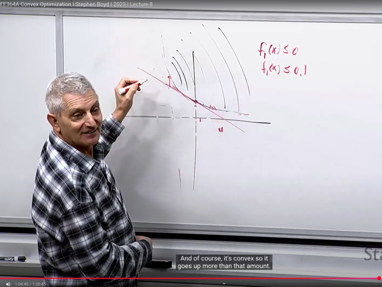</kbd></p>

> [!NOTE]
> Nói lại chút về cái hình này kẻo quên: Đây là ví dụ khi có một inequality constraint
> f1(x) < 0. Thì trong hệ trục này, trục vertical t là cho f0, và trục ngang u là f1.
> Xong người ta mới vẽ ra mọi điểm (f0, f1) với x lấy từ domain (f0 `=` f0(x), f1 `=` f1(x))
> Thì cái hình gạch gạch, là tập G, là mọi giá trị của (f0, f1). Dĩ nhiên ta sẽ làm việc
> trong đó thôi (bởi làm gì làm, x phải nằm trong domain trước hết để các objective và
> constraint xác định cái đã, sau đó mới tính đến x feasible, khi nó thỏa constraint và rồi
> optimal khi nó thỏa constraint và minimize objective)
>
> Thế thì với constraint f1 ≤ 0 thì ta sẽ chỉ quan tâm phần của blob G (cái tập hợp
> các điểm f0,f1 nói trên) nằm BÊN TRÁI trục tung thôi. Và sau đó ta sẽ muốn tìm điểm
> (f0, f1) sao cho f0 nhỏ nhất. Thì dễ thấy nó sẽ là cái điểm màu đỏ, giao điểm của
> trục tung và boundary của G. Đó chính là optimal value f0(x*) `=` p*
>
> Nói thêm chút nữa cho nhớ. Thì để giải bài toán này, trước nhất ta cũng xây dựng
> Lagrangian L `=` f0(x) + λf1(x). Rồi ta mới tìm Dual function:
>
> g(λ) `=` inf x ∈ dom L(x, λ) `=` inf x [f0(x) + λf1(x)]
>
> cái này tương đương `=` inf (t,u) ∈ G t + λu (chuyển từ theo x, sang theo u, t vì t,
> u tức f0, f1 cũng là  tính từ x)
>
> Viết lại g(λ) `=` inf (t, u) ∈ G t + λu)
>
> Đến đây ta đã có cái lower bound của p*:
>
> Lập luận: g(λ) `=` inf x L(x, λ) theo định nghĩa ⇨ g(λ) ≤ L(x, λ) ∀ x, λ.
>
> ⇨ g(λ) ≤ L(x*, λ) `=` f0(x*) + λf1(x*) | vì inequality ở trên áp dụng với mọi x
>
> và vế phải lại ≤ f0(x*) do λ ≥ 0, f1(x*) ≤ 0 (vì x* là primal optimal thì nó phải primal feasible)
>
> ⇨ g(λ) ≤ f0(x*) `=` p*
>
> Ý nghĩa của nó sẽ là với λ khác nhau thì ta có các lower bound khác nhau của p*
>
> Và đương nhiên ta muốn tìm cái lower bound "cao nhất"
>
> `====`
>
> `====`
>
> Nói một chút về ý nghĩa của: g(λ) `=` inf x ∈ dom L(x, λ) cũng là inf (t, u) ∈ G (t +
> λu).
>
> Đó chính là ta chọn một λ nào đó ví dụ λ `=` λ1. Khi đó L `=` t + λ1u coi như chỉ phụ
> thuộc t, u  (mình có thể kí hiệu là L_λ1(t, u)).
>
> Để rồi xét L(x, λ) `=` constant c `<=>` t + λ1u `=` c thì với c khác nhau ta có các level
> set khác nhau của L_λ1(t, u). Chúng là các đường thẳng song song với phương
> quy định bởi normal vector (1, λ1), cũng chính là gradient vector ∇L_λ1(t, u) `=` `(∂L/∂t,`
> `∂L/∂u)` `=` (1, λ1)
>
> Khi c `=` 0, ta có t + λ1u `=` 0 là đường thẳng đi qua 0, còn với c khác nhau ta có các
> đường thẳng song song.
>
> Thế thì khi ta tìm x trong dom sao cho t + λ1u nhỏ nhất, cũng chính là tìm trong họ
> đường thẳng này, cái nào có c nhỏ nhất. Hay tương đương ta giảm c đến mức có thể
> sao cho t + λ1u `=` c vẫn còn tiếp xúc với G (tại vì x phải trong dom, tương đương (t, u)
> phải trong G).
>
> Thì hình ảnh là ta sẽ đẩy dần đẩy dần đường thẳng t + λ1u `=` c này (bằng cách thay đổi
> sao cho c nhỏ dần) theo hướng ngược với gradient (1, λ1).
>
> Thì cuối cùng nó trở thành tiếp tuyến của G (nếu chưa phải là tiếp tuyến tức là nó chưa
> phải support hyperplane của G, thì còn có thể có điểm trong G khiến t + λu nhỏ hơn)
> khi đó L_λ1(t, u) đạt giá trị nhỏ nhất `=` c1*. Phương trình của nó: t + λ1u `=` c1*
>
> Thế thì, c1* cũng chính là t tại giao điểm với trục t (cho u `=` 0 `=>` t `=` c1*). Và theo định
> nghĩa, nó chính là g(λ1) (vì theo định nghĩa g(λ) `=` inf x ∈ dom f0(x) + λfi(x) `=` inf (t, u)
> ∈ G t + λu. Nên g(λ1) `=` inf (t, u) ∈ G t + λ1u
>
> Và như ở trên đã nói g(λ) với λ bất kì đều là lower bound của p*, thì với λ `=` λ1, kiểu như ta
> có một lower bound cụ thể:
>
> ```text
> p* = f0(x*) >= f0(x*) + λ1f1(x*) = L(x*, λ1) >= inf x∈dom L(x, λ1) = g(λ1). Rút gọn p* >=
> ```
> g(λ1)
>
> (cái dấu `>=` thứ 2, in đậm là cái dấu dễ khó hiểu, nhưng phía trên đã giải thích rồi, xem lại)
>
> Lower bound tốt nhất phải là cái có giá trị lớn nhất, chứ -infinity cũng là lower bound
> nhưng nó vô dụng  Nên ta sẽ tìm λ khác sao cho g(λ) lớn nhất giúp có được cái lower
> bound tốt nhất.
>
> Đó chính là bài toán Dual problem: maximize g(λ) subject to λ ≽ 0 (chú ý đang ví dụ
> đơn giản nên chỉ có inequality constraint f1(x) `<=` 0, ko có equality constraint nên không có
> ν. Nên Dual problem ta chỉ maximize over λ. Chứ ko là phải over cả v nữa)
>
> Kết quả cho ta highest lower bound cho p*: d* `=` sup λ≽0 g(λ) `=` g(λ*)
>
> Gắn nó vào quan hệ dây chuyền ở trên:
>
> p* `>=` g(λ) mà d* là max của g(λ) (d* `=` sup λ≽0 g(λ))
>
> thì p* cũng vẫn luôn lớn hơn hoặc bằng g(λ*)
>
> p* `>=` d*. Đây là Weak Duality.
>
> Nếu mà bài toán là convex. Trong hình, chính là như vậy. Thì khi G là convex set, trong
> các λ khác nhau, dẫn đến các g(λ) khác nhau, thì sẽ có cái trùng với p*. Đó chính là
> Strong Duality:
>
> p* `=` d*
>
> Gs nói về interpretation cho cái này
>
> p*(u, v) `>=` p*(0, 0) - λ*Tu - v*Tw (1)
>
> Đầu tiên ông nói cái đường cong boundary chính là p*(u). Là sao?
>
> Có thể hiểu ngắn gọn vầy: Với việc thay constraint f1(x) < 0 thành
> f1(x) < u thì p* sẽ là hàm theo u, tức là có thể kí hiệu p*(u). Để
> rồi khi u tăng từ 0 -> dương, đồng nghĩa với  việc thả lỏng
> constraint do feasible set được mở rộng, vì cái trục vertical nhích
> về bên phải, thì giao điểm của nó với đường boundary này, như đã biết,
> chính là p*, sẽ nhích xuống. Do đó khiến cho ta có thể có optimal tốt
> hơn (nó sẽ không đi xuống nếu như đường cong boundary giảm dần
> độ dốc và thành ra đi ngang)
>
> Ngược lại, khi u giảm (0 -> âm) tức là giờ ràng buộc khó hơn, kiểu như
> ko chỉ là yêu cầu f1 < 0 mà còn phải bé hơn -5 chẳng  hạn `=>` feasible
> set bị thu hẹp. Khi đó optimal value có thể sẽ giữ nguyên nếu như
> optimal đang ở trạng thái chùng. Còn khi đang ở trạng thái tight thì
> optimal chắc chắn sẽ tăng (cái đường cong gs vẽ ở screenshot sau chính
> là minh họa cho trạng thái này)

<br>

<p align="center"><kbd></kbd></p>

> [!NOTE]
> đây là minh họa cho optimal ở trạng thái constraint đang chùng.
> (Ý là, cái điểm optimal ở đây, là giao điểm của boundary của G với
> trục t)
>
> Khi thả lỏng constraint bằng cách tăng u (thay fi(x) `<=` 0 bằng fi(x)
> `<=` ui với ui dương) thì hình ảnh là ta dịch trục vertical về bên phải
> và vì đường boundary không đi xuống thêm, nên optimal value
> (là giao điểm của vertical axis với boundary) ko giảm xuống thêm mà
> chỉ giữ nguyên.
>
> Nhưng nếu ta thắt chặt constraint thì có thể thấy optimal value sẽ
> tăng (kém hơn).
>
> HÌnh ảnh này giống như đang có vừa đủ 50k để ăn cơm vậy (ăn no
> cần 50k). Thì khi cho thêm tiền thì trạng thái no vẫn ko đổi. Nhưng
> nếu thắt chặt, bớt tiền, thì sẽ ko còn đủ no (trạng thái optimal nhưng
> tight)

<br>

<p align="center"><kbd>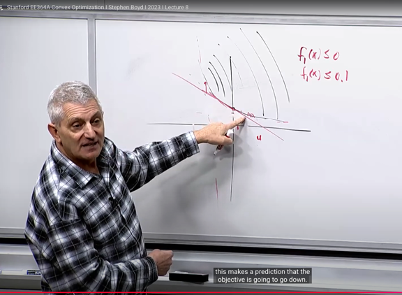</kbd></p>

<p align="center"><kbd>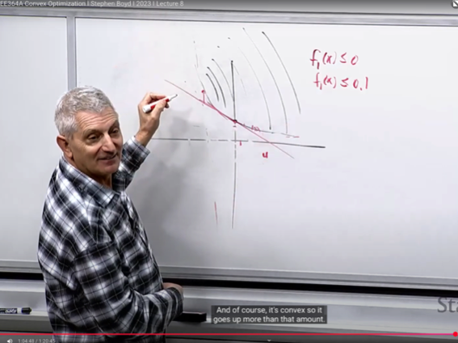</kbd></p>

> [!NOTE]
> Sau đoạn ôn tập vừa rồi thì ta có thể nhớ lại cái đường tuyến tính tiếp xúc với G tại
> điểm màu đỏ chính là kết qủa khi ta minimize L_λ(t, u) `=` t + λu:
>
> inf (t,u) ∈ G L_λ (t, u)
>
> `=` inf (t,u) ∈ G (t + λu) `=` g(λ)
>
> (L_λ (t, u) là mình tự đặt, ý là với một giá trị λ thì L chỉ là hàm theo t,u)
>
> Và đặc biệt với cái hình này, đường thẳng này chính là ứng với λ* (nói đặc biệt là
> bởi, với λ không phải optimal λ, thì t + λu sau khi minimize over t,u sẽ là tiếp tuyến với
> G nhưng tiếp điểm tại điểm khác trên phần boundary bên trái chứ không phải tại giao
> điểm của boundary với trục t - là cái mà trong trường hợp này là điểm "nằm bên trái"
> và "thấp nhất")
>
> t + λ*u `=` c* với c* chính là g(λ*), là d* và trong trường hợp Strong Duality
> này thì nó cũng chính là p*, là f0(x*) nốt.
>
> Vậy đường thẳng này có phương trình là t + (λ*)u `=` p*(0,0)
>
> `=====`
>
> Lúc nãy ta đã có bất đẳng thức này p*(u, v) `>=` p*(0, 0) - λ*Tu - v*Tw (1)
>
> Mà trong trường hợp chỉ có một constraint f1(x) < 0, thì bất đẳng thức là:
>
> p*(u, v) `>=` p*(0, 0) - λ*Tu (2)
>
> Gs: cái hình này thể hiện điều đó rất rõ. Điểm màu đỏ chính là p*(0, 0) (optimal) của
> bài toán gốc, unperturbed. (Ở bên trái, ứng với f1(x) `<=` 0 để thỏa constraint, và sau
> đó đi xuống thấp nhất có thể để minimize f0)
>
> Thế thì cái đường màu đỏ chính là thể hiện vế phải của bất đẳng thức (2)  (p*(0, 0) -
> λ*Tu): Đó là  kiểu như tiếp tuyến tại điểm màu đỏ mà ta đã chứng minh phương
> trình của nó  là t + (λ*)u `=` p*(0,0) `<=>` t `=` p*(0,0) - (λ*)u 
>
> Thì khi dịch trục tung về bên trái, tức cho u âm, thắt chặt thêm constraint, thì
> đường thẳng t `=` p*(0,0) - (λ*)u  cho ta thấy giá trị optimal sẽ tăng lên. Qủa thực khi u
> từ 0 thành âm thì t `=` p*(0, 0) - (λ*)u sẽ tăng lên, và đây CÓ THỂ COI NHƯ LÀ KẾT
> QUẢ ĐƯỢC DỰ BÁO BỞI ĐƯỜNG THẲNG TIẾP TUYẾN NÀY
>
> Nhưng vì bài toán là convex, nên thực tế THỰC TẾ CÓ THỂ ĐI LÊN NHIỀU HƠN
> thể hiện bởi:
>
> Optimal của perturbed problem, tức p*(u) `>=` p*(0,0) - λ*Tu, hay p*(u) `>=` t
>
> Và cái đoạn màu đỏ mũi tên đi lên chính là ý gs nói đây là chênh lệch của p*(u) và
> p*(0,0) - λ*Tu
>
> `====`
>
> Ngược lại nếu ta "cho thêm tiền ăn cơm" (nới lỏng constraint, bằng việc tăng
> u từ 0 lên u dương) thì cái đường thẳng nó nói rằng: "ta sẽ dự đoán rằng optimal
> value sẽ giảm một khoảng theo đường thẳng này quy định".
>
> Nhưng như đã phân tích, có thể ko giảm được như vậy, nhưng cũng có thể hơn,
> hoặc có thể không giảm chút nào.

<br>

<p align="center"><kbd>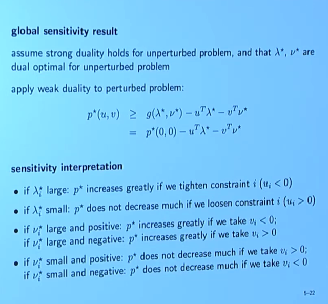</kbd></p>

> [!NOTE]
> Những ý sau gs cho là rất hữu ích. Đại loại là, hai trạng thái đều
> tight nhưng nếu λ lớn hơn thì mức độ tight cao hơn
>
> Nên nếu λ* lớn, tức là trạng thái đang tight nhưng tight mạnh thì khi
> thắt chặt constraint hơn (giảm u -> u âm hơn) thì chắc chắn p* sẽ 
> tăng lên mạnh.
>
> Nhưng ngược lại, nếu cũng tight, nhưng tight yếu thì nhả constraint
> chưa chắc p* giảm nhiều
>
> Giống như:
>
> Có hai  người, ứng với λ khác nhau một lớn một nhỏ.
>
> Thì khiến cho với ông ăn nhiều, cần 70 mới no, và ông ăn ít chỉ cần
> 30 đã no thì thì tại mức 20k cả hai ông đều tight. Nhưng ông 70
> tight hơn nhiều. Nên khi bóp xuông còn 10k. Thì độ đói của ông 70
> tăng vọt. Còn của ông 30 tăng lên xíu thôi.
>
> Ngược lại, từ 20->25, độ đói ông 70 giảm mạnh hơn là của ông 30.
>
> hiểu nôm na là vậy

<br>

<p align="center"><kbd>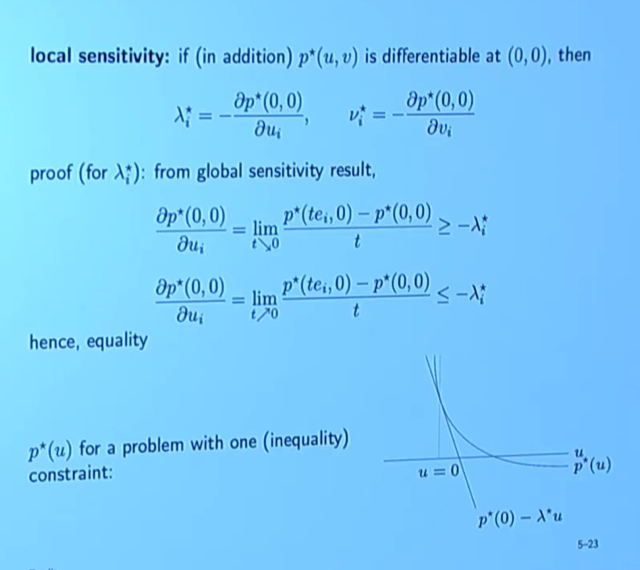</kbd></p>

> [!NOTE]
> Và một cái cũng dễ hiểu, đó là nếu p*(u,v) (nhớ v này là "vê", là trong
> hi(x) `=` vi, thể hiện constraint "mới", cũng như fi(x) `<=` ui, thay cho fi(x)
> `<=` 0) khả vi (differentiable) tại (0,0) thì
>
> λ*i chính là bằng - `∂p*(0,0)/∂ui,` và ν*i `=` `∂p*(0,0)/∂vi`
>
> Hiểu cái này như vầy: Đại khái là ta đã thấy rằng, khi tăng ui, tức là
> đồng nghĩa với thắt chặt constraint, thì p(u,v), tức optimal "mới" `/`
> optimal của perturbed problem sẽ có thể giảm, và -p sẽ tăng. Và rate of
> change giữa - p(ui,vi) và u chính là λi.
>
> Chưa hiểu lắm nhưng hiểu đại khái cái này đơn giản là cho biết thêm
> rằng rate of change của (-) p*(u,v) đối với ui chính là λi

<br>

<p align="center"><kbd>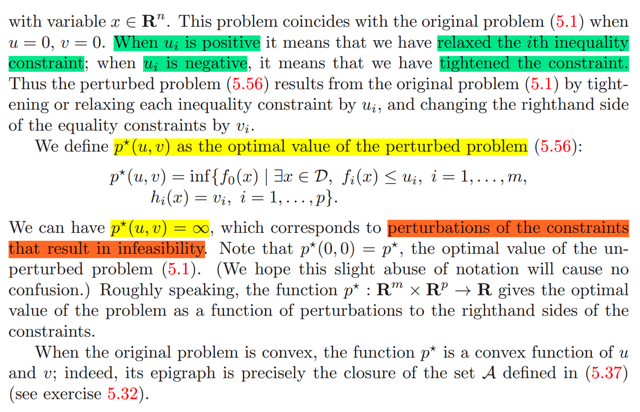</kbd></p>

<p align="center"><kbd>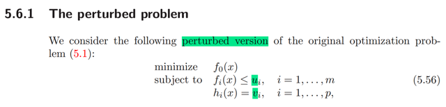</kbd></p>

> [!NOTE]
> CHAPTER 5 - DUALITY
>
> 5.6 PERTURBATION & SENSITIVITY
> ANALYSIS
>
> Cũng như trong bài giảng đã biết, nhưng có thể không để ý nên
> cần nhắc lại "perturbed problem" là khi ta tạo ra các problem mới
> từ problem gốc {minimize f0(x) constraint fi(x) ≤ 0, hi(x) `=` 0}
> bằng cách tăng hoặc giảm vế phải của các constraint. Để rồi khi 
> đó ta có các optimal value sẽ thay đổi.
>
> Nói cách khác ta coi optimal value p* của bài toán gốc như sau:
>
> ```text
> p* = inf x {f0(x) | x ∈ D, fi(x) ≤ ui, hi(x) = vi và ui = vi = 0}
> ```
>
> và rồi ta gọi p*(u, v) là một hàm trả ra optimal value khi ta giải 
> bài toán với u, v khác nhau:
>
> p*(u, v) `=` inf x {f0(x) | x ∈ D, fi(x) ≤ ui, hi(x) `=` vi}
>
> Như vậy p* chính là p*(0, 0) và khi thay đổi u, v ta sẽ có các 
> optimal value khác. Thì các bài toán mà ta thay đổi u, v không
> còn cho bằng 0 nữa gọi là perturbed problem (perturbed dịch 
> là nhiễu loạn)

<br>

<p align="center"><kbd>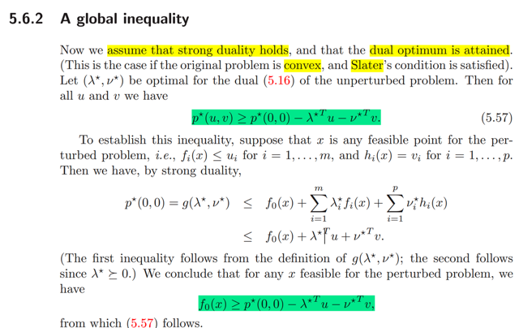</kbd></p>

> [!NOTE]
> Tại sao có cái bất đẳng thức này thì ta hiểu rồi
>
> Đại khái là xét p*(u, v) tức optimal value của perturbed problem. Lagrangian: L(x,
> λ, w) `=` f0(x) + `Σi` λi(fi(x) - ui) + `Σi` vi(hi(x) - vi)
>
> (nhắc lại ở đây dùng w là equality Lagrange multiplier cho khỏi trùng với v)
>
> ```text
> g_u,v(λ, w) = inf L(x, λ, w) = inf x [f0(x) + Σi λi(fi(x) - ui) + Σi wi(hi(x) - vi)]
> ```
>
> ```text
> = inf x [f0(x) + Σi λifi(x) - Σi λiui + Σi vihi(x) - Σi wivi]
> ```
>
> ```text
> = inf x [f0(x) + Σi λifi(x) + Σi vihi(x) ] - Σi λiui - Σi wivi
> ```
>
> | đưa cái ko liên quan tới x ra khỏi infimum
>
> `=` g(λ, w) - `Σi` λiui - `Σi` wivi  | g(λ, w) là dual function của unperturbed problem
>
> ```text
> Vậy g_u,v(λ, w) = g(λ, w) - Σi λiui - Σi wivi
> ```
>
> Ta sẽ giải bài toán dual: maximize λ, w `g_u,v(λ,` w) để tìm dual optimal value
>
> ```text
> d* = g(λ*, w*) = sup λ, w g_u,v(λ, w) = sup λ, w g(λ, w) - Σi λiui - Σi wivi
> ```
>
> `=` sup λ, w g(λ, w) - `Σi` λiui - `Σi` wivi
>
> Tới đây mà nói cái này bằng g(λ*, w*) - `Σi` λ*iui - `Σi` w*ivi thì không chặt chẽ
>
> `====`
>
> Cách làm trong sách:
>
> p*(0,0) `=` g(λ*, w*) Cái này là vì ta có strong duality nên f0(x*) (chính là p*(0,0) `=`
> g(λ*,w*)
>
> ⇔ p*(0,0) `=` inf x [f0(x) + `Σi` λ*ifi(x) + `Σi` w*ihi(x) ] | định nghĩa của dual function
>
> ⇨ p*(0,0) ≤ f0(x) + `Σi` λ*ifi(x) + `Σi` w*ihi(x) | định nghĩa của infimum
>
> Vì đã nói x là feasible point CỦA PERTUBED PROBLEM nên hi(x) `=` vi, fi(x) ≤ ui,
> λ* thì dĩ nhiên phải dual feasible rồi, λ* ≽ 0:
>
> ```text
> Nên vế phải f0(x) + Σi λ*ifi(x) + Σi v*ihi(x) ≤ f0(x) + Σi λ*iui + Σi w*ivi
> ```
>
> Và từ đó ta có: p*(0,0) ≤ f0(x) + `Σi` λ*iui + `Σi` w*ivi
>
> ⇔ f0(x) ≥ p*(0,0) - `Σi` λ*iui - `Σi` w*ivi
>
> Và cái này đúng ∀ x ⇨ cũng đúng với x* của perturbed problem: 
>
> f0(x*) `=` p*(u, v) ≥ p*(0,0) - `Σi` λ*iui - `Σi` w*ivi

<br>

<p align="center"><kbd>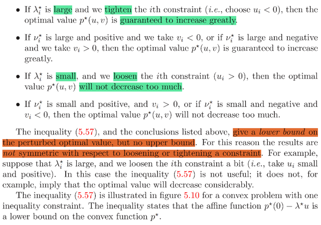</kbd></p>

<p align="center"><kbd>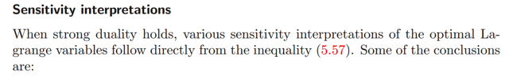</kbd></p>

> [!NOTE]
> Một số kết luận:
>
> Nếu λ*i lớn và ta thắt chặt (tightening) constraint bằng cách giảm ui thì
> p*(u, w) sẽ tăng lên đáng kể.
>
> Vì sao, vì như đã nói λ*i lớn hay nhỏ sẽ thể hiện mức độ `tight/slack` ở
> trạng thái optimal ban đầu. Để rồi nôm na là nếu p*(0,0) ở trạng thái đang
> rất căng (tight) thì lúc này nếu thắt chặt hơn constraint, thì optimal value
> sẽ tăng vọt. HÌnh ảnh là độ dốc của đường cong set G tại điểm cắt với
> trục t đang rất dốc (và độ dốc đó quả thật  chính là λi) thì khi dời trục qua
> bên trái (hay dời set G qua bên phải) thì điểm p* CHẮC CHẮN sẽ chạy lên
> rất nhanh. Ngược lại, nếu dời trục t qua bên  phải, nới lỏng constraint thì
> p* CÓ THỂ cũng sẽ giảm xuống rất nhanh (hình 1), nhưng KHÔNG CHẮC
> CHẮN, mà có thể nó không giảm nhanh (hình 2)
>
> Ngược lại, nếu λ*i nhỏ, tức là đường cong tại điểm cắt với trục t có độ dốc
> nhỏ, thì p*(0, 0) đang ở trạng thái tight nhưng không tight lắm thì khi dời
> trục qua bên phải để nới lỏng constraint thì p* sẽ CHẮC CHẮN  giảm
> không bao nhiêu (hình 3)
>
> Nhưngn ngược lại thắt chặt thì KHÔNG CHẮC LÀ p* chỉ tăng chậm (hình
> 4)
>
> Hai trường hợp liên quan đến v* cũng tương tự chỉ là phải xét dấu của v
> (vì với v ("nu") thì không có yều cầu ≥ 0)
>
> Lí do của việc CHẮC CHẮN HAY KHÔNG CHẮC Ở TRÊN là do bất đẳng
> thức p*(u, v) ≥ p*(0, 0) - λ*Tu - w*Tv (dùng w thay cho "nu") CHỈ QUY
> ĐỊNH CÁI CHẶN DƯỚI CỦA p*(u,v)
>
> Có nghĩa là, nó chỉ nói rằng "p*(u,v) sẽ lớn hơn hoặc bằng mức nào đó"
>
> Thế thì, nếu tăng cái chặn dưới đó lên, thì ta có thể suy ra p*(u,v) chắc
> chắn phải tăng theo.
>
> Nhưng ngược lại, giảm cái chặn dưới đó xuống thì chưa chắc p*(u,v) sẽ
> giảm.
>
> Do đó trong sách nói về tính bất đối xứng của việc thắt chặt hay nới lỏng
> constraint

<br>

<p align="center"><kbd>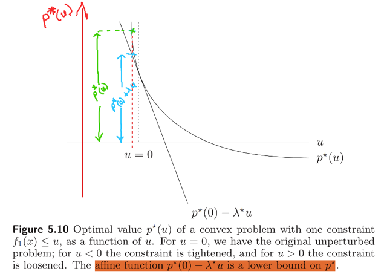</kbd></p>

<p align="center"><kbd>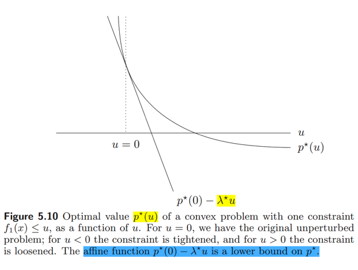</kbd></p>

<p align="center"><kbd>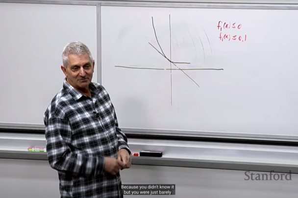</kbd></p>

> [!NOTE]
> Hình ảnh này phù hợp để mô ta trạng thái constraint đang tight. Ta
> thấy độ dốc của đường cong (hay tiếp tuyến cũng được) tại điểm
> optimal  (giao điểm với trục t) đang rất lớn, nên khi dời trục qua
> trái, thì giá trị của t, tức p* sẽ chạy lên rất nhanh (và ngược lại, khi
> nới lỏng thì nó cũng chạy xuống rất nhanh)
>
> Cùng trong hình ảnh này thể hiện p*(u) là hàm theo u. Quả thật giá
> trị của p* là "độ cao" của giao điểm giữa đường cong và trục t. Nên
> khi dịch trục t qua trái hay phải, ứng với cho u giảm xuống (thành
> âm) hay tăng lên thành dương sẽ khiến điểm giao này chạy lên
> hay xuống - tương ứng với p*(u)
>
> Constraint đang chùng (slack) hoặc không căng lắm (slightly
> tight) thì khi nới lỏng constraint thì chưa chắc p* giảm hoặc có
> giảm thì cũng ko nhiều
>
> hình ảnh này thể hiện cái bất đẳng thức vừa rồi: p*(u) ≥ p*(0) + λ*u
>
> ý nghĩa của nó là với mọi u thì giá trị của p*(u) đều từ p*(0) + λ*u trở
> lên, hay hình ảnh là đường cong đồ thị của p*(u) luôn nằm trên đường
> thẳng f(u) `=` p*(0) + λ*u
>
> Xét hàm số f(u) `=` p*(0) + λ*u, làm affine function của λ*, dĩ nhiên `d/dui` f(u)
> `=` λ (nếu λ là vector thì ta có `∂/∂ui` `=` λ*i.
>
> Nên nhớ ta không biết function p* có dạng cụ thể là gì mà chỉ biết là với
> u, khi giải bài toán perturbed problem thì ta có p*(u).
>
> Vậy thì hàm số f(u) tiếp tuyến với p*(u) tại u `=` 0. Nên tại u `=` 0 độ dốc của
> p*(u) bằng với độ dốc hàm f(u). Nên:
>
> ```text
> d/du p*(u) = d/du f(u) = λ*
> ```
>
> Tại sao nói f(u) tiếp tuyến với p*(u) tại u `=` 0? Là vì tại 0 f(0) `=` p*(0) còn
> lại thì p*(u) luôn > f(u) ⇨ f(u) tiếp xúc với p*(u) chỉ tại một điểm u `=` 0

<br>

<p align="center"><kbd>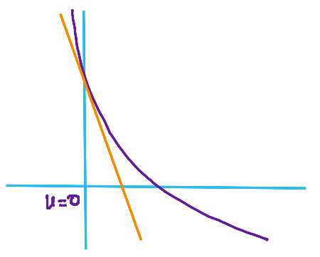</kbd></p>

<p align="center"><kbd>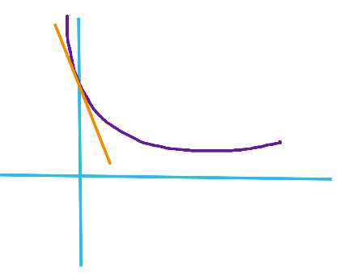</kbd></p>

> [!NOTE]
> 1) (trị tuyệt đối) λ đang lớn, mà thắt chặt (giảm u từ 0 ->
> âm) thì chắc chắn p*(u, v) sẽ tăng vọt. Hình ảnh cho thấy
> như vậy. Vì với λ lớn, đường màu cam rất dốc, thì độ dốc
> của đường màu tím (p(u,v)) chỉ có thể còn dốc hơn nữa,
> nên đi về phía trái thì chắc chắn p sẽ tăng vọt.
>
> Cái này giải thích theo toán học:
>
> p*(u, v) ≥ p*(0,0) - λ*u - v*v. Với λ* dương lớn mà cho u từ
> 0 -> âm thì -λ*u sẽ dương và do đó vì cái bất đẳng thức
> này thể hiện một cái chặn dưới của p*(u, v) nên cái chặn
> này đã nâng lên ⇨ p* chắc chắn phải tăng
>
> Ngược lại trong trường hợp này nếu nới lỏng thì p* sẽ 
> giảm mạnh NHƯNG KHÔNG PHẢI LÚC NÀO CŨNG VẬY
> VÍ DỤ DƯỚI SẼ THẤY
>
> 2) (trị tuyệt đối) λ đang lớn, mà nới lỏng (tăng u từ 0 ->
> dương) thì CHƯA CHẮC p*(u, v) sẽ tăng vọt. 
>
> Hình ảnh cho thấy
> như vậy. Vì với λ lớn, đường màu cam rất dốc, thì độ dốc
> của đường màu tím (p(u,v)) chỉ có thể còn dốc hơn nữa,
> NẾU LÀ ĐI VỀ PHÍA TRÁI, CÒN ĐI VỀ PHÍA PHẢI THÌ
> CHƯA CHẮC HÀM GIẢM MẠNH.
>
> Cái này giải thích theo toán học là bởi cái
>
> p*(u, v) ≥ p*(0,0) - λ*u - v*v. Với λ* dương lớn mà cho u từ
> 0 -> dương thì -λ*u sẽ âm cái giới hạn dưới của p*(u, v)
> được hạ xuống, nhưng việc hạ giới hạn dưới không
> đảm bảo là p* sẽ hạ
>
> HÌNH 1
>
> HÌNH 2

<br>

<p align="center"><kbd>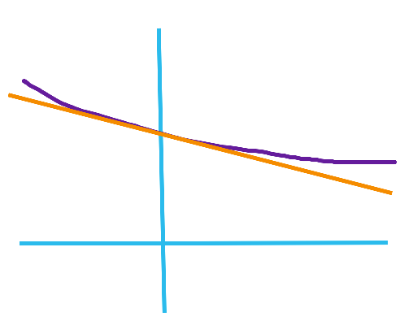</kbd></p>

<p align="center"><kbd>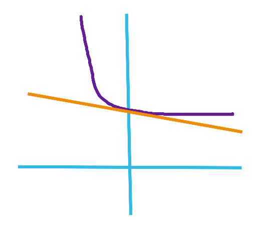</kbd></p>

> [!NOTE]
> Tương tự, khi λ* đang nhỏ, thì đi qua phía phải (nới lỏng)
> sẽ ĐẢM BẢO p* KHÔNG GIẢM QUÁ NHANH, vì độ dốc
> của đường màu tím sẽ ko thể dốc hơn đường màu cam
> khi đi về phía phải.
>
> Nhưng nếu λ* nhỏ mà thắt chặt, đi về phía trái thì
> không đảm bảo p* sẽ chỉ tăng chậm mà nó hoàn
> toàn có thể tăng vọt
>
> HÌNH 3
>
> HÌNH 4

<br>

<p align="center"><kbd>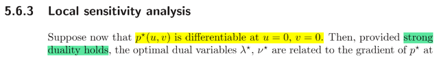</kbd></p>

<p align="center"><kbd>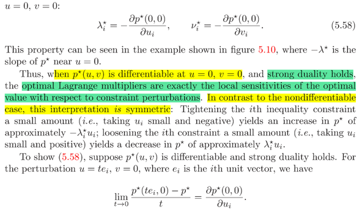</kbd></p>

<p align="center"><kbd>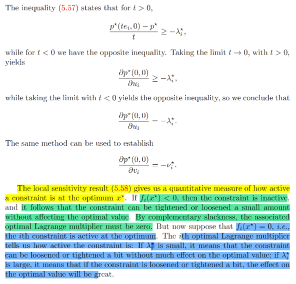</kbd></p>

> [!NOTE]
> Đại khái là:
>
> Bất đẳng thức 5.57 rằng p*(u, v) ≥ p*(0, 0) - λ*Tu - v*Tv
>
> Áp dụng với v `=` 0 và u `=` t ei
>
> p*(u, 0) ≥ p*(0, 0) - λ*Tu - v*T0
>
> ⇔ p*(u, 0) ≥ p*(0, 0) - λ*Tu 
>
> ⇔ p*(u, 0) ≥ p*(0, 0) - `Σi` λ*iui
>
> Xét u `=` u1 + u2 + ...+ui +... `=` 0e1 + 0e2 + ...tei + ... với t dương
>
> Bây giờ đang xét u `=` t ei có nghĩa là trừ component thứ i 
> của u là bằng t, còn lại đều bằng 0 hết. Nên λ*Tu `=` λ*i ui `=` λ*i t
>
> ⇔ p*(tei, 0) ≥ p*(0, 0) - λ*it
>
> ⇔ p*(tei, 0) - p*(0, 0) ≥ - λ*it (1)
>
> ⇔ [p*(tei, 0) - p*(0, 0)] `/` t ≥ - λ*i
>
> Do đó lấy lim t → 0 [p*(tei, 0) - p*(0, 0)] `/` t
>
> ([p*(tei, 0) - p*(0, 0)] `/` t đây chính là difference quotient)
>
> Đây chính là định nghĩa của partial derivative của p*(u, v)
> đối với ui evaluate tại ui `=` 0
>
> Do đó ta có `∂p*(0,0)/∂ui` ≥ - λ*i
>
> Ngược lại nếu t âm thì từ (1) chia hai vế cho t sẽ đổi dấu
> giúp ta có:
>
> [p*(tei, 0) - p*(0, 0)] `/` t ≤ - λ*i
>
> Lấy limit t → 0 hai vế ta có:
>
> `∂p*(0,0)/∂ui` ≤ - λ*i
>
> Từ đó suy ra `∂p*(0,0)/∂ui` `=` - λ*i
>
> Cái này giúp mình hiểu hơn về một thứ có lẽ ít để ý:
>
> Câu hỏi là `d/dx` f(a) là gì? Cách hiểu sai bét đó là lấy function f(x) rồi tính giá trị
> của nó tại a, để được kết quả, xong lấy đạo hàm theo x.
>
> Đó là cách hiểu ngu ngốc. Cách hiểu đúng phải là `d/dx` f bản chất là  một hàm số,
> mà ý nghĩa của nó là nó đo mức độ biến thiên của hàm f theo x. Nói rõ hơn nếu
> f(x) là hàm số đo một đại lượng nào đó ví dụ như vận tốc của cái xe theo thời
> gian x để tại thời điểm x0 nào đó thì f(x0) cho ta biết vận tốc cái xe.
>
> Thì f'(x), hay `d/dx` f(x) là một hàm số khác, đo tốc độ biến thiên của hàm f(x) tại
> các điểm x khác nhau là nhanh hay chậm thế nào, nói cách khác tại x0, f'(x0) nó
> cho ta biết là độ biến thiên của vận tốc là như thế nào. Để rồi f(x) có thể là `=` 100,
> cho thấy cái xe đang chạy rất nhanh. Nhưng f'(x) vẫn chỉ bằng -10, cho thấy cái
> xe đang chậm lại.
>
> Thế thì `d/dx` f(a) chính là apply `/` evaluate function `d/dx` f(x) tại a, hay f'(a)
>
> Và định nghĩa của đạo hàm mà ta đã học ở 1801 là:
>
> f'(x), again, hiểu nó là function f', evaluate tại x, đó là:
>
> ```text
> limit δx → 0 [f(x + δx) - f(x)] / δx
> ```
>
> ý nghĩa của nó, là đứng tại x, thay đổi một chút xíu thành x + `δx,` khiến f từ f(x)
> ```text
> thay đổi thành f(x + δx). Thì cái tỉ lệ [f(x + δx) - f(x)] / δx gọi là different quotient,
> ```
> và khi ta chỉ xét cái tỉ lẹ này ở `δx` vô cùng nhỏ thì nó chính là giá trị của đạo hàm
> TẠI x: f(x)
>
> ```text
> Tương tự, d/dx f(a) sẽ là lim δx → 0 f(a + δx) - f(a) / δx. là gía trị đạo hàm tại a.
> ```
>
> `====`
>
> Vậy giờ xét qua đa biến. HÌnh dùng hàm f là hàm đa biến, nó evaluate giá trị của
> đại lượng nào đó tại một điểm x trong khong gian đa chiều Rn
>
> Vậy thì nó là hàm có nhiều biến x1, x2....xn
>
> Để rồi nếu tại điểm ban đầu x, ta thay đổi x1 một chút: x1 + `δx,` mấy cái còn lại
> giữ nguyên. Để f thay đổi từ f(x) thành f([x1 + `δx,` x2, ....])
>
> Thì khi ta chỉ xét sự thay đổi ở vô cùng nhỏ:
>
> ```text
> lim δx → 0 [f([x1 + δx, x2, ....] - f(x)] / δx
> ```
>
> Thì đây chính là ĐẠO HÀM TỪNG PHẦN CỦA F THEO X1 EVALUATE TẠI X
>
> `∂/∂x1` f(x).
>
> Và hoàn toàn phải hiểu rằng bản thân nó `∂/∂x1` f(x), là một hàm số, theo x.
>
> Để rồi `∂/∂x1` f(a), sẽ chính là đứng từ a, thay đổi 1 chút theo hướng x1:
>
> [a1, a2,....an] → [a1 + t, a2, ...an] và xét different quotion tại limit:
>
> lim t → 0 [f([a1 + t, x2, ....] - f(a)] `/` `δt` thì nó chính là `∂/∂x1` f(a)
>
> Vậy thì từ [a1, a2,....an] thay đổi xíu thành [a1 + t, a2, ...an] thể hiện như thế nào:
>
> Đó chính là a → a + t e1 vì e1 là unit vector `=` [1, 0, ....0]
>
> Rồi thế thì, nếu a chọn là 0 thì sao, thì ta sẽ có từ [0, 0...0] → [0, 0,...0] + te1
>
> hay chính là te1.
>
> Do đó: Quay lại đây ta xét hàm p*(u, v).
>
> Thì hoàn toàn tương tự, đứng tại 0,0 (giống như a `=` 0), ta thay đổi chút xíu theo
> phương u1:
>
> để từ điểm [0, 0, ...0, | 0, 0, ...0] thành [0, 0, ...0, | 0, 0, ...0] + t e1 cũng là t e1
>
> thì different quotient là p*(te1, 0) - p*(0, 0)
>
> Và theo định nghĩa lim t → 0 [p*(te1, 0) - p*(0, 0)] `/` t CHÍNH LÀ ĐẠO HÀM TỪNG
> PHẦN CỦA p* THEO u1 EVALUATE TẠI a. KÍ HIÊU LÀ:
>
> ```text
> ∂/∂u1 p*(0,0)  | y như ∂/∂x1 f(a) vậy  =====
> ```
>
> Và ý nghĩa của cái này chính là:
>
> - λ*i chính là local sensitivity, ý là, rate of change của hàm p*(u, v) đối với ui tại (0,
> 0). Và nó cho ta thấy rằng: TỪ 0,0 (TỨC LÀ TA ĐANG Ở BÀI TOÁN GỐC `/`
> UNPERTURBED PROBLEM mà tại đó ta có optimal value là p*(0, 0) NẾU TA
> NỚI LỎNG HAY THẮT CHẶT CONSTRAINT THỨ I: cho ui dương nhỏ (nới lỏng)
> hay âm nhỏ (thắt chặt) thì NHÌN VÀO GIÁ TRỊ CỦA λ*i (tức optimal dual variable
> hay Lagrange multipler) TA CÓ THỂ ĐOÁN ĐƯỢC LÀ GIÁ TRỊ CỦA p* (p*(u,v)
> SẼ TĂNG GIẢM NHIỀU HAY ÍT.
>
> Cụ thể là nếu λ*i đang dương (khi đó dĩ nhiên fi(x*) phải bằng 0, theo
> complementary slackness, đã biết rồi), tức là constraint đang căng. Thì nếu λ*i
> nhỏ, thì ta nới lỏng hay thắt chặt thì cũng chỉ thay đổi p* chút đỉnh.
>
> Ngược lại λ*i mà lớn, thì nới lỏng hay thắt chặt sẽ thay đổi p* rất nhanh.
>
> Còn khi λ* `=` 0 thì dĩ nhiên fi(x*) < 0 (theo c.slacness) mà nư vậy thì có nghĩa là
> đang ở trạng thái chùng, nói lỏng hay thắt chặt constraitn cũng ko tác động gì

<br>

<p align="center"><kbd></kbd></p>

> [!NOTE]
> Tiếp gs nói đại khái là ta đã biết về equivalent problem, là cái mà
> khi solve nó sẽ cho phép ta solve original problem.
>
> Thế thì ông nói những gì CSYV làm đó là ta có original problem,
> nó sẽ tạo equivalent problem 1, rồi tạo e.problem 2....cứ thế.
> cho đến khi ta có một equivalent problem mà solver có thể
> solve được

<br>

<p align="center"><kbd>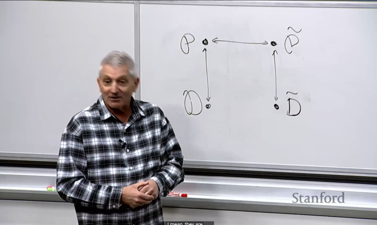</kbd></p>

> [!NOTE]
> Cái này gs nói giả sử ta có problem P, và equivalent problem P~ (có
> thể là thêm `/` bớt constraint gì đó)
>
> Từ P ta có Lagrange Dual D, và từ P~ ta có Lagrange Dual D~
>
> (Lagrange Dual có lẽ gs ý nói Lagrange function và Dual problem)
>
> Thế thì P <-> P~ (có thể gọi là closely intimate) vì chúng equivalent,
> và P <-> D, và P~ <-> D~.
>
> Thì câu hỏi là D và D~ có quan hệ gì không. Đây sẽ là nội dung của
> bài sau

<br>

<p align="center"><kbd>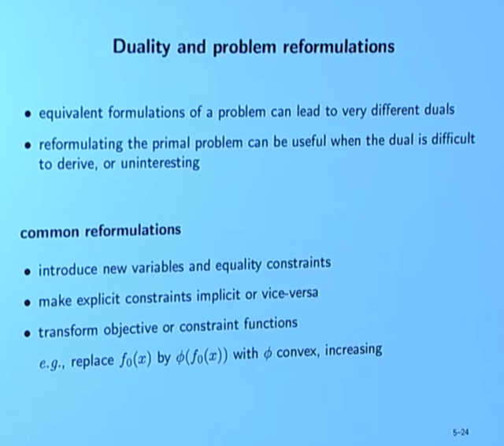</kbd></p>

<br>


<a id="node-5og5edv"></a>
## Chap 10

<br>

<p align="center"><kbd>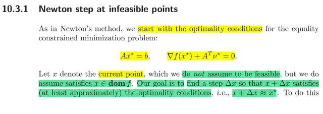</kbd></p>

<p align="center"><kbd>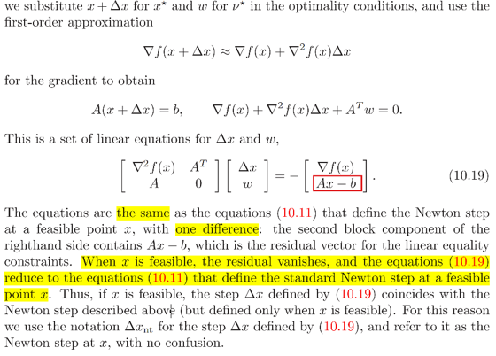</kbd></p>

<p align="center"><kbd>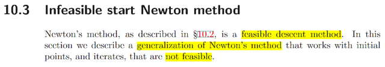</kbd></p>

> [!NOTE]
> đại khái là ta sẽ nói về Newton's step nhưng bắt đầu tại điểm (initial
> point)  không feasible.
>
> Thế thì trước tiên sẵn ôn lại về Newton's step với feasible initial point. Bản
> chất, là ta từ initial point x, nếu ta approximate objective function f(x)
> bởi  second order Taylor approx, nói cách khác chính là coi objective
> function như quadratic function, kí hiệu là f^ với, parameterized bởi `Δx:`
>
> ```text
> f^(x+Δx) ≈ f(x) + ∇f(x)TΔx + 0.5 ΔxT∇^2f(x)Δx.
> ```
>
> Và rồi ta giải bài toán tìm `Δx` sao cho `(x+Δx)` minimize f^ và x + `Δx` vẫn
> primal feasible, tức là thỏa constrained: `A(x+Δx)` `=` b. Thì `Δx` đó chính là
> Newton's step  (trong bối cảnh bài toán equality constrained)
>
> Và để giải tìm `Δx_nt,` thì đây chính là bài toán equality constrained
> convex quadratic optimization problem:
>
> minimize f0(x) `=` `1/2` xTPx + qTx + r constraint: Ax `=` b
>
> Và QUAN TRỌNG LÀ, với bài toán này thì CÓ THỂ GIẢI RA SOLUTION
> ANALYTICALLY, NÓI CÁCH KHÁC OPTIMALITY CONDITION CÓ THỂ
> GIẢI RA ĐƯỢC 
>
> Giải optimality condition bấy giờ là giải hệ này:
>
> Px* + q + ATv* `=` 0 và Ax* `=` b để tìm primal và dual optimal x*,
> v*.
>
> Và gom chung chúng lại thành [P AT; A 0] [x*, v*] `=` [-q, b]. Và yêu cầu để
> giải ra x* đó là matrix [P AT; A 0], gọi là KKT matrix phải non-singular
> (khi đó x* sẽ là unique optimal), từ đó ta có một số phân tích về những
> điều kiện của P mà nếu thõa thì ta sẽ có trạng thái non-singularity của
> KKT matrix
>
> Vậy thì áp dụng vào đây, ta sẽ giải hệ các phương trình thể hiện bởi:
>
> ```text
> A(x+Δx_nt) = b (cùng với Ax = b, nó trở thành A Δx_nt = 0, tức Δx
> ```
> ∈ N(A))
>
> `∇f^(x+Δx_nt)` + ATw `=` 0
>
> ⇔ ∇^2f(x) `Δx_nt` + ∇f(x) + ATw `=` 0
>
> Và KKT matrix là [∇^2f(x) AT; A 0], cũng như hệ phương trình thể hiẹn bởi:
>
> [∇^2f(x) AT; A 0] `[Δx_nt,` b]T `=` [-∇f(x) 0]
>
> (chú ý trong bài toán để giải ta `Δx`  thì equality constrain là A `Δx` `=` 0, nên b
> ở đây `=` 0)
>
> một chú ý khác là w có thể hiểu có vai trò là v*, tức dual optimal.
>
> `====`
>
> Đó là cách nhìn thứ nhất về Newton method, và trong bài học về Newton
> method có giới thiệu các cách nhìn (interpretation) khác: Thay vì giải
> ∇L(x*, v*) `=` 0 (tức là optimality condition của bài toán gốc - equality
> constraint optimization) thì ta sẽ tuyến tính hóa (linearization) ∇L(x*, v*),
> để có ∇L^(x*, v*) để giải hệ tuyến tính  ∇L^(x*, v*):
>
> đó là ta sẽ vẫn xuất phát từ objective function gốc: f(x) với constraint Ax `=`
> b. Và optimality condition sẽ giúp ta giải optimal của nó:
>
> Ax* `=` b; ∇f(x*) + ATv* `=` 0.
>
> Thế thì, thay vì ta thay f(x) bởi quadratic approx của f tại initial point x. Để
> rồi lập luận như trên, thì giờ ta thay x* `=` x + `Δx_nt` và thay ∇f(x) bởi linear
> ```text
> approx. của nó tại x để có: ∇f(x + Δx) ≈ ∇f^(Δx) = ∇f(x) + ∇^2f(x)T Δx và
> ```
> từ đó ta có hệ:
>
> ```text
> A(x + Δx_nt) = b; ∇f(x) + ∇^2f(x)T Δx_nt + ATv = 0
> ```
>
> Kết qủa cũng là hệ trên
>
> Thế thì đó là Newton's step nếu xuất phát từ feasible point x.
>
> Bây giờ, người ta khái quát hơn, cho rằng x chưa chắc đã feasible.
>
> Thì nên hiểu rằng x chưa feasible thì ta không có Ax `=` b, chỉ vậy thôi. Còn
> lại thì nhiệm vụ vẫn y chang: ta cần thay f(x) bởi quadratic approx của f(x)
> ```text
> tại x: f(x+Δx) ≈  f(x) + ∇f(x)T Δx + 1/2 ΔxT ∇^2f(x) Δx = f^(x + Δx)
> ```
>
> Và giải bài toán: tìm `Δx` sao cho minimize f^(x + `Δx)` với constraint là  x +
> `Δx` sẽ feasible: Tức A(x + `Δx)` `=` b
>
> Và rồi việc giải tìm optimal dựa vào optimality condition chính là giải hệ
> các phương trình thể hiện bởi:
>
> ```text
> A(x + Δx_nt) = b và ∇^f(x) Δx_nt + ∇f(x) + ATw = 0
> ```
>
> Và gom lại ta có dạng thể hiện bởi KKT matrix:
>
> ```text
> [∇^2f(x) AT; A 0][Δx_nt, w]T = [-∇f(x), -(Ax-b)] = - [∇f(x), (Ax - b)]
> ```
>
> Và giải cái này sẽ cho ta `Δx_nt` và dual optimal w.
>
> Thế thì điểm khác biệt so với feasible Newton's step chỉ là cái Ax - b ở vế
> phải. (với feasible Newton's step thì nó là 0, do Ax `=` b, còn với unfeasible
> starting point x thì ta ko có Ax `=` b, nên vế phải ta có -(Ax - b) mang ý
> nghĩa là residual

<br>

<p align="center"><kbd>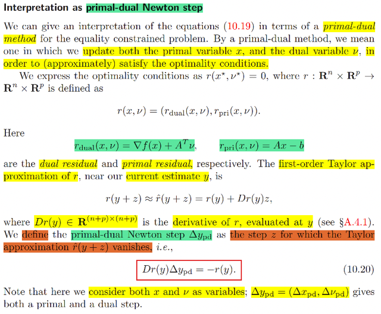</kbd></p>

<p align="center"><kbd>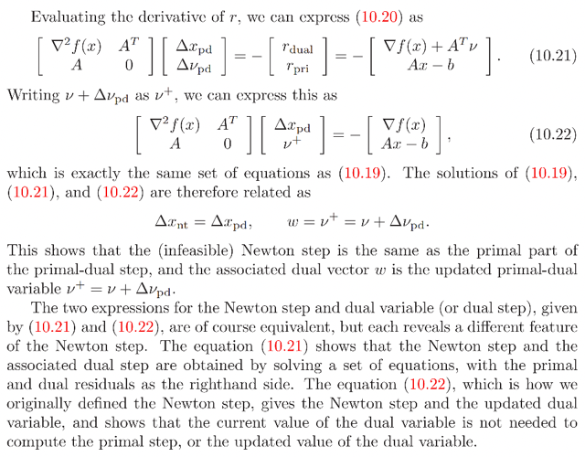</kbd></p>

> [!NOTE]
> đại khái là nói về một cách hiểu khác (interpretation) của cái hệ các  equations
> [∇^2f(x) AT; A `0][Δx_nt,` w]T `=` - [∇f(x), Ax - b]
>
> Và cách hiểu đó là ta coi như `/` định nghĩa ra một function khác, mà  function
> đó nhận một cặp vector (R^n, R^p) và trả ra một cặp vector  (R^n, R^p).
> Nhưng ta sẽ có thể coi như nó nhận input là một vector  có (n + p) component
> R^(n + p) và output cũng là R^(n+p) vector
>
> Và cụ thể function đó là r(x, v) `=` `[r_dual(x,` v), `r_pri(x,` v)]
>
> ```text
> với r_dual(x, v) = ∇f(x) + ATv và r_pri(x, v) = Ax - b
> ```
>
> ```text
> r(x, v) = [r_dual_1, ..r_dual_n, r_pri_1,...,r_pri_p]
> ```
>
> Hiểu ý nghĩa của function này như vầy: Như ta đã biết rằng, nếu tại  optimal
> thì ta optimality condition sẽ cho ta biết:
>
> Ax* `=` b và ∇f(x*) + ATv* `=` 0
>
> Xét cái Ax* `=` b ⇔ Ax* - b `=` 0 thì nếu ta coi Ax - b là primal residual  thì nó
> có nghĩa là tại optimal, primal residual bằng 0.
>
> Tương tự, ta cũng có thể xem ∇f(x) + ATv là dual residual để rồi  điều kiện
> ∇f(x) + ATv `=` 0 có nghĩa là dual residual `=` 0  Từ đó, nếu ta define function r
> là function tính ra primal residual và dual residual. Thì việc ta muốn làm là
> minimize function này.
>
> Và khi đó, bài toán sẽ là bài toán unconstrained minimize function r
> (lúc này như đã nói, coi như R^(n+p) vector -> R^(n+p) vector  function.
>
> Và từ đây, ta dùng linear approximation function r tại y  (y là R^(n+p) vector,
> coi như là gom hai variable vector x và v lại, thành một vector vậy):
>
> r(y + z) ≈ r(y) + Dr(y)z (z giống như `Δy` vậy)
>
> Dr(y) là derivative của hàm vector → vector. Nên như đã biết nó sẽ là
> Jacobian matrix (n+p) x (n+p).
>
> và ta đặt r^(y + z) `=` r(y) + Dr(y)z
>
> Và từ đó ta định nghĩa cái gọi là PRIMAL-DUAL NEWTON STEP `Δy_pd` là z
> mà khiến r^(y + z) `=` 0
>
> ⇔ `Dr(y)Δy_pd` `=` -r(y)
>
> ```text
> ⇔ Dr(y)[Δx_pd, Δv_pd]T = -r(y)
> ```
>
> (cái này có lẽ không nên thắc mắc gì, vì đơn giản nó là định nghĩa)
>
> ```text
> Và Δy_pd = [Δx_pd, Δv_pd] sẽ mang ý nghĩa là bước đi giúp giảm tối đa cả
> ```
> primal residual và dual residual.
>
> `====`
>
> Dr(y), tức derivative của r() wrt to y evaluate tại y:
>
> ```text
> Dr(y)_11 sẽ là ∂r1/∂y1. nếu coi y = [x, v] thì ∂r1/∂y1 = ∂r/x1 ... Dr(y)_1n sẽ là
> ```
> `∂r1/∂yn` `=` `∂r1/xn`
>
> ⇨ n phần tử đầu tiên của hàng 1 chính là vector `∂r1/∂x`
>
> ```text
> Dr(y)_1(n+1) sẽ là ∂r1/∂y(n+1) = ∂r1/∂v1 ... Dr(y)_1(n+p) sẽ là ∂r1/∂vp
> ```
>
> ⇨ p phần tử sau của hàng 1 chính là vector `∂r1/∂v`
>
> Tương tự:
>
> n phần tử đầu của hàng 2 chính là vector `∂r2/∂x` ... n phần từ đầu của hàng n
> chính là vector `∂rn/∂x`
>
> ⇨ nxn component đầu tiên của matrix Dr chính là `dr_dual/dx` (vì n phần tử đầu
> tiên của r là `r_dual)`
>
> ```text
> Với r_dual(x,v) = ∇f(x) + ATv thì dr_dual/dx, chính là ∇^2f(x)
> ```
>
> Nên block nxn top left của Dr chính là ∇^2f(x).
>
> `====`
>
> Tương tự:
>
> p phần tử sau của hàng 2 chính là vector `∂r2/∂v` ... p phần tử sau của hàng n
> chính là vector `∂rn/∂v`
>
> ⇨ block nxp top right của Dr chính là `dr_dual/dv` (vì n phần tử đầu tiên  của r
> là `r_dual)`
>
> ```text
> Và với r_dual(x,v) = ∇f(x) + ATv thì dr_dual/dv = AT
> ```
>
> Nên block nxp top right của Dr chính là AT.
>
> Hoàn toàn tương tự ta có thể thấy cấu trúc của Dr chính là:
>
> Dr `=` [∇^2f(x) AT; A 0]
>
> Do đó, đại khái là nếu ta thay Dr(y) vào thì `Dr(y)Δy_pd` `=` -r(y) sẽ tương
> đương:
>
> ```text
> [∇^2f(x) AT; A 0][Δx_pd, Δv_pd]T = -[∇f(x) + ATv, Ax - b]
> ```
>
> Thế thì nó khá giống, hoặc rất giống với một hệ mà ta dùng để giải tìm
> infeasible Newton's step `Δx_nt`
>
> [∇^2f(x), AT; A, `0][Δx_nt,` w]T `=` -[∇f(x), Ax - b]
>
> Trong đó thì `Δx_nt` chính là optimal value v để x + v sẽ là optimal point của f^
> (quadratic approx. của f tại x) với constraint Ax `=` b. Và w là optimal dual
> variable.
>
> ```text
> Và do đó, Δx_pd chính là Δx_nt: Ý nghĩa là, cái phần primal (Δx_pd) trong
> ```
> ```text
> primal-dual step (Δy_pd = (Δx_pd, Δv_pd) chính là infeasible start Newton
> ```
> step `Δx_nt`
>
> Và tương tự, v* `=` v + `Δv_pd` chính là w.
>
> Nói chung đại ý của cái này là như sau:
>
> Nếu là feasible start Newton method: thì ta có (Newton step là nghiệm của) hệ này:
>
> ```text
> [∇^2f(x) AT; A 0] [Δx_nt, w] = - [∇f(x), 0] (I), nó là hai phương trình: 1) là AΔx_nt = 0 bắt
> ```
> nguồn bởi việc ta có feasible start, tức điểm đang đứng để mà thực hiện bước Newton
> thỏa Ax `=` b, dẫn tới cộng với yêu cầu newton step cũng phải là feasible step ta mới có
> ```text
> A(x + Δx_nt) = b từ đó suy ra A Δx_nt = 0
> ```
>
> ```text
> Và 2) là ∇^2f(x)Δx_nt + ATw = - ∇f(x) Cái này bắt nguồn từ ∇^2f(x)Δx_nt + ∇f(x) + ATw = 0,
> ```
> và đây là optimality condition của bài toán thay thế bài toán gốc, trong đó ta thay, ta coi 
> hàm objective gốc f(x) là hàm bậc hai:
>
> Gọi điểm đang đứng là x thì linear approximation của f(x):
>
> ```text
> f(x + Δx) ≈ f(x) + ∇f(x)TΔx + 0.5 ΔxT∇^2f(x)Δx  và ta sẽ dùng cái bên phải (là hàm xấp xỉ
> ```
> tuyến tính của f gốc, nó dĩ nhiên là hàm tuyến tính theo `Δx` vì f(x) và ∇f(x) là giá trị fix, là 
> giá trị của hàm và gradient tại điểm đang xét) để thay cho cái bên trái (là hàm f gốc)
>
> ```text
> Khi đó ta có xét bài toán xấp xỉ. minimize f^(Δx) = f(x) + ∇f(x)TΔx 0.5 ΔxT∇^2f(x)Δx subject
> ```
> to `AΔx` `=` 0 và phương trình 2) ở trên chính là optimality condition của nó
>
> `====`
>
> Phải nhấn mạnh là, để thực hiện bước đi Newton,  thì lẽ dĩ nhiên ta phải đứng ở đâu
> đó, và bước đi Newton như thế nào sẽ  phụ thuộc vào cái điểm đang đứng ở đó, vì tại
> mỗi điểm khác nhau, thì cái sự xấp xỉ bậc hai của hàm gốc cũng sẽ khác nhau, ở xa nó
> khác mà ở gần nó khác, và ta `sẽ/đã` thấy càng ở gần truly optimal point của hàm gốc thì
> sự xấp xỉ bậc hai càng chính xác)
>
> Vậy thì nếu như cái điểm đang đứng (x), tức là cái điểm mà ta tính toán để thực hiện
> bước Newton KHÔNG FEASIBLE, tức không thỏa Ax `=` b, thì khi đó dù vẫn phải có điều
> kiện Newton step dẫn ta đến feasible A(x
> + `Δx_nt)` `=` b thì khác biệt này khiến vế vế phải của 1) ko còn là 0 nữa, mà là - (Ax - b)
>
> Nên cái hệ (I) trở thành [∇^2f(x) AT; A 0] `[Δx_nt,` w] `=` - [∇f(x), Ax - b] (II) vậy thôi.
>
> Cho nên có thể coi cái hệ (II) khái quát hơn hệ (I), để khi Ax `=` b thì nó thành hệ (I)
>
> `====`
>
> Vậy thì từ đây mới liên hệ với primal-dual method. Rất đơn giản, đầu tiên ta nhấn mạnh
> rằng, việc GIẢI CÁI HỆ (I)(II) sẽ cho ta Newton step `Δx_nt,` và optimal dual variable w `=`
> v*
>
> Thế thì, bây giờ ta nhìn khác đi một chút, coi cái optimality condition của bài toán gốc:
> ```text
> ∇f(x) + ATv = 0 là r_residual(x, v) = 0 và Ax = b ⇔ Ax - b = 0 là r_primal(x, v) = 0 Có
> ```
> nghĩa là bây giờ optimality condition sẽ thể hiện bởi việc ta muốn tìm x, v sao cho
> ```text
> r_residual = 0 và r_primal = 0
> ```
>
> Khi đó yêu cầu giải optimality condition trở thành yêu cầu giải ra nghiệm của phương
> ```text
> trình r(x, v) = [r_residual(x, v), r_primal(x, v)] = 0.
> ```
>
> Và để giải một phương trình, ta có thể dùng Newton method: Y chang như khi ta giải
> phương trình ∇f(x) + ATv `=` 0 thì nay giống như ta gom chung với Ax - b để thành r `=`
> `[r_residual,` `r_primal]` `=` 0.
>
> CÓ NGHĨA LÀ, THAY VÌ TA CHỈ XÉT RIÊNG `/` CHỈ GIẢI ∇f(x) + ATv `=` 0 BẰNG
> NEWTON METHOD, mà trong đó ta tính ra `Δx_nt` để cập nhật x dần dần tiến về x* là
> nghiệm thật sự của ∇f(x) + ATv `=` 0.
>
> ```text
> Thì với primal - dual, ta DÙNG NEWTON METHOD để tính Δy_pd = (Δx_pd, Δv_pd) để
> ```
> cập nhật x, v dần dần tiến về x*, v* là nghiệm thực sự của r(x, v) `=` 0
>
> Và nói y chang là bởi: Khi dùng Newton method để giải ∇f(x) + ATv `=` 0 hay ghi vầy
> ∇f(x*) + ATv* `=` 0 cũng được (nhớ rằng, nó là của optimality condition của bài toán gốc,
> gọi là dual feasible condition bên canh Ax* `=` b,  là primal feasible condition. Sẵn tiện ôn
> lại, sở dĩ nó gọi là dual feasible condition là vì nếu cái này có nghiệm, tức là ∇L(x*, v*) `=`
> 0, điều đó đồng nghĩa với việc x* `=` inf L(x, v*) và do đó g(v*) `=` L(x*, v*) sẽ finite dẫn
> đến kết luận v* dual feasible)
>
> Khi đó như trên đã nhắc lại, về hai cách giải thích về Newton method khi giải phương
> trình này: Một là focus vào khía cạnh ta đang giải bài toán tối ưu rằng buộc tuyến tính
> với hàm f phức tạp khiến việc giải ra optimal từ optimal condition rất khó khăn. Thì để
> dễ hơn ta mới XEM f NHƯ HÀM QUADRATIC, và chuyển bài toán thành bài toán xấp xỉ
> mà objective trở thành hàm quadratic từ đó cái optimality condition là phương trình bậc
> ```text
> nhất ∇^2f(x)Δx_nt + ∇f(x) + ATw = 0 và từ đó giải ra được Δx_nt, giúp x + Δx_nt là
> ```
> optimal của bài toán xấp xỉ, tiến gần tới optimal của bài toán gốc hơn so với x
>
> Thì góc nhìn thứ hai chỉ khác chút là ta tập trung  vào cái optimality của bài toán góc
> muốn giải ∇L(x, v) `=` ∇f(x*) + ATv* `=` 0 và việc giải bằng Newton method đơn giản là ta
> COI CÁI PHƯƠNG TRÌNH NÀY NHƯ PHƯƠNG TRÌNH TUYẾN TÍNH, để rồi giải ra
> nghiệm của nó thì ta có nghiệm xấp xỉ, làm nhiều lần thì dần  dần sẽ đúng.
>
> DĨ NHIÊN VỀ BẢN CHẤT HAI CÁCH NHÌN LÀ NHƯ NHAU: VÌ COI HÀM f GỐC LÀ
> HÀM BẬC  HAI THÌ  CŨNG CHÍNH LÀ COI CÁI GRADIENT CỦA NÓ LÀM HÀM BẬC
> MỘT.
>
> QUAY LẠI ĐÂY CŨNG VẬY:
>
> Bản chất là ta muốn giải r(x, v) `=` 0, y như muốn giải f(x, v) `=` ∇L(x, v) `=` 0  thì ta theo góc
> nhìn thứ hai cũng sẽ giải bằng cách tuyến tính hóa r(x, v). Dĩ nhiên khi đã coi r(x, v) là
> hàm tuyến tính thì tìm ra nghiệm của nó chỉ là  gần đúng, nhưng làm lại nhiều lần sẽ
> ngày càng đúng.
>
> Vậy thì với việc ∇L(x, v) `=` ∇f(x) + ATv, tuyến tính hóa nó có nghĩa là ta dùng xấp xỉ bậc
> một của nó (
>
> ∇L(x + `δx,` v) ≈ ∇L(x, v) + `∂L/∂x` `δx`
>
> `=∇f(x)` + ATv + `∇^2f(x)δx`
>
> Từ đó thay vì giải ∇f(x) + ATv `=` 0, ta giải ∇f(x) + ATv + `∇^2f(x)δx` `=` 0 đây cũng là cái (II)
> ở trên
>
> `(∇^2f(x)Δx_nt` + ATw `=` - ∇f(x))
>
> Vậy thì khác biêt ở đây là ta tuyến tính hóa r(x, v) là hàm theo cả x và v. Còn ở trên ta
> chỉ tuyến tính hóa ∇L(x, v) theo x, coi v fix.
>
> CHỖ NÀY CẦN NHẤN MẠNH: KHI TA THAY OBJECTIVE FUNCTION f(x) BẰNG XẤP
> XỈ BẬC HAI CỦA NÓ, THÌ CHÍNH LÀ TA ĐÃ TUYẾN TÍNH HÓA GRADIENT CỦA L
> THEO PHƯƠNG x, CÒN THEO PHƯƠNG v THÌ GIỮ NGUYÊN.
>
> CÒN Ở ĐÂY, TA TUYẾN TÍNH HÓA r(x, v) THÌ LÀM CHO CẢ x, v.
>
> Theo vi phân toàn phần:
>
> dr(x, v) `=` `∂r/∂x` dx + `∂r/∂v` dv
>
> ```text
> ⇨ r(x + δx, v + δv) ≈ r(x, v) + ∂r/∂x δx + ∂r/∂v δv = r(x, v) + D_r(x, v)(δr, δv)T
> ```
>
> `D_r` như thế nào thì phân tích ở note trươc rồi.
>
> TÓM LẠI, CÓ THỂ GOM GỌN SỰ KHÁC BIỆT CỦA PRIMAL DUAL METHOD LÀ Ở
> CHỖ NÓ TÍNH VÀO CẢ DUAL VARIABLE v TRONG QUÁ TRÌNH TUYẾN TÍNH HÓA
> ĐỂ RỒI VIỆC UPDATE SẼ UPDATE CHO CẢ x LẦN v TỪ ĐÓ DẦN DẦN x, v TIẾN VỀ
> x*, v*.
>
> TRONG KHI ĐÓ, TRƯỚC ĐÓ TA CHỈ TẬP TRUNG VÀO VIỆC TÌM x, TÍNH NEWTON
> STEP ĐỂ CẬP NHẬT x.
>
> Đây cũng chính là khác biệt giữa primal dual method và barrier method khi tiếp cận bài
> toán inequality constraint optimization.
>
> Barrier method, một cách ngắn gọn, là ta cũng chỉ quan tâm newton step  để update x
>
> Còn primal dual method thì ta update cả x, λ, v
>
> Trong Barrier method, mình biết rằng đại khái là ta sẽ liên tiếp giải bài toán centering,
> mà mỗi bài có bản chất là bài toán xấp xỉ của bài toán tương đương với bài toán gốc
> trong đó ta đã bỏ inequality constraint bằng  cách tích hợp nó vào objective bằng cách
> dùng indicator function, và again, lại thay nó bằng một hàm xấp xỉ của indicator function
> nhằm giúp mang lại tính khả vi. Rồi với bài toán centering ta cũng giải bằng Newton
> method, để khi có x*(t) (mỗi t khác nhau ứng với mỗi centering problem khác nhau) thì
> nó sẽ hội tụ dần về x* thậtv sự của bài toán gốc.
>
> Và rồi ta cũng đã thấy có một phần mà gs cho thấy rằng việc giải bài toán centering thật
> ra cũng chính là ta đang giải cái KKT condition của bài toán  gốc nhưng có chỉnh sửa
> (modified) chút xíu.
>
> (Phần 11.3.4 có câu In this section we show how these Newton steps for the
> centering problem can be interpreted as Newton steps for directly solving the
> modified KKT equations)
>
> Để rồi từ đó chứng minh rằng về bản chất, barrier method chỉ là việc ta cố gắng giải cái
> hệ KKT condition vốn dĩ rất khó để giải ra ngay solution (gọi là giải ra solution
> analytically) thì ta sẽ làm cách khác:
>
> Chính sửa nó chút xíu (sửa thế nào: Thay vì -λifi(x) `=` thì thay bằng -λifi(x) `=` `1/t)`
>
> Và giải hệ bằng Newton step (again, quá trình này cũng là giải centering problem bằng
> Newton step):
>
> Rút λ ra thay vào các equation khác trong hệ modified KKT.
>
> Giải hệ bằng Newton method: Như đã biết, ta sẽ tuyến tính hóa theo x, coi v như fixed,
> từ đó thay hệ Φ tuyến bằng hệ tuyến tính, rồi tính ra Newton step Rồi dùng Newton
> step để update, lặp đi lặp lại như vậy cho đến khi giải xong.
>
> (Xem trang 578: To solve the modified KKT equations, which is set of ....variables x, v,
> λ, we first eliminate the variable λi `=` `-1/[tfi(x)].` This yields ...(11.16) which is a set of n +
> p equations with n + p variables x and v
>
> Then, to find the Newton step to solve 11.16,...we form the Taylor approximation for the
> non-linear term occurring in the first equation... (đây chính là cái bước tuyến tính hóa
> theo x nói trên)..
>
> Để rồi hệ trở thành hệ tuyến tính của x, v: `Hδx` + ATv `=` -g; Av `=` 0 (trong sách dùng kí tự
> v để chỉ `δx,` nhưng mình dùng `δx` vì v với "ν" `=` "nu", là cái dính với ATv giống nhau.)
>
> Khi có nghiệm, như đã nói, chính là central point x*(t), ta lại dùng nó là starting point,
> cho bài toán centering `/` việc giải hệ modified KKT tiép theo.
>
> Tăng t lên (bởi `μ)` hành động này tạo ra bài toán centering tiếp theo, cũng như là tạo ra
> cái KKT chỉnh sửa tiếp theo.
>
> Dùng Newton method gỉai bài toán centering `/` cũng là gỉai hệ KKT chỉnh sửa
>
> Ra nghiệm x*(t)
>
> Tiếp tục lặp lại, (tăng t, ....
>
> Cuối cùng dần dần x*(t) sẽ converge về x* thật sự của bài toán gốc
>
> `====`
>
> Vậy thì khi giải bài toán centering, NHƯ ĐÃ NÓI, CŨNG CHÍNH LÀ GIẢI hệ KKT có
> chỉnh sửa (modified KKT system), và để thấy điều này (tức là để thấy tại sao việc giải
> bài toán centering với Newton method chính là giải hệ kkt chỉnh sửa bằng Newton
> method) thì ta chỉ cần rút λ ra, thay vào các chỗ khác, thì  sẽ thấy.
>
> Có nghĩa là, bản chất của barrier method là TA GIẢI KKT theo NEWTON METHOD,
> BẰNG CÁCH BỎ BỚT λ, để rồi tuyến tính hóa theo x, từ đó chỉ tập trung vào việc tìm
> `Δx` để update x thôi.
>
> ```text
> GIống như giải hệ ax + by = c, dx + ey = f thì ta rút y = f/e - dx/e rồi thay vào phương
> ```
> trình 1 để giải x, từ đó tập trung vào x
>
> CÒN PRIMAL - DUAL LÀ NÓ KHÔNG RÚT, MÀ COI NHƯ TA CÓ HÀM CỦA CẢ x, λ, v
> RỒI TUYẾN TÍNH HÓA r THEO CẢ x, λ, v và TÍNH RA NEWTON STEP ĐỂ UPDATE
> CẢ x, λ , v
>
> (Xem 11.7.1 trang 609: Họ thể hiện modified KKT system ở dạng rt(x, λ, v) `=` 0.
> Rồi trang tiếp theo, họ nói: "Now consider the Newton step for solving the non-linear
> equations rt(x, λ, v) `=` 0 for fixed t (như đã nói, mỗi t tương ứng với một centering problem
> cũng như một modified KKT system) at a point (x, λ, t) thỏa f(x) ≺ 0, λ ≻ 0. We will denote
> ```text
> the current point and Newton step as y = (x, λ, t) , Δy = (Δx, Δλ, Δv) (ở đây có thế thấy rõ
> ```
> sẽ update cả λ, v bằng Newton step "của cả λ , v", khác với việc chỉ update x bằng Newton 
> step "của x") The Newton step is characterized by the linear equations:
>
> rt(y + `Δy)` ≈ rt(y) + Drt(y) `Δy`
>
> (Đây chính là hành động tuyến tính hóa theo cả, x, λ, v mà ta nói)
>
> Và từ đó giải ra `Δy,` giúp update cả x, λ, t, gọi là primal-dual search direction

<br>

<p align="center"><kbd>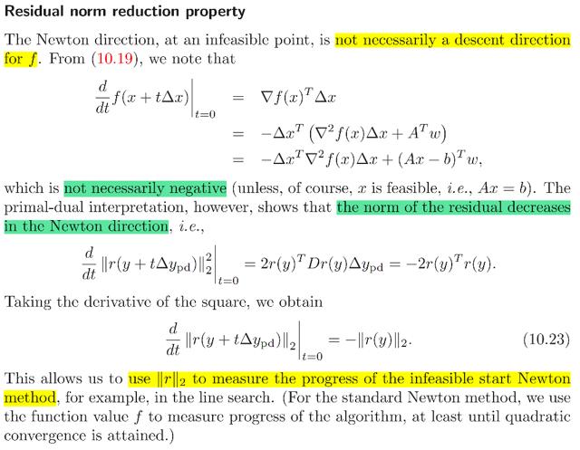</kbd></p>

> [!NOTE]
> Từ 10.19:
>
> [∇^2f(x) AT; A `0][Δx,` w]T `=` -[∇f(x), (Ax-b)]
>
> Đại khái là nó chính là:
>
> ```text
> ∇^2f(x) Δx + ATw = -∇f(x) và AΔx = -(Ax - b)
> ```
>
> ⇨ ∇f(x) `=` -[∇^2f(x) `Δx` + ATw]
>
> Từ đó ta xét directional derivative theo hướng `Δx:` (như đã biết công
> thức sẽ là `∇f(x)TΔx` `=` `ΔxT∇f(x)):`
>
> ```text
> ΔxT∇f(x) = -ΔxT[∇^2f(x) Δx + ATw]
> ```
>
> ```text
> = -ΔxT∇^2f(x) Δx - ΔxTATw
> ```
>
> ```text
> = -ΔxT∇^2f(x) Δx - (AΔx)Tw
> ```
>
> ```text
> = -ΔxT∇^2f(x) Δx + (Ax - b)Tw | thay AΔx = -(Ax - b)
> ```
>
> `=` - `ΔxT` ∇^2f(x) `Δx` + (Ax - b)Tw
>
> Và cái này ý chính muốn nhấn mạnh rằng, chưa chắc đã < 0 do đó
> infeasible Newton'step chưa chắc đã là DESCENT DIRECTION (giúp
> giảm f)
>
> `====`
>
> Tuy nhiên, dùng cách interpretation primal-dual: (để coi Newton's step
> ```text
> Δx_nt là cái phần của Δy_pd dành cho (việc giảm) primal residual thì:
> ```
>
> khi ta xét norm của residual: (again, nhớ rằng ta coi r là hàm nhận vector
> R^(n+p) (vector x concat với vector v) để trả ra residual vector (primal
> residual Ax - b concat dual residual ∇f(x) + ATv)
>
> sẽ là ||r(y)||.
>
> Và (squared) norm tại điểm sau khi update theo hướng primal-dual step 
> theo step size t: ||r(y + `tΔy_pd)||^2`
>
> ```text
> Đạo hàm theo t của function này: d/dt ||r(y + tΔy_pd)||^2  và evaluate tại t = 0
> ```
> để xem nếu đi (thay đổi một khoảng vô cùng nhỏ theo hướng `Δy_pd` thì 
> hàm norm tăng hay giảm)
>
> Có thể đặt h(r) `=` ||r||^2 
>
> ```text
> d/dt ||r(y + tΔy_pd)||^2  = d/dt h(r).
> ```
>
> ```text
> và đặt z(t) = y + tΔy_pd ⇨ dr(z)/dt = dr(z)/dz dz/dt
> ```
>
> ```text
> Theo chain rule = dh(r)/dr . dr(z)/d(z) . dz(t)/dt
> ```
>
> Đạo hàm hàm squared norm ta có thể dễ dàng tìm ra công thức nhở MIT 18s096
>
> f(u) `=` ||u||^2 `=` uTu thì df `=` (u + du)T(u + du) - uTu 
>
> `=` (uTu + duTu + uTdu + duTdu) - uTu
>
> ```text
> = (uTu + 2uTdu) - uTu = 2uTdu ⇨ df/du = 2uT (∇f = 2u)
> ```
>
> ⇨ `d/dr` h(r) `=` 2rT, cũng là 2r(z)T
>
> Còn `d/dz` r(z) `=` Dr(z)
>
> ```text
> và dz/dt = Δy_pd
> ```
>
> ```text
> ⇨ d/dt ||r(y + t Δy_pd)||^2 = 2r(z)T Dr(z) Δy_pd
> ```
>
> ```text
> = 2r(y + tΔy_pd)T Dr( y + tΔy_pd) Δy_pd
> ```
>
> Giờ ta evaluate tại t `=` 0
>
> `=` 2r(y)T Dr(y) `Δy_pd` 
>
> Và với Dr(y) `Δy_pd` `=` - r(y) (xem link)
>
> Ta có: 
>
> ```text
> d/dt ||r(y + tΔy_pd)||^2 = -2r(y)Tr(y) = -2||r(y)||^2 (1)
> ```
>
> Đặt k `=` ||r(y + `tΔy_pd)||`
>
> ```text
> vế trái = d/dt ||r(y + tΔy_pd)||^2 = dk^2/dt
> ```
>
> theo chain rule:
>
> ```text
> = dk^2/dk dk/dt = 2k dk/dt = 2 ||r(y + tΔy_pd)|| [d/dt||r(y + tΔy_pd)||]
> ```
>
> Đang evaluate t  `=` 0
>
> ```text
> ⇨ vế trái = 2 ||r(y + 0Δy_pd)|| [d/dt||r(y + tΔy_pd)||]
> ```
>
> ```text
> = 2 ||r(y + 0Δy_pd)|| [d/dt||r(y + tΔy_pd)||]
> ```
>
> ⇨ 2 ||r(y)|| `[d/dt||r(y` + `tΔy_pd)||]` 
>
> ```text
> Ta có (1) ⇔ 2||r(y)|| [d/dt||r(y + tΔy_pd)||] = -2||r(y)||^2
> ```
>
> ```text
> ⇔ d/dt||r(y + tΔy_pd)|| = -||r(y)|| ≤ 0
> ```
>
> kết quả này cho thấy theo hướng infeasible Newton's step, LÀM GIẢM
> GIÁ TRỊ CỦA RESIDUAL NORM r()
>
> DO ĐÓ Ý NGHĨA CỦA NÓ LÀ, DÙ KHÔNG GIẢM OBJECTIVE. VỐN DĨ
> DẪN ĐẾN TA SẼ KHÔNG THỂ DÙNG CÁI NÀY ĐỂ ĐÁNH GIÁ SỰ TIẾN
> TRIỂN - CỤ THỂ LÀ TÍNH RA STEP SIZE
>
>  NHƯNG MAY MẮN LÀ NÓ GIẢM NORM RESIDUAL. NÊN TA CÓ
> THỂ DÙNG NÓ ĐỂ ĐÁNH GIÁ.
>
> Đại ý là, một một sự thật là với infeasible Newton, tức là Newton
> step tính toán tại một điểm infeasible, thì nó lại chưa chắc là
> descent direction (tức là hướng giúp giảm objective f0)
>
> Mà cái này thì ảnh hưởng gì? Ảnh hưởng sẽ là, ta ko thể thực hiện
> line search.Là sao?
>
> Là vì ta nhớ rằng dù là gradient descent hay Newton method thì
> bản chất ta vẫn chỉ có "hướng đi", còn thực ra ta vẫn phải xác định
> xem đi theo hướng đó bao xa, và đó gọi là line search.
>
> Thế thì với exact line search, như đã biết đại khái là ta lại giải một
> bài toán tối ưu ở mỗi lần tính xong "direction", để tìm ra step size
> tốt nhất, giúp đưa f0 xuống nhiều nhất (giống như đứng trên sườn
> đồi đi về một hướng giúp đi xuống thì nếu nhảy một bước quá xa ta
> sẽ có khi lại vọt qua sườn bên kia, cao hơn bên này, nhưng sẽ có
> step size tối ưu)
>
> Còn với backtracking line search, việc tìm step size mang tính chất
> ước lượng, ta bắt đầu với t `=` 1 (tức là độ lớn của Newton step
> ```text
> vector Δx_nt, hay steepest gradient vector Δx_st), sau đó thực hiện
> ```
> như sau:
>
> Tại x, coi như ta có hàm tuyến tính với độ dốc điều chỉnh giảm bớt,
> với step size t `=` 1, mà hàm tuyến tính này đưa ta xuống độ cao
> KHÔNG BẰNG hàm f, thì dĩ nhiên ok, take full step (t `=` 1), vì đây là
> case  mà việc bước đi sẽ giảm hàm f một khoảng ít nhất là bằng độ
> giảm dự đoán bởi hàm tuyến tính
>
> Ngược lại, ta sẽ scale t xuống.
>
> Nói chung là nó đảm bảo rằng mỗi bước đi sẽ đều giảm f ít nhất là
> một độ lớn bằng - t `α` `∇f(x)TΔx` (có dấu trừ vì `∇f(x)TΔx` mang dấu
> âm)
>
> (stopping condition của backtracking line search:
>
> f(x + t `Δx)` ≤ f(x) + `αt` `∇f(x)TΔx`
>
> ⇨ f(x) - f(x + t `Δx)` ≥ - `αt` `∇f(x)TΔx`
>
> TÓM LẠI, thì cả hai trường hợp ta đều phải EVALUATE GIÁ TRỊ
> HÀM f OBJECTIVE FUNCTION TẠI ĐIỂM MÀ TA BƯỚC TỚI
> THEO HƯỚNG `ΔX.`
>
> THẾ MÀ Ở ĐÂY ĐÃ NÓI LÀ `Δx` CHƯA CHẮC DESCENT
> DIRECTION, NÊN CHƯA CHẮC f(x + t `Δx)` đã < f(x), NÊN LÀM
> SAO LINE SEARCH  ĐỂ QUYẾT ĐỊNH STEP SIZE ĐƯỢC
>
> THẾ THÌ MAY MẮN LÀ TA CÓ THỂ DƯẠ VÀO NORM CỦA RESIDUAL

<br>

<p align="center"><kbd>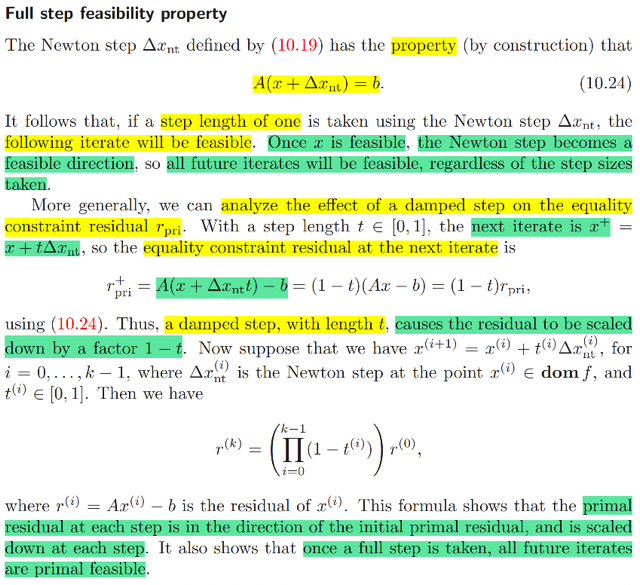</kbd></p>

> [!NOTE]
> Đại khái là ta còn nhớ rằng yêu cầu `/` condition để giải ra `Δx_nt`
> trong công  thức 10.19: A(x + `Δx_nt)` `=` b
>
> Hay nói cách khác, Newton's step sẽ phải thỏa: từ x dù có
> infeasible thì x + `Δx_nt` phải feasible.
>
> Và phát biểu trên đồng nghĩa rằng từ feasible point x, nếu ta
> ```text
> update / take a step theo hướng Δx_nt với step size = 1 (full step
> ```
> size) thì ta sẽ có feasible point x+
>
> Và sau đó, với x+ đã feasible, tức Ax+ `=` b thì từ đó, với Newton's
> ```text
> step vẫn phải thỏa A(x+ + Δx_nt) = b ⇨ A Δx_nt = 0. Và điều này
> ```
> dẫn đến:
>
> A(x+ + t `Δx_nt)` `=` b BẤT CHẤP t BẰNG BAO NHIÊU (vì A(x+ + t
> ```text
> Δx_nt) luôn bằng Ax+ + At Δx_nt = b + 0 = b)
> ```
>
> Do đó trong sách mới nói rằng một khi x đã feasible thì the
> Newton's step trở thành feasible direction BẤT CHẤP STEP SIZE
> t.
>
> (còn ban đầu, `Δx_nt` dù chỉ hướng có thể dẫn đến feasible, nhưng
> phải care step size nữa.
>
> `====`
>
> Rồi người ta mới nói ta có thể phân tích hiệu quả của một
> damped step (còn nhớ, tức là khi chưa qua giai đoạn full
> Newton step, mà còn phải tìm `/` cân nhắc step size t) đối với độ
> lớn của primal residual
>
> Còn nhớ primal residual chính là Ax - b.
>
> Vậy thì tại initial point primal residual là Ax - b thì sau khi iterate,
> nó là:
>
> ```text
> r+_pri = A(x + Δx_nt * t) - b = Ax + A Δx_nt * t - b
> ```
>
> ```text
> Tới đây dùng: cái ta có A(x + Δx_nt) = b ⇨ Ax + A Δx_nt = b
> ```
>
> ⇨ Ax - b `=` - A `Δx_nt`
>
> Thay vào:
>
> ⇔ - (Ax - b) `=` A `Δx_nt`
>
> `=` Ax - b - (Ax - b) * t
>
> `=` (1 - t)(Ax - b)
>
> `=` (1 - `t)r_pri`
>
> Như vậy có thể thấy sau một iteration, primal residual bị scale
> bởi factor 1 - t
>
> Và sau iteration kế tiếp nó bị scale tiếp bởi 1 - `step_size` t tại
> iteration đó nữa,
>
> Nên khái quát từ r(0), đến r(k) nó sẽ bị scale bởi (1- t(0))(1 - t(1))..
> .(1 - t(k))
>
> ⇨ r(k) `=` Π(1 - t(i)) r(0)
>
> Và một khi đã chuyển qua giai đoạn full step, tức t `=` 1. Thì có thể
> thấy  primal residual sẽ thành 0 vì khi đó scaled factor trở thành -
> 1 - 1 `=` 0  Và điều đó có nghĩa là x đã trở thành feasible (vì primal
> residual `=` Ax - b)

<br>

<p align="center"><kbd>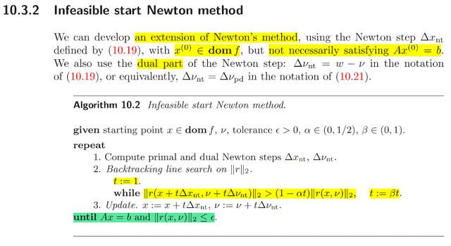</kbd></p>

> [!NOTE]
> Nói về Newton method algorithm với infeasible start.
>
> Bắt đầu với x(0) thuộc dom f nhưng chưa chắc đã thỏa constraint Ax
> `=` b.
>
> Bước 1 là tính (primal) Newton's step `Δx_nt` và dual Newton's step
> `Δv_nt.`
>
> Bước 2: Backtracking line search:
>
> Bất đầu với t `=` 1 và giảm dần bởi `β` cho đến khi thỏa exit condition,
> trong đó exit condition nó dùng l2 norm của r(x,v) thay vì dùng
> objective function.
>
> So sánh với original backtracking line search:
>
> Original exit condition: f(x+t `Δx)` ≤ f(x) + `αt∇f(x)TΔx`
>
> mang ý nghĩa là khi nếu theo hướng `Δx` với step size t hàm f xuống
> nhiều hơn linear approx của f tại x với độ dốc đã scale bởi `α` thì dừng
> line search và dùng t đó để update. Hay nói cách khác ngược lại
> rằng khi mà dự đoán bởi linear approx với độ dốc đã điều chỉnh mà
> còn hàm f lại xuống ít hơn phải tiếp tục scale step size t xuống vì khi
> đó là step size quá lố rồi
>
> exit condition của infeasible start Newton method:
>
> ```text
> ||r(x + t Δx_pd, v + t Δv_pd)|| ≤ ||r(x, v)|| - αt||r(x, v)||
> ```
>
> ```text
> ⇔ ||r(x, v)|| - ||r(x + t Δx_pd, v + t Δv_pd)|| ≥ αt||r(x, v)||
> ```
>
> ⇔  `Δ||r||` (mức giảm của residual norm) ≥ `αt||r(x,` v)||
>
> mang ý nghĩa đại khái là nếu step t đã khiến norm của r tại điểm
> update  (vế phải)  giảm nhiều hơn là sự giảm của norm được scale
> tuyến tính bởi factor `αt,` thì khi đó có thể dùng step size t này
>
> Nói chung ý chính là trong infeasible Newton algorithm, ta dùng l2
> norm của r (residual) để dẫn dắt.
>
> Và thuật toán dừng lại khi điểm đã feasible (Ax `=` b) cũng như là l2
> norm của r đã nhỏ hơn một threshold nào đó,

<br>

<p align="center"><kbd>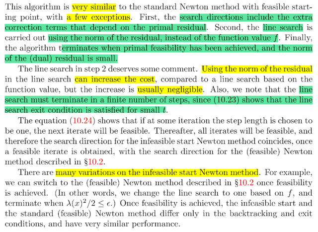</kbd></p>

> [!NOTE]
> Đại khái là thuật toán infeasible Newton rất giống feasible Newton.
> Chỉ có vài ngoại lệ.
>
> Đó là việc dùng l2 norm trong line search gây tăng chi phí tính toán
> so với dùng f value nhưng không đáng kể.
>
> ```text
> Và dựa vào 10.23 (d/dt||r(y + tΔy_pd)|| = -||r(y)|| ≤ 0: nói rằng đi
> ```
> theo hướng `Δy_pd` thì sẽ giảm l2 norm của r:) thì ta hiểu đại khái
> rằng exit condition với vế trái giảm dần  sau mỗi iteration của line
> search loop thì nhất định sẽ đến lúc nào đó vế trái nó nhỏ hơn vế
> phải để exit backtracking line search, chứ không thể chạy mãi mãi
> (infinitely) được.
>
> Ngoài ra, một kết quả ta đã có ở phần trước nay nói lại đó là: 
>
> Từ kết quả 10.24: A(x + `Δx_nt)` `=` b)
> nói rằng một khi mà tại iteration nào đó (của thuật toán), t được chọn 
> giá trị 1 (gọi là full step size), ví dụ x(k) `=` x(k-1) + `1*Δx_nt:`
>
> ```text
> thì A(x + 1*Δx_nt) = b sẽ cho thành Ax(k) = b, và cái này cho ta biết:
> ```
> x(k) đã trở thành feasible point. 
>
> ```text
> Và từ đó trở đi với A(x + Δx_nt) = b ⇔ Ax + A Δx_nt =  b ⇔ A Δx_nt = 0
> ```
> Và cái này mang ý nghĩa là `Δx_nt` đã trở thành FEASIBLE STEP bất
> kể step size. Và thuật toán lúc này y như feasible Newton 
>
> Cuối cùng là có nhiều biến thể của infeasible start Newton method.
>
> Một cách làm là khi đạt feasible point thì ta sẽ chuyển qua dùng feasible
> start Newton

<br>

<p align="center"><kbd>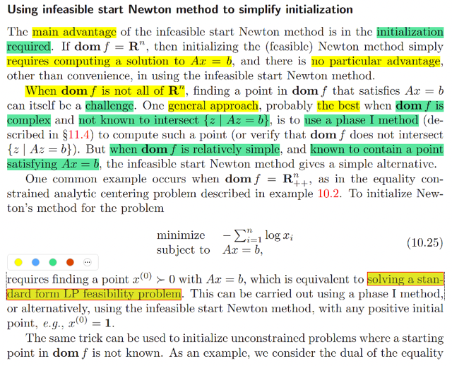</kbd></p>

<p align="center"><kbd>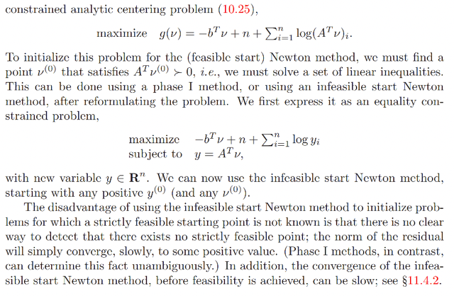</kbd></p>

> [!NOTE]
> QUAY LẠI SAU

<br>

<p align="center"><kbd>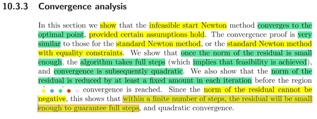</kbd></p>

> [!NOTE]
> đại khái là phần này ta sẽ phân tích sự hội tụ (convergence 
> analysis) đối với thuật toán infeasible start Newton's method.
>
> Nhìn chung thì nó cũng giống standard Newton's method, hoặc
> feasible start Newton's method.
>
> Nói trước một chút một số đặc điểm, thì đại khái là ta sẽ thấy 
> rằng quá trình xảy ra sẽ là, một khi mà norm của residual ||r(x,v)||)
> mà nhỏ hơn một threshold nào đó, thì khi đó thuật toán sẽ take
> full step (tức t `=` 1), điều này sẽ thể hiện rằng đã đạt trạng thái
> feasible, tức x đã feasible.
>
> Và từ sau đó sẽ xảy ra quá trình quadratic convergence.
>
> Ta cũng sẽ chứng minh cho thấy rằng norm của residual sẽ giảm
> theo một factor cố định trước khi xảy ra quadratic convergence.

<br>

<p align="center"><kbd>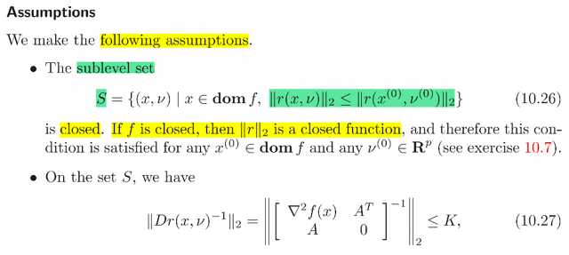</kbd></p>

<p align="center"><kbd>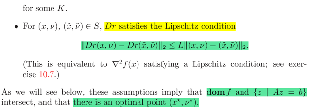</kbd></p>

> [!NOTE]
> Một số assumption cần thiết để bài toán có thể có có kết quả
> convergence  analysis sắp làm.
>
> Đầu tiên là sublevel set S phải đóng (hiểu đại khái là nó không mở rộng
> vô hạn). Đáng chú ý, S không giống S của các phần trước khi ở đó nó
> được định nghĩa bởi f: S `=` {x ∈ dom f: f(x) ≤ f(x0)} (x0 là initial point). Mà
> ở đây S được định nghĩa bởi l2 norm: S `=` { (x, v) ∈ dom f: ||r(x, v}|| ≤
> ||r(x0,v0)|| }
>
> Nếu f là hàm đóng (theo định nghĩa, tức là nó có tính chất với mọi `α` thì
> `α-sublevel` set đều closed) thì ||r|| cũng đóng. Đây là bài tập 10.7 ta phải
> chứng minh. Ở đây tạm biết ||r|| là hàm closed. Nên sublevel set S cũng
> closed.
>
> Assumption thứ 2 đó là trong sublevel set S thì Dr(x,v)inv, tức là inverse
> của matrix derivative r (Jacobian) bị chặn bởi K (chính xác thì l2 norm
> của nó bị chặn bởi K). Cái này thì bữa trước đã hiểu rồi, l2 norm của
> matrix chính là spectral norm, `=` maximum singular value. Mà Dr là
> symmetric, nên max singular value cũng là max eigenvalue.
>
> Ôn lại tí về đại số tuyến tính: Với matrix A, thì ATA sẽ symmetric, luôn có 
> đủ independent eigenvector, và chúng orthogonal nên ATA `=` QΛQT.
>
> ```text
> Full SVD of A: A = UΣVinv = UΣ(VT)
> ```
>
> ```text
> Thay vào Gram matrixATA = (UΣVT)T(UΣVT) = VΣTUTUΣVT = V(ΣTΣ)VT
> ```
>
> Và vì ATA symmetric nên eigen-decomposition `=` QΛQT 
>
> ⇨ `ΣTΣ` `=` Λ ⇨ eigenvalues của ATA là bình phương singular value của A:
>
> λ `=` `σ^2`
>
> Nếu A cũng symmetric thì SVD của A: A `=` U `Σ` VT cũng bằng Q Λ QT
>
> ⇨ U `=` Q `=` V: Eigenvectors cũng là basis của columns space và rowspace
>
> `Σ` `=` Λ ⇨ singular value của A `=` |eigenvalue| của A
>
> Vậy thì quay lại đây, khi mà λmax của `Dr_inv` ≤ K thì tức là λmin của Dr ≥ `1/K`
> mà cái này cũng tương tự như assumption khi convergence analysis cho 
> trường hợp equality constrained quadratic nơi mà ta có cái KKT matrix 
> KKT `=` [∇^2f(x), AT; A, 0]  để rồi cũng có vụ |KKTinv| ≤ K. Và khi không có 
> constraint luôn thì nó trở thành ∇^2f(x) inv ≤ K, và chọn K `=` m thì nó trở thành
> assumption ∇^2f(x) ≥ mI của unconstrained case.
>
> `====`
>
> Assumption thứ 3 là Dr thỏa Lipschitz condition. Và cái này equivalent với
> ∇^2f(x) thỏa Lipschitz condition (chứng minh cái này là nội dung của bài tập)

<br>

<p align="center"><kbd>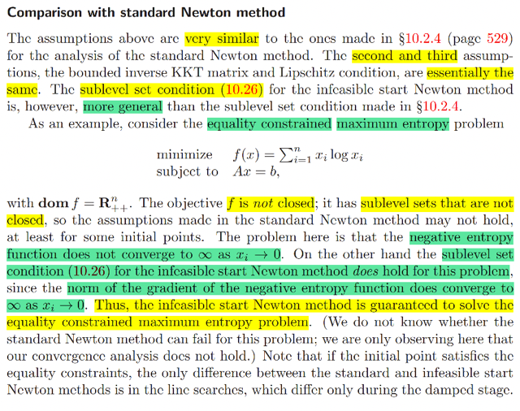</kbd></p>

> [!NOTE]
> Đại ý là các assumptions này rất giống các assumption khi ta
> convergence analysis cho standard Newton method.
>
> Trong đó cái số 2, và 3 trong đó nói về trạng thái bị chặn của inverse
> KKT matrix (ở đây là invser của Dr) và Lipschitz condition là gần như
> giống nhau.
>
> Còn cái số 1 thì ở đây khái quát hơn. Để minh họa thì họ cho function
> này (entropy) và đại ý là trong trường hợp này thì ta có f không
> closed vì sublevel set của nó không close (nhắc lại định nghĩa của
> closed  function là mọi sublevel set của nó đều closed)
>
> Thì vì f khong closed nên không thỏa assumption của convergence
> analysis trong phương pháp standard Newton. Do đó nếu ta dùng
> standard Newton thì không chắc rằng có thể converge (tìm ra
> optimal) hay không.
>
> Tuy nhiên với assumption của infeasible start Newton thì lại thỏa.
>
> THẬT RA CHƯA HIỂU LẮM chỉ hiểu ý chính muốn cho thấy một ví
> dụ mà assumption của standard Newton method thì không thỏa còn
> assumption của infeasible Newton method lại thỏa. Nên dùng standard
> feasible Newton method thì chưa chắc converge nhưng dùng infeasible
> standard method thì có.
>
>  QUAY LẠI SAU

<br>

<p align="center"><kbd>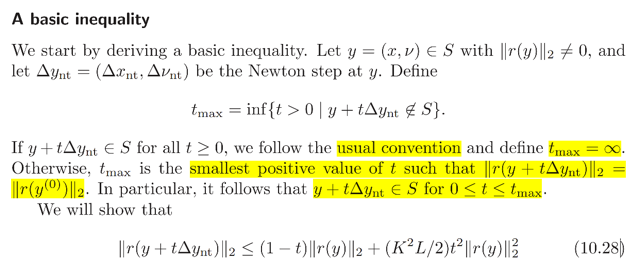</kbd></p>

> [!NOTE]
> để hiểu cái này cần phải hết sức lưu ý về định nghĩa của S. S là  một
> SUBLEVEL SET, định nghĩa bởi (bằng lời) là "mọi điểm trong domain mà
> độ lớn của residual (norm của r(y)) đều nhỏ hơn residual (của điểm ban
> đầu - starting point y(0))
>
> Thể hiện toán học: S `=`  y `=` (x, v) ∈ dom f: ||r(y) ≤ ||r(y0)|| 
>
> Thế thì hình dung thế này, ta "đang đứng tại" y (không nhất thiết y(0)
> vì cái mà ta đang định nghĩa là `t_max` tại vị trí đó, nó sẽ khác nhau
> tùy vào y khác nhau. 
>
> (mang giá trị residual r(y)). 
>
> Ta mới hướng theo một cái hướng define bởi `Δy_nt.` Thì với những
> step size khác nhau ta sẽ đi đến những điểm khác nhau y + t `Δy_nt,` và
> tại đó ta có các giá trị khác nhau của residual r.
>
> Thế thì, vì S là một set có hạn, nên đến một lúc nào đó, theo hướng
> `Δy_nt,` với bước đi có độ lớn t nào đó, thì ta sẽ RA NGOÀI set S. Và theo
> định nghĩa của set S, thì tại cái điểm ranh giới đó, thì giá trị của residual
> sẽ VƯỢT QUA ||r(y0)||.
>
> Và người ta định nghĩa cái t đó chính là `t_max.` Thì có thể hiểu theo nghĩa t
> là cái bước đi lớn nhất từ y, theo hướng `Δy_nt` mà ta vẫn còn trong S
> hoặc nói ngược lại `t_max` là cái nhỏ nhất mà ta bắt đầu ở ngoaì S.
>
> Thế thì dĩ nhiên tới đây đã hiểu tại sao t chính là nơi mà ||r(y + t `Δy_nt||` `=`
> ||r(y0)||
>
> vì đơn giản là vì NGAY TRƯỚC KHI NÓ LỚN HƠN R(Y0) THÌ NÓ PHẢI
> BẰNG TRƯỚC ĐÃ.
>
> Tóm lại để hiểu chỗ này hãy nhớ rằng S là set những điểm có ||r|| ≤ ||r(y0)||
> nên khi bước từ y, đi ngang qua ranh giới để bắt đầu ra ngoài, và r bất đầu
> lớn hơn ||r(y0)|| thì ngay tại ranh giơi, thì ||r(y + t `Δy_nt||` sẽ bằng ||r(y0)||
> và cái t đó gọi là `t_max` tại y đó.
>
> Và từ đó dĩ nhiên cũng dể hiểu rằng khi t còn nhỏ hơn tmax thì ta 
> còn trong S: y + t `Δy_nt` belong S

<br>

<p align="center"><kbd>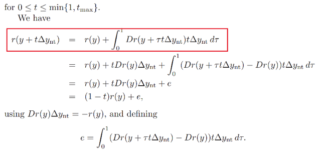</kbd></p>

<p align="center"><kbd>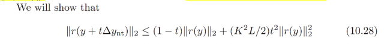</kbd></p>

> [!NOTE]
> Theo MIT 18.02 ta đã học về line integral với vector field F,  mà trong trường
> hợp đặc biệt khi vector field là gradient field F `=` ∇f, (f là function nào đó, gọi là
> potential). Thì khi đó ta có FTC đối với line integral
>
> `∫c` ∇f . dr `=` f(P1) - f(P0) (P0, P1 là điều đầu điểm cuối của quỹ đạo)
>
> Vậy thì, nay ta áp dụng vào đây với hàm f `=` r, điểm đầu là y, điểm cuối là y + t
> `Δy_nt,` gradient ∇f `=` ∇r chính là Dr.
>
> Hiện tại Dr là hàm theo y (cũng như ∇f là hàm theo x, y: ∇f(x, y) vì f là  hàm theo
> x, y: f(x, y)
>
> r là hàm theo y.
>
> Ta sẽ parameterize y theo z (để sau đó có thể có hàm r theo z):
>
> Để làm vậy thì ta sẽ nhìn nhận theo cách đó là di chuyển điểm từ y0  (initial
> point) theo hướng vector `Δy_nt`  là
>
> y `=` y0 + t `Δy_nt` z (trong sách là τ)
>
> ```text
> z chạy từ 0 đến 1. Khi z = 0, y = y0, khi z = 1, y = y0 + t Δy_nt
> ```
>
> ```text
> ⇨ r(z) = r(y(z)) = r(y0 + t Δy_nt z)
> ```
>
> ```text
> ⇨ dr/dz = dr/dy dy/dz
> ```
>
> `=` Dr(y) t `Δy_nt`
>
> ```text
> = Dr(y0 + t Δy_nt z) t Δy_nt
> ```
>
> Vậy thì áp dụng kiến thức trên:
>
> `∫0:1` `dr/dz` dz `=` r(z) |1:0
>
> ```text
> ⇔ ∫0:1 Dr(y0 + t Δy_nt z) t Δy_nt dz= r(1) - r(0)
> ```
>
> ```text
> ⇔ ∫0:1 Dr(y0 + t Δy_nt z) t Δy_nt dz= r(y(1)) - r(y(0))
> ```
>
> ```text
> ⇔ ∫0:1 Dr(y0 + t Δy_nt z) t Δy_nt dz= r(y0 + tΔy_nt *1) - r(y0 + tΔy_nt *0)
> ```
>
> ```text
> ⇔ ∫0:1 Dr(y0 + t Δy_nt z) t Δy_nt dz= r(y0 + tΔy_nt) - r(y0)
> ```
>
> ```text
> ⇔ r(y0) + ∫0:1 Dr(y0 + t Δy_nt z) t Δy_nt dz = r(y0 + tΔy_nt)
> ```
>
> Đây là giải thích từ đâu ra có kết qủa đóng khung đỏ
>
> `====`
>
> ```text
> r(y0 + tΔy_nt) = r(y0) + ∫0:1 Dr(y0 + t Δy_nt z) t Δy_nt dz
> ```
>
> ```text
> = r(y0) + ∫0:1 [Dr(y0 + t Δy_nt z) - Dr(y0) + Dr(y0)] t Δy_nt dz   |  Cộng trừ cho
> ```
> Dr(y0)
>
> ```text
> = r(y0) + ∫0:1 [Dr(y0 + t Δy_nt z) - Dr(y0)] t Δy_nt dz  + ∫0:1 Dr(y0) t Δy_nt dz
> ```
>
> ```text
> = r(y0) + ∫0:1 [Dr(y0 + t Δy_nt z) - Dr(y0)] t Δy_nt dz  + Dr(y0) Δy_nt t
> ```
>
> ```text
> = r(y0) + Dr(y0) Δy_nt t + ∫0:1 [Dr(y0 + t Δy_nt z) - Dr(y0)] t Δy_nt dz
> ```
>
> Dùng `Dr(y0)Δy_nt` `=` - r(y0)
>
> ```text
> = r(y0) + [- r(y0)] t + ∫0:1 [Dr(y0 + t Δy_nt z) - Dr(y0)] t Δy_nt dz
> ```
>
> ```text
> = r(y0) - r(y0) t + ∫0:1 [Dr(y0 + t Δy_nt z) - Dr(y0)] t Δy_nt dz
> ```
>
> ```text
> = (1 - t) r(y0) + ∫0:1 [Dr(y0 + t Δy_nt z) - Dr(y0)] t Δy_nt dz
> ```
>
> ```text
> Đặt e = ∫0:1 [Dr(y0 + t Δy_nt z) - Dr(y0)] t Δy_nt dz
> ```
>
> `=` (1 - t) r(y0) + e
>
> Vậy dừng ở đây ta có: 
>
> r(y0 + `tΔy_nt)` `=` (1 - t) r(y0) + e (I)

<br>

<p align="center"><kbd>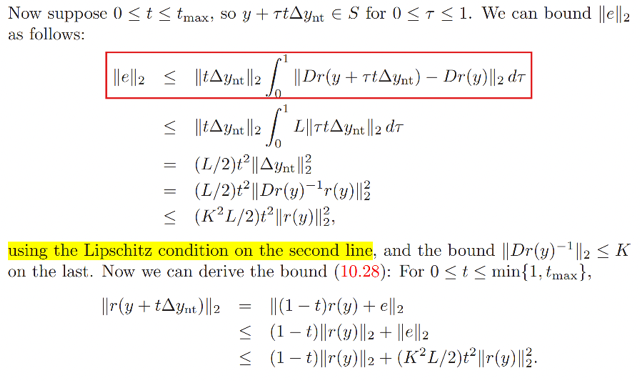</kbd></p>

> [!NOTE]
> tiếp theo, cho rằng 0 ≤ t ≤ tmax thì y0 + `ztΔy_nt` sẽ nằm trong range [y0, y0 + z
> tmax `Δy_nt]`
>
> ```text
> và với 0 ≤ z ≤ 1 thì y0 + z tmax Δy_nt ≤ y0 + tmax Δy_nt.
> ```
>
> Và vì tmax được định nghĩa là t lớn nhất khiến ta (y0 + t `Δy_nt)` vẫn ở trong set S
> nên dĩ nhiên với y0 + z t `Δy_nt` với 0 ≤ z ≤ 1 cũng vẫn còn đang trong set S.
>
> Thế thì, ta sẽ xây dựng một upper bound của ||e||:
>
> ```text
> ||e|| = ||∫0:1 [Dr(y0 + t Δy_nt z) - Dr(y0)] t Δy_nt dz||
> ```
>
> Đây là vector, đại khái là tổng của matrix D x vector `(tΔy_nt)` với D là hiệu  của hai
> matrix Dr tại y và Dr tại y0. Dấu tích phân về bản chất là tổng.
>
> Ta có thể bỏ t `Δy_nt` không phụ thuộc z ra ngoài tích phân:
>
> ```text
> = || ∫0:1 [Dr(y0 + t Δy_nt z) - Dr(y0)] dz  . (t Δy_nt) ||
> ```
>
> Thì bản chất `∫0:1` [Dr(y0 + t `Δy_nt` z) - Dr(y0)] dz  là tổng các matrix D, vẫn ra một
> matrix, nhân với vector (tt `Δy_nt),` cho ra vector, rồi lấy norm.
>
> Thành ra ta đang có dạng ||Au|| và do đó cho phép ta dùng inequality:
>
> ||Au|| ≤ ||A||.||u||
>
> Do đó
>
> ```text
> ||e|| = || ∫0:1 [Dr(y0 + t Δy_nt z) - Dr(y0)] dz  . (t Δy_nt) ||
> ```
>
> ```text
> sẽ ≤ || ∫0:1 [Dr(y0 + t Δy_nt z) - Dr(y0)] dz || * || t Δy_nt ||
> ```
>
> Xét || `∫0:1` [Dr(y0 + t `Δy_nt` z) - Dr(y0)] dz ||, như đã nói, đây cơ bản là norm của
> tổng nhiều matrix.
>
> Nên ta dùng tiếp triangular inequality ||A1 + A2 + ..|| ≤ ||A1|| + ||A2|| + ...||Ai||
>
> ```text
> ⇨ || ∫0:1 [Dr(y0 + t Δy_nt z) - Dr(y0)] dz || ≤ ∫0:1 || [Dr(y0 + t Δy_nt z) - Dr(y0)] || dz
> ```
>
> Từ đó:
>
> ```text
> || ∫0:1 [Dr(y0 + t Δy_nt z) - Dr(y0)] dz || * || t Δy_nt ||
> ```
>
> ```text
> ≤  ∫0:1 ||Dr(y0 + t Δy_nt z) - Dr(y0)|| dz  * || t Δy_nt ||
> ```
>
> Và như vậy:
>
> ```text
> ||e|| ≤  ∫0:1 ||Dr(y0 + t Δy_nt z) - Dr(y0)|| dz  * || t Δy_nt ||
> ```
>
> ```text
> = || t Δy_nt || *  ∫0:1 ||Dr(y0 + t Δy_nt z) - Dr(y0)|| dz
> ```
>
> Đây chính là kết quả đóng khung.
>
> Tiếp, ta mới dùng assumption liên quan đến Lipschitz condition của Dr:
>
> Tồn tại L để ||Dr(x, v) - Dr(x~, v~)||2 ≤ L||(x,v) - (x~,v~)||2
>
> ```text
> Nên với L nào đó thì ||Dr(y0 + t Δy_nt z) - Dr(y0)|| ≤ L||(y0 + t Δy_nt z) - y0||
> ```
>
> ```text
> ⇔ ||Dr(y0 + t Δy_nt z) - Dr(y0)|| ≤ L||t Δy_nt z||
> ```
>
> Vậy kết quả (1) tiếp tục ≤ ...:
>
> ```text
> ≤ || t Δy_nt || *  ∫0:1 L||t Δy_nt z|| dz
> ```
>
> ```text
> Tới đây thì dùng ||t Δy_nt z|| = |t| ||Δy_nt|| z = t ||Δy_nt || z (vì t ≥ 0, nên |t| = t)
> ```
>
> Vậy:
>
> ```text
> ≤ || t Δy_nt || *  ∫0:1 L||t Δy_nt z|| dz   = || t Δy_nt || * ∫0:1 Lt || Δy_nt || z dz
> ```
>
> ```text
> = || t Δy_nt || * (Lt || Δy_nt ||) ∫0:1 z dz
> ```
>
> ```text
> = || t Δy_nt || * (Lt || Δy_nt ||) z^2/2|0:1
> ```
>
> ```text
> = || t Δy_nt || * (Lt || Δy_nt ||) (1/2)
> ```
>
> ```text
> = (1/2) L t^2 || Δy_nt || * || Δy_nt ||
> ```
>
> ```text
> = (1/2) L t^2 || Δy_nt ||^2
> ```
>
> ```text
> Dùng tiếp Dr(y) Δy_pd = -r(y) (Δy_pd cũng là Δy_nt) (theo link)
> ```
>
> ⇔ `Δy_nt` `=` Dr(y)inv r(y)
>
> `...=` `(1/2)` L t^2 || Dr(y)inv r(y0) ||^2 
>
> ≤ `(1/2)` L t^2 || Dr(y)inv ||^2 . || r(y0) ||^2
>
> Và dùng ||Dr(y)inv|| ≤ K
>
> ⇨ ..≤  `(1/2)` L t^2 K^2 . || r(y) ||^2
>
> `=` `(LK^2/2)` t^2 || r(y0) ||^2
>
> Vậy ta có ||e|| ≤ `(LK^2/2)` t^2 || r(y0) ||^2 (II)
>
> `====`
>
> Từ (I) ta có:
>
> r(y0 + `tΔy_nt)` `=` (1 - t) r(y0) + e 
>
> ⇨ ||r(y0 + `tΔy_nt)||` `=` ||(1 - t) r(y0) + e||
>
> ≤ ||(1 - t) r(y0)|| + ||e|| (triangular inequality)
>
> `=` (1 - t) ||r(y0)|| + ||e||
>
> và dùng (II): ||e|| ≤ `(LK^2/2)` t^2 || r(y0) ||^2 (II)
>
> ⇨ ||r(y0 + `tΔy_nt)||` ≤ (1 - t) ||r(y0)|| + `(LK^2/2)` t^2 || r(y0) ||^2
>
> ĐÂY LÀ INEQUALITY 10.28 MÀ TA MUỐN CHỨNG MINH
>
> Và chú y y0 ở đây không hẳn là initial point y(0). Mà chỉ là mình gọi như
> vậy khi chuyển y thành y(z) `=` y0 + `t*Δy_nt*z` mà thôi.
>
> nên inequality là:
>
> ||r(y + `tΔy_nt)||` ≤ (1 - t) ||r(y)|| + `(LK^2/2)` t^2 ||r(y)||^2

<br>

<p align="center"><kbd>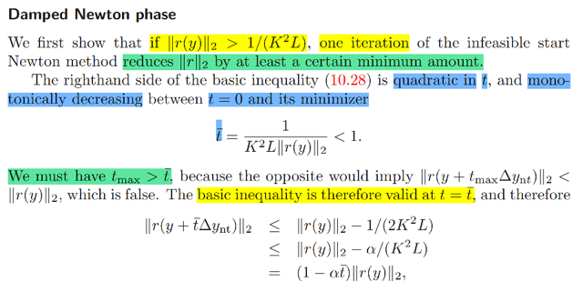</kbd></p>

> [!NOTE]
> Đại khái là tiếp theo (sau khi đã có basis inequality 10.28 vừa rồi)  ta sẽ
> tìm cách chứng minh rằng khi ||r(y)||2 > `1/(K^2L)` thì một lần iteration sẽ
> giảm ||r||2 ít nhất một gía trị tối thiểu nào đó.
>
> Đầu tiên từ basis inequality:
>
> ||r(y + `tΔy_nt)||` ≤ (1 - t) ||r(y)|| + `(LK^2/2)` t^2 ||r(y)||^2
>
> Ta quan sát thấy vế phải (1 - t) ||r(y)|| + `(LK^2/2)` t^2 || r(y) ||^2
>
> dễ thấy chính là quadratic function theo t, đặt là g(t) đi
>
> Viết lại cho rõ:
>
> `=` `(LK^2/2)` ||r(y)||^2 t^2 - ||r(y)|| t + ||r(y)||
>
> Thế thì với quadratic function, ax^2 + bx + c, thì minimizer của  nó là
> solution của 2ax + b `=` 0 ⇔ x `=` `-b/2a`
>
> ⇨ minimizer của hàm quadratic trên:
>
> t* `=` -(-||r(y)||) `/` 2 `(LK^2/2)` ||r(y)||^2
>
> `=` `1/[(LK^2)` ||r(y)||] (đây là kết quả trong sách)
>
> Và với điều kiện ta đang đặt ra là ||r(y)|| > `1/K^2L` ⇔ 1 > `1/||r(y)||K^2L` 
> thì có thể thấy 1 > t^
>
> Ngoài ra `t_max` cũng phải > t*. Vì nếu `t_max` ≤  t* thì sẽ dẫn tới:
>
> 0 ≤ `t_max` ≤ t* mà hàm g(t) như đã nói monotonic decreasing từ 0 tới t*
> nên `g(t_max)` ≤ g(t*)
>
> tức là:
>
> `(LK^2/2)` ||r(y)||^2 `t_max^2` - ||r(y)|| `t_max` + ||r(y)|| 
>
> ≤ `(LK^2/2)` ||r(y)||^2 t*^2 - ||r(y)|| t* + ||r(y)||
>
> Áp dụng tiếp basic inequality 10.28 cho `t_max` thì ta có:
>
> ```text
> ||r(y + t_max Δy_nt)|| < (1 - t_max) ||r(y)|| + (LK^2/2) t_max^2 ||r(y)||^2
> ```
>
> (vế trái chính là `g(t_max))`
>
> ```text
> Vậy ||r(y + t_max Δy_nt)|| < g(t_max) ≤ g(t*) = (1 - t) ||r(y)|| + (LK^2/2) t^2 ||r(y)||^2
> ```
>
> ```text
> = (1 - 1/[(LK^2) ||r(y)||]) ||r(y)|| + (LK^2/2) 1/[(LK^2) ||r(y)||]^2 ||r(y)||^2
> ```
>
> ```text
> = (||r(y)|| - ||r(y)||/[(LK^2) ||r(y)||])  + (LK^2/2) ||r(y)||^2/[(LK^2) ||r(y)||]^2
> ```
>
> `=` ||r(y)|| - `1/2LK^2`
>
> ```text
> Vậy ta có: ||r(y + t_max Δy_nt)|| < g(t*) = ||r(y)|| - 1/2LK^2
> ```
>
> Điều này cho thấy ||r(y + `t_max` `Δy_nt)||` < ||r(y)|| vì vế phải còn nhỏ hơn ||r(y)||
>
> Nhưng đây là kết quả sai, bởi lẽ ||r(y)|| phải ≤ ||r(y0)|| do y `=` (x, v) thuộc S (xem
> mở đầu của phần "A basic inequality", mà định nghĩa của `t_max` tại y là t thỏa:
>
> ```text
> ||r(y + t_max Δy_nt)|| = ||r(y0)||
> ```
>
> nên nếu ||r(y + `t_max` `Δy_nt)||` < ||r(y)|| thì tức là 
>
> ||r(y0)|| < ||r(y)|| mà điều này là không đúng.
>
> Vậy kết luận t* < `t_max`
>
> Vậy thì ý chính khi nói ta có thể khẳng định t* < `t_max` là để cho phép
> dùng basic inequality với t*:
>
> ||r(y + `t*Δy_nt)||` ≤ (1 - t*) ||r(y)|| + `(LK^2/2)` t*^2 ||r(y)||^2
>
> Và thay t* `=` `1/K^2L||r(y)||,` ta có:
>
> ```text
> ||r(y + t*Δy_nt)|| ≤ (1 - 1/K^2L||r(y)||) ||r(y)|| + (LK^2/2) 1/K^4L^2||r(y)||^2 ||r(y)||^2
> ```
>
> `=` (||r(y)|| - `1/K^2L)`  + `1/2K^2L`
>
> `=` ||r(y)|| - `1/2K^2L`
>
> Tức là ||r(y + `t*Δy_nt)||` ≤ ||r(y)|| - `1/2K^2L`
>
> ```text
> ≤ ||r(y + t*Δy_nt)|| ≤ ||r(y)|| - α/K^2L  (do α > 1/2)
> ```
>
> Thay `1/K^2L` `=` t*||r(y)||
>
> `...=` ||r(y)|| - `αt*||r(y)||`
>
> `=` (1 - `α` t*) ||r(y)||
>
> Tức là ta có: ||r(y + `t*Δy_nt)||` ≤ (1 - `α` t*) ||r(y)||
>
> Và đây chính là exit condition của infeasible start Newton method backtracking
> line search

<br>

<p align="center"><kbd>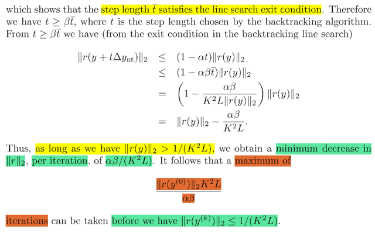</kbd></p>

> [!NOTE]
> Từ đó vì t* là giá trị mà backtracking line search sẽ "dùng", nên ta
> đã từng lập luận để hiểu rằng t luôn ≥ `βt*:` vì t ≥ t*, và `β` < 1 nên 
>
> t ≥ t* ≥ `βt*`  
>
> Thế thì exit condition là:
>
> ||r(y + `t*Δy_nt)||` ≤ (1 - `α` t) ||r(y)|| 
>
> từ t ≥ `βt*` ⇔ -t ≤ `-βt*`
>
> ```text
> ⇨ ||r(y + t*Δy_nt)|| ≤ (1 - α t) ||r(y)|| ≤ (1 - α β t*) ||r(y)||
> ```
>
> Thay t* `=` `1/K^2L||r(y)||`
>
> ```text
> = (1 - α β 1/K^2L||r(y)||) ||r(y)||
> ```
>
> ```text
> = ||r(y)|| - α β/K^2L
> ```
>
> ```text
> Vậy ||r(y + t Δy_nt)|| ≤ ||r(y)|| - αβ/K^2L
> ```
>
> Vậy là ta đã triển khai để cho thấy ||r(y + t `Δy_nt)||` `=` ||r(y)|| - một 
> số dương `(=` `αβ/K^2L)`
>
> chứng tỏ mỗi iteration l2 norm của residual giảm ít nhất là nhiêu đó.
>
> Và từ đó ta có thể có số iteration tối đa để đạt một trạng thái nào đó
> của ||r||:
>
> Để ||r(yk)|| ≥ `1/K^2L` thì từ r(y(0)) cần giảm nhiều nhất là:
>
> ```text
> Mỗi lần giảm αβ/K^2L, k lần giảm kαβ/K^2L
> ```
>
> Vậy để tính k là số lớn nhất trước khi ||r(yk)|| < `1/K^2L` thì ta sẽ
>
> ```text
> Giải ||r(yk)|| ≥ 1/K^2L ⇔ ||r(y(0))|| - kαβ/K^2L ≥ 1/K^2L
> ```
>
> ⇔ ||r(y(0))||K^2L - `kαβ/K^2LK^2L` ≥ 1
>
> ⇔ ||r(y(0))||K^2L - 1 ≥ `kαβ/K^2LK^2L`
>
> ```text
> ⇔ ||r(y(0))||K^2L/αβ - 1/αβ ≥ k
> ```
>
> `||r(y(0))||K^2L/αβ` ≥ k

<br>

<p align="center"><kbd>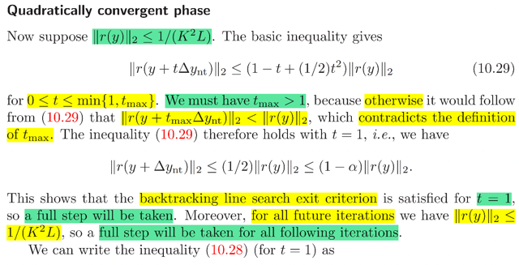</kbd></p>

> [!NOTE]
> Tiếp, xét giai đoạn mà ||r(y)|| ≤ `1/K^2L` (hồi nãy là damped Newton stage,
> nơi ||r(y)|| > `1/K^2L)`
>
> Khi 0 ≤ t ≤ min(1, `t_max)` thì ta có basic inequality:
>
> ||r(y + `tΔy_nt)||` ≤ (1 - t) ||r(y)|| + `(LK^2/2)` t^2 ||r(y)||^2
>
> áp dụng ||r(y)|| ≤ `1/K^2L` ta có vế phải ≤ ...
>
> ≤ (1 - t) ||r(y)|| + `(LK^2/2)` t^2 `1/(K^2L)` ||r(y)|| (chỉ thay "một cái ||r(y)|| ở term
> thứ 2 thôi)
>
> `=` (1 - t) ||r(y)|| + `t^2/2||r(y)||`
>
> `=` (1 - t + `t^2/2)||r(y)||`
>
> Vậy ||r(y + `tΔy_nt)||` ≤ (1 - t + `t^2/2)||r(y)||` (*)
>
> Thế thì điều này cho thấy `t_max` phải > 1.
>
> Vì nếu `t_max` ≤ 1 thì bất đẳng thức (*) trên khi áp dụng với `t_max` 
>
> (khi đó `t_max` ≤ min(1, `t_max)` nên có quyền áp dụng basic inequality) sẽ thành:
>
> ```text
> ||r(y + t_max Δy_nt)|| ≤ (1 - t_max + t_max^2/2)||r(y)||
> ```
>
> ≤ (1 - 1 + `1^2/2)||r(y)||` `=` `1/2` ||r(y)|| và lại càng < ||r(y)||
>
> ```text
> Và ||r(y + t_max Δy_nt)|| < ||r(y)|| là vi phạm định nghĩa của t_max như lúc nãy
> ```
> ```text
> đã giải thích (ôn lại: ||r(y + t_max Δy_nt)|| phải = ||r(y(0)||, mà ||r(y(0)|| phải ≥ ||r(y)||
> ```
> vì y phải ∈ S)
>
> `====`
>
> Vậy thì ta khẳng định 1 < `t_max,` thì tương tự, 1 thỏa 0 < 1 ≤ min(1, `t_max)` nên
> áp dụng bất đẳng thức trên với t `=` 1: 
>
> ```text
> ||r(y + tΔy_nt)|| ≤ (1 - 1+ 1^2/2)||r(y)|| = 1/2||r(y)||
> ```
>
> ```text
> và vì 0≤ α ≤ 1/2 ⇔ 1 - α ≥ 1/2
> ```
>
> ⇨ ...≤ (1 - `α)||r(y)||`
>
> ```text
> Và kết quả này: ||r(y + tΔy_nt)|| ≤ (1 - α)||r(y)|| chính là exit condition với t = 1
> ```
>
> Hay có nghĩa là (khi ||r(y)|| ≤ `1/K^2L)` với t `=` 1 thì nó đã thỏa exit condition.
> Nên gọi là thuật toán sẽ "full step" (chứ không giảm `/scale` t xuống)
>
> Và hơn nữa mọi iteration sau đều vậy thỏa  ||r(y)|| ≤ `1/K^2L)` bởi lẽ ta đã
> chứng minh rằng ||r|| sẽ giảm đi ít nhất một khoảng nào đó (chứ không có)
> chuyện đứng im sau mỗi iteration, Nên có thể khẳng định một khi đã full step
> thì sau đó cũng vậy

<br>

<p align="center"><kbd>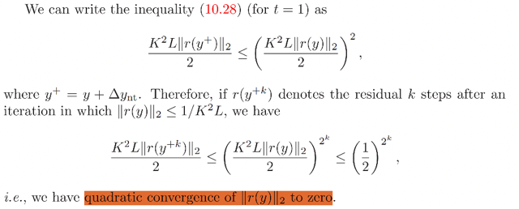</kbd></p>

> [!NOTE]
> Thế thì với t `=` 1 thì basis inequality là:
>
> ||r(y + `Δy_nt)||` ≤ (1 - 1) ||r(y)|| + `(LK^2/2)` 1^2 ||r(y)||^2
>
> `=` `(LK^2/2)` ||r(y)||^2
>
> ⇔ ||r(y + `Δy_nt)||` ≤ `(LK^2/2)` ||r(y)||^2
>
> Gọi y + `Δy_nt` là y+:
>
> ||r(y+)|| ≤ `(LK^2/2)` ||r(y)||^2
>
> ⇔ `(LK^2/2)||r(y+)||` ≤ `[(LK^2/2)` ||r(y)||]^2
>
> Kết quả này nghĩa là
>
> `(LK^2/2)||r(y(1))||` ≤ `[(LK^2/2)` ||r(y(0))||]^2
>
> `(LK^2/2)||r(y(2))||` ≤ `[(LK^2/2)` ||r(y(1))||]^2 ≤ `[(LK^2/2)` ||r(y(0))||]^(2^2)
>
> ...sau k iteration:
>
> `(LK^2/2)||r(y(k))||` ≤ `[(LK^2/2)` ||r(y(0))||]^(2^k)
>
> Nên gọi y+k là sau khi iterat k step từ y thì ta có:
>
> `(LK^2/2)||r(y(+k))||` ≤ `[(LK^2/2)` ||r(y)||]^(2^k)
>
> và do ||r(y)|| ≤ `1/(LK^2)` nên `(LK^2)/2||r(y)||` ≤ `1/2` 
>
> ⇨ vế phải ≤ `(1/2)^(2^k)`
>
> Vậy `(LK^2/2)||r(y(k))||` ≤ `[(LK^2/2)` ||r(y(0))||]^(2^k) ≤ `(1/2)^(2^k)`
>
> Và kết quả này chính là (tương tự đã biết ở standard Newton) là
> residual norm giảm theo tốc độ quadratic.
>
> Đây chính là QUADRATIC CONVERGENCE

<br>

<p align="center"><kbd></kbd></p>

<p align="center"><kbd>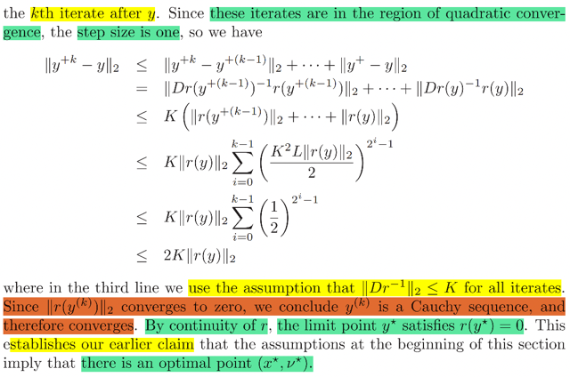</kbd></p>

> [!NOTE]
> Phần cuối đại khái là người ta chứng minh rằng chuỗi y(k) là CAUCHY
> SEQUENCE
>
> Do đó nó SẼ CONVERGE về y* với r(y*) `=` 0
>
> TÌM HIỂU CAUCHY SEQUENCE VÀ QUAY LẠI SAU
>
> QUAY LẠI SAU

<br>

<p align="center"><kbd>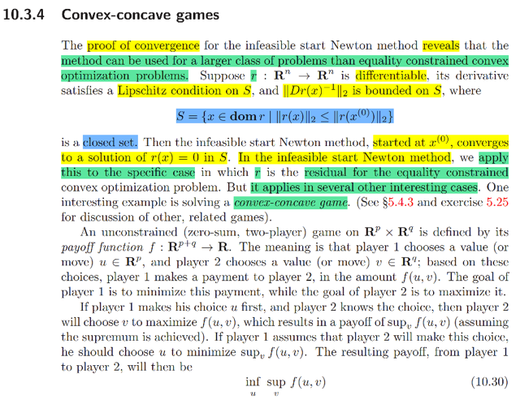</kbd></p>

<p align="center"><kbd>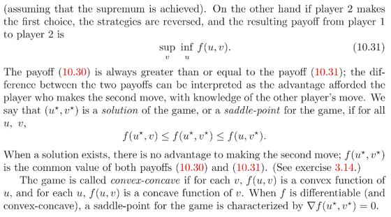</kbd></p>

<p align="center"><kbd>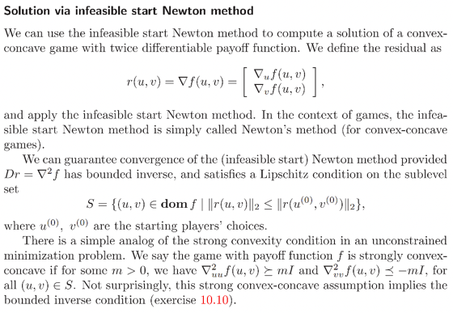</kbd></p>

> [!NOTE]
> QUAY LẠI SAU

<br>

<p align="center"><kbd>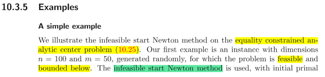</kbd></p>

<p align="center"><kbd>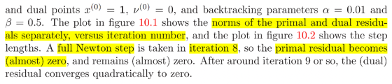</kbd></p>

<p align="center"><kbd>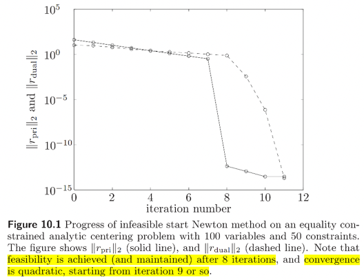</kbd></p>

<p align="center"><kbd>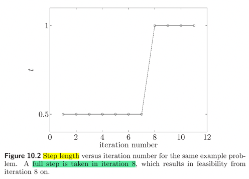</kbd></p>

> [!NOTE]
> áp dụng infeasible start Newton method. Đồ thị cho thấy tại
> iteration 8 thì primal residual (đo Ax - b) đã về ≈ 0. Từ đây trở
> đi, ta đã đạt trạng thái feasible. Và cũng từ iteration 9, dual
> residual giảm rất  nhanh - chính là giai đoạn quadratic
> convergence.
>
> Và đồ thị dưới cho thấy step size từ iteration 8 trở đi cũng đã
> full-step (tức t `=` 1)

<br>

<p align="center"><kbd>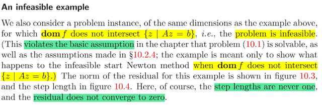</kbd></p>

<p align="center"><kbd>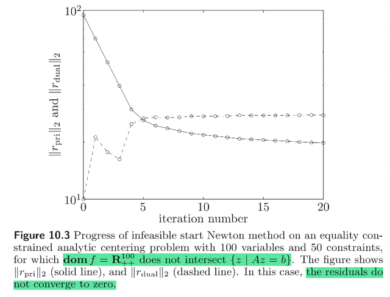</kbd></p>

<p align="center"><kbd>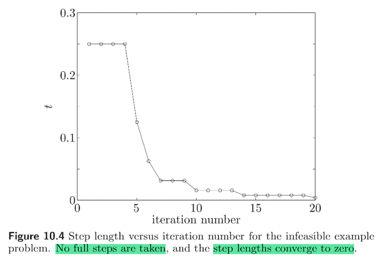</kbd></p>

> [!NOTE]
> ở đây cho một ví dụ mà infeasible Newton method áp dụng cho một
> bài toán mà dom f không intersect với {z: Az `=` b}. Điều này có nghĩa
> là bài toán không feasible, feasible set là tập rỗng (vì feasible set 
> phải là những điểm trong dom f mà thỏa constraint). Và đó đây cũng
> là case mà ta không thỏa assumption cần thiết để dùng Newton's
> method - đó là assumption rằng problem có optimal point.
>
> Do đó có thể thấy kết quả là residual (norm) không converge về 0
> cũng như là step size không bao giờ đạt trạng thái full step mà
> ngược lại nó converge về 0

<br>

<p align="center"><kbd>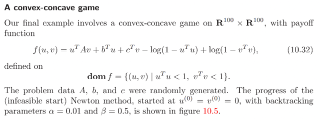</kbd></p>

<p align="center"><kbd>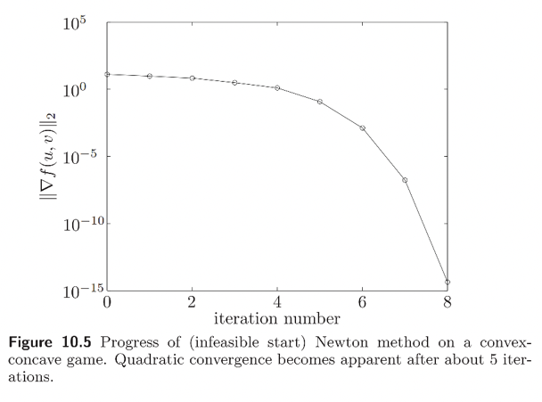</kbd></p>

> [!NOTE]
> QUAY LẠI SAU

<br>

<p align="center"><kbd>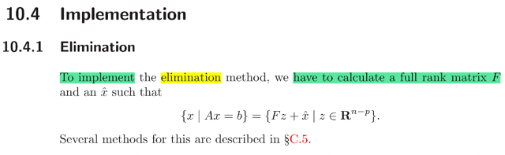</kbd></p>

> [!NOTE]
> nói qua việc thực hiện thuật toán.
>
> Đầu tiên, với phương pháp eliminate equality constraint. (còn nhớ,
> đó là ta sẽ chuyển bài toán minimize f0(x) với equality constraint Ax
> `=` b thành bài toán equivalent: minimize f0(Fz + x^) với F là matrix có
> các cột là basis của null-space của A, x^ là một solution của Ax `=` b.
> Thì như vậy ta sẽ chuyển về bài toán unconstrained.
>
> Thế thì vấn đề phải làm chính là tìm matrix F. Và phụ lục C.5 cho biết
> một số cách.

<br>

<p align="center"><kbd>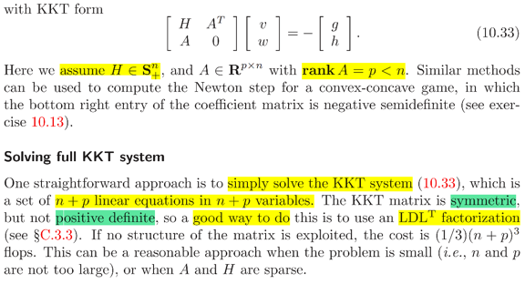</kbd></p>

<p align="center"><kbd>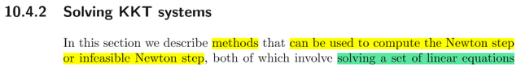</kbd></p>

> [!NOTE]
> phần này ta sẽ bàn về (những method để) giải hệ để tính Newton's step
> (như đã biết, dù là feasible Newton's step hay infeasible Newton's step
> ```text
> thì việc tính Δx_nt đều là giải hệ K [Δx_nt; w] = [-∇f(x); r] với K là KKT
> ```
> matrix [∇^2f(x), AT; A 0] và r sẽ là 0 với feasible Newton's step, và Ax - b
> nếu là infeasible Newton's step.
>
> Nên nói chung là ta cần giải hệ [H, AT; A, 0][v; w] `=` -[g; h]
>
> với assumption là H positive semi definite ≽ 0 và A full row rank
>
> Thế thì cách đầu tiên là giải trực tiếp hệ này, nó là hệ có n+p equations
> với n + p variables. Như đã biết, cách làm sẽ gồm 2 bước (factor - solver
> method) là factorizing K và solve step.
>
> Và vì K là symmetric nên ta có thể dùng LDLT factorization (nếu K positive
> definite thì có thể có Cholesky factorization K `=` LLT)
>
> Và theo link của Appendix ta biết với matrix nxn thì LDLT factorization sẽ
> tốn `n^3/3` flops
>
> Vậy factor K sẽ tốn (n + `p)^3/3` flops
>
> Dĩ nhiên sau đó là solve step: LD(LT)x `=` vế phải (gọi là u đi) thì 
> ta sẽ lần lượt giải Lz `=` u (đây là giải hệ với lower triangular matrix, chính
> là forward substitution) tốn (n+p)^2 flops, rồi Dz2 `=` z, đây là hệ với diagonal
> matrix, tón (n + p) flops. Và cuối cùng là LTx `=` z2, là hệ với upper triangular
> matrix, chính là back substitution, tốn (n + p)^2 flops.

<br>

<p align="center"><kbd>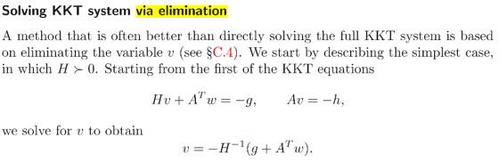</kbd></p>

<p align="center"><kbd>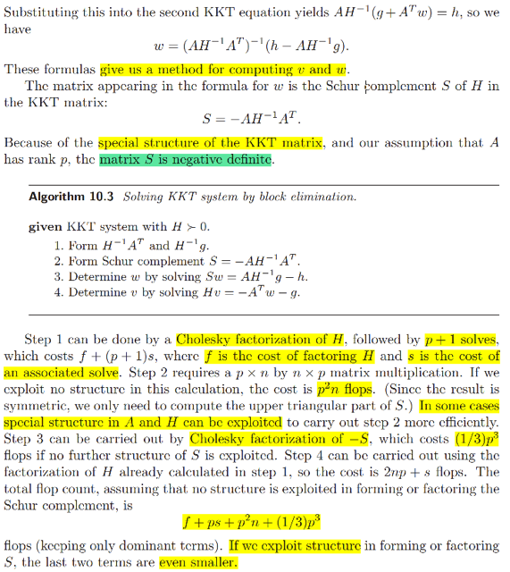</kbd></p>

> [!NOTE]
> Rồi, một phương pháp khác là dùng cái gọi là block elimination
>
> Review chút xíu về pp tổng quát (giải Ax `=` b): đó là khi ta có thể
> thể hiện Ax `=` b theo dạng [A11, A12; A21, A22][x1; x2] `=` [b1; b2]
>
> ⇔ A11x1 + A12x2 `=` b1 (1) A21x1 + A22x2 `=` b2 (2)
>
> Thì từ (1) ta ⇨ x1 `=` A11inv(b1 - A12x2) (assume A11 non-singular)
>
> khi đó, thay vào (2) ta có: A21A11inv(b1 - A12x2) + A22x2 `=` b2
>
> ⇔ A21A11invb1 - A21A11invA12x2 + A22x2 `=` b2
>
> ⇔ A21A11invb1 + (A22 - A21A11invA12x2)x2 `=` b2
>
> ⇔ (A22 - A21A11invA12x2)x2 `=` b2 - A21A11invb1
>
> Và đây là một hệ "nhỏ hơn" Sx2 `=` b~ với variable ít hơn (chỉ có x2)
>
> Và S `=` A22 - A21A11invA12x2 gọi là Schur complement của A11
>
> Thế thì, ở đây, ta có hệ K[v; w] `=` -[g, h] với K `=` [H, AT; A, 0]
>
> Áp dụng block elimination method: 
>
> từ (1) Hv +  ATw `=` -g ⇨ v `=` -Hinv(g + ATw)
>
> Thế vào (2) Av + 0 `=` -h ta có -AHinv(g + ATw) `=` -h
>
> ⇨ AHinvg + AHinvATw `=` h 
>
> ⇔ AHinvATw `=` h - AHinvg
>
> Với - AHinvAT là Schur complement của H
>
> ⇔ w `=` (AHinvAT)inv(h - AHinvg)
>
> Từ đó ta có một method giải KKT system:
>
> 1) Form HinvAT và Hinvg
>
> 2) Hình thành S `=` - AHinvAT
>
> 3) Tính w bằng cách giải Sw `=` AHinvg - h
>
> 4) Tính v bằng cách giải Hv `=` -ATw - g
>
> Thế thì bước 1: Form HinvAT, và Hinvg
>
> vì H là ≻ 0 nên có thể factor H bởi Cholesky factorization với cost `=` f.
>
> Sau đó là solve step. Tốn cost là s.
>
> Chỗ này nói lại cho nhớ, bản chất việc tính HinvAT là giải hệ HX `=` AT như đã
> biết về cơ bản, ta đang giải p (số cột của AT, A là matrix pxn ⇨ AT là matrix
> nxp) hệ Hxj `=` AT[:, j] (cột j của AT, có thể ghi là `AT_j)`
>
> Thế thì để giải theo factor-solver thì bước một là factor H, ở đây dùng
> Cholesky thì H `=` L(LT)
>
> ```text
> Sau đó là bước solve step: tức giải Hxi = AT_j ⇔ LLTxi = AT_j bao gồm giải
> ```
> một chuỗi: Lz `=` `AT_j,` là forward substitution và sau đó là  gỉai LTx `=` z, là
> back-substitution.
>
> Cost của cả hai bước này gọi chung là s.
>
> Vậy với p hệ Hxj `=` `AT_j` ta sẽ có cost là ps
>
> Đó là giải xong HinvAT, tốn f + ps. Sau đó là giải Hinvg hoàn toàn tương tự,
> chính là giải Hy `=` g, vì H đã factored rồi, nên chỉ việc solve tốn thêm s nữa.
> Vậy step 1 tốn f + ps + s `=` f + (p + 1)s là vậy
>
> `====`
>
> Step 2 là form Schur complement S `=` - AHinvAT thì khi đã có HinvAT thì đây
> chỉ là matrix x matrix, với A `=` (p x n) , HinvAT là matrix (n, p) lập luận nhanh:
> mỗi entries của S là inner product của A's row và  HinvAT's column là các
> vector có n components ⇨ tốn 2n - 1 ≈ 2n flops
>
> Có tổng cộng p^2 entries: p^2 *2n ≈ 2(p^2)n. Nhưng vì S symmetric nên thật
> ra ta chỉ cần tính một nửa con số này: (p^2)n
>
> (có nói thêm nếu có thể khai thác structure nào đó của A và H thì có thể còn it
> flops hơn)
>
> `====`
>
> Step 3 là: Giải Sw `=` AHinvg - h, với -S ≻ 0 thì ta cũng Cholesky factor tốn
> `(1/3)p^3` (xem lại công thức cost của Cholesky factorization)
>
> Step 4: giải Hv `=` -ATw - g thì chỉ việc solve step, vì H đã factor ở step 1 Cost
> gồm: form -ATw - g: ATw là nhân matrix (n, p) với vector w, tốn p + p - 1 ≈ 2p
> flops cho việc dot product giữa `AT_row` và w, và có n row nên cost tổng cộng
> là 2np, thêm p flops cho phép + (g) là 2np + p ≈ 2np
>
> Và solve step Hv `=` -ATw - g tốn s flop nữa là tổng cộng 2np + s
>
> Tóm lại tốn: f + (p + 1)s + (p^2)n + 2np + s 
>
> coi như f + ps + (p^2)n + `(1/3)p^3`

<br>

<p align="center"><kbd>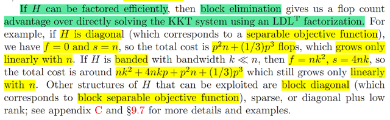</kbd></p>

> [!NOTE]
> đại khái là khi H có cấu trúc đặc biệt giúp việc factorizing có thể ít
> tốn hơn nữa thì dĩ nhiên sẽ giảm cost toàn bộ xuống.
>
> Ví dụ như khi H là diagonal matrix, như đã biết, khi đó về cơ bản
> chả cần factor gì nữa (f `=` 0), và việc solve với diagonal matrix 
> cũng chỉ tốn n phép chia (n flops)
>
> Tương tự khi H là banded matrix thì cũng giúp factorizing cost f
> nhỏ đi

<br>

<p align="center"><kbd>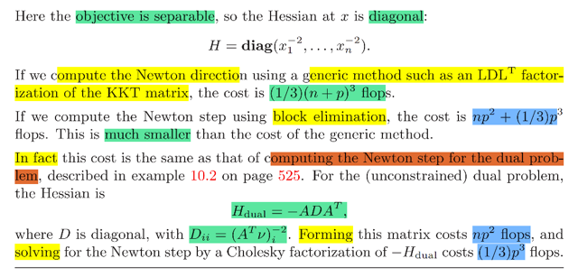</kbd></p>

<p align="center"><kbd>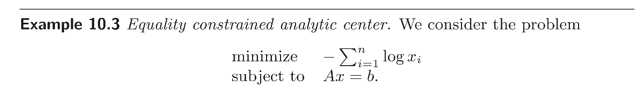</kbd></p>

> [!NOTE]
> ```text
> f(x) = - Σi=1:n log xi = -1Tlog(x)
> ```
>
> df `=` f(x + dx) - f(x)
>
> `=` -1Tlog(x + dx) + 1Tlog(x)
>
> `=` -1Tlog[x(1 + `dx/x)]` +1Tlog(x)
>
> `=` -1T[log(x) + log(1 + `dx/x)]` + 1Tlog(x)
>
> `=` -1Tlog(x) + 1Tlog(1 + `dx/x)` + 1Tlog(x)
>
> `=` -1Tlog(1 + `dx/x)`
>
> ≈ `-1T(dx/x)` `=` - `(1/x)Tdx`
>
> ⇨ ∇f(x) `=` `-1/x`
>
> Hessian ∇^2f(x): dĩ nhiên là ma trận đạo hàm bậc hai của f(x) nhưng cũng là
> Jacobian của hàm f'(x) `=` `-1/x`
>
> Ta có thể theo MIT 18s096 để derive dạng bi-linear form hoặc tìm first
> derivative của f'(x) đều được.
>
> *Theo bi-linear form:
>
> Lập luận là: Khi x thay đổi một khoảng nhỏ dx, thì f sẽ thay đổi khoảng nhỏ df
> `=` f(x + dx) - f(x). Và sự thay đổi nhỏ df này sẽ là một hàm tuyến tính của dx,
> gọi là linear operator act on dx, thể hiện theo toán học là df `=` f(x + dx) - f(x) `=`
> f'(x)[dx]
>
> Thế thì, khi x thay đổi một khoảng nhỏ dx', cũng sẽ khiến f'(x) thay đổi: df' `=` f'
> (x + dx') - f'(x), và again, nó cũng là một hàm tuyến tính của dx', hay linear
> operator act on dx':
>
> df' `=` f''(x)[dx']
>
> ⇨ f'(x + dx') - f'(x) `=` f''(x)[dx']
>
> Thế thì, nói về vế trái, thì đó là tổng của hai linear operator:
>
> f'(x + dx') là một linear operator, và f'(x) cũng vậy. Và khi apply tổng (-) của
> chúng lên dx ta sẽ có [f'(x + dx') - f'(x)][dx], sẽ bằng apply từng cái lên dx và
> cộng lại (Đây là tính chất của linear operation)
>
> [f'(x + dx') - f'(x)][dx] `=` f'(x + dx')[dx] - f'(x)[dx]
>
> Và dĩ nhiên vế phải, cũng là linear operator, act on dx ta sẽ có:
>
> f''(x)[dx'][dx]
>
> Từ đó ta có:
>
> f'(x + dx')[dx] - f'(x)[dx] `=` f''(x)[dx'][dx]
>
> Và f''(x)[dx'][dx] chính là bilinear form, có thể ghi là f''(x)[dx' dx]
>
> `====`
>
> Áp dụng vào đây, ta cần triển khai để cho ra dạng bilinear form:
>
> Ta đã có f'(x)[dx] `=` `-(1/x)Tdx`
>
> d(f'(x)[dx]) `=` [f'(x + dx') - f'(x)]dx
>
> `=` f'(x + dx')[dx] - f'(x)[dx]
>
> `=` `-[1/(x` + dx')]Tdx - `[-(1/x)Tdx]`
>
> `=` `-[1/(x` + dx')]Tdx + `(1/x)Tdx`
>
> `=` `[-1/(x` + dx') + `1/x]Tdx`
>
> `=` [(-x + x + `dx')/x(x` + dx')]Tdx
>
> `=` `[dx'/x(x` + dx')]Tdx
>
> `=` `[dx'/(x^2` + xdx')]Tdx
>
> ≈ `[dx'/(x^2)]Tdx`
>
> `=` dx'T `diag(1/x^2)` dx
>
> Đây là bilinear form ⇨ Hessian chính là `diag(1/x^2)`
>
> Cách 2: Tiếp cận theo hướng Hessian của f(x) chính là Jacobian của gradient
> ∇f(x):
>
> Từ kết quả trên ta có ∇f(x) `=` `-1/x`
>
> Ta sẽ xét hàm g(x) `=` ∇f(x) `=` `-1/x.`
>
> ```text
> dg = g(x + dx) - g(x) = - 1/(x + dx) + 1/x
> ```
>
> `=` [- x + (x + dx)] `/` x(x + dx)
>
> `=` dx `/` (x^2 + xdx)
>
> ≈ dx `/` x^2
>
> `=` (1 `/` x^2) dx
>
> Vậy dg `=` (1 `/` x^2) dx
>
> Mà g là vector, nên dg cũng vậy. x là vector nên dx cũng vậy
>
> Do đó việc df `=` `(1/x^2)` dx, như đã biết, là linear operator act on du (f'(x)[dx]),
> thì nó chỉ có thể là một matrix nhân vector dx.
>
> Vậy matrix J nhân dx mà khiến cho ra kết quả là vector:
>
> [ `du1/x1^2,` `dx2/x2^2,` ...., dxn `/` xn^2 ] tức là vector có component thứ i là - dxi
> `/` xi^2, cũng là dui * `(1/xi^2)`  | dui là component thứ i của vector dx.
>
> Thì J chỉ có thể là diagonal matrix với đường chéo là `[1/x1^2,` `..1/xn^2]`
>
> Vậy từ đây có thể kết luận Jacobian của ∇f(x) là `diag([1/x1^2,` `..1/xn^2])` và
> đây cũng là Hessian của f(x)
>
> Xét ví dụ này, với objective f(x) `=` - `Σi` log xi.
>
> Thế thì chủ yếu ý chính là nói rằng đây là case mà Hessian ∇^2f(x) là
> một matrix có cấu trúc đặc biệt có thể exploit, cụ thể nó chỉ là một
> diagonal matrix. (dùng kiến thức Matrix calculus ta có thể hiểu tại sao
> ở note bên)
>
> Thành ra trong trường hợp này, nếu ta tính Newton step theo cách giải
> trực tiếp thì tốn `1/3` (n+p)^3
>
> (ý là, việc giải Newton's step, như đã biết, là giải hệ KKT system:
>
> ```text
> K[Δx_nt, w] = [-∇f(x), Ax - b], với K = [∇^2f(x), A; AT, 0]
> ```
>
> thì với  cách trực tiếp thì ý là ta sẽ factor matrix K, mà K thì có tính
> symmetric nhưng chưa chắc là symmetrix ≻ 0, nên ta dùng LD(LT)
> factorization. Và cái này thì sẽ tốn `1/3` (size của K)^3 flops (công thức
> này đã học từ Appendix 4, tuy nhiên ta sẽ quay lại sau để xem tại sao
> lại là `1/3` (n^3)
>
> thì nếu ta dùng block elimination như vừa học, thì cost của nó (với
> công thức tính cost hồi nãy là f + ps + (p^2)n + `(1/3)p^3)` với f `=` 0 (vì
> Hessian đã là diagonal rồi), s thì chỉ bằng size của K, tức n + p, thì
> cost trở thành:
>
> p(n + p) + (p^2)n + `(1/3)p^3)` `=` np^2 + `p^3/3` + p^2 + pn
>
> `=` (n+1)p^2 + `p^3/3` + pn COI NHƯ np^2 + `p^3/3`
>
> (vì np^2, với p^3 là bậc 3 nên có thể bỏ đi pn là bậc 2, và (n+1)p^2 coi
> như np^2)
>
> Và cái này thật ra là có cùng cost với việc giải bài toán này thông qua
> dual problem (sẽ nói rõ hơn ở note sau, nhưng đại khái là trong đó
> ta giải bài toán dual maximize v g(v) để tìm v*, sau đó ta thế vào lại
> KKT condition để tìm x*, cũng là giải minimize L(x, v*) (sở dĩ có thể
> làm theo cách này vì ở đây strong duality hold, cho phép d* `=` p*
> khiến x minimize L(x, v*) cũng chính là x* của primal problem.
>
> Và ta cũng dùn Newton's method để tìm v*, thế thì ý chính muốn nói,
> cost để tính newton step `Δv_nt` (dùng để update v) cũng có cùng cost
> với tính `Δx_nt` theo pp block elimination ở đây.
>
> Mình sẽ nói thêm về việc tìm `Δv_nt` ở note tiếp theo

<br>

<p align="center"><kbd>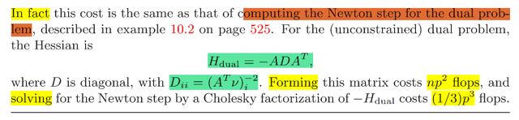</kbd></p>

> [!NOTE]
> Thế thì dual problem: maximize v g(v) `=` -bTv + n + `Σi` log(ATv)i
>
> tương đương minimize v f(v) `=` -g(v) `=` bTv - n - `Σi` log(ATv)i
>
> (f chỉ là thay tên cho tiện, ko liên quan gì objective f(x))
>
> Newton's step của dual problem: `Δv_nt:`
>
> Như đã biết, nguyên lý của Newton's method là ta thay thế `/` dùng xấp xỉ
> bậc hai của f(v)
>
> ```text
> f(v + δv) ≈ f(v) + ∇f(v)Tδv + (1/2) δvT ∇^2f(v)δv = f^(v + δv)
> ```
>
> Để rồi với hàm f^(v + `δv)` ta sẽ tìm `δv` mà minimize f^(v + `δv),` vốn dĩ là một
> ```text
> quadratic function của δv. Và optimal δv* chính là Newton step Δv_nt giúp
> ```
> minimize f^(v + `δv)`
>
> Và với việc bài toán này có objective quadratic nên ta có công thức (cũng
> đơn giản là xuất phát từ việc giải optimality condition ∇f^(v + `δv)` `=` 0 mà thôi)
>
> ```text
> δv* (= Δv_nt) = -∇^2f(v)inv ∇f(v)
> ```
>
> ```text
> Thế thì với f(v) =  bTv - n - Σi log(ATv)i thì Δv_nt = - ∇^f(v)inv ∇f(v) là ntn:
> ```
>
> Viết lại f(v) `=` bTv - n - 1Tlog(ATv)
>
> Thử tìm gradient ∇f(v) và Hessian ∇^2f(v)
>
> *Gradient:
>
> Đặt k(v) `=` 1Tlog(ATv), đặt u(v) `=` ATv ⇨ du `=` ATdv
>
> Đặt w `=` log(u) ⇨ dw `=` `diag(1/u)` du
>
> k `=` 1Tw ⇨ dk `=` 1T(w + dw) - 1Tw `=` 1Tdw
>
> `=` `1T[diag(1/u)du]`
>
> `=` `1T[diag(1/u)ATdv]`
>
> `=` `1T[diag(1/ATv)ATdv]`
>
> `=` `(1/ATv)TATdv`
>
> ```text
> df = f(v + dv) - f(v) = bTdv - dk = bTdv - (1/ATv)TATdv
> ```
>
> ```text
> = [bT - (1/ATv)TAT]dv = [b - A(1/ATv)]Tdv
> ```
>
> ⇨ ∇f `=`  b - `A(1/ATv)`
>
> *Hessian:
>
> ```text
> Xét hàm ∇f(v): đặt u = ATv, w = 1/u, z = Aw
> ```
>
> du `=` ATdv (Cái này rất dễ thấy)
>
> ```text
> dw = 1/(u + du) - 1/u = (u - u - du)/(u^2 + udu) ≈ -du/u^2
> ```
>
> dz `=` Adw
>
> ∇f `=` b - z
>
> ```text
> ⇨ d∇f = -dz = -Adw = -A(-1/u^2)du = -A(-1/u^2)ATdv
> ```
>
> `=` `A(1/u^2)ATdv`
>
> `=` A `diag(1/u^2)ATdv`
>
> ⇨ Jacobian của ∇f `=` A `diag(1/u^2)AT`
>
> `=` A `diag(1/(ATv)^2)AT`
>
> và cũng là Hessian của f (∇^2f(v)
>
> Vậy thì để tính Newton's step, `Δv_nt,` `=` -∇^2f(x)inv ∇f(v) cơ bản chính là
> giải hệ: 
>
> -∇^2f(v) `Δv_nt` `=` ∇f(v)
>
> ```text
> ⇔ - A diag(1/(ATv)^2)AT Δv_nt = b - A(1/ATv)
> ```
>
> ```text
> ⇔ A diag(1/(ATv)^2)AT Δv_nt = - b + A(1/ATv)
> ```
>
> `====`
>
> ```text
> đặt H_dual = -∇^2f(v) = - A D AT, với D = diag(1/(ATv)^2)
> ```
>
> ```text
> Thế thì việc giải H_dual Δx_nt = ∇f(v) , như đã biết từ phụ lục C sẽ theo lối
> ```
> factor-solver. 
>
> Vậy thì đầu tiên ta phải nhân ADAT để có `H_dual` trước. Việc này tốn:
>
> DAT là nhân diagonal matrix (n, n) với matrix AT (n, p) sẽ tốn: 
>
> ```text
> (p, vì AT có p cột) x [cost của D(AT_col1) = n*[D_rowi T AT_col1 = 1 flops do D_row
> ```
> chỉ có 1 số khác 0]
>
> `=` p*[n*(1 flops)] `=` pn flops
>
> ADAT: là nhân matrix A (p, n) với DAT (n, p) ⇨ tốn 2pnp `=` 2np^2 flops
>
> ⇨ cost 2np^2 + pn coi như np^2 
>
> Sau đó ta sẽ factor `H_dual,` là matrix pxp nên theo LULT nó sẽ tốn `1/3p^3`
>
> (kể cả solve step nữa) thì thành ra cost cũng là cõ np^2 + `1/3p^3` giống của block
> elimination
>
> TÓM LẠI CHÍNH MUỐN NÓI CÁCH GIẢI THEO BLOCK ELIMINATION
> VỪA NÓI, CÓ CÙNG COMPLEXITY VỚI CÁCH NÀY (DUAL)

<br>

<p align="center"><kbd>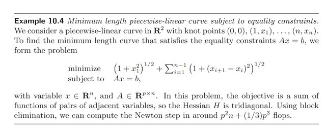</kbd></p>

> [!NOTE]
> QUAY LẠI SAU

<br>

<p align="center"><kbd>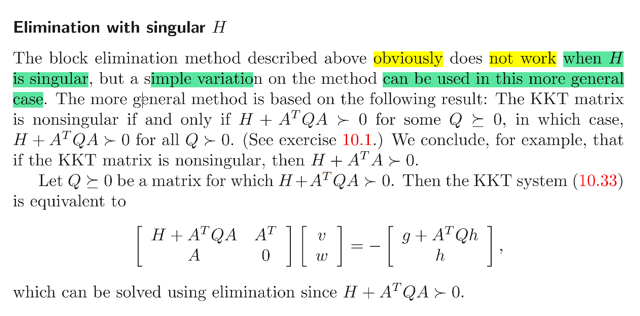</kbd></p>

> [!NOTE]
> QUAY LẠI SAU

<br>

<p align="center"><kbd>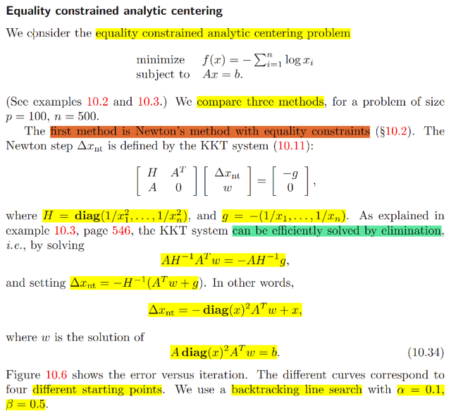</kbd></p>

<p align="center"><kbd>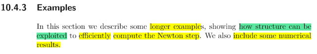</kbd></p>

> [!NOTE]
> Rồi, đại khái là phần này ta sẽ gặp lại bài toán này nơi mà ta có objective function là
> f0(x) `=` - `Σ` log(xi) constraint Ax `=` b với A là matrix full row rank (p, n) và  ta sẽ so sánh
> 3 phương pháp.
>
> 1) Newton's method với equality constraints, 2) Newton's method applied to the dual
> và 3) Infeasible start Newton method
>
> (nói chung là cơ hội để ôn lại hết, nên đây sẽ là note khá dài)
>
> Thế thì đầu tiên, theo link, phần trước ta đã chứng minh gradient và Hessian của f rồi.
> ```text
> H (hay ∇^2f(x)) = diag(1/x^2) và ∇f(x) = -1/x
> ```
>
> Thì với method 1, Newton's step, `Δx_nt` được hình thành dựa trên lập luận sau: Đầu
> tiên cần nhắc lại Newton's step là gì, nó là direction mà ta sẽ đi để từ một điểm x(k), đi
> đến điểm tiếp theo x(k+1) theo công thức: x(k+1) `=` x(k) + t `Δx_nt` Và đây là một phần
> trong algorithm để qua các bước update đưa dần dần đến gần optimal point x* theo
> cách tiếp cận iteration (để đối nghịch với analytical solution, tức có công thức tính ra
> ngay x*)
>
> ```text
> Thế thì, để tính Δx_nt, xuất phát tại x, ta sẽ coi như / xấp xỉ / thay thế hàm f(x) bởi
> ```
> quadratic approximation của nó. Xấp xỉ bậc 2 của f(x) theo Taylor expansion sẽ là như
> sau:
>
> ```text
> f(x + δx) ≈ f(x) + ∇f(x)Tδx + (1/2) δxT ∇^2f(x) δx
> ```
>
> ```text
> Vậy thì theo ý trên, ta sẽ thay f(x), bằng hàm f^(x + δx) = f(x) + ∇f(x)Tδx + (1/2) δxT
> ```
> ∇^2f(x) `δx` và đây là hàm theo `δx,` cụ thể hơn, nó chính là quadratic function theo `δx` có
> ```text
> dạng (1/2) δxTPδx + qTδx + r (P = ∇^2f(x), hay H ở trên, q là ∇f(x))
> ```
>
> Và bước tiếp theo ta sẽ làm đó là tìm `δx` để f^(x + `δx)` nhỏ nhất nhưng với rằng buộc là
> x + `δx*` vẫn phải nằm trong feasible set, nói cách khác, chính là ta sẽ giải một bài toán
> equality constraint convex quadratic optimization problem sau:
>
> minimize f^(x + `δx)` subject to A(x + `δx)` `=` b
>
> (Lưu ý từ đây x chỉ coi như x0, như fixed value, chứ optimization variable là `δx)`
>
> Thế thì, để giải bài toán này, ta sẽ cũng dựa vào optimality condition, hay KKT
> condition:
>
> Có công thức khái quát là (với objective function f0(x), equality constraint functions
> hi(x), inequality constraint functions fi(x) i `=` 1,2....):
>
> ∇f0(x) + `Σ` λi * ∇fi(x) + `Σ` vi * ∇hi(x) `=` 0
>
> Và với bài toán này thì nó là: `∇f^(δx)` + wTA `=` 0
>
> ```text
> mà ∇f^x(δx) với f^(δx) (f^(x + δx) coi như f^(δx), giống như f(10 + x) cũng là f(x))
> ```
>
> ```text
> = f(x) + ∇f(x)Tδx + (1/2) δxT ∇^2f(x) δx thì ∇f^(δx) = ∇^2f(x)Tδx + ∇f(x)
> ```
>
> (Vì sao: Xét f(u) `=` `1/2` uTPu + qTu + r thì df 
>
> `=` `1/2` (u+du)TP(u + du) + qT(u + du) + r - `1/2` uTPu - qTu - r
>
> `=` `1/2` (uTPu + duTPu + uTPdu + duTPdu) + qTdu - `1/2` uTPu 
>
> `=` `1/2` (uTPu + 2uTPdu) + qTdu - `1/2` uTPu 
>
> ```text
> = uTPdu + qTdu = (PTu + q)Tdu ⇨ ∇f = PTu + q = Pu + q với P symmetric
> ```
>
> Điều đó cho ta equations thứ nhất để giải tìm `δx*:`
>
> `∇^2f(x)δx` + ∇f(x) + wTA `=` 0 (1)
>
> Và cái này gọi là dual feasible equations (mà cái tên này tại sao gọi như vậy có lẽ
> nên bàn sau)
>
> (Và cũng dễ thấy rằng nếu mà không có equality constraint thì ta sẽ có ngay công
> thức của Newton's step trong unconstraint Newton's method: - ∇^2f(x)_inv ∇f(x)
>
> Bên cạnh đó, điều kiện A(x + `δx)` `=` b, với việc x (coi điểm bắt đầu) đã feasible, tức ta
> ```text
> có Ax = b khiến ta có A δx = 0 (2). Và A(x + δx) = b gọi là primal feasible equation
> ```
>
> Từ (1) và (2) tương đương:
>
> ```text
> ∇^2f(x)δx + ATw = - ∇f(x) và A δx = 0
> ```
>
> Gom lại thành [∇^2f(x), AT; A, 0] `[δx,` w] `=` [-∇f(x), 0]. Đây gọi là KKT system
>
> Và việc giải nó sẽ cho ra `δx*,` chính là Newton's step:  `Δx_nt` và optimal dual variable:
>
> nên ta có thể ghi lại:
>
> [∇^2f(x), AT; A, 0] `[Δx_nt,` w] `=` [-∇f(x), 0]
>
> [∇^2f(x), AT; A, 0] `[Δx_nt,` w] `=` [-∇f(x), 0]
>
> Ghi theo sách với ∇^2f(x) `=` H, và ∇f(x) `=` g:
>
> [H, AT; A, 0] `[Δx_nt,` w] `=` [-g, 0]
>
> Thế thì phần trước ta đã biết rằng, để mà giải hệ này, nếu coi như
> ```text
> giải một hệ lớn bình thường K a = b với K = [H, AT; A, 0], a = [Δx_nt,
> ```
> w], b `=` [-g, 0] thì việc giải theo lối factor - solver, thì factor K với LU rồi
> solve step thì sẽ không bằng việc giải với phương pháp block
> elimination vì ở đây ta có thể khai thác exploit cấu trúc của sub-matrix
> của K đó là H, là một symmetric positive semi definite matrix, và một
> block khác là 0.
>
> Phương pháp block elimination cũng đơn giản:
>
> ```text
> Từ H Δx_nt + ATw = -g ⇨ Δx_nt = - Hinv(g + ATw)
> ```
>
> ```text
> Thế vào A Δx_nt = 0: - A Hinv(g + ATw) = 0
> ```
>
> ⇔ - A Hinvg - A Hinv ATw `=` 0
>
> ⇔  A Hinv ATw `=` - A Hinvg (3)
>
> ```text
> Giải cái này ra w, thế vào Δx_nt = - Hinv(g + ATw) sẽ cho ta  Δx_nt
> ```
>
> ```text
> Thế thì với H = diag(1/x^2) = diag(1/x1^2, 1/x2^2...)
> ```
>
> ⇨ Hinv chính là diag(x^2) `=` diag(x1^2, x2^2, ...) và cũng là diag(x)^2
>
> với g (tức ∇f(x) `=` `[1/x1,` `1/x2...]`
>
> ⇨ - Hinvg `=` -diag(x1^2, x2^2, ...) `[-1/x1,` `-1/x2...]T` sẽ thành [x1, x2..]
> và đó chính là x  
>
> ```text
> Nên Δx_nt = - Hinv(g + ATw) = - Hinvg - HinvATw = - diag(x)^2ATw + x
> ```
>
> Với w như đã nói là solution của (3): và với Hinv là diag(x)^2, - Hinvg là x
> thì (3) là A diag(x)^2 ATw `=` Ax `=` b (Ax là b còn gì nữa)

<br>

<p align="center"><kbd>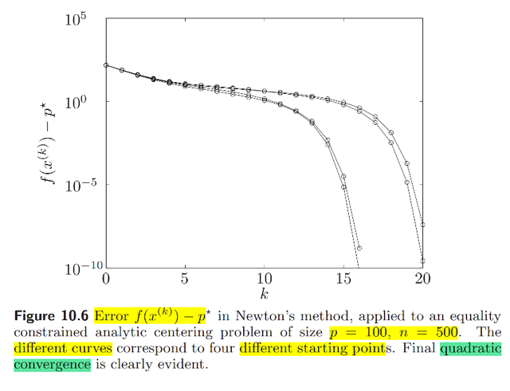</kbd></p>

> [!NOTE]
> Đây là hình ảnh, của method này, với các initial start khác
> nhau thì có các đường cong khác nhau.
>
> Giai đoạn mà các đường cong là error f(x(k) - p* cắm đầu
> là biểu hiện của stage quadratic convergence

<br>

<p align="center"><kbd>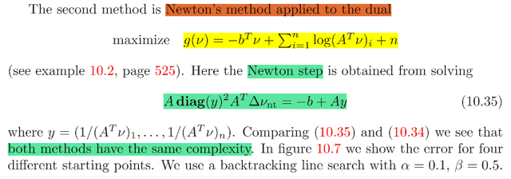</kbd></p>

> [!NOTE]
> Phương pháp thứ hai là áp dụng Newton's method vào dual:
>
> Chỗ này nói rõ một chút: Từ phần trước (link cam) ta đã biết rằng có
> thể giải bài toán này thông qua dual problem. Cụ thể là vì trong ví dụ
> này, ta có strong duality (hàm objective f0(x) `=` - `Σ` log(xi) là convex,
> với affine `/` linear equality constraint thì đây là convex optimization
> problem, không có inequality thì coi như thỏa Slater's condition ⇨ Có
> strong duality.
>
> Như vậy thay vì giải bài toán constraint problem gốc, ta có thể giải
> hai bài toán unconstraint problem:
>
> Giải dual problem tìm v*: maximize dual function g(v)
>
> Sau đó giải bài toán minimize x L(x, v*) tìm x*, cái cái này tương
> đương với việc thế v* vào KKT conditions: ∇f0(x) + vTA `=` 0 để giải ra
> x*.
>
> Do đó, cái chính là giải tìm v*, và nó, cũng là một optimization
> problem, bằng cách chuyển về dạng minimize - g(v), ta có thể cũng
> dùng iterative approach, cụ thể hơn là Newton's method  để dần dần
> tìm v*
>
> Và từ đó lập luận để hình thành Newton's step `Δv_nt` thì mình đã nói
> ở note trước rồi (link cam)...
>
> (cơ bản cũng làm sau khi đã chuyển từ bài toán maximize thành
> minimize, ta cũng có objective function, gọi là f(v), là hàm theo v để
> cần được minimize. Thế thì ta cũng sẽ approx nó bởi quadratic
> approx, để có `f^(δv)` và việc giải solution của bài toán minimize `δv`
> của `f^(δv)` sẽ cho ta `Δv_nt)`
>
> mà trong đó mình cũng đã tự triển khai để thấy `Δv_nt` là solution của:
>
> ```text
> A diag(1/(ATv)^2)AT Δv_nt = - b + A(1/ATv)
> ```
>
> ```text
> hay A diag(y^2)AT Δv_nt = - b + A(y) với y = 1/ATv,
> ```
>
> tức `=` `[1/(ATv)_1,` `1/(ATv)_2,...]`
>
> (Nên nhớ đây là bài toán unconstraint, nên có ngay công thức
> `Δv_nt` `=` - ∇^f(v)_inv ∇f(v)
>
> Do đó ta hiểu thêm rằng, khác với method 1, nơi mà ta apply Newton
> method để tìm x, tức ta tính `Δx_nt.` Thì ở đây, ta apply Newton
> method để tính `Δv_nt,` để áp dụng algorithm tìm ra v*. Sau đó thế vào
> tính ra x*
>
> Và ta đã chứng minh (ở những phần trước) là hai cách 1, và 2 này
> thật ra có cùng complexity

<br>

<p align="center"><kbd>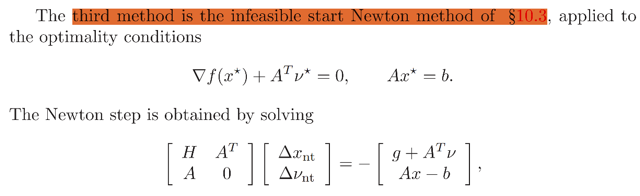</kbd></p>

<p align="center"><kbd>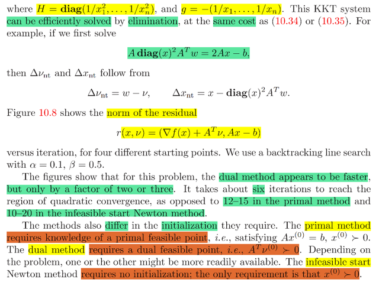</kbd></p>

> [!NOTE]
> Cuối cùng là áp dụng infeasible start Newton's method.
>
> Ý chính là so sánh các biểu đồ thì cho thấy cách 2 converge
> nhanh hơn (nhanh đến giai đoạn quadratic convergence hơn)
> một chút.
>
> Nhưng mỗi cách cần một điều kiện ban đầu khác nhau (mà trong
> thực tế có thể sẽ phụ hợp với từng bài toán cụ thể)

<br>

<p align="center"><kbd>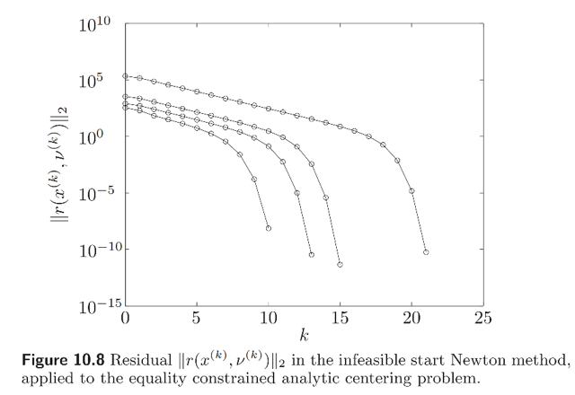</kbd></p>

<p align="center"><kbd>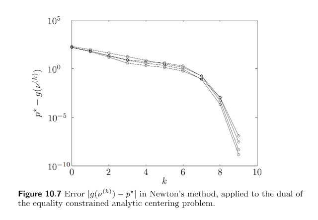</kbd></p>

<br>

<p align="center"><kbd>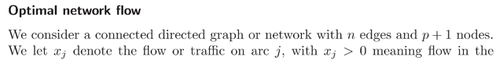</kbd></p>

<p align="center"><kbd>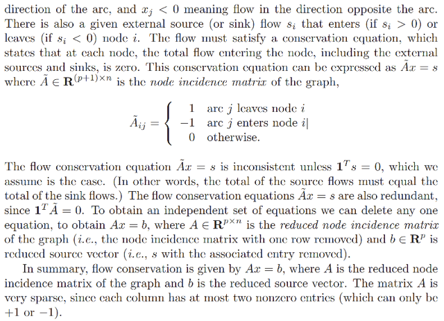</kbd></p>

<p align="center"><kbd>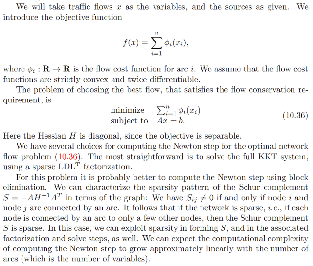</kbd></p>

> [!NOTE]
> QUAY LẠI SAU

<br>

<p align="center"><kbd>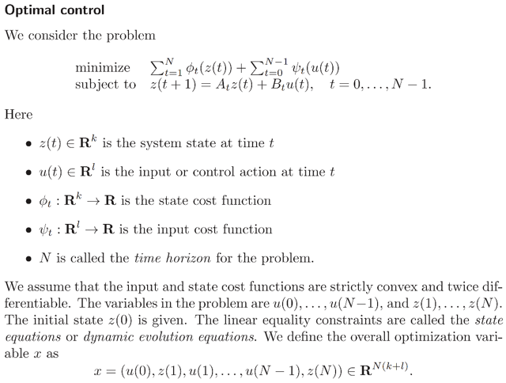</kbd></p>

<p align="center"><kbd>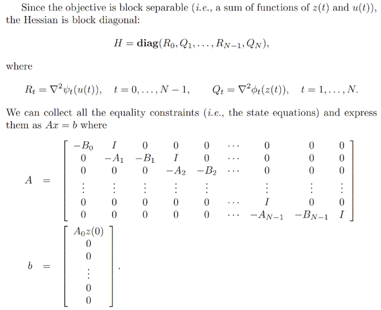</kbd></p>

> [!NOTE]
> QUAY LẠI SAU

<br>

<p align="center"><kbd>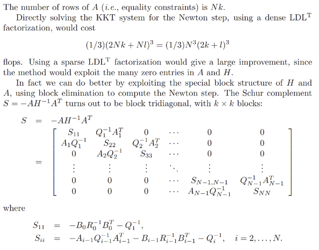</kbd></p>

<p align="center"><kbd>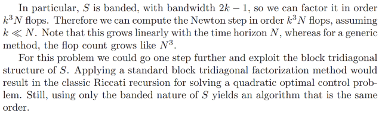</kbd></p>

> [!NOTE]
> QUAY LẠI SAU

<br>

<p align="center"><kbd>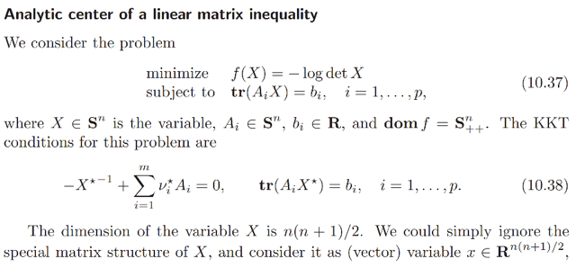</kbd></p>

<p align="center"><kbd>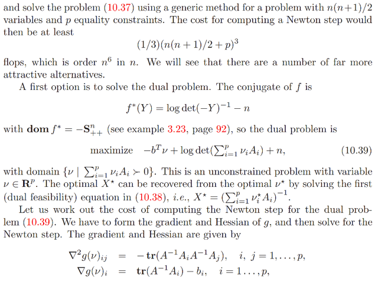</kbd></p>

<p align="center"><kbd>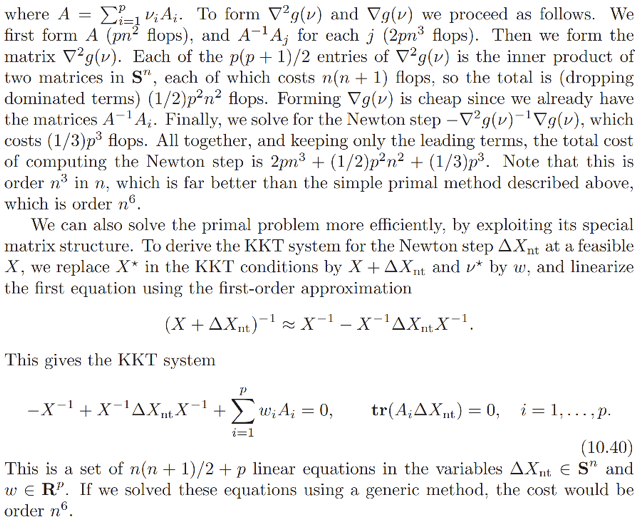</kbd></p>

> [!NOTE]
> QUAY LẠI SAU

<br>

<p align="center"><kbd>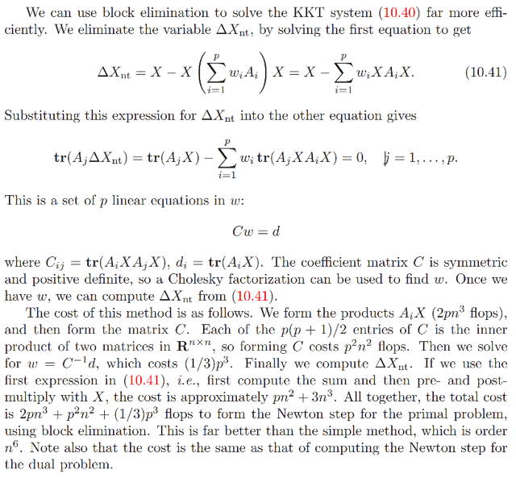</kbd></p>

> [!NOTE]
> QUAY LẠI SAU

<br>

<p align="center"><kbd>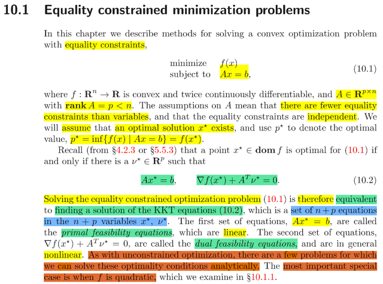</kbd></p>

<p align="center"><kbd>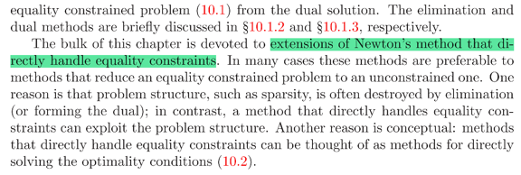</kbd></p>

<p align="center"><kbd>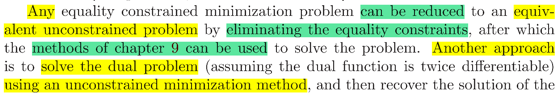</kbd></p>

> [!NOTE]
> Rồi, ta gặp lại bài toán convex constraint optimization, cụ thể là chỉ có equality
> constraints. Thế thì như đã biết, đang xét bài toán convex optimization, nên
> inequality constraint chỉ là các linear equation. Do đó mới thể hiện các
> constraints này bằng dạng ma trận: Ax `=` b
>
> Ở đây cho A là matrix p,n với rank `=` p > n. Có nghĩa là đây là matrix mập lùn,
> có nhiều cột hơn hàng, và các hàng đều độc lập. Nói cách khác, đây chính là
> full row rank matrix. Và việc các hàng độc lập thể hiện không có hàng nào `/`
> equation nào là redundant cả.
>
> Ôn lại một tí kiến thức 18.06 ta đã biết khi A như vậy thì Ax `=` b chắc chắn có
> nghiệm. Bởi vì rank A `=` p, nên chắc chắn có p cột độc lập  tuyến tính, đủ span
> toàn bộ R^p, do đó b, là một vector trong R^p luôn nằm trong columns space
> của A, từ đó luôn tồn tại linear combination các cột của A để tạo ra b, do đó mới
> nói Ax `=` b luôn có nghiệm. Và hơn nữa, vì luôn có ít nhất một cột phụ thuộc,
> hay cột tự do nên nullspace của A khác rỗng, từ đó ta sẽ chắc chắn hệ có vô số
> nghiệm có dạng x0 + Fz với x0 là nghiệm particular của Ax `=` b và F là matrix
> các cột là nullspace basis, Fz là non zero nullspace vector.
>
> Quay lại đây ta nhớ lại rằng trong bài toán constrained optimization, thì nhiệm
> vụ là tìm ra optimal x* là điểm khiến minimize f0(x) (objective) function TRONG
> SỐ các feasible point x: X `=` x: Ax `=` b Nên về ý nghĩa thì nó chính là việc tìm
> trong số nghiệm của Ax `=` b, nghiệm nào khiến f0(x) nhỏ nhất.
>
> Thế thì trong những phần trước chương 4 và 5 ta đều đã nói về việc giải bài
> toán này:
>
> Chapter 4 lập luận như sau: Dựa vào nhận định rằng optimal x* là điểm mà giá
> trị objective f0 của nó nhỏ hơn mọi f0 của các điểm khác trong feasible set, ở
> đây là tập nghiệm của Ax `=` b, là một affine `/` convex set
>
> f0(x*) ≤ f(x) ∀ x ∈ X
>
> Từ đó dẫn đến hình thành cái gọi là OPTIMALITY CONDITION:
>
> Điểm optimal x*, nằm trên feasible set (là một convex set) sẽ phải nằm trên rìa
> (boundary) của feasible set và tiếp tuyến `/` tangent plane của feasible set tại đó
> phải phân không gian làm hai half-plane `/` half-space sao cho toàn bộ feasible
> set nằm một bên và gradient ∇f(x*), vốn là normal vector của tangent
> hyperplane sẽ hướng ra ngoài.
>
> Lập luận đại khái là, khi đó, khi di chuyển trong feasible set từ x* thì ta  luôn di
> chuyển theo hướng hợp với ∇f(x*) một góc tù, dẫn đến dựa vào first order
> Taylor approximation:
>
> ```text
> f(x) = f(x*+δx) = f(x*) + ∇f(x*)Tδx thì với ∇f(x*)Tδx = ||∇f(x)||*||δx||*cos(θ) thì vì
> ```
> `θ` tù (acute) nên `∇f(x*)Tδx` ≤ 0. Dẫn đến f(x) ≥ f(x*) với mọi x ∈ feasible set.
>
> Vậy từ đó ta có optimality condition:
>
> ∇f(x*)T(x - x*) ≥ 0 ∀ x ∈ feasible set
>
> Thế thì quay lại đây, với x ∈ feasible set, tức là x là nghiệm của Ax `=` b ⇨ x `=` x0
> + v, và x* cũng thuộc feasible set nên x* `=` x0 + v' (v và v' là null-space vector)
>
> ⇨ ∇f(x*)T(x - x*) ≥ 0 ⇔ ∇f(x*)Tv ≥ 0 
>
> (v - v', hiệu hai nullspace vector cũng nói chung là một nullspace vector)
>
> Và vì đây là linear function đối với v nên điều này xảy ra ⇔ ∇f0(x*)Tv `=` 0
>
> Và dẫn đến kết luận là ∇f0(x*) vuông góc với nullspace. 
>
> Trong khi đó ta biết rowspace vuông góc (orthogonal complement) với 
> nullspace vậy điều vừa nói đồng nghĩa ∇f(x*) ∈ rowspace C(AT)
>
> Và như vậy phải tồn tại một vector v sao cho linear combination của các
> rows của A cho ra ∇f(x*), hoặc - ∇f(x*) cũng được vì nó cũng phải thuộc
> rowspace.
>
> Từ đó ta có condition: - ∇f0(x*) `=` ATv ⇔ ∇f0(x*) + ATv `=` 0
>
> Và từ đó việc giải bài toán optimization chính là giải hệ phương trình:
>
> Ax `=` b, ∇f0(x*) + ATv `=` 0
>
> `====`
>
> Còn trong chương 5 thì ta học về KKT conditions, giúp giải bài toán này:
>
> KKT conditions: ∇f0(x*) + + `Σ` λ* fi(x) + `Σ` v* ∇hi(x) `=` 0
>
> Và áp dụng ở đây thì nó chính là ∇f0(x*) + ATv* `=` 0
>
> Vậy thì ta biết thế Ax* `=` b gọi là primal feasiblity equations và
> ∇f(x*) + ATv* `=` 0 gọi là dual feasibility equations
>
> Gs cho biết chỉ có vài trường hợp là ta có thể giải nó một cách
> analytically. CHỖ NÀY COI VẬY MÀ CÓ THỂ KHÔNG ĐỂ Ý:
> CÓ NGHĨA LÀ DÙ BÀI TOÁN CÓ LÀ CONVEX OPT PROBLEM
> VÀ TA THIẾT LẬP OPTIMALITY CONDITION NHƯ TRÊN, THÌ
> KHÔNG PHẢI LÚC NÀO, THẬM CHÍ PHẦN LỚN TRƯỜNG HỢP
> LÀ KHÔNG GIẢI ĐƯỢC HOẶC RẤT PHỨC TẠP ĐỂ GIẢI (Ý
> LÀ GIẢI RA SOLUTION THEO CÁCH DÙNG CÔNG THỨC)
>
> Mà chỉ có một số là có thể, trong đó quan trọng nhất là khi f là
> quadratic function. Sở dĩ nó quan trọng là vì, dựa vào điều này
> xây dựng nên phương pháp Newton giúp giải bài toán trên theo
> lối iterative
>
> Ta cũng có thể giải theo cách bỏ đi constraint, chuyển nó thành
> equivalent problem unconstraint và giải theo các cách của chap 9

<br>

<p align="center"><kbd>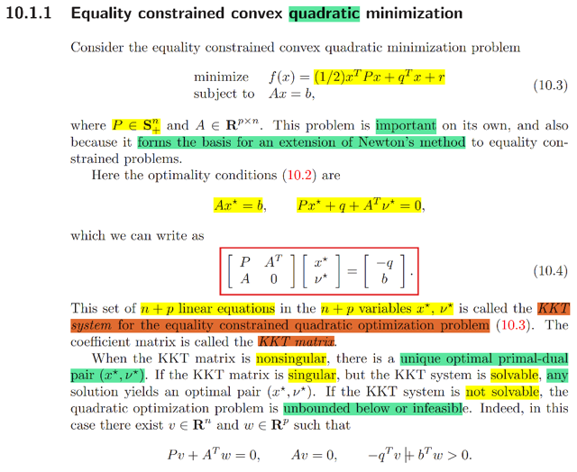</kbd></p>

<p align="center"><kbd>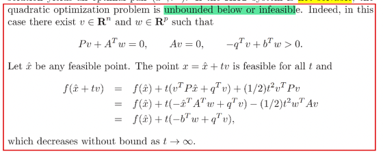</kbd></p>

> [!NOTE]
> rồi, case quan trọng nhất là khi f0 là quadratic, một phần vì nó sẽ
> tạo cơ sở cho việc mở rộng phương pháp Newton từ bài toán
> unconstraint ở chap 9.
>
> Thế thì cái optimality condition trở thành Ax* `=` b và Px* + q +  ATv*
> `=` 0
>
> (Với MIT 18s096 bây giờ không khó để biết ∇f0(x*) `=` Px* + q)
>
> Từ đó ta có thể thể hiện hệ trên bởi equation đóng khung. Và nó gọi
> là KKT SYSTEMS cho equality constrained quadratic optimization
> problem. với matrix này gọi là KKT matrix.
>
> Chú ý rằng, dĩ nhiên đây là hệ có n + p equation (Ax* `=` b là có p
> equations (p rows) và n variables, còn Px* + q + ATv* `=` 0 có n
> equations (AT có n rows) và p variables)  và p + n variables.
>
> Nên matrix KKT là square matrix.
>
> Và khi nó nonsingular `/` invertible thì dĩ nhiên ta biết hệ có unique
> solution
>
> Còn khi nó singular, thì có hai case, nếu solvable (tức [-q b] nằm
> trong columns space của KKT matrix thì ta có thể giải ra vo số
> nghiệm, khi đó nghiệm nào cũng là optimal
>
> Còn ngược lại thì ta không thể có nghiệm. Và điều này chính là bài
> toán gốc unfeasible hoặc unbounded below. (mà gs có chứng minh
> rằng f quả thật là unbounded below ở phần đúng khung. quay lại sau)

<br>

<p align="center"><kbd>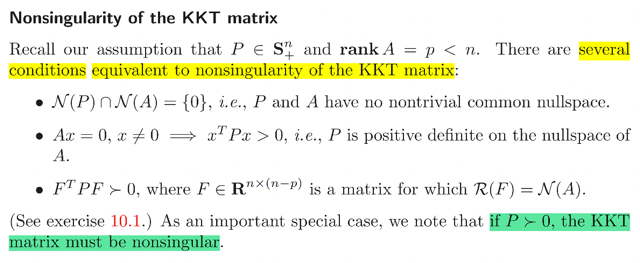</kbd></p>

> [!NOTE]
> Một số điều kiện sẽ tương đương với việc KKT matrix non-singular.
>
> 1) N(P) và N(A) change có điểm chung nào khác ngoài zero
>
> CHỨNG MINH:
>
> Ta chứng minh điều kiện cần KKT matrix non-singular ⇨ N(P) ∩ N(A) `=` 0
>
> Ta chứng minh bằng phản đảo: Chứng minh N(P) ∩ N(A) ≠ 0 thì K singular.  
>
> Kế hoạch là ta gỉa sử tồn tại u khác 0 trong của N(P) và N(A) ta cần chứng
> minh [K singular] mà K singular thể hiện bởi việc tồn tại vector `α` khác không
> khiến `Kα` `=` 0. 
>
> Giả sử tồn tại u khác 0 trong cả N(P) và N(A): Ta có Au `=` 0 và Pu `=` 0
>
> như vậy chỉ cần chọn w `=` 0 là ta có vector `α` `=` [u, w] khác 0 (vì u khác 0)
> khiến `Kα` `=` 0:
>
> ```text
> K α  = [Pu + ATw, Au] = [0 + AT0, 0] (do Au, Pu, w = 0)
> ```
>
> `=` [0, 0]
>
> Chứng minh xong N(P) ∩ N(A) ≠ 0 thì K singular
>
> thì cho phép suy ra:
>
> N(P) ∩ N(A) ≠ 0 ⇨ KKT matrix singular 
>
> Thì điều này suy ra:
>
> Nếu KKT matrix non-singular ⇨ N(P) ∩ N(A) `=` 0 
>
> Có nghĩa là ta đã chứng minh xong điều kiện cần của:
>
> KKT matrix non-singular ⇔ N(P) ∩ N(A) `=` 0
>
> Giờ cần chứng minh điều kiện đủ:
>
> Nếu N(P) ∩ N(A) `=` 0 ⇨ KKT matrix non-singular
>
> Ý tưởng là, ta cần chứng minh rằng dựa vào điều kiện N(P) ∩ N(A) `=` 0  
> thì vector h `=` [h1, h2] duy nhất khiến Kh `=` 0 là h phải bằng 0 (đó chính là
> thể hiện K non-singular)
>
> Vậy thì, điều này có nghĩa là ta ta cần chứng minh rằng giả sử Kh `=` 0
> thì nếu có hiện trạng N(P) ∩ N(A) thì h phải bằng 0, đồng nghĩa h1 `=` 0, 
> h2 `=` 0 
>
> Kế hoạch là vậy. Tiến hành như vừa nói ta giải sử Kh `=` 0, cái này
> tương đương: 
>
> 1) Ph1 + ATh2 `=` 0 và 2) Ah1 `=` 0.
>
> Rồi, điều cần làm là chứng minh, từ hai cái trên, kết hợp N(P) ∩ N(A)
> thì phải suy ra h1 `=` h2 `=` 0.
>
> Từ 2) suy ra h1 thuộc N(A). Dùng sự thật N(P) ∩ N(A) `=` 0 ta suy ra h1 `=` 0
>
> Rồi, vì h1 `=` 0 nên từ 1) suy ra ATh2 `=` 0. 
>
> Mà vì A full row rank nên AT full column rank, thành ra ATh2 `=` 0 suy ra h2 `=` 0.
>
> Vậy theo kế hoạch ở trên thì ta đã chứng minh xong.
>
> Vậy: K non-singular ⇔ N(P) ∩ N(A) `=` 0
>
> 2) xTPx > 0 với x là nullspace vector của A 
>
> Vậy cần chứng minh xTPx > 0 ∀ x ∈ N(A), x ≠ 0 ⇔ K non-singular
>
> Chứng minh chiều đi:
>
> Given xTPx > 0 for x ∈ N(A) ⇨ K non-singular
>
> K non-singular ⇔ Kz `=` 0 ⇨ z `=` 0,  N(K) `=` {0}
>
> Plan là giả sử Kz `=` 0, thì nếu kết hơp với P ≻ 0 on N(A) thì ta kết luận 
> z `=` 0
>
> z  `=` [z1, z2]
>
> Kz `=` 0 ⇔ Pz1 + ATz2 `=` 0 and Az1 `=` 0
>
> Az1 `=` 0 ⇨ z1 ∈ N(A) ⇨ z1TPz1 > 0
>
> Tới đây: Giả sử z1 ≠ 0 ⇨ Pz1 ≠ 0. Và Pz1 + ATz2 `=` 0 ⇨ ATz2 `=` -Pz1
>
> ATz2 nằm trong rowspace của A do đó cái này ( ATz2 `=` -Pz1) đồng
> nghĩa Pz1 nằm trong rowspace của A C(AT)
>
> Và rowspace orthogonal complement với nullspace
>
> Dẫn đến nếu Pz1 ∈ rowspace, và z1 lại thuộc nullspace (vì Az1 `=` 0)
> thì z1T(Pz1) phải bằng 0. Điều này mâu thuẫn với sự thật rằng P
> positive definite on N(A): z1TPz1 > 0.
>
> Như vậy điều ta giả sử ở trên (z1 ≠ 0) dẫn đến mâu thuẫn. 
>
> Vậy z1 phải bằng 0.
>
> Mà z1 `=` 0 thì Pz1 + ATz2 `=` 0 ⇔ ATz2 `=` 0
>
> Và với việc A full row rank, thì AT full column rank ⇨ ATz2 `=` 0 ⇔ z2 `=` 0
>
> Vậy ta đã chứng minh xong theo plan trên.
>
> Chứng minh chiều về:
>
> K non-singular ⇨ xTPx > 0 for x ∈ N(A)
>
> Chứng minh phản đảo: Giả sử P không p.d on N(A) thì K singular
>
> P không p.d on N(A) tức tồn tại u thuộc N(A) khiến uTPu không > 0.
>
> Gọi u là cái thuộc N(A) khác 0 khiến uTPu `=` 0.
>
> ta cần chứng minh rằng tồn tại z khác 0 khiến Kz `=` 0.
>
> Vậy Kz `=` (Pz1 + ATz2, Az1) 
>
> Vậy nếu chọn z1 `=` u, z2 `=` 0 thì z khác 0 và Kz `=` (Pu + AT0, Au)
> `=` (0, 0) vì Pu `=` 0, Au `=` 0 (do u thuộc N(A))
>
> Vậy là ta đã chứng minh rằng giả sử P không p.d on N(A) thì K singular.
>
> Từ đó ta đã chứng minh xong điều kiện đủ:
>
> K non-singular ⇨ xTPx > 0 for x ∈ N(A)
>
> 3) FTPF ≻ 0 với F là matrix C(F) `=` N(A)
>
> Chứng minh chiều đi (điều kiện cần):
>
> FTPF ≻ 0 với F là matrix C(F) `=` N(A) ⇨ K non-singular
>
> Ta sẽ chứng minh phản đảo:
>
> Giả sử K singular thì FTPF không thể ≻ 0
>
> K singular mean tồn tại z khác 0 khiến Kz `=` 0.
>
> Kz `=` 0 tức là Pz1 + ATz2 `=` 0 và Az1 `=` 0
>
> Thế thì dùng Az1 `=` 0 ⇨ z1 ∈ N(A) cũng là C(F). Vậy có thể  thể hiện
> z1 `=` Fy với y khác 0 nào đó.
>
> Thay z1 `=` Fy vào Pz1 + ATz2 `=` 0 ta có PFy + ATz2 `=` 0
>
> Nhân hai vế cho FT:
>
> FTPFy + FTATz2  `=` 0
>
> ⇔ FTPFy + (AF)Tz2  `=` 0
>
> Và vì C(F) `=` N(A) có nghĩa là columns của F sẽ nằm trong nullspace
> của A. Mà nullspace vector của A thì vuông góc với rowspace vector
> của A. Do đó AF sẽ `=` 0 vì AF sẽ có kết quả là component i của vector
> AF sẽ là dot product của [hàng i của A] và [cột i của F], và như đã nói
> mọi cột của F đều nằm trong N(A), đều vuông góc với rowspace, nên
> đều vuông góc với mọi row của A.
>
> Vậy FTPFy `=` 0 ⇨ điều này khiến yTFTPFy `=` 0 với y khác 0 Như vậy
> FTPF không ≻ 0
>
> Ta đã chứng minh xong.
>
> `====`
>
> Chứng minh chiều về (điều kiện đủ):
>
> K non-singular ⇨ FTPF ≻ 0 với F là matrix C(F) `=` N(A)
>
> Ta cũng chứng minh phản đảo đó là giả sử FTPF không ≻ 0 thì
> K singular, tức tồn tại z khác 0 khiến Kz `=` 0
>
> FTPF không ≻ 0, tức là tồn tại u khác 0 khiến uTFTPFu `=` 0
>
> Fu thuộc C(F), tức là N(A). Vậy AFu `=` 0.
>
> Vậy thì ta cần chứng minh tồn tại z khác 0 khiến Kz `=` 0
>
> Kz `=` (Pz1 + ATz2, Az1)
>
> Chọn z1 `=` Fu ⇨  Az1 `=` 0
>
> Và uTFTPFu `=` 0 ⇔ z1TPz1 `=` 0 ⇨ Pz1 `=` 0. Chỗ này là mấu chốt.
>
> Lí do là vì P ≽ 0. Với P positive semi definite thì đầu tiên nó phải
> symmetric. Mà 18.06: symmetric matrix luôn có đủ eigenvector độc
> lập và vuông góc. Nên có thể diagonalization: P `=` QΛQT 
>
> ```text
> ⇨ z1TPz1 = z1TQΛQTz1. Đặt y = QTz1 ta có yTΛy = Σi yi^2 λi
> ```
>
> Thế thì, vì P ≽ 0 nên mọi eigenvalues λi đều không âm
>
> Vậy để cái `Σi` yi^2 λi `=` 0 thì chỉ có một cách là mọi yi đều bằng 0. Và 
> như vậy suy ra y `=` Pz1 `=` 0.
>
> Như vậy, Pz1 `=` 0. Từ đó ta có thể chọn z2 `=` 0.
>
> Và Kz `=` (0 + 0, 0) `=` 0 ⇨ K singular
>
> Và condition quan trọng là khi P ≻ 0.
>
> thì dĩ nhiên nó sẽ ≻ on nullspace of A. Từ đó theo điều 2 thì KKT
> matrix non-singular

<br>

<p align="center"><kbd>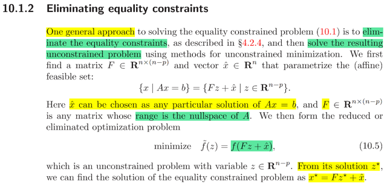</kbd></p>

> [!NOTE]
> cách tiếp cận đầu tiên là dùng một trong những technique để
> xây dựng equivalent problem: eliminating equality constraint.
>
> Bởi x phải là solution của Ax `=` b, nên x phải có dạng x^ + `x_null`
> với x^ là nghiệm bất kì của Ax `=` b (ko nhất thiết phải là
> `x_particular,` mà có thể là có thể là `x_particular` + `x_null` nào đó)
> và `x_null` dĩ nhiên là nullspace vector.
>
> Và `x_null` có thể represent bởi Fz, với F là matrix các nullspace
> vector của.
>
> Từ đó x `=` x^ + Fz ta mới thay vào để có unconstraint problem:
>
> minimize f(x^ + Fz), bấy giờ là hàm theo z, đặt là f~(z)
>
> Và giải bài toán này theo các cách đã biết, khi tìm được z* thì 
> x* của bài toán gốc là x^ + Fz*

<br>

<p align="center"><kbd>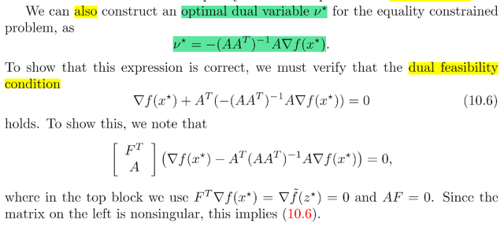</kbd></p>

> [!NOTE]
> x `=` Fz + x^
>
> ```text
> ⇨ ∇f~(z) =  df~/dz = df(Fz + x^)/dz
> ```
>
> ```text
> = df(x)/dx dx/dz = FT∇f(x)
> ```
>
> Với z* là optimal thì ∇f~(z*) `=` 0 ⇔ FT ∇f(x*) `=` 0
>
> AF `=` 0 là vì F's columns là nullspace basis của A, mà columns của AF
> sẽ là linear combination các A's columns với coefficient là cột của F.
> Với việc cột của F là nullspace vector của A thì dĩ nhiên linear
> combination các cột của A bởi cột của F sẽ là 0.
>
> Với hai điều trên thì đại khái là nói về cách tiếp cận thứ hai đó là ta
> dùng công thức sau đây để giải dual feasibility condition trước:
>
> v* `=` -(AAT)invA ∇f(x*)
>
> (nhớ không, bài toán này vốn cơ bản là giải hai hệ: primal feasibility
> equation Ax* `=` b và duall feasibility equation ∇f(x*) + ATv* `=` 0 thì cách
> sau là ta gỉai tìm v* trước rồi tìm x* sau)
>
> Và đại khái là ta có thể thử thế v* vào  ∇f(x*) + ATv* `=` 0 xem nó có
> thỏa không:
>
> tức là xem ∇f(x*) + AT(-(AAT)invA ∇f(x*)) có bằng 0 không.
>
> Và quả thật nó đúng là bằng 0.
>
> Mà cách để xem nó  (đặt là u đi) có phải bằng 0 không lại thông qua
> việc xem Wu có bằng 0 hay không với W `=` [FT; A].
>
> Thế thì thế vô dùng hai kết quả ở trên đâù ta thấy đúng là Wu `=` 0.
>
> Tới đây mới dùng lập luận là vì W non-singular, mà khi non-singular thì
> Wu `=` 0 chỉ khi u `=` 0. Từ đó cho thấy  ∇f(x*) + AT(-(AAT)invA ∇f(x*)) `=` 0
> suy ra v* thỏa dual feasibility equation.
>
> Tóm lại cách 1 là bỏ (eliminate) inequaltity constraint, và cách 2 này là
> dùng  công thức v* để có v* trước, và sau đó giải x*

<br>

<p align="center"><kbd>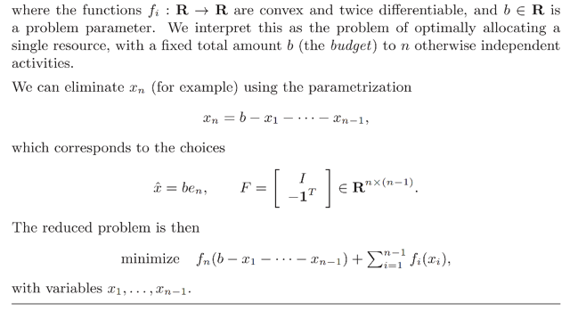</kbd></p>

<p align="center"><kbd>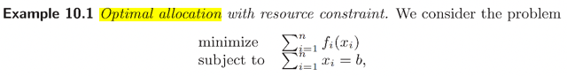</kbd></p>

> [!NOTE]
> QUAY LẠI SAU

<br>

<p align="center"><kbd>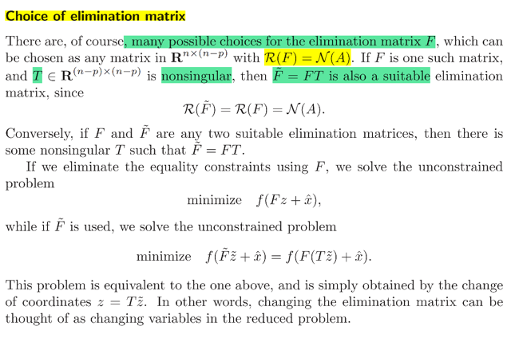</kbd></p>

> [!NOTE]
> Chứng minh nếu AFz `=` 0 với mọi z thì AFTz cũng bằng 0 với mọi z
>
> đơn giản với mọi z, FTz vẫn sẽ là vector nằm trong column space của
> F, tức vẫn là nullspace vector của A nên AFTz  cũng là `=` 0 và do đó F
> `=` FT cũng là matrix có C(FT) `=` N(A). Vậy thì đại khái là nếu có matrix
> T non singular thì ta có thể đổi sang dùng FT thay vì F vẫn được.
>
> Vì sao T cần non-singular?
>
> Vậy ý nói rằng: Giả sử ta đổi biến với việc đặt z `=` Tz~
>
> Thì bài toán minimize f(Fz + x^) sẽ tương đương minimize f(FTz~ +
> x^) `=` f(F~ z~ + z^) và như đã nói F~ vẫn là matrix hợp lệ vì columns
> space của nó vẫn là nullspace của A.
>
> Do đó mới nói, việc thay đổi matrix elimination từ F thành F~ thông
> qua T có thể được xem là việc đổi biến trong bài toán reduce
> (minimize f(Fz + x^)

<br>

<p align="center"><kbd>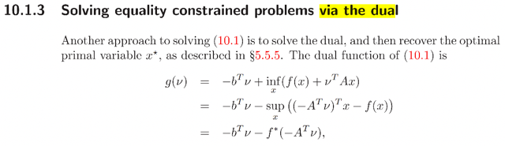</kbd></p>

<p align="center"><kbd>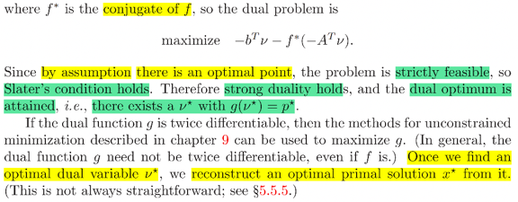</kbd></p>

> [!NOTE]
> cách tiếp cận khác để giải bài toán này đó là thông qua một kiến thức đã
> học từ phần trước đó là, nếu strong duality hold, tức p* `=` d*. Thì
> nếu như ta ĐÃ CÓ dual optimal rồi (λ*, v*) thì khi đó ta có thể giải bài
> toán tìm x minimize L(x, v*, λ*) thì nó chính là primal optimal
>
> (có nghĩa là thay vì giải constrained optimization problem ban đầu
> thì ta sẽ giải bài toán tìm dual optimal trước (là một bài toán
> unconstrained problem):
>
> maximize λ, v g(λ, v)
>
> Sau đó tìm x bằng unconstrained problem: minimize x L(x, λ*,
> v*)
>
> (có nghĩa là ta giải hai bài toán unconstrained problem)
>
> Vậy thì ở đây Lagrangian là f(x) + vT(Ax - b)
>
> `=` f(x) + vTAx - vTb
>
> ⇨ dual funcion: g(v) `=` inf x [f(x) + vTAx - vTb]
>
> `=` inf x [f(x) + vTAx] - vTb
>
> `=` - bTv + inf x [f(x) + vTAx]
>
> `=` - bTv - sup x [- f(x) - vTAx]
>
> `=` - bTv - sup x [- vTAx - f(x)]
>
> `=` - bTv - sup x [ (-ATv)Tx - f(x)]
>
> Tới đây dùng lại khái niệm conjugate của function f(x):
>
> f*(y) `=` sup x yTx - f(x)
>
> nên sup x [(-ATv)x - f(x)] chính là f*(-ATv)
>
> Vậy g(v) `=` - bTv - f*(-ATv)
>
> Từ đó dual problem (tức là problem mà ta giải để tìm dual optimal):
>
> maximize v  - bTv - f*(-ATv) 
>
> Giải ra v* ta sẽ thế vào để giải bài toán minimize x  f(x) + v*TAx - v*Tb
>
> solution của nó chính là primal solution của bài toán constrained
> optimization problem
>
> `====`
>
> Vậy thì nếu g khả vi hai lần thì ta có thể dùng các method của chap
> 9 để giải bài toán unconstrained optimization problem này

<br>

<p align="center"><kbd>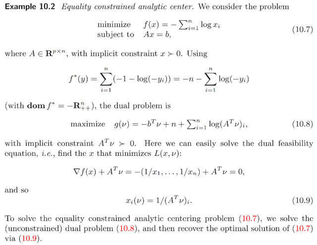</kbd></p>

> [!NOTE]
> Xét ví dụ cụ thể này, bài toán equality constrained optimization problem với
> f0(x) `=` - `Σi` log(xi)
>
> Implicit constraint x ≻ 0, đồng nghĩa mọi component xi đều > 0, và như đã nói
> ở những lần trước khi cũng nói về ví dụ này, thì trong bài toán này, ta đã có
> thể khẳng định là có Strong Duality.
>
> Lí do là vì:
>
> Thứ nhất, đây là bài toán convex optimization problem, bởi f0(x) là convex:
> log(xi) là concave ⇨ - log(xi) là convex, `Σ` của chúng cũng convex. Và affine
> equality dĩ nhiên cũng convex.
>
> Thứ hai, nói về cái gọi là constraint qualification, đại khái là nói về một số
> điều kiện bổ sung mà nếu thỏa, ta sẽ có Strong Duality. Và một loại phổ biến
> là Slater's condition. Thế thì cái này đó là tồn tại những điểm gọi là strictly
> feasible: Tức là với feasible condition fi(x) ≤ 0, thì strictly feasible có nghĩa là
> tồn tại điểm trong feasible set mà fi(x) < 0.
>
> Tuy nhiên, cũng có cái gọi là Weak Slater's condition, đại ý là khi inequality
> constraint là linear `/` affine, thì khỏi cần. Nên đại khái là, ở bài toán này không
> có inequality constraint, thì cũng coi như thỏa Slater condition, bài toán chắc
> chắn có strong duality.
>
> Như vậy với việc đã chắc chắn có strong duality, thì ta có thể giải bài toán gốc
> này (constraint problem) thông qua việc giải hai bài toán unconstrained
> problem khác:
>
> Dual problem, maximize v g(v) ⇨ v*
>
> Sau đó, minimize x L(x, v*) ⇨ x* chính là solution của constraint problem gốc.
>
> Thế thì dual function dĩ nhiên là inf x L(x, v) và nó sẽ dính đến conjugate
> function của f. g(v) `=` - bTv - f*(-ATv).  Nên ở đây, người ta cho biết f*(y) `=` -n -
> `Σi` log(-yi) (chứng minh cái này cũng không khó, bên dưới) rồi thì  g(v) `=` -bTv -
> (-n - `Σlog(ATv))` `=` -bTv + n + `Σ` log(ATv)
>
> ```text
> Chứng minh với f(x) = - Σi log(xi) thì f*(y) = -n - Σi log(-yi)  (Làm sau, note kế )
> ```
>
> Thế thì, dừng ở đây một chút, để ôn lại cái gọi là dual feasibility equation và
> primal feasibility equation. Cơ bản đó chính là khi ta đối diện bài toán equality
> constraint optimization problem, thì KKT condition `/` optimality  condition cho
> ta:
>
> ∇f(x) + ATv* `=` 0 (1) và Ax* `=` b (2). Thì (2) chính là primal feasibility equation
> và (1) chính là dual feasibility condition.
>
> Và thông qua hai cái này (đúng hơn là (1) ta có thể giải tìm x khi đã có v*.
>
> Do đó, ở đây ý nói là cái dual feasible equation cũng dễ giải ra x là hàm theo v:
>
> xi `=` `1/(ATv)i`
>
> Nên nếu sau khi giải dual problem xong, tìm được v*, thì ta sẽ có thể có ngay
> x* (mà nó cũng chính là việc ta có v*, ta giải bài toán minimize x L(x, v*) vì với
> v* fix thì L là hàm theo x, để tìm minimal của nó thì ta cũng xác lập optimality
> conditions
>
> Objective function f(x) `=` - `Σi` log(xi) `=` -1Tlog(x)
>
> Equality constraint h(x) `=` Ax - b
>
> L(x, v) `=` f(x) + vTh(x) `=` -1Tlog(x) + vT(Ax - b)
>
> Optimality condition:
>
> ∇f(x) + ATv `=` 0 (1)
>
> ∇f(x): Tìm theo MIT 18s096:
>
> df(x) `=` f(x + dx) - f(x) `=` -1Tlog(x + dx) + 1Tlog(x)
>
> `=` 1T(log(x) - log(x + dx)) `=` 1T[log(x) - log(x(1 + `dx/x))]`
>
> `=` 1T[log(x) -  log(x) - log(1 + `dx/x)]`
>
> ```text
> = 1T[-log(1 + dx/x)] ≈ 1T(dx/x) = (-1/x)Tdx
> ```
>
> ⇨ ∇f(x) `=` `-1/x`
>
> ```text
> ⇨ (1) ⇔ -1/x + ATv = 0 ⇔ 1/x = ATv
> ```
>
> Thế thì vế trái là vector `[1/x1,` `1/x2,...]`
>
> Vế phải là vector `[1/(ATv)1,` `1/(ATv)2,...]`
>
> `(1/ATv` là vector, có các component là nghịch đảo  của các
> component của ATv)
>
> Nên ta có xi `=` `1/(ATv)i`
>
> ```text
> Chứng minh với f(x) = - Σi log(xi) thì f*(y) = -n - Σi log(-yi)  (Làm sau)
> ```
>
> Theo định nghĩa của conjugate function của f(x): f*(y) `=` sup yTx - f(x)
>
> ⇨ f*(y) `=` sup x yTx - [- `Σi` log(xi)] 
>
> `=` sup x  yTx + `Σi` log(xi)  `=` sup x  yTx + 1Tlog(x) 
>
> `=` - inf x  - yTx - 1Tlog(x) 
>
> Xét g(x) `=` - yTx - 1Tlog(x)
>
> Và giải bài toán minimize g(x):
>
> Tìm gradient: dg `=` g(x + dx) - g(x)
>
> `=` - yT(x + dx) - 1Tlog(x + dx) - [- yTx - 1Tlog(x)]
>
> `=` - yTx - yTdx - 1Tlog(x + dx) + yTx + 1Tlog(x)
>
> `=` - yTdx - 1Tlog(x + dx) + 1Tlog(x)
>
> `=` - yTdx - 1T[log(x + dx) - log(x)]
>
> `=` - yTdx - `Σi` [log(xi + dxi) - log(xi)]
>
> `=` - yTdx - `Σi` [log(xi(1 + `dxi/xi))` - log(xi)]
>
> ```text
> = - yTdx - Σi [log(xi(1 + dxi/xi)/xi)]
> ```
>
> `=` - yTdx - `Σi` [log(1 + `dxi/xi)]`
>
> ```text
> ≈ - yTdx - Σi [dxi/xi]  | dùng log(1 + ε) ≈ ε ⇨ log(1 + dx) = dx
> ```
>
> ```text
> = - yTdx - (1/x)Tdx = (- y - 1/x)Tdx
> ```
>
> ⇨ ∇g `=` - y - `1/x`
>
> ```text
> Optimality condition: ∇g = 0 ⇔ - y - 1/x = 0 ⇔ -y = 1/x ⇔ x = -1/y
> ```
>
> Tức là x* sẽ là vector có các phần tử lần lượt là `[-1/y1,` `-1/y2,....]`
>
> Thế vào ta có:
>
> - inf x  - yTx - 1Tlog(x)  `=` -  - yTx* - 1Tlog(x*)  
>
> ```text
> = yTx* + 1Tlog(x*) = yT(-1/y) + 1Tlog(-1/y)
> ```
>
> ```text
> = Σi (-yi/yi) + Σi log(-yi^-1)
> ```
>
> `=` -n + `Σi` [- log(-yi)]
>
> `=` -n - `Σi` log(-yi)
>
> Vậy f*(y) `=` -n - `Σi` log(-yi)

<br>

<p align="center"><kbd>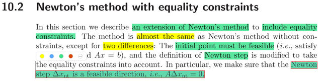</kbd></p>

<p align="center"><kbd>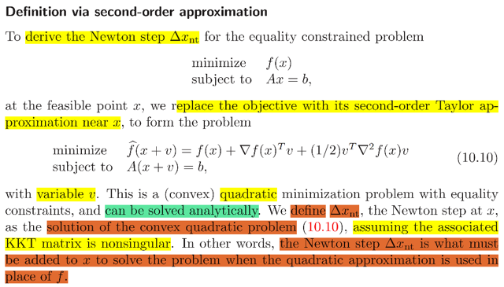</kbd></p>

<p align="center"><kbd>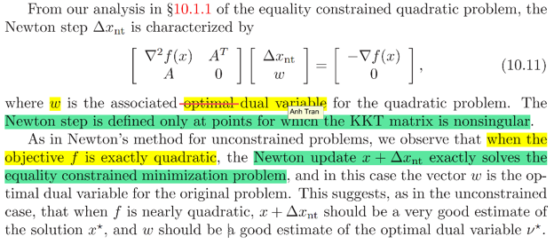</kbd></p>

> [!NOTE]
> Phần này ta sẽ mở rộng Newton's method để có thể dùng cho  bài toán constrained
> optimization problem. Cơ bản là vẫn giống, chỉ khác ở chỗ initial point phải feasible và
> Newton's step phải là feasible direction: A `Δx_nt` `=` 0
>
> ```text
> (có thể hiểu thế này, sau khi update, ta cần x_k+1 cũng feasible do đó A(x + t*Δx_nt) =
> ```
> ```text
> b Nên Ax + A t Δx_nt = b ⇔ A Δx_nt = 0
> ```
>
> `====`
>
> Thế thì đầu tiên như đã nói, ta cần ĐỊNH NGHĨA MỚI CỦA NEWTON STEP `Δx_nt`
> TRONG BỐI CẢNH BÀI TOÁN CONSTRAINED.
>
> Thì đầu tiên ta nói về định nghĩa gốc (trong bài toán unconstrained)  của Newton's
> step trước: Đó là ta COI `/` XẤP XỈ HÀM f BỞI QUADRATIC (SECOND ORDER
> TAYLOR APPROX. TẠI X). Khi đó, objective trở thành quadratic function và bài toán
> optimization trở thành bài toán CONVEX QUADRATIC OPTIMIZATION và lúc này NÓ
> CÓ ANALYTIC SOLUTION (Tức là có thể tìm ra công thức của x* một cách toán học)
> từ đó ta có công thức của Newton's step `(Δx_nt` `=` x* - x) mang ý nghĩa là: Nếu tại x ta
> xấp xỉ hàm f bởi quadratic function dùng second order Taylor approx của f tại x, thì
> Newton's step `Δx_nt` là thứ cần cộng với x để ra x*
>
> Quay lại đây ta cũng làm y chang. Ta có bài toán equality constrained optimization. Thì
> tại x ta cũng second order Taylor approx. hàm f và dùng nó để thay cho objective f.
> KHi đó ta có một bài toán khác, với objective  là convex quadratic và equality
> constrained. Thì bài toán này cũng có thể có optimal theo cách analytically. Và từ đó
> x* - x là định nghĩa của Newton's step trong bài toán constrained.
>
> Cụ thể là từ f(x), second order Taylor approx. và thể hiện thành hàm theo v (hay `δx)`
>
> f(x + v) ≈ f(x) + ∇f(x)Tv + `(1/2)` vT∇^2f(x)v
>
> Từ đó như đã nói, ta giải bài toán này: minimize  f(x) + ∇f(x)Tv + `(1/2)` vT∇^2f(x)v
> constrained A(x + v) `=` b.
>
> Và v* chính là `Δx_nt`
>
> `====`
>
> Thì đại khái là như những phần trước ta đã biết, việc giải bài toán constrained convex
> quadratic optimization (để tìm Newton's step) vẫn theo những gì đã nói vì nó cũng là
> bài toán constrained problem với equality constrained thôi.
>
> Tức là nó cũng sẽ dựa vào optimality condition Ax* `=` b và ∇f(x) + ATw* `=` 0 (ở đây
> dùng w là dual variable `/` Lagrange multiplier) từ đó ta có hệ n+p equation với n+p
> variable represented bởi KKT matrix.
>
> Để rồi khi KKT matrix non-singular và ta có thể có unique solution thì ta sẽ tìm được v*
> `=` `Δx_nt.`
>
> Thế thì chú ý rằng: Bài toán gốc f(x) chưa chắc đã là quadratic function. Và trong bài
> toán equality constrained optimization problem thì variable là x, và v ("nu", tức dual
> variable)
>
> Trong bài toán sau khi ta thay f bằng f^ là xấp xỉ bậc hai của f tại x. Ta vẫn có bài toán
> equality constrained problem. Với primal variable là v (mang ý nghĩa giống như `δx,)` và
> dual variable là w.
>
> Ta giải ra v* là `Δx_nt.` Thì một ý quan trọng đã gặp trước đây đó là: Nếu hàm f gốc mà
> cũng là `/` rất gần với quadratic, thì đương nhiên x + `Δx_nt` sẽ rất sát với optimal x* thực
> sự của bài toán gốc. Và optimal dual w cũng sẽ rất sát với dual optimal v* ("ν") của bài toán
> gốc

<br>

<p align="center"><kbd>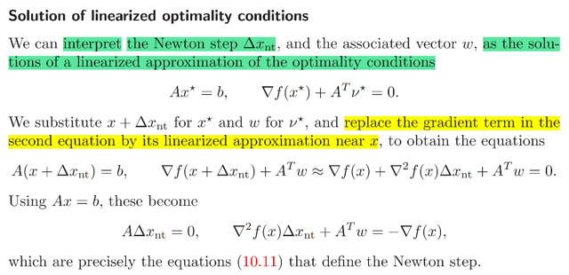</kbd></p>

> [!NOTE]
> đại khái là khi ta đã approx f(x) tại gần x bởi quadratic function, thì tức
> là ta cũng đã approx. gradient ∇f(x) tại gần x bởi một linear function.
>
> Thành ra trong bài toán gốc, optimality condition là: 
>
> Ax* `=` b, ∇f(x*) + ATv* `=` 0
>
> Thì việc ta thay f(x) bởi quadratic function (dùng second order Taylor approx.)
> tại x thì cũng sẽ tương đương ta thay ∇f(x) bởi linear approx. của nó tại x:
>
> ```text
> ∇f(x + Δx_nt) ≈ ∇f(x) + ∇^f(x)TΔx_nt
> ```
>
> Để rồi việc giải optimality condition trở thành A(x + `Δx_nt)` `=` b 
>
> ```text
> và dùng  Ax = b ⇨ A(x + Δx_nt) = b
> ```
>
> ⇔ `AΔx_nt` `=` 0 và 
>
> ∇f(x) + `∇^2f(x)TΔx_nt` `=` 0
>
> Và đây cũng là hệ equation với KKT matrix ở trên
>
> Nói chung là ở đây cho ta thêm một cách hiểu khác (interpretation) 
> của `Δx_nt`

<br>

<p align="center"><kbd>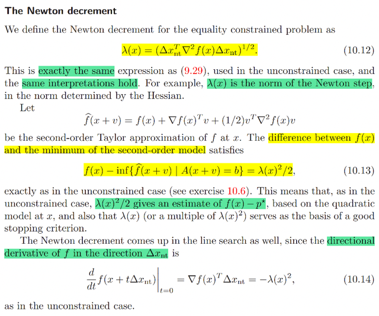</kbd></p>

> [!NOTE]
> Rồi, cũng tương tự như unconstrained case, ta có cái gọi là Newton's 
> ```text
> decrement. Có công thức là λ(x) = (Δx_ntT ∇^2f(x) Δx_nt)^1/2
> ```
>
> Thế thì hoàn toàn y như trước, có vài ý nghĩa của cái này, ví dụ như:
>
> Tại x nếu approx hàm f bởi quadratic thì khi đi theo `Δx_nt` thì sẽ giúp
> giảm f xuống bao nhiêu: f(x) - inf v f^(x + v) | A(x + v) `=` b. Thì cái
> này chính là `λ^2(x)/2`
>
> inf v f^(x + v) | A(x + v) `=` b:
>
> ```text
> = f^(x + Δx_nt) | vì như đã nói Δx_nt được định nghĩa là cái mà khiến
> ```
> v* `=` x + `Δx_nt` minimize cái này
>
> ```text
> = f(x) + ∇f(x)TΔx_nt + 1/2 (Δx_nt)T ∇^2f(x) Δx_nt
> ```
>
> ```text
> ⇨ f(x) - inf ... =  -∇f(x)TΔx_nt -1/2 (Δx_nt)T ∇^2f(x) Δx_nt
> ```
>
> Ta phải chứng minh:
>
> ```text
> -∇f(x)TΔx_nt -1/2 (Δx_nt)T ∇^2f(x) Δx_nt = 1/2 λ(x)^2
> ```
>
> ```text
> Dùng công thức Δx_nt: Mà Δx_nt như đã nói, là solution của bài toán:
> ```
>
> minimize f^(x + v) `=` f(x) + ∇f(x)Tv + `1/2` vT ∇^2f(x) v subject to A(x + v) `=` b
>
> từ đó nó là solution của [KKT matrix] `[Δx_nt,` w] `=` [-∇f(x), 0]
>
> với KKT matrix `=` [∇^2f(x), AT; A, 0]
>
> ```text
> Cũng là solution của A Δx_nt = 0 và ∇^2f(x) Δx_nt + ATw = - ∇f(x)
> ```
>
> ⇔ ∇^2f(x) `Δx_nt` `=` - ∇f(x) - ATw
>
>
> ```text
> Vế trái = -∇f(x)TΔx_nt -1/2 (Δx_nt)T ∇^2f(x) Δx_nt
> ```
>
> ```text
> = -∇f(x)TΔx_nt - 1/2 (Δx_nt)T (-∇f(x) - ATw)
> ```
>
> ```text
> = -∇f(x)TΔx_nt + 1/2 (Δx_nt)T ∇f(x) + 1/2 (Δx_nt)T ATw
> ```
>
> ```text
> = -1/2 ∇f(x)TΔx_nt + 1/2 (Δx_nt)T ATw
> ```
>
> ```text
> = -1/2 [∇f(x)TΔx_nt - [A Δx_nt]Tw]
> ```
>
> ```text
> = -1/2 [∇f(x)TΔx_nt - [0]Tw]
> ```
>
> ```text
> = -1/2 [∇f(x)TΔx_nt]
> ```
>
> ```text
> Vế phải = 1/2 λ(x)^2 = 1/2[(Δx_nt)T ∇^2f(x) Δx_nt]^1/2^2
> ```
>
> ```text
> = 1/2 [(Δx_nt)T ∇^2f(x) Δx_nt]
> ```
>
> ```text
> = 1/2 [(Δx_nt)T (-∇f(x) - ATw)]
> ```
>
> ```text
> = [-(Δx_nt)T∇f(x) - (Δx_nt)TATw)]
> ```
>
> ```text
> = [-(Δx_nt)T∇f(x) - (AΔx_nt)Tw)]
> ```
>
> `=` `[-(Δx_nt)T∇f(x)` - (0)Tw)]
>
> ```text
> = -1/2 [(Δx_nt)T∇f(x)]
> ```
>
> Vậy đúng là vế trái `=` vế phải. Chứng minh xong.
>
>
> `====`
>
> Hoặc là nó (λ(x)) chính là quadratic norm của Newton's step `Δx_nt`
> với P là Hessian tại x: ∇^2f(x) (quadratic norm ||.||P phải được define 
> gắn với một matrix).
>
> Cái này theo định nghĩa ||.||P thôi: ||u||P `=` `[uTPu]^1/2` 
>
> ```text
> ⇨ ||Δx_nt||_∇^2f(x) = [(Δx_nt)T ∇^2f(x) Δx_nt]^1/2 và đó chính là λ(x)
> ```
>
> Và cuối cùng là Newton decrement chính là directional derivative của
> hàm f theo hướng vector Newton's step `Δx_nt.`
>
> Chứng minh cho những cái này thì đã làm ở trước rồi (theo link)

<br>

<p align="center"><kbd>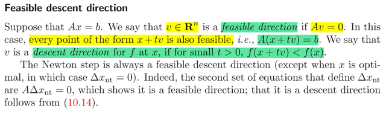</kbd></p>

> [!NOTE]
> Phần này đơn thuần là định nghĩa về cái gọi là FEASIBLE
> DESCENT DIRECTION
>
> Trước tiên feasible direction nôm na là cái hướng mà khi từ một
> feasible point x, đi theo hướng đó, ta luôn có một feasible point
> khác: x feasible thì x + tv cũng feasible (v là feasible direction)
>
> Vậy với feasible định nghĩa bởi thỏa Ax `=` b thì v là feasible direction
> khi A(x + tv) `=` b ⇔ Av `=` 0
>
> Và nếu đi theo hướng đó mà f giảm nữa thì gọi là feasible descent
> direction.
>
> Thì hồi nãy có nói Newton step trong bài toán constrained sẽ phải
> thỏa A `Δx_nt` `=` 0 nên nó chính là feasible direction. Đồng thơi đi theo
> hướng đó f giảm nữa nên nó là feasible descent direction

<br>

<p align="center"><kbd>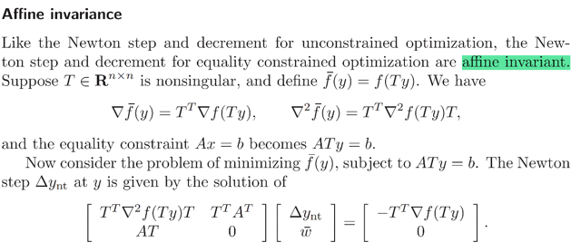</kbd></p>

<p align="center"><kbd>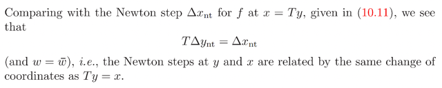</kbd></p>

<br>

<p align="center"><kbd>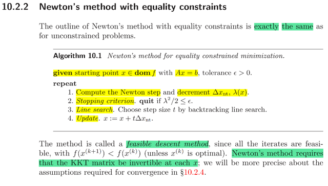</kbd></p>

> [!NOTE]
> Thuật toán Newton's method cho bài
> toán constraints cũng y chang.
>
> Bắt đầu bởi một starting point (phải feasible) 
>
> Lặp lại quá trình:
>
> 1) Tính Newton's step và decrement
>
> 2) Kiểm tra stopping condition khi `λ^2/2` đã nhỏ hơn `ε` hay chưa
>
> 3) Nếu chưa thì line search để chọn step size: dùng backtracking
>
> 4) Update

<br>

<p align="center"><kbd>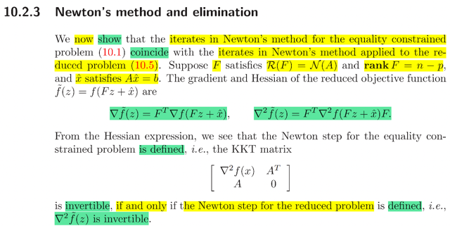</kbd></p>

> [!NOTE]
> đại khái là phần này muốn chứng minh cho thấy rằng các bước iterates của
> Newton's method trong problem gốc (minimize f(x) constrained Ax `=` b nó sẽ y
> như trong bài toán reduced (bài toán equivalent bằng cách bỏ equality
> constrained đi: minimize f(Fz + x^) (với F là matrix sao cho C(F) `=` N(A) và x^
> là solution: Ax^ `=` b
>
> Derive lại gradient và Hessian của reduced objective function:
>
> f~(z) `=` f(Fz + x^). Dĩ nhiên f~(z) vẫn là vector -> scalar function
>
> Nên df~(z) `=` f~'(z)[dz], là một linear operator act on dz cũng sẽ là  inner
> product của một vector (gradient vector ∇f~(z)) với vector dz vì như MIT 18.
> s096 đã học, linear operator act on một vector (dz) để cho ra scalar df~ thì chỉ
> có thể là phép dot product giữa hai vector
>
> ```text
> Thế thì ta cứ áp dụng chain rule: df~(z) / dz = df(x(z))/dz = df(x)/dx dx(z)/dz
> ```
>
> `=` ∇f(x) F Mà gradient ∇f~(z)  như đã nói, phải là một vector nên nó phải là
>
> FT∇f(x) mới ra column vector
>
> ⇨ ∇f~(z) `=` FT∇f(x) `=` FT∇f(Fz + x^)
>
> Rồi, để có Hessian ∇^2f~(z). tiếp tục lấy gradient của ∇f~(z)
>
> Kết quả sẽ là FT∇^2f(Fz + x^)F
>
> `====`
>
> Thế thì phải hiểu như sau: Nói về Newton's method thì định nghĩa của
> Newton's step đó là, "khi xấp xỉ function gốc f(x) bởi "phiên bản xấp xỉ bậc hai
> (khai triển Taylor bậc hai của nó tại x" f^ thì ta có thể tìm ra "bước + hướng" để
> khi update từ x ra giảm được nhiều nhất, xuống được thấp nhất giá trị hàm f^.
>
> Cụ thể là: Second order Taylor approx. của f tại x:
>
> ```text
> f(x + δx) ≈ f(x) + ∇f(x)Tδx + 1/2 δxT ∇^2f(x) δx,
> ```
>
> Và ta dùng vế phải để thay cho f: f^(v) `=` f(x) + ∇f(x)Tv + `1/2` vT ∇^2f(x) v
>
> Và từ đó `Δx_nt` chính là solution của bài toán: minimize f^(v)
>
> với constraint sẽ trở thành A(x + v) `=` b ⇔ A v `=` 0
>
> Và đây là bài toán equality constrained convex quadratic problem
>
> Thế thì khi giải bài toán equality constrained convex quadratic problem này thì
> như đã nói nó sẽ "trở thành" việc giải hai hệ:
>
> primal feasible equations:
>
> ```text
> A(x + Δx_nt) = b ⇔ A Δx_nt = 0 và
> ```
>
> dual feasible equations:
>
> ```text
> ∇f^(v) + ATw = 0 ⇔ ∇^2f(x)Δx_nt + ∇f(x) + ATw = 0
> ```
>
> ⇔ `∇^2f(x)Δx_nt` + ATw `=` -∇f(x)
>
> Từ đó, ta "gom lại" thành dạng [KKT matrix] `[Δx_nt,` w] `=` [-∇f(x), 0]
>
> Thì khi xét KKT matrix `=` [∇^2f(x), A; AT, 0] thì ta thấy rằng nó sẽ non-singular khi 
> và chỉ khi Newton's step của reduced problem được defined.
>
> Cụ thể là Hessian ∇^2f~(z) non-singular `/` invertible
>
> Ý này có nghĩa là vầy: Reduced problem là bài toán unconstrained. Nên với
> bài toán unconstrained thì Newton's step có công thức là -∇^2f~(z)inv ∇f~(z)
>
> Do đó, để CÓ Newton's step thì ∇^2f~(z) phải invertible. 
>
> Mà bài toán reduced thì equivalent với bài tóán gốc, nên để bài toán gốc có Newton's
> step thì bài toán reduced phải có Newton's step, và như vậy ∇^2f~(z) invertible thì
> bài toán gốc có thể tìm ra `/` tính ra Newton's step, đồng nghĩa KKT matrix invertible
>
> Lí do của cái này là ở trong phần trước, (thuộc về bài tập) ta phải chứng minh là
> nếu P ≻ 0 thì KKT matrix sẽ invertible. Mà P ở đây là ∇^2f~(z), vốn là square symmetric
> nên nếu nó invertible

<br>

<p align="center"><kbd>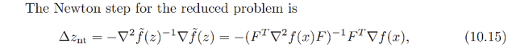</kbd></p>

<p align="center"><kbd>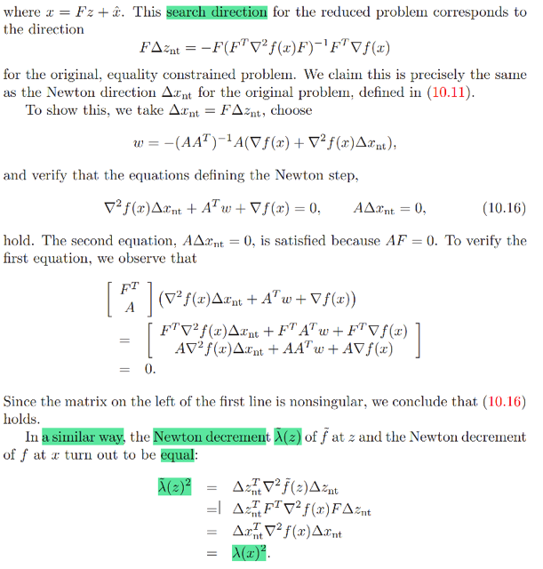</kbd></p>

> [!NOTE]
> Rồi, Newton's step của reduced problem, như đã nói ở trên, 
> reduced problem là unconstrained problem (vì đã reduce `/` eliminate
> constraint rồi) thì công thức của Newton's step là -∇^2f(x)inv ∇f(x)
>
> Thì đó là công thức chung, còn ở đây thì nó là - ∇^2f~(z)inv ∇f~(z)
>
> Thay ∇f~(z) `=` FT∇f(x) `=` FT∇f(Fz + x^)
>
> Và ∇^2f~(z) `=` FT∇^2f(Fz + x^)F
>
> Ta có Newton's step: `Δz_nt` `=` - [FT∇^2f(x)F]inv FT∇f(x)
>
> `====`
>
> QUAY LẠI SAU.
>
> NÓI CHUNG LÀ MUỐN CHỨNG MINH CHO THẤY ÁP DỤNG NEWTON
> METHOD CHO BÀI TOÁN GỐC VÀ BÀI TOÁN REDUCED (ELIMINATE
> CONSTRAINT) THÌ ĐỀU GIỐNG NHAU

<br>

<p align="center"><kbd>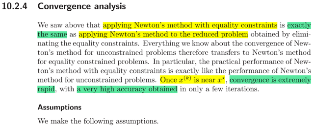</kbd></p>

> [!NOTE]
> Đại khái là dựa vào việc vừa rồi ta đã cho thấy việc apply Newton's
> method vào bài toán constrained optimization gốc cũng the same với
> việc apply Newton's method với bài toán reduced (unconstrained)
> problem.
>
> Do đó mọi thứ ta biết về tính chất của sự hội tụ trong phương pháp
> Newton của bài toán unconstrained mà chap 9 đã phân tích thì ở đây
> đều áp dụng.
>
> Và ta nhớ có một đặc điểm nổi bật đó là khi x(k) gần x* thì convergence
> sẽ ngày càng chính xác và sự hội tụ sẽ rất nhanh (giai đoạn gọi là
> quadratic convergence `/` pure Newton phase)

<br>

<p align="center"><kbd>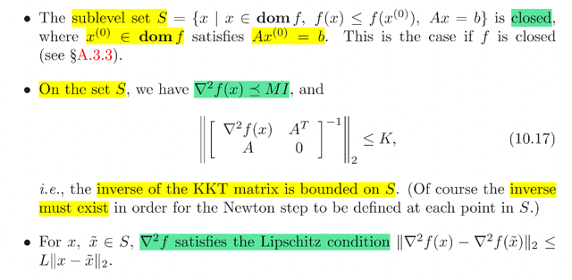</kbd></p>

> [!NOTE]
> Một số assumption mà phần trước đã gặp như sub-level set S là
> tập đóng và x(0) feasible (thỏa Ax(0) `=` b).
>
> Trên set S, thì ta có ∇^2f(x) ⪯ MI (nhắc lại cái này xuất phát từ
> việc sublevel set S bị chặn)
>
> Và KKT matrix is invertible. (đây là điều kiện để ta có thể có
> (define) Newton's step tại mọi điểm trên S) như đã nói ở trước
> đây
>
> và KKT inverse cũng bị chặn theo cách: ||.||l2 norm của nó ≤ K
>
> (chưa hiểu ý nghĩa của cái này lắm)
>
> Và assumption nữa là ∇^2f thỏa Lipschitz condition:
>
> ||∇^2f(x) - ∇^2f(x~)|| ≤ L||x - x~||

<br>

<p align="center"><kbd>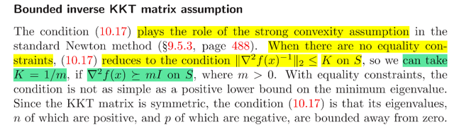</kbd></p>

> [!NOTE]
> Đại khái là cái điều kiện có vẻ lạ là inverse của KKT matrix có l2 norm
> ≤ K chính là đóng vai trò của cái điều kiện strong convexity (thể hiện
> bởi ∇^2f(x) ≥ mI).
>
> Lí do là vì khi với bài toán unconstrained, thì cái KKT matrix này:
> [∇^2f(x) A; AT 0] khi không còn A (của constrained Ax `=` b) nữa thì chỉ
> còn ∇^2f(x) và điều kiện ||∇^2f(x)inv|| ≤ K hoàn toàn tương đương với
> strong convexity: vì chỉ việc chọn K `=` `1/m` thì nó chính là  ∇^2f(x) ≽ mI
>
> Tại sao? ||∇^2f(x)inv|| ≤ `1/m`
>
> là vì ||∇^2f(x)inv|| là spectral norm của ∇^2f(x)inv và nó là singular
> values lớn nhất của ∇^2f(x)inv. Và vì ∇^2f(x)inv là symmetric matrix,
> nên thật ra eigenvalue và singular values là như nhau. Từ đó dẫn tới
> mọi eigenvalues của ∇^2f(x)inv ≤ `1/m` ⇨ mọi eigenvalues của ∇^2f(x)
> ≥ m
>
> |λ_max(Ainv)| ≤ `1/m`
>
> ⇨ |λ_min(A)| ≥ m
>
> (vì eigenvalues của A `=` 1 `/` eigenvalue của Ainv)
>
> Và đó chính là ∇^2f(x) ≽ m
>
> `====`
>
> Thế thì với constrained case, điều kiện này có nghĩa là ta muốn  các
> eigenvalues của KKT matrix (vốn sẽ khác 0, để nó non-singular)
> TRÁNH XA 0. Tức là giá trị tuyệt đối của chúng > 0 càng nhiều càng
> tốt. Vì sao? Là vì khi eigenvalues mà càng gần 0 thì nghịch đảo của nó
> (tức eigenvalues của KKT inverse) sẽ rất lớn. Và từ đó dẫn đến các
> vấn đề (numerical issues) cũng như trạng thái poor condition

<br>

<p align="center"><kbd>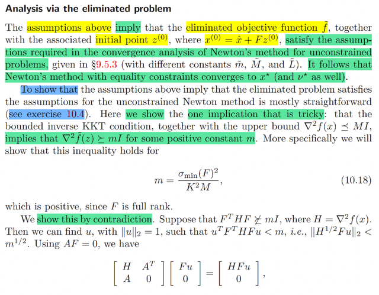</kbd></p>

<p align="center"><kbd>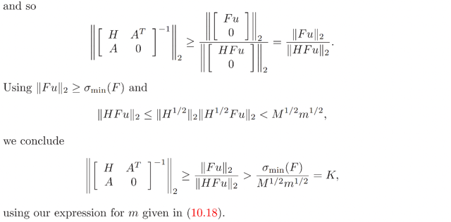</kbd></p>

> [!NOTE]
> đại khái là những assumption vừa rồi (được đặt ra để phục vụ cho
> việc convergence analysis của bài toán constrained) THẬT RA ĐÃ
> IMPLY (cũng dẫn đến) những assumption nếu ta giải bài toán
> unconstrained tương đương thông qua phương pháp eliminate
> equality constrained.
>
> Nói cách khác, trong chương trước khi học về các phương pháp
> tiếp cận bài toán unconstrained problem, thì ta có vài giải định ví dụ
> như (cũng là S bị chặn, tồn tại m, M sao cho mI ⪯ ∇^2f(x) ⪯ MI)
> cũng như là Lipschitzt continuous. Thì đây với những assumption
> đó cho bài toán constrained thì nó cũng giúp thỏa các assumption
> cần thiết của bài toán unconstrained tương đuong (mà ta gọi là bài
> toán reduced)
>
> Thế thì gs mới nói việc chứng minh điều trên cũng không khó gì và
> nó là phần của mình (bài  tập) còn ở đây thì người ta sẽ chứng
> minh một ý trong đó. Đó là kết nối giữa điều kiện của KKT matrix
> với điều kiện này: mI ⪯ ∇^2f(x) ⪯ MI của bài tóan unconstrained
> Nói cách khác ta sẽ chứng minh nếu thỏa điều kiện `||KKT_inverse||` ≤ K
> thì sẽ chính là thỏa mI ⪯ ∇^2f(x) ⪯ MI với m nào đó
>
> Một ý nữa cũng khá quan trọng đó là. vì như trên đã nói, khi thỏa các
> assumtion của bài toán constrained, thì đồng nghĩa thỏa assumption
> của bài toán reduced unconstrained. Mà khi đó, như đã biết với bài toán
> unconstrained, nếu thỏa các assumtopn, thì các thuật toán sẽ có
> thể converge `/` tìm ra optimal. Do đó những điều kiện vừa rồi của bài
> toán constrained cũng sẽ đủ để đảm bảo sự convergence
>
> PHẦN CHỨNG MINH NÀY TA SẼ QUAY LẠI SAU
>
> QUAY LẠI SAU

<br>

<p align="center"><kbd>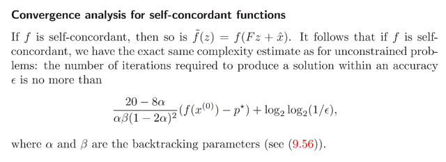</kbd></p>

> [!NOTE]
> QUAY LẠI SAU

<br>


<a id="node-7ef2zy8"></a>
## Lec 9

<br>

<p align="center"><kbd>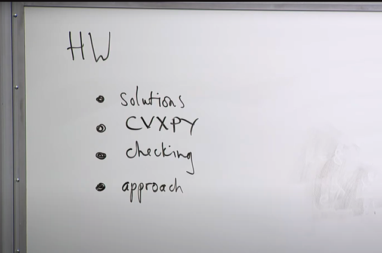</kbd></p>

> [!NOTE]
> GS Có vài dặn dò về Homework.
>
> Và đại ý là ta sẽ kết thúc phần Lí thuyết và chuyển sang
> phần Thực hành

<br>

<p align="center"><kbd>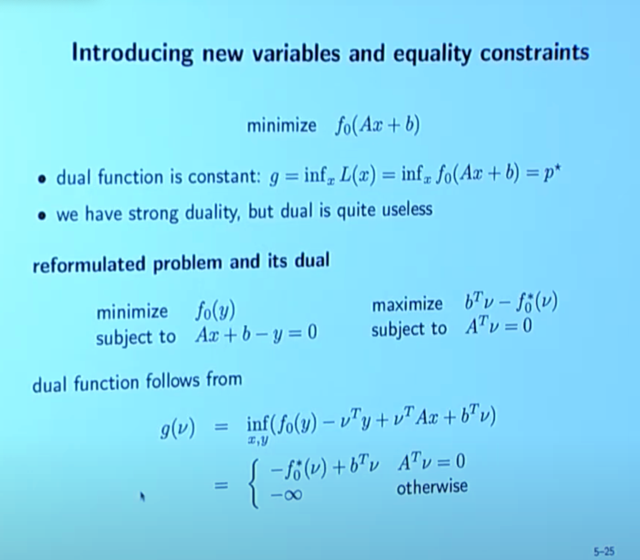</kbd></p>

> [!NOTE]
> Đại khái là ở đây ta có bài toán optimization nhưng ko có constraint: Chỉ có objective
> là minimize f0(Ax+b).
>
> Thế thì vì ko có constraint, nên Lagrangian dĩ nhiên chỉ có objective:
>
> L(x) `=` f0(Ax + b) 
>
> và việc minimize over x sẽ cho ra ngay p* thay vì dual function g(λ, ν). Hay nói cách 
> khác dual function là constant function.
>
> Và cũng dễ hiểu ta cũng có strong duality, tức d* `=` p* nhưng cơ bản là ko có tác dụng
> gì.
>
> Thế thì ta sẽ thay thế bài toán gốc này, bằng cách cho y `=` Ax + b. Từ đó bài toán
> tương đương là minimize f0(y) với equality constraint là y `=` Ax + b `<=>` Ax + b - y `=` 0
>
> Để rồi sau đó ta sẽ thể hiện nó bằng conjugate of function. 
>
> Thế thì ta có thể nhớ lại về conjugate function như này:
>
> f*(y) `=` sup x ∈ dom f (yTx - f(x)), tức là theo định nghĩa, maximize hàm yTx - f(x) over
> x, ta sẽ được hàm theo y là conjugate function của f(x): f*(y).
>
> Vậy thì, với f0(y), thì theo định nghĩa trên conjugate function của nó sẽ là 
>
> f*0(v) `=` sup y ∈ dom vTy - f0(y)
>
> Quay lại đây, ta có Lagrangian của equivalent problem là:
>
> L(y) `=` f0(y) + νT(Ax + b - y) `=` f0(y) + vTAx + vTb - vTy
>
> `=` f0(y) + vTAx - vTy + vTb
>
> Dual function g(v) `=` inf x, y f0(y) + vTAx - vTy + vTb
>
> `=` inf x, y f0(y) + vTAx - vTy + vTb
>
> Thế thì ta sẽ infimum over x trước.
>
> `=` inf x f0(y) + vTAx - vTy + vTb `=` inf x vTAx + f0(y) - vTy + vTb
>
> Ta sẽ nhận xét đây (vTAx + f0(y) - vTy + vTb) cơ bản là affine function của x, thì như 
> bài trước ta đã biết với function pTx + q, thì inf x pTx + q sẽ bằng -infinity, trừ khi p `=` 0 
> thì infimum `=` q (khi p `=` 0 thì ta có hàm constant, `=` q, đường thẳng nằm ngang, nên nhỏ 
> nhất của nó cũng `=` q. 
>
> Còn khi p khác 0 thì kiểu gì ta cũng có đường thẳng "xéo lên hoặc xuống" thì cũng đều 
> có giá trị kéo dài về -infinity ở đầu này hoặc kia
>
> Và dĩ nhiên ta muốn có infimum xác định, để có lower bound nào  đó chứ lower bound bằng 
> -infinity thì vô dụng (Đây chính là Dual Feasible (theo link))
>
> inf x vTAx + f0(y) - vTy + vTb 
>
> `=` f0(y) - vTy + vTb khi vTA `=` 0 (hay ATv `=` 0 cũng dc, đây chính là kiểu như constraint để 
> dual problem feasible, tức là giúp g(λ, v) > -infinity)
>
> Tiếp ta sẽ infimum over y:
>
> inf y f0(y) - vTy + vTb `=` inf y f0(y) - vTy + vTb
>
> Thế thì cái inf y f0(y) - vTy sẽ tương đương - sup y - f0(y) + vTy  
>
> (giống như minimize f sẽ bằng với maximize -f
>
> Và như lúc trên đã ôn lại, sup y vTy - f0(y) chính là cái gọi là CONJUGATE function 
> của f0(y). Kí hiệu là f0*(v)
>
> sup y vTy - f0(y) `=` f0*(v)
>
> Do đó:
>
> inf y f0(y) - vTy + vTb `=` - sup y vTy - f0(y) + vTb `=` - f0*(v) + vTb `=` - f0*(v) + bTv
>
> Nói thêm ở cái vụ infimum over x, rồi over y. Thì đơn giản thôi, ta chỉ là "làm" theo x rồi
> sau đó làm theo y: Vì cơ bản là tìm x, y sao cho hàm có giá trị nhỏ nhất.
>
> Hay g(v) `=` inf x,y L(x, y, v) `=` inf y inf x L(x, y, v)
>
> `=` inf y inf x vTAx + f0(y) - vTy + vTb
>
> `=` inf y f0(y) - vTy + vTb, khi ATv `=` 0 (và `=` inf y -infinity khi ATv khác 0)
>
> `=` inf y f0(y) - vTy + vTb, khi ATv `=` 0 (và `=` inf y -infinity khi ATv khác 0)
>
> `=` - sup y - f0(y) + vTy + vTb, khi ATv `=` 0 (và `=` inf y -infinity khi ATv khác 0)
>
> `=` - f0*(v) + bTv, khi ATv `=` 0 
>
> (và `=` inf y -infinity `=` -infinity khi ATv khác 0)

<br>

<p align="center"><kbd>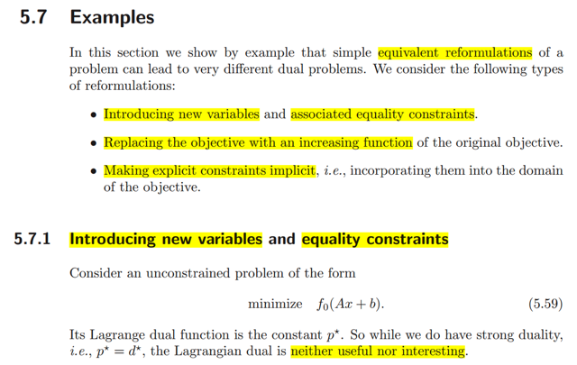</kbd></p>

<p align="center"><kbd>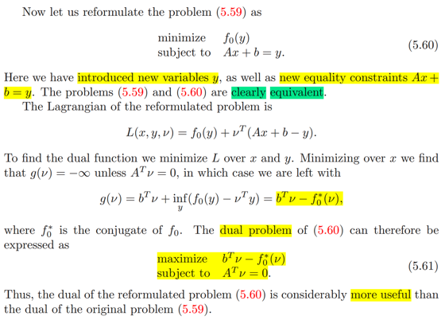</kbd></p>

> [!NOTE]
> đại khái là cái này nằm trong nội dung liên quan đến đại khái là ta
> thay đổi bài toán để có dual problem khác.
>
> Thì phần đầu tiên đại khái là thêm equality constraints.
>
> Bài toán làm ví dụ là bài toán unconstraint, tức chỉ có objective
> f0(Ax+b) thì dĩ nhiên do đó Lagrangian cũng chỉ có objective, mà
> như vậy khi tạo Dual function thì nó ra constant. và constant này
> cũng đồng thời là p* và d* luôn.
>
> Thế thì gs mới nói là làm vậy thì không ích lợi lắm (chưa hiểu chỗ
> này) cho nên thay vì vậy, ta sẽ đặt variable mới y `=` Ax + b, và tạo
> ta bài toán tương đương là minimize f0(y) với equality constraint y
> `=` Ax + b
>
> Thì khi đó triển khai tiếp như thế nào thì ta đã biết rồi, nhưng ý
> chính là dual problem của bài toán equivalent tỏ ra hữu ích hơn
>
> Còn tại sao lại vậy thì xét ví dụ sau mới hiểu nhưng theo gpt đại
> khái là khi có dual function (khác constant) thì ta mới phân tích
> được các tính chất sensitivity này kia.
>
> 5.7 EXAMPLES
>
> 5.7.1 INTRODUCING NEW VARIABLES 
> & EQUALITY CONSTRAINTS

<br>

<p align="center"><kbd>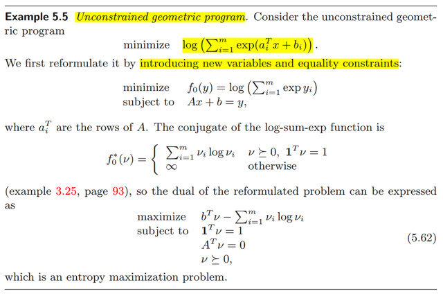</kbd></p>

> [!NOTE]
> Rồi, qua ví dụ này, thì đây là unconstraint problem với f0(x) là
> log sum exp: log `Σ` e^(aiTx + bi)
>
> Thì ta sẽ đặt yi `=` aiTx + bi và đưa bài toán thành minimize log `Σ`
> e^i  `=` log (1Te^y) với (new introduced constraint: yi `=` aiTx + bi,
> `<=>` Ax + b `=` y với A là matrix các row là ai)
>
> Thế thì ta sẽ tìm Lagrangian:
>
> L(y, v) `=` f0(y) + vTh(y) `=` log(1Te^y) + vT(Ax + b - y) 
>
> `=` log(1Te^y) + vTAx + vTb - vTy
>
> Dual function: g(v) `=` inf x,y  log(1Te^y) + vTAx + vTb - vTy 
>
> *Minimize over x trước: Thì với y fixed, L là affine function theo x
> (có dạng pTx + q, nó sẽ nhỏ vô hạn trừ khi q `=` 0) nên:
>
> g(v, y) `=` inf x  log(1Te^y) + vTAx + vTb - vTy  `=`
>
> a) log(1Te^y) + vTb - vTy nếu vTA `=` 0
>
> b) -infinity nếu otherwise
>
> *Minimize over y: 
>
> g(v) `=` inf y  log(1Te^y) + vTb - vTy  subject to vTA `=` 0
>
> `=` - sup y  - log(1Te^y) + vTy  + vTb  
>
> `=` - sup y   vTy - log(1Te^y)  + vTb   
>
> Theo định nghĩa conjugate function của f(x): 
>
> f*(y) `=` sup y ∈ dom f yTx - f(x)
>
> `=>` sup y  vTy - log(1Te^y)  `=` sup x  vTy - f0(y)   chính là f*0(v)
>
> - conjugate function của log-sum-exp.
>
> `=>` g(v) `=` - f*0(v) + vTb 
>
> Và ta đã tự làm để biết nếu conjugate function của `log-Σ-exp` f(x)
> là f*(y) `=` yTlog(y) nếu y ≻ 0 và 1Ty `=` 1
>
> Thì áp dụng ở đây, f*0(v) `=` vTlog(v) khi v ≻ 0 và 1Tv `=` 1
>
> Vậy g(v) `=` - vTlog(v) + vTb khi vTA `=` 0, v ≻ 0 và 1Tv `=` 1
>
> Do đó bài toán Dual Problem là:
>
> maximize g(v) `=` vTb - vTlog(v) `=` bTv - `Σvi` log(vi) 
> subject to vTA `=` 0, v ≻ 0 và 1Tv `=` 1

<br>

<p align="center"><kbd>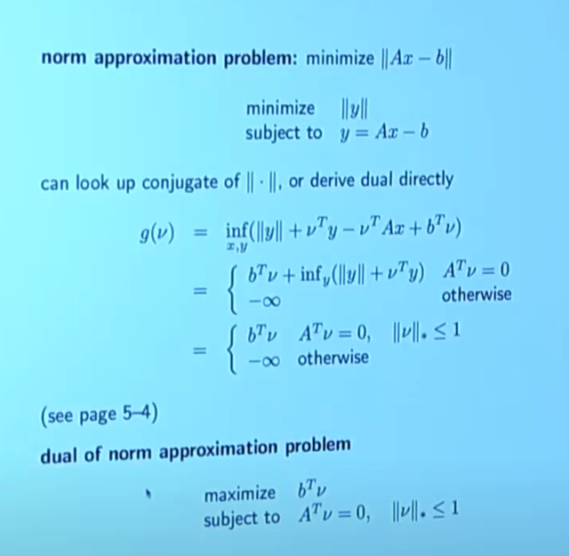</kbd></p>

> [!NOTE]
> Rồi, ta qua một ví dụ nữa, norm approximation problem:
>
> minimize ||Ax-b||.
>
> Thế thì, đây cũng là một cái ko có constraint nữa thì ta sẽ chuyển thành bài
> toán tương đương là minimize ||y|| với constraint y `=` Ax - b
>
> Lagrangian L(y, x, v) `=` ||y|| + vT(y - Ax + b) `=` ||y|| + vTy - vTAx + vTb
>
> Dual function g(v) `=` inf x,y ||y|| + vTy - vTAx + vTb
>
> `=` inf y inf x ||y|| + vTy - vTAx + vTb    |   ý là minimize over x trước
>
> Xét inf x ||y|| + vTy - vTAx + vTb
>
> `=` inf x  - vTAx + ||y|| + vTy  + vTb again, với x thì đây là infimum  affine
> function của x, nên nó sẽ bằng:
>
> ```text
> = ||y|| + vTy  + vTb khi - vTA = 0 <=> ATv = 0, và bằng -infinity
> ```
> otherwise
>
> `=>` g(v) `=` inf y ||y|| + vTy  + vTb khi ATv `=` 0, và bằng -infinity otherwise
>
> `=` inf y ||y|| + vTy + vTb khi ATv `=` 0, và bằng -infinity otherwise (1)
>
> Tới đây xét inf y ||y|| + vTy
>
> Ta sẽ nhớ lại khái niệm Dual norm: ||v||* `=` sup `u:||u||<=1` uTv hay
>
> sup `y:||y||<=1` yTv
>
> Ý nghĩa là: dual norm của norm (norm kí hiệu là ||.||, dual norm của l2 norm
> kí hiệu là ||.||*) là vầy: Ta sẽ tìm vector y có norm `<=` 1 sao cho maximize
> yTv, thì khi đó y*Tv là dual norm của v: ||v||*
>
> Thế thì, nếu ta sẽ xét hai trường hợp:
>
> 1) ||v||* `<=` 1, theo định nghĩa của dual norm, điều này sẽ có nghĩa là
> yTv `<=` 1 với mọi vector y có norm `<=` 1:
>
> yTv `<=` 1 với mọi y: ||y|| `<=` 1 
>
> Và điều này cũng tương đương `(y/||y||)Tv` `<=` 0 với mọi y (vì `y/||y||` sẽ có
> norm `=` 1)
>
> ```text
> <=> vTy/||y|| <= 1 <=> vTy <= ||y|| <=> ||y|| - vTy >= 0 (với mọi y)
> ```
>
> Vậy inf y ||y|| - vTy `=` 0 nếu ||v||* `<=` 1
>
> Do đó quay lại (1): g(v) `=` vTb (cũng là bTv) khi ATv `=` 0 và ||v||* `<=` 1
>
> Ngược lại nếu ko thỏa hai điều kiện trên thì g(v) `=` -infinity  
>
> `====`
>
> Và dual problem của bài toán norm approximation sẽ là:
>
> maximize bTv subject to ATv `=` 0 và ||v||* `<=` 1

<br>

<p align="center"><kbd>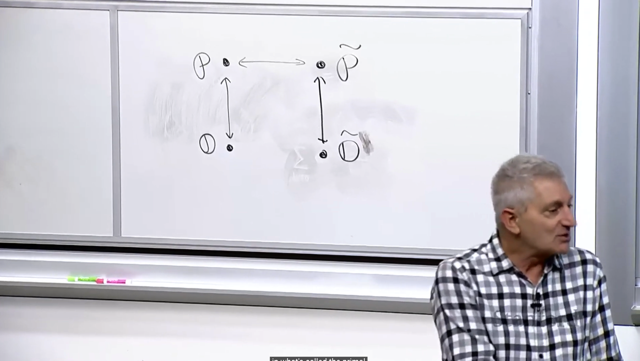</kbd></p>

> [!NOTE]
> Thế thì đại khái gs cho rằng tới đây ta có thể trông thấy một quy
> luật rằng: Khi xuất hiện function trong PRIMAL (original) problem
> thì ta sẽ kì vọng rằng sẽ xuất hiện CONJUGATE của function đó
> trong DUAL PROBLEM
>
> Thành ra ví dụ ta có hàm KL Divergence thì dual sẽ xuất hiện
> log exponential

<br>

<p align="center"><kbd>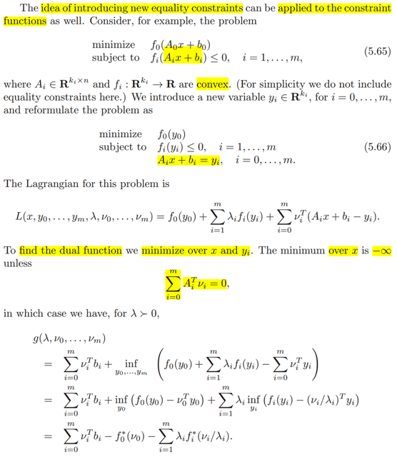</kbd></p>

<p align="center"><kbd>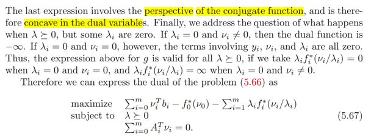</kbd></p>

> [!NOTE]
> Đại khái là ý tưởng của việc thêm variable và equality constraints (để khiến
> bài toán trở nên hữu ích hơn - vẫn chưa hiểu lợi ích hơn chỗ nào, nhưng tạm
> biết vậy) có thể áp dụng đối với inequality constraints. Ví dụ như nếu
> inequality constraint có dạng fi(Aix + bi) `<=` 0 thì ta có thể introduce yi `=` Aix +
> bi, để inequality constraint trở thành fi(yi) `<=` 0 và thêm một equality constraint
> Aix + bi - yi `=` 0
>
> Như trong bài toán ở đây, objective là f0(A0x + b0) và các inequality
> constraint fi(Aix + bi) `<=` 0. Sẽ trở thành objective f0(y0) và inequality
> constraint: fi(yi) `<=` 0, và xuất hiện thêm các equality constraint: Ajx + bj - yj `=`
> 0 với j `=` 0,1,2....
>
> Thế thì Lagrangian sẽ là L(x, y0, y1,....ym, λ1, λ2...λm, v0, v1,.. vm) (trong
> sách ghi λ nhưng nó là vector [λ1, ...λm] vì ta có m inequality constraint
>
> ```text
> L = f0(y0) + Σi=1:m λi fi(yi) + Σi=0:m viT(Aix + b - yi)
> ```
>
> Chú ý chỗ này: Ta có m inequality constraint ban đầu fi(Aix + bi) `<=` 0 i `=` 1,2....
> m. Nên với việc đặt yi `=` Aix + bi thì ta vẫn có m inequality constraint fi(yi) `<=`
> 0, mỗi cái gắn với một scalar λi `=>` Ta có λ1, λ2,.. λm mà có thể ghi là vector λ
>
> Nhưng, mỗi yi sẽ tạo thêm một equality constraint: Aix + b - yi `=` 0 Và có m + 1
> cái như vậy vì có y0 nữa. và mỗi equality constraint này bản thân nó là một
> linear equation system, hay nói cách khác, mỗi cái là hệ nhiều cái. Do đó mỗi
> equality constraints Aix + b - yi `=` 0 sẽ gắn với một vector vi
>
> Do đó trong công thức L ở trên ta thấy λi là scalar không có dấu transpose
> còn vi thì là vector nên có dấu transpose.
>
> Thế thì như thường lệ g(λ, v1, v2...) `=` inf x,y L(...)
>
> Và ta sẽ infimum x trườc: g `=` inf y [inf x L(x, y0, y1,...ym, λ, v0, v1...vm)]
>
> Và khi giữ y fixed, thì L có bản chất là affine function đối với x:
>
> ```text
> Điều này dễ thấy, L = f0(y0) + Σi=1:m λi fi(yi) + Σi=0:m viT(Aix + b - yi)
> ```
>
> ```text
> = f0(y0) + Σi=1:m λi fi(yi) + Σi=0:m (viTAix + viTb - viTyi)
> ```
>
> ```text
> = f0(y0) + Σi=1:m λi fi(yi) + (Σi=0:m viTAi) x + Σi=0:m (viTb - viTyi)
> ```
>
> ```text
> = (Σi=0:m viTAi) x + f0(y0) + Σi=1:m λi fi(yi) + Σi=0:m (viTb - viTyi)
> ```
>
> có dạng px + q, với p `=` `(Σi=0:m` viTAi), còn lại là q.
>
> Nên khi minimize affine function, như đã biết, ta sẽ ra q khi p `=` 0 và -infinity
> khi p khác 0. Và như đã biết, DUAL FEASIBLE là khi g > -infinity. Do đó ta sẽ
> ```text
> cần p = 0 <=> (Σi=0:m viTAi) = 0
> ```
>
> Rồi vậy sau khi minimize over x, ta mới minimize over y0,y1,...ym
>
> ```text
> g = inf y0,..ym f0(y0) + Σi=1:m λi fi(yi) + Σi=0:m (viTb - viTyi)
> ```
>
> ```text
> = inf y0,..ym f0(y0) + Σi=1:m λi fi(yi) + Σi=0:m (viTb) - Σi=0:m(viTyi)
> ```
>
> ```text
> = inf y0 f0(y0) - v0Ty0 + Σi=1:m inf y λi fi(yi) - (viTyi) + Σi=0:m (viTb)
> ```
>
> ```text
> = - sup y0 v0Ty0 - f0(y0) - Σi=1:m sup y viTyi - λi fi(yi) + Σi=0:m (viTb)
> ```
>
> ```text
> = - sup y0 v0Ty0 - f0(y0) - Σi=1:m sup y λi(viTyi/λi - fi(yi)) + Σi=0:m (viTb)
> ```
>
> ```text
> = - sup y0 v0Ty0 - f0(y0) - Σi=1:m λi sup y (viTyi/λi - fi(yi)) + Σi=0:m (viTb)
> ```
>
> Tới thời điểm này mình đã quen `/` nhớ conjugate function của f(x) là: f*(y) `=`
> sup x yTx - f(x)
>
> ```text
> = - f*0(v0) - Σi=1:m λi f*i(vi/λi) + Σi=0:m (viTb)
> ```
>
> ```text
> = Σi=0:m (viTb) - f*0(v0) - Σi=1:m λi f*i(vi/λi)
> ```
>
> Khúc dưới chưa hiểu lắm quay lại sau

<br>

<p align="center"><kbd>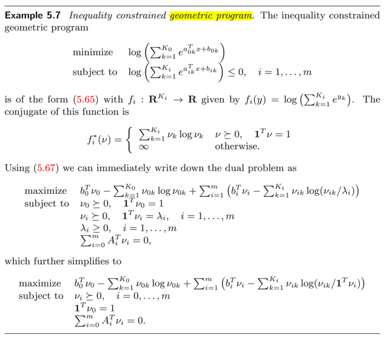</kbd></p>

> [!NOTE]
> Một ví dụ cụ thể của bài toán khái quát vừa rồi (objective f0(A0x + b0)
> và inequality constraint fi(Aix + bi) để rồi ta introduce new variable y0, y1..
> và new equality constraint A0x + b0 `=` y0, A1x + b1 `=` y1...
>
> Thế thì, ở đây fi(y) `=` `log(Σk` e^yk) `=` log (1Te^y)
>
> Thế thì với hàm f(x) `=` log `Σi` e^xi `=` log (1Te^x) ta đã tự derive conjugate
> ```text
> của nó = f*(y) = sup x yTx - log (1Te^x) và nó bằng Σ yi log yi = yTlogy
> ```
> khi y ≽ 0 và 1Ty `=` 1, và `=` +infinity otherwise
>
> Quay lại sau

<br>

<p align="center"><kbd>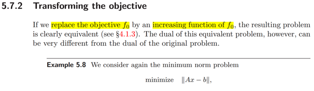</kbd></p>

<p align="center"><kbd>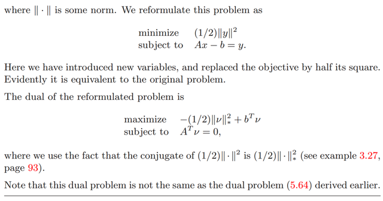</kbd></p>

> [!NOTE]
> cái này nói về cách thức ta tạo equivalent problem bằng cách thay 
> objective bằng một increasing function của f0, ví dụ f0(x) `=` ||Ax - b||
> thì thay nó bằng (||Ax-b||)^2, là hàm increasing do ||Ax-b|| `>=` 0.
>
> Khi đó x minimize (f0)^2 cũng là x minimize f0.
>
> Thế thì ta thay bài toán minimize f0(x) `=` ||Ax - b|| (no constraint)
> thành minimize f0(y) `=` `(1/2)` ||y||^2 với constraint Ax - b `=` y.
>
> Again nhắc lại mục đích là chuyển bài toán gốc là bài toán unconstraint
> khiến khi minimize nó ta ra dual function là constant và khi đó bài toán
> không hữu ích lắm. Nên ta sẽ thay bằng equivalent problem.
>
> Thế thì Lagrangian của new equivalent problem:
>
> L(x,y,v) `=` `(1/2)||y||^2` - vT(Ax - b - y) 
>
> `=` `(1/2)||y||^2` - vTAx + vTb + vTy
>
> g(v) `=` inf y [inf x `(1/2)||y||^2` - vTAx + vTb + vTy]
>
> `=` inf y `(1/2)||y||^2` + vTb + vTy subject to vTA `=` 0  
>
> (với x thì function L là affine có dạng px + q `=>` minimize nó theo x
> sẽ ra q khi p `=` 0 và -infinity khi p khác 0, và vì dual feasible nên ta cần
> g > -infinity)
>
> `=` inf y  `(1/2)||y||^2` + vTy + vTb  với vTA `=` 0
>
> `=` - sup y  - `(1/2)||y||^2` - vTy  + vTb với vTA `=` 0
>
> Xét sup y  - `(1/2)||y||^2` - vTy  
>
> Nên f*(-v) `=` `(1/2)||-v||*^2` và vì norm của v cũng bằng norm của -v
> (dual norm ||.||* cũng là một loại norm)
>
> nên f*(-v) `=` `(1/2)||v||*^2`
>
> Vậy g(v) `=` - `(1/2)||v||*^2` + bTv
>
> Do đó dual problem là maximize - `(1/2)||v||*^2` + bTv với constraint
> vTA `=` 0
>
> 5.7 EXAMPLES
>
> 5.7.2 TRANSFORMING THE OBJECTIVE

<br>

<p align="center"><kbd>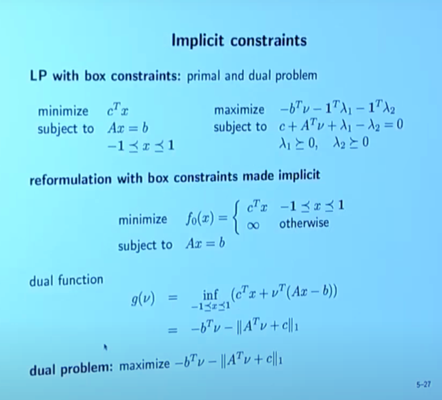</kbd></p>

> [!NOTE]
> Ta qua một cái gọi là Implicit constraints.
>
> Ví dụ có bàn toán minimize cTx với constraint Ax `=` b, -1 ⪯ x ⪯ 1
>
> Gs nói nếu ta làm (Lagrangian Dual như thông thường thì nó sẽ ra
> như bên phải). Thử làm:
>
> L `=` cTx + vT(Ax - b) + λ1T(- x - 1) + λ2T(x - 1)
>
> `=` cTx + vTAx - vTb - λ1Tx - λ1T1 + λ2Tx - λ2T1
>
> `=` cTx + vTAx - vTb - λ1Tx - λ1T1 + λ2Tx - λ2T1
>
> `=` cTx + vTAx - λ1Tx + λ2Tx - vTb - λ1T1 - λ2T1
>
> `=` (cT + vTA - λ1T + λ2T)x - vTb - λ1T1 - λ2T1
>
> là affine function của x
>
> g(v, λ1, λ2) `=` inf x  (cT + vTA - λ1T + λ2T)x - vTb - λ1T1 - λ2T1  
>
> `=` - vTb - λ1T1 - λ2T1 khi cT + vTA - λ1T + λ2T `=` 0, và -infinity otherwise
>
> cũng là -bTv - 1Tλ1 - 1Tλ2 khi c + ATv - λ1 + λ2 `=` 0 dĩ nhiên λ1, λ2 ≽ 0
>
> Và dual problem sẽ là maximize g(v, λ1, λ2) over v, λ1, λ2 với constraint
> c + ATv - λ1 + λ2 `=` 0 dĩ nhiên λ1, λ2 ≽ 0
>
> Thế thì trong bài toán này, ta sẽ chuyển nó về dạng tương đương với
> objective function sẽ là dạng indicator function: cTx khi -1 ⪯ x ⪯ 1 và
> +infinity nếu otherwise với subject to Ax `=` b
>
> Chỗ này nhớ lại rằng, nếu feasible set rỗng, tức không có điểm nào thỏa 
> constraint, thì việc minimize f0(x) sẽ là minimize trên tập rỗng, nên nó sẽ ra
> + infinity (theo quy ước). Do đó bài toán minimize indicator function
> f0(x) `=` cTx khi -1 ⪯ x ⪯ 1 và `=` +infinity khi x không thỏa điều kiện này là bài
> toán equivalent với bài toán gốc.
>
> Và dual function, theo thông thường sẽ là:
>
> g `=` inf x cTx + vT(Ax - b) 
>
> `=` inf x cTx + vTAx - vTb
>
> `=` inf x (cT+vTA)x - vTb 
>
> Theo lẽ thường thì đây là affine function, infimum sẽ bằng -vTb khi cT +
> vTA `=` 0 và bằng -infinity otherwise
>
> Tuy nhiên vì ở đây x chỉ từ -1, đến 1 nên kết quả sẽ là - bTv - ||ATv + c||
>
> Đại khái ra vậy là vì, inf x (cT+vTA)x - vTb `=` inf x (cT+vTA)x - vTb `=` inf x
> (ATx + c)Tx - vTb
>
> và khi minimize (ATx + c)Tx với x từ -1, đến 1 thì ta sẽ cơ bản là dùng bất
> đẳng thức Cauchy gì đó để rồi nó sẽ là, nếu component của ATx + c
> dương, thì chọn x `=` 1, và ngược lại component của ATx + c âm thì chọn x
> `=` -1. Kết quả sẽ là - bTv - ||ATv + c||
>
> Và dual problem sẽ là maximize - bTv - ||ATv + c||
>
> Và gs cho rằng ta có thể coi constraint gốc (-1 ⪯ x ⪯ 1) là: infinity norm
> của vector x < 1 (vì infinity norm của vector a là trị tuyệt đối của component
> lớn nhất của a, nên cơ bản hai cái này là tương đương) thì theo một cái
> rule mà gs đã nhận định khi nãy đó là khi ta có một function của constraint
> thì conjugate của function đó sẽ xuất hiện trong dual problem: Và bài toán 
> gốc là infinity norm thì conjugate của nó là L1 norm xuất hiện ở dual problem
>
> Một điểm nữa đáng chú ý, đại khái đó là sự liên hệ giữa D (là dual problem
> của bài toán gốc C) và D~ (dual problem của bài toán  reformulation `/`
> equivalent C~) trong trường hợp này là giống nhau
>
> cụ thể là gs cho rằng khi ta ngẫm nghĩ về dual problem của bài toán gốc:
> maximize -bTv - 1Tλ1 - 1Tλ2 subject to c + ATv + λ1 - λ2 `=` 0 với λ1 ≽ 0, λ2 ≽
> 0. Thì ta thấy c + ATv + λ1 - λ2 `=` 0 tương đương λ1 - λ2 `=` - (c + ATv)
>
> Khúc này chưa hiểu lắm, gs ko nói rõ nhưng đại khái là thật ra  D và D~
> trong bài toán này là như nhau, thể hiện mối liên hệ gần gũi giữa dual
> problem của bài toán gốc và bài toán tương đương mà ta đã nhận định

<br>

<p align="center"><kbd>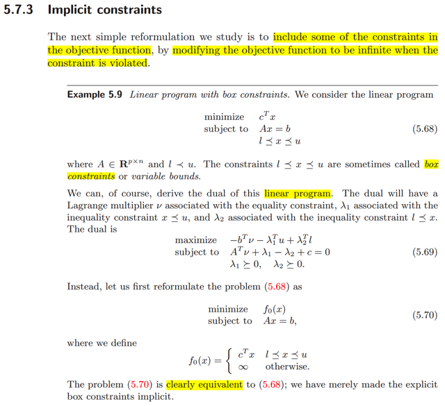</kbd></p>

<p align="center"><kbd>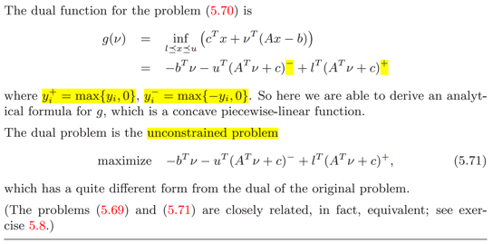</kbd></p>

> [!NOTE]
> 5.7 EXAMPLES
>
> 5.7.3 IMPLICIT CONSTRAINTS
>
> SÁCH (XEM SAU)

<br>

<p align="center"><kbd>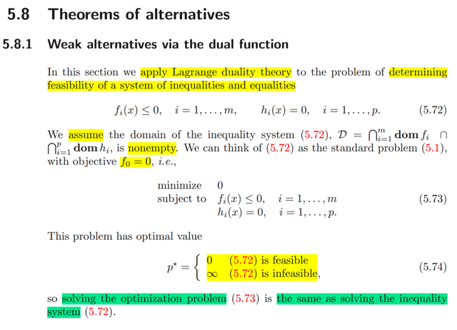</kbd></p>

> [!NOTE]
> 5.8 THEOREMS OF ALTERNATIVES
>
> 5.8.1 WEAK ALTERNATIVES VIA THE DUAL
> FUNCTIONS
>
> Đại khái là phần này ta sẽ ứng dụng Lagrange duality theory vào bài
> toán xác định tính FEASIBILITY của hệ các inequalities và
> equalities.
>
> Nôm na là ta đã biết về FEASIBILITY PROBLEM, là bài toán
> optimization mà trong đó, KHÔNG CÓ OBJECTIVE FUNCTIONS, 
> hoặc có thể coi như f0(x) `=` 0.
>
> Để rồi cơ bản chỉ là tìm x sao cho nó THỎA CÁC CONSTRAINT
> (feasible) là đủ. Khi đó, nếu có feasible x, thì có thể coi optimal value
> là 0 ngược lại, nếu không có feasible x, thì feasible set `=` rỗng, và
> như đã biết minimize over tập rỗng sẽ ra kết quả + infinity theo quy
> ước.
>
> Do đó, ở đây mới nói bài toán feasible problem này về cơ bản chỉ là
> tìm nghiệm của hệ (bất phương trình fi(x) `<=` 0 và phương trình
> hi(x) `=` 0)

<br>

<p align="center"><kbd>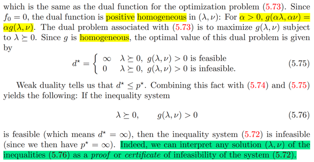</kbd></p>

<p align="center"><kbd>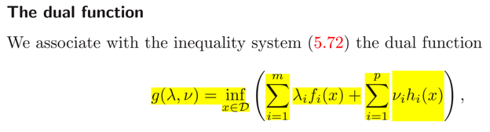</kbd></p>

> [!NOTE]
> Rồi, đại khái, ý chính đó là muốn nói rằng DỰA VÀO DUAL PRBLEM CÓ
> FEASIBLE HAY KHÔNG CÓ THỂ GIÚP KẾT LUẬN PRIMAL PROBLEM CÓ
> FEASIBLE HAY KHÔNG.
>
> Cụ thể là như đã nói, ta đang xét một bài toán optimization mà không có
> objective, hay objective f0(x) `=` 0. Nên cơ bản là chỉ tìm x thỏa constraint fi(x) `<=`
> 0, hi(x) `=` 0 là được, nếu có, thì optimal value `=` 0, ngược là thì optimal value `=`
> +infinity. Nói cách khác, bài toán là xem problem có FEASIBLE hay không.
>
> Thế thì ta sẽ có Lagrangian `=` 0 + λTf(x) + vTh(x)
>
> và Dual function g(λ,v) `=` inf x λTf(x) + vTh(x)
>
> ghi theo kiểu triển khai ra:
>
> g(λ, v) `=` inf x  `Σ` λi fi(x) + `Σ` vi hi(x) 
>
> ```text
> thì nhận xét nó là hệ POSITIVE HOMOGENOUS có nghĩa là g(αλ, αv) = αg(λ,
> ```
> v)
>
> ```text
> Nguyên nhân là vì xét inf x  Σ αλi fi(x) + Σ αvi hi(x)  thì nó sẽ bằng:
> ```
>
> ```text
> inf x  α [Σ λi fi(x) + Σ vi hi(x)]  để rồi nếu α dương, ta có thể đưa α ra ngoài
> ```
> ```text
> infimum luôn: α * inf x  [Σ λi fi(x) + Σ vi hi(x)]  = αg(λ, v)
> ```
>
> Và bài toán Dual problem như đã biết sẽ là:
>
> d* `=` g(λ*, v*) `=` sup λ, v g(λ, v) với λ ≽ 0.
>
> ```text
> Thế thì, ý chính là: vì tính chất g(αλ, αv) = α g(λ, v) nên khi ta giải bài toán dual
> ```
> problem : d* `=` sup λ, v g(λ, v) thì chỉ cần tồn tại λ, v sao cho g(λ, v) dương thì ta chỉ
> việc cứ scale λ, v mãi với hệ số dương `α` thì `α` g(λ, v) sẽ lớn dần thành
> + infinity.
>
> Bởi lẽ bài toán dual problem là tìm λ, v để maximize g(λ, v), và việc scale λ với hệ số
> `α` thì cũng chính là "tìm `/` thử các λ, v khác nhau".
>
> Do đó có thể hiểu tại sao d* `=` +infinity khi tồn tại λ, v sao cho g(λ, v) dương và g có
> ```text
> tính chất  homogeneous: g(αλ, αv) = α g(λ, v)
> ```
>
> Mà việc tồn tại λ, v sao cho g(λ, v) > 0 (dĩ nhiên là λ cần ≽ 0) chính là việc ta nói hệ
> g(λ, v) > 0, λ ≽ 0 feasible.
>
> Mà g(λ, v) > 0, λ ≽ 0 feasible `=>` d* `=` infinity tức p* `=` infinity (do d* ≤ p*) thì có nghĩa
> là bài toán ban đầu (primal problem) infeasible (feasible set rỗng thì minimize f0(x)
> over empty set sẽ `=` +infinity)
>
> Từ đó ta mới có nhận định rằng: Xét hệ các inequalities của primal problem: fi(x) ≤ 0
> hi(x) `=` 0 thì nếu hệ g(λ, v) > 0, λ ≽ 0 feasible thì hệ fi(x) ≤ 0, hi(x) `=` 0 i `=` 1,2,... 
> infeasible
>
> Do đó người ta mới nói việc tồn tại λ, v khiến hệ  g(λ,v) > 0, λ ≽ 0  FEASIBLE
> là PROOF `/` CERTIFICATE cho việc kết luận bài toán gốc là INFEASIBLE 
>
> Chú ý là  g(λ,v) > 0, λ ≽ 0  INFEASIBLE KHÔNG giúp kết luận hệ gốc FEASIBLE

<br>

<p align="center"><kbd>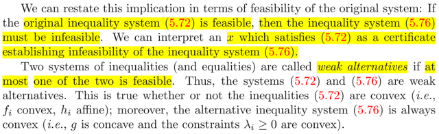</kbd></p>

> [!NOTE]
> Tiếp, nhắc lại:
>
> g(λ, v) > 0, λ ≽ 0 feasible ⇨ fi(x) ≤ 0, hi(x) `=` 0 infeasible
>
> fi(x) ≤ 0, hi(x) `=` 0 feasible `=>` g(λ, v) > 0, λ ≽ 0 infeasible
>
> Và ta có thể xem x khiến hệ gốc feasible làm PROOF để chứng minh hệ
> sau infeasible.
>
> Và quan hệ này, khi CHỈ CÓ NHIỀU NHẤT LÀ MỘT TRONG HAI HỆ FEASIBLE, 
> khi đó hai hệ này được gọi là WEAK ALTERNATIVES
>
> VÀ ĐIỂM KHÁC BIỆT VỚI STRONG ALTERNATIVE Ở SAU CHÍNH LÀ
> TA CHỈ CÓ QUAN HỆ: CÁI NÀY FEASIBLE ⇨ CÁI KIA INFEASIBLE
>
> CHỨ KHÔNG CÓ CHUYỆN CÁI NÀY INFEASIBLE ⇨ CÁI KIA FEASIBLE
>
> NHƯNG STRONG ALTERNATIVE THÌ CÓ

<br>

<p align="center"><kbd>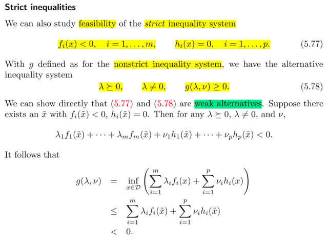</kbd></p>

<p align="center"><kbd>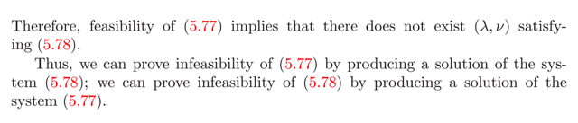</kbd></p>

> [!NOTE]
> Đại khái là nếu hệ gốc chỉ có dấu < (strict inequalities): fi(x) < 0, hj(x) `=` 0 
> (tự hiểu là i `=` 1,2....m, j `=` 1,2...p) thì ta cũng có quan hệ như vậy 
> với hệ λ ≽ 0, g(λ, v) ≥ 0, λ khác 0 
>
> (g ≥ 0, hồi nãy khi hệ gốc là dấu ≤ thì hệ sau là g > 0)
>
> 1) Nếu hệ fi(x) < 0, hj(x) `=` 0 FEASIBLE thì λ ≻ 0, g(λ, v) ≥ 0 INFEASIBLE
>
> 2) Nếu hệ λ ≻ 0, g(λ, v) ≥ 0 FEASIBLE thì hệ fi(x) < 0, hj(x) `=` 0 INFEASIBLE
>
> Chứng minh cũng dễ:
>
> 1) fi(x) < 0, hj(x) `=` 0 feasible ⇔ ∀ λi > 0, thì 
>
> `Σ` λi fi(x) < 0 ⇔ `Σ` λi fi(x) + `Σ` vi hi(x) < 0
>
> ```text
> ⇔ inf λ, v  Σ λi fi(x) ≤ 0 ⇔ Σ λi fi(x) + Σ vi hi(x)  ≤ Σ λi fi(x) ≤ 0 ⇔ Σ λi fi(x) + Σ vi hi(x) ≤ 0
> ```
>
> ⇔ g(λ, v) < 0 `=>` hệ λ ≻ 0, g(λ, v) ≥ 0 infeasible
>
> 2) Nếu λ ≻ 0, g(λ, v) ≥ 0 feasible:
>
> Thì cũng từ 
>
> ```text
> g(λ, v) = inf λ, v  Σ λi fi(x) ≤ 0 ⇔ Σ λi fi(x) + Σ vi hi(x)  ≤ Σ λi fi(x) ≤ 0 ⇔ Σ λi fi(x) + Σ vi hi(x)
> ```
>
> ta có tồn tại λ, v:
>
> ```text
> 0 ≤ g(λ, v) = inf λ, v  Σ λi fi(x) ≤ 0 ⇔ Σ λi fi(x) + Σ vi hi(x)  ≤ Σ λi fi(x) ≤ 0 ⇔ Σ λi fi(x) + Σ vi hi(x)
> ```
>
> Từ đó suy ra `Σ` λi fi(x) + `Σ` vi hi(x) ≥ 0 
>
> ⇔ `Σ` λi fi(x) ≥ 0 (do `Σ` vi hi(x) `=` 0)
>
> mà λi > 0 thì fi(x) cũng phải ≥ 0 `=>` hệ  fi(x) < 0, hj(x) `=` 0 infeasible

<br>

<p align="center"><kbd>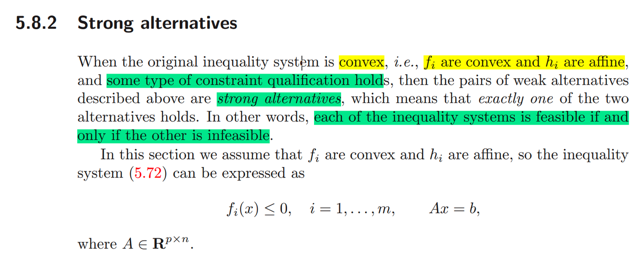</kbd></p>

> [!NOTE]
> Đại khái là khi hệ inequalities & equalities gốc là convex (tức các
> fi convex, hi affine, và một số loại constraint qualification hold)
>
> (Ôn lại constraint qualification là nói về những extra condition khiến 
> bài toán có strong duality)
>
> Thì Strong alternative là:
>
> Hệ gốc feasible ⇔ Hệ dual infeasible 
>
> Hệ gốc infeasible ⇔  Hệ dual feasible

<br>

<p align="center"><kbd>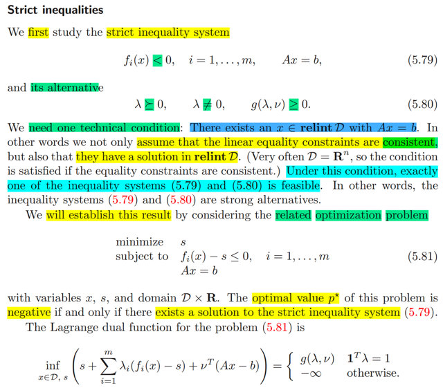</kbd></p>

<p align="center"><kbd>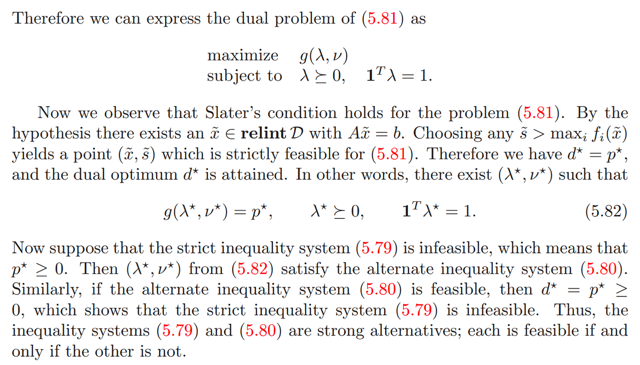</kbd></p>

> [!NOTE]
> đại khái là, như vừa nói, khi hệ gốc là các convex inequalities function
> và affine equalities. Thì nếu có thêm vài điều kiện (gọi qualification
> constraint) nữa thì ta sẽ có strong alternative (y như khi optimization
> problem là convex thì nếu có thêm vài điều kiện nữa như Slater's
> condition thì ta sẽ có Strong duality)
>
> Vậy thì xét hai hệ thuộc dạng strict equality trước:
>
> {fi(x) < 0, Ax `=` b} và {λ ≽ 0, λ ≠ 0, g(λ, v) ≥ 0}
>
> (hệ ko strict sẽ là {fi(x) ≤ 0, Ax `=` b} và {λ ≽ 0, g(λ, v) > 0})
>
> Thì điều kiện để có strong alternative là hệ Ax `=` b phải có nghiệm (gọi
> là consistent) và nghiệm phải nằm trong relative interior của D. Là sao? D
> là domain của problem, tức là intersection của các domain fi và hi.
> Nên nói có nghiệm trong relint D tức là có những x thỏa Ax `=` b và 
> x nằm bên trong relative interior của D.
>
> Sau đó là người ta chứng minh điều này. QUAY LẠI SAU

<br>

<p align="center"><kbd>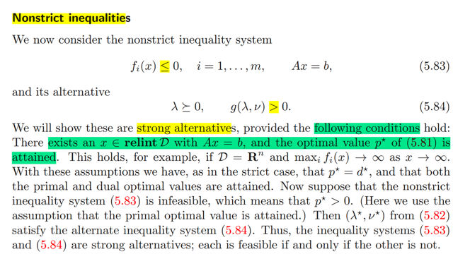</kbd></p>

> [!NOTE]
> Với non-strict inequalities thì điều kiện có strong alternative
> đó là tồn tại x thỏa Ax `=` b nằm trong relint D nhưng có thể điều kiện
> là p* của bài toán:
>
> minimize s constraint fi(x) - s ≤ 0 , Ax `=` b
>
> phải attained (tức là primal optimization problem có optimal
> value nhưng phải attainable nữa)
>
> Sau đó là phần chứng minh CÓ THỂ ĐỌC SAU

<br>

<p align="center"><kbd>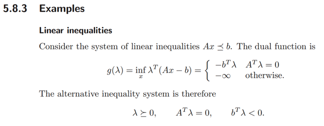</kbd></p>

<p align="center"><kbd>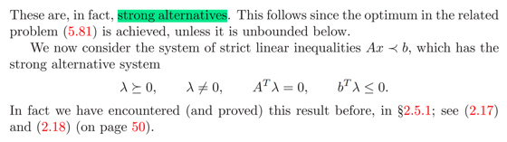</kbd></p>

> [!NOTE]
> Rồi, vài ví dụ, đầu tiên là hệ các inequalities tuyến tính 
> (trong phần lí thuyết vừa rồi là nói về hệ các inequalities
> và equalities: 
>
> non-strict:
>
> {fi(x) ≤ 0, `i=1,2..` hi(x) `=` 0, `j=1,2..}` và {λ ≽, λ ≠ 0, g(λ, v) > 0}
>
> strict: 
>
> {fi(x) < 0, `i=1,2..` hi(x) `=` 0, `j=1,2..}` và {λ ≽, g(λ, v) ≥ 0}
>
> Thì ở đây ta chỉ có hệ gốc là các { fi(x) ≤ 0 } là các linear
> inequalities aiTx ≤ bi có thể represent bởi Ax ⪯ b
>
> Thế thì, ta sẽ cần xây dựng dual g:
>
> Lagrangian `=` λT(Ax - b) `=` λTAx - λTb
>
> Dual function g(λ) `=` inf x {λTAx - λTb}
>
> λTAx - λTb là affine function của x, nên infimum nó sẽ ra
>
> 1) - λTb nếu λTA `=` 0
>
> 2) - infinity khi otherwise
>
> Nên để dual function > -infinity (cái này ta nhớ gọi là Dual 
> feasible) thì ta sẽ có thêm constraint λTA `=` 0, bên cạnh λ ≽ 0
>
> thì g(λ) `=` - λTb, λTA `=` 0, λ `>=*` 0
>
> Vậy thì ta sẽ có hai hệ strong alternative:
>
> {Ax ⪯ b} và { g `=` - λTb > 0, λTA `=` 0, λ ≽ 0}
>
> Nó strong alternative vì theo như lí thuyết với non-strict
> system thì để có strong alternative điều kiện kèm thêm
> là tồn tại x thỏa equalities (nếu có) và nằm trong relint D
> và p* của bài toán:
>
> minimize s constraint fi(x) - s ≤ 0 , Ax `=` b
>
> phải attained: Mà ở đây, bài toán đó là có p* attained
>
> QUAY LẠI SAU: TẠI SAO BÀI TOÁN NÀY CÓ P* ATTAINED

<br>

<p align="center"><kbd>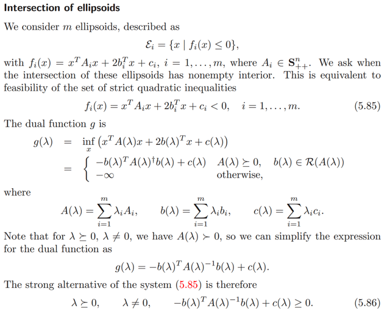</kbd></p>

<p align="center"><kbd>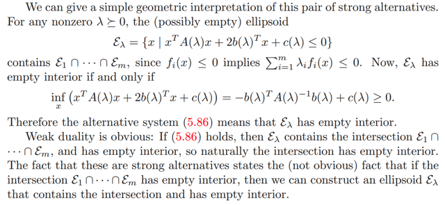</kbd></p>

> [!NOTE]
> SÁCH (XEM SAU)

<br>

<p align="center"><kbd>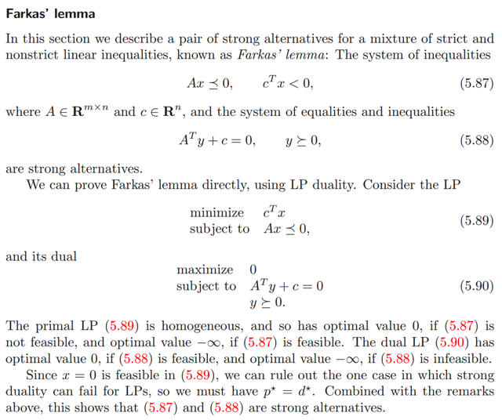</kbd></p>

> [!NOTE]
> SÁCH (XEM SAU)

<br>

<p align="center"><kbd>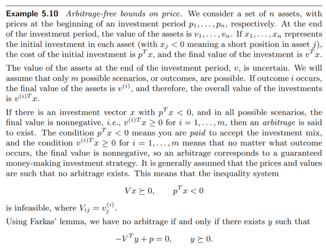</kbd></p>

<p align="center"><kbd>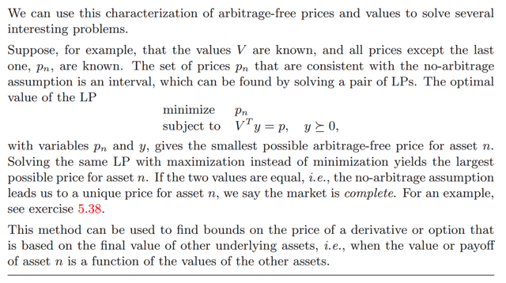</kbd></p>

> [!NOTE]
> SÁCH (XEM SAU)

<br>

<p align="center"><kbd>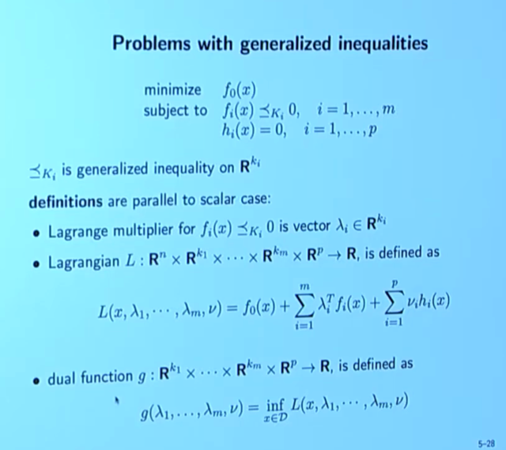</kbd></p>

> [!NOTE]
> Chuyển qua bài toán generalized inequalities: thay đổi đó là fi(x)
> ⪯Ki 0, tức là fi(x) là vector function (bao gồm chỉ cả matrix
> output function) thay vì scalar function. Do đó ví dụ như fi(x) là
> matrix thì fi(x) ⪯ 0 có nghĩa là (constraint là) "fi(x) là negative
> semi definite matrix"
>
> Nhớ lại khái niệm ⪯Ki, ví dụ x ⪯K y thì y - x thuộc cone K.
> Thế thì nếu K là R^n thì có việc y - x ∈ cone K sẽ tương
> đương mọi component của y đều lớn hơn component tương ứng
> của x.
>
> Lúc này mọi λi cũng ko còn là scalar mà gs cho rằng sẽ thuộc
> non-negative dual cone của cone R^ki: R^ki*
>
> Định nghĩa dual cone của K: K* `=` y | yTx `>=` 0 for all x ∈ K
>  thế thì dual cone của R^ki, sẽ là tập mọi vector mà khi inner
> product với vector bất kì trong cone R^ki đều ra kết quả không âm
>
> Điều này tương ứng với khi ở scalar case thì λ dương để f(x) khi
> nhân λ dương để ra λfi(x) > 0, dẫn tới việc khi optimize objective
> (minimize objective f0(x) + λfi(x)) sẽ khiến quá trình giảm objective sẽ
> gắn với việc giữ fi(x) < 0: fi(x) càng âm thì giá trị của f0(x) + λf(x) càng
> nhỏ, từ đó giúp quá trình optimization thỏa constraint là f(x) `<=` 0.
>
> Rồi Lagrangian và Dual function cũng tương tự, nói chung chỉ là khái
> quát lên khi fi(x) là vector function thôi

<br>

<p align="center"><kbd>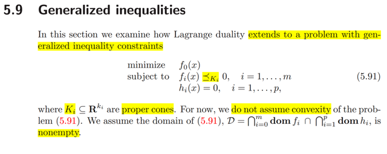</kbd></p>

> [!NOTE]
> Ôn lại khái niệm "proper cone" là cone có các tính chất: 
>
> 1) Closed: Chứa boundary của nó 
>
> 2) Pointy: Không chứa đường thẳng 
>
> 3) Solid: Non-empty interior
>
> 5.9 GENERALIZED INEQUALITIES
>
> 5.9.1 THE LAGRANGE DUAL

<br>

<p align="center"><kbd>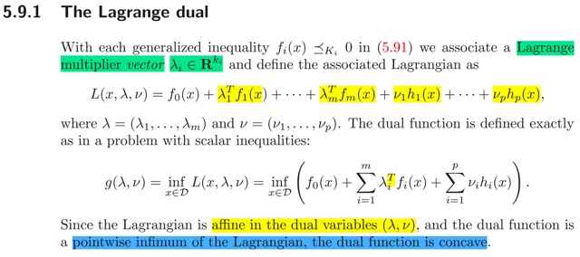</kbd></p>

> [!NOTE]
> Với việc inequality constraint được khái quát hóa lên thành
> vector function, để từ fi(x) ≤ 0 trở thành fi(x) ⪯Ki 0 mang ý
> nghĩa là vector fi(x) less than (vector) 0 wrt proper cone Ki.
>
> Lúc này Lagrange multiplier λi sẽ thay vì là scalar, sẽ trở
> thành vector λi. Và inequality constraint term trong Lagrangian sẽ
> là λiTfi(x).
>
> Dĩ nhiên có thể có nhiều inequality constraints.
>
> Và vẫn không có gì khác trước, Lagrangian:
>
> L `=` f0(x) + `Σ` λiTfi(x) + `Σ` vihi(x)
>
> Và đối với λ, v, L vẫn chỉ là affine function.
>
> Do đó khi xét Dual function g(λ, v) `=` inf x L(x, λ, v) thì nó là
> point-wise infimum của affine function (vừa là convex, vừa
> concave ⇨ là concave function
>
> (Nếu là point-wise supremum của của các convex function thì sẽ là
> convex function)

<br>

<p align="center"><kbd>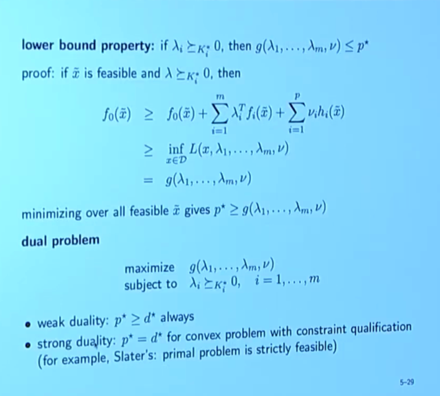</kbd></p>

> [!NOTE]
> Rồi gs nói về tính chất lower bound cũng hoàn toàn tương tự.
>
> Nhớ lại khi ở scalar case, ta sẽ lập luận rằng:
>
> Vì λi > 0 (đây là điều kiện để dual feasible: λ > 0 & g(λ, v) > - infinity)
> nên λifi(x) < 0, và từ đó f0(x) ≥ f0(x) + λifi(x)
>
> Tiếp tục ...để rồi ta có tính chất g(λ) ≤ p* (có thể xem lại hoặc lập
> luận lại chỗ này)
>
> Thì ở case khái quát này cũng vậy: là fi(x) thuộc cone K, và λi thuộc
> dual cone của cone K thì λiTfi(x) sẽ ⪯ 0.
>
> (nói chung mọi thứ tương tự)

<br>

<p align="center"><kbd>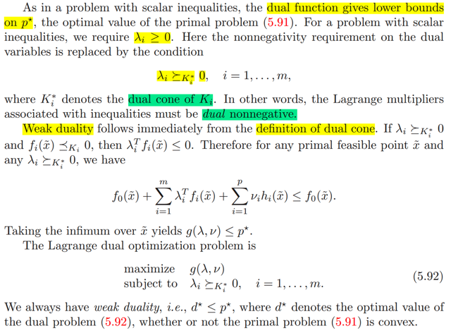</kbd></p>

> [!NOTE]
> Cụ thể hơn một chút và tính chất lower bounds của p* vẫn y nguyên với trạng
> thái khái quát của inequality (generalized) inequalities.
>
> Với "original case" khi constraint f(x) ≤ 0 với f(x) là scalar, thì ta nhớ có một
> ràng buộc là g(λ,v) > -infinity. Và λ ≥ 0, và g(λ, v) > -infinity chính là điều kiện 
> để dual feasible  g(λ, v) >-infinity (Search "dual feasible condition)
>
> Và với nhiều scalar inequality constraint fi(x), ta có nhiều scalar λi,  tạo nên
> vector λ, và constraint này trở thành λ ≽ 0
>
> Còn bây giờ, mỗi inequality constraint là vector function, và inequality cũng trở
> thành generalized inequality: fi(x) ⪯Ki 0. Thì Lagrange multiplier gắn với mỗi
> cái cũng là một vector λi. Thì lúc này constraint trên trở thành λi ≽ Ki* 0, có
> nghĩa là bigger than 0 wrt DUAL CONE of cone Ki.
>
> Vậy thì tại sao nói điều này khiến WEAK DUALITY tự nhiên xuất hiện.
>
> Đầu tiên ôn lại về Weak Duality trong scalar case : Nó nói rằng d* ≤ p*.
>
> Và lập luận là vầy:
>
> ```text
> g(λ, v) = inf x L(x, λ, v) = inf x  f0(x) + Σ λi fi(x) + Σ vi hi(x)
> ```
>
> ≤ f0(x) + `Σ` λi fi(x) + `Σ` vi hi(x)  | vì định nghĩa của infimum
>
> ⇨ g(λ, v) ≤ f0(x*) + `Σ` λi fi(x*) + `Σ` vi hi(x*)
>
> (vì x* phải là một trong feasible point nơi mà ta tìm kiếm minimum)
>
> ≤ f0(x*) | vì với λi ≥ 0 và x* feasible thì fi(x*) ≤ 0, và hi(x*) `=` 0
>
> Vậy suy ra g(λ, v) ≤ f0(x*) `=` p* với mọi λ, v
>
> Suy ra d* `=` sup λ, v g(λ, v) ≤ p*
>
> Quay lại đây, ta sẽ lập luận Weak Duality với generalized inequality như sau:
>
> Vì λi ≽Ki* 0, theo định nghĩa của ≽Ki* , λi - 0 `=` λi ∈ Ki*.
>
> Và theo định nghĩa của DUAL CONE CỦA Ki (tức Ki*) thì nó là y: yTx ≥ 0 với
> mọi x ∈ Ki, tức là vì λi ∈ dual cone của Ki nên với vector bất kì của cone Ki thì
> λiTx đều ≥ 0.
>
> Rồi, bên cạnh đó ta có inequality constraint: fi(x) ⪯Ki 0, theo định nghĩa của 
> "⪯Ki" thì nó có nghĩa là - fi(x) sẽ ∈ Ki mà theo trên thì λiT(- fi(x)) sẽ ≥ 0
>
> Vậy nên ta có λiTfi(x) ≤ 0.
>
> Và từ đó lập luận như scalar case ta cũng sẽ có d* ≤ p*

<br>

<p align="center"><kbd>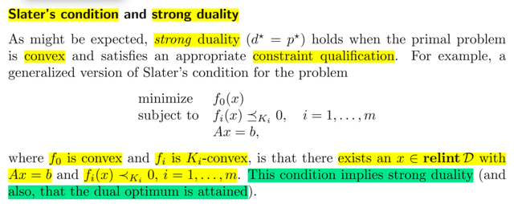</kbd></p>

> [!NOTE]
> Tiếp theo là nói về Slater's condition và strong duality.
>
> Thì cũng không có gì, khi khái quát lên với generalized inequality
> thì ta vẫn có cái này. Tức là nhớ lại trong scalar case. Thì khi
> primal problem là CONVEX: Đồng nghĩa các objective function và
> f0(x) inequality constraint fi(x) đều convex, và equality constraint
> function là affine, và có thêm một số điều kiện gọi là CONSTRAINT
> QUALIFICATION, mà điển hình là Slater' condition thì ta có thể
> chắc chắn có STRONG DUALITY: p* `=` d*.
>
> Thế thì, với generalized inequality, thì cũng vậy. Nếu f0 convex, fi 
> Ki-convex (review nhanh, nghĩa là domain của fi convex, và fi thỏa:
> ```text
> fi(mixture) ≤ mixture of fi: fi(θx+(1-θ)y) ≤ θfi(x) + (1-θ)fi(y))
> ```
>
> Khi đó, nếu ta có Slater's condition (review nhanh, trong scalar case,
> cái này đại khái là tồn tại điểm trong relative interior của domain D (
> problem domain) khiến thỏa constraint Ax `=` b và strictly inequality:
> fi(x) ≺Ki 0 (thay vì chỉ thỏa fi(x) ⪯Ki 0, thì nay nó thỏa fi(x) ≺Ki 0 gọi là
> strictly inequality). 
>
> Thì khi đó ta sẽ có Strong Duality.
>
> Và một điểm cần nhớ, là trong sách bữa trước có nói, việc thoả 
> Strong Duality không chỉ cho thấy p* `=` d* mà nó còn cho thấy rằng
> có thể đạt được `/` tìm được DUAL OPTIMAL λ*, v* để có d* `=` g(λ*, v*) 
> nữa

<br>

<p align="center"><kbd>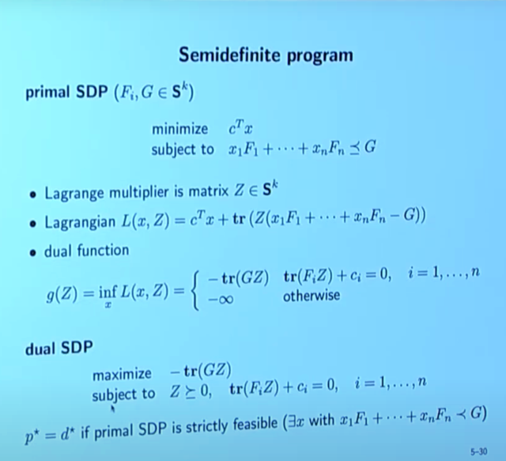</kbd></p>

> [!NOTE]
> Qua ví dụ, bài toán gọi là semi-definite program:
>
> objective là minimize cTx với inequality constraint x1F1 + ...xnFn
> ⪯ G  trong đó Fi, G là các symmetric matrix (∈ S^k) và
> constraint này mang ý nghĩa là x1F1 + ...xnFn - G là negative
> semi-definite matrix
>
> (vì nếu chỉ ghi ≤ ⪯ hay ≺ thì đồng nghĩa với ⪯ ≺R^n+, do đó `Σi` xiFi ⪯ G
> chính là `Σi` xiFi - G ⪯ 0 và đây chính là kí hiệu của việc nói `Σi` xiFi - G là
> negative semi definite matrix)
>
> Thế thì trong bài toán này khi Fi, G là symmetric matrix, thì Lagrange
> multiplier (vai trò của λ) bây giờ sẽ là symmetric matrix Z.
>
> Để rồi tương đương với vector case `Σ` λiTfi(x), thì bây giờ sẽ là:
>
> tr[Z(x1F1+...xnFn - G)]
>
> Nói thêm chỗ này, tại sao lại có trace ở đây. Lí do là vì, nếu như fi là
> vector, thì Lagrange multiplier là vector luôn, và lúc này ta sẽ có λiTfi để
> ra scalar như đã biết. Vậy thì ý chính là đây bản chất là inner product
> trong đó mỗi element của vector này nhân với phần tử tương ứng của
> vector kia và cộng lại hết.
>
> Thế thì đối với matrix: Phép inner product làm tương tự giữa hai matrix
> A, và B để lấy phần tử tương ứng của hai cái nhân nhau rồi cộng lại hết
> `Σij` Aij*Bij chính là có thể thể hiện bởi tr(ATB) vì mỗi phần tử đường
> chéo của ATB sẽ là một cột của A dot product với cột tương ứng của B,
> và tổng đường chéo sẽ chính là `Σij` Aij*Bij). Vì Z cũng symmetric nên
> `tr(ZT(Σi` xiFi - G)) cũng `=` `tr(Z(Σi` xiFi - G))
>
> Và dù phức tạp thì thực chất gs cho rằng nó chỉ là affine function
> đối với x. Nên khi minimize over x thì ta sẽ có constant part
> (-tr(GZ)  hoặc `=` -infinity.

<br>

<p align="center"><kbd>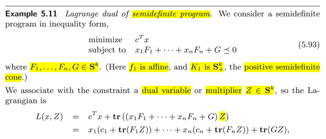</kbd></p>

<p align="center"><kbd>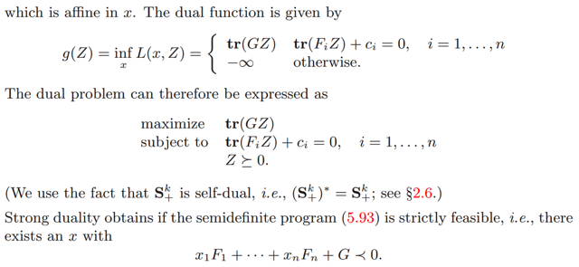</kbd></p>

> [!NOTE]
> Rồi thế thì L `=` cTx + `tr(Z(Σi` xiFi + G)) (Chỗ này chú ý trong slide
> hơi khác trong sách nên qua đây ta đổi lại thành + G theo sách)
>
> cũng có thể ghi là cTx + `tr((Σi` xiFi + G)Z) vì tr(ATB) `=` tr(BTA)
>
> `=` cTx + tr((x1F1 + x2F2 + ...+ xnFN + G)Z)
>
> `=` cTx + tr(x1F1Z + x2F2Z + ...+ xnFNZ + GZ) | phân phối vô thôi
>
> `=` cTx + tr(x1F1Z) + tr(x2F2Z) + ...+ tr(xnFNZ) + tr(GZ) 
>
> (trace operator có tính tuyến tính)
>
> `=` cTx + tr(F1Z)x1 + tr(F2Z)x2 + ...+ tr(FNZ)xn + tr(GZ) 
>
> `=` [c1 + tr(F1Z)]x1 + [c2 + tr(F2Z)]x2 + ...+ [cn + tr(FNZ)]xn + tr(GZ) 
>
> `(tr(αA)` `=` `αtr(A),` cái này dễ hiểu)
>
> Tới đây có thể thấy L là affine function của x: L `=` kTx + tr(GZ)
>
> với k `=` [c1 + tr(F1Z), c2 + tr(F2Z), ...]
>
> Và vì vậy khi minimize over x của L nó sẽ ra -infinity trừ khi mọi
> hệ số gắn với x `=` 0. Hay, k `=` 0
>
> Vậy g(Z) `=` inf Z L 
>
> a) tr(GZ) nếu ci + tr(FiZ) `=` 0 ∀i và 
>
> b) -infinity otherwise
>
> Và để thỏa dual feasible (λ ≽ 0, ở đây là Z ≽ 0, và g(Z) > -infinity) 
> thì ta sẽ có thêm điều kiện: ci + tr(FiZ) `=` 0 ∀i
>
> Do đó dual problem sẽ là:
>
> maximize tr(GZ) subject to ci + tr(FiZ) `=` 0 ∀i, Z ≽ 0
>
> Và cuối cùng như đã biết nếu ta có Slater condition: tồn tại x
> khiến primal strictly feasible: tức x khiến `Σi` xiFi + G ≺ 0 thì 
> ta sẽ có strong duality

<br>

<p align="center"><kbd>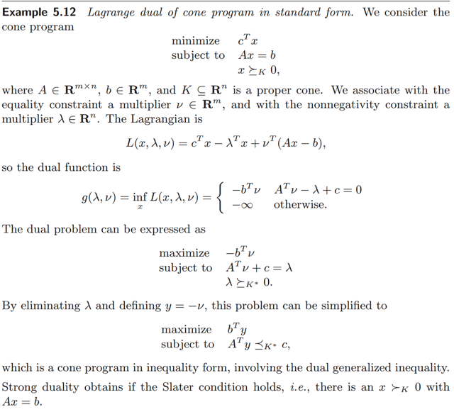</kbd></p>

> [!NOTE]
> Ta hoàn toàn có thể hiểu cái này: 
>
> Nói ngắn gọn như sau, xét bài tóan minimize cTx constraint Ax `=` b, x ≽K 0
>
> ⇔ 0 - x ⪯K 0 ⇔ - x ⪯K 0
>
> Lagrangian: f0(x) + λT(-x) + vT(Ax - b) `=` cTx - λTx + vTAx - vTb
>
> `=` (c - λ + ATv)Tx - bTv, dễ thấy là affine function của x.
>
> Dual function g(λ, v) `=` inf x L(x, λ, v). Thì như đã biết khi minimize affine
> function qx + p thì kết quả sẽ ra p khi q `=` 0 và ngược lại, sẽ ra -infinity.
>
> Thế thì ta nhớ khái niệm dual feasible: Đó là λ ≽ 0 VÀ g(λ, v) > - infinity. 
> Thì thêm vào đó, ở đây, để g(λ, v) > -infinity thì ta có constraint 
> (c - λ + ATv) `=` 0.
>
> Vậy từ đó dual problem là: maximize g(λ, v) `=` - bTv constraint λ ≽K* 0
> và c - λ + ATv `=` 0 ⇔ λ `=` ATv + c.
>
> Tiếp, với bài toán này, ta có thể bỏ bớt inequality constraint λ ≽K* 0
> bằng cách gộp nó với constraint λ `=` ATv + c để có ATv + c ⪯K* 0
>  ⇔ ATv ⪯K* c 
>
> Cái này nó cũng nằm trong phần equivalent problem
>
> Và nếu có Slater condition, thì ta sẽ có Strong Duality

<br>

<p align="center"><kbd>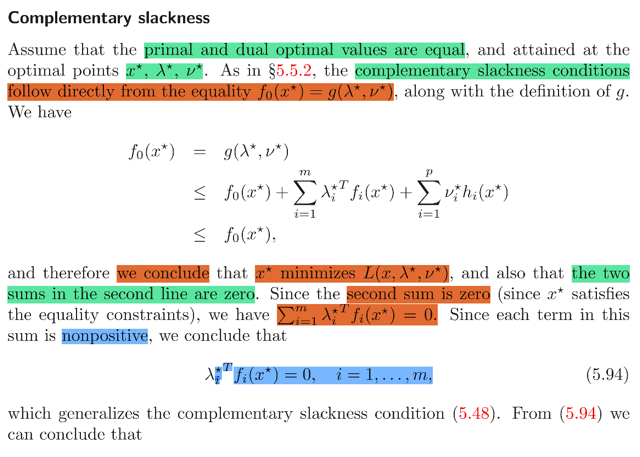</kbd></p>

<p align="center"><kbd>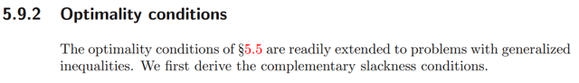</kbd></p>

<p align="center"><kbd>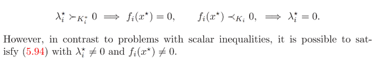</kbd></p>

> [!NOTE]
> 5.9 GENERALIZED INEQUALITIES
>
> 5.9.2 OPTIMALITY CONDITIONS
>
> Đại khái là ở đây họ giả sử ta đã có strong duality d* `=` p* (hay g(λ*, v*) `=` f0(x*)). Thì
> cái complementary slackness (dịch tiếng Việt tạm gọi là điều kiện bù trừ) có lập luận
> xuất phát từ như sau:
>
> Ta có:
>
> g(λ, v) ≤ L(x, λ, v) `=` f0(x) + `Σi` λiTfi(x) + `Σi` vihi(x) ∀ x, λ, v
>
> Dấu ≤ này là vì định nghĩa  của g `=` inf x L.
>
> Do đó g(λ, v) ≤ L(x*, λ, v) `=` f0(x*) + `Σi` λiTfi(x*) + `Σi` vihi(x*) | chỉ là áp dụng với x* (vì
> bất đẳng thức trên áp dụng với mọi x, λ, v)
>
> Và cũng có g(λ*, v*) ≤ L(x*, λ*, v*) `=` f0(x*) + `Σi` λ*iTfi(x*) + `Σi` v*ihi(x*) | chỉ là áp dụng
> với λ*, v* (vì bất đẳng thức trên áp dụng với mọi x, λ, v)
>
> Mà λ*iTfi(x*) ≤ 0 vì x* thì nó phải primal feasible (fi(x*) ≤ 0) và λ* thì nó phải dual
> feasible: λ* ≥ 0
>
> Và v*i hi(x*) `=` 0 vì f* phải primal feasible ⇨ hi(x*) `=` 0
>
> Suy ra:  g(λ*, v*) ≤ f0(x*) + `Σi` λ*iTfi(x*) + `Σi` v*ihi(x*) ≤ f0(x*)
>
> Từ đây, dùng sự thật là đang assume strong duality:
>
> g(λ*, v*) `=` f0(x*) khiến ta có chuỗi các dấu ≤ ở trên trở thành dấu `=:`
>
> ```text
> g(λ*, v*) = f0(x*) + Σi λ*iTfi(x*) + Σi v*ihi(x*) = f0(x*)
> ```
>
> Hệ quả là:
>
> ```text
> 1)Σi λ*iTfi(x*) = 0 (thì f0(x*) + Σi λ*iTfi(x*) + Σi v*ihi(x*) mới = f0(x*)
> ```
>
> 2) x* chính là minimizer của L(x, λ*, v*). Vì sao?
>
> Vì theo định nghĩa g(λ, v) `=` inf L(x, λ, v) nên g(λ*, v*) `=` inf L(x, λ*, v*) Mà g(λ*, v*) `=`
> f0(x*) + `Σi` λ*iTfi(x*) + `Σi` v*ihi(x*) (dựa trên dấu bằng thứ nhất) thì vế phải chính là
> L(x*, λ*, v*). Vậy L(x*, λ*, v*) `=` inf L(x, λ*, v*) Nên điều này có nghĩa là x* chính là
> minimizer của L(x, λ*, v*)
>
> Hai hệ quả này có gì hay ho mà phải nói đến:
>
> Hệ quả thứ nhất `Σi` λ*iTfi(x*) `=` 0, chính là complementary slackness và nó có ý
> nghĩa là: Vì λ*i ≽ 0 và fi(x*) ⪯ 0 nên tích của chúng sẽ không dương. Do đó để cái
> tổng này `=` 0 thì mọi component phải bằng 0:
>
> λ*iTfi(x*) `=` 0 ∀ i
>
> Như vậy, nếu fi(x*) ≺Ki 0 thì λ*i `=` 0. Nếu λ*i ≻Ki* 0 thì fi(x*) `=` 0.
>
> Hệ quả hai khi ta có  x* chính là minimizer của L(x, λ*, v*) sẽ cho phép ta giải tìm x*
> (là cái minimize f0(x) với constraint) bằng cách giải tìm λ*, v* trước. Sau đó lắp vào
> L rồi giải bài toán unconstraint problem minimize L(x, λ*, v*)
>
> Nhưng một ứng dụng quan trọng hơn của hệ quả hai là: Nó giúp thiết lập một trong
> những điều kiện của KKT conditions: (tiếp note sau)

<br>

<p align="center"><kbd>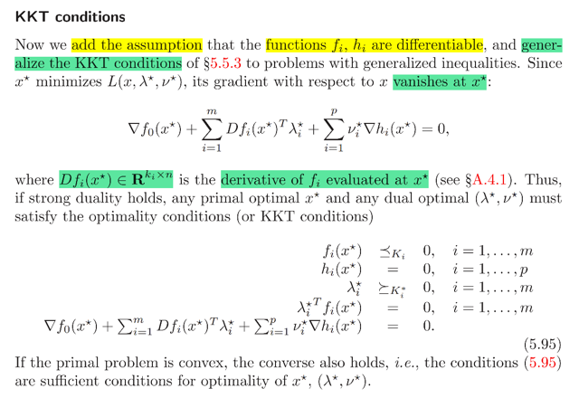</kbd></p>

> [!NOTE]
> Gradient của L(x, λ*, v*) tại x* vanish (vì x* là minimizer của L(x, λ*, v*)  mà):
> ∇_x L(x, λ*, v*) `=` 0.
>
> TÍnh ∇_x L(x, λ*, v*):
>
> L(x, λ*, v*) `=` f0(x) + `Σi` λ*iTfi(x) + `Σi` v*iThi(x)
>
> ```text
> D_xL = D_x[f0(x)] + D_x [Σi λ*iTfi(x)] + D_x [Σi v*iThi(x)]
> ```
>
> a) `D_x[f0(x)]` chính là ∇f0(x)
>
> b) `D_x` `[Σi` λ*iTfi(x)]:
>
> Nếu theo 18.s096 thì ta đang tính derivative của g `=` aTf(x):
>
> g `=` aTf ⇨ dg `=` aT(f+df) - aTf `=` aTdf.
>
> f `=` f(x) ⇨ df `=` `D_x` f(x) dx (Với việc f là vector ⇨ vector function thì f'(x) là
> Jacobian kí hiệu `D_x` f(x), để rồi `D_x` f(x) dx là matrix J nhân vector dx cho ra
> vector df)
>
> Từ đó dg `=` aT `D_x` f(x) dx
>
> Cái này có thể hiểu như sau :
>
> `aT[D_x` f(x) dx]: Vector a dot product với vector df `=` `D_x` f(x) dx
>
> Hoặc:
>
> `[aTD_x` f(x)] dx: Row vector `aT[D_x` f(x)] dot product với vector dx
>
> Rồi, g là scalar function nên `D_x` g(x) là gradient vector `∇x_g(x).` và như ta đã
> học trong MIT 18s096, khi đã triển khai cho thấy df `=` [vector]Tdx thì ∇f chính
> là [vector]T
>
> ```text
> Từ đó suy ra: D_x g(x) = ∇g(x) = [aT[D_x f(x)]]T = [D_x f(x)]Ta
> ```
>
> Vậy áp dụng vào đây ta có các function gi `=` λ*iTfi(x):
>
> ```text
> D_x [Σi λ*iTfi(x)] = Σi D_x [λ*iTfi(x)] = Σi [D_x fi(x)]Tλ*i
> ```
>
> (nhớ rằng `D_x` fi(x) là Jacobian)
>
> ```text
> c) D_x [Σi v*iThi(x)]: Hoàn toàn tương tự = Σi D_x hi(x)Tv*i = Σi ∇hi(x)Tv*i
> ```
>
> Điểm khác là hi(x) là scalar function, không phải vector function như fi(x), Do
> đó `D_x` hi(x) là gradient vector không phải Jacobinan, nên ghi là ∇hi(x)
>
> ```text
> Vậy D_x L(x, λ*, v*) = ∇f0(x) + Σi [D_x fi(x)]Tλ*i + Σi ∇hi(x)Tv*i
> ```
>
> Vậy ta có điều kiện vanishing gradient của KKT đv bài toán generalized
> inequality:
>
> ```text
> ∇f0(x) + Σi [D_x fi(x)]Tλ*i + Σi ∇hi(x)Tv*i = 0
> ```

<br>

<p align="center"><kbd>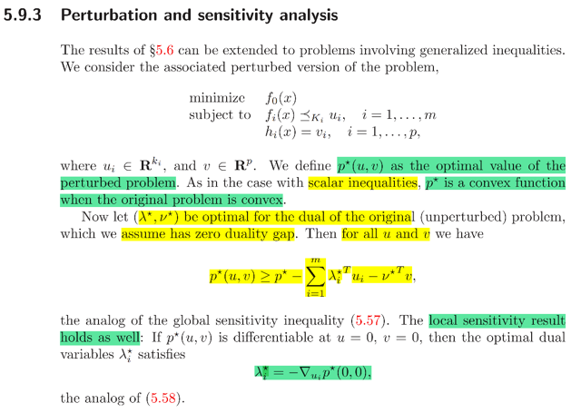</kbd></p>

> [!NOTE]
> 5.9 GENERALIZED INEQUALITIES
>
> 5.9.3 PERTURBATION & SENSITIVITY ANALYSIS
>
> đại khái là những phân tích về bài toán perturbed trong phần 5.6
> cũng được áp dụng với bài toán generalized inequality này.
>
> Đại khái là, như ta biết từ 5.6, kiểu như là ta có thể nới lỏng hoặc
> thắt chặt constraint, bằng cách thay vì constraint là fi(x) ≤ 0, thì nay
> ta có thể thay bằng fi(x) ≤ ui, để rồi nếu ui dương thì ta đang nới
> lỏng constraint, đang mở rộng feasible set, và ngược lại nếu ui âm
> thì ta đang thắt chặt constraint. Với equality constraint cũng tương
> tự vậy.
>
> Đương nhiên điểm khác là bây giờ ui là vector, vì fi(x) là vector.
>
> Và bài toán minimize f0(x) subject to fi(x) ≤Ki ui, hi(x) `=` wi được gọi
> là perturbed problem. Và optimal value của nó sẽ là hàm theo u, v
> p*(u, v): Khi thay đổi u, v thì optimal value của bài toán sẽ tăng hay
> giảm, dĩ nhiên p*(0, 0) là optimal value của bài toán gốc,
> unperturbed problem.
>
> Và nếu ta giả sử đang có strong duality thì ta sẽ có thể chứng minh
> một cái bất đẳng thức, mang ý nghĩa là một cái chặn dưới của giá
> trị optimal value của perturbed problem p*(u, v):
>
> p*(u, v) ≥ p*(0, 0) + `Σ` λ*Tu + `Σ` v*Tw.
>
> Mình sẽ chứng minh lại cái này, đầu tiên là Lagrangian function, mà
> ta sẽ kí hiệu `L_u,v` để biết đây là Lagrangian của perturbed
> problem u,v:
>
> Ta có
>
> p*(0,0) `=` g(λ*, v*) `=` inf x [f0(x) + `Σ` λ*iTfi(x) + v*iThi(x)] 
>
> ≤ f0(x) + `Σ` λ*iTfi(x) + v*iThi(x)
>
> Xét x bất kì thuộc feasible set của perturbed problem: fi(x) ≤K ui,
> hi(x) `=` wi
>
> ⇨ vế phải ≤ f0(x) + `Σ` λ*iTui + v*iTwi
>
> ⇨ p*(0,0) ≤ f0(x) + `Σ` λ*iTui + v*iTwi
>
> Và do nó đúng với mọi x thuộc feasible set của perturbed problem
> nên trong đó có cá optimal của perturbed problem:
>
> ⇨ p*(0,0) ≤ f0(x*) + `Σ` λ*iTui + v*iTwi
>
> ⇔ p*(0,0) ≤ p*(u, v) + `Σ` λ*iTui + v*iTwi
>
> ⇔ p*(u, v) ≥ p*(0,0) - `Σ` λ*iTui - v*iTwi
>
> Còn cái vụ local sensitivity, ôn lại chút, với scalar case trước
>
> Ta có thể chứng minh rằng `∂/∂ui` p*(u, v) | u `=` 0, v `=` 0 là bằng λ*i
>
> Mang ý nghĩa là tại điểm (0,0), độ dốc theo phương ui của hàm p*(u, v) 
> là bằng λ*i
>
> Ôn lại cách chứng minh:
>
> Xét hàm p*(u, v). 
>
> Đầu tiên evaluate tại điểm (u0, v0) `=` (0, 0): p*(0, 0)
>
> p*([0, 0,...0], [0, ...0])
>
> Thay đổi (u, v) ở component thứ 2 của cái phần tương ứng với inequality 
> constraint thứ 2: f2(x) ≤ u2
>
> ([0, `ε,.0..,0],` [0, 0...0]) và nó chính là:
>
> `=` ([0, 0,...0], [0, ...0]) + ([0, `ε,...0],` [0, ...0]) 
>
> `=` ([0, 0,...0], [0, ...0]) + `(ε[0,` 1,...0], [0, ...0]) 
>
> `=` ([0, 0,...0], [0, ...0]) + `(εe2,` [0, ...0]) 
>
> và cũng là `(εe2,` [0, ...0])
>
> Tại đó ta có `p*(εe2,` [0, ...0])
>
> Và ta sẽ thiết lập difference quotient: 
>
> `[p*(εe2,` [0, ...0]) - p*([0, 0,...0], [0, ...0])] `/` `ε` 
>
> viết gọn lại:
>
> `[p*(εe2,` 0) - p*(0, 0)] `/` `ε` 
>
> ```text
> Thì theo định nghĩa đạo hàm thì lim ε → 0 [p*(εe2, 0) - p*(0, 0)] / ε
> ```
>
> chính là partial derivative của p*(u, v) wrt u2, evaluate tại 0.
>
> `∂/∂u2` p*(u,v) | `u=0,` `v=0`
>
> Thế thì, `[p*(εe2,` 0) - p*(0, 0)] `/` `ε` là cái gì ta ko biết nhưng ta biết nó sẽ ≥ λ*i
>
> Vì p*(u, v) ≥ p*(0, 0) - λ*Tu - v*Tw ∀ u, v
>
> ⇨ `p*(εe2,` 0) ≥ p*(0, 0) - (λ*1.0 + `λ*2.ε` + ...) - v*T0
>
> ⇔ `p*(εe2,` 0) ≥ p*(0, 0) - `λ*2.ε`
>
> ⇔ `p*(εe2,` 0) - p*(0, 0) ≥ - `λ*2.ε`
>
> Nếu `ε` dương thì ta có:
>
> ⇔ `[p*(εe2,` 0) - p*(0, 0)] `/` `ε` ≥ -λ*2
>
> Do đó sau khi tính giới hạn thì ta cũng có `∂/∂u2` p*(u,v) | `u=0,` `v=0` ≥ -λ*2
>
> Nếu `ε` âm thì ta có:
>
> `[p*(εe2,` 0) - p*(0, 0)] `/` `ε` ≤ -λ*2
>
> Tính giới hạn thì ta có: 
>
> `∂/∂u2` p*(u,v) | `u=0,` `v=0` ≤ -λ*2
>
> ```text
> Từ đó suy ra ∂/∂u2 p*(u,v) | u=0, v=0 = -λ*2
> ```
>
> ```text
> Vậy ∂/∂ui p*(u, v) | u=0, v=0 = -λ*i
> ```
>
> `====`
>
> Vậy nay với generalized inequality constraint ta cũng có điều tương tự
>
> Chỉ khác là p*(u, v), trong scalar case, u là vector các [u1, u2, ....un], u1, u2
> ...là scalar trong inequality constraint: fi(x) ≤ ui
>
> Còn này, với việc fi(x) là vector, thì ui là vector. Nên có thể coi u giờ là ma
> trận (v vẫn chỉ là vector) 
>
> Nên mình sẽ dùng kí hiệu p*(U, v)
>
> Và nếu xét quan hệ giữ ui và p* thì nó là hàm vector → scalar
>
> Khác với trước đây là scalar → scalar
>
> Nên `∂/∂ui` p*(u, v) sẽ là một gradient vector. Kí hiệu - ∇ui p*(u, v)   
>
> Và nó chính là vector λ*i (trước đây là scalar, nay cũng là vector) 
>
> Ta sẽ chứng minh để thấy rõ ở note sau
>
> Xét tại (U, v)
>
> U là matrix [u1T; u2T; ...unT]
>
> v là vector [v1, v2,...vm]
>
> (u1 là vector của inequality constraint f1(x) ≤K u1,...
>
> v1 là scalar của equality constraint h1(x) `=` v) 
>
> Tại điểm (0, 0), tức ([0T, 0T, ....], [0,...,0]) 
>
> (0 là vector [0,..0], 0 là scalar 0)
>
> Thay đổi u11 (đang là 0) một khoảng chút xíu `ε`  
>
> Nhớ u1 là vector [u11, u12, ...u1k] `=` [0, 0...0] trở thành 
>
> ```text
> [ε, 0...0] và nó chính là ε[1, 0...0] = εe1
> ```
>
> thì ta có điểm mới (U, v) `=` `([εe1T;` 0T; ...0T], [0, 0,...0])
>
> Hàm số thay đổi:
>
> `Δp*` `=` `p*(εe1T,` 0T, ...0T), [0, 0,...0]) - p*([0T, 0T, ....], [0,...,0])
>
> Quotient difference tại limit `ε` → 0
>
> ```text
> lim ε → 0 Δp* / ε  CHÍNH LÀ ∂/∂u11 p*(U, v) | U = 0, v = 0
> ```
>
> Và ta hoàn toàn chứng minh tương tự để thấy nó `=` λ*i1:
>
> p*(U, v) ≥ p*(0, 0) - `Σ` λ*iTui - v*iTwi
>
> Bản chất vế phải là:
>
> p*(0,0) - (λ*1Tu1 + ...λ*nTun) - v*1Tw1 
>
> Tại (U, v) `=` `(εe1T,` 0T, ...0T, 0) thì vế phải nó là:
>
> p*(0,0) - (λ*1Tu1 + λ*2T0 +... + λ*nT0) - v*1T0
>
> `=` p*(0,0) - (λ*1Tu1)
>
> `=` p*(0,0) - `(λ*11ε` + λ*12 0 + ..λ*1n 0) 
>
> `=` p*(0,0) - `λ*11ε`
>
> Nên ta có:
>
> [p*(U, v) - p*(0,0)] `/` `ε` ≥ - λ*11
>
> Và ta có thể chứng minh được như trên rằng 
>
> ```text
> ∂/∂u11 p(U, v) | U=0, v=0 = - λ*11
> ```
>
> tương tự 
>
> ```text
> ∂/∂u12 p(U, v) | U=0, v=0 = - λ*12
> ```
>
> ...
>
> ```text
> ∂/∂u1k p(U, v) | U=0, v=0 = - λ*1k
> ```
>
> Do đó:
>
> ```text
> [∂/∂u11 p(U, v), ∂/∂u12 p(U, v)], .... | U=0, v=0 = - [λ*11, λ*12,....]
> ```
>
> Và vế trái chính là ∇u1 p*(U,v) | `U=0,` `v=0`
>
> ⇨ ∇u1 p*(U,v) | `U=0,` `v=0` `=` - λ*1
>
> Tương tự:
>
> ∇ui p*(U,v) | `U=0,` `v=0` `=` - λ*i

<br>

<p align="center"><kbd>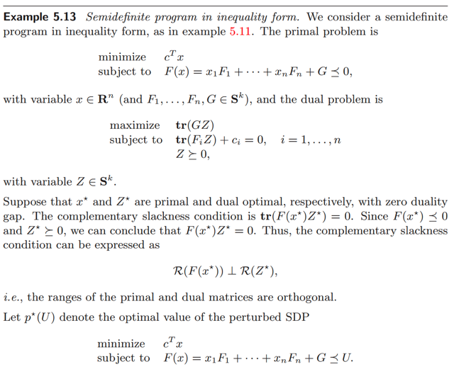</kbd></p>

<p align="center"><kbd>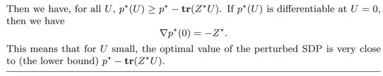</kbd></p>

> [!NOTE]
> Gặp lại ví dụ này:
>
> minimize cTx subject to F(x) `=` x1F1 + ...xnFn + G ⪯ 0.
>
> x ∈ R^n, Fi, G ∈ S^k (symmetric matrix [k, k])
>
> Thử làm lại xem tại sao dual problem lại là vậy
>
> Công thức tổng quát Lagrangian:  L(x, λ, v) `=` f0(x) + `Σi` λifi(x) + `Σi` vihi(x)
>
> Với việc fi(x) là vector function, thì mỗi component của fi(x) sẽ gắn với một
> Lagrange multiplier, đồng nghĩa mỗi vector fi(x) sẽ gắn với một vector λi, nên
> công thức trở thành.
>
> L(x, λ, v) `=` f0(x) + `Σi` λiTfi(x) + `Σi` vihi(x)
>
> Bây giờ, nếu fi(x) là matrix thì sao: Nhờ MIT 18s096 ta biết rằng, bản chất là ta
> đang dùng cái gọi là inner product giữa hai vector (vector theo nghĩa rộng, có
> thể là matrix). Để với hai column vector u và v thì inner product cuả chúng được
> gọi là dot product u . v `=` uTv có bản chất là `Σi` uivi
>
> Thì với matrix U, V, ta cũng có định nghĩa của inner product giúp tính  `Σij` UijVij:
> U . V `=` `Σij` UijVij (tức element-wise nhân các phần tử với nhau rồi cộng lại hết)
>
> Thế thì `Σij` UijVij có thể thể hiện theo dạng gọn gàng hơn: Nhìn vào bản chất
> của phép tính này, nó là lấy cột 1 của U, nhân elementwise với cột 1 của V, rồi
> cộng lại hết, và làm tương tự với các cột kia. Và tính tổng kết qủa lại. Thế thì
> cột 1 của U nhân element-wise với cột 1 của V rồi cộng lại hết thì chính là cột 1
> của U dot product với cột 1 của V.
>
> Vậy bản chất phép tính này là `Σj=1:` số cột [cột j của U]T.[cột j của V]
>
> Mà nhờ 18.06 ta nhớ lại một trong 4 góc nhìn về việc nhân matrix A với B đó là
> [AB]ij `=` [Hàng i của A].[Cột j của B].
>
> Do đó, nếu lật matrix U lại và xét UTV thì:
>
> với i cho trước, [hàng i của UT] . [cột i của V] chính là `Σj` UijVij
>
> đó chính là phần tử ii của matrix UTV: [UTV]ii
>
> nên `Σij` UijVij chính là `Σ` mọi phần tử ii của UTV, tức là mọi entries trên đường
> chéo. Ta biết nó chính là trace(UTV)
>
> Vậy với matrix thì phép inner product U . V `=` tr(UTV)
>
> Thế thì áp dụng vào đây: λ1Tf1(x) (và có nhiều inequality constraint fi(x) `i=1,2...`
> thì thành ra `Σ` λiTf trong vector case) trong vector case, là inner product giữa
> vector Lagrange multiplier λ1 với vector f1(x)
>
> sẽ tương đương với
>
> Z1 . F1(x), tức inner product giữa matrix Lagrange multiplier Z1 với matrix F1(x)
>
> và nó như đã nói ở trên chính là tr(F1(x)TZ1) hoặc tr(Z1TF1(x)) (vì tr(A) `=`
> tr(AT))
>
> do đó Lagrangian của bài toán này chính là:
>
> L(x, Z) `=` cTx + tr(F(x)TZ)
>
> `=` cTx + tr([x1F1 + ...xnFn + G]TZ)
>
> `=` cTx + tr(x1F1TZ) + ...+ tr(xnFnTZ) + tr(GTZ)
>
> `=` cTx + x1tr(F1TZ) + ...+ xntr(FnTZ) + tr(GTZ)
>
> `=` `Σi` cixi + x1tr(F1TZ) + ...+ xntr(FnTZ) + tr(GTZ)
>
> `=` x1(c1 + tr(F1TZ))  + ...+ xn(cn + tr(FnTZ)) + tr(GTZ)
>
> Dual function:
>
> g(Z) `=` inf x L(x, Z) `=` inf x x1(c1 + tr(F1TZ))  + ...+ xn(cn + tr(FnTZ)) + tr(GTZ)
>
> L chỉ là affine function của x (nó có dạng aTx + b với ai `=` ci + tr(FiTZ), b `=`
> tr(GTZ)
>
> nên khi minimize over x nó sẽ bằng: - inf nếu a khác 0, và bằng b nếu a `=` 0.
>
> Và để dual problem feasible, điều kiện là g phải > -inf, thì ta sẽ thêm điều kiện a
> ```text
> = 0, tức ci + tr(FiTZ) i=1,...n = 0, để g(Z) = b = tr(GTZ).
> ```
>
> Khi đó dual problem sẽ là:
>
> maximize Z tr(GTZ) constraint Z ≽ 0, ci + tr(FiTZ) `i=1,...n` `=` 0
>
> Rồi thử xem khúc sau nói vậy là sao:
>
> Họ giả sử x* và Z* là primal và dual optimal của bài toán này. và giả sử thêm ta có
> zero duality gap, tức p* `=` d*, hay còn gọi là  strong duality.
>
> Như vậy. Ta thử lập luận lại optimality condition
>
> g(Z) `=` inf x L(x, Z) (theo định nghĩa của dual function) nên
>
> ⇨ g(Z) `=` inf x L(x, Z) ≤ L(x, Z) ∀x, Z (định nghĩa của infimum)
>
> vì nó đúng với mọi Z nên ta có quyền áp dụng với Z*
>
> ⇨ g(Z*) `=` inf x L(x, Z*) ≤ L(x, Z*) ∀x (chỉ là áp dụng với Z*)
>
> tương tự ta có quyền áp dụng với x*
>
> ⇨ g(Z*) `=` inf x L(x, Z*) ≤ L(x*, Z*) (chỉ là áp dụng với x*)
>
> ⇔ g(Z*) `=` inf x f0(x) + Z* . F(x) ≤ f0(x*) + Z* . F(x*)
>
> tới đây dùng giả định ta có strong duality nên :
>
> ```text
> g(Z*) (= d* = sup Z g(Z)) = f0(x*) (= p*)
> ```
>
> Vậy áp dụng nó vào sự thật ta đang có: g(Z*) `=` inf x f0(x) + Z* . F(x)
>
> ⇨ g(Z*) `=` f0(x*) `=` inf x f0(x) + Z* điều này chứng tỏ x* là minimizer của L(x, Z*) ⇨
> ∇L(x*, Z*) `=` 0
>
> ⇔ ∇f0(x*) + ∇x [Z* . `F(x)]|x=x*` `=` 0
>
> (phải hiểu ∇L(x*, Z*) như vầy: với giá trị Z `=` Z*, thì hàm L chỉ là làm theo x, và
> gradient ∇L(x, Z*) cũng là hàm theo x. và ta có kết luận là hàm ∇L(x, Z*) evaluate tại
> `x=x*` sẽ bằng 0.)
>
> Đây là hệ quả thứ 1, còn hệ quả thứ 2 là ta dùng sự thật:
>
> g(Z*) `=` inf x f0(x) + Z* . F(x) ≤ f0(x*) + Z* . F(x*)
>
> với g(Z*) `=` f0(x*)
>
> ⇨ f0(x*) ≤ f0(x*) + Z* . F(x*) ⇔ 0 ≤ Z* . F(x*)
>
> thế thì với primal optimal x* thì dĩ nhiên nó primal feasible nên F(x*) ⪯ 0. Còn Z* là
> dual optimal thì dĩ nhiên phải thỏa Z ≽ 0. Vậy Z* . F(x*) ≤ 0
>
> Từ đó Z* . F(x*) vừa không dương vừa không âm thì nó phải bằng 0
>
> Z* . F(x*) `=` 0 ⇔ tr(F(x*)TZ) `=` 0 ⇔ tr(F(x*)Z) `=` 0 , đây chính là complimentary
> slackness:
>
> (Chú ý là F là symmetric nên F(x*)TZ cũng là F(x*)Z)
>
> Nó nói rằng, nếu F(x*)ij mà < 0 thì Z*ij phải phải bằng 0 và ngược lại nếu Z*ij > 0 thì
> F(x*)ij phải `=` 0.
>
> Sẵn ôn lại thêm như ta đã từng phân tích λ*i chính là `∂/∂ui` p*(0, 0) tức là slop theo
> phương ui của perturbed p*(u, v) tại (0,0) Nên nếu fi(x*) < `=` và λ*i `=` 0  có nghĩa là
> constraint fi đang slack (chùng), ta có chuyền thắt chặt hay nới lỏng constraint ui
> mà ko ảnh hưởng gì mấy để p*(u,v). Ngược lại nếu fi(x*) `=` 0 và λ*i > 0 tức là
> constraint fi đang chặt (tight). Nếu nới lỏng hay thắt chặt constraint thì sẽ thay đổi
> p* nhanh
>
> Rồi, tại sao
>
> Nói Vì F(x*) ⪯ 0, tức là negative semi definite matrix (ma trận bán xác
> định âm) và Z* ≽ 0, tức positive semi definite matrix nên:
>
> tr(F(x*)Z*) `=` 0 suy ra F(x*)Z* `=` 0.
>
> Gọi A ⪯ 0, B ≽ 0. Vì B ≽ 0 nên nó thể factor thành CTC
>
> Đó là vầy: Vì B symmetric, nên ta có orthogonal factorization `=` QΛQT
>
> Vì B positive semi definite nên mọi eigenvalues λi của nó đều không âm, 
> dẫn tới có thể viết ở dạng (√λi)(√λi)
>
> Dẫn tới Λ có thể tách thành Λ'T Λ' (hoặc Λ' Λ'T) với Λ' `=` diag([√λ1, √λ2, ...√λn])
>
> (hình dung thế này Λ' là diagonal nên cũng symmetric, nên Λ'T `=` Λ'. 
> Phần tử thứ ii của Λ'Λ' là kết qủa dot product của hàng thứ i của Λ' và
> cột thứ i của Λ', đều là √λi*ei, nên kết quả là λi) 
>
> ⇨ Q Λ QT `=` Q Λ'T Λ' QT 
>
> Rồi, xét quadratic form của AB, cũng là Q Λ'T Λ' QT 
>
> `=` uTQ Λ'T Λ' QT u `=` (Λ' (uTQ)T)T  Λ' QT u `=` (Λ' QTu)T  Λ' QTu
>
> `=` ||Λ' QTu||^2 ≥ 0
>
> Vậy từ đó kết luận AB là positive semi definite matrix.
>
> Áp dụng vào ta có: F(x*) ⪯ 0, Z* ≽ 0 thì F(x*)Z* ≽ 0. Mà tr(F(x*)Z*) `=` 0
> ⇔ tổng mọi eigenvalues của F(x*)Z* bằng 0, mà như đã nói đây là positive
> semi definite matrix nên mọi eigenvalues của chúng đều không âm, dẫn
> đến để tổng bằng 0 thì mọi eigenvalues đều bằng 0, điều này chỉ xảy ra khi
> F(x*)Z* `=` 0
>
> `====`
>
> Và từ đây kết luận được gì?
>
> Đó là mọi row của F(x*) đều dot product với mọi columns của Z* cho ra 0 ⇨
> chúng vuông góc nhau ⇨ rowspace của F(x*) orthogonal với columnspace
> của Z*, mà F(x*) symmetric nên rowspace của cũng al2 columnspace.
>
> Vậy columns space của F(x*) orthogonal compliment với column space của Z*
>
> Kết quả ở dưới hoàn toàn tương tự vector case. Khi - Z* (optimal
> dual variable) chính là local sensitivity ∇p*(0) của perturbed problem
> tại (0).
>
> Ôn lại chút về là eigendecomposition:
>
> Với matrix có đủ bộ eigenvector độc lập A, ta biết nó có thể factor bởi
> eigendecomposition:
>
> Gốc rễ là: gọi λ1, λ2,...λn là eigenvalue, x1, x2...xn là eigenvector tương
> ứng:
>
> Ax1 `=` λ1x1, Ax2 `=` λ2x2, ...Axn `=` λnxn
>
> Đặt x1, x2...xn làm các cột của S, và λ1, λ2... làm các entries trên đường
> chéo của Λ, các equation trên thể hiện bởi dạng matrix:
>
> AS `=` SΛ
>
> Rồi, cần nhấn mạnh, nói về eigenvector thì đang nói về SQUARE matrix.
>
> Lí do: Ax `=` λx thể hiện điều này, gọi A là (m,n) matrix thì x trước khi nhân
> với  A thì nó nằm trong R^n (vì A có n cột, nên x phải có n phần tử). Rồi,
> sau khi nhân với A thì nó được nằm trong Rm (vì A sẽ map vector trong
> Rn thành Rm) Vậy thì m phải bằng n là đương nhiên.
>
> Vậy thì, ta mới nói đến điều kiện để S trở thành invertible, từ đó A `=`
> SΛSinv
>
> Dĩ nhiên S cũng phải square, nên S invertible khi column của nó
> independent tức là các eigenvector của A independent.
>
> Và ko phải lúc nào cũng vậy, tức là có khi eigenvalue trùng nhau khiến
> eigenvector trùng nhau dẫn đến ko có đủ eigenvector độc lập.
>
> Mà chỉ có một trường hợp duy nhất ngoại lệ khi mọi eigenvector có chung
> eigenvalue nhưng vẫn độc lập chính là matrix I khi  nó có đủ n
> eigenvector độc lập dù eigenvalue đều là 1.
>
> Thế thì, khi A thỏa điều kiện có đủ n eigenvector độc lập thì S invertible và
> ta có A `=` S Λ Sinv, gọi là eigen-decomposition hay A khi đó là
> diagonalizable (chéo hóa được)
>
> Rồi, khi A symmetric, thì nó có tính chất rất hay là các eigenvector có thể
> được chọn là orthogonal nhau, và eigenvalue đều là số thực
>
> Và hơn nữa, sẽ luôn có đủ eigenvector độc lập. Nên S, lúc này có thể
> thay bằng orthogonal matrix Q, sẽ cũng invertible. Mà Q lại có tính chất
> hay ho là QTQ `=` I ⇨ QT `=` Qinv
>
> Vậy với symmetric matrix A, diagonalization của nó là: A `=` Q Λ QT

<br>

<p align="center"><kbd>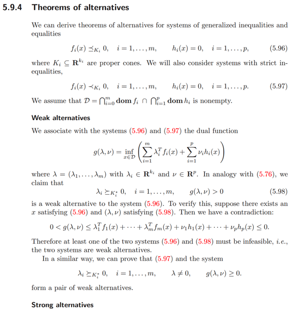</kbd></p>

> [!NOTE]
> 5.9 GENERALIZED INEQUALITIES
>
> 5.9.4 THEOREMS OF ALTERNATIVES

<br>

<p align="center"><kbd>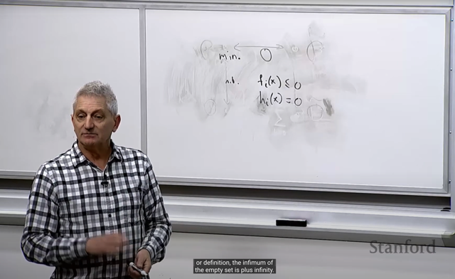</kbd></p>

> [!NOTE]
> một điểm nữa mà gs cho rằng ta nên biết đó là bài toán này:
>
> minimize 0 (tức objective function là constant f0(x) `=` 0) với
> constraint fi(x) `<=` 0; hi(x) `=` 0
>
> Thế thì ở bài toán này, optimal value sẽ là 0 nếu x feasible
> (cứ feasible thì sẽ có optimal value `=` 0), còn nếu feasible set empty
> tức ko có x nào feasible thì theo định nghĩa khi ta minimize over x
> một tập rỗng thì kết quả sẽ là +infinity, tức là khi ko có feasible x thì
> optimal value sẽ là +infinity

<br>

<p align="center"><kbd>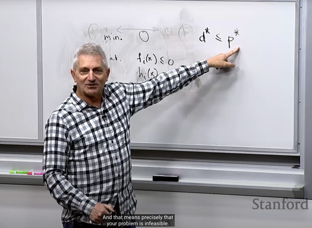</kbd></p>

> [!NOTE]
> Và đại khái là, khi ta làm các bước thông thường, để tìm ra d*
> thì d* luôn `<=` p* như đã biết. Thì nếu như d* `=` infinity hoặc một
> giá trị dương nào thì cũng kết luận rằng p* `=` +infinity (Vì optimal
> value p* như đã nói, chỉ có thể bằng 0 hoặc +infinity thôi)

<br>

<p align="center"><kbd>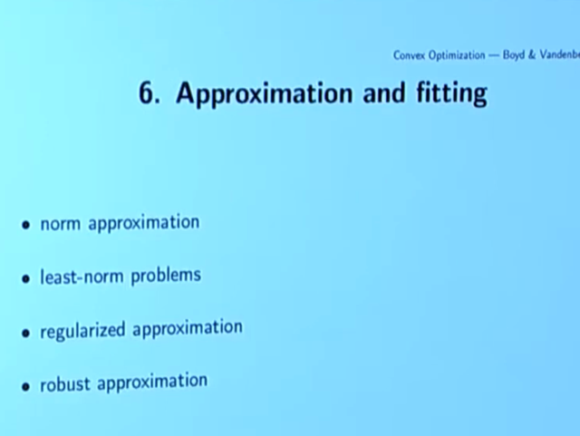</kbd></p>

> [!NOTE]
> Thế thì đến đây ta đã finish phần 1 của class, với rất nhiều lí thuyết.
> Tiếp theo ta sẽ đi vào các bài toán cụ thể:
>
> Gs cho rằng ta sẽ thấy thực ra chúng là một.

<br>

<p align="center"><kbd>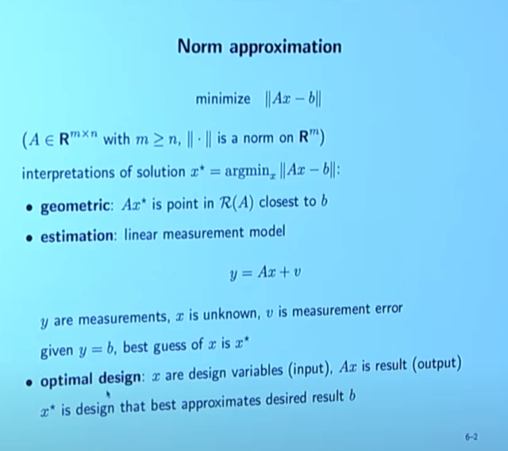</kbd></p>

> [!NOTE]
> Đầu tiên là bài toán norm approximation:
>
> Objective là minimize ||Ax - b||. norm này chưa nói là norm gì, có thể là
> l1, l2, infinity norm...
>
> Đại khái là ta có thể có một số interpretation hay ý nghĩa `/` ứng dụng 
> của bài minimize norm:
>
> Về hình học: Ax* là điểm nằm trong R(A) (hay C(A) - column space)
> mà gần nhất so với b với khoảng cách đo bởi norm. Nếu b nằm trong
> C(A) thì optimal value sẽ bằng 0.
>
> Ý nghĩa trong bài toán optimal design: đại khái là có dạng bài toán
> mà ta muốn estimate variable x sao cho result tạo bởi Ax gần nhất
> với result mong muốn là b. 
>
> Còn trong estimation, dù chưa hiểu lắm nhưng đại khái là y cũng
> đóng vai của giá trị "mong muốn" và Ax là kết qủa mà ta muốn
> nó gần với y: tức cũng là muốn v `=` ||y - Ax|| nhỏ.

<br>

<p align="center"><kbd>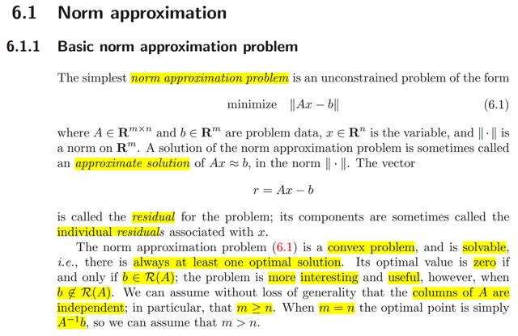</kbd></p>

> [!NOTE]
> nói cả rồi. Ngắn gọn là bài toán norm approximation này, đặt
> vấn đề tìm x khiến Ax gần b nhất. Ax là linear combination
> các A's columns. Với giả định A có `m>=n` và các cột độc lập,
> thì hệ Ax `=` b gọi là over-determined system. Nó sẽ có nghiệm
> duy nhất nếu b nằm trong C(A), dĩ nhiên khi đó minimizer ||Ax-b||
> chính là nghiệm này, và optimal value `=` 0 (vì Ax* `=` b)
>
> Ngược lại khi b không thuộc C(A), không có các kết hợp tuyến
> tính nào của A's columns có thể cho ra b. Ta chỉ có thể tìm điểm x^
> trong, giúp tạo Ax^ gần nhất với b. Đây chính là projection của
> b lên C(A) và phần dư còn lại e `=` b - p nằm trong N(AT). Nên ta có
> thể thiết lập normal equation bằng cách tiếp cận hình học:
>
> e thuộc left null space, vuông góc với C(A) `=>` e vuông góc với mọi 
> vector trong C(A) `=>` vuông góc với basis của C(A), là các A's columns
>
> ```text
> Nên ATe = 0 <=> AT(b-Ax^) = 0 <=> ATb = ATAx^
> ```
>
> Từ đó, với việc A full column rank nên ATA full rank `=>` ATA invertible
>
> `=>` x^ `=` (ATA)invATb
>
> Còn khi `m=n` thì (ATA)invAT cũng chính là Ainv, x* `=` Ainvb
>
> 6.1 NORM APPROXIMATION
>
> 6.1.1 BASIC NORM APPROXIMATION PROBLEM

<br>

<p align="center"><kbd>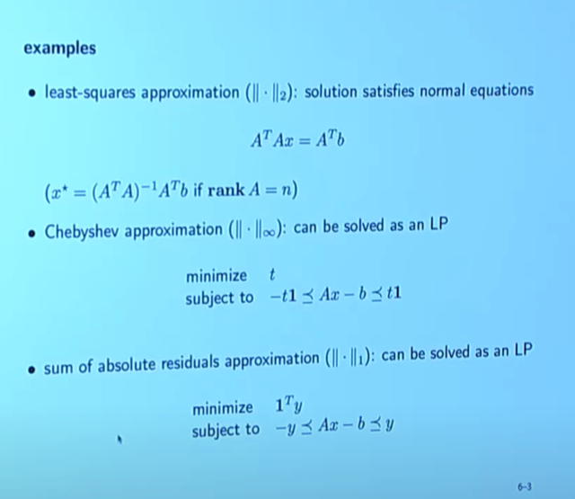</kbd></p>

> [!NOTE]
> Ví dụ khi dùng l2 norm thì ta có least-square approximation: để rồi
> ta có thể solve analytically: xây dựng normal equation (từ
> calculus hoặc hình học) để từ đó có thể solve solution x* bằng
> pseudo inverse matrix  (cái này đã phân tích kĩ trong 1806 hoặc sẽ
> còn nói lại trong EE263)
>
> gs nói sơ cái thứ hai và chả nói gì cái thứ 3.
>
> Đọc sách để hiểu thêm nói chung là với các norm function khác
> nhau thì ta có các bài toán khác nhau nhưng đều là norm
> approximation.

<br>

<p align="center"><kbd>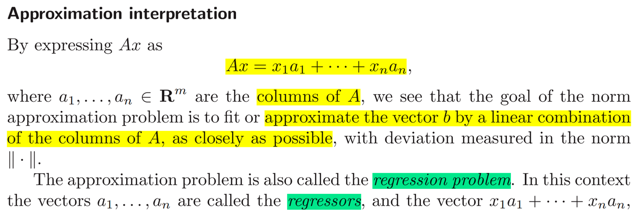</kbd></p>

> [!NOTE]
> một cách diễn giải bài toán norm approximation, khi ta muốn minimize
> ||Ax - b|| đó là ta muốn tìm x khiến tạo linear combination của các A's
> columns sao cho kết quả ra gần nhất với b, đo bởi ||.||.
>
> Đây là cái vừa nói rồi.
>
> Thì bài toán này với cách hiểu như vậy gọi là REGRESSION. Với
> các cột của A là REGRESSOR

<br>

<p align="center"><kbd>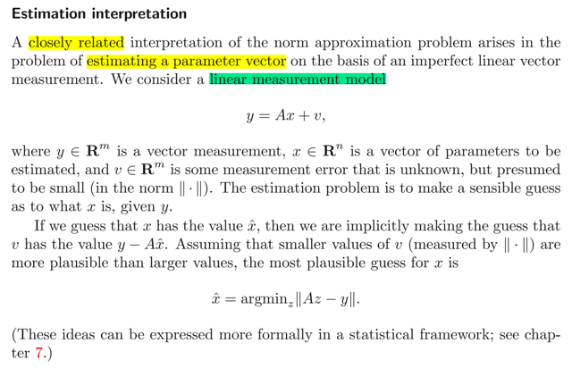</kbd></p>

> [!NOTE]
> SÁCH (XEM SAU)

<br>

<p align="center"><kbd>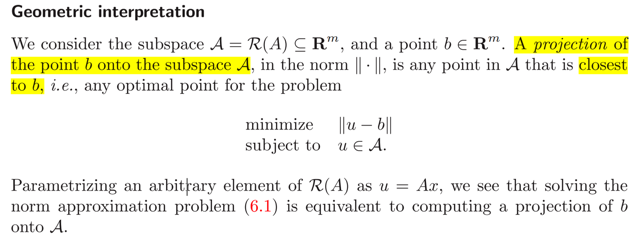</kbd></p>

> [!NOTE]
> Cách interpretation hình học thì ta muốn project b lên
> C(A). Nếu b đã thuộc C(A) thì dĩ nhiên projection là chính
> nó

<br>

<p align="center"><kbd>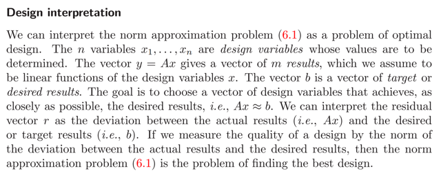</kbd></p>

<p align="center"><kbd>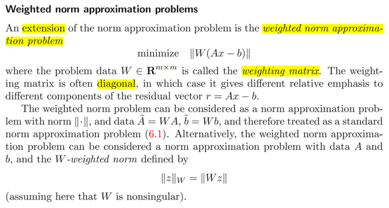</kbd></p>

> [!NOTE]
> SÁCH (XEM SAU)

<br>

<p align="center"><kbd>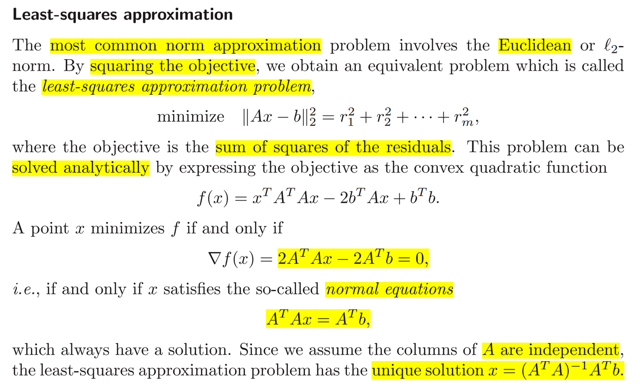</kbd></p>

> [!NOTE]
> SÁCH (XEM SAU)

<br>

<p align="center"><kbd>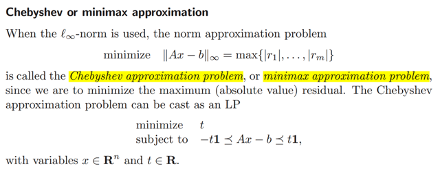</kbd></p>

<p align="center"><kbd>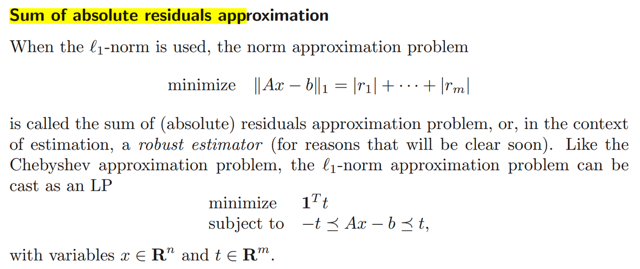</kbd></p>

> [!NOTE]
> SÁCH (XEM SAU)

<br>


<a id="node-hf40nmz"></a>
## Chap 9.1 - 9.4

<br>

<p align="center"><kbd>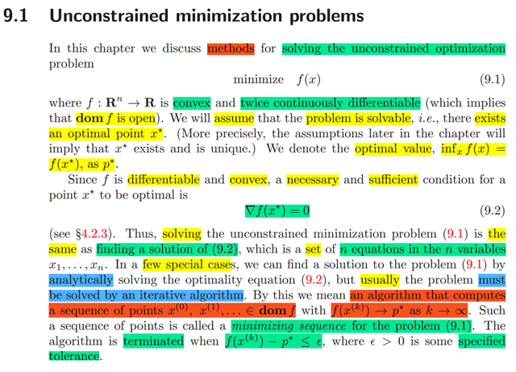</kbd></p>

> [!NOTE]
> Qua phần 3 - Algorithms TA MỚI CHÍNH THỨC ĐƯỢC HỌC CÁC
> GIẢI CÁC BÀI TOÁN OPTIMIZATION.
>
> Đầu tiên là bài toán UNCONSTRAINED optimization. Như đã biết, là
> khi ta có bài toán chỉ có objective f0(x). Với f0 convex và khả vi hai lần
> (twice differentiable) đồng nghĩa nó tồn tại Hessian ở mọi điểm trong
> domain. Do đó ta có bài toán convex optimization.
>
> Thế thì, trong phần OPTIMALITY CONDITION, ta đã học, nếu là có
> constraint, thì optimality condition là khi ta có điểm mà tại đó ta có
> support hyperplane của O (attainable optimal value  set) mà gradient
> vector tại điểm tiếp xúc x* sẽ là (outer) normal vector  để đại khái là từ
> x* khi di chuyển theo hướng nào trong O cũng  làm tăng f0
>
> Lập luận vầy: phương trình hyperplane: aTx `=` b. Đi qua x* ⇨ b `=` aTx*
> ⇨ phương trình hyperplane đi qua x*: aTx `=` aTx*
>
> ⇨ phương trình half-space bởi hyperplane: aTx ≥ aTx*
>
> ⇨ Nếu mọi điểm x trong feasible set đều nằm bên một trong
> half-space define bởi hyperplane: ∇f(x*)x ≥ ∇f(x*)Tx*
>
> ⇔ ∇f(x*)(x - x*) ≥ 0
>
> Thì với unconstraint problem thì điều kiện trở thành: Gradient vanish:
>
> ∇f(x*) `=` 0   Thì đại khái là trong một số trường hợp ta có thể giải
> phương trình ∇f(x) `=` 0 để ra analytic solution của bài toán tối ưu
>
> Nhưng phần lớn ta phải giải bằng thuật toán iterative, tìm x1,x2.. sao
> cho khi k -> infinity thì f(xk) -> f(x*) `=` p*
>
> Và sẽ đến lúc ta dừng dựa trên một tiêu chuẩn nào đó, ví dụ như f(xk)
> chỉ còn cách f(x*) một khoảng `ε` nhỏ nào đó. CŨng chính là xk gọi là
> `ε-suboptimal`
>
> 9. UNCONSTRAINED PROBLEM
>
> 9.1 UNCONSTRANTED MINIMIZATION PROBLEM

<br>

<p align="center"><kbd>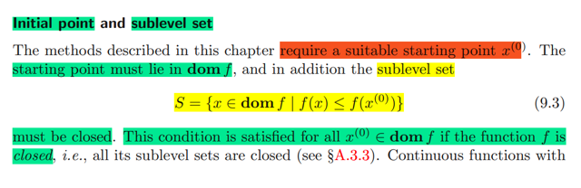</kbd></p>

<p align="center"><kbd>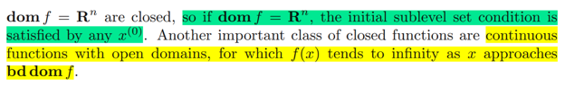</kbd></p>

> [!NOTE]
> Đại khái nói về điều kiện để các phương pháp nói ở chương này khả
> thi đó là:
>
> 1) starting point x(0) phải nằm trong dom f
>
> 2) sublevel set sau đây: x ∈ dom f: f(x) ≤ f(x0) phải là set đóng
> (closed)
>
> Vậy thì đại khái là phần A.3.3 có nói về định nghĩa hàm f khi nào gọi
> là closed: Đó là khi với mọi `α` thì `α-sublevel` set đều là set đóng.
>
> Và nếu xét hàm liên tục R^n -> R, thì có 2 trường hợp mà f là hàm
> đóng: một dạng là khi domain của nó đóng. Và hai là khi domain
> mở nhưng khi x tiến tới biên của domain thì f(x) tiến tới infinity
> (đại khái là vậy)
>
> Vậy thì ở đây, nếu xét hàm liên tục có domain là toàn bộ R^n, thì  vì
> R^n là set đóng (cái này tạm hiểu giống như vì R^n chứa mọi điểm
> nên nó được coi như closed) nên nó thỏa điều kiện nói trên.
>
> Và do đó nó là hàm đóng, và theo định nghĩa ta có kết luận rằng mọi
> sub-level set của f đều là set đóng. Và do đó sub-level set S ( `=` x ∈
> dom f: f(x) ≤ f(x0) ) cũng đều là set đóng.
>
> Nói tóm lại ý nói nếu ta đang xét hàm R^n -> R liên tục có domain
> đóng (hoặc domain mở nhưng khi lim x-> boundary dom f f(x) `=`
> infinity)  thì là ta đã thỏa điều kiện trên của starting point x0 rồi.

<br>

<p align="center"><kbd>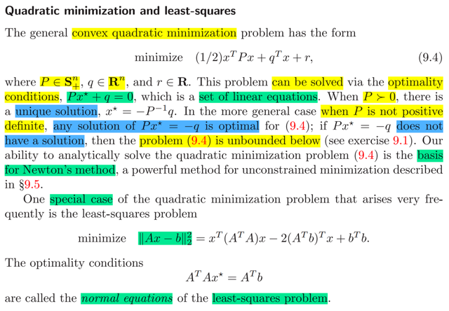</kbd></p>

> [!NOTE]
> Một ví dụ của bài toán unconstrained mà đã nói đi nói lại nhiều lần 
> là quadratic minimization f0(x) `=` `(1/2)xTPx` + qTx + r
>
> Thì bài toán này, đại ý là, khi xét optimality condition ∇f(x*) `=` 0
> thì ta sẽ có Px* + q `=` 0 (nhờ MIT 18s096 không khó gì để tìm ∇f
> ở đây nữa)
>
> Thì như vậy optimal của bài toán này là nghiệm của hệ phương trình
> tuyến tính Px* `=` -q
>
> Khi đó nhờ kiến thức MIT 18.06 ta không lạ gì nữa.
>
> 1) Nếu q (cũng là -q) ∈ C(P) (hay R(P)) thì hệ có nghiệm. Trong đó.
>
> 1a) Nếu N(P) ≠ 0, tức có non-zero nullspace basis thì: solution sẽ
> có dạng: x `=` x0 + Fz (với F là matrix tạo bởi các cột là nullspace của
> P basis). 
>
> 1b) Nếu N(P) `=` 0, khi đó chính là P full rank (vì P vốn dĩ đã ≽ 0),
> và cũng chính là P ≻ 0. Khi đó hệ có nghiệm duy nhất x0 `=` Pinv(-q)
>
> 2) Nếu q nằm ngoài C(P) thì hệ vô nghiệm. Và đây ứng với việc
> bài toán optimization unbounded below.
>
> Thế thì gs có nhắc đến việc cách giải này đối với bài toán Quadratic
> convex optimization là cơ sở của Newton's method mà mình sẽ học
> sắp tới.
>
> Một ví dụ (cụ thể) của bài toán này là minimize ||Ax - b||^2
>
> Đây dĩ nhiên là quadratic function: (Ax - b)T(Ax - b) 
>
> `=` (xTAT - bT)(Ax - b) `=` xTATAx - bTAx - xTATb + bTb
>
> `=` xTATAx - 2bTAx + bTb, ATA đóng vai P, là ≽ 0 matrix (dễ chứng
> minh bằng cách xét quadratic form).
>
> Và một ý quan trọng ở đây đó là:
>
> VIỆC ÁP DỤNG OPTIMALITY CONDITION ĐỂ GIẢI BÀI TOÁN NÀY
> SẼ DẪN ĐẾN KẾT QUẢ NỔI TIẾNG ĐÓ LÀ: NORMAL EQUATION
> MÀ TA ĐÃ GẶP NHIỀU LẦN TRONG CÁC LỚP 1806 VÀ STASTISTIC
>
> (ATA)x* `=` ATb
>
> Và ta có thể giải thích nó theo góc nhìn hình học là chiếu b lên C(A)

<br>

<p align="center"><kbd>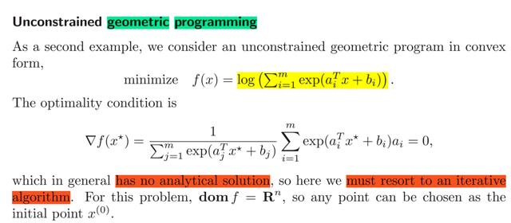</kbd></p>

> [!NOTE]
> Còn ví dụ này, bài toán unconstrained geometric programming
> (cũng đã từng gặp và triển khai ∇f)
>
> Thì đại khái là ta KHÔNG THỂ CÓ ANALYTIC SOLUTION.
>
> Mà phải giải THÔNG QUA ITERATIVE ALGORITHM.

<br>

<p align="center"><kbd>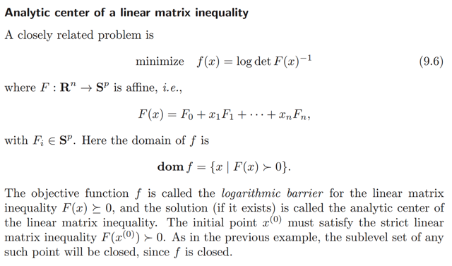</kbd></p>

<p align="center"><kbd>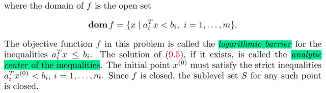</kbd></p>

<p align="center"><kbd>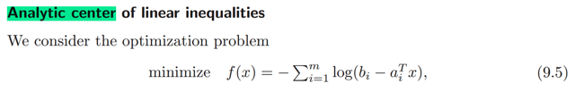</kbd></p>

> [!NOTE]
> Vài ví dụ khác. QUAY LẠI SAU

<br>

<p align="center"><kbd>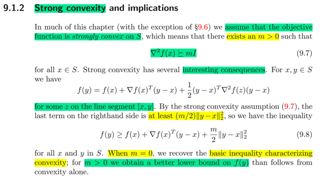</kbd></p>

> [!NOTE]
> đại khái là phần này ta sẽ xét trường hợp mà objective function
> không chỉ convex mà còn STRONGLY CONVEX. Lúc này nó sẽ
> có một số tính chất khá thú vị và hữu ích,
>
> Đầu tiên, theo định nghĩa của STRONGLY convex có nghĩa là tồn
> tại một số m dương sao cho mọi eigenvalue đều lớn hơn hoặc
> bằng m. Nó khác STRICTLY convex ở chỗ, strictly convex chỉ yêu
> cầu eigenvalue dương, mà điều này cho phép khả năng rằng tuy 
> dương nhưng vô cùng nhỏ. Giống như: Strong và strict convex đều
> yêu cầu mọi điểm đều có độ cong dương nhưng strong yêu cầu
> độ cong phải có giới hạn dưới nào đó, nôm na phải là có giá trị
> dương m nào đó trở lên, trong khi strict thì tuy dương nhưng có thể
> là số vô cùng nhỏ gần 0 cũng được. Nên strong thì sẽ strict nhưng
> ngược lại chưa chắc.
>
>
> Và cái này tương đương tồn tại m dương sao cho ∇^2f ≽ m*I 
>
> Sau đó ta viện dùng một kiến thức:
>
> f(y) `=`  f(x) + ∇f(x)T(y - x) + `(1/2)(y` - x)∇^2f(z)(y - x) với z là một 
> mixture nào đó của x, y: 
>
> CHỨNG MINH SAU
>
> Vậy thì đại khái là nhờ vào việc strictly function có: ∇^2f ≽ m*I
> ta có ∇^2f(z) ≥ m*I 
>
> ⇨ f(y) `=` f(x) + ∇f(x)T(y - x) + `(1/2)(y` - x)T∇^2f(z)(y - x) 
>
> ≥ f(x) + ∇f(x)T(y - x) + `(1/2)(y` - x)Tm(y - x)  
>
> `=` f(x) + ∇f(x)T(y - x) + `(m/2)(y` - x)T(y - x)   
>
> `=` f(x) + ∇f(x)T(y - x) + `(m/2)||y` - x||^2
>
> Vậy f(y) ≥ f(x) + ∇f(x)T(y - x) + `(m/2)||y` - x||^2
>
> Và ý chính là thế này:
>
> Với hàm convex, ta có first condition nói rằng:
>
> f(y) ≥  f(x) + ∇f(x)T(y - x) 
>
> MANG Ý NGHĨA LÀ TÍNH CONVEX CHO TA MỘT LOWER BOUND
> CỦA f(y)
>
> Nay với strict convex ta có:
>
> f(y) ≥ f(x) + ∇f(x)T(y - x) + `(m/2)||y` - x||^2  
>
> Và như vậy có nghĩa là TA CÓ MỘT LOWER BOUND TỐT HƠN
>
> f(y) `=`  f(x) + ∇f(x)T(y - x) + `(1/2)(y` - x)∇^2f(z)(y - x) với z là một 
> mixture nào đó của x, y: 
>
> CHỨNG MINH:
>
> Đặt Φ(t) `=` f(x + t(y-x)) `=` f(x + td) 
>
> Khai triển Taylor bậc 2 của Φ(x) tại t0 `=` 0:
>
> Φ(t) ≈ Φ(t0) + Φ'(t0)(t-t0) + `(1/2)` Φ''(t0)(t-t0)^2
>
> `=` Φ(0) + Φ'(0)t + `(1/2)` Φ''(0)t^2
>
> ⇨ Φ(1) ≈ Φ(0) + Φ'(0) + `(1/2)` Φ''(0)
>
> Φ(0) `=` f(x + 0d) `=` f(x)
>
> ```text
> Φ(t) = f(x + td) ⇨ Φ'(t) = d/dt Φ(t) = d/dt f(x + td)
> ```
>
> `=` `d/d(x` + td) f(x + td) . `d/dt` (x + td)
>
> `=` f'(x + td) . d ⇨ Φ'(0) `=` f'(x + 0d) . d `=` f'(x)(y-x)
>
> ```text
> Φ''(t) = d/dt f'(x + td) . d = d d/dt f'(x + td)
> ```
>
> `=` d . `d/d(x` + td) f'(x + td) . `d/dt` (x + td)
>
> d . f''(x + td) . d `=` d^2 f''(x + td) ⇨ Φ''(0) `=` d^2 f''(x + td)
>
> `=` (y - x)^2 f''(x + td)
>
> ⇨  Φ(1) ≈ Φ(0) + Φ'(0) + `(1/2)` Φ''(0)
>
> ⇔ f(x + t(y - x)) ≈ f(x) + f'(x)(y - x) + (y - x)^2 f''(x + td)
>
> ⇔ f(y) ≈ f(x) + f'(x)(y - x) + (y - x)^2 f''(z) 
>
> với z `=` x + t(y-x) `=` mixture giữa x, y

<br>

<p align="center"><kbd>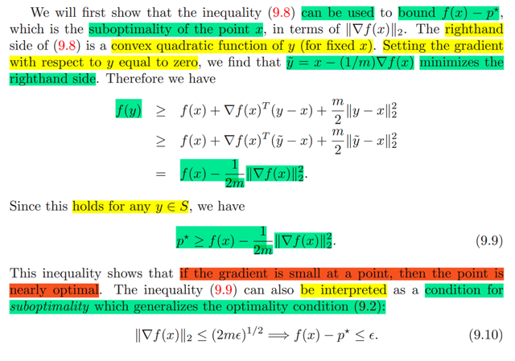</kbd></p>

<p align="center"><kbd>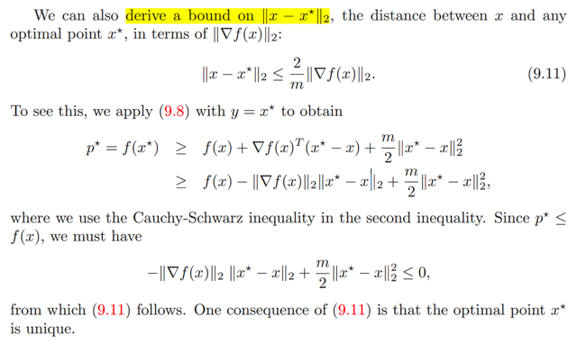</kbd></p>

> [!NOTE]
> đại khái là, inequality vừa rồi f(y) ≥ f(x) + ∇f(x)T(y - x) + `(m/2)||y` - x||^2 có thể giúp
> ta triển khai ra một công thức của chặn dưới của f(x) - p*.
>
> Mà f(x) - p* có ý nghĩa là đại khái là "mức độ gần với optimal của x" (sub-optimality
> of x). Cụ thể là vầy:
>
> Vế phải f(x) + ∇f(x)T(y - x) + `(m/2)||y` - x||^2, với x fixed thì nó là quadratic function
> của y. Ta sẽ tìm minimum của vế phải (tức là minimize over y, nói cách khác, là giải
> bài toán
>
> minimize y  f(x) + ∇f(x)T(y - x) + `(m/2)||y` - x||^2 
>
> Tất nhiên đây chỉ là bài toán unconstrained convex optimization nên optimality
> condition của nó chỉ việc tìm gradient (đối với y) và cho nó bằng 0:
>
> Và chắc cũng ko khó gì để tìm ra y~ `=` x - `(1/m)∇f(x)`
>
> Khi đó, vế phải đạt minimum value `=` f(x) - `1/2m` ||∇f(x)||^2. 
>
> Do đó f(y) ≥ f(x) - `1/2m` ||∇f(x)||^2
>
> Từ đó, vì bất đằng thức này đúng với mọi y, nên nó đúng với optimal x*, tức là: 
>
> p* ≥ f(x) - `1/2m` || ∇f(x) ||^2
>
> ⇔ f(x) - p* ≤ `1/2m` || ∇f(x) ||^2
>
> Và `1/2m` || ∇f(x) ||^2 chính là upper bound của f(x) - p* 
>
> Đồng thời kết luận đầu tiên đó là, khi gradient ∇f(x) càng nhỏ thì upper bound của
> f(x) - p* càng nhỏ chứng tỏ x càng gần optimal
>
> Và f(x) - p* ≤ `1/2m` || ∇f(x) ||^2 suy ra nếu muốn f(x) gần với p* một khoảng nhỏ hơn `ε`
> (gọi là x là `ε-suboptimal)` tức f(x) - p* ≤ `ε`
>
> Thì ta cần `1/2m` || ∇f(x) ||^2 ≤ `ε` 
>
> ⇔ ||∇f(x)|| ≤ `√2mε` . Có nghĩa là ||∇f(x)|| ≤ `√2mε` có thể là "chỉ dấu" `/` điều kiện thể hiện
> ở gradient giúp cho x là `ε-suboptimal`
>
> `====`
>
> Ngòài ra còn có thể xây dựng bound cho ||x - x*||.
>
> Là thế này, bắt đầu từ inequality đã triển khai:
>
> f(y) ≥ f(x) + ∇f(x)T(y - x) + `(m/2)||y` - x||^2
>
> Ta mới áp dụng uTv `=` ||u||||v||cos(u,v). 
>
> Và vì -1 ≤ cos(u,v) ≤ 1 ⇨ -||u||||v|| ≤ uTv ≤ ||u||||v||
>
> Áp dụng điều trên coi ∇f(x) là u, (y - x) là v, ta có uTv `=` ∇f(x)T(y - x) ≥ - ||∇f(x)|| ||y - x||
>
> ⇨ f(y) ≥ f(x) + ∇f(x)T(y - x) + `(m/2)||y` - x||^2 ≥ f(x) - ||∇f(x)|| ||y - x|| + `(m/2)` ||y - x||^2
>
> Vì cái này đúng với mọi y, nên trong đó có cả x*:
>
> ⇨ p* `=` f(x*) ≥ f(x) - ||∇f(x)|| ||x* - x|| + `(m/2)` ||x* - x||^2
>
> Thế mà f(x*) thì phải luôn ≤ f(x). Do đó, - ||∇f(x)|| ||x* - x|| + `(m/2)` ||x* - x||^2 phải < 0
>
> ⇔ `(m/2)` ||x* - x||^2 ≤ ||∇f(x)|| ||x* - x||
>
> ⇔ ||x* - x|| ≤ `2/m` ||∇f(x)|| chính là (9.10)
>
> Và cho thấy ta có upper bound của ||x* - x||
>
> Và kết qủa này cũng cho thấy x* unique là vì:
>
> Giả sử ta có 2 optimal point x*1 và x*2, thì vì inequality này thỏa với mọi x và x* nên
> ta phải có ||x*2 - x*1|| ≤ `2/m` ||∇f(x*1)|| (dùng x*2 cho vai trò của x*, và dùng x*1 cho vai
> trò của x, và nó phải vẫn thỏa)
>
> Mà trong ||x*2 - x*1|| ≤ `2/m` ||∇f(x*1)|| thì vì x*1 là optimal point nên ∇f(x*1) phải bằng 0:
>
> ⇨ ||x*2 - x*1|| ≤ 0 mà ||x*2 - x*1|| ≥ 0 (vì là norm)
>
> Từ đó suy ra x*2 - x*1 `=` 0 ⇨ hai cái phải là một ⇨ optimal point phải UNIQUE

<br>

<p align="center"><kbd>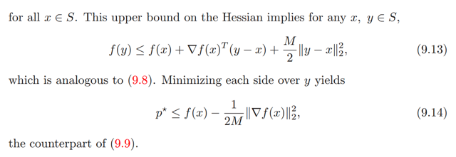</kbd></p>

<p align="center"><kbd>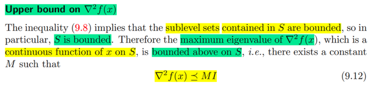</kbd></p>

> [!NOTE]
> Đầu tiên đại khái là vầy, bắt đầu từ inequality ta đã có:
>
> f(y) ≥ f(x) + ∇f(x)T(y - x) + `(m/2)||y` - x||^2 với mọi x, y thuộc S
>
> (S là sub-level set: x ∈ dom f: f(x) ≤ f(x0))
>
> nó nói rằng, khi ta "di chuyển y ra xa khỏi x", thì f(y) tăng lên với
> tốc độ ít nhất là (thể hiện bởi ≥) bằng một hàm quadratic (với x
> fixed thì  vế phải là hàm quadratic theo y)
>
> Thế thì nói về sub-level-set. Theo định nghĩa, ví dụ `α-sublevel` set
> của f là set chứa các điểm x sao cho f(x) ≤ `α:` x ∈ dom f: f(x) ≤ `α`
>
> Vậy thì hình dung trong không gian 3D, với cái tô (minh họa cho việc ta
> có function mà độ cong lên ít nhất là bằng độ cong của một hàm
> quadratic), thì khi ta đi ra xa khỏi optimal là chính giữa đáy tô thì
> nhanh chóng độ cao sẽ vút lên 
>
> Thế thì `α-sublevel` set là khi ta cắt ngang cái tô bằng một mặt phẳng ở 
> "độ cao", dĩ nhiên ta sẽ có một đường tròn. Ta sẽ chiếu nó xuống mặt 
> xy, thì hình tròn đó chính là `α-sub` level set. (nếu được thì vẽ cái hình
> minh họa)
>
> Thế thì dễ thấy rằng, dù có là cắt cái tô ở độ cao nào (đồng nghĩa xét
> sub-level set nào `/` `α` bằng bao nhiêu) thì nó cũng không thể "mở rộng 
> toàn mặt phẳng được" mà luôn là một hình tròn có bán kính hữu hạn.
>
> Mấu chốt là bởi hình dạng cái tô, khiến f(y) vọt lên cao rất nhanh so với
> việc y ra xa khỏi x.
>
> Và đó chính là nói "sub-level set bị chặn (bound)"
>
> Và vì bất đẳng thức trên là đang xét với các điểm x, y thuộc S (cũng là
> một cái sub-level set), nên kiểu như là ta đang nói đến các sub-level set 
> "nằm trong S". Và như vậy với việc mọi sub-level set trong S bị bound thì 
> dĩ nhiên S cũng bị bound.
>
> Và vì S bị chặn, nên xét hàm ∇^2f(x) với x ∈ S, thì đại khái là, ta có tuy
> là vô số Hessian matrix, nhưng có thể nôm na hiểu rằng, nếu lấy
> eigenvalue lớn nhất của các Hessian matrix này thì do đang chỉ xét x
> thuộc tập S mà S bị chặn, nên dẫn đến giá trị eigenvalue lớn nhất của
> các Hessian matrix này cũng bị chặn luôn.
>
> Do đó, ta có thể kết luận tồn tại constant M sao cho eigenvalue lớn nhất
> trên mọi Hessian matrix đều nhỏ hơn M:
>
> λ_max[∇^2f(x)] ≤ M ∀ x ∈ S
>
> Mà điều đó có nghĩa là với mọi x thì khi lấy Hessian matrix tại đó,
> ∇^2f(x) thì mọi eigenvalue λ_i của nó đều ≤ M:
>
> Điều này đồng nghĩa tiếp, mọi giá trị M - eigenvalue λ_i  đều ≥ 0.
>
> mà ta đã biết, nếu λ1, λ2,...là các eigenvalues của A thì `α` - λ1, `α` - λ2, ...
> là các eigenvalues của `α*I` - A
>
> (Chứng minh: λi là eigenvalue với eigenvector xi của A ⇨ Axi `=` λixi ⇔
> ```text
> Axi - αxi = λixi - αxi ⇔ (A - αI)xi = λixi và điều này cho thấy λi - α  là
> ```
> eigenvalues của A - `αI)`
>
> Vậy, M - eigenvalue λ_i, là các eigenvalues của M*I - ∇^2f(x), đều
> không âm, nên đó là positive semi definite matrix: M*I - ∇^2f(x) ≽ 0
>
> Cũng chính là M*I ≽ ∇^2f(x) (còn nhớ, ≽ thực chất là ≽R^n)
>
> Vậy thì ta mới dùng kết quả này trong cái mà lúc trước đã nói:
>
> f(y) `=`  f(x) + ∇f(x)T(y - x) + `(1/2)(y` - x)∇^2f(z)(y - x) với z là một  mixture
> nào đó của x, y
>
> Và ta có ∇^2f(z) ≤ MI
>
> ⇨ f(y) `=`  f(x) + ∇f(x)T(y - x) + `(1/2)(y` - x)T∇^2f(z)(y - x) ≤ f(x) +
> ∇f(x)T(y - x) + `(1/2)(y` - x)TM(y - x)
>
> ⇔ f(y) ≤ f(x) + ∇f(x)T(y - x) + `(M/2)||y` - x||^2
>
> Và minimize vế phải theo y (để ta có cái lower bound nhỏ nhất trong
> các y) ta có:
>
> f(y) ≤ f(x) - `1/2M` ||∇f(x)||^2
>
> Và vì inequality này đúng với mọi y ∈ S nên nó đúng với cả x*
>
> ⇨ f(x*) `=` p* ≤ f(x) - `1/2M` ||∇f(x)||^2
>
> Kết quả này là "đối tác" với cái hồi nãy:
>
> p* ≥ f(x) - `1/2m` || ∇f(x) ||^2

<br>

<p align="center"><kbd>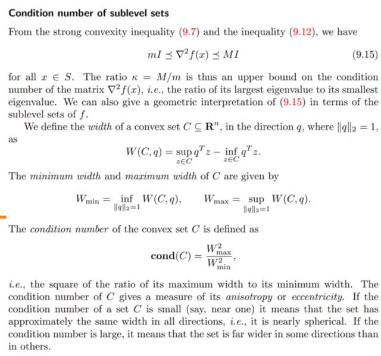</kbd></p>

> [!NOTE]
> Từ hai kết quả hồi nãy: mI ⪯ ∇^2f(x) ⪯ MI ra sẽ có như sau:
>
> ∇^2f(x) ⪯  MI ⇨ λ_max[∇^2f(x)] ≤ M
>
> mI ⪯ ∇^2f(x) ⇨ λ_min[∇^2f(x)] ≥ m
>
> ⇨ λ_max[∇^2f(x)] `/` λ_min[∇^2f(x)] ≤ `M/m`
>
> Và do đó condition number của matrix ∇^2f(x) có upper bound là 
> `M/m`
>
> Thế thì, ở đây cho rằng ta có thể có một giải thích hình học cho
>  kết qủa này mI ⪯ ∇^2f(x) ⪯ MI theo sub-level set của f.
>
> Đầu tiên là ta sẽ định nghĩa của BỀ RỘNG của set C theo phương
> vector q có unit length. W(C, q) `=` sup qTz - inf qTz : z ∈ C
>
> Từ đó, ta có minimum width và maximum width, dễ hiểu sẽ là 
>
> ```text
> Wmin = inf ||q|| = 1 W(C, q) và Wmax = sup ||q|| = 1 W(C, q)
> ```
>
> Condition number của convex set C được định nghĩa là:
>
> cond(C) `=` W^2max `/` W^2min
>
> Và đại khái là nếu condition number của set C mà gần 1 thì tức là
> nó gần "tròn" hơn, ko có phương nào bị kéo dài hơn các phương khác
> gọi là (spherical, nếu là 1 set trong 3D space thì sẽ gần thành quả cầu)

<br>

<p align="center"><kbd>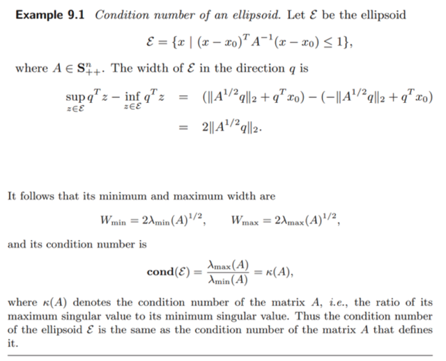</kbd></p>

> [!NOTE]
> Ví dụ này minh họa cho ta hiểu hơn về condition number của set.
>
> Trong đó đây là một set cụ thể là một ellipsoid, được định nghĩa bởi
> matrix A `ε` `=` x: (x - x0)TAinv(x - x0) ≤ 1
>
> Dùng đinh nghĩa của condition number của set, đầu tien ta sẽ tính 
> ra minimum width và maximum width: 
>
> Width theo phương q: W(C, q) `=` sup qTz - inf qTz với z ∈ `ε` 
>
> inf qTz với z ∈ `ε` tức là ta giải bài toán optimization:
>
> minimize x qTx constraint (x - x0)TAinv(x - x0) ≤ 1
>
> ```text
> Đặt u = A^(-1/2)(x - x0) ⇨ uTu = (x - x0)TA^(-1/2)A^(1/2)(x - x0)
> ```
>
> `=` (x - x0)TA^-1(x - x0)
>
> Nên constraint trở thành uTu ≤ 1
>
> ```text
> u = A^(-1/2)(x - x0) ⇔ u = A^(-1/2)x - A^(-1/2)x0
> ```
>
> ⇔ `A^(-1/2)x0` + u `=` `A^(-1/2)x`
>
> ```text
> ⇔ [A^(-1/2)]^-1 A^(-1/2)x0 + [A^(-1/2)]^-1 u = x
> ```
>
> ```text
> ⇔ [A^(1/2)] A^(-1/2)x0 + [A^(-1/2)]^-1 u = x
> ```
>
> ⇔ [A^0 x0 + `[A^(1/2)]` u `=` x
>
> ```text
> ⇔ x0 + (A^1/2)u = x ⇨ qTx = qT[x0 + (A^1/2)u] = qTx0 + qT[(A^1/2)u]
> ```
>
> `=` qTx0 + `[qT(A^1/2)]u`
>
> `=` qTx0 + `[(A^1/2)q]Tu`
>
> Thế thì: bài toán trở thành minimize u qTx0 + `[(A^1/2)q]Tu` constraint ||u|| ≤ 1
>
> Áp dụng Cauchy inequality: aTb `=` ||a||.||b||.cos(a, b)
>
> 1 ≥ cos(a, b) ≥ -1 ⇨ 1 ≥ aTb `/` ||a||.||b|| ≥ -1 ⇨ ||a||.||b|| ≥ aTb ≥ -||a||.||b||
>
> Nên ta có aTb ≥ -||a||.||b|| 
>
> ```text
> [(A^1/2)q]Tu ≥ -||(A^1/2)q||.||u|| = -||(A^1/2)q||.1 = -||(A^1/2)q||
> ```
>
> Và dấu bằng xảy ra khi a `=` b: `(A^1/2)q` `=` u
>
> Vậy qTx0 + `[(A^1/2)q]Tu` ≥ qTx0 - `||(A^1/2)q||`
>
> và do đó optimal value là qTx0 - `||(A^1/2)q||`
>
> ⇨ inf ||u|| ≤ 1 qTx0 + `[(A^1/2)q]Tu` `=` qTx0 - `||(A^1/2)q||`
>
> ⇨ inf z ∈ `ε` qTz `=` qTx0 - `||(A^1/2)q||`
>
> Tương tự ta sẽ có sup z ∈ `ε` qTz `=` qTx0 + `||(A^1/2)q||`
>
> ```text
> ⇨ W(C, q) = sup qTz - inf qTz = qTx0 + ||(A^1/2)q|| - [qTx0 - ||(A^1/2)q||]
> ```
>
> `=` `2||(A^1/2)q||`
>
> `====`
>
> ```text
> Rồi từ đó minimum width inf ||q|| = 1 W(C, q) = inf ||q|| = 1 2||(A^1/2)q||
> ```
>
> và chính là bằng `2λ_min(A)^1/2.` Vì sao:
>
> A như đề cho là positive semi definite matrix (dĩ nhiên là symmetric) A ≽ 0
>
> Áp dụng eigen-decomposition với symmetric matrix ta sẽ có dạng:
>
> A `=` QΛQT (MIT 18.06: với symmetric matrix ta luôn có đủ n independent 
> eigenvectors và chúng orthogonal, hoặc có thể chọn orthogonal)
>
> Dĩ nhiên Λ là diagonal matrix diag[λ1(A),... λn(A)]
>
> Thế thì với `A^(1/2),` nó sẽ `=` Q `Λ^1/2` QT: CÁI NÀY CHỨNG MINH SAU.
>
> Như vậy `||A^(1/2)q||` `=` ||Q `Λ^1/2` QT q|| 
>
> Đặt v `=` QTq
>
> `=` ||Q `Λ^1/2` v|| | do v `=` QTq
>
> ```text
> = ||Q (Λ^1/2 v)|| = ||(Λ^1/2 v)||  | do Q nhân với vector Λ^1/2 v ko làm thay đổi
> ```
> norm của nó.
>
> ```text
> Vậy ||A^(1/2)q|| = ||Λ^(1/2)v|| với v = QTq
> ```
>
> ```text
> Mà ||A^(1/2)v||^2 = [Λ^(1/2)v]T[Λ^(1/2)v] = vTΛ^(1/2)Λ^(1/2)v = vTΛv
> ```
>
> `=` `Σ` λivi^2 
>
> Và đến đây thì lập luận như sau:
>
> `Σ` λivi^2 ≥ `Σ` λmin vi^2 vì λi ≥ λmin.
>
> ```text
> ⇨  Σ λivi^2 ≥ λmin Σ vi^2 = λmin * 1 = λmin
> ```
>
> Vậy `||A^(1/2)v||^2` ≥ λmin ⇨ `||A^(1/2)v||` ≥ √λmin -> Chứng minh xong
>
> ```text
> Wmin = inf ||q|| = 1 W(C, q) = inf ||q|| = 1 2||(A^1/2)q|| = 2λ_min(A)^1/2
> ```
>
> `====`
>
> Hoàn toàn tương tự sup ||q|| `=` 1  Wmax `=` `2λ_max(A)^1/2` 
>
> Dẫn đến condition number của set (Ellipsoid) theo định nghĩa `=` Wmax^2 `/` Wmin^2
> `=` λ_max(A) `/` λ_min(A) mà đây cũng chính là condition number của matrix A
>
> Và do đó trong trường hợp này condition number của Ellipsoid bằng condition
> number của matrix A define ra nó

<br>

<p align="center"><kbd>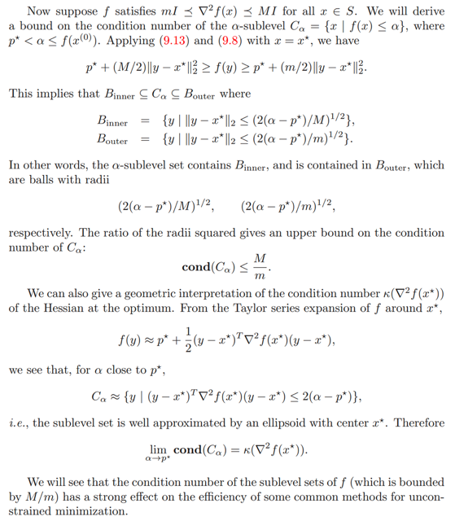</kbd></p>

> [!NOTE]
> Tiếp ta giả sử f thỏa mI ⪯ ∇^2f(x) ⪯ MI với mọi x ∈ S. Ta sẽ tìm cách xây dựng một chặn
> của condition number của set `C-α` (tức `α-sub-level` set)
>
> Thế thì 9.13, và 9.8 ta có:
>
> f(y) ≤ f(x) + ∇f(x)T(y - x) + `(M/2)||y` - x||^2
>
> f(y) ≥ f(x) + ∇f(x)T(y - x) + `(m/2)||y` - x||^2
>
> Áp dụng nó với x `=` x*:
>
> f(y) ≤ f(x*) + ∇f(x*)T(y - x*) + `(M/2)||y` - x*||^2
>
> ⇔ f(y) ≤ p* + 0 + `(M/2)||y` - x*||^2
>
> f(y) ≥ f(x*) + ∇f(x*)T(y - x*) + `(m/2)||y` - x*||^2
>
> ⇔ f(y) ≥ p* + 0 + `(m/2)||y` - x*||^2
>
> ⇨ p* + `(M/2)||y` - x*||^2 ≥ f(y) ≥ p* + `(m/2)||y` - x*||^2
>
> Thế thì:
>
> `C-α` `=` y: f(y) ≤ `α`
>
> Từ bất đẳng thức trên ta có:
>
> `α` ≥ f(y) ≥ p* + `(m/2)||y` - x*||^2
>
> ⇔ `α` - p* ≥ `(m/2)||y` - x*||^2
>
> ⇔ `2(α` - `p*)/m` ≥ ||y - x*||^2
>
> ⇔ `[2(α` - `p*)/m]^1/2` ≥ ||y - x*||
>
> ```text
> Cho thấy rằng nếu y ∈ C-α (f(y) ≤ α) thì y cũng nằm trong set [2(α - p*)/m]^1/2 ≥ ||y
> ```
> - x*|| và đây là một Ball có tâm tại x* và bán kính là `[2(α` - `p*)/m]^1/2`
>
> ```text
> Nói cách khác, điều này đồng nghĩa nói ràng, C-α chứa trong Ball y: [2(α - p*)/m]^1/2
> ```
> ≥ ||y - x*|| , gọi nó là B-outer
>
> `C-α` ⊆ B-outer
>
> `====`
>
> Còn về inner Ball ta sẽ chứng minh nếu y ∈ B-inner thì nó cũng thuộc `C-α:`
>
> y ∈ B-inner với B-inner `=` y: p* + 0 + `(M/2)||y` - x*||^2
>
> ⇨ `[2(α` - `p*)/M]^1/2` ≥ ||y - x*||
>
> Thế thì upper bound ở trên ta có:
>
> f(y) ≤ p* + `(M/2)||y` - x*||^2
>
> và vì ||y - x*|| ≤ `[2(α` - `p*)/M]^1/2` như vừa nói do y ∈ B-inner nên:
>
> ```text
> f(y) ≤ p* + (M/2)[[2(α - p*)/M]^1/2]^2 = α
> ```
>
> Vậy nếu y ∈ B-inner thì f(y) ≤ `α` nên y ∈ `C-α`
>
> Do đó B-inner ⊆ `C-α`
>
> `=====`
>
> Từ đó, dùng định nghĩa của condition number của set  `=` Wmax^2 `/` Wmin^2 đã nói hồi
> nãy.
>
> Thì việc đã chứng minh `C-α` bị lồng trong 2 quả cầu B-outer B-inner tức là bề rộng lớn
> nhất của nó phải ≤ là bán kính của quả cầu ngoài, và bề rộng nhỏ nhất của nó phải ≥ là
> bán kính quả cầu trong.
>
> ```text
> Thành ra cond(C-α) ≤ 2(α - p*)/m]^1/2 / 2(α - p*)/M]^1/2
> ```
>
> ⇔ `cond(C-α)` ≤ `M/m.`
>
> `Cond(C-α)` ≤ `M/m`
>
> (chú ý là `C-α` bị lồng trong hai quả ball này không chắc là nó tiếp xúc, nên bề rộng lớn
> nhất chỉ biết sẽ ≤ (chứ ko `=)` bán kính quả cầu ngoài. Thành ra ta có dấu ≤ trong
> `Cond(C-α)` ≤ `M/m` (chứ ko phải dấu `=)`  Và đây cho ta upper bound của condition
> number của `α-sublevel` set
>
> `====`
>
> Cuối cùng.
>
> Đại khái là dùng Taylor approximation tại optimal ta có:
>
> f(y) ≈ f(x*) + ∇f(x*)T(y - x*) + `1/2` (y - x*)T ∇^2f(x*) (y - x)
>
> x* là optimal nên ∇f(x*) `=` 0
>
> ⇨ f(y) ≈ f(x*) + `1/2` (y - x*)T ∇^2f(x*) (y - x)
>
> Xét `α` rất gần với p*, thì `C-α:`
>
> ```text
> = y: f(y) ≤ α  ≈ y: f(x*) + 1/2 (y - x*)T ∇^2f(x*) (y - x)  ≤ α
> ```
>
> `=`  y: (y - x*)T ∇^2f(x*) (y - x)  ≤ `2[α` - f(x*)] 
>
> `=`  y: (y - x*)T ∇^2f(x*) (y - x)  ≤ `2(α` - p*)
>
> ⇨ `C-α` ≈ y: (y - x*)T ∇^2f(x*) (y - x)  ≤ `2(α` - p*)
>
> Và điều này có nghĩa là: khi `α` gần với p* thì `α` sub-level set gần giống một ellipsoid (vế
> phải là một ellipsoid) có tâm tại x*
>
> Do đó, như ví dụ trên đã thấy, với set là ellipsoid, thì condition number của set cũng
> bằng condition number của matrix define ra nó.
>
> Nên ta có ở đây `cond(C-α)` sẽ bằng condition number của ∇^2f(x*) (kí hiệu là
> k[∇^2f(x*)])
>
> Và thể hiện toán học là:
>
> lim `α` -> p* `cond(C-α)` `=` k[∇^2f(x*)]

<br>

<p align="center"><kbd>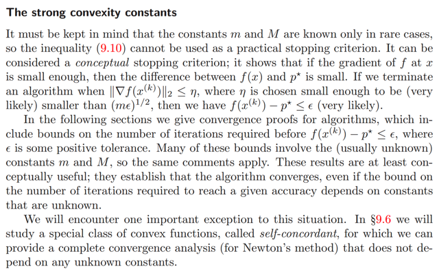</kbd></p>

> [!NOTE]
> QUAY LẠI SAU

<br>

<p align="center"><kbd>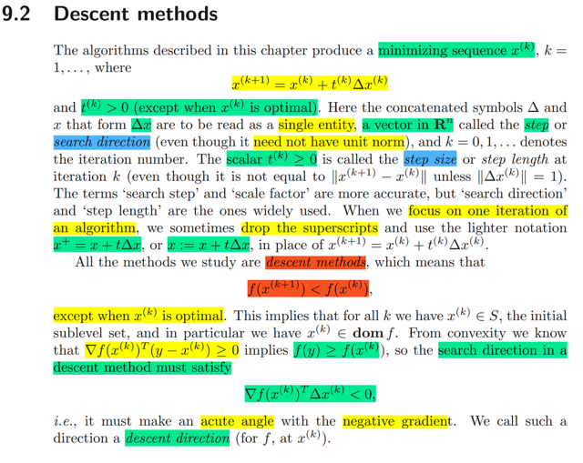</kbd></p>

> [!NOTE]
> Rồi, đại khái là thuật toán mô tả ở phần này sẽ minimizing một
> chuỗi x(k): Lấy k `=` 5 cho gọn, 
>
> x5 `=` x4 + t4 `Δx4` 
>
> Trong đó t4 là STEP SIZE tại step k `=` 4, là scalar ≥ 0
>
> `Δx4` là SEARCH DIRECTION, là một R^n vector. 
>
> Xét một step (một iteration) ta sẽ viết là x `=` x + `t*Δx` 
>
> Thế thì gọi là DESCENT METHOD, là vì sau mỗi step: (từ x4 -> x5)
> thì f(x5) ≤ f(x4), tức là sau mỗi step thì f giảm xuống.
>
> Vậy thì vì hàm f convex nên ta có first condition:
>
> f(y) ≥ f(x) + ∇f(x)T(y - x) ⇔ f(y) - f(x) ≥ ∇f(x)T(y - x)
>
> Nên nếu ∇f(x)T(y - x) ≥ 0 ⇨ f(y) ≥ f(x) 
>
> Vậy, nên để f(y) ≤ f(x) thì ∇f(x)(y - x) phải < 0
>
> Nên để f(x5) ≤ f(x4) thì ∇f(x4)T(x5 - x4) < 0
>
> ⇔ ∇f(x4)T `Δx4` < 0
>
> Điều này có nghĩa là góc giữa ∇f(x4) và `Δx(4)` phải là góc tù 
> (acute) để cos(.) âm. 
>
> Và gọi là descent direction `=` nôm na là "hướng giảm"
>
> 9. UNCONSTRAINED PROBLEM
>
> 9.2 DESCENT METHOD

<br>

<p align="center"><kbd>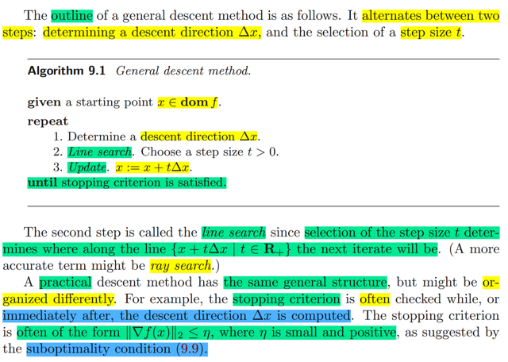</kbd></p>

> [!NOTE]
> Phác thảo của thuật toán sẽ như vầy (cái này đã gặp nhiều trong
> các lớp machine learning)
>
> 1) Xác định hướng (descent direction), `Δx`
>
> 2) Chọn step size t. Gọi là Line search vì có hướng rồi, nhưng chọn
> t để quyết định đi tới đâu theo hướng line đó.
>
> 3) Update x: x `=` x + `t*Δx`
>
> Và lặp đi lặp lại cho đến khi một điều kiện nào đó được thỏa để dừng
>
> Gọi là Stopping condition, và thường là sẽ dựa trên giá trị gradient ∇f 
> nhỏ hơn mức nào đó.
>
> Vì ta biết điều kiện `ε-suboptimal` (tức x gần x* một mức nhỏ hơn `ε)`
>
> f(x) - p* ≤ `ε` 
>
> là ||∇f(x)|| ≤ `√2mε` (link hồng)

<br>

<p align="center"><kbd>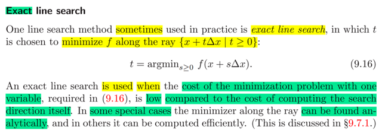</kbd></p>

> [!NOTE]
> đại khái là ta thấy bước 1: "chọn hướng" (tức tính `Δx)` và sau đó là tính
> step size t. Vậy thì hiểu đại khái là, chọn hướng đã phải mệt rồi (phải
> tính toán nhiều), thì sau đó phải chọn t cho tối ưu nữa thì lại mệt hơn
>
> Nên ta sẽ chỉ dùng phương pháp này nếu việc tính t tối ưu không
> mất công lắm 
>
> Và việc tối ưu t cơ bản là xem trong hướng `Δx` thì t bao nhiêu thì
> f nhỏ nhất: 
>
> minimize s f(x + `s*Δx)` subject s ≥ 0 hay t `=` argmin s ≥ 0 f(x + s `Δx)`
>
> ví dụ như khi có vài trường hợp đặc biệt mà việc mà bài toán tối ưu
> này có thể có analytic solution hoặc tính dễ (không tốn kém lắm)

<br>

<p align="center"><kbd>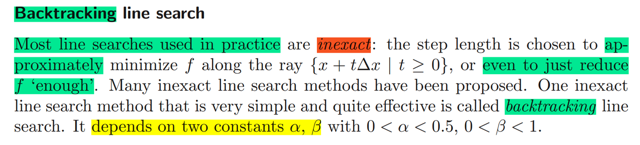</kbd></p>

<p align="center"><kbd>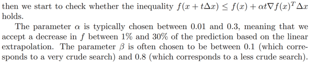</kbd></p>

<p align="center"><kbd>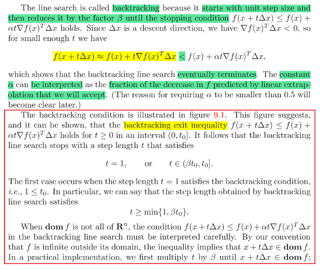</kbd></p>

> [!NOTE]
> Đại khái là, ta vừa nhắc đến exact line search trong đó ta muốn tối ưu cả
> step size t, sau khi đã tính được hướng `(Δx).`
>
> Nhưng thực tế, thường thường người ta không cần như vậy, chỉ cần set step 
> size sao cho f giảm một khoảng nào đó đủ tốt là được.
>
> Thế thì với cái backtracking line search này, đại khái là ta sẽ bắt đầu với step
> size `=` 1 (t `=` 1) và giảm dần step size cho đến khi thỏa một điều kiện nào đó 
> thì dừng.
>
> Điều kiện để tiếp tục:
>
> f(x + t `Δx)` > f(x) + `α` t `∇f(x)TΔx`
>
> Ý nghĩa vế trái: gía trị hàm f mới nếu đi theo hướng `Δx` một step size t, lúc này
> coi như hàm theo t: g(t)
>
> Ý nghĩa vế phải: giá trị hàm f dự đoán bởi linear approx. nhưng với độ dốc
> lấy `=` 30% thôi:
>
> ```text
> Linear approx.: f(x + tΔx) ≈ f(x) + ∇f(x)T(tΔx) =  f(x) + t∇f(x)TΔx
> ```
>
> ```text
> Linear approx. với 30% gradient: f(x + tΔx)_predicted = f(x) + αt∇f(x)TΔx
> ```
>
> Và nó cũng chỉ là hàm theo t, có thể đặt là g^(t)
>
> Vậy ý nghĩa của stopping condition của back-tracking line search là:
>
> Nếu dùng t, mà condition này không thỏa, điều đó có nghĩa nôm na là: NẾU
> BƯỚC THEO HƯỚNG `Δx` VỚI KHOẢNG CÁCH LỚN NHƯ VẬY THÌ TA SẼ QUA
> BÊN SƯỜN BÊN KIA THỂ HIỆN BỞI GIÁ TRỊ CỦA f(x + `tΔx)` LỚN HƠN, CAO
> HƠN f(x) + `αt∇f(x)TΔx:` Hiểu thế này,ta đứng ở vị trí ban đầu, tại đó dựa vào độ
> dốc ∇f(x) theo hướng `Δx` là `∇f(x)TΔx` (gọi là directional derivative) cho mình biết
> rằng nếu đi theo hướng này với bước đi dài bằng `Δx` thì có lẽ sẽ "xuống" độ cao 
> f(x) + `∇f(x)Δx,` và mình cũng đã tỏ ra khôn ngoan một chút khi hiểu rằng mặt đất 
> là cong lên, nên không
> thể nào chính xác khi ta dự vào độ dốc đang đứng để mà "áng chừng", vì sự cong
> lên ấy sẽ đưa ta đến thực tế là cao hơn so với ước lượng vừa nói. Do đó theo 
> kinh nghiệm ta sẽ giảm bớt độ dốc, bởi ví dụ 30%. khi đó việc ước lượng sẽ bớt
> đi, tức là ta đoán rằng khi đi theo hướng `Δx` với tỉ lệ t % (nhớ là t là một factor, nên
> ```text
> t = 1 ý nghĩa là ta bước theo hướng Δx với full độ lớn của Δx, còn t  = 0.9 bớt tức
> ```
> là ta chỉ lấy 90% đồ dài của `Δx` thôi). Vậy mà với sự ước lượng đó lại thấy thực
> tế hàm f cao hơn: Điều này giúp kết luận là bước đi của mình quá dài, khiến có
> vẻ như đã lố qua điểm thấp nhất rồi 
>
> Hết sức chú ý điểm thấp nhất ở đây KHÔNG PHẢI LÀ OPTIMAL, mà nó chỉ là
> điểm thấp nhất của f XÉT THEO PHƯƠNG `Δx,` GỌI LÀ RESTRICT TO A LINE
> , tức là xét theo phương đó thì hàm số tăng giảm ra sao, hoặc, ta cắt đồ hàm số
> bởi mặt phải đi qua line đó.
>
> Vậy thì từ đó ta sẽ giảm t lại, và cứ thế cho đến khi nó thỏa thì thôi. Giá trị t này
> mang ý nghĩa là nếu đi theo hướng `Δx` với độ lớn step size này thì hàm f sẽ giảm
> từ f(x) xuống f(x) + t `∇f(x)Δx,` tức là gỉam bớt một khoảng t `∇f(x)Δx,` mà nếu đi xa
> hơn step size này thì hàm f lại không giảm bằng vì nó đã vọt lên.
>
> VẬY NHẬN RA RẰNG, CHƯA CHẮC t TÍNH THEO KIỂU NÀY ĐÃ TỐT NHẤT,
> RÕ RÀNG LÀ VẬY, VÌ CÓ THỂ VỚI t NHỎ HƠN THÌ F XUỐNG NHIỀU HƠN,
> NHƯNG NÓ ĐẢM BẢO TA KO BƯỚC QUÁ DÀI ĐỂ VỌT QUA BÊN KIA, MÀ MỖI
> BƯỚC ĐI SẼ ĐỀU "XUỐNG" MỘT KHOẢNG `t∇f(x)Δx.`
>
> TẤT NHIÊN CÓ KHI t `=` 1 THÌ ĐÃ THỎA RỒI, VÀ TRƯỜNG HỢP NÀY CÓ THỂ
> LÀ CÓ KHI SCALE t lên 1.2, 1.3 THÌ SẼ GIÚP F XUỐNG NHIỀU HƠN NỮA.
>
> NHƯNG NHƯ ĐÃ NÓI, BACKTRACKING LINE SEARCH CHỈ ĐẶT RA MỤC TIÊU
> LÀ TÌM RA STEP LENGTH TẠM ĐƯỢC, GIÚP GỈAM F ĐỦ XÀI, DO ĐÓ CÓ KHI
> NÓ NHỎ HƠN OPTIMAL STEP SIZE (CÁI MÀ TA CÓ NẾU DÙNG EXACT LINE
> SEARCH) NHƯNG CŨNG CÓ KHI LỚN HƠN
>
> Vậy có thể thấy, có khi thì thuật toán sẽ lấy full step size và có khi nó sẽ scale step
> size
>
> Và cả hai trường hợp thì đều không chắc độ lớn step size là tối ưu
>
>
> Param `β` thì chọn từ 0.1 thể hiện "crude search" và 0.8 thể hiện less crude
> search". Là sao? 
>
> Β là tỉ lệ ta scale t nhỏ lại mỗi lần. Nên `β` nhỏ tức là ta khá thoải mái, giảm t 
> rất nhanh, cũng là bỏ qua rất nhiều step. Còn 0.8 thể hiện ta scale t từ từ từ 
> từ, giống như tìm cho kĩ
>
> Phần đóng khung đại khái là vầy:
>
> Trong backtracking method, thì như đã nói, exit condition sẽ là khi
> giá trị của t (vốn dĩ ban đầu được assign bằng 1) giúp thỏa: 
>
> f(x + t `Δx)` ≤ f(x) + `αt` `∇f(x)TΔx` (1)
>
> Và trong hình ta đã thấy rằng, t0 là mốc lớn nhất mà t nếu nằm trong 
> khoảng đó thì điều kiện trên sẽ thỏa
>
> Thế thì t0 ta chưa biết bằng bao nhiêu, nhưng ta biết chắc thế này:
> Trong phương pháp này ta sẽ bắt đầu với initial t `=` 1.Và giảm dần
> bởi scale factor `β` cho đến khi thỏa (1)
>
> Vậy thì:
>
> 1) Nếu ngay từ đầu t `=` 1 đã nằm trong [0, t0] (đồng nghĩa 1 ≤ t0) thì
> thuật toán dừng luôn sau khi chạy bước đầu tiên với t `=` 1.
>
> 2) Ngược lại, có nghĩa là t0 < 1, thì t `=` 1 nằm ngoài [0, t0], nên thuật
> toán sau khi chạy bước 1, sẽ scale t xuống: t `:=` `βt.` Và thử lại.
>
> Thế thì hình dung thế này, có thể sau khi scale, nó vẫn chưa khiến
> t nằm trong đoạn [0, t0], thì ta sẽ tiếp tục scale t tiếp...cho đến khi
> t (giá trị mới sau khi đã scale nhiều lần) nằm trong đoạn [0,1]. 
>
> Ta sẽ giả sử điều này xảy ra (tức t bắt đầu nằm trong đoạn [0,1]) ở 
> bước thứ k. 
>
> Khi đó, dễ hiểu rằng TRƯỚC ĐÓ MÔT BƯỚC, THÌ t CHƯA NẰM 
> TRONG ĐOẠN [0, t0], Ta tạm vẽ giá trị của nó như vầy:
>
> 0 < t0 < t(k-1)
>
> Nhưng sau đó, scale t(k-1) bởi `β` thì nó đã lọt vào [0, t0]:
>
> 0 < `β*t(k-1)` < t0 
>
> Vậy thì MẤU CHỐT LÀ: t0 < t(k-1), nên nhân hai vế với `β` ta sẽ có:
>
> `βt0` < `β*t(k-1)` ⇔ `βt0` < t(k) 
>
> Và dĩ nhiên t(k) ≤ t0
>
> Và đây chính là lí do mà ta kết luận rằng giá trị của t sau khi scale
> bởi factor `β` MÀ TẠI ĐÓ NÓ BẮT ĐẦU NẰM TRONG ĐOẠN [0, t0]
> CHẮC CHẮN PHẢI LỚN HƠN `βt0:`
>
> Do đó trong sách họ nói, một là khi 1 ≤ t0, thì t (hiểu là `t_dừng` thuật
> toán, t khi thỏa exit condition) sẽ bằng 1. Và hai là, nếu t0 < 1 thì
> `t_dừng` sẽ nằm đâu đó trong `(βt0,` t0] (dấu khoảng, vì chắc chắn > `βt0`
> như phân tích ở trên)
>
> t `=` 1 or t ∈ `(βt0,` t0]
>
> Và gộp hai cái này lại thì ta có thể nói t ≥ min [1, `βt0]`
>
> (vì nếu 1 < `βt0` thì cũng suy ra 1 < t0, như nói ở trên, case này t sẽ `=` 1. 
>
> Và lúc này min[1, `βt0]` `=` 1. Do đó nói t ≥ min [1, `βt0]` cũng đúng (1 ≥ 1 là
> đúng)
>
> Nếu `βt0` < t0 < 1 thì t sẽ > `βt0` như nói ở trên. Thì t ≥ min [1, `βt0]` 
> cũng đúng (min[1, `βt0]` `=` `βt0)`
>
> ```text
> Nếu βt0 < 1 < t0 thì t = 1, và min[1, βt0] = βt0. Thì vì ta có βt0 < 1
> ```
> nên t > min[1, `βt0]` cũng đúng luôn
>
> `====`
>
> Một ý nữa cũng ko khó hiểu lắm, đó là khi domain của f không phải là R^n,
> thì có khi x + `α` `Δx` nằm ngoài domain f. Khi đó dĩ nhiên ta ko thể tính 
> f(x + `α` `Δx).` Nên người ta nói khi làm thực tế ta sẽ update cho đến khi
> ```text
> x + α Δx đã nằm trong domain của f thì mới evaluate f(x + α Δx) (và evaluate
> ```
> exit condition)

<br>

<p align="center"><kbd>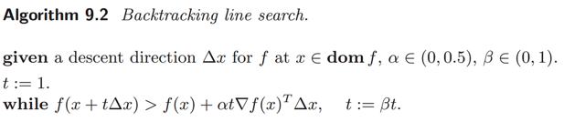</kbd></p>

<br>

<p align="center"><kbd>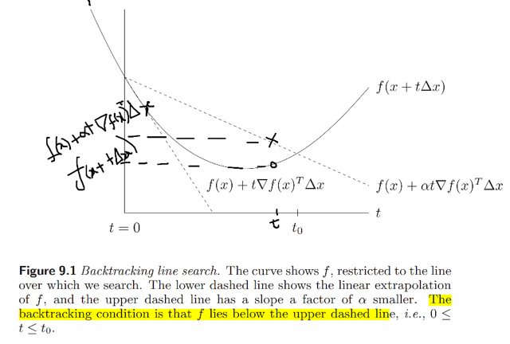</kbd></p>

> [!NOTE]
> Hình minh họa này ý là ta có hai đường dash-line: Đường ở
> dưới là linear interpolation (approximation) f(x) + t `∇f(x)TΔx` và ở
> trên là linear interpolation với độ dốc được điều chỉnh (scaled)
> bởi factor `α:` f(x) + `αt` `∇f(x)TΔx`
>
> Thế thì như đã nói điều kiện exit của backtracking line search là
> khi giá trị của t khiến giá trị của hàm f giảm xuống (f(x + t `Δx))`
> đã thấp hơn mức dự đoán của adjusted linear interpolation:
>
> f(x + t `Δx)` ≤ f(x) + `αt∇f(x)TΔx`
>
> Vậy thì trong hình, có thể hiểu rằng, chỉ khi t có giá trị từ 0 đến
> t0 thì f(x + t `Δx)` mới nhỏ hơn f(x) + `αt∇f(x)TΔx.` Còn nếu t < 0
> hoặc t > t0 thì giá trị f(x + t `Δx)` sẽ lớn hơn f(x) + `αt∇f(x)TΔx`
>
> (Ví dụ với t vẽ trong hình, thì điểm hình tròn nằm dưới điểm
> chéo)

<br>

<p align="center"><kbd>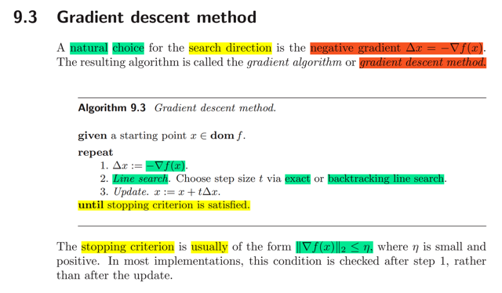</kbd></p>

> [!NOTE]
> Rồi, khi mà search direction `(Δx)` được chọn dựa trên - gradient
> ∇f(x) mà rõ ràng đây là cách lựa chọn rất tự nhiên vì đây sẽ tối
> đa mức giảm của hàm f khi đi hướng này.
>
> thì khi đó ta có GRADIENT DESCENT METHOD.
>
> (9.2 Nói về Descent method không phải là một method khác với
> gradient descent. Mà ý là nó là phương pháp mà ta sẽ update
> dần dần để f giảm dần, mà trong phần 9.2 mình bàn về bước 2)
> line search.
>
> Còn nay là nói về bước 1 khi ta tính hướng đi. Và bằng cách
> dùng chính (negative) của gradient thì ta có gradient descent
> method.
>
> Nói thêm stopping condition thường dùng là check độ lớn của
> gradient nhỏ hơn mức nào đó ||∇f(x)|| ≤ eta
>
> 9. UNCONSTRAINED PROBLEM
>
> 9.3 GRADIENT DESCENT METHOD

<br>

<p align="center"><kbd>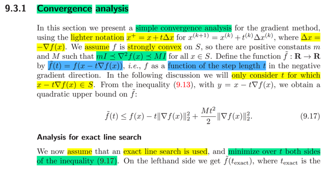</kbd></p>

<p align="center"><kbd>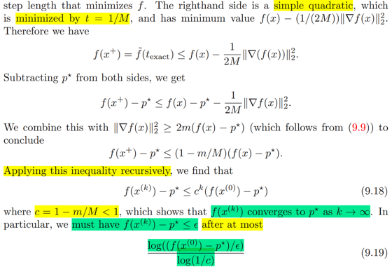</kbd></p>

<p align="center"><kbd>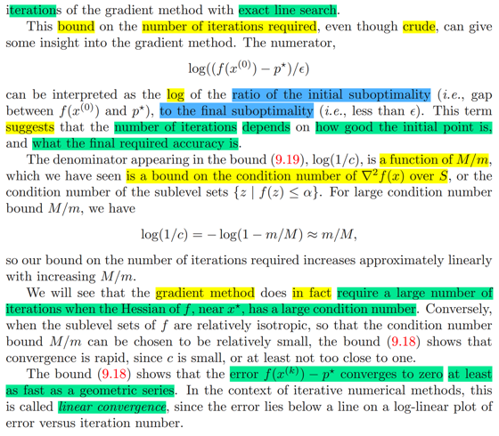</kbd></p>

> [!NOTE]
> Đại khái là đặt hàm f~(t) `=` f(x - t ∇f(x))
>
> Dùng một kết qủa ở phần trước:
>
> f(y) ≤ f(x) + ∇f(x)T(y - x) + `(M/2)||y` - x||^2  
>
> y `=` x - t ∇f(x) 
>
> ⇔ f(x - t ∇f(x)) ≤ f(x) + ∇f(x)T(x - t ∇f(x) - x) + `(M/2)||x` - t ∇f(x) - x||^2  
>
> ⇔ f(x - t ∇f(x)) ≤ f(x) - ∇f(x)T(t ∇f(x)) + `(M/2)||t` ∇f(x)||^2  
>
> ⇔ f~(t) ≤ f(x) - t ||∇f(x)||^2 + `(Mt^2/2)||∇f(x)||^2`  
>
> Kết quả này cho ta upper bound của f~(t) là một hàm quadratic theo t
>
> Thế thì ta sẽ minimize hai vế theo t:
>
> Vế trái minimize theo t sẽ cho ra `f~(t_exact),` là giá trị nhỏ nhất của
> f~(t) `(=` f(x - t ∇f(x)), tức hiểu đại khái đây là giá trị tốt nhất có được
> khi chọn step tối ưu theo hướng `Δx.` 
>
> Còn vế trái khi tối ưu theo t sẽ cho ta cái upper bound tốt nhất (nhỏ
> nhất) của f(t) và vế phải dĩ nhiên là quadratic function theo t. Nên
> optimal là t `=` `1/M`
>
> Khi đó ta có:
>
> f(x+) `=` `f~(t_exact)` ≤ f(x) - `1/2M` ||∇f(x)||^2
>
> f(x+) - p* ≤ f(x) - `1/2M` ||∇f(x)||^2
>
> `====`
> Áp dụng inequality này lặp lại với chuỗi x0 -> xk (recursively):
>
> f(x+) `=` `f~(t_exact)` ≤ f(x) - `1/2M` ||∇f(x)||^2
>
> Áp dụng với x0,x1: f(x1) - p* ≤ (1 - `m/M)` [f(x0) - p*] (1)
>
> Áp dụng với x1, x2: f(x2) - p* ≤ (1 - `m/M)` [f(x1) - p*]
>
> ⇔ [f(x2) - p*] `1/(1` - `m/M)` ≤ [f(x1) - p*]
>
> (1) ⇨ [f(x2) - p*] `1/(1` - `m/M)` ≤ (1 - `m/M)` [f(x0) - p*]
>
> ⇔ [f(x2) - p*] ≤ (1 - `m/M)^2` [f(x0) - p*]
>
> Tương tự: [f(xk) - p*] ≤ (1 - `m/M)^k` [f(x0) - p*]
>
> ⇔ [f(xk) - p*] ≤ c^k [f(x0) - p*]
>
> Với c `=` 1 - `m/M` < 1 ⇨ c^k -> 0 ⇨ f(xk) -> p* 
>
> ```text
> f(xk) - p* ≤ ε khi c^k [f(x0) - p*] ≤ ε ⇔  c^k [f(x0) - p*] / ε ≤ 1
> ```
>
> Lấy log hai vế: log c^k + log  [f(x0) - p*] `/` `ε`   ≤ 0
>
> ⇔ k log c + log  [f(x0) - p*] `/` `ε`  ≤ 0 
>
> ⇔ log  [f(x0) - p*] `/` `ε`  ≤ - k log c 
>
> ```text
> ⇔ log  [f(x0) - p*] / ε  / - log c >=  k
> ```
>
> ```text
> ⇔ log  [f(x0) - p*] / ε  / log [1/c] ≥  k  | - log c = log c^-1 = log 1/c
> ```
>
> ```text
> Vậy k ≤ log  [f(x0) - p*] / ε  / log (1/c) nên nhiều nhất là bằng vế phải
> ```
>
> hay nói cách khác ta có chặn trên đối với số iteration cần thiết để  f(xk) - p* < `ε` 
> tức đạt `ε-suboptimal`
>
> Thế thì tử số [f(x0) - p*] `/` `ε` chính là tỉ lệ giữa "khoảng cách từ giá trị ban đầu
> f(x0) tới optimal value p*" và khoảng cách mà ta mong muốn `ε` (f(x) - p* ≤ `ε)`
> Thì điều này mang ý nghĩa là số lần iteration (chính xác hơn là chặn trên của
> nó) sẽ tỉ lệ thuận với "Vị trí ban đầu cách xa optimal cỡ nào". Điều này dễ hiểu
>
> Và xét tử số log [ [f(x0) - p*] `/` `ε` ] (cái này càng lớn thì k, tức số
> iteration cần thiết để đạt `ε-suboptimal` càng lớn.
>
> Thì rõ ràng nó sẽ tỉ lệ thuận với f(x0) - p*, chính là khoảng cách
> giữa điểm x ban đầu (initial) với optimal.
>
> Và nó cũng tỉ lệ nghịch với `ε,` tức là nếu muốn `ε` nhỏ, đồng nghĩa
> độ chính xác `/` độ gần với optimal cao, thì sẽ tốn nhiều iteration
> hơn.

<br>

<p align="center"><kbd>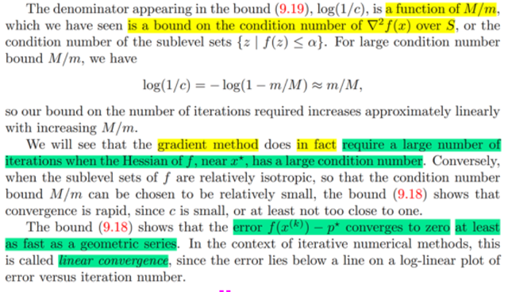</kbd></p>

> [!NOTE]
> Còn mẫu số `log(1/c)` thì là function của `M/m` và theo link hồng ta đã
> biết nó là bound của condition number của ∇^f(x) cũng như của
> condition number của `α-sub` level set.
>
> ```text
> Thế thì, khi M/m lớn (thì m/M nhỏ) thì log(1/c) = -log(1-m/M) sẽ ≈
> ```
> `-(-m/M)` `=` `m/M` 
>
> (kiến thức linear approximation với hàm log: log(1 + `ε)` ≈ `ε`
>
> ```text
> Và log(1/c) ≈ m/M ⇔ 1/log(1/c) ≈ M/m. Do đó bound của số iteration
> ```
> ```text
> (= tử số * 1/log(1/c)) sẽ ≈ tử số * M/m. Và như vậy, rõ ràng có thể
> ```
> thấy nếu `M/m` lớn thì iteration bound sẽ tỉ lệ tuyến tính với `M/m` (cũng
> là condition number)
>
> Nói vắn tắt, khi condition number lớn thì iteration bound tỉ lệ tuyến tính
> với condition number, mà điều này cũng có nghĩa là số iteration cũng
> tăng tuyến tính với độ lớn của condition number
>
> Và ở đây nói rằng ta sẽ thấy ở những phần sau rằng phương pháp
> gradient thật sự sẽ cần nhiều iteration khi condition number của
> Hessian ∇f(x) (với  x gần x*) lớn và ngược lại.
>
> Và hiểu nôm na là, nếu sub level set tròn trịa, (isotropic) thì converge
> nhanh (ít iteration), còn nếu nó bị dẹt (tức có phương bị kéo dài hơn
> so các phương khác) thì sẽ converge lâu (cần nhiều iteration)

<br>

<p align="center"><kbd>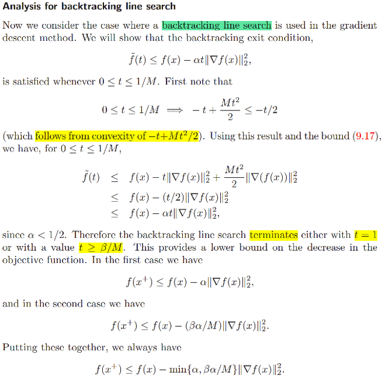</kbd></p>

<p align="center"><kbd>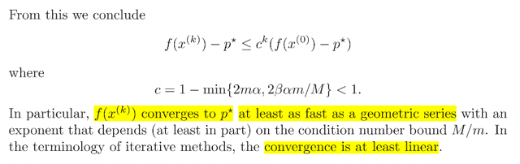</kbd></p>

> [!NOTE]
> Phần này ta sẽ phân tích sự hội tụ của trường hợp dùng backtracking  line search.
>
> Exit condition là f~(t) ≤ f(x) + `αt` `∇f(x)TΔx` với ý nghĩa là ta sẽ  dừng khi f~(t) đã lớn
> hơn dự đoán bởi linear approximation với độ  dốc được điều chỉnh (bởi factor `α)`
>
> Với việc đang xét gradient descent method, thì `Δx` chính là - ∇f(x) nên exit
> condition trở thành f~(t) ≤ f(x) - `α` ∇f(x)T∇f(x) `=` f(x) - `α` ||∇f(x)||^2
>
> THẾ THÌ Ý CHÍNH LÀ TA MUỐN CHỨNG MINH RẰNG KHI DÙNG
> BACKTRACKING LINE SEARCH THÌ KHI t NẰM TRONG KHOẢNG [0, `1/M]` THÌ
> EXIT CONDITION Ở TRÊN SẼ THỎA
>
> Thế thì 0 ≤ t ≤ `1/M` ⇨ -t + `Mt^2/2` ≤ `-t/2`
>
> 0 ≤ t ≤ `1/M` ⇔ Mt ≤ 1 ⇔ Mt^2 ≤ t ⇔ `Mt^2/2` ≤ `t/2`
>
> ```text
> ⇔ -t + Mt^2/2 ≤ t/2 - t = -t/2
> ```
>
> ⇔ -t + `Mt^2/2` ≤ `-t/2`
>
> Hoặc như sách mở ngoặc, ta cũng có thể có kết qủa này bằng cách dựa vào tính
> convexity của function f(t) `=` -t + `Mt^2/2.` Nó là quadratic of t  ⇨ convex. Và do đó
> có: "f of mixture" ≤ "mixture of f"
>
> ```text
> Ở đây t ∈ [0, 1/M] là mixture của 0 và 1/M: t = α*0 + (1 - α)*1/M = (1 - α) / M
> ```
>
> ⇨ `α` `=` 1 - Mt
>
> t `=` 0 ⇨ f(t) `=` 0
>
> ```text
> t = 1/M ⇨ f(t) = -1/M + M(1/M^2)/2 = -1/M + 1/2M = -1/2M
> ```
>
> ```text
> f(α0 + (1-α)1/M) ≤ αf(0) + (1-α)f(1/M) = α*0 + (1-1+Mt)(-1/2M)
> ```
>
> ```text
> = - Mt / 2M = -t/2
> ```
>
> Vậy ta có: f(t) ≤ `-t/2,` hay -t + `Mt^2/2` ≤ `-t/2`
>
> `====`
>
> Tiếp, ta dùng một kết quả đã có ở phần trước (theo link)
>
> f~(t) ≤ f(x) - t ||∇f(x)||^2 + `(Mt^2/2)||∇f(x)||^2`
>
> Vế trái `=` f(x) + (-t + `Mt^2/2)` ||∇f(x)||^2 ≤ f(x) + `(-t/2)` ||∇f(x)||^2
>
> Dùng tiếp dữ kiện `α` ≤ `1/2` (trong phần backtracking line search, đã nói  factor `α` sẽ
> 0 ≤ `α` ≤ 0.5) ⇨ `-1/2` ≤ - `α`
>
> ⇨ f(x) + `(-t/2)` ||∇f(x)||^2 ≤ f(x) + `(-αt)` ||∇f(x)||^2
>
> Vậy f~(t) ≤ f(x) - `αt||∇f(x)||^2` và ta ĐÃ CHỨNG MINH RẰNG KHI t nằm trong [0,
> `1/M]` thì EXIT CONDITION ĐÃ THỎA.
>
> THÌ TỪ ĐÓ, nhớ lại rằng, trong phần học về backtracking line search ta đã gọi
> khoảng [0, t0] là khoảng mà t phải nằm trong đó thì exit condition mới thỏa. Để rồi
> nếu initial t `=` 1 đã nằm trong khoảng này thì  thuât toán dừng luôn với t `=` 1, ngược
> lại ta đã phân tích thuật toán sẽ dừng  với t > `βt0` (đã phân tích điều này ở phần
> trước)
>
> Nên ở đây t0 `=` `1/M.` Thì hai trường hợp trên sẽ là:
>
> 1) Nếu 1 < `1/M` thì thuật toán terminate với t `=` 1, tức giá trị của f sau khi update với
> t `=` 1 (rồi dừng) sẽ:
>
> f(x+) ≤ f(x) - `αt||∇f(x)||^2`   |   Đơn giản là dùng f~(t) ≤ f(x) - `αt||∇f(x)||^2` với t `=` 1
>
> ```text
> 2) Nếu 1/M < 1 thì thuật toán sẽ terminate với t > βt0 = β(1/M) = β/M.
> ```
>
> ```text
> f(x+) ≤ f(x) - (αβ/M)||∇f(x)||^2  | Đơn giản là dùng f~(t) ≤ f(x) - αt||∇f(x)||^2 với t =
> ```
> `β/M`
>
> Gom lại ta có: f(x+) ≤ f(x) - `minα,` `αβ/M` * ||∇f(x)||^2.
>
> Và làm thêm vài bước nữa (MỤC ĐÍCH LÀ CHO RA MỘT CÁI LOWER BOUND
> CỦA "MỨC ĐỘ GIẢM CỦA HÀM F"):
>
> f(x+) - p* ≤ f(x) - p* - `minα,` `αβ/M` * ||∇f(x)||^2   | trừ hai vế cho p*
>
> Dùng kết quả ở phần trước ||∇f(x)||^2 ≥ 2m[f(x) - p* ] ⇔ -||∇f(x)||^2 ≤ -2m[f(x) - p*]
>
> f(x+) - p* ≤ f(x) - p* + `minα,` `αβ/M` * [- ||∇f(x)||^2]
>
> ≤ f(x) - p* + `minα,` `αβ/M` * [ -2m[f(x) - p* ]
>
> ```text
> = f(x) - p* + minα, αβ/M * [ (-2m) f(x) - (-2m) p* ]
> ```
>
> ```text
> = f(x) - p* + -2m * minα, αβ/M * f(x) + minα, αβ/M 2m p*
> ```
>
> ```text
> = f(x) [1 - 2m * minα, αβ/M] - p* [ 1 - 2m minα, αβ/M ]
> ```
>
> ```text
> = [1 - 2m * minα, αβ/M] [f(x) - p*]
> ```
>
> ```text
> = [1 - min2mα, 2mαβ/M] [f(x) - p*]
> ```
>
> Vậy f(x+) - p* ≤ [1 - `min2mα,` `2mαβ/M]` [f(x) - p*]   
>
> ```text
> Đặt c = [1 - min2mα, 2mαβ/M]
> ```
>
> ta có f(x+) - p* ≤ c [f(x) - p*]   
>
> Và áp dụng cái này với step 1: x(1) và x(0), ta có:
>
> f(x(1)) - p* ≤ c [f(x(0)) - p*]
>
> Áp dụng với x(2) và x(2) ta có:
>
> f(x(2)) - p* ≤ c [f(x(1)) - p*] ≤ c c [f(x(0)) - p*] `=` c^2 [f(x(0)) - p*]
>
> ....lặp lại với x(2),...x(k)
>
> f(x(k)) - p* ≤ c^k [f(x(0)) - p*]
>
> ĐÂY CHÍNH LÀ CHO TA MỘT CÁI GIỚI HẠN (CHẶN DƯỚI) CỦA MỨC ĐỘ
> GIẢM CỦA OBJECTIVE FUNCTION
>
> và từ đó ta thấy f(x(k)) sẽ converge về p* VỚI TỐC ĐỘ ÍT NHẤT LÀ  BẰNG TỐC
> ĐỘ HỘI TỤ CỦA GEOMETRIC SERIES có exponent  phụ thuộc vào `M/m`
>
> Nói theo ngôn ngữ của iterative methods thì sự hội tụ là ít nhất tuyến tính
>
> CHƯA HIỂU LẮM

<br>

<p align="center"><kbd>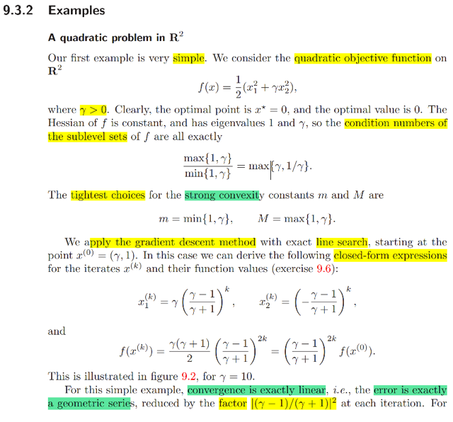</kbd></p>

<p align="center"><kbd>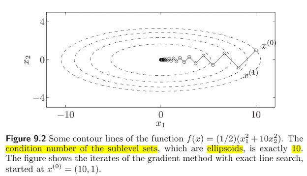</kbd></p>

> [!NOTE]
> Rồi, một ví dụ đầu tiên, với hàm objective là f(x) `=` 0.5(x1^2 + `γx2^2)` dĩ nhiên là
> ```text
> hàm quadratic (có thể thể hiện ở dạng f(x) = 0.5xTHx với H = [1 0; 0 γ]) =
> ```
> diag([1, `γ]).` Trong đó cho biết `γ` > 0
>
> Thế thì, nói ngoài lề một chút, có thể nhớ lại để thấy cái này có thể là dạng
> scalarization của một bài toán vector optimization, hoặc cụ thể hơn là bài toán
> multi-criterion problem nơi mà ta có nhiều hơn một scalar objective. Thì một
> cách tiếp cận bài toán này đó là ta sẽ chuyển thành scalar objective bằng nhiều
> cách trong đó đơn giản nhất là linearly combine các vector component (hoặc
> bình phương component)
>
> Thế thì, đây là bài toán unconstrained optimization, KKT conditions giúp tìm
> optimal chỉ đơn giản là giải ∇f(x) `=` 0. Với f(x) này thì dễ thấy ∇f(x) `=` [x1, `γx2]`
> hay xTdiag([1, `γ])`
>
> f(x) `=` 0.5xTHx ⇨ df `=` f(x + dx) - f(x) `=` 0.5(x+dx)TH(x+dx) - 0.5xTHx
>
> ```text
> = xTHdx ⇨ ∇f(x) = (xTH)T = HTx = [x1; γx2]
> ```
>
> ```text
> Nên giải ∇f(x) = 0 ⇔ HTx = 0 ⇔ x = 0 và optimal value = f(0) = 0
> ```
>
> Thế thì, cũng hoàn toàn dễ hiểu khi sách nói Hessian là constant,  nó chính là
> diagonal matrix [1 0; 0 `γ],` và với `γ` ≥ 0 thì H ≽ 0 (hai eigen values của nó, như đã
> học từ MIT 1806, với diagonal matrix, thì egienvalues nó nằm trên đường chéo,
> và đều ko âm thì đó mà ma trix positive semi definite). Từ đó, condition number
> ```text
> của matrix H (theo định nghĩa = λ_max(H) / λ_min(H) = max {1, γ} / min {1, γ} dĩ
> ```
> nhiên cũng ko khó hiểu có thể ghi là max của `{γ,` `1/γ}`
>
> THế thì lưu ý, cái ta đang nói là CONDITION NUMBER CỦA MATRIX H. Thế thì
> ta cũng đã biết CŨNG CÓ CONDITION NUMBER CỦA MỘT SET, được định
> ```text
> nghĩa là tỉ lệ giữa W_max^2 / W_min^2 (bề rộng lớn nhất của set / bề rộng nhỏ
> ```
> nhất, với bề rộng theo phương vector q  được tính bởi W(C, q) `=`  {sup u ∈ C
> qTu - inf u ∈ C qTu}
>
> Thế thì, trong một ví dụ trước đây ta đã có kết quả rằng, khi set là một
> ELLIPSOID, định nghĩa bởi một positive semi definite matrix P thì condition
> number của nó cũng chính là condition number của P.
>
> Do đó ta mới hiểu ở đây họ nói condition number của sub-level set là max `{γ,`
> `1/γ},` là condition number của H. Vì sublevel set là gì, `C-α`  theo định nghĩa sẽ là
> {x: f(x) ≤ `α}` ⇔ {x: xTHx ≤ `α}` và đây chính là công thức của ellipsoid (đúng hơn là
> trong R^2, nó là Ellipse có tâm tại 0 và các phương được định nghĩa bởi matrix
> H mà hai phương chính của ellipse chính là eigenvector ứng với eigenvalues 1
> và `γ)` (trong hình có thể thấy rõ các đường dashed line `/` là các level-set - là những
> điểm có cùng giá trị f, dĩ nhiên xét cả cái phần bên trong, thì nó chính là sub level-set
> (những điểm có giá trị f ≤ gì đó)
>
> `====`
>
> Rồi, thế thì tiếp theo họ nói "lựa chọn chặt nhất (tightest) cho  strong convexity
> constant m, và M sẽ là lấy m là min{1, `γ}` và M `=` max{1, `γ}` Để hiểu cái này cần
> nhớ lại về strong convexity constant. Đại khái là phần trước ta đã học rằng
> strong convex tức là hàm có tính chất là mọi eigenvalue đều ko những dương
> (là điều kiện để strict covex) mà còn phải có gía trị ít nhất (lower bound) là một
> giá trị m dương nào đó.
>
> Do đó với strictly convex thì yêu cầu là ∀ x ∇^2f(x) ≻ 0 (là positive definite, mọi
> eigenvalues đều dương), nhưng với strong convex thì yêu cầu là ∀x  thì phải tồn
> tại m dương sao cho ∇^2f(x) ≽ m*I (mọi eigenvalues phải ≥ m)
>
> Tương tự, ta cũng sẽ có một inequality khác của strongly convex function:  tồn
> tại M sao cho ∇^2f(x) ⪯ MI
>
> Và sở dĩ nói về strongly convex là vì trong phần này người ta đã nói rằng các
> objective function ở đây đều được ASSUME RẰNG LÀ STRONGLY CONVEX
> ON S.
>
> Do đó,TỒN TẠI m, VÀ M ĐỂ mI ⪯ ∇^2f(x) ⪯ MI. Và vì ta cũng có hai con số thỏa
> điều này đó là λ_min(H)*I ⪯ ∇^2f(x) ⪯ λ_max(H) (vì mọi eigenvalues của H dĩ
> nhiên là ≥ λ_min và ≤ λ_max) nên mọi nói TA CÓ QUYỀN CHỌN HAI CÁI ĐÓ
> VÀ NÓ LÀ HAI (m, M) SÁT NHẤT.
>
> Tiếp, ta sẽ áp dụng EXACT LINE SEARCH. Với starting point x(0) `=` `(γ,` 1)
>
> Ôn lại một chút, với exact line search, chiến lược sẽ là sau khi ta có "
> direction" tức là descent direction `Δx,` thì ta sẽ tìm t tối ưu, tức tìm t > 0
> sao cho minimize f(x + t `Δx)`
>
> Và do đó, chính là giải một bài toán optimization. Ví dụ như ở bước 1,
> với initial point x `=` `(γ,` 1). Bài toán là:
>
> ```text
> minimize t f(x + t Δx) = 0.5(x+t Δx)TH(x+tΔx) subject t ≥ 0
> ```
>
> Thế thì đây là đang dùng GRADIENT DESCENT, nên `Δx` `=` - ∇f(x), và
> như đã nói ∇f(x) `=` HTx vậy objective function là
>
> 0.5(x - t∇f(x))TH(x - t∇f(x)) `=` 0.5(x - tHTx)TH(x - tHTx)
>
> constraint t ≥ 0
>
> Lagrangian: L(t, x) `=` f0(x) + λt `=` 0.5(x - tHTx)TH(x - tHTx) + λt 
>
> `=` 0.5(xTHx - txTHHx - xTHtHTx + txTHHtHTx) + λt
>
> `=` 0.5xTHx - 0.5txTHHx - 0.5txTHHTx + 0.5t^2xTHHHTx + λt
>
> `=` 0.5xTHx - 0.5txTHHx - 0.5txTHHx + 0.5t^2xTHHHx + λt  | H symmetric
>
> `=` 0.5xTHx - t(0.5xTHHx + 0.5xTHHx + λ) + 0.5t^2xTHHHx 
>
> `=` 0.5xTHx + (λ - xTHHx)t + 0.5t^2xTHHHx 
>
> ```text
> = C + Bt + At^2 với C = 0.5xTHx, B = λ - xTHHx, A = 0.5xTHHHx
> ```
>
> KKT Conditions: λ ≥ 0, ∇_t L `=` 0
>
> ∇t L `=` 0 ⇔ ∇_t f0(t) + ∇_t f1(t) `=` 0 
>
> ∇_t f0(t): 
>
> df `=` f(t+dt) - f(t) `=` B(t+dt) + A(t+dt)^2 - Bt + At^2
>
> `=` Bt + Bdt + A(t^2+2tdt + dt^2) - Bt + At^2
>
> `=` Bdt + At^2 + A2tdt + Adt^2 - At^2
>
> `=` Bdt + A2tdt `=` (B+A2t)dt
>
> ⇨ f'(t) `=` B+A2t `=` λ - xTHHx + 0.5xTHHHx2t `=` λ - xTHHx + xTHHHxt 
>
> f'(t) `=` 0 ⇨ B+A2t `=` 0 ⇔ λ - xTHHx + xTHHHxt  `=` 0
>
> ⇔ λ - xTHHx + xTHHHxt `=` 0 ⇔ xTHHx - λ `=` xTHHHxt
>
> ⇔ (xTHHx - `λ)/xTHHHx` `=` t
>
> ```text
> Hx = [x1, γx2], HHx = [x1, γ^2 x2], xTHHx = x1^2 + γ^2 x2^2
> ```
>
> ```text
> HHHx = [x1, γ^3 x2], xTHHHx = x1^2 + γ^3 x2^2
> ```
>
> ```text
> Với x1 = γ, x2 = 1 thì xTHHx = γ^2 + γ^2 = 2γ^2
> ```
>
> ```text
> xTHHHx = γ^2 + γ^3 = γ^2(1 + γ)
> ```
>
> ```text
> ⇔ t = (2γ^2 - λ)/γ^2(1 + γ)
> ```
>
> *λ phải bằng 0: 
>
> Dùng điều kiện complementary slackness: λt `=` 0. Dẫn đến nếu t > 0 thì
> λ `=` 0. Và nếu t `=` 0 thì λ > 0. Tuy nhiên t phải > 0 vì nếu t `=` 0 thì ta ko di
> chuyển khỏi vị trí ban đầu.
>
> ```text
> Vậy t = 2γ^2/γ^2(1 + γ) = 2/(1 + γ)
> ```
>
> ```text
> Do đó x(1) = x(0) - tHTx(0) = [γ, 1] - 2/(1 + γ) [γ, γ]      |     HTx(0) = [γ, γ]
> ```
>
> ```text
> ⇨ x1(1) = γ - [2/(1 + γ)] γ = γ - 2γ/(1 + γ)
> ```
>
> ```text
> = (γ + γ^2 - 2γ)/(1 + γ) = γ(γ - 1)/(1 + γ)
> ```
>
> ```text
> Và x2(1) = 1 - [2/(1 + γ)] γ = 1 - 2γ/(1 + γ)
> ```
>
> ```text
> = (1 + γ - 2γ)/(1 + γ) = (1 - γ)/(1 + γ) = -(γ - 1)/(1 + γ)
> ```
>
> `====`
>
> Ở bước tiếp theo, ta cũng giải bài toán này để có cùng optimal step t `=` `2/(1` + `γ)`
>
> x(2) `=` x(1) - tHTx(1):
>
> ```text
> = [γ(γ - 1)/(1 + γ), (1 - γ)/(1 + γ)] - 2/(1 + γ) diag([1, γ]) [γ(γ - 1)/(1 + γ); (1 - γ)/(1 + γ)]
> ```
>
> ```text
> x1(2) = γ(γ - 1)/(1 + γ) - 2/(1 + γ) γ(γ - 1)/(1 + γ)
> ```
>
> ```text
> = γ(γ - 1)/(1 + γ) [1 - 2/(1 + γ)] = γ(γ - 1)/(1 + γ)(1 + γ - 2)/(1 + γ)
> ```
>
> ```text
> = γ(γ - 1)/(1 + γ)(γ - 1)/(1 + γ) = γ[(γ - 1)/(1 + γ)]^2
> ```
>
> ```text
> x2(2) = (1 - γ)/(1 + γ) - 2/(1 + γ)(1 - γ)/(1 + γ)
> ```
>
> ```text
> = (1 - γ)/(1 + γ)[1 - 2/(1 + γ)] = (1 - γ)/(1 + γ)(1 + γ - 2)/(1 + γ)
> ```
>
> ```text
> = (1 - γ)/(1 + γ)(γ - 1)/(1 + γ) = [-(γ - 1)/(1 + γ)]^2
> ```
>
> Từ đó, theo cách tương tự ta có tại step k:
>
> ```text
> x1(k) = γ[(γ - 1)/(1 + γ)]^k
> ```
>
> ```text
> x2(k) = [-(γ - 1)/(1 + γ)]^k
> ```
>
> Và f(x(k)) `=` `1/2` [x1(k)^2 + `γ` x2(k)^2] 
>
> ```text
> = 1/2  γ^2 [(γ - 1)/(1 + γ)]^2k + γ [-(γ - 1)/(γ + 1)]^2k
> ```
>
> ```text
> = 1/2 (γ^2  + γ)[(γ - 1)/(1 + γ)]^2k
> ```
>
> ```text
> = 1/2 γ(γ + 1) [(γ - 1)/(1 + γ)]^2k
> ```
>
> ```text
> Với f(x(0)) = 1/2 [γ^2 + γ*1] = 1/2 γ(γ + 1)
> ```
>
> ```text
> Thì ta thấy f(x(k)) = [(γ - 1)/(γ + 1)]^2k f(x(0))
> ```
>
> Thế thì có thể thấy rất rõ rằng sau mỗi step, giá trị của objective function giảm đi
> ```text
> bởi một (shrinking) factor = [(γ - 1)/(γ + 1)]^2.
> ```
>
> Và do đó các giá trị của f(x) sẽ tạo thành một GEOMETRIC SERIES. 
>
> Bên cạnh đó, vì trong bài toán này, p* tức optimal value như đã nói trên, là
> bằng 0. Nên e(k) `=` f(x(k)) - p* `=` f(x(k))
>
> Thành ra các giá trị của error cũng giảm theo GEOMETRIC SERIES (bởi nó 
> cũng là giá trị của objective function) như sách nói

<br>

<p align="center"><kbd>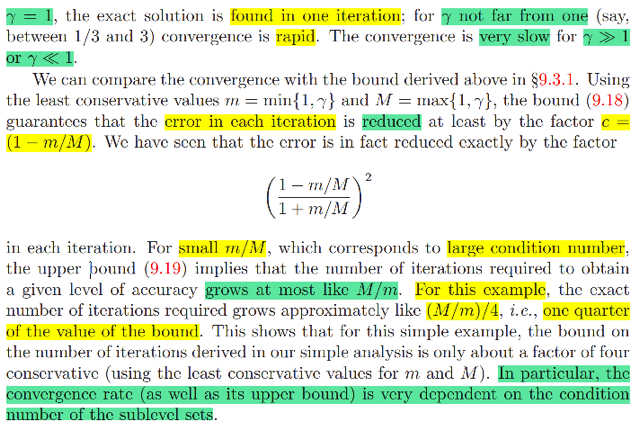</kbd></p>

<p align="center"><kbd>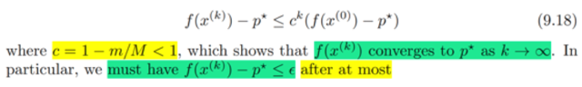</kbd></p>

> [!NOTE]
> Rồi, thế thì nếu `γ` `=` 1 thì dễ thấy f(x) sẽ bằng 0 ngay sau một bước
> (hay x sẽ bằng ngay x* `=` (0,0) ngay sau một iteration)
>
> Nếu `γ` không xa 1 quá thì converge cũng nhanh.
>
> Nhưng nếu `γ` >> 1 hay << 1 thì convergence sẽ lâu (tốn nhiều iteration)
>
> Thế thì, trong bài toán này, như đã nói, error giảm đi sau mỗi iteration
> ```text
> bởi factor [(γ - 1)/(1 + γ)]^2. Nếu ta dùng giá trị m = min(1, γ) và M =
> ```
> max (1, `γ)` như nói hồi nãy. Thì factor này quả thật chính là [(1 - `m/M)/(1`
> + `m/M)]^2`
>
> Chứng minh ko khó. Xét 2 trường hợp:
>
> ```text
> 1) γ > 1 ⇨ m = 1, M = γ. Khi đó [(γ - 1)/(γ + 1)]^2 = [(M - m)/(M + m)]^2
> ```
>
> ```text
> = [(M(1 - m/M)/M(1 + m/M)]^2 = [(1 - m/M)/(1 + m/M)]^2
> ```
>
> ```text
> 2) γ < 1 ⇨ m = γ, M = 1. Khi đó [(γ - 1)/(γ + 1)]^2  = [(m - M)/(m +
> ```
> M)]^2
>
> ```text
> = [M(m/M - 1)/M(m/M + 1)]^2 = [(m/M - 1)/(m/M + 1)]^2
> ```
>
> ```text
> cũng = [(1 - m/M)/(1 + m/M)]^2
> ```
>
> Thế thì trong phần trước, ở kết quả (9.18) có screenshot lại bên dưới,
> đó là f(x(k)) - p* ≤ c^k[f(x(0)) - p*] với c `=` 1 - `m/M.` Thì kết quả này có
> thể ghi lại theo cách khác dùng error như vầy:
>
> error(k) ≤ c^k error(0). (vì f(x(k)) - p* chính là error(k) tức error ở step
> k)
>
> Như vậy hiểu kết quả này đó là error sau mỗi step SẼ GIẢM VỚI
> FACTOR  ÍT NHẤT LÀ c (DẤU ≤ CHO THẤY CÓ THỂ SẼ GIẢM
> NHANH HƠN NỮA NHƯNG DẤU `=` CHO THẤY NÓ ÍT NHẤT LÀ GIẢM
> THEO FACTOR NÀY)
>
> Vậy nên sách mới nói "error in each iteration is reduced at least by
> factor c, `=` 1 - `m/M.`
>
> Thế thì đó là lí thuyết, và bài toán thực tế ta đang xét ta đã nói error
> giảm với factor là [(1 - `m/M)/(1` + `m/M)]^2` thì có thể hiểu là nó cũng sẽ
> ≥ 1 - `m/M.`
>
> `====`
>
> Rồi, một điểm kiến thức nữa đã học là khi trong phần trước đã nhận
> định rằng khi condition number `M/m` mà lớn, thì bound của số iteration
> cần thiết sẽ tỉ lệ tuyến tính với condition number.
>
> (xem lại theo link hồng)
>
> Và đối chiếu với kết quả của bài toán cụ thể này, ta thấy số iteration (không
> phải bound của iteration, nhưng cũng có thể xem là tương đương, vì bound
> nó tăng thì cũng coi như số iteration cần thiết sẽ tăng) sẽ tăng theo `(M/m)/4`
> (kết quả này chưa biết ở đâu ra nhưng ý chính là cho thấy đúng là nó
> như trong lí thuyết nói, rằng số iteration sẽ tăng tuyến tính với độ lớn
> của condition number)
>
> Để rồi tóm lại rằng, tỉ lệ `/` tốc độ hội tụ (về optimal value) sẽ phụ thuộc
> nhiều vào độ lớn của condition number của sublevel set
>
> (nhắc lại hồi đầu đã nói ta đang có quadratic function, nên sublevel
> set thật ra là ellipsoid, nên condition number của sublevel set chính
> là condition number của Hessian

<br>

<p align="center"><kbd>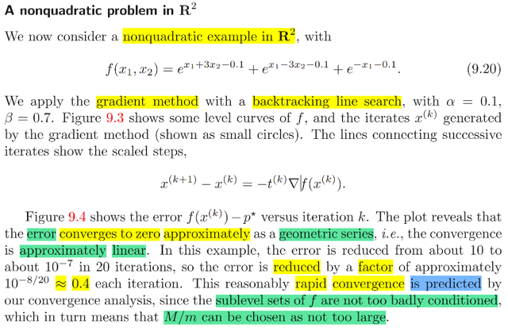</kbd></p>

<p align="center"><kbd>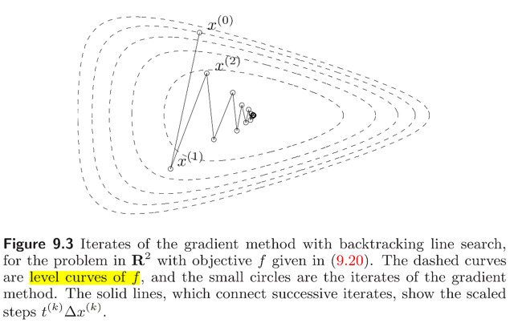</kbd></p>

<p align="center"><kbd>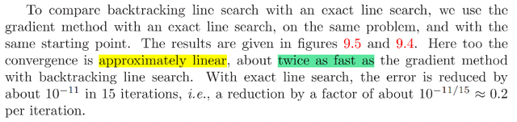</kbd></p>

> [!NOTE]
> Chuyển qua ví dụ một non-quadratic problem trong R^2. Thì lúc này
> level curve ko còn là đường ellipse, cũng như sub-level set `C-α` ko còn
> là hình ellipse nữa.
>
> Hình 9.4 đại khái là plot độ lớn của error (f(x(k)) - p*) tại các iteration
> theo hai phương pháp backtracking và exact line search. Nhận xét
> thấy error giảm gần như tuyến tính với scale factor là ≈ 0.2
> (backtracking) và ≈ 0.4 (exact).
>
> Thì một ý quan trọng nói là, kết quả này (việc convergence tương đối
> nhanh) phù hợp với dự đoán của ta nếu ta dùng những kiến thức của
> phần convergence analysis, nói rằng giới hạn `/` chặn (bound) của số
> iteration  cần thiết sẽ phụ thuộc (tỉ lệ nghịch) với vào `log(1/c)` `=` - log(1 -
> `m/M).`
>
> Có nghĩa là nếu condition number `(M/m)` càng lớn ⇨ `m/M` càng nhỏ ⇨
> `-m/M` càng lớn ⇨ 1 - `m/M` càng lớn ⇨ - log(1 - `m/M)` càng lớn ⇨ số
> iteration cần thiết càng lớn. Ngược lại condition number nhỏ (gọi là
> KHÔNG BAD CONDITION) thì số iteration cần thiết sẽ nhỏ.
>
> Và về mặt hình học, condition number của sublevel set như đã biết,
> được định nghĩa bởi (bề rộng lớn nhất)^2 `/` (bề rộng nhỏ nhất)^2. Vậy
> thì ta thấy trong hình, các sub-level set có khác biệt giữa bề rộng lớn
> nhất và và nhỏ nhất không quá NHIỀU (nếu nhiều, thì hình ảnh sẽ là
> những hình rất dẹt, kéo rất dài ở một phương và rất ốm ở phương
> khác). Do đó đây chính là biểu hiện cho thấy dù chưa biết condition
> number của sub-level set là bao nhiêu nhưng về hình học cho ta biết
> nó ko quá lớn, từ đó có thể dự đoán số iteration sẽ ko quá nhiều
> (convergence sẽ ko quá lâu)
>
> Và để so sánh giữa back-tracking và exact line search thì hình ảnh 9.5
> cho thấy nhận xét sau:
>
> (Cùng một ví trí ban đầu x(0), thì với backtracking, vì như đã biết ta sẽ
> chỉ chọn đại, cụ thể là bắt đầu với step size t `=` 1, để rồi cũng đi theo
> hướng - ∇f(x(0)), để tới x(1), sau đó, giảm step size xuống, và đi theo
> hướng - ∇f(x(1)) để tới x(2) (dĩ nhiên ∇f(x(0)) khác ∇f(x(1))) Thế thì
> chính vì chọn đại step size, ko tối ưu, nên mới có cái kiểu đi vòng lên
> rồi lại vòng về lại, cứ thế tạo nên hình zig zac.
>
> Trong khi đó với exact line search, từ x(0) ta đã tìm ra step size TỐI
> ƯU mà theo đó f(x(1)) `=` f(x(0) - t ∇f(x(0))) là nhỏ nhất. Do đó trong hình
> 9.5 có thể thấy vị trí x(1) phản ánh điều này. (Nếu có thể cắt đồ thị  với
> mặt phải vuông góc mặt xy và chứ vector ∇f(x(0)) thì ta sẽ thấy nó  tạo
> thành một đường cong mà đáy nằm ngay vị trí của x(1))
>
> Từ x(1), exact line search tìm ra bước đi tối ưu, và trong hình có thể
> hiểu, - ∇f(x) tại x(1) sẽ chỉ về hướng của x*. Và exact line search sẽ tìm
> ra ngay chính xác bước đi cần thiết để từ x(1) trở thành x(2) bằng
> đúng x*
>
> Nên chú ý thang error của hình 9.4 cho thấy sau step 1,2 thì error của
> exact line seaerch đã rất nhỏ rồi (≈10^-2, 10^-3)

<br>

<p align="center"><kbd>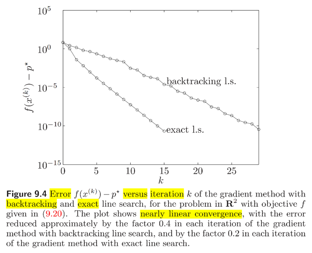</kbd></p>

<p align="center"><kbd>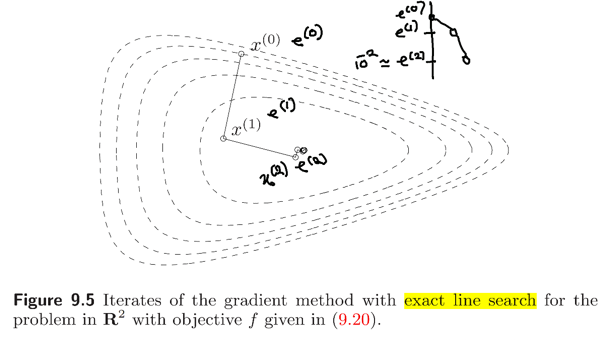</kbd></p>

<br>

<p align="center"><kbd>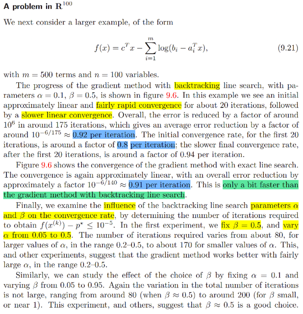</kbd></p>

<p align="center"><kbd>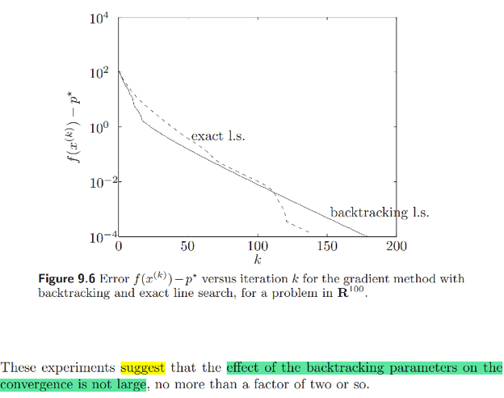</kbd></p>

<p align="center"><kbd>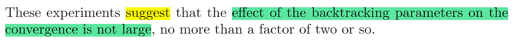</kbd></p>

> [!NOTE]
> một ví dụ khác, chưa xem kĩ nhưng nói chung là cho thấy tốc độ
> converge của hai case  back-tracking và exact không quá khác
> nhau.
>
> Và khúc cuối là phân tích ảnh hưởng của parameter `α` và `β` trong
> backtracking method với tốc độ convergence thì thấy không ảnh
> hưởng mấy.

<br>

<p align="center"><kbd>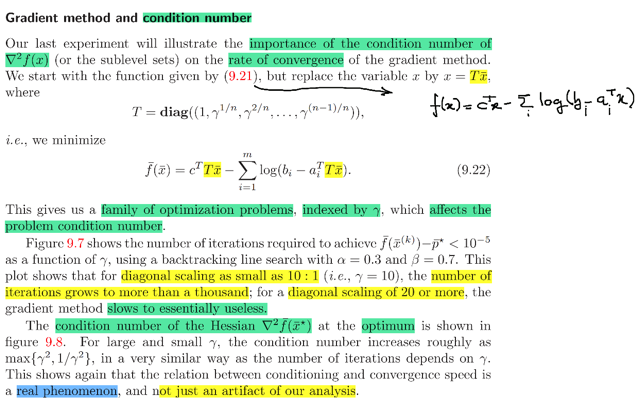</kbd></p>

<p align="center"><kbd>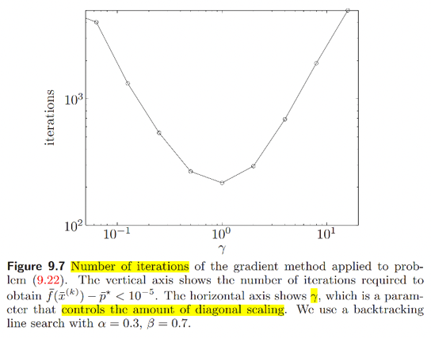</kbd></p>

<p align="center"><kbd>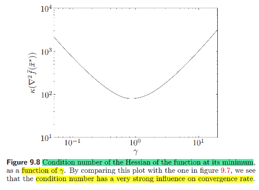</kbd></p>

> [!NOTE]
> đại khái là phần này ta sẽ phân tích ảnh hưởng của condition number của
> Hessian matrix ∇^2f(x) lên convergence của gradient method với ví  dụ cụ
> thể dùng objective function f(x) `=` cTx - `Σ` log(bi
> - aiTx)
>
> ```text
> Đầu tiên họ thay x = Tx_bar. Với T là diag[(1, γ^1/n, γ^2/n...)]
> ```
>
> ```text
> Có thể hiểu cái này như vầy: x = Tx_bar ⇔ Tinv x = x_bar với Tinv là
> ```
> matrix cũng là diagonal matrix, với các diagonal entries là nghịch đảo của
> ```text
> diagonal entries của T: Tinv = diag[(1, 1/(γ^1/n), 1/(γ^2/n),... )]
> ```
>
> Như vậy có thể thấy các component của `x_bar` sẽ là các component
> tương ứng của x nhưng được scale bởi (chia xuống cho) factor tương
> ứng là các entries của T:
>
> ```text
> x_bar = [x1/1, x2/(γ^1/n), x3/(γ^2/n), ...]
> ```
>
> Mục đích đó là thông qua việc thay đổi `γ,` thì ta sẽ thay đổi tỉ lệ kéo giãn
> theo các phương khác nhau. Để từ đó thay đổi tỉ lệ giữa [bề rộng lớn
> nhất] `/` [bề rộng nhỏ nhất] của sub-level set
>
> Và từ đó nó cũng chính là ta cho condition number của problem (chính là
> condition number của sublevel set của objective function) phụ thuộc vào
> `γ.` Để từ đó quan sát ảnh hưởng của condition number lên tốc độ
> convergence.
>
> Thế thì hình 9.7 cho thấy kết quả như vậy, khi `γ` tăng từ 0.1 lên 1 rồi lên
> 10 tương ứng với ý nghĩa là condition number của sub-level set `(=` tỉ lệ
> giữa  bình phương bề rộng lớn nhất `/` bình phương bề rộng nhỏ nhất) sẽ
> thay đổi từ lớn đến nhỏ (khi bằng 1) và lớn lên trở lại. Thì tốc độ
> convergence cũng tăng lên và đạt đỉnh khi condition number `=` 1 và sau
> đó thì giảm trở lại.
>
> Đây phù hợp với kết quả mà ta đã có ở phần trước (lý thuyết) (theo link -
> phần convergence analysis) nói rằng khi sublevel set có condition number
> ≈ 1, nơi mà ta có tính chất isotropic (hiểu nôm na là mức độ stretch của
> các phương đều nhau, tròn trịa) thì convergence sẽ nhanh nhất. Ngược
> lại khi condition number lớn, thể hiện một phương nào đó bị kéo giãn
> vượt trội so với phương nhỏ nhất, hình ảnh như cái bánh mì bị kéo dài và
> ốm. Thì convergence sẽ chậm
>
> Khúc cuối, cũng như là hình 9.8 là plot condition number của Hessian
> tại optimal (dĩ nhiên cũng là function theo `γ).` Cái này cũng cho ta thấy
> cùng nhận định rằng `γ` mà ≈ 1 thì condition number của Hessian tại optimal
> sẽ nhỏ nhất. Và phần trước ta đã biết khi gần optimal thì sub level set sẽ 
> ngày càng gần giống (hoặc nói cách khác là có thể được xấp xỉ bởi) một
> ellipsoid (3D trở lên) hay ellipse (2D). Mà khi đó condition number của nó
> (của sub level set `/` ellipsoid) sẽ cũng chính là condition number của positive
> semi definite define ra nó (chính là Hessian ∇^2f(x*)).
>
> Tom lại đều củng cố nhận định là, condition number mà càng nhỏ để khiến
> sublevel set "càng tròn trịa" `/` "ít bị méo" `/` "bề rộng các phương đều xem xem"
> thì sẽ khiến convergence nhanh (số iteration nhỏ) và ngược lại.
>
> Và đọan cuối họ có ý nói rằng qua ví dụ này ta thấy thật sự điều này đúng
> chứ ko chỉ đúng về lý thuyết

<br>

<p align="center"><kbd>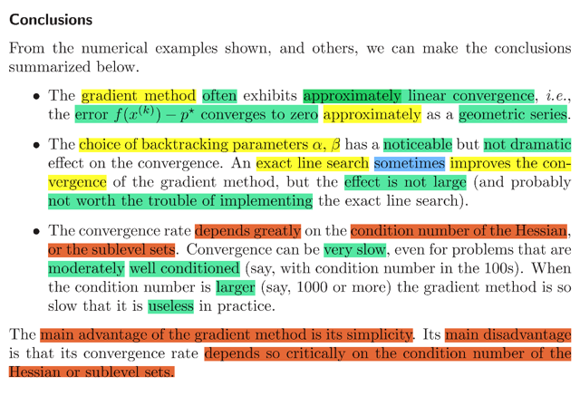</kbd></p>

> [!NOTE]
> Kết luận đại khái là:
>
> 1) Gradient descent method thường cho ta kết quả là sự hội tụ về
> optimal thường là tuyến tính, thể hiện bởi mức độ giảm của error sẽ
> có thể coi như một chuỗi geometric
>
> 2) Tham số của backtrack line search ko ảnh hưởng nhiều lắm đến
> tốc độ hội tụ
>
> 2b) So với backtrack line search thì exact line search cũng không tỏ
> ra khiến cải thiện vượt trội tốc độ hội tụ, nên thường là không đáng
> phải làm trừ khi là việc làm theo exact là tương đối đơn giản nếu
> không thì không bỏ công
>
> 3) Cuối cùng là, cái thứ ảnh hưởng mạnh nhất đến tốc độ
> convergece chính là CONDITION NUMBER CỦA HESSIAN `/` HAY
> CỦA SUBLEVEL SET
>
> Do đó ưu điểm của gradient descent method là nó đơn giản nhưng
> nhược  điểm là phụ thuộc quá nhiều vào condition numbers

<br>

<p align="center"><kbd>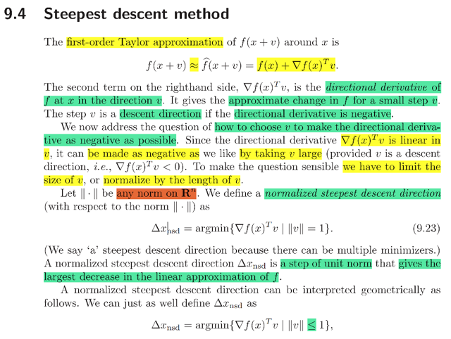</kbd></p>

<p align="center"><kbd>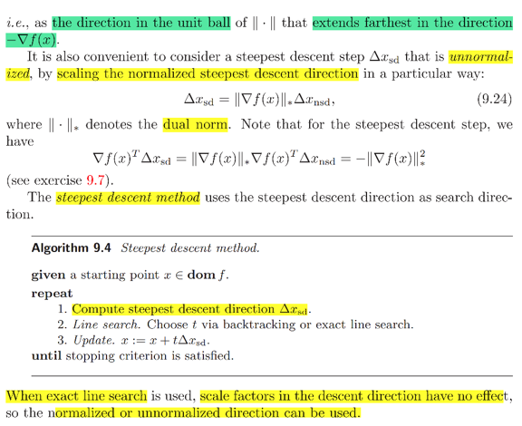</kbd></p>

> [!NOTE]
> đại khái là, nhớ lại một chút, phần 9.2 ta nói về descent method, trong đó, chủ yếu
> ta nói về các bước thực hiện nói chung, bao gồm 1) chọn descent direction `Δx` là
> hướng nào đó mà f(x + t `Δx)` nhỏ hơn f(x) và 2) là nói về việc tìm t, tức step size,
> để rồi trong đó có hai cách là exact line search (giúp tìm t tốt nhất) hoặc
> backtracking line search (cho t đại bằng 1 và giảm từ từ cho đến khi thỏa exit
> condition) và 3) update Thế thì phần này chủ yếu phân tích hai cái line search
> strategy của step 2.
>
> Sau đó qua 9.3 là khi ta nói về step 1, thay vì chọn đại descent direction, ta dùng
> luôn một cái tiện nhất: - ∇f(x). Và chủ yếu là đi phân tích convergence analysis,
> những yếu tố nào tác động đến tốc độ convergence (số iteration cần thiết để đến
> được p*)
>
> Và tới đây, thì vấn đề đặt ra là quay lại nói về việc chọn descent direction. Thay vì
> chọn bừa, thay vì chọn một option tiện lợi là
> - ∇f(x) thì ta đặt câu hỏi là chọn hướng nào tối ưu, tức giúp giảm f nhanh nhất.
> (mặc dù tí nữa ta cũng sẽ thấy rằng hóa ra -∇f(x) cũng chính là tối ưu)
>
> Thế thì, để lập luận một cách khái quát, ta mới dùng linear approx. tại x (ví dụ như
> initial point x(0)):
>
> Với hàm 1 biến thì ta có: f(x + `δx)` ≈ f(x) + f'(x) `δx`
>
> Hay khái quát với đa biến thì gọi là Fisrt order Taylor expansion:
>
> f(x + `δx)` ≈ f(x) + `∇f(x)Tδx`
>
> Hay gọi `δx` là vector v như trong sách ta có:
>
> f(x + v) ≈ f(x) + ∇f(x)Tv
>
> Thế thì, dĩ nhiên từ đây, ta có thể lập luận như sau:
>
> kết qủa trên tương đương f(x) - f(x + v) ≈ - ∇f(x)Tv, do đó, mức sụt giảm của f(x) có
> thể được tối đa hóa sao cho: v phải khiến ∇f(x)Tv ÂM (ĐỂ - ∇f(x)Tv DƯƠNG) và
> sao cho ĐỘ LỚN CỦA ∇f(x)Tv LỚN NHẤT CÓ THỂ.
>
> Thế thì điều đầu tiên cho thấy v phải hợp với gradient ∇f(x) một góc TÙ (acute)
> như đã từng nói trước đây (vì ∇f(x)Tv `=` `||∇f(x)||.||v||.cos(α))`
>
> Vậy thì vấn đề bây giờ là tìm v sao cho độ lớn của ∇f(x)Tv lớn nhất.
>
> Thế thì, vì ý định là tìm HƯỚNG VETOR, nên dĩ nhiên ta đương nhiên cần không
> care độ lớn của vector v, chính là NORMALIZE NÓ, để có  v với unit norm ||v|| `=` 1.
>
> VÀ CHÚ Ý, NORM Ở ĐÂY LÀ NORM CHUNG CHUNG, CÓ THỂ LÀ L1, L2, ...Ln, L-infinity
> norm
>
> Khi đó bài toán tìm v ở trên sẽ thể hiện bởi bài toán optimization sau:
>
> minimize ∇f(x)Tv subject to ||v|| `=` 1
>
> hay: `Δx_nsd` `(Δx` là vì đây là descent direction, và nsd viết tắt của normalized
> steepest descent:
>
> ```text
> Δx_nsd = argmin ∇f(x)Tv | ||v|| = 1
> ```
>
> Và về mặt hình học thì ta có thể hiểu rằng, giống như xét mọi vector trong một
> quả cầu (nôm na là xét mọi hướng) thì hướng nào khiến ∇f(x)Tv là lớn nhất, 
>
> `Δx_nsd` `=` argmin ∇f(x)Tv | ||v|| ≤ 1   |  ý là với constraint thay bằng ≤ (||v|| ≤ 1) thì
> ta đang nói rằng tìm trong mọi vector thuộc quả cầu (ball) : v: ||v|| ≤ 1, thay vì nói
> tìm trong mọi vector có unit norm.(ý là nói theo quả cầu dễ hình dung là ta đang
> quan tâm đến việc tìm trong các hướng khác nhau 360 độ)
>
> Tất nhiên khi đó kết qủa cũng sẽ ra v có norm `=` 1 
>
> `====`
>
> Cũng có khi sẽ có ích khi ta không normalize v, gọi là UNNORMALIZED STEEPEST 
> DESCENT method. Bằng cách scale normalized steepest descent lên lại với scalar
> ||∇f(x)||*:
>
> ```text
> Δx_sd = ||∇f(x)||* Δx_nsd
> ```
>
> Sử dụng identity mà mình đã chứng minh trong note kế bên (màu cam):
>
> `∇f(x)TΔx_nsd` `=` - ||∇f(x)||*
>
> ```text
> Ta sẽ có ∇f(x)T Δx_sd =  ∇f(x)T  ||∇f(x)||* Δx_nsd = ∇f(x)TΔx_nsd ||∇f(x)||*
> ```
>
> `=` (||∇f(x)||*)^2
>
> Nhưng ý chính đơn giản chỉ là vậy, tìm hướng khiến f giảm nhiều nhất `/` hướng dốc
> nhất `/` hướng khiến ∇f(x)Tv (âm) và có giá trị lớn nhất.
>
> THÌ ĐÓ GỌI LÀ STEEPEST DESCENT METHOD
>
> Nói thêm một ý là nếu dùng exact line search thì vì đàng nào ta cũng tìm step tối
> ưu, nên chỉ quan tâm hướng thôi, khi đó normalize hay không cũng như nhau
>
> Ta cần chứng minh identity này `∇f(x)TΔx_nsd` `=` - ||∇f(x)||* (nội 
> dung của bài tập 9.7):
>
> Nhớ lại định nghĩa của dual norm: ||v||* `=` sup ||u|| ≤ 1 uTv 
> tức tìm uTv với vector u nào maximize uTv
>
> Vậy thì, ||∇f(x)||* `=` sup ||u|| ≤ 1 ∇f(x)Tu mang ý nghĩa là tìm
> trong các vector của unit ball, vector nào tối đa hóa ∇f(x)Tu
> Thế thì, vì ∇f(x)Tu `=` ||∇f(x)||||u|| `cosθ` nên cái này sẽ đạt max
> khi `θ` `=` 0 và ||u|| `=` 1. Có nghĩa là u trùng hướng ∇f(x), và có
> norm bằng 1: do đó u `=` ∇f(x) `/` ||∇f(x)||. 
>
> Từ đó sup ||u|| ≤ 1 ∇f(x)Tu `=` ∇f(x)T ∇f(x) `/` ||∇f(x)||
>
> `=` ||∇f(x)||^2 `/` ||∇f(x)|| `=` ||∇f(x)|| (1)
>
> còn `Δx_nsd` `=` argmin ∇f(x)Tv | ||v|| ≤ 1 cũng là solution của
> bài toán inf ||v|| ≤ 1 ∇f(x)Tv sẽ đạt min khi v ngược hướng 
> ∇f(x) và có norm `=` 1. 
>
> ```text
> ⇨ Δx_nsd = -∇f(x)/||∇f(x)||
> ```
>
> ```text
> nên ∇f(x)T Δx_nsd = ∇f(x)T -∇f(x) / ||∇f(x)||
> ```
>
> `=` - ||∇f(x)||^2 `/` ||∇f(x)|| `=` - ||∇f(x)|| (2)
>
> Từ (1) và (2) kết luận `∇f(x)TΔx_nsd` `=` - ||∇f(x)||*
>
> 9. UNCONSTRAINED PROBLEM
>
> 9.4 STEEPEST DESCENT METHOD

<br>

<p align="center"><kbd>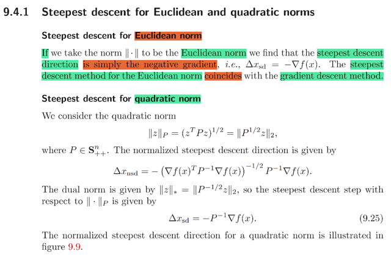</kbd></p>

> [!NOTE]
> rồi thế thì NẾU XÉT NORM LÀ L2 NORM (EUCLIDEAN NORM) THÌ
> STEEPEST DESCENT CHÍNH LÀ GRADIENT DESCENT: Tức là
> negative gradient
>
> `Δx_sd` `=` - ∇f(x)  
>
> Ta phải chứng minh nếu dùng l2 norm thì:
>
> argmax  -∇f(x)Tv : ||v|| `=` 1 `=` - ∇f(x)
>
> (cũng là phải chứng minh argmin ∇f(x)Tv : ||v|| `=` 1 `=` - ∇f(x))
>
> Đơn giản thôi, xét bài toán optimization:
>
> minimize v ∇f(x)Tv constraint ||v|| `=` 1 
>
> Thế thì ∇f(x)Tv `=` ||∇f(x)||.||v||.cos(∇f(x), v) dĩ nhiên norm trong công thức
> này là l2 norm. Do đó sử dụng constraint là l2 norm ||v|| `=` 1, ta có:
>
> ∇f(x)Tv `=` ||∇f(x)||.1.cos(∇f(x),v) và vì cos(..) ∈ [-1,1] và ||∇f(x)|| ≥ 0 nên
> cái này đạt min khi: 
>
> cos(∇f(x),v) `=` -1 ⇔ ∇f(x)Tv `/` ||∇f(x)||.||v|| `=` -1
>
> Tức v ngược hương với ∇f(x), và để có unit norm thì v sẽ được
> normalize:
>
>  v `=` - ∇f(x) `/` ||∇f(x)||
>
> `=====`
>
> Thế thì tiếp theo, nếu xét QUADRATIC NORM: ||.||P có công thức là:
>
> Ta có matrix positive definite P, thì quadratic norm của z định nghĩa bởi P
> sẽ có công thức là: ||z||P `=` `(zTPz)^1/2`
>
> Thế thì theo định nghĩa ta sẽ cần giải bài toán:
>
> minimize ∇f(x)Tv constraint ||v||P `=` 1 ⇔ `(vTPv)^1/2` `=` 1
>
> ```text
> ⇔ (vTP^1/2 P^1/2v)^1/2 = 1 ⇔ [(P^1/2Tv)T(P^1/2Tv)]^1/2 = 1
> ```
>
> ```text
> ⇔ [||P^1/2Tv||^2]^1/2 = 1 ⇔ ||P^1/2Tv|| = 1 (đương nhiên norm đây là l2 norm)
> ```
>
> bài toán sẽ là minimize ∇f(x)Tv constraint `||P^1/2Tv||` `=` 1
>
> ```text
> Lagrangian: L = ∇fTv + ε(||P^1/2Tv|| - 1)  |  dùng ε là Lagrange multiplier gắn
> ```
> với equality constraint 
>
> KKT condition:
>
> ```text
> ∇_v L(v, ε) = 0 ⇔ ∇_vf0(v) + ε ∇_vh(v) = 0
> ```
>
> ∇f0(v) `=` ∇f
>
> ```text
> ∇h(v):  h(v) = ||P^1/2Tv|| - 1 = √[(P^1/2Tv)T(P^1/2Tv)] - 1
> ```
>
> ```text
> = √(vTP^1/2P^1/2Tv) - 1 = √(vTPv) - 1 = (vTPv)^1/2 - 1
> ```
>
> ```text
> dh/dv = dh/d(vTPv) d(vTPv)/dv
> ```
>
> ```text
> + dh/d(vTPv) = (1/2) (vTPv)^-1/2
> ```
>
> + `d(vTPv)/dv` không khó để ra 2PTv (dùng cách làm của MIT 18s096)
>
> ```text
> ⇨ dh/dv = (1/2) (vTPv)^-1/2 2PTv = PTv / (vTPv)^1/2 = PTv / ||P^1/2Tv||
> ```
>
> `=` Pv `/` `||P^1/2v||`  | vì P symmetric
>
> ⇨ ∇_v L `=` ∇f + Pv `/` `||P^1/2v||`
>
> ```text
> KKT conditions: ∇_v L = 0 ⇔ ∇f + ε Pv / ||P^1/2v|| = 0
> ```
>
> ```text
> ⇔ Pv = -∇f ||P^1/2v|| / ε
> ```
>
> ```text
> Đặt α = ||P^1/2v|| / ε ta có
> ```
>
> Pv `=` `-α` ∇f 
>
> ```text
> ⇔ v = Pinv (- α ∇f) = - α Pinv ∇f
> ```
>
> ```text
> Thế vào ||P^1/2v|| = ||P^1/2 (- α Pinv ∇f )|| = α ||P^1/2 Pinv ∇f|| = α ||P^1/2 P^-1 ∇f||
> ```
>
> `=` `α` `||P^-1/2` ∇f||
>
> ```text
> Sử dụng constraint ||P^1/2v|| = 1 ta có α ||P^-1/2 ∇f|| = 1 ⇨ α = 1 / ||P^-1/2 ∇f||
> ```
>
> ```text
> = 1 / [(P^-1/2 ∇f)T(P^-1/2 ∇f)]^1/2 = 1 / (∇fTP^-1/2P^-1/2 ∇f)^1/2
> ```
>
> ```text
> = 1 / (∇fTPinv∇f)^1/2 = (∇fTPinv∇f)^-1/2
> ```
>
> Vậy `α` `=` `(∇fTPinv∇f)^-1/2`
>
> ```text
> Vậy v = - α Pinv ∇f  = - (∇fTPinv∇f)^-1/2 Pinv ∇f  đây là kết qủa như trong sách
> ```
>
> ```text
> Δx_nsd = - (∇fTPinv∇f)^-1/2 Pinv ∇f
> ```
>
> Rồi, đó là normalized, còn unnormalized thì ta nhân với ||∇f(x)||*:
>
> ```text
> Δx_sd = ||∇f(x)||* Δx_nsd = - ||∇f(x)||* (∇fTPinv∇f)^-1/2 Pinv ∇f (2)
> ```
>
> Thế thì, với quadratic norm thì dual norm sẽ là:
>
> Theo định nghĩa dual norm nói chung ||v||* `=` sup ||u|| ≤ 1 uTv vậy thì ta giải bài toán:
>
> maximize uTv subject to ||u|| ≤ 1. Và khi ở đây là nói về dual norm của quadratic norm ||.||P
> thì bài toán sẽ là:
>
> maximize uTv subject to ||u||P ≤ 1 ⇔ uTPu ≤ 1
>
> equivalent minimize -uTv subject to uTPu ≤ 1:
>
> ```text
> Đổi biến đặt w = P^1/2u ⇨ wTw (=||w||^2) = uTP^1/2P^1/2t = uTPu.
> ```
>
> ```text
> Và w = P^1/2u ⇨ u = P^-1/2w
> ```
>
> Từ đó bài toán equivalent: maximize `(P^-1/2w)Tv` `=` `wT(P^-1/2)v` constraint ||w||^2 ≤ 1
>
> Thế thì sup ||w|| ≤ 1 wTa `=` aTa, nói cách khác, vector có norm ≤ 1 (của unit ball) khiến
> maximize wTa khi và chỉ khi w trùng hướng a và độ lớn đạt max cho phép, tức `=` 1.
>
> ```text
> Vậy sup ||w||^2 ≤ 1 wTP^-1/2v = (P^-1/2v)T(P^-1/2v) = ||P^-1/2v||
> ```
>
> Do đó trong sách nói dual norm sẽ là ||z||* `=` `||P^-1/2z||`
>
> Như vậy ||∇f(x)||* `=` `||P^-1/2` ∇f(x)|| 
>
> và dẫn đến kết quả (2) trở thành:
>
> ```text
> Δx_sd = ||∇f(x)||* Δx_nsd = -  ||P^-1/2 ∇f(x)|| (∇fTPinv∇f)^-1/2 Pinv ∇f
> ```
>
> ```text
> = - [∇f(x)TP^-1/2P^-1/2 ∇f(x)]^1/2 (∇fTPinv∇f)^-1/2 Pinv ∇f
> ```
>
> `=` - `(∇fTPinv∇f)^1/2` `(∇fTPinv∇f)^-1/2` Pinv ∇f
>
> `=` - Pinv ∇f như sách

<br>

<p align="center"><kbd>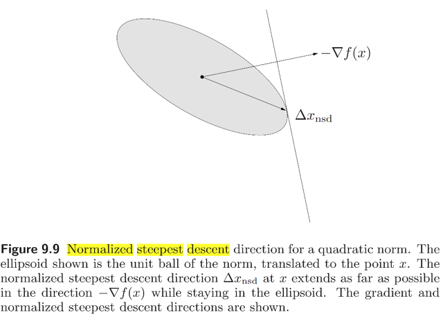</kbd></p>

<br>

<p align="center"><kbd>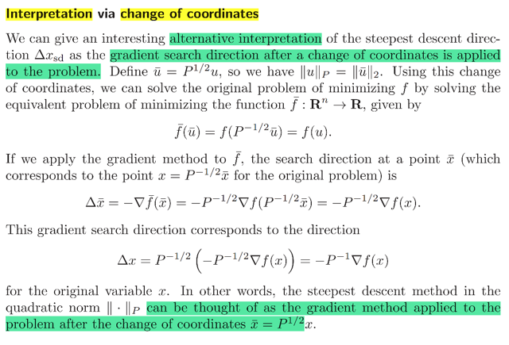</kbd></p>

> [!NOTE]
> Đại khái là phần này nói rằng ta có thể coi (interpretation) cái hướng
> steepest descent direction chính là negative gradient sau khi đã chuyển
> đổi hệ trục.
>
> ```text
> Gọi u~ (trong sách là u_bar) = P^1/2 u ⇔ P^-1/2 u~ = u.
> ```
>
> ```text
> Khi đó ||u||P = (uTPu)^1/2 = [(P^-1/2 u~)TP(P^-1/2 u~)]^1/2
> ```
>
> ```text
> = [u~TP^-1/2PP^-1/2 u~]^1/2
> ```
>
> ```text
> = [u~TP^-1/2P^2/2P^-1/2 u~]^1/2 = [u~Tu~]^1/2 = ||u~||
> ```
>
> Kết qủa này nói là đặt u~ `=` `P^1/2` u thì ||u||P `=` ||u~|| (quadratic norm
> của u chính là L2 norm của u~)
>
> Vậy thì từ bài toán gốc minimize f(u) với constraint ||u||P ≤ 1 ta có thể
> giải  bài toán equivalent là minimize `f(P^-1/2` u~) `=` f~(u~) (là hàm theo
> u~) với constraint ||u~|| ≤ 1 (l2 norm, thay vì quadratic norm)
>
> ```text
> u~ = P^1/2 u ⇔ u = P^-1/2 u~
> ```
>
> ⇨ f(u) `=` `f(P^-1/2` u~) `=` f~(u~)
>
> Giờ ta cần tìm đạo hàm của f~(u~): nó là `f(P^-1/2` u~) tức là hàm f mà
> thay u `=` `P^-1/2` u~ rồi, nên nó trở thành hàm theo u~, kí hiệu f~(u~).
>
> Nên tìm đạo hàm của f~(u~) chính là tìm đạo hàm của f(u) theo u~
>
> có thể ghi là f(u(u~))
>
> Dùng chain rule:
>
> ```text
> df~/du~ = df/du~ = df/du du/du~ = df/du P^-1/2
> ```
>
> ```text
> ∇f~(u~) = ∇f(u) P^-1/2 = ∇f(P^-1/2 u~) P^-1/2
> ```
>
> `=` `P^-1/2` `∇f(P^-1/2` u~)
>
> Rồi, với bài toán equivalent này, ta nếu DÙNG GRADIENT METHOD,
> tức chọn `Δx~` `=` - ∇f~(x~)
>
> ∇f~(x~) như trên, `=` `P^-1/2` `∇f(P^-1/2` x~)
>
> ```text
> Vậy đã hiểu vì sao sách ghi Δx~ = - P^-1/2 ∇f(P^-1/2 x~)  = - P^-1/2
> ```
> ∇f(x)
>
> ```text
> Rồi, khi u = P^-1/2 u~ thì Δu ĐƯƠNG NHIEN CŨNG BẰNG P^-1/2 Δu~
> ```
>
> ```text
> (vì Δu = u1 - u2 = P^-1/2u1~ - P^-1/2u2~ = P^-1/2(u1~-u2~) = P^-1/2
> ```
> `Δu~)`
>
> ```text
> Vậy nên Δx = P^-1/2 Δx~, thay Δx~ = - P^-1/2 ∇f(x) ở trên vào:
> ```
>
> ```text
> ⇨ Δx = P^-1/2 (- P^-1/2 ∇f(x))
> ```
>
> `⇔Δx` `=` - P^-1 ∇f(x)
>
> VÀ Ý CHÍNH LÀ KẾT QUẢ NÀY , NHƯ VỪA MỚI LÀM , CHÍNH LÀ
> `Δx_sd`
>
> NÊN Ý NÓI RẰNG, THÌ BẰNG CÁCH ĐỔI HỆ TRỤC, THÔNG QUA
> MATRIX P: x~ `=` `P^1/2` x. THÌ TA SẼ CÓ BÀI TOÁN MỚI MÀ TRONG ĐÓ
> TA ÁP DỤNG GRADIENT METHOD SẼ CHÍNH LÀ KHI TA ÁP DỤNG
> STEEPEST DESCENT DÙNG QUADRATIC NORM VỚI BÀI TOÁN
> GÓC

<br>

<p align="center"><kbd>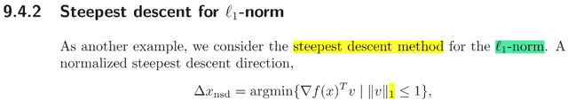</kbd></p>

<p align="center"><kbd>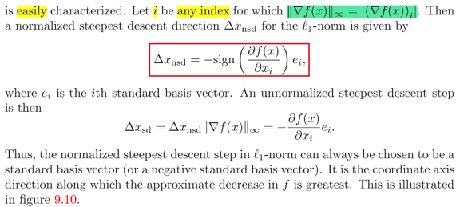</kbd></p>

<p align="center"><kbd>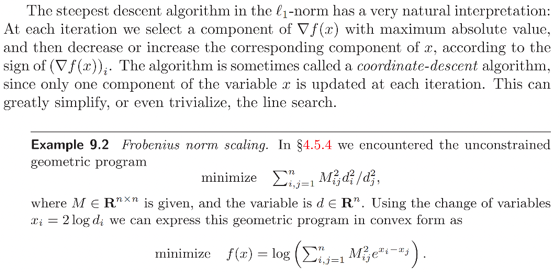</kbd></p>

<p align="center"><kbd>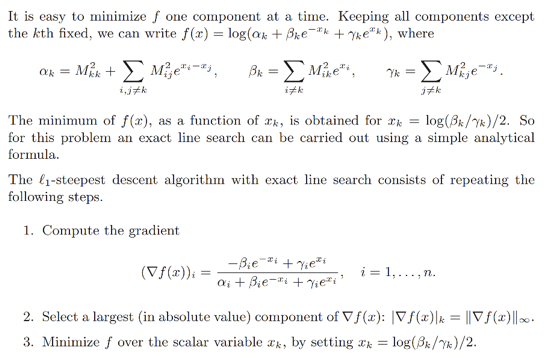</kbd></p>

> [!NOTE]
> Tiếp, sau khi ở phần trước là ta xét steepest descent method với l2 
> norm và quadratic norm. Thì bây giờ là l1 norm.
>
> Vẫn từ định nghĩa: `Δx_nsd` `=` argmin { ∇f(x)Tv  |  ||v|| ≤ 1 }. Và trong
> trường hợp này, ||v|| là l1 norm. Do đó phải ghi rõ  ||v||1 (nếu ko ghi 
> thì tự hiểu là l2 norm)
>
> Vậy thì ta sẽ có bài toán optimization như sau:
>
> minimize ∇f(x)Tv constraint `Σi` |vi| ≤ 1 (||v||1 `=` `Σi` |vi|)
>
> L `=` ∇f(x)Tv + λ(||v||1 - 1)
>
> KKT: ∇L(v) `=` 0 
>
> 1) `d[∇f(x)Tv]/dv:`
>
> d[∇f(x)Tv] `=` ∇f(x)T(v + dv) - ∇f(x)Tv `=` ∇f(x)Tdv
>
> ⇨ d[∇f(x)Tv] `/` dv `=` ∇f(x)
>
> ```text
> 2) d[λ(||v||1 - 1)]/dv: = d[λ(||v||1)]/dv = λ d(||v||1]/dv
> ```
>
> Và ta cần tính derivative của f(x) `=` ||x||1. Nếu mà là l2 norm, thì
> ∇f(x) sẽ bằng x `/` ||x||.
>
> Còn đây là ||x||1, vì phải làm sao. Ta sẽ vẫn dùng lập luận đã học
> từ MIT 18s096 nói rằng, bất cứ khi nào ta có vector -> scalar function
> f(x). Thì df `=` f'(x)[dx] nhất định là INNER PRODUCT GIỮA ∇f VỚI dx.
>
> Nên vấn đề là tìm ra `/` triển khai ra df có dạng [some thing] . dx, và 
> đây là column vector nên inner product chỉ là dot product thông thương.
> Nên nói chung là ta cần làm sao làm cho ra df `=` [something]Tdx  
>
> Thì [something] đó chính là ∇f.
>
> ```text
> Vậy thì df = ||x+dx|| - ||x|| = Σ |xi + dxi| - Σ |xi|
> ```
>
> |xi + dxi| ≈ |xi| + sign(xi) . dxi 
>
> ```text
> ⇨ Σ |xi + dxi| - Σ |xi| ≈ Σ [|xi| + sign(xi) . dxi] - Σ |xi|
> ```
>
> `=` `Σ` [sign(xi) . dxi]  `=` sign(x) . dx (hay sign(x)T dx
>
> Vậy ∇f(x) `=` sign(x) (f(x) `=` ||x||)
>
> ⇨ λ `d(||v||1]/dv` `=` λ sign(v)
>
> Và ∇L `=` ∇f(x) + λ sign(v).
>
> ```text
> ∇L = 0 ⇔ ∇f(x) + λ sign(v) = 0  ⇔ sign(v) = - ∇f(x) / λ
> ```
>
> ....KHÓ QUÁ QUAY LẠI SAU
>
> QUAY LẠI SAU

<br>

<p align="center"><kbd>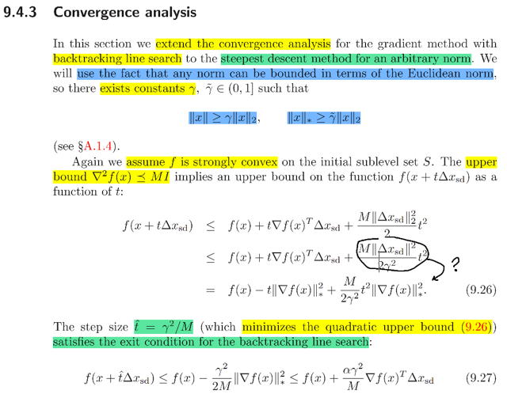</kbd></p>

<p align="center"><kbd>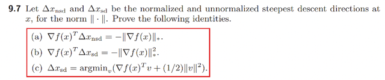</kbd></p>

<p align="center"><kbd>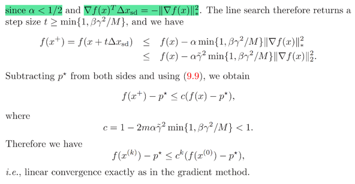</kbd></p>

> [!NOTE]
> Phần này gs mở rộng thảo luận về convergence analysis  cho steepest
> descent method với norm bất kì.
>
> Đầu tiên tạm chấp nhận kiến thức là tồn tại `γ:` ||x|| ≥ `γ||x||2`  (ý nghĩa là
> độ lớn của norm bất kì có một chặn dưới thể hiện bởi l2 norm)
>
> Thế thì, ta assume f strongly convex trên sublevel set S
>
> (nhớ đại khái có nghĩa là với mọi x belong S thì Hessian độ cong theo
> mọi hướng đều có giá trị ít nhất là m với m là số dương nào đó nhỏ lớn
> bất kì: Thể hiên theo toán học là tồn tại m > 0 sao cho ∇^2f(x) - m*I ≽ 0)
>
> Ta cũng có cái upper bound ∇^2f(x) ≤ MI  (nói ở phần trước - theo link)
> thế thì cái chặn này cho phép ta có một cái chặn trên của f(x + t `Δx_sd)`
> theo t:
>
> ```text
> f(x + t Δx_sd) ≈ f(x) + ∇f(x)T tΔx_sd + 0.5(t Δx_sd)T ∇^2f(x)(t Δx_sd)
> ```
>
> (second order Taylor expansion)
>
> ```text
> ≤ f(x) + ∇f(x)T tΔx_sd + 0.5(t Δx_sd)T MI (t Δx_sd)   | dùng ∇^2f(x) ≤ MI
> ```
>
> ```text
> = f(x) + ∇f(x)T tΔx_sd + 0.5 M t^2 (Δx_sd)T(t Δx_sd)
> ```
>
> ```text
> = f(x) + ∇f(x)T tΔx_sd + 0.5 M ||Δx_sd||l2^2 t^2   (chú ý đây là l2
> ```
> norm)
>
> ```text
> ≤ f(x) + ∇f(x)T tΔx_sd + 0.5 M (||Δx_sd||)^2 t^2 / γ^2
> ```
>
> | chuyển thành norm chung chung dùng ||x||2 ≤ `||x||/γ`
>
> ```text
> = f(x) - t (||∇f(x)||*)^2 + 0.5 M (||Δx_sd||)^2 t^2 / γ^2
> ```
>
> (dùng identity tạm chấp nhận (bài tập 9.7): `∇f(x)TΔx_sd` `=` - ||∇f(x)||*^2
>
> `=` f(x) - t (||∇f(x)||*)^2 + 0.5 M `/` `γ^2` t^2 (||∇f(x)||*)^2
>
> | Cái dưới chưa hiểu lắm nhưng có thể là QUAY LẠI SAU VẬY
>
> `===`
>
> ```text
> Rồi vậy f(x + t Δx_sd) ≤  f(x) + ∇f(x)T tΔx_sd + 0.5 M (||Δx_sd||)^2 t^2 / γ^2
> ```
>
> tức là ta có chặn trên của nó theo là quadratic function theo t.
>
> thì t^ `=` `γ^2` `/` M là cái minimize cái chặn trên này. (để chứng minh chỉ cần
> giải bài toán minimize quadratic function theo t này, cũng khong khó)
>
> Thì quan trọng là t^ này ĐÃ THỎA EXIT CONDITION CỦA BACKTRACKING
> LINE SEARCH.
>
> Là sao, nhớ lại exit condition của backtracking line search đó là:
>
> f(x + t `Δx)` ≤ f(x) + t `α` ∇f(x)T `Δx`  mang ý nghĩa là hàm f đã giảm thấp hơn
> dự đoán của linear approximation với độ dốc đã được adjusted bởi `α.`
>
> Vậy thì nói t^ thỏa tức là ta phải có:
>
> ```text
> f(x + t^ Δx_xd) ≤ f(x) + t^ α ∇f(x)T Δx_sd (I)
> ```
>
> Thật vậy:
>
> ```text
> từ f(x + t^ Δx_xd) ≤ f(x) - ||∇f(x)||* + 0.5 M / γ^2 t^2 (||∇f(x)||*)^2
> ```
>
> thay t `=` `γ^2` `/` M: 
>
> ```text
> vế phải = f(x) - γ^2 / M (||∇f(x)||*)^2 + 0.5 (M / γ^2) (γ^4 / M^2) (||∇f(x)||*)^2
> ```
>
> ```text
> = f(x) - 1/2 γ^2 / M ||∇f(x)||*^2
> ```
>
> ```text
> = f(x) + 1/2 γ^2 / M ∇f(x)TΔx_sd    |  Thay ∇f(x)TΔx_sd = - ||∇f(x)||*^2
> ```
>
> ```text
> = f(x) + 1/2 t^ ∇f(x)TΔx_sd
> ```
>
> ĐẾN ĐÂY, vì 0 ≤ `α` < 0.5
>
> ```text
> nên f(x) + 1/2 t^ ∇f(x)TΔx_sd  ≤  f(x) + α t^ ∇f(x)TΔx_sd
> ```
>
> đã chứng minh xong t^ thỏa exit condition
>
> `====`
>
>
> NÓI CHUNG LÀ KHÚC DƯỚI CUỐI CÙNG CHO THẤY STEEPEST
> DESCENT CŨNG CONVERGE LINEARLY Y CHANG NHƯ GRADIENT
> METHOD

<br>

<p align="center"><kbd>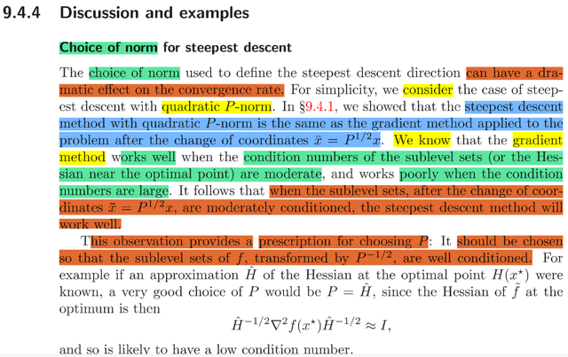</kbd></p>

> [!NOTE]
> Đại khái là phần này thảo luận về việc CHỌN NORM GÌ, trong
> steepest decent method.
>
> Thế thì phần trước, 9.4.1 mình đã làm qua để thấy rằng khi ta đổi hệ
> trục, đặt x~ `=` `P^1/2` x, thì việc apply GRADIENT METHOD (trong đó ta
> chọn `Δx` `=` - ∇f(x)) CHÍNH LÀ TA ĐANG DÙNG STEEPEST DESCENT
> VỚI QUADRATIC NORM cho bài toán gốc.
>
> Mà mấy bài trước ta cũng đã phân tích để thấy với Gradient method thì
> NÓ SẼ WORK TỐT (CONVERGE NHANH) khi CONDITION  NUMBER
> của sub-level set LÀ NHỎ.
>
> Do đó, điều này GỢI Ý RẰNG, khi ta chọn P để x~ `=`  `P^1/2` x, (để rồi
> áp dụng gradient method sẽ tương đương áp dụng steepest descent
> method cho hệ gốc) thì P nên có tính chất sao cho sau khi chuyện hệ
> trục thì sublevel set của hàm f CÓ WELL CONDITION (condition
> numebr của sublevel set nhỏ)
>
> Lấy ví dụ nếu ta biết H^ là ước lượng cuả Hessian tại x* thì ta sẽ dùng P `=` H^ để
> khiến cho trong hệ trục mới Hessian tại optimal của nó LÀ IDENTITY MATRIX (LÀ
> CÁI CÓ CONDITION ĐẸP NHẤT, TRÒN TRỊA NHẤT)
>
> Đầu tiên để hiểu cái này thì ta phải hiểu là khi đổi hệ trục bởi P: u~ `=` `P^1/2` u
>
> Thì bài trước ta đã tìm gradient của f~ wrt u~: ∇f~(u~)
>
> ```text
> df/du~ = df/du P^-1/2
> ```
>
> ```text
> ∇f~(u~) = ∇f(u) P^-1/2 = ∇f(u) P^-1/2
> ```
>
> Vậy thì ta sẽ tìm tiếp Hessian, tức ∇^2f~(u~)
>
> Vậy thì đơn giản là ta đạo hàm của ∇f~(u~) theo u~:
>
> ∇f~^2(u~) `=` d[∇f(u) `P^-1/2]` `/` du~
>
> `=` (d[∇f(u)] `/` du~). `P^-1/2`
>
> ```text
> = (d[∇f(u)] / du . du/du~) . P^-1/2   | Chain rule
> ```
>
> `=` ∇^2f(u) `P^-1/2` `P^-1/2`
>
> `=` `P^-1/2` ∇^2f(u) `P^-1/2`  | theo ChatGPT thì đơn giản là ta được phép
>
> Khi P `=` H^ là ước lượng của Hessian tại x* thì cái trên `=` `(H^)^-1/2` ∇^2f(u)
> `(H^)^-1/2`
>
> và tại x*: `(H^)^-1/2` ∇^2f(x*) `(H^)^-1/2`
>
> Và vì noí H^ là ước lượng của Hessian tại x* nên ∇^2f(x*) `=` H^
>
> ```text
> Vậy = (H^)^-1/2 H^ (H^)^-1/2 = I
> ```
>
> Nhớ ko, khi mà sublevel set của f có condition number nhỏ, thì converge sẽ nhanh.
> Có kiến thức bữa trước đã biết, khi rất gần optimal thì sublevel set coi như (approx
> tốt bởi) ellipsoid `/` ellipse. Vậy thì nếu well condition thì nó sẽ là hình tròn.: Ellipse :
> x: (x - x*)H(x - x*) ≤ b. Khi H `=` I thì nó thành (x-x*)^2 ≤ b LÀ BALL `/` CIRCLE

<br>

<p align="center"><kbd>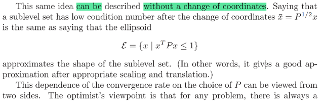</kbd></p>

<p align="center"><kbd>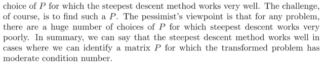</kbd></p>

<br>

<p align="center"><kbd>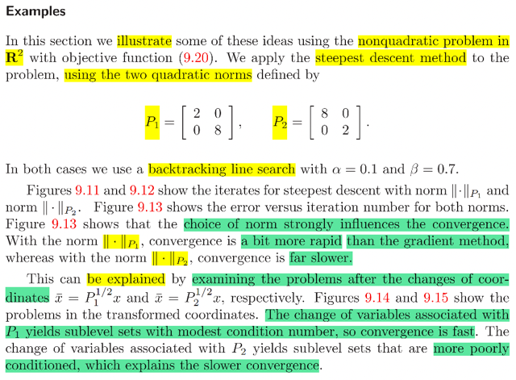</kbd></p>

<p align="center"><kbd>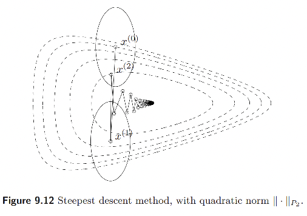</kbd></p>

<p align="center"><kbd>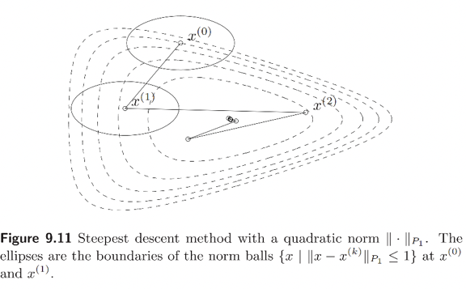</kbd></p>

<p align="center"><kbd>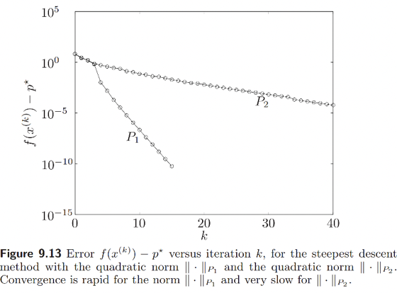</kbd></p>

> [!NOTE]
> Đại ý là áp dụng steepest descent method vào với quadratic norm 
> defined bởi P1, và P2 vào bài toán non-quadratic ở phần trước.
>
> Thì kết quả cho thấy khi dùng ||.||P1 thì nó nhanh hơn là gradient
> descent tí xíu trong khi với ||.||P2 thì rất chậm. Điều này minh họa cho
> việc việc lựa chọn norm gì để làm có ảnh hưởng lớn tới hiệu quả.
>
> Và như đã nói ở phần trước, sử dụng steepest descent với quadratic
> norm tương đương với việc ta đổi hệ trục tọa độ bởi matrix P: x~ `=` `P^1/2` x
> và sau đó áp dụng gradient descent. Mà gradient descent thì sẽ hoat
> động tốt khi sublevel set có condition number nhỏ. Thành ra, câu chuyện
> sẽ là matrix P nào khiến sau khi đổi hệ trục thì function có sublevel set có
> condition nhỏ thì nó sẽ là cái khiến steepest descent nhanh.
>
> Và thật vậy, hai hình cuối cho thấy sau khi biến đổi hệ trục bởi P1, thì
> các sublevel set trở nên "TRÒN HƠN" (hiểu là, đều hơn, bớt dẹt hơn)
> còn với P2 thì nó trở nên rất dẹt. Đó chính là biểu hiện rằng sau khi biến
> đổi thì P1 cho ra bài toán có condition number nhỏ hơn, nên gradient 
> descent hoạt động tốt.

<br>

<p align="center"><kbd>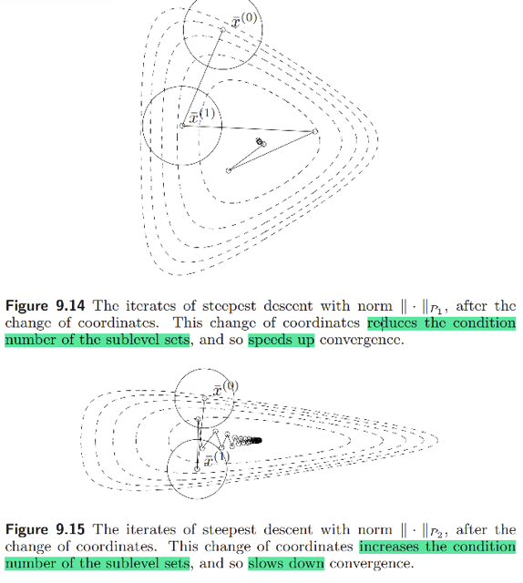</kbd></p>

<br>


<a id="node-jd58oxd"></a>
## Lec 10b

<br>

<p align="center"><kbd></kbd></p>

<p align="center"><kbd></kbd></p>

> [!NOTE]
> Đại khái là hồi nãy vừa nói rv X có distribution thể hiện bởi
> vector p với pj `=` P(X `=` xj). Thì giờ hình dung ta có 10 (m `=` 10)
> cái vector p khác nhau, và tùy vào một parameters `θ` có giá trị nào
> (trong 10 possible value của nó) mà X sẽ có distribution bởi
> vector p nào trong 10 vector p
>
> Và 10 vector p này làm thành matrix P. 
>
> Cột j của P là distribution của X khi `θ` `=` j
>
> Và hàng k của P là xác suất X `=` k | với các `θ` khác nhau: 
>
> ```text
> [P(X = k, θ = 1), P(X = k, θ = 2), ...P(X = k, θ = m)]
> ```
>
> Vậy thì 10 giá trị possible values của `θ` sẽ làm nên 10 GIẢ
> THIẾT (HYPOTHESIS). Và việc của ta là estimate `θ,` từ đó có
> distribution của X, đây chính là HYPOTHESIS TESTING
>
> Thế thì tiếp theo mới nói thường là trong 10 giả thiết sẽ có một
> cái là bình thường (normal) và mấy cái kia là bất thường
> (abnormal). 
>
> Thành ra lúc này việc của ta trở thành xác định xem cái nào là 
> bình thường, do đó mới gọi là DETECTION
>
> Cuối cùng, là nói về việc có khi thứ tự các hypothesis là quan
> trọng `/` có ý nghĩa. Ví dụ như khi đó estimated `θ^` lớn hơn hoặc
> bé hơn (true) `θ` sẽ mang ý nghĩa nào đó cần quan tâm. Nhưng
> cũng có khi không quan trọng, chỉ care `θ^` bằng hay khác `θ` mà
> thôi (tức đoán trúng hay trật mà thôi)
>
> Rồi thì `θ` mở rộng ra có thể là (random variable) vector chứ ko
> phải chỉ là scalar.

<br>

<p align="center"><kbd></kbd></p>

<p align="center"><kbd></kbd></p>

> [!NOTE]
> đại khái là, gọi hàm ψ "xai" là một detector, tức là nó sẽ nhận
> vào một trong những possible value của X để trả ra ước đoán
> của mình về giá trị nào đó của `θ,` cũng là tương ứng hypothesis.
>
> Dĩ nhiên đó là một detector nhưng nó có tốt hay không thì là
> chuyện phải xác định
>
> Nhưng hiểu vậy rồi khi X có observed value là k thì `θ^` `=` ψ(k).
>
> Thế thì gs nói LẼ DĨ NHIÊN rằng ta sẽ muốn một detector tốt,
> và cách tiếp cận tự nhiên nhất chính là xây dựng cái detector
> sao cho với giá trị quan sát được của X, thì nó chọn ra `/` trả ra
> hypothesis nào mà  trong đó xác xuất X mang giá trị k đó là  cao
> nhất (nhớ rằng mỗi hypothesis sẽ ứng với một vector p:
> distribution của X.
>
> Khi đó, detector này được gọi là MAXIMUM LIKELIHOOD
> DETECTOR
>
> `====`
>
> Còn một loại nữa. Với DETERMINISTIC DETECTOR, như đã
> nói, với observed value của X, giả sử X `=` k, thì deterministic
> detector sẽ output giá trị cụ thể nào đó của `θ^.`
>
> Thế thì với RANDOM DETECTOR ta hình dung một matrix có n
> cột ứng với n possible values của X. Để ví dụ khi X `=` k, ta sẽ
> lấy cột k ra. Trong cột đó, sẽ là một one-hot vector có m
> phần tử (ứng với m possible value của `θ),` và số 1 ở đâu thì cho
> biết giá trị deterministic của `θ^.`
>
> Thế thì, bây giờ, thay one-hot vector ở mỗi cột bởi một
> distribution mà vị trí thứ j sẽ là xác suất mà `θ` mang giá trị j.
>
> Nên matrix này sẽ có phần tử `t_ik` (hàng i côt k): Khi X `=` k,
> ```text
> xác suất θ mang giá trị i. P(θ^ = i | X = k)
> ```
>
> Thật ra trong case deterministic detector thì mỗi côt là một
> one-hot vector cũng thể hiện một distribution, với xác suất tập trung
> hoàn toàn vào giá trị của `θ^` ứng với giá trị bằng 1 trong cột)

<br>

<p align="center"><kbd></kbd></p>

> [!NOTE]
> Xét matrix D `=` TP:
>
> P là matrix (n, m): Mỗi cột là distribution của X tương ứng
> với một trong m hypothesis:
>
> ```text
> Pkj cho biết khi θ = j thì xác suất P(X = k | θ = j)
> ```
>
> T là matrix (m, n): Mỗi cột là distribution của `θ^` ứng với observed
> value của X (có n possible value của X, nên có n cột) 
>
> ```text
> Tik = P(θ^ = i | X = k)
> ```
>
> Nên D `=` TP là matrix (m, n)(n, m) `=` (m, m) mà component ij:
>
> Là dot product của hàng i'th của T và cột j'th của P:
>
> ```text
> Hàng i'th của T: [P(θ^ = i | X = 1), P(θ^ = i | X = 2), ...P(θ^ = i | X = n)]
> ```
>
> ```text
> Cột j'th của P: [P(X = 1 | θ = j), P(X = 2| θ = j), ...P(X = n| θ = j)]
> ```
>
> T[i, :]P[:, j] 
>
> ```text
> = Σk=1:m P(θ^ = i | X = k) P(X = k| θ = j)
> ```
>
> ```text
> = P(θ^ = i | θ = j). Chứng minh cái này sau
> ```
>
> Nên matrix D sẽ có component mang ý nghĩa là: Nếu trên đường
> ```text
> chéo thì nó là xác suất "đoán đúng" P(θ^ = j | θ = j) tức là nếu θ
> ```
> `=` i thì xác suất đoán đúng `θ^` `=` i là bao nhiêu.
>
> Nên đường chéo, nếu lấy ra làm thành vector thì ta gọi nó là 
> DETECTION PROBABILITY P^d
>
> ```text
> Còn ngoài đường chéo là xác suất đoán "trật" P(θ^ = j | θ = i) i!=j
> ```
>
> Và P^e `=` `Σ` `i!=j` Dij (tức là, tổng matrix D theo hàng, trừ đi phần tử
> trên đường chéo)
>
> Nói rõ hơn chút: Ví dụ cột j của D sẽ là: 
>
> ```text
> [P(θ^ = 1 | θ = j), P(θ^ = 2 | θ = j),..., P(θ^ = j | θ = j), ...P(θ^ = m | θ = j)]
> ```
>
> ```text
> mà tổng của chúng bằng 1. Nên xác suất P(θ^ != j | θ = j) = ...
> ```
>
> ```text
> P(θ^ = 1 | θ = j) + P(θ^ = 2 | θ = j) +...+ P(θ^ = m | θ = j)
> ```
>
> Và kết quả cộng các hàng (trừ đường chéo) thì ta có vector P^e:
>
> ```text
> [P(θ^ != 1 | θ = 1), P(θ^ != 2 | θ = 2),...P(θ^ != m | θ = m)]
> ```

<br>

<p align="center"><kbd></kbd></p>

<p align="center"><kbd></kbd></p>

> [!NOTE]
> Rồi, đại khái là nãy giờ học về detector. Thì bài toán đặt ra là
> OPTIMAL DETECTOR DESIGN, tức là ta sẽ tìm cách tối ưu hoá
> detector - tìm ra cái detector tốt nhất.
>
> Thì mở đầu gs cho biết nhiều objective của bài toán detector
> design có thể được thể hiện dưới dạng là linear `/` affine hoặc
> convex function của matrix D.
>
> Cũng như các constraint cũng vậy, có thể được thể hiện ở dạng
> linear equalities. Thành ra nhiều bài toán detector design sẽ trở
> thành bài toán convex optimization problem và cụ thể hơn là bài
> toán LP (Linear Programming, nơi objective là linear, constraint đều
> là affine function)
>
> `====`
>
> Đầu tiên, đại khái là với cái này ta có thể kiểu như đặt ra yêu cầu
> với detector là phải sao đó probability of correct phải đạt ít nhất
> mức nào đó, nói cách khác, ta muốn đặt ra lower bound đối với 
> xác suất đoán đúng.
>
> P^dj `=` Djj `>=` Lj thì đây sẽ là linear inequality constraint đối với D
>
> Hoặc ta cũng có thể muốn đặt ra yêu cầu "xác suất đoán sai" phải
> nhỏ hơn bao nhiêu đó, đồng nghĩa ta có upper bound của P^e: Ví
> dụ ta muốn xác suất đoán sai ở trường hợp nếu `θ` đúng là j phải
> nhỏ hơn Uj:
>
> Dij `<=` Uij
>
> Thế thì đó là thể hiện ý "muốn đặt giới hạn (trên hoặc dưới) cho
> xác suất đoán trật `/` trúng".
>
> Ngoài ra ta cũng có thể dùng các mục tiêu này làm objective của bài
> toán optimization, ví dụ như ta muốn maximize xác suất đúng và
> minimize xác suất sai

<br>

<p align="center"><kbd></kbd></p>

> [!NOTE]
> Vừa rồi là ta nói về việc đặt ra lower `/` upper bound cho xác suất
> đoán sai `/` đúng. Hoặc đặt ra objective là maximize xác suất đoán
> đúng, minimize xác suất đoán sai.
>
> Thì ở đây còn một kiểu nữa là, minimize các giá trị lớn nhất của
> xác suất đoán sai.
>
> Như nãy nói về vector P^e, mà phần tử thứ j là xác suất đoán
> ```text
> sai khi θ thật sự có giá trị là j: P(θ^ != j | θ = j).
> ```
>
> Thế thì bài toán này, đại khái là ta muốn xem trong vector P^e cái
> nào lớn nhất, và ta muốn giảm thiểu cái đó:
>
> minimize max j P^ej với constraint tk ≽ 0, 1Ttk `=` 1
>
> Nói rõ hơn cái thứ mà mình sẽ tìm là matrix D, tức là OBJECTIVE
> VARIABLE LÀ MATRIX D. Mà D là function của T nên
> OBJECTIVE VARIABLE CŨNG CÓ THỂ COI LÀ T.
>
> Mà T mà matrix mà cột k, là distribution của `θ^` ứng với X `=` k, nên
> mọi phần tử của cột k, tức tk phải ko âm (xác suất mang giá trị
> ko âm - axiom 1) và tổng bằng 1 (axiom 2). Chính là thể hiện bởi
> constraint tk ≽ 0, 1Ttk `=` 1 với mọi k
>
> Và gs cho rằng ta có thể "biến đổi" để trở thành bài toán LP

<br>

<p align="center"><kbd></kbd></p>

> [!NOTE]
> đại khái là, nãy giờ chỉ nói `θ` là PARAMETERS có thể có m possible
> values, tức là m hypothesis, để rồi ứng với m distribution cho X, thể 
> hiện bởi matrix P có m cột, và ứng với phần tử thứ k của cột thứ j sẽ 
> là xác suất X `=` k trong hypothesis j:
>
> P(X `=` k | `θ` `=` j)
>
> Nhưng nãy giờ không nói `θ` có một distribution, mà chỉ là PARAMETERS
>
> Nên ta hiểu cái này P(X `=` k | `θ` `=` j), ko phải là conditional probability,
> chỉ là cách thể hiện của P(X `=` k) trong trường hợp `θ` `=` j.
>
> Còn bây giờ, ta nói q là vector thể hiện distribution của `θ` (ví dụ như
> trong trường hợp nào đó mà ta có prior information về probability
> distribution của `θ),` tức là q là vector:
>
> ```text
> q = [P(θ = 1), P(θ = 2),....P(θ = m)]
> ```
>
> Vậy thì lúc này Pij là conditional probability của X given `θ,` là sao?
>
> ```text
> Có nghĩa là Pij = P(X = i | θ = j) khi đó nó mang ý nghĩa của
> ```
> conditional probability.
>
> Thế thì pTP^e sẽ là gì? Đầu tiên nhắc lại P^e là vector:
>
> ```text
> [P(θ^ != 1 | θ = 1), P(θ^ != 2 | θ = 2), ..., P(θ^ != m | θ = m)]
> ```
>
> ```text
> nên pTP^e = Σk=1:m P(θ = k)P(θ^ != k | θ = k) = Σk=1:m P(θ^ != k, θ = k)
> ```
>
> ```text
> Mà P(θ^ != k, θ = k) chính là P(error_k) với error_k là khi đoán trật (θ^ != θ)
> ```
> trong case mà `θ` `=` k)
>
> ```text
> Nên  Σk=1:m P(θ^ != k, θ = k) chính là xác suất error nói chung
> ```
>
> Thành ra bằng cách giải bài toán minimize pTP^e constraint tk ≽ 0,
> 1Ttk `=` 1 thì ta đang tìm detector sao cho minimize xác suất đoán sai
> nói chung
>
> Và dễ thấy objective là affine function của T: Vì sao?
>
> Nên solution của bài toán Bayes detector design chính là optimal của
> một bài toán LP
>
> Trường hợp đặc biết khi q `=` `(1/m)1` chính là nói prior distribution
> của `θ` là uniform

<br>

<p align="center"><kbd></kbd></p>

<p align="center"><kbd></kbd></p>

> [!NOTE]
> Cái này đại khái là nói là giả sử thứ tự của các possible values của `θ`
> là có nghĩa. Khi đó, ta có thể muốn quan tâm đến xác suất mà estimated
> ```text
> θ^ lớn hơn θ given θ = i: P(θ^ > θ | θ = i) có thể được thể hiện theo D:
> ```
>
> `Σ` j > i Dji, là sao? đó là vì cột i là cột ứng với distribution của `θ^` given `θ`
> ```text
> = i: [P(θ^ = 1, θ = i),.. P(θ^ = m, θ = i)]
> ```
>
> ```text
> Nên P(θ^ > θ | θ = i) = P(θ^ = k, θ = i) với k = i+1:m. Và chính là Σ j > i Dji
> ```
>
> ```text
> Cũng như là ta cũng có thể có xác suất mà |θ^ - θ| > 1 | θ = i.
> ```
>
> Nói chung là từ đó có thể thiết lập các constraint đối với Bias, MSE, ...
> dưới dạng linear function của D

<br>

<p align="center"><kbd></kbd></p>

<p align="center"><kbd></kbd></p>

<p align="center"><kbd></kbd></p>

> [!NOTE]
> Đại khái là cái bài toán optimal detector design, trong đó ta có matrix D `=` TP
> ```text
> mà phần tử i, j là P(θ^=i | θ=j) để rồi lấy đường chéo ra ta có vector P^d chứa
> ```
> các xác suất đoán đúng (với các `θ` khác nhau). 
>
> ```text
> Còn những chỗ ngoài đường chéo P(θ^=i | θ=j) với i!=j thì đều là xác suất
> ```
> ```text
> đoán  sai ở các "loại" khác nhau (ví dụ như θ = 1 mà "đoán là" θ^ = 2, rồi
> ```
> ```text
> θ = 2 mà đoán là θ ^ = 5).
> ```
>
> Vậy thì, có thể hiểu việc tìm ra `/` design ra detector tối ưu chính là tìm ra matrix
> D sao cho các phần tử ngoài đường chéo đều nhỏ. 
>
> Do đó nó sẽ giống như ta muốn minimize cùng lúc nhiều objective: 
>
> Dij (với i khác j), và vì matrix D có shape (m, m) có m^2 phần tử, nên trừ m 
> diagonal entries sẽ còn m^2 - m `=` m(m-1) off-diagonal entries.
>
> Thế thì ôn lại bài toán VECTOR OPTIMIZATION, khi ta có objective là một
> vector `/` matrix function. Khi đó để so sánh các f0 với nhau sẽ dùng cái gọi là
> generalized inequality wrt cone K. Và khi cone K là R^n+, thì ta gọi là
> MULTI-CRITERION OPTIMIZATION problem.
>
> Qyay lại đây, Dij là scalar, thì nếu ta bỏ hết m(m-1) vào thành một vector 
> thì ta sẽ có thể chuyển bài toán trên thành multi-criterion problem với cone 
> K là R^m(m-1)+.
>
> Rồi với bài toán multi-criterion hay nói chung là vectorization. Thì sẽ có hai
> thứ: Optimal và Pareto optimal.
>
> Optimal của bài toán này, theo định nghĩa dĩ nhiên là x* sao cho f0(x*) ⪯ mọi
> f0(x) với x feasible Thế thì, ta có thể xét tập O: là giá trị của f0(x) với mọi x
> feasible có tên gọi là ATTAINABLE OBJECTIVE VALUES
>
> Khi đó, cái định nghĩa của ở trên, sẽ ứng với việc ta tìm MINIMUM của set O 
> mà định nghĩa của nó chính là:
>
> Nếu f0* là minimum của O thì: Nếu f0 ∈ O `=>` f0* ⪯ f0
>
> (hay, nếu x là minimum của S wrt K: y ∈ S `=>` x ⪯K y, hoặc định nghĩa theo 
> set notation: S ⊆ (x + K))
>
> Còn Pareto optimal, sẽ ứng với MINIMAL của set O. Với định nghĩa là:
>
> Nếu f0* là Pareto optimal thì nếu f0 ∈ S mà f0 ≽ f0* thì suy ra f0 `=` f0*
>
> (hay, y ∈ S, y ≽ x `=>` y `=` x hay, (x - K) ∩ S `=` x
>
> Thế thì để tìm minimum, minimal. Ta dùng phương pháp SCALARIZATION:
>
> Chọn λ thuộc dual cone của K: K*. Và giải bài toán: minimize λTf0(x) với
> constraint λ ≽K* 0  (thể hiện ý λ thuộc dual cone của K)
>
> Khi đó solution của bài toán sẽ là minimal. Và nếu với mọi λ ∈ K* đều ra  cùng
> một điểm, thì đó là minimum.
>
> Vậy ở đây, ta có thể tìm Pareto optimal của bài toán multi-criterion:
>
> Chọn λ ∈ dual cone của R^n+, mà cũng chính là R^n+ vì đây là self dual cone
>
> Và giải bài toán scalar optimization minimize λf0(x) sẽ cho ta optimal của cái
> này chính là Pareto optimal của bài toán multi-criterion
>
> Vậy thì quay lại đây, ta sẽ có bài toán multi-criterion với cone K là R^m(m-1)+
>
> Thế thì như đã nói, ta sẽ scalarization để giải tìm Pareto optimal bài  toán này:
>
> Chọn matrix W (đóng vai trò λ, chẳng qua λ là để ta dot product với vector f0, thì
> với matrix A ta sẽ tính trace tr(WA) nhưng tụu chung lại đều là weighted sum các
> component trong vector f0 `/` matrix f0 `=` A) sao cho đường chéo `=` 0 còn ngoài
> đường chéo thì dương. 
>
> (Đường chéo `=` 0 để nó không tính đường chéo của D, vì ta chỉ đang "tính" các 
> phần tử ngoài đường chéo của D)
>
> Và bài toán scalarization sẽ là: minimize tr(WTD) subject to tk ≽ 0, 1Ttk `=` 1 với
> mọi k
>
> Và tr(WTD) `=` tr(WTTP) (D `=` TP, chú ý ghi WT tức là W transposed)
>
> `=` tr(PWTT) (trace có tính chất cho phép đổi chỗ)
>
> `=` `Σ` ckTtk với ck là cột thứ k của WPT (nói chung khúc này triển khai ra là hiểu)
>
> ```text
> và tk là cột thứ k của T, là vector (P(θ^ = 1 | X = k), P(θ^ = 2 | X = k), ...P(θ^ = m | X = k))
> ```
>
> Tiếp theo người ta nói constraint separable là vì ta có constraint là tk ≽ 0, 1Ttk
> `=` 1 với k `=` 1, 2 ...n thì ý là kiểu như ta có n constraint riêng lẻ cho n tk.
>
> Thành ra ta có thể từ bài toán minimize c1Tt1 + ...cnTtn constraint t1 ≽ 0,
> 1Tt1 `=` 1;  t2 ≽ 0, 1Tt2 `=` 1; ....tn ≽ 0, 1Ttn `=` 1.
>
> tách nó ra thành n bài toán riêng biệt: minimize ckTtk constraint tk ≽ 0, 1Ttk `=` 1.
>
> Và xét bài toán này minimize cTt constraint t ≽ 0, 1Tt `=` 1 thì đây là bài toán LP
> đơn giản, có thể có analytic solution:
>
> `=====`
>
> Trước khi giải tiếp thì, xét bài toán LP này:
>
> minimize cTx subject to 1Tx `=` 1, x ≽ 0:
>
> Đại khái là, feasible set x: 1Tx `=` 1, x ≽ 0 chính là một Probability Simplex, 
> cũng là một Polyhedron được tạo bởi các đỉnh là các unit vector e1, e2, ...en 
> (Cái này đơn giản là bởi định nghĩa của Probability Simplexes (xem phần Polyhedra)
>
> Và đại khái là khi làm cái việc minimize f0(x) over x trong polyhedron P thì giá trị
> nhỏ nhất sẽ ĐẠT TẠI ĐỈNH CỦA Polyhedron `/` Simplexes. Và các đỉnh (tức các điểm là
> đỉnh của Probability Simplexes) đơn giản là các unit vector ej
>
> Vậy nên việc đầu tiên đơn giản là xem f0(ej) nào là nhỏ nhất, đó chính là p*. và ej
> đó chính là x*
>
> f0(ej) `=` cTej, mà cái này chính là cj, vì sao?
>
> Vì cTej `=` `Σ` ci `ej_i`
>
> mà với unit vector ej thì các component đều bằng 0 ngoại trừ component j `=` 1. Do đó
> cTej `=` cj
>
> Vậy xem j nào f0(ej) nhỏ nhất chính là xem j nào mà cj nhỏ nhất, cũng chính là
> tìm component index của component nào nhỏ nhất của vector c.
>
> ```text
> q = argmin j cj (tức là q sao cho cq = min j cj) và từ đó x* = e_q
> ```
>
> `====`
>
> Do đó quay lại đây, q `=` argmin j ckj (đang xét vector ck) và tk* `=` `e_q,` tức là vector
> tk khiến ckTtk nhỏ nhất là `e_q` với q thứ tự của component nhỏ nhất của ck 
> (argmin j ckj)
>
> Mà tk là vector distribution của `θ^` khi observed value của X là k:
>
> ```text
> <P(θ^ = 1 | X = k), P(θ^ = 2 | X = k), ...P(θ^ = 2 | X = k)>
> ```
>
> ```text
> Nên khi tk = e_q thì tức là ta muốn chọn θ^ = q vì khi đó P(θ^ = q | X = k) = 1 và
> ```
> ```text
> P(θ^ != q | X = k) = 0
> ```
>
> Vậy `θ^` `=` q `=` argmin j ckj 
>
> Và như đã nói ck là cột k của matrix WPT: ghi là (WPT)k
>
> `=` argmin j `(WPT)k_j`
>
> đây là cách viết coi chủ thể là (WPT)k là vector, nhưng có thể viết theo kiểu đang 
> coi chủ thể là matrix WPT 
>
> `=` argmin j (WPT)jk
>
> Vậy `θ^` `=` argmin j (WPT)jk
>
> Như vậy mỗi một matrix W với đường chéo 0, còn lại dương sẽ cho ta một DETERMINISTIC
> DETECTOR 
>
> (đại khái là `θ^` `=` argmin j (WPT)jk là một cái thuộc dạng deterministic detector vì input observed 
> ```text
> value của X (X = k) thì nó output cho ta estimated value của θ: θ^ = argmin j (WPT)jk
> ```
>
> Và với các W khác nhau, ta sẽ có các deterministic detector khác nhau ứng với một Pareto
> optimal. Chính xác hơn đại khái họ nói đường trade-off surface có tính chất là một piece-wise
> linear, mà mỗi đỉnh chính là tương ứng với một deterministic detector nói trên

<br>

<p align="center"><kbd></kbd></p>

<p align="center"><kbd></kbd></p>

> [!NOTE]
> Rồi, đại khái là
>
> P^e là vector kết quả của việc cộng hàng theo hàng của matrix D, nhưng trừ
> những thằng trên đường chéo:
>
> P^e `=` `Σi` `!=` j Dij,
>
> nên dĩ nhiên mỗi phần tử của nó là tổng mỗi cột (trừ thằng trên  đường chéo):
>
> ```text
> P^e = [ Σi!=1 Di1, Σi!=2 Di2, ....Σi!=m Dim ] (matrix D shape (m, m))
> ```
>
> Nên q dot product với P^e sẽ là: qTP^e `=` ...
>
> ```text
> q1 * Σi!=1 Di1 + q2 * Σi!=2 Di2 + ...qm * Σi!=m Dim   (i đều từ 1:m)
> ```
>
> ```text
> = Σj qj * Σi!=j Dij (i, j đều từ 1:m)
> ```
>
> Rồi, thế thì người ta đặt matrix W trong đó mỗi cột là giá trị q tương ứng: cột 1
> đều là q1, cột 2 đều là q2, ...Sau đó set lại đường chéo bằng 0.
>
> Khi đó ta có matrix W đáp ứng yêu cầu các component trên đường chéo bằng 0
> và khác đường chéo thì đều không âm (vì q `=` [q1, q2, ...qm] là prior distribution
> của `θ,` nên các giá trị đều không âm) (chỗ này ko nói rõ là các Wij có phải dương
> hay không, nhưng mình nhớ nến như λ thì chỉ yêu cầu ≽ 0 chứ không cần ≻ 0. Có
> thể tìm hiểu sau)
>
> Khi đó kết quả qTP^e mà dạng triển khai là
>
> ```text
> q1 * Σi!=1 Di1 + q2 * Σi!=2 Di2 + ...qm * Σi!=m Dim
> ```
>
> ```text
> = Σi!=1 q1 * Di1 + Σi!=2 q2 * Di2 + ... Σi!=m qm * Dim
> ```
>
> Cũng có thể thay bằng W:
>
> ```text
> = Σi!=1 Wi1 * Di1 + Σi!=2 Wi2 * Di2 + ... Σi!=m Wim * Dim
> ```
>
> Nhưng vì Wii `=` 0 hết rồi nên khỏi cần ghi `i!=1,` `i!=2` ...nữa
>
> ```text
> = Σ Wi1 * Di1 + Σ Wi2 * Di2 + ... Σ Wim * Dim
> ```
>
> viết gọn lại là `Σi,j` Wij * Dij
>
> Khi đó, đại ý nói là, cái deterministic detector mà ta có lúc nãy:
>
> `θ^` `=` argmin j (WPT)jk
>
> thì nay đại khái là W không còn là matrix chọn tùy tiện (tất nhiên phải thỏa  điều
> kiện đã nói đường chéo `=` 0, còn lại dương), Mà nay, nó mang thông tin của prior
> distribution của `θ` vì như đã nói chọn cột 1 `=` q1, cột 2 `=` q2 ... Do đó người ta gọi
> nó là Bayes optimal detector.
>
> Thế rồi xét (WPT)jk , tức hàng j cột k của matrix, ta thấy nó là `Σi!=j` qipki Vì sao?
>
> Ở đây hãy nhìn phần tử jk là kết quả của [hàng j của W] dot [cột k của PT] Mà
> [hàng j của W] sẽ là [q1, q2 ,...qm] (mà thật ra hàng nào cũng bằng vậy)
>
> ```text
> và nó cũng chính là [P(θ = 1), P(θ = 2), ....P(θ = m)] (vì đã nói q là prior
> ```
> distribution của `θ` mà)
>
> Còn [cột k của PT] đương nhiên là [hàng k của P], là:
>
> [pk1, pk2, ...pkm] và ta nhớ nó là
>
> ```text
> [P(X = k | θ = 1), P(X = k | θ = 2), ...P(X = k | θ = m)]
> ```
>
> Nên hai cái đó dot nhau ra: q1 pk1 + q2 pk2 + ...qm pkm `=` `Σi!=j` qi pki
>
> ```text
> và ý nghĩa chính là: Σi!=j P(X = k | θ = i)*P(θ = i)
> ```
>
> Và có thể kiểu như tính luôn rồi trừ ra: `=` `Σi` qi pki - qjpkj
>
> Vậy (WPT)jk `=` `Σi` qi pki - qj*pkj và detector trở thành:
>
> `θ^` `=` argmin j `[Σi` qi pki - qj*pkj]
>
> `=` argmin j qj*pkj vì `Σi` qi pki không phụ thuộc j
>
> ```text
> = argmin j P(X = k | θ = j)*P(θ = j)
> ```
>
> ```text
> = argmin j P(X = k , θ = j)  | dùng conditional probability P(A|B)P(B) = P(A, B)
> ```
>
> Và cái này chính là maximum a posterior probability detector
>
> `====`
>
> Rồi khi q là uniform qi `=` `1/m` với mọi i thì cái detector trở thành:
>
> ```text
> θ^ = argmin j qj*pkj vì qj = 1/m rồi không phụ thuộc j nữa
> ```
>
> ```text
> = argmin j pkj "dịch ra là" argmin j P(X = k | θ = j) thì đây là Maximum Likelihood
> ```
> Detector
>
> (là cái đã nói lúc trước, đó là cho matrix P như vậy, trong đó mỗi cột là ứng với
> một distribution của X (một hypothesis). Thì quan sát thấy X `=` k, thì ta sẽ xem
> trong các distribution, cái nào có P(X `=` k) cao nhất. Cũng chính là xem trong hàng
> k của P, cột nào có giá trị cao nhất, thì kết luận `θ` đó. Vậy thì đây chính là
> maximum likelihood detector
>
> Bởi maximum likelihood là sao. Là xuất phát từ hàm xác suất, cho biết với `θ`
> (param) như vậy thì giúp tính xác suất X mang giá trị k.
>
> Thì khi ngược lại coi nó làm hàm theo `θ,` và giá trị X là fixed, thì nó là hàm
> likelihood. Vậy ta tìm `θ` nào khiến likelihood cao nhất, gọi là maximum likelihood

<br>

<p align="center"><kbd></kbd></p>

> [!NOTE]
> Qua mục Binary Hypothesis Testing. 
>
> Đại khái là đây là bài toán detection (tạm hiểu là phát hiện xem
> một random variable (có các possible value `=` {1, 2....n}
>
> Có hai giả thiết đặt ra: X được generated từ distribution p
> và X đươc generated từ distribution q
>
> Thế thì ta sẽ dùng một cái gọi là RANDOMIZED DETECTOR.

<br>

<p align="center"><kbd></kbd></p>

> [!NOTE]
> ví dụ của một randomized detector. Nếu giá trị quan sát được của
> X là 1 ta chọn hypothesis 1 (X được generate từ probability
> distribution p) với xác xuất `=` t11 `=` 0.8, và có 0.2 xác suất X được
> generated từ q
>
> Nếu matrix này chỉ toàn là 0, 1 thì ta gọi nó là deterministic
> detector

<br>

<p align="center"><kbd></kbd></p>

> [!NOTE]
> Chưa hiểu lắm

<br>

<p align="center"><kbd></kbd></p>

<br>

<p align="center"><kbd></kbd></p>

<p align="center"><kbd></kbd></p>

> [!NOTE]
> Thế thì đại khái là khi m (số hypothesis) `=` 2, ta có cái gọi là BINARY
> HYPOTHESIS TESTING. Như đã biết, điều này đồng nghĩa X sẽ
> được generated từ hai distribution ứng với hai hypothesis (gọi là p, q)
>
> ```text
> Trong đó hypothesis θ = 1 sẽ gắn với normal situation, và cái kia θ =
> ```
> 2 gắn với abnormal. Ngoài ra khi `θ^` `=` 1 người ta gọi nó là negative
> testing, còn `θ^` `=` 2 được gọi là positive testing. (có nghĩa là kiểu như
> ta quan tâm đến việc trạng thái `/` event abnormal có xảy ra hay không)
>
> Thế thì nói về matrix D, nhớ lại, nó là matrix mà các entries đường
> chéo  là "xác suất đoán trúng" ở các case mà `θ` mang giá trị khác
> ```text
> nhau. Tức là ở đây D11, D22 lần lượt là P(θ^ = 2 | θ = 2) và P(θ^ = 1 |
> ```
> `θ` `=` 1)
>
> Còn off-diagonal entries, là xác suất "đoán trật":
>
> ```text
> D12 = P(θ^ = 2 | θ = 1)
> ```
>
> ```text
> D21 = P(θ^ = 1 | θ = 2)
> ```
>
> ```text
> Có thể thấy D21 = P(θ^ = 2 | θ = 1) là false positive (sự thật là
> ```
> ```text
> negative θ = 1 mà dự đoán positive θ^ = 2. Và ta đặt là Pfp. Thì vì là
> ```
> ```text
> bài toán có 2 case thôi nên D11 = P(θ^ = 1| θ = 1) = 1 - Pfp
> ```
>
> ```text
> Tương tự D12 = P(θ^ = 1 | θ = 2) chính là false negative. Ta đặt là Pfn
> ```
> ```text
> và D22 = P(θ^ = 2 | θ = 2) = 1 - Pfn.
> ```
>
> Và như đã nói, bài toán OPTIMAL DESIGN chính là minimize các vị
> trí ngoài đường chéo, do đó objective ở đây là minimize Pfp và Pfn
>
> Để rồi trong như đã biết khi giải bài toán này như một bài toán
> MULTI-CRITERION thì ta có các Pareto optimal và trade-off curve
>
> Thì điều hay ho là đường trade-off curve này là thứ mà mình đã gặp
> ở các lớp về machine learning: Đó chính là ROC curve
>
> Và dùng công thức của optimal detector (của bài toán khái quát) ta có
> khi observed value của X `=` k thì:
>
> `θ^` `=` argmin j (WPT)jk (1)
>
> Thế thì P là matrix mà mỗi cột là distribution của X ứng với một hypothesis
> `=>` Đây có 2 cột chính là vector p và q nói trên, là R^n vector (X có n possible
> values), matrix P có shape (n, 2)
>
> `=>` PT có shape (2, n) hàng 1 là p hàng 2 là q.
>
> W thì như đã biết là matrix (m, m) tức (2, 2) có đường chéo `=` 0, W12, W21 
> dương.
>
> Nên WPT có shape (2, 2) x (2, n) `=` (2, n) và cột k của (WPT) chính là 
> linear combination của W's cols với hệ số là cột k của PT
>
> W's cols là [0, W21]T và [W12, 0]T
>
> Cột k của PT: [pk, qk]
>
> `=>` linear combination: pk[0, W21]T + qk[W12, 0]T `=` [qkW12, pkW21]T
>
> Và `θ^` `=` argmin j (WPT)jk tức là argmin j [qkW12, pkW21]T
>
> mang ý nghĩa là tìm index của component nhỏ nhất của vector. Và dễ thấy
>
> điều này có nghĩa là  
>
> khi qkW12 < pkW21 thì `θ^` `=` 1, ngược lại
>
> khi qkW12 > pkW21 thì `θ^` `=` 2
>
> Đây chính là kết quả trong sách:
>
> `θ^` `=` 1 khi W21pk > W12qk
>
> `θ^` `=` 2 khi W21pk `<=` W12qk
>
> Nhưng sau đó thì dễ, với kết quả này thì có nghĩa là ta sẽ kết luận
> ```text
> negative testing khi pk/qk > W12/W21 và ngược lại khi pk/qk <= W12/W21
> ```
> thì ta kết luận positive testing.
>
> Và các giá trị `W12/W21` khác nhau (có được khi chọn matrix W khác nhau)
> chính là các threshold khác nhau để từ đó ta có các Pareto optimal detector
> khác nhau mà trong đó ta phải trade off giữa hai loại "lỗi" False Positive
> và False Negative
>
> Đây là cái được gọi là Neyman-Pearson lemma

<br>

<p align="center"><kbd></kbd></p>

<p align="center"><kbd></kbd></p>

<p align="center"><kbd></kbd></p>

> [!NOTE]
> Một ví dụ.

<br>

<p align="center"><kbd></kbd></p>

> [!NOTE]
> đại khái là, nãy giờ ta nói về matrix P có m cột ứng với m hypothesis 
> mỗi cột (ví dụ j) là Rn vector distribution của X: 
>
> ```text
> P(X = 1 | θ = j), P(X = 2 | θ = j),...P(X = n | θ = j)
> ```
>
> Thế thì như đã biết D `=` PT, mà D là matrix (m, m) mà đường chéo 
> ```text
> Dii là xác suất đoán trúng P(θ^ = i | θ = i) và ngoài đường chéo là
> ```
> ```text
> Dij là xác suất đoán trật P(θ^ = i | θ = j). Tổng mỗi cột sẽ bằng 1
> ```
>
> Bây giờ, ta không cho rằng P cố định nữa. Mà P ∈ P là set các 
> possible distributions.
>
> Lúc này ta mới xem xét cái gọi là worst-case detection probability
>
> Nôm na là vầy: Vì P bây giờ tạm gọi là có nhiều possible values.
> Nên D cũng vậy, phụ thuộc P, nên cũng có nhiều possible D.
>
> Thế thì bây giờ ta mới tạo một cái matrix D sao cho, mỗi vị trí
> ta lấy cái tệ nhất. Ví dụ Dii, một entry trên đường chéo, như đã biết
> ```text
> sẽ là xác suất đoán trúng ở case mà θ = i, tức P(θ^ = i, θ = i)
> ```
> Vậy ta sẽ lấy cái Dii có giá trị nhỏ nhất trong mọi possible D
>
> Dwc ii `=` inf P ∈ P Dii
>
> Còn Dij (i khác j) là phần tử ngoài đường chéo, mang ý nghĩa là xác
> ```text
> xuất đoán trật P(θ^ = i | θ = j), Thì lấy tệ nhất chính là ta lấy cái có
> ```
> giá trị cao nhất trong mọi possible D.
>
> Dwc ij `=` sup P ∈ P Dij
>
> Do đó có thể hiểu D là một matrix LẮP RÁP từ các possible D (xuất
> phát từ nhiều possible P) mà trong đó mỗi phần tử là cái tệ nhất trong
> mọi possible D.
>
> Chính vì vậy mà nó không còn tuân theo quy luật là tổng cột bằng
> 1 nữa. `Σj` Dij `!=` 1
>
> Rồi còn chuyện nữa, nếu như thông thường tổng cột bằng 1, thì
> tổng mọi phần tử trong cột trừ cái trên đường chéo chính là xác suất
> ```text
> đoán trật "tổng hợp" trong case đó. P(θ^ != i | θ = i)
> ```
>
> Và dĩ nhiên nó cũng bằng 1 - Dii.
>
> Còn bây giờ ta cũng đặt `P_wce_i` `=` 1 - Dii là xác suất đoán trật tổng 
> ```text
> hợp khi θ = i P(θ^ != i | θ = i)  tệ nhất trong mọi possible D
> ```
>
> ```text
> Vì sao nó là xác suất đoán trật P(θ^ != i | θ = i) tệ nhất, đó là vì Dii là
> ```
> ```text
> xác suất đoán trúng P(θ^ = i | θ = i) tệ nhất trong mọi possible D
> ```
>
> Vậy ta thể hiện `P_wce` như thế nào để thể hiện nó là xác suất đoán
> trật tổng hợp tệ nhất trong mọi possible D:
>
> `P_wce_i` `=` 1 - inf P ∈ P Dii 
>
> và cái này `=` sup P ∈ P (1 - Dii) | vì lấy cái Dii nhỏ nhất cũng là lấy cái 1 - Dii
> lớn nhất.
>
> Và vector `P_wce` là vector mà mỗi phần tử `P_wce_i` tương ứng với
> ```text
> xác suất đoán trật tổng hợp tệ nhất ứng với case θ = i (P(θ^ != i | θ  = i)
> ```
> trong mọi possible D
>
> Tiếp theo, ta muốn lấy cái cao nhất trong đó, ý nghĩa là, `P_wce` là 
> list các xác suất đoán trật tổng hợp với các `θ` khác nhau. Thì cái nào
> có gía trị cao nhất (tức là cái case nào sai nhiều nhất)
>
> max i `P_wce_i` `=` max `i=1,2...m` sup P ∈ P (1 - Dii) 
>
> max i `P_wce_i` `=` max `i=1,2...m` sup P ∈ P (1 - (TP)ii) 
>
> nếu thể hiện bằng việc dựa trên `P_wce_i` `=` 1 - inf P ∈ P Dii
>
> 1 - min `i=1,2...m` inf P ∈ P (TP)ii 
>
> 1 - min `i=1,2...m` inf P ∈ P (TP)ii

<br>

<p align="center"><kbd></kbd></p>

> [!NOTE]
> đại khái là khi set possible P (P) chỉ có hữu hạn các possible P
> thì infimum (inf) trở thành minimum (min)
>
> Và bài toán trở thành LP

<br>

<p align="center"><kbd></kbd></p>

> [!NOTE]
> QUAY LẠI SAU
>
> QUAY LẠI SAU

<br>

<p align="center"><kbd></kbd></p>

<p align="center"><kbd></kbd></p>

> [!NOTE]
> QUAY LẠI SAU

<br>

<p align="center"><kbd></kbd></p>

<br>

<p align="center"><kbd></kbd></p>

> [!NOTE]
> Đại khái là phần này ta bàn về hai loại bound (giới hạn `/` chặn) 
> kinh điển của xác suất. Và cho thấy rằng bài toán khái quát
> có thể được chuyển thành một bài toán convex optimization
>
> Tuy rằng bài toán classicle bound gốc vẫn là bài toán simple
> convex problem với analytical solution.
>
> Nhưng việc chứng minh `/` triển khai bài toán khái quát cũng 
> có thể là convex problem giúp ta có thể có bound tốt hơn 
> hoặc tìm bound cho những tình huống phức tạp hơn

<br>

<p align="center"><kbd></kbd></p>

<p align="center"><kbd></kbd></p>

<p align="center"><kbd></kbd></p>

> [!NOTE]
> Đầu tiên nói về Chebyshev bounds. Ở đây cho biết nó là upper bound
> đối với xác suất của một set. dựa trên việc ta biết kì vọng của một
> function nào đó ví dụ như mean và variance.
>
> Mà một ví dụ đơn giản nhất của nó chính là Markov's inequality và
> Chebyshev's inequality. Hai cái này ta đã đều được biết ở Stat110
>
> Markov's inequality: 
>
> Chebyshev's inequality:
>
> Thì nói chung là việc ta khái quát các bất đẳng thức này `/` cũng là các
> simple bound này sẽ trở thành việc giải bài toán convex optimization.
>
> `====`
>
> Đại khái là ta có rv X on S ⊆ R^n (mình hiểu nó là sample space - set
> các possible values của X) Và ta quan tâm đến việc tìm bound của
> xác suất của event X ∈ C, dĩ nhiên C là subset của S. 
>
> Rồi, người ta mới gọi 1C(z) là indicator function biểu diễn việc z có
> thuộc set C ko. 
>
> Và nói về việc ta có prior knowledge về distribution cụ thể là ta biết
> mean (expected value) của một số function sao đó.
>
> Efi(X) `=` ai. i `=` 1,2,3..... (ko lạ gì, stat110 đã học, X là rv thì f(X) cũng
> là r.v và nó có quyền có kì vọng)
>
> Đặc biệt ở chỗ ta cho a0 `=` 1, tức Ef0(x) `=` 1.
>
> Khi đó xét hàm f(z) là linear combination của fi(z):
>
> f(z) `=` `Σ` xi.fi(z)  
>
> Ta sẽ có Ef(X) `=` aTx là sao?
>
> Ef(X) `=` E `[Σ` xi*fi(X)] , thì theo linearity ta sẽ có:
>
> `=` `Σ` E xi fi(X) 
>
> `=` `Σ` xi Efi(X) | linearity luôn
>
> `=` `Σ` xi ai | vì ở trên nói Efi(X) `=` ai
>
> `=` aTx. Vậy Ef(X) `=` aTx
>
> `====`
>
> Thế thì người ta mới giả sử ta có hàm f THỎA MÃN ĐIỀU KIỆN rằng
> nó luôn lớn hơn giá trị của indicator function 1C(.) thì TA CÓ THỂ
> THIẾT LẬP RA UPPER BOUND CỦA P(X ∈ C)
>
> (gọi là piece-wise greater than) tức là với mọi z thì f(z) đều `>=` 1C(z)
>
> Thì khi đó ta có Ef(X) `>=` E[1C(X)] `<=>` aTx `>=` P(X ∈ C)
>
> Nói rõ hơn chỗ này là sao.
>
> Đầu tiên, nếu X `>=` Y thì EX `>=` EY (hỏi lại)
>
> Và E[1C(X)] tại sao là P(X ∈ C)
>
> đây chính là fundamental bridge:
>
> E[1C(X)] `=` `Σx` 1C(x)P(X `=` x) | LOTUS
>
> ```text
> = Σ x ∈ C [1 * P(X = x)] + Σ x !∈ C [0 * P(X = x)]
> ```
>
> `=` `Σ` x ∈ C [1 * P(X `=` x)] 
>
> `=` `Σ` x ∈ C [P(X `=` x)] 
>
> Cái này chính là P(X ∈ C)  vì nó chính là P(Union (X `=` x) với x ∈ C)
>
> `=` `Σ` x ∈ C P(X `=` x) | Axiom 3: probability of a union of disjoint event
>
> Vậy ta hiểu tại sao P(X ∈ C) `<=` aTx. Đấy là upper bound của P(X ∈ C)
>
> 7.4 CHEBYSHEV BOUNDS & ...
>
> 7.4.1 CHEBYSHEV BOUNDS

<br>

<p align="center"><kbd></kbd></p>

<p align="center"><kbd></kbd></p>

> [!NOTE]
> Rồi. Khi đã có upper bound của P(X ∈ C) là aTx, thì ta muốn tối ưu nó,
> tức tìm cái giới hạn trên thấp nhất có thể. Và đó chính là bài toán 
> optimziation:
>
> minimize x0 + a1x1 + ...anxn
>
> với constraint là f(z) `=` `Σ` xifi(z) `>=` 1 với z ∈ C. Lí do là vì đã nói hồi nãy,
> sở dĩ có thể đi đến việc thiết lập upper bound của P(X ∈ C) là vì ta
> đang SUPPOSE f(z) `>=` 1C(z) với mọi z. Thì điều này đồng nghĩa là
> với z ∈ C thì f(z) luôn `>=` 1C(z) `=` 1. 
>
> Ngược lại z ∈ S nhưng không ∈ C thì f(z) `>=` 1C(z) `=` 0. Cái này dẫn đến 
> constraint thứ 2 là f(z) `=` `Σ` xifi(z) `>=` 0 với z !∈ C
>
> Và bài toán optimization này là bài toán convex. vì objective là affine
> còn constraint có thể thể hiện dưới dạng - infimum : cũng là convex 
> function (Xem lại chỗ này tính chất convex liên quan đến infimum)
>
> `====`
>
> Rồi một ví dụ cho một trường hợp đơn giản. Trong đó mình xét S là 
> mọi số thực không âm R+, C là tập [1, inf). Và như đã nói ta quan tâm
> đến xác suất X thuộc C, tức P(X `>=` 1). Và ta có prior knowledge là
> biết expected của vài function fi(.)
>
> ```text
> Cụ thể là với f1(X) = X, ta có / biết Ef1(X) < 1, tức là EX = μ < 1
> ```
>
> Còn f0(X) thì như đã nói cho bằng constant `=` 1.
>
> Như vậy ta có hàm f(z): f(z) `=` `Σ` fi(z)xi `=` x0*1 + x1*z
>
> Thế thì như đã nói, nếu ta đảm bảo điều kiện f(z) `>=` 1C(z) với mọi z ∈ S
> thì ta sẽ thiết lập được upper bound của P(X ∈ C) là: 
>
> P(X ∈ C) `<=` aTx 
>
> `<=>` P(X ∈ C) `<=` Ef0(X)x0 + Ef1(Z)x1 
>
> `<=>` P(X ∈ C) `<=` E(1)x0 + EX*x1 
>
> `<=>` P(X ∈ C) `<=` x0 + `μx1`
>
> Từ đó dẫn đến bài toán tối ưu giúp minimize upper bound này:
>
> minimize x0 + `μx1` 
>
> với constraint chính là để thỏa điều kiện f(z) `>=` 1C(z) với z ∈ S:
>
> điều kiện này thật ra sẽ trở thành 2 ý:
>
> z ∈ C thì f(z) `>=` 1 (1C(z) `=` 1) 
>
> z không ∈ C thì f(z) `>=` 0
>
> Vậy: x0 + x1*z `>=` 1 khi z ∈ C và x0 + x1*z `>=` 0 khi z ∈ S
>
> Xét x0 + x1z `>=` 0 khi z `>=` 0 (z ∈ S `=` R+):
>
> Giải thích: x0 + x1z `>=` 0 với mọi z `>=` 0 thì x0, x1 phải `>=` 0. 
>
> Chứng minh:
>
> 1) Giả sử x0 < 0 và x1 `>=` 0 thì tồn tại z `>=` 0 khiến x0 + x1z < 0, đó là:
>
> ```text
> x0 + x1z < 0 <=> x1z <= -x0 <=> z <= -x0/x1 ,Tức là chỉ cần z ∈ [0, -x0/x1)
> ```
> thì sẽ khiến x0 + x1z < 0.
>
> 2) Giả sử x0 `>=` 0, x1 < 0 thì: Với z `>=` 0 và x1 < 0 `=>` x1z < 0, 
>
> ```text
> Để x0 + x1z < 0 <=> x0 < -x1z <=> -x0/x1 < z. Vậy chỉ cần z > -x0/x1 thì
> ```
> x0 + x1z sẽ < 0
>
> Do đó chỉ khi x0 và x1 đều không âm thì x0 + x1z mới `>=` 0 với mọi z `>=` 0
>
> Nên constraint này trở thành x0 `>=` 0, x1 `>=` 0
>
> x0 + x1*z `>=` 1 với z ∈ C tức z `>=` 1 Trở thành x0 + x1 `>=` 1 VÌ SAO?
>
> Và giải bài toán này cho ra kết quả chính là Markov inequality:
>
> P(X `>=` 1) `<=` `μ`

<br>

<p align="center"><kbd></kbd></p>

<p align="center"><kbd></kbd></p>

> [!NOTE]
> Rồi, đại khái là một ví dụ cụ thể, giúp ta xác định và tối ưu upper bound dựa trên việc biết (có prior
> knowledge) ở dạng là expectation của một số function nào đó
>
> Thế thì random variable trong trường hợp này là random variable vector X (∈ R^n). Tức S `=` R^n. Tí
> nữa ta sẽ nói về C (để quan tâm upper bound của P(X ∈ C)). Nói về prior knowledge ở bài toán này.
> Như phần lí thuyết khái quát nói rằng, ta có kì vọng của function fi(X) nào đó. Ở đây đó là f1(X) `=` X
> (như ví dụ đơn giản vừa rồi) và f2(X) `=` XXT
>
> ```text
> Có nghĩa là ta có prior knowledge: EX = μ và E(XXT) = Σ.
> ```
>
> Tại sao nói coi như ta có expected value của m function zi và `m(m+1)/2` functions zizj?
>
> Vì X là vector rv `=` [X1, X2, ...Xm], nên việc biết EX thì cũng giống như ta biết expectation của m rvs
> X1, X2, ...Xm hoặc nói cách khác là biết expectation của m identity function f(zi) `=` zi (f(X1) `=` X1,
> f(X2) `=` X2...)
>
> Và biết EXXT cũng chính là biết các covariance Cov(Xi, Xj) (i khác j) và có tổng cộng `m(m-1)/2` cái
> ```text
> (chia 2 vì Cov(Xi, Xj) = Cov(Xj,Xi). Cộng với  m Var(Xi) nữa là m + m(m-1)/2 = [2m + m(m - 1)]/2 =
> ```
> ```text
> m(m - 1 + 2)/2 = m(m + 1)/2. Và cái này nói cách khác là ta biết expectation của  m(m + 1)/2
> ```
> function có dạng f(zi, zj) `=` zi*zj
>
> Rồi, họ mới nói ta có thể express f ở dạng quadratic function khái quát f(z) `=` zTPz + 2qTz + r. Tại
> sao lại như vậy?
>
> Trong phần lí thuyết nói ta xây dựng f(z) `=` `Σ` fi(z)xi, thì ở đây tại sao nó là f(z) `=` zTPz + 2qTz + r.
>
> Thì bản chất là linear combination các function fi.
>
> Thì với m function zi, linear combination là qTz
>
> Còn với `m(m+1)/2` function zizj thì đó chính là zTPz
>
> Còn r, chính là đóng vai của x0 (hệ số của f0(z) `=` 1)
>
> Thành ra f(z) `=` zTPz + 2qTz + r quả thật chính là linear combination của các fi
>
> Rồi, thế thì như lí thuyết Ef(X) `=` aTx sẽ là upper bound của 1C(X) là P(X ∈ C)
>
> Với f(.) là function nói trên f(z) `=` zTPz + 2qTz + r thì
>
> Ef(X) `=` E[XTPX + 2qTX + r] `=` E(XTPX) + E2qTX + Er  | linearity
>
> Tới đây dùng công thức XTPX `=` tr(PXXT) Cái này liên quan đến Trace operator Tham khảo thêm
> sau.
>
> `=` E tr(PXXT) + 2qT(EX) + r
>
> Rồi, E tr(PXXT), thì trace có tính tuyến tính nên có thể đưa E vào trong tr() `=` tr[E(PXXT)] `=`
> tr[PE(XXT)] `=` `tr(PΣ)`
>
> ```text
> = tr(PΣ) + 2qTa + r   |   XXT = Σ, EX = a
> ```
>
> `====`
>
> Rồi như vậy ta đã có Ef(X). Thế thì muốn có upper bound cho P(X ∈ C) thì  phải thỏa điều kiện là
> f(z) `>=` 1 khi z ∈ C và `>=` 0 khi z ∈ S.
>
> Hai cái này sẽ trở thành constraint của bài toán minimize upper bound
>
> f(z) `>=` 0 ∀ z ∈ S `<=>` zTPz + 2qTz + r `>=` 0 ∀ z ∈ S
>
> Mà vế trái chính là quadratic form của matrix: [P q; qT r] do đó để nó `>=` 0 ∀ z tương đương [P q; qT
> r] là positive semi definite ≽ 0.
>
> Và để điều đó xảy ra dĩ nhiên P cũng phải ≽ 0 vì P là một "sub-matrix" tên  chính xác là "leading
> principal minor" (mit 18.06 mình đã học một trong những  cách để test psd matrix là determinant
> của các submatrix phải `>=` 0 (còn > 0 thì sẽ là positive definite)
>
> `====`
>
> Giờ nói qua set C (vì ta đang làm là thiết lập upper bound của P(X ∈ C))
>
> Họ cho rằng giả sử ta có C là phần bù (complement) của một polyhedron mở C `=` Rm `\` P với P `=` {z
> : aiTz < bi, i `=` 1, 2,...k}
>
> kí hiệu này ko có gì khó hiểu, Polyhedron như đã biết, nó được định nghĩa là intersection của các
> haft-space và hyperplane. Trong {z : aiTz < bi, i `=` 1, 2,...k} thì mỗi aiTz `<=` bi chính là một haft-plane
> với normal vector là ai.
>
> Vậy thì Polyhedron này nằm trong Rm, thì phần bù của nó chính là Rm `\` P
>
> Và dĩ nhiên nếu z ∈ C thì tức là z không thuộc P, đồng nghĩa nó không nằm trong haft-plane aiTz <
> bi nào. Nói cách khác z ∈ C `=>` aiTz `>=` bi
>
> Vậy nên constraint "Nếu z ∈ C thì f(z) `>=` 1" TƯƠNG ĐƯƠNG VỚI
>
> ```text
> "Nếu aiTz >= bi thì f(z) = zTpz + 2qTz + r >= 1" với i = 1, 2, ...k
> ```
>
> Tới đây cần dùng một kiến thức phải bổ sung trong Phụ Lục B2
>
> QUAY LẠI SAU
>
> Nhưng đại khái là từ đó ta có được constraint của bài toán minimize upper bound của P(X ∈ C)
> (bound này đã nói ở trên là f(X) `=` `tr(PΣ)` + 1qTz + r)

<br>

<p align="center"><kbd></kbd></p>

<p align="center"><kbd></kbd></p>

<p align="center"><kbd></kbd></p>

> [!NOTE]
> QUAY LẠI SAU

<br>

<p align="center"><kbd></kbd></p>

> [!NOTE]
> QUAY LẠI SAU
>
> 7.4 CHEBYSHEV BOUNDS & ...
>
> 7.4.1 CHEBYSHEV BOUNDS

<br>

<p align="center"><kbd></kbd></p>

> [!NOTE]
> 7.4 CHEBYSHEV BOUNDS & ...
>
> 7.4.3 EXAMPLES
>
> QUAY LẠI SAU

<br>

<p align="center"><kbd></kbd></p>

<p align="center"><kbd></kbd></p>

> [!NOTE]
> 7.5 EXPERIMENT DESIGN
>
> Vài điểm chính trước:
>
> 1) Tại sao x^ ra vậy?
>
> aiTx `=` yi i `=` 1,2,...m
>
> `<=>` Ax `=` y | aiT là row i'th của A (ai cũng là column ith của AT)
>
> minimize x ||Ax - y||^2 `=` (Ax - y)T(Ax - y)
>
> aiT là rows của A.
>
> Least square solution:
>
> ```text
> AT(y - Ax^) = 0 <=> ATy = ATAx^ <=> x^ = (ATA)inv ATy
> ```
>
> ATA: theo góc nhìn thứ 4 (là tổng các rank 1 matrix):
>
> `Σi` [column i của AT] x [row i của A]
>
> `=` `Σi` ai aiT 
>
> `=>` (ATA)inv chính là `(Σi` ai aiT)inv
>
> Còn ATy dĩ nhiên là linear combination của AT's columns với coefficient
> là y's component:
>
>  ATy `=` `Σ` yi ai
>
> ```text
> Vậy x^ = (ATA)inv ATy = (Σi ai aiT)inv Σ yi ai như sách ghi:
> ```
>
> 2) Tại sao E như vậy?
>
> e `=` x^ - x `=` (ATA)inv ATy - x `=` (ATA)inv AT(Ax + w) - x 
>
> `=` (ATA)inv (ATAx + ATw) - x `=` (ATA)invATAx + (ATA)invATw - x 
>
> `=` x + (ATA)invATw - x `=` (ATA)invATw
>
> `=>` eT `=` (ATv)T[(ATA)inv]T `=` vTA (ATA)inv (vì ATA symmetric nên ATAinv cũng vậy)
>
> E `=` E(eeT) `=` E[(ATA)invATw wTA (ATA)inv] 
>
> `=` (ATA)invAT E[wwT] A (ATA)inv  | linearity
>
> `=` (ATA)invAT I A (ATA)inv   
>
>  lí do là vì w ~ Normal (0, I) multivariate Gaussian zero mean unit variance 
> nên covariance matrix `Σ` `=` EwwT `=` I
>
> ```text
> = (ATA)invAT A (ATA)inv = (ATA)inv = (Σi ai aiT)inv
> ```
>
> 3) Đại ý là a1, a2, ...am là các vector đại khái là tạo nên kết qủa của  phép đo.
>
> Và tụi này kiểu như là được chọn từ p possible test value v1, v2,...vp
>
> Nôm na a1, a2, ..am như các rvs mà possible values là v1, v2, ,,,vp
>
> Để rồi để có bộ a1, ...am thì có m1 lần v1 được chọn, m2 lần v2 được chọn 
> tiếp tục vậy.
>
> Từ đó có thể thấy m1 + m2 + ...mp phải bằng m, là số lần thử nghiệm (cho 
> trước)
>
> Và nôm na là chất lượng (error covariance matrix) phụ thuộc vào các giá trị 
> m1, m2 ..mp này. Mang ý nghĩa là việc chọn các giá trị a1, a2... am từ set 
> các possible test values v1, v2....vp sẽ ảnh hưởng đến chất  lượng kết quả.
>
> Nên nó mới có tên là experiment design. Và phần sau sẽ nói, đây cũng có 
> thể thấy nó là bài toán tối ưu, thuộc loại vector optimization
>
> TẠI SAO E `=` `(Σj` mjvjvjT)inv QUAY LẠI SAU
>
> Đơn giản thôi, ta đã nói bộ các vector a1, a2, ....am sẽ được chọn từ p vector
> (test values) v1, v2,...vp (có thể có một cái được chọn nhiều lần và có thể có
> cái không được chọn lần nào), nên gọi m1, m2 ...mp là số lần v1, v2, ...vp được
> chọn thì m1 + m2 + ...mp `=` m là số vector a cần thiết. Như vậy thì, các vector a1,
> a2,...am có thể coi là m1 vector v1, m2 vector v2, ....mp vector vp
>
> Nên việc có m phép nhân ai với aiT `(Σi=1:m` ai aiT) có thể hiểu là có..
>
> m1 phép nhân vector v1 v1T, m2 phép nhân v2 v2T, ....mp phép nhân vp vpT
>
> Đây chính là `Σj=1:p` mj vj vjT
>
> ```text
> Do đó E = (Σi=1:m ai aiT)inv (chứng minh ở trên) chính là (Σj=1:p vj vjT)inv
> ```
>
> Từ đó cho thấy E - error covariance, phản ánh chất lượng của experiment design
> chỉ phụ thuộc bộ giá trị m1, m2, ....mp

<br>

<p align="center"><kbd></kbd></p>

> [!NOTE]
> Như đã nói, ta có thể cho thấy bài toán experiment design là bài
> toán tối ưu với objective là error covariance matrix E với optimization
> variable là m1, m2, ....mp vói constraint mi `>=` 0, `Σ` mi `=` m và mi là
> số nguyên.
>
> Thế thì dễ thấy đây là bài toán vector optimization vì objective là
> vector `/` matrix function. Nên gắn với nó sẽ là cone K để so sánh
> (generalized inequality) f0. K ở đây là Sn+ là set các matrix positive
> semi definite.
>
> Dễ hiểu là khi so sánh hai giá trị f0 , ví dụ E và  E~, thì khi E ⪯ E~ 
> (đúng ra là E ⪯S^n+ E~, nhưng với cone K là Rn+ hay Sn+ thì ta có
> quyền không ghi vì chúng quá thông dụng) sẽ có nghĩa là experiment
> đầu tốt hơn experiment sau.
>
> Và ý nghĩa của việc nói experiment tốt hơn ở đây chính là cái đầu
> nó giúp estimate của y: qTx với variance nhỏ hơn (thể hiện
> bởi qTEq)
>
> Tại sao lại estimate qTx? giống như ta tìm ra w xong thì với feature
> vector của new house x `=>` predicted value là wTx vậy. (ở đây x là
> đóng vai trò của parameter w, và a hay q là feature vector (ý là so 
> sánh với bài toán linear regression)
>
> Tại sao variance of our estimate là qTEq?
>
> E `=` (ATA)inv
>
> Var(qTx^) `=` Var[qT(x + e)]    |  x^ `=` x + e
>
> `=` Var[qTx + qTe] `=` Var(qTe) | Var(X + c) `=` Var(X)  ở đây qTx là constant
>
> lí do qTx constant vì x tuy chưa biết nhưng nó là giá trị cố định mà
> ta đang muốn estimate, nó ko phải variable
>
> `=` Var(qTe) `=` E[qTe]^2 - [E(qTe)]^2  | công thức thứ 2 của Var
>
> `=` E[qTe]^2 - [qTE(e)]^2   |   linearity 
>
> Và e là Gaussian zero mean nên E(e) `=` 0
>
> `=` E[qTeeTq] `=` qT E[eeT] q `=` qTEq

<br>

<p align="center"><kbd></kbd></p>

<p align="center"><kbd></kbd></p>

<p align="center"><kbd></kbd></p>

> [!NOTE]
> Rồi, đại khái là bài toán experiment design vừa nãy ta chú ý rằng
> một trong những constraint là m1, m2, ...mp phải là số nguyên.
> (bởi vì ý nghĩa của mi là số lần vi được chọn). `Σi` mi `=` m
>
> Thế thì ở đây cho biết nếu như m mà có giá trị tương đương với
> p thì bài toán này là một bài toán combinatorial khó vì khi đó mi
> là số nguyên có giá trị nhỏ.
>
> Nhưng nếu m lớn hơn nhiều so với p, thì ta có một cách để tìm
> approximation solution của bài toán này. Đó là ta bỏ đi, phớt lờ
> đi constraint mi phải là số nguyên này.
>
> Thế thì bằng cách ta đặt λi `=` `mi/m,` thì λi sẽ mang ý nghĩa là tỉ 
> lệ phần trăm mà vector vi được chọn so với toàn bộ. Và khi đó
> error covariance, thể hiện theo λi:
>
> ```text
> E = (Σ mi vi viT)inv = (Σ λim vi viT)inv = (m Σ λi vi viT)inv
> ```
>
> ```text
> = 1/m (Σ λi vi viT)inv  | do m_inv = 1/m
> ```
>
> lúc này ta sẽ giải bài toán có objective như trên nhưng constraint
> là λ ≽ 0 và 1Tλ `=` 1
>
> Đây gọi là RELAXED EXPERIMENT DESIGN 
>
> Vài nhận định:
>
> vì ở bài toán relaxed, ta BỎ BỚT constraint thành ra solution
> của nó sẽ tệ hơn solution của bài toán design gốc. Và do đó
> thành ra nó trở thành LOWER BOUND của optimal value của
> bài toán gốc.
>
> Và khi đã tìm được optimal của bài toán relax: λi, i `=` 1,2..p
> thì ta sẽ LÀM TRÒN, để chuyển nó thành số nguyên:
>
> mi `=` round(m λi) i `=` 1,2,...p
>
> Và kết quả này như đã nói sẽ không phải là optimal của bài toán
> gốc mà sẽ tệ hơn, nên ta gọi nó là SUB-OPTIMAL solution của
> bài toán gốc (nơi ta có constraint m là integer)
>
> Rồi, sau khi làm tròn, thì gọi λ~i `=` round(m λi) `/` m thì ta sẽ
> thấy |λi - λ~i| `<=` `1/2m` VÌ SAO? từ đó m mà lớn thì ta sẽ thấy  
> λ `~=` λ~
>
> NHỮNG PHẦN SAU SẼ CHỈ NÓI VỀ RELAX PROBLEM

<br>

<p align="center"><kbd></kbd></p>

<p align="center"><kbd></kbd></p>

<p align="center"><kbd></kbd></p>

> [!NOTE]
> Một số cách tiếp cận bài toán ExDe này theo phương pháp
> scalarization là phương pháp mà ta chuyển objective từ vector `/`
> matrix của bài toán vector optimization thành scalar objective. Và
> việc tìm optimal của bài toán này sẽ cho ta Pareto optimal của bài
> toán vector optimization
>
> Thế thì với objective f0(x) là vector, ta biết một cách scalarization
> tiêu chuẩn là chọn λ ∈ dual cone của K, tức K*. (bài toán vector
> optimization phải đi kèm với cone K nào đó) từ đó có scalar
> objective: λTf0(x)
>
> Còn ở đây objective là matrix E, nên có một số "cách" scalarization
>
> D-optimal design thì ta sẽ scalarize bằng cách dùng det của E,
> chính xác hơn là log det
>
> E-optimal thì dùng norm của E.
>
> E-optimal thì dùng norm của Trace E.
>
> ĐỌC KĨ HƠN SAU

<br>

<p align="center"><kbd></kbd></p>

> [!NOTE]
> a) minimize log det `[Σ` xi vi viT]_inv constraint x ≽ 0, 1Tx `=` 1
>
> dom f0: det `[Σ` xi vi vi T] phải dương nên `<=>` `Σ` xi vi viT phải
> positive definite. 
>
> Chuyển thành equivalent problem theo phương pháp giới
> thiệu thêm variable: X `=` `Σ` xi vi viT, thì ta sẽ có constraint cho
> X là X ≻ 0.
>
> Equivalent problem: minimize f0(X) `=` log det X constraint X ≻ 0
>
> Thế thì bài toán gốc có constraint x ≽ 0, tức mọi components
> cuả nó đều không âm và 1Tx `=` 1, tức tổng components của nó
> là 1.
>
> ```text
> Tr(u uT) = Σi (uuT)ii = u1u1 + u2u2 + ... = Σ (ui)^2 = uTu
> ```
>
> ```text
> Tr(X) = Tr[Σ xi viviT] = Σ xi tr(viviT) = Σ xi viTvi
> ```
>
> Vẫn chưa hiểu tại sao 1Tx `=` 1 dẫn đến constraint gì với Tr(X)?
>
> QUAY LẠI SAU

<br>

<p align="center"><kbd></kbd></p>

> [!NOTE]
> QUAY LẠI SAU

<br>

<p align="center"><kbd></kbd></p>

<p align="center"><kbd></kbd></p>

<p align="center"><kbd></kbd></p>

> [!NOTE]
> QUAY LẠI SAU

<br>

<p align="center"><kbd></kbd></p>

<p align="center"><kbd></kbd></p>

> [!NOTE]
> QUAY LẠI SAU

<br>


<a id="node-ciclb4s"></a>
## Lec 11

<br>

<p align="center"><kbd>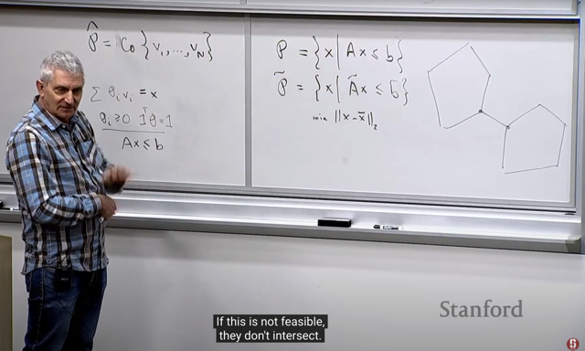</kbd></p>

> [!NOTE]
> Cho hay Polyhedron P và P~. 
>
> Làm sao biết P và P~ có giao nhau không?
>
> -> Giải bài toán feasible problem: minimize 0 constraint Ax `<=` b, A~x `<=` b~
> nếu problem feasible thì P có intersect P~
>
> Làm sao tìm distance giữa P, P~?
>
> -> Giải bài toán minimize ||x - x~|| (l2 norm) constraint Ax `<=` b, A~x~ `<=` b~
>
> Cho một Polyhedron khác, P^, có dạng là convex hull của các đỉnh v1,v2,...
> Cái này trong section về Polyhedron đã học, nó gọi là Simplexes được
> định nghĩa là convex hull của các vertices (đỉnh).
>
> Làm sao biết P^ có intersect P không?
>
> ```text
> -> Giải bài toán feasible minimize 0, constraint Ax <= b, θ ≽ 0, 1Tθ = 1, θTv = x
> ```
>
> Là sao? Là vì lấy vector thuộc P^ thì theo định nghĩa của P^ là convex hull
> bởi {v1, ...vn} nên vector thuộc P^ phải là convex combination của v1, v2,..vn
>
> ```text
> Tức là Σi θivi với θ >= 0 và Σ θi = 1 (định nghĩa của convex combination)
> ```
>
> Vậy thì nếu bài toán trên feasible, tức là tồn tại `θ` và x thỏa các constraint, 
> ```text
> trong đó constraint θTv (tức Σi θivi) = x cho thấy tồn tại điểm chung của P và P^
> ```
> Do đó chúng có intersect nhau

<br>

<p align="center"><kbd>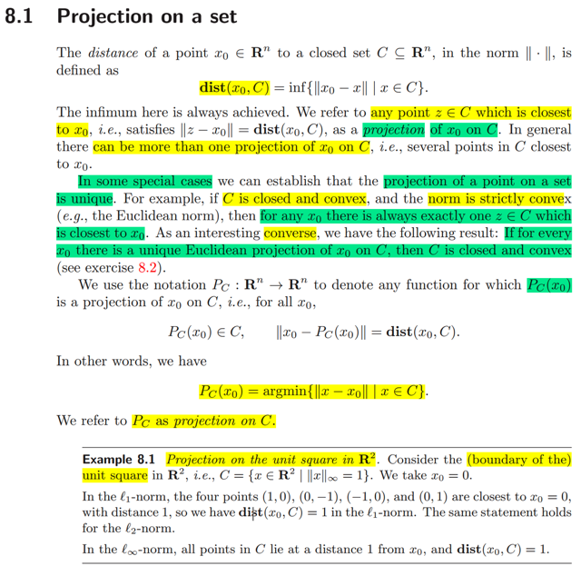</kbd></p>

> [!NOTE]
> Đại khái là ta có định nghĩa của distance từ x0 đến set C, là  inf x
> ∈ C {||x0 - x||}
>
> Tức là khoảng cách từ x0 đến C được định nghĩa là  khoảng
> cách từ x0 tới điểm trên C mà gần nhất tới x0
>
> Và ta gọi điểm trên C mà gần nhất tới x0 đó, là projection của x
> lên C.
>
> Một điểm cũng có thể không khó hình dung đó là nếu như C là
> convex set và norm là strictly convex function thì với x0 bất kì thì
> ta chỉ có đúng một projection duy nhất.
>
> Ngược lại, nếu có tính chất này thì C là convex set.
>
> Và định nghĩa của projection:
>
> PC(x0) ∈ C, ||x0 - PC(x0)|| `=` dist(x0, C)
>
> hoặc PC(x0) `=` argmin x {||x - x0||, x ∈ C}
>
> Nói chung cái này ko có gì phải nói nhiều, chỉ là định nghĩa của
> distance từ đó là projection
>
> 8. GEOMETRIC PROBLEM
>
> 8.1 PROJECTION ON A SET

<br>

<p align="center"><kbd>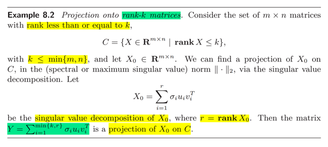</kbd></p>

> [!NOTE]
> QUAY LẠI SAU

<br>

<p align="center"><kbd>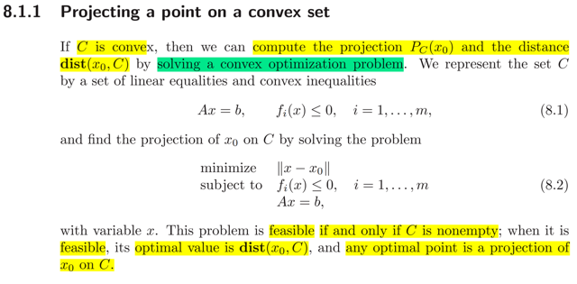</kbd></p>

<p align="center"><kbd>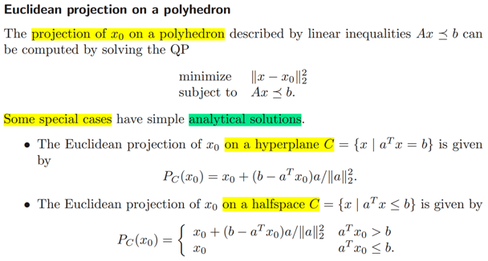</kbd></p>

<p align="center"><kbd>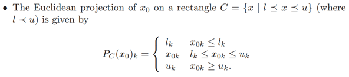</kbd></p>

> [!NOTE]
> Nếu C là convex thì việc tìm projection của x0 lên C, tức PC(x0) trở
> thành bài toán convex optimization.
>
> khi C là convex set, ta có thể thể hiện nó ở dạng intersection  của
> linear equalities và convex inequalities
>
> Ax `=` b và fi(x) `<=` 0
>
> khi đó bài toán minimize ||x - x0|| constraint fi(x) `<=` 0 Ax `=` b sẽ giúp
> tìm ra optimal point nếu có chính là projection PC(x0) và optimal value
> chính là dist(c0, C)
>
> `====`
>
> Nói chung là nếu C là polyhedron define bởi Ax `<=` b thì ta có projection
> lên Polyhedron
>
> một số dạng đặc biết của P là hyperplane C `=` x | aTx `=` b hay haftspace
> C `=` x | aTx `<=` b thì ta có analytic solution
>
> Ví dụ projection x0 on hyperplane C `=` x | aTx `<=` b:
>
> Có thể được tìm thấy bằng bài toán:
>
> minimize ||x - x0||^2 constraint aTx - b `=0` 
>
> f0(x) `=` (x - x0)T(x - x0)
>
> Lagrangian L(x, λ, v) `=` f0(x) + `Σi` λi fi(x) + `Σi` vi hi(x)
>
> `=` (x - x0)T(x - x0) + v(aTx - b) 
>
> KKT conditions:
>
> - Primal feasibility: aTx `=` b
>
> - Dual constraint: Không có
>
> - Complementary slackness: Không có (ko có inequality)
>
> - Gradient Lagrangian ∇xL `=` 0
>
> dL `=` (x + dx - x0)T(x + dx - x0) + v(aTx + aTdx - b) - (x - x0)T(x - x0) - v(aTx - b) 
>
> `=` (xT + dxT - x0T)(x + dx - x0) + vaTx + vaTdx - vb - (xT - x0T)(x - x0) - vaTx - vb
>
> `=` xTx + dxTx - x0Tx + xTdx + dxTdx - x0Tdx - xTx0 - dxTx0 + x0Tx0 + vaTx + vaTdx - vb 
> - (xTx - x0Tx - xTx0 + x0Tx0) - vaTx + vb
>
> `=` xTx + dxTx - x0Tx + xTdx + dxTdx - x0Tdx - xTx0 - dxTx0 + x0Tx0 + vaTx + vaTdx - vb 
> - xTx + x0Tx + xTx0 - x0Tx0 - vaTx + vb
>
> `=` 2xTdx - 2x0Tdx `=` 2(x - x0)Tdx + vaTdx `=` [2(x - x0) + avT]Tdx
>
> `=>` ∇xL `=` 2(x - x0) + avT
>
> ```text
> ∇xf = 0 <=> 2(x - x0) + avT = 0 <=> 2x - 2x0 + avT = 0
> ```
>
> ```text
> <=> 2x = 2x0 - avT <=> x = x0 - avT/2
> ```
>
> ```text
> Thế vào aTx - b = 0 Ta có aT(x0 - avT/2) = b <=> aTx0 - aTavT/2) = b
> ```
>
> ```text
> <=> aTx0 - aTavT/2 = b <=> aTx0 - b = aTavT/2 <=> 2(aTx0 - b) = aTavT
> ```
>
> `<=>` 2(aTx0 - `b)/aTa` `=` vT
>
> `<=>` 2(aTx0 - `b)T/aTa` `=` v
>
> ```text
> Vậy x (optimal, là PX(x0)) = x0 - avT/2 = x0 - a(2(aTx0 - b)/aTa)/2
> ```
>
> ```text
> = x0 - a(aTx0 - b)/aTa) = x0 + (b - aTx0)a/||a||^2
> ```

<br>

<p align="center"><kbd>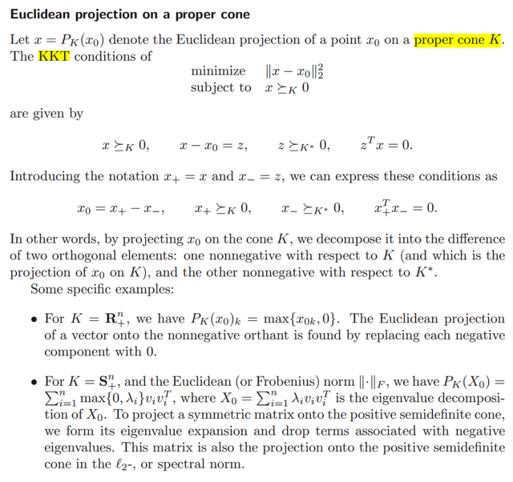</kbd></p>

> [!NOTE]
> QUAY LẠI SAU

<br>

<p align="center"><kbd>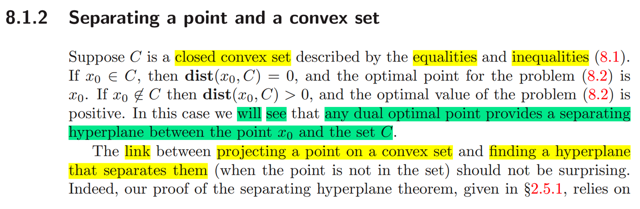</kbd></p>

<p align="center"><kbd>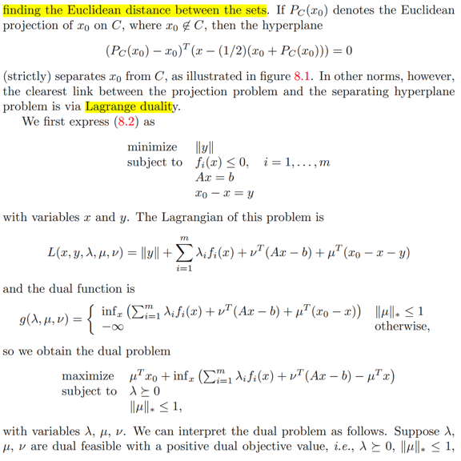</kbd></p>

<p align="center"><kbd>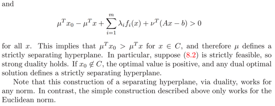</kbd></p>

> [!NOTE]
> Thế thì đại khái gs nói rằng nếu PC(x0) là projection của x0
> lên C thì ta có thể có một hyperplane có phương trình như vậy
> chia cắt x0 và C.
>
> Đầu tiên, (PC(x0) + `x0)/2` là trung điểm của đoạn nối PC(x0),
> x0
>
> Phương trình của hyperplane đi qua x0 có vector pháp tuyến
> (normal vector) a là aTx `=` aTx0. Ở đây normal vector chính là
> PC(x0) - x0
>
> (PC(x0) - x0)Tx `=` (PC(x0) - x0)T(PC(x0) + `x0)/2`
>
> `<=>` (PC(x0) - x0)Tx - (PC(x0) - x0)T(PC(x0) + `x0)/2` `=` 0
>
> `<=>` (PC(x0) - x0)T(x - (PC(x0) + `x0)/2)` `=` 0
>
> Tiếp, ý là nói norm khác thì liên hệ giữa Separating
> Hyperplane theorem và projection problem có thể được thấy
> qua Lagrange duality:
>
> Thế thì từ bài toán tìm projection on hyperplane thể hiện bởi
> các inequality constraint fi(x) `<=` 0 và equality Ax `=` b minimize
> ||x0 - x|| subject to fi(x) `<=` 0, Ax `=` b.
>
> Ta sẽ introduce new variable y `=` x0 - x và bài toán trở thành
> minimize ||y|| constraint có thêm y `=` x0 - x bên cạnh inequality
> constraint fi(x) `<=` 0, `i=1,2...` và equality constraint Ax `=` b
>
> ```text
> Lagrangian: L = f0(x) + Σ λi fi(x) + Σ vi hi(x) + μT(x0 - x - y)
> ```
>
> `=` ||y|| + `Σ` λi fi(x) + vT(Ax - b) + `μT(x0` - x - y)
>
> `=` ||y|| + `Σ` λi fi(x) + vT(Ax - b) + `μT(x0` - x - y)
>
> `=` ||y|| + `Σ` λi fi(x) + vT(Ax - b) + `μT(x0` - x - y)
>
> ```text
> = ||y|| - μy + Σ λi fi(x) + vT(Ax - b) + μT(x0 - x)
> ```
>
> ```text
> Dual function = g(v, λ, μ) = inf x, y L(x, v, λ, μ)
> ```
>
> ```text
> = inf x inf y ||y|| - μTy + Σ λi fi(x) + vT(Ax - b) + μT(x0 - x)
> ```
>
> Xét inf y ||y|| - `μTy` + `Σ` λi fi(x) + vT(Ax - b) + `μT(x0` - x) 
>
> inf y ||y|| - `μTy` + `Σ` λi fi(x) + vT(Ax - b) + `μT(x0` - x) 
>
> ```text
> = - sup y  μTy - ||y||  + Σ λi fi(x) + vT(Ax - b) + μT(x0 - x)
> ```
>
> ```text
> Áp dụng kết quả sup y μTy - ||y|| = 0 khi ||μ||* <= 1, và +infinity
> ```
> khi `||μ||*` > 1 (chứng minh lại ở note bên):
>
> ```text
> = a) 0 + Σ λi fi(x) + vT(Ax - b) + μT(x0 - x) nếu ||μ||* <= 1
> ```
>
> `=` b) - infinity nếu `||μ||*` > 1
>
> Do đó g(v, λ, v) `=` ...
>
> ```text
> = a) inf x Σ λi fi(x) + vT(Ax - b) + μT(x0 - x) nếu ||μ||* <= 1
> ```
>
> `=` b) -infinity nếu `||μ||*` > 1
>
> Áp dụng cái này:
>
> sup x `{μTy` - ||y||} `=` ...:
>
> a) 0 khi `||μ||*` `<=` 1
>
> b) +infinity khi `||μ||*` > 1
>
> Lập luận nhanh:
>
> Theo ĐỊNH NGHĨA CỦA DUAL NORM:
>
> Ta có norm của `μ` là `||μ||,` thì dual norm của `μ:`
>
> `||μ||*` `=` sup y: ||y|| ≤1 { `μTy` }
>
> - Nếu `||μ||*` ≤ 1 `=>` `μTy` ≤ 1 ∀ y có ||y|| ≤ 1
>
> ⇔ `μTy` `/` ||y|| ≤ 1 ∀ y
>
> ⇔ `μTy` ≤ ||y|| ∀ y 
>
> ⇔ `μTy` - ||y|| ≤ 0 ∀ y
>
> `=>` sup y `{μTy` - ||y||} `=` 0
>
> - Nếu ||u||* > 1 `=>` tồn tại x có ||x|| ≤ 1 sao cho `μTx` > 1
>
> Mà như vậy có nghĩa là ||x|| < `μTx` ⇔ `μTx` - ||x|| > 0 
>
> ```text
> Gọi y = αx, μTy - ||y|| = μTαx - α||x|| = α(μTx - ||x||)
> ```
>
> Vì `μTx` - ||x|| > 0 nên khi cho `α` -> infinity thì 
>
> ```text
> μTy - ||y|| = α(μTx - ||x||) -> infinity
> ```
>
> `=>` sup y `{μTy` - ||y||} `=` infinity
>
> Từ đó sau khi đã có dual function:
>
> ```text
> g(λ, ν, μ) =  inf x Σ λi fi(x) + vT(Ax - b) + μT(x0 - x) nếu ||μ||* ≤ 1
> ```
>
> Dual problem sẽ là:
>
> maximize inf x `Σ` λi fi(x) + vT(Ax - b) + `μT(x0` - x) 
>
> constraint `μ` ≽ 0, `||μ||*` ≤ 1
>
> Vậy tới đây họ giả sử ta có λ, v, `μ` đều DUAL FEASIBLE (review:
> tức là các dual variable này, đều thỏa dual constraint: λ ≽ 0, và 
> ở đây là có thêm `||μ||*` ≤ 1. Lí do gọi là dual feasible là vì, như
> tên gọi, ta cần dual problem feasible, mà khi nói một problem
> feasible thì theo định nghĩa, thì có nghĩa là optimal value của nó
> khác infinity. Ví dụ như với optimization problem với constraint,
> thì khi không tồn tại point khiến thỏa constraint, ta gọi đó là feasible
> set rỗng, dẫn tối khi minimize objective trên một tập rỗng, theo
> quy ước, kết quả sẽ là +infinity. Và ta gọi đó là infeasible problem.
>
> Thì với dual problem cũng vậy, ta muốn maximize dual function
> over các dual variable λ, ν, `μ.` Thì constraint, là dual constraint
> đầu tiên sẽ có λ ≽ 0, và ở đây có thêm `||μ||*` ≤ 1.
>
> Thế thì nếu λ không thỏa λ ≽ 0, thì khi xây dựng dual function,
> g `=` inf x L(x, λ..) thì cái vì fi(x) < 0 nên sẽ có ít nhất một cái `Σ` λi fi(x)
> trong mọi tích λi fi(x) (vì i `=` 1,2,...p) của Lagrangian sẽ mang giá
> trị âm, và điều đó khiến việc minimize L có thể cho ra kết quả -infinity
> Đó chính là khi g `=` -infinity thì như vây dual problem bị infeasible.
>
> Quay lại đây, ta mới giả sử là với các λ, v, `μ` đều DUAL FEASIBLE thì
> g ra giá trị dương. Có nghĩa là:
>
> `Σ` λi fi(x) + vT(Ax - b) + `μT(x0` - x) > 0
>
> tạm hiểu là vì λi ≥ 0, fi(x) ≤ 0 (để thỏa constraint) `=>` sum λi fi(x) < 0 
>
> và vT(Ax - b) `=` 0 vì x thỏa constraint
>
> Tóm lại là dẫn đến `μT(x0` - x) > 0:
>
> ⇔ `μT(x0` - x) > 0 ⇔ `μTx0` > `μTx`
>
> Và `μTx0` > `μTx` chính là cho thấy một separating hyperplane có 
> normal vector là `μ`

<br>

<p align="center"><kbd>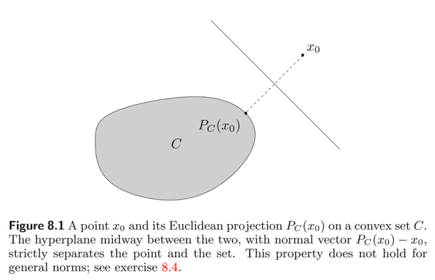</kbd></p>

<br>

<p align="center"><kbd>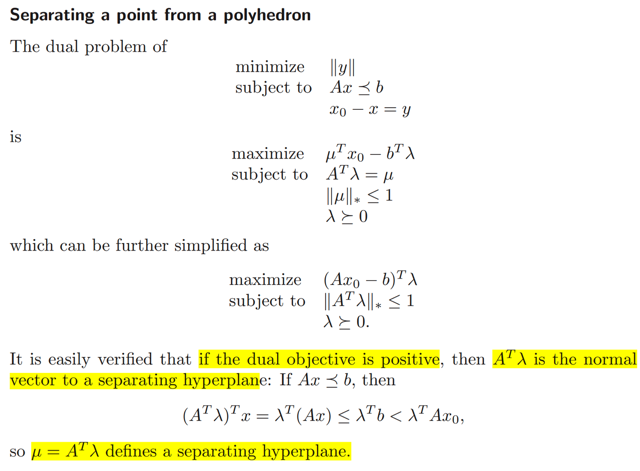</kbd></p>

> [!NOTE]
> đại khái là một ví dụ cụ thể của vừa rồi, với Polyhedron thể hiện bởi 
> inequality constraint Ax ≺ b.
>
> Ta thiết lập bài toán minimize ||x0 - x|| với constraint Ax ≺ b, và thay
> y `=` x0 - x. để thành minimize ||y|| constraint Ax ≺ b, y `=` x0 - x
>
> Thiết lập Lagrangian, và sau đó là Dual function:
>
> Kết quả cho thấy rằng nếu dual mà mang giá trị dương thì ta sẽ có 
> thể cho thấy một separating hyperplane separate x0 và feasible set
> tức Polyhedron
>
> Nói chung mục đích là liên hệ bài toán Projection on set C (cụ thể
> là Polyhedron) với việc tìm ra một Hyperplane separate chúng

<br>

            <a id="node-jw7xnn8"></a>
            - **Nói thêm chút về Hyperplane. Và Separating Hyperplane.

Phương trình của hyperplane với normal vector a:

aTx `=` b

Là tập hợp mọi điểm mà dot product với a bằng nhau và bằng b.

Nên nếu muốn hyperplane đi qua x0, thì có nghĩa là tập hợp mọi điểm
có dot product với a bằng nhau và bằng aTx0 (hay b `=` aTx0)

aTx `=` aTx0

Thế thì hyperplane aTx `=` b sẽ chia không gian thành 2 haft-space:

aTx ≥ b và aTx < b

Thì cái haft-space aTx ≥ b có chứa cái hyperplane aTx `=` b đóng vai
trò là boundary nên nó gọi là Closed haft-space.

Còn cái aTx < b là Open haft-space do không có boundary.

Vậy thì nếu `\\*aTx` < aTx0 với mọi x thuộc set `C\\*,` thì có nghĩa là `\\*x0` nằm
ở một bên `này\\*` (cụ thể là nó nằm trong `\\*closed` half-space: aTx ≥ `aTx0\\*,
vì` nó `\\*nằm` trên boundary chính là hyperplane aTx `=` `aTx0\\*)

Trong` khi đó `\\*mọi` x thuộc C thì nằm trong half-space `kia\\*:` `\\*aTx` < `aTx0\\*

Do` đó `\\*aTx` `=` aTx0 sẽ chính là separating hyperplane giữa x0 và `C\\*`**
<br>

<p align="center"><kbd>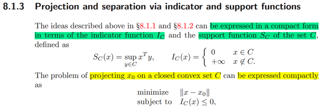</kbd></p>

<p align="center"><kbd>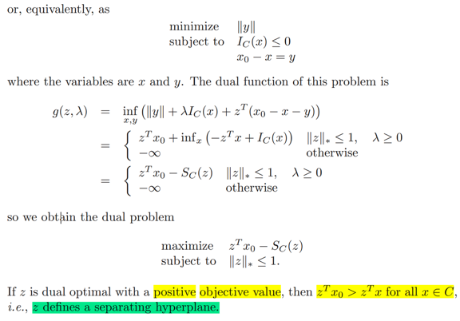</kbd></p>

> [!NOTE]
> Không khó hiểu. Đơn giản chỉ là ta có thể làm vấn đề này ở dạng
> compact (gọn) hơn bằng cách dùng indicator function IC: Với
> IC(x) `=` 0 nếu x ∈ C và `=` +infinity khi x không ∈ C
>
> Và SC(x) `=` sup y ∈ C xTy cái này là định nghĩa ra Support 
> function của set C: nôm na đó là cái function khi nhận vector x
> nó sẽ  lấy ra vector trong C mà có dot product lớn nhất với vector x
>
> Rồi, bài toán project x0 lên C có thể được thể hiện gọn hơn với
> IC: minimize ||x0 - x|| subject to IC(x) ≤ 0
>
> Tại sao constraint lại là IC(x) ≤ 0 thay vì IC(x) `=` 0?
>
> Giới thiệu y `=` x0 - x thì ta có equivalent problem: minimize ||y||
> subject to IC(x) ≤ 0, y `=` x0 - x
>
> Rồi, cũng xây dựng Lagrangian, và Dual function g `=` inf x,y  L
>
> Rồi sẽ gặp lại inf y ||y|| - zTy, cũng dùng lập luận 
>
> `=` - sup y zTy - ||y||
>
> `=` - 0 khi ||z||* ≤ 1 và - infinity khi ||z||* > 1
>
> Nên g `=` inf x,y  ||y|| + λIC(x) + zT(x0 - x - y)
>
> `=` inf x,y  ||y|| + λIC(x) + zTx0 - zTx - zTy 
>
> `=` inf y  ||y|| - zTy  +inf x  λIC(x) + zTx0 - zTx 
>
> `=` - sup y  zTy - ||y||  +inf x  λIC(x) + zTx0 - zTx 
>
> `=` - 0 + inf x  λIC(x) + zTx0 - zTx  khi ||z||* ≤ 1 và -inf khi ||z||* > 1
>
> `=` zTx0 + inf x  λIC(x) - zTx  khi ||z||* ≤ 1 và -inf khi ||z||* > 1
>
> `=` zTx0 - sup x  - λIC(x) + zTx  khi ||z||* ≤ 1 và -inf khi ||z||* > 1
>
> `=` zTx0 - sup x  - λIC(x) + zTx  khi ||z||* ≤ 1 và -inf khi ||z||* > 1
>
> `=` zTx0 - sup x  - λ*0 + zTx  khi ||z||* ≤ 1 và -inf khi ||z||* > 1
>
> x ∈ C `=>` IC(x) `=` 0
>
> `=` zTx0 - sup x  zTx  khi ||z||* ≤ 1 và -inf khi ||z||* > 1
>
> `=` zTx0 - SC(x) khi ||z||* ≤ 1 và -inf khi ||z||* > 1
>
> Và tới đây, kết luận nếu dual function > 0 thì ta sẽ có thể định ra
> separating hyperplane:
>
> zTx0 > SC(x), mà SC(x) là sup z zTx
>
> `=>` zTx0 > SC(x) ≥  zTx `=>` zTx0 > zTx Do đó z là normal vector
> của separating hyperplane giữa x0 và C

<br>

<p align="center"><kbd>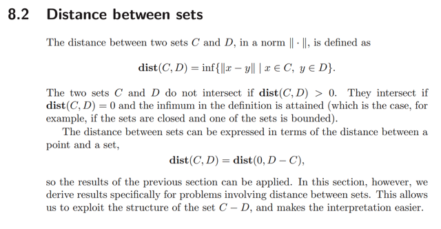</kbd></p>

> [!NOTE]
> 8. GEOMETRIC PROBLEM
>
> 8.2 DISTANCE BETWEEN SETS
>
> Định nghĩa của distance giữa hai set C, D. là khoảng cách
> nhỏ nhất giữa hai điểm thuộc mỗi set

<br>

<p align="center"><kbd>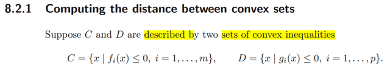</kbd></p>

<p align="center"><kbd>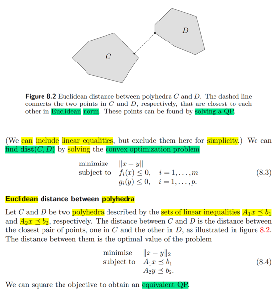</kbd></p>

> [!NOTE]
> Đại khái là từ định nghĩa đó không khó để ta thấy việc tìm distance
> có thể trở thành việc giải bài toán optimization.
>
> Ví dụ set C, D được định nghĩa bởi các inequalities fi(x) ≤ 0 và gi(x) ≤ 0
> thì bài toán tìm distance sẽ là bài toán optimization:
>
> minimize ||x - y|| constraint fi(x) ≤ 0 và gi(y) ≤ 0
>
> Ví dụ với C, D là các Poyhedra (định nghĩa bởi các linear inequalities)
> A1x ≺ b1 và A2x ≺ b2
>
> Khi đó bài toán giúp tìm distance của hai Polyhedra là:
>
> minimize ||x - y|| constraint A1x ≺ b1 và A2y ≺ b2
>
> Thì đây nếu bình phương ||x - y|| thì ta sẽ có QP: là khi objective
> là quadratic function, các constraint vẫn linear `/` affine

<br>

<p align="center"><kbd>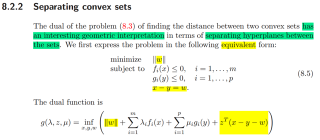</kbd></p>

<p align="center"><kbd>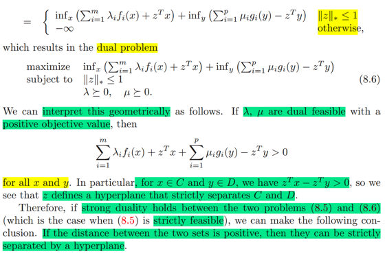</kbd></p>

> [!NOTE]
> Rồi, đại khái là cái này nói về việc dựa vào việc ta giải bài toán tìm distance
> của hai set C, D thì qua đó ta có thể dẫn đến kết luận liên quan đến việc tồn
> tại hay không hyperplane phân chia hoàn toàn hai set C, D:
>
> Như mới nói, để tìm distance giữa C, D mà mỗi set define bởi system các
> inequaulities fi(x) ≤ 0, gi(x) ≤ 0 ta có thể giải bài toán tối ưu:
>
> minimize ||x - y|| subject to fi(x) ≤ 0 và gi(y) ≤ 0
>
> introduce w `=` x - y thì thêm constraint w `=` x - y và objective là ||w||
>
> Cũng lập Lagrangian:
>
> ```text
> L = ||w|| + Σ λi fi(x) + Σ μi gi(y) + zT(x - y - w)
> ```
>
> Và Dual function:
>
> ```text
> g = inf x,y,w ||w|| + Σ λi fi(x) + Σ μi gi(y) + zT(x - y - w)
> ```
>
> ```text
> = inf x,y,w ||w|| + Σ λi fi(x) + Σ μi gi(y) + zTx - zTy - zTw
> ```
>
> ```text
> = inf x,y,w ||w|| + Σ λi fi(x) + Σ μi gi(y) + zTx - zTy - zTw
> ```
>
> ```text
> = inf x,y,w ||w|| - zTw + Σ λi fi(x) + Σ μi gi(y) + zTx - zTy
> ```
>
> ```text
> = inf w ||w|| - zTw + inf x Σ λi fi(x) + zTx + inf y Σ μi gi(y)  - zTy
> ```
>
> Lại gặp dual norm:
>
> ```text
> = - sup w zTw - ||w|| + inf x Σ λi fi(x) + zTx + inf y Σ μi gi(y)  - zTy
> ```
>
> ```text
> = - 0 + inf x Σ λi fi(x) + zTx + inf y Σ μi gi(y)  - zTy nếu ||z||* ≤ 1
> ```
>
> hoặc - infinity + + inf x `Σ` λi fi(x) + zTx + inf y `Σ` `μi` gi(y)  - zTy nếu ||z||* > 1
>
> Nên dual problem là:
>
> maximize inf x `Σ` λi fi(x) + zTx + inf y `Σ` `μi` gi(y)  - zTy
>
> constraint λ, `μ` ≽ 0,  ||z||* ≤ 1
>
> Và ta sẽ lặp lại lập luận rằng nếu CÓ λ, `μ` dual feasible và dual function
> g(λ, `μ)` MANG GIÁ TRỊ DƯƠNG thì ta có:
>
> `Σ` λi fi(x) + zTx + `Σ` `μi` gi(y)  - zTy > 0
>
> Thì điều này cùng với việc `Σ` λi fi(x) ≤ 0, `Σ` `μi` gi(y) ≤ 0 chứng tỏ zTx - zTy
> phải > 0
>
> ⇔ zTx > zTy `=>` z định ra một hyperplane chia tách hoàn toàn C và D.
>
> `=====`
>
> Do đó ta mới có một kết luận đại khái là nếu có strong duality thì ta có thể
> và khoảng cách giữa C, D dương thì sẽ chắc chắn tồn tại hyperplane tách
> rời  hoàn toàn C, D.
>
> Lí do đơn giản là vì muốn chắc chắn có thể kết luận rằng tồn tại hyperplane
> strictly separate C và D thì dấu `=` (0) ko xảy ra, mà phải chắc chắn là dấu >
> 0. Đồng nghĩa ta phải chắc chắn có d* (maximum của g) > 0. Thế thì dựa
> trên việc đã cho p*, tức distance của C, D > 0 rồi, thì muốn chắc chắn d*
> cũng > 0 thì chỉ có thể xảy ra khi d* `=` p* Chứ d* ≤ p* (weak duality) chưa
> chắc khiến d* > 0.
>
> Nên nếu có strong duality, và distance C, D  > 0, tức d* `=` p* > 0 thì suy
> ```text
> ra kiểu gì cũng có λ, μ khiến Σ λi fi(x) + zTx + Σ μi gi(y)  - zTy > 0
> ```
> và như đã lập luận, cái này giúp kết luận zTx > zTy `=>` z định ra một hyperplane 
> chia tách hoàn toàn C và D.

<br>

<p align="center"><kbd>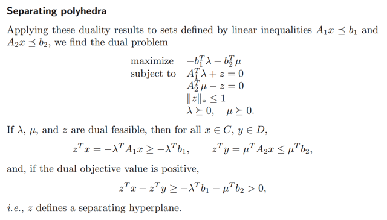</kbd></p>

<p align="center"><kbd>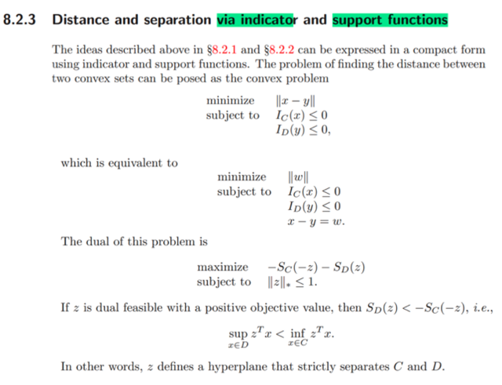</kbd></p>

> [!NOTE]
> Một ví dụ cụ thể hơn với C, D là polyhedron thôi ko có gì
>
> Và cách thể hiện dùng indicator và support function. Tương tự như hồi
> nãy thôi. Ko có gì

<br>

<p align="center"><kbd>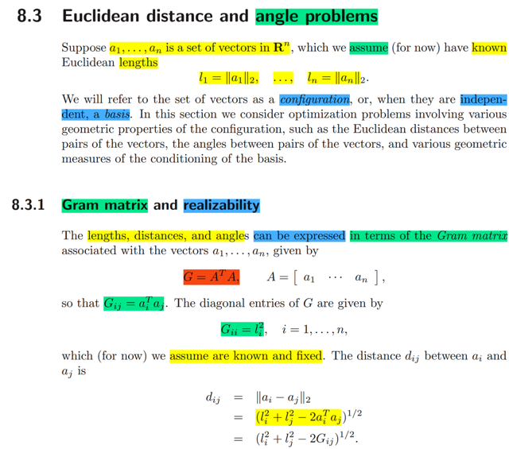</kbd></p>

<p align="center"><kbd>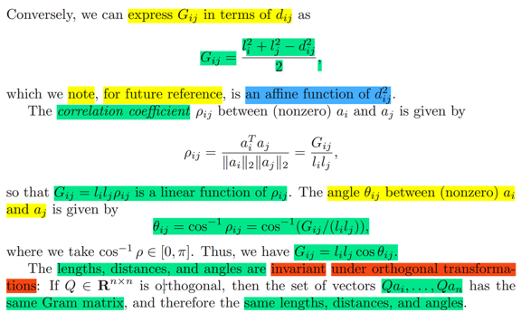</kbd></p>

> [!NOTE]
> 8. GEOMETRIC PROBLEM
>
> 8.3 EUCLIDEAN DISTANCE & ANGLE PROBLEM
>
> Rồi đại khái là ta giả sử có bộ basis vector a1, a2, ...an
> (gọi là một configuration)
>
> li là l2 norm của ai: li `=` ||ai||
>
> Ta gặp lại Gram matrix `=` ATA, với a là matrix mà cột là ai
>
> (Suy nghĩ: a1,..an là basis của Rn nên dĩ nhiên A full-rank)
>
> Thì khi xét ATA, thì component ij sẽ là dot product của [(AT) row i] 
> và [A's columns j] thì cũng là [A's column i] . [A's column j]
>
> Nên Gij `=` aiTaj phải rồi.
>
> Và trên đường chéo của nó tức Gii `=` aiTai chính là ||ai||^2 `=` li^2
>
> Rồi gọi dij là distance của ai, aj:
>
> Tại sao ||ai - aj|| `=` (li^2 + lj^2 - `2aiTaj)^1/2`
>
> Vì ||ai - aj|| `=` [||ai - `aj||^2]^1/2`
>
> `=` [(ai - aj)T(ai - `aj)]^1/2`
>
> `=` [(aiT - ajT)(ai - `aj)]^1/2`
>
> `=` (aiTai - ajTai - aiTaj + `ajTaj)^1/2`
>
> `=` (||ai||^2 - 2ajTai + `||aj||^2)^1/2`
>
> `=` (li^2 + lj^2 - `2aiTaj)^1/2` 
>
> `=` (li^2 + lj^2 - `2Gij)^1/2`
>
> Và từ đó Gij `=` 0.5[li^2 - lj^2 - ||ai - aj||^2] `=` (li^2 + lj^2 - `dij^2)/2`
>
> Học khái niệm mới CORRELATION COEFFICIENT 
>
> ```text
> pij = aiTaj/||ai||||aj|| = Gij / lilj
> ```
>
> Cái này thật ra chính là cos `α(ai,` aj), vì aiTaj `=` ||ai||aj||cos `α(ai,` aj)
>
> gọi là hệ số tương quan bởi nó phản ảnh sự tương quan giữa
> ai, aj.

<br>

<p align="center"><kbd>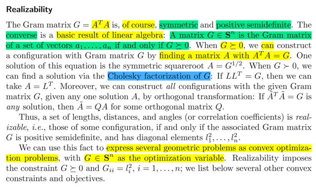</kbd></p>

> [!NOTE]
> Cái này đại khái nói là ta có thể có nhận định rằng nếu G là Gram
> matrix tức là nó có dạng ATA thì nó sẽ symmetric và positive
> semi-definite.
>
> Nhưng ngược lại cũng đúng, tức là bất kì một symmetric positive
> semi definite matrix nào cũng đều có thể express dưới dạng ATA với
> A là matrix nào đó.
>
> Chứng minh chiều đi thì dễ rồi, (ATA)T `=` ATA nên nó symmetric.
> xTATAx `=` ||Ax||^2 nên ≥ 0 ∀ x `=>` ATA positive semi definite.
>
> Thì chiều ngược lại ở đây nói nếu ta có G là psd matrix thì chỉ việc
> tìm A sao cho ATA `=` G. Và việc này có thể bằng cách lấy A `=` `G^1/2.`
>
> Hoặc nếu G positive definite luôn, (G ≻ 0) thì ta có thể dựa vào một
> phép factorization gọi là Cholesky factorization để có G `=` LLT, thì khi
> đó A chính là LT.
>
> Hơn nữa nếu ta có A và A~ đều là solution (tức thỏa ATA `=` G) thì
> chắc chắc A~ `=` QA với Q là orthogonal matrix nào đó.
>
> Nói chung, đại khái là khái niệm realizable của một set các vectors
> sẽ yêu cầu G là matrix positive semi-definite. Từ đó ta có bài toán
> optimization
>
> TÓM LẠI, REALIZABILITY CÓ THỂ TẠM HIỂU LÀ MỘT TÍNH CHẤT
> CỦA MỘT BỘ VECTORS. Thì bài toán LÀM SAO ĐỂ CÓ TÍNH 
> CHẤT NÀY CÓ THỂ ĐƯỢC THỂ HIỆN THÀNH MỘT OPTIMIZATION
> PROBLEM VỚI OPTIMIZATION VARIABLE LÀ G

<br>

<p align="center"><kbd>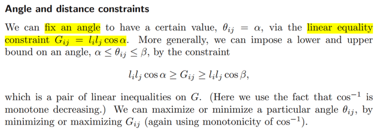</kbd></p>

<p align="center"><kbd>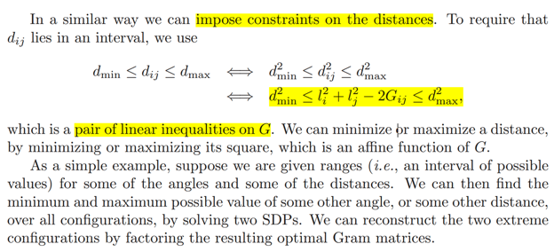</kbd></p>

> [!NOTE]
> Rồi, nếu ta muốn imply constraint đối với góc của các vector thì ta
> cũng có thể chuyển thành bài toán optimization constraint đối với G
>
> Ko khó hiểu gì, vì Gij `=` aiTaj `=` `||ai||||aj||cos(θij)` (góc giữa hai vector
> ai aj) nên nếu muốn `θij` bằng `α` chẳng hạn thì ta sẽ thể hiện bằng 
> ```text
> constraint Gij/||ai||||aj|| = Gij/lilj = cos(α). Đây là linear equality
> ```
> đối với G
>
> Hoặc, nếu muốn constraint `θiij` trong khoảng nào  thì cũng dễ hiểu
> là có thể thể hiện thành dạng linear inequality constraint `đ/v` G
>
> Rồi tương tự, nếu muốn constraint liên quan đến khoảng cách các
> vector ai, aj tức dij, thì ta cũng sẽ thể hiện nó là constraint đ.v G

<br>

<p align="center"><kbd>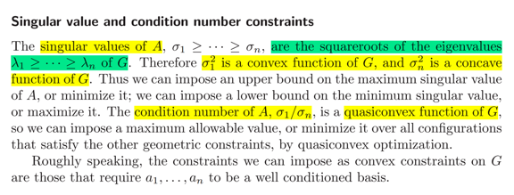</kbd></p>

> [!NOTE]
> Ta cũng có thể imply constraint lên singular value của A (như
> đã biết, nó chính là eigenvalues của ATA, tức G).
>
> Nói chung là gs đang liệt kê một số trường hợp mà ta có thể
> đặt ra mục tiêu là tính chất của A (cũng là set các vector ai, 
> gọi là configuration) sao đó bằng cách tạo ra constraint đv
> G.
>
> Ở đây ví dụ như ta muốn đặt lower bound cho singular value
> nhỏ nhất (rồi tối đa hóa nó) hoặc upper bound cho s.v lớn
> nhất rồi minimize nó.
>
> Hoặc là với condition number....
>
> (Khái niệm condition number để xem thêm sau)

<br>

<p align="center"><kbd>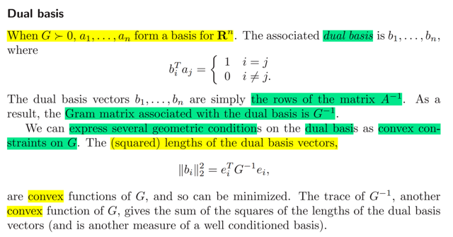</kbd></p>

> [!NOTE]
> Rồi, đại khái là ta biết khái niệm mới, gọi là DUAL BASIS, của một
> basis. Ví dụ a1,...an là một basis (xảy ra khi G `=` ATA ≻ 0, này dễ hiểu
> thôi, vì khi đó chứng tỏ A full-column rank `/` full rank hay a1,...an độc
> lập tuyến tính, mà có đủ n vector thì chính là một basis) thì b1,....bn
> là basis khi biTaj `=` 1 với i `=` j và biTaj `=` 0 khi i khác j
>
> Thế thì đơn giản ta quan sát AinvA `=` I, tức là [row i'th của Ainv] [columns
> i'th của A] `=` 1, và [row i'th của Ainv] [column j'th của A] `=` 0
>
> Nên b1,...bn chính là các row của Ainv.
>
> Vậy thì Gram matrix gắn với b1,...bn chính là AinvAinvT (b1, b2...là các
> cột của AinvT `=>` Gram matrix `=` (AinvT)T(AinvT) `=` AinvAinvT
>
> Và cái này chính là Ginv. Vì sao? vì dựa vào tính chất (AB)inv `=` BinvAinv
> nên (ATA)inv `=` Ainv ATinv `=` Ainv AinvT
>
> Từ đó ta có thể thể hiện những điều kiện đối với dual basis của basis a1,..an
> thông qua constraint lên G và cụ thể nó là convex function của G.
>
> Ví dụ như giả sử ta muốn quy định điều kiện cho length của basis dual
>
> Thì ||bi||^2 `=` eiTGinvei là convex function của G.
>
> Vì sao? Vì bi như đã nói là row thứ i của Ainv. Và cái này có thể thể hiện
> bằng cách dùng unit vector: AinvTei (ei là vector mà số 1 ở vị trí thứ i, còn
> lại 0) nên AinvTei `=` linear combination các AinvT với coefficients là 0 hết
> chỉ có số 1 tại vị trí thứ i `=>` lấy ra cột thứ i của AinvT, là hàng thứ i của Ainv)
>
> ```text
> Nên ||bi||^2 = biTbi = (AinvTei)T(AinvTei) = eiTAinvAinvTei = eiTGinvei
> ```
>
> Có thể chứng minh nó là hàm convex sau.

<br>

<p align="center"><kbd>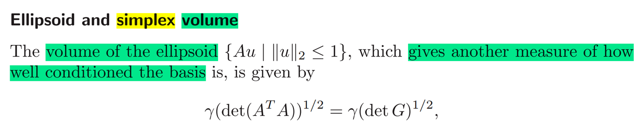</kbd></p>

<p align="center"><kbd>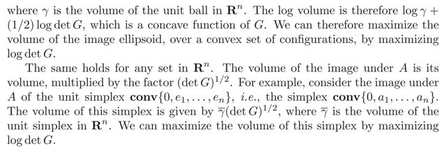</kbd></p>

> [!NOTE]
> Tương tự cái này cũng vậy. Đại khái là ta có thể express condition
> đối với VOLUME của ellipsoid và simplex thông qua constraint
> đối vói G

<br>

<p align="center"><kbd>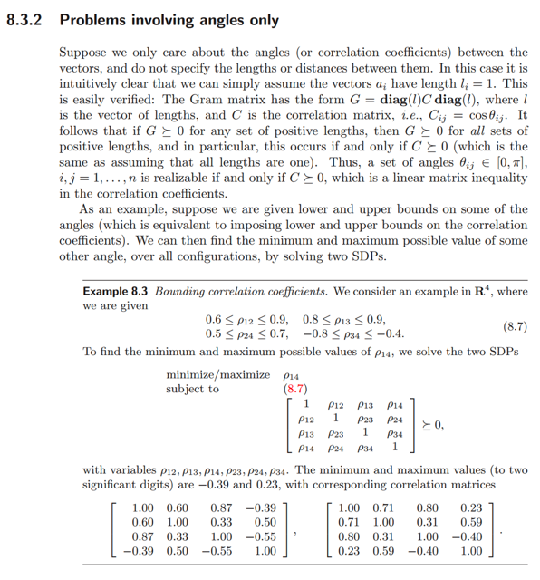</kbd></p>

> [!NOTE]
> QUAY LẠI SAU

<br>

<p align="center"><kbd>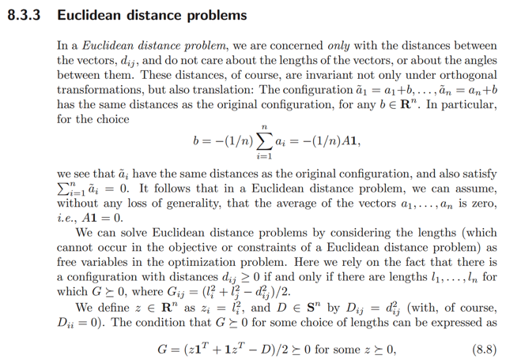</kbd></p>

<p align="center"><kbd>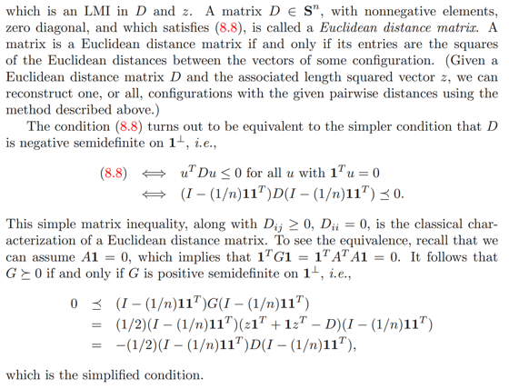</kbd></p>

<p align="center"><kbd>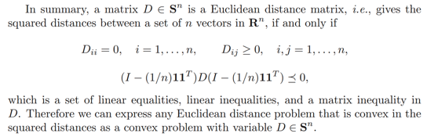</kbd></p>

> [!NOTE]
> QUAY LẠI SAU

<br>

<p align="center"><kbd>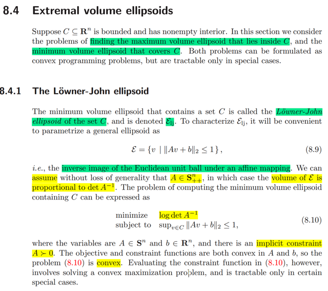</kbd></p>

> [!NOTE]
> đại khái là phần này ta sẽ xét một set C bị giới hạn và có interior
> không rỗng. Thì ta sẽ xét bài toán là tìm ellipsoid nội tiếp và ngoại tiếp
> của nó và thể hiện nó là bài toán tối ưu.
>
> Đầu tiên cái ellipsoid nhỏ nhất mà bao bọc set C có tên là
> Lowner-John ellipsoid, kí hiệu `εlj.`
>
> Thế thì người ta thể hiện một ellipsoid một cách khái quát là vầy:
>
> (nôm na là) tập những điểm mà sau khi bị transform bởi A và b trở
> thành một unit ball: {v: ||Av + b|| ≤ 1}.
>
> Thế thì cái ellipsoid LJ trên, nếu thể hiện bằng lời: là cái ellipsoid, có
> thể tích nhỏ nhất, mà mọi điểm trong set C đều không lọt ra ngoài.
>
> Từ đó ta "dịch" nó `/` chuyển nó thành một bài toán tối ưu như sau:
>
> Objective: Thể tích nhỏ nhất, quay lại nói sau.
>
> Là một ellipsoid, mà mọi điểm trong C đều ko vượt ra ngoài thì chính
> là mọi điểm trong C sao cho khi bị transform bởi A, b không vượt ra
> ngoài unit ball: sup v ∈ C ||Av + b|| ≤ 1
>
> Quay lại nói về thể tích của ellipsoid: HIểu thế này, A biến ellipsoid
> thành unit ball, thì Ainv biết unit ball lại thành ellipsoid. Mà ta đã biết
> trong một phép biến đổi không gian thì det của Jacobian, chính là thể
> tích. Nên det của Ainv chính là sẽ tỉ lệ thuận với thể tích của ellipsoid
> Do đó objective là minimize det Ainv. và như thường lệ người ta sẽ
> dùng log.
>
> Và đại khái là bài toán này là convex optimization problem.
>
> vì log det Ainv là convex
>
> cũng như constraint cũng convex
>
> (có thể xem lại tại sao nó convex sau)
>
> Nhưng gs cũng có nói ko phải lúc nào cũng giải được
>
> 8. GEOMETRIC PROBLEM
>
> 8.4 EXTREMAL VOLUME ELLIPSOIDS

<br>

<p align="center"><kbd>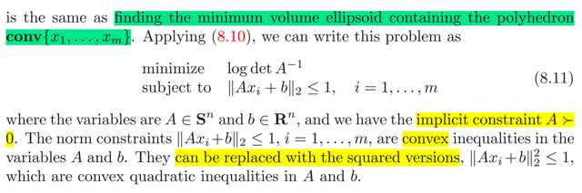</kbd></p>

<p align="center"><kbd>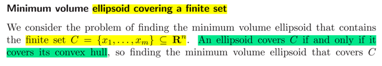</kbd></p>

> [!NOTE]
> đại khái là vừa rồi là nói set C khái quát, nay là nói set C là set hữu
> hạn  chứa các điểm x1,....xm
>
> Vậy thì ở đây cho biết thêm rằng một ellipsoid mà chứa set các 
> điểm thì nó cũng chứa luôn cái convex hull tạo bởi điểm đó.
>
> (Tính chất này biết vậy thôi, nhưng tạm đoán là vì ellipsoid là một
> convex set, nên nếu nó chứa các điểm thì nó cũng phải chứa mọi
> convex combination của chúng, mà đó chính là convex hull của 
> chúng)
>
> Tuy vậy thì ta cũng chỉ đơn giản là áp dụng "công thức" vừa rồi
> để có bài toán optimization giúp tìm ra `εlj`
>
> minimize log det Ainv subject to ||Axi + b|| ≤ 1 với i `=` 1, 2, ...m
>
> Và norm của Axi + b hoặc square norm đèu convex nên ta có
> convex problem

<br>

<p align="center"><kbd>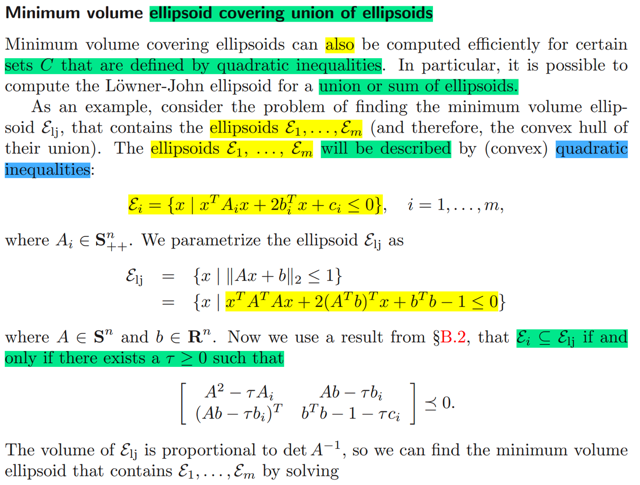</kbd></p>

<p align="center"><kbd>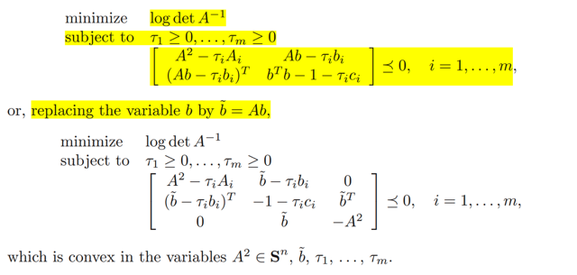</kbd></p>

> [!NOTE]
> rồi, cái này đại khái nói là ta cũng có thể tìm `εlj` của một set C mà bản
> thân C là được định nghĩa bởi hệ các quadratic inequalities. Cụ thể
> là khi C là union của các ellipsoid.
>
> Thế thì gọi `ε1,` `...εm` là các ellipsoid được định nghĩa bởi các convex
> quadratic inequalities:
>
> `εi` `=` {x | xTAix + 2biTx + ci ≤ 0} i `=` 1, 2, ...m
>
> Trong đó Ai là symmetric positive definite matrix:
>
> Rồi, ta cũng có `εlj` được định nghĩa bởi:
>
> `εlj` `=` {x: ||Ax + b|| ≤ 1} ⇔ {x: xTATAx + 2(ATb)Tx + bTb - 1 ≤ 0}
>
> (cái này đơn giản là ||Ax + b|| ≤ 1 ⇔ ||Ax + b||^2 ≤ 1 ⇔ (Ax+b)T(Ax+b) ≤ 1
> triển khai ra)
>
> Tới đây ta mới dùng một kiến thức đại số tuyến tính từ phụ lúục B2. Đại 
> khái nói là để mà `ε` nằm trong ⊆ một `εlj` khác thì xảy ra khi và chỉ khi
> tồn tại t sao cho thỏa điều sau đây:
>
> [A^2 - tAi, Ab - tbi; (Ab - tbi)T, bTb - 1 - tci] ⪯ 0 
>
> (kiến thức này đọc phụ lục sau)
>
> Thành ra bài toán tìm L.J ellipsoid của union các ellipsoid `εi` thể hiện ở
> bài toán optimization:
>
> minimize log det Ainv 
>
> với constraint là 
>
> [A^2 - tAi, Ab - tbi; (Ab - tbi)T, bTb - 1 - tci] ⪯ 0
>
> cũng như implicit constraint là A phải ≻ 0
>
> Còn vài cái râu ria nhưng ý chính là vậy

<br>

<p align="center"><kbd>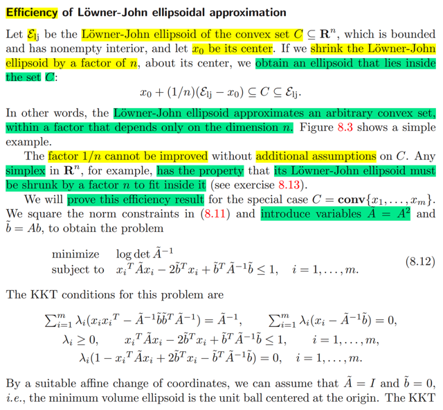</kbd></p>

<p align="center"><kbd>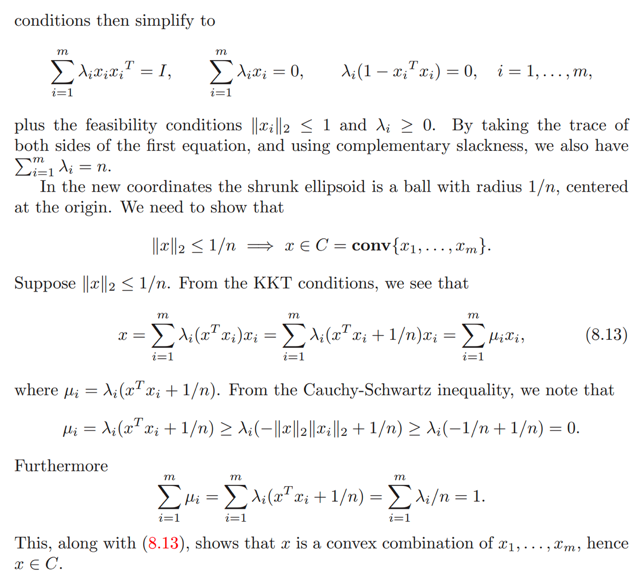</kbd></p>

> [!NOTE]
> QUAY LẠI SAU

<br>

<p align="center"><kbd>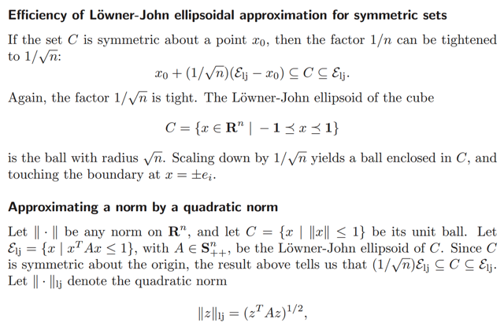</kbd></p>

<p align="center"><kbd>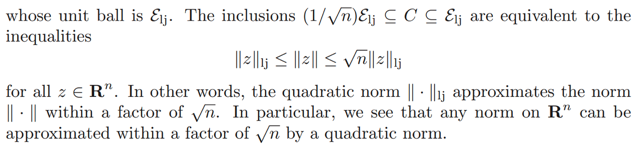</kbd></p>

> [!NOTE]
> QUAY LẠI SAU

<br>

<p align="center"><kbd>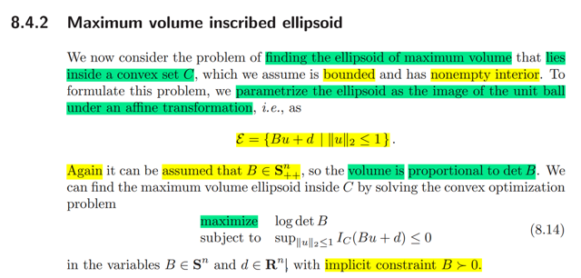</kbd></p>

<p align="center"><kbd>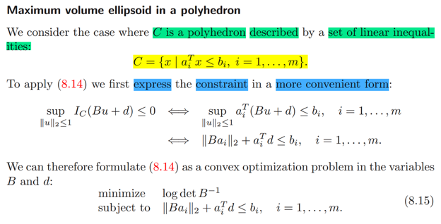</kbd></p>

> [!NOTE]
> Khi đã hiểu cái L.J ellipsoid rồi thì cái này - inscribed ellipsoid
> hoàn toàn tương tự. Chỉ khác đây là ellipsoid lớn nhất mà
> vẫn nằm trong set C (thay vì nhỏ nhất mà chứa set C)
>
> Với L.J ellipsoid thì `εlj` ta dùng định nghĩa nó là tập những điểm
> mà khi biến đổi bởi A, b cho ra unit ball {v: ||Av + b|| ≤ 1}
>
> Còn cái này thì người ta dùng định nghĩa là tập những điểm 
> mà sau khi ta biến đổi unit ball bởi B, d: {Bu + d : ||u|| ≤ 1}
>
> Thế thì việc tìm inscribed ellipsoid sẽ được thể hiện bởi bài
> toán optimization:
>
> maximize log det B (again, từ unit ball thông qua B, d cho ra 
> ellipsoid nên thể tích của nó sẽ tỉ lệ thuận vói det B)
>
> constraint nói bằng lời là, kết quả lớn nhất của một vector 
> thuộc unit ball sau khi biến đổi bởi B, d cũng vẫn không vượt
> quá ellipsoid, mà cái vụ vượt quá set C sẽ thể hiện nhờ 
> indicator function IC(x) ta nhớ nó `=` 0 khi x thuộc C và +infinity
> khi ngoài C
>
> Do đó constraint: sup ||u|| ≤ 1 IC(Bu + b) ≤ 0
>
> `====`
>
> và cụ thể hóa khi set C là polyhedron định nghĩa bởi hệ các linear
> inequalities {aiTx ≤ bi, i `=` 1,2....m}
>
> Khúc dưới chẳng qua là thể hiện `/` biến đổi lại constraint chút xíu
> không khó hiểu lắm. Có thể quay lại xem kĩ hơn `sau\`

<br>

<p align="center"><kbd>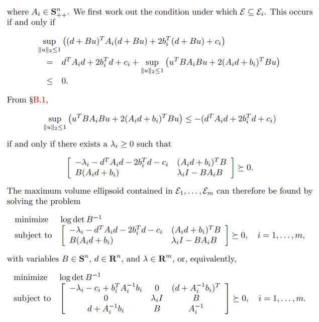</kbd></p>

<p align="center"><kbd>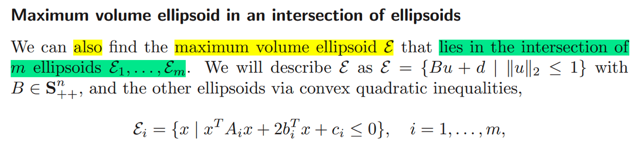</kbd></p>

> [!NOTE]
> Cái này cũng tương tự như khi ta có thể tìm L.J ellipsoid của một
> set C là  UNION các epplisoid.
>
> thì cái này cũng vậy, tìm inscribed ellipsoid của một set C là
> INTERSECTION của các ellipsoid.
>
> Ý tưởng chính là vậy, Cũng tương tự nên ta sẽ Quay lại sau

<br>

<p align="center"><kbd>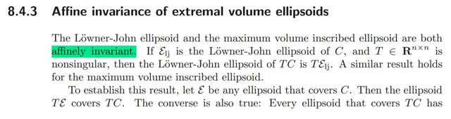</kbd></p>

<p align="center"><kbd>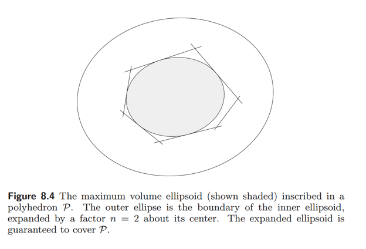</kbd></p>

<p align="center"><kbd>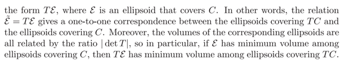</kbd></p>

<p align="center"><kbd>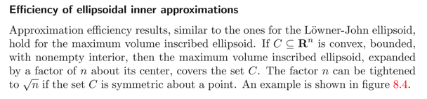</kbd></p>

> [!NOTE]
> QUAY LẠI SAU

<br>

<p align="center"><kbd>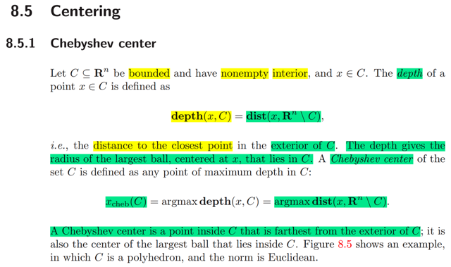</kbd></p>

<p align="center"><kbd>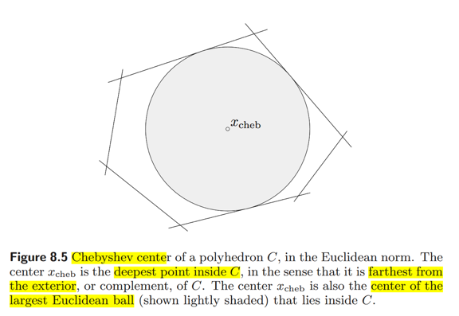</kbd></p>

> [!NOTE]
> Đại khái định nghĩa của depth - của một điểm đối với một set C
> là khoảng cách của nó đến điểm đến gần nhất không thuộc C
>
> Nôm na là nói về độ sâu của một điểm bên trong C là bao nhiêu.
>
> depth(x, C) `=` dist(x, R^n `\` C)
>
> Thế thì cái điểm mà nằm sâu bên trong C nhất gọi là Chebyshev
> center.
>
> `x_cheb(C)` `=` argmax dict(x, R^n `\` C)
>
> 8. GEOMETRIC PROBLEM
>
> 8.5 CENTERING

<br>

<p align="center"><kbd>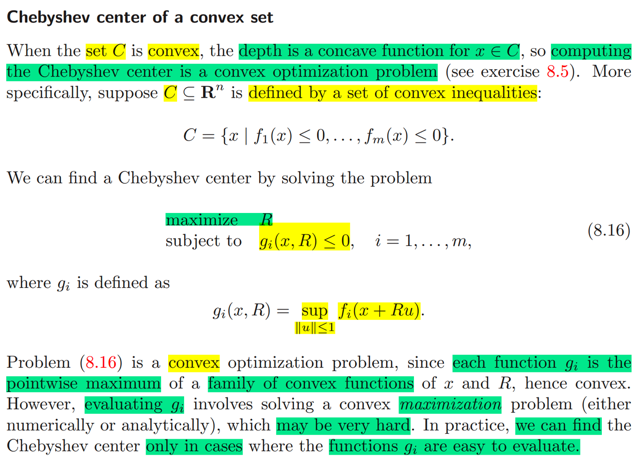</kbd></p>

<p align="center"><kbd>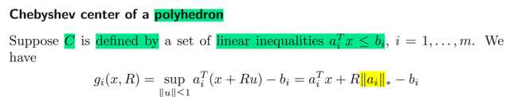</kbd></p>

<p align="center"><kbd>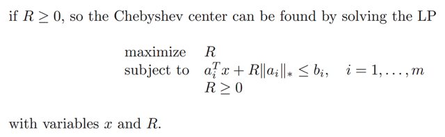</kbd></p>

> [!NOTE]
> Đại khái là khi set C convex thì bài toán tìm Chebyshev center có thể
> được thấy `/` nhìn nhận như một bài toán convex optimization problem.
>
> Người ta cho C là convex set define bởi các inequalities fi(x) ≤ 0
>
> Thế thì bài toán optimization có objective là R (R, và x sẽ là optimization
> variable - vì việc tìm Chebyshev center bao gồm việc tìm tâm và bán
> kính)
>
> constraint là gi(x, R) `(=` sup ||u|| ≤ 1 fi(x + Ru)) ≤ 0 i `=` 1,2...m
>
> có nghĩa là sao: Nôm na là ta muốn nói rằng (constraint): điểm xa nhất
> extend từ x (yếu tố sup ||u|| ≤ 1 và x + Ru trong sup ||u|| ≤ 1 fi(x + Ru) 
> vẫn thỏa mãn yêu cầu là nằm trong set C (thể hiện bởi fi(x + Ru) ≤ 0)
>
> Thì khi giải bài toán này tìm ra x, và R sao cho fi(x + Ru) là lớn nhất
> nhưng nó vẫn ≤ 0 thì tức là ta đã tìm ra điểm Chebyshev center
>
> Thế thì họ nói đây là convex vì gi là point-wise maximum của các convex
> function.
>
> Có điều giải bài toán này ko dễ, vì mỗi gi có thể thấy là bài toán maximization
> có thể rất khó.
>
> Nên ta chỉ có thể tìm thấy Chebyshev center ở những trường hợp mà gi dễ
> đánh giá mà thôi
>
> `====`
>
> Rồi một ví dụ cụ thể khi C là polyhedron (defined bởi set các linear 
> inequalities aiTx ≤ bi)
>
> Khi đó gi(x, R) `=` sup ||u|| ≤ 1 aiT(x + Ru) - bi
>
> `=` sup ||u|| ≤ 1 aiTx + RaiTu - bi
>
> `=` aiTx + R sup ||u|| ≤ 1 { aiTu } - bi
>
> Mà sup ||u|| ≤ 1 { aiTu } chính là định nghĩa của ||ai||* (dual norm)
>
> (dual norm ||x||* `=` sup zTx ∀ z: ||z|| ≤ 1)
>
> Vậy gi(x, R) `=` aiTx + R||u||* - bi
>
> Thành ra ta có optimization problem:
>
> maximize R subject to aiTx + R||ai||* ≤ bi
>
> CHƯA HIỂU TẠI SAO PHÀI NÓI CẦN R ≥ 0

<br>

<p align="center"><kbd>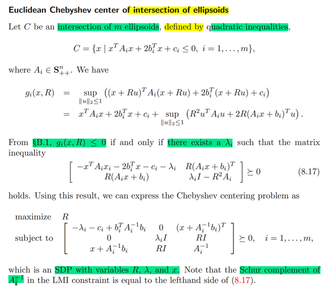</kbd></p>

> [!NOTE]
> Đại khái là nếu C là intersection của của các ellipsoids thì bài toán
> tìm chebyshev sẽ trở thành bài toán SDP
>
> Nói chung là C LÀ intersection các ellipsoids được định nghĩa là:
>
> {x: xTAix + 2biTx + ci ≤ 0, i `=` 1,..,m} với Ai ≻ 0
>
> Thì ta define gi(x, R), là sup ||u|| ≤ 1 fi(x + Ru)
>
> triển khai ra, gom những cái dính tới u lại (vì sup over ||u|| mà)
>
> Thế thì mới vận dụng điểm kiến thức trong Appendis nói rằng
> gi(x, R) này ≤ 0 khi và chỉ khi [...] ≽ 0
>
> Từ đó ta mới thể hiện nó là constraint của bài toán optimization
>
> Và nó trở thành bài táon SDP

<br>

<p align="center"><kbd>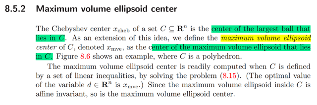</kbd></p>

<p align="center"><kbd>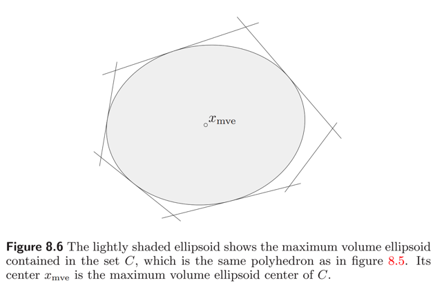</kbd></p>

> [!NOTE]
> đại khái là với `x_che` thì nó là điểm sâu nhất bên trong C, cũng là
> tâm của quả cầu lớn nhất chứa trong C.
>
> thì mở rộng cái này, nếu x là tâm của cái ellipsoid lớn nhất chứa
> trong C thì nó gọi là maximum volume ellipsoid.
>
> Thì cái ellipsoid lớn nhất chứa trong chính là cái mà phần trước đã
> nói. Chẳng qua ở đây nói về tâm của nó

<br>

<p align="center"><kbd>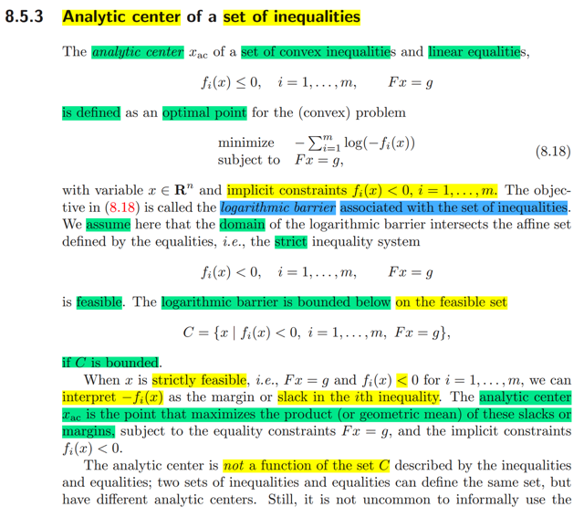</kbd></p>

<p align="center"><kbd>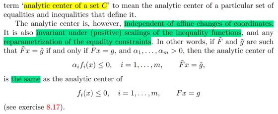</kbd></p>

> [!NOTE]
> đại khái là, ở đấy nói về một loại "center" mới `/` khác. Đó là Analytic
> center của một set các convex inequalities và linear equalities.
>
> Giả sử có một set các inequalities fi(x) ≤ 0 và equalities Fz `=` g
>
> Thì định nghĩa của analytic center của chúng là nó chính là solution của
> việc minimize - `Σ` log(-fi(x)) với constraint Fx `=` g.
>
> và objective gọi là logarithmic barrier.
>
> Vậy thì nhìn vào bài toán này, dễ hiểu ngoài constraint Fx `=` g, thì còn
> implicit constraint: -fi(x) > 0 ⇔ fi(x) < 0 nữa.
>
> Do đó, feasible set C, mà ta đã học theo định nghĩa nó sẽ là tập các
> điểm thỏa explicit constraint cũng như là các implicit constraint (x phải
> thuộc domain của problem `=` intersection của domain của objective và
> constraint functions) sẽ là: C `=` x: Fx `=` g; fi(x) ≤ 0 i `=` 1, 2..
>
> Thế thì ở đây gs nhận định rằng hàm objective sẽ bị bounded below nếu
> set C bounded below. Nói vậy là bởi objective nếu nhìn sơ qua thì nó có
> thể nhỏ đến vô cùng, vì - log (x) có thể nhỏ đến - infinity. Mà nếu vậy thì
> bài toán này sẽ không có optimal value. Tuy nhiên nếu set C bị chặn
> dưới, thì objective với x feasible sẽ cũng bị chặn dưới giúp bài toán có
> optimal value.
>
> Một điểm nữa đại khái nói về ý nghĩa của Analytic center.
>
> Đầu tiên set các inequalities fi(x) ≤ 0, và equalities: Fx `=` g. Thì ta giả sử
> tồn tại những điểm Strictly feasible, tức là chúng thỏa inequalities ở
> trạng thái strictly: fi(x) < 0 (và dĩ nhiên Fx `=` g)
>
> Thì hiểu nôm na là một điểm (∈ C) mà fi(x) càng nhỏ hơn 0 (hay -fi(x)
> càng lớn hơn 0), thì nó càng strictly feasible, và đối với inequalities fi(x)
> ≤ 0 nó càng có trạng thái" CHÙNG" (SLACKNESS).
>
> Và từ đó ta hiểu về analytic center chính là cái điểm mà tối đa trạng
> thái chùng này (bằng cách thông qua  minimize - `Σ` log [-fi(x)] (cũng là
> maximize `Σ` log [-fi(x)] , ý nghĩa là geometric mean của slackness).
>
> `====`
>
> Khúc cuối đại khái nói là khái niệm analytic center thật ra ko gắn với
> set C, mà là set các inequalities và equalities. Nên dù hai set `equa/inequalities`
> có thể define chung một set C nhưng analytic center của chúng vẫn khác nhau
>
> Rồi cho biết thêm vài tính chất đại khái là, việc scale inequalities với scalar
> sẽ cho ra (set `equa/inequalities)` có cùng analytic center
>
> Ví dụ như nếu Fx `=` g ⇔ Ax `=` b thì set fi(x) ≤ 0, Fx `=` g sẽ có cùng analytic 
> center với Ax `=` b, `αi` fi(x) ≤ 0

<br>

<p align="center"><kbd>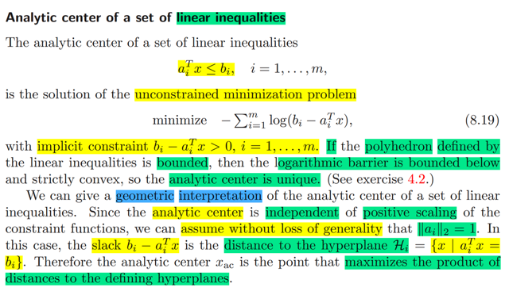</kbd></p>

> [!NOTE]
> đại khái là xét trường hợp set chỉ gồm các linear inequalities, không
> có equalities: aiTx ≤ bi i `=` 1,2....m
>
> Thì bài toán tìm analytic center trở thành unconstraint optimization
> problem: minimize - `Σ` log(bi - aiTx). Dĩ nhiên implicit constraint là
> bi - aiTx > 0
>
> Lúc này feasible set C là {x: aiTx < bi, i `=` 1,...m} sẽ là một Polyhedron
>
> Nếu nó bị chặn (bounded) thì như đã nói, hàm objective cũng sẽ bị
> chặn dưới (bài toán có optimal) 
>
> Thế thì ý nghĩa của analytic center có thể hiểu về mặt hình học trong
> trường hợp này:
>
> Xét một inequality: fi(x) ≤ 0 ⇔ aiTx ≤ bi mà ở đây phải thỏa implicit
> constraint nên chỉ được dấu <: aiTx < bi
>
> Thì x khiến aiTx - b < 0 sẽ là feasible, và x càng khiến aiTx - bi càng
> dưới 0 thì "càng slack"
>
> Mà ta đã derive việc tìm projection của x0 lên hyperplane C `=` aTx `=` b:
>
> PC(x0) `=` x0 + (b - `aTx0)a/||a||^2`
>
> Với gỉa định a (normal vector của hyperplane) có unit norm thì:
>
> PC(x0) `=` x0 + (b - aTx0)a
>
> `=>` distance giữa x0 và hyperplane `=` ||x0 + (b - aTx0)a - x0|| `=` ||(b - aTx0)a||
>
> |(b - aTx0)|||a|| (vì (b - aTx0) là scalar: `||αu||` `=` `|α|||u||)`
>
> `=`  |b - aTx0| (vì ||a|| `=` 1)
>
> Có nghĩa là ta vừa chứng minh distance từ vector x0 với hyperplane aTx `=` b
> `=` |b - aTx0|
>
> vậy aiTx - bi càng dưới 0 tức |aiTx - bi| càng lớn chính là khoảng cách từ
> x đến hyperplane aiTx `=` bi càng lớn.
>
> Do đó analytic center chính là tìm cái điểm mà tích (geometric mean) của
> khoảng cách từ nó đến các "cạnh" của polyhedron lớn nhất

<br>

<p align="center"><kbd>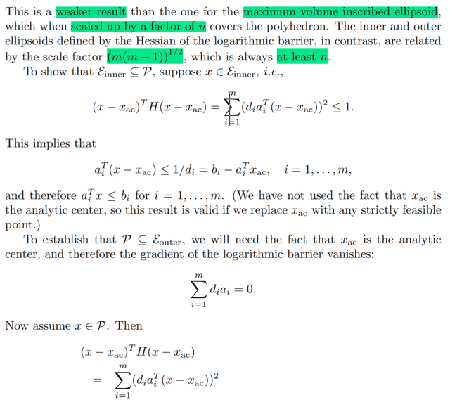</kbd></p>

<p align="center"><kbd>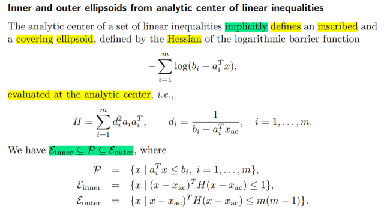</kbd></p>

<p align="center"><kbd>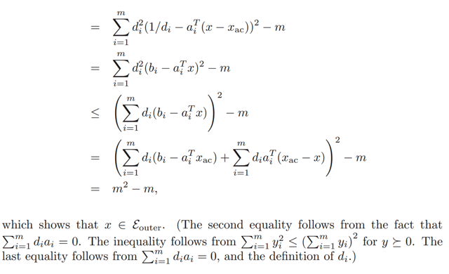</kbd></p>

> [!NOTE]
> Đại khái là cái analytic center của Polyhedron, sẽ "tạo ra" `/` là tâm
> của hai cái ellipsoid, một cái `ε_inner` chứa trong P và một cái 
> bao quanh `/` chứa P
>
> Và hai cái ellipsoid này được đĩnh nghĩa bởi Hessian của hàm log
> barrier
>
> `ε_inner` `=` {x: (x - xac)TH(x - xac) ≤ 1}
>
> `ε_outer` `=` {x: (x - xac)TH(x - xac) ≤ m(m-1)}
>
> Thế thì ta đã học về việc một set C, hay cụ thể là Polyhedron P
> có thể có inscribed ellipsoid là cái có thể tích lớn nhất chứa bên
> trong P và cái L.J ellipsoid là cái nhỏ nhất chứa P.
>
> Thì ỏ đây ý nói là cái `ε_inner` và `ε_outer` ở đây "yếu hơn" hai cái
> nói trên (ko hiểu yếu hơn là sao)
>
> Phần dưới đơn giản chỉ là chứng minh `ε_inner` ⊆ P ⊆ `ε_outer`
>
> Có thể quay lại sau

<br>

<p align="center"><kbd>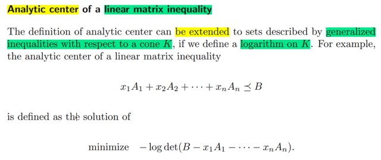</kbd></p>

> [!NOTE]
> Đại khái là cái này cũng có thể
> mở rộng ra với matrix

<br>

<p align="center"><kbd>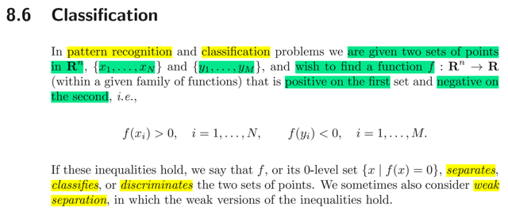</kbd></p>

<p align="center"><kbd>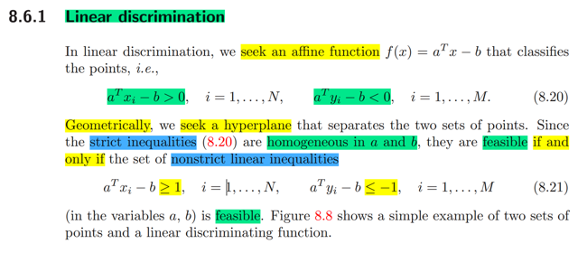</kbd></p>

> [!NOTE]
> Nói qua bài toán classification, trong đó ta có hai set x1,...xN và y1,
> ...yM
>
> (R^n vector). Yêu cầu là tìm hàm f sao cho f(xi) > 0 và f(yi) < 0
>
> Và ý nghĩa của nó là tập level set f(x) `=` 0: x: f(x) `=` 0 sẽ phân chia,
> tách  đôi set x1,...xN và y1, ..yM
>
> Đầu tiên là Linear discrimination, trong đó ta sẽ tìm hàm f có dạng
> tuyến  tính f(u) `=` aTu - b sao cho f(xi) `=` aTxi - b > 0 và f(yi) `=` aTyi - b
> < 0
>
> Về mặt hình học, dễ hiểu chính là ta tìm hyperplane chia tách hai set
> này
>
> Vậy thì ở đây có điểm cần hiểu là vầy:
>
> Nếu nói hàm f chia tách x1, ...xN và y1, ...yM khiến f(xi) < 0 và
> f(yi) > 0 tức là ta nói xi, và yi thuộc hai set: u: f(u) < 0 và v: f(v) > 0
>
> Hay A `=` u: aTu - b < 0 và B `=` u: aTu - b > 0
>
> Thế thì hiểu đại khái là, vì A và B là set mở (đây là hai half-space
> không chưa boundary aTu - b `=` 0) nên kiểu như sẽ có vài khó khăn
>
> Do đó người ta mới xét hai set khác là C: u: aTu - b ≤ 1 và D: u:
> aTu - b ≥ 1 là hai set "đóng" (closed)
>
> Tại sao chọn số "1": Có thể nghiên cứu sau.
>
> CŨNG CHƯA HIỂU LÀ TẠI SAO NHỜ TÍNH CHẤT HOMOGENEOUS 
> THEO a, b MÀ HỆ (1) FEASIBLE KHI VÀ CHỈ KHI HỆ (2) FEASIBLE
>
> Tạm hiểu đại khái là vầy: Muốn aTx - b > 0 `=>` aTx - b ≥ 1 thì aTx - b
> phải có một tính  chất là khi scale nó với số dương bất kì thì nó vẫn
> lớn hơn 0:
>
> ```text
> α(aTx - b) = (α*a)Tx - α*b > 0
> ```
>
> Do đó bài toán tìm a, b sao cho aTx - b > 0 và aTyi - b < 0 có thể
> tương đương tìm aTxi - b ≥ 1 và aTyi - b ≤ 1
>
> 8. GEOMETRIC PROBLEM
>
> 8.6 CLASSIFICATION

<br>

<p align="center"><kbd>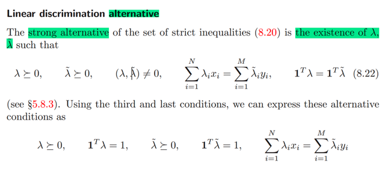</kbd></p>

<p align="center"><kbd>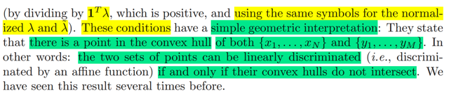</kbd></p>

> [!NOTE]
> Thế thì ở đây nói đến ALTERNATIVES.
>
> Quick review: Xét hệ fi(x) ≤ 0, hj(x) `=` 0, (tự hiểu có nhiều i, j)
>
> (gọi là non-strict) và hệ gọi là dual system λ ≽ 0, λ ≠ 0, g(λ, v) > 0
>
> hoặc hệ (strict) fi(x) < 0, hj(x) `=` 0 và hệ λ ≽ 0, g(λ, v) ≥ 0
>
> Thì "định lý alternative" nói rằng:
>
> Hai hệ (trong cả 2 case strict hay non-strict) này là sẽ có tính chất thế này:  Nếu
> cái này feasible thì suy ra cái còn lại. Đây gọi là Weak alternative
>
> Nếu như có thêm vài điều kiện kèm theo (gọi là qualification constraint),  và fi(.)
> là hàm convex, hi(.) là affine. Thì ta sẽ có Strong alternative:
>
> Cái này infeasible ⇔ Cái kia feasible, Cái này feasible `<=>` Cái còn lại infeasible
>
> `====`
>
> Vậy thì quay lại đây ta có hệ gốc là:
>
> aTxi - b > 0 (⇔ b - aTxi ≤ 0) và aTyi - b < 0
>
> Ta sẽ xây dựng hệ alternative với nó, tức là phải tìm dual function g
>
> Lagrangian: `Σ` λi (b - aTxi) + `Σ` λ~i (aTyi - b)
>
> `=` `Σ` ( λi b - λi aTxi ) + `Σ` ( λ~i aTyi - λ~i b)
>
> ```text
> = Σ λi b - Σ λi aTxi + Σ λ~i aTyi - Σλ~i b
> ```
>
> ```text
> = (Σ λi - Σλ~i) b - aT (Σ λi xi - Σλ~i yi)
> ```
>
> `=` (1Tλ - 1Tλ) b - aT `(Σ` λi xi - `Σλ~i` yi)
>
> g(λ, λ~) `=` inf a, b  (1Tλ - 1Tλ) b - aT `(Σ` λi xi - `Σλ~i` yi) 
>
> g(λ, λ~) `=` inf a  inf b  (1Tλ - 1Tλ) b - aT `(Σ` λi xi - `Σλ~i` yi)  
>
> Đây là affine function của b nên
>
> +) Khi 1Tλ - 1Tλ `=` 0: inf a  inf b  - aT `(Σ` λi xi - `Σλ~i` yi)   (1)
>
> +) Khi 1Tλ - 1Tλ ≠ 0: - infinity
>
> Vì  ta cần g > -infinity nên chỉ xét (1) `=...`
>
> ```text
> +) = 0 khi Σ λi xi - Σλ~i yi = 0
> ```
>
> +) `=` - infinity khi `Σ` λi xi - `Σλ~i` yi ≠ 0
>
> Vậy
>
> ```text
> g = 0 khi 1Tλ - 1Tλ = 0 và Σ λi xi - Σλ~i yi = 0, và = -infinity otherwise
> ```
>
> Vậy alternative system của strict inequalities aTxi - b < 0 aTyi - b > 0 là:
>
> ```text
> g = 0 ≥ 0; λ ≽ 0, λ~ ≽ 0, λ ≠ 0, λ~ ≠ 0, 1Tλ~ = 1Tλ, Σ λi xi = Σλ~i yi
> ```
>
> Và bỏ đi cái g `=` 0 ≥ 0 và không dùng λ ≠ 0, λ~ ≠ 0 (CHƯA HIỂU VÌ SAO)
> và normalizing λ và λ~ để cho 1Tλ `=` 1.
>
> ```text
> λ ≽ 0, λ~ ≽ 0, , 1Tλ = 1,  1Tλ~ = 1, Σ λi xi = Σλ~i yi
> ```
>
> `====`
>
> Kết luận:
>
> (1)  aTxi - b i `=` 1,2...N < 0, aTyj - b > 0 j `=` 1,2...M
>
> strong alternative với:
>
> ```text
> (2)  λ ≽ 0, λ~ ≽ 0, , 1Tλ = 1,  1Tλ~ = 1, Σ λi xi = Σλ~i yi
> ```
>
> Mà như vậy có nghĩa là nếu (1) feasible ⇔ (2) infeasible, và ngược lại
>
> (1) infeasible ⇔ (2) feasible
>
> Mà nếu (2) feasible có nghĩa là tồn tại λ, λ~ đóng vai coefficients tạo  ta các
> ```text
> convex combination (do λi, λ~j > 0, và Σ λi = 1, Σ λ~j = 1)  Σ λi xi và Σ λ~j yj
> ```
> TRÙNG NHAU
>
> Mà như vậy có nghĩa là CONVEX HULL tạo bởi x1, x2 ...và bởi y1, y2,... CÓ
> GIAO NHAU.
>
> Như vậy nếu convex hull conv x1, x2... intersect với conv y1, y2... thì hệ (1)
> infeasible, đồng nghĩa x1, x2... và y1, y2,... KHÔNG THỂ PHÂN TÁCH
> TUYẾN TÍNH (LINEARLY SEPARABLE)
>
> Ngược lại, nếu convex hull của chúng KHÔNG GIAO NHAU, tức (2) infeasible, thì
> chúng LINEARLY SEPARABLE. (1) feasible

<br>

<p align="center"><kbd>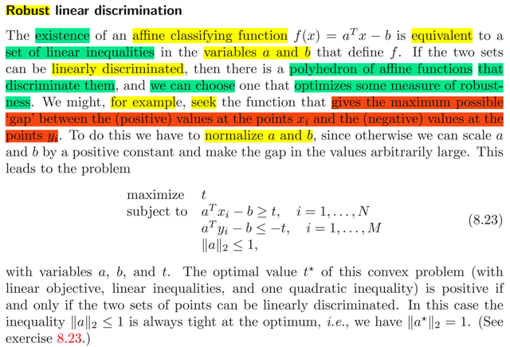</kbd></p>

<p align="center"><kbd>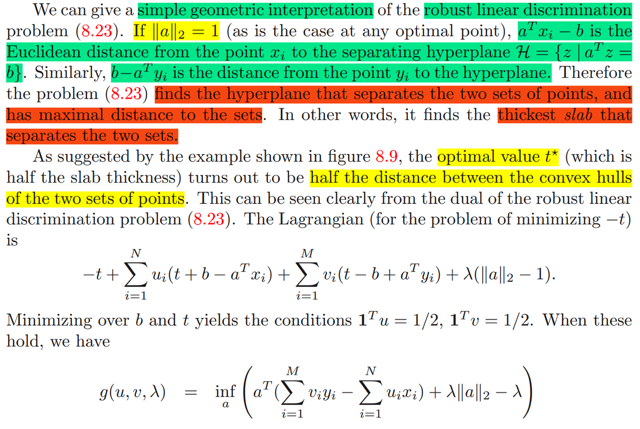</kbd></p>

<p align="center"><kbd>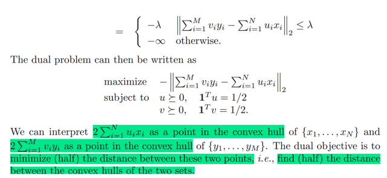</kbd></p>

> [!NOTE]
> Đại khái là như vừa thấy rằng, khi mà set {x1,..xN} và {y1,...yM} linearly separable,
> thì tức là system các inequalities aTxi - b > 0, aTyj - n < 0 là feasible, đồng nghĩa
> tồn tại a, b định ra function f `=` aTu - b, và cùng là định ra hyperplane phân tách hai
> set này.
>
> Thêm nữa có thể không chỉ có một mà có thể có nhiều bộ a, b như  vậy, và các
> hyperplane (bởi một bộ a, b) sẽ intersect nhau thành  một Polyhedron (theo định
> nghĩa Polyhedron là intersection của các hữu hạn các hyperplanes, half-spaces. Và
> như vậy khi đó hai set {xi} {yj} này bị chia tách bởi Polyhedron này.
>
> Và do đó ở đây nói rằng, ta có thể chọn ra, tìm kiếm cái nào mà chia tách tốt nhất,
> đánh giá dựa trên một tiêu chí nào đó. Chẳng hạn ví dụ như tiêu chí là ta muốn tối
> đa hóa khoảng cách (gap) giữa giá trị âm aTxi - b (> 0) và aTyj - b (< 0)
>
> Và để làm vậy thì ta cần đầu tiên là normalize a và b, mục đích đại khái là để loại
> bỏ yếu tố thay đổi gap nói trên thông qua việc scale vector a và b, mà chỉ còn dựa
> trên việc chọn "hướng" của a, và value của scalar b  mà thôi
>
> Và bài toán sẽ là:
>
> maximize t constraint aTxi - b ≥ t, aTyj - b ≤ -t và ||a|| ≤ 1
>
> bài toán này sẽ chỉ có p* dương khi và chỉ khi {xi} và {yj} linearly separable
>
> Đoạn nói về việc ||a|| ≤ 1 luôn tight at optimum chưa hiểu lắm nhưng hiểu đại khái
> là ở optimal thì a*sẽ có ||a*|| `=` 1 (chú ý, ở đây a, b là optimization variable)
>
> Đại khái là ta có thể có một cách giải thích hình học cho bài toán này, hoặc kết qủa
> của bài toán này. Đó là giả sử a*, b* là t* là các optimal value thì với việc ||a*|| `=` 1
> thì a*Txi - b* chính là khoảng cách từ hyperplane H `=` {a*Tz `=` b} tới xi. Và a*Tyj - b*
> là hyperplane H tới yj.
>
> Do đó khi ta maximize t, tức là ta đang maximize lower bound của dist(H, xi)  và
> dist(H, ykj) và cũng chính là maximize dist(H, xi) và dist(H, yj)
>
> Và hình 8.9 cho thấy kết quả nó sẽ "chọn ra" cái Hyperplane H sao cho t `=` `1/2` khoảng
> cách giữa convex hull bởi xi và yj
>
> `===`
>
> Và ta có thể hiểu kết quả này:
>
> Lagrangian L(t, a, b, u, v, λ) `=` - t + `Σ` ui (t + b - aTxi) + `Σ` vi (t - b + aTyj) + λ (||a|| - 1)
>
> (các Lagrange multiplier là ui, vi, λ)
>
> Dual function g(u, v, λ) 
>
> `=` inf t, a, b { - t + `Σ` ui (t + b - aTxi) + `Σ` vj (t - b + aTyj) + λ (||a|| - a) }
>
> ```text
> = inf t, a, b { - t + Σ ui t + Σ ui b - Σ ui aTxi + Σ vj t - Σ vj b + Σ vj aTyj + λ (||a|| - 1) }
> ```
>
> ```text
> = inf t, a, b { - t + Σ ui t + Σ vj t + Σ ui b - Σ vj b - Σ ui aTxi + Σ vj aTyj + λ (||a|| - 1) }
> ```
>
> ```text
> = inf t, { - t + Σ ui t + Σ vj t + inf a, b { Σ ui b - Σ vj b - Σ ui aTxi + Σ vj aTyj + λ (||a|| - 1) } }
> ```
>
> ```text
> Xét inf a, b { Σ ui b - Σ vj b - Σ ui aTxi + Σ vj aTyj + λ (||a|| - 1) }
> ```
>
> ```text
> = inf a, b { (Σ ui - Σ vj) b - aT (Σ ui xi - Σ vj yj) + λ (||a|| - 1) }
> ```
>
> infimum over b thì đây là affine function đối với b nên kết quả ra -infinity trừ khi hệ số gắn
> với b `=` 0
>
> ```text
> = inf a { - aT (Σ ui xi - Σ vj yj) + λ (||a|| - a)  } khi Σ ui - Σ vj = 0 (và -infinity otherwise)
> ```
>
> ```text
> = inf a { aT (Σ vj yj - Σ ui xi) + λ (||a|| - a)  } khi Σ ui - Σ vj = 0 (và -infinity otherwise)
> ```
>
> ```text
> ⇨ g = inf t {- t + Σ ui t + Σ vj t + inf a { aT (Σ vj yj - Σ ui xi) + λ (||a|| - 1)  }} subject to Σ ui = Σ vj
> ```
>
> ```text
> inf t { (-1 + Σ ui + Σ vj) t + inf a { aT (Σ vj yj - Σ ui xi) + λ (||a|| - 1)  }} subject to Σ ui = Σ vj
> ```
>
> (int over t thì đây linear function đối với t nên kết quả cũng ra -infinity trừ khi hệ số gắn với t `=` 0
> thì nó bằng 0)
>
> ```text
> = {0 +  inf a { aT (Σ vj yj - Σ ui xi) + λ (||a|| - 1)  }} subject to (-1 + Σ ui + Σ vj) = 0 và Σ ui = Σ vj
> ```
>
> ```text
> = inf a { aT (Σ vj yj - Σ ui xi) + λ (||a|| - 1) } subject to (-1 + Σ ui + Σ vj) = 0 và Σ ui = Σ vj
> ```
>
> ```text
> = inf a { aT (Σ vj yj - Σ ui xi) + λ (||a|| - 1)  } subject to (-1 + Σ ui + Σ vj) = 0 và Σ ui = Σ vj
> ```
>
> Xét inf a { aT `(Σ` vj yj - `Σ` ui xi) + λ (||a|| - 1)  } 
>
> `=` inf a { aT `(Σ` vj yj - `Σ` ui xi) + λ ||a|| - λ } 
>
> ```text
> = λ [ inf a { aT (Σ vj yj - Σ ui xi) / λ + ||a|| - 1 } ]
> ```
>
> (chuyển thành - sup và đổi dấu mọi term trong {...}
>
> ```text
> = - λ [ sup a { - aT (Σ vj yj - Σ ui xi) / λ - ||a|| } + 1 ]
> ```
>
> ```text
> = - λ [ sup a { aT (- Σ vj yj + Σ ui xi) / λ - ||a|| } + 1 ]
> ```
>
> Đến đây áp dụng:
>
> sup x {yTx - ||x||} `=` :
>
> a) 0 khi ||y||* ≤ 1
>
> b) +infinity khi ||y||* > 1
>
> ```text
> = 1) - λ (0 + 1) khi || - (Σ vj yj - Σ ui xi) / λ ||* ≤ 1  và -infinity otherwise
> ```
>
> ⇔ g `=` - λ khi || - `(Σ` vj yj - `Σ` ui xi)||* ≤ λ 
>
> ```text
> Mà || - (Σ vj yj - Σ ui xi) / λ ||* = || (Σ vj yj - Σ ui xi) / λ ||* (Do ||u||* = ||-u||)
> ```
>
> ```text
> Vậy g = - λ khi || (Σ vj yj - Σ ui xi) / λ ||*  ≤ λ và (-1 + Σ ui + Σ vj) = 0 và Σ ui = Σ vj
> ```
>
> ```text
> (-1 + Σ ui + Σ vj) = 0 và  Σ ui = Σ vj ⇔  Σ ui = Σ vj = 1/2
> ```
>
> Bài toán dual problem sẽ là:
>
> maximize g `=` - λ 
>
> ```text
> constraint || (Σ vj yj - Σ ui xi) / λ ||*  ≤ λ và 1Tu = 1Tv = 1/2, u, v ≽ 0
> ```
>
> Thì nó equivalent với:
>
> ```text
> maximize  - || (Σ vj yj - Σ ui xi) / λ ||* constraint 1Tu = 1Tv = 1/2, u, v ≽ 0
> ```
>
> ```text
> (vì λ ≥  || (Σ vj yj - Σ ui xi) / λ ||* , nên - λ ≤ - || (Σ vj yj - Σ ui xi) / λ ||* mang ý nghĩa là - λ
> ```
> ```text
> lớn nhất là = - || (Σ vj yj - Σ ui xi) / λ ||*, là upper bound. Nên để maximize λ ta sẽ đẩy cái
> ```
> upper bound này cao lên
> ```text
> maximize  - || (Σ vj yj - Σ ui xi) / λ ||* constraint 1Tu = 1Tv = 1/2, u, v ≽ 0
> ```
>
> ```text
> (vì λ ≥  || (Σ vj yj - Σ ui xi) / λ ||* , nên - λ ≤ - || (Σ vj yj - Σ ui xi) / λ ||* mang ý
> ```
> ```text
> nghĩa là - λ  lớn nhất là = - || (Σ vj yj - Σ ui xi) / λ ||*, là upper bound. Nên để
> ```
> maximize λ ta sẽ đẩy cái upper bound này cao lên
>
> ```text
> Và || Σ ui xi - Σ vj yj || với 1Tu = 1/2, 1Tv = 1/2 và u, v ≽ 0 thì chính là 1/2
> ```
> khoảng cách, giữa  hai điểm trong convex hull. Là sao.
>
>
>
> ```text
> || Σ ui xi - Σ vj yj || = 1/2 || 2Σ ui xi - 2Σ vj yj ||
> ```
>
> ```text
> và với 1Tu = 1/2 ⇨ 2*1Tu = 1, và 2*1Tv = 1 nên 2Σ ui xi, 2Σ vj yj chính là 2 convex combination
> ```
> của {xi}, {yj}. Cũng là 2 điểm trong convex hull tạo bởi hai set.
>
> Do đó objective của dual problem chính là đang minimize `1/2` khoảng cách giữa 2 điểm
> trong hai convex hull
>
> Và đó cũng chính là đang tìm khoảng cách giữa hai convex hull

<br>

<p align="center"><kbd>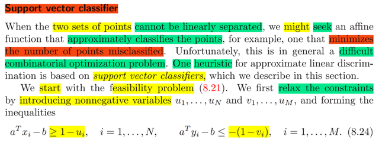</kbd></p>

<p align="center"><kbd>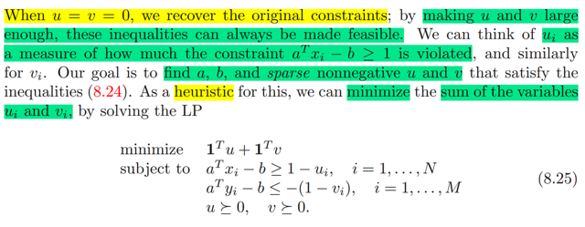</kbd></p>

> [!NOTE]
> Đại khái là nói về trường hợp mà hai set {x1,...xN} và {y1,...yM} không thể
> phân tách tuyến tính được (như lúc nãy đã nói, điều này xảy ra khi convex
> hull tạo bởi {xi} và convex hull bởi {yj} không giao nhau.
>
> Khi đó, đại khái là ta có thể classify theo tính chất ước lượng (chấp nhận có
> sai sót) mà điều đầu tiên có thể nghĩ đến đó là ước lượng theo kiểu tối thiểu
> hóa tỉ lệ misclassification.
>
> Tuy nhiên làm vậy khó.
>
> Do đó đại khái là có những cách thức mang tính chất heuristic (dựa vào kinh
> nghiệm) để cũng hướng tới mục tiêu này (nhưng ko phải là đặt objective cụ
> thể là giảm thiểu misclassification).
>
> Và cách làm đó, đại khái là vầy. Đầu tiên nói lại về bài toán hồi nãy tức là ta
> muốn tìm f(u) `=` aTu - b sao cho aTxi - b > 0 và aTyj - b < 0 (tất nhiên là ∀ xi,
> yj). Như đã nói, đang xét trường hợp hai set n{xi}, {yj} không linearly
> separable nên hệ này infeasible.
>
> Ngoài ra còn nhớ một cái nữa, đó là hệ (strictly inequality) aTxi - b > 0,  aTyj -
> b < 0 có thể equivalent với một hệ non-strict là aTxi - b ≥ 1, aTyj - b ≤ -1 Và dĩ
> nhiên là hệ non-strict này cũng infeasible luôn.
>
> Thế thì hệ gốc infeasible, không thể absolute classify nên ta mới phải
> approximate, và hướng làm là NỚI LỎNG BỚT YÊU CẦU (RELAXATION)
>
> Là sao, tức là nếu aTxi - b ≥ 1 không thể thõa mãn được, thì giảm vế phải xuống
> hoặc tăng vế trái lên, bằng cách cộng vào vế trái một số không âm ui:
>
> aTxi - b + ui ≥ 1, khi đó vế trái nó lớn hơn rồi thì khả năng nó thỏa (≥ 1) sẽ trở
> nên khả thi hơn. Và chắc chắn là chỉ cần ui lớn đến mức nào đó thì hệ sẽ
> thỏa. Y như vậy nếu aTyj - b ≤ -1 không thỏa thì ta sẽ cộng vào vế phải số
> không âm vj, thì nếu nó đủ lớn thì bất phương trình sẽ thỏa.
>
> Như vậy từ hệ gốc aTxi - b ≥ 1, aTyj - b ≤ -1 INFEASIBLE, ta có hệ sau đây
> aTxi - b ≥ 1 - ui, aTyj - b ≤ -1 + vj CÓ THỂ FEASIBLE
>
> Và ta có thể voi ui, vj LÀ MỨC ĐỘ NỚI LỎNG `/` VI PHẠM CONSTRAINT
> Ở CASE xi, yj (Vì nếu không chấp nhận vi phạm thì ko thể tìm ra a, b thỏa
> aTxi - b ≥ 1 và aTyj - b ≤ -1 được, nhưng chấp nhận thì có thể tìm a, b thỏa
> aTxi - b ≥ 1 - ui, aTyj - b ≤ -1 + vj)
>
> Và mục tiêu của bài toán sẽ là tìm ra a, b và u `=` [u1, ...uN], v `=` [v1, ...vM] sao 
> cho thỏa hệ aTxi - b ≥ 1 - ui, aTyj - b ≤ -1 + vj nhưng u, v SPARSE. Ý nghĩa là
> ta muốn nới lỏng constraint để có thể tìm ra a, b thỏa hệ, nhưng chỉ nới lỏng
> vừa đủ. Vì không phải với xi nào aTxi - b ≥ 1 cũng cần add thêm ui. Và kết quả
> ta muốn nói trên, ta sẽ có vector u, v với CÀNG ÍT VỊ TRÍ KHÁC 0 CÀNG TỐT
> `=` THƯA THỚT (SPARSE), mà những vị trí khác 0 cũng nên có giá trị nhỏ,
> còn những vị trí bằng 0 thể hiện aTxi - b ≥ 1 + ui với ui `=` 0 thể hiện "ở case"
> xi đó ta KHÔNG CẦN PHẢI NỚI LỎNG `/` VI PHẠM CONSTRAINT.
>
> Và CÁCH THỨC MANG TÍNH KINH NGHIỆM NGƯỜI TA SẼ DÙNG ĐÓ LÀ
> MINIMIZE TỔNG ui, vj: `Σ` ui + `Σ` vj `=` 1Tu + 1Tv
>
> Từ đó ta có bài toán optimization:
>
> minimize 1Tu + 1Tv constraint aTxi - b ≥ 1 - ui, aTyj - b ≤ -1 + vj, u ≽ 0, v ≽ 0

<br>

<p align="center"><kbd>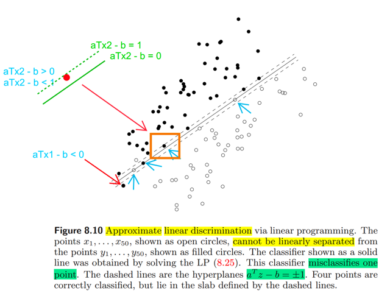</kbd></p>

<p align="center"><kbd>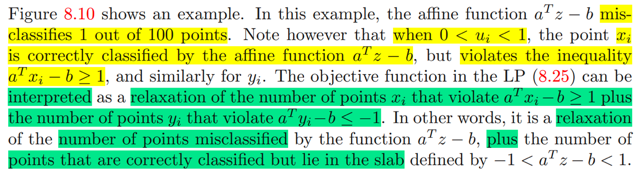</kbd></p>

> [!NOTE]
> Vậy thì đây là ví dụ mà kết qủa của bài toán minimize 1Tu + 1Tv
> constraint aTxi - b ≥ 1 - ui, aTyj - b ≤ -1 + vj
>
> Cho thấy nó phân tách hai set với 1 cái bị sai (misclassified)
>
> Thế thì họ nói rằng, xét 1 cái xi nào đó được phân tách đúng, tức
> là aTxi - b ≥ 1 - ui, thì nếu 0 < ui < 1 thì 1 - ui > 0. Nên aTxi - b > 0
> nhưng 
> Mà cái này nghĩa là, xi vẫn có thể được phân tách đúng bởi f(z)
> `=` aTz - b (vì bỏ xi vào nó vẫn ra aTxi - b > 0) NHƯNG nó không
> thỏa aTxi - b ≥ 1 (vì aTxi - b chỉ ≥ 1 - ui thôi, chưa chắc ≥ 1)
>
> Như vậy, câu chuyện là vầy:
>
> Ta bắt đầu với một hệ mà ta muốn thỏa (muốn tìm a, b để thỏa):
>
> aTxi - b > 0, aTyj - b < 0.
>
> Rồi ta mới làm việc với một hệ khác tương đương nhưng non-stritct:
>
> aTxi - b ≥ 1, aTyj - b ≤ -1
>
> Nhưng ta lại đang xét bài toán mà cả hai hệ này đều infeasible
>
> Nên ta mới nới lỏng `/` cho phép vi phạm constraint bằng cách xét hệ:
>
> aTxi - b ≥ 1 - ui, aTyj - b ≤ -1 + vj
>
> Để rồi khi tìm ra a, b, u, v khiến hệ (3) feasible thì có những xi khiến
> hệ (1) thỏa nhưng hệ (2) không thỏa
>
> Do đó việc giải hệ (3) coi như ta chấp nhận những trường hợp không
> thỏa hệ (2) (thỏa hệ (1) nhưng không thỏa hệ (2))
>
> Và bên cạnh đó, a, b giải từ hệ (3) vẫn có những xi yj bị classify sai
> bởi hệ (1).
>
> Nên tóm lại. Nói đầy đủ thì việc dùng hệ (3) để tìm a, b ta đã chấp
> nhận:
>
> a) Có những case mà hệ (1) không thỏa. Tức là classify sai: 
> ví dụ aTxi - b < 0
>
> b) Có những case mà hệ (1) thỏa, nhưng hệ (2) không thỏa:
> ví dụ aTxi - b > 0 nhưng aTxi - b < 1: 0 < aTxi - b < 1
>
> Và biểu hiện hình học là:
>
> Vẽ hyperplane f(z) `=` aTz - b ra. Và hai "biên" aTz - b + 1, aTz - b - 1
> ra. Thì sẽ có:
>
> a) Có những điểm bị sai ví dụ aTx1 - b < 0, nó là những xi (chấm đen
> mà nằm bên phía trắng)
>
> b) Có những điểm classify đúng (thỏa (1)) nhưng (không thỏa (2)) `=` 
> nằm bên trong phạm vi của miếng `/` dải (slab) aTx - b `+/-` 1.
>
> Ví dụ trong hình x2 thỏa aTx2 - b > 0, nhưng 0 < aTx1 - b < 1
>
> (vì nếu thỏa (2) luôn thì nó phải nằm ở trên dải này, tức nằm trên
> đường dash line aTx - b > 1)
>
> Vậy thì ta sẽ hiểu thế này.
>
> Ta muốn giảm (số lượng `/` mức độ) mà ta phải nới lỏng constraint
> hay, cũng là giảm số violate. Và như đã nói, nó bao gồm 2 thứ:
>
> a) Số điểm bị classify sai và b) Số điểm classify đúng nhưng không
> tự tin (thỏa hệ (1) nhưng không thỏa hệ (2))

<br>

<p align="center"><kbd>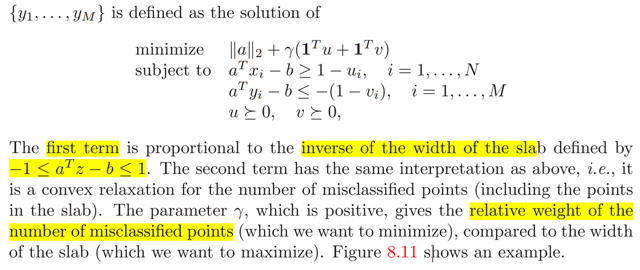</kbd></p>

<p align="center"><kbd>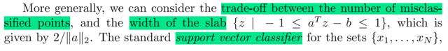</kbd></p>

<p align="center"><kbd>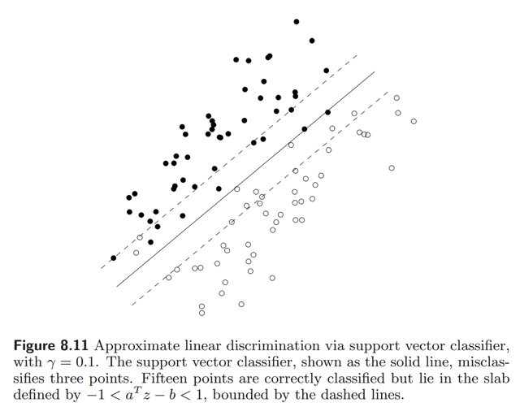</kbd></p>

> [!NOTE]
> Thế thì, khái quát `/` mở rộng hơn, ta còn muốn maximize bề rộng
> của slab nữa có nghĩa là ta muốn objective phản ánh những tiêu
> chí sau đây:
>
> + Bề rộng slab rộng nhất có thể để những một khi một điểm đã bị
> phân tách bởi slab này thì tức là nó được classify với mức độ tự tin
> cao
>
> + Số điểm nằm trong slab bao gồm bị classify đúng ít nhất có thể
> thể hiện ít điểm bị classify sai hoặc đúng nhưng ko tự tin
>
> Tất nhiên đây là những tiêu chí sẽ confict `/` constradict nhau dẫn
> đến bài toán sẽ kiểu như tìm ra pareto optimals `/` trade off giữa hai
>
> Và đó chính là objective: ||a|| + `γ` (1Tu + 1Tv)
>
> trong đó giảm ||a|| sẽ tăng bề rộng slab (hình dung nếu trong trường
> hợp f(x) `=` az - b đường thẳng (cũng là hyperplane) là a là độ dốc
> của đường tuyến tính az + b, thì a càng lớn thì đường càng dốc
> Và hình dung hai đường song song với nó, sao cho 3 đường này cắt
> trục tung ở một đoạn dài `=` 2 đơn vị. Thì nếu càng dốc, thì bề rộng
> của dải này càng hẹp
>
> còn giảm 1Tu + 1Tv chính là để thể hiện mong muốn giảm số sai sót
> hoặc số điểm đúng nhưng nằm trong slab
>
> Còn `γ` là trọng số (relative weight) để phản ánh mức độ mà ta sẽ
> muốn ưu tiên tiêu chí nào.
>
> Có thể nhớ đây có thể coi là một kiểu scalarization khi ta có bài
> toán vector optimization hay multi-criterion optimization problem
> trong đó ta muốn minimize 2 objective ||a||: cho bề rộng slab và
> 1Tu + 1Tv cho mức độ sai sót.
>
> Và ta kết hợp nó thành vector [F1 `=` ||a|| F2 `=` 1Tu + 1Tv] rồi scalarizing
> bằng cách dot product với vector [λ1 `=` 1, λ2 `=` `γ]`

<br>

<p align="center"><kbd>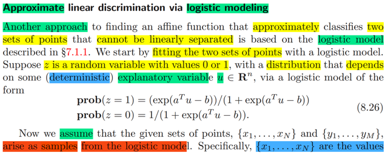</kbd></p>

<p align="center"><kbd>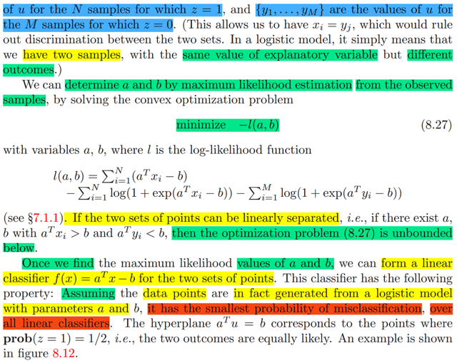</kbd></p>

<p align="center"><kbd>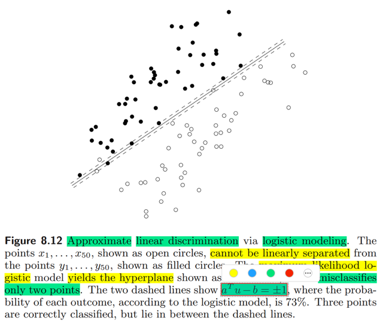</kbd></p>

> [!NOTE]
> đại khái là, bên cạnh cách tiếp cận bài toán approximate linear discrimination (nôm na là ta không
> phân tách tuyến tính một cách chính xác được, nên phải làm theo kiểu approximate, ước lượng xấp
> xỉ, gần đúng) theo support vector classifier. Thì một phương pháp khác là dùng logistic model.
>
> Thế thì, ta đã nói về logistic model trong phần maximum likelihood estimation.
>
> Đại khái là bắt đầu từ việc ta có các observed value y1,y2,....ym mang các giá trị 0 hoặc 1 tương ứng
> với các deterministic explanatory variable) u1, u2,..um.
>
> Và ta muốn mô hình hoá (liên hệ giữa ui và yi).
>
> Với logistic model ta sẽ mô hình như sau:
>
> ```text
> P(y = 1) = p = exp(aTu - b) / 1 + exp(aTu - b)
> ```
>
> ```text
> P(y = 0) = 1- p = 1 / 1 + exp(aTu - b)
> ```
>
> Có nghĩa là với fixed giá trị của a, b ta có function mà khi input vào  explanatory variable ui, output sẽ
> là xác suất yi `=` 1.
>
> Từ đó ta có likelihood function (coi ui, yi là fixed, và ta có function theo a, b để input vào a, b ta có
> likelihood của observed data ui, yi
>
> l(a, b).
>
> Cũng bắt đầu từ joint probability:
>
> Pa,b(Y1 `=` y1, Y2 `=` y2,....Ym `=` ym) (ta có m random sample, mang các observed value y1, y2,...)
>
> `=` Π Pa,b(Yi `=` yi)
>
> Giả sử trong đó có p observed value mang giá trị `=` 1, m - p mang giá trị 0:
>
> ```text
> = Π (yi = 1) p Π (yj = 0) (1 - p)   |   Π (yi = 1) p ý là xét số random sample mang giá trị yi = 1
> ```
>
> Lấy log: Để có log likelihood:
>
> ```text
> = log [ Π yi = 1 exp(aTui - b) / 1 + exp(aTui - b) Π yj = 0 1 / 1 + exp(aTui - b) ]
> ```
>
> ```text
> = Σ (yi = 1)  log [ exp(aTui - b) ] - log [ 1 + exp(aTui - b) ]  + Σ (yj = 0) log 1 - log [ 1 + exp(aTui - b) ]
> ```
>
> ```text
> = Σ (yi = 1) (aTui - b) - Σ (yi = 1) log [ 1 + exp(aTui - b) ] - Σ (yj = 0) [ log [ 1 + exp(aTui - b) ]
> ```
>
> Và giải bài toán optimization maximize l(a,b) ta sẽ có maximum likelihood estimator a, b
>
> `====`
>
> Vậy thì áp dụng vào đây, khi ta có hai set x1, x2, ...xM và y1, y2, ...yN.
>
> Ta sẽ đổi lại kí hiệu, cho khỏi nhầm:
>
> Mô hình logistic sẽ là:
>
> ```text
> P(z = 1) = p = exp(aTu - b) / 1 + exp(aTu - b)
> ```
>
> ```text
> P(z = 0) = 1 - p = 1 / 1 + exp(aTu - b)
> ```
>
> Ta sẽ cho rằng chúng là các giá trị của ui và set x1,...xM gắn với observed value zi `=` 1, còn y1,..yN
> gắn với observed value zj `=` 0.
>
> Khi đó, likelihood function sẽ là:
>
> P(M observed value zi `=` 1, N observed values zj `=` 0)
>
> ```text
> = Π i=1:M exp(aTxi - b) / 1 + exp(aTxi - b) Π j=1:N 1 / 1 + exp(aTyj - b)
> ```
>
> Log likelihood: l(a,b):
>
> ```text
> = log Π i=1:M exp(aTxi - b) / 1 + exp(aTxi - b) Π j=1:N 1 / 1 + exp(aTyj - b)
> ```
>
> ```text
> = Σ i=1:M log exp(aTxi - b) - Σ i=1:M log [ 1 + exp(aTxi - b) ] + Σ j=1:N log 1 - Σ j=1:N log [ 1 + exp(aTyj - b) ]
> ```
>
> ```text
> = Σ i=1:M (aTxi - b) - Σ i=1:M log [ 1 + exp(aTxi - b) ] - Σ j=1:N log [ 1 + exp(aTyj - b) ]
> ```
>
> Và giải bài toán tối ưu: maximize l(a, b) sẽ cho ta maximum likelihood estimator
>
> Thế thì, họ nói rằng, khi ta giải bài toán này, nếu mà hai set này là linearly separable, thì
> bài toán này sẽ unbounded below, tức là ta sẽ không có optimal
>
> VÌ SAO? Trả lời bên dưới:
>
> Còn ngược lại, tức không linearly separable. Thì ta sẽ có optimal, tức a, b và khi đó
> hyperplane aTu - b sẽ là cái hyperplane mà thể hiện P(z `=` 1) `=` `1/2`
>
> ```text
> Có nghĩa là mọi điểm trên hyperplane aTu = b sẽ có exp(aTu - b) / [1 + exp(aTu - b)] = 1/2
> ```
>
> `====`
>
> Tại sao khi set {x1,...xM} và {y1,...yN} linearly separable thì bài toán minimize - l(a,b) unbounded
> below?
>
> Đại khái là vầy: 
>
> ```text
> xét l(a, b) = Σ i=1:M (aTxi - b) - Σ i=1:M log [ 1 + exp(aTxi - b) ] - Σ j=1:N log [ 1 + exp(aTyj - b) ]
> ```
>
> Thì khi hai set linearly separable, tức là tồn tại a, b tạo hyperplane aTz - b phân tách hoàn toàn
> hai set. Đồng nghĩa tồn tại a, b khiến hệ (1): aTxi - b > 0, aTyj - b < 0 thỏa.
>
>
> ```text
> Xét hàm l(a,b) theo công thức ban đầu: l(a,b) = log [ Π i=1:M σ(aTxi - b) Π j=1:N [1 - σ(aTyj - b)] ]
> ```
>
> ```text
> (σ(.) là kí hiệu của hàm sigmoid σ(u) = exp(u) / [1 + exp(u)]
> ```
>
> scale a,b với scalar `α` lớn dần thì (aTxi - b) sẽ -> + infinity khi đó `σ(aTxi` - b) -> +1 (vì hàm sigmoid
> ta biết rồi) ⇨ log `σ(aTxi` - b) -> log (1) `=` 0
>
> tương tự, aTyj - b < 0 ⇨ scale a, b với `α` lớn dần thì aTyj - b -> -infinity ⇨ `σ(aTyj` - b) -> 0
> ⇨ 1 - `σ(aTyj` - b) -> 1 ⇨ log [1 - `σ(aTyj` - b)] -> -infinity (*chỗ này quay lại sau)
>
> ⇨ -l(a,b) -> -infinity
>
> TẠM THỜI NHƯ VẬY, QUAY LẠI SAU

<br>

<p align="center"><kbd>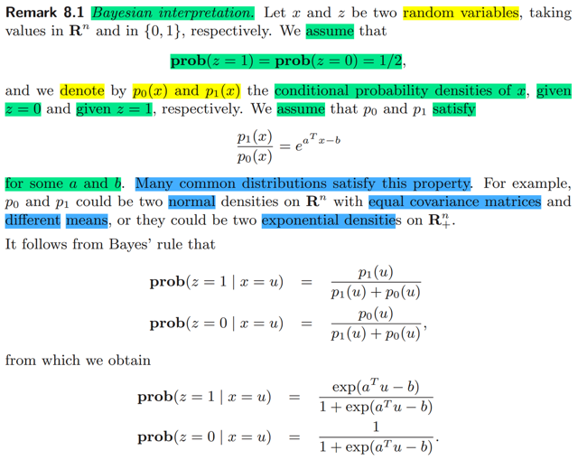</kbd></p>

<p align="center"><kbd>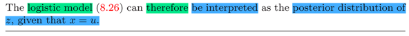</kbd></p>

> [!NOTE]
> QUAY LẠI SAU

<br>

<p align="center"><kbd>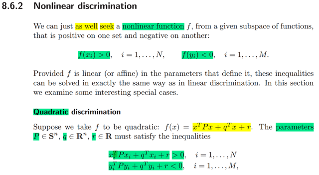</kbd></p>

<p align="center"><kbd>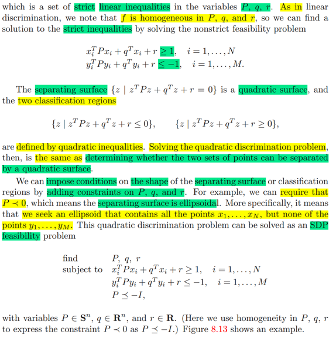</kbd></p>

> [!NOTE]
> Đại khái là ta có thể quy định f (cần tìm) không phải linear mà
> non-linear. Và ví dụ ta có thể tìm một hàm quadratic có  dạng f(x) `=`
> xTPx + qTx + r. Param cần tìm là P, q, r
>
> Thế thì, hoàn toàn tương tự, ta bắt đầu với việc muốn tìm P, q, r sao
> cho nó strictly separate {x1,..xN} và {y1,...yM} thông qua việc thỏa:
> xiTPxi + qTxi + r > 0 và yjTPyj + qTyj + r < 0.
>
> Rồi, ta cũng chuyển nó thành hệ non-strict tương đương:
>
> xiTPxi + qTxi + r ≥ 1 và yjTPyj + qTyj + r ≤ -1
>
> Thế thì, khi tìm ra P, q, r thỏa hệ này, tương tự khi với linear function
> ta có một hyperplane phân tách hai set. Ở đây ta sẽ có một Quadratic
> surface phân tách hai set.
>
> Thế thì người ta nói rằng, mình có thể tạo thêm `/` đặt ra thêm quy định
> về HÌNH DẠNG của separating surface thông qua việc add thêm
> constraint đối với P, q, r.
>
> Ví dụ như nếu ta yêu cầu P ≺ 0 (cũng chuyển thành P ⪯ I) là negative
> semi definite thì tức là ta muốn separating surface là một ellipsoid. Để
> rồi nếu phân tách thì nó sẽ  tìm ra một ellipsoid chứa một set (bao
> quanh nó) và set còn lại thì ở ngoài.

<br>

<p align="center"><kbd>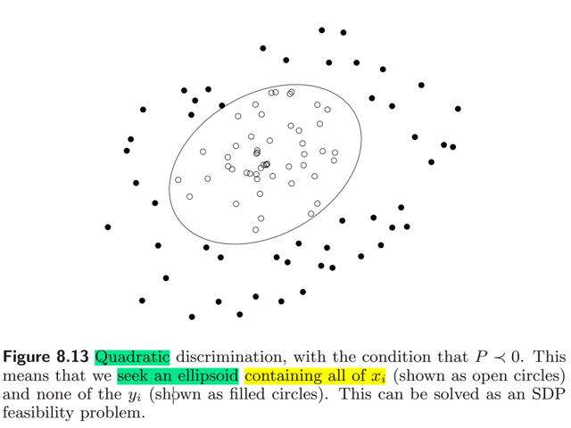</kbd></p>

<br>

<p align="center"><kbd>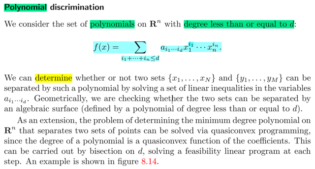</kbd></p>

<p align="center"><kbd>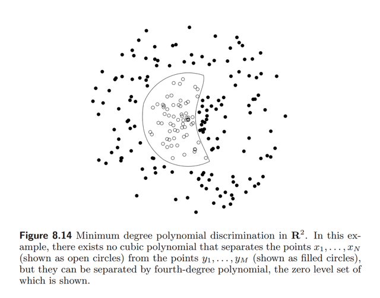</kbd></p>

> [!NOTE]
> QUAY LẠI SAU

<br>

<p align="center"><kbd>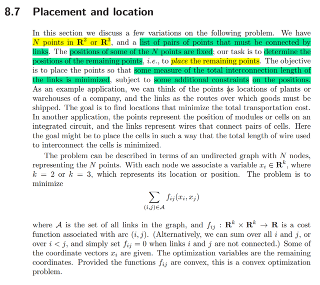</kbd></p>

> [!NOTE]
> QUAY LẠI SAU
>
> 8. GEOMETRIC PROBLEM
>
> 8.7 PLACEMENT & LOCATION

<br>

<p align="center"><kbd>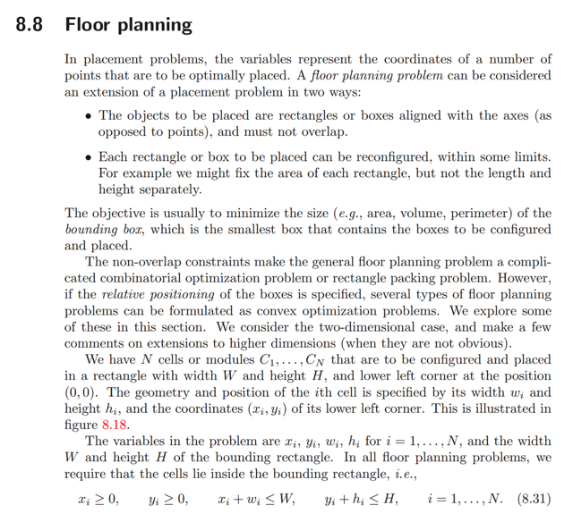</kbd></p>

> [!NOTE]
> QUAY LẠI SAU
>
> 8. GEOMETRIC PROBLEM
>
> 8.8 FLOOR PLANNING

<br>


<a id="node-k80kdvt"></a>
## Chap 11.6

<br>

<p align="center"><kbd>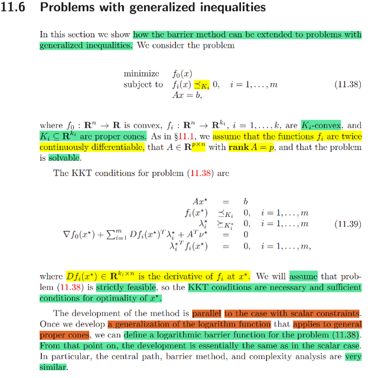</kbd></p>

> [!NOTE]
> Đại khái là mở rộng qua bài toán "generalized inequalities" có nghĩa là
> ở đây các ràng buộc bất đẳng thức inequality constraint fi(x) ≤ 0 không
> còn là scalar function nữa. Thay  vào đó, nó là vector function. Với
> vector như ta đã biết, việc so sánh giữa hai vector phải dựa trên định
> nghĩa của một proper cone K.
>
> Định nghĩa của proper cone xem lại bài trước nhưng đại khái là nó cho
> phép ta có một cái kiểu xếp thứ tự hay so sánh vector với nhau (gọi là
> partial ordering) và có những tính chất tương tự như khi so sánh số
> thực với nhau (gọi là standard ordering) được định nghĩa  như sau: y
> ≽K x ⇔ y- x ∈ K.
>
> Một ví dụ đặc biệt là khi K là non-negative orthant R^n+. Khi đó, y
> ≽R^n+ x ⇔  y - x ∈ R^n+ và điều này đồng nghĩa mọi component của
> vector y - x đều không âm, hay (y - x)i ≥ 0 ∀i ⇔ yi ≥ xi ∀i.
>
> Quay lại đây, các inequality constraint sẽ có dạng như vậy fi(x) ⪯Ki 0
>
> Thế thì với bài toán optimization với generalized inequalities constraint
> ta cũng có Lagrangian:
>
> L `=` f0(x) + `Σi` λiTfi(x) + `Σi` vi(aiTx - bi)
>
> Chỗ này có một điểm khác với Lagrangian của bài toán inequality bình
> thường khi fi(x) là scalar function. Đó là: với scalar case, mỗi fi(x) sẽ
> có một Lagrange multiplier (hay dual variable) λi cũng là scalar: λifi(x)
>
> Còn bây giờ khi fi(x) là vector, nó sẽ tương ứng với một vector λi, và
> ta cần dùng inner product để chuyển thành scalar: λiTfi(x). Với equality
> constraint Ax `=` b thì về bản chất vẫn chỉ là hệ các đẳng thức tuyến tính
> hi(x) `=` 0 ⇔ aiTx - bi `=` 0, với hi(x) `=` aiTx - bi là scalar, đi kèm mỗi cái là
> một dual variable scalar vi: vi(aiTx - bi) và tổng `Σi` vi(aiTx - bi) có thể
> thể hiện ở dạng compact: vT(Ax - b).
>
> Nên trong bài toán này L `=` f0(x) + `Σi` λiTfi(x) + vT(Ax - b)
>
> Và trong chap 5 mình cũng đã tự giải thích rất kĩ phần xây dựng KKT
> conditions cũng như các vấn đề khác nên khỏi ghi lại ở đây.
>
> `====`
>
> Thế thì ý chính là để áp dụng log barrier method cho bài toán generalized
> inequality constraint này thì ta đầu tiên ta phải ĐỊNH NGHĨA MỘT LOG
> BARRIER FUNCTION ĐỂ DÙNG. Sau đó thì mọi chuyện hoàn toàn tương
> tự

<br>

<p align="center"><kbd>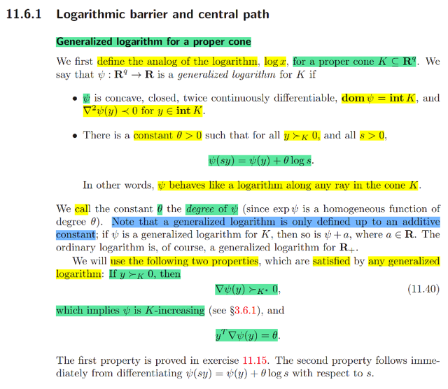</kbd></p>

> [!NOTE]
> Đại khái là nếu ta define hàm ψ: 
>
> Sao cho với mọi y ≻K 0, và s > 0 ta đều có:
>
> Tồn tại `θ` dương sao cho ψ(sy) `=` ψ(y) + `θlog(s)`
>
> Thì ψ sẽ gọi là generalized log đối với proper cone K
>
> Khi đó nó sẽ có 2 tính chất:
>
> 1) Nếu y ≻K 0 thì ∇ ψ(y) ≻ K* 0
>
> 2) yT ∇ψ(y) `=` 0
>
> ```text
> d/ds ψ(sy) = d/ds [ψ(y) + θlog(s)]
> ```
>
> Vế trái:
>
> ```text
> d/ds ψ(sy) = d/d(sy) ψ(sy) . d/ds (sy)
> ```
>
> `=` ∇ψ(sy) T y
>
> Vế phải:
>
> ```text
> = 0 + θ d/ds log(s) = θ/s
> ```
>
> ⇨ ∇ψ(sy)Tys `=` `θ`
>
> ⇨ ∇ψ(u)Tu `=` `θ|` u `=` sy

<br>

<p align="center"><kbd>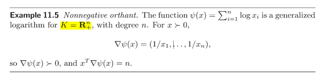</kbd></p>

<p align="center"><kbd>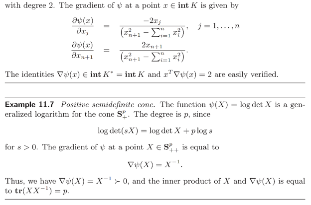</kbd></p>

> [!NOTE]
> Đại khái là cho ví dụ về hàm Ψ: Ψ(x) `=` `Σ` log(xi) sẽ là generalized
> log của cone K `=` R^n+. Ta sẽ xem thử nó có đúng là có tính chất
> trên ko:
>
> 1) ψ(sy) `=` ψ(y) + `θ` log s
>
> ```text
> ψ(sy) = Σi log (s yi) = Σi (log s + log yi) = Σi log s + Σi log yi
> ```
>
> `=` `Σi` log yi + n log s
>
> và đây đúng là ψ(y) + `θ` log s với `θ` `=` n
>
> 2) Nếu y ≻K 0 thì ∇ψ(y) ≻K* 0: thì với non-negative orthan thì K* `=` K
> nên  ∇ψ(y) ≻K* 0 `=` ∇ψ(y) ≻K 0 và cũng là ∇ψ(y) ≻ 0
>
> ```text
> Lấy x ≻ 0, thì ∇ψ(x) = (1/x1, 1/x2, ....1/xn), tại sao?
> ```
>
> Trong case này làm theo kiểu cơ bản ∇ψ(x) `=` `[∂/∂x1` `ψ(x),..∂/∂xn` ψ(x)]
>
> ```text
> sẽ thấy ngay = [∂/∂x1 Σ log(xi),..∂/∂xn Σ log(xi)]
> ```
>
> `=` `[d/dx1` `log(x1),..,d/dxn` log(xn)]
>
> `=` `[1/x1,` `...1/xn]`
>
> Nhưng cứ thử làm theo kiểu MIT 18s096: 
>
> ψ(x) `=` `Σi` log xi có thể viết theo dạng 1Tlog(x)
>
> ```text
> d ψ = ψ(x + dx) - ψ(x) = Σi log(xi + dxi) - Σi log(xi)
> ```
>
> `=` `Σi` [ log(xi + dxi) - log(xi) ]
>
> ```text
> = Σi log[(xi + dxi)/xi] = Σi log(1 + dxi/xi)
> ```
>
> ```text
> ≈ Σi dxi/xi | dùng log(1 + ε) ≈ ε
> ```
>
> ```text
> = (1/x)Tdx ⇨ ∇ψ(x) = 1/x = [1/x1, 1/x2, ...1/xn]
> ```
>
> Thế thì vì x ≻ 0 tức là mọi xi đều > 0 ⇨ `1/xi` > 0 ⇨ ∇ψ(x) ≻ 0
>
> 3) Và xT ∇ψ(x) dễ thấy chính là `Σi` `xi/xi` `=` n
>
> Nên đúng là ψ(x) `=` `Σ` log (xi) nó đều thỏa cả hai tính chất.

<br>

<p align="center"><kbd>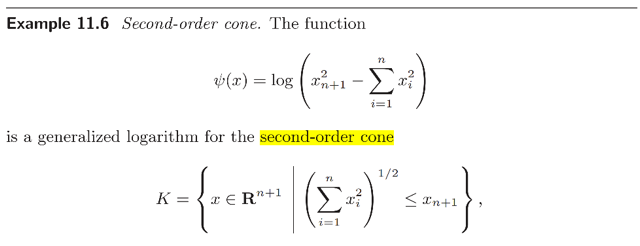</kbd></p>

<p align="center"><kbd>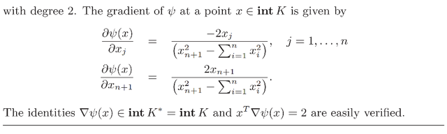</kbd></p>

> [!NOTE]
> Với K là second order cone thì hàm ψ là hàm này.
>
> ```text
> ψ(x) = log [x_n+1^2 - Σi=1:n xi^2]
> ```
>
> Đầu tiên gặp gỡ cái gọi là second order cone 
>
> ```text
> K = x ∈ R^n+1 | (Σi=1:n xi^2)^1/2 ≤ x_n+1
> ```
>
> Thử tính gradient của ψ tại x ∈ int K:
>
> Làm theo cách elemen-wise trước:
>
> ```text
> ∂/∂xi ψ(x) = ∂/∂xi log [x_n+1^2 - Σi=1:n xi^2]
> ```
>
> ```text
> Đặt u = [x_n+1^2 - Σi=1:n xi^2]
> ```
>
> ```text
> ∂/∂xi ψ(x) = d/du log(u) . ∂/∂xi u
> ```
>
> `=` `(1/u)` `∂/∂xi` u
>
> ```text
> = (1/u) [∂/∂xi x_n+1^2 - ∂/∂xi Σi=1:n xi^2]
> ```
>
> Xét i `=` 1,2...n:
>
> ```text
> = (1/u) [0 - 2xi] = - 2xi/u
> ```
>
> ```text
> = - 2xi / [x_n+1^2 - Σi=1:n xi^2]
> ```
>
> Xét i `=` n+1:
>
> `=` `(1/u)` `[2x_n+1` - 0]
>
> `=` `2x_n+1/u`
>
> ```text
> = 2x_n+1 / [x_n+1^2 - Σi=1:n xi^2]
> ```
>
> Case này mà làm theo 18s096 có vẻ ko hợp lí
>
> `====`
>
> QUAY LẠI SAU

<br>

<p align="center"><kbd>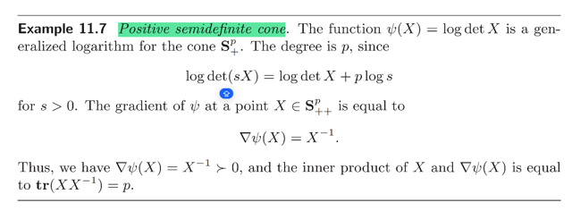</kbd></p>

> [!NOTE]
> Với K là positive semi definite cone thì ψ(X) `=` log det X. 
>
> Dễ thấy ψ(sX) `=` log det (sX) 
>
> Trong 18.06 mình đã học một tính chất của determinant:
>
> Khi nhân một hàng của matrix X với một scalar, giữ nguyên các hàng
> khác để thành Y thì det Y `=` `α` det X
>
> Vậy sX chính là làm như vậy với mỗi hàng của X, nên mỗi lần nhân
> s vào một hàng của X, ta có matrix mới với det `=` s det cũ.
>
> Vậy X trong Sp++, tức có p hàng, nên det sX `=` s^p det X
>
> ⇨ log det sX `=` log s^p det X `=` log s^p + log det X `=` log det X + p log s 
>
> `=` ψ(X) + `θ` log s.
>
> `====`
>
> Bài trước mình cũng đã biết ∇f(x) với f(x) `=` log det X là Xinv
>
> Thử làm lại: QUAY LẠI SAU

<br>

<p align="center"><kbd>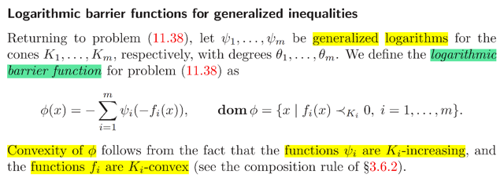</kbd></p>

> [!NOTE]
> Thế thì sau khi đã định nghĩa hàm log tổng quát (generalized logarithm) ψi
> cho mỗi phép generalized inequality đối với cone  Ki thì ta đã sẵn sàng xây
> dựng định nghĩa của hàm log barrier.
>
> Có vài chỗ có thể cần nói:
>
> Đầu tiên là ôn lại về phương pháp log barrier và câu chuyện của nó: Đó là nó
> xuất phát từ việc ta muốn giải inequality constraint optimization problem:
> minimize f0(x) subject to fi(x) ≤ 0, Ax `=` b
>
> Thì bước đi tiếp theo là ta dùng thủ thuật tạm gọi là tạo bài toán tương
> đương bằng cách loại bỏ constraint: Cụ thể là đưa inequality constraint vào
> trong objective function, bằng cách dùng một hàm Indicator function I_(u) sao
> cho mang giá trị +inf khi u > 0 và 0 khi u ≤ 0, nó sẽ mang ý nghĩa là "phạt
> nặng nếu u vi phạm inequality constraint" để khi mininize f0(x) + `Σ` I_(fi(x)) với
> constraint Ax `=` b thì thuật toán sẽ khuyến khích u thỏa constraint.
>
> Vấn đề là, indicator function I như vậy không khả vi khiến ta không thể dùng
> các gradient method như gradient descent, Newton's method
>
> Do đó, bước đi tiếp theo để khắc phục là dùng một function ước lượng của
> I_(), nhưng có tính khả vi: I^_().
>
> Và đó chính là function log barrier: I^_(u) `=` - `(1/t)` log(-u) trong đó có tham số
> t để kiểm soát mức độ chính xác của việc xấp sỉ hàm I_. t càng lớn thì càng
> chính xác.
>
> Cách nhớ đó là, hàm log có tính chất là khi x → 0+ (x phải dương)  thì log x
> → -inf.
>
> Nên nếu u → 0- (tức mang giá trị âm càng gần 0) thì -u → 0+
>
> ⇨ log(-u) → -inf ⇨ - log(-u) → +inf
>
> Ngược lạị u → -inf (tức thỏa sâu constraint tốt) thì -u → +inf
>
> ⇨ log(-u) → +inf ⇨ - log(-u) → -inf
>
> Do đó ta có bài toán xấp xỉ của bài toán mà ta dùng I_:
>
> minimize f0(x) + `Σi` `(1/t)` [-log(-fi(x))] subject to Ax `=` b.
>
> Thế thì để thuận tiện tiếp theo ta lại chuyển thành bài toán equivalent  lần
> nữa:
>
> ```text
> minimize tf0(x) + tΣi (1/t) [-log(-fi(x))] = tf0(x) + Σi [-log(-fi(x))]
> ```
>
> Và hàm Φ(x) `=` `Σi` [-log(-fi(x))] gọi là log barrier function
>
> và ta có objective: tf0(x) + Φ(x).
>
> `====`
>
> Và ta có thể giải nó bằng Newton's method. Và điểm mấu chốt là vầy:
>
> Với các giá trị của t, thì khi dùng Newton's method để giải tìm solution là
> minimizer của tf0(x) + Φ(x) subject to Ax `=` b. Thì ta có x*(t). gọi là central
> point.
>
> Và với t khác nhau, các central point này sẽ converge về, dẫn về x* là true
> optimal point của bài toán gốc (minimize f0(x) + `ΣI_(fi(x)` constraint Ax `=` b và
> cũng là minimize f0(x) subject to fi(x) ≤ 0, Ax `=` b)
>
> Có điều cách làm tốt nhất sẽ là, ta bắt đầu với t nhỏ, giải tìm x*(t) bằng
> Newton's method và tăng t dần dần lên bởi `μ,` để rồi lấy x*(t) ở bước trước đó
> làm starting point của iteration sau.
>
> `====`
>
> Thế thì qua bài toán có inequality ở dạng generalized: fi(x) ⪯Ki 0 thì fi(x) lúc
> này không phải scalar mà là vector, và việcv so sánh vector sẽ cần đến khái
> niệm partial ordering, và phép so sánh đó sẽ gắn với một cone Ki Những cái
> này thì ta biết rồi.
>
> Ý chính muốn nói, là mỗi generalized inequality sẽ có mộtv cone Ki. Do đó ta
> cần định nghĩa ra cho mỗi cái một hàm gọi là log tổng quát ψi có tính cách
> giống như hàm log trong scalar case, nhưng mà là đối với cone Ki tương
> ứng.
>
> Khi đã xong bước này thì ta đã sẵn sàng định nghĩa hàm log barrier:
>
> ```text
> Với scalar case, nó là Σi - log(-u), hay Φ(x) = Σi - log(-fi(x)) = - Σi log(-fi(x))
> ```
>
> Thì nay, ta sẽ có Φ(x) `=` - `Σi`  ψi(-fi(x))
>
> Không khó để thấy Φ  vẫn là hàm convex

<br>

<p align="center"><kbd>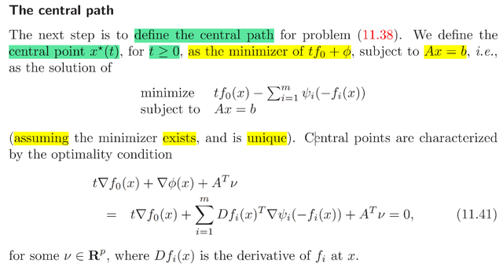</kbd></p>

> [!NOTE]
> Rồi, như vừa mới ôn lại về câu chuyện (dẫn đến) phương pháp log barrier.
> Thì với generalized cũng vậy. Ta cũng sẽ có central path, tạo bởi các central
> point x*(t). Chính là optimal của bài toán:
>
> minimize tf0(x) + Φ(x) constraint Ax `=` b. Đây là bài toán equality constraint
> convex optimization (f0 convex, Φ convex), như đã biết ta sẽ dựa vào
> optimality condition để giải tìm x*(t):
>
> Lập luận của optimality condition:
>
> Theo Lagrangian thì nó dựa trên việc với strong duality thì ta có:
>
> x* là minimizer của L(x, λ*, v*). Nên: ∇xL(x, λ*, v*) `=` 0
>
> ⇨ ∇f0(x*) + ATv* `=` 0
>
> Nhưng có một cách lập luận khác:
>
> Giải thích theo toán học rất ngắn gọn:
>
> Directional derivative của f theo hướng d bất kì:
>
> f0'(x*, d) `=` ∇f0(x*)Td phải không âm ở mọi d là hướng di chuyển trong
> feasible set , vì nếu không thì đi theo hướng đó sẽ giảm thêm f0 mà điều này
> không thể do đã  nói x* là optimal
>
> Và ∇f0(x*)Td ≥ 0 với mọi d thì có nghĩa nó ∇f0(x*)T(d) ≥ 0 và ∇f0(x*)T(-d) ≥ 0
>
> Từ đó suy ra ∇f0(x*)Td `=` 0
>
> Xét d là hướng di chuyển trong feasible set nên x* + d cũng thuộc feasible
> set, ⇨ A(x* + d) `=` b ⇨ Ad `=` 0. Điều này cho thấy d thuộc nullspace của A :
> N(A)
>
> Kết luận a) Nếu d là feasible direction thì nó thuộc N(A)
>
> Lấy vector bất kì trong nullspace của A: d ∈ N(A) thì Az `=` 0 ⇨ A(x* + d) `=` b +
> 0 `=` b  ⇨ x* + d ∈ feasible set ⇨ kết luận b) D là feasible direction
>
> Vậy từ (a) và (b) kết luận tập các feasible direction chính là nullspace N(A)
>
> Và như ta đã có ở trên: ∀d ∈ feasible direction thì ∇f0(x*)Td `=` 0
>
> Kết hợp với việc tập mọi feasible direction chính là nullspace giúp ta có kết
> luận quan trọng: ∇f0(x*) vuông góc với nullspace N(A)
>
> Tiếp theo là dùng một định lý nổi tiếng: Nullspace orthogonal complement 
> với rowspace C(AT): Do đó gradient vector NẰM TRONG ROWSPACE
>
> Và vì vậy nó phải là linear combination của các row của A, dẫn tới ta có thể
> thể hiện nó dưới dạng:
>
> ∇f0(x*) `=` ATv
>
> Hoặc chọn v `=` -v ta có ∇f0(x*) + ATv `=` 0, Đây chính là optimality condition
>
> `===`
>
> Còn không thích dùng directional derivative thì vầy, chỉ sửa lại chút:
>
> Dùng first order Taylor approx:
>
> f0(x) `=` f0(x*) + ∇f0(x*)(x - x*) ⇨ f0(x) - f0(x*) `=` ∇f0(x*)(x - x*)
>
> Vì x* là optimal nên di chuyển x* đến x bất kì trong feasible set thì f0 phải không
> giảm: tức f0(x) ≥ f0(x*) 
>
> ⇨ ∇f0(x*)(x - x*) ≥ 0
>
> Rồi, xét z bất kì thuộc N(A): Az `=` 0 ⇨ A(x* + z)  `=` b ⇨ x `=` x* + z ∈ feasible set
>
> Xét x ∈ feasible set thì Ax `=` b ⇨ A(x - x*) `=` b - b `=` 0 ⇨ x - x* ∈ nullspace N(A)
>
> Như vậy, xét z bất kì thuộc N(A) thì x `=` x* + z cũng thuộc feasible set
> mà ngược lại một điểm x thuộc feasible set bất kì thì x - x* cũng thuộc
> N(A). 
>
> DO ĐÓ N(A) `=` x - x*, x ∈ feasible set
>
> Mà ta có ∇f0(x*)(x - x*) ≥ 0 thì có nghĩa là ∇f0(x*)z ≥ 0 với mọi z ∈ N(A)
>
> Và vì nó đúng với mọi z thuộc N(A) mà N(A) là một vector space, nên
> z ∈ N(A) thì -z cũng thuộc N(A): Lí do: Az `=` 0 ⇔ A(-z) `=` 0
>
> Do đó ta có  ∇f0(x*)(z) ≥ 0 và  ∇f0(x*)(-z) ≥ 0 `<=>` ∇f0(x*)(z) ≤ 0
>
> Vậy suy ra ∇f0(x*)(z) `=` 0 ∀ z ∈ N(A)
>
> ⇨ ∇f0(x*) vuông góc N(A) `=>` ∇f0(x*)(z) ∈ C(AT) 
>
> ⇨ ∇f0(x*)(z) `=` AT(-v) ⇨ ∇f0(x*)(z) + ATv `=` 0
>
> Rồi thế thì với f0(x) ở đây thực ra là tf0(x) - `Σ` ψi(-fi(x))
>
> (đặt nó là F(x) đi)
>
> ∇[tf0(x) - `Σ` ψi(-fi(x))]
>
> `=` t∇f0(x) - `Σ` ∇ψi(-fi(x))
>
> Tính ∇ ψi(-fi(x):
>
> ψi(-fi(x) là vector → scalar function, nên `d/dx` ψi(x) sẽ là
> gradient vector.
>
> Dùng chain rule:
>
> ```text
> d/dx ψi(-fi(x)) = d/d (-fi(x)) ψi(-fi(x)) . d/dx [-fi(x)]
> ```
>
> *) `d/d` (-fi(x)) ψi(-fi(x)) là gradient của ψi() evaluate tại -fi(x)
>
> **) `d/dx` [-fi(x)], với fi(x) là vector → vector function, nó là
> Jacobian matrix : `-J_fi(x),` hay Dfi(x) như sách
>
> `=` ∇ψ(-fi(x)) . [- `J_fi(x)]`
>
> `=` - `∇ψ(-fi(x))TJ_fi(x)` 
>
> Vì sao có dấu tranpose:
>
> vì giả sự gọi h(x) `=` ψi(-fi(x)), thì h là scalar function, 
>
> ⇨ dh `=` h'(x)dx thì với dx là vector, f'(x)[dx] phải là một linear
> operator sao đó act on vector dx cho ra scalar thì nó chỉ có
> thể là dot product của một vector với dx, đó là gradient vector
>
> vậy h'(x) là row vector ⇨ ∇ψ(-fi(x)) . [- `J_fi(x)]` phải có dạng
> là row vector x Jacobian matrix: ∇ψ(-fi(x))T [- `J_fi(x)]`
>
> Và dĩ nhiên khi đó, gradient ∇h phải là ∇ψ(-fi(x))T [- `J_fi(x)]` T
>
> `=` [- `J_fi(x)]T∇ψ(-fi(x))`
>
> Ghi theo sách Jacobian của fi(x) là Dfi(x)
>
> `=` [-Dfi(x)]T∇ψ(-fi(x))
>
> Vậy ta có: ∇F(x) `=`  t∇f0(x) - `Σ` [ [-Dfi(x)]T∇ψ(-fi(x))]
>
> `=` t∇f0(x) + `Σ` Dfi(x)T∇ψ(-fi(x))
>
> Và optimality condition là:
>
> t∇f0(x) + `Σ` Dfi(x)T∇ψ(-fi(x))+ ATv `=` 0

<br>

<p align="center"><kbd>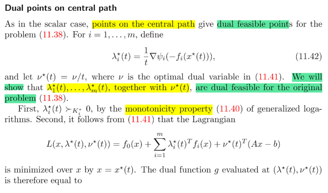</kbd></p>

> [!NOTE]
> Đại khái là tương tự như scalar case (khi fi(x) là scalar function) ta đã từng bàn
> về việc, mỗi điểm trên central path, tức central point, x*(t) sẽ cho ta dual
> feasible points của bài toán gốc. Thì đây cũng có hiện tương tương tự.
>
> Đầu tiên nhớ lại khái niệm dual feasible: Một điểm λ, v gọi là  dual feasible khi
> g(λ, v) > -inf và λ ≻ 0. Với định nghĩa dual function g(λ, v) `=` inf x L(x, λ, v) thì,
> điều kiện thứ nhất tương đương:
>
> Khi giải bài toán inf x L(x, λ, v) thì optimal point x* phải attainable và L(x*, λ, v)
> > -inf
>
> Thế thì, với generalized case. thì điều kiện dual feasible cũng tương tự: λi ≽Ki
> 0 với mọi i và g(λ, v) cũng phải > -inf. Nên nhớ λ ở đây là nhiều vector λi
>
> Thế thì tương tự như việc ta đã chứng minh trong scalar case: Ý tưởng là,
> bằng cách chọn λ `=` λ*  và v `=` v* mang giá trị cụ thể (sẽ nói tiếp theo) thì ta thấy
> rằng, central point x*(t) chính là minimizer của L(x, λ*, v*). Và điều này cho thấy
> đã thỏa điều kiện một, tức là g(λ*, v*) > -inf. Và điều kiện sau thì  cũng dễ. Đây
> là phác thảo ý tưởng chính.
>
> Cụ thể là như sau:
>
> ```text
> Chọn λ*i(t) = (1/t) ∇ψi[-fi(x*(t)))] và v* = v/t với v là dual optimal point của 11.41
> ```
> (tức là v thỏa optimality condition của bài toán minimize tf0(x) - `Σ` ψi(-fi(x)):
>
> t∇f0(x) + `Σ` Dfi(x)T∇ψ(-fi(x)) + ATv `=` 0
>
> Khi đó, từ việc nói x*(t), central point là minimizer của bài toán trên và nó là 
> solution của optimality condition:
>
> t∇f0(x*) + `Σ` Dfi(x*)T∇ψ(-fi(x*)) + ATv `=` 0 (1) |  Hiểu x* là x*(t), viết x* cho gọn
>
> Dùng λ*i `=` `(1/t)` ∇ψi[-fi(x*))] ⇔ tλ*i `=` ∇ψi[-fi(x*))]  | tương tự hiểu λ* là λ*(t)
>
> (1) ⇔ t∇f0(x*) + `Σ` Dfi(x*)Ttλ*i + ATv `=` 0
>
> ⇔ ∇f0(x*) + `Σ` Dfi(x*)Tλ*i + `AT(v/t)` `=` 0
>
> ⇔ ∇f0(x*) + `Σ` Dfi(x*)Tλ*i + ATv* `=` 0
>
> Và đây chính là optimality condition của problem gốc:
>
>  minimize f0(x) constraint fi(x) ⪯Ki 0, Ax `=` b
>
> Và như đã nói ở trên, điều này chứng tỏ λ*, v* là DUAL FEASIBLE (chú ý, không 
> phải là dual optimal nhé)
>
> Còn đièu kiện thứ hai: λ*i ≽Ki 0 là vì xuất phát từ định nghĩa của hàm generalized
> log ψ(y) nó có tính chất: Nếu y ≻K 0 thì ∇ψ(y) ≻K* 0
>
> Do đó, ở đây ta đặt λ*i `=` `(1/t)` ∇ψi[-fi(x*(t))], thì vì fi(x*) ⪯K*i 0 nên -fi(x*) ≽K*i 0
> ⇨ ∇ψ(-fi(x*)) ≽K*i 0 ⇨ λ*i `=` `(1/t)` ∇ψi[-fi(x*(t))] ≽Ki* 0
>
> Rồi, vì định nghĩa g(λ, v) (của bài toán gốc) 
> `=` inf x L(x, λ, v)
>
> `=` inf x {f0(x) + `Σi` λiTfi(x) + vT(Ax - b)}
>
> Mà: x*(t) là minimizer của L(x, λ*(t), v*(t))
>
> Đồng nghĩa L(x*(t), λ*(t), v*(t)) `=` inf x  L(x, λ*(t), v*(t))
>
> mà vế phải chính là g(λ*(t), v*(t))
>
> Nên g(λ*(t), v*(t)) `=` f0(x*(t)) + `Σi` λ*iTfi(x) + v*T(Ax - b)
>
> (chỗ này tuy đơn giản có thể gây ngáo: Cần tập trung
> ở việc định nghĩa 
>
> g(λ, v) `=` inf x L(x, λ, v) 
>
> ⇨ g(λ*, v*) `=` inf x L(x, λ*. v*) (điều này là đương nhiên)
>
> Và sự thật mà ta có ở đây là NẾU NHƯ CHỌN λ là λ*, 
> v `=` v* thì x*(t) là cái mà thỏa optimality condition của 
> bài toán gốc. Mà với optimality condition của bài toán
> gốc loại hóa ra chính là gradient của L(x, λ*, v*) `=` 0
>
> Từ đó suy ra x* cũng là minimizer của L(x, λ*, v*)
>
> mà như vậy thì có nghĩa là L(x*, λ*, v*) `=` inf x L(x, λ*, v*)
>
> và cái này lại chính là g(λ*, v*).
>
> Vậy g(λ*, v*) `=` L(x*, λ*, v*) 
>
> (với x* là central point) và  λ* là cái theo công thức đã chọn

<br>

<p align="center"><kbd>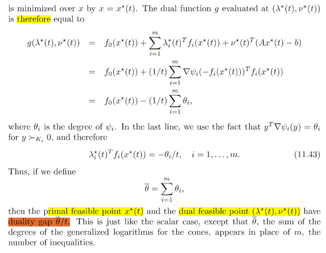</kbd></p>

> [!NOTE]
> Tiếp tục:
>
> g(λ*(t), v*(t)) `=` f0(x*(t)) + `Σi` λ*i(t)Tfi(x) + v*(t)T(Ax*(t) - b)
>
> Thay λ*i, v*i
>
> g(λ*(t), v*(t)) `=` f0(x*(t)) + `Σi` `(1/t)` ∇ψi[-fi(x*(t))] T fi(x) + v*T(0) 
>
> | vì x* thỏa  constraint
>
> `=` f0(x*(t)) + `(1/t)` `Σi` ∇ψi[-fi(x*(t))] T fi(x)
>
> Tới đây ta dùng một trong hai tính chất của hàm ψ(y): yT∇ψ(y) `=` 0
>
> ⇨ `Σi` ∇ψi[-fi(x*(t))] T fi(x) `=` - `Σi` ∇ψi[-fi(x*(t))] T [-fi(x)]
>
> `=` - `Σi` `θi`
>
> ⇨ f0(x*(t)) + `(1/t)` `Σi` ∇ψi[-fi(x*(t))] T fi(x) 
>
> ```text
> = f0(x*(t)) - (1/t) Σi θi
> ```
>
> ```text
> Vậy g(λ*(t), v*(t)) = f0(x*(t)) - (1/t) Σi θi
> ```
>
> Vậy primal feasible point  và dual feasible point λ*(t), v*(t) 
> ```text
> có duality gap  = (1/t) Σi θi
> ```

<br>

<p align="center"><kbd>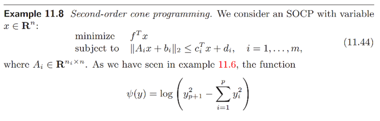</kbd></p>

<p align="center"><kbd>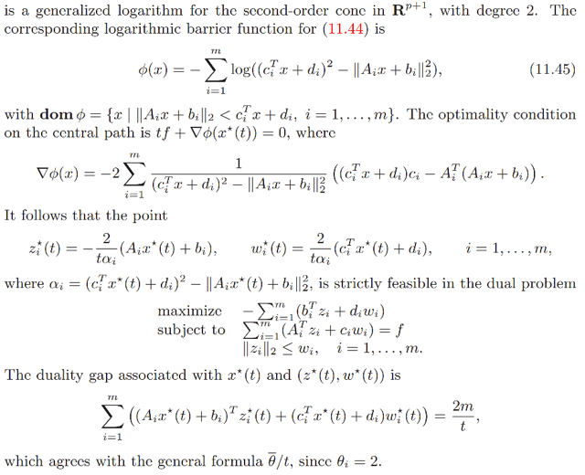</kbd></p>

> [!NOTE]
> Thử làm ví dụ này bài toán SOCP với x ∈ R^n
>
> minimize fTx subject to ||Aix + bi|| ≤ ciTx + di
>
> Ở ví dụ 11.6 mình đã có function ψ(y) `=` log [y^2_p+1 - `Σi` yi^2]
> là generalized logarithm function cho second order cone in R^p+1
>
> log barrier function tương ứng sẽ là:
>
> QUAY LẠI SAU

<br>

<p align="center"><kbd>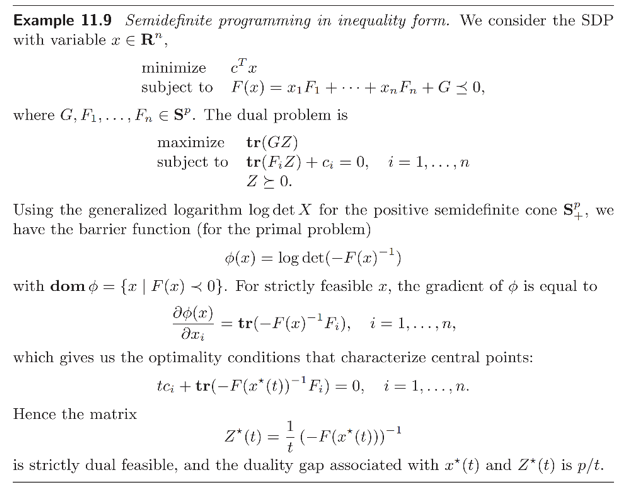</kbd></p>

> [!NOTE]
> Với bài toán semi definite programming in equality form, ta có 
> barrier function: Φ(x) `=` log det (-F(x)inv)
>
> Thử tính gradient của Φ:
>
> QUAY LẠI SAU

<br>

<p align="center"><kbd>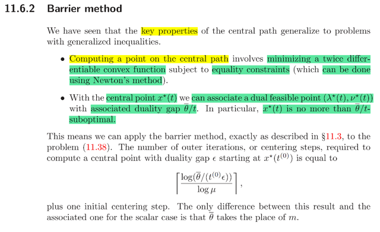</kbd></p>

> [!NOTE]
> đại khái là, ta đã biết barrier method, đại ý là ta sẽ bắt đầu với t
> nhỏ. Và ta sẽ giải bài toán tìm center point x*(t). Chính là giải 
> bài toán equality constraint convex minimize tf0(x) + Φ(x) dùng
> newton method. Trong bước này, dĩ nhiên là cũng gồm nhiều
> iteration gọi là inner iteration - thực hiện các bước update bởi
> phương pháp Newton
>
> Khi tìm ra x*(t), thì chuyển qua iteration tiếp theo nơi ta scale
> t lên chút xíu, lấy x*(t) trước đó để làm starting point. Và lại giải
> bài toán tìm x*(t) với Newton method
>
> Cứ thế, các x*(t) sẽ dần converge về x* của bài toán gốc.
>
> Và như đã thấy, mỗi x*(t) sẽ thuộc `θ^/t` suboptimal

<br>

<p align="center"><kbd>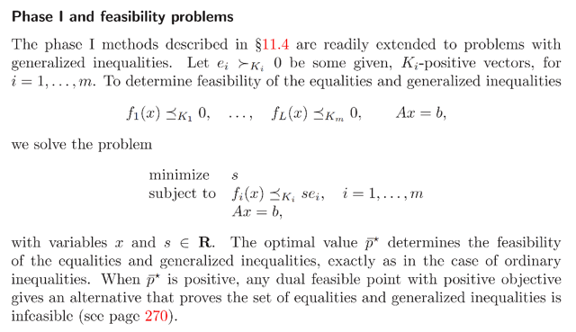</kbd></p>

<br>

<p align="center"><kbd>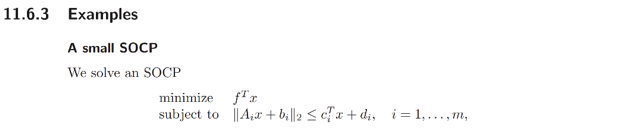</kbd></p>

<p align="center"><kbd>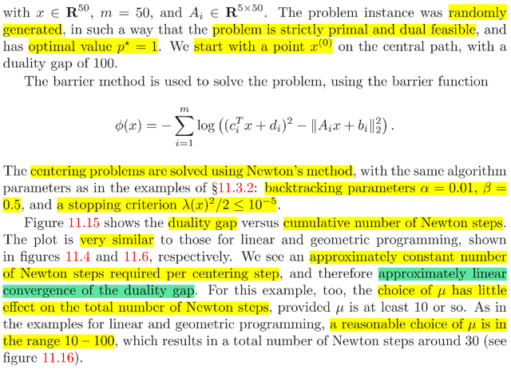</kbd></p>

<p align="center"><kbd>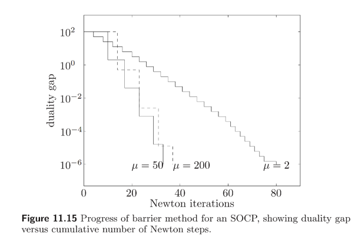</kbd></p>

> [!NOTE]
> ví dụ bài toán SOCP quy mô nhỏ, data được randomly generated sao
> cho nó strictly primal feasible và dual feasible
>
> Nói chung kết quả cho thấy duality gap giảm tuyến tính với số Newton
> step cần thiết.
>
> Có thể cần ôn lại cái vụ duality gap
>
> Định nghĩa nên nhớ nó là khác biệt giữa f0(x) và g(λ, v) (chứ không phải
> p* và g(λ, v))
>
> Và đại khái là ta theo link bữa trước đã chứng minh cho thấy rằng trong
> mỗi centering problem nơi mà ta giải bài toán minimize tf0(x) + Φ(x)
> constraint Ax `=` b để có x*(t) là central point. Thì khi giải xong x*(t), bằng
> cách chọn một giá trị cụ thể cho  λ*(t), v*(t) (*) thì bằng cách thế vào
> optimality condition của bài toán centering  (**) ta sẽ cho thấy rằng x*(t),
> λ*(t), v*(t) thỏa điều kiện rằng Lagrangian của bài toán gốc evaluate tại
> x*(t), λ*(t), v*(t) bằng 0, vanish. Từ đó suy ra x*(t) là minimizer của L(x,
> λ*(t), v*(t)), và suy ra khi minimize L(x, λ*(t), v*(t)) kết quả không ra
> -infinity, và điều này cũng là g, dual function của bài toán gốc evaluate tại
> λ*(t), v*(t) không bị bằng -infinity ⇨ λ*(t), v*(t) là dual feasible  points
>
> ```text
> (*) λ*(t) = -1/t*fi(x*(t)) ⇨ tλ*(t) = -1/fi(x*(t)) và v*(t) = v^/t
> ```
>
> (**) t*∇f0(x*(t)) + ∇Φ(x*(t)) + ATv^ `=` 0
>
> Mà khi nó là dual feasible point thì khác biệt giữa dual function của bài
> toán gốc g(λ*(t), v*(t)) và objective function tại một feasible point nào đó,
> ở đây là x*(t) (nhớ rằng nó chỉ là optimal của centering, còn với bài toán
> gốc nó chỉ là một feasible point, sẽ là dual gap
>
> (again, ta chỉ nói về dual function, Lagrangian của bài toán gốc, ko phải
> nói về bài toán centering)
>
> nên f0(x*(t)) - g(λ*(t), v*(t)) là duality gap và ta còn có kết quả là cái này
> bằng `m/t:`
>
> f0(x*(t)) - g(λ*(t), v*(t)) `=` `m/t`
>
> Và điều này cho thấy khi t → inf, thì duality gap sẽ nhỏ lại
>
> Rồi, với việc gọi p* là optimal value, tức f0(x*) với x* thật sự là optimal
> của bài toán gốc, là điểm cuối của centering path thì ta có bất đẳng thức
> thể hiện weak dualitty:
>
> g(λ*(t), v*(t)) ≤ p*, từ đó suy ra f0(x*(t)) - `m/t` ≤ p* và cái này cho ta thấy
> rằng khi t càng lớn → `m/t` → 0 thì lower bound của p* sẽ ngày càng nâng
> nên và càng gần f0(x*(t)). Hoặc thể hiện theo kiểu này f0(x*(t)) - p* ≤ `m/t`
> thì cho thấy khi t → lớn thì upper bound giữa f0(x*) và p* càng nhỏ cũng
> nói lên rằng f0(x*(t)) tiến về p*
>
> Túm lại việc giảm duality gap, chính là khi t tăng thì f0(x*(t)) - g(λ*(t),
> v*(t)) `=` `m/t`  giảm sẽ thể hiện việc x*(t) ngày càng tiến gần tới p*
>
> Và trong ví dụ này người ta thấy rằng việc giảm của duality gap , `m/t,` sẽ
> giảm tuyến tính với số Newton step
>
>
> `====`
>
> Bên cạnh đó cũng thấy `μ` đừng có nhỏ quá thì sẽ ảnh hưởng đến số
> iteration cần thiết, còn lại thì nó ko khác biệt mấy (ví dụ hình 11.15, giữa
> `μ` `=` 50 với 200 số Newton's iteration ko khác biệt mấy) nhưng nếu `μ` nhỏ
> `(=2)` thì số Newton iteration sẽ tăng lên đáng kể'

<br>

<p align="center"><kbd>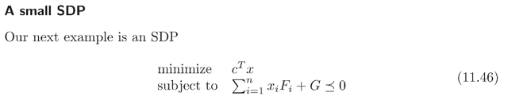</kbd></p>

<p align="center"><kbd>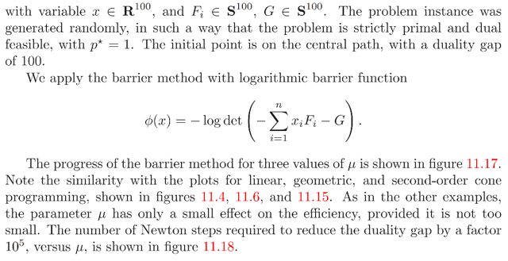</kbd></p>

<p align="center"><kbd>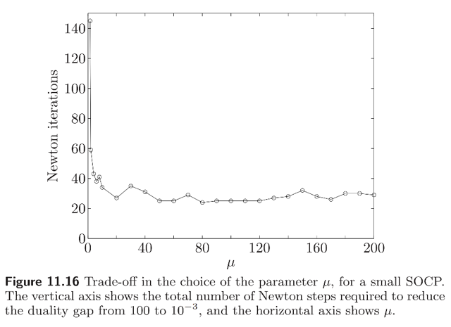</kbd></p>

> [!NOTE]
> Với bài toán SDP thìk ết
> quả  cũng tương tự.

<br>

<p align="center"><kbd>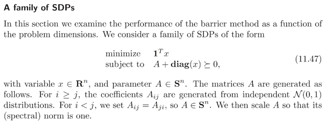</kbd></p>

<p align="center"><kbd>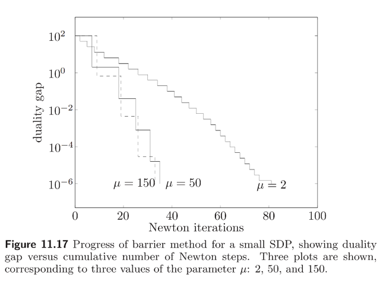</kbd></p>

<p align="center"><kbd>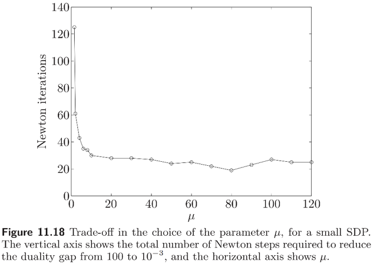</kbd></p>

<br>

<p align="center"><kbd>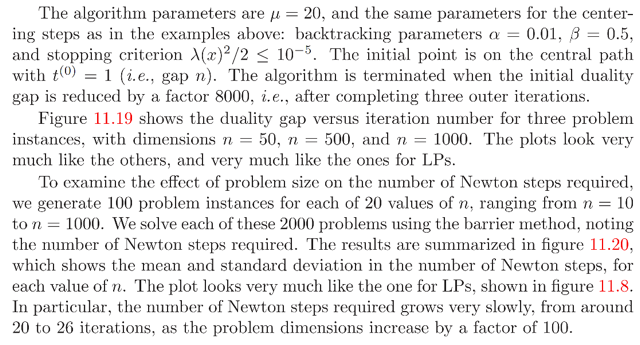</kbd></p>

<p align="center"><kbd>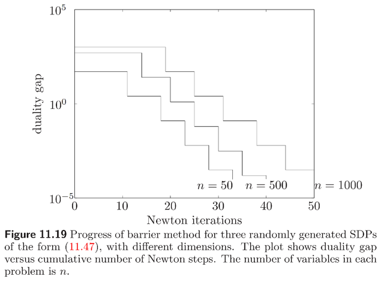</kbd></p>

<p align="center"><kbd>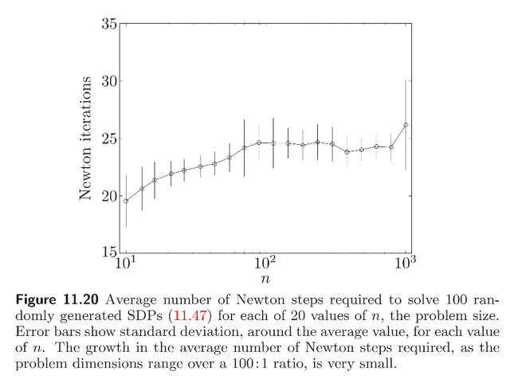</kbd></p>

> [!NOTE]
> đại ý quan trọng là để kiểm tra ảnh hưởng của problem size lên số 
> newton step cần thiết khi dùng log barrier method thì người ta 
> cho 20 giá trị của n từ 10 đến 1000, với mỗi giá trị của n người ta 
> cho 100 bài toán, và giải bằng log barrier.
>
> Kết quả, in ra số newton step cần thiết trung bình cần ứng với một
> giá trị của n. có thể thấy khi n tăng lên thì số newton step cũng tăng
> nhưng ko đáng kể, 
>
> Ý là trong khi n tăng lên theo cấptừ 10 lên 1000 tức là gấp 100 lần
> thì số Newton iteration chỉ tăng từ 20 lên 26

<br>

<p align="center"><kbd>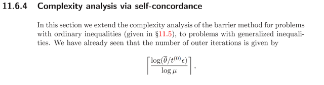</kbd></p>

<p align="center"><kbd>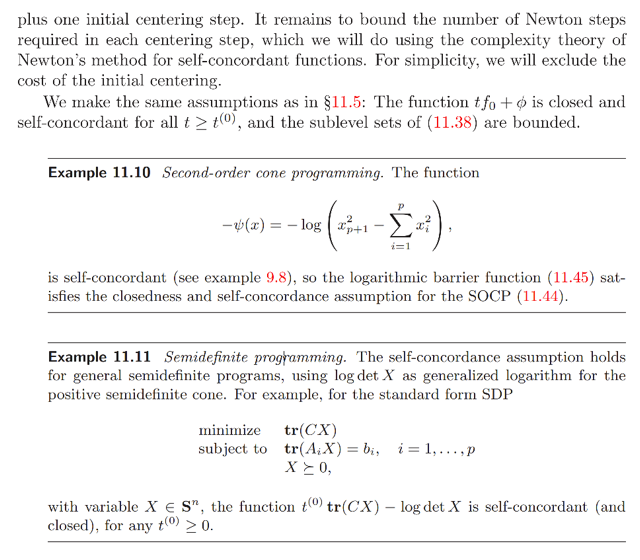</kbd></p>

> [!NOTE]
> QUAY LẠI SAU

<br>

<p align="center"><kbd>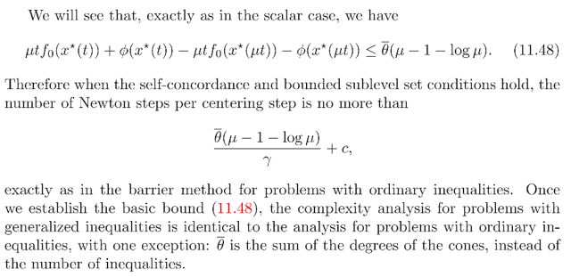</kbd></p>

<p align="center"><kbd>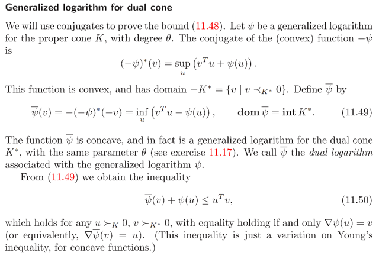</kbd></p>

> [!NOTE]
> QUAY LẠI SAU

<br>

<p align="center"><kbd>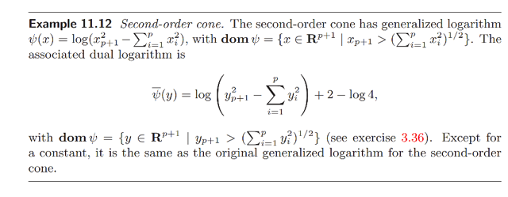</kbd></p>

<p align="center"><kbd>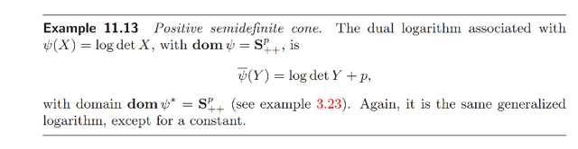</kbd></p>

> [!NOTE]
> QUAY LẠI SAU

<br>

<p align="center"><kbd>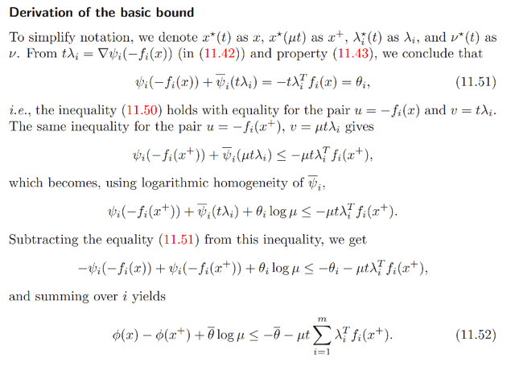</kbd></p>

<p align="center"><kbd>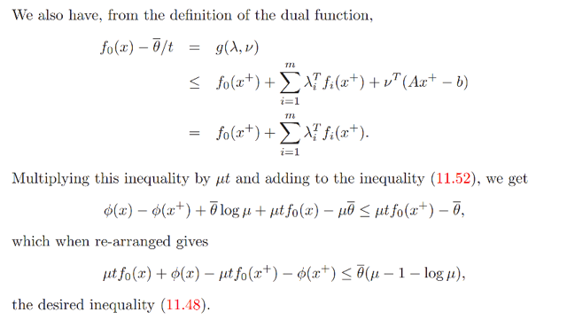</kbd></p>

> [!NOTE]
> QUAY LẠI SAU

<br>

<p align="center"><kbd>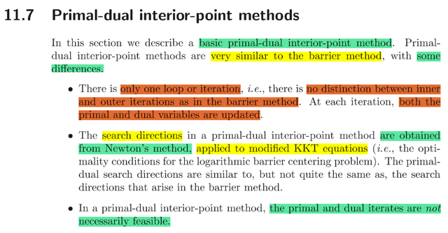</kbd></p>

<p align="center"><kbd>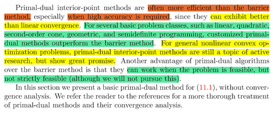</kbd></p>

> [!NOTE]
> Chưa rõ lắm, những phần sau sau khi rõ hơn sẽ quay lại nhưng đại
> khái là pp này tương tự barrier nhưng tốt hơn.
>
> Nó hiệu quả hơn nhất là khi yêu cầu độ chính xác cao.
>
> Trong những problem cơ bản như linear `/` quadratic `/` second order
> cone geometric , semidefinite programming ... thì nó vượt trội
> barrier method.
>
> còn trong các bài toán nonlinear convex nói chung thì đang được
> nghiên cứu rất actively nhưng rất nhiều tiềm năng
>
> Một ưu điểm quan trọng nữa của cái này là nó ko cần strictly
> feasible mà chỉ cần feasible

<br>

<p align="center"><kbd>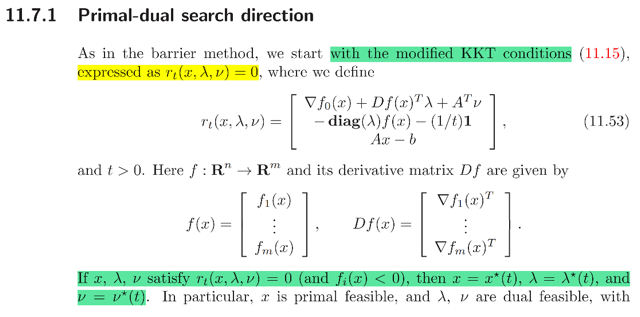</kbd></p>

<p align="center"><kbd>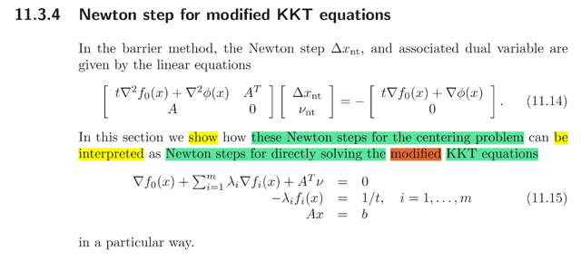</kbd></p>

<p align="center"><kbd>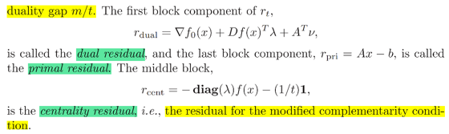</kbd></p>

> [!NOTE]
> Đại khái là trong 11.3.4 mình đã hiểu vì sao có công thức 11.14 Ôn nhanh: Bối
> cảnh là ta muốn giải bài toán cho bài toán centering, là bài toán equality
> constraint optimization problem: minimize tf0(x) + Φ(x) subject to Ax `=` b.
>
> Trong đó, ta giải nó bằng Newton method có lập luận đại ý là ta sẽ liên tiếp
> xấp xỉ `/` coi như hàm objective là một hàm quadratic Để từ điểm đang đứng,
> giúp tính toán ra điểm optimal, nơi mà hàm quadratic này đạt giá trị nhỏ nhất,
> và ta sẽ nhảy đến điểm này Tại đó lặp lại quá trình này. Cứ như vậy, khi càng
> gần tới optimal point thật sự thì việc xấp xỉ bậc hai sẽ ngày càng chính xác, và
> đến một lúc nào đó ta sẽ đến rất gần optimal point.
>
> Vậy thì bước quan trọng trong quá trình này là tính ra Newton step, mà bản
> chất chính là giải bài toán equality constraint quadratic optimization:
>
> Đây nhé, bài toán centering problem là bài toán này: minimize tf0(x)
> + Φ(x) subject to Ax `=` b.
>
> Tuy nhiên, optimal của bài toán này không dễ để tìm, vì nó có thể là hàm phi
> tuyến bậc cao, dù cho nó là convex function thì PHẦN LỚN TRƯỜNG HỢP
> LÀ KHÔNG THỂ DỄ DÀNG GIẢI RA OPTIMAL BẰNG CÁC ANALYTICALLY
> (NHƯ GIẢI OPTIMALITY CONDITION)
>
> Thay vào đó ta sẽ dùng iteration method (như gradient descent hay Newton's
> step) để thực hiện các bước đi `/` update, mỗi lúc đến gần  hơn với optimal.
>
> Thế thì cách làm như sau:
>
> Giả sử tại ban đầu ta đang ở điểm x0, như trên đã nói, ta sẽ coi hàm objective
> như quadratic. Làm vậy bằng cách dùng khai triển Taylor bậc hai đối với hàm
> objective tại x0: Chú ý hàm objective là tf0(x) + Φ(x) và ta gọi nó là f(x):
>
> ```text
> f(x0 + δx) = f(x0) + ∇f(x0)Tδx + (1/2) δxT∇^2f(x0)δx, đặt nó là g(δx)
> ```
>
> ```text
> đặt P = ∇^2f(x0), q = ∇f(x0), r = f(x0) thì ta có f(x0 + δx) (chú ý nó là hàm  theo
> ```
> ```text
> δx, x0 chỉ là fixed value) sẽ có dạng (1/2) δxTPδx + qTδx + r. Đây là  hàm bậc
> ```
> hai theo `δx,`
>
> Và vì nó là hàm quadratic, nên có thể tìm ra minimum theo công thức, hay nói
> chính xác hơn, là vì objective là quadratic nên ta có thể giải cái optimality
> condition (trong khi với objective gốc thì optimality condition thường là ko giải
> được)
>
> Optimality condition, khi `δx` thỏa cái này thì nó chính là `δx` tối ưu giúp x0 + `δx`
> đạt optimal point của bài toán, cũng chính là `g(δx*)` `=` f(x0 + `δx*)` nhỏ nhất. Và
> khi đó `δx` chính là Newton step `Δx_nt`
>
> Thế thì một điểm lưu ý là dù ta có xấp xỉ f(x) bởi quadratic thì ta vẫn phải  có
> constraint Ax `=` b. Nên bài toán phải giải vẫn là equality constraint quadratic
> convex optimization problem.
>
> ```text
> minimize g(δx) = f(x0 + δx) = f(x0) + ∇f(x0)Tδx + (1/2) δxT∇^2f(x0)δx
> ```
>
> subject to A(x0 + `δx)` `=` b
>
> Ý nghĩa là ko chỉ ta cần `δx` để đưa g xuống thấp nhất mà còn cần x0 + `δx` vẫn
> nằm trong primal feasible set
>
> Optimality condition của bài toán này ta có thể nhớ có là:
>
> `∇g(Δx_nt)` + ATv* `=` 0, đây gọi là dual feasibility condition,
>
> ```text
> và A(x0 + Δx_nt) = b ⇔ A Δx_nt = 0, đây là primal feasibility condition
> ```
>
> Vậy thì xét cái này: `∇g(Δx_nt)` + ATv* `=` 0
>
> với hàm quadratic f(x) `=` `(1/2)xTPx` + qTx + r, thì ∇f(x) `=` PTx + q
>
> Với P `=` ∇^2f(x0), q `=` ∇f(x0), r `=` f(x0) thì:
>
> ```text
> ⇨ ∇g(Δx_nt) = ∇^2f(x0)TΔx_nt + ∇f(x0)
> ```
>
> Nên (1) ⇔ `∇^2f(x0)TΔx_nt` + ∇f(x0) + ATv* `=` 0
>
> và (2) A `Δx_nt` `=` 0
>
> Bây giờ mới dùng đến f(x) `=` tf0(x) + Φ(x)
>
> ⇨ ∇f(x0) `=` t ∇f0(x0) + ∇Φ(x0), vì sao?
>
> Vì để tìm ∇f(x0), tức là ta tìm derivative của f đối với x, evaluate tại x0:
>
> ```text
> d/dx f(x) = d/dx [tf0(x) + Φ(x)] = d/dx tf0(x) + d/dx Φ(x)
> ```
>
> ```text
> = t d/dx f0(x) + d/dx Φ(x) = t ∇f0(x) + ∇Φ(x)
> ```
>
> Để tìm ∇^2f(x0), ta tiếp tục tính đạo hàm bậc hai theo x của f:
>
> ```text
> d/dx (d/dx f(x)) = d/dx [t ∇f0(x) + ∇Φ(x)]
> ```
>
> `=` `d/dx` [t ∇f0(x)] + `d/dx` ∇Φ(x)
>
> `=` t ∇^2f0(x) + ∇^2Φ(x)
>
> Vậy tới đây điều kiện (1) trở thành:
>
>  [t∇^2f0(x0) + `∇^2Φ(x0)]TΔx_nt` + t∇f0(x) + ∇Φ(x) + ATv* `=` 0
>
> ⇔ [t∇^2f0(x0) + `∇^2Φ(x0)]TΔx_nt` + ATv* `=` - [ t∇f0(x) + ∇Φ(x) ]
>
> Ghi lại (2) A `Δx_nt` `=` 0
>
> Để rồi kết hợp hai cái lại thành dạng:
>
> [t∇^2f0(x0) + ∇^2Φ(x0), AT; A; 0] `[Δx_nt;` v*]T `=` [- [ t∇f0(x) + ∇Φ(x) ]; 0]
>
> tức là matrix KKT `=` [t∇^2f0(x0) + ∇^2Φ(x0), AT; A, 0] nhân vector `[Δx_nt;` v*]
> bằng vector - [ t∇f0(x) + ∇Φ(x) ; 0]
>
> Đó chính là kết quả. 11.14
>
> Rồi sau đó, trong bài trước ta cũng đã thấy (và hiểu) người ta chứng
> minh rằng việc giải cái hệ 11.14 CŨNG CHÍNH LÀ GIẢI HỆ KKT CỦA
> BÀI TOÁN GỐC VỚI CHÚT THAY ĐỔI
>
> Trong đó bài toán gốc là ko phải đang nói tới bài toán centering, mà là
> bài toán minimize f0(x) subject to fi(x) ≤ 0, Ax `=` b,
>
> và KKT condition của bài toán đó, theo lí thuyết như đã biết là:
>
> (1) ∇f0(x) + `Σ` λi∇fi(x) + ATv `=` 0 (đây là điều kiện mà gradient tại
> optimal của Lagrangian sẽ vanish, xuất phát từ việc ta có strong
> duality, vì đây là convex problem)
>
> (2) - λifi(x) `=` 0, i `=` 1,2...m  (đây là điều kiện complementary slackness,
> cũng xuất phát từ lập luận trên)
>
> (3) Ax `=` b Đây là primal feasibility condition
>
> (4) λi ≥ 0 Đây là dual feasibility condition,
>
> Vậy điểm khác chút xíu nói trên là - λifi(x) `=` `1/t`
>
> `====`
>
> Có nghĩa là, muốn nói rằng việc ta giải tìm newton step, THÌ CŨNG
> CHÍNH LÀ GIẢI TÌM NEWTON STEP NẾU MUỐN GIẢI CÁI HỆ NÀY
>
> (Tức là việc giải cái hệ kkt modified trên, thật ra cũng là một bài toán
> tối ưu, mà trong đó ta ko có objective, và cũng có thể dùng Newton
> method để giải)
>
> `====`
>
> Vậy thì, như đã biết, nếu mà thỏa cái hệ kkt này thì dĩ nhiên x*, λ*, v*
> sẽ là primal và dual optimal. Điều này ko cần bàn cãi, bởi nó xuất phát
> từ lí thuyết.
>
> Chỉ có điều là ko phải dễ để giải cái hệ này nên mới phải dùng các
> cách tiếp cận như log barrier mà trong đó ta dùng Newton method
>
> Thế thì xét cái hệ này, bằng cách chuyển qua một bên, và đặt vế trái
> là rt(x, λm v) thì 3 phần của r sẽ được gọi là:
>
> - dual residual, xuất phát từ (1) ∇f0(x) + `Σ` λi ∇fi(x) + ATv `=` 0 
>
> đặt f(x) `=` [f1(x), ...fm(x)] thì ⇨ Df(x) `=` [∇f1(x)T; ∇f2(x)T; ....]
>
> ⇨ `Σ` λi ∇fi(x) `=` Df(x)Tλ (dễ thấy vì Df(x)T sẽ có các cột là ∇f1(x), ∇f2(x)..
>
> Nên Df(x)Tλ sẽ là linear combination các ∇f1(x), ∇f2(x)...với coefficient
> λ1, λ2...: Tức là `Σ` λi ∇fi(x)
>
> ⇨ Vậy (1) ⇔  ∇f0(x) + Df(x)Tλ + ATv `=` 0
>
> - primal residual: Xuất phát từ primal feasibility: Ax `=` b ⇔ Ax - b `=` 0
>
> - centrality residual: Xuất phát từ complementary slackess: - λi fi(x) `=` `-1/t;` i `=` 1,2..
>
> ```text
> Mà -λ1 f1(x) = -1/t, -λ2 f2(x) = 1/t, ...⇔  -diag(λ1, λ2,...)f(x) = (1/t)1
> ```
>
> ⇔ -diag(λ1, λ2,...)f(x) - `(1/t)1=` 0

<br>

<p align="center"><kbd>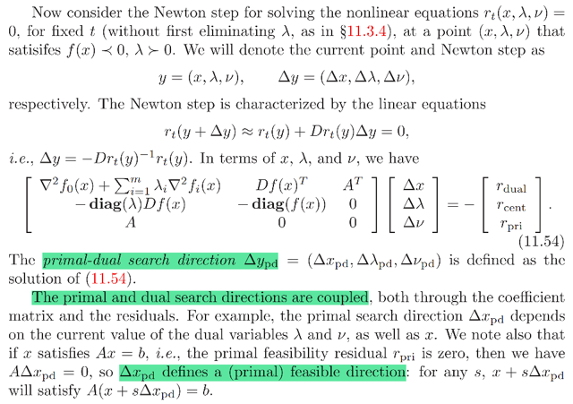</kbd></p>

> [!NOTE]
> Đại khái là, để giải cái hệ modified KKT condition này, thì nếu ta tính Newton step để giải nó, với cách thứ ra sao
> thì tí ta sẽ ôn lại thì sẽ thấy chính là newton step dùng  để giải centering problem theo phương pháp log barrier
> method.
>
> Vậy thì để giải hệ modified KKT condition, tức là giải bài toán tối ưu chỉ có equality constraint là cái hệ này thôi,
> và còn nhớ nó gọi là feasibility problem. Thì ta sẽ tiến hành bằng cách rút λi ra:
>
> ```text
> - λi fi(x) = -1/t ⇨ λi  = -1/tfi(x) và thế vào những chỗ khác có λi, cụ thể là trong điều kiện vanishing của gradient
> ```
> của Lagrangian để coi như eliminate λi đi:
>
> ∇f0(x) + `Σ` λi ∇fi(x) + ATv `=` 0
>
> ⇔ ∇f0(x) + `Σ` `[-1/tfi(x)]` ∇fi(x) + ATv `=` 0
>
> Khi đó hệ sẽ chỉ còn biến x và v:
>
> ```text
> ∇f0(x) + Σ [-1/tfi(x)] ∇fi(x) + ATv = 0 và Ax = b
> ```
>
> Rồi, thế thì như trên nói rằng đại khái là ta có thể giải cái hệ này bằng Newton method, mà khi đó thì ta sẽ thấy
> rằng cái Newton's step hóa ra y như `/` chính là cái Newton's step mà ta dùng để giải bài toán centering với log
> barrier method (bài toán minimize t f0(x) + Φ(x) subject Ax `=` b).
>
> Vậy câu hỏi là, giải một cái hệ phương trình bằng Newton method là sao?
>
> Để hiểu cái này ta liên hệ với 1801, trong đó có bài giảng dạy về Newton method giúp giải một phương trình f(x)
> `=` 0. Trong đó hàm f(x) phi tuyến bậc cao. Thì đầu tiên đại khái là ta có một initial guess x0, ta sẽ thiết lập hàm
> tiếp tuyến của f(x) tại x0. Mà công thức của nó đơn giản là xuất phát từ xấp xỉ Taylor bậc 1 của f(x) tại x0, còn
> gọi là linear approximation:
>
> f(x) ≈ f(x0) + f'(x0)(x - x0) , mà ý nghĩa của cái equation này nói rằng, nếu mà x ≈ x0, thì sự thay đổi của f(x) sẽ
> có thể coi như bằng sự thay đổi của hàm tuyến tính f^(x) `=` f(x0) + f'(x0)(x - x0)
>
> Chú ý chỗ này, tại sao nói hàm này là tuyến tính, trong khi f có thể làm hàm phi tuyến bậc cao, thì f' chưa chắc
> là hàm bậc nhất. Câu trả lời là vì, cho dù f'(x) không phải là hàm bậc nhất, nhưng chú ý vế phải f(x0) + f'(x0)(x -
> x0) là hàm theo x, có nghĩa là, f'(x0) là giá trị của f'(x) tại x0, và dù cho nó là hàm bậc cao thì f'(x0) cũng chỉ là
> hằng số, nên vế phải thật ra chỉ là có dạng ax
> + b với a `=` hằng số, `=` f'(x0), và b `=` f(x0) - f'(x0)x0. Do đó nó chỉ là hàm tuyến tính.
>
> Rồi, quay lại đây, khi đã có hàm tiếp tuyến của f(x) tại x0, ta sẽ đi tìm giao điểm của nó với trục x, dĩ nhiên bằng
> cách cho nó bằng 0:
>
> f(x0) + f'(x0)(x - x0) `=` 0 giải ra x:
>
> ⇔ f(x0) + f'(x0)x - f'(x0)x0 `=` 0 ⇔ f'(x0)x `=` f'(x0)x0 - f(x0)
>
> ```text
> ⇔ x = [f'(x0)x0 - f(x0)] / f'(x0) = x0 - f(x0)/f'(x0)
> ```
>
> và ta sẽ gán giá trị này cho x1.
>
> Tiếp tục như vậy, (tức là lại thiết lập phương trình tiếp tuyến của f(x) tại x1, và tìm giao điểm của nó với trục x,
> ta sẽ tìm được x2 `=` x1 - `f(x1)/f'(x1)`
>
> để rồi ta sẽ có các điểm x1, x2,...xk dần converge về x* là nghiệm thật sự của f(x) `=` 0
>
> Thế thì hãy để ý cái yếu tố `-f(x0)/f'(x0)` dùng để đi từ x0 đến x1, đây chính là Newton step tại x0. Tí nữa mình sẽ
> bàn về cái này thêm.
>
> Còn bây giờ ta sẽ nâng cấp lên để nói về việc giải một phương trình f(x) `=` 0 nhưng f(x) không phải là scalar
> function nữa mà là một vector function. Điều này giống như ta sẽ giải hệ phương trình f(x)_1 `=` 0; f(x)_2 `=` 0,....
> f(x)_n `=` 0 vậy.
>
> Vậy thì hoàn toàn tương tự, chỉ khác thay vì ta có hàm f(x) là scalar function, và ta vẽ đồ thị của nó (là đường
> cong nào đó) trong không gian 1 + 1 chiều thì nay với hàm f(x) là vector n chiều thì ta sẽ vẽ nó trong không gian
> n + 1 chiều Ví dụ như f(x) là 2D vector, và sẽ vẽ nó trong 3D space
>
> Cũng bắt đầu với initial point x0, là một vector [x01, x02], ta cũng sẽ thiết lập  hàm tiếp tuyến (tangent) với f(x).
> Lúc này, nó sẽ là một mặt phẳng thay vì đường thẳng. Việc thiết lập cũng dùng 1st order Taylor approximation
> của f(x) tại x0:
>
> f(x) ≈ f(x0) + f'(x0)(x - x0)
>
> Có điều f'(x) bây giờ là gì, nó là đạo hàm của hàm f(x) vốn là vector đối với vector x nên nó sẽ là Jacobian
> matrix `J_f(x).` Viết lại đúng hơn sẽ là:
>
> f(x) ≈ f(x0) + `J_f(x0)(x` - x0), nhìn lại sẽ thấy `J_f(x0)` là matrix, nhân với vector x-x0 để ra vector, thì mới cộng với
> vector f(x0), nói chung hai vế đều là vector.
>
> Thế thì again, vế phải là hàm tuyến tính đối với vector x, vì sao, vì `J_f(x0)` sẽ chỉ là vector hằng số, nên f(x0) +
> `J_f(x0)(x` - x0) về cơ bản chỉ là hàm tuyến tính đối với x
>
> Và nó sẽ là một hyperplane, và ta sẽ tìm giao điểm của nó với hyperplane f `=` 0
>
> (thật ra rất khó hình dung về mặt hình học, cho dù ta chỉ xét f(x) là 2D vector) vì nó là R^2 → R^2 function,
> không thể vẽ được, nếu mà là R^2 → R function thì ta có thể vẽ trong 3D space, còn đây thì ko. Nhưng dù
> không vẽ được thì vẫn có thể chắc chắn rằng hyperplane f(x0) + `J_f(x0)(x` - x0) sẽ cắt hyperplane f `=` 0 tại một
> điểm, và đó là x2, là next guess.
>
> Tại sao f^(x) `=` f(x0) + `J_f(x0)(x` - x0) là hyperplane?
>
> Theo định nghĩa, hyperplane sẽ có dạng aTz `=` b, là tập hợp các điểm trong không gian sao cho có cùng inner
> product với vector a, là normal vector, hay nếu chọn z0 là một điểm trên hyperplane thì ta có aT(z - z0) `=` 0 giúp
> diễn dịch ý nghĩa của hyperplane theo cách khác là tập hợp những điểm mà z - z0 vuông góc với a vuông góc
> với a
>
> Thế thì xét y `=` f^(x) `=` f(x0) + `J_f(x0)(x` - x0)
>
> Nếu trong 2D, đường thẳng y `=` ax + b thật ra là ax - y `=` -b ⇔ <a, -1><x, y> `=` -b là tập hợp mọi điểm (x, y) có
> dot product với <a, -1> ra -b
>
> Vậy thì y `=` f^(x) `=` f(x0) + `J_f(x0)(x` - x0), cũng vậy, nó ⇔
>
> ```text
> J_f(x0)x - J_f(x0)x0 + f(x0) = y ⇔ J_f(x0)x - 1 . y = J_f(x0)x0 - f(x0)
> ```
>
> ⇔ `<J_f(x0),` -1> <x, y> `=` `J_f(x0)x0` - f(x0)
>
> Đây vẫn là tập hợp những điểm <x, y> trong không gian (giả sử x là R^m vector, y `=` f(x)  cũng là R^m vector, thì
> <x, y> đây là không gian R^2m) sao cho có inner product với normal vector `<J_f(x0),` -1> `=` constant `J_f(x0)x0` -
> f(x0)
>
> ```text
> Và còn hyperplane f = 0? Nó tương tự như hyperplane y = 0 trong 2D: y = 0 ⇔ y . 1 + x . 0 = 0 ⇔ <x, y><0, 1> =
> ```
> 0 là tập hợp các điểm có inner product với <0, 1> ra 0, và có thể thấy nó làm nên trục x, là vì mọi vector trên đó
> đều vuông góc với <0, 1>
>
> `=====`
>
> Quay lại đây, để giải 0 `=` f(x0) + `J_f(x0)(x` - x0):
>
> ⇔ 0 `=` f(x0) + `J_f(x0)x` - `J_f(x0)x0`
>
> ⇔  `J_f(x0)x` `=` `J_f(x0)x0` - f(x0)
>
> ⇔  x `=` `J_f(x0)_inv[J_f(x0)x0` - f(x0)]
>
> ```text
> ⇔  x = J_f(x0)_inv J_f(x0)x0 - J_f(x0)_inv f(x0)
> ```
>
> ⇔  x `=` x0 - `J_f(x0)_inv` f(x0) (***)
>
> Và - `J_f(x0)_inv` f(x0) chính là Newton step tại x0.
>
> Và gán x cho x1, lặp lại quy trình thì dần ta sẽ tìm được x* là true solution của f(x) `=` 0
>
> `=====`
>
> Thế thì bây giờ ta sẽ nói về ý nghĩa đằng sau của việc tại sao Newton method lại hiệu quả, giúp  tạo ra iterative
> method giúp dần dần ta tìm được solution của f(x) `=` 0
>
> Là bởi vì thật ra ta đang giải một bài toán tối ưu bằng Newton method.
>
> Tối ưu cái gì? Câu trả lời là, tìm minimizer của hàm F(x) mà f(x) chính là gradient của F(x): ∇F(x) `=` f(x)
>
> Thế thì khi giải bài toán tối ưu, một điều đầu tiên cần làm là tìm điểm critical point, nơi gradient vanish, do đó
> giải phương trình f(x) bằng không có thể coi như là bước tìm cực trị của hàm F(x) mà gradient của nó là f(x), và
> ∇F(x) `=` f(x) `=` 0 là optimality condition.
>
> Tuy nhiên, từ kiến thức ở đây đã hiểu, không phải lúc nào cũng có thể dễ để giải được nghiệm của  optimality
> condition. Do đó một cách tiếp cận iterative trong đó ta sẽ tìm cách dần dần đi đến ngày càng gần điểm cực trị
> này qua nhiều bước update, được dẫn dắt bởi một search direction.
>
> Và ý tưởng rất đơn giản để làm nền tảng cho steepest gradient descent và Newton method:  hàm F phức tạp
> được xấp xỉ bằng tuyến tính hoặc hàm bậc hai. Cụ thể hơn là
>
> Từ một điểm x0 ban đầu, ta sẽ xấp xỉ, coi như hàm F là hàm tuyến tính:
>
> F(x) ≈ F^(x0 + `δx)` `=` F(x0) + ∇F(x0)T(x - x0), khi đó, bằng cách chọn di chuyển theo hướng ngược với gradient
> ```text
> tức - ∇f(x0), và đi một bước có độ dài ε ta sẽ có: F^(x0 - ε∇F(x0)) = F(x0) - ε∇F(x0)T∇F(x0)
> ```
>
> ```text
> = F(x0) - ε||∇F(x0)||^2 và vì ε||∇F(x0)||^2 là số không âm nên F^(x0 - ε∇F(x0)) sẽ giảm so với F^(x0 + 0) = F(x0)
> ```
>
> Và dĩ nhiên là vì linear approx sẽ chỉ đúng khi `δx` nhỏ nên bước đi (step size) `ε∇F(x0)` phải nhỏ thôi.
>
> Để rồi sinh ra những cách làm khác nhau trong việc quyết định độ lớn của bước đi này (gọi là bài toán line
> search). Trong đó exact line search sẽ giải một bài toán tối ưu để tìm ra `ε` chính xác khiến minimize F^(x0 -
> `ε∇F(x0))` trong khi đó back tracking line search sẽ dựa vào việc bắt đầu với `ε` `=` 1 và giảm dần cho đến khi nó
> thỏa  một điều kiện nào đó thì dùng `ε` đó.
>
> Và bước cập nhật x `=` x0 - `ε` ∇F(x0) sẽ đưa ta "đi xuống" tức đến gần x* hơn
>
> Cứ thế thì dần dần chuỗi xi sẽ converge về x* là cực tiểu thật sự của F
>
> `====`
>
> Còn ý tưởng của Newton method lại là từ x0, ta sẽ xấp xỉ `/` coi hàm F như hàm bậc hai (quadratic function)
>
> ```text
> F(x) ≈ F(x0) + ∇F(x0)δx + (1/2) δxT∇^2F(x0)δx, và ta có hàm F^(δx) là hàm bậc hai.
> ```
>
> Và với hàm bậc hai, ta có thể tìm cực tiểu (minimum) của nó dựa vào optimality condition:
>
> ```text
> ∇F^(δx) = 0, nghiệm của phương trình này chính là Newton step Δx_nt:
> ```
>
> ```text
> Không khó để thấy ∇F^(δx) = ∇^2F(x0)TΔx_nt + ∇F(x0) | và Hessian thì đối xứng nên ∇^2F(x0)T = ∇^2F(x0)
> ```
>
> ⇨ ta có equation `∇^2F(x0)Δx_nt` + ∇F(x0) `=` 0
>
> ⇔ `Δx_nt` `=` -[∇^2F(x0)]inv∇F(x0)
>
> Và từ x0, Newton step sẽ đưa ta đến cực tiểu (optimal) của hàm quadratic F^ mà ta dùng để xấp xỉ hàm F tại
> x0:
>
> x1 `=` x0 - [∇^2F(x0)]inv∇F(x0)  Và đó là điểm x1, tiếp tục làm tương tự, để lại từ x1, coi hàm F như quadratic
> function, để tính ra Newton's step và cực tiểu x2.
>
> Cứ thế thì dần dần chuỗi xi sẽ converge về x* là cực tiểu thật sự của F. Và trong EE364A người ta đã chứng
> minh (convergence analysis) để thấy rằng khi qua các bước update thì đại khái là vì khi càng đến gần x* thì
> càng ngày hàm F càng có thể được xấp xỉ tốt bởi hàm bậc hai, nên việc xấp xỉ ngày càng chính xác hơn, để rồi
> các điểm mà Newton step dẫn tới sẽ nhanh chóng hội tụ về x* trong giai đoạn gọi là quadratic convergence.
>
> Vậy thì tới đây, hãy nhìn công thức dùng Newton step tại x0 để bước từ x0 đến x1:
>
> x1 `=` x0 - [∇^2F(x0)]inv∇F(x0) và so sánh với công thức (***) x `=` x0 - `J_f(x0)_inv` f(x0)
>
> Có thể thấy nó chính là một: Khi f(x) là gradient của F: f(x) `=` ∇F(x), thì Jacobian của f(x) chính là Hessian của F:
>
> `J_f(x)` `=` ∇^2F(x)
>
> Do đó ta hiểu bản chất của việc dùng Newton method để giải một hệ phương trình là dùng Newton method để
> giải một bài toán tối ưu
>
> khi đã hiểu như vậy thì ở đây hoàn toàn hiểu được rằng ở đây ta có  phương trình cần giải là rt(x, λ,
> v) và để tính Newton step, ta sẽ coi nó là giải optimality condition của bài toán tìm cực tiểu của hàm R
> với ∇R `=` r, để rồi từ một điểm y `=` (x, λ, v) ta sẽ approx R bởi quadratic function, từ đó thiết lập
> phương trình optimality condition của cái hàm xấp xỉ này để tìm bước đi `Δy` dẫn tới cực tiểu của hàm
> xấp xỉ. Thì như đã thấy, đây cũng chính là việc ta xấp xỉ tuyến tính hàm r và cho nó  bằng 0.
>
> Xấp xỉ tuyến tính (first order Taylor approx) của r tại y:
>
> ```text
> r(y + Δy) ≈ r(y) + J_r(y)Δy (J_r hay Dr là Jacobian của r)
> ```
>
> ```text
> Ta có  r(y) + J_r(y)Δy = 0 ⇔ Δy = - J_r(y)_inv r(y)
> ```
>
> (Chú ý trong sách ghi rt ý là, t giữ fixed, hàm r parameter bởi t, chứ t không phải biến)
>
> Vây bây giờ ta xem thử `J_r(y)` là cái gì?
>
> ```text
> Với rt = [r_dual; r_centrality; r_primal]
> ```
>
> `r_dual` `=` ∇f0(x) + Df(x)Tλ + ATv
>
> `r_centrality` `=` - diag(λ) f(x) - `(1/t)1`
>
> `r_primal` `=` Ax - b
>
> ```text
> dr_dual = ∂r_dual/∂x dx + ∂r_dual/∂λ dλ + ∂r_dual/∂v dv (total differential)
> ```
>
> ```text
> dr_cen = ∂r_cen/∂x dx + ∂r_cen/∂λ dλ + ∂r_cen/∂v dv
> ```
>
> ```text
> dr_pri = ∂r_pri/∂x dx + ∂r_pri/∂λ dλ + ∂r_pri/∂v dv
> ```
>
> ```text
> dr = [dr_dual; dr_cen; dr_primal]
> ```
>
> `=` [
>
> ```text
> ∂r_cen/∂x dx + ∂r_cen/∂λ dλ + ∂r_cen/∂v dv;
> ```
>
> ```text
> ∂r_pri/∂x dx + ∂r_pri/∂λ dλ + ∂r_pri/∂v dv;
> ```
>
> ```text
> ∂r_pri/∂x dx + ∂r_pri/∂λ dλ + ∂r_pri/∂v dv
> ```
>
> ]
>
> mà cái này chính là:
>
> U [dx, dλ, dv]T, hay U dy
>
> với U `=` [
>
> ```text
> [∂r_dual/∂x]T, [∂r_dual/∂λ]T , [∂r_dual/∂v]T;
> ```
>
> ```text
> [∂r_cen/∂x]T, [∂r_cen/∂λ]T, [∂r_cen/∂v]T;
> ```
>
> ```text
> [∂r_pri/∂x]T, [∂r_pri/∂λ]T, [∂r_pri/∂v]T
> ```
>
> ]
>
> `=` [
>
> ∇^2f0(x) + `Σ` λi ∇^2fi(x), Df(x)T, AT
>
> -diag(λ)Df(x), -diag(f(x)), 0
>
> A, 0, 0
>
> ]
>
> Giải thích rõ hơn vì sao
>
> ```text
> ∂r_dual/∂x = ∇^2f0(x) + Σ λi ∇^2fi(x)
> ```
>
> vì `r_dual` `=` ∇f0(x) + Df(x)Tλ + ATv, , đối với x thì nó là vector → vector function:
>
> ⇨ derivative của `r_dual` wrt x là Jacobian matrix.
>
> Dĩ nhiên sẽ là Jacobian của ∇f0(x) + Jacobian của Df(x)Tλ + 0 (vì ATv ko phụ thuộc x)
>
> J_∇f0(x) chính là Hessian của f0: ∇^2f0(x)
>
> ```text
> d/dx Df(x)Tλ = d/dx Σ λi Df(x)i = d/dx Σ [λi ∇fi(x)] = Σ λi d/dx ∇fi(x) = Σλi ∇^2fi(x)
> ```
>
> `===`
>
> ```text
> ∂r_dual/∂λ:  r_dual = ∇f0(x) + Df(x)Tλ + ATv
> ```
>
> ```text
> ⇨ dr_dual giữ x, v fixed = Df(x)T dλ ⇨ ∂r_dual/∂λ = Df(x)
> ```
>
> Tương tự `∂r_dual/∂v` `=` A thì dễ rồi.
>
> `====`
>
> ```text
> ∂r_central/∂x: r_central = - diag(λ) f(x) - (1/t)1
> ```
>
> thì giữ λ fix, `dr_central` `=` - diag(λ) f(x + dx) - [- diag(λ) f(x)]
>
> ```text
> = -diag(λ) df(x) = -diag(λ) Df(x) dx ⇨ ∂r_central/∂x = -diag(λ) Df(x)
> ```
>
> `∂r_central/∂λ:`
>
> Giữ x fix, `dr_central` `-=` - diag(λ + dλ) f(x) - [- diag(λ) f(x)]
>
> `=` - [diag(λ + dλ) - diag(λ)] f(x)
>
> `=` - diag(dλ) f(x)
>
> và cái này chính là vector - [dλ1 f1(x); dλ2 f2(x); ....]
>
> và hoàn toàn có thể thể hiện bằng
>
> - diag[f(x)] dλ
>
> ```text
> Từ đó ⇨  ∂r_central/∂λ = - diag[f(x)]T = - diag[f(x)]
> ```
>
> `====`
>
> và r cũng là hàm theo y dr `=` Dr(y)dy
>
> nên Dr `=` U như trên
>
> Do đó thể hiện Drt `Δy` `=` -rt(y)
>
> `====`
>
> Một nhận xét từ hệ này là các search direction primal, dual bị couple nhau, tức là bị phụ  thuộc nhau
>
> Nhận xét thứ hai là `Δxpd` cũng là primal feasible direction: Lí do vì trong hệ trên cho thấy A `Δxpd` `=` 0
> ⇨ với s bất kì thì A(x + s `Δxpd)` `=` b ⇨ x + s `Δxpd` ∈ feasible set

<br>

<p align="center"><kbd>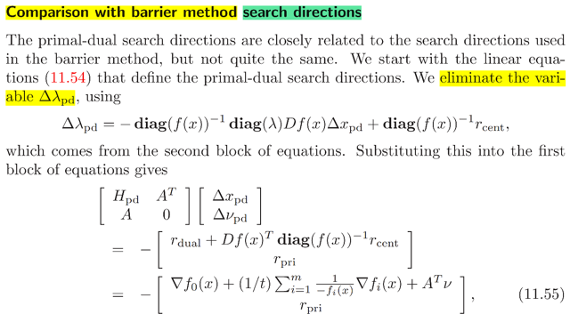</kbd></p>

<p align="center"><kbd>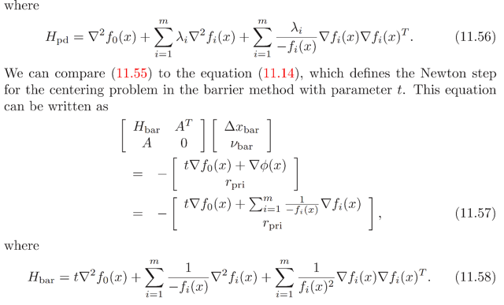</kbd></p>

<p align="center"><kbd>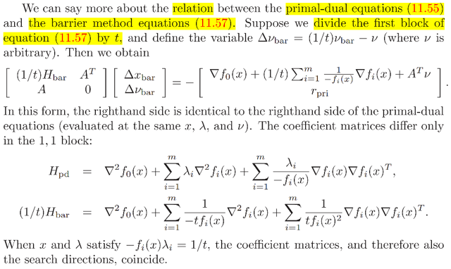</kbd></p>

> [!NOTE]
> ```text
> -diag(λ) Df(x) Δxpd - diag(f(x)) Δλpd = - r_cent
> ```
>
> ```text
> ⇔ -diag(λ) Df(x) Δxpd + r_cent = diag(f(x)) Δλpd
> ```
>
> ```text
> ⇔ diag(f(x))_inv [ -diag(λ) Df(x) Δxpd + r_cent ] = Δλpd
> ```
>
> ```text
> ⇔ - diag(f(x))_inv diag(λ) Df(x) Δxpd + diag(f(x))_inv r_cent  = Δλpd
> ```
>
> Thế vào block đầu tiên, ý là thế vào phương trình đầu tiên:
>
> ```text
> [ ∇^2f0(x) + Σ λi ∇^2 fi(x) ] Δxpd + Df(x)T Δλpd + AT Δvpd = - r_dual
> ```
>
> ```text
> ⇔ [ ∇^2f0(x) + Σ λi ∇^2 fi(x) ] Δxpd + Df(x)T [- diag(f(x))_inv diag(λ) Df(x) Δxpd + diag(f(x))_inv r_cent ] + AT Δv = - r_dual
> ```
>
> ```text
> ⇔ [ ∇^2f0(x) + Σ λi ∇^2 fi(x) ] Δxpd - Df(x)T diag(f(x))_inv diag(λ) Df(x) Δxpd + Df(x)T diag(f(x))_inv r_cent  + AT Δv = - r_dual
> ```
>
> ```text
> ⇔ [ ∇^2f0(x) + Σ λi ∇^2 fi(x)  - Df(x)T diag(f(x))_inv diag(λ) Df(x) ] Δxpd + AT Δvpd = - r_dual - Df(x)T diag(f(x))_inv r_cent
> ```
>
> ```text
> ⇔ [ ∇^2f0(x) + Σ λi ∇^2 fi(x)  - Df(x)T diag(f(x))_inv diag(λ) Df(x) ] Δxpd + AT Δvpd = - [ r_dual + Df(x)T diag(f(x))_inv r_cent ]
> ```
>
> `====`
>
>  - [ `r_dual` + Df(x)T diag(f(x))_inv `r_cent` ]
>
> ```text
> Thay r_dual = ∇f0(x) + Df(x)Tλ + ATv , r_cent = - diag(λ) f(x) - (1/t)1
> ```
>
> vế phải sẽ bằng  
>
> - [ ∇f0(x) + Df(x)Tλ + ATv + Df(x)T diag(f(x))_inv [- diag(λ) f(x) - `(1/t)1]` ]
>
> `=` - ∇f0(x) - Df(x)Tλ - ATv - Df(x)T diag(f(x))_inv [- diag(λ) f(x) - `(1/t)1]` 
>
> `=` - ∇f0(x) - Df(x)Tλ - ATv + Df(x)T diag(f(x))_inv diag(λ) f(x) + Df(x)T `diag(f(x))_inv(1/t)1`  (**)
>
> *Xét - Df(x)Tλ `=` - `Σi` λi ∇fi(x) 
>
> *Xét Df(x)T diag(f(x))_inv diag(λ) f(x) 
>
> ```text
> Đặt U = Df(x)T diag(f(x))_inv diag(λ), nó = Df(x)T diag[λ1 / f1(x), λ2 / f2(x), ... ]
> ```
>
> Cột i của U sẽ là [λi `/` fi(x)] ∇fi(x) 
>
> ```text
> ⇨ U f(x) = Σi [λi / fi(x)] ∇fi(x) fi(x) = Σi λi ∇fi(x)
> ```
>
> *Xét Df(x)T diag(f(x))_inv `(1/t)1`
>
> ```text
> = U (1/t)1 = Σi [λi / fi(x)] ∇fi(x) (1/t)1
> ```
>
> ```text
> = (1/t) Σi [λi / fi(x)] ∇fi(x)
> ```
>
> Vậy (**) `=` - ∇f0(x) - `Σi` λi ∇fi(x) - ATv + `Σi` λi ∇fi(x) + `(1/t)` `Σi` [λi `/` fi(x)] ∇fi(x) 
>
> ```text
> = - ∇f0(x) - ATv + (1/t) Σi [λi / fi(x)] ∇fi(x)
> ```
>
> ```text
> = - ∇f0(x) - ATv - (1/t) Σi [λi / - fi(x)] ∇fi(x)
> ```
>
> ```text
> = - [∇f0(x) + ATv + (1/t) Σi [λi / - fi(x)] ∇fi(x)]
> ```
>
> `====`
>
> ```text
> Equation 3rd giữ nguyên: A Δxpd + 0 Δvpd = r_pri
> ```
>
> Thì khi đó ta có, với việc đặt 
>
> Hpd `=` [ ∇^2f0(x) + `Σ` λi ∇^2 fi(x) - Df(x)T diag(f(x))_inv diag(λ) Df(x) ], 
>
> Tìm cách thu gọn Df(x)T diag(f(x))_inv diag(λ) Df(x) (*)
>
> Xét diag(f(x))_inv diag(λ) `=` `diag[λ1/f1(x),...λn/fn(x)]:` vì sao:
>
> a) Inverse của diag(f1(x), f2(x),...) `=` `diag(1/f1(x),` `1/f2(x),` ...)
>
> b) Cột 1 của matrix kết quả sẽ là linear combination của các cột của diag(f(x)) với coefficients là cột một của diag(λ) và nó 
> chỉ là λ1 ⇨ cột 1 của matrix kết quả là [λ1f1(x), 0, ...0]. Tương tự cột 2 của matrix kết quả là [0, λ2f2(x), 0 ...0 ] 
>
> ```text
> = [ ∇^2f0(x) + Σ λi ∇^2 fi(x)  - Df(x)T diag(λ1/f1(x),...λn/fn(x)) Df(x) ],
> ```
>
> Xét Df(x)T `diag(λ1/f1(x),...λn/fn(x))` gọi là matrix U, cột 1 của matrix U, là linear combination của các cột của Df(x)T
> mà chúng là ∇f1(x), ∇f2(x), ....với coefficient là cột 1 của `diag(λ1/f1(x),...λn/fn(x)),` tức `[λ1/f1(x),` 0, ...0]
> nên nó sẽ ra `[λ1/f1(x)]∇f1(x).` Tương tự cột 2 của matrix U sẽ là `[λ2/f2(x)]∇f2(x)...`
>
> Rồi matrix U này nhân tiếp với Df(x), cho ra V thì ta sẽ nhìn theo góc nhìn khác; đó là tổng của các rank 1 matrix:
>
> `Σi` [cột ith của U x hàng ith của Df(x)]
>
> `=` `Σi` `[λi/fi(x)]` ∇fi(x) ∇fi(x)T
>
> Vậy [ ∇^2f0(x) + `Σ` λi ∇^2 fi(x)  - Df(x)T `diag(λ1/f1(x),...λn/fn(x))` Df(x) ]
>
> ```text
> Hpd) = ∇^2f0(x) + Σ λi ∇^2 fi(x) + Σi [λi / -fi(x)] ∇fi(x) ∇fi(x)T  ĐÂY LÀ KẾT QUẢ 11.56
> ```
>
> Từ đó ta có hệ:
>
> ```text
> [Hpd, At; A, 0] [Δxpd,  Δvpd]T = - [ ∇f0(x) + ATv + (1/t) Σi [λi / - fi(x)] ∇fi(x), r_pri] (11.55)
> ```
>
> `====`
>
> Thế thì, đại khái là việc tìm Newton step trong bài toán  centering problem với t sẽ được thể hiện bởi hệ: 11.14
>
> [t∇^2f0(x) + ∇^2Φ(x),  AT; A, 0] `[Δxn` vnt] `=` - [t ∇f0(x) + ∇Φ(x), `r_pri]` 
>
> thể hiện bởi:
>
> [Hbar, AT; A, 0] `[Δxn,` vnt]T `=` - [t ∇f0(x) + ∇Φ(x), `r_pri]` 
>
> ```text
> [Hbar, AT; A, 0] [Δxn, vnt]T = - [t ∇f0(x) + Σi [1/fi(x)] ∇fi(x)T, r_pri] (11.57)
> ```
>
> ```text
> Hbar = t∇^2f0(x) + Σi [1/-fi(x)] ∇^2fi(x) + Σi [1/fi(x)^2] ∇fi(x) ∇fi(x)T
> ```
>
> ```text
> (một lưu ý nhỏ là r_pri là để thể hiện cả bài toán feasible Newton step (khi r_pri = 0) hoặc infeasible Newton step khi r_pri ≠ 0)
> ```
>
> Vậy thì có thể thấy (11.55), (11.57) khá giống nhau với Hpd và Hbar đều là positive linear combination của các matrix
>
> ∇^2f0(x), các ∇fi(x) ∇fi(x)T, các ∇^2fi(x)
>
> KHÚC SAU ĐẠI KHÁI LÀ NÓI THÊM VỀ QUAN HỆ  `/` SỰ TƯƠNG ĐỒNG GIỮA HAI PHƯƠNG PHÁP 
>
> CÓ THỂ QUAY LẠI SAU
>
> QUAY LẠI SAU

<br>

<p align="center"><kbd>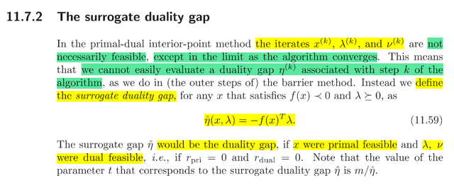</kbd></p>

> [!NOTE]
> đại khái là trong barrier method có một phần mà mình đã thấy
> rằng khi ta có central point x*(t), tức có nghĩa là solution của bài
> toán centering minimize tf0(x0 + Φ(x) subject to Ax `=` b (là bài toán
> mà mình dùng  hàm log barrier function để approx cho Indicator I_
> function), thì có một thực tế là nếu mà mình chọn giá trị của λ*(t),
> và v*(t):
>
> ```text
> λ*(t) = -1/t fi(x*(t)) ⇨ tλ*(t) = -1/fi(x*(t)) và v*(t) = v^/t)\
> ```
>
> thì hóa ra ta sẽ thấy rằng việc x*(t) thỏa optimality condition của
> bài toán centering thì với giá trị được chọn như trên của λ*(t) và
> v*(t) thì nó cũng thỏa optimality condition của bài toán gốc.
>
> Dẫn tới kết luận là với giá trị đó của λ*(t) và v*(t) thì x*(t) là
> minimizer của  L(x, λ*(t), v*(t) và do đó chứng tỏ g(λ*(t), v*(t))
> không infinite ⇨ λ*(t) và v*(t) là DUAL FEASIBLE.
>
> Để rồi từ đó ta có thể có được f0(x*(t)) - g(λ*(t), v*(t)) `=` ... VÀ ĐÂY
> CHÍNH LÀ DIFFERENCE GIỮA f0(primal feasible point) và g(dual
> feasible point) VÀ GỌI LÀ DUALITY GAP
>
> Thế thì, từ đó có thể hiểu ở đây nói rằng vì trong quá trình chạy
> thuật toán giải bài toán với phương pháp primal dual interior point
> thì không phải lúc nào x(k), λ(k) v(k) cũng feasible giống như x*(t),
> λ*(t), v*(t) thành ra ta ko thể tính `/` ko thể có duality gap
>
> Do đó người ta mới đặt ra cái gọi là diality gap THAY THẾ
> (SURROGATE)
>
> rằng với x thỏa fi(x) < 0, λ thỏa λ ≽ 0 thì surrogate duality gap
> được tính  bởi  η^(x, λ ) `=` - f(x)Tλ
>
> Vẫn còn câu hỏi chưa hiểu: Tại sao lại là - f(x)Tλ và tại sao khi 
> giá trị của t ứng với surrogate duality gap η^ lại là m `/` η^

<br>

<p align="center"><kbd>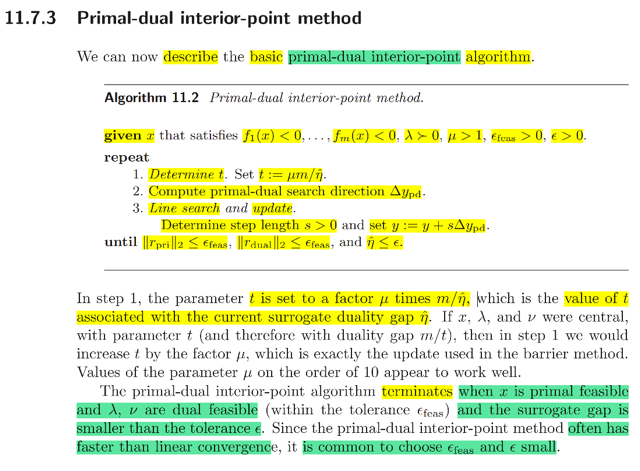</kbd></p>

> [!NOTE]
> Thuật toán của primal-dual interior point method:
>
> Đại khái là lặp lại quy trình sau:
>
> 1) Xác định t: t `=` `μ` m `/` η^
>
> 2) Tính toán primal - dual search direction `Δy_pd`
>
> 3) Linea search: tính step size s & update y `=` y + s `Δy_pd`
>
> Dừng khi x(k), λ(k), v(k) đều là feasible và residual `r_pri`
> `r_dual` đều có norm 2 nhỏ hơn mức nào đó cũng như là surrogate
> duality gap η^ cũng nhỏ hơn mức nào đó

<br>

<p align="center"><kbd>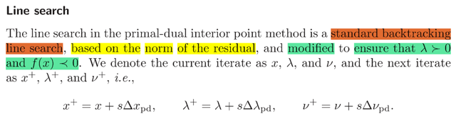</kbd></p>

<p align="center"><kbd>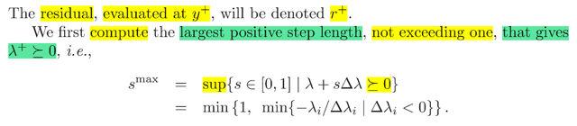</kbd></p>

<p align="center"><kbd>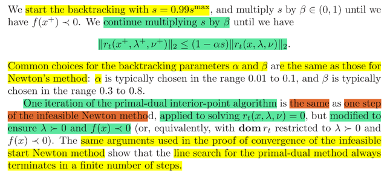</kbd></p>

> [!NOTE]
> Nói về line search
>
> line search là sao, có thể ôn lại : Đại khái là khi ta đã có hướng
> (gradient, hoặc ở đây là newton step `Δy_pd,` gồm 3 thành phần
> ```text
> Δx_pd, Δ λ_pd và Δv_pd, thì ta cần xác định s: Để update: x+ = x + s
> ```
> ```text
> Δx_pd, λ+ = λ + s Δλ_pd,..
> ```
>
> Thế thì trong exact line search, ta sẽ tìm s sao cho hàm f0 xuống thấp
> nhất còn trong back tracking thì bắt đầu với s `=` 1 và scale xuống dần
> cho đến khi thỏa điều kiện.
>
> Tuy nhiên cả hai đều phải thỏa là x+, và λ+ đều feasible.
>
> Do đó:
>
> Đầu tiên ta ta muốn tìm s lớn nhất mà λ vẫn dual feasible: λ ≽ 0:
>
> Điều này đồng nghĩa mọi λi+ `=` λi + s `Δλi` đều ≥ 0.
>
> Thế thì, nếu `Δλi` > 0 rồi, thì vì λi luôn > 0 sẵn rồi nên s sao cũng được
> (vì s đã luôn ∈ (0,1). Ngược lại nếu `Δλi` < 0 thì ta cần điều kiện s phải
> sao cho:
>
> λi + s `Δλi` > 0 ⇔ s < -λi `/` `Δλi` ∀ i
>
> Có nghĩa là s phải nhỏ hơn thằng nhỏ nhất của -λi `/` `Δλi` với `Δλi` < 0
>
> Bên cạnh đó, s cũng phải ≤ 1, thành ra điều kiện trở thành s ≤ min 1,
> min (-λi `/` `Δλi)` với `Δλi` < 0.
>
> Khi đã tìm ra thằng `s_max` là s lớn nhất mà khiến λ thỏa dual feasible
> thì ta sẽ scale nó dần xuống để tìm thằng lớn nhất mà vẫn khiến x 
> thỏa primal feasible: f(x+) ≺ 0
>
> TẠI SAO LẠI TIẾP TỤC MULTIPLY S VỚI `β` CHO ĐẾN KHI THỎA
> ||rt(x+, λ+, v+)|| ≤ (1 - `αs)` ||rt(x, λ, v||
>
> Đơn giản là vì đây là điều kiện stop của backtracking line search.
>
> Nó đảm bảo rằng độ giảm của norm residual khi step (thực hiện
> bước cập nhật theo direction) nhiều hơn độ giảm của residual 
> norm khi được scale xuống tuyến tính bởi factor `α`
>
> Vì sao, stopping condition cho thấy:
>
> ||rt(x+, λ+, v+)|| ≤ (1 - `αs)` ||rt(x, λ, v||
>
> ⇔ ||rt(x+, λ+, v+)|| ≤ ||rt(x, λ, v|| - `αs||rt(x,` λ, v|| 
>
> ⇔ ||rt(x, λ, v|| - ||rt(x+, λ+, v+)|| ≥ `αs||rt(x,` λ, v|| 
>
> Vế phải chính là `Δ||rt||,` độ gỉam của residual norm, còn vế trái
> chính là mức giảm của residual norm kh được scale tuyến tính
> ```text
> bởi α (scale tuyến tính là sao, ví dụ là hàm f(x) = 0.5t.m với α = 0.5
> ```
> m là khối lượng ban đầu, thì với giá trị của t thì m được scale xuống
> tuyến tính theo t bởi factor 0.5, nên t càng lớn thì scale xuống càng
> nhiều nhưng sẽ là tuyến tính)

<br>

<p align="center"><kbd>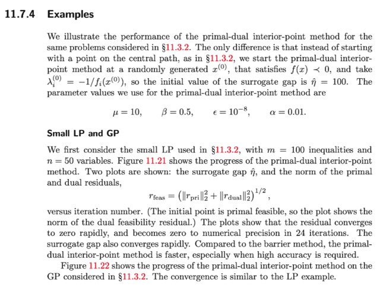</kbd></p>

> [!NOTE]
> QUAY LẠI SAU

<br>

<p align="center"><kbd>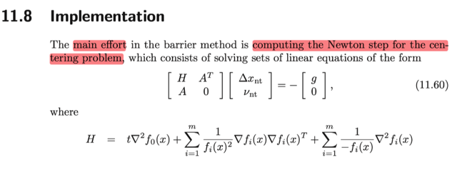</kbd></p>

<p align="center"><kbd>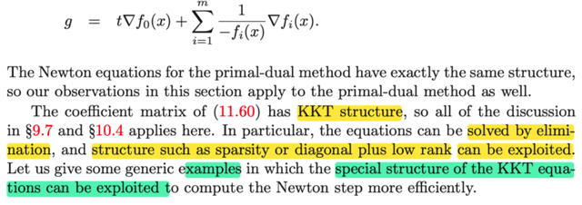</kbd></p>

> [!NOTE]
> Đại khái là, cái bước tốn công nhất của barrier method là tính cái
> Newton step, và như đã biết nó chính là việc giải hệ KKT system:
>
> [H AT; A 0] `[Δx_nt,` vnt] `=` -[g, 0] với H, g như sách (mình đã hiểu ở đâu
> ra có công thức này rồi khỏi nó lại, lập luận là từ việc ta bậc hai hóa
> hàm objective tf0(x) + Φ(x) khiến optimality condition trở thành hệ tuyến
> tính, hay cũng có thể nói theo kiểu là ta lấy cái optimality condition và
> tuyến tính hóa theo x để trở thành hệ tuyến tính)
>
> Thế thì như phần implementation ở các chap 9,10 đã biết, ta có thể
> dựa vào đặc điểm của từng bài toán khác nhau từ đó có thể khai kiến
> trúc đặc thù  của matrix

<br>

<p align="center"><kbd>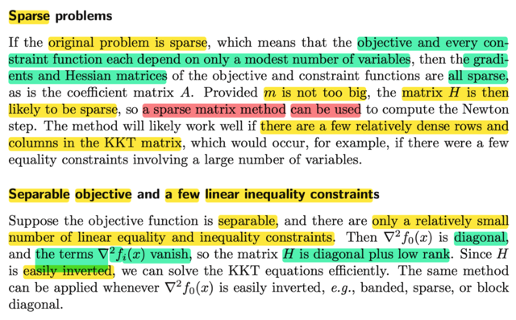</kbd></p>

> [!NOTE]
> CHƯA HIỂU LẮM

<br>

<p align="center"><kbd>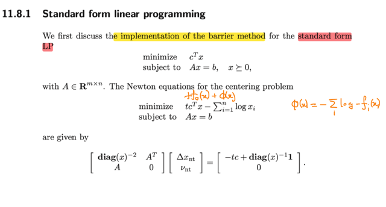</kbd></p>

<p align="center"><kbd>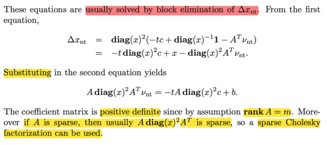</kbd></p>

> [!NOTE]
> Rồi, gặp lại bài toán standard form LP: minimize f0(x) `=` cTx subject
> to  Ax `=` b, x ≽ 0. Với A m, n và full rank
>
> Như đã biết, theo log barrier method, ta sẽ xây dựng centering
> problem với các lập luận đại khái như sau:
>
> Dùng indicator function đưa inequality constraint vào objective:
>
> f(x) `=` f0(x) + `Σi` I_(fi(x))
>
> Sau đó , để mang lại tính khả vi ta dùng xấp xỉ của indicator function:
>
> f(x) `=` f0(x) + `Σi` I^_(fi(x)) và cụ thể là dùng hàm log barrier:
>
> `=` f0(x) - `Σi` `(1/t)` log (-fi(x))
>
> `=` f0(x) - `(1/t)` `Σi` log (-fi(x))
>
> từ đó ta có bài toán equivalent lần nữa: minimize tf0(x) - `Σi` log(-fi(x))
> và đây là tf0(x) + Φ(x), dĩ nhiên còn constraint Ax `=` b, đây chính là
> centering problem
>
> Để nhớ về hiệu quả của Φ(x) ta nhớ rằng mục đích chính của
> indicator function là để khi fi(x) < 0, tức thỏa constraint thì nó sẽ bằng
> 0, ngược lại nếu vi phạm constraint thì Φ(x) sẽ rất lớn.
>
> Nhớ lại đồ thị của hàm log(x) và e^x sẽ đối xứng nhau qua đường
> ```text
> thẳng y = x (cái vụ này là sao? là vì y = f(x) = e^x  ⇔ log y = finv(y) =
> ```
> x Nên bằng cách đổi vai trò của x và y cho nhau thì từ đồ thị của e^x
> ta sẽ có đồ thị của log x, đại khái là vậy) Nên chỉ cần nhớ đồ thị hàm
> e^x có dạng khi x → -inf thì e^x → 0 và x → +inf thì e^x → inf. Hoặc
> nhớ đường cong lãi suất kép khi ban đầu tăng chậm đến lúc nào đó
> thì vọt lên. Thì đối xứng với y `=` x sẽ là hàm y `=` log x, nên x → 0 →
> log x → -inf và x → inf ⇨ log x → inf.
>
> Vậy fi(x) → 0- thì - fi(x) → 0+ ⇨ - log -fi(x) → inf
>
> fi(x) → -inf thì -fi(x) → +inf ⇨ - log -fi(x) → -inf
>
> Vừa rồi đại khái là ôn nhanh các bước lập luận để xây dựng
> centering problem: Vậy với bài toán LP fi(x) `=` -x (constraint là x ≽ 0 ⇔
> -x ⪯ 0 ⇔ -xi ≤ 0 ∀i )
>
> ```text
> f(x) = tcTx - Σi log(-(-xi)) = tcTx - Σi log(xi) constraint Ax = b.
> ```
>
> Rồi, xem thử KKT system để giải Newton step:
>
> Mình sẽ lập luận theo cách interpretation thứ 2 của Newton method:
> linearization của gradient.
>
> Optimality condition:
>
> ∇f(x) + ATv `=` 0. Tính ∇f(x):
>
> ```text
> df(x) = f(x + dx) - f(x) = tcT(x + dx) - Σi log(xi + dxi) - [tcTx - Σi log(xi)]
> ```
>
> `=` tcTx + cTdx - tcTx - `Σi` log(xi + dxi) + `Σi` log(xi)
>
> `=` tcTdx - `Σi` [ log(xi + dxi) - log(xi) ]
>
> `=` tcTdx - `Σi` log[ (xi + `dxi)/xi` ]
>
> `=` tcTdx - `Σi` log(1 + `dxi/xi)`
>
> ```text
> = tcTdx - Σi (dxi/xi)    | log(1 + ε) ≈ ε
> ```
>
> `=` tcTdx - `(1/x)Tdx`
>
> `=` tcTdx - (diag(x)inv1)Tdx | `(1/x)` `=` diag(x)inv1
>
> `=` (tc - diag(x)inv)Tdx ⇨ ∇f(x) `=` tc - diag(x)inv1
>
> Vậy ∇f(x) + ATv `=` tc - diag(x)inv1 + ATv
>
> Để có Newton step ta sẽ linearization theo x của g(x) `=` ∇f(x) + ATv:
>
> ```text
> g(x + Δx) = ∇f(x + Δx) + ATv ≈ ∇f(x) + ATv + ∇g(x)TΔx
> ```
>
> `=` ∇f(x) + ATv + `∇^2f(x)TΔx` 
>
> Từ đó ta sẽ có equation để giải Newton step:
>
> ∇f(x) + ATv + `∇^2f(x)TΔx` `=` 0
>
> ⇔ `∇^2f(x)TΔx` + ATv `=` -∇f(x) (1)
>
> Cùng với primal feasible: Ax `=` b và feasible step A(x + `Δx)` `=` b
>
> ⇨ A `Δx` `=` 0 (2)
>
> (1)(2) trở thành [∇^2f(x)T AT; A, 0] `[Δx,` v] `=` - [∇f(x), 0]
>
> ∇^2f(x): Có hai cách làm: Tìm bilinear form của f hoặc gradient
> của gradient ∇f(x)
>
> d ∇f(x) `=` tc - diag(x+dx)inv1 + ATv - tc + diag(x)inv1 - ATv
>
> `=` - diag(x+dx)inv1 + diag(x)inv1 
>
> `=` [- diag(x+dx)inv + diag(x)inv]1 
>
> `=` [- diag(x+dx)inv + diag(x)inv]1
>
> ```text
> = diag[-1/(x1+dx1) + 1/x1,... -1/(xn+dxn) + 1/xn]1
> ```
>
> `=` `diag[(-x1+x1+dx1)/x1(x1+dx1)` + ..]1 
>
> `=` `diag[dx1/x1(x1+dx1)` + ..]1 
>
> `=` `diag[dx/x1(x1+dx1)` + ..]1
>
> `=` `diag[dx/(x1x1+x1dx1)` + ..]1
>
> ≈ `diag[dx/(x1x1)` + ..]1
>
> `=` `diag[1/x1^2` + ..]dx
>
> `=` diag(x)^2_inv dx ⇨ Jacobian của gradient là diag(x)^2_inv
>
> và cũng là Hessian của f
>
> Vậy với ∇f(x) `=` tc - diag(x)inv1,  ∇^2f(x) `=` diag(x)^2_inv
>
> (1) ⇔ `diag(x)^2_invTΔx` + ATv `=` - tc + diag(x)inv1
>
> (2) ⇔ A `Δx` `=` 0
>
> Kết hợp thành hệ:
>
> [diag(x)^2_inv,  AT; A, 0] `[Δx_nt,` vnt] `=` [- tc + diag(x)inv1, 0]
>
> Để giải hệ này thì từ (1) rút ra `Δx` `=` diag(x)^2[- tc + diag(x)inv1 - ATv]
>
> `=` - diag(x)^2tc + diag(x)^2diag(x)inv1 - diag(x)^2ATv
>
> `=` - tdiag(x)^2c + diag(x)1 - diag(x)^2ATv
>
> `=` - tdiag(x)^2c + x - diag(x)^2ATv
>
> Thế vào (2):
>
> A[- tdiag(x)^2c + x - diag(x)^2ATv] `=` 0
>
> ⇔ - Atdiag(x)^2c + Ax - Adiag(x)^2ATv `=` 0
>
> ⇔ - Atdiag(x)^2c + Ax `=` Adiag(x)^2ATv
>
> ⇔ - Atdiag(x)^2c + Ax `=` Adiag(x)^2ATv
>
> ⇔ Adiag(x)^2ATv `=` - Atdiag(x)^2c + Ax
>
> ⇔ Adiag(x)^2ATv `=` - Atdiag(x)^2c + Ax
>
> Tới đây giải ra v, thì cơ bản đây là giải hệ Ax `=` b, với A, coefficient
> matrix là Adiag(x)^2AT ≽ 0 do A là matrix (m, n) có rank m ⇨ full row rank
> Vì sao?
>
> Để xét tính positive semi definite, theo mit 1806 ta xét quadratic form, 
> hoặc dấu của eigenvalues, các det của leading principal...
>
> Xét quadratic form uTAMATu với M `=` diag(x)^2
>
> Đặt y `=` ATu ⇨ ta có yTMy `=` `Σ` yi^2xi^2 luôn ≥ 0 ⇨ uTAMATu là positive
> semi definite matrix.
>
> Rồi cộng thêm A full row rank ⇔ AT full column rank, khi đó ATu `=` 0 chỉ
> xảy ra khi u `=` 0, vì AT full column rank, nên mọi column đều độc lập,
> không có free column ⇨ không có column nào là linear combination các
> column còn lại ⇨ cách duy nhất để linear combine các column thành 0
> là mọi coefficient đều bằng 0. Hoặc giải thích cách khác, vì AT full column
> rank có rank `=` m ⇨ dim column space và row space `=` m, xét rowspace
> của AT (tức là column space của A), với A là matrix m,n thì AT là matrix 
> (n, m) nên row-space là subspace của R^m, mà rank m có nghĩa là 
> rowspace là toàn bộ R^m, nên theo Rank - Nullity theorem, dim nullspace
> + dim rowspace `=` m ⇨ dim nullspace `=` 0 ⇨ chỉ có zero vector trong 
> nullspace
>
> Vậy với việc y `=` ATu chỉ bằng 0 khi u `=` 0, mà yTMy chỉ bằng 0 khi y `=` 0
> suy ra uTAMATu chỉ bằng 0 khi u `=` 0, còn u khác 0 thì uTAMATu luôn
> dương. Từ đó suy ra positive definite
>
> Vậy thì ta nhớ trong Appendix nói rằng để giải hệ Ax `=` b, ta sẽ factor
> A thành tích các matrix có cấu trúc khiến cho việc giải hệ "nhẹ" hơn, gọi
> là factor-solver. Kiểu như factor A thành BCDE từ đó giải BCDEx `=` b
> ```text
> thì đầu tiên giải Bt = b, sau đó giải Cu = t, rồi giải Dv = u, rồi giải Ex = v
> ```
>
> Thế thì nhờ tính positive definite của matrix coefficient ta có thể dùng
> Cholesky factorization cho bước factoring. Chưa kể matrix này sẽ còn 
> có tính chất sparse do đó ta sẽ thực hiện sparse Cholesky factorization

<br>

<p align="center"><kbd>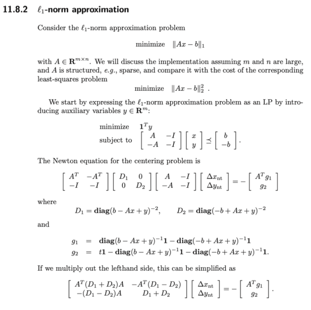</kbd></p>

<p align="center"><kbd>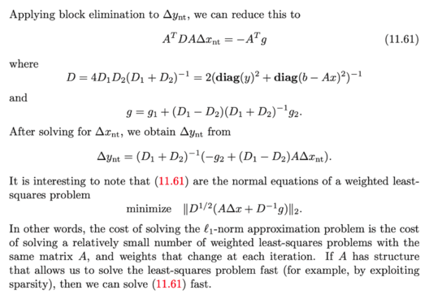</kbd></p>

> [!NOTE]
> SÁCH (XEM SAU)

<br>

<p align="center"><kbd>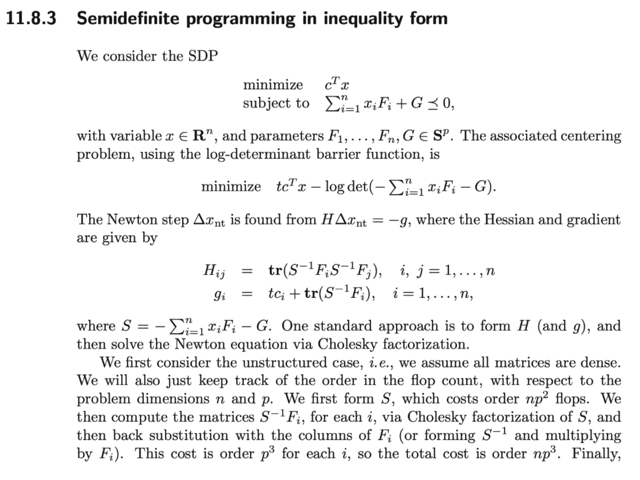</kbd></p>

<p align="center"><kbd>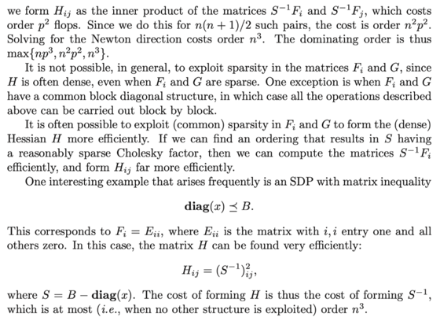</kbd></p>

> [!NOTE]
> SÁCH (XEM SAU)

<br>


<a id="node-p3fx87h"></a>
## Lec 8 A

<br>

<p align="center"><kbd>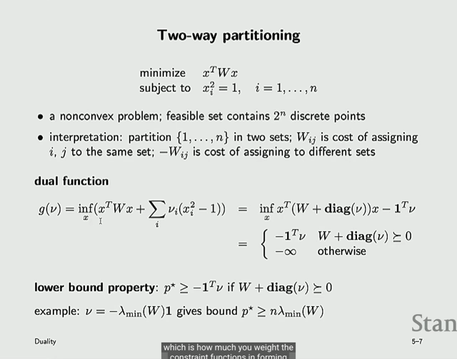</kbd></p>

> [!NOTE]
> Recap: Lagrangian có thể được nhìn nhận là cách ta TÍCH HỢP
> CONSTRAINT VÀO TRONG OBJECTIVE FUNCTION
>
> objective function f0(x) + linear combination các equalities và
> inequalities constraints `Σ` λi fi(x) + `Σ` vi hi(x)
>
> Để rồi khi ta minimize over x tức tìm x sao cho f0(x) + `Σi` λi fi(x) +
> `Σi` vi hi(x) nhỏ nhất, ta sẽ có DUAL FUNCTION: g(λ, ν)
>
> Ý nghĩa, đó là ta approximate constraint thành ra kiểu như add
> cost (tuyến tính) vào objective, để khi violate constraint thì tăng
> cost, satisfy constraint thì giảm cost.
>
> Để rồi từ đó ta có thể có được lower bound của original function: 
> p* `>=` g(λ, v)
>
> Và bài trước ta học về Two-way partitioning: trong đó gs lưu ý
> đặc điểm là trong objective function xTWx thì chưa chắc nó đã
> convex (W chưa chắc là positive semi definite) cũng như các
> equalities constraint không phải affine, ko convex.
>
> Rồi ta define Lagrangian, và sau đó cũng minimize over x
> Lagrangian để có Dual function g(λ, v)
>
> Và gs cho biết nếu W ≽ 0, khi đó quadratic form sẽ có minimum
> `=` 0, ngược lại nếu W có eigenvalue âm thì (nó là definite matrix)
> nó sẽ có min là -infinity.

<br>

<p align="center"><kbd></kbd></p>

> [!NOTE]
> gs: đại khái là bài toán gốc rất khó giải một cách chính xác.
> Nhưng thường thì ta cũng không cần phải làm vậy
>
> Và cái lower-bound mà ta có ở đây cho phép ta giải bài toán
> này (theo cách ko chính xác)

<br>

<p align="center"><kbd>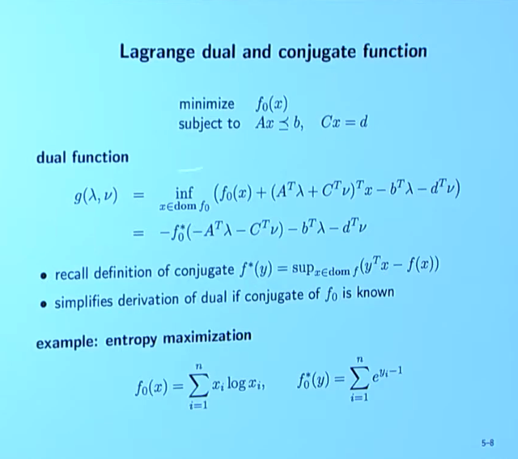</kbd></p>

> [!NOTE]
> Qua bài toán này: minimize f0(x) với equalities constraints Cx `=` d  và
> inequalities constraints Ax ⪯ b
>
> Lagrangian L(x, λ, ν) `=` f0(x) + (Ax-b)Tλ + (Cx-d)Tν
>
> `=` f0(x) + (Ax)Tλ - bTλ + (Cx)Tν - dTν
>
> `=` f0(x) + (Ax)Tλ + (Cx)Tν - bTλ - dTν
>
> `=` f0(x) + (ATλ + CTν)Tx - bTλ - dTν
>
> Và như đã biết ta sẽ minimize L over x để có Dual function.
>
> g(λ,ν) `=` inf x ∈ dom f0 (f0(x) + (ATλ + CTν)Tx - bTλ - dTν)
>
> Thế thì, bữa trước (theo link đỏ) ta đã học về CONJUGATE FUNCTION 
> CỦA f(x), được định nghĩa là:
>
> f*(y) `=` sup x ∈ dom yTx - f(x)
>
> Mang ý nghĩa là tìm x trong domain của f khiến maximize yTx - f(x) khi
> đó, hàm yTx-f(x) với x đó, sẽ gọi là conjugate function f*(y)
>
> Thế thì 
>
> g(λ, v) `=` inf x  f0(x) + (ATλ + CTν)Tx - bTλ - dTν)  
>
> `=` inf x  f0(x) + (ATλ + CTν)Tx  - bTλ - dTν)   |   Bỏ term không depend 
> x ra
>
> sẽ tương đương
>
> g(λ, v) `=` - sup x  - f0(x) - (ATλ + CTν)Tx - bTλ - dTν)   
>
> `=` - sup - (ATλ + CTν)Tx - f0(x)  - bTλ - dTν
>
> Và theo ĐỊNH NGHĨA CONJUGATE FUNCTION: sup [yTx - f(x)] `=` f*(y)
>
> thì sup [- (ATλ + CTν)Tx - f0(x)] CHÍNH LÀ là f0*[-(ATλ + CTν)]
>
> Do đó g(λ, v) `=` - f0*[- (ATλ + CTν)] - bTλ - dTν
>
> `=` - f0*(- ATλ - CTν)) - bTλ - dTν
>
> LAGRANGE DUAL FUNCTION &
> CONJUGATE FUNCTION

<br>

<p align="center"><kbd>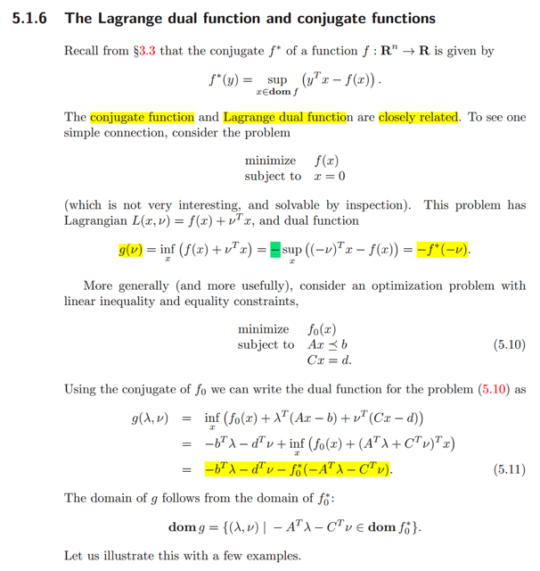</kbd></p>

> [!NOTE]
> Trong sách nói thêm một ý là dual function và conjugate
> function liên hệ khá gần gũi. Ngoài ra thì y như trong
> slide thôi
>
> 5.1.6 THE LAGRANGE DUAL FUNCTION &
> CONJUGATE FUNCTIONS

<br>

<p align="center"><kbd>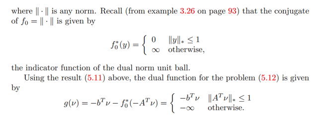</kbd></p>

<p align="center"><kbd>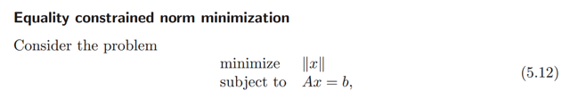</kbd></p>

<p align="center"><kbd>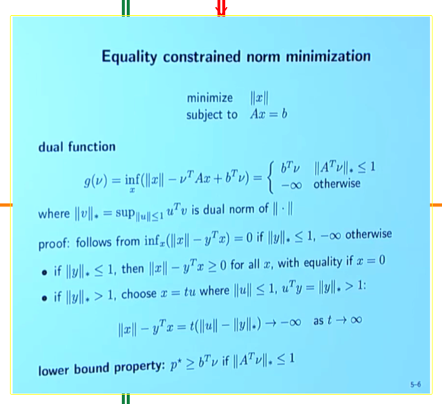</kbd></p>

> [!NOTE]
> Thử ví dụ này: f0(x) `=` ||x||, subject to Ax `=` b. Cái này đã gặp mấy lần, đây là việc giải
> tìm nghiệm nhỏ nhất (norm nhỏ nhất) trong các nghiệm của Ax `=` b. Dĩ nhiên nếu Ax `=` b
> vô nghiệm, khi b không thuộc C(A) thì bài toán optimization này INFEASIBLE.
>
> Nếu nó có nghiệm duy nhất thì dĩ nhiên nó cũng là optimal. Nhưng nếu nó có vô số
> ```text
> nghiệm (có dạng x_xomplete = x_particular + x_null = x_p + Fz, F là matrix có các
> ```
> columns là nullspace N(A) basis) thì việc tìm ra nghiệm nhỏ nhất CHÍNH LÀ TÌM
> `x_particular.` Và theo MIT 1806 và EE263 ta đã biết có thể dùng pseudo-inverse A^+ để
> tìm ra `x_particular` từ `x_complete`
>
> `x_p` `=` A^+b
>
> Thế thì quay lại đây:
>
> Thiết lập Lagrangian function: L(x, v) `=` f0(x) + vTh(x)
>
> `=` ||x|| + vT(Ax - b) `=` ||x|| + vTAx - vTb
>
> Và Dual function: g(v) `=` inf x ||x|| + vTAx - vTb
>
> `=` inf x ||x|| + vTAx - vTb
>
> nó cũng sẽ tương đương:
>
> g(v) `=` - sup x  - ||x|| - vTAx  - vTb
>
> `=` - sup x  - vTAx - ||x||  - vTb
>
> `=` - sup x  (-ATv)Tx - ||x||  - vTb  Theo định nghĩa của CONJUGATE FUNCTION:
>
> f*(y) là conjugate function của f(x) sẽ bằng: sup x ∈ dom f yTx - f(x)
>
> thì với f(x) `=` ||x||, ta có conjugate function của norm ||x||, evaluate tại y:
>
> f*(y) `=` sup x yTx - ||x||
>
> Và cái này thì ta đã chứng minh được giá trị của nó:
>
> a) 0 khi ||y||* `<=` 1
>
> b) + infinity khi ||y||* > 1
>
> Do đó, áp dụng vào đây
>
> sup x  (-ATv)Tx - ||x||  chính là conjugate function của norm ||x|| evaluate tại -ATv:
> f*(-ATv)
>
> Và như vậy giá trị của nó sẽ là:
>
> a) 0 nếu ||-ATv||* `<=` 1
>
> b) +infinity nếu ||-ATv||* > 1
>
> Và từ đó với g(v) `=` - sup x  - (ATv)Tx - ||x||  - vTb
>
> `=` - f*(-ATv) - vTb sẽ bằng:
>
> a) - vTb nếu ||-ATv||* `<=` 1 (bTv hay vTb là một)
>
> b) - infinity nếu ||-ATv||* > 1
>
> Kết quả này thật ra là the same với trong slide, vì DUAL NORM CŨNG LÀ NORM.
> NÊN ||-ATv||* `=` ||ATv||*
>
> (Và thật ra khi ta thể hiện equality constraints Ax `=` b thành h(x) `=` 0 thì có thể cho h(x)
> `=` Ax - b hoặc h(x) `=` b - Ax đều được. Khi đó  thì trường hợp đầu sẽ cho ra g(v) `=` vTb
> nếu ||ATv||* `<=` 1 và  trường hợp sau sẽ cho ra g(v) `=` -vTb nếu ||-ATv||* `<=` 1
>
> GPT cho rằng hai kết quả đều đúng vì ||ATv|| `=` ||-ATv|| và vTb hay -vTb chẳng qua là
> vấn đề dấu của v mà thôi
>
> Có thể vì vậy mà trong lecture slide kết quả lại là g(v) `=` bTv khi ||ATv||* `<=` 1

<br>

      <a id="node-myefxtz"></a>
      - **Entropy maximization**
<p align="center"><kbd>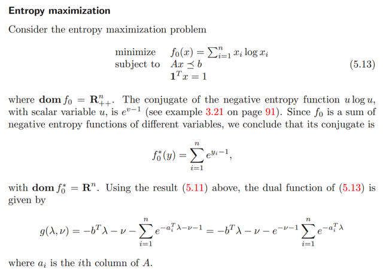</kbd></p>

> [!NOTE]
> Rồi, xét ví dụ này f0(x) `=` `Σ` xilog(xi).
>
> Bài trước trong phần conjugate function (theo link tím) ta đã derive để chứng minh **conjugate function của negative entropy f(x) `=` xlog(x) là f*(y) `=` e^(y-1)**
>
> Vậy giờ với f0(x) `=` `Σ` xi log(xi). Thử tìm conjugate của nó:
>
> theo định nghĩa conjugate của f(x): f*(y) `=` sup x ∈ dom f yTx - f(x)
>
> `=>` conjugate của f0(x): f*(y) `=` sup x ∈ dom f yTx - `Σ` xi log(xi)
>
> `=` sup x ∈ dom f `Σ` yixi - `Σ` xi log(xi)
>
> `=` sup x ∈ dom f `Σ` (yixi - xilog(xi))
>
> `=` `Σ` [ sup x ∈ dom f  yixi - xilog(xi)  ]   | supremum của tổng
>
> `=` `Σ` e^(yi - 1)
>
> Vậy f*0(y) `=` `Σ` e^(yi - 1) (****)
>
> Thế thì trong bài trước ta đã cho thấy dom f*(y) `=` R (vì xy - xlog(x) luôn bounded above, tức
> sup x  yx - xlog(x)  luôn < +infinity.
>
> Thế thì bây giờ cái chính ở mục này là ta TÌM DUAL FUNCTION:
>
> Lagrangian L `=` `Σxi` log(xi) + λT(Ax - b) + vT(1Tx-1)
>
> `=` xTlog(x) + λTAx + vT1Tx - λTb - vT1
>
> g(λ, v) `=` inf x L(x, λ, v)
>
> `====` Cách 1 dùng kết quả Conjugate function ở trên (****): 
>
> `=` inf x  xTlog(x) + λTAx + vT1Tx - λTb - vT1 
>
> `=` - sup x  - xTlog(x) - λTAx - vT1Tx  - λTb - vT1 
>
> `=` - sup x  (- ATλ - 1Tv)Tx - xTlog(x)  - λTb - vT1
>
> `=` - sup x  `Σ` (- aiTλ - v)xi - xilog(xi)  - λTb - vT1
>
> `=` - `Σ` sup x  (- aiTλ - v)xi - xilog(xi)  - λTb - vT1
>
> `=` - `Σ` e^(- aiTλ - v - 1) - λTb - vT1
>
> `=` - `Σ` e^(- aiTλ) e^(- v - 1) - λTb - vT1
>
> `=` - e^(- v - 1) `Σ` e^(- aiTλ) - λTb - v
>
> `=` - v - λTb - e^(- v - 1) `Σ` e^(- aiTλ) 
>
> `====` Cách 2 Dùng calculus như thông thường
>
> tính gradient ∇x L(x, λ, v):
>
> dL `=` L(x+dx, λ, v) - L(x, λ, v)
>
> `=` (x+dx)Tlog(x+dx) + λTA(x+dx) + vT1T(x+dx) - λTb - vT1 - [xTlog(x)
> + λTAx + vT1Tx - λTb - vT1]
>
> `=` (x+dx)Tlog(x+dx) + λTA(x+dx) + vT1T(x+dx) - λTb - vT1 - xTlog(x) - λTAx - vT1Tx + λTb
> + vT1
>
> `=` (x+dx)Tlog(x+dx) + λTAx + λTAdx + vT1Tx + vT1Tdx - xTlog(x) - λTAx - vT1Tx
>
> `=` (x+dx)Tlog(x+dx) + λTAdx  + vT1Tdx - xTlog(x)
>
> `=` xTlog(x+dx) + dxTlog(x+dx) + λTAdx  + vT1Tdx - xTlog(x)
>
> `=` xT[log(x+dx) - log(x)] + dxTlog(x+dx) + λTAdx  + vT1Tdx
>
> Dùng linear approximation với log: log(x + dx) `=` log(x) + `dx/x`
>
> `~=` xT[log(x) + `dx/x` - log(x)] + dxT[log(x) + `dx/x]` + λTAdx + vT1Tdx
>
> `=` `xT(dx/x)` + dxTlog(x) + `dxTdx/x` + λTAdx + vT1Tdx
>
> ```text
> Xét xT(dx/x) = thì dx/x chính là phép chia element-wise: dx/x = [dx1/x1, dx2/x2....]
> ```
>
> ```text
> xT(dx/x) = Σ xi * dxi / xi = Σ dxi = 1Tdx
> ```
>
> ```text
> Tương tự dxTdx/x = Σ dxi * dxi / xi = Σ (dxi)^2 / xi, và cái này là bậc hai của dx vô cùng nhỏ
> ```
> nên coi như bằng 0: `dxTdx/x` `=` 0
>
> Vậy ta có:
>
> `=` 1Tdx + dxTlog(x) + λTAdx + vT1Tdx
>
> dL `=` (1 + log(x) + ATλ + 1Tv)Tdx
>
> Vậy `∇x_L` `=` 1 + log(x) + ATλ + 1Tv
>
> Tới đây dù không sai như nhưng để ý v là scalar, vì nó là Lagrange multiplier của equality
> ```text
> constraint: 1Tx = 1 <=> Σ xi = 1 tức là chỉ có một equality constraint. Nên v chỉ là một scalar. Vậy
> ```
> 1Tv `=` v
>
> Vậy `∇x_L` `=` 1 + log(x) + ATλ + v
>
> Cho gradient `=` 0 để tìm critical point:
>
> ```text
> ∇x_L = 1 + log(x) + ATλ + v = 0 <=> log(x) = - ATλ - v - 1 <=> x = e^(- ATλ - v - 1)
> ```
>
> Và với e^(- ATλ - v - 1), thì component ith sẽ là: e^(-aiTλ - v - 1) với ai là row thứ i'th của AT
> cũng là column thứ i'th của A
>
> Xét thêm Hessian, để xem critical point là minimum hay maximum:
>
> ```text
> dL' = L'(x+dx) - L'(x) = 1 + log(x+dx) - 1 - log(x) = log(x+dx) - log(x) ~= log(x) + dx/x - log(x) = dx/x
> ```
>
> Nhờ MIT 18s096: Thử tìm Hessian theo cách tiếp cận Bilinear form:
>
> d(L'(x)[dx]) `=` d((1 + log(x) + ATλ + 1Tv)Tdx) `=` 
>
> `=` (1 + log(x+dx') + ATλ + 1Tv)Tdx - [(1 + log(x) + ATλ + 1Tv)Tdx]
>
> `=` (1 + log(x) + `dx'/x` + ATλ + 1Tv)Tdx - [(1 + log(x) + ATλ + 1Tv)Tdx]
>
> `=` 1Tdx + log(x)Tdx + `(dx'/x)Tdx` + (ATλ)Tdx + (1Tv)Tdx - 1Tdx - log(x)Tdx - (ATλ)Tdx - (1Tv)Tdx
>
> `=` `(dx'/x)Tdx` 
>
> ```text
> = Σ (dx'i / xi) * dxi = (dx')T diag([1/x1, 1/x2, ...1/xn]) dx
> ```
>
> ```text
> => Hessian = diag([1/x1, 1/x2, ...1/xn])
> ```
>
> `=>` Với với x ≽ 0 (domain của L: xi phải `>=` 0) Do đó Hessian ≻ 0 (positive definite) (do tất cả các 
> eigenvalues đều dương)
>
>  `=>` critical point là minimum
>
> Vậy g(λ, v) `=` inf x L(x, λ, v) `=` xTlog(x) + λTAx + vT1Tx - λTb - vT1 
>
> với x `=` e^(- ATλ - v - 1)
>
> `=` xT(- ATλ - v - 1) + λTAx + vT1Tx - λTb - vT1 
>
> `=` - xTATλ - xTv - xT1 + λTAx + vT1Tx - λTb - vT1 
>
> `=` - xT1 - λTb - vT1 
>
> `=` - v - bTλ - `Σ` e^(-aiTλ - v - 1)
>
> `=` - v - bTλ - `Σ` e^(-aiTλ)e^(- v - 1)
>
> `=` - v - bTλ - e^(- v - 1) * `Σ` e^(-aiTλ) 
>
> Đây là kết quả như trong slide nhưng derive dùng calculus

<br>

<p align="center"><kbd>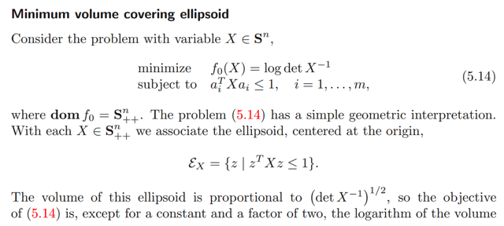</kbd></p>

<p align="center"><kbd>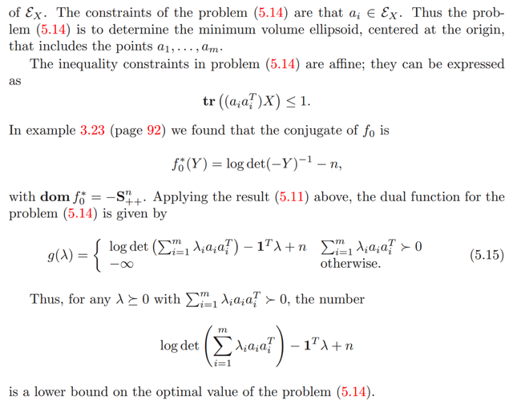</kbd></p>

> [!NOTE]
> SÁCH (XEM SAU)

<br>

<p align="center"><kbd></kbd></p>

> [!NOTE]
> Rồi, tới đây ta đang ở đâu:
>
> Ta có optimization problem, minimize f0(x) (objective) với constraint
> fi(x) `<=` 0 và hi(x) `=` 0
>
> Và ta tạo Lagrangian function. Là function theo x, λ, ν:
>
> L(x, λ, ν) `=` f0(x) + `Σ` λi fi(x) + `Σ` νi hi(x) mang ý nghĩa là ta tích hợp
> constraint và objective
>
> Rồi ta mới minimize nó over x thì ta có Dual function.
>
> Và ý nghĩa của Dual function là ta có LOWER BOUND của optimal
> p* `>=` g(v, λ)
>
> Từ đó với các ν λ khác nhau ta sẽ có các lower bound khác
> nhau.
>
> Và từ đó ta sẽ muốn tìm BEST LOWER BOUND
>
> CHAPTER 5 - DUALITY
>
> 5.2 THE LAGRANGE DUAL PROBLEM

<br>

<p align="center"><kbd>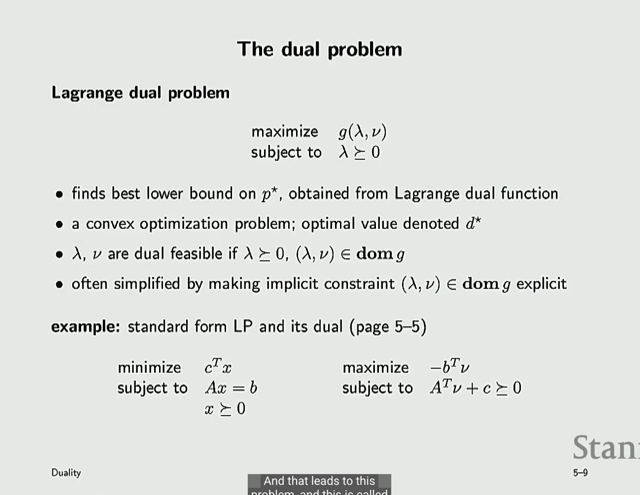</kbd></p>

> [!NOTE]
> Từ đó dẫn tới bài toán này: LAGRANGE DUAL PROBLEM. 
>
> Nói bằng lời đó là ta sẽ MAXIMIZE LOWER BOUND (g(λ, ν)) 
> sử dụng Lagrange Duality.
>
> Và điểm hay ho là ĐÂY LÀ CONVEX PROBLEM dù cho bài toán gốc, có
> thể không phải convex
>
> Chú ý là ta maximize g over cả λ, ν: tức là tìm λ, ν sao cho g(λ, ν) lớn
> nhất: khi đó ta có DUAL OPTIMAL VALUE
>
> d* `=` g(λ*, ν*) `=` sup λ, ν ∈ dom, λ ≽ 0 g(λ, ν)
>
> Một ví dụ là bài toán Standard LP và dual của nó (gs nói ta có thể hiểu
> hai bài toán này quan hệ gần gũi với nhau INTIMATE RELATED)
> Nhưng hiểu đại khái là:
>
> Bài toán gốc Standard LP, ta muốn minimize objective function cTx
> với equality constraint Ax `=` b và inequality constraint x ≽ 0.
>
> Lagrangian: cTx + vT(Ax-b) + λT(-x) `=` cTx + vT(Ax-b) - λTx  
>
> `=` cTx + vTAx - vTb - λTx 
>
> `=` (c - λ + ATv)Tx - vTb
>
> `=` (ATv - λ + c)Tx - vTb
>
> Và ta sẽ minimize over x cái này để có Dual function g(λ, v).
>
> g(λ, v) `=` inf x ∈ dom f0 (ATv - λ + c)Tx - vTb
>
> Thế thì với affine function ví dụ pTx + q thì khi minimize nó, phần lớn
> trường hợp ta sẽ có -infinity (cái này dễ thấy). nhưng trừ khi p `=` 0 thì
> minimize nó chính là q.
>
> Do đó: 
>
> ```text
> g(λ, v) = inf_x L(x, λ, v) = -inf khi ATv - λ + c != 0
> ```
>
> hoặc:
>
> ```text
> g(λ, v) = inf_x L(x, λ, v) = -bTv khi ATv - λ + c = 0 <=> λ = ATv + c
> ```
>
> Và khi đó ta sẽ có lower bound p* `>=` g(λ, v) `>=` -bTv nếu ATv + c ≽ 0
>
> Và KẾT HỢP VỚI MỘT CONSTRAINT CỦA λ: MỌI λi phải không âm,
> ĐỒNG NGHĨA λ ≽ 0 (cái này là luôn là constraint của λ): 
>
> λ ≽ 0 `<=>` ATv + c ≽ 0
>
> Và bài toán DUAL PROBLEM là ta sẽ MAXIMIZE lower bound -bTv này với
> constraint λ ≽ 0 `<=>` ATv + c ≽ 0
>
> (TRONG QUÁ TRÌNH VỪA RỒI TA ĐÃ THỰC HIỆN MỘT ĐỘNG TÁC LÀ
> CHUYỂN BÀI TOÁN DUAL PROBLEM THÀNH MỘT EQUIVALENT
> PROBLEM TRONG ĐÓ TA EXPLICITLY THỂ HIỆN MỘT IMPLICIT
> CONSTRAINT: ĐÓ LÀ g(λ, v) PHẢI > -INFINITY. SẼ NÓI RÕ HƠN Ở 5.2.1
> (LINK TÍM)
>
> DUAL PROBLEM

<br>

<p align="center"><kbd>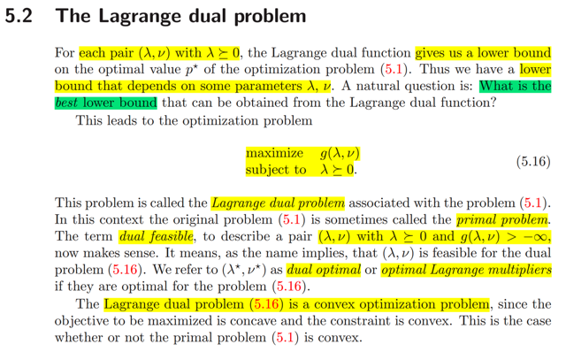</kbd></p>

> [!NOTE]
> Ngoài những điểm nói trong bài giảng, trong sách nói rõ hơn rằng
> cho dù bài toán gốc (gọi là PRIMAL PROBLEM) không convex thì
> bài toán DUAL PROBLEM VẪN CONVEX, do objective của nó:
>
> g(λ, v) là CONCAVE function còn constraint của nó λ ≽ 0 là
> AFFINE  (theo link xanh xem lại)
>
> Và để ý một số tên gọi:
>
> Bài toán maximize g(λ,v) subject to λ ≽ 0 gọi là LAGRANGE DUAL
> PROBLEM.
>
> Và thuật ngữ DUAL FEASIBLE chính là mô tả điều kiện 1) λ ≽ 0 và
>  2) λ, v sao cho g(λ, v) > -infinity.
>
> 5.2 LAGRANGE DUAL PROBLEM

<br>

<p align="center"><kbd>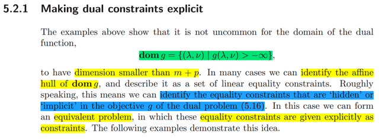</kbd></p>

> [!NOTE]
> đại khái là, bài trước, khi giới thiệu về Dual function (hay tên đầy đủ
> là Lagrange Dual function) g(λ, v) ta đã nhận định rằng: Nếu g(λ, v)
> `=` -infinity, thì tính chất Lower Bound Property p* `>=` g(λ, v) VÔ
> DỤNG.
>
> Do đó ta cần λ, v phải THỎA MÃN MỘT ĐIỀU KIỆN LÀ
>
> 1) λ ≥ 0 và
>
> 2) g(λ, v) > -infinity và λ, v thỏa điều kiện này thì gọi là DUAL
> FEASIBLE. Và ta gọi đó là DOMAIN của g: dom g `=` (λ, v):
> g(λ, v) > - infinity
>
> Thế thì ta sẽ kiểu như CHUYỂN BÀI TOÁN DUAL PROBLEM
> THÀNH EQUIVALENT PROBLEM MÀ TRONG ĐÓ TA THỂ HIỆN
> EXPLICITLY CÁI CONSTRAINT NÀY
>
> 5.2 LAGRANGE DUAL PROBLEM
>
> 5.2.1 MAKING DUAL CONSTRAINTS EXPLICIT

<br>

<p align="center"><kbd>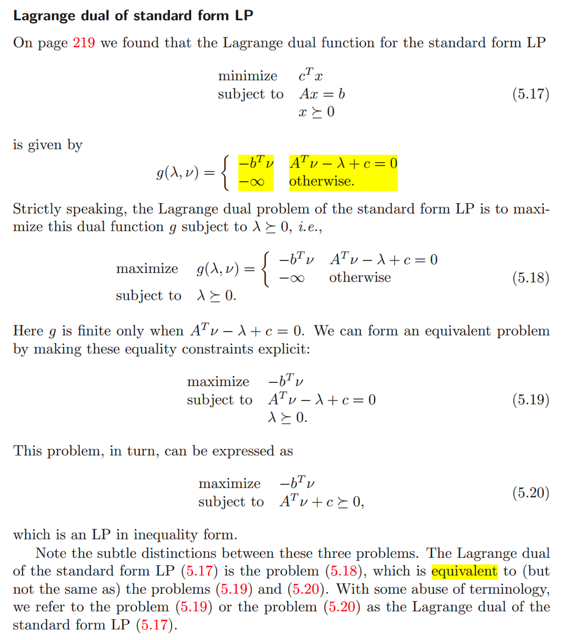</kbd></p>

> [!NOTE]
> Đây là ví dụ đã nói trong bài (cũng
> đã note kĩ) nên đã hiểu rồi.

<br>

<p align="center"><kbd>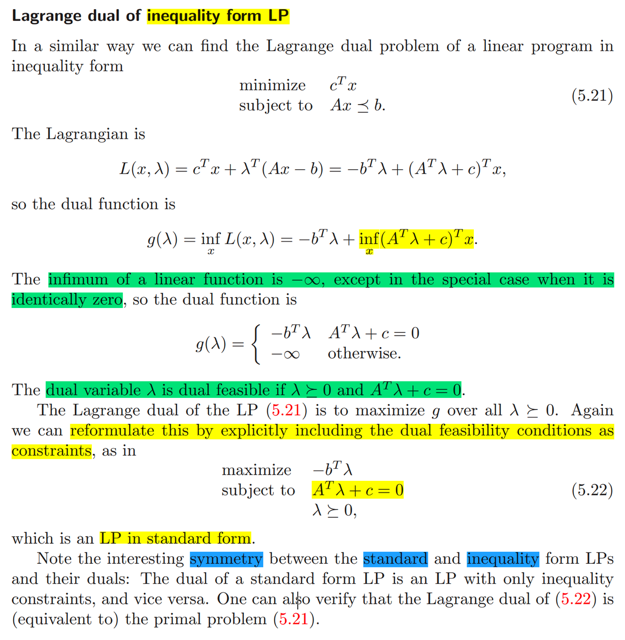</kbd></p>

> [!NOTE]
> Một ví dụ khác là bài toán gọi là INEQUALITY FORM LP
> đại khái là bài toán LP như đã biết có objective là cTx + d,
> và equality và inequality constraints function đều linear:
> Ax ⪯ b, Cx `=` d. 
>
> Thế thì ở đây xét bài toán minimize cTx với Ax ⪯ b (cũng là
> LP problem). Đại khái là sau khi xây dựng Lagrangian L(x, λ)
> (không có v vì không có equality constraint) và Dual function
> g(λ), thì ta sẽ thấy g(λ) sẽ bằng -bTλ nếu ATλ + c `=` 0 và bằng
> -infinity nếu ngược lại.
>
> Do đó, λ vốn đã có constraint λ ≽ 0 thì thật ra có một implicit
> constraint nữa: Phải DUAL FEASIBLE: thuộc Domain của g: 
>  λ: g(λ) > -infinity .
>
> Vậy nên ATλ + c phải `=` 0 Và bài toán Dual Problem từ việc chỉ là
> maximize g(λ) với constraint λ ≽ 0 thì nay thêm explicit constraint:
>
> ATλ + c `=` 0
>
> Khúc cuối có nói thêm về TÍNH ĐỐI XỨNG CỦA STANDARD LP
> VÀ INEQUALITY FORM LP: CHƯA HIỂU LẮM

<br>

<p align="center"><kbd>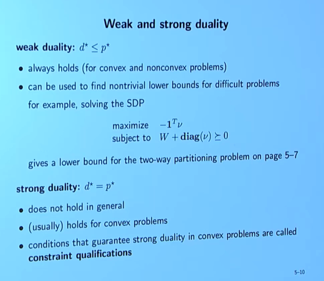</kbd></p>

> [!NOTE]
> d* là optimal value của bài toán dual problem, tức nó là cái lower
> bound lớn nhất. Và p* thì là optimal value của bài toán gốc
>
> Gs cho biết nếu d* là infinity thì ta sẽ kết luận p* cũng infinity. Để
> rồi cũng chính là nói bài toán gốc (PRIMAL PROBLEM) INFEASIBLE
> (ta có thể nhớ, nếu mà bài toán optimization with constraint không có x
> nào thỏa constraint, tức feasible set là tập rỗng dẫn tới f0(x), x ∈
> feasible set cũng là tập rỗng thì min của tập rỗng là +infinity)
>
> Còn nếu d* `=` -infinity, thì điều này có nghĩa là rơi vào trường hợp g(λ, v)
> `=` -infinity (khi đó d* `=` sup g(λ,v) cũng bằng -infinity) và ta nhớ nó xảy ra
> khi Lagrangian L(x, λ, v) UNBOUND BELOW. Thì như đã biết nếu g(λ,
> v) `=` - infinity thì có nghĩa là  dual feasible set rỗng, tức DUAL 
> PROBLEM INFEASIBLE
>
> Và ta có d* `<=` p*, đây là quan hệ LUÔN ĐÚNG, và nó gọi là
> WEAK DUALITY. Và như đã thấy những slide trước, cái này có thể
> giúp TÌM BEST LOWER BOUND CỦA OPTIMAL p* ĐỐI VỚI CÁC BÀI
> TOÁN KHÓ (khó tìm p*) 
>
> `====`
>
> Còn khi d* `=` p*, không phải luôn đúng, và gs cho rằng VỚI
> CONVEX PROBLEM THÌ NÓ THƯỜNG LÀ ĐÚNG.
>
> Đây gọi là STRONG DUALITY, nó cho biết rằng TỒN TẠI λ, ν
> SAO CHO  d* `=` p*
>
> Và nói thêm rằng đại ý là CÓ MỘT SỐ ĐIỀU KIỆN NÀO ĐÓ ĐỂ
> STRONG DUALITY XẢY RA, và những điều kiện này được gọi là
> CONSTRAINT QUALIFICATION
>
> WEAK & STRONG DUALITY

<br>

<p align="center"><kbd>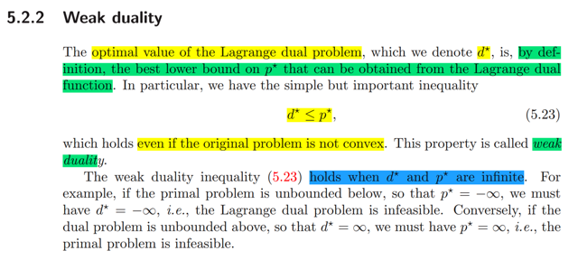</kbd></p>

<p align="center"><kbd>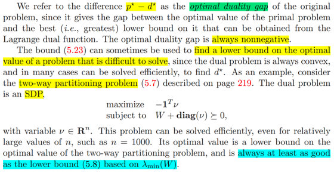</kbd></p>

> [!NOTE]
> Trong sách ko có gì khác, chỉ nói thêm về việc p* - d* gọi là
> OPTIMAL DUALITY GAP.
>
> DUALITY GAP thì chỉ là f0(x) - g(λ, v)
>
> Cũng như nhắc lại rằng cái này có thể có ích khi ta có những bài
> toán (optimization) NON-CONVEX PHỨC TẠP mà KHÓ TÌM
> OPTIMAL VALUE p*. Khi đó cái này giúp ta tìm  LOWER
> BOUND của p*, vốn là bài toán dễ hơn vì như đã biết DUAL
> PROBLEM LUÔN LÀ CONVEX PROBLEM (ôn lại cho nhớ do
> objective g là hàm CONCAVE, còn constraint λ ≽ 0 là AFFINE)
>
> Một ví dụ của bài toán như vậy là bài toán SDP mà ta đã note kĩ ở
> phần trước (theo link hồng): Nhắc lại một chút, theo link hồng, thì ta
> dùng LOWER BOUND PROPERTY p* `>=` g(v) để tìm lower bound
> của p*, dĩ nhiên là một hàm theo v. Để rồi ta cần v phải thỏa điều
> kiện (W + diag(v) là positive semi definite) thì lower bound mới KHÁC
> -infinity.
>
> (Đó là cái mà bây giờ ta gọi là IMPLICIT CONSTRAINT ĐỐI VỚI
> DUAL VARIABLE λ, v)
>
> Thế thì lúc đó ta CHỌN v `=` -λ_min(W)1 để W + diag(v) ≽ 0. Từ đó
> giúp lower bound `=` -1Tv.
>
> CÒN Ở ĐÂY Ý NÓI, TA CÓ THỂ GIẢI BÀI TOÁN DUAL
> PROBLEM: d* `=` inf v ∈ dom g g(v), và khi đó TA SẼ GIẢI RA d* ÍT
> NHẤT LÀ TỐT  BẰNG GIÁ TRỊ -1Tv MÀ TA CHỌN
>
> 5.2 LAGRANGE DUAL PROBLEM
>
> 5.2.2 WEAK DUALITY

<br>

<p align="center"><kbd>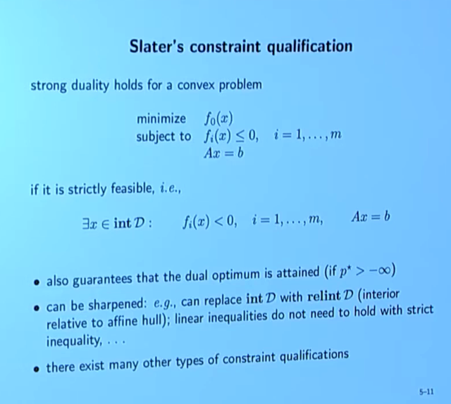</kbd></p>

> [!NOTE]
> Đại khái là gs nói sơ qua cái này, ví dụ trong đó ta có bài toán gốc là
> convex problem.
>
> Và nếu ta có thêm cái gọi là STRICTLY FEASIBLE, tức là nếu tồn tại
> x thuộc int D (interior của set D) sao cho fi(x) < 0 
>
> thì khi đó CHẮC CHẮN CÓ STRONG DUALITY d* `=` p*
>
> (nếu p* > -inf) có nghĩa hiểu đại khái là khi có thêm cái constraint
> qualification này thì ta sẽ đảm bảo có thể giải bài toán dual problem
> để tìm ra d* thì nó cũng chính là p*
>
> SLATER'S CONSTRAINT QUALIFICATION

<br>

<p align="center"><kbd>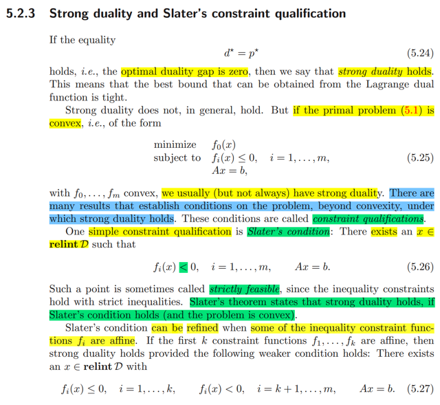</kbd></p>

> [!NOTE]
> Đọc sách giúp ta hiểu hơn chỗ này. Đại khái là vầy: Như đã nói,
> WEAK DUALITY d* `<=` p* THÌ LUÔN ĐÚNG DÙ PRIMAL
> PROBLEM CÓ CONVEX HAY KHÔNG.
>
> Nhưng STRONG DUALITY d* `=` p* THÌ KHÔNG. Tuy vậy, VỚI
> CONVEX PROBLEM THÌ NÓ THƯỜNG LÀ ĐÚNG.
>
> Nhưng cũng chỉ là thường đúng chứ chưa chắc luôn đúng. Thành ra
> CÓ MỘT SỐ "THEOREM" ĐÃ CHỨNG MINH, NẾU NGOÀI VIỆC
> CONVEX PRIMAL PROBLEM CÒN THỎA MỘT SỐ ĐIỀU KIỆN
> NÀO ĐÓ (GỌI LÀ CONSTRAINT QUALIFICATION) THÌ STRONG
> DUALITY SẼ ĐÚNG.
>
> Và một trong số đó là SLATER'S CONSTRAINT
> QUALIFICATION.
>
> Đại ý là, nó nói rằng, nếu các INEQUALITY FUNCTIONS fi(x)
> TỒN TẠI VECTOR `/` POINT x TRONG RELATIVE INTERIOR CỦA
> fi SAO CHO: fi(x) < 0 GỌI LÀ CÁC STRICTLY FEASIBLE, THÌ KHI
> ĐÓ STRONG DUALITY SẼ THỎA
>
> Có thể cần nói thêm để làm rõ hơn chỗ này. Thông thường, inequality
> constraint có nghĩa là: Cần tồn tại x sao cho fi(x) `<=` 0 (chú ý dấu `<=)` 
> thì nếu nó thỏa điều này và thỏa equality constraint `Ax=b` thì ta gọi
> nó là FEASIBLE. Cái này không có gì mới.
>
> Thì bây giờ SLATER'S CONDITION yêu cầu phải tồn tại x sao cho
> fi(x) < 0 (TỨC LÀ CHỈ <, GỌI LÀ STRICTLY FEASIBLE, STRICTLY
> INEQUALITY)
>
> XEM LẠI KHÁI NIỆM
> RELATIVE INTERIOR
>
> 5.2 LAGRANGE DUAL PROBLEM
>
> 5.2.3 STRONG DUALITY

<br>

<p align="center"><kbd>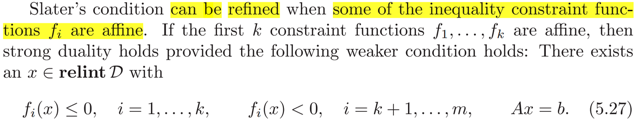</kbd></p>

<p align="center"><kbd>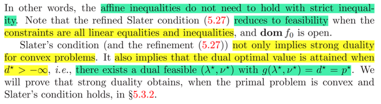</kbd></p>

> [!NOTE]
> Tiếp theo đại khái gs nói là nếu mà CONSTRAINT FUNCTION fi
> mà là AFFINE thì không cần thỏa STRICT INEQUALITY.
>
> Thành ra có thể dễ hiểu rằng nếu ta có bài toán convex mà chỉ có
> các LINEAR `/` AFFINE INEQUALITY CONSTRAINT, thì khi đó
> Slater's constraint kiểu như vô hiệu, và chỉ cần tồn tại feasible
> point thì nhất định là Strong duality sẽ thỏa (nên gs gọi là "reduces
> to feasibility")
>
> `====`
>
> Một điểm đáng chú ý nữa là, Slater's condition KHÔNG CHỈ ĐẢM
> BẢO CONVEX PROBLEM SẼ THỎA STRONG DUALITY.
>
> Mà thật ra nó còn đảm bảo rằng TA CÓ THỂ TÌM ĐƯỢC DUAL
> OPTIMAL d*, cũng là TA CÓ THỂ TÌM ĐƯỢC λ*, v* sao cho 
>
> d* `=` g(λ*, v*) `=` p*

<br>

<p align="center"><kbd>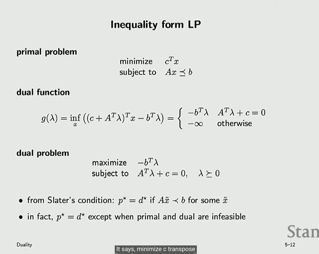</kbd></p>

> [!NOTE]
> ta gặp lại bài toán Inequality form LP, bài toán optimization gốc
> (primal problem) là minimize cTx với inequalities constraint Ax
> ⪯ b.
>
> Từ đó, như đã biết ta xây dựng Lagrangian:
>
> L `=` cTx + λT(Ax-b) `=` cTx + λTAx - λTb `=` (c + ATλ)Tx - λTb
>
> Đây là dạng affine qTx + p như đã nói bữa trước nếu mà (khi
> minimize over x, để có dual function) thì khi q `=` 0 thì ta sẽ có kết quả
> minimize là p và ngược lại thì sẽ là -infinity.
>
> Vậy nên dual function `=` inf x (c + ATλ)Tx - λTb sẽ
>
> `=` -λTb (cũng là - bTλ vì là scalar) nếu (c + ATλ) `=` 0
>
> `=` -infinity khi otherwise.
>
> Lúc nãy ta đã biết, về cái gọi là DUAL FEASIBLE, rằng có một IMPLICIT
> CONSTRAINT đối với DUAL VARIABLE λ, v rằng g(λ, v) phải > -infinity
> tạo nên DOMAIN của dual function g(λ, v): dom g `=`  (λ,v): g(λ,v) > -inf
>
> Thì sau đó ta biết rằng người ta sẽ chuyển thành EQUIVALENT problem
> cho Dual problem bằng cách đưa constraint này thành EXPLICIT:
>
> Để từ Dual problem gốc: maximize g(λ, v) constraint λ ≽ 0 thành
> equivalent problem: maximize g(λ, v) constraint λ ≽ 0 và explicit
> constraint
>
> Và cụ thể với bài toán này, khi mà g(λ) chỉ > -inf (và cụ thể là `=` -bTλ)
> nếu ATλ + c `=` 0 thì equivalent dual problem sẽ là:
>
> maximize g(λ) (khi đó `=` - bTλ) constraint λ ≽ 0 và ATλ + c `=` 0

<br>

<p align="center"><kbd>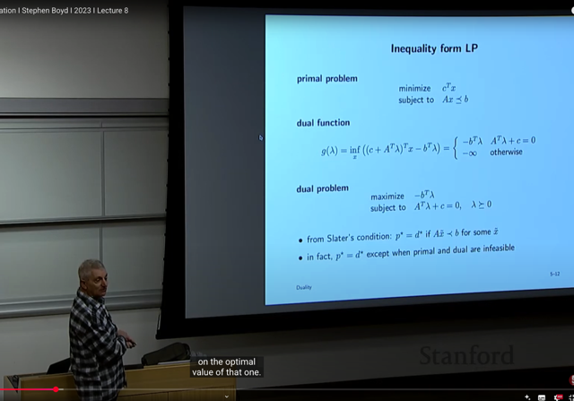</kbd></p>

> [!NOTE]
> Và ông nói rằng: ta có tính chất sau:
>
> Nếu mà tồn tại Ax ≺ b với thì bằng cách giải bài toán dual problem ta sẽ
> tìm được d* cũng chính là p*
>
> Có thể hiểu là đây là nói về Slater's condition. Theo đó thì nếu tồn tại x
> trong relative interior của problem domain D mà khiến gi(x) < 0
> (CHỈ NHỎ HƠN, STRICTLY LESS THAN ) thì những điểm đó gọi là
> STRICTLY FEASIBLE. Khi đó, cùng với việc primal problem là
> convex problem, thì Slater's condition này sẽ đảm bảo problem có
> STRONG DUALITY
>
> Tuy nhiên, có vẻ như ta có quyền dùng Weaker form of Slater's condition
> vì trong bài toán này, inequality constraints Ax ⪯ b là Affine. Nên thật ra
> chỉ cần tồn tại x thỏa Ax ⪯ b (tức là constraint gốc, hay chỉ cần feasible,
> không cần strictly feasible theo Slater's condition nói Ax ≺ b)

<br>

<p align="center"><kbd>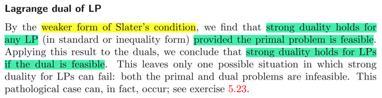</kbd></p>

> [!NOTE]
> Thế thì nhờ đọc sách mà ta hiểu được, tại sao gs nói tồn tại Ax `≺=` b
> thì p* `=` d*
>
> Đại khái là vì với LP, các constraints ĐỀU LÀ LINEAR. Nói cách
> khác, inequality constraints function đều là AFFINE. Mà như đã nói
> vừa rồi, với affine thì kiểu như là Slater's condition "KHÔNG CẦN
> NỮA". Để rồi bản chất chỉ là, chỉ cần bài toán FEASIBLE, tức là
> miễn là có feasible point x thì khi đó sẽ chắc chắc có strong duality.
>
> Mà bài toán feasible thì tức là phải tồn tại x thỏa các constraints, 
> với Inequality form LP thì constraint là Ax ⪯ b
>
> Tuy nhiên gs nói vẫn có một trường hợp kì dị mà bài toán LP không
> thoả strong duality: khi cả primal và dual problem đều không feasible
> và ông để cái này thành bài tập

<br>

<p align="center"><kbd>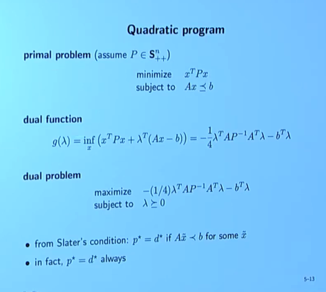</kbd></p>

> [!NOTE]
> Ví dụ gặp lại bài toán Quadratic program:
>
> minimize xTPx , P ≽ S^n++, với constraints Ax ⪯ b
>
> Lagrangian: L `=` xTPx + λT(Ax-b) `=` xTPx + λTAx - λTb
>
> Dual function: inf x (xTPx + λTAx - λTb)
>
> Tìm gradient: df `=` f(x+dx) - f(x) `=`
>
> (x+dx)TP(x+dx) + λTA(x+dx) - λTb - xTPx - λTAx + λTb
>
> `=` (xT+dxT)P(x+dx) + λTA(x+dx) - xTPx - λTAx
>
> `=` (xTP+dxTP)(x+dx) + λTAx + λTAdx - xTPx - λTAx
>
> `=` dxTPx + xTPdx + λTAdx
>
> `=` 2xTPdx + λTAdx `=` (2xTP + λTA)dx
>
> ∇xf `=` (2xTP + λTA)T `=` 2PTx + ATλ
>
> ```text
> ∇xf = 0 <=> 2PTx + ATλ = 0 <=> 2PTx = -ATλ
> ```
>
> `<=>` x `=` -0.5(PTinv)ATλ `=` -0.5(Pinv)ATλ  | P symmetric
>
> Hessian 2P (Hessian của quadratic form function ta đã làm rồi) 
> ≽ 0 nên x là minimum.
>
> `=>` L(x*) `=` [-0.5(Pinv)ATλ]TP[-0.5(Pinv)ATλ] + λT(A(-0.5(Pinv)ATλ) - λTb)
>
> `=` 0.25(ATλ)T(Pinv)TP(Pinv)ATλ - 0.5λTAPinvATλ - λTb
>
> `=` - `(1/4)λTAPinvATλ` - λTb
>
> Và bài toán dual problem sẽ là:
>
> maximize `-(1/4)λTAPinvATλ` - λTb với constraint λ ≽ 0
>
> Gs cho biết, trong bài toán này, ta có Slater's condition, tức tồn tại x sao cho Ax ≺
> b thành ra có Strong Duality p* `=` d*. Nên khi solve dual problem ta sẽ có d* cũng
> là p*.
>
> Vì sao tồn tại Ax ≺ b, là vì Ax ≺ b tạo nên (feasible set) là một Polyhedra, giao của các
> half-plane nên thì CHẮC CHẮN LÀ CÓ TỒN TẠI những điểm Ở TRONG
> POLYHEDRA
>
> Do đó thỏa mãn Slater's condition là: tồn tại x ∈ relint D sao cho fi(x) ≺ 0.
>
> Và cùng với việc PRIMAL PROBLEM LÀ CONVEX vì objective function là
> quadratic (dựa vào SECOND ORDER CONDITION, Hessian P ≽ 0, mà đề bài
> cho P ∈ S^n ++, tức P ≻ 0 là positive definite luôn, thì function convex) là convex
> function, và các constraint là affine nữa. Thì khi đó có thể chắc chắc STRONG
> DUALITY hold.
>
> Tuy nhiên tương tự, ở đây các constraints function đều là linear `/` affine, thì Slater's
> condition REDUCE THÀNH FEASIBILITY: Tức là khi đó chỉ cần bài toán có tính
> chất feasible (tồn tại x thỏa các constraint) thì Strong Duality sẽ thỏa: Mà
> constraint Ax ⪯ b thì luôn tồn tại x thỏa (feasible set là polyhedra) thành ra luôn
> có Strong Duality

<br>

<p align="center"><kbd>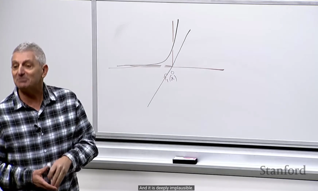</kbd></p>

> [!NOTE]
> đại khái là ta nhớ lại câu chuyện ban đầu về ý nghĩa của
> Lagrangian khi ta approximate cái đường màu đen chữ L
> ngược (vốn mang ý nghĩa là nếu ta ở bên phải, ứng với fi(x) >
> 0, tức violate inequality constraint fi(x) `<=` 0 thì cost sẽ là
> infinity, vô cùng lớn, là ko thể chấp nhận được (thể hiện bởi việc
> khi vừa đi qua mức > 0 là nó vọt lên vô cùng lớn) ngược lại khi
> thỏa constraint fi(x) < 0 thì cost `=` 0.
>
> Trong khi đó ta lại đi approx. nó với đường tuyến tính, để rồi
> khi fi(x) dương càng lớn thì cost càng lớn nhưng fi(x) dương ko
> lớn lắm thì cost cũng  nhỏ thôi (hoàn khác với việc cost vô cùng
> lớn bất kể violate nhiều ít)
>
> Nhưng điểm chính gs muốn nhấn mạnh đó là, khi ta adjust λ thì
> kiểu như sẽ rồi cũng tìm được cách approx tốt bài toán gốc. Đó là
> ý nghĩa

<br>

<p align="center"><kbd>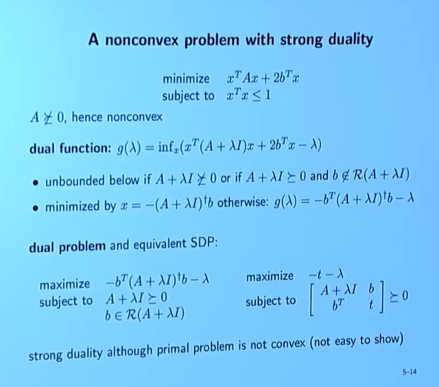</kbd></p>

> [!NOTE]
> gs nói sơ một ý quan trọng: Có nhiều bài toán NON-CONVEX nhưng
> lại có STRONG DUALITY
>
> Ví dụ điển hình như là bài toán non-convex quadratic function,
> (khi A, tức Hessian của quadratic function không phải positive semi 
> definite matrix thì function không convex). Tuy nhiên bài toán này ta
> lại có STRONG DUALITY
>
> Ông nói thêm điều này có nghĩa là mọi optimization problem với của hai 
> quadratic convex hay không, đều có thể gỉai được (tractable)

<br>

<p align="center"><kbd>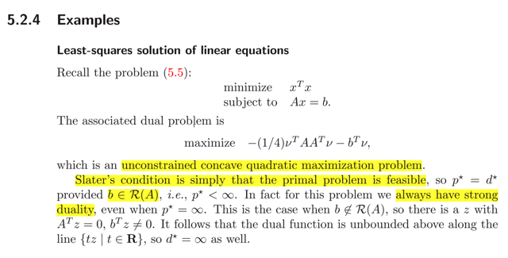</kbd></p>

> [!NOTE]
> Phần 5.2.4 trong sách xem xét một số ví dụ về vấn đề Strong
> Duality.
>
> Đầu tiên là bài toán Least-squares solution of linear equations,
> minimize xTx subject to Ax `=` b.
>
> Xây dựng Lagrangian function L `=` xTx + vT(Ax - b) và Dual
> function g(v) `=` inf x ∈ dom L(x, v) sẽ ra `-(1/4)vTAATv` - bTv
> (dùng calculus, không khó để ra kết quả này)
>
> Khi đó, vì không có λ, nên Dual problem chỉ không có constraint
> λ ≽ 0. Và objective của dual problem là negative quadratic function
> theo v, nên nó concave
>
>
> Thế thì vì bài toán gốc (primal problem) không có inequality 
> constraints nên Slater's condition không cần thiết, mà nó chỉ cần
> bài toán feasible thì sẽ đảm bảo Strong Duality.
>
> Thế thì, để feasible, tức tồn tại x thỏa equality constraint Ax `=` b
> thì điều này đồng nghĩa là b phải thuộc R(A) (hay C(A) - columns
> space của A)
>
> Tuy vậy, gs nói, trong bài toán này Strong Duality có thể được đảm
> bảo ngay cả khi b không thuộc C(A).
>
> Nếu b không thuộc C(A), thì có nghĩa là sao: từ mit1806 ta biết,
> có nghĩa là C(A) không span toàn bộ R^n, cũng là dim C(A) < n
> `=>` dim N(AT) > 0, tức tồn tại non zero vector z của left nullspace:
>
> ATz `=` 0. Mà b không thuộc C(A) nên dĩ nhiên b không vuông góc
> với left null-space vector z (vì nếu nó vuông góc, nó phải thuộc C(A))
> Vậy bTz khác 0.
>
> Rồi dùng cái này ta sẽ nói rằng, nếu lấy v `=` tz, tức v là left nullspace
> vector, t là scalar.
>
> ```text
> Thì g(v) = -(1/4)vTAATv - bTv = -(1/4)(tz)TAAT(tz) - bT(tz)
> ```
>
> `=` `(1/4)zTtTAATtz` - bTtz
>
> `=` `(1/4)(ATtz)T(ATtz)` - bTtz
>
> `=` `(1/4)||ATtz||^2` - bTtz 
>
> `=` `(t/4)||ATz||^2` - t(bTz)
>
> `=` `(t/4)*0` - t(bTz) `=` -t(bTz)
>
> Và như vậy khi maximize g(v) mà bây giờ trở thành maximize g bằng
> các thay đổi t thì luôn có thể thấy g(v) lớn bao nhiêu cũng được.
>
> Hay d* `=` inf g(v) `=` +infinity
>
> Và với b không thuộc C(A) thì bài toán gốc cũng có p* là +infinity, vì sao
> vì ta nhớ khi optimization problem không có feasible point mà b không
> thuộc C(A) thì Ax `=` b thì hệ vô nghiệm. Thì khi đó optimal value sẽ là
> +infinity.
>
> Vậy ngay cả khi b không thuộc C(A) thì p* vẫn bằng d*
>
> 5.2 LAGRANGE DUAL PROBLEM
>
> 5.2.4 EXAMPLES

<br>

<p align="center"><kbd>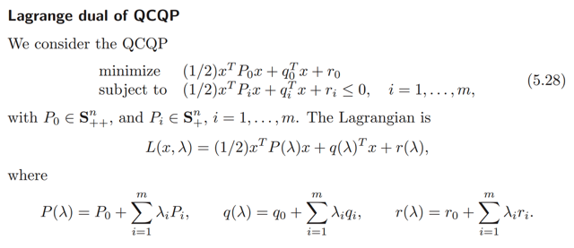</kbd></p>

<p align="center"><kbd>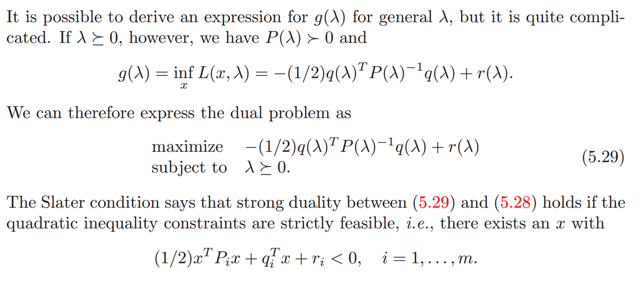</kbd></p>

> [!NOTE]
> SÁCH (XEM SAU)

<br>

<p align="center"><kbd>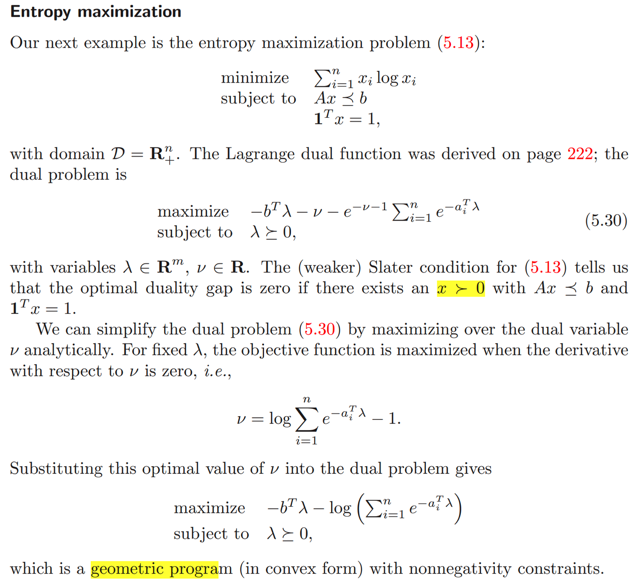</kbd></p>

<p align="center"><kbd>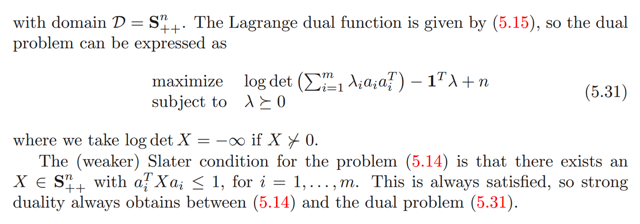</kbd></p>

> [!NOTE]
> SÁCH (XEM SAU)

<br>

<p align="center"><kbd>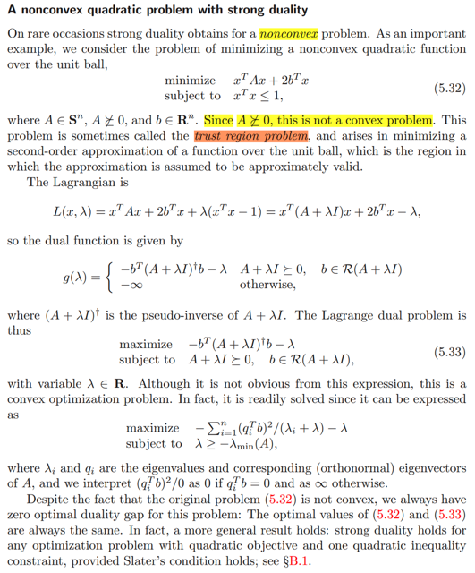</kbd></p>

> [!NOTE]
> SÁCH (XEM SAU)

<br>

<p align="center"><kbd>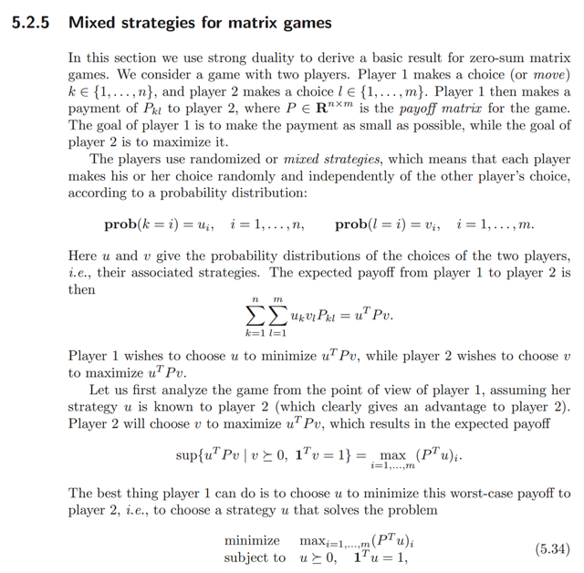</kbd></p>

> [!NOTE]
> SÁCH (XEM SAU)
>
> 5.2 LAGRANGE DUAL PROBLEM
>
> 5.2.5 MIXED STRATEGIES FOR
> MATRIX GAMES

<br>

<p align="center"><kbd>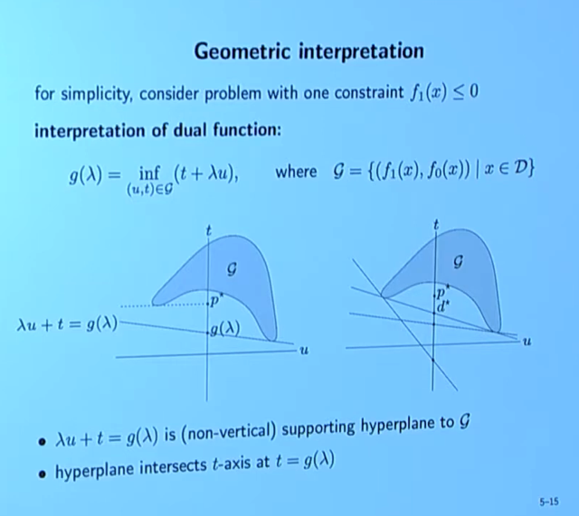</kbd></p>

> [!NOTE]
> G là set các điểm (f1(x), f0(x)) với x ∈ D. tức là, với các x khác nhau
> với mỗi x, ta tính objective function f0(x) và constraint
> function f1(x) thì với MỌI x ta có được mọi điểm (f1(x), f0(x))
> tạo thành G hình dạng như trong hình.
>
> Và trục hoành u là trục ứng với giá trị f1, để rồi với constraint là
> f1(x) `<=` 0 nên MỌI (f1(x), f0(x)) NẰM BÊN PHẢI ĐỀU
> UNACCEPTABLE
>
> Và trục tung, t là trục ứng với giá trị của objective function f0, và như đã
> biết, semantic của bài toán optimization là, càng xuống thấp càng
> tốt.
>
> CHAPTER 5 - DUALITY
>
> 5.3 GEOMETRIC INTERPRETATION

<br>

<p align="center"><kbd>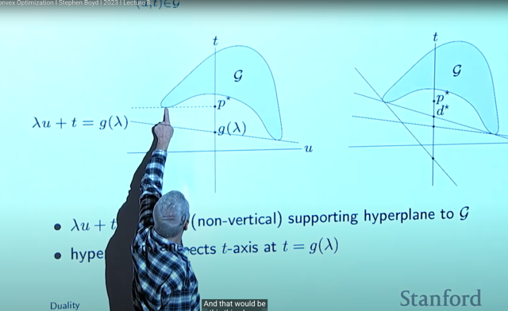</kbd></p>

> [!NOTE]
> Như vậy điều ta sẽ làm là: Ignore mọi điểm (f1, f0) trong blob ở
> bên phải (trục t), và trong phần bên trái, xem điểm nào thấp
> nhất. Đó chính là optimal p* `=` f0* (ý là f0 của điểm (f1, f0) đó

<br>

<p align="center"><kbd>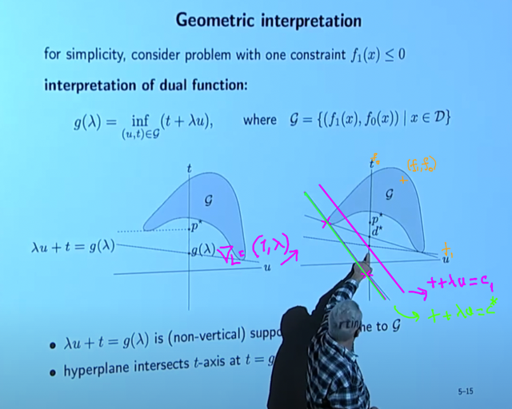</kbd></p>

> [!NOTE]
> Thế thì xét Lagrangian, L(x, λ) (đang xét ví dụ chỉ có inequality constraints), như đã
> biết:
>
> L `=` f0(x) + `Σ` λi fi(x)  + `Σ` vi hi(x)
>
> nhưng ở đây chỉ có inequality constraints f1(x) `<=` 0 thôi, nên
>
> L `=` f0(x) + λ f1(x)
>
> thành ra tuy x có thể là n-dimensional vector với n ko biết nhưng L chỉ là function của
> f0(x) và λ * f1(x), hay nói cách khác (với một fixed value λ) có thể coi L như là
> function của f0 và f1: L(f0, f1) `=` f0 + λ f1
>
> Và với mọi x thuộc domain (problem domain: là intersection của dom f0 và dom f1),
> thì ta có blob G chứa mọi cặp (f0, f1) (f0 `=` f0(x), f1 `=` f1(x))
>
> Rồi vậy L `=` L(f0, f1) `=` f0 + λf1 cũng có thể gọi là L(t, u) `=` t + λu với t, u ∈ G
>
> Ta có thể vẽ LEVEL SET của L trên hệ trục t, u (trục của f0 là trục tung và trục của f1 là
> trục hoành như nãy đã nói) - là tập hợp (f0, f1) sao cho L(f0, f1) `=` constant c dễ thấy
> nó sẽ là các đường thẳng t + λu `=` c
>
> Với fixed λ và các c khác nhau thì ta có các level curve là các đường song song
> như vầy. Và đương nhiên ta chỉ xét những điểm (t, u) nằm trong blob G, nói cách khác
> đường level set phải cắt blob G. Thành ra chỉ xét các đường song song nhưng
> trong phạm vi những cái có cắt blob G.
>
> t + λu `=` c1, t + λu `=` c2, .....
>
> Và ta muốn tìm cái ứng với c (cũng là L `=` t + λu) nhỏ nhất.
>
> Và và đó chính là cái đường xa nhất theo hướng ngược với gradient vector ∇L:
>
> Hướng gradient là hướng nào? L `=` f0 + f1λ thì:
>
> ```text
> ∇L = (∂L/∂f0, ∂L/∂f1) = (1, λ) (chú ý λ ở đây là number, vì nó là lagrange multiplier
> ```
> gắn với inequality constraint function f1(x), đúng ra thì nên gọi là λ1)
>
> và đi ngược hướng đó xa nhất mà vẫn còn tiếp xúc với blob ta có cái đường màu
> xanh:
>
> t + λu `=` c*
>
> Đây chính là SUPPORT HYPERPLANE của blob G.
>
> Đó là nơi mà từ điểm tiếp xúc, đi về hướng nào trong G cũng là đi theo hướng mà
> hợp với gradient góc nhỏ hơn 90 độ nên sẽ khiến tăng L.
>
> Và việc ta move trong các đường màu tím song song để đến khi có đường màu xanh,
> chính là việc ta tìm x sao cho L(x, λ) nhỏ nhất, và cũng tìm trong các điểm (t, u) ∈ G sao
> cho L nhỏ nhất, tức c nhỏ nhất. Hình dung cho đường thằng di chuyển song song sao
> cho vẫn còn dính blob G, thì tại mỗi vị trí, nó cắt blob G tại một đoạn, đoạn đó là tập  hợp
> các điểm có cùng L(t, u) `=` t + λu `=` c và khi ra xa hết cỡ thì c nhỏ nhất, lúc đó nó tiếp tuyến
> với G
>
> Và cái c nhỏ nhất này - c* chính là g(λ) (sẽ phụ thuộc λ vì với λ khác nhau, ta sẽ có các
> Lagrangian khác nhau, nên gradient ∇x sẽ khác nhau, và kết quả ta có các support 
> hyperplane khác nhau của blob G
>
> (vì g(λ) được định nghĩa là kết quả khi ta tìm hàm L(x, λ) nhỏ nhất bằng cách thay đổi x
> mà, nên khi ta có cái đường màu xanh t + λu `=` c* rồi THÌ CÁI CONSTANT c* CỦA NÓ
> CHÍNH LÀ g(λ) (và chú ý nãy giờ đang nói là ta chọn fixed value nào đó cho λ) 
>
> Và từ t + λu `=` c `=` g(λ), cho u `=` 0 (tìm giao điểm với trục t), thì t chính là g(λ)

<br>

<p align="center"><kbd>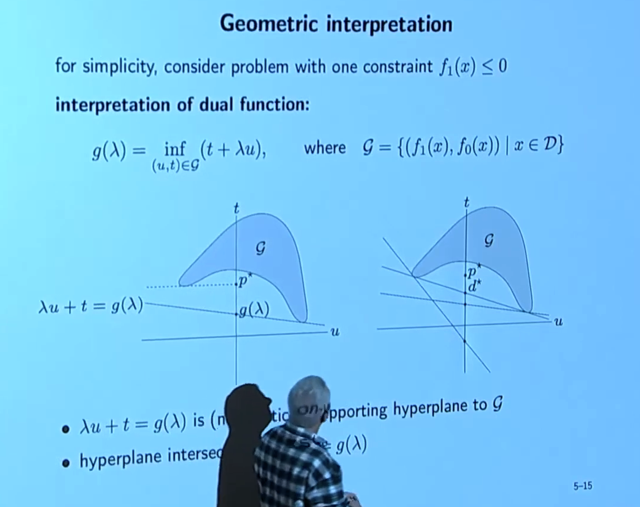</kbd></p>

> [!NOTE]
> Nếu λ lớn thì slope nhỏ:
>
> vì level set: t + λu `=` c, dùng implicit differentiation (vi phân hàm ẩn)
>
> `d/du(t+λu)` `=` `dc/du`
>
> ```text
> <=> dt/du + λ = 0 <=> dt/du = -λ
> ```
>
> vậy khi λ lớn thì độ dốc càng nhỏ là đúng.
>
> Và λ dương (constraint phải vậy) thì các đường level set λu + t `=` c
> đều có độ dốc âm (t `=` -λu + c) Nên trong hình minh họa sau, mình
> có ghi chú là sẽ ko có mấy cái đường màu vàng bên phải

<br>

<p align="center"><kbd>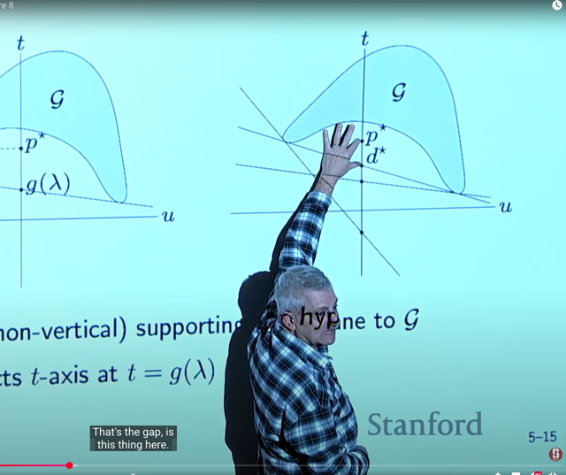</kbd></p>

> [!NOTE]
> Thế thì khi ta chuyển qua bài toán thứ 2 - dual problem: maximize
> g(λ) - mà ý nghĩa là tìm λ sao cho g(λ) lớn nhất thì ta sẽ thấy, với
> các λ khác nhau giống như ta sẽ có các optimal line (supporting
> hyperplane của G) khác nhau và chúng sẽ cắt t, tại các điểm mang
> giá trị t `=` g(λ)  khác nhau.
>
> ĐÂY CHÍNH LÀ CÁC LOWER BOUND CỦA P* KHÁC NHAU, PHỤ
> THUỘC λ: p* `>=` g(λ) 
>
> Hình ảnh sẽ là, khi các optimal line thay đổi, nó sẽ "kiểu như" quay "
> vòng vòng" xung quanh (và tiếp xúc) cái blob này, để rồi cái điểm giao
> với trục t, tức g(λ), sẽ cứ chạy lên chạy xuống.
>
> (Thật ra không hẳn là quay vòng vòng, xem hình kế minh họa nhiều
> đường optimal)
>
> Và khi nó chạy lên cao nhất, thì đó chính là d* thì nó gần p*
> nhất. Thì khoảng cách đó với p* chính là DUALITY GAP GIỮA d* VÀ p*
>
> Và gs nói, đó là lí do ta hiểu tại sao có gap giữa d* và p* (trong cái
> WEAK DUALITY: d* `<=` p*)

<br>

<p align="center"><kbd>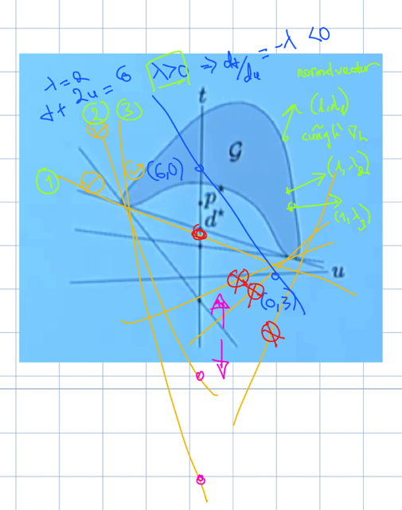</kbd></p>

> [!NOTE]
> Vì λ dương nên chỉ có những đường màu vàng bên trái thôi:
>
> Chọn λ dương, ví dụ λ1. Ta xác định được gradient vector (1,
> λ1)  của L_λ1 (t,u) `=` t + λ1u.
>
> Và cũng là normal vector của các level set:
>
> L_λ1 (t, u) `=` c `<=>` t + λ1u `=` c
>
> Rồi khi cho c nhỏ dần, cái đường này nó trượt song song
> (vuông góc với (1, λ1) cho theo hướng ngược lại với (1, λ1)
> cho đến khi chỉ còn dính với blob G tại một điểm: tiếp tuyến (1)
>
> Đó là hình ảnh của việc g(λ1) `=` inf x ∈ D L(x, λ) 
>
> `=` inf t, u ∈ G L_λ1 (u, v) `=` inf t, u ∈ G t + λu
>
> Và với nhiều λ khác nhau thì ta có các tiếp tuyến (1), (2) (3)...
>
> Tụi nó cắt trục t tại các điểm màu hồng, mà giá trị t chính
> là g(λ1) g(λ2) ....mà cái có giá trị lớn nhất chính là d*

<br>

<p align="center"><kbd>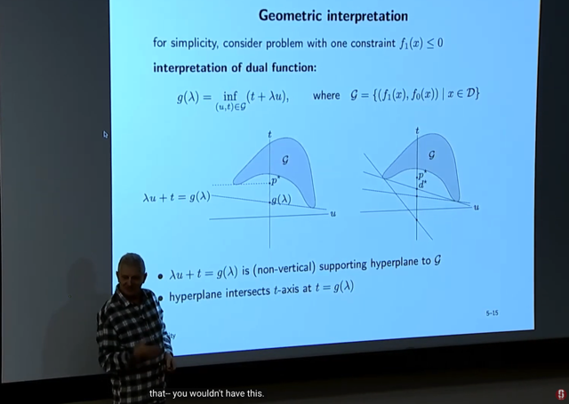</kbd></p>

> [!NOTE]
> Và từ đó giúp ta hiểu, cái gap đó là bởi trong cái ví dụ này, blob G
> KHÔNG PHẢI LÀ CONVEX SET, nó có hình như cái boomerang, và ta
> đã học convex set là gì, nối hai điểm giữa hai cánh boomerrang thì
> những điểm ở giữa ko nằm trong set.
>
> Nên PRIMAL PROBLEM KHÔNG PHẢI LÀ CONVEX PROBLEM
>
> Từ đó ta có thể hình dung nếu blob G là convex set, thì khi đó  sẽ
> KHÔNG CÓ GAP GIỮA d* và p*, tức là lúc supporting hyperplane
> thay đổi thì d* sẽ có lúc trùng p*.
>
> Và đó là khi ta có STRONG DUALITY

<br>

<p align="center"><kbd>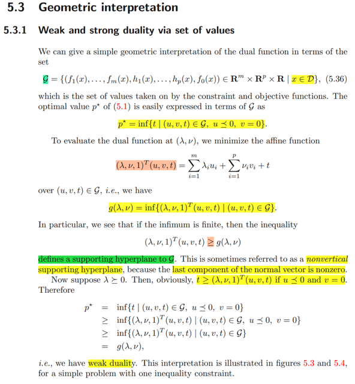</kbd></p>

<p align="center"><kbd>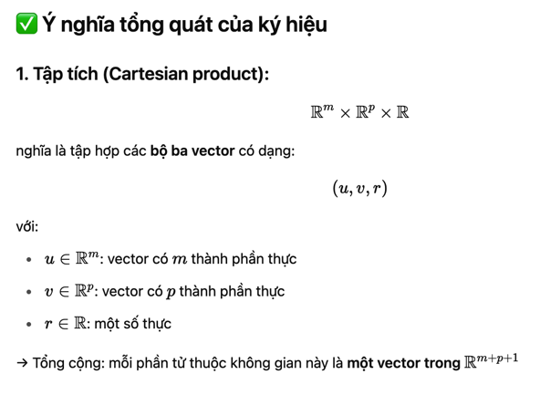</kbd></p>

> [!NOTE]
> Nội dung này cơ bản mình đã hiểu từ bài giảng. Ở đây chỉ có một số
> vấn đề bổ sung:
>
> Đầu tiên, là định nghĩa set G ở đây là trong trường hợp khái quát khi
> primal problem có objective function f0(x), inequality constraint
> functions f1(x), f2(x)....fm(x), và equality constraint functions h1(x),
> h2(x),....hp(x)
>
> Thì kí hiệu (f1,...fm, h1,...hp, f0) ∈ R^m x R^p x R ý là, ta có vector
> trong không gian R^(m+p+1) dimensions, nhưng lấy ví dụ như vector
> trong không gian 3D có thể được tách thành 1 vector trong subspace
> 2D và 1 vector trong subspace 1D để ghi là (u, v) ∈ R^2 x R thì ta
> hiểu (u, v) có u là vector 2D, v là scalar.
>
> Do đó (u, v, t) của G ∈ R^m x R^p x R thì ta hiểu u là R^m vector, v là
> R^n vector và t là scalar
>
> Bài toán primal problem: 
>
> minimize x f0(x) với constraint fi(x) ≤ 0 và hi(x) `=` 0 
>
> với optimal p* `=` inf x f0(x) | x ∈ D: fi(x) ≤ 0, hi(x) `=` 0
>
> Thì với các kí hiệu u, v, t trên ta có thể thể hiện p* hoàn toàn tương tự
>
> p* `=` inf (t | (u, v, t) ∈ G, u ⪯ 0, v `=` 0
>
> Kí hiệu nữa có thể mới thấy là (λ, v, 1)T(u, v, t) thì ta sẽ hiểu nó bằng:
>
> λTu + vTv + t (chú ý v đầu là "nu" - là dual variable)
>
> Và cái này là Lagrangian f0(x) + `Σ` λi fi(x) + `Σ` vi hi(x) thôi.
>
> Nên g(λ, v) `=` inf x L(x, λ, v) thể hiện theo u, v ,t ở đây sẽ là: 
>
> g(λ, v) `=` inf (λ, v, 1)T(u, v, t) | (u, v, t) ∈ G mang ý nghĩa là tìm trong hết các 
> (u, v, t) thuộc G (cũng là tìm trong các x khác nhau thuộc domain) xem
> cái nào giúp minimize L
>
> Để rồi vì định nghĩa của infimum nên dĩ nhiên ta có: 
>
> g(λ, v) ≤ L(u, v, t) ⇔ g(λ, v) ≤ (λ, v, 1)T(u, v, t)
>
> Thế thì với cách thể hiện này giúp ta thấy nó ĐỊNH RA MỘT SUPPORT
> HYPERPLANE CỦA G (có dạng giống giống như aTx > c)
>
>
>
>
> Và khúc cuối nói dễ thấy nếu u ⪯ 0 và v `=` 0 thì t `>=` (λ, v, 1)T(u, v, t) 
>
> là vì nếu mọi component của u: ui đều `<=` 0 (điều này là constraint 
> fi(x) < 0) thì ui * λi âm (λi dương), và vi `=` 0 nên dĩ nhiên:
>
> t + `Σ` ui λi + `Σ` vi vi sẽ phải < t vì t cộng với số âm phải nhỏ đi
>
> NÓI CHUNG, NGOẠI TRỪ VÀI NOTATION `/` CÁCH THỂ HIỆN 
> MÌNH MỚI BIẾT THÌ KHÔNG CÓ GÌ MỚI TRONG ĐÂY CẢ
>
> 5.3 GEOMETRIC INTERPRETATION
>
> 5.3.1 WEAK & STRONG DUALITY

<br>

<p align="center"><kbd>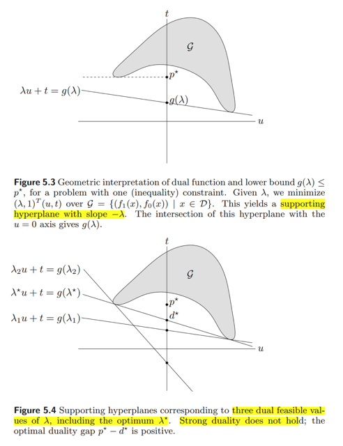</kbd></p>

<br>

<p align="center"><kbd>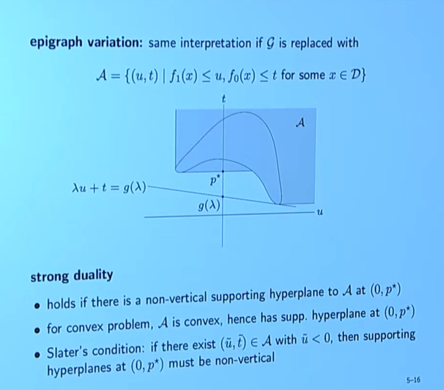</kbd></p>

> [!NOTE]
> Ko hiểu lắm chỉ biết nó là phiên bản mà ta dùng epigraph.
> Nhưng ta cũng có cùng cách interpretation như vậy

<br>

<p align="center"><kbd>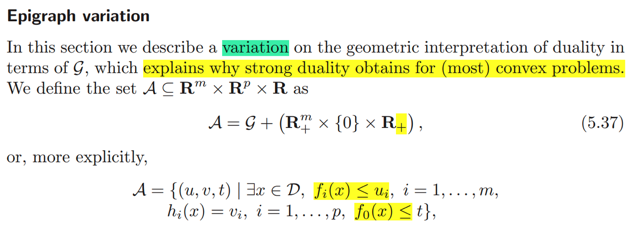</kbd></p>

<p align="center"><kbd>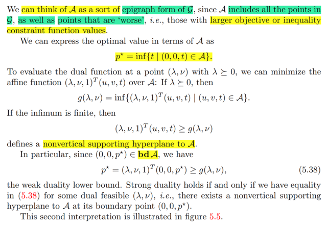</kbd></p>

> [!NOTE]
> Cái giải thích thứ hai, cũng
> tương tự, dựa vào epigraph

<br>

<p align="center"><kbd>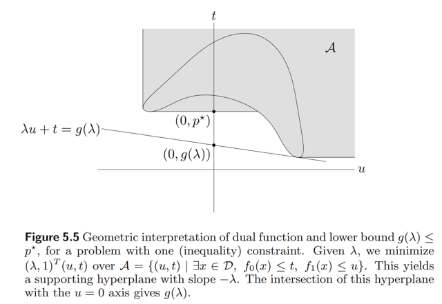</kbd></p>

<br>

<p align="center"><kbd>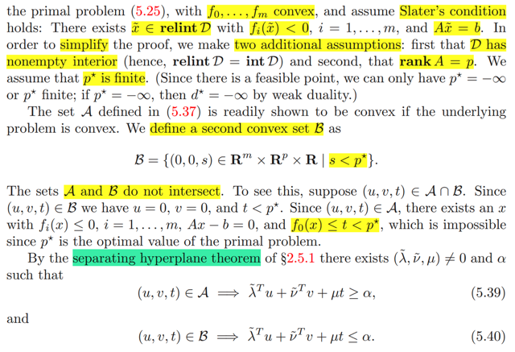</kbd></p>

<p align="center"><kbd>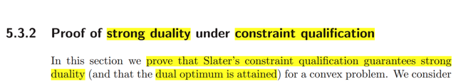</kbd></p>

> [!NOTE]
> Đại khái là phần này ta sẽ chứng minh rằng nếu convex primal problem 
> có thêm (việc thỏa mãn được) Slater's condition thì khi đó Strong Duality
> sẽ hold và như gs cũng đã nói, là Slater's condition không chỉ đảm bảo
> mà còn đảm bảo rằng Dual optimal sẽ attained `/` có thể đạt được để rồi
> ta có thể tìm thấy λ*, v* sao cho g(λ*, v*) `=` d* `=` p*
>
> Đầu tiên dĩ nhiên ta sẽ phải có convex primal problem, tức bài toán có
> các f0 (objective), f1, f2...fm (inequality constraint function) là convex.
> Và ta có thêm Slater's condition: Tồn tại x~ thuộc relative interior của problem
> domain D sao cho ta có TÌNH TRẠNG STRICTLY FEASIBLE: fi(x~) < 0 
> (dĩ nhiên x~ feasible thì nó phải thỏa equality constraints hi(x) `=` 0 mà với
> bài toán primal là convex thì đây là các affine function Ax `=` b, do đó ta có:
> Ax~ `=` b là vậy)
>
> Để đơn giản hóa bài toán ta sẽ đặt thêm gỉa định là D có non-empty interior,
> do đó relint D `=` int D (cái này là sao thì sẽ giải thích ở note khác) và rank A `=` p
> chính là nói rằng các linear equation `Ax=b` đều đôc lập.
>
> Và assume thêm p* hữu hạn, bởi ta đã giả định là đang thỏa Slater's condition
> mà điều này đồng nghĩa là có tồn tại feasible point. Và lúc trước đã nói, nếu
> bài toán infeasible thì p* `=` +infinity. Nên giờ bài toán feasible thì p* chỉ có thể
> là mang giá trị hữu hạn (finite) nào đó hoặc là -infinity
>
> Rồi, ta mới định nghĩa set A `=`
>
>
> ...QUAY LẠI SAU
>
> 5.3 GEOMETRIC INTERPRETATION
>
> 5.3.2 PROOF OF STRONG DUALITY UNDER 
> CONSTRAINT QUALIFICATION

<br>

<p align="center"><kbd>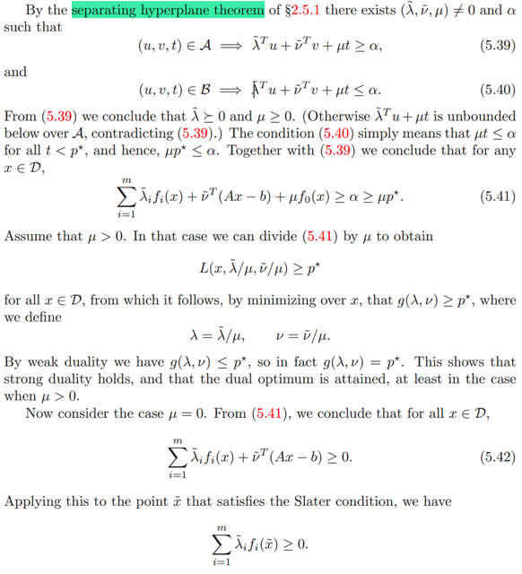</kbd></p>

> [!NOTE]
> SÁCH (XEM SAU)

<br>

<p align="center"><kbd>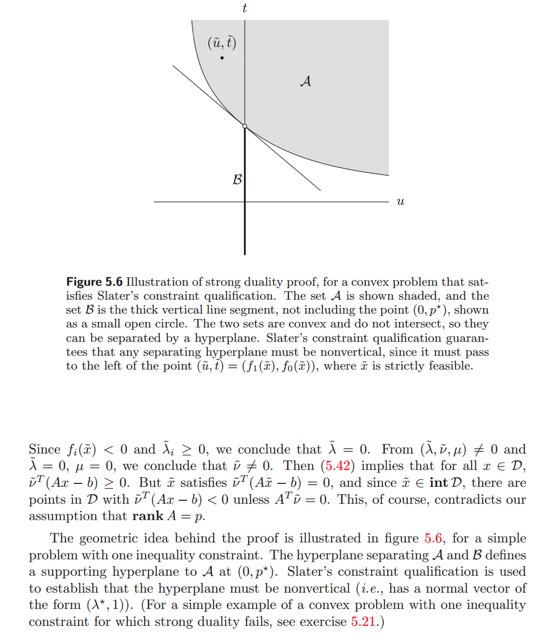</kbd></p>

> [!NOTE]
> SÁCH (XEM SAU)

<br>

<p align="center"><kbd>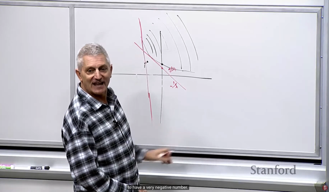</kbd></p>

<p align="center"><kbd>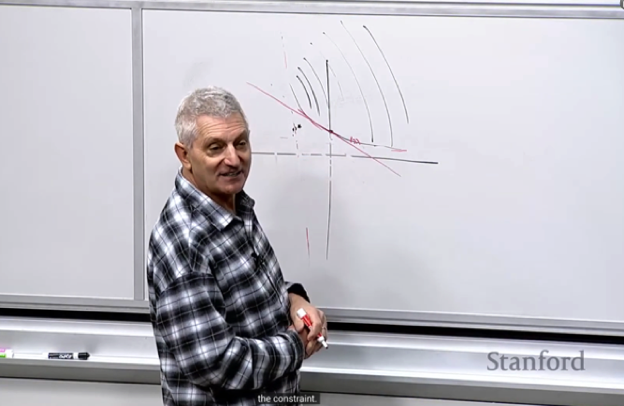</kbd></p>

> [!NOTE]
> Gs nói về case khi A convex, thì ta cũng có
> trạng thái tương tự đó là p* `=` d*

<br>

<p align="center"><kbd>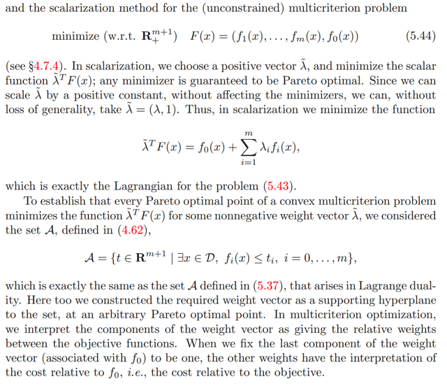</kbd></p>

<p align="center"><kbd>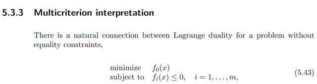</kbd></p>

> [!NOTE]
> SÁCH (XEM SAU)
>
> 5.3 GEOMETRIC INTERPRETATION
>
> 5.3.4 MULTI-CRITERION INTERPRETATION

<br>

<p align="center"><kbd>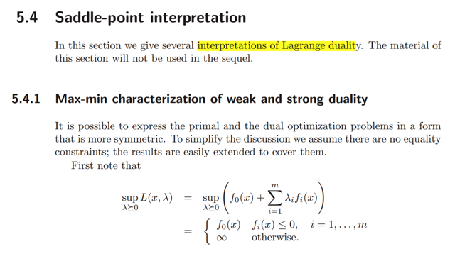</kbd></p>

> [!NOTE]
> CHAPTER 5 - DUALITY
>
> 5.4 SADDLE-POINT INTERPRETATION
>
> SÁCH (XEM SAU)

<br>


<a id="node-q5elgwh"></a>
## Lec 10

<br>

<p align="center"><kbd>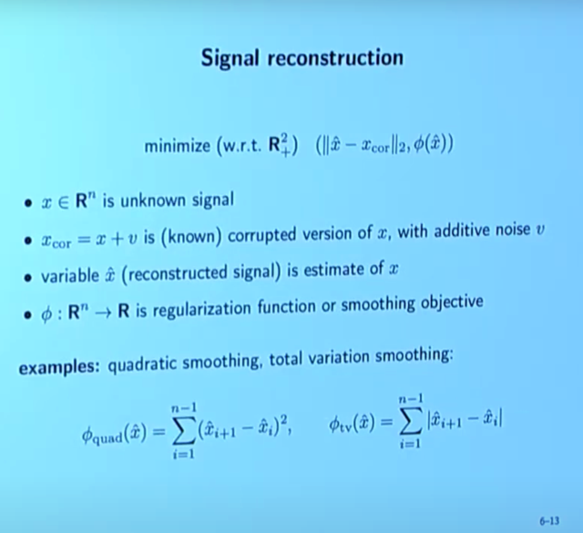</kbd></p>

> [!NOTE]
> Một ví dụ nữa trong phạm vi bài toán regularized approximation, là
> bài toán Signal reconstruction.
>
> Đại khái là ta muốn minimize khác biệt giữa corrupted signal `x_cor` và 
> giữa reconstructed signal x^ thể hiện bởi primary objective ||x^ - `x_cor||` 
> (l2 norm).
>
> Nhưng secondary objective là ta muốn minimize Φ(x^), là function
> đại khái là thể hiện độ biến động của x^ (để rồi khi Φ(x^) nhỏ thì 
> x^ "smooth".
>
> Thì Φ(.) có thể dùng quadratic hoặc l1 sẽ dẫn đến các hiệu qủa khác
> nhau như đã biết

<br>

<p align="center"><kbd>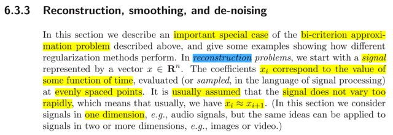</kbd></p>

<p align="center"><kbd>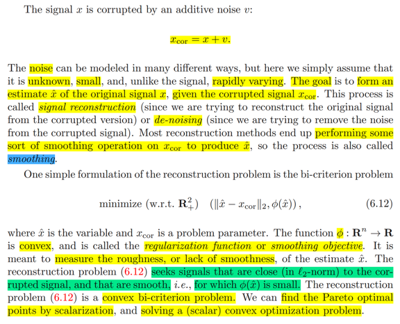</kbd></p>

> [!NOTE]
> Trong sách nói rõ hơn về bài toán Signal Reconstruction này.
>
> Đây là trong lĩnh vực Signal Processing (có lẽ ta cũng sẽ được
> học về cái này trong lớp của Mc Kay).
>
> Đại khái là, x là R^n vector sẽ represent chuỗi thông tin mà
> component của nó sẽ là một function theo thời gian, được
> sampled theo một chu kì đều đặn nào đó. Và người ta giả đinh là
> nó "mượt"
> - ý là, thông tin không có sự thay đổi đột ngột ở biên độ cao mà ở
> hai " time-step" liên tục nhau thì chúng không thay đổi nhiều:
>
> `x_i+1` `~=` `x_i`
>
> Thế thì khi bị truyền đi, thông tin bị nhiễu: ta có chuỗi dữ liệu `/`
> thông tin nhận được bị nhiễu còn nguyên vẹn nữa, thể hiện bởi
> `x_cor` `=` x + v (v là noise).
>
> Mình hiểu đại khái `x_cor` là thông tin đã bị làm cho nhiễu động
> khíến nó chỉ là phiên bản rời rạc của thông tin gốc (vốn dĩ liên
> tục). Do đó kiểu như ta có những dấu chấm, và giờ ta lấy cây viết
> nối chúng lại sao cho nó đi qua những dấu chấm đó, nhưng làm
> sao cho mượt nhất có thể.
>
> Thì việc này được thực hiện thông qua bài toán:
>
> minimize ||x^ - `x_cor||` và Φ(x^). 
>
> Và đó chính là một bài toán thuộc loại bi-criterion problem
> (nằm trong phạm vi rộng hơn là bài toán Vector Optimization) 
> Để rồi như đã biết, bằng phương pháp Scalarization, ta sẽ
> chuyển nó thành equivalent problem, để rồi giải bài toán này,
> tìm được Optimal thì đồng nghĩa đó sẽ là Pareto Optimal của
> bài toán Bi-criterion

<br>

<p align="center"><kbd>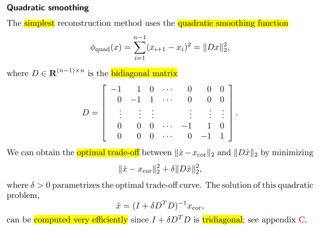</kbd></p>

> [!NOTE]
> Rồi, như trong bài giảng gs nhắc đến việc có thể dùng nhiều function
> Φ khác nhau. Thì đơn giản nhất là dùng quadratic: Nôm na là, ta sẽ 
> minimize tổng bình phương của chênh lệch giữa hai step liền kề:
>
> ```text
> Φ(x) = Σi (x_i+1 - x_i)^2 Và cái này, thể hiện bởi ||Dx||^2 với D là
> ```
> BIDIAGONAL matrix như trong sách.
>
> Cũng dễ hiểu rồi, nên nhớ x là R^n vector [x1, x2.....xn] trong đó 
> component xi là signal tại step i'th. Và D là matrix (n-1) hàng (n) cột
>
> Do đó Dx thì sẽ ra 1 vector, ta sẽ nhìn theo "cách nhìn": component
> thứ 1st của Dx là dot product của row 1st của D và x:
>
> <-1 1 0 0....0> <x1, x2, ....xn> `=` x2 - x1
>
> Tương tự, component thứ 2nd của Dx là x3 - x2.
>
> Nên tổng `Σ` `(x_i+1` - `x_i)^2` chính là tổng bình phương các component
> của Dx, chính là ||Dx||^2 `=` (Dx)T(Dx)
>
> `====`
>
> Rồi, theo như ta đã biết đối diện với bài toán vector optimization
> nói chung và cụ thể là bi-criterion problem ta sẽ scalarization.
>
> Mà điển hình là minimize f0(x) `=` ||x - `x_cor||^2` + `δ||Dx||^2`
>
> `=` (x-xc)T(x-xc) + `δ(Dx)T(Dx)`
>
> `=` (xT-xcT)(x-xc) + `δxTDTDx` 
>
> `=` xTx - xcTx - xTxc + xcTxc + `δxTDTDx`
>
> `=` xTx - 2xcTx + xcTxc + `δxTDTDx`
>
> `=` xT(1 + `δDTD)x` - 2xcTx + xcTxc. Đây là quadratic function 
>
> ```text
> = xTPx + qx + v với P = 1 + δDTD, q = - 2xc, v = xcTxc
> ```
>
> Không khó để triển khai cho thấy với f(x) `=`  `(1/2)xTPx` + qTx + r
>
> `=>` ∇f `=` (xTP+qT)T `=` PTx+q
>
> Vậy ở đây, ∇f `=` 2PTx + q `=` 2(1 + `δDTD)Tx` - 2xc
>
> `=` 2(1 + `δDTD)x` - 2xc   |   Do 1 +  `δDTD` symmetric
>
> ```text
> ∇f = 0 <=>  2(1 + δDTD)x - 2xc = 0
> ```
>
> ```text
> <=> (1 + δDTD)x = xc <=> x = (1 + δDTD)invxc. Dĩ nhiên đây chính
> ```
> là optimal (minimum) vì f0(x) quadratic -> convex
>
> Và cuối cùng gs nói việc tính x^ theo công thức analytic trên rất 
> hiệu qủa vì ta chỉ deal với bi-diagonal matrix D. (khi nào xem Appendix
> thì quay lại sau)

<br>

<p align="center"><kbd>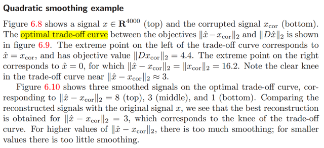</kbd></p>

<p align="center"><kbd>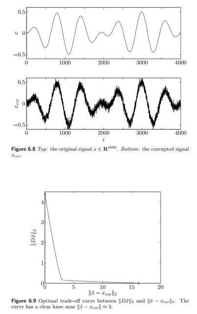</kbd></p>

<p align="center"><kbd>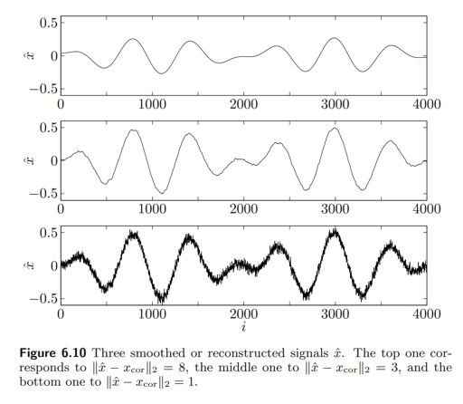</kbd></p>

> [!NOTE]
> Đại khái là hình 6.9 cho ta OPTIMAL TRADE-OFF CURVE. Khi với 
> các `δ` khác nhau, ta có các Pareto optimal khác nhau.
>
> Mà khi thay đổi thì ta sẽ "đánh đổi" (trade-off) giữa ĐỘ KHỚP (primary
> objective ||x^ - `x_cor||^2)` và ĐỘ MƯỢT (||Dx||^2)
>
> Để từ đó cho thấy với `(δ` sao cho) ||x^ - `x_cor||` `=` 3 thì là ok nhất (tương
> ứng với pareto optimal tại điểm gấp khúc (knee)) của optimal trade off
> curve

<br>

<p align="center"><kbd>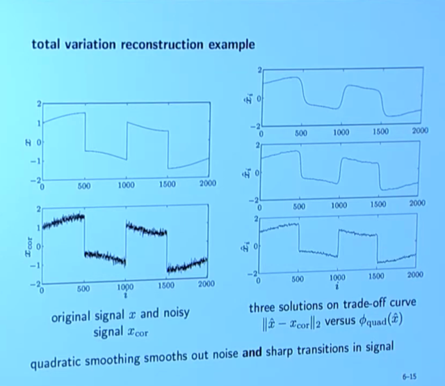</kbd></p>

<br>

<p align="center"><kbd>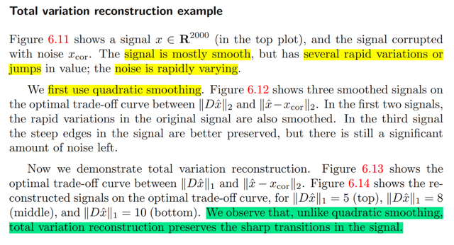</kbd></p>

> [!NOTE]
> Đại khái là khi dữ liệu gốc mà có những bước thay đổi đột ngột
> thì dùng quadratic smoothing ||Dx||^2 tỏ ra kém. Vì nó smooth
> out luôn những đặc tính này.
>
> Với dạng này, sẽ hiệu quả hơn khi dùng cái gọi là TOTAL
> VARIATION reconstruction:
>
> Trong đó vẫn dùng L2 cho primary objective:
>
> ||x^ - `x_cor||` (nhưng không square)
>
> Và dùng l1 cho Dx^: ||Dx^||1

<br>

<p align="center"><kbd>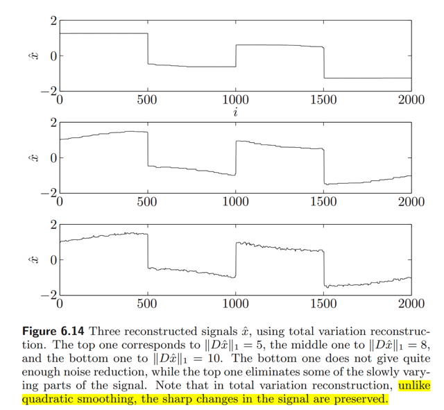</kbd></p>

<p align="center"><kbd>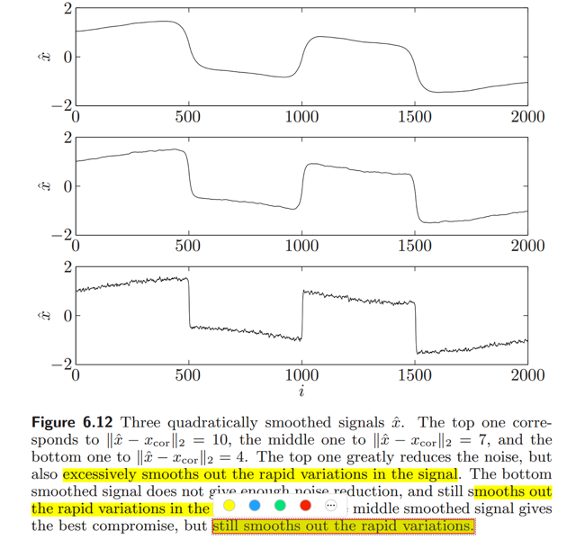</kbd></p>

> [!NOTE]
> Dùng ||Dx|| (l1 norm) thì đại khái là nó giữ được các bước
> nhảy (những biến động đột ngột, lớn của dữ liệu gốc) tốt hơn
> là ||Dx||^2
>
> Và ở đây cũng có một đặc điểm thể hiện trong hình trên cùng
> khi dùng L1 norm, là nó biến thành kiểu như piece-wise constant
> function
>
> Dùng ||Dx||2 (square l2 norm) thì có thể thấy nó smooth out đi 
> những bước nhảy đột ngột của dữ liệu `/` thông tin gốc. Đây là
> điểm mà ta ko muốn

<br>

<p align="center"><kbd>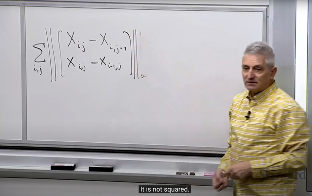</kbd></p>

> [!NOTE]
> Đại khái là gs nói có thể áp dụng với image và nó khá tốt. 
> Nhất là nhờ tính chất giữ được các "rapid variation" ví dụ như
> đường nét, cạnh (edge). Mà nếu như dùng Quadratic smoothing
> thì nó sẽ làm mờ đi

<br>

<p align="center"><kbd></kbd></p>

> [!NOTE]
> Cách người ta xử lý sự không chắc chắn trong thực tế
>
> Giảng viên nói rằng trong thực tế, phần lớn mọi người không xử lý
> sự không chắc chắn một cách cầu kỳ như trong sách vở. Ví dụ như
> ở Amazon, họ vẫn đang tính toán chuỗi cung ứng hàng ngày, quyết
> định sản phẩm nào sẽ đến các kho hàng. Nhưng họ không sử dụng
> mô hình xác suất phức tạp hay phân phối đầy đủ. Vậy họ làm gì?
>
> Student trả lời là: họ đoán.
>
> Có thể gọi là “educated guess” (đoán có cơ sở), nhưng thực chất
> là... họ phớt lờ sự không chắc chắn.
>
> Họ chọn một giá trị kỳ vọng (mean) nào đó của đầu vào (chẳng hạn
> như ma trận A trong mô hình) và giải bài toán tối ưu như thể nó là
> chính xác.
>
> Đó là cách 99% các hệ thống ngoài đời thực xử lý sự không chắc
> chắn.
>
> Tối thiểu bạn nên làm gì nếu buộc phải đoán?
>
> Lấy trung bình của nhiều kịch bản đầu vào khác nhau.
>
> Sau đó chạy mô phỏng (simulate) để xem lời giải ứng xử ra sao
> với các giá trị khác nhau của dữ liệu đầu vào.
>
> Nếu kết quả không thay đổi nhiều, bạn có thể chấp nhận lời giải
> đó.
>
> Cuối cùng, có một điều quan trọng: Trong thực tế, không ai tránh
> khỏi việc phải xử lý sự không chắc chắn. Dù họ không gọi tên nó,
> mọi người đều đang sử dụng các dạng regularization hay
> robustness. Tất cả các kỹ thuật regularization trong machine
> learning và thống kê thực chất là cách để xử lý sự không chắc
> chắn trong dữ liệu.

<br>

<p align="center"><kbd>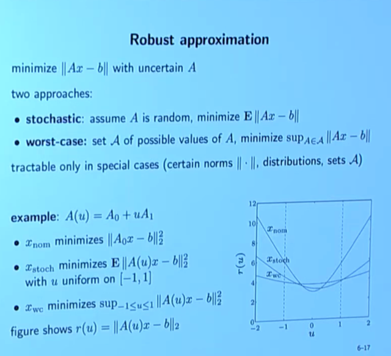</kbd></p>

<br>

<p align="center"><kbd>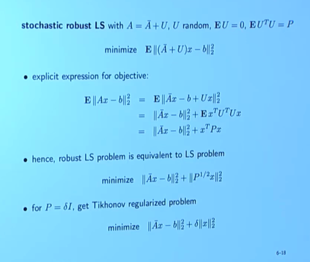</kbd></p>

<br>

<p align="center"><kbd>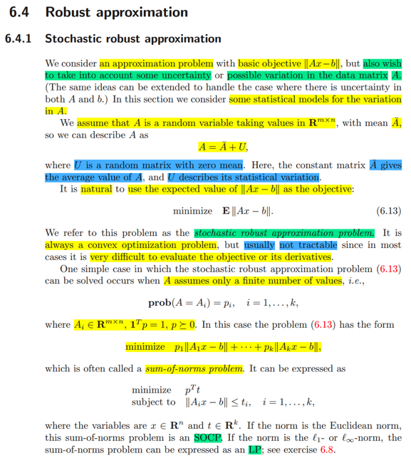</kbd></p>

> [!NOTE]
> Đại khái là, với cái này, thì bên cạnh objective quen thuộc là
> minimize ||Ax - b|| thì ta có thêm một tính chất là, A là một
> matrix chưa biết, hoặc, có thể nói A là matrix các random
> variables: A `=` `A_bar` + U với `A_bar` là mean (là constant)
> còn U là thể hiện variation.
>
> Thì một cách tự nhiên khi đối mặt với yếu tố không chắc chắn
> của random variable, ta sẽ dùng expectation. Nên objective sẽ
> là minimize E||Ax - b|| (l2 norm)
>
> Và bài toán này gọi là STOCHASTIC ROBUST APPROXIMATION 
> problem.
>
> Tuy nhiên họ nói, thường thì bài toán này không giải được.
>
> Nhưng nếu A đại khái là có hữu hạn các possible values Ai,
> mỗi cái gắn với xác suất `P(A=Ai)` `=` pi. 
>
> (dĩ nhiên `Σ` pi, tức 1Tp `=` 1, và pi `>=` 0 (hay p ≽ 0) 
>
> thì khi đó E||Ax - b|| `=` `Σ` pi||Ai - b||. (kết quả này nhờ Stat110, có 
> thể hiểu, đây chính là LOTUS:
>
> Sẵn ôn lại, trong Stat110 ta đã học mean của random variable X,
> hay expected value của discrete rv X, sẽ được tính bằng weighted
> `Σ` của các possible values của xi, với weight là xác suất tương ứng:
>
> EX `=` `Σ` xi `P(X=xi)`
>
> Thì nếu Y `=` g(X), LOTUS cho phép tính EY bằng pmf của X:
>
> ```text
> EY = Eg(X) = Σxi g(xi) P(X=xi). Và ở đây chính là áp dụng cái này:
> ```
>
> E||Ax - b|| `=` `Σ` ||Aix - b||*pi )
>
> Khi đó bài toán minimize `Σ` ||Aix - b||*pi gọi là SUM OF NORM. 
>
> Và có thể giải được

<br>

<p align="center"><kbd>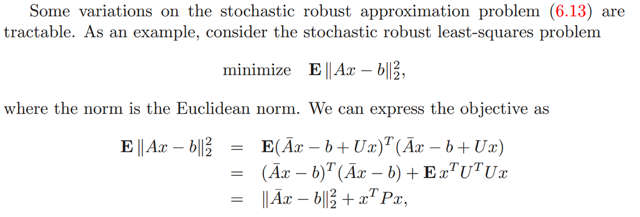</kbd></p>

<p align="center"><kbd>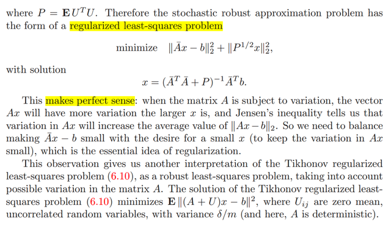</kbd></p>

> [!NOTE]
> Một phiên bản khác khi objective là minimize E||Ax - b||^2 (l2 norm, 
> square). Khi đó bài toán sẽ trở thành có dạng của bài toán regularized
> least-squares. (ko khó để triển khai objective ra dạng ||A^x-b||^2 + xTPx
> với A^ là constant - mean of A, P `=` E(UTU).
>
> Và với bài toán regularized least squared có thể dùng calculus để 
> cho ra analytic solution x `=` (A^TA^ + P)invA^Tb
>
> Và họ nói, kết quả này là hợp lí đại ý là vì khi A là biến, thì Ax cũng vậy
> và mức biến động của A sẽ được khuếch đại bởi x (trong Ax) và từ đó
> (theo Jensen's inequality) nói rằng giá trị trung bình của ||Ax - b|| cũng sẽ
> tăng lên. Do đó để giảm E||Ax - b||^2 thì việc ta nên làm chính là giảm
> A^x - b và cho x nhỏ.
>
> Hiểu sơ sơ vậy chứ cũng chưa rõ lắm. Quay lại sau

<br>

<p align="center"><kbd>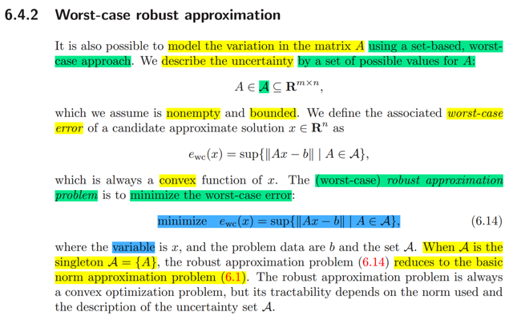</kbd></p>

> [!NOTE]
> Đại khái là, nếu như STOCHASTIC approach coi A như biến số,
> để rồi nó sẽ có một probability distribution, thì WORST-CASE
> approach sẽ handle sự biến động `/` chưa biết của A thông qua
> MỘT SET CÁC POSSIBLE VALUES CỦA A.
>
> Và dựa trên set A này, ta định nghĩa ra WORST-CASE ERROR:
>
> `e_wc(x)` `=` sup ||Ax - b|| | A ∈ A
>
> Và tiếp theo là ta sẽ giảm thiểu cái worst case error bằng cách
>  giải bài toán: minimize `e_wc.`
>
> Rồi, họ nói khi A là singleton tức là khi set A chỉ có một element
> dĩ nhiên khi đó sup ||Ax - b|| | A ∈ A chính là ||Ax - b|| thôi (bởi
> set A `=` A, chỉ có mỗi một cái.
>
> Và bài toán trở thành minimize ||Ax - b|| chính là bài toán NORM
> APPROXIMATION problem.
>
> Rồi, họ nói robust approximation luôn là convex, vì sao nhỉ?
> Có thể hiểu là bởi objective khi ta muốn minimize E(||Ax - b||)
> thì EXPECTATION là function PRESERVE CONVEXITY (norm là
> convex function rồi)

<br>

<p align="center"><kbd>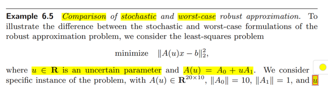</kbd></p>

<p align="center"><kbd>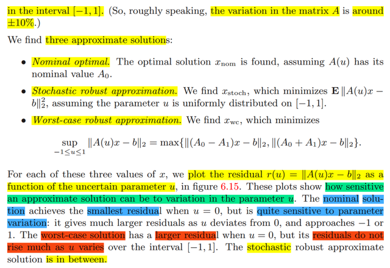</kbd></p>

<p align="center"><kbd>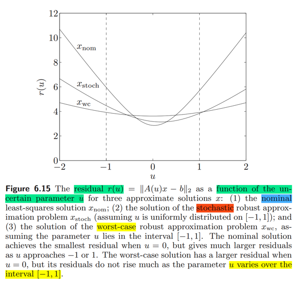</kbd></p>

> [!NOTE]
> đại khái là so sánh hai cái này. Dùng bài toán least-square:
>
> minimize ||A(u)x - b||^2.
>
> Có thêm một cái gọi là nominal optimal `x_nom` (nominal: danh
> nghĩa, mình đoán ý là, ta giả định rằng A(u), có một giá trị danh
> nghĩa là A0 nào đó, tức là bỏ qua sự bất định do u gây ra. thì
> `x_nom` là optimal của bài toán minimize ||A0x - b||^2.
>
> Còn `x_stoch` và `x_wc` là optimal của minimize E||A(u)x - b||^2 và
> minimize sup `-1<=u<=1` ||A(u)x - b||
>
> Thì sau khi có kết quả ta mới vẽ đồ thị của residual ra
>
> r(u) `=` ||A(u)x - b||
>
> (để ta có 3 đường tương ứng với
>
> r1(u) `=` `||A(u)x_nom` - b||
>
> r2(u) `=` `||A(u)x_stoch` - b||
>
> r3(u) `=` `||A(u)x_wc` - b||
>
> Thì thấy rằng tuy `x_nom` giúp residual đạt nhỏ nhất trong ba cái,
> nhưng khi u biến động (khiến A(u) biến động) thì r(u) cũng biến
> động nhiều nhất

<br>

<p align="center"><kbd>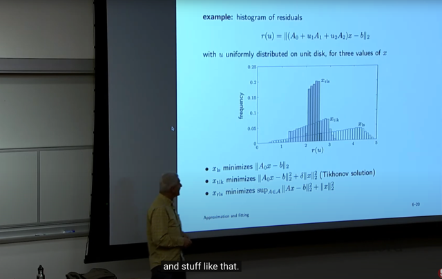</kbd></p>

> [!NOTE]
> Khúc này chả hiểu gì hết. Đọc sách sau.
>
> Mình sẽ qua luôn phần tiếp theo gs nói về chap 7 (tức là gs bỏ
> qua phần function fitting 6.5 luôn)

<br>

<p align="center"><kbd>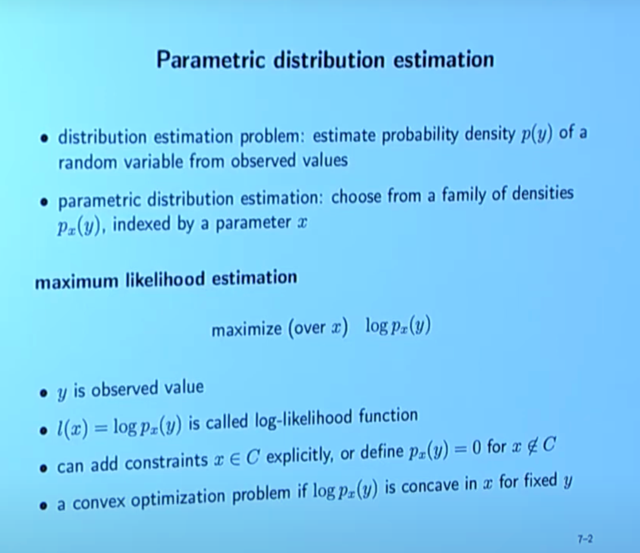</kbd></p>

> [!NOTE]
> Đại khái là nói về định nghĩa của LIKELIHOOD FUNCTION. Nó là
> một DENSITY FUNCTION (tức probability density, hay pdf mà ta
> đã học trong stat110, là cái mà khi integrat trên khoảng a:b thì ta
> sẽ có xác suất random variable X có giá trị thuộc khoảng này:
> ```text
> P(X ∈ (a, b)) = ∫a:b f_X(t)dt f_X(t) là pdf của random variable X)
> ```
>
> Thế thì, như đã biết pdf cuả một số distribution phổ biến như Poisson,
> Gaussian,...(dĩ nhiên là continuous random variable), thì ta nhớ rằng
> một distribution ví dụ Gaussian thì nó có hai parameters là mean và
> variance. Nên với giá trị đã biết của hai parameters này ta sẽ có
> pdf và từ đó giúp tính density tại một điểm x nào đó fX(x). Điều đó
> cũng có nghĩa là, với pdf thì x là biến.
>
> Nhưng với likelihood function, thì parameters mới là biến. Do đó,
> ví dụ p(y) là density function với parameters x, thì ta có likelihood
> function `p_x(y)` là hàm theo x. Nên với các x khác nhau, thì `p_x(y)`
> sẽ có giá trị khác nhau - tức density của observed value y sẽ phụ
> thuộc vào parameters x. 
>
> Giống như lấy pdf của Exp(λ) đi, f(t) `=` λ*e^(-λt) Thì với pdf thì nó là
> hàm theo t. Nhưng likelihood, thì ta coi t là observed value, còn λ mới
> là biến để rồi đây là hàm theo λ. Từ đó mới thấy rằng `/` hiểu rằng cái
> việc maximize likelihood function, chính là ta tìm parameters (ví dụ)
> λ sao cho density của các observed value (data) là lớn nhất,
>
> `====`
>
> Rồi tiếp, người ta thường làm việc với log likelihood thay cho likelihood
> (vì một số lí do gs ko nói ở đây, nhưng mình nhớ đại khái là trong các
> lớp như cs231n cũng đã từng nói sơ qua rằng lí do là vì làm việc với
> log giúp ổn định hơn, còn log dĩ nhiên là hàm monotonic nên maximize
> log likelihood thì equivalent với maximize likelihood)
>
> Ta cũng có thể add constraint (đối với x `/` parameter) một cách explicitly
> (khai báo cụ thể riêng biệt) hoặc implicitly (bằng cách biến likelihood
> thành dạng indicator function: `p_x(y)` `=` ... nếu x thỏa constraint, và `=` 0
> nếu x không thỏa constraint
>
> `====`
>
> Một điểm quan trọng nữa là, tuy rằng ta biết nếu log `p_x(y)` là concave
> thì - log `p_x(y)` sẽ convex (mà ở đây ta maximize log `p_x(y)` thì equivalent
> minimize - log `p_x(y)).`
>
> Có điều gs lưu ý rằng, phải nhớ đây là hàm của parameter x, nên kiểu
> như giả sử ta có function f(x,y) với fixed x thì concave với y nhưng chưa
> chắc fixed y thì nó concave với x

<br>

<p align="center"><kbd>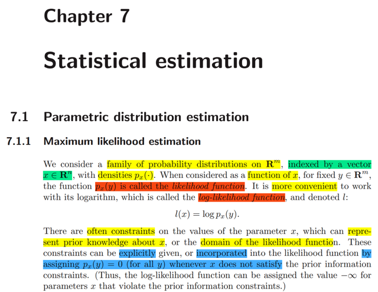</kbd></p>

<p align="center"><kbd>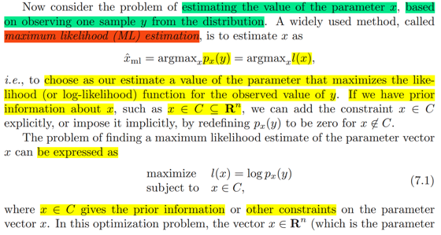</kbd></p>

<p align="center"><kbd>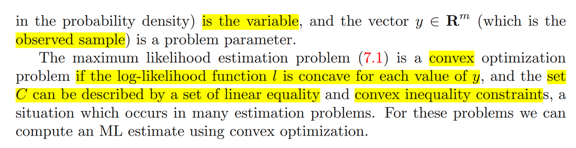</kbd></p>

> [!NOTE]
> Cũng như trong  bài gs đã nói hết rồi. Chỉ bổ sung thêm rằng việc
> add constraint cho x có thể để thể hiện một prior knowledge nào
> đó của x. mà trong bài gs ví dụ với Gaussian thì ta biết standard
> deviation `σ` phải không âm.
>
> Ngoài ra trong sách giúp ta hiểu rõ đầu đuôi hơn. Rằng ta muốn
> maximize likelihood function (hay log likelihood) thì có nghĩa là ta
> muốn tìm x^_ml (gọi là maximum likelihood estimator của
> parameter x) sao cho likelihood lớn nhất - tức là density của các
> observed data là lớn nhất.
>
> Kí hiệu là x^_ml `=` argmax x `p_x(y)` và cũng là argmax x l(x)
>
> (chú ý, kí hiệu `p_x(y)` là density function evaluate tại observed
> value y, nhưng đây là function theo x. đặt l(x) `=` log `p_x(y)` thì dĩ
> nhiên vì tính monotonic của log nên tìm x cho `p_x(y)` lớn nhất thì
> cũng là cho l(x) lớn nhất)
>
> Thế thì như đã nói, nếu ta có prior knowledge gì đối với x, thì ta
> có thể thể hiện nó qua explicit constraint: x ∈ C (C là nói chung
> cho một feasible set nào đó, ý là x phải thỏa cái này, có thể là tập
> nghiệm của một hệ nào đó) hoặc implicit là `p_x(y)` `=` 0 khi x không
> ∈ C như đã nói,
>
> Vậy thì ý chính là ta sẽ chuyển `/` thể hiện bài toán này thành dạng
> quen thuộc của bài toán optimization:
>
> maximize l(x) `=` log `p_x(y)` constraint c ∈ C.
>
> 7.1 PARAMETRIC DISTRIBUTION ESTIMATION
>
> 7.1.1 MAXIMUM LIKELIHOOD ESTIMATION

<br>

<p align="center"><kbd>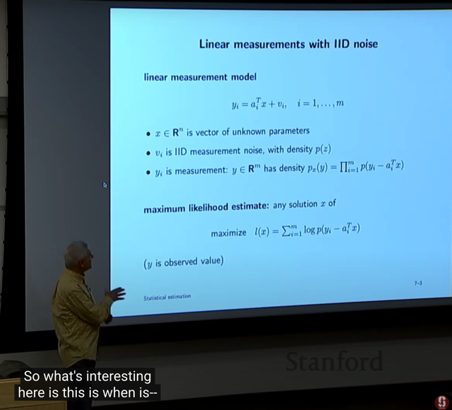</kbd></p>

> [!NOTE]
> gs nói qua một ví dụ là bài toán Linear measurements with IID noise
> (IID dĩ nhiên là independent identical distributed).
>
> Ta có một linear measurement model:
>
> yi `=` aiTx + vi, i `=` 1,2...m (hiểu nôm na là, ta có một quan hệ tuyến
> tính giữa a và y parameterized bởi x) với vi là nhiễu (noise) với density
> p(z)
>
> Vì vi độc lập (IID) nên yi với x fixed cũng sẽ independent nhau.
>
> Từ đó p(y) tức là p([y1, y2,...yi]) có thể hiểu là p(y1 ∩ y2 ∩ ....yi]) 
> là joint probability density (joint pdf) mà vì các yi independent, nên 
> nhờ stat110 ta đã biết joint pdf sẽ bằng tích các marginal pdf:
>
> p(y) `=` p([y1, y2,...yi]) `=` p(y1)p(y2)...p(yn) `=` Πi p(yi)
>
> Thế thì 
>
> Và ta nên nhớ đây là pdf (của yi), để "chuyển qua" likelihood thì nó 
> là function theo x (với fixed y): `p_x(y)` `=` Πi `p_x(yi)` 
>
> Thế thì ta đâu có pdf của yi? Nhưng ta có pdf của noise vi (bằng nhau
> đều là) `=` p. Và quan hệ yi `=` aiTx + vi
>
> Nhờ Stat110 ta nhớ khi có rv X với pdf `f_X` và Y là rv tạo bởi applying
> function g lên X: Y `=` g(X). Thì có thể dựa vào transformation theorem
> để có pdf của Y từ pdf của X: 
>
> ```text
> f_Y(y) dy = f_X(x) dx (1) => f_Y(y) = f_X(x) dx/dy
> ```
>
> ```text
> Và express vế phải theo y: f_Y(y) = f_X(ginv(y)) dx/dy
> ```
>
> Có chú ý nhỏ là (1) thật ra là cách viết cho dễ nhớ, trong stat110 gs 
> Blizstein có lưu ý ta là cách viết này ko đúng.
>
> Khi X, Y đều là vector thì công thức sẽ là `f_Y(y)` `=` |J| `f_X(x)` với J là
> Jacobian của X wrt Y 
>
> (Ôn lại một chút Jacobian là thứ mà khi ta triển khai df `=` f'(x)[dx]
> tức một linear operator act on vector dx để ra vector df. Thì khi đó
> linear operator act on dx này chỉ có thể là matrix nhân với vector dx.
> Và matrix đó gọi là Jacobian)
>
> ```text
> Vậy quay lại đây ta có yi = aiTx + vi => d/dyi (vi) = 1. Vậy pdf của yi:
> ```
> ```text
> f_yi(y) = f_vi(vi) *d/dyi (vi) = p(vi) * 1 = p(vi)
> ```
>
> Thể hiện theo yi: `f_yi(yi)` `=` p(yi - aiTx) 
>
> Và do đó likelihood function sẽ là `p_x(y)` `=` Πi `p_x(yi` - aiTx)
>
> Và lấy log để có log likelihood
>
> Và gs nói ở đây ta có log concave

<br>

<p align="center"><kbd>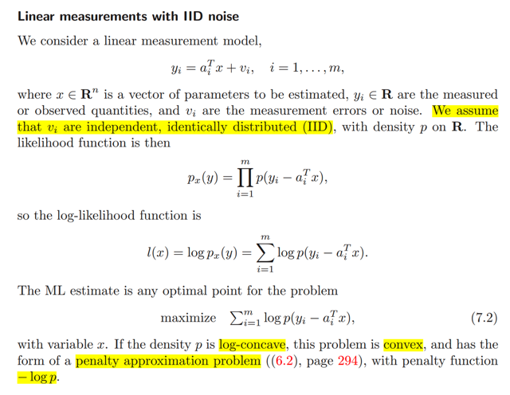</kbd></p>

> [!NOTE]
> trong sách có nói thêm là bài toán này sẽ là convex (optimization
> problem) nếu p log-concave. (lưu ý ta đâu biết p có công thức gì,
> nên việc bài toán có convex hay không thì tùy vào p)
>
> Ôn lại: hàm f gọi là log-concave đơn giản là khi log f là hàm concave.
>
> Và khi p có tính chất log-concave thì log p sẽ là concave và objective
>  là sum (cũng là function preserve convexity) các concave combine 
> with affine (yi - aiTx là affine của cả yi và x) cũng là concave. Và dùng 
> dấu - thì thành convex 
>
> (Lưu ý nói là maximize l(x) nhưng thể hiện theo bài toán tối ưu sẽ là
> minimize - l(x), nên objective là - l(x) là negative của concave thì là
> convex)
>
> Cái này có thể ôn lại chỗ log-concave - nằm trong nội dung các function
> preserve convexity

<br>

<p align="center"><kbd>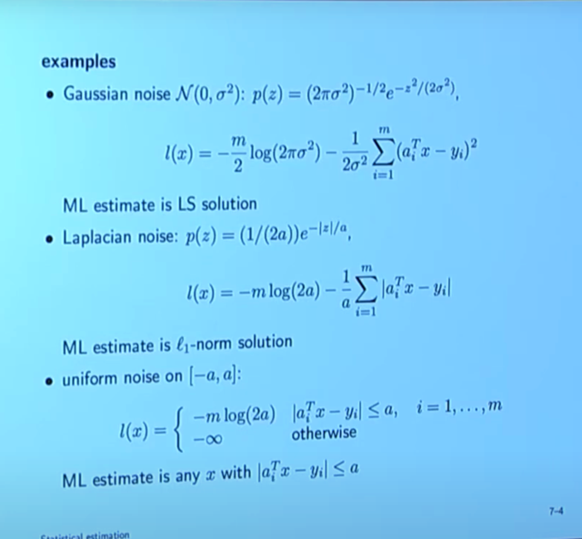</kbd></p>

> [!NOTE]
> Như đã nói, tùy tình hình p là gì. thì nếu ta có cái gọi là GAUSSIAN 
> NOISE N(0, `σ^2)` (hiểu đại khái là ta assume noise tuân theo Gaussian 
> distribution với zero mean, std chưa biết). Thì khi đó p(z) có công thức
> của Normal pdf như đã học trong stat110 rồi.
>
> ```text
> f(z) = 1/√(2πσ^2)  e^-z^2/(2σ^2)
> ```
>
> Lắp vào l(x) `=` `Σ` log p(yi - aiTx) ta sẽ có
>
> ```text
> l(x) = - m/2 log(2πσ^2) - (1/2σ^2) Σ(aiTx - yi)^2
> ```
>
> Và bài toán maximum likelihood estimation (sẽ là minimize over x cái
> ```text
> này: m/2 log(2πσ^2) - (1/2σ^2) Σ(aiTx - yi)^2
> ```
>
> ```text
> Và đây chính là m/2 log(2πσ^2) - (1/2σ^2) ||Ax - y||^2 chính là bài toán
> ```
> least - square approximation
>
> `====`
>
> Tương tự trong trường hợp noise là Laplacian thì sẽ trở thành bài toán
> L1 estimation

<br>

<p align="center"><kbd>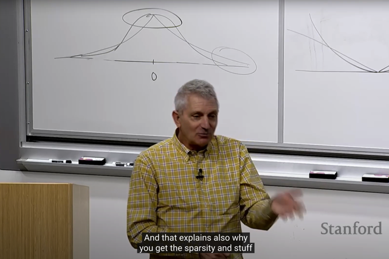</kbd></p>

> [!NOTE]
> đại khái là
>
> với `/` nếu dùng l2 norm penalty, thì kiểu như ta muốn nó phạt nặng với
> large  error `/` residual đồng nghĩa sensitive với large residual. Nhưng với
> small residual thì less sensitive `/` chill, bỏ qua, không khó tính
>
> còn nếu dùng l1 norm penalty thì với large residual thì ta cũng ko quá
> khắt khe, nhưng với small residual thì ta cũng không bỏ qua
>
> Thế thì ý gs là, việc chọn cách hành xử nào đối với residual ở trên
> (thông qua việc chọn penalty function gì) THẬT RA CŨNG TƯƠNG
> ĐƯƠNG VỚI VIỆC TA COI NOISE (BẢN CHẤT NOISE CHÍNH LÀ
> RESIDUAL) TUÂN THEO GAUSSIAN HAY LAPLACIAN
>
> Để rồi đại khái là nếu ta cho rằng noise ~ Laplacian tức là ta tin rằng
> NOISE CÓ GIÁ TRỊ LỚN SẼ CÓ THỂ XUẤT HIỆN NHIỀU (XÁC SUẤT
> KHÔNG NHỎ), THỂ HIỆN QUA CÁI ĐUÔI MẬP  CỦA LAPLACIAN
> DISTRIBUTION. Thế thì vì tin rằng trong bài toàn mà ta đang gặp có
> thể có noise lớn, nên ta sẽ chill `/` bớt khắt khe với noise lớn `/` residual
> lớn. Chính là tương ứng với việc dùng L1 norm penalty, để rồi khi tìm
> maximum likelihood estimator kết quả sẽ cho ra estimator cho phép xuất
> hiện các error `/` residual lớn (bởi vì ta bớt khắt khe, thể hiện qua việc
> penalty đối với mấy cái đó không quá lớn, nên kiểu như tụi nó được
> phép xảy ra)
>
> Ngược lại nếu ta tin noise ~ Gaussian, thì đồng nghĩa ta tin NOISE CÓ
> GIÁ TRỊ LỚN SẼ RẤT RẤT KHÓ XẢY RA - XÁC SUẤT RẤT THẤP  (CÁI
> ĐUÔI CỦA GAUSSIAN RẤT NHỎ) nên nếu có residual lớn thì ta không
> thể chấp nhận được `=>` dùng l2 norm  penalty. Để rồi kết quả ml
> estimator sẽ không cho phép error lớn xảy ra vì loss `/` penalty đối với
> chúng rất lớn
>
> Gs nói do đó L1 NORM APPROXIMATION chính là khi ta đang FITTING 
> VỚI GIẢ ĐỊNH NOISE ~ Laplacian
>
> Và ngoài ra hình dạng của cái đỉnh cũng phải ánh điều này. Với
> Gaussian gs nói khi ta zoom in thì sẽ thấy nó giống Uniform, mang ý
> nghĩa là với giá trị nhỏ thì xác suất chúng như nhau cả, cái này tương
> ứng với l2 norm penalty khi ta quan sát thấy khi residual nhỏ thì penalty
> không  đáng kể, thể hiện rằng nếu penalty nhỏ thì coi như nhau, ko quan
> tâm lắm
>
> Nhưng nếu là Laplacian thì cái đỉnh nhọn sẽ thể hiện ngược lại, đó là
> cho dù residual nhỏ thì vẫn quan tâm chứ ko phớt lờ

<br>

<p align="center"><kbd></kbd></p>

> [!NOTE]
> Đại khái là Huber fitting (dùng Huber penalty - cái mà khi error nhỏ thì nó
> act như quadratic, lớn hơn mức nào đó thì nó như linear)
>
> thì chính là ta làm bài toán Maximum Likelihood Estimation với noise
> (thay vì assume theo Gaussian - gọi là Gaussian noise, hay Laplacian
> noise) thì nay được assume theo một distribution dị: khúc giữa là
> Gaussian nhưng cái đuôi mập (fat tail) của exponential distribution.

<br>

<p align="center"><kbd>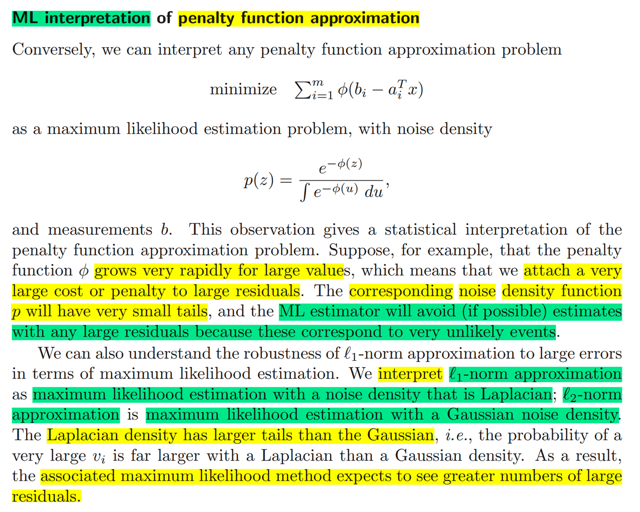</kbd></p>

> [!NOTE]
> Trong sách nói ý này cũng là gs cái đã nói trong bài. Rằng ta có thể
> giải thích (interpret) ý nghĩa của penalty functon theo bài toán
> maximum likelihood estimation.
>
> Mình nhớ lại, trong bài toán penalty function approximation ta minimize
> `Σ` Φ(bi - aiTx) (mà trước đó ta có tạm gọi là các phiên bản cụ thể là
> minimize ||Ax - b||^2 hoặc minimize ||Ax - b|| (l1 norm) có thể coi như là
> dùng Φ(r) `=` r^2 và Φ(r) `=` ||r||. Để rồi mỗi cái nó sẽ có cách hành xử
> khác nhau với residual.
>
> Thế thì như đã nói trong bài, khi dùng Φ(r) `=` r^2 thì chính là ta đang
> làm maximum likelihood với Gaussian noise. Cái này distribution này
> có tính chất là có cái đuôi ốm - tức là xác suất mà noise mang giá trị
> lớn là rất thấp. Cho nên ta không muốn `/` không cho phép kết qủa có
> error `/` residual lớn và vì vậy ta sẽ penalize mạnh với với các error này.
> Ngược lại, với noise có giá trị nhỏ thì `~=` 0 thì xác suất xảy ra nhiều và
> xem xem nhau (thể hiện qua cái đầu tròn của Gaussian mà khi zoom
> lên trong vùng quanh mean trông giống uniform) nên ta chấp nhận là
> `ml_estimator` sẽ khiến cho phép có nhiều error nhỏ và ta làm vậy bằng
> cách penalize rất nhẹ với error nhỏ này.
>
> Còn khi dùng Φ(r) `=` |r| thì chính là ta đang làm mle với Laplacian noise
> Cái Laplacian distribution có đỉnh nhọn và hai cái đuôi mập hơn nhiều
> so với Gaussian. Do đó, với Laplacian noise, ta cho rằng `/` assume
> noise có giá trị lớn có thể xảy ra, nên ml estimator sẽ cho phép xuất
> hiện noise lớn, và nó làm vậy bằng cách penalize không qúa mạnh với
> noise lớn (l1 norm penalty chỉ tăng tuyến tính với độ lớn của residual
> thay vì quadratic như l2 norm penalty)
>
> Ngược lại, khi noise nhỏ, Laplacian distribution với cái đỉnh nhọn nói
> rằng ở phạm vi nhỏ thì xác suất của noise càng nhỏ sẽ tăng tuyến tính
> chứ không xem xem như nhau như bên Gaussian. Dẫn đến ml
> estimator kiểu như sẽ vẫn quan tâm khi error nhỏ chứ không "bỏ qua
> khi error nhỏ " (ý là với l2 norm penalty, error mà nhỏ tới mức nào đó
> rồi thì nó coi như nhau hết, còn l1 norm thì error có nhỏ mấy thì penalty
> vẫn khác nhau)
>
> Vậy thì với dạng khái  quát minimize `Σi` Φ(bi - aiTx) thì chính là ta đang
> coi noise tuân theo pdf là e^-Φ(z) `/` `∫e^-Φ(u)du.` Để rồi ta quan sát thấy
> rằng khi z lớn mà Φ(z) tăng nhanh (tương ứng với việc ta tin rằng noise 
> lớn rất khó xảy ra, thì tương ứng chính là noise distribution rất nhỏ khi z
> lớn: Φ(z) lớn thì e^-Φ(z) sẽ nhỏ. Và ngược lại,

<br>

<p align="center"><kbd>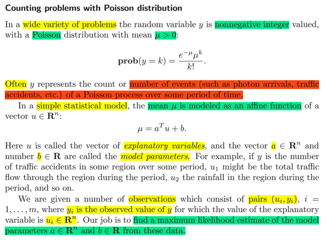</kbd></p>

<p align="center"><kbd>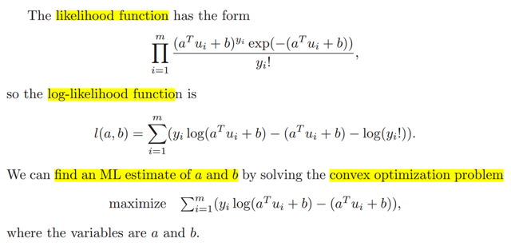</kbd></p>

> [!NOTE]
> Rồi, đại khái là đây chính là bài toán Poisson regression mà ta đã học trong ISL. Gs
> cho biết rất nhiều vấn đề mà ta cần một random variable có tính chất KHÔNG ÂM
> và là số NGUYÊN tuân theo Poisson distribution.
>
> Về poisson distribution, ta đã biết pmf của nó từ stat110 (Poisson là discrete
> distribution): X ~ Pois(λ): P(X `=` k) `=` e^-λ λ^k `/` k!
>
> ```text
> Thế thì ở đây gọi y là random variable ~ Pois(μ) => P(y = k) = e^-μ μ^k / k!
> ```
>
> Và dĩ nhiên parameter của distribution này là mean `μ` và gs cho biết trong  một mô
> hình statistical đơn giản thì ta sẽ mô hình nó bằng một hàm tuyến tính `μ` `=` aTu + b
> trong đo a, b là parameters (là thứ ta cần tìm) và u là EXPLANATORY VARIABLES
> vector (mà trong machine learning ta gọi là features)
>
> Ví dụ như ta muốn dự đoán y là số vụ tai nạn, với giả định y ~ `Pois(μ)` và `μ` `=` aTu +
> b là hàm tuyến tính của u là feature vector chứa thông tin ví dụ như u1 là tổng số
> traffic trong một khoảng thời gian, u2 là lượng mưa
>
> Thế thì ta sẽ có data `/` observation: là các cặp (ui, yi): ui là vector features, yi là
> observed traffic accident. Và nhiệm vụ là ta cần estimate `μ,` cũng chính là estimate
> a, b. Và với các tiếp cận maximum likelihood estimation, ta sẽ estimate a, b sao cho
> tối đa hóa likelihood function.
>
> Thế thì, ôn lại một chút về likelihood function. Bắt đầu từ (probability) density
> function của y (mà ở đây là pmf vì y discrete), thì nó là function mà với giá trị của `μ,`
> ```text
> giúp ta tính ra probability của một điểm k: P(y = k) = f_y(k) = e^-μ μ^k / k!
> ```
>
> Thế thì khi ta coi function này như function của `μ,` với y fixed đã biết, ta sẽ có
> ```text
> likelihood. l(μ) = P_μ(y = k)
> ```
>
> ```text
> = e^-μ μ^k / k! = e^- (aTu + b) (aTu + b)^k / k!
> ```
>
> Thế thì với các observed value ui, yi, ta nên hiểu là ta có n RANDOM VARIABLES
> Yi ~ `Pois(μi)` 
>
> (RANDOM SAMPLE CŨNG LÀ RANDOM VARIABLE, stat111 học rồi)
>
> Và ta có JOINT PMF: P(Y1 `=` y1, Y2 `=` y2,...,Yn `=` yn)
>
> Vì các rvs INDEPENDENT (sách ko nói nhưng thường là như vậy i.i.d), 
> từ Stat110 ta đã học một theorem nói rằng 
>
> "JOINT PMF `=` TÍCH CÁC MARGINAL PMF"
>
> ```text
> P(Y1 = y1, Y2 = y2,...,Yn = yn) = Π P(Yi = yi)
> ```
>
> ```text
> = Π e^-μi μi^yi / yi! = Π e^-(aTu + b) (aTu + b)^yi / yi!
> ```
>
>
> `=>` Likelihood function là khi ta đổi lại thay vì coi yi là biến thì chuyển sang 
> coi parameter `(μ` hoặc a, b) là biến:
>
> ```text
> P_a, b(Y1 = y1, Y2 = y2,...,Yn = yn) = Π e^-(aTu + b) (aTu + b)^yi / yi!
> ```
>
>
>
> Log likelihood function: 
>
> l(a, b) `=` log [Π e^-(aTu + b) (aTu + b)^yi `/` yi! ]  
>
> `=` `Σi` [ log (e^-(aTui + b)) + log [(aTui + b)^yi - log(yi!) ]
>
> `=` `Σ` [ -(aTui + b) + yi log [(aTui + b) - log(yi!) ]
>
> Và bài toán tìm maximum likelihood estimator a, b trở thành bài toán optimization:
>
> maximize a, b `Σ` [ -(aTui + b) + yi log [(aTui + b)]   | - log(yi!) ko phụ thuôc a, b

<br>

<p align="center"><kbd>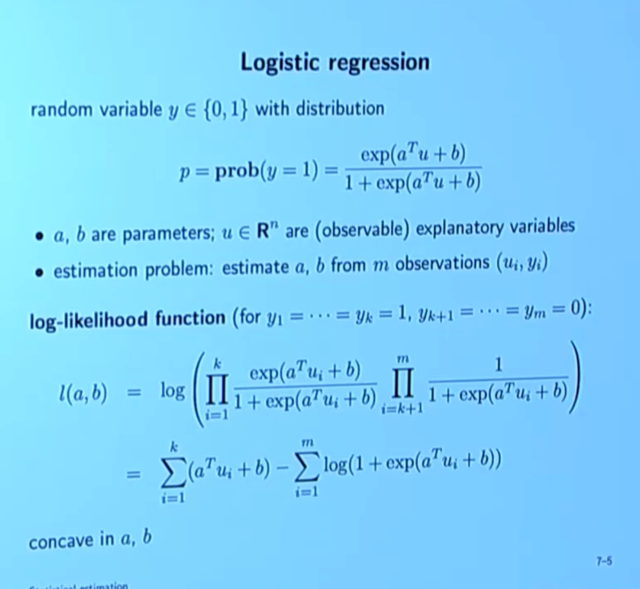</kbd></p>

> [!NOTE]
> Gs nói sơ sơ về Logistic Regression (thật ra là chả nói gì, xem
> slide `/` sách  tự hiểu)
>
> "1 là e^0, nên ta có log sum exp là concave function"

<br>

<p align="center"><kbd>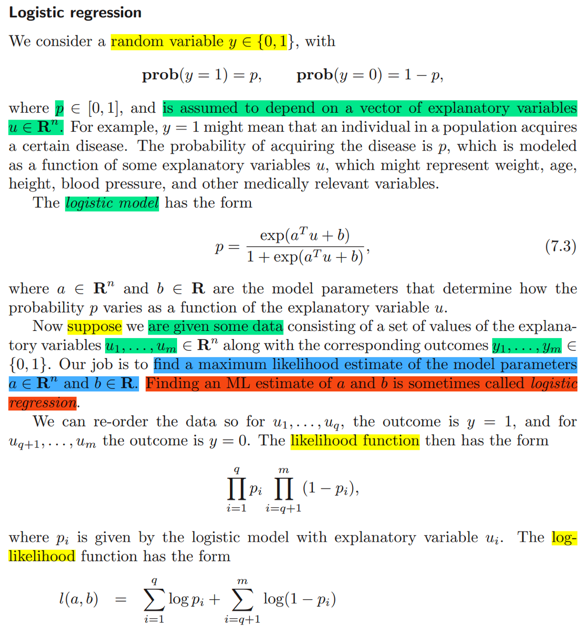</kbd></p>

<p align="center"><kbd>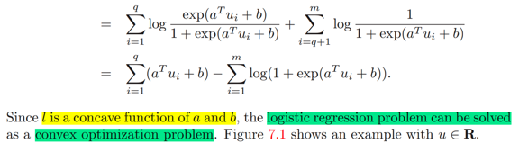</kbd></p>

> [!NOTE]
> Rồi, qua bài toán khác, khi thay vì ta muốn mô hình hóa một biến số y có tính chất là số nguyên
> không âm như bài toán kế trước (ví dụ muốn mô hình hóa số vụ tai nạn xảy ra) thì nay biến y mà
> ```text
> ta muốn mô hình lại chỉ có hai possible value là 1 hoặc 0, với xác suất P(Y = 1) = p, và P(Y = 0) =
> ```
> 1 - p. Do đó trong bài toán này, Y (hay y, viết thường nhưng ta hiểu là random variable) thay vì
> cho rằng nó ~ `Pois(μ)` thì nay ta cho rằng nó ~ Bern(p).
>
> Thế thì như bài toán trước, ta tìm cách mô hình hóa mean của distribution của y, tức `μ` bằng một
> mô hình tuyến tính bởi tham số a, b và feature (explanatory variable u): `μ` `=` aTu + b. Thì ở bài
> toán này, người ta mô hình hóa p thông qua:
>
> ```text
> p = exp(aTu + b) / [1 + exp(aTu + b)] trong đó hàm f(z) = exp(z) / [1 + exp(z)] có tên là logistic
> ```
> function.
>
> Cho nên việc mô hình p với công thức trên được gọi là LOGISTIC MODEL.
>
> Thế thì, again, ta cũng có dataset: các cặp ui - yi, với ui là explanatory variable `/` feature vector và
> yi là observed value.
>
> NHIỆM VỤ CỦA MÌNH SẼ LÀ ESTIMATE THAM SỐ a, b THEO CÁCH TIẾP CẬN LÀ TỐI ĐA
> HÓA LIKELIHOOD. Khi đó a, b có được gọi là maximum likelihood estimator.
>
> (nói thêm một chút, khi làm như vậy vốn dĩ ta đã đặt ra một vài giả định. Cái này phải ôn lại ISL
> mới được)
>
> Thử xem tại sao likelihood ra như vậy:
>
> Again, ta bắt đầu với `pdf/pmf,` ở đây là discrete distribution (Bern(p)) nên chỉ có pmf: P(Y `=` k) `=` p
> `=` exp(aTu + b) `/` [1 + exp(aTu + b)]
>
> Với random samples Yi independent Joint pmf:
>
> P(∩ Yi `=` yi) `=` Π P(Yi `=` yi)
>
> Thế thì giả sử trong n iid samples, có q observed value yi `=` 1 và  n - q observed value yj `=` 0.
>
> ```text
> ..= Πi=1:q P(Yi = 1) Πi=q+1:n P(Yi = 0)
> ```
>
> `=` `Πi=1:q` pi `Πj=q+1:n` (1-pj)
>
> ```text
> = Πi=1:q exp(aTui + b) / [1 + exp(aTui + b)] * Πi=q+1:n 1 / [1 + exp(aTui + b)]
> ```
>
> Dĩ nhiên coi a, b là biến thì công thức trên trở thành likelihood function
>
> Log likelihood:
>
> ```text
> l(a,b) = log [ Πi=1:q exp(aTui + b) / [1 + exp(aTui + b)] * Πi=q+1:n 1 / [1 + exp(aTui + b)] ]
> ```
>
> ```text
> = log [ Πi=1:q exp(aTui + b) / [1 + exp(aTui + b)] + log [ Πi=q+1:n 1 / [1 + exp(aTui + b)] ]
> ```
>
> ```text
> = Σi=1:q log [exp(aTui + b) / [1 + exp(aTui + b)] + Σi=q+1:n log [1 / [1 + exp(aTui + b)]]
> ```
>
> ```text
> = Σi=1:q log [exp(aTui + b)] - log [1 + exp(aTui + b)] + + Σi=q+1:n log [1] - log [1 + exp(aTui + b)]]
> ```
>
> ```text
> = Σi=1:q [ (aTui + b) - log [1 + exp(aTui + b)]] + Σi=q+1:n [- log [1 + exp(aTui + b)]]
> ```
>
> ```text
> = Σi=1:q [ (aTui + b) - log [1 + exp(aTui + b)]] + Σi=q+1:n [- log [1 + exp(aTui + b)]]
> ```
>
> ```text
> = Σi=1:q (aTui + b) +  Σi=1:q [- log [1 + exp(aTui + b)]] + Σi=q+1:n [- log [1 + exp(aTui + b)]]
> ```
>
> ```text
> = Σi=1:q (aTui + b) + Σi=1:n [- log [1 + exp(aTui + b)]]
> ```
>
> tới đây là giống trong sách rồi
>
> Và hàm này là concave theo a, b (vì sao?) nên bài toán mle này trở thành convex optimization
> problem
>
> `=====`
>
> ```text
> Nếu P(∩ Yi = yi) = Π P(Yi = yi) ta cứ để yi thì P(Yi = yi) có thể thể hiện = yi*pi + (1 - yi)*(1 - pi)
> ```
>
> thì log likelihood `=` log Πi `[yi*π` + (1 - yi)*(1 - pi)]
>
> `=` `Σ` log `[yi*π` + (1 - yi)*(1 - pi)]
>
> ```text
> Nếu thay pi bằng θi: = Σ log [yiθi + (1 - yi)(1 - θi)] thì ta sẽ thấy công thức này quen
> ```

<br>

<p align="center"><kbd>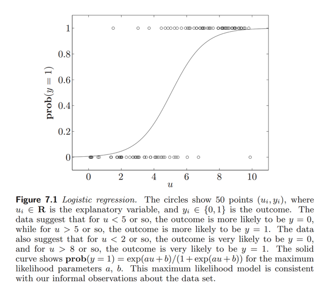</kbd></p>

<br>

<p align="center"><kbd>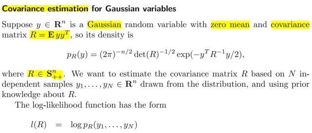</kbd></p>

<p align="center"><kbd></kbd></p>

<p align="center"><kbd>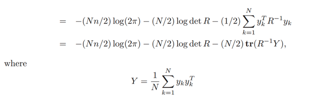</kbd></p>

<p align="center"><kbd>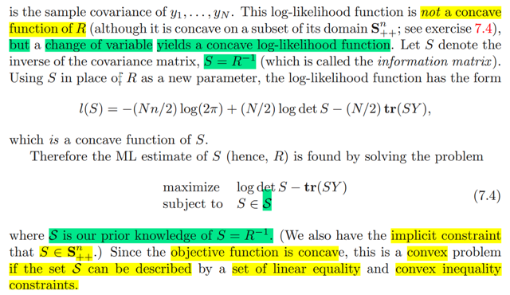</kbd></p>

> [!NOTE]
> Theo định nghĩa, covariance matrix của random variable vector x
> là matrix mà phần tử ij là covariance của `x_i` và `x_j` 
>
> Nếu gọi x `=` [X1, X2...Xn] thì phần tử ij là Cov(Xi, Xj), và theo công
> thức covariance của hai random variable đã học ở Stat110 Cov(Xi, Xj) 
> `=` E[(Xi - EXi)(Xj - EXj)]
>
> ```text
> Thế thì nếu x là zero mean, tức E(x) = [EX1, EX2,...] = 0 => EX1 = EX2 = ...= 0
> ```
> Khi đó phần tử ij của sẽ là E[(Xi - 0)(Xj - 0)] `=` E(XiXj)
>
> Do đó covariance matrix của vector X sẽ là E[xxT] là matrix mà phần từ
> ij là E(XiXj)
>
> Vậy nên ở đây, ta có y là R^n random variable vector zero mean, thì
> covariance matrix R `=` E(yyT) là có thể hiểu được.
>
> Rồi, lí do gì mà R ∈ S^n ++, hay positive definite? 
>
> Thử xét quadratic form: xTRx `=` xTE(yyT)x 
>
> `=` xTE(yyTx) | linearity stat110 đã học cho phép E(aX) `=` aEX
>
> `=` E(xTyyTx) | cũng linearity
>
> `=` E[(xTy)^2] | vì xTy là scalar `=` yTx
>
> Vậy (xTy)^2 `>=` 0 `=>` E[(xTy)^2] `>=` 0 Cái này nếu ai hỏi có thể trả lời như sau:
>
> Giả sử có rv X, và Y `=` X^2. Thì EX theo định nghĩa là weighted `Σ` các possible
> values của X: EX `=` `Σx` `x*P(X=x).` LOTUS cho phép tính EY không cần phải
> ```text
> tìm pmf/pdf của Y: EY = Eg(X) = Σx g(x)*P(X=x) = Σx x^2P(X=x). Thế thì đây là
> ```
> tổng mà mỗi hạng tử `x^2*P(X=x)` là tích của hai giá trị không âm: x^2 không âm
> và `P(X=x)` không âm theo Axiom 1. Nên đương nhiên EY không âm.
>
> Thế thì mới chỉ kết luận xTRx `>=` 0 `=>` R ≽ 0 (hay ∈ S^n+). Thì một điểm nữa
> giúp kết luận R ≻ 0 là R invertible (đây là yêu cầu xác định của pdf). Do đó 
> det R khác 0, hoặc tích các eigenvalue khác 0, vậy từ đó suy ra mọi eigenvalue
> đều dương (vì R ≽ 0 đã giúp kết luận eigenvalues ko âm)
>
> `====`
>
> Rồi, log likelihood?
>
> (MÌNH SẼ DÙNG Y CHỮ HOA ĐỂ THỂ HIỆN R.V cho khỏi nhầm với component
> của vector, vì các rvs Y1, Y2...YN (tức là N random sample) ĐỀU LÀ VECTOR
>
> Again, cứ theo định nghĩa, ta cần tìm joint probability density của N rvs Y1, Y2,...Yn
> Rồi coi nó như function của paramters (trong trường hợp này chính là R, vì với
> ```text
> multivariate Gaussian pdf , parameter là mean μ và covariance matrix Σ, nhưng μ = 0
> ```
> rồi)
>
> Rồi, again, vì các random variable Y1, Y2, ...YN independent nên joint pdf
>
> ```text
> f_Y1, Y2, ...YN(y) hay ghi p(y) cũng được = tích marginal pdf: f_Y1(y)*f_Y2(y)*...f_Yn(y)
> ```
>
> Các Y1, Y2, ...YN đều có chung distribution Gaussian (0, R) 
>
> ```text
> => pdf f_Yi(y) = (2π)^-n/2 det(R)^-0.5 exp(-yTRinvy/2)
> ```
>
> Vậy join pdf: 
>
> ```text
> f_Y1, Y2, ...YN(y) = p(y) = Πi=1:N f_Yi(y)
> ```
>
> ```text
> = Πi=1:n [ (2π)^-n/2 det(R)^-0.5 exp(-yTRinvy/2) ]
> ```
>
> Và coi nó như function theo R và y là fixed value (các observed value Y1 `=` y1 Y2 `=` y2...)
>  thì ta có likelihood:
>
> ```text
> p_R(y) = Πi=1:N [ (2π)^-n/2 det(R)^-0.5 exp(-yiTRinvyi/2) ]    |   y trở thành yi
> ```
>
> `=>` log likelihood:
>
> ```text
> l(R) = log Πi=1:N [ (2π)^-n/2 det(R)^-0.5 exp(-yiTRinvyi/2) ]
> ```
>
> ```text
> = Σi=1:N log [ (2π)^-n/2 det(R)^-0.5 exp(-yiTRinvyi/2) ]
> ```
>
> ```text
> = Σi=1:N [ log [ (2π)^-n/2 ] + log det(R)^-0.5 + log[ exp(-yiTRinvyi/2) ]
> ```
>
> ```text
> = Σi=1:N [ (-n/2) log (2π) + -0.5 log det(R) - yiTRinvyi/2 ]
> ```
>
> ```text
> = Σi=1:N [ (-n/2) log (2π) ] + Σi=1:N [-0.5 log det(R) ] + Σi=1:N [- yiTRinvyi/2 ]
> ```
>
> ```text
> = - (Nn/2) log (2π) - 0.5N log det(R) - (1/2) Σi=1:N [ yiTRinvyi ]
> ```
>
> ```text
> = - (Nn/2) log (2π) - 0.5N log det(R) - (N/2) tr(RinvY)
> ```
>
> ```text
> Với Y = (1/N) Σi=1:N yyT. CHỖ NÀY TA SẼ GIẢI THÍCH RÕ HƠN SAU
> ```
>
> Thế thì tiếp theo đại khái là gs nói log likelihood function này ko concave
> đối  với R (nên nếu ta giải bài toán optimization là maximize l(R) thì đây
> không phải là convex, ta cần nó concave thì maximize l(R) tương đương
> minimize
> - l(R) mới là convex objective)
>
> Nhưng điều hay ho là khi ta đặt S `=` Rinv, và CHUYỂN BÀI TOÁN THÀNH
> maximize over S, thì l(S) lại là concave function.
>
> Như vậy từ bài toán maximize l(R), ta giải equivalent problem:
>
> maximize l(S) constraint S ∈ S, với S nào đó thể hiện prior knowledge
> nào đó của S, xuất phát từ prior knowledge nào đó của ta đối với R
>
> Thành ra tuy objective l(S) đã concave (- l(S) convex) nhưng để problem
> trở thành convex optimization problem thì vẫn cần thỏa yêu cầu là, set S
> được thể hiện thành inequality constraint thì nó phải convex, và equality
> constraint phải affine, Nên tập S trong constraint S ∈ S ta chưa biết
> phải thể hiện ở dạng cụ thể ra sao, nhưng nếu có phải thỏa ý trên

<br>

<p align="center"><kbd>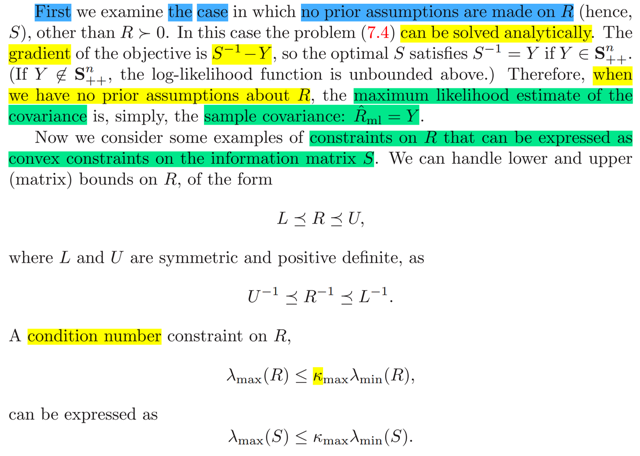</kbd></p>

<p align="center"><kbd>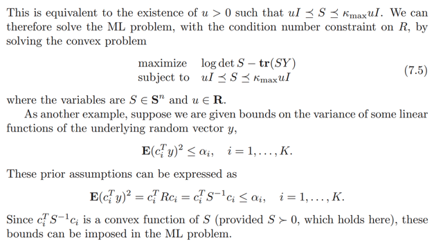</kbd></p>

> [!NOTE]
> đại khái là đầu tiên gs xét trường hợp mà ta ko có prior knowledge
> nào về R cả (ngoại trừ việc như đã nói R phải positive definite).
>
> Thì khi đó, có nghiã là ta ko có constraint nào với S (vì S `=` Rinv, thì
> nếu R có constraint gì đó để thể hiện prior knowledge đối với R thì khi
> đó mới hình thành nên constraint của S). Như vậy là bài toán này
> đơn giản chỉ việc tìm gradient của objective, và tìm điểm khiến
> gradient vanish thôi (objective như đã nói, là convex rồi)
>
> Kết quả cho thấy R chính là Y, mà Y `=` `1/N` `Σ` yyT gs nói nó là
> SAMPLE COVARIANCE. Thì kết quả này cho thấy nếu ko có prior
> knowledge gì về R (R là `Σ` - Covariance matrix) thì ESTIMATOR TỐT
> NHẤT CHO  (POPULATION) COVARIANCE MATRIX CHÍNH LÀ
> SAMPLE COVARIANCE
>
>
> Khúc sau là một ví dụ mà kiểu như ta có PRIOR KNOWLEGE đối với
> R, từ đó hình thành nên constraint của S. Cái này có liên quan đến
> CONDITION NUMBER, chưa học, nên Quay lại sau

<br>

<p align="center"><kbd>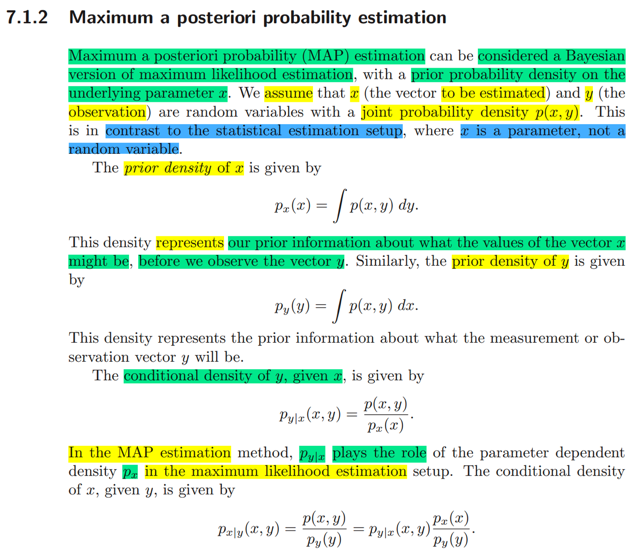</kbd></p>

<p align="center"><kbd>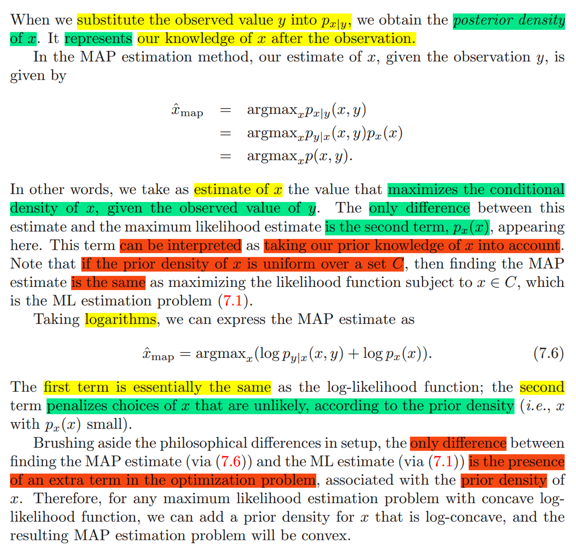</kbd></p>

> [!NOTE]
> Đầu tiên gs nói rằng MAP (maximum posteriori probability
> estimation) có thể được xem như một phiên bản của MLE mà làm
> theo phong cách, trường phái Bayesian
>
> Đầu tiên, đối chiếu với MLE, trong đó ta có observation y, và muốn
> estimate parameter x (ví dụ như muốn xây dựng mô hình  của y là
> một Poisson rv `Pois(μ)` với `μ` `=` aTu + b, dùng "dataset" (ui, yi), ta
> muốn estimate a, b sao cho maximize likelihood của observed data.
> Thì a, b ở đây đóng vai trò của x).
>
> Thế thì với MAP, nôm na là ta co a, b là random variable luôn tức x
> cũng là random variable luôn. Đây chính là cách tiếp cận của
> trường phái Bayesian: tích hợp tính không chắc chắn về x vào luôn
> thông qua việc coi nó là random variable luôn, từ đó ta có một
> probability distribution của nó: `p_x.`
>
> Thế thì, lập luận bắt đầu với việc xét joint density của x, y:
>
> `p_x,y(x,` y) (ko có gì, đây là joint pdf của x, y)
>
> Thì nhờ stat110 mình ko có gì khó hiểu khi gs viết
>
> `p_x` `=` `∫p(x,y)dy`
>
> Đơn giản đây là hành động marginalize  joint pdf over mọi possible
> value của y để có marginal pdf của x
>
> (sẵn ôn lại luôn cái này: Bằng cách liên hệ nó với LOTP: Xét
> discrete case. pmf của X: fX(x) hay `P(X=x)` cũng được và pmf của
> Y: fY(y) hay `P(Y=y).` Ta có joint pmf của X, Y: fX,Y(x,y) `=` `P(X=x,`
> `Y=y)`
>
> Thế thì ta sẽ xây dựng pmf của X từ joint pmf:
>
> Xét event `(X=x)` thì:
>
> ```text
> P(X=x) = P_X(X=x) = P({s ∈ S: X(s) = x})
> ```
>
> ```text
> = P({s ∈ S: X(s) = x} ∩ S)  | vì {s ∈ S: X(s) = x} ⊆ S, nếu A ⊆ S => A =
> ```
> A ∩ S
>
> `=` P({s ∈ S: X(s) `=` x} ∩ [U mọi p.v yi của Y {s ∈ S: Y(s) `=` yi}] )
>
> `=` `P(X=x` ∩ (Ui `Y=yi))`
>
> `=` P[Ui `(X=x` ∩ `Y=yi)]`  | distributive
>
> ```text
> = Σi P(X=x ∩ Y=yi)  | Axiom 3
> ```
>
> ```text
> = Σyi P(X=x, Y=yi)
> ```
>
> ```text
> mà phiên bản 'continuous': f_X(x) = ∫f_X,Y(x, y) dy )
> ```
>
> Tiếp, vậy `p_x` `=` `∫p(x,` y)dy
>
> Và tương tự, `p_y` `=` `∫p(x,` y)dx.
>
> ```text
> Thế thì một điểm tiếp theo đó là p_y|x(x, y) = p_x,y(x, y) / p_x(x)
> ```
>
> Cái này là sao, thì trong stat110 ta đã được biết về định nghĩa của conditional
> probability: P(A|B) `=` P(A,B) `/` P(B). Cũng như là Bayes rule:
>
> P(A,B) `=` P(B,A) `=` P(A|B)P(B) `=` P(B|A)P(A)
>
> Thì từ đó ta sẽ có conditional `pmf/pdf` cũng như Bayes rule:
>
> ```text
> P(Y=y | X=x) = P(Y=y, X=x) / P(X=x)
> ```
>
> ```text
> f_Y|X(y, x) = f_Y,X(x, y) / f_X(x)
> ```
>
> ```text
> Bayes rule: P(Y=y|X=x)P(X=x) = P(X=x|Y=y)P(Y=y)
> ```
>
> ```text
> f_Y|X(y, x)f_X(x) = f_X|Y(x, y)f_Y(y)
> ```
>
> Vậy thì ta có áp dụng Bayes rule, ta có:
>
> ```text
> p_y|x(x, y) p_x(x) = p_x|y(x, y) p_y(y)
> ```
>
> ```text
> => p_x|y(x, y) = p_y|x(x, y) p_x(x) / p_y(y)
> ```
>
> Từ đây `p_x|y(x,` y) chính là POSTERIOR probability density của x, là thứ mà từ
> PRIOR density `p_x(x),` sau khi sử dụng observed data (y) ta có thể cập nhật lại
> density của x với thông tin quan sát được
>
> Như vậy, với MLE, ta maximize likelihood của observed value y: `p_x(y)` Còn
> với MAP, ta maximize conditional density `p_x|y(x,` y)
>
> Do đó khác biệt của MAP so với MLE chính là với MAP, trong công thức (mà ta sẽ
> ```text
> maximize) p_x|y(x,y) = p_y|x(x, y) * p_x(x) / p_y(y) có thêm một term / một yếu tố
> ```
> là prior density của x: `p_x(x).`
>
> Điểm khác biệt này mang ý nghĩa: Vì với Bayesian approach, ta thể hiện tính
> không chắc chắc của x (parameters, thứ mà ta cần "tìm" `/` estimate) bằng cách:
>
> COI NÓ NHƯ RANDOM VARIABLES, từ đó có PROBABILITY DISTRIBUTION
> CHO NÓ.
>
> Cách tiếp cận này giúp ta có thể ĐƯA VÀO MỘT "KIẾN THỨC TIÊN NGHIỆM"
> (PRIOR KNOWLEDGE) - NÔM NA LÀ MỘT HIỂU BIẾT NHẤT ĐỊNH NÀO ĐÓ
> CỦA TA VỀ NÓ. THÔNG QUA CÁCH THỨC ĐÓ LÀ CHỌN PRIOR
> DISTRIBUTION `p_x(x).`
>
> Và với observed data (y) ta sẽ tìm x để MAXIMIZE POSTERIOR  DENSITY
> `(p_x|y).`
>
> Còn với MLE, ta sẽ CHỈ COI X LÀ PARAMETERS CẦN TÌM mà ta chưa
> biết để  rồi cần tìm x SAO CHO MAXIMIZE LIKELIHOOD OBSERVED DATA
> `p_x(y)`  (ghi `p_x(y)` ở đây khác với `/` không phải là density của x, mà là hàm
> likelihood (xuất xứ từ density của y nhưng coi biến là x thay vì y).
>
> Và với MLE ta có thể ĐƯA PRIOR KNOWLEDGE THÔNG QUA CONSTRAINT
> CỦA BÀI TOÁN  OPTIMIZATION: x ∈ C
>
> `====`
>
> Và ta cũng sẽ lấy log (chú ý ko gọi là log likelihood nữa, vì đây không phải là likelihood
> function):
>
> ```text
> log [p_y|x(x, y) p_x(x) / p_y(y)] = log p_y|x(x, y) + log p_x(x)  - log p_y(y)
> ```
>
> Và bài toán trở thành maximize x log `p_y|x(x,` y) + log `p_x(x)` |  bỏ đi term log `p_y(y)`
>
> So sánh với bài toán MLE: maximize log `p_x(y)` constraint c ∈ C.
>
> thì ta thấy khác biệt chỉ là MAP có thêm term `log_p_x(x)` như đã nói mang prior 
> knowledge của x. 
>
> Do đó, họ nói rằng, cứ mỗi khi ta có MLE, bằng cách thêm một extra term mang
> prior knowledge vào thì ta sẽ có bài toán MAP.

<br>

<p align="center"><kbd>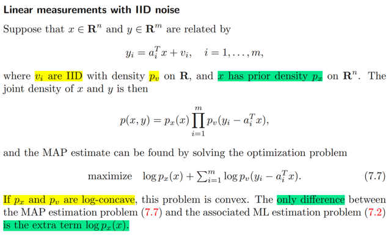</kbd></p>

<p align="center"><kbd>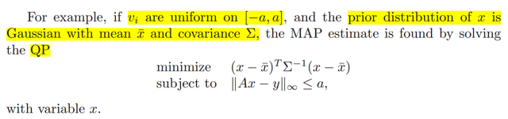</kbd></p>

<p align="center"><kbd>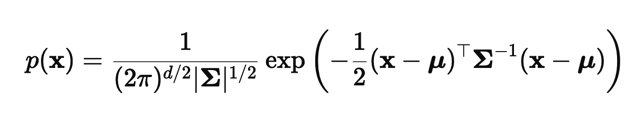</kbd></p>

<p align="center"><kbd>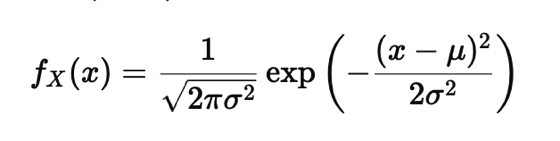</kbd></p>

> [!NOTE]
> Gặp lại bài toán này, nhưng ta làm theo MAP.
>
> Ôn lại nếu làm theo MLE thì ntn?
>
> Đầu tiên giả sử có R^n vector x, và R^m vector y liên hệ với nhau  một cách
> tuyến tính:
>
> y `=` Ax + v với v là noise: yi `=` aiTx + vi
>
> Yêu cầu đặt ra là estimate x dựa trên A đã biết và observed value y.
>
> Thể hiện theo machine learning giống như ta có dataset x(i),y(i) với x(i) là
> feature vector, y(i) là target. Và ta mô hình y bằng mô  hình tuyến tính:
>
> y(i) `=` x(i)Tw + vi `=>` y `=` Xw + v với X, y đã biết, w là parameter cần estimate.
>
> (Và thường thì ta có thể có thêm bias term b: Để yi `=` xiTw + b + vi)
>
> thì khi đó ta mới đặt ra penalize function Φ(r) `=` r^2. Để rồi giải bài toán
> minimize Φ(Xw - y) `=` ||Xw - y||^2 để tìm W.
>
> Thì ý nghĩa của nó như đã biết chính là ta đang assume noise vi là Gaussian
> noise: vi ~ N(0, `σ^2)` và vì assume như vậy nên ta  ko tin dễ dàng xuất hiện
> error `/` residual `/` noise mang giá trị lớn và nhiều `/` dễ xuất hiện error mang giá
> trị nhỏ. Điều này phản ánh qua việc ta dùng Φ(r) `=` r^2, để nếu error lớn, loss
> sẽ rất lớn Khiến quá trình optimizing, sẽ (tìm ra w) không cho phép `/` ít cho
> phép  tạo ra error mang lớn. Ngược lại, khi error nhỏ, thì loss sẽ không đáng
> kể, khiến kết quả estimated x sẽ cho phép xuất hiện error nhỏ.
>
> Nên ở đây trong sách nói ta estimate x, thì x ở đây là đóng vai trò của w, là
> parameter cần tìm. Còn A là matrix mà mỗi hàng là ai đóng vai trò của X.
>
> Thì mình đã học như cái mô tuýp quen thuộc rằng ta sẽ gắn giá trị của xi, yi
> vào, để tính error (y^i - yi)^2 `=` (xiTw - yi)^2,  và total loss: `Σ` (xiTw - yi)^2 Rồi
> ta sẽ tính gradient, và dùng thuật toán gradient descent để adjust w để giảm
> loss.
>
> Thế thì ở đây mình hiểu sâu hơn tại sao lại dùng Φ(r) `=` r^2 hay |r| đã nói ở
> trên. Thì đến thời điểm này còn hiểu thêm một điểm nữa đó là cái mà ta
> đang làm chính là ĐANG THỰC HIỆN MAXIMUM LIKELIHOOD
> ESTIMATION.
>
> TẠI SAO FITTING LINEAR REGRESSION VỜI MSE LOSS CHÍNH LÀ
> MAXIMUM LIKELIHOOD ESTIMATION
>
> Vì sao, cái mà ta đang minimize mean squared error (MSE): thật  ra chính là
> likelihood function:
>
> Như đã nói, ta đang dùng mô hình tuyến tính: yi `=` wTxi + vi, tức là đại khái là
> ta đang cho rằng quan hệ giữa feature vector xi với target yi là quan hệ
> tuyến tính bởi parameter w.
>
> Và vì cho rằng `/` assume noise vi là Gaussian noise với zero mean (variance
> chưa biết `σ^2)` nên ta mới chọn Φ(r) `=` r^2 để penalize nặng khi residual `/`
> noise lớn và không đáng kể khi residual `/` noise nhỏ.
>
> Vậy với giả định đó đồng nghĩa ta đang assume vi ~ N(0, `σ^2).` Hay với thêm
> việc giả định các noise vi là iid, thì v ~ multi-variate Gaussian với (vector) `μ` `=`
> 0 (zero vector) và covariance matrix `Σ` có dạng DIAGONAL (thể hiện các
> vi, vj independent nhau, nên cov(vi, vj) `=` 0 với i khác j.
>
> Và density (probability density - pdf) của vi `(f_vi(v))` là pdf của single variate
> Gaussian, hoặc density của v là pdf của multivariate Gaussian thì biết rồi
> `f_v(v)`
>
> Thế thì theo quy trình của việc giải bài toán maximum likelihood estimation
> ta sẽ thiết lập likelihood function:
>
> Bắt đầu từ density function (pdf của yi). Tất nhiên ta chưa biết distribution
> của yi. Nhưng ta có yi `=` wTxi + vi `=` g(vi). Nên theo transformation thoerem
> giúp ta tìm pdf của yi dựa trên pdf của vi.
>
> ```text
> Với single variate case ta có f_yi(y) = f_vi(v) d/dyi (vi) = f_vi(v) * 1 = f_vi(v)
> ```
>
> `f_yi(y)` `=` `f_vi(v)` nhưng phải thể hiện theo y:
>
> `=` `f_vi(yi` - xiTw) 
>
> ```text
> = [ (2π)^-1/2 σ^-1 exp( -(yi - xiTw)^2 / 2σ^2]
> ```
>
> Đièu này cho thấy yi ~ GAUSSIAN N(xiTw, `σ^2)`
>
> (đây là lí do mà trước đây ta thấy trong sách Deep Learning Yoshua Bengio
> hay Pattern Recognition, nói rằng trong bài toán Linear Regression ta đang
> assume y ~ Gaussian zero mean là như vậy)
>
> Joint density `f_y1,...ym(y1,y2,...ym)` `=` tích các pdf vì yi cũng independent
> do các vi independent
>
> ```text
> = Π [ (2π)^-1/2 σ^-1 exp( -(yi - xiTw)^2 / 2σ^2]
> ```
>
> Rồi, vậy đây là (joint) density của y1, y2...ym. Giờ ta coi variable là w thì ta
> có likelihood, và lấy log để có log likelihood l(w):
>
> ```text
> l(w) = log Π [ (2π)^-1/2 σ^-1 exp( -(yi - xiTw)^2 / 2σ^2]
> ```
>
> ```text
> = Σ log [ (2π)^-1/2 σ^-1 exp( -(yi - xiTw)^2 / 2σ^2]
> ```
>
> ```text
> = Σ log [ (2π)^-1/2 σ^-1] + log [ exp( -(yi - xiTw)^2 / 2σ^2]
> ```
>
> ```text
> = Σ log [ (2π)^-1/2 + log [σ^-1] + log [ exp( -(yi - xiTw)^2 / 2σ^2]
> ```
>
> ```text
> = Σ -1/2 log (2π) - log (σ) - (yi - xiTw)^2 / 2σ^2
> ```
>
> ```text
> = Σ -1/2 log (2π) - Σ log (σ) - 1 / 2σ^2 Σ (yi - xiTw)^2
> ```
>
> ```text
> = - m/2 log (2π) - mlog (σ) - 1/2σ^2 Σ (yi - xiTw)^2
> ```
>
> Và bài toán maximize likelihood sẽ là:
>
> maximize - `Σ` (yi - xiTw)^2 
>
> Tương đương với minimize `Σ` (yi - xiTw)^2 
>
> Mà `Σ` (yi - xiTw)^2  chính là gì? Chính là MSE mean squared error.
>
> Như vậy có thể thấy fitting linear regression với mse loss function
> chính là maximum likelihood estimation
>
> Vậy vừa rồi là có một số mục đích như sau:
>
> 1) Bài toán Linear measurement ở đây thật ra rất gần `/` chính là linear  regression
>
> yi `=` aiTx + vi: estimate x     tương đương     yi `=` xiTw + vi: estimate w
>
> 2) Giải bài toán này dùng cách tiếp cận maximize likelihood, và cho thấy nó chính là fitting linear
> regression với mse loss
>
> Bây giờ, mình sẽ nói tiếp, rằng ờ đây ta tiếp cận nó theo MAP: Maximize A Posterior probability.
>
> Và ta sẽ vẫn dùng notation yi `=` xiTw + vi, cho đồng nhất với phần note vừa rồi (tức là dùng w thay
> cho x trong sách và xi thay cho ai)
>
> Rồi, lập luận sẽ là với MAP, ta ko coi w là FIXED & UNKNOW PARAMETERS mà ta sẽ coi nó NHƯ
> RANDOM VARIABLE (như yi, và vi luôn. Nói thêm sở dĩ hồi nãy yi là random variable vì nó là
> function của random variable vi)
>
> Thế thì ta sẽ dựa vào Bayes theorem để hình thành công thức của posterior density của w:
>
> ```text
> p_w|y(y, w) = p_y|w(y, w) p_w(w) / p_y(y)
> ```
>
> `p_w(w)` (trong sách là `p_x(x))` là prior density của w. Đã cho.
>
> `p_y(y)` thì khỏi cần quan tâm vì nó không dính đến w. Nên khi maximizing theo  w thì không care cái
> này.
>
> `p_y|w(y,` w) thì ta dựa vào yi `=` xiTw + vi với vi ~ `p_vi(v)`
>
> Vậy thì tuy yi là function phụ thuộc random variable w và vi nhưng khi biết w, (conditioned on w) thì
> chỉ còn phụ thuộc vi. Và dùng transformation thoerem ta đã biết `p_yi|w(y)` `=` `p_vi(v)`
>
> ```text
> Thể hiện theo y, = p_vi(yi - xiTw) = p_v(yi - xiTw) (mọi vi đều có chung density p_v)
> ```
>
> Vậy `p_yi|w(y)` `=` `p_v(yi` - xiTw)
>
> ```text
> Nên joint conditional density p_y1,y2,....ym|w(y1, y2,...ym) = Πi=1:m p_v(yi - xiTw) (các rvs yi cũng
> ```
> independent khi x fixed và vi là iid `=>` joint pdf  `=` tích marginal pdf)
>
> Và ráp vào ta có :
>
> ```text
> p_w|y(y, w) = p_w(w) Πi=1:m p_v(yi - xiTw) / p_y(y)
> ```
>
> Và bài toán sẽ là maximize w `p_w|y(y,` w)
>
> ```text
> = maximize w p_w(w) Πi=1:m p_v(yi - xiTw)   | p_y(y) không dính đến w nên ko care
> ```
>
> Và ta cũng lấy log:
>
> maximize w log [ `p_w(w)` `Πi=1:m` `p_v(yi` - xiTw) ]
>
> ```text
> = log [ p_w(w) ] + log [ Πi=1:m p_v(yi - xiTw) ]
> ```
>
> ```text
> = log [ p_w(w) ] + Σi=1:m log [ p_v(yi - xiTw) ]
> ```
>
> `====`
>
> Rồi cuối cùng là, bài toàn optimization này, sẽ là convex optimization nếu objective là hàm convex,
> ```text
> tức log [ p_w(w) ] + Σi=1:m log [ p_v(yi - xiTw) ] là concave, và như vậy p_w(.) và p_v(.) phải là hàm
> ```
> log-concave (hàm f mà log concave thì log f sẽ là hàm concave, thì - log f sẽ là convex )
>
> Rồi ví dụ như v ~ Unif(-a, a) thì khi đó pdf của v, nhờ stat110 ta đã học: nếu X~Unif(a,b) thì pdf
> ```text
> của X: f_X(x) = constant = 1/(b-a). Vậy p_v(v) = 1/(a + a) = 1/2a
> ```
>
> Và ví dụ priori distribution của w là Gaussian (w^, `Σ)` tức w ~ N(w^, `Σ)` (w^ ý là `w_bar,` mean)
>
> ```text
> Thì khi đó p_w(w) = (2π)^-n/2 |Σ|^-0.5 exp[-0.5(w - w^)TΣinv(w - w^)]
> ```
>
> Lắp vô để có objective function của bài toán optimization:
>
> ```text
> log [ (2π)^-n/2 |Σ|^-0.5 exp[-0.5(w - w^)TΣinv(w - w^)] ] + Σi=1:m log [ 1/2a ]
> ```
>
> ```text
> = log [ (2π)^-n/2 ] +mlog [ |Σ|^-0.5] + log exp[-0.5(w - w^)TΣinv(w - w^)] ] + Σi=1:m log [ 1/2a ]
> ```
>
> ```text
> = (-n/2) log (2π) + 0.5 log |Σ| - 0.5(w - w^)TΣinv(w - w^)] ] + Σi=1:m log [ 1/2a ]
> ```
>
> Again bỏ đi các term ko dính đến w:
>
> Để rồi objective là maximize - 0.5(w - `w^)TΣinv(w` - w^)]
>
> cũng là minimize f(w) `=` (w - `w^)TΣinv(w` - w^)
>
> Tóm lại bài toán trở thành (equivalent):
>
> minimize (w - `w^)TΣinv(w` - w^) 
>
> ```text
> Tuy nhiên, vì vi ~ Unif(-a, a) nên v ∈ [-a, a] => -a<= vi <= a <=> -a <= xiTw - yi <= a
> ```
>
> ```text
> <=> |xiTw - yi| <= a <=> ||Xw - y||inf <= a (infinity norm của vector là component có giá trị lớn nhất
> ```
> vector đó)
>
> Thành ra ta sẽ constraint: ||Xw - y||inf `<=` a

<br>

<p align="center"><kbd>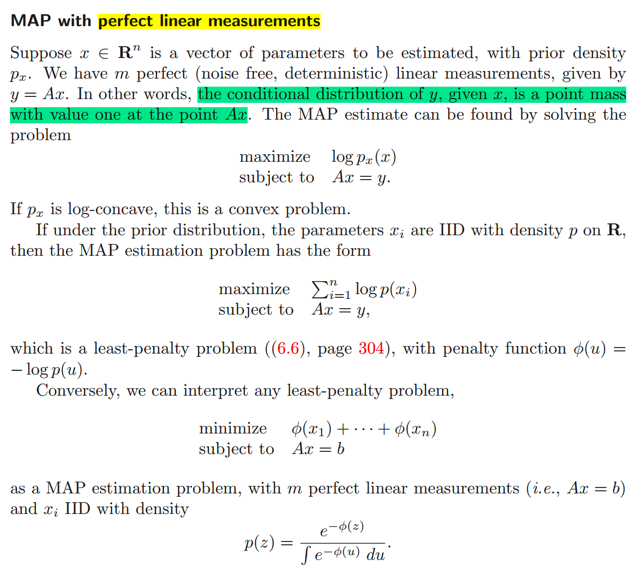</kbd></p>

> [!NOTE]
> QUAY LẠI SAU

<br>

<p align="center"><kbd>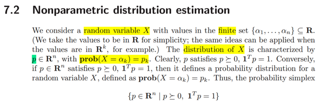</kbd></p>

<p align="center"><kbd>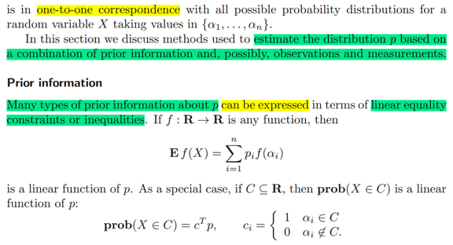</kbd></p>

<p align="center"><kbd>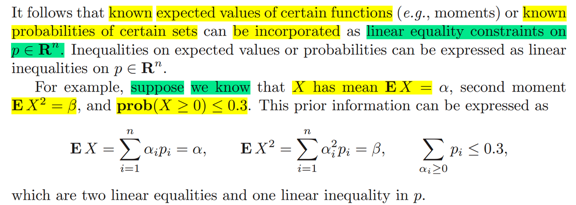</kbd></p>

> [!NOTE]
> Rồi, cái này đại khái là vầy: Ta xét random variable X có hữu hạn
> các possible values `α1,` `α2,` `...αn.` Và nói cho nhanh là ta có pmf
> ```text
> của nó, tức pi = P(X = αi). Làm thành vector p = [p1, p2, ...pn]
> ```
>
> Dĩ nhiên pi không âm (axiom 1) và tổng pi `Σpi` `=` 1 (là do đâu? câu
> ```text
> trả lời là vì axiom 2: P(S) = 1 => P(Ui X = αi) = 1, theo axiom 3
> ```
> ```text
> vế trái là xác suất của union các disjoint event => Σi P(X = αi) = 1
> ```
>
> Và thể hiện hai ý này là p ≻ 0 (Ôn lại: Cái này chính là cách viết
> rút gọn hợp lệ của p ≻R^n+ 0, tức là p ≻K 0, generalized inequality
> wrt cone K, với K `=` non-negative orthant R^n+, vì quá phổ biến
> nên có thể ghi ≻R^n+ là ≻. Mà theo định nghĩa u ≻K v sẽ đồng nghĩa
> u - v ∈ int K, vậy p ≻R^n+ 0 `=>` p - 0 `=` p ∈ int R^n+, và điều này 
> đồng nghĩa mọi component của vector p đều dương: pj > 0 với mọi j
>
> ```text
> Và ý thứ 2 pT1 = 1 đơn giản là Σ pj*1 = Σ pj = 1 (1 là vector [1, 1,...1]
> ```
>
> `====`
>
> Rồi nói qua PRIOR INFORMATION, đại ý của mục này ý nói ta có
> thể thể hiện prior information DƯỚI DẠNG `EQUALITY/`
> INEQUALITY CONSTRAINTS
>
> Cụ thể giả dụ như ta biết mean của rv X hoặc mean của g(X): Eg(X)
> thế thì trong đây nói về cái ta đã học từ Stat110: LOTUS: Ôn lại không
> thừa: Theo định nghĩa expected value là weighted `Σ` mọi possible values
> ```text
> x của X, với weight là xác suất P(X=x): EX = Σ x*P(X=x). P(X=x) là
> ```
> pmf của X.
>
> Thì nếu ta có rv Y tạo thành bởi applying function g(.) lên rv X, thì 
> LOTUS cho phép ta không cần tìm pmf của Y mà có thể tính EY thông
> qua pmf của X: Eg(X) `=` `Σ` `g(x)P(X=x)`
>
> ```text
> Nên ở đây (với X có các possible values αi, với P(X = αi) = pi. Thì
> ```
> Ef(X) `=` `Σ` `f(αi)pi`
>
> Thế thì nếu ta có prior information liên quan đến Ef(X), ví dụ như biết EX
> ```text
> = α, (đây coi như Ef(x) với f(u) = u) và EX^2 = β (stat1110 đã biết, cái này
> ```
> chính là second moment), tức là Eh(X) với h(u) `=` u^2 thì ta có thể thể
> hiện hai cái thông tin này dưới dạng EQUALITY CONSTRAINTS CỦA p:
>
> ```text
> EX = α <=> Σ αipi = α,  EX^2 = β <=> Σ αi^2 pi = β
> ```
>
> Rồi, nếu như bên cạnh đó ta có thông tin kiểu như P(X `>=` 0) `<=` 0.3, tức
> là xác suất của việc X thuộc set A (ở đây A là set R+) thì ta cũng có thể
> thể hiện nó ở dạng constraint đối với p.
>
> Bởi vì P(X ∈ C) `=` cTp với c là vector mà component của nó mang giá
> trị 1 nếu `αi` ∈ C, và 0 nếu ngược lại. Lí giải cho việc này:
>
> ```text
> X ∈ C = Ui (X = αi) | αi ∈ C
> ```
>
> ```text
> = P(X ∈ C) = P(Ui (X = αi) | αi ∈ C )
> ```
>
> và event ở vế phải là union của  các disjoint event nên theo Axiom 3:
>
> ```text
> ..= Σαi ∈ C P(X = αi) = Σ αi ∈ C pi
> ```
>
> Vậy thì ở đây nếu ta có prior: P(X `>=` 0) `<=` 0.3
>
> ta sẽ thể hiẹn nó dưới dạng của constraint của p:
>
> ```text
> Σ αi >= 0 pi <= 0.3
> ```

<br>

<p align="center"><kbd>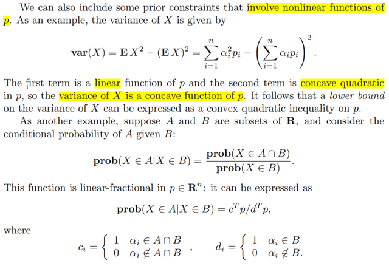</kbd></p>

<p align="center"><kbd>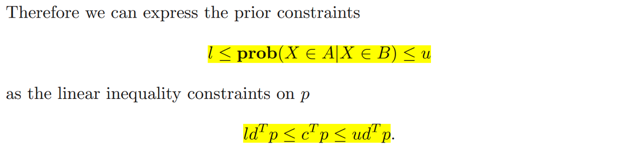</kbd></p>

> [!NOTE]
> một vài ví dụ khác, giả sử ta có prior info liên quan đến variance của X 
> thì từ công thức đã biết Var(X) `=` EX^2 - (EX)^2 thì ta có thể thể hiện
> nó thành quadratic function của p 
>
> Hoặc nếu prior infor liên quan tới conditional probability P(X ∈ A | X ∈ B), 
> thì nhờ dùng P(X ∈ A | X ∈ B) `=` P(X ∈ A, X ∈ B) `/` P(X ∈ B) 
> `=` P(X ∈ A ∩ B) `/` P(X ∈ A)
>
> `=` cTp `/` dTp với c, d là các vector quy định việc `αi` thuộc C, D hay không.
>
> Kết quả là giả sử ta có prior: `l<=` P(X ∈ A | X ∈ B) `<=` u ta sẽ thể hiện
> nó thành inequality constraint on p:
>
> ```text
> l<= cTp / dTp <= u <=> ldTp <= cTp & cTp <= udTp
> ```

<br>

<p align="center"><kbd>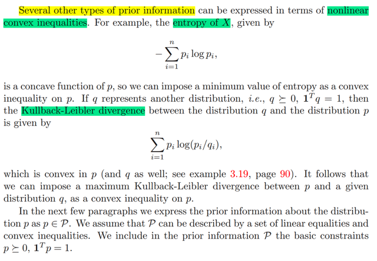</kbd></p>

> [!NOTE]
> đại ý là một số dạng prior info khác như entropy, Kullback-Leibler 
> divergence của hai distribution p, q. Đều có thể được thể hiện thành
> dạng CONVEX INEQUALITIES của p

<br>

<p align="center"><kbd>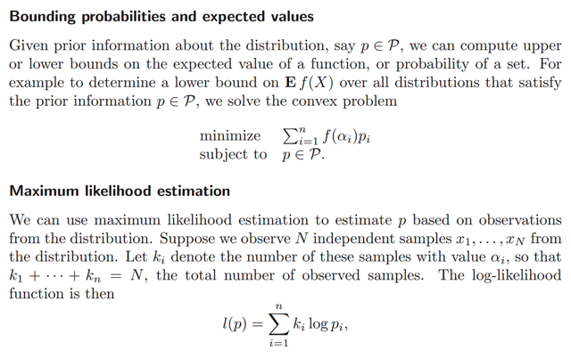</kbd></p>

<p align="center"><kbd>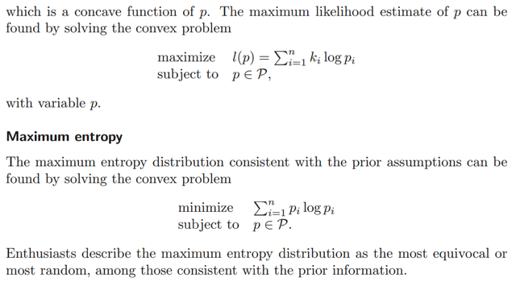</kbd></p>

> [!NOTE]
> QUAY LẠI SAU

<br>

<p align="center"><kbd>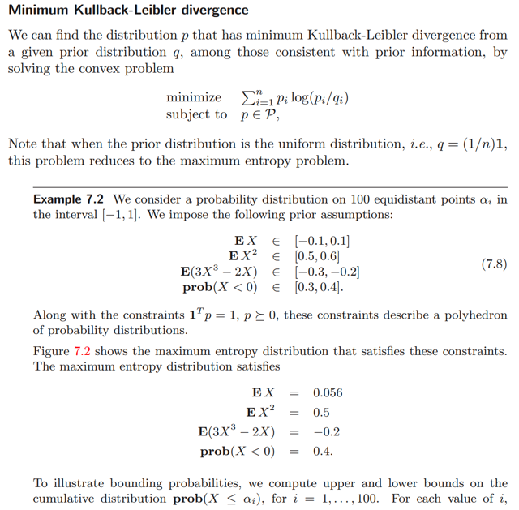</kbd></p>

<p align="center"><kbd>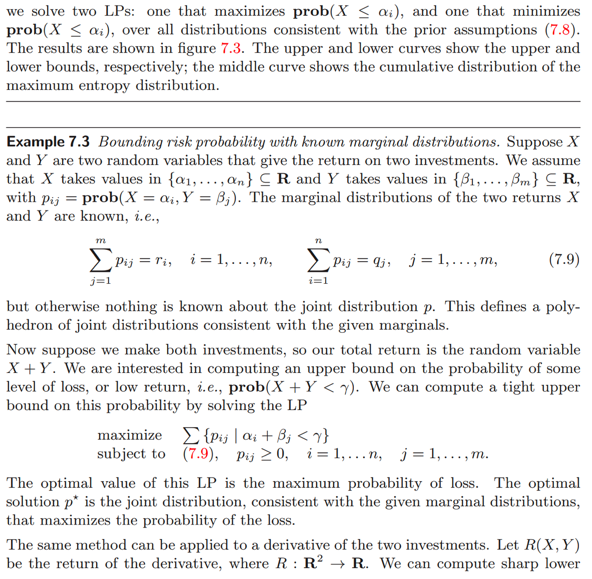</kbd></p>

> [!NOTE]
> QUAY LẠI SAU

<br>

<p align="center"><kbd>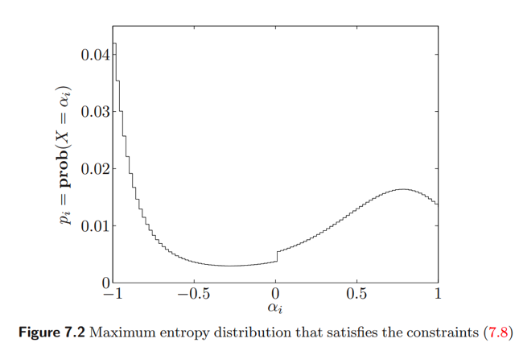</kbd></p>

<p align="center"><kbd>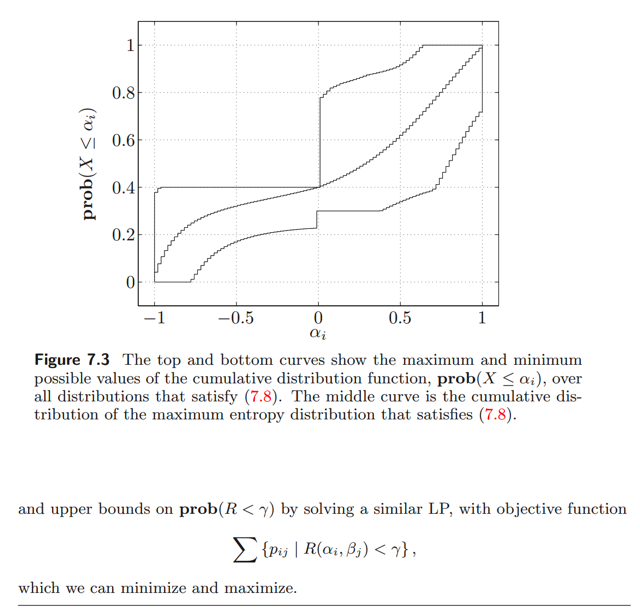</kbd></p>

> [!NOTE]
> QUAY LẠI SAU

<br>


<a id="node-xq3u1oc"></a>
## Chap 11:1,2,3,4,5

<br>

<p align="center"><kbd>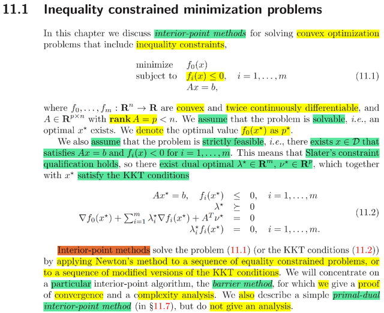</kbd></p>

> [!NOTE]
> đại khái chương cuối ta sẽ nói về bài toán convex inequality constraint
> optimization problem. Và học về method gọi là interior-point methods giúp có
> thể giải problem này.
>
> Đầu tiên, còn nhớ để bài toán là convex problem, thì objective f0(x) các
> inequality constraint function fi(x) i `=` 1,2... cũng convex. Và equality affine hi(x)
> `=` 0 i `=` 1,2... thể hiện dạng Ax `=` b.
>
> Thế thì ở đây ta có các assumption, một là bài toán solvable, dĩ nhiên có
> nghĩa là tồn tại optimal x* và optimal value f(x*).
>
> Assumption thứ hai là bài toán strictly feasible, đây chính là Slater's condition:
> rằng tồn tại những điểm nằm trong interior của feasible set thể hiện theo toán
> học là: tồn tại x: hi(x) `=` 0, fi(x) < 0. Và ta còn nhớ, Slater's condition là cái
> thuộc dạng qualification constraint, mà khi thỏa thì ta sẽ có Strong duality: Tồn
> tại dual optimal λ*, v* sao cho d* `=` g(λ*, v*) `=` p* `=` f(x*).
>
> Rồi, và từ đó ta có những conditions của KKT condition:
>
> λ*  ≽ 0, cái này gọi là dual feasible
>
> Ax* `=` b, fi(x*) ≤ 0. cái này gọi là primal feasible
>
> ∇f0(x*) + `Σ` λi ∇fi(x) + `Σ` vi ∇hi(x) `=` 0, cái này là việc gradient của Lagrangian
> tại optimal x*, λ*, v* vanish.
>
> λ*i fi(x*) `=` 0, i `=` 1,2...Cái này gọi là complementary slackness
>
> `====`
>
> Có thể ôn một chút về lập luận đứng đằng sau các KKT conditions trên:
>
> ..Thì đại khái là ta sẽ xem xét một phương pháp thuộc loại này gọi là BARRIER
> METHOD và PRIMAL DUAL INTERIOR - POINT METHOD
>
> Có thể ôn một chút về lập luận đứng đằng sau các KKT conditions trên:
>
> Đại khái là, ta có Lagrangian là function mà ta gom objective và  các constraint
> vào làm một: L(x, λ, v) `=` f0(x) + `Σ` λi fi(x) + `Σ` vi hi(x)
>
> Sau đó, Dual function là khi ta minimize over mọi x, của L: g(λ, v) `=` inf x L(x, λ,
> v). Từ đó ta có g(λ, v) ≤ L(x, λ, v) ∀ x, trong đó có x*:
>
> g(λ, v) ≤ L(x*, λ, v) `=` f0(x*) + `Σ` λi fi(x*) + `Σ` vi hi(x*)
>
> mà x* phải feasible, nên fi(x*) ≤  0, hi(x*) `=` 0, và cùng với điều kiện dual
> feasible λ*i ≥ 0 nên ta suy ra g(λ, v) ≤ f0(x*) + `Σ` λi fi(x*) ≤ f0(x*)
>
> Và đây, g(λ, v) ≤ p* `=` f0(x*) ⇨ cho ta thấy dual function sẽ đóng vai trò là
> lower bound của primal optimal p*.
>
> Và dĩ nhiên khi giải dual problem: maximize g(λ, v) để có λ*, v* thì d* `=` g(λ*,
> v*) tức dual optimal value cũng sẽ ≤ p*. Đây chính là Weak duality.
>
> Thế thì, như đã nói nếu có thêm những conditions gọi là qualification
> conditions như Slater's condition, thì ta sẽ có strong duality: d* `=` p*,  khi đó,
> chuỗi bất đẳng thức sau đây:
>
> g(λ, v) ≤ g(λ*, v*) `=` d* ≤ f0(x*) + `Σ` λ*i fi(x) + `Σ` v*i hi(x)
>
> `=` f0(x*) + `Σ` λ*i fi(x*)  ≤ f0(x*)
>
> Sẽ trở thành dấu bằng:
>
> g(λ, v) ≤ g(λ*, v*) vì λ*, v* là solution của dual problem
>
> g(λ*, v*) ≤ f0(x) + `Σ` λ*i fi(x) + `Σ` v*i hi(x) vì g(λ, v) ≤ L(x, λ, v) ∀ λ, v do
>
> g(λ, v) ≤ inf x L(x, λ, v), và cũng vì vậy mà nó cũng đúng với mọi x:
>
> ⇨ g(λ*, v*) ≤ f0(x*) + `Σ` λ*i fi(x) + `Σ` v*i hi(x*)
>
> Và vế trái như đã nói vì x* trước khi "làm" primal optimal thì nó phải feasible
> đã ⇨ `Σ` λ*i fi(x) ≥ 0, hi(x*) `=` 0
>
> ⇨ g(λ*, v*) ≤ f0(x*) Và dấu bằng d* `=` p* xảy ra giúp ta có:
>
> g(λ, v) ≤ g(λ*, v*) `=` d* ≤ f0(x*) + `Σ` λ*i fi(x) + `Σ` v*i hi(x)
>
> `=` f0(x*) + `Σ` λ*i fi(x*)  `=` f0(x*)
>
> Và hai hệ quả quan trọng rút ra là:
>
> ```text
> 1) f0(x*) + Σ λ*i fi(x*)  = f0(x*) ⇨ Σ λ*i fi(x*) = 0 ⇨ đây là complementary
> ```
> slackness, nói nôm na rằng, khi λ*i > 0 thì hi(x*) phải `=` 0 và ngược lại.
>
> ```text
> 2) f0(x*) = g(λ*, v*) mà g(λ*, v*) = inf x f0(x) + Σi λ*i fi(x*) + Σi v*i hi(x*)  ⇨
> ```
> f0(x*) `=` inf x f0(x) + `Σi` λ*i fi(x*) + `Σi` v*i hi(x*), hay L(x, λ*, v*)
>
> Như vậy cho thấy x* cũng là minimizer `/` minimum của L(x, λ*, v*) ⇨  gradient
> của L(x, λ*, v*) wrt x tại x*, phải vanish: từ đó ta có ∇L(x*, λ*, v*) `=` 0
>
> Và đây là hai KKT conditions thứ 3, 4 . Hai cái đầu là primal feasible Ax* `=` b,
> fi(x*) ≤ 0 và dual feasible λ* ≽ 0

<br>

<p align="center"><kbd>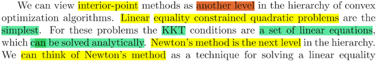</kbd></p>

<p align="center"><kbd>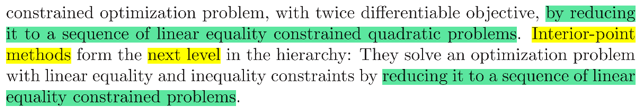</kbd></p>

> [!NOTE]
> Đại khái gs nói rằng ta có thể coi interior point method là một cấp độ cao
> hơn của các thuật toán giải convex optimization problem
>
> Cấp độ thấp nhất là khi ta chỉ có equality constraint QUADRATIC problem
> (tức là f0 quadratic), khi đó việc giải KKT conditions về cơ bản chỉ là giải hệ
> các phương trình tuyến tính, do đó có thể có analytically solution. Điều này
> có thể hiểu được, vì khi đó KKT condition chỉ là ∇L(x*, v*) `=` 0, Ax* `=` b và vì
> f0 quadratic nên ∇L(x*, v*) `=` 0 ⇔ ∇f0(x*) + ATv `=` 0 cũng sẽ là tuyến tính vì
> ∇f0(x) sẽ tuyến tính. Thành ra cơ bản là ta có hệ tuyến tính. Và có thể giải
> ngay ra (analytic solution) optimal x*
>
> Rồi, ở cấp độ cao hơn là khi ta có bài toán equality constraint (không chắc
> quadratic). Khi đó dĩ nhiên ∇f0(x*) không còn linear nữa. Nên hệ ∇f0(x*) +
> ATv* `=` 0, Ax* `=` b không phải hệ tuyến tính.
>
> Tuy nhiên, Newton's method, như còn nhớ, sẽ dựa trên việc xấp xỉ f0(x)
> bởi quadratic approximation của nó tại điểm đang đứng ví dụ x(k), để từ đó
> giải ra newton's  step giúp đưa x(k) đến x(k+1). Rồi lại lặp lại, xấp xỉ f0(x)
> bởi quadratic approx. của f0 tại k+1, và lặp lại. Nên mỗi lần như vậy là ta
> đang giải một bài toán equality constraint QUADRATIC optimization
> problem. Mà việc giải ra Newton's step như chương trước đã thấy, chính là
> ta dùng analytic solution (ví dụ như `Δx_nt` `=` - ∇^2f(x)_inv ∇f(x))
>
> Để đưa từ initial point x(0) dần dần về x*
>
> Vậy thì nay, ở cấp độ cao hơn nữa, là khi ta đối mặt với INEQUALITY
> constraint optimization problem. Và nó sẽ đại khái là reduce bài toán về
> MỘT CHUỖI CÁC BÀI TOÁN LINEAR EQUALITY CONSTRAINED
> PROBLEM
>
> Tóm tắt:
>
> Cấp 1: Linear constraint quadratic problem ⇨ solve analytically
>
> Cấp 2: Linear equality constraint (non-quadratic) problem ⇨ Newton's
> method reduce nó thành chuỗi các bài toán cấp 1
>
> Cấp 3: Inequality constraint problem ⇨ Interior-point method reduce nó
> thành chuỗi các bài toán cấp 2

<br>

<p align="center"><kbd>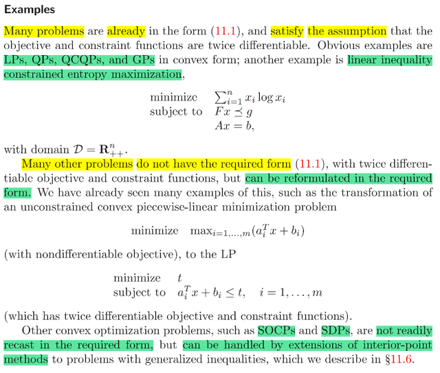</kbd></p>

> [!NOTE]
> đại khái là nhiều bài toán như LPs. QPs, QCQPs, GPs đã có dạng
> phù hợp với method này. Một số khác thì có thể reformulated để
> thành dạng phù hợp. Và số ít nữa thì có thể dùng phiên bản mở
> rộng của pp interior-point method để giải.

<br>

<p align="center"><kbd>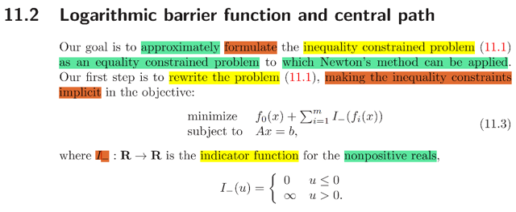</kbd></p>

<p align="center"><kbd>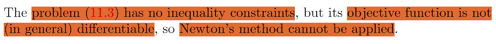</kbd></p>

> [!NOTE]
> 11. INTERIOR-POINT METHOD
>
> 11.2 LOGARITHMIC BARRER FUNCTION 
> & CENTRAL PATH
>
> đại khái là nói về mục tiêu của ta trước, đó là ta muốn "chuyển"
> inequality constraint THÀNH DẠNG ẨN (IMPLICIT) nằm bên
> trong objective. Để từ đó ta sẽ có bài toán equality constraint
> mà có thể giải bởi Newton's method
>
> Và ta làm vậy thông qua việc dùng một indicator function I_(u)
>
> có giá trị +infinity khi u > 0 và `=` 0 khi u < 0.
>
> Có nghĩa là ta sẽ có bài toán:
>
> minimize f0(x) + `Σ` I_(fi(x)) constraint Ax `=` b
>
> dĩ nhiên minimize cái này sẽ giữ fi(x) < 0
>
> Vấn đề là lúc này objective mới, không còn là function khả vi kép 
> (có thể không tồn tại ∇f0(x) tại mọi điểm) do đó không áp dụng 
> Newton's method được (vì ta đã biết Newton's method sẽ đòi
> hỏi luôn tính được gradient ∇f(x), và Hessian ∇^2f(x)

<br>

<p align="center"><kbd>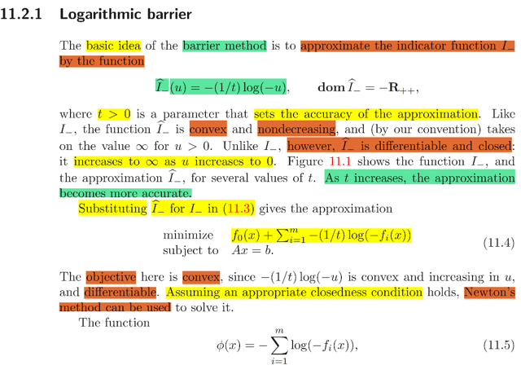</kbd></p>

<p align="center"><kbd>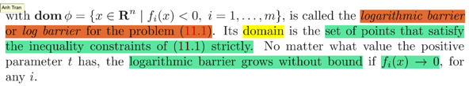</kbd></p>

> [!NOTE]
> Rồi, thế thì để giải quyết vấn đề không khả vi, người ta mới DÙNG
> MỘT PHIÊN BẢN XẤP XỈ CỦA I_(u), SAO CHO NÓ CÓ TÍNH KHẢ
> VI.
>
> Và đó là I^_(u) `=` - `(1/t)` log(-u). Cái này đại khái chỉ cần hiểu là nó
> xấp xỉ cho I_(u) ở trên, và mức độ gần đúng sẽ do t điều khiển, t càng
> lớn thì càng gần đúng.
>
> Và nhìn hình 11.1 có thể thấy hàm I_(u) không differentiable (không có
> đạo hàm tại x `=` 0) nhưng I^_(u) thì có. Còn lại nó vẫn đảm bảo yêu cầu
> là khi u < 0 thì L_(u) nhỏ, còn khi u ≥ 0 thì I^_(u) sẽ  rất lớn
>
> Và nhờ đó objective mới khả vi nên có thể áp dụng Newton's method
> vào bài toán:
>
> minimize f0(x) + `Σi[` - `(1/t)` log(-fi(x)) ] constraint Ax `=` b.
>
> Và `Σi` `-(1/t)` log(-fi(x)) đặt là Φ(x) gọi là Log barrier của bài toán gốc

<br>

<p align="center"><kbd>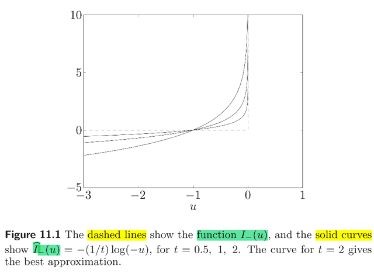</kbd></p>

<br>

<p align="center"><kbd>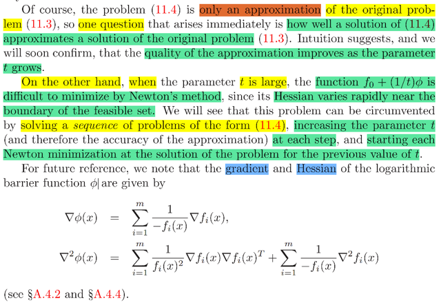</kbd></p>

> [!NOTE]
> đại khái là dĩ nhiên vì ta approx I_() bởi I^_() nên solution của bài toán
> sau chỉ là approx. của solution bài toán trước (dùng I_ để bỏ đi
> inequality constraint) vốn giúp ta giải tìm solution của bài toán gốc
> (inequality constraint  problem)
>
> Do đó câu hỏi đặt ra là làm vậy thì solution tìm ra có chính xác không, ta
> sẽ dễ đoán rằng nó sẽ phụ thuộc vào t và ta sẽ đi chứng minh rằng khi t
> lớn thì nó sẽ approx càng chính xác nhưng bù lại nó sẽ khiến Newton's
> method khó làm việc do nó ảnh hưởng đến Hessian.
>
> Để chuẩn bị thì ta tính gradient và Hessian của Φ(x) trước sau này sẽ
> cần
>
> Thử tự triển khai gradient và Hessian của log barrier function:
>
> Gradient:
>
> Làm theo "lối" MIT 18.s096 (cũng chain rule nhưng theo cách thức
> của 18s096)
>
> ```text
> Φ(x) = - Σ log(-fi(x)). Đặt ui(fi) = log(-fi) ⇨ Φ(ui) = -Σi ui
> ```
>
> dui `=` log(-fi + dfi) - log(-fi) `=` log(-fi(1 - `dfi/fi))` - log(-fi)
>
> ```text
> = log(-fi) + log(1 - dfi/fi) - log(-fi) = log(1 - dfi/fi) ≈ -dfi/fi
> ```
>
> ```text
> dΦ = -Σi dui = -Σi dfi/fi (thay kết quả trên: dui = -dfi/fi)
> ```
>
> ```text
> = -Σi [dfi(x)/dx] dx/fi(x) (nhân và chia dx, để thể hiện dΦ theo dx, mục
> ```
>
> đích là thể hiện dΦ `=` linear operator act on dx) 
>
> ```text
> = -Σi ∇fi(x)T / fi(x) dx  | dfi(x)/dx, là derivative của fi(x) wrt x, như đã biết,
> ```
>
> là transpose của gradient ∇fi(x)
>
> ```text
> = -Σi [∇fi(x) / fi(x)]T dx   | fi(x) là scalar, nên ∇fi(x)T / fi(x) = [∇fi(x) / fi(x)]T
> ```
>
> Và cơ bản đây là tổng ∇f1(x) `/` f1(x)]T dx + ∇f2(x) `/` f2(x)]T dx + ...
>
> nên đưa dx ra ngoài: ∇f1(x) `/` f1(x)]T + ∇f2(x) `/` f2(x)]T + ...dx
>
> `=` ∇f1(x) `/` f1(x)] + ∇f2(x) `/` f2(x)] + ...Tdx
>
> `=` `-Σi` [∇fi(x) `/` fi(x)] T dx
>
> ⇨ ∇Φ(x) `=` `-Σi` [∇fi(x) `/` fi(x)]  Có cùng kết quả như cách 1
>
> Hessian:
>
> Đầu tiên coi ∇Φ là function theo ui `=` `∇fi/fi:`
>
> d∇Φ(u) `=` ∇Φ(ui + dui) - ∇Φ(ui)
>
> ```text
> = -Σi (ui + dui) - Σi ui = -Σi dui
> ```
>
> ui `=` ∇fi * (fi^-1)
>
> Đặt vi `=` ∇fi (là vector), si `=` fi^-1 (là scalar) ⇨ ui `=` vi * si
>
> vi `=` ∇fi ⇨ dvi `=` d∇fi
>
> ```text
> si = 1/fi ⇨ dsi = 1/(fi+dfi) - 1/fi = [fi-(fi + dfi)]/(fi^2 + fidfi)
> ```
>
> ```text
> = -dfi / (fi^2 + fidfi) ≈ -dfi / fi^2 = (-1/fi^2)dfi
> ```
>
> Total differential: dui `=` `∂ui/∂vi` dvi + `∂ui/∂si` dsi
>
> `=` (si^-1) dvi + vi dsi
>
> `=` (fi^-1) d∇fi + ∇fi `(-1/fi^2)` dfi
>
> `=` `(1/fi)` d∇fi - `(∇fi/fi^2)` dfi
>
> ```text
> = [ (1/fi) d∇fi/dx - (∇fi/fi^2) dfi/dx ] dx
> ```
>
> `=` [ `(1/fi)` ∇^2fi - `(∇fi/fi^2)` ∇fiT ] dx
>
> `=` `(1/fi^2)` [ fi ∇^2fi - ∇fi∇fiT ] dx
>
> ```text
> ⇨ d∇Φ(u) = -Σi dui = -Σi  (1/fi^2) [ fi ∇^2fi - ∇fi∇fiT ] dx
> ```
>
> `=` `-Σi`  `(1/fi^2)` [ fi ∇^2fi - ∇fi∇fiT ]  dx 
>
> Hessian ∇^2 Φ(x) `=` `-Σi`  `(1/fi^2)` [ fi ∇^2fi - ∇fi∇fiT ] 
>
> ```text
> = -Σi  [ (1/fi^2) fi ∇^2fi - (1/fi^2) ∇fi∇fiT ]
> ```
>
> ```text
> = Σi [ (1/-fi) ∇^2fi ] + Σi [ (1/fi^2) ∇fi∇fiT ]
> ```
>
> ```text
> = Σi [ (1/fi^2) ∇fi∇fiT ] + Σi [ (1/-fi) ∇^2fi ] kết quả trong sách
> ```

<br>

<p align="center"><kbd>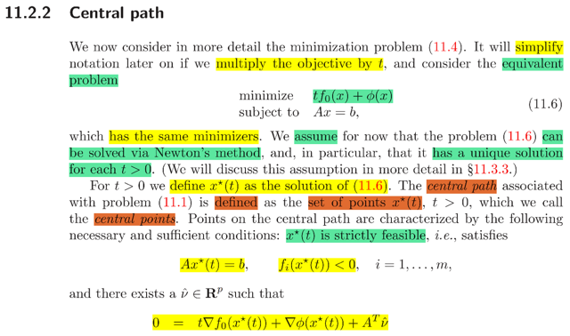</kbd></p>

<p align="center"><kbd>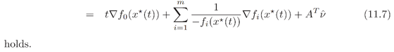</kbd></p>

> [!NOTE]
> đại khái là xét minimization problem 11.4:
>
> minimize f0(x) - `Σi` `(1/t)` log(-fi(x)) constraint Ax `=` b.
>
> là cái mà ta bỏ "cái inequality constraint vào trong objective, bằng
> cách dùng một hàm I^_"
>
> (review một chút cho nhớ, ý tưởng là người ta muốn bỏ inequality
> constraint bằng cách đưa nó vào trong objective, sử dụng một hàm
> indicator function I_(fi(x)) sao cho giá trị sẽ rất lớn (+infinity) khi fi(x) ≥
> 0
>
> Tuy nhiên làm vậy thì hàm I_ lại không khả vi, nên khiến objective "
> mới" `=` f0 + `Σ` I_(fi) cũng không khả vi, mà vậy thì ko dùng Newton's
> method được
>
> Nên ta mới dùng một hàm xấp xỉ của I_, gọi là I^_, có tính khả vi, cụ
> thể là I^_(u) `=` `-(1/t)` log(-u) và ta có bài toán 11.4
>
> minimize f0(x) - `Σi` `(1/t)` log(-fi(x)) constraint Ax `=` b.
>
> Đặt Φ(x) `=` - `Σi` log(-fi(x)), gọi là log barrier
>
> thì objective của bài toán này là f0(x) + `Φ(x)/t`
>
> Thế thì nay, đại khái là ta có thể "tương đương" lần nữa, bằng cách
> scale objective bởi t: để có equivalent problem minimize tf0(x) + Φ(x) 
> constraint Ax `=` b (không làm thay đổi solution)
>
> Và ý chính quan trọng đó là: 
>
> Dễ hiểu rằng với các gía trị t > 0 khác nhau thì ta có một optimal x*(t)
> của bài toán trên (objective của nó phụ thuộc t)
>
> Vậy thì đại khái là người ta nói có một theorem nói rằng điều kiện
> cần và đủ để x(t) là optimal của bài toán trên đó là:
>
> x(t) strictly feasible, có nghĩa là Ax*(t) `=` b và fi(x*(t)) < 0
>
> Và t*∇f0(x*(t)) + ∇ Φ(x*(t)) + ATv^ `=` 0 
>
> (Có thể thấy cái này chính là optimality condition của bài toán
> trên: Lagrangian L `=` t*f0(x) + Φ(x) + v^T(Ax - b). Thì KKT condition
> ∇L `=` 0 chính là t*∇f0(x*(t)) + ∇ Φ(x*(t)) + ATv^ `=` 0)
>
> ∇Φ(x) ta đã có rồi.
>
> Và x*(t) này gọi là CENTRAL POINTS, TẬP HỢP CÁC X*(t) GỌI
> LÀ CENTRAL PATH

<br>

<p align="center"><kbd>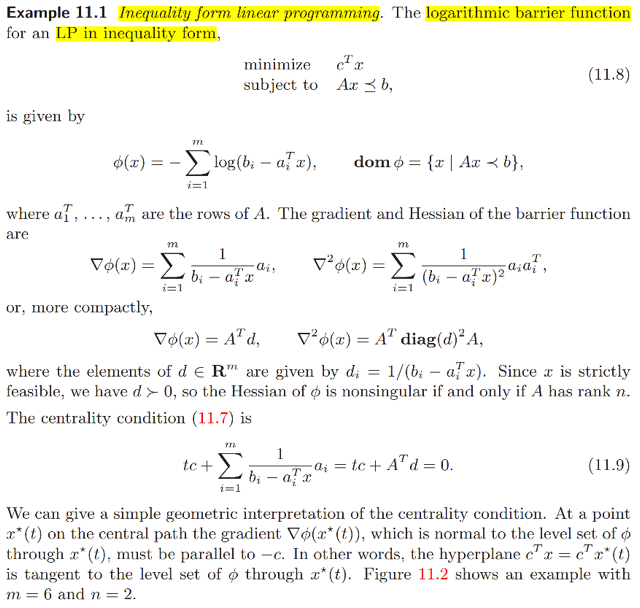</kbd></p>

> [!NOTE]
> Rồi, xét ví dụ này: bài toán inequality constraint với objective là linear 
> function f0(x) `=` cTx với constraint Ax ⪯ b (bài toán này gọi là inequality 
> linear programming)
>
> Thử xem log barrier Φ(x) là gì:
>
> Thế thì inequality constraint fi(x) chính là: Ax ⪯ b ⇔ Ax - b ⪯ 0 đây là
> cách thể hiện compact của hệ bất phương trình tuyến tính aiTx - bi ≤ 0; 
> i `=` 1,2... với ai là column vector có component là row thứ i của A 
>
> (chú ý nó là column vector bình thường nên dot product với x là aiTx) 
>
> fi(x) `=` aiTx - bi
>
> ```text
> Theo định nghĩa Φ(x) = - Σi log(-fi(x)) = -Σi log[-(aiTx-bi)]
> ```
>
> `=` `-Σi` log[(bi-aiTx)]
>
> Gradient:
>
> ∇Φ(x) `=` `Σi` `1/-fi(x)` ∇fi(x) 
>
> ```text
> = Σi [1/(bi - aiTx)] ai (dễ thấy ∇fi(x) = ai)
> ```
>
> Thể hiện compact hơn sẽ là:
>
> `=` `Σi` `[1/(b-Ax)i]` ai
>
> `=` AT `(1/b-Ax)` `=` ATd
>
> ```text
> Đặt d là vector có di = 1/(bi-aiTx), d = 1/(b-Ax)
> ```
>
> Hessian:
>
> ```text
> ∇^2Φ(x) = Σi [ (1/fi^2) ∇fi∇fiT ] + Σi [ (1/-fi) ∇^2fi ]
> ```
>
> ```text
> = Σi [ (1/(bi-aiTx)^2) aiaiT  + 0 ] (do ∇^2fi = 0)
> ```
>
> `=` `Σi` [ `(1/(bi-aiTx)^2)` aiaiT 
>
> Thể hiện compact hơn:
>
> `=` `Σi` di^2 aiaiT  | vì `(1/(bi-aiTx)^2)` chỉ là scalar, là bình phương 
>
> của phần tử thứ i của d: di,
>
> `=` `Σi` [ai (di^2)] aiT  | vì di^2 là scalar nên "di chuyển tự do"
>
> Nhìn vầy nè: khi đó ai di^2 với ai là một column vector (giá trị của chúng
> là giá trị các component của row i của A, nhưng nó là column vector nhé)
>
> ```text
> Vậy thì ai di^2 chỉ là scalar α = di^2 * vector x = ai = column vector αx
> ```
>
> Đặt ui `=` ai * di^2
>
> Và ta có `Σ` ui aiT 
>
> Thế thì nếu gọi U là matrix có các column là ui thì, `Σ` ui aiT là gì: Nó chính là
>
> UA, vì UA theo góc nhìn thứ 4 thầy Strang đã dạy nó sẽ là tổng của các rank
> 1 matrix [cột i của U] [row i của A] 
>
> Vậy ta có UA
>
> Giờ quay lại xem xét U, như đã nói, các column của nó là các vector ai được
> scale bởi `αi` `=` di^2. Vậy về cơ bản nó bắt đầu matrix có các column là ai (chính
> là AT), và  để có kết quả mỗi cột được scale bởi di^2 thì ta nhân AT với diagonal
> matrix có các entries đường chéo là d1^2, d2^2...Chính là diag(d^2) hay diag(d)^2
> cũng được
>
> ⇨ U `=` AT diag(d)^2 
>
> Vậy kết quả là AT diag(d)^2 A

<br>

<p align="center"><kbd>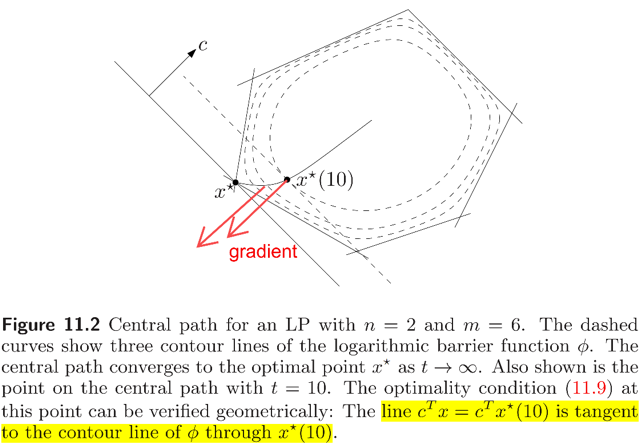</kbd></p>

<p align="center"><kbd>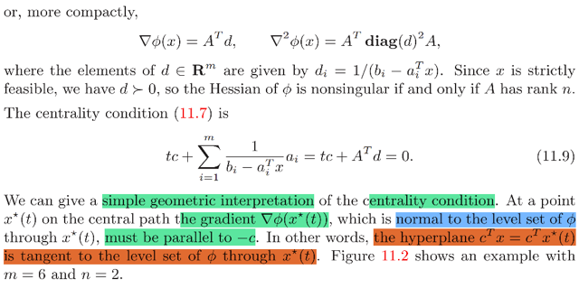</kbd></p>

> [!NOTE]
> Rồi, khi đó apply centrality condition (điều kiện để x(t) trở thành `/` là central point,
> hay solution của minimization problem tren) theo lí thuyết hồi nãy:
>
> t*∇f0(x*(t)) + ∇ Φ(x*(t)) + ATv^ `=` 0
>
> Và ở đây ta ko có equality constraint Ax `=` b (coi chừng lộn, công thức khái quát ở
> trên là đối với case khái quát có cả inequality constraint fi(x) và equality constraint
> Ax `=` b, còn ở đây không có equality, mà Ax ⪯ b vốn là inequality constraint) Nên ta
> có:
>
> t*∇f0(x*(t)) + ∇ Φ(x*(t)) `=` 0
>
> Thay ∇f0 dễ thấy `=` c và ∇ Φ(x) vừa tính vào:
>
> ct + ∇Φ(x*(t)) `=` 0 (1)
>
> ⇔ ct + ATd `=` 0
>
> Kết quả (1) này nói lên rằng:
>
> ∇Φ(x*(t)) `=` -tc ⇨ gradient vector của Φ(x) tại central point x* sẽ song song với
> vector c (ngược hướng).
>
> Vai trò của vector c là gì, trong bài toán linear programming, với các constraint là x
> phải ∈ x: aiTx ≤ bi, i `=` 1,2.. thì ta nhớ feasible set chính là intersection của các
> halfspace (x: aiTx ≤ bi là một halfspace `/` hay halfplane
>
> và với objective cTx cần minimize thì optimality condition thì ý nghĩa sẽ là ta cần tìm
> x* sao cho cTx* ≤ cTx với  mọi x thuộc feasible set, điều này đồng    nghĩa rằng
> cTx* sẽ phân chia không gian làm hai và một trong đó chứa toàn bộ feasible set.
> Do đó hình ảnh sẽ là ta trượt đường thằng `/` hyperplane cTx (với x khác nhau) song
> song theo phương vuông góc với vector c, cho đến khi đạt được yêu cầu nói trên.
> Đó là vai trò của c
>
> Rồi, thế thì bàn về gradient ∇Φ(x), ta biết rằng nó sẽ luôn vuông góc với level set `/`
> level curve của Φ(x) tại x. (cái này chứng minh rất dễ, chỉ cần linear approx hàm
> Φ(x) theo hướng của level set tại x: ta có Φ(x + `δx)` ≈ Φ(x) + `∇Φ(x)Tδx`  Thì vì ta
> đang di chuyển trên level set nên Φ(x + `δx)` phải bằng Φ(x) ⇨ `∇Φ(x)Tδx` phải `=` 0 ⇨
> ∇Φ(x) phải vuông góc với `δx` ⇨ vuông góc level set tại x
>
> Vậy từ hai ý trên: ∇Φ(x*(t)) song song c, và vuông góc level set tại x*(t) ⇨ c cũng
> vuông góc với level set (của Φ(x) tại x*) và đồng nghĩa hyperplane cTx `=` cTx* (cái
> mà ta trượt lên trượt xuống nói trên) sẽ luôn tiếp xúc `/` tangent với level set của
> Φ(x) tại x* (đây là ý mình highlight đỏ)
>
> `====`
>
> Và bàn thêm một quan sát nữa: Như đã biết vai trò của t, là tham số điều khiển tính
> chính xác khi ta dùng hàm I^_(u) để thay cho I_(u) nhằm có được tính khả vi
> (differentiable). Và trong sách có nói, t càng lớn thì I^_ càng approx tốt với I_, dĩ
> nhiên sẽ khiến solution của bài toán mà ta dùng I^ sẽ càng gần với solution của bài
> toán mà ta dùng I_, và đến lượt nó, nó là equivalent problem của bài toán gốc là bài
> toán mà ta có inequality constraint. Thành ra khi t càng lớn thì x*(t) sẽ càng gần với
> solution của bài toán gốc.
>
> Và khi t lớn dần thì tụi nó tạo thành một đường di chuyển ngày càng gần true
> solution x*. Và cái đường đó chính là central path

<br>

<p align="center"><kbd>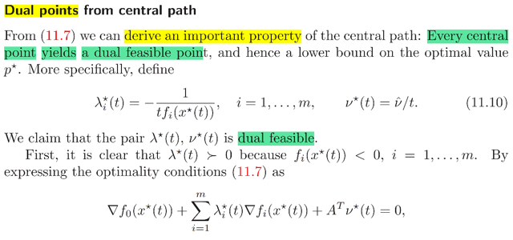</kbd></p>

<p align="center"><kbd>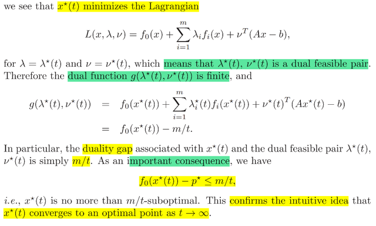</kbd></p>

> [!NOTE]
> đại khái là equation 11.7 (nhớ lại, nó là cái optimal condition mà người ta nói rằng nếu mà
> x*(t) thỏa, thì nó sẽ chính là central point, là tên gọi của solution của bài toán minimize tf0(x)
> + Φ(x) constraint Ax `=` b.
>
> Thế thì ở đây nói rằng mỗi một central point x*(t) (vì nó phụ thuộc t, nên t khác nhau cho
> ra x*(t) khác nhau) sẽ giúp ta tìm ra một dual feasible point, và từ đó tìm ra một lower
> bound của optimal value p*. Là sao:
>
> Thế thì nó là vầy, nhắc lại equation 11.7:
>
> t*∇f0(x*(t)) + ∇Φ(x*(t)) + ATv^ `=` 0
>
> Với ∇Φ(x*(t)) `=` `Σi` `1/-fi(x*(t))` ∇fi(x*(t)) ta có:
>
> t*∇f0(x*(t)) + `Σi` `1/-fi(x*(t))` ∇fi(x*(t)) + ATv^ `=` 0
>
> (Nên nhớ rằng, x(t) thỏa cái này sẽ là điều kiện cần và đủ để nó là optimal của bài toán
> minimize tf0(x) + Φ(x) constraint Ax `=` b, gọi là central point)
>
> ```text
> Vậy thì BẰNG CÁCH CHỌN λ*(t) = -1/t fi(x*(t)) ⇨ tλ*(t) = -1/fi(x*(t)) và v*(t) = v^/t  ta sẽ có cái
> ```
> trên tương đương với:
>
> t*∇f0(x*(t)) + `Σi` tλ*(t)i ∇fi(x) + ATtv*(t) `=` 0
>
> ⇔ ∇f0(x*(t)) + `Σi` λ*(t)i ∇fi(x) + ATv*(t) `=` 0
>
> VÀ ĐÂY LÀ MỘT KẾT QUẢ QUAN TRỌNG CHO TA THẤY MỘT ĐIỀU:
>
> Cái trên chính là gì? CHÍNH LÀ OPTIMALITY CONDITION CỦA BÀI TOÁN GỐC
>
> Là sao, bài toán gốc mà ta đang nói đến là minimize f0(x) constraint fi(x) ≤ 0 (i `=` 1,2...) và Ax
> `=` b
>
> Thế thì, có phải Lagrangian của nó sẽ là: L(x, λ, v) `=` f0(x) + `Σ` λi fi(x) + vT(Ax - b)
>
> Và L(x, λ*(t), v*(t)) `=` f0(x) + `Σ` λ*(t)i fi(x) + v*(t)T(Ax - b)
>
> Và nếu mà x*(t) là minimizer của L(x, λ*(t), v(t)) thì nó sẽ thỏa:
>
> ∇f0(x*(t)) + `Σ` λ*(t)i fi(x*(t)) + v*(t)TA `=` 0 ĐÂY CHÍNH LÀ CÁI MÀ TA CÓ Ở TRÊN
>
> Do đó mới nói, cái mà ta có ở trên (từ 11.7 cộng với việc ta chọn λ*(t) và v*(t) như vậy) sẽ
> giúp ta kết luận rằng x*(t), tức central point LÀ MINIMIZER CỦA L
>
> VÀ ĐIỀU NÀY GIÚP CHỨNG TỎ RẰNG, KHI TA MINIMIZE L(x, λ*(t), v*(t)) THÌ  KẾT QUẢ
> (TỨC OPTIMAL VALUE, HAY MINIMUM VALUE) KHÔNG INFINITE, MÀ LÀ CÓ FINITE
> VALUE. (ĐƠN GIẢN LÀ NẾU MÀ inf x L(x, λ*, v*) MÀ `=` -INFINITY THÌ SẼ KHÔNG TÌM RA
> x*.
>
> Vậy, inf x L(x, λ*(t), v*(t)) KHÔNG INFINITE, MÀ ĐÂY CHÍNH LÀ DUAL FUNCTION ⇨
> g(λ*(t), v*(t)) CÓ GIÁ TRỊ FINITE. VÀ ĐIỀU NÀY GIÚP KẾT LUẬN λ*(t) và v*(t) LÀ
> DUAL FEASIBLE (theo định nghĩa dual feasible là giá trị của dual variable khiến dual
> function không infinite, và λ ≽ 0, mà cái này thì dễ thấy λ*(t) thỏa rồi).
>
> Tóm lại nhắc lại ĐẠI Ý THỨ NHẤT của phần này là:
>
> VỚI MỖI MỘT CENTRAL POINT x*(t) SẼ CÓ TƯƠNG ỨNG MỘT DUAL FEASIBLE
> ```text
> POINT λ*(t), v*(t) (bằng cách chọn λ*(t) = -1/t*fi(x*(t)) ⇨ tλ*(t) = -1/fi(x*(t)) và v*(t) = v^/t_
> ```
>
> `====`
>
> Rồi, thế giá trị của λ*(t) và v*(t) vào L(x*, λ*, v*) 
>
> (nên nhớ, đây chính là g(λ*, v*) vì g(λ*, v*) `=` inf x L(x, λ*, v*) `=` L(x*, λ*, v*)) 
>
> ta được:
>
> g(λ*(t), v*(t)) `=` f0(x*(t)) + `Σ` λ*(t)i fi(x*(t)) + v*(t)T(Ax*(t) - b)
>
> `=` f0(x*(t)) + `Σ` `[1/tfi(x*(t))]` fi(x*(t)) + v*(t)T(Ax*(t) - b)
>
> `=` f0(x*(t)) + `Σ` `[1/t]` + v*(t)T(0)
>
> `=` f0(x*(t)) - `m/t`  
>
>
> Tới đây ta nhớ lại khái niệm DUALITY GAP, đó là KHOẢNG CÁCH GIỮA PRIMAL OBJECTIVE
> FUNCTION f0(x) VÀ DUAL FUNCTION g(λ, v) 
>
> (trước đây hiểu sai p* (tức f0(x*) 
>
> khi cả hai đều là optimal thì ta có OPTIMAL DUALITY GAP. p* - d* `=` f0(x*) - g(λ*, v*)
>
> Ở đây đã kết luận ở trên λ*(t) và v*(t) là DUAL FEASIBLE, và x*(t) dĩ nhiên cũng primal
> feasible nên f0(x*(t) - g(λ*(t), v*(t)) `=` `m/t` sẽ là một DUALITY GAP.
>
> Dựa vào weak duality ta luôn có g(λ, v) ≤ p*
>
> Do đó ta có g(λ*(t), v*(t)) ≤ p*
>
> ⇔ f0(x*(t)) - `m/t` ≤ p* 
>
> ⇔  f0(x*(t)) - p* ≤ `m/t`
>
> Và kết quả này CHO THẤY ĐẠI Ý THỨ 2:
>
> CHÍNH LÀ NÓI RẰNG CÁC CENTRAL POINT x*(t) THỰC CHẤT SẼ LÀ NẰM TRONG
> VÙNG MÀ GIÁ TRỊ F0 TẠI ĐÓ CHỈ CÁCH OPTIMAL MỘT KHOẢNG NHỎ HƠN `m/t.` GỌI 
> LÀ `m/t-SUBOPTIMAL` SET
>
> Và nó cũng chứng minh cho ta thấy khi t (nhớ lại, nó là tham số kiểm soát tính chính xác khi
> ta dùng I^_ thay cho I_) LỚN DẦN thì x*(t), tức central point, cũng là solution của bài toán
> mà ta approx. (vì dùng I^_ thay cho I_) sẽ NGÀY CÀNG CHÍNH XÁC (tức là f0(x*(t)) NGÀY 
> CÀNG GẦN p*:
>
> Vì `m/t` đóng vai upper bound giữa khác biệt giữa f0(x*(t)) và p*:
>
> Nên t → inf thì `m/t` → 0, có nghĩa là cái upper bound ngày càng nhỏ lại cũng chứng tỏ là 
> khác biệt giữa f0(x*(t)) và p* cũng ngày càng nhỏ lại, điều này đồng nghĩa f0(x*(t)) → p*
>
> Và khi t → inf thì `m/t` → 0 thì cũng là khác biệt giữa f0(x*(t)) và g(λ*(t), v*(t)), tức duality
> gap giữa f0(x*(t)) (là primal optimal value của bài toán centering) và g(λ*(t), v*(t)) là giá trị
> của dual function tại điểm λ*(t), v*(t)) cũng sẽ nhỏ dần về 0

<br>

<p align="center"><kbd>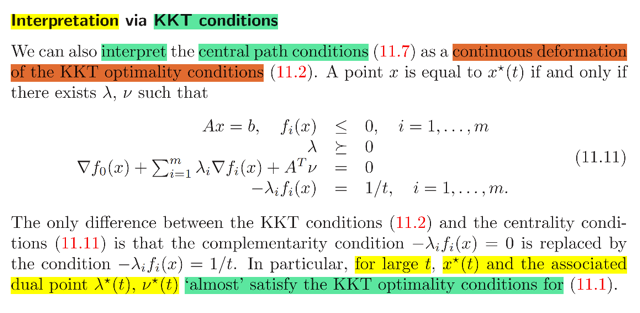</kbd></p>

> [!NOTE]
> rồi, cái này đại khái nói là thật ra ta có thể coi cái central path
> condition 11.7..
>
> (again, là cái equation nói rằng nếu x(t) thỏa thì nó sẽ đủ điều kiện để
> cho thấy nó chính là central point `/` solution của bài toán minimize
> f0(x) + `Σi` I^(fi(x)) hay cũng ⇔ minimize tf0(t) + Φ(x), constraint Ax `=` b,
> để rồi ta đã chứng minh rằng t mà càng lớn thì x*(t)  càng gần sát với
> optimal x* của bài toán gốc (là bài toán minimize f0(x) constraint fi(x) ≤
> 0, Ax `=` b hay bài toàn equivalent trong đó ta chuyển inequality
> constraint vào objective:  minimize f0(x)
> + `Σi` I_(fi(x))
>
> ...chính là một "phiên bản" rất giống với KKT conditions.
>
> Vì sao: Là bởi 11.7 nói rằng "ta cần":
>
> t*∇f0(x*(t)) + ∇Φ(x*(t)) + ATv^ `=` 0
>
> Với ∇Φ(x*(t)) `=` `Σi` `1/-fi(x*(t))` ∇fi(x*(t)) nó là:
>
> t*∇f0(x*(t)) + `Σi` `1/-fi(x*(t))` ∇fi(x*(t)) + ATv^ `=` 0  Vậy thì cái này, nếu
> ```text
> ta đặt λi = -1/tfi(x) ⇔ -λi fi(x) = 1/t (1)
> ```
>
> và v `=` `v^/t` ⇔ v^ `=` vt
>
> Thì nó sẽ trở thành:
>
> t∇f0(x*(t)) + `Σi` tλi ∇fi(x*(t)) + ATtv `=` 0
>
> ⇔ ∇f0(x*(t)) + `Σi` λi ∇fi(x*(t)) + ATv `=` 0 (2)
>
> Vậy thì vì ta muốn fi(x) ≤ 0 ⇨ λi ≥ 0 (3)
>
> Từ (1) (2) (3) viết lại, khỏi ghi x(t) mà chỉ ghi là x cũng được ta có: 
> +) fi(x) ≤ 0, Ax `=` b (cái này thì tự nhiên phải có)
>
> +) λi ≥ 0 cũng là λ ≽ 0 (từ (3))
>
> +) ∇f0(x) + `Σi` λi ∇fi(x) + ATv `=` 0 (từ (2)
>
> +) -λi fi(x) `=` `1/t` (từ (1))
>
> Thì 4 ý trên hầu như y chang KKT condition CỦA PROBLEM GỐC
> (bài toán minimize f0(x) constraint fi(x) ≤ 0, Ax `=` b, cũng form
> Lagrangian và ghi KKT conditions ra ta sẽ thấy giống vậy)
>
> Nhưng chỉ khác ở cái số 4: complementary slackess: λi fi(x) `=` 0
>
> DO ĐÓ, TA THẤY MỘT ĐIỀU RẰNG KHI t CÀNG LỚN THÌ HAI CÁI
> NÀY HẦU NHƯ LÀ MỘT. ĐỂ TỪ ĐÓ GIÚP TA HIỂU THÊM RẰNG VÌ
> SAO KHI T CÀNG LỚN THÌ CENTRAL POITN X*(T) LẠI CÀNG GẦN
> VỚI  TRUE OPTIMAL X*

<br>

<p align="center"><kbd>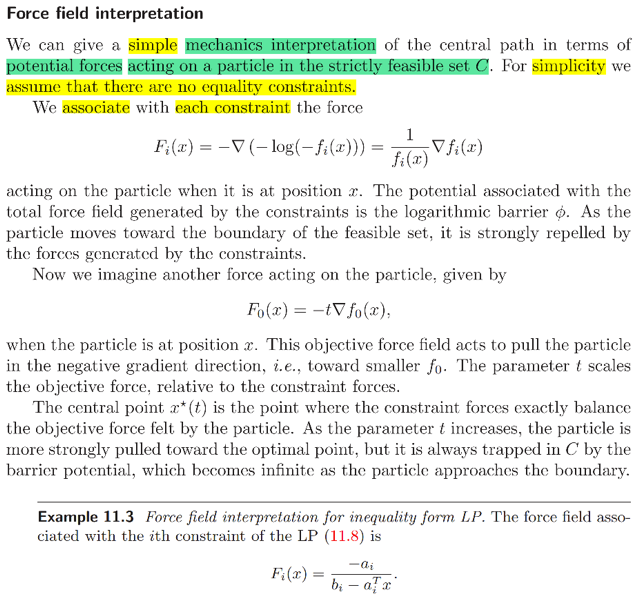</kbd></p>

<p align="center"><kbd>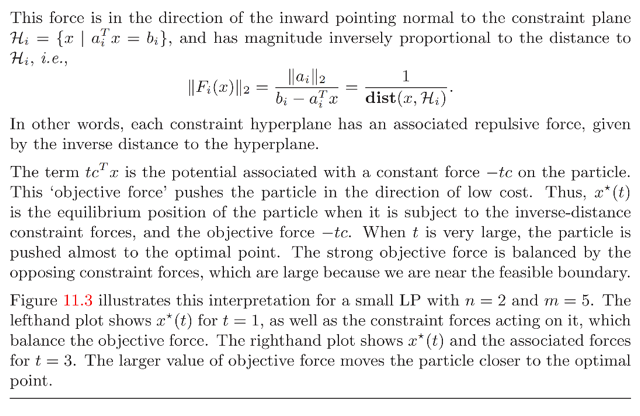</kbd></p>

> [!NOTE]
> QUAY LẠI SAU

<br>

<p align="center"><kbd>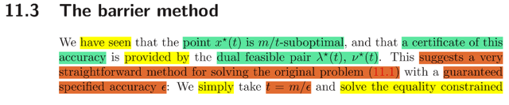</kbd></p>

<p align="center"><kbd>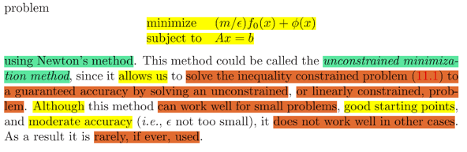</kbd></p>

> [!NOTE]
> rồi, rất dễ hiểu. Đại khái là những phân tích trong phần trước đã giúp
> ta thấy rằng: bằng cách:
>
> 1) chuyển bài toán inequality (+ equality) constraint problem gốc thành
> bài toán equivalent trong đó ta implicit tích hợp inequality constraint
> vào objective (f0 + `Σi` I_(fi(x)) constraint Ax `=` b
>
> 2) Dùng approx. function của I_(u) `=` `-(1/t)` log(-u) giúp mang lại tính
> ```text
> khả vi: minimize f0(x) + ΣI^_(fi(x)) = f0(x) + Σi -(1/t) log(-fi(x))
> ```
>
> và scale objective bởi t ta có bài toán tương đương: mininize tf0(x) +
> Φ(x)
>
> Φ(x) `=` `Σi` `-(1/t)` log(-fi(x))
>
> Thì đại khái là ta đã chứng minh rằng việc giải bài toán này tìm ra x*(t)
> sẽ đảm bảo nó là `m/t-suboptimal,` tức f0(x*(t)) chỉ cách f0(x*) một
> khoảng nhỏ hơn `m/t`
>
> Và bài toán 2 có thể giải bằng Newton's step.
>
> ```text
> Từ đó nếu ta muốn x*(t) thuộc ε-suboptimal thì chỉ việc chọn t = m/ε  và
> ```
> dùng Newton's step giải bài toán minimize tf0(x) + Φ(x) constraint Ax +
> b khi đó ta sẽ coi như là đang giải bài toán gốc thông qua giải một bài
> toán linear equality constraint problem (nếu bài toán gốc mà ko có
> equality constraint luôn thì coi như ta giải bài toán unconstrained
> problem).
>
> Do đó nó gọi là UNCONSTRAINED MINIMIZATION METHOD
>
> TUY NHIÊN HỌ NÓI PP NÀY CHỈ HIỆU QUẢ KHI PROBLEM NHỎ,
> CÓ STARTING POINT TỐT VÀ YÊU CẦU ĐỘ CHÍNH XÁC `ε` KO QUÁ
> CAO.

<br>

<p align="center"><kbd>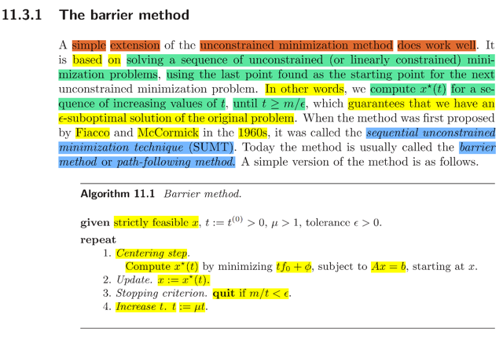</kbd></p>

<p align="center"><kbd>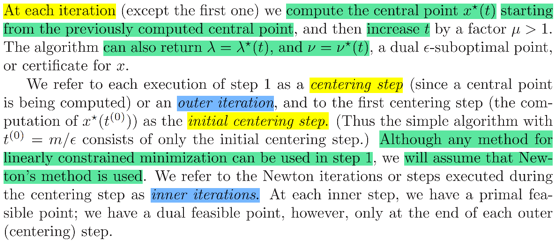</kbd></p>

> [!NOTE]
> Thì đại khái là, vừa mới nói việc set ngay t `=` m `/` `ε` rồi giải bài toán
> theo phương pháp unconstrained nói trên không hiểu qủa cho phần
> lớn trường hợp.
>
> Nhưng sửa lại chút xíu thì nó lại ok. Và cái việc sửa lại chút xíu đó
> là: Thay vì ngay lập tức giải bài toán unconstraint với t `=` m `/` `ε` luôn
> mà như đã nói cái này yêu cầu phải có good starting point thì ta sẽ
> bắt đầu với t `=` t(0) nhỏ. Rồi cũng theo method trên giải tìm x*(t) Sau
> đó lại dùng x*(t) làm starting point, tăng t lên chút xíu rồi giải tìm x*(t)
> mới. Cứ thế cho đến khi t > m `/` `ε.` Có thể thấy nó chỉ khác  chút xíu.
>
> Thế thì, như vậy có thể thấy cách làm này yêu cầu ta sẽ tạo một
> vòng lặp với bước 1 là tính x*(t), gọi là Centering step. Sau đó,
> update x trong bước Update. Kiểm tra xem t đã > m `/` `ε` chưa ở step
> 3. Và tăng t lên
>
> Thế thì vòng lặp này gọi là outer iteration, sở dĩ như vậy vì trong
> step centering, nơi ta giải tìm x*(t) thì ta cũng dùng iterative method
> (như gradient descent, Newton's method) để tìm.,do đó nó là inner
> iteration

<br>

<p align="center"><kbd>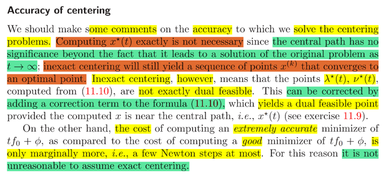</kbd></p>

> [!NOTE]
> đại khái là có một thực tế là ta sẽ tăng dần t lên, để có "chuỗi" x*(t)
> (center path) dần tiến về x*. Thì THẬT RA, VIỆC TÌM x*(t) (BẰNG
> INNER ITERATION)  Ở MỖI  OUTER ITERATION KHÔNG CẦN
> QUÁ CHÍNH XÁC. Nói cách khác, dù x*(t) không quá chính xác thì
> chuỗi x*(t) vẫn sẽ converge về x*
>
> Thành ra ..thật ra ta ko đặt ra yêu cầu cần giải x*(t) chính xác.
>
> Tuy nhiên, chi phí để có x*(t) good và x*(t) excellent cũng không 
> chênh nhau mấy (đại khái vậy) nên thành ra có assume giải x*(t)
> chính xác cũng chả sao
>
> Có nói thêm, nếu ta ko đặt yêu cầu quá cao với giải x*(t) thì tuy
> như đã nói kết quả vẫn ok, Nhưng nó sẽ khiến λ*(t) và v*(t) tính
> theo 11.10 không chính các là dual feasible. Và việc việc có thể
> khắc phục bằng cách add thêm correction term (đây là nội dung
> bài tập phải làm)

<br>

<p align="center"><kbd>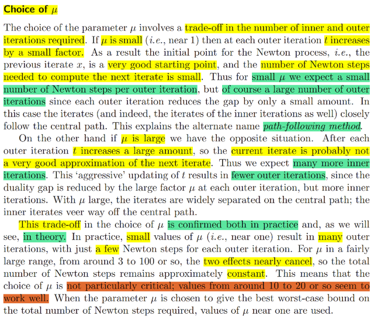</kbd></p>

> [!NOTE]
> đại khái là `μ` (là scale factor giúp tăng t ở mỗi (outer) iteration.
>
> Thế thì lựa chọn giá trị của nó là cân nhắc đánh đổi giữa hai thứ:
>
> nếu nó nhỏ, thì có nghĩa là sau mỗi iteration t chỉ tăng chút đỉnh.
> Mà t tăng chút đỉnh có nghĩa là bài toán minimization ở step trước
> minimize tf0(x) + Φ(x) constraint...với bài toán ở step sau (t tăng chút
> đỉnh) f0(x) + Φ(x) ....KHÔNG KHÁC NHAU MẤY.
>
> Do đó x*(t) solve được ở step trước cơ bản là khá gần với optimal
> point của bài toán sau. do đó bằng cách dùng nó làm initial point
> cho bài toán sau thì rõ ràng là rất tốt. Giúp cho việc giải bài toán
> sau sẽ rất thuận lợi (kiểu như bắt đầu giải bằng Newton's method 
> mà x(0) ngay sát nách x* thì chỉ cần vài lần Newton's step là converge)
> Do đó `μ` nhỏ thì SỐ STEP TRONG INNER ITERATION SẼ NHỎ.
>
> Nhưng ngược lại, vì t tăng nhỏ nên cái x*(t) mới tuy giải ra nhanh
> hơn như vừa nói, sẽ CŨNG CHỈ THU HẸP CHÚT ĐỈNH KHOẢNG
> CÁCH TỚI p*. Nên, thành ra ta lại sẽ CẦN NHIỀU OUTER ITERATION 
> HƠN.
>
> Nếu `μ` lớn thì ngược lại
>
> Khúc cuối có nói về việc thực tế cũng như theo lý thuyết ta sẽ chứng
> minh điều này và giá trị phù hợp có thể chọn trong thực tế

<br>

<p align="center"><kbd>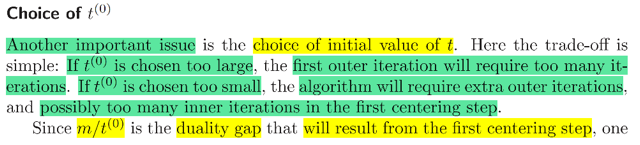</kbd></p>

<p align="center"><kbd>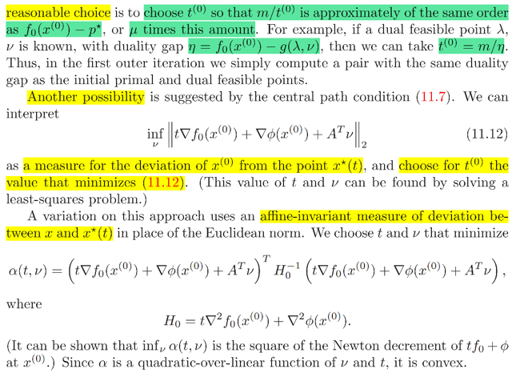</kbd></p>

> [!NOTE]
> QUAY LẠI SAU

<br>

<p align="center"><kbd>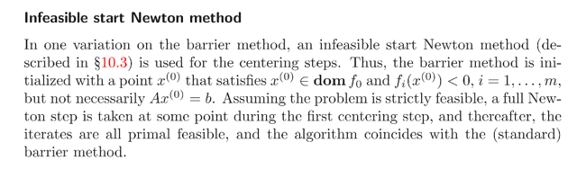</kbd></p>

<br>

<p align="center"><kbd>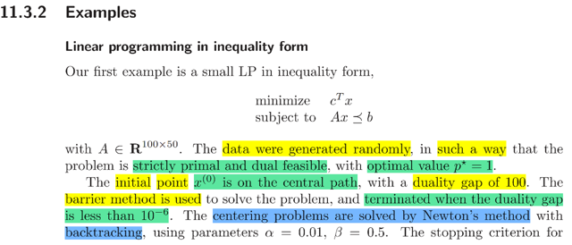</kbd></p>

<p align="center"><kbd>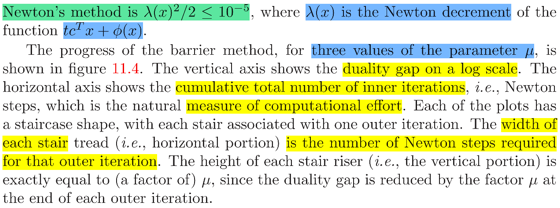</kbd></p>

<p align="center"><kbd>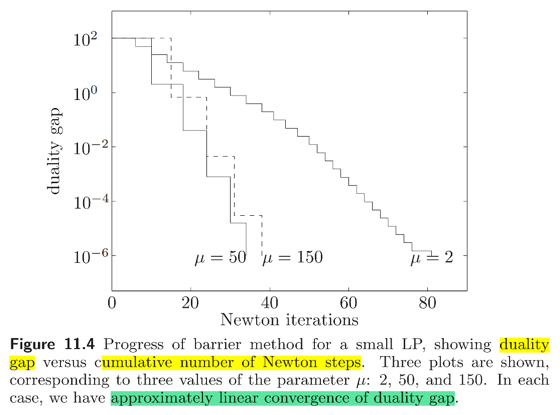</kbd></p>

<p align="center"><kbd>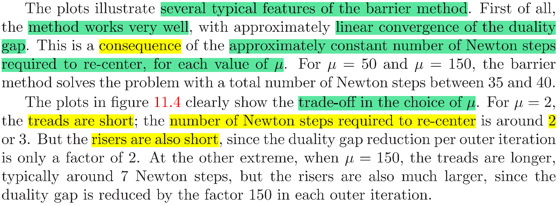</kbd></p>

> [!NOTE]
> rồi, họ cho xem một ví dụ, bài toán inequality constraint LP được set
> up sao cho strictly primal và dual feasible.
>
> Cho initial point x(0) nằm trên central path. Và barrier method và
> dùng Newton's  method để giải ở mỗi centering step (bước tính
> x*(t)).
>
> Như đã biết, Newton's method cũng là một iteration, nên ta sẽ cũng
> có một stopping condition để dừng, kiểu như cũng có một yêu cầu
> về độ chính xác của x*(t) tại mỗi iteration mà nếu đạt sẽ exit, được
> define theo Newton decrement mang ý nghĩa đại  khái là nếu mức
> giảm của objective function (của bài toán minimize tcTx + Φ(x) nhỏ
> hơn 10^-5) thì stop.
>
> Hình ảnh là 3 kết quả với 3 giá trị khác nhau của `μ` (scale factor của
> t) mà trục tung là duality gap (khác biệt giữa f0(x*(t)) và p* và số
> Newton's step
>
> Mỗi cái đều có dạng bậc thang, mỗi bậc là một outer iteration, trong
> đó nó chạy inner iteration - giải bài toán tìm x*(t) bằng Newton's
> step. Sau mỗi outer iteration (thì ta có x*(t) mới tốt hơn ⇨ duality
> gap giảm xuống.
>
> Đại khái là 3 đường đồ thị với 3 `μ` khác nhau cũng phản ánh nhận
> định mà ta đã có: Khi `μ` nhỏ (tức sau mỗi outer iteration, scale t xuống
> ít thôi) thì như đã nói, x*(t) giải ra ở iteration trước sẽ là good starting
> point cho iteration sau ⇨ Newton's method giải nhanh, ví dụ như ở
> đây nó chỉ tốn có 2,3 iteration. Nhưng bù lại, duality gap giảm xuống
> cũng không bao nhiêu (note trươc đã nói rồi).
>
> Ngược lại khi `μ` lớn, thì mỗi outer iteration cần nhiều Newton's step
> để giải hơn, nhưng giải xong thì duality gap cũng thu hẹp lại nhiều
> hơn.
>
> Và nhận định nữa là dù `μ` bao nhiêu thì sự converge đều có tính
> tuyến tính

<br>

<p align="center"><kbd>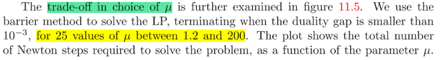</kbd></p>

<p align="center"><kbd>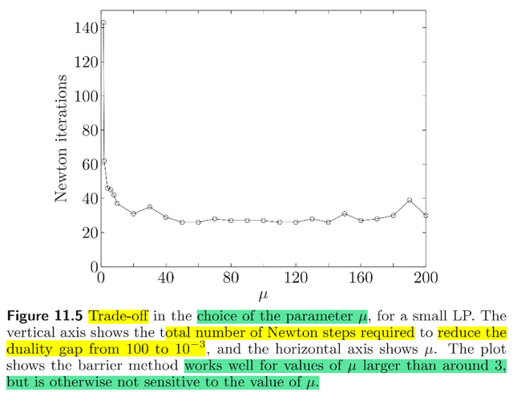</kbd></p>

<p align="center"><kbd>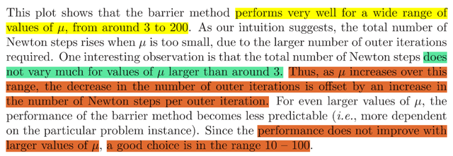</kbd></p>

> [!NOTE]
> đại khái là một thử nghiệm khác với nhiều `μ` khác nhau và trong mỗi thử
> nghiệm ta sẽ dừng khi duality gap đạt mức nào đó và xem thử tổng số
> Newton step là bao nhiêu.
>
> Kết quả cho thấy trừ khi `μ` quá nhỏ thì số Newton step sẽ tăng cao  còn 
> lại thì tăng `μ` không giúp ích giảm Newton steps mấy.
>
> Điều này giải thích là vì tăng `μ` tuy sẽ tăng mức duality gap (bậc thang
> sẽ có bề cao cao hơn) giúp giảm số outer iteration nhưng bù lại thì lại
> khiến bề rộng bậc cũng cao hơn (vì tăng số Newton step `/` inner iteration)
>
> Còn tăng lên qúa cao thì dẫn đến kết quả sẽ khó đoán, mà phụ thuộc
> với từng bài toán cụ thể. Do đó `μ` nên chọn từ 10 - 100 là được.

<br>

<p align="center"><kbd>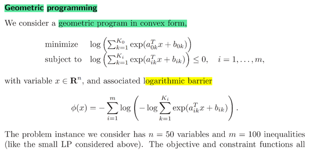</kbd></p>

<p align="center"><kbd>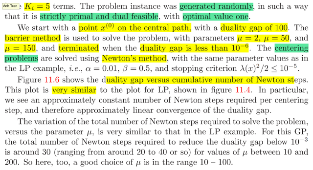</kbd></p>

<p align="center"><kbd>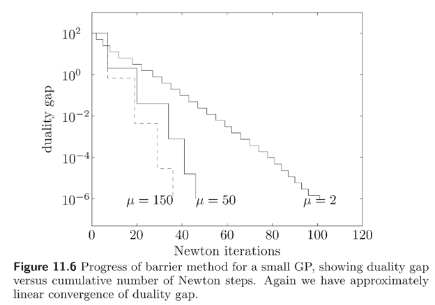</kbd></p>

> [!NOTE]
> Qua ví dụ này, bài toán geometric program in convex form.
>
> (ôn lại về geometric program sau)
>
> Thử xem tại sao log barrier của nó là như vậy.
>
> Theo định nghĩa Φ(x) `=` - `Σi` log(-fi(x))
>
> Với bài toán này equality constraint fi(x) `=` log `[Σk=1:Ki` exp(aikTx + bik)] 
>
> ```text
> ⇨ Φ(x) = - Σi log[-log [Σk=1:Ki exp(aikTx + bik)]].
> ```
>
> Nói chung là cũng hoàn toàn tương tự, đồ thị cho ta kết quả của việc
> giải bài toán này dùng barrier method với Newton's step. Nói chung
> không có gì mới so với ví dụ của bài táon LP, chỉ là cho ta thấy ví dụ
> của kết quả của barrier method giúp giải bài toán Geometric programming

<br>

<p align="center"><kbd>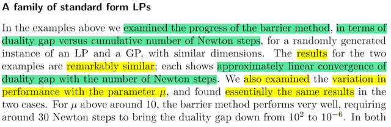</kbd></p>

<p align="center"><kbd>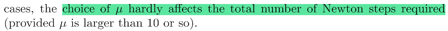</kbd></p>

> [!NOTE]
> rồi, ko có gì quan trọng, chỉ là nhận định rằng hai ví dụ trên khi ta
> đánh giá hiệu quả của barrier method dựa trên duality gap vs số
> Newton's step cần thiết.
>
> Kết qủa cho thấy kết qủa áp dụng barrier method vào giải hai bài
> toán này cho ra những nhận định tương tự nhau

<br>

<p align="center"><kbd>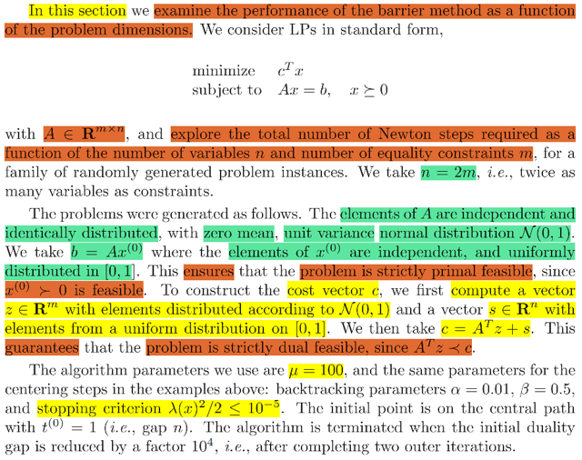</kbd></p>

<p align="center"><kbd>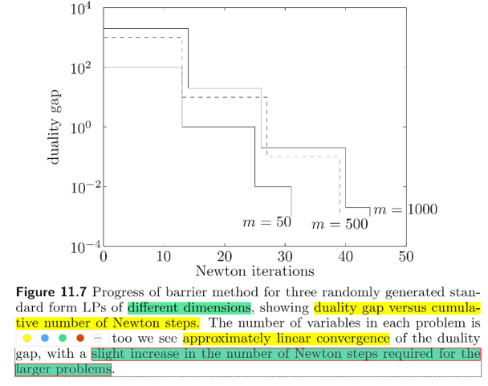</kbd></p>

<p align="center"><kbd>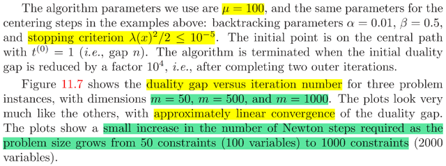</kbd></p>

> [!NOTE]
> Thật ra ko có gì phức tạp, chỉ là họ set up thử nhiệm giải bài toán LP
> với các dimension khác nhau (dimension của A) với cùng tham số
> `μ.` và mục đích là xem với kích thước bài toán tăng lên thì ảnh hưởng
> ra sao đến số Newton's step tổng cộng (cần thiết để đạt cùng một
> yêu cầu là độ giảm của duality gap nhỏ hơn mức nào đó)
>
> Kết qủa là khi dimension tăng thì số Newton's step cần cũng hơi tăng

<br>

<p align="center"><kbd>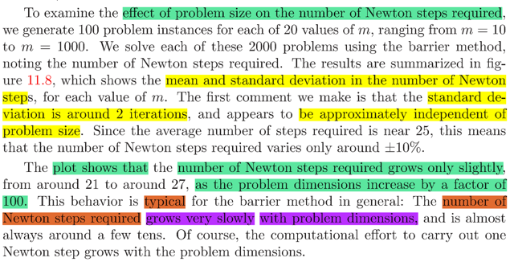</kbd></p>

<p align="center"><kbd>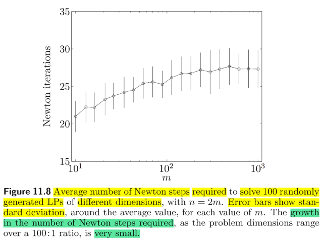</kbd></p>

> [!NOTE]
> CÓ THỂ QUAY LẠI ĐỌC KĨ SAU. NHƯNG KẾT LUẬN NÓI CHUNG
> LÀ BARRIER METHOD CÓ TÍNH CHẤT LÀ KHI TĂNG KÍCH THƯỚC
> CỦA PROBLEM LÊN THÌ SỐ NEWTON STEP CẦN THIẾT TĂNG 
> KHÔNG ĐÁNG KỂ `/` TĂNG CHẬM HƠN `/` ÍT HƠN SỰ TĂNG CỦA 
> PROBLEM

<br>

<p align="center"><kbd>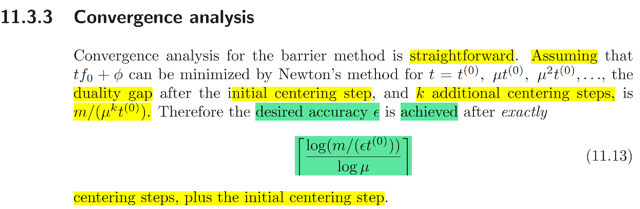</kbd></p>

> [!NOTE]
> Đại khái bữa trước ta đã đi đến kết luận là
>
> Sau step 0 (initial step) ta có x*(t) thì  duality gap là `m/t` (tức f0(x*(t) - p* `=`
> `m/t`
>
> ```text
> Rồi, sau step 1, t(1) = μt, thì duality gap sẽ là m/t(1) = m/μt
> ```
>
> ```text
> sau step 2 với t(2) = μt(1) = μ^2 t, thì duality gap là m/t(2) = m/μ^2t
> ```
>
> tương tự sau step k thì dualitu gap sẽ là m `/` `(μ^k)t`
>
> ```text
> Vậy để gap < ε ⇔ m / (μ^k)t < ε ⇔ m/tε < μ^k ⇔ log(m/tε) < k log μ
> ```
>
> ```text
> ⇔ k ≥ log(m/tε) / log μ
> ```
>
> ```text
> Nên để đạt duality gap = ε thì ta cần log(m/tε) / log μ iteration (t ở đây
> ```
> chính là t(0)

<br>

<p align="center"><kbd>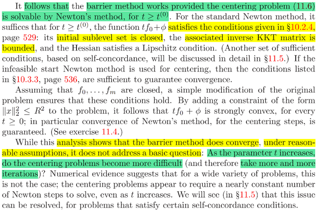</kbd></p>

> [!NOTE]
> QUAY LẠI ĐỌC KĨ SAU
>
> ĐẠI Ý LÀ NÓI RẰNG Ở ĐÂY TA CÓ THỂ ĐẢM BẢO THỎA CÁC
> ĐIỀU KIỆN CỦA BƯỚC CONVERGENCE ANALYSIS (đại ý là để
> chắc chắn rằng kết quả convergence thực tế đúng với kết quả ta
> phân tích bằng lý thuyết thì bài toán cần đảm bảo thỏa các giải định
> này)

<br>

<p align="center"><kbd>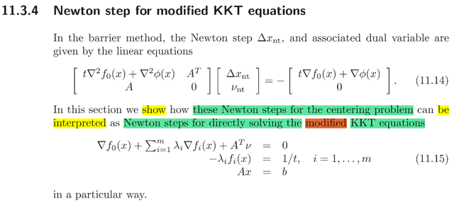</kbd></p>

> [!NOTE]
> để hiểu cái này thì cần ôn lại chút xíu.
>
> Câu chuyện bắt đầu là ta muốn giải bài toán inequality constraint
> linear equality constraint problem: minimize f0(x) constraint fi(x) ≤ 0, 
> Ax `=` b.
>
> Thế thì, ta chuyển thành equivalent problem đã eliminate inequality
> constraint: minimize f0(x) + `Σi` I_(fi(x)) constraint Ax `=` b với I_(u) `=` infi
> nếu u > 0 và `=` 0 nếu u ≤ 0. Nôm na là khi thỏa constraint thì `I_u` sẽ
> nhỏ, ngược lại `I_sẽ` rất lớn
>
> Vấn đề là I_ không khả vi. Nên sẽ không thể dùng Newton's method
> để giải bài toán này được.
>
> Giải pháp là ta dùng I^_ approx. cho I_ nhưng khả vi. Và mức độ
> chính xác của việc approx. sẽ do tham số t:
>
> I^_(u) `=` `-(1/t)` log(-u) 
>
> ```text
> Khi đó, objective f0(x) + Σi (-1/t) log(-fi(x)) = f0(x) + (1/t) Φ(x)
> ```
> khả vi và ta có thể dùng Newton's method.
>
> Và cơ bản là ta sẽ làm như vầy, ta sẽ giải bài toán equivalent nữa:
>
> minimize tf0(x) + Φ(x), dùng Newton's method, để giải ra x*(t).
>
> Dĩ nhiên nó chỉ là approx. solution cho bài toán minimize f0(x) + `Σ` I_(fi(x))
> và đồng nghĩa nó cũng chỉ là approx. solution của bài toán gốc.
>
> Nhưng t càng lớn thì I^_ càng approx tốt cho I_, nên ta sẽ kiểu như
> có thể giải tìm x*(t) với t lớn để có approx. tốt cho x*
>
> Và từ đó ta có cái gọi là central path là tập các x*(t) (với t khác nhau, mỗi
> cái là solution của bài toán minimize tf0(x) + Φ(x) và được giải bằng
> Newton's method. Và khi t tăng dần thì x*(t) nó converge về x*
>
> Từ đó mới cho ta một cách để giải bài toán này: Là ta có thể cho t bằng
> bao nhiêu đó (mà phân tích cho thấy nếu dùng nó thì sẽ cho ra x*(t) thuộc
> `ε-optimal)` và giải tìm x*(t). Tuy nhiên cách làm tốt hơn đó là ta tăng t dần
> dần, mỗi lần một chút bởi một factor `μ.` Và ở mỗi lần, ta sẽ giải bài toán 
> tìm x*(t) với initial point là x*(t) của iteration trước.
>
> Thế thì vừa trên là tóm tắt. Nay ta sẽ nói về việc tính Newton's step (để 
> thực hiện inner iteration, giải tìm x*(t))
>
> Thế thì như đã nói trên, cơ bản là ta đang xét bài toán minimize t*f0(x) + Φ(x)
> constraint Ax `=` b
>
> Thế thì phải hiểu rằng ta ko thể giải bài toán này theo cách analytically vì objective
> tf0(x) + Φ(x) phức tạp.
>
> Thay vào đó, ta sẽ giải bằng iterative method, ví dụ như Newton's method hay
> gradient descent. Và ở đây ta sẽ dùng Newton's method
>
> Vậy thì cách làm đó ta, tại initial point x, ta sẽ approximate objective function  bởi
> quadratic approximation cuả nó.
>
> Có nghĩa là với f(x) `=` tf0(x) + Φ(x) thì quadratic approximation của nó, cũng là
> second order Taylor approximation của nó tại x sẽ là:
>
> ```text
> f^(x + δx) = f(x) + ∇f(x)Tδx + (1/2) δxT ∇^2f(x) δx
> ```
>
> ```text
> = tf0(x) + Φ(x) + [t∇f0(x) + ∇Φ(x)]Tδx  + (1/2) δxT [t∇^2f0(x) + ∇^2 Φ(x)] δx
> ```
>
> ```text
> Và ta sẽ giải bài toán minimize δx f^(x + δx) constraint A(x + δx) = b
> ```
>
> và đây là bài toán linear equality constraint quadratic convex optimization  problem,
> ta ta có thể có analytic solution, giải nó ra sẽ cho ta `δx*,` chính là Newton's step
> `Δx_nt` và optimal dual variable `v_nt`
>
> Optimality conditions cho ta hệ phương trình giúp giải ra `Δx_nt` và `v_nt:`
>
> ```text
> ∇f^(x + Δx_nt) + ATw = 0; A(x + Δx_nt) = b (1)
> ```
>
> Tính ∇f^(x + `Δx_nt)`
>
> ```text
> Nhớ rằng f^ chỉ là hàm quadratic theo δx = 1/2 δxT P δx + qTδx + r với:
> ```
>
> P `=` t∇^2f0(x) + ∇^2 Φ(x), q `=` t∇f0(x) + ∇Φ(x), r `=` tf0(x) + Φ(x)
>
> và gradient của quadratic function ko khó để chứng minh `=` PTx + q với P symmetric
> thì cũng là Px + q:
>
> ```text
> ⇨ ∇f^(x + Δx_nt) =  [t∇^2f0(x) + ∇^2 Φ(x)]TΔx_nt + [t∇f0(x) + ∇Φ(x)]
> ```
>
> ```text
> (1) ⇔ [t∇^2f0(x) + ∇^2 Φ(x)]TΔx_nt + [t∇f0(x) + ∇Φ(x)] + ATv_nt = 0
> ```
>
> ```text
> ⇔ [t∇^2f0(x) + ∇^2 Φ(x)]TΔx_nt + ATv_nt = - [t∇f0(x) + ∇Φ(x)]
> ```
>
> và `AΔx_nt` `=` 0
>
> Gom lại thành KKT system: K `[Δx_nt,` w]T `=` [- [t∇f0(x) + ∇Φ(x)], 0]T
>
> `=` - [t∇f0(x) + ∇Φ(x), 0]T
>
> Với K `=` [t∇^2f0(x) + ∇^2Φ(x), AT; A, 0]
>
> Tới đây có thể hiểu 11.14 trong sách ở đâu ra
>
> `====`  
>
> Thế thì, phần trước người ta đã có nhắc đến một chi tiết đó là việc giải tìm
> x*(t)  của bài toán approximation: minimize tf0(x) + Φ(x) constraint Ax `=` b thật ra
> CHÍNH LÀ GIẢI MỘT HỆ KKT ĐÃ SỬA ĐỔI TRONG ĐÓ CHỈ KHÁC HỆ KKT CỦA
> BÀI TOÁN GỐC (ý là bài toán minimize f0(x) constraint  fi(x) ≤ 0, Ax `=` b) CHÚT XÍU:
>
> Đó là ở cái KKT condition complementary slackness, thay vì là:
>
> - λ*i fi(x*) `=` 0 i `=` 1,2...
>
> thì nay nó là - λi fi(x) `=` `1/t`
>
> (Còn các KKT conditions khác vẫn là:
>
> ∇f0(x) + `Σ` λi ∇fi(x) + ATv `=` 0 và λ ≥ 0 (dual feasible), Ax `=` b, fi(x) ≤ 0 (primal feasible)
>
> Ta đánh dấu nó là hệ 11.15
>
> Để rồi ở đây ta sẽ cố gắng thấy rằng việc giải ra Newton's step của bài toán
> centering problem (tìm solution của minimize tf0(x) + Φ(x) constraint Ax `=` b) CŨNG
> CHÍNH LÀ TA TÌM NEWTON'S STEP ĐỂ GIẢI CÁI HỆ MODIFIED KKT CONDITION
> 11.15

<br>

<p align="center"><kbd>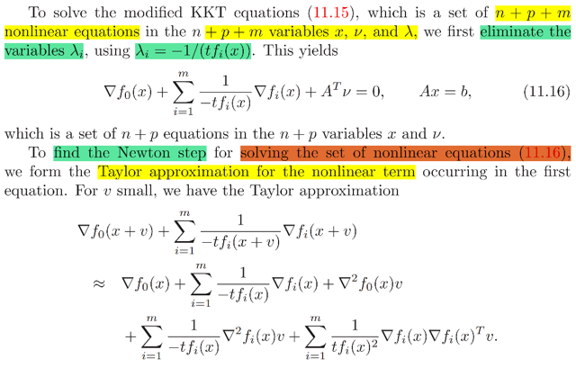</kbd></p>

<p align="center"><kbd>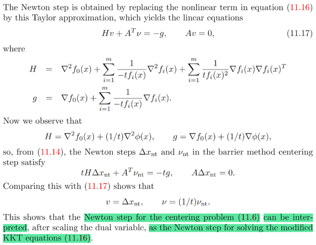</kbd></p>

<p align="center"><kbd>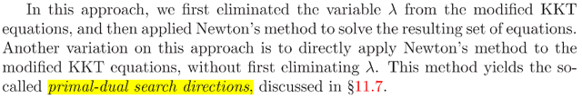</kbd></p>

> [!NOTE]
> Thế thì ở đây thật ra ta có thể viện dẫn và kết nối hai thứ:
>
> Một cái đã học ở MIT 18.01, đó là khi ta học về việc Newton's method giúp giải một
> hệ phương trình phi tuyến (thật ra lúc đó ta học cách dùng Newton' s method để
> giải nghiệm của một phương trình phi tuyến f(x) `=` 0) Và cách làm đại khái là ta xuất
> phát từ một initial guess x. Ta mới thiết lập phương trình tiếp tuyến của f(x) tại đó:
> f(x0) + f' (x0)(x - x0) và cho nó `=` 0 để tìm giao điểm của nó với trục x. Giải ra ta sẽ
> có "second guess". Rồi tiếp tục như vậy thì ta sẽ có chuỗi x dần tiến về x* là
> solution của f(x) `=` 0.
>
> Thế thì khái quát hơn với f(x) là R^n-R^n function, thì cơ bản giải f(x) `=` 0 là giải hệ
> phương trình phi tuyến. Ta cũng có thể giải bằng Newton's method. Cũng từ một
> initial guess x0, ta sẽ tìm tangent plane của f(x) tại x0:
>
> f(x0) + J(x0)(x - x0) và giải f(x0) + J(x0)(x - x0) `=` 0 để có second guess.
>
> Tiếp tục vậy
>
> Vậy thì ta hiểu rằng, bản chất của việc tìm phương trình của tiếp tuyến hay mặt
> phẳng tiếp tuyến tại x0 và tìm giao điểm của nó với hyperplane f(x) `=` 0 để có
> second guess đó là vầy: Đó là ta coi như việc muốn giải f(x) `=` 0 ban đầu là đang
> giải bài toán tìm minimum của F(x) với f(x) là đạo hàm của hàm F(x):
>
> f `=` ∇F
>
> Và vì F(x) là hàm phi tuyến bậc cao nên giải f(x) `=` 0 cũng là giải hệ phi tuyến bậc
> cao.
>
> Do đó, ta mới giải bằng cách đó là xấp xỉ F(x) bởi quadratic approx. của nó tại x0:
>
> ```text
> F^(x0 + δx) = F(x0) + ∇F(x0)T δx + (1/2) δxT ∇^2F(x0) δx
> ```
>
> ```text
> Để rồi giải ∇F^(x0 + δx) = 0 (1) thay cho ∇F(x) = 0 (chính là f(x) = 0))
> ```
>
> (1)⇔ ∇^2F(x0) `δx` + ∇F(x0) `=` 0
>
> Chính là `J_f(x0)T(x` - x0) + f(x0) `=` 0 và nó chính là tương ứng với việc tìm giao điểm
> của tiếp tuyến `/` tangent plane của hàm f(x) tại x0 với hyperplane f(x) `=` 0 (trong bối
> cảnh đơn biến thì là trục y `=` 0) Và vì đây là một phương trình tuyến tính nên có thể
> giải tìm x dễ dàng.
>
> Và nó giúp ta hiểu rằng cái việc ta giải tìm giao điểm của tiếp tuyến tai x0 với trục x
> để tìm next guess thật ra chính là ta đang tìm minimum của hàm quadratic mà ta
> dùng để xấp xỉ hàm F. 
>
> Và dĩ nhiên vì nó chỉ là xấp xỉ cho hàm F nên solution ta ta
> có chỉ xấp xỉ cho minimum thật sự của hàm F và do đó nên nó ko chính xác.
> Nhưng tiếp tục làm như vậy thì vì tại x1 ta sẽ có một sự  xấp xỉ bậc hai tốt hơn cho
> hàm F(x) , nên kết quả giải ra x2 sẽ tiến gần x*  (solution của f(x) `=` 0). Tiếp tục vậy
> thì x(k) sẽ → x*.
>
> Nói tóm lại, việc nhìn nhận về phương pháp Newton giúp giải tìm minimum của
> function mà derivative của nó là f(x) sẽ giúp ta dễ hiểu hơn là tại sao phương pháp
> này lại hiệu quả. Thay vì chỉ hiểu một cách máy móc như trong 18.01 dạy về
> Newton method
>
> Rồi, thế thì đại khái là xét cái hệ KKT equations 11.15, bằng cách rút  λi `=` `-1/[tfi(x)]` và thế vào các
> equation khác, ta sẽ có:
>
> ∇f0(x) + `Σ` λi ∇fi(x) + ATv `=` 0
>
> ⇔ ∇f0(x) + `Σ` `1/[-tfi(x)]` ∇fi(x) + ATv `=` 0
>
> Rồi, để giải hệ này, theo 1801 khi giải f(x) `=` 0 (scalar case) ta sẽ thiết  lập tiếp tuyến tại x (initial
> guess) và tìm giao điểm với y `=` 0. Thì đó cũng chính là việc ta linearize f(x) tại x0, và tìm giao điểm
> với y `=` 0.
>
> Vậy thì ở đây, với f(x) `=` ∇f0(x) + `Σ` `1/[-tfi(x)]` ∇fi(x) + ATv là vector function (để rồi cái này là đang
> giải hệ phi tuyến) thì ta cũng linearize nó dùng first order Taylor approx. tại x0, và giải tìm giao điẻm
> với hyperplane f(x) `=` 0
>
> f(x0 + `δx)` ≈ f(x0) + `∇f(x0)Tδx`
>
> Tức là ta sẽ giải f^(x + `δx)` `=` 0 thay cho f(x) `=` 0
>
> với f^(x + `δx)` `=` f(x0) + `∇f(x0)Tδx`
>
> `=` ∇f0(x0) + `Σ` `1/[-tfi(x0)]` ∇fi(x0) + ATv | (A) cái phần này là f(x0)
>
> ```text
> + d/dδx [∇f0(x0) + Σ 1/[-tfi(x0)] ∇fi(x0)] T δx | (B) cái phần này là ∇f(x0)Tδx
> ```
>
> ```text
> Xét d/dδx [∇f0(x0) + Σ 1/[-tfi(x0)] ∇fi(x0)]
> ```
>
> ```text
> = d/dδx [∇f0(x0)] + d/dδx [Σ 1/[-tfi(x0)] ∇fi(x0)]
> ```
>
> (*) `d/dδx` [∇f0(x0)] `=` ∇^2f0(x0)
>
> ```text
> (*) d/dδx [Σ 1/[-tfi(x0)] ∇fi(x0)]
> ```
>
> ```text
> = Σ d/dδx [1/[-tfi(x0)] ∇fi(x0)]
> ```
>
> ```text
> = Σ d/dδx [[-tfi(x0)]^-1 . ∇fi(x0)]
> ```
>
> ```text
> = Σ  [d/dδx [-tfi(x0)]^-1] . ∇fi(x0) + [-tfi(x0)]^-1] d/dδx ∇fi(x0)
> ```
>
> `=` `Σ`  [-[-tfi(x0)]^-2 t∇fi(x0)] . ∇fi(x0) + [-tfi(x0)]^-1] ∇^2fi(x0)
>
> ```text
> = Σ  [∇fi(x0) / t[fi(x0)]^2] . ∇fi(x0) + [1/-tfi(x0)] ∇^2fi(x0)
> ```
>
> ```text
> ⇨ "cái phần (B)" = (∇^2f0(x0) + Σ  [∇fi(x0) / t[fi(x0)]^2] . ∇fi(x0) + [1/-tfi(x0)] ∇^2fi(x0) )T δx
> ```
>
> ```text
> = [ ∇^2f0(x0) + Σ  [∇fi(x0) / t[fi(x0)]^2] . ∇fi(x0)  + Σ  [1/-tfi(x0)] ∇^2fi(x0)  ]T δx
> ```
>
> ```text
> = [ ∇^2f0(x0) δx] + Σ  [∇fi(x0) / t[fi(x0)]^2] . ∇fi(x0)  ]T δx + [Σ  [1/-tfi(x0)] ∇^2fi(x0)  ]T δx
> ```
>
> Term thứ 1: ∇^2f0(x0) `δx`
>
> Term thứ 3: `[Σ`  `[1/-tfi(x0)]` ∇^2fi(x0)  ]T `δx`
>
> ```text
> = [Σ  [1/-tfi(x0)] ∇^2fi(x0)  ] δx vì fi là scalar function, và ∇^2fi(x0) là Hessian, là symmetric matrix
> ```
> nên có thể bỏ dấu tranpose. Và đưa `δx` vào tổng ta sẽ có:
>
> ```text
> = Σ[1/-tfi(x0)] ∇^2fi(x0)δx
> ```
>
> Term thứ 2: [ `Σ`  [∇fi(x0) `/` t[fi(x0)]^2] . ∇fi(x0)  ]T `δx`
>
> ```text
> = Σ  [∇fi(x0) / t[fi(x0)]^2] . ∇fi(x0)T   δx
> ```
>
> ```text
> = Σ  [1 / t[fi(x0)]^2] ∇fi(x0)∇fi(x0)T  δx   | 11 / t[fi(x0)]^2 là scalar, di chuyển "lên trước"
> ```
>
> ```text
> = Σ [1 / t[fi(x0)]^2] ∇fi(x0)∇fi(x0)Tδx
> ```
>
> Tóm lại ta có:
>
> ∇f0(x0) + `Σ` `1/[-tfi(x0)]` ∇fi(x0) + ATv + `∇^2f0(x0)δx` +
>
> ```text
> Σ[1/-tfi(x0)] ∇^2fi(x0)δx + Σ [1 / t[fi(x0)]^2] ∇fi(x0)∇fi(x0)Tδx
> ```
>
> ```text
> Đặt H = ∇^2f0(x0) + Σ[1/-tfi(x0)] ∇^2fi(x0) Σ [1 / t[fi(x0)]^2] ∇fi(x0)∇fi(x0)T
> ```
>
> và g `=` ∇f0(x0) + `Σ` `1/[-tfi(x0)]` ∇fi(x0)
>
> thì ta có: hệ mới f^(x + `δx)` `=` 0, Av `=` 0 như sau
>
> Hv + ATv `=` -g, Av `=` 0
>
> `====`
>
> Ta mới quan sát H: nó chính là ∇^2f0(x) + `(1/t)` ∇^2Φ(x) và g chính là ∇f0(x) + `(1/t)` ∇Φ(x)
>
> Trong khi đó xem lại cái hệ KKT system giúp giải Newton's step của bài toán centering hồi nãy
> nói:
>
> K `[Δx_nt,` w]T `=` - [t∇f0(x) + ∇Φ(x), 0]T
>
> Với K `=` [t∇^2f0(x) + ∇^2Φ(x), AT; A, 0]
>
> nó tương đương 2 equations:
>
> ```text
> (1) [t∇^2f0(x) + ∇^2Φ(x)] Δx_nt + ATv_nt = - [t∇f0(x) + ∇Φ(x)]  Cái này chính là tH Δx_nt + ATv_nt =
> ```
> ```text
> -tg ⇔ HΔx_nt + AT(v_nt/t) = -g
> ```
>
> (2) `ATΔx_nt` `=` 0
>
> Vậy ta có gì:
>
> Cái hệ modified KKT system hóa ra là Hv + ATv `=` -g, Av `=` 0
>
> ```text
> Còn KKT system giải Newton's step hóa ra là: HΔx_nt + AT(v_nt/t) = -g, ATΔx_nt = 0
> ```
>
> ```text
> Từ đó ta có v = Δx_nt, và v chính là v_nt/t
> ```
>
> VÀ DO VẬY CÓ THỂ GIẢI NGHĨA NEWTON'S STEP TRONG BÀI TOÁN CENTERING
> PROBLEM  CHÍNH LÀ  VIỆC TA NEWTON'S STEP NẾU TA DÙNG NEWTON METHOD ĐỂ GIẢI
> HỆ MODIFIED KKT EQUATION
>
> còn khúc cuối QUAY LẠI SAU
>
> QUAY LẠI SAU

<br>

<p align="center"><kbd>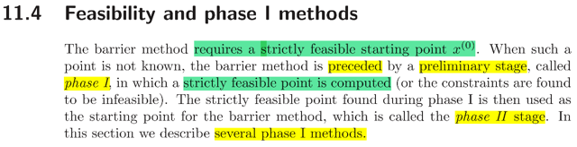</kbd></p>

> [!NOTE]
> đại khái là barrier method nói trên cần một điều kiện là starting
> point x(0) strictly feasible.
>
> Do đó nếu ta ko có thì ta phải tính. Và đó gọi là phase I. Để qua
> phase II sẽ dùng nó làm starting point.
>
> Phần này ta sẽ bàn về một số phương pháp để giải bài toán phase
> I này

<br>

<p align="center"><kbd>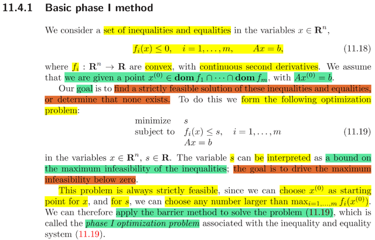</kbd></p>

> [!NOTE]
> đại khái là, ta sẽ giải bài toán sau đây để tìm strictly feasible point:
> của inequalities fi(x) ≤ 0, Ax `=b:`
>
> minimize s subject to fi(x) ≤ s, i `=` 1,2...m; Ax `=` b
>
> Cái này hơi khó hiểu nhưng cứ hiểu đại khái coi s như cái bound trên
> của MỨC ĐỘ INFEASIBLE. Đại khái là ta biết fi(x) mà dương thì nó
> sẽ vi phạm `/` infeasible, nên bản thân fi(x) nếu mang giá trị dương thì
> có thể coi như mức độ vi phạm constraint. Nên s với fi(x) ≤ s sẽ đóng
> vai cái upper bound của mức độ vi phạm.
>
> Rồi hiểu vậy là đủ rồi, khi đó đặt ra bài toán này là ta muốn ÉM CÁI
> BOUND NÀY XUỐNG - đồng nghĩa với việc ém (minimizing) những
> cái vi phạm lớn nhất (maximum infeasibility) xuống. Do đó  đây là
> MINIMIZING MAXIMUM INFEASIBILITY.

<br>

<p align="center"><kbd>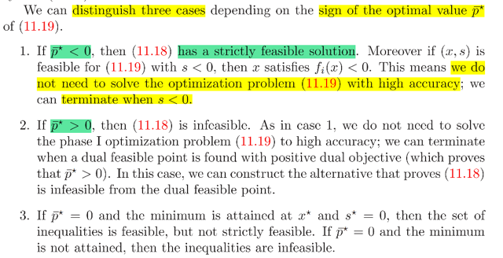</kbd></p>

<p align="center"><kbd>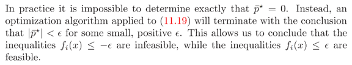</kbd></p>

> [!NOTE]
> Hiểu vậy cho gọn khỏi suy nghĩ nhiều. Giải bài toán này mà tìm ra
>
> Dưới đây khi nói f(x) thì hãy hiểu là fi(x) với nhiều i. (Để đơn giản)
>
> Case 1: s* (hay p*) < 0.
>
> Có nghĩa là tại x*, s* ta có f(x*) `=` s*, và s* < 0 ⇨ f(x*) < 0 ⇨ tìm ra x*
> khiến f(x) < 0 rồi, nên nó chính là strictly feasible.
>
> Case 2: Nếu s* > 0, thì có nghĩa là khi ta đi tìm cái s nhỏ nhất khiến
> tồn tại f(x) ≤ s (tức là giải bài toán này) mà ra kết quả vẫn dương, vậy
> chả có s nào âm hay bằng 0 mà tồn tại f(x) ≤ nó cả.
>
> Nói cách khác, ta muốn xem trọng mọi x thỏa Ax `=` b thì nếu xét cái
> chặn trên của mỗi fi(x): fi(x) ≤ s thì, thấp nhất là bao nhiêu. Ví dụ chỉ có
> 3 thằng x1, x2, x3 thỏa Ax `=` b. với các giá trị objective tương ứng là
> 5, 3, 2
>
> Vậy lower bound của s có thể là 5 vì có thằng x1 khiến f(x1) `=` 5
> lower bound của s cũng có thể là 3, vì có thằng x2 khiến f(x2) `=` 3.
> lower bound của s cũng có thể là 2 vì có thằng x3 với f(x3) `=` 2
> nhưng lower bound của s không thể là 1 vì không có x nào khiến 
> f(x) `=` 1. Và đó có thể thấy cái lower bound nhỏ nhất của s chính là 2.
>
> Vậy thì vì 2 dương nên ta suy ra ngay ko có thằng x nào mà f(x) ≤ 0 hết
>
> Case 3: Nếu ra s* `=` 0, tức là tại x*, f(x*) ≤ 0. Vậy hệ cũng feasible.
> Nhưng không có thằng x nào mà f(x) < 0 cả, vì nếu có thì s* nó đã là
> số âm nào đó rồi bởi lẽ nếu tồn tại x mà f(x) < 0 thì chắc chắn phải có
> số `ε` < 0 nào đó mà f(x) ≤ `ε`  khi đó s* (hay p*) chính là `ε.` Tuy nhiên
> nếu p* `=` 0 nhưng non attained thì inequalities cũng vẫn là infeasible
>
> `====`
>
> Rồi hiểu như vậy thì đại khái là vầy, khi giải bài toán tối ưu (minimize
> s) thì một khi mà thấy s < 0 thì ta có thể dừng, vì lúc đó đã đủ để lấy
> thằng x nào feasible (đối với bài toán này) (f(x) ≤ s) ra làm strictly
> feasible point mà ta cần tìm (nhớ ko, giải phase 1 problem là để tìm
> cái này)
>
> Còn ở case 2 cũng vậy, đại khái là trong quá trình "gỉai" (mà ta nên
> hiểu là thông qua iteration method) thì ta có thể kiểm tra xem rằng có
> bằng chứng chứng minh s* > 0 hay chưa. Nếu có thì dừng luôn vì có
> giải nữa thì cũng vô ích. Và ta có thể dựa vào giá trị của dual function.
> Như ta biết weak duality cho ta d* `=` g(λ*, v*) ≤ p*, nên d* đóng vai trò
> như lower bound của p*. Dẫn tới là khi ta có thể check  được rằng d*
> dương thì chưa cần giải ra p* cũng đủ kết luận nó dương. Và đã biết
> nó dương thì kết luận luôn là hệ fi(x) ≤ 0, Ax `=` b infeasible.
>
> Còn ở case 3 thì là khi s* hay p* ra bằng 0, thì có nghĩa là x* khiến
> f(x*) ≤ 0 ⇨  x* là feasible point nhưng không có x nào khiến f(x) < 0 (vì
> nếu có thì s* đã < 0 rồi). Nên hệ feasible nhưng không strictly feasible.
>
> Nếu s* `=` 0 mà không attainable thì cũng không có x nào khiến f(x) ≤
> 0, thì bài toán tối ưu có optimal value `=` 0 nhưng không attainable sẽ
> đồng nghĩa hệ cũng không feasible
>
> Trên thực tế thì họ cũng cho biết là thuật toán sẽ không dừng ở chính
> xác p* `=` 0. Chưa hiểu lắm
>
> Ở đây cũng có thể liên hệ với kiến thức trong chương 5- 5.8 Theorem of
> alternative
>
> Đại khái là nói về quan hệ giữa hai bài toán
>
> Một cái là là primal feasibility problem: hệ fi(x) ≤ 0, hi(x) `=` 0 có feasible hay không
> (1)
>
> Và một cái là dual feasibility problem: hệ g(λ, v) ≥ 0, λ ≽ 0 có feasible  hay không
> (2)
>
> Trước tiên nhớ lại, trong bài toán optimization: minimize f0(x) subject to fi(x) ≤ 0 i
> `=` 1, 2... hi(x) `=` 0 i `=` 1, 2.....
>
> Thì khi feasible set, mà rỗng, tức không có x nào thỏa fi(x) ≤ 0, hi(x) `=` 0 thì ta gọi
> bài toán là (primal) infeasible. Khi đó optimal value p* `=` inf x {∅}  và cái này theo
> quy ước là bằng +infinity.
>
> Rồi, đó là primal problem ôn tiếp một cái nữa là về dual problem. Ta sẽ form
> ```text
> Lagrangian L(x, λ, v) = f0(x) + Σ λi fi(x) + Σ vi hi(x). Và dual function: g(λ, v) = inf x
> ```
> L(x, λ, v). Và từ đó ta có dual problem:
>
> maximize λ, v g(λ, v) constraint λ ≽ 0
>
> Với bài toán dual problem thì, ta cũng có điều kiện feasible: Đó là λ, v phải làm
> sao đó để g > -infinity và λ thì tất nhiên phải ≽ 0 rồi 
>
> Nếu g `=` -infinity thì ta gọi bài toán dual problem là (dual) infeasible.
>
> Thế thì với feasibility problem thì ta không minimize f0 gì cả, mà chỉ là tìm
> feasible point nên nó có dạng: minimize x {0} subject fi(x) ≤ 0, hi(x) `=` 0 (tức 
> objective function là constant f0(x) `=` 0}
>
> ```text
> Nên L = Σ λi fi(x) + Σ vi hi(x) ⇨ g(λ, v) = inf x {Σ λi fi(x) + Σ vi hi(x)}
> ```
>
> Rồi, vậy thì nói qua liên hệ giữa chúng. Dựa trên một quan hệ:
>
> g(λ, v) ≤ L(x, λ, v) vì định nghĩa của g(λ, v) `=` inf x L(x, λ, v)
>
> Từ đó suy ra quan hệ thứ I):
>
> Nếu dual feasibility problem (2) feasible thì suy ra hệ primal feasiblity problem (1)
> infeasible: Vì sao?
>
> Nếu (2) feasible tức là tồn tại λ, v sao cho g(λ, v) > 0 và λ ≽ 0. Lúc này ta có thể
> tiếp tục scale λ, v lên bởi factor `α` khiến g tiếp tục tăng lên đến +infinity: Đây là vì
> ```text
> g = inf x L(x, λ, v) = inf x f0(x) + Σ λi fi(x) + Σ vi hi(x).
> ```
>
> ```text
> ⇨ g(α λ, α v) = inf x Σ αλi fi(x) + Σ αvi hi(x).
> ```
>
> ```text
> = inf x α [ Σ λi fi(x) + Σ vi hi(x) ] = α inf x [Σ λi fi(x) + Σ vi hi(x)] = α g(λ, v)
> ```
>
> Như vậy với `α` dương, scale `α` lớn lên có thể khiến g → +infinity, và đó đó d* `=`
> +infinity. Thế thì với quan hệ g(λ, v) ≤ p* thì đương nhiên d* ≤ p* ⇨ p* `=` +infinity
> đồng nghĩa (1) infeasible
>
> ⇨ Do đó nếu (2) feasible, tức tồn tại λ, v dual feasible mà g(λ , v) > 0 thì nó là
> bằng chứng (certificate) cho thấy (1) infeasible
>
> Ngược lại, nếu (1) feasible, thì (2) sẽ infeasible:
>
> Vì (1) feasible tức là tồn tai x thỏa fi(x) ≤ 0, hi(x) `=` 0 
>
> Vậy ở đây chính là áp dụng cái này, khi ta có thể tìm thấy dual feasible point λ, v
> mà g(λ, v) > 0 thì nó sẽ là bằng chứng để kết luận primal feasibility problem là
> infeasible

<br>

<p align="center"><kbd>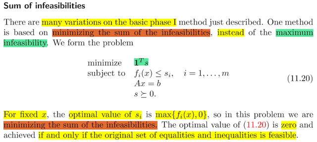</kbd></p>

> [!NOTE]
> Rồi, ở đây là nói đến một dạng khác (variation) của cách giải bài toán
> phase I. Như vừa rồi, khi mình minimize s với fi(x) ≤ s, mình đã hiểu nôm
> na s giống như cái upper bound của mức độ vi phạm, hay có thể gọi là
> mức độ không khả thi infeasibility. Mà đã nói upper bound thì dĩ nhiên nó
> ám chỉ những cái (vi phạm) "to nhất" - maximum infeasibility Và do đó bài
> toán minimize cái s này có thể hiểu là minimize cái maximum infeasibility `/`
> dịch nôm na là tìm cách gỉam thiểu cái vi phạm lớn nhất xuống.
>
> Còn ở đây khi minimize 1Ts với constraint fi(x) ≤ si, Ax `=` b, si ≥ 0 thì ta  sẽ
> thấy thế này, vì si phải ≥ fi(x), và ≥ 0 nên với giá trị x nào đó thì si sẽ là ≥
> max(fi(x), 0). Và vì ta cũng đang tìm cách làm giảm s cũng là giảm si nên
> với si ≥ max(fi(x),0) thì dĩ nhiên giá trị tối ưu là lấy max (fi(x),0).
>
> Và như đã biết, nếu fi(x) mà hơn 0, thì nó coi như độ vi phạm (< 0 thì thôi)
> nên ta thấy 1Ts (dĩ nhiên là `Σsi)` và nó là "tổng những độ vi phạm nếu có".
>
> Do đó mới nói bài toán này thay vì giải bằng cách giảm thiểu ĐỘ VI
> PHẠM LỚN NHẤT, thì nó giảm thiêu TỔNG MỨC ĐỘ VI PHẠM.
>
> Từ đó dễ hiểu rằng nếu mà tổng độ vi phạm 1Ts giảm xuống `=` 0 thì chính
> là (tồn tại x) `Σi` max(fi(x), 0) đều bằng 0, VÀ CÁI NÀY CHÍNH là mọi fi(x)
> đều ≤ 0  hệ feasible

<br>

<p align="center"><kbd>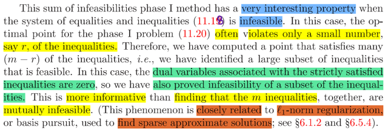</kbd></p>

> [!NOTE]
> Đại khái là nói về việc ta so sánh hai method ém cái violation `/`
> infeasibility bự nhất xuống so với em cái tổng infeasibility xuống
> thì ta thấy rằng khi mà cái hệ fi(x) ≤ 0, Ax `=` b (11.18) mà infeasible
> (tức ko tồn tai x nào thỏa cả) thì dĩ nhiên là giải bài toán minimize
> max violation hay tổng violation đều sẽ ko tìm ra x nào thỏa được 
> hết (có nghĩa là bài toán minimize s sẽ cho ra s*, hay p* > 0, và
> bài toán minimize 1Ts sẽ cho ra p* dương luôn, bởi lẽ độ feasibility
> đều không thể giảm về 0 được, vì nếu giảm được tức là đã có thằng
> x nào đó feasible rồi)
>
> Nhưng điểm đặc biệt là tuy vậy như cái kết quả của method 2 tuy
> không hoàn toàn feasible, tức thỏa hết các constraint fi(x) ≤ 0
> NHƯNG NÓ SẼ CÓ ÍT NHỮNG CÁI CHƯA THỎA HƠN LÀ METHOD
> KIA.
>
> Người ta ví dụ, một bài toán cụ thể thì kết quả cho thấy trong 100
> inequality constraint fi(x) ≤ 0 (ở đây là linear inequalities nên có thể
> thể hiện ở dạng Ax ⪯ b tương đương fi(x) `=` aiTx - bi ≤ 0 i `=` 1,2,...m)
> thì method "sum" cho ra kết quả là nó thỏa tới `79/100` trong khi cái
> method "max" chỉ thỏa có 39 cái.
>
> Thành ra trong đây mới nói, thông qua việc dùng method "sum" thì ta
> kiểu như sẽ tìm ra được một bộ lớn các inequalities constraint mà 
> có thể thỏa ("we have identified a large subset of inequalities that is 
> feasible")
>
> Thành ra cái này nó liên hệ gần với l1 regularization. Nôm na là, trong l1
> regularization, ta muốn tìm vector (các parameters) sao cho vẫn thỏa 
> constraint nhưng mỗi component có giá trị nhỏ. Thế thì kết quả cho ra
> là tuy nó không thể ra kết quả là mọi cái đều thỏa `=` mọi giá trị đều bằng
> 0, nhưng nó sẽ tìm ra một bộ lớn các cái có thể thỏa ⇨ kết quả ra một
> vector mà phần lớn là 0. CÁI NÀY HIỂU NÔM NA VẬY THÔI CÒN LẠI
> PHẢI XEM LẠI THÊM

<br>

<p align="center"><kbd>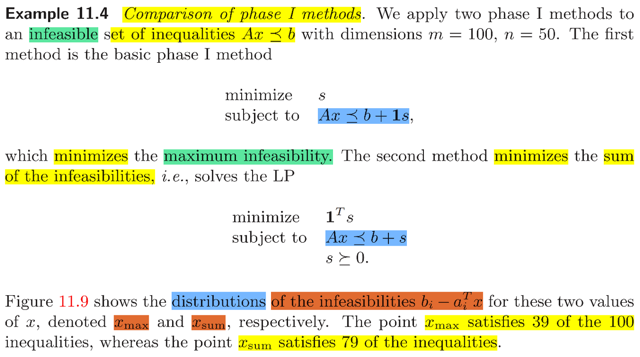</kbd></p>

<p align="center"><kbd>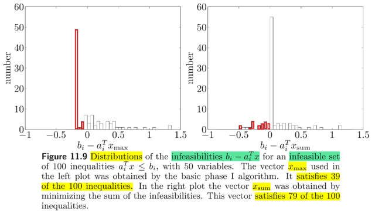</kbd></p>

> [!NOTE]
> Đây, như đã nói bài toán này là linear inequality constraint Ax ⪯ b vốn là dạng
> compact của hệ các bất đẳng thức tuyến tính fi(x)  `=` aiTx - bi ≤ 0 i `=` 1,2...m
>
> Thế thì, như đã biết, bài toán "max" là minimize s constraint fi(x) ≤ s thì ở đây
> chính là minimize s constraint aiTx - bi ≤ s (để ý là chỉ có một scalar variable s
> thôi, nên nếu thể hiện compact thì phải biến nó thành vector: 1s rồi mới thành
> Ax ⪯ b + 1s). Còn bài toán "sum" thì minimize 1Ts constraint fi(x) ≤ si thì ở
> đây sẽ là minimize 1Ts constraint aiTx - bi ≤ si, tức là ta có s1,s2....sm là
> component của  vector s. Nên thể hiện dạng compact sẽ là Ax ≤ b + s
>
> Thế thì như đã nói, ta sẽ giải hai bài toán này để ém s (scalar với bài toán max
> và vector s với bài toán sum) xuống. Thì hiểu thế này: nếu mà có thể giảm s
> thành 0 (tức tìm ra p* `=` 0) thì rõ ràng có nghĩa là tìm ra x* khiến Ax ⪯ b + 0 `=` b
> rồi. Nhưng bài toán đã cho trước hệ Ax ⪯ b infeasible nên cả hai bài toán sẽ
> không thể đạt p* ≤  0.
>
> TUy nhiên, cái x* của bài toán "sum" như đã nói, lại thỏa nhiều constraint hơn là
> bài toán max. Có nghĩa là sao?
>
> Có nghĩa là trong các hệ aiTx* ≤ bi i `=` 1,2...m thì x* của sum method giúp thỏa
> nhiều hơn x* của max method.
>
> Và ta hiểu thế này, nếu như trong max method, thuật toán muốn ém cái s (như
> đã nói, mang ý nghĩa là cái upper bound của độ vi phạm `/` infeasibility, mà upper
> bound thì cũng coi như cái độ vi phạm to nhất) thì hình ảnh nôm na là thuật toán
> tìm cách ém thằng to nhất trong những "độ violation" (mà ta đã nói là fi(x) nếu
> fi(x) dương, ở đây fi `=` aiTx - bi, nếu fi dương tức aiTx > bi thì độ vi phạm sẽ là
> aiTx - bi) xuống và khi nó làm hết sức có thể rồi (và fail trong việc đưa thằng to
> nhất thành 0) thì kết quả là một số aiTx - bi CŨNG ĐÃ THÀNH 0 ⇨ aiTx `=` bi và
> đó là những cái inequality constraint trong m cái mà x* thỏa.
>
> Tương tự thật toán sum cũng vậy nhưng có thể hình dung vì cách làm của nó
> không chỉ là ém thằng to nhất xuống mà ém tổng mọi độ vi phạm xuống nên kết
> quả là nó khiến nhiều cái vi phạm thành 0 hơn. Kết quả là nhiều cái aiTx - bi
> thành 0 hơn.
>
> Do đó, khi vẽ biểu đồ distribution của độ vi phạm aiTx - bi (thay bi - aiTx cũng
> được chỉ là vấn đề dấu) sau khi giải xong thì ta thấy:
>
> Ở max method: có một cột cao cỡ 50 ở vị trí ~ âm 0.2 Có nghĩa là sao: Có nghĩa
> là có khoảng 50 cái bi - aiTx* mang giá trị âm, ⇔ aiTx* - bi mang giá trị dương
> khoảng 0.2, và vài cột tương tự ở bên trái số 0 cũng thể hiện đây là những vi
> phạm không thể bị ém thành 0 (tương đương với constraint aiTx ≤ bi không thỏa
> được). Số lượng của chúng như đã nói có thể tính áng  chừng `=` tổng chiều cao
> của 3 cái cột màu đỏ ~50 + ~2 + ~7 `=` ~60.  Đồng nghĩa mấy cái cột bên phải
> màu xanh (vốn thể hiện là số ca mà bi - aiTx đã dương ⇔ aiTx - bi đã âm ⇔
> aiTx đã < bi ⇔ đã thỏa constraint) là khoảng 40 (phù hợp với trong sách nói
> xmax tthỏa `39/100` inequalities)
>
> Trong khi đó bên sum method thì sao? Ta thấy tổng chiều cao mấy cột đỏ chỉ
> đâu đó 20 phù hợp với sách nói có `79/100` inequalities được thỏa.
>
> Tuy nhiên còn một hiện tượng nữa rất hay bên trong việc hai cái cộtc cao ngồng
> của hai hình.
>
> Cột cao ngồng bên max method KHÔNG NẰM Ở 0, MÀ NẰM Ở MỘT GIÁ TRỊ
> ÂM NHỎ CỠ -0.2 THỂ HIỆN LÀ CÓ NHIỀU VIOLATION ĐƯỢC GIẢM VỀ
> KẾT QUẢ CUỐI CÙNG NHỎ, NHƯNG VẪN DƯƠNG. Từ khóa ở đây là CÓ
> NHIỀU, nó tạo nên cái cột cao như vậy. Đây gợi cho mình về một cái ở cs231
> đã học: l2 regularization khiến cho ép NHIỀU `θ` MANG GIÁ TRỊ NHỎ NHƯNG
> VẪN KHÁC 0.
>
> Trong khi đó, cột cao của sum method NẰM NGAY SỐ 0, có nghĩa là NHIỀU
> VIOLATION ĐƯỢC GIẢM VỀ 0. Và cái này như đã nói, có liên hệ gần với l1
> reguarlization, khi nó tạo các param vector rất SPARSE

<br>

<p align="center"><kbd>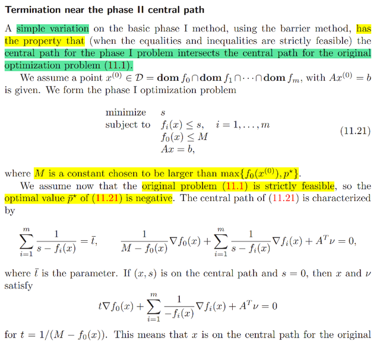</kbd></p>

<p align="center"><kbd>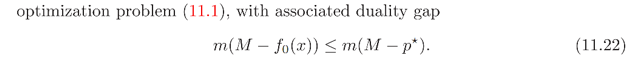</kbd></p>

> [!NOTE]
> QUAY LẠI SAU
>
> Nhưng đại ý là nói rằng nếu chỉnh sửa bài toán phase I chút xíu thì
> đại khái là ta có thể giải ra solution, mà như đã biết, vốn dĩ giải
> bài toán phase 1 là để tìm strictly feasible point giúp đóng vai 
> initial start cho phase 2. Thì nay không những nó là strictly feasible
> point mà nó còn là một CENTRAL POINT x*(t) nữa
>
> Nói sơ: bài toán phase 2 như đã biết sẽ tìm ra một central path
> tập các điểm x*(t) sẽ dần converge về x*. thì nay ý nói gỉai bài toán
> phase 1 (cũng bằng barrier method), thì ở dạng variation này ta
> sẽ có central path của nó giao với central path của bài toán phase 2

<br>

<p align="center"><kbd>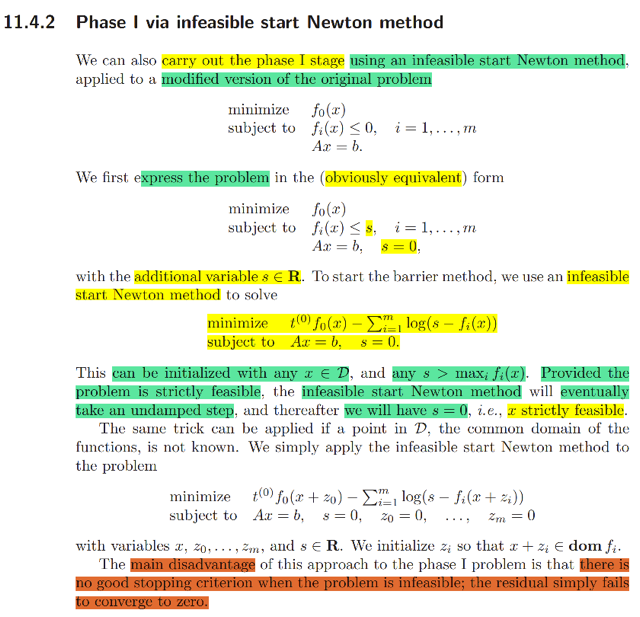</kbd></p>

> [!NOTE]
> QUAY LẠI SAU

<br>

<p align="center"><kbd>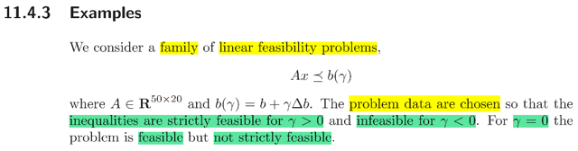</kbd></p>

<p align="center"><kbd>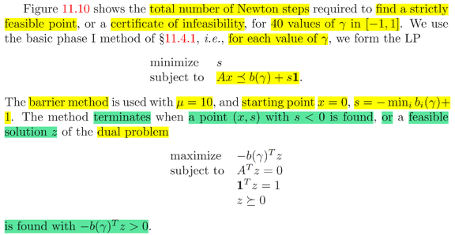</kbd></p>

> [!NOTE]
> rồi, thế thì ta qua một ví dụ. Xét một họ gia đình các linear feasibility problem
> ```text
> Ax ⪯ b(γ) với b(γ) = b + γΔb. Thì đại ý có nghĩa là đây là một hệ các bất
> ```
> phương trình tuyến tính, nhưng hệ này phụ thuộc `γ.` Để rồi với `γ` khác nhau
> thì tính feasibility của hệ có thể thay đổi. Cụ thể là khi `γ` dương thì hệ strictly
> feasible (tức là có thể tìm được x thỏa Ax ≺ b). Còn `γ` âm thì hệ infeasible.
> Còn `γ` `=` 0 thì hệ chỉ feasible  chứ không strictly feasible, tức là chỉ tìm được x
> thỏa Ax ⪯ b chứ  không có Ax ≺ b.
>
> Thế thì ta mới dùng basic phase I method, cụ thể là với mỗi `γ` ta  xây dựng
> bài toán LP: minimize s subject to Ax ⪯ `b(γ)` + s1.
>
> Có lẽ ôn lại một chút: Từ đầu đến giờ là ta nói về cách giải bài toán
> inequality constraint optimization problem. Và đã nói về phương pháp barrier
> method. Tuy nhiên, method này đòi hỏi ta phải có một strictly feasible starting
> point x(0), tức là một điểm sao cho Ax(0) `=` b, fi(x(0)) < 0
>
> Vậy nên đôi khi ta cần phải giải một bài toán tìm điểm này trước, gọi là phase
> I để có starting point giải bài toán gốc gọi là phase II. Thế thì, việc tìm một
> điểm thỏa một hệ equality `/` inequality, hay nói cách khác, tìm điểm thỏa mãn
> yêu cầu nó nằm trong feasible set như đã biết, gọi là bài toán feasibility. Ví dụ
> như minimize c constraint Ax < b với c constant về cơ bản chỉ là bài toán tìm
> được x thỏa Ax < b chứ ta chẳng minimize cái gì cả.
>
> Vậy thì ở đây bài toán phase I chính là như vậy, nhiệm vụ ko phải là minimize
> cái gì cả mà chỉ là tìm x thỏa fi(x) < 0, Ax `=` b
>
> Thế thì, để tìm x, ta mới đặt ra bài toán: minimize s constraint Ax `=` b, fi(x) ≤ s
> mang ý nghĩa là ta sẽ minimize cái max violation `/` độ infeasibility hoặc đặt bài
> toán minimize 1Ts constraint Ax `=` b, fi(x) ≤ si, si ≥ 0, mang ý nghĩa là minimize
> sum violation `/` infeasibility. Mà nói chung là nếu hệ fi(x) ≤  0, Ax `=` b mà feasible
> hay strictly feasible hay infeasible, thì hai bài toán trên sẽ có thể sẽ cho biết.
>
> Và cái chính là hai bài toán này, bản thân cũng lại là bài toán inequality
> constraint problem, do cũng có thể chắc chắn có strictly feasible
> point (của nó) nên có thể lại áp dụng barrier method (cái thứ mà ta dùng 
> để giải phase II) để giải.
>
> Tóm lại là có thể tóm tắt thế này: 
>
> Muốn: Giải bài toàn inequality constraint minimize f0(x) fi(x) ≤ 0, Ax `=` b
>
> ⇨ Dùng barrier method. Yêu cầu: có strictly feasible starting point.
>
> ⇨ Tìm strictly feasible start bằng cách đặt bài toán minimize s constraint
> fi(x) ≤ s, Ax `=` b. Và bài toán này lại giải cũng bằng barrier method vì chắc
> chắn có strictly feasible point.
>
> Tới đây đã hiểu vì sao nói rằng ta sẽ form và giải bài toán minimize s subject
> Ax ⪯ `b(γ)` + s1 (s1 là sao, thì fi(x) ở đây là aiTx - `b(γ)i,` nên constraint fi(x) ≤ s
> tức là aiTx - `b(γ)i` ≤ s. Thể hiện cả cái hệ (với i khác nhau) thì nó sẽ là Ax - b ≤ 
> vector mà mỗi component đều là s, chính là s1 `=` s * [1, 1 ...,1] (chú ý nó
> khác với 1Ts trong bài toán "sum" nhé vì trong đ1o s là vector [s1,s2...] và 1Ts
> là `Σi` si
>
> Rồi thế thì như vừa ôn lại, ta cũng giải bài toán này bằng barrier method, tức là
> ta cũng chuyển nó thành bài toán tương đương trong đó ta bỏ đi inequality
> constraint, chuyển nó vô objective, dùng log barrier function,....Và rồi ta cũng có
> cái vụ cho t nhỏ và tăng t lên từ từ, để có central path ...Thì `μ` ở đây chính là
> scalar factor để tăng t lên từ từ. Có nhắc đến starting point x `=` 0, s `=` -min i bi `(γ)`
> + 1 có thể thấy nó strictly feasible (đối với bài toán minimize s Ax ⪯ `b(γ)` + s1) vì
> ```text
> Với x = 0 thì Ax = 0 và s = -min i bi(γ) thì b(γ) + s1 là vector có mọi component
> ```
> ≥ 0 ⇨ Ax ≺ `b(γ)` + s1)
>
> `====`
>
> Và như case 1 (link hồng) đã nói, nếu ta tìm thấy s âm là đủ để chứng tỏ hệ
> gốc feasible và có thể dừng.
>
> Một trường hợp nữa cũng dừng, và kết luận hệ gốc infeasible là dùng dual problem
>
> Rồi, trong bài toán minimize s subject to Ax ⪯ `b(γ)` + s1
>
> Để có dual problem, đầu tiên cần xây dựng Lagrangian:
>
> ```text
> L(s, x, z) = f0(s) + Σi zifi(x) = s + zT(Ax - b(γ) - s1)
> ```
>
> Dual function: g(z) `=` inf x, s L `=` inf x, s s + zT(Ax - `b(γ)` - s1)
>
> `=` inf x [inf s s + zT(Ax - `b(γ)` - s1)]
>
> ```text
> Xét s + zT(Ax - b(γ) - s1) = s + Σ zi*[aiTx - b(γ)i - s]
> ```
>
> ```text
> = s + Σ zi*[aiTx - b(γ)i] - Σ (zi*s)
> ```
>
> ```text
> = s - Σ (zi*s) + Σ zi*[aiTx - b(γ)i]
> ```
>
> ```text
> = s - s Σ zi + Σ zi*[aiTx - b(γ)i]
> ```
>
> ```text
> = s*(1 - Σ zi) + Σ zi*[aiTx - b(γ)i]
> ```
>
> Cho thấy đây là affine function của s. Nên để dual > -infinity, ta cần thêm
> constraint 1 - `Σ` zi `=` 0 ⇔ 1Tz `=` 1
>
> ```text
> g = inf x  Σ zi*[aiTx - b(γ)i]  với zT1 = 1
> ```
>
> ```text
> = inf x  Σ zi*[aiTx] - Σ zi*b(γ)i]  với zT1 = 1
> ```
>
> ```text
> = inf x  Σ zi*[aiTx] - Σ zi*b(γ)i]  với zT1 = 1
> ```
>
> Xét `Σ` zi*[aiTx] - `Σ` `zi*b(γ)i]` cũng là affine function theo x,
>
> `=` zT(Ax) - `zTb(γ)`
>
> `=` (zTA)x - `zTb(γ)`
>
> nên để g > -infinity phải thêm constraint zTA `=` 0 ⇔ ATz `=` 0
>
> ```text
> ⇨ g(z) = -zTb(γ) = -b(γ)Tz constraint 1Tz = 1, ATz = 0
> ```
>
> Và từ đó ta có dual problem:
>
> ```text
> maximize z g(z) = -b(γ)Tz subject to ATz = 0, 1Tz = 1, z ≽ 0
> ```
>
> Và như đã nói, g(z) sẽ đóng vai là lower bound của p* tức s*.
>
> g(λ, v) `=` inf x L(x, λ, v) ⇨ g(λ, v) ≤ L(x, λ, v) trong đó có x*
>
> ⇨ g(λ, v) ≤ L(x*, λ, v) `=` f0(x*) + `Σ` λifi(x*) + `Σ` vihi(x*)
>
> và vế trái lại ≤ f0(x*) dp λifi(x*) phải âm (do λi phải ≥ 0 và fi(x*) ≤ 0)  và
> vihi(x*) phải `=` 0 do hi(x*) `=` 0
>
> Từ đó suy ra g(λ, v) ≤ f0(x*) `=` p*
>
> Mà điều này nói lên rằng, một khi mà ta ta tìm thấy một cặp λ, v feasible sao
> cho g(λ, v) DƯƠNG, thì ngay lập tức suy ra p*  DƯƠNG.
>
> Do đó áp dụng vào đây, khi ta tìm thấy z feasible mà g(z) `=` `-b(γ)Tz` DƯƠNG
> THÌ ĐỦ ĐỂ KẾT LUẬN s* DƯƠNG VÀ TỪ ĐÓ STOP VỚI KẾT LUẬN LÀ HỆ
> GỐC fi(x) ≤ 0, Ax `=` 0 LÀ INFEASIBLE (cái này đã lập luận rồi xem lại case 2,
> link hồng, nhưng nôm na là ngay cả khi đã cố gắng ém cái violation `/`
> feasibility lớn nhất xuống hết cỡ mà nó vẫn dương thì có nghĩa là hết cách,
> không thể có x khiến fi(x) ≤ 0 ∀ i Ax `=` b)

<br>

<p align="center"><kbd>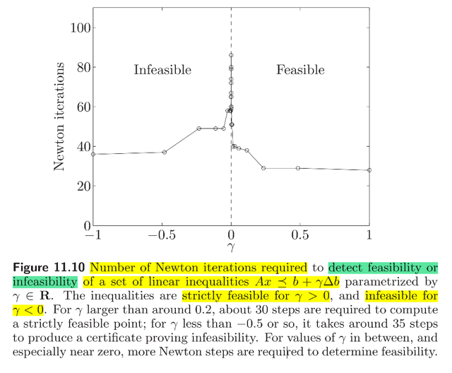</kbd></p>

<p align="center"><kbd>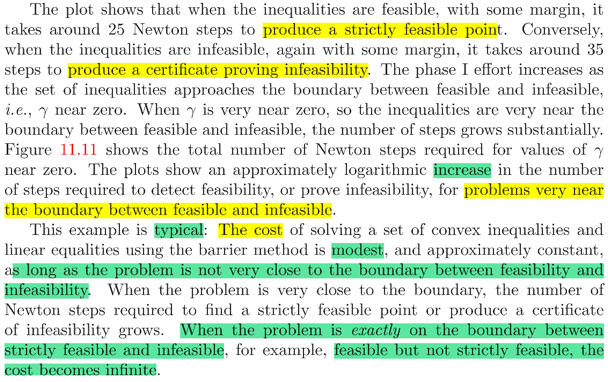</kbd></p>

<p align="center"><kbd>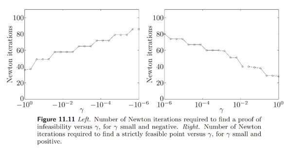</kbd></p>

> [!NOTE]
> Thế thì đại ý kết quả cho thấy, khi ta thay đổi tính feasibility của
> hệ gốc (thông qua điều khiển `γ)` và tính số Newton's step cần
> thiết để giải bài toán phase I ra kết luận: tìm được feasible point
> hay kết luận infeasible. Thì thấy rằng, nếu mà hệ gốc RÕ RẰNG
> LÀ FEASIBLE HOẶC INFEASIBLE (bằng cách cho `γ` dương hoặc
> âm với khoảng cách lớn tới 0), thì số Newton's step phải tốn là
> fix, là ko đáng kể.
>
> Nhưng khi mà hệ gốc nhập nhằng, giữa feasible và infeasible
> (bằng cách cho `γ` ≈ 0) thì cost sẽ tăng lên và càng gần 0 thì 
> tăng lên đến +infinity

<br>

<p align="center"><kbd>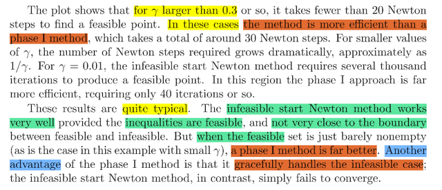</kbd></p>

<p align="center"><kbd>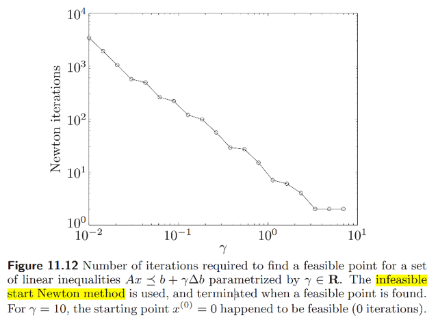</kbd></p>

<p align="center"><kbd>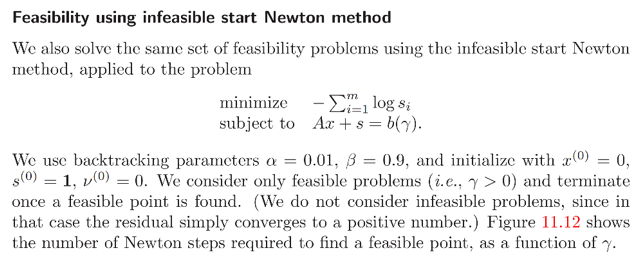</kbd></p>

> [!NOTE]
> Có thể quay lại sau nhưng đại ý cho thấy kết quả việc giải bài toán
> phase I bằng Infeasible start Newton method. Kết quả cho thấy pp
> này tốt hơn phase I method nếu hệ gốc feasible rõ `(γ` dương với
> margin lớn).
>
> Ngược lại, khi hệ gốc infeasible hay nhập nhằng thì pp này fail

<br>

<p align="center"><kbd>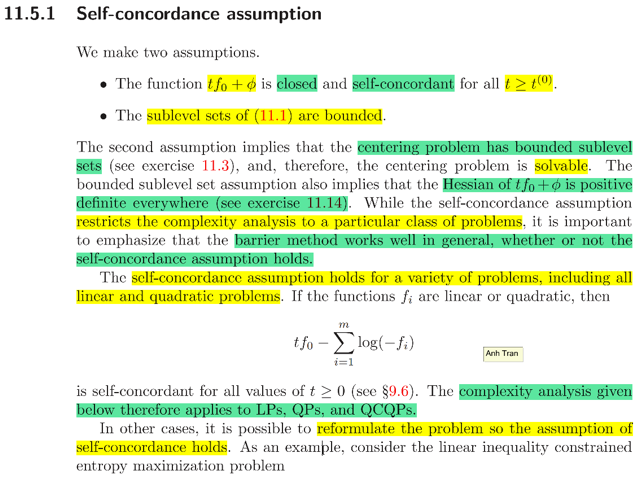</kbd></p>

<p align="center"><kbd>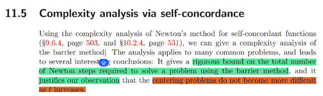</kbd></p>

> [!NOTE]
> đại khái là ta sẽ có một vài assumption rằng function t f0 + Φ closed
> và self-concordant với mọi t ≥ t(0) và sublevel set của 11.1 (là bài
> toán gốc) cũng bounded
>
> Và assumption này cũng suy ra rằng centering problem cũng có
> sublevel set bị chặn, do đó nó solvable.
>
> Làm rõ ý này một chút, centering problem là gì? Nó là bài toán mà
> dùng để giải bài toán gốc thông qua cách thức ước lượng: Tóm tắt lại
> một chút: Đại khái là ta có bài toán gốc (inequality+equality constraint
> optimization problem), ta mới "đưa cái inequality constraint vào trong
> objective, dùng indicator function I_(u) có giá trị vô cực lớn khi u > 0
> và bằng 0 nếu ngược lại, từ đó ta có bài toán equivalent nhưng chỉ
> còn equality constraint. Sau đó để giải quyết vấn để I_() không twice
> differentiable, ta mới thay nó bằng I^_, giúp ta có bài toán xấp xỉ
> nhưng khả vi nên có thể giải bằng Newton method (và các pp khác
> như gradient descent).
>
> THế thì I^ đó sẽ được control bởi tham số t giúp tăng giảm độ chính
> xác khi approx. hàm I_, và từ đó ta có bài toán minimize tf0(x) + Φ với
> Φ  là barrier function `=` `Σi` 1 `/` -log[fi(x)]
>
> Và bài toán này gọi là centering problem. Lí do gọi vậy là vì, với các t
> khác nhau, thì khi giải bài toán này ta sẽ có x*(t) mà hợp lại chúng tạo
> thành một "con đường" dẫn đến x* thật sự. Như đã nói vì I^ chỉ
> approx. cho I nên tùy vào mức độ ước lượng có chính xác cỡ nào mà
> solution của nó gần với true x* cỡ nào. Và khi ta tăng t lên thì càng
> ước lượng chính xác hơn nên x*(t) sẽ tiến dần về x*, gọi là center
> path
>
> Vậy quay lại đây, họ nói rằng assumption bài toán gốc có sublevel set
> bị chặn thì cũng chứng minh được rằng bài toán centering cũng vậy
> và nhờ vậyv mà nó solvable
>
> Và bên cạnh đó ta cũng có thể chứng minh được là Hessian của 
> centering objective t f0(x) + Φ sẽ ≻ 0 ở mọi điểm (đây là nội dung 
> bài tập)
>
> QUAY LẠI SAU (Chứng minh)
>
> Thế thì một điểm cần nhấn mạnh rằng ở đây họ dùng assumption 
> rằng function là self-concordant để thực hiện convergence analysis
> cho barrier method tuy nhiên barrier method vẫn hoạt động tốt ngay
> cả khi function không phải self-concordant.
>
> Và trong các loại thì bài toán LP, QP. QCQP là self concordant nên
> kết quả convergence analysis ở đây sẽ áp dụng được cho chúng
>
> Ngoài ra một số bài toán cũng có thể reformulate để nó thỏa giả
> định self-concordant

<br>

<p align="center"><kbd>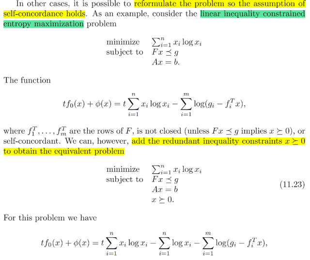</kbd></p>

<p align="center"><kbd>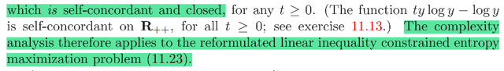</kbd></p>

> [!NOTE]
> Hai ví dụ về bài toán không thỏa self-concordant nhưng có thể biến đổi
> thành bài toán tương đương có self concordant
>
> QUAY LẠI SAU

<br>

<p align="center"><kbd>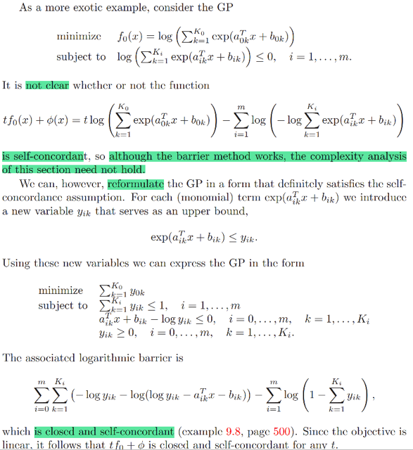</kbd></p>

> [!NOTE]
> QUAY LẠI SAU

<br>

<p align="center"><kbd>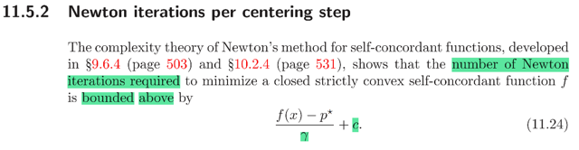</kbd></p>

<p align="center"><kbd>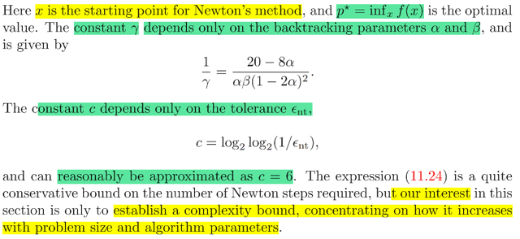</kbd></p>

> [!NOTE]
> Đầu tiên nhắc lại kết quả ta đã có ở chapter 9 - giới hạn trên của số
> iteration cần thiết của thuật toán để đạt độ sub-optimality f(x) - p* ≤ `ε.` Đó
> là  f(x0) - p*) `/` `γ` + c với `γ` chỉ phụ thuộc backtracking params và c chỉ
> thuộc `ε`
>
> (Chú ý, ở dưới có nói rõ, x trong f(x) - p*] `/` `γ` + c là starting point.
>
> Có nghĩa là nếu gọi x là starting point, thì quá trìng dùng Newton method
> để tìm ra x(k) sao cho f(x(k)) - p* ≤ `ε` sẽ không vượt quá [f(x) - p*] `/` `γ` + c
>
> (Kết quả này chapter 9 mình đã hiểu rồi)
>
> Ở phần này ta chỉ quan tâm đến việc cho ra `/` chứng minh rằng khi
> problem size tăng lên thì complexity bound sẽ ntn

<br>

<p align="center"><kbd>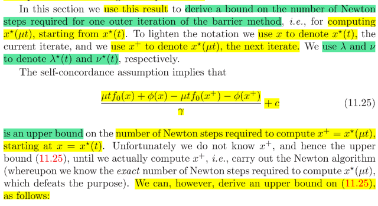</kbd></p>

<p align="center"><kbd>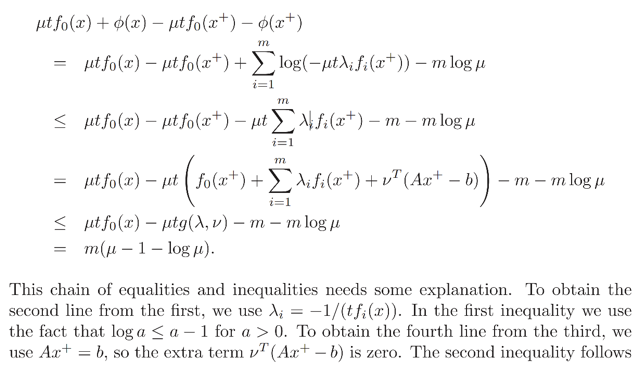</kbd></p>

<p align="center"><kbd>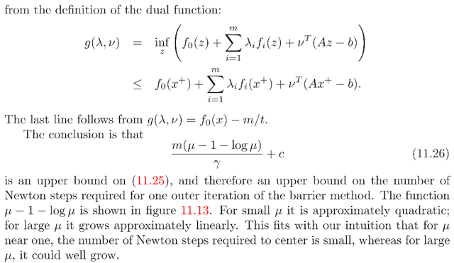</kbd></p>

> [!NOTE]
> đại khái là ở đây đầu tiên người ta áp dụng kết quả rằng số Newton
> iteration cần thiết để giúp giải bài toán từ starting point x `=` x*(t) ra x+ `=`
> `x*(μt)` (chỗ này phải nhớ rằng thuật toán mà ta giải bài toán gốc dùng
> barrier method với Newton method là vầy:
>
> lặp lại nhiều lần:
>
> - Dùng solution của bước trước x*(t) làm starting point giải tìm `x*(μt)`
> bằng Newton method. Đây gọi là một bước outer iteration, dĩ nhiên
> trong bước này có nhiều inner iteration là các bước của Newton step.
>
> Thế thì quay lại đây ta có upper bound của số Newton step cần thiết
> trong mỗi outer iteration
>
> ```text
> [f(x) - f(x+)] / γ + c =  [μtf0(x) + Φ(x)] - [μtf0(x+) + Φ(x+)]  / γ + c
> ```
>
> Thế thì họ mới nói rằng ta không biết cái x+.
>
> Do đó cái bound trên không xài được.
>
> Nên nhớ cái bound của số Newton iteration cần thiết giúp đạt f(x) - p* <
> `ε` mà các phân tích như ở chương 9 ta có: [f(x(0)) - p*] `/` `γ` + c.
>
> Thế thì ta cũng không biết p* là gì, NHƯNG CÔNG THỨC NÀY CHO
> BIẾT RẰNG, NẾU TA BẮT ĐẦU CÀNG GẦN OPTIMAL POINT THÌ SỐ
> ITERATION CẦN THIẾT SẼ CÀNG ÍT, đồng nghĩa nó cho biết sự quan
> trọng của việc có staring point tốt
>
> Còn ở đây, tuy trong phạm vi giải bài toán centering thì x+ đóng vai x*,
> và ta cũng ko biết f(x+) là gì, nhưng nó khác với việc ta ko biết p* ở
> chỗ: với x* , và p* ta ko biết nó băng bao nhiêu nhưng ta biết nó là
> optimal point, nằm đâu đó cố định.
>
> Còn x+ thì lại là kết quả mà sau khi dừng một outer iteration thì ta mới
> có, nó tùy thuộc chứ không cố định. Do đó cái bound này không gíup
> ích gì.
>
> So sánh nôm na là:
>
> Một cái là ta nói về một cái mốc ở đâu đó nhưng ta biết nó nằm đó
> chẳng qua không biết chính xác vị trí, và ta nói rằng "để đi từ đây đến
> đó" chắc chắn không tốn quá f(x0) - p* `/` `γ` + c bước.
>
> Một cái khác, là trên đường ta đi đến cái mốc p*, ta chia nó thành các
> mốc nhỏ hơn, các mốc này thì RẤT TÙY TIỆN, nó không cố định như
> cái mốc chính. Nên ta ko thể nói rằng để đi từ đây đến cái  mốc nhỏ đó
> chắc chắn ko tốn quá ... được, vì bản thân cái mốc nhỏ đó cũng rất tùy
> tiện. Nó là hệ quả của việc chạy thuật toán Newton với xuất phát là cái
> mốc trước đó và dừng khi đạt yêu cầu nào đó. Có nghĩa là chạy xong
> thì mới biết x+ nó ở đâu.
>
> Thành ra người ta mới nói nó vô dụng. Và từ đó mới cố gắng xây dựng
> cái chặn trên của một cái  chặn trên vô dụng này, để có một cái chặn
> trên hữu dụng.
>
> Và thông qua vài bước (trong note kế bên) thì ta có cái mốc hữu dụng
> hơn là m( `μ` - 1 - log `μ)`
>
> và nó phù hợp với trực giác rằng `μ` ≈ 1 (⇨ `m(μ` - 1 - log `μ)` ≈ 0 thì số
> Newton step cần trong mỗi outer iteration sẽ nhỏ (do `μ` nhỏ tức là
> problem của outer iteration sau sẽ sát với problem trước nên khi dùng
> solution của problem trước là starting point thì nó sẽ rất tốt.
>
> (Problem ở đây là central problem mà ta giải bằng Newton method ở
> mỗi outer iteration)
>
> ```text
> [f(x) - f(x+)] / γ + c =  [μtf0(x) + Φ(x)] - [μtf0(x+) + Φ(x+)]  / γ + c
> ```
>
> ```text
> [f(x) - f(x+)] / γ + c =  [μtf0(x) + Φ(x)] - [μtf0(x+) + Φ(x+)]  / γ + c
> ```
>
> Φ(x) `=` - `Σi` log(-fi(x)),
>
> ```text
> =  [μtf0(x) - μtf0(x+)] + [ Φ(x) - Φ(x+)]  / γ + c
> ```
>
> ```text
> =  [μtf0(x) - μtf0(x+)] + [ - Σi log(-fi(x)) + Σi log(-fi(x+)) ]  / γ + c
> ```
>
> ```text
> =  [μtf0(x) - μtf0(x+)] + Σi [ log(-fi(x+)) - log(-fi(x)) ]  / γ + c
> ```
>
> ```text
> =  [μtf0(x) - μtf0(x+)] + Σi log[(-fi(x+))/(-fi(x)) ]  / γ + c
> ```
>
> ```text
> =  [μtf0(x) - μtf0(x+)] + Σi log[ fi(x+) / fi(x) ]  / γ + c
> ```
>
> ```text
> =  [μtf0(x) - μtf0(x+)] + Σi log[ fi(x+) / fi(x) ]  / γ + c
> ```
>
> ```text
> Dùng λi = -1/tfi(x) = (-1/t)(1/fi(x)) ⇨ 1/fi(x) = - tλi
> ```
>
> ```text
> =  [μtf0(x) - μtf0(x+)] + Σi log[ fi(x+) (- tλi) ]  / γ + c
> ```
>
> ```text
> =  [μtf0(x) - μtf0(x+)] + Σi log[ -tλifi(x+) ]  / γ + c
> ```
>
> ```text
> =  [μtf0(x) - μtf0(x+)] + Σi log[ -tλifi(x+) + μ - μ ]  / γ + c
> ```
>
> ```text
> =  [μtf0(x) - μtf0(x+)] + Σi log[ -tλifi(x+)μ/μ ]  / γ + c
> ```
>
> ```text
> =  [μtf0(x) - μtf0(x+)] + Σi [ log[ -μtλifi(x+) ] - log(μ) ]  / γ + c
> ```
>
> ```text
> =  [μtf0(x) - μtf0(x+)] + Σi log[ -μtλifi(x+) ] - Σi log(μ)  / γ + c
> ```
>
> ```text
> =  [μtf0(x) - μtf0(x+)] + Σi log[ -μtλifi(x+) ] - mlog(μ)  / γ + c
> ```
>
> (đây là dòng thứ 2)
>
> dùng equality log a ≤ a - 1 ⇨ log[ `-μtλifi(x+)` ] ≤ `-μtλifi(x+)` - 1
>
> ```text
> ⇨ ... ≤  [μtf0(x) - μtf0(x+) + Σi [ -μtλifi(x+) - 1] - mlog(μ)  / γ + c
> ```
>
> ```text
> =  μtf0(x) - μtf0(x+) + Σi [ -μtλifi(x+) ] - Σi 1 - mlog(μ)  / γ + c
> ```
>
> ```text
> =  μtf0(x) - μtf0(x+) + Σi [ -μtλifi(x+) ] - m - mlog(μ)  / γ + c
> ```
>
> (đây là dòng thứ 3)
>
> Dùng sự thật rằng Ax+ `=` b, vì x+ thì dĩ nhiên là nghiệm của việc
> giải bài toán centralizing (minimize tf(x) + Φ(x) constraint Ax `=` b)
> Do đó (Ax+ - b) `=` 0 ⇔ vT(Ax+ - b) `=` 0
>
> ```text
> ...=  μtf0(x) - μtf0(x+) + Σi [ -μtλifi(x+) ] - μtvT(Ax+ - b) - m - mlog(μ)  / γ + c
> ```
>
> ```text
> =  μtf0(x) - μt f0(x+) + Σi [ λifi(x+) ] + vT(Ax+ - b) - m - mlog(μ)  / γ + c
> ```
>
> (đây là dòng thứ 4)
>
> Và f0(x+) + `Σi` [ λifi(x+) ] + vT(Ax+ - b) theo định nghĩa của dual function:
>
> g(λ, v) `=` inf x  f0(x+) + `Σi` [ λifi(x+) ] + vT(Ax+ - b) 
>
> ⇨ g(λ, v) ≤ f0(x+) + `Σi` [ λifi(x+) ] + vT(Ax+ - b)
>
> ⇨ - g(λ, v) ≥ -  f0(x+) + `Σi` [ λifi(x+) ] + vT(Ax+ - b) 
>
> ```text
> ⇨ ...≤  μtf0(x) - μtg(λ, v) - m - mlog(μ)  / γ + c
> ```
>
> (đây là dòng thứ 5, dấu ≤ thứ 2)
>
> g(λ, v) `=` f0(x) - `m/t`
>
> ```text
> ⇨ ... =  μtf0(x) - μt[f0(x) - m/t] - m - mlog(μ)  / γ + c
> ```
>
> ```text
> =  μtf0(x) - μtf0(x) + μtm/t - m - mlog(μ)  / γ + c
> ```
>
> ```text
> =  μm - m - mlog(μ)  / γ + c
> ```
>
> ```text
> = m[ μ - 1 - log(μ) ] / γ + c
> ```

<br>

<p align="center"><kbd>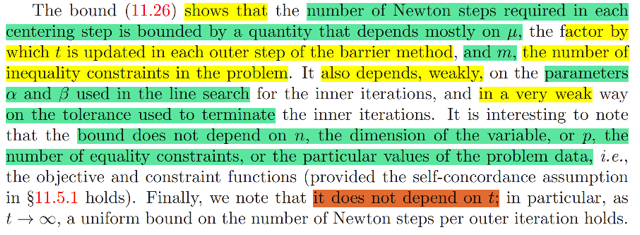</kbd></p>

> [!NOTE]
> Và cái mốc hữu dụng này hữu dụng ở chỗ nó cho ta biết số 
> Newton step trong mỗi outer iteration sẽ phụ thuộc chủ yéu là `μ` 
> là cái hệ số dụng để scale t xuống ở mỗi outer step, cũng phụ thuộc
> m là số inequality constraint. Cũng phụ thuộc nhẹ vào tham số 
> của backtracking. Và phụ thuộc sơ sơ vào `ε.`
>
> Như vậy nó ko phụ thuộc t chút nào.

<br>

<p align="center"><kbd>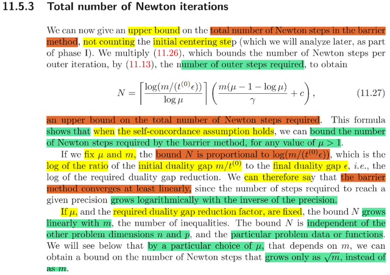</kbd></p>

> [!NOTE]
> Vừa rồi là số upper bound của số Newton step trong mỗi outer
> iteration thì nhân nó với upper bound của số outer iteration sẽ cho ta
> upper bound của tổng số Newton step của barrier method.
>
> Để rồi kết quả cho thấy đại khái là: nó phụ thuộc m, log của tỉ lệ m `/`
> t(0) và `ε.`
>
> m `/` t(0) và `ε` chính là initial `/` final duality gap vì sao?: (Theo link
> xanh)
>
> Theo link xanh ta có thể hiểu `m/t(0)` là initial gap tạm hiểu là cái 
> khoảng cách ban đầu càng lớn thì ta cần càng nhiều Newton steps
> Đồng thời `ε` là cái threshold mà ta đã thỏa mãn thuật toán, thì `ε` càng
> lớn tức là ta giảm yêu cầu xuống thì số Newton steps cũng giảm theo.
> Và nói chung là quan hệ giữa chúng với số Newton step yêu cầu là
> tuyến tính.
>
> Nhưng đại khái nó cho thấy barrier method sẽ converge ít nhất là
> tuyến tính. Tỉ lệ thuận với log `m/t0` `/` `ε.` Tỉ lệ tuyến tính với m, và nếu
> chọn `μ` phù hợp thì có thể tỉ lệ tuyến tính chỉ với √m.
>
> Và cũng cho thấy nó không phụ thuộc p, hay n cũng như functions cụ
> thể f0

<br>

<p align="center"><kbd>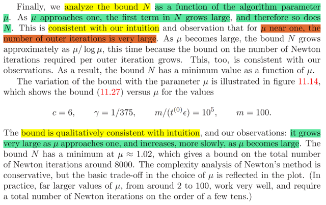</kbd></p>

<p align="center"><kbd>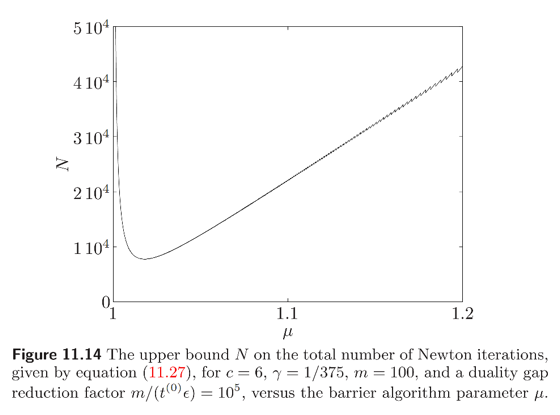</kbd></p>

> [!NOTE]
> đồ thị quan hệ giữa N (bound của số Newton step cần thiết) và `μ` cho
> thấy khi `μ` gần 1 thì N tăng rất nhanh, còn khi `μ` lớn dần từ đó thì nó
> giảm và tăng trở lại khi `μ` rất lớn
>
> Nó khớp với trực giác rằng khi `μ` -> 1 thì đại khái là số Newton step
> ở mỗi outer iteration sẽ nhỏ nhưng số outer iteration sẽ rất lớn lí do
> là t mà ≈ 1 thì mỗi bài toán centering kế tiếp sẽ khác nhau rất ít,
> khiến x+ chỉ khác chút xíu so với x ⇨ hình ảnh như một người bước
> rất nhỏ ⇨ cần rất nhiều bước.
>
> Khi `μ` lớn hơn xa khỏi 1 N bắt đầu giảm vì kiểu như nó dần tìm được
> giá trị tối ưu,
>
> Còn khi `μ` tăng và trở nên rất lớn, thì số Newton step trong mỗi outer
> iteration sẽ tăng ⇨ khiến N cũng sẽ tăng trở lại. Lí do vì khi `μ` rất lớn
> thì mỗi bài toán centering kế nhau sẽ khác nhau nhiều khiến x*(t)
> không còn là good starting point cho bài toán kế nũa ⇨ tăng số
> Newton step cần để giải tìm x*(t+1)
>
> Và lúc này sự tăng của nó hành xử gần giống hàm `μ` `/` log `μ` , nên có
> thể thấy trong minh họa nó nó khá giống hàm tuyến tính
>
> Cái hình dưới minh họa điều này

<br>

<p align="center"><kbd>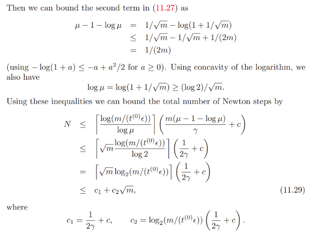</kbd></p>

<p align="center"><kbd>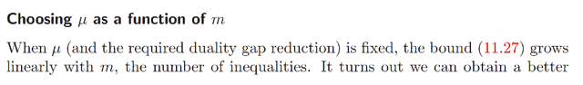</kbd></p>

<p align="center"><kbd>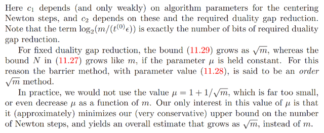</kbd></p>

> [!NOTE]
> Đại khái là ở trên ta đã có upper bound của N là số Newton step
> cần thiết để đạt `ε` nào đó, trong đó ta thấy cái upper bound này sẽ
> tăng tuyến tính theo m
>
> Thì  ở mục này ý chính là nói rằng BẰNG CÁCH CHỌN `μ` `=` 1 +
> `1/√m` thì ta có thể hạ thấp cái upper bound đó hơn nữa để nó chỉ
> tăng theo √m thôi.
>
> Nói chung là thay `μ` `=` 1 + `1/√m` vào cái công thức và dùng thêm
> vài bất đẳng thức nữa để cho kết quả là c1 + c2√m
>
> Nhưng thực tế thì người ta sẽ ko làm như vậy vì `μ` `=` 1 + `1/√m` này
> quá nhỏ.

<br>

<p align="center"><kbd>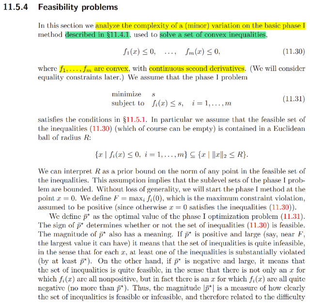</kbd></p>

> [!NOTE]
> QUAY LẠI SAU

<br>

<p align="center"><kbd>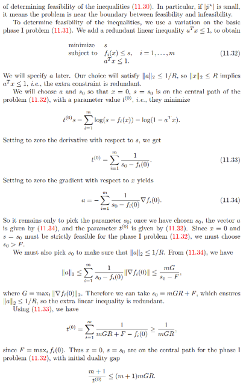</kbd></p>

> [!NOTE]
> QUAY LẠI SAU

<br>

<p align="center"><kbd>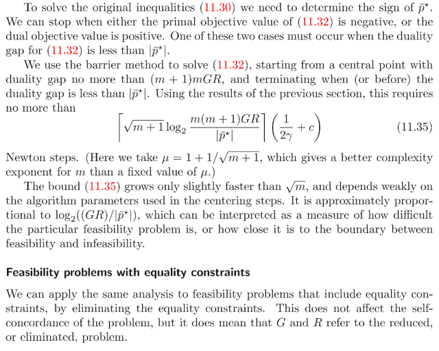</kbd></p>

> [!NOTE]
> QUAY LẠI SAU

<br>

<p align="center"><kbd>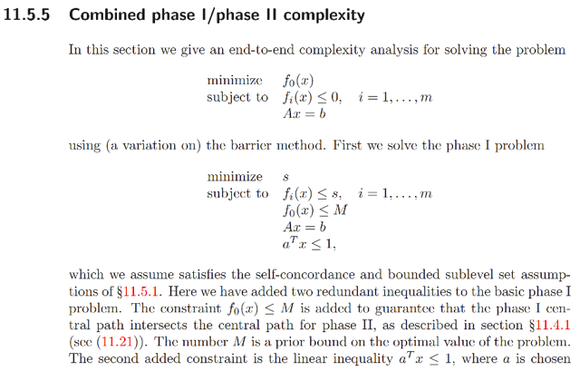</kbd></p>

> [!NOTE]
> QUAY LẠI SAU

<br>

<p align="center"><kbd>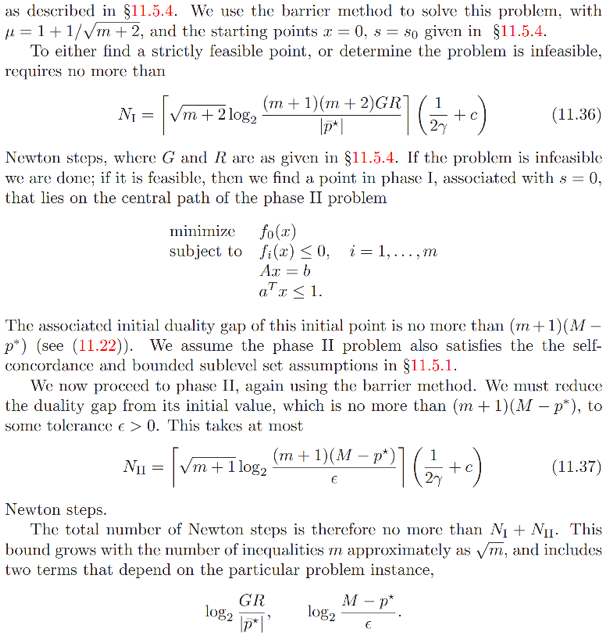</kbd></p>

> [!NOTE]
> QUAY LẠI SAU

<br>

<p align="center"><kbd>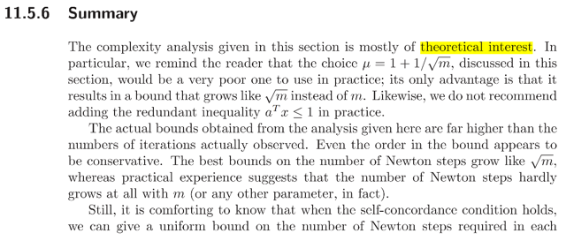</kbd></p>

<p align="center"><kbd>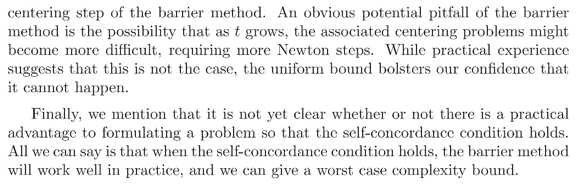</kbd></p>

> [!NOTE]
> QUAY LẠI SAU

<br>


<a id="node-xvq41mb"></a>
## Appendix: Linear Algebra

<br>

<p align="center"><kbd>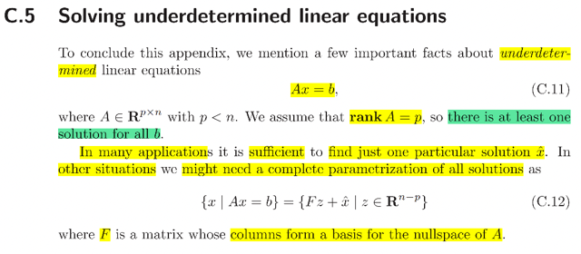</kbd></p>

> [!NOTE]
> Nói về một số điểm đáng chú ý khi giải một hệ underdetermined: Ax
> `=` b  với A là matrix lùn mập (nhiều cột hơn hàng) (p,n) với p < n.
>
> Và giả định là A full row rank, tức p hàng đều độc lập (nên dĩ nhiên
> có p cột độc lập, theo MIT 1806 ta đã biết, b sẽ chắc chắn nằm
> trong C(A) nên Ax `=` b chắc chắn có nghiệm, mà chính xác hơn thì
> nó chắc chắn có vô số nghiệm dạng `x_particular` + `α` `x_null,` vì có
> cột tự do nên sẽ có non-trivial vector trong nullspace)
>
> Thế thì ở đây nói có khi ta chỉ cần một nghiệm, nhưng cũng có khi
> ta cần thể hiện toàn bộ nghiệm, đó chính là `x_particular` + `α` `x_null`
> ở trên, nhưng ta sẽ thể hiện là x^ + Fz với F là matrix các cột là
> basis của N(A) và z là  vector bất kì, đóng vai trò là hệ số để tạo
> linear combination các N(A) basis để tạo ra nullspace vector.

<br>

<p align="center"><kbd>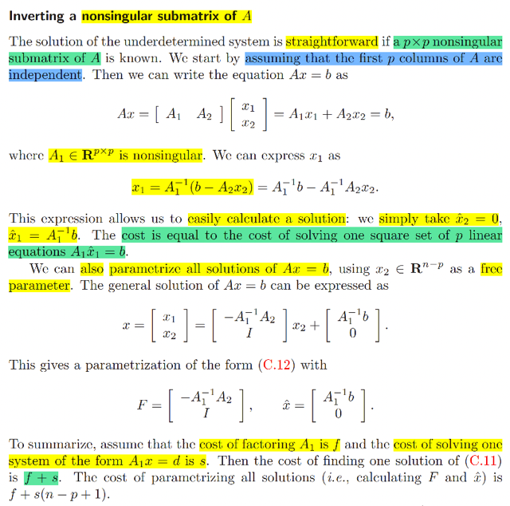</kbd></p>

> [!NOTE]
> Thế thì, xét trường hợp mà matrix A mập lùn có p cột đầu tiên cũng độc lập, điều
> này có nghĩa là p cột đầu tiên của nó sẽ tạo một sub matrix (p, p) non-singular `/` full
> rank (gọi là A1) và (n - p) cột còn lại là dependent columns (tạo matrix A2, singular)
>
> Khi đó Ax `=` b có thể hiểu `/` thể hiện theo dạng [A1, A2] [x1, x2]T `=` b với x1 là R^p
> vector, x2 là R^(n-p) vector. Để rồi b `=` A1x1 + A2x2 mang ý nghĩa là p phần tử của
> x1 là hệ số của linear combination p cột đầu tiên của A, và x2 là hệ số combine
> linearly n - p cột sau của A, và cộng lại ra b (bản chất Ax là linear combination các
> cột của A)
>
> Thế thì từ A1x1 + A2x2 `=` b ⇔ A1x1 `=` b - A2x2
>
> vì A1 non-singular nên có thể nhân hai vế cho A1inv:
>
> x1 `=` A1invb - A1invA2x2
>
> Từ đây bằng cách chọn x2 `=` 0 (tương đương chọn n - p component cuối của x `=` 0)
> thì ta có thể giải tìm x1 `=` A1invb để có x `=` [x1, 0] `=`  [A1invb, 0] là một solution của
> Ax `=` b (*)
>
> Và việc giải x1 `=` A1inv b dĩ nhiên với việc ta đang giải bài toán A1x1 `=` b với A là
> matrix (p, p) nên chi phí tính toán sẽ là chi phí của bài toán này.
>
> `====`
>
> Và tổng quát với x1 `=` A1invb - A1invA2x2, ta có x như vầy:
>
> x `=` [x1, x2]T `=` [A1invb - A1invA2x2, x2]T
>
> `=` [A1invb, I]T + [- A1invA2x2, x2]T
>
> `=` [- A1invA2x2, x2]T + [A1invb, I]T
>
> `=` [- A1invA2, I]T x2 + [A1invb, I]T
>
> Và đây chính là gì, chính là dạng tổng quát (complete solution)
>
> x `=` F z + x^
>
> với x^ là một particular solution `=` [A1invb, I]T như đã nói ở (*)
>
> và F chính là [- A1invA2, I]T, z chính là x2. Để với các x2 (z) bất kì ta sẽ có Fz là
> nullspace vector của A
>
> Khúc cuối nói rằng nếu ta chi phí factoring A1 LÀ f , GIẢI HỆ A1x `=` d là s thì tổng
> chi phí sẽ là f + s
>
> Và để parameterizing mọi solution thì cần f + s(n - p + 1)
>
> Là thế này:
>
> Nói chung ta cần làm những việc gì: Đó là tìm F và tìm x^.
>
> Tìm F với F `=` [-A1invA2, I] thì cơ bản là ta cần tìm -A1invA2
>
> đặt Y `=` -A1invA2, thì việc tìm Y tương đương với việc giải A1Y `=` -A2 có nghĩa là ta
> sẽ không tìm A1inv và nhân A1inv với A2 mà sẽ giải A1Y `=` - A2 để tìm Y.
>
> Và A1Y `=` -A2 nên hiểu thế nào. theo một trong những góc nhìn matrix x matrix thì
> có thể nhìn theo cách: cột j của -A2 chính là linear combination của các cột của A1
> với coefficient là cột j của Y. Do đó, tìm cột j của Y chính là giải hệ:
>
> A1yj `=` -[cột j của A2]
>
> Đây là một hệ phương trình tuyến tính, mà để giải nó cần chi phí đã cho biết là s
> (sách ban đầu đã nói chi phí giải hệ A1x `=` d là s, từ những phần trước C1->C4 mình
> hiểu rằng giải Ax `=` b theo phương pháp factor - solver, thì bước một là factorize A
> thành LU, hay nếu A có cấu trúc đặc biệt hơn thì ta có thể có các dạng factorizing
> khác tốt hơn, bước này như đã nói sẽ tốn chi phí là f. Bước hai là solver step: khi 
> ta sẽ giải Ax `=` b ⇔ LUx `=` b, thì đầu tiên giải Lz `=` b, với L là lower triangular thì
> đây chính là quá trình forward substitution và sau đó là giải Uz `=` z, chíng là quá trình
> back-substitution. Và người ta gọi cost của bước solver, tổng hai bước này là s)
>
> Vậy để tìm một cột của Y ta cần tốn s chi phí. Và Y có mấy cột? (n - p) cột ⇨ cần
> (n - p)s chi phí.
>
> Trước đó, việc giải A1x + d sẽ cần một chi phí để factor A1 là d. factor A1 tức là LU
> factorization (MIT 1806 đã học, chính là đưa A về dạng row echelon form U, từ đó
> giúp chuyển Ax `=` b thành Ux `=` b', và chỉ việc back-substitution để giải ra x (mà
> bước này chính là bước tốn s chi phí)
>
> Vậy nên ta hiểu rằng một khi đã factorizing A1 (tốn f chi phí) thì sau đó mỗi lần giải
> Ax `=` d đều chỉ tốn s chi phí.
>
> Vậy nãy h ta tốn f (factorizing A1) + (n - p)s (giải tìm các cột của Y `=` -A1invA2, cũng
> chính là các cột của F (F `=` [-A1invA2, I]).
>
> Còn lại một cái phải làm nữa là tìm x^, `=` [A1invb, 0]. Cũng chính là tìm A1invb, đặt
> y `=` A1invb thì giải tìm y chính là giải hệ A1y `=` b. lại tốn thêm một s chi phí (vì A1 đã
> factor một lần)
>
> Vậy tổng cộng tốn f + (n - p)s + s `=` f + (n - p + 1)s chi phí tính toán

<br>

<p align="center"><kbd>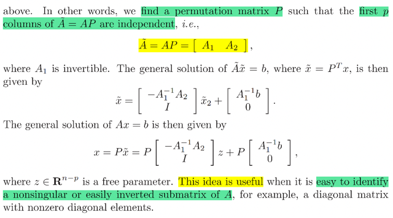</kbd></p>

<p align="center"><kbd></kbd></p>

> [!NOTE]
> Trường hợp thứ hai, khi A không có vụ có p cột độc lập đứng trước
> thì khi đó, ta sẽ chỉ đơn giản là tìm thêm matrix P (permutation
> matrix) để làm công tác sắp xếp lại các cột của A để đưa các cột
> độc lập lên đầu. Sau đó làm như vừa rồi.
>
> Như vậy dễ hiểu rằng ta sẽ có A~ `=` AP (sau khi permute column) `=`
> [A1, A2] (là dạng matrix có p cột độc lập đứng đầu)
>
> Thế thì dĩ nhiên áp dụng các bước vừa rồi, sẽ giúp ta có general
> solution của A~x~ `=` b là:
>
> x~ `=` [-A1invA2, I] x2~ + [A1invb, 0]
>
> Thế thì đây là solution của A~x~ `=` b, tức APx~ `=` b, và x `=` Px~
>
> Vậy x `=` P[-A1invA2, I] x2~ + P[A1invb, 0]
>
> Do đó vấn đề chỉ là tìm P, nên mới nói nếu A có tính chất mà  ta dễ
> dàng nhận ra các cột nào là independent thì ta sẽ dễ dàng xây dựng
> matrix P, và dùng nó để đảo các cột là xong. Cũng có nghĩa là nếu
> không dễ xác định cột nào độc lập thì ta ko biết P là gì để mà dùng

<br>

<p align="center"><kbd>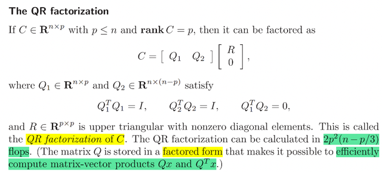</kbd></p>

> [!NOTE]
> Về con số chi phí thì:
>
> Nếu theo Gram-Schmidt thì chi phí sẽ là như sau:
>
> Step 1: q1 `=` a1, q1 `=` `q1/||q1||:`
>
> n (*) + n (+) + 1 (√) + n `(/)` `=` 3n + 1 ≈ 3n
>
> Step 2: q2 `=` c2 - (c2Tq1)q1, q2 `:=` `q2/||q2||`
>
> c2Tq1: n (*) + n (+) `=` 2n
>
> (c2Tq1)q1: n (*)
>
> c2 - (c2Tq1)q1: n (-)
>
> ⇨ Tổng cộng: 4n 
>
> Và một bước normalizing: 3n 
>
> ⇨ Tổng cộng step 2: 4n + 3n 
>
> Step 3: Project c3 onto q1, q2 và vì q1 vuông góc q2
> thì cơ bản là ta sẽ project lần lượt lên q1, và q2:
>
> nói cách khác q3 `=` c3 - c3Tq1q1 - c3Tq2q2: tốn 2*4n
>
> Normalizing q3: 3n ⇨ 2*4n + 3n
>
> Tương tự Step 4 sẽ tốn 3*4n + 3n
>
> ...
>
> Step p: sẽ là (p-1)*4n + 3n
>
> Cộng lại hết: 0*4n + 3n + 1*4n + 3n + 2*4n + 3n + ...(p-1)*4n + 3n
>
> ```text
> = Σi=1:p [(i-1)*4n + 3n] = 4n Σi=1:p (i-1) + Σi=1:p 3n
> ```
>
> ```text
> = 4n p(p-1)/2 + 3np = 2np(p-1) + 3np = 2npp - 2np + 3np
> ```
>
> `=` 2np^2 + np
>
> `====`
>
> Thế thì trong sách nói chi phí là 2np^3 - `2/3` p^3 theo GPT là vì
> người ta dùng cái gọi là Householder reflection để xóa các phần
> tử dưới đường chéo, giúp giảm chi phí tính toán xuống
>
> Rồi đại khái là nếu ta có C là matrix full column rank cao ốm [n, p] thì nó
> có thể được factor bởi QR factorization thành dạng QR (mà một trong
> những phương pháp là Gram-Schmidt mà mình đã học)
>
> Cơ bản về Gram-Schmidt thì như đã biết quy trình sẽ là:
>
> 1) lấy cột 1 của C giữ nguyên, normalize nó để làm cột 1 (q1) của Q.
>
> q1 `=` `c1/||c1||`
>
> 2) Project cột 2 (c2) của C lên spanq1 và lấy phần dư, normalize, thành
> cột q2: q2 `=` c2 - c2Tq1q1, q2 `=` `q2/||q2||`
>
> ⇔
>
> 3) Project cột 3 (c3) của C lên spanq1, q2, lấy phần dư, normalize, gán
> thành q3 (vì q1, q2 orthogonal nên phép chiếu chỉ đơn giản là chiếu lần
> lượt lên q1, và q2 rồi lấy phần dư:
>
> q3 `=` c3 - c3Tq1q1 - c3Tq2q2 ; q3 `=` `q3/||q3||`
>
> ...tương tự như vậy đến qp
>
> Khi đó ta sẽ có Q là matrix có các cột orthonormal nhưng không vuông
> nên không phải orthogonal matrix.
>
> Và Gram-Schmidt procedure ở trên chính là:
>
> q1 `=` `c1/||c1||`
>
> ⇨ c1 `=` ||c1|| q1 `=` ||c1|| q1 + 0*q2 + ...0*qp `=` Q [||c1||, 0,..0]T
>
> `=` Q [R11, 0, ...0]T
>
> q2 `=` c2 - c2Tq1q1, q2 `=` `q2/||q2||`
>
> ⇨ c2 `=` (q1Tc2)q1+q2 `=` (q1Ta2)q1 + q2||q2||
>
> `=` R12q1 + R22q2 `=` R12q1 + R22q2 + 0*q3 + ...0*qp
>
> `=` Q [R12, R22, 0, ...0]T
>
> Tiếp tục như vậy để thấy tại sao C `=` QR với R là upper triangular matrix
>
> Thế thì chú ý ở đây, rằng với C là n,p matrix thì Q cũng là n,p matrix
> nhưng cái mà đang nói trong sách là expanded version. Hiểu nôm na là
> sau khi làm xong p columns của C, chính là chuyển từ p basis của
> column space C(C) thành một bộ basis ngon hơn (orthogonal `/` unit norm)
> của C(C). Thì ta sẽ làm tiếp với n - p basis của left nullspace N(CT) để có
> một bộ orthogonal basis của toàn bộ R^n
>
> Nên ta thấy C `=` [Q1 Q2][R 0]T `=` Q1R + Q20 chính là vậy.
>
> Q1TQ1 `=` I: vì như đã nói các cột của Q1 là orthogonal basis của C(C)
>
> Q2TQ2 `=` I cũng vậy, các cột của Q2 là orthogonal basis của left null
> space N(CT)
>
> Và Q1TQ2 `=` 0 thể hiện column space C(C) và left nullspace N(CT)  là hai
> subspace orthogonal complement.

<br>

<p align="center"><kbd>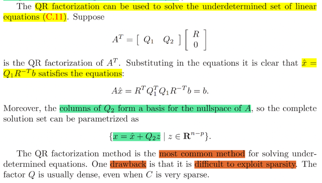</kbd></p>

> [!NOTE]
> Thế thì quay lại vấn đề đang muốn giải hệ under-determined Ax `=` b 
> (A mập lùn full row rank) thì ý chính là nói QR factorization cũng có
> thể giúp giải hệ này.
>
> Như đã nói để QR factorization, ta cần full column rank. Vậy A full
> row rank nên AT full column rank. Nên giả sử dùng QR factorization
> ta có AT `=` [Q1 Q2] [R; 0] `=` Q1R + Q20
>
> Thì khi đó Ax `=` b ⇔ (Q1R + Q20)Tx `=` b 
>
> ⇔ (Q1R)Tx `=` b ⇔ RTQ1Tx `=` b 
>
> Khi đó x^ `=` Q1(Rinv)Tb chính là solution, vì nó thỏa:
>
> Vế trái với x `=` x^: RTQ1Tx^ `=` RTQ1TQ1(Rinv)Tb
>
> ```text
> = RTQ1TQ1(Rinv)Tb = RT(Rinv)Tb = b = vế phải
> ```
>
> Từ đó ta có particular solution x^
>
> Ngoài ra, như đã hiểu, khi C `=` [Q1 Q2] [R; 0]
> thì Q2 chính là (orthogonal) basis của left nullspace của C
>
> Nên ở đây nó chính là basis của left nullspace của AT,
> và dĩ nhiên chính là basis của NULLSPACE CỦA A. Và do đó
> nó chính là matrix F mà ta cần
>
> Vậy complete solution chính là x `=` x^ + Q2z
>
> Và họ cho biết QR factorization chính là phương pháp phổ biến
> nhất để giải hệ under. Chỉ có vài nhược điểm chưa hiểu lắm

<br>

<p align="center"><kbd>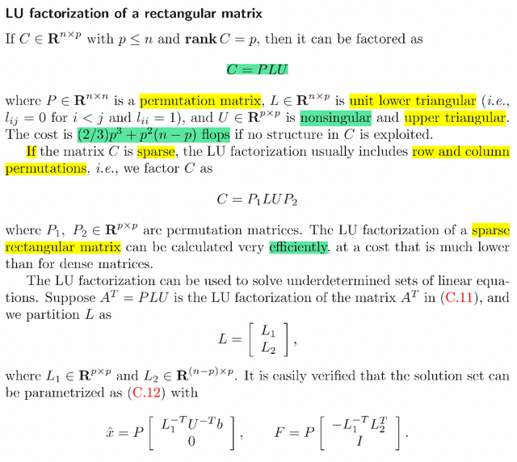</kbd></p>

> [!NOTE]
> Cuối cùng là nói về LU factorization cũng có thể giúp giải
> hệ under. QUAY LẠI SAU

<br>

<p align="center"><kbd>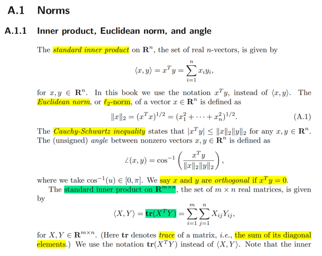</kbd></p>

<p align="center"><kbd>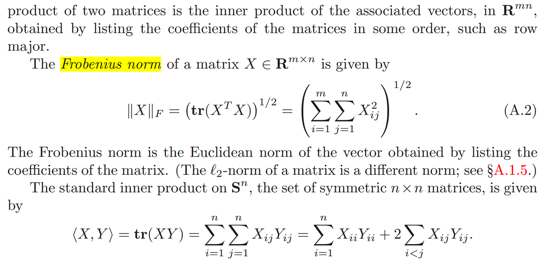</kbd></p>

<br>

<p align="center"><kbd>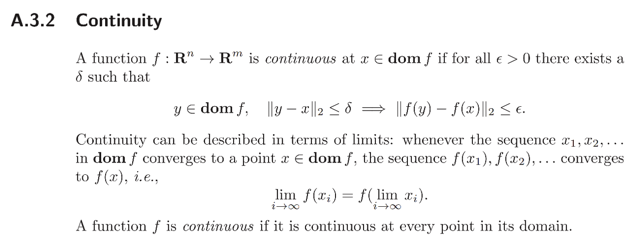</kbd></p>

<br>

<p align="center"><kbd>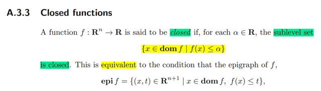</kbd></p>

<p align="center"><kbd>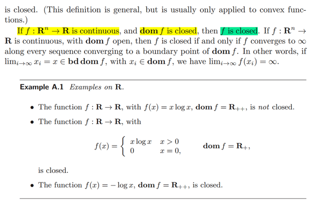</kbd></p>

<br>

<p align="center"><kbd>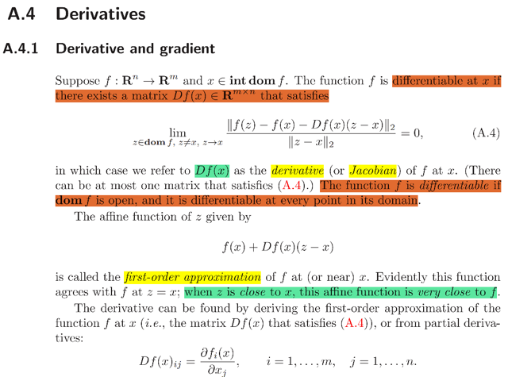</kbd></p>

> [!NOTE]
> Đại khái là định nghĩa về tính khả vi (differentiable của một 
> hàm vector đa biến R^n -> R^m) Cái này mình chưa được học
> ở cả MIT 18.02 hay MIT 18s096 tạm biết vậy.
>
> Df(x) gọi là Jacobian của f tại x và affine function theo z:
>
> f(x) + Df(x)(z - x) là linear approximation của f(z) khi z gần x.
>
> Và họ nói ta có thể tìm Df(x) theo định nghiã hoặc từ partial
> derivative: Df(x)ij `=` `∂fi(x)/∂xj`
>
> Thế thì suy nghĩ một chút, mình biết về Jacobian khi học MIT
> 18.02 hay MIT 18s096, đó là khi ta có một vector-vector function.
> Thì khi đó, matrix đạo hàm từng phần của `f_i` wrt `x_j` là Jacobian
>
> Trong 18s096, ta biết rằng df `=` f(x + dx) - f(x) `=` f'(x)[dx]
> là một linear operator act on dx. Thì vì f là vector nên df cũng là
> vector. x là vector, nên dx cũng là vector. Vậy thì linear operator
> act on vector dx để cho ra vector df chỉ có thể là một matrix nhân
> vector dx, matrix đó chính là Jacobian: df `=` J dx

<br>

<p align="center"><kbd>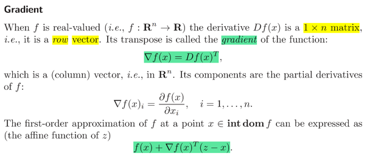</kbd></p>

> [!NOTE]
> Vậy thì khi f trở thành scalar function R^n -> R thì Jacobian
> bây giờ chỉ là matrix có 1 row, hay row vector. Và nếu transpose
> nó thì ta có định nghĩa của Gradient vector ∇f(x): ∇f(x) + Df(x)T
>
> Khi đó linear approx. của f(x): f(z) ≈ f(x) + ∇f(x)(z - x)
>
> Và ta cũng có lập luạn tương tự: df `=` f'(x)dx. mà df là scalar, dx
> là vector ⇨ linear approx. act on vector dx cho ra scalar df chỉ
> có thể là phép dot product của dx với một vector khác, đó là ∇f(x)
>
> ⇨ df `=` ∇f(x)Tdx ⇨ f'(x) (hay Df(x)) `=` ∇f(x)T

<br>

<p align="center"><kbd>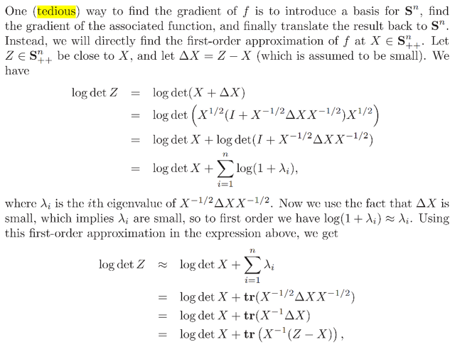</kbd></p>

<p align="center"><kbd>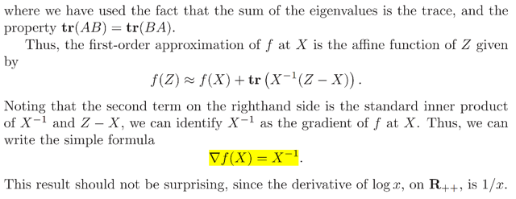</kbd></p>

> [!NOTE]
> Rồi thử làm lại xem derivative của log det (X) có ra kết quả giống
> ông Boye ko (mình đã làm việc nay trong MIT 18s096 rồi)
>
> Thay vì làm với log det X ta tìm derivative của det X trước:
>
> f(X) `=` det X. df `=` det(X + dX) - det(X).
>
> Trong MIT 18s096 gs Allan đề nghị xét bản `det(αI` + X) trước.
>
> Và lập luận đó là, dựa vào một điều dễ chứng minh là `αI` + X sẽ
> là matrix có eigenvalues là `α` + λi , với λi là eigenvalues của X.
> Mà determinant thì ta biết là tích các eigenvalues. Nên `det(αI` + X)
> `=` Πi `(α` + λi)
>
> Khai triển cái tích của n thừa số này ra ta sẽ được một cái tổng
> của các hạng tử mà mỗi hạng tử là tích của n thừa số thuộc một
> trong hai loại: là `α` hoặc là λi. Sau đó ta gom lại theo bậc của 
> `α` ta sẽ thấy hệ số của các hạng tử gắn với các bậc của `α` như sau:
>
> ```text
> α^n: = 1, vì chỉ có một cách để ra α^n là mọi thừa số đều là α.
> ```
>
> `α^n-1,` nó sẽ là tổng những hạng tử có dạng tích của n-1 `α` và một cái λi
> ```text
> vậy hệ số gắn với cái này sẽ là (Σ λi) α^n-1 = tr(X) α^n-1
> ```
>
> `α^n-1,` nó sẽ là tổng của các hạng tử có dạng tích của n-2 `α` và 2 cái λi
> ⇨ hệ số sẽ là `Σ(i` ≠ j)λiλj
>
> tương tự.
>
> `α^0,` nó sẽ là tổng những hạng tử có dạng tích của 0 `α` và n λi. Và chỉ có
> một cái như vậy, ⇨ hệ số sẽ là `Πi=1:n` λi, đây chính là detX
>
> ```text
> Do đó có thể thấy det(αI + X) = α^n + tr(X) α^n-1 + ...det(X)
> ```
>
> Rồi áp dụng cái này cho `α` `=` 1, X `=` dX ta có:
>
> det(I + dX) `=` 1^n + tr(dX) 1^n-1 + ... det(dX) 
>
> Nhận xét thấy nếu dX là matrix các thay đổi vô cùng nhỏ của X thì 
> các eigenvalue của nó cũng vô cùng nhỏ ⇨ det(X) cũng như các term
> mà có tích các λi đều thuộc bậc cao của số vô cùng nhỏ nên có thể bỏ đi
>
> ⇨ det(I + dX) `=` 1 + tr(dX)
>
> Từ đó d[det(X)] `=` det(X + dX) - det(X)
>
> `=` det(X + XXinvdX) - detX `=` det(X(I + XinvdX) - detX
>
> `=` detXdet(I + XinvdX) - det(X) | dùng det(AB) `=` det(A)det(B)
>
> `=` detX(1 + tr(XinvdX)) - detX `=` detX tr(XinvdX) 
>
> `=` detX tr(XinvTTdX) `=` detX XinvT . dX
>
> Vậy d(det(X)) `=` detX XinvT . dX `=` (detX Xinv)T . dX
>
> Cái này có dạng vector (detX XinvT) inner product với vector dX
>
> ⇨ ∇det(X) `=` detX XinvT
>
> Và d log det X thì dễ rồi: đặt u `=` det X ⇨ d log det X `=` d log(u)
>
> ```text
> = 1/u du = (1/det X) d(det X) = 1/detX detX XinvY dX = XinvT dX
> ```
>
> Vậy derivative của log det(X) `=` XinvT
>
> Kết quả trong sách gs ra ∇f `=` Xinv vì ổng xét f là S^n -> R tức X là 
> symmetric ⇨ Xinv cũng `=` XinvT
>
> Thử làm lại theo cách gs Boyle:
>
> df `=` log det (X + dX) - log det X
>
> Xét log det (X + dX) 
>
> `=` log det (X^0.5X^0.5 + X^0.5X^-0.5 dX X^-0.5X^0.5)
>
> `=` log det (X^0.5[X^0.5 + X^-0.5 dX X^-0.5 X^0.5])
>
> `=` log det (X^0.5[I + X^-0.5 dX X^-0.5 ]X^0.5)
>
> `=` log  det(X^0.5) det[I + X^-0.5 dX X^-0.5 ] det(X^0.5) 
>
> `=` log  det(X^0.5) + log det[I + X^-0.5 dX X^-0.5 ] + log det(X^0.5)  
>
> `=` log  det(X^0.5) + log det(X^0.5)  + log det[I + X^-0.5 dX X^-0.5 ]
>
> `=` log  det(X^0.5)det(X^0.5)  + log det[I + X^-0.5 dX X^-0.5 ]
>
> `=` log det(X) + log det[I + X^-0.5 dX X^-0.5 ]
>
> log det[I + X^-0.5 dX X^-0.5 ] thì `=` log Π (1 + λi) với 
>
> λi là eigenvalue của X^-0.5 dX X^-0.5
>
> `=` `Σi` log (1 + λi)
>
> ⇨ .. `=` log det X + `Σi` log (1 + λi)
>
> Giờ mới xét các log (1 + λi), chỉ là log của 1 + scalar. λi, mà matrix 
> X^-0.5 dX X^-0.5 là matrix rất nhỏ nên λi rất nhỏ. Dùng linear 
> approx của hàm log ta có log(1 + λi) ≈ λi
>
> ⇨ ... `=` log det X + `Σi` λi 
>
> `=` log det X + tr(X^-0.5 dX X^-0.5)  | tổng eigenvalues là trace
>
> Xét tr(X^-0.5 dX X^-0.5) `=` tr(X^-0.5 X^-0.5 dX) (tr(AB) `=` tr(BA)
>
> `=` tr(Xinv dX)  |  X^-0.5 X^-0.5 `=` X^-1 `=` Xinv
>
> `=` tr(XinvTT dX) `=` XinvT . dX   | tr(ATB) `=` A . B)
>
> Vậy  log det (X + dX)  `=` log det X + XinvT . dX
>
> ⇨ df `=`  log det (X + dX)  - log det X 
>
> `=` log det X + XinvT . dX - log det X `=` XinvT . dX
>
> ⇨ ∇f `=` XinvT

<br>

<p align="center"><kbd>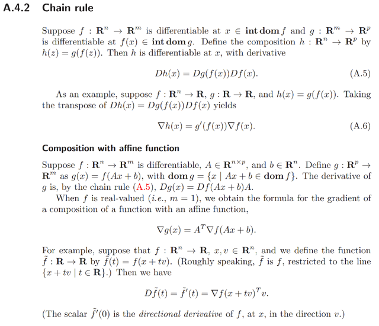</kbd></p>

<br>

<p align="center"><kbd>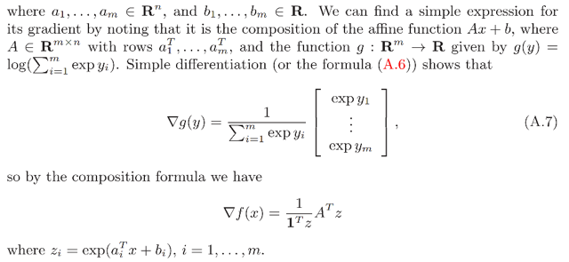</kbd></p>

<p align="center"><kbd>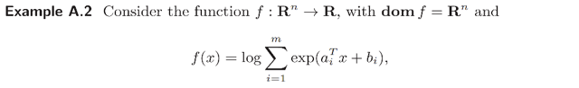</kbd></p>

> [!NOTE]
> Thử tìm derivative cái này dùng chain rule:
>
> f(x) `=` log `Σ` exp (aiTx + bi)
>
> ui `=` aiTx+bi ⇨ dui `=` aiTdx
>
> vi `=` exp ui ⇨ dvi `=` exp(ui) dui
>
> ```text
> g = Σ vi ⇨ dg = Σ dvi
> ```
>
> f `=` log g ⇨ df `=` `1/g` dg
>
> ```text
> = 1/g Σ dvi = 1/g Σ dvi = 1/g Σ [exp(ui) dui]
> ```
>
> `=` `1/g` `Σ` [exp(ui) aiTdx]
>
> ```text
> = (1/Σ exp(aiTx+bi)) Σ [exp (aiTx+bi) aiTdx ]
> ```
>
> Xét `Σ` exp(aiTx+bi), chính là 1Texp(Ax + b)
>
> `Σ` [exp (aiTx+bi)] aiTdx chính là:
>
> `Σi` [ exp(Ax + b)_i * (Adx)_i ]
>
> `=` exp(Ax + b)T(Adx)
>
> Vậy...df `=` `[1/1Texp(Ax` + b)] exp(Ax + b)T(Adx)
>
> Đặt z `=` exp(Ax + b) ⇨ 
>
> df `=` `(1/1Tz)` zTAdx
>
> `=` `[(1/1Tz)` ATz)Tdx
>
> ⇨ ∇f `=` `(1/1Tz)` ATz

<br>

<p align="center"><kbd>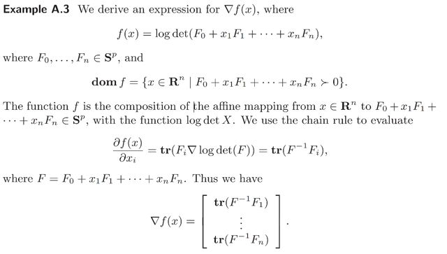</kbd></p>

> [!NOTE]
> Thử cái này: f(x) log det (F0 + `Σi` xiFi)
>
> Dùng kết quả ∇(log det A) `=` AinvT ⇨ d log det A `=` AinvT . dA
>
> `=` tr(AinvdA) 
>
> ```text
> Đặt F = F0 + Σi xiFi ⇨ dF = Σi Fidxi
> ```
>
> ⇨ d log det F `=` tr(FinvdF) `=` tr[Finv `Σi` (Fidxi)] 
>
> `=` `tr(Σi` FinvFidxi) 
>
> ```text
> = Σi tr(FinvFidxi) | trace của Σ = Σ của trace
> ```
>
> ```text
> = Σi tr(FinvFi)dxi | vì dxi là scalar, tr(Aα) = tr(A)α
> ```
>
> `=` DTdx với D `=` [tr(FinvF1), tr(FinvF2),...tr(FinvFn)]T
>
>  tới đây đã có dạng inner product giữa vector với vector dx
>
> ⇨ ∇f `=` D `=` [tr(FinvF1), tr(FinvF2),...tr(FinvFn)]T

<br>

<p align="center"><kbd>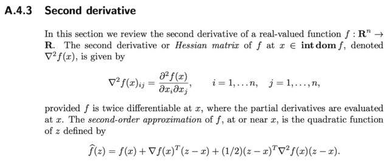</kbd></p>

<p align="center"><kbd>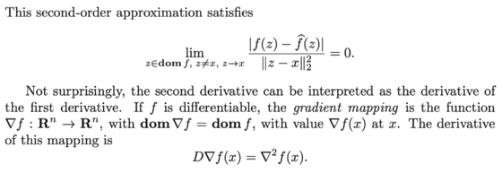</kbd></p>

<br>

<p align="center"><kbd>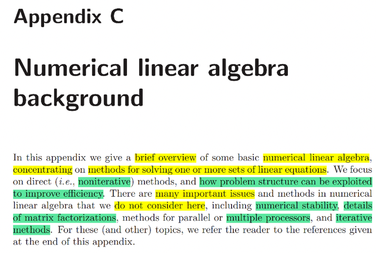</kbd></p>

<br>

<p align="center"><kbd>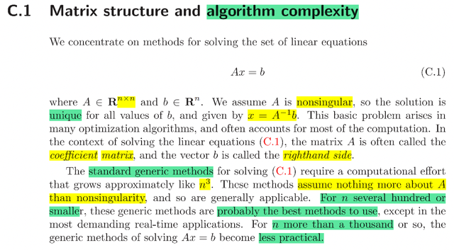</kbd></p>

> [!NOTE]
> đại khái là đầu tiên ta tập trung vào các method giải hệ Ax `=` b, với 
> A non-singular. Thì đại ý là hệ này có nghiệm duy nhất x `=` Ainvb
> Và việc giải nghiệm này có thể dùng phương pháp gọi là standard
> generic method.
>
> Thế thì phương pháp gì thì sẽ biết, nhưng ý chính là phương pháp
> này sẽ hiệu quả khi n nhỏ từ vài trăm đổ xuống (vì nó có chi phí
> tính toán O(n^3)) còn khi n lớn vài ngàn đổ lên thì dùng cái này
> không khả thi

<br>

<p align="center"><kbd>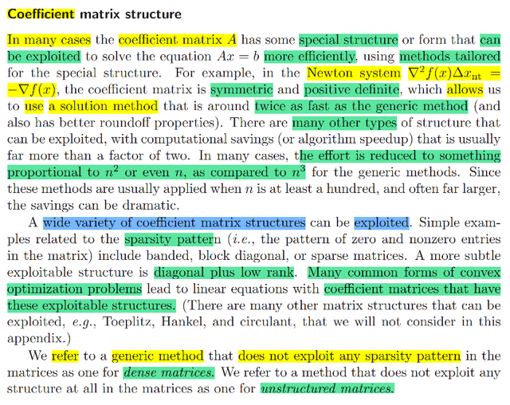</kbd></p>

> [!NOTE]
> đại khái là (nãy quên nói Ax `=` b thì A gọi là matrix hệ số) việc giải Ax
> `=` b, ngoài phương pháp gọi là standard generic thì khi A có một vài
> đặc điểm về cấu trúc mà ta có thể lợi dụng `/` khai thác  thì có thể ta
> sẽ có những phương pháp dành riêng cho bài toán cụ thể (với A như
> vậy) giúp tăng tốc `/` giảm chi phí tính toán so với standard generic
> method.
>
> Một ví dụ của cái gọi là khi matrix A có cấu trúc đặc biệt đó là  trong
> Newton's method (ta nhớ là khi đó ta cần giải tìm Newton's step
> ```text
> Δx_nt là nghiệm của ∇^2f(x) Δx_nt = - ∇f(x). Thì ở đây A  là Hessian
> ```
> matrix có điểm đặc biệt đó là nó symmetric positive semi definite.
>
> Vậy thì special pattern có thể là sparsity pattern hoặc có thể là "
> diagonal + low rank" (biết vậy thôi chưa hiểu lắm)
>
> Nói chung ý chính là vậy, khi dùng các phương pháp đo ni đóng giày
> này thì thay vì chi phí tăng theo n^3 như generic method thì có thể
> chỉ cần n^2 hay thậm chí là n

<br>

<p align="center"><kbd>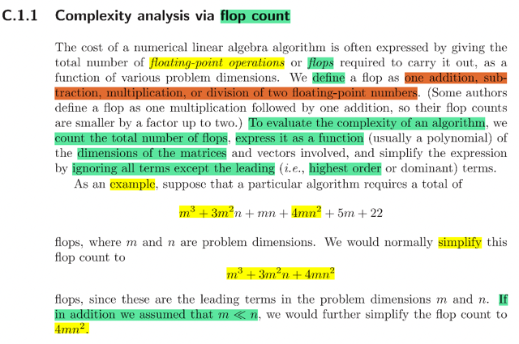</kbd></p>

<p align="center"><kbd>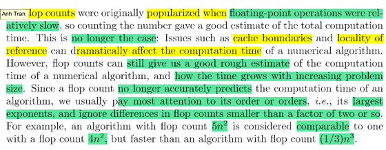</kbd></p>

> [!NOTE]
> Rồi đại khái là nói về đơn vị để phân tích độ phức tạp tính toán
> của thuật toán.
>
> Đơn vị đó là flops: Được định nghĩa là một "lần" ; Cộng `/` trừ `/`
> nhân  `/` chia giữa hai con số floating.
>
> Vậy việc tính complexity của một operation sẽ là:
>
> 1) Đếm số flops
>
> 2) Thể hiện nó ở dạng function theo n (dimension của matrix `/`
> vector)
>
> 3) Bỏ đi những term bậc thấp (ví dụ n^3 + 3n thì bỏ đi 3n)
>
> Hoặc nếu có m^3 + mn mà n nhỏ quá so với m thì cũng bỏ mn
> luôn
>
> Cái này trong CS50 đã học sơ qua rồi (BIG O)
>
> `====`
>
> Cuối cùng ý nói cái việc tính flop count này sở dĩ là vì việc thực
> hiện các operation giữa các float number rất tốn thời gian. Do đó
> đếm flop có thể estimate chi phí tính toán. Tuy nhiên ngày nay có
> nhiều tác nhân khác ảnh hưởng nữa khiến flopts estimate không
> còn phản ánh chính xác. Thành ra ta vẫn dùng nó, nhưng phiên
> phiến thôi `/` ước lượng thôi. Nên bỏ qua các term bậc nhỏ là vậy.

<br>

<p align="center"><kbd>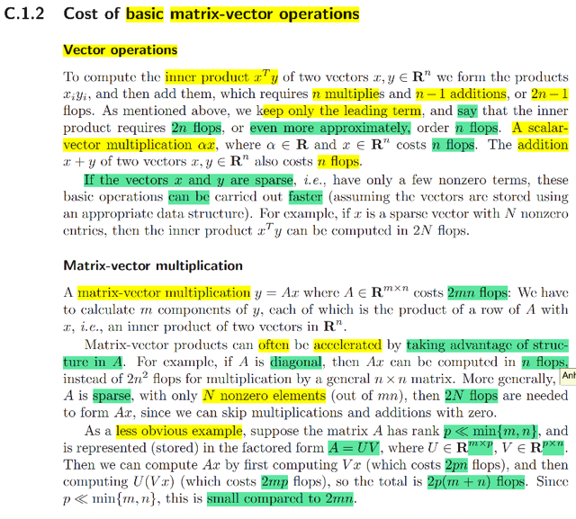</kbd></p>

> [!NOTE]
> Chi phí của basis vector `/` matrix operation. Quá dễ ko có gì.
>
> Với x, y là R^n thì xTy thì dĩ nhiên có n (*) và (n - 1) (+), tổng cộng
> 2n - 1 coi như 2n (flops). 
>
> Thậm chí có thể coi như xem xem với n (theo nguyên tắc "chỉ tính 
> phiên phiến" thôi)
>
> `αx` thì dĩ nhiên là n flops. x `+/-` y cũng vậy
>
> Matrix nhân vector Ax với A là R^m,n thì dễ hiểu là vì Ax là linear
> combination của A's columns với hệ số bởi x. Nên ta có n phép 
> nhân scalar * vector (tốn m flops vì cột có m phần tử), và sau đó là
> cộng lại hết: có n - 1 lần cộng vector với vector mỗi lần tốn m flops
> Tóm lại là nm + (n-1)m. Coi như nm + nm `=` 2nm
>
> Rồi. nói thêm nếu A mà có cấu trúc đặc biệt thì tính nhanh hơn nữa
> ví dụ là diagonal matrix n,n thì Ax chỉ là giống như nhân hai vector
> elemenwise (cái đường chéo với vector x) ⇨ chỉ có n phép nhân
>
> Cuối cùng là cái mà ta đã gặp trong LORA (trong LLM specialization)
> đại khái là khi A có thể factor thành phép nhân giữa hai matrix hạng
> thấp (low rank) ví dụ A (m, n) `=` UV với U là (m,p) và V (p,n)
>
> Thì khi đó, Ax `=` UVx. 
>
> Thì Vx như trên đã nói sẽ chỉ tốn 2pn
>
> Sau đ1o U(Vx) tốn 2pm. 
>
> Tổng cộng lại là 2p(n + m) flops
>
> Thế thì khi p nhỏ hơn m và n rất nhiều thì 2p(n + m) nhỏ hơn đáng
> kể so với 2mn

<br>

<p align="center"><kbd>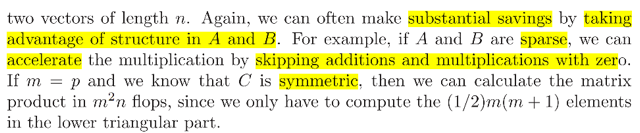</kbd></p>

<p align="center"><kbd>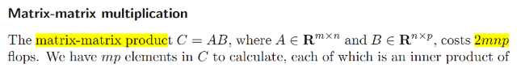</kbd></p>

> [!NOTE]
> Nhân AB `=` C.
>
> Chi phí có thể "đếm" theo nhiều cách, theo những góc nhìn khác
> nhau của việc nhân matrix x matrix:
>
> *Nhân AB theo Matrix x Nhiều Column:
>
> Tính A[cột j của B] trước:
>
> Cột j của C C[:, j] là linear combination các cột của A bởi hệ số là 
> components của cột j của B B[:, j]:
>
> C[:, j] `=` `Σk=1:n` A[:, k] B[k, j]
>
> Mỗi component thứ k của cột Bj B[k, j] * cột k của A A[:, k]: Tốn m 
> scalar * scalar `=` m flops.
>
> Và có n lần như vậy `k=1:n` A[:, k] B[k, j]: n*m flops  
>
> Cộng các kết quả lại: 
>
> `Σk` A[:, k] B[k, j] tốn n-1 lần cộng vector, mỗi lần tốn m flops
>
> Tổng cộng cost của AB[:,j]: mn + m(n-1) coi như 2mn
>
> Và B có p cột ⇨ 2mnp flops
>
> `====`
>
> Theo góc nhìn Nhiều row x Matrix cũng tương tự:
> ....
>
>
> Theo góc nhìn Nhiều Row dot product với nhiều Column:
>
> Cij là [row i của A] dot product [column j của B]
>
> mỗi phép dot product là giữa hai R^n vector có cost: n phép nhân
> + n - 1 phép cộng: coi như 2n flops
>
> Và C có tổng cộng m*p phần tử ⇨ Cost tổng là mp2n `=` 2mnp flops
>
> Theo góc nhìn Tổng các rank 1 matrix:
>
> AB shape m,n x n,p  có thể coi như `/` nhìn nhận như TỔNG của n 
> RANK 1 matrix tạo bởi cột k của A x hàng k của B:
>
> C `=` `Σk=1:n` A[:,k] B[k, :]
>
> Cost của việc tính mỗi rank 1 matrix: A[:,k] B[k, :]
>
> A[:, k] B[k, :] `=` m phép nhân [scalar A[i,k] với B[k,:], có cost là p phép
> nhân scalar x scalar] `=` mp flops
>
> Và có tổng cộng n matrix rank 1 như vậy: nmp flops
>
> Chi phí cộng lại: Cộng hai rank 1 matrix shape m,p m,p: Tốn m*p phép
> cộng scalar - scalar. Và tổng cộng có n matrix ⇨ n - 1 phép cộng:
>
> ⇨ có (n - 1)mp coi như mnp flops
>
> Vậy tổng cộng cost của AB theo góc nhìn này là 2mnp flops
>
> Vừa rồi là cost của C `=` AB, thế thì không khó hiểu khi họ nói rằng
> nếu  biết A, B sparse, thì cost này có thể giảm bớt vì giảm bớt các
> phép tính với 0
>
> Hoặc khi m `=` p (cost 2mnp `=` 2(m^2)n) và ta biết C symmetric, thì dĩ
> nhiên chỉ cần tính (theo cách tiếp cận Cij `=` dot product của row i
> của A và column j của B) đường chéo (có m entries) và (m^2 - `m)/2`
> phần tử trên đường chéo, tổng cộng là m + `(m^2-m)/2` `=` m + `m^2/2`
> ```text
> - m/2 =  m^2/2 + m/2 = m(m+1)/2
> ```
>
> ⇨ chỉ tốn `m(m+1)/2` * 2n (2n là cost của một phép dot product)  `=`
> m(m+1)n `=` (m^2)n + mn coi như (m^2)n

<br>

<p align="center"><kbd>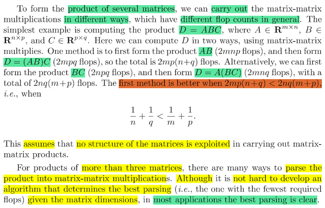</kbd></p>

> [!NOTE]
> Đây là một chi tiết quan trọng, mà có liên quan đến nội dung đã
> từng nhắc đến trong Deep Learning Josua Bengio cũng như 
> MIT 18s096:
>
> Đó là chi phí của việc tính D `=` ABC sẽ khác nhau nếu ta tính theo
> chiều xuôi D `=` (AB)C hoặc chiều ngược lại D `=` A(BC)
>
> Và từ đó, tùy hoàn cảnh mà tính theo chiều nào sẽ tốt hơn (ít tốn)
>
> D `=` (AB)C: với A (m, n); B (n, p); C (p, q)
>
> AB, như đã biết nó sẽ tốn 2mnp flops.
>
> (AB)C với AB shape (m, p), C shape (p, q) sẽ tốn 2mpq
>
> Tổng cộng tốn 2mnp + 2mpq `=` 2mp(n + q) flops
>
> D `=` A(BC):
>
> BC tốn 2npq, có shape n,q
>
> A(BC) tốn 2mnq
>
> Tổng cộng tốn: 2npq + 2mnq `=` 2nq(m + p)
>
> Vậy thì dĩ nhiên cách 1 sẽ tốt hơn nếu: 
>
> 2mp(n + q) < 2nq(m + p)
>
> ⇔ (n + `q)/nq` < (m + `p)/mp` 
>
> ```text
> ⇔ n/nq + q/nq < m/mp + p/mp
> ```
>
> ```text
> ⇔ 1/n + 1/q < 1/p + 1/m
> ```

<br>

<p align="center"><kbd>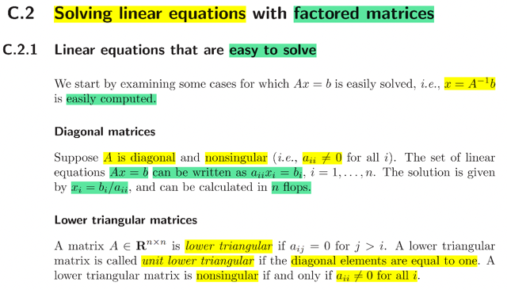</kbd></p>

<p align="center"><kbd>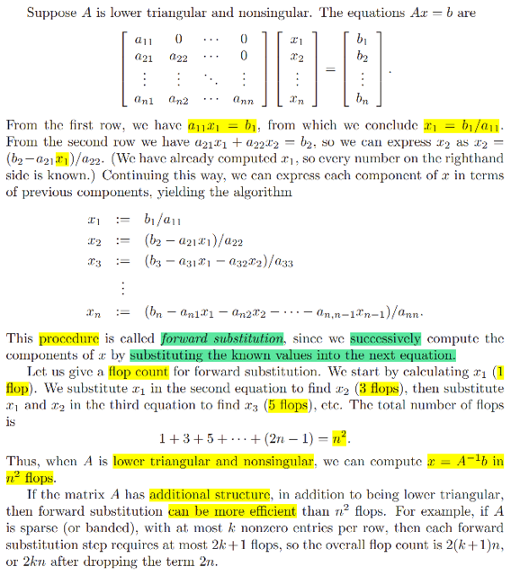</kbd></p>

> [!NOTE]
> Đầu tiên là nói về việc giải các hệ Ax `=` b mà việc tìm x `=` Ainv.b đơn giản.
>
> Case đơn giản nhất là khi A diagonal `/` non-singular (dễ hiểu muốn vậy yêu
> cầu là mọi diagonal entries phải khác 0 vì như vậy det sẽ khác 0, hoặc mọi
> eigenvalues đều khác 0).
>
> Thế thì Ax khi đó như đã biết có thể coi như element-wise multiplication giữa
> "vector đường chéo" và vector x. Nên Ax `=` b có thể chỉ là hệ aii*xi `=` bi
>
> Và ta chỉ cần n phép chia xi `=` bi `/` aii để có x ⇨ tốn n flops.
>
> `====`
>
> Case thứ hai cũng dễ tính là khi A là lower triangular matrix. Khi đó Ax `=` b nó
> có dạng:
>
> a11x1 `=` b1
>
> a21x1 + a22x2 `=` b2
>
> a21x1 + a22x2 + a23x3 `=` b3
>
> ...
>
> Thành ra từ equation 1 ta giải ra x1 `=` `b1/a11` tốn 1 flops
>
> x2 `=` (b2 - a21x1) `/` a22 tốn 3 flops (1 nhân, 1 trừ, 1 chia)
>
> x3 `=` (b3 - a32x2 - a33x3) `/` a33 tốn 5 flops (2 nhân, 2 trừ, 1 chia)
>
> tương tự vậy thì qúa trình này gọi là FORWARD SUBSTITUTION
>
> ...
>
> xn `=` (bn - an2x2 - an3x3 ...annxn) `/` ann tốn 2n - 1 flops (n-1 nhân, n-1 trừ,
> 1 chia)
>
> và tổng cộng tốn 1 + 3 + 5 + ...(2n - 1) 
>
> `=` [(2n - 1 + 1) `/` 4]*2n `=` n^2 flops
>
> Cuối cùng, ý nói nếu A ngoài việc là lower triangular mà còn có cấu trúc đặc
> biệt nào khác nữa thì còn có thể khai thác để tính còn ít flop hơn nữa
>
> Ví dụ nếu A sparse trong đó mỗi hàng có nhiều nhất k entries khác 0 thì sao:
> thì khi đó chỉ có nhiều nhất là k phép nhân giữa aij và xj. vậy thì việc tính:
>
> xn `=` (bn - an2x2 - an3x3 ...annxn) `/` ann sẽ chỉ tốn nhiều nhất k nhân, k trừ, 1
> chia
>
> `=` 2k + 1
>
> Và mỗi hàng thì chỉ nhiều nhất là nhiêu đó ⇨ tổng cộng nhiều nhất chỉ tốn
> n(2k + 1) `=` 2kn + n. Coi như 2kn

<br>

<p align="center"><kbd>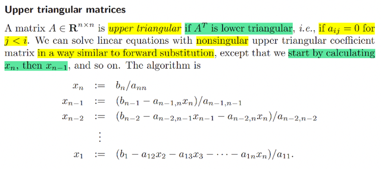</kbd></p>

<p align="center"><kbd>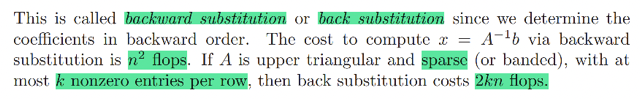</kbd></p>

> [!NOTE]
> Cái này - khi A là upper triangular matrix thì hoàn toàn tương tự, chỉ 
> khác là khi đó việc giải Ax `=` b sẽ giải tìm xn trước, rồi đến xn-1, ....x2, x1
>
> Đây gọi là BACK-SUBSTITUTION mà MIT 18.06 đã học. Đó là khi ta 
> giải `Ax=b` bằng cách Gauss elimination A|b để đưa nó về U|b' với U là
> row-echelon form của A, là một upper triangular matrix. 
>
> Thì chi phí cho cái này cũng như khi forward substitution: n^2. Hoặc 
> nếu A có thêm tính chất sparse với nhiều nhất k non-zero entries mỗi 
> hàng thì cost sẽ chỉ là 2kn

<br>

<p align="center"><kbd>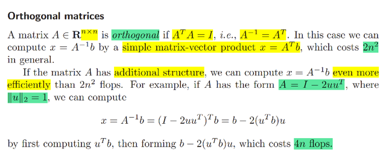</kbd></p>

> [!NOTE]
> rồi nói qua case khi A là orthogonal matrix. Như đã biết matrix chỉ 
> được gọi là orthogonal nếu nó vuông và các cột orthonormal.
> Khi đó AAT `=` ATA `=` I (do tính chất orthonormal của các cột) 
> ⇨ Ainv `=` AT
>
> Vầy thì dễ hiểu là có thể tính x `=` Ainv b bởi ATb và cái này tốn
> 2n^2 flops, lập luận nhanh: 
>
> n lần nhân ATj*bj, mỗi lần tốn n flops
>
> + n lần cộng cột (ATj * bj) với nhau, mỗi lần n flops
>
> `=` n^2 + n^2 `=` 2n^2
>
> `====`
>
> Nếu orthogonal matrix A có dạng I - 2uuT thì ATx 
>
> `=` (I - 2uuT)Tx `=` ITx - 2uuTx
>
> uTx tốn 2n (n phép nhân scalar-scalar, n cộng scalar-scalar)
>
> uuTx tốn n (n phép nhân scalar ui - scalar uTx)
>
> 2uuTx tốn n (n phép nhân scalar (2) - scalar (uuTx)i)
>
> ITx: không tốn
>
> ITx - 2uuTx không tốn
>
> Tổng cộng 2n + n + n `=` 4n

<br>

<p align="center"><kbd>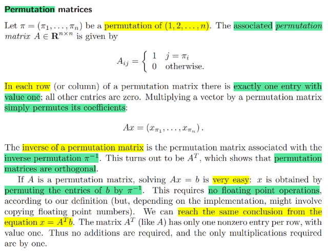</kbd></p>

> [!NOTE]
> đại khái là với A là permutation matrix thì nó là orthogonal matrix nên 
> Ainv `=` AT. ⇨ x `=` ATb. Mà vì các entries của A có tính chất là chỉ có
> 1 non-entry ở mỗi row. Nên theo kết quả hồi nãy, nhiều nhất chỉ cần
> 2kn `=` 2n flops. Tuy nhiên vì mỗi non-zero entries đều là số 1 nên
> thật ra không tốn flops nào

<br>

<p align="center"><kbd>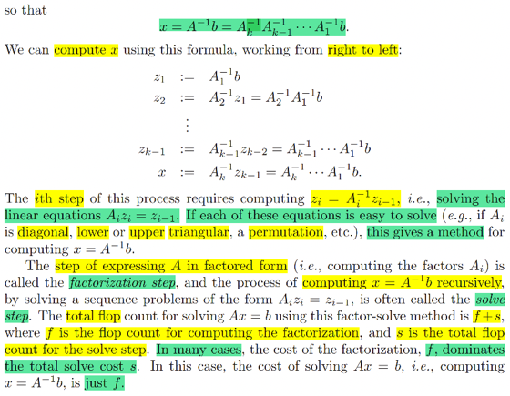</kbd></p>

<p align="center"><kbd>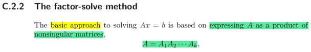</kbd></p>

> [!NOTE]
> Ta qua phương pháp gọi là factor-solve (nãy giờ C2.1 là các
> case mà có thể tính x `=` Ainv b một cách đơn giản,  làm tiền đề
> cho phần này, khi ta xét A không thể tính x `=` Ainv b đơn giản
> được)
>
> Thế thì đại khái là phương pháp này ý tưởng chính là phân tách
> (factor) A thành tích các matrix A1A2.....Ak
>
> Thì khi đó dựa vào tính chất của inverse: (UV)inv `=` VinvUinv nên
> x `=` Ainvb `=` AkinvAk-1inv...A2invA1inv b
>
> Thế là từ đó, nếu việc phân tách A khiến cho ra các A1, A2.... là
> các matrix đơn giản thuộc những loại như vừa rồi mới nói như
> diagonal `/` orthogonal...thì việc tính A1inv b (vốn dĩ là bài toán
> giải A1y `=` b), rồi A2inv(A1invb), vốn dĩ là bài toán A2z `=` A1invb...
> sẽ đều làm được
>
> Từ đó việc tính x `=` Ainv b sẽ có thể tính bằng cách tính một
> chuỗi A1invb, A2invA1invb,....
>
> Thế thì, có thể thấy phuong pháp này gồm 2 bước:
>
> Bước 1 là factorizing A thành A1A2....Ak. Gọi chi phí của nó là f
>
> Bước 2 là tính cái chuỗi trên, gọi chi phí tổng cộng là s.
>
> ⇨ tổng chi phí là f + s
>
> Thì ở đây nói thường thì f >> s thì ta có thể coi cost tổng là f

<br>

<p align="center"><kbd>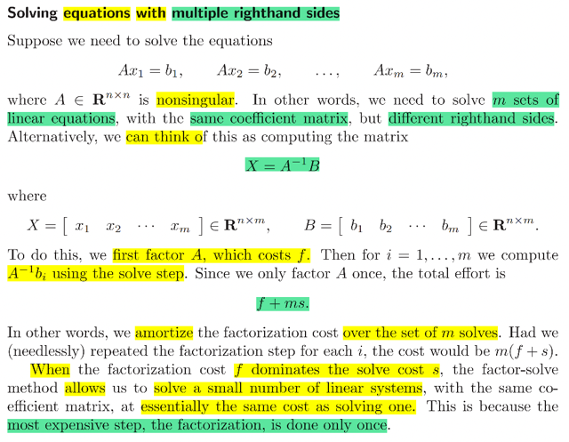</kbd></p>

<p align="center"><kbd>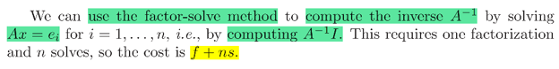</kbd></p>

> [!NOTE]
> Rồi phần này cũng đơn giản thôi, đại khái là có khi ta muốn giải không
> phải một mà là m hệ phương trình, cùng một A, nhưng khác b:
>
> Ax1 `=` b1, Ax2 `=` b2, ....Axm `=` bm
>
> Thế thì đại khái là, đương nhiên ta chỉ cần factoring A một lần (tốn f flops)
> A `=` A1A2....Ak. Sau đó dùng nó để tính x1 `=` Akinv....A1invb1, x2 `=` ...
> mỗi lần tốn s, tổng cộng m lần thì tốn ms ⇨ tổng cộng tốn f + ms
>
> Và người ta dùng từ khấu hao (amortize) để ý là thay vì mỗi lần giải Axj `=` bj
> mỗi lần factorize A thì ta factorize môt lần và xài cho nhiều hệ (giống như 
> mua tài sản một lần rồi xài cho nhiều năm thì chia chi phí mua tài sản cho
> số năm thì nó không lớn ý là vậy)
>
> Nói thêm việc giải m hệ Ax1 `=` b1, ...Axm `=` bm thì cũng giống như giải 
> AX `=` B với X là matrix các cộtv là x1, x2....B là matrix các cột b1, b2....
>
> Cuối cùng một điểm quan trọng chính là việc ta có thể dùng cách này để
> tìm Ainv.
>
> Vì khi ta cho B là I, thì bài toán sẽ là giải AX `=` I, và giải ra X thì chính là 
> tìm ra Ainv
>
> Again, quá trình cũng là đầu tiên factorize A `=` A1A2...Ak
>
> Sau đó lần lượt giải tìm x1 `=` Akinv...A2invA1inv [cột 1 của I, là e1]
>
> rồi x2 `=` Akin...A2invA1inv [cột 2 của I, là e2]
>
> ....
>
> Xong hết ráp lại X `=` [x1, x2....] (các cột là x1, x2...) thì đó chính là Ainv

<br>

<p align="center"><kbd>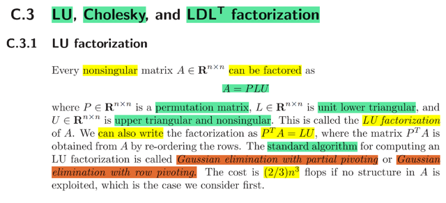</kbd></p>

> [!NOTE]
> Ví dụ A `=` [a11 a12; a21 a22]
>
> Để đưa A về U:
>
> Dùng E21 để khử a21:
>
> Hàng 1 giữ nguyên ⇨ E21_row1 `=` [1 0]
>
> ```text
> Khử a21: E21A_row2 = A_row2 - A_row1*a21/a11
> ```
>
> ```text
> = A_row1*(-a21/a11) + A_row2
> ```
>
> ⇨ E21_row2 `=` `[-a21/a11,` 1]
>
> ⇨ E21 `=` [1, 0; `-a21/a11,` 1]
>
> Thế thì ví dụ đơn giản này cũng có thể cho thấy rằng vì sao trong
> sách nói vậy:
>
> Ta thấy với A là matrix 2x2 như trên thì chỉ sau bước eliminate a21 thì
> ta đã có dạng row echelon U. Và quá trình trên được represent bởi:'
>
> E21A `=` U với E21 `=`  [1, 0; `-a21/a11,` 1] là lower-triangular matrix,
> chính xác hơn nó cũng chính là unit lower triangular matrix vì mọi
> component trên đường chéo `=` 1
>
> Và nó cũng invertible ⇨ A `=` E21inv U Và E21inv cũng là unit lower
> triangular matrix luôn, vì sao, vì với E21là triangular matrix thì
> eigenavalues của nó chính là trên đường chéo `=` 1, 1 Và do đó, với
> E21inv thì eigenvalues sẽ là `1/1,` `1/1` (vì ta đã biết nếu λ là
> eigenvalues của A thì eigenvalue của Ainv sẽ là `1/λ.` Chứng minh
> nhanh: Ax `=λx` ⇔ AinvAx `=` Ainv λx (nhân hai vế cho Ainv) ⇨ Ainv λx
> ```text
> = x ⇨ Ainv x = x 1/λ, và cái này chứng tỏ 1/λlà eigenvalue của Ainv)
> ```
>
> Vậy thì có thể hiểu vì sao nói A `=` LU thì L là lower triangular unit
> matrix, nó chính là E21_inv ở case trên.
>
> `====`
>
> Còn cái vụ có sự xuất hiện của P thì như 18.06 cũng đã nói, ta có
> thể cần permute row của A trước (như lúc Gaussian elimination ta
> eliminate bởi matrix E, nhưng đôi khi ta cần switch row) Thành ta
> tổng hợp lại ta eliminate bởi matrix E `=` ví dụ ....E31E21 và  permute
> row của A bởi P. PA `=` EinvU `=` LU
>
> Thì ta cũng có thể ghi là A `=` PLU đơn giản chỉ là permute A trước hay
> eliminate rồi permute sau
>
> Xem tại sao cost lại là `(2/3)n^3:`
>
> QUAY LẠI SAU

<br>

<p align="center"><kbd>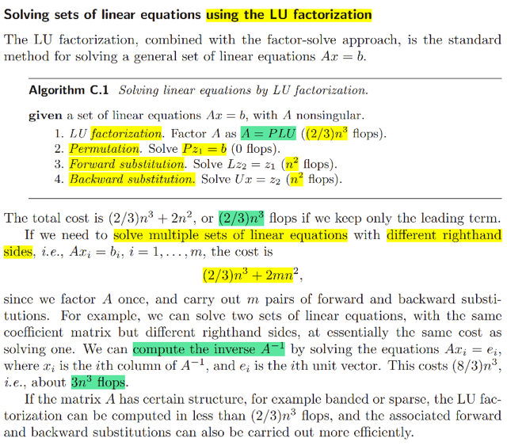</kbd></p>

> [!NOTE]
> rồi, với LU factorization ta có thể dùng nó để giải hệ Ax `=` b bằng
> phương pháp factor-solve:
>
> Bước 1: Factorizing A: A `=` PLU
>
> (chỗ này nên hiểu rằng trong 18.06 ta có PA `=` LU, thì A `=` PinvLU thì
> Pinv cũng là permutation matrix, nên có thể gọi là A `=` PLU cũng
> được (với P là Pinv của cái PA `=` LU)
>
> Sau đó thì Ax `=` b ⇔ `PLUx=` b và ta sẽ lần lượt giải cái bài toán:
>
> Pz1 `=` b ⇨ z1 `=` Pinvb, tốn 0 flops vì đây là Permutation matrix như
> đã nói, không tốn flops vì chỉ toàn là non-zeros entries có giá trị
> bằng 1
>
> Lz2 `=` z1 ⇨ z2 `=` Linv z1, với L là lower triangular matrix thì việc giải
> cái này chính là forward substitution như đã nói, tốn n^2
>
> Ux `=` z2, với U là upper triangular, đây là back-substitution, tốn n^2
>
> TỔng cộng tốn `(2/3)n^3` + 2n^2 coi như `2/3n^3`
>
> `====`
>
> Và như đã nói, ta cũng có thể tìm Ainv

<br>

<p align="center"><kbd>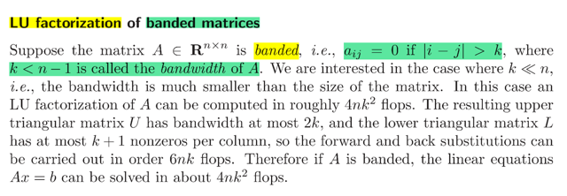</kbd></p>

<p align="center"><kbd>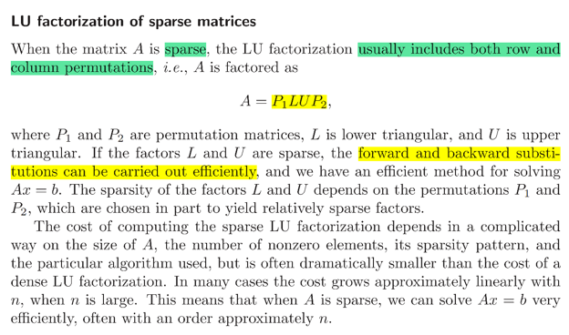</kbd></p>

> [!NOTE]
> đại khái là ta biết thêm một loại matrix đã gặp trong MIT 18.06
> ví dụ như tridiagonal matrix đại khái là matrix này chỉ có một
> dải (band) rộng bằng k tại đường chéo là có giá trị khác 0 thôi.
> còn lại bằng 0 hết (k gọi là bandwidth)
>
> Khi đó LU factorization của matrix dạng này sẽ chỉ tốn ≈ 4nk^2
>
> Và matrix U sẽ có bandwidth nhiều nhất là 2k. Matrix L có nhiều
> nhất là k + 1 non-zeros mỗi cột.
>
> Giúp bước solve sẽ chỉ tốn 6kn flops
>
> Thành ra việc giải Ax `=` b với banded matrix sẽ chỉ tốn 4nk^2 + 6kn 
> coi như 4nk^2 flops
>
> Những con số trên tạm chấp nhận, quay lại chứng minh sau
>
> `====`
>
> Phần dưới QUAY LẠI SAU

<br>

<p align="center"><kbd>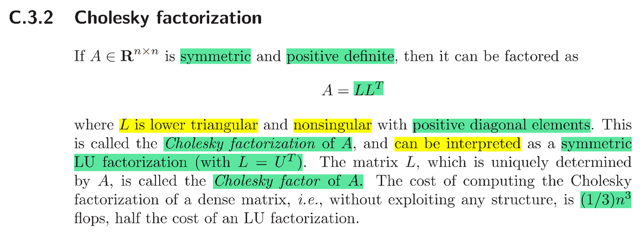</kbd></p>

<p align="center"><kbd>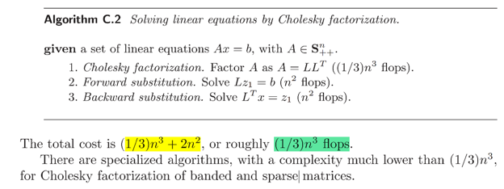</kbd></p>

<p align="center"><kbd>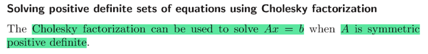</kbd></p>

> [!NOTE]
> rồi qua cái này Cholesky factorization có thể hiểu đại khái là khi ta
> apply LU factorization đối với không phải với non-singular matrix mà
> là positive definite matrix (dĩ nhiên PD matrix cũng non-singular) thì
> khi đó U nó thành ra cũng đặc biệt ở chỗ nó chính là LT.
>
> Từ đó ta có cái gọi là Cholesky factorization:
>
> A `=` LLT.
>
> Và chi phí của nó chỉ bằng `1/2` chi phí của LU factorization
>
> Nói chung là cách làm cũng vậy thôi. Factorizing A `=` LLT rồi  giải
> từng hệ Lz1 `=` b, LTx `=` z1
>
> Nói chung là nhờ positive definite có thể được factorized chỉ tốn
> `1/3n^3` nên việc giải hệ khi A ≻ 0 cũng ít tốn flop hơn

<br>

<p align="center"><kbd>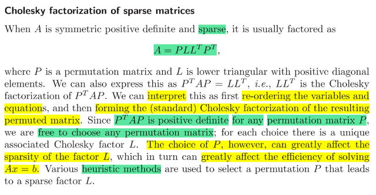</kbd></p>

> [!NOTE]
> cũng tương tự khi A `=` PLU, mà nếu A sparse thì thường việc
> factoring A sẽ kèm theo permute cả row nữa: A `=` PLUPT.
>
> Dể thấy PLU thì tức là ta permute row của LU, còn (PLU)PT
> chính là ta permute columns của PLU
>
> Thì ở đây cũng vậy A `=` PLLTPT
>
> Và cũng lại có thể hiểu khi họ nói thay vì nói A `=` PLLTPT ta
> có thể nói PTAP `=` LLT (cũng tương tự như thay vì nói A `=` PLU
> thì có thể nói PA `=` LU)
>
> Và PTAP nới A là ≻ 0 thì PTAP cũng ≻ 0 với mọi P. Nên ý chính
> là việc permute như thế nào không ảnh hưởng đến Cholesky
> factorization, tức là luôn giữ được yêu cầu matrix là positive definite
>
> Nhưng điểm quan trọng là P lại ảnh hưởng đến tính sparsity của
> LLT.
>
> Thành ra việc chọn P sẽ có thể giúp giảm cost của việc giải Ax `=` b
> vì chọn P có thể khiến LLT sparse hơn

<br>

<p align="center"><kbd>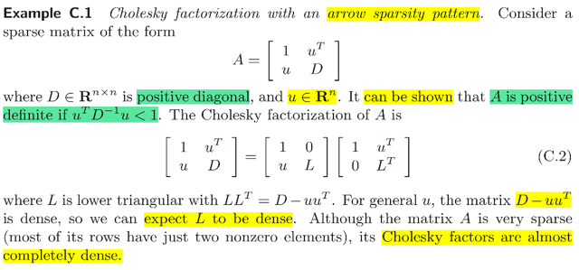</kbd></p>

<p align="center"><kbd>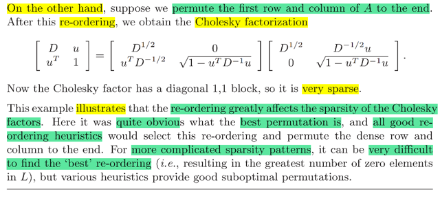</kbd></p>

> [!NOTE]
> xTAx `=` [t yT]A[t yT]T
>
> `=` [t yT][1 uT; u D][t yT]T
>
> `=` [t yT][1*t + uTy; ut + Dy]
>
> `=` t(1*t + uTy) + yT(ut + Dy)
>
> `=` t^2 + uTyt + yTut + yTDy
>
> `=` t^2 + 2uTyt + yTDy
>
> Completing the square:
>
> `=` t^2 + 2uTyt + (uTy)^2 - (uTy)^2 + yTDy
>
> `=` (t + 2uTy)^2 - yTuuTy + yTDy
>
> `=` (t + 2uTy)^2 + yT(- uuTy + Dy)
>
> `=` (t + 2uTy)^2 + yT(- uuT + D)y
>
> `=` (t + 2uTy)^2 + yT(D - uuT)y
>
> Với việc (t + 2uTy)^2 ≥ 0 (chỉ bằng 0 khi t `=` 0, y `=` 0)
>
> thì nếu yT(D - uuT)y > 0 ∀ y khác 0, thì xTAx sẽ luôn > 0 ∀ x khác 0 và 
> chỉ bằng 0 khi x `=` 0 (t `=` 0, y `=` 0). Khi đó A sẽ ≻ 0
>
> Vậy yêu cầu đó tương đương D - uuT ≻ 0
>
> Và bước cuối ta sẽ chứng minh khi uTDinvu < 1 thì ta sẽ điều này.
>
> ```text
> Đặt z = D^1/2 y; w = D^-1/2 u
> ```
>
> ⇨ yT(D - uuT)y `=` yTDy - yTuuTy
>
> `=` `(D^1/2y)T(D^1/2y)` - (uTy)^2
>
> `=` `||D^1/2y||^2` - (uTy)^2
>
> `=` ||z||^2 - (uTy)^2
>
> ```text
> uTy = uT(I)y = uT(D^-1/2 D^1/2)y
> ```
>
> `=` `(D^-1/2Tu)T(D^1/2y)`
>
> ```text
> = (D^-1/2u)T(D^1/2y)  |  D^-1/2 là diagonal matrix ⇨ D^-1/2 = (D^-1/2)T
> ```
>
> `=` wTz
>
> Vậy yT(D - uuT)y `=` ||z||^2 - (wTz)^2
>
> Tới đây ta dùng inequality: -||w||.||z|| ≤ wTz `=` `||w||.||z||.cos(θ)` ≤ ||w||.||z||
>
> ⇨ (wTz)^2 ≥ ||w||^2*||z||^2
>
> Vậy yT(D - uuT)y `=` ||z||^2 - (wTz)^2 ≥ ||z||^2 - ||w||^2*||z||^2 
>
> ```text
> = ||z||^2[1 - ||w||^2] = ||z||^2[1 - (D^-1/2u)T(D^-1/2u)]
> ```
>
> `=` ||z||^2[1 - `uTD^-1/2D^-1/2u]`
>
> `=` ||z||^2(1 - uTD^-1u)
>
> Như vậy, khi uTDinvu < 1 ⇨ 1 - uTDinvu > 0
>
> ⇨ ||z||^2(1 - uTDinvu) > 0 giúp kết luận yT(D - uuT)y positive definite
>
> Và từ đó dẫn tới A positive definite
>
> QUAY LẠI SAU.
>
> Nhưng đại ý là khi ta giữ A ở dạng gốc, Cholesky factorization sẽ tạo
> ra kết quả khá dense.
>
> Trong khi đó, khi swap column đầu và row đầu về cuối thì kêt quả của
> factorization sẽ sparse hơn. Khiến nếu áp dụng kết quả này để giải
> hệ phương trình theo phương pháp: factor-solver thì ta sẽ tốn ít chi phí
> hơn nhiều.

<br>

<p align="center"><kbd>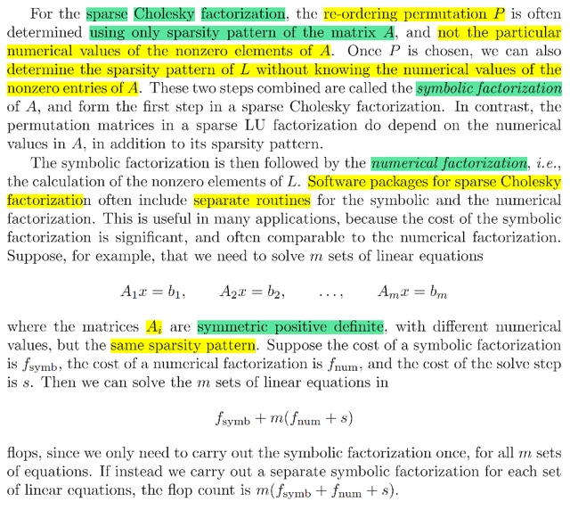</kbd></p>

> [!NOTE]
> đại ý là vầy, thường thì sẽ có hai bước trong việc sparse Cholesky
> factorization.
>
> Trong đó bước một chỉ cần phụ thuộc vào sparsity pattern của A
> và nó gọi là symbolic factorization.
>
> Và bước hai sẽ là numerical factorization.
>
> Nói chung là, do đó khi giải nhiều hệ Ax `=` bi. Thì việc đầu tiên
> là symbolic factorization, tốn `f_symb`
>
> Sau đó với mỗi hệ Ax `=` bi cụ thể, thì ta sẽ numerical factorization
> tốn `f_num` , và giải x (bước solver) tốn cost là s
>
> Tổng cộng chi phí sẽ là `f_symb` + m(fnum + s)

<br>

<p align="center"><kbd>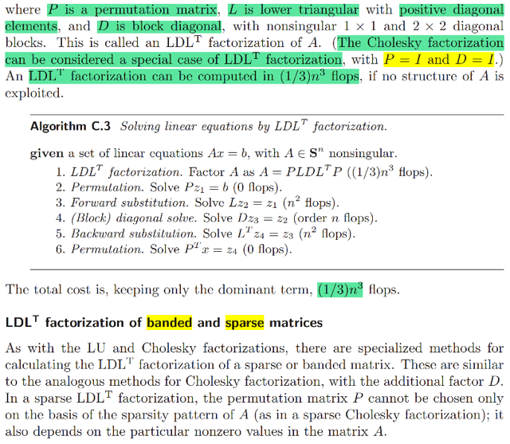</kbd></p>

<p align="center"><kbd>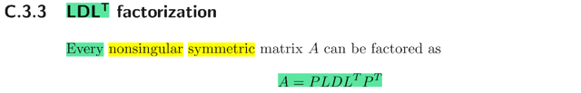</kbd></p>

> [!NOTE]
> Vừa rồi ta nói khi non-singular matrix A mà là symmetric positive  definite
> thì ta có Cholesky factorization A `=` LLT mà ta có thể coi như nó là dạng
> đặc biệt của LU factorization khi A symmetric.
>
> Thế thì này, không cần A positive definite, mà chỉ cần nó symmetric thì A
> có thể được factorized thành dạng A `=` PLDLTPT
>
> để rồi có thể coi Cholesky factorization là case đặc biệt của LDLT
> factorization với P `=` I, D `=` I
>
> Thế thì việc giải hệ Ax `=` b với A `=` PLDLTPT cũng theo như các bước của
> factor-solver method
>
> Bước 1 là factor A `=` PLDLTPT, cái này người ta nói tốn `n^3/3` flops
>
> Bước 2 là solve: P(LDLTPTx) `=` b ,  tức giải Pz1 `=` b, đây là solve hệ với
> với Permutation matrix: không tốn flops nào
>
> Bước 3: L(DLTPTx) `=` z1, tức Lz2 `=` z1 hệ này dính đế L là lower triangular
> nên nó chính là Forward-substitution, tốn n^2
>
> Bước 4: D(LTPTx) `=` z2, tức Dz3 `=` z2 hệ này là dính đến diagonal matrix,
> nên chỉ tốn n flops
>
> Bước 5: LT(PTx) `=` z3, LTz4 `=` z3 hệ này dính đến LT, là upper triangular
> matrix nên nó chính là Back-substitution, tốn n^2
>
> Bước 6: PTx `=` z4, với PT là permutation thì giải cái này không tốn flops.
>
> Tổng cộng là `n^3/3` + 2n^2 + n, coi như `n^3/3`

<br>

<p align="center"><kbd>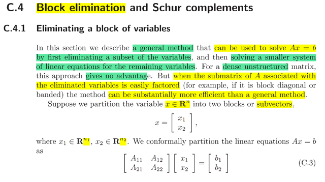</kbd></p>

<p align="center"><kbd>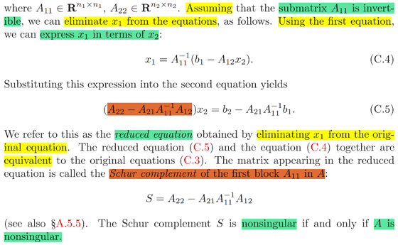</kbd></p>

> [!NOTE]
> Đại khái là phần này nói về một phương pháp giải Ax `=` b với ý
> tưởng là ta sẽ loại bỏ bớt variable của A, từ đó giải một hệ nhỏ
> hơn với các variable còn lại.
>
> Thế thì nếu như matrix A dense và không có cấu trúc nào đặc biệt
> thì phương pháp này vô nghĩa (không có lợi ích gì hơn cả)
>
> Nhưng nếu sau khi loại bỏ variable, matrix có dạng mà trong đó có
> một submatrix có một cấu trúc nào đó giúp ta có thể tận dụng (như
> các case đã biết) thì khi đó phương pháp này sẽ có ích.
>
> `====`
>
> Thế thì đầu tiên ta sẽ thể hiện Ax `=` b theo dạng
>
> [A11 A12; A21 A22] [x1; x2] `=` [b1; b2]
>
> Trong đó:
>
> A11 là R^(n1, n1); A22 là matrix R^(m1, m1)
>
> và cái này tương đương:
>
> A11x1 + A12x2 `=` b1 (1)
>
> và A21x1 + A22x2 `=` b2 (2)
>
> Từ (1) ⇨ A11x1 `=` b1 - A12x2 ⇨ x1 `=` A11inv(b1 - A12x2)
>
> Thế x1 vào (2):
>
> A21A11inv(b1 - A12x2) + A22x2 `=` b2
>
> ⇔ A21A11invb1 - A21A11invA12x2 + A22x2 `=` b2
>
> ⇔ A21A11invb1 + (- A21A11invA12 + A22)x2 `=` b2
>
> ⇔ (A22 - A21A11invA12)x2 `=` b2 - A21A11invb1
>
> Và S là A22 - A21A11invA12 gọi là Schur complement của 
> block A11
>
> Và cái hệ (A22 - A21A11invA12)x2 `=` b2 - A21A11invb1
>
> gọi là REDUCED system, nó có ít variable hơn (chỉ có x2,
> thay vì x1 và x2), gắn với matrix S thay vì A.
>
> Và tất nhiên giải ra x2 sẽ giúp giải ra x1 `=` A11inv(b1 - A12x2)

<br>

<p align="center"><kbd>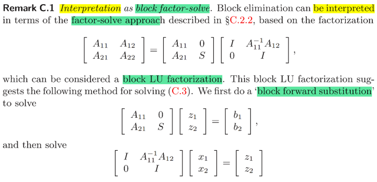</kbd></p>

<p align="center"><kbd>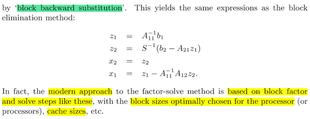</kbd></p>

<p align="center"><kbd>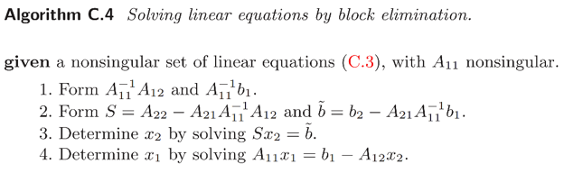</kbd></p>

> [!NOTE]
> Và thuật toán này có thể được hiểu theo cách của cách tiếp cận
> factor - solver.
>
> Cụ thể là block matrix [A11 A12; A21 A22] có thể được thể  hiện bởi
> [A11 0; A21 S] nhân với [I A11invA12; 0 I] như môt dạng LU
> factorization.
>
> Để rồi theo factor-solver method, bước 1 sẽ là giải:
>
> [A11 0; A21 S][z1; z2] `=` [b1; b2]
>
> Đây có thể coi như việc giải hệ Lz `=` b với L à lower triangular matrix
> thì như đã biết chính là forward backsubstitution:
>
> [A11 0; A21 S][z1; z2] `=` [b1; b2]
>
> ⇔ A11z1 `=` b1 (1) & A21z1 + Sz2 `=` b2 (2)
>
> Từ (1) ⇨ z1 `=` A11invb1 và thế vào (forward substitute) (2):
>
> (cái này tương ứng với step 1 của hình bên)
>
> A21A11invb1 + Sz2 `=` b2 ⇨ z2 `=` Sinv(b2 - A21A11invb1)
>
> (cái này tương ứng với step 2 (tính b~ `=` b2 - A21A11invb1) và 
> step 3 giải Sx2 `=` b~ của algorithm bên)
>
> sau đó là giải
>
> [I A11invA12; 0 I][x1; x2] `=` [z1, z2] thì đây có thể coi như hệ với
> upper triangular matrix, nên giải nó chính là back-subtitution:
>
> [I, A11invA12; 0 I][x1; x2] `=` [z1, z2] 
>
> ⇔ x1 + A11invA12x2 `=` z1 (3) và x2 `=` z2 (4)
>
> Từ (4) ta đã có x2, back-substitution vào (3) ta có x1 `=` z1 - A11invA12x2
>
> Đại khái là từ đó, ta có algorithm giúp solve Ax `=` b theo phương
> pháp Block-elimination method:
>
> 1) HÌnh thành A11invA12, và A11invb1 (bước này nhằm phục vụ
> việc hình thành Schur complement matrix S)
>
> 2) HÌnh thành matrix S `=` A22 - A21A11invA12 và b~ `=` b2 - A21A11invb1
>
> 3) Xác định x2 bởi việc giải Sx2 `=` b~
>
> 4) Thế vào tính x1 bằng A11x1 `=` b1 - A12x2

<br>

<p align="center"><kbd>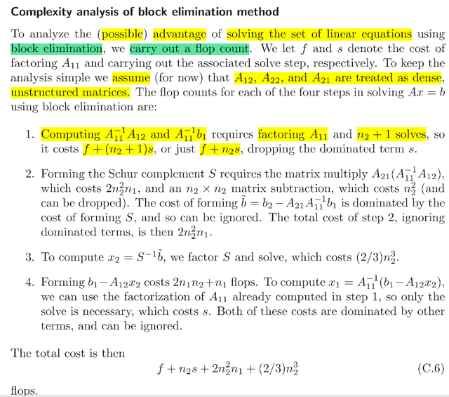</kbd></p>

> [!NOTE]
> Ta sẽ đếm số flop cần thiết của thuật toán vừa rồi.
>
> Đầu tiên như thường lệ gọi f là chi phí cần để factorizing A11 và s là
> chi phí để thực hiện bước solve step. (tức tính giải A11x `=` b)
>
> 1) TÍnh A11invA12 và A11invb1
>
> Tính A11invA12 thì chính là solve A11X `=` A12. Nên theo factor-
> solver method thì ta cần factor A11 trước, tốn f flops.
>
> Sau đó bước solve, dĩ nhiên với mỗi equation A11xj `=` A12[:,j] thì ta
> sẽ tốn s flops để giải ra xj, là một column của A11invA12 và A12 có
> tổng cộng n2 cột ⇨ Tổng cộng tốn f + s*n2
>
> Tương tự việc tính A11invb cũng tốn thêm s flops nữa.
>
> ⇨ Tổng cộng là f + (n2+1)s flops hoặc coi như f + n2s
>
> 2) Form Schur complement S: S `=` A22 - A21A11invA12
>
> A21(A11invA12): (n2, n1) (n1, n2): nhắc lại cho nhớ, cost của việc
> nhân hai matrix UV (coi như U là A21m V là A11invA112) sẽ là như 
> sau: [cost của U [cột của V]]*số cột của V
>
> U . [cột của V] `=` linear combination các cột của U với coefficients là
> components của cột của V ⇨ nhân coefficient * cột của V: n2 flops.
> U có n1 cột, vậy là n2*n1 flops. Cộng các kết qủa lại: mỗi lần cộng tốn
> n2 flops (phép cộng hai vector), và có n1 - 1 lần cộng.⇨ n2(n1-1)
>
> Tổng cộng là n2*n1 + n2(n1 - 1)  `=` 2n2n1 - n2 coi như 2n1n2 
>
> Và đó là U [cột của V] để ra một cột của UV, tổng cộng V có n2 cột
>
> ⇨ Nhân A21(A11invA12) ta sẽ tốn 2n1n2*n2 `=` 2n2^2n1
>
> Tính b~ `=` b2 - A21A11invb1. 
>
> thì  A21A11invb1 là nhân matrix `U=` A21 với vector v `=` A11invb1 như
> trên vừa tính ⇨ tốn 2n1n2. Cộng thêm một phép trừ vector (b2 - ..)
> tốn n2 flops nữa là thành ra 2n1n2 + n2 coi như 2n1n2
>
> Vậy bước hai thực hiện việc hình thành matrix Schur complement
> S `=` A22 - A21A11invA12 và tính b~ `=` b2 - A21A11invb1 sẽ tốn:
>
> 2n2^2n1 + 2n1n2 coi như 2n2^2n1
>
>
> 3) Tính x2 `=` Sinvb~. ta cần factor S và thực hiện solve step. Với S
> là symmetric matrix, ta cầ tốn `2/3` n2^3 như đã biết
>
> 4) Tính b1 - A12x2: 
>
> A12x2: 
>
> [scalar component của x2 * cột của A12: A12[:,j]x2[j], tốn n1 flops] *
> [số component của x2 `=` n2] `=` n1n2. 
>
> cộng các kết quả A12[:,j]x2[j] lại: cộng hai vector: n1 flops, và có (n2 - 1) 
> phép cộng: n1(n2-1)
>
> ⇨ n1n2 + n1(n2-1) coi như 2n1n2
>
> Thêm phép trừ b1 - ... tốn thêm n1 flops nữa là 2n1n2 + n1 `=` 2n1n2 + n1
>
> ⇨ cost 2n1n2 + n1 
>
> Tính x1 `=` A11inv(b1 - A12x2): 
>
> Tính cái này thì như đã nói ở trước, cost của Ainvb là cost của việc giải
> Ax `=` b, và nó bao gồm bước factor A thành A1A2...Ak, và buốc solve: 
> tính một chuỗi: A1z1 `=` b, A2z2 `=` z1, ...Akx `=` z(k-1). Thì đề bài đã cho
> bước factor A11 tốn f flops. Bước solve liên quan đến A11 tốn s flops
>
> Thành ra việc tính  x1 `=` A11inv(b1 - A12x2) gồm 3 việc trong đó đã có sẵn
> 2 việc: Factor A11, tính b1 - A12x2. Vậy thì chi phí chỉ là của bước solve
> `=` s flops 
>
> ⇨ Cost bước 4: 2n1n2 + n1 + s
>
> `====`
>
> Tóm lại tốn (f + n2s) + 2n2^2n1 + `(2/3)n2^3` + 2n1n2 + n1 + s
>
> coi như (f + n2s) + 2n2^2n1 + `(2/3)n2^3`

<br>

<p align="center"><kbd>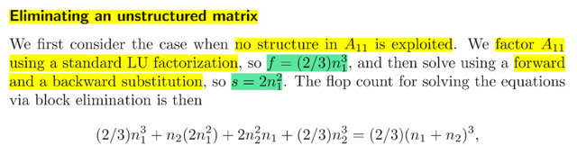</kbd></p>

<p align="center"><kbd>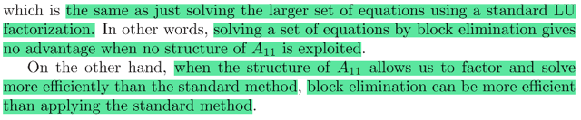</kbd></p>

> [!NOTE]
> Rồi, ở trên là công thức tính flops của Block elimination nhưng
> chưa  biết f, s (chi phí factoring A11 và solve A11 là gì)
>
> Thế thì đầu tiên cho rằng A11 không có cấu trúc gì đặc biệt để mà
> khai thác, ta sẽ chỉ factor nó thành theo dạng LU tiêu chuẩn, có chi
> phí theo công thức là `(2/3)n1^3` (phần chứng minh công thức này
> ở phần trước mình sẽ quay lại sau)
>
> Và bước solve LUx `=` b sẽ gồm solve Lz `=` b là việc gỉai hệ với
> lower triangular matrix, như đã biết, chính là forward substitution,
> tốn n1^2
>
> Và sau đó là giải Ux `=` z, với U là upper triangular, nó chính là qúa
> trình  back substitution, tốn n1^2 flops
>
> Vậy s `=` n1^2 + n1^2 `=` 2n1^2
>
> Vậy chi phí hồi nãy với f, s ở đây sẽ là:
>
> ```text
> (2/3)n1^3 + n2(2n1^2) + 2n2^2n1 + (2/3)n2^3 = (2/3) (n1 + n2)^3
> ```
>
> Thế thì tính như vậy để thấy rằng, nếu như ta không khai thác
> được gì từ cấu trúc của A11 để mà giảm chi phí xuống, thì việc giải
> hệ Ax `=` b theo block elimination, cũng chỉ y như giải Ax `=` b bằng
> LU factorization thông thường.
>
> Thật vậy, nếu factor - solver, với LU factorizing A `=` LU thì sẽ tốn f
> `=` `2/3` n^3
>
> Bước solve: 2n^2
>
> ```text
> Tổng cộng là 2/3 n^3 + 2n^2 coi như 2/3 n^3 = (2/3)(n1 + n2)^3
> ```
>
> Do đó, cái hay của block elimination là khi A11 là matrix mà ta có
> thể khai thác cấu trúc của nó khi đó chi phí giải Ax `=` b với phương
> pháp này sẽ nhỏ hơn là giải với các làm tiêu chuẩn (với matrix A)

<br>

<p align="center"><kbd>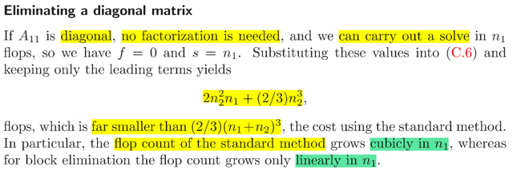</kbd></p>

> [!NOTE]
> Thì cụ thể là xét case đầu tiên là khi A11 nó là DIAGONAL matrix Dễ
> thấy khi đó không cần factor A11 gì ráo (vì với A diagonal rồi, thì giải
> Ax `=` b chỉ là giải m hệ aii xi `=` bi (A shape m,n) và như vậy chỉ tốn m
> phép chia xi `=` `bi/aii)`
>
> Vậy nên khi A11 đã là diagonal matrix thì chi phí factorizing f `=` 0 chi
> phí solving s `=` n1 (A11 shape n1,n1)
>
> Thế f, s vào công thức chi phí của việc giải Ax `=` b theo method  block
> - elimination:
>
> (f + n2s) + 2n2^2n1 + `(2/3)n2^3`
>
> `=` (0 + n2n1) + 2n2^2n1 + `(2/3)n2^3`
>
> `=` n2n1 + 2n2^2n1 + `(2/3)n2^3`
>
> coi như `=` 2n2^2n1 + `(2/3)n2^3`
>
> và cái này NHỎ HƠN NHIỀU so với cost của LU factor-solver với
> matrix A: `=` `(2/3)(n1` + n2)^3  Cụ thể hơn là `(2/3)(n1` + n2)^3 tăng
> theo bậc 3 của n1 (size của A11) trong khi  2n2^2n1 + `(2/3)n2^3` chỉ
> tăng tuyến tính với n1

<br>

<p align="center"><kbd>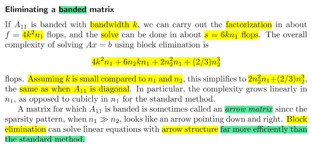</kbd></p>

> [!NOTE]
> Rồi, đại khái là phần trước ta đã viết về banded matrix có bandwidth k
> (là matrix mà các giá trị khác 0 chỉ tập trung ở một dải có bề rộng k ở
> đường chéo) sẽ có cost cho LU factorization chỉ là 4(k^2)n cũng như
> bước solve ít tốn kém hơn với 6kn.
>
> Nên nếu A11 mà như vậy thì factor sẽ chỉ tốn 4(k^2)n1 + 6kn1 flops
>
> Khi đó thế vào cost của block elimination:
>
> 4(k^2)n + n2*6kn1 + 2n2^2n1 + `(2/3)n2^3`
>
> Nếu giả định k nhỏ hơn n1, n2 nhiều. Thì kết quả trên có thể coi như:
>
> 2n2^2n1 + `(2/3)n2^3`
>
> Và kết qủa này giống như khi A11 là diagonal matrix
>
> Nói thêm rằng khi A11 là banded matrix thì đôi khi A được gọi là
> ARROW MATRIX nếu n2 >> n1 và việc giải Ax `=` b với phương pháp
> Block elimination hiệu quả hơn nhiều so với standard method

<br>

<p align="center"><kbd>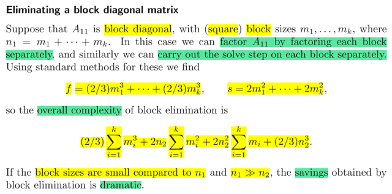</kbd></p>

<p align="center"><kbd>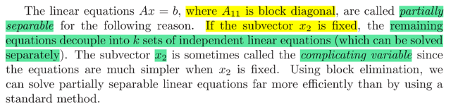</kbd></p>

> [!NOTE]
> CHƯA HIỂU,
> QUAY LẠI SAU

<br>

<p align="center"><kbd>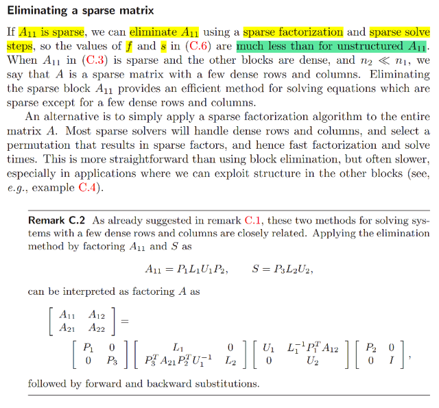</kbd></p>

> [!NOTE]
> QUAY LẠI SAU

<br>

<p align="center"><kbd>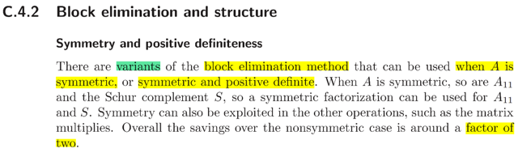</kbd></p>

<p align="center"><kbd>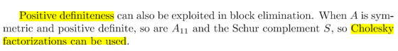</kbd></p>

> [!NOTE]
> Đại khái là khi A symmetric thì A11 và S (Schur complement của
> A11)  cũng vậy giúp chi phí của các bước liên quan cũng giảm đi.
>
> Và nhìn chung là giảm chi phí của việc giải Ax `=` b theo block
> elimination method đi một nửa
>
> Và khi A không những symmetric mà còn ≻ 0, thì như đã biết ta
> có thể dùng Cholesky factorization, giúp tốn chi phí ít hơn nữa
> so với LU factorization

<br>

<p align="center"><kbd>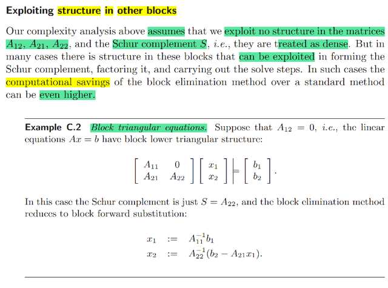</kbd></p>

> [!NOTE]
> rồi đại khái là nãy giờ mới chỉ nói về việc khai thác cấu trúc đặc 
> biệt của A11 không à, chứ chưa nói đến các matrix A12, A21, A22
> cũng như Schur complement S.
>
> Nếu có thì dĩ nhiên có thể giảm cost hơn nữa.
>
> Một ví dụ là khi A12 nó bằng 0. Khi đó S trở thành chỉ có A22. 
> Và việc giải x1, x2 có thể thấy sẽ là như vậy (ý nói đơn giản hơn
> trước)

<br>

<p align="center"><kbd>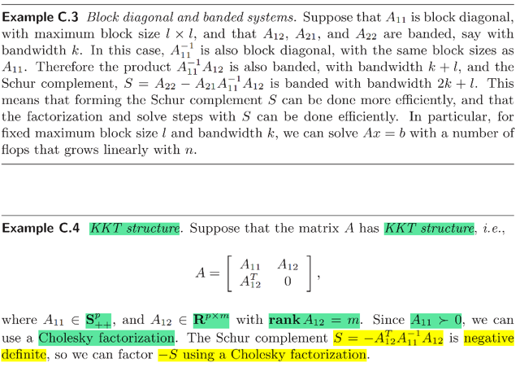</kbd></p>

> [!NOTE]
> Rồi, ví dụ C.3 QUAY LẠI SAU
>
> Ví dụ C.4 là một cái mà liên quan đến chap 10 khi ta cần giải
> Newton's  step trong bài toán equality constrained optimization
> problem.
>
> Nhớ lại một chút, thì đại khái là bối cảnh là ta đang xét bài toán
> equality constraint optimization problem: minimize f(x) với constrain:
> Ax `=` b
>
> Thế thì nếu xét cách tiếp cận là dùng Newton's method. Thì (để tính
> Newton step `Δx_nt` để từ x, thực hiện việc update) về cơ bản là ta sẽ
> "coi hàm f" như  quadratic approximation của nó tại x f(x + v) ≈ f(x) +
> ∇f(x)Tv `=` f^(x + v)
>
> Và khi đó, ta sẽ giải bài toán minimize g(v) `=` f^(x + v) với constraint
> A(x + v) `=` b ⇔ Av `=` 0
>
> Thế là đây là bài toán equality constraint quadratic optimization
> problem
>
> Và dùng KKT condition hoặc optimality condition ta sẽ dẫn tới việc
> ```text
> giải hệ thể hiện bởi: Aw = 0 và ∇^2f(x) Δx_nt + ∇f(x) + ATw = 0
> ```
>
> và có thể gom lại để về cơ bản là ta giải hệ: K `[Δx_nt;` w] `=` [-∇f(x); 0]
> với K là KKT matrix `=` [∇^2f(x) A; AT 0]
>
> và đây chính là khi ta áp dụng cái nói ở đây, KKT matrix chính là matrix
> A có KKT structure, A11 ≽ 0. A12 là full column rank (hệ Ax `=` b của constraint)
>
> Thế thì khi A11 ≻ 0 (ví dụ như khi trong bài toán Newton's method, ta có
> strong convexity giúp ta có ∇^2f(x) ≻ 0) thì như đã biết ta có thể áp dụng
> Cholesky factorization giúp "nhẹ hơn" LU factorization. Và Schur complement
> `=` -A12T A11invA12 sẽ ≺ 0 cũng giúp có thể factor -S với Cholesky factorization
> nốt.
>
> (vì sao S ≺ 0: S `=` -A12T A11invA12 Xét quadratic form uTSu 
>
> ```text
> = -uTA12T A11invA12u = -(A12u)TA11inv(A12u) = -qTA11invq với q = A12u
> ```
>
> Ta cần chứng minh qTA11invq > 0 ∀ q ≠ 0 và chỉ bằng 0 ⇔ q `=` 0.
>
> Đầu tiên xét A12u, A12 là full column rank matrix (shape p,m tức p hàng, m cột
> mà có rank `=` m, thì là full column rank) thì có thể nhớ rằng nullspace của full
> column rank matrix chỉ là {0}, đồng nghĩa q `=` A12u `=` 0 khi và chỉ khi u `=` 0
>
> Rồi, với A11inv thì dĩ nhiên eigenvalue của nó là nghịch đảo eigenvalue của A11
> và A11 positive definite thì mói eigevalue đều dương ⇨ nghịch đảo cũng dương
> ⇨ A11inv cũng positve definite. Và như vậy ∀ q khác 0 thì qTA11invq luôn > 0.
> Mà q khác 0 cũng ⇔ u khác 0. Vậy là ta đã có uTA12T A11invA12u luôn > 0
> và chỉ bằng 0 khi u `=` 0. ⇨  - uTA12T A11invA12u luôn < 0, chỉ bằng 0 khi u `=` 0
> ⇨ S `=` - A12T A11invA12 là negative definite.
>
> Nói chung ý chính là muốn nói ở bài toán này, ta có A11 có special structure
> (symmetric ≻ 0), và S cũng vậy (≺ 0) thành ra có thể khai thác
> (dùng Cholesky factorization "nhẹ chi phí" hơn LU factorization) giúp giải hệ
> Ax `=` b nhẹ hơn

<br>

<p align="center"><kbd>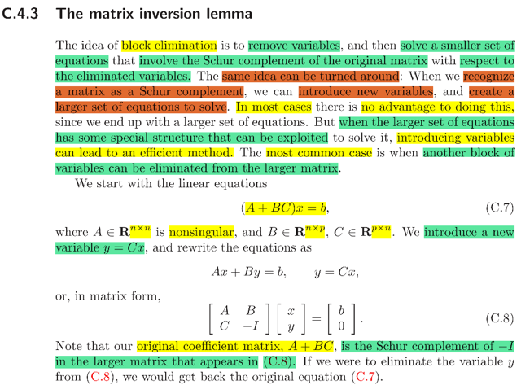</kbd></p>

> [!NOTE]
> đại khái là vầy, cái pp block elimination để giải Ax `=` b bằng cách
> thể hiện A `=` [A11, A12; A21 A22][x1; x2] `=` [b1; b2] về cơ bản là
> ta "tìm x1 theo x2" để thay vào có một hệ mới theo x2: Sx2 `=` b~
> Và giải cái hệ này, là một hệ nhỏ hơn.
>
> Thì ý tưởng là, có khi ta cũng có thể làm ngược lại, đó là nhận
> định A là schur-complement của một matrix lớn hơn. Để rồi bằng
> cách tạo thêm variable mới, ta dẫn đến việc giải một hệ lớn hơn
> nhưng dĩ nhiên là chỉ có ích khi việc gỉải hệ lớn hơn này có đặc 
> điểm nào đó lợi hơn giải hệ cũ, ví dụ như cái hệ lớn hơn này cho
> phép eliminate nhiều biến hơn 
>
> Một ví dụ là khi ta có hệ (A + BC)x `=` b
>
> thì bằng cách đặt (them variable) y `=` Cx, hệ trở thành Ax + By `=` b
> ⇔ [A, B; C -I][x; y] `=` [b; 0]
>
> Và A + BC chính là Schur complement của -I 
>
> (Với A `=` [A11, A12; A21, A22] thì Schur complement của A11 là 
> A22 - A12A11invA21.
>
> Vậy thì Schur complement của -I chính là A - B(-Iinv)C `=` A + BC

<br>

<p align="center"><kbd>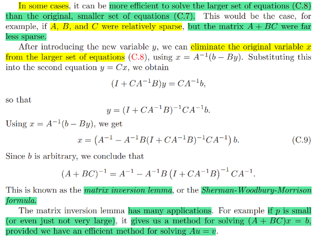</kbd></p>

> [!NOTE]
> Rồi, thế thì như đã nói, một số trường hợp ta sẽ có lợi khi giải một
> hệ lớn hơn (sau khi tạo thêm variable). Và lấy ví dụ như trong trường
> hợp này (với hệ lớn hơn [A, B; C, -I][x; y] `=` [b; 0] ta có đặc điểm là
> nó còn sparse hơn cả các sparse matrix (ví dụ vậy) A, B, C
>
> Lúc này ta có thể lại eliminate x:
>
> [A, B; C, -I][x; y] `=` [b; 0]
>
> ⇔ Ax + By `=` b (1) và Cx - y `=` 0 (2)
>
> Từ (1) ⇨ x `=` Ainv(b - By) (3) . Thế vào (2):
>
> CAinv(b - By) - y `=` 0 ⇔ CAinvb - CAinvBy - y `=` 0
>
> ⇔ CAinvb `=` (CAinvB + I)y ⇔ y `=` [CAinvB + I]invCAinvb
>
> ⇨ (thế vào (3) lại tìm x) x `=` Ainv(b - B[CAinvB + I]invCAinvb)
>
> `=` (Ainvb - AinvB[CAinvB + I]invCAinvb)
>
> ⇔ x `=` (Ainv - AinvB[I + CAinvB]invCAinv)b
>
> Thế thì từ đó dĩ nhiên ở đây x là solution của hệ gốc (A + BC)x `=` b ⇔ 
>
> x `=` (A + BC)invb
>
> Nên có thể suy ra (A + BC)inv `=`  (Ainv - AinvB[I + CAinvB]invCAinv)b
>
> và đây chính là BỔ ĐỂ MATRIX INVERSION.
>
> nó có nhiều ứng dụng, ví dụ như khi p nhỏ thì giải (A + BC)x `=` b
> sẽ có lợi hơn giải Au `=` v (ý này chưa hiểu lắm nhưng tạm biết vậy)

<br>

<p align="center"><kbd>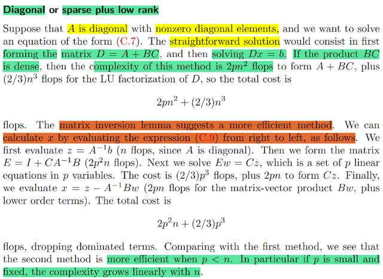</kbd></p>

> [!NOTE]
> rồi, xét ví dụ cho rằng A là diagonal matrix với đường chéo khác 0. Và ta
> muốn giải hệ (A
> + BC)x `=` b.
>
> Cách tiếp cận trực tiếp thông thường là hình thành D `=` A + BC, rồi  giải Dx `=`
> b.
>
> Và cho rằng BC là dense thì tính D sẽ tốn 2pn^2 flops: tại sao
>
> Shape A nxn; B nxp; C pxn
>
> BC sẽ tốn 2np (lập luận nhanh: mỗi component ij của BC sẽ là dot product
> của row i của B và column j của C, tốn p phép nhân scalar, p - 1 phép cộng
> là p + p - 1 coi như 2p. Và BC có n^2 component, ⇨ n^22p `=` 2pn^2 flops
>
> A + BC, là cộng matrix - matrix, tốn n^2 phép cộng
>
> ⇨ tốn n^2 + 2pn^2 coi như 2pn^2.
>
> Rồi, để gỉai Dx `=` b như đã biết gồm 2 bước factor D `=` LU sẽ tốn `2/3` n^3
>
> Do đó tính cho đến khi factor D thì ta tốn `2/3` n^3 + 2pn^2
>
> `====`
>
> Rồi, thế thì họ mới nói rằng trong trường hợp này cái bổ đề trên cho phép ta
> có phương pháp nhẹ hơn:
>
> Đầu tiên ta xem việc tính cái này tốn mấy flops
>
> x `=` (Ainv - AinvB[I + CAinvB]invCAinv)b
>
> `=` Ainvb - AinvB[I + CAinvB]invCAinvb
>
> *Tính z `=` Ainvb, với A invertible diagonal thì Ainv cũng diagonal, và Ainvb dĩ
> nhiên chỉ tốn có n phép chia (bi `/` `Ainv_ii)` ⇨ n flops
>
> *Hình thành matrix E `=` I + CAinvB:
>
> AinvB: lập như trước, mỗi component của AinvB là inner product của row i
> của Ainv và column j của B. vốn dĩ sẽ tốn n + n - 1 `=` 2n - 1 flops. coi như 2n
> flops. và AinvB có np entries ⇨ 2n * np `=` 2(n^2)p flops Nhưng vì Ainv
> diagonal, nên mỗi hàng của nó chỉ có 1 con số khác 0. Thành ra mỗi phép
> dot product chỉ tốn 1 flops. Và AinvB chỉ tốn np flops
>
> CAinvB với C `=` (p, n); AinvB `=` (n, p) ⇨ tốn 2pnp (như AB (m, n)(n, p) tốn
> 2mnp) `=` 2(p^2)n. I + CAinvB tốn thêm không bao nhiêu (n phép cộng nữa)
>
> Vậy cost là 2(p^2)n flops
>
> *Tiếp theo tính [I + CAinvB]invCAinvb:
>
> ```text
> Chính là giải Ew = CAinvb ⇔ Ew = Cz (vì cái này ⇔ w = EinvCz =  [I +
> ```
> CAinvB]invCAinvb
>
> Mà giải Ew `=` Cz thì đầu tiên phải form Cz: với C `=` (p, n), z `=` AinvB (R^n
> vector) đây là nhân matrix và vector (lập luận nhanh: ta sẽ tính n lần [scalar
> * cột của C, tốn p flops) là np flops. Và n - 1 [phép cộng cột-cột, tốn p flops]
> `=` np - p flops ⇨ Tổng cộng 2np - 1 coi như 2np flops.
>
> Tiếp theo là factorizing E `=` LU, tốn `(2/3)p^3` flops
>
> Và solve step: Ew `=` Cz có lẽ là không bao nhiêu so với factor step nên
> trong sách nói rằng cost của việc tính ra w `=` EinvCz chỉ có 2np + `(2/3)p^3`
>
> Cưới cùng là t sẽ tính AinvBw
>
> Với Bw tốn 2np flops (nhân matrix n,p với R^p vector) và AinvBw chỉ tốn
> n flops) nên coi như 2np
>
> Và tính x `=` Ainvb - AinvB[I + CAinvB]invCAinvb `=` z - AinvBw tốn thêm mấy phép
> trừ nữa không bao nhiêu.
>
> Vậy tổng cộng là tốn: 2(p^2)n + `(2/3)p^3`
>
> Thế thì so với cost của cách giải thông thường (2pn^2 + `(2/3)n^3)`
> thì ta sẽ thấy khi p << n thì cách dùng matrix inversion lợi hơn. Vì nó
> chỉ tăng tuyến tính với n thay vì cubic với n như cái kia

<br>

<p align="center"><kbd>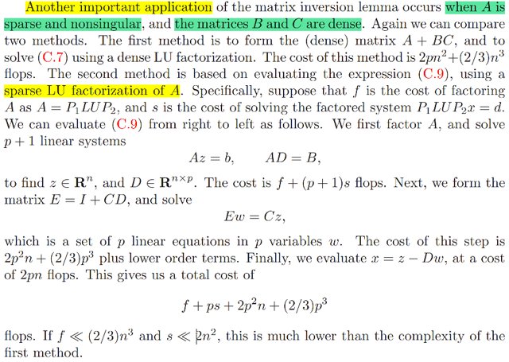</kbd></p>

> [!NOTE]
> Tương tự, nếu như A sparse và non-singular thì viêc giải theo
> matrix inversion lemma cũng sẽ hiệu quả hơn.
>
> Các phân tích cũng không quá khó hiểu:
>
> Đại khái là từ x `=` (Ainv - AinvB[I + CAinvB]invCAinv)b
>
> `=` Ainvb - AinvB[I + CAinvB]invCAinvb
>
> Thì nhờ A sparse và nonsingular nên bước factor A `=` LU sẽ
> có thể áp dụng cái vụ sparse LU factorizing, với chi phí là f
> nó sẽ có thể nhỏ hơn nhiều so với LU factorizing A "bình thường"
> (tốn `2/3` n^3)
>
> Thì từ đó nó giúp giảm cost của việc tính Ainvb (vốn là việc giải
> Az `=` b) cũng như tính AinvB (vốn là giải Ay `=` B)
>
> và dĩ nhiên là khiến cost tổng nhỏ hơn cost khi giải bằng cách
> thông thường

<br>

<p align="center"><kbd>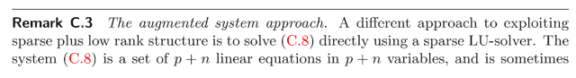</kbd></p>

<p align="center"><kbd>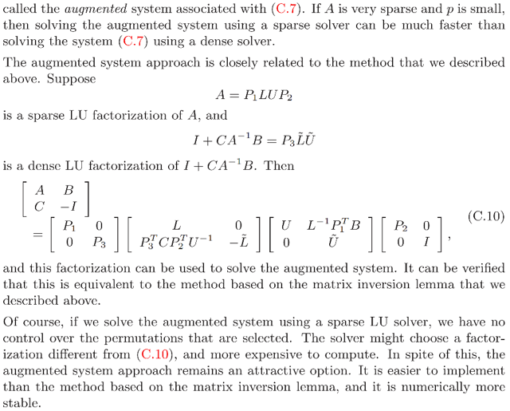</kbd></p>

> [!NOTE]
> QUAY LẠI SAU

<br>

<p align="center"><kbd>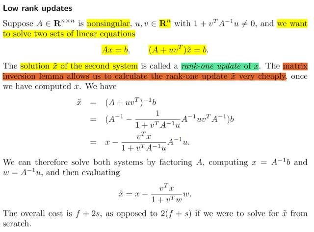</kbd></p>

> [!NOTE]
> QUAY LẠI SAU

<br>

