# Info-theo Mc Kay Cambridge (16 Lectures)

📊 **Progress:** `85` Notes | `112` Screenshots | `0` AI Reviews

---

<a id="node-e1ak9by"></a>
## Lec 3

<br>


<a id="node-v4uw51s"></a>
## Lec 2

<br>

<p align="center"><kbd></kbd></p>

> [!NOTE]
> gs nhắc lại bài trước ta đã thảo luận về việc transmit signal thông qua
> unreliable channel. Trong đó ta dùng ví dụ bài toán binary symmetric
> channel, trong đó một bit có thể bị flip với xác suất f.
>
> Để thông qua đó ta xem xét phương pháp dùng encoder để add thêm
> redundancy và decoder để decode thông tin.
>
> Với hai cách làm là Repetition codes và 74 Hamming code

<br>

<p align="center"><kbd></kbd></p>

<br>

<p align="center"><kbd></kbd></p>

> [!NOTE]
> và cuối cùng ta đã biết về một theorem bởi Shannon, nói rằng
> tồn tại một cách thức encoding thông tin để có thể đạt được 
> error rate nhỏ tùy ý.

<br>

<p align="center"><kbd></kbd></p>

> [!NOTE]
> gs cho rằng ta sẽ chứng minh theorem này sau, nhưng ta sẽ tiếp tục
> tìm hiểu xem nó fit vào bức tranh tổng thể vấn đề ta đang quan tâm như
> thế nào
>
> Thế thì gs cho biết, thật ra real source data (tạm hiểu là những thông
> tin, dữ liệu thực tế, ngoài đời thực) THƯỜNG LÀ ĐÃ CHỨA ĐỪNG
> REDUNDANCY SẴN RỒI.
>
> Do đó có vẻ nhưng bước ADDING REDUNDANCY mà ta đã làm bữa
> trước không thật sự cần thiết khi bản thân thông tin đã có sẵn
> redundancy

<br>

<p align="center"><kbd></kbd></p>

> [!NOTE]
> Gs minh họa bằng đoạn text này, đại khái là dù bị che mất `1/3` số
> kí tự, nhưng về cơ bản là ta, VẪN CÓ THỂ ĐỌC và hiểu được.
>
> Đây là minh họa cho nhận định rằng thông tin ngoài đời thực thường
> đã tự nó chứa redundancy (chính vì vậy mà khi bỏ bớt ta vẫn đọc
> và hiểu thông tin)

<br>

<p align="center"><kbd></kbd></p>

> [!NOTE]
> Do đó người ta sẽ thiết kế hệ thống `compress/decompress`
> (Source coding) thông tin trước và sau khi encode và decode
> (channel coding) (thứ tự trong slide bị nhầm)

<br>

<p align="center"><kbd></kbd></p>

<br>

<p align="center"><kbd></kbd></p>

> [!NOTE]
> Lấy ví dụ, x là r.v có 2 possible values là T, H (tung đồng xu)
> ```text
> với xác suất P(x=T) = 0.9 và P(x=H) = 0.1
> ```
>
> Gs sẽ dùng ví dụ này, để ta "làm", đại khái là ta có một source
> data có chứa redundancy lí tưởng, ví dụ như 1000 số 0,1 như
> hình bên. Để rồi ta sẽ bàn để việc compress `/` decompress

<br>

<p align="center"><kbd></kbd></p>

> [!NOTE]
> Câu hỏi là, giả sử ta nhận được một chuỗi có 1000 số 0, 1 như vậy
> thì 
>
> "Lượng thông tin chứa trong đó là bao nhiêu?"
>
> "Ta sẽ compress nó như thế nào?"
>
> "Ta nên `/` có thể compress nó nhỏ đến mức nào?"

<br>

<p align="center"><kbd></kbd></p>

<p align="center"><kbd></kbd></p>

<p align="center"><kbd></kbd></p>

<p align="center"><kbd></kbd></p>

<p align="center"><kbd></kbd></p>

<p align="center"><kbd></kbd></p>

> [!NOTE]
> Và đại khái ta sẽ khái quát hơn X `=` x, Ax, Px với 
>
> x: Random variable x, có nhiều possible values thay vì chỉ 2 possible values H, T
>
> Ax là set các possible values a1, ...aI và 
>
> Px là set các xác suất PX `=` p1, p2....pI
>
> Sao cho `P(x=ai)` `=` pi

<br>

<p align="center"><kbd></kbd></p>

> [!NOTE]
> Và điều ta sẽ làm là: thảo luận về idea của Shannon: gọi là Shannon
> INFORMATION CONTENT of an outcome:
>
> Ví dụ x `=` ai, là một event, một subset chứa các possible
> outcome được map  với ai s: x(s) `=` ai như đã biết
>
> Thì `h(x=ai)` (là information content của outcome `x=ai)` sẽ
> được tính  theo công thức
>
> ```text
> h(x=ai) = log base 2 của 1/P(x=ai)
> ```
>
> Và cái này có đơn vị là bits

<br>

<p align="center"><kbd></kbd></p>

> [!NOTE]
> Và theo công thức đó, thì ta có đồ thị này
>
> Giả sử xét đồng bent coin hồi nãy khi xác suất có mặt T là 0.9
> mặt H là 0.1
>
> Thì nếu mặt T xảy ra, thì "lượng thông tin" 
>
> (information content) của outcome này sẽ là log base 2 của `1/0.9,` 
> chỉ có 0.15
>
> Còn nếu mặt H xảy ra, thì lượng thông tin của outcome này mang lại
> sẽ là log base 2 của `1/0.1` `=` 3.3
>
> Nếu một outcome có xác suất xảy ra là 50% thì lượng thông tin của
> nó là log base 2 của `1/0.5` `=` 1

<br>

<p align="center"><kbd></kbd></p>

<p align="center"><kbd></kbd></p>

> [!NOTE]
> Và Shannon còn tuyên bố rằng (claim) h(x) chính là kích thước của
> compressed file mà ta nên hướng tới
>
> x là một outcome (event cũng chỉ là set các outcome) và ta nên hiểu ý
> là `h(x=...)` tức là lượng thông tin mà một outcome mang theo

<br>

<p align="center"><kbd></kbd></p>

> [!NOTE]
> Một vài ghi chú
>
> Thứ nhất h (function tính, hay đo lường đại lượng information 
> content) là có tính ADDITIVE với các INDEPENDENT r.vs

<br>

<p align="center"><kbd></kbd></p>

> [!NOTE]
> Như đã biết, nếu x, y là các r.vs độc lập thì joint distribution P(x,y)
> ở đây có thể là PMF `P(x=xi,` `y=yj)` sẽ bằng tích các marginal PMF:
>
> ```text
> P(x=xi, y=yj) = P(x=xi)*P(y=yj) với mọi possible values của x, y
> ```
>
> Hoặc với PDF thì cũng vậy Joint PDF `f_x,y` (x,y) `=` tích các Marginal PDF:
>
> ```text
> f_x,y (x,y) = f_x(x) * f_y(y)
> ```
>
> (chú ý nhớ rằng ở đây x, y viết thường là r.v, không như Stat110
> để rv là viết hoa X,Y)

<br>

<p align="center"><kbd></kbd></p>

<p align="center"><kbd></kbd></p>

> [!NOTE]
> Khi đó h(x,y) (mà ta hiểu là `h(x=xi,` `y=yj)` là information content chứa trong "joint event" 
> `(x=xi,` `y=yj)` sẽ tính bằng:
>
> ```text
> h(x,y) = log2 1/P(x,y) = log2 1/[P(x)P(y)] = log2 1/P(x) + log2 1/P(y) = h(x) + h(y)
> ```
>
> Đây là lí do nếu x, y độc lập thì h có tính additive.
>
> Nếu x, y độc lập thì h có tính additive

<br>

<p align="center"><kbd></kbd></p>

> [!NOTE]
> Và ta hiểu cái này giống như giả sử gs tung đồng xu (để có
> outcome là giá trị của x) và ông mở cửa ra xem trời có mưa
> không (y) thì dễ thấy vì hai chuyện này ko liên quan gì nhau.
>
> Nên đại khái là lượng thông tin mà ta có khi gs nói cho ta cả hai kết
> quả cùng lúc (coin ra mặt gì, và trời có mưa không) thì cũng bằng
> lượng thông tin  khi ông nói cho ta lần lượt từng thứ

<br>

<p align="center"><kbd></kbd></p>

<p align="center"><kbd></kbd></p>

> [!NOTE]
> Và ta học qua một định nghĩa nữa, là ENTROPY (của một ensemble*)
>
> (*) Cứ hiểu ensemble là x, Ax, Px với x là r.v, Ax là set các possible values của x
> và Px là set chứa giá trị xác suất mà rv mang possible values trong Ax
>
> Thế thì định nghĩa của ENTROPY, CHÍNH LÀ AVERAGE (MEAN) CỦA SHANON INFORMATION
> CONTENT.
>
> Và với mean, thì ta liên hệ tới Expected value. Vậy có thể hiểu ta sẽ weighted sum các h(x)
> với weight là xác suất mà x mang giá trị khả dĩ
>
> ```text
> H(X) = Σi P(x=xi) log2 1/P(x=xi)
> ```
>
> ENTROPY, CHÍNH LÀ AVERAGE (MEAN) CỦA SHANON INFORMATION
> CONTENT.
>
> ```text
> H(X) = Σi P(x=xi) log2 1/P(x=xi)
> ```

<br>

<p align="center"><kbd></kbd></p>

> [!NOTE]
> Thế thì gs nói về bài toán này, cho 12 balls, trừ 1 trái nặng hơn hoặc
> nhẹ hơn thì 11 trái kia đều bằng nhau. Yêu cầu là thiết kế một chiến
> lược để sao cho nhanh nhất xác định xem đâu là 1 trái ngoại lệ. Và
> trong đó thì nó nặng hơn hay nhẹ hơn?
>
> Thử nghĩ:
>
> Chia làm 3 (nhóm 4 trái). Cân 2 lần là đủ biết banh x nằm ở nhóm
> nào:
>
> Giả sử cân nhóm 1,2 mà bằng nhau thì suy ra ngay banh x nằm ở
> nhóm 3.
>
> Giả sử 1>2:
>
> Cân tiếp (1,3) hoặc (2,3) thì: 
>
> + (1>3) thì suy ra banh x trongnhóm 1 và x nặng hơn, 
>
> + `(1=3)` thì suy ra banh x trong nhóm 2 và x nhẹ hơn. 
>
> (1<3 không thể xảy ra)
>
> Tương tự cân 2,3 cũng sẽ giúp suy luận tương tự.
>
> Nói chung là chia làm 3 và cân 2 lần là xác định được banh x nằm
> đâu.
>
> Thế thì nhóm còn 4 trái: Nhưng ta đã biết x nặng hơn hay nhẹ hơn.
> Vậy thì chia làm 2 cân 2 lần nữa là xác định được x.
>
> Vậy tốn 4 lần cân.

<br>

<p align="center"><kbd></kbd></p>

> [!NOTE]
> đại khái là gs khảo sát các
> solution của student

<br>

<p align="center"><kbd></kbd></p>

> [!NOTE]
> Để rồi ta sẽ có các solution là trong lần cân đầu tiên, ta sẽ cân mấy
> trái (vs mấy trái)
>
> ví dụ 6v6 hay 5v5..
>
> Thì phương án của mình là 4v4, bởi khi đó nếu nó có kết quả bằng
> thì ngay lập tức mình sẽ biết banh x nằm trong nhóm còn lại
>
> Thế thì ý chính là, theo lí thuyết của Shannon, ta nên cân lần đầu
> sao cho có entropy cao nhất. Nên tiếp thep gs sẽ tính entropy của
> các phương án này

<br>

<p align="center"><kbd></kbd></p>

> [!NOTE]
> Thế thì đầu tiên cân 6 vs 6. Sẽ dĩ nhiên là có 3 possible outcomes Xác
> suất (xảy ra mỗi outcome) là gì?
>
> Vì chỉ có 12 trái nên chia làm hai để cân thì chỉ có thể nghiêng bên này
> hoặc bên kia (xác suất bằng `1/2` `=` là xác suất mà banh x nằm bên này
> hoặc bên kia) không thể bằng nhau được.
>
> ```text
> Vậy entropy là (1/2) log2 (1/0.5) + 0 + (1/2) log2 (1/0.5) = 1/2 + 1/2 = 1
> ```
> bit

<br>

<p align="center"><kbd></kbd></p>

> [!NOTE]
> Trường hợp 5 vs 5:
>
> Gs: Xác suất cân bằng nhau khi cân 5 trái mỗi bên?
>
> Thử nghĩ:
>
> Có thể xảy ra khả năng bằng nhau khi trái không bình thường nằm ở 
> ngoài hai nhóm này:
>
> Gọi hai trái ở ngoài là B1 và B2 thì xác suất cân bằng nhau là xác suất
> hai trái này chứa trái bất bình thường. `B1=abnormal` U B2 `=` abnormal
> ```text
> P(B1=abnormal U B2 = abnormal) = P(B1=abnormal) + P(B2=abnormal)
> ```
> (do axiom 2: union của disjoint event)
>
> Và `P(B1=abnormal)` `=` `1/12:` Event space 1: Sample space 12. Equally likely
>
> `P(B2=abnormal)` cũng vậy
>
> ```text
> Vậy P(B1=abnormal U B2 = abnormal) = 2/12 = 1/6
> ```
>
> Vậy xác suất có sự bằng nhau khi cân 5vs5 là `1/6.` Nên xác suất bị lệch
> một bên sẽ là 1 - `2/12` `=` `10/12,` vì tính đối xứng nên đều bằng nhau:
>
> P(Trái<Phải) `=` P(Phải>Trái) `=` `5/12`
>
> `P(Trái=Phải)` `=` `2/12`

<br>

<p align="center"><kbd></kbd></p>

<p align="center"><kbd></kbd></p>

> [!NOTE]
> Chính xác. Và entropy sẽ là:
>
> Như đã biết, entropy là weighted `Σ` của information content với weight là
> xác suất của `outcome/event`
>
> `Σx` `P(X=x)` H(x)
>
> ```text
> (5/12) log_2 (12/5) + (2/12) log_2 (12/2) + (5/12) log_2 (12/5)
> ```
>
> `=` 1.48 bits
>
> Như vậy Shannon information content trong kết quả này là cao hơn
> so với kết qủa khi cân 2 nhóm 6 banh

<br>

<p align="center"><kbd></kbd></p>

> [!NOTE]
> Nếu cân hai nhóm 4 banh:
>
> Tương tự. Xác suất nhóm 4 banh ở ngoài chứa trái abnormal là `(1/12)*4`
> Gọi chúng là B1,B2, B3, B4: 
>
> ```text
> P(U=1,2,3,4 B_i=abnormal) = Σi P(B_i abnormal)
> ```
>
> ```text
> = 4 * 1/12 = 4/12
> ```
>
> ```text
> => P (Trái=Phải) = 4/12
> ```
>
> ```text
> P(Trái>Phải) = P(Phải<Trái) = (1/2) (1-4/12) = 4/12
> ```
>
> Cũng có thể tính cách khác: Có 3 nhóm 4 banh. Xác suất một nhóm có 
> abnormal ball: `1/3` `=>` Xác suất cân bằng nhau: `1/3,` Xác suất lệch trái 
> `=` Xác suất lệch phải là `1/3`
>
> Và entropy là 1.58 bits

<br>

<p align="center"><kbd></kbd></p>

> [!NOTE]
> Nếu cân 3vs3:
>
> Lập luận tương tự xác suất 6 trái ở ngoài có abnormal là `1/12` * 6 `=` `6/12`
>
> `P(Trái=Phải)` `=` `6/12`
>
> ```text
> P(Trái>Phải) = P(Phải<Trái) = (1/2)(1-6/12) = 3/12
> ```
>
> ```text
> Và Entropy sẽ là 1/2 * log_2 (12/6) + 2 * 3/12 log_2(12/3) = 1.5 bits
> ```

<br>

<p align="center"><kbd></kbd></p>

> [!NOTE]
> Vậy thì theo Shannon, ta sẽ nên cân group 4 vì kết quả của
> nó có Entropy cao nhất

<br>

<p align="center"><kbd></kbd></p>

> [!NOTE]
> Câu hỏi của gs là, giả sử ta có outcome Trái < Phải (như đã biết,
> outcome này có xác suất `4/12),` thì làm gì tiếp.
>
> Gọi nhóm trái là LLLL, nhóm phải là HHHH. 
>
> Nhóm ở ngoài là GGGG

<br>

<p align="center"><kbd></kbd></p>

<p align="center"><kbd></kbd></p>

> [!NOTE]
> Các sv cho vài solution.
>
> Check thử solution 1: Cân nhóm GGGG và LLLL
>
> ii) P(GGGG `=` LLLL):
>
> event (GGGG `=` LLLL) `=` "Odd ball nặng hơn bình thường"  
>
> vì nếu odd ball nặng hơn bình thường thì nó sẽ nằm trong HHHH khiến LLLL thực ra sẽ cũng là GGGG, để
> rồi cân sẽ bằng nhau. Ngược lại, nếu `GGGG=LLLL` ta sẽ suy ra odd ball nằm ở đám ngoài, mà ta đã biết đám
> đó nặng hơn nên suy ra odd ball nặng hơn bình thương.
>
> Thế thì xét P("Odd ball nặng hơn bình thường") đương nhiên là `1/2`
>
> ```text
> Vậy P(GGGG = LLLL) = P(abnormal ball nặng hơn bình thường") = 1/2
> ```
>
> `====`
>
> Có thể lập luận cách khác. Ta chỉ cần để ý, với việc đã biết 4 trái good, thì xác suất của một trong 8 trái
> của hai nhóm LLLL, HHHH là odd sẽ là `1/8.`
>
> Nên `(GGGG=LLLL)` đồng nghĩa banh odd nằm trong nhóm HHHH, và xác suất của việc banh odd nằm
> ```text
> trong 4 trái HHHH sẽ là P(H1=odd U H2=odd U ...), dùng axiom 2 = ΣP(Hi = odd) = 4*1/8 = 4/8
> ```
>
>
> iii) P(GGGG > LLLL):
>
> event (GGGG > LLLL) sẽ xảy ra nếu event "odd ball nhẹ hơn" xảy ra. 
>
> ```text
> và dĩ nhiên P("abnormal ball nhẹ hơn bình thường") = 1/2 nên P(GGGG>LLLL) = 1/2
> ```
>
> `====`
>
> ```text
> Tính theo cách hai, thì GGGG>LLLL = banh odd thuộc LLLL, => P(GGGG>LLLL) = P(Ui=1,2,3,4 L_i=odd)
> ```
>
> ```text
> theo axiom 2 = Σi P(L_i=odd) = 4*(1/8) = 4/8
> ```
>
> i) Từ đó suy ra P(GGGG < LLLL) `=` 0
>
> `=====`
>
> Tính theo cách 2: GGGG<LLLL `=` banh odd nằm trong GGGG, mà event này không thể xảy ra `=>` P `=` 0

<br>

<p align="center"><kbd></kbd></p>

<p align="center"><kbd></kbd></p>

> [!NOTE]
> Solution 2: Cân nhóm HHL và HHL (ý là, tạo hai nhóm mỗi nhóm có 2
> trái nghi ngờ nặng hơn, và 1 trái nghi ngờ nhẹ hơn.
>
> Khi đó ở ngoài còn 2 trái LL. Thì xác suất hai nhóm trên bằng nhau
> chính là xác suất của việc trái odd ball nằm trong một trong hai trái ở
> ngoài. Gọi hai trái ở ngoài là O1, O2.
>
> ```text
> P(O1=odd U O2=odd) = P(O1=odd) + P(O2=odd) = 1/8 + 1/8 = 2/8
> ```
>
> `P(O1=odd)` `=` `1/8` là bởi ta biết 8 trái trong hai nhóm LLLL,HHHH sẽ
> có một banh odd.
>
> Xác suất cân bị lệch, vì tính đối xứng sẽ chia đều là `3/8` mỗi cái.
>
> Và cũng có thể tính lại: P(HHL < HHL) thì event này xảy ra khi
> Ht1 Ht2 Lt < Hp1 Hp2 odd ball là banh L bên trái hoặc banh H bên
> phải. Tức `L1=odd` U `Hp1=odd` U Hp2 `=` odd
>
> ```text
> Và theo axiom 2: P(HHL < HHL) = P(L1=odd U Hp1=odd U Hp2 = odd)
> ```
>
> ```text
> = P(L1=odd) + P(Hp1=odd) + P(Hp2 = odd)
> ```
>
> ```text
> = 1/8 + 1/8 + 1/8 = 3/8
> ```
>
> Còn cái P(HHL > HHL) thì cũng y vậy

<br>

<p align="center"><kbd></kbd></p>

> [!NOTE]
> Rồi, Solution 3: GGG vs LLL (L,HHHH ở ngoài)
>
> i) `P(GGG=LLL):` event này xảy ra khi odd bal nằm trong đám HHHH
> hoặc trong L ở ngoài.
>
> `=` Với 5 trái ở ngoài thì xác xuất odd là `1/8,` và ta cũng dùng axiom 2
> để tính vì event 1 trong 5 trái này odd là union của 5 disjont event:
>
> ```text
> P(GGG=LLL) = 1/8 + 1/8 + 1/8 + 1/8 + 1/8 = 5/8
> ```
>
> ii) P(GGG>LLL): event này xảy ra khi odd ball nằm trong 3 trái LLL:
> Tới đây thì hoàn toàn tính tương tự nãy h thôi: Axiom2, P(GGG>LLL) 
> `=` `3/8`
>
> iii) P(GGG<LLL) `=` 0

<br>

<p align="center"><kbd></kbd></p>

<br>

<p align="center"><kbd></kbd></p>

> [!NOTE]
> Một solution khác:
>
> i) `P(GGGG=LLLH):` lập luận nhanh luôn, có 4 trái ở ngoài, xác suất
> mỗi trái là odd là `1/8` `=>` xác suất odd nằm trong 4 trái đó là `4/8`
>
> ii) P(GGGG<LLLH): Xảy ra khi trái H là odd: `P(GGGG<LLLH)=` `1/8`
>
> iii)P(GGGG>LLLH): Xảy ra khi 1 trong 3 trái LLL là odd:
> P(GGGG>LLLH) `=` `3/8`

<br>

<p align="center"><kbd></kbd></p>

> [!NOTE]
> Một solution khác nữa. Cũng
> dễ ko cần note làm gì

<br>

<p align="center"><kbd></kbd></p>

> [!NOTE]
> Thế thì, đại khái là ta có thể tính entropy của các solution nãy giờ
> bằng công thức như đã.
>
> Nhưng gs đặt vấn đề khái quát luôn, rằng giả sử ta có p là set 
> các giá trị xác suất p1, p2....pI.
>
> Thì vector p như thế nào để maximize H(X)?
>
> Gs nói câu trả lời của Shannon là uniform, tức là vector P chứa 
> các xác suất p1, p2...làm nên một phân phối xác suất thì nếu 
> nó là uniform distribution thì Entropy sẽ max

<br>

<p align="center"><kbd></kbd></p>

> [!NOTE]
> Nhưng đại ý là, phương án nào mà phân phối xác suất gần với
> uniform nhất sẽ entropy cao nhất.
>
> Và trong mấy cái này thì solution cho ra xác suất của 3 kết qủa là `3/8`
> `2/8` `3/8` sẽ là cái gần với Uniform distribution nhất.
>
> Và ông nói nếu ta làm theo chiến lược này, thì ta có thể giải xong
> trong 3 lần cân

<br>

<p align="center"><kbd></kbd></p>

> [!NOTE]
> Gs nói đọc chap 2,4 và suy nghĩ bài toán này cho bài sau

<br>

<p align="center"><kbd></kbd></p>

<br>


<a id="node-winh67d"></a>
## Lec 1

<br>

<p align="center"><kbd></kbd></p>

> [!NOTE]
> Đầu tiên ta sẽ nói về RELIABLE COMMUNICATION over a
> UNRELIABLE CHANNEL

<br>

<p align="center"><kbd>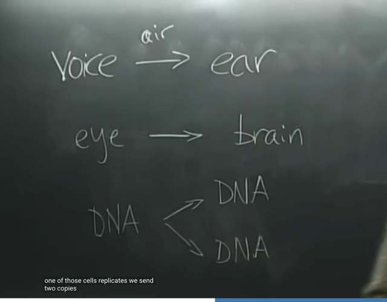</kbd></p>

> [!NOTE]
> Gs cho một số ví dụ về channel: như âm thanh nói ra tryền
> đến tai, thông qua không khí

<br>

<p align="center"><kbd>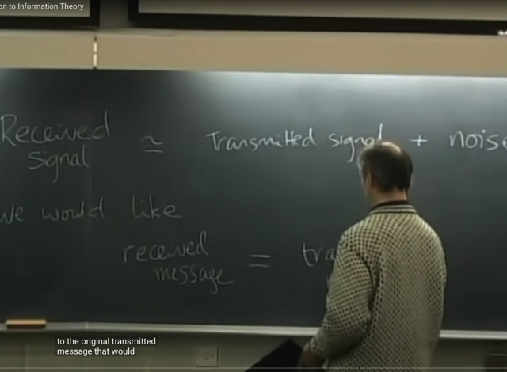</kbd></p>

> [!NOTE]
> Thế thì gs cho rằng ta có thể cho rằng tín hiệu nhận được có thể
> được coi như gần bằng tín hiệu truyền đi cộng thêm nhiễu (noise)
>
> Và dĩ nhiên điều ta mong muốn là tín hiệu nhận được bằng đúng
> tín hiệu truyền đi

<br>

<p align="center"><kbd></kbd></p>

> [!NOTE]
> Thế thì giải pháp bao gồm giải pháp vật lý trong đó ta có thể thay thế
> các dây tín hiệu bằng chất liệu tốt hơn giúp giảm noise, đại loại vậy
>
> Bên cạnh đó ta có giải pháp hệ thống (system solutions) trong đó ta
> sẽ vẫn chấp nhận nhiễu, và thiết kế encoder `/` decoder để loại bỏ 
> nhiễu

<br>

<p align="center"><kbd>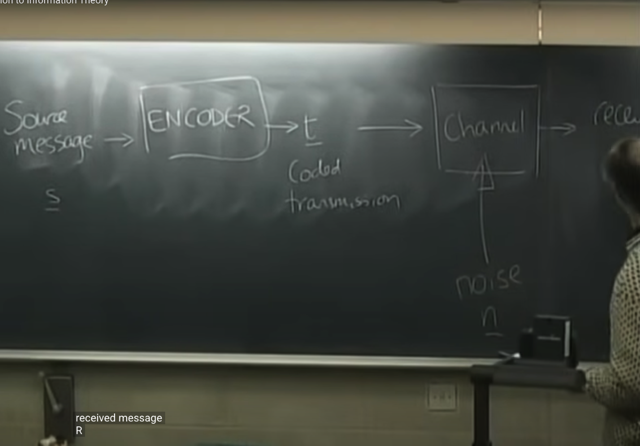</kbd></p>

<p align="center"><kbd>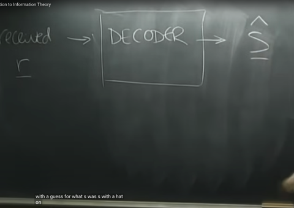</kbd></p>

<p align="center"><kbd>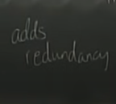</kbd></p>

<p align="center"><kbd>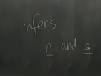</kbd></p>

> [!NOTE]
> Source message sẽ được encoder encode, để có t (coded transmission),
>
> Sau đó coded transmission sẽ được truyền đi thông qua  channel và lúc này có
> thể có nhiễu (noise n) được thêm vào.
>
> Tín hiệu nhận được sau khi truyền tới r sẽ được decoder decode để có thông
> tin s^
>
> Encoder sẽ add thêm redundancy và decoder sẽ infer để tách n và s

<br>

<p align="center"><kbd>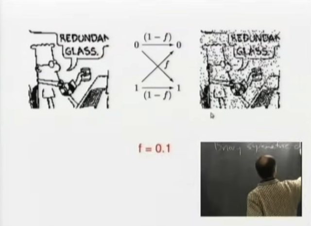</kbd></p>

> [!NOTE]
> Ta sẽ qua một ví dụ gọi là BINARY
> SYMMETRIC CHANNEL

<br>

<p align="center"><kbd>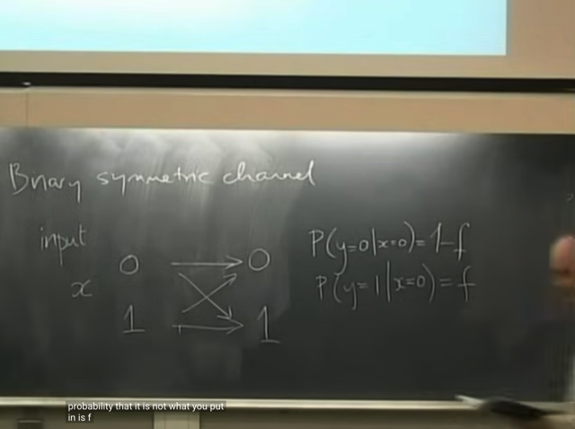</kbd></p>

> [!NOTE]
> Đại khái là input (source signal) chỉ có binary value (tức là 1 hoặc 0)
> và output (tín hiệu nhận được) sẽ "bị chi phối" như sau:
>
> Xác suất mà thông tin nhận được bằng với thông tin truyền đi là 1-f
> ví dụ f `=` 0.1 thì đièu này có nghĩa là:
>
> ```text
> Nếu input là 0, thì xác suất output y = 0 chỉ có 90% P(y=0|x=0) = 1-f
> ```
> ```text
> và xác suất output y = 1, sẽ có 10% P(y=1|x=0) = f
> ```
>
> Ngược lại cũng vậy nếu input là 1, thì xác suất output y `=` 1 cũng là
> 90% `P(y=1|x=1)` `=` 1-f
>
> và `P(y=0|x=1)` `=` f
>
> Nói ngắn gọn, nếu input là 0, thì có 10% output là 1 và 90% output
> là 0.

<br>

<p align="center"><kbd>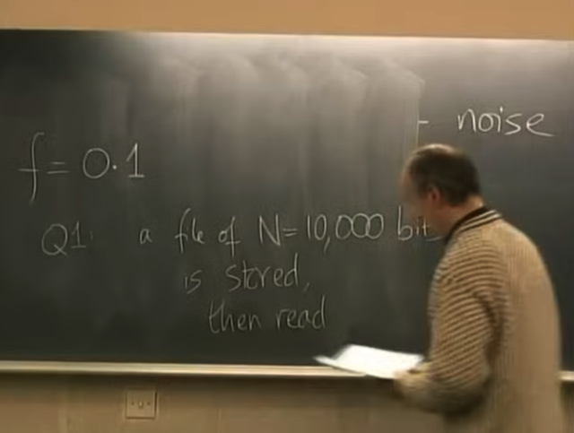</kbd></p>

<p align="center"><kbd>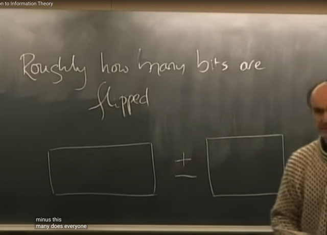</kbd></p>

> [!NOTE]
> Thế thì, câu hỏi gs đề nghị suy nghĩ là nếu có một file 10000 bits,
> được store và read (ý là trái qua quá trình input và output với xác
> suất bị flip `=` 10%) thì một cách gần đúng thì có bao nhiêu bit bị flip

<br>

<p align="center"><kbd>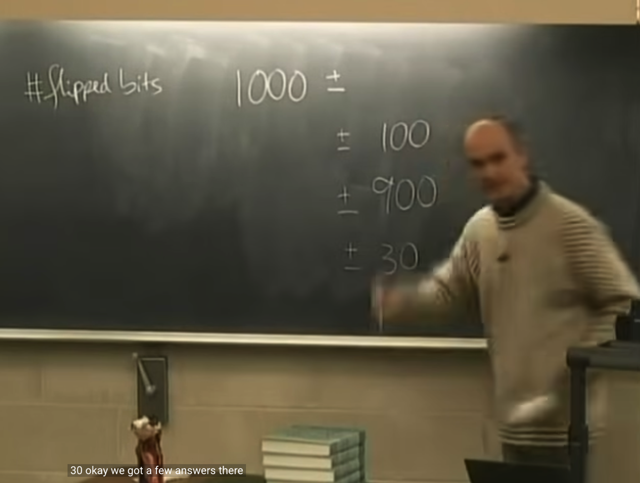</kbd></p>

> [!NOTE]
> Câu trả lời của
> một số sinh viên

<br>

<p align="center"><kbd>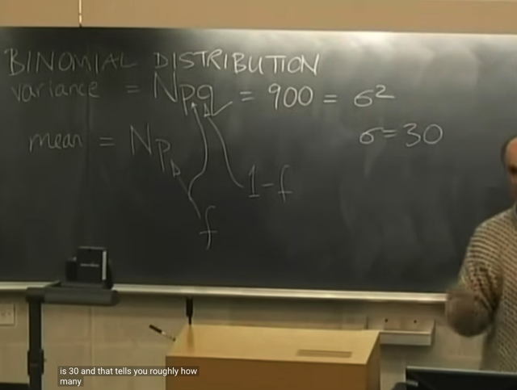</kbd></p>

> [!NOTE]
> Thế thì đáp án là số bit bị flip có thể cho rằng gần bằng Nf  và mức sai khác là
> `σ` `=` 30.
>
> Gs cho rằng để trả lời câu này ta chỉ cần dựa vào Binomial  distribution.
>
> Vậy ta hiểu như vầy: Nhờ Stat110 soi sáng mình đã biết về Binomial
> distribution. Mà story của nó, tức X~Bin(n,p)) là số trial success trong n i.i.d
> Bern(p) trials.
>
> Thế thì ở đây, gs đã nói là các bit independent nhau (khả năng bit này bị flip
> không ảnh hưởng đến bit khác) Thành ra ta hiểu N bits giống như ta có `n=N`
> Bern(p) trials độc lập, với p, là xác suất bị flip đều là bằng f (dù bit có là 0 hay
> 1 thì xác xuất bị flip đều là f)
>
> ```text
> Vậy đây chính là bối cảnh của Bin(n,p) với n = N, p = f: ta có n=N iid Bern(p=f)
> ```
> trials và ta đang quan tâm số bị bị flip, chính là số trial thành công. Nên số bị
> flip X chính là một r.v X ~ `Bin(n=N,p=f)`
>
> Thế thì để trả lời câu hỏi "roughly speaking" số bit bị flip, ta sẽ đơn giản là tính
> kì vọng của X: EX
>
> Với Bin(n,p) thì ta cũng dễ dàng lập luận lại công thức kì vọng mà ko cần học
> thuộc lòng làm gì.
>
> Đó là, ta dựa vào story của X là TỔNG SỐ TRIAL SUCCESS TRONG n
> Bern(p) trials. Vậy gọi Xj là INDICATOR r.v gắn với event Aj là event [trial thứ j
> success] tức là Xj `=` 1 khi Aj xảy ra và `Xj=0` khi Aj không xảy ra. Và đương
> nhiên xác suất event Aj xảy ra là p
>
> Khi đó EXj, theo định nghĩa expected value `=` weighted sum mọi possible
> ```text
> value của Xj, với weight là xác suất mang value đó: EXj = Σi xi*P(Xj=xi) =
> ```
> ```text
> 1*P(xj=1) + 0*P(xj=0) = 1*P(Aj) + 0*P(Aj^c) = 1*p + 0*(1-p) = p = P(Aj)
> ```
>
> Vậy EXj `=` P(Aj) (Đây chính là FUNDAMENTAL BRIDGE)
>
> Thế thì, từ đó ta có X `=` X1 + X2...Xn `=>` EX `=` E(X1+X2...Xn)
>
> Theo linearity: E(X1+X2...Xn) `=` EX1 + EX2 + ...EXn `=`  `Σj` EXj, áp dụng kết quả
> ```text
> trên EXj = P(Aj) = p (n Bern(p) iid) ta có EX = E(Σj Xj) = Σj EXj = Σj p = np
> ```
>
> Vậy expected value của X~Bin(n,p) `=` np, nên ở đây số bit bị flup `~=` Nf `=`
> 10000*0.1 `=` 1000
>
> Tiếp theo ta thử derive lại variance của Bin(n,p) để trả lời cho ý hai, là sai số
>
> Var(X) `=` E[(X-EX)^2] `=` EX^2 - (EX)^2
>
> Ta sẽ tìm EX^2 trước
>
> Cũng dựa vào việc sẽ là tổng các indicator r.v gắn với các event Aj:
>
> X `=` X1 + X2 + ..Xn, `=>` X^2 `=` (X1 + X2 + ..Xn)^2
>
> ```text
> Theo Newton binomial nó sẽ = ΣXi^2 + Σi Σj, j!=i XiXj
> ```
>
> (có n term Xj^2, và  n(n-1) cross-term XiXj, điều này dễ hiểu vì i từ 1 đến n, j cũng
> từ 1 đến n nhưng j khác i, thành ra chọn Xi có n outcome, chọn Xj cho n-1
> outcome dẫn đến số cross-trem là n(n-1))
>
> ```text
> Theo Linearity E(ΣXi^2 + Σi Σj, j!=i XiXj) = E(ΣXi^2) + E(ΣiΣj, j!=i XiXj)
> ```
>
> ```text
> = Σi E(Xi^2) + ΣiΣj, j!=i E(XiXj) (1)
> ```
>
> E(Xi^2) thì có thể giải thích ngắn gọn theo LOTUS,
>
> ```text
> = Σx x^2*P(Xi=x) = 1^2P(Xi=1) + 0^2P(Xi=0) = 1*p + 0*(1-p) = p
> ```
>
> E(XiXj): Dựa vào tính symmetric mọi E(XiXj) (i khác j( đều bằng nhau. Nên ta
> có thể xét E(X1X2)
>
> Thì X1,X2 là các indicator random variables nên X1X2 cũng là indicator random
> variables với các possible value:
>
> X1X2 `=` 1 khi `X1=1` và `X2=1` tương ứng với A1, A2 cùng xảy ra (A1, A2)
>
> Xét event (A1, A2) vì A1, A2 là hai sự kiện độc lập, theo định nghĩa independent
> event, nếu A, B độc lập thì P(A,B) `=` P(A)*P(B). 
>
> Vậy A1, A2 độc lập nên P(A1, A2) `=` P(A1)*P(A2) `=` p*p `=` p^2
>
> Vậy X1X2 `=` 1 với xác suất xảy ra là p^2
>
> X1X2 `=` 0 khi X1 và X2 không cùng bằng 1, tức là A1, A2 không cùng xảy ra, chính là event (A1, A2)^c
>
> Tuy không cần tính xác xuất X1X2 mang giá trị 0, vì dù sao khi nhân với possible value `(=0)` cũng `=` 0
> nhưng cứ thử lập luận cho vui
>
> (A1, A2)^c `=` A1^c U A2^c  (De morgan)
>
> `=` [ (A1^c, A2) U (A1^c, A2^c) ] U [ (A2^c, A1) U (A2^c, A1^c)]
>
> `=` (A1^c, A2) U (A1^c, A2^c) U (A2^c, A1) là union của 3 disjoint event 
>
> Theo Axiom 2 P(A1, A2)^c `=` P(A1, A2^c) + P(A1, A2^c) + P(A1^c, A2^c) `=` 
>
> `=` P(A1)P(A2^c) + P(A1)P(A2^c) + P(A1^c)P(A2^c) (theo định nghĩa independent event)
>
> `=` p*q + p*q + qq `=` 2pq + qq
>
>
> ```text
> Vậy E(X1X2) = 1*P(X1X2=1) + 0*P(X1X2=0) = 1*p^2 + 0*(2pq + qq) = p^2
> ```
>
> ```text
> Vậy ráp vô hết EX^2 = (1) = Σi p + n(n-1) p^2 = np + n(n-1)p^2 = np + (n^2-n)p^2
> ```
>
> `=` np + n^2p^2 - np^2 `=` np(1-p) + (np)^2 `=` npq + (np)^2
>
> Từ đó Var(X) `=` EX^2 - (EX)^2 `=` npq + (np)^2 - (np)^2 `=` npq
>
> `====`
>
> ```text
> Quay lại bài toán, này, ta sẽ có variance của số bị bị flip = npq = Nf(1-f) = 10000*0.1*0.9 = 900
> ```
> `=>` standard deviation `=` sqrt(900) `=30` là sai số của ước lượng

<br>

<p align="center"><kbd></kbd></p>

> [!NOTE]
> Vấn đề đặt ra là để có một ổ cứng dung lượng 1 GB đủ tốt để bán
> được. Thì ta cần f nhỏ đến mức nào?

<br>

<p align="center"><kbd>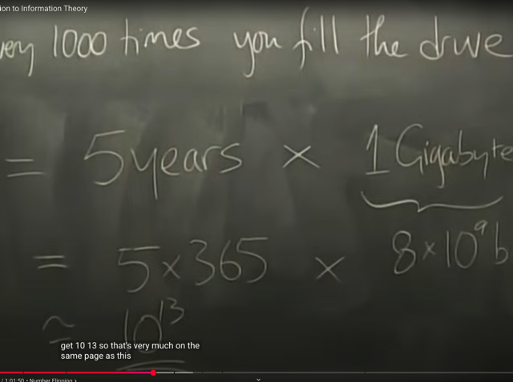</kbd></p>

> [!NOTE]
> Đại khái là gs tính là: lấy 5 năm `=` 5*365 ngày. 
>
> 1 Gb `=` 8 tỉ (8*10^9) bits
>
> Nhân lại ta ra con số 10^13. Tại sao nhân lại, là vì ý là cho rằng 
> khách hàng (người mua ổ cứng) sẽ xài hàng ngày trong 5 năm
> liền.
>
> Và mỗi ngày họ đều dùng ổ cứng để đọc dữ liệu (đọc dữ liệu từ
> ổ cứng thì chính là "send" dữ liệu để từ đó có thể bị flip đại khái
> là vậy)
>
> Vậy tính ra trong 5 năm số bit được send sẽ là 10^13

<br>

<p align="center"><kbd>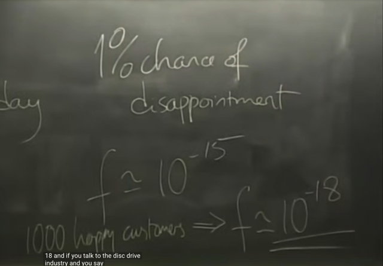</kbd></p>

> [!NOTE]
> Thế thì bên cạnh đó để chỉ có 1% khách hàng bị lỗi thì f
> phải ~ 10^-15
>
> Với 1000 happy customer thì f cần 10^-18
>
> Chưa hiểu tại sao?

<br>

<p align="center"><kbd>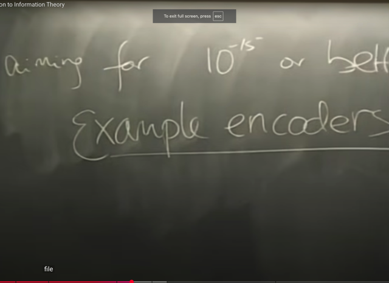</kbd></p>

> [!NOTE]
> Tiếp theo, ta sẽ lấy con số 10^-15 để làm mục tiêu hướng tới.
>
> Câu hỏi gs đặt ra là làm sao để encoder add thêm redundancy vào

<br>

<p align="center"><kbd>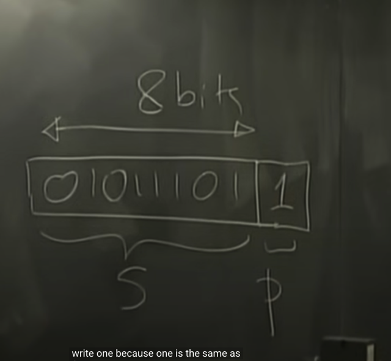</kbd></p>

> [!NOTE]
> Một cách gọi là PARITY ENCODING
>
> Chưa hiểu

<br>

<p align="center"><kbd>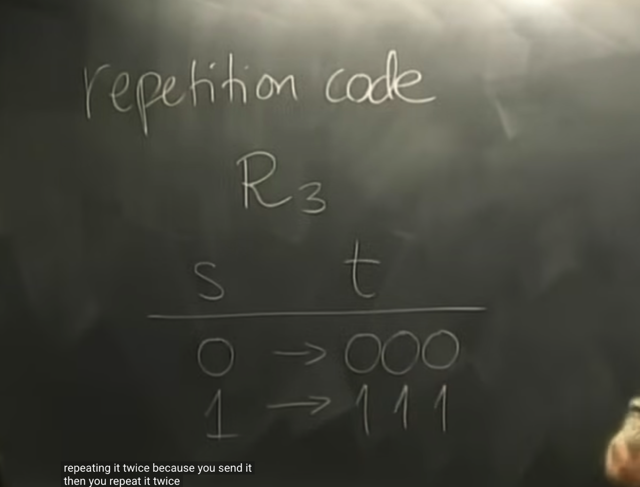</kbd></p>

> [!NOTE]
> Cách thứ hai là REPETITION CODE: tạm hiểu là nhân đôi
> nhân ba nó lên (repeat)

<br>

<p align="center"><kbd>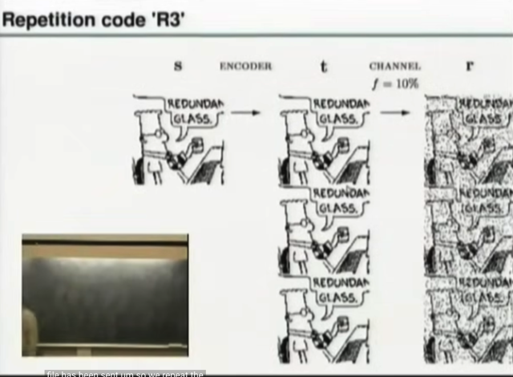</kbd></p>

> [!NOTE]
> Hình ảnh minh họa

<br>

<p align="center"><kbd>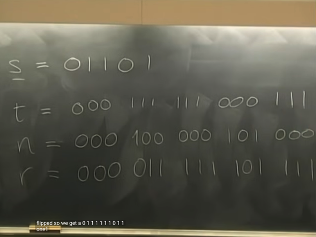</kbd></p>

> [!NOTE]
> Lấy ví dụ ta có source là chuỗi 
>
> s `=` 0 1 1 0 1
>
> Dùng repeat coding ta sẽ transmit chuỗi: 
>
> t `=` 000 111 111 000 111
>
> Và như đã biết noise sẽ được add vào trong quá trình transmit bởi
> channel.
>
> Lấy ví dụ chuỗi noise: 
>
> n `=` 000 100 000 101 000
>
> Và chuỗi tín hiệu nhận được sẽ là:
>
> r `=` 000 011 111 101 111

<br>

<p align="center"><kbd>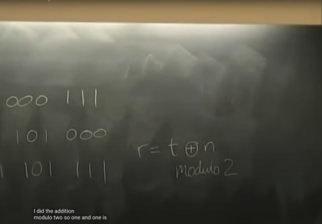</kbd></p>

> [!NOTE]
> và gs cho biết kết quả r chính là t + n
> modulo 2, trong đó 1 + 1 `=` 0.
>
> Chưa hiểu cái này là sao

<br>

<p align="center"><kbd>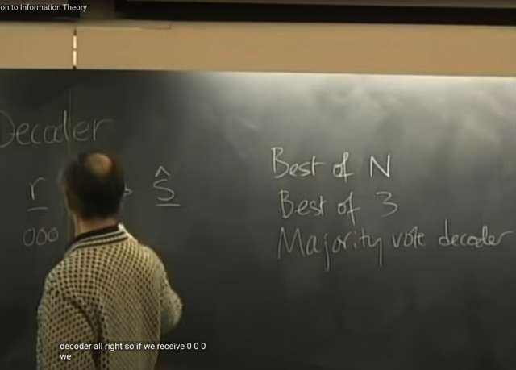</kbd></p>

<p align="center"><kbd>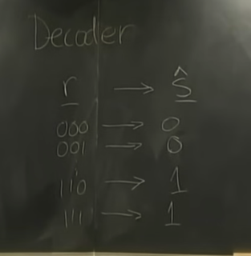</kbd></p>

> [!NOTE]
> Thế thì một phương án của decoder: đại khái là decoder sẽ xem thử
> trong nhóm 3 bits, cái nào xuất hiện nhiều nhất thì lấy. 
>
> Ví dụ 000 thì decode là 0, 110 thì decode là 1
>
> Nôm na là, tín hiệu gốc sau khi repeat 3 lần (ví dụ 0 -> 000) và sau đó
> add noise (vd 000 -> 100) thì hi vọng số 0 vẫn còn đủ nhiều để decoder
> biết source là 0
>
> Gọi là MAJORITY DECODER

<br>

<p align="center"><kbd>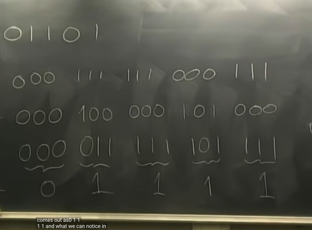</kbd></p>

> [!NOTE]
> Và theo cách này thì chuỗi r sẽ được decode thành:
>
> 0 1 1 1 1

<br>

<p align="center"><kbd>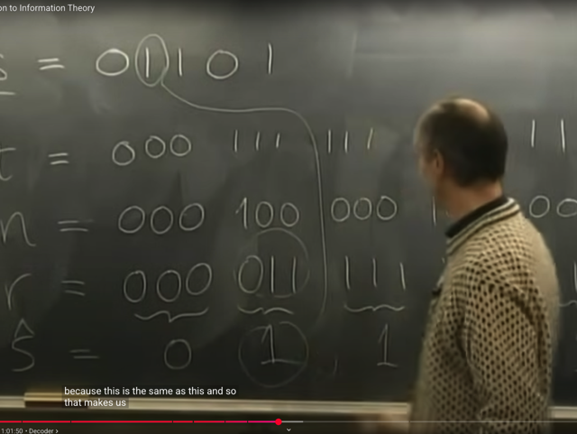</kbd></p>

> [!NOTE]
> Thế thì có thể thấy dù ở bit thứ 2 (1 -> 111 -> 011 -> 1) có flip xuất 
> hiện (khi noise 100 khiến source 111 trở thành 011) nhưng decoder
> vẫn decode đúng để ra lại 1

<br>

<p align="center"><kbd>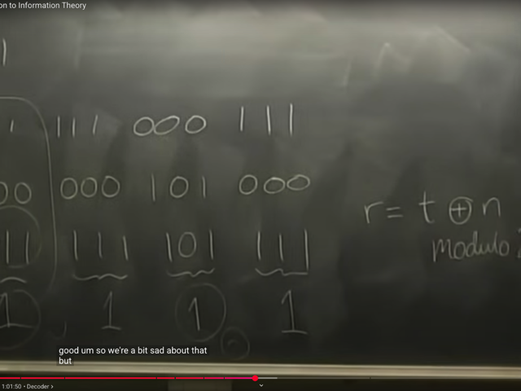</kbd></p>

> [!NOTE]
> Tuy nhiên ở bit thứ 4 (0 -> 000 -> 101 -> 1) thì noise đã khiến số
> đông từ 0 trở thành 1, nên decoder decode ra 1, trong khi source
> là 0
>
> Tuy vậy, gs cho rằng MAJORITY decoder vẫn có thể có tác dụng
> nào đó

<br>

<p align="center"><kbd>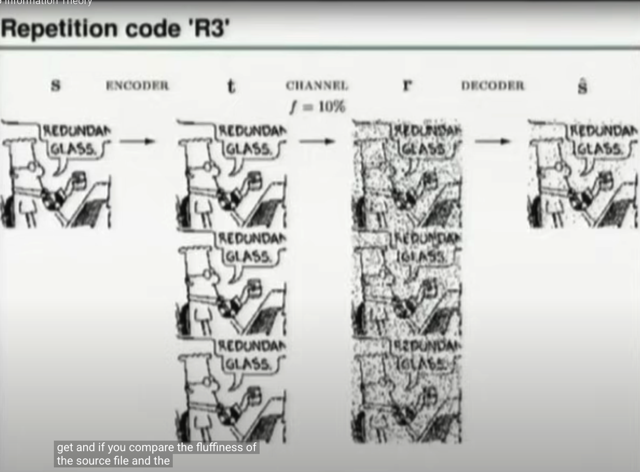</kbd></p>

> [!NOTE]
> Gs nói cái hình này cho thấy majority decoder cũng có tác dụng
> tương đối. Nhưng nó không đủ để đạt probability error nhỏ `=` 10^-15

<br>

<p align="center"><kbd>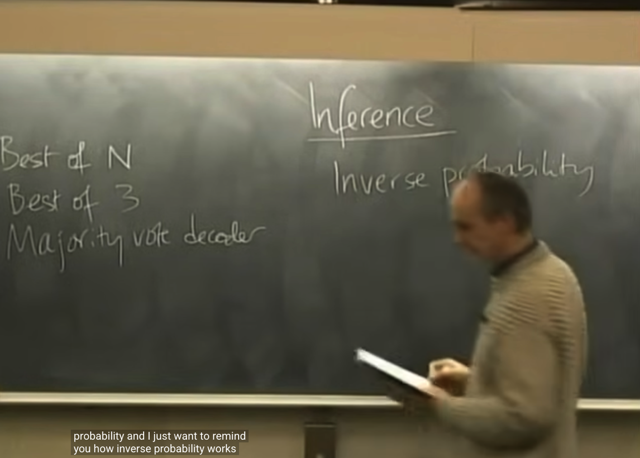</kbd></p>

> [!NOTE]
> Thế thì tiếp theo gs sẽ chứng minh tại sao majority vote decoder có
> tác dụng.
>
> Trước hết, ông cho biết quá trình decoder thực chất chính là
> INFERENCE 
>
> Và ta cần kiến thức về INVERSE PROBABILITY

<br>

<p align="center"><kbd>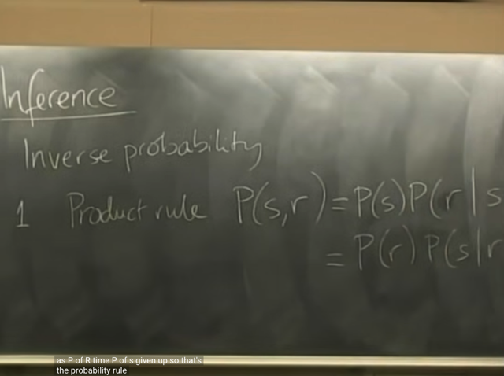</kbd></p>

> [!NOTE]
> Cụ thể ta cần product rule: P(s,r) `=` P(s)P(r|s) `=` P(r)P(s|r)
>
> Có thể thấy đây chính là CONDITIONAL PROBABILITY theorem ta
> đã học ở Stat110. Xuất phát từ ĐỊNH NHGHĨA của conditional
> probability P(A|B) `=` `P(A,B)/P(B),` ta suy ra (mà theo gs Blizstein cũng
> chính là chứng minh cho theorem: P(A,B) `=` P(A|B)*P(B)
>
> Và từ đó cũng có cái theorem thứ 2: 
>
> P(A,B) `=` P(B,A) `=` P(B|A)P(A)
>
> để rồi có cái theorem thứ 3 là Bayes theorem: 
>
> P(A|B)P(B) `=` P(B|A)PA
>
> Ở đây gs Mc Kay cũng nói đây chẳng qua là xuất phát từ definition of
> conditional probability.
>
> Thêm nữa, ông cũng nhắc lại điều ta đã biết đó là P(s,r) chính là `/` gọi
> là joint probability, P(s) gọi là marginal probability và P(s|r) là
> conditional probability

<br>

<p align="center"><kbd>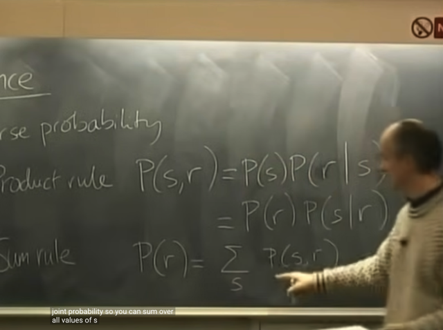</kbd></p>

> [!NOTE]
> Và rule thứ 2 là Sum rule: P(r) `=` `Σs` P(s,r)
>
> Cái này thì đơn giản chính là LOTP: Law of Total Probability
>
> Xuất phát từ r `=` Union mọi i (r, si) dựa trên lí thuyết set 
>
> (nếu A là event chứa mọi possible outcome trong sample space, và 
> A `=` A1 U A2 U ...An thì B `=` (B, A1) U (B, A2) ...U (B, An))
>
> `=>` P(r) `=` P(Union mọi i (r, si))
>
> đây là union của các disjoint event, nên áp dụng axiom 2:
>
> `=` `Σsi` P(r, si)
>
> ```text
> => P(r) =Σsi (r, si) (gs ghi như vậy Σs P(r,s) thì ý là các possible values s_i
> ```
> của s)

<br>

<p align="center"><kbd>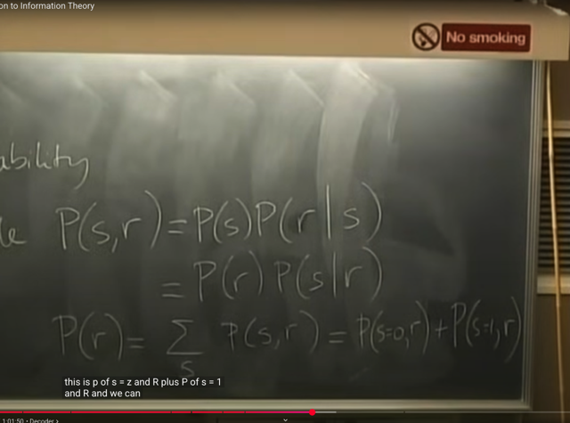</kbd></p>

> [!NOTE]
> Thế thì s, r ở đây là random variable đại diện cho source bit và
> receive bit.
>
> Nên s, là một bit trong source, ở bài toán này, đang là binary. Nên nó
> có 2 possible values là 1 và 0.
>
> Do đó P(r) `=` `P(s=1,` r) + `P(s=0,` r)
>
> Chỗ này phải hiểu: s, r là random variable thì tại sao lại chỉ nói P(r)
> khơi khơi vậy. Phải là `P(r=rj)` tức là xác suất của event `r=rj` chứ
>
> Thế thì ta nên hiểu ông đang nói về PMF tức là P(r) đang viết tắt
> của `P(r=k)` với `k=1` hoặc `k=0`
>
> Để rồi ghi đầy đủ ra thì các product rule và sum rule vừa rồi phải là:
>
> ```text
> P(r=r_i, s=s_j) = P(s=s_j | r=r_i)*P(r=r_i)
> ```
>
> ```text
> và P(r=r_i) = Σj P(r=r_i, s=s_j), và với các possible values của s là 1,0
> ```
> ta có:
>
> ```text
> P(r=r_i) = P(r=r_i, s=1) + P(r=r_i, s=0)
> ```

<br>

<p align="center"><kbd>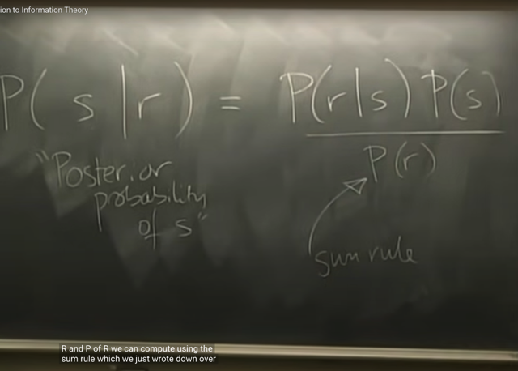</kbd></p>

> [!NOTE]
> Tiếp theo, dựa vào Bayes rule, ta sẽ tính P(s|r) (hay ghi rõ ra thì
> ```text
> là P(s=s_j | r = r_i)
> ```
>
> như đã biết trong Stat110, chính là posterior distribution (PMF) 
> của s khi đã đã biết giá trị của r.
>
> P(s|r) `=` P(r|s)P(s) `/` P(r)   
>
> với P(r) tính bằng sum rule như vừa rồi
>
> (Mình viết cụ thể ra cho dễ:
>
> ```text
> P(s=s_j | r=r_i) = P(r=r_i | s=s_j) * P(s=s_j) / P(r=r_i)
> ```

<br>

<p align="center"><kbd>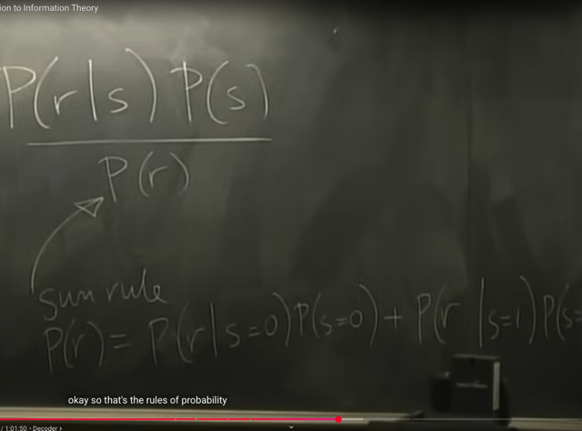</kbd></p>

> [!NOTE]
> ```text
> P(r=r_i) = P(r=r_i, s=1) + P(r=r_i, s=0)
> ```
>
> dĩ nhiên như đã quen thuộc là ta sẽ dùng tiếp conditional
> probability theorem để trở thành
>
> ```text
> = P(r=r_i | s=1)P(s=1) + P(r=r_i | s=0)P(s=0)
> ```

<br>

<p align="center"><kbd>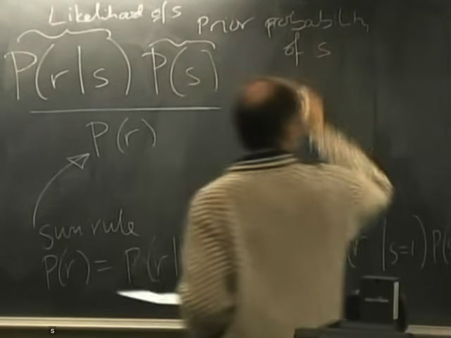</kbd></p>

> [!NOTE]
> Gs cho biết P(r|s) gọi là LIKELIHOOD OF S, và P(s) là PRIOR
> PROBABILITY OF S
>
> Cái này (likelihood) chưa từng nhắc đến trong Stat110, có lẽ
> sẽ nói về nó trong Stat111 (NPTEL)

<br>

<p align="center"><kbd>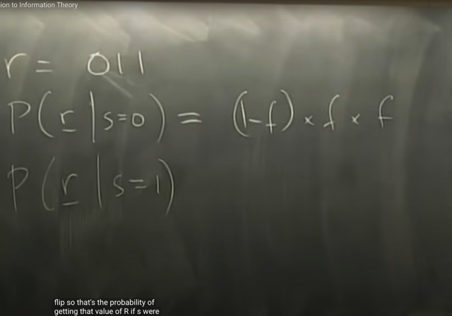</kbd></p>

> [!NOTE]
> Tiếp theo ta sẽ cần tính P(r | `s=1)` và P(r | `s=0)`
>
> Trước tiên ta sẽ lưu ý một chút để hiểu s là một bit, mang giá trị 0 hoặc 1.
>
> nhưng encoder sẽ repeat nó, channel add thêm noise, nên r sẽ là chuỗi
> 3 bit.
>
> Thành ra r không phải chỉ có possible value là 1 và 0. Mà nó sẽ là (trong
> ví dụ này) có thể là 000, 001, 010, 100, 011, 101, 110, 111
>
> giả sử r `=` 011, thế thì `P(r=011` | `s=0)` sẽ tính ntn?
>
> Gọi r1,r2,r3 là các random variable mang giá trị 0 hoặc 1. 
>
> ```text
> Có thể coi event r = 011 là cùng một event với (r1=0, r2=1, r3=1)
> ```
>
> ```text
> (r=011) = (r1=0, r2=1, r3=1)
> ```
>
> ```text
> => P(r=011 | s=0) = P((r1=0, r2=1, r3=1) | s=0)
> ```
>
> Vì r1, r2, r3 độc lập (do việc flip giữa các bit không ảnh hưởng gì nhau,
> đây là giả định mà ta có thể cho) nên
>
> ```text
> P((r1=0, r2=1, r3=1) | s=0) = P(r1=0 | s=0) * P(r2=1 | s=0) * P(r3=1 | s=0)
> ```
>
> `P(r1=0` | `s=0)` thì ta đã biết, chính là 1-f, 
>
> và 
>
> ```text
> P(r2=1 | s=0) = P(r3=1 | s=0) = f
> ```
>
> ```text
> Do đó, P(r=011 | s=0) = P((r1=0, r2=1, r3=1) | s=0)
> ```
>
> ```text
> = P(r1=0 | s=0) * P(r2=1 | s=0) * P(r3=1 | s=0) = (1-f)*f*f = (1-f)f^2
> ```

<br>

<p align="center"><kbd>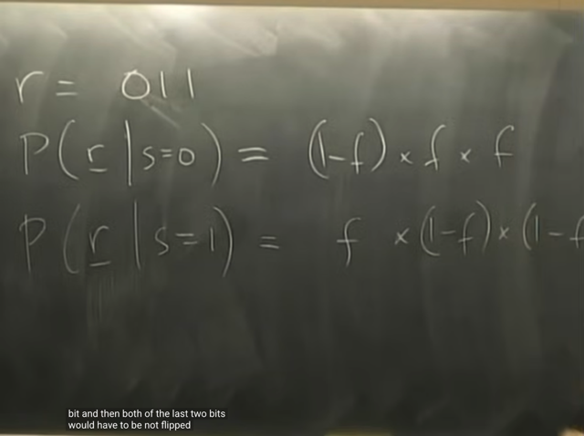</kbd></p>

> [!NOTE]
> ```text
> Tương tự P(r=011 | s=1) = P((r1=0, r2=0, r3=1) | s=1)
> ```
>
> ```text
> = P((r1=0, r2=1, r3=1) | s=1)
> ```
>
> ```text
> = P(r1=0 | s=1) * P(r2=1 | s=1) * P(r3=1 | s=1) = f(1-f)(1-f) = f(1-f)^2
> ```

<br>

<p align="center"><kbd>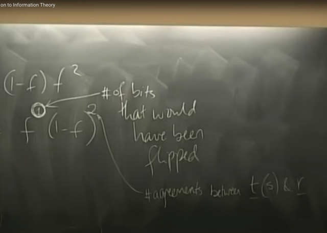</kbd></p>

> [!NOTE]
> Thế thì đến đây ta có:
>
> `P(r=011` | `s=1)` `=` f^1 * (1-f)^2
>
> `P(r=011` | `s=0)` `=` (1-f)^1 * f^2
>
> Ta cần hiểu quá trình này giờ là đang dùng xác suất để chứng minh
> majority decoding có thể có tác dụng. Mà cụ thể là ta sẽ chứng minh
> rằng, nó sẽ có xác suất cho kết quả đúng cao hơn.
>
> Thế thì ý đồ là muốn làm điều đó bằng cách cho thấy qua P(s|r)
>
> Như đã nói hồi nãy, theo Bayes rule P(s|r) `=` `P(r|s)P(s)/P(r)`
>
> Hay ghi ở dạng đầy đủ:
>
> ```text
> P(s=s_j|r=r_i) = P(r=r_i|s=s_j)P(s=s_j) / P(r=r_i)
> ```
>
> Với s là r.v đại diện cho bit của source, nó có hai possible value 1 và 0
>
> Thì cái mà ta đang muốn làm là chứng minh rằng với một giá trị `r_i`
> (tức là một chuỗi thông tin nhận được cụ thể `r_i` nào đó) thì majority
> decoding sẽ chọn phương án có xác suất posterior P(s|r) cao hơn
>
> Thế thì nãy giờ ta làm việc trên một chuỗi r `=` 011. Mục đích làm xem 
> ```text
> thử P(s=1|r=011) và P(s=0|r=011) cái nào cao hơn.Hay nói cách khác
> ```
> ta muốn chứng minh `P(s=1|r=011)` sẽ cao hơn, vì majority decoding
> sẽ decode 011 thành 1 vì số 1 chiếm đa số.
>
> Thế thì, có thể ghi lại:
>
> ```text
> P(s=0|r=011) = P(r=011|s=0)P(s=0)/P(r=011)
> ```
>
> ```text
> P(s=1|r=011) = P(r=011|s=1)P(s=1)/P(r=011)
> ```
>
> Và ta sẽ thấy:
>
> ```text
> prior probability P(s=0) = P(s=1) = 1/2 vì một bit có thể bằng 0 hoặc bằng
> ```
> 1 với xác suất như nhau.
>
> ```text
> Do đó P(s=0|r=011) ∝ P(r=011|s=0) và P(s=1|r=011) ∝ P(r=011|s=1)
> ```
>
> ```text
> Từ đó, ta chỉ cần so sánh P(r=011|s=1) và P(r=011|s=0)
> ```
>
> ```text
> Thế thì từ kết quả trên, ta xét tỉ số P(r=011|s=1) / P(r=011|s=0)
> ```
>
> ```text
> = [f^1 * (1-f)^2] / [(1-f)^1 * f^2] = (1-f) / f
> ```
>
> Và từ đó cho nhận xét: vì 1-f thường lớn hơn f (tỉ lệ bị flip thường
> ```text
> là thấp), nên P(r=011|s=1) / P(r=011|s=0) > 1
> ```
>
> ```text
> hay  P(r=011|s=1) > P(r=011|s=0)
> ```
>
> biện minh cho majority decoding sẽ có tác dụng nếu flip rate nhỏ

<br>

<p align="center"><kbd>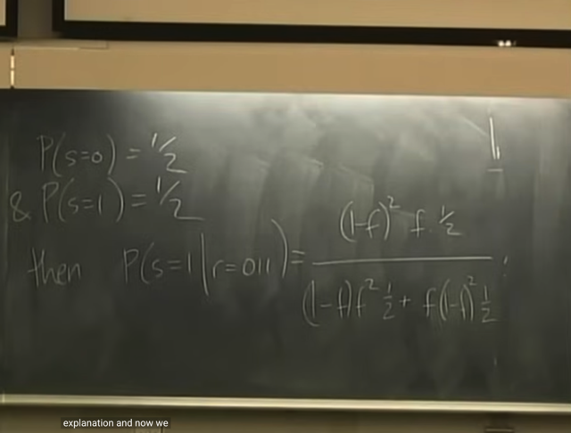</kbd></p>

<p align="center"><kbd>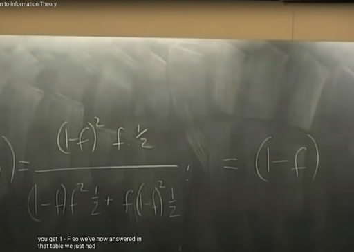</kbd></p>

> [!NOTE]
> Ở đây gs thế các giá trị vào luôn để tính ra `P(s=1` `|r=011)` `=` 1-f

<br>

<p align="center"><kbd>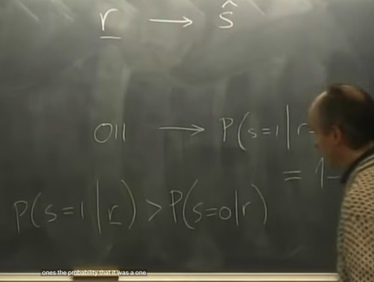</kbd></p>

> [!NOTE]
> Để rồi cũng ra kết luận là
> ```text
> P(s=1|r=011) > P(s=0|r=011)
> ```

<br>

<p align="center"><kbd>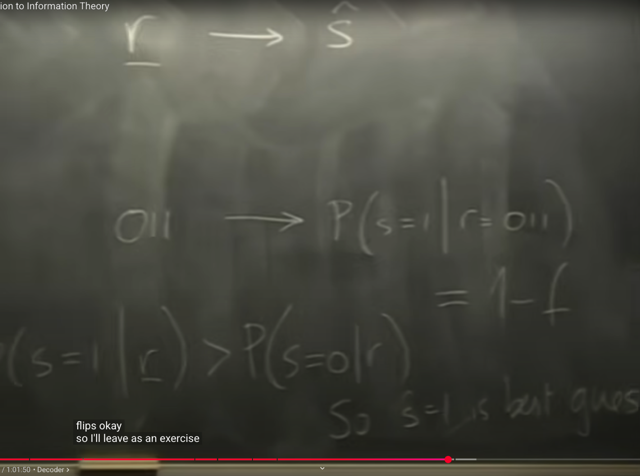</kbd></p>

> [!NOTE]
> Từ đó cho thấy s^ `=` 1 là dự đoán tốt
> nhất, đây cũng là dự đoán của
> Majority decoding strategy

<br>

<p align="center"><kbd>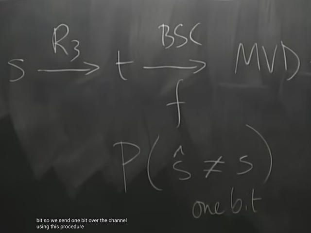</kbd></p>

> [!NOTE]
> Bài toán tiếp theo ta sẽ thảo luận là, nếu dùng R3 (đại khái repeat 3 lần) và dùng Majority
> Vote Decoding (MVD) thì xác suất mà predicted s (s^2) khác với s là bao nhiêu `P(s^!=s)`
>
> Đại khái là xác suất mà prediction sai là bao nhiêu?
>
> Thử suy nghĩ trước:
>
> `P(s^!=s)`
>
> ```text
> Xét event s^!=s, có thể thấy nó là union của 2 event: (s^=1, s=0) và  (s^=0, s=1): (s^ khác
> ```
> ```text
> s) = (s^=1, s=0) U (s^=0, s=1)
> ```
>
> ```text
> => P(s^ khác s) = P[(s^=1, s=0) U (s^=0, s=1)]
> ```
>
> Vế phải là union của hai disjoint event, nên theo axiom 2:
>
> ```text
> P(s^ khác s) = P(s^=1, s=0) + P(s^=0, s=1)
> ```
>
> ```text
> (s^=1, s=0) = (r=011, s=0) U (r=111, s=0) U (r=101, s=0) U (r=110, s=0)
> ```
>
> ```text
> => P(s^=1, s=0) = P(r=011, s=0) + P(r=111, s=0) + P(r=101, s=0) + P(r=110, s=0)
> ```
>
> ```text
> = P(r=011|s=0)P(s=0) + P(r=111|s=0)P(s=0) + P(r=101|s=0)P(s=0) + P(r=110|s=0)P(s=0)
> ```
>
> ```text
> = [P(r=011|s=0) + P(r=111|s=0) + P(r=101|s=0) + P(r=110|s=0)]P(s=0)
> ```
>
> `=` [(1-f)f^2 + f^3 + (1-f)f^2 + `(1-f)f^2]1/2`
>
> ```text
> (s^=0, s=1) = (r=001, s=1) U (r=010, s=1) U(r=100, s=1) U (r=000, s=1)
> ```
>
> ```text
> => P(s^=0, s=1) = P(r=001, s=1) + P(r=010, s=1) + P(r=100, s=1) + P(r=000, s=1)
> ```
>
> ```text
> = P(r=001|s=1)P(s=1) + P(r=010|s=1)P(s=1) + P(r=100|s=1)P(s=1) + P(r=000|s=1)P(s=1)
> ```
>
> ```text
> = [P(r=001|s=1) + P(r=010|s=1) + P(r=100|s=1) + P(r=000|s=1)]P(s=1)
> ```
>
> `=` [(1-f)f^2 + (1-f)f^2 + (1-f)f^2 + `f^3]1/2`
>
> Vậy P(s^ khác s) `=` (1-f)f^2 + (1-f)f^2 + (1-f)f^2 + f^3 `=` 3(1-f)f^2 + f^3

<br>

<p align="center"><kbd>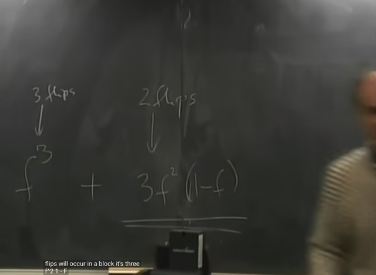</kbd></p>

<p align="center"><kbd>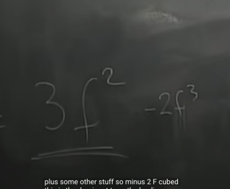</kbd></p>

> [!NOTE]
> Có thể lập luận cách khác, đó là dựa trên việc ta đã kết luận Số bit bị 
> flip trong n bit sẽ có story giống như số trial success trong n i.i.d Bern(p) 
> trials
>
> Vậy nếu gọi X là số bit bị flip trong 3 bit, X~Bin(3,f)
>
> Thế thì event (s^ khác s) tương đương event `(X=3)` U `(X=2)` (vì khi đó,
> wrong bit sẽ chiếm đa số)
>
> ```text
> => P(s^ khác s) = P(X=3 U X=2) và đây là 2 disjoint event, nên theo
> ```
> axiom 2, `=` `P(X=3)` + `P(X=2)`
>
> Với X~Bin(n,p), ta đã biết PMF của nó `P(X=k)` + (n choose k)p^kq^(1-k)
>
> `=>` với X~(3,f): 
>
> `P(X=3)` `=` (3 choose 3)f^3q^0 `=` f^3
>
> ```text
> P(X=2) = (3 choose 2)f^2q^1 = 3!/(2!1!) f^2(1-f) = 3f^2(1-f)
> ```
>
> Kết qủa ta cũng có P(s^ khác s) `=` f^3 + 3f^2(1-f)
>
> `====`
>
> Và gs tính giùm ra rằng nó sẽ ~ 3f^2 (-2f^3 ít ảnh hưởng hơn)

<br>

<p align="center"><kbd>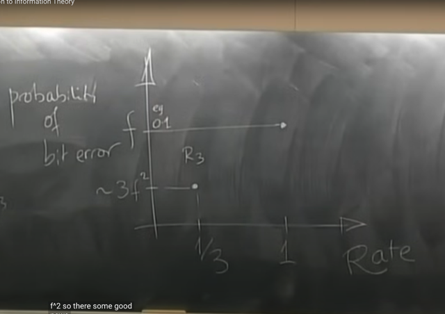</kbd></p>

> [!NOTE]
> Thế thì, gs mới vẽ cái biểu đồ như vầy: một trục là xác suất bit error, và
> một trục là rate
>
> Tại rate `=` 1. mang ý nghĩa là, mỗi lần send signal ta giữ nguyên, (ví dụ
> 1 bit thì gửi 1 bit, không có repeat gì cả), thì khi đó xác suất bit error
> `=` f. ví dụ như nãy giờ ta dùng `=` 0.1
>
> Nhưng với R3 (tức repeat 1 bit thành 3 bit), thì như vừa chứng minh,
> xác suất error giảm còn ~3f^2

<br>

<p align="center"><kbd>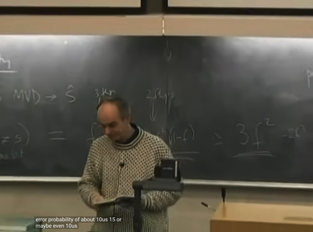</kbd></p>

> [!NOTE]
> Thế thì gs nhắc lại ta nên nhớ rằng ta đang muốn tìm một cách làm
> sao để đạt probability error `=` 10^-15 thậm chí 10^-18

<br>

<p align="center"><kbd>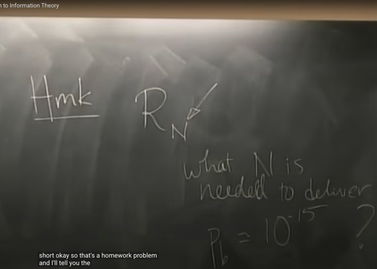</kbd></p>

> [!NOTE]
> Và một bài tập của ta là tìm N cần thiết (số lần repeat) để có được
> probability of error Pb `=` 10^-15
>
> (ông cho đáp án luôn, là 61)
>
> Suy nghĩ: Hướng giải dĩ nhiên là ta cần khái quát hóa bài toán, để
> tính Pb theo N (quay lại làm sau)

<br>

<p align="center"><kbd>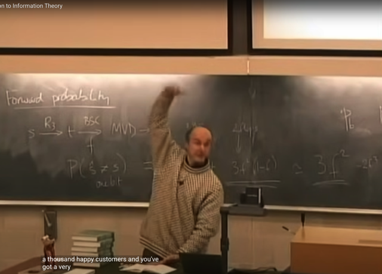</kbd></p>

> [!NOTE]
> Và khi đó, nếu dùng cách này, giống như ta sẽ phải làm một cái ổ cứng
> 61 GB, chỉ để chứa 1GB data. (bởi 1 bit cần được repeat thành 61 bit,
> thì 1GB thành 61 GB) thì khi dùng majority decoding thì ta sẽ có xác
> suất error nhỏ như mong muốn
>
> Rõ ràng đây không phải là gỉai pháp tốt

<br>

<p align="center"><kbd>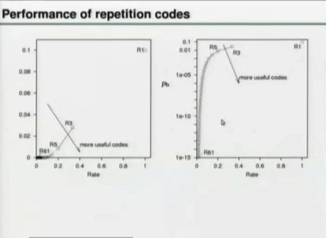</kbd></p>

<br>

<p align="center"><kbd>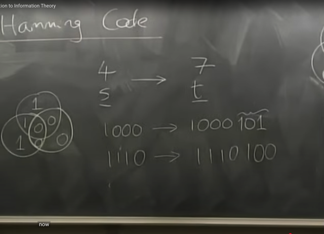</kbd></p>

<p align="center"><kbd>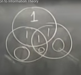</kbd></p>

> [!NOTE]
> Tiếp theo gs nói qua một method gọi là `4/7` Hamming Code:
>
> Cách làm là vẽ 3 vòng tròn giao nhau như vầy. để rồi một source
> chuỗi 4 bit ví dụ 1000 sẽ được encode thành 1000101
>
> Số 101 là đến từ như sau:
>
> Viết 1,0,0,0 vào 4 phần giao nhau của 3 đường tròn.
>
> Và 3 phần không giao nhau sẽ mang số 1 hoặc 0 tính như sau:
>
> `=` 1 nếu số lượng số 1 trong hình tròn là lẻ 
>
> `=` 0 nếu số lượng số 1 trong hình tròn là chẵn

<br>

<p align="center"><kbd>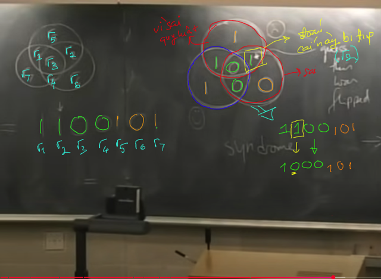</kbd></p>

> [!NOTE]
> Thế thì ý là, theo quy tắc này có thể giúp ta decode:
>
> Ví dụ s `=` 1000, được encode theo cách này, ta có 1000101
>
> Để rồi qua channel, bị add noise, nó thành ra r `=` 1100101
>
> Vậy thì decode sẽ như sau:
>
> Ta cũng viết r1, r2, r3, r4 vào 4 vùng giao nhau của 3 đường tròn 
>
> và r5, r6, r7 vào 3 vùng còn lại
>
> Thế thì bước tiếp theo là xác định xem đường tròn nào bị sai quy luật
> ví dụ như ở đây, hai cái màu đỏ là sai, vì ko theo quy luật số bit `=` 1
> chẵn thì số ở vùng không giao sẽ là 0, và ngược lại.
>
> (nôm na là đáng lẽ vị trí (không giao với hai đường tròn còn lại) của hai
> hình tròn đỏ phải là 0 và 1 mới đúng
>
> Còn cái hình tròn xanh là cái đúng rule.
>
> Từ đó ta mới nghi ngờ cái bit bị flip là cái giao giữa 2 đường tròn đỏ và
> ngoài đường tròn xanh. Chính là vị trí r2.
>
> `=>` decode ra là 1000 và nó đúng với s là 1000

<br>

<p align="center"><kbd>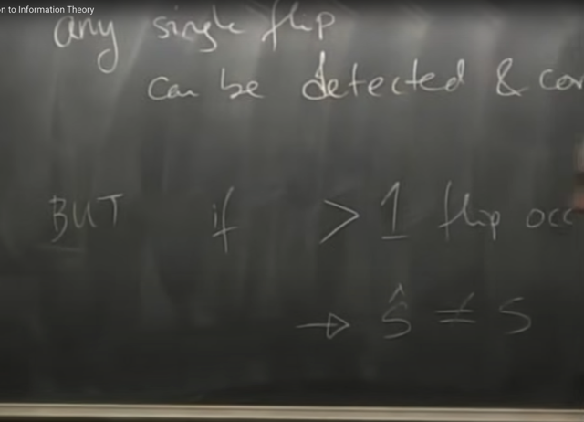</kbd></p>

> [!NOTE]
> Đại khái là nếu chỉ có 1 flip thì cách này có thể detect và sửa sai. 
>
> Nhưng nếu nhiều hơn 1 flip thì không (s^ khác s)

<br>

<p align="center"><kbd></kbd></p>

> [!NOTE]
> Đại khái là nó cũng có nhược điểm
> giống như Repeating encode

<br>

<p align="center"><kbd>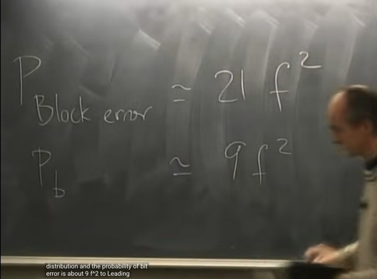</kbd></p>

> [!NOTE]
> Và gs nói bài tập cho ta là thử tính xác suất error gồm Block
> error và Bit error

<br>

<p align="center"><kbd>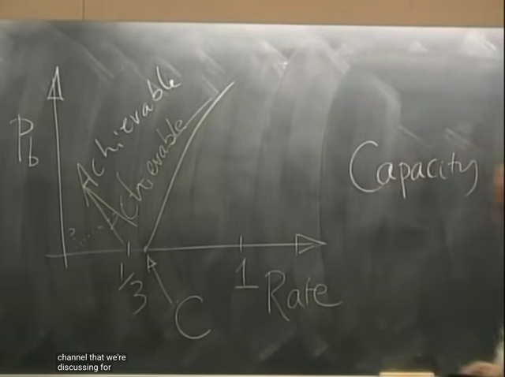</kbd></p>

> [!NOTE]
> Thế thì mấy phút cuối đại khái là gs nói về một theorem do ông
> Shanon chứng minh rằng ta có thể tìm ra `/` tồn tại một
> `encoder/decoder` sao cho đạt được rate chỉ chỉ khoảng > `1/3` mà
> vẫn có Pb nhỏ `~=` 0 mong muốn

<br>

<p align="center"><kbd>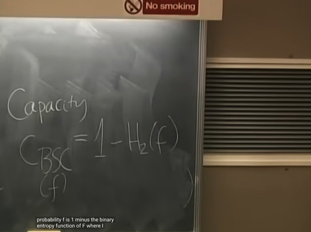</kbd></p>

> [!NOTE]
> Và tại đó gọi là Capacity của Channel, tính bằng công thức
> 1-H2(f) (các bài sau sẽ học)

<br>

<p align="center"><kbd>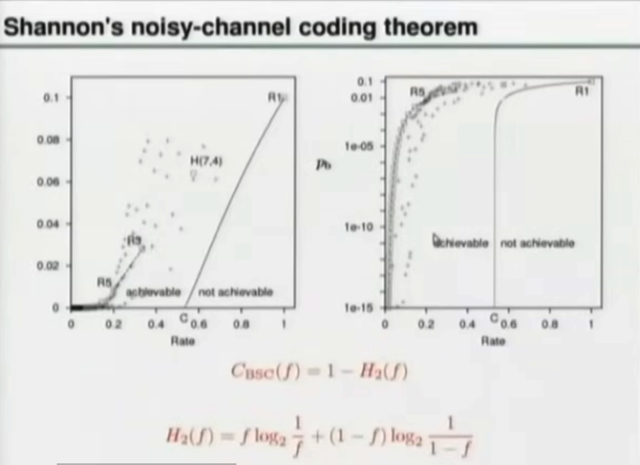</kbd></p>

<br>

<p align="center"><kbd></kbd></p>

> [!NOTE]
> Lecture note của bài này chính là
> chapter 1. Đọc chapter 1

<br>

<p align="center"><kbd>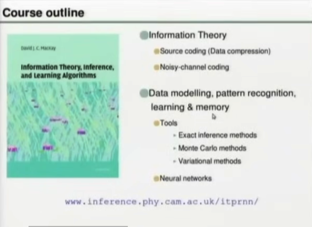</kbd></p>

<br>

<p align="center"><kbd>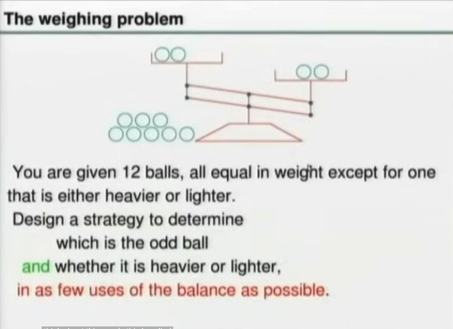</kbd></p>

<br>

