# Lec 10b

📊 **Progress:** `33` Notes | `60` Screenshots | `0` AI Reviews

---
<p align="center"><kbd>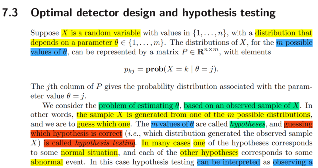</kbd></p>

<p align="center"><kbd>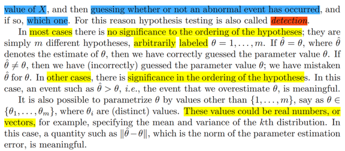</kbd></p>

> [!NOTE]
> Đại khái là hồi nãy vừa nói rv X có distribution thể hiện bởi
> vector p với pj `=` P(X `=` xj). Thì giờ hình dung ta có 10 (m `=` 10)
> cái vector p khác nhau, và tùy vào một parameters `θ` có giá trị nào
> (trong 10 possible value của nó) mà X sẽ có distribution bởi
> vector p nào trong 10 vector p
>
> Và 10 vector p này làm thành matrix P. 
>
> Cột j của P là distribution của X khi `θ` `=` j
>
> Và hàng k của P là xác suất X `=` k | với các `θ` khác nhau: 
>
> ```text
> [P(X = k, θ = 1), P(X = k, θ = 2), ...P(X = k, θ = m)]
> ```
>
> Vậy thì 10 giá trị possible values của `θ` sẽ làm nên 10 GIẢ
> THIẾT (HYPOTHESIS). Và việc của ta là estimate `θ,` từ đó có
> distribution của X, đây chính là HYPOTHESIS TESTING
>
> Thế thì tiếp theo mới nói thường là trong 10 giả thiết sẽ có một
> cái là bình thường (normal) và mấy cái kia là bất thường
> (abnormal). 
>
> Thành ra lúc này việc của ta trở thành xác định xem cái nào là 
> bình thường, do đó mới gọi là DETECTION
>
> Cuối cùng, là nói về việc có khi thứ tự các hypothesis là quan
> trọng `/` có ý nghĩa. Ví dụ như khi đó estimated `θ^` lớn hơn hoặc
> bé hơn (true) `θ` sẽ mang ý nghĩa nào đó cần quan tâm. Nhưng
> cũng có khi không quan trọng, chỉ care `θ^` bằng hay khác `θ` mà
> thôi (tức đoán trúng hay trật mà thôi)
>
> Rồi thì `θ` mở rộng ra có thể là (random variable) vector chứ ko
> phải chỉ là scalar.

<br>

<p align="center"><kbd>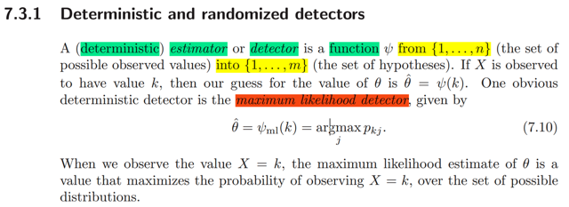</kbd></p>

<p align="center"><kbd>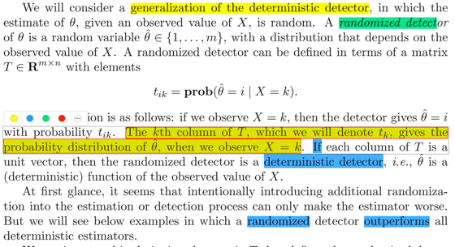</kbd></p>

> [!NOTE]
> đại khái là, gọi hàm ψ "xai" là một detector, tức là nó sẽ nhận
> vào một trong những possible value của X để trả ra ước đoán
> của mình về giá trị nào đó của `θ,` cũng là tương ứng hypothesis.
>
> Dĩ nhiên đó là một detector nhưng nó có tốt hay không thì là
> chuyện phải xác định
>
> Nhưng hiểu vậy rồi khi X có observed value là k thì `θ^` `=` ψ(k).
>
> Thế thì gs nói LẼ DĨ NHIÊN rằng ta sẽ muốn một detector tốt,
> và cách tiếp cận tự nhiên nhất chính là xây dựng cái detector
> sao cho với giá trị quan sát được của X, thì nó chọn ra `/` trả ra
> hypothesis nào mà  trong đó xác xuất X mang giá trị k đó là  cao
> nhất (nhớ rằng mỗi hypothesis sẽ ứng với một vector p:
> distribution của X.
>
> Khi đó, detector này được gọi là MAXIMUM LIKELIHOOD
> DETECTOR
>
> `====`
>
> Còn một loại nữa. Với DETERMINISTIC DETECTOR, như đã
> nói, với observed value của X, giả sử X `=` k, thì deterministic
> detector sẽ output giá trị cụ thể nào đó của `θ^.`
>
> Thế thì với RANDOM DETECTOR ta hình dung một matrix có n
> cột ứng với n possible values của X. Để ví dụ khi X `=` k, ta sẽ
> lấy cột k ra. Trong cột đó, sẽ là một one-hot vector có m
> phần tử (ứng với m possible value của `θ),` và số 1 ở đâu thì cho
> biết giá trị deterministic của `θ^.`
>
> Thế thì, bây giờ, thay one-hot vector ở mỗi cột bởi một
> distribution mà vị trí thứ j sẽ là xác suất mà `θ` mang giá trị j.
>
> Nên matrix này sẽ có phần tử `t_ik` (hàng i côt k): Khi X `=` k,
> ```text
> xác suất θ mang giá trị i. P(θ^ = i | X = k)
> ```
>
> Thật ra trong case deterministic detector thì mỗi côt là một
> one-hot vector cũng thể hiện một distribution, với xác suất tập trung
> hoàn toàn vào giá trị của `θ^` ứng với giá trị bằng 1 trong cột)

<br>

<p align="center"><kbd>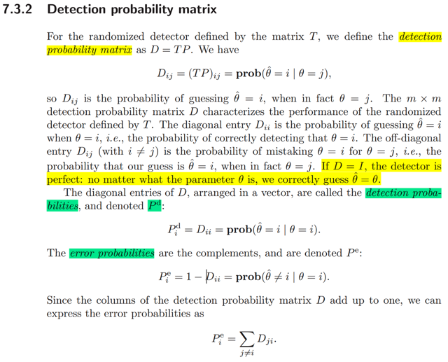</kbd></p>

> [!NOTE]
> Xét matrix D `=` TP:
>
> P là matrix (n, m): Mỗi cột là distribution của X tương ứng
> với một trong m hypothesis:
>
> ```text
> Pkj cho biết khi θ = j thì xác suất P(X = k | θ = j)
> ```
>
> T là matrix (m, n): Mỗi cột là distribution của `θ^` ứng với observed
> value của X (có n possible value của X, nên có n cột) 
>
> ```text
> Tik = P(θ^ = i | X = k)
> ```
>
> Nên D `=` TP là matrix (m, n)(n, m) `=` (m, m) mà component ij:
>
> Là dot product của hàng i'th của T và cột j'th của P:
>
> ```text
> Hàng i'th của T: [P(θ^ = i | X = 1), P(θ^ = i | X = 2), ...P(θ^ = i | X = n)]
> ```
>
> ```text
> Cột j'th của P: [P(X = 1 | θ = j), P(X = 2| θ = j), ...P(X = n| θ = j)]
> ```
>
> T[i, :]P[:, j] 
>
> ```text
> = Σk=1:m P(θ^ = i | X = k) P(X = k| θ = j)
> ```
>
> ```text
> = P(θ^ = i | θ = j). Chứng minh cái này sau
> ```
>
> Nên matrix D sẽ có component mang ý nghĩa là: Nếu trên đường
> ```text
> chéo thì nó là xác suất "đoán đúng" P(θ^ = j | θ = j) tức là nếu θ
> ```
> `=` i thì xác suất đoán đúng `θ^` `=` i là bao nhiêu.
>
> Nên đường chéo, nếu lấy ra làm thành vector thì ta gọi nó là 
> DETECTION PROBABILITY P^d
>
> ```text
> Còn ngoài đường chéo là xác suất đoán "trật" P(θ^ = j | θ = i) i!=j
> ```
>
> Và P^e `=` `Σ` `i!=j` Dij (tức là, tổng matrix D theo hàng, trừ đi phần tử
> trên đường chéo)
>
> Nói rõ hơn chút: Ví dụ cột j của D sẽ là: 
>
> ```text
> [P(θ^ = 1 | θ = j), P(θ^ = 2 | θ = j),..., P(θ^ = j | θ = j), ...P(θ^ = m | θ = j)]
> ```
>
> ```text
> mà tổng của chúng bằng 1. Nên xác suất P(θ^ != j | θ = j) = ...
> ```
>
> ```text
> P(θ^ = 1 | θ = j) + P(θ^ = 2 | θ = j) +...+ P(θ^ = m | θ = j)
> ```
>
> Và kết quả cộng các hàng (trừ đường chéo) thì ta có vector P^e:
>
> ```text
> [P(θ^ != 1 | θ = 1), P(θ^ != 2 | θ = 2),...P(θ^ != m | θ = m)]
> ```

<br>

<p align="center"><kbd>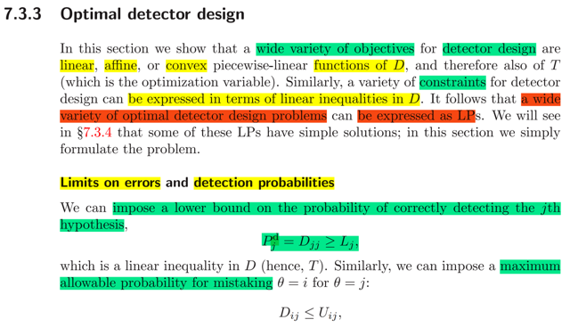</kbd></p>

<p align="center"><kbd>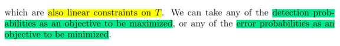</kbd></p>

> [!NOTE]
> Rồi, đại khái là nãy giờ học về detector. Thì bài toán đặt ra là
> OPTIMAL DETECTOR DESIGN, tức là ta sẽ tìm cách tối ưu hoá
> detector - tìm ra cái detector tốt nhất.
>
> Thì mở đầu gs cho biết nhiều objective của bài toán detector
> design có thể được thể hiện dưới dạng là linear `/` affine hoặc
> convex function của matrix D.
>
> Cũng như các constraint cũng vậy, có thể được thể hiện ở dạng
> linear equalities. Thành ra nhiều bài toán detector design sẽ trở
> thành bài toán convex optimization problem và cụ thể hơn là bài
> toán LP (Linear Programming, nơi objective là linear, constraint đều
> là affine function)
>
> `====`
>
> Đầu tiên, đại khái là với cái này ta có thể kiểu như đặt ra yêu cầu
> với detector là phải sao đó probability of correct phải đạt ít nhất
> mức nào đó, nói cách khác, ta muốn đặt ra lower bound đối với 
> xác suất đoán đúng.
>
> P^dj `=` Djj `>=` Lj thì đây sẽ là linear inequality constraint đối với D
>
> Hoặc ta cũng có thể muốn đặt ra yêu cầu "xác suất đoán sai" phải
> nhỏ hơn bao nhiêu đó, đồng nghĩa ta có upper bound của P^e: Ví
> dụ ta muốn xác suất đoán sai ở trường hợp nếu `θ` đúng là j phải
> nhỏ hơn Uj:
>
> Dij `<=` Uij
>
> Thế thì đó là thể hiện ý "muốn đặt giới hạn (trên hoặc dưới) cho
> xác suất đoán trật `/` trúng".
>
> Ngoài ra ta cũng có thể dùng các mục tiêu này làm objective của bài
> toán optimization, ví dụ như ta muốn maximize xác suất đúng và
> minimize xác suất sai

<br>

<p align="center"><kbd>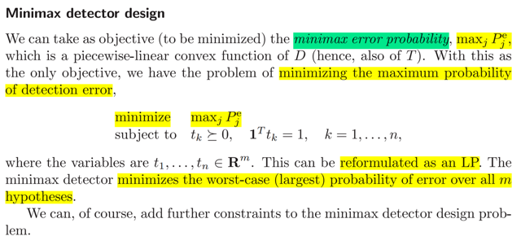</kbd></p>

> [!NOTE]
> Vừa rồi là ta nói về việc đặt ra lower `/` upper bound cho xác suất
> đoán sai `/` đúng. Hoặc đặt ra objective là maximize xác suất đoán
> đúng, minimize xác suất đoán sai.
>
> Thì ở đây còn một kiểu nữa là, minimize các giá trị lớn nhất của
> xác suất đoán sai.
>
> Như nãy nói về vector P^e, mà phần tử thứ j là xác suất đoán
> ```text
> sai khi θ thật sự có giá trị là j: P(θ^ != j | θ = j).
> ```
>
> Thế thì bài toán này, đại khái là ta muốn xem trong vector P^e cái
> nào lớn nhất, và ta muốn giảm thiểu cái đó:
>
> minimize max j P^ej với constraint tk ≽ 0, 1Ttk `=` 1
>
> Nói rõ hơn cái thứ mà mình sẽ tìm là matrix D, tức là OBJECTIVE
> VARIABLE LÀ MATRIX D. Mà D là function của T nên
> OBJECTIVE VARIABLE CŨNG CÓ THỂ COI LÀ T.
>
> Mà T mà matrix mà cột k, là distribution của `θ^` ứng với X `=` k, nên
> mọi phần tử của cột k, tức tk phải ko âm (xác suất mang giá trị
> ko âm - axiom 1) và tổng bằng 1 (axiom 2). Chính là thể hiện bởi
> constraint tk ≽ 0, 1Ttk `=` 1 với mọi k
>
> Và gs cho rằng ta có thể "biến đổi" để trở thành bài toán LP

<br>

<p align="center"><kbd>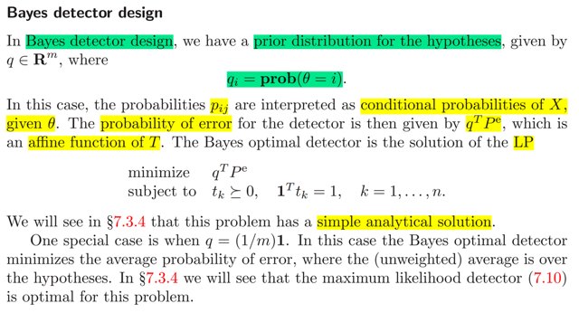</kbd></p>

> [!NOTE]
> đại khái là, nãy giờ chỉ nói `θ` là PARAMETERS có thể có m possible
> values, tức là m hypothesis, để rồi ứng với m distribution cho X, thể 
> hiện bởi matrix P có m cột, và ứng với phần tử thứ k của cột thứ j sẽ 
> là xác suất X `=` k trong hypothesis j:
>
> P(X `=` k | `θ` `=` j)
>
> Nhưng nãy giờ không nói `θ` có một distribution, mà chỉ là PARAMETERS
>
> Nên ta hiểu cái này P(X `=` k | `θ` `=` j), ko phải là conditional probability,
> chỉ là cách thể hiện của P(X `=` k) trong trường hợp `θ` `=` j.
>
> Còn bây giờ, ta nói q là vector thể hiện distribution của `θ` (ví dụ như
> trong trường hợp nào đó mà ta có prior information về probability
> distribution của `θ),` tức là q là vector:
>
> ```text
> q = [P(θ = 1), P(θ = 2),....P(θ = m)]
> ```
>
> Vậy thì lúc này Pij là conditional probability của X given `θ,` là sao?
>
> ```text
> Có nghĩa là Pij = P(X = i | θ = j) khi đó nó mang ý nghĩa của
> ```
> conditional probability.
>
> Thế thì pTP^e sẽ là gì? Đầu tiên nhắc lại P^e là vector:
>
> ```text
> [P(θ^ != 1 | θ = 1), P(θ^ != 2 | θ = 2), ..., P(θ^ != m | θ = m)]
> ```
>
> ```text
> nên pTP^e = Σk=1:m P(θ = k)P(θ^ != k | θ = k) = Σk=1:m P(θ^ != k, θ = k)
> ```
>
> ```text
> Mà P(θ^ != k, θ = k) chính là P(error_k) với error_k là khi đoán trật (θ^ != θ)
> ```
> trong case mà `θ` `=` k)
>
> ```text
> Nên  Σk=1:m P(θ^ != k, θ = k) chính là xác suất error nói chung
> ```
>
> Thành ra bằng cách giải bài toán minimize pTP^e constraint tk ≽ 0,
> 1Ttk `=` 1 thì ta đang tìm detector sao cho minimize xác suất đoán sai
> nói chung
>
> Và dễ thấy objective là affine function của T: Vì sao?
>
> Nên solution của bài toán Bayes detector design chính là optimal của
> một bài toán LP
>
> Trường hợp đặc biết khi q `=` `(1/m)1` chính là nói prior distribution
> của `θ` là uniform

<br>

<p align="center"><kbd>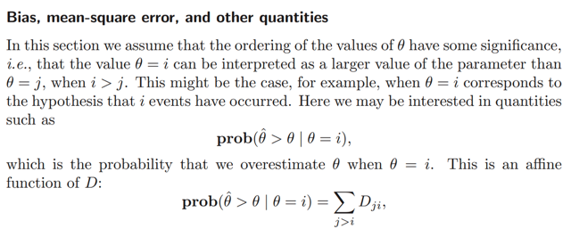</kbd></p>

<p align="center"><kbd>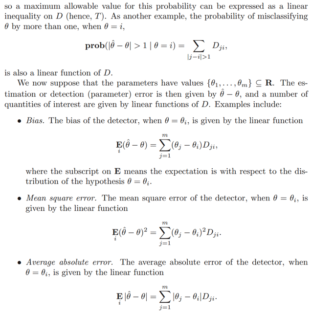</kbd></p>

> [!NOTE]
> Cái này đại khái là nói là giả sử thứ tự của các possible values của `θ`
> là có nghĩa. Khi đó, ta có thể muốn quan tâm đến xác suất mà estimated
> ```text
> θ^ lớn hơn θ given θ = i: P(θ^ > θ | θ = i) có thể được thể hiện theo D:
> ```
>
> `Σ` j > i Dji, là sao? đó là vì cột i là cột ứng với distribution của `θ^` given `θ`
> ```text
> = i: [P(θ^ = 1, θ = i),.. P(θ^ = m, θ = i)]
> ```
>
> ```text
> Nên P(θ^ > θ | θ = i) = P(θ^ = k, θ = i) với k = i+1:m. Và chính là Σ j > i Dji
> ```
>
> ```text
> Cũng như là ta cũng có thể có xác suất mà |θ^ - θ| > 1 | θ = i.
> ```
>
> Nói chung là từ đó có thể thiết lập các constraint đối với Bias, MSE, ...
> dưới dạng linear function của D

<br>

<p align="center"><kbd>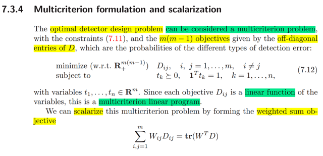</kbd></p>

<p align="center"><kbd>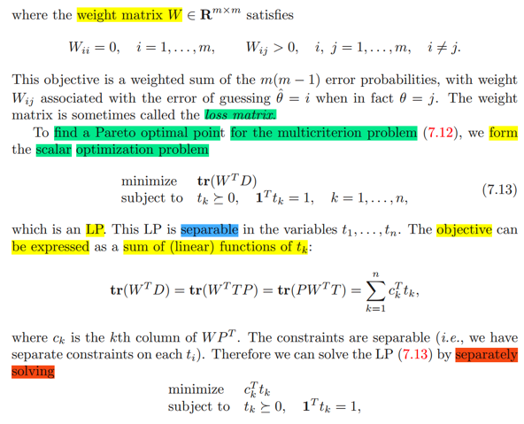</kbd></p>

<p align="center"><kbd>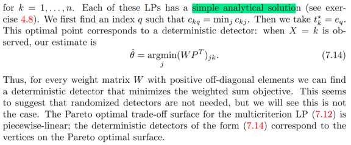</kbd></p>

> [!NOTE]
> Đại khái là cái bài toán optimal detector design, trong đó ta có matrix D `=` TP
> ```text
> mà phần tử i, j là P(θ^=i | θ=j) để rồi lấy đường chéo ra ta có vector P^d chứa
> ```
> các xác suất đoán đúng (với các `θ` khác nhau). 
>
> ```text
> Còn những chỗ ngoài đường chéo P(θ^=i | θ=j) với i!=j thì đều là xác suất
> ```
> ```text
> đoán  sai ở các "loại" khác nhau (ví dụ như θ = 1 mà "đoán là" θ^ = 2, rồi
> ```
> ```text
> θ = 2 mà đoán là θ ^ = 5).
> ```
>
> Vậy thì, có thể hiểu việc tìm ra `/` design ra detector tối ưu chính là tìm ra matrix
> D sao cho các phần tử ngoài đường chéo đều nhỏ. 
>
> Do đó nó sẽ giống như ta muốn minimize cùng lúc nhiều objective: 
>
> Dij (với i khác j), và vì matrix D có shape (m, m) có m^2 phần tử, nên trừ m 
> diagonal entries sẽ còn m^2 - m `=` m(m-1) off-diagonal entries.
>
> Thế thì ôn lại bài toán VECTOR OPTIMIZATION, khi ta có objective là một
> vector `/` matrix function. Khi đó để so sánh các f0 với nhau sẽ dùng cái gọi là
> generalized inequality wrt cone K. Và khi cone K là R^n+, thì ta gọi là
> MULTI-CRITERION OPTIMIZATION problem.
>
> Qyay lại đây, Dij là scalar, thì nếu ta bỏ hết m(m-1) vào thành một vector 
> thì ta sẽ có thể chuyển bài toán trên thành multi-criterion problem với cone 
> K là R^m(m-1)+.
>
> Rồi với bài toán multi-criterion hay nói chung là vectorization. Thì sẽ có hai
> thứ: Optimal và Pareto optimal.
>
> Optimal của bài toán này, theo định nghĩa dĩ nhiên là x* sao cho f0(x*) ⪯ mọi
> f0(x) với x feasible Thế thì, ta có thể xét tập O: là giá trị của f0(x) với mọi x
> feasible có tên gọi là ATTAINABLE OBJECTIVE VALUES
>
> Khi đó, cái định nghĩa của ở trên, sẽ ứng với việc ta tìm MINIMUM của set O 
> mà định nghĩa của nó chính là:
>
> Nếu f0* là minimum của O thì: Nếu f0 ∈ O `=>` f0* ⪯ f0
>
> (hay, nếu x là minimum của S wrt K: y ∈ S `=>` x ⪯K y, hoặc định nghĩa theo 
> set notation: S ⊆ (x + K))
>
> Còn Pareto optimal, sẽ ứng với MINIMAL của set O. Với định nghĩa là:
>
> Nếu f0* là Pareto optimal thì nếu f0 ∈ S mà f0 ≽ f0* thì suy ra f0 `=` f0*
>
> (hay, y ∈ S, y ≽ x `=>` y `=` x hay, (x - K) ∩ S `=` x
>
> Thế thì để tìm minimum, minimal. Ta dùng phương pháp SCALARIZATION:
>
> Chọn λ thuộc dual cone của K: K*. Và giải bài toán: minimize λTf0(x) với
> constraint λ ≽K* 0  (thể hiện ý λ thuộc dual cone của K)
>
> Khi đó solution của bài toán sẽ là minimal. Và nếu với mọi λ ∈ K* đều ra  cùng
> một điểm, thì đó là minimum.
>
> Vậy ở đây, ta có thể tìm Pareto optimal của bài toán multi-criterion:
>
> Chọn λ ∈ dual cone của R^n+, mà cũng chính là R^n+ vì đây là self dual cone
>
> Và giải bài toán scalar optimization minimize λf0(x) sẽ cho ta optimal của cái
> này chính là Pareto optimal của bài toán multi-criterion
>
> Vậy thì quay lại đây, ta sẽ có bài toán multi-criterion với cone K là R^m(m-1)+
>
> Thế thì như đã nói, ta sẽ scalarization để giải tìm Pareto optimal bài  toán này:
>
> Chọn matrix W (đóng vai trò λ, chẳng qua λ là để ta dot product với vector f0, thì
> với matrix A ta sẽ tính trace tr(WA) nhưng tụu chung lại đều là weighted sum các
> component trong vector f0 `/` matrix f0 `=` A) sao cho đường chéo `=` 0 còn ngoài
> đường chéo thì dương. 
>
> (Đường chéo `=` 0 để nó không tính đường chéo của D, vì ta chỉ đang "tính" các 
> phần tử ngoài đường chéo của D)
>
> Và bài toán scalarization sẽ là: minimize tr(WTD) subject to tk ≽ 0, 1Ttk `=` 1 với
> mọi k
>
> Và tr(WTD) `=` tr(WTTP) (D `=` TP, chú ý ghi WT tức là W transposed)
>
> `=` tr(PWTT) (trace có tính chất cho phép đổi chỗ)
>
> `=` `Σ` ckTtk với ck là cột thứ k của WPT (nói chung khúc này triển khai ra là hiểu)
>
> ```text
> và tk là cột thứ k của T, là vector (P(θ^ = 1 | X = k), P(θ^ = 2 | X = k), ...P(θ^ = m | X = k))
> ```
>
> Tiếp theo người ta nói constraint separable là vì ta có constraint là tk ≽ 0, 1Ttk
> `=` 1 với k `=` 1, 2 ...n thì ý là kiểu như ta có n constraint riêng lẻ cho n tk.
>
> Thành ra ta có thể từ bài toán minimize c1Tt1 + ...cnTtn constraint t1 ≽ 0,
> 1Tt1 `=` 1;  t2 ≽ 0, 1Tt2 `=` 1; ....tn ≽ 0, 1Ttn `=` 1.
>
> tách nó ra thành n bài toán riêng biệt: minimize ckTtk constraint tk ≽ 0, 1Ttk `=` 1.
>
> Và xét bài toán này minimize cTt constraint t ≽ 0, 1Tt `=` 1 thì đây là bài toán LP
> đơn giản, có thể có analytic solution:
>
> `=====`
>
> Trước khi giải tiếp thì, xét bài toán LP này:
>
> minimize cTx subject to 1Tx `=` 1, x ≽ 0:
>
> Đại khái là, feasible set x: 1Tx `=` 1, x ≽ 0 chính là một Probability Simplex, 
> cũng là một Polyhedron được tạo bởi các đỉnh là các unit vector e1, e2, ...en 
> (Cái này đơn giản là bởi định nghĩa của Probability Simplexes (xem phần Polyhedra)
>
> Và đại khái là khi làm cái việc minimize f0(x) over x trong polyhedron P thì giá trị
> nhỏ nhất sẽ ĐẠT TẠI ĐỈNH CỦA Polyhedron `/` Simplexes. Và các đỉnh (tức các điểm là
> đỉnh của Probability Simplexes) đơn giản là các unit vector ej
>
> Vậy nên việc đầu tiên đơn giản là xem f0(ej) nào là nhỏ nhất, đó chính là p*. và ej
> đó chính là x*
>
> f0(ej) `=` cTej, mà cái này chính là cj, vì sao?
>
> Vì cTej `=` `Σ` ci `ej_i`
>
> mà với unit vector ej thì các component đều bằng 0 ngoại trừ component j `=` 1. Do đó
> cTej `=` cj
>
> Vậy xem j nào f0(ej) nhỏ nhất chính là xem j nào mà cj nhỏ nhất, cũng chính là
> tìm component index của component nào nhỏ nhất của vector c.
>
> ```text
> q = argmin j cj (tức là q sao cho cq = min j cj) và từ đó x* = e_q
> ```
>
> `====`
>
> Do đó quay lại đây, q `=` argmin j ckj (đang xét vector ck) và tk* `=` `e_q,` tức là vector
> tk khiến ckTtk nhỏ nhất là `e_q` với q thứ tự của component nhỏ nhất của ck 
> (argmin j ckj)
>
> Mà tk là vector distribution của `θ^` khi observed value của X là k:
>
> ```text
> <P(θ^ = 1 | X = k), P(θ^ = 2 | X = k), ...P(θ^ = 2 | X = k)>
> ```
>
> ```text
> Nên khi tk = e_q thì tức là ta muốn chọn θ^ = q vì khi đó P(θ^ = q | X = k) = 1 và
> ```
> ```text
> P(θ^ != q | X = k) = 0
> ```
>
> Vậy `θ^` `=` q `=` argmin j ckj 
>
> Và như đã nói ck là cột k của matrix WPT: ghi là (WPT)k
>
> `=` argmin j `(WPT)k_j`
>
> đây là cách viết coi chủ thể là (WPT)k là vector, nhưng có thể viết theo kiểu đang 
> coi chủ thể là matrix WPT 
>
> `=` argmin j (WPT)jk
>
> Vậy `θ^` `=` argmin j (WPT)jk
>
> Như vậy mỗi một matrix W với đường chéo 0, còn lại dương sẽ cho ta một DETERMINISTIC
> DETECTOR 
>
> (đại khái là `θ^` `=` argmin j (WPT)jk là một cái thuộc dạng deterministic detector vì input observed 
> ```text
> value của X (X = k) thì nó output cho ta estimated value của θ: θ^ = argmin j (WPT)jk
> ```
>
> Và với các W khác nhau, ta sẽ có các deterministic detector khác nhau ứng với một Pareto
> optimal. Chính xác hơn đại khái họ nói đường trade-off surface có tính chất là một piece-wise
> linear, mà mỗi đỉnh chính là tương ứng với một deterministic detector nói trên

<br>

<p align="center"><kbd>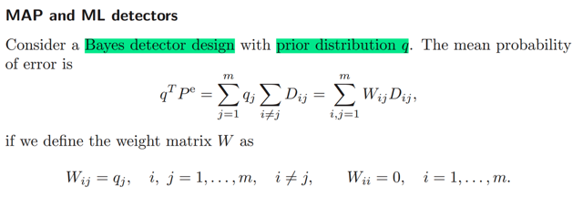</kbd></p>

<p align="center"><kbd>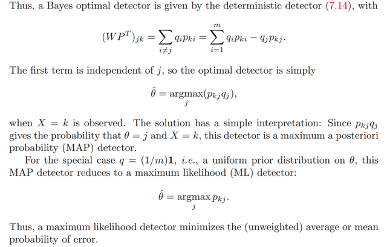</kbd></p>

> [!NOTE]
> Rồi, đại khái là
>
> P^e là vector kết quả của việc cộng hàng theo hàng của matrix D, nhưng trừ
> những thằng trên đường chéo:
>
> P^e `=` `Σi` `!=` j Dij,
>
> nên dĩ nhiên mỗi phần tử của nó là tổng mỗi cột (trừ thằng trên  đường chéo):
>
> ```text
> P^e = [ Σi!=1 Di1, Σi!=2 Di2, ....Σi!=m Dim ] (matrix D shape (m, m))
> ```
>
> Nên q dot product với P^e sẽ là: qTP^e `=` ...
>
> ```text
> q1 * Σi!=1 Di1 + q2 * Σi!=2 Di2 + ...qm * Σi!=m Dim   (i đều từ 1:m)
> ```
>
> ```text
> = Σj qj * Σi!=j Dij (i, j đều từ 1:m)
> ```
>
> Rồi, thế thì người ta đặt matrix W trong đó mỗi cột là giá trị q tương ứng: cột 1
> đều là q1, cột 2 đều là q2, ...Sau đó set lại đường chéo bằng 0.
>
> Khi đó ta có matrix W đáp ứng yêu cầu các component trên đường chéo bằng 0
> và khác đường chéo thì đều không âm (vì q `=` [q1, q2, ...qm] là prior distribution
> của `θ,` nên các giá trị đều không âm) (chỗ này ko nói rõ là các Wij có phải dương
> hay không, nhưng mình nhớ nến như λ thì chỉ yêu cầu ≽ 0 chứ không cần ≻ 0. Có
> thể tìm hiểu sau)
>
> Khi đó kết quả qTP^e mà dạng triển khai là
>
> ```text
> q1 * Σi!=1 Di1 + q2 * Σi!=2 Di2 + ...qm * Σi!=m Dim
> ```
>
> ```text
> = Σi!=1 q1 * Di1 + Σi!=2 q2 * Di2 + ... Σi!=m qm * Dim
> ```
>
> Cũng có thể thay bằng W:
>
> ```text
> = Σi!=1 Wi1 * Di1 + Σi!=2 Wi2 * Di2 + ... Σi!=m Wim * Dim
> ```
>
> Nhưng vì Wii `=` 0 hết rồi nên khỏi cần ghi `i!=1,` `i!=2` ...nữa
>
> ```text
> = Σ Wi1 * Di1 + Σ Wi2 * Di2 + ... Σ Wim * Dim
> ```
>
> viết gọn lại là `Σi,j` Wij * Dij
>
> Khi đó, đại ý nói là, cái deterministic detector mà ta có lúc nãy:
>
> `θ^` `=` argmin j (WPT)jk
>
> thì nay đại khái là W không còn là matrix chọn tùy tiện (tất nhiên phải thỏa  điều
> kiện đã nói đường chéo `=` 0, còn lại dương), Mà nay, nó mang thông tin của prior
> distribution của `θ` vì như đã nói chọn cột 1 `=` q1, cột 2 `=` q2 ... Do đó người ta gọi
> nó là Bayes optimal detector.
>
> Thế rồi xét (WPT)jk , tức hàng j cột k của matrix, ta thấy nó là `Σi!=j` qipki Vì sao?
>
> Ở đây hãy nhìn phần tử jk là kết quả của [hàng j của W] dot [cột k của PT] Mà
> [hàng j của W] sẽ là [q1, q2 ,...qm] (mà thật ra hàng nào cũng bằng vậy)
>
> ```text
> và nó cũng chính là [P(θ = 1), P(θ = 2), ....P(θ = m)] (vì đã nói q là prior
> ```
> distribution của `θ` mà)
>
> Còn [cột k của PT] đương nhiên là [hàng k của P], là:
>
> [pk1, pk2, ...pkm] và ta nhớ nó là
>
> ```text
> [P(X = k | θ = 1), P(X = k | θ = 2), ...P(X = k | θ = m)]
> ```
>
> Nên hai cái đó dot nhau ra: q1 pk1 + q2 pk2 + ...qm pkm `=` `Σi!=j` qi pki
>
> ```text
> và ý nghĩa chính là: Σi!=j P(X = k | θ = i)*P(θ = i)
> ```
>
> Và có thể kiểu như tính luôn rồi trừ ra: `=` `Σi` qi pki - qjpkj
>
> Vậy (WPT)jk `=` `Σi` qi pki - qj*pkj và detector trở thành:
>
> `θ^` `=` argmin j `[Σi` qi pki - qj*pkj]
>
> `=` argmin j qj*pkj vì `Σi` qi pki không phụ thuộc j
>
> ```text
> = argmin j P(X = k | θ = j)*P(θ = j)
> ```
>
> ```text
> = argmin j P(X = k , θ = j)  | dùng conditional probability P(A|B)P(B) = P(A, B)
> ```
>
> Và cái này chính là maximum a posterior probability detector
>
> `====`
>
> Rồi khi q là uniform qi `=` `1/m` với mọi i thì cái detector trở thành:
>
> ```text
> θ^ = argmin j qj*pkj vì qj = 1/m rồi không phụ thuộc j nữa
> ```
>
> ```text
> = argmin j pkj "dịch ra là" argmin j P(X = k | θ = j) thì đây là Maximum Likelihood
> ```
> Detector
>
> (là cái đã nói lúc trước, đó là cho matrix P như vậy, trong đó mỗi cột là ứng với
> một distribution của X (một hypothesis). Thì quan sát thấy X `=` k, thì ta sẽ xem
> trong các distribution, cái nào có P(X `=` k) cao nhất. Cũng chính là xem trong hàng
> k của P, cột nào có giá trị cao nhất, thì kết luận `θ` đó. Vậy thì đây chính là
> maximum likelihood detector
>
> Bởi maximum likelihood là sao. Là xuất phát từ hàm xác suất, cho biết với `θ`
> (param) như vậy thì giúp tính xác suất X mang giá trị k.
>
> Thì khi ngược lại coi nó làm hàm theo `θ,` và giá trị X là fixed, thì nó là hàm
> likelihood. Vậy ta tìm `θ` nào khiến likelihood cao nhất, gọi là maximum likelihood

<br>

<p align="center"><kbd>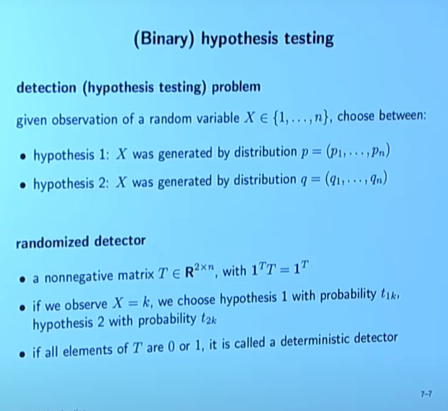</kbd></p>

> [!NOTE]
> Qua mục Binary Hypothesis Testing. 
>
> Đại khái là đây là bài toán detection (tạm hiểu là phát hiện xem
> một random variable (có các possible value `=` {1, 2....n}
>
> Có hai giả thiết đặt ra: X được generated từ distribution p
> và X đươc generated từ distribution q
>
> Thế thì ta sẽ dùng một cái gọi là RANDOMIZED DETECTOR.

<br>

<p align="center"><kbd>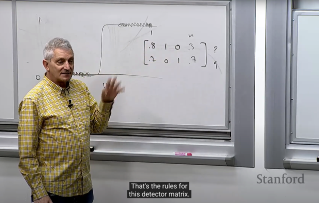</kbd></p>

> [!NOTE]
> ví dụ của một randomized detector. Nếu giá trị quan sát được của
> X là 1 ta chọn hypothesis 1 (X được generate từ probability
> distribution p) với xác xuất `=` t11 `=` 0.8, và có 0.2 xác suất X được
> generated từ q
>
> Nếu matrix này chỉ toàn là 0, 1 thì ta gọi nó là deterministic
> detector

<br>

<p align="center"><kbd>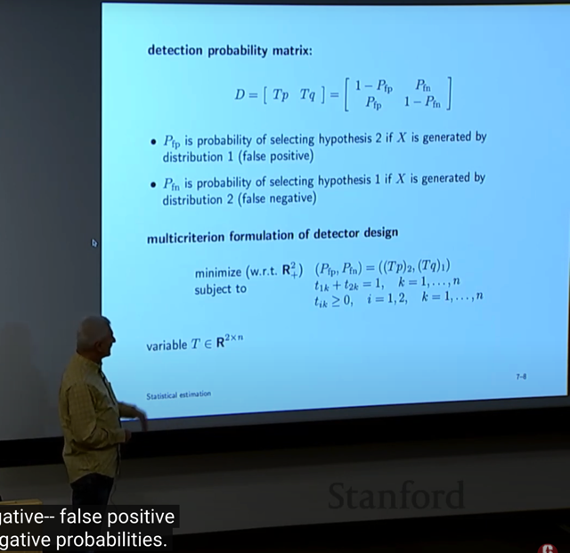</kbd></p>

> [!NOTE]
> Chưa hiểu lắm

<br>

<p align="center"><kbd>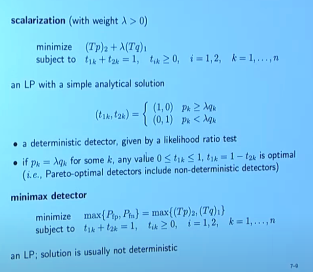</kbd></p>

<br>

<p align="center"><kbd>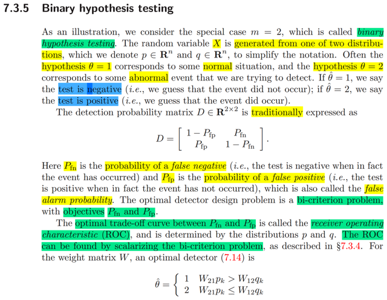</kbd></p>

<p align="center"><kbd>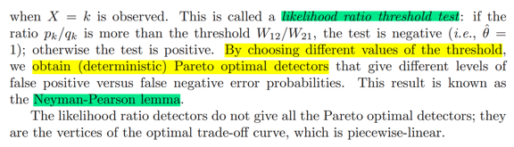</kbd></p>

> [!NOTE]
> Thế thì đại khái là khi m (số hypothesis) `=` 2, ta có cái gọi là BINARY
> HYPOTHESIS TESTING. Như đã biết, điều này đồng nghĩa X sẽ
> được generated từ hai distribution ứng với hai hypothesis (gọi là p, q)
>
> ```text
> Trong đó hypothesis θ = 1 sẽ gắn với normal situation, và cái kia θ =
> ```
> 2 gắn với abnormal. Ngoài ra khi `θ^` `=` 1 người ta gọi nó là negative
> testing, còn `θ^` `=` 2 được gọi là positive testing. (có nghĩa là kiểu như
> ta quan tâm đến việc trạng thái `/` event abnormal có xảy ra hay không)
>
> Thế thì nói về matrix D, nhớ lại, nó là matrix mà các entries đường
> chéo  là "xác suất đoán trúng" ở các case mà `θ` mang giá trị khác
> ```text
> nhau. Tức là ở đây D11, D22 lần lượt là P(θ^ = 2 | θ = 2) và P(θ^ = 1 |
> ```
> `θ` `=` 1)
>
> Còn off-diagonal entries, là xác suất "đoán trật":
>
> ```text
> D12 = P(θ^ = 2 | θ = 1)
> ```
>
> ```text
> D21 = P(θ^ = 1 | θ = 2)
> ```
>
> ```text
> Có thể thấy D21 = P(θ^ = 2 | θ = 1) là false positive (sự thật là
> ```
> ```text
> negative θ = 1 mà dự đoán positive θ^ = 2. Và ta đặt là Pfp. Thì vì là
> ```
> ```text
> bài toán có 2 case thôi nên D11 = P(θ^ = 1| θ = 1) = 1 - Pfp
> ```
>
> ```text
> Tương tự D12 = P(θ^ = 1 | θ = 2) chính là false negative. Ta đặt là Pfn
> ```
> ```text
> và D22 = P(θ^ = 2 | θ = 2) = 1 - Pfn.
> ```
>
> Và như đã nói, bài toán OPTIMAL DESIGN chính là minimize các vị
> trí ngoài đường chéo, do đó objective ở đây là minimize Pfp và Pfn
>
> Để rồi trong như đã biết khi giải bài toán này như một bài toán
> MULTI-CRITERION thì ta có các Pareto optimal và trade-off curve
>
> Thì điều hay ho là đường trade-off curve này là thứ mà mình đã gặp
> ở các lớp về machine learning: Đó chính là ROC curve
>
> Và dùng công thức của optimal detector (của bài toán khái quát) ta có
> khi observed value của X `=` k thì:
>
> `θ^` `=` argmin j (WPT)jk (1)
>
> Thế thì P là matrix mà mỗi cột là distribution của X ứng với một hypothesis
> `=>` Đây có 2 cột chính là vector p và q nói trên, là R^n vector (X có n possible
> values), matrix P có shape (n, 2)
>
> `=>` PT có shape (2, n) hàng 1 là p hàng 2 là q.
>
> W thì như đã biết là matrix (m, m) tức (2, 2) có đường chéo `=` 0, W12, W21 
> dương.
>
> Nên WPT có shape (2, 2) x (2, n) `=` (2, n) và cột k của (WPT) chính là 
> linear combination của W's cols với hệ số là cột k của PT
>
> W's cols là [0, W21]T và [W12, 0]T
>
> Cột k của PT: [pk, qk]
>
> `=>` linear combination: pk[0, W21]T + qk[W12, 0]T `=` [qkW12, pkW21]T
>
> Và `θ^` `=` argmin j (WPT)jk tức là argmin j [qkW12, pkW21]T
>
> mang ý nghĩa là tìm index của component nhỏ nhất của vector. Và dễ thấy
>
> điều này có nghĩa là  
>
> khi qkW12 < pkW21 thì `θ^` `=` 1, ngược lại
>
> khi qkW12 > pkW21 thì `θ^` `=` 2
>
> Đây chính là kết quả trong sách:
>
> `θ^` `=` 1 khi W21pk > W12qk
>
> `θ^` `=` 2 khi W21pk `<=` W12qk
>
> Nhưng sau đó thì dễ, với kết quả này thì có nghĩa là ta sẽ kết luận
> ```text
> negative testing khi pk/qk > W12/W21 và ngược lại khi pk/qk <= W12/W21
> ```
> thì ta kết luận positive testing.
>
> Và các giá trị `W12/W21` khác nhau (có được khi chọn matrix W khác nhau)
> chính là các threshold khác nhau để từ đó ta có các Pareto optimal detector
> khác nhau mà trong đó ta phải trade off giữa hai loại "lỗi" False Positive
> và False Negative
>
> Đây là cái được gọi là Neyman-Pearson lemma

<br>

<p align="center"><kbd>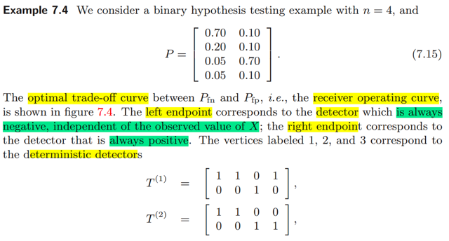</kbd></p>

<p align="center"><kbd>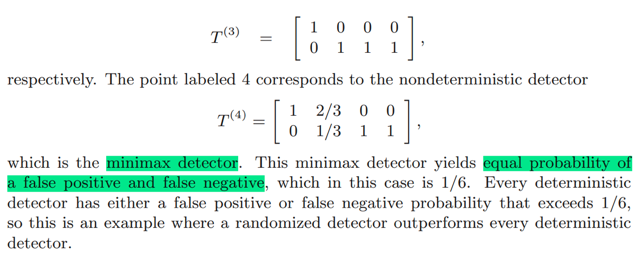</kbd></p>

<p align="center"><kbd>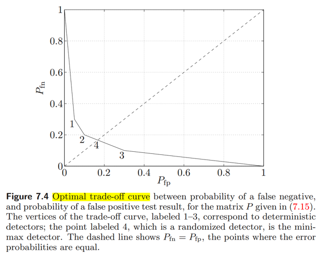</kbd></p>

> [!NOTE]
> Một ví dụ.

<br>

<p align="center"><kbd>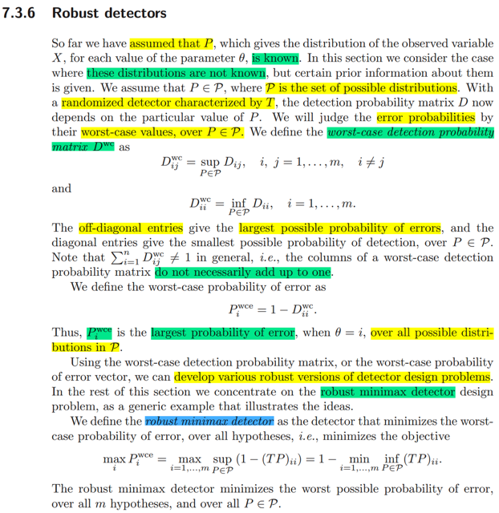</kbd></p>

> [!NOTE]
> đại khái là, nãy giờ ta nói về matrix P có m cột ứng với m hypothesis 
> mỗi cột (ví dụ j) là Rn vector distribution của X: 
>
> ```text
> P(X = 1 | θ = j), P(X = 2 | θ = j),...P(X = n | θ = j)
> ```
>
> Thế thì như đã biết D `=` PT, mà D là matrix (m, m) mà đường chéo 
> ```text
> Dii là xác suất đoán trúng P(θ^ = i | θ = i) và ngoài đường chéo là
> ```
> ```text
> Dij là xác suất đoán trật P(θ^ = i | θ = j). Tổng mỗi cột sẽ bằng 1
> ```
>
> Bây giờ, ta không cho rằng P cố định nữa. Mà P ∈ P là set các 
> possible distributions.
>
> Lúc này ta mới xem xét cái gọi là worst-case detection probability
>
> Nôm na là vầy: Vì P bây giờ tạm gọi là có nhiều possible values.
> Nên D cũng vậy, phụ thuộc P, nên cũng có nhiều possible D.
>
> Thế thì bây giờ ta mới tạo một cái matrix D sao cho, mỗi vị trí
> ta lấy cái tệ nhất. Ví dụ Dii, một entry trên đường chéo, như đã biết
> ```text
> sẽ là xác suất đoán trúng ở case mà θ = i, tức P(θ^ = i, θ = i)
> ```
> Vậy ta sẽ lấy cái Dii có giá trị nhỏ nhất trong mọi possible D
>
> Dwc ii `=` inf P ∈ P Dii
>
> Còn Dij (i khác j) là phần tử ngoài đường chéo, mang ý nghĩa là xác
> ```text
> xuất đoán trật P(θ^ = i | θ = j), Thì lấy tệ nhất chính là ta lấy cái có
> ```
> giá trị cao nhất trong mọi possible D.
>
> Dwc ij `=` sup P ∈ P Dij
>
> Do đó có thể hiểu D là một matrix LẮP RÁP từ các possible D (xuất
> phát từ nhiều possible P) mà trong đó mỗi phần tử là cái tệ nhất trong
> mọi possible D.
>
> Chính vì vậy mà nó không còn tuân theo quy luật là tổng cột bằng
> 1 nữa. `Σj` Dij `!=` 1
>
> Rồi còn chuyện nữa, nếu như thông thường tổng cột bằng 1, thì
> tổng mọi phần tử trong cột trừ cái trên đường chéo chính là xác suất
> ```text
> đoán trật "tổng hợp" trong case đó. P(θ^ != i | θ = i)
> ```
>
> Và dĩ nhiên nó cũng bằng 1 - Dii.
>
> Còn bây giờ ta cũng đặt `P_wce_i` `=` 1 - Dii là xác suất đoán trật tổng 
> ```text
> hợp khi θ = i P(θ^ != i | θ = i)  tệ nhất trong mọi possible D
> ```
>
> ```text
> Vì sao nó là xác suất đoán trật P(θ^ != i | θ = i) tệ nhất, đó là vì Dii là
> ```
> ```text
> xác suất đoán trúng P(θ^ = i | θ = i) tệ nhất trong mọi possible D
> ```
>
> Vậy ta thể hiện `P_wce` như thế nào để thể hiện nó là xác suất đoán
> trật tổng hợp tệ nhất trong mọi possible D:
>
> `P_wce_i` `=` 1 - inf P ∈ P Dii 
>
> và cái này `=` sup P ∈ P (1 - Dii) | vì lấy cái Dii nhỏ nhất cũng là lấy cái 1 - Dii
> lớn nhất.
>
> Và vector `P_wce` là vector mà mỗi phần tử `P_wce_i` tương ứng với
> ```text
> xác suất đoán trật tổng hợp tệ nhất ứng với case θ = i (P(θ^ != i | θ  = i)
> ```
> trong mọi possible D
>
> Tiếp theo, ta muốn lấy cái cao nhất trong đó, ý nghĩa là, `P_wce` là 
> list các xác suất đoán trật tổng hợp với các `θ` khác nhau. Thì cái nào
> có gía trị cao nhất (tức là cái case nào sai nhiều nhất)
>
> max i `P_wce_i` `=` max `i=1,2...m` sup P ∈ P (1 - Dii) 
>
> max i `P_wce_i` `=` max `i=1,2...m` sup P ∈ P (1 - (TP)ii) 
>
> nếu thể hiện bằng việc dựa trên `P_wce_i` `=` 1 - inf P ∈ P Dii
>
> 1 - min `i=1,2...m` inf P ∈ P (TP)ii 
>
> 1 - min `i=1,2...m` inf P ∈ P (TP)ii

<br>

<p align="center"><kbd>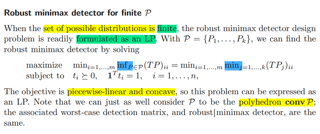</kbd></p>

> [!NOTE]
> đại khái là khi set possible P (P) chỉ có hữu hạn các possible P
> thì infimum (inf) trở thành minimum (min)
>
> Và bài toán trở thành LP

<br>

<p align="center"><kbd>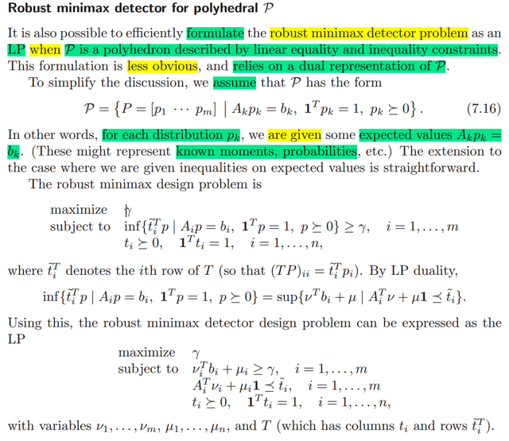</kbd></p>

> [!NOTE]
> QUAY LẠI SAU
>
> QUAY LẠI SAU

<br>

<p align="center"><kbd>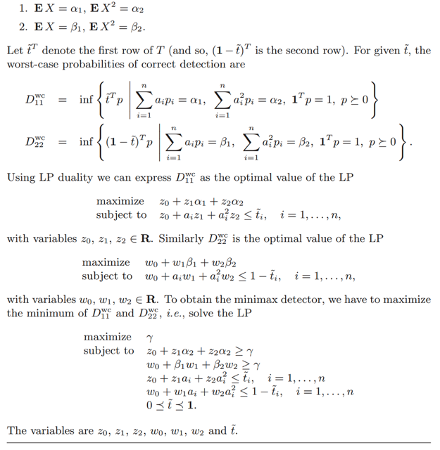</kbd></p>

<p align="center"><kbd>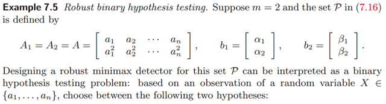</kbd></p>

> [!NOTE]
> QUAY LẠI SAU

<br>

<p align="center"><kbd>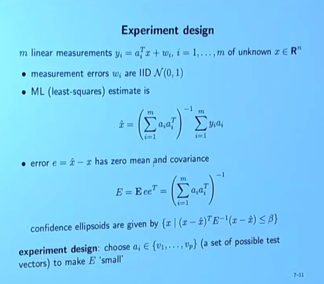</kbd></p>

<br>

<p align="center"><kbd>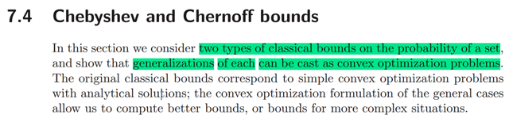</kbd></p>

> [!NOTE]
> Đại khái là phần này ta bàn về hai loại bound (giới hạn `/` chặn) 
> kinh điển của xác suất. Và cho thấy rằng bài toán khái quát
> có thể được chuyển thành một bài toán convex optimization
>
> Tuy rằng bài toán classicle bound gốc vẫn là bài toán simple
> convex problem với analytical solution.
>
> Nhưng việc chứng minh `/` triển khai bài toán khái quát cũng 
> có thể là convex problem giúp ta có thể có bound tốt hơn 
> hoặc tìm bound cho những tình huống phức tạp hơn

<br>

<p align="center"><kbd>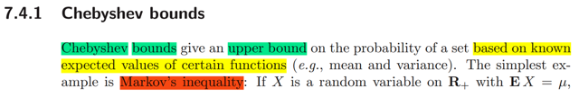</kbd></p>

<p align="center"><kbd>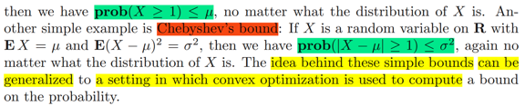</kbd></p>

<p align="center"><kbd>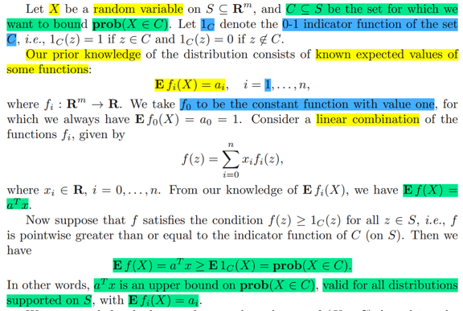</kbd></p>

> [!NOTE]
> Đầu tiên nói về Chebyshev bounds. Ở đây cho biết nó là upper bound
> đối với xác suất của một set. dựa trên việc ta biết kì vọng của một
> function nào đó ví dụ như mean và variance.
>
> Mà một ví dụ đơn giản nhất của nó chính là Markov's inequality và
> Chebyshev's inequality. Hai cái này ta đã đều được biết ở Stat110
>
> Markov's inequality: 
>
> Chebyshev's inequality:
>
> Thì nói chung là việc ta khái quát các bất đẳng thức này `/` cũng là các
> simple bound này sẽ trở thành việc giải bài toán convex optimization.
>
> `====`
>
> Đại khái là ta có rv X on S ⊆ R^n (mình hiểu nó là sample space - set
> các possible values của X) Và ta quan tâm đến việc tìm bound của
> xác suất của event X ∈ C, dĩ nhiên C là subset của S. 
>
> Rồi, người ta mới gọi 1C(z) là indicator function biểu diễn việc z có
> thuộc set C ko. 
>
> Và nói về việc ta có prior knowledge về distribution cụ thể là ta biết
> mean (expected value) của một số function sao đó.
>
> Efi(X) `=` ai. i `=` 1,2,3..... (ko lạ gì, stat110 đã học, X là rv thì f(X) cũng
> là r.v và nó có quyền có kì vọng)
>
> Đặc biệt ở chỗ ta cho a0 `=` 1, tức Ef0(x) `=` 1.
>
> Khi đó xét hàm f(z) là linear combination của fi(z):
>
> f(z) `=` `Σ` xi.fi(z)  
>
> Ta sẽ có Ef(X) `=` aTx là sao?
>
> Ef(X) `=` E `[Σ` xi*fi(X)] , thì theo linearity ta sẽ có:
>
> `=` `Σ` E xi fi(X) 
>
> `=` `Σ` xi Efi(X) | linearity luôn
>
> `=` `Σ` xi ai | vì ở trên nói Efi(X) `=` ai
>
> `=` aTx. Vậy Ef(X) `=` aTx
>
> `====`
>
> Thế thì người ta mới giả sử ta có hàm f THỎA MÃN ĐIỀU KIỆN rằng
> nó luôn lớn hơn giá trị của indicator function 1C(.) thì TA CÓ THỂ
> THIẾT LẬP RA UPPER BOUND CỦA P(X ∈ C)
>
> (gọi là piece-wise greater than) tức là với mọi z thì f(z) đều `>=` 1C(z)
>
> Thì khi đó ta có Ef(X) `>=` E[1C(X)] `<=>` aTx `>=` P(X ∈ C)
>
> Nói rõ hơn chỗ này là sao.
>
> Đầu tiên, nếu X `>=` Y thì EX `>=` EY (hỏi lại)
>
> Và E[1C(X)] tại sao là P(X ∈ C)
>
> đây chính là fundamental bridge:
>
> E[1C(X)] `=` `Σx` 1C(x)P(X `=` x) | LOTUS
>
> ```text
> = Σ x ∈ C [1 * P(X = x)] + Σ x !∈ C [0 * P(X = x)]
> ```
>
> `=` `Σ` x ∈ C [1 * P(X `=` x)] 
>
> `=` `Σ` x ∈ C [P(X `=` x)] 
>
> Cái này chính là P(X ∈ C)  vì nó chính là P(Union (X `=` x) với x ∈ C)
>
> `=` `Σ` x ∈ C P(X `=` x) | Axiom 3: probability of a union of disjoint event
>
> Vậy ta hiểu tại sao P(X ∈ C) `<=` aTx. Đấy là upper bound của P(X ∈ C)
>
> 7.4 CHEBYSHEV BOUNDS & ...
>
> 7.4.1 CHEBYSHEV BOUNDS

<br>

<p align="center"><kbd>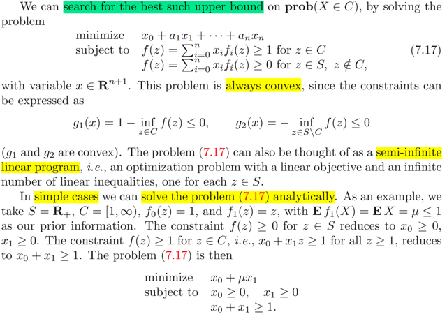</kbd></p>

<p align="center"><kbd>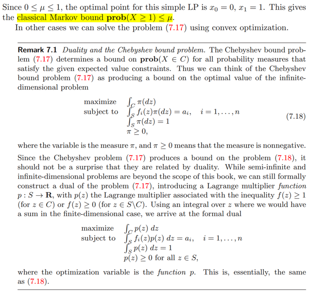</kbd></p>

> [!NOTE]
> Rồi. Khi đã có upper bound của P(X ∈ C) là aTx, thì ta muốn tối ưu nó,
> tức tìm cái giới hạn trên thấp nhất có thể. Và đó chính là bài toán 
> optimziation:
>
> minimize x0 + a1x1 + ...anxn
>
> với constraint là f(z) `=` `Σ` xifi(z) `>=` 1 với z ∈ C. Lí do là vì đã nói hồi nãy,
> sở dĩ có thể đi đến việc thiết lập upper bound của P(X ∈ C) là vì ta
> đang SUPPOSE f(z) `>=` 1C(z) với mọi z. Thì điều này đồng nghĩa là
> với z ∈ C thì f(z) luôn `>=` 1C(z) `=` 1. 
>
> Ngược lại z ∈ S nhưng không ∈ C thì f(z) `>=` 1C(z) `=` 0. Cái này dẫn đến 
> constraint thứ 2 là f(z) `=` `Σ` xifi(z) `>=` 0 với z !∈ C
>
> Và bài toán optimization này là bài toán convex. vì objective là affine
> còn constraint có thể thể hiện dưới dạng - infimum : cũng là convex 
> function (Xem lại chỗ này tính chất convex liên quan đến infimum)
>
> `====`
>
> Rồi một ví dụ cho một trường hợp đơn giản. Trong đó mình xét S là 
> mọi số thực không âm R+, C là tập [1, inf). Và như đã nói ta quan tâm
> đến xác suất X thuộc C, tức P(X `>=` 1). Và ta có prior knowledge là
> biết expected của vài function fi(.)
>
> ```text
> Cụ thể là với f1(X) = X, ta có / biết Ef1(X) < 1, tức là EX = μ < 1
> ```
>
> Còn f0(X) thì như đã nói cho bằng constant `=` 1.
>
> Như vậy ta có hàm f(z): f(z) `=` `Σ` fi(z)xi `=` x0*1 + x1*z
>
> Thế thì như đã nói, nếu ta đảm bảo điều kiện f(z) `>=` 1C(z) với mọi z ∈ S
> thì ta sẽ thiết lập được upper bound của P(X ∈ C) là: 
>
> P(X ∈ C) `<=` aTx 
>
> `<=>` P(X ∈ C) `<=` Ef0(X)x0 + Ef1(Z)x1 
>
> `<=>` P(X ∈ C) `<=` E(1)x0 + EX*x1 
>
> `<=>` P(X ∈ C) `<=` x0 + `μx1`
>
> Từ đó dẫn đến bài toán tối ưu giúp minimize upper bound này:
>
> minimize x0 + `μx1` 
>
> với constraint chính là để thỏa điều kiện f(z) `>=` 1C(z) với z ∈ S:
>
> điều kiện này thật ra sẽ trở thành 2 ý:
>
> z ∈ C thì f(z) `>=` 1 (1C(z) `=` 1) 
>
> z không ∈ C thì f(z) `>=` 0
>
> Vậy: x0 + x1*z `>=` 1 khi z ∈ C và x0 + x1*z `>=` 0 khi z ∈ S
>
> Xét x0 + x1z `>=` 0 khi z `>=` 0 (z ∈ S `=` R+):
>
> Giải thích: x0 + x1z `>=` 0 với mọi z `>=` 0 thì x0, x1 phải `>=` 0. 
>
> Chứng minh:
>
> 1) Giả sử x0 < 0 và x1 `>=` 0 thì tồn tại z `>=` 0 khiến x0 + x1z < 0, đó là:
>
> ```text
> x0 + x1z < 0 <=> x1z <= -x0 <=> z <= -x0/x1 ,Tức là chỉ cần z ∈ [0, -x0/x1)
> ```
> thì sẽ khiến x0 + x1z < 0.
>
> 2) Giả sử x0 `>=` 0, x1 < 0 thì: Với z `>=` 0 và x1 < 0 `=>` x1z < 0, 
>
> ```text
> Để x0 + x1z < 0 <=> x0 < -x1z <=> -x0/x1 < z. Vậy chỉ cần z > -x0/x1 thì
> ```
> x0 + x1z sẽ < 0
>
> Do đó chỉ khi x0 và x1 đều không âm thì x0 + x1z mới `>=` 0 với mọi z `>=` 0
>
> Nên constraint này trở thành x0 `>=` 0, x1 `>=` 0
>
> x0 + x1*z `>=` 1 với z ∈ C tức z `>=` 1 Trở thành x0 + x1 `>=` 1 VÌ SAO?
>
> Và giải bài toán này cho ra kết quả chính là Markov inequality:
>
> P(X `>=` 1) `<=` `μ`

<br>

<p align="center"><kbd>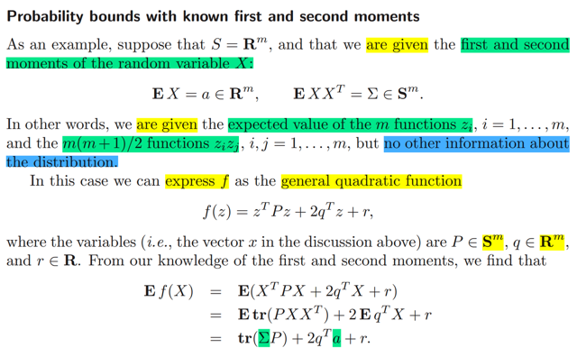</kbd></p>

<p align="center"><kbd>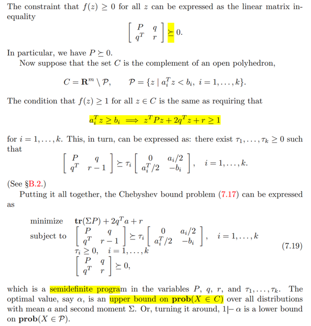</kbd></p>

> [!NOTE]
> Rồi, đại khái là một ví dụ cụ thể, giúp ta xác định và tối ưu upper bound dựa trên việc biết (có prior
> knowledge) ở dạng là expectation của một số function nào đó
>
> Thế thì random variable trong trường hợp này là random variable vector X (∈ R^n). Tức S `=` R^n. Tí
> nữa ta sẽ nói về C (để quan tâm upper bound của P(X ∈ C)). Nói về prior knowledge ở bài toán này.
> Như phần lí thuyết khái quát nói rằng, ta có kì vọng của function fi(X) nào đó. Ở đây đó là f1(X) `=` X
> (như ví dụ đơn giản vừa rồi) và f2(X) `=` XXT
>
> ```text
> Có nghĩa là ta có prior knowledge: EX = μ và E(XXT) = Σ.
> ```
>
> Tại sao nói coi như ta có expected value của m function zi và `m(m+1)/2` functions zizj?
>
> Vì X là vector rv `=` [X1, X2, ...Xm], nên việc biết EX thì cũng giống như ta biết expectation của m rvs
> X1, X2, ...Xm hoặc nói cách khác là biết expectation của m identity function f(zi) `=` zi (f(X1) `=` X1,
> f(X2) `=` X2...)
>
> Và biết EXXT cũng chính là biết các covariance Cov(Xi, Xj) (i khác j) và có tổng cộng `m(m-1)/2` cái
> ```text
> (chia 2 vì Cov(Xi, Xj) = Cov(Xj,Xi). Cộng với  m Var(Xi) nữa là m + m(m-1)/2 = [2m + m(m - 1)]/2 =
> ```
> ```text
> m(m - 1 + 2)/2 = m(m + 1)/2. Và cái này nói cách khác là ta biết expectation của  m(m + 1)/2
> ```
> function có dạng f(zi, zj) `=` zi*zj
>
> Rồi, họ mới nói ta có thể express f ở dạng quadratic function khái quát f(z) `=` zTPz + 2qTz + r. Tại
> sao lại như vậy?
>
> Trong phần lí thuyết nói ta xây dựng f(z) `=` `Σ` fi(z)xi, thì ở đây tại sao nó là f(z) `=` zTPz + 2qTz + r.
>
> Thì bản chất là linear combination các function fi.
>
> Thì với m function zi, linear combination là qTz
>
> Còn với `m(m+1)/2` function zizj thì đó chính là zTPz
>
> Còn r, chính là đóng vai của x0 (hệ số của f0(z) `=` 1)
>
> Thành ra f(z) `=` zTPz + 2qTz + r quả thật chính là linear combination của các fi
>
> Rồi, thế thì như lí thuyết Ef(X) `=` aTx sẽ là upper bound của 1C(X) là P(X ∈ C)
>
> Với f(.) là function nói trên f(z) `=` zTPz + 2qTz + r thì
>
> Ef(X) `=` E[XTPX + 2qTX + r] `=` E(XTPX) + E2qTX + Er  | linearity
>
> Tới đây dùng công thức XTPX `=` tr(PXXT) Cái này liên quan đến Trace operator Tham khảo thêm
> sau.
>
> `=` E tr(PXXT) + 2qT(EX) + r
>
> Rồi, E tr(PXXT), thì trace có tính tuyến tính nên có thể đưa E vào trong tr() `=` tr[E(PXXT)] `=`
> tr[PE(XXT)] `=` `tr(PΣ)`
>
> ```text
> = tr(PΣ) + 2qTa + r   |   XXT = Σ, EX = a
> ```
>
> `====`
>
> Rồi như vậy ta đã có Ef(X). Thế thì muốn có upper bound cho P(X ∈ C) thì  phải thỏa điều kiện là
> f(z) `>=` 1 khi z ∈ C và `>=` 0 khi z ∈ S.
>
> Hai cái này sẽ trở thành constraint của bài toán minimize upper bound
>
> f(z) `>=` 0 ∀ z ∈ S `<=>` zTPz + 2qTz + r `>=` 0 ∀ z ∈ S
>
> Mà vế trái chính là quadratic form của matrix: [P q; qT r] do đó để nó `>=` 0 ∀ z tương đương [P q; qT
> r] là positive semi definite ≽ 0.
>
> Và để điều đó xảy ra dĩ nhiên P cũng phải ≽ 0 vì P là một "sub-matrix" tên  chính xác là "leading
> principal minor" (mit 18.06 mình đã học một trong những  cách để test psd matrix là determinant
> của các submatrix phải `>=` 0 (còn > 0 thì sẽ là positive definite)
>
> `====`
>
> Giờ nói qua set C (vì ta đang làm là thiết lập upper bound của P(X ∈ C))
>
> Họ cho rằng giả sử ta có C là phần bù (complement) của một polyhedron mở C `=` Rm `\` P với P `=` {z
> : aiTz < bi, i `=` 1, 2,...k}
>
> kí hiệu này ko có gì khó hiểu, Polyhedron như đã biết, nó được định nghĩa là intersection của các
> haft-space và hyperplane. Trong {z : aiTz < bi, i `=` 1, 2,...k} thì mỗi aiTz `<=` bi chính là một haft-plane
> với normal vector là ai.
>
> Vậy thì Polyhedron này nằm trong Rm, thì phần bù của nó chính là Rm `\` P
>
> Và dĩ nhiên nếu z ∈ C thì tức là z không thuộc P, đồng nghĩa nó không nằm trong haft-plane aiTz <
> bi nào. Nói cách khác z ∈ C `=>` aiTz `>=` bi
>
> Vậy nên constraint "Nếu z ∈ C thì f(z) `>=` 1" TƯƠNG ĐƯƠNG VỚI
>
> ```text
> "Nếu aiTz >= bi thì f(z) = zTpz + 2qTz + r >= 1" với i = 1, 2, ...k
> ```
>
> Tới đây cần dùng một kiến thức phải bổ sung trong Phụ Lục B2
>
> QUAY LẠI SAU
>
> Nhưng đại khái là từ đó ta có được constraint của bài toán minimize upper bound của P(X ∈ C)
> (bound này đã nói ở trên là f(X) `=` `tr(PΣ)` + 1qTz + r)

<br>

<p align="center"><kbd>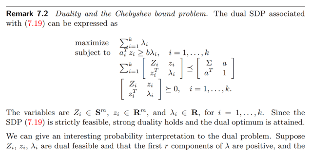</kbd></p>

<p align="center"><kbd>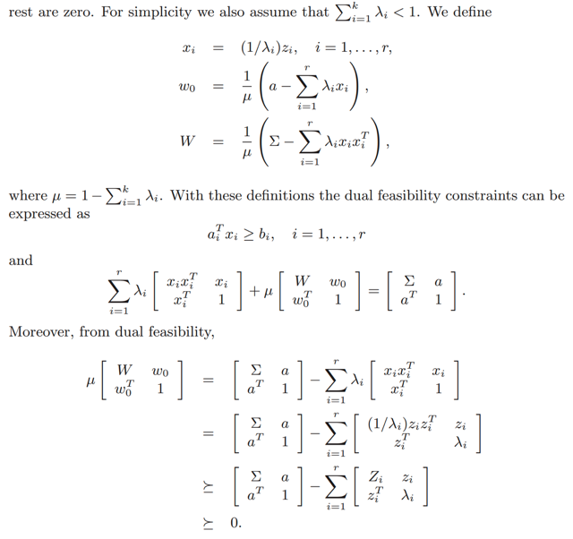</kbd></p>

<p align="center"><kbd>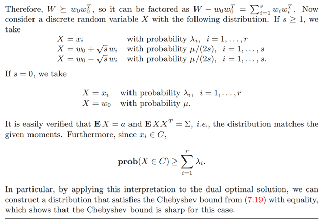</kbd></p>

> [!NOTE]
> QUAY LẠI SAU

<br>

<p align="center"><kbd>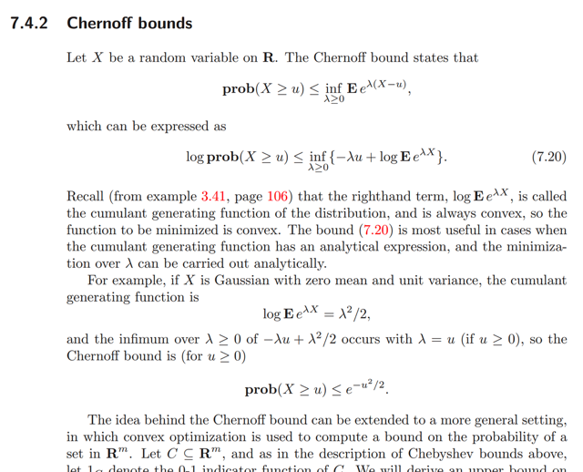</kbd></p>

> [!NOTE]
> QUAY LẠI SAU
>
> 7.4 CHEBYSHEV BOUNDS & ...
>
> 7.4.1 CHEBYSHEV BOUNDS

<br>

<p align="center"><kbd>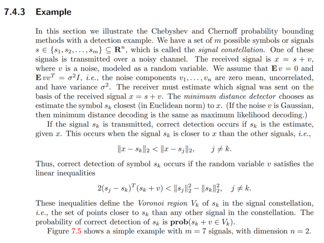</kbd></p>

> [!NOTE]
> 7.4 CHEBYSHEV BOUNDS & ...
>
> 7.4.3 EXAMPLES
>
> QUAY LẠI SAU

<br>

<p align="center"><kbd>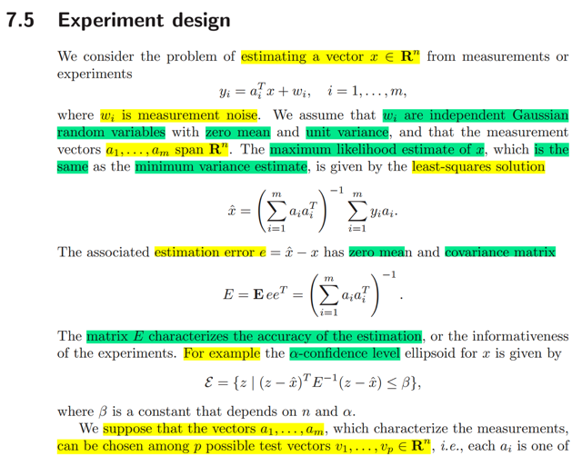</kbd></p>

<p align="center"><kbd>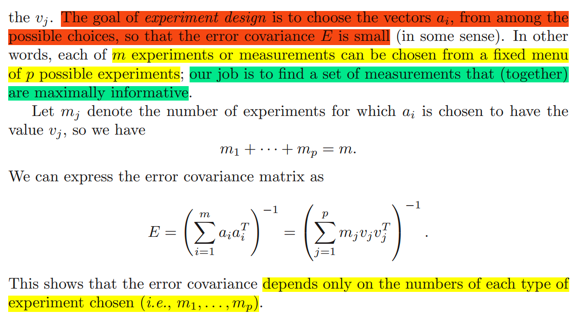</kbd></p>

> [!NOTE]
> 7.5 EXPERIMENT DESIGN
>
> Vài điểm chính trước:
>
> 1) Tại sao x^ ra vậy?
>
> aiTx `=` yi i `=` 1,2,...m
>
> `<=>` Ax `=` y | aiT là row i'th của A (ai cũng là column ith của AT)
>
> minimize x ||Ax - y||^2 `=` (Ax - y)T(Ax - y)
>
> aiT là rows của A.
>
> Least square solution:
>
> ```text
> AT(y - Ax^) = 0 <=> ATy = ATAx^ <=> x^ = (ATA)inv ATy
> ```
>
> ATA: theo góc nhìn thứ 4 (là tổng các rank 1 matrix):
>
> `Σi` [column i của AT] x [row i của A]
>
> `=` `Σi` ai aiT 
>
> `=>` (ATA)inv chính là `(Σi` ai aiT)inv
>
> Còn ATy dĩ nhiên là linear combination của AT's columns với coefficient
> là y's component:
>
>  ATy `=` `Σ` yi ai
>
> ```text
> Vậy x^ = (ATA)inv ATy = (Σi ai aiT)inv Σ yi ai như sách ghi:
> ```
>
> 2) Tại sao E như vậy?
>
> e `=` x^ - x `=` (ATA)inv ATy - x `=` (ATA)inv AT(Ax + w) - x 
>
> `=` (ATA)inv (ATAx + ATw) - x `=` (ATA)invATAx + (ATA)invATw - x 
>
> `=` x + (ATA)invATw - x `=` (ATA)invATw
>
> `=>` eT `=` (ATv)T[(ATA)inv]T `=` vTA (ATA)inv (vì ATA symmetric nên ATAinv cũng vậy)
>
> E `=` E(eeT) `=` E[(ATA)invATw wTA (ATA)inv] 
>
> `=` (ATA)invAT E[wwT] A (ATA)inv  | linearity
>
> `=` (ATA)invAT I A (ATA)inv   
>
>  lí do là vì w ~ Normal (0, I) multivariate Gaussian zero mean unit variance 
> nên covariance matrix `Σ` `=` EwwT `=` I
>
> ```text
> = (ATA)invAT A (ATA)inv = (ATA)inv = (Σi ai aiT)inv
> ```
>
> 3) Đại ý là a1, a2, ...am là các vector đại khái là tạo nên kết qủa của  phép đo.
>
> Và tụi này kiểu như là được chọn từ p possible test value v1, v2,...vp
>
> Nôm na a1, a2, ..am như các rvs mà possible values là v1, v2, ,,,vp
>
> Để rồi để có bộ a1, ...am thì có m1 lần v1 được chọn, m2 lần v2 được chọn 
> tiếp tục vậy.
>
> Từ đó có thể thấy m1 + m2 + ...mp phải bằng m, là số lần thử nghiệm (cho 
> trước)
>
> Và nôm na là chất lượng (error covariance matrix) phụ thuộc vào các giá trị 
> m1, m2 ..mp này. Mang ý nghĩa là việc chọn các giá trị a1, a2... am từ set 
> các possible test values v1, v2....vp sẽ ảnh hưởng đến chất  lượng kết quả.
>
> Nên nó mới có tên là experiment design. Và phần sau sẽ nói, đây cũng có 
> thể thấy nó là bài toán tối ưu, thuộc loại vector optimization
>
> TẠI SAO E `=` `(Σj` mjvjvjT)inv QUAY LẠI SAU
>
> Đơn giản thôi, ta đã nói bộ các vector a1, a2, ....am sẽ được chọn từ p vector
> (test values) v1, v2,...vp (có thể có một cái được chọn nhiều lần và có thể có
> cái không được chọn lần nào), nên gọi m1, m2 ...mp là số lần v1, v2, ...vp được
> chọn thì m1 + m2 + ...mp `=` m là số vector a cần thiết. Như vậy thì, các vector a1,
> a2,...am có thể coi là m1 vector v1, m2 vector v2, ....mp vector vp
>
> Nên việc có m phép nhân ai với aiT `(Σi=1:m` ai aiT) có thể hiểu là có..
>
> m1 phép nhân vector v1 v1T, m2 phép nhân v2 v2T, ....mp phép nhân vp vpT
>
> Đây chính là `Σj=1:p` mj vj vjT
>
> ```text
> Do đó E = (Σi=1:m ai aiT)inv (chứng minh ở trên) chính là (Σj=1:p vj vjT)inv
> ```
>
> Từ đó cho thấy E - error covariance, phản ánh chất lượng của experiment design
> chỉ phụ thuộc bộ giá trị m1, m2, ....mp

<br>

<p align="center"><kbd>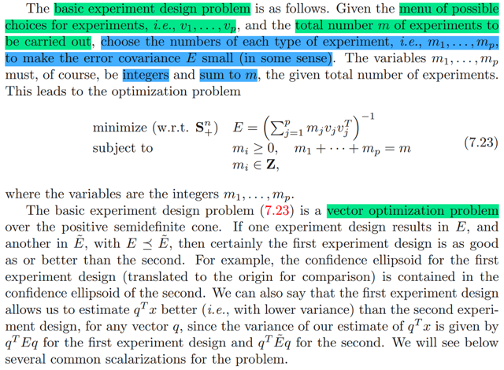</kbd></p>

> [!NOTE]
> Như đã nói, ta có thể cho thấy bài toán experiment design là bài
> toán tối ưu với objective là error covariance matrix E với optimization
> variable là m1, m2, ....mp vói constraint mi `>=` 0, `Σ` mi `=` m và mi là
> số nguyên.
>
> Thế thì dễ thấy đây là bài toán vector optimization vì objective là
> vector `/` matrix function. Nên gắn với nó sẽ là cone K để so sánh
> (generalized inequality) f0. K ở đây là Sn+ là set các matrix positive
> semi definite.
>
> Dễ hiểu là khi so sánh hai giá trị f0 , ví dụ E và  E~, thì khi E ⪯ E~ 
> (đúng ra là E ⪯S^n+ E~, nhưng với cone K là Rn+ hay Sn+ thì ta có
> quyền không ghi vì chúng quá thông dụng) sẽ có nghĩa là experiment
> đầu tốt hơn experiment sau.
>
> Và ý nghĩa của việc nói experiment tốt hơn ở đây chính là cái đầu
> nó giúp estimate của y: qTx với variance nhỏ hơn (thể hiện
> bởi qTEq)
>
> Tại sao lại estimate qTx? giống như ta tìm ra w xong thì với feature
> vector của new house x `=>` predicted value là wTx vậy. (ở đây x là
> đóng vai trò của parameter w, và a hay q là feature vector (ý là so 
> sánh với bài toán linear regression)
>
> Tại sao variance of our estimate là qTEq?
>
> E `=` (ATA)inv
>
> Var(qTx^) `=` Var[qT(x + e)]    |  x^ `=` x + e
>
> `=` Var[qTx + qTe] `=` Var(qTe) | Var(X + c) `=` Var(X)  ở đây qTx là constant
>
> lí do qTx constant vì x tuy chưa biết nhưng nó là giá trị cố định mà
> ta đang muốn estimate, nó ko phải variable
>
> `=` Var(qTe) `=` E[qTe]^2 - [E(qTe)]^2  | công thức thứ 2 của Var
>
> `=` E[qTe]^2 - [qTE(e)]^2   |   linearity 
>
> Và e là Gaussian zero mean nên E(e) `=` 0
>
> `=` E[qTeeTq] `=` qT E[eeT] q `=` qTEq

<br>

<p align="center"><kbd>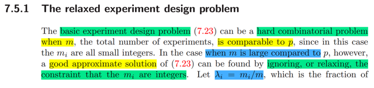</kbd></p>

<p align="center"><kbd>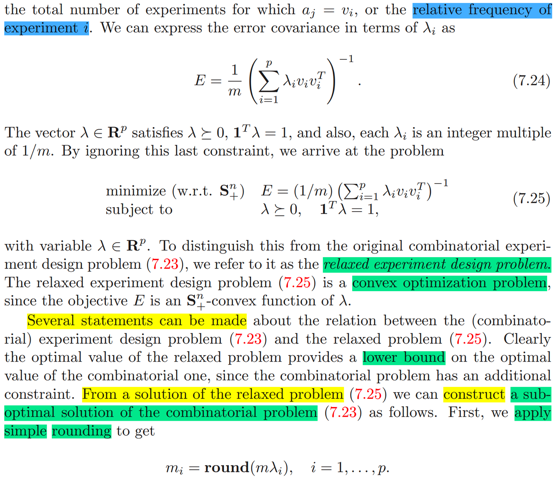</kbd></p>

<p align="center"><kbd>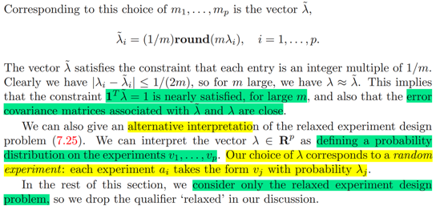</kbd></p>

> [!NOTE]
> Rồi, đại khái là bài toán experiment design vừa nãy ta chú ý rằng
> một trong những constraint là m1, m2, ...mp phải là số nguyên.
> (bởi vì ý nghĩa của mi là số lần vi được chọn). `Σi` mi `=` m
>
> Thế thì ở đây cho biết nếu như m mà có giá trị tương đương với
> p thì bài toán này là một bài toán combinatorial khó vì khi đó mi
> là số nguyên có giá trị nhỏ.
>
> Nhưng nếu m lớn hơn nhiều so với p, thì ta có một cách để tìm
> approximation solution của bài toán này. Đó là ta bỏ đi, phớt lờ
> đi constraint mi phải là số nguyên này.
>
> Thế thì bằng cách ta đặt λi `=` `mi/m,` thì λi sẽ mang ý nghĩa là tỉ 
> lệ phần trăm mà vector vi được chọn so với toàn bộ. Và khi đó
> error covariance, thể hiện theo λi:
>
> ```text
> E = (Σ mi vi viT)inv = (Σ λim vi viT)inv = (m Σ λi vi viT)inv
> ```
>
> ```text
> = 1/m (Σ λi vi viT)inv  | do m_inv = 1/m
> ```
>
> lúc này ta sẽ giải bài toán có objective như trên nhưng constraint
> là λ ≽ 0 và 1Tλ `=` 1
>
> Đây gọi là RELAXED EXPERIMENT DESIGN 
>
> Vài nhận định:
>
> vì ở bài toán relaxed, ta BỎ BỚT constraint thành ra solution
> của nó sẽ tệ hơn solution của bài toán design gốc. Và do đó
> thành ra nó trở thành LOWER BOUND của optimal value của
> bài toán gốc.
>
> Và khi đã tìm được optimal của bài toán relax: λi, i `=` 1,2..p
> thì ta sẽ LÀM TRÒN, để chuyển nó thành số nguyên:
>
> mi `=` round(m λi) i `=` 1,2,...p
>
> Và kết quả này như đã nói sẽ không phải là optimal của bài toán
> gốc mà sẽ tệ hơn, nên ta gọi nó là SUB-OPTIMAL solution của
> bài toán gốc (nơi ta có constraint m là integer)
>
> Rồi, sau khi làm tròn, thì gọi λ~i `=` round(m λi) `/` m thì ta sẽ
> thấy |λi - λ~i| `<=` `1/2m` VÌ SAO? từ đó m mà lớn thì ta sẽ thấy  
> λ `~=` λ~
>
> NHỮNG PHẦN SAU SẼ CHỈ NÓI VỀ RELAX PROBLEM

<br>

<p align="center"><kbd>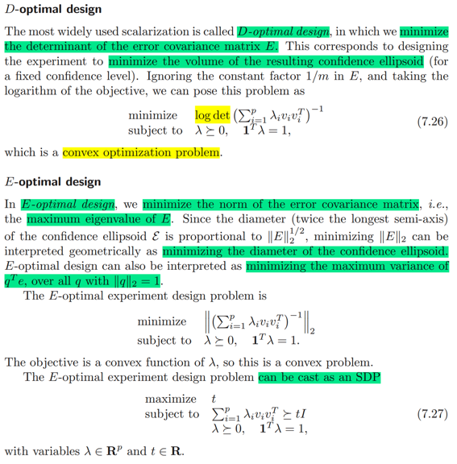</kbd></p>

<p align="center"><kbd>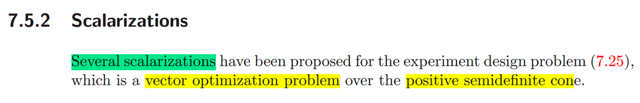</kbd></p>

<p align="center"><kbd>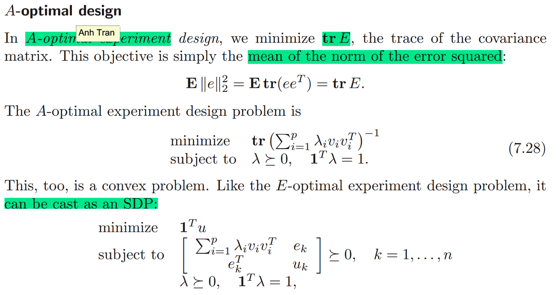</kbd></p>

> [!NOTE]
> Một số cách tiếp cận bài toán ExDe này theo phương pháp
> scalarization là phương pháp mà ta chuyển objective từ vector `/`
> matrix của bài toán vector optimization thành scalar objective. Và
> việc tìm optimal của bài toán này sẽ cho ta Pareto optimal của bài
> toán vector optimization
>
> Thế thì với objective f0(x) là vector, ta biết một cách scalarization
> tiêu chuẩn là chọn λ ∈ dual cone của K, tức K*. (bài toán vector
> optimization phải đi kèm với cone K nào đó) từ đó có scalar
> objective: λTf0(x)
>
> Còn ở đây objective là matrix E, nên có một số "cách" scalarization
>
> D-optimal design thì ta sẽ scalarize bằng cách dùng det của E,
> chính xác hơn là log det
>
> E-optimal thì dùng norm của E.
>
> E-optimal thì dùng norm của Trace E.
>
> ĐỌC KĨ HƠN SAU

<br>

<p align="center"><kbd>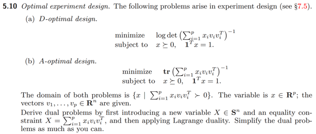</kbd></p>

> [!NOTE]
> a) minimize log det `[Σ` xi vi viT]_inv constraint x ≽ 0, 1Tx `=` 1
>
> dom f0: det `[Σ` xi vi vi T] phải dương nên `<=>` `Σ` xi vi viT phải
> positive definite. 
>
> Chuyển thành equivalent problem theo phương pháp giới
> thiệu thêm variable: X `=` `Σ` xi vi viT, thì ta sẽ có constraint cho
> X là X ≻ 0.
>
> Equivalent problem: minimize f0(X) `=` log det X constraint X ≻ 0
>
> Thế thì bài toán gốc có constraint x ≽ 0, tức mọi components
> cuả nó đều không âm và 1Tx `=` 1, tức tổng components của nó
> là 1.
>
> ```text
> Tr(u uT) = Σi (uuT)ii = u1u1 + u2u2 + ... = Σ (ui)^2 = uTu
> ```
>
> ```text
> Tr(X) = Tr[Σ xi viviT] = Σ xi tr(viviT) = Σ xi viTvi
> ```
>
> Vẫn chưa hiểu tại sao 1Tx `=` 1 dẫn đến constraint gì với Tr(X)?
>
> QUAY LẠI SAU

<br>

<p align="center"><kbd>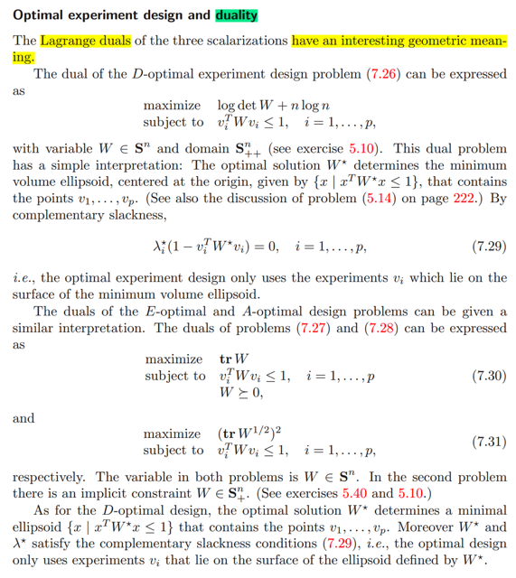</kbd></p>

> [!NOTE]
> QUAY LẠI SAU

<br>

<p align="center"><kbd>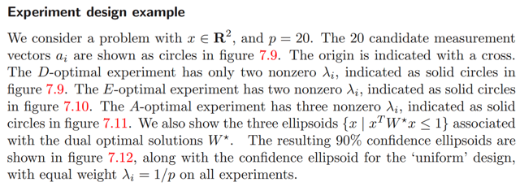</kbd></p>

<p align="center"><kbd>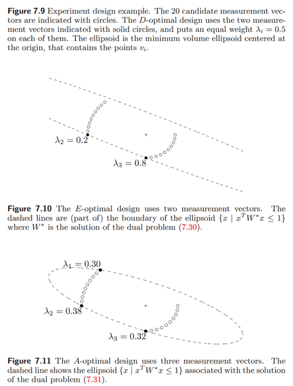</kbd></p>

<p align="center"><kbd>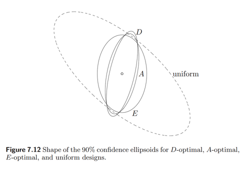</kbd></p>

> [!NOTE]
> QUAY LẠI SAU

<br>

<p align="center"><kbd>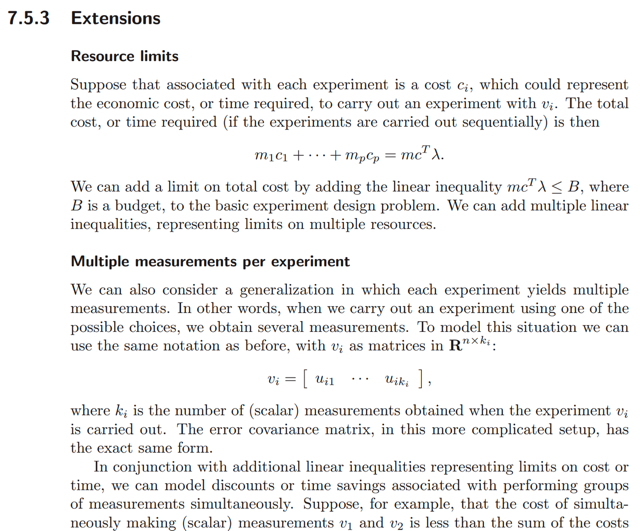</kbd></p>

<p align="center"><kbd>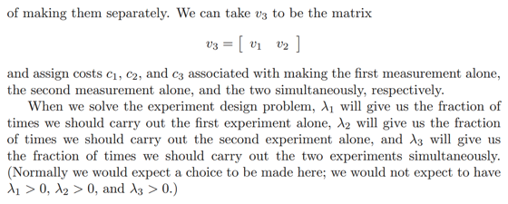</kbd></p>

> [!NOTE]
> QUAY LẠI SAU

<br>

