# Lec 2

📊 **Progress:** `34` Notes | `49` Screenshots | `0` AI Reviews

---

<kbd>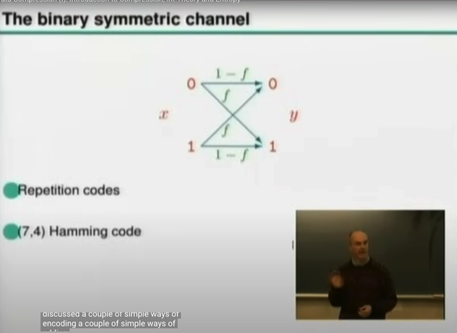</kbd>

> [!NOTE]
> gs nhắc lại bài trước ta đã thảo luận về việc transmit signal thông qua
> unreliable channel. Trong đó ta dùng ví dụ bài toán binary symmetric
> channel, trong đó một bit có thể bị flip với xác suất f.
>
> Để thông qua đó ta xem xét phương pháp dùng encoder để add thêm
> redundancy và decoder để decode thông tin.
>
> Với hai cách làm là Repetition codes và 74 Hamming code

 

<kbd>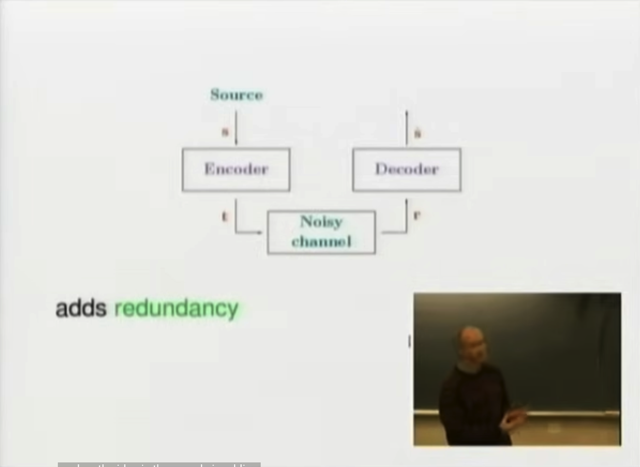</kbd>

 

<kbd>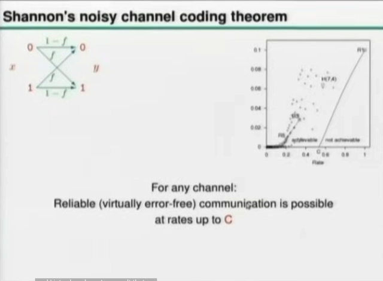</kbd>

> [!NOTE]
> và cuối cùng ta đã biết về một theorem bởi Shannon, nói rằng
> tồn tại một cách thức encoding thông tin để có thể đạt được 
> error rate nhỏ tùy ý.

 

<kbd>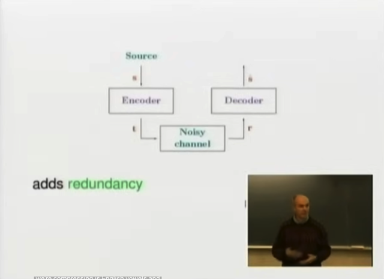</kbd>

> [!NOTE]
> gs cho rằng ta sẽ chứng minh theorem này sau, nhưng ta sẽ tiếp tục
> tìm hiểu xem nó fit vào bức tranh tổng thể vấn đề ta đang quan tâm như
> thế nào
>
> Thế thì gs cho biết, thật ra real source data (tạm hiểu là những thông
> tin, dữ liệu thực tế, ngoài đời thực) THƯỜNG LÀ ĐÃ CHỨA ĐỪNG
> REDUNDANCY SẴN RỒI.
>
> Do đó có vẻ nhưng bước ADDING REDUNDANCY mà ta đã làm bữa
> trước không thật sự cần thiết khi bản thân thông tin đã có sẵn
> redundancy

 

<kbd>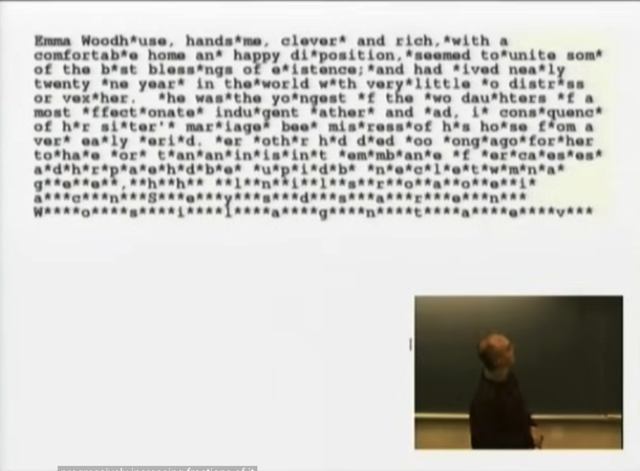</kbd>

> [!NOTE]
> Gs minh họa bằng đoạn text này, đại khái là dù bị che mất 1/3 số
> kí tự, nhưng về cơ bản là ta, VẪN CÓ THỂ ĐỌC và hiểu được.
>
> Đây là minh họa cho nhận định rằng thông tin ngoài đời thực thường
> đã tự nó chứa redundancy (chính vì vậy mà khi bỏ bớt ta vẫn đọc
> và hiểu thông tin)

 

<kbd>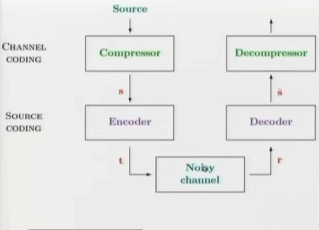</kbd>

> [!NOTE]
> Do đó người ta sẽ thiết kế hệ thống compress/decompress
> (Source coding) thông tin trước và sau khi encode và decode
> (channel coding) (thứ tự trong slide bị nhầm)

 

<kbd>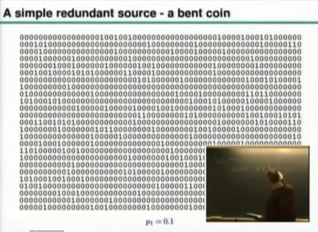</kbd>

 

<kbd>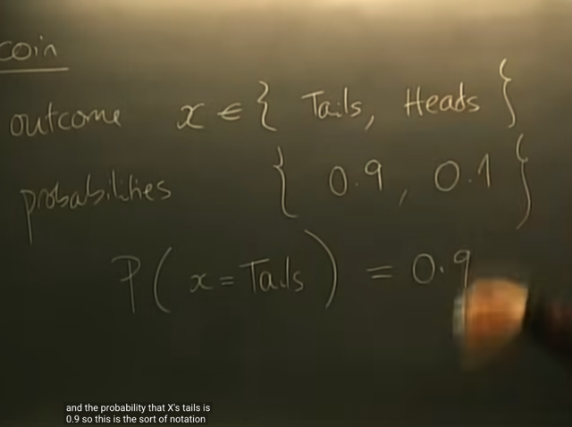</kbd>

> [!NOTE]
> Lấy ví dụ, x là r.v có 2 possible values là T, H (tung đồng xu)
> với xác suất P(x=T) = 0.9 và P(x=H) = 0.1
>
> Gs sẽ dùng ví dụ này, để ta "làm", đại khái là ta có một source
> data có chứa redundancy lí tưởng, ví dụ như 1000 số 0,1 như
> hình bên. Để rồi ta sẽ bàn để việc compress / decompress

 

<kbd>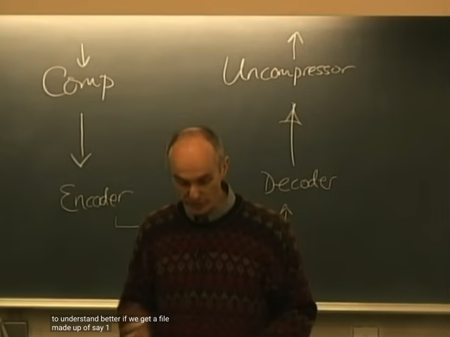</kbd>

> [!NOTE]
> Câu hỏi là, giả sử ta nhận được một chuỗi có 1000 số 0, 1 như vậy
> thì 
>
> "Lượng thông tin chứa trong đó là bao nhiêu?"
>
> "Ta sẽ compress nó như thế nào?"
>
> "Ta nên / có thể compress nó nhỏ đến mức nào?"

 

<kbd>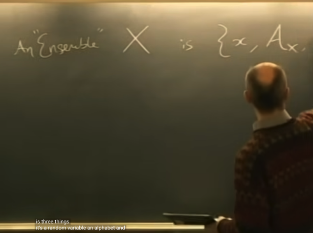</kbd>

<kbd>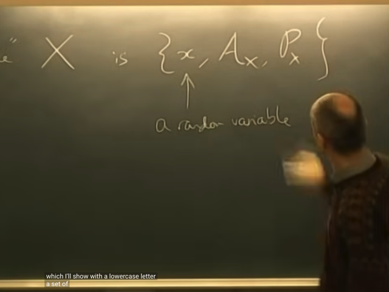</kbd>

<kbd>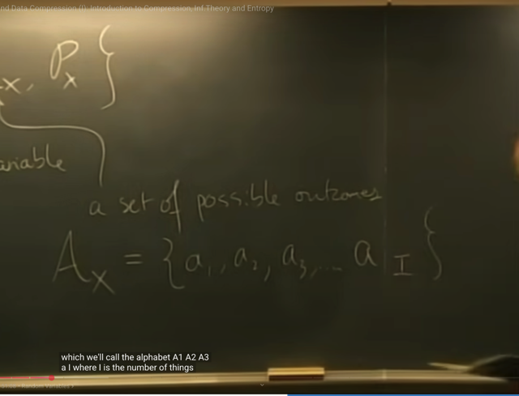</kbd>

<kbd>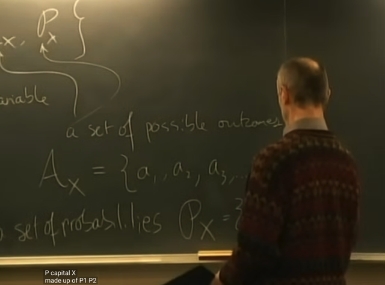</kbd>

<kbd>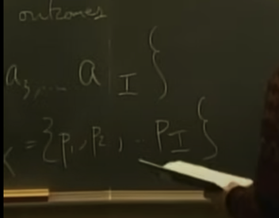</kbd>

<kbd>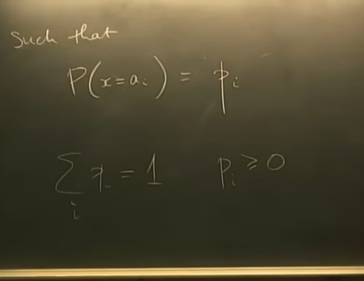</kbd>

> [!NOTE]
> Và đại khái ta sẽ khái quát hơn X = x, Ax, Px với 
>
> x: Random variable x, có nhiều possible values thay vì chỉ 2 possible values H, T
>
> Ax là set các possible values a1, ...aI và 
>
> Px là set các xác suất PX = p1, p2....pI
>
> Sao cho P(x=ai) = pi

 

<kbd>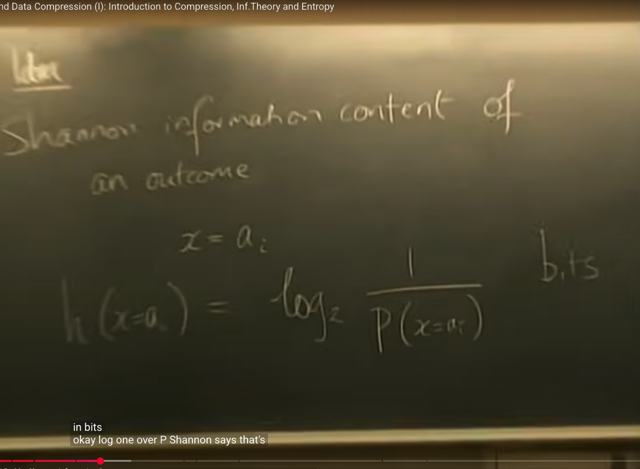</kbd>

> [!NOTE]
> Và điều ta sẽ làm là: thảo luận về idea của Shannon: gọi là Shannon
> INFORMATION CONTENT of an outcome:
>
> Ví dụ x = ai, là một event, một subset chứa các possible
> outcome được map  với ai s: x(s) = ai như đã biết
>
> Thì h(x=ai) (là information content của outcome x=ai) sẽ
> được tính  theo công thức
>
> h(x=ai) = log base 2 của 1/P(x=ai) 
>
> Và cái này có đơn vị là bits

 

<kbd>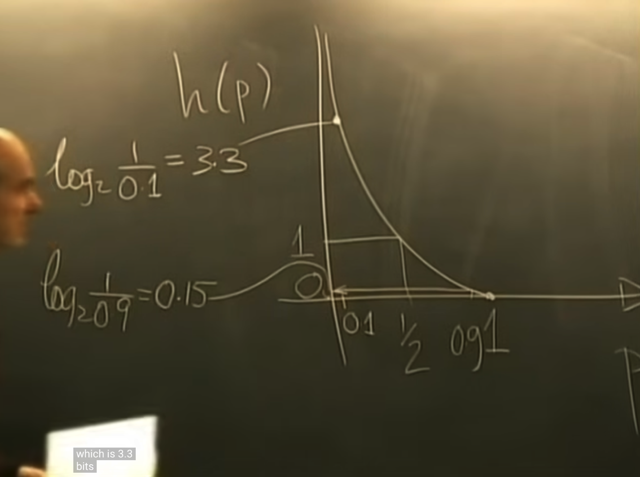</kbd>

> [!NOTE]
> Và theo công thức đó, thì ta có đồ thị này
>
> Giả sử xét đồng bent coin hồi nãy khi xác suất có mặt T là 0.9
> mặt H là 0.1
>
> Thì nếu mặt T xảy ra, thì "lượng thông tin" 
>
> (information content) của outcome này sẽ là log base 2 của 1/0.9, 
> chỉ có 0.15
>
> Còn nếu mặt H xảy ra, thì lượng thông tin của outcome này mang lại
> sẽ là log base 2 của 1/0.1 = 3.3
>
> Nếu một outcome có xác suất xảy ra là 50% thì lượng thông tin của
> nó là log base 2 của 1/0.5 = 1

 

<kbd></kbd>

<kbd>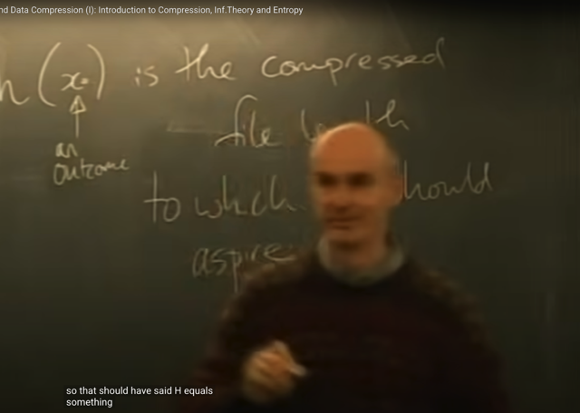</kbd>

> [!NOTE]
> Và Shannon còn tuyên bố rằng (claim) h(x) chính là kích thước của
> compressed file mà ta nên hướng tới
>
> x là một outcome (event cũng chỉ là set các outcome) và ta nên hiểu ý
> là h(x=...) tức là lượng thông tin mà một outcome mang theo

 

<kbd>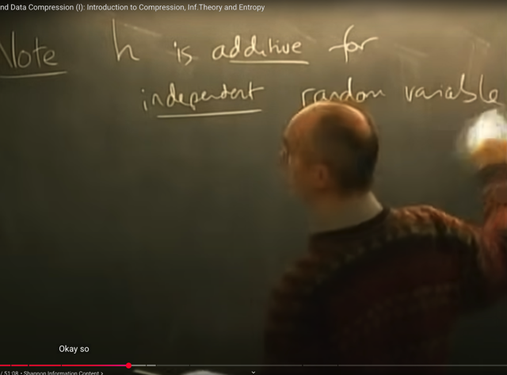</kbd>

> [!NOTE]
> Một vài ghi chú
>
> Thứ nhất h (function tính, hay đo lường đại lượng information 
> content) là có tính ADDITIVE với các INDEPENDENT r.vs

 

<kbd>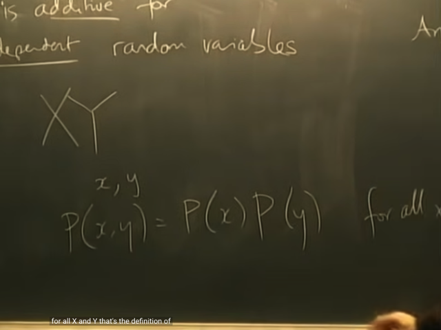</kbd>

> [!NOTE]
> Như đã biết, nếu x, y là các r.vs độc lập thì joint distribution P(x,y)
> ở đây có thể là PMF P(x=xi, y=yj) sẽ bằng tích các marginal PMF:
>
> P(x=xi, y=yj) = P(x=xi)*P(y=yj) với mọi possible values của x, y
>
> Hoặc với PDF thì cũng vậy Joint PDF f_x,y (x,y) = tích các Marginal PDF:
>
> f_x,y (x,y) = f_x(x) * f_y(y)
>
> (chú ý nhớ rằng ở đây x, y viết thường là r.v, không như Stat110
> để rv là viết hoa X,Y)

 

<kbd>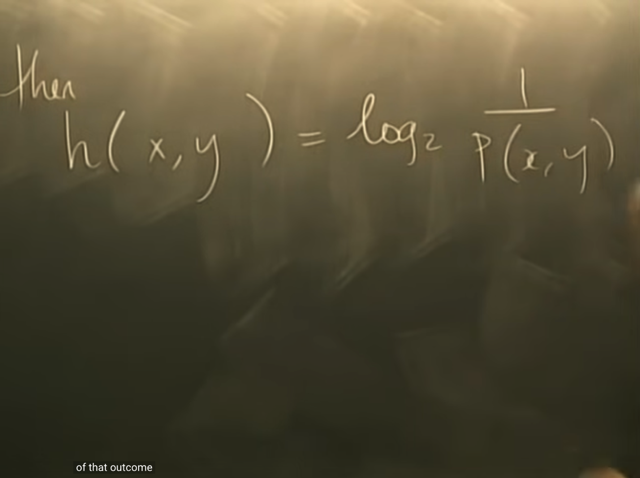</kbd>

<kbd>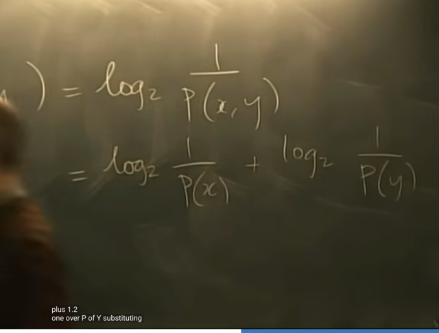</kbd>

> [!NOTE]
> Khi đó h(x,y) (mà ta hiểu là h(x=xi, y=yj) là information content chứa trong "joint event" 
> (x=xi, y=yj) sẽ tính bằng:
>
> h(x,y) = log2 1/P(x,y) = log2 1/[P(x)P(y)] = log2 1/P(x) + log2 1/P(y) = h(x) + h(y) 
>
> Đây là lí do nếu x, y độc lập thì h có tính additive.
>
> Nếu x, y độc lập thì h có tính additive

 

<kbd>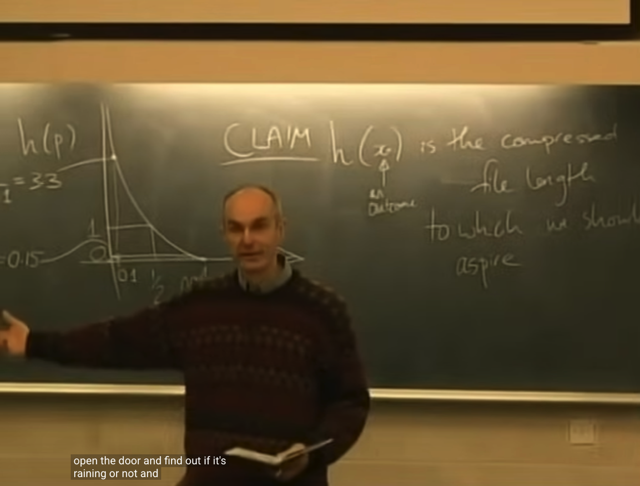</kbd>

> [!NOTE]
> Và ta hiểu cái này giống như giả sử gs tung đồng xu (để có
> outcome là giá trị của x) và ông mở cửa ra xem trời có mưa
> không (y) thì dễ thấy vì hai chuyện này ko liên quan gì nhau.
>
> Nên đại khái là lượng thông tin mà ta có khi gs nói cho ta cả hai kết
> quả cùng lúc (coin ra mặt gì, và trời có mưa không) thì cũng bằng
> lượng thông tin  khi ông nói cho ta lần lượt từng thứ

 

<kbd>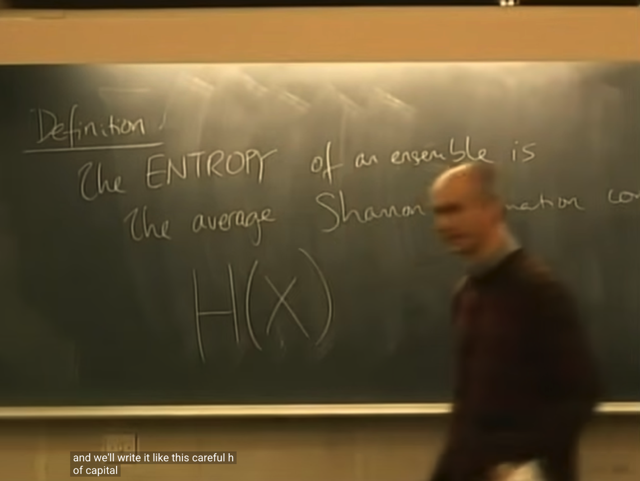</kbd>

<kbd>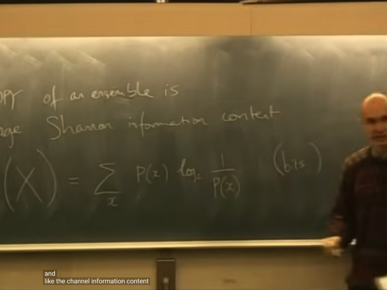</kbd>

> [!NOTE]
> Và ta học qua một định nghĩa nữa, là ENTROPY (của một ensemble*)
>
> (*) Cứ hiểu ensemble là x, Ax, Px với x là r.v, Ax là set các possible values của x
> và Px là set chứa giá trị xác suất mà rv mang possible values trong Ax
>
> Thế thì định nghĩa của ENTROPY, CHÍNH LÀ AVERAGE (MEAN) CỦA SHANON INFORMATION
> CONTENT.
>
> Và với mean, thì ta liên hệ tới Expected value. Vậy có thể hiểu ta sẽ weighted sum các h(x)
> với weight là xác suất mà x mang giá trị khả dĩ
>
> H(X) = Σi P(x=xi) log2 1/P(x=xi)
>
> ENTROPY, CHÍNH LÀ AVERAGE (MEAN) CỦA SHANON INFORMATION
> CONTENT.
>
> H(X) = Σi P(x=xi) log2 1/P(x=xi)

 

<kbd>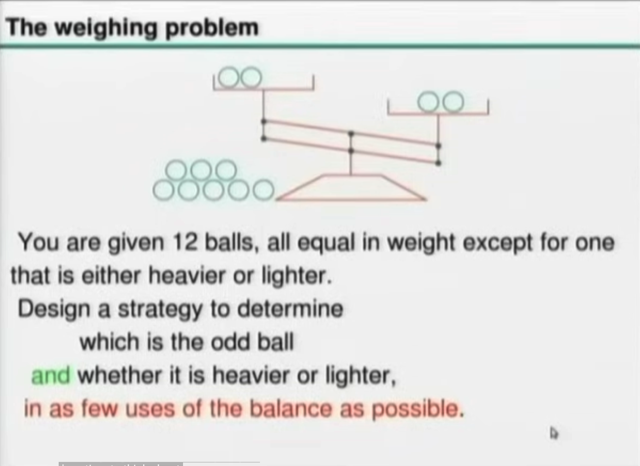</kbd>

> [!NOTE]
> Thế thì gs nói về bài toán này, cho 12 balls, trừ 1 trái nặng hơn hoặc
> nhẹ hơn thì 11 trái kia đều bằng nhau. Yêu cầu là thiết kế một chiến
> lược để sao cho nhanh nhất xác định xem đâu là 1 trái ngoại lệ. Và
> trong đó thì nó nặng hơn hay nhẹ hơn?
>
> Thử nghĩ:
>
> Chia làm 3 (nhóm 4 trái). Cân 2 lần là đủ biết banh x nằm ở nhóm
> nào:
>
> Giả sử cân nhóm 1,2 mà bằng nhau thì suy ra ngay banh x nằm ở
> nhóm 3.
>
> Giả sử 1>2:
>
> Cân tiếp (1,3) hoặc (2,3) thì: 
>
> + (1>3) thì suy ra banh x trongnhóm 1 và x nặng hơn, 
>
> + (1=3) thì suy ra banh x trong nhóm 2 và x nhẹ hơn. 
>
> (1<3 không thể xảy ra)
>
> Tương tự cân 2,3 cũng sẽ giúp suy luận tương tự.
>
> Nói chung là chia làm 3 và cân 2 lần là xác định được banh x nằm
> đâu.
>
> Thế thì nhóm còn 4 trái: Nhưng ta đã biết x nặng hơn hay nhẹ hơn.
> Vậy thì chia làm 2 cân 2 lần nữa là xác định được x.
>
> Vậy tốn 4 lần cân.

 

<kbd>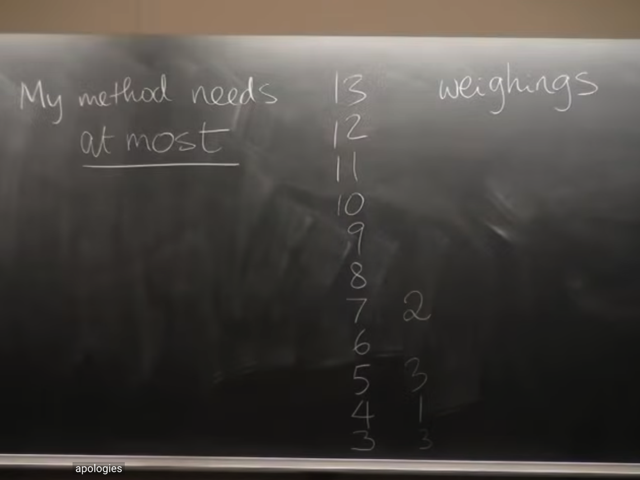</kbd>

> [!NOTE]
> đại khái là gs khảo sát các
> solution của student

 

<kbd>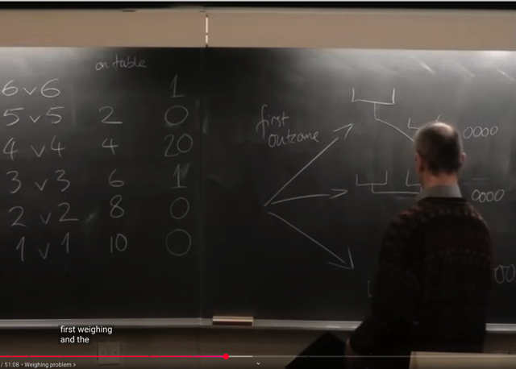</kbd>

> [!NOTE]
> Để rồi ta sẽ có các solution là trong lần cân đầu tiên, ta sẽ cân mấy
> trái (vs mấy trái)
>
> ví dụ 6v6 hay 5v5..
>
> Thì phương án của mình là 4v4, bởi khi đó nếu nó có kết quả bằng
> thì ngay lập tức mình sẽ biết banh x nằm trong nhóm còn lại
>
> Thế thì ý chính là, theo lí thuyết của Shannon, ta nên cân lần đầu
> sao cho có entropy cao nhất. Nên tiếp thep gs sẽ tính entropy của
> các phương án này

 

<kbd>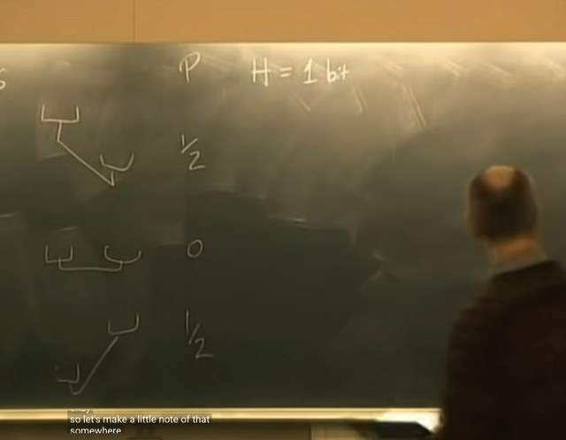</kbd>

> [!NOTE]
> Thế thì đầu tiên cân 6 vs 6. Sẽ dĩ nhiên là có 3 possible outcomes Xác
> suất (xảy ra mỗi outcome) là gì?
>
> Vì chỉ có 12 trái nên chia làm hai để cân thì chỉ có thể nghiêng bên này
> hoặc bên kia (xác suất bằng 1/2 = là xác suất mà banh x nằm bên này
> hoặc bên kia) không thể bằng nhau được.
>
> Vậy entropy là (1/2) log2 (1/0.5) + 0 + (1/2) log2 (1/0.5) = 1/2 + 1/2 = 1
> bit

 

<kbd>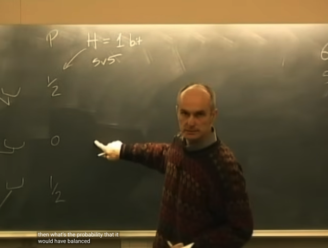</kbd>

> [!NOTE]
> Trường hợp 5 vs 5:
>
> Gs: Xác suất cân bằng nhau khi cân 5 trái mỗi bên?
>
> Thử nghĩ:
>
> Có thể xảy ra khả năng bằng nhau khi trái không bình thường nằm ở 
> ngoài hai nhóm này:
>
> Gọi hai trái ở ngoài là B1 và B2 thì xác suất cân bằng nhau là xác suất
> hai trái này chứa trái bất bình thường. B1=abnormal U B2 = abnormal
> P(B1=abnormal U B2 = abnormal) = P(B1=abnormal) + P(B2=abnormal)
> (do axiom 2: union của disjoint event)
>
> Và P(B1=abnormal) = 1/12: Event space 1: Sample space 12. Equally likely
>
> P(B2=abnormal) cũng vậy
>
> Vậy P(B1=abnormal U B2 = abnormal) = 2/12 = 1/6
>
> Vậy xác suất có sự bằng nhau khi cân 5vs5 là 1/6. Nên xác suất bị lệch
> một bên sẽ là 1 - 2/12 = 10/12, vì tính đối xứng nên đều bằng nhau:
>
> P(Trái<Phải) = P(Phải>Trái) = 5/12
>
> P(Trái=Phải) = 2/12

 

<kbd>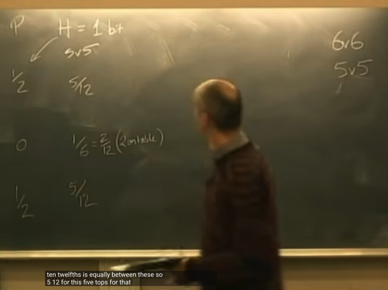</kbd>

<kbd>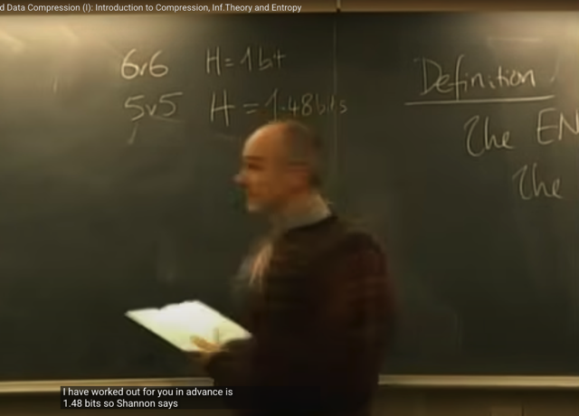</kbd>

> [!NOTE]
> Chính xác. Và entropy sẽ là:
>
> Như đã biết, entropy là weighted Σ của information content với weight là
> xác suất của outcome/event
>
> Σx P(X=x) H(x)
>
> (5/12) log_2 (12/5) + (2/12) log_2 (12/2) + (5/12) log_2 (12/5)
>
> = 1.48 bits
>
> Như vậy Shannon information content trong kết quả này là cao hơn
> so với kết qủa khi cân 2 nhóm 6 banh

 

<kbd>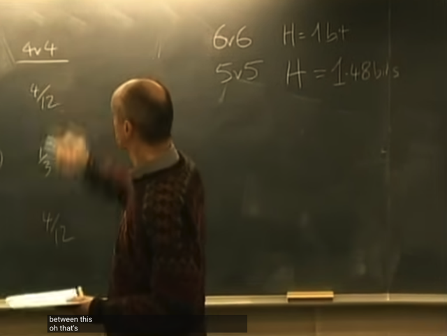</kbd>

> [!NOTE]
> Nếu cân hai nhóm 4 banh:
>
> Tương tự. Xác suất nhóm 4 banh ở ngoài chứa trái abnormal là (1/12)*4
> Gọi chúng là B1,B2, B3, B4: 
>
> P(U=1,2,3,4 B_i=abnormal) = Σi P(B_i abnormal)
>
> = 4 * 1/12 = 4/12
>
> => P (Trái=Phải) = 4/12
>
> P(Trái>Phải) = P(Phải<Trái) = (1/2) (1-4/12) = 4/12
>
> Cũng có thể tính cách khác: Có 3 nhóm 4 banh. Xác suất một nhóm có 
> abnormal ball: 1/3 => Xác suất cân bằng nhau: 1/3, Xác suất lệch trái 
> = Xác suất lệch phải là 1/3
>
> Và entropy là 1.58 bits

 

<kbd>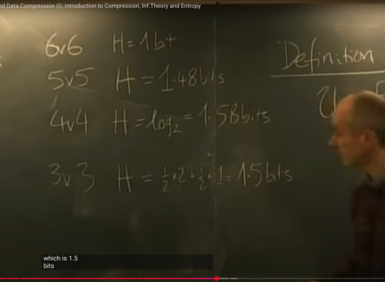</kbd>

> [!NOTE]
> Nếu cân 3vs3:
>
> Lập luận tương tự xác suất 6 trái ở ngoài có abnormal là 1/12 * 6 = 6/12
>
> P(Trái=Phải) = 6/12
>
> P(Trái>Phải) = P(Phải<Trái) = (1/2)(1-6/12) = 3/12
>
> Và Entropy sẽ là 1/2 * log_2 (12/6) + 2 * 3/12 log_2(12/3) = 1.5 bits

 

<kbd></kbd>

> [!NOTE]
> Vậy thì theo Shannon, ta sẽ nên cân group 4 vì kết quả của
> nó có Entropy cao nhất

 

<kbd>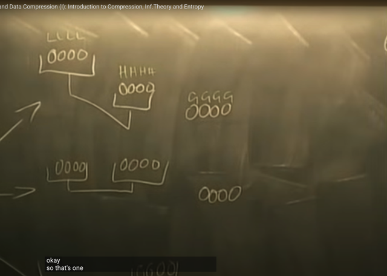</kbd>

> [!NOTE]
> Câu hỏi của gs là, giả sử ta có outcome Trái < Phải (như đã biết,
> outcome này có xác suất 4/12), thì làm gì tiếp.
>
> Gọi nhóm trái là LLLL, nhóm phải là HHHH. 
>
> Nhóm ở ngoài là GGGG

 

<kbd>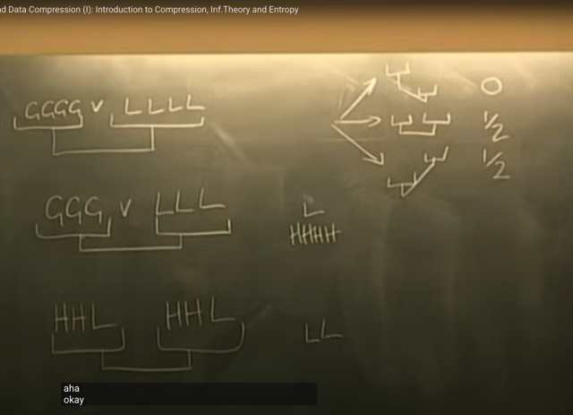</kbd>

<kbd>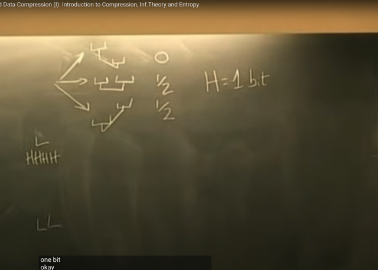</kbd>

> [!NOTE]
> Các sv cho vài solution.
>
> Check thử solution 1: Cân nhóm GGGG và LLLL
>
> ii) P(GGGG = LLLL):
>
> event (GGGG = LLLL) = "Odd ball nặng hơn bình thường"  
>
> vì nếu odd ball nặng hơn bình thường thì nó sẽ nằm trong HHHH khiến LLLL thực ra sẽ cũng là GGGG, để
> rồi cân sẽ bằng nhau. Ngược lại, nếu GGGG=LLLL ta sẽ suy ra odd ball nằm ở đám ngoài, mà ta đã biết đám
> đó nặng hơn nên suy ra odd ball nặng hơn bình thương.
>
> Thế thì xét P("Odd ball nặng hơn bình thường") đương nhiên là 1/2
>
> Vậy P(GGGG = LLLL) = P(abnormal ball nặng hơn bình thường") = 1/2
>
> ====
>
> Có thể lập luận cách khác. Ta chỉ cần để ý, với việc đã biết 4 trái good, thì xác suất của một trong 8 trái
> của hai nhóm LLLL, HHHH là odd sẽ là 1/8.
>
> Nên (GGGG=LLLL) đồng nghĩa banh odd nằm trong nhóm HHHH, và xác suất của việc banh odd nằm
> trong 4 trái HHHH sẽ là P(H1=odd U H2=odd U ...), dùng axiom 2 = ΣP(Hi = odd) = 4*1/8 = 4/8
>
>
> iii) P(GGGG > LLLL):
>
> event (GGGG > LLLL) sẽ xảy ra nếu event "odd ball nhẹ hơn" xảy ra. 
>
> và dĩ nhiên P("abnormal ball nhẹ hơn bình thường") = 1/2 nên P(GGGG>LLLL) = 1/2
>
> ====
>
> Tính theo cách hai, thì GGGG>LLLL = banh odd thuộc LLLL, => P(GGGG>LLLL) = P(Ui=1,2,3,4 L_i=odd)
>
> theo axiom 2 = Σi P(L_i=odd) = 4*(1/8) = 4/8
>
> i) Từ đó suy ra P(GGGG < LLLL) = 0
>
> =====
>
> Tính theo cách 2: GGGG<LLLL = banh odd nằm trong GGGG, mà event này không thể xảy ra => P = 0

 

<kbd>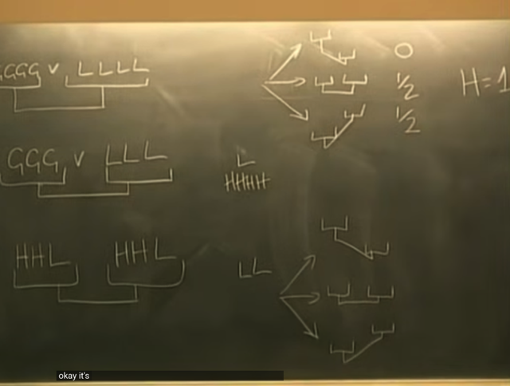</kbd>

<kbd>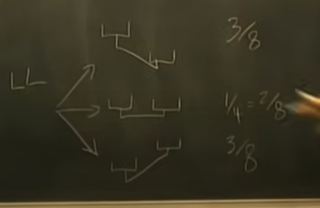</kbd>

> [!NOTE]
> Solution 2: Cân nhóm HHL và HHL (ý là, tạo hai nhóm mỗi nhóm có 2
> trái nghi ngờ nặng hơn, và 1 trái nghi ngờ nhẹ hơn.
>
> Khi đó ở ngoài còn 2 trái LL. Thì xác suất hai nhóm trên bằng nhau
> chính là xác suất của việc trái odd ball nằm trong một trong hai trái ở
> ngoài. Gọi hai trái ở ngoài là O1, O2.
>
> P(O1=odd U O2=odd) = P(O1=odd) + P(O2=odd) = 1/8 + 1/8 = 2/8
>
> P(O1=odd) = 1/8 là bởi ta biết 8 trái trong hai nhóm LLLL,HHHH sẽ
> có một banh odd.
>
> Xác suất cân bị lệch, vì tính đối xứng sẽ chia đều là 3/8 mỗi cái.
>
> Và cũng có thể tính lại: P(HHL < HHL) thì event này xảy ra khi
> Ht1 Ht2 Lt < Hp1 Hp2 odd ball là banh L bên trái hoặc banh H bên
> phải. Tức L1=odd U Hp1=odd U Hp2 = odd
>
> Và theo axiom 2: P(HHL < HHL) = P(L1=odd U Hp1=odd U Hp2 = odd)
>
> = P(L1=odd) + P(Hp1=odd) + P(Hp2 = odd)
>
> = 1/8 + 1/8 + 1/8 = 3/8
>
> Còn cái P(HHL > HHL) thì cũng y vậy

 

<kbd>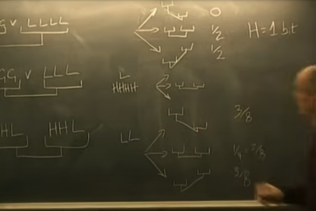</kbd>

> [!NOTE]
> Rồi, Solution 3: GGG vs LLL (L,HHHH ở ngoài)
>
> i) P(GGG=LLL): event này xảy ra khi odd bal nằm trong đám HHHH
> hoặc trong L ở ngoài.
>
> = Với 5 trái ở ngoài thì xác xuất odd là 1/8, và ta cũng dùng axiom 2
> để tính vì event 1 trong 5 trái này odd là union của 5 disjont event:
>
> P(GGG=LLL) = 1/8 + 1/8 + 1/8 + 1/8 + 1/8 = 5/8
>
> ii) P(GGG>LLL): event này xảy ra khi odd ball nằm trong 3 trái LLL:
> Tới đây thì hoàn toàn tính tương tự nãy h thôi: Axiom2, P(GGG>LLL) 
> = 3/8
>
> iii) P(GGG<LLL) = 0

 

<kbd>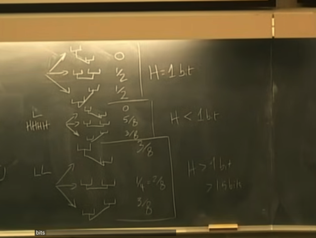</kbd>

 

<kbd>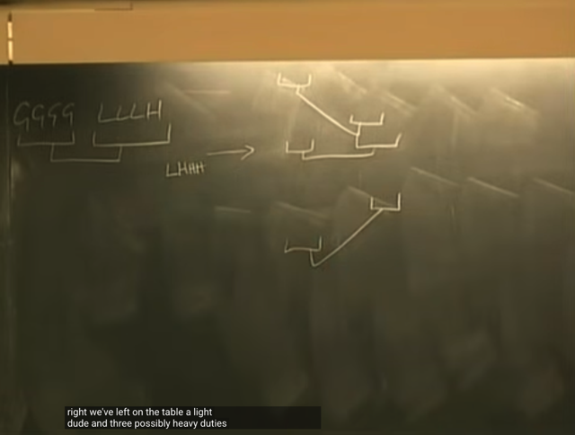</kbd>

> [!NOTE]
> Một solution khác:
>
> i) P(GGGG=LLLH): lập luận nhanh luôn, có 4 trái ở ngoài, xác suất
> mỗi trái là odd là 1/8 => xác suất odd nằm trong 4 trái đó là 4/8
>
> ii) P(GGGG<LLLH): Xảy ra khi trái H là odd: P(GGGG<LLLH)= 1/8
>
> iii)P(GGGG>LLLH): Xảy ra khi 1 trong 3 trái LLL là odd:
> P(GGGG>LLLH) = 3/8

 

<kbd>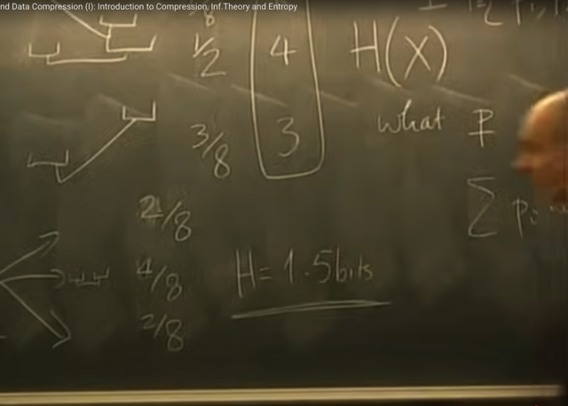</kbd>

> [!NOTE]
> Một solution khác nữa. Cũng
> dễ ko cần note làm gì

 

<kbd>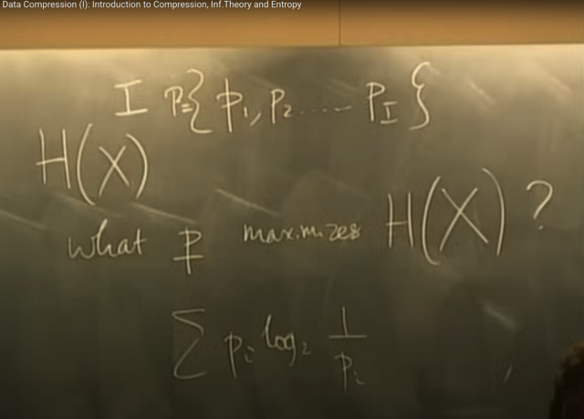</kbd>

> [!NOTE]
> Thế thì, đại khái là ta có thể tính entropy của các solution nãy giờ
> bằng công thức như đã.
>
> Nhưng gs đặt vấn đề khái quát luôn, rằng giả sử ta có p là set 
> các giá trị xác suất p1, p2....pI.
>
> Thì vector p như thế nào để maximize H(X)?
>
> Gs nói câu trả lời của Shannon là uniform, tức là vector P chứa 
> các xác suất p1, p2...làm nên một phân phối xác suất thì nếu 
> nó là uniform distribution thì Entropy sẽ max

 

<kbd>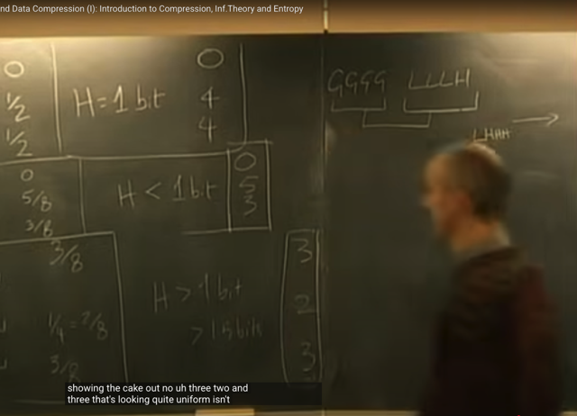</kbd>

> [!NOTE]
> Nhưng đại ý là, phương án nào mà phân phối xác suất gần với
> uniform nhất sẽ entropy cao nhất.
>
> Và trong mấy cái này thì solution cho ra xác suất của 3 kết qủa là 3/8
> 2/8 3/8 sẽ là cái gần với Uniform distribution nhất.
>
> Và ông nói nếu ta làm theo chiến lược này, thì ta có thể giải xong
> trong 3 lần cân

 

<kbd>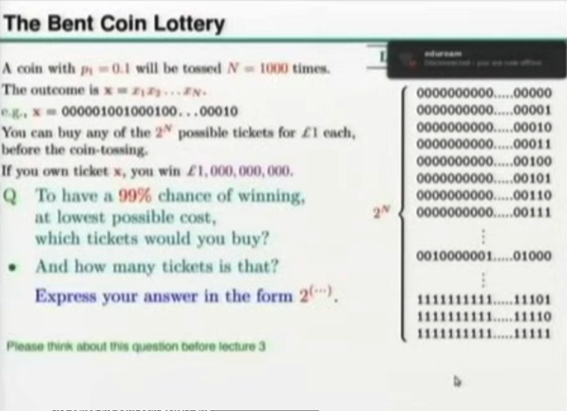</kbd>

> [!NOTE]
> Gs nói đọc chap 2,4 và suy nghĩ bài toán này cho bài sau

 

<kbd>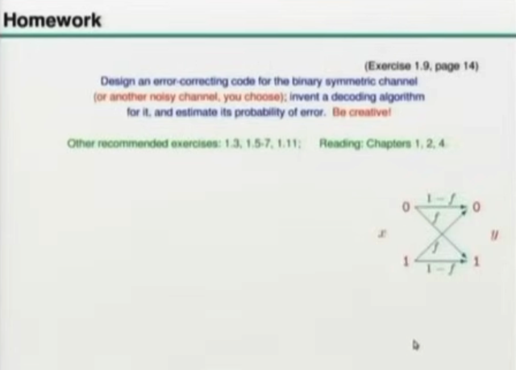</kbd>

 

