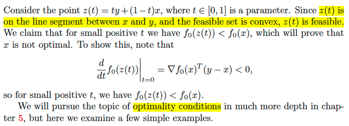

# Lec 5

📊 **Progress:** `61` Notes | `82` Screenshots | `4` AI Reviews

---

<kbd></kbd>

> [!NOTE]
> Tuần này ta có thể install Python để bắt đầu code.
> Nhớ làm homework

 

### Log concave & Log convex function

<kbd></kbd>

> [!NOTE]
> Log concave & Log convex function
>
> đại khái là nói về **log concave function** gs cho rằng cái này nó xuất hiện rất nhiều, nhiều hơn hẳn so với log convex.
>
> Về định nghĩa thì một function f gọi là log concave **nếu log f là concave** function:
>
> f(mixture của x, y) ≥ f(x)^θ f(y)^(1-θ) 
>
> (f(x)^θ f(y)^(1-θ) gọi là **weighted arithmetic mean**
>
> (ta đã biết mixture hay convex combination hay line segment, của x, y là khi θx + (1-θ)y với θ nằm trong khoảng [0,1])
>
> Nếu θ = 1/2 thì nó gọi là **geometric mean**
>
> Một ví dụ là **pdf của multi-variate normal**. 
>
> f(x) = [1/√(2π)^n det Σ] e^(-1/2)(x-x_bar)T Σinv (x-x_bar)
>
> Chưa hiểu lắm, nhưng gs nói ta có thể check bằng cách lấy log của nó và xem kết quả là convex (thì f sẽ là log convex) hay concave (thì f sẽ là log concave)
>
> Lấy log f ta sẽ có: 
>
> log [1/√(2π)^n det Σ] e^(-1/2)(x-x_bar)T Σinv (x-x_bar)
>
> Đưa constant ra ngoài.
>
> log [1/√(2π)^n det Σ] + log e^(-1/2)(x-x_bar)T Σinv (x-x_bar)  | log uv = log u + log v
>
> = log [1/√(2π)^n det Σ] - [(1/2)(x-x_bar)T Σinv (x-x_bar)]     |  log e^a = a
>
> Ta có function (1/2)(x-x_bar)T Σinv (x-x_bar) là quadratic form. 
>
> Và Hessian matrix sẽ dễ chứng minh chính là Σinv và nó là matrix diagonal có các entries là 1/σ^2 với σ^2 là variance của các random variables nên sẽ không âm ⇨ mọi eigenvalues đều không âm
>
> Do đó, đây là positive semidefinite matrix. Và từ đó function là convex.
>
> Có thể hiểu Σ là covariance matrix, là diagonal matrix: diag([σ1^2, ...σn^2])
>
> Để rồi từ đó Σinv đương nhiên sẽ là diag([1/σ1^2, ..., 1/σn^2]). Đơn giản là bởi diag([σ1^2, ...σn^2]) diag([1/σ1^2, ..., 1/σn^2]) = I
>
> ⇨ với dấu âm thì nó sẽ là concave.
>
> Vậy f là log concave
>
> CHAPTER 3.4 - LOG CONCAVE &
> LOG CONVEX
>
> LOG CONCAVE & LOG CONVEX

 

#### cdf của Gaussian

<kbd></kbd>

> [!NOTE]
> một ví dụ nữa mà gs cho rằng trong homework. đó là cdf của Gaussian, cũng là log concave.
>
> Và có quy tắc chung là cdf của các density function có tính log concave cũng là log concave

 

##### Một số tính chất của log-concave function.

<kbd></kbd>

> [!NOTE]
> Một số tính chất của log-concave function.
>
> Gs chỉ nói sơ. Đầu tiên là nếu ta có function khả vi hai lần (twice differentiable) với convex domain. Thì nó sẽ **log-concave khi và chỉ khi f(x) ∇^2f(x) ⪯ ∇f(x) ∇fT**
>
> Gs đề nghị ta để ý vế phải là **outer product của gradient vector**. Và không khó để thấy nhờ đã học 1806, nó là **rank 1 matrix**. Để rồi ông nói **có một sự thật rằng nếu một matrix ⪯ rank 1 matrix thì nó sẽ không thể có quá 1 positive eigenvalue**
>
> Hai tính chất sau là:
>
> **Tích của hai log-concave function cũng sẽ là log concave**
>
> **Tổng của hai log-concave function thì chưa chắc là log concave**
>
> Integration: Nếu có function log concave, ví dụ như function hai biến x, y
>
> Thì bằng cách **integration over mọi giá trị của một biến thì ta sẽ cũng có log concave
> function**
>
> PROPERTIES OF LOG-CONCAVE FUNCTIONS

 

- **Một số hệ quả**

<kbd></kbd>

> [!NOTE]
> Một số hệ quả của các tính chất vừa rồi, là nếu ta có **hai rv có pdf có tính log concave. Thì tổng của chúng, sẽ là rv có pdf cũng log concave.**
>
> Hệ quả nữa đó là nếu ta có **set C convex set và y là random variable với log-concave pdf. Thì khi đó f(x) = P(x+y ∈ C) sẽ là một log concave function theo x**
>
> Biết sơ vậy thôi

 

- **Yield function**

<kbd></kbd>

<kbd></kbd>

> [!NOTE]
> Ta sẽ gặp là và hiểu về Yield function sau, khúc này chưa hiểu lắm

 

<kbd></kbd>

 

- **Convexity with respect to generalized inequalities**

<kbd></kbd>

> [!NOTE]
> Qua nội dung này "Convexity with respect to generalized inequalities"
>
> Nó nói rằng, ta có **vector function f R^n -> R^m**
>
> Và có một cái **giống như Jensen's inequality nhưng chỉ khác là hai vế là vector**.
>
> f(θx+(1-θ)y) ⪯K θf(x) + (1-θ)f(y)
>
> Để rồi dấu "bé hơn hoặc bằng" ở đây sẽ là ⪯K có ý nghĩa đã biết đó là nếu **x ⪯K y thì y - x phải thuộc cone K.**
>
> function f gọi là **k-convex** nếu **domain của nó convex** và nó **thỏa f(θx+(1-θ)y) ⪯K θf(x) + (1-θ)f(y)**
>
> Ví dụ cho hàm f S^m →S^^m tức là hàm f take input là **symmetric
> matrix mxm và output symmetric matrix mxm**
>
> Cụ thể f(X) = X^2. Thì ta sẽ nói f là hàm "S^m+ convex" 
>
> Chưa hiểu phần chứng minh lắm, quay lại sau
>
> CHAPTER 3.4 - CONVEXITY WRT
> GENERALIZED INEQUALITIES

 

- **"đã đi qua những kiến thức toán khô khan nhưng cần thiết"**

<kbd></kbd>

> [!NOTE]
> gs nói tới đây là ta đã đi qua những kiến thức toán khô khan nhưng cần thiết để bắt đầu thấy ứng dụng của nó, đề nghị **đọc Chapter 1,2,3**
>
> Và ông cho rằng, **convex problem là bài toán có thể giải được**
> (tractable)

 

- **convex optimization problem**

<kbd></kbd>

> [!NOTE]
> Tiếp theo ta sẽ luớt qua nói sâu hơn về **CONVEX
> OPTIMIZATION PROBLEM**
>
> CHAPTER 4 - CONVEX
> OPTIMIZATION PROBLEM
>
> 4.1 OPTIMIZATION PROBLEM

 

- **Optimization in standard form**

<kbd></kbd>

> [!NOTE]
> Optimization in standard form
>
> Đầu tiên ông nói vè **bài toán tối ưu ở dạng tiêu chuẩn** (standard form) 
>
> ông lưu ý ta rằng min và minimize là hai thứ khác nhau.
>
> Thế thì bài toán là ta muốn minimize f0(x) gọi là **objective function** nhưng với constrains có thể là equalities hoặc inequalities (nôm na là muốn minimize objective nhưng **ràng buộc bởi (list) các đẳng thức hi(x) = 0 hoặc list các bất đẳng thức fi(x) ≤ 0 hoặc cả hai)**
>
> ? inequalities có thể bao gồm ≥ ko? Gs: Yes. Chỉ việc chuyển thành dạng "≤" 
>
> ====
>
> Và **optimal value**, được định nghĩa chính là **giá trị nhỏ nhất** (kí hiệu inf = infimum, gs cho rằng cứ hiểu là minimum) **của objective function f0(x)** sao cho **x vẫn thỏa các equalities hi(x) = 0 và các inequalities fi(x) ≤ 0**
>
> p* = inf {f0(x) | fi(x) ≤ 0, i=1,2..m; hi(x) = 0, i=1,2...p} = f0(x*)
>
> Gs lưu ý thêm đây là p_"star", kí hiệu cho optimal. Còn "asterrisk" thì kí hiệu dành cho "conjugate" (đọc thì khác thôi chứ cũng chung là một kí hiệu)
>
>
> Và nếu **tồn tại x khiến thỏa các constraints, thì ta gọi vấn đề là feasible** (feasible problem)
>
> Còn nếu không, tức là không có x nào khiến thỏa các constrains thì ta gọi vấn đề là **(infeasible problem)**
>
> Và khi đó việc tối ưu với tập rỗng thì  **by convention, thì minimum của một empty set là infinity**
>
> Và case còn lại là "**unbounded below**" p* = -inf : hiểu nôm na là **tồn tại x khiến thỏa các constrained** nhưng **muốn f0(x) nhỏ cỡ nào cũng được không có giới hạn**. 
>
> Hay **có thể thỏa các constrains nhưng không thể tìm được f0(x) nhỏ nhất**

 

- **(Sách) 4.1 Optimization problem - Basis terminology**

<kbd></kbd>

<kbd></kbd>

> [!NOTE]
> (Sách) 4.1 Optimization problem - Basis terminology
>
> Trong sách chỉ nói thêm về **domain của problem d**, được định nghĩa là** intersection của domain của các objective & constraint functions**. 
>
> Và dĩ nhiên **trước khi x là optimal** thì (tức khiến f0(x) nhỏ nhất) thì **nó phải feasible** (thỏa constraint) 
>
> và **trước khi thỏa constraint thì nó phải thuộc domain của problem nữa**. 
>
> Và cái này trong bài gs gọi là một dạng **implicit constraint**, ràng buộc ẩn, đối nghịch với explicit constraint (fi(x) ≤ 0, hi(x) = 0)
>
> Có một điểm đáng để ý nữa. Có hai cách nói tuy gần nhau nhưng hơi khác về optimal point:
>
> Mình hay nói rằng **optimal của problem là x thỏa constraint và mà minimize f0(x).**
>
> Thì **có thể nói theo cách khác**, theo optimal value p*:
>
> Bằng cách nói định nghĩa của p* trước: **p* là giá trị nhỏ nhất của f0(x) với mọi x thuộc feasible set**. 
>
> Và từ đó **optimal point x* là tập những điểm trong feasible set khiến f0(x) có giá trị optimal value p***
>
> Thật ra **cách định nghĩa sau tốt hơn**, giúp dễ thấy rằng **optimal point có thể có nhiều, làm thành nên một set là optimal set.**
>
> Bên cạnh đó, việc định nghiã như thế này còn giúp bao hàm một trường hợp mà **tuy ta có optimal value p* nhưng lại không có optimal point**
>
> 4.1 OPTIMIZATION PROBLEMS
>
> 4.1.1 BASIS TERMINOLOGY

 

- **X_opt là set các optimal points**

<kbd></kbd>

> [!NOTE]
> Ta qua thêm vài định nghĩa: x gọi là feasible nếu nó nằm trong domain của f0 (có nghĩa là có xác định f0(x)) và đồng thời như vừa nói, đó là nó thỏa các constrains
>
> Thế thì **khi có x feasible, thì cái nào khiến f0(x) mang optimal value p* thì đó là optimal point**
>
> Và **X_opt là set các optimal points** (có thể có nhiều optimal points)
>
> Còn local optimal thì đại khái là nếu tồn tại một khoảng R nào đó
> mà khi tìm trong đó (thể hiện bởi constraint ||z-x|| <= R) thì ta được f0(x)
> nhỏ nhất và x vẫn thỏa các constraint thì x là local optimal
>
> OPTIMAL POINTS &
> LOCALLY OPTIMAL POINTS

 

- **Các khái niệm như unattainable & unsolvable, ε-suboptimal**

<kbd></kbd>

> [!NOTE]
> Các khái niệm như unattainable & unsolvable, ε-suboptimal
>
> Trong nói thêm về khả năng **optimal set rỗng**: 
>
> Tức là **tuy ta có optimal value p*, nhưng không có x nào giúp f0(x) đạt gía trị này**. 
>
> Khi đó problem gọi là **unattainable & unsolvable**
>
> (nó khác hai trường hợp p* = +∞, là tập feasible set rỗng, và p* = -∞, là problem unbound below khi việc tối ưu sẽ đẩy hàm f0 xuống vô cùng)
>
> Sau đó đề cập đến khái niệm **ε-suboptimal**, hiểu nôm na là:
>
> **nếu x* là ε-suboptimal thì f0(x) chỉ cách p* một khoảng nhỏ từ ε trở xuống**:
>
> Mà dĩ nhiên là p* là nhỏ hơn f0(x*) nên điều này tương đương
>
> f0(x*) - p* ≤ ε hay f0(x*) ≤ p* + ε 
>
> Và mọi x thỏa như vậy tạo nên **ε-suboptimal set**
>
> Hình dung cái đáy bát paraboloid, chính giữa đáy ở độ sâu sâu nhất p*, thì cái vùng hình tròn (hay elipse) quanh đáy mà tại đó, ta leo lên không cao quá p* + ε, thì đó chính là ε-suboptimal set.
>
> ====
>
> Qua khái niệm local optimal thì trong bài đã nói rồi
>
> Ngoài ra còn vài khái niệm như active / inactive và redundant constraint, cũng ko có gì khó

 

- **Một số ví dụ unbounded below,**

<kbd></kbd>

> [!NOTE]
> hàm f0(x) = x^3 - 3x. sẽ có p* = -∞ vì **ko có constrain nào thì x càng nhỏ thì f0(x) càng nhỏ**, nên bài toán này thuộc diện **unbounded below**, **không có optimal point**
>
> Nhưng **nếu quy định trong đoạn -1,1 thôi thì khi đó local optimal là +1** vì trong đoạn này tại đó thì f0(x) nhỏ nhất.
>
> Một số ví dụ khác:
>
> f0(x) = 1/x thì vì hàm số này sẽ giảm dần về 0, tiệm cận 0 khi x → inf nên **ko có x nào khiến f0(x) nhỏ nhất cả**. 
>
> Nên **p*=0 tức optimal value = 0** nhưng **không có optimal point**, cái này trong sách
> gọi là "**unattainable**"

 

- **Implicit constraint: x phải nằm trong phần giao của các domain của hi,fi. Và đây gọi là domain của problem**

<kbd></kbd>

> [!NOTE]
> Implicit constraint: x phải nằm trong phần giao của các domain của hi,fi. Và đây gọi là domain của problem
>
> Nói về constrains, đại khái là những cái constraint hi(x)=0, fi(x)≤0 kiểu như là những **constrain rõ ràng, thấy rõ**. Nhưng ngoài ra, **ngầm ẩn (implicit) trong đó còn một loại constrain khác**.
>
> Đó là **x phải nằm trong domain của fi, hi**
>
>  Cái này ko có gì khó hiểu, bởi lẽ nếu x ko nằm trong miền xác định của các constraint function thì thậm chí nó còn tệ hơn là không thỏa các constrain đó nữa.
>
> Do đó implicit constraint là **x phải nằm trong phần giao của các domain của hi,fi. Và đây gọi là domain của problem**.
>
> Nó giống như khi ta ghi f(x) = 1/x thì ngay lập tức phải ngầm quy định rằng x phải khác 0 để hàm xác định vậy
>
> Nói ngắn gọn, là trước khi muốn check xem x có thỏa các constraint hi,fi hay không thì đầu tiên NÓ PHẢI khiến check được cái đã
>
> Và **khi không có explicit constrain** (chỉ optimize objective function) thì ta **gọi là unconstrained problem**.
>
> Ví dụ ở dưới là một unconstrained problem nhưng dễ hiểu là vì ta có hàm log, mà với **hàm log thì miền xác định là x phải dương** nên ta có **implicit constraints là aiTx < b**
>
> IMPLICIT CONSTRAINT

 

- **Khái niệm Feasibility problem**

<kbd></kbd>

> [!NOTE]
> Khái niệm **Feasibility problem**
>
> Ta biết qua feasibility problem. Đại khái là "ta **chả cần minimize objective f0(x)" gì hết, miễn là có x feasible - tức là thỏa các constraint là đủ**, thì x nào cũng được.
>
> Để rồi ta có thể **coi nó là một trường hợp đặc biệt của bài toán tiêu chuẩn đó là coi như cũng có objective, nhưng có cho vui thôi: f0(x) = 0**.
>
> Cũng đồng nghĩa là ko cần minimize f0 gì hết, miễn là tìm được x thỏa các constrain là đủ.
>
> Và khi đó **nếu có x thỏa constrain, thì ta cho nó là optimal luôn** với optimal value = 0.
>
> Còn **nếu ko có x thỏa constraint** thì optimal value là ∞ như đã biết, là theo quy ước tối ưu một set rỗng sẽ có optimal là ∞

 

<kbd></kbd>

<kbd></kbd>

> [!NOTE]
> Do đó, bài toán feasible problem, nếu không có điểm nào feasible
> thì optimal value là +infinity (còn nếu có thì nó bằng 0 vì ta đặt
> objective function cho vui là f0(x) = 0)

 

- **(Sách) 4.1.2 Expressing problems in standard  form**

<kbd></kbd>

> [!NOTE]
> (Sách) 4.1.2 Expressing problems in standard  form
>
> Rồi, sau đây là **một loạt các vấn đề mà trong bài giảng gs không nói** tới.
>
> Đầu tiên là việc ta có thể **chuyển một bài toán về dạng chuẩn (standard form)** của bài toán tối ưu.
>
> Thế thì đầu tiên, có một **quy ước**, khi thể hiện constraint thì ta sẽ thể hiện theo dạng:
>
> **fi(x) ≤ 0 và hi(x) = 0**
>
> Ví dụ như gặp bài toán mà constraint là li ≤ xi ≤ ui thì ta **sẽ đưa nó về dạng chuẩn** với hai inequality constraint:
>
> li - xi ≤ 0 và xi - ui ≤ 0

 

- **Maximization problem**

<kbd></kbd>

<kbd></kbd>

> [!NOTE]
> Maximization problem
>
> Và ta cũng **gặp rất nhiều bài toán tối ưu đặt ra ở dạng maximize thay vì minimize**. 
>
> Thì ta cũng **đưa nó về dạng chuẩn là maximize f0(x) sẽ tương đương minimize - f0(x)**
>
> Và **trong bài toán maximize thì objective gọi là utility**

 

- **(Sách) 4.1.3 Equivalent problems**

<kbd></kbd>

> [!NOTE]
> (Sách) 4.1.3 Equivalent problems
>
> Một điểm kiến thức quan trọng mà gs lướt qua, là **equivalent problem** (vấn đề tương đương)
>
> Đại khái là sẽ rất phổ biến **việc ta khi đối diện một bài toán tối ưu, ta thiết lập một bài toán khác tương đương. Mà việc giải bài toán kia cũng giúp tìm ra optimal của bài toán này**.
>
> Đó cũng là định nghĩa của **equivalent**: Hai problem gọi là equivalent khi tìm ra solution (tức optimal của cái này) giúp tìm ra ngay optimal  của cái kia
>
> Lấy ví dụ đơn giản là bài toán mà objective và constraint của bài toán gốc đều được **scale bởi scalar dương.**
>
> Objective f~ 0(x) = α0 f0(x)
>
> Constraint: 
>
> f~ i(x) = αi fi(x) 
>
> h~ i(x) = βi hi(x)
>
> thì rõ ràng dễ thấy là: 
>
> 1) **nếu ta tìm được x* thỏa constraint của bài toán sau, thì nó cũng là cái thỏa constraint của bài toán gốc,** và
>
> 2) x* minimize cái này thì cũng minimize cái kia
>
> Do đó hai problem là equivalent.
>
> Feasible set của chúng giống nhau (identical)
>
> Và optimal của chúng cũng giống nhau (x* là optimal cái này thì cũng là optimal cái kia)
>
> Nhưng tác giả lưu ý, tuy vậy, hai bài toán không phải là the same vì objective nó khác nhau.

 

- **Dạng (cách tạo equivalent problem) thứ nhất là ĐỔI BIẾN.**

<kbd></kbd>

> [!NOTE]
> (Sách) Cách tạo equivalent problem: **đổi biến**.
>
> Thật ra cái này dễ hiểu thôi: 
>
> Giả sử có hàm φ: R^n → R^n có tính chất maping 1-1 
>
> Và ta define function f~i(z) = fi(φ(z)) và h~i(z) = hi(φ(z)), i = 1,2..
>
> Khi đó bài toán gốc minimize f0(x) s.t fi(x) ≤ 0, hi(x) = 0 sẽ equivalent bài toán sau:
>
> minimize f~0(z) s.t f~i(z) ≤ 0, hi(z) = 0
>
> Để xem vì sao chúng equivalent thì check 2 thứ thôi: Feasible set giống nhau, và cùng optimal.
>
> *Feasible set: Giống nhau là vì: 
>
> f~i(z) ≤ 0 ⇔ f~i(φinv(x)) ≤ 0 (thay z = φinv(x))
>
> ⇔ fi(φ(φinv(x))) ≤ 0 (vì f~i(z) = fi(φ(z)))
>
> ⇔ fi(x) ≤ 0 → z thỏa f~i(z) ≤ 0 thì x = φ(z) thỏa fi(x) ≤ 0.
>
> Tương tự với equality constraint, nên **feasible set trùng nhau**
>
> *Cùng optimal:
>
> Nếu f~0(z*) là optimal thì f~0(z*) ≤ f~0(z) ∀z feasible
>
> ⇔ f0(φ(z*)≤ f0(φ(z)) ∀ x feasible
>
> ⇨ cùng optimal.

 

- **(Sách) Cách tạo equivalent problem: tranformation of objective và constraint function.**

<kbd></kbd>

> [!NOTE]
> (Sách) Cách tạo equivalent problem: tranformation of objective và constraint function.
>
>
> Rồi, thế thì dạng thứ hai mà ta tạo ra equivalent problem đại khái là ta apply **hàm đơn điệu tăng vào các objective** và các **hàm inequality constraints, và equality constraint cũng được apply các function sao cho nếu x feasible trong bài toán gốc thì nó cũng feasible trong bài toán equivalent và ngược lại**.
>
> Và cái ví dụ trước, chính là **một dạng của cái này khi ta appy hàm tuyến tính** (nhân scalar hệ số dương ) vào **objective và constraint function.** 
>
> Một ví dụ khác là bài toán gốc có objective là norm (nên không âm) và bài toán tương đương có objective là bình phương của norm (tức apply hàm square f(u) = u^2, với u không âm thì f là monotonic increasing).
>
> Thì đây là ví dụ rất hay gặp, khi ta giải bài toán sau với objective ||Ax - b||^2 sẽ dễ hơn và solution của nó cũng là solution của bài toán gốc với objective ||Ax - b||
> vì hàm square là hàm monotone increasing
>
> ====
>
> Gs cũng lưu ý: Hai bài toán là **equivalent**, nhưng **không the same**

 

- **(Sách) Cách tạo equivalent problem: Slack variables**

<kbd></kbd>

> [!NOTE]
> (Sách) Cách tạo equivalent problem: Slack variable
>
> Một dạng thứ ba giúp tạo ra equivalent problem là dựa trên cái này:
>
> a ≤ 0 thì ⇔ 0 - a ≥ 0, nếu đặt b = 0 - a, thì ta sẽ có b ≥ 0 và a + b = 0
>
> Do đó constraint fi(x) ≤ 0 sẽ tương đương fi(x) + si = 0 và si ≥ 0
>
> Và cái hay của cách làm này đó là nó giúp ta **chuyển constraint dạng chuẩn fi(x) ≤ 0 thành một equality constraint fi(x) + si = 0** và một **constraint có dạng "≥": si ≥ 0** 
>
> Nói chung là **nhiều trường hợp cái này sẽ rất hữu ích**.
>
> Và có thể thấy cách làm này làm **phát sinh variable  mới là si**, được gọi là **slack variable**

 

- **(Sách) Cách tạo equivalent problem: Khử đi equality constraint**

<kbd></kbd>

> [!NOTE]
> (Sách) Cách tạo equivalent problem: Khử đi equality constraint
>
> Dạng thứ ba giúp tạo ra equivalent problem là khi xét các inequality constraint của bài toán gốc (ý là standard form): hi(x) = 0, i = 1,...p
>
> Thì ta có thể dùng cách thứ 3, nếu như có thể solve x explicitly:
>
> hi(x) = 0 ⇔ x = Φ(z)
>
> Khi đó, thế x vào objective và inequality constraint ta sẽ chuyển bài toán gốc thành bài toán tương đương trong đó không còn equality constraint nữa:
>
> minimize f~0(z) = f0(Φ(z)) constraint f~i(z) = fi(Φ(z)) ≤ 0
>
> Thế thì khi giải ra z* là optimal của bài toán sau, thì Φ(z*) chính là optimal của bài toán gốc.

 

- **Nói cụ thể hơn cách tiếp cận khử đi equality constraint**

<kbd></kbd>

> [!NOTE]
> Nói cụ thể hơn cách tiếp cận khử đi equality constraint 
>
> Đại khái là cái này nói cụ thể hơn cách tiếp cận vừa rồi khi equality constraint hi(x) = 0 có dạng tuyến tính. Tức là các phương trình hi(x) = 0 là tuyến tính thì với mọi i nó tạo thành **hệ phương trình tuyến tính**, và **có thể được thể hiện bởi Ax = b** (aiTx = bi tương đương hi(x) = 0)
>
> Khi đó nếu mà **problem feasible** (tức là tồn tại feasible point) thì đồng nghĩa **Ax = b có nghiệm**, và nghiệm này như đã học trong MIT 18.06 là x_complete (hay x), là kết hợp của x_particular( hay x0) và x_null.
>
> Để rồi nếu **nullspace của A khác 0 thì ta có vô số nghiệm còn ngược lại thì hệ có nghiệm duy nhất.**
>
> Và x = x0 + x_null chính là **x0 + Fz** với **F là matrix có các cột là basis của nullspace của A**: R(F) hay C(F) = N(A), thì Fz dĩ nhiên là x_null: linear combination của nullspace basis).
>
> Khi đó ta sẽ có equivalent problem mà không còn các equality constraint hi(x) = 0
>
> **minimize f~0(z) = f0(x0 + Fz) với constraint f~i(z) = fi(x0 + Fz) ≤ 0**
>
> Gs nói equivalent problem cũng **giảm đi số variable = rank A**. Là sao?
>
> Đó là vì, với A là matrix [m, n] thì x là R^n vector, tức là ta có **n optimization variables**.
>
> Nhưng equivalent problem, thì **xét vector z, có bao nhiêu component**?
>
> Câu trả lời là **số component của z chính là số cột của F**, tức **số basis vector của C(F) cũng là N(A)**, hay nói cách khác **chính là dim N(A)**.
>
> Mà **dim N(A) thì bằng gì, chính bằng n - dim C(AT)** (nullspace space và rowspace orthogonal complement) và n - rank (A)
>
> Vậy số component của z sẽ **ít hơn số component của z một số lượng là rank(A)**
>
> Trong sách có nói đến vụ ta chọn F full rank, tức là full column rank, và cái này đồng nghĩa dùng các basis của C(A) là cột của F (ko dư
> cột nào)

 

- **(Sách) Cách tạo equivalent problem: Đối ngược lại với bỏ bớt equality constraint là **tạo thêm equality constraint.****

<kbd></kbd>

<kbd></kbd>

> [!NOTE]
> (Sách) Cách tạo equivalent problem: Đối ngược lại với bỏ bớt equality constraint là **tạo thêm equality constraint.**
>
> Đại khái gs nói cái này nói chung chung thì khó và ko ích lợi nên ta nói dạng cụ thể mà sẽ hay gặp. 
>
> Rất dễ hiểu là khi ta có objective của bài toán gốc có dạng:
>
> f0(A0x + b0) = 0 và inequality constraint là fi(Aix + bi) ≤ 0
>
> Khi đó đặt y0 = A0x + b0, yi = Aix + bi i = 1,2...
>
> Thì ta sẽ có equivalent problem: 
>
> minimize f0(y0) constraint fi(yi) ≤ 0 và có thể các constraint y0 = A0x + b0, yi = Aix + bi
>
> Dễ thấy objective là **f0(y0) chỉ liên quan đến variable y0** còn các** inequality constraint fi(yi) ≤ 0 chỉ liên quan đến yi**. Thành ra gọi là objective và inequality constraint independent

 

- **(Sách) Cách tạo equivalent problem: Optimizing over some variables**

<kbd></kbd>

> [!NOTE]
> (Sách) Cách tạo equivalent problem: Optimizing over some variables
>
> Rồi, dạng tiếp theo mà ta có thể xây dựng equivalent problem là ta dựa vào một (có thể gọi là) định lý:
>
> Nôm na là **giả sử ta có hàm hai biến f(x, y) thì việc minimize hàm f over x, y sẽ có thể làm bằng cách lần lượt minimize over x,  rồi sau đó minimize over y.**
>
> inf x,y f(x,y) = inf x {inf y f(x,y)} = inf x{f'(x)}
>
> Và tính chất này giúp ta có cách xây dựng equivalent mà nói chung chung thì khó, nên gs lấy dạng cụ thể là hàm f(x) với x là R^n  Thì ở đây x có thể tách thành (x1, x2) với x1 ∈ R^n1, x2 ∈ R^n2 với n1 + n2
> = n.
>
> Và bài toán gốc là minimize f0(x1, x2) với constraint của x1: fi(x1) ≤ 0 và constraint của x2: fi(x2) <= 0
>
> Khi đó, đầu tiên ta minimize over x2 trước:
>
> f~0(x1) = inf z {f0(x1, z) với z feasible (z thỏa các constraint liên quan đến x2)}
>
> thì bài toán gốc sẽ equivalent với bài toán sau:
>
> minimize f~0(x1) constraint fi(x1) <= 0 (tức là các constraint liên quan đến x1)

 

- **Một ví dụ tạo bài toán quivalent bằng cách minimize từng biến**

<kbd></kbd>

> [!NOTE]
> Một ví dụ tạo bài toán quivalent bằng cách minimize từng biến, hàm theo biến x1, x2. 
>
> thì ta minimize over x2 trước để có f~0(x1) thì bài toán gốc sẽ
> equivalent với minimize f~0(x1) với constraint của x1
>
> Hàm f0 là quadratic nên minimize over x2 ta chỉ việc tìm gradient wrt x2, và giải tìm critical point

 

- **Epigraph problem form**

<kbd></kbd>

> [!NOTE]
> Epigraph problem formQUAY LẠI SAU

 

- **(Sách) Cách tạo equivalent problem: Implicit and explicit constraints**

<kbd></kbd>

<kbd></kbd>

> [!NOTE]
> (Sách) Cách tạo equivalent problem: Implicit and explicit constraints
>
> Xét bài toán standard optimization với các constraint fi(x) ≤ 0 và hi(x) = 0. 
>
> Thì như đã hiểu, để x là optimal thì đầu tiên nó phải feasible và trước đó nữa thì nó phải ∈ domain của problem D. Trong đó yêu cầu tiên quyết là **phải thuộc domain của D chính là một dạng implicit constraint** còn các constraint kia là explicit.
>
> Vậy thì rất dễ hiểu là bây giờ ta quy định lại **domain của problem d phải bao gồm feasible set**, thì khi đó ta **có thể bỏ các explicit constraint** fi(x) ≤ 0, hi(x) ≤ 0.
>
> Và ta làm vậy bằng cách đơn giản là **thay f0(x) bằng F(x) sao cho nếu x feasible thì F(x) = f0(x) còn ngược lại x infeasible thì F(x) = + infinity.**
>
> Để rồi ta cũng có kết quả equivalent là **khi ko có feasible x nào thì việc minimize objective là hàm có giá trị = +infinity thì cũng y như minimize bài toán gốc với feasible set rỗng**. (kết quả đều là optimal value = infinity)
>
> ====
>
> Và ngược lại, thì ta cũng có thể **biến implicit constraint trở thành explicit**. Ví dụ như minimize f0(x) với f(x) = xTx khi Ax = b, và = inf khi otherwise. Dĩ nhiên ở đây để f xác định thì x phải thỏa Ax = b nói cách khác **domain của f0 (trong tường hợp này ko có constraint function, nên cũng là domain của problem) là solution set của Ax = b**
>
> Nên như đã nói, có thể coi **Ax = b là implicit constraint.**
>
> Vậy ta có thể đ**ưa nó thành explicit constraint** và có bài toán eqiovalent:
>
> minimize xTx constraint Ax = b. Ko có gì khó hiểu

 

- **Diễn giải hình học của epigraph form problem (quay lại sau)**

<kbd></kbd>

> [!NOTE]
> Diễn giải hình học của epigraph form problem (quay lại sau)

 

- **(Sách) 4.1.4 Parameters & oracle problem description (quay lại sau)**

<kbd></kbd>

> [!NOTE]
> 4.1 OPTIMIZATION PROBLEMS
>
> 4.1.4 parameters & oracle problem dis
>
> QUAY LẠI SAU

 

- **Chuyển từ bài toán standard optimization sang **convex optimization problem****

<kbd></kbd>

> [!NOTE]
> Tiếp, ta sẽ Chuyển từ bài toán standard optimization sang **convex optimization problem**
>
> Đơn giản là, nó chỉ là bài toán standard optimization có thêm điều kiện là **các hàm objective và inequality constraints đều là convex function**, và **các equalities đều là affine function**
>
> Và với việc các equalities constraint là các affine, tức là **linear equation** (mà trong standard optimization problem, thì nó ko nhất thiết phải là bậc 1) thì ta có thể **thể hiện list các linear constraints này ở dạng matrix Ax = b**

 

- **ví dụ này ta có một "not a convex problem"**

<kbd></kbd>

> [!NOTE]
> Đại khái là trong ví dụ này ta có một "not a convex problem"
>
> Vì **f1 không convex,  h1 cũng không phải affine.**
>
> Tuy nhiên nó tương đương (equivalent) với một problem bên dưới.
>
> Nói tương đương có nghĩa là nếu solve được cái này thì solve được cái trên.
>
> Nhưng điểm đáng chú ý, **cái bên dưới thì lại là convex optimization problem** vì f1 hi đều là aggi

 

- **(Sách) 4.2.1 Convex optimization in standard form**

<kbd></kbd>

<kbd></kbd>

> [!NOTE]
> (Sách) 4.2.1 Convex optimization in standard form
>
> Trong sách bổ sung nhiều ý quan trọng mà gs ko nói trong bài hoặc có nói mà mình ko hiểu / để ý.
>
> Đầu tiên định nghĩa thì dễ rồi, optimization sẽ là convex optimization problem nếu **objective và inequality constraint là convex** và **equality constraint là affine.**
>
> Thế thì như ta đã biết **định nghĩa một convex function** là gồm hai ý:
>
> 1) **domain của nó là convex set** và 
>
> 2) nó thỏa tính chất nôm na là **"f của mixture ≤ mixture của f"**
>
> Vậy nay các **domain của f0 và inequality constraint trở thành convex set**. 
>
> Do đó **domain của problem** (vốn là intersection của domain các function) **cũng sẽ là convex set**.
>
> Rồi feasible set, là tập những điểm trong domain và thỏa constraint
>
> Thế thì thỏa equality constraint hi(x) = 0 (mà nay là các linear function aiTx = bi) thì đây là **intersection của các hyperplane.**
>
>
> Thỏa inequality constraint fi(x) ≤ 0 với fi(x) convex thì **set các điểm thỏa fi(x) ≤ 0 chính là một sub-level set**, mà với hàm f convex trong các phần trước ta đã học là **sub-level set của nó cũng là convex set.**
>
> Vậy tóm lại, feasible set là intersection của convex set (domain), hyperplanes và convex sub-level set
>
> ⇨ **feasible set cũng là convex set**
>
> Thành ra **bài toán convex optimization có bản chất là minimize convex objective function over convex set**

 

- **Concave maximization problem**

<kbd></kbd>

> [!NOTE]
> Concave maximization problem
>
> Rất đơn giản, nếu ta có hàm f0(x) concave thì -f0(x) là convex Nên khi bài toán maximize f0(x) mà f0(x) concave thì nó tương đương minimize -f0(x) là convex.
>
> Nên bài toán **maximize hàm concave objective cũng là bài toán convex optimization**
>
> (nhưng **inequality constraint vẫn phải convex và equality vẫn phải affine**)

 

- **Abstract convex optimization problem**

<kbd></kbd>

<kbd></kbd>

> [!NOTE]
> Rồi đại khái là người ta cho ví dụ này trong đó **tuy equality không affine** nên theo định nghĩa đây không phải là convex optimization problem.
>
> Nhưng **feasible set của nó và objective của nó cũng là convex set / function**.
>
> Thành ra có người gọi nó là bài toán **abstract convex optimization problem**

 

- **đối với convex problem thì bất kì locally optimal point cũng chính là global optimal**

<kbd></kbd>

> [!NOTE]
> gs nói qua một cái tuy nghe có vẻ đơn giản nhưng thực sự rất mạnh:
>
> Đó là đối với convex problem thì bất kì locally
> optimal point cũng chính là global optimal

 

- **Chứng minh với convex problem thì local optimal cũng là global optimal**

<kbd></kbd>

> [!NOTE]
> Chứng minh với convex problem thì local optimal cũng là global optimal
>
> Để chứng minh gs **cho local optimal x_loc và giả sử ta có global optimal x~** với **f0(x~) < f0(x_loc)**. Ta sẽ **chứng minh với convex problem thì điều này ko thể xảy ra mà xloc phải chính là x~**
>
> Đầu tiên gs hỏi **những điểm trên line segment có feasible không**, nếu như xloc và x~ đã feasible rồi (thỏa các constraints)
>
> Thử lập luận:
>
> **Những điểm trên line segment này đều sẽ feasible** (tức thỏa constraints) vì ta đang nói về convex optimization, thì trong đó, các **equalities là các affine, các inequalities là các convex function**.
>
> Mà x_loc và x~ đều thỏa các constraint, tức fi(x_loc) = 0 và fi(x~) = 0 thì xét mixture của chúng,
>
> f(θx_loc + (1-θ)x~) 
>
> Với f là affine thì cái này sẽ là = θf(x_loc) + (1-θ)f(x~) | đây là tính chất hay điều kiện của affine function (với convex function thì điều kiện trở  thành f(θx_loc + (1-θ)x~) ≤ θf(x_loc) + (1-θ)f(x~) chính là Jensen's 
> inequality
>
> Vậy tiếp tục ở đây ta có f(θx_loc + (1-θ)x~) = θ*0 + (1-θ)*0 = 0
>
> Vậy mixture của chúng **thỏa các equalities constraints**.
>
> Còn với các inequalities constrain:
>
> hi(θx_loc + (1-θ)x~) theo Jensen's inequality:
>
> hi(θx_loc + (1-θ)x~) ≤ θhi(x_loc) + (1-θ)hi(x~)
>
> Với x_loc, x~ đã thỏa các constraints hi(x_loc) ≤ 0, hi(x~) ≤ 0 thì có thể suy ra θhi(x_loc) + (1-θ)hi(x~) cũng ≤ 0 từ đó suy ra
>
> hi(θx_loc + (1-θ)x~) ≤ 0 ⇨ mixture của x_loc và x~ cũng thỏa các inequalities constraint

 

- **Chứng minh với convex problem thì local optimal cũng là global optimal (t)**

<kbd></kbd>

> [!NOTE]
> gs nói, đại khái ko phải là proof nhưng hình ảnh này sẽ giúp ta dễ hiểu. Đó là, khi ta đi từ x_loc đến x~, thì hàm objective function sẽ đi từ f0(x_loc) đến f0(x~)
>
> Thì rất dễ thấy ngay lập tức nó khiến mâu thuẫn xảy ra. đó là, vì đang cho rằng f0(x~) < f0(x_loc), mà function f0 theo định nghĩa của bài toán convex optimization thì nó phải là convex function, do đó nó có
>
> **non-negative curvature**.
>
> Điều này khiến để đi từ **f0(x_loc) đến f0(x~) nó BẮT BUỘC PHẢI ĐI XUỐNG chứ không thể đi lên**, vì khi đi cong lên rồi mới xuống lại thì nó sẽ có curvature âm
>
> Và đây là điều tạo ra mâu thuẫn: x_loc là local optimal. Vì **theo định nghĩa local optimal thì tại những điểm rất gần x_loc thì f(x_loc + ε) phải > f(x_loc) nên đại khái là "khi đi ra khỏi x_loc thì nó phải đi lên chứ ko thể có vụ đi xuống được**
>
> Đây có thể coi là phản chứng hình học

 

- **(Sách) 4.2.2 local & global optima**

<kbd></kbd>

> [!NOTE]
> Trong sách đưa ra chứng minh chuẩn hơn cho tính chất trong convex problem thì local optimal và global optimal là một.
>
> Nhưng chứng minh theo gs dễ hiểu dễ nhớ hơn

 

- **Optimality criterion**

<kbd></kbd>

<kbd></kbd>

<kbd></kbd>

<kbd></kbd>

> [!NOTE]
> Optimality criterion
>
> ở đây nói đến **điều kiện cần và đủ để x là optimal của một objective function f0 khả vi**(differentiable):
>
> Như đã biết, nó sẽ phải **thỏa các constraints** cái đã, gọi X là **feasible set thì x phải thuộc feasible set**
>
> Thế rồi, điều kiện tiếp theo là **nó phải khiến f0(x) mang giá trị optimal value p* tức là minimize f0 trong các x thuộc X.**
>
> Vậy thì, trong hình các đường chấm chấm chính là các level curve, từ 18.02 ta biết khi di chuyển trên các level curve thì giá trị hàm f0 sẽ không đổi. Và từ đó cũng **dễ dàng chứng minh gradient vector ∇f sẽ vuông góc với level curve:**
>
> Giả sử ta di chuyển một đoạn nhỏ theo level curve từ x đến x+ε (dĩ nhiên x, và x + ε, trong hình này coi như trong R2, thì là các 2D vector).
>
> Thì theo dùng linear approximation:
>
> trong phạm vi ε rất nhỏ ta có: f(x+ε) ≈ f(x) + ∇fTε. Và như đã nói, vì ta đang di chuyển trên level curve, nên f không đổi. Từ đó
>
> f(x+ε) - f(x) = 0. Vậy f(x+ε) ≈ f(x) + ∇fTε ≈ f(x+ε) - f(x) ≈ ∇fTε
>
> ⇔ ∇fTε ≈ 0
>
> Điều này suy ra gradient vector vuông góc với ε. Mà ε với độ lớn vô cùng nhỏ thì nó sẽ parallel với tiếp tuyến của level curve tại x, do đó gradient vector tại x, vuông góc với tiếp tuyến của level curve tại x và cũng là vuông góc với level curve.
>
> Và có thể mở rộng ra, để nói rằng với bất kì level curve đi qua x nào lập luận trên cũng đúng. Từ đó giúp kết luận **gradient vector vuông góc với level surface**
>
> Quay lại đây, có thể hiểu rằng nếu **x thuộc feasible set x và gradient vector tại x ∇f tạo nên một support hyperplane** - the định nghĩa sẽ là hyperplane, hay ở đây là đường thẳng mà **mọi điểm trong feasible set x đều nằm một bên của hyperplane**, ∇f(y-x) ≥ 0, thì khi đó x  chính là optimal 
>
> Tại sao, thử lập luận xem?
>
> Rất đơn giản, vì bởi định nghĩa của supporting hyperplane: Thì ngoài x ra thì mọi điểm trong set C sẽ đều nằm một bên của hyperplane. Điều này có nghĩa là mọi điểm trong feasible set X đều nằm một bên của đường thẳng, có pháp tuyến là negative gradient (-∇f0(x))
>
> Thế thì cũng theo định nghĩa, di chuyển trong feature set từ x theo bất kì hướng nào cũng sẽ đều là đi theo hướng khiến tăng f0 bởi các vector đó đều hợp với gradient vector một góc nhỏ hơn 90 độ.
>
> Muốn giảm f0, ta phải "bước sang" bên đây của haft-plane. Có nghĩa là phải đi theo hướng hợp với gradient một góc > 90 độ. Tuy nhiên như đã nói, không có điểm nào trong feasible set X bên đó cả. Do đó x là điểm có f0 nhỏ nhất.
>
> Và có thể lập luận thêm để chứng minh rằng khi đi trong feasible set X theo ví dụ như vector màu tím.Ta có f(x+ε) ≈ f(x) + ∇fTε. Thế mà vì như đã nói ta di chuyển trong haft-plane có chứa feasible set X, thì dĩ nhiên các vector này đều hợp với ∇f0(x) một góc < 90 độ. Và dẫn tới ∇fTε sẽ mang giá trị dương, vì ∇fTε = ||∇f||*||ε||*cos α(∇f, ε) với góc < 90 độ thì cos > 0 ⇨ ∇fTε > 0 ⇨ f(x + ε) > f(x) vậy là đi theo hướng nào từ x trong feasible set đều làm tăng f(x)

> [!TIP]
> **🤖 AI Feedback** — ❌ Score: **65/100**
>
> Bài làm thể hiện kiến thức nền tảng tốt về gradient và đường mức, cùng khả năng lập luận toán học. Tuy nhiên, có sự nhầm lẫn nghiêm trọng trong việc xác định hướng của vector pháp tuyến của siêu phẳng hỗ trợ liên quan đến điều kiện tối ưu.

 

- **Chứng minh optimality condition.**

<kbd></kbd>

<kbd></kbd>

> [!NOTE]
> Chứng minh optimality condition.
>
> Chứng minh điều kiện đủ trước: nếu x thỏa ∇f0(x)T(y-x) ≥ 0 với mọi y ∈ X thì x là optimal:
>
> Đầu tiên ta sẽ cần dùng đến một theorem quan trọng của convex function gọi là **first-order convexity condition** (xem link): Trong đó nói rằng:
>
> f(x) convex ⇔ với mọi x, y ∈ dom f : f(y) ≥ f(x) + ∇f(x)T(y - x)
>
> Vậy thì ở đây, ta có f0 là convex function, nên f0(y) ≥ f0(x) + ∇f0(x)T(y - x) (1)
>
> Vậy f0(y) ≥ f0(x) + ∇f0(x)T(y - x) 
>
> ⇔ f0(y) - f0(x) ≥ ∇f0(x)T(y - x) 
>
> Mà đang chứng minh chiều đi (nếu x thỏa ∇f0(x)T(y - x) ≥ 0 với mọi y ∈ X thì x là optimal), nên ta có thể dùng giả thiết ∇f0(x)T(y - x) ≥ 0 với mọi y ∈ X:
>
> f0(y) - f0(x) ≥ ∇f0(x)T(y - x) ≥ 0
>
> ⇨ f0(y) - f0(x) ≥ 0 ∀ y ∈ X
>
> ⇨ x là optimal
>
> ====
>
> Chứng minh điều kiện cần: Nếu x là optimal thì ∇f0(x)T(y - x) ≥ 0 ∀ y ∈ X:
>
> Ý tưởng chứng minh rất đơn giản: Dùng chứng minh phản chứng, giả sử x là optimal nhưng tồn tại y thuộc X mà ∇f(x)T(y - x) < 0 thì dẫn đến điều mâu thuẫn. Và mấu chốt là thấy rằng ∇f(x)T(y-x) chính là đạo hàm theo hướng x→y, tại x, và vì nó âm thì có nghĩa là hàm dốc xuống, nên đi theo hướng đó chút xíu sẽ giúp giảm hàm f0 thêm nữa, từ đó suy ra x không phải là minimal, gây mâu thuẫn giả thiết.
>
> Xét g(t) là hàm f giới hạn theo phương x→y. g(t) = f(x + t(y-x)), khi t = 0, ta ở tại x, g(0) = f(x).
> Còn khi t = 1, ta ở y, g(1) = f(y). 
>
> Vì X là convex set nên mixture của x, y (z(t) = x + t(y-x), t ∈ [0,1]) cũng ∈ X.
>
> g'(t) = d/dt f(x+t(y-x)) = d/d(x+t(y-x)) f(x+t(y-x)) . d/dt [x+t(y-x)]
>
> = ∇f(x+t(y-x)) . (y-x)
>
> g'(t)|t=0 = ∇f(x+t(y-x)) . (y-x) |t=0 = ∇f(x)T(y-x)
>
> Thế thì, dùng Taylor's theorem nói rằng:
>
> Cho hàm f(x), khi đi từ x0 → x, thì: tồn tại ς ∈ [0,1] sao cho:
>
> f(x) = f(x0) + f'(x0)(x-x0) + (1/2)f''(x0+ς(x-x0))(x-x0)
>
> Và xét x rất gần x0 để cái term thứ 3 rất nhỏ có thể bỏ qua, ta sẽ có linear approximation:
>
> f(x) ≈ f(x0) + f'(x0)(x-x0)
>
> Thế thì tương tự, nếu với t ≈ 0 ta có g(t) ≈ g(0) + g'(0)t. Và vì g'(0)t = ∇f(x)T(y-x) đang giả sử < 0 → g(t) - g(0) ≈ g'(0)t < 0 ⇨ g(t) < g(0) ⇨ f0(x+t(y-x)) < f0(x) ⇨ x không phải minmizer, mâu thuẫn giả thiết.

> [!TIP]
> **🤖 AI Feedback** — ✅ Score: **90/100**
>
> Bài chứng minh rất chính xác và được trình bày rõ ràng, thể hiện sự nắm vững các điều kiện tối ưu cho hàm lồi. Tuy nhiên, việc tường minh hóa tính lồi của tập khả thi X khi xây dựng điểm thử z(t) sẽ giúp bài chứng minh chặt chẽ hơn.

 

- **Optimality criterion đối với unconstrained problem**

<kbd></kbd>

<kbd></kbd>

> [!NOTE]
> Optimality criterion đối với unconstrained problem
>
> Nếu là unconstraint. thì gs cho rằng cái tiêu chuẩn trên sẽ trở thành / đồng nghĩa với việc gradient vector vanish.
>
> Có nghĩa là, với unconstraint convex optimization problem. Việc tìm optimal chỉ đơn giản là tìm solution của ∇f0(x) = 0. Nói cách khác **∇f0(x) = 0 là điều kiện cần và đủ của optimal**.
>
> Lí do là vì, nếu không có (explicit) constraint, thì **feasible set X mở rộng ra toàn bộ R^2**. 
>
> Thì điểm **optimal phải là nơi có gradient = 0 vì nếu không ta có thể tiếp tục đi theo hướng của nagative gradient (-∇) để tiếp tục giảm f0**
>
> Và với việc ta đang trong bài toán convex, thì critical point,  sẽ là** local minimum và cũng đồng thời chính là global optimal**
>
> Gs nói thêm, như calculus đã biết, ví dụ như mình học MIT 18.02 đi, thì gradient = 0 chỉ giúp giải ra critical point, hay gs gọi là stationary point vốn dĩ nó có thể là minima, maxima hoặc saddle point. Còn với convex thì đây chắc chắn là global minimum

 

- **(Sách) Unconstrained problems**

<kbd></kbd>

<kbd></kbd>

<kbd></kbd>

> [!NOTE]
> (Sách) Unconstrained problems
>
> Trong sách đưa ra chứng minh cho nhận định khi bài toán convex optimization không có constraint thì optimal đơn giản là giải nghiệm của ∇f0(x) = 0.
>
> Đại ý là vầy trong bài giảng, thầy Boyd giúp ta hiểu nôm na là vì không có constraint thì feasible set là toàn bộ không gian, nên optimal phải là nơi gradient vanish vì nếu không, nhích qua chút xíu theo phương -∇ sẽ khiến hàm giảm tiếp. 
>
> Còn ở đây đại khái là giải thích lí do tại sao điều kiện cần và đủ của optimal dạng khái quát lại trở thành ∇f(x) = 0 như sau: Nhắc lại, optimality condition nói rằng: điều kiện cần và đủ để x là optimal của f0 là ∇f0(x)T(y-x) ≥ 0 ∀ y ∈ X. Thế thì nếu chọn y = x - t ∇f0(x) với t dương, tức là y là điểm đi từ x theo hướng negative gradient, thì vì feasible set mở rộng toàn không gian, nên y cũng phải thuộc feasible set. Và như vậy optimality condition phải thỏa với y = x - t ∇f0(x) sẽ là:
>
> ∇f0(x)T(x - t ∇f0(x) - x) ≥ 0
>
> ⇔ -∇f0(x)T(t ∇f0(x)) ≥ 0
>
> ⇔ -t ∇f0(x)T∇f0(x) ≥ 0
>
> ⇔ -t ||∇f0(x)||^2 ≥ 0
>
> Và vì chọn t dương, nên  
>
> .. ⇔ ||∇f0(x)|| = 0
>
> Như vậy với unconstrained problem, **optimality condition ∇f(x)(y-x) ≥ 0 ∀ y ∈ X TRỞ THÀNH ∇f(x) = 0**
>
> ====
>
> Thế thì ý chính là, lúc này ta **quan tâm phương trình ∇f0(x) = 0 có nghiệm hay không**. 
>
> Nếu **vô nghiệm thì tức là optimization problem không có optimal**. Và việc này có thể đến từ việc problem có optimal value p* nhưng không có x nào khiến f0(x) = p*
>
> Đây chính là case **unachievable / unattainable**
>
> Trường hợp còn lại là **không có optimal value** luôn, tức là **hàm f0(x) muốn nhỏ nhiêu thì nhỏ** = **unbound below**
>
> Nhưng cũng có thể giải ra nhiều nghiệm, khi đó ta có một **set các optimal**.
>
> ====
>
> Ví dụ ở dưới với f0 là quadratic function thì ∇f là Px + q (cái này giờ quá dễ để derive rồi).
>
> Vậy thì ∇f(x) = 0 ⇔ Px = -q. Và đây là hệ phuong trình tuyến tính.
>
> Nhờ 1806 đã quá hiểu, nó sẽ vô nghiệm khi q (cũng là -q) nằm ngoài columns space của P C(P) hay R(P).
>
> Ngược lại thì hệ có nghiệm, khi đó nếu nullspace chỉ có zero vector, thì hệ có nghiệm duy nhất là x_particular. Thì ở đây P là S^n+, tức positive semi definite symmetric matrix. Nên khi nullspace chỉ có zero thì cũng chính là P full rank, và positive definite (≻0). Khi đó P
> invertible và từ đó x_particular = Pinv(-q).
>
> Còn nếu nullspace có nonzero vector thì nghiệm sẽ là x_particular + x_null
>
> Lúc này dĩ nhiên là P không còn nonsingular nữa. Nhưng ta vẫn có thể nhờ pseudo inverse P^+ để có x_particular:
>
> Do đó solution (cũng là optimal) có công thức là (P^+)(-q) + N(P) là vậy

> [!TIP]
> **🤖 AI Feedback** — ✅ Score: **95/100**
>
> Bài phân tích rất chính xác và chi tiết, thể hiện sự nắm vững kiến thức từ việc chứng minh điều kiện tối ưu đến việc phân loại các trường hợp nghiệm của phương trình gradient bằng cách kết nối với đại số tuyến tính. Em đã không chỉ tóm tắt mà còn giải thích sâu sắc các điều kiện và mối liên hệ giữa chúng.

 

- **Một ví dụ nữa của unconstrained problem: Bài toán Analytic centering**

<kbd></kbd>

> [!NOTE]
> Một ví dụ nữa của unconstrained problem: Bài toán Analytic centering
>
> Hàm f0(x) = - Σi log(bi - aiTx). Thử tính ∇f0(x):
>
> Viết lại f0(x) = - 1Tlog(b - Ax) 
>
> Đặt u(x) = b - Ax ⇨ f0(u) = - 1Tlog(u)
>
> df0(u) = f0(u + du) - f0(u) = -1Tlog(u + du) + 1Tlog(u)
>
> = - Σi log(ui + dui) + Σi log(ui) (1)
>
> Xét f(x) = log(x). Với x ~= x0: linear approx. cho ta biết:
>
> f(x) ~= f(x0) + f'(x0)(x - x0) 
>
> tức là log(x) ~= log(x0) + (1/x0)(x - x0)
>
> Hoặc với δx ~= 0 thì f(x + δx) ~= f(x) + f'(x) δx
>
> <=> log(x + δx) ~= log(x) + (1/x) δx
>
> => log(ui + dui) ~= log(ui) + dui/ui
>
> => (1) = - Σi [log(ui) + dui/ui] + Σi log(ui)
>
> = Σi [- log(ui) - dui/ui + log(ui)] = - Σi dui/ui = -1T(du/u)
>
> Xét du: u(x) = b - Ax => du(x) = u(x + dx) - u(x)
>
> = b - Ax - Adx - b + Ax = - Adx => du(x)_i = - aiTdx
>
> => - Σi dui/ui = - Σi (- aiTdx) / (bi - aiTx) = Σi aiTdx / (bi - aiTx)
>
> = Σi [1 / (bi - aiTx)]  aiTdx
>
> Thế thì theo mit 18s096, khi ta đã có df = linear operator act on dx (f'(x)[dx])
> thì linear operator đó chính là derivative. Ở đây kết quả ra df = vector
> dot product với dx => gradient chính là ∇f = Σi [1 / (bi - aiTx)] ai
>
> (đây quả thật là vector, dù có dấu Σ, vì ai là row vector, hàng thứ i của
> A, chia cho (bi - aiTx) là một scalar, vẫn ra một vector. Và Σ các vector
> lại vẫn là một vector. Nên gradient vector là vector mà phần tử thứ
> ith là tổng phần tử thứ i của các hàng của A sau khi scale với scalar
> tương ứng
>
> Vậy optimality condition là Σi [1 / (bi - aiTx)] ai = 0
>
> và dĩ nhiên x phải thuộc domain của f0, và f0 là tổng các log (bi - aiTx)
> nên tập xác định của hàm log(u) là u phải không âm => bi - aiTx >= 0
> <=> Ax - b ⪯ 0
>
> Thế thì việc có optimal hay không sẽ tùy vào việc ∇f0(x) = 0 có nghiệm
> thỏa Ax - b ⪯ 0 hay không.

 

- **Equality constrained problem**

<kbd></kbd>

> [!NOTE]
> Equality constrained problem
>
> Một cái nữa đó là minimize f0(x) subject to Ax = b, cái này gs nói ta sẽ quay lại nói về nó sau. Nhưng đây là cái 1802 đã học: Lagrange multiplier.

 

- **(Sách) Problems with equality constrains only**

<kbd></kbd>

<kbd></kbd>

> [!NOTE]
> (Sách) Problems with equality constrains only
>
> Đây là một case quan trọng. Khi chỉ equality constraint là affine Ax = b
>
> Dĩ nhiên feasible set là **affine set**. Thế thì **optimality condition** như đã biết sẽ là:
>
> **∇f0(x)T(y - x) ≥ 0 với mọi y ∈ feasible set X**
>
> Và ở đây **feasible set là solution set của Ax = b.**
>
> Thế thì dĩ nhiên **nếu Ax = b vô nghiệm** (khi b không thuộc C(A) thì **feasible set rỗng**, bài toán thành **infeasible problem**, và theo quy ước, khi minimize f0 trên tập rỗng thì kết quả là +infinity)
>
> Vậy thì vì y phải là solution của Ax = b, nên nó phải có dạng là x_particular + x_null, với x_particular trong row-space, và x_null là nonzero vector của nulls-pace. Nên nếu gọi x là (particular) solution thì y = x + v với v ∈ N(A)
>
> Vậy thì với **x, y thuộc feasible set thì x, y đều có dạng là x_particular + nullspace vector **
>
> ⇨ **y - x nhất định là nullspace vector v**
>
> ⇨ optimality condition ∇f0(x)T(y - x) ≥ 0 với mọi y ∈ feasible
>
> sẽ tương đương ∇f0(x)Tv ≥ 0 với **mọi v ∈ N(A)**
>
> Rồi, xét ∇f0(x)Tv, nó là **linear function của v**, trong sách lập luận rằng, **với v thuộc subspace (nulls-pace) thì cái này nó sẽ chỉ ko âm nếu nó bằng 0**. 
>
> Có thể hiểu ý này **giống như xét f(x) = ax thì để ax ≥ 0 với mọi x thì chỉ xảy ra khi ax = 0 với mọi x.**
>
> (Cái ý này tạm thời vẫn hiểu nhưng có thể suy nghĩ và bàn thêm)
>
> Vậy điều kiện optimality trở thành **∇f0(x)Tv = 0 với mọi v ∈ N(A)**
>
> Và đây chính là thể hiện **∇f0(x) vuông góc với nullspace**, đương nhiên dẫn tới **nó nằm trong rowspace C(AT)**
>
> Một lần nữa điều kiện optimality condition trở thành:
>
> **"∇f0(x) nằm trong rowspace C(AT)"**
>
> Tới đây ta lập luận như sau:
>
> Nếu **u ∈ C(AT) thì -u cũng ∈ C(AT) thì khi đó u và -u sẽ đều có thể thể hiện bởi linear combination của các A's row** (chưa chắc A full row rank nhưng nhận định này đúng kể cả các row của A dependent vì trong đó nhất định có một basis)
>
> Và **do đó ta có thể thể hiện -u = ATv**
>
> Vậy **-∇f0(x) = ATv từ đó ta có ∇f0(x) + ATv = 0**
>
> Vậy optimality condition cuối cùng trở thành ∇f0(x) + ATv = 0
>
> đây chính là **LAGRANGE MULTIPLIER NỔI TIẾNG TRONG CALCULUS** mà mình đã học trong MIT 18.02
>
> (Ở lần ôn lại này) Khi qua KKT condition, thì ta sẽ thấy cái trên chính là điều kiện gradient của Lagrangian vanish:
>
> Lagrangian L(x, v) = f0(x) + vT(Ax-b) = f0(x) + vTAx - vTb
>
> ∇L = ∇f0(x) + ∇(vTAx - vTb)
>
> = ∇f0(x) + ATv

> [!TIP]
> **🤖 AI Feedback** — ✅ Score: **92/100**
>
> Bài ghi rất chi tiết và sâu sắc, thể hiện sự nắm vững kiến thức từ cơ bản đến nâng cao, đặc biệt là khả năng liên hệ với các môn học và khái niệm khác (như MIT 18.02 và KKT). Cần lưu ý rằng vector v trong không gian null N(A) có thể là vector không, không nhất thiết là "nonzero vector"; và bước suy luận từ ∇f0(x) ∈ R(A^T) đến ∇f0(x) + A^Tν = 0 có thể trực tiếp hơn một chút theo tài liệu gốc.

 

- **Nói sơ một điểm nữa là minimization over non-negative orthant**

<kbd></kbd>

> [!NOTE]
> Nói sơ một điểm nữa là minimization over non-negative orthant
>
> minimize f0(x) subject to x ≽ 0.
>
> Gs chi nói sơ, ta sẽ tìm hiểu sâu sau vài bài nữa

 

- **(Sách) Minimization over non-negative orthant**

<kbd></kbd>

> [!NOTE]
> (Sách) Minimization over non-negative orthant
>
> Qua ví dụ này, khi constraint là x ≽ 0, (sau này sẽ học đây chính là x ≽K 0 với K = R^n+ non-negative orthant), và nó có nghĩa là mọi **component của x đều ko âm**.
>
> Thế thì để giải bài toán này **minimize f0(x) subject to x ≽ 0**, dùng optimal condition, điều kiện cần và đủ để x là optimal của f0:
>
> **∇f0(x)T(y-x) ≥ 0 với mọi y ∈ feasible set X**
>
> Và feasible set là {y: y ⪰ 0} 
>
> ∇f0(x)T(y-x) ≥ 0 ⇔ ∇f0(x)Ty - ∇f0(x)Tx ≥ 0
>
> Thế thì xét ∇f0(x)Ty: ∇f0(x)Ty = Σi ∇f0(x)_i * y_i 
>
> Vì y ≽ 0 nên y_i ≥ 0
>
> Vậy thì Σi ∇f0(x)_i × y_i có tính chất **unbound below trừ khi ∇f0(x) ≥ 0** là vì nếu chỉ cần một phần tử của ∇f0(x) âm, ví dụ ∇f0(x)_j, thì tích ∇f0(x)_j × y_j sẽ âm và khi y_j càng lớn thì tích này sẽ càng nhỏ (âm) dẫn đến khi cho y chạy trong toàn bộ feasible set X thì chỉ cần chọn y với y_j ngày càng lớn thì ∇f0(x)Ty có thể nhỏ đến -infinity
>
> Do đó nếu **muốn ∇f0(x)Ty - ∇f0(x)Tx ≥ 0 ∀ y ∈ X thì đầu tiên ∇f0(x)Ty phải unbounded below đã**, nếu không ∇f0(x)Ty - ∇f0(x)Tx cũng sẽ unbound below. Do đó ta phải có điều kiện:
>
> ∇f0(x) ≽ 0 (1)
>
> Rồi, ∇f0(x)Ty - ∇f0(x)Tx ≥ 0 ⇔ ∇f0(x)Ty ≥ ∇f0(x)Tx  (2)
>
> mà ∇f0(x) ≽ 0, y ≽ 0 nên ∇f0(x)Ty ≥ 0
>
> Do đó (2) ⇔ ∇f0(x)Tx ≤ 0 hay - ∇f0(x)Tx ≥ 0 (3)
>
> Vậy là ta có các điều kiện:
>
> x ≽ 0, ∇f0(x) ≽ 0 thì ∇f0(x)Tx ≤ 0 chỉ có thể ⇔ ∇f0(x)Tx = 0
>
> Và từ đó ta có kết quả là **optimality trở thành Σi ∇f0(x)_i × x_i = 0**
>
> và again, vì x ≽ 0, ∇f0(x) ≽ 0 nên xi ≥ 0, ∇f0(x)_i ≥ 0 
>
> Vậy điều kiện lại trở thành **∇f0(x)_i × x_i = 0 với mọi i**
>
> Và cái này gọi là **complementary** (tạm dịch là "bù trừ cho nhau") lí do đơn giản là, vì ∇f0(x)_i không âm, x_i cũng không âm nên để hai thằng nhân nhau bằng không thì ít nhất một thằng bằng 0. Kết quả là vector ∇f0(x) và vector x sẽ có cái kiểu là thằng này bằng 0 thì thằng kia khác 0 hoặc cả hai đều bằng 0
>
> ====

 

- **Gs nói thêm về equivalent convex problem**

<kbd></kbd>

> [!NOTE]
> Đại khái là gs nói thêm về **equivalent convex problem** mà đã nhắc đến hồi nãy. Ý tưởng là giả sử ta có convex optimization problem này trong đó như đã nói equalities sẽ là các affine function và có thể thể hiện chúng bởi Ax = b
>
> Thế thì ý chính ở đây là có thể chuyển nó thành bài toán tương đương trong đó ta bỏ đi cái equalities. Bằng cách thay x = Fz + x0
>
> Với F và x0 được tạo ra sao cho Ax = b ⇔ x = Fz + x0
>
> Cái này đơn giản là vầy: Bài toán gốc, equalities constraint của nó về cơ bản mang ý nghĩa là "x phải là solution của Ax = b"
>
> Thế thì ta biết Ax = b có thể có vô số nghiệm với dạng tổng quát là x_particular + x_null: trong đó ở đây gs ghi x0 và Fz chính là cái này x0 là x_particular: Ax0 = b. Còn x_null, hay Fz là nullspace vector của A: F là matrix các columns là nullspace basis nên Fz là một linear combination của nullspace basis = một nullspace vector
>
> Để rồi AFz = 0 dẫn tới A(Fz+x0) = AFz + Ax0 = 0 + b = b tức Fz+x0 là solution của Ax = b
>
> Để rồi việc solve bài toán tương đương trong đó ta minimize over z f0(Fz+x0) với inequalities fi(Fz+x0) <= 0 thực chất vẫn là đang tìm trong số solution của của Ax=b xem cái nào thỏa inequalities constraint và  minimize f0

 

- **Gs nói thêm về equivalent convex problem**

<kbd></kbd>

> [!NOTE]
> Bởi lẽ nếu có solution Ax=b thì x0 (x_particular) là unique.
>
> Nên có tìm là tìm x_null (ý là thay đổi để thỏa các inequalities constrains và minimize f0)
>
> Gs nói thêm nếu b không nằm trong range của A (chính là C(A)) thì sao? → Thì khi đó như đã biết, sẽ ko tồn tại x_particular, hay x0. Khi đó chỉ việc return kết quả là: feasible set = ∅ 
>
> Một điểm nữa đó là sở dĩ bài toán convex tương đương là bởi f0(Fz + x0) chính là **convex function** bởi f0 convex, và đây là case "convex function precompose with an affine
> function" (cho nên nó cũng convex)

 

- **(Sách) 4.2.4 Equivalent convex problems**

<kbd></kbd>

<kbd></kbd>

> [!NOTE]
> Cái này trong bài đã nói rất rõ rồi. Nói chung là vì đối với bài toán convex optimization problem thì equality constraint là affine Ax = b cho nên ta có thể dùng phương pháp tạo equivalent problem theo cách tiếp cận là thay x = x0 + Fz vào f0(x), fi(x) < 0

 

- **(Slide) Introducing equality constrains**

<kbd></kbd>

> [!NOTE]
> (slide) Introducing equality constrains
>
> Ngược lại với loại bỏ các equalities constraint là ta sẽ thêm vào chuyển thành bài toán tương đương nhưng thêm vào equalities constraints. Cái này nghe khá silly như gs cho biết vài bữa ta sẽ thấy nó rất hữu ích
>
> Cái dưới ko hiểu lắm nhưng dù sao đây là biết sơ, vài bữa ta sẽ đi sâu

 

<kbd></kbd>

> [!NOTE]
> (Sách) Introducing equality constrains
>
> Những cách thức khác thì trong phần nói về equivalent problem thì đã biết rồi. Có nghĩa là những cách thức này áp dụng cho các bài toán cả convex hoặc không convex.
>
> Chỉ có điều yêu cầu là nếu dùng cách introduce thêm equality constraint thì để vẫn là convex problem thì equality constraint function phải là affine.

 

<kbd></kbd>

> [!NOTE]
> Nói về epigraph form chưa hiểu lắm, nhưng quay lại sau.
>
> Còn cái ở dưới đại khái là nếu ta có thể minimize f0(x1,x2) over x2  trước để có f~0(x1). Đây là giá trị của f0(x1,x2) nhỏ nhất khi ta tìm kiếm các x2.
>
> Khi đó việc giải bài toán là tìm x1 để f~0(x1) nhỏ nhất sẽ cũng là giải bài toán ban đầu (tìm x1, x2 khiến minimize f0(x1,x2))
>
> Gs nói đây là nguyên lý của dynamic programming

 

- **(Sách) Epigraph form (quay lại sau)**

<kbd></kbd>

<kbd></kbd>

> [!NOTE]
> (Sách)

 

- **Gs nói sơ về bài toán Quasiconvex optimization**

<kbd></kbd>

> [!NOTE]
> gs nói sơ về bài toán Quasiconvex optimization. Trong đó ta có f0(x) (objective function) chỉ quasi-convex chứ không convex. Và ta có thể có locally optimal points chứ không phải global optimal.
>
> (nhớ lại rằng, với convex optimization, nói rằng local optimal cũng sẽ là global optimal, nhưng với quasi-convex optimization problem thì không)

 

- **(Sách) 4.2.5 Quasiconvex optimization**

<kbd></kbd>

> [!NOTE]
> (Sách) 4.2.5 Quasiconvex optimization
>
> QUAY LẠI SAU

 

- **(Sách) Quasiconvex optimization via convex feasibility problems**

<kbd></kbd>

<kbd></kbd>

> [!NOTE]
> (Sách) Quasiconvex opti
> QUAY LẠI SAU

 

- **Mấy phút cuối gs nói sơ về cách tiếp cận để giải bài toán quasi-convex này**

<kbd></kbd>

> [!NOTE]
> Mấy phút cuối gs nói sơ về cách tiếp cận để giải bài toán quasi-convex này. Chưa hiểu lắm

 

<kbd></kbd>

 

