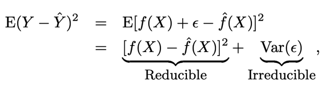
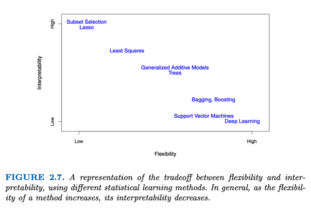

# 2.1 What Is Statistical Learning?

📊 **Progress:** `0` Notes | `3` Screenshots

---

## 2.1.0 GIẢ ĐỊNH QUAN TRỌNG Y = f(X) + epsilon

 

### Ngay phần đầu nhưng CHỨA MỘT Ý CỰC KÌ QUAN TRỌNG.

> [!NOTE]
> Ngay phần đầu nhưng CHỨA MỘT Ý CỰC KÌ QUAN TRỌNG.
>
> Đại khái là, giả sử ta có một dataset các bộ observation Y - predictor X_1,
> X_2... X_p
>
> thì đầu tiên ta giá trị của response Y sẽ**quan hệ với các predictor X
> thông qua một hàm số f(X)** nào đó. Và như trong bài giảng, ta đã biết
> **NGƯỜI TA CHO RẰNG** **SẼ HỢP LÝ KHI CHO RẰNG FUNCTION**
> f(X) **LÝ  TƯỞNG**  chính là function sao cho tại X = x, f(X) bằng giá trị
> TRUNG BÌNH  (hay gọi là giá trị kì vọng, có điều kiện) của Y tại X = x
>
> f(X=x) = E[Y|X=x)
>
> Và **IDEAL** FUNCTION NÀY, GỌI LÀ **REGRESSION** FUNCTION
>
> Nhưng ngay cả khi có ideal function, thì f(X) cũng không hoàn toàn map
> với Y, mà sẽ có sai khác eps không phụ thuôc X. Đã chứng minh, ở phần
> trước eps  có mean = 0. Để rồi có thể biểu diễn:
>
> Y = f(X) + epsilon

 

## 2.1.1 Why Estimate F

 

### **Prediction**:

> [!NOTE]
> **Prediction**:
>
> Đại khái là trong khía cạnh này người ta **quan tâm đến việc dùng các
> feature / predictor  để đưa ra những dự báo tương lai** ví dụ việc dùng
> các chỉ số xét nghiệm của bệnh nhân để mà dự đoán hiệu quả của  điều
> trị. Thì cái này **cho phép coi f(X) như một black box**
>
> Một cách tóm tắt đó là bệnh nhân có các chỉ số xét nghiệm (feature, hay
> trong sách này gọi là predictor) X1, X2...Xn và outcome Y. Ta phải xây
> dựng f^(X) để dự đoán ra Y^.
>
> Thì đại khái là accuracy sẽ phụ thuộc vào cái **reducible error** là cái mà
> ta sẽ**tìm cách giảm** bằng cách **chọn / tìm ra f^ thích hợp.**
>
> Và **irreducible error** (epsilon) thì **không thể loại trừ**được vì các lí do
> như dataset **không có / thiếu** (ví dụ quá trình collect data không ghi
> nhận) hoặc **không thể ghi nhận** **các feature cần thiết**(có các trạng
> thái của bệnh nhân như tâm tư tình cảm cũng ảnh hưởng đến tác dụng
> điều trị nhưng không/chưa thể collect chính xác được) hay **bản thân
> training data không represent** hoàn toàn dataset ngoài đời thực.
>
> Từ đó mới nói rằng :
>
> E[Y-Y^]**2 = E[f(X) - f^(X)]**2 + Var(Irreducible error)

<kbd></kbd>

<kbd></kbd>

 

### Theo 2.1 khi đưa ra phương trình **Y = f(X) + epsilon**, với epsilon là

> [!NOTE]
> Theo 2.1 khi đưa ra phương trình **Y = f(X) + epsilon**, với epsilon là
> **zero mean random error**, thì ta p**hải hiểu rằng, X ở đây bao hàm
> toàn bộ các predictor khả dĩ.**
>
> Cụ thể hơn, trong bài toán Y=Sale - X1=TV / X2=News / X3=Radio
> (budget).
>
> Thì khi gọi Y = f(X) + epsilon, ta phải hiểu rằng **đang dùng giả định**
> rằng **giá trị của Y thật sự là được dựa trên một hàm số tính toán CHỈ
> bởi 3 predictor này** và **một sai số mang tính ngẫu nhiên zero mean**.
>
> Vì sao lại nói rằng ta vẫn đang giả định, giả định gì?
>
> Giả định đó là irreducible error EPSILON CHỈ CẤU THÀNH BỞI bởi đại
> lượng sai số ngẫu nhiên zero mean. Hay nói rõ hơn, **giả định này đã
> loại trừ khả năng tồn tại một biến số, predictor nào đó khác ngoài ba
> predictor trên, cũng tác động tới Y mà ta không thu thập** hay đưa vào
> mô hình.
>
> Bởi **rất có thể Y còn bị ảnh hưởng bởi một predictor khác**, khi đó
> **phần irreducible error không còn zero mean.**

 

### **Inference**

> [!NOTE]
> **Inference**
>
> Trong khía cạnh này, người ta lại quan tân nhiều hơn đến việc c**hỉ ra sự
> tương quan giữa các predictor (feature) với outcome** ví dụ như trong **3
> kênh quảng cáo thì cái nào giúp hiệu quả nhất** (tăng doanh thu) mà có
> thể không cần phải dự đoán. Cho nên cái này yêu cầu phải hiểu rõ bản
> chất của f(X) chứ không thể coi như blackbox được.
>
> Và phân tích tương quan giữa các predictor với outcome bao gồm việc
> tìm xem
>
> - **predictor nào quan trọng / tác động ít nhiều tới outcome ra sao**,
>
> - chiều tác động ra sao **(cùng hướng hay ngược hướng**) và
>
> - quan hệ đó**có linear không**

 

### Có thể có bài toán

> [!NOTE]
> Có thể có bài toán
> yêu cầu cả hai.

 

### Nói chung là **tùy yêu cầu bài toán muốn tập trung vào cái nào** sẽ ả\\*nh

> [!NOTE]
> Nói chung là **tùy yêu cầu bài toán muốn tập trung vào cái nào** sẽ ả**nh
> hưởng đến việc chọn model**
>
> ví dụ nếu **quan tâm tới prediction** và có thể **không care inference** thì  các
> model như**Deep Learning**, **Random Forest** sẽ làm tốt. Nhưng nếu quan
> tâm đến **Inference** và không cần predict chính xác thì **Linear model** sẽ làm
> tốt hơn

 

## 2.2 How To Estimate F

 

### Đầu tiên đại khái là nói về **cách kí hiệu bộ training set** sẽ là có **n**

> [!NOTE]
> Đầu tiên đại khái là nói về **cách kí hiệu bộ training set** sẽ là có **n**
> data sample  (observation)  x(1),x(2)...x(n) mỗi cái x(i) có **p**
> predictor làm thành một vector  [x(i)1, x(i)2,.....x(i)p] và một
> **target** (label) hay ở đây gọi là **response** y(1), y(2)....y(n).
>
> Và ta sẽ dùng training set để **tìm ra function f(X)** là function theo
> p feature X1, X2.. Xp.

 

### Parametric

> [!NOTE]
> Parametric
>
> Đại khái là cách tiếp cận này, ta sẽ nôm na là **giả định f có dạng
> nào đó**, ví dụ **linear**, đồng nghĩa với việc **ta suy đoán dự đoán
> rằng dataset ngoài đời thực phân bố theo linear.**
>
> Để rồi từ đó ta cho**f có dạng = β0 + β1X1 + ...βpXp** và **biến vấn
> đề từ việc tìm một hàm f bí ẩn nào đó** trở thành **đơn giản hơn
> bằng việc tìm bộ tham số beta**. Đây chính là ưu điểm của
> parametric model. Và việc tìm bộ beta thì sẽ có các phương pháp
> để tìm như ở đây là dùng **Least Square.**
>
> Nhưng **nhược điểm của nó là có thể giả định của mình sai**, khi
> có thể dataset thực tế không phân bố theo linear mà ở một dạng
> khác hay function f thực sự không tuyến tính. Khi đó thì **dù ta có
> tìm bộ beta tốt tới đâu**, giúp giảm least  square error mấy thì bị
> giới hạn, **cũng không phản ánh chính  xác được quy luật của
> dataset.**
>
> Và dù ta**có thể dùng các giả định các function f flexible hơn**
> nhưng sẽ **vẫn dựa vào giả định (assumption)** và sẽ thêm có thể
> dẫn đến vấn đề khác là **overfitting**

 

### Non-parametric: Đại khái cách này kiểu như là tìm cách mô hình

> [!NOTE]
> Non-parametric: Đại khái cách này kiểu như là tìm cách mô hình
> function dựa trên các observation càng nhiều observation thì càng
> chính xác nhưng dẫn tới overfit. Cũng chưa hiểu lắm cách này.

 

## 2.1.3 Trade Off Between Accuracy & Interpretability

 

### Đại khái là model như linear regression, thì \\*dễ giải thích hơn

> [!NOTE]
> Đại khái là model như linear regression, thì **dễ giải thích hơn
> nhưng dễ underfit**, (không fit được data). Nhưng **more complex
> model** thì**fit data tốt hơn nhưng khó interpretable hơn.**Xong nhắc đến một số model theo thứ tự giảm dần độ
> interpretable nhưng tăng dần độ flexible là **Lasso** (dự đoán là
> Linear Regression nhưng dùng L1 regularization),**Linear
> Regression**, GAM (đọc có thể hiểu nó như **Polynomial
> Regression**) **Neural Network** và Tree model****Thành ra **tùy vào bài toán ưu tiên tiêu chí nào** mà chọn model
> Và một **điều đáng chú ý** là dù cho tiêu chí là **Prediction** thì việc
> chọn **low-flexible model đôi khi lại tốt hơn** lí do là highly flexible
> dễ dẫn tới overfit

 

<kbd></kbd>

 

## 2.1.4 Supvervised Vs Unsupervised Learning

 

### Đại khái như ta biết có label thì gọi là supervised learning, còn không có

> [!NOTE]
> Đại khái như ta biết có label thì gọi là supervised learning, còn không có
> thì gọi là unsupervised learning. Thì với **unsupervised** learning, ta có thể
> dùng các model như  như **clustering, anomaly detection, pca**
>
> Nói thêm về **semi-supervised learning** là khi dataset có một phần là có label
> phần còn lại thì không

 

## 2.1.5 Regression Vs Classificaton Problems

 

### Đại khái cái này thì mình đã hiểu từ MLSPec bấy lâu nay nôm na là predict ra

> [!NOTE]
> Đại khái cái này thì mình đã hiểu từ MLSPec bấy lâu nay nôm na là predict ra
> số (như giá nhà) thì  là bài toán regression, còn dự đóán ra đúng hay sai, yes
> hay no hay con này hay con kia thì là classification.
>
> Tuy nhiên ở góc độ statistical learning thì người ta **dựa vào loại của outcome
> / target / response Y**. Theo đó nếu là **quantitative** (số lượng) thì là bài toán
> **Regression**, còn **qualitative** (chất lượng) thì là **Classification**.
>
> Nhưng có chú ý là **Logistic Regression** tuy là có chữ **Regression** nhưng vì
> trong đó nó **spit out ra một  con số probability**để từ đó mới kết luận class

 

