# 2.2 Assessing Model Accuracy

📊 **Progress:** `7` Notes | `28` Screenshots

---

## 2.2.1 Measuring The Quality Of Fit

 

### Đại khái là nói về \\*các metric để đánh giá model\\*, ví dụ \\*MSE\\*. Tuy nhiên

> [!NOTE]
> Đại khái là nói về \**các metric để đánh giá model\**, ví dụ \**MSE\**. Tuy nhiên
> việc \**chọn model chỉ dựa vào lấy model có TRAINING MSE tốt nhất thì
> không được\** vì nó sẽ\**không chắc rằng giúp ta đạt\** mục đích cuối cùng đó
> là GENERALIZED MSE tốt, và ít nhất là đạt TEST MSE tốt (với giả định test
> mse có thể giúp ước lượng được GENERALIZED MSE.
>
> Nói đến \**hiện tượng dù ít hay nhiều\** thì \**Training MSE luôn thấp hơn
> Testing MSE\** vì model được training với objective function là đạt
> performance tốt trên tranning sét. Còn overfit là vì \**trong quá trình training
> model luôn tìm ra một pattern\** nào đó \**chỉ có trong training set.\** Và model
> \**càng flexible \**thì càng \**dễ overfit training set.\**
>
> Kế người ta cho hai ví dụ nữa để cho thấy dạng chữ U điển hình.
>
> Nhưng ta không phải lúc nào cũng có test sét để evaluate, nên sẽ nói đến
> việc dùng training set để ước lược test MSE sau

<kbd>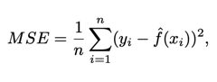</kbd>

<kbd>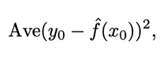</kbd>

<kbd></kbd>

<kbd></kbd>

> [!NOTE]
> MSE trên UNSEEN data x0, y0

 

<kbd>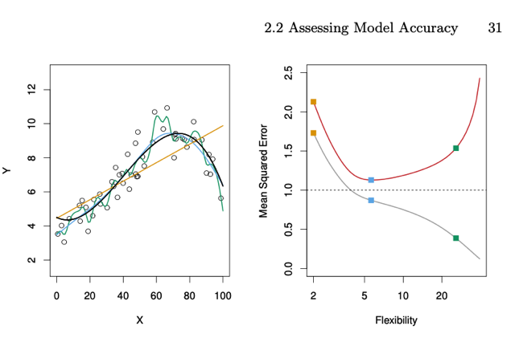</kbd>

> [!NOTE]
> Đường màu đen là true function, màu cam là linear regression
> function và 2 đường smoothing spline có độ linh hoạt khác
> nhau. Đầu tiên cho ta nhận xét là đường màu xanh dương với
> độ flexible (có tên officially là **degree of freedom** ) **vừa
> phải** là tốt nhất

   

<kbd>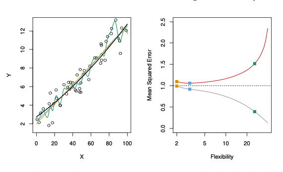</kbd>

   

<kbd>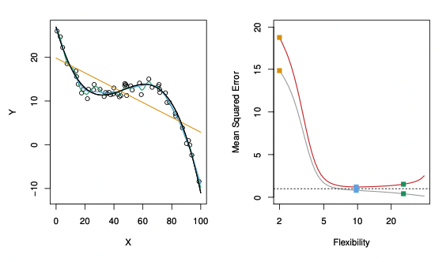</kbd>

   

## 2.2.2 The Bias-variance Trade-off

 

### Đại khái là theo toán học thì giá trị kì vọng (hay cũng chính là giá trị trung bình)

> [!NOTE]
> Đại khái là theo toán học thì giá trị kì vọng (hay cũng chính là giá trị trung bình)
> của sai khác giữa y0 và f^(x0) =  MSE loss tính bởi f^(x0), y0 sẽ phân tách ra
> thành công thức này:
>
> Tổng của \**variance của f^(x0)\**: Var(f^), \**bình phương Bias của f^(x0)\** và
> variance của \**irreducible error epsilon.\**
>
> f^ là kiểu như predict function learn bởi việc training model để mà dùng predict
> new data sample x0. x0 là kí hiệu của data sample mà quá trình training model
> chưa gặp
>
> Và để giảm MSE thì phải giảm 2 cái đầu, cái thứ 3 là irreducible

<kbd>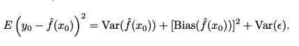</kbd>

<kbd></kbd>

 

### Vậy để giảm \\*Var(f^(x0)\\*. Theo DLYo đã học \\*Variance\\* của f(x) khi x và

> [!NOTE]
> Vậy để giảm \**Var(f^(x0)\**. Theo DLYo đã học \**Variance\** của f(x) khi x và
> random variable theo một probability distribution là mức thay đổi của f khi x thay
> đổi giá trị từ việc lấy trong distribution đó.
>
> Khi x thay đổi theo P(x) thì f(x) sẽ thay đổi theo mang các giá trị f(x) khác nhau
> nhưng tính trung bình của các f(x) đó ta có Expectation  của f(x) kí hiệu là E
> x~P(x) [f(x)]. Giá trị này là cố định - fix
>
> Tiếp nếu khi x thay đổi theo P(x) ta tính\**bình phương khoảng thay đổi  của f(x)
> so với kì vọng của nó = E x~P(x) [f(x)]\**, là giá trị cố định đã nói  ở trên, ta có
> g(x) = f(x) - E x~P(x) [f(x)].
>
> Và dĩ nhiên \**với mỗi x thay đổi, dẫn đến f(x) \** \**thay đổi \**thì mức thay đổi g(x)
> cũng thay đổi.
>
> Nhưng nếu ta tính\**trung bình mọi gía trị g(x) này\** khi x thay đổi trên P(x) ta
> sẽ  \**lại có một giá trị cố định thể hiện mức thay đổi trung bình của f(x) so với
> mốc kì vọng của nó, \**thì khái niệm này \**chính là Variance của f(x).\**
>
> Var(f(x)) = Expectation của [ g(x) ] khi x thay đổi theo P(x)               
> = E x~P(x) [ f(x) - E x~P(x) [f(x)] ]
>
> Và trong sách đó cũng có nói \**khi ta đều hiểu rằng x đang tuân theo một
> probability distribution P(x)\** thì \**khỏi phải ghi rõ ra\** trong công thức thì có thể
> ghi thành :
>
> Var(f(x)) = E x [ f(x) - E x [f(x)] ]

 

### Vậy quay lại đây, Variance của f^(x0) được định nghĩa là mức thay đổi trung

> [!NOTE]
> Vậy quay lại đây, Variance của f^(x0) được định nghĩa là mức thay đổi trung
> bình của f^(x0) khi f^ được tính/train từ các bộ training data khác nhau.
>
> Phải hiểu f^ ở đây là hàm theo X_train. Còn biểu hiện cụ thể ra khi có được f^
> rồi thì tính với x0 ý là X_test.
>
> Từ định nghĩa variance, ta hiểu một điểm quan trọng là \**tại sao phải giảm
> variance của f^\**. Là vì khi đó, \**X_train / training data mà có thay đổi nhiều ít ra
> sao thì f^ cũng không thay đổi mấy\**, thể hiện cụ thể là \**f^(x0) vẫn không thay
> đổi mấy\**.
>
> Thì khi đó mới là good, mới là ok, mới là \**chứng tỏ ta tìm được model / f^ tốt
> giúp dự đoán được new data sample\** bằng cách \**học được những yếu tố,
> công thức tìm ẩn trong data nào đó\** của vũ trụ. Chứ nếu như chỉ cần thay bộ
> training chút xíu, mà f^ nó thay đổi khiến prediction f^(x0) thay đổi thì rõ ràng là
> không ổn. Lúc này người ta gọi là nó quá sensitive với thay đổi ủa training data.
>
> ====
>
> Và từ đây mình hiểu ra tại sao gọi là \**high-variance\** và tại sao nó gắn với
> \**overfit\**. Trong các khóa ML như MLSpec, DLSpec, người ta gọi model có
> high-variance chính là để chỉ trạng thái này, \**khi chỉ cần thay đổi training data
> một chút\** là \**kết quả của prediction model trên new data sẽ khác liền\**.
>
> Và nó đi liền với \**overfit\** vì khi ta vẽ đường cong\**thể hiện prediction của
> model với training set\**. Thì\**nếu nó đi sát rạt mọi điểm của training set\**, thì rõ
> ràng là lúc này \**chỉ cần training set thay đổi 1 chút\**, \**ngay lập tức nó ra một
> đường khác\** sẽ dẫn đến prediction của nó với un-seen data khác ngay, \**chính
> là high-variance\**

 

### Tiếp theo, về \\*Bias(f^(x0))\\* lại là bias / \\*định kiến\\* mà ta đưa vào \\*khi chọn

> [!NOTE]
> Tiếp theo, về \**Bias(f^(x0))\** lại là bias / \**định kiến\** mà ta đưa vào \**khi chọn
> model\** cho bài toán. Ví dụ như \**khi data thực tế phân bố không theo quy luật
> tuyến tính\**, mà theo một đường cong nào đó thì \**dù có nhiều data mấy\** thì
> \**nếu ta chọn linear regression\** cũng sẽ không thể mô tả, biểu diễn được từ đó
> \**không thể giảm Bias(f^).\**

 

### Đại khái là như vậy\\* test MSE sẽ giảm nếu giảm Variance (Var(f^)), và giảm

> [!NOTE]
> Đại khái là như vậy\**test MSE sẽ giảm nếu giảm Variance (Var(f^)), và giảm
> Bias (Bias(f^))
>
> \**Thì hai cái này \**chịu tác động bởi độ linh hoạt flexibility \**theo hai \**hướng
> ngược nhau\**. \**Flexibility tăng\**, sẽ \**giảm Bias \**nhưng \**tăng Variance\**, do
> đó \**Flexibility mà quá thấp\** thì Variance thấp (là tốt) nhưng \**Bias lại cao\**.
>
> \**Flexibility mà quá cao\** thì \**Bias thấp\** nhưng \**Variance lại cao\**. Do đó phải
> tìm ra một Flexibility sao cho cân bằng được hai cái này nên mới gọi là
> Trade-Off
>
> In general, khi tăng flexibility lên dần thì\**đầu tiên nó giúp giảm bias nhiều\**
> \**hơn là tăng variance\**, nên thường ban đầu te\**st MSE sẽ giảm\**. Nhưng sau
> đó đến một \**lúc nào đ\**ó, việc giảm MSE từ việc giảm bias (từ Bias(f^)) sẽ ít
> đi, còn \**hiệu ứng tăng MSE do tăng Variance (Var(f^)) mạnh hơn\** khiến \**test
> MSE lại tăng lên.
>
> \**Và việc này thể hiện ở tất cả các hình trong các ví dụ

 

<kbd></kbd>

   

<kbd></kbd>

   

<kbd></kbd>

   

<kbd>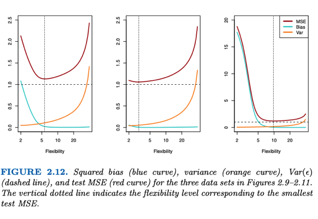</kbd>

> [!NOTE]
> Đại khái là case 1: **true f không phải tuyến tính mà là đường cong
> nhưng cũng không quá cong** (polynomial degree không quá cao) nên khi
> **tăng flexibility, nó giúp giảm mạnh bias** (line màu xanh), trong khi **ảnh
> hưởng việc tăng MSE do tăng variance thấp** - line màu cam chỉ
> tăng nhẹ) nên**kết quả là MSE (màu đỏ) giảm nhanh**.
>
> Sau đó đến mốc flexibility ~=6, **ảnh hưởng tiêu cực do tăng Variance bắt
> đầu lớn hơn sự tích cực do giảm Bias không đáng kể**, line màu xanh đi
> ngang, thể hiện bằng Variance (line mày cam bắt đầu tăng nhanh). Kết
> quả là line màu đỏ MSE tăng vọt lên
>
> ====
>
> Case thứ 2 do**f true là gần như tuyến tính**, thành ra **khi flexibility tăng
> Bias chỉ giảm chút xíu** nhưng **Variance thì tăng nhanh khiến MSE tăng
> vọt lên**.
>
> ====
>
> Case thứ 3,**f true có độ flexible / polynomial cao**, nên **hầu như càng tăng
> flexibility độ giảm MSE do giảm Bias vượt trội sự tăng MSE do sự tăng
> Variance.** Chỉ khi flexible qúa lớn mới và việc giảm bias không còn tác
> dụng thì sự tăng MSE do tăng Variance mới kéo MSE lên chút xíu

   

### Cuối cùng đại khái là nói về việc \\*tại sao lại gọi là Bias/Variance Trade off.\\*

> [!NOTE]
> Cuối cùng đại khái là nói về việc \**tại sao lại gọi là Bias/Variance Trade off.\**
> Đó là đơn giản là vì như hồi nãy có nói, d\**ễ tạo một model\** | f^ mà \**low
> Variance\** nhưng lại\**high Bias\**.
>
> Ví dụ, real f / \**dataset phân bố theo phi tuyến\** nhưng ta \**áp dụng linear
> regression\**, thì nó sẽ \**low variance\** nhưng \**high bias\**. Hoặc ngược lại,
> \**true f là linear,\** nhưng ta lại dùng \**model có flexibility qúa cao,\** ví dụ đi
> qua hết các data sample luôn, sẽ khiến nó \**low bias\** nhưng \**high
> variance\**.
>
> ====
>
> Và một ý quan trọng là, một \**model có thể high bias cho bài toán này\** /
> dataset này Nhưng \**low bias cho dataset khác,\** có nghĩa là tùy dataset. Ví
> dụ dataset phân bố tuyến tính, thì model linear regression không low bias chút
> nào.

 

## 2.2.3 The Classification Setting

 

### Thì đại khái là nói qua "lĩnh vực" Classification (nãy giờ chỉ nói bias/variance trade

> [!NOTE]
> Thì đại khái là nói qua "lĩnh vực" Classification (nãy giờ chỉ nói bias/variance trade
> off) ở lĩnh vực Regression. Đầu tiên có notation mới biết là\**I(y^ != y) là function cho
> kết quả 0 nếu hai thằng đó bằng nhau, 1 nếu khác nhau.\**
>
> Nên error trong bài toán Classification không dùng MSE, mà dùng \**ERROR RATE\**: 
> \**(1/m) Σ i=0:m I(y^i, yi)\**
>
> ý là \**TỈ LỆ \**số case (data sample) mà model / f^ predict \**SAI\** class trên tổng số case.
>
> Thì đại khái là với Test Error Rate sẽ kí hiệu là: 
>
> \**Ave(I(y^0 != y0)
>
> Như mấy phần trước, y0 và y^0 thể hiện ground truth label và prediction của f^
> đối với unseen sample.\**

<kbd>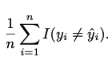</kbd>

<kbd>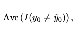</kbd>

<kbd></kbd>

<kbd></kbd>

 

### Bayes Classifiers

 

- Đại khái là nếu ta có một model / f^ sao cho với mỗi data sample, model luôn \\*dùng cái class nào mà có xác suất cao nhất với feature của nó, để gán cho nó\\*.   Kí hiệu là max j P(Y=j|X=x0) dịch ra là j sao cho P (Y = j với X = x0) là cao nhất.  Thì đó là một \\*Bayesian classifier\\*. Thì nôm na đây là cái tốt nhất mà ta có thể hướng tới, vì sẽ không thể vượt qua được. Và đương nhiên \\*Bayesian error rate\\* là \\*mốc nhỏ nhất của error rate.\\*
   

    
    
<kbd>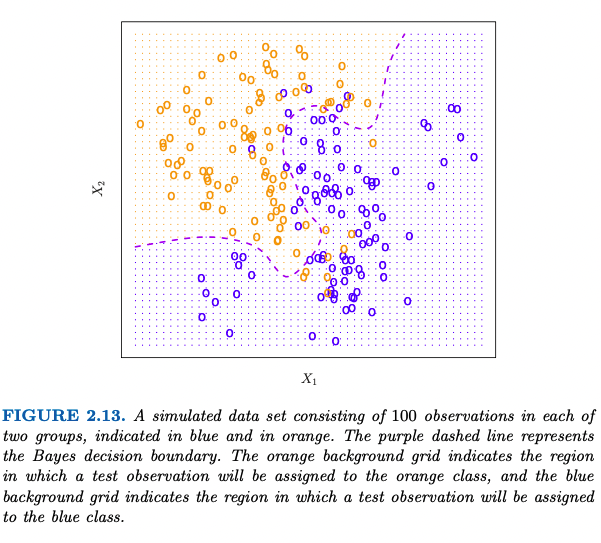</kbd>

     

- Rồi người ta lấy ví dụ bài toán binary classification với dataset được tạo (simulated) bằng máy tính. Thì đại khái là người ta (vì dùng công thức nào đó để generate data = gán class vàng hay xanh dựa vào X1, X2) nên nếu P(Y=1|X) mà lớn nhất, tức là lớn hơn 0.5 vì chỉ có hai possible class, thì cho Y^ = 1 (ví dụ chấm vàng).  Thì từ đó vẽ ra hai vùng, một vùng trong đó X1, X2 làm sao đó là P(Y=1|X) > 0.5,  và một vùng trong đó X1, X2 làm sao đó mà P(Y=1|X) < 0.5. Và hai vùng sẽ tách nhau bởi một con đường trung đạo mà ở đó P(Y=1|X) = 0.5. Thì con đường này gọi là \\*Bayesian Decision Boundary\\*
   

- Vậy Error Rate của Bayesian classifier là như thế nào? Thì đại khái là vì mỗi sample sẽ được classifier class j sao cho P(Y=j | X=x0) ví dụ 0.6 = 60% lớn nhất, nên nó có  Error Rate là \\*1- max j P(Y=j | X=x0)\\* = 40%  Và error rate trên toàn test set sẽ là \\*1 - E[max j P(Y=j | X)]\\*  Vậy Bayesian error rate có = 0 không? Hay nói cách khác là có phải Bayesian classifier là tuyệt đối đúng không?   Câu trả lời là không. Đại khái là không phải cứ P(Y=j | X) của cao nhất là thật sự class  của data sample X là j vì có những lí do như..

<kbd>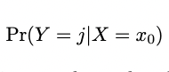</kbd>

<kbd>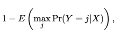</kbd>

<kbd></kbd>

<kbd></kbd>

   

  
  - The Bayesian classifier, like any other classification algorithm, does not have a 0% error rate due to several reasons:  1. \\*Assumptions\\*: Bayesian classifiers\\* make certain assumptions\\* about the underlying data distribution and the independence of features. In real-world scenarios, \\*these assumptions may not hold perfectly,\\* \\*leading to errors.\\*  2. \\*Noise\\* \\*in Data\\*: Real-world data often contains noise, which is\\* random variation or errors in the data\\*. Noise can \\*lead to misclassification\\*, even if the underlying distribution is well-modeled.  3. \\*Incomplete Information\\*: Bayesian classifiers \\*rely on the available features \\*to make predictions. If \\*some relevant information is missing\\* or unobserved, it can \\*lead to errors\\* in classification.  4. \\*Model Complexity\\*: The simplicity of Bayesian classifiers, while advantageous in many cases, can also be a limitation. They may \\*not be able to capture complex relationships\\* in the data, resulting in \\*classification errors. \\* 5. \\*Prior Probability Estimation\\*: Bayesian classifiers \\*use prior probabilities\\*, which are \\*based on the training data\\*. If the \\*training data is not representative of the true distribution\\*, the classifier may make errors.  6. \\*Overfitting\\*: If the\\* classifier is too complex\\* or \\*is trained on a small dataset\\*, it may \\*overfit the training data\\*, leading to \\*poor generalization\\* and errors on new, unseen data.  7. \\*Class Imbalance\\*: In situations where \\*one class significantly outnumbers the others\\*, the \\*classifier may have a bias towards the majority class\\*,\\* leading to errors\\* in minority class predictions.  In practice, the goal is to minimize classification errors by selecting appropriate algorithms, preprocessing data, and fine-tuning model parameters. While Bayesian classifiers can be effective in many cases, they are not immune to the challenges and complexities inherent in real-world data, which is why they may not achieve a 0% error rate.
    > Dù class có max j Pr(Y=j|X) để gán cho X thì vẫn sẽ có thể sai. Vì thứ nhất là model | y^
    > **đều được xây dựng dựa trên một giả định** (assumption) nào đó. Mà **giả định thì
    > không phải luôn đúng  hoàn toàn.**
    >
    > Thứ hai là**real data có noise**, dẫn đến là **dù model có phản ánh  đúng quy luật của
    > data**, thì nó cũng**không thể tránh được / predict được cái noise** này, nên kiểu gì cũng
    > sẽ có sai.
    >
    > Thứ ba, là **model dùng các feature ví dụ X1, X2** ở trên, nhưng có khi **có những
    > feature khác mà ta không có, bị thiếu, không biết** để dùng từ đó kiểu gì cũng không thể
    > phản ánh được / model đúng được  quy luật của dataset.
    >
    > Thứ tư là có khi **bản chất data rất phức tạp**, và ta **không thể phản ánh xây dựng
    > model chính xác được 100%** (do ý thứ 3 ở trên)
    >
    > Thứ năm là để xây dựng model, ta **dùng training data**, nhưng**training data có thể
    > không đủ lớn để thể hiện / đại diện** cho toàn bộ data. Nên dù có làm tốt đến mấy thì
    > cũng không thể đúng 100%.
    >
    > Thứ sáu cũng liên quan đến training data, đó là ta có thể**overfit training data** từ đó
    > kiểu như model tưởng tượng ra, hiểu lầm các pattern chỉ có trong training data mà không
    > phải là pattern chung, không có trong test set.
    >
    > Cuối cùng là vấn đề **class imbalance / skewed dataset**có thể khiến model bị bias vào
    > một class nào đó

     

### KNN Classifiers

 

- Đại khái là thực tế Bayesian chỉ là lí tưởng, vì ta sẽ không thể biết chính xác P(y=j | X=x0) Thành ra chỉ có thể tìm cách tính\\* estimated probability.\\* Một cách đó là dùng KNN. Nôm như mới học bên CS221N, đại khái là với mỗi data sample, tìm K data point trong training set mà closest với nó, có thể dùng L1 hay L2 distance. Sau đó, tính estimated probability của 1 class j bằng phần trăm của class trong K point đó:  P(Y=j| X= x0) = Sum I(yi=j) / K  Rồi từ đó, lấy class có estimated probability cao nhất. Thì đây chính là KNN classifier.

<kbd>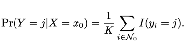</kbd>

<kbd></kbd>

   

    
    
<kbd>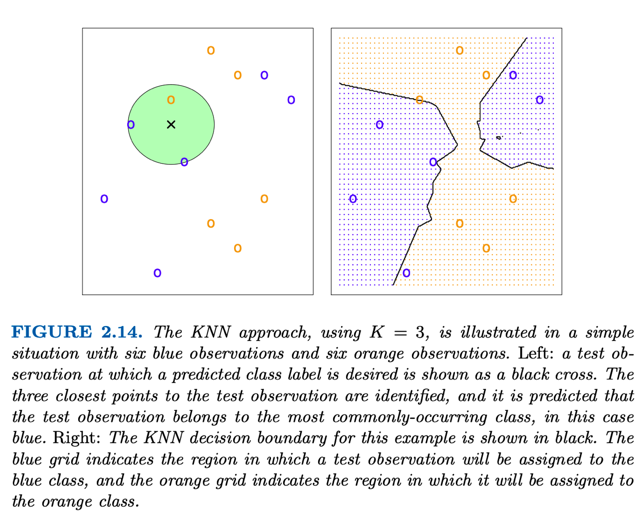</kbd>

     

    
    
<kbd>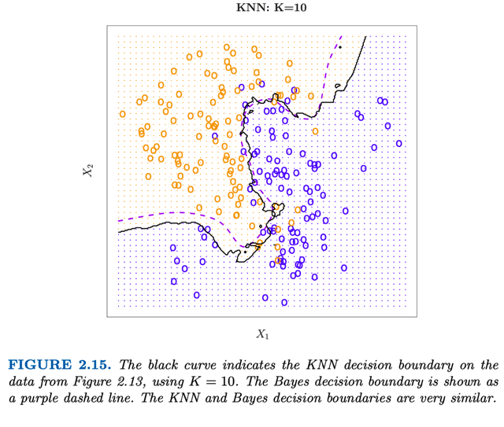</kbd>

    > Đại khái là cho thấy dù đơn giản nhưng KNN với K phù hợp, lại có thể
    > đạt performance  khá gần với Bayesian classifier. Như ở đây đường DB
    > màu tím của Bayesian khá gần với đường DB màu đen của KNN và họ
    > nói test error cũng gần với Bayesian test error.

     

    
    
<kbd>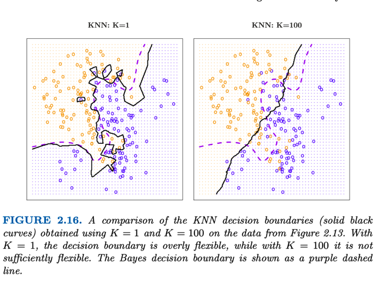</kbd>

    > Biểu đồ cho thấy sự thay đổi từ high variance (overfit) khi K nhỏ = 1 tới 
    > high bias khi K quá lớn (100)

     

    
    
<kbd>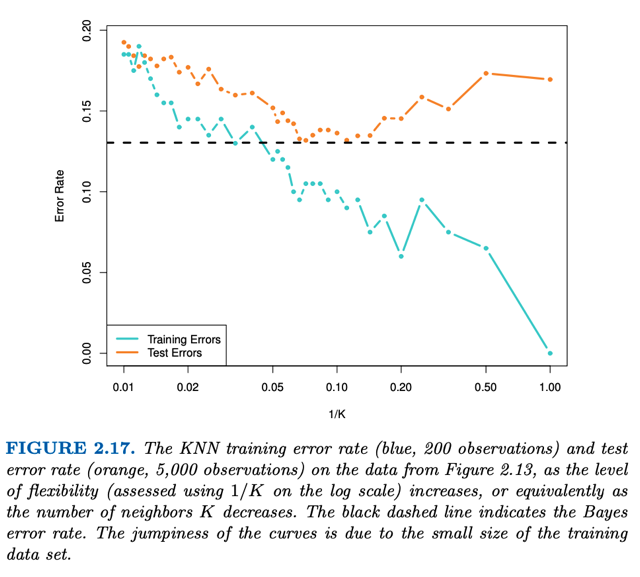</kbd>

    > Plot training error rate (màu xanh) và test error rate (màu đỏ) khi tăng K,
    > Cho thấy khi K giai đoạn đầu K tăng khiến giảm Bias giúp cả training và
    > test error đều giảm nhưng đến một mốc nào đó sự tăng error do Variance
    > tăng khiến test error bắt đầu tăng lên lại tạo U-shape điển hình. 
    >
    > Nhắc lại ở trên đã nói test error = Variance (f^) + Bias (f^) + Irreducible
    > error
    >
    > Còn training set thì đương nhiên K tăng dần thì càng ngày càng overfit 
    > training set nên training error cứ giảm quài.

     

- Họ kết phần này bằng việc nói rằng việc \\*chọn mức flexibility\\* như (\\*K\\* của KNN), hay độ \\*polynomial degree\\* của Linear Regression đóng vai trò quan trọng đến thành công  của model
   

