# 2.3 Lab

📊 **Progress:** `14` Notes | `19` Screenshots

---

## 2.3.1 Basic Commands

 

### ?function name để coi help

 

### matrix(c(1,2,3,4), 2, 2, byrow=TRUE)

> [!NOTE]
> matrix(c(1,2,3,4), 2, 2, byrow=TRUE)
> sẽ cho ra matrix 2x2 với các giá trị từ vector 
> [1,2,3,4] và rải theo từng hàng (byrow = TRUE)

 

### set.seed(a number bất kì):

> [!NOTE]
> set.seed(a number bất kì): 
>
> Đại khái là nếu mình dùng đúng con số mà
> họ set.seed thì gọi random sẽ ra đúng như họ. Từ đây
> hiểu vụ setSeed trong Python.

 

### rnorm()

> [!NOTE]
> rnorm()
>
> rnorm(100) cho ra vector có 100 unit, lấy random theo
> normal distribution. Có thể khai thêm arg để set mean
> & stan.dev

 

### mean(y), var(y), sd(y) tính mean, variance (sd**2), và

> [!NOTE]
> mean(y), var(y), sd(y) tính mean, variance (sd**2), và 
> standard deviation (sd) của y

 

## 2.3.2 Graphics

 

### plot()

> [!NOTE]
> plot() 
>
> > x = rnorm(100)
> > y = rnorm(100)
> > plot(x, y)
> > plot(x, y, xlab = "this is the x-axis", ylab = "this is the y-axis", 
> main = "Plot of X vs Y", col = "red")

 

<kbd>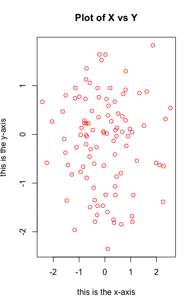</kbd>

   

### X = \\*seq(1:10)\\* hay chỉ cần gõ

> [!NOTE]
> X = \**seq(1:10)\** hay chỉ cần gõ
> \**1:10\** cho ra 1,2,3...10

 

### x = seq(-pi, pi, length = 50)

> [!NOTE]
> x = seq(-pi, pi, length = 50)
> y = x
> f = outer(x, y, function(x,y) cos(y) / (1 + x^2))
> \**contour\**(x, y, f)

 

<kbd>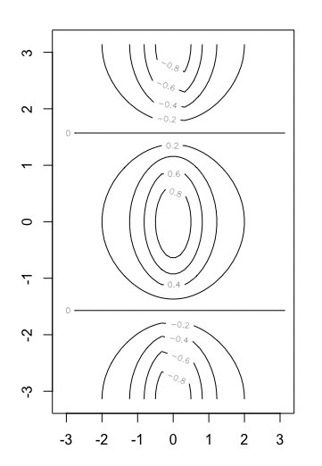</kbd>

   

<kbd>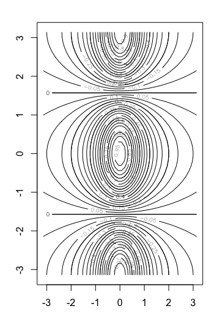</kbd>

> [!NOTE]
> contour(x, y, f, nlevels = 45, add = T)

   

<kbd>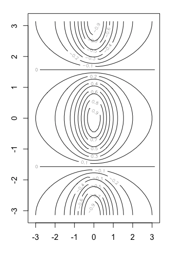</kbd>

> [!NOTE]
> fa = (f - t(f)) / 2
> > contour(x, y, f, nlevels = 15)

   

### image(x, y, fa) tương tự contour nhưng

> [!NOTE]
> image(x, y, fa) tương tự contour nhưng
> in ra dạng color-coded plot còn gọi là heatmap

 

<kbd>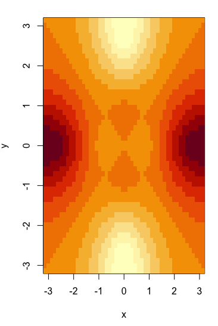</kbd>

   

### persp(x, y, fa, theta = 30, phi = 20)

> [!NOTE]
> persp(x, y, fa, theta = 30, phi = 20)
> thì giúp tạo ảnh 3D

 

<kbd>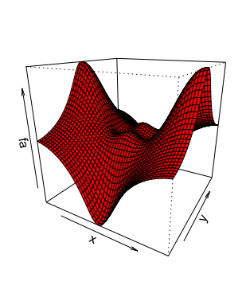</kbd>

   

## 2.3.3 Indexing Data

 

<kbd>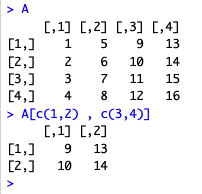</kbd>

> [!NOTE]
> A = matrix(1:16,4,4) tạo matrix 4x4 A với các giá
> trị từ 1,2,3..16 rải thành từng cột (muốn rải theo
> hàng thì define byrow = T)
>
> Và lấy ra thì bình thường như A[i,j]
>
> Nhưng cũng có thể lấy nhiều hàng, nhiều cột,
> ở đây lấy hàng 1,2 (chú ý là nó index từ 1)
> và cột 3,4

 

<kbd>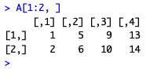</kbd>

> [!NOTE]
> Lấy mọi hàng từ hàng 1 tới N
> (ở đây là 2), mọi cột

 

<kbd>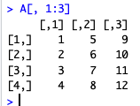</kbd>

> [!NOTE]
> Lấy mọi cột từ 1
> tới 3, mọi hàng

 

<kbd>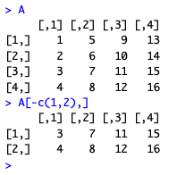</kbd>

> [!NOTE]
> Lấy mọi hàng trừ hai hàng 1,2 kết
> quả nó ra còn hai hàng 3,4. Cột
> thì lấy mọi cột

 

<kbd>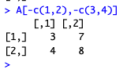</kbd>

> [!NOTE]
> Trừ hàng 1,2 cột 3,4 còn lại 
> lấy hết như vậy kết quả nó là
> hàng 3,4 và hai cột đầu của A

 

## 2.3.4 Load Data

 

### Đầu tiên để load table Auto.data (file text) có

> [!NOTE]
> Đầu tiên để load table Auto.data (file text) có
> thể dùng read.table(file path)

 

<kbd>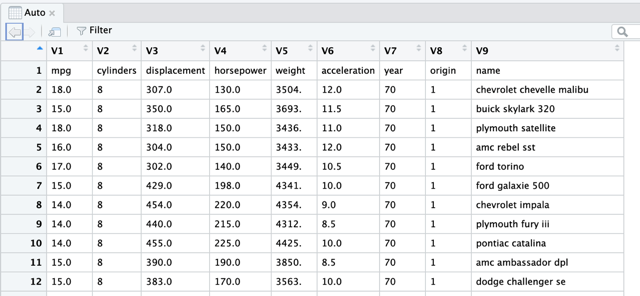</kbd>

> [!NOTE]
> Auto = read.table("~/Desktop/Learn ML/****STAT/Auto.data")
> View(Auto)
>
> Nhưng (load) với kiểu này ta sẽ tính luôn header thành 1 row

   

<kbd>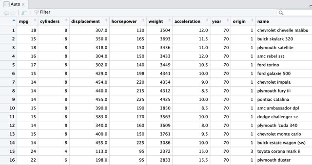</kbd>

> [!NOTE]
> Auto = **read.table**("~/Desktop/Learn ML/****STAT/Auto.data", **header** = T, 
> **na.strings** = "?", **stringsAsFactors** = T)
>
> View(Auto)
>
> Nên có thể dùng argument **header = T (TRUE)**để cho R biết **dòng đầu là
> header.**
>
> Còn **na.strings = "?"** giúp R biết k**hi nào nó gặp kí tự này** thì nó biết đó là
> **chỗ bị miss data.**
>
> Còn **stringssAsFactors** = True sẽ cho R biết **chỗ nào là string** thì treat
> nó như factor = category hay ở trong đây gọi là **quantitative variable**

> [!NOTE]
> Tiếp theo nói về cách dễ hơn để load table vào R
> đó là dùng csv: Save table như excel file thành csv 
> và dùng **read.csv**
>
> Dùng **dim**() để xem dimension (shape) of table
>
> > dim(Auto)
> [1] 397   9
>
>
> và **names**() để in các feature (column) của table
>
> > names(Auto)
> [1] "mpg"          "cylinders"    "displacement" "horsepower"   "weight"       "acceleration" "year"        
> [8] "origin"       "name"

   

## 2.3.5 Additional Graphical & Numerical Summaries

 

### \\*plot\\*(Auto$\\*cylinders\\*, Auto$\\*mpg\\*, col = 'red')

> [!NOTE]
> \**plot\**(Auto$\**cylinders\**, Auto$\**mpg\**, col = 'red')
>
> Để access feature của table thì dùng $
>
> Nếu gọi attach(Auto) thì R sẽ biết các
> variable (feature) của Auto và từ đó có thể 
> gọi tên feature khơi khơi
>
> attach(Auto)
> plot(cylinder, mpg, col = 'red')

 

<kbd>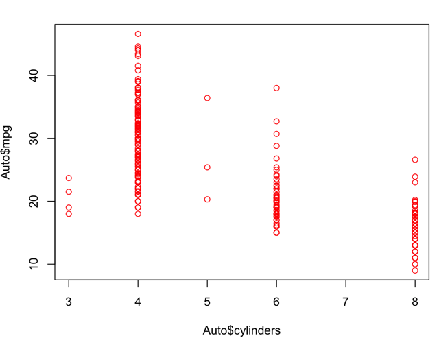</kbd>

   

### hist(): In histogram

 

<kbd>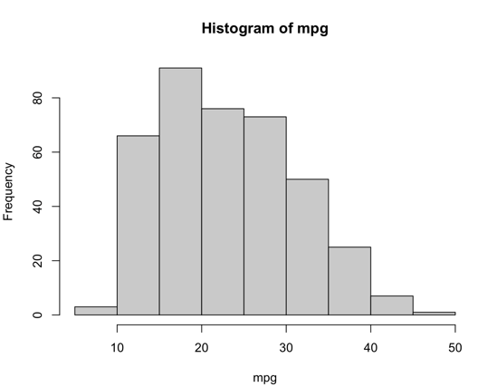</kbd>

> [!NOTE]
> hist(mpg)

   

### pairs(): In scatter plot

> [!NOTE]
> pairs(): In scatter plot
> với mọi cặp feature

 

<kbd>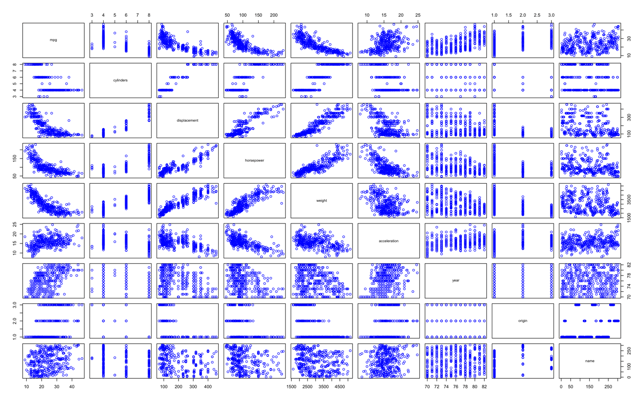</kbd>

> [!NOTE]
> pairs(Auto, col = "blue")

   

<kbd>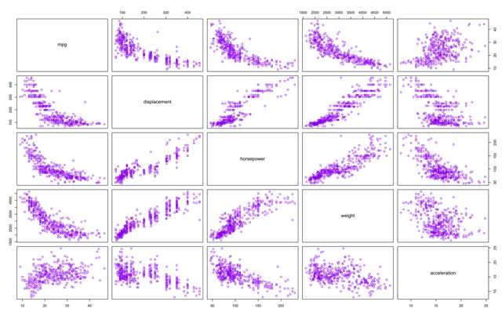</kbd>

> [!NOTE]
> Cũng có thể chỉ in vài cặp:
>
> pairs(~ mpg + displacement + horsepower + weight +
> acceleration, data = Auto, col = "purple")

   

### identify() đại khái là cho phép chọn

> [!NOTE]
> identify() đại khái là cho phép chọn
> trên plot và khi bấm escape thì nó in
> ra các variable value

 

<kbd>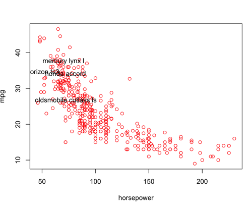</kbd>

> [!NOTE]
> plot(horsepower, mpg, col = 'red')
> identity(horsepower, mpg, name)
>
> Chọn vài điểm trên plot, và escape

   

### summary(Auto) cho các thông số statistic

> [!NOTE]
> summary(Auto) cho các thông số statistic
> của các variable
>
> hoặc chỉ một variable nào đó
> summary(feature name)

 

<kbd>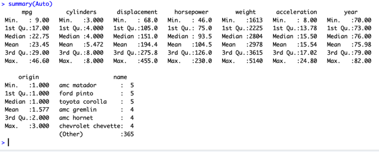</kbd>

   

