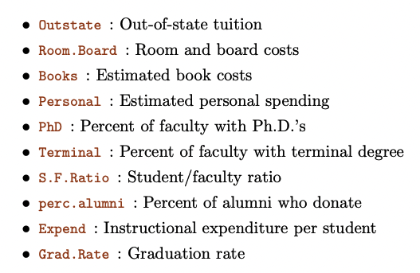
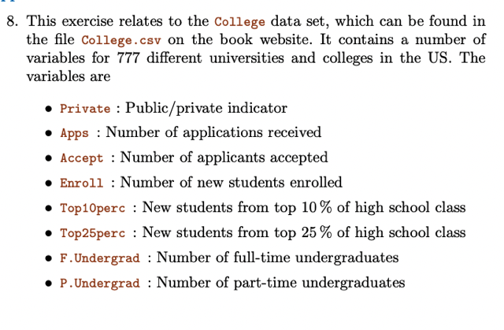
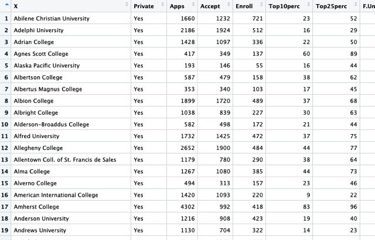
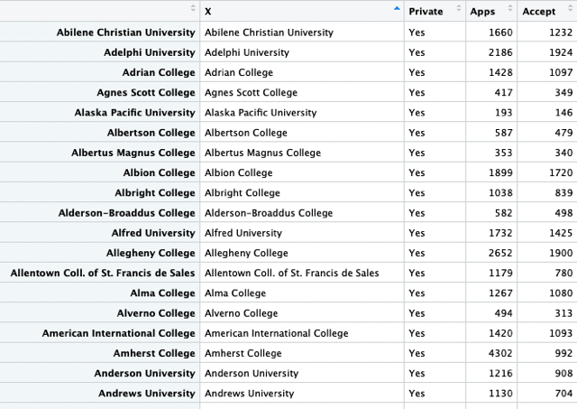
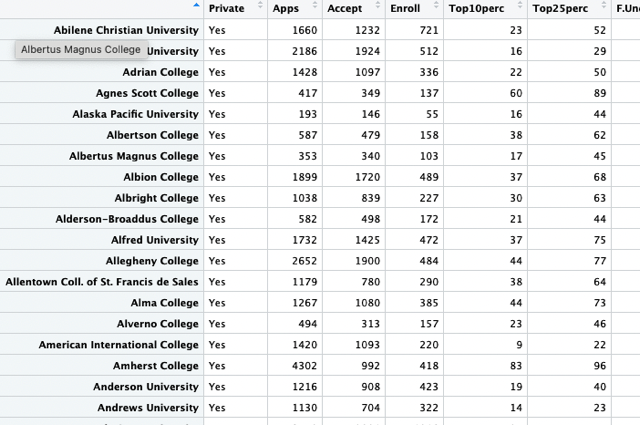
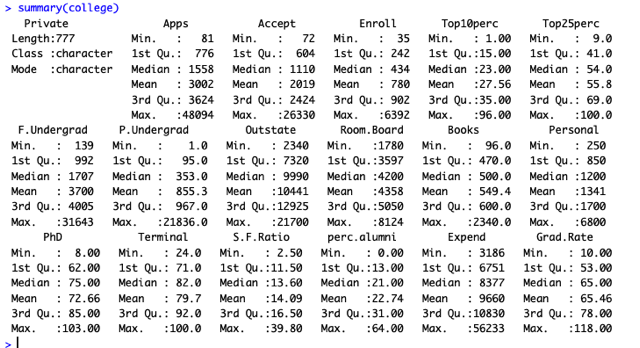
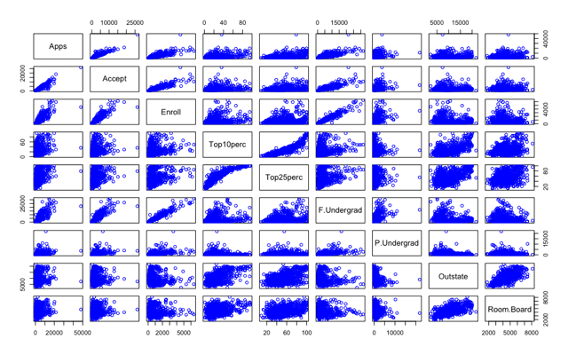
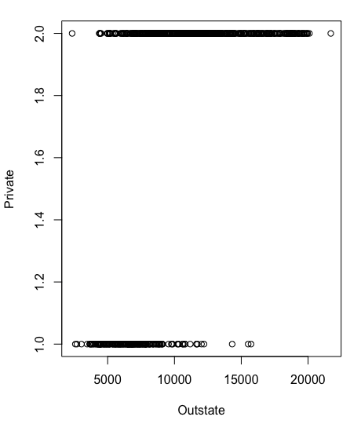

# 2.4 (2) Applied

📊 **Progress:** `6` Notes | `9` Screenshots

---

<kbd></kbd>

<kbd></kbd>

<kbd></kbd>

 

<kbd></kbd>

> [!NOTE]
> a. Load data: 
>
> college `=` `read.csv("~/Desktop/Learn` ML/****STAT/College.csv", 
> stringsAsFactors `=` T)
> View(college)

 

<kbd></kbd>

> [!NOTE]
> Đại khái là ta sẽ delete cái cột name, vì nó không chứa số liệu
> mà nó chỉ là tên trường tuy nhiên thông tin này lại hữu ích sau
> này nên mới dùng cách này để tạo một column gọi là row.
> names column. Và R sẽ không treat cái column này như data.
>
> rownames(college) `=` college[,1]
>
> Có thể thấy cái cột mới cũng có tên trường nhưng có màu khác
>
> Sau đó ta sẽ delete cái column chứa tên trường ban đầu đi

 

<kbd></kbd>

> [!NOTE]
> > college `=` `college[,-1]`
> > View(college)
>
> Ở đây ta chọn trong table gốc mọi hàng và mọi cột trừ cột số 1

 

<kbd></kbd>

> [!NOTE]
> c.i Gọi summary để xem
> summary của dataset

 

<kbd></kbd>

> [!NOTE]
> c.ii: pairs(college[, 1:10], col `=` 'blue')

 

<kbd></kbd>

> [!NOTE]
> (c.iii) plot(college$Outstate, college$Private)

 

