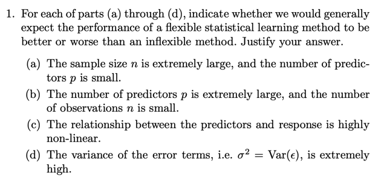
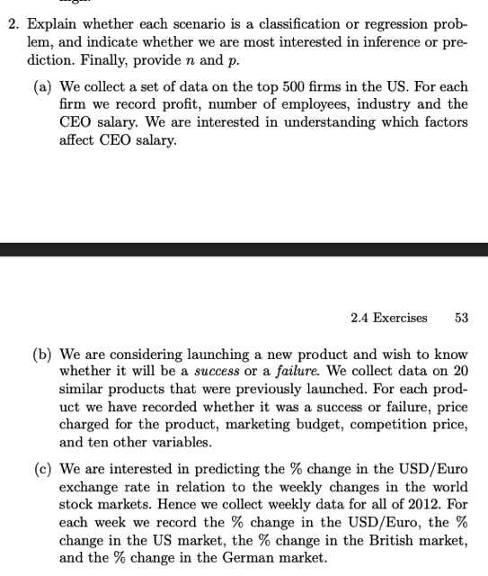
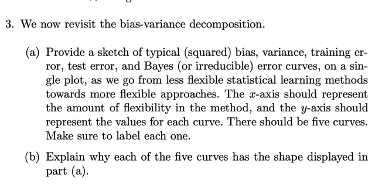
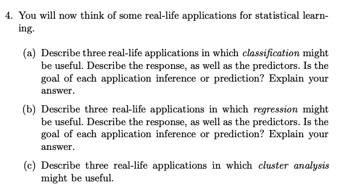
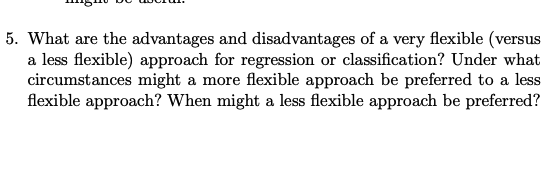
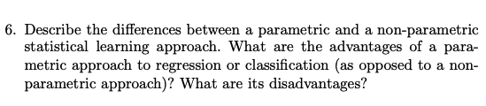
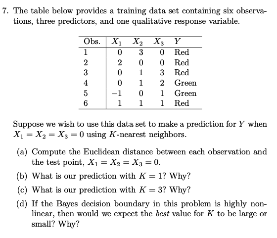
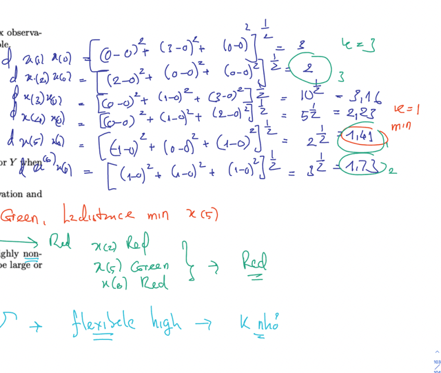
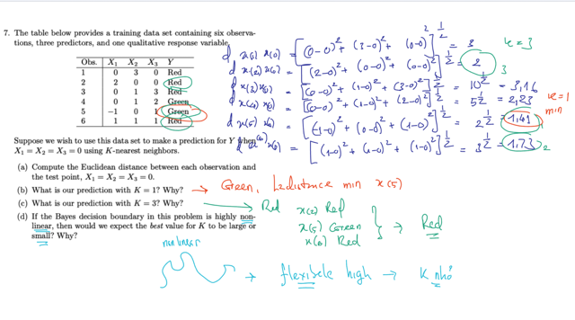

# 2.4 Exercise

📊 **Progress:** `4` Notes | `10` Screenshots

---

<kbd></kbd>

 

<kbd></kbd>

> [!NOTE]
> a. Regression, inference, n: 500, 
> p 3 - 3 features: profit, no. employees, industry
>
> b. Classification, prediction, n = 20, p = 13
>
> c. Regression, prediction, n = 12*4, p = 3

 

<kbd></kbd>

> [!NOTE]
> Từ less flexible -> high flexible:
>
> **Bias sẽ giảm**:
>
> **Variance sẽ tăng**
>
> **Training error** sẽ**giảm nhanh và chậm dần**:  Vì bias giảm
> và variance tăng đều khiến training error giảm.  Ban đầu
> giảm nhanh do kết hợp cả hai sự giảm error do giảm bias
> và cả variance, sau đó ảnh hưởng của giảm bias giảm
> dần nên chỉ còn ảnh hưởng của variance
>
> T**est error sẽ giảm nhưng sau đó sẽ tăng trở lại.**
> Lí do giảm bias giúp giảm test error, nhưng khi tăng variance
> khiến model bắt đầu overfit training set thì test error sẽ tăng

 

<kbd></kbd>

 

<kbd></kbd>

 

<kbd></kbd>

> [!NOTE]
> Difference: Parametric thì có weight, nói chính xác hơn là giảm
> vấn đề từ việc tìm một function arbitrary f nào đó trở  thành một
> function có một bộ parameters, bộ params như thế nào thì tùy
> vào việc ta giả định (make assumption) về function f. Để rồi chỉ
> cần tìm bộ params thôi. Còn  non-parametric thì chưa hiểu lắm,
> nhưng đại khái là không có params mà kiểu như tìm cách mô
> hình function f bằng các observation.
>
> Advantage của params đó là: Nó có thể đơn giản hóa bài toán
> bằng cách đưa ra giả định về function f. Nếu giả định đúng, thì ta
> không cần quá nhiều training sample để train model.
>
> Nhưng disadvantage là nếu giả định sai thì f^ sẽ xa rời với thực
> tế f.

 

<kbd></kbd>

 

<kbd></kbd>

<kbd></kbd>

<kbd></kbd>

> [!NOTE]
> Nói rõ thêm câu d: Để match tốt với "ground truth" decision
> boundary (Bayes d.b) là non-linear thì phải có độ flexible cao
> nên K phải nhỏ (thì flexible cao)

 

