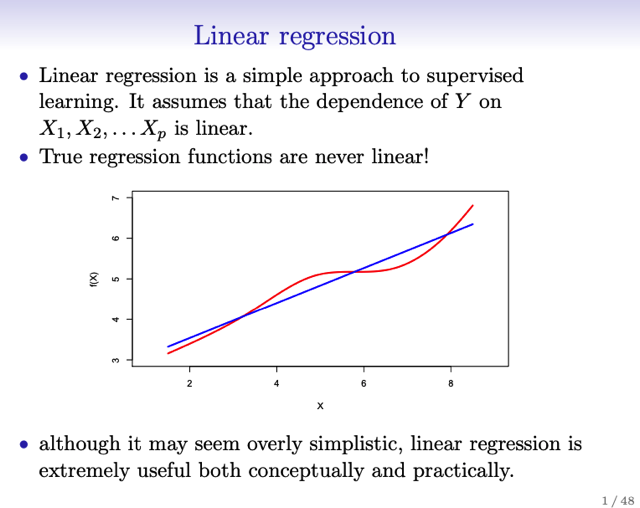
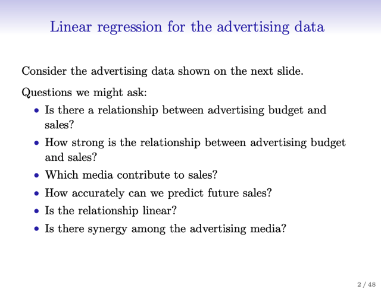

# 3.0 Intro To Linear Regression & Sáu Câu Hỏi

📊 **Progress:** `0` Notes | `4` Screenshots

---

## Đại khái là tuy linear regression là một mô hình đơn giản và ít hào

> [!NOTE]
> Đại khái là tuy linear regression là một mô hình đơn giản và ít hào
> nhoáng so với các mô hình khác nhưng nó là một nền tảng quan trọng

<kbd></kbd>

<kbd></kbd>

 

## Đại khái là lấy ví dụ về công ty chi ngân sách quảng cáo ở 3 kênh: \\*TV,

> [!NOTE]
> Đại khái là lấy ví dụ về công ty chi ngân sách quảng cáo ở 3 kênh: **TV,
> Radio và báo chí**. Thì cần làm rõ được những câu hỏi như sau:
>
> 1. **Có thật là chi tiền quảng cáo giúp tăng sale** không? Có thật sự là
> có mối liên hệ không hay chỉ là random, khiến chi tiền vô ích
>
> 2. Nếu **có thì thì quan hệ có mạnh không**, chi tiền quảng cáo có đem
> lại lợi ích tăng sale tương xứng không
>
> 3,4. Trong 3 kênh, kênh nào giúp tăng sale, nếu đều giúp tăng sale thì
> **hiệu quả mỗi cái nhiều ít ra sao**?
>
> 5. Với một mức chi hiện tại thì **có thể dự báo sale sẽ là bao nhiêu**,
> dự báo có **chính xác | đáng tin cậy cỡ nào**?
>
> 6. Là **mối quan hệ giữa** ngân sách quảng cáo và sale **có tuyến tính**
> không, hay phi tuyến?
>
> 7. Có hiện tượng **synergy** không - nôm na là có khi nào **chia ra 2
> hay 3 kênh với tỉ lệ nào đó sẽ tối ưu hiệu quả** hơn những tỉ lệ khác
> hay không?

<kbd></kbd>

<kbd></kbd>

 

