# 3.1 Simple Linear Regression

📊 **Progress:** `15` Notes | `43` Screenshots

---

\_TÓM Ý CHÍNH 3.1\_

Ta có một **bộ dataset, không biết quy luật (tất nhiên).**

Rồi, ta **giả sử nó có quan hệ tuyến tính** thì  true line có phương trình ra sao,
hoặc giả sử **không phải tuyến tính nhưng ta vẫn cố dùng tuyến tính** để fit bộ
data thì ta sẽ tự hỏi là cái **line tốt nhất có phương trình thế nào**

Cả hai trường hợp đều coi như đó là **population beta0, beta1**

Thì ta sẽ dùng**least square estimated coefficient để ước lượng** cho cái true
linear function.

Thì đầu tiên phải**đánh giá xem cách ước lượng bằng least square  có tốt
không.** Kết quả là vì nó là **unbiased** nên dù **tính trên một bộ training set cụ thể
thì nó sẽ sai** so với true coeff nhưng **trung bình trên nhiều bộ thì sẽ đúng.**

Và variance của nó gọi là **Standard Error của estimated coeff sẽ cho biết độ sai
trung bình**. Và dùng nó ta có thể tính ra 1 khoảng tự tin 95% rằng beta thật sự 
nằm trong đó và nhờ cái này, cộng với `p-value,` t-statistic**có thể kết luận ít nhất
là beta có khác 0 hay không** để chốt lại là có quan hệ giữa X,Y không 

Nhưng sau đó phải đánh giá là **nội bản thân linear model có đủ khả năng làm
tốt tới đâu**, thì RSE sẽ cho biết là dù có tìm được true line (population Beta0,
beta1) thì nó đúng được tới cỡ nào.

<a id="node-131"></a>
## 3.1.0 Model Y As Linear Function Of X

<br>


<a id="node-132"></a>
### Đại khái là một trong nhiều trường hợp khi ta \\*đoán rằng, giả định rằng X

> [!NOTE]
> Đại khái là một trong nhiều trường hợp khi ta \**đoán rằng, giả định rằng X
> và Y có quan hệ với nhau qua một linear function\** (tất nhiên, đã đoán,
> hay giả định ta có thể đoán sai) thì ta có thể thể hiện là:
>
> \**Y `~=` beta0 `+` beta1*X\**
>
> Và ta gọi nó là: "Y được \**approximately modeled as (beta0 `+` beta1*X)\**"
>
> Trong đó beta0 gọi là \**intercept\**, beta1 gọi là \**slope\** và chung lại tạo
> thành \**coefficient `/` params\**
>
> Ví dụ cụ thể ta model: sale `~=` beta0 `+` beta1*TV
>
> Và trong quá trình dùng training data để tìm ra \**ước tính\** (đã nói ước
> tính, thì có thể chính xác hoặc không) của coefficient\**beta0\** gọi là
> \**beta^0\**, ước tính của beta1 gọi là \**beta^1\** thì ta sẽ có thể \**dự đoán
> (ước tính) được Y gọi là Y^\**
>
> Y^ `=` beta^0 `+` beta^1*x

<p align="center"><kbd>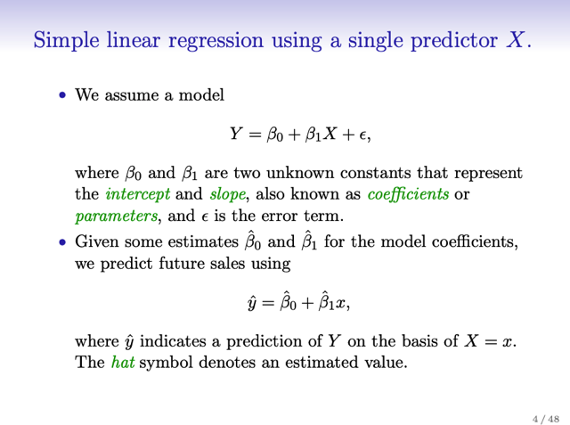</kbd></p>

<p align="center"><kbd></kbd></p>

<br>


<a id="node-133"></a>
## 3.1.1 Estimating The Coeff

<br>


<a id="node-134"></a>
### Đầu tiên nói về khái niệm \\*residual\\* (tương tự error) của data sample

> [!NOTE]
> Đầu tiên nói về khái niệm \**residual\** (tương tự error) của data sample 
> x(i) tính bằng \**sai khác\** giữa \**observation\** y(i) hay trong đây kí hiệu là 
> `y_i` và \**prediction\** của model (tại hai \**giá trị ước lượng của coefficient 
> beta0^, beta1^\**) y^_i `=` beta^0 `+` beta^1*x(i) 
>
> ```text
> Kí hiệu là e(i) = y(i) - y^(i) = y(i) - beta0^ - beta1^*x(i)
> ```
>
> Đại khái là ta cần tìm ra beta0 beta1 sao cho \**tổng bình phương các
> e(i)\** trên mọi data sample n gọi là \**RSS `=` Residual Sum of Square\** là 
> nhỏ nhất.
>
> ```text
> RSS = Σ i=1:n e(i) = Σ i=1:n [y(i) - beta0^ - beta1^*x(i)]^2
> ```
>
> Thì gs nói là \**dùng calculus \**sẽ có thể tính ra theo công thức này:
>
> ```text
> Beta^1 = Sum i [x(i) - x_mean)(y(i) - y_mean] / Sum i [x(i) - x_mean]^2
> ```
>
> ```text
> Beta^0 = y_mean - beta1*x_mean
> ```

<p align="center"><kbd>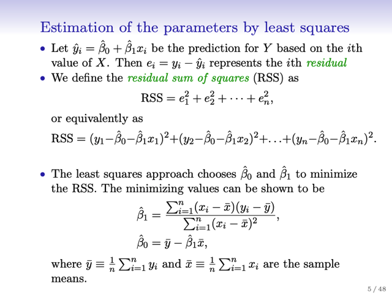</kbd></p>

<p align="center"><kbd>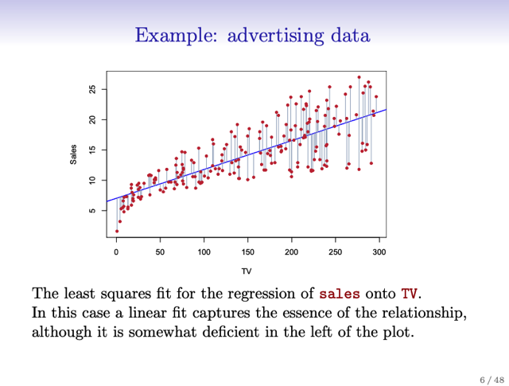</kbd></p>

<p align="center"><kbd></kbd></p>

<p align="center"><kbd></kbd></p>

<br>


<a id="node-135"></a>
### Tại sao có công thức trên:

> [!NOTE]
> Tại sao có công thức trên:
>
> Thế e(i) `=` y(i) `-` y^(i) vào triển khai f `=` RSS ra.
>
> Vậy thì giống như để tìm cực tiểu hàm f(x), ta sẽ giải phương trình
> `df/dx` `=` 0,  thì đây cũng vậy để tìm cực tiểu của RSS `=` f(beta0,
> beta1) thì ta tìm beta0, beta1 sao cho `df/dbeta` `=` 0, tương đương
> ```text
> df/dbeta0 = 0 và df/dbeta1 = 0
> ```
>
> *Ta chỉ quan tâm beta (tìm beta để RSS min) nên tuy x cũng tham
> gia tính  RSS nhưng nó không ảnh hưởng gì đến chuyện tìm beta.
>
> Do đó, đầu tiên ta tính `df/dbeta0.`

<p align="center"><kbd>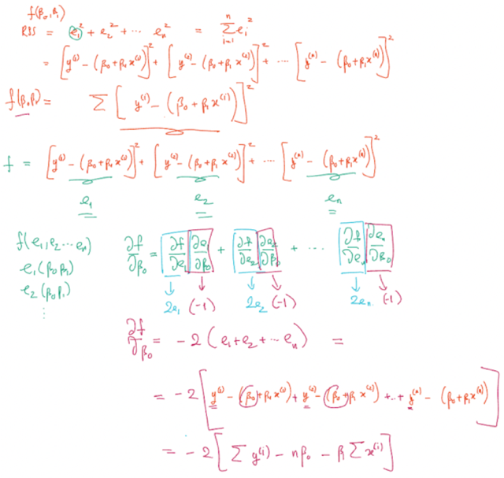</kbd></p>

<p align="center"><kbd>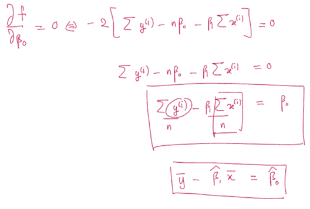</kbd></p>

<p align="center"><kbd>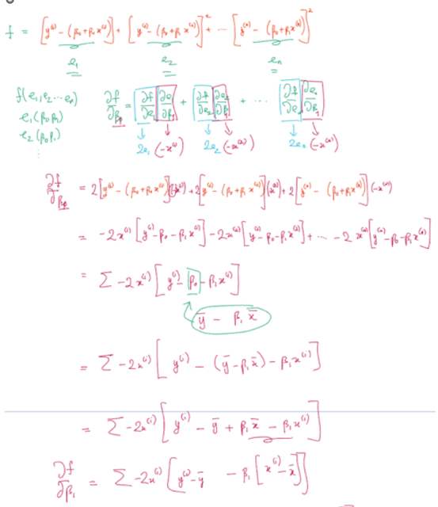</kbd></p>

<p align="center"><kbd>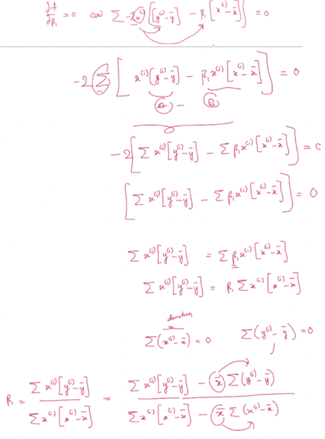</kbd></p>

<p align="center"><kbd>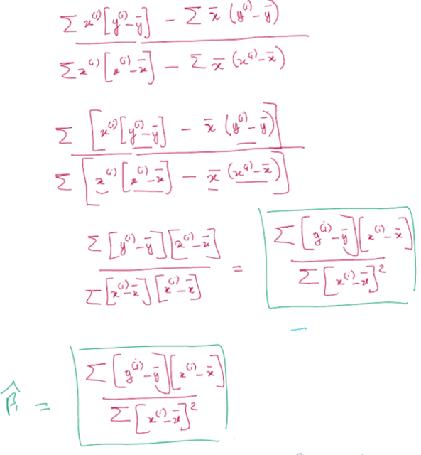</kbd></p>

<p align="center"><kbd></kbd></p>

<p align="center"><kbd></kbd></p>

<p align="center"><kbd></kbd></p>

<p align="center"><kbd></kbd></p>

<p align="center"><kbd></kbd></p>

> [!NOTE]
> Và giải phương trình `df/dbeta_0` `=` 0. Được kết quả này, thay
> ```text
> beta_0 vào phương trình có được khi triển khai df/dbeta_1 = 0,
> ```
> để có beta1

> [!NOTE]
> Tiếp, tính `df/dbeta1`

> [!NOTE]
> Và giải phương trình `df/dbeta_1` `=` 0

<br>


<a id="node-136"></a>
### Xong, thử dùng Linear Algebra.

> [!NOTE]
> Xong, thử dùng Linear Algebra. 
>
> beta `=` (XTX)_invXTy

<br>


<a id="node-137"></a>
## 3.1.2 Assessing The Accuracy

> [!NOTE]
> 3.1.2 ASSESSING THE ACCURACY
> OF THE COEFF ESTIMATES

<br>


<a id="node-138"></a>
### Đầu tiên đại ý là ta sẽ liên hệ lại phần 2.1 (theo mũi tên), trong đó, ta đã đặt ra

> [!NOTE]
> Đầu tiên đại ý là ta sẽ liên hệ lại phần 2.1 (theo mũi tên), trong đó, ta đã đặt ra
> MỘT \**GIẢ ĐỊNH\** ĐẦU TIÊN RẰNG: giá trị của response \**Y phụ thuộc một
> hàm số nào đó tính toán bởi các predictor X1,X2..Xp\** và một \**giá trị sai số
> ngẫu nhiên zero mean\**, thể hiện bởi công thức:
>
> Y `=` f(X) `+` epsilon
>
> Và trong đó, ta đã \**nhấn mạnh yếu tố giả định\** ở đây là \**các predictor mà ta có đã
> ĐỦ để có thể phản ánh, tính toán giá trị của Y\**, sai số còn lại\**CHỈ CÒN LÀ NGẪU
> NHIÊN MÀ THÔI\** (và vì thế nó có tính chất zero mean)
>
> `====`
>
> Thế thì, ở đây với việc tiếp cận vấn đề với mô hình Linear Regression, ta lại
> ĐẶT T\**HÊM MỘT GIẢ ĐỊNH NỮA\**, ĐÓ LÀ \**HÀM F LÀ HÀM TUYẾN TÍNH CỦA X\**,
> ```text
> để rồi, ta thể hiện nó theo f(X) = beta0 + beta1*X1 + beta2*X2 + ... betap*Xp
> ```
>
>
>
> thì lúc này để đảm bảo phương trình:
>
> ```text
> Y = beta0 + beta1*X1 + beta2*X2 + ...betap*Xp + epsilon,
> ```
>
> (nếu xét bối cảnh chỉ có một predictor thì Y `=` beta0 `+` beta1*X `+` epsilon)
>
> Thì epsilon sẽ \**PHẢI CHỨA THÊM MỘT LOẠI SAI SÓT TIỀM ẨN KHÁC\** `-` là
> sai sót gây ra khi \**HÀM TUYẾN  TÍNH F KHÔNG ĐỦ ĐỂ PHẢN ÁNH QUAN HỆ
> GIỮA X VÀ Y\**

<br>

<a id="node-139"></a>

<p align="center"><kbd>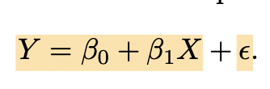</kbd></p>

<br>


<a id="node-140"></a>
### \\*cố Chấp Cứ Muốn Mô Hình Bộ Dữ

> [!NOTE]
> \**CỐ CHẤP CỨ MUỐN MÔ HÌNH BỘ DỮ
> LIỆU BẰNG ĐƯỜNG THẲNG\** THÌ\**EPSILON CHỨA HẾT CÁC SAI SÓT\**

<br>


<a id="node-141"></a>
### Nếu Cách Estimate Là \\*unbiased\\* Thì

> [!NOTE]
> NẾU CÁCH ESTIMATE LÀ \**UNBIASED\** THÌ
> KHI LÀM NHIỀU LẦN TRUNG BÌNH LẠI SẼ
> ĐÚNG (LÀ POPULATION COEEFFICIENT)

<br>

<a id="node-142"></a>
- Đại khái là:  Giả sử có bộ data mà \\*ta giả định rằng nó có quan hệ thật sự là tuyến tính\\*  nhưng chưa biết hàm tuyến tính là gì, và ta tìm các estimate ra hàm số này.  Và \\*giả sử ta biết quan hệ thật sự của x, y\\* thì đó gọi là \\*population regression line, \\*và nó sẽ xác định bởi \\*beta0, beta1 (thật)\\* \\*  \\*Vấn đề nêu ra làm làm sao xác định được beta0, beta1.  Vì ta chỉ có một bộ observation x(1),y(1),...x(m), y(m), thì dùng least squared method ta chỉ tính được beta^0, và beta^1 gọi là dự đoán của beta0, và beta1.  Thì đại ý là \\*least square line một mình nó không thể là population regression line\\*. Cũng như lấy analogy tương tự là chỉ bằng cách tính \\*mean của một bộ observation \\* y(1),...y(m) thì \\*không thể ra chính xác mean của cả population Y, \\* tức là với mọi y trong phân bố đó.  Tuy nhiên \\*nếu làm đi làm lại nhiều lần\\*, \\*mỗi lần lấy bộ observation y(1)... y(m)\\* thì \\*trung bình mean của nhiều lần tính toán ấy sẽ chính là mean của population\\*.  Tương tự như vậy, nếu nhiều bộ observation `i=1:m` x(i), y(i) và tính ra least square line (beta^0, beta^1) và \\*trung bình lại thì nó sẽ cho ra population regression line.  \\*Với \\*điều kiện là\\* sự estimate có tính chất \\*UNBIASED\\*. Và trong trường hợp này dùng sample mean để estimate cho population mean và least square coeff để estimate cho p. coeff có tính chất unbiased
  <p align="center"><kbd>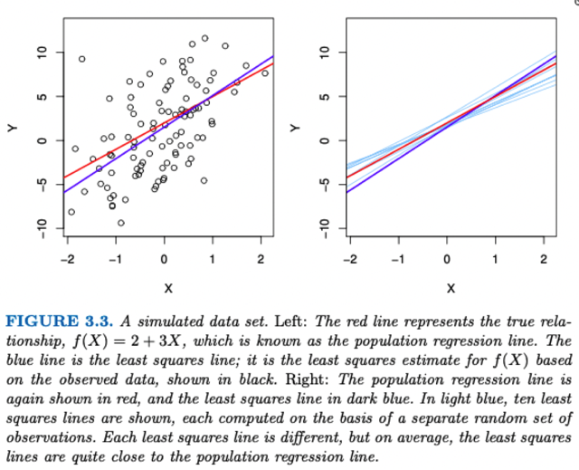</kbd></p>
  <p align="center"><kbd></kbd></p>
  <p align="center"><kbd></kbd></p>
  <p align="center"><kbd></kbd></p>
  > [!NOTE]
  > Bên trái, đường màu đỏ là True relationship, là**population regression line**.
  > đường màu tím là một least square line, tính toán dựa trên bộ observation
  > x(1), y(1)... x(m),y(m)
  >
  > Bên phải vẽ thêm nhiều least square line khác, tính toán trên nhiều bộ
  > observation khác. Thì tuy đơn lẻ từng cái thì least square không " trúng" với
  > population regression line, nhưng**trung bình lại thì nó chính là population
  > Line**

  > [!NOTE]
  > Cũng như lấy analogy tương tự là chỉ bằng cách tính mean của một bộ
  > observation  y(1),...y(m) thì không thể ra chính xác mean của cả
  > population Y,  tức là với mọi y trong phân bố đó.
  >
  > Tuy nhiên nếu làm đi làm lại nhiều lần, mỗi lần lấy bộ observation y(1)..
  > . y(m) thì **trung bình mean của nhiều lần tính toán ấy sẽ chính là
  > mean của population.**

  <br>


<a id="node-143"></a>
### Sai khác giữa \\*estimated beta (beta^)\\* với

> [!NOTE]
> Sai khác giữa \**estimated beta (beta^)\** với
> \**true beta (beta),\** lớn hay nhỏ thế nào `-` đo
> bằng \**standard error of estimated beta
> SE(beta^)\**

<br>

<a id="node-144"></a>
- Tiếp theo nói đến việc đặt ra câu hỏi \\*tính sự sai khác\\* giữa \\*mean của một bộ observation\\* và \\*population mean\\*. Thì người ta lấy ví dụ rằng giả sử cần tính ước lượng mean mu^ (tính bởi mean của bộ observation) của population  mean mu. Thì khi đó đánh gía độ chính xác của mu^ sẽ thông qua công thức `Var(mu^)` `=` SE(mu^)**2 gọi là \\*Standard Error của mu^\\*  Ôn lại một chút từ DLYo:  `E` x ~ Px [f(x)] expectation của f(x) là trung bình của hàm f(x) khi x mang các giá  trị trong phân bố. xác suất P. Vậy thì variance là kì vọng (hay hiểu nôm na là giá trị trung bình) của các độ biến động của f(x) so với `E[f(x)]` khi x thay đổi trong Px  Vậy \\*Variance của `μ^\\*` là trung bình các độ lệch của `μ^` so với Expectation của `μ^` (mà \\*Expectation của `μ^\\*,` khi thực hiện tính `μ^` trên nhiều bộ sample khác nhau sẽ \\*chính là `μ` `-` population mean\\*)
  <p align="center"><kbd>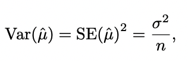</kbd></p>
  <p align="center"><kbd>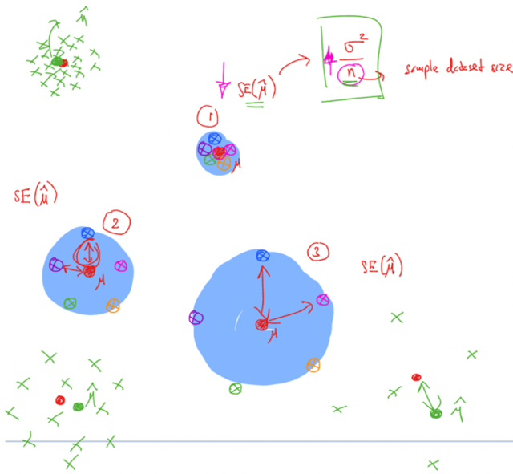</kbd></p>
  <p align="center"><kbd></kbd></p>
  <p align="center"><kbd></kbd></p>
  > [!NOTE]
  > Hiểu nôm na cái này sẽ cho biết **trung bình của sai lệch giữa
  > mu^ và mu
  >
  > Với nhận xét, càng nhiều data sample (n càng lớn) thì variance
  > của mu^ `=` trung bình sai khác giữa mu^ và mu càng nhỏ**

  <br>

<a id="node-145"></a>
- Kế tiếp đại khái là một cách tương tự ta có thể dùng \\*Standard Error của beta0^**2\\* và \\*Standard Error của beta^1**2\\* với công thức như trên để \\*ước lượng độ chính xác của beta^0 và beta^1.\\*  Thì đại khái là cũng như trên ta\\* chấp nhận tạm hiểu\\* như như vậy, và người ta nói rằng với cái công thức trên thì nhận thấy\\* nếu `x_i` mà khác nhiều với mean x bar\\* tức là \\*data trải rộng ra thì SE(beta^1) sẽ giảm\\* và họ nói có thể hiểu nôm na là \\*nếu có bộ data trải rộng thay vì co cụm thì dễ nhận ra xu hướng\\* (pattern) của nó hơn.  Và nếu mean mà tại 0 (x bar `=` 0) thì công thức SE(beta^0)**2 sẽ trở thành y SE(mu^)  Và trong hai công thức này, `\\*σ^2` là variance của epsilon,\\* nhưng ta không biết, nên chỉ có thể \\*tính ước lượng bởi Residual Sum of Error \\*đã biết ở trên qua công thức\\* \\*:  `\\*σ^2` (variance of error)  `~=` RSE `=` sqrt (RSS `/` `(n-2).`  \\*Từ đó ta \\*c\\*ó thể dùng giá trị ước lượng này cho `σ^2` trong công thức của SE(beta0^) và SE(beta1^) để đánh giá sai lệch trung bình của beta0^ và beta1^ so với population beta0, beta1
  <p align="center"><kbd>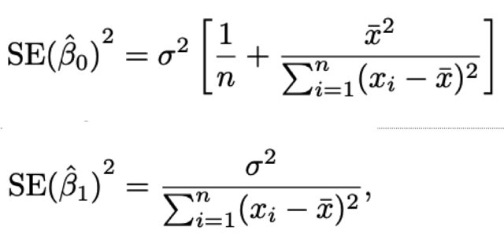</kbd></p>
  <p align="center"><kbd>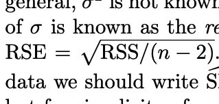</kbd></p>
  <p align="center"><kbd></kbd></p>
  <p align="center"><kbd></kbd></p>
  <br>

    <a id="node-146"></a>
    <p align="center"><kbd>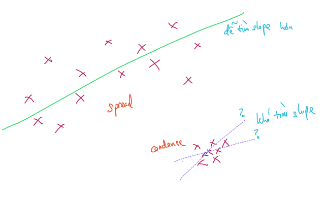</kbd></p>
    > [!NOTE]
    > Càng nhiều data sample thì dễ tìm slope hơn (ước
    > lượng chính xác hơn, gần population beta hơn)

    <br>

    <a id="node-147"></a>
    <p align="center"><kbd>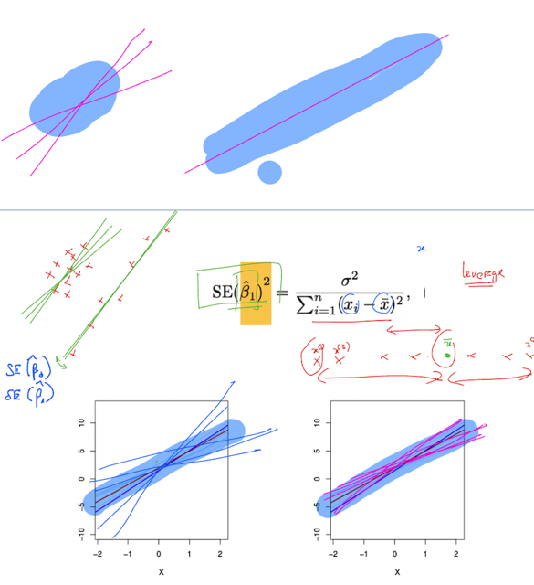</kbd></p>
    <br>


<a id="node-148"></a>
### Tự Tin (95%) Là Beta Thật Trong

> [!NOTE]
> TỰ TIN (95%) LÀ BETA THẬT TRONG
> MỘT KHOẢNG NÀY

<br>

<a id="node-149"></a>
- Tiếp theo đại khái là nói về khái niệm \\*Confidence Interval\\* mà mình đã gặp trong MLMedSpec là khái niệm nôm na là nếu nói "\\*95% confidence interval" `=\\*` dải giá trị tin cậy (interval `=` dải, khoảng) giá trị tin cậy) confident là 95% thì tức là xác suất sự `thật/giá` trị thật xảy `ra/nằm` trong dải giá trị này là 95%.  Ví dụ nếu nói 95% confidence interval của beta^1 sẽ là một khoảng giá trị mà sẽ có thể chắc chắn 95% rằng giá trị đúng của beta1 (là beta1 trong function mà chúa tạo ra, phản ánh đúng pattern của data population) nằm trong khoảng này  Và ta ghi là `beta^1+-` 2 SE(beta^1) có nghĩa interval là:  [beta^1 `-` 2*SE(beta^1), beta^2 `+` 2*SE(beta^2)]
  <br>

    <a id="node-150"></a>
    <p align="center"><kbd>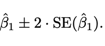</kbd></p>
    <br>

<a id="node-151"></a>
- Xong từ đó giả sử ta có 95% confidence interval của  beta^0 là [6130, 7935] beta^0 là [0.042, 0.053]  thì có nghĩa là với công thức tính sale `=` beta^0 `+` beta^1*x1 `+` beta^2*x2 `+.` .. trong đó x1, x2 là budget chi cho quảng cáo trên TV, báo đài,.., thì có nghĩa là nếu không chi đồng nào cho quảng cáo, `x1=x2=..=0` thì sale sẽ `=` beta^0.  Với 95% confidence interval như vậy thì ta có thể tuyên bố chắc chắn 96% rằng sale sẽ nằm đâu đó trong 6130 và 7935  Và với mỗi $1000 chi cho x1 thì sale sẽ tăng 1000*0.042 `=` 42 unit và  beta^0 là [6130, 7935]
  <br>


<a id="node-152"></a>
### CÓ THỂ PHÁN NGAY(True) BETA CHẮC

> [!NOTE]
> CÓ THỂ PHÁN NGAY(True) BETA CHẮC
> CHẮN KHÁC 0 KHÔNG? VÌ NHƯ VẬY THÌ
> KẾT LUẬN CÓ QUAN HỆ  GIỮA X, Y

<br>

<a id="node-153"></a>
- `->` Có, nếu variance của beta^ rất nhỏ thì chỉ cần giá trị beta^ lớn 0  còn không thì beta^ phải lớn hơn 0 một khoảng xa
  <br>

<a id="node-154"></a>
- Tiếp nói về hypothesis test, đại khái là kiểm tra hai phỏng đoán (hypothesis) là:  \\*Null hypothesis: \\*H0: X không liên quan tác động với Y bằng cách beta1 `=` 0.  \\*Alternative hypothesis\\*: Ha: X có liên quan tác động với Y bằng cách chứng minh beta1 `!=` 0  Thì đại khái là người ta \\*dùng SE(beta^1) để lập luận rằng\\*, n\\*ếu SE(beta^1) nhỏ xíu\\*, tức là \\*nôm na có thể hiểu là nó chỉ dao động trong một khoảng nhỏ\\* so với giá trị đúng của beta1 thì \\*nếu beta^1 có nhỏ mấy miễn là khác 0\\*, thì \\*vẫn có thể khẳng định là beta1 khác 0\\* và từ đó cho phép kết luận X (ví dụ feature x1 budget cho quảng cáo TV có tác động đến Y ví dụ sale).  Ngược lại \\*nếu SE(beta^1)\\* lớn, hiểu nôm na là nó dao động quanh beta1 đúng một khoảng lớn thì \\*muốn chắc chắc beta1 khác 0 thì ta phải có beta^1 đủ lớn mới được\\*
  <br>

  <a id="node-155"></a>
  <p align="center"><kbd>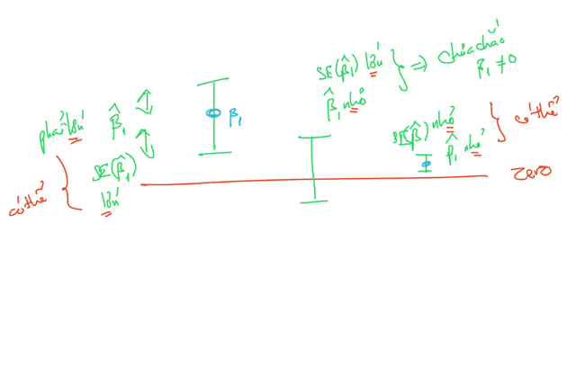</kbd></p>
  > [!NOTE]
  > Muốn chắc beta thật sự (population beta) lớn hơn 0 thì estimated beta
  > (beta^) phải:
  >
  > Variance nhỏ thì chỉ cần estimated beta > 0 là được
  >
  > Nhưng variance lớn thì estimated beta phải > 0 nhiều mới chắc cú

  <br>

<a id="node-156"></a>
- `p-value:` nếu nó nhỏ thì không thể nào có liên quan x, y thuần túy do ngẫu nhiên mà nhất định phải có liên hệ giữa chúng
  <br>

  <a id="node-157"></a>
  - Tiếp theo đại khái thực tế ta sẽ tính chỉ số gọi là\\* `t-statistic\\*` mà tạm hiểu nôm na là ....\\*"number of standard deviations mà beta^ lệch khỏi 0"\\*  Kế đến khái niệm `"p-value":`  \\*Giả định beta thật `=` 0, thì `p-value` là xác suất quan sát thấy `t-statistic` khác 0. \\*  Có thể kiến giải (interpret) nôm na (roughly speaking) là:  \\*Nếu `p-value` nhỏ, thì khó lòng có sự liên quan giữa X và Y do ngẫu nhiên, mà phải là do thật sự có một quan hệ nào đó giữa chúng.  \\*Và thường người ta\\* dùng threshold nhỏ 0.01 hay 0.05 (1% hay 5%)\\*
    > [!NOTE]
    > ?? về `t-statistic` và `p-value` nhưng nôm na là (giả sử `p-value` nhỏ xíu) xác suất
    > mà beta1 thật sự `=` 0 mà lại quan sát thấy độ lệch chuẩn `(t-statistic)` của
    > beta1^ cao như vậy là rất thấp, hay nói cách khác khả năng beta1 thật sự
    > khác 0 là rất cao, hay nói cách khác là có thể chắc chắn beta1 thật sự khác
    > không là cao.

    <br>

      <a id="node-158"></a>
      <p align="center"><kbd>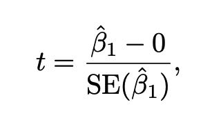</kbd></p>
      <br>


<a id="node-159"></a>
### Từ đó với một cái bảng ghi lại các giá trị của beta^0, beta^1 và SE(beta^0)

> [!NOTE]
> Từ đó với một cái bảng ghi lại các giá trị của beta^0, beta^1 và SE(beta^0)
> SE(beta^1) người ta nói rằng vì \**giá trị của hai thằng beta này lớn tương
> đối với hai trị số SE\**, nên như ở trên nói, nếu gía trị beta^ mà lớn thì
> muốn có khả năng beta thật `=` 0 thì SE phải lớn , còn nếu SE mà nhỏ thì
> có thể khẳng định là beta thật phải khác không. TỪ đó \**kết luận beta0 và
> beta1 (beta thật) khác không, nên kết luận rằng X (x1) có tác động đến Y
>
> \**Hoặc cũng có thể dùng `p-value` (mang value nhỏ) của hai thằng beta để
> kết luận tương tự. Và \**beta1 khác không cho ta kết luận rằng việc có chi
> tiền quảng cáo sẽ có tác động đến sale.\**
>
> Còn \**beta0 khác 0\** giúp ta kết luận rằng, \**ngay cả khi không chi tiền cho
> quảng cáo (cho x1 `=` 0\**) thì\**y vẫn `=` beta0 > 0\**, tức là \**vẫn sẽ có sale
> cụ thể là beta0*1000 `=` 7032 \**unit chứ không phải không quảng cáo là
> không có sale

<p align="center"><kbd>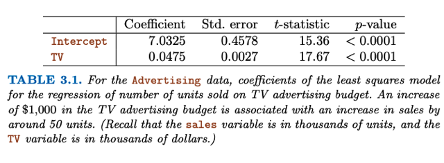</kbd></p>

<p align="center"><kbd></kbd></p>

<br>


<a id="node-160"></a>
## 3.1.3 Assessing The

> [!NOTE]
> 3.1.3 ASSESSING THE
> ACCURACY OF THE MODEL

<br>


<a id="node-161"></a>
### Rse: Ngay Cả Với Beta Chuẩn, Thì

> [!NOTE]
> RSE: NGAY CẢ VỚI BETA CHUẨN, THÌ
> LINEAR MODEL LÀM ĐÚNG ĐƯỢC TỚI
> CỠ NÀO `-` NỘI LỰC CỦA  NÓ TỚI ĐÂU

<br>

<a id="node-162"></a>
- Thì đại khái là qua phần này người ta nói về việc \\*đánh giá độ chính xác của model\\* (model prediction) Thì đầu tiên là, vì ngay cả khi có tìm được bộ beta đúng, chuẩn, thì thực tế trong quy luật phân bố của dữ liệu nó còn có \\*epsilon\\* là \\*tổng hợp\\* \\*tất cả các loại error\\* bao gồm \\*irreducible error\\* và các \\*error do model  không đủ trình để fit data\\*: Y `=` beta1X `+` beta0 `+` epsilon. Thành ra nếu mà có tìm được \\*beta chuẩn nhất\\* thì\\* vẫn sẽ có sai số trong dự đóan.\\*  Từ đó họ mới cho ví dụ rằng model có các chỉ số trong đó có \\*RSE `=` Residual Standard Error\\*, mà ta có thể hiểu đại khái đó là \\*giá trị ước lượng của standard deviation của epsilon mang ý nghĩa là trung bình các độ lệch giữa response (y) \\* \\*và true regression line.\\*  Thì từ việc nhận định rằng RSE `=` 3.26 thì có nghĩa là \\*ngay cả khi có bộ beta chuẩn, thì sẽ vẫn sai sót 3.26x1000 `=` `+-` 3260 khi dự đoán sale\\*. Và từ đó ta tính ra \\*tỉ lệ sai sót bằng cách chia cho số sale\\*. Ví dụ sale là 14000 thì tỉ lệ sai này lên tới 23% `(3260/14000)` là rất cao. Nhưng nếu sale là hàng triệu thì tỉ lệ sai sót không tránh khỏi này là thấp và có thể chấp nhận được.  Vậy chỉ số này, đánh giá sai sót do bản thân việc dùng linear model để build mô hình , và nó cho thấy nếu dùng cái linear thì \\*dù có làm tốt nhất cũng sẽ có sai sót cỡ nào. gọi là LACK OF FIT of model, cho thấy khả năng fit được data của loại model này. Giống như đo liệu cây gậy (linear model) có thể làm tốt đến mức nào ở bộ dữ liệu  cụ thể. Và tất nhiên ở đây không kể là có tìm được beta chuẩn không, vì đây là  đang xét với beta chuẩn.\\*
  <br>

    <a id="node-163"></a>
    <p align="center"><kbd>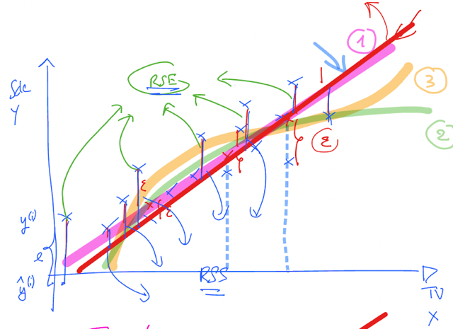</kbd></p>
    > [!NOTE]
    > RSE có thể hiểu như trung bình các epsilon `-` là các phần "sai khác"
    > từ true response với true regression line. Và *tất nhiên ta không có
    > epsilon vì không có true regression line nên ta tính nó qua RSS (bởi
    > các sum of square error `-` sai khác giữa estimated line `-` least square
    > với true response)

    <br>

    <a id="node-164"></a>
    <p align="center"><kbd>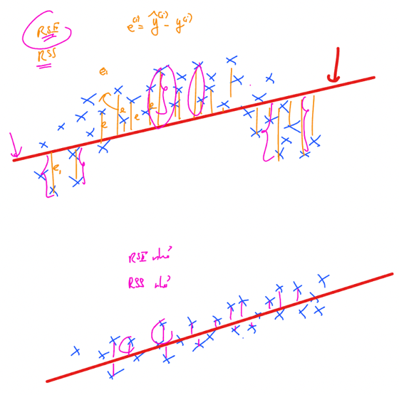</kbd></p>
    > [!NOTE]
    > Model không đủ nội lực fit được data thì sẽ có error lớn nên
    > RSS lớn và RSE lớn

    <br>


<a id="node-165"></a>
### R2: Nếu Linear Model Giúp Explain

> [!NOTE]
> R2: NẾU LINEAR MODEL GIÚP EXPLAIN
> ĐƯỢC ĐỘ VARIANCE CỦA DATA, THÌ
> CHỨNG TỎ MODEL FIT TỐT DỮ LIỆU

<br>

<a id="node-166"></a>
- Đại khái là cái R^2 sẽ cho một sự hiểu theo tỉ lệ thay vì tuyệt đối như RSE, cụ thể là nó cho biết nhờ true regression line thì bao nhiêu phần trăm variance đã được explain  TSS tính bằng tổng (y(i) `-` y_bar)**2 thể hiện\\* inherent variance của response\\*
  <p align="center"><kbd>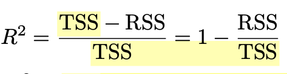</kbd></p>
  <p align="center"><kbd></kbd></p>
  <br>

    <a id="node-167"></a>
    <p align="center"><kbd>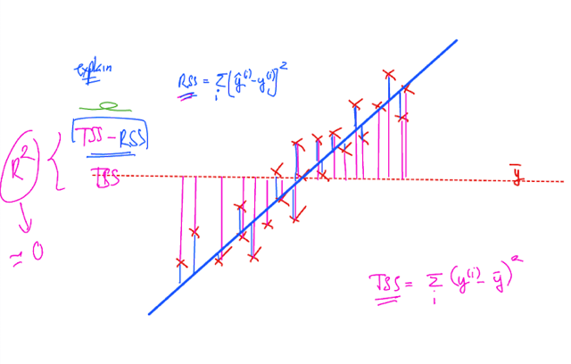</kbd></p>
    > [!NOTE]
    > RSS giống như "tồn đọng" (ý nghĩa của Residual), và TSS là variance nội tại
    > của response (inherent). Thì việc giảm từ TSS còn RSS chính là khoảng
    > variance mà regression line nó explain được. Thì tỉ lệ này,**nếu `~=` 1 chứng tỏ
    > linear model làm tốt trong việc nắm bắt quy luật của bộ dữ liệu này**

    <br>

    <a id="node-168"></a>
    <p align="center"><kbd>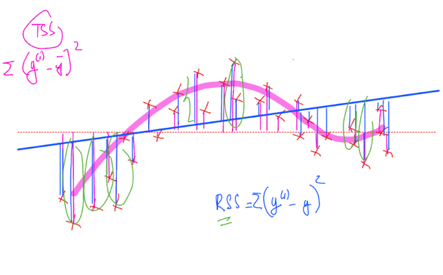</kbd></p>
    > [!NOTE]
    > Ngược lại nếu R2 này nhỏ `~=` 0 tức là phần variance
    > explained bởi regression line không đáng kể, RSS còn
    > lại vẫn lớn, thì điều này thể hiện linear model không
    > đủ để fit được dữ liệu

    <br>

    <a id="node-169"></a>
    <p align="center"><kbd>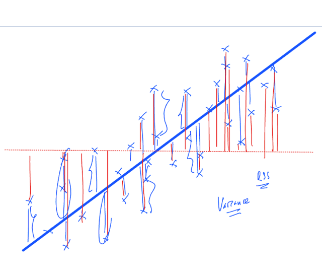</kbd></p>
    > [!NOTE]
    > Tuy nhiên vẫn có thể do model fit tốt nhưng
    > dữ liệu này có tính variance cao

    <br>

