# 3.2 Multiple Linear Regression

📊 **Progress:** `4` Notes | `14` Screenshots

---

## 3.2.1 Estimating The Coeffs

 

### Option 1: Xài 3 Cái Simple Lr Model

 

#### Đầu tiên đại khái là có thể làm **3 cái "simple linear regression"** model như phần trước để phân tích mối quan hệ của **TV-sale News-sale Radio-sales** nhưng dễ thấy là cách làm này không ổn khi **nếu muốn dự đoán sale thì  tính bằng công thức nào bây giờ (có tới 3 công thức)** Và sẽ thấy sau này đó là nếu **có tương quan (correlation)** giữa các feature (predictor) thì s**ự phân tích từ cách làm này sẽ không chính xác.**

 

### Xây Dựng Multiple Lr Với Least

> [!NOTE]
> XÂY DỰNG MULTIPLE LR VỚI LEAST
> SQUARE

 

#### Tiếp theo đại khái là ta sẽ **xây dựng mô hình multiple feature** với mỗi predictor một hệ số beta bên cạnh beta0 với ý nghĩa của các beta tương tự đó là **quan hệ của predictor ảnh hưởng tới sale (response) Khi các predictor khác giữ nguyên (fixed)**

 

#### Đại khái là nó cũng có công thức estimate các params theo least square nhưng ở dạng mayrix và các software đều có

 

### News Chỉ Ăn Theo Radio, Radio

> [!NOTE]
> NEWS CHỈ ĂN THEO RADIO, RADIO
> MỚI THẬT SỰ ĐẨY SALE

 

#### Đại khái là nhìn vào cái bảng multi-variate l.r cho thấy các cái hệ số beta của các kênh radio và tv cũng**gần gần với hệ số beta** của các mô hình simple variance lr tương ứng  nhưng trừ báo chí cho thấy (kênh quảng cáo) báo chí không tương quan hoặc **không quan hệ với doanh thu (beta của news nhỏ gần bằng 0 và p- value lớn)** mặc dù trong **mô hình simple variate l.r thì thấy có.**  Kiểm tra hệ số tương quan (**correlation**) giữa**báo chí và radio** cho thấy có sự **tương quan lớn 0,35** từ đây cho thấy những t**hị trường chi tiền cho quảng cáo trên báo chí thì cũng chi tiền quảng cáo nhiều cho radio** và **chính radio mới cái mới là cái đẩy sale** Thành ra khi làm m**ô hình simple thì thấy tương quan giữa báo chí và doanh doanh thu**nhưng thật ra ngân sách quảng cáo cho báo chí **chỉ ăn theo** hay nói cách khác là n**hận công lao của ngân sách quảng cáo cho radio**

<kbd>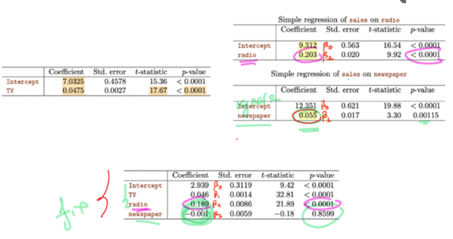</kbd>

<kbd></kbd>

 

<kbd>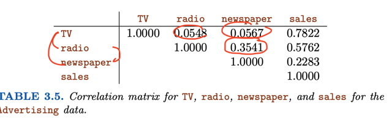</kbd>

 

#### Y như chuyện số vụ cá mập cắn có quan hệ với lượng kem bán ra. Dù thật sự lí do là nắng nóng khiến người ta tắm biển nhiều hơn nhưng dĩ nhiên là cũng ăn kem nhiều hơn

 

## 3.2.2 Important Question

 

### 1 - Có Mối Quan Hệ Nào Giữa

> [!NOTE]
> 1 - CÓ MỐI QUAN HỆ NÀO GIỮA
> PREDICTOR - RESPONSE KHÔNG?

 

#### tính f-statistic, nếu > 1 nhiều thì cho thấy ha - có quan hệ predictor-response nhưng nếu ~= 1 thì phải xem số sample n. nếu n lớn thì chỉ cần f-statistic > 0 thì hết luận ha nhưng n nhỏ thì không chắc  và tính p-value để xem nó có nhỏ  không nếu nhỏ ~= 0 thì kết luận ha

 

#### 1. Có thật sự có quan hệ giữa (các/dù chỉ một) predictor với response. Thế thì ta cũng lập hai hypothesis - Null hypothesis H0 là mọi beta_i đều bằng 0 và Alternative hypothesis Ha là ít nhất một cái khác 0  Thì đại khái là ta **tính chỉ số F-statistic theo công thức với TSS, RSS.** Và nếu F-statistic **lớn hơn 1 xa**thì kết luận **Ha** tức là alternative hypothesis (có quan hệ) nhưng nếu**F-statistic gần bằng 1** thì phải**xét số sample n,** nếu nó lớn thì chỉ cần F-statistic lớn hơn 1 là đủ reject H0 (công nhận Ha) nhưng nếu n nhỏ thì không chắc)  Rồi đại khái là nếu có H0, thì error sẽ **phân phối theo F distribution**. Và ta dùng n, p để tính p-value để nếu nó nhỏ thì như phần trên đã biết đó là có thể kết luận **không thể không có quan hệ nào mà lại khiến p-value nhỏ được.**

<kbd>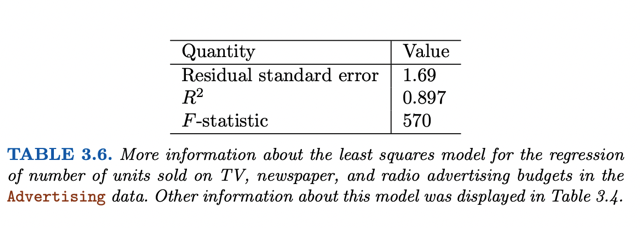</kbd>

<kbd></kbd>

 

<kbd>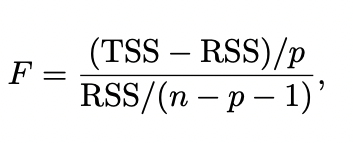</kbd>

> [!NOTE]
> Nếu **giả định linear model** là đúng thì mẫu số sẽ có
> expectation là bằng variance sigma**2
>
> Còn nếu **H0 - tức là null hypothesis** (mọi beta đều bằng 0,
> không có predictor nào tác động đến response) là đúng thì tử số
> sẽ cũng có kì vọng là variance sigma**2
>
> Nên nếu nếu F-stats mà bằng 1 tức là khẳng định
> **null-hypothesis**

 

#### Có thể hiểu đại khái là,**RSS mà chia cho degree of freedom** thì cơ bản là **Mean Square Error** theo lối quy ước của statistic đó là vì đã **"tốn" p " sample" để estimate ra parameters** và một cái cho estimate mean rồi, nên "coi như còn n - p - 1" sample.  Thế thì RSS / n - p - 1 coi như trung bình (mean) square error.  Rồi, và đương nhiên **nếu linear model assumption mà đúng** thì ta biết nó sẽ **explain được hết các variance**, chỉ còn các **zero-mean error,** tức là **nếu mà tìm được đúng true linear function**, và giả định linear model mà đúng thì error lúc này chỉ là**zero mean thuần túy do random noise**, và nó sẽ có phân bố xác suất là normal distribution có variance kí hiệu là sigma**2  Thành ra mới nói **RSS/ n - p - 1 sẽ có kì vọng là variance nếu mô hình đứng sau bộ dữ liệu này thật sự là tuyến tính**

 

#### Certainly, in the context of multiple linear regression, the book "An Introduction to Statistical Learning"  is referring to the relationship between the Mean Squared Error (MSE) or E[RSS/(n-p-1)] and the variance  of the error term (σ²) when the linear model  assumption is correct. Let's delve into this relationship:  1. **Linear Model Assumption:** The linear model assumption states that the relationship between the  dependent variable Y and the independent variables X₁, X₂, ..., Xₚ can be accurately represented by a  linear equation, including a constant (intercept) term:     Y = β₀ + β₁X₁ + β₂X₂ + ... + βₚXₚ + ε     Here, ε represents the error term, which captures the variability in Y that is not explained by the linear  relationship with the predictors.  2. **F-statistic in Multiple Linear Regression:** The F-statistic is used to test the overall significance of the  linear regression model.  It is calculated as the ratio of two variances, specifically:     F = (MSR / p) / (MSE / (n - p - 1))     - MSR represents the variance explained by the regression model.    - MSE represents the unexplained variance (residual variance).    - p is the number of independent variables (predictors).    - n is the sample size.  Now, let's focus on E[RSS/(n-p-1)]:  - RSS (Residual Sum of Squares) measures the total sum of squared differences between the observed  values of the dependent variable and the predicted values by the regression model.  - n is the sample size.  - p is the number of predictors (independent variables).  - (n - p - 1) represents the degrees of freedom associated with the residuals after estimating the model  parameters.  Here's the connection:  - When the linear model assumption is correct, it means that the regression model accurately captures the  underlying relationship between the predictors and the response variable, and the residuals (ε) are effectively  capturing the random, unexplained variability in the data.  - In this scenario, the expected value (E) of RSS divided by (n - p - 1) provides an unbiased estimate of the  population variance of the error term, which is denoted as σ² (sigma squared).  So, when the linear model assumption is true, E[RSS/(n-p-1)] indeed equals σ², which is the population  variance of the error term.   This relationship is a key result in linear regression and demonstrates that the MSE (Mean Squared Error)  is an unbiased estimator of the variance of the error term under the assumption of a correct linear model.

 

<kbd>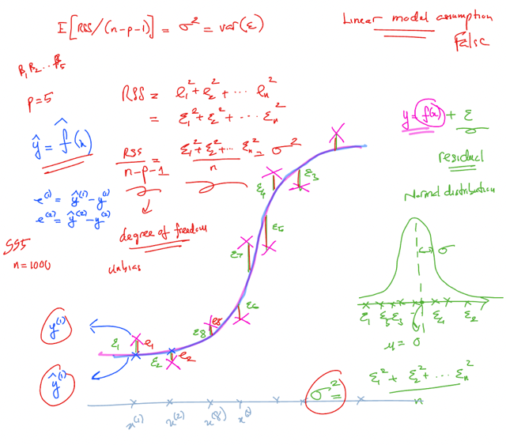</kbd>

 

#### Còn (TSS - RSS) / p là cái inherent variance của response (RSS) như đã biết bài trước, RSS là cái khoảng variance còn dư (residual) sau khi có model. Nên TSS - RSS là khoảng variance explain bởi model.  hiểu vầy nè: **nếu gỉa thuyết mô hình tuyến tính là đúng**, thế mà **cái phần nó giải thích được** là **CHỉ ĐÚNG BẰNG** là **random error variance**, thì có nghĩa là thật sự **chẳng có quan hệ nào giữa predictor và response**, vì **NẾU KHÔNG THÌ PHẦN GIẢI THÍCH ĐƯỢC PHẢI LỚN HƠN random variance error** chứ.  Vì nếu có quan hệ, thì sự variance của y khỏi giá trị trung bình,  phải đến từ 2 nguồn:  Một là quy luật chi phối y từ các x, ví dụ y = 2x thì x tăng thì y tăng  Hai là zero-mean (Normal distribution) random noise

 

<kbd>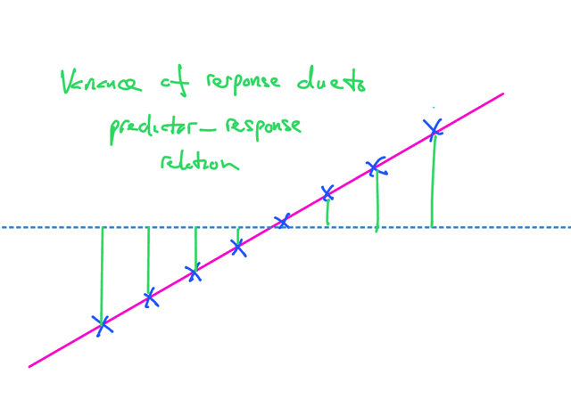</kbd>

> [!NOTE]
> Nếu có "độ dốc" thì sẽ có các variance của response liên
> quan / "do" các độ dốc này / quy luật này

 

<kbd>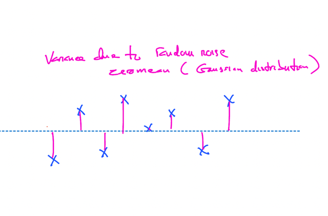</kbd>

> [!NOTE]
> Đây là trường hợp, phần variance giải thích được
> bởi model chỉ đúng bằng **random variance** nên
> chứng tỏ**chả có sự "dốc" nào. 
> (TSS - RSS) / p = random variance (sigma^2)**

 

<kbd>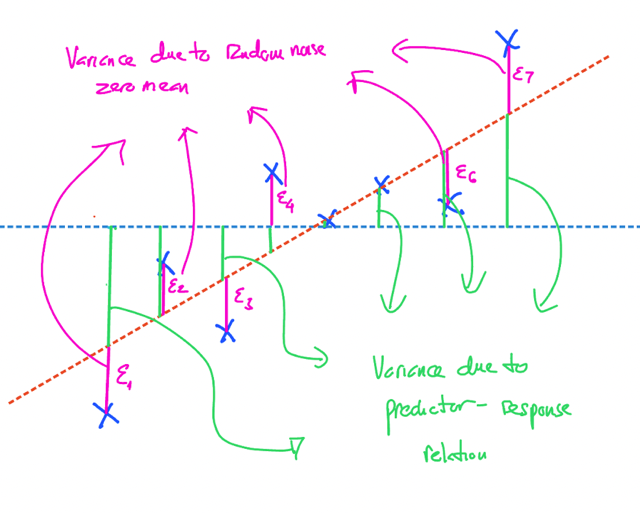</kbd>

> [!NOTE]
> Nên nếu có độ dốc thì variance explain phải lớn hơn random
> variance (random variance chỉ là phần epsilon màu hồng) vì có
> thêm phần variance do màu hồng nữa

 

#### Nói thêm về F-stats

 

#### Công thức của f-statistic, GPT cho biết được tính bởi  Mean Square Regression / Mean Square Error  Ý tưởng chính đó là dùng cái này để đánh giá liệu việc dùng một model phức tạp để fit data thì có tốt hơn model đơn giản hay không.  Trong đó Mean Square Regression hiểu đại khái là lượng variability được explain bởi model phức tạp hơn này so với model trước. Nhưng cái này được tính là tỉ lệ tương đối với số params mới thêm vào khiến model phức tạp hơn.  Nên nếu coi model đơn giản là "không có model nào", và model phức tạp hơn là model linear regression với p params (cũng chính là p predictor) thì tử số sẽ chính là  (TSS-RSS)/p với TSS là "tổng" variability (total sum of square) còn RSS là " variability" còn dư  (residual sum of square) để rồi TSS-RSS chính là phần " variability" giải thích được bởi model.  Còn mẫu số là mean square error thì dễ rồi, chính là phần error còn dư lại chia trung bình cho mỗi degree of freedom. Nên nếu có n sample, vài p predictor thì kiểu như đã dùng p + 1 sample để estimate ra p cái coefficient với 1 intercept  nên chỉ còn n - p - 1 degree of freedom.  Do đó trong công thức tính F-stat của bài toán trên, mẫu số là  RSS/(n - p - 1)  ===  Vậy câu hỏi là f-stats có công thức như vậy là do đâu. Câu trả lời đại ý là khi so sánh hai phương án, hai model  1. Nếu mẫu số giữ nguyên thì tử số càng lớn càng tốt. Ví dụ hai phương án, cho ra cũng RSS, thì cái nào tốn ít param hơn (thì  tử số sẽ lớn hơn, thì cái đó tốt hơn)  3. Hoặc cùng dùng thêm p params, thì cái nào cho ra RSS nhỏ hơn tức là tử số sẽ lớn hơn và mẫu số sẽ nhỏ hơn thì đồng nghĩa f-stats sẽ lớn hơn. thì điều này thể hiện hiệu quả của model tốt hơn  2. Nếu tử số giữ nguyên, thì cái nào có mẫu số nhỏ hơn thì sẽ tốt hơn, tức là nếu hai model cùng có độ hiệu quả giúp explain một độ  variability của response trên một param thêm vào như nhau. Thì ... cái nào dẫn đến RSS nhỏ hơn thì cái đó tốt hơn.

 

<kbd>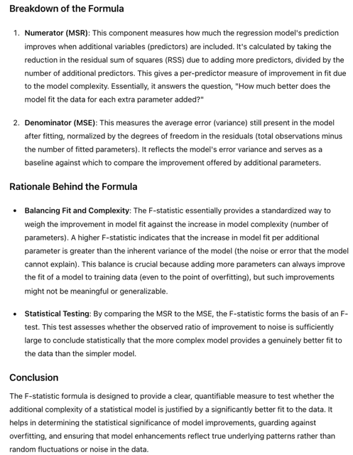</kbd>

<kbd></kbd>

<kbd>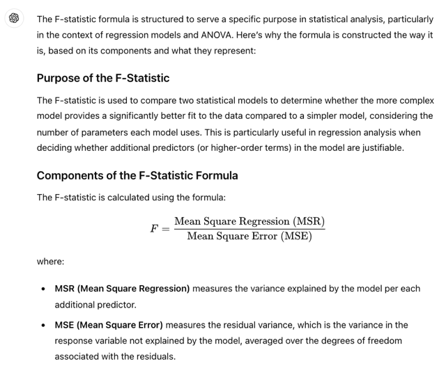</kbd>

 

#### Tại Sao Không Dùng P-value Và T-statistic Của Các Predictor Để Kết Luận Nếu Thấy Ít Nhất Một Cái P-value Nhỏ

 

#### Tiếp theo đại khái là muốn xét trường hợp liệu có thể reject hay chứng minh một "partial" null hypothesis trong đó không phải tất cả mà một số các beta bằng 0 hay không.  Thì cơ bản là họ tính F-statistic với **RSS_0** thay cho TSS trong đó **RSS_0 là RSS**của mô hình **fit với bộ các feature còn lại.**

 

#### Đại khái là nói đến việc là trong bảng **kết quả các hệ số của multiple l.r cũng có t-statistic và p-value của các predictor**. Thì hóa ra các t-statistic đó (sau khi bình phương) chính là F-statistic của các model khi bỏ đi predictor tương ứng như ở trên và nó cho một ý nghĩa là **hiệu ứng một phần "partial effect" của predictor đó khi add vào model** (nhiều predictor) kiểu như đóng góp  Dẫn đến câu hỏi là **khi đã có các t-statistic và p-value của từng predictor** thì tại sao không khẳng định Ha - là có mối quan hệ giữa predictor (feature) và response, dù không biết cụ thể cái nào - bằng cách xem xét các chỉ số p-value của (bộ) và t-statistic gắn với mỗi predictor công bố trong bảng hệ số của multiple-linear regression model và nếu thấy **có ít nhất 1 cái nhỏ thì kết luận là Ha?**  Thế thì vấn đề là **nếu p (là số lượng predictor) lớn** thì **khả năng cao là có những cái p-value nhỏ chỉ vì ngẫu nhiên** thành ra sẽ bị lầm. Còn khi tính toán **F-statistic**(với multi-variable regression) thì không bị hiện tượng này.

 

#### Cuối cùng nếu p (số lượng predictor / feature) mà lớn hơn n (số sample) thì không thể fit được model với multiple l.r nên không dùng F-statistic để phân tích được phải dùng các cách tiếp cận khác như forward selection sẽ được học sau

 

### 2. Feature / Predictor Nào Quan

> [!NOTE]
> 2. FEATURE / PREDICTOR NÀO QUAN
> TRỌNG (ẢNH HƯỞNG ĐẾN RESPONSE)

 

#### Không Thể "tin Cậy" P-value Của Từng Predictor Khi P Lớn (để Kết Luận Quan Hệ Predictor-response) Variable Selecton

 

#### Đại khái là khi fit multiple l.r ta có các p-value cho từng predictor như đã biết, tuy nhiên **nếu chỉ dựa vào đó để kết luận predictor nào có ảnh hưởng đến response thì ta sẽ bị sai** như đã nói ở trên vì nếu số predictor lớn thì sẽ có những cái p-value nhỏ (mà ta dùng để kết luận là predictor đó có quan hệ với response) **thuần túy là do ngẫu nhiên.**  Thành ra phải tìm các xác định khác, để biết cái (predictor) nào thật sự ảnh hưởng tới response để rồi **build một cái model chỉ xài các predictor** này thì quá trình này gọi là **variable selection.**

 

#### Một cách lý tưởng nhưng phi thực tế đó là ta build các model riêng lẻ với từng combo các predictor và so sánh tụi nó với nhau qua các công cụ như Mallow's Cp, AIC, BIC và adjusted R^2 hoặc plot kết quả ra để xem xét. Tuy nhiên dễ thấy với nhiều predictor thì số combination giữa chúng là rất lớn 2^p thành ra ta sẽ không thể làm vậy được.

 

#### Có 3 cách làm:  Forward selection đại khái là bắt đầu với null model (chỉ có intercept beta0) rồi thử p simple model để coi cái nào có RSS nhỏ nhất thì lấy cái predictor đó bỏ vào. Tiếp, lại thử p (2 predictor, 1 cái đã add lần trước 1 cái candidate) model xem cái nào RSS thấp nhất, tiếp tục vậy cho đến khi có một điều kiện stop rule thỏa.

 

#### Backward thì đại khái là bắt đầu với (mọi predictor model) và bỏ đi cái nào có p-value lớn nhất,  sau đó fit lại và lại bỏ đi cái có p-value lớn nhất. Cứ làm vậy cho đến khi mọi p-value đều nhỏ hơn một threshold nào đó.

 

#### Mixed: Thì tương tự như forward nhưng khi add thêm predictor (chọn) thì nếu có cái nào trở nên có p-value lớn thì bỏ ra.

 

#### Thế thì backward có nhược điểm là không làm được với p > n. Như đã nói ở trên. Còn forward thì sẽ bị tình trạng là add 1 cái predictor xong thì sau này add cái khác suất hiện tình trạng p-value của nó lớn (giống như Newspaper vậy) thế nên mixed Strategy giúp khắc phục

 

### 3. Model Fit Tốt Cỡ Nào?

 

#### R^2 Một Lần Nữa Cho Thấy News Không Có Tác Dụng

 

#### Đại khái là R^2 như đã biết đo lường việc model fit nó explain được bao lớn sự variance (của error) Thành ra nếu R^2 ~= 1 thì tức là model fit tốt khi explain được phần lớn variance.  Kiểm tra R^2 của (cả ba predictor) r.l model thì thấy nó cũng same same với R^2 (của Radio + TV) model dù chỉ nhích hơn đôi chút (0.8972 vs 0.89719). Điều này tái khẳng định sự không ảnh hưởng của Newspaper lên sale.  Nói thêm R^2 luôn tăng dù ít khi thêm predictor dù là một redundant predictor mà lí do người ta nói là do việc thêm predictor luôn giúp giảm RSS trên training set nhưng chưa chắc là trên test set.  Nói cách khác việc để Newspaper vào chỉ tổ gây overfit.

 

#### Ngược lại với cái redundant feature Newspaper, nếu ta lấy model chỉ có TV và so mới model có cả TV và Radio thì sẽ thấy R^2 tăng lên từ 0.61 thành 0.8972. Cho thấy việc dùng  cả hai feature TV và Radio giúp tăng độ variance explained lên đáng kể.

 

#### Rse Cũng Cho Thấy Giảm Đáng Kể Khi Từ (tv) Model Thành (tv + Radio) Model Nhưng Không Thay Đổi Gì Khi (tv + Radio + News)

 

#### Tương tự có thể check với RSE, với model có TV và Radio thì RSE là 1.681, có thêm News thì nó nhích lên tí xíu là 1.686. Trong khi đó nếu chỉ có TV thì RSE là 3.26, cho thấy  việc thêm Radio giúp giảm đáng kể Residual Standard Error (RSE).  Hiện tượng thêm News vào khiến nhích RSE lên là vì RSE = sqrt(RSS/(n-p-1)), thêm News khiến RSS giảm như đã nói (tức là tử số giảm) nhưng p tăng (do thêm một predictor) dẫn  tới -p giảm và nếu mẫu giảm nhiều hơn tử thì kết quả RSE tăng. Ví dụ 3/3 = 1, 2/1 = 2

 

#### Plot Ra Để Coi

 

#### Cuối cùng đại khái khi plot ra vối TV, Radio - SALE thì thấy hiện tượng model overestimate những sample mà chỉ lệnh về TV hay Radio còn lại underestimate những sample chia đều cả hai kênh từ đó cho thấy có sự synergy (hiệp lực) của hai kênh cho thấy cần phải có mô hình phi tuyến (X1X2 là giống như X1^2 - ý nói lũy thừa không còn bậc 1 nữa)

 

<kbd>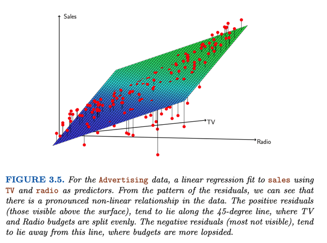</kbd>

 

### 4. Prediction Từ Predictor Value

> [!NOTE]
> 4. PREDICTION TỪ PREDICTOR VALUE
> CHO TRƯỚC? VÀ ĐÚNG TỚI CỠ NÀO?

 

#### 3 Nguồn Không Chắc

 

#### Nguồn thứ nhất gây sự uncertainty như đã biết đó là không estimate đúng được beta (true population beta). Thì cái này là reducible error. Thì tương tự như simple l.r ta có thể "thiết kế" 95% confidence interval  Nguồn thứ hai đó là sai sót do giả định quy luật là là tuyến tính nhưng thật sự không phải vậy. Thế thì cái này tạm thời bỏ qua để tiếp tục giả định là mô hình tuyến tính là đúng  Và cái thứ ba đương nhiên là random error epsilon và nó là cái irreducible error.  Thành ra dù có xác định đúng beta thì cũng không dự đoán chính xác được response.

 

#### Prediction Intervals

 

#### Đại khái là nói về Confidence interval cho thấy khoảng tự tin ràng average sale thật sự sẽ rơi vào. Còn Prediction interval cho thấy khoảng mà sale ở một particular market sẽ rơi vào.  Không thấy nói đến cách tính nhưng chỉ nói prediction  Interval sẽ lớn hơn confident interval vì nó có tính  cái random error nữa. Còn Confidence  Interval thì không tính random error, nó chỉ "cover" sai sót do estimate không đúng true beta thôi.  Và thành thử ra nó chỉ "dành cho" average sale vì khi tính cho toàn bộ,  random error sẽ bị khử (random error là zero mean). Còn cho một market cụ thể thì phải có random error thành ra prediction interval sẽ lớn hơn

 

