# 3.3 Other Considerations In The Regression Model

📊 **Progress:** `4` Notes | `28` Screenshots

---

## 3.3.1 Qualitative Feature

 

### Đơn giản là tạo dummy feature mang giá trị 1 vs 0, hoặc nếu

> [!NOTE]
> Đơn giản là tạo dummy feature mang giá trị 1 vs 0, hoặc nếu
> có nhiều categories hơn thì tạo vài dummies feature. Bước
> này có tên là one-hot encoding.

 

### Nói về các cách giải thích / kiến giải của một ví dụ dùng dummy

> [!NOTE]
> Nói về các cách giải thích / kiến giải của một ví dụ dùng dummy
> feature để represent cho qualitative feature.

 

## 3.3.2 Extensions Of Linear Model

 

### Remove Additive

> [!NOTE]
> REMOVE ADDITIVE
> ASSUMTION

 

- Đại khái là giả định rằng sự quan hệ của predictor với response là riêng lẻ, kiểu như nếu beta TV là 2 thì cứ mỗi 1 unit tăng của TV là sale tăng thêm luôn là 2, không quan tâm mấy predictor khác ra sao. Thì assumption này không phải luôn đúng. Vì có khi với các giá trị của Radio khác nhau thì mức tăng sale do tăng TV lại khác nhau. Hay nói cách khác beta TV là function theo Radio. Hiện tượng này gọi là Synergy - Hiệp lực hay Interaction - Tương tác.  Giải pháp là tạo các combination TV*Radio với beta riêng và có thể triển khai ra để cho thấy beta TV trở thành hàm của Radio: Sale = beta0+ beta1~*TV + beta2*Radio Beta1~ = beta1 + betat3*Radio  Ví dụ trong bài toán predict ra số sản phẩm theo hai predictor là số dây chuyền sản xuất và số nhân công, thì việc tăng sản phẩm chỉ bằng cách tăng số dây chuyền chỉ có thể hiệu quả nếu đồng thời tăng số nhân công
   

    
    
<kbd>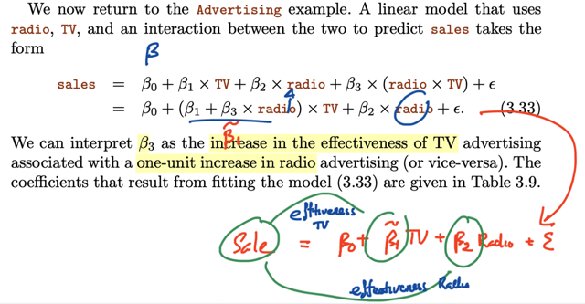</kbd>

    > kiến giải beta 3 như độ tăng mức hiệu quả
    > của TV khi tăng radio 1 đơn vị

     

- Cũng như trong Advertising data cho thấy sale sẽ tăng tốt hơn khi chia TV và Radio cùng lớn (hay nói cách khác, hiệu quả tăng Sale của TV sẽ tốt hơn nếu Radio cũng  tăng. Minh chứng bởi việc fit model với interaction term giúp R**2 lớn hơn (variance explain nhiều hơn)
   

    
    
<kbd>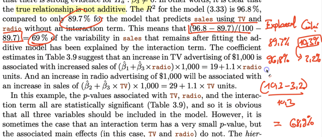</kbd>

     

    
    
<kbd>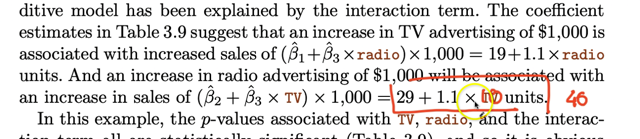</kbd>

    > ví dụ cho thấy có quảng cáo TV = 10000$ thì 1000$ quảng
    > cáo trên Radio giúp tăng sale 40 cái
    > thay vì 29 cái này ko có TV

     

- Một cái nữa là nếu thấy có synergy - hệ số beta gắn với interaction feature > 0 (và p-value ok) thì \\*nên include cả hai feature riêng lẻ\\* DÙ CHO p-value của chúng không đủ significant. Thì cái này là do hierarchical principle
   

- Nói qua việc combine quantitative + qualitative feature đại khái là  Việc dùng dummy variable cho student sẽ fit ra model thể hiện bởi hai đường song song (cùng slope) cho có/không student  kết quả của việc có interaction term cho thấy độ dốc của income-balance nếu là student thấp hơn nếu ko phải student thể hiện việc anh ta là sinh viên sẽ khiến khi tăng income dẫn đến tăng balance ít hơn nếu ko phải là sinh viên
   

    
    
<kbd>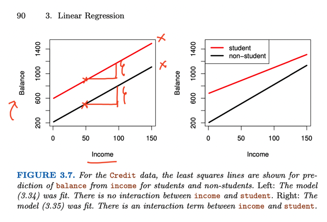</kbd>

     

    
    
<kbd>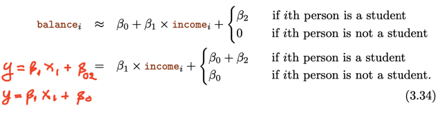</kbd>

     

    
    
<kbd>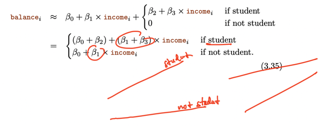</kbd>

     

### Non-linear

> [!NOTE]
> NON-LINEAR
> RELATIONSHIPS

 

- Thì đại ý là có thể dùng feature mới bằng lũy thừa của feature gốc, mô hình vẫn tuyến tính nhưng vẫn giúp \\*capture được non-linear pattern gọi là polynomial regression\\*. lấy ví dụ dùng x**2 cho thấy R2 lớn hơn thể hiện variance captured lớn hơn là xài x^1  Tuy nhiên nếu dùng bậc cao quá dẫn đến overfit. Sẽ bàn sâu thêm ở C7
   

    
    
<kbd>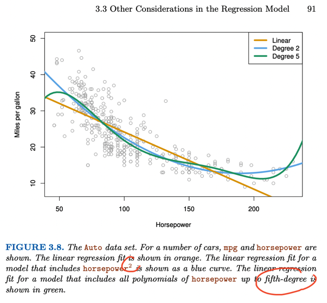</kbd>

     

## 3.3.3 Potential Problem

 

### 1. Non-linearity Of Data

 

- Đại khái là có thể \\*xem giả định quan hệ giữa predictor và response là tuyến tính có đúng không\\* bằng cách xem xét r\\*esidual plot \\*đồ thị giữa prediction y^ và error (y^-y) (residual). Để rồi nếu thấy có pattern nào đó thì chứng tỏ có \\*non-linear relationship\\* (Tại sao, thử lí luận lại note tiếp theo?)  Vẽ thử ở hai trường hợp fit với \\*linear\\* và với \\*polynomial\\* (cụ thể là dùng x^2 - quadratic)  thì thấy cái sau, g\\*iảm hẳn sự rõ ràng (discernible) trong pattern\\* chứng tỏ \\*dùng polynomial giúp capture được non-linearity.\\*  Kết luận là nếu thấy dấu hiệu \\*có pattern trong residual plot\\* này thì đơn giản là dùng \\*polynomial regression hoặc các model khác có tính non-linearity\\*
  
<kbd>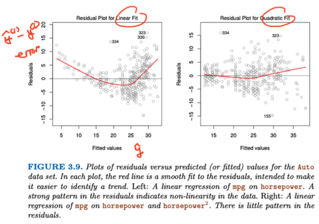</kbd>

  
<kbd></kbd>

   

- \\*Tại sao residual plot có pattern nào đó thì chứng tỏ có non-linear relationship? \\* Ta nhớ rằng mình đã đặt ra giả định đầu tiên khi thiết lập equation Y = f(X) + epsilon, với epsilon là random error có tổng bằng 0, \\*giả định đó là ta đã bao gồm mọi predictor có thể gây tác động đến response\\*, để rồi chỉ cần tìm được hàm f thì về cơ bản có thể giảm hết mọi reducible error, chỉ còn lại non-reducible error là cái random error ở trên.  Nếu giả định này không đúng, để phương trình cân bằng, dù có tìm được hàm f, thì epsilon phải chứa cả những sai số liên quan đến việc thiếu những predictor cần thiết cũng tham gia tác động tới response.  Rồi khi qua dùng linear regression, bằng việc cho rằng Y = beta0 + beta1X + epsilon ta đã đặt\\* thêm một giả định\\* đó là\\* quan hệ thật sự của predictor-response là tuyến tính \\*để rồi chỉ cần tìm ra được coefficient thì sẽ có được hàm f.  Nếu giả định này không đúng, thì cộng với giả định trên không đúng, thì epsilon lúc này sẽ\\* chứa cả sai số liên quan đến các predictor bị thiếu\\*, và \\*sai số do việc ngay cả khi ta có được population regression line\\* - tức là đường tuyến tính tốt nhất represent cho dữ liệu rồi thì cái population line này vẫn không đủ để vì thật sự quy luật của dữ liệu là phi tuyến.  ===  Thì đó là ôn lại một chút về các giả định. Thế thì, nói về epsilon, thì nếu giữ giả định (1) ban đầu là đã include mọi predictor, để epsilon chỉ là random error zero mean, và khi dùng linear regression, tiếp tục giả định rằng quy luật thuật  sự của data là tuyến tính, để khiến cho population regression line sẽ fit được quy luật đó (2), thì khi đó \\*epsilon vẫn là random error zero mean\\*.  Thế thì, có thể hiểu, \\*random error này là thứ không phụ thuộc bởi predictor (1)\\* và hệ quả là\\* sau khi fit, ta in ra biểu đồ của residual plot\\* - thể hiện  những\\* sai số " còn lại"\\* \\*theo predictor\\*, thì nếu model fit tốt = xấp xỉ được population regression line (hay các predicted coefficient beta^_j ~= population coefficient beta_j) thì ta sẽ \\*kì vọng thấy residual plot có không có quy luật nào rõ ràng\\*  Vì\\* nếu có quy luật nào rõ ràng\\*, thì \\*chứng rõ RESIDUAL ERROR ĐANG CÒN PHỤ THUỘC VÀO PREDICTOR\\*, và điều đó chứng tỏ điều số (2) trên không còn đúng nữa.  Khi đó ta phải xem lại giả định rằng quan hệ thật sự là tuyến tính, vì lúc này chứng tỏ residual error đang chứa cả những sai số do population line không đủ khả năng fit được quy luật thật sự (phải là phi tuyến) của dữ liệu.
  
<kbd>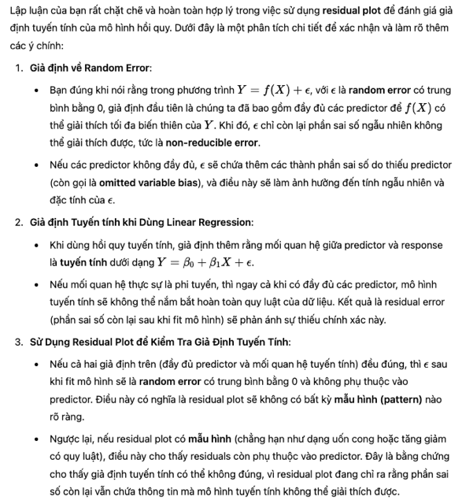</kbd>

  
<kbd>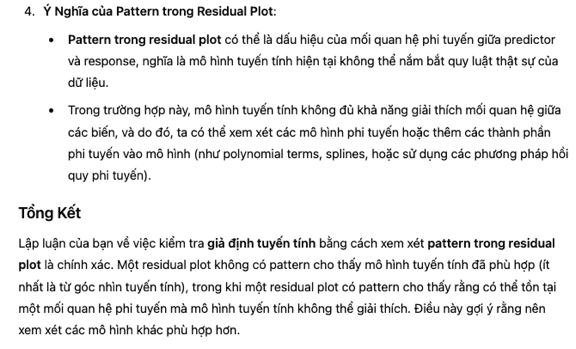</kbd>

  
<kbd></kbd>

  
<kbd></kbd>

   

### 2. Un-correlated Error

> [!NOTE]
> 2. UN-CORRELATED ERROR
> ASSUMTION

 

- Đại khái là ta làm bữa giờ với một giả định nữa là các error term un-correlated nhau. Thành ra nếu giả định này không đúng, ta có thể  phán đoán sai, p-value thực tế sẽ lớn hơn tính toán, standard error thực tế sẽ lớn hơn  dẫn đến 95% confident interval thực tế sẽ rộng hơn.  Và nói chung là ta sẽ không thể tự tin là các kết quả có chuẩn không
   

- Người ta lấy ví dụ nếu mình double dataset, cơ bản là tạo ra sự correlated giữa các error term thì khi đó tính toán Standard Error vì dataset * 2 nên SE lại giảm đi square root of 2 lần. Rõ ràng là ta sẽ mắc sai lầm, vì rõ ràng không phải vậy. Minh họa cho việc nếu error term correlated thì Ta sẽ giảm độ chắc chắn.
   

    
    
<kbd>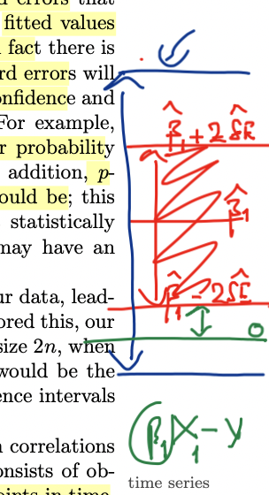</kbd>

     

    
    
<kbd>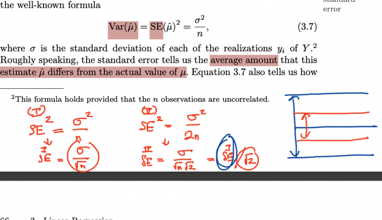</kbd>

     

- Nói về nguyên nhân của cái này và nhất là khi trong time-series data, hai data point liền kề thường bị có hiện tượng \\*tracking\\*, tức là kiểu như hai residual liền kề thường cùng / giống nhau value. Với 3 hình ảnh ví dụ không có, có tracking với correlation 0.5 và correlation 0.9 cho thấy hiện tượng các residual liền kề giống / xem xem nhau  Ngoài ra, nếu lấy chiều cao cân nặng của các cá nhân để làm feature tính toán (Cho bài toán nào đó) thì các cá nhân cùng một gia đình cũng sẽ gây correlation error. Lí do là vì họ sẽ có chung chế độ ăn nên nếu mập thì thường cả nhà cùng mập. Và khi Tính residual error thì có thể tính trên các cá nhân trong cùng gia đình đều xem xem
   

    
    
<kbd>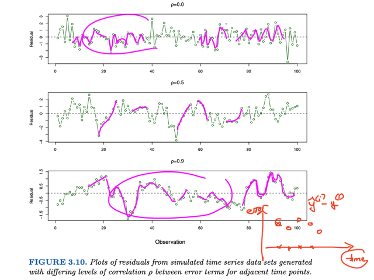</kbd>

     

### 3. Non-constant Variance Error Terms

 

- Đại khái là linear regression còn dựa trên một giả định là variance của (random zero mean) \\*error có variance không đổi. \\*  Nhưng thật sự thì \\*variance của error không phải lúc nào cũng như nhau\\* mà sẽ t\\*hay đổi theo response\\*, hiện tượng này được gọi tên là "phương sai không đồng nhất" - \\*heteroscedasticity\\*  Và trong những trường hợp xảy ra cái này thì linear regression sẽ không chính xác, vì \\*standard error, confidence interval đều phụ thuộc giả định này (vì sao)\\*  Gs lấy ví dụ plot ra \\*residual plot\\* theo prediction thì thấy\\* VARIANCE CỦA RESIDUAL ERROR\\* có dạng như cái ống khói mà đầu nhỏ đuôi to thể \\*hiện độ variance tăng dần\\*.  Như vậy residual plot giúp kiểm tra xem giả định linearity ở điểm 1 để từ đó cân nhắc xài polynomial predictor và ở đây cũng giúp kiểm tra giả định constant error variance.  Thế thì gs cho rằng giải pháp là \\*dùng log Y hay sqrt(Y) gọi là response transformation \\*
  
<kbd>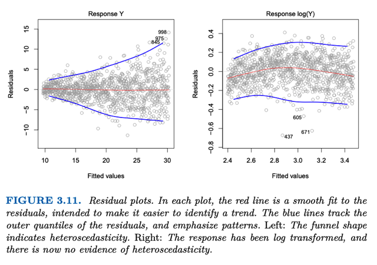</kbd>

  
<kbd></kbd>

   

- Vì sao standard error confidence interval phụ thuộc vào giả định error variance không đổi?  ....
   

### 4. Outliers

 

- Đại khái là outlier không gây thay đổi regression line nhưng lại thay đổi các chỉ số như R^2, RSE. Khó có thể xem xét như thế nào thì coi là outlier nhưng có thể dùng cách tính studentized residual để phát hiện  Nếu cảm thấy outlier đơn giản là do sai sót của quá trình recording thì có thể đơn giản là remove, Nhưng phải cẩn thận kẻo bỏ đi predictor quan trọng.
   

### 5. High Leverage Point

 

- Thì đại khái là cái này không như outlier - predictor bình thường, nhưng response bất thường.  Cái này, predictor bất thường, response bình thường khiến cho leverage bị sai lệch -> hệ số độ dốc bị sai.  Người ta cho ví dụ cho thấy một sample có tính chất high leverage. Dễ quan sát thấy là giá trị của predictor (x) nằm ngoài phạm vi phân bố chung của  các sample. Cụ thể là trong trường hợp này khi các predictor phân bố theo  normal distribution thì thằng x này nằm rất xa mean.  Thế thì ví dụ cũng cho thấy khi fit regression least square line với việc có nó hoặc không có nó (high leverage point) thì cho ra hai line khác nhau. Từ đó  cho thấy high leverage point là ảnh hưởng sai lệch đến kết quả fitting model.  Vấn đề là trong bài toán simple linear regression (chỉ có 1 predictor) thì dễ  phát hiện các điểm này, vì chỉ cần xem xét normal range của dataset và xem anh nào nằm ngoài phạm vi này. Tuy nhiên khi xét 2 predictor thì sẽ thấy một high leverage point nếu xét từng predictor thì hoàn toàn nằm trong normal range của predictor đó. Nhưng khi xét multivariate distribution thì mới thấy  nó nằm ngoài. Do đó nếu mà có nhiều predictor thì sẽ rất khó dùng plot để phát hiện các high leverage point.  Do đó ta có thể tính \\*LEVERAGE STATISTIC\\* để đánh giá một điểm có phải  high leverage point hay không. Đại khái là nếu một sample (observation) có chỉ số này vượt xa \\*(p+1)/n\\* thì cho thấy nó là high leverage point
  
<kbd>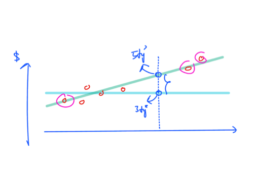</kbd>

  
<kbd>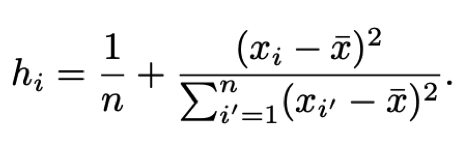</kbd>

  
<kbd>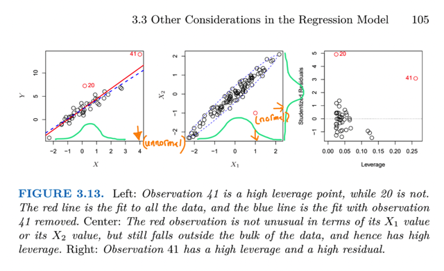</kbd>

  
<kbd></kbd>

  
<kbd></kbd>

  
<kbd></kbd>

  > trong simple case này dễ thấy nó nằm ngoài normal range
  > (univariate Gaussian distrib) nhưng trong hình giữa, tuy mỗi
  > predictor đều nằm trong single variate Gaussian nhưng xét cả hai
  > predictor thì nó nằm ngoài (hình elip)

   

### 6. Collinearity

 

- Đại khái vấn đề collinearity (tạm dịch là tính chất cộng tác) là khi xuất hiện tình trạng khi có hai hoặc nhiều predictor gọi là cùng tăng cùng giảm nhau, tương quan một cách tuyến tính  với nhau. Điều này sẽ khiến kiểu như là khó mà xác định được predictor nào là tác động đến response.  Cách xác định cái này có thể bằng cách kiểm tra correlation  matrix hoặc VIF. Correlation matrix thì có hạn chế là chỉ check  được collinearity giữa hai predictor. Nhưng vẫn có thể có trường hợp không có tính chất này giữa hai predictor nhưng lại có giữa một nhóm vài predictor gọi là multi-collinearity  Khi đó dùng VIF sẽ giúp xác định được.
   

    
    
<kbd>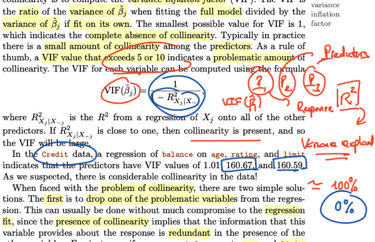</kbd>

    > Cách tính VIF đó là theo công thức 1 / 1 - R^2 Xj/X-j. Trong đó 
    > R^2 Xj/X-j là R^2 của mô hình dùng mọi feature trừ feature j để
    > dự đoán feature j (tức là dùng các feature khác để train model,
    > với target value là feature đó). Vậy nếu R^2 gần bằng 1 đồng nghĩa
    > là dùng model fit với các feature khác có thể giải thích gần hết 
    > variability của feature đang xét thì chứng tỏ là có yếu tố multi-collinearity.
    > và R^2 gần 1 thì 1- R^2 gần 0, tức là nhỏ, thì VIF =. 1 / 1 - R^2 sẽ lớn.
    >
    > Nên thường thường VIF lớn hơn 5 hay 10 sẽ cho thấy vấn đề

     

    
    
<kbd>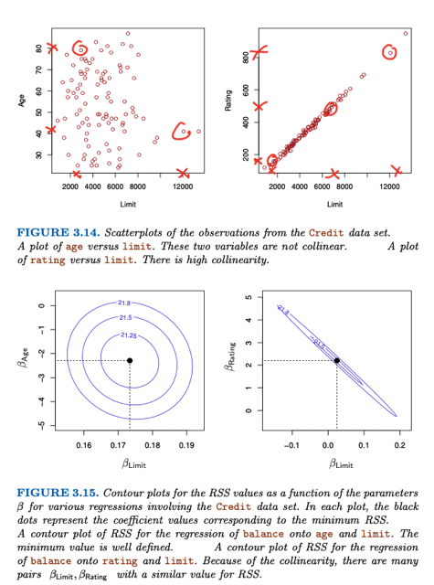</kbd>

     

    
    
<kbd>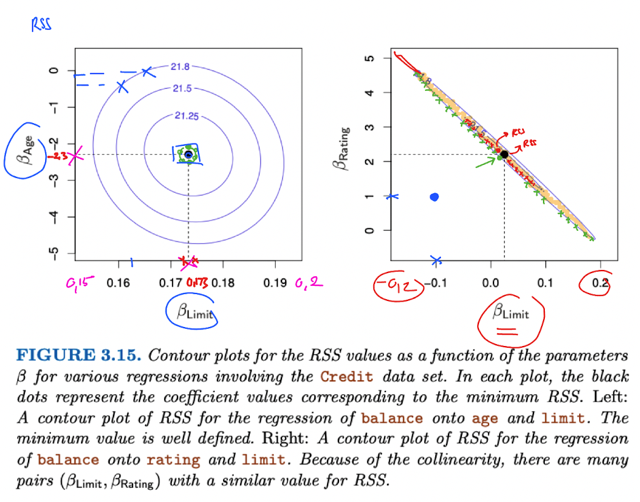</kbd>

     

    
    
<kbd>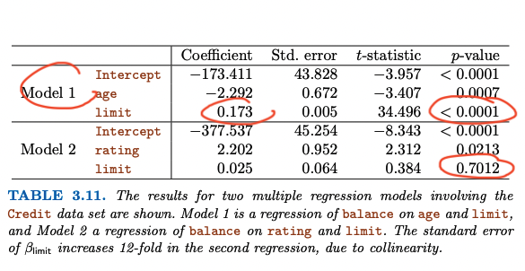</kbd>

     

