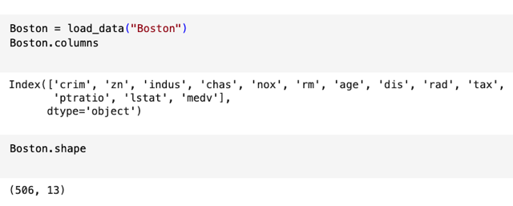
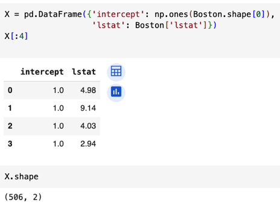
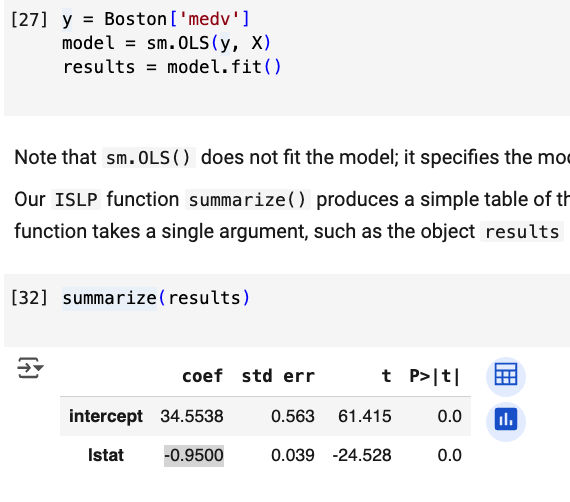
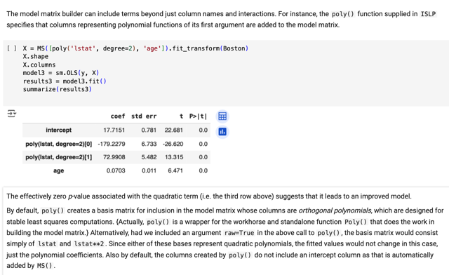
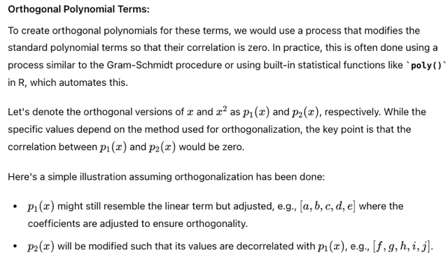
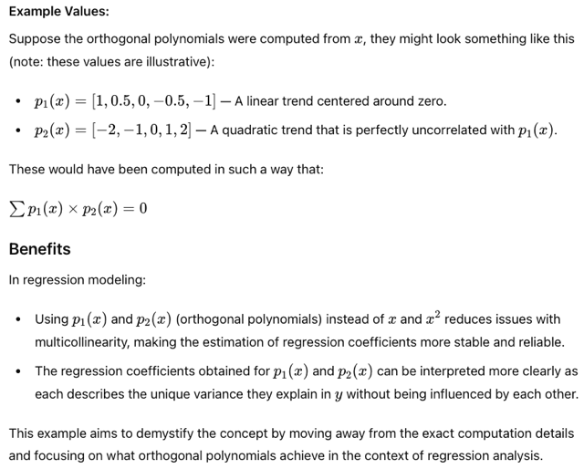
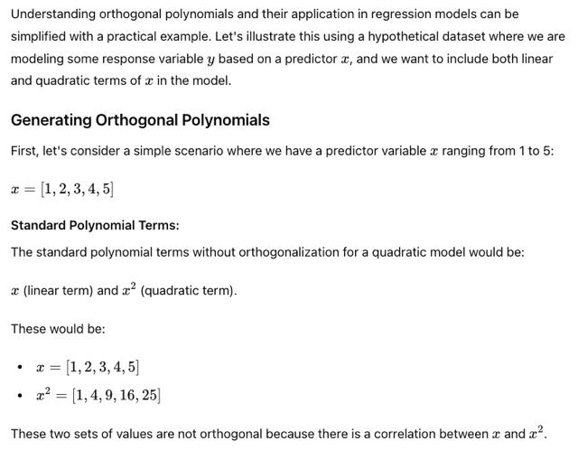
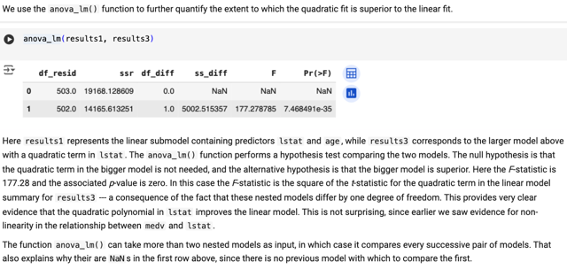
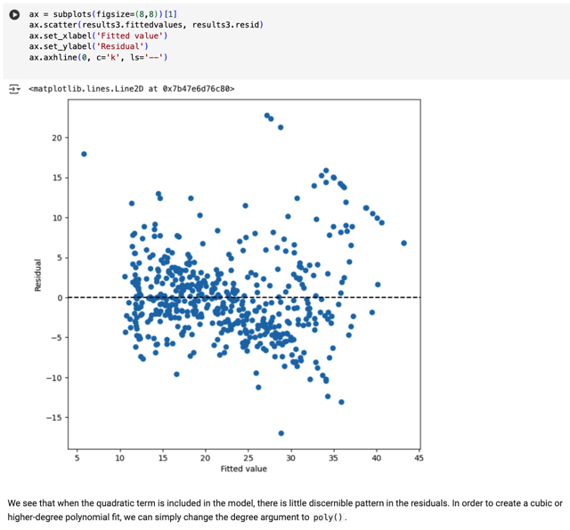

# 3.6 Lab: Linear Regression

📊 **Progress:** `7` Notes | `11` Screenshots

---

## 3.6.1 Import

 

### Đầu tiên nhớ cài package ISLP để xài

> [!NOTE]
> Đầu tiên nhớ cài package ISLP để xài
> những function trong lab.
>
> Import một số thư viện và nói về cách dùng
> function \**dir()\** để xem thử trong namespace 
> có cái gì

 

## 3.6.2 Simple L.r

 

### Đại khái là ta sẽ dùng bộ dữ liệu \\*Boston\\* \\*housing

> [!NOTE]
> Đại khái là ta sẽ dùng bộ dữ liệu \**Boston\** \**housing
> dataset \**để build một simple l.r model để \**dự đoán giá
> nhà trung bình\** với các predictor như số phòng trung
> bình mỗi căn nhà, rồi phần trăm hộ gia định có trạng
> thái kinh tế xã hội thấp..

 

  
  
<kbd></kbd>

  > [!NOTE]
  > Load dataset

   

  
  
<kbd></kbd>

  > [!NOTE]
  > tạo model matrix

   

  
  
<kbd></kbd>

  > [!NOTE]
  > fit model dùng statsmodel.OLS

   

## 3.6.6 `non-linear` Transformation Of Predictors

 

<kbd></kbd>

> [!NOTE]
> **"Orthogonal polynomial"** có thể hiểu đại khái là người ta (ý nói thư viện
> giúp mình làm cái việc đưa thêm polynomial feature vào) sẽ không đơn giản
> là cứ tạo các feature mới bằng cách bình phương, lập phương  giá trị của
> feature cũ, ví dụ x, thì tạo thêm feature x**2. Vì làm vậy thật ra nó sẽ gây
> các vấn đề như collinearity như đã biết.
>
> Thay vào đó người ta sẽ **biến đổi sao đó khiến tạo feature mới p1(x) vẫn
> linear, nhưng p2(x) sẽ bậc hai nhưng vẫn đảm bảo p1(x) và p2(x)
> orthogonal tức là không có tính collinearity**Thế thì trong đây người ta cũng nói nếu không thích như vậy, có thể set
> `raw=True` để đơn giản chỉ việc tạo feature mới bằng feature gốc ** 2
>
> Và cả hai cái này đều dẫn đến cùng kết quả fitted value chỉ có điều làm theo
> cách đầu sẽ "stable least squares computation" cũng như đáng tin cậy hơn
> (GPT cũng có nói đến hiệu qủa này)

 

<kbd></kbd>

<kbd></kbd>

<kbd></kbd>

<kbd></kbd>

<kbd></kbd>

> [!NOTE]
> Tác dụng sẽ giúp kết quả của việc ước lượng coefficient
> stable và reliable hơn cũng như tính interpretable cũng tốt hơn

 

<kbd></kbd>

> [!NOTE]
> Đại khái là, function `anova_lm` này giúp ta tính được các difference giữa hai
> model, một cái là model gốc (result 1), linear regression, và cái model polynomial
> linear regression.
>
> Đáng chú ý là chỉ số `f-statistic` của model 3 cho thấy giá trị dương lớn với `p-value`
> nhỏ chứng tỏ "đáng tin cậy" Về `f-stats,` có chú giải thêm ở phần `f-stats` ở các bài
> trước,
>
> Ta hiểu rằng nó giúp đánh giá độ hiệu quả của việc dùng một model phức tạp
> hơn với công thức là tỉ số giữa "mức error giảm được (hay variability của
> response giải thích được) trên một  param thêm vào" chia cho "mức error còn lại
> trên một độ tự do".Thì như phân tích trong note về `f-stats` (search để xem ở trên),
> ta có thể thấy nếu `f-stats` càng lớn thì càng tốt vì cho thấy độ  hiệu quả của việc
> dùng model phức tạp hơn để fit data.
>
> Còn một ý mà người ta nói trong trường hợp này `F-stats` chính là bình phương
> của `t-stats` thì có thể đọc thêm lời giải thích của  GPT để hiểu nhưng đại ý là vì số
> param thêm vào chỉ bằng 1 (model 3 chỉ hơn model 1 ở chỗ là dùng thêm 1
> polynomial feature `-` tương ứng với thêm 1 param) và triển khai công thức của
> `f-stat` và `t-stat` ra sẽ có thể cho thấy được điều này.
>
> `===` Cuối cùng đại ý là kết này hoàn toàn phù hợp với kết quả sau khi ta check
> residual plot ở trên khi nhận định rằng có quan hệ phi tuyến mà simple l.g model
> chưa nắm bắt được
>
> Một ý cuối đại để là function `anova_lm` này nó có thể nhận vài ba model, để rồi
> nó Tính toán so sánh giữa 2 cái liên tiếp nhau, đặng cho biết cái sau hơn cái
> trước  là bao. Nên trong trường hợp này cái dòng đầu tiên `F-stats` là NaN vì
> trước đó không có cái nào để so.

 

<kbd></kbd>

> [!NOTE]
> và với model 3 này thì residual plot không cho thấy một
> discernible pattern nào. Cho thấy ta đã fit tốt data

 

