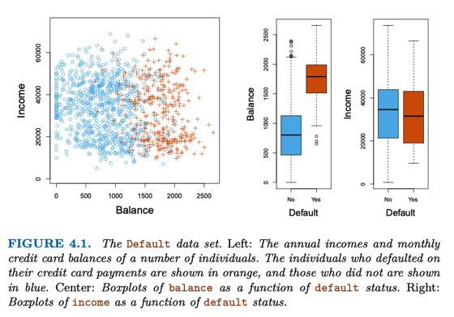

# 4.1 Overview

📊 **Progress:** `0` Notes | `2` Screenshots

---

## Overview

 

### đại khái là nói sơ về bài toán classification, khi mà yêu cầu đặt

> [!NOTE]
> đại khái là nói sơ về bài toán classification, khi mà yêu cầu đặt
> ra là dự đoán giá trị của response nhưng nó lại là qualitative
> thay vì quantitive.
>
> Dù nhiệm vụ là dự đoán loại, nhưng để đi đến kết luận thường
> thì ta cũng phải tính ra một con số (như xác suất thành ra ở
> khía cạnh đó nó cũng là bài toán regression)
>
> Và mở đầu người ta sẽ giới thiệu Logistic Regression, Sau đó
> là các mô hình khác như Linear Discriminative Analysis,
> Quadratic Discriminative Analysis, Naive Bayes, Nearest
> Neighbor

 

### Đại khái là ta sẽ xài bộ data Default, nhớ lại trong dataset này,

> [!NOTE]
> Đại khái là ta sẽ xài bộ data Default, nhớ lại trong dataset này,
> response là trạng thái Default, ám chỉ một tình trạng thẻ tín
> dụng bị quá hạn (hay là bị sao đó, nói chung là không tốt), còn
> predictor sẽ là Balance (số dư) cũng như là Income (thu nhập)
>
> Tác giả mới plot ra 3 cái biểu đồ, một cái là biểu đồ điểm
> (scatter) plot cho thấy các sample không default (chấm tròn
> xanh) hay default (dấu cộng đỏ), tọa độ là giá trị Balance và
> Income.
>
> Có thể thấy rõ nó chia ra hai phần: đám Default và đám không
> Default có vẻ khác nhau rõ ở giá trị Balance. Còn có hai biểu đồ
> BoxPlot quan hệ `Balance-Default` và `Income-Default.`
>
> Tóm lại là ta sẽ xài dataset này, để xây dựng mô hình dự đoán
> tính trạng default Dựa trên hai predictox X1 `=` Balance và X2 `=`
> Income
>
> Nhưng trước hết, nhận xét rằng với dataset này, có một quan
> hệ dễ nhận thấy giữa Balance và Default, nhất là khi nhìn vào
> Box plot, rằng đám Default có Balance lớn hơn đám không
> Default
> `-` gợi ý, balance càng lớn càng dễ default.
>
> Nhận xét là vậy, thì tác giá nói rằng trong thực tế dataset
> thường không các các tính chất dễ nhận ra như trên

<kbd></kbd>

<kbd></kbd>

 

