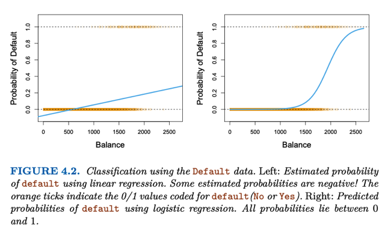
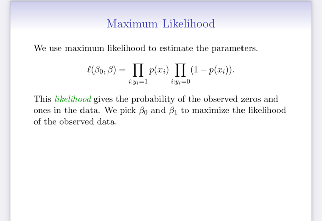
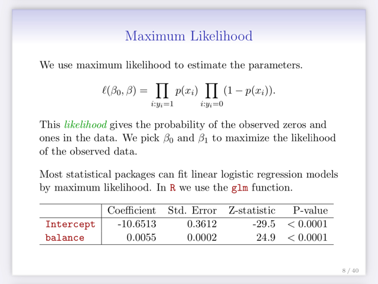
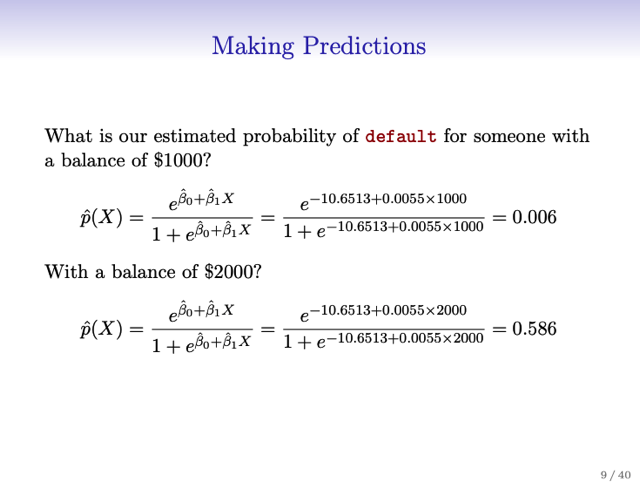
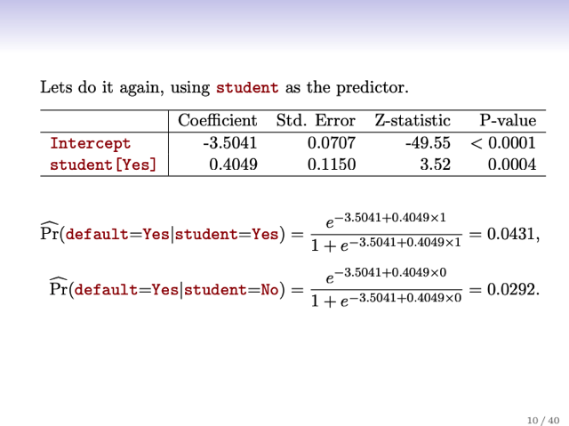
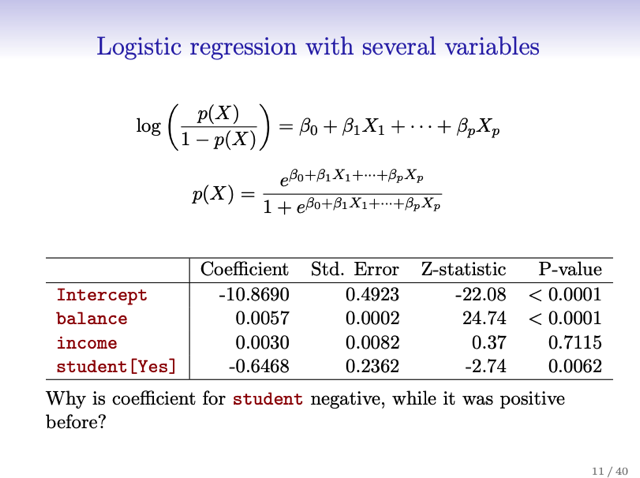
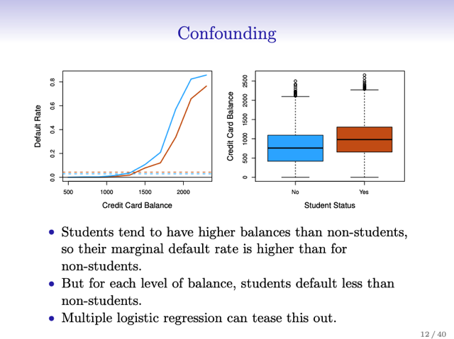
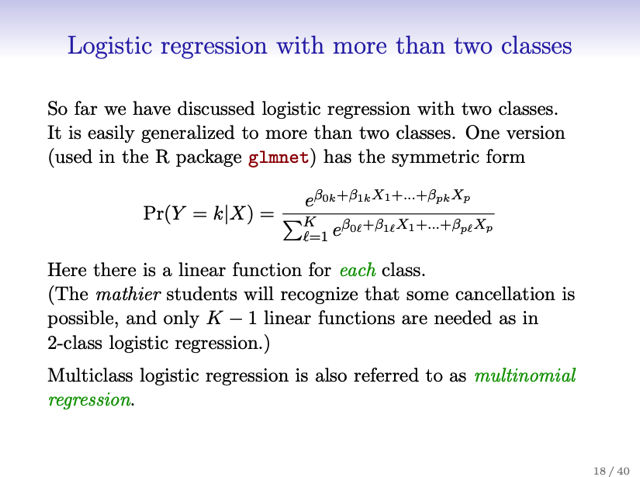

# 4.3 Logistic Regression

📊 **Progress:** `1` Notes | `16` Screenshots

---

## 4.3.1 The Logistic Model

 

### Đại khái là ta sẽ model xác suất sample thuộc về positive class

> [!NOTE]
> Đại khái là ta sẽ model xác suất sample thuộc về positive class
> hoặc một class trong nhiều classes cho trước (given) giá trị của
> predictor Pr(Y=1|X) Ví dụ Pr(default=True|Balance)
>
> Từ đó có thể so Pr với threshold để assign class. Ví dụ 0.5 hoặc
> nếu cẩn thận hơn thì dùng threshold thấp hơn

 

### nói lại về vấn đề ta sẽ gặp probability ra giá trị không phù hợp (bé

> [!NOTE]
> nói lại về vấn đề ta sẽ gặp probability ra giá trị không phù hợp (bé
> hơn 0, lớn hơn 1) nếu dùng lr với least square để model
> pr(Y=1|X)=p(X) theo công thức beta0+beta1*X.

 

### Tiếp theo để khắc phục vấn đề này ta sẽ cần apply một function

> [!NOTE]
> Tiếp theo để khắc phục vấn đề này ta sẽ cần apply một function
> sao cho output luôn trong khoảng [0,1]. Và trong nhiều function
> có thể được thì người ta hay dùng logistics sigmoid function
> f(z)=e^z/(1+e^z), chia tử và mẫu cho e^z thì ta có 1/(1+e^-z).
>
> Để fit model này với dataset ta cần maximum likelihood sẽ nói
> sau, nhưng cho thấy kết quả tốt hơn là lr. Cụ thể là Balance càng
> thấp thì giá trị mô hình tính ra càng gần với 0, để càng gần với dự
> đoán tình trạng Default càng khó xảy ra, và ngược lại Balance
> càng cao thì càng gần với kết luận về tính trạng default sẽ là
> True, hàm ý rằng mô hình này làm tốt trong việc dùng để dự
> đoán. Bên cạnh đó,  giá trị tính ra không bao giờ bé hơn 0 hoặc
> lớn hơn 1, giúp nó có thể được interpreted hoàn toàn phù hợp
> với khái niệm xác suất xảy ra Default.

<kbd></kbd>

<kbd></kbd>

 

### Nói về khái niệm odd, tính bằng e^(beta0+beta1*X) =

> [!NOTE]
> Nói về khái niệm odd, tính bằng e^(beta0+beta1*X) =
> p(X)/[1-p(X)]. Lấy ví dụ odds là 1/4 thể hiện khả năng positive chỉ
> bằng 1/4 khả năng negative. Khai niệm này hay được dùng trong
> cá cược, như nói tỉ lệ thắng là 1/4 tức là khả năng thắng bằng
> 1/4 khả năng thua, đồng nghĩa xác suất thắng bằng 1/5.
>
> Hoặc odds bằng 9 tức 10 case thì 9 case sẽ xảy ra positive.
>
> Nếu lấy log odd thì ta có logit, là beta0+beta1*X là hàm tuyến
> tính của X.

 

### Đại ý là nói về ý nghĩa của beta1, trong quan hệ của X và Y. Khi

> [!NOTE]
> Đại ý là nói về ý nghĩa của beta1, trong quan hệ của X và Y. Khi
> X tăng 1 đơn vị, log odd (logit) sẽ tăng beta1 đơn vị, nên odd
> sẽ kiểu như được nhân bởi e^beta1 vì odd = e^log odd = e^(log
> odd cũ+beta1) = e^log odd * e^beta1.
>
> Nói chung là quan hệ giữa sự tăng của X và y = p(X) không
> tuyến tính mà phụ thuộc giá trị hiện tại của X.
>
> Có thể thấy tính chất này từ đồ thị trên: khi X (balance) tăng thì
> khiến probability of default có lúc tăng chậm, có khi tăng nhanh
> nhưng luôn luôn nếu beta1 dương thì X tăng sẽ khiến p(X) tăng
> và nếu beta1 âm thì X tăng p(X) giảm

 

## 4.3.2 Estimating Coefficients

 

### Đại khái cho biết ta có thể dùng least square để estimate hai

> [!NOTE]
> Đại khái cho biết ta có thể dùng least square để estimate hai
> params beta0, beta1 như trong bài toán linear regression nhưng
> dùng \**maximum likelihood\** có những đặc tính thống kê (statistical
> properties) tốt hơn.
>
> Đại khái là kiểu như mục đích / chiến lược của cách tiếp cận
> này đó là tìm parameters sao cho khi dùng nó trong công thức
> trên p = sigmoid(beta0+beta1*x) sẽ cho ra càng gần với label
> quan sát thấy của các training data point x càng tốt. Ví dụ người
> đó có label là positive thì tính ra p gần 1 và ngược lại thì ra gần
> 0.
>
> Với tiêu chí đó ta define ra cái gọi là likelihood function để rồi
> mục đích của ta là \**maximize likelihood\** function này.
>
> Tính tích (PI) p(x) của mọi data point mà label bằng 1 với tích
> của (1-p(x)) với.mọi data point mà có label bằng 0
>
> PI i:y_i=1 P(x_i) PI j:y_j=0 P(x_j)
>
> Nói thêm least square của bài toán l.r cũng là dạng đặc biệt của
> maximum likelihood

<kbd></kbd>

<kbd></kbd>

 

### Đại khái là \\*các phần mềm R dễ dàng fit dc model nên ko cần

> [!NOTE]
> Đại khái là \**các phần mềm R dễ dàng fit dc model nên ko cần
> quan tâm cách thức fit ntn\**
>
> Chỉ phân tích kết quả, (fit bài toán credit dataset) với beta1 = 0.
> 0055.
>
> Cho ta kết luận, tăng balance lên 1 đơn vị thì sẽ tăng log odd lên
> 0.0055.
>
> Bên cạnh đó, nói về chỉ số khác như z-statistic và p-value, thì
> tác giả cho biết nó cũng có ý nghĩa giống bên l.r đó là tương
> đương t-statistics và (ví dụ đang tính z-stat của beta1) sẽ bằng
> beta1^/SE of beta1^ (đến giờ mới biết))
>
> Như vậy, nếu z-stat lớn thì có nghĩa là SE nhỏ và beta1 lớn, nên
> có thể cung cấp bằng chứng chống lại khả năng của null
> hypothesis - nói về null hypothesis là beta1 thật sự bằng 0, khi
> đó p(X) = sigmoid(log odd=logit=beta1X+beta0) =
> sigmoid(beta0) đồng nghĩa với việc balance X không ảnh hưởng
> gì đến xác suất bị default (positive).
>
> Và tương tự như ở linear regression, p-value nhỏ sẽ củng cố
> rằng khó có khả năng rằng quan hệ giữa balance và default là
> ngẫu nhiên, chứng tỏ ta có thể hoàn toàn reject null hypothesis
> để khẳng định rằng có tồn tại quan hệ giữa X Balance và Y Xác
> suất bị Default

<kbd></kbd>

<kbd></kbd>

 

## 4.3.3 Making Prediction

 

### Đại khái là khi đã train xong coefficients và intercept, có thể dùng

> [!NOTE]
> Đại khái là khi đã train xong coefficients và intercept, có thể dùng
> nó để tính cho một sample với predictor là balance thì xác suất
> tài khoản bị default là bao nhiêu. Pr(X) = sigmoid(beta^0 +
> beta^1*X)

<kbd></kbd>

<kbd></kbd>

 

### Tiếp theo nói đến bài toán logistic regression với feature là

> [!NOTE]
> Tiếp theo nói đến bài toán logistic regression với feature là
> qualitative (category). Thì cách làm cùng đơn giản đó là chuyển
> categorical feature thành dummies feature (1 hoặc 0, student là
> 1, not student là 0) và fit model như thường.
>
> Kết quả cho ra beta^1 ứng với feature "is student" > 0. Và p-value
> nhỏ (0.004<0.005) nên "statistically significant" để kết luận rằng
> beta1 thật sự dương đồng nghĩa rằng việc có là student khiến
> tăng logit và dẫn đến tăng xác suất positive

<kbd></kbd>

<kbd></kbd>

 

## 4.3.4 Multiple Logistic Regression

 

### Đại khái là có hiện tượng kì lạ là coefficient của single predictor

> [!NOTE]
> Đại khái là có hiện tượng kì lạ là coefficient của single predictor
> (student) logistic regression dương như đã nói. Nhưng khi fit mô
> hình multiple logistic regression với balance thì coeff của student
> lại âm.
>
> Điều này có nghĩa là khi khi xét bài toán uni-variate chỉ với
> predictor = "is student" thì yếu tố là student khiến khả năng
> default tăng lên còn trong bài toán multiple thì giảm xuống.
>
> Nhìn vào graphic thể hiện quan hệ của balance với default rate
> cho thấy dù student hay không thì balance càng lớn default rate
> càng lớn. Nhưng khi \**so cùng một mức balance\** thì \**student
> có default rate thấp hơn non-student: tại một giá trị bất kì của
> balance thì đường màu xanh luôn nằm trên đường màu cam ->
> non-student có xác suất Default cao hơn\**.
>
> Nhưng đường chấm chấm - thể hiện \**mức default rate tổng thể
> thì của student lại nằm trên: Tức là về tổng thể với mọi balance
> thì student có xác suất Default cao hơn là không student.
> \**
> ====
>
> Thế thì nguyên nhân đó là bởi vì \**balance và student có tính
> chất tương quan (correlate)\** thể hiện bằng biểu đồ \**boxplot\**
> cho thấy rõ ràng là \**student sẽ có balance lớn hơn not student \**
>
> Thành ra có một vấn đề đó là, dù rằng nếu \**so cùng mức
> balance thì student ít khả năng default hơn non-student\** nhưng
> vì student correlate với balance, hay việc là \**student khiến
> balance thường cao hơn not student\**. \**Mà balance cao thì
> default rate cao\**. Thành ra \**về tổng thể, student lại có xác suất
> default cao hơn.\**
>
> Đó là lí do nếu xét một mình student trong bài toán simple logistic
> regression thì student  sẽ ảnh hưởng tăng xác suất default (vì lúc
> này chính là xét về tổng thể, student->balance tăng-> default rate
> tăng)
>
> Nhưng nếu xét trong bài toán có cả balance thì \**coefficient của
> student sẽ thể hiện ảnh hưởng của student với default nếu giữ
> các predictor khác như balance FIXED\**, \**đồng nghĩa xét ảnh
> hưởng của student và không student khi xét cùng một mức
> balance\**. Thì rõ ràng khi đó như biểu đồ đã cho thấy cùng mức
> balance thì not student có default rate cao hơn. Nên việc có
> student khiến giảm default rate thể hiện bằng coefficient âm.

<kbd></kbd>

<kbd></kbd>

> [!NOTE]
> Biểu đồ BoxPlot thể hiện mức Balance của đám Student và Non-Student
> cho thấy nếu là Student thì "thường có" balance cao hơn. Mà Balance
> càng cao thì càng dễ Default. Nên đám Student về tổng thể dễ Default hơn
> đám Non-Student, thành ra khi xét riêng Student - Default thì ra coeff
> dương.
>
> Nhưng nếu xét trong bài toán Balance/Income/Student - Default thì coeff
> của student lại mang ý nghĩa là ảnh hưởng của Student khi giữ nguyên
> mấy cái kia, thì khi đó  "Là student" sẽ giảm khả năng Default, thể hiện quả
> coeff âm

 

### Đây chính là vấn đề có tên là \\*CONFOUNDING\\* - hiện tượng có

> [!NOTE]
> Đây chính là vấn đề có tên là \**CONFOUNDING\** - hiện tượng có
> sự khác nhau khi sử dụng mô hình đơn biến và đa biến (Chú ý cái
> này xảy ra cả ở Linear Regression). 
>
> Ảnh hưởng của nó đó là nếu biết balance thì cùng mức balance,
> chú student ít risky hơn. Nhưng nếu không biết balance thì student
> risky hơn. Có thể diễn đạt như sau:
>
> Pr(default | student = 1, balance = balance0) sẽ < Pr(default |
> student = 0, balance = balance0)
>
> Nhưng Pr(default | student = 1) sẽ > Pr(default | student = 0)

<kbd></kbd>

<kbd></kbd>

 

### Cuối cùng để make prediction thì chỉ việc lắp các coefficient vào tính

> [!NOTE]
> Cuối cùng để make prediction thì chỉ việc lắp các coefficient vào tính
> logit và bỏ qua sigmoid tính Pr(default=1) thôi

 

## 4.3.5 Multimodal Logistic Regression

 

### Bài toán mà target/response có nhiều hơn 2 classes. Vậy thì dù

> [!NOTE]
> Bài toán mà target/response có nhiều hơn 2 classes. Vậy thì dù
> logistic regression chỉ giới hạn trong binary case, tức là nó chỉ
> làm dc với bài toán mà target là 1 trong 2 classes, nhưng vẫn có
> thể extend qua bài toán mutiple class được.
>
> Đại khái cách làm sẽ là trong K vì dụ 3 class đi, ta chọn một cái
> là base class. Ví dụ ở đây chọn cái thứ 3, thì P(y=3|x) sẽ có công
> thức là 1/1+sum j 1:2 e^zj.
>
> Với zj là coeff_j@x+bias_j.
>
> Còn P(y=1|x) sẽ có công thức là e^z1/(1+sum j 1:2 e^zj)

<kbd></kbd>

<kbd></kbd>

 

### Có nghĩa là, ứng với 3 class thì ta sẽ có 2 bộ coeff, bias

> [!NOTE]
> Có nghĩa là, ứng với 3 class thì ta sẽ có 2 bộ coeff, bias
> - beta_k0, beta_k1... với k bằng 1, 2.
>
> Để rồi tính toán weighted sum với predictor để có z1, z2.
>
> Đặng tính ra P(y=1), P(y=2) như trên, và P(y=3) sẽ là
> 1-P(y=1)-P(y=2)
>
> Thì thật ra có thể thấy cái này nó chính là hàm softmax thôi chỉ có
> cái là thay vì mỗi class có một "unit" - ý nói một bộ coefficients để
> tính với predictor ra z thì ở đây dùng cái kiểu mà trong Deep
> Learning Yoshua Ben gio gọi là ko bị thừa, vì thật sự với K class thì
> chỉ cần K-1 "unit" thôi.

 

### Tiếp theo, đại ý là nếu log của tỉ số giữa hai probability của 2 class

> [!NOTE]
> Tiếp theo, đại ý là nếu log của tỉ số giữa hai probability của 2 class
> class k / base class K, thì ta sẽ thấy rằng nó sẽ vẫn là một hàm tuyến 
> tính theo x.
>
> Ví dụ log P(1)/P(3) = log e^z1/1 = z1 = beta1x1+beta2x2+...
>
> Cũng cho biết dù chọn base class là cái nào thì cũng ra kết quả
> như nhau dù coeff sẽ khác nhưng model sẽ đều giống nhau ở
> prediction, log odds

 

### Tuy vậy, việc diễn giải ý nghĩa các coeff sẽ khác tùy theo base class.

> [!NOTE]
> Tuy vậy, việc diễn giải ý nghĩa các coeff sẽ khác tùy theo base class.
>
> như đã thấy z1 là log của tỉ lệ giữa P(y=1) và P(y=3 base class).
> Nên beta_11 (ý là cái beta1 của bộ coeff ứng với class 1, nhớ ko,
> như nói ở trên K class sẽ có K-1 bộ coeff) sẽ có ý nghĩa là: nếu tăng
> x1 lên 1 đơn vị, thì z1 sẽ tăng thêm beta_11.
>
> Như vậy nó là mức tăng của log [P(y=1) / P(y=3)]
>
> Và như đã biết ở trên, lấy exp hai vế, thì cũng đồng nghĩa \**bản thân
> cái tỉ lệ đó (P(y=1) / P(y=3)) sẽ tăng e^beta11\**

 

### Cuối cùng là nói sơ về softmax, đúng là cái mình đã nghĩ và note ở

> [!NOTE]
> Cuối cùng là nói sơ về softmax, đúng là cái mình đã nghĩ và note ở
> trên. Thì ở đây cho biết nó hay gặp trong machine learning (và deep
> learning), và nó dùng cả K "unit" (ý là mỗi class sẽ có một bộ coeff để
> tính ra logit của mỗi class, để rồi hàm softmax giúp biến thành
> probability.
>
> Thì theo cái này log P(1)/P(2) sẽ  là (beta11-beta21)x1 +
> (beta12-beta22)x2 + ....

 

