# 4.4 Generative Models For Classification

📊 **Progress:** `9` Notes | `46` Screenshots

---

<a id="node-325"></a>
## 4.4.1 Intro

<br>


<a id="node-326"></a>
### Ok ý tưởng đại khái là vầy, bình thường với logistic regression, ta

> [!NOTE]
> Ok ý tưởng đại khái là vầy, bình thường với logistic regression, ta
> đang model một phân phối xác suất của random variable y dựa trên x
> p(y|x) (conditional probability)
>
> Thì ý tưởng của cái này, là mình tách mỗi class ra riêng, và tìm
> cách mô hình một phân phối xác xuất của x trong mỗi class đó. Và
> sau đó ta sẽ dùng Bayes theorem để lật ngược lại (flip) để tính ra
> p(y|x)

<br>


<a id="node-327"></a>
### Lí do của cái này xuất phát tử \\*nhược điểm của logistic regression\\*: đó là

> [!NOTE]
> Lí do của cái này xuất phát tử \**nhược điểm của logistic regression\**: đó là
> \**nếu data có các class có tính chất "dễ dàng phân tách một cách rõ ràng"\**
> thì \**parameters của mô hình logistic regression rất không ổn định\** `-` có thể
> hiểu là nó sẽ\**mỗi lúc mỗi khác\**, vì cách nào cũng có thể phân tách tốt được
> cả.
>
> Và \**nếu phân phối xác suất của x trong mỗi class là normal distribution\** và
> \**số lượng sample nhỏ\** thì cái này \**chính xác hơn lo.re \** Cuối cùng là nó\**extend ra nhiều class hơn 2 một cách tự nhiên hơn là\** như cách làm của
> multinomial logistic regression)

<br>


<a id="node-328"></a>
### Ví dụ có 2 class `k=1` (ứng với cam), và `k=2` (ứng với dưa hấu) và predictor X

> [!NOTE]
> Ví dụ có 2 class `k=1` (ứng với cam), và `k=2` (ứng với dưa hấu) và predictor X
> là khối lượng của trái. Và giả sử ta cho X mang các giá trị discrete như 100g,
> 200g...để tí cho phép ta định nghĩa fk(X) đơn giản là xác suất quả cam hay
> dưa có khối lượng bằng x. Vì nếu cho x là biến liên tục thì khi đó của f sẽ là
> probability density function, lúc đó f1(x)dx sẽ là xác suất khối lượng quả cam
> rơi vào vùng vô cùng nhỏ quanh mức `X=x.`
>
> 1. Đầu tiên ta sẽ gọi `pi_k` là xác suất mà ta chọn được một quả k một cách
> khơi khơi `/` vô tư. Có nghĩa, `pi_1` sẽ là nhắm mắt chọn thì xác suất chọn được
> quá cam là bao nhiêu, và `pi_2` sẽ là đối với dưa hấu. Thì cái này mang ý
> nghĩa của phân phối xác suất "ban đầu" (prior probability distribution),  khi ta
> chưa có thông tin gì. Và khi làm thường ta sẽ chỉ việc dùng tỉ lệ của số
> sample trong class k so với tổng số sample ta có, như trong số 100 quả thì có
> bao nhiêu quả cam, thì nó sẽ là xấp xỉ, ước lượng cho `pi_1.`
>
> 2. Thì ta gọi f1(X) là probability density function của X "ứng `với/trong` trường
> hợp" class 1 `-` hàm số này nôm na đo mức độ nhiều hay ít của việc tồn tại một
> trái cam có khối lượng `=` x. Nói cách khác nếu `f1(X=x1)`  mà cao, sẽ mang ý
> nghĩa là, khi chọn một sample trong class 1, thì khả năng khối lượng của nó
> bằng x1 sẽ là cao, ngược lại nếu `f1(X=x2)` mà thấp thì có nghĩa là xác suất
> tồn tại một trái cam có khối lượng bằng x2 sẽ thấp, hay bốc một trái cam thì
> khó có khả năng nó có khối lượng bằng x2.
>
> Ví dụ rõ ràng `f1(X=1kg)` là thấp vì hiếm nếu không muốn nói là khó mà có trái
> cam nào nặng 1kg. Nhưng `f1(X=300g)` thì sẽ có giá trị cao vì đây là khối
> lượng thông dụng của cam. Nên nếu vẽ ra thì hàm f1 sẽ có dạng như một
> quả chuông với đỉnh tập trung ở mốc X `=` 200g,300g, nhỏ dần ở xa mức này
>
> Tương tự như vậy ta cũng có `pi_2` là xác suất chọn được một quá dưa hấu
> khơi khơi cũng như f2(X) là probability density function của class dưa cho biết
> thông tin về kích thước thông thường của quả dưa

<br>


<a id="node-329"></a>
### Rồi, ôn lại cái bayes theorem:

> [!NOTE]
> Rồi, ôn lại cái bayes theorem:
>
> `p(x,y)=p(y,x)`
>
> p(quả nặng 1kg, quả cam) `=` p(quả cam, quả nặng 1kg)
>
> p(quả cam|quả nặng 1kg)p(quả nặng 1kg) `=` p(quả nặng 1kg|quả
> cam)p(quả cam)
>
> `====`
>
> p(quả cam) là priori, xác suất chung chung bốc được quả cam, là `pi_1`
> ở trên
>
> p(quả nặng 1kg|quả cam) xác suất một quả cam có khối lượng 1kg,
> hay rõ hơn là khi có một trái cam thì xác suất nó nặng 1kg là bao
> nhiêu. Nó chính là f1(X).
>
> p(quả nặng 1kg) là xác suất bốc được một trái nặng 1kg (ko cần biết
> trái gì). Theo \**sum rule\**, nó sẽ bằng xác suất bốc được trái cam
> nặng 1kg `+` xác suất bốc được trái dưa nặng 1kg.
>
> p(quả nặng 1kg) `=` p(quả nặng 1kg|trái `cam)+p(quả` nặng 1kg|trái
> dưa).
>
> Vậy theo bayes rule, chuyển p(quả nặng 1kg) qua ta sẽ có công thức
> tính p(quả cam|quả nặng 1kg) bằng:
>
> p(quả cam|quả nặng 1kg) `=` p(quả nặng 1kg|quả cam)*p(quả cam) `/`
> [p(quả nặng 1kg|quả `cam)+p(quả` nặng 1kg|quả dưa)]
>
> \**Vậy, nôm na cách làm của phương pháp này là: \**
>
> Ta có ước lượng của `pi_1,2` `-` tức xác suất bắt được quả cam khơi
> khơi và dưa hấu khơi khơi là bao nhiêu. Nếu "trên đời này" có cam
> phổ biến hơn dưa thì `pi_1` lớn hơn `pi_2.`
>
> Rồi, nếu ta có f1, f2 kiểu như cho biết khối lượng thông thường của
> cam và dưa hấu.
>
> Thì với những "kiến thức" đó, nếu ta phải dự đoán một quả có khối
> lượng 1kg là quả gì thì trong đầu mình cũng sẽ nhảy số để ước đoán
> dựa trên độ thông dụng của mỗi loại cũng như cái khối lượng thông
> dụng của chúng thì thực chất là ta đang thầm tính ra khả năng \**(xác
> suất) cái quả nặng một kí lô đó là cam,\** so  với \**xác suất quả nặng 1
> kí lô đó là dưa hấu\**,\**\**xem cái nào cao hơn (*)
>
> Thì đó cũng chính là `p_k(x)` \**posterior probability\**: xác suất chọn dc
> quả cam khi  đã biết nó có nặng bao nhiêu, đối nghịch với `pi_k` là
> \**prior probability\** `-` xác suất  chọn được quả cam khơi khơi
>
> (*): thì mình, human sẽ thấy rằng cái quả 1 kí lô đó, công với việc dưa
> hấu với cam đều phổ biến như nhau thì chắc chắn đây là dưa hấu.
> Trừ trường hợp ở một ví dụ khác mà ta phải dự đoán cam với một trái
> rất hiếm mà trái rất hiếm này lại nặng cũng cỡ dưa hấu thì khi đó chắc
> mình cũng sẽ phân vân (trạng thái thể hiện rằng trong đầu mình tính
> hai xác suất nói trên ra như nhau) với suy nghĩ đại loại là .."trái này
> nặng tới 1 kí lô, vậy chắc không phải cam mà là trái xyz rồi, nhưng
> loại này lại  rất hiếm thấy thì khả năng đây là đó cũng khó đánh giá"
>
> Tóm lại, phương pháp này chính là ta tính ra:
>
> ```text
> p(Y=quả cam|X=1kg) = pi_1*f_cam(X=1kg) /
> ```
> ```text
> [pi_cam*f_cam(1kg)+pi_dưa*f_dưa(1kg)]
> ```
>
> ```text
> p(Y=quả dưa|X=1kg) = pi_1*f_dưa(X=1kg) /
> ```
> ```text
> [pi_cam*f_cam(1kg)+pi_dưa*f_dưa(1kg)]
> ```
>
> để rồi so sánh xem cái nào cao hơn thì assign loại đó.
>
> Khái quát hóa:
>
> ```text
> p(Y=j|X=x) = pi_k*f_k(x)/Sum i f_i(x)
> ```
>
> Vậy nếu tính được `pi_k,` `p_k(x)` ta có thể gắn vô mà tính `p(y=k|x)` đặng
> dùng Bayes classifier để mà classify (đơn giản là k nào mà có
> `p(y=k|x)` lớn nhất thì gán cho class đó. Cái này \**đã được nhắc đến ở
> chapter \**2, nôm na là \**nếu ta dùng cái class mà có xác suất của việc
> tìm thấy một sample có feature tương đồng với sample cần classify là
> cao nhất\** để gán cho nó \**thì đây sẽ là một classifier có error rate rất
> thấp, là cái tốt nhất trong các loại\**
>
> Tuy tính `pi_k` thì dễ vì chỉ cần tính tỉ lệ class k trong tổng số sample thì
> tính `f_k()` khó hơn nên các phần sau sẽ chính là dùng các phương
> pháp khác nhau để tính từ đó ra các mô hình có các tên gọi khác
> nhau

<p align="center"><kbd>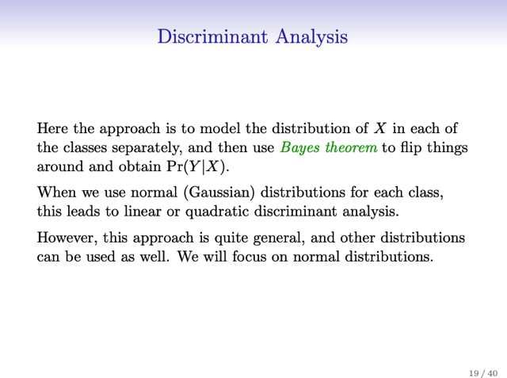</kbd></p>

<p align="center"><kbd>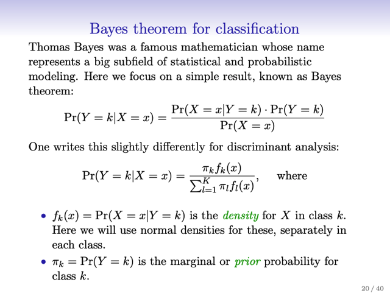</kbd></p>

<p align="center"><kbd>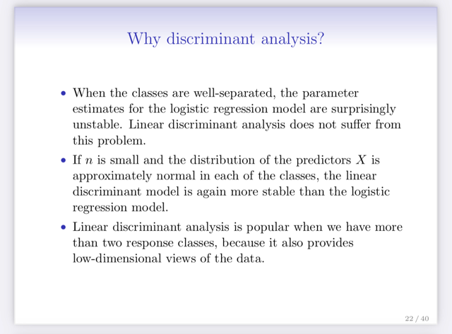</kbd></p>

<p align="center"><kbd>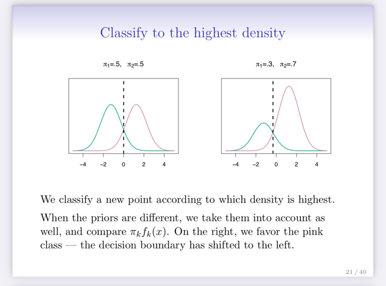</kbd></p>

<p align="center"><kbd></kbd></p>

<p align="center"><kbd></kbd></p>

<p align="center"><kbd></kbd></p>

<p align="center"><kbd></kbd></p>

<br>


<a id="node-330"></a>
## 4.4.1 Linear Discriminant Anlysis P `=` 1

<br>


<a id="node-331"></a>
### Lấy với bài toán chỉ có một predictor, p `=` 1, tức là chỉ có x thôi (ko có x1,

> [!NOTE]
> Lấy với bài toán chỉ có một predictor, p `=` 1, tức là chỉ có x thôi (ko có x1,
> x2... )
>
> Đại ý là, đầu tiên ta đặt một giả định là phân bố xác suất của x trong mỗi
> class đều có dạng Gaussian và giả định tiếp rằng các Gaussian
> distribution này đều có variance bằng 1. Đương nhiên còn cái mean thì ko
> biết và mean của mỗi class mỗi khác: `mu_1` khác `mu_2.` Ta sẽ có hàm
> `f_k(x)` mà như ở trên đã nói, đó là probability density function, giống như
> xác định xác suất một trái cam có nặng x kí lô là bao nhiêu) có công thức
> là hàm Gaussian.
>
> Từ đó, thế `pi_k` là prior probability (ý nghĩa nôm na là xác suất chọn được
> một quả cam, hay quả tao một cách chung chung), `f_k(x)` vào công thức "
> Bayes" sẽ có `P(y=k|x)` (xác suất với khối lượng là x kí lô, thì trái đó là trái
> cam là bao nhiêu)
>
> Thế thì từ đó, ta sẽ gán (đưa ra quyết định phân loại) class mà có cái class
> k mà `p_k(x)` cao nhất, là Bayes classifier.
>
> triển khai ra để đơn giản hóa để có một biểu thức \**theta_k(x) phụ thuộc\** 
> \**tuyến tính\** vào X gọi là \**discriminant function (*)\** giúp dựa vào x mà assign 
> class
>
> Cũng từ đó ta có thể có cái decisions boundary là nơi mà các `p_k(x)` bằng
> nhau, triển khai ra có thể dễ dàng thấy nó (x) là \**trung bình các mean `mu_k`
> của các Gaussian distribution\**.
>
> `====`
>
> Chú ý là sở dĩ ở đây ta nói là đang có một \**Bayes classifier\** vì mình assign
> class có pk(x) cao nhất, mà cái này ta đang giả định là biết hết các `pi_k,`
> `mu_k,` `sigma_k..Tức` là biết hết các population parameters. Nhưng thực tế
> ta sẽ không biết những thông số thật sự này, mà chỉ có thể ước lượng
> thông qua training sample. Thành ra thực tế ta sẽ không có được Bayes
> classifier, mà chỉ có thể dùng các ước lượng của các parameters trên để
> tính. Thì tùy vào cách đặt giả định, để chop phép ước lượng các thông số
> trên như thế nào, ta sẽ có các mô hình khác nhau như LDA, QDA, Naive
> Bayes

<p align="center"><kbd>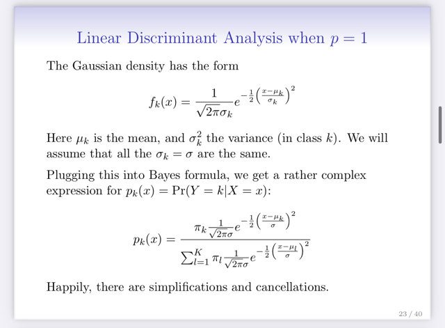</kbd></p>

<p align="center"><kbd>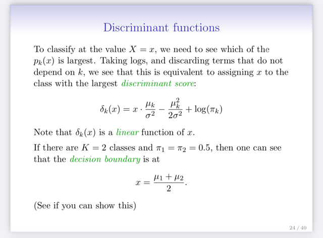</kbd></p>

<p align="center"><kbd>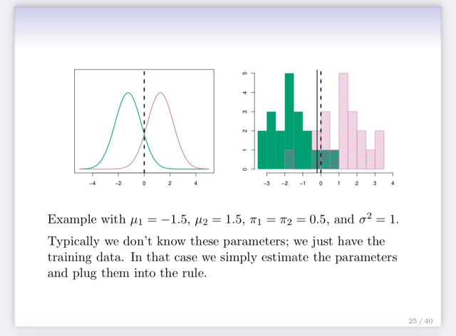</kbd></p>

<p align="center"><kbd></kbd></p>

<p align="center"><kbd></kbd></p>

<p align="center"><kbd></kbd></p>

> [!NOTE]
> Cũng là Problem Set 2: K**hai triển để cho thấy class k khiến discriminant 
> function lớn  cũng đồng thời là k khiến `p_k(x)` `P(Y=k|X=x)` lớn nhất**
>
> Đầu tiên với `p_k(x)` có công thức như trên, mẫu số sẽ giống nhau với mọi
> class và là giá trị dương Đó đó nó không ảnh hưởng đến việc so sánh `p_k(x)`
> hay `p_k(x)` ~ (tỉ lệ thuận `/` proportional) với ..
>
> ```text
> pi_k * (1/sqrt(2*pi*sigma)) * exp {-0.5*[(x-mu_k)/sigma]^2}
> ```
>
> Tiếp, `1/sqrt(2*pi*sigma)` giống nhau với mọi k, không phụ thuộc k nên cũng 
> không ảnh hưởng đến việc so sánh.
>
> ```text
> p_k(x) ~ pi_k * exp {-0.5*[(x-mu_k)/sigma]^2}
> ```
>
> Tiếp, vì log là hàm đồng biến nên có thể so sánh log `p_k(x)` thay vì so sánh
> `p_k(x)` hay nói cách khác k khiến `p_k(x)` lớn nhất thì cũng là k khiến log `p_k(x)`
> lớn nhất.
>
> ```text
> p_k(x) ~ log p_k(x) = log{ pi_k * exp {-0.5*[(x-mu_k)/sigma]^2}}
> ```
>
> ```text
> = log pi_k  + log exp {-0.5*[(x-mu_k)/sigma]^2}}
> ```
>
> ```text
> = log pi_k  + {-0.5*[(x-mu_k)/sigma]^2}}
> ```
>
> ```text
> = log pi_k  + [-0.5*(x-mu_k)^2/sigma^2]
> ```
>
> ```text
> = log pi_k  - 0.5*[(x^2-2*x*mu_k+mu_k^2)/sigma^2]
> ```
>
> ```text
> = log pi_k  - 0.5*x^2/sigma^2 + x*mu_k/sigma^2 - 0.5*mu_k^2/sigma^2
> ```
>
> Tiếp,  `-` `0.5*x^2/sigma^2` sẽ giống nhau với mọi k, không phụ thuộc k
>
> `p_k(x)` ~ **log `pi_k`  `+` `x*mu_k/sigma^2` `-` 0.5*mu_k^2/sigma^2**
>
> Ta đã có **theta_k `=` `x*mu_k/sigma^2` `-` `0.5*mu_k^2/sigma^2` `+` log pi_k**thì `p_k(x)` ~ `theta_k,` và `theta_k` là hàm tuyến tính đối với x, giúp so sánh
> xem k nào khiến `p_k(x)` maximum.

> [!NOTE]
> Chứng minh decision boundary là tại mean của các mean:
>
> `===`
> Dễ hiểu decision boundary là nơi `p_k1(x)` `=` `p_k2(x)`
>
> tương đương `theta_k1(x)` `=` `theta_k2(x)` 
>
> ```text
> <=> x*mu_k1/sigma^2 - 0.5*mu_k1^2/sigma^2 + log pi_k1
> ```
> ```text
> = x*mu_k2/sigma^2 - 0.5*mu_k2^2/sigma^2 + log pi_k2
> ```
>
> Vì đang ví dụ mỗi class `pi_k1` `=` `pi_k2`
>
> ```text
> <=> x*mu_k1/sigma^2 - 0.5*mu_k1^2/sigma^2
> ```
> ```text
> = x*mu_k2/sigma^2 - 0.5*mu_k2^2/sigma^2
> ```
>
> ```text
> <=> x*mu_k1/sigma^2 - x*mu_k2/sigma^2
> ```
> ```text
> = 0.5*mu_k1^2/sigma^2 - 0.5*mu_k2^2/sigma^2
> ```
>
> ```text
> <=> x*(mu_k1-mu_k2)/sigma^2 = 0.5*(mu_k1^2-mu_k2^2)/sigma^2
> ```
>
> ```text
> <=> x*(mu_k1-mu_k2) = 0.5*(mu_k1^2-mu_k2^2)
> ```
>
> ```text
> <=> x = 0.5*(mu_k1^2-mu_k2^2) / (mu_k1-mu_k2)
> ```
>
> **<=> x `=` (mu_k1+mu_k2)/2**

<br>


<a id="node-332"></a>
### Vậy Linear Distance Analysis method chính là ta sẽ dùng các giá trị ước

> [!NOTE]
> Vậy Linear Distance Analysis method chính là ta sẽ dùng các giá trị ước
> lượng của các thông số này để lắp vô
>
> Cụ thể, các pi nếu không có thông tin gì cụ thể thì \**pi_k có thể tính bằng
> phần trăm mỗi loại trong training set\**. Các mean thì \**dùng mean của các
> sample (gọi là sample mean) trong mỗi loại\**. Còn variance (cái này hồi nãy
> assume là 1 hết) thì giờ \**cũng xài chung một giá trị nhưng tính bằng
> average các sample variance\** (với mỗi loại ta tính variance, rồi trung bình
> lại, gọi là empirical variance vì như đã biết ta chỉ đang ước lượng bằng cách
> dùng data sample)

<p align="center"><kbd>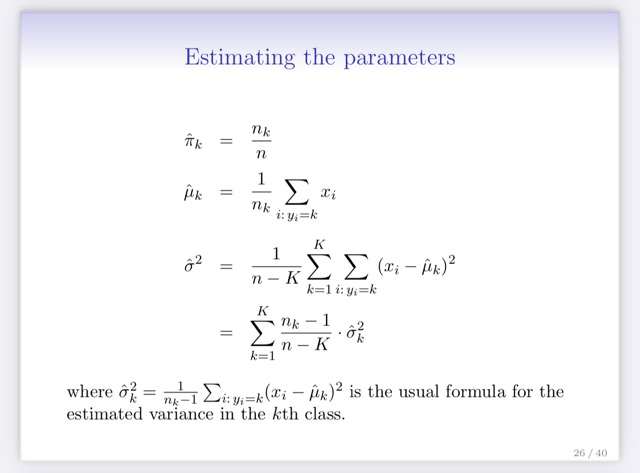</kbd></p>

<p align="center"><kbd></kbd></p>

<br>


<a id="node-333"></a>
### Đoạn cuối nói thêm chút xíu về ví dụ dùng LDA để classify. Và kết quả

> [!NOTE]
> Đoạn cuối nói thêm chút xíu về ví dụ dùng LDA để classify. Và kết quả
> cho thấy trong ví dụ này thì LDA làm việc khá tốt khi chỉ error rate chỉ
> cao hơn Bayes chút ít
>
> Cũng như cái tên Linear là do function dùng để assign class (sau khi
> khai triển ra ở trên) gọi là discriminant function là hàm tuyến tính với x.
>
> Và LDA dùng giả định là probability distribution của x trong các class
> đều là Gaussian \**có chung variance\**, chỉ khác nhau mean. Nếu ta
> nới rộng giả định để cho mỗi class k có variance khác nhau thì ta sẽ có
> mô hình khác

<br>


<a id="node-334"></a>
## 4.4.2 Linear Discriminant Analysis For P > 1

<br>


<a id="node-335"></a>
### Cái này mở rộng LDA ở trên sang P > 1, tức là có nhiều predictor `/`

> [!NOTE]
> Cái này mở rộng LDA ở trên sang P > 1, tức là có nhiều predictor `/`
> feature. Vậy ta cũng sẽ cho rằng (assume) các phân phối xác suất
> p(x|y) của variable x (lúc này là vector, [X1,X2..])  trong mỗi class sẽ là
> Gaussian distribution có mean tùy theo class `mu_k,` ta sẽ cho là  các
> distrib này đều có chung covariance matrix Sigma. (Cũng như ở  `p=1` ta
> assume các distrib đều có unit variance).
>
> Tg ôn lại cho ta một chút về multivariate Gaussian distribution, lấy ví dụ
> là bivariate (P `=` 2). Thì trong hình vẽ mô tả hai case, một là các variable
> X1, và X2 uncorrelated và variance của từng phân phối xác suất đơn
> đều có cùng variance.
>
> Khi đó distrib sẽ có dạng như một quả chuông có đáy tròn, đỉnh là tại
> mean. Giá trị của hàm f tại một ví trị X1,X2 (là chiều cao tại đó) sẽ là
> mật độ xác suất, mang ý nghĩa là xác suất variable X có giá trị trong
> một vùng rất nhỏ xung quanh điểm X1,X2.
>
> Nếu X1, X2 có variance khác nhau hoặc chúng correlated nhau thì quả
> chuông sẽ bị méo đi (distorted) khiến đáy có hình Elip) và nếu correlate
> thì sẽ không thẳng góc với các trục)

<p align="center"><kbd>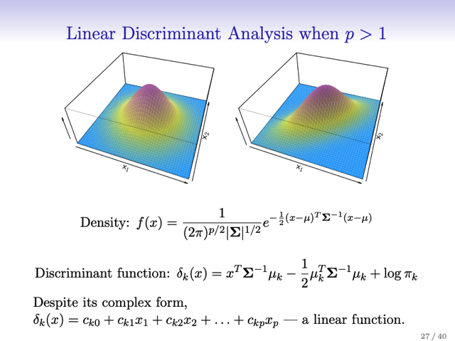</kbd></p>

<p align="center"><kbd></kbd></p>

<br>


<a id="node-336"></a>
### Vậy, quay lại bài toán classification, hoàn toàn tương tự, ta sẽ có ứng

> [!NOTE]
> Vậy, quay lại bài toán classification, hoàn toàn tương tự, ta sẽ có ứng
> với mỗi class một multivariate Gaussian distribution, để rồi ta có công
> thức `f_k(x)` `=` N(x, `mu_k,` Sigma) quy định mật độ xác suất của X "
> trong" một class cụ thể k
>
> Ta sẽ thế hàm `f_k(x)` vào như ở trên để rồi dùng kiến thức Linear
> Algebra triển khai ra, ta cũng sẽ có \**discriminant function\** `theta_k,`
> và\**k nào có `theta_k` lớn nhất thì ta gán class k cho nó\** (nhắc lại,
> cách làm \**gán k nào mà `p_k(x)` tức p(Y=k|X=x)\** lớn nhất là ta \**đang
> tuân theo nguyên lý của Bayes Classifer\**, tuy nhiên vì ta \**chỉ đang
> dùng các giá trị ước lượng\** dựa trên các giả định nên chỉ có thể nói
> là mình đang có các\**Bayes Classifier ước lượng, dùng theta_k^\**)
>
> Vậy tương tự ở trên, bằng cách \**ước lượng các hàm `f_k,` pi_k\** ta sẽ
> có LDA mang tính cách là\**approximate của Bayes classifier.\**
>
> Sau một ví dụ, hình ảnh là 3 hình eclipse giao nhau, thì đó chính là
> vùng của probability distribution Gaussian (khác mean, cùng chung
> một covariance matrix) mà 95% xác suất của x rơi vào, của mỗi class
> `k=1,` 2, 3. Và tạo ra \**3 đường dash line là các decisions boundaries\** giữa
> mỗi cặp, tức là \**trên đó, xác suất x thuộc về mỗi class là bằng nhau\**.
> Chúng sẽ chia thành ra ba khu vực, và một sample sẽ được Bayes
> classifier assign vào class nào là dựa vào x thuộc vùng nào.
>
> Vậy thì với ví dụ này, với LDA, ta sẽ \**thay các estimated mean\**,
> \**covariance  matrix\**, \**pi_k\** vào công thức \**discriminant function\**
> để có `theta_k^` (vì chỉ đang  ước lượng, nên có dấu mũ) và assign k
> mà có `theta_k^` lớn nhất cho nó.
>
> Vậy nhận xét `theta_k` ta sẽ thấy dù nhiều predictor thì \**vẫn là bài toán
> linear (chẳng qua từ x scalar thành vector thôi, hay nói như sách,
> `theta_k` chỉ phụ thuộc vào hay chỉ là một function tính bởi một linear 
> combination của các predictor X1, X2...Xp), đương nhiên các coeff
> quy định ra linear combination này sẽ do quá trình fit model tìm ra. \**

<p align="center"><kbd>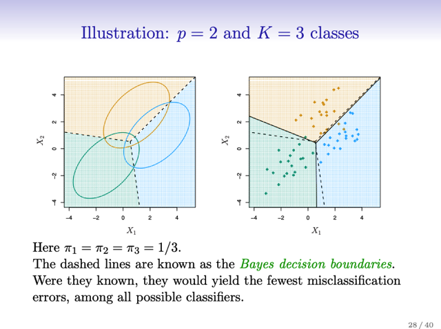</kbd></p>

<p align="center"><kbd></kbd></p>

> [!NOTE]
> Nhắc lại nên nhớ ở bên trái là LDA khi có các population parameters của
> các probability distribution như mean k, covariance matrix SIGMA, prior
> probability `pi_k.` Khi đó ta có một Bayes classifier, và đường dashed line là
> Bayes decision boundaries
>
> Hình bên phải là kết qủa của việc dùng các giá trị parameter ước lượng,
> cũng như `pi_k` `=` 1để có `theta_k^,` từ đó có các đường "estimated decision 
> boundary" màu đen. Cho thấy performance khá tốt (khi so với Bayes 
> classifier).

<br>


<a id="node-337"></a>
### ..Một slide không thấy nói đến trong sách: Có thể chuyển `theta_k` liên hệ nó

> [!NOTE]
> ..Một slide không thấy nói đến trong sách: Có thể chuyển `theta_k` liên hệ nó
> với `P(Y=k|X=x)` để cho thấy việc ra quyết định dựa trên `theta_k` lớn nhất
> cũng chính là ra quyết định (assigning class) dựa trên `Pr(Y=k,X=x)` lớn nhất
> `-` đồng nghĩa nó là Bayes Classfier

<p align="center"><kbd>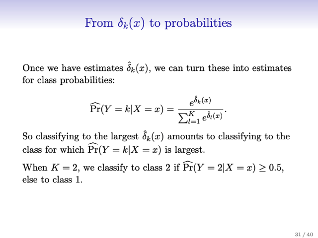</kbd></p>

<p align="center"><kbd></kbd></p>

<br>


<a id="node-338"></a>
### Tiếp theo, với cái LDA classifier này, ta có thể áp dụng vào bài toán (dataset)

> [!NOTE]
> Tiếp theo, với cái LDA classifier này, ta có thể áp dụng vào bài toán (dataset)
> Credit, để dự đoán default rate. Thì đại ý là cho thấy error khá nhỏ nhưng
> cần chú ý hai điểm:
>
> Một là tg nói về\**error rate trên test set sẽ kém hơn là trên training set\**, vì
> như đã biết ta \**đã điều chỉnh model param bằng training set nên khả năng
> model bị overfit\**. Mà p là số `predictor/tương` đương số param, thì p càng lớn
> so với training sample thì càng dễ overfit. Thì trong trường hợp này p chỉ
> bằng 2 nên không sao.
>
> Cái thứ hai là nói về việc, trong bộ data này, \**số lượng sample mà bị default,
> là thấp\**, đây chính là vấn đề \**data skew\** (khi một class ít hơn nhiều so với
> class kia). Thì một dummy classifier (ở đây gọi là null classifier) cũng có thể
> đạt error rate cao.
>
> Xong, nói qua việc là trong bài toán binary classification này model sẽ chỉ có
> hai loại error như đã biết False Positive (dương tính giả, báo động sai): thật
> sự là negative nhưng dự đoán là positive, và 2 `-` False Positive (âm tính giả,
> bỏ xót positive) `=` thật sự là positive nhưng không phát hiện đượcTa sẽ dùng
> Confusion matrix để  từ đó xem xét tỉ lệ sai của mỗi loại.
>
> Xét dương tính giả, tổng số các case thật sự dương tính (tức là bị default) là
> 252 `+` 81 `=` 333. Trong đó có 252 case bị dự đoán là negative (no). ->\**False
> positive rate\** là `252/333` `=` 75.7%
>
> Còn âm tính giả, tổng số case âm tính là 9667, trong đó có 23 case model dự
> đoán dương tính  `->` False Negative rate là `23/9667` `=` 0.2%

<p align="center"><kbd>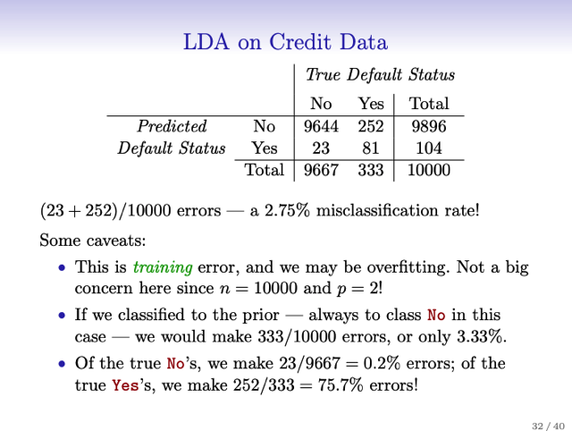</kbd></p>

<p align="center"><kbd>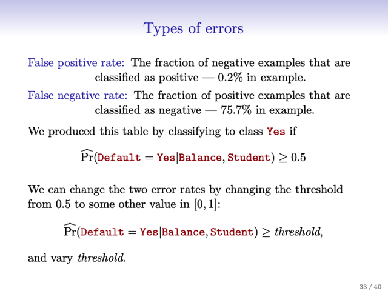</kbd></p>

<p align="center"><kbd></kbd></p>

<p align="center"><kbd></kbd></p>

<br>


<a id="node-339"></a>
### Tiếp theo gs nói về việc người ta có thể đánh giá classifier không phải qua

> [!NOTE]
> Tiếp theo gs nói về việc người ta có thể đánh giá classifier không phải qua
> error rate mà qua " correct" rate, tức là tỉ lệ classify đúng. Đương nhiên cũng
> sẽ có hai loại đúng:
>
> `-` Thật sự là positive và classify positive: \**True Positive Rate\**, chính là độ
> nhạy, \**Sensitivity\**. Tính ra `=` `81/333` `=` 24.3% (đương nhiên nó cũng bằng 1
> `-` False Positive Rate `=` 100 `-` 75.7
>
> `-` Thật sự là negative và classify là negative: \**True Negative Rate\**, như đã
> biết ở HansOnML, nó là độ chuyên \**Specificity\**. Tính ra `=` `9644/9667` `=` 99.
> 8% (Cũng bằng `1-FNR` `=` `100-0.2%)`

<br>


<a id="node-340"></a>
### Tiếp theo gs nhắc lại về sự thật rằng Bayes classifier sẽ là cái mà\\* giảm thiểu

> [!NOTE]
> Tiếp theo gs nhắc lại về sự thật rằng Bayes classifier sẽ là cái mà\**giảm thiểu
> nhất error rate tổng hợp \**(trung bình của error rate trên các class)
>
> Tuy nhiên, như đã biết nhiều khi khi trong một bài toán cụ thể người ta có thể ưu
> tiên (giảm) một loại nào đó trong hai loại error, chấp nhận đánh đổi là error rate
> ở loại kia sẽ tăng lên và dẫn đến tăng error tổng.
>
> Ví dụ mong muốn của một Credit company thì ưu tiên của họ là phải là giảm
> error rate đối với loại False Negative Rate `=` "default mà dự đoán là không
> default", lí do là loại error này gây tổn hại nhiều đến công ty hơn.
>
> Do đó, kiểu như ta sẽ muốn có một classifier có thể error rate tổng hợp không
> cao bằng Bayes nhưng sai sót trên loại mà công ty quan tâm nhỏ hơn thì sẽ ok
> hơn
>
> Thế thì tiếp theo đại khái là, đối vối Bayes classifier như ta đã thấy, chung quy
> lại nó sẽ quyết định gán class k cho  sample dựa trên cái posterior `P(Y=k|X=x)`
> nào cao nhất. Vậy thì với bài toán binary, đương nhiên để có cái lớn nhất thì ta
> chỉ cần so với threshold 0.5
>
> Vậy, để giải quyết vấn để của công ty Credit, ta có thể giảm threshold xuống 0.2
> để rồi quyết định assign class là positive (Default) nếu `P(y=default|x)` > 0.2
>
> Kết quả cho thấy điều này sẽ giúp giảm error rate ở dạng này xuống (Độ nhạy
> Sensitivity TPR tăng `-` tăng tỉ lệ phát hiện case default)  nhưng khiến Specificity
> TNR giảm khiến error rate tổng hơi tăng lên chút. Nhưng điều này là ok, như đã
> nói.

<p align="center"><kbd>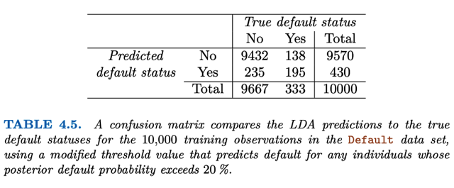</kbd></p>

<p align="center"><kbd></kbd></p>

> [!NOTE]
> bảng này cho kết quả khi threshold 0.2 Để ý thấy TP (thật sự positive và
> dự đoán đúng là positive) tăng lên 195 (từ 81 ở bảng trên).
>
> ```text
> Xét True Positive Rate / Sensitivity = độ nhạy, thì từ 81/333 = 24.3% tăng
> ```
> lên `195/333=58.5%` , tức là tăng thêm 34.2 điểm phần trăm.
>
> Rồi giờ xét error rate tổng thể, như vậy là đúng thêm được `195-81` `=` 114
> ca, giúp error rate tổng thể sẽ giảm `14/10000` `=` 0. 0014 `=` 0.14%
>
> Nhưng FN (thật sự âm mà dự đoán là dương) tăng từ 23 lên 235 khiến sai
> ```text
> thêm 235-23 = 212 ca. vậy đẩy error rate tổng thể xuống 212/10000 = 2.
> ```
> 12%
>
> Tóm lại, dù giúp tăng Sensitivity lên thêm 34.2 điểm phần trăm, nhưng
> error rate tổng lại  tăng 2.12 `-` 0.14 `=` 1.98%

<br>


<a id="node-341"></a>
### Thế thì tiếp theo là cái hình 4.7 cho ta thấy những điều vừa nói mối quan hệ

> [!NOTE]
> Thế thì tiếp theo là cái hình 4.7 cho ta thấy những điều vừa nói mối quan hệ
> của error rate mỗi loại (ý là loại 1 là đoán ko default  mà thực ra là default
> (positive) (là cái loại mà công ty muốn tránh) và error rate loại 2 (đoán có
> default nhưng thật ra là ko)
>
> HÌnh ảnh cho thấy:
>
> 1. Với \**threshold 0.5 thì error rate tổng là nhỏ nhất\** (cái đường màu đen
> hầu như đi ngang, tức nhỏ nhất rồi, không giảm được nữa ở khúc threshold `=`
> 0.5) điều này hoàn toàn \**phù hợp với lý thuyết ta đã biết về Bayes classifier\**
>
> Đó là việc \**assign dựa trên xác định k khiến `Pr(Y=k|X=x)` lớn nhất mà trong
> trường hợp binary là dựa trên thằng nào lớn hơn 0.5 sẽ cho ta classifier có
> error rate thấp nhất.  \**
>
> 2. Nhưng, với threshold này thì \**error rate ở loại 1 (FPR) rất cao\**, khi giảm
> threshold xuống thì error rate loại 1 giảm xuống nhưng error rate loại 2 (FNR)
> lại tăng lên. Vậy thì đây chính là `precision/recall` curve mà trong HansOnML A.
> Geron có nói trong chương 3.
>
> Và, cũng như trong chương đó ta đã biết rằng, dựa vào đó, ta sẽ chọn threshold 
> nào là dựa vào yêu cầu cụ thể của vấn đề là muốn ưu tiên precision hay recall. 
> Như ở đây gs cho biết, chọn mốc nào sẽ\**tùy vào DOMAIN KNOWLEDGE\** `-` dựa 
> vào kinh nghiệm hay kiến thức chuyên môn về lĩnh vực, tạm hiểu là ta sẽ cân 
> nhắc về chi phí giữa hai loại error để quyết định đâu là mức cân bằng giữa trade 
> off hai cái.

<p align="center"><kbd>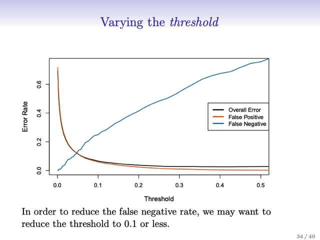</kbd></p>

<p align="center"><kbd></kbd></p>

> [!NOTE]
> Nhận xét thêm:
>
> Đường màu cam là mức sai do "không default mà đoán là default" `-` False
> Positive Rate, đường màu xanh là các sai xót thuộc loại " default mà đoán là
> không default". Hai cái đó gộp lại tạo đường màu đen thể hiện độ sai tổng thể.
> Nhận xét:
>
> 1. Đường màu đen bám sát đường màu cam là bởi dữ liệu này có phần lớn là
> instance thuộc loại Negative (trong 10000 sample của training sét thì  có tới
> 9667 negative sample, và chỉ có vỏn vẹn 333 positive sample.
>
> Vậy ý muốn nhấn mạnh là, với 333 đứa positive sample này, thì dù có dự
> đoán đúng hết, thì cũng chỉ có giảm đi `333/10000` `=` 0.0333 `=` 3.33% vào trong
> error rate tổng thể, tức là đóng góp của nó (FNR) trong error rate tổng thể rất
> nhỏ so với error loại FPR
>
> Thành thử ra, khi giảm threshold xuống, giúp tăng độ nhạy (tỉ lệ phát hiện
> dương tính, Sensitivity) lên và giảm FNR xuống, thì cũng chẳng bù được việc
> gây ra thêm sai sót trong loại FPR. Mà như đã nói vì có quá nhiều negative
> sample nên nó đẩy error rate tổng tăng lên.
>
> Nói tóm lại, giảm threshold, tuy giúp FN giảm nhưng tăng FP, mà vì có nhiều
> negative sample nên ảnh hưởng của FP vào error rate tổng mạnh hơn `->` tuy
> FN giảm nhưng error tổng tăng.
>
> 2. Ta sẽ muốn giảm threshold về cái mức mà FNR đã đủ thấp nhưng nếu
> giảm thêm như thì sẽ đẩy FPR cũng như error rate tổng tăng vọt. Mức đó là
> khoảng `0.08-0.1`

<br>


<a id="node-342"></a>
### Tiếp theo là nói về cái ROC, thì đại ý là tg cũng cho biết là cái này rất  tốt để

> [!NOTE]
> Tiếp theo là nói về cái ROC, thì đại ý là tg cũng cho biết là cái này rất  tốt để
> đánh giá classifier vì bản thân nó \**cho thấy sensitivity và specificity của
> classifier ở mọi threshold\**.
>
> Và nói tóm gọn thì \**diện  tích bên dưới đường ROC gọi à AUC càng lớn thì
> càng tốt\**. Nên \**lí tưởng \**là nó sẽ \**kéo sát góc trên, bên trái\** `(AUC=1)`
>
> Một classifier có cái ROC mà đi chéo thẳng từ góc dưới bên trái sang góc trên
> bên phải thì là cái mà \**đoán bừa theo ngẫu nhiên\**.
>
> Nói thêm trong bài toán này, cả LDA và Logistic Regression classifier đều có
> ROC tương đương nhau.
>
> Rồi cuối cùng là tg cho hai cái bảng tóm lại các thuật ngữ được dùng để chỉ
> (nhiều tên của cùng một chỉ số) các khái niệm này

<p align="center"><kbd>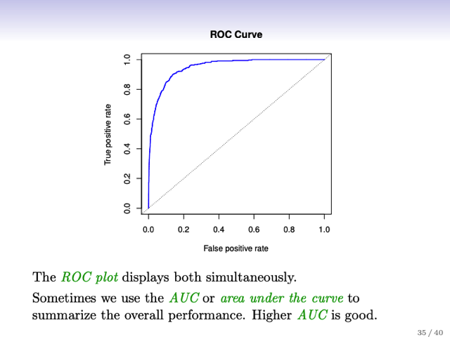</kbd></p>

<p align="center"><kbd>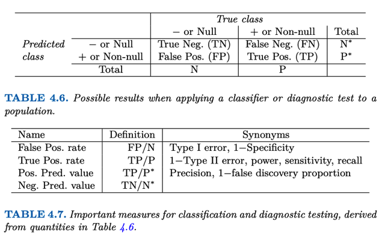</kbd></p>

<p align="center"><kbd></kbd></p>

<p align="center"><kbd></kbd></p>

<br>


<a id="node-343"></a>
## 4.4.3 Quadratic Discriminant Analysis

<br>


<a id="node-344"></a>
### Rồi thì cái này y như cái LDA chỉ có cái là ta sẽ \\*không giả định\\* (assuming)

> [!NOTE]
> Rồi thì cái này y như cái LDA chỉ có cái là ta sẽ \**không giả định\** (assuming)
> phân bố xác suất P(x|y) của các class \**đều có variance giống nhau\** nữa (với
> nhiều p thì thể hiện bởi \**covariance matrix Sigma\** khác nhau)
>
> Khi đó, khi thế các \**estimated\** param như `mean_k,` `sigma_k,` `pi_k` vào công
> thức Bayes classifier để để có 'Estimated Bayes", dùng `theta_k` lớn nhất để
> assign class k cho sample.
>
> Again nhắc lại LDA, QLD đều chỉ là ta dựa trên cái sườn của Bayes, nhưng
> \**không xài TRUE POPULATION param (tại có biết đâu mà xài)\** nên ta \**chỉ
> ước lượng chúng thôi\** `-` thì khi đó ta sẽ có cái Classifier `-` \**Gán class k cho
> sample khi theta_(k) (tính bởi `mean_k,` sigma k, pi k) là lớn nhất\**
>
> Và với việc QDA `-` assume mỗi class có variance khác nhau thì \**theta k lúc
> này không còn như LDA\**, là\**tuyến tính với x nữa\** mà sẽ là phi tuyến bậc 2
> (quadratic) vì các sigma ko còn giống nhau nữa. Đó là lí do gọi là \**Quadratic
> Discriminant Analysis\**
>
> Rồi, vậy thì câu hỏi là \**khi nào thì nên xài LDA khi nào thì QDA\**. Hay tại sao
> phải giả định các distribution của các class k khác nhau về variance làm gì,
> mà không giữ giả định chúng giống nhau như LDA.
>
> Thì câu trả lời đơn giản là chưa chắc giả định nào là đúng, và tùy bài toán cụ
> thể, giả định của cái nào đúng thì cái đó tốt.

<p align="center"><kbd>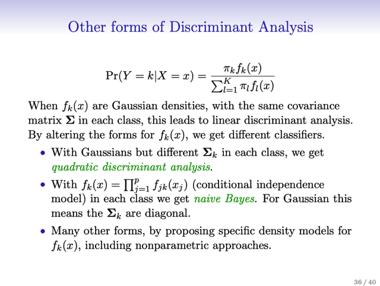</kbd></p>

<p align="center"><kbd></kbd></p>

<br>


<a id="node-345"></a>
### Trước khi trả lời câu hỏi trên rằng khi nào thì xài cái nào thì ta sẽ Đi vào

> [!NOTE]
> Trước khi trả lời câu hỏi trên rằng khi nào thì xài cái nào thì ta sẽ Đi vào
> phân tích trade off giữa hai cái.
>
> Thế thì cái LDA, theta k là tuyến tính theo x, nên với mỗi class trong K
> class, số param chỉ là `=` số predictor `=` p. Nên\**tổng cộng có K*p param\**.
> Còn trong QDA, \**con số này lớn hơn nhiều `=` Kp(p-1)\**.
>
> Thì từ đó cho thấy, vì \**QDA có nhiều parameters hơn\**, nên nó có
> \**capacity hay flexibility cao hơn\** `-` như đã biết nó \**gắn với tính high
> variance\**.
>
> Còn \**LDA gắn với tính high bias\**. Thì như đã biết, có sự trade off giữa
> variance và bias, \**model high variance thì dễ overfit\**, còn \**model high
> bias thì sẽ bị underfit\**.
>
> Vậy thì đương nhiên cái nào tốt sẽ \**phụ thuộc vào giả định nào đúng\**:
>
> Nếu trong một bài toán cụ thể nào đó mà \**quy luật cần nắm bắt được đơn
> giản\**, ví dụ như \**thực sự\** các class k có probability distribution chỉ khác
> mean, còn\**variance thì giống nhau hết\**, khi đó \**xài LDA là đủ\**, còn dùng
> \**QDA thì bị " dư" sẽ dễ bị overfit\**
>
> Ngược lại, trong một b\**ài toán khác phức tạp hơn\**, như \**thật sự các class k
> khác nhau ở variance luôn\** thì lúc này phải\**cần QDA mới đủ\** để mô hình
> sát với tình hình, còn \**dùng LDA thì sẽ dẫn đến undefit.\**
>
> Mói cho hai ví dụ
>
> Một là \**thật sự hai prob distrib có cùng covariance là 0.7\**, lúc này Bayes
> decision boundary (ý là cái chuẩn nhất) là linear, nên ở đây \**DLA nó tốt
> hơn\**, sát với Bayes hơn, còn cái \**QDA thì bị overfit\**, high variance
>
> Còn case thứ hai, \**hai cái có covariance khác nhau\**, nên \**Bayes decision
> Boundary là phi tuyến\**, lúc này đương nhiên \**QDA tốt hơn\**, khi nó flexible
> hơn, nắm bắt được tính phi tuyến, còn\**LDA thì simple quá, bị high bias\**

<p align="center"><kbd>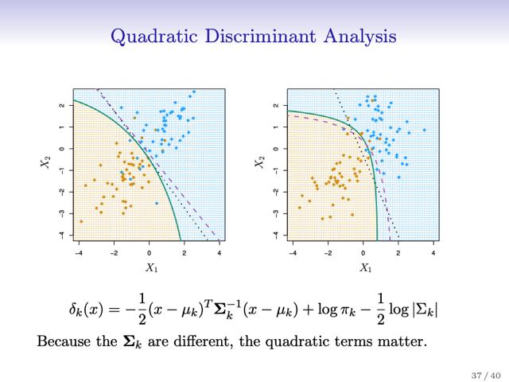</kbd></p>

<p align="center"><kbd></kbd></p>

> [!NOTE]
> ví dụ cho thấy, với case 1, tạm gọi là **"đơn giản"** khi **variance** của hai
> class **đều là 0.7** thì có thể thấy**LDA làm tốt**khi decision boundary của nó
> (chấm đen) **khá đúng khi so với Bayes classifier**(đường gạch gạch  tím).
> Còn **QDA** (đường cong xanh lá) bị **overfit**.
>
> Còn case 2, quy luật thật sự **phức tạp hơn** khi hai class **khác nhau ở
> Variance**. Dẫn đến ở đây **Bayes decision boundary là đường cong**, thành
> ra **LDA không đủ để fit tốt bài toán này** (undefit) mà cần QDA mới được.

<br>


<a id="node-346"></a>
### Nếu nói một cách ngắn gọn cho câu hỏi khi nào thì xài LDA, QDA đó là,

> [!NOTE]
> Nếu nói một cách ngắn gọn cho câu hỏi khi nào thì xài LDA, QDA đó là,
> \**nếu ta có ít dữ liệu, thì nên dùng LDA\**, vì lúc này ta cần \**tránh high
> variance model\**,  dùng một QLA có capacity `/` f\**lexibility cao mà ít training
> set dễ gây overfit\**.
>
> Còn \**nếu có nhiều training sample\**, là yếu tố \**giúp giảm `/` không sợ bị
> overfit\** thì lúc này có thể dùng \**QDA\**.

<br>


<a id="node-347"></a>
## 4.4.4 Naive Bayes

<br>


<a id="node-348"></a>
### Thì mở đầu đại ý là người ta nhắc lại rằng ở trong LDA, QDA ta đã dùng các

> [!NOTE]
> Thì mở đầu đại ý là người ta nhắc lại rằng ở trong LDA, QDA ta đã dùng các
> \**giá trị ước đoán\** của `pi_1,..pi_K` `-` \**prior probability\** ví dụ `p(y='` cam') `-` xác
> suất một quả "được chọn khơi khơi" là cam hay táo,
>
> và `f_1(x),..f_k(x)` là \**probability density function mô tả p(x=X|y=Y)\** (ví dụ
> `Pr(x='` `1kg'|y='cam')` xác suất quả cam nặng một kí lô nếu biết nó là táo hay
> cam)
>
> Và thế chúng vào trong\**Bayes theorem\** để có \**p(y=k|x=X)\** mang ý nghĩa
> là \**posterior probability\** một sample thuộc một class k (xác suất quả được
> chọn là cam hay táo khi đã biết số kí của nó, feature x)
>
> Việc \**tính `pi_k` thì tg nói dễ\**, có thể \**dùng tỉ lệ của mỗi loại trong training
> set\**. Nhưng với \**f_k(x) thì khó hơn khi ta cần phải estimate một phân phối
> xác suất đa biến \**
>
> Và trong LDA, ta \**đơn giản hóa\** nó bằng cách \**đặt ra một giả định rất
> mạnh\** rằng các \**phân phối xác suất p(X=x|Y=k)\** đều là \**Gaussian
> distribution\** \**khác nhau ở mean\**, nhưng \**đều có chung variance\** (nếu là
> bài toán univariate p `=` 1) hoặc covariance matrix nếu là p > 1. Còn trong QDA
> ta giả định chúng có \**covariance matrix khác nhau\**.
>
> Đại khái là \**bằng cách đặt ra những giả định này\** đã \**ĐƠN GIẢN VẤN ĐỀ
> ĐI ĐÁNG KỂ\**, khi \**chỉ cần estimate K `p-D` mean vector\** và \**1 (p,p)
> covariance matrix\** Sigma (nếu là multivariate LDA) hoặc\**K (p,p) covariance
> matrix\** `Sigma_1,` ... Sigma K nếu là multivariate QDA.

<br>


<a id="node-349"></a>
### Thế thì \\*thay vì giả định các probability density function `f_k(x)` có dạng cụ

> [!NOTE]
> Thế thì \**thay vì giả định các probability density function `f_k(x)` có dạng cụ
> thể nào đó\** như cách của LDA, QDA đã giả định là Gaussian distribution
> có param sao sao đó thì \**Naive Bayes đặt ra giả định rằng các random
> variable x1,x2.. xp đều độc lập nhau\**.
>
> Từ đó cho phép: \**f_k(x) `=` `f_k1(x1)*f_k2(x2)*.` ...f_kp(xp)\** trong đó
> `f_kj(xj)` là phân phối xác suất của variable xj trong class k.
>
> Mục đích của việc đặt ra giả định rằng các variable độc lập nhau đó là vì
> việc estimate probability distribution `p(X=x|Y=k)` trong mỗi class nó khó ở
> chỗ \**không chỉ phải ước đoán distribution của từng variable x1, x2.. .
> xp\**, gọi là \**marginal distribution\** (thể hiện trong covariance matrix là
> \**các giá trị trên đường chéo\**)
>
> mà\**\**còn phải ước đoán\**distribution của các tương tác `/` tương quan
> giữa các variable với nhau\**, gọi là\**joint distribution\** (thể hiện trong
> covariance matrix \**là những giá trị ngoài đường chéo\**
>
> Và r\**ắc rối `/` thách thức chính là ở cái khúc phải estimate cái joint
> distribution này. \**Dẫn đến nếu ta \**giả định rằng các biến độc lập nhau\**
> thì sẽ khiến nhiệm vụ estimate các distribution để trở nên dễ hơn rất
> nhiều
>
> Thế thì cái này, nếu g\**iả định thêm \**là\**normal distribution \**thì chính là
> ta có \**covariance matrix sẽ có đặc điểm là matrix chéo (diagonal)\**, các
> \**vị trí ngoài đường chéo đều bằng 0\** `-` thể hiện k\**hông có sự tương
> quan\** (correlation) giữa các variable.

<p align="center"><kbd>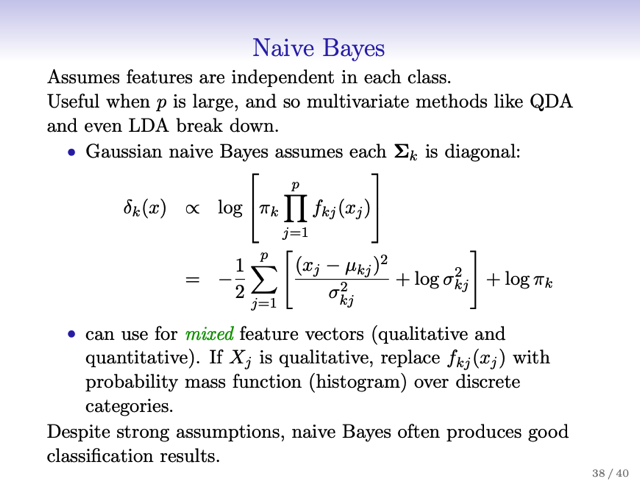</kbd></p>

<p align="center"><kbd></kbd></p>

> [!NOTE]
> nhắc lại, Naive Bayes tỏ ra hữu ích khi p lớn tức là số variable lớn
> khiến nếu ít dữ liệu thì ngay cả với việc giả định mọi class đều có
> chung một covariance matrix (LDA), thì vẫn ko đủ dữ liệu để estimate.

<br>


<a id="node-350"></a>
### Vậy thì cái này gs cho rằng \\*đương nhiên là khi ta đã giả định vậy, thì

> [!NOTE]
> Vậy thì cái này gs cho rằng \**đương nhiên là khi ta đã giả định vậy, thì
> " phần lớn" là không đúng\** vì \**thực tế các variable không độc lập
> nhau\**.
>
> Tuy nhiên nó cũng \**giúp tạo ra một mô hình đơn giản\** mà trong
> \**một số trường hợp nó có performance rất tốt\**. Nhất là khi số\**training data so với số lượng predictor không lớn\** đủ để \**estimate
> joint distribution\** của các predictor trong mỗi class.
>
> Ở đây ý là nếu p lớn (so với n) thì không đủ dữ liệu để dùng LDA,
> QDA vì dù cho \**LDA ta vẫn cần estimate cái covariance matrix "xài
> chung" của mọi class, thì nếu p lớn hơn nhiều so với n  thì dù chỉ phải
> estimate 1 cái thì cũng không đủ chứ đừng nói nếu là mỗi class một
> cái QDA\**
>
> Gs nhắc đến \**trade off bias/variance\** mà ta cũng hiểu ở trên đó là
> thực tế có một nguyên tắc là \**nếu ở trong giả định đúng\** thì mô hình
> \**dù có đơn giản vẫn có hiệu quả cao\**, thì ở đây naive bayes đưa
> vào \**assumption đơn giản hóa vấn đề \**như vậy thì\**vẫn có thể làm
> tốt nếu rơi vào trường hợp assumptions đúng.\**

<br>


<a id="node-351"></a>
### Vậy với việc cho rằng các \\*variable Xj đều độc lập\\*, ta triển khai fk(X) thành ra là

> [!NOTE]
> Vậy với việc cho rằng các \**variable Xj đều độc lập\**, ta triển khai fk(X) thành ra là
> \**fk1(x1)*fk2(x2)...fk(xp)\**. Dựa trên kiến thức \**product rule\** xác suất là nếu các sự
> kiện A,B độc lập nhau thì xác suất joint AB cùng xảy ra sẽ là P(A)*P(B).
>
> Và rồi `Pr(Y=k|X=x)` trở thành:
>
> `pi_k*fk1(x1)*fk2(x2)...fkp(xp)` chia cho tổng l, l từ 1 tới K `pi_l*fl1(x1)*fl2(x2)*.` ..
> *flp(xp)
>
> Từ đó, để ra kết quả, ta chỉ phải estimate các density function fl1(x), fl2(x)...
> flp(x) với l từ 1 tới K. Có thể thấy với mỗi class ta có p function (một function
> cho mỗi một predictor), để rồi tổng cộng là K*p function phải estimate. Tuy
> nhiên, các probability density function này đều là các hàm mật độ xác suất đơn
> biến
>
> Vậy thì có các cách làm sau:
>
> Nếu variable là \**quantitative\** `-` ta sẽ có thể coi như nó có phân phối xác suất
> normal với mean và sigma. Để rổi ta sẽ estimate mean bằng sample mean,
> estimate variance bằng sample variance.
>
> Ví dụ tính f51(x) `-` class `k=5,` và predictor X1. Như đã nói ta cho rằng giá trị của
> predictor X1 của class `k=5` phân phối theo normal distribution. Ta sẽ tính
> estimated mean của distribution này bằng các lấy mọi sample thuộc class 5
> trong dataset, tính mean của X1 của chúng. Và tính variance X1 của chúng để
> estimate cho variance của distribution.Từ đó có lắp hai estimated parameters
> này vào công thức hàm mật độ xác suất normal để có f51(x).
>
> Gs nói thêm, ta có thể thấy cái nào hao hao QDA, thế thì thật ra cái này chính
> là QDA khi trong đó ta cũng giả định rằng các predictor `X=(X1,` X2.. Xp) của mỗi
> class tuân theo normal distribution. Đồng nghĩa xét từng predictor X1,X2 thì mỗi
> cái cũng được phân phối theo normal distribution. Có điều với Naive Bayes
> phải có thêm giả định rằng các predictor X1,X2.. Xp độc lập. Đồng nghĩa
> covariance matrix Sigma sẽ có mọi giá trị ngoài đường chéo đều bằng 0 `-`
> diagonal matrix.
>
> Còn cách khác là dùng cách không cần ước lượng parameter của distribution
> `(non-parametric)` bằng cách dùng histogram: Tạo histogram dựa trên giá trị của các
> predictor rồi dùng nó để xác định fkj(Xj). Để dễ hiểu, lấy ví dụ X1 là thuộc loại
> quantitative, ta sẽ xây dựng histogram cho X1 của class `k=1,` bằng cách xem
> trong class này X1 nó có những giá trị nào, và từ đó tạo histogram. (histogram
> đại khái cho biết phân bố giá trị của variable X1 trong các sample thuộc `k=1`
> như thế nào, nhiều ít ra sao thể hiện bằng %). Kể từ đó, với một sample mới
> cần classify có X* `=` [X1*, ..Xp*],  khi cần tính f11(X1*), ta sẽ xem X1* rơi vào "
> vùng nào" `/` "bin" nào của histogram, và từ đó lấy ra giá trị % tương ứng của
> histogram làm giá trị f11(X1*)
>
> Còn nếu variable là \**qualitative\** variable, thì có thể hiểu đại khái là cũng tạo
> histogram, chẳng qua là không quan tâm thứ tự các category. Ví dụ  Xj có thể 
> có 3 giá trị là 1,2,3. Xét trong 100 sample thuộc class k, thì có 32 cái có xj là 
> bằng 1, 55 cái có xj bằng 2, 13 cái có xj bằng 3.
>
> ```text
> Thì fkj(Xj=1) sẽ là 0.32, fkj(Xj=2) = 0.55 và fkj(Xj=3)=0.13
> ```

<br>


<a id="node-352"></a>
### Tiếp theo là áp dụng cho một ví dụ là Default data set, trong đó có 3 predictor.

> [!NOTE]
> Tiếp theo là áp dụng cho một ví dụ là Default data set, trong đó có 3 predictor.
> Hai cái đầu là quantitative, cái kia là qualitative.
>
> Áp dụng các cách tính fkj(x) vừa nói để đầu tiên ta xây dựng các histogram của
> MỖI quantitative predictor cho MỖI class: có hai class và 2 quantitative predictor
> Balance và Income `->` 4 histogram. Còn qualitative predictor `-` Student, ta sẽ
> chuẩn bị cái hai cai1 "categorical histogram".
>
> Từ đó, để tính xác suất bị default của một người sinh viên có balance là 0.4, và
> income là 1.5 (cả hai có đơn vì là ngàn đô la) thể hiện bởi x `=[0.4,` 1.5, 1].T Ta sẽ
> thế X1, X2,X3 vào để tính ra các fkj. Từ đó lắp vào công thức `Pr(Y=1|X=x)` của
> Naive Bayes để tính ra xác suất thuộc class 1 (default) `=` 94.4%.
>
> `====`
>
> Cũng vẽ ra confusion matrix. Rồi họ nói cũng như LDA ta có thể \**adjust
> threshold\**, cho thấy với \**cùng threshold thì N.B có error rate\** cao hơn nhưng
> \**sensitivity cũng tốt hơn\**.
>
> Thế thì mới nói một ý quan trọng đó là sở dĩ N.B không  hoàn vượt trội LDA hay
> QDA ở bài toán này đại khái là vì:  \**Naive Bayes là mang lại khả năng giảm
> overfit\** bằng cách \**đặt ra một giả định (assumption) mang tính đơn giản hóa
> vấn đề\** (như đã biết đó là cho rằng các variable Xj đều độc lập nhau).
>
> Thế thì \**lợi thế này chỉ phát huy khi nào ta có một tình huống dễ overfit\** ví dụ
> như ở đây nếu \**có nhiều predictor p so với số sample hơn\** (tức tỉ lệ predictor `/`
> sample `p/n)` lớn đáng kể khiến cho kiểu như \**không đủ data để estimate ra
> parameters của các phân phối  xác suất trong LDA, QDA\** (ví dụ LDA cần
> estimate covariance matrix size pxp có p^2 số param)
>
> Khi đó việc dùng một high bias model `-` kiểu như model đơn giản sẽ phát huy tác
> dụng giảm variance `/` overfit, và ta có thể expect là Naive Bayes có performance tốt
> hơn đáng kể so với LDA, QDA.
>
> Còn ở đây ta có n `=` 10000, còn \**p `=` 4, có nghĩa là số sample lớn hơn nhiều
> predictor,\** thì việc \**dùng high bias model cũng không ích gì.\**

<p align="center"><kbd>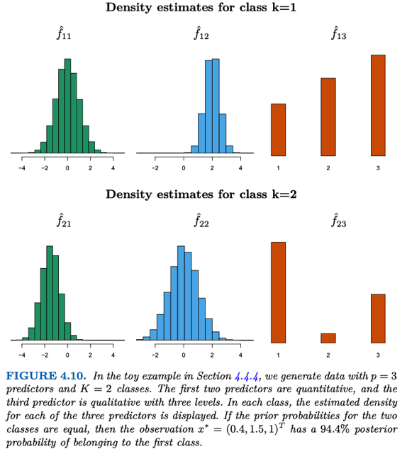</kbd></p>

<p align="center"><kbd>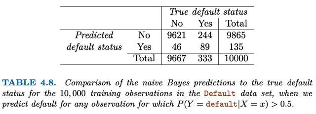</kbd></p>

<p align="center"><kbd>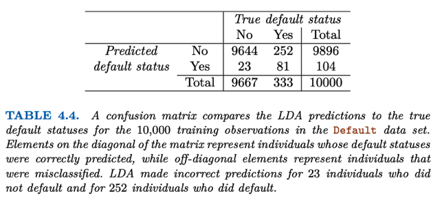</kbd></p>

<p align="center"><kbd></kbd></p>

<p align="center"><kbd></kbd></p>

<p align="center"><kbd></kbd></p>

> [!NOTE]
> Error rate (tổng) của LDA trên Default dataset ở mức threshold 0.5: 
>
> ```text
> Tổng số ca sai sót ở hai loại: FP+FN = 23 + 252 = 285 -> error rate
> ```
> `=` 285 `/` 10000 `=` **2.85%**
>
> Sensitivity: Độ nhạy, True Positive Rate, tỉ lệ phát hiện các ca default,
> vốn là thứ công ty tài chính này quan tâm như đã nói:
>
> số ca positive phát hiện `/` (tổng số ca thật sự positive
>
> `=` TP `/` (TP `+` FN) `=` 81 `/` (81 `+` 252) `=` **24.3%**

> [!NOTE]
> Error rate (tổng) của N.B trên Default dataset ở mức threshold 0.5: 
>
> ```text
> Tổng số ca sai sót ở hai loại: FP+FN = 46 + 244 = 290 -> error rate
> ```
> `=` 285 `/` 10000 `=` **2.9% vậy là error rate tệ hơn LDA**
>
> Sensitivity: Độ nhạy, True Positive Rate, tỉ lệ phát hiện các ca default,
> vốn là thứ công ty tài chính này quan tâm như đã nói:
>
> số ca positive phát hiện `/` (tổng số ca thật sự positive
>
> `=` TP `/` (TP `+` FN) `=` 89 `/` (89 `+` 244) `=` **26.7% cũng nhỉnh hơn LDA**

<br>

