# 4.5 A Comparison Of Classification Methods

📊 **Progress:** `8` Notes | `34` Screenshots

---

## 4.5.1 Analytical Comparision

 

### Đại khái là phần này ta sẽ so sánh 4 mô hình: LDA, QDA, Naive Bayes và

> [!NOTE]
> Đại khái là phần này ta sẽ so sánh 4 mô hình: LDA, QDA, Naive Bayes và
> Logistic regression. Với một bài toán có K class, và nhiệm vụ của ta là
> phải predict/**assign một class k** cho một sample/observation có predictor
> là X=x, **sao cho tối đa được Pr(y=k|X=x)**.
>
> Như phần trước cũng đã biết, nhiệm vụ này cũng có thể**tương đương** với
> cách tiếp cận khác đó là ta **chọn một base class** ví dụ như K, và tìm cách
> **assign một class k** cho sample sao cho **tối đa được log(Pr(Y=k|X=x) /
> Pr(Y=K|X=x)**

 

### Rồi đầu tiên là họ tính với LDA

> [!NOTE]
> Rồi đầu tiên là họ tính với LDA
>
> Đại khái Pr(Y=k|X=x) theo đó sẽ là πk * fk(x) với
>
> πk là **xác suất xuất hiện một sample thuộc class k "khơi khơi"**, hay gọi **là
> prior probability** và nó **không phụ thuộc x**.
>
> Còn fk(x) cho biết **hàm mật độ xác suất** cho biết đại khái nói một cách **gần
> đúng** là **với class k thì khả năng X có giá trị = x** (nói chuẩn phải là xác suất
> một variable X có giá trị rơi vào vùng vô cùng nhỏ quanh x). Ví dụ như nãy giờ
> ta dùng xác suất quả cam nặng 1 kí lô vậy.
>
> Tương tự Pr(Y=K|X=x) theo đó sẽ là πK * fk(x) với πK là xác suất xuất hiện
> một sample  thuộc class K "khơi khơi", hay gọi là prior probability. Còn fK(x)
> cho biết trong class K, xác suất variable X có giá trị x là bao nhiêu
>
> Từ đó ta sẽ có thử xem log của tỉ số probability còn gọi là log odd sẽ có dạng
> ra sao:
>
> log (Pr(Y=k|X=x) / Pr(Y=K|X=x))= log [πk * fk(x)] / [πK * fK(x)]
>
> = log [πk / πK]*[ fk(x) / fK(x)] = log [πk / πK] + log[ fk(x) / fK(x)]
>
> (logAB = logA +logB)
>
> ====
>
> Tới đây xét riêng **M = log[ fk(x) / fK(x)]**:
>
> Như đã nói với LDA thì đại khái là người ta **giả định** rằng các **phân phối
> xác suất của các class đều là Gaussian distributio**n, có **cùng variance** và
> **khác nhau mean**. Nên thay công thức của Gaussian distribution vào ta có:
>
> M = log[ fk(x) / fK(x)]  ..*triển khai như bên note màu xanh" xong ta có
>
> M = - 0.5(μk + μK).T@Σ.inv@(μk - μK) + x.T@Σ.inv(μk - μK)
>
> Vậy log odd = log [πk / πK] + M
>
> = **log [πk / πK] - 0.5(μk + μK).T@Σ.inv@(μk - μK) + x.T@Σ.inv(μk - μK)**Đặt a_k là phần không dính tới x:
>
> a_k = log [πk / πK] - 0.5(μk + μK).T@Σ.inv@(μk - μK)
>
> Còn x.T@x.T@Σ.inv(μk - μK) thì để ý rằng: Σ.inv là covariance matrix shape (P,
> P) P là số predictor, chiều dài của vector x. μk và μK đều là mean, đương
> nhiên cũng là P-dimensional vector. Vậy Σ.inv(μk - μK) sẽ có shape là (P,
> P)@(P,1) bằng (P, 1), tức là cũng là P-dimensional vector.
>
> Vậy cho nên nếu **gọi b_k là Σ.inv(μk - μK)**, thì x.T@Σ.inv(μk - μK)
> cơ bản chính là bằng **x.T@b_k**, là dot product của hai vector. Và có thể triển
> khai ra thêm:
>
> x.T@b = x_1*bk_1 + x_2*bk_2 + ...x_p*bk_p = Σ j=1:P x_j*bk_j
>
> ===
>
> Vậy log odd = a_k + Σ j=1:P x_j*bk_j, cho thấy **log odd là hàm tuyến tính đối
> với các predictor x_j, giống như Logistic Regression**

<kbd>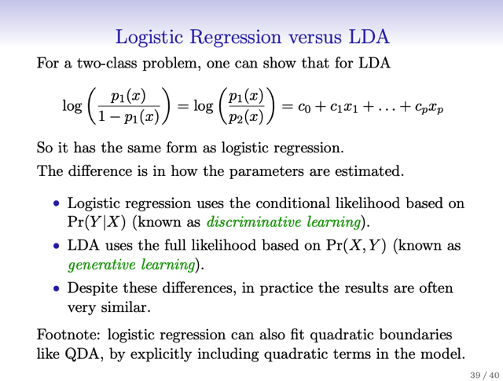</kbd>

<kbd>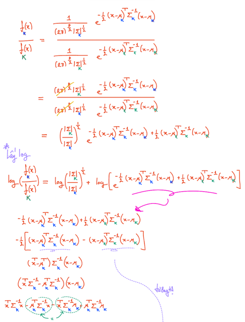</kbd>

<kbd>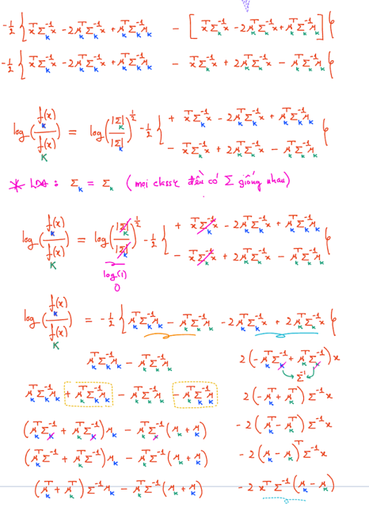</kbd>

<kbd>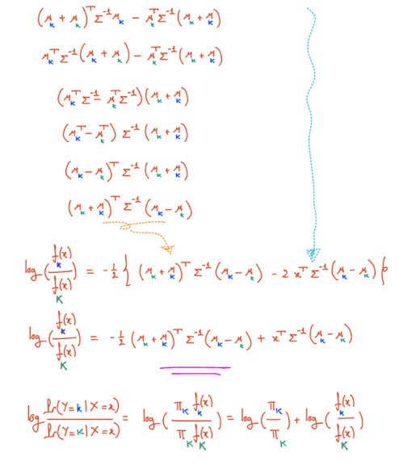</kbd>

<kbd>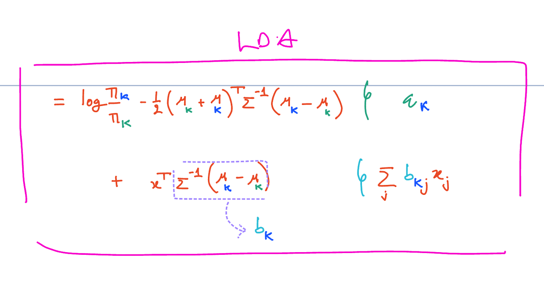</kbd>

<kbd></kbd>

<kbd></kbd>

<kbd></kbd>

<kbd></kbd>

<kbd></kbd>

> [!NOTE]
> Triển khai M = log[ fk(x) / fK(x)] 
>
> = log [  ]
>
> = -0.5(x - μk).T@Σ.inv@(x-μk) + 0.5(x - μK).T@Σ.inv@(x-μK) 
>
> Để cho thấy = - 0.5(μk + μK).T@Σ.inv@(μk - μK) + x.T@Σ.inv(μk - μK)
>
> =======
>
> Đầu tiên: Dựa vào tính chất (a+b).T = a.T + b.T, dẫn đến:
>
> (x - μk).T = x.T - mu_k.T , tương tự (x - μK).T = x.T - μK.T
>
> nên:
>
> M1 = (x.T-μk)@Σ.inv@(x-μk) = (nhân phân phối vô thôi)
>
> = x.T@[Σ.inv@(x-μk)] - mu_k.T@[Σ.inv@(x-μk)]
>
> = [x.T@Σ.inv@x - x.T@Σ.inv@μk] - [μk@Σ.inv@x - μk@Σ.inv@μk]
>
> = x.T@Σ.inv@x - x.T@Σ.inv@μk - μk@Σ.inv@x + μk@Σ.inv@μk
>
> Tới đây x.T@Σ.inv@μk nó cũng bằng μk.T@Σ.inv@x. Điều này có được là do tính chất
> đối xứng của Σ.inv. Cụ thể là ta đã biết nếu A là symmetric matrix (ma trận đối xứng) thì A = A.T
>
> Khi đó nếu xTAy là một scalar thì nó cũng bằng = (xTAy)T (transpose của một scalar, hay chuyển vị của
> một vô hướng thì bằng chính nó) 
>
> Rồi, (xTAy)T = (Ay)T(xT)T (do a.Tb.T = (ba)T 
>
> Tiếp, (xT)T đương nhiên = x nên (Ay)T(xT)T = (Ay)Tx = yTATx. 
>
> Tới đây thì thay AT = A ở trên vô  = yTAx.  Vậy xTAy = yTAx
>
> ====
>
> Vậy M1 = \/x.T@Σ.inv@x\/ - 2x.T@Σ.inv@μk + μk.T@Σ.inv@μk
>
> Tương tự M2 = \/x.T@Σ.inv@x\/ - 2x.T@Σ.inv@μK + μK.T@Σ.inv@μK
>
> Nên M = -0.5M1 + 0.5M2 
>
> = -0.5[x.T@Σ.inv@x - 2x.T@Σ.inv@μk + μk.T@Σ.inv@μk] + 0.5[x.T@Σ.inv@x - 2x.T@Σ.inv@μK + μK.T@Σ.inv@μK]
>
> = -0.5x.T@Σ.inv@x + x.T@Σ.inv@μk - 0.5μk.T@Σ.inv@μk] + 0.5x.T@Σ.inv@x - x.T@Σ.inv@μK + 0.5μK.T@Σ.inv@μK]
>
> = (-0.5x.T@Σ.inv@x + 0.5x.T@Σ.inv@x) + (x.T@Σ.inv@μk - x.T@Σ.inv@μK) - 0.5μk.T@Σ.inv@μk] + 0.5μK.T@Σ.inv@μK)
>
> **= 0 +  x.T@Σ.inv(μk - μK) - 0.5μk.T@Σ.inv@μk] + 0.5μK.T@Σ.inv@μK)**
> ======****Tiếp, xét N = - 0.5μk.T@Σ.inv@μk] + 0. 5μK.T@Σ.inv@μK)
>
> = -0.5 [μk.T@Σ.inv@μk - μK.T@Σ.inv@μK)
>
> Như đã biết μk.T@Σ.inv@μK = μK.T@Σ.inv@μk <=> μk.T@Σ.inv@μK - μK.T@Σ.inv@μk  = 0
>
> Nên ta có thể cộng thêm cái này vào N để có
>
> = -0.5 [μk.T@Σ.inv@μk + (μk.T@Σ.inv@μK - μK.T@Σ.inv@μk) - μK.T@Σ.inv@μK)
>
> = - 0.5 [μk.T@Σ.inv(μk + μK)  - μK.T@Σ.inv(μk + μK)]
>
> = - 0.5(μk.T - μK.T)@Σ.inv@(μk + μK) 
>
> = - 0.5(μk - μK).T@Σ.inv@(μk + μK) = 
>
> = - 0.5(μk + μK).T@Σ.inv@(μk - μK) 
>
> ======
>
> Vậy cuối cùng ta có **M = - 0.5(μk + μK).T@Σ.inv@(μk - μK) + x.T@Σ.inv(μk - μK)**

> [!NOTE]
> Thay công thức Gaussian probability density
> function vào

> [!NOTE]
> log [ Pr(Y=k|X=x) / Pr(Y=K|X=x)] của LDA cho thấy nó là hàm
> tuyến tính đối với x, hay nói cách khác là linear function của các
> predictor x_j

 

### Tiếp theo là với QDA, cũng triển khai log odd để cho thấy nó là hàm phi tuyến

> [!NOTE]
> Tiếp theo là với QDA, cũng triển khai log odd để cho thấy nó là hàm phi tuyến
> (quadratic của predictor)
>
> a_k + Σ j=1:P x_j*bk_j + Σ j=1:P Σ l=1:P ckjl*x_j*x_l
>
> a_k, bk_j, ckjl là functions của π_k, π_K, μ_k, μ_K, Σ_k, Σ_K
>
> ====
>
> Với Naive Bayes: 
>
> log {Pr(Y=k|X=x) / Pr(Y=K|X=x)}
>
> = log {π_k*fk(x) / π_K*fK(x)}
>
> = log {π_k*[Π j fkj(x_j)] / π_K*[Π j fKj(x_j)]
>
> = log (π_k/π_K) + log { [Π j fkj(x_j)] / [Π j fKj(x_j)]
>
> = log (π_k/π_K) + Σ j log fkj(x_j) / fKj(x_j)       
>
> (Vì log [a1*a2] / [b1*b2] = log (a1/b1)*(a2/b2) = log (a1/b1) + log (a2/b2) )
>
> = ak + Σ gkj(x_j)

<kbd>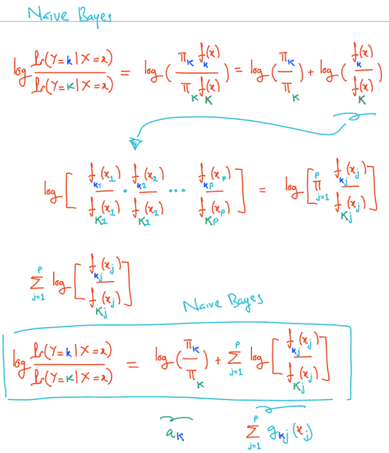</kbd>

<kbd>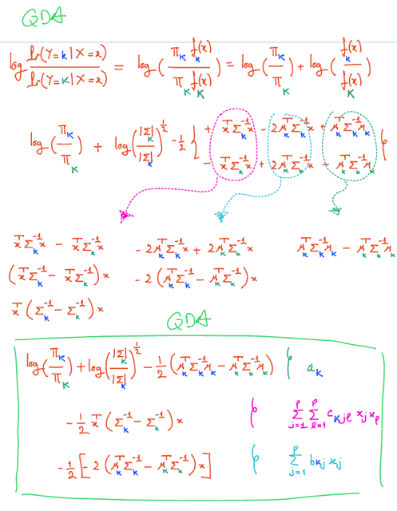</kbd>

<kbd></kbd>

<kbd></kbd>

> [!NOTE]
> log [ Pr(Y=k|X=x) / Pr(Y=K|X=x)] của QDA cho thấy nó là
> hàm phi tuyến tính quadratic đối với x

 

### Tóm lại:  log [Pr(Y=k|X=x) / Pr(Y=K|X=x]

> [!NOTE]
> Tóm lại:  log [Pr(Y=k|X=x) / Pr(Y=K|X=x]
>
> Với LDA:  
>
> = **a_k** + **Σ j=1:P x_j*bk_j** 
>
> a_k = log [πk / πK] - 0.5(μk + μK).T@Σ.inv@(μk - μK)
>
> b_k là Σ.inv(μk - μK)
>
> ====
>
> Với QDA:
>
> = **a_k** + **Σ j=1:P x_j*bk_j** + Σ j=1:P Σ l=1:P ckjl*x_j*x_l
>
> a_k, bk_j, ckjl là functions của pi_k, pi_K, mu_k, mu_K, Sigma_k, Sigma_K
>
> ====
>
> Với Naive Bayes:
>
> = a_k + Σ l=1:P gk_j(x_j)
>
> Với a_k = log (π_k/π_K)
>
> gk_j(x_j) = log fkj(x_j) / fKj(x_j)

 

- Kết luận 1: LDA là special case của QDA: Khi ckjl = 0 với mọi k,j,l

<kbd>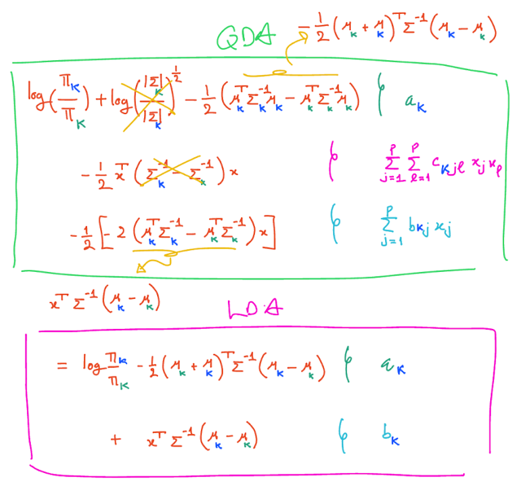</kbd>

<kbd></kbd>

> [!NOTE]
> Có thể thấy khi QDA có thêm giả định xác class đều share chung
> covariance matrix, tức Σ1=Σ2. .Σk..ΣK thì ta sẽ có LDA

   

- Kết luận 2:....
   

- Kết luận 3:  nếu Naive Bayes có thêm giả định **mỗi variable X_j tuân theo một simple Gaussian distribution** khác mean, chung variance.   Ví dụ predictor X_1 sẽ tuân theo Gaussian distribution mean μk_1 (tức mỗi class k mean sẽ khác), variance σ^2_1 (mọi class đều có chung variance σ^2_1)  Khi đó thế công thức của fkj(xj) với Gaussian formula vào ta sẽ có log odds **chính là của LDA với covariance matrix Σ có dạng diagonal.**  Chỗ này hơi lằng nhằng:   1) Ta đã nói Naive Bayes đã giả định các predictor độc lập  2) Và bây giờ giả định là các predictor tuân theo Gaussian distribution,  trong đó mỗi class đều có chung variance, khác mean  Thì triển khai nó (log odd) sẽ ra y như của LDA với covariance matrix  có dạng diagonal. Vì sao lại diagonal là vì LDA này có thêm giả định là các predictor độc lập -> correlation giữa các predictor khác nhau = 0. Nên chính là các vị trí ngoài đường chéo của covariance matrix = 0.

<kbd>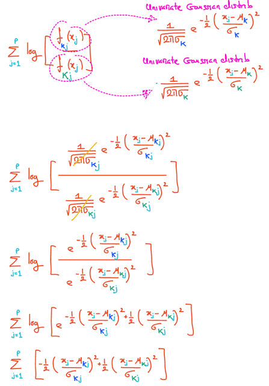</kbd>

<kbd>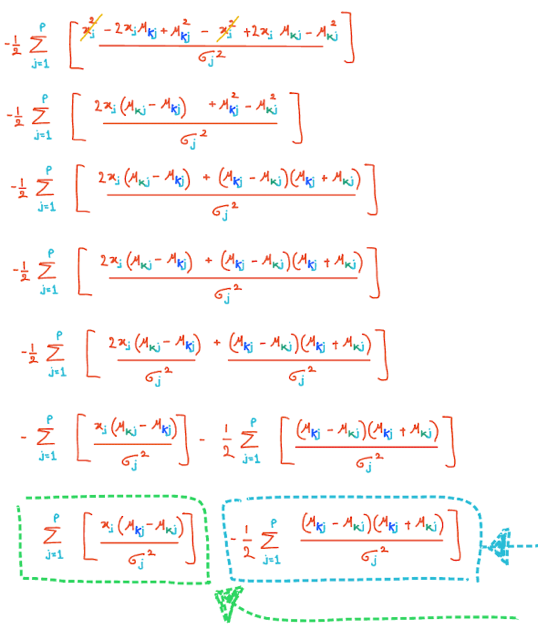</kbd>

<kbd>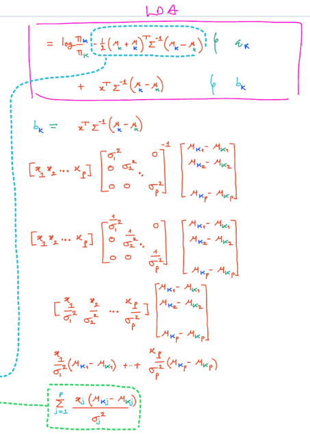</kbd>

<kbd></kbd>

<kbd></kbd>

<kbd></kbd>

> [!NOTE]
> và triển khai ra vầy.

> [!NOTE]
> Khi triển khái log odd của LDA trong đó thêm vụ
> **covariance matrix** là **diagonal (biểu hiện các predictor
> độc lập nhau)** thì sẽ thấy nó ra y chang của Naive
> Bayese. Mũi tên màu xanh ý là cái bk nó ra phần này của
> Naive Bayes
>
> Dễ thấy nếu triển khai cái ak thì cũng sẽ ra cái phần xanh
> dương

> [!NOTE]
> Khi Naive Bayes có thêm giả định là các predictor X_j
> tuân theo simple Gaussian distribution. Thay công thức
> probability density function của simple Gaussian
> distribution vào

   

- Kết luận 4: đại khái là nói về hai cái Naive Bayes và QDA thì không cái nào là special case của cái nào.  Naive Bayes linh hoạt hơn là vì công thức của nó nhưng đã thấy ở trên với gkj = log [fkj(xj) / fKj(xj)] thì hàn f có thể là bất cứ cái gì.  Tuy nhiên, nó chỉ có tính chất thuần túy là additive, khi như trên thấy công thức của Naive Bayes chỉ là tổng, mang ý nghĩa là, **nếu có thêm predictor**, thì nó sẽ có **tác dụng "cộng thêm"** trong trong tác dụng giúp classify tốt hơn. Còn QDA thì có **một vế có sự nhân giữa hai predictor**, thành ra nó **tỏ ra hữu ích hơn khi cần sự interaction** giữa các predictor trong việc classify.
   

- Đại khái là không có cái nào vượt trội hơn cái nào hoàn toàn. Vì tùy giả định nào là đúng cũng như số lượng giữa predictor và sample.  Sau đó người ta nhắc lại **logistic regression**. Thì đại khái là khi xét log [pk/pK] nó cũng giống LDA ở chỗ **đều là hàm tuyến tính của predictor**. Có điều, với LDA, các hệ số được tính từ việc estimate các tham số của các distribution Gaussian. Còn với Logistic regression, các hệ số dựa trên **maximum likelihood.**  Nên khi giả định của LDA đúng thì nó tốt hơn và ngược lại
   

- Cuối cùng là nhắc lại về KNN: Đại khái là KNN ta biết ở chương 2, nó là non-parametric model.  Cách làm của nó thì mình nhớ lại, để classify một sample, nó sẽ xem thử K sample gần nhất của sample đó thuộc class gì, và từ đó quyết định. Và vì vậy, nó chẳng cần giả định gì như mấy mô hình kia để mà dựa vào giả định mới đi ước lượng các parameters. Thành ra, nó không bị mắc kẹt vào các ràng buộc như LDA, Logistic Regression chỉ làm tốt nếu Bayes decision boundary là tuyến tính hay QDA chỉ làm tốt nếu Bayes decision boundary là quadratic, mà KNN sẽ có thể làm tốt dù do decision boundary có phức tạp cỡ nào, miễn là có đủ sample.  Và yêu cầu có nhiều sample (so với số predictor) cũng là yêu cầu để nó có thể perform chính xác. Vì không có params nên nó**có xu hướng reduce bias increase variance**. Giống như sợi dây rất flexible (hiểu vầy nè: **flexible chính là không / ít cứng nhắc, ít định kiến -> reduce bias, low bias**) và do đó **fit data rất dễ dàng** và nếu ít data thì có thể **mỗi lần nó fit một kiểu**, đó là sự hình dung của high variance. Thành ra, nó  cần nhiều data để giảm variance lại.  Cuối cùng, gs kết luận, khi phân vân QDA với KNN, thì chỉ dùng KNN khi số sample vượt trội số predictor, vì lí do nêu trên, còn nếu không được vậy thì nên dùng QDA. Lí do là vì QDA cũng là một mô hình giả định rằng Bayes decision boundary phi tuyến, nhưng vì nó là mô hình có param, tức là cũng dựa trên một số giả định nào đó về quy luật của data (mà ta đã nói ở trên) nên nó kiểu như cần ít dữ liệu hơn.  (Tức là ở đây mình hiểu / nhớ lại trong mấy chương trước đã nói về một sự đánh đổi khi xây dựng mô hình, đó là, ta sẽ đặt ra giả định, và dựa vào giả định để xây dựng mô hình (estimate parameters). Thế thì làm vậy sẽ có trade off đó là, nếu giả định đúng ta sẽ có thể chỉ cần ít dữ liệu mà vẫn có được mô hình đúng, nhưng nếu giả định sai thì mô hình trật lất. Còn KNN hay các non-parametric model thì không dựa trên giả định nên nó không phải đánh cược vào việc giả định có đúng hay không. Nhưng bù lại, nó cần phải có nhiều observation.
   

## 4.5.2 Empirical Comparision

 

### Đại khái là người ta tiến hành 6 thử nghiệm: mỗi lần là một bộ dataset

> [!NOTE]
> Đại khái là người ta tiến hành 6 thử nghiệm: mỗi lần là một bộ dataset
> có các tính chất khác nhau, và dùng các mô hình để fit trên bộ dataset
> đó, và test trên một test set đủ lớn. Nói các tính chất khác nhau có
> nghĩa là, kiểu như là có dataset thì có Bayes decision boundary tuyến
> tính (tức là thật sự nó như vậy, model nếu ra được kết quả như vậy thì
> sẽ đúng). Nói cách khác, các dataset khác nhau có những đặc điểm
> khác nhau phù hợp với các giả định của các mô hình, Mục đích là cho
> chúng ta thấy khi giả định của model đúng với đặc điểm của dataset,
> thì model đương nhiên sẽ làm tốt.
>
> Nói thêm các dataset này là binary classification, có 2 predictor, và mỗi
> class có 20 sample. Và **Naive Bayes** có thêm giả định là các
> predictor tuân theo**(Univariate) Gaussian distribution** (đương nhiên
> Naive Bayes thì giả định gốc là các predictor độc lập rồi, nhưng thêm
> cái này nữa). Còn với KNN thì đã được chọn K bằng 1 hoặc 2 sao cho
> tốt nhất dựa trên cross-validation.

 

### Thế thì thử nghiệm đầu tiên là họ dùng một dataset có tính chất là

> [!NOTE]
> Thế thì thử nghiệm đầu tiên là họ dùng một dataset có tính chất là
> các sample của **mỗi class đều tuân theo normal distribution**, **khác
> nhau mean** và các **variable uncorrelated**. Và một tính chất nữa là
> cái này, (cũng như 3 cái đầu tiên) sẽ **có Bayes decision boundary
> tuyến tính - ý là thật sự, decision boundary là tuyến tính**)
>
> Vậy thì có thể hiểu dataset này thỏa giả định của hai mô hình: **LDA**
> - trong đó nó **giả định các class đều tuân theo Gaussian
> distribution, khác mean, nhưng cùng covariance matrix**. Và **Naive
> Bayes** - trong đó nó **giả định các predictor/variable uncorrelated**.
>
> Và nó cũng thỏa giả định của **Logistic Regression** - vốn là mô hình
> cho rằng / **giả định rằng decision boundary tuyến tính.**
>
> Quả thật box plot cho thấy rằng trong trường hợp này LDA, Naive
> Bayes, Log.Reg có error rate thấp.
>
> Còn QDA do có**giả định các distribution của các class khác
> covariance matrix**, không đúng trong trường hợp này, nên error
> rate của nó cao hơn LDA - có thể hiểu là do nó flexible quá mức
> cần thiết -> overfit.
>
> Còn KNN, error rate cao nhất. KNN, vốn là một non-parametric
> model, **cần rất nhiều sample để perform tốt (chống lại, giảm
> variance, giảm overfit)** mà ở đây có**vỏn vẹn 20 sample là quá ít,**
> nên nó không perform tốt.
>
> (*) Trong sách nói rằng KNN phải "**pay a price in term of variance
> that was not offset by a reduction in bias**": Ta đều biết bias cao
> (mô hình quá bias, cứng nhắc, sẽ không fit dc data phức tạp) cũng
> không tốt, mà variance cao cũng không tốt (mô hình quá linh hoạt,
> overfit - fit cái quy luật noisy). Mà ông KNN này tuy là có bias thấp
> nhưng variance lại cao, nên nếu không có nhiều data để hãm lại
> thì nó sẽ thành ra overfit. Nên ý tác giả là KNN ưu điểm low bias
> của nó không bù được nhược điểm high variance trong bối cảnh
> mà có ít dữ liệu không thể ngăn overfit dc

<kbd>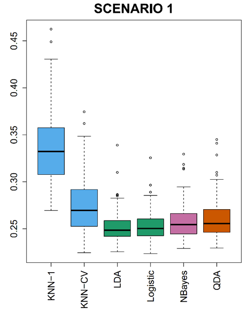</kbd>

<kbd></kbd>

 

### Thử nghiệm thứ hai giống cái thứ nhất tức là các sample của các

> [!NOTE]
> Thử nghiệm thứ hai giống cái thứ nhất tức là các sample của các
> class cũng tuân theo **normal distribution**, **giống variance**,
> **khác mean**. Chỉ khác là các variable (predictor) **không còn
> independent** nữa mà có correlation = -0.5. Do đó các mô hình khác
> đều giữ nguyên, duy chỉ có **Naive Bayes do dataset không còn
> thỏa giả định** các predictor độc lập nữa nên nó perform tệ đi

<kbd>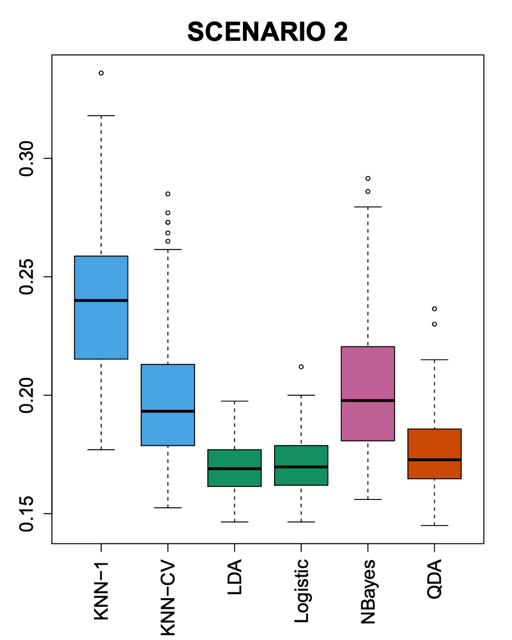</kbd>

<kbd></kbd>

 

### Scenario 3 đại khái là cũng giống thử nghiệm 2 (tức là thêm \\*vụ

> [!NOTE]
> Scenario 3 đại khái là cũng giống thử nghiệm 2 (tức là thêm **vụ
> correlated giữa các predictor)**. Tuy nhiên **họ không cho các sample
> theo Gaussian distribution nữa mà là t-distribution** (dc mô tả là
> cũng giống giống Gaussian nhưng có nhiều các sample outlier
> hơn).
>
> Thế thì điều này khiến vi phạm **giả định của LDA, QDA là các
> sample tuân theo Gaussian distrib**, thành ra performance của
> chúng**tệ hơn**
>
> Với Naive Bayes, đương nhiên về bản chất là có giả định các 
> **predictor độc lập**, nhưng ngoài ra như nói lúc đầu là được train 
> với giả định là các **predictor tuân theo Gaussian**. Thành ra bây giờ
> **cả hai đều bị vi phạm khiến error rate của nó tăng vọt**.
>
> Logistic Regression vẫn không bị ảnh hưởng, vì giả định decision
> **boundary tuyến tính** vẫn còn được thỏa.

<kbd>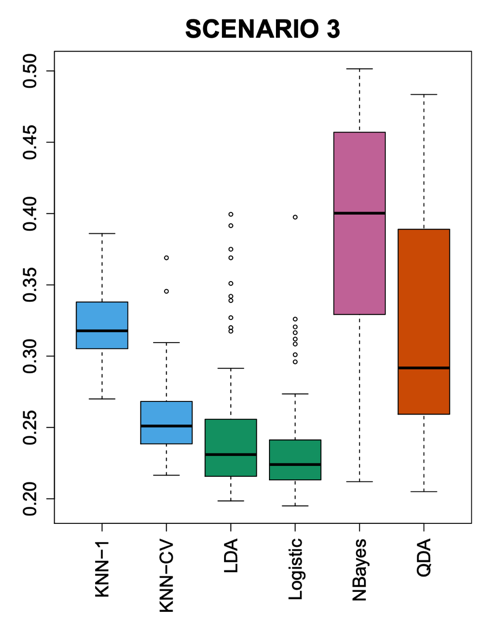</kbd>

<kbd></kbd>

 

### Scenario 4 Thì người ta lại cho các class có distribs là Gaussian

> [!NOTE]
> Scenario 4 Thì người ta lại cho các class có distribs là Gaussian
> nhưng **khác correlation (covariance matrix)** Do đó:
>
> Giả định của QDA thỏa (các class đều **Gaussian** nhưng có **covariance
> matrix khác nhau**) nên nó perform rất tốt.
>
> Giả định của LDA, Logistic Regression không còn thỏa: vì bây giờ, vì
> các class có covariance matrix khác nhau (vi phạm LDA, và cũng có
> nghĩa là các predictor correlate, vi phạm Naive Bayes) nên**decision
> boundary không còn tuyến tính** (vi phạm Log.Reg) nên cả ba tệ đi.

<kbd>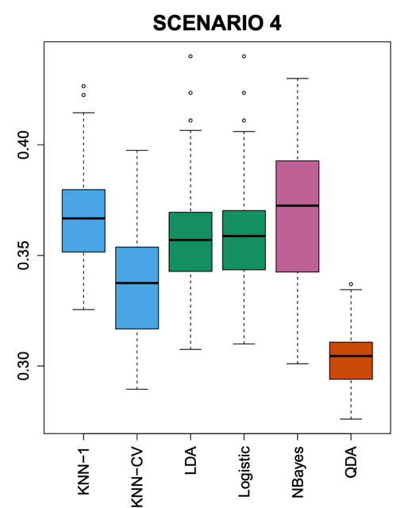</kbd>

<kbd></kbd>

 

### Scenario 5: Dataset trong case này được cho là các predictor tuân

> [!NOTE]
> Scenario 5: Dataset trong case này được cho là các predictor tuân
> theo **Gaussian**, và **uncorrelated**, nhưng response thì được tính
> bởi một **hàm phi tuyến phức tạp của X** - mục đích là muốn**tạo
> decision boundary phi tuyến phức tạp**
>
> Thì ở đây dù **Gaussian**, nhưng **decision boundary không còn
> tuyến tính** với X nên **LDA, Log.Reg đều kém**.
>
> Điều kiện **predictor độc lập vẫn thỏa** nên N.B tốt.
>
> Gaussian và d.b phi tuyến cũng đồng nghĩa cov matrix khác nhau nên
> thỏa QDA -> tốt hơn chút, nhưng vì **sự phi tuyến có thể phức tạp
> hơn cả quadratic** nên **QDA cũng không đủ** Nhưng tốt nhất là
> KNN với K phù hợp minh chứng rằng nếu**decision boundary phức
> tạp (phi tuyến cao)** thì non-parametric sẽ tốt hơn, nhưng với điều
> kiện **phải chọn K phù hợp** Minh chứng là khi K = 1 thì KNN cũng tệ
> hơn cả mấy thằng kia.

<kbd>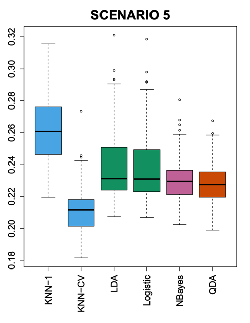</kbd>

<kbd></kbd>

 

### Scenario 6: Dataset được cho cũng **Gaussian** với **diagonal**

> [!NOTE]
> Scenario 6: Dataset được cho cũng **Gaussian** với **diagonal**
> **covariance** matrix **khác nhau**. Nhưng mỗi class chỉ có 6 sample.
>
> Vì covariance-matrix là **diagonal** nghĩa là **các predictor
> independent**, **uncorrelated** nên thỏa **Naive Bayes** assumption
> ->N.B làm tốt
>
> Hai điều kiện trên thỏa assumption của QDA (**Gaussian** với **cov
> matrix khác nhau**) nên nó là sẽ performance tốt.
>
> Vì các Gaussian có **covariance matrix khác nhau** nên **decision
> boundary Phi tuyến**, -> **LDA, Logistic Regression tệ** **hơn** hai cái
> trên
>
> Với **KNN**, thì tuy rằng đáng lẽ nó cũng sẽ có performance tốt vì
> đang là trường hợp có decision boundary phi tuyến nhưng vì **có ít
> sample quá** nó cũng **không phát huy khả năng** (bị overfit do
> **không đủ sample để giảm variance**)

<kbd>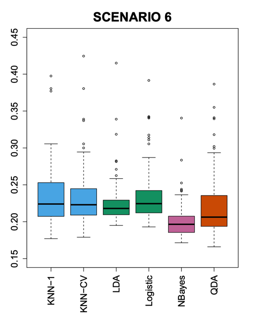</kbd>

<kbd></kbd>

 

### Tóm lại ta có thể thấy rằng \\*mỗi model sẽ làm tốt nếu dataset có tính

> [!NOTE]
> Tóm lại ta có thể thấy rằng **mỗi model sẽ làm tốt nếu dataset có tính
> chất phù hợp với assumption của nó**, chứ**không có cái nào tuyệt đối**hơn cái nào. Đây cũng phù hợp với **No Free Lunch Theorem**
>
> Nếu dataset có **decision boundary tuyến tính** thì **Logistic Regression
> và LDA sẽ làm tốt**. Với LDA thì nếu có thêm điều kiện các sample trong
> các class tuân theo **Gaussian** **distribution** cùng variance (thật ra
> nếu yêu cầu d.b tuyến tính thì đương nhiên đồng nghĩa các gaussian sẽ
> có cùng variance)
>
> Nếu  các **predictor độc lập**,**Naive Bayes** sẽ làm tốt (hàm chứa N.B
> có thể làm tốt khi decision boundary phi tuyến miễn là là các predictor
> độc lập)
>
> Nếu **Gaussian** nhưng các class **khác varianc**e - dẫn đến d**ecision
> boundary " HƠI" PHI TUYẾN** (có thể hiểu là phi tuyến bậc thấp thôi,
> quadratic) thì **QDA** sẽ làm tốt.
>
> Cuối cùng, nếu **decision boundary phức tạp**, thì miễn là **có đủ
> sample** để giảm variance của KNN, và c**họn K cho kĩ** thì **KNN sẽ
> làm tốt.**

 

