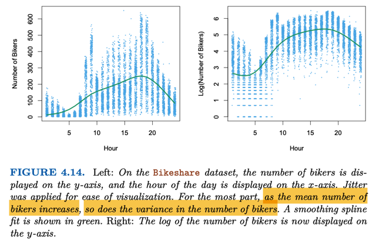
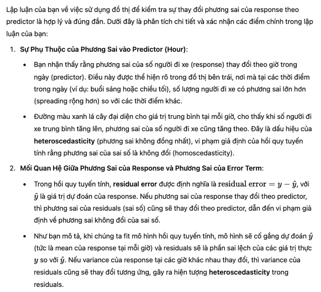
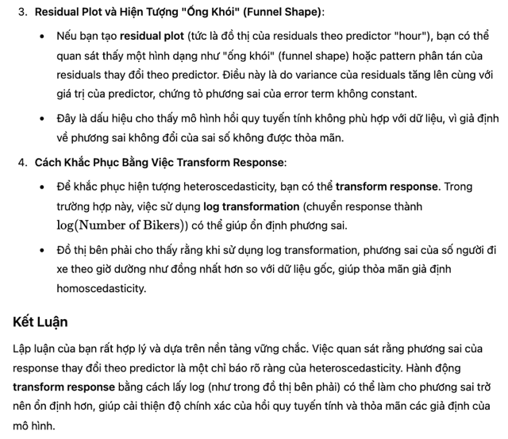
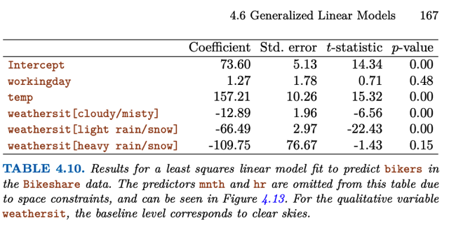
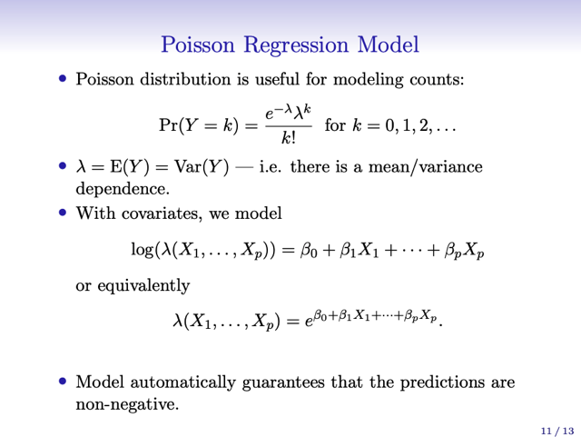
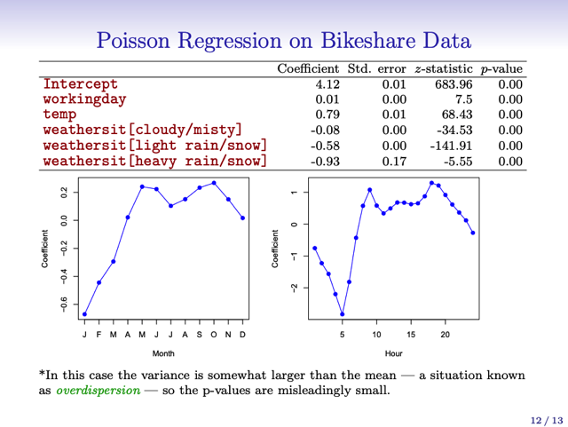

# 4.6 Generalized Linear Models

📊 **Progress:** `1` Notes | `14` Screenshots

---

<a id="node-375"></a>
## 4.6.1 Linear Regression On

> [!NOTE]
> 4.6.1 LINEAR REGRESSION ON
> THE BIKESHARE DATA

<br>


<a id="node-376"></a>
### Đại khái là phần này gs nói về một tình huống mà response Y không

> [!NOTE]
> Đại khái là phần này gs nói về một tình huống mà response Y không
> phải là quantitative (để rồi ta dùng linear regression model như
> chapter 3) hay qualitative (để mà dùng các classification model như
> chapter 4 này). Cụ thể là ta sẽ xem xét dataset bikers `-` ghi nhận (đại
> loại là) số lần thuê xe đạp công cộng của một thành phố.
>
> (*) Giá trị này gs nói nó sẽ là số, không âm. Điều này khiến mình hơi
> khó hiểu là tại sao nói response không phải quantitative, để tí xem sẽ
> rõ hơn
>
> Các predictor sẽ gồm có:
>
> `-` thời gian trong ngày, sẽ được coi như qualitative predictor (tức là
> với 24 giá trị, ta sẽ tạo 23 dummies variables)
>
> `-` tháng trong năm, cũng sẽ tương tự cái trên, tức là cũng treat nó
> như qualitative predictor
>
> `-` thời tiết, có 4 possible value, nên ta sẽ tạo 3 dummies variables (ở
> dưới ta sẽ ôn lại tí về cái vụ dummies variables này)
>
> `-` working day gs cho biết nó sẽ là indicator variable mang giá trị 1
> nếu ngày đó là ngày đi làm (có thể hiểu nó là binary predictor thôi)
>
> `-` nhiệt độ, đương nhiên là quantitative predictor

<br>


<a id="node-377"></a>
### Vậy thì ôn lại chút về việc dùng qualitative predictor trong mô hình

> [!NOTE]
> Vậy thì ôn lại chút về việc dùng qualitative predictor trong mô hình
> linear regression. Nếu chỉ có hai categories A hoặc B, ta chỉ việc tạo
> dummies variables có giá trị 1 khi `x=A` hoặc 0 khi `x=B,` để rồi với y `=`
> beta0 `+` beta1*x, ta sẽ diễn giải beta0 là giá trị beta0 sẽ là\**giá trị
> response trung bình của các sample có x=B\**. Và beta1 sẽ là\**sự
> chênh lệch của response giữa các sample có `x=A` và các sample có
> x=B\**
>
> Còn nếu predictor x có nhiều hơn 2 categories {A,B,C} Ta sẽ tạo
> dummies variables. Ví dụ với 3 categories, ta sẽ tạo 2 dummies
> variables x1 x2. Với x1 bằng 1 nếu `x=A,` và 0 nếu khác A. Tương tự
> x2 sẽ bằng 1 nếu `x=B` và 0 nếu x khác B. và khi x1 và x2 đều bằng 0
> đương nhiên sẽ ứng với `x=C.`
>
> Lúc này `y=beta0+beta1x1+beta2x2` sẽ được diễn giải: beta0 sẽ là\**giá trị response trung bình khi x=C\**, beta1 sẽ là \**sự khác nhau của
> response của các sample có `x=A` so với các sample x=C\** (hay nói
> cách khác khi x thay đổi từ C thành A thì response thay đổi ra sao).
> beta2 tương tự.

<br>


<a id="node-378"></a>
### Thế thì có thể hiểu trong bái toán này ta cũng sẽ tạo 3 dummies variables

> [!NOTE]
> Thế thì có thể hiểu trong bái toán này ta cũng sẽ tạo 3 dummies variables
> đối với whether (có 4 possible values, ngoại trừ trời đẹp thì ta sẽ tạo 3
> dummies cho trời mây, mưa nhẹ, mưa to) để rồi kết quả khi fit model cho
> thấy coefficient của dummies variable "trời mây" là `-12.89` sẽ mang ý nghĩa
> là khi chuyển từ trời đẹp sang trời mây, số lượng thuê xe giảm 12. 89 đơn
> vị, và từ mây mà sang mua sẽ giảm tiếp 53.6 đơn vị, thể hiện qua
> coefficient của trời mưa nhẹ là `-66.49` (66. `49-12.` `89=53.6)`
>
> Biểu đồ cũng thể hiện giá trị của các coefficients của các dummies
> variables của month và giờ trong ngày. Cho thấy response sẽ tăng nếu các
> tháng là mùa thu, xuân. Cũng như các giờ là giờ cao điểm.

<br>


<a id="node-379"></a>
### Thế thì tiếp theo gs cho biết đại khái là khi phân tích kĩ kết quả sau khi fit

> [!NOTE]
> Thế thì tiếp theo gs cho biết đại khái là khi phân tích kĩ kết quả sau khi fit
> bài toán này với linear regression sẽ thấy có ba vấn đề:
>
> 1. Có \**một số lượng đáng kể các predicted response ra âm\**, trong khi
> đó như đã nói, response trong bài toán này là số nguyên không âm (số
> lần thuê xe)
>
> 2. \**Variance bị thay đổi phụ thuộc vào variable\**, điều này vi phạm giả
> định của linear regression. Bằng chứng là đồ thị này, đại khái là người ta
> vẽ các phân bố của response tại các mức thời gian (giờ trong ngày khác
> nhau): để thấy rằng: tại các giờ khác nhau, mean của response thay đổi,
> và khi mean tăng (cái đường màu xanh lá cây thể hiện mean `-` nó đi qua
> các vùng đặc) thì variance cũng tăng thể hiện bởi các cột có chiều cao
> lớn hơn tức là phân bố phân tán hơn, spreading rộng hơn.
>
> Thế thì ta sẽ có thể hình dung rằng, nếu fit linear regression model ta có
> thể vẽ ra residual plot là biểu đổ thể hiện residual error `=` y `-` y^. \**Lúc này
> model sẽ dự đoán y^ sẽ có giá trị là mean của mỗi phân phối xác suất\**
> (ứng với mỗi giá trị của predictor `-` hour), \**dẫn đến residual plot giống
> như dịch chuyển mọi phân phối xác suất này để mean bằng 0\**. Rồi khi
> đó ta \**xem xét residual plot này ta sẽ thấy có dạng ống khói\** chứng tỏ
> v\**ariance của error thay đổi phụ thuộc predictor.\**
>
> tức là, vì variance của response thay đổi theo predictor, nên khi fit model
> xong, residual error cũng thay đổi theo predictor.
>
> Thì điều này cho thấy, \**variance của error không constant mà phụ thuộc
> vào covariate (tức predictor) Theo mục 3 của 3.3.. nó sẽ khiến kết quả
> của linear regression không còn chính xác. \**Ta phải transform response
> (thành dùng log)
>
> 3. Vấn đề thứ 3 đó là response mang giá trị \**nguyên không âm\**, vốn không tự
> nhiên phù hợp với linear regression `-` vốn dĩ cho rằng response mang giá
> trị liên tục
>
> `===`
>
> Thì nói chung là trong hoàn cảnh này, ở chương 3 ta cũng đã biết là có
> thể khắc phục bằng cách transforming response: ví dụ dùng log Y thay vì
> Y (tức là ta sẽ mô hình bằng log Y `=` beta0 `+` betaX.
>
> Tuy nhiên nếu \**Y có thể mang giá trị 0\** thì không dùng log Y được (log Y `=`
> `+infi)` đồng thời nó cũng tạo ra khó khăn tròn khả năng interpretation
> model result. Do đó ta sẽ dùng một mô hình phù hợp một cách tự nhiên
> hơn với bài toán có đặc điểm như ở đây `-` tức là response có giá trị là số
> đếm (count, khác với giá trị định lượng quantitative nhưng liên tục), và
> không âm. Đó là Poission  Regression

<p align="center"><kbd></kbd></p>

<p align="center"><kbd></kbd></p>

<p align="center"><kbd></kbd></p>

<p align="center"><kbd></kbd></p>

<p align="center"><kbd></kbd></p>

<p align="center"><kbd></kbd></p>

<p align="center"><kbd></kbd></p>

<p align="center"><kbd></kbd></p>

<br>


<a id="node-380"></a>
## 4.6.2 Poisson Regression On

> [!NOTE]
> 4.6.2 POISSON REGRESSION ON
> THE BIKESHARE DATA

<br>


<a id="node-381"></a>
### Đầu tiên đại ý là nói về \\*Poisson Distribution:\\*

> [!NOTE]
> Đầu tiên đại ý là nói về \**Poisson Distribution:\**
>
> Nó sẽ có tính chất đó là: variable có\**giá trị trung bình\** \**càng lớn\** thì
> \**variance của nó cũng càng lớn\** mà đặc biệt là \**hai cái bằng nhau luôn\**.
>
> Ví dụ như đang xét response variable (Ta nhớ response cũng là variable,
> có điều nó depend vào predictor X, nên có thể gọi là dependent variable
> là vậy) Y, thì ta có: \**E[Y] `=` `Var(Y)`
> \**
> Công thức của Poisson distribution là:
>
> `P(Y=k)` =\**e^-λ*λ^k/k!\**,
>
> Trong đó \**λ `=` `E[Y]`  `=` Var(Y)\**

<p align="center"><kbd></kbd></p>

<p align="center"><kbd></kbd></p>

<br>


<a id="node-382"></a>
### Thế thì đại khái là để dùng Poisson Regression để mô hình hóa cho

> [!NOTE]
> Thế thì đại khái là để dùng Poisson Regression để mô hình hóa cho
> quan hệ của response Y và predictor X trong dataset Bikeshare này,  ta
> sẽ \**cho lambda (là variance của Y và cũng là mean `/` expected value
> của Y như đã biết) là function theo X.\**
>
> Và cụ thể đó sẽ là function\**lambda `=` e^(beta0 `+` beta1X1+beta2X2...)\**
> để tương đương với\**log(lambda) `=` beta0 `+` beta1X1+beta2X2\**...
>
> Họ chọn như vậy để lambda là `non-linear` function của X.
>
> Thế thì, để fit model với dataset, ta cũng dùng cách tiếp cận quen thuộc
> trong machine learning -\**Maximum Likelihood Estimation\**. Sẵn ôn lại
> luôn, đó là ta g\**iả định rằng các observation data\** (training set) có tính
> chất \**i.i.d\** `=` \**independent identical distribution\** (tạm hiểu là các sự
> kiện quan sát thấy, đều độc lập nhau). Và ta sẽ cho rằng, đó là một
> \**distribution thực nghiệm p_empirical\**, \**xấp xỉ hay đại diện cho một
> phân phối xác suất thực p_data\** đứng sau nó.
>
> Thế thì khi ta xây dựng mô hình thì ta sẽ \**xây dựng công thức để dự
> đoán phân phối xác suất này dựa trên model's parameters\** và nhiệm vụ
> (objective) sẽ là tìm, học, \**điều chỉnh model params sao cho likelihood
> của observed data là tối đa\** `-` mang ý nghĩa sâu xa là ta sẽ cố gắng
> \**kéo phân phối xác suất dự đoán bởi model `p_model` và phân phối xác
> suất thực nghiệm gần lại\**.
>
> Vậy thì vì đã \**giả định các sample độc lập nhau\**, nên việc \**likelihood
> toàn bộ sample\** `p_model` (training set) có thể được tách thành\**tích
> của likelihood của các sample riêng biệt\** từ đó ta có:
>
> `p_model(training` set) `=` \**Tích (kí hiệu PI) p_model(x(i))\**
>
> Còn `p_model` có công thức ra sao thì đương nhiên tùy vào việc ta dùng
> mô hình gì để mô hình hóa cho data có distribution gì.
>
> Như ở đây, ta đang \**giả định nó có distribution Poisson\**, bởi lẽ như đã
> nói từ đầu, response là số người thuê xe đạp có tính chất là không âm,
> mà lại có tính chất quan trọng khác đó là \**giá trị y (mean của y) thay đổi
> thì mức biến  động (variance) có vẻ cũng thay đổi theo\**. Đây là nhận
> định đưa ra ở phần  trước.
>
> Vậy thì ở đây với\**Poisson distribution\**, ta dùng công thức:
>
> ```text
> P(Y=k|x) = (e^-k)*(lambda(x)^k)/k! cho p_model(x) để xây dựng công
> ```
> thức tính  likelihood dự đoán của response theo X.
>
> Và bằng cách \**optimize model params \**(các coefficients của lambda(x)
> `=` beta.Tx), sao cho \**maximize p_model(training)\**, ta sẽ có được mô
> hình giúp dự đoán p(Y).
>
> Từ đó, cho phép dự đoán Y với \**predictor X `=` x chính là lambda(X=x)\**

<br>


<a id="node-383"></a>
### Rồi, sau khi fit mô hình (trong sách này người ta \\*không nói đến ta sẽ fit

> [!NOTE]
> Rồi, sau khi fit mô hình (trong sách này người ta \**không nói đến ta sẽ fit
> như thế nào\**, như dùng gradient descent hay gì. Theo mình hiểu rằng,
> sách này tập trung vào cơ sở lý thuyết của mô hình, và cách kiến giải các
> kết quả. Còn việc fit thì để các phần mềm lo.
>
> Thế thì đại khái kết quả của Poisson Regression ngoài \**một số ưu điểm\**
> như nó tạo ra \**kết quả "hợp lí" hơn ở predictor\** \**- day of working\**.
> Nhưng để cái đó nói sau, cái chính là nói về cách \**interpretation\**:
>
> Như đã nói, \**việc dùng Poisson Regression, là ta đã ngầm giả định
> (implicitly assume\**) dữ liệu, cụ thể là \**response\** Y (số lượng thuê xe đạp)
> \**có "quy luật" phân phối xác suất Poisson\** `-` trong đó:
>
> \**Giá trị trung bình\** của response cũng \**bằng variance\** của nó.
>
> Ôn lại chút, \**sở dĩ ta chọn Poisson Regression\**, hay sở dĩ ta chấp nhận
> giả định như vậy là \**bởi khi kiểm tra phân phối của dữ liệu\** dựa theo các
> giờ khác nhau thì ta \**thấy hiện tượng là\**, khi \**giá trị trung bình của Y thay
> đổi thì variance cũng thay đổi theo\**.
>
> Và đây chính là điều khiến cho \**nếu muốn dùng linear regression\** thì ta
> \**phải thay Y bằng log Y hay sqrt Y\**, nhưng làm vậy có nhiều \**bất tiện
> trong việc giải thích các kết quả\** sau khi fit, như đã nói.
>
> Thành thử ra, hiện tượng \**variance của (dependent) variable Y thay đổi\**
> khi \**mean Y thay đổi\** khiến \**cho phép ta giả định rằng variance phụ thuộc
> mean theo cách nào đó\**, và từ đó\**làm cơ sở\** để ta chọn giả định rằng
> giá trị của response Y tuân theo Poisson distribution với variance `=` mean,
> tức là quan hệ `1-1` với mean.
>
> Đương nhiên, tuy điều này tốt hơn, phù hợp hơn linear regression ở chỗ
> linear regression không chấp nhận variance Y phụ thuộc mean Y mà phải là
> hằng số, nhưng \**dĩ nhiên ta không biết quan hệ giữa variance `Var(Y)` và
> mean Y có phải tuyến tính `1-1` hay không\**.
>
> Do đó, cũng không nằm ngoài  quy luật \**No Free Lunch Theorem\**, nếu
> giả định `Var(Y)` `=` Mean(Y) là đúng, thì ta sẽ có mô hình tốt, còn ngược lại
> thì không.

<p align="center"><kbd></kbd></p>

<p align="center"><kbd></kbd></p>

<br>


<a id="node-384"></a>
### `===Interpretation`

> [!NOTE]
> `===Interpretation`
>
> Ở trên là lí luận hệ thống chút xíu về nguyên cơ mà ta chọn Poisson, bây
> giờ là nói về \**cách kiến giải kết quả\**:
>
> Thế thì, về ta xây dựng mô hình poisson regression để fit data, bằng
> cách cho lambda (là mean Y, var Y) là hàm phụ thuộc predictor X một
> cách phi tuyến:
>
> l\**ambda(x) `=` e^(beta0 `+` beta1X1 +...betapXp)\**, nên \**nếu X1 tăng
> thêm một đơn vị\** thành `X1+1` thì lambda sẽ thành e^(beta0 `+` beta1X1 `+`
> beta1 `+` ...betapXp)
>
> Khi đó tỉ số giữa lambda mới và cũ sẽ là:
>
> ```text
> e^(beta0 + beta1X1 + beta1 + ...betapXp) / e^(beta0 + beta1X1 +...
> ```
> betapXp)
>
> \**= e^beta1\**
>
> (triển khai ra `e^(a+b)` `=` e^a*e^b, ta sẽ triệt tiêu hết tử và mẫu, chỉ còn
> e^beta1)
>
> Thì nhờ đó, có thể diễn dịch hệ \**số beta1 là khi predictor tăng 1 đơn vị
> thì khiến lambda, cũng chính là mean, cũng chính là variance của Y sẽ
> tăng e^beta1\** lần.
>
> `===` `Variance-Mean` Relationship
>
> Và như đã nói ở phần lí luận trên, Poisson regression làm tốt Linear
> Regression hơn khi cho phép mô hình được sự thay đổi của response
> variance khi mean  thay đổi.
>
> Tuy nhiên gs có nhắc đến việc nếu giả định `Var(Y)` `=` Mean(Y) không
> đúng 100%,  mà cụ thể là như trong case này, `Var(Y)` lơn hơn Mean(Y),
> tức là khi mean tăng, Variance tăng nhanh hơn. Thì đây gọi là hiện
> tượng \**overdispersion\** `-` cần có cách xử lí mà trong đây không nói đến.
> (ChatGPT gợi ý là \**sử dụng phương pháp điều chỉnh Negative Binomial
> hay `Quasi-Poisson`
>
> \**=== `Non-negative`
> \**\**Cuối cùng là Poisson Regression đảm bảo tính ko âm của predicted response
> để phù hợp với bài toán Bikeshare này điều mà linear regression không làm 
> được.

<p align="center"><kbd></kbd></p>

<p align="center"><kbd></kbd></p>

> [!NOTE]
> Coefficient của predictor "working day" tốt hơn so với linear
> regression: `p_value` nhỏ chứng tỏ nó dương không phải là
> ngẫu nhiên. Cho thấy nếu là ngày đi làm, thì số thuê xe đạp
> tăng lên (scale mean Y lên e^0.01, tức bằng ~1.01 ngày nghỉ)

<br>


<a id="node-385"></a>
## 4.6.3 Generalized Linear Models

> [!NOTE]
> 4.6.3 GENERALIZED LINEAR MODELS
> IN GREATER GENERALITY

<br>


<a id="node-386"></a>
### đại ý là tới nay ta đã biết được 3 loại mô hình regression: linear regression, logistic

> [!NOTE]
> đại ý là tới nay ta đã biết được 3 loại mô hình regression: linear regression, logistic
> regression và Poisson regression.
>
> Thì có thể người ta chưa nói, hay nói rồi mà không để ý, về một điểm khá quan trọng
> khi xây các mô hình này. Đó là \**mỗi mô hình được xây dựng dựa trên các giả định\**
> \**về phân phối xác suất của response\** (dependent) variable Y \**dựa trên predictor
> X\**, tức là \**giả định về dạng của p(Y|X)\**
>
> Cụ thể là trong \**Linear Regression\**, khi dùng phương trình \**Y `=` `beta_0` `+`
> `beta_1*X1`
> `+` `..beta_p*Xp` `+` epsilon\**, ta \**đang giả định P(Y|X) là Gaussian distribution:\**  có
> \**variance var(Y) không đổi\**, chỉ có \**mean `E[Y],` thay đổi phụ thuộc X\**.
>
> Với \**Logistic Regression\** thì ta \**giả định P(Y|X) là Bernoulli distribution\**, có mean
> hay expectation \**E[Y] là `sigmoid(beta_0` `+` `beta_1*X1` `+` ..beta_p*Xp)\**
>
> Với \**Poisson Regression\**, ta \**giả định\** \**P(Y|X) là Poisson distribution\** có mean
> `E[Y]` (và cũng là variance của response `Var[Y])` lambda sẽ là hàm phụ thuộc predictor
>
> ```text
> E[Y] = Var[Y] = lambda(X) = e^(beta_0 + beta_1*X1 + .. beta_p*Xp)
> ```
>
> Thế thì họ mới cho biết rằng, cả ba model này đều có thể coi như thuộc "một loại khái
> quát hơn" hay nói đúng hơn là \**một phương pháp tiếp cận\** gọi là \**Generalized
> Linear Model\**, đó là bởi các probability distribution Gaussian, Bernoulli, Poisson đều
> thuộc họ (family) các distribution gọi là \**Exponential Family\**. Và ngoài 3 thằng trên,
> còn có \**Gamma\**, và \**Non-negative  Binomial\** distribution.
>
> Vậy phương pháp tiếp cận của Generalized Linear Model đó là: Bất cứ khi nào ta giả
> định phân phối xác suất của response là một trong những thành viên của gia đình
> exponential distribution, ta đều có thể mô hình nó (response), theo equation sau:
>
> ```text
> η(E[Y]) = beta_0 + beta_1*X1 + ..beta_p*Xp
> ```
>
> Tức là ta sẽ \**tìm một hàm biến đổi phù hợp\** cho `E[Y]` và \**mô hình giá trị
> transformed mean\** `E[Y]` `(η(E[Y])` \**là một hàm tuyến tính theo predictor X\**.
>
> Và eta η(), được gọi là\**link function\**, sẽ là:
>
> *Với Linear regression, nó là \**identity function\** tức η(z) `=` z, bởi vậy ta có:
>
> ```text
> E[Y] = beta_0 + beta_1*X1 + .. beta_p*Xp
> ```
>
> *Với Logistic regression, nó là \**logit function\** (ngược với sigmoid: logit(sigmoid(z)) `=`
> z) để rồi :
>
> ```text
> logit(E[Y]) = logit(sigmoid(beta_0 + beta_1*X1 + .. beta_p*Xp)
> ```
>
> ```text
> = beta_0 + beta_1*X1 + .. beta_p*Xp
> ```
>
> *Với Poisson regression, nó là l\**og()\**, để rồi:
>
> ```text
> log (E[Y]) = log(e^(beta_0 + beta_1*X1 + .. beta_p*Xp))
> ```
>
> ```text
> = beta_0 + beta_1*X1 + ..beta_p*Xp
> ```

<br>

