# 4.7 Lab: Classification Methods

📊 **Progress:** `6` Notes | `34` Screenshots

---

<a id="node-388"></a>
## 4.7.1 The Stock Market Data

<br>


<a id="node-389"></a>
### đại khái là cái dataset này ghi nhận dữ liệu liên quan đến thị trường chứng khoán

> [!NOTE]
> đại khái là cái dataset này ghi nhận dữ liệu liên quan đến thị trường chứng khoán
> mỹ, cụ thể là sp500. Mỗi một sample của dataset cho biết đại khái là  vào một ngày
> nào đó thuộc năm nào `(2001-2005),` thì có \**tỉ suất lợi nhuận (theo ngày)\** bao
> nhiêu (\**percentage return\**) Ngoài ra còn có tỉ suất lợi nhuận trung bình của \**mỗi
> ngày trong chuỗi 5 ngày trước\** cái ngày đó. Đồng thời còn có một cột mang giá trị
> là \**thị trường đi lên hay xuống trong ngày hôm nay (ý là\** so với hôm qua `-` là lag1
> thì  tỉ suất lợi nhuận của Today là đi lên hay đi xuống)
>
> Ví dụ ngày x (một ngày trong chuỗi 1250 ngày của dataset)
>
> `-` thuộc năm `X1=2002` (\**Year\**)
>
> `-` Có \**percentage return là X8 (Today) \**
>
> `-` 5 ngày trước đó lần lượt có a\**verage percentage return  (lag1..lag5) \**là X2, X3,
> X4, X5, X6.
>
> `-` Ngoài ra còn có cho biết \**trong ngày hôm nay (tức cũng là x) thì thị trường tăng
> hay giảm\** (\**direction\**) X9 (giá trị binary).
>
> `-` Cuối cùng là \**khối lượng giao dịch (volume) trong những ngày trước\** đó X7

<p align="center"><kbd>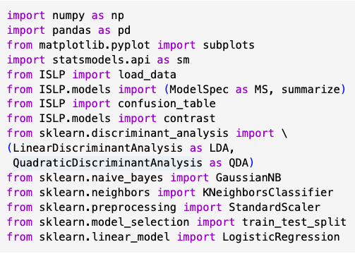</kbd></p>

<p align="center"><kbd></kbd></p>

> [!NOTE]
> làm với python ta sẽ dùng các thư viện ISLP hay sklearn

<br>


<a id="node-390"></a>
### Thế thì nhiệm vụ đặt ra là xây dựng mô hình dự đoán cho dataset này để \\*DỰ

> [!NOTE]
> Thế thì nhiệm vụ đặt ra là xây dựng mô hình dự đoán cho dataset này để \**DỰ
> ĐOÁN THỊ TRƯỜNG LÊN HAY XUỐNG TRONG NGÀY TIẾP THEO\** (tức là Direction)
> dựa trên giá trị tỉ suất lợi nhuận trung bình trong \**của 5 ngày trước lag1, lag2...lag5\** 
> (lag là viết tắt của last average)
>
> Đương nhiên khi đó ta có \**response\** là một \**qualitative variable\** (hai giá trị khả dĩ
> là Up `=` thị trường lên, hoặc Down `=` thị trường đi xuống).
>
> Và các \**predictor\** có\**Lag1, ...Lag5, Volume\** đều là \**quantitative\** variable, còn
> \**Year\** là \**qualitative\** variable.
>
> Thì đầu tiên, ta mới xem thử các \**predictor\** và cả \**response\**, có tính chất tương
> quan \**correlation\** với nhau như thế nào. Đây cũng là một động tác có thể gọi là cơ
> bản, hay quen thuộc khi tiếp cận một dataset, mà mình đã được thấy thường xuyên
> trong các ví dụ học máy, nằm trong giai đoạn tạm gọi là tìm hiểu làm quen với data
> (data understanding) Thì để python hay R giúp ta in ra \**correlation\** giữa các
> `feature/variable` columns, ta cần loại bỏ cột response (ý là không include nó trong
> function), vì nó có gía trị qualitative, sẽ gây error.
>
> Nhận định đáng chú ý đầu tiên là \**tỉ suất lợi nhuận "hôm nay"\** (Today) và c\**ác tỉ
> suất lợi nhuận trung bình của các ngày trước\** (Lag1,..Lag5) rất\**ít tương quan\** với
> nhau, khi có thể thấy các giá trị rất nhỏ `(-0.026,` `-0.01,` `-0.006..)`

<p align="center"><kbd>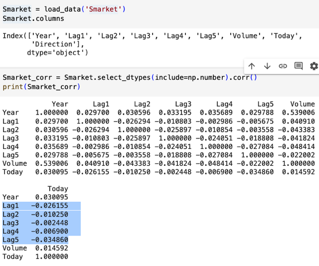</kbd></p>

<p align="center"><kbd>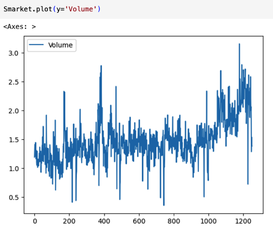</kbd></p>

<p align="center"><kbd></kbd></p>

<p align="center"><kbd></kbd></p>

> [!NOTE]
> có thể thấy các lag1..5 rất ít tương quan với Today, gợi ý rằng khó
> lòng mà có một quy luật nào để dự đoán sự lên xuống của thị trường

> [!NOTE]
> Trong correlation table đó, chỉ thấy tương quan giữa Year
> và Volume là khá cao, vẽ biểu đồ giá trị của volume cũng
> cho thấy nó có xu hướng tăng qua các năm

<br>


<a id="node-391"></a>
## 4.7.2 Logistic Regression

<br>


<a id="node-392"></a>
### Ok, bây giờ ta sẽ nói theo R, Python thì cũng tương tự thôi chỉ là khác ngôn ngữ:

> [!NOTE]
> Ok, bây giờ ta sẽ nói theo R, Python thì cũng tương tự thôi chỉ là khác ngôn ngữ:
> Thế thì trong R đại khái là ta sẽ dùng \**sm.GLM\** để fit các model thuộc \**Generalized
> Linear Model\** (bao gồm Linear Regression, Logistic Regression...)
>
> \**Chỉ định dùng Logistic Regression\** bằng argument \**family `=` binomial\**.
>
> Và ta sẽ fit model với \**response\** là \**direction\**, \**predictors\** là\**Lag1,2,3,4,5\** và \**Volume\**.
>
> Nhắc lại \**kẻo nhầm lẫn\**, trong dataset, \**Today\** là lãi suất (tỉ suất lợi nhuận) của ngày
> mà đang nói `/` xét, \**Lag1-5\** là lãi suất trung bình 5 ngày trước, thì \**Direction\** là Up hay
> Down được tính bằng \**ngày hôm đó so với ngày hôm qua của hôm đó `-` tức là Lag1\**.
>
> Bài toán đặt ra là ta cần xây dựng mô hình để học từ dữ liệu để rồi có thể \**cho trước
> chuỗi Lag1,2,3,4,5\** và \**Volume\** của\**ngày x\** (ví dụ x là `18/10/2021` thì `Lag1-5` là average
> lãi suất của ngày `13-17/10/2021)` để \**dự đoán rằng trong ngày x, thị trường lên hay
> xuống\**, đồng nghĩa dự đoán rằng lãi suất của ngày x (tức giá trị của variable Today)
> sẽ cao hơn hay thấp hơn lag1 (là lãi xuất trung bình của ngày hôm qua so với ngày x)

<br>


<a id="node-393"></a>
### Các bước fit model có lẽ nói sau, vì dù sao cũng chỉ là dùng package (library) version

> [!NOTE]
> Các bước fit model có lẽ nói sau, vì dù sao cũng chỉ là dùng package (library) version
> Python hoặc R đề fit, không phải là điểm cần tập trung, trong sách này. Vì nó chủ yếu là
> focus vào việc interpretation result
>
> Thế thì kết quả fit model, ta sẽ \**xem xét các coefficient của các predictor\** cũng như
> các \**chỉ số p-value\**. Thì cho thấy các \**p-value đều tương đối lớn\**, điều này biểu đạt
> rằng \**mối tương quan giữa các predictor\** Lag 1...5\**với Direction không rõ ràng\**.
>
> Dù vậy, xét \**Lag 1\** `-` là cái \**có coefficient tạm gọi là lớn nhất\** (xét giá trị tuyệt đối),
> là\**-0.07 \**thì, điều này có thể diễn gỉai rằng:\**lag1 có tác động ngược với direction\**,
> cụ thể là v\**iệc ngày hôm qua\** (như đã biết lag 1 thể hiện mức percentage return trung
> bình của ngày thứ nhất trước Today `-` tức là hôm qua) \**mà có tỉ suất lợi nhuận tăng\**
> thì xác suất direction là Up sẽ giảm.
>
> *Trong đây, Up là positive class, Down là negative class. Sở dĩ biết vậy vì gọi function
> contrasts(Direction) cho ra Up `=` 1, Down `=` 0.

<p align="center"><kbd>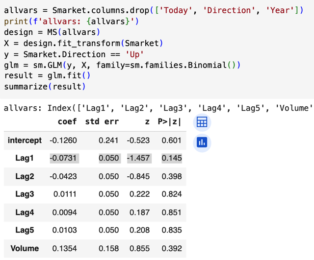</kbd></p>

<p align="center"><kbd></kbd></p>

> [!NOTE]
> Giải thích chút xíu chỗ code, (phiên bản Python) ta khởi tạo một Model Spec
> object (viết tắt bởi MS). Cơ bản nó là một custom class inherit từ Transformer
> class của skitlearn. Nên có thể hiểu **nhiệm vụ của nó chủ yếu là giúp làm vụ
> data preprocessing**. Thế thì, có thể thấy đầu tiên ta **chuẩn bị list các column
> name mà ta muốn dùng làm predictor** bằng cách lấy mọi column name và bỏ đi
> Today, Director, Year. Direction là cái mà ta sẽ dự đoán, Today là lãi suất của
> hôm nay, cái này thì ta không cần, cũng như Year cũng không cần dùng.
>
> Ta mới dùng nó để tạo model spec. Thì kiểu như **model spec object sẽ biết** rằng
> ta **cần preprocessing những predictor**nào. Như đã biết trong HandsOn ML của
> Arelion Geron, **fit_transform** sẽ fit `-` **tính các chỉ số thống kê** như mean, standard
> deviation, và sau đó **transform** sẽ **dùng các giá trị đó để preprocess** data. Tuy
> nhiên đó là với "numerical" variable. Còn với **categorical** (qualitative) variable, nó
> sẽ **giúp tạo `one-hot` encoding `-` hay dummies variable**. Và từ đó có thể hiểu rằng
> kết quả sau khi `fit_transform` (gán vào X) sẽ là**feature matrix sẵn sàng cho train**
> ing model (nên ta hay gặp họ gọi là design matrix). Như vậy có thể hiểu **Model
> Spec là một class mà giúp thuận tiện hơn** thay vì **phải handle data preprocessing
> riêng với numerical `/` categorical data nếu dùng skitlearn** `-` bởi ISLP là thư viện có
> mục đích là phục vụ cho cuốn sách này.
>
> Tiếp, họ tạo y `-` target là một list các **binary value**.
>
> Sau đó, ta dùng **statsmodel.api.GLM()** để **khởi tạo một Generalized Linear Model**
> với endog (cứ hiểu là **response) là y,** exog (cứ hiểu là **predictor) là X**, và chỉ định
> **Binomial** vì đây là binary reponse, cũng có thể gọi là vì đây ta muốn dùng Logistic
> Regression model)
>
> Cuối cùng gọi fit() để ..fit `-` training

<br>


<a id="node-394"></a>
### Rồi, thông qua vài động tác, trong đó \\*dùng function predict\\*, đại khái là cho cái

> [!NOTE]
> Rồi, thông qua vài động tác, trong đó \**dùng function predict\**, đại khái là cho cái
> model vừa fit xong, \**dự đoán lại dataset\**. Sau đó, dùng lệnh \**table()\** để giúp tạo ra
> \**confusion matrix\**, với input là prediction (predicted reponse, tạo như thế nào  thì nói
> dưới đây) và ground truth response (cột `=` Direction)
>
> Trước đó, đại khái là lệnh predict tùy vào argument '\**type'\** mà nó sẽ trả ra cho mình
> \**logit\** hoặc giá trị \**xác suất.\** Thế thì ví như ta chọn type `=` '\**response\**' để nó cho
> ra xác suất, thì để\**chuyển thành predicted class\**, ta sẽ\**so với threshold 0.5\**.
>
> (Nói là threshold thật ra là ý tưởng là vậy, còn cách làm cụ thể trong R và Python có
> thể khác nhau. Với R thì \**đại khái là ta tạo ra vector chứa toàn chữ Down (bằng lệnh
> rep viết tắt của repeat\**, rồi sau đó \**set lại chỗ nào có probability > 0.5 thành Up\**,
> đó, đại khái cách làm cụ thể thì là vậy)
>
> Kết quả kiểu như cho thấy error rate là 48% (tức là tốt hơn random guess chút đỉnh)

<p align="center"><kbd>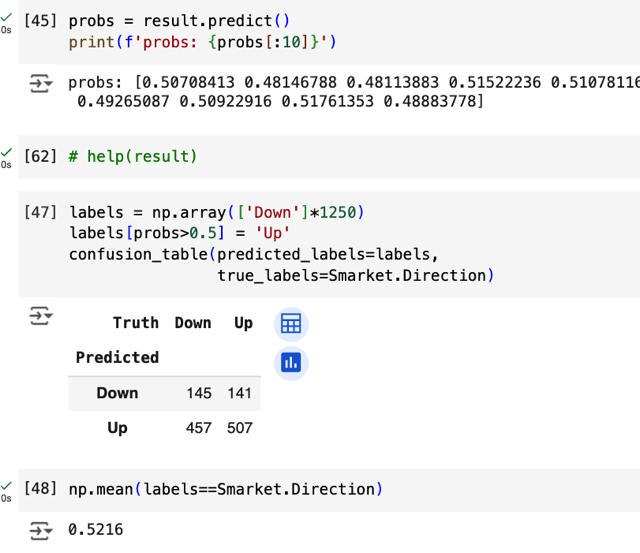</kbd></p>

<p align="center"><kbd></kbd></p>

<br>


<a id="node-395"></a>
### Thế thì cơ bản cái error rate này đơn giản \\*vẫn đang là training performance\\*, để

> [!NOTE]
> Thế thì cơ bản cái error rate này đơn giản \**vẫn đang là training performance\**, để
> đánh giá khách quan hơn ta \**cần tách riêng một test set\** không tham gia vào training
> để đánh giá model. Bởi vì \**model thường bị overfit với training set\**, nên training error
> rate thường được gọi là hơi bị \**lạc quan quá mức\** (\**over-optimistic\**)
>
> Thế là đại khái người ta tách ra, dùng một bộ s\**ubset của Smarket ừ 2001-2004\** để
> \**train\**, và các s\**ample của 2005 để test.\**
>
> Các split thì đại khái là họ \**dùng cái cột Year\**, để rồi dùng cái kiểu (đại loại là) \**Year <
> 2005\** để tạo ra \**một vector True False\** (chứa 1250 giá trị), sau đó thì \**dùng vector này
> để slicing từ dataset\**: 
>
> đại khái là giống như \**Smarket[Year<2005]\** thì ta sẽ có\**subset
> các sample  mà Year < 2005\** để làm training set. Còn \**Smarket[!(Year<2005)]\** thì sẽ
> tạo subset các sample mà Year `=` 2005, để làm \**test set.\**
>
> Rồi khi đó, gọi lại lệnh \**glm()\**, có các argument quy định response là gì, predictor là
> gì dataset là gì, model là gì và lần này \**có thêm argument subset `=` train.\**
>
> Fit xong, lại dùng \**predict\** nhưng lần này \**bỏ test subset vào\**. Kết quả ở dạng xác
> suất, ta cũng threshold với 0,5 để thành predicted class và pass vào table để có
> \**confusion matrix.\**
>
> Thế thì ý chính đó là, kết qủa performance trên test set \**cho thấy Logistic Regression
> chỉ khá hơn đoán bừa tí xíu\** khi \**error rate\** trên test set cỡ \**52%, tức là tệ hơn random\**
> \**guess\**
>
> Còn tính error rate sao thì biết rồi, cái confusion matrix cho ra 4 chỉ số TP, TN, FP, FN
> trong đ1o TP, TN là những case model đoán đúng, ta cộng nó lại, chia cho tổng số
> thì đó là accuracy, lấy 1 `-` accuracy (hoặc cộng hai cột FP, FN rồi chia cho tổng số
> sample) thì ra error rate.

<p align="center"><kbd>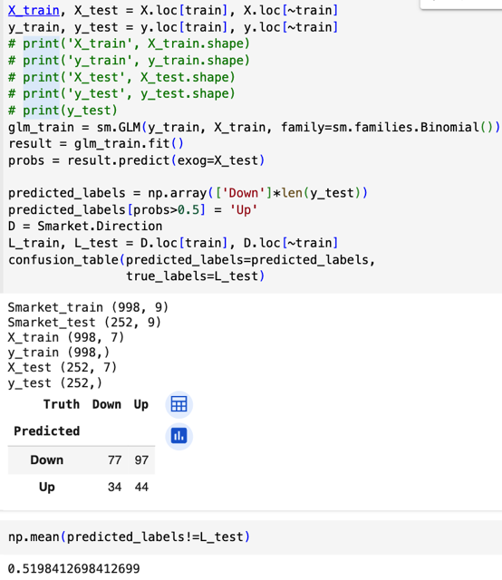</kbd></p>

<p align="center"><kbd></kbd></p>

<br>


<a id="node-396"></a>
### Tiếp, sau khi nhận định rằng các `\\*p-value\\*` cho thấy \\*mối quan hệ không rõ ràng

> [!NOTE]
> Tiếp, sau khi nhận định rằng các \**p-value\** cho thấy \**mối quan hệ không rõ ràng
> giữa predictor và response\**. Thì ta có thể nhận định rằng, \**các predictor lag3, 4, 5
> có coefficient rất nhỏ (ý là ~=0)\**, và có thể coi chúng \**có liên hệ rất yếu ớt tới
> response\**. Do đó ta có thể nghĩ rằng việc đưa chúng vào model không những
> \**không có ích\** mà còn \**gây hại tới model.\**
>
> Họ nói vậy là vì, đưa vào model những predictor dư thừa, vô dụng không những\**gây lãng phí về tính toán\** mà còn tạo \**variance\** khiến \**model dễ overfit \**(vì như
> ta biết càng nhiều predictor, tức là càng nhiều parameters, khiến model tăng
> variance, tăng khả năng overfit)
>
> Do đó, ta \**fit lại với chỉ Lag 1 và Lag 2\**. Thì thấy rằng \**error rate khá hơn chút,
> 56%\**.
>
> Tuy nhiên có thể xét một tiêu chí khác, thay vì error rate. Đó là sensitivity: tức là TP
> chia cho (TP `+` FN), mang ý nghĩa là\**trong tổng số những ngày mà thị trường
> tăng, model đoán đúng được mấy ngày\**. Thì ta thấy nó đạt \**~58%\**. Do đó có thể
> kết luận là \**nếu mà ngày nào model dự đoán thị trường tăng, ta có thể có cơ sở để
> mua theo dự đoán của model\**  `-` ý là, trong hai loại lỗi: FP `-` Thị trường giảm mà
> báo tăng và FN thị trường tăng mà báo giảm, thì có vẻ model ít mắc lỗi thứ I `-` FP
> hơn.
>
> Tuy nhiên tác giả cho rằng vẫn\**phải kiểm chứng để chắc chắn hơn về kết quả này
> của model không phải ngẫu nhiên\**. Không nói thêm là kiểm chứng như thế nào.

<p align="center"><kbd>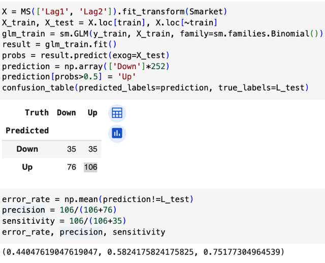</kbd></p>

<p align="center"><kbd></kbd></p>

<br>


<a id="node-397"></a>
## 4.7.3 Lda

<br>


<a id="node-398"></a>
### Đại khái là, ta sẽ dùng function phù hợp thư viện phù hợp của R hay Python để fit

> [!NOTE]
> Đại khái là, ta sẽ dùng function phù hợp thư viện phù hợp của R hay Python để fit
> model LDA với dataset này. Nhắc lại, trong khuôn khổ sách này gs đã nói ta sẽ không
> quan tâm việc fit sẽ như thế nào, vì chỉ cần dựa vào các thư viện giúp mình làm chuyện
> đó. Còn cái chính là mình hiểu về lý thuyết, tại sao hoặc khi nào thì dùng mô hình gì, và
> diễn giải các kết quả sau khi fit như thế nào.
>
> Thế thì với LDA, mình ôn lại chút xíu về (tạm gọi là) cách hoạt động của nó. Một cách
> ngắn gọn thôi, thì LDA có thể nói là cũng dựa trên cách tiếp cận của Bayes Classifier,
> đó là assign class của một sample có predictor `X=` x, cho một class k dựa trên class
> nào có `P(Y=k|X=x)` cao nhất. Và ta nhớ rằng\**Bayes Classifier là cách tiếp cận tạo ra
> classifier có error rate thấp nhất\**.
>
> Thế thì, đại khái là, để có thể có P(y|x) để mà so sánh theo cách tiếp cận Bayes nói
> trên, ta sẽ dựa vào Bayes theorem để xây dựng P(y|x)
>
> ```text
> (Bayes theorems: P(x|y)P(y) = P(y|x)P(x) => P(y|x) = P(y)P(x|y) / P(x) = P(y)P(x|y) /
> ```
> Tổng mọi y P(x|y))
>
> ```text
> Thế thì với P(y): ta đặt pi_1, pi_2,..pi_k..pi_K là các prior distribution của các class
> ```
> (phân phối xác suất  quy định kiểu như khả năng chọn được một sample thuộc class k
> một cách "khơi khơi" `/` không biết trước gì hết, là bao nhiêu.
>
> Còn P(x|y), LDA đặt ra giả định là các sample's predictor `x=[X1,X2..Xp]` sẽ có giá trị
> tuân theo \**phân phối xác suất Gaussian\** trong đó, các sample thuộc các class khác
> nhau thì các distribution có mean khác nhau, nhưng chúng ta sẽ cho rằng mọi
> covariance matrix đều giống nhau hết. Hay nói cách khác, với K class, ta sẽ có K
> `multi-variate` Gaussian probability distribution với mean khác nhau mu1, mu2....muK, và
> chung một covariance matrix Sigma.
>
> ```text
> Từ đó ta mới lắp priori pi_k, P(X=x|Y=k) vào Bayes theorem để có P(Y=y|X=x)
> ```
>
> Và lấp công thức của Gaussian density function vô, triển khai ra ta sẽ có được một
> hàm số kí hiệu là `theta_k` gọi là \**Discriminant function\**. Và việc so sánh k nào có
> `P(Y=k|X=x)` lớn hơn cũng chính là so sánh k nào có `theta_k` lớn hơn.
>
> Và điểm quan trọng là, việc triển khai có thể cho thấy \**theta_k là một linear function
> của X1,...Xp\**, hay `theta_k` là linear combination các `X_j.` (Và ta sẽ thấy khi dùng các
> thư viện để fit mô hình LDA với dataset thì nó \**sẽ tìm ra các coefficient để tạo nên
> linear combination `/` function `theta_k` này)\**
>
> Và cùng chính vì vậy, \**decision boundary của LDA cũng là tuyến tính\** để rồi ta nhớ là
> nếu dataset có decision boundary phi tuyến thì LDA sẽ không làm tốt được.

<br>


<a id="node-399"></a>
### Vậy thì quay lại lab này, function lda của thư viện (dù R hay Python) cũng giúp fit LDA

> [!NOTE]
> Vậy thì quay lại lab này, function lda của thư viện (dù R hay Python) cũng giúp fit LDA
> với dataset, và kết quả của nó, với "version R" \**bao gồm hai coefficients của Lag 1 và
> Lag 2\** \**cho mỗi class (*)\**. Thế thì ta hiểu 2 coefficients `/` mỗi class nói trên \**chính là
> những coefficient mà phần mềm fit tìm ra cho mỗi class\**, để từ đó ta có \**các
> Discriminant  function theta_k\**
>
> (*) à, nói thêm, ở đây ta \**chỉ fit mô hình với hai predictor Lag 1, Lag 2\** `-` là những
> predictor mà thông qua việc fit với Logistic Regression cho thấy \**có ảnh hưởng mạnh
> nhất tới response\** `-` Direction). Và cũng fit với\**training set là subset các ngày có Year
> < 2005\**, test set là subset các ngày có Year `=` 2005
>
> Ngoài ra, kết qủa fit còn cho ta \**priori\**: Chính là \**pi_1\**, và \**pi_2\** : \**prior distribution\**, thật ra
> cái này \**không chỉ đơn giản là nó đếm tỉ lệ \**của mỗi class trong tổng số mà nó có cách 
> để ước lượng. 
>
> Đồng thời nó còn report cho ta\**mean của các predictor\** trong mỗi class: Nói cách khác
> ta có [\**μ_Lag1\**, \**μ_Lag2\**] cho mỗi class `-` là \**tâm\** của Gaussian distribution 2 chiều (2
> variable) (nhớ ko, LDA giả định mỗi class là một Gaussian distrib, khác mean, cùng cov 
> matrix). Ở đây ta có 2 class, trong không gian 2 chiều, mỗi tâm sẽ có 2 con số tọa độ.
>
> Và quan trọng hơn là \**linear discriminant coefficients `-` là các hệ số để tạo linear 
> combination của các predictor để làm thành linear discriminant function \**- và giá
> trị của function này sẽ dùng để quyết định assign class nào. Theo mũi tên để xem lại,
> rằng trong bài ta đã hiểu về việc dựa vào việc so sánh các `P(Y=k|X=[x1,` x2..xp] xem
> cái nào lớn nhất thì ta sẽ assign class k cho sample, sau khi triển khai ra sẽ cho ta
> discriminant function `-` mà dù \**CÓ VẺ PHỨC TẠP NHƯNG VẪN CHỈ LÀ HÀM TUYẾN
> TÍNH ĐỐI VỚI CÁC PREDICTOR X1,...XP `-` Và hàm tuyến tính thì với các predictor
> thì CHÍNH LÀ CÁC PREDICTORS ĐƯỢC LINEAR COMBINED VỚI CÁC HỆ SỐ `-` và
> LDA khi fit ĐÃ GIÚP TA TÌM RA GIÁ TRỊ CỦA CÁC HÊ SỐ NÀY\**

<p align="center"><kbd>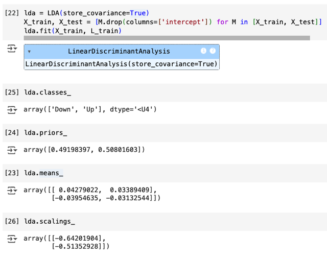</kbd></p>

<p align="center"><kbd></kbd></p>

> [!NOTE]
> ở đây là LDA trong Python, thực ra ta đang dùng**Linear Discriminant
> Analysis class** của **scikitLearn**
>
> **lda.scaling_** chính là vector**hai coefficient của hai predictor Lag1, Lag2**
> dùng để tính ra linear discriminant function.
>
> Vậy thì với một sample với hai giá trị predictor, chỉ việc linear combination
> chúng với hai coefficient này và so sánh với threshold 0.5 (do đây là bài
> toán binary) để quyết định class

<br>


<a id="node-400"></a>
### Rồi, cuối cùng là sau khi fit xong, ta gọi function predict với test set. Phiên bản trong R,

> [!NOTE]
> Rồi, cuối cùng là sau khi fit xong, ta gọi function predict với test set. Phiên bản trong R, 
> nó trả ra 3 thứ: 
>
> i) \**predicted class\** (tức là các giá trị Up `/` Down), 
>
> ii) \**posterior\** `-` chính là giá trị `P(Y=k|X),` đương nhiên mỗi sample sẽ có 2 giá trị xác suất 
> này tương ứng với 2 class. Cụ thể ta có matrix 2 cột, cột 1 ứng với class `-` Up, cột 2 ứng
> với class `-` Down. Nên nếu ta threshold giá trị của posterior với 0.5 thì ta sẽ có lại predicted
> class. Còn so lớn hay bé thì tùy vào việc dùng cột nào. Ví dụ dùng cột 2 `-` ứng với class 
> Down. Thì nếu threshold cột 2 lớn hơn 0.5 thì những hàng nào thỏa chính là những sample
> có predicted class là Down. Ngược lại, nếu threshold cột 1 lớn hơn 0.5 thì những hàng 
> nào thỏa chính là những sample có predicted class là Up.
>
> iii) x `-` chính là \**giá trị của Discriminant function \**theta_k (tính bằng linear combination của
> coeff và predictor).
>
> `====`
>
> Cuối cùng là ta có thể \**chủ động chọn threshold\** khác ra predicted class như đã biết

<p align="center"><kbd>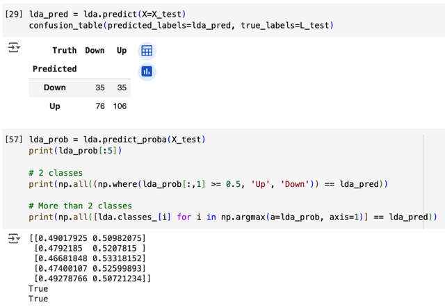</kbd></p>

<p align="center"><kbd></kbd></p>

> [!NOTE]
> và như đã biết qua ở HandsOn A.Geron, trong scikit learn, ta có thể predict
> để có predicted label, hoặc `predict_proba` để có predicted probability scores
>
> Thế thì khi dùng `predict_proba()` để có probabilities thì nếu chỉ có hai class
> như bài toán này `(Up/Down)` ta có thể threshold nó với một `ngưỡng-` mặc
> định là 0.5 để chuyển thành predicted label.
>
> Còn nếu với nhiều class hơn, ta có thể dùng argmax, `axis=0` để "lấy" các 
> index ứng với probability cao nhất và dùng nó để lấy predicted class
>
> Trong hình hai chữ True True ý là dùng cách nào thì kết quả cũng khớp với
> predicted class trả ra bởi predict()

<br>


<a id="node-401"></a>
## 4.7.4 Qda

<br>


<a id="node-402"></a>
### Có thể nói, là phần này chỉ là ta dùng qda class để fit dataset. Với phiên bản python thì họ

> [!NOTE]
> Có thể nói, là phần này chỉ là ta dùng qda class để fit dataset. Với phiên bản python thì họ
> dùng Quadratic Discriminant Analysis clas của ScikitLearn. Khởi tạo model với argument
> `store_covariance` để nó tính ra `/` estimate ra covariance matrix, nói đúng hơn là 'CÓ GIỮ
> LẠI' để mà xem, chứ đương nhiên nó phải estimate covariance matrix rồi. Thì ta nhớ rằng
> với QDA, giả định của mô hình là các class tuân theo Gaussian distribution khác mean và
> khác luôn covariance matrix (LDA thì assume các class có chung covariance matrix)
>
> Thế thì sau khi fit với function fit, `X_train,` `L_train.` Ta có thể xem hai covariance matrix,
> mean và prior với các field \**covariance_\**, \**means_\**, \**priors_
>
> Tuy nhiên class này sẽ không có coefficients của các predictor như LDA (chứa trong 
> field .scalings) , lí do là vì ta đã biết discriminant function của QDA sẽ là một `non-linear`
>  function đối với các predictor.
>
> \**Cuối cùng, ta vẫn đơn giản là dùng function predict với `X_test,` và pass predicted label
> và true label `L_test` vào `confusion_matrix` để xem prediction. Tác giả cho rằng error rate
> của QDA dù chỉ ~60% nhưng vẫn là khá tốt. Điều này cho thấy \**ASSUMPTION CỦA QDA
> TỎ RA PHÙ HỢP VỚI THỰC TẾ CỦA DATASET NÀY\**

<p align="center"><kbd>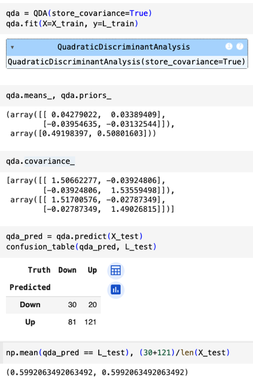</kbd></p>

<p align="center"><kbd></kbd></p>

<br>


<a id="node-403"></a>
## 4.7.5 Naive Bayes

<br>


<a id="node-404"></a>
### Ôn lại tí, NB assume các predictor đều independent nhau. Thế thì tuy đặt ra giả định như

> [!NOTE]
> Ôn lại tí, NB assume các predictor đều independent nhau. Thế thì tuy đặt ra giả định như
> vậy, thì khi đối diện với một dataset, ta sẽ \**giả định thêm\** là các predictor tuân theo
> \**loại\** \**distribution\** \**nào\** nữa. Và trong với Stock dataset, ta giả định chúng là\**Gaussian distribution\**, cũng giống như LDA và QDA. Nó sẽ giống với QDA hơn, khi các
> \**Gaussian sẽ khác nhau cả mean\** và \**covariance\** matrix, chỉ là các cov matrix ở đây
> đều sẽ là \**diagonal\** matrix.
>
> Rồi, rồi sau khi fit ta cũng có thể xem các thông số tính toán. Với GaussianNB của
> scikitLearn, field \**theta_\** chính là \**mean của các predictor\**, và nó cũng c\**ho ra giá trị
> y như của LDA.means_ hay QDA.means_\** (bởi lẽ tụi nó đều gỉa định các feature tuân
> theo Gaussian, chỉ khác là NB có thêm vụ các predictor độc lập, nhưng điều này chỉ ảnh
> hưởng tới variance, không ảnh hưởng gì tới mean, thành ra mean của tụi nó estimate
> đều như nhau)
>
> Một điểm có thể là \**var_\** cho ta variance của các feature của mỗi class. Như đã nói
> trong GaussianNB, các covariance matrix sẽ là \**diagonal do các predictor independent,
> \** thành ra var_ \**chính là các giá trị trên đường chéo
>
> Kết qủa cũng cho thấy assumption của NB khá đúng với dataset này\**

<p align="center"><kbd>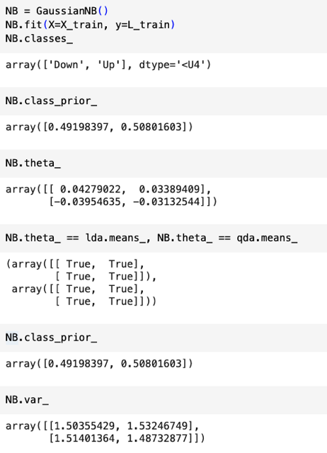</kbd></p>

<p align="center"><kbd></kbd></p>

<br>


<a id="node-405"></a>
## 4.7.6 KNN

<br>


<a id="node-406"></a>
### Phần đầu đại khái là họ dùng knn lib để predict test subset, không cần fit vì đây là

> [!NOTE]
> Phần đầu đại khái là họ dùng knn lib để predict test subset, không cần fit vì đây là
> \**non-parametric model.\** Kết quả ra đại khái là\**không hơn gì random guess khi K=1\**, và chỉ
> \**nhỉn hơn chút khi K=3\**.

<p align="center"><kbd>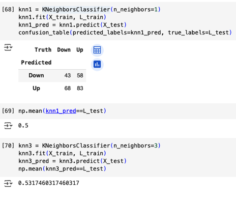</kbd></p>

<p align="center"><kbd></kbd></p>

<br>


<a id="node-407"></a>
### Sau đó gs minh họa việc dùng KNN trong một dataset khác  `-` \\*caravan\\* `-` \\*dùng 85

> [!NOTE]
> Sau đó gs minh họa việc dùng KNN trong một dataset khác  `-` \**caravan\** `-` \**dùng 85
> predictors\** để dự đoán \**việc một khách hàng có mua bảo hiểm không\**. Cho biết, dataset
> này có tính chất \**skew\**, rất\**ít positive sample \**(người mua)
>
> Sau đó gs nói đến việc, trong knn,\**vì cách hoạt động của nó\** dựa trên việc\**tìm những
> sample (trong training set) gần nhất\** để từ đó dùng giá trị response của chúng dự đoán cho
> response của sample cần đoán. Nên\**đại khái là giá trị của predictor sẽ ảnh hưởng đến việc
> tìm hàng xóm gần nhất này\**.
>
> Đây là kiến thức mà\**lần đầu tiên được biết\** về \**ảnh hưởng của feature scale đến kết quả
> của knn model\** (Trước đây ta chỉ biết ảnh hưởng của nó đến gradient descent)
>
> Và cũng dễ hình dung, ví dụ như trong không gian 2D, với \**hai predictor: X1, X2\** thì
> \**distance cuả hai sample A, B, giả sử tính theo L2 distance sẽ là:
>
> sqrt[(X1_A `-` X1_B)^2 `+` (X2_A `-` X2_B)^2].
> \**
> Thế thì\**dễ thấy range của X1, và X2 sẽ tác động đến kết quả\**. Trong sách gs ví dụ X1 là
> salary, và X2 là tuổi. Thế thì \**chênh lệch về salary\** của hai ông A và B giả sử \**1000\** đô la,
> và \**chênh lệch về tuổi\** hai ông là \**50\**. Thì dễ dàng thấy rằng \**1000 đô la sẽ ảnh hưởng
> vượt trội so với khác biệt 50 tuổi\**. Trong khi thực tế việc hai ông chênh nhau 50 tuổi mang ý
> nghĩa lớn hơn nhiều so với 1000 đô la.
>
> Nói chung là, đây là lần đầu tiên mình được học tác động của feature scale lên kết quả của
> knn model.
>
> Thế thì\**cách giải quyết cũng đơn giản\** là gặp lại người bạn cũ: \**standardization\**
> `-` \**convert\** data về\**standard Gaussian mean `=` 0, standard deviation `=` 1\**.
>
> \**Dùng thư viện\** để làm, và \**kết quả của model khi đạt error rate ~11%\**

<p align="center"><kbd>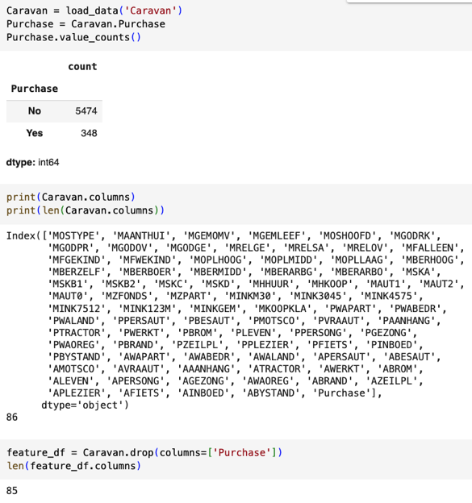</kbd></p>

<p align="center"><kbd>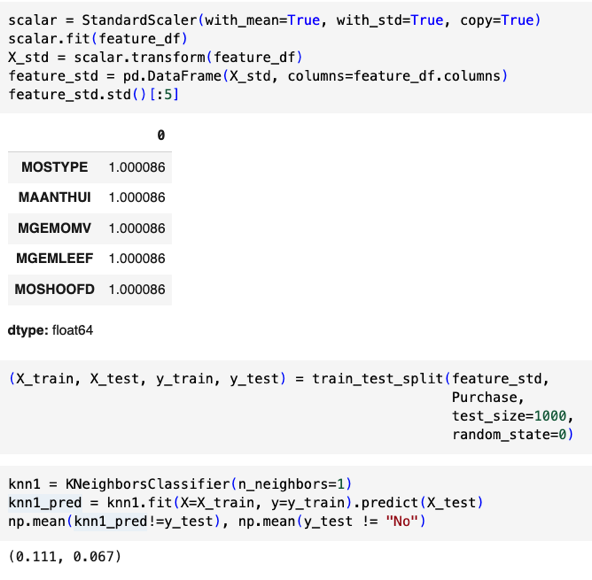</kbd></p>

<p align="center"><kbd></kbd></p>

<p align="center"><kbd></kbd></p>

<br>


<a id="node-408"></a>
### Tiếp theo, như đã nói ở trên, đây là \\*skewed dataset\\* với chỉ có \\*6% là positive sample\\*.

> [!NOTE]
> Tiếp theo, như đã nói ở trên, đây là \**skewed dataset\** với chỉ có \**6% là positive sample\**.
> Nên như đã biết, \**một dummy model\** chỉ việc\**predict false anytime\**, cũng \**dễ dàng đạt
> error rate 6%\**, lớn hơn gấp đôi knn model trên
>
> Thế thì, đại khái là, trong bài toán này, thật ra công ty người ta \**quan tâm chỉ số khác\** chứ
> không phải error rate chung chung. Cụ thể là họ quan tâm \**Precision\** `-` tức là \**trong số
> những khách hàng được dự đoán là sẽ mua bảo hiểm, thì đúng được bao nhiêu %\**. Sở dĩ
> quan tâm chỉ số này, là bởi \**nếu model có precision cao\**, thì ta sẽ  c\**hỉ tập trung vào chào
> bán những khách hàng mà model dự báo sẽ mua\**.
>
> Vậy thì, khi người ta\**thử các K từ 1->3->5\** thì thấy rằng \**precision ngày càng cao\**. Điều
> đó cho thấy nếu \**dùng model có K `=` 5\**, thì bằng cách \**tập trung chào bán những khách
> hàng nó dự đoán sẽ mua\**, thì ta sẽ \**tăng khả năng bán được hàng\**.
>
> Tuy nhiên, \**vui thôi đừng vui quá\**, \**cái gì cũng có cái giá của nó\**, đó là, \**tuy khi K tăng
> kết quả của KNN cho precision cao\** hơn nhưng ta cũng để ý thấy \**số người mà nó dự
> đoán là sẽ mua hàng cũng ít đi\**. Nên về cơ bản nó \**chỉ là đang càng ngày càng đưa ra
> những dự đoán chắc cú hơn\**. Và đánh đổi lại, đương nhiên sẽ cũng \**bỏ sót nhiều khách
> hàng tiềm năng hơn\**, trong đây gs không tính, chứ ta có thể tính toán chỉ số \**sensitivity\**
> (trong số mọi ông mua hàng, thì phát hiện `/` đoán đúng mấy ông) c\**hắc chắn sẽ giảm.\**

<p align="center"><kbd>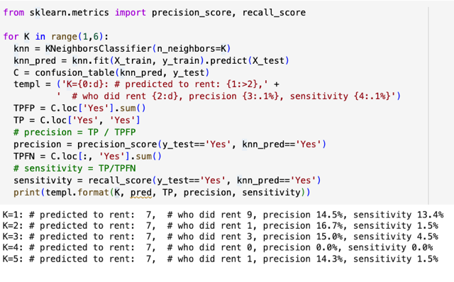</kbd></p>

<p align="center"><kbd></kbd></p>

<br>


<a id="node-409"></a>
### Cuối cùng là fit dataset này với\\* Logistic Regression\\*....thì kết quả cho thấy rằng nếu \\*dùng

> [!NOTE]
> Cuối cùng là fit dataset này với\**Logistic Regression\**....thì kết quả cho thấy rằng nếu \**dùng
> threshold 0.5\** (mặc định) thì \**cả bộ test set, nó chỉ dự đoán có 7 người là positive\**. Mà thậm
> chí còn không có người nào thật sự mua, tức là \**precision `=` `TP/(TP+FP)` `=` 0.
> \**
> Thế thì, sau đó gs giảm threshold xuống 0.25, thì precision tăng lên 33%. Điều này cũng dễ
> hiểu, vì giảm threshold, tức giảm độ chắc cú xuống, từ đó\**tăng số dự đoán positive lên\**,
> dẫn đến sẽ \**tăng số ca đoán đúng TP lên\** kéo theo \**tăng cả độ nhạy sensitivity\** `TP/(TP+FN)`
> và \**nhất thời tăng cả precision\** `=` `TP/(TP+FP).`
>
> Tuy nhiên phải hiểu rằng, khi giảm threshold, với việc có nhiều ca được dự đoán positive
> hơn thì số ca đúng `-` tức TP `-` cũng tăng mà số ca sai `-` tức FP `-` cũng tăng, do đó \**không đảm
> bảo rằng precision luôn tăng.\**

<br>


<a id="node-410"></a>
## 4.7.7 Poisson Regression

<br>


<a id="node-411"></a>
### Cuối cùng là như đã nói, ta sẽ dùng Poisson Regression model để fit Bikeshare dataset `-` bộ dữ

> [!NOTE]
> Cuối cùng là như đã nói, ta sẽ dùng Poisson Regression model để fit Bikeshare dataset `-` bộ dữ
> liệu về số lượng thuê xe đạp công cộng theo giờ của thành phố Washington DC
>
> Thế thì nói chung là ta đã biết bộ dữ liệu này từ phần trước, đó là nó có tính chất đặc biệt khiến
> việc dùng Linear Regression sẽ không phù hợp bằng Poisson Regression `-` đó là nó có
> response không âm (số lượng xe đạp thuê sẽ đương nhiên không âm), quan trọng hơn đó là
> biểu đồ về  phân bố của giá trị response theo các tháng khác nhau trong năm cho thấy variance
> của response có sự đồng điệu với độ lớn của nó `-` nôm na là mức thuê trung bình càng cao thì
> lại càng biến động. Thành ra điều này không phù hợp với giả định của linear regression model
> khi nó cho rằng variance của response là không đổi. Ngoài ra một điểm nữa, đó là giá trị
> response nguyên chứ không continuous.
>
> Do vậy, tuy vẫn có thể miễn cưỡng dùng linear regression với transformed response `-` fit model
> với log y thay vì y, nhưng cách tiếp cận tự nhiên hơn là dùng Poisson regression `-khi` mô hình
> này giả định response  variable tuân theo Poisson distribution `-` là phân phối xác suất mà trong
> đó mean(Y) `=` var(Y) `-` tức mean và var quan hệ tuyến tính với nhau.

<br>


<a id="node-412"></a>
### Ok, thế thì bắt đầu, người ta vẫn \\*fit với linear regression model trước\\*, và như đã nói, ta sẽ

> [!NOTE]
> Ok, thế thì bắt đầu, người ta vẫn \**fit với linear regression model trước\**, và như đã nói, ta sẽ
> không quan tâm nhiều đến cách fit, chỉ việc gọi function phù hợp của thư viện, cho nó biết ta
> dùng variable nào (cột nào) của dataset cho response, cột nào cho predictor.
>
> Thế thì, ở đây, ta nhớ rằng trong các predictor, ta chú ý đến predictor "giờ trong ngày" và "
> tháng", là bởi chúng là các qualitative predictor. Như giờ thì ta có 24 categories, tháng thì có
> 12 loại. Như đã biết trong chương 3, ta sẽ tạo \**dummies\** `(one-hot` encoded) variable với các
> ```text
> predictor này, cụ thể sẽ là 24-1 = 23 dummies variable cho  "giờ"  và 12-1=11 dummies
> ```
> variable cho "tháng". Và trong cách hoạt động của thư viện này, nó sẽ chọn category đầu tiên
> làm base tức là nó sẽ tạo dummies variables cho tháng 2, 3...12 và 2,3..24 giờ.
>
> Và sở dĩ nói kĩ điều này là bởi nó sẽ giúp ta diễn giải (interpret) các learned coefficients. Ví dụ
> ta đã biết trong equation Y `=` beta0 `+` beta1X1 thì beta0 sẽ là giá trị của response Y khi không
> có predictor X, và beta1 cho biết mỗi khi predictor tăng 1 đơn vị thì khiến response tăng thêm
> bao nhiêu (nếu beta1 âm thì tức là khiến Y giảm). Và khi \**X1 là dummies variable\** thì
> \**beta1\** sẽ có nghĩa là, \**nếu X1 `=` 1 thì sẽ khiến response Y tăng thêm bao nhiêu\**.
>
> Vậy, ta có thể hiểu kết quả fitting của linear regression cho \**coefficient của mnthFebruary `=` 6.
> 845\** có nghĩa là,  khi\**chuyển từ tháng 1 (January) sang tháng 2 (February)\** `-` tức là khi đó
> \**dummy variable mnthFeb `=` 1\**, thì  sẽ\**khiến response tăng thêm 6.845 đơn vị\**.
>
> Và tương tự \**coefficient của\** \**mnthMarch `=` 16.551\** có nghĩa là khi chuyển từ tháng 1 sang
> tháng 3, tức là mnthMarch `=` 1, response Y sẽ tăng thêm 16.551 đơn vị.
>
> Tóm lại chỗ này cũng giống như:
>
> ```text
> Y = beta0 + beta_Feb.X_Feb + beta_Mar.X_Mar + beta_April*X_April + ....
> ```
>
> ```text
> thì beta_Feb chính là mức tăng của Y khi X_Feb = 1 (đương nhiên lúc này mọi X_Mar,
> ```
> ```text
> X_April.. đều bằng 0) so với khi X_Feb=0, X_Mar=0,...X_Dec=0 (tức là tháng 1 - base class)
> ```

<p align="center"><kbd>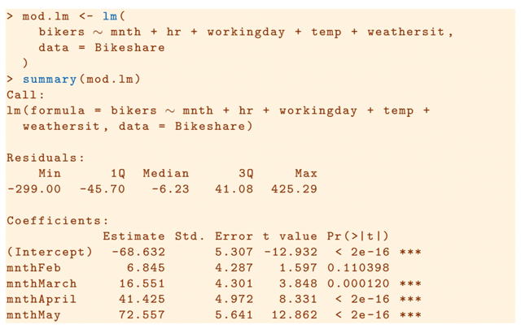</kbd></p>

<p align="center"><kbd></kbd></p>

<br>


<a id="node-413"></a>
### Rồi, tiếp theo, đại khái là gs cho biết cái lm model ở trên, cho ra kết quả hơi khác hoặc

> [!NOTE]
> Rồi, tiếp theo, đại khái là gs cho biết cái lm model ở trên, cho ra kết quả hơi khác hoặc
> \**cách làm hơi khác\** với model lm đã fit cũng trên bộ dataset này \**trong phần trước\** (trước khi
> giới thiệu Poisson Regression, họ vẫn fit với lm)
>
> Thế thì điểm khác biệt giữa hai lm model đó là: Model 1, là cái vừa mới nói, khi tạo model
> lm, thì đang \**dùng default setting của lm trong đó\**, nó sẽ đối xử với các qualitative predictor
> như month, hour theo cách là nó sẽ \**gán cái "loại" đầu tiên làm base hay reference\**, để rồi
> \**beta của nó bằng 0\**. ví dụ coeff của monthJan `=` 0, để từ đó, như ta nói ở note trước, coeff
> của monthFeb sẽ thể hiện \**mức chênh lệch của response trong tháng 2 SO VỚI THÁNG 1\**,
> và tương tự, coeff của monthMar sẽ thể hiện mức chênh lệch response trong tháng 3 SO
> VỚI THÁNG 1
>
> Còn khi fit lm model 2, ta để ý họ gọi hai dòng code dùng
>
> \**contrasts(Bikeshare$hr) `=` contr.sum(24)\** và \**contrast(Bikeshare$mnth) `=` contr.
> sum(12)\**
>
> Đại khái là trong R, khi đối xử với categorical predictors, có 2 cách tiếp cận:
>
> i) \**Treatment codings\**: trong đó nó sẽ chọn một class trong các categories làm base để
> rồi, \**coi như coefficient của class đó, ví dụ monthJan, `=` 0\**, và như vậy giá trị coeff của các
> dummies predictor khác như mnthFeb, mnthMar sẽ có ý nghĩa là \**chênh lệch response ứng
> của Feb, Mar so với Jan.\**
>
> ii) \**Sum coding\**: trong cách này, nó sẽ \**buộc coefficients của mọi categories cộng lại bằng
> 0\**, để rồi\**coeff của mnthJan sẽ mang ý nghĩa là chênh lệch response\** của January \**so với
> trung bình cả năm\**.
>
> Thì có thể hiểu nôm na là hai dùng trên, kiểu như \**đặt lại, quy định lại\** rằng cách chọn
> constrast cho categorical predictor này sẽ chuyển từ default (là treatment coding, nơi nó sẽ
> chọn tháng 1 và hour `=` 1 làm reference) sang sum coding.
>
> Thành ra, khi model fit, nó sẽ tính coeff cho tháng 1 tới 11, và coeff của tháng 12 thì bằng
> \**TỔNG ÂM CỦA COEFF MẤY THÁNG KIA. Để rồi TỔNG CÁC COEFF BẰNG 0\**, giúp khi
> giải thích ý nghĩa  của các coeffs các tháng thì đó là mức chênh lệch của tháng đó so với
> \**TRUNG BÌNH CẢ NĂM.\**

<p align="center"><kbd>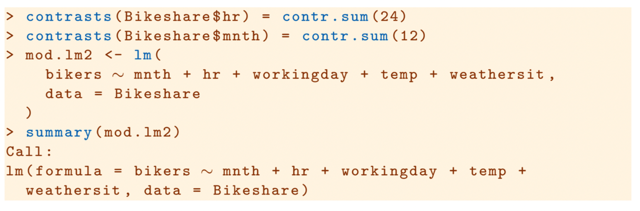</kbd></p>

<p align="center"><kbd></kbd></p>

<br>


<a id="node-414"></a>
### Rồi phần cuối là gs nói về cách để in các đồ thị cũng như là fit model với Poisson Regression

> [!NOTE]
> Rồi phần cuối là gs nói về cách để in các đồ thị cũng như là fit model với Poisson Regression
> dùng glm

<br>

