# 5.1 Cross Validation

📊 **Progress:** `1` Notes | `32` Screenshots

---

## 5.1.0 Overview

 

### Đại khái là gs nhắc lại việc trong chapter 2 ta đã thảo luận về việc

> [!NOTE]
> Đại khái là gs nhắc lại việc trong chapter 2 ta đã thảo luận về việc
> performance của model \**training set thường đánh giá không đúng
> performance của model\** trên \**test set, mới là thứ mà ta quan tâm. \**
> Và việc không phải lúc nào cũng có một bộ test set riêng biệt để đánh
> giá model khiến ta cần sự trợ giúp của những công cụ bàn tới trong
> chương này.
>
> Đương nhiên có bộ test set riêng thì là tốt nhất rồi. Nhưng không phải
> lúc nào cũng có. Người ta có thể dùng một số cách tiếp  cận theo
> hướng điều chỉnh performance của training set.
>
> Còn chapter này ta sẽ bàn về cách tiếp cận dùng một `hold-out` set

<kbd>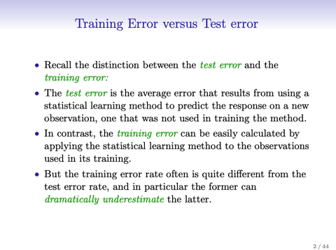</kbd>

<kbd>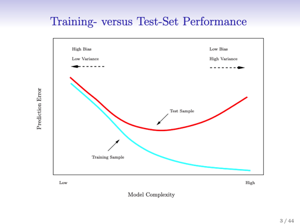</kbd>

<kbd>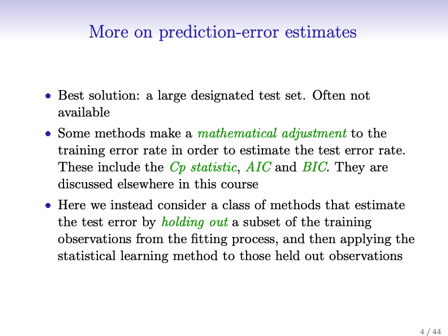</kbd>

<kbd></kbd>

<kbd></kbd>

<kbd></kbd>

 

## 5.1.1 The Validation

> [!NOTE]
> 5.1.1 THE VALIDATION
> SET APPROACH

 

### Đại khái là cách tiếp cận đầu tiên đơn giản là \\*random split dataset

> [!NOTE]
> Đại khái là cách tiếp cận đầu tiên đơn giản là \**random split dataset
> thành training set và `hold-out` validation set thành 2 phần xem  xem
> nhau\**
>
> Sau đó training model trên training set và test trên hold out set.
>
> Người ta lấy ví dụ của bài toán linear regression đã gặp trong chap 3,
> trong đó ta predict mpg là một quantitative response với các predictor
> khác nhau trong đó có cái horsepower Đại khái là họ nhắc lại rằng
> trong chapter 3 khi bàn về cái vụ `non-linear` relation giữa predictor và
> response thì ta có thể \**dùng polynomial của predictor\** để đưa tính
> chất phi tuyến vào model \**giúp  nó fit tốt hơn\**.
>
> Thế thì ý chính là ta có thể tự hỏi là có khi nào dùng polynomial bậc 3
> thì tốt hơn nữa hay không. Thì một cách để trả lời đương nhiên là xem
> thử `p-value` của predictor "bậc 3" khi fit model có tốt không (ta nhớ
> rằng `p-value` tốt là khi nó nhỏ, hình như nhỏ hơn 0. 001, thì khi nó ý
> nghĩa của nó đó là "xác suất mà có quan hệ giữa predictor  này với
> response đơn thuần là do ngẫu nhiên sẽ thấp `-` hay nói cách khác, khả
> năng cao là có sự ảnh hưởng của predictor tới response tức là việc sử
> dụng predictor sẽ có ích trong việc nắm bắt quy luật của reponse)
>
> Tuy nhiên, đương nhiên là ta cũng có thể dựa vào test performance
> (tức là fit model với `/` hoặc không "bậc 3" (cubic) polynomial predictor
> này để xem cái nào có performance tốt hơn.
>
> Kết quả đại khái là cho thấy khi dùng polynomial degree cao hơn (3,4..
> ) thì performance của `hold-out` set giảm

<kbd>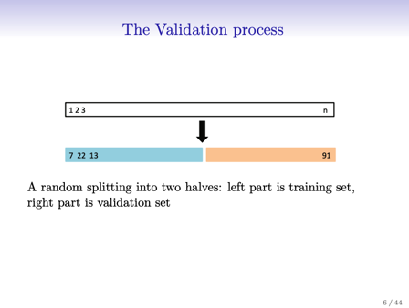</kbd>

<kbd></kbd>

 

### Chú ý là họ làm nhiều lần việc `split-train` trên training set `-` test trên

> [!NOTE]
> Chú ý là họ làm nhiều lần việc `split-train` trên training set `-` test trên
> `hold-out` validation set.
>
> Thì hiện tượng đáng chú ý đó là cả 10 lần đều cho \**thấy rõ sự giảm
> đi của MSE khi dùng quadratic predictor so với linear predicto\**r (
> tức là dùng bậc 2 của horsepower thay vì giá trị gốc) Và nó cũng
> cho thấy việc \**tăng lên bậc 3,4 không có tác dụng gì mấy\**.
>
> Tuy nhiên nó cũng cho thấy là MSE trên khi test mỗi lúc mỗi khác.
> Nó có sự khác nhau khá đáng kể. Dẫn đến là ta không thể kết luận 
> được test error là bao nhiêu

<kbd>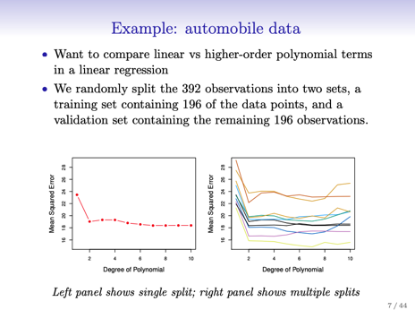</kbd>

<kbd></kbd>

 

### Từ đó ta có 2 kết luận (2 nhược điểm) của cách tiếp cận này:

> [!NOTE]
> Từ đó ta có 2 kết luận (2 nhược điểm) của cách tiếp cận này:
>
> 1) Như vừa nói, kết quả của việc test trên các `hold-out` validation
> set này có \**mức biến động khá lớn\**. Nên có thể hiểu là k\**hông đáng
> tin\**, không thể dùng để\**estimate model performance trên unseen
> new dataset\**
>
> 2) Dễ hiểu rằng khi ta chia data set ra, train model trên training set
> thì đương nhiên training set này (trong mỗi lần chia) không có
> những sample nằm trong validation set. Nên kiểu như \**dữ liệu dùng
> để training chứa statistical data bị giảm đi\**, ít hơn. Do đó, kết quả 
> đánh giá của model trên mỗi hold out set \**KHÔNG PHẢN ÁNH ĐÚNG
> KHẢ NĂNG CỦA MODEL\** khi so sánh với việc \**train model trên toàn
> bộ dataset trước khi chia. Mà gs gọi là OVERESTIMATE.
>
> Câu hỏi là tại sao lại OVERESTIMATE ?\**

<kbd>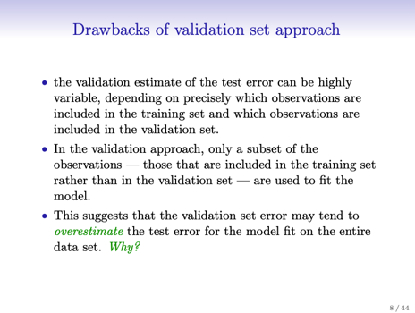</kbd>

<kbd></kbd>

 

## 5.1.2 `leave-one-out`

> [!NOTE]
> 5.1.2 `LEAVE-ONE-OUT`
> CROSS VALIDATION SET

 

### Cách này nói ngắn gọn là vầy: \\*Tiến hành n (n là số sample) lần\\*, ở \\*lần

> [!NOTE]
> Cách này nói ngắn gọn là vầy: \**Tiến hành n (n là số sample) lần\**, ở \**lần
> thứ i\** ta train model trên \**dataset đã bỏ sample thứ i\** ra (còn `n-1`
> samples).  Và \**tính MSE trên sample thứ i\** đó `(MSE_i).`
>
> Sau n lần, \**average n chỉ số MSE_i\** lại.
>
> Cách này khắc phục nhược điểm của cách trên ở chỗ, không giống như
> cách trên\**, chia dataset làm hai phần tương đương\**, train trên một phần
> và test trên `hold-out` validation set khiến \**số data dùng để train bị ít đi\**
> gây ra nhược điểm performance trên validation set không đánh giá đúng
> khả năng của model so với khi model được train với fulll dataset. Thì ở đây
> mỗi trong n lần model\**đều được train với hầu như toàn bộ dataset\** giúp
> khắc phục được nhược điểm này.
>
> Ưu điểm thứ hai là nếu\**lặp lại nhiều lần\** (chú ý mỗi lần tính cái này sẽ
> bao gồm train & test model n lần như nói ở trên) thì giá trị MSE (mà ta tính
> trung bình của n `MSE_i)` \**không biến động lớn\** như của cách trên. Do đó
> có thể dùng để estimate cho performance của model trên unseen data (tức
> là giống như khi ta có một separate test set đủ lớn)

<kbd>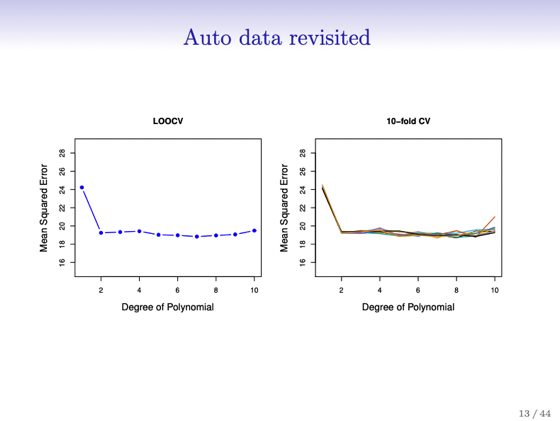</kbd>

<kbd></kbd>

 

### Tuy nhiên dễ thấy nhược điểm là nó \\*có thể rất expensive\\*. Vì mỗi lần

> [!NOTE]
> Tuy nhiên dễ thấy nhược điểm là nó \**có thể rất expensive\**. Vì mỗi lần
> tính, như đã nói, ta sẽ \**train `-` test n lần\**. Sau đó mới average lại. (Chú ý
> trong cách 1 hồi nãy chỉ là split train và test chứ không có average gì đâu.
> Nên kết quả biến động rất nhiều).
>
> Thế thì họ mới đề cập đến một mẹo, một shortcut, chỉ áp dụng khi ta dùng
> phương pháp này với bài toán\**linear regression\**. Đó là. Ta cứ\**fit model
> với toàn bộ n sample như bình thường\**. Nhưng ta sẽ tính \**chỉ số leverage
> statistic của mỗi sample để có h_i\**. CŨng như prediction của model trên
> các sample để có y^_i.
>
> Khi đó, ta sẽ tính MSE theo cách thông thường đó là trung bình của các
> bình phương error (error  `=` `y_i` `-` y^_i). Nhưng ta sẽ \**CHIA MỖI ERROR\** \**(1-h_i)\**
>
> Thì ý nghĩa của việc này đó là, với mỗi error `e_i` ta đã\**LOẠI BỎ ĐÓNG
> GÓP  CỦA SAMPLE THỨ i VÀO ERROR MSE_i\** này.
>
> Và dẫn đến kết quả là nó \**sẽ giống như ta train model với [mọi sample của
> dataset trừ sample i ra]\** và tính prediction của sample i theo cách làm của
> LOOCV.
>
> Nói ngắn gọn, bằng cách này, ta \**không cần phải thực sự\** làm theo như lý
> thuyết mô tả là phải\**train model n lần\**, mỗi lần train trên dataset trừ 1
> sample thứ i và dùng model để predict y^_i, tính `MSE_i` và trung bình mọi
> `MSE_i` lại  Mà thay vào đó chỉ cần train model 1 lần. Tính thêm n chỉ số `h_i`
> (không tốn thêm bao nhiêu compute cost). Và dùng công thức điều chỉnh
> nói trên để vẫn có kết quả như của LOOCV.

<kbd>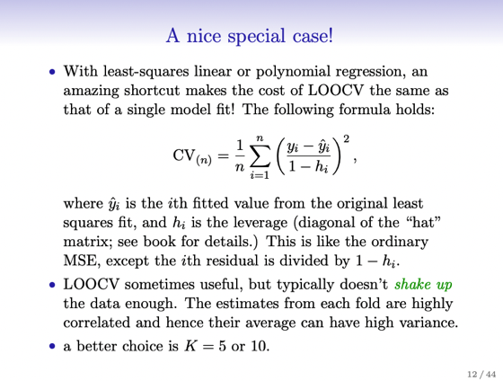</kbd>

<kbd></kbd>

 

### Cuối cùng là tác gỉa cho biết phương pháp này có thể dùng với nhiều bài

> [!NOTE]
> Cuối cùng là tác gỉa cho biết phương pháp này có thể dùng với nhiều bài
> toán kể cả logistic regression. Nhưng công thức shortcut thì như đã nói chỉ
> áp dụng với linear regression thôi. Thành ra \**với các bài toán khác sẽ phải fit
> nhiều lần\**

 

## 5.1.3 `k-fold` Cross Validation

 

### Đại khái là cách thứ 3 là ta sẽ chia dataset làm k phần (thường là 5 hoặc 10) rồi:

> [!NOTE]
> Đại khái là cách thứ 3 là ta sẽ chia dataset làm k phần (thường là 5 hoặc 10) rồi: 
> lần lượt giữ lại một phần làm validation set và train trên `k-1` phần còn lại. 
> Từ đó tính ra k MSE, và average lại.
>
> Thế thì dễ thấy LOOCV chính là `K-fold` CV với k `=` n. Và ta cũng dễ hiểu rằng tại
> sao người ta lại dùng cách này, thay vì LOOCV là bởi tuy LOOCV khắc phục nhược
> điểm của cách thứ nhất hồi nãy nhưng ngoại trừ linear regression thì với các bài
> toán khác (classification ,.) nó quá computational expensive khi ta phải train tới n
> lần, cho 1 kết quả test.
>
> Còn đương nhiên là với `k-fold` cn thì ta chỉ train k lần.

<kbd>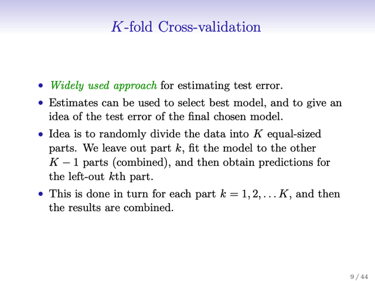</kbd>

<kbd>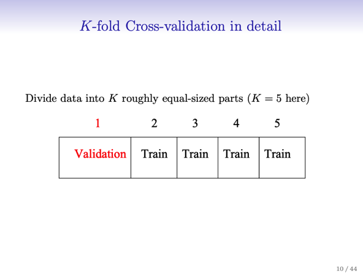</kbd>

<kbd>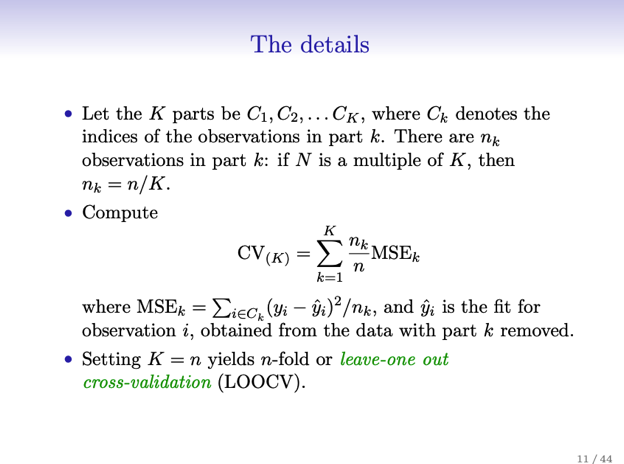</kbd>

<kbd></kbd>

<kbd></kbd>

<kbd></kbd>

 

### Tiếp, đại khái là, ta cần hiểu \\*mục đích\\* của những việc `cross-validation` test là để

> [!NOTE]
> Tiếp, đại khái là, ta cần hiểu \**mục đích\** của những việc `cross-validation` test là để
> \**ESTIMATE TEST PERFORMANCE\**, bởi vì như đã nói, không phải lúc nào ta cũng có
> một test set độc lập để test.
>
> Thế thì LÀM SAO BIẾT CROSS VALIDATION TỐT , hay nói cách khác, LÀM SAO ĐỂ
> \**EVALUATE KẾT QỦA CỦA CROSS VALIDATION\**
>
> Thì đại khái là \**với real data thì ta không biết\**, ý là, trong một bài toán thực tế, ta không
> thể  đánh giá performance của mô hình trên dữ liệu mới nói chung được, kể cả khi ta có
> một separate test set thì nó cũng chỉ là cách để ước lượng khả năng của model trên new
> unseen data thôi.
>
> Tuy nhiên ta có thể \**dựa vào SIMULATED data\**, kiểu như data mà ta tạo ra, thì đương
> nhiên ta biết test error (bởi vì ta biết quy luật thực sự của dữ liệu). Do đó, gs nói ở đây
> rằng ta đánh giá `k-fold` cv và LOOCV và so nó với test error trong 3 trạng thái `/`  bài toán
> mà chapter 2 đã gặp:
>
> i) khi quy luật thực sự của data là \**đơn giản\**, để rồi bắt đầu với model đơn giản
> (flexibility thấp) thì nó fit tốt (test error thấp), còn khi \**tăng flexibility lên thì nó nhanh
> chóng overfit\** (test error tăng  vọt)
>
> iii) quy luật thực sự của data là\**phức tạp\**, để khi bắt đầu với simple model bị
> \**underfit\** test error rất cao, và \**giảm mạnh\** khi flexibility tăng lên, đương nhiên tăng
> nữa thì test error cũng bắt đầu tăng
>
> ii) trạng thái quy luật của data \**phức tạp vừa vừa\**, thì lúc bắt đầu với simple model  test
> error cũng cao, và giảm dần khi tăng flexibility nhưng sau đó nhanh chóng bắt đầu tăng
> lên khi vượt quá flexibility cần thiết gây ra overfit.

 

### Vậy đại khái là có hai quan sát, đó là ở case thứ i) hai phương pháp cross cv cho ra

> [!NOTE]
> Vậy đại khái là có hai quan sát, đó là ở case thứ i) hai phương pháp cross cv cho ra
> estimated test error (như đã nói, mục đích của cross validation là để estimate test
> performance) khá sát với (real) test error ở giai đoạn flexibility thấp `-` tức là giai đoạn mà
> model có flexibility tuy đơn giản nhưng đủ để fit dataset vì như đã nói, ở case này data
> có complexity thấp.
>
> Và ở case thứ iii) trong đoạn ứng với flexibility cao, hai phương pháp cross cv cũng tỏ ra
> sát với test error.
>
> ĐIỀU NÀY CÓ Ý NGHĨA QUAN TRỌNG: đó là, nó cho thấy ở trong hai case này,  nếu
> phải dựa vào cross validation method `(k-fold` và LOOCV) để xác định mức flexibility phù
> hợp của model thì ta sẽ xác định được đúng `-` vì như đã nói, trong những đoạn flexibility
> ứng với test error thấp thì estimated error cũng sát.
>
> Và tuy ở situation giữa cross cv tỏ ra UNDERESTIMATE test error `-` ý là nó đánh giá thấp
> model, khi nó cho rằng model có error cao nhưng thực tế model làm việc tốt hơn. Thì tuy
> vậy, cross cv vẫn cho thấy nó đánh giá đúng mức flexibility cần thiết của model khi
> đường cong chữ U tuy không sát nhưng vẫn tương ứng khá tốt với test error.
>
> Tóm lại, điều này cho ta thấy rằng việc sự dùng `cross-validation` là có cơ sở để tin cậy nó
> estimate được tốt cho test error KHI TA CẦN DÙNG NÓ ĐỂ CHỌN FLEXIBILITY PHÙ
> HỢP.
>
> Chỗ này phải hiểu rằng, gs nói rằng, đôi khi ta chỉ quan tâm mức thấp nhất của estimated
> test error `-` thì ý là, tuy rằng cả 3 biểu đồ đều cho thấy xét trên toàn bộ các flexibility
> `cross-cv` không phải luôn sát test error mà có lúc nó OVERESTIMATE (như ở 2 case
> đầu, ứng với đoạn mà overfit của case 1 và under fit của case 3) hoặc nó
> UNDERESTIMATE (như ở case 2). Tuy nhiên khi chọn flexibility ta chỉ cần quan tâm
> rằng, có thể dựa vào \**VỊ TRÍ CROSS CV ERROR TẠI GIÁ TRỊ THẤP NHẤT\** để chọn hay
> không. Trong sách gọi là "m\**inimum point in the estimated test MSE curve\**"
>
> THÌ CÂU TRẢ LỜI LÀ CÓ, vì cả 3 case đều cho thấy, \**mức flexibility\** mà cross cv
> thấp nhất C\**ŨNG TƯƠNG ĐỐI TRÙNG VỚI MỨC FLEXIBILITY MÀ TEST ERROR THẤP
> NHẤT.\**

<kbd>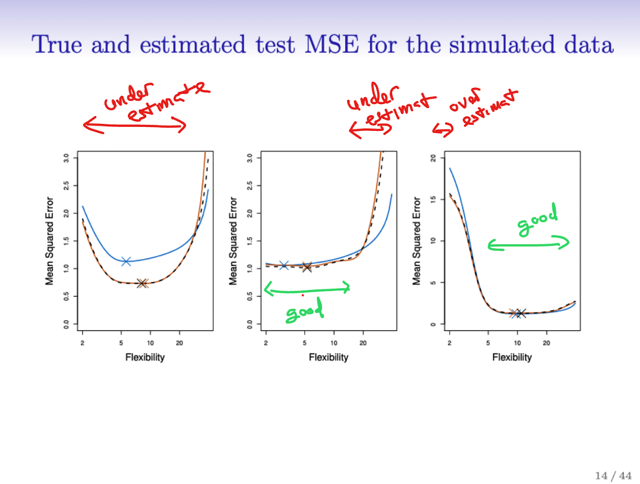</kbd>

<kbd></kbd>

 

## 5.1.4 `Bias-Variance`

> [!NOTE]
> 5.1.4 `Bias-Variance`
> `Trade-Off` for `k-Fold` CV

 

### Đại khái là, ở đây ta sẽ hiểu tại sao `k-Fold` CV lại tốt hơn LOOCV ngay cả khi ta bỏ qua

> [!NOTE]
> Đại khái là, ở đây ta sẽ hiểu tại sao `k-Fold` CV lại tốt hơn LOOCV ngay cả khi ta bỏ qua
> yếu tố computational cost (đương nhiên LOOCV costly hơn). Đó là `k-Fold` CV đạt trạng
> thái cân bằng giữa bias và variance tốt hơn LOOCV và validation set approach (method 1
> ở 5.1.1 trên)
>
> Lí do của validation set approach không tốt là bởi trong cách làm đó, ta sẽ \**chia dataset
> làm hai phần xem xem\**, và như vậy nó \**giảm đi đáng kể số training data dành để fit
> model\** dẫn đến validation set performance đang đánh giá không đúng khả năng thật sự
> của model bởi vì khi \**model train với ít data thì nó không thể nắm bắt quy luật của dữ
> liệu\** được. Và nói  validation set đánh giá không đúng ở đây có nghĩa là theo hướng tiêu
> cực, tức là thực tế model khi test trên new unseen data có thể không đạt kết quả như
> validation set cho thấy, mà sẽ tệ hơn. Do đó mới nói validation set \**OVERESTIMATE\**
> test performance.
>
> Một điểm có thể hiểu rằng đã nói trong Resampling technique là ta không có nhiều data,
> để mà có một separate test set. Chứ nếu có rất nhiều data để rồi chia một nửa để train thì
> không nói làm gì.
>
> Như vậy, theo lập luận này, LOOCV, và `k-Fold` giúp giảm bias khi \**DÀNH NHIỀU DATA
> ĐỂ TRAIN MODEL HƠN\**. Và đáng lẽ như vậy thì LOOCV sẽ phải tốt hơn `k-Fold` vì ta biết
> nó train model với `n-1` data samples ở mỗi lần train lận.

<kbd>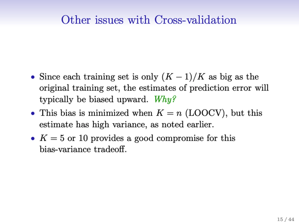</kbd>

<kbd></kbd>

 

### Tuy nhiên vấn đề như đã biết high bias hoặc high variance đều ảnh hưởng đến kết quả.

> [!NOTE]
> Tuy nhiên vấn đề như đã biết high bias hoặc high variance đều ảnh hưởng đến kết quả.
>
> Thế thì vấn đề với LOOCV là khi train n lần, mỗi lần train với `n-1` samples và chừa ra một
> sample để test MSE trên đó, thì có thể coi như \**TRAINING SET CỦA N LẦN ĐÓ HẦU
> NHƯ GIỐNG NHAU\** . Do đó tác giả nói rằng \**output của các lần test có sự tương quan
> với nhau cao\**. Và điều này tạo ra\**tính chất high variance\** của LOOCV.
>
> Còn `k-Fold` vì chỉ train model k lần, mỗi lần trên `k-1` fold nên có thể hiểu training set trong
> mỗi lần train \**KHÁC NHAU NHIỀU HƠN\** là khi train LOOCV nên giảm bớt sự tương
> quan trong output của k lần test. Từ đó giảm variance.
>
> Điều vừa nói trên xuất phát từ một tính chất của \**STATISTIC LÀ, TRUNG BÌNH CỦA
> MỘT SET CÓ COVARIANCE CAO SẼ CAO CÓ MỨC BIẾN ĐỘNG (VARIANCE) CAO
> HƠN TRUNG BÌNH CỦA MỘT SET CÓ COVARIANCE THẤP\**
>
> Tóm lại, như đã nói `k-Fold` có sự cân bằng giữa bias và variance tốt nhất. Và k `=` 5. 10 là
> những giá trị DỰA THEO THỰC NGHIỆM ĐÃ CHO THẤY GIÚP ĐẠT SỰ CÂN BẰNG
> `BIAS-VARIANCE` NÀY do đó hay được sử dụng

> [!NOTE]
> Tại sao "TRUNG BÌNH CỦA MỘT SET CÓ COVARIANCE CAO SẼ
> CAO CÓ MỨC BIẾN ĐỘNG (VARIANCE) CAO HƠN TRUNG BÌNH
> CỦA MỘT SET CÓ COVARIANCE THẤP

 

## 5.1.5 Cross Validation For

> [!NOTE]
> 5.1.5 CROSS VALIDATION FOR
> CLASSIFICATION SETTINGS

 

### Đại khái là với bài toán classification thì cross validation vẫn phát huy tác dụng \\*giúp ta

> [!NOTE]
> Đại khái là với bài toán classification thì cross validation vẫn phát huy tác dụng \**giúp ta
> estimate test performance\**. Chẳng qua là như đã biết trong bài toán này ta \**không
> dùng MSE\** mà sẽ dùng error metric khác, như\**misclassification rate\**. Tỉ lệ của
> misclassification `/` tổng
>
> \**I\**(y_i khác y^_i) như đã biết là Identify function, bằng 1 nếu điều kiện là đúng, và
> bằng 0 nếu ngược lại
>
> `=>` \**Err_k `=` `I(y_i` khác y^_i) `/` nk\** là misclassification error rate trong fold có nk `=` n `/` k 
> sample
>
> Để rồi, với `k-Fold` Cross Validation ta sẽ tính cross validation error là \**trung bình error
> của k lần test\** (cũng \**chia data ra k fold\**,\**train trên `k-1` fold\**, \**test `=` tính
> misclassification rate trên cái `hold-out` fold\**. Như vậy \**lần lượt từng fold\** được test
> \**để có k error rate: Err_k\**, xong \**tính trung bình\** để có cross validation error)

<kbd>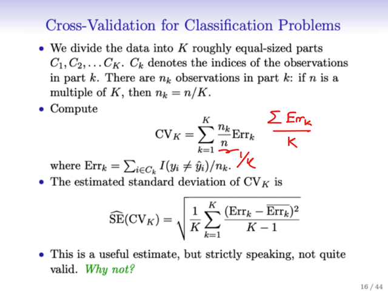</kbd>

<kbd></kbd>

 

### Thế thì người ta lấy lại ví dụ trong chapter 4. Một data set có \\*true pattern\\* `-` ám chỉ

> [!NOTE]
> Thế thì người ta lấy lại ví dụ trong chapter 4. Một data set có \**true pattern\** `-` ám chỉ
> \**decision boundary thật sự\**, có tính phi tuyến, và đương nhiên \**vì là simulated
> data\** nên ta \**biết Bayesian error rate\** và \**Bayesian decision boundary\** (là những
> cái mà nếu dựa trên \**Bayesian classifier\** `-` là classifier mà có thể coi là \**cái tốt nhất
> mà một classification model\** có thể đạt được)
>
> Cũng như là khi fit model ta\**có thể tính ra true (test) error\**
>
> Và người ta\**train 4 model\** với \**linear\** (original predictor) `/` \**quadratic\**
> (polynomial) bậc 2, \**cubic\** (polynomial bậc 3), và\**polynomial bậc 4\** để add \**thêm
> tính flexibility\**, `non-linear`  vào logistic regression model. Thì thấy các decision
> boundary  và tính test error như vầy: \**.201, .0197, .160, .162 trong khi Bayesian
> error là 0.133\**
>
> Như vậy là\**test error ngày càng giảm để tới gần Bayesian error khi tăng polynomial
> degree từ 1 lên 3\**, cũng như d.b ngày càng khớp hơn với Bayesian d.b. 
>
> Sau đó với\**bậc 4 thì  test error rate bắt đầu tăng lên so với Bayesian error\**
>
> TUY NHIÊN, PHẢI HIỂU LÀ \**THỰC TẾ TA KHÔNG CÓ TEST SET\** ĐỂ MÀ CÓ TEST
> ERROR, CŨNG NHƯ NẾU CÓ THÌ \**CŨNG KHÔNG CÓ BAYESIAN ERROR RATE
> ĐỂ MÀ  SO SÁNH.
>
> \**Bởi vậy mới cần Resampling technique như Cross validation.

<kbd>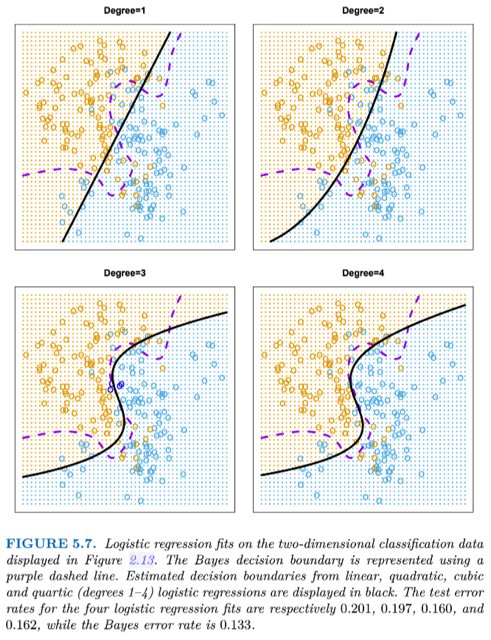</kbd>

<kbd></kbd>

 

### Thế thì biểu đồ bên là khi người ta tăng dần polynomial degree lên, và tính trainning,

> [!NOTE]
> Thế thì biểu đồ bên là khi người ta tăng dần polynomial degree lên, và tính trainning,
> cross validation, test error ở mỗi degree từ đó cho 3 đường đồ thị:
>
> Vậy thì ý chính rút ra khi quan sát các kết quả của cv error và test error cũng như
> train error đó là:
>
> Ban đầu \**khi chỉ dùng linear feature\**, trong bài toán này vì true decision boundary
> có tính phi tuyến nên model \**underfit\**: cả\**train `/` cv `/` test error đều cao khi so với
> Bayesian error\**
>
> Khi \**tăng dần flexibility\** bằng cách dùng polynomial feature bậc 2, 3 thì model \**bắt
> đầu fit tốt hơn\**, các decision boundary với tính phi tuyến bắt đầu sát hơn với true
> decision boundary Cũng như \**train `/` cv `/` test error bắt đầu đi xuống.\**
>
> Và khi \**mức flexibility bắt đầu vượt quá mức cần thiết\**, model \**bắt đầu overfit\**,
> khiến \**cv và test  error bắt đầu tăng\** lên (tạo dạng\**chữ U điển hình\**), trong khi
> \**training error như dự kiến tiếp tục giảm\** dù \**không liên tục\** (\**monotonically\**)
> (khi như đã biết mức flexible cao giúp model bắt đầu capture những noisy pattern
> của training data `-` overfit)
>
> Và nhận xét quan trọng là:
>
> Dù cv curve K\**HÔNG SÁT HOÀN TOÀN TEST CURVE\**, mà nó \**underestimate\**,
> tức là cho ra estimated error thấp hơn so với test error. \**NHƯNG NÓ CÓ DẠNG
> CHỮ U KHÁ TƯƠNG  ỨNG VỚI TEST CURVE\**. Điều này giúp cho ta có thể
> \**DÙNG CV ERROR ĐỂ CHỌN RA MỨC FLEXIBILITY PHÙ HỢP\** VỚI MỨC
> FLEXIBILITY CÓ TEST ERROR TỐT NHẤT
>
> ĐÂY LÀ MỘT LẦN NỮA GIÚP MÌNH HIỂU SÂU HƠN\**TẠI SAO TRONG MACHINE
> LEARNING NGƯỜI TA DÙNG CROSS VALIDATION SET ĐỂ HYPERPARAMETER
> TUNING\** `-` NHƯ CHỌN POLYNOMIAL DEGREE HOẶC REGULARIZATION
> FACTOR.

<kbd>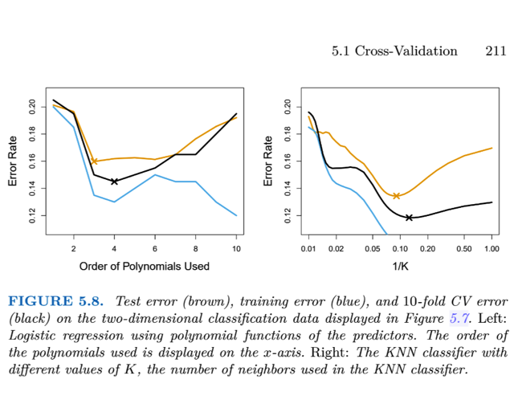</kbd>

<kbd></kbd>

 

### Cuối cùng là người ta cũng thử với KNN model, để cũng cho thấy với các `1/K` tăng

> [!NOTE]
> Cuối cùng là người ta cũng thử với KNN model, để cũng cho thấy với các `1/K` tăng
> dần (K ở đây là thông số K của KNN, số neighbors, K càng nhỏ, thì `1/K` càng lớn tức
> mức flexibility càng tăng) thì biểu hiện của `train/cv/test` cũng tạo hai mô tuýp như trên
> (cv, test tạo chữ U, training thì đi xuống hoài khi flexibility tăng)
>
> Và \**mức flexible giúp cv result thấp nhất\** cũng \**TƯƠNG ỨNG VỚI MỨC FLEXIBILITY
> GIÚP TEST ERROR THẤP NHẤT\**, cho thấy có thể dùng nó để tuning hyperparam K của 
> KNN

 

