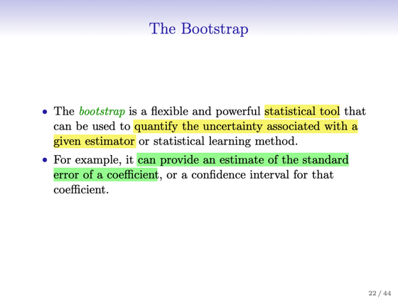
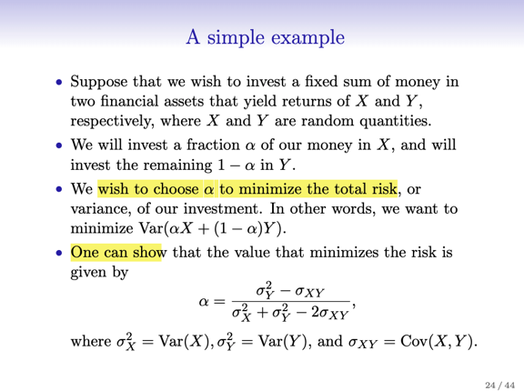
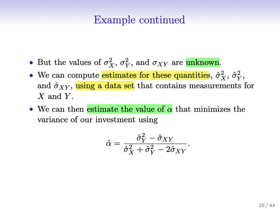
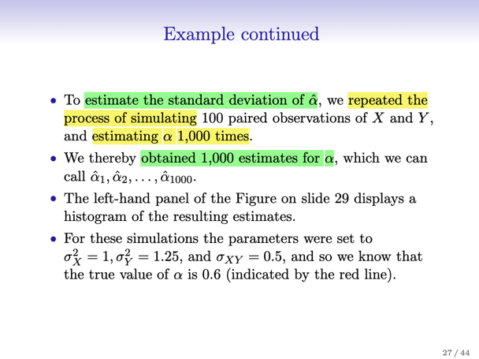
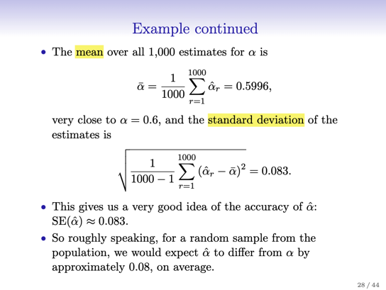
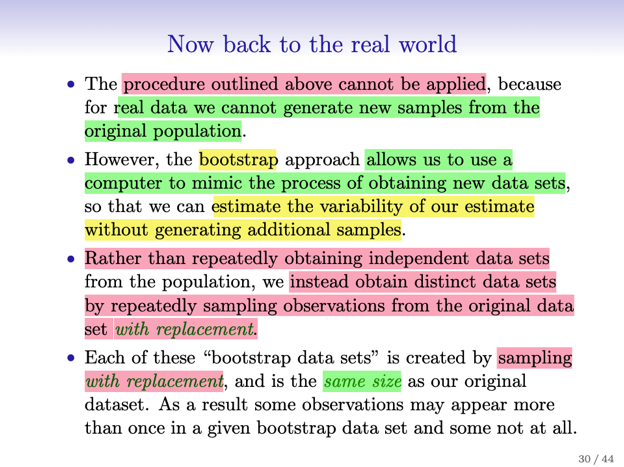
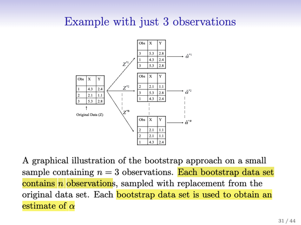
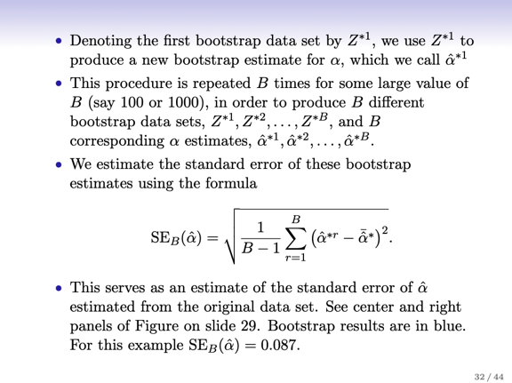
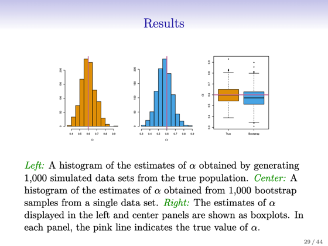

# 5.2 The Bootstrap

📊 **Progress:** `0` Notes | `18` Screenshots

---

## The Bootstrap

 

### Đại khái là ta sẽ thảo luận về một \\*công cụ giúp đánh giá Standard Error\\* rất hữu

> [!NOTE]
> Đại khái là ta sẽ thảo luận về một \**công cụ giúp đánh giá Standard Error\** rất hữu
> ích.
>
> Nói chung là người ta đề ra bài toán là \**tính ra cách (tỉ lệ / fraction) phân bổ tài sản
> vào hai loại đầu tư là X và Y\**: alpha*X và (1-alpha)Y (kiểu như có 100 triệu, muốn
> dành 0.7 (70% phần trăm vào chứng khoán), 0.3 (30%) vào trái phiếu.
>
> Thì bài toán đặt ra là\**làm sao tính được alpha giúp giảm thiểu mức biến động của
> tài sản\** khi mà hai loại đầu tư X và Y có mức biến động khác nhau (variability)
>
> Thế thì, đại khái là người ta chứng minh được rằng, nếu dùng công thức (*) thì sẽ là
> giá trị của alpha khiến đáp ứng được nhiệm vụ nói trên. Có điều trong công thức đó,
> ta \**cần có variance của X, Y Var(X), Var(Y)\**, và \**covariance của X, Y Cov(X,Y)\**.
> Mà điều này, là \**KHÔNG THỂ\**, vì ta không có giá trị chính xác của các thông số
> này, bởi đây là những \**POPULATION PARAMS\** - là những thông số thật sự đứng
> sau quy luật của dữ liệu, mà ta như đã nói ở chương 2, ta không biết.
>
> Bởi vậy ta mới \**sử dụng dữ liệu mà ta có ước lượng ra các population parameters\**
> này. Var^(X), Var^(Y), Cov^(XY) để estimate ra alpha^.
>
> Câu hỏi đặt ra là, \**làm sao để đánh giá chất lượng của estimated alpha này, hay nói
> cách  khác, làm sao biết cái công thức / phương pháp tính alpha^ trên là đúng
>
> \**Thế thì như bài toán linear regression ta đã gặp câu hỏi này, làm sao để đánh giá
> chất lượng của estimated beta - các coefficient gắn với các predictor sau khi fit mô
> hình linear regression.
>
> Thì một công cụ ta có chính là \**standard error.\**

<kbd></kbd>

<kbd></kbd>

<kbd></kbd>

<kbd></kbd>

<kbd></kbd>

<kbd></kbd>

 

### Thế thì để đánh giá công thức ước lượng của  alpha, người ta mới dùng máy tính để

> [!NOTE]
> Thế thì để đánh giá công thức ước lượng của  alpha, người ta mới dùng máy tính để
> \**GENERATE 1000 DATASET KHÁC NHAU\** (đương nhiên từ cùng một quy luật, true
> population parameters). Và \**dùng công thức trên để estimated các alpha^\**.
>
> Để rồi ta sẽ \**tính trung bình các estimated alpha\** - tức là\**ESTIMATED MEAN\**, sau
> đó dùng giá trị này để\**tính variance của estimated alpha\** (bình phương difference
> giữa các estimated alpha^ và estimated mean, tổng lại hết và chia cho N
> - 1, nói chung là trung bình các bình phương khoảng cách giữa estimated alpha và
> estimated mean, nhưng chia cho N-1 thay vì N để có unbias result)
>
> Thế thì đại khái là kết quả, cho thấy,\**estimated mean\** alpha_bar \**khác biệt rất ít\** đối
> với true population mean (bởi đang dùng \**simulated data nên ta biết true alpha,\** tính
> bởi công thức với các Var(X), Var(Y), Cov(XY) mà ta biết giá trị thật sự)
>
> Và \**STANDARD ERROR RẤT NHỎ (0.083)\**, cho thấy công thức estimate alpha thật
> sự hữu ích. (Chú ý ở đây không phải nói về công thức đó, mà chỉ dùng bài toán này để
> nói về Bootstrap - công cụ giúp ta ước lược được standard error)
>
> Thế thì vấn đề đặt ra, là nếu mà trong một bài toán thực tế khác, đương nhiên ta\**ĐÂU
> THỂ TỰ TẠO RA NHIỀU BỘ DATA TỪ TRUE POPULATION DISTRIBUTION\** để từ đó
> có các  estimated alpha và tính  ra estimated standard error được.

<kbd></kbd>

<kbd></kbd>

<kbd></kbd>

<kbd></kbd>

 

### Thế thì tới đây mới nói đến \\*BOOTSTRAP\\*, nó cho phép K\\*HÔNG CẦN (VÌ CŨNG

> [!NOTE]
> Thế thì tới đây mới nói đến \**BOOTSTRAP\**, nó cho phép K\**HÔNG CẦN (VÌ CŨNG
> KHÔNG THỂ) GENERATE RA NHIỀU BỘ DATA TỪ TRUE POPULATION để  mà
> dùn\**g chúng \**estimate ra nhiều alpha^\** và để rồi dùng chúng tính \**estimated
> standard error.\**
>
> Mà thay vào đó, ta \**chỉ cần DÙNG MỖI MỘT BỘ DUY NHẤT DATA BAN ĐẦU\**, như
> vầy:
>
> Đại khái là ta sẽ \**SAMPLING WITH REPLACEMENT\** (túc là sampling với cách thức
> cho phép sample có thể xuất hiện nhiều lần trong một bộ sample) các subset có n (=
> size của original dataset) sample. Và \**dùng mỗi subset này để mà estimate alpha^_i\**
>
> Rồi ta sẽ dùng công thức này (**) để estimate standard error.
>
> Kết quả cho thấy estimated standard error trong cách làm này (0.087 )\**CŨNG RẤT SÁT
> VỚI STANDARD ERROR ESTIMATED TỪ VIỆC GENERATE NHIỀU BỘ DATA\** ở trên
> (0.083). Điều này rõ ràng là rất hữu ích, giúp ta \**CHỈ CẦN DÙNG ORIGINAL DATA
> \**vẫn \**có thể có estimated standard error.\**
>
> Lưu ý, nhớ rằng ta đang nói vai trò của Bootstrap giúp ta estimated được standard
> error, chứ không liên quan gì cách estimate alpha, bởi estimate alpha chỉ việc dùng
> công thức hồi nãy, nhưng vấn đề là làm sao chứng minh rằng công thức đó tốt  nếu như
> ta không thể generate nhiều dataset khác nhau  để mà có nhiều estimated alpha khác
> nhau để rồi từ đó tính estimated SE. Thì chính Bootstrap giúp giải quyết vấn đề này,

<kbd></kbd>

<kbd></kbd>

<kbd></kbd>

<kbd></kbd>

<kbd></kbd>

<kbd></kbd>

<kbd></kbd>

<kbd></kbd>

 

