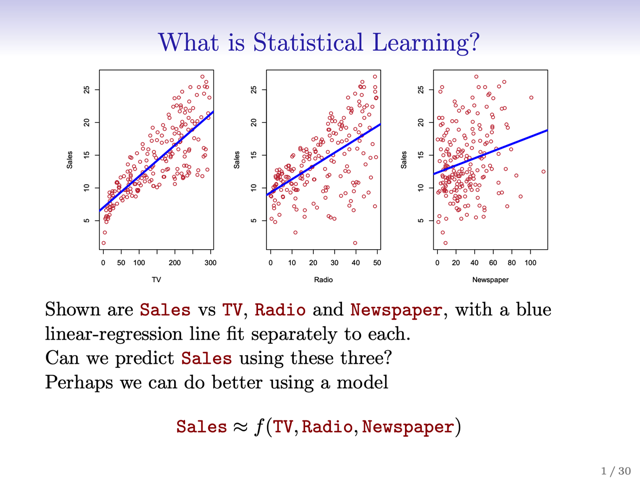
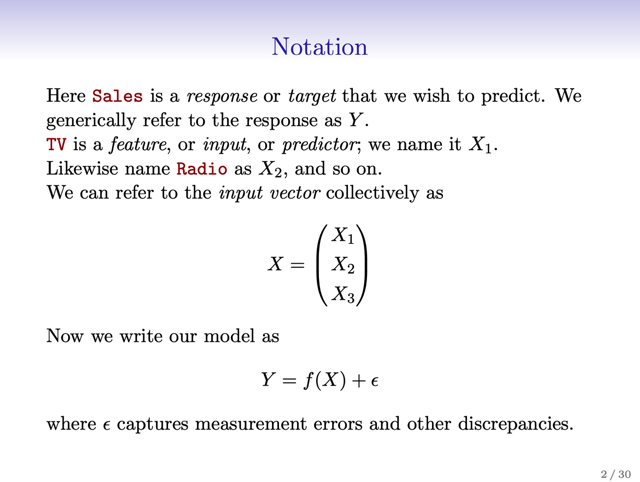
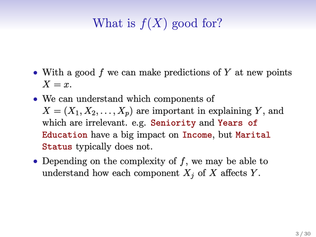
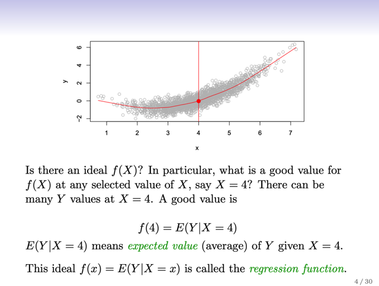
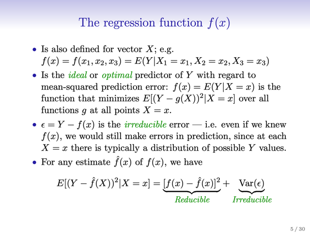
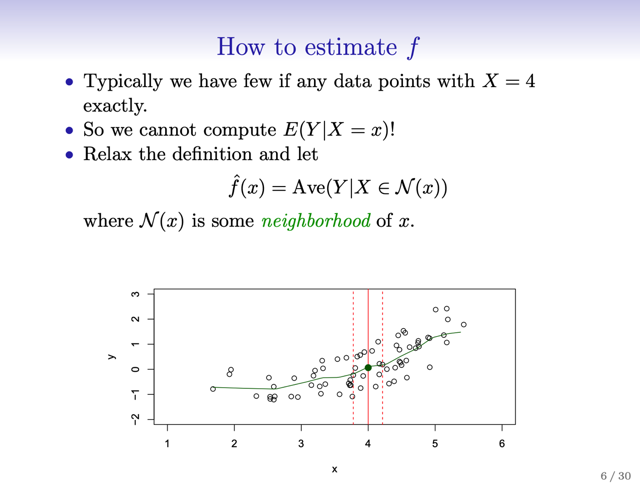

# Introduction To Regression

📊 **Progress:** `8` Notes | `6` Screenshots

---
<a id="node-8"></a>

<p align="center"><kbd></kbd></p>

> [!NOTE]
> Đại khái là lấy ví dụ dataset này, 3 biểu đồ là plot Sales theo budget các kênh
> quảng cáo khác nhau. Đường màu xanh là linear `-` regression line fit trên các
> dataset

<br>

<a id="node-9"></a>

<p align="center"><kbd></kbd></p>

> [!NOTE]
> Một số notation như đã biết. Thế thì ta sẽ viết mô hình dưới dạng equation:
>
> Y `=` f(X) `+` eps mang ý nghĩa là biểu diễn giá trị của response Y là một
> f**unction của các predictors**, cộng với một**sai số eps không phụ thuộc
> predictors** nhằm **bù đắp cho mọi sai khác** mà f(X) chưa map chính xác với Y
> được
>
> Thì những sai khác cover bởi eps là để bù đắp cho các **SAI SỐ ĐO ĐẠC**
> và CÁC **YẾU TỐ KHÁC** KHIẾN F(X) **KHÔNG NẮM BẮT ĐƯỢC HOÀN
> TOÀN CHÍNH XÁC QUY LUẬT CỦA Y**

<br>

<a id="node-10"></a>

<p align="center"><kbd></kbd></p>

<br>

<a id="node-11"></a>

<p align="center"><kbd></kbd></p>

> [!NOTE]
> đại khái là, gs đặt vấn đề giả sử ta có scatter plot biểu thị các `X-Y` như trong
> hình. Và trên cơ sở là ta cho rằng mình sẽ muốn mô hình hóa quy luật của Y
> bằng f(X) `+` eps ở trên, trong đó hàm f(X) sẽ cố gắng dự đoán chính xác giá trị
> của Y từ các predictor X, hay nói cách khác, nó sẽ cố gắng nắm bắt quan hệ
> giữa Y và X.
>
> Câu hỏi đặt ra là, nếu f(X) là lý tưởng (**ideal** function) thì `f(X=4)` nên là bao
> nhiêu?
>
> Thế thì theo gs, theo dữ liệu, tại X `=` 4, ta có nhiều giá trị Y, nhưng f(4) đương
> nhiên chỉ được có một giá trị. Vậy thì một giá trị tốt có thể được chọn là T**RUNG
> BÌNH CỦA CÁC GIÁ TRỊ Y TẠI X `=` 4**. Thể hiện bởi f(4) `=` `E(Y|X=4)`  (*theo gs
> Expectation chỉ là **cách nói bóng bẩy** của Trung bình)
>
> Vậy, từ đó, nếu với các giá trị khác của Y, ta cũng lấy hàm f(X) theo cách này,
> tức là trung bình của các Y tại đó.
>
> THÌ ĐÓ CHÍNH LÀ **IDEAL FUNCTION** F(X) `-` VÀ ĐƯỢC GỌI LÀ
> **REGRESSION FUNCTION**

<br>

<a id="node-12"></a>

<p align="center"><kbd></kbd></p>

> [!NOTE]
> tiếp, gs mở rộng ra bối cảnh nếu có nhiều predictor, thì tương tự, ideal f(X) cũng
> ```text
> nên là hàm số sao cho tại f(X=[x1,x2,x3]) = E[Y|X=[x1,x2,x3]]
> ```
>
> Thế thì ta có thể chứng minh được rằng: 
>
> **IDEAL FUNCTION `E[Y|X]` CHÍNH LÀ FUNCTION GIÚP MINIMIZE 
> `E[(Y-g(X))^2` | X=x]**"khi xem xét" mọi function g(x) tại mọi điểm X `=` x****(tạm thời chấp nhận, phần chứng minh sẽ nằm trong **Element of Statistical 
> Learning**,  ta sẽ học tới khi hoàn thành Stat110)
>
> Thế thì ngay cả khi ta có ideal function f(X), rõ ràng ta vẫn sẽ không map X được 
> hết với Y, vì trong dataset, tại X `=` x có nhiều giá trị của Y. Do đó sẽ luôn có sai số 
> giữaideal function f(X) và Y. Đặt là eps `=` Y `-` f(X). Và đây gọi là **IRREDUCIBLE 
> ERROR**
> Vậy thì gọi **f^(X)** là **ESTIMATED CỦA IDEAL FUNCTION f(X)**, ta có thể (*) triển 
> khai 
> để thấy:
>
> **E[(Y-f^(X))^2 | `X=x]` `=` [f(x) `-` f^(x)]^2 `+` Var(eps)**Thì trong đó [f(x) `-` f^(x)]^2 là phần có thể giảm thiểu còn `Var(eps)` thì không
>
> *ĐỢI STAT110 SẼ QUAY LẠI ĐÂY
>
> Thế thì, câu hỏi đặt ra là **làm sao để estimate f(X), tức tìm f^(X)**

> [!NOTE]
> CHỜ KIẾN THỨC VỀ EXPECTATION CỦA STAT110, QUAY LẠI SAU

> [!NOTE]
> VÀ ĐÂY CHÍNH LÀ LÍ DO NÓI EPS LÀ **ZERO MEAN ERROR**Bởi vì nếu ta có IDEAL FUNCTION F(X) (CÒN GỌI LÀ REGRESSION FUNCTION)
> Theo định nghĩa f(X) `=` `E[Y|X).` Nên:
>
>
> ```text
> Từ Y = f(X) + eps  => eps = Y - f(X).
> ```
>
> Lấy kì vọng **có điều kiện** `E[.|X]` hai vế:
>
> ```text
> E[eps|X] = E[Y - f(X) | X] = (theo tính chất tuyến tính của expectation)
> ```
>
> `E[eps|X]` `=` `E[Y|X]` `-` **E[f(X)|X]** `<=>` 
>
> ```text
> E[eps|X] = E[Y|X] - f(X) = f(X) - f(X) = 0
> ```
>
> Lấy kì vọng **không điều kiện** của eps:
>
> **E[eps] `=` E[E[[eps|X]** `=` `E[0]` `=` 0**CHỨNG MINH XONG
>
> (*) Ở ĐÂY TẠM XÀI HAI KIẾN THỨC LIÊN QUAN ĐẾN CONDITIONAL EXPECTATION
> SẼ HỌC TRONG STAT110: 
>
> i) `E[f(X)|X]` `=` f(X))
>
> ii) `E[eps]` `=` E[E[[eps|X]**

> [!NOTE]
> CHỜ KIẾN THỨC VỀ CONDITIONAL EXPECTATION CỦA STAT110,
> QUAY LẠI SAU

<br>

<a id="node-13"></a>

<p align="center"><kbd></kbd></p>

> [!NOTE]
> Để trả lời câu hỏi đặt ra là làm sao để estimate f(X), tức tìm f^(X), ta cần  nhớ lại ở
> trên ta đã định nghĩa **IDEAL FUNCTION F(X), GỌI LÀ REGRESSION
> FUNCTION, được**xác định **là function mà `f(X=x)` `=` E[Y|X=x):** giá trị khi input
> X `=` x sẽ là giá trị TRUNG BÌNH của các Y tại `X=x` (trong dataset, tại X `=` x, có
> nhiều giá trị Y)
>
> Thế thì tuy định nghĩa như vậy, nhưng nếu dùng nó để "VẼ RA" regression
> function của bộ dataset như trong hình thì ta sẽ thấy rằng: KHÔNG PHẢI TẠI X
> NÀO CŨNG CÓ CÁC DATA POINT, nên không thể tính trung bình của Y "tại đó
> được" vì có điểm nào đâu mà tính. Ví dụ trong hình, tại X `=` 4, không có điểm dữ
> liệu nào cả. Thế thì sẽ không tính được `f(X=4).`
>
> Để khắc phục, người ta nghĩ ra cách khác, ta **NỚI LỎNG** ĐỊNH NGHĨA RA,
> THAY VÌ DÙNG TRUNG BÌNH CỦA Y TẠI **CHÍNH XÁC `X=` x**, thì người ta dùng
> **TRUNG BÌNH CỦA Y TẠI MỘT SET LÂN CẬN N(x)**
>
> ```text
> Ví dụ để tính f(X=4), thay vì dùng E[Y|X=4], thì ta tính E[Y|X thuộc N(4)] và N(4)
> ```
> chỉ các điểm dữ liệu QUANH MỨC `X=4,` khi đó, khả năng có điểm dữ liệu sẽ cao
> hơn và có thể tính f(X)
>
> Trong slide đường màu xanh lá cây là regression function tính theo kiểu này

<br>

