# Lec 10: Curve Sketching

📊 **Progress:** `28` Notes | `30` Screenshots

---

<kbd>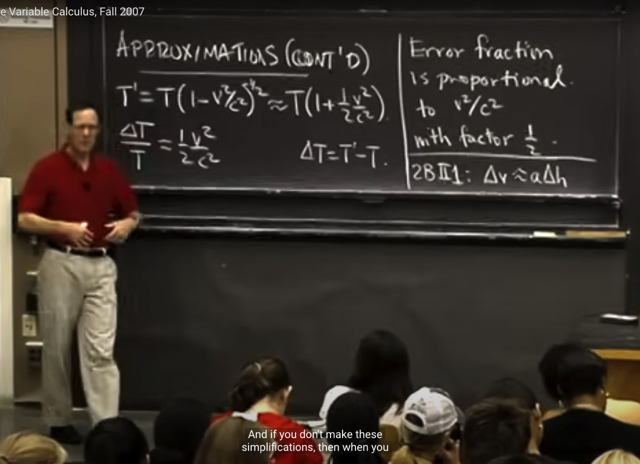</kbd>

> [!NOTE]
> Mở đầu bài giảng đại ý gs lướt lại ví dụ bữa trước, về bài toán kĩ
> thuật liên quan đến thời gian trên đồng hồ của nguời ở dưới đất và
> thời gian trên vệ tinh, lệch nhau. Thông qua một phương trình T' =
> T(1-v^2/c^2)^-1/2. Và dùng linear approximation ta có thể  approx T'
> ~=T(1+v^2/2c^2).
>
> Thế thì nay gs nói tiếp, từ đó ta có thể thấy delta_T/T (=(T'-T)/T)
> v^2/2c^2 và con số này rất nhỏ, thể hiện error fraction (sự lệch thời
> gian tương đối) rất nhỏ. Nên có thể bỏ qua được.
>
> Và ý của gs là, trong thực tế, người ta dùng rất nhiều linear
> approximation hay quadratic approximation để đơn giản hoá quan hệ
> của các yếu tố. Và việc dùng cách ước lượng nào có ảnh hưởng của
> yếu tố kinh nghiệm. Giống như người ta có thể thử nghiệm và thấy
> nếu dùng quadratic approx thì tốt hơn linear approx nhưng dùng bậc
> 3 hay cao hơn thì useless

 

<kbd>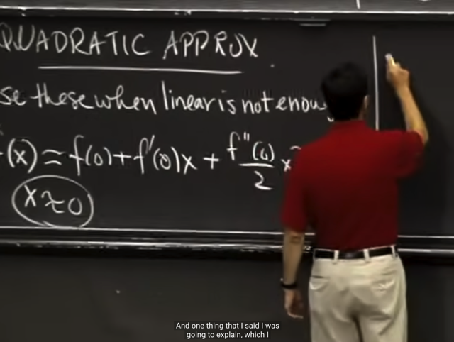</kbd>

> [!NOTE]
> Thế thì bài trước ta cũng đã học về quadratic approximation, gs cho biết
> thêm, nó sẽ được dùng khi linear approximation không đủ.
>
> Công thức của nó thì ta đã biết, đó là thêm một quadratic term vào
> linear approximation:
>
> Tại x~=0, f(x) ~= f(0) + f'(0)x + f''(0)x^2/2

 

<kbd>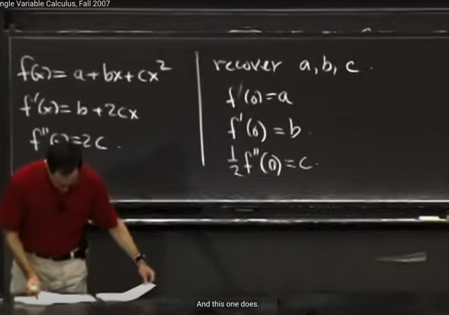</kbd>

> [!NOTE]
> Gs giải thích ta có thể hiểu đại khái tại sao lại cần 1/2. Bằng cách
> xét function f(x) = a + bx + cx^2
>
> Ý chính là, giả sử ta có function này, parabola, thế thì giả sử ta có
> các 1st, 2nd derivative của nó là b+2cx, 2c. Thì nếu mà muốn
> quadratic approx  lại nó thì ta sẽ dùng công thức nào. Ý là, nếu ta
> có f'(x) và f''(x) thì dùng công thức nào để cho ra lại f(x) (vì nếu
> approx tốt thì trong trường hợp function gốc là hàm bậc 2 a + bx +
> cx^2 thì việc quadratic approx sẽ phải cho ra lại function đó.
>
> Vậy nếu mà approx = (1) + (2)x + (3)x^2 thì (1) sẽ là f(0) = a, (2) sẽ 
> là f'(0) = b và (3) sẽ PHẢI LÀ (1/2)*f''(0) thì mới ra c.

 

<kbd>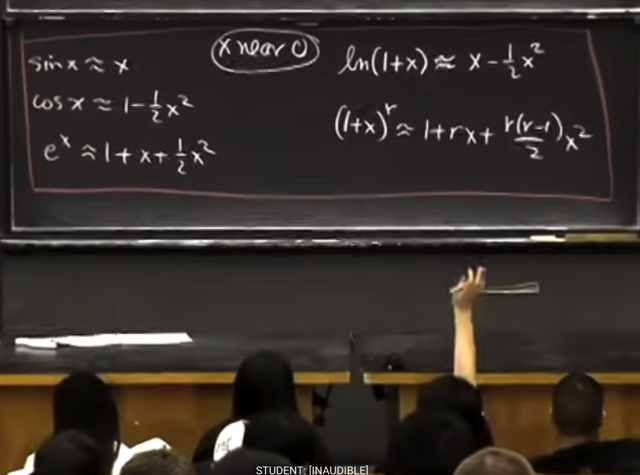</kbd>

> [!NOTE]
> Đại khái là gs viết lại việc quadratic approximation với một số
> function hay dùng như sin(x), cos(x), e^x, ln(1+x), (1+x)^r.

 

<kbd>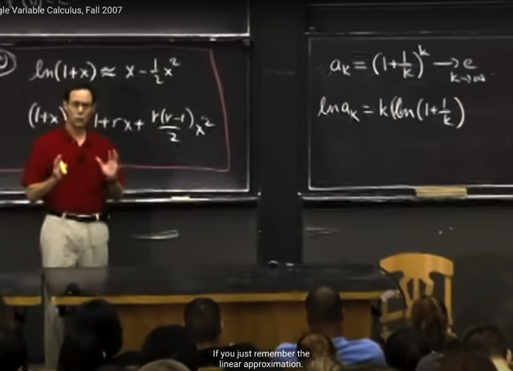</kbd>

> [!NOTE]
> Thế thì gs nói lại bài toán này, trong các bài trước ta đã chứng
> minh rằng (1+1/k)^k sẽ -> e khi k -> infinity
>
> Cách làm bữa trước đó là ta sẽ lấy natural log:
>
> ln(ak) = k*ln(1+1/k). Và tìm limit của ln(ak)
>
> Có thể làm lại để nhớ như sau: lim k->inf của k*ln(1+1/k)
>
> - Ta sẽ đặt 1/k = ∆x, thì khi k -> inf, ∆x sẽ -> 0.
>
> limit cần tìm trở thành lim ∆x->0 của ln(1+∆x)/∆x
>
> - Trừ đi cho 0 = ln(1) (ta nhớ e^0 = 1, nên ln(e^0) = ln(1) <=> 
> 0*ln(e) = ln(1) <=> 0 = ln(1)):
>
> limit cần tính trở thành lim ∆x->0 của [ln(1+∆x)-ln(1)]/∆x
>
> Và cái này, có dạng lim ∆x->0 của ∆f/∆x với f(x) = ln(x) và
> đó chính là định nghĩa của derivative f'(x), và chính xác hơn thì
> đó chính là derivative của ln(x) tại x = 1, tức f'(1).
>
> Và ln'(x) đã chứng minh = 1/x, nên kết quả của limit là 1/1 = 1
>
> Vậy ln [lim ban đầu cần tìm] = 1 => limit ban đầu = e^1 = e

 

<kbd>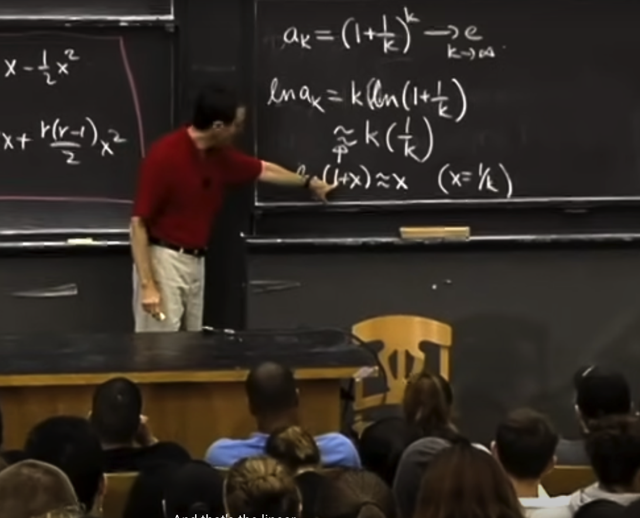</kbd>

> [!NOTE]
> Thế thì bài này gs sẽ giải nó theo cách khác, dùng linear
> approximation
>
> Đầu tiên ông dựa vào công thức linear approx: ln(1+x) ~= x khi x~=0
> để có ln(1+1/k) ~=k
>
> Từ đó ln(ak) ~= k*(1/k) = 1

 

<kbd>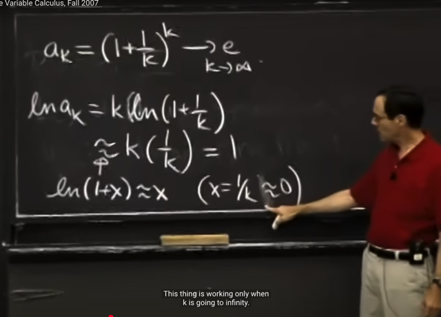</kbd>

> [!NOTE]
> Và ông nhấn mạnh, linear approximation ln(1+x) ~= x chỉ đúng
> khi x~=0
>
> Thì trong trường hợp này, khi k->infinity thì 1/k->0 khi do đó
> 1/k~=0 cho phép ta dùng linear approximation trên
>
> Và again, lim ln(ak) = 1 nên exponential hai vế ta có lim ak = e^1 = e

 

<kbd>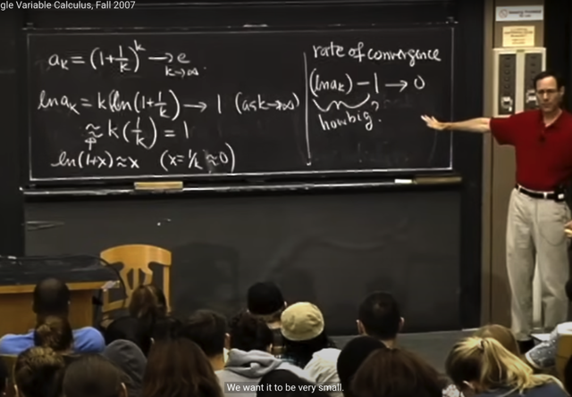</kbd>

> [!NOTE]
> Thế thì, tới đây ta gặp khái niệm "rate of convergence" (tốc độ hội tụ)
> thể hiện bằng ln(ak) - 1, đương nhiên có thể hiểu khi k->inf thì như
> đã chứng minh ln(ak) -> 1, vậy cái hiệu giữa chúng sẽ nhỏ lại dần
> về 0, và ta quan tâm rằng việc nó nhỏ về 0 nhanh chậm như thế nào
> mà theo gs là thể hiện qua ln(ak) - 1 lớn nhỏ ra sao

 

<kbd>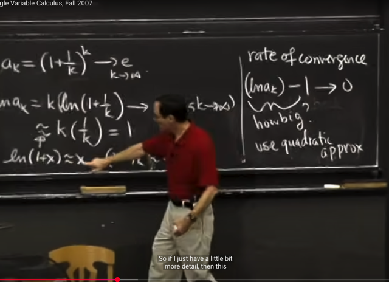</kbd>

> [!NOTE]
> Và ta có thể dùng quadratic approximation để tìm hiểu
>
> Và đây là nội dung trong problem set

 

<kbd>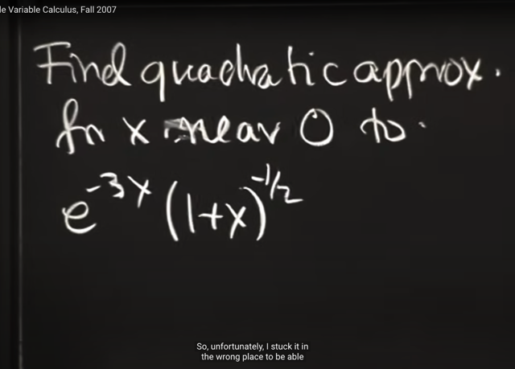</kbd>

> [!NOTE]
> Ta sẽ qua ví dụ này, tìm quadraric approx
> khi x~=0 của e^-3x*(1+x)^-1/2

 

<kbd>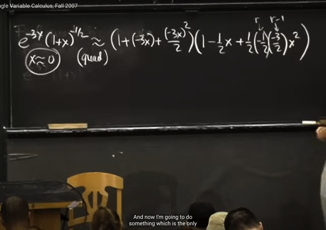</kbd>

> [!NOTE]
> Áp dung quadratic approx formula:
>
> f(x) ~= f(0) + f'(0)x + f''(0)x^2/2 (x~=0)
>
> Với e^-3x, 
>
> f'(x) = (d/dx) e^-3x = d e^(-3x) / d(-3x) * d (-3x) / dx = e^-3x * -3 = -3*e^(-3x)
>
> f''(x) = (d/dx) -3*e^(-3x) = -3 * (d/dx) e^-3x = -3 * [-3*e^(-3x)] = 9*e^-3x
>
> e^-3x ~= e^-3*0 + -3*e^(-3*0)*x + [9*e^-3*0]*x^2/2
>
> = 1 - 3x + 9x^2/2.
>
> Thật ra gs ghi e^-3x ~= như vậy thì gs đang coi như e^u, với u = -3x
> thì e^u ~= e^0 + (e^u)'(0)*u + (e^u)''(0)*u^2/2 = 1 + e^0*u + (e^0)*u^2/2
> = **1 + (-3x) + (-3x)^2/2 cũng là 1 - 3x + 9x^2/2**Tương tự
>
> (1+x)^-1/2 thì f(x) = 1+x thì f(0) = 1, f'(x) = (-1/2)(1+x)^(-3/2), f'(0) = -1/2
>
> f''(x) = (-1/2)(-3/2)(1+x)^(-5/2) => f''(0) = **(-1/2)(-3/2)**Từ đó**(1+x)^-1/2 ~= 1 + (-1/2)x + (-1/2)(-3/2)x^2/2**

 

<kbd>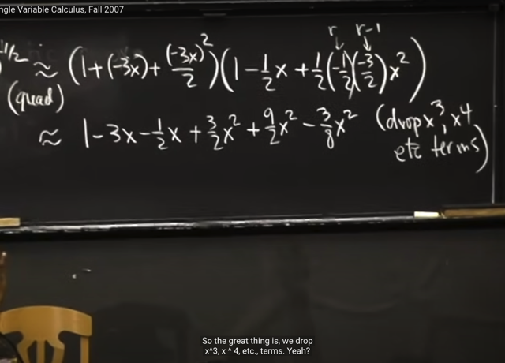</kbd>

> [!NOTE]
> Thế thì, tiếp theo, ta sẽ nhân phân phối (distributive law) vào, nhưng
> gs nói đại ý là, cái lợi của việc ta đang dùng quadratic approximation
> đó là ta chỉ care  (giữ lại) các quadratic term bậc 2 trở xuống. Còn cao
> hơn thì bỏ đi

 

<kbd>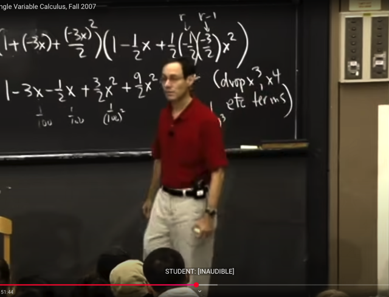</kbd>

> [!NOTE]
> Câu hỏi là tại sao lại bỏ đi các higher order term.
>
> Gs trả lời rằng, vì ta đang quadratic approximation, như đã biết, bởi vì ta
> đang cho rằng ta làm việc với x rất nhỏ ~= 0, ví dụ 1/100 (vì khi đó mới
> cho phép dùng công thức quadratic approximation tại x=0).
>
> Vậy thì việc ta bỏ đi các higher order term, chính là, ta đang lấy gần
> đúng bằng cách chỉ dùng kết quả đến số thập phân thứ 4 thôi, ví  dụ x.
> **1234, và bỏ đi các số thập phân sau đó**

 

<kbd>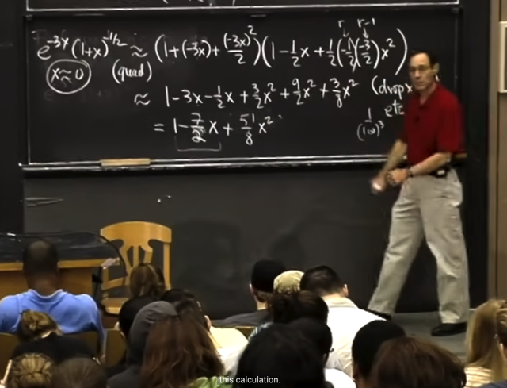</kbd>

> [!NOTE]
> Kết quả là so với bữa trước ra 1-7x/2 thì ta có thêm 51x^2/8
>
> và gs nói đương nhiên so với linear approx thì ta luôn thấy nó
> phức tạp hơn

 

<kbd>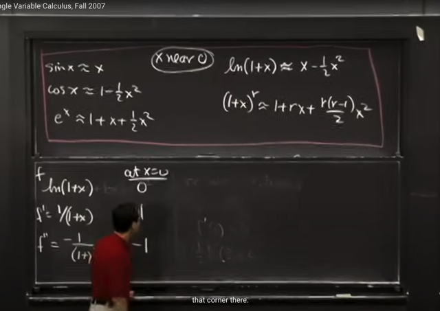</kbd>

> [!NOTE]
> Tiếp gs, derive để cho thấy tại sao quadratic approx của ln(1+x) ~= x -
> x^2/2.
>
> Dễ hiểu là với f = ln(1+x) thì f' = 1/(1+x), f'' = -1/(1+x)^2 và nên f'(0) = 1,
> f''(0) = -1.
>
> Do ráp vào công thức quadratic approx f(x) ~= f(0) + f'(0)x + f''(0)x^2 thì
> ta có:
>
> ln(1+x)~= 0 + 1*x -1*x^2/2 = x - x^2/2

 

<kbd>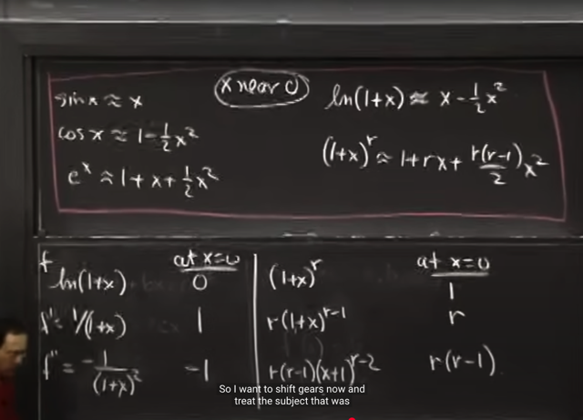</kbd>

> [!NOTE]
> Tương tự cũng dễ hiểu
> khi làm cho (1+x)^r

 

<kbd>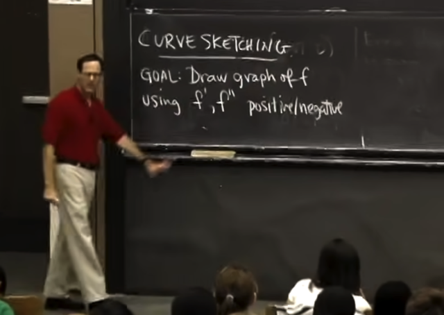</kbd>

> [!NOTE]
> Ta sẽ qua CURVE SKETCHING
>
> Mục đích sẽ là, vẽ hàm f sao bằng cách dùng f', f''. Cụ thể là dựa
> trên việc chúng positive hay negative

 

<kbd>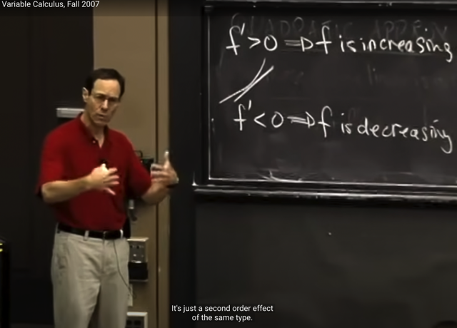</kbd>

> [!NOTE]
> Đầu tiên, ta sẽ nhận định rằng nếu f' dương, tức là hàm f đang
> tăng lên và ngược lại f' < 0, đồng nghĩa hàm f đang giảm (đương
> nhiên ta hiểu khi nói f' > 0, thì ý là derivative tại một điểm nào đó
> hoặc trong một interval nào đó của x)

 

<kbd>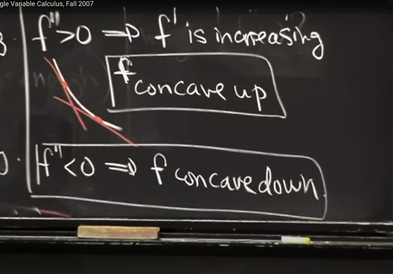</kbd>

> [!NOTE]
> Tiếp, nếu f''>0, có nghĩa là độ dốc của hàm số đang tăng lên, và
> hình ảnh minh họa là hàm f tuy vẫn đang giảm nhưng độ dốc của nó
> ngày càng bớt âm hơn, tức là đang bớt dốc hơn. Gs gọi nó là f
> **concave up**
>
> Ngược lại nếu f''<0, có nghĩa là độ dốc của hàm số đang giảm bớt,
> gọi là**f concave down**

 

<kbd>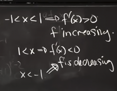</kbd>

<kbd></kbd>

<kbd>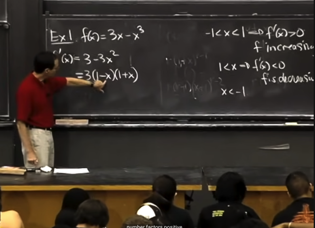</kbd>

> [!NOTE]
> Lấy ví dụ này, f(x) = 3x - x^3. f'(x) dễ thấy là 3-3x^2, ta thấy có thể
> factor thành 3(1-x)(1+x).
>
> Từ đó gs phân tích dấu của f' trong 3 đoạn:
>
> với x từ -1 tới 1, dễ thấy f' luôn dương -> f tăng. Ngược lại khi x bé
> hơn -1 hay lớn hơn 1 thì f' âm -> f giảm

 

<kbd>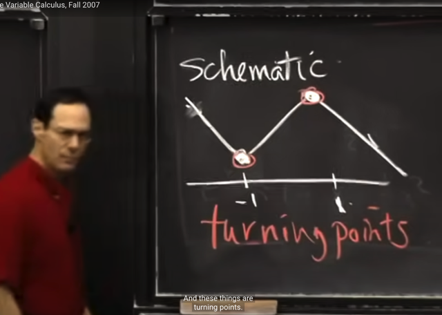</kbd>

> [!NOTE]
> Từ đó ta có thể phác thảo đồ thị hàm f như vầy, trong khoảng
> -1:1, hàm f tăng, ngoài khoảng đó hàm f giảm. Thì tại x=-1, và
> x=1, là điểm mà hàm số f đổi chiều. Gs gọi là turning points

 

<kbd>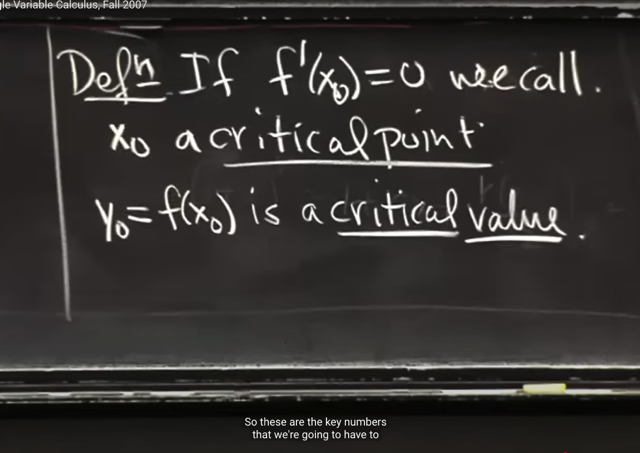</kbd>

> [!NOTE]
> Và đó chính là điểm mà tại đó f'(x0) = 0. Được gọi là CRITICAL
> POINT và giá trị tại đó gọi là CRITICAL VALUE
>
> Và đúng là bằng cách cho f'(x0) = 0, ta sẽ giải ra x0 = +/- 1
> trong ví dụ này

 

<kbd>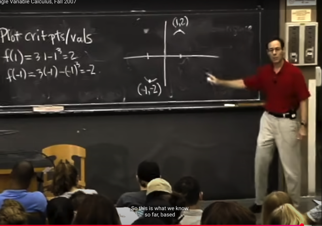</kbd>

> [!NOTE]
> Thế thì, gắn +/-1 vào, ta có f(1) = 2, f(-1) = -2
>
> Và vẽ hai điểm nó lên đồ thị. 
>
> Gs cho rằng, tại đây ta biết ĐƯỢC HAI ĐOẠN CỦA FUNCTION TẠI
> VÙNG GẦN HAI ĐIỂM NÀY SẼ LÀ NHƯ VẦY, vì ta đã biết khi đi qua
> đó, hàm sẽ chuyển từ "đang giảm" thành "tăng lên" (đối với (-1,-2))
> và từ tăng thành giảm ở điềm (1, 2).

 

<kbd>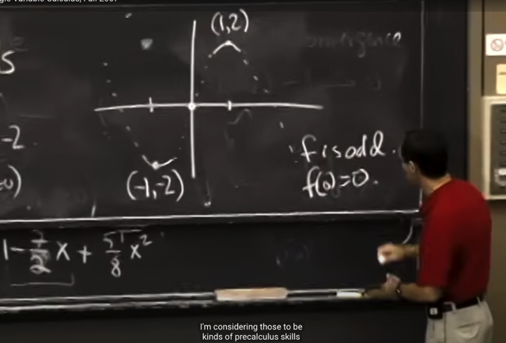</kbd>

> [!NOTE]
> Gs cho rằng đồ thị có thể như vầy, và ta sẽ tìm cách hoàn thành nó.
> Nhưng  ta có nhận định f là hàm lẻ nên f(x) = -f(-x). Và có đi qua O vì
> f(0) = 0

 

<kbd>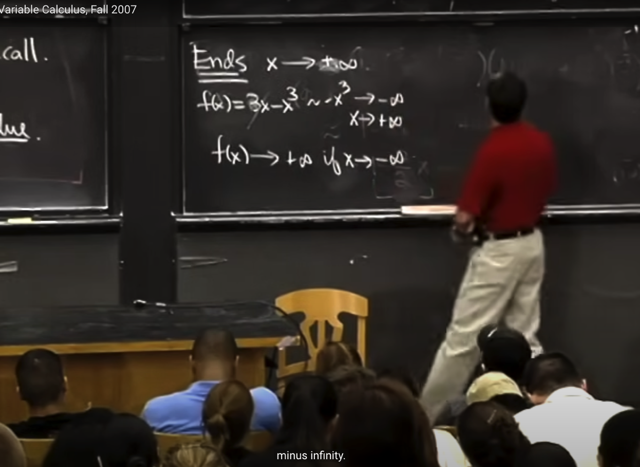</kbd>

> [!NOTE]
> đại khái là bằng cách check lim f(x) tại -inf, và inf ta sẽ biết f(x)
> sẽ -> -inf khi x->inv và f(x)->-inf khi x->inf
>
> lim 3x-x^3 khi x->inf ta hiểu rằng tuy 3x sẽ -> inf, nhưng -x^3 sẽ -> -inf 
> nhanh hơn, nên 3x-x^3 sẽ -> -inf. Tương tự với khi x->-inf

 

<kbd>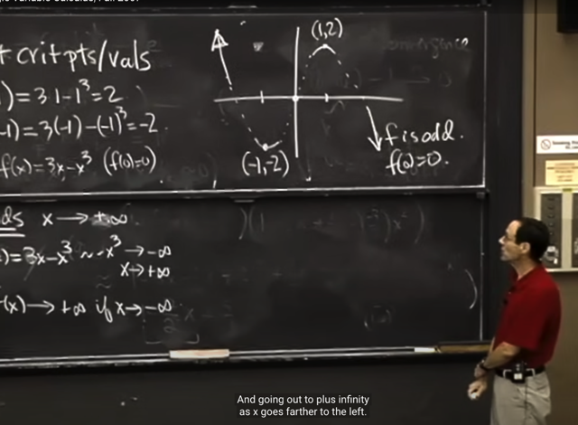</kbd>

> [!NOTE]
> Từ đó ta có thể vẽ thêm hai cái đuôi của đồ thị, vì ta biết rằng nó sẽ
> kéo lên inf và đâm xuống -inf (chứ không phải đi ngang)

 

<kbd>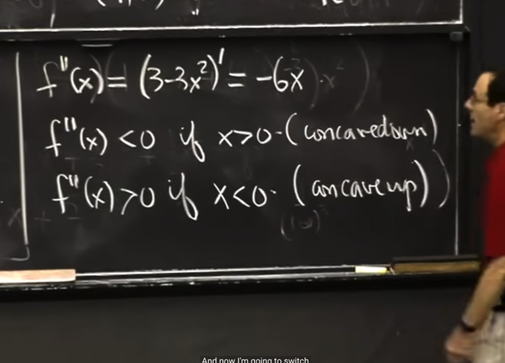</kbd>

> [!NOTE]
> Tiếp, ta sẽ dùng f'', để thấy nó sẽ concave down khi x < 0 và
> concave up khi x>0. Và tại O chính là điểm mà hàm số từ concave
> down chuyển thành concave up

 

<kbd>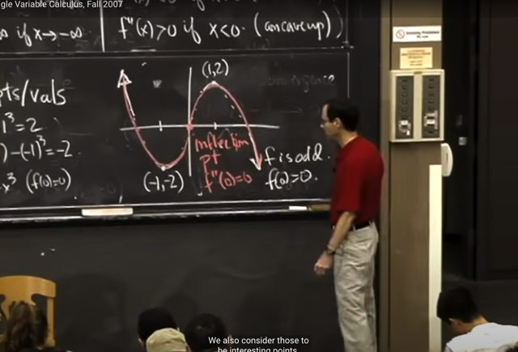</kbd>

> [!NOTE]
> Nhờ đó ta sẽ vẽ
> hàm số f như vầy

 

