# Lec 11: Max-min

📊 **Progress:** `30` Notes | `30` Screenshots

---
<a id="node-230"></a>

<p align="center"><kbd>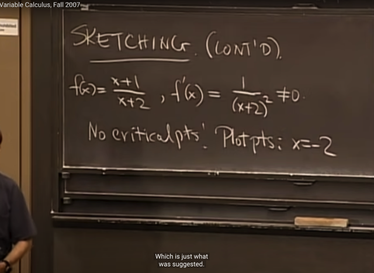</kbd></p>

> [!NOTE]
> đại khái là ta tiếp tục vấn đề CURVE SKETCHING với hàm f(x)
> ```text
> = (x+1)/(x+2)
> ```
>
> Gs cho rằng ta có thể dễ dàng tính ra f'(x) `=` `1/(x+2)^2` để thấy nó luôn
> khác 0 với mọi x, từ đó suy ra f không có critical point
>
> Từ đó, gs nói rất nhiều sinh viên tới đây sẽ kết luận rằng functon
> không có critical points, nên không biết làm thế nào nữa.
>
> Thế thì cái ta sẽ làm là ta sẽ phải tìm hiểu điều gì xảy ra tại điểm mà
> function không xác định, trong trường hợp này đó là tại `x=-2`

<br>

<a id="node-231"></a>

<p align="center"><kbd>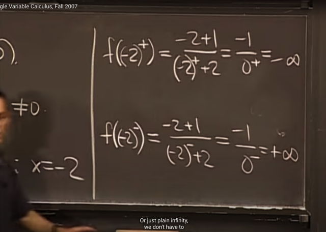</kbd></p>

> [!NOTE]
> Tiếp theo, ta sẽ evaluate f tại `(-2)^+,` ta sẽ có `-infinity` và f tại
> `(-2)^-1` ta sẽ có `+infinity`

> [!NOTE]
> Thật ra cách thể hiện `f((-2)+)` chỉ là đồng nghĩa với limit f(x)
> ```text
> khi x->(-2)+ (chính là cái gọi là right-hand limit)
> ```

<br>

<a id="node-232"></a>

<p align="center"><kbd>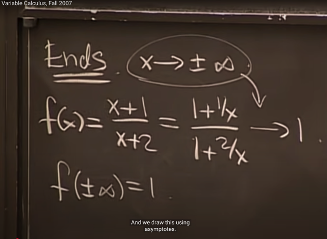</kbd></p>

> [!NOTE]
> ```text
> Thế thì ta sẽ tìm limit của f(x) khi x -> +/- inf, theo cách làm này gs
> ```
> ```text
> chia tử và mẫu cho x, để rồi khi x -> inf thì 1/x -> 0, khiến f(x) -> 1
> ```
>
> ```text
> Gs cho rằng có thể ghi là f(+/- inf) = 1
> ```

<br>

<a id="node-233"></a>

<p align="center"><kbd>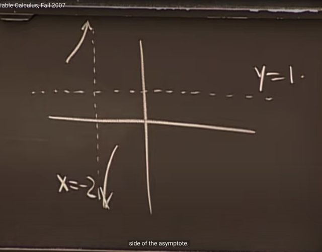</kbd></p>

> [!NOTE]
> Và từ đó, ta sẽ có thể vẽ đồ thị của f như này: khi `x->-2` từ bên
> ```text
> trái, hàm f sẽ -> +inf, và khi x -> -2 từ bên phải, hàm f sẽ -> -inf
> ```

<br>

<a id="node-234"></a>

<p align="center"><kbd>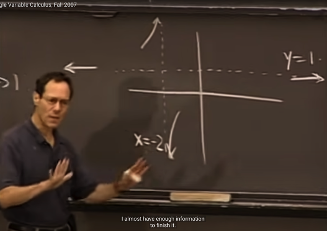</kbd></p>

> [!NOTE]
> ```text
> Và từ  limit của f khi x->+/- inf đều bằng 1, ta có thể biết
> ```
> hàm số sẽ tiệm cận 1 khi kéo dài ra hai đầu

<br>

<a id="node-235"></a>

<p align="center"><kbd>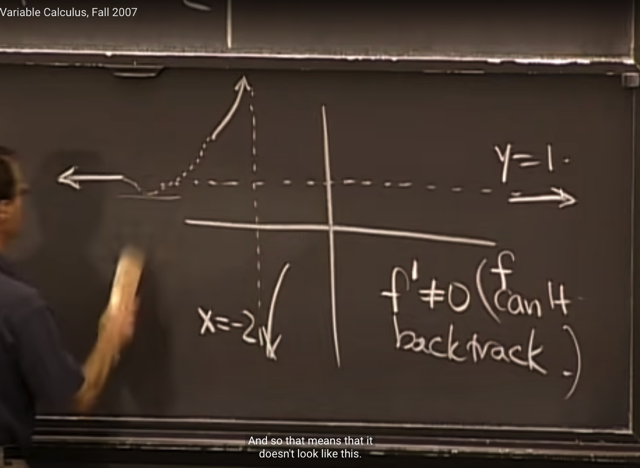</kbd></p>

> [!NOTE]
> Tiếp, gs hỏi rằng, thế thì cái đoạn ở giữa, làm sao ta biết hàm số
> không đi vòng xuống dưới rồi vượt lên trên lại trước khi tiệm cận
> 1.
>
> Thì đó là bởi ta có f' khác 0, không có critical point, nên không thể
> có chuyện đó được vì nếu như vậy sẽ có điểm khiến độ dốc tiếp
> tuyến nằm ngang tức f' `=` 0

<br>

<a id="node-236"></a>

<p align="center"><kbd>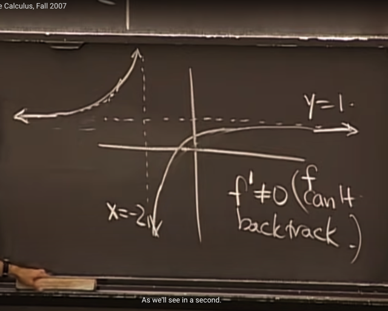</kbd></p>

> [!NOTE]
> Từ đó cho ta kết luận dạng của
> đồ thị hàm f sẽ như vầy

<br>

<a id="node-237"></a>

<p align="center"><kbd>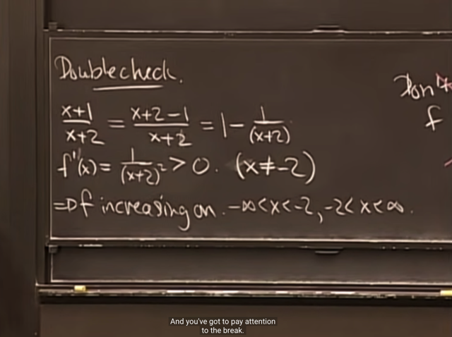</kbd></p>

> [!NOTE]
> Đại khái là ta sẽ doublecheck, tính f'(x) ra bằng `1/(x+2)^2`
> (thật ra lúc đầu gs đã nói kết quả f' sẽ là vậy rồi), mục đích
> chính là cho thấy f' dương nên hàm số luôn tăng
>
> Nhưng gs lưu ý là, ta phải hiểu rõ là nó tăng trong hai khoảng
> ```text
> riêng biệt: -inf:-2 và -2:inf, và undefined tại -2
> ```

<br>

<a id="node-238"></a>

<p align="center"><kbd>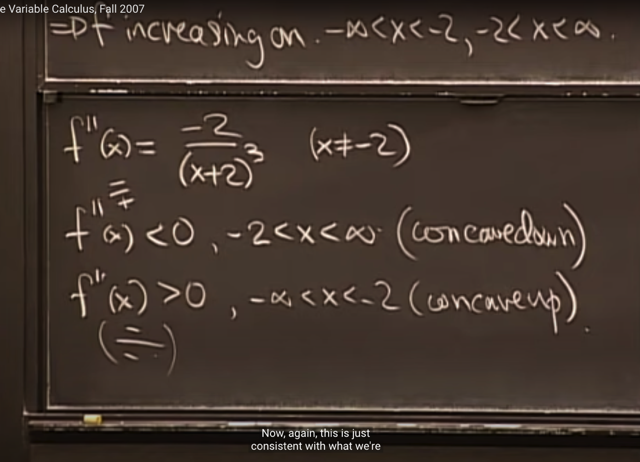</kbd></p>

> [!NOTE]
> ```text
> Tiếp, ta xem xét f''(x) = -2 / (x+2)^3, để nhận định rằng: khi x
> ```
> từ `-2:inf` thì f''(x) luôn âm (vì khi đó mẫu số dương, còn tử thì
> `=` `-2` âm rồi)
>
> Từ đó có thể kết luận khi x từ `-2` đến inf, hàm f luôn concave down
> (tức là mặt lõm hướng lên). Và ý nghĩa của f'' ta đã biết là độ dốc
> của độ dốc, và nó âm chứng tỏ hàm số f ngày càng bớt dốc `-` có thể
> thấy rõ là khi đi từ `-2` đến inf, ngày càng bớt dốc.
>
> Tương tự, khi x từ `-inf` đến `-2` thì f'' dương `->` đồ thị hàm f concave
> up (lõm hướng xuống).

<br>

<a id="node-239"></a>

<p align="center"><kbd>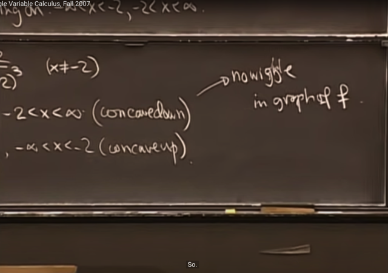</kbd></p>

> [!NOTE]
> Tuy nhiên gs nhấn mạnh, một thông tin quan trọng nữa mà cái này
> mang lại cho ta đó là: KHÔNG CÓ CHUYỆN WIGGLE `-` tức là ta biết
> chắc đường hàm số sẽ đi mượt mà để tạo một "vòng cung" (lõm lên
> và lõm xuống), chứ không thể có những đoạn cong qua cong lại
> được. Vì nếu vậy, trong những đoạn đó, f'' sẽ đổi dấu

<br>

<a id="node-240"></a>

<p align="center"><kbd>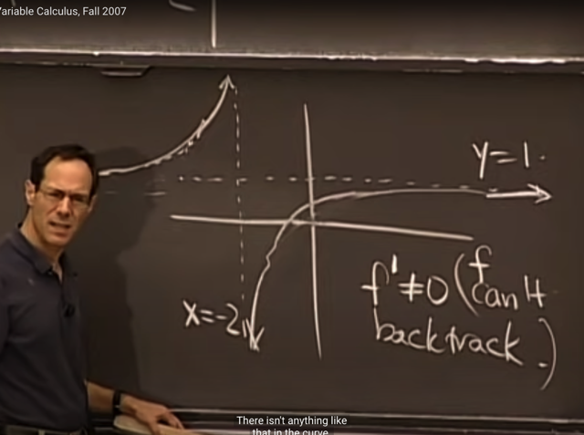</kbd></p>

<br>

<a id="node-241"></a>

<p align="center"><kbd>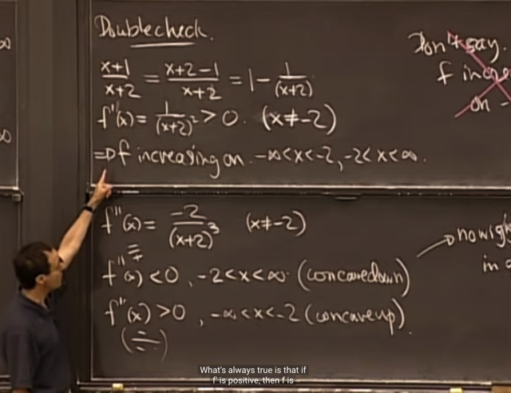</kbd></p>

> [!NOTE]
> Student: Có phải khi f' dương (positive derivative) thì đồng nghĩa với
> function increasing không?
>
> gs: Không. Nếu f' dương thì ta suy ra hàm increase. Nhưng ngược lại
> thì chưa chắc, vì có hàm increasing nhưn f' có thể `=` 0 ở vài chỗ

<br>

<a id="node-242"></a>

<p align="center"><kbd>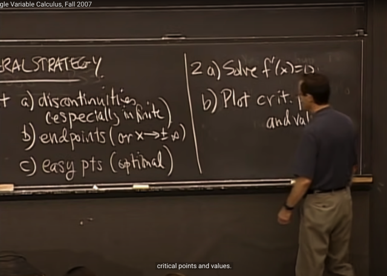</kbd></p>

> [!NOTE]
> gs summarize lại các bước mà ta sẽ làm Curve Sketching:
>
> 1) là plot các điểm đặc biệt như 1) discontinuity (như tại điểm mà function
> ```text
> infinite - không xác định), hoặc 2) endpoints (khi x-> +/- infinity) và c) các
> ```
> điểm easy point (như cắt trục x, y)
>
> 2) Sau đó là tìm critical point bằng cách solve f'(x) `=` 0 và plot chúng

<br>

<a id="node-243"></a>

<p align="center"><kbd>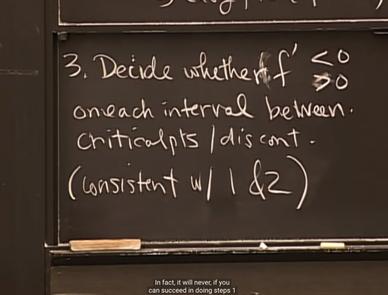</kbd></p>

> [!NOTE]
> 3) Dựa vào f' dương hay âm mà ta sẽ xác định f increasing `/`
> decreasing trong mỗi interval giữa critical points và discontinuity
>
> Gs lưu ý ta nên chú ý bước 3 nên được coi như bước checking,
> vì nếu làm sai ở 1) và 2), ta sẽ thấy có vấn đề ở bước 3

<br>

<a id="node-244"></a>

<p align="center"><kbd>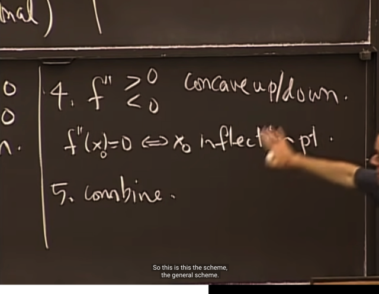</kbd></p>

> [!NOTE]
> Bước 4, ta sẽ dựa vào f'' để xem tính chất concave up `/`
> down. Cũng như tìm điểm mà tại đó f''(x) `=` 0 , gọi là
> INFLECTION POINTS

<br>

<a id="node-245"></a>

<p align="center"><kbd>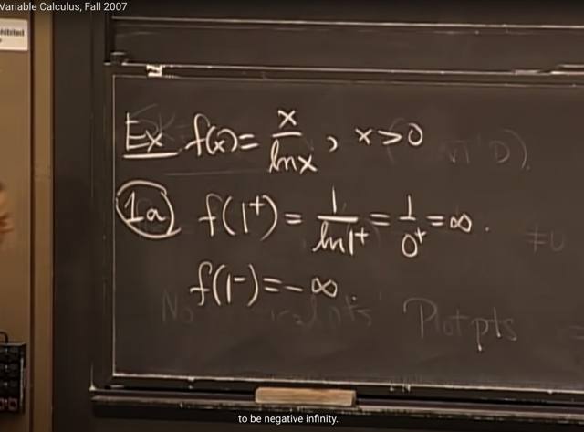</kbd></p>

> [!NOTE]
> Tiếp ví dụ này, f(x) `=` x `/` ln(x).
>
> Theo scheme trên, bước 1 ta sẽ xem xét f tại các điểm đặc biệt, quan
> trọng nhất là discontinuity; ở đây hàm f sẽ ko xác định khi ln(x) `=` 0,
> tức x `=` 1.
>
> Nên ta sẽ xem `f(1+),` chính là notation mang ý nghĩa tính limit của f(x) 
> khi `x->1+` (định nghĩa là right hand limit đã học)
>
> ```text
> Kết quả là khi x ->1+, ln(x) -> 0, và kết quả là x / ln(x) -> infinity
> ```
>
> Và `f(1-)` `=` `-inf`

<br>

<a id="node-246"></a>

<p align="center"><kbd>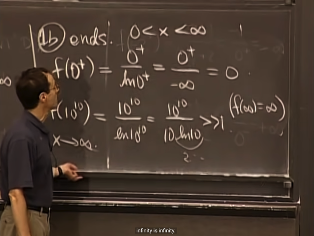</kbd></p>

> [!NOTE]
> Tiếp là check endpoints. vì ln(x) chỉ xác định khi x dương, nên ta 
> sẽ check hai endpoints là `x->0+`
>
> ```text
> f(0+) = 0+ / ln(0+) = 0+ / -inf = 0 (vì một số chia cho infinity thì sẽ ra
> ```
> rất nhỏ dù là dấu âm hay dương, nên coi như bằng 0
>
> Còn f(inf) gs cho rằng có thể lấy con số rất lớn để xem thử, ví dụ
> 10^10 thế vào thì có thể thấy tử số là 10^10, còn mẫu số chỉ cỡ 2
> trăm mấy (vì ln (10^10) `=` 10*ln(10). Từ đó có thể thấy tử lớn hơn
> mâũ rất nhiều lần, giúp ta kết luận f(inf) `=` inf

<br>

<a id="node-247"></a>

<p align="center"><kbd>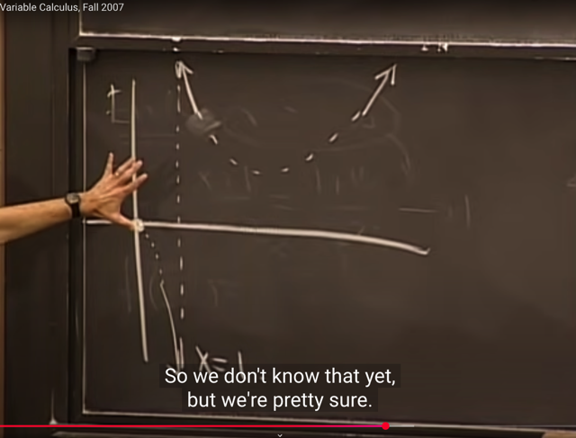</kbd></p>

> [!NOTE]
> ```text
> Đại khái là dựa trên bước 1a: f(1+) = inf (f -> inf khi x->1+, tức tới
> ```
> ```text
> gần 1 từ bên phải) và f(1-) = -inf (f->-inf khi x->1-, tức tiến tới gần 1
> ```
> từ bên trái) và `f(0+)` `=` 0 cũng như f(inf) `=` inf ta có thể expect dạng
> của f sẽ như vầy

<br>

<a id="node-248"></a>

<p align="center"><kbd>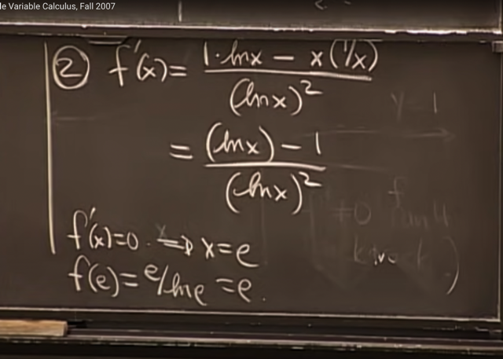</kbd></p>

> [!NOTE]
> Tiếp, bước 2 ta sẽ tìm critical points bằng cách solve f'(x) `=` 0 dựa
> ```text
> vào quotient rule: (u/v)' = [u'v - uv'] / v^2 ta sẽ có f' như vầy, và
> ```
> giải ra `x=e` sẽ là critical point (giá trị tại đó f(e) gọi là critical point value)

<br>

<a id="node-249"></a>

<p align="center"><kbd>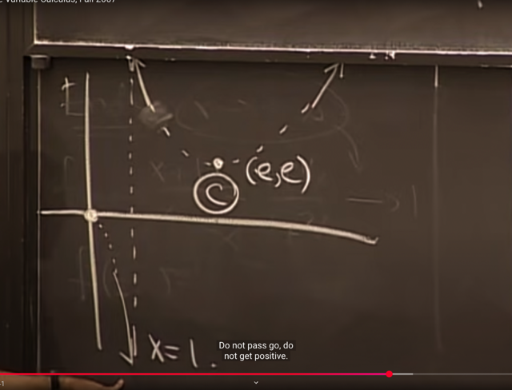</kbd></p>

> [!NOTE]
> Từ đó ta vẽ được critical point và ông kí hiệu là C.
>
> Và gs cho rằng vì ta chỉ có 1 critical point nên ta sẽ đã có thể
> hoàn thiện đồ thị hàm f

<br>

<a id="node-250"></a>

<p align="center"><kbd>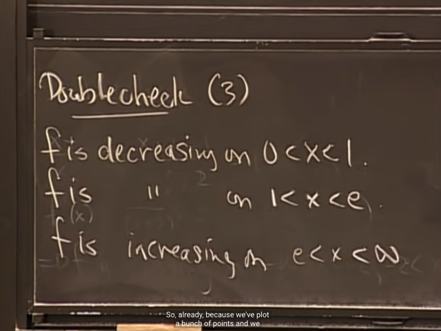</kbd></p>

> [!NOTE]
> Đại khái là, ta sẽ double check, bằng cách xem xét dấu của f'(x)
> xem có phải như ta dự đoán rằng nó sẽ giảm trong khoảng (0,1)
> và (1,e) và tăng trong khoảng (e, infinity) không

<br>

<a id="node-251"></a>

<p align="center"><kbd>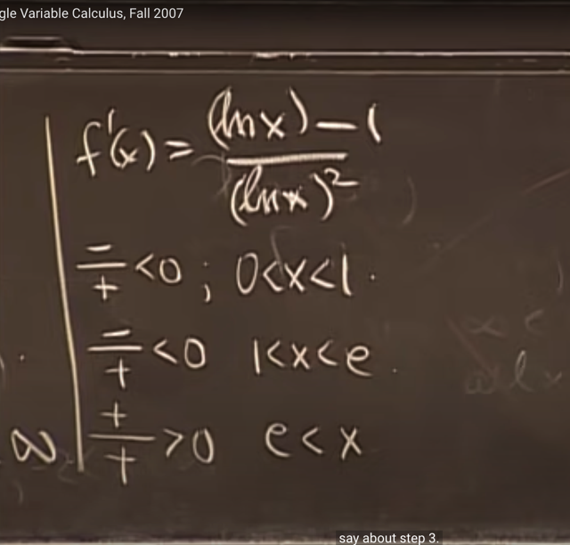</kbd></p>

> [!NOTE]
> Và quả thật ta có thể
> confirm điều này

<br>

<a id="node-252"></a>

<p align="center"><kbd>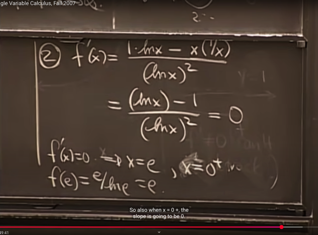</kbd></p>

> [!NOTE]
> đại khái là, gs quay lại đây, để nói rằng, ta đã miss một case nữa
> mà f'(x) `=` 0. Đó là khi mà ln(x) `->` infinity (đồng nghĩa khi `x->0)` vì
> khi đó f'(x) cũng sẽ `=` 0

<br>

<a id="node-253"></a>

<p align="center"><kbd>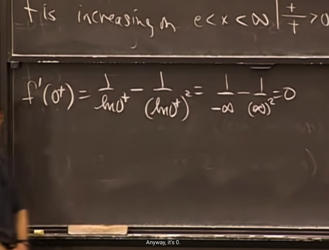</kbd></p>

> [!NOTE]
> Có thể thấy điều này rõ hơn bằng cách thể hiện f'(x) ở dạng `1/ln(x)` 
> ```text
> - 1/ln(x)^2 (thì khi ln(x)->infinity thì cả hai đều -> 0
> ```

<br>

<a id="node-254"></a>

<p align="center"><kbd>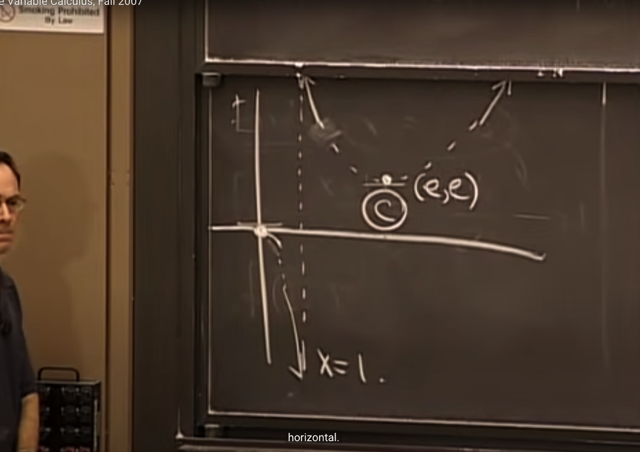</kbd></p>

> [!NOTE]
> Để rồi ta thấy đồ thị khi bắt đầu tại 0 sẽ đi
> ngang trước khi đâm xuống `-infinity`

<br>

<a id="node-255"></a>

<p align="center"><kbd>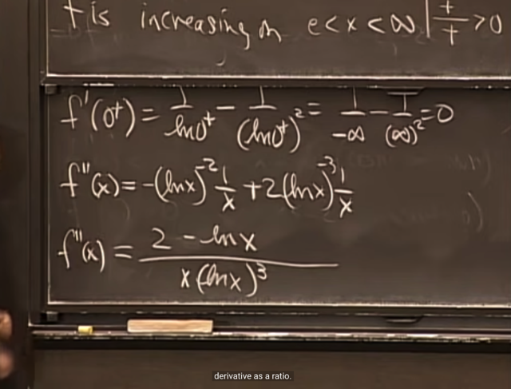</kbd></p>

> [!NOTE]
> Tiếp theo gs xem xét f''(x)
>
> Cũng không khó hiểu, dùng chain rule và ln'(x) `=` `1/x`
> ta sẽ ra kết quả này

<br>

<a id="node-256"></a>

<p align="center"><kbd>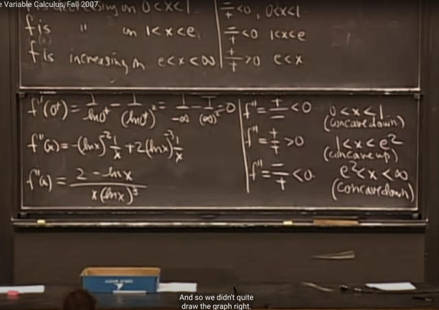</kbd></p>

> [!NOTE]
> Để từ đó ta sẽ xét dấu của f''(x) để thấy trên khoảng (0,1) và
> (e^2, inf), f'' âm, f concave down. Còn trên khoảng (1, e^2),
> f''(x) dương, hàm f concave up

<br>

<a id="node-257"></a>

<p align="center"><kbd>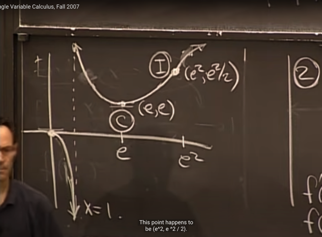</kbd></p>

> [!NOTE]
> Từ đó ta biết dạng đồ thị f ở nhánh (1, inf) thật ra có hai phần,
> một phần concave up (mặt lõm hướng lên) từ (1, e^2) và qua
> điểm đó đồ thị sẽ concave down (vẫn đi lên infinity nhưng nó sẽ
> giảm dần độ dốc)

<br>

<a id="node-258"></a>

<p align="center"><kbd>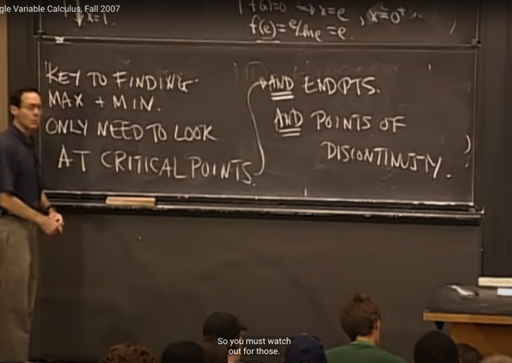</kbd></p>

> [!NOTE]
> Thế thì nếu ta chỉ cần tìm max `/` min, thì gs cho rằng ta không
> cần làm toàn bộ các bước `curve-sketching.`
>
> Mà chỉ cần xem xét CRITICAL POINTS VÀ ENDPOINTS CŨNG
> NHƯ DISCONTINUITY POINTS

<br>

<a id="node-259"></a>

<p align="center"><kbd>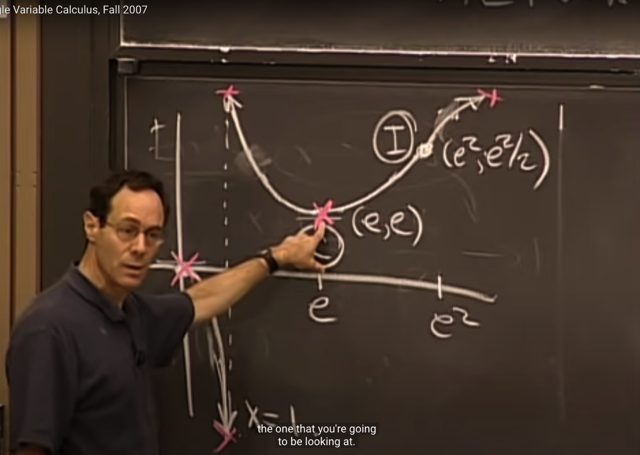</kbd></p>

> [!NOTE]
> Và theo đó thì ví dụ này sẽ có 5 điểm ta cần xem xét.
> Và ta sẽ tiếp tục ở bài kế tiếp.

<br>

